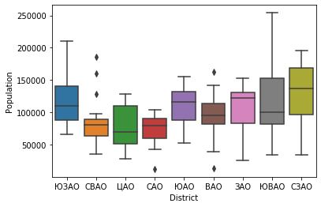
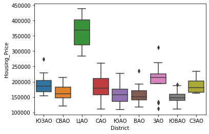
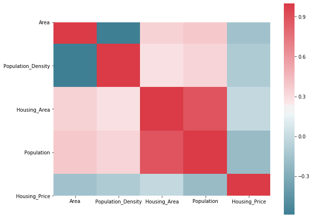
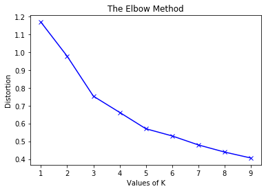
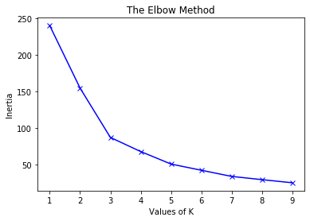
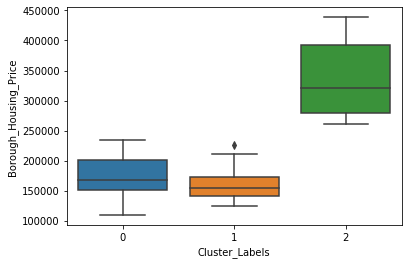
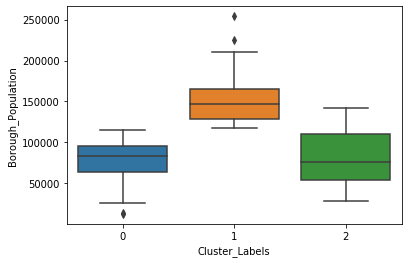

## <center> Block 2. Data analysis </center>


```python
import pandas as pd 
import folium
from folium.plugins import HeatMap
import numpy as np 
from sklearn.preprocessing import StandardScaler
from sklearn.cluster import KMeans
from scipy.spatial.distance import cdist 
import matplotlib.pyplot as plt 
import matplotlib.cm as cm
import matplotlib.colors as colors
import seaborn as sns
from scipy import stats
```


```python
Moscow_Borough_df = pd.read_csv("Moscow_Borough_df.csv")
Moscow_venues_df = pd.read_csv("Moscow_venues_df.csv")
mo_geojson = 'mo.geojson'
```

Working with potential features


```python
Moscow_Borough_Feature_list = ['Borough_Name', 'District_Name', 'Borough_Area', 'Borough_Population_Density', 'Borough_Housing_Area', 'Borough_Population', 'Borough_Housing_Price']
Moscow_Borough_Feature_df = Moscow_Borough_df[Moscow_Borough_Feature_list]
Moscow_Borough_Feature_df.columns = ['Borough', 'District', 'Area', 'Population_Density', 'Housing_Area', 'Population', 'Housing_Price']
Moscow_Borough_Feature_df.head(5)
```


<div>
<style scoped>
    .dataframe tbody tr th:only-of-type {
        vertical-align: middle;
    }

    .dataframe tbody tr th {
        vertical-align: top;
    }

    .dataframe thead th {
        text-align: right;
    }
</style>
<table border="1" class="dataframe">
  <thead>
    <tr style="text-align: right;">
      <th></th>
      <th>Borough</th>
      <th>District</th>
      <th>Area</th>
      <th>Population_Density</th>
      <th>Housing_Area</th>
      <th>Population</th>
      <th>Housing_Price</th>
    </tr>
  </thead>
  <tbody>
    <tr>
      <td>0</td>
      <td>Академический</td>
      <td>ЮЗАО</td>
      <td>5.83</td>
      <td>18874</td>
      <td>2467.0</td>
      <td>110038</td>
      <td>199999.0</td>
    </tr>
    <tr>
      <td>1</td>
      <td>Алексеевский</td>
      <td>СВАО</td>
      <td>5.29</td>
      <td>15242</td>
      <td>1607.9</td>
      <td>80634</td>
      <td>199474.0</td>
    </tr>
    <tr>
      <td>2</td>
      <td>Алтуфьевский</td>
      <td>СВАО</td>
      <td>3.25</td>
      <td>17752</td>
      <td>839.3</td>
      <td>57697</td>
      <td>138021.0</td>
    </tr>
    <tr>
      <td>3</td>
      <td>Арбат</td>
      <td>ЦАО</td>
      <td>2.11</td>
      <td>17207</td>
      <td>731.0</td>
      <td>36308</td>
      <td>438568.0</td>
    </tr>
    <tr>
      <td>4</td>
      <td>Аэропорт</td>
      <td>САО</td>
      <td>4.58</td>
      <td>17367</td>
      <td>1939.7</td>
      <td>79541</td>
      <td>234544.0</td>
    </tr>
  </tbody>
</table>
</div>


```python
Moscow_Borough_Feature_df.describe()
```


<div>
<style scoped>
    .dataframe tbody tr th:only-of-type {
        vertical-align: middle;
    }

    .dataframe tbody tr th {
        vertical-align: top;
    }

    .dataframe thead th {
        text-align: right;
    }
</style>
<table border="1" class="dataframe">
  <thead>
    <tr style="text-align: right;">
      <th></th>
      <th>Area</th>
      <th>Population_Density</th>
      <th>Housing_Area</th>
      <th>Population</th>
      <th>Housing_Price</th>
    </tr>
  </thead>
  <tbody>
    <tr>
      <td>count</td>
      <td>120.000000</td>
      <td>120.000000</td>
      <td>120.000000</td>
      <td>120.000000</td>
      <td>120.000000</td>
    </tr>
    <tr>
      <td>mean</td>
      <td>8.706417</td>
      <td>13477.566667</td>
      <td>1775.684167</td>
      <td>100188.700000</td>
      <td>190037.316667</td>
    </tr>
    <tr>
      <td>std</td>
      <td>4.927028</td>
      <td>5965.300074</td>
      <td>815.978445</td>
      <td>44012.960386</td>
      <td>66182.885601</td>
    </tr>
    <tr>
      <td>min</td>
      <td>2.110000</td>
      <td>563.000000</td>
      <td>69.900000</td>
      <td>12264.000000</td>
      <td>109421.000000</td>
    </tr>
    <tr>
      <td>25%</td>
      <td>5.395000</td>
      <td>9770.750000</td>
      <td>1244.450000</td>
      <td>72498.500000</td>
      <td>147339.000000</td>
    </tr>
    <tr>
      <td>50%</td>
      <td>7.680000</td>
      <td>13543.500000</td>
      <td>1709.450000</td>
      <td>94166.000000</td>
      <td>168172.500000</td>
    </tr>
    <tr>
      <td>75%</td>
      <td>10.282500</td>
      <td>17217.500000</td>
      <td>2206.600000</td>
      <td>127001.000000</td>
      <td>210978.000000</td>
    </tr>
    <tr>
      <td>max</td>
      <td>27.570000</td>
      <td>30479.000000</td>
      <td>4523.000000</td>
      <td>254142.000000</td>
      <td>438568.000000</td>
    </tr>
  </tbody>
</table>
</div>


Moscow Boroughs has non-uniform population from 12 264 people to 254 142 people.  
The average housing price varies from 109 421 rub/m²  to 438 568 rub/m².


```python
sns.boxplot(x="District", y="Population", data=Moscow_Borough_Feature_df)
```


    <matplotlib.axes._subplots.AxesSubplot at 0x1bbc5e65348>





```python
sns.boxplot(x="District", y="Housing_Price", data=Moscow_Borough_Feature_df)
```


    <matplotlib.axes._subplots.AxesSubplot at 0x1bbc624d788>





Boxplot above shows us that feature District can be a good predictor for Housing price

Correlation matrix:


```python
Moscow_Borough_Feature_corr = Moscow_Borough_Feature_df.corr()
f, ax = plt.subplots(figsize=(10, 8))
sns.heatmap(Moscow_Borough_Feature_corr, mask=np.zeros_like(Moscow_Borough_Feature_corr, dtype=np.bool), cmap=sns.diverging_palette(220, 10, as_cmap=True),
            square=True, ax=ax)
```


    <matplotlib.axes._subplots.AxesSubplot at 0x1bbc63a9248>





```python
Moscow_Borough_Feature_corr.head(5)
```


<div>
<style scoped>
    .dataframe tbody tr th:only-of-type {
        vertical-align: middle;
    }

    .dataframe tbody tr th {
        vertical-align: top;
    }

    .dataframe thead th {
        text-align: right;
    }
</style>
<table border="1" class="dataframe">
  <thead>
    <tr style="text-align: right;">
      <th></th>
      <th>Area</th>
      <th>Population_Density</th>
      <th>Housing_Area</th>
      <th>Population</th>
      <th>Housing_Price</th>
    </tr>
  </thead>
  <tbody>
    <tr>
      <td>Area</td>
      <td>1.000000</td>
      <td>-0.588640</td>
      <td>0.344188</td>
      <td>0.380155</td>
      <td>-0.154996</td>
    </tr>
    <tr>
      <td>Population_Density</td>
      <td>-0.588640</td>
      <td>1.000000</td>
      <td>0.283606</td>
      <td>0.335691</td>
      <td>-0.104140</td>
    </tr>
    <tr>
      <td>Housing_Area</td>
      <td>0.344188</td>
      <td>0.283606</td>
      <td>1.000000</td>
      <td>0.885345</td>
      <td>-0.016971</td>
    </tr>
    <tr>
      <td>Population</td>
      <td>0.380155</td>
      <td>0.335691</td>
      <td>0.885345</td>
      <td>1.000000</td>
      <td>-0.198325</td>
    </tr>
    <tr>
      <td>Housing_Price</td>
      <td>-0.154996</td>
      <td>-0.104140</td>
      <td>-0.016971</td>
      <td>-0.198325</td>
      <td>1.000000</td>
    </tr>
  </tbody>
</table>
</div>


Calculating the correlations between main parameters:


```python
pearson_coef, p_value = stats.pearsonr(Moscow_Borough_Feature_df['Area'], Moscow_Borough_Feature_df['Population'])
print("The Pearson Correlation Coefficient 'Area' to 'Population' is", pearson_coef, " with a P-value of P =", p_value)  

pearson_coef, p_value = stats.pearsonr(Moscow_Borough_Feature_df['Area'], Moscow_Borough_Feature_df['Population_Density'])
print("The Pearson Correlation Coefficient 'Area' to 'Population_Density' is", pearson_coef, " with a P-value of P =", p_value)

pearson_coef, p_value = stats.pearsonr(Moscow_Borough_Feature_df['Area'], Moscow_Borough_Feature_df['Housing_Price'])
print("The Pearson Correlation Coefficient 'Area' to 'Housing_Price' is", pearson_coef, " with a P-value of P =", p_value) 

pearson_coef, p_value = stats.pearsonr(Moscow_Borough_Feature_df['Housing_Area'], Moscow_Borough_Feature_df['Area'])
print("The Pearson Correlation Coefficient 'Housing_Area' to 'Area' is", pearson_coef, " with a P-value of P =", p_value)

pearson_coef, p_value = stats.pearsonr(Moscow_Borough_Feature_df['Housing_Area'], Moscow_Borough_Feature_df['Population_Density'])
print("The Pearson Correlation Coefficient 'Housing_Area' to 'Population_Density' is", pearson_coef, " with a P-value of P =", p_value) 

pearson_coef, p_value = stats.pearsonr(Moscow_Borough_Feature_df['Population_Density'], Moscow_Borough_Feature_df['Population'])
print("The Pearson Correlation Coefficient 'Population_Density' to 'Population' is", pearson_coef, " with a P-value of P =", p_value)  

pearson_coef, p_value = stats.pearsonr(Moscow_Borough_Feature_df['Population_Density'], Moscow_Borough_Feature_df['Housing_Price'])
print("The Pearson Correlation Coefficient 'Population_Density' to 'Housing_Price' is", pearson_coef, " with a P-value of P =", p_value)

pearson_coef, p_value = stats.pearsonr(Moscow_Borough_Feature_df['Housing_Area'], Moscow_Borough_Feature_df['Population'])
print("The Pearson Correlation Coefficient 'Housing_Area' to 'Population' is", pearson_coef, " with a P-value of P =", p_value)

pearson_coef, p_value = stats.pearsonr(Moscow_Borough_Feature_df['Housing_Area'], Moscow_Borough_Feature_df['Housing_Price'])
print("The Pearson Correlation Coefficient 'Housing_Area' to 'Housing_Price' is", pearson_coef, " with a P-value of P =", p_value)

pearson_coef, p_value = stats.pearsonr(Moscow_Borough_Feature_df['Population'], Moscow_Borough_Feature_df['Housing_Price'])
print("The Pearson Correlation Coefficient 'Population' to 'Housing_Price' is", pearson_coef, " with a P-value of P =", p_value)

```

    The Pearson Correlation Coefficient 'Area' to 'Population' is 0.3801548969695431  with a P-value of P = 1.846169214258945e-05
    The Pearson Correlation Coefficient 'Area' to 'Population_Density' is -0.5886402260872453  with a P-value of P = 1.5425652689398923e-12
    The Pearson Correlation Coefficient 'Area' to 'Housing_Price' is -0.15499599520906004  with a P-value of P = 0.09095993625676131
    The Pearson Correlation Coefficient 'Housing_Area' to 'Area' is 0.3441883147278516  with a P-value of P = 0.00011849306555458508
    The Pearson Correlation Coefficient 'Housing_Area' to 'Population_Density' is 0.2836057432971165  with a P-value of P = 0.0016956094309013407
    The Pearson Correlation Coefficient 'Population_Density' to 'Population' is 0.33569063819980893  with a P-value of P = 0.00017811926001207908
    The Pearson Correlation Coefficient 'Population_Density' to 'Housing_Price' is -0.10414012398413303  with a P-value of P = 0.25766045291148676
    The Pearson Correlation Coefficient 'Housing_Area' to 'Population' is 0.8853448154060466  with a P-value of P = 4.669375886478155e-41
    The Pearson Correlation Coefficient 'Housing_Area' to 'Housing_Price' is -0.0169708163901411  with a P-value of P = 0.854034357178659
    The Pearson Correlation Coefficient 'Population' to 'Housing_Price' is -0.1983247003732802  with a P-value of P = 0.02989976311718884
    

Correlation between 'Area' to 'Population_Density' is significant and the linear relationship is strong. The same we can say about 'Housing_Area' and 'Population'.

Clustering with K-Means to define Boroughs that have highest mean population and smallest mean housing price:


```python
def KMeans_func(X, max_clusters=10):
   
    distortions = [] 
    inertias = [] 
    mapping1 = {} 
    mapping2 = {} 
    K = range(1,max_clusters) 
    
     
    for k in K: 
        kmeans = KMeans(init = "k-means++", n_clusters=k, random_state=0, n_init = 12)
        kmeans.fit(X) 
          
        distortions.append(sum(np.min(cdist(X, kmeans.cluster_centers_, 'euclidean'), axis=1)) / X.shape[0]) 
        inertias.append(kmeans.inertia_) 
      
        mapping1[k] = sum(np.min(cdist(X, kmeans.cluster_centers_, 'euclidean'), axis=1)) / X.shape[0] 
        mapping2[k] = kmeans.inertia_ 
    

    for key,val in mapping1.items(): 
        print(str(key)+' : '+str(val))
    
    plt.plot(K, distortions, 'bx-') 
    plt.xlabel('Values of K') 
    plt.ylabel('Distortion') 
    plt.title('The Elbow Method') 
    plt.show() 
    
    
    for key,val in mapping2.items(): 
        print(str(key)+' : '+str(val)) 
        
    plt.plot(K, inertias, 'bx-') 
    plt.xlabel('Values of K') 
    plt.ylabel('Inertia') 
    plt.title('The Elbow Method') 
    plt.show() 
```


```python
X2 = Moscow_Borough_df[['Borough_Population','Borough_Housing_Price']]

X2 = StandardScaler().fit_transform(X2)

KMeans_func(X2, 10)
```

    1 : 1.1681778581537783
    2 : 0.9770201958418249
    3 : 0.7529085887335124
    4 : 0.6620670056933088
    5 : 0.5702222089259454
    6 : 0.5299961483123298
    7 : 0.4795814406524927
    8 : 0.439443181825141
    9 : 0.40620023891312673
    





    1 : 239.99999999999994
    2 : 154.80323686050957
    3 : 87.4436438745167
    4 : 68.18275778241953
    5 : 51.13347764410793
    6 : 42.66877939232866
    7 : 34.26742299059306
    8 : 29.850056209774856
    9 : 25.580269779284382
    





```python
kclusters = 3

kmeans = KMeans(init = "k-means++", n_clusters=kclusters, random_state=0, n_init = 12)
kmeans.fit(X2)

Moscow_Borough_df['Cluster_Labels'] = kmeans.labels_.astype(int)

groups = Moscow_Borough_df.groupby('Cluster_Labels')
Moscow_population = Moscow_Borough_df['Borough_Population'].sum()
Moscow_area = Moscow_Borough_df['Borough_Area'].sum()
Moscow_Clustering_df = groups.mean().reset_index()[['Cluster_Labels', 'Borough_Population', 'Borough_Housing_Price']]
Moscow_Clustering_df.columns = ['Cluster_Labels', 'Population_Mean', 'Housing_Price_Mean']
Moscow_Clustering_df['Population_Sum'] = groups.sum().reset_index()[['Borough_Population']]
Moscow_Clustering_df['Population_%'] = Moscow_Clustering_df['Population_Sum'] / Moscow_population * 100
Moscow_Clustering_df['Borough_Count'] = groups.count().reset_index()[['Borough_Name']]
Moscow_Clustering_df['Area_Sum'] = groups.sum().reset_index()[['Borough_Area']]
Moscow_Clustering_df['Area_%'] = Moscow_Clustering_df['Area_Sum'] / Moscow_area * 100
Moscow_Clustering_df['Population_Density'] = Moscow_Clustering_df['Population_Sum'] / Moscow_Clustering_df['Area_Sum']


Moscow_Clustering_df.to_csv("Moscow_Clustering_df.csv", index = False)
Moscow_Borough_df.to_csv("Moscow_Borough_df.csv", index = False)

Moscow_Clustering_df.head()
```


<div>
<style scoped>
    .dataframe tbody tr th:only-of-type {
        vertical-align: middle;
    }

    .dataframe tbody tr th {
        vertical-align: top;
    }

    .dataframe thead th {
        text-align: right;
    }
</style>
<table border="1" class="dataframe">
  <thead>
    <tr style="text-align: right;">
      <th></th>
      <th>Cluster_Labels</th>
      <th>Population_Mean</th>
      <th>Housing_Price_Mean</th>
      <th>Population_Sum</th>
      <th>Population_%</th>
      <th>Borough_Count</th>
      <th>Area_Sum</th>
      <th>Area_%</th>
      <th>Population_Density</th>
    </tr>
  </thead>
  <tbody>
    <tr>
      <td>0</td>
      <td>0</td>
      <td>78939.661972</td>
      <td>173695.070423</td>
      <td>5604716</td>
      <td>46.617999</td>
      <td>71</td>
      <td>539.87</td>
      <td>51.673574</td>
      <td>10381.602978</td>
    </tr>
    <tr>
      <td>1</td>
      <td>1</td>
      <td>153465.529412</td>
      <td>160741.323529</td>
      <td>5217828</td>
      <td>43.400004</td>
      <td>34</td>
      <td>391.25</td>
      <td>37.448434</td>
      <td>13336.301597</td>
    </tr>
    <tr>
      <td>2</td>
      <td>2</td>
      <td>80006.666667</td>
      <td>333794.866667</td>
      <td>1200100</td>
      <td>9.981997</td>
      <td>15</td>
      <td>113.65</td>
      <td>10.877992</td>
      <td>10559.612846</td>
    </tr>
  </tbody>
</table>
</div>


We get 3 clusters:
* Cluster 0 with the lowest mean population and population density among other clusters;
* Cluster 1 with the highest mean population and population density, the smallest mean housing price;
* Cluster 2 with the highest mean housing price.
   
Cluster 1 is perfect for solving the task that I set myself in this project.


```python
sns.boxplot(x="Cluster_Labels", y="Borough_Housing_Price", data=Moscow_Borough_df)
```


    <matplotlib.axes._subplots.AxesSubplot at 0x1bbc65ac388>





```python
sns.boxplot(x="Cluster_Labels", y="Borough_Population", data=Moscow_Borough_df)
```


    <matplotlib.axes._subplots.AxesSubplot at 0x1bbc7005e88>





Clusters visualizing:


```python
Moscow_Borough_df = pd.read_csv("Moscow_Borough_df.csv")
mo_geojson = 'mo.geojson'

Moscow_lat= 55.7504461
Moscow_lng= 37.6174943

Moscow_map = folium.Map(location=[Moscow_lat, Moscow_lng], zoom_start=10)

Moscow_map.choropleth(
    geo_data=mo_geojson,
    data=Moscow_Borough_df,
    name='Population Density',
    columns=['Borough_Name', 'Cluster_Labels'],
    key_on='feature.properties.NAME',
    fill_color='YlOrRd', 
    fill_opacity=0.7, 
    line_opacity=0.2,
    legend_name='Borough Pub Clustering in Moscow City')


for Borough_Name, lat, lng, Borough_Population in zip(Moscow_Borough_df['Borough_Name'], Moscow_Borough_df['Latitude'], Moscow_Borough_df['Longitude'], Moscow_Borough_df['Borough_Population']):
    folium.features.CircleMarker(
        [lat, lng],
        radius=5, 
        color='yellow',
        fill=True,
        #popup='{}, Москва, Россия ({:})'.format(Borough_Name, Borough_Population),
        popup=folium.Popup('{}, Москва, Россия ({:})'.format(Borough_Name, Borough_Population), parse_html=True),
        fill_color='blue',
        fill_opacity=0.6
    ).add_to(Moscow_map)

Moscow_map
```


<div style="width:100%;"><div style="position:relative;width:100%;height:0;padding-bottom:60%;"><span style="color:#565656">Make this Notebook Trusted to load map: File -> Trust Notebook</span><iframe src="about:blank" style="position:absolute;width:100%;height:100%;left:0;top:0;border:none !important;" data-html=PCFET0NUWVBFIGh0bWw+CjxoZWFkPiAgICAKICAgIDxtZXRhIGh0dHAtZXF1aXY9ImNvbnRlbnQtdHlwZSIgY29udGVudD0idGV4dC9odG1sOyBjaGFyc2V0PVVURi04IiAvPgogICAgPHNjcmlwdD5MX1BSRUZFUl9DQU5WQVMgPSBmYWxzZTsgTF9OT19UT1VDSCA9IGZhbHNlOyBMX0RJU0FCTEVfM0QgPSBmYWxzZTs8L3NjcmlwdD4KICAgIDxzY3JpcHQgc3JjPSJodHRwczovL2Nkbi5qc2RlbGl2ci5uZXQvbnBtL2xlYWZsZXRAMS4yLjAvZGlzdC9sZWFmbGV0LmpzIj48L3NjcmlwdD4KICAgIDxzY3JpcHQgc3JjPSJodHRwczovL2FqYXguZ29vZ2xlYXBpcy5jb20vYWpheC9saWJzL2pxdWVyeS8xLjExLjEvanF1ZXJ5Lm1pbi5qcyI+PC9zY3JpcHQ+CiAgICA8c2NyaXB0IHNyYz0iaHR0cHM6Ly9tYXhjZG4uYm9vdHN0cmFwY2RuLmNvbS9ib290c3RyYXAvMy4yLjAvanMvYm9vdHN0cmFwLm1pbi5qcyI+PC9zY3JpcHQ+CiAgICA8c2NyaXB0IHNyYz0iaHR0cHM6Ly9jZG5qcy5jbG91ZGZsYXJlLmNvbS9hamF4L2xpYnMvTGVhZmxldC5hd2Vzb21lLW1hcmtlcnMvMi4wLjIvbGVhZmxldC5hd2Vzb21lLW1hcmtlcnMuanMiPjwvc2NyaXB0PgogICAgPGxpbmsgcmVsPSJzdHlsZXNoZWV0IiBocmVmPSJodHRwczovL2Nkbi5qc2RlbGl2ci5uZXQvbnBtL2xlYWZsZXRAMS4yLjAvZGlzdC9sZWFmbGV0LmNzcyIvPgogICAgPGxpbmsgcmVsPSJzdHlsZXNoZWV0IiBocmVmPSJodHRwczovL21heGNkbi5ib290c3RyYXBjZG4uY29tL2Jvb3RzdHJhcC8zLjIuMC9jc3MvYm9vdHN0cmFwLm1pbi5jc3MiLz4KICAgIDxsaW5rIHJlbD0ic3R5bGVzaGVldCIgaHJlZj0iaHR0cHM6Ly9tYXhjZG4uYm9vdHN0cmFwY2RuLmNvbS9ib290c3RyYXAvMy4yLjAvY3NzL2Jvb3RzdHJhcC10aGVtZS5taW4uY3NzIi8+CiAgICA8bGluayByZWw9InN0eWxlc2hlZXQiIGhyZWY9Imh0dHBzOi8vbWF4Y2RuLmJvb3RzdHJhcGNkbi5jb20vZm9udC1hd2Vzb21lLzQuNi4zL2Nzcy9mb250LWF3ZXNvbWUubWluLmNzcyIvPgogICAgPGxpbmsgcmVsPSJzdHlsZXNoZWV0IiBocmVmPSJodHRwczovL2NkbmpzLmNsb3VkZmxhcmUuY29tL2FqYXgvbGlicy9MZWFmbGV0LmF3ZXNvbWUtbWFya2Vycy8yLjAuMi9sZWFmbGV0LmF3ZXNvbWUtbWFya2Vycy5jc3MiLz4KICAgIDxsaW5rIHJlbD0ic3R5bGVzaGVldCIgaHJlZj0iaHR0cHM6Ly9yYXdnaXQuY29tL3B5dGhvbi12aXN1YWxpemF0aW9uL2ZvbGl1bS9tYXN0ZXIvZm9saXVtL3RlbXBsYXRlcy9sZWFmbGV0LmF3ZXNvbWUucm90YXRlLmNzcyIvPgogICAgPHN0eWxlPmh0bWwsIGJvZHkge3dpZHRoOiAxMDAlO2hlaWdodDogMTAwJTttYXJnaW46IDA7cGFkZGluZzogMDt9PC9zdHlsZT4KICAgIDxzdHlsZT4jbWFwIHtwb3NpdGlvbjphYnNvbHV0ZTt0b3A6MDtib3R0b206MDtyaWdodDowO2xlZnQ6MDt9PC9zdHlsZT4KICAgIAogICAgICAgICAgICA8c3R5bGU+ICNtYXBfNmMwZGRiZjk1YjIxNGJkM2IwNDczZjNjOGZiMmMxNzcgewogICAgICAgICAgICAgICAgcG9zaXRpb24gOiByZWxhdGl2ZTsKICAgICAgICAgICAgICAgIHdpZHRoIDogMTAwLjAlOwogICAgICAgICAgICAgICAgaGVpZ2h0OiAxMDAuMCU7CiAgICAgICAgICAgICAgICBsZWZ0OiAwLjAlOwogICAgICAgICAgICAgICAgdG9wOiAwLjAlOwogICAgICAgICAgICAgICAgfQogICAgICAgICAgICA8L3N0eWxlPgogICAgICAgIAogICAgPHNjcmlwdCBzcmM9Imh0dHBzOi8vY2RuanMuY2xvdWRmbGFyZS5jb20vYWpheC9saWJzL2QzLzMuNS41L2QzLm1pbi5qcyI+PC9zY3JpcHQ+CjwvaGVhZD4KPGJvZHk+ICAgIAogICAgCiAgICAgICAgICAgIDxkaXYgY2xhc3M9ImZvbGl1bS1tYXAiIGlkPSJtYXBfNmMwZGRiZjk1YjIxNGJkM2IwNDczZjNjOGZiMmMxNzciID48L2Rpdj4KICAgICAgICAKPC9ib2R5Pgo8c2NyaXB0PiAgICAKICAgIAoKICAgICAgICAgICAgCiAgICAgICAgICAgICAgICB2YXIgYm91bmRzID0gbnVsbDsKICAgICAgICAgICAgCgogICAgICAgICAgICB2YXIgbWFwXzZjMGRkYmY5NWIyMTRiZDNiMDQ3M2YzYzhmYjJjMTc3ID0gTC5tYXAoCiAgICAgICAgICAgICAgICAgICAgICAgICAgICAgICAgICAnbWFwXzZjMGRkYmY5NWIyMTRiZDNiMDQ3M2YzYzhmYjJjMTc3JywKICAgICAgICAgICAgICAgICAgICAgICAgICAgICAgICAgIHtjZW50ZXI6IFs1NS43NTA0NDYxLDM3LjYxNzQ5NDNdLAogICAgICAgICAgICAgICAgICAgICAgICAgICAgICAgICAgem9vbTogMTAsCiAgICAgICAgICAgICAgICAgICAgICAgICAgICAgICAgICBtYXhCb3VuZHM6IGJvdW5kcywKICAgICAgICAgICAgICAgICAgICAgICAgICAgICAgICAgIGxheWVyczogW10sCiAgICAgICAgICAgICAgICAgICAgICAgICAgICAgICAgICB3b3JsZENvcHlKdW1wOiBmYWxzZSwKICAgICAgICAgICAgICAgICAgICAgICAgICAgICAgICAgIGNyczogTC5DUlMuRVBTRzM4NTcKICAgICAgICAgICAgICAgICAgICAgICAgICAgICAgICAgfSk7CiAgICAgICAgICAgIAogICAgICAgIAogICAgCiAgICAgICAgICAgIHZhciB0aWxlX2xheWVyXzkwOGRmOGZhZjVhNDRiNmNiOTgxYjFkZDM5ODg1YTkzID0gTC50aWxlTGF5ZXIoCiAgICAgICAgICAgICAgICAnaHR0cHM6Ly97c30udGlsZS5vcGVuc3RyZWV0bWFwLm9yZy97en0ve3h9L3t5fS5wbmcnLAogICAgICAgICAgICAgICAgewogICJhdHRyaWJ1dGlvbiI6IG51bGwsCiAgImRldGVjdFJldGluYSI6IGZhbHNlLAogICJtYXhab29tIjogMTgsCiAgIm1pblpvb20iOiAxLAogICJub1dyYXAiOiBmYWxzZSwKICAic3ViZG9tYWlucyI6ICJhYmMiCn0KICAgICAgICAgICAgICAgICkuYWRkVG8obWFwXzZjMGRkYmY5NWIyMTRiZDNiMDQ3M2YzYzhmYjJjMTc3KTsKICAgICAgICAKICAgIAoKICAgICAgICAgICAgCgogICAgICAgICAgICAgICAgdmFyIGdlb19qc29uX2I5OGIwNjkyNTVlYjQ3NDE4YWMyM2FlNTE4ZDczYjc4ID0gTC5nZW9Kc29uKAogICAgICAgICAgICAgICAgICAgIHsiY3JzIjogeyJwcm9wZXJ0aWVzIjogeyJuYW1lIjogInVybjpvZ2M6ZGVmOmNyczpPR0M6MS4zOkNSUzg0In0sICJ0eXBlIjogIm5hbWUifSwgImZlYXR1cmVzIjogW3siZ2VvbWV0cnkiOiB7ImNvb3JkaW5hdGVzIjogW1tbWzM2LjgwMzEsIDU1LjQ0MDgzXSwgWzM2LjgwMzE5LCA1NS40NDE2XSwgWzM2LjgwMzU3LCA1NS40NTE2Ml0sIFszNi44MTI1MywgNTUuNDUxNF0sIFszNi44Mjc0NSwgNTUuNDUxMzRdLCBbMzYuODMzMzcsIDU1LjQ1MTM4XSwgWzM2LjgzMzgsIDU1LjQ1MTY0XSwgWzM2LjgzNDU4LCA1NS40NTEyNl0sIFszNi44MzQ4NiwgNTUuNDUxNDJdLCBbMzYuODM0OTksIDU1LjQ1MTQ5XSwgWzM2LjgzNTgsIDU1LjQ1MTEyXSwgWzM2LjgzNjA2LCA1NS40NTExNl0sIFszNi44NDYxNiwgNTUuNDUxMDRdLCBbMzYuODYwMjksIDU1LjQ1MDg5XSwgWzM2Ljg2NDk0LCA1NS40NTA2NF0sIFszNi44NjA4NCwgNTUuNDQ5MjddLCBbMzYuODU4MjYsIDU1LjQ0Nzg1XSwgWzM2Ljg1ODI5LCA1NS40NDc2Nl0sIFszNi44NiwgNTUuNDQ2NjddLCBbMzYuODYxMTEsIDU1LjQ0NzNdLCBbMzYuODYyMjgsIDU1LjQ0NjcxXSwgWzM2Ljg2Mzg4LCA1NS40NDcyXSwgWzM2Ljg2OTQ0LCA1NS40NDg5NF0sIFszNi44NzI0NiwgNTUuNDUwMjJdLCBbMzYuODc0OTgsIDU1LjQ1MTM4XSwgWzM2Ljg3NzMzLCA1NS40NTMxNF0sIFszNi44ODA0OSwgNTUuNDU0ODJdLCBbMzYuODgyMjcsIDU1LjQ1NTc3XSwgWzM2Ljg4MzMyLCA1NS40NTUxNV0sIFszNi44ODM3OCwgNTUuNDU1NDhdLCBbMzYuODg0NjcsIDU1LjQ1NTE1XSwgWzM2Ljg4NTYsIDU1LjQ1NDg4XSwgWzM2Ljg4NjMzLCA1NS40NTUyNV0sIFszNi44OTUyNSwgNTUuNDUwNDddLCBbMzYuODg3NTksIDU1LjQ0NjAxXSwgWzM2Ljg4MTg3LCA1NS40NDI2NV0sIFszNi44OTEyNCwgNTUuNDM3NDVdLCBbMzYuODkxNTgsIDU1LjQzNzc4XSwgWzM2Ljg5MzQxLCA1NS40MzY4OF0sIFszNi44OTQ4LCA1NS40Mzc3OV0sIFszNi44OTYzNCwgNTUuNDM4OTldLCBbMzYuODk2ODYsIDU1LjQzOTI5XSwgWzM2Ljg5NjgyLCA1NS40Mzg3NV0sIFszNi44OTY0MSwgNTUuNDM4MDZdLCBbMzYuODk1OTIsIDU1LjQzNjk2XSwgWzM2Ljg5MzE4LCA1NS40Mjg1NF0sIFszNi44OTMwNCwgNTUuNDI4MTRdLCBbMzYuODkyMjEsIDU1LjQyNTU4XSwgWzM2Ljg5MjA3LCA1NS40MjUxMl0sIFszNi44OTIxNiwgNTUuNDI1MDFdLCBbMzYuODkyOTIsIDU1LjQyNTA2XSwgWzM2Ljg5MzkyLCA1NS40MjM2MV0sIFszNi44OTM4NiwgNTUuNDIyOTNdLCBbMzYuODkzMTMsIDU1LjQyMjQzXSwgWzM2Ljg5MTY5LCA1NS40MjExMV0sIFszNi44OTE5MiwgNTUuNDE2NF0sIFszNi44OTIwNywgNTUuNDEwNjFdLCBbMzYuODkyNDksIDU1LjQxMDIzXSwgWzM2Ljg5NTM0LCA1NS40MDc4NF0sIFszNi44OTc0NiwgNTUuNDA2MDNdLCBbMzYuODk3MjksIDU1LjQwNTc4XSwgWzM2Ljg5Nzg0LCA1NS40MDUzMl0sIFszNi45MDE0NCwgNTUuNDAyMjNdLCBbMzYuOTAxNywgNTUuNDAxOTddLCBbMzYuOTAxNjYsIDU1LjQwMTg5XSwgWzM2LjkwMzc0LCA1NS40MDAyNV0sIFszNi45MDQyMSwgNTUuMzk5MzldLCBbMzYuOTA0MjksIDU1LjM5OTE5XSwgWzM2LjkwNDM4LCA1NS4zOTg5NF0sIFszNi45MDQ2LCA1NS4zOTg1XSwgWzM2LjkwNDk0LCA1NS4zOTc4Ml0sIFszNi45MDUsIDU1LjM5NzU4XSwgWzM2LjkwNTAyLCA1NS4zOTc0N10sIFszNi45MDUxMywgNTUuMzk3MzldLCBbMzYuOTA1MTUsIDU1LjM5NzM1XSwgWzM2LjkwNTI4LCA1NS4zOTczNV0sIFszNi45MDUyNywgNTUuMzk3MTRdLCBbMzYuOTA1NjcsIDU1LjM5NjY0XSwgWzM2LjkwNTgyLCA1NS4zOTI5N10sIFszNi45MDU3LCA1NS4zOTIxNV0sIFszNi45MDU3NSwgNTUuMzkxMDZdLCBbMzYuOTA1NzYsIDU1LjM5MDg2XSwgWzM2LjkwNTc4LCA1NS4zOTA2N10sIFszNi45MDU4NywgNTUuMzg5NjFdLCBbMzYuOTA1NjgsIDU1LjM4OTQ2XSwgWzM2LjkwNTk5LCA1NS4zODkyOF0sIFszNi45MDYwNSwgNTUuMzg5MV0sIFszNi45MDYwOSwgNTUuMzg4OTNdLCBbMzYuOTA2NDUsIDU1LjM4ODQ2XSwgWzM2LjkwNzAyLCA1NS4zODc3Ml0sIFszNi45MDcyMSwgNTUuMzg3NTNdLCBbMzYuOTA4MDQsIDU1LjM4NjY3XSwgWzM2LjkwODU4LCA1NS4zODYxXSwgWzM2LjkwODYyLCA1NS4zODU4Nl0sIFszNi45MDk5MSwgNTUuMzg1ODVdLCBbMzYuOTEyMzYsIDU1LjM4NTg1XSwgWzM2LjkxMzQ1LCA1NS4zODQ2OV0sIFszNi45MTQ1MywgNTUuMzg0OTRdLCBbMzYuOTE0ODIsIDU1LjM4NTI2XSwgWzM2LjkxNTQxLCA1NS4zODU4NF0sIFszNi45MTQ4MywgNTUuMzg1OThdLCBbMzYuOTE0NSwgNTUuMzg2NDRdLCBbMzYuOTE0NCwgNTUuMzg2NjJdLCBbMzYuOTE0MzksIDU1LjM4NzMzXSwgWzM2LjkyMzc0LCA1NS4zODU3NV0sIFszNi45MjM3MSwgNTUuMzg1NTVdLCBbMzYuOTIzNTQsIDU1LjM4NDU2XSwgWzM2LjkyMzMsIDU1LjM4MzM3XSwgWzM2LjkyMjg2LCA1NS4zODE2N10sIFszNi45MjQzNSwgNTUuMzgxMzhdLCBbMzYuOTI1NjYsIDU1LjM4MTE5XSwgWzM2LjkyNjgxLCA1NS4zODEwNF0sIFszNi45Mjg1NywgNTUuMzgwODRdLCBbMzYuOTI5NDMsIDU1LjM4MDcyXSwgWzM2LjkzMzMzLCA1NS4zNzg1M10sIFszNi45MzY5LCA1NS4zNzc5XSwgWzM2LjkzNzI0LCA1NS4zNzc4NF0sIFszNi45Mzc1MywgNTUuMzc3OTRdLCBbMzYuOTM3ODUsIDU1LjM3ODA5XSwgWzM2LjkzODAyLCA1NS4zNzgyMl0sIFszNi45MzgxNCwgNTUuMzc4MjZdLCBbMzYuOTM4MzUsIDU1LjM3ODI2XSwgWzM2LjkzODQ1LCA1NS4zNzgyN10sIFszNi45Mzg3NiwgNTUuMzc4NDddLCBbMzYuOTM4OTEsIDU1LjM3ODQ3XSwgWzM2LjkzOSwgNTUuMzc4NDldLCBbMzYuOTM5MDksIDU1LjM3ODUyXSwgWzM2LjkzOTIyLCA1NS4zNzg3XSwgWzM2LjkzOTM4LCA1NS4zNzg3OF0sIFszNi45Mzk1NCwgNTUuMzc4ODJdLCBbMzYuOTM5NzUsIDU1LjM3ODhdLCBbMzYuOTM5ODUsIDU1LjM3ODhdLCBbMzYuOTM5OTUsIDU1LjM3ODg0XSwgWzM2Ljk0MDA1LCA1NS4zNzg5M10sIFszNi45NDAxNCwgNTUuMzc5MTJdLCBbMzYuOTQwMjYsIDU1LjM3OTIzXSwgWzM2Ljk0MDQ0LCA1NS4zNzkyOF0sIFszNi45NDA2MiwgNTUuMzc5MzVdLCBbMzYuOTQwNzYsIDU1LjM3OTU4XSwgWzM2Ljk0MDg0LCA1NS4zNzk2Ml0sIFszNi45NDA5NSwgNTUuMzc5NjVdLCBbMzYuOTQxMjUsIDU1LjM3OTcxXSwgWzM2Ljk0MTQ4LCA1NS4zNzk3NV0sIFszNi45NDE3MSwgNTUuMzc5NzhdLCBbMzYuOTQxODksIDU1LjM3OTg0XSwgWzM2Ljk0MiwgNTUuMzc5OTddLCBbMzYuOTQyMDYsIDU1LjM4MDE3XSwgWzM2Ljk0MjExLCA1NS4zODAzM10sIFszNi45NDIyMiwgNTUuMzgwNF0sIFszNi45NDI0NiwgNTUuMzgwNTFdLCBbMzYuOTQyNzcsIDU1LjM4MDU1XSwgWzM2Ljk0MzEyLCA1NS4zODA1OV0sIFszNi45NDM0NCwgNTUuMzgwNzRdLCBbMzYuOTQzNjgsIDU1LjM4MDhdLCBbMzYuOTQzOTMsIDU1LjM4MDg1XSwgWzM2Ljk0NDA5LCA1NS4zODA5NF0sIFszNi45NDQxNiwgNTUuMzgxMDJdLCBbMzYuOTQ0NDQsIDU1LjM4MTI5XSwgWzM2Ljk0NTY4LCA1NS4zODEzOF0sIFszNi45NDYzNCwgNTUuMzgxNDJdLCBbMzYuOTQ2MzYsIDU1LjM4MTkzXSwgWzM2Ljk0NjI5LCA1NS4zODM3NV0sIFszNi45NDc2NSwgNTUuMzg0MDJdLCBbMzYuOTQ4MDQsIDU1LjM4NDA2XSwgWzM2Ljk0ODk0LCA1NS4zODM4NF0sIFszNi45NTA0NiwgNTUuMzgzNTFdLCBbMzYuOTUwNiwgNTUuMzgzNF0sIFszNi45NTIzNiwgNTUuMzgxNTJdLCBbMzYuOTU0MDEsIDU1LjM4MTY3XSwgWzM2Ljk1NjY0LCA1NS4zODEzNF0sIFszNi45NTM2MSwgNTUuMzc5NzddLCBbMzYuOTUzMDEsIDU1LjM3NjIyXSwgWzM2Ljk1NjQ4LCA1NS4zNzM0Nl0sIFszNi45NjM3MiwgNTUuMzY3OF0sIFszNi45NjEyNiwgNTUuMzY0MTddLCBbMzYuOTY0MDgsIDU1LjM2MDU5XSwgWzM2Ljk2ODYzLCA1NS4zNjEzMV0sIFszNi45NzM3MiwgNTUuMzYyMTFdLCBbMzYuOTczNTEsIDU1LjM2MDMyXSwgWzM2Ljk3MTc1LCA1NS4zNTc5XSwgWzM2Ljk3MTA4LCA1NS4zNTcxM10sIFszNi45NzAzMiwgNTUuMzU2NF0sIFszNi45NzAwOCwgNTUuMzU0ODVdLCBbMzYuOTcwMjIsIDU1LjM1MjMyXSwgWzM2Ljk3MjQyLCA1NS4zNTE4Ml0sIFszNi45NzQwNywgNTUuMzUxOF0sIFszNi45NzY4NCwgNTUuMzUwOTFdLCBbMzYuOTkyMDEsIDU1LjM0NjQ1XSwgWzM3LjAwNTYxLCA1NS4zNDIzMl0sIFszNy4wMTA5OSwgNTUuMzQwNzRdLCBbMzcuMDA1NTcsIDU1LjMzNzA0XSwgWzM2Ljk5OTI1LCA1NS4zMzMwN10sIFszNi45OTgzNiwgNTUuMzMyMDRdLCBbMzYuOTk0OTksIDU1LjMzMzZdLCBbMzYuOTkzOTEsIDU1LjMzMjg1XSwgWzM2Ljk5MjIyLCA1NS4zMzI2Nl0sIFszNi45OTIxOCwgNTUuMzMxNzVdLCBbMzYuOTkxOTYsIDU1LjMzMDMyXSwgWzM2Ljk5MTE2LCA1NS4zMzAzMV0sIFszNi45OTA5NywgNTUuMzI4OThdLCBbMzYuOTkxMjgsIDU1LjMyNzVdLCBbMzYuOTg5NzEsIDU1LjMyNzY3XSwgWzM2Ljk4ODg0LCA1NS4zMjY1Nl0sIFszNi45ODg2OSwgNTUuMzI1MzNdLCBbMzYuOTkwMjIsIDU1LjMyNTNdLCBbMzYuOTg4NDYsIDU1LjMyMTQxXSwgWzM2Ljk4NjQ0LCA1NS4zMTU1OV0sIFszNi45ODM4NiwgNTUuMzE2NV0sIFszNi45ODEwMywgNTUuMzE3NTVdLCBbMzYuOTc3NjksIDU1LjMxODY1XSwgWzM2Ljk3MDA1LCA1NS4zMjE2Ml0sIFszNi45NjM2OCwgNTUuMzI0MV0sIFszNi45NjA0MSwgNTUuMzIxOV0sIFszNi45NDQ3MywgNTUuMzI5MzddLCBbMzYuOTQ2NjMsIDU1LjMzMDY3XSwgWzM2Ljk0NDIzLCA1NS4zMzE2XSwgWzM2Ljk0MjIyLCA1NS4zMzI1N10sIFszNi45NDA2MiwgNTUuMzM0MjZdLCBbMzYuOTQwMjcsIDU1LjMzNDI3XSwgWzM2LjkzOTE3LCA1NS4zMzY2Ml0sIFszNi45MzY4OSwgNTUuMzM2NTldLCBbMzYuOTM2MTksIDU1LjMzODgxXSwgWzM2LjkzNjE5LCA1NS4zMzkwNV0sIFszNi45MzU3OCwgNTUuMzQxMTZdLCBbMzYuOTM2MTMsIDU1LjM0MTI2XSwgWzM2LjkzNTQ5LCA1NS4zNDE1Nl0sIFszNi45MTk0OSwgNTUuMzQ5MzFdLCBbMzYuOTE2MjQsIDU1LjM1MDhdLCBbMzYuOTE1NjYsIDU1LjM1MTddLCBbMzYuOTE2MTQsIDU1LjM1MjU0XSwgWzM2LjkxNTE0LCA1NS4zNTI2M10sIFszNi45MTUxOCwgNTUuMzUyODZdLCBbMzYuOTE1NTcsIDU1LjM1NDAzXSwgWzM2LjkxMjI0LCA1NS4zNTQzMl0sIFszNi45MDk0NiwgNTUuMzU0NDldLCBbMzYuOTA2OTgsIDU1LjM1NDc2XSwgWzM2LjkwNDczLCA1NS4zNTUwOF0sIFszNi45MDI5NCwgNTUuMzU1N10sIFszNi45MDMxNSwgNTUuMzU2NDFdLCBbMzYuOTA0MDgsIDU1LjM1NzAxXSwgWzM2LjkwMTYzLCA1NS4zNTgzMV0sIFszNi45MDE0LCA1NS4zNTgzOF0sIFszNi44ODc5NSwgNTUuMzY0ODhdLCBbMzYuODcyMTYsIDU1LjM3MjQ5XSwgWzM2Ljg1NjA2LCA1NS4zODAzM10sIFszNi44NjI5MywgNTUuMzg0NzldLCBbMzYuODQ4MjcsIDU1LjM5MjA4XSwgWzM2Ljg1NDk5LCA1NS4zOTY1NV0sIFszNi44NjE4NywgNTUuNDAxMDNdLCBbMzYuODQ1NTgsIDU1LjQwODc0XSwgWzM2LjgzNDMsIDU1LjQxMzk5XSwgWzM2Ljg0MDM5LCA1NS40MTc1OF0sIFszNi44NDE5MywgNTUuNDE4NjFdLCBbMzYuODQyMDksIDU1LjQxODddLCBbMzYuODMyNzYsIDU1LjQyMDM3XSwgWzM2LjgzMjU5LCA1NS40MjA0MV0sIFszNi44MjkxLCA1NS40MjFdLCBbMzYuODI2NTQsIDU1LjQyMTQzXSwgWzM2LjgyNTgxLCA1NS40MjE0M10sIFszNi44MjQ4OCwgNTUuNDIyMDFdLCBbMzYuODI0NjYsIDU1LjQyMjI1XSwgWzM2LjgyNDI5LCA1NS40MjI2NV0sIFszNi44MjQyNywgNTUuNDIyODVdLCBbMzYuODI0NDYsIDU1LjQyMzExXSwgWzM2LjgyNDU1LCA1NS40MjMzNF0sIFszNi44MjM3MSwgNTUuNDIzNDldLCBbMzYuODIzMDcsIDU1LjQyMzY4XSwgWzM2LjgyMjQ1LCA1NS40MjQwNF0sIFszNi44MjE2MSwgNTUuNDI0NzJdLCBbMzYuODIxMiwgNTUuNDI1MjNdLCBbMzYuODIyNiwgNTUuNDI0ODddLCBbMzYuODI0MSwgNTUuNDI2MjFdLCBbMzYuODI1MjUsIDU1LjQyNzM4XSwgWzM2LjgyNjA1LCA1NS40MjgxNl0sIFszNi44MjY1OSwgNTUuNDI4MDhdLCBbMzYuODI2NzMsIDU1LjQyODI0XSwgWzM2LjgyNzI1LCA1NS40MjgxM10sIFszNi44Mjc3OCwgNTUuNDI4MDVdLCBbMzYuODI4MjQsIDU1LjQyODY0XSwgWzM2LjgyNDc4LCA1NS40MjkwM10sIFszNi44MjQzLCA1NS40Mjg1OF0sIFszNi44MjM5NSwgNTUuNDI4NjddLCBbMzYuODIxOTIsIDU1LjQyOTI4XSwgWzM2LjgxOTEzLCA1NS40MjY3Nl0sIFszNi44MTY3OCwgNTUuNDI5OTNdLCBbMzYuODE2NDEsIDU1LjQyOTkyXSwgWzM2LjgxNjEzLCA1NS40MzAzXSwgWzM2LjgxMjU4LCA1NS40MzUxMV0sIFszNi44MTEzNiwgNTUuNDM2M10sIFszNi44MDMxLCA1NS40NDA4M11dXSwgW1tbMzYuOTAwNzUsIDU1LjMxNDg2XSwgWzM2LjkwMzI1LCA1NS4zMTYxMV0sIFszNi45MDM5NCwgNTUuMzE3MjNdLCBbMzYuOTA2MTcsIDU1LjMxNjc1XSwgWzM2LjkwOTA5LCA1NS4zMTk5Ml0sIFszNi45MDk2MSwgNTUuMzIyMjJdLCBbMzYuOTEwMTIsIDU1LjMyNjE3XSwgWzM2LjkwOTUyLCA1NS4zMjcwNV0sIFszNi45MDg3MiwgNTUuMzI3NzddLCBbMzYuOTA4ODcsIDU1LjMyODA2XSwgWzM2LjkxMDU1LCA1NS4zMzEyOV0sIFszNi45MTU4NSwgNTUuMzMwMzNdLCBbMzYuOTE1NjEsIDU1LjMyOTkzXSwgWzM2LjkxMzMsIDU1LjMyNTk4XSwgWzM2LjkxNjA0LCA1NS4zMjU0OV0sIFszNi45MjI1NywgNTUuMzI0NTFdLCBbMzYuOTIyNjcsIDU1LjMyMzg2XSwgWzM2LjkxOTQ1LCA1NS4zMTg3XSwgWzM2LjkxOTAzLCA1NS4zMTg2N10sIFszNi45MTg4MSwgNTUuMzE4NjVdLCBbMzYuOTE3NjEsIDU1LjMxNjc3XSwgWzM2LjkxNjEzLCA1NS4zMTY5OV0sIFszNi45MTM0NywgNTUuMzE3MThdLCBbMzYuOTEyMDEsIDU1LjMxNjc1XSwgWzM2LjkxMTA3LCA1NS4zMTM1N10sIFszNi45MTAxMiwgNTUuMzEzMDNdLCBbMzYuOTA3ODksIDU1LjMxMTcxXSwgWzM2LjkwNjY5LCA1NS4zMTEyN10sIFszNi45MDMsIDU1LjMxMjg5XSwgWzM2LjkwMTI4LCA1NS4zMTM5Nl0sIFszNi45MDA3NSwgNTUuMzE0ODZdXV1dLCAidHlwZSI6ICJNdWx0aVBvbHlnb24ifSwgInByb3BlcnRpZXMiOiB7IkFCQlJFVl9BTyI6ICJcdTA0MjJcdTA0NDBcdTA0M2VcdTA0MzhcdTA0NDZcdTA0M2FcdTA0MzhcdTA0MzkiLCAiTkFNRSI6ICJcdTA0MWFcdTA0MzhcdTA0MzVcdTA0MzJcdTA0NDFcdTA0M2FcdTA0MzhcdTA0MzkiLCAiTkFNRV9BTyI6ICJcdTA0MjJcdTA0NDBcdTA0M2VcdTA0MzhcdTA0NDZcdTA0M2FcdTA0MzhcdTA0MzkiLCAiT0tBVE8iOiAiNDUyOTg1NTUiLCAiT0tBVE9fQU8iOiAiNDUyOTgwMDAiLCAiT0tUTU8iOiAiNDU5NDUwMDAiLCAiVFlQRV9NTyI6ICJcdTA0MWZcdTA0M2VcdTA0NDFcdTA0MzVcdTA0M2JcdTA0MzVcdTA0M2RcdTA0MzhcdTA0MzUiLCAiaGlnaGxpZ2h0Ijoge30sICJzdHlsZSI6IHsiY29sb3IiOiAiYmxhY2siLCAiZmlsbENvbG9yIjogIiNmZmZmYjIiLCAiZmlsbE9wYWNpdHkiOiAwLjcsICJvcGFjaXR5IjogMC4yLCAid2VpZ2h0IjogMX19LCAidHlwZSI6ICJGZWF0dXJlIn0sIHsiZ2VvbWV0cnkiOiB7ImNvb3JkaW5hdGVzIjogW1tbMzcuNDI3NjUsIDU1Ljc0ODIxXSwgWzM3LjQyODQ5LCA1NS43NDg3NV0sIFszNy40Mjk1OCwgNTUuNzQ5MzldLCBbMzcuNDMwNTgsIDU1Ljc0OTc2XSwgWzM3LjQzMTYyLCA1NS43NTAwNV0sIFszNy40MzE4LCA1NS43NTAwOF0sIFszNy40MzIwNiwgNTUuNzUwMTJdLCBbMzcuNDMyMjQsIDU1Ljc1MDE0XSwgWzM3LjQzMjY1LCA1NS43NTAxOV0sIFszNy40MzI5NiwgNTUuNzUwMTJdLCBbMzcuNDM1MTMsIDU1Ljc0OTY0XSwgWzM3LjQzNjk4LCA1NS43NDkyNV0sIFszNy40MzY2MSwgNTUuNzQ4NzJdLCBbMzcuNDM2MzUsIDU1Ljc0Nzg3XSwgWzM3LjQzNjY5LCA1NS43NDcxXSwgWzM3LjQzNzM4LCA1NS43NDY0Ml0sIFszNy40Mzk3NCwgNTUuNzQ1MjJdLCBbMzcuNDQyNDgsIDU1Ljc0MzU3XSwgWzM3LjQ0NDQ2LCA1NS43NDI2MV0sIFszNy40NDY1MiwgNTUuNzQxODZdLCBbMzcuNDQ5MjcsIDU1Ljc0MTEzXSwgWzM3LjQ1MjUzLCA1NS43NDA2XSwgWzM3LjQ1NTMyLCA1NS43NDA2XSwgWzM3LjQ1OTE0LCA1NS43NDEyMV0sIFszNy40NjE4LCA1NS43NDE4Nl0sIFszNy40NjQ4LCA1NS43NDI5XSwgWzM3LjQ2NzM4LCA1NS43NDQwM10sIFszNy40NzEwMiwgNTUuNzQ2MTFdLCBbMzcuNDcyNzgsIDU1Ljc0NzI3XSwgWzM3LjQ3NDE2LCA1NS43NDg1XSwgWzM3LjQ3NTE0LCA1NS43NDk4OF0sIFszNy40NzU3OSwgNTUuNzUxMjNdLCBbMzcuNDc2MTcsIDU1Ljc1MjI5XSwgWzM3LjQ3NjUyLCA1NS43NTQ1OV0sIFszNy40NzY3MywgNTUuNzU1OTZdLCBbMzcuNDc2NzcsIDU1Ljc1NjkxXSwgWzM3LjQ3NjE3LCA1NS43NjE3MV0sIFszNy40NzYxNywgNTUuNzYyOTldLCBbMzcuNDc2MzksIDU1Ljc2NDUxXSwgWzM3LjQ3NzA5LCA1NS43NjU1M10sIFszNy40NzgwNiwgNTUuNzY2NjldLCBbMzcuNDc4NDIsIDU1Ljc2NzA1XSwgWzM3LjQ3ODg3LCA1NS43NjczNF0sIFszNy40Nzk0MiwgNTUuNzY3NTVdLCBbMzcuNDgwMDQsIDU1Ljc2NzcxXSwgWzM3LjQ4MTkyLCA1NS43Njc5OF0sIFszNy40ODQ1MSwgNTUuNzY4MTddLCBbMzcuNDg3MTgsIDU1Ljc2ODE5XSwgWzM3LjQ4OTcyLCA1NS43Njc5Nl0sIFszNy40OTIwNSwgNTUuNzY3MzZdLCBbMzcuNDk2MDksIDU1Ljc2NjExXSwgWzM3LjQ5NzUyLCA1NS43NjU2OV0sIFszNy40OTgxNSwgNTUuNzY1NV0sIFszNy41MDEwNiwgNTUuNzY0MzddLCBbMzcuNTAyOTUsIDU1Ljc2MzRdLCBbMzcuNTA0MjgsIDU1Ljc2MjUzXSwgWzM3LjUwNTgzLCA1NS43NjE3OF0sIFszNy41MTE2NiwgNTUuNzU5NjZdLCBbMzcuNTEzOTMsIDU1Ljc1ODQyXSwgWzM3LjUxNDU0LCA1NS43NTgwOV0sIFszNy41MTYzLCA1NS43NTY4M10sIFszNy41MTc2NywgNTUuNzU0NjRdLCBbMzcuNTE4MTQsIDU1Ljc1MzIxXSwgWzM3LjUxODUsIDU1Ljc1MjU4XSwgWzM3LjUyMDIzLCA1NS43NTAwMl0sIFszNy41MjAzNiwgNTUuNzQ5ODVdLCBbMzcuNTIyMDUsIDU1Ljc0NzU4XSwgWzM3LjUyMjUyLCA1NS43NDcyMV0sIFszNy41MjE0OSwgNTUuNzQ2OV0sIFszNy41MTg5NiwgNTUuNzQ2MTldLCBbMzcuNTE3NTMsIDU1Ljc0NTcyXSwgWzM3LjUxNjYxLCA1NS43NDUzN10sIFszNy41MTU2NSwgNTUuNzQ0OTJdLCBbMzcuNTE0ODcsIDU1Ljc0NDQ1XSwgWzM3LjUxNDEzLCA1NS43NDM5Nl0sIFszNy41MTM2NywgNTUuNzQzNjFdLCBbMzcuNTEyMTUsIDU1Ljc0MjAxXSwgWzM3LjUxMDY1LCA1NS43NDAzOF0sIFszNy41MDk5MywgNTUuNzM5NTldLCBbMzcuNTA4NCwgNTUuNzM4MTldLCBbMzcuNTA3NTUsIDU1LjczNzc1XSwgWzM3LjUwNjExLCA1NS43MzY5OV0sIFszNy41MDU3OSwgNTUuNzM2ODNdLCBbMzcuNDk4NTQsIDU1LjczNDZdLCBbMzcuNDk2NDUsIDU1LjczNDE0XSwgWzM3LjQ4OTY3LCA1NS43MzMwOF0sIFszNy40ODkyOSwgNTUuNzMzMDFdLCBbMzcuNDg2MzUsIDU1LjczNjI1XSwgWzM3LjQ4NDM0LCA1NS43Mzg0N10sIFszNy40ODM0MiwgNTUuNzM5NDhdLCBbMzcuNDgxNTQsIDU1Ljc0MTU1XSwgWzM3LjQ4MDE2LCA1NS43NDMwNV0sIFszNy40Nzg0MywgNTUuNzQyNTZdLCBbMzcuNDYwNjksIDU1LjczNzU1XSwgWzM3LjQ2MDQ0LCA1NS43MzcyMl0sIFszNy40NTQyMiwgNTUuNzM1ODhdLCBbMzcuNDQ4NzksIDU1LjczNDg5XSwgWzM3LjQ0NzI1LCA1NS43MzUwOF0sIFszNy40NDQ5MiwgNTUuNzM0ODNdLCBbMzcuNDM4OTUsIDU1LjczNjg5XSwgWzM3LjQzNzk3LCA1NS43MzcxN10sIFszNy40Mzk4OCwgNTUuNzM4NTFdLCBbMzcuNDM5OTksIDU1LjczOTIzXSwgWzM3LjQzOTcsIDU1LjczOTY4XSwgWzM3LjQzNzI3LCA1NS43NDA3OV0sIFszNy40MzU3NSwgNTUuNzQxNTVdLCBbMzcuNDMzMDksIDU1Ljc0MjcxXSwgWzM3LjQzMjE1LCA1NS43NDQ3XSwgWzM3LjQzMTEyLCA1NS43NDUyOF0sIFszNy40MzE1NywgNTUuNzQ1NjldLCBbMzcuNDI5MjksIDU1Ljc0NzU2XSwgWzM3LjQyODQ3LCA1NS43NDc3Ml0sIFszNy40Mjc2NSwgNTUuNzQ4MjFdXV0sICJ0eXBlIjogIlBvbHlnb24ifSwgInByb3BlcnRpZXMiOiB7IkFCQlJFVl9BTyI6ICJcdTA0MTdcdTA0MTBcdTA0MWUiLCAiTkFNRSI6ICJcdTA0MjRcdTA0MzhcdTA0M2JcdTA0NTFcdTA0MzJcdTA0NDFcdTA0M2FcdTA0MzhcdTA0MzkgXHUwNDFmXHUwNDMwXHUwNDQwXHUwNDNhIiwgIk5BTUVfQU8iOiAiXHUwNDE3XHUwNDMwXHUwNDNmXHUwNDMwXHUwNDM0XHUwNDNkXHUwNDRiXHUwNDM5IiwgIk9LQVRPIjogIjQ1MjY4NTk1IiwgIk9LQVRPX0FPIjogIjQ1MjY4MDAwIiwgIk9LVE1PIjogIjQ1MzI4MDAwIiwgIlRZUEVfTU8iOiAiXHUwNDFjXHUwNDQzXHUwNDNkXHUwNDM4XHUwNDQ2XHUwNDM4XHUwNDNmXHUwNDMwXHUwNDNiXHUwNDRjXHUwNDNkXHUwNDRiXHUwNDM5IFx1MDQzZVx1MDQzYVx1MDQ0MFx1MDQ0M1x1MDQzMyIsICJoaWdobGlnaHQiOiB7fSwgInN0eWxlIjogeyJjb2xvciI6ICJibGFjayIsICJmaWxsQ29sb3IiOiAiI2ZlZDk3NiIsICJmaWxsT3BhY2l0eSI6IDAuNywgIm9wYWNpdHkiOiAwLjIsICJ3ZWlnaHQiOiAxfX0sICJ0eXBlIjogIkZlYXR1cmUifSwgeyJnZW9tZXRyeSI6IHsiY29vcmRpbmF0ZXMiOiBbW1szNi44MDM1NywgNTUuNDUxNjJdLCBbMzYuODA0NTEsIDU1LjQ2NTUxXSwgWzM2LjgxNTIxLCA1NS40NjU5N10sIFszNi44MTU3NSwgNTUuNDc1MTZdLCBbMzYuODE1OTIsIDU1LjQ4NDI2XSwgWzM2LjgxNjA3LCA1NS40OTUzXSwgWzM2LjgxNjAyLCA1NS41MDQ4N10sIFszNi44MTYwNSwgNTUuNTA4MzZdLCBbMzYuODI3OTgsIDU1LjUwODQyXSwgWzM2LjgyNzg4LCA1NS41MDc1MV0sIFszNi44NDQ1MiwgNTUuNTA3MDddLCBbMzYuODU2NSwgNTUuNTA2ODhdLCBbMzYuODYxNjIsIDU1LjUwNjY2XSwgWzM2Ljg2OTQ0LCA1NS41MDY1XSwgWzM2Ljg4MjYyLCA1NS41MDYzM10sIFszNi44OTkxNCwgNTUuNTA2MTNdLCBbMzYuOTE5NDcsIDU1LjUwNTg0XSwgWzM2LjkxOTc1LCA1NS41MTU0NV0sIFszNi45MzU5OSwgNTUuNTE0OTldLCBbMzYuOTM3NDEsIDU1LjUxNDU3XSwgWzM2LjkzNzYxLCA1NS41MTQ0OF0sIFszNi45MzgxNSwgNTUuNTE0MjJdLCBbMzYuOTM4MjQsIDU1LjUxNDEzXSwgWzM2LjkzODU0LCA1NS41MTM5OF0sIFszNi45Mzg3NiwgNTUuNTEzODZdLCBbMzYuOTM5NjcsIDU1LjUxMzQ4XSwgWzM2LjkzOTI3LCA1NS41MTMxNV0sIFszNi45MzgyMSwgNTUuNTEyMDJdLCBbMzYuOTM3OTQsIDU1LjUxMTY2XSwgWzM2LjkzNzM2LCA1NS41MTA4N10sIFszNi45MzY3NSwgNTUuNTFdLCBbMzYuOTM2MDIsIDU1LjUwOTAyXSwgWzM2LjkzNzc5LCA1NS41MDk0Nl0sIFszNi45MzcxMywgNTUuNTA4MjhdLCBbMzYuOTM3OTcsIDU1LjUwNzAxXSwgWzM2LjkzNTIzLCA1NS41MDUyM10sIFszNi45MzY5MSwgNTUuNDk5NDhdLCBbMzYuOTM3MDksIDU1LjQ5OTQyXSwgWzM2LjkzODA3LCA1NS40OTldLCBbMzYuOTM3NDUsIDU1LjQ5ODU2XSwgWzM2LjkzNTA2LCA1NS40OTYxNl0sIFszNi45NTQyNSwgNTUuNDk1MV0sIFszNi45NjIwNSwgNTUuNDk0NjddLCBbMzYuOTc3NjUsIDU1LjQ5Mzc3XSwgWzM2Ljk3Njc2LCA1NS40ODUwM10sIFszNi45NzU3MiwgNTUuNDc2MDFdLCBbMzYuOTc0ODQsIDU1LjQ2NzA4XSwgWzM2Ljk3MzQ1LCA1NS40NTU0Nl0sIFszNi45ODI5NiwgNTUuNDU0ODddLCBbMzYuOTgzOTYsIDU1LjQ1NzY5XSwgWzM2Ljk4Njg4LCA1NS40NTczXSwgWzM2Ljk4OTI5LCA1NS40NTY4NV0sIFszNi45ODk2LCA1NS40NTkyMl0sIFszNi45OTQwMiwgNTUuNDU4MzJdLCBbMzYuOTkzMzIsIDU1LjQ1NjY1XSwgWzM2Ljk5NDM1LCA1NS40NTYwNF0sIFszNi45OTYyNSwgNTUuNDU2NDRdLCBbMzYuOTk3NiwgNTUuNDU1Ml0sIFszNi45OTcyOCwgNTUuNDU0OTFdLCBbMzYuOTk4MDYsIDU1LjQ1Mzc4XSwgWzM2Ljk5ODgyLCA1NS40NTM2M10sIFszNi45OTk2OSwgNTUuNDUyNjFdLCBbMzcuMDAyMDgsIDU1LjQ1MjZdLCBbMzcuMDA1NTcsIDU1LjQ1MDUyXSwgWzM3LjAwMzM0LCA1NS40NDk1XSwgWzM3LjAwNDU5LCA1NS40NDcxNV0sIFszNy4wMDYyNiwgNTUuNDQ2MTVdLCBbMzcuMDE5MjMsIDU1LjQ0NTEzXSwgWzM3LjAyMDA3LCA1NS40NTY3OV0sIFszNy4wMzIxMywgNTUuNDU1OTZdLCBbMzcuMDM1MjEsIDU1LjQ1ODMyXSwgWzM3LjAzNTU4LCA1NS40NTg0NF0sIFszNy4wMzY4MiwgNTUuNDY0MDZdLCBbMzcuMDQ0NDgsIDU1LjQ2MzY2XSwgWzM3LjA2MDYxLCA1NS40NjI2Nl0sIFszNy4wNTg2MSwgNTUuNDU0NjldLCBbMzcuMDcxODEsIDU1LjQ1Mzc1XSwgWzM3LjA3MjY1LCA1NS40NTM2OF0sIFszNy4wNzQzOCwgNTUuNDUzNjVdLCBbMzcuMDc2NzksIDU1LjQ1MzU3XSwgWzM3LjA4MDMyLCA1NS40NTI3XSwgWzM3LjA4MDUxLCA1NS40NTA3NF0sIFszNy4wNzg2LCA1NS40NTAwNF0sIFszNy4wNzk3NywgNTUuNDQ4OTRdLCBbMzcuMDgxNDIsIDU1LjQ0ODI0XSwgWzM3LjA4MDYyLCA1NS40NDY2OF0sIFszNy4wODI1MiwgNTUuNDQ1NDldLCBbMzcuMDg0MzIsIDU1LjQ0NTc0XSwgWzM3LjA4NzI3LCA1NS40NDYyN10sIFszNy4wODg1OCwgNTUuNDQyNTVdLCBbMzcuMDg5MTQsIDU1LjQ0MTUxXSwgWzM3LjA4OTIsIDU1LjQ0MTRdLCBbMzcuMDg5MjgsIDU1LjQ0MTIzXSwgWzM3LjA5MDY4LCA1NS40NDE1NV0sIFszNy4wOTI5MiwgNTUuNDQyMDddLCBbMzcuMDkzOTUsIDU1LjQ0MjM5XSwgWzM3LjA5NDk2LCA1NS40NDI3Ml0sIFszNy4wOTYwNSwgNTUuNDQzMjhdLCBbMzcuMDk3MDgsIDU1LjQ0MjY5XSwgWzM3LjEwMDc2LCA1NS40NDUxMl0sIFszNy4wOTk4NywgNTUuNDQ1NjhdLCBbMzcuMDk5ODEsIDU1LjQ0NTcxXSwgWzM3LjEwMDAzLCA1NS40NDU3N10sIFszNy4xMDA4LCA1NS40NDU5OF0sIFszNy4xMDI2MiwgNTUuNDQ2MzldLCBbMzcuMTA0ODUsIDU1LjQ0NjkxXSwgWzM3LjEwNjUsIDU1LjQ0NzMxXSwgWzM3LjEwOTMyLCA1NS40NDgwNl0sIFszNy4xMTA3NywgNTUuNDQ4NF0sIFszNy4xMTIwMSwgNTUuNDQ4OTFdLCBbMzcuMTEyNzgsIDU1LjQ0OTIzXSwgWzM3LjExMzExLCA1NS40NDgyMV0sIFszNy4xMTI4NCwgNTUuNDQ4MDldLCBbMzcuMTEwNTMsIDU1LjQ0NzA1XSwgWzM3LjEwNzk0LCA1NS40NDUwN10sIFszNy4xMTA3OSwgNTUuNDQzMTddLCBbMzcuMTExMywgNTUuNDQyNjJdLCBbMzcuMTEyNTcsIDU1LjQ0MTI5XSwgWzM3LjExMjM4LCA1NS40NDEyMV0sIFszNy4xMTA1NSwgNTUuNDQwNDFdLCBbMzcuMTA5MywgNTUuNDM5ODZdLCBbMzcuMTA4NSwgNTUuNDM5NTFdLCBbMzcuMTA2NSwgNTUuNDM4NTJdLCBbMzcuMTA1NDIsIDU1LjQzODJdLCBbMzcuMTA0MDMsIDU1LjQzODE1XSwgWzM3LjA5OTcyLCA1NS40MzcxMV0sIFszNy4wOTkzOSwgNTUuNDM1NjZdLCBbMzcuMTAwMTksIDU1LjQzNDc3XSwgWzM3LjEwMDI1LCA1NS40MzM1OF0sIFszNy4wOTk0MSwgNTUuNDMyNzRdLCBbMzcuMDk3OTksIDU1LjQzMjQzXSwgWzM3LjA5Njc5LCA1NS40MzE0OF0sIFszNy4wOTQyNywgNTUuNDMxNl0sIFszNy4wOTA0MywgNTUuNDMwMzFdLCBbMzcuMDg4MTYsIDU1LjQyODE4XSwgWzM3LjA4NjA1LCA1NS40MjU5OV0sIFszNy4wODM2MiwgNTUuNDI1MzldLCBbMzcuMDgyODcsIDU1LjQyNDkyXSwgWzM3LjA4MjE0LCA1NS40MjUyM10sIFszNy4wODEyMiwgNTUuNDI1NjddLCBbMzcuMDc3MjQsIDU1LjQyNTkyXSwgWzM3LjA3NzA0LCA1NS40MjUzN10sIFszNy4wNzY3OCwgNTUuNDI0ODhdLCBbMzcuMDc1MzUsIDU1LjQyMzExXSwgWzM3LjA3NDkxLCA1NS40MjI2NV0sIFszNy4wNzM5OCwgNTUuNDIxNjddLCBbMzcuMDczMTgsIDU1LjQyMDM0XSwgWzM3LjA3MzEzLCA1NS40MTkwNl0sIFszNy4wNzI5OCwgNTUuNDE4NTFdLCBbMzcuMDcyNjgsIDU1LjQxODA5XSwgWzM3LjA3Mjg0LCA1NS40MTY3OV0sIFszNy4wNzMzLCA1NS40MTU2Nl0sIFszNy4wNzM3MywgNTUuNDE1MDhdLCBbMzcuMDc0NDUsIDU1LjQxNDQ1XSwgWzM3LjA3NTAyLCA1NS40MTM0OV0sIFszNy4wNzQxNiwgNTUuNDEyNzFdLCBbMzcuMDczODEsIDU1LjQxMjQ4XSwgWzM3LjA3MzksIDU1LjQxMThdLCBbMzcuMDc1MDksIDU1LjQwODQ2XSwgWzM3LjA3NjEsIDU1LjQwNjk2XSwgWzM3LjA3MjgzLCA1NS40MDQ3OV0sIFszNy4wNzI4NCwgNTUuNDA0NjJdLCBbMzcuMDcwNzEsIDU1LjQwMzNdLCBbMzcuMDY0MzIsIDU1LjM5ODk3XSwgWzM3LjA2MTI3LCA1NS4zOTg1MV0sIFszNy4wNTkwMiwgNTUuMzk4ODNdLCBbMzcuMDU0NTEsIDU1LjM5ODg2XSwgWzM3LjA1MjU3LCA1NS40XSwgWzM3LjA0NzE5LCA1NS4zOTkzNl0sIFszNy4wNDU3NywgNTUuMzk5NDddLCBbMzcuMDQ0MzEsIDU1LjM5ODg2XSwgWzM3LjA0MzE5LCA1NS4zOTg5OF0sIFszNy4wNDA5MSwgNTUuMzk5ODhdLCBbMzcuMDM2NDksIDU1LjQwMTVdLCBbMzcuMDM2MjgsIDU1LjQwMjU2XSwgWzM3LjAzMjg5LCA1NS40MDIxNF0sIFszNy4wMjc4MiwgNTUuNDAxODNdLCBbMzcuMDI3MTQsIDU1LjQwMjNdLCBbMzcuMDI2MTksIDU1LjQwMTg2XSwgWzM3LjAyMzk0LCA1NS40MDA3NV0sIFszNy4wMjA2OSwgNTUuMzk5MDddLCBbMzcuMDE4NTEsIDU1LjM5OTRdLCBbMzcuMDE1NTYsIDU1LjM5OTAxXSwgWzM3LjAxMjM1LCA1NS4zOTc4OV0sIFszNy4wMDk3NywgNTUuMzk2ODFdLCBbMzcuMDA4MTcsIDU1LjM5NDRdLCBbMzcuMDA4OTYsIDU1LjM5NDQ4XSwgWzM3LjAwOTcxLCA1NS4zOTQyXSwgWzM3LjAwOTMxLCA1NS4zOTMzOV0sIFszNy4wMTAzMiwgNTUuMzkxODldLCBbMzcuMDExMzIsIDU1LjM5MjNdLCBbMzcuMDExODIsIDU1LjM5MjJdLCBbMzcuMDEyODUsIDU1LjM5MTUzXSwgWzM3LjAxMjQ2LCA1NS4zODk4OV0sIFszNy4wMDk0LCA1NS4zODU3M10sIFszNy4wMDc5MiwgNTUuMzg1NDNdLCBbMzcuMDA1NjUsIDU1LjM4Mzc4XSwgWzM3LjAwNjEyLCA1NS4zODI4NV0sIFszNy4wMDQ5MSwgNTUuMzgyNThdLCBbMzcuMDAzNjQsIDU1LjM4MTQ3XSwgWzM3LjAwMjM0LCA1NS4zODEwM10sIFszNy4wMDIwNywgNTUuMzgwNDNdLCBbMzcuMDAwNjcsIDU1LjM4MDQ4XSwgWzM3LjAwMDA1LCA1NS4zNzkzOV0sIFszNi45OTc5NSwgNTUuMzc4MzVdLCBbMzYuOTk3ODYsIDU1LjM3NjgxXSwgWzM2Ljk5NDA1LCA1NS4zNzUzN10sIFszNi45OTIxMiwgNTUuMzc1NTNdLCBbMzYuOTg5ODEsIDU1LjM3NTIyXSwgWzM2Ljk4Nzc0LCA1NS4zNzQ0M10sIFszNi45ODYyOCwgNTUuMzc0MzhdLCBbMzYuOTgzOCwgNTUuMzc0OTldLCBbMzYuOTgzMjMsIDU1LjM3NTM4XSwgWzM2Ljk4MjQ5LCA1NS4zNzUyXSwgWzM2Ljk4MTQ4LCA1NS4zNzU0M10sIFszNi45ODExMSwgNTUuMzc1MzJdLCBbMzYuOTgxMzYsIDU1LjM3NDVdLCBbMzYuOTgwMzEsIDU1LjM3NDExXSwgWzM2Ljk3OTk1LCA1NS4zNzM3MV0sIFszNi45ODExMSwgNTUuMzczODJdLCBbMzYuOTgxMTEsIDU1LjM3MzM3XSwgWzM2Ljk4MDYsIDU1LjM3MzI4XSwgWzM2Ljk4MDk0LCA1NS4zNzI4OV0sIFszNi45ODA2NCwgNTUuMzcyNTldLCBbMzYuOTc5NjUsIDU1LjM3MjQ3XSwgWzM2Ljk4MDEsIDU1LjM3MTk1XSwgWzM2Ljk3OTUsIDU1LjM3MTM5XSwgWzM2Ljk3ODQyLCA1NS4zNzEyN10sIFszNi45Nzg0NSwgNTUuMzcwNzVdLCBbMzYuOTc3NjksIDU1LjM3MDU0XSwgWzM2Ljk3Nzg0LCA1NS4zNzAxMV0sIFszNi45NzcxNCwgNTUuMzY5OF0sIFszNi45NzY4NiwgNTUuMzY4NjldLCBbMzYuOTc2MTksIDU1LjM2ODA0XSwgWzM2Ljk3NzA5LCA1NS4zNjcxMV0sIFszNi45NzY4NSwgNTUuMzY2NzNdLCBbMzYuOTc3MTcsIDU1LjM2NjE5XSwgWzM2Ljk3NjA0LCA1NS4zNjUyN10sIFszNi45NzY5MywgNTUuMzY0MTddLCBbMzYuOTc2NDUsIDU1LjM2Mzg3XSwgWzM2Ljk3NjUyLCA1NS4zNjI5XSwgWzM2Ljk3NDkxLCA1NS4zNjA2OV0sIFszNi45NzM1MSwgNTUuMzYwMzJdLCBbMzYuOTczNzIsIDU1LjM2MjExXSwgWzM2Ljk2ODYzLCA1NS4zNjEzMV0sIFszNi45NjQwOCwgNTUuMzYwNTldLCBbMzYuOTYxMjYsIDU1LjM2NDE3XSwgWzM2Ljk2MzcyLCA1NS4zNjc4XSwgWzM2Ljk1NjQ4LCA1NS4zNzM0Nl0sIFszNi45NTMwMSwgNTUuMzc2MjJdLCBbMzYuOTUzNjEsIDU1LjM3OTc3XSwgWzM2Ljk1NjY0LCA1NS4zODEzNF0sIFszNi45NTQwMSwgNTUuMzgxNjddLCBbMzYuOTUyMzYsIDU1LjM4MTUyXSwgWzM2Ljk1MDYsIDU1LjM4MzRdLCBbMzYuOTUwNDYsIDU1LjM4MzUxXSwgWzM2Ljk0ODk0LCA1NS4zODM4NF0sIFszNi45NDgwNCwgNTUuMzg0MDZdLCBbMzYuOTQ3NjUsIDU1LjM4NDAyXSwgWzM2Ljk0NjI5LCA1NS4zODM3NV0sIFszNi45NDYzNiwgNTUuMzgxOTNdLCBbMzYuOTQ2MzQsIDU1LjM4MTQyXSwgWzM2Ljk0NTY4LCA1NS4zODEzOF0sIFszNi45NDQ0NCwgNTUuMzgxMjldLCBbMzYuOTQ0MTYsIDU1LjM4MTAyXSwgWzM2Ljk0NDA5LCA1NS4zODA5NF0sIFszNi45NDM5MywgNTUuMzgwODVdLCBbMzYuOTQzNjgsIDU1LjM4MDhdLCBbMzYuOTQzNDQsIDU1LjM4MDc0XSwgWzM2Ljk0MzEyLCA1NS4zODA1OV0sIFszNi45NDI3NywgNTUuMzgwNTVdLCBbMzYuOTQyNDYsIDU1LjM4MDUxXSwgWzM2Ljk0MjIyLCA1NS4zODA0XSwgWzM2Ljk0MjExLCA1NS4zODAzM10sIFszNi45NDIwNiwgNTUuMzgwMTddLCBbMzYuOTQyLCA1NS4zNzk5N10sIFszNi45NDE4OSwgNTUuMzc5ODRdLCBbMzYuOTQxNzEsIDU1LjM3OTc4XSwgWzM2Ljk0MTQ4LCA1NS4zNzk3NV0sIFszNi45NDEyNSwgNTUuMzc5NzFdLCBbMzYuOTQwOTUsIDU1LjM3OTY1XSwgWzM2Ljk0MDg0LCA1NS4zNzk2Ml0sIFszNi45NDA3NiwgNTUuMzc5NThdLCBbMzYuOTQwNjIsIDU1LjM3OTM1XSwgWzM2Ljk0MDQ0LCA1NS4zNzkyOF0sIFszNi45NDAyNiwgNTUuMzc5MjNdLCBbMzYuOTQwMTQsIDU1LjM3OTEyXSwgWzM2Ljk0MDA1LCA1NS4zNzg5M10sIFszNi45Mzk5NSwgNTUuMzc4ODRdLCBbMzYuOTM5ODUsIDU1LjM3ODhdLCBbMzYuOTM5NzUsIDU1LjM3ODhdLCBbMzYuOTM5NTQsIDU1LjM3ODgyXSwgWzM2LjkzOTM4LCA1NS4zNzg3OF0sIFszNi45MzkyMiwgNTUuMzc4N10sIFszNi45MzkwOSwgNTUuMzc4NTJdLCBbMzYuOTM5LCA1NS4zNzg0OV0sIFszNi45Mzg5MSwgNTUuMzc4NDddLCBbMzYuOTM4NzYsIDU1LjM3ODQ3XSwgWzM2LjkzODQ1LCA1NS4zNzgyN10sIFszNi45MzgzNSwgNTUuMzc4MjZdLCBbMzYuOTM4MTQsIDU1LjM3ODI2XSwgWzM2LjkzODAyLCA1NS4zNzgyMl0sIFszNi45Mzc4NSwgNTUuMzc4MDldLCBbMzYuOTM3NTMsIDU1LjM3Nzk0XSwgWzM2LjkzNzI0LCA1NS4zNzc4NF0sIFszNi45MzY5LCA1NS4zNzc5XSwgWzM2LjkzMzMzLCA1NS4zNzg1M10sIFszNi45Mjk0MywgNTUuMzgwNzJdLCBbMzYuOTI4NTcsIDU1LjM4MDg0XSwgWzM2LjkyNjgxLCA1NS4zODEwNF0sIFszNi45MjU2NiwgNTUuMzgxMTldLCBbMzYuOTI0MzUsIDU1LjM4MTM4XSwgWzM2LjkyMjg2LCA1NS4zODE2N10sIFszNi45MjMzLCA1NS4zODMzN10sIFszNi45MjM1NCwgNTUuMzg0NTZdLCBbMzYuOTIzNzEsIDU1LjM4NTU1XSwgWzM2LjkyMzc0LCA1NS4zODU3NV0sIFszNi45MTQzOSwgNTUuMzg3MzNdLCBbMzYuOTE0NCwgNTUuMzg2NjJdLCBbMzYuOTE0NSwgNTUuMzg2NDRdLCBbMzYuOTE0ODMsIDU1LjM4NTk4XSwgWzM2LjkxNTQxLCA1NS4zODU4NF0sIFszNi45MTQ4MiwgNTUuMzg1MjZdLCBbMzYuOTE0NTMsIDU1LjM4NDk0XSwgWzM2LjkxMzQ1LCA1NS4zODQ2OV0sIFszNi45MTIzNiwgNTUuMzg1ODVdLCBbMzYuOTA5OTEsIDU1LjM4NTg1XSwgWzM2LjkwODYyLCA1NS4zODU4Nl0sIFszNi45MDg1OCwgNTUuMzg2MV0sIFszNi45MDgwNCwgNTUuMzg2NjddLCBbMzYuOTA3MjEsIDU1LjM4NzUzXSwgWzM2LjkwNzAyLCA1NS4zODc3Ml0sIFszNi45MDY0NSwgNTUuMzg4NDZdLCBbMzYuOTA2MDksIDU1LjM4ODkzXSwgWzM2LjkwNjA1LCA1NS4zODkxXSwgWzM2LjkwNTk5LCA1NS4zODkyOF0sIFszNi45MDU2OCwgNTUuMzg5NDZdLCBbMzYuOTA1ODcsIDU1LjM4OTYxXSwgWzM2LjkwNTc4LCA1NS4zOTA2N10sIFszNi45MDU3NiwgNTUuMzkwODZdLCBbMzYuOTA1NzUsIDU1LjM5MTA2XSwgWzM2LjkwNTcsIDU1LjM5MjE1XSwgWzM2LjkwNTgyLCA1NS4zOTI5N10sIFszNi45MDU2NywgNTUuMzk2NjRdLCBbMzYuOTA1MjcsIDU1LjM5NzE0XSwgWzM2LjkwNTI4LCA1NS4zOTczNV0sIFszNi45MDUxNSwgNTUuMzk3MzVdLCBbMzYuOTA1MTMsIDU1LjM5NzM5XSwgWzM2LjkwNTAyLCA1NS4zOTc0N10sIFszNi45MDUsIDU1LjM5NzU4XSwgWzM2LjkwNDk0LCA1NS4zOTc4Ml0sIFszNi45MDQ2LCA1NS4zOTg1XSwgWzM2LjkwNDM4LCA1NS4zOTg5NF0sIFszNi45MDQyOSwgNTUuMzk5MTldLCBbMzYuOTA0MjEsIDU1LjM5OTM5XSwgWzM2LjkwMzc0LCA1NS40MDAyNV0sIFszNi45MDE2NiwgNTUuNDAxODldLCBbMzYuOTAxNywgNTUuNDAxOTddLCBbMzYuOTAxNDQsIDU1LjQwMjIzXSwgWzM2Ljg5Nzg0LCA1NS40MDUzMl0sIFszNi44OTcyOSwgNTUuNDA1NzhdLCBbMzYuODk3NDYsIDU1LjQwNjAzXSwgWzM2Ljg5NTM0LCA1NS40MDc4NF0sIFszNi44OTI0OSwgNTUuNDEwMjNdLCBbMzYuODkyMDcsIDU1LjQxMDYxXSwgWzM2Ljg5MTkyLCA1NS40MTY0XSwgWzM2Ljg5MTY5LCA1NS40MjExMV0sIFszNi44OTMxMywgNTUuNDIyNDNdLCBbMzYuODkzODYsIDU1LjQyMjkzXSwgWzM2Ljg5MzkyLCA1NS40MjM2MV0sIFszNi44OTI5MiwgNTUuNDI1MDZdLCBbMzYuODkyMTYsIDU1LjQyNTAxXSwgWzM2Ljg5MjA3LCA1NS40MjUxMl0sIFszNi44OTIyMSwgNTUuNDI1NThdLCBbMzYuODkzMDQsIDU1LjQyODE0XSwgWzM2Ljg5MzE4LCA1NS40Mjg1NF0sIFszNi44OTU5MiwgNTUuNDM2OTZdLCBbMzYuODk2NDEsIDU1LjQzODA2XSwgWzM2Ljg5NjgyLCA1NS40Mzg3NV0sIFszNi44OTY4NiwgNTUuNDM5MjldLCBbMzYuODk2MzQsIDU1LjQzODk5XSwgWzM2Ljg5NDgsIDU1LjQzNzc5XSwgWzM2Ljg5MzQxLCA1NS40MzY4OF0sIFszNi44OTE1OCwgNTUuNDM3NzhdLCBbMzYuODkxMjQsIDU1LjQzNzQ1XSwgWzM2Ljg4MTg3LCA1NS40NDI2NV0sIFszNi44ODc1OSwgNTUuNDQ2MDFdLCBbMzYuODk1MjUsIDU1LjQ1MDQ3XSwgWzM2Ljg4NjMzLCA1NS40NTUyNV0sIFszNi44ODU2LCA1NS40NTQ4OF0sIFszNi44ODQ2NywgNTUuNDU1MTVdLCBbMzYuODgzNzgsIDU1LjQ1NTQ4XSwgWzM2Ljg4MzMyLCA1NS40NTUxNV0sIFszNi44ODIyNywgNTUuNDU1NzddLCBbMzYuODgwNDksIDU1LjQ1NDgyXSwgWzM2Ljg3NzMzLCA1NS40NTMxNF0sIFszNi44NzQ5OCwgNTUuNDUxMzhdLCBbMzYuODcyNDYsIDU1LjQ1MDIyXSwgWzM2Ljg2OTQ0LCA1NS40NDg5NF0sIFszNi44NjM4OCwgNTUuNDQ3Ml0sIFszNi44NjIyOCwgNTUuNDQ2NzFdLCBbMzYuODYxMTEsIDU1LjQ0NzNdLCBbMzYuODYsIDU1LjQ0NjY3XSwgWzM2Ljg1ODI5LCA1NS40NDc2Nl0sIFszNi44NTgyNiwgNTUuNDQ3ODVdLCBbMzYuODYwODQsIDU1LjQ0OTI3XSwgWzM2Ljg2NDk0LCA1NS40NTA2NF0sIFszNi44NjAyOSwgNTUuNDUwODldLCBbMzYuODQ2MTYsIDU1LjQ1MTA0XSwgWzM2LjgzNjA2LCA1NS40NTExNl0sIFszNi44MzU4LCA1NS40NTExMl0sIFszNi44MzQ5OSwgNTUuNDUxNDldLCBbMzYuODM0ODYsIDU1LjQ1MTQyXSwgWzM2LjgzNDU4LCA1NS40NTEyNl0sIFszNi44MzM4LCA1NS40NTE2NF0sIFszNi44MzMzNywgNTUuNDUxMzhdLCBbMzYuODI3NDUsIDU1LjQ1MTM0XSwgWzM2LjgxMjUzLCA1NS40NTE0XSwgWzM2LjgwMzU3LCA1NS40NTE2Ml1dXSwgInR5cGUiOiAiUG9seWdvbiJ9LCAicHJvcGVydGllcyI6IHsiQUJCUkVWX0FPIjogIlx1MDQyMlx1MDQ0MFx1MDQzZVx1MDQzOFx1MDQ0Nlx1MDQzYVx1MDQzOFx1MDQzOSIsICJOQU1FIjogIlx1MDQxZFx1MDQzZVx1MDQzMlx1MDQzZVx1MDQ0NFx1MDQ1MVx1MDQzNFx1MDQzZVx1MDQ0MFx1MDQzZVx1MDQzMlx1MDQ0MVx1MDQzYVx1MDQzZVx1MDQzNSIsICJOQU1FX0FPIjogIlx1MDQyMlx1MDQ0MFx1MDQzZVx1MDQzOFx1MDQ0Nlx1MDQzYVx1MDQzOFx1MDQzOSIsICJPS0FUTyI6ICI0NTI5ODU2NyIsICJPS0FUT19BTyI6ICI0NTI5ODAwMCIsICJPS1RNTyI6ICI0NTk1NDAwMCIsICJUWVBFX01PIjogIlx1MDQxZlx1MDQzZVx1MDQ0MVx1MDQzNVx1MDQzYlx1MDQzNVx1MDQzZFx1MDQzOFx1MDQzNSIsICJoaWdobGlnaHQiOiB7fSwgInN0eWxlIjogeyJjb2xvciI6ICJibGFjayIsICJmaWxsQ29sb3IiOiAiI2ZmZmZiMiIsICJmaWxsT3BhY2l0eSI6IDAuNywgIm9wYWNpdHkiOiAwLjIsICJ3ZWlnaHQiOiAxfX0sICJ0eXBlIjogIkZlYXR1cmUifSwgeyJnZW9tZXRyeSI6IHsiY29vcmRpbmF0ZXMiOiBbW1szNi45MzcyNCwgNTUuMjQxMzldLCBbMzYuOTM3MjYsIDU1LjI0MTYxXSwgWzM2LjkzNzU1LCA1NS4yNDE5NV0sIFszNi45Mzc5NCwgNTUuMjQyMjVdLCBbMzYuOTM4OCwgNTUuMjQyNjZdLCBbMzYuOTM5MjYsIDU1LjI0Mjg1XSwgWzM2Ljk0MTA1LCA1NS4yNDI5NF0sIFszNi45NDE3MywgNTUuMjQzNDNdLCBbMzYuOTQxNDksIDU1LjI0MzY4XSwgWzM2Ljk0MTA1LCA1NS4yNDM5XSwgWzM2Ljk0MTA0LCA1NS4yNDRdLCBbMzYuOTQxMTksIDU1LjI0NDAzXSwgWzM2Ljk0MTU5LCA1NS4yNDRdLCBbMzYuOTQxNzYsIDU1LjI0NDA5XSwgWzM2Ljk0MTcxLCA1NS4yNDQyNV0sIFszNi45NDE3NSwgNTUuMjQ0MzRdLCBbMzYuOTQyOTksIDU1LjI0NDYzXSwgWzM2Ljk0MzMzLCA1NS4yNDQ3OF0sIFszNi45NDM0NCwgNTUuMjQ0OTJdLCBbMzYuOTQzMjUsIDU1LjI0NTFdLCBbMzYuOTQyOTIsIDU1LjI0NTE4XSwgWzM2Ljk0Mjg5LCA1NS4yNDUyNl0sIFszNi45NDI5OSwgNTUuMjQ1MzNdLCBbMzYuOTQzNzEsIDU1LjI0NTY3XSwgWzM2Ljk0MzQ2LCA1NS4yNDU4OV0sIFszNi45NDM1MiwgNTUuMjQ2NF0sIFszNi45NDM0MiwgNTUuMjQ2OTddLCBbMzYuOTQzMjUsIDU1LjI0NzExXSwgWzM2Ljk0Mjc2LCA1NS4yNDcyMV0sIFszNi45NDI3LCA1NS4yNDcyOV0sIFszNi45NDI3OCwgNTUuMjQ3NF0sIFszNi45NDMwMywgNTUuMjQ3NDddLCBbMzYuOTQzNzgsIDU1LjI0NzUxXSwgWzM2Ljk1MTQzLCA1NS4yNDU2NV0sIFszNi45NTI2MiwgNTUuMjQ5MjddLCBbMzYuOTQ3NzYsIDU1LjI0OTcxXSwgWzM2Ljk0NzgzLCA1NS4yNTI3NF0sIFszNi45NDkwMSwgNTUuMjU0NThdLCBbMzYuOTQ5MDcsIDU1LjI1NzIzXSwgWzM2Ljk1MDU2LCA1NS4yNTg5OF0sIFszNi45NTM2NSwgNTUuMjU5MDldLCBbMzYuOTU3MSwgNTUuMjYwNzZdLCBbMzYuOTUyNTIsIDU1LjI2NDg0XSwgWzM2Ljk1Njk3LCA1NS4yNjU0XSwgWzM2Ljk2MTUsIDU1LjI2Njc3XSwgWzM2Ljk2MTk0LCA1NS4yNjczNV0sIFszNi45NjI3LCA1NS4yNjczOV0sIFszNi45NjYyNSwgNTUuMjY2MzNdLCBbMzYuOTY3OCwgNTUuMjY3MTldLCBbMzYuOTY5MzMsIDU1LjI2NzIxXSwgWzM2Ljk3NTA3LCA1NS4yNjYyMV0sIFszNi45ODA0OCwgNTUuMjY5MDddLCBbMzYuOTgxMzMsIDU1LjI2ODc4XSwgWzM2Ljk4MzQxLCA1NS4yNjgxNF0sIFszNi45ODY4LCA1NS4yNzYzM10sIFszNi45OTAwNCwgNTUuMjc2MTRdLCBbMzYuOTk5NjMsIDU1LjI3Nzg5XSwgWzM3LjAxOTk5LCA1NS4yODE4OF0sIFszNy4wMjEyNiwgNTUuMjgxOThdLCBbMzcuMDI2MDQsIDU1LjI4MzAyXSwgWzM3LjAyNTk5LCA1NS4yODQzN10sIFszNy4wMjE0MSwgNTUuMjg0NDNdLCBbMzcuMDIxNTYsIDU1LjI4NzY0XSwgWzM3LjAyMTg4LCA1NS4yODgxNl0sIFszNy4wMjE2MSwgNTUuMjg4NzldLCBbMzcuMDEyNjYsIDU1LjI4OTg5XSwgWzM3LjAwMjU3LCA1NS4yODkwMV0sIFszNi45OTgzNCwgNTUuMjkwMjhdLCBbMzYuOTk3NzQsIDU1LjI5MTU2XSwgWzM2Ljk5MzM1LCA1NS4yOTEwNF0sIFszNi45OTI3NCwgNTUuMjkyNzRdLCBbMzYuOTkyMzEsIDU1LjI5MjY1XSwgWzM2Ljk4MzgxLCA1NS4yOTY5N10sIFszNi45ODU1MiwgNTUuMjk3OTVdLCBbMzYuOTg2MDgsIDU1LjI5ODQ5XSwgWzM2Ljk4NzM3LCA1NS4yOTk5Nl0sIFszNi45ODU1MywgNTUuMzAxNzNdLCBbMzYuOTg0NjYsIDU1LjMwMTgzXSwgWzM2Ljk4NDk5LCA1NS4zMDI2MV0sIFszNi45ODc2MSwgNTUuMzA3MzNdLCBbMzYuOTg4MzksIDU1LjMwODMyXSwgWzM2Ljk4Nzg1LCA1NS4zMDkxOF0sIFszNi45ODY1NCwgNTUuMzE0NjVdLCBbMzYuOTg2NDQsIDU1LjMxNTU5XSwgWzM2Ljk4ODQ1LCA1NS4zMTI4N10sIFszNi45OTE0NSwgNTUuMzEwNjddLCBbMzYuOTg5ODcsIDU1LjMwOTU0XSwgWzM2Ljk5MjU2LCA1NS4zMDgyOF0sIFszNi45OTM2LCA1NS4zMDg4N10sIFszNi45OTQ3MSwgNTUuMzA4Ml0sIFszNi45OTU0NSwgNTUuMzA4ODNdLCBbMzYuOTk1NTIsIDU1LjMwOTQ5XSwgWzM2Ljk5NTU4LCA1NS4zMTAwOF0sIFszNi45OTYxMiwgNTUuMzEwMDhdLCBbMzYuOTk3MjUsIDU1LjMwOTMyXSwgWzM2Ljk5ODU0LCA1NS4zMDg0NV0sIFszNi45OTcyMywgNTUuMzA3NjldLCBbMzYuOTk4MTQsIDU1LjMwNTU0XSwgWzM3LjAwMDY5LCA1NS4zMDU0N10sIFszNy4wMDM5OSwgNTUuMzA0MThdLCBbMzcuMDA0MjUsIDU1LjMwMzA5XSwgWzM3LjAwNDgzLCA1NS4zMDI2Ml0sIFszNy4wMDM2NSwgNTUuMzAxMzVdLCBbMzcuMDA1MTMsIDU1LjMwMDg1XSwgWzM3LjAwNTIzLCA1NS4zMDAzNF0sIFszNy4wMDM5OSwgNTUuMjk5MTVdLCBbMzcuMDA1ODcsIDU1LjI5NzY4XSwgWzM3LjAxMDA0LCA1NS4yOTgxNF0sIFszNy4wMTEyNSwgNTUuMjk5MzJdLCBbMzcuMDEzMzMsIDU1LjI5ODYyXSwgWzM3LjAxNjc2LCA1NS4zMDA3NF0sIFszNy4wMjA5NiwgNTUuMzAwNzJdLCBbMzcuMDIwOTYsIDU1LjMwMTUyXSwgWzM3LjAyMTUzLCA1NS4zMDE4M10sIFszNy4wNTU2MiwgNTUuMjg4MjRdLCBbMzcuMTAwMSwgNTUuMjc2MjRdLCBbMzcuMTA4NzcsIDU1LjI3NDM2XSwgWzM3LjEwNzI5LCA1NS4yNzI1Ml0sIFszNy4xMTE2NiwgNTUuMjcxMl0sIFszNy4xMTI2NywgNTUuMjcxMzddLCBbMzcuMTE1MDYsIDU1LjI3MDU5XSwgWzM3LjExNjI3LCA1NS4yNzA5NV0sIFszNy4xMTY5NCwgNTUuMjczNzVdLCBbMzcuMTE4NjksIDU1LjI3Mjg1XSwgWzM3LjEyMDY0LCA1NS4yNzAwNV0sIFszNy4xMjIzOSwgNTUuMjY5NjddLCBbMzcuMTI1NjgsIDU1LjI3MTA5XSwgWzM3LjEyNzA2LCA1NS4yNzA0MV0sIFszNy4xMzA0OSwgNTUuMjcxNDldLCBbMzcuMTU3NTksIDU1LjI1NDQyXSwgWzM3LjE2MzY4LCA1NS4yNTI2NF0sIFszNy4xNTkyNCwgNTUuMjQ5ODZdLCBbMzcuMTYxOTMsIDU1LjI0OTA0XSwgWzM3LjE2MzA3LCA1NS4yNDkxNV0sIFszNy4xNjQ3MiwgNTUuMjUwMjZdLCBbMzcuMTY2ODcsIDU1LjI1MDM0XSwgWzM3LjE2Mzk1LCA1NS4yNDg1Nl0sIFszNy4xNjQ2OSwgNTUuMjQ4MjldLCBbMzcuMTY1ODMsIDU1LjI0ODkyXSwgWzM3LjE2NzMxLCA1NS4yNDgyM10sIFszNy4xNjQ5MiwgNTUuMjQ2NThdLCBbMzcuMTY3MTcsIDU1LjI0NjUxXSwgWzM3LjE2OTMzLCA1NS4yNDc5Ml0sIFszNy4xNjk5MywgNTUuMjQ3NV0sIFszNy4xNzEzMSwgNTUuMjQ3NTJdLCBbMzcuMTcxNjEsIDU1LjI1MDAxXSwgWzM3LjE3NTk1LCA1NS4yNDg2MV0sIFszNy4xNzU5MSwgNTUuMjQ3NThdLCBbMzcuMTc3MDksIDU1LjI0NzQxXSwgWzM3LjE3ODU0LCA1NS4yNDQzOF0sIFszNy4xNzk3NSwgNTUuMjQ0NjFdLCBbMzcuMTgwMDUsIDU1LjI0NTI2XSwgWzM3LjE4MTMzLCA1NS4yNDU3NF0sIFszNy4xODQxOCwgNTUuMjQ0NzRdLCBbMzcuMTg0OTYsIDU1LjI0NTQzXSwgWzM3LjIwMjM2LCA1NS4yMzk2NV0sIFszNy4xOTk4NCwgNTUuMjM3NzJdLCBbMzcuMTk5MTQsIDU1LjIzNzM2XSwgWzM3LjE5NjA1LCA1NS4yMzU3M10sIFszNy4xOTM5NCwgNTUuMjM0ODFdLCBbMzcuMTkyMjMsIDU1LjIzNTM3XSwgWzM3LjE5MTksIDU1LjIzNTQ5XSwgWzM3LjE4OSwgNTUuMjM2NDddLCBbMzcuMTg3MjUsIDU1LjIzNjQ1XSwgWzM3LjE4NDksIDU1LjIzNjg5XSwgWzM3LjE3ODEsIDU1LjIzNDI5XSwgWzM3LjE3Njc3LCA1NS4yMzM0Nl0sIFszNy4xNzU4NSwgNTUuMjMyNTZdLCBbMzcuMTcxNTEsIDU1LjIzMTM1XSwgWzM3LjE2MzM2LCA1NS4yMzE1OF0sIFszNy4xNjQ3MiwgNTUuMjI0ODZdLCBbMzcuMTY2MDQsIDU1LjIxNzM0XSwgWzM3LjE2NjI3LCA1NS4yMTYxNl0sIFszNy4xNjYyNywgNTUuMjE2MTVdLCBbMzcuMTY2NjcsIDU1LjIxNjFdLCBbMzcuMTY5NTksIDU1LjIxNTc2XSwgWzM3LjE2OTYxLCA1NS4yMTQ5Nl0sIFszNy4xNjg1NCwgNTUuMjEyNzRdLCBbMzcuMTY3OTksIDU1LjIxMTYxXSwgWzM3LjE2NjY3LCA1NS4yMTE0NF0sIFszNy4xNjY5OSwgNTUuMjA4NjddLCBbMzcuMTY3MywgNTUuMjA2OTJdLCBbMzcuMTY3ODMsIDU1LjIwMzI3XSwgWzM3LjE2ODU5LCA1NS4xOTY4N10sIFszNy4xNjg4OCwgNTUuMTk0NjRdLCBbMzcuMTcwMDYsIDU1LjE5NDU0XSwgWzM3LjE3NDQ0LCA1NS4xOTUwNF0sIFszNy4xNzQxOCwgNTUuMTkzODZdLCBbMzcuMTczNDEsIDU1LjE5MzAxXSwgWzM3LjE3MzM2LCA1NS4xOTE2MV0sIFszNy4xNzI1MiwgNTUuMTkwODVdLCBbMzcuMTY5MDksIDU1LjE4NzI2XSwgWzM3LjE2NzI4LCA1NS4xODU0Ml0sIFszNy4xNjgxNywgNTUuMTgzNF0sIFszNy4xNjgzNiwgNTUuMTgyODRdLCBbMzcuMTY3NjQsIDU1LjE4MTMyXSwgWzM3LjE2NzM5LCA1NS4xODA2M10sIFszNy4xNjc4NiwgNTUuMTc5NDVdLCBbMzcuMTY4NTYsIDU1LjE3NzY4XSwgWzM3LjE3MDA1LCA1NS4xNzM3OV0sIFszNy4xNjk1OCwgNTUuMTcyNDJdLCBbMzcuMTY5ODEsIDU1LjE3MTQ1XSwgWzM3LjE3MDQyLCA1NS4xNzExMV0sIFszNy4xNzA0OSwgNTUuMTcwODddLCBbMzcuMTcxMTMsIDU1LjE3MDM3XSwgWzM3LjE3MTM0LCA1NS4xNjU0N10sIFszNy4xNjk4OCwgNTUuMTY0MzRdLCBbMzcuMTY4OTQsIDU1LjE2NDddLCBbMzcuMTY2NjYsIDU1LjE2NTM4XSwgWzM3LjE2NjEsIDU1LjE2NDM4XSwgWzM3LjE2MjA2LCA1NS4xNjQ3Ml0sIFszNy4xNTcxOCwgNTUuMTYxNzVdLCBbMzcuMTU2MzIsIDU1LjE2NDc2XSwgWzM3LjE0MDc4LCA1NS4xNjQzOF0sIFszNy4xNDA4MywgNTUuMTYyNjNdLCBbMzcuMTQyMDgsIDU1LjE1NTY4XSwgWzM3LjE0MTM0LCA1NS4xNTU2N10sIFszNy4xMTA1OCwgNTUuMTU0MTZdLCBbMzcuMTExMjEsIDU1LjE0OTE5XSwgWzM3LjA2NDM5LCA1NS4xNDcxMl0sIFszNy4wNjQ3NSwgNTUuMTQ0MjhdLCBbMzcuMDQ0ODIsIDU1LjE0MzM4XSwgWzM3LjA0NTYzLCA1NS4xNDIxN10sIFszNy4wNDQxLCA1NS4xNDIzNF0sIFszNy4wNDE1MiwgNTUuMTQyODVdLCBbMzcuMDM5MjEsIDU1LjE0MjUyXSwgWzM3LjAzNzg0LCA1NS4xNDYwMl0sIFszNy4wMzI1NywgNTUuMTQ3N10sIFszNy4wMzIyMiwgNTUuMTQ4MTJdLCBbMzcuMDMwOTEsIDU1LjE0ODY1XSwgWzM3LjAyNzk0LCA1NS4xNTAxNV0sIFszNy4wMjc0MywgNTUuMTUyNjFdLCBbMzcuMDIzMjMsIDU1LjE1NTZdLCBbMzcuMDIwODUsIDU1LjE1NjA2XSwgWzM3LjAxODExLCA1NS4xNTc1OV0sIFszNy4wMTUyMywgNTUuMTZdLCBbMzcuMDE4NTUsIDU1LjE2MDE4XSwgWzM3LjAxOTg5LCA1NS4xNjExMl0sIFszNy4wMTk4MiwgNTUuMTY3Ml0sIFszNy4wMTkyMywgNTUuMTY4OTVdLCBbMzcuMDE5NDcsIDU1LjE3MTQ5XSwgWzM3LjAxOTI2LCA1NS4xNzI5Nl0sIFszNy4wMTgyNCwgNTUuMTc0MjNdLCBbMzcuMDE4MDksIDU1LjE3NzI3XSwgWzM3LjAxNTksIDU1LjE3NjUyXSwgWzM3LjAxNDY2LCA1NS4xNzY1OV0sIFszNy4wMTQyMiwgNTUuMTc3M10sIFszNy4wMTQ2MSwgNTUuMTc3NjddLCBbMzcuMDE1MTQsIDU1LjE3ODMzXSwgWzM3LjAxNjM2LCA1NS4xNzk4NF0sIFszNy4wMTkzOSwgNTUuMTgyNTJdLCBbMzcuMDE5NzEsIDU1LjE4Mjk1XSwgWzM3LjAxNzIzLCA1NS4xODM4M10sIFszNy4wMTY0NywgNTUuMTg0MDJdLCBbMzcuMDE1NzMsIDU1LjE4Mzk5XSwgWzM3LjAxNDYyLCA1NS4xODM3Nl0sIFszNy4wMTAzOSwgNTUuMTgzMzNdLCBbMzcuMDA4MjMsIDU1LjE4MjgzXSwgWzM3LjAwNzUzLCA1NS4xODE1MV0sIFszNy4wMDY5LCA1NS4xODA3Ml0sIFszNy4wMDY1NSwgNTUuMTgwNl0sIFszNy4wMDYwNCwgNTUuMTgwODRdLCBbMzcuMDAzMzIsIDU1LjE4MTQyXSwgWzM3LjAwMTM1LCA1NS4xODE1XSwgWzM2Ljk5OTUxLCA1NS4xODEwNV0sIFszNi45OTgyNSwgNTUuMTgwN10sIFszNi45OTc5LCA1NS4xODAzXSwgWzM2Ljk5NzI5LCA1NS4xODAxMV0sIFszNi45OTcwNCwgNTUuMTgwMjJdLCBbMzYuOTk2NzgsIDU1LjE4MDIzXSwgWzM2Ljk5NjM2LCA1NS4xODA0OV0sIFszNi45OTYzNSwgNTUuMTgwOTFdLCBbMzYuOTk1ODUsIDU1LjE4MTY4XSwgWzM2Ljk5NTEzLCA1NS4xODIyM10sIFszNi45OTM1NSwgNTUuMTgyOF0sIFszNi45OTI2MiwgNTUuMTgyODhdLCBbMzYuOTkxNjksIDU1LjE4Mjg1XSwgWzM2Ljk5MTIyLCA1NS4xODI2N10sIFszNi45OTA3MiwgNTUuMTgyMDJdLCBbMzYuOTkwMjYsIDU1LjE4MTY5XSwgWzM2Ljk4OTU2LCA1NS4xODE0N10sIFszNi45ODYyLCA1NS4xODA5XSwgWzM2Ljk4NTI2LCA1NS4xODA5XSwgWzM2Ljk4NDkyLCA1NS4xODA5OF0sIFszNi45ODQ0NiwgNTUuMTgxMjddLCBbMzYuOTg0MTEsIDU1LjE4MTI4XSwgWzM2Ljk4MzgzLCA1NS4xODEwNV0sIFszNi45ODM0NywgNTUuMTgwNzJdLCBbMzYuOTgyNjEsIDU1LjE4MDQ3XSwgWzM2Ljk4MTU5LCA1NS4xODIyOF0sIFszNi45ODE0NCwgNTUuMTgzMl0sIFszNi45ODA5OSwgNTUuMTg0NzNdLCBbMzYuOTgxMDIsIDU1LjE4NTQxXSwgWzM2Ljk4MTA3LCA1NS4xODYxMl0sIFszNi45ODA2MywgNTUuMTg2MDldLCBbMzYuOTc5NzcsIDU1LjE4NjI1XSwgWzM2Ljk3NjczLCA1NS4xODg2Ml0sIFszNi45NzU3MSwgNTUuMTg5NTRdLCBbMzYuOTc1MjEsIDU1LjE5MDM0XSwgWzM2Ljk3NTAzLCA1NS4xOTEwNV0sIFszNi45NzM4MywgNTUuMTkyMDNdLCBbMzYuOTcxMTcsIDU1LjE5NTQ4XSwgWzM2Ljk3MDMxLCA1NS4xOTY3XSwgWzM2Ljk2OTA2LCA1NS4xOTg0N10sIFszNi45NjcxLCA1NS4xOTk3NF0sIFszNi45NjY2OSwgNTUuMjAxXSwgWzM2Ljk2NjMsIDU1LjIwMjVdLCBbMzYuOTY2MjMsIDU1LjIwMzU5XSwgWzM2Ljk2NTg3LCA1NS4yMDQyMV0sIFszNi45NjYzLCA1NS4yMDUzNV0sIFszNi45NjU3LCA1NS4yMDU4Ml0sIFszNi45NjM0NiwgNTUuMjA3NTZdLCBbMzYuOTYxNjQsIDU1LjIwODk4XSwgWzM2Ljk2Mjc3LCA1NS4yMDk2XSwgWzM2Ljk2Mjk1LCA1NS4yMDk5Nl0sIFszNi45NjQwNCwgNTUuMjEwOTRdLCBbMzYuOTY0NiwgNTUuMjExOTVdLCBbMzYuOTYzMDMsIDU1LjIxMjI2XSwgWzM2Ljk2MjE3LCA1NS4yMTIzN10sIFszNi45NjIzOCwgNTUuMjEzNDFdLCBbMzYuOTYyMjcsIDU1LjIxNDE0XSwgWzM2Ljk2MDA5LCA1NS4yMTQ5OF0sIFszNi45NTcyNiwgNTUuMjE2NjFdLCBbMzYuOTUzOTQsIDU1LjIxNzUxXSwgWzM2Ljk1MTQxLCA1NS4yMTgxMl0sIFszNi45NDg5LCA1NS4yMTgyM10sIFszNi45NDc3MSwgNTUuMjE4MTddLCBbMzYuOTQ3NTEsIDU1LjIxODM5XSwgWzM2Ljk0ODQ2LCA1NS4yMjAzMV0sIFszNi45NDY5OCwgNTUuMjIyMTFdLCBbMzYuOTQ2MzQsIDU1LjIyMjQ0XSwgWzM2Ljk0NTksIDU1LjIyMjhdLCBbMzYuOTQ3NTYsIDU1LjIyMzU4XSwgWzM2Ljk0ODEyLCA1NS4yMjM5N10sIFszNi45NDk2NCwgNTUuMjI0N10sIFszNi45NDk2LCA1NS4yMjQ4N10sIFszNi45NDg2NywgNTUuMjI1OTVdLCBbMzYuOTQ4MDYsIDU1LjIyNjc4XSwgWzM2Ljk0NzExLCA1NS4yMjc4XSwgWzM2Ljk0NjczLCA1NS4yMjg3NF0sIFszNi45NDYzMiwgNTUuMjI5NDVdLCBbMzYuOTQ1ODMsIDU1LjIzMDcyXSwgWzM2Ljk0NTk0LCA1NS4yMzEzOF0sIFszNi45NDcwMSwgNTUuMjMyMTRdLCBbMzYuOTQ3NzksIDU1LjIzMjg3XSwgWzM2Ljk0ODAzLCA1NS4yMzMzMl0sIFszNi45NDg4NiwgNTUuMjM0MzFdLCBbMzYuOTQ5MDMsIDU1LjIzNTEyXSwgWzM2Ljk0ODkzLCA1NS4yMzU2NF0sIFszNi45NDk0OSwgNTUuMjM2OThdLCBbMzYuOTUwMTMsIDU1LjIzODI2XSwgWzM2Ljk0OTgsIDU1LjIzODc4XSwgWzM2Ljk0OTQ0LCA1NS4yNDAyNF0sIFszNi45NDY3OCwgNTUuMjQxNF0sIFszNi45NDQ5LCA1NS4yNDE0MV0sIFszNi45NDE0LCA1NS4yNDE2OV0sIFszNi45Mzk4OSwgNTUuMjQxNV0sIFszNi45MzcyNCwgNTUuMjQxMzldXV0sICJ0eXBlIjogIlBvbHlnb24ifSwgInByb3BlcnRpZXMiOiB7IkFCQlJFVl9BTyI6ICJcdTA0MjJcdTA0NDBcdTA0M2VcdTA0MzhcdTA0NDZcdTA0M2FcdTA0MzhcdTA0MzkiLCAiTkFNRSI6ICJcdTA0MjBcdTA0M2VcdTA0MzNcdTA0M2VcdTA0MzJcdTA0NDFcdTA0M2FcdTA0M2VcdTA0MzUiLCAiTkFNRV9BTyI6ICJcdTA0MjJcdTA0NDBcdTA0M2VcdTA0MzhcdTA0NDZcdTA0M2FcdTA0MzhcdTA0MzkiLCAiT0tBVE8iOiAiNDUyOTg1NzUiLCAiT0tBVE9fQU8iOiAiNDUyOTgwMDAiLCAiT0tUTU8iOiAiNDU5NTYwMDAiLCAiVFlQRV9NTyI6ICJcdTA0MWZcdTA0M2VcdTA0NDFcdTA0MzVcdTA0M2JcdTA0MzVcdTA0M2RcdTA0MzhcdTA0MzUiLCAiaGlnaGxpZ2h0Ijoge30sICJzdHlsZSI6IHsiY29sb3IiOiAiYmxhY2siLCAiZmlsbENvbG9yIjogIiNmZmZmYjIiLCAiZmlsbE9wYWNpdHkiOiAwLjcsICJvcGFjaXR5IjogMC4yLCAid2VpZ2h0IjogMX19LCAidHlwZSI6ICJGZWF0dXJlIn0sIHsiZ2VvbWV0cnkiOiB7ImNvb3JkaW5hdGVzIjogW1tbMzcuNDM5NTYsIDU1LjYyNzMxXSwgWzM3LjQ0MDE4LCA1NS42MzA0Ml0sIFszNy40NDA1OSwgNTUuNjMxMDJdLCBbMzcuNDQxMDQsIDU1LjYzMTI2XSwgWzM3LjQ0NzA5LCA1NS42MzMwMV0sIFszNy40NTIxMSwgNTUuNjM0OThdLCBbMzcuNDU2LCA1NS42MzY4OF0sIFszNy40NTYyOSwgNTUuNjM3XSwgWzM3LjQ1NjU5LCA1NS42MzcxM10sIFszNy40NTY4OCwgNTUuNjM3MjRdLCBbMzcuNDU3MDEsIDU1LjYzNzI3XSwgWzM3LjQ1NzExLCA1NS42MzcyOV0sIFszNy40NTczMiwgNTUuNjM3MzRdLCBbMzcuNDU3NTIsIDU1LjYzNzM2XSwgWzM3LjQ1Nzc4LCA1NS42MzczOF0sIFszNy40NTc5NiwgNTUuNjM3MzldLCBbMzcuNDU4MTUsIDU1LjYzNzM4XSwgWzM3LjQ1ODQ3LCA1NS42MzczNF0sIFszNy40NTg4MSwgNTUuNjM3MzFdLCBbMzcuNDU5MTMsIDU1LjYzNzI4XSwgWzM3LjQ1OTQ1LCA1NS42MzcyNF0sIFszNy40NTk4MywgNTUuNjM3MjFdLCBbMzcuNDYwMjEsIDU1LjYzNzE3XSwgWzM3LjQ2MDQxLCA1NS42MzcxNF0sIFszNy40NjA2MSwgNTUuNjM3MDldLCBbMzcuNDYwNzgsIDU1LjYzNzA2XSwgWzM3LjQ2MTksIDU1LjYzNjEyXSwgWzM3LjQ2MjA0LCA1NS42MzYxMl0sIFszNy40NjIxLCA1NS42MzU5NV0sIFszNy40NjIwOSwgNTUuNjM1OTVdLCBbMzcuNDYzODcsIDU1LjYzNDQzXSwgWzM3LjQ2Mzc3LCA1NS42MzQzNV0sIFszNy40NjM3NywgNTUuNjM0MzRdLCBbMzcuNDYzNzcsIDU1LjYzNDMzXSwgWzM3LjQ2NDQ4LCA1NS42MzM3XSwgWzM3LjQ2NDY3LCA1NS42MzM3Nl0sIFszNy40NjU5NywgNTUuNjMzMTRdLCBbMzcuNDY2ODMsIDU1LjYzMjM3XSwgWzM3LjQ2NzQ5LCA1NS42MzEzNl0sIFszNy40NjkzOSwgNTUuNjI5NzJdLCBbMzcuNDczNzMsIDU1LjYyNl0sIFszNy40Nzc2LCA1NS42MjI2N10sIFszNy40ODE1MywgNTUuNjE5MzFdLCBbMzcuNDg1NDUsIDU1LjYxNjE4XSwgWzM3LjQ4NjIxLCA1NS42MTU1OV0sIFszNy40ODc1MiwgNTUuNjE0NDhdLCBbMzcuNDg3NjksIDU1LjYxNDM1XSwgWzM3LjQ4ODksIDU1LjYxMzI4XSwgWzM3LjQ4ODgxLCA1NS42MTMwM10sIFszNy40ODg4OSwgNTUuNjEyODhdLCBbMzcuNDg4OTcsIDU1LjYxMjddLCBbMzcuNDg5MDIsIDU1LjYxMjQ0XSwgWzM3LjQ4OTA0LCA1NS42MTIyNF0sIFszNy40ODkwNSwgNTUuNjEyMDddLCBbMzcuNDg5MDUsIDU1LjYxMTg5XSwgWzM3LjQ4OTA2LCA1NS42MTE3N10sIFszNy40ODkwNywgNTUuNjExNzJdLCBbMzcuNDg5MDYsIDU1LjYxMTcxXSwgWzM3LjQ4OTA3LCA1NS42MTE0OF0sIFszNy40ODkwMiwgNTUuNjExMzFdLCBbMzcuNDg5MDgsIDU1LjYxMTIyXSwgWzM3LjQ4OTE2LCA1NS42MTA3Ml0sIFszNy40ODg4OCwgNTUuNjEwMDhdLCBbMzcuNDg4ODMsIDU1LjYwOTk4XSwgWzM3LjQ4ODc4LCA1NS42MDk4NF0sIFszNy40ODg2NCwgNTUuNjA5NjFdLCBbMzcuNDg4NTEsIDU1LjYwOTM4XSwgWzM3LjQ4ODQzLCA1NS42MDkyNl0sIFszNy40ODg0LCA1NS42MDkyMl0sIFszNy40ODg0LCA1NS42MDkyMl0sIFszNy40ODgzMSwgNTUuNjA5MDldLCBbMzcuNDg4MTQsIDU1LjYwODg1XSwgWzM3LjQ4ODAzLCA1NS42MDg2OV0sIFszNy40ODc4NCwgNTUuNjA4MzldLCBbMzcuNDg2NjksIDU1LjYwNjUyXSwgWzM3LjQ4NDYyLCA1NS42MDM2XSwgWzM3LjQ4MjA4LCA1NS42MDAyMl0sIFszNy40NzkwNCwgNTUuNjAxMDNdLCBbMzcuNDc0MjUsIDU1LjYwMTM1XSwgWzM3LjQ2Nzc3LCA1NS42MDI4M10sIFszNy40NjYwMSwgNTUuNjAzMjddLCBbMzcuNDYzMjUsIDU1LjYwNDA5XSwgWzM3LjQ2MDQ5LCA1NS42MDU2M10sIFszNy40NTk2NywgNTUuNjA2MjVdLCBbMzcuNDU5LCA1NS42MDY4MV0sIFszNy40NTg3MiwgNTUuNjA3MDddLCBbMzcuNDU4NiwgNTUuNjA3MjhdLCBbMzcuNDU4NjEsIDU1LjYwNzM2XSwgWzM3LjQ1ODUyLCA1NS42MDc2MV0sIFszNy40NTgyNSwgNTUuNjA4MjZdLCBbMzcuNDU4MTgsIDU1LjYwODc0XSwgWzM3LjQ1ODEzLCA1NS42MDkyOF0sIFszNy40NTgyMiwgNTUuNjA5NjRdLCBbMzcuNDYxNjMsIDU1LjYxNjc1XSwgWzM3LjQ1Nzk5LCA1NS42MTgxMl0sIFszNy40NTQ0MiwgNTUuNjE5NDVdLCBbMzcuNDUwODUsIDU1LjYyMDYzXSwgWzM3LjQ0OTIyLCA1NS42MjA5NV0sIFszNy40NDczNSwgNTUuNjIwODFdLCBbMzcuNDQ2MSwgNTUuNjIwNjNdLCBbMzcuNDQ2LCA1NS42MjA3OF0sIFszNy40NDUxNCwgNTUuNjIyMjJdLCBbMzcuNDQ0NDksIDU1LjYyMjc2XSwgWzM3LjQ0NDQ5LCA1NS42MjI4M10sIFszNy40NDA4MiwgNTUuNjI0MDhdLCBbMzcuNDQwNTMsIDU1LjYyNDNdLCBbMzcuNDQwMDYsIDU1LjYyNTQ0XSwgWzM3LjQzOTU2LCA1NS42MjczMV1dXSwgInR5cGUiOiAiUG9seWdvbiJ9LCAicHJvcGVydGllcyI6IHsiQUJCUkVWX0FPIjogIlx1MDQxZFx1MDQzZVx1MDQzMlx1MDQzZVx1MDQzY1x1MDQzZVx1MDQ0MVx1MDQzYVx1MDQzZVx1MDQzMlx1MDQ0MVx1MDQzYVx1MDQzOFx1MDQzOSIsICJOQU1FIjogIlwiXHUwNDFjXHUwNDNlXHUwNDQxXHUwNDQwXHUwNDM1XHUwNDNkXHUwNDQyXHUwNDMzXHUwNDM1XHUwNDNkXCIiLCAiTkFNRV9BTyI6ICJcdTA0MWRcdTA0M2VcdTA0MzJcdTA0M2VcdTA0M2NcdTA0M2VcdTA0NDFcdTA0M2FcdTA0M2VcdTA0MzJcdTA0NDFcdTA0M2FcdTA0MzhcdTA0MzkiLCAiT0tBVE8iOiAiNDUyOTc1NjgiLCAiT0tBVE9fQU8iOiAiNDUyOTcwMDAiLCAiT0tUTU8iOiAiNDU5NTMwMDAiLCAiVFlQRV9NTyI6ICJcdTA0MWZcdTA0M2VcdTA0NDFcdTA0MzVcdTA0M2JcdTA0MzVcdTA0M2RcdTA0MzhcdTA0MzUiLCAiaGlnaGxpZ2h0Ijoge30sICJzdHlsZSI6IHsiY29sb3IiOiAiYmxhY2siLCAiZmlsbENvbG9yIjogIiNmZmZmYjIiLCAiZmlsbE9wYWNpdHkiOiAwLjcsICJvcGFjaXR5IjogMC4yLCAid2VpZ2h0IjogMX19LCAidHlwZSI6ICJGZWF0dXJlIn0sIHsiZ2VvbWV0cnkiOiB7ImNvb3JkaW5hdGVzIjogW1tbMzYuOTcwMDgsIDU1LjM1NDg1XSwgWzM2Ljk3MDMyLCA1NS4zNTY0XSwgWzM2Ljk3MTA4LCA1NS4zNTcxM10sIFszNi45NzE3NSwgNTUuMzU3OV0sIFszNi45NzM1MSwgNTUuMzYwMzJdLCBbMzYuOTc0OTEsIDU1LjM2MDY5XSwgWzM2Ljk3NjUyLCA1NS4zNjI5XSwgWzM2Ljk3NjQ1LCA1NS4zNjM4N10sIFszNi45NzY5MywgNTUuMzY0MTddLCBbMzYuOTc2MDQsIDU1LjM2NTI3XSwgWzM2Ljk3NzE3LCA1NS4zNjYxOV0sIFszNi45NzY4NSwgNTUuMzY2NzNdLCBbMzYuOTc3MDksIDU1LjM2NzExXSwgWzM2Ljk3NjE5LCA1NS4zNjgwNF0sIFszNi45NzY4NiwgNTUuMzY4NjldLCBbMzYuOTc3MTQsIDU1LjM2OThdLCBbMzYuOTc3ODQsIDU1LjM3MDExXSwgWzM2Ljk3NzY5LCA1NS4zNzA1NF0sIFszNi45Nzg0NSwgNTUuMzcwNzVdLCBbMzYuOTc4NDIsIDU1LjM3MTI3XSwgWzM2Ljk3OTUsIDU1LjM3MTM5XSwgWzM2Ljk4MDEsIDU1LjM3MTk1XSwgWzM2Ljk3OTY1LCA1NS4zNzI0N10sIFszNi45ODA2NCwgNTUuMzcyNTldLCBbMzYuOTgwOTQsIDU1LjM3Mjg5XSwgWzM2Ljk4MDYsIDU1LjM3MzI4XSwgWzM2Ljk4MTExLCA1NS4zNzMzN10sIFszNi45ODExMSwgNTUuMzczODJdLCBbMzYuOTc5OTUsIDU1LjM3MzcxXSwgWzM2Ljk4MDMxLCA1NS4zNzQxMV0sIFszNi45ODEzNiwgNTUuMzc0NV0sIFszNi45ODExMSwgNTUuMzc1MzJdLCBbMzYuOTgxNDgsIDU1LjM3NTQzXSwgWzM2Ljk4MjQ5LCA1NS4zNzUyXSwgWzM2Ljk4MzIzLCA1NS4zNzUzOF0sIFszNi45ODM4LCA1NS4zNzQ5OV0sIFszNi45ODYyOCwgNTUuMzc0MzhdLCBbMzYuOTg3NzQsIDU1LjM3NDQzXSwgWzM2Ljk4OTgxLCA1NS4zNzUyMl0sIFszNi45OTIxMiwgNTUuMzc1NTNdLCBbMzYuOTk0MDUsIDU1LjM3NTM3XSwgWzM2Ljk5Nzg2LCA1NS4zNzY4MV0sIFszNi45OTc5NSwgNTUuMzc4MzVdLCBbMzcuMDAwMDUsIDU1LjM3OTM5XSwgWzM3LjAwMDY3LCA1NS4zODA0OF0sIFszNy4wMDIwNywgNTUuMzgwNDNdLCBbMzcuMDAyMzQsIDU1LjM4MTAzXSwgWzM3LjAwMzY0LCA1NS4zODE0N10sIFszNy4wMDQ5MSwgNTUuMzgyNThdLCBbMzcuMDA2MTIsIDU1LjM4Mjg1XSwgWzM3LjAwNTY1LCA1NS4zODM3OF0sIFszNy4wMDc5MiwgNTUuMzg1NDNdLCBbMzcuMDA5NCwgNTUuMzg1NzNdLCBbMzcuMDEyNDYsIDU1LjM4OTg5XSwgWzM3LjAxMjg1LCA1NS4zOTE1M10sIFszNy4wMTE4MiwgNTUuMzkyMl0sIFszNy4wMTEzMiwgNTUuMzkyM10sIFszNy4wMTAzMiwgNTUuMzkxODldLCBbMzcuMDA5MzEsIDU1LjM5MzM5XSwgWzM3LjAwOTcxLCA1NS4zOTQyXSwgWzM3LjAwODk2LCA1NS4zOTQ0OF0sIFszNy4wMDgxNywgNTUuMzk0NF0sIFszNy4wMDk3NywgNTUuMzk2ODFdLCBbMzcuMDEyMzUsIDU1LjM5Nzg5XSwgWzM3LjAxNTU2LCA1NS4zOTkwMV0sIFszNy4wMTg1MSwgNTUuMzk5NF0sIFszNy4wMjA2OSwgNTUuMzk5MDddLCBbMzcuMDIzOTQsIDU1LjQwMDc1XSwgWzM3LjAyNjE5LCA1NS40MDE4Nl0sIFszNy4wMjcxNCwgNTUuNDAyM10sIFszNy4wMjc4MiwgNTUuNDAxODNdLCBbMzcuMDMyODksIDU1LjQwMjE0XSwgWzM3LjAzNjI4LCA1NS40MDI1Nl0sIFszNy4wMzY0OSwgNTUuNDAxNV0sIFszNy4wNDA5MSwgNTUuMzk5ODhdLCBbMzcuMDQzMTksIDU1LjM5ODk4XSwgWzM3LjA0NDMxLCA1NS4zOTg4Nl0sIFszNy4wNDU3NywgNTUuMzk5NDddLCBbMzcuMDQ3MTksIDU1LjM5OTM2XSwgWzM3LjA1MjU3LCA1NS40XSwgWzM3LjA1NDUxLCA1NS4zOTg4Nl0sIFszNy4wNTMzMSwgNTUuMzk4NjVdLCBbMzcuMDU0ODMsIDU1LjM5Njc4XSwgWzM3LjA1Mjc0LCA1NS4zOTQ3M10sIFszNy4wNTYwNywgNTUuMzkzOTVdLCBbMzcuMDU2NzgsIDU1LjM5MjU0XSwgWzM3LjA1OTU4LCA1NS4zOTIyNV0sIFszNy4wNjAxMSwgNTUuMzkxMjhdLCBbMzcuMDU4NjMsIDU1LjM4ODg1XSwgWzM3LjA1OTAxLCA1NS4zODcyNV0sIFszNy4wNjE0OSwgNTUuMzg3MDFdLCBbMzcuMDYxNTMsIDU1LjM4ODZdLCBbMzcuMDY1NjIsIDU1LjM5MDA5XSwgWzM3LjA2NjM4LCA1NS4zOTExNF0sIFszNy4wNjg3NiwgNTUuMzkwODddLCBbMzcuMDcwMjMsIDU1LjM5MzA4XSwgWzM3LjA3MTU2LCA1NS4zOTI5NV0sIFszNy4wNzMwNCwgNTUuMzkyMDldLCBbMzcuMDcyNDIsIDU1LjM5MTQxXSwgWzM3LjA3MTg1LCA1NS4zODk4Ml0sIFszNy4wNzM0MiwgNTUuMzg3NzZdLCBbMzcuMDczNDcsIDU1LjM4NjkzXSwgWzM3LjA3MTMzLCA1NS4zODU1Ml0sIFszNy4wNzQxMywgNTUuMzgzNjZdLCBbMzcuMDc0MTgsIDU1LjM4MjM5XSwgWzM3LjA3MzQyLCA1NS4zODIwMV0sIFszNy4wNjk2NiwgNTUuMzc4NzddLCBbMzcuMDcyNTIsIDU1LjM3NzkxXSwgWzM3LjA3MzA0LCA1NS4zNzUyM10sIFszNy4wODA5OCwgNTUuMzczNF0sIFszNy4wODI5NywgNTUuMzcyOF0sIFszNy4wODMwNywgNTUuMzcxNTZdLCBbMzcuMDg2MTEsIDU1LjM3MDg4XSwgWzM3LjA4NTkyLCA1NS4zNzI0Ml0sIFszNy4wOTAxMSwgNTUuMzcwNDhdLCBbMzcuMDkzMiwgNTUuMzcwMDVdLCBbMzcuMDk3MDUsIDU1LjM3MDAyXSwgWzM3LjEwMDM3LCA1NS4zNjk0XSwgWzM3LjEwMDQyLCA1NS4zNjg4OF0sIFszNy4wOTgzMywgNTUuMzY4NjFdLCBbMzcuMDk4MTksIDU1LjM2NjddLCBbMzcuMDk1OTUsIDU1LjM2NjEzXSwgWzM3LjA5NTUzLCA1NS4zNjQwMl0sIFszNy4wOTY4MSwgNTUuMzYxODNdLCBbMzcuMDk4MzMsIDU1LjM2MjA3XSwgWzM3LjA5ODMzLCA1NS4zNjYwN10sIFszNy4wOTk2NiwgNTUuMzY3MTNdLCBbMzcuMTAyOCwgNTUuMzY3N10sIFszNy4xMDMwNCwgNTUuMzY2ODhdLCBbMzcuMTAxMjgsIDU1LjM2NDk3XSwgWzM3LjEwMjgsIDU1LjM2NDk5XSwgWzM3LjEwNDI3LCA1NS4zNjQ1M10sIFszNy4xMDQzNywgNTUuMzYzMjFdLCBbMzcuMTA5MDgsIDU1LjM2MzI0XSwgWzM3LjEwOTA4LCA1NS4zNjQxOF0sIFszNy4xMTI0LCA1NS4zNjUyMV0sIFszNy4xMTQ1OSwgNTUuMzY0MTNdLCBbMzcuMTE0NTQsIDU1LjM2NTU5XSwgWzM3LjExODA2LCA1NS4zNjU0XSwgWzM3LjExNzk3LCA1NS4zNjU5NF0sIFszNy4xMTkwNiwgNTUuMzY2MDJdLCBbMzcuMTIwOTEsIDU1LjM2NzgzXSwgWzM3LjEyMTU4LCA1NS4zNzA4Nl0sIFszNy4xMjYxOSwgNTUuMzY5MTVdLCBbMzcuMTI5NjYsIDU1LjM2OTAyXSwgWzM3LjEzMjEzLCA1NS4zNjgyMV0sIFszNy4xMzIwNCwgNTUuMzY3NTldLCBbMzcuMTM0MzIsIDU1LjM2NzUzXSwgWzM3LjEzNjMyLCA1NS4zNjY0OF0sIFszNy4xMzYwMywgNTUuMzY1NjRdLCBbMzcuMTM4NiwgNTUuMzYzNjddLCBbMzcuMTM5OTgsIDU1LjM2MzU2XSwgWzM3LjE0NDI2LCA1NS4zNjgxM10sIFszNy4xNDgyNSwgNTUuMzY2NDhdLCBbMzcuMTUwNDQsIDU1LjM2NjddLCBbMzcuMTUzOTEsIDU1LjM2NDIxXSwgWzM3LjE1NDk1LCA1NS4zNjQzMl0sIFszNy4xNTU2MiwgNTUuMzY1NDNdLCBbMzcuMTU2OSwgNTUuMzY0ODNdLCBbMzcuMTU4OTksIDU1LjM2NDddLCBbMzcuMTYxOCwgNTUuMzY1NzhdLCBbMzcuMTU4NTcsIDU1LjM2ODUzXSwgWzM3LjE2Mjc1LCA1NS4zNjkyNl0sIFszNy4xNjc5OCwgNTUuMzY5NDJdLCBbMzcuMTcwODgsIDU1LjM2ODUxXSwgWzM3LjE3MjU5LCA1NS4zNjg1MV0sIFszNy4xNzMwNywgNTUuMzY2NDhdLCBbMzcuMTc2MzksIDU1LjM2NzhdLCBbMzcuMTg1NjcsIDU1LjM2NzU5XSwgWzM3LjE4NTYyLCA1NS4zNjk2N10sIFszNy4xODkxOCwgNTUuMzcyMTVdLCBbMzcuMTkxNjEsIDU1LjM3NDc1XSwgWzM3LjE5Njc5LCA1NS4zNzkwMV0sIFszNy4yMDI5MiwgNTUuMzgyMTVdLCBbMzcuMjA1MjUsIDU1LjM4MzA0XSwgWzM3LjIwNzM0LCA1NS4zODI0NF0sIFszNy4yMTM1MywgNTUuMzgyMl0sIFszNy4yMTcxOSwgNTUuMzg0MDldLCBbMzcuMjE5MDksIDU1LjM4NDE3XSwgWzM3LjIyMzU5LCA1NS4zODY1NV0sIFszNy4yMjQ2NSwgNTUuMzg2MTJdLCBbMzcuMjI0MDgsIDU1LjM4NTI5XSwgWzM3LjIyNTg0LCA1NS4zODQ0Ml0sIFszNy4yMjM1MSwgNTUuMzgyMDRdLCBbMzcuMjMxMDIsIDU1LjM3NjMzXSwgWzM3LjIzMTM2LCA1NS4zNzYwOF0sIFszNy4yMzYxNiwgNTUuMzc1ODFdLCBbMzcuMjM5NDksIDU1LjM3Mzk0XSwgWzM3LjIzNjA2LCA1NS4zNzA5N10sIFszNy4yMzQ1OSwgNTUuMzcxMjRdLCBbMzcuMjMzODMsIDU1LjM3MDU5XSwgWzM3LjIzMzg4LCA1NS4zNjk3NV0sIFszNy4yMzEyNiwgNTUuMzY3OTJdLCBbMzcuMjMyNSwgNTUuMzY3MTZdLCBbMzcuMjMyMzEsIDU1LjM2NDg0XSwgWzM3LjIzMzE2LCA1NS4zNjM3XSwgWzM3LjIzMjQsIDU1LjM2MzA4XSwgWzM3LjIzMjk3LCA1NS4zNTkyNF0sIFszNy4yMzQwMiwgNTUuMzU4MDhdLCBbMzcuMjM1NDQsIDU1LjM1ODgxXSwgWzM3LjIzOTk2LCA1NS4zNjAwOF0sIFszNy4yNDM3NiwgNTUuMzYxNDZdLCBbMzcuMjQ2OSwgNTUuMzU4ODZdLCBbMzcuMjU5NTUsIDU1LjM1ODI3XSwgWzM3LjI1OTk5LCA1NS4zNTczOV0sIFszNy4yNjEzNywgNTUuMzU3MzldLCBbMzcuMjYxMTcsIDU1LjM1NjEzXSwgWzM3LjI2MjcxLCA1NS4zNTU5XSwgWzM3LjI2MzMyLCA1NS4zNTQ0NV0sIFszNy4yNjI1MSwgNTUuMzU0MTRdLCBbMzcuMjYzMDgsIDU1LjM1MzQ3XSwgWzM3LjI2Njc1LCA1NS4zNTM2OF0sIFszNy4yNjcyMiwgNTUuMzUyMzVdLCBbMzcuMjY5MzcsIDU1LjM1MjYxXSwgWzM3LjI2OTYsIDU1LjM1MTgxXSwgWzM3LjI2NzE1LCA1NS4zNTEyOV0sIFszNy4yNjgzOSwgNTUuMzQ5OTZdLCBbMzcuMjcwMjEsIDU1LjM1MDE3XSwgWzM3LjI3MTU5LCA1NS4zNDgyN10sIFszNy4yNjkyLCA1NS4zNDc3NF0sIFszNy4yNzAxOCwgNTUuMzQ0MjhdLCBbMzcuMjcyMDIsIDU1LjM0Mjk2XSwgWzM3LjI3MTgyLCA1NS4zNDE0M10sIFszNy4yNzMwMywgNTUuMzM5ODFdLCBbMzcuMjczMywgNTUuMzM1MjldLCBbMzcuMjcxMjUsIDU1LjMzNDQ1XSwgWzM3LjI3MTUyLCA1NS4zMzM3M10sIFszNy4yNzAzNCwgNTUuMzMyODVdLCBbMzcuMjY4NzYsIDU1LjMzMzNdLCBbMzcuMjY4NzMsIDU1LjMzMjMzXSwgWzM3LjI2NzA4LCA1NS4zMzEwN10sIFszNy4yNjYxNCwgNTUuMzMxNDNdLCBbMzcuMjY0OTMsIDU1LjMzMTM3XSwgWzM3LjI2Mzg2LCA1NS4zMzE5N10sIFszNy4yNjI1OCwgNTUuMzMxMThdLCBbMzcuMjYxNDcsIDU1LjMzMTE4XSwgWzM3LjI2MDQ5LCA1NS4zMzE4N10sIFszNy4yNTkwNSwgNTUuMzMxMDFdLCBbMzcuMjYwNTMsIDU1LjMyOTMzXSwgWzM3LjI1OTkyLCA1NS4zMjg5M10sIFszNy4yNTkwOCwgNTUuMzI5MzVdLCBbMzcuMjU1OTksIDU1LjMyNzQ1XSwgWzM3LjI1MjIyLCA1NS4zMjk3OV0sIFszNy4yNTA4NSwgNTUuMzI5MDRdLCBbMzcuMjU1MjUsIDU1LjMyNjQ2XSwgWzM3LjI1NTM4LCA1NS4zMjMxOV0sIFszNy4yNTM4NCwgNTUuMzIyNDJdLCBbMzcuMjU1OTksIDU1LjMyMDg1XSwgWzM3LjI1MDk1LCA1NS4zMTg3N10sIFszNy4yNDg5MywgNTUuMzIwNjFdLCBbMzcuMjQ3MTUsIDU1LjMyMDA5XSwgWzM3LjI0ODA2LCA1NS4zMTkzNF0sIFszNy4yNDYwNCwgNTUuMzE4NTJdLCBbMzcuMjQ1MTMsIDU1LjMxODk2XSwgWzM3LjI0MzE4LCA1NS4zMTgwNF0sIFszNy4yNDUwMywgNTUuMzE2ODJdLCBbMzcuMjQ0NDksIDU1LjMxNTY3XSwgWzM3LjI0NzQ4LCA1NS4zMTMxM10sIFszNy4yNDYxMSwgNTUuMzExNzNdLCBbMzcuMjQ3NTIsIDU1LjMxMDczXSwgWzM3LjI0NjM0LCA1NS4zMTAwN10sIFszNy4yNDc2NSwgNTUuMzA5MzZdLCBbMzcuMjQ4NDIsIDU1LjMwOTY4XSwgWzM3LjI0OTksIDU1LjMwOTExXSwgWzM3LjI0OTI3LCA1NS4zMDc2XSwgWzM3LjI0NzIxLCA1NS4zMDcyMV0sIFszNy4yNDU1LCA1NS4zMDgwMl0sIFszNy4yNDQzMiwgNTUuMzA3NjddLCBbMzcuMjQxMDMsIDU1LjMwNTIyXSwgWzM3LjIzOTMxLCA1NS4zMDUyNF0sIFszNy4yMzk1NSwgNTUuMzAyNTNdLCBbMzcuMjM4NDEsIDU1LjMwMTU3XSwgWzM3LjIzNjY5LCA1NS4zMDE0Ml0sIFszNy4yMzQ5MSwgNTUuMzAyM10sIFszNy4yMzM2MywgNTUuMjk5MjJdLCBbMzcuMjM0ODEsIDU1LjI5ODgxXSwgWzM3LjIzNTY1LCA1NS4yOTc1N10sIFszNy4yMzQxLCA1NS4yOTY0NF0sIFszNy4yMzU5NSwgNTUuMjk1MjldLCBbMzcuMjM0NDcsIDU1LjI5NDU2XSwgWzM3LjIzNTc1LCA1NS4yOTM0OV0sIFszNy4yMzQ3OCwgNTUuMjkzMDldLCBbMzcuMjM1OTIsIDU1LjI5MjIxXSwgWzM3LjIzOTYyLCA1NS4yOTI0NF0sIFszNy4yNDI1OCwgNTUuMjk0MDVdLCBbMzcuMjQzNDUsIDU1LjI5NDA1XSwgWzM3LjI0NTYsIDU1LjI5Mzc0XSwgWzM3LjI0NTg3LCA1NS4yOTI1NV0sIFszNy4yNTAxNywgNTUuMjkxNzVdLCBbMzcuMjUwMjQsIDU1LjI5Mzc4XSwgWzM3LjI1MywgNTUuMjkzN10sIFszNy4yNTMxMywgNTUuMjkxOTRdLCBbMzcuMjU0NjEsIDU1LjI5MTk4XSwgWzM3LjI1NTAxLCA1NS4yODkxOV0sIFszNy4yNTYwOSwgNTUuMjg5MTldLCBbMzcuMjU2NDksIDU1LjI4ODY5XSwgWzM3LjI2Mjc1LCA1NS4yNjY0NF0sIFszNy4yNjM2OSwgNTUuMjY1NjNdLCBbMzcuMjYzNDIsIDU1LjI2MzgzXSwgWzM3LjI2MjQ4LCA1NS4yNjIyMl0sIFszNy4yNjc5OSwgNTUuMjYwODhdLCBbMzcuMjcxNTYsIDU1LjI1ODgyXSwgWzM3LjI3MDUsIDU1LjI1ODA5XSwgWzM3LjI2Nzg4LCA1NS4yNTY0N10sIFszNy4yNzY4NywgNTUuMjUxNThdLCBbMzcuMjc0NDksIDU1LjI0NDYxXSwgWzM3LjI2OTYsIDU1LjI0MDcyXSwgWzM3LjI3MDE2LCA1NS4yNDA0OV0sIFszNy4yNjM4MiwgNTUuMjQwMTRdLCBbMzcuMjU5MDYsIDU1LjI0MDIzXSwgWzM3LjI1NDMxLCA1NS4yNDAzM10sIFszNy4yNTEyNywgNTUuMjRdLCBbMzcuMjQ5OTgsIDU1LjI0MDk5XSwgWzM3LjI0NzQ2LCA1NS4yNDE5M10sIFszNy4yNDY0OSwgNTUuMjQwNl0sIFszNy4yNDU1MiwgNTUuMjM5MjddLCBbMzcuMjQwMTUsIDU1LjI0MTAyXSwgWzM3LjIzNDc4LCA1NS4yNDI3N10sIFszNy4yMzU1MywgNTUuMjQ0MzldLCBbMzcuMjMzMTYsIDU1LjI0NTU4XSwgWzM3LjIzNDg1LCA1NS4yNDc2M10sIFszNy4yMzQyNywgNTUuMjQ3OTJdLCBbMzcuMjMyNzIsIDU1LjI0ODQ1XSwgWzM3LjIzMTE1LCA1NS4yNDkxMV0sIFszNy4yMjg4MSwgNTUuMjQ5NTVdLCBbMzcuMjI1MDEsIDU1LjI1MTI0XSwgWzM3LjIyMjk4LCA1NS4yNTE5OV0sIFszNy4yMTksIDU1LjI1MzExXSwgWzM3LjIxODE3LCA1NS4yNTI4NV0sIFszNy4yMTczOCwgNTUuMjUyNTldLCBbMzcuMjE2MjMsIDU1LjI1MjIzXSwgWzM3LjIxNDIxLCA1NS4yNTI2OV0sIFszNy4yMTI2OCwgNTUuMjUxNjJdLCBbMzcuMjA5NzcsIDU1LjI1MDhdLCBbMzcuMjA4MzIsIDU1LjI0OTUzXSwgWzM3LjIwNzg0LCA1NS4yNDkxXSwgWzM3LjIwNjgyLCA1NS4yNDk0XSwgWzM3LjIwNTk0LCA1NS4yNDk0N10sIFszNy4yMDU2MiwgNTUuMjQ4OTZdLCBbMzcuMjA1MjksIDU1LjI0ODQ1XSwgWzM3LjIwNDk5LCA1NS4yNDgzMV0sIFszNy4yMDQ3NCwgNTUuMjQ3OTRdLCBbMzcuMjA0MjMsIDU1LjI0NzldLCBbMzcuMjAzOTYsIDU1LjI0NzY1XSwgWzM3LjIwMzk1LCA1NS4yNDY4OV0sIFszNy4yMDMzOCwgNTUuMjQ2MzhdLCBbMzcuMjAzLCA1NS4yNDYwOV0sIFszNy4yMDI4MSwgNTUuMjQ1ODZdLCBbMzcuMjAyNDYsIDU1LjI0NTY0XSwgWzM3LjIwMjIyLCA1NS4yNDU1OV0sIFszNy4yMDIxNCwgNTUuMjQ1NDFdLCBbMzcuMjAxOTcsIDU1LjI0NTMxXSwgWzM3LjIwMTgxLCA1NS4yNDUxN10sIFszNy4yMDE3MiwgNTUuMjQ1MDRdLCBbMzcuMjAxNjYsIDU1LjI0NDg5XSwgWzM3LjIwMTM4LCA1NS4yNDQ3MV0sIFszNy4yMDExOCwgNTUuMjQ0MzZdLCBbMzcuMjAxMzEsIDU1LjI0NDEzXSwgWzM3LjIwMTQ3LCA1NS4yNDRdLCBbMzcuMjAxNzcsIDU1LjI0MzE2XSwgWzM3LjIwMTg4LCA1NS4yNDMxXSwgWzM3LjIwMTk5LCA1NS4yNDMxMV0sIFszNy4yMDIxNSwgNTUuMjQzMDldLCBbMzcuMjAyMzIsIDU1LjI0MzFdLCBbMzcuMjAyNDgsIDU1LjI0MzE2XSwgWzM3LjIwMjY3LCA1NS4yNDMxMV0sIFszNy4yMDI2OSwgNTUuMjQzMDJdLCBbMzcuMjAyNjIsIDU1LjI0Mjk0XSwgWzM3LjIwMjM5LCA1NS4yNDI5NF0sIFszNy4yMDIzMSwgNTUuMjQyODVdLCBbMzcuMjAyMzYsIDU1LjI0Mjc0XSwgWzM3LjIwMjU0LCA1NS4yNDI3XSwgWzM3LjIwMzA4LCA1NS4yNDI4XSwgWzM3LjIwMzI4LCA1NS4yNDI3NV0sIFszNy4yMDM1NCwgNTUuMjQyNDhdLCBbMzcuMjAzNDUsIDU1LjI0MjRdLCBbMzcuMjAzNDYsIDU1LjI0MjM0XSwgWzM3LjIwMzU2LCA1NS4yNDIzNF0sIFszNy4yMDQxNiwgNTUuMjQyMzZdLCBbMzcuMjA0MjYsIDU1LjI0MjI5XSwgWzM3LjIwNDE3LCA1NS4yNDE5NF0sIFszNy4yMDQ0MSwgNTUuMjQxODJdLCBbMzcuMjA0NjQsIDU1LjI0MTcyXSwgWzM3LjIwNDgsIDU1LjI0MTcxXSwgWzM3LjIwNDg2LCA1NS4yNDE2M10sIFszNy4yMDQ4NCwgNTUuMjQxNjNdLCBbMzcuMjA0NjMsIDU1LjI0MTQ2XSwgWzM3LjIwMjM2LCA1NS4yMzk2NV0sIFszNy4xODQ5NiwgNTUuMjQ1NDNdLCBbMzcuMTg0MTgsIDU1LjI0NDc0XSwgWzM3LjE4MTMzLCA1NS4yNDU3NF0sIFszNy4xODAwNSwgNTUuMjQ1MjZdLCBbMzcuMTc5NzUsIDU1LjI0NDYxXSwgWzM3LjE3ODU0LCA1NS4yNDQzOF0sIFszNy4xNzcwOSwgNTUuMjQ3NDFdLCBbMzcuMTc1OTEsIDU1LjI0NzU4XSwgWzM3LjE3NTk1LCA1NS4yNDg2MV0sIFszNy4xNzE2MSwgNTUuMjUwMDFdLCBbMzcuMTcxMzEsIDU1LjI0NzUyXSwgWzM3LjE2OTkzLCA1NS4yNDc1XSwgWzM3LjE2OTMzLCA1NS4yNDc5Ml0sIFszNy4xNjcxNywgNTUuMjQ2NTFdLCBbMzcuMTY0OTIsIDU1LjI0NjU4XSwgWzM3LjE2NzMxLCA1NS4yNDgyM10sIFszNy4xNjU4MywgNTUuMjQ4OTJdLCBbMzcuMTY0NjksIDU1LjI0ODI5XSwgWzM3LjE2Mzk1LCA1NS4yNDg1Nl0sIFszNy4xNjY4NywgNTUuMjUwMzRdLCBbMzcuMTY0NzIsIDU1LjI1MDI2XSwgWzM3LjE2MzA3LCA1NS4yNDkxNV0sIFszNy4xNjE5MywgNTUuMjQ5MDRdLCBbMzcuMTU5MjQsIDU1LjI0OTg2XSwgWzM3LjE2MzY4LCA1NS4yNTI2NF0sIFszNy4xNTc1OSwgNTUuMjU0NDJdLCBbMzcuMTMwNDksIDU1LjI3MTQ5XSwgWzM3LjEyNzA2LCA1NS4yNzA0MV0sIFszNy4xMjU2OCwgNTUuMjcxMDldLCBbMzcuMTIyMzksIDU1LjI2OTY3XSwgWzM3LjEyMDY0LCA1NS4yNzAwNV0sIFszNy4xMTg2OSwgNTUuMjcyODVdLCBbMzcuMTE2OTQsIDU1LjI3Mzc1XSwgWzM3LjExNjI3LCA1NS4yNzA5NV0sIFszNy4xMTUwNiwgNTUuMjcwNTldLCBbMzcuMTEyNjcsIDU1LjI3MTM3XSwgWzM3LjExMTY2LCA1NS4yNzEyXSwgWzM3LjEwNzI5LCA1NS4yNzI1Ml0sIFszNy4xMDg3NywgNTUuMjc0MzZdLCBbMzcuMTAwMSwgNTUuMjc2MjRdLCBbMzcuMDU1NjIsIDU1LjI4ODI0XSwgWzM3LjAyMTUzLCA1NS4zMDE4M10sIFszNy4wMjA5NiwgNTUuMzAxNTJdLCBbMzcuMDIwOTYsIDU1LjMwMDcyXSwgWzM3LjAxNjc2LCA1NS4zMDA3NF0sIFszNy4wMTMzMywgNTUuMjk4NjJdLCBbMzcuMDExMjUsIDU1LjI5OTMyXSwgWzM3LjAxMDA0LCA1NS4yOTgxNF0sIFszNy4wMDU4NywgNTUuMjk3NjhdLCBbMzcuMDAzOTksIDU1LjI5OTE1XSwgWzM3LjAwNTIzLCA1NS4zMDAzNF0sIFszNy4wMDUxMywgNTUuMzAwODVdLCBbMzcuMDAzNjUsIDU1LjMwMTM1XSwgWzM3LjAwNDgzLCA1NS4zMDI2Ml0sIFszNy4wMDQyNSwgNTUuMzAzMDldLCBbMzcuMDAzOTksIDU1LjMwNDE4XSwgWzM3LjAwMDY5LCA1NS4zMDU0N10sIFszNi45OTgxNCwgNTUuMzA1NTRdLCBbMzYuOTk3MjMsIDU1LjMwNzY5XSwgWzM2Ljk5ODU0LCA1NS4zMDg0NV0sIFszNi45OTcyNSwgNTUuMzA5MzJdLCBbMzYuOTk2MTIsIDU1LjMxMDA4XSwgWzM2Ljk5NTU4LCA1NS4zMTAwOF0sIFszNi45OTU1MiwgNTUuMzA5NDldLCBbMzYuOTk1NDUsIDU1LjMwODgzXSwgWzM2Ljk5NDcxLCA1NS4zMDgyXSwgWzM2Ljk5MzYsIDU1LjMwODg3XSwgWzM2Ljk5MjU2LCA1NS4zMDgyOF0sIFszNi45ODk4NywgNTUuMzA5NTRdLCBbMzYuOTkxNDUsIDU1LjMxMDY3XSwgWzM2Ljk4ODQ1LCA1NS4zMTI4N10sIFszNi45ODY0NCwgNTUuMzE1NTldLCBbMzYuOTg4NDYsIDU1LjMyMTQxXSwgWzM2Ljk5MDIyLCA1NS4zMjUzXSwgWzM2Ljk4ODY5LCA1NS4zMjUzM10sIFszNi45ODg4NCwgNTUuMzI2NTZdLCBbMzYuOTg5NzEsIDU1LjMyNzY3XSwgWzM2Ljk5MTI4LCA1NS4zMjc1XSwgWzM2Ljk5MDk3LCA1NS4zMjg5OF0sIFszNi45OTExNiwgNTUuMzMwMzFdLCBbMzYuOTkxOTYsIDU1LjMzMDMyXSwgWzM2Ljk5MjE4LCA1NS4zMzE3NV0sIFszNi45OTIyMiwgNTUuMzMyNjZdLCBbMzYuOTkzOTEsIDU1LjMzMjg1XSwgWzM2Ljk5NDk5LCA1NS4zMzM2XSwgWzM2Ljk5ODM2LCA1NS4zMzIwNF0sIFszNi45OTkyNSwgNTUuMzMzMDddLCBbMzcuMDA1NTcsIDU1LjMzNzA0XSwgWzM3LjAxMDk5LCA1NS4zNDA3NF0sIFszNy4wMDU2MSwgNTUuMzQyMzJdLCBbMzYuOTkyMDEsIDU1LjM0NjQ1XSwgWzM2Ljk3Njg0LCA1NS4zNTA5MV0sIFszNi45NzQwNywgNTUuMzUxOF0sIFszNi45NzI0MiwgNTUuMzUxODJdLCBbMzYuOTcwMjIsIDU1LjM1MjMyXSwgWzM2Ljk3MDA4LCA1NS4zNTQ4NV1dXSwgInR5cGUiOiAiUG9seWdvbiJ9LCAicHJvcGVydGllcyI6IHsiQUJCUkVWX0FPIjogIlx1MDQyMlx1MDQ0MFx1MDQzZVx1MDQzOFx1MDQ0Nlx1MDQzYVx1MDQzOFx1MDQzOSIsICJOQU1FIjogIlx1MDQxMlx1MDQzZVx1MDQ0MFx1MDQzZVx1MDQzZFx1MDQzZVx1MDQzMlx1MDQ0MVx1MDQzYVx1MDQzZVx1MDQzNSIsICJOQU1FX0FPIjogIlx1MDQyMlx1MDQ0MFx1MDQzZVx1MDQzOFx1MDQ0Nlx1MDQzYVx1MDQzOFx1MDQzOSIsICJPS0FUTyI6ICI0NTI5ODU1MyIsICJPS0FUT19BTyI6ICI0NTI5ODAwMCIsICJPS1RNTyI6ICI0NTk0MzAwMCIsICJUWVBFX01PIjogIlx1MDQxZlx1MDQzZVx1MDQ0MVx1MDQzNVx1MDQzYlx1MDQzNVx1MDQzZFx1MDQzOFx1MDQzNSIsICJoaWdobGlnaHQiOiB7fSwgInN0eWxlIjogeyJjb2xvciI6ICJibGFjayIsICJmaWxsQ29sb3IiOiAiI2ZmZmZiMiIsICJmaWxsT3BhY2l0eSI6IDAuNywgIm9wYWNpdHkiOiAwLjIsICJ3ZWlnaHQiOiAxfX0sICJ0eXBlIjogIkZlYXR1cmUifSwgeyJnZW9tZXRyeSI6IHsiY29vcmRpbmF0ZXMiOiBbW1szNy4wNTI3NCwgNTUuMzk0NzNdLCBbMzcuMDU0ODMsIDU1LjM5Njc4XSwgWzM3LjA1MzMxLCA1NS4zOTg2NV0sIFszNy4wNTQ1MSwgNTUuMzk4ODZdLCBbMzcuMDU5MDIsIDU1LjM5ODgzXSwgWzM3LjA2MTI3LCA1NS4zOTg1MV0sIFszNy4wNjQzMiwgNTUuMzk4OTddLCBbMzcuMDcwNzEsIDU1LjQwMzNdLCBbMzcuMDcyODQsIDU1LjQwNDYyXSwgWzM3LjA3MjgzLCA1NS40MDQ3OV0sIFszNy4wNzYxLCA1NS40MDY5Nl0sIFszNy4wNzUwOSwgNTUuNDA4NDZdLCBbMzcuMDczOSwgNTUuNDExOF0sIFszNy4wNzM4MSwgNTUuNDEyNDhdLCBbMzcuMDc0MTYsIDU1LjQxMjcxXSwgWzM3LjA3NTAyLCA1NS40MTM0OV0sIFszNy4wNzQ0NSwgNTUuNDE0NDVdLCBbMzcuMDczNzMsIDU1LjQxNTA4XSwgWzM3LjA3MzMsIDU1LjQxNTY2XSwgWzM3LjA3Mjg0LCA1NS40MTY3OV0sIFszNy4wNzI2OCwgNTUuNDE4MDldLCBbMzcuMDcyOTgsIDU1LjQxODUxXSwgWzM3LjA3MzEzLCA1NS40MTkwNl0sIFszNy4wNzMxOCwgNTUuNDIwMzRdLCBbMzcuMDczOTgsIDU1LjQyMTY3XSwgWzM3LjA3NDkxLCA1NS40MjI2NV0sIFszNy4wNzUzNSwgNTUuNDIzMTFdLCBbMzcuMDc2NzgsIDU1LjQyNDg4XSwgWzM3LjA3NzA0LCA1NS40MjUzN10sIFszNy4wNzcyNCwgNTUuNDI1OTJdLCBbMzcuMDgxMjIsIDU1LjQyNTY3XSwgWzM3LjA4MjE0LCA1NS40MjUyM10sIFszNy4wODI4NywgNTUuNDI0OTJdLCBbMzcuMDgzNjIsIDU1LjQyNTM5XSwgWzM3LjA4NjA1LCA1NS40MjU5OV0sIFszNy4wODgxNiwgNTUuNDI4MThdLCBbMzcuMDkwNDMsIDU1LjQzMDMxXSwgWzM3LjA5NDI3LCA1NS40MzE2XSwgWzM3LjA5Njc5LCA1NS40MzE0OF0sIFszNy4wOTc5OSwgNTUuNDMyNDNdLCBbMzcuMDk5NDEsIDU1LjQzMjc0XSwgWzM3LjEwMDI1LCA1NS40MzM1OF0sIFszNy4xMDAxOSwgNTUuNDM0NzddLCBbMzcuMDk5MzksIDU1LjQzNTY2XSwgWzM3LjA5OTcyLCA1NS40MzcxMV0sIFszNy4xMDQwMywgNTUuNDM4MTVdLCBbMzcuMTA1NDIsIDU1LjQzODJdLCBbMzcuMTA2NSwgNTUuNDM4NTJdLCBbMzcuMTA4NSwgNTUuNDM5NTFdLCBbMzcuMTExMzksIDU1LjQzOThdLCBbMzcuMTE0MjYsIDU1LjQzODg0XSwgWzM3LjExNTQ3LCA1NS40MzgyNF0sIFszNy4xMTcwMSwgNTUuNDM4MDZdLCBbMzcuMTE5NTIsIDU1LjQzOTJdLCBbMzcuMTE4MjEsIDU1LjQzOTg4XSwgWzM3LjEyMTA3LCA1NS40NDA2XSwgWzM3LjEyMjI3LCA1NS40NDEyNV0sIFszNy4xMjQ0MSwgNTUuNDQxOTVdLCBbMzcuMTMwNTYsIDU1LjQ0MTU3XSwgWzM3LjEzMjUzLCA1NS40NDIzN10sIFszNy4xMzM5OSwgNTUuNDQzMTZdLCBbMzcuMTM1NzQsIDU1LjQzODE2XSwgWzM3LjEzNzExLCA1NS40Mzk2XSwgWzM3LjEzNTgzLCA1NS40NDA2NF0sIFszNy4xMzgzLCA1NS40NDE1NF0sIFszNy4xNDE0LCA1NS40NDI2NV0sIFszNy4xNDM3OCwgNTUuNDQxMTNdLCBbMzcuMTQ0MiwgNTUuNDQwNjhdLCBbMzcuMTQ0NDQsIDU1LjQ0MDUzXSwgWzM3LjE0NjcsIDU1LjQzOTEzXSwgWzM3LjE0ODMzLCA1NS40MzgxMl0sIFszNy4xNDg4NSwgNTUuNDM4MThdLCBbMzcuMTQ5NTQsIDU1LjQzODQ4XSwgWzM3LjE1MDA5LCA1NS40Mzg5Nl0sIFszNy4xNzc0MywgNTUuNDI0ODJdLCBbMzcuMTc4ODgsIDU1LjQyNTgxXSwgWzM3LjE4MDAyLCA1NS40MjU3N10sIFszNy4xODA3LCA1NS40MjY0NF0sIFszNy4xOTE5MiwgNTUuNDI0MzhdLCBbMzcuMTkxNTUsIDU1LjQyMTc4XSwgWzM3LjE4OTY3LCA1NS40MTk4NV0sIFszNy4xOTE5MiwgNTUuNDE5ODRdLCBbMzcuMTk1MzIsIDU1LjQxNzddLCBbMzcuMTk0OTIsIDU1LjQxNDY1XSwgWzM3LjIwMDA5LCA1NS40MTMxNF0sIFszNy4yMDE4MSwgNTUuNDExNjFdLCBbMzcuMjA0MzMsIDU1LjQxMTM2XSwgWzM3LjIwNSwgNTUuNDEyMTFdLCBbMzcuMjA1NzQsIDU1LjQxMjA3XSwgWzM3LjIwNTc3LCA1NS40MTM0XSwgWzM3LjIwNTgsIDU1LjQxMzQ4XSwgWzM3LjIwNzIyLCA1NS40MTM0Nl0sIFszNy4yMDcxOSwgNTUuNDEyMDFdLCBbMzcuMjA4MTksIDU1LjQxMTg0XSwgWzM3LjIwODIzLCA1NS40MTM1Ml0sIFszNy4yMTA0OCwgNTUuNDEzMzldLCBbMzcuMjEwMTgsIDU1LjQxMTVdLCBbMzcuMjEyMjMsIDU1LjQxMDY0XSwgWzM3LjIxMzU0LCA1NS40MTYyN10sIFszNy4yMTcwNCwgNTUuNDE2NjldLCBbMzcuMjIxNzQsIDU1LjQxODU2XSwgWzM3LjIyMjA0LCA1NS40MTgwMl0sIFszNy4yMTg4MiwgNTUuNDE2MjNdLCBbMzcuMjIwNzMsIDU1LjQxMTg0XSwgWzM3LjIyNDUsIDU1LjQxMzQ2XSwgWzM3LjIyNTkxLCA1NS40MTM2Ml0sIFszNy4yMjU5NCwgNTUuNDExODZdLCBbMzcuMjI5MjQsIDU1LjQwOTYzXSwgWzM3LjIzMDM4LCA1NS40MDk3Nl0sIFszNy4yMzM3NCwgNTUuNDA4Ml0sIFszNy4yMzQ5MiwgNTUuNDA4MDZdLCBbMzcuMjM1NzMsIDU1LjQwMjEzXSwgWzM3LjIzNzExLCA1NS40MDE1XSwgWzM3LjIzNjk0LCA1NS4zOTk2Nl0sIFszNy4yMzQwOCwgNTUuMzk4MTldLCBbMzcuMjM0MzEsIDU1LjM5NTc3XSwgWzM3LjIzMzE0LCA1NS4zOTQ2NF0sIFszNy4yMjc0MiwgNTUuMzkyNV0sIFszNy4yMjQ4MywgNTUuMzg5NjJdLCBbMzcuMjI2NjgsIDU1LjM4ODk5XSwgWzM3LjIyNjI1LCA1NS4zODg1N10sIFszNy4yMjM1OSwgNTUuMzg2NTVdLCBbMzcuMjE5MDksIDU1LjM4NDE3XSwgWzM3LjIxNzE5LCA1NS4zODQwOV0sIFszNy4yMTM1MywgNTUuMzgyMl0sIFszNy4yMDczNCwgNTUuMzgyNDRdLCBbMzcuMjA1MjUsIDU1LjM4MzA0XSwgWzM3LjIwMjkyLCA1NS4zODIxNV0sIFszNy4xOTY3OSwgNTUuMzc5MDFdLCBbMzcuMTkxNjEsIDU1LjM3NDc1XSwgWzM3LjE4OTE4LCA1NS4zNzIxNV0sIFszNy4xODU2MiwgNTUuMzY5NjddLCBbMzcuMTg1NjcsIDU1LjM2NzU5XSwgWzM3LjE3NjM5LCA1NS4zNjc4XSwgWzM3LjE3MzA3LCA1NS4zNjY0OF0sIFszNy4xNzI1OSwgNTUuMzY4NTFdLCBbMzcuMTcwODgsIDU1LjM2ODUxXSwgWzM3LjE2Nzk4LCA1NS4zNjk0Ml0sIFszNy4xNjI3NSwgNTUuMzY5MjZdLCBbMzcuMTU4NTcsIDU1LjM2ODUzXSwgWzM3LjE2MTgsIDU1LjM2NTc4XSwgWzM3LjE1ODk5LCA1NS4zNjQ3XSwgWzM3LjE1NjksIDU1LjM2NDgzXSwgWzM3LjE1NTYyLCA1NS4zNjU0M10sIFszNy4xNTQ5NSwgNTUuMzY0MzJdLCBbMzcuMTUzOTEsIDU1LjM2NDIxXSwgWzM3LjE1MDQ0LCA1NS4zNjY3XSwgWzM3LjE0ODI1LCA1NS4zNjY0OF0sIFszNy4xNDQyNiwgNTUuMzY4MTNdLCBbMzcuMTM5OTgsIDU1LjM2MzU2XSwgWzM3LjEzODYsIDU1LjM2MzY3XSwgWzM3LjEzNjAzLCA1NS4zNjU2NF0sIFszNy4xMzYzMiwgNTUuMzY2NDhdLCBbMzcuMTM0MzIsIDU1LjM2NzUzXSwgWzM3LjEzMjA0LCA1NS4zNjc1OV0sIFszNy4xMzIxMywgNTUuMzY4MjFdLCBbMzcuMTI5NjYsIDU1LjM2OTAyXSwgWzM3LjEyNjE5LCA1NS4zNjkxNV0sIFszNy4xMjE1OCwgNTUuMzcwODZdLCBbMzcuMTIwOTEsIDU1LjM2NzgzXSwgWzM3LjExOTA2LCA1NS4zNjYwMl0sIFszNy4xMTc5NywgNTUuMzY1OTRdLCBbMzcuMTE4MDYsIDU1LjM2NTRdLCBbMzcuMTE0NTQsIDU1LjM2NTU5XSwgWzM3LjExNDU5LCA1NS4zNjQxM10sIFszNy4xMTI0LCA1NS4zNjUyMV0sIFszNy4xMDkwOCwgNTUuMzY0MThdLCBbMzcuMTA5MDgsIDU1LjM2MzI0XSwgWzM3LjEwNDM3LCA1NS4zNjMyMV0sIFszNy4xMDQyNywgNTUuMzY0NTNdLCBbMzcuMTAyOCwgNTUuMzY0OTldLCBbMzcuMTAxMjgsIDU1LjM2NDk3XSwgWzM3LjEwMzA0LCA1NS4zNjY4OF0sIFszNy4xMDI4LCA1NS4zNjc3XSwgWzM3LjA5OTY2LCA1NS4zNjcxM10sIFszNy4wOTgzMywgNTUuMzY2MDddLCBbMzcuMDk4MzMsIDU1LjM2MjA3XSwgWzM3LjA5NjgxLCA1NS4zNjE4M10sIFszNy4wOTU1MywgNTUuMzY0MDJdLCBbMzcuMDk1OTUsIDU1LjM2NjEzXSwgWzM3LjA5ODE5LCA1NS4zNjY3XSwgWzM3LjA5ODMzLCA1NS4zNjg2MV0sIFszNy4xMDA0MiwgNTUuMzY4ODhdLCBbMzcuMTAwMzcsIDU1LjM2OTRdLCBbMzcuMDk3MDUsIDU1LjM3MDAyXSwgWzM3LjA5MzIsIDU1LjM3MDA1XSwgWzM3LjA5MDExLCA1NS4zNzA0OF0sIFszNy4wODU5MiwgNTUuMzcyNDJdLCBbMzcuMDg2MTEsIDU1LjM3MDg4XSwgWzM3LjA4MzA3LCA1NS4zNzE1Nl0sIFszNy4wODI5NywgNTUuMzcyOF0sIFszNy4wODA5OCwgNTUuMzczNF0sIFszNy4wNzMwNCwgNTUuMzc1MjNdLCBbMzcuMDcyNTIsIDU1LjM3NzkxXSwgWzM3LjA2OTY2LCA1NS4zNzg3N10sIFszNy4wNzM0MiwgNTUuMzgyMDFdLCBbMzcuMDc0MTgsIDU1LjM4MjM5XSwgWzM3LjA3NDEzLCA1NS4zODM2Nl0sIFszNy4wNzEzMywgNTUuMzg1NTJdLCBbMzcuMDczNDcsIDU1LjM4NjkzXSwgWzM3LjA3MzQyLCA1NS4zODc3Nl0sIFszNy4wNzE4NSwgNTUuMzg5ODJdLCBbMzcuMDcyNDIsIDU1LjM5MTQxXSwgWzM3LjA3MzA0LCA1NS4zOTIwOV0sIFszNy4wNzE1NiwgNTUuMzkyOTVdLCBbMzcuMDcwMjMsIDU1LjM5MzA4XSwgWzM3LjA2ODc2LCA1NS4zOTA4N10sIFszNy4wNjYzOCwgNTUuMzkxMTRdLCBbMzcuMDY1NjIsIDU1LjM5MDA5XSwgWzM3LjA2MTUzLCA1NS4zODg2XSwgWzM3LjA2MTQ5LCA1NS4zODcwMV0sIFszNy4wNTkwMSwgNTUuMzg3MjVdLCBbMzcuMDU4NjMsIDU1LjM4ODg1XSwgWzM3LjA2MDExLCA1NS4zOTEyOF0sIFszNy4wNTk1OCwgNTUuMzkyMjVdLCBbMzcuMDU2NzgsIDU1LjM5MjU0XSwgWzM3LjA1NjA3LCA1NS4zOTM5NV0sIFszNy4wNTI3NCwgNTUuMzk0NzNdXV0sICJ0eXBlIjogIlBvbHlnb24ifSwgInByb3BlcnRpZXMiOiB7IkFCQlJFVl9BTyI6ICJcdTA0MjJcdTA0NDBcdTA0M2VcdTA0MzhcdTA0NDZcdTA0M2FcdTA0MzhcdTA0MzkiLCAiTkFNRSI6ICJcdTA0MWNcdTA0MzhcdTA0NDVcdTA0MzBcdTA0MzlcdTA0M2JcdTA0M2VcdTA0MzJcdTA0M2UtXHUwNDJmXHUwNDQwXHUwNDQ2XHUwNDM1XHUwNDMyXHUwNDQxXHUwNDNhXHUwNDNlXHUwNDM1IiwgIk5BTUVfQU8iOiAiXHUwNDIyXHUwNDQwXHUwNDNlXHUwNDM4XHUwNDQ2XHUwNDNhXHUwNDM4XHUwNDM5IiwgIk9LQVRPIjogIjQ1Mjk4NTY0IiwgIk9LQVRPX0FPIjogIjQ1Mjk4MDAwIiwgIk9LVE1PIjogIjQ1OTUxMDAwIiwgIlRZUEVfTU8iOiAiXHUwNDFmXHUwNDNlXHUwNDQxXHUwNDM1XHUwNDNiXHUwNDM1XHUwNDNkXHUwNDM4XHUwNDM1IiwgImhpZ2hsaWdodCI6IHt9LCAic3R5bGUiOiB7ImNvbG9yIjogImJsYWNrIiwgImZpbGxDb2xvciI6ICIjZmZmZmIyIiwgImZpbGxPcGFjaXR5IjogMC43LCAib3BhY2l0eSI6IDAuMiwgIndlaWdodCI6IDF9fSwgInR5cGUiOiAiRmVhdHVyZSJ9LCB7Imdlb21ldHJ5IjogeyJjb29yZGluYXRlcyI6IFtbWzM3LjA4Njk3LCA1NS41OTAzNl0sIFszNy4wOTQ5MiwgNTUuNTkyNTNdLCBbMzcuMDkxMzksIDU1LjU5NjE5XSwgWzM3LjA5OTE4LCA1NS41OTYwNl0sIFszNy4wOTY2NiwgNTUuNTk4NjddLCBbMzcuMDk1NzMsIDU1LjYwMDExXSwgWzM3LjA5ODczLCA1NS42MDEyOV0sIFszNy4xMDA4OSwgNTUuNjAyMDFdLCBbMzcuMTAyMzQsIDU1LjYwMjQxXSwgWzM3LjEwMzk4LCA1NS42MDI3M10sIFszNy4xMDgxNCwgNTUuNjAzNzZdLCBbMzcuMTA5MDcsIDU1LjYwMzczXSwgWzM3LjExNjQ2LCA1NS42MDU2NF0sIFszNy4xMTY4NSwgNTUuNjA1NTFdLCBbMzcuMTE3NzUsIDU1LjYwNDQ1XSwgWzM3LjExODMsIDU1LjYwMzM3XSwgWzM3LjExODYxLCA1NS42MDE3MV0sIFszNy4xMTk1OSwgNTUuNjAwNzZdLCBbMzcuMTIxNDksIDU1LjU5OTg4XSwgWzM3LjEyMjc0LCA1NS41OTk1XSwgWzM3LjEyMzkzLCA1NS41OTg5Ml0sIFszNy4xMjcxNiwgNTUuNTk4NzldLCBbMzcuMTMwNDUsIDU1LjU5ODldLCBbMzcuMTMyNDMsIDU1LjU5OTE5XSwgWzM3LjEzMjQ2LCA1NS41OTg4NV0sIFszNy4xMzI2NCwgNTUuNTk4NjVdLCBbMzcuMTMyODcsIDU1LjU5ODU4XSwgWzM3LjEzMzQ3LCA1NS41OTc5OV0sIFszNy4xMzM1MiwgNTUuNTk3NjZdLCBbMzcuMTMzNzUsIDU1LjU5NzU5XSwgWzM3LjEzMzk2LCA1NS41OTc1Ml0sIFszNy4xMzQxMywgNTUuNTk3MzJdLCBbMzcuMTM0MjgsIDU1LjU5NzI0XSwgWzM3LjEzNDQ1LCA1NS41OTcyXSwgWzM3LjEzNDQ4LCA1NS41OTcxMl0sIFszNy4xMzQ0MSwgNTUuNTk2ODZdLCBbMzcuMTM0MjgsIDU1LjU5NjddLCBbMzcuMTM0MjUsIDU1LjU5NjU5XSwgWzM3LjEzNDMxLCA1NS41OTY1NF0sIFszNy4xMzQ0OCwgNTUuNTk2NTNdLCBbMzcuMTM0ODEsIDU1LjU5NjY4XSwgWzM3LjEzNTExLCA1NS41OTY3OV0sIFszNy4xMzUyMywgNTUuNTk2ODFdLCBbMzcuMTM1NDMsIDU1LjU5NjY2XSwgWzM3LjEzNTM2LCA1NS41OTY0M10sIFszNy4xMzUyNSwgNTUuNTk2MjldLCBbMzcuMTM1NDksIDU1LjU5NjExXSwgWzM3LjEzNTk0LCA1NS41OTYxMV0sIFszNy4xMzYwMywgNTUuNTk2MDRdLCBbMzcuMTM2MDUsIDU1LjU5NTk1XSwgWzM3LjEzNjAxLCA1NS41OTU3NF0sIFszNy4xMzYsIDU1LjU5NTUyXSwgWzM3LjEzNjA3LCA1NS41OTU0OV0sIFszNy4xMzYyNSwgNTUuNTk1NDVdLCBbMzcuMTM2MzcsIDU1LjU5NTM5XSwgWzM3LjEzNjUxLCA1NS41OTUyOF0sIFszNy4xMzY2MSwgNTUuNTk1MjddLCBbMzcuMTM2NzIsIDU1LjU5NTI5XSwgWzM3LjEzNjk2LCA1NS41OTUzN10sIFszNy4xMzcwNiwgNTUuNTk1MzhdLCBbMzcuMTM3MTUsIDU1LjU5NTM5XSwgWzM3LjEzNzI3LCA1NS41OTUzOF0sIFszNy4xMzc1MiwgNTUuNTk1NDFdLCBbMzcuMTM3NiwgNTUuNTk1NDZdLCBbMzcuMTM3NzEsIDU1LjU5NTQ1XSwgWzM3LjEzNzc4LCA1NS41OTUzOV0sIFszNy4xMzgwNywgNTUuNTk1MTldLCBbMzcuMTM4MjEsIDU1LjU5NTA5XSwgWzM3LjEzODMsIDU1LjU5NTA0XSwgWzM3LjEzODQ5LCA1NS41OTQ5OV0sIFszNy4xMzg5MSwgNTUuNTk0ODJdLCBbMzcuMTM5MiwgNTUuNTk0NzZdLCBbMzcuMTM5MzksIDU1LjU5NDczXSwgWzM3LjEzOTc1LCA1NS41OTQ3OF0sIFszNy4xNDAwNiwgNTUuNTk0ODJdLCBbMzcuMTQwMzYsIDU1LjU5NDgyXSwgWzM3LjE0MDc3LCA1NS41OTQ3OV0sIFszNy4xNDA5MywgNTUuNTk0NzJdLCBbMzcuMTQxMDEsIDU1LjU5NDZdLCBbMzcuMTQxLCA1NS41OTQ0OF0sIFszNy4xNDExNSwgNTUuNTk0MzldLCBbMzcuMTQxNTYsIDU1LjU5NDM1XSwgWzM3LjE0MTY4LCA1NS41OTQzNl0sIFszNy4xNDE3MiwgNTUuNTk0MzRdLCBbMzcuMTQxNzUsIDU1LjU5NDI3XSwgWzM3LjE0MTgzLCA1NS41OTQxOV0sIFszNy4xNDE4OSwgNTUuNTk0MDZdLCBbMzcuMTQxOTMsIDU1LjU5Mzk2XSwgWzM3LjE0MjEzLCA1NS41OTM5M10sIFszNy4xNDIzMywgNTUuNTkzOTZdLCBbMzcuMTQyNTMsIDU1LjU5Mzk0XSwgWzM3LjE0MjY0LCA1NS41OTM4M10sIFszNy4xNDI2OSwgNTUuNTkzNjNdLCBbMzcuMTQyOTIsIDU1LjU5MzY1XSwgWzM3LjE0MzIyLCA1NS41OTM3Ml0sIFszNy4xNDMyNywgNTUuNTkzODhdLCBbMzcuMTQzMzEsIDU1LjU5MzkyXSwgWzM3LjE0MzQsIDU1LjU5MzkyXSwgWzM3LjE0MzQ1LCA1NS41OTM5M10sIFszNy4xNDM1NCwgNTUuNTkzOThdLCBbMzcuMTQzNjYsIDU1LjU5NDAxXSwgWzM3LjE0Mzc1LCA1NS41OTM5N10sIFszNy4xNDM4NywgNTUuNTkzODldLCBbMzcuMTQzODksIDU1LjU5MzgxXSwgWzM3LjE0Mzg5LCA1NS41OTM3M10sIFszNy4xNDM5MiwgNTUuNTkzNjZdLCBbMzcuMTQzODgsIDU1LjU5MzYyXSwgWzM3LjE0Mzc1LCA1NS41OTM1OF0sIFszNy4xNDM3MSwgNTUuNTkzNTNdLCBbMzcuMTQzNjgsIDU1LjU5MzQzXSwgWzM3LjE0MzczLCA1NS41OTMzNV0sIFszNy4xNDM2OSwgNTUuNTkzMjddLCBbMzcuMTQzODcsIDU1LjU5MzE4XSwgWzM3LjE0NCwgNTUuNTkzMDhdLCBbMzcuMTQ0MiwgNTUuNTkzMDldLCBbMzcuMTQ0MywgNTUuNTkzMTJdLCBbMzcuMTQ0NDEsIDU1LjU5MzEzXSwgWzM3LjE0NDQ4LCA1NS41OTMxOF0sIFszNy4xNDQ2MSwgNTUuNTkzMTldLCBbMzcuMTQ0ODQsIDU1LjU5MzE1XSwgWzM3LjE0NTA4LCA1NS41OTMxM10sIFszNy4xNDUxMywgNTUuNTkzMjNdLCBbMzcuMTQ1MTMsIDU1LjU5MzQxXSwgWzM3LjE0NDk4LCA1NS41OTM1OF0sIFszNy4xNDUxMSwgNTUuNTkzNjRdLCBbMzcuMTQ1MjksIDU1LjU5MzYyXSwgWzM3LjE0NTQsIDU1LjU5MzQ4XSwgWzM3LjE0NTY5LCA1NS41OTMzOV0sIFszNy4xNDU5MSwgNTUuNTkzNDldLCBbMzcuMTQ2MTEsIDU1LjU5MzUyXSwgWzM3LjE0NjIyLCA1NS41OTM1Nl0sIFszNy4xNDYzOCwgNTUuNTkzNTFdLCBbMzcuMTQ2NTcsIDU1LjU5MzQzXSwgWzM3LjE0Njc3LCA1NS41OTMzOF0sIFszNy4xNDY4MSwgNTUuNTkzMzJdLCBbMzcuMTQ2NzIsIDU1LjU5MzIyXSwgWzM3LjE0NjcsIDU1LjU5MzE3XSwgWzM3LjE0Njg1LCA1NS41OTMxM10sIFszNy4xNDcwNiwgNTUuNTkzMjNdLCBbMzcuMTQ3MTYsIDU1LjU5MzI0XSwgWzM3LjE0NzIyLCA1NS41OTMxN10sIFszNy4xNDczMiwgNTUuNTkzMTFdLCBbMzcuMTQ3MzMsIDU1LjU5MzA4XSwgWzM3LjE0NzEyLCA1NS41OTMwM10sIFszNy4xNDcxMiwgNTUuNTkyOThdLCBbMzcuMTQ3MzQsIDU1LjU5Mjg5XSwgWzM3LjE0NzM3LCA1NS41OTI3NV0sIFszNy4xNDc0OSwgNTUuNTkyNTldLCBbMzcuMTQ3NiwgNTUuNTkyNTFdLCBbMzcuMTQ3NzIsIDU1LjU5MjVdLCBbMzcuMTQ3OTEsIDU1LjU5MjU2XSwgWzM3LjE0ODA1LCA1NS41OTI1XSwgWzM3LjE0ODA3LCA1NS41OTIyOV0sIFszNy4xNDgyNSwgNTUuNTkyMjJdLCBbMzcuMTQ4MzYsIDU1LjU5MjI0XSwgWzM3LjE0ODU2LCA1NS41OTIyNF0sIFszNy4xNDg2MywgNTUuNTkyMThdLCBbMzcuMTQ4NzUsIDU1LjU5MjEzXSwgWzM3LjE0ODgxLCA1NS41OTIxXSwgWzM3LjE0ODgzLCA1NS41OTIwNF0sIFszNy4xNDg4MywgNTUuNTkxOTRdLCBbMzcuMTQ4NzcsIDU1LjU5MTkzXSwgWzM3LjE0ODY3LCA1NS41OTE5Nl0sIFszNy4xNDg2LCA1NS41OTE5NF0sIFszNy4xNDgzOSwgNTUuNTkxODNdLCBbMzcuMTQ4MjksIDU1LjU5MTg1XSwgWzM3LjE0ODExLCA1NS41OTE4N10sIFszNy4xNDc5OSwgNTUuNTkxODFdLCBbMzcuMTQ4MDIsIDU1LjU5MTddLCBbMzcuMTQ4MDgsIDU1LjU5MTYyXSwgWzM3LjE0ODI3LCA1NS41OTE2MV0sIFszNy4xNDg0MSwgNTUuNTkxNTRdLCBbMzcuMTQ4NTYsIDU1LjU5MTUxXSwgWzM3LjE0ODY5LCA1NS41OTE0M10sIFszNy4xNDg3MywgNTUuNTkxMzRdLCBbMzcuMTQ4NjgsIDU1LjU5MTI2XSwgWzM3LjE0ODU2LCA1NS41OTEyNl0sIFszNy4xNDgzOSwgNTUuNTkxMzJdLCBbMzcuMTQ4MzEsIDU1LjU5MTI5XSwgWzM3LjE0ODI4LCA1NS41OTEyNV0sIFszNy4xNDgyNCwgNTUuNTkxMTZdLCBbMzcuMTQ4MjcsIDU1LjU5MTA1XSwgWzM3LjE0ODMsIDU1LjU5MDk0XSwgWzM3LjE0ODI5LCA1NS41OTA4OF0sIFszNy4xNDgxNSwgNTUuNTkwNzldLCBbMzcuMTQ4MDMsIDU1LjU5MDgxXSwgWzM3LjE0Nzk0LCA1NS41OTA3OV0sIFszNy4xNDc5OSwgNTUuNTkwNjhdLCBbMzcuMTQ4MSwgNTUuNTkwNTddLCBbMzcuMTQ4MjQsIDU1LjU5MDVdLCBbMzcuMTQ4MzMsIDU1LjU5MDUyXSwgWzM3LjE0ODQ5LCA1NS41OTA2Ml0sIFszNy4xNDg1NCwgNTUuNTkwNjJdLCBbMzcuMTQ4NzQsIDU1LjU5MDQ3XSwgWzM3LjE0ODY2LCA1NS41OTA0M10sIFszNy4xNDg1MywgNTUuNTkwNF0sIFszNy4xNDg1MywgNTUuNTkwMzVdLCBbMzcuMTQ4NjYsIDU1LjU5MDJdLCBbMzcuMTQ4NTUsIDU1LjU5MDE0XSwgWzM3LjE0ODU5LCA1NS41OTAwNV0sIFszNy4xNDg1LCA1NS41ODk5NF0sIFszNy4xNDg1NywgNTUuNTg5NzhdLCBbMzcuMTQ4NzQsIDU1LjU4OTc0XSwgWzM3LjE0ODg1LCA1NS41ODk2NV0sIFszNy4xNDg4OCwgNTUuNTg5NTldLCBbMzcuMTQ5MDUsIDU1LjU4OTUyXSwgWzM3LjE0OTE4LCA1NS41ODkxNV0sIFszNy4xNDkyMywgNTUuNTg4ODNdLCBbMzcuMTQ5MDYsIDU1LjU4ODYzXSwgWzM3LjE0ODY1LCA1NS41ODg0M10sIFszNy4xNDgzOCwgNTUuNTg4NDVdLCBbMzcuMTQ3OTksIDU1LjU4ODU4XSwgWzM3LjE0Nzg0LCA1NS41ODg1NV0sIFszNy4xNDc5OCwgNTUuNTg4MjddLCBbMzcuMTQ3OTUsIDU1LjU4ODE2XSwgWzM3LjE0Nzk5LCA1NS41ODgwNF0sIFszNy4xNDc3NiwgNTUuNTg3OTldLCBbMzcuMTQ3MzUsIDU1LjU4ODEyXSwgWzM3LjE0Njk4LCA1NS41ODgwOF0sIFszNy4xNDY5MiwgNTUuNTg3OTRdLCBbMzcuMTQ2OSwgNTUuNTg3NzJdLCBbMzcuMTQ2NzYsIDU1LjU4NzU2XSwgWzM3LjE0NjksIDU1LjU4NzMxXSwgWzM3LjE0NzEzLCA1NS41ODcxOF0sIFszNy4xNDc0MywgNTUuNTg3MDFdLCBbMzcuMTQ3NzMsIDU1LjU4NjgzXSwgWzM3LjE0NzczLCA1NS41ODY2N10sIFszNy4xNDc2NSwgNTUuNTg2NThdLCBbMzcuMTQ3NjgsIDU1LjU4NjMzXSwgWzM3LjE0NzgsIDU1LjU4NjAzXSwgWzM3LjE0Nzk2LCA1NS41ODU3NV0sIFszNy4xNDgzNCwgNTUuNTg1MzddLCBbMzcuMTQ4NzIsIDU1LjU4NTE4XSwgWzM3LjE0ODk4LCA1NS41ODUwNF0sIFszNy4xNDk2NSwgNTUuNTg0OThdLCBbMzcuMTUwMzcsIDU1LjU4NDc3XSwgWzM3LjE1MDg1LCA1NS41ODQ3NF0sIFszNy4xNTE0MiwgNTUuNTg0OF0sIFszNy4xNTE3MywgNTUuNTg0ODNdLCBbMzcuMTUxOTIsIDU1LjU4NDc1XSwgWzM3LjE1MjAzLCA1NS41ODQ1OF0sIFszNy4xNTIyMSwgNTUuNTg0NDldLCBbMzcuMTUyODQsIDU1LjU4NDQzXSwgWzM3LjE1Mjk3LCA1NS41ODQ0NV0sIFszNy4xNTI5NSwgNTUuNTg0NDldLCBbMzcuMTUzMDMsIDU1LjU4NDUxXSwgWzM3LjE1MzE2LCA1NS41ODQ0OF0sIFszNy4xNTMyNiwgNTUuNTg0NDNdLCBbMzcuMTUzMjcsIDU1LjU4NDM3XSwgWzM3LjE1MzcsIDU1LjU4NDI0XSwgWzM3LjE1MzkzLCA1NS41ODQyMl0sIFszNy4xNTQwNiwgNTUuNTg0MjNdLCBbMzcuMTU0MDcsIDU1LjU4NDI3XSwgWzM3LjE1NDAyLCA1NS41ODQzMl0sIFszNy4xNTQwNywgNTUuNTg0MzVdLCBbMzcuMTU0MTQsIDU1LjU4NDM0XSwgWzM3LjE1NDIsIDU1LjU4NDMxXSwgWzM3LjE1NDI0LCA1NS41ODQxOF0sIFszNy4xNTQxNywgNTUuNTg0MDRdLCBbMzcuMTU0MjMsIDU1LjU4Mzk1XSwgWzM3LjE1NDY2LCA1NS41ODM5XSwgWzM3LjE1NDkxLCA1NS41ODM5NV0sIFszNy4xNTUxNywgNTUuNTgzOTJdLCBbMzcuMTU1MjgsIDU1LjU4NDExXSwgWzM3LjE1NTcxLCA1NS41ODQxNF0sIFszNy4xNTYwNSwgNTUuNTg0MTFdLCBbMzcuMTU2MjEsIDU1LjU4Mzg4XSwgWzM3LjE1NjY3LCA1NS41ODRdLCBbMzcuMTU3MTEsIDU1LjU4NDNdLCBbMzcuMTU3NTMsIDU1LjU4NDM1XSwgWzM3LjE1NzYzLCA1NS41ODQyN10sIFszNy4xNTc3MywgNTUuNTg0MTVdLCBbMzcuMTU3NjYsIDU1LjU4NDA0XSwgWzM3LjE1Nzc3LCA1NS41ODM5NF0sIFszNy4xNTgwMywgNTUuNTgzODNdLCBbMzcuMTU4MjMsIDU1LjU4Mzg2XSwgWzM3LjE1ODUxLCA1NS41ODRdLCBbMzcuMTU4NDksIDU1LjU4NDE4XSwgWzM3LjE1ODMzLCA1NS41ODQ0OV0sIFszNy4xNTgzNiwgNTUuNTg0NTRdLCBbMzcuMTU4NDgsIDU1LjU4NDZdLCBbMzcuMTU4NjQsIDU1LjU4NDU5XSwgWzM3LjE1OTEzLCA1NS41ODQ0XSwgWzM3LjE1OTMyLCA1NS41ODQzNl0sIFszNy4xNTk1NCwgNTUuNTg0MzddLCBbMzcuMTU5NjksIDU1LjU4NDUxXSwgWzM3LjE1OTc4LCA1NS41ODQ1NV0sIFszNy4xNTk4OCwgNTUuNTg0NTVdLCBbMzcuMTYwMDIsIDU1LjU4NDUzXSwgWzM3LjE2MDI4LCA1NS41ODQzNl0sIFszNy4xNjAyNCwgNTUuNTg0MjZdLCBbMzcuMTYwMDcsIDU1LjU4NDFdLCBbMzcuMTYwMDgsIDU1LjU4Mzk2XSwgWzM3LjE2MDM3LCA1NS41ODM5MV0sIFszNy4xNjA4OCwgNTUuNTgzOTFdLCBbMzcuMTYxMTYsIDU1LjU4MzgxXSwgWzM3LjE2MTI1LCA1NS41ODM2XSwgWzM3LjE2MTQxLCA1NS41ODM0OV0sIFszNy4xNjE4NywgNTUuNTgzNDRdLCBbMzcuMTYxOTcsIDU1LjU4MzU4XSwgWzM3LjE2MjEzLCA1NS41ODM2N10sIFszNy4xNjIyLCA1NS41ODM3Nl0sIFszNy4xNjIxNywgNTUuNTgzODldLCBbMzcuMTYyMjgsIDU1LjU4MzkzXSwgWzM3LjE2MjM5LCA1NS41ODM5Ml0sIFszNy4xNjI0OSwgNTUuNTgzODNdLCBbMzcuMTYyNTgsIDU1LjU4Mzc4XSwgWzM3LjE2MjY2LCA1NS41ODM4MV0sIFszNy4xNjI3MywgNTUuNTgzODddLCBbMzcuMTYyODUsIDU1LjU4MzkyXSwgWzM3LjE2Mjk2LCA1NS41ODM5M10sIFszNy4xNjMwNCwgNTUuNTgzODhdLCBbMzcuMTYzMDYsIDU1LjU4Mzg0XSwgWzM3LjE2MzAyLCA1NS41ODM3OV0sIFszNy4xNjMsIDU1LjU4MzcyXSwgWzM3LjE2Mjg0LCA1NS41ODM1OV0sIFszNy4xNjI5NiwgNTUuNTgzNDVdLCBbMzcuMTYzMDgsIDU1LjU4MzQ3XSwgWzM3LjE2MzM3LCA1NS41ODM0NV0sIFszNy4xNjM0OCwgNTUuNTgzMzddLCBbMzcuMTYzNiwgNTUuNTgzMzldLCBbMzcuMTYzNjIsIDU1LjU4MzQzXSwgWzM3LjE2MzU5LCA1NS41ODM1Ml0sIFszNy4xNjM3MiwgNTUuNTgzNTZdLCBbMzcuMTYzOTUsIDU1LjU4MzU0XSwgWzM3LjE2NDE1LCA1NS41ODM1NF0sIFszNy4xNjQyMiwgNTUuNTgzNDZdLCBbMzcuMTY0MTEsIDU1LjU4MzNdLCBbMzcuMTY0MjYsIDU1LjU4MzIzXSwgWzM3LjE2NDc5LCA1NS41ODMxNV0sIFszNy4xNjQ5OCwgNTUuNTgzMjZdLCBbMzcuMTY1MTIsIDU1LjU4MzQ1XSwgWzM3LjE2NTMsIDU1LjU4MzU1XSwgWzM3LjE2NTYzLCA1NS41ODM1Ml0sIFszNy4xNjU5MSwgNTUuNTgzMjddLCBbMzcuMTY2NDksIDU1LjU4MzIzXSwgWzM3LjE2NzE1LCA1NS41ODMyNV0sIFszNy4xNjcyOSwgNTUuNTgzMzJdLCBbMzcuMTY3NTYsIDU1LjU4NDA5XSwgWzM3LjE2NzgxLCA1NS41ODQyOF0sIFszNy4xNjgyLCA1NS41ODQzNF0sIFszNy4xNjgzNCwgNTUuNTg0MzFdLCBbMzcuMTY4NDIsIDU1LjU4NDAzXSwgWzM3LjE2ODYxLCA1NS41ODM5NF0sIFszNy4xNjkxNywgNTUuNTg0MDJdLCBbMzcuMTY5MzUsIDU1LjU4NDE4XSwgWzM3LjE2OTY4LCA1NS41ODQzMV0sIFszNy4xNjk4NCwgNTUuNTg0NDhdLCBbMzcuMTY5OTMsIDU1LjU4NDUyXSwgWzM3LjE3MDMxLCA1NS41ODQ1M10sIFszNy4xNzA1MSwgNTUuNTg0NzRdLCBbMzcuMTcwNzIsIDU1LjU4NDg3XSwgWzM3LjE3MDk1LCA1NS41ODUxNl0sIFszNy4xNzEyNSwgNTUuNTg1MjldLCBbMzcuMTcxMzksIDU1LjU4NTMyXSwgWzM3LjE3MTU1LCA1NS41ODUzXSwgWzM3LjE3MTcxLCA1NS41ODUzMl0sIFszNy4xNzE5MiwgNTUuNTg1MzldLCBbMzcuMTcxNzcsIDU1LjU4NTQ3XSwgWzM3LjE3MTcxLCA1NS41ODU1NV0sIFszNy4xNzE5NCwgNTUuNTg1NzFdLCBbMzcuMTcyMywgNTUuNTg1ODZdLCBbMzcuMTcyNjksIDU1LjU4NTg1XSwgWzM3LjE3MzM3LCA1NS41ODU2OV0sIFszNy4xNzM2MywgNTUuNTg1NTNdLCBbMzcuMTczNywgNTUuNTg1NDNdLCBbMzcuMTczOCwgNTUuNTg1MzddLCBbMzcuMTczODMsIDU1LjU4NTI3XSwgWzM3LjE3MzkzLCA1NS41ODUyMl0sIFszNy4xNzQyNCwgNTUuNTg1MTRdLCBbMzcuMTc0NDMsIDU1LjU4NTEzXSwgWzM3LjE3NTExLCA1NS41ODUwNl0sIFszNy4xNzUzNCwgNTUuNTg0OThdLCBbMzcuMTc1NTMsIDU1LjU4NDkxXSwgWzM3LjE3NTYzLCA1NS41ODQ5Ml0sIFszNy4xNzU3NywgNTUuNTg0OTldLCBbMzcuMTc2MTQsIDU1LjU4NTA2XSwgWzM3LjE3NjQ3LCA1NS41ODUxMl0sIFszNy4xNzY1NywgNTUuNTg1MTldLCBbMzcuMTc2NzQsIDU1LjU4NTI0XSwgWzM3LjE3Njc4LCA1NS41ODUyOF0sIFszNy4xNzY5NywgNTUuNTg1MzJdLCBbMzcuMTc3MTgsIDU1LjU4NTNdLCBbMzcuMTc3NDEsIDU1LjU4NTI0XSwgWzM3LjE3Nzc0LCA1NS41ODUxXSwgWzM3LjE3Nzk1LCA1NS41ODUwOF0sIFszNy4xNzgxOCwgNTUuNTg1MDJdLCBbMzcuMTc4MzYsIDU1LjU4NTAyXSwgWzM3LjE3ODQ2LCA1NS41ODVdLCBbMzcuMTc4NjEsIDU1LjU4NDkzXSwgWzM3LjE3ODczLCA1NS41ODQ4NF0sIFszNy4xNzg4MSwgNTUuNTg0ODJdLCBbMzcuMTc4OTgsIDU1LjU4NDg0XSwgWzM3LjE3OTE1LCA1NS41ODQ5NF0sIFszNy4xNzkxNCwgNTUuNTg0OTldLCBbMzcuMTc5MTUsIDU1LjU4NTA2XSwgWzM3LjE3OTM4LCA1NS41ODUxN10sIFszNy4xNzk0NiwgNTUuNTg1MjRdLCBbMzcuMTc5NjIsIDU1LjU4NTI2XSwgWzM3LjE3OTc1LCA1NS41ODUyNV0sIFszNy4xODAwMiwgNTUuNTg1MjRdLCBbMzcuMTgwMjYsIDU1LjU4NTE4XSwgWzM3LjE4MDQzLCA1NS41ODUyXSwgWzM3LjE4MDUyLCA1NS41ODUxNV0sIFszNy4xODA4LCA1NS41ODUwNV0sIFszNy4xODEwNCwgNTUuNTg1MDZdLCBbMzcuMTgxMjcsIDU1LjU4NTEyXSwgWzM3LjE4MTQ3LCA1NS41ODUzN10sIFszNy4xODE0NSwgNTUuNTg1NDRdLCBbMzcuMTgxNDcsIDU1LjU4NTYzXSwgWzM3LjE4MTYzLCA1NS41ODU3MV0sIFszNy4xODE4MywgNTUuNTg1NzVdLCBbMzcuMTgyMzMsIDU1LjU4NTgzXSwgWzM3LjE4MywgNTUuNTg1OTldLCBbMzcuMTgzMzYsIDU1LjU4Nl0sIFszNy4xODM2OCwgNTUuNTg2MDRdLCBbMzcuMTg0MDYsIDU1LjU4NTk4XSwgWzM3LjE4NDM3LCA1NS41ODU5OF0sIFszNy4xODQ5NSwgNTUuNTg2MDhdLCBbMzcuMTg0OTUsIDU1LjU4NjE3XSwgWzM3LjE4MzM1LCA1NS41ODcxNl0sIFszNy4xODMyNSwgNTUuNTg3MTNdLCBbMzcuMTgxNTEsIDU1LjU4ODIxXSwgWzM3LjE3ODI5LCA1NS41OTAxOV0sIFszNy4xNzkzOCwgNTUuNTkwMjldLCBbMzcuMTc5OTUsIDU1LjU5MDM2XSwgWzM3LjE4MDYxLCA1NS41OTEyNF0sIFszNy4xODA5OSwgNTUuNTkxNjhdLCBbMzcuMTc5OTcsIDU1LjU5Mjc3XSwgWzM3LjE3OTQyLCA1NS41OTM2Ml0sIFszNy4xNzkyNiwgNTUuNTkzNzFdLCBbMzcuMTc5MDcsIDU1LjU5NDM0XSwgWzM3LjE3OSwgNTUuNTk0NjhdLCBbMzcuMTc5LCA1NS41OTQ4MV0sIFszNy4xNzkzNSwgNTUuNTk1MDldLCBbMzcuMTc5NDYsIDU1LjU5NTFdLCBbMzcuMTc5ODQsIDU1LjU5NTA1XSwgWzM3LjE4MDM5LCA1NS41OTUxN10sIFszNy4xODEsIDU1LjU5NTM0XSwgWzM3LjE4MTMyLCA1NS41OTU0Ml0sIFszNy4xODIxOCwgNTUuNTk1NTZdLCBbMzcuMTgyOCwgNTUuNTk1NThdLCBbMzcuMTgzMDYsIDU1LjU5NTU1XSwgWzM3LjE4MzcxLCA1NS41OTU0Ml0sIFszNy4xODUwMSwgNTUuNTk1MTRdLCBbMzcuMTg2MTMsIDU1LjU5NTU5XSwgWzM3LjE4NTk5LCA1NS41OTU3NV0sIFszNy4xODU2MiwgNTUuNTk2MTNdLCBbMzcuMTg1OSwgNTUuNTk2MzNdLCBbMzcuMTg3LCA1NS41OTY2Ml0sIFszNy4xODczOSwgNTUuNTk2NzJdLCBbMzcuMTg3OTUsIDU1LjU5Njg1XSwgWzM3LjE4OCwgNTUuNTk2ODZdLCBbMzcuMTg4NTMsIDU1LjU5NzAyXSwgWzM3LjE4ODcyLCA1NS41OTcxXSwgWzM3LjE4ODkxLCA1NS41OTcyN10sIFszNy4xODkyMSwgNTUuNTk3MzldLCBbMzcuMTg5OSwgNTUuNTk3NzddLCBbMzcuMTkwMzksIDU1LjU5ODAyXSwgWzM3LjE5MDk5LCA1NS41OTgxOV0sIFszNy4xOTE0NCwgNTUuNTk4MTldLCBbMzcuMTkxODUsIDU1LjU5ODE4XSwgWzM3LjE5MjA4LCA1NS41OTgxMl0sIFszNy4xOTI3NywgNTUuNTk4MThdLCBbMzcuMTkyOSwgNTUuNTk4MTZdLCBbMzcuMTkzMjQsIDU1LjU5ODEyXSwgWzM3LjE5MzIxLCA1NS41OTg1XSwgWzM3LjE5MjkzLCA1NS41OTg4MV0sIFszNy4xOTI0NiwgNTUuNTk5MjldLCBbMzcuMTkyMTEsIDU1LjYwMDA2XSwgWzM3LjE5MTg2LCA1NS42MDA2NV0sIFszNy4xOTA4OCwgNTUuNjAxOF0sIFszNy4xOTA5OCwgNTUuNjAxNzhdLCBbMzcuMTkwOTksIDU1LjYwMTc4XSwgWzM3LjE5MTczLCA1NS42MDE4OV0sIFszNy4xOTIxMywgNTUuNjAxMzddLCBbMzcuMTk0OTUsIDU1LjYwMjU5XSwgWzM3LjE5NDAzLCA1NS42MDMxM10sIFszNy4xOTUxMywgNTUuNjAzNzFdLCBbMzcuMTk1NDksIDU1LjYwMzUzXSwgWzM3LjE5Nzk4LCA1NS42MDQ5NF0sIFszNy4xOTkwNiwgNTUuNjA0MzNdLCBbMzcuMTk3OTUsIDU1LjYwMzddLCBbMzcuMTk4MjgsIDU1LjYwMzU0XSwgWzM3LjE5OTgzLCA1NS42MDI3XSwgWzM3LjIwMDQzLCA1NS42MDMwOV0sIFszNy4yMDA1MiwgNTUuNjAzMjVdLCBbMzcuMjAwNDcsIDU1LjYwMzQ0XSwgWzM3LjIwMDIsIDU1LjYwMzcyXSwgWzM3LjE5NTI3LCA1NS42MDY5NV0sIFszNy4yMDA2MSwgNTUuNjA5OTddLCBbMzcuMjAyNzIsIDU1LjYwOTA0XSwgWzM3LjIwMzg5LCA1NS42MDY3OF0sIFszNy4yMDYxMiwgNTUuNjA2NzRdLCBbMzcuMjA2NjgsIDU1LjYwNjY5XSwgWzM3LjIwNjc1LCA1NS42MDY2OF0sIFszNy4yMDcyMSwgNTUuNjA2NF0sIFszNy4yMDc4NywgNTUuNjA1ODRdLCBbMzcuMjA4NTQsIDU1LjYwNTJdLCBbMzcuMjEwMzQsIDU1LjYwNDgyXSwgWzM3LjIxMjMxLCA1NS42MDI0OF0sIFszNy4yMTU3NywgNTUuNjAxOV0sIFszNy4yMTgyNCwgNTUuNjA0MDJdLCBbMzcuMjE2MjEsIDU1LjYwNjI2XSwgWzM3LjIxNDQ3LCA1NS42MDgwNF0sIFszNy4yMTY4MiwgNTUuNjA5MDVdLCBbMzcuMjIwNTgsIDU1LjYxMDUyXSwgWzM3LjIxOTEyLCA1NS42MTE4M10sIFszNy4yMTg5OSwgNTUuNjEyMjFdLCBbMzcuMjE4OTMsIDU1LjYxMjQyXSwgWzM3LjIxODY1LCA1NS42MTI1MV0sIFszNy4yMTgxNiwgNTUuNjEyNThdLCBbMzcuMjE4MDMsIDU1LjYxMjcxXSwgWzM3LjIxODQ2LCA1NS42MTQxMV0sIFszNy4yMTgzLCA1NS42MTQyNF0sIFszNy4yMTUzMiwgNTUuNjE1OTJdLCBbMzcuMjE0MywgNTUuNjE3MTRdLCBbMzcuMjE2NjksIDU1LjYxODAxXSwgWzM3LjIxNzY4LCA1NS42MTgzOF0sIFszNy4yMTc3MywgNTUuNjE4NF0sIFszNy4yMjM5OCwgNTUuNjE2NTldLCBbMzcuMjI1ODEsIDU1LjYxNTA1XSwgWzM3LjIyODIyLCA1NS42MTM0XSwgWzM3LjIzMTQ3LCA1NS42MTEyXSwgWzM3LjIzNjQxLCA1NS42MDkzMV0sIFszNy4yMzkyOSwgNTUuNjA4MTVdLCBbMzcuMjQxNjQsIDU1LjYwNzE4XSwgWzM3LjI0MTgzLCA1NS42MDY5Nl0sIFszNy4yNDI2NiwgNTUuNjA1MTZdLCBbMzcuMjQyODUsIDU1LjYwNDc0XSwgWzM3LjI0Mzg0LCA1NS42MDI5XSwgWzM3LjI0NDI0LCA1NS42MDIzMl0sIFszNy4yNDQyOCwgNTUuNjAyMTNdLCBbMzcuMjQ0NTEsIDU1LjYwMTkyXSwgWzM3LjI0NDc2LCA1NS42MDE3N10sIFszNy4yNDU2NCwgNTUuNjAxOTRdLCBbMzcuMjQxODUsIDU1LjU5NzA1XSwgWzM3LjIzOTgsIDU1LjU5NTk0XSwgWzM3LjIzOTczLCA1NS41OTU3NF0sIFszNy4yMzkxNywgNTUuNTk1NDRdLCBbMzcuMjM5MDUsIDU1LjU5NTQ5XSwgWzM3LjIzNjUxLCA1NS41OTQwNV0sIFszNy4yMzQ4OCwgNTUuNTkzNDhdLCBbMzcuMjM1MzUsIDU1LjU4OTE0XSwgWzM3LjIzNTM3LCA1NS41ODY1Nl0sIFszNy4yMzAyMSwgNTUuNTg1MzJdLCBbMzcuMjMwOTgsIDU1LjU4MzYzXSwgWzM3LjI0MTk1LCA1NS41ODQ3N10sIFszNy4yNDM5MywgNTUuNTgzODNdLCBbMzcuMjQ5NjQsIDU1LjU4MjU0XSwgWzM3LjI1MjY2LCA1NS41ODMyMV0sIFszNy4yNTY0OCwgNTUuNTg0MDZdLCBbMzcuMjYwMTIsIDU1LjU4NDg4XSwgWzM3LjI2MzA5LCA1NS41ODU1NF0sIFszNy4yNjU3NSwgNTUuNTg2MjldLCBbMzcuMjY1ODYsIDU1LjU4NjIzXSwgWzM3LjI2NjIxLCA1NS41ODU3OF0sIFszNy4yNjY1NiwgNTUuNTg1ODddLCBbMzcuMjY3MiwgNTUuNTg0OTZdLCBbMzcuMjY3OSwgNTUuNTg0M10sIFszNy4yNjM0LCA1NS41ODEwNl0sIFszNy4yNjY1OCwgNTUuNTc4NjJdLCBbMzcuMjY3MTUsIDU1LjU3NzM4XSwgWzM3LjI2NjkxLCA1NS41NzYyN10sIFszNy4yNjYxNSwgNTUuNTc1OTldLCBbMzcuMjY1NjYsIDU1LjU3NTg5XSwgWzM3LjI2NTM0LCA1NS41NzU5XSwgWzM3LjI2MjA0LCA1NS41NzU1MV0sIFszNy4yNjE4MiwgNTUuNTc1NDldLCBbMzcuMjYyMywgNTUuNTc1MV0sIFszNy4yNjIzMiwgNTUuNTc1MDZdLCBbMzcuMjYyNDksIDU1LjU3NDcxXSwgWzM3LjI2MjU1LCA1NS41NzQ2XSwgWzM3LjI2MzAxLCA1NS41NzQzOV0sIFszNy4yNjM1MiwgNTUuNTczOTNdLCBbMzcuMjYyOTUsIDU1LjU3MzgxXSwgWzM3LjI2Mjc2LCA1NS41NzM3Nl0sIFszNy4yNjI3NiwgNTUuNTczNjJdLCBbMzcuMjYyNDIsIDU1LjU3MzZdLCBbMzcuMjU5MzEsIDU1LjU3MzQzXSwgWzM3LjI1ODg0LCA1NS41NzM0XSwgWzM3LjI1ODI3LCA1NS41NzMzNl0sIFszNy4yNTc4MSwgNTUuNTczMzNdLCBbMzcuMjU3NTYsIDU1LjU3MzMyXSwgWzM3LjI1NjIxLCA1NS41NzMyN10sIFszNy4yNDc0MywgNTUuNTcxMTVdLCBbMzcuMjQ4LCA1NS41NjkwMl0sIFszNy4yNDgxMSwgNTUuNTY4MzRdLCBbMzcuMjQ4MDMsIDU1LjU2Nzc4XSwgWzM3LjI0NzU2LCA1NS41NjY4MV0sIFszNy4yNDc3LCA1NS41NjY0Ml0sIFszNy4yNDgzMiwgNTUuNTY1NThdLCBbMzcuMjQ4ODYsIDU1LjU2NTJdLCBbMzcuMjQ5MzEsIDU1LjU2NDczXSwgWzM3LjI0OTYyLCA1NS41NjM5NV0sIFszNy4yNTAxMiwgNTUuNTYzNzZdLCBbMzcuMjUyMDQsIDU1LjU2NDM3XSwgWzM3LjI1NTEyLCA1NS41NjM2NF0sIFszNy4yNTM1OCwgNTUuNTYyNjNdLCBbMzcuMjU0NTUsIDU1LjU2MDZdLCBbMzcuMjU1NDgsIDU1LjU2MDAxXSwgWzM3LjI1NjM3LCA1NS41NTg1NV0sIFszNy4yNTY2MSwgNTUuNTU3NTVdLCBbMzcuMjU5OTksIDU1LjU1N10sIFszNy4yNjA3NywgNTUuNTU2MThdLCBbMzcuMjYyMjMsIDU1LjU1NThdLCBbMzcuMjYzMTIsIDU1LjU1NTI2XSwgWzM3LjI2MzE1LCA1NS41NTUyNF0sIFszNy4yNjQwNiwgNTUuNTU0NzJdLCBbMzcuMjY1NzksIDU1LjU1NjA2XSwgWzM3LjI2Njg2LCA1NS41NTgzNl0sIFszNy4yNjc0MywgNTUuNTU4ODhdLCBbMzcuMjY5MiwgNTUuNTU4NzRdLCBbMzcuMjcwNzQsIDU1LjU1ODU0XSwgWzM3LjI3MDk4LCA1NS41NTkxNV0sIFszNy4yNzEyLCA1NS41NjAwNF0sIFszNy4yNzM4NiwgNTUuNTU5NDddLCBbMzcuMjczOTYsIDU1LjU2MjAzXSwgWzM3LjI3NDY4LCA1NS41NjI0M10sIFszNy4yNzU1NCwgNTUuNTYyNTZdLCBbMzcuMjc2MjcsIDU1LjU2MjY2XSwgWzM3LjI3NzI4LCA1NS41NjI4MV0sIFszNy4yNzgxNCwgNTUuNTYyOTRdLCBbMzcuMjc4ODEsIDU1LjU2MzA0XSwgWzM3LjI3OTU0LCA1NS41NjMzN10sIFszNy4yODAzMSwgNTUuNTYzMTFdLCBbMzcuMjgwNTgsIDU1LjU2MzIzXSwgWzM3LjI4MDgzLCA1NS41NjMwN10sIFszNy4yODEyLCA1NS41NjMyOV0sIFszNy4yODE0MywgNTUuNTYzMV0sIFszNy4yODE5MywgNTUuNTYyOThdLCBbMzcuMjgyMzcsIDU1LjU2MzM2XSwgWzM3LjI4MjY2LCA1NS41NjM0N10sIFszNy4yODI5NSwgNTUuNTYzNDFdLCBbMzcuMjgzMTUsIDU1LjU2MzI2XSwgWzM3LjI4MzEzLCA1NS41NjMxNV0sIFszNy4yODI3NSwgNTUuNTYzMDJdLCBbMzcuMjgyNzIsIDU1LjU2Mjg5XSwgWzM3LjI4MjkyLCA1NS41NjI4NV0sIFszNy4yODM3NSwgNTUuNTYzMDVdLCBbMzcuMjg0MDcsIDU1LjU2MzEzXSwgWzM3LjI4NDI2LCA1NS41NjMwOV0sIFszNy4yODQ3NCwgNTUuNTYzMTJdLCBbMzcuMjg1MjcsIDU1LjU2Mjg3XSwgWzM3LjI4NTg4LCA1NS41NjMwNF0sIFszNy4yODU5NiwgNTUuNTYyOThdLCBbMzcuMjg2MzgsIDU1LjU2MjddLCBbMzcuMjg2NzksIDU1LjU2MjU0XSwgWzM3LjI4NzU2LCA1NS41NjI2N10sIFszNy4yODc2NSwgNTUuNTYyNzVdLCBbMzcuMjg3ODIsIDU1LjU2MjgyXSwgWzM3LjI4ODE5LCA1NS41NjI4NV0sIFszNy4yODg0NiwgNTUuNTYyNzZdLCBbMzcuMjg4NjQsIDU1LjU2MjYzXSwgWzM3LjI4ODY3LCA1NS41NjI0NF0sIFszNy4yODg4NywgNTUuNTYyMTJdLCBbMzcuMjg4NzksIDU1LjU2MTg5XSwgWzM3LjI4ODYzLCA1NS41NjE4Nl0sIFszNy4yODg1MiwgNTUuNTYxODJdLCBbMzcuMjg2NTIsIDU1LjU2MTQ1XSwgWzM3LjI4NjMyLCA1NS41NjIzMl0sIFszNy4yODQxMSwgNTUuNTYyMzFdLCBbMzcuMjgzNTQsIDU1LjU2MDgzXSwgWzM3LjI4MjUyLCA1NS41NjA1M10sIFszNy4yODI2MSwgNTUuNTYwMDNdLCBbMzcuMjg1OTUsIDU1LjU1OTkzXSwgWzM3LjI4NzQzLCA1NS41NjAzNF0sIFszNy4yODk0MiwgNTUuNTYwNTFdLCBbMzcuMjg5OTEsIDU1LjU2MDU5XSwgWzM3LjI5MDQyLCA1NS41NjA5NF0sIFszNy4yOTA5MSwgNTUuNTYwODFdLCBbMzcuMjkxNDYsIDU1LjU2MDQ4XSwgWzM3LjI5MTIyLCA1NS41NTk5OV0sIFszNy4yOTA1LCA1NS41NTk5Nl0sIFszNy4yOTAzMywgNTUuNTU5NzldLCBbMzcuMjkwMywgNTUuNTU5NDNdLCBbMzcuMjkwNDYsIDU1LjU1OTJdLCBbMzcuMjkxMTksIDU1LjU1ODkxXSwgWzM3LjI5MDgyLCA1NS41NTg1N10sIFszNy4yOTA5MywgNTUuNTU4MzJdLCBbMzcuMjkxMiwgNTUuNTU4MTRdLCBbMzcuMjkxNjIsIDU1LjU1ODFdLCBbMzcuMjkxOTQsIDU1LjU1ODIzXSwgWzM3LjI5MjEzLCA1NS41NTg0MV0sIFszNy4yOTI0NCwgNTUuNTU4NDJdLCBbMzcuMjkyNTksIDU1LjU1ODI4XSwgWzM3LjI5MzAyLCA1NS41NTc5XSwgWzM3LjI5MzM5LCA1NS41NTc3N10sIFszNy4yOTQxLCA1NS41NTgwMl0sIFszNy4yOTQ1LCA1NS41NTgwMV0sIFszNy4yOTUwNCwgNTUuNTU4MjFdLCBbMzcuMjk1MywgNTUuNTU4NzJdLCBbMzcuMjk3NjMsIDU1LjU2MTY2XSwgWzM3LjMwMDYxLCA1NS41NjEyMl0sIFszNy4zMDMwNCwgNTUuNTU5MjddLCBbMzcuMzAyOTcsIDU1LjU1ODY3XSwgWzM3LjMwMjg3LCA1NS41NTgyN10sIFszNy4zMDIzNiwgNTUuNTU3M10sIFszNy4zMDM1OCwgNTUuNTU2NzVdLCBbMzcuMjk5OCwgNTUuNTU1NzVdLCBbMzcuMjk4MDgsIDU1LjU1NDMxXSwgWzM3LjI5ODk5LCA1NS41NTI1M10sIFszNy4yOTYxMiwgNTUuNTUyNDZdLCBbMzcuMjkzMjQsIDU1LjU1MjM1XSwgWzM3LjI5MjU5LCA1NS41NTIyN10sIFszNy4yODg4OCwgNTUuNTUxODFdLCBbMzcuMjg4MzQsIDU1LjU1MjkzXSwgWzM3LjI4NDQ2LCA1NS41NTM1M10sIFszNy4yODExNywgNTUuNTUzOTNdLCBbMzcuMjgwMTgsIDU1LjU1MzQ0XSwgWzM3LjI3OTIxLCA1NS41NTI3Nl0sIFszNy4yNzg3NiwgNTUuNTUyMjFdLCBbMzcuMjc4NDksIDU1LjU1MjA1XSwgWzM3LjI3NjE4LCA1NS41NTE0XSwgWzM3LjI3MzYzLCA1NS41NTA4XSwgWzM3LjI3MzA1LCA1NS41NTA1NF0sIFszNy4yNzEzNiwgNTUuNTQ5OTddLCBbMzcuMjcwODEsIDU1LjU0ODZdLCBbMzcuMjY3NzYsIDU1LjU0NjE3XSwgWzM3LjI1NDUzLCA1NS41NDY3N10sIFszNy4yNTU2NSwgNTUuNTQ4MjRdLCBbMzcuMjU4MjUsIDU1LjU0OTY5XSwgWzM3LjI1NTg1LCA1NS41NTA1Ml0sIFszNy4yNTU1MywgNTUuNTQ5NTddLCBbMzcuMjUzOSwgNTUuNTQ5NzNdLCBbMzcuMjUwMTYsIDU1LjU1XSwgWzM3LjI0ODY3LCA1NS41NV0sIFszNy4yNDg4MywgNTUuNTQ4ODVdLCBbMzcuMjQ5MDksIDU1LjU0NjY3XSwgWzM3LjI0NzgzLCA1NS41NDQ4N10sIFszNy4yNDc4NiwgNTUuNTQ0NzNdLCBbMzcuMjQ3ODMsIDU1LjU0NDMzXSwgWzM3LjI0NjI5LCA1NS41NDQwM10sIFszNy4yNDQ2MywgNTUuNTQ0MV0sIFszNy4yNDE2MiwgNTUuNTQzOTFdLCBbMzcuMjQyMjcsIDU1LjU0NjI1XSwgWzM3LjI0MjM4LCA1NS41NDkxMl0sIFszNy4yNDIxNCwgNTUuNTQ5ODNdLCBbMzcuMjQyMTMsIDU1LjU1MDI2XSwgWzM3LjI0MjAyLCA1NS41NTA0OV0sIFszNy4yNDE4NywgNTUuNTUwNjNdLCBbMzcuMjQxNjksIDU1LjU1MDg1XSwgWzM3LjI0MTE1LCA1NS41NTExOF0sIFszNy4yMzk0NCwgNTUuNTUwNzJdLCBbMzcuMjM4NzYsIDU1LjU1MDI5XSwgWzM3LjIzODU3LCA1NS41NDkwOV0sIFszNy4yMzg1MSwgNTUuNTQ2ODJdLCBbMzcuMjMyNjgsIDU1LjU0NjEyXSwgWzM3LjIzMjM2LCA1NS41NDcwOV0sIFszNy4yMjk3MSwgNTUuNTQ3N10sIFszNy4yMjk3NCwgNTUuNTQ3MTJdLCBbMzcuMjI5NTYsIDU1LjU0NzExXSwgWzM3LjIyODI0LCA1NS41NDcwMl0sIFszNy4yMjc5OSwgNTUuNTQ3XSwgWzM3LjIyNTE3LCA1NS41NDY3NV0sIFszNy4yMjI3NCwgNTUuNTQ2NTZdLCBbMzcuMjIyLCA1NS41NDg5MV0sIFszNy4yMjA5NSwgNTUuNTQ4OTddLCBbMzcuMjIwOTEsIDU1LjU0ODIzXSwgWzM3LjIyMDkxLCA1NS41NDgwOV0sIFszNy4yMjA4MSwgNTUuNTQ3MzZdLCBbMzcuMjIwMTEsIDU1LjU0NjQ1XSwgWzM3LjIxNTc3LCA1NS41NDY2Ml0sIFszNy4yMTUxNiwgNTUuNTQ2NjddLCBbMzcuMjE0ODgsIDU1LjU0NjY5XSwgWzM3LjIxNDAyLCA1NS41NDY3OF0sIFszNy4yMTM3OSwgNTUuNTQ2OF0sIFszNy4yMTM2MiwgNTUuNTQ2ODFdLCBbMzcuMjEyNTEsIDU1LjU0NjgxXSwgWzM3LjIxMTYsIDU1LjU0NjgxXSwgWzM3LjIxMTUzLCA1NS41NDY4MV0sIFszNy4yMTE1LCA1NS41NDY3OV0sIFszNy4yMTE0NiwgNTUuNTQ2ODFdLCBbMzcuMjEwNzUsIDU1LjU0ODEyXSwgWzM3LjIwOTA2LCA1NS41NDgzN10sIFszNy4yMDk3NCwgNTUuNTQ5NDddLCBbMzcuMjEyMTYsIDU1LjU1NTM0XSwgWzM3LjIxMTk1LCA1NS41NTU1Nl0sIFszNy4yMTMwMywgNTUuNTU2MzJdLCBbMzcuMjE0MiwgNTUuNTU3MzJdLCBbMzcuMjE0MzEsIDU1LjU1NzQyXSwgWzM3LjIxMzg5LCA1NS41NTc1M10sIFszNy4yMTQyMSwgNTUuNTU3ODRdLCBbMzcuMjEzODgsIDU1LjU1NzkxXSwgWzM3LjIxMzU2LCA1NS41NTgwMV0sIFszNy4yMTMxNiwgNTUuNTU4MDldLCBbMzcuMjEyOTEsIDU1LjU1ODI3XSwgWzM3LjIxMjg4LCA1NS41NTg0M10sIFszNy4yMTI3OSwgNTUuNTU4NV0sIFszNy4yMTI1OSwgNTUuNTU4NDhdLCBbMzcuMjEyMjgsIDU1LjU1ODQ5XSwgWzM3LjIxMjEsIDU1LjU1ODU1XSwgWzM3LjIxMTg2LCA1NS41NTg3NV0sIFszNy4yMTE5NSwgNTUuNTU4OTZdLCBbMzcuMjExNDcsIDU1LjU1ODkxXSwgWzM3LjIxMTI4LCA1NS41NTg5Nl0sIFszNy4yMTA5NywgNTUuNTU4OTldLCBbMzcuMjEwNDEsIDU1LjU1OTFdLCBbMzcuMjEwMTgsIDU1LjU1OTFdLCBbMzcuMjA5OTQsIDU1LjU1OTE1XSwgWzM3LjIwOTExLCA1NS41NTkxMV0sIFszNy4yMDg1NSwgNTUuNTU5MDhdLCBbMzcuMjA3OTQsIDU1LjU1ODk5XSwgWzM3LjIwNzM4LCA1NS41NTg5XSwgWzM3LjIwNjU3LCA1NS41NTg3NF0sIFszNy4yMDUzNCwgNTUuNTU4NDRdLCBbMzcuMjA1MSwgNTUuNTU3OTVdLCBbMzcuMjA1NDgsIDU1LjU1NzYxXSwgWzM3LjIwNTkxLCA1NS41NTcyXSwgWzM3LjIwNjE0LCA1NS41NTY5OV0sIFszNy4yMDYxOCwgNTUuNTU2OTRdLCBbMzcuMjA2MjcsIDU1LjU1Njg1XSwgWzM3LjIwNjM0LCA1NS41NTY4N10sIFszNy4yMDY0LCA1NS41NTY4NF0sIFszNy4yMDY3NSwgNTUuNTU2MzVdLCBbMzcuMjA2NjUsIDU1LjU1NjMzXSwgWzM3LjIwNjg4LCA1NS41NTYwMV0sIFszNy4yMDYxOCwgNTUuNTU1NzVdLCBbMzcuMjA0OCwgNTUuNTU1NDFdLCBbMzcuMjAzOTUsIDU1LjU1NTE4XSwgWzM3LjIwMjY5LCA1NS41NTQ2NF0sIFszNy4yMDIzNiwgNTUuNTU0NjRdLCBbMzcuMjAyMDQsIDU1LjU1NDgzXSwgWzM3LjIwMTIxLCA1NS41NTUyMl0sIFszNy4yMDA1OSwgNTUuNTU1NDNdLCBbMzcuMjAwMDcsIDU1LjU1NTQ2XSwgWzM3LjE5OTU5LCA1NS41NTU1N10sIFszNy4xOTk0MSwgNTUuNTU1NzRdLCBbMzcuMTk5MjcsIDU1LjU1Nl0sIFszNy4xOTkwNywgNTUuNTU2MTRdLCBbMzcuMTk4MjQsIDU1LjU1NjA4XSwgWzM3LjE5ODEzLCA1NS41NTU5N10sIFszNy4xOTg5NSwgNTUuNTU1NTZdLCBbMzcuMTk5MzgsIDU1LjU1NTM0XSwgWzM3LjE5OTc2LCA1NS41NTUxXSwgWzM3LjIwMDExLCA1NS41NTQ4XSwgWzM3LjIwMDY5LCA1NS41NTQ1XSwgWzM3LjIwMDg4LCA1NS41NTQzOF0sIFszNy4yMDEwNSwgNTUuNTU0Ml0sIFszNy4yMDA5NCwgNTUuNTU0MTddLCBbMzcuMjAwNTQsIDU1LjU1NDA2XSwgWzM3LjIwMDQ2LCA1NS41NTQwNF0sIFszNy4xOTk5NiwgNTUuNTUzOTFdLCBbMzcuMTk5NDYsIDU1LjU1Mzc3XSwgWzM3LjE5ODc0LCA1NS41NTM1OF0sIFszNy4xOTgxNiwgNTUuNTUzNDNdLCBbMzcuMTk3MTgsIDU1LjU1NDE1XSwgWzM3LjE5NzA4LCA1NS41NTQxMV0sIFszNy4xOTU3OSwgNTUuNTUzNzNdLCBbMzcuMTk0ODcsIDU1LjU1MzQ1XSwgWzM3LjE5NDA5LCA1NS41NTMyNF0sIFszNy4xOTE3MiwgNTUuNTUyNjFdLCBbMzcuMTkxMzUsIDU1LjU1MzExXSwgWzM3LjE5MDQ4LCA1NS41NTM4Ml0sIFszNy4xODk2NCwgNTUuNTU0NDJdLCBbMzcuMTg4LCA1NS41NTU4MV0sIFszNy4xODY1MywgNTUuNTU3MDVdLCBbMzcuMTg2MjIsIDU1LjU1NzE3XSwgWzM3LjE4MzY5LCA1NS41NTY1XSwgWzM3LjE4MzU5LCA1NS41NTY1Nl0sIFszNy4xODMyNCwgNTUuNTU2NjddLCBbMzcuMTgxMzgsIDU1LjU1NjM2XSwgWzM3LjE3OTE5LCA1NS41NTUzNF0sIFszNy4xNzgzMywgNTUuNTU1MDRdLCBbMzcuMTc3NjgsIDU1LjU1NDldLCBbMzcuMTc2NzgsIDU1LjU1NDQ4XSwgWzM3LjE3NjYyLCA1NS41NTQ0NF0sIFszNy4xNzYyMywgNTUuNTU1MTNdLCBbMzcuMTc2MjksIDU1LjU1NTRdLCBbMzcuMTc1MjksIDU1LjU1NjIyXSwgWzM3LjE3NjU3LCA1NS41NTY2N10sIFszNy4xNzYxNCwgNTUuNTU3NTddLCBbMzcuMTc1OTMsIDU1LjU1ODAxXSwgWzM3LjE3NTIsIDU1LjU1ODk5XSwgWzM3LjE3NTE0LCA1NS41NTkyOF0sIFszNy4xNzUzLCA1NS41NTk3NF0sIFszNy4xNzYyOSwgNTUuNTYxMDZdLCBbMzcuMTc3MSwgNTUuNTYyMzJdLCBbMzcuMTc2NzgsIDU1LjU2Mjk0XSwgWzM3LjE3NTY1LCA1NS41NjM3Nl0sIFszNy4xNzYzNCwgNTUuNTYzOTZdLCBbMzcuMTc1OTksIDU1LjU2NDQ1XSwgWzM3LjE2MTQ3LCA1NS41NjAzMl0sIFszNy4xNTM1LCA1NS41NTc5OF0sIFszNy4xNTMyNywgNTUuNTU3OTRdLCBbMzcuMTUzMTIsIDU1LjU1NzldLCBbMzcuMTUyNzcsIDU1LjU1NzhdLCBbMzcuMTQ1NjQsIDU1LjU1NTczXSwgWzM3LjEzNzQ5LCA1NS41NTMzOV0sIFszNy4xMzU1MywgNTUuNTUyNzhdLCBbMzcuMTM1NDUsIDU1LjU1Mjc5XSwgWzM3LjEzMzQzLCA1NS41NTIyXSwgWzM3LjEzMjQ0LCA1NS41NTE5NV0sIFszNy4xMzA2NiwgNTUuNTUxNDVdLCBbMzcuMTMwMDcsIDU1LjU1MTI4XSwgWzM3LjEyOTk1LCA1NS41NTEyNF0sIFszNy4xMjkyNSwgNTUuNTUxMDRdLCBbMzcuMTI5MTMsIDU1LjU1MTAxXSwgWzM3LjEyNTQ3LCA1NS41NDk5Nl0sIFszNy4xMjUzNiwgNTUuNTUwMV0sIFszNy4xMjUxLCA1NS41NTAzN10sIFszNy4xMjQ3MiwgNTUuNTUwODZdLCBbMzcuMTIyODcsIDU1LjU1MzExXSwgWzM3LjExNzk4LCA1NS41NjA3M10sIFszNy4xMTY2NCwgNTUuNTYyNTZdLCBbMzcuMTE1NzQsIDU1LjU2MzldLCBbMzcuMTE0NjksIDU1LjU2NTU1XSwgWzM3LjExMDQ5LCA1NS41Njc5OV0sIFszNy4xMDg2MiwgNTUuNTY5M10sIFszNy4xMDUxNSwgNTUuNTcxNThdLCBbMzcuMTAwNzYsIDU1LjU3NDU5XSwgWzM3LjA5OTUsIDU1LjU3NTI3XSwgWzM3LjA5NjQ5LCA1NS41Nzc0XSwgWzM3LjA4NzM1LCA1NS41OTAzNl0sIFszNy4wODY5NywgNTUuNTkwMzZdXV0sICJ0eXBlIjogIlBvbHlnb24ifSwgInByb3BlcnRpZXMiOiB7IkFCQlJFVl9BTyI6ICJcdTA0MWRcdTA0M2VcdTA0MzJcdTA0M2VcdTA0M2NcdTA0M2VcdTA0NDFcdTA0M2FcdTA0M2VcdTA0MzJcdTA0NDFcdTA0M2FcdTA0MzhcdTA0MzkiLCAiTkFNRSI6ICJcdTA0MWNcdTA0MzBcdTA0NDBcdTA0NDNcdTA0NDhcdTA0M2FcdTA0MzhcdTA0M2RcdTA0NDFcdTA0M2FcdTA0M2VcdTA0MzUiLCAiTkFNRV9BTyI6ICJcdTA0MWRcdTA0M2VcdTA0MzJcdTA0M2VcdTA0M2NcdTA0M2VcdTA0NDFcdTA0M2FcdTA0M2VcdTA0MzJcdTA0NDFcdTA0M2FcdTA0MzhcdTA0MzkiLCAiT0tBVE8iOiAiNDUyOTc1NjIiLCAiT0tBVE9fQU8iOiAiNDUyOTcwMDAiLCAiT0tUTU8iOiAiNDU5NDkwMDAiLCAiVFlQRV9NTyI6ICJcdTA0MWZcdTA0M2VcdTA0NDFcdTA0MzVcdTA0M2JcdTA0MzVcdTA0M2RcdTA0MzhcdTA0MzUiLCAiaGlnaGxpZ2h0Ijoge30sICJzdHlsZSI6IHsiY29sb3IiOiAiYmxhY2siLCAiZmlsbENvbG9yIjogIiNmZmZmYjIiLCAiZmlsbE9wYWNpdHkiOiAwLjcsICJvcGFjaXR5IjogMC4yLCAid2VpZ2h0IjogMX19LCAidHlwZSI6ICJGZWF0dXJlIn0sIHsiZ2VvbWV0cnkiOiB7ImNvb3JkaW5hdGVzIjogW1tbMzcuMDkyMjgsIDU1LjQ2NDkyXSwgWzM3LjA5MzM2LCA1NS40NzA0XSwgWzM3LjEwNjUyLCA1NS40Njk1NV0sIFszNy4xMTI2NywgNTUuNDY4OV0sIFszNy4xMTI2MywgNTUuNDY5ODRdLCBbMzcuMTIyNjUsIDU1LjQ3MTE1XSwgWzM3LjEzMTkzLCA1NS40NzI0NV0sIFszNy4xMzk4MSwgNTUuNDczNDFdLCBbMzcuMTM5NTQsIDU1LjQ3NTEzXSwgWzM3LjEzNjQxLCA1NS40ODIxMl0sIFszNy4xMzk1MiwgNTUuNDgyNDldLCBbMzcuMTM5MzQsIDU1LjQ4Mjg0XSwgWzM3LjEzNzUsIDU1LjQ4MzA1XSwgWzM3LjEzNjU0LCA1NS40ODI5NF0sIFszNy4xMzM4NSwgNTUuNDg0MjJdLCBbMzcuMTMyODIsIDU1LjQ4NDIzXSwgWzM3LjEyOTc0LCA1NS40ODU3OF0sIFszNy4xMjg1OSwgNTUuNDg2NDZdLCBbMzcuMTI3MSwgNTUuNDg3MzhdLCBbMzcuMTI4OTMsIDU1LjQ4ODQyXSwgWzM3LjEyNDQ3LCA1NS40OTE1XSwgWzM3LjEyNTM3LCA1NS40OTIyMV0sIFszNy4xMjQzNywgNTUuNDkyODFdLCBbMzcuMTI1MjEsIDU1LjQ5Mzc2XSwgWzM3LjEyNjMsIDU1LjQ5NDczXSwgWzM3LjEyNjg0LCA1NS40OTUzNV0sIFszNy4xMjQ1NiwgNTUuNDk2MjNdLCBbMzcuMTI1NjIsIDU1LjQ5NzIyXSwgWzM3LjEyNzIyLCA1NS40OTc2NF0sIFszNy4xMjg5MywgNTUuNDk3OTddLCBbMzcuMTI5NzEsIDU1LjQ5ODY5XSwgWzM3LjEzMTYyLCA1NS40OTg0Nl0sIFszNy4xMzIyNiwgNTUuNDk5MjhdLCBbMzcuMTMyNDMsIDU1LjQ5OTQzXSwgWzM3LjEzMzYxLCA1NS40OTk0NV0sIFszNy4xMzYyLCA1NS41MDAwMl0sIFszNy4xMzg0OSwgNTUuNTEzMjhdLCBbMzcuMTM4NzgsIDU1LjUxNTIxXSwgWzM3LjEzNjU1LCA1NS41MTU4NF0sIFszNy4xMzY5MywgNTUuNTEzMTRdLCBbMzcuMTMwOTcsIDU1LjUxMzA2XSwgWzM3LjEzMDEzLCA1NS41MTM2NF0sIFszNy4xMjkwMywgNTUuNTEzMzJdLCBbMzcuMTI3NzIsIDU1LjUxMzE2XSwgWzM3LjEyNDM5LCA1NS41MTMxN10sIFszNy4xMjI5LCA1NS41MTMyOF0sIFszNy4xMjIyNiwgNTUuNTEzMDRdLCBbMzcuMTE4OTgsIDU1LjUxMjk4XSwgWzM3LjExODYzLCA1NS41MTMxNF0sIFszNy4xMTg2LCA1NS41MTMzM10sIFszNy4xMTg1OSwgNTUuNTEzNjddLCBbMzcuMTE4NDgsIDU1LjUxNTUyXSwgWzM3LjExODUxLCA1NS41MTc2Ml0sIFszNy4xMTg0LCA1NS41MTc2OV0sIFszNy4xMTc1OCwgNTUuNTE3NjNdLCBbMzcuMTE3NDQsIDU1LjUxODE5XSwgWzM3LjExNzM5LCA1NS41MTg4N10sIFszNy4xMTgxNSwgNTUuNTE4OTVdLCBbMzcuMTE5NjIsIDU1LjUxOTFdLCBbMzcuMTE5ODQsIDU1LjUxOTEyXSwgWzM3LjExOTcyLCA1NS41MTk0Nl0sIFszNy4xMTk2NiwgNTUuNTE5NjldLCBbMzcuMTE5NTksIDU1LjUxOTk2XSwgWzM3LjExOTUyLCA1NS41MjAyMl0sIFszNy4xMTk0MiwgNTUuNTIwNjJdLCBbMzcuMTE5MzIsIDU1LjUyMDk4XSwgWzM3LjExOTE5LCA1NS41MjE0NV0sIFszNy4xMTkxOCwgNTUuNTIxNDhdLCBbMzcuMTE5MTcsIDU1LjUyMTUzXSwgWzM3LjExOTEsIDU1LjUyMTg4XSwgWzM3LjExOTAzLCA1NS41MjIyXSwgWzM3LjExODk2LCA1NS41MjI1NV0sIFszNy4xMTg5LCA1NS41MjI4N10sIFszNy4xMTg4NCwgNTUuNTIzMTZdLCBbMzcuMTE4NzgsIDU1LjUyMzQ3XSwgWzM3LjExODc3LCA1NS41MjM1M10sIFszNy4xMTg2MywgNTUuNTIzNzhdLCBbMzcuMTE4NTUsIDU1LjUyMzk0XSwgWzM3LjExODQ1LCA1NS41MjQxMl0sIFszNy4xMTc4OCwgNTUuNTI1MTZdLCBbMzcuMTE3NDgsIDU1LjUyNjA1XSwgWzM3LjExNzE0LCA1NS41MjY3M10sIFszNy4xMTY5NSwgNTUuNTI2ODhdLCBbMzcuMTE2OTIsIDU1LjUyNzI0XSwgWzM3LjExNzM4LCA1NS41Mjc2OV0sIFszNy4xMTc0MiwgNTUuNTI3OTNdLCBbMzcuMTE2NDksIDU1LjUyODkxXSwgWzM3LjExNTkxLCA1NS41M10sIFszNy4xMTc5OCwgNTUuNTMwMzhdLCBbMzcuMTE5MzcsIDU1LjUzMTEyXSwgWzM3LjExOTkyLCA1NS41MzE0MV0sIFszNy4xMTk5OCwgNTUuNTMxNTVdLCBbMzcuMTIwMywgNTUuNTMyMjhdLCBbMzcuMTIwMzgsIDU1LjUzMjUxXSwgWzM3LjEyMDUyLCA1NS41MzI5M10sIFszNy4xMjAzMywgNTUuNTMzXSwgWzM3LjEyMDg4LCA1NS41MzMxNV0sIFszNy4xMjE3OSwgNTUuNTM0MjRdLCBbMzcuMTIyMiwgNTUuNTM1MTRdLCBbMzcuMTIyMzEsIDU1LjUzNjQ5XSwgWzM3LjEyMjQ3LCA1NS41Mzc1OF0sIFszNy4xMjI1MSwgNTUuNTM4MzddLCBbMzcuMTEzNTYsIDU1LjUzODk1XSwgWzM3LjExNTE4LCA1NS41NDc0NV0sIFszNy4xMjQ4NSwgNTUuNTQ5NzldLCBbMzcuMTI1NDcsIDU1LjU0OTk2XSwgWzM3LjEyOTEzLCA1NS41NTEwMV0sIFszNy4xMjkyNSwgNTUuNTUxMDRdLCBbMzcuMTI5OTUsIDU1LjU1MTI0XSwgWzM3LjEzMDA3LCA1NS41NTEyOF0sIFszNy4xMzA2NiwgNTUuNTUxNDVdLCBbMzcuMTMyNDQsIDU1LjU1MTk1XSwgWzM3LjEzMzQzLCA1NS41NTIyXSwgWzM3LjEzNTQ1LCA1NS41NTI3OV0sIFszNy4xMzU1MywgNTUuNTUyNzhdLCBbMzcuMTM3NDksIDU1LjU1MzM5XSwgWzM3LjE0NTY0LCA1NS41NTU3M10sIFszNy4xNTI3NywgNTUuNTU3OF0sIFszNy4xNTMxMiwgNTUuNTU3OV0sIFszNy4xNTMyNywgNTUuNTU3OTRdLCBbMzcuMTUzNSwgNTUuNTU3OThdLCBbMzcuMTYxNDcsIDU1LjU2MDMyXSwgWzM3LjE3NTk5LCA1NS41NjQ0NV0sIFszNy4xNzYzNCwgNTUuNTYzOTZdLCBbMzcuMTc1NjUsIDU1LjU2Mzc2XSwgWzM3LjE3Njc4LCA1NS41NjI5NF0sIFszNy4xNzcxLCA1NS41NjIzMl0sIFszNy4xNzYyOSwgNTUuNTYxMDZdLCBbMzcuMTc1MywgNTUuNTU5NzRdLCBbMzcuMTc1MTQsIDU1LjU1OTI4XSwgWzM3LjE3NTIsIDU1LjU1ODk5XSwgWzM3LjE3NTkzLCA1NS41NTgwMV0sIFszNy4xNzYxNCwgNTUuNTU3NTddLCBbMzcuMTc2NTcsIDU1LjU1NjY3XSwgWzM3LjE3NTI5LCA1NS41NTYyMl0sIFszNy4xNzYyOSwgNTUuNTU1NF0sIFszNy4xNzYyMywgNTUuNTU1MTNdLCBbMzcuMTc2NjIsIDU1LjU1NDQ0XSwgWzM3LjE3Njc4LCA1NS41NTQ0OF0sIFszNy4xNzc2OCwgNTUuNTU0OV0sIFszNy4xNzgzMywgNTUuNTU1MDRdLCBbMzcuMTc5MTksIDU1LjU1NTM0XSwgWzM3LjE4MTM4LCA1NS41NTYzNl0sIFszNy4xODMyNCwgNTUuNTU2NjddLCBbMzcuMTgzNTksIDU1LjU1NjU2XSwgWzM3LjE4MzY5LCA1NS41NTY1XSwgWzM3LjE4NjIyLCA1NS41NTcxN10sIFszNy4xODY1MywgNTUuNTU3MDVdLCBbMzcuMTg4LCA1NS41NTU4MV0sIFszNy4xODk2NCwgNTUuNTU0NDJdLCBbMzcuMTkwNDgsIDU1LjU1MzgyXSwgWzM3LjE5MTM1LCA1NS41NTMxMV0sIFszNy4xOTE3MiwgNTUuNTUyNjFdLCBbMzcuMTk0MDksIDU1LjU1MzI0XSwgWzM3LjE5NDg3LCA1NS41NTM0NV0sIFszNy4xOTU3OSwgNTUuNTUzNzNdLCBbMzcuMTk3MDgsIDU1LjU1NDExXSwgWzM3LjE5NzE4LCA1NS41NTQxNV0sIFszNy4xOTgxNiwgNTUuNTUzNDNdLCBbMzcuMTk4NzQsIDU1LjU1MzU4XSwgWzM3LjE5OTQ2LCA1NS41NTM3N10sIFszNy4xOTk5NiwgNTUuNTUzOTFdLCBbMzcuMjAwNDYsIDU1LjU1NDA0XSwgWzM3LjIwMDU0LCA1NS41NTQwNl0sIFszNy4yMDA5NCwgNTUuNTU0MTddLCBbMzcuMjAxMDUsIDU1LjU1NDJdLCBbMzcuMjAwODgsIDU1LjU1NDM4XSwgWzM3LjIwMDY5LCA1NS41NTQ1XSwgWzM3LjIwMDExLCA1NS41NTQ4XSwgWzM3LjE5OTc2LCA1NS41NTUxXSwgWzM3LjE5OTM4LCA1NS41NTUzNF0sIFszNy4xOTg5NSwgNTUuNTU1NTZdLCBbMzcuMTk4MTMsIDU1LjU1NTk3XSwgWzM3LjE5ODI0LCA1NS41NTYwOF0sIFszNy4xOTkwNywgNTUuNTU2MTRdLCBbMzcuMTk5MjcsIDU1LjU1Nl0sIFszNy4xOTk0MSwgNTUuNTU1NzRdLCBbMzcuMTk5NTksIDU1LjU1NTU3XSwgWzM3LjIwMDA3LCA1NS41NTU0Nl0sIFszNy4yMDA1OSwgNTUuNTU1NDNdLCBbMzcuMjAxMjEsIDU1LjU1NTIyXSwgWzM3LjIwMjA0LCA1NS41NTQ4M10sIFszNy4yMDIzNiwgNTUuNTU0NjRdLCBbMzcuMjAyNjksIDU1LjU1NDY0XSwgWzM3LjIwMzk1LCA1NS41NTUxOF0sIFszNy4yMDQ4LCA1NS41NTU0MV0sIFszNy4yMDYxOCwgNTUuNTU1NzVdLCBbMzcuMjA2ODgsIDU1LjU1NjAxXSwgWzM3LjIwNjY1LCA1NS41NTYzM10sIFszNy4yMDY3NSwgNTUuNTU2MzVdLCBbMzcuMjA2NCwgNTUuNTU2ODRdLCBbMzcuMjA2MzQsIDU1LjU1Njg3XSwgWzM3LjIwNjI3LCA1NS41NTY4NV0sIFszNy4yMDYxOCwgNTUuNTU2OTRdLCBbMzcuMjA2MTQsIDU1LjU1Njk5XSwgWzM3LjIwNTkxLCA1NS41NTcyXSwgWzM3LjIwNTQ4LCA1NS41NTc2MV0sIFszNy4yMDUxLCA1NS41NTc5NV0sIFszNy4yMDUzNCwgNTUuNTU4NDRdLCBbMzcuMjA2NTcsIDU1LjU1ODc0XSwgWzM3LjIwNzM4LCA1NS41NTg5XSwgWzM3LjIwNzk0LCA1NS41NTg5OV0sIFszNy4yMDg1NSwgNTUuNTU5MDhdLCBbMzcuMjA5MTEsIDU1LjU1OTExXSwgWzM3LjIwOTk0LCA1NS41NTkxNV0sIFszNy4yMTAxOCwgNTUuNTU5MV0sIFszNy4yMTA0MSwgNTUuNTU5MV0sIFszNy4yMTA5NywgNTUuNTU4OTldLCBbMzcuMjExMjgsIDU1LjU1ODk2XSwgWzM3LjIxMTQ3LCA1NS41NTg5MV0sIFszNy4yMTE5NSwgNTUuNTU4OTZdLCBbMzcuMjExODYsIDU1LjU1ODc1XSwgWzM3LjIxMjEsIDU1LjU1ODU1XSwgWzM3LjIxMjI4LCA1NS41NTg0OV0sIFszNy4yMTI1OSwgNTUuNTU4NDhdLCBbMzcuMjEyNzksIDU1LjU1ODVdLCBbMzcuMjEyODgsIDU1LjU1ODQzXSwgWzM3LjIxMjkxLCA1NS41NTgyN10sIFszNy4yMTMxNiwgNTUuNTU4MDldLCBbMzcuMjEzNTYsIDU1LjU1ODAxXSwgWzM3LjIxMzg4LCA1NS41NTc5MV0sIFszNy4yMTQyMSwgNTUuNTU3ODRdLCBbMzcuMjEzODksIDU1LjU1NzUzXSwgWzM3LjIxNDMxLCA1NS41NTc0Ml0sIFszNy4yMTQyLCA1NS41NTczMl0sIFszNy4yMTMwMywgNTUuNTU2MzJdLCBbMzcuMjExOTUsIDU1LjU1NTU2XSwgWzM3LjIxMjE2LCA1NS41NTUzNF0sIFszNy4yMDk3NCwgNTUuNTQ5NDddLCBbMzcuMjA5MDYsIDU1LjU0ODM3XSwgWzM3LjIxMDc1LCA1NS41NDgxMl0sIFszNy4yMTE0NiwgNTUuNTQ2ODFdLCBbMzcuMjExNSwgNTUuNTQ2NzldLCBbMzcuMjExNTMsIDU1LjU0NjgxXSwgWzM3LjIxMTYsIDU1LjU0NjgxXSwgWzM3LjIxMjUxLCA1NS41NDY4MV0sIFszNy4yMTM2MiwgNTUuNTQ2ODFdLCBbMzcuMjEzNzksIDU1LjU0NjhdLCBbMzcuMjE0MDIsIDU1LjU0Njc4XSwgWzM3LjIxNDg4LCA1NS41NDY2OV0sIFszNy4yMTUxNiwgNTUuNTQ2NjddLCBbMzcuMjE1NzcsIDU1LjU0NjYyXSwgWzM3LjIyMDExLCA1NS41NDY0NV0sIFszNy4yMjA4MSwgNTUuNTQ3MzZdLCBbMzcuMjIwOTEsIDU1LjU0ODA5XSwgWzM3LjIyMDkxLCA1NS41NDgyM10sIFszNy4yMjA5NSwgNTUuNTQ4OTddLCBbMzcuMjIyLCA1NS41NDg5MV0sIFszNy4yMjI3NCwgNTUuNTQ2NTZdLCBbMzcuMjI1MTcsIDU1LjU0Njc1XSwgWzM3LjIyNzk5LCA1NS41NDddLCBbMzcuMjI4MjQsIDU1LjU0NzAyXSwgWzM3LjIyOTU2LCA1NS41NDcxMV0sIFszNy4yMjk3NCwgNTUuNTQ3MTJdLCBbMzcuMjI5NzEsIDU1LjU0NzddLCBbMzcuMjMyMzYsIDU1LjU0NzA5XSwgWzM3LjIzMjY4LCA1NS41NDYxMl0sIFszNy4yMzg1MSwgNTUuNTQ2ODJdLCBbMzcuMjM4NTcsIDU1LjU0OTA5XSwgWzM3LjIzODc2LCA1NS41NTAyOV0sIFszNy4yMzk0NCwgNTUuNTUwNzJdLCBbMzcuMjQxMTUsIDU1LjU1MTE4XSwgWzM3LjI0MTY5LCA1NS41NTA4NV0sIFszNy4yNDE4NywgNTUuNTUwNjNdLCBbMzcuMjQyMDIsIDU1LjU1MDQ5XSwgWzM3LjI0MjEzLCA1NS41NTAyNl0sIFszNy4yNDIxNCwgNTUuNTQ5ODNdLCBbMzcuMjQyMzgsIDU1LjU0OTEyXSwgWzM3LjI0MjI3LCA1NS41NDYyNV0sIFszNy4yNDE2MiwgNTUuNTQzOTFdLCBbMzcuMjQ0NjMsIDU1LjU0NDFdLCBbMzcuMjQ2MjksIDU1LjU0NDAzXSwgWzM3LjI0NzgzLCA1NS41NDQzM10sIFszNy4yNDc4NiwgNTUuNTQ0NzNdLCBbMzcuMjQ3ODMsIDU1LjU0NDg3XSwgWzM3LjI0OTA5LCA1NS41NDY2N10sIFszNy4yNDg4MywgNTUuNTQ4ODVdLCBbMzcuMjQ4NjcsIDU1LjU1XSwgWzM3LjI1MDE2LCA1NS41NV0sIFszNy4yNTM5LCA1NS41NDk3M10sIFszNy4yNTU1MywgNTUuNTQ5NTddLCBbMzcuMjU1ODUsIDU1LjU1MDUyXSwgWzM3LjI1ODI1LCA1NS41NDk2OV0sIFszNy4yNTU2NSwgNTUuNTQ4MjRdLCBbMzcuMjU0NTMsIDU1LjU0Njc3XSwgWzM3LjI2Nzc2LCA1NS41NDYxN10sIFszNy4yNjkyMSwgNTUuNTQ2MjNdLCBbMzcuMjY5NiwgNTUuNTQ1MDhdLCBbMzcuMjY4NDYsIDU1LjU0NTIxXSwgWzM3LjI2Nzg0LCA1NS41NDQ2Ml0sIFszNy4yNjg4NCwgNTUuNTQ0MTRdLCBbMzcuMjY4MDcsIDU1LjU0Mzc4XSwgWzM3LjI3MDcxLCA1NS41NDE3Nl0sIFszNy4yNzE4OCwgNTUuNTQxNl0sIFszNy4yNzI5MywgNTUuNTQxOTZdLCBbMzcuMjc1MSwgNTUuNTQyNTVdLCBbMzcuMjc5MjYsIDU1LjU0MzM1XSwgWzM3LjI4MDQxLCA1NS41NDM0MV0sIFszNy4yODExNCwgNTUuNTQxNjddLCBbMzcuMjgyNDIsIDU1LjUzODY1XSwgWzM3LjI4OTU1LCA1NS41Mzk5Nl0sIFszNy4yODc2LCA1NS41NDE4MV0sIFszNy4yODYzNywgNTUuNTQzNTNdLCBbMzcuMjg4NCwgNTUuNTQ0MDldLCBbMzcuMjkzMjMsIDU1LjU0NDM2XSwgWzM3LjI5Njc1LCA1NS41NDQzOV0sIFszNy4zMDI5MywgNTUuNTQzMTVdLCBbMzcuMzA0NTEsIDU1LjU0MjQ1XSwgWzM3LjMxMTMsIDU1LjU0MzczXSwgWzM3LjMxMTQ4LCA1NS41NDM1XSwgWzM3LjMxMTUsIDU1LjU0Mjc1XSwgWzM3LjMxMTIxLCA1NS41NDI2NV0sIFszNy4zMTE4LCA1NS41NDE2M10sIFszNy4zMTI2NCwgNTUuNTQxNTddLCBbMzcuMzEzNjYsIDU1LjUzOTEyXSwgWzM3LjMxODAxLCA1NS41Mzk0M10sIFszNy4zMTg5MiwgNTUuNTM4NDRdLCBbMzcuMzIwNzgsIDU1LjUzODNdLCBbMzcuMzIxNjYsIDU1LjUzODM4XSwgWzM3LjMyMzY5LCA1NS41Mzg2XSwgWzM3LjMyNzU2LCA1NS41Mzg0OV0sIFszNy4zMjg3NCwgNTUuNTM5OTFdLCBbMzcuMzMwNjQsIDU1LjUzOTM4XSwgWzM3LjMzMzMxLCA1NS41Mzk2NF0sIFszNy4zMzM1OCwgNTUuNTM5NzRdLCBbMzcuMzM2MDcsIDU1LjU0MDY0XSwgWzM3LjMzODM5LCA1NS41NDIxNF0sIFszNy4zMzk4NCwgNTUuNTQzMTNdLCBbMzcuMzQxNDIsIDU1LjU0NDQxXSwgWzM3LjM0MjAzLCA1NS41NDQ4N10sIFszNy4zNDIzNSwgNTUuNTQ2MDZdLCBbMzcuMzQyOTUsIDU1LjU0NjU1XSwgWzM3LjM0MzU2LCA1NS41NDcwNF0sIFszNy4zNDQ2NCwgNTUuNTQ3MDhdLCBbMzcuMzQ2ODksIDU1LjU0NzMxXSwgWzM3LjM0NzUsIDU1LjU0NzM3XSwgWzM3LjM0ODU5LCA1NS41NDcyXSwgWzM3LjM0OTE4LCA1NS41NDcwN10sIFszNy4zNTA1MywgNTUuNTQ3MjNdLCBbMzcuMzUxMzksIDU1LjU0NzMzXSwgWzM3LjM1MTgxLCA1NS41NDczOF0sIFszNy4zNTE3OSwgNTUuNTQ3Ml0sIFszNy4zNTIwOCwgNTUuNTQ2ODZdLCBbMzcuMzUyMzYsIDU1LjU0NjQ2XSwgWzM3LjM1MjQxLCA1NS41NDY0Ml0sIFszNy4zNTI1NywgNTUuNTQ2NV0sIFszNy4zNTI4NiwgNTUuNTQ2MjJdLCBbMzcuMzUyNTEsIDU1LjU0NjA0XSwgWzM3LjM1MjIsIDU1LjU0NTg5XSwgWzM3LjM1MjExLCA1NS41NDU4M10sIFszNy4zNTE5LCA1NS41NDU3XSwgWzM3LjM1MTY5LCA1NS41NDU1Ml0sIFszNy4zNTE0LCA1NS41NDUzN10sIFszNy4zNTEwMSwgNTUuNTQ1MTddLCBbMzcuMzUwNjcsIDU1LjU0NDk4XSwgWzM3LjM1MDUsIDU1LjU0NDg5XSwgWzM3LjM1MDMyLCA1NS41NDQ3OV0sIFszNy4zNDk5OCwgNTUuNTQ0NjFdLCBbMzcuMzQ5NTcsIDU1LjU0NDM2XSwgWzM3LjM0ODMyLCA1NS41NDMxOF0sIFszNy4zNDg5MiwgNTUuNTQyNjddLCBbMzcuMzQ4MDksIDU1LjU0MTUyXSwgWzM3LjM0NjEsIDU1LjU0MTc5XSwgWzM3LjM0MjIzLCA1NS41NDExN10sIFszNy4zNDIzNywgNTUuNTM5NjldLCBbMzcuMzQzOTEsIDU1LjUzOTNdLCBbMzcuMzQ1MTMsIDU1LjUzNzddLCBbMzcuMzQ2OTQsIDU1LjUzNzUxXSwgWzM3LjM0ODI1LCA1NS41MzcwNV0sIFszNy4zNDkxOSwgNTUuNTM1OTJdLCBbMzcuMzQ3MjEsIDU1LjUzNjIxXSwgWzM3LjM0NzIyLCA1NS41MzUzMV0sIFszNy4zNDQ0MywgNTUuNTM1NTJdLCBbMzcuMzQxNzMsIDU1LjUzNjM5XSwgWzM3LjMzOTQ1LCA1NS41MzQ1OF0sIFszNy4zNDA2NiwgNTUuNTMzOTZdLCBbMzcuMzQxMDcsIDU1LjUzNDI4XSwgWzM3LjM0MjI4LCA1NS41MzM3Ml0sIFszNy4zNDI4NSwgNTUuNTMzNV0sIFszNy4zNDQ1MiwgNTUuNTMyOTRdLCBbMzcuMzQ2OTgsIDU1LjUzMTddLCBbMzcuMzQ2NzEsIDU1LjUzMTI2XSwgWzM3LjM0Nzg2LCA1NS41MzA2NF0sIFszNy4zNDcyOSwgNTUuNTMwMThdLCBbMzcuMzQ3NjcsIDU1LjUyOTMyXSwgWzM3LjM0ODQ3LCA1NS41MjkyMl0sIFszNy4zNDg5NiwgNTUuNTI4MzRdLCBbMzcuMzQ5ODIsIDU1LjUyODRdLCBbMzcuMzQ5OTcsIDU1LjUyNzc2XSwgWzM3LjM0OTYxLCA1NS41Mjc0M10sIFszNy4zNDkyNSwgNTUuNTI3MTddLCBbMzcuMzQ4NjIsIDU1LjUyNjc3XSwgWzM3LjM0NzcxLCA1NS41MjYyN10sIFszNy4zNDc5MiwgNTUuNTI1ODNdLCBbMzcuMzQ3NDQsIDU1LjUyNTM5XSwgWzM3LjM0Njc1LCA1NS41MjUyOV0sIFszNy4zNDQ3NCwgNTUuNTI1MzRdLCBbMzcuMzQyMjYsIDU1LjUyNDY4XSwgWzM3LjM0MDY2LCA1NS41MjQ2Nl0sIFszNy4zNDA1MSwgNTUuNTIzMjhdLCBbMzcuMzM4NTMsIDU1LjUyMTc4XSwgWzM3LjMzODExLCA1NS41MjE2OV0sIFszNy4zMzc2NCwgNTUuNTIxNTZdLCBbMzcuMzM3MzgsIDU1LjUyMTc3XSwgWzM3LjMzNzIsIDU1LjUyMTcyXSwgWzM3LjMzNjI3LCA1NS41MjE5XSwgWzM3LjMzNTA4LCA1NS41MjEyOV0sIFszNy4zMzI5NiwgNTUuNTIxNV0sIFszNy4zMzI3LCA1NS41MjEwNV0sIFszNy4zMzIxNywgNTUuNTIwOTNdLCBbMzcuMzMxNDEsIDU1LjUyMDkyXSwgWzM3LjMzMDgsIDU1LjUyMTMzXSwgWzM3LjMzMDA4LCA1NS41MjE2M10sIFszNy4zMjk1NiwgNTUuNTIxOF0sIFszNy4zMjg5OCwgNTUuNTIxODRdLCBbMzcuMzI4NjMsIDU1LjUyMTc1XSwgWzM3LjMyODM3LCA1NS41MjE1N10sIFszNy4zMjgxNSwgNTUuNTIxMjJdLCBbMzcuMzI4MTgsIDU1LjUyMDk5XSwgWzM3LjMyODYzLCA1NS41MTk3Ml0sIFszNy4zMjgzNSwgNTUuNTE5NDZdLCBbMzcuMzI3NzIsIDU1LjUxOTE4XSwgWzM3LjMyNzU1LCA1NS41MTg5XSwgWzM3LjMyNzg3LCA1NS41MTc4N10sIFszNy4zMjc1NiwgNTUuNTE3NTNdLCBbMzcuMzI3NDMsIDU1LjUxNzA1XSwgWzM3LjMyNzYyLCA1NS41MTY4Ml0sIFszNy4zMjc4NSwgNTUuNTE2NzFdLCBbMzcuMzI4NTUsIDU1LjUxNjU3XSwgWzM3LjMyOTI4LCA1NS41MTY1NV0sIFszNy4zMjk3MywgNTUuNTE2NV0sIFszNy4zMzA5MywgNTUuNTE2MjRdLCBbMzcuMzMyMDQsIDU1LjUxNTg5XSwgWzM3LjMzMjY3LCA1NS41MTU2OF0sIFszNy4zMzI3OSwgNTUuNTE1NDNdLCBbMzcuMzMyMzgsIDU1LjUxNV0sIFszNy4zMzE2MywgNTUuNTE0MjhdLCBbMzcuMzMxMzEsIDU1LjUxMzk4XSwgWzM3LjMzMDQxLCA1NS41MTM3M10sIFszNy4zMjkyNCwgNTUuNTEzOTRdLCBbMzcuMzI1MTYsIDU1LjUxMzYxXSwgWzM3LjMyNDcxLCA1NS41MTM1MV0sIFszNy4zMjQxMSwgNTUuNTEzMDJdLCBbMzcuMzIzNjYsIDU1LjUxMjczXSwgWzM3LjMyMzM1LCA1NS41MTI1N10sIFszNy4zMjI0NiwgNTUuNTEyMTldLCBbMzcuMzIxOTksIDU1LjUxMjI0XSwgWzM3LjMyMTc2LCA1NS41MTI1Ml0sIFszNy4zMjE2NiwgNTUuNTEyNzhdLCBbMzcuMzIxODgsIDU1LjUxMzA5XSwgWzM3LjMyMTUzLCA1NS41MTMyMV0sIFszNy4zMjA0NSwgNTUuNTEzMThdLCBbMzcuMzE5OCwgNTUuNTEzMTFdLCBbMzcuMzE5MTMsIDU1LjUxMjldLCBbMzcuMzE4NTUsIDU1LjUxMjU4XSwgWzM3LjMxODM4LCA1NS41MTIzMl0sIFszNy4zMTkwMSwgNTUuNTExNV0sIFszNy4zMTkwMSwgNTUuNTExMjVdLCBbMzcuMzE4NjYsIDU1LjUxMDYxXSwgWzM3LjMxODU1LCA1NS41MTAyMl0sIFszNy4zMTgwNiwgNTUuNTA5NzNdLCBbMzcuMzE3OTEsIDU1LjUxMDc2XSwgWzM3LjMxNjQ1LCA1NS41MTA5MV0sIFszNy4zMTQ2MiwgNTUuNTEwMTFdLCBbMzcuMzE0MTQsIDU1LjUwOTI4XSwgWzM3LjMxMzksIDU1LjUwODU0XSwgWzM3LjMxNTI5LCA1NS41MDg0Nl0sIFszNy4zMTM3NywgNTUuNTA3MDddLCBbMzcuMzEzNDMsIDU1LjUwNzJdLCBbMzcuMzEzMywgNTUuNTA3MjVdLCBbMzcuMzEyNzQsIDU1LjUwNjk5XSwgWzM3LjMxMjY2LCA1NS41MDcxMl0sIFszNy4zMTE2OCwgNTUuNTA2NjRdLCBbMzcuMzExNzcsIDU1LjUwNjMxXSwgWzM3LjMxMTY2LCA1NS41MDYzMl0sIFszNy4zMTE0LCA1NS41MDYzNF0sIFszNy4zMTA4NSwgNTUuNTA2MzhdLCBbMzcuMzEwMjEsIDU1LjUwNjQyXSwgWzM3LjMxMDAxLCA1NS41MDY0NF0sIFszNy4zMDk1OSwgNTUuNTA2NDddLCBbMzcuMzA5NDIsIDU1LjUwNjQ4XSwgWzM3LjMwODgyLCA1NS41MDY1NF0sIFszNy4zMDc5NywgNTUuNTA2NjFdLCBbMzcuMzA3NTYsIDU1LjUwNDQyXSwgWzM3LjMwNzUzLCA1NS41MDM2Ml0sIFszNy4zMDc1MiwgNTUuNTAzNjJdLCBbMzcuMzA2OTcsIDU1LjUwMzYxXSwgWzM3LjMwNjI4LCA1NS41MDM2XSwgWzM3LjMwNTU1LCA1NS41MDM1OV0sIFszNy4zMDQ4NywgNTUuNTAzNTddLCBbMzcuMzA0NTQsIDU1LjUwMzU4XSwgWzM3LjMwNDI4LCA1NS41MDM1OV0sIFszNy4zMDQxNiwgNTUuNTAzNjJdLCBbMzcuMzA0MSwgNTUuNTAzNjNdLCBbMzcuMzA0MDgsIDU1LjUwMzYzXSwgWzM3LjMwMzk3LCA1NS41MDM2NV0sIFszNy4zMDM4OSwgNTUuNTAzNjVdLCBbMzcuMzAzODcsIDU1LjUwMzY1XSwgWzM3LjMwMzg0LCA1NS41MDM2Nl0sIFszNy4zMDM4MiwgNTUuNTAzNjhdLCBbMzcuMzAzNDIsIDU1LjUwMzc1XSwgWzM3LjMwMjEsIDU1LjUwMzk5XSwgWzM3LjMwMTUyLCA1NS41MDQwOF0sIFszNy4yOTg2NiwgNTUuNTA0NTldLCBbMzcuMjk4MTUsIDU1LjUwNDZdLCBbMzcuMjk2OTksIDU1LjUwNDU4XSwgWzM3LjI5NjQyLCA1NS41MDQ3NV0sIFszNy4yOTY2MSwgNTUuNTA1MDVdLCBbMzcuMjk2NjksIDU1LjUwNTA5XSwgWzM3LjI5NjI1LCA1NS41MDUxM10sIFszNy4yOTQwMiwgNTUuNTA1MjhdLCBbMzcuMjkwMjksIDU1LjUwNDI1XSwgWzM3LjI4OTgzLCA1NS41MDQxMV0sIFszNy4yODk5MSwgNTUuNTAzMTldLCBbMzcuMjg5OCwgNTUuNTAyNzNdLCBbMzcuMjg5MzQsIDU1LjUwMjE3XSwgWzM3LjI4ODgsIDU1LjUwMTY0XSwgWzM3LjI4ODgzLCA1NS41MDE0Ml0sIFszNy4yODkwOCwgNTUuNTAxMTNdLCBbMzcuMjg5MzgsIDU1LjUwMDkzXSwgWzM3LjI4OTgzLCA1NS41MDA4M10sIFszNy4yOTAzMywgNTUuNTAwODFdLCBbMzcuMjkwODUsIDU1LjUwMDg1XSwgWzM3LjI5MjIxLCA1NS41MDEwM10sIFszNy4yOTM1MywgNTUuNTAxMjZdLCBbMzcuMjk0MzgsIDU1LjUwMTM1XSwgWzM3LjI5NTYsIDU1LjUwMTQzXSwgWzM3LjI5NjU2LCA1NS41MDEzNF0sIFszNy4yOTc1OSwgNTUuNTAxMDldLCBbMzcuMjk5LCA1NS41MDAyOF0sIFszNy4zMDAyMywgNTUuNDk5NDddLCBbMzcuMzAwNywgNTUuNDk4ODldLCBbMzcuMzAwNjIsIDU1LjQ5ODI0XSwgWzM3LjMwMDMxLCA1NS40OTc4Nl0sIFszNy4yOTk0MSwgNTUuNDk3M10sIFszNy4yOTg2LCA1NS40OTY2NV0sIFszNy4yOTc4MSwgNTUuNDk2MThdLCBbMzcuMjk3NjYsIDU1LjQ5NTkzXSwgWzM3LjI5NzY4LCA1NS40OTU2MV0sIFszNy4yOTc4OCwgNTUuNDk1NF0sIFszNy4yOTgzMSwgNTUuNDk1Ml0sIFszNy4yOTkxMywgNTUuNDk0OTVdLCBbMzcuMjk5LCA1NS40OTQ0XSwgWzM3LjI5ODYyLCA1NS40OTM4OF0sIFszNy4yOTgxLCA1NS40OTM0Ml0sIFszNy4yOTc5NiwgNTUuNDkzMzNdLCBbMzcuMjk3OCwgNTUuNDkzMDddLCBbMzcuMjk3NTEsIDU1LjQ5MzRdLCBbMzcuMjk2ODgsIDU1LjQ5NDM4XSwgWzM3LjI5NjQ5LCA1NS40OTVdLCBbMzcuMjk2MjgsIDU1LjQ5NTI2XSwgWzM3LjI5NTg2LCA1NS40OTU1OF0sIFszNy4yOTM4NCwgNTUuNDk2OTldLCBbMzcuMjg5MTMsIDU1LjQ5OTY2XSwgWzM3LjI4Nzg3LCA1NS41MDAzNV0sIFszNy4yODc3MiwgNTUuNTAwNDddLCBbMzcuMjg3MzcsIDU1LjUwMTA3XSwgWzM3LjI4NjU3LCA1NS41MDA2Ml0sIFszNy4yODU2NywgNTUuNTAxXSwgWzM3LjI4NTUzLCA1NS41MDFdLCBbMzcuMjg0NzMsIDU1LjUwMDQ3XSwgWzM3LjI4NDM3LCA1NS41MDAyM10sIFszNy4yODUwNywgNTUuNDk5OTJdLCBbMzcuMjg0NjEsIDU1LjQ5OTYzXSwgWzM3LjI4NDIxLCA1NS40OTkzOF0sIFszNy4yODM4NSwgNTUuNDk5Ml0sIFszNy4yODM1NywgNTUuNDk5MDNdLCBbMzcuMjgzMTUsIDU1LjQ5ODk3XSwgWzM3LjI4Mjg3LCA1NS40OTg2Nl0sIFszNy4yODIzOCwgNTUuNDk4MzZdLCBbMzcuMjgyNDEsIDU1LjQ5Nzk1XSwgWzM3LjI4MDgxLCA1NS40OTczOF0sIFszNy4yODA0MiwgNTUuNDk3MDZdLCBbMzcuMjc4OTUsIDU1LjQ5NjM2XSwgWzM3LjI3ODMyLCA1NS40OTU4Nl0sIFszNy4yNzcxNCwgNTUuNDk1NzNdLCBbMzcuMjc1MzQsIDU1LjQ5NDgyXSwgWzM3LjI3NDQ0LCA1NS40OTRdLCBbMzcuMjczODQsIDU1LjQ5MzI1XSwgWzM3LjI3MjM3LCA1NS40OTMwOV0sIFszNy4yNzA4LCA1NS40OTIzMV0sIFszNy4yNzAyMSwgNTUuNDkxMzddLCBbMzcuMjY5NTYsIDU1LjQ5MDQ5XSwgWzM3LjI3MDUyLCA1NS40OTAxNl0sIFszNy4yNzEyMiwgNTUuNDkwMTVdLCBbMzcuMjcxNzgsIDU1LjQ5MDAyXSwgWzM3LjI3Mjc3LCA1NS40ODk4XSwgWzM3LjI3Mzg0LCA1NS40ODk1Nl0sIFszNy4yNzM4OCwgNTUuNDg5NTldLCBbMzcuMjc1NTksIDU1LjQ4ODUzXSwgWzM3LjI3NjY5LCA1NS40ODc4NV0sIFszNy4yNzcyMSwgNTUuNDg3NTNdLCBbMzcuMjc3MzgsIDU1LjQ4NzM4XSwgWzM3LjI3NzMsIDU1LjQ4NDY2XSwgWzM3LjI3NzM0LCA1NS40ODQzNF0sIFszNy4yNzczMywgNTUuNDg0MjldLCBbMzcuMjc3MjgsIDU1LjQ4NDJdLCBbMzcuMjc3MjUsIDU1LjQ4MzQzXSwgWzM3LjI3NzI3LCA1NS40ODMzXSwgWzM3LjI3NzI3LCA1NS40ODMxNl0sIFszNy4yNzcyNywgNTUuNDgzMDNdLCBbMzcuMjc3MjcsIDU1LjQ4Mjg5XSwgWzM3LjI3NzI3LCA1NS40ODI2M10sIFszNy4yNzcyNywgNTUuNDgyMzZdLCBbMzcuMjc3MjYsIDU1LjQ4MjIyXSwgWzM3LjI3NzI2LCA1NS40ODIwOV0sIFszNy4yNzcyNiwgNTUuNDgxODJdLCBbMzcuMjc3MjYsIDU1LjQ4MTY4XSwgWzM3LjI3NzI2LCA1NS40ODE1NV0sIFszNy4yNzcyNiwgNTUuNDgxMjhdLCBbMzcuMjc3MjYsIDU1LjQ4MTE3XSwgWzM3LjI3NzI1LCA1NS40ODExNF0sIFszNy4yNzcyNCwgNTUuNDgxMDFdLCBbMzcuMjc3MjIsIDU1LjQ4MDg2XSwgWzM3LjI3NzIxLCA1NS40ODA4XSwgWzM3LjI3NzE5LCA1NS40ODA1Nl0sIFszNy4yNzcxNywgNTUuNDgwNDFdLCBbMzcuMjc3MTUsIDU1LjQ4MDI2XSwgWzM3LjI3NzE0LCA1NS40ODAxMV0sIFszNy4yNzcxLCA1NS40Nzk3OV0sIFszNy4yNzcwOSwgNTUuNDc5NzVdLCBbMzcuMjc2ODUsIDU1LjQ3ODk3XSwgWzM3LjI3NjQyLCA1NS40NzldLCBbMzcuMjc1OTgsIDU1LjQ3OTAzXSwgWzM3LjI3NTQ3LCA1NS40NzkwN10sIFszNy4yNzUxLCA1NS40NzgzMV0sIFszNy4yNzQzNSwgNTUuNDc4MjddLCBbMzcuMjc0MzIsIDU1LjQ3ODRdLCBbMzcuMjczOCwgNTUuNDc4MzddLCBbMzcuMjczNDcsIDU1LjQ3ODRdLCBbMzcuMjczNCwgNTUuNDc4NDFdLCBbMzcuMjczMTEsIDU1LjQ3ODE2XSwgWzM3LjI3MjE4LCA1NS40Nzc0NV0sIFszNy4yNzIxNiwgNTUuNDc3NDNdLCBbMzcuMjcxNzksIDU1LjQ3Njc3XSwgWzM3LjI3MDMsIDU1LjQ3NjU2XSwgWzM3LjI2ODkyLCA1NS40NzY3NV0sIFszNy4yNjg3OCwgNTUuNDc3MV0sIFszNy4yNjg3NiwgNTUuNDc3MTFdLCBbMzcuMjY4NjgsIDU1LjQ3NzEyXSwgWzM3LjI2NjQ1LCA1NS40Nzc0Ml0sIFszNy4yNjYzMSwgNTUuNDc3MzVdLCBbMzcuMjY2MTMsIDU1LjQ3NzI2XSwgWzM3LjI2MzE3LCA1NS40NzYxNF0sIFszNy4yNjAyMiwgNTUuNDc1MjddLCBbMzcuMjYwMDIsIDU1LjQ3NTE4XSwgWzM3LjI2MDY1LCA1NS40NzIyOV0sIFszNy4yNTYxLCA1NS40NzExM10sIFszNy4yNTU3MywgNTUuNDcxMzddLCBbMzcuMjU0NTEsIDU1LjQ2ODYxXSwgWzM3LjI0Njk2LCA1NS40NjgxM10sIFszNy4yMzU3LCA1NS40NjcwNV0sIFszNy4yMzI1OCwgNTUuNDY2NDZdLCBbMzcuMjMxMTksIDU1LjQ2NjAyXSwgWzM3LjIyODk0LCA1NS40Njc1Nl0sIFszNy4yMjYyMiwgNTUuNDY2NzZdLCBbMzcuMjIzMzgsIDU1LjQ2NzkzXSwgWzM3LjIyMTkyLCA1NS40NjczNV0sIFszNy4yMTk4NCwgNTUuNDY3OTZdLCBbMzcuMjE4MDQsIDU1LjQ2NjcxXSwgWzM3LjIxOTQ1LCA1NS40NjU3NF0sIFszNy4yMTY4MywgNTUuNDY0N10sIFszNy4yMTU2OSwgNTUuNDY1NDVdLCBbMzcuMjE0MDksIDU1LjQ2NTIxXSwgWzM3LjIxMjAxLCA1NS40NjYzN10sIFszNy4yMTExMSwgNTUuNDY1OTddLCBbMzcuMjA4NSwgNTUuNDY2NTRdLCBbMzcuMjA2ODEsIDU1LjQ2NzI5XSwgWzM3LjIwNTU3LCA1NS40NjY0N10sIFszNy4yMDM5NiwgNTUuNDY1MTldLCBbMzcuMjA2MjQsIDU1LjQ2NDE5XSwgWzM3LjIwNDMsIDU1LjQ2Mjc3XSwgWzM3LjIwMjM1LCA1NS40NjI4XSwgWzM3LjIwMjQ0LCA1NS40NjE2NF0sIFszNy4yMDM0NywgNTUuNDYxMThdLCBbMzcuMjA2NTQsIDU1LjQ2MDQxXSwgWzM3LjIxMjc4LCA1NS40NTg0XSwgWzM3LjIxNzU0LCA1NS40NTY3OF0sIFszNy4yMTk1MSwgNTUuNDU1MjFdLCBbMzcuMjE3NTMsIDU1LjQ1NDM3XSwgWzM3LjIxMzgsIDU1LjQ1Mjc2XSwgWzM3LjIxMTYsIDU1LjQ1MzExXSwgWzM3LjIxMDQ3LCA1NS40NTI0NF0sIFszNy4yMDk2MiwgNTUuNDUyODFdLCBbMzcuMjA4NDcsIDU1LjQ1MjY2XSwgWzM3LjIwNTQ2LCA1NS40NTQzN10sIFszNy4yMDE3LCA1NS40NTU1MV0sIFszNy4xOTcyNSwgNTUuNDU0NTFdLCBbMzcuMTk2MTUsIDU1LjQ1NDk4XSwgWzM3LjE5NDg5LCA1NS40NTQ0MV0sIFszNy4xOTMyMSwgNTUuNDU1NTRdLCBbMzcuMTg5ODQsIDU1LjQ1NDc3XSwgWzM3LjE5MDI5LCA1NS40NTQzMl0sIFszNy4xODY4MiwgNTUuNDUzNDZdLCBbMzcuMTg5ODEsIDU1LjQ1MTg1XSwgWzM3LjE4OTU2LCA1NS40NTA2Ml0sIFszNy4xOTAyMSwgNTUuNDQ5MjFdLCBbMzcuMTg1NzgsIDU1LjQ0ODU5XSwgWzM3LjE4Mjk3LCA1NS40NDk4MV0sIFszNy4xODAzNCwgNTUuNDQ4ODZdLCBbMzcuMTc4MTYsIDU1LjQ0ODg3XSwgWzM3LjE3NTMzLCA1NS40NDkwOF0sIFszNy4xNjk4MSwgNTUuNDQ5MjFdLCBbMzcuMTY4MTYsIDU1LjQ0OTIzXSwgWzM3LjE2NDk0LCA1NS40NDgxM10sIFszNy4xNTg5MywgNTUuNDQ3NDJdLCBbMzcuMTU3NSwgNTUuNDQ3MDRdLCBbMzcuMTUzNzEsIDU1LjQ0NjgzXSwgWzM3LjE1MTE2LCA1NS40NDc4N10sIFszNy4xNTExMiwgNTUuNDQ3NTldLCBbMzcuMTUwNiwgNTUuNDQ1NDRdLCBbMzcuMTU1MzUsIDU1LjQ0NDY5XSwgWzM3LjE1NTA4LCA1NS40NDU1MV0sIFszNy4xNjAyMywgNTUuNDQ2NjldLCBbMzcuMTYwMywgNTUuNDQ1NDZdLCBbMzcuMTY0NDQsIDU1LjQ0NTM3XSwgWzM3LjE2NDM3LCA1NS40NDUyNV0sIFszNy4xNjQxNCwgNTUuNDQzOTJdLCBbMzcuMTYyMDQsIDU1LjQ0NDQyXSwgWzM3LjE2MDIsIDU1LjQ0MzI5XSwgWzM3LjE1NzU4LCA1NS40NDIzN10sIFszNy4xNTUwMywgNTUuNDQzMTddLCBbMzcuMTUzODYsIDU1LjQ0MTgxXSwgWzM3LjE1MjY4LCA1NS40NDA0NV0sIFszNy4xNTAwOSwgNTUuNDM4OTZdLCBbMzcuMTQzNCwgNTUuNDQyMjldLCBbMzcuMTQxOCwgNTUuNDQzMDhdLCBbMzcuMTQwOTcsIDU1LjQ0MzQ3XSwgWzM3LjE0MDM0LCA1NS40NDM3NF0sIFszNy4xMzI4NiwgNTUuNDQ3MDFdLCBbMzcuMTIwMjYsIDU1LjQ1MjM5XSwgWzM3LjEwNzk2LCA1NS40NTc2OV0sIFszNy4wOTU0MSwgNTUuNDYzMTJdLCBbMzcuMDkyMjgsIDU1LjQ2NDkyXV1dLCAidHlwZSI6ICJQb2x5Z29uIn0sICJwcm9wZXJ0aWVzIjogeyJBQkJSRVZfQU8iOiAiXHUwNDIyXHUwNDQwXHUwNDNlXHUwNDM4XHUwNDQ2XHUwNDNhXHUwNDM4XHUwNDM5IiwgIk5BTUUiOiAiXHUwNDFmXHUwNDM1XHUwNDQwXHUwNDMyXHUwNDNlXHUwNDNjXHUwNDMwXHUwNDM5XHUwNDQxXHUwNDNhXHUwNDNlXHUwNDM1IiwgIk5BTUVfQU8iOiAiXHUwNDIyXHUwNDQwXHUwNDNlXHUwNDM4XHUwNDQ2XHUwNDNhXHUwNDM4XHUwNDM5IiwgIk9LQVRPIjogIjQ1Mjk4NTcyIiwgIk9LQVRPX0FPIjogIjQ1Mjk4MDAwIiwgIk9LVE1PIjogIjQ1OTU1MDAwIiwgIlRZUEVfTU8iOiAiXHUwNDFmXHUwNDNlXHUwNDQxXHUwNDM1XHUwNDNiXHUwNDM1XHUwNDNkXHUwNDM4XHUwNDM1IiwgImhpZ2hsaWdodCI6IHt9LCAic3R5bGUiOiB7ImNvbG9yIjogImJsYWNrIiwgImZpbGxDb2xvciI6ICIjZmZmZmIyIiwgImZpbGxPcGFjaXR5IjogMC43LCAib3BhY2l0eSI6IDAuMiwgIndlaWdodCI6IDF9fSwgInR5cGUiOiAiRmVhdHVyZSJ9LCB7Imdlb21ldHJ5IjogeyJjb29yZGluYXRlcyI6IFtbWzM3LjE3ODUzLCA1Ni4wMDc5NV0sIFszNy4xODA4MywgNTYuMDA4MjVdLCBbMzcuMTgxNzUsIDU2LjAwODM3XSwgWzM3LjE4MTgzLCA1Ni4wMDgzN10sIFszNy4xODE0NywgNTYuMDA5MDddLCBbMzcuMTgwNjksIDU2LjAxMDIxXSwgWzM3LjE4MDI0LCA1Ni4wMTA5Nl0sIFszNy4xODAxMSwgNTYuMDExMThdLCBbMzcuMTgwMiwgNTYuMDExMzRdLCBbMzcuMTgwNCwgNTYuMDExNDRdLCBbMzcuMTgwNzYsIDU2LjAxMTUxXSwgWzM3LjE4NDE2LCA1Ni4wMTIxOF0sIFszNy4xODQ3MiwgNTYuMDEyM10sIFszNy4xODY4NywgNTYuMDEyNzVdLCBbMzcuMTg4MTcsIDU2LjAxMzAzXSwgWzM3LjE4ODI2LCA1Ni4wMTMwNV0sIFszNy4xODkzLCA1Ni4wMTMyN10sIFszNy4xODkzOSwgNTYuMDEzMjldLCBbMzcuMTg5NTYsIDU2LjAxMzMyXSwgWzM3LjE5MDQ3LCA1Ni4wMTM1MV0sIFszNy4xOTA3MywgNTYuMDEzNjZdLCBbMzcuMTkwODYsIDU2LjAxMzc3XSwgWzM3LjE5MTE0LCA1Ni4wMTQwNV0sIFszNy4xOTE5NCwgNTYuMDE0ODVdLCBbMzcuMTkzNDIsIDU2LjAxNjM3XSwgWzM3LjE5NDAzLCA1Ni4wMTddLCBbMzcuMTk0NjksIDU2LjAxNzY3XSwgWzM3LjE5NTU3LCA1Ni4wMTg2XSwgWzM3LjE5NzQ2LCA1Ni4wMTc4NV0sIFszNy4yMDA2MywgNTYuMDE2NTddLCBbMzcuMjAzMjUsIDU2LjAxNTQ5XSwgWzM3LjIwMzgzLCA1Ni4wMTU5NF0sIFszNy4yMDUxMywgNTYuMDE2NDVdLCBbMzcuMjA1ODUsIDU2LjAxNjc0XSwgWzM3LjIwNjkxLCA1Ni4wMTcxNV0sIFszNy4yMDczMywgNTYuMDE3MTNdLCBbMzcuMjA5MTUsIDU2LjAxNTIzXSwgWzM3LjIxMTI5LCA1Ni4wMTI5NV0sIFszNy4yMTA3NywgNTYuMDEyNV0sIFszNy4yMTQ3NywgNTYuMDEwOTVdLCBbMzcuMjE3ODQsIDU2LjAwOTc2XSwgWzM3LjIyMDUxLCA1Ni4wMDg3NF0sIFszNy4yMjMxOCwgNTYuMDA3N10sIFszNy4yMjYxLCA1Ni4wMDY1N10sIFszNy4yMjg2OSwgNTYuMDA1NTddLCBbMzcuMjMxNTUsIDU2LjAwNDQ2XSwgWzM3LjIzMDc2LCA1Ni4wMDQzNF0sIFszNy4yMjk1NywgNTYuMDA0MTJdLCBbMzcuMjI3MjgsIDU2LjAwNDI2XSwgWzM3LjIyNjYsIDU2LjAwNDRdLCBbMzcuMjI1MzYsIDU2LjAwNDQ4XSwgWzM3LjIyNTcxLCA1Ni4wMDMzOV0sIFszNy4yMjU3OCwgNTYuMDAyOTJdLCBbMzcuMjI2MzgsIDU2LjAwMjA5XSwgWzM3LjIyNzQyLCA1Ni4wMDE5MV0sIFszNy4yMjg1OSwgNTUuOTk5MjFdLCBbMzcuMjI4MDksIDU1Ljk5ODgzXSwgWzM3LjIyNzM3LCA1NS45OTgxNl0sIFszNy4yMjcwOSwgNTUuOTk4MjddLCBbMzcuMjI3MDQsIDU1Ljk5ODYzXSwgWzM3LjIyNjI0LCA1NS45OTg2Ml0sIFszNy4yMjU4LCA1NS45OTkwM10sIFszNy4yMjIyMiwgNTUuOTk5NjldLCBbMzcuMjIyMTIsIDU1Ljk5OTk0XSwgWzM3LjIyMTkxLCA1NS45OTk5OV0sIFszNy4yMjExMSwgNTUuOTk5OTRdLCBbMzcuMjIxMDIsIDU1Ljk5OTk2XSwgWzM3LjIyMDg5LCA1Ni4wXSwgWzM3LjIyMDcsIDU1Ljk5OTk3XSwgWzM3LjIyMDU3LCA1NS45OTk4XSwgWzM3LjIyMDMxLCA1NS45OTkyNl0sIFszNy4yMTg1LCA1NS45OTk2OV0sIFszNy4yMTgzOSwgNTUuOTk5NzJdLCBbMzcuMjE3NjEsIDU1Ljk5OTldLCBbMzcuMjE3MywgNTUuOTk5OThdLCBbMzcuMjE1ODgsIDU2LjAwMDMyXSwgWzM3LjIxNDQxLCA1Ni4wMDA2Nl0sIFszNy4yMTI5NSwgNTYuMDAxMDFdLCBbMzcuMjEyNzcsIDU2LjAwMTA2XSwgWzM3LjIxMjYyLCA1Ni4wMDEwOV0sIFszNy4yMTIwNiwgNTYuMDAxMjNdLCBbMzcuMjExODIsIDU2LjAwMTI2XSwgWzM3LjIxMTYzLCA1Ni4wMDEyNV0sIFszNy4yMTA1NCwgNTYuMDAxMDRdLCBbMzcuMjEwMjUsIDU2LjAwMDk4XSwgWzM3LjIxMDE0LCA1Ni4wMDA5Nl0sIFszNy4yMDk4NCwgNTYuMDAwOV0sIFszNy4yMDk3NSwgNTYuMDAwODhdLCBbMzcuMjA5NDYsIDU2LjAwMDgzXSwgWzM3LjIwOTYxLCA1Ni4wMDA1NV0sIFszNy4yMTM5OCwgNTUuOTkzMjddLCBbMzcuMjE0MDMsIDU1Ljk5MjYzXSwgWzM3LjIxMzM1LCA1NS45OTA2N10sIFszNy4yMTMwNSwgNTUuOTg5OTJdLCBbMzcuMjEzMzcsIDU1Ljk4OTE4XSwgWzM3LjIxMjQzLCA1NS45ODcwM10sIFszNy4yMTIxNywgNTUuOTg3MDRdLCBbMzcuMjExNzEsIDU1Ljk4NzAyXSwgWzM3LjIxMTM2LCA1NS45ODddLCBbMzcuMjEwNzgsIDU1Ljk4NzA0XSwgWzM3LjIwOTg1LCA1NS45ODc1M10sIFszNy4yMDk0MSwgNTUuOTg3NjhdLCBbMzcuMjA5MDIsIDU1Ljk4Nzc4XSwgWzM3LjIwODczLCA1NS45ODc4Ml0sIFszNy4yMDg0MiwgNTUuOTg3OF0sIFszNy4yMDc5OCwgNTUuOTg3NzldLCBbMzcuMjA3NjIsIDU1Ljk4Nzc1XSwgWzM3LjIwNzMsIDU1Ljk4NzY0XSwgWzM3LjIwNjg3LCA1NS45ODc1MV0sIFszNy4yMDY3LCA1NS45ODc0OV0sIFszNy4yMDY1OCwgNTUuOTg3NV0sIFszNy4yMDYxNywgNTUuOTg3NTddLCBbMzcuMjA1OTYsIDU1Ljk4NzU5XSwgWzM3LjIwNTc4LCA1NS45ODc2OV0sIFszNy4yMDU1NywgNTUuOTg3OF0sIFszNy4yMDUxOCwgNTUuOTg3OTJdLCBbMzcuMjA1MTIsIDU1Ljk4Nzk3XSwgWzM3LjIwNTAxLCA1NS45ODc5OV0sIFszNy4yMDUwMiwgNTUuOTg4OThdLCBbMzcuMjA1MjIsIDU1Ljk4OTc1XSwgWzM3LjIwNTIzLCA1NS45OTA1Nl0sIFszNy4yMDQ4MywgNTUuOTkwN10sIFszNy4yMDQ3NCwgNTUuOTkwODZdLCBbMzcuMjA1MDksIDU1Ljk5MTczXSwgWzM3LjIwNDQxLCA1NS45OTI1Nl0sIFszNy4yMDQyOSwgNTUuOTkzNjRdLCBbMzcuMjAzMjYsIDU1Ljk5MzRdLCBbMzcuMjAyNzEsIDU1Ljk5Mzc0XSwgWzM3LjIwMjQ2LCA1NS45OTQyMl0sIFszNy4yMDIxOCwgNTUuOTk0NjJdLCBbMzcuMjAxNTksIDU1Ljk5NTM2XSwgWzM3LjIwMTQ0LCA1NS45OTUzMV0sIFszNy4yMDA4NSwgNTUuOTk2MDldLCBbMzcuMjAwMTQsIDU1Ljk5NjM3XSwgWzM3LjE5OTcsIDU1Ljk5NjgyXSwgWzM3LjE5ODY3LCA1NS45OTcyNV0sIFszNy4xOTg3MywgNTUuOTk3MzddLCBbMzcuMTk4NTksIDU1Ljk5NzM2XSwgWzM3LjE5Nzk4LCA1NS45OTczN10sIFszNy4xOTgxLCA1NS45OTc5NF0sIFszNy4xOTc5MSwgNTUuOTk4MjFdLCBbMzcuMTk3ODYsIDU1Ljk5ODQ1XSwgWzM3LjE5NzAyLCA1NS45OTg2N10sIFszNy4xOTY5NywgNTUuOTk5NTZdLCBbMzcuMTk3OTMsIDU1Ljk5OTYxXSwgWzM3LjIwMDAxLCA1NS45OTk4OF0sIFszNy4yMDEwMSwgNTYuMDAwMDddLCBbMzcuMjAwODMsIDU2LjAwMDM2XSwgWzM3LjIwMTA0LCA1Ni4wMDA0MV0sIFszNy4yMDA4NCwgNTYuMDAwOV0sIFszNy4yMDEwMywgNTYuMDAxMjRdLCBbMzcuMjAwNjgsIDU2LjAwMjA1XSwgWzM3LjE5OTk0LCA1Ni4wMDI1Ml0sIFszNy4xOTkxLCA1Ni4wMDIzNV0sIFszNy4xOTg3LCA1Ni4wMDIyOF0sIFszNy4xOTg5NCwgNTYuMDAzMTNdLCBbMzcuMTk4MjEsIDU2LjAwMzE3XSwgWzM3LjE5ODE0LCA1Ni4wMDMxM10sIFszNy4xOTgwOSwgNTYuMDAzMDddLCBbMzcuMTk2NDMsIDU2LjAwMzUzXSwgWzM3LjE5NiwgNTYuMDA0MTNdLCBbMzcuMTk0OTQsIDU2LjAwNDQ1XSwgWzM3LjE5NDI5LCA1Ni4wMDQzNl0sIFszNy4xOTM3NCwgNTYuMDA0MTFdLCBbMzcuMTkyOTMsIDU2LjAwMzgxXSwgWzM3LjE5Mjc0LCA1Ni4wMDM3Nl0sIFszNy4xOTE5MiwgNTYuMDAzNTNdLCBbMzcuMTkxNjksIDU2LjAwMzQ3XSwgWzM3LjE5MTIyLCA1Ni4wMDI4MV0sIFszNy4xOTAzMywgNTYuMDAyNTNdLCBbMzcuMTg5MjgsIDU2LjAwMjA0XSwgWzM3LjE4ODE1LCA1Ni4wMDIxMl0sIFszNy4xODc4NSwgNTYuMDAyXSwgWzM3LjE4NjMsIDU2LjAwMjQxXSwgWzM3LjE4Njk4LCA1Ni4wMDM0M10sIFszNy4xODY0NSwgNTYuMDAzODJdLCBbMzcuMTg1MiwgNTYuMDAzODVdLCBbMzcuMTg0NTgsIDU2LjAwMzk2XSwgWzM3LjE4NDUzLCA1Ni4wMDUyNF0sIFszNy4xODQxMywgNTYuMDA1MzZdLCBbMzcuMTgxOTQsIDU2LjAwNTE4XSwgWzM3LjE3OTM5LCA1Ni4wMDUxOV0sIFszNy4xNzkxLCA1Ni4wMDUyOV0sIFszNy4xNzg1MywgNTYuMDA3OTVdXV0sICJ0eXBlIjogIlBvbHlnb24ifSwgInByb3BlcnRpZXMiOiB7IkFCQlJFVl9BTyI6ICJcdTA0MTdcdTA0MzVcdTA0M2JcdTA0MTBcdTA0MWUiLCAiTkFNRSI6ICJcdTA0MWNcdTA0MzBcdTA0NDJcdTA0NDNcdTA0NDhcdTA0M2FcdTA0MzhcdTA0M2RcdTA0M2UiLCAiTkFNRV9BTyI6ICJcdTA0MTdcdTA0MzVcdTA0M2JcdTA0MzVcdTA0M2RcdTA0M2VcdTA0MzNcdTA0NDBcdTA0MzBcdTA0MzRcdTA0NDFcdTA0M2FcdTA0MzhcdTA0MzkiLCAiT0tBVE8iOiAiNDUyNzI1NjIiLCAiT0tBVE9fQU8iOiAiNDUyNzIwMDAiLCAiT0tUTU8iOiAiNDUzMzEwMDAiLCAiVFlQRV9NTyI6ICJcdTA0MWNcdTA0NDNcdTA0M2RcdTA0MzhcdTA0NDZcdTA0MzhcdTA0M2ZcdTA0MzBcdTA0M2JcdTA0NGNcdTA0M2RcdTA0NGJcdTA0MzkgXHUwNDNlXHUwNDNhXHUwNDQwXHUwNDQzXHUwNDMzIiwgImhpZ2hsaWdodCI6IHt9LCAic3R5bGUiOiB7ImNvbG9yIjogImJsYWNrIiwgImZpbGxDb2xvciI6ICIjZmZmZmIyIiwgImZpbGxPcGFjaXR5IjogMC43LCAib3BhY2l0eSI6IDAuMiwgIndlaWdodCI6IDF9fSwgInR5cGUiOiAiRmVhdHVyZSJ9LCB7Imdlb21ldHJ5IjogeyJjb29yZGluYXRlcyI6IFtbW1szNy4yMzAyMSwgNTUuNTg1MzJdLCBbMzcuMjM1MzcsIDU1LjU4NjU2XSwgWzM3LjIzNTM1LCA1NS41ODkxNF0sIFszNy4yMzQ4OCwgNTUuNTkzNDhdLCBbMzcuMjM2NTEsIDU1LjU5NDA1XSwgWzM3LjIzOTA1LCA1NS41OTU0OV0sIFszNy4yMzkxNywgNTUuNTk1NDRdLCBbMzcuMjM5NzMsIDU1LjU5NTc0XSwgWzM3LjIzOTgsIDU1LjU5NTk0XSwgWzM3LjI0MTg1LCA1NS41OTcwNV0sIFszNy4yNDU2NCwgNTUuNjAxOTRdLCBbMzcuMjQ2NTYsIDU1LjYwMjI1XSwgWzM3LjI0NzM4LCA1NS42MDI1OF0sIFszNy4yNDgzMywgNTUuNjAzMDRdLCBbMzcuMjQ4NDQsIDU1LjYwMzEyXSwgWzM3LjI0OSwgNTUuNjAzNTldLCBbMzcuMjQ5MTQsIDU1LjYwMzc2XSwgWzM3LjI0OTIyLCA1NS42MDM4OV0sIFszNy4yNDkzNCwgNTUuNjA0MDhdLCBbMzcuMjQ5NTgsIDU1LjYwNDk2XSwgWzM3LjI1MDA0LCA1NS42MDY3OV0sIFszNy4yNTA0MSwgNTUuNjA4MjldLCBbMzcuMjU0NDIsIDU1LjYxMDEzXSwgWzM3LjI0ODU2LCA1NS42MTQyNF0sIFszNy4yNDg4NywgNTUuNjE0NDddLCBbMzcuMjQ4ODksIDU1LjYxNDU3XSwgWzM3LjI0OTE0LCA1NS42MTQ3NV0sIFszNy4yNDkxNCwgNTUuNjE0OThdLCBbMzcuMjUwMzcsIDU1LjYxNDk0XSwgWzM3LjI1MDE0LCA1NS42MTQ4N10sIFszNy4yNTEsIDU1LjYxNDQ1XSwgWzM3LjI1Mjg2LCA1NS42MTU0Ml0sIFszNy4yNTQwOSwgNTUuNjE2MDJdLCBbMzcuMjU1MjEsIDU1LjYxNjQ5XSwgWzM3LjI1ODcxLCA1NS42MTcyM10sIFszNy4yNTg1NSwgNTUuNjE3MzZdLCBbMzcuMjU5MTEsIDU1LjYxNzQ5XSwgWzM3LjI1OTIyLCA1NS42MTczNl0sIFszNy4yNjEwNCwgNTUuNjE3N10sIFszNy4yNjEzNSwgNTUuNjE3ODRdLCBbMzcuMjYxNTMsIDU1LjYxNzgzXSwgWzM3LjI2MTUyLCA1NS42MTczMl0sIFszNy4yNjE1OSwgNTUuNjE3MDldLCBbMzcuMjYyOSwgNTUuNjE1MDldLCBbMzcuMjYzMTQsIDU1LjYxNDcxXSwgWzM3LjI2MzQ4LCA1NS42MTQ0MV0sIFszNy4yNjczOCwgNTUuNjE2MTZdLCBbMzcuMjY4MjIsIDU1LjYxNjZdLCBbMzcuMjY4OTcsIDU1LjYxNjkzXSwgWzM3LjI2OTQ0LCA1NS42MTcxOF0sIFszNy4yNzE2NSwgNTUuNjE4OF0sIFszNy4yNzIxOCwgNTUuNjE5MV0sIFszNy4yNzI4NiwgNTUuNjE5MzNdLCBbMzcuMjczNzcsIDU1LjYxOTY1XSwgWzM3LjI3MzkzLCA1NS42MTk1NV0sIFszNy4yNzkyNCwgNTUuNjE2MzldLCBbMzcuMjc5OTgsIDU1LjYxNzM3XSwgWzM3LjI4MDU2LCA1NS42MTc3NF0sIFszNy4yODA1NiwgNTUuNjE3NzVdLCBbMzcuMjgxMTQsIDU1LjYxODEzXSwgWzM3LjI4MTQsIDU1LjYxODUyXSwgWzM3LjI4MTgzLCA1NS42MTg4NV0sIFszNy4yODIxOSwgNTUuNjE5MzFdLCBbMzcuMjgyOTQsIDU1LjYxOTEzXSwgWzM3LjI4MjQyLCA1NS42MTg0NF0sIFszNy4yODI1OSwgNTUuNjE4MzZdLCBbMzcuMjgwNDQsIDU1LjYxNTgzXSwgWzM3LjI4MDUzLCA1NS42MTU3OF0sIFszNy4yODA0NSwgNTUuNjE1NjhdLCBbMzcuMjgxMjQsIDU1LjYxNTIxXSwgWzM3LjI4MTM2LCA1NS42MTUzXSwgWzM3LjI4MTQyLCA1NS42MTUyNl0sIFszNy4yODE0MywgNTUuNjE1MjZdLCBbMzcuMjgxNjMsIDU1LjYxNTE0XSwgWzM3LjI4MTg1LCA1NS42MTUyNl0sIFszNy4yODI2MywgNTUuNjE1MzZdLCBbMzcuMjgzOCwgNTUuNjE1MTldLCBbMzcuMjg3MDksIDU1LjYxNjMxXSwgWzM3LjI4NzU4LCA1NS42MTYyOF0sIFszNy4yODgxNiwgNTUuNjE2NTRdLCBbMzcuMjg4MTcsIDU1LjYxNjRdLCBbMzcuMjg4NjQsIDU1LjYxNjczXSwgWzM3LjI4ODY4LCA1NS42MTY4N10sIFszNy4yODkzMywgNTUuNjE2NjhdLCBbMzcuMjg5NzIsIDU1LjYxNjczXSwgWzM3LjI5MDM4LCA1NS42MTYzOF0sIFszNy4yOTA0MiwgNTUuNjE2NF0sIFszNy4yOTE4OSwgNTUuNjE1NzRdLCBbMzcuMjkxOTEsIDU1LjYxNTc2XSwgWzM3LjI5MjYsIDU1LjYxNTQ4XSwgWzM3LjI5Mzk0LCA1NS42MTQ2NV0sIFszNy4yOTQxMSwgNTUuNjE0N10sIFszNy4yOTQyNSwgNTUuNjE0ODZdLCBbMzcuMjk0NjUsIDU1LjYxNTAzXSwgWzM3LjI5NDc5LCA1NS42MTUwNF0sIFszNy4yOTQ5NiwgNTUuNjE1MjRdLCBbMzcuMjk1MjUsIDU1LjYxNTM0XSwgWzM3LjI5NjA1LCA1NS42MTY5NV0sIFszNy4yOTcwOSwgNTUuNjE4MTZdLCBbMzcuMjk3MTUsIDU1LjYxODE4XSwgWzM3LjI5NzI2LCA1NS42MTgxOV0sIFszNy4yOTc0LCA1NS42MTgxOV0sIFszNy4yOTc3NCwgNTUuNjE4MTNdLCBbMzcuMjk4MDUsIDU1LjYxODM3XSwgWzM3LjI5ODA5LCA1NS42MTg0M10sIFszNy4yOTgyNSwgNTUuNjE4NTVdLCBbMzcuMjk4MjgsIDU1LjYxODU1XSwgWzM3LjI5ODMyLCA1NS42MTg1Nl0sIFszNy4yOTgzNiwgNTUuNjE4NTddLCBbMzcuMjk4NDEsIDU1LjYxODYxXSwgWzM3LjI5ODQ1LCA1NS42MTg2NV0sIFszNy4yOTg1LCA1NS42MTg3MV0sIFszNy4yOTg1NSwgNTUuNjE4NzVdLCBbMzcuMjk4NjIsIDU1LjYxODhdLCBbMzcuMjk4NjgsIDU1LjYxODgxXSwgWzM3LjI5ODczLCA1NS42MTg4MV0sIFszNy4yOTg3NywgNTUuNjE4OF0sIFszNy4yOTg4MiwgNTUuNjE4NzddLCBbMzcuMjk4ODYsIDU1LjYxODc0XSwgWzM3LjI5ODk0LCA1NS42MTg3MV0sIFszNy4yOTg5NywgNTUuNjE4NjddLCBbMzcuMjk5LCA1NS42MTg2Nl0sIFszNy4yOTkwNiwgNTUuNjE4NjZdLCBbMzcuMjk5MDgsIDU1LjYxODY2XSwgWzM3LjI5OTExLCA1NS42MTg2NF0sIFszNy4yOTkxNSwgNTUuNjE4NjNdLCBbMzcuMjk5MjEsIDU1LjYxODYzXSwgWzM3LjI5OTI1LCA1NS42MTg2NF0sIFszNy4yOTkyOSwgNTUuNjE4NjZdLCBbMzcuMjk5MzUsIDU1LjYxODY2XSwgWzM3LjI5OTQyLCA1NS42MTg2N10sIFszNy4yOTk0OCwgNTUuNjE4NjddLCBbMzcuMjk5NTMsIDU1LjYxODY3XSwgWzM3LjI5OTU4LCA1NS42MTg2Nl0sIFszNy4yOTk2MiwgNTUuNjE4NjVdLCBbMzcuMjk5NywgNTUuNjE4NjVdLCBbMzcuMjk5ODIsIDU1LjYxODYzXSwgWzM3LjI5OTkxLCA1NS42MTg2Ml0sIFszNy4yOTk5NSwgNTUuNjE4Nl0sIFszNy4yOTk5OCwgNTUuNjE4NThdLCBbMzcuMzAwMDIsIDU1LjYxODU2XSwgWzM3LjMwMDA1LCA1NS42MTg1NV0sIFszNy4zMDAwOCwgNTUuNjE4NTJdLCBbMzcuMzAwMTEsIDU1LjYxODQ4XSwgWzM3LjMwMDE3LCA1NS42MTg0M10sIFszNy4zMDAyMywgNTUuNjE4NF0sIFszNy4zMDAyNywgNTUuNjE4MzldLCBbMzcuMzAwMzEsIDU1LjYxODM5XSwgWzM3LjMwMDMzLCA1NS42MTgzN10sIFszNy4zMDAzNiwgNTUuNjE4MzRdLCBbMzcuMzAwNDUsIDU1LjYxODMzXSwgWzM3LjMwMDQ5LCA1NS42MTgzMl0sIFszNy4zMDA1MywgNTUuNjE4MzFdLCBbMzcuMzAwNTYsIDU1LjYxODMxXSwgWzM3LjMwMDYxLCA1NS42MTgzM10sIFszNy4zMDA2NSwgNTUuNjE4MzRdLCBbMzcuMzAwNjksIDU1LjYxODM0XSwgWzM3LjMwMDcxLCA1NS42MTgzM10sIFszNy4zMDA3MywgNTUuNjE4MzJdLCBbMzcuMzAwNzUsIDU1LjYxODNdLCBbMzcuMzAwNzksIDU1LjYxODI4XSwgWzM3LjMwMDgyLCA1NS42MTgyN10sIFszNy4zMDA4MywgNTUuNjE4MjVdLCBbMzcuMzAwODcsIDU1LjYxODI1XSwgWzM3LjMwMDk2LCA1NS42MTgyNF0sIFszNy4zMDEwMywgNTUuNjE4MjNdLCBbMzcuMzAxMDksIDU1LjYxODIzXSwgWzM3LjMwMTE0LCA1NS42MTgyM10sIFszNy4zMDExNCwgNTUuNjE4MjNdLCBbMzcuMzAxMTYsIDU1LjYxODI1XSwgWzM3LjMwMTE4LCA1NS42MTgyNV0sIFszNy4zMDEyLCA1NS42MTgyNF0sIFszNy4zMDEyMiwgNTUuNjE4MjJdLCBbMzcuMzAxMjMsIDU1LjYxODIyXSwgWzM3LjMwMTMxLCA1NS42MTgyMV0sIFszNy4zMDEzNywgNTUuNjE4Ml0sIFszNy4zMDE0LCA1NS42MTgyXSwgWzM3LjMwMTQzLCA1NS42MTgyMV0sIFszNy4zMDE0NSwgNTUuNjE4MjFdLCBbMzcuMzAxNDgsIDU1LjYxODIxXSwgWzM3LjMwMTUsIDU1LjYxODJdLCBbMzcuMzAxNTQsIDU1LjYxODE4XSwgWzM3LjMwMTU4LCA1NS42MTgxOF0sIFszNy4zMDE2MSwgNTUuNjE4MThdLCBbMzcuMzAxNjcsIDU1LjYxODJdLCBbMzcuMzAxNjksIDU1LjYxODJdLCBbMzcuMzAxNzEsIDU1LjYxODJdLCBbMzcuMzAxNzMsIDU1LjYxODE5XSwgWzM3LjMwMTc0LCA1NS42MTgxOF0sIFszNy4zMDE3NiwgNTUuNjE4MThdLCBbMzcuMzAxODEsIDU1LjYxODE4XSwgWzM3LjMwMTg3LCA1NS42MTgxOF0sIFszNy4zMDE5MSwgNTUuNjE4MTddLCBbMzcuMzAxOTcsIDU1LjYxODE2XSwgWzM3LjMwMjAxLCA1NS42MTgxNV0sIFszNy4zMDIwNCwgNTUuNjE4MTVdLCBbMzcuMzAyMDcsIDU1LjYxODE2XSwgWzM3LjMwMjExLCA1NS42MTgxNl0sIFszNy4zMDIxNywgNTUuNjE4MTVdLCBbMzcuMzAyMjMsIDU1LjYxODEzXSwgWzM3LjMwMjI3LCA1NS42MTgxMl0sIFszNy4zMDIzLCA1NS42MTgxMl0sIFszNy4zMDIzNiwgNTUuNjE4MTRdLCBbMzcuMzAyMzksIDU1LjYxODE1XSwgWzM3LjMwMjQyLCA1NS42MTgxNV0sIFszNy4zMDI0NCwgNTUuNjE4MTNdLCBbMzcuMzAyNDgsIDU1LjYxODEyXSwgWzM3LjMwMjUzLCA1NS42MTgxMl0sIFszNy4zMDI2MiwgNTUuNjE4MTJdLCBbMzcuMzAyNjcsIDU1LjYxODEyXSwgWzM3LjMwMjc1LCA1NS42MTgxMl0sIFszNy4zMDI3OSwgNTUuNjE4MTJdLCBbMzcuMzAyODgsIDU1LjYxODEyXSwgWzM3LjMwMjk2LCA1NS42MTgxMl0sIFszNy4zMDMwNywgNTUuNjE4MV0sIFszNy4zMDMxLCA1NS42MTgxXSwgWzM3LjMwMzE4LCA1NS42MTgwOV0sIFszNy4zMDMyMiwgNTUuNjE4MDhdLCBbMzcuMzAzMjksIDU1LjYxODA2XSwgWzM3LjMwMzMxLCA1NS42MTgwNV0sIFszNy4zMDMzNywgNTUuNjE4MDVdLCBbMzcuMzAzNDEsIDU1LjYxODA1XSwgWzM3LjMwMzQyLCA1NS42MTgwNF0sIFszNy4zMDM0NSwgNTUuNjE4MDFdLCBbMzcuMzAzNDksIDU1LjYxNzk5XSwgWzM3LjMwMzUyLCA1NS42MTc5OF0sIFszNy4zMDM1NiwgNTUuNjE3OThdLCBbMzcuMzAzNjMsIDU1LjYxNzk4XSwgWzM3LjMwMzc4LCA1NS42MTc5N10sIFszNy4zMDM5MywgNTUuNjE3OTVdLCBbMzcuMzA0MTEsIDU1LjYxNzkzXSwgWzM3LjMwNDE5LCA1NS42MTc5M10sIFszNy4zMDQyNiwgNTUuNjE3OTJdLCBbMzcuMzA0MzUsIDU1LjYxNzkxXSwgWzM3LjMwNDQ1LCA1NS42MTc5XSwgWzM3LjMwNDU2LCA1NS42MTc5XSwgWzM3LjMwNDY5LCA1NS42MTc5MV0sIFszNy4zMDQ3NCwgNTUuNjE3OTFdLCBbMzcuMzA0ODQsIDU1LjYxNzkxXSwgWzM3LjMwNDkzLCA1NS42MTc5M10sIFszNy4zMDQ5NywgNTUuNjE3OTNdLCBbMzcuMzA1MDMsIDU1LjYxNzkyXSwgWzM3LjMwNTEsIDU1LjYxNzg5XSwgWzM3LjMwNTE1LCA1NS42MTc4OF0sIFszNy4zMDUxNywgNTUuNjE3ODhdLCBbMzcuMzA1MiwgNTUuNjE3ODldLCBbMzcuMzA1MjEsIDU1LjYxNzldLCBbMzcuMzA1MjEsIDU1LjYxNzkyXSwgWzM3LjMwNTIyLCA1NS42MTc5NF0sIFszNy4zMDUyNywgNTUuNjE3OTVdLCBbMzcuMzA1MywgNTUuNjE3OTVdLCBbMzcuMzA1MzIsIDU1LjYxNzk1XSwgWzM3LjMwNTM2LCA1NS42MTc5NV0sIFszNy4zMDU1MSwgNTUuNjE3OTFdLCBbMzcuMzA1NTQsIDU1LjYxNzldLCBbMzcuMzA1NTYsIDU1LjYxNzg5XSwgWzM3LjMwNTU5LCA1NS42MTc4NV0sIFszNy4zMDU2NCwgNTUuNjE3ODJdLCBbMzcuMzA1NjgsIDU1LjYxNzgxXSwgWzM3LjMwNTcxLCA1NS42MTc4MV0sIFszNy4zMDU3NywgNTUuNjE3ODJdLCBbMzcuMzA1ODEsIDU1LjYxNzgyXSwgWzM3LjMwNTg1LCA1NS42MTc4MV0sIFszNy4zMDU4OSwgNTUuNjE3NzhdLCBbMzcuMzA1OTYsIDU1LjYxNzc1XSwgWzM3LjMwNjAyLCA1NS42MTc3NV0sIFszNy4zMDYwNSwgNTUuNjE3NzNdLCBbMzcuMzA2MSwgNTUuNjE3N10sIFszNy4zMDYxNiwgNTUuNjE3NjhdLCBbMzcuMzA2MjEsIDU1LjYxNzY4XSwgWzM3LjMwNjI1LCA1NS42MTc2N10sIFszNy4zMDYzMiwgNTUuNjE3NjRdLCBbMzcuMzA2MzgsIDU1LjYxNzYxXSwgWzM3LjMwNjQzLCA1NS42MTc1OF0sIFszNy4zMDY1MywgNTUuNjE3NTVdLCBbMzcuMzA2NjEsIDU1LjYxNzUyXSwgWzM3LjMwNjY4LCA1NS42MTc0OV0sIFszNy4zMDY3MSwgNTUuNjE3NDddLCBbMzcuMzA2NzcsIDU1LjYxNzQyXSwgWzM3LjMwNjgzLCA1NS42MTczOF0sIFszNy4zMDY5NCwgNTUuNjE3MzVdLCBbMzcuMzA3MDEsIDU1LjYxNzMzXSwgWzM3LjMwNzA3LCA1NS42MTczXSwgWzM3LjMwNzE1LCA1NS42MTcyOF0sIFszNy4zMDcyMywgNTUuNjE3MjddLCBbMzcuMzA3MjcsIDU1LjYxNzI1XSwgWzM3LjMwNzMxLCA1NS42MTcyNF0sIFszNy4zMDczNCwgNTUuNjE3MjRdLCBbMzcuMzA3NCwgNTUuNjE3MjRdLCBbMzcuMzA3NDMsIDU1LjYxNzIzXSwgWzM3LjMwNzQ5LCA1NS42MTcyMl0sIFszNy4zMDc1NywgNTUuNjE3Ml0sIFszNy4zMDc2MSwgNTUuNjE3MTldLCBbMzcuMzA3NjQsIDU1LjYxNzE2XSwgWzM3LjMwNzY1LCA1NS42MTcxM10sIFszNy4zMDc2MywgNTUuNjE3MTFdLCBbMzcuMzA3NTksIDU1LjYxNzA4XSwgWzM3LjMwNzU4LCA1NS42MTcwNV0sIFszNy4zMDc1NywgNTUuNjE3MDFdLCBbMzcuMzA3NTYsIDU1LjYxNjk2XSwgWzM3LjMwNzU0LCA1NS42MTY5M10sIFszNy4zMDc1LCA1NS42MTY4OV0sIFszNy4zMDc0NiwgNTUuNjE2ODVdLCBbMzcuMzA3MzcsIDU1LjYxNjc5XSwgWzM3LjMwNzMsIDU1LjYxNjc1XSwgWzM3LjMwNzI3LCA1NS42MTY3NF0sIFszNy4zMDcyNSwgNTUuNjE2NzFdLCBbMzcuMzA3MjIsIDU1LjYxNjY4XSwgWzM3LjMwNzE3LCA1NS42MTY2NV0sIFszNy4zMDcxNiwgNTUuNjE2NjNdLCBbMzcuMzA3MTYsIDU1LjYxNjU5XSwgWzM3LjMwNzE5LCA1NS42MTY1N10sIFszNy4zMDcyOCwgNTUuNjE2NF0sIFszNy4zMDc3NiwgNTUuNjE2MjFdLCBbMzcuMzA3ODksIDU1LjYxNjE2XSwgWzM3LjMwNzk4LCA1NS42MTYxMV0sIFszNy4zMDgxMywgNTUuNjE2MDJdLCBbMzcuMzA4MjgsIDU1LjYxNTk2XSwgWzM3LjMwODQsIDU1LjYxNTkyXSwgWzM3LjMwODUzLCA1NS42MTU5Ml0sIFszNy4zMDg2OSwgNTUuNjE1OTNdLCBbMzcuMzA4ODgsIDU1LjYxNTk4XSwgWzM3LjMwODk0LCA1NS42MTZdLCBbMzcuMzA4OTksIDU1LjYxNl0sIFszNy4zMDkwNCwgNTUuNjE1OTddLCBbMzcuMzA5MDcsIDU1LjYxNTk0XSwgWzM3LjMwOTExLCA1NS42MTU4XSwgWzM3LjMwOTE1LCA1NS42MTU3N10sIFszNy4zMDkyMywgNTUuNjE1NzddLCBbMzcuMzA5MjYsIDU1LjYxNTc0XSwgWzM3LjMwOTI2LCA1NS42MTU3MV0sIFszNy4zMDkyMSwgNTUuNjE1NjhdLCBbMzcuMzA5MTMsIDU1LjYxNTY3XSwgWzM3LjMwOTA1LCA1NS42MTU2Nl0sIFszNy4zMDg5NCwgNTUuNjE1NjNdLCBbMzcuMzA4OSwgNTUuNjE1Nl0sIFszNy4zMDg5MSwgNTUuNjE1NTddLCBbMzcuMzA4OTgsIDU1LjYxNTU2XSwgWzM3LjMwOTA5LCA1NS42MTU1NV0sIFszNy4zMDkyOSwgNTUuNjE1NTRdLCBbMzcuMzA5NDEsIDU1LjYxNTU0XSwgWzM3LjMwOTU5LCA1NS42MTU1M10sIFszNy4zMDk3MywgNTUuNjE1NV0sIFszNy4zMDk4MiwgNTUuNjE1NDddLCBbMzcuMzA5ODcsIDU1LjYxNTQ0XSwgWzM3LjMwOTg5LCA1NS42MTU0XSwgWzM3LjMwOTg2LCA1NS42MTUzMV0sIFszNy4zMDk4MSwgNTUuNjE1MTddLCBbMzcuMzA5ODMsIDU1LjYxNTEzXSwgWzM3LjMwOTg5LCA1NS42MTUxMV0sIFszNy4zMDk5NywgNTUuNjE1MV0sIFszNy4zMTAwNCwgNTUuNjE1MTJdLCBbMzcuMzEwMTMsIDU1LjYxNTE4XSwgWzM3LjMxMDIxLCA1NS42MTUyMl0sIFszNy4zMTA0MiwgNTUuNjE1MjNdLCBbMzcuMzEwNTYsIDU1LjYxNTI1XSwgWzM3LjMxMDY1LCA1NS42MTUyNF0sIFszNy4zMTA3NSwgNTUuNjE1Ml0sIFszNy4zMTA4MiwgNTUuNjE1MTVdLCBbMzcuMzEwODYsIDU1LjYxNTA3XSwgWzM3LjMxMDk3LCA1NS42MTVdLCBbMzcuMzExMDcsIDU1LjYxNDk0XSwgWzM3LjMxMTExLCA1NS42MTQ4OV0sIFszNy4zMTExLCA1NS42MTQ4NV0sIFszNy4zMTEwOCwgNTUuNjE0ODJdLCBbMzcuMzEwOTQsIDU1LjYxNDhdLCBbMzcuMzEwODIsIDU1LjYxNDc1XSwgWzM3LjMxMDc3LCA1NS42MTQ3MV0sIFszNy4zMTA4LCA1NS42MTQ2N10sIFszNy4zMTA4NiwgNTUuNjE0NjVdLCBbMzcuMzEwOTYsIDU1LjYxNDY1XSwgWzM3LjMxMTEsIDU1LjYxNDY2XSwgWzM3LjMxMTIzLCA1NS42MTQ2OF0sIFszNy4zMTEzNSwgNTUuNjE0NzFdLCBbMzcuMzExNDcsIDU1LjYxNDc1XSwgWzM3LjMxMTUzLCA1NS42MTQ3OV0sIFszNy4zMTE1NywgNTUuNjE0ODNdLCBbMzcuMzExNjIsIDU1LjYxNDg1XSwgWzM3LjMxMTY5LCA1NS42MTQ4NF0sIFszNy4zMTE3NSwgNTUuNjE0ODFdLCBbMzcuMzExODYsIDU1LjYxNDc2XSwgWzM3LjMxMTk5LCA1NS42MTQ3M10sIFszNy4zMTIwNywgNTUuNjE0NzNdLCBbMzcuMzEyMTQsIDU1LjYxNDc1XSwgWzM3LjMxMjIxLCA1NS42MTQ4XSwgWzM3LjMxMjI4LCA1NS42MTQ4Nl0sIFszNy4zMTIzNywgNTUuNjE0OTNdLCBbMzcuMzEyNDUsIDU1LjYxNDk2XSwgWzM3LjMxMjUzLCA1NS42MTQ5N10sIFszNy4zMTI2LCA1NS42MTQ5Nl0sIFszNy4zMTI2OCwgNTUuNjE0OTNdLCBbMzcuMzEyNzksIDU1LjYxNDg3XSwgWzM3LjMxMjkzLCA1NS42MTQ4XSwgWzM3LjMxMjk3LCA1NS42MTQ3N10sIFszNy4zMTI5OCwgNTUuNjE0NzJdLCBbMzcuMzEyOTUsIDU1LjYxNDY3XSwgWzM3LjMxMjg3LCA1NS42MTQ2Ml0sIFszNy4zMTI3OCwgNTUuNjE0NTZdLCBbMzcuMzEyNzMsIDU1LjYxNDQ5XSwgWzM3LjMxMjc1LCA1NS42MTQ0M10sIFszNy4zMTI4MiwgNTUuNjE0MzldLCBbMzcuMzEyOTEsIDU1LjYxNDM4XSwgWzM3LjMxMzAyLCA1NS42MTQzOV0sIFszNy4zMTMxMiwgNTUuNjE0MzZdLCBbMzcuMzEzMjEsIDU1LjYxNDMyXSwgWzM3LjMxMzI5LCA1NS42MTQyOF0sIFszNy4zMTMzNywgNTUuNjE0MTldLCBbMzcuMzEzMzgsIDU1LjYxNDE0XSwgWzM3LjMxMzM3LCA1NS42MTQwOF0sIFszNy4zMTMzNSwgNTUuNjE0XSwgWzM3LjMxMzM2LCA1NS42MTM5M10sIFszNy4zMTM0MSwgNTUuNjEzODJdLCBbMzcuMzEzNDcsIDU1LjYxMzc2XSwgWzM3LjMxMzUzLCA1NS42MTM3Ml0sIFszNy4zMTM1OSwgNTUuNjEzNzFdLCBbMzcuMzEzNjYsIDU1LjYxMzczXSwgWzM3LjMxMzc0LCA1NS42MTM3N10sIFszNy4zMTM4NSwgNTUuNjEzODJdLCBbMzcuMzEzOTIsIDU1LjYxMzgzXSwgWzM3LjMxNCwgNTUuNjEzODFdLCBbMzcuMzE0MDgsIDU1LjYxMzc2XSwgWzM3LjMxNDE4LCA1NS42MTM2OF0sIFszNy4zMTQyMiwgNTUuNjEzNThdLCBbMzcuMzE0MjcsIDU1LjYxMzUzXSwgWzM3LjMxNDM4LCA1NS42MTM0OV0sIFszNy4zMTQ2MiwgNTUuNjEzNDRdLCBbMzcuMzE0NzIsIDU1LjYxMzM5XSwgWzM3LjMxNDgxLCA1NS42MTMzNF0sIFszNy4zMTQ5MiwgNTUuNjEzM10sIFszNy4zMTUwNSwgNTUuNjEzMjhdLCBbMzcuMzE1MjIsIDU1LjYxMzI2XSwgWzM3LjMxNTMsIDU1LjYxMzI0XSwgWzM3LjMxNTMzLCA1NS42MTMyMV0sIFszNy4zMTUzNiwgNTUuNjEzMTZdLCBbMzcuMzE1NDMsIDU1LjYxMzA4XSwgWzM3LjMxNTQ2LCA1NS42MTMwM10sIFszNy4zMTU0OCwgNTUuNjEyOTddLCBbMzcuMzE1NDUsIDU1LjYxMjkzXSwgWzM3LjMxNTM4LCA1NS42MTI5XSwgWzM3LjMxNTMxLCA1NS42MTI4OF0sIFszNy4zMTUyLCA1NS42MTI4OF0sIFszNy4zMTQ5NywgNTUuNjEyOTFdLCBbMzcuMzE0ODgsIDU1LjYxMjkxXSwgWzM3LjMxNDgxLCA1NS42MTI4OF0sIFszNy4zMTQ3MywgNTUuNjEyNzldLCBbMzcuMzE0NzEsIDU1LjYxMjczXSwgWzM3LjMxNDczLCA1NS42MTI2OV0sIFszNy4zMTQ5MSwgNTUuNjEyNTldLCBbMzcuMzE0OTMsIDU1LjYxMjQ0XSwgWzM3LjMxNDk3LCA1NS42MTIwOF0sIFszNy4zMTQwMSwgNTUuNjExNThdLCBbMzcuMzE0MjgsIDU1LjYxMTQ4XSwgWzM3LjMxNDM1LCA1NS42MTEwMl0sIFszNy4zMTQ0MywgNTUuNjEwNzhdLCBbMzcuMzE0MzIsIDU1LjYxMDM3XSwgWzM3LjMxMzIzLCA1NS42MDk4Nl0sIFszNy4zMTMwOSwgNTUuNjA5ODNdLCBbMzcuMzExNjIsIDU1LjYwODcxXSwgWzM3LjMxMjExLCA1NS42MDg1M10sIFszNy4zMTEzOSwgNTUuNjA3OThdLCBbMzcuMzA5ODUsIDU1LjYwODY3XSwgWzM3LjMwOTcxLCA1NS42MDg1NV0sIFszNy4zMDk2MiwgNTUuNjA4NTldLCBbMzcuMzA4MjgsIDU1LjYwNzQ3XSwgWzM3LjMwODUxLCA1NS42MDczOV0sIFszNy4zMDc3MywgNTUuNjA2NjZdLCBbMzcuMzA3NDcsIDU1LjYwNTg2XSwgWzM3LjMwNzA2LCA1NS42MDU3XSwgWzM3LjMwNzc1LCA1NS42MDU0NF0sIFszNy4zMDc0NCwgNTUuNjA1MDhdLCBbMzcuMzA3NTUsIDU1LjYwNDY2XSwgWzM3LjMwNzM4LCA1NS42MDQ1NF0sIFszNy4zMDc1MiwgNTUuNjA0MzRdLCBbMzcuMzEwNTIsIDU1LjYwMzg3XSwgWzM3LjMxMDQ2LCA1NS42MDMzNV0sIFszNy4zMDk4OSwgNTUuNjAyODRdLCBbMzcuMzEwMDgsIDU1LjYwMjA4XSwgWzM3LjMwOTYsIDU1LjYwMTI0XSwgWzM3LjMwOTY4LCA1NS42MDExOV0sIFszNy4zMDk5NywgNTUuNjAxMzVdLCBbMzcuMzEwMzQsIDU1LjYwMTE1XSwgWzM3LjMxMTMyLCA1NS42MDEyN10sIFszNy4zMTE4MiwgNTUuNjAxMjZdLCBbMzcuMzEzMDMsIDU1LjYwMDk4XSwgWzM3LjMxMzIzLCA1NS42MDA4MV0sIFszNy4zMTI2MywgNTUuNjAwNDVdLCBbMzcuMzEyNzIsIDU1LjYwMDE0XSwgWzM3LjMxMzc1LCA1NS41OTkyXSwgWzM3LjMxNDY1LCA1NS41OTkwM10sIFszNy4zMTM3NiwgNTUuNTk4NzhdLCBbMzcuMzEyODQsIDU1LjU5ODUzXSwgWzM3LjMxMDc0LCA1NS41OTc5M10sIFszNy4zMDY3OCwgNTUuNTk2OThdLCBbMzcuMzAzNDIsIDU1LjU5NjFdLCBbMzcuMjk5MjMsIDU1LjU5NV0sIFszNy4yOTUxNiwgNTUuNTkzOTNdLCBbMzcuMjkzMDcsIDU1LjU5MzM4XSwgWzM3LjI4NDAzLCA1NS41OTExMV0sIFszNy4yODA4NywgNTUuNTkwMzJdLCBbMzcuMjc4MjIsIDU1LjU4OTYxXSwgWzM3LjI3NzUyLCA1NS41ODkzOF0sIFszNy4yNzYxNiwgNTUuNTg5MDhdLCBbMzcuMjczODIsIDU1LjU4ODQ0XSwgWzM3LjI3MDcsIDU1LjU4NzU4XSwgWzM3LjI3MDYsIDU1LjU4NzVdLCBbMzcuMjY4OTEsIDU1LjU4NzA2XSwgWzM3LjI2ODksIDU1LjU4NzAyXSwgWzM3LjI2NTc1LCA1NS41ODYyOV0sIFszNy4yNjMwOSwgNTUuNTg1NTRdLCBbMzcuMjYwMTIsIDU1LjU4NDg4XSwgWzM3LjI1NjQ4LCA1NS41ODQwNl0sIFszNy4yNTI2NiwgNTUuNTgzMjFdLCBbMzcuMjQ5NjQsIDU1LjU4MjU0XSwgWzM3LjI0MzkzLCA1NS41ODM4M10sIFszNy4yNDE5NSwgNTUuNTg0NzddLCBbMzcuMjMwOTgsIDU1LjU4MzYzXSwgWzM3LjIzMDIxLCA1NS41ODUzMl1dXSwgW1tbMzcuMTgzMTcsIDU1LjYwNTY1XSwgWzM3LjE4NDU1LCA1NS42MDYyNl0sIFszNy4xODYwNSwgNTUuNjA2OTddLCBbMzcuMTg2MTQsIDU1LjYwNjk2XSwgWzM3LjE4NjI5LCA1NS42MDY4N10sIFszNy4xODc2LCA1NS42MDc0OF0sIFszNy4xODc2NCwgNTUuNjA3NTldLCBbMzcuMTg5NDksIDU1LjYwODM0XSwgWzM3LjE4OTY0LCA1NS42MDg0OF0sIFszNy4xOTA0MSwgNTUuNjA4ODhdLCBbMzcuMTkwNjMsIDU1LjYwOTFdLCBbMzcuMTkzNzEsIDU1LjYxMDVdLCBbMzcuMTk2MDUsIDU1LjYxMTYxXSwgWzM3LjE5NjE2LCA1NS42MTE1NV0sIFszNy4xOTc4MiwgNTUuNjEzMDJdLCBbMzcuMTk5NiwgNTUuNjE0NjhdLCBbMzcuMjAxNzcsIDU1LjYxNTk5XSwgWzM3LjIwNzEyLCA1NS42MTc3OV0sIFszNy4yMDY4MSwgNTUuNjE4MDVdLCBbMzcuMjA3MzQsIDU1LjYxODIxXSwgWzM3LjIwNzQ3LCA1NS42MTgxMV0sIFszNy4yMDk5NSwgNTUuNjE5MTFdLCBbMzcuMjExMjcsIDU1LjYyMDExXSwgWzM3LjIxMTM4LCA1NS42MjAxNl0sIFszNy4yMTE0OCwgNTUuNjIwMTddLCBbMzcuMjExNTksIDU1LjYyMDE1XSwgWzM3LjIxMjA3LCA1NS42MjA1N10sIFszNy4yMTE5OCwgNTUuNjIwNTldLCBbMzcuMjE0MTIsIDU1LjYyMjI4XSwgWzM3LjIxNDU2LCA1NS42MjI3Nl0sIFszNy4yMTY5MiwgNTUuNjIxODZdLCBbMzcuMjE3MzksIDU1LjYyMTY5XSwgWzM3LjIxNjI0LCA1NS42MjA4N10sIFszNy4yMTc3MywgNTUuNjE4NF0sIFszNy4yMTc2OCwgNTUuNjE4MzhdLCBbMzcuMjE2NjksIDU1LjYxODAxXSwgWzM3LjIxNDMsIDU1LjYxNzE0XSwgWzM3LjIxNTMyLCA1NS42MTU5Ml0sIFszNy4yMTgzLCA1NS42MTQyNF0sIFszNy4yMTg0NiwgNTUuNjE0MTFdLCBbMzcuMjE4MDMsIDU1LjYxMjcxXSwgWzM3LjIxODE2LCA1NS42MTI1OF0sIFszNy4yMTg2NSwgNTUuNjEyNTFdLCBbMzcuMjE4OTMsIDU1LjYxMjQyXSwgWzM3LjIxODk5LCA1NS42MTIyMV0sIFszNy4yMTkxMiwgNTUuNjExODNdLCBbMzcuMjIwNTgsIDU1LjYxMDUyXSwgWzM3LjIxNjgyLCA1NS42MDkwNV0sIFszNy4yMTQ0NywgNTUuNjA4MDRdLCBbMzcuMjE2MjEsIDU1LjYwNjI2XSwgWzM3LjIxODI0LCA1NS42MDQwMl0sIFszNy4yMTU3NywgNTUuNjAxOV0sIFszNy4yMTIzMSwgNTUuNjAyNDhdLCBbMzcuMjEwMzQsIDU1LjYwNDgyXSwgWzM3LjIwODU0LCA1NS42MDUyXSwgWzM3LjIwNzg3LCA1NS42MDU4NF0sIFszNy4yMDcyMSwgNTUuNjA2NF0sIFszNy4yMDY3NSwgNTUuNjA2NjhdLCBbMzcuMjA2NjgsIDU1LjYwNjY5XSwgWzM3LjIwNjEyLCA1NS42MDY3NF0sIFszNy4yMDM4OSwgNTUuNjA2NzhdLCBbMzcuMjAyNzIsIDU1LjYwOTA0XSwgWzM3LjIwMDYxLCA1NS42MDk5N10sIFszNy4xOTUyNywgNTUuNjA2OTVdLCBbMzcuMjAwMiwgNTUuNjAzNzJdLCBbMzcuMjAwNDcsIDU1LjYwMzQ0XSwgWzM3LjIwMDUyLCA1NS42MDMyNV0sIFszNy4yMDA0MywgNTUuNjAzMDldLCBbMzcuMTk5ODMsIDU1LjYwMjddLCBbMzcuMTk4MjgsIDU1LjYwMzU0XSwgWzM3LjE5Nzk1LCA1NS42MDM3XSwgWzM3LjE5OTA2LCA1NS42MDQzM10sIFszNy4xOTc5OCwgNTUuNjA0OTRdLCBbMzcuMTk1NDksIDU1LjYwMzUzXSwgWzM3LjE5NTEzLCA1NS42MDM3MV0sIFszNy4xOTQwMywgNTUuNjAzMTNdLCBbMzcuMTk0OTUsIDU1LjYwMjU5XSwgWzM3LjE5MjEzLCA1NS42MDEzN10sIFszNy4xOTE3MywgNTUuNjAxODldLCBbMzcuMTkwOTksIDU1LjYwMTc4XSwgWzM3LjE5MDk4LCA1NS42MDE3OF0sIFszNy4xOTA4OCwgNTUuNjAxOF0sIFszNy4xOTA4NSwgNTUuNjAxODRdLCBbMzcuMTkwNTksIDU1LjYwMTc5XSwgWzM3LjE5MDMxLCA1NS42MDIwOF0sIFszNy4xOTAxOCwgNTUuNjAyMjNdLCBbMzcuMTkwMjYsIDU1LjYwMjI1XSwgWzM3LjE5MDEyLCA1NS42MDIzOV0sIFszNy4xOSwgNTUuNjAyMzVdLCBbMzcuMTg5NzksIDU1LjYwMjU0XSwgWzM3LjE4OTQ5LCA1NS42MDI0NF0sIFszNy4xODkzMiwgNTUuNjAyMzddLCBbMzcuMTg5MTEsIDU1LjYwMjMxXSwgWzM3LjE4OTI0LCA1NS42MDIxMV0sIFszNy4xODgxOCwgNTUuNjAxODRdLCBbMzcuMTg4MSwgNTUuNjAxODldLCBbMzcuMTg3NzYsIDU1LjYwMTc0XSwgWzM3LjE4NzMxLCA1NS42MDE2Ml0sIFszNy4xODcyMiwgNTUuNjAxNjldLCBbMzcuMTg2NzcsIDU1LjYwMTU1XSwgWzM3LjE4Njc1LCA1NS42MDE1NV0sIFszNy4xODY2LCA1NS42MDE3XSwgWzM3LjE4NjE5LCA1NS42MDE5N10sIFszNy4xODQ0NSwgNTUuNjAxNF0sIFszNy4xODM1MiwgNTUuNjAyMzVdLCBbMzcuMTg1NCwgNTUuNjAyOTZdLCBbMzcuMTg2MDgsIDU1LjYwMzJdLCBbMzcuMTg2NSwgNTUuNjAzMzVdLCBbMzcuMTg2NjUsIDU1LjYwMzRdLCBbMzcuMTg1ODIsIDU1LjYwNDIxXSwgWzM3LjE4NTQxLCA1NS42MDQxXSwgWzM3LjE4NDUzLCA1NS42MDQ3XSwgWzM3LjE4NDI0LCA1NS42MDQ5OV0sIFszNy4xODQxNiwgNTUuNjA0OTddLCBbMzcuMTgzMTcsIDU1LjYwNTY1XV1dXSwgInR5cGUiOiAiTXVsdGlQb2x5Z29uIn0sICJwcm9wZXJ0aWVzIjogeyJBQkJSRVZfQU8iOiAiXHUwNDE3XHUwNDEwXHUwNDFlIiwgIk5BTUUiOiAiXHUwNDEyXHUwNDNkXHUwNDQzXHUwNDNhXHUwNDNlXHUwNDMyXHUwNDNlIiwgIk5BTUVfQU8iOiAiXHUwNDE3XHUwNDMwXHUwNDNmXHUwNDMwXHUwNDM0XHUwNDNkXHUwNDRiXHUwNDM5IiwgIk9LQVRPIjogIjQ1MjY4NTUyIiwgIk9LQVRPX0FPIjogIjQ1MjY4MDAwIiwgIk9LVE1PIjogIjQ1MzE3MDAwIiwgIlRZUEVfTU8iOiAiXHUwNDFjXHUwNDQzXHUwNDNkXHUwNDM4XHUwNDQ2XHUwNDM4XHUwNDNmXHUwNDMwXHUwNDNiXHUwNDRjXHUwNDNkXHUwNDRiXHUwNDM5IFx1MDQzZVx1MDQzYVx1MDQ0MFx1MDQ0M1x1MDQzMyIsICJoaWdobGlnaHQiOiB7fSwgInN0eWxlIjogeyJjb2xvciI6ICJibGFjayIsICJmaWxsQ29sb3IiOiAiI2ZlZDk3NiIsICJmaWxsT3BhY2l0eSI6IDAuNywgIm9wYWNpdHkiOiAwLjIsICJ3ZWlnaHQiOiAxfX0sICJ0eXBlIjogIkZlYXR1cmUifSwgeyJnZW9tZXRyeSI6IHsiY29vcmRpbmF0ZXMiOiBbW1szNy4yMDk0NiwgNTYuMDAwODNdLCBbMzcuMjA5NzUsIDU2LjAwMDg4XSwgWzM3LjIwOTg0LCA1Ni4wMDA5XSwgWzM3LjIxMDE0LCA1Ni4wMDA5Nl0sIFszNy4yMTAyNSwgNTYuMDAwOThdLCBbMzcuMjEwNTQsIDU2LjAwMTA0XSwgWzM3LjIxMTYzLCA1Ni4wMDEyNV0sIFszNy4yMTE4MiwgNTYuMDAxMjZdLCBbMzcuMjEyMDYsIDU2LjAwMTIzXSwgWzM3LjIxMjYyLCA1Ni4wMDEwOV0sIFszNy4yMTI3NywgNTYuMDAxMDZdLCBbMzcuMjEyOTUsIDU2LjAwMTAxXSwgWzM3LjIxNDQxLCA1Ni4wMDA2Nl0sIFszNy4yMTU4OCwgNTYuMDAwMzJdLCBbMzcuMjE3MywgNTUuOTk5OThdLCBbMzcuMjE3NjEsIDU1Ljk5OTldLCBbMzcuMjE4MzksIDU1Ljk5OTcyXSwgWzM3LjIxODUsIDU1Ljk5OTY5XSwgWzM3LjIyMDMxLCA1NS45OTkyNl0sIFszNy4yMjA1NywgNTUuOTk5OF0sIFszNy4yMjA3LCA1NS45OTk5N10sIFszNy4yMjA4OSwgNTYuMF0sIFszNy4yMjEwMiwgNTUuOTk5OTZdLCBbMzcuMjIxMTEsIDU1Ljk5OTk0XSwgWzM3LjIyMTkxLCA1NS45OTk5OV0sIFszNy4yMjIxMiwgNTUuOTk5OTRdLCBbMzcuMjIyMjIsIDU1Ljk5OTY5XSwgWzM3LjIyNTgsIDU1Ljk5OTAzXSwgWzM3LjIyNjI0LCA1NS45OTg2Ml0sIFszNy4yMjcwNCwgNTUuOTk4NjNdLCBbMzcuMjI3MDksIDU1Ljk5ODI3XSwgWzM3LjIyNzM3LCA1NS45OTgxNl0sIFszNy4yMjgwOSwgNTUuOTk4ODNdLCBbMzcuMjI4NTksIDU1Ljk5OTIxXSwgWzM3LjIyNzQyLCA1Ni4wMDE5MV0sIFszNy4yMjYzOCwgNTYuMDAyMDldLCBbMzcuMjI1NzgsIDU2LjAwMjkyXSwgWzM3LjIyNTcxLCA1Ni4wMDMzOV0sIFszNy4yMjUzNiwgNTYuMDA0NDhdLCBbMzcuMjI2NiwgNTYuMDA0NF0sIFszNy4yMjcyOCwgNTYuMDA0MjZdLCBbMzcuMjI5NTcsIDU2LjAwNDEyXSwgWzM3LjIzMDc2LCA1Ni4wMDQzNF0sIFszNy4yMzE1NSwgNTYuMDA0NDZdLCBbMzcuMjM1NCwgNTYuMDAyOTddLCBbMzcuMjQwNDEsIDU2LjAwMTAzXSwgWzM3LjI0MDY4LCA1Ni4wMDA5M10sIFszNy4yNDIzLCA1Ni4wMDAyOF0sIFszNy4yNDM0LCA1Ni4wMDA4OV0sIFszNy4yNDQzNywgNTYuMDAxMDldLCBbMzcuMjQ1MzksIDU2LjAwMTA3XSwgWzM3LjI0NjMxLCA1Ni4wMDA4MV0sIFszNy4yNDY3NSwgNTYuMDAwNDldLCBbMzcuMjQ3MDMsIDU2LjAwMDE0XSwgWzM3LjI0NzQ1LCA1NS45OTkwOF0sIFszNy4yNDgwOSwgNTUuOTk4NTVdLCBbMzcuMjQ4NSwgNTUuOTk4MzldLCBbMzcuMjQ4NDQsIDU1Ljk5Nzg0XSwgWzM3LjI1MjQ2LCA1NS45OTYyN10sIFszNy4yNTY3MSwgNTUuOTk0NjJdLCBbMzcuMjYwNTYsIDU1Ljk5MzE0XSwgWzM3LjI1OTI4LCA1NS45OTE3XSwgWzM3LjI1NzMsIDU1Ljk5MDA3XSwgWzM3LjI1Mzc5LCA1NS45ODgyN10sIFszNy4yNTQ3LCA1NS45ODc2OF0sIFszNy4yNTU1NSwgNTUuOTg3MjZdLCBbMzcuMjU4NjgsIDU1Ljk4NzczXSwgWzM3LjI2MTEsIDU1Ljk4NzkyXSwgWzM3LjI2MzAxLCA1NS45ODg1NF0sIFszNy4yNjMwMSwgNTUuOTg4NTRdLCBbMzcuMjYzMTcsIDU1Ljk4ODM2XSwgWzM3LjI2Mzk0LCA1NS45ODcyOV0sIFszNy4yNjM5NCwgNTUuOTg3MjldLCBbMzcuMjY0NDQsIDU1Ljk4NzEyXSwgWzM3LjI2NDI0LCA1NS45ODY5MV0sIFszNy4yNjUxMSwgNTUuOTg1ODhdLCBbMzcuMjY1NSwgNTUuOTg0NDldLCBbMzcuMjY1MTcsIDU1Ljk4MzA0XSwgWzM3LjI2NzM1LCA1NS45ODI0M10sIFszNy4yNjc3NCwgNTUuOTgxOTNdLCBbMzcuMjY2NTcsIDU1Ljk4MTM3XSwgWzM3LjI2NjE2LCA1NS45ODExNF0sIFszNy4yNjUzOCwgNTUuOTc5NjVdLCBbMzcuMjY2MDYsIDU1Ljk3OTU0XSwgWzM3LjI2NjQxLCA1NS45Nzk0N10sIFszNy4yNjU2OCwgNTUuOTc3NTRdLCBbMzcuMjY1NTEsIDU1Ljk3NzA4XSwgWzM3LjI2NTE5LCA1NS45NzYxMl0sIFszNy4yNjQ2MSwgNTUuOTc0NzJdLCBbMzcuMjYzOTIsIDU1Ljk3MzAzXSwgWzM3LjI2MzYxLCA1NS45NzMwMl0sIFszNy4yNjM2MiwgNTUuOTcyODldLCBbMzcuMjYzODcsIDU1Ljk3MjldLCBbMzcuMjYzOCwgNTUuOTcyNzFdLCBbMzcuMjYzNTMsIDU1Ljk3MjM4XSwgWzM3LjI2MzQ2LCA1NS45NzIyNl0sIFszNy4yNjMzNywgNTUuOTcyMjJdLCBbMzcuMjYzMzIsIDU1Ljk3MjE5XSwgWzM3LjI2MzI3LCA1NS45NzIxNl0sIFszNy4yNjMyNCwgNTUuOTcyMTRdLCBbMzcuMjYzMjMsIDU1Ljk3MjEzXSwgWzM3LjI2MzE5LCA1NS45NzIxMV0sIFszNy4yNjMxNiwgNTUuOTcyMDhdLCBbMzcuMjYzMTQsIDU1Ljk3MjA1XSwgWzM3LjI2MzEzLCA1NS45NzIwMl0sIFszNy4yNjMxNCwgNTUuOTcxOTldLCBbMzcuMjYzMTcsIDU1Ljk3MTk3XSwgWzM3LjI2MzIsIDU1Ljk3MTk1XSwgWzM3LjI2MzIxLCA1NS45NzE5M10sIFszNy4yNjMyLCA1NS45NzE5MV0sIFszNy4yNjMxOCwgNTUuOTcxOV0sIFszNy4yNjMxNCwgNTUuOTcxODldLCBbMzcuMjYzMSwgNTUuOTcxOV0sIFszNy4yNjMwNCwgNTUuOTcxOV0sIFszNy4yNjI5OSwgNTUuOTcxOTJdLCBbMzcuMjYyODIsIDU1Ljk3MTc2XSwgWzM3LjI2MTQ2LCA1NS45NzE0M10sIFszNy4yNjEwNiwgNTUuOTY5OV0sIFszNy4yNjE0OSwgNTUuOTY5OTFdLCBbMzcuMjYxMTEsIDU1Ljk2ODA3XSwgWzM3LjI2ODE0LCA1NS45NjgyMV0sIFszNy4yNjgyOSwgNTUuOTY3ODFdLCBbMzcuMjY3NTUsIDU1Ljk2NzU5XSwgWzM3LjI2NDU1LCA1NS45NjcyNV0sIFszNy4yNjM2NywgNTUuOTY2OTddLCBbMzcuMjYyMjYsIDU1Ljk2Njg4XSwgWzM3LjI2MDk1LCA1NS45NjcyOV0sIFszNy4yNjExNywgNTUuOTY3NDVdLCBbMzcuMjYxMTIsIDU1Ljk2NzQ3XSwgWzM3LjI2MDE2LCA1NS45Njc4OF0sIFszNy4yNjAwNCwgNTUuOTY3OTFdLCBbMzcuMjU5ODgsIDU1Ljk2Nzg5XSwgWzM3LjI1OTY4LCA1NS45Njc4OF0sIFszNy4yNTkyMiwgNTUuOTY3ODRdLCBbMzcuMjU4OTgsIDU1Ljk2NzgxXSwgWzM3LjI1ODgyLCA1NS45Njc3NF0sIFszNy4yNTg3LCA1NS45Njc3MV0sIFszNy4yNTg1OCwgNTUuOTY3NzFdLCBbMzcuMjU4NDksIDU1Ljk2NzcxXSwgWzM3LjI1ODQxLCA1NS45Njc3MV0sIFszNy4yNTgzMSwgNTUuOTY3NzJdLCBbMzcuMjU4MjMsIDU1Ljk2NzczXSwgWzM3LjI1ODE3LCA1NS45Njc3M10sIFszNy4yNTgwNywgNTUuOTY3NzFdLCBbMzcuMjU3OTcsIDU1Ljk2NzY4XSwgWzM3LjI1Nzk1LCA1NS45Njc2OF0sIFszNy4yNTc4NiwgNTUuOTY3NjddLCBbMzcuMjU3NzYsIDU1Ljk2NzY4XSwgWzM3LjI1NzY2LCA1NS45Njc2N10sIFszNy4yNTc1NywgNTUuOTY3NjhdLCBbMzcuMjU3NDgsIDU1Ljk2NzY4XSwgWzM3LjI1NzM5LCA1NS45Njc2N10sIFszNy4yNTczNCwgNTUuOTY3NjddLCBbMzcuMjU3MjcsIDU1Ljk2NzY5XSwgWzM3LjI1NzE1LCA1NS45Njc2OV0sIFszNy4yNTcwMiwgNTUuOTY3NjldLCBbMzcuMjU2ODUsIDU1Ljk2NzcxXSwgWzM3LjI1Njc0LCA1NS45Njc3NF0sIFszNy4yNTY2MiwgNTUuOTY3OF0sIFszNy4yNTY0OCwgNTUuOTY3ODJdLCBbMzcuMjU2MzcsIDU1Ljk2Nzg0XSwgWzM3LjI1NjM0LCA1NS45Njc4NF0sIFszNy4yNTYyOCwgNTUuOTY3ODVdLCBbMzcuMjU2MDMsIDU1Ljk2Nzg3XSwgWzM3LjI1NTk3LCA1NS45Njc5XSwgWzM3LjI1NTkyLCA1NS45Njc5M10sIFszNy4yNTU4MiwgNTUuOTY3OTVdLCBbMzcuMjU1NzMsIDU1Ljk2Nzk2XSwgWzM3LjI1NTY5LCA1NS45Njc5NF0sIFszNy4yNTU2NSwgNTUuOTY3OTFdLCBbMzcuMjU1NjIsIDU1Ljk2NzldLCBbMzcuMjU1NTQsIDU1Ljk2Nzg5XSwgWzM3LjI1NTQsIDU1Ljk2NzkxXSwgWzM3LjI1NTM2LCA1NS45Njc5MV0sIFszNy4yNTUyMiwgNTUuOTY3OTRdLCBbMzcuMjU1MTUsIDU1Ljk2Nzk0XSwgWzM3LjI1NTA0LCA1NS45Njc5M10sIFszNy4yNTQ4NCwgNTUuOTY3OTVdLCBbMzcuMjU0NzYsIDU1Ljk2Nzk1XSwgWzM3LjI1NDcyLCA1NS45Njc5Nl0sIFszNy4yNTQ2NiwgNTUuOTY4MDJdLCBbMzcuMjU0NTksIDU1Ljk2ODA2XSwgWzM3LjI1NDU2LCA1NS45NjgxXSwgWzM3LjI1NDQ4LCA1NS45NjgxM10sIFszNy4yNTQ0LCA1NS45NjgxM10sIFszNy4yNTQzMiwgNTUuOTY4MDhdLCBbMzcuMjU0MjIsIDU1Ljk2ODA3XSwgWzM3LjI1NDA2LCA1NS45NjgwOF0sIFszNy4yNTM5NiwgNTUuOTY4MDldLCBbMzcuMjUzODQsIDU1Ljk2ODA2XSwgWzM3LjI1MzY5LCA1NS45NjgwMl0sIFszNy4yNTM2NSwgNTUuOTY3OTddLCBbMzcuMjUzNTIsIDU1Ljk2Nzg5XSwgWzM3LjI1MzM2LCA1NS45Njc4NF0sIFszNy4yNTMyMSwgNTUuOTY3ODFdLCBbMzcuMjUyOTQsIDU1Ljk2NzldLCBbMzcuMjUyNDksIDU1Ljk2NzldLCBbMzcuMjUyNjUsIDU1Ljk2ODA2XSwgWzM3LjI1Mjg0LCA1NS45Njg1N10sIFszNy4yNTMyNywgNTUuOTcwNDFdLCBbMzcuMjUwNDYsIDU1Ljk3MjY4XSwgWzM3LjI0NjUsIDU1Ljk3NTc0XSwgWzM3LjI0MzcsIDU1Ljk3NjddLCBbMzcuMjQ0MDksIDU1Ljk3Njk0XSwgWzM3LjI0NDA5LCA1NS45NzcxMl0sIFszNy4yNDQwOSwgNTUuOTc3MTVdLCBbMzcuMjQ0MDgsIDU1Ljk3NzE5XSwgWzM3LjI0NDA0LCA1NS45NzcyMl0sIFszNy4yNDM5OCwgNTUuOTc3MjRdLCBbMzcuMjQzOTQsIDU1Ljk3NzMzXSwgWzM3LjI0MzkxLCA1NS45NzczNF0sIFszNy4yNDM4OCwgNTUuOTc3MzVdLCBbMzcuMjQzNzksIDU1Ljk3NzM0XSwgWzM3LjI0MzczLCA1NS45NzczNF0sIFszNy4yNDM2NywgNTUuOTc3MzRdLCBbMzcuMjQzNjEsIDU1Ljk3NzM2XSwgWzM3LjI0MzU4LCA1NS45NzczOF0sIFszNy4yNDM1NiwgNTUuOTc3NDFdLCBbMzcuMjQzNTUsIDU1Ljk3NzQ0XSwgWzM3LjI0MzU2LCA1NS45Nzc0OV0sIFszNy4yNDM2MiwgNTUuOTc3NThdLCBbMzcuMjQzNjQsIDU1Ljk3NzY5XSwgWzM3LjI0MzYyLCA1NS45Nzc3OV0sIFszNy4yNDM1OCwgNTUuOTc3ODVdLCBbMzcuMjQzNTMsIDU1Ljk3Nzg3XSwgWzM3LjI0MzM5LCA1NS45Nzc4N10sIFszNy4yNDMyMiwgNTUuOTc3ODhdLCBbMzcuMjQzMDMsIDU1Ljk3Nzg3XSwgWzM3LjI0Mjk5LCA1NS45Nzc4OF0sIFszNy4yNDI5MiwgNTUuOTc3OTVdLCBbMzcuMjQyODMsIDU1Ljk3ODAyXSwgWzM3LjI0MjcxLCA1NS45NzgwOF0sIFszNy4yNDI1OCwgNTUuOTc4MTRdLCBbMzcuMjQyNDcsIDU1Ljk3ODJdLCBbMzcuMjQyMzcsIDU1Ljk3ODI3XSwgWzM3LjI0MjM0LCA1NS45NzgzMV0sIFszNy4yNDIzNCwgNTUuOTc4MzVdLCBbMzcuMjQyMzcsIDU1Ljk3ODM5XSwgWzM3LjI0MjUyLCA1NS45Nzg0Nl0sIFszNy4yNDI2MiwgNTUuOTc4NTFdLCBbMzcuMjQyNjQsIDU1Ljk3ODU1XSwgWzM3LjI0MjY0LCA1NS45Nzg2XSwgWzM3LjI0MjYsIDU1Ljk3ODY0XSwgWzM3LjI0MjUzLCA1NS45Nzg2OF0sIFszNy4yNDI0NiwgNTUuOTc4NzFdLCBbMzcuMjQyNDMsIDU1Ljk3ODc2XSwgWzM3LjI0MjQyLCA1NS45Nzg4MV0sIFszNy4yNDI0NCwgNTUuOTc4ODZdLCBbMzcuMjQyNTEsIDU1Ljk3ODk1XSwgWzM3LjI0MjUxLCA1NS45Nzg5OF0sIFszNy4yNDI0NywgNTUuOTc5MDFdLCBbMzcuMjQyMzgsIDU1Ljk3OTAzXSwgWzM3LjI0MjI4LCA1NS45NzkwM10sIFszNy4yNDIxNywgNTUuOTc5MDRdLCBbMzcuMjQyMSwgNTUuOTc5MDZdLCBbMzcuMjQyMDYsIDU1Ljk3OTA5XSwgWzM3LjI0MjA2LCA1NS45NzkxNV0sIFszNy4yNDIwNiwgNTUuOTc5MjFdLCBbMzcuMjQyMDMsIDU1Ljk3OTI3XSwgWzM3LjI0MTk4LCA1NS45NzkzMV0sIFszNy4yNDE5MywgNTUuOTc5MzRdLCBbMzcuMjQxODgsIDU1Ljk3OTM1XSwgWzM3LjI0MTc4LCA1NS45NzkzNl0sIFszNy4yNDE2NywgNTUuOTc5MzZdLCBbMzcuMjQxNTUsIDU1Ljk3OTM0XSwgWzM3LjI0MTQyLCA1NS45NzkzMV0sIFszNy4yNDEzMywgNTUuOTc5M10sIFszNy4yNDEyNSwgNTUuOTc5M10sIFszNy4yNDExNywgNTUuOTc5MzFdLCBbMzcuMjQxMTMsIDU1Ljk3OTM1XSwgWzM3LjI0MTA4LCA1NS45Nzk0MV0sIFszNy4yNDEwNCwgNTUuOTc5NDRdLCBbMzcuMjQwOTgsIDU1Ljk3OTQ3XSwgWzM3LjI0MDksIDU1Ljk3OTQ4XSwgWzM3LjI0MDg1LCA1NS45Nzk0N10sIFszNy4yNDA4MSwgNTUuOTc5NDVdLCBbMzcuMjQwNzgsIDU1Ljk3OTRdLCBbMzcuMjQwNzcsIDU1Ljk3OTMxXSwgWzM3LjI0MDc1LCA1NS45NzkyNl0sIFszNy4yNDA3MywgNTUuOTc5MjNdLCBbMzcuMjQwNjcsIDU1Ljk3OTIxXSwgWzM3LjI0MDU5LCA1NS45NzkyXSwgWzM3LjI0MDUyLCA1NS45NzkyMV0sIFszNy4yNDA0MywgNTUuOTc5MjJdLCBbMzcuMjQwMzYsIDU1Ljk3OTIxXSwgWzM3LjI0MDMxLCA1NS45NzkxOV0sIFszNy4yNDAyOCwgNTUuOTc5MTRdLCBbMzcuMjQwMjUsIDU1Ljk3OTA4XSwgWzM3LjI0MDIsIDU1Ljk3OTA2XSwgWzM3LjI0MDE0LCA1NS45NzkwNl0sIFszNy4yNDAxMSwgNTUuOTc5MDddLCBbMzcuMjQwMDcsIDU1Ljk3OTE1XSwgWzM3LjI0MDAzLCA1NS45NzkxOF0sIFszNy4yMzk5NiwgNTUuOTc5MThdLCBbMzcuMjM5OCwgNTUuOTc5MTJdLCBbMzcuMjM5NzIsIDU1Ljk3OTFdLCBbMzcuMjM5NjUsIDU1Ljk3OTA3XSwgWzM3LjIzOTYyLCA1NS45NzkwMl0sIFszNy4yMzk2NSwgNTUuOTc4OTZdLCBbMzcuMjM5NjgsIDU1Ljk3ODkxXSwgWzM3LjIzOTY3LCA1NS45Nzg4N10sIFszNy4yMzk2MSwgNTUuOTc4ODVdLCBbMzcuMjM5NDYsIDU1Ljk3ODg0XSwgWzM3LjIzOTM2LCA1NS45Nzg4Ml0sIFszNy4yMzkyNywgNTUuOTc4OF0sIFszNy4yMzkxOCwgNTUuOTc4NzldLCBbMzcuMjM5MTEsIDU1Ljk3ODgxXSwgWzM3LjIzODk4LCA1NS45Nzg5MV0sIFszNy4yMzg4OSwgNTUuOTc4OTZdLCBbMzcuMjM4NzksIDU1Ljk3ODk4XSwgWzM3LjIzODY3LCA1NS45NzldLCBbMzcuMjM4NTksIDU1Ljk3ODk5XSwgWzM3LjIzODU1LCA1NS45Nzg5Nl0sIFszNy4yMzg1NCwgNTUuOTc4OTJdLCBbMzcuMjM4NTcsIDU1Ljk3ODg3XSwgWzM3LjIzODU3LCA1NS45Nzg4M10sIFszNy4yMzg1NCwgNTUuOTc4OF0sIFszNy4yMzg0NSwgNTUuOTc4NzldLCBbMzcuMjM4MzcsIDU1Ljk3ODc5XSwgWzM3LjIzODMxLCA1NS45Nzg4MV0sIFszNy4yMzgyOCwgNTUuOTc4ODRdLCBbMzcuMjM4MjYsIDU1Ljk3ODkzXSwgWzM3LjIzODIsIDU1Ljk3ODk5XSwgWzM3LjIzODA4LCA1NS45NzkwM10sIFszNy4yMzc5MiwgNTUuOTc5MDddLCBbMzcuMjM3ODYsIDU1Ljk3OTExXSwgWzM3LjIzNzgxLCA1NS45NzkxNV0sIFszNy4yMzc3NSwgNTUuOTc5MThdLCBbMzcuMjM3NjcsIDU1Ljk3OTE4XSwgWzM3LjIzNzYyLCA1NS45NzkxNl0sIFszNy4yMzc2MSwgNTUuOTc5MTJdLCBbMzcuMjM3NjUsIDU1Ljk3OTA3XSwgWzM3LjIzNzY3LCA1NS45NzkwMl0sIFszNy4yMzc2MywgNTUuOTc4OThdLCBbMzcuMjM3NTYsIDU1Ljk3ODk3XSwgWzM3LjIzNzQ3LCA1NS45Nzg5OF0sIFszNy4yMzczMiwgNTUuOTc5MDVdLCBbMzcuMjM3MjIsIDU1Ljk3OTA4XSwgWzM3LjIzNzE0LCA1NS45NzkwOF0sIFszNy4yMzcwNSwgNTUuOTc5MDVdLCBbMzcuMjM2OTQsIDU1Ljk3OTA0XSwgWzM3LjIzNjg0LCA1NS45NzkwNl0sIFszNy4yMzY3NSwgNTUuOTc5MDldLCBbMzcuMjM2NzMsIDU1Ljk3OTE0XSwgWzM3LjIzNjc0LCA1NS45NzkyMV0sIFszNy4yMzY2OSwgNTUuOTc5M10sIFszNy4yMzY2NiwgNTUuOTc5MzZdLCBbMzcuMjM2NjYsIDU1Ljk3OTQ0XSwgWzM3LjIzNjY3LCA1NS45Nzk1Ml0sIFszNy4yMzY2NCwgNTUuOTc5Nl0sIFszNy4yMzY1NiwgNTUuOTc5NjZdLCBbMzcuMjM2NDYsIDU1Ljk3OTcxXSwgWzM3LjIzNjM0LCA1NS45Nzk3M10sIFszNy4yMzYxOSwgNTUuOTc5NzRdLCBbMzcuMjM2MDIsIDU1Ljk3OTc3XSwgWzM3LjIzNTkzLCA1NS45Nzk3OV0sIFszNy4yMzU4MiwgNTUuOTc5OF0sIFszNy4yMzU3LCA1NS45Nzk3OF0sIFszNy4yMzU1NiwgNTUuOTc5N10sIFszNy4yMzU0NywgNTUuOTc5NjhdLCBbMzcuMjM1MzQsIDU1Ljk3OTY2XSwgWzM3LjIzNTIxLCA1NS45Nzk2NV0sIFszNy4yMzUxNSwgNTUuOTc5NjJdLCBbMzcuMjM1MTUsIDU1Ljk3OTU4XSwgWzM3LjIzNTIxLCA1NS45Nzk1NV0sIFszNy4yMzUzNywgNTUuOTc5NTFdLCBbMzcuMjM1NDYsIDU1Ljk3OTQ3XSwgWzM3LjIzNTUsIDU1Ljk3OTQzXSwgWzM3LjIzNTQ5LCA1NS45NzkzOV0sIFszNy4yMzU0MywgNTUuOTc5MzVdLCBbMzcuMjM1MzIsIDU1Ljk3OTM0XSwgWzM3LjIzNTE5LCA1NS45NzkzM10sIFszNy4yMzUwNCwgNTUuOTc5MzRdLCBbMzcuMjM0OTUsIDU1Ljk3OTM2XSwgWzM3LjIzNDg5LCA1NS45NzkzNV0sIFszNy4yMzQ4NiwgNTUuOTc5MzJdLCBbMzcuMjM0ODYsIDU1Ljk3OTI2XSwgWzM3LjIzNDgyLCA1NS45NzkyMV0sIFszNy4yMzQ2LCA1NS45NzkwOF0sIFszNy4yMzQ1MSwgNTUuOTc5MDddLCBbMzcuMjM0NCwgNTUuOTc5MDZdLCBbMzcuMjM0MzUsIDU1Ljk3OTAzXSwgWzM3LjIzNDM1LCA1NS45Nzg5N10sIFszNy4yMzQzNCwgNTUuOTc4OV0sIFszNy4yMzQzMSwgNTUuOTc4ODNdLCBbMzcuMjM0MjYsIDU1Ljk3ODc4XSwgWzM3LjIzNDE5LCA1NS45Nzg3N10sIFszNy4yMzQxMiwgNTUuOTc4NzhdLCBbMzcuMjM0MDUsIDU1Ljk3ODgyXSwgWzM3LjIzMzk2LCA1NS45Nzg4M10sIFszNy4yMzM5MSwgNTUuOTc4OF0sIFszNy4yMzM4OSwgNTUuOTc4NzZdLCBbMzcuMjMzODksIDU1Ljk3ODcxXSwgWzM3LjIzMzg1LCA1NS45Nzg2N10sIFszNy4yMzM3NSwgNTUuOTc4NjJdLCBbMzcuMjMzNjMsIDU1Ljk3ODU3XSwgWzM3LjIzMzQ5LCA1NS45Nzg1M10sIFszNy4yMzMzNSwgNTUuOTc4NV0sIFszNy4yMzMyNywgNTUuOTc4NV0sIFszNy4yMzMyLCA1NS45Nzg1MV0sIFszNy4yMzMxNiwgNTUuOTc4NTRdLCBbMzcuMjMzMTQsIDU1Ljk3ODU4XSwgWzM3LjIzMzE5LCA1NS45Nzg2Nl0sIFszNy4yMzMyMSwgNTUuOTc4N10sIFszNy4yMzMxOCwgNTUuOTc4NzNdLCBbMzcuMjMzMSwgNTUuOTc4NzRdLCBbMzcuMjMyOTUsIDU1Ljk3ODddLCBbMzcuMjMyODksIDU1Ljk3ODcxXSwgWzM3LjIzMjc0LCA1NS45Nzg4XSwgWzM3LjIzMjYyLCA1NS45Nzg5MV0sIFszNy4yMzI0OSwgNTUuOTc4OTldLCBbMzcuMjMyMzksIDU1Ljk3OTAzXSwgWzM3LjIzMjIxLCA1NS45NzkwNl0sIFszNy4yMzIwMiwgNTUuOTc5MDhdLCBbMzcuMjMxNzIsIDU1Ljk3OTA2XSwgWzM3LjIzMTU2LCA1NS45NzkwOF0sIFszNy4yMzEzNCwgNTUuOTc5MV0sIFszNy4yMzExMywgNTUuOTc5MDhdLCBbMzcuMjMwOTYsIDU1Ljk3OTA5XSwgWzM3LjIzMDg4LCA1NS45NzkwOF0sIFszNy4yMzA4NCwgNTUuOTc5MDRdLCBbMzcuMjMwODUsIDU1Ljk3ODk4XSwgWzM3LjIzMDg4LCA1NS45Nzg5M10sIFszNy4yMzA4MywgNTUuOTc4ODldLCBbMzcuMjMwNzQsIDU1Ljk3ODg4XSwgWzM3LjIzMDY1LCA1NS45Nzg5MV0sIFszNy4yMzA1OCwgNTUuOTc4OTZdLCBbMzcuMjMwNTQsIDU1Ljk3OTAyXSwgWzM3LjIzMDU0LCA1NS45NzkwOF0sIFszNy4yMzA2MSwgNTUuOTc5MTddLCBbMzcuMjMwNjUsIDU1Ljk3OTIyXSwgWzM3LjIzMDYzLCA1NS45NzkyNl0sIFszNy4yMzA1NSwgNTUuOTc5MjhdLCBbMzcuMjMwNDgsIDU1Ljk3OTI5XSwgWzM3LjIzMDQ3LCA1NS45NzkzNF0sIFszNy4yMzA1LCA1NS45NzkzOV0sIFszNy4yMzA0NywgNTUuOTc5NDRdLCBbMzcuMjMwNDQsIDU1Ljk3OTQ4XSwgWzM3LjIzMDQ3LCA1NS45Nzk1Ml0sIFszNy4yMzA1OCwgNTUuOTc5NTddLCBbMzcuMjMwNjgsIDU1Ljk3OTc0XSwgWzM3LjIzMDc3LCA1NS45Nzk4M10sIFszNy4yMzA3OCwgNTUuOTc5OV0sIFszNy4yMzA3NCwgNTUuOTc5OTZdLCBbMzcuMjMwNjgsIDU1Ljk3OTk4XSwgWzM3LjIzMDU4LCA1NS45Nzk5N10sIFszNy4yMzA0OCwgNTUuOTc5OTVdLCBbMzcuMjMwNCwgNTUuOTc5OTVdLCBbMzcuMjMwMzUsIDU1Ljk3OTk5XSwgWzM3LjIzMDM0LCA1NS45ODAxXSwgWzM3LjIzMDMyLCA1NS45ODAxOF0sIFszNy4yMzAyNiwgNTUuOTgwMjJdLCBbMzcuMjMwMTcsIDU1Ljk4MDI0XSwgWzM3LjIzMDA0LCA1NS45ODAyM10sIFszNy4yMjk5MiwgNTUuOTgwMjNdLCBbMzcuMjI5NzksIDU1Ljk4MDIzXSwgWzM3LjIyOTY4LCA1NS45ODAyXSwgWzM3LjIyOTU3LCA1NS45ODAxNl0sIFszNy4yMjk0NSwgNTUuOTgwMTVdLCBbMzcuMjI5MzMsIDU1Ljk4MDE2XSwgWzM3LjIyOTIsIDU1Ljk4MDIzXSwgWzM3LjIyOTEsIDU1Ljk4MDI4XSwgWzM3LjIyOTAzLCA1NS45ODAzXSwgWzM3LjIyODkzLCA1NS45ODAyOV0sIFszNy4yMjg4NSwgNTUuOTgwMjJdLCBbMzcuMjI4NjcsIDU1Ljk4MDExXSwgWzM3LjIyODQ3LCA1NS45ODAwMl0sIFszNy4yMjgzMywgNTUuOTc5OTldLCBbMzcuMjI4MjcsIDU1Ljk4XSwgWzM3LjIyODE2LCA1NS45ODAwMl0sIFszNy4yMjgwNSwgNTUuOTgwMDJdLCBbMzcuMjI3ODYsIDU1Ljk3OTk2XSwgWzM3LjIyNzY1LCA1NS45Nzk4OF0sIFszNy4yMjc1MSwgNTUuOTc5ODNdLCBbMzcuMjI3MzYsIDU1Ljk3OTgyXSwgWzM3LjIyNzIsIDU1Ljk3OTgyXSwgWzM3LjIyNzEsIDU1Ljk3OTg1XSwgWzM3LjIyNzAzLCA1NS45Nzk5MV0sIFszNy4yMjY5OSwgNTUuOTc5OThdLCBbMzcuMjI2OTgsIDU1Ljk4MDA2XSwgWzM3LjIyNjkzLCA1NS45ODAwOV0sIFszNy4yMjY4NCwgNTUuOTgwMDldLCBbMzcuMjI2OCwgNTUuOTgwMDVdLCBbMzcuMjI2NzgsIDU1Ljk3OTk3XSwgWzM3LjIyNjcyLCA1NS45Nzk5XSwgWzM3LjIyNjY0LCA1NS45Nzk4OV0sIFszNy4yMjY1OCwgNTUuOTc5OTJdLCBbMzcuMjI2NTUsIDU1Ljk3OTk4XSwgWzM3LjIyNjU1LCA1NS45ODAwOV0sIFszNy4yMjY0OSwgNTUuOTgwMTZdLCBbMzcuMjI2MzMsIDU1Ljk4MDE5XSwgWzM3LjIyNjE2LCA1NS45ODAyM10sIFszNy4yMjYwNiwgNTUuOTgwMjddLCBbMzcuMjI1OTksIDU1Ljk4MDI2XSwgWzM3LjIyNTk4LCA1NS45ODAxOF0sIFszNy4yMjU5NCwgNTUuOTgwMV0sIFszNy4yMjU4OSwgNTUuOTgwMDhdLCBbMzcuMjI1ODYsIDU1Ljk4MDA4XSwgWzM3LjIyNTc3LCA1NS45ODAxMV0sIFszNy4yMjU2NywgNTUuOTgwMTldLCBbMzcuMjI1NTgsIDU1Ljk4MDI0XSwgWzM3LjIyNTQ3LCA1NS45ODAyNl0sIFszNy4yMjU0MiwgNTUuOTgwMjldLCBbMzcuMjI1NDEsIDU1Ljk4MDMyXSwgWzM3LjIyNTQ1LCA1NS45ODAzNV0sIFszNy4yMjU2MiwgNTUuOTgwNDRdLCBbMzcuMjI1NjYsIDU1Ljk4MDQ5XSwgWzM3LjIyNTY2LCA1NS45ODA1M10sIFszNy4yMjU2MiwgNTUuOTgwNTZdLCBbMzcuMjI1NTMsIDU1Ljk4MDU4XSwgWzM3LjIyNTQsIDU1Ljk4MDZdLCBbMzcuMjI1MjgsIDU1Ljk4MDYzXSwgWzM3LjIyNTE5LCA1NS45ODA2Nl0sIFszNy4yMjUxMSwgNTUuOTgwN10sIFszNy4yMjUwNCwgNTUuOTgwNzddLCBbMzcuMjI0OTcsIDU1Ljk4MDg0XSwgWzM3LjIyNDkzLCA1NS45ODA5M10sIFszNy4yMjUwMSwgNTUuOTgwOTddLCBbMzcuMjI1LCA1NS45ODExMV0sIFszNy4yMjUsIDU1Ljk4MTI3XSwgWzM3LjIyNTI3LCA1NS45ODE4XSwgWzM3LjIyNTM2LCA1NS45ODIyOV0sIFszNy4yMjU3NSwgNTUuOTgyOF0sIFszNy4yMjU5OCwgNTUuOTgzMDZdLCBbMzcuMjI2MDgsIDU1Ljk4MzMzXSwgWzM3LjIyNjI3LCA1NS45ODM3XSwgWzM3LjIyNjM3LCA1NS45ODM5Ml0sIFszNy4yMjYzMywgNTUuOTg0MTJdLCBbMzcuMjI1ODQsIDU1Ljk4NDM2XSwgWzM3LjIyNTQ0LCA1NS45ODQ1OF0sIFszNy4yMjUxNSwgNTUuOTg0NzhdLCBbMzcuMjI0OTIsIDU1Ljk4NDkzXSwgWzM3LjIyNDU2LCA1NS45ODQ3OF0sIFszNy4yMjM5NywgNTUuOTg0NTVdLCBbMzcuMjIzNTEsIDU1Ljk4NDc1XSwgWzM3LjIyMjcyLCA1NS45ODQ5Ml0sIFszNy4yMjAyOCwgNTUuOTg1MjRdLCBbMzcuMjE5NCwgNTUuOTg1MjJdLCBbMzcuMjE4ODcsIDU1Ljk4NTI2XSwgWzM3LjIxODU2LCA1NS45ODUzXSwgWzM3LjIxODI5LCA1NS45ODUzOV0sIFszNy4yMTgwNiwgNTUuOTg1NDhdLCBbMzcuMjE3OCwgNTUuOTg1NjVdLCBbMzcuMjE3MTcsIDU1Ljk4NjAyXSwgWzM3LjIxNywgNTUuOTg2MDZdLCBbMzcuMjE2ODMsIDU1Ljk4NjA0XSwgWzM3LjIxNjcyLCA1NS45ODYwNV0sIFszNy4yMTY2OSwgNTUuOTg2MDhdLCBbMzcuMjE2NywgNTUuOTg2MTZdLCBbMzcuMjE2ODEsIDU1Ljk4NjQ0XSwgWzM3LjIxNjYsIDU1Ljk4NjYxXSwgWzM3LjIxNjMxLCA1NS45ODY3OV0sIFszNy4yMTYsIDU1Ljk4NjgyXSwgWzM3LjIxNTUyLCA1NS45ODY4Ml0sIFszNy4yMTQ5NiwgNTUuOTg2ODVdLCBbMzcuMjE0NTIsIDU1Ljk4NjgzXSwgWzM3LjIxNCwgNTUuOTg2ODNdLCBbMzcuMjEzOCwgNTUuOTg2NzddLCBbMzcuMjEzNTgsIDU1Ljk4Njc1XSwgWzM3LjIxMzM2LCA1NS45ODY3NV0sIFszNy4yMTMxMiwgNTUuOTg2ODFdLCBbMzcuMjEyNzUsIDU1Ljk4Njk4XSwgWzM3LjIxMjYyLCA1NS45ODddLCBbMzcuMjEyNDMsIDU1Ljk4NzAzXSwgWzM3LjIxMzM3LCA1NS45ODkxOF0sIFszNy4yMTMwNSwgNTUuOTg5OTJdLCBbMzcuMjEzMzUsIDU1Ljk5MDY3XSwgWzM3LjIxNDAzLCA1NS45OTI2M10sIFszNy4yMTM5OCwgNTUuOTkzMjddLCBbMzcuMjA5NjEsIDU2LjAwMDU1XSwgWzM3LjIwOTQ2LCA1Ni4wMDA4M11dXSwgInR5cGUiOiAiUG9seWdvbiJ9LCAicHJvcGVydGllcyI6IHsiQUJCUkVWX0FPIjogIlx1MDQxN1x1MDQzNVx1MDQzYlx1MDQxMFx1MDQxZSIsICJOQU1FIjogIlx1MDQyMVx1MDQzMFx1MDQzMlx1MDQ1MVx1MDQzYlx1MDQzYVx1MDQzOCIsICJOQU1FX0FPIjogIlx1MDQxN1x1MDQzNVx1MDQzYlx1MDQzNVx1MDQzZFx1MDQzZVx1MDQzM1x1MDQ0MFx1MDQzMFx1MDQzNFx1MDQ0MVx1MDQzYVx1MDQzOFx1MDQzOSIsICJPS0FUTyI6ICI0NTI3MjU2OCIsICJPS0FUT19BTyI6ICI0NTI3MjAwMCIsICJPS1RNTyI6ICI0NTM3NzAwMCIsICJUWVBFX01PIjogIlx1MDQxY1x1MDQ0M1x1MDQzZFx1MDQzOFx1MDQ0Nlx1MDQzOFx1MDQzZlx1MDQzMFx1MDQzYlx1MDQ0Y1x1MDQzZFx1MDQ0Ylx1MDQzOSBcdTA0M2VcdTA0M2FcdTA0NDBcdTA0NDNcdTA0MzMiLCAiaGlnaGxpZ2h0Ijoge30sICJzdHlsZSI6IHsiY29sb3IiOiAiYmxhY2siLCAiZmlsbENvbG9yIjogIiNmZmZmYjIiLCAiZmlsbE9wYWNpdHkiOiAwLjcsICJvcGFjaXR5IjogMC4yLCAid2VpZ2h0IjogMX19LCAidHlwZSI6ICJGZWF0dXJlIn0sIHsiZ2VvbWV0cnkiOiB7ImNvb3JkaW5hdGVzIjogW1tbWzM3LjIxNjI0LCA1NS42MjA4N10sIFszNy4yMTczOSwgNTUuNjIxNjldLCBbMzcuMjE2OTIsIDU1LjYyMTg2XSwgWzM3LjIxNzg0LCA1NS42MjIzM10sIFszNy4yMTc5OCwgNTUuNjIyMl0sIFszNy4yMTgxNywgNTUuNjIxOTddLCBbMzcuMjE5NzksIDU1LjYyMTNdLCBbMzcuMjIwMzEsIDU1LjYyMTQ4XSwgWzM3LjIyMjM4LCA1NS42MjAzOF0sIFszNy4yMjQwOSwgNTUuNjIxMDldLCBbMzcuMjI0OTYsIDU1LjYyMTM5XSwgWzM3LjIyNTc5LCA1NS42MjA4M10sIFszNy4yMjcwMiwgNTUuNjE5OTJdLCBbMzcuMjI3NTMsIDU1LjYxOTU0XSwgWzM3LjIyOTMxLCA1NS42MjAxNl0sIFszNy4yMjk1NCwgNTUuNjIxMjddLCBbMzcuMjI4NTIsIDU1LjYyMTgyXSwgWzM3LjIyNjUzLCA1NS42MjI1NV0sIFszNy4yMjU5NiwgNTUuNjIzMDVdLCBbMzcuMjI1OTcsIDU1LjYyMzIzXSwgWzM3LjIyODc2LCA1NS42MjM2N10sIFszNy4yMjkzMywgNTUuNjI0NDFdLCBbMzcuMjI5NzEsIDU1LjYyNDUzXSwgWzM3LjIzMDczLCA1NS42MjQ3OV0sIFszNy4yMzIwNywgNTUuNjI1MzJdLCBbMzcuMjMzMDQsIDU1LjYyNV0sIFszNy4yMzM1NiwgNTUuNjI1MDZdLCBbMzcuMjM0NDgsIDU1LjYyNTMyXSwgWzM3LjIzNTY5LCA1NS42MjQ4Nl0sIFszNy4yMzYwOCwgNTUuNjI0OTRdLCBbMzcuMjM3MDIsIDU1LjYyNTk3XSwgWzM3LjIzNzQ2LCA1NS42MjY0XSwgWzM3LjIzNzc2LCA1NS42MjY3OF0sIFszNy4yMzc3LCA1NS42Mjc0OF0sIFszNy4yMzY1LCA1NS42MjgxMV0sIFszNy4yMzUyNSwgNTUuNjI4NjhdLCBbMzcuMjM1MzYsIDU1LjYyODcyXSwgWzM3LjIzNTA2LCA1NS42Mjg5XSwgWzM3LjIzNjMyLCA1NS42Mjk1Nl0sIFszNy4yMzg0NiwgNTUuNjMxMDRdLCBbMzcuMjQwMTYsIDU1LjYzMjU1XSwgWzM3LjI0MjAxLCA1NS42MzI4NF0sIFszNy4yNDM0OCwgNTUuNjMzMzZdLCBbMzcuMjQzODksIDU1LjYzMzU2XSwgWzM3LjI0MzI3LCA1NS42MzQwNF0sIFszNy4yNDE4NSwgNTUuNjMzODFdLCBbMzcuMjQwODQsIDU1LjYzMzg0XSwgWzM3LjI0MDcyLCA1NS42MzQyXSwgWzM3LjI0MDA1LCA1NS42MzQyXSwgWzM3LjIzOTM5LCA1NS42MzUzM10sIFszNy4yMzYzNiwgNTUuNjM1OThdLCBbMzcuMjM1MTMsIDU1LjYzNzQ0XSwgWzM3LjIzNTk5LCA1NS42Mzc4XSwgWzM3LjIzNTE2LCA1NS42Mzg2NF0sIFszNy4yMzYzNCwgNTUuNjM5MTVdLCBbMzcuMjM4MTQsIDU1LjY0MTQxXSwgWzM3LjIzODg1LCA1NS42NDIwOV0sIFszNy4yNDA2MSwgNTUuNjQxODZdLCBbMzcuMjQxNTUsIDU1LjY0MzIyXSwgWzM3LjI0MTI2LCA1NS42NDMxNV0sIFszNy4yNDA3MSwgNTUuNjQzNjldLCBbMzcuMjQyOTEsIDU1LjY0NDIyXSwgWzM3LjI0NDQ2LCA1NS42NDQ2XSwgWzM3LjI0NTU4LCA1NS42NDQ4OF0sIFszNy4yNDY3LCA1NS42NDUxNV0sIFszNy4yNDg4OSwgNTUuNjQ1NjRdLCBbMzcuMjUsIDU1LjY0NjQyXSwgWzM3LjI1MDQ2LCA1NS42NDY2N10sIFszNy4yNTIzNCwgNTUuNjQ3NDNdLCBbMzcuMjU0NTksIDU1LjY0ODQ0XSwgWzM3LjI1NzM1LCA1NS42NDkzXSwgWzM3LjI2MDY1LCA1NS42NDk2Ml0sIFszNy4yNjE2MywgNTUuNjQ5NTNdLCBbMzcuMjYyMTMsIDU1LjY1MDA2XSwgWzM3LjI2MzM1LCA1NS42NTAwNF0sIFszNy4yNjQ3NywgNTUuNjQ5ODFdLCBbMzcuMjY1NzIsIDU1LjY0OTQ4XSwgWzM3LjI2NjIzLCA1NS42NTAzN10sIFszNy4yNjcxOSwgNTUuNjUwMzddLCBbMzcuMjY3MzYsIDU1LjY1MDY4XSwgWzM3LjI3MTQzLCA1NS42NTE0OF0sIFszNy4yNzE0OSwgNTUuNjUxNDhdLCBbMzcuMjcxNSwgNTUuNjUxMzhdLCBbMzcuMjcxNDgsIDU1LjY1MTE0XSwgWzM3LjI3MTQzLCA1NS42NTA1MV0sIFszNy4yNzUzOCwgNTUuNjUwMTJdLCBbMzcuMjc1MzksIDU1LjY0OTU4XSwgWzM3LjI3NzM2LCA1NS42NDk2NF0sIFszNy4yNzczOSwgNTUuNjQ5NF0sIFszNy4yODI4MSwgNTUuNjQ5NTRdLCBbMzcuMjkwMjcsIDU1LjY0ODQ3XSwgWzM3LjMwNTY4LCA1NS42NDYzMV0sIFszNy4zMTEyLCA1NS42NDY1N10sIFszNy4zMTIxMywgNTUuNjQ3MjVdLCBbMzcuMzEyNTksIDU1LjY0ODU1XSwgWzM3LjMxMjc5LCA1NS42NDk4M10sIFszNy4zMTE5MiwgNTUuNjQ5OV0sIFszNy4zMTE5NiwgNTUuNjUwNjZdLCBbMzcuMzExNDgsIDU1LjY1MDY3XSwgWzM3LjMxMTUsIDU1LjY1MTE5XSwgWzM3LjMyMjA2LCA1NS42NTExMV0sIFszNy4zMjI5MSwgNTUuNjUwODldLCBbMzcuMzI0MDUsIDU1LjY2MV0sIFszNy4zMjA4OSwgNTUuNjYxMDNdLCBbMzcuMzE4OTksIDU1LjY2MTU0XSwgWzM3LjMxOSwgNTUuNjYyMjNdLCBbMzcuMzE5MDcsIDU1LjY2MjM3XSwgWzM3LjMxOTA2LCA1NS42NjI4XSwgWzM3LjMxOTE0LCA1NS42NjMyN10sIFszNy4zMTk0OSwgNTUuNjY0MTldLCBbMzcuMzE5NTIsIDU1LjY2NDI4XSwgWzM3LjMyMTE3LCA1NS42NjQwM10sIFszNy4zMjQ3NiwgNTUuNjY0MzFdLCBbMzcuMzI1NDQsIDU1LjY2NDQ1XSwgWzM3LjMyNTk3LCA1NS42NjQyNV0sIFszNy4zMjYwNCwgNTUuNjYzODJdLCBbMzcuMzI2NDgsIDU1LjY2MzYzXSwgWzM3LjMyNjY0LCA1NS42NjM0Ml0sIFszNy4zMjcyMSwgNTUuNjYzMzddLCBbMzcuMzI3NTYsIDU1LjY2MzIyXSwgWzM3LjMyNzY1LCA1NS42NjMyM10sIFszNy4zMjc4NCwgNTUuNjYzMl0sIFszNy4zMjc5OSwgNTUuNjYzMjRdLCBbMzcuMzI4NTksIDU1LjY2MzAyXSwgWzM3LjMzMDUyLCA1NS42NjMzOF0sIFszNy4zMzA0NiwgNTUuNjYzODhdLCBbMzcuMzMxNDQsIDU1LjY2Mzg4XSwgWzM3LjMzMjQxLCA1NS42NjM4XSwgWzM3LjMzMjc0LCA1NS42NjM2Nl0sIFszNy4zMzMzMSwgNTUuNjYzNTZdLCBbMzcuMzM0NDcsIDU1LjY2MzU0XSwgWzM3LjMzNTE5LCA1NS42NjMyOV0sIFszNy4zMzY1LCA1NS42NjI5N10sIFszNy4zMzcxOCwgNTUuNjYzMDNdLCBbMzcuMzM3NTMsIDU1LjY2MjU0XSwgWzM3LjMzNjg4LCA1NS42NjE1NF0sIFszNy4zMzUzNywgNTUuNjYxMDRdLCBbMzcuMzMzODcsIDU1LjY2MDU0XSwgWzM3LjMzMiwgNTUuNjU5NjZdLCBbMzcuMzMzMjYsIDU1LjY1OTExXSwgWzM3LjMzNTI0LCA1NS42NTg1NF0sIFszNy4zNDA2LCA1NS42NTcyOF0sIFszNy4zNDE1MywgNTUuNjU2OTRdLCBbMzcuMzQxNDYsIDU1LjY1N10sIFszNy4zNDExMiwgNTUuNjU3MTldLCBbMzcuMzQxMDEsIDU1LjY1NzM5XSwgWzM3LjM0MDk4LCA1NS42NTc0OF0sIFszNy4zNDA5NSwgNTUuNjU3NzNdLCBbMzcuMzQxMTEsIDU1LjY1Nzg2XSwgWzM3LjM0MTM1LCA1NS42NTc5MV0sIFszNy4zNDE4NywgNTUuNjU4MDZdLCBbMzcuMzQxNzQsIDU1LjY1ODY0XSwgWzM3LjM0MTU1LCA1NS42NTg4Nl0sIFszNy4zNDE4MiwgNTUuNjU5MTddLCBbMzcuMzQyMTgsIDU1LjY1OTI5XSwgWzM3LjM0MjMzLCA1NS42NTk1NV0sIFszNy4zNDIxMywgNTUuNjU5NjddLCBbMzcuMzQyMjYsIDU1LjY1OTkxXSwgWzM3LjM0MjE1LCA1NS42NjAwNF0sIFszNy4zNDIwMywgNTUuNjYwMTNdLCBbMzcuMzQzMDMsIDU1LjY2MDE1XSwgWzM3LjM0Mzg5LCA1NS42NjAwOV0sIFszNy4zNDQwOSwgNTUuNjYwMTNdLCBbMzcuMzQ2MDcsIDU1LjY1OTcxXSwgWzM3LjM0NzEzLCA1NS42NTk1Nl0sIFszNy4zNDcxNCwgNTUuNjU5NDldLCBbMzcuMzQ3MDIsIDU1LjY1OTQ2XSwgWzM3LjM0NjQsIDU1LjY1OTEzXSwgWzM3LjM0NTQyLCA1NS42NTgzXSwgWzM3LjM0NTE1LCA1NS42NThdLCBbMzcuMzQ0MzksIDU1LjY1NzQzXSwgWzM3LjM0NjA0LCA1NS42NTY1M10sIFszNy4zNDYxMSwgNTUuNjU2NDhdLCBbMzcuMzQ2MDMsIDU1LjY1NjQ0XSwgWzM3LjM0NjI4LCA1NS42NTYyOV0sIFszNy4zNDQ5OCwgNTUuNjU1NTRdLCBbMzcuMzQ0MDcsIDU1LjY1NTM4XSwgWzM3LjM0MzQ2LCA1NS42NTU1OF0sIFszNy4zNDI2NiwgNTUuNjU2XSwgWzM3LjM0MTY4LCA1NS42NTY3OF0sIFszNy4zNDE0LCA1NS42NTY2OF0sIFszNy4zNDEzNiwgNTUuNjU2NjFdLCBbMzcuMzQxMzUsIDU1LjY1NjU2XSwgWzM3LjM0MTM1LCA1NS42NTY1Ml0sIFszNy4zNDEzNiwgNTUuNjU2NDddLCBbMzcuMzQxNDYsIDU1LjY1NjM5XSwgWzM3LjM0MTQ4LCA1NS42NTYzXSwgWzM3LjM0MTUsIDU1LjY1NjEzXSwgWzM3LjM0MTUzLCA1NS42NTYwN10sIFszNy4zNDE2MSwgNTUuNjU2MDFdLCBbMzcuMzQxNywgNTUuNjU1OTZdLCBbMzcuMzQxNzgsIDU1LjY1NTg1XSwgWzM3LjM0MTg3LCA1NS42NTU3OF0sIFszNy4zNDIyMiwgNTUuNjU1NjFdLCBbMzcuMzQyMywgNTUuNjU1NTZdLCBbMzcuMzQyMzcsIDU1LjY1NTVdLCBbMzcuMzQyMzgsIDU1LjY1NTQ1XSwgWzM3LjM0MjM4LCA1NS42NTU0MV0sIFszNy4zNDIzOCwgNTUuNjU1MzhdLCBbMzcuMzQyMzUsIDU1LjY1NTMxXSwgWzM3LjM0MjIyLCA1NS42NTUyMV0sIFszNy4zNDIxMywgNTUuNjU1MTJdLCBbMzcuMzQyMTEsIDU1LjY1NTA2XSwgWzM3LjM0MjEzLCA1NS42NTUwM10sIFszNy4zNDIyLCA1NS42NTQ5N10sIFszNy4zNDIzMiwgNTUuNjU0ODldLCBbMzcuMzQyNSwgNTUuNjU0ODFdLCBbMzcuMzQyNTQsIDU1LjY1NDc1XSwgWzM3LjM0MjU3LCA1NS42NTQ2OF0sIFszNy4zNDI2NCwgNTUuNjU0NTldLCBbMzcuMzQyNjksIDU1LjY1NDUxXSwgWzM3LjM0MjczLCA1NS42NTQ0M10sIFszNy4zNDI3OCwgNTUuNjU0MzNdLCBbMzcuMzQyODMsIDU1LjY1NDE5XSwgWzM3LjM0Mjg3LCA1NS42NTQxNF0sIFszNy4zNDI5NywgNTUuNjU0MDldLCBbMzcuMzQzMDYsIDU1LjY1NDA2XSwgWzM3LjM0MywgNTUuNjU0MDVdLCBbMzcuMzQyOTMsIDU1LjY1NDAzXSwgWzM3LjM0MDUxLCA1NS42NTM1Ml0sIFszNy4zMzc4NiwgNTUuNjUyODJdLCBbMzcuMzM2MDksIDU1LjY1MTg4XSwgWzM3LjMzNSwgNTUuNjUwOTJdLCBbMzcuMzM0NjIsIDU1LjY1MDM3XSwgWzM3LjMzNDIyLCA1NS42NDk3OV0sIFszNy4zMzI4NCwgNTUuNjQ4MzddLCBbMzcuMzMxMTIsIDU1LjY0NzM5XSwgWzM3LjMzMDksIDU1LjY0NzMxXSwgWzM3LjMzMDksIDU1LjY0NzI4XSwgWzM3LjMzMjA1LCA1NS42NDU5NF0sIFszNy4zMzE3LCA1NS42NDQ1M10sIFszNy4zMzA2NSwgNTUuNjQyMjVdLCBbMzcuMzMwNTgsIDU1LjY0MjIyXSwgWzM3LjMzMDUsIDU1LjY0MjE5XSwgWzM3LjMyOTg2LCA1NS42NDE4Nl0sIFszNy4zMzA0MSwgNTUuNjQwODZdLCBbMzcuMzI5NzksIDU1LjYzOTg0XSwgWzM3LjMzMDM1LCA1NS42MzkzMl0sIFszNy4zMzE1NCwgNTUuNjM5NDZdLCBbMzcuMzMyNDQsIDU1LjYzOTU1XSwgWzM3LjMzNDQxLCA1NS42Mzg0OF0sIFszNy4zMzUzNCwgNTUuNjM2NjVdLCBbMzcuMzM1MzMsIDU1LjYzNjY1XSwgWzM3LjMzNTQ4LCA1NS42MzYxXSwgWzM3LjMzNTYyLCA1NS42MzYxMV0sIFszNy4zMzU5NiwgNTUuNjM1NDNdLCBbMzcuMzM2MDYsIDU1LjYzNTE4XSwgWzM3LjMzODU1LCA1NS42MzU0OV0sIFszNy4zMzg4NiwgNTUuNjM1MzldLCBbMzcuMzQyMTIsIDU1LjYzMzc5XSwgWzM3LjM0MjU1LCA1NS42MzMxNl0sIFszNy4zNDU1MSwgNTUuNjMzODldLCBbMzcuMzQ2NDcsIDU1LjYzNDExXSwgWzM3LjM0NzAxLCA1NS42MzQzXSwgWzM3LjM0NzM5LCA1NS42MzQ0M10sIFszNy4zNDcyNCwgNTUuNjM0MjldLCBbMzcuMzQzNDcsIDU1LjYzMjE2XSwgWzM3LjM0MDY2LCA1NS42MzA1M10sIFszNy4zMzk5OSwgNTUuNjMwMjJdLCBbMzcuMzM5OTEsIDU1LjYzMDJdLCBbMzcuMzQwOTYsIDU1LjYzXSwgWzM3LjM0Mzk4LCA1NS42Mjk4XSwgWzM3LjM0NzQ1LCA1NS42Mjc0NV0sIFszNy4zNDcxLCA1NS42MjQyOV0sIFszNy4zNDY3MSwgNTUuNjIzMjJdLCBbMzcuMzM4NSwgNTUuNjIxNjJdLCBbMzcuMzM1NTMsIDU1LjYyMDU3XSwgWzM3LjMzMzQ5LCA1NS42MTk3NV0sIFszNy4zMzA0NywgNTUuNjE5MTJdLCBbMzcuMzI2ODYsIDU1LjYxNzg0XSwgWzM3LjMyNTA1LCA1NS42MTc2M10sIFszNy4zMjM5OSwgNTUuNjE4OTRdLCBbMzcuMzI1NTEsIDU1LjYyMDg3XSwgWzM3LjMyMzYxLCA1NS42MjIzM10sIFszNy4zMjE4OSwgNTUuNjIxNTldLCBbMzcuMzE5NiwgNTUuNjIwNTldLCBbMzcuMzE4NzEsIDU1LjYyMTY5XSwgWzM3LjMxODIxLCA1NS42MjE3Nl0sIFszNy4zMTUxNywgNTUuNjIwNl0sIFszNy4zMTM5MiwgNTUuNjIxMzddLCBbMzcuMzE0NTQsIDU1LjYyMzM1XSwgWzM3LjMxMjQ5LCA1NS42MjIyN10sIFszNy4zMDYwNywgNTUuNjE4OTVdLCBbMzcuMzA4MDksIDU1LjYxNzI1XSwgWzM3LjMwNzU0LCA1NS42MTY5M10sIFszNy4zMDc1NiwgNTUuNjE2OTZdLCBbMzcuMzA3NTcsIDU1LjYxNzAxXSwgWzM3LjMwNzU4LCA1NS42MTcwNV0sIFszNy4zMDc1OSwgNTUuNjE3MDhdLCBbMzcuMzA3NjMsIDU1LjYxNzExXSwgWzM3LjMwNzY1LCA1NS42MTcxM10sIFszNy4zMDc2NCwgNTUuNjE3MTZdLCBbMzcuMzA3NjEsIDU1LjYxNzE5XSwgWzM3LjMwNzU3LCA1NS42MTcyXSwgWzM3LjMwNzQ5LCA1NS42MTcyMl0sIFszNy4zMDc0MywgNTUuNjE3MjNdLCBbMzcuMzA3NCwgNTUuNjE3MjRdLCBbMzcuMzA3MzQsIDU1LjYxNzI0XSwgWzM3LjMwNzMxLCA1NS42MTcyNF0sIFszNy4zMDcyNywgNTUuNjE3MjVdLCBbMzcuMzA3MjMsIDU1LjYxNzI3XSwgWzM3LjMwNzE1LCA1NS42MTcyOF0sIFszNy4zMDcwNywgNTUuNjE3M10sIFszNy4zMDcwMSwgNTUuNjE3MzNdLCBbMzcuMzA2OTQsIDU1LjYxNzM1XSwgWzM3LjMwNjgzLCA1NS42MTczOF0sIFszNy4zMDY3NywgNTUuNjE3NDJdLCBbMzcuMzA2NzEsIDU1LjYxNzQ3XSwgWzM3LjMwNjY4LCA1NS42MTc0OV0sIFszNy4zMDY2MSwgNTUuNjE3NTJdLCBbMzcuMzA2NTMsIDU1LjYxNzU1XSwgWzM3LjMwNjQzLCA1NS42MTc1OF0sIFszNy4zMDYzOCwgNTUuNjE3NjFdLCBbMzcuMzA2MzIsIDU1LjYxNzY0XSwgWzM3LjMwNjI1LCA1NS42MTc2N10sIFszNy4zMDYyMSwgNTUuNjE3NjhdLCBbMzcuMzA2MTYsIDU1LjYxNzY4XSwgWzM3LjMwNjEsIDU1LjYxNzddLCBbMzcuMzA2MDUsIDU1LjYxNzczXSwgWzM3LjMwNjAyLCA1NS42MTc3NV0sIFszNy4zMDU5NiwgNTUuNjE3NzVdLCBbMzcuMzA1ODksIDU1LjYxNzc4XSwgWzM3LjMwNTg1LCA1NS42MTc4MV0sIFszNy4zMDU4MSwgNTUuNjE3ODJdLCBbMzcuMzA1NzcsIDU1LjYxNzgyXSwgWzM3LjMwNTcxLCA1NS42MTc4MV0sIFszNy4zMDU2OCwgNTUuNjE3ODFdLCBbMzcuMzA1NjQsIDU1LjYxNzgyXSwgWzM3LjMwNTU5LCA1NS42MTc4NV0sIFszNy4zMDU1NiwgNTUuNjE3ODldLCBbMzcuMzA1NTQsIDU1LjYxNzldLCBbMzcuMzA1NTEsIDU1LjYxNzkxXSwgWzM3LjMwNTM2LCA1NS42MTc5NV0sIFszNy4zMDUzMiwgNTUuNjE3OTVdLCBbMzcuMzA1MywgNTUuNjE3OTVdLCBbMzcuMzA1MjcsIDU1LjYxNzk1XSwgWzM3LjMwNTIyLCA1NS42MTc5NF0sIFszNy4zMDUyMSwgNTUuNjE3OTJdLCBbMzcuMzA1MjEsIDU1LjYxNzldLCBbMzcuMzA1MiwgNTUuNjE3ODldLCBbMzcuMzA1MTcsIDU1LjYxNzg4XSwgWzM3LjMwNTE1LCA1NS42MTc4OF0sIFszNy4zMDUxLCA1NS42MTc4OV0sIFszNy4zMDUwMywgNTUuNjE3OTJdLCBbMzcuMzA0OTcsIDU1LjYxNzkzXSwgWzM3LjMwNDkzLCA1NS42MTc5M10sIFszNy4zMDQ4NCwgNTUuNjE3OTFdLCBbMzcuMzA0NzQsIDU1LjYxNzkxXSwgWzM3LjMwNDY5LCA1NS42MTc5MV0sIFszNy4zMDQ1NiwgNTUuNjE3OV0sIFszNy4zMDQ0NSwgNTUuNjE3OV0sIFszNy4zMDQzNSwgNTUuNjE3OTFdLCBbMzcuMzA0MjYsIDU1LjYxNzkyXSwgWzM3LjMwNDE5LCA1NS42MTc5M10sIFszNy4zMDQxMSwgNTUuNjE3OTNdLCBbMzcuMzAzOTMsIDU1LjYxNzk1XSwgWzM3LjMwMzc4LCA1NS42MTc5N10sIFszNy4zMDM2MywgNTUuNjE3OThdLCBbMzcuMzAzNTYsIDU1LjYxNzk4XSwgWzM3LjMwMzUyLCA1NS42MTc5OF0sIFszNy4zMDM0OSwgNTUuNjE3OTldLCBbMzcuMzAzNDUsIDU1LjYxODAxXSwgWzM3LjMwMzQyLCA1NS42MTgwNF0sIFszNy4zMDM0MSwgNTUuNjE4MDVdLCBbMzcuMzAzMzcsIDU1LjYxODA1XSwgWzM3LjMwMzMxLCA1NS42MTgwNV0sIFszNy4zMDMyOSwgNTUuNjE4MDZdLCBbMzcuMzAzMjIsIDU1LjYxODA4XSwgWzM3LjMwMzE4LCA1NS42MTgwOV0sIFszNy4zMDMxLCA1NS42MTgxXSwgWzM3LjMwMzA3LCA1NS42MTgxXSwgWzM3LjMwMjk2LCA1NS42MTgxMl0sIFszNy4zMDI4OCwgNTUuNjE4MTJdLCBbMzcuMzAyNzksIDU1LjYxODEyXSwgWzM3LjMwMjc1LCA1NS42MTgxMl0sIFszNy4zMDI2NywgNTUuNjE4MTJdLCBbMzcuMzAyNjIsIDU1LjYxODEyXSwgWzM3LjMwMjUzLCA1NS42MTgxMl0sIFszNy4zMDI0OCwgNTUuNjE4MTJdLCBbMzcuMzAyNDQsIDU1LjYxODEzXSwgWzM3LjMwMjQyLCA1NS42MTgxNV0sIFszNy4zMDIzOSwgNTUuNjE4MTVdLCBbMzcuMzAyMzYsIDU1LjYxODE0XSwgWzM3LjMwMjMsIDU1LjYxODEyXSwgWzM3LjMwMjI3LCA1NS42MTgxMl0sIFszNy4zMDIyMywgNTUuNjE4MTNdLCBbMzcuMzAyMTcsIDU1LjYxODE1XSwgWzM3LjMwMjExLCA1NS42MTgxNl0sIFszNy4zMDIwNywgNTUuNjE4MTZdLCBbMzcuMzAyMDQsIDU1LjYxODE1XSwgWzM3LjMwMjAxLCA1NS42MTgxNV0sIFszNy4zMDE5NywgNTUuNjE4MTZdLCBbMzcuMzAxOTEsIDU1LjYxODE3XSwgWzM3LjMwMTg3LCA1NS42MTgxOF0sIFszNy4zMDE4MSwgNTUuNjE4MThdLCBbMzcuMzAxNzYsIDU1LjYxODE4XSwgWzM3LjMwMTc0LCA1NS42MTgxOF0sIFszNy4zMDE3MywgNTUuNjE4MTldLCBbMzcuMzAxNzEsIDU1LjYxODJdLCBbMzcuMzAxNjksIDU1LjYxODJdLCBbMzcuMzAxNjcsIDU1LjYxODJdLCBbMzcuMzAxNjEsIDU1LjYxODE4XSwgWzM3LjMwMTU4LCA1NS42MTgxOF0sIFszNy4zMDE1NCwgNTUuNjE4MThdLCBbMzcuMzAxNSwgNTUuNjE4Ml0sIFszNy4zMDE0OCwgNTUuNjE4MjFdLCBbMzcuMzAxNDUsIDU1LjYxODIxXSwgWzM3LjMwMTQzLCA1NS42MTgyMV0sIFszNy4zMDE0LCA1NS42MTgyXSwgWzM3LjMwMTM3LCA1NS42MTgyXSwgWzM3LjMwMTMxLCA1NS42MTgyMV0sIFszNy4zMDEyMywgNTUuNjE4MjJdLCBbMzcuMzAxMjIsIDU1LjYxODIyXSwgWzM3LjMwMTIsIDU1LjYxODI0XSwgWzM3LjMwMTE4LCA1NS42MTgyNV0sIFszNy4zMDExNiwgNTUuNjE4MjVdLCBbMzcuMzAxMTQsIDU1LjYxODIzXSwgWzM3LjMwMTE0LCA1NS42MTgyM10sIFszNy4zMDEwOSwgNTUuNjE4MjNdLCBbMzcuMzAxMDMsIDU1LjYxODIzXSwgWzM3LjMwMDk2LCA1NS42MTgyNF0sIFszNy4zMDA4NywgNTUuNjE4MjVdLCBbMzcuMzAwODMsIDU1LjYxODI1XSwgWzM3LjMwMDgyLCA1NS42MTgyN10sIFszNy4zMDA3OSwgNTUuNjE4MjhdLCBbMzcuMzAwNzUsIDU1LjYxODNdLCBbMzcuMzAwNzMsIDU1LjYxODMyXSwgWzM3LjMwMDcxLCA1NS42MTgzM10sIFszNy4zMDA2OSwgNTUuNjE4MzRdLCBbMzcuMzAwNjUsIDU1LjYxODM0XSwgWzM3LjMwMDYxLCA1NS42MTgzM10sIFszNy4zMDA1NiwgNTUuNjE4MzFdLCBbMzcuMzAwNTMsIDU1LjYxODMxXSwgWzM3LjMwMDQ5LCA1NS42MTgzMl0sIFszNy4zMDA0NSwgNTUuNjE4MzNdLCBbMzcuMzAwMzYsIDU1LjYxODM0XSwgWzM3LjMwMDMzLCA1NS42MTgzN10sIFszNy4zMDAzMSwgNTUuNjE4MzldLCBbMzcuMzAwMjcsIDU1LjYxODM5XSwgWzM3LjMwMDIzLCA1NS42MTg0XSwgWzM3LjMwMDE3LCA1NS42MTg0M10sIFszNy4zMDAxMSwgNTUuNjE4NDhdLCBbMzcuMzAwMDgsIDU1LjYxODUyXSwgWzM3LjMwMDA1LCA1NS42MTg1NV0sIFszNy4zMDAwMiwgNTUuNjE4NTZdLCBbMzcuMjk5OTgsIDU1LjYxODU4XSwgWzM3LjI5OTk1LCA1NS42MTg2XSwgWzM3LjI5OTkxLCA1NS42MTg2Ml0sIFszNy4yOTk4MiwgNTUuNjE4NjNdLCBbMzcuMjk5NywgNTUuNjE4NjVdLCBbMzcuMjk5NjIsIDU1LjYxODY1XSwgWzM3LjI5OTU4LCA1NS42MTg2Nl0sIFszNy4yOTk1MywgNTUuNjE4NjddLCBbMzcuMjk5NDgsIDU1LjYxODY3XSwgWzM3LjI5OTQyLCA1NS42MTg2N10sIFszNy4yOTkzNSwgNTUuNjE4NjZdLCBbMzcuMjk5MjksIDU1LjYxODY2XSwgWzM3LjI5OTI1LCA1NS42MTg2NF0sIFszNy4yOTkyMSwgNTUuNjE4NjNdLCBbMzcuMjk5MTUsIDU1LjYxODYzXSwgWzM3LjI5OTExLCA1NS42MTg2NF0sIFszNy4yOTkwOCwgNTUuNjE4NjZdLCBbMzcuMjk5MDYsIDU1LjYxODY2XSwgWzM3LjI5OSwgNTUuNjE4NjZdLCBbMzcuMjk4OTcsIDU1LjYxODY3XSwgWzM3LjI5ODk0LCA1NS42MTg3MV0sIFszNy4yOTg4NiwgNTUuNjE4NzRdLCBbMzcuMjk4ODIsIDU1LjYxODc3XSwgWzM3LjI5ODc3LCA1NS42MTg4XSwgWzM3LjI5ODczLCA1NS42MTg4MV0sIFszNy4yOTg2OCwgNTUuNjE4ODFdLCBbMzcuMjk4NjIsIDU1LjYxODhdLCBbMzcuMjk4NTUsIDU1LjYxODc1XSwgWzM3LjI5ODUsIDU1LjYxODcxXSwgWzM3LjI5ODQ1LCA1NS42MTg2NV0sIFszNy4yOTg0MSwgNTUuNjE4NjFdLCBbMzcuMjk4MzYsIDU1LjYxODU3XSwgWzM3LjI5ODMyLCA1NS42MTg1Nl0sIFszNy4yOTgyOCwgNTUuNjE4NTVdLCBbMzcuMjk4MjUsIDU1LjYxODU1XSwgWzM3LjI5ODA5LCA1NS42MTg0M10sIFszNy4yOTgwNSwgNTUuNjE4MzddLCBbMzcuMjk3NzQsIDU1LjYxODEzXSwgWzM3LjI5NzQsIDU1LjYxODE5XSwgWzM3LjI5NzI2LCA1NS42MTgxOV0sIFszNy4yOTcxNSwgNTUuNjE4MThdLCBbMzcuMjk3MDksIDU1LjYxODE2XSwgWzM3LjI5NjA1LCA1NS42MTY5NV0sIFszNy4yOTUyNSwgNTUuNjE1MzRdLCBbMzcuMjk0OTYsIDU1LjYxNTI0XSwgWzM3LjI5NDc5LCA1NS42MTUwNF0sIFszNy4yOTQ2NSwgNTUuNjE1MDNdLCBbMzcuMjk0MjUsIDU1LjYxNDg2XSwgWzM3LjI5NDExLCA1NS42MTQ3XSwgWzM3LjI5Mzk0LCA1NS42MTQ2NV0sIFszNy4yOTI2LCA1NS42MTU0OF0sIFszNy4yOTE5MSwgNTUuNjE1NzZdLCBbMzcuMjkxODksIDU1LjYxNTc0XSwgWzM3LjI5MDQyLCA1NS42MTY0XSwgWzM3LjI5MDM4LCA1NS42MTYzOF0sIFszNy4yODk3MiwgNTUuNjE2NzNdLCBbMzcuMjg5MzMsIDU1LjYxNjY4XSwgWzM3LjI4ODY4LCA1NS42MTY4N10sIFszNy4yODg2NCwgNTUuNjE2NzNdLCBbMzcuMjg4MTcsIDU1LjYxNjRdLCBbMzcuMjg4MTYsIDU1LjYxNjU0XSwgWzM3LjI4NzU4LCA1NS42MTYyOF0sIFszNy4yODcwOSwgNTUuNjE2MzFdLCBbMzcuMjgzOCwgNTUuNjE1MTldLCBbMzcuMjgyNjMsIDU1LjYxNTM2XSwgWzM3LjI4MTg1LCA1NS42MTUyNl0sIFszNy4yODE2MywgNTUuNjE1MTRdLCBbMzcuMjgxNDMsIDU1LjYxNTI2XSwgWzM3LjI4MTQyLCA1NS42MTUyNl0sIFszNy4yODEzNiwgNTUuNjE1M10sIFszNy4yODEyNCwgNTUuNjE1MjFdLCBbMzcuMjgwNDUsIDU1LjYxNTY4XSwgWzM3LjI4MDUzLCA1NS42MTU3OF0sIFszNy4yODA0NCwgNTUuNjE1ODNdLCBbMzcuMjgyNTksIDU1LjYxODM2XSwgWzM3LjI4MjQyLCA1NS42MTg0NF0sIFszNy4yODI5NCwgNTUuNjE5MTNdLCBbMzcuMjgyMTksIDU1LjYxOTMxXSwgWzM3LjI4MTgzLCA1NS42MTg4NV0sIFszNy4yODE0LCA1NS42MTg1Ml0sIFszNy4yODExNCwgNTUuNjE4MTNdLCBbMzcuMjgwNTYsIDU1LjYxNzc1XSwgWzM3LjI4MDU2LCA1NS42MTc3NF0sIFszNy4yNzk5OCwgNTUuNjE3MzddLCBbMzcuMjc5MjQsIDU1LjYxNjM5XSwgWzM3LjI3MzkzLCA1NS42MTk1NV0sIFszNy4yNzM3NywgNTUuNjE5NjVdLCBbMzcuMjcyODYsIDU1LjYxOTMzXSwgWzM3LjI3MjE4LCA1NS42MTkxXSwgWzM3LjI3MTY1LCA1NS42MTg4XSwgWzM3LjI2OTQ0LCA1NS42MTcxOF0sIFszNy4yNjg5NywgNTUuNjE2OTNdLCBbMzcuMjY4MjIsIDU1LjYxNjZdLCBbMzcuMjY3MzgsIDU1LjYxNjE2XSwgWzM3LjI2MzQ4LCA1NS42MTQ0MV0sIFszNy4yNjMxNCwgNTUuNjE0NzFdLCBbMzcuMjYyOSwgNTUuNjE1MDldLCBbMzcuMjYxNTksIDU1LjYxNzA5XSwgWzM3LjI2MTUyLCA1NS42MTczMl0sIFszNy4yNjE1MywgNTUuNjE3ODNdLCBbMzcuMjYxMzUsIDU1LjYxNzg0XSwgWzM3LjI2MTA0LCA1NS42MTc3XSwgWzM3LjI1OTIyLCA1NS42MTczNl0sIFszNy4yNTkxMSwgNTUuNjE3NDldLCBbMzcuMjU4NTUsIDU1LjYxNzM2XSwgWzM3LjI1ODcxLCA1NS42MTcyM10sIFszNy4yNTUyMSwgNTUuNjE2NDldLCBbMzcuMjU0MDksIDU1LjYxNjAyXSwgWzM3LjI1Mjg2LCA1NS42MTU0Ml0sIFszNy4yNTEsIDU1LjYxNDQ1XSwgWzM3LjI1MDE0LCA1NS42MTQ4N10sIFszNy4yNTAzNywgNTUuNjE0OTRdLCBbMzcuMjQ5MTQsIDU1LjYxNDk4XSwgWzM3LjI0OTE0LCA1NS42MTQ3NV0sIFszNy4yNDg4OSwgNTUuNjE0NTddLCBbMzcuMjQ4ODcsIDU1LjYxNDQ3XSwgWzM3LjI0ODU2LCA1NS42MTQyNF0sIFszNy4yNTQ0MiwgNTUuNjEwMTNdLCBbMzcuMjUwNDEsIDU1LjYwODI5XSwgWzM3LjI1MDA0LCA1NS42MDY3OV0sIFszNy4yNDk1OCwgNTUuNjA0OTZdLCBbMzcuMjQ5MzQsIDU1LjYwNDA4XSwgWzM3LjI0OTIyLCA1NS42MDM4OV0sIFszNy4yNDkxNCwgNTUuNjAzNzZdLCBbMzcuMjQ5LCA1NS42MDM1OV0sIFszNy4yNDg0NCwgNTUuNjAzMTJdLCBbMzcuMjQ4MzMsIDU1LjYwMzA0XSwgWzM3LjI0NzM4LCA1NS42MDI1OF0sIFszNy4yNDY1NiwgNTUuNjAyMjVdLCBbMzcuMjQ1NjQsIDU1LjYwMTk0XSwgWzM3LjI0NDc2LCA1NS42MDE3N10sIFszNy4yNDQ1MSwgNTUuNjAxOTJdLCBbMzcuMjQ0MjgsIDU1LjYwMjEzXSwgWzM3LjI0NDI0LCA1NS42MDIzMl0sIFszNy4yNDM4NCwgNTUuNjAyOV0sIFszNy4yNDI4NSwgNTUuNjA0NzRdLCBbMzcuMjQyNjYsIDU1LjYwNTE2XSwgWzM3LjI0MTgzLCA1NS42MDY5Nl0sIFszNy4yNDE2NCwgNTUuNjA3MThdLCBbMzcuMjM5MjksIDU1LjYwODE1XSwgWzM3LjIzNjQxLCA1NS42MDkzMV0sIFszNy4yMzE0NywgNTUuNjExMl0sIFszNy4yMjgyMiwgNTUuNjEzNF0sIFszNy4yMjU4MSwgNTUuNjE1MDVdLCBbMzcuMjIzOTgsIDU1LjYxNjU5XSwgWzM3LjIxNzczLCA1NS42MTg0XSwgWzM3LjIxNjI0LCA1NS42MjA4N11dXSwgW1tbMzcuMjg4NTcsIDU1LjY1NDg3XSwgWzM3LjI5MDg5LCA1NS42NTUzM10sIFszNy4yOTIwOCwgNTUuNjU0NTRdLCBbMzcuMjkyNjUsIDU1LjY1NDcxXSwgWzM3LjI5MjkxLCA1NS42NTQwNV0sIFszNy4yOTI1NiwgNTUuNjUzNjhdLCBbMzcuMjkyNTksIDU1LjY1MjA1XSwgWzM3LjI5MTU0LCA1NS42NTE4N10sIFszNy4yOTAxMiwgNTUuNjUxOTJdLCBbMzcuMjg5NTgsIDU1LjY1MTkyXSwgWzM3LjI4ODU3LCA1NS42NTQ4N11dXV0sICJ0eXBlIjogIk11bHRpUG9seWdvbiJ9LCAicHJvcGVydGllcyI6IHsiQUJCUkVWX0FPIjogIlx1MDQxZFx1MDQzZVx1MDQzMlx1MDQzZVx1MDQzY1x1MDQzZVx1MDQ0MVx1MDQzYVx1MDQzZVx1MDQzMlx1MDQ0MVx1MDQzYVx1MDQzOFx1MDQzOSIsICJOQU1FIjogIlx1MDQxMlx1MDQzZFx1MDQ0M1x1MDQzYVx1MDQzZVx1MDQzMlx1MDQ0MVx1MDQzYVx1MDQzZVx1MDQzNSIsICJOQU1FX0FPIjogIlx1MDQxZFx1MDQzZVx1MDQzMlx1MDQzZVx1MDQzY1x1MDQzZVx1MDQ0MVx1MDQzYVx1MDQzZVx1MDQzMlx1MDQ0MVx1MDQzYVx1MDQzOFx1MDQzOSIsICJPS0FUTyI6ICI0NTI5NzU1MiIsICJPS0FUT19BTyI6ICI0NTI5NzAwMCIsICJPS1RNTyI6ICI0NTk0MTAwMCIsICJUWVBFX01PIjogIlx1MDQxZlx1MDQzZVx1MDQ0MVx1MDQzNVx1MDQzYlx1MDQzNVx1MDQzZFx1MDQzOFx1MDQzNSIsICJoaWdobGlnaHQiOiB7fSwgInN0eWxlIjogeyJjb2xvciI6ICJibGFjayIsICJmaWxsQ29sb3IiOiAiI2ZmZmZiMiIsICJmaWxsT3BhY2l0eSI6IDAuNywgIm9wYWNpdHkiOiAwLjIsICJ3ZWlnaHQiOiAxfX0sICJ0eXBlIjogIkZlYXR1cmUifSwgeyJnZW9tZXRyeSI6IHsiY29vcmRpbmF0ZXMiOiBbW1szNy4xMzE2LCA1Ni4wMTY0NV0sIFszNy4xMzI2NiwgNTYuMDE2NzhdLCBbMzcuMTM0MDIsIDU2LjAxNzczXSwgWzM3LjEzNTA5LCA1Ni4wMTg0MV0sIFszNy4xMzU4MiwgNTYuMDE4OTNdLCBbMzcuMTM2MDksIDU2LjAxOTExXSwgWzM3LjEzNzQzLCA1Ni4wMTg1OF0sIFszNy4xMzg0NSwgNTYuMDE4MTFdLCBbMzcuMTM4OTMsIDU2LjAxNzg5XSwgWzM3LjEzODg0LCA1Ni4wMTgxM10sIFszNy4xMzg3NSwgNTYuMDE4MzddLCBbMzcuMTQwNzQsIDU2LjAxODA3XSwgWzM3LjE0MzM1LCA1Ni4wMTc2OV0sIFszNy4xNDQxOCwgNTYuMDE3NjldLCBbMzcuMTQ0NzcsIDU2LjAxNzk3XSwgWzM3LjE0NTI0LCA1Ni4wMTgwOV0sIFszNy4xNDY3MiwgNTYuMDE3ODRdLCBbMzcuMTQ3NDcsIDU2LjAxNzddLCBbMzcuMTQ5MTcsIDU2LjAxNzM5XSwgWzM3LjE1MDA5LCA1Ni4wMTcyMl0sIFszNy4xNTA1MiwgNTYuMDE2NV0sIFszNy4xNTE5NCwgNTYuMDE2ODNdLCBbMzcuMTU1MDUsIDU2LjAxNzY0XSwgWzM3LjE1NzAyLCA1Ni4wMTc5XSwgWzM3LjE1ODI2LCA1Ni4wMThdLCBbMzcuMTU4OTcsIDU2LjAxNzIxXSwgWzM3LjE1OTc1LCA1Ni4wMTYzNl0sIFszNy4xNTk3OCwgNTYuMDE1OV0sIFszNy4xNTkxOSwgNTYuMDE1MzRdLCBbMzcuMTU5OTYsIDU2LjAxNDQ0XSwgWzM3LjE1ODY2LCA1Ni4wMTQxNF0sIFszNy4xNTg4NiwgNTYuMDEzN10sIFszNy4xNjA1MSwgNTYuMDEzNDNdLCBbMzcuMTYxNzMsIDU2LjAxMzIyXSwgWzM3LjE2MjY2LCA1Ni4wMTM5NF0sIFszNy4xNjM4MiwgNTYuMDEzNl0sIFszNy4xNjQyMSwgNTYuMDE0MDddLCBbMzcuMTY0NjIsIDU2LjAxNDIzXSwgWzM3LjE2NTk1LCA1Ni4wMTM5NV0sIFszNy4xNjc3NCwgNTYuMDEzODldLCBbMzcuMTY4NjcsIDU2LjAxNDExXSwgWzM3LjE2OTE5LCA1Ni4wMTQyMl0sIFszNy4xNzEyNSwgNTYuMDE0NjNdLCBbMzcuMTcyNTIsIDU2LjAxNDczXSwgWzM3LjE3MzgyLCA1Ni4wMTQ4NF0sIFszNy4xNzU2OSwgNTYuMDE0OThdLCBbMzcuMTc3NjEsIDU2LjAxNTEzXSwgWzM3LjE3OTEyLCA1Ni4wMTYwNV0sIFszNy4xODE0NywgNTYuMDE2NzJdLCBbMzcuMTgzNywgNTYuMDE4XSwgWzM3LjE4NTI4LCA1Ni4wMTg5Ml0sIFszNy4xODQyMSwgNTYuMDE5NzJdLCBbMzcuMTg0NjYsIDU2LjAyMDE2XSwgWzM3LjE4NywgNTYuMDE5OTldLCBbMzcuMTg3OTgsIDU2LjAyMDU5XSwgWzM3LjE4ODg0LCA1Ni4wMjExNF0sIFszNy4xODg5OCwgNTYuMDIxMjJdLCBbMzcuMTg5NiwgNTYuMDIwOThdLCBbMzcuMTkwMjQsIDU2LjAyMDczXSwgWzM3LjE5MDc1LCA1Ni4wMjA1Ml0sIFszNy4xOTQzNiwgNTYuMDE5MDhdLCBbMzcuMTk1NTcsIDU2LjAxODZdLCBbMzcuMTk0NjksIDU2LjAxNzY3XSwgWzM3LjE5NDAzLCA1Ni4wMTddLCBbMzcuMTkzNDIsIDU2LjAxNjM3XSwgWzM3LjE5MTk0LCA1Ni4wMTQ4NV0sIFszNy4xOTExNCwgNTYuMDE0MDVdLCBbMzcuMTkwODYsIDU2LjAxMzc3XSwgWzM3LjE5MDczLCA1Ni4wMTM2Nl0sIFszNy4xOTA0NywgNTYuMDEzNTFdLCBbMzcuMTg5NTYsIDU2LjAxMzMyXSwgWzM3LjE4OTM5LCA1Ni4wMTMyOV0sIFszNy4xODkzLCA1Ni4wMTMyN10sIFszNy4xODgyNiwgNTYuMDEzMDVdLCBbMzcuMTg4MTcsIDU2LjAxMzAzXSwgWzM3LjE4Njg3LCA1Ni4wMTI3NV0sIFszNy4xODQ3MiwgNTYuMDEyM10sIFszNy4xODQxNiwgNTYuMDEyMThdLCBbMzcuMTgwNzYsIDU2LjAxMTUxXSwgWzM3LjE4MDQsIDU2LjAxMTQ0XSwgWzM3LjE4MDIsIDU2LjAxMTM0XSwgWzM3LjE4MDExLCA1Ni4wMTExOF0sIFszNy4xODAyNCwgNTYuMDEwOTZdLCBbMzcuMTgwNjksIDU2LjAxMDIxXSwgWzM3LjE4MTQ3LCA1Ni4wMDkwN10sIFszNy4xODE4MywgNTYuMDA4MzddLCBbMzcuMTgxNzUsIDU2LjAwODM3XSwgWzM3LjE4MDgzLCA1Ni4wMDgyNV0sIFszNy4xNzg1MywgNTYuMDA3OTVdLCBbMzcuMTc5MSwgNTYuMDA1MjldLCBbMzcuMTc5MzksIDU2LjAwNTE5XSwgWzM3LjE4MTk0LCA1Ni4wMDUxOF0sIFszNy4xODQxMywgNTYuMDA1MzZdLCBbMzcuMTg0NTMsIDU2LjAwNTI0XSwgWzM3LjE4NDU4LCA1Ni4wMDM5Nl0sIFszNy4xODUyLCA1Ni4wMDM4NV0sIFszNy4xODY0NSwgNTYuMDAzODJdLCBbMzcuMTg2OTgsIDU2LjAwMzQzXSwgWzM3LjE4NjMsIDU2LjAwMjQxXSwgWzM3LjE4Nzg1LCA1Ni4wMDJdLCBbMzcuMTg4MTUsIDU2LjAwMjEyXSwgWzM3LjE4OTI4LCA1Ni4wMDIwNF0sIFszNy4xOTAzMywgNTYuMDAyNTNdLCBbMzcuMTkxMjIsIDU2LjAwMjgxXSwgWzM3LjE5MTY5LCA1Ni4wMDM0N10sIFszNy4xOTE5MiwgNTYuMDAzNTNdLCBbMzcuMTkyNzQsIDU2LjAwMzc2XSwgWzM3LjE5MjkzLCA1Ni4wMDM4MV0sIFszNy4xOTM3NCwgNTYuMDA0MTFdLCBbMzcuMTk0MjksIDU2LjAwNDM2XSwgWzM3LjE5NDk0LCA1Ni4wMDQ0NV0sIFszNy4xOTYsIDU2LjAwNDEzXSwgWzM3LjE5NjQzLCA1Ni4wMDM1M10sIFszNy4xOTgwOSwgNTYuMDAzMDddLCBbMzcuMTk4MTQsIDU2LjAwMzEzXSwgWzM3LjE5ODIxLCA1Ni4wMDMxN10sIFszNy4xOTg5NCwgNTYuMDAzMTNdLCBbMzcuMTk4NywgNTYuMDAyMjhdLCBbMzcuMTk5MSwgNTYuMDAyMzVdLCBbMzcuMTk5OTQsIDU2LjAwMjUyXSwgWzM3LjIwMDY4LCA1Ni4wMDIwNV0sIFszNy4yMDEwMywgNTYuMDAxMjRdLCBbMzcuMjAwODQsIDU2LjAwMDldLCBbMzcuMjAxMDQsIDU2LjAwMDQxXSwgWzM3LjIwMDgzLCA1Ni4wMDAzNl0sIFszNy4yMDEwMSwgNTYuMDAwMDddLCBbMzcuMjAwMDEsIDU1Ljk5OTg4XSwgWzM3LjE5NzkzLCA1NS45OTk2MV0sIFszNy4xOTY5NywgNTUuOTk5NTZdLCBbMzcuMTk3MDIsIDU1Ljk5ODY3XSwgWzM3LjE5Nzg2LCA1NS45OTg0NV0sIFszNy4xOTc5MSwgNTUuOTk4MjFdLCBbMzcuMTk4MSwgNTUuOTk3OTRdLCBbMzcuMTk3OTgsIDU1Ljk5NzM3XSwgWzM3LjE5ODU5LCA1NS45OTczNl0sIFszNy4xOTg3MywgNTUuOTk3MzddLCBbMzcuMTk4NjcsIDU1Ljk5NzI1XSwgWzM3LjE5OTcsIDU1Ljk5NjgyXSwgWzM3LjIwMDE0LCA1NS45OTYzN10sIFszNy4yMDA4NSwgNTUuOTk2MDldLCBbMzcuMjAxNDQsIDU1Ljk5NTMxXSwgWzM3LjIwMTU5LCA1NS45OTUzNl0sIFszNy4yMDIxOCwgNTUuOTk0NjJdLCBbMzcuMjAyNDYsIDU1Ljk5NDIyXSwgWzM3LjIwMjcxLCA1NS45OTM3NF0sIFszNy4yMDMyNiwgNTUuOTkzNF0sIFszNy4yMDQyOSwgNTUuOTkzNjRdLCBbMzcuMjA0NDEsIDU1Ljk5MjU2XSwgWzM3LjIwNTA5LCA1NS45OTE3M10sIFszNy4yMDQ3NCwgNTUuOTkwODZdLCBbMzcuMjA0ODMsIDU1Ljk5MDddLCBbMzcuMjA1MjMsIDU1Ljk5MDU2XSwgWzM3LjIwNTIyLCA1NS45ODk3NV0sIFszNy4yMDUwMiwgNTUuOTg4OThdLCBbMzcuMjA1MDEsIDU1Ljk4Nzk5XSwgWzM3LjIwNDc5LCA1NS45ODgwMl0sIFszNy4yMDQ2MSwgNTUuOTg4MDldLCBbMzcuMjA0MzksIDU1Ljk4ODE3XSwgWzM3LjIwNDIzLCA1NS45ODgyMl0sIFszNy4yMDQxMiwgNTUuOTg4MTldLCBbMzcuMjA0MDEsIDU1Ljk4ODI2XSwgWzM3LjIwMzkzLCA1NS45ODgzMV0sIFszNy4yMDM4MSwgNTUuOTg4MzVdLCBbMzcuMjAzODUsIDU1Ljk4ODQzXSwgWzM3LjIwMzc5LCA1NS45ODg0N10sIFszNy4yMDM2NSwgNTUuOTg4NDldLCBbMzcuMjAzNDYsIDU1Ljk4ODQ4XSwgWzM3LjIwMzIzLCA1NS45ODg1MV0sIFszNy4yMDMxOSwgNTUuOTg4NTZdLCBbMzcuMjAzMDcsIDU1Ljk4ODU2XSwgWzM3LjIwMjkzLCA1NS45ODg1OF0sIFszNy4yMDI4MywgNTUuOTg4NTVdLCBbMzcuMjAyODYsIDU1Ljk4ODQ2XSwgWzM3LjIwMjg2LCA1NS45ODg0Ml0sIFszNy4yMDI3NSwgNTUuOTg4MzhdLCBbMzcuMjAyNjYsIDU1Ljk4ODMxXSwgWzM3LjIwMjU2LCA1NS45ODgyOV0sIFszNy4yMDI1MSwgNTUuOTg4MjNdLCBbMzcuMjAyNDksIDU1Ljk4ODE1XSwgWzM3LjIwMjU4LCA1NS45ODgxXSwgWzM3LjIwMjY3LCA1NS45ODgwOF0sIFszNy4yMDI3NiwgNTUuOTg4MDJdLCBbMzcuMjAyNjgsIDU1Ljk4Nzk4XSwgWzM3LjIwMjYsIDU1Ljk4Nzk3XSwgWzM3LjIwMjQ5LCA1NS45ODc5N10sIFszNy4yMDIzOCwgNTUuOTg4MDFdLCBbMzcuMjAyMjksIDU1Ljk4ODA0XSwgWzM3LjIwMjE4LCA1NS45ODgwMV0sIFszNy4yMDIyMSwgNTUuOTg4MDZdLCBbMzcuMjAyMTIsIDU1Ljk4ODA5XSwgWzM3LjIwMTk5LCA1NS45ODgwOV0sIFszNy4yMDE4MiwgNTUuOTg4MV0sIFszNy4yMDE3NiwgNTUuOTg4MDZdLCBbMzcuMjAxNjgsIDU1Ljk4ODA0XSwgWzM3LjIwMTU1LCA1NS45ODgwNl0sIFszNy4yMDE0MiwgNTUuOTg4MDJdLCBbMzcuMjAxMjMsIDU1Ljk4ODA2XSwgWzM3LjIwMTE4LCA1NS45ODgxNF0sIFszNy4yMDA4MiwgNTUuOTg4MTldLCBbMzcuMjAwNjksIDU1Ljk4ODE3XSwgWzM3LjIwMDU2LCA1NS45ODgxOV0sIFszNy4yMDA0NywgNTUuOTg4MjVdLCBbMzcuMjAwNDUsIDU1Ljk4ODI5XSwgWzM3LjIwMDUyLCA1NS45ODgzNF0sIFszNy4yMDA1LCA1NS45ODgzOF0sIFszNy4yMDA0MSwgNTUuOTg4NDJdLCBbMzcuMjAwMzMsIDU1Ljk4ODRdLCBbMzcuMjAwMTUsIDU1Ljk4ODQyXSwgWzM3LjIwMDA3LCA1NS45ODg0OV0sIFszNy4yMDAxNSwgNTUuOTg4Nl0sIFszNy4yMDAyNCwgNTUuOTg4NjRdLCBbMzcuMjAwMjQsIDU1Ljk4ODddLCBbMzcuMjAwMTUsIDU1Ljk4ODc5XSwgWzM3LjIwMDAyLCA1NS45ODg4M10sIFszNy4xOTk3MiwgNTUuOTg4NzldLCBbMzcuMTk5NjQsIDU1Ljk4ODcyXSwgWzM3LjE5OTUzLCA1NS45ODg3Nl0sIFszNy4xOTk0LCA1NS45ODg3Nl0sIFszNy4xOTkzMSwgNTUuOTg4ODNdLCBbMzcuMTk5MywgNTUuOTg4ODddLCBbMzcuMTk5MjMsIDU1Ljk4ODkyXSwgWzM3LjE5ODk5LCA1NS45ODg5NF0sIFszNy4xOTg4NiwgNTUuOTg4OTFdLCBbMzcuMTk4NjYsIDU1Ljk4OV0sIFszNy4xOTg0NywgNTUuOTg5MDVdLCBbMzcuMTk4MzQsIDU1Ljk4OTAyXSwgWzM3LjE5ODM2LCA1NS45ODg5NV0sIFszNy4xOTgyNywgNTUuOTg4ODddLCBbMzcuMTk4MTksIDU1Ljk4ODg3XSwgWzM3LjE5ODA4LCA1NS45ODg4OV0sIFszNy4xOTc5NCwgNTUuOTg4ODZdLCBbMzcuMTk3ODYsIDU1Ljk4ODg4XSwgWzM3LjE5Nzc0LCA1NS45ODg5N10sIFszNy4xOTc1MSwgNTUuOTg5MDFdLCBbMzcuMTk3MjMsIDU1Ljk4OTAxXSwgWzM3LjE5NzE3LCA1NS45ODg5N10sIFszNy4xOTY5OSwgNTUuOTg4OTddLCBbMzcuMTk2NzEsIDU1Ljk4ODk5XSwgWzM3LjE5NjQ4LCA1NS45ODg5OV0sIFszNy4xOTYxOCwgNTUuOTg4OTRdLCBbMzcuMTk2MSwgNTUuOTg4OTZdLCBbMzcuMTk2MDYsIDU1Ljk4OV0sIFszNy4xOTU4OCwgNTUuOTg4OThdLCBbMzcuMTk1NzIsIDU1Ljk4ODk4XSwgWzM3LjE5NTU0LCA1NS45ODkwM10sIFszNy4xOTU0OCwgNTUuOTg5MDldLCBbMzcuMTk1NDUsIDU1Ljk4OTI5XSwgWzM3LjE5NTQ2LCA1NS45ODkzOV0sIFszNy4xOTU1OSwgNTUuOTg5NjhdLCBbMzcuMTk1NjcsIDU1Ljk4OTgyXSwgWzM3LjE5NTc0LCA1NS45ODk5MV0sIFszNy4xOTU3NCwgNTUuOTldLCBbMzcuMTk1NjYsIDU1Ljk5MDA2XSwgWzM3LjE5NTUsIDU1Ljk5MDA4XSwgWzM3LjE5NTI1LCA1NS45OTAwNl0sIFszNy4xOTQ4OCwgNTUuOTkwMDldLCBbMzcuMTk0NjksIDU1Ljk5MDEzXSwgWzM3LjE5NDU2LCA1NS45OTAyNl0sIFszNy4xOTQ2LCA1NS45OTAzN10sIFszNy4xOTQ1OCwgNTUuOTkwNDNdLCBbMzcuMTk0NDcsIDU1Ljk5MDUyXSwgWzM3LjE5NDE1LCA1NS45OTA2NV0sIFszNy4xOTM5NCwgNTUuOTkwNzFdLCBbMzcuMTkzOTYsIDU1Ljk5MDg0XSwgWzM3LjE5MzgzLCA1NS45OTEwMl0sIFszNy4xOTM3MywgNTUuOTkxMDRdLCBbMzcuMTkzNTUsIDU1Ljk5MTAyXSwgWzM3LjE5MzQ0LCA1NS45OTA5N10sIFszNy4xOTMzMiwgNTUuOTkwOTVdLCBbMzcuMTkzMjQsIDU1Ljk5MDk3XSwgWzM3LjE5MzE1LCA1NS45OTA5N10sIFszNy4xOTI5OSwgNTUuOTkxMDNdLCBbMzcuMTkyODYsIDU1Ljk5MTA0XSwgWzM3LjE5MjcxLCA1NS45OTEwNl0sIFszNy4xOTI1OCwgNTUuOTkxMTVdLCBbMzcuMTkyNTMsIDU1Ljk5MTIzXSwgWzM3LjE5MjUzLCA1NS45OTEzXSwgWzM3LjE5MjU1LCA1NS45OTEzNl0sIFszNy4xOTI1MSwgNTUuOTkxNDNdLCBbMzcuMTkyMzQsIDU1Ljk5MTUyXSwgWzM3LjE5MjM2LCA1NS45OTE1Nl0sIFszNy4xOTIyMywgNTUuOTkxNl0sIFszNy4xOTIyMSwgNTUuOTkxNjddLCBbMzcuMTkyMTMsIDU1Ljk5MTcxXSwgWzM3LjE5MiwgNTUuOTkxNjJdLCBbMzcuMTkxODksIDU1Ljk5MTU4XSwgWzM3LjE5MTc0LCA1NS45OTE0NV0sIFszNy4xOTE0OCwgNTUuOTkxNF0sIFszNy4xOTEzNSwgNTUuOTkxNDVdLCBbMzcuMTkxMjIsIDU1Ljk5MTQzXSwgWzM3LjE5MTA5LCA1NS45OTE0NV0sIFszNy4xOTA5NywgNTUuOTkxNF0sIFszNy4xOTA3NywgNTUuOTkxMjhdLCBbMzcuMTkwNjQsIDU1Ljk5MTI2XSwgWzM3LjE5MDUsIDU1Ljk5MTNdLCBbMzcuMTkwMzYsIDU1Ljk5MTI1XSwgWzM3LjE5MDE1LCA1NS45OTExMl0sIFszNy4xODk5MSwgNTUuOTkxMV0sIFszNy4xODk3NCwgNTUuOTkxMl0sIFszNy4xODk2OCwgNTUuOTkxMThdLCBbMzcuMTg5NjIsIDU1Ljk5MTEyXSwgWzM3LjE4OTUzLCA1NS45OTExNl0sIFszNy4xODk0LCA1NS45OTExNl0sIFszNy4xODkzOCwgNTUuOTkxMV0sIFszNy4xODg5OCwgNTUuOTkxMDddLCBbMzcuMTg4ODIsIDU1Ljk5MDk3XSwgWzM3LjE4ODY1LCA1NS45OTA5Ml0sIFszNy4xODg1MiwgNTUuOTkwOV0sIFszNy4xODg0MSwgNTUuOTkwODFdLCBbMzcuMTg4MywgNTUuOTkwOF0sIFszNy4xODgxMywgNTUuOTkwODFdLCBbMzcuMTg3NTQsIDU1Ljk5MDc1XSwgWzM3LjE4Njg0LCA1NS45OTA1OF0sIFszNy4xODU0MSwgNTUuOTkwMjhdLCBbMzcuMTg1MTksIDU1Ljk5MDM0XSwgWzM3LjE3OTYyLCA1NS45ODQxMl0sIFszNy4xNzg3OSwgNTUuOTgzMzJdLCBbMzcuMTc4NTksIDU1Ljk4MzE3XSwgWzM3LjE3Nzk4LCA1NS45ODI3MV0sIFszNy4xNzc1OSwgNTUuOTgyNDddLCBbMzcuMTc2MzgsIDU1Ljk4MTkzXSwgWzM3LjE3NTk3LCA1NS45ODE3NF0sIFszNy4xNzMyNywgNTUuOTgwNDRdLCBbMzcuMTcyMDgsIDU1Ljk4MTIxXSwgWzM3LjE3MDYzLCA1NS45ODIyNl0sIFszNy4xNjkxNSwgNTUuOTgzMzddLCBbMzcuMTY4ODUsIDU1Ljk4MzZdLCBbMzcuMTY3NzIsIDU1Ljk4NDQ3XSwgWzM3LjE2NDgzLCA1NS45ODY5OF0sIFszNy4xNjI1LCA1NS45ODg5N10sIFszNy4xNTk3LCA1NS45OTE0XSwgWzM3LjE1ODAyLCA1NS45OTI4N10sIFszNy4xNTA2NCwgNTUuOTk5MjNdLCBbMzcuMTUxMTcsIDU1Ljk5OTU1XSwgWzM3LjE0OTA5LCA1Ni4wMDE0Nl0sIFszNy4xNDY5OCwgNTYuMDAzMzVdLCBbMzcuMTQzMjgsIDU2LjAwNjM2XSwgWzM3LjE0MTI4LCA1Ni4wMDgwOF0sIFszNy4xMzk0MiwgNTYuMDA5NzJdLCBbMzcuMTM5MDcsIDU2LjAwOTU5XSwgWzM3LjEzNzM5LCA1Ni4wMTEyXSwgWzM3LjEzNTk2LCA1Ni4wMTI1OF0sIFszNy4xMzM5OSwgNTYuMDE0MzNdLCBbMzcuMTMzOTUsIDU2LjAxNDQzXSwgWzM3LjEzMTYsIDU2LjAxNjQ1XV1dLCAidHlwZSI6ICJQb2x5Z29uIn0sICJwcm9wZXJ0aWVzIjogeyJBQkJSRVZfQU8iOiAiXHUwNDE3XHUwNDM1XHUwNDNiXHUwNDEwXHUwNDFlIiwgIk5BTUUiOiAiXHUwNDIxXHUwNDM4XHUwNDNiXHUwNDM4XHUwNDNkXHUwNDNlIiwgIk5BTUVfQU8iOiAiXHUwNDE3XHUwNDM1XHUwNDNiXHUwNDM1XHUwNDNkXHUwNDNlXHUwNDMzXHUwNDQwXHUwNDMwXHUwNDM0XHUwNDQxXHUwNDNhXHUwNDM4XHUwNDM5IiwgIk9LQVRPIjogIjQ1MjcyNTcyIiwgIk9LQVRPX0FPIjogIjQ1MjcyMDAwIiwgIk9LVE1PIjogIjQ1MzMyMDAwIiwgIlRZUEVfTU8iOiAiXHUwNDFjXHUwNDQzXHUwNDNkXHUwNDM4XHUwNDQ2XHUwNDM4XHUwNDNmXHUwNDMwXHUwNDNiXHUwNDRjXHUwNDNkXHUwNDRiXHUwNDM5IFx1MDQzZVx1MDQzYVx1MDQ0MFx1MDQ0M1x1MDQzMyIsICJoaWdobGlnaHQiOiB7fSwgInN0eWxlIjogeyJjb2xvciI6ICJibGFjayIsICJmaWxsQ29sb3IiOiAiI2ZmZmZiMiIsICJmaWxsT3BhY2l0eSI6IDAuNywgIm9wYWNpdHkiOiAwLjIsICJ3ZWlnaHQiOiAxfX0sICJ0eXBlIjogIkZlYXR1cmUifSwgeyJnZW9tZXRyeSI6IHsiY29vcmRpbmF0ZXMiOiBbW1szNy4xMzI0MywgNTUuNTk5MTldLCBbMzcuMTM0NDIsIDU1LjYwMDY2XSwgWzM3LjEzNDc4LCA1NS42MDEzMl0sIFszNy4xMzQ1MiwgNTUuNjAyMTldLCBbMzcuMTMzMTYsIDU1LjYwMzM1XSwgWzM3LjEzNDAxLCA1NS42MDQwMV0sIFszNy4xMzI2NiwgNTUuNjA1NThdLCBbMzcuMTMzNDQsIDU1LjYwNTc3XSwgWzM3LjEzNSwgNTUuNjA2M10sIFszNy4xMzU1MiwgNTUuNjA2NDldLCBbMzcuMTM2MDEsIDU1LjYwNjY2XSwgWzM3LjEzODc4LCA1NS42MDc1Nl0sIFszNy4xNDAzMywgNTUuNjA4MTFdLCBbMzcuMTQwMTksIDU1LjYwODQ2XSwgWzM3LjE0MTcsIDU1LjYwOV0sIFszNy4xNDI0OSwgNTUuNjA5MTZdLCBbMzcuMTQyOTUsIDU1LjYwODk0XSwgWzM3LjE0MzI1LCA1NS42MDg3OV0sIFszNy4xNDM1LCA1NS42MDg2N10sIFszNy4xNDM2LCA1NS42MDg3M10sIFszNy4xNDM5MiwgNTUuNjA4OTVdLCBbMzcuMTQ0MjQsIDU1LjYwOTE2XSwgWzM3LjE0NDY3LCA1NS42MDg2OV0sIFszNy4xNDQ4OSwgNTUuNjA4NjldLCBbMzcuMTQ1MTMsIDU1LjYwODYzXSwgWzM3LjE0NTI3LCA1NS42MDgzNV0sIFszNy4xNDU3NSwgNTUuNjA4MjldLCBbMzcuMTQ1MTcsIDU1LjYwOTE0XSwgWzM3LjE0NjEyLCA1NS42MDkzOF0sIFszNy4xNDYzNSwgNTUuNjA5MV0sIFszNy4xNDcwNywgNTUuNjA3NDFdLCBbMzcuMTQ3MiwgNTUuNjA2OV0sIFszNy4xNDcxNSwgNTUuNjA2OV0sIFszNy4xNDcxNywgNTUuNjA1NjddLCBbMzcuMTUxNDIsIDU1LjYwNDM0XSwgWzM3LjE1MTgsIDU1LjYwNDIyXSwgWzM3LjE1NTIzLCA1NS42MDQxOF0sIFszNy4xNTU2MSwgNTUuNjA0MTZdLCBbMzcuMTU2MywgNTUuNjA0MThdLCBbMzcuMTU4MjgsIDU1LjYwNDEyXSwgWzM3LjE2MDE2LCA1NS42MDQyNF0sIFszNy4xNjI4MywgNTUuNjA1MjJdLCBbMzcuMTY0MDEsIDU1LjYwNTQzXSwgWzM3LjE3MjAyLCA1NS42MDUxOF0sIFszNy4xNzQ3MiwgNTUuNjA2NTFdLCBbMzcuMTc3MzksIDU1LjYwNzI2XSwgWzM3LjE3Nzk5LCA1NS42MDc4OF0sIFszNy4xNzk2MSwgNTUuNjA5NzFdLCBbMzcuMTgwMTUsIDU1LjYwOTYzXSwgWzM3LjE4MTQzLCA1NS42MTA5MV0sIFszNy4xODIxMiwgNTUuNjEyMjhdLCBbMzcuMTgyMjUsIDU1LjYxMjldLCBbMzcuMTg0NCwgNTUuNjEyNjVdLCBbMzcuMTg0NTIsIDU1LjYxMjQ0XSwgWzM3LjE4NjYzLCA1NS42MTI3XSwgWzM3LjE4Njc3LCA1NS42MTI3M10sIFszNy4xODYzLCA1NS42MTUyNF0sIFszNy4xODU3NSwgNTUuNjE3MTNdLCBbMzcuMTg1NDcsIDU1LjYxODc4XSwgWzM3LjE4NzA4LCA1NS42MTkzNl0sIFszNy4xODg2NSwgNTUuNjIwMTddLCBbMzcuMTkxODUsIDU1LjYyMDQxXSwgWzM3LjE5NTc3LCA1NS42MjA5OF0sIFszNy4xOTk0NCwgNTUuNjIxNTddLCBbMzcuMjAyODksIDU1LjYyMjEzXSwgWzM3LjIwNjg0LCA1NS42MjI5XSwgWzM3LjIwNzM0LCA1NS42MjI1NF0sIFszNy4yMDk4NiwgNTUuNjIxMjNdLCBbMzcuMjA5NjUsIDU1LjYyMV0sIFszNy4yMTEyNywgNTUuNjIwMTFdLCBbMzcuMjA5OTUsIDU1LjYxOTExXSwgWzM3LjIwNzQ3LCA1NS42MTgxMV0sIFszNy4yMDczNCwgNTUuNjE4MjFdLCBbMzcuMjA2ODEsIDU1LjYxODA1XSwgWzM3LjIwNzEyLCA1NS42MTc3OV0sIFszNy4yMDE3NywgNTUuNjE1OTldLCBbMzcuMTk5NiwgNTUuNjE0NjhdLCBbMzcuMTk3ODIsIDU1LjYxMzAyXSwgWzM3LjE5NjE2LCA1NS42MTE1NV0sIFszNy4xOTYwNSwgNTUuNjExNjFdLCBbMzcuMTkzNzEsIDU1LjYxMDVdLCBbMzcuMTkwNjMsIDU1LjYwOTFdLCBbMzcuMTkwNDEsIDU1LjYwODg4XSwgWzM3LjE4OTY0LCA1NS42MDg0OF0sIFszNy4xODk0OSwgNTUuNjA4MzRdLCBbMzcuMTg3NjQsIDU1LjYwNzU5XSwgWzM3LjE4NzYsIDU1LjYwNzQ4XSwgWzM3LjE4NjI5LCA1NS42MDY4N10sIFszNy4xODYxNCwgNTUuNjA2OTZdLCBbMzcuMTg2MDUsIDU1LjYwNjk3XSwgWzM3LjE4NDU1LCA1NS42MDYyNl0sIFszNy4xODMxNywgNTUuNjA1NjVdLCBbMzcuMTg0MTYsIDU1LjYwNDk3XSwgWzM3LjE4NDI0LCA1NS42MDQ5OV0sIFszNy4xODQ1MywgNTUuNjA0N10sIFszNy4xODU0MSwgNTUuNjA0MV0sIFszNy4xODU4MiwgNTUuNjA0MjFdLCBbMzcuMTg2NjUsIDU1LjYwMzRdLCBbMzcuMTg2NSwgNTUuNjAzMzVdLCBbMzcuMTg2MDgsIDU1LjYwMzJdLCBbMzcuMTg1NCwgNTUuNjAyOTZdLCBbMzcuMTgzNTIsIDU1LjYwMjM1XSwgWzM3LjE4NDQ1LCA1NS42MDE0XSwgWzM3LjE4NjE5LCA1NS42MDE5N10sIFszNy4xODY2LCA1NS42MDE3XSwgWzM3LjE4Njc1LCA1NS42MDE1NV0sIFszNy4xODY3NywgNTUuNjAxNTVdLCBbMzcuMTg3MjIsIDU1LjYwMTY5XSwgWzM3LjE4NzMxLCA1NS42MDE2Ml0sIFszNy4xODc3NiwgNTUuNjAxNzRdLCBbMzcuMTg4MSwgNTUuNjAxODldLCBbMzcuMTg4MTgsIDU1LjYwMTg0XSwgWzM3LjE4OTI0LCA1NS42MDIxMV0sIFszNy4xODkxMSwgNTUuNjAyMzFdLCBbMzcuMTg5MzIsIDU1LjYwMjM3XSwgWzM3LjE4OTQ5LCA1NS42MDI0NF0sIFszNy4xODk3OSwgNTUuNjAyNTRdLCBbMzcuMTksIDU1LjYwMjM1XSwgWzM3LjE5MDEyLCA1NS42MDIzOV0sIFszNy4xOTAyNiwgNTUuNjAyMjVdLCBbMzcuMTkwMTgsIDU1LjYwMjIzXSwgWzM3LjE5MDMxLCA1NS42MDIwOF0sIFszNy4xOTA1OSwgNTUuNjAxNzldLCBbMzcuMTkwODUsIDU1LjYwMTg0XSwgWzM3LjE5MDg4LCA1NS42MDE4XSwgWzM3LjE5MTg2LCA1NS42MDA2NV0sIFszNy4xOTIxMSwgNTUuNjAwMDZdLCBbMzcuMTkyNDYsIDU1LjU5OTI5XSwgWzM3LjE5MjkzLCA1NS41OTg4MV0sIFszNy4xOTMyMSwgNTUuNTk4NV0sIFszNy4xOTMyNCwgNTUuNTk4MTJdLCBbMzcuMTkyOSwgNTUuNTk4MTZdLCBbMzcuMTkyNzcsIDU1LjU5ODE4XSwgWzM3LjE5MjA4LCA1NS41OTgxMl0sIFszNy4xOTE4NSwgNTUuNTk4MThdLCBbMzcuMTkxNDQsIDU1LjU5ODE5XSwgWzM3LjE5MDk5LCA1NS41OTgxOV0sIFszNy4xOTAzOSwgNTUuNTk4MDJdLCBbMzcuMTg5OSwgNTUuNTk3NzddLCBbMzcuMTg5MjEsIDU1LjU5NzM5XSwgWzM3LjE4ODkxLCA1NS41OTcyN10sIFszNy4xODg3MiwgNTUuNTk3MV0sIFszNy4xODg1MywgNTUuNTk3MDJdLCBbMzcuMTg4LCA1NS41OTY4Nl0sIFszNy4xODc5NSwgNTUuNTk2ODVdLCBbMzcuMTg3MzksIDU1LjU5NjcyXSwgWzM3LjE4NywgNTUuNTk2NjJdLCBbMzcuMTg1OSwgNTUuNTk2MzNdLCBbMzcuMTg1NjIsIDU1LjU5NjEzXSwgWzM3LjE4NTk5LCA1NS41OTU3NV0sIFszNy4xODYxMywgNTUuNTk1NTldLCBbMzcuMTg1MDEsIDU1LjU5NTE0XSwgWzM3LjE4MzcxLCA1NS41OTU0Ml0sIFszNy4xODMwNiwgNTUuNTk1NTVdLCBbMzcuMTgyOCwgNTUuNTk1NThdLCBbMzcuMTgyMTgsIDU1LjU5NTU2XSwgWzM3LjE4MTMyLCA1NS41OTU0Ml0sIFszNy4xODEsIDU1LjU5NTM0XSwgWzM3LjE4MDM5LCA1NS41OTUxN10sIFszNy4xNzk4NCwgNTUuNTk1MDVdLCBbMzcuMTc5NDYsIDU1LjU5NTFdLCBbMzcuMTc5MzUsIDU1LjU5NTA5XSwgWzM3LjE3OSwgNTUuNTk0ODFdLCBbMzcuMTc5LCA1NS41OTQ2OF0sIFszNy4xNzkwNywgNTUuNTk0MzRdLCBbMzcuMTc5MjYsIDU1LjU5MzcxXSwgWzM3LjE3OTQyLCA1NS41OTM2Ml0sIFszNy4xNzk5NywgNTUuNTkyNzddLCBbMzcuMTgwOTksIDU1LjU5MTY4XSwgWzM3LjE4MDYxLCA1NS41OTEyNF0sIFszNy4xNzk5NSwgNTUuNTkwMzZdLCBbMzcuMTc5MzgsIDU1LjU5MDI5XSwgWzM3LjE3ODI5LCA1NS41OTAxOV0sIFszNy4xODE1MSwgNTUuNTg4MjFdLCBbMzcuMTgzMjUsIDU1LjU4NzEzXSwgWzM3LjE4MzM1LCA1NS41ODcxNl0sIFszNy4xODQ5NSwgNTUuNTg2MTddLCBbMzcuMTg0OTUsIDU1LjU4NjA4XSwgWzM3LjE4NDM3LCA1NS41ODU5OF0sIFszNy4xODQwNiwgNTUuNTg1OThdLCBbMzcuMTgzNjgsIDU1LjU4NjA0XSwgWzM3LjE4MzM2LCA1NS41ODZdLCBbMzcuMTgzLCA1NS41ODU5OV0sIFszNy4xODIzMywgNTUuNTg1ODNdLCBbMzcuMTgxODMsIDU1LjU4NTc1XSwgWzM3LjE4MTYzLCA1NS41ODU3MV0sIFszNy4xODE0NywgNTUuNTg1NjNdLCBbMzcuMTgxNDUsIDU1LjU4NTQ0XSwgWzM3LjE4MTQ3LCA1NS41ODUzN10sIFszNy4xODEyNywgNTUuNTg1MTJdLCBbMzcuMTgxMDQsIDU1LjU4NTA2XSwgWzM3LjE4MDgsIDU1LjU4NTA1XSwgWzM3LjE4MDUyLCA1NS41ODUxNV0sIFszNy4xODA0MywgNTUuNTg1Ml0sIFszNy4xODAyNiwgNTUuNTg1MThdLCBbMzcuMTgwMDIsIDU1LjU4NTI0XSwgWzM3LjE3OTc1LCA1NS41ODUyNV0sIFszNy4xNzk2MiwgNTUuNTg1MjZdLCBbMzcuMTc5NDYsIDU1LjU4NTI0XSwgWzM3LjE3OTM4LCA1NS41ODUxN10sIFszNy4xNzkxNSwgNTUuNTg1MDZdLCBbMzcuMTc5MTQsIDU1LjU4NDk5XSwgWzM3LjE3OTE1LCA1NS41ODQ5NF0sIFszNy4xNzg5OCwgNTUuNTg0ODRdLCBbMzcuMTc4ODEsIDU1LjU4NDgyXSwgWzM3LjE3ODczLCA1NS41ODQ4NF0sIFszNy4xNzg2MSwgNTUuNTg0OTNdLCBbMzcuMTc4NDYsIDU1LjU4NV0sIFszNy4xNzgzNiwgNTUuNTg1MDJdLCBbMzcuMTc4MTgsIDU1LjU4NTAyXSwgWzM3LjE3Nzk1LCA1NS41ODUwOF0sIFszNy4xNzc3NCwgNTUuNTg1MV0sIFszNy4xNzc0MSwgNTUuNTg1MjRdLCBbMzcuMTc3MTgsIDU1LjU4NTNdLCBbMzcuMTc2OTcsIDU1LjU4NTMyXSwgWzM3LjE3Njc4LCA1NS41ODUyOF0sIFszNy4xNzY3NCwgNTUuNTg1MjRdLCBbMzcuMTc2NTcsIDU1LjU4NTE5XSwgWzM3LjE3NjQ3LCA1NS41ODUxMl0sIFszNy4xNzYxNCwgNTUuNTg1MDZdLCBbMzcuMTc1NzcsIDU1LjU4NDk5XSwgWzM3LjE3NTYzLCA1NS41ODQ5Ml0sIFszNy4xNzU1MywgNTUuNTg0OTFdLCBbMzcuMTc1MzQsIDU1LjU4NDk4XSwgWzM3LjE3NTExLCA1NS41ODUwNl0sIFszNy4xNzQ0MywgNTUuNTg1MTNdLCBbMzcuMTc0MjQsIDU1LjU4NTE0XSwgWzM3LjE3MzkzLCA1NS41ODUyMl0sIFszNy4xNzM4MywgNTUuNTg1MjddLCBbMzcuMTczOCwgNTUuNTg1MzddLCBbMzcuMTczNywgNTUuNTg1NDNdLCBbMzcuMTczNjMsIDU1LjU4NTUzXSwgWzM3LjE3MzM3LCA1NS41ODU2OV0sIFszNy4xNzI2OSwgNTUuNTg1ODVdLCBbMzcuMTcyMywgNTUuNTg1ODZdLCBbMzcuMTcxOTQsIDU1LjU4NTcxXSwgWzM3LjE3MTcxLCA1NS41ODU1NV0sIFszNy4xNzE3NywgNTUuNTg1NDddLCBbMzcuMTcxOTIsIDU1LjU4NTM5XSwgWzM3LjE3MTcxLCA1NS41ODUzMl0sIFszNy4xNzE1NSwgNTUuNTg1M10sIFszNy4xNzEzOSwgNTUuNTg1MzJdLCBbMzcuMTcxMjUsIDU1LjU4NTI5XSwgWzM3LjE3MDk1LCA1NS41ODUxNl0sIFszNy4xNzA3MiwgNTUuNTg0ODddLCBbMzcuMTcwNTEsIDU1LjU4NDc0XSwgWzM3LjE3MDMxLCA1NS41ODQ1M10sIFszNy4xNjk5MywgNTUuNTg0NTJdLCBbMzcuMTY5ODQsIDU1LjU4NDQ4XSwgWzM3LjE2OTY4LCA1NS41ODQzMV0sIFszNy4xNjkzNSwgNTUuNTg0MThdLCBbMzcuMTY5MTcsIDU1LjU4NDAyXSwgWzM3LjE2ODYxLCA1NS41ODM5NF0sIFszNy4xNjg0MiwgNTUuNTg0MDNdLCBbMzcuMTY4MzQsIDU1LjU4NDMxXSwgWzM3LjE2ODIsIDU1LjU4NDM0XSwgWzM3LjE2NzgxLCA1NS41ODQyOF0sIFszNy4xNjc1NiwgNTUuNTg0MDldLCBbMzcuMTY3MjksIDU1LjU4MzMyXSwgWzM3LjE2NzE1LCA1NS41ODMyNV0sIFszNy4xNjY0OSwgNTUuNTgzMjNdLCBbMzcuMTY1OTEsIDU1LjU4MzI3XSwgWzM3LjE2NTYzLCA1NS41ODM1Ml0sIFszNy4xNjUzLCA1NS41ODM1NV0sIFszNy4xNjUxMiwgNTUuNTgzNDVdLCBbMzcuMTY0OTgsIDU1LjU4MzI2XSwgWzM3LjE2NDc5LCA1NS41ODMxNV0sIFszNy4xNjQyNiwgNTUuNTgzMjNdLCBbMzcuMTY0MTEsIDU1LjU4MzNdLCBbMzcuMTY0MjIsIDU1LjU4MzQ2XSwgWzM3LjE2NDE1LCA1NS41ODM1NF0sIFszNy4xNjM5NSwgNTUuNTgzNTRdLCBbMzcuMTYzNzIsIDU1LjU4MzU2XSwgWzM3LjE2MzU5LCA1NS41ODM1Ml0sIFszNy4xNjM2MiwgNTUuNTgzNDNdLCBbMzcuMTYzNiwgNTUuNTgzMzldLCBbMzcuMTYzNDgsIDU1LjU4MzM3XSwgWzM3LjE2MzM3LCA1NS41ODM0NV0sIFszNy4xNjMwOCwgNTUuNTgzNDddLCBbMzcuMTYyOTYsIDU1LjU4MzQ1XSwgWzM3LjE2Mjg0LCA1NS41ODM1OV0sIFszNy4xNjMsIDU1LjU4MzcyXSwgWzM3LjE2MzAyLCA1NS41ODM3OV0sIFszNy4xNjMwNiwgNTUuNTgzODRdLCBbMzcuMTYzMDQsIDU1LjU4Mzg4XSwgWzM3LjE2Mjk2LCA1NS41ODM5M10sIFszNy4xNjI4NSwgNTUuNTgzOTJdLCBbMzcuMTYyNzMsIDU1LjU4Mzg3XSwgWzM3LjE2MjY2LCA1NS41ODM4MV0sIFszNy4xNjI1OCwgNTUuNTgzNzhdLCBbMzcuMTYyNDksIDU1LjU4MzgzXSwgWzM3LjE2MjM5LCA1NS41ODM5Ml0sIFszNy4xNjIyOCwgNTUuNTgzOTNdLCBbMzcuMTYyMTcsIDU1LjU4Mzg5XSwgWzM3LjE2MjIsIDU1LjU4Mzc2XSwgWzM3LjE2MjEzLCA1NS41ODM2N10sIFszNy4xNjE5NywgNTUuNTgzNThdLCBbMzcuMTYxODcsIDU1LjU4MzQ0XSwgWzM3LjE2MTQxLCA1NS41ODM0OV0sIFszNy4xNjEyNSwgNTUuNTgzNl0sIFszNy4xNjExNiwgNTUuNTgzODFdLCBbMzcuMTYwODgsIDU1LjU4MzkxXSwgWzM3LjE2MDM3LCA1NS41ODM5MV0sIFszNy4xNjAwOCwgNTUuNTgzOTZdLCBbMzcuMTYwMDcsIDU1LjU4NDFdLCBbMzcuMTYwMjQsIDU1LjU4NDI2XSwgWzM3LjE2MDI4LCA1NS41ODQzNl0sIFszNy4xNjAwMiwgNTUuNTg0NTNdLCBbMzcuMTU5ODgsIDU1LjU4NDU1XSwgWzM3LjE1OTc4LCA1NS41ODQ1NV0sIFszNy4xNTk2OSwgNTUuNTg0NTFdLCBbMzcuMTU5NTQsIDU1LjU4NDM3XSwgWzM3LjE1OTMyLCA1NS41ODQzNl0sIFszNy4xNTkxMywgNTUuNTg0NF0sIFszNy4xNTg2NCwgNTUuNTg0NTldLCBbMzcuMTU4NDgsIDU1LjU4NDZdLCBbMzcuMTU4MzYsIDU1LjU4NDU0XSwgWzM3LjE1ODMzLCA1NS41ODQ0OV0sIFszNy4xNTg0OSwgNTUuNTg0MThdLCBbMzcuMTU4NTEsIDU1LjU4NF0sIFszNy4xNTgyMywgNTUuNTgzODZdLCBbMzcuMTU4MDMsIDU1LjU4MzgzXSwgWzM3LjE1Nzc3LCA1NS41ODM5NF0sIFszNy4xNTc2NiwgNTUuNTg0MDRdLCBbMzcuMTU3NzMsIDU1LjU4NDE1XSwgWzM3LjE1NzYzLCA1NS41ODQyN10sIFszNy4xNTc1MywgNTUuNTg0MzVdLCBbMzcuMTU3MTEsIDU1LjU4NDNdLCBbMzcuMTU2NjcsIDU1LjU4NF0sIFszNy4xNTYyMSwgNTUuNTgzODhdLCBbMzcuMTU2MDUsIDU1LjU4NDExXSwgWzM3LjE1NTcxLCA1NS41ODQxNF0sIFszNy4xNTUyOCwgNTUuNTg0MTFdLCBbMzcuMTU1MTcsIDU1LjU4MzkyXSwgWzM3LjE1NDkxLCA1NS41ODM5NV0sIFszNy4xNTQ2NiwgNTUuNTgzOV0sIFszNy4xNTQyMywgNTUuNTgzOTVdLCBbMzcuMTU0MTcsIDU1LjU4NDA0XSwgWzM3LjE1NDI0LCA1NS41ODQxOF0sIFszNy4xNTQyLCA1NS41ODQzMV0sIFszNy4xNTQxNCwgNTUuNTg0MzRdLCBbMzcuMTU0MDcsIDU1LjU4NDM1XSwgWzM3LjE1NDAyLCA1NS41ODQzMl0sIFszNy4xNTQwNywgNTUuNTg0MjddLCBbMzcuMTU0MDYsIDU1LjU4NDIzXSwgWzM3LjE1MzkzLCA1NS41ODQyMl0sIFszNy4xNTM3LCA1NS41ODQyNF0sIFszNy4xNTMyNywgNTUuNTg0MzddLCBbMzcuMTUzMjYsIDU1LjU4NDQzXSwgWzM3LjE1MzE2LCA1NS41ODQ0OF0sIFszNy4xNTMwMywgNTUuNTg0NTFdLCBbMzcuMTUyOTUsIDU1LjU4NDQ5XSwgWzM3LjE1Mjk3LCA1NS41ODQ0NV0sIFszNy4xNTI4NCwgNTUuNTg0NDNdLCBbMzcuMTUyMjEsIDU1LjU4NDQ5XSwgWzM3LjE1MjAzLCA1NS41ODQ1OF0sIFszNy4xNTE5MiwgNTUuNTg0NzVdLCBbMzcuMTUxNzMsIDU1LjU4NDgzXSwgWzM3LjE1MTQyLCA1NS41ODQ4XSwgWzM3LjE1MDg1LCA1NS41ODQ3NF0sIFszNy4xNTAzNywgNTUuNTg0NzddLCBbMzcuMTQ5NjUsIDU1LjU4NDk4XSwgWzM3LjE0ODk4LCA1NS41ODUwNF0sIFszNy4xNDg3MiwgNTUuNTg1MThdLCBbMzcuMTQ4MzQsIDU1LjU4NTM3XSwgWzM3LjE0Nzk2LCA1NS41ODU3NV0sIFszNy4xNDc4LCA1NS41ODYwM10sIFszNy4xNDc2OCwgNTUuNTg2MzNdLCBbMzcuMTQ3NjUsIDU1LjU4NjU4XSwgWzM3LjE0NzczLCA1NS41ODY2N10sIFszNy4xNDc3MywgNTUuNTg2ODNdLCBbMzcuMTQ3NDMsIDU1LjU4NzAxXSwgWzM3LjE0NzEzLCA1NS41ODcxOF0sIFszNy4xNDY5LCA1NS41ODczMV0sIFszNy4xNDY3NiwgNTUuNTg3NTZdLCBbMzcuMTQ2OSwgNTUuNTg3NzJdLCBbMzcuMTQ2OTIsIDU1LjU4Nzk0XSwgWzM3LjE0Njk4LCA1NS41ODgwOF0sIFszNy4xNDczNSwgNTUuNTg4MTJdLCBbMzcuMTQ3NzYsIDU1LjU4Nzk5XSwgWzM3LjE0Nzk5LCA1NS41ODgwNF0sIFszNy4xNDc5NSwgNTUuNTg4MTZdLCBbMzcuMTQ3OTgsIDU1LjU4ODI3XSwgWzM3LjE0Nzg0LCA1NS41ODg1NV0sIFszNy4xNDc5OSwgNTUuNTg4NThdLCBbMzcuMTQ4MzgsIDU1LjU4ODQ1XSwgWzM3LjE0ODY1LCA1NS41ODg0M10sIFszNy4xNDkwNiwgNTUuNTg4NjNdLCBbMzcuMTQ5MjMsIDU1LjU4ODgzXSwgWzM3LjE0OTE4LCA1NS41ODkxNV0sIFszNy4xNDkwNSwgNTUuNTg5NTJdLCBbMzcuMTQ4ODgsIDU1LjU4OTU5XSwgWzM3LjE0ODg1LCA1NS41ODk2NV0sIFszNy4xNDg3NCwgNTUuNTg5NzRdLCBbMzcuMTQ4NTcsIDU1LjU4OTc4XSwgWzM3LjE0ODUsIDU1LjU4OTk0XSwgWzM3LjE0ODU5LCA1NS41OTAwNV0sIFszNy4xNDg1NSwgNTUuNTkwMTRdLCBbMzcuMTQ4NjYsIDU1LjU5MDJdLCBbMzcuMTQ4NTMsIDU1LjU5MDM1XSwgWzM3LjE0ODUzLCA1NS41OTA0XSwgWzM3LjE0ODY2LCA1NS41OTA0M10sIFszNy4xNDg3NCwgNTUuNTkwNDddLCBbMzcuMTQ4NTQsIDU1LjU5MDYyXSwgWzM3LjE0ODQ5LCA1NS41OTA2Ml0sIFszNy4xNDgzMywgNTUuNTkwNTJdLCBbMzcuMTQ4MjQsIDU1LjU5MDVdLCBbMzcuMTQ4MSwgNTUuNTkwNTddLCBbMzcuMTQ3OTksIDU1LjU5MDY4XSwgWzM3LjE0Nzk0LCA1NS41OTA3OV0sIFszNy4xNDgwMywgNTUuNTkwODFdLCBbMzcuMTQ4MTUsIDU1LjU5MDc5XSwgWzM3LjE0ODI5LCA1NS41OTA4OF0sIFszNy4xNDgzLCA1NS41OTA5NF0sIFszNy4xNDgyNywgNTUuNTkxMDVdLCBbMzcuMTQ4MjQsIDU1LjU5MTE2XSwgWzM3LjE0ODI4LCA1NS41OTEyNV0sIFszNy4xNDgzMSwgNTUuNTkxMjldLCBbMzcuMTQ4MzksIDU1LjU5MTMyXSwgWzM3LjE0ODU2LCA1NS41OTEyNl0sIFszNy4xNDg2OCwgNTUuNTkxMjZdLCBbMzcuMTQ4NzMsIDU1LjU5MTM0XSwgWzM3LjE0ODY5LCA1NS41OTE0M10sIFszNy4xNDg1NiwgNTUuNTkxNTFdLCBbMzcuMTQ4NDEsIDU1LjU5MTU0XSwgWzM3LjE0ODI3LCA1NS41OTE2MV0sIFszNy4xNDgwOCwgNTUuNTkxNjJdLCBbMzcuMTQ4MDIsIDU1LjU5MTddLCBbMzcuMTQ3OTksIDU1LjU5MTgxXSwgWzM3LjE0ODExLCA1NS41OTE4N10sIFszNy4xNDgyOSwgNTUuNTkxODVdLCBbMzcuMTQ4MzksIDU1LjU5MTgzXSwgWzM3LjE0ODYsIDU1LjU5MTk0XSwgWzM3LjE0ODY3LCA1NS41OTE5Nl0sIFszNy4xNDg3NywgNTUuNTkxOTNdLCBbMzcuMTQ4ODMsIDU1LjU5MTk0XSwgWzM3LjE0ODgzLCA1NS41OTIwNF0sIFszNy4xNDg4MSwgNTUuNTkyMV0sIFszNy4xNDg3NSwgNTUuNTkyMTNdLCBbMzcuMTQ4NjMsIDU1LjU5MjE4XSwgWzM3LjE0ODU2LCA1NS41OTIyNF0sIFszNy4xNDgzNiwgNTUuNTkyMjRdLCBbMzcuMTQ4MjUsIDU1LjU5MjIyXSwgWzM3LjE0ODA3LCA1NS41OTIyOV0sIFszNy4xNDgwNSwgNTUuNTkyNV0sIFszNy4xNDc5MSwgNTUuNTkyNTZdLCBbMzcuMTQ3NzIsIDU1LjU5MjVdLCBbMzcuMTQ3NiwgNTUuNTkyNTFdLCBbMzcuMTQ3NDksIDU1LjU5MjU5XSwgWzM3LjE0NzM3LCA1NS41OTI3NV0sIFszNy4xNDczNCwgNTUuNTkyODldLCBbMzcuMTQ3MTIsIDU1LjU5Mjk4XSwgWzM3LjE0NzEyLCA1NS41OTMwM10sIFszNy4xNDczMywgNTUuNTkzMDhdLCBbMzcuMTQ3MzIsIDU1LjU5MzExXSwgWzM3LjE0NzIyLCA1NS41OTMxN10sIFszNy4xNDcxNiwgNTUuNTkzMjRdLCBbMzcuMTQ3MDYsIDU1LjU5MzIzXSwgWzM3LjE0Njg1LCA1NS41OTMxM10sIFszNy4xNDY3LCA1NS41OTMxN10sIFszNy4xNDY3MiwgNTUuNTkzMjJdLCBbMzcuMTQ2ODEsIDU1LjU5MzMyXSwgWzM3LjE0Njc3LCA1NS41OTMzOF0sIFszNy4xNDY1NywgNTUuNTkzNDNdLCBbMzcuMTQ2MzgsIDU1LjU5MzUxXSwgWzM3LjE0NjIyLCA1NS41OTM1Nl0sIFszNy4xNDYxMSwgNTUuNTkzNTJdLCBbMzcuMTQ1OTEsIDU1LjU5MzQ5XSwgWzM3LjE0NTY5LCA1NS41OTMzOV0sIFszNy4xNDU0LCA1NS41OTM0OF0sIFszNy4xNDUyOSwgNTUuNTkzNjJdLCBbMzcuMTQ1MTEsIDU1LjU5MzY0XSwgWzM3LjE0NDk4LCA1NS41OTM1OF0sIFszNy4xNDUxMywgNTUuNTkzNDFdLCBbMzcuMTQ1MTMsIDU1LjU5MzIzXSwgWzM3LjE0NTA4LCA1NS41OTMxM10sIFszNy4xNDQ4NCwgNTUuNTkzMTVdLCBbMzcuMTQ0NjEsIDU1LjU5MzE5XSwgWzM3LjE0NDQ4LCA1NS41OTMxOF0sIFszNy4xNDQ0MSwgNTUuNTkzMTNdLCBbMzcuMTQ0MywgNTUuNTkzMTJdLCBbMzcuMTQ0MiwgNTUuNTkzMDldLCBbMzcuMTQ0LCA1NS41OTMwOF0sIFszNy4xNDM4NywgNTUuNTkzMThdLCBbMzcuMTQzNjksIDU1LjU5MzI3XSwgWzM3LjE0MzczLCA1NS41OTMzNV0sIFszNy4xNDM2OCwgNTUuNTkzNDNdLCBbMzcuMTQzNzEsIDU1LjU5MzUzXSwgWzM3LjE0Mzc1LCA1NS41OTM1OF0sIFszNy4xNDM4OCwgNTUuNTkzNjJdLCBbMzcuMTQzOTIsIDU1LjU5MzY2XSwgWzM3LjE0Mzg5LCA1NS41OTM3M10sIFszNy4xNDM4OSwgNTUuNTkzODFdLCBbMzcuMTQzODcsIDU1LjU5Mzg5XSwgWzM3LjE0Mzc1LCA1NS41OTM5N10sIFszNy4xNDM2NiwgNTUuNTk0MDFdLCBbMzcuMTQzNTQsIDU1LjU5Mzk4XSwgWzM3LjE0MzQ1LCA1NS41OTM5M10sIFszNy4xNDM0LCA1NS41OTM5Ml0sIFszNy4xNDMzMSwgNTUuNTkzOTJdLCBbMzcuMTQzMjcsIDU1LjU5Mzg4XSwgWzM3LjE0MzIyLCA1NS41OTM3Ml0sIFszNy4xNDI5MiwgNTUuNTkzNjVdLCBbMzcuMTQyNjksIDU1LjU5MzYzXSwgWzM3LjE0MjY0LCA1NS41OTM4M10sIFszNy4xNDI1MywgNTUuNTkzOTRdLCBbMzcuMTQyMzMsIDU1LjU5Mzk2XSwgWzM3LjE0MjEzLCA1NS41OTM5M10sIFszNy4xNDE5MywgNTUuNTkzOTZdLCBbMzcuMTQxODksIDU1LjU5NDA2XSwgWzM3LjE0MTgzLCA1NS41OTQxOV0sIFszNy4xNDE3NSwgNTUuNTk0MjddLCBbMzcuMTQxNzIsIDU1LjU5NDM0XSwgWzM3LjE0MTY4LCA1NS41OTQzNl0sIFszNy4xNDE1NiwgNTUuNTk0MzVdLCBbMzcuMTQxMTUsIDU1LjU5NDM5XSwgWzM3LjE0MSwgNTUuNTk0NDhdLCBbMzcuMTQxMDEsIDU1LjU5NDZdLCBbMzcuMTQwOTMsIDU1LjU5NDcyXSwgWzM3LjE0MDc3LCA1NS41OTQ3OV0sIFszNy4xNDAzNiwgNTUuNTk0ODJdLCBbMzcuMTQwMDYsIDU1LjU5NDgyXSwgWzM3LjEzOTc1LCA1NS41OTQ3OF0sIFszNy4xMzkzOSwgNTUuNTk0NzNdLCBbMzcuMTM5MiwgNTUuNTk0NzZdLCBbMzcuMTM4OTEsIDU1LjU5NDgyXSwgWzM3LjEzODQ5LCA1NS41OTQ5OV0sIFszNy4xMzgzLCA1NS41OTUwNF0sIFszNy4xMzgyMSwgNTUuNTk1MDldLCBbMzcuMTM4MDcsIDU1LjU5NTE5XSwgWzM3LjEzNzc4LCA1NS41OTUzOV0sIFszNy4xMzc3MSwgNTUuNTk1NDVdLCBbMzcuMTM3NiwgNTUuNTk1NDZdLCBbMzcuMTM3NTIsIDU1LjU5NTQxXSwgWzM3LjEzNzI3LCA1NS41OTUzOF0sIFszNy4xMzcxNSwgNTUuNTk1MzldLCBbMzcuMTM3MDYsIDU1LjU5NTM4XSwgWzM3LjEzNjk2LCA1NS41OTUzN10sIFszNy4xMzY3MiwgNTUuNTk1MjldLCBbMzcuMTM2NjEsIDU1LjU5NTI3XSwgWzM3LjEzNjUxLCA1NS41OTUyOF0sIFszNy4xMzYzNywgNTUuNTk1MzldLCBbMzcuMTM2MjUsIDU1LjU5NTQ1XSwgWzM3LjEzNjA3LCA1NS41OTU0OV0sIFszNy4xMzYsIDU1LjU5NTUyXSwgWzM3LjEzNjAxLCA1NS41OTU3NF0sIFszNy4xMzYwNSwgNTUuNTk1OTVdLCBbMzcuMTM2MDMsIDU1LjU5NjA0XSwgWzM3LjEzNTk0LCA1NS41OTYxMV0sIFszNy4xMzU0OSwgNTUuNTk2MTFdLCBbMzcuMTM1MjUsIDU1LjU5NjI5XSwgWzM3LjEzNTM2LCA1NS41OTY0M10sIFszNy4xMzU0MywgNTUuNTk2NjZdLCBbMzcuMTM1MjMsIDU1LjU5NjgxXSwgWzM3LjEzNTExLCA1NS41OTY3OV0sIFszNy4xMzQ4MSwgNTUuNTk2NjhdLCBbMzcuMTM0NDgsIDU1LjU5NjUzXSwgWzM3LjEzNDMxLCA1NS41OTY1NF0sIFszNy4xMzQyNSwgNTUuNTk2NTldLCBbMzcuMTM0MjgsIDU1LjU5NjddLCBbMzcuMTM0NDEsIDU1LjU5Njg2XSwgWzM3LjEzNDQ4LCA1NS41OTcxMl0sIFszNy4xMzQ0NSwgNTUuNTk3Ml0sIFszNy4xMzQyOCwgNTUuNTk3MjRdLCBbMzcuMTM0MTMsIDU1LjU5NzMyXSwgWzM3LjEzMzk2LCA1NS41OTc1Ml0sIFszNy4xMzM3NSwgNTUuNTk3NTldLCBbMzcuMTMzNTIsIDU1LjU5NzY2XSwgWzM3LjEzMzQ3LCA1NS41OTc5OV0sIFszNy4xMzI4NywgNTUuNTk4NThdLCBbMzcuMTMyNjQsIDU1LjU5ODY1XSwgWzM3LjEzMjQ2LCA1NS41OTg4NV0sIFszNy4xMzI0MywgNTUuNTk5MTldXV0sICJ0eXBlIjogIlBvbHlnb24ifSwgInByb3BlcnRpZXMiOiB7IkFCQlJFVl9BTyI6ICJcdTA0MWRcdTA0M2VcdTA0MzJcdTA0M2VcdTA0M2NcdTA0M2VcdTA0NDFcdTA0M2FcdTA0M2VcdTA0MzJcdTA0NDFcdTA0M2FcdTA0MzhcdTA0MzkiLCAiTkFNRSI6ICJcdTA0MWFcdTA0M2VcdTA0M2FcdTA0M2VcdTA0NDhcdTA0M2FcdTA0MzhcdTA0M2RcdTA0M2UiLCAiTkFNRV9BTyI6ICJcdTA0MWRcdTA0M2VcdTA0MzJcdTA0M2VcdTA0M2NcdTA0M2VcdTA0NDFcdTA0M2FcdTA0M2VcdTA0MzJcdTA0NDFcdTA0M2FcdTA0MzhcdTA0MzkiLCAiT0tBVE8iOiAiNDUyOTc1NTkiLCAiT0tBVE9fQU8iOiAiNDUyOTcwMDAiLCAiT0tUTU8iOiAiNDU5NDcwMDAiLCAiVFlQRV9NTyI6ICJcdTA0MWZcdTA0M2VcdTA0NDFcdTA0MzVcdTA0M2JcdTA0MzVcdTA0M2RcdTA0MzhcdTA0MzUiLCAiaGlnaGxpZ2h0Ijoge30sICJzdHlsZSI6IHsiY29sb3IiOiAiYmxhY2siLCAiZmlsbENvbG9yIjogIiNmZmZmYjIiLCAiZmlsbE9wYWNpdHkiOiAwLjcsICJvcGFjaXR5IjogMC4yLCAid2VpZ2h0IjogMX19LCAidHlwZSI6ICJGZWF0dXJlIn0sIHsiZ2VvbWV0cnkiOiB7ImNvb3JkaW5hdGVzIjogW1tbMzcuMTQ0MDksIDU1Ljk4OTg4XSwgWzM3LjE0NDUzLCA1NS45ODk5NV0sIFszNy4xNDQ3MSwgNTUuOTg5OThdLCBbMzcuMTQ1NzgsIDU1Ljk5MDE0XSwgWzM3LjE0NjA5LCA1NS45OTA0OF0sIFszNy4xNDcyMywgNTUuOTkwOTRdLCBbMzcuMTQ3ODQsIDU1Ljk5MDhdLCBbMzcuMTQ5NTgsIDU1Ljk5MTE3XSwgWzM3LjE0OTY2LCA1NS45OTE1N10sIFszNy4xNDg4MiwgNTUuOTkyMTJdLCBbMzcuMTUwNjksIDU1Ljk5MzEzXSwgWzM3LjE1Mjc0LCA1NS45OTMwOV0sIFszNy4xNTI3MSwgNTUuOTk0MjRdLCBbMzcuMTUxMzcsIDU1Ljk5NjIxXSwgWzM3LjE1MTE2LCA1NS45OTYzMV0sIFszNy4xNDk5MywgNTUuOTk2NTddLCBbMzcuMTUwMjcsIDU1Ljk5NzIxXSwgWzM3LjE1MDI1LCA1NS45OTc1M10sIFszNy4xNDkyLCA1NS45OTgzNF0sIFszNy4xNTA2NCwgNTUuOTk5MjNdLCBbMzcuMTU4MDIsIDU1Ljk5Mjg3XSwgWzM3LjE1OTcsIDU1Ljk5MTRdLCBbMzcuMTYyNSwgNTUuOTg4OTddLCBbMzcuMTY0ODMsIDU1Ljk4Njk4XSwgWzM3LjE2NzcyLCA1NS45ODQ0N10sIFszNy4xNjg4NSwgNTUuOTgzNl0sIFszNy4xNjkxNSwgNTUuOTgzMzddLCBbMzcuMTcwNjMsIDU1Ljk4MjI2XSwgWzM3LjE3MjA4LCA1NS45ODEyMV0sIFszNy4xNzMyNywgNTUuOTgwNDRdLCBbMzcuMTczNzQsIDU1Ljk4MDE0XSwgWzM3LjE3NjM0LCA1NS45Nzg4MV0sIFszNy4xNzgzOCwgNTUuOTc3ODJdLCBbMzcuMTc5NjgsIDU1Ljk3NzE1XSwgWzM3LjE4MTQ5LCA1NS45NzYzNl0sIFszNy4xODQ2MSwgNTUuOTc1M10sIFszNy4xODg4MiwgNTUuOTc0MTNdLCBbMzcuMjA4MzgsIDU1Ljk2OTg1XSwgWzM3LjIwNzY3LCA1NS45Njg3Ml0sIFszNy4yMDg5MiwgNTUuOTY4NjhdLCBbMzcuMjA5MTIsIDU1Ljk2ODE5XSwgWzM3LjIxMTU3LCA1NS45NjcxNV0sIFszNy4yMDkyOCwgNTUuOTY0NDJdLCBbMzcuMjA1ODEsIDU1Ljk2MzIxXSwgWzM3LjIwNTY0LCA1NS45NjMxMl0sIFszNy4yMDU2NSwgNTUuOTYyODRdLCBbMzcuMjA2ODgsIDU1Ljk2MTQ0XSwgWzM3LjIwNzMsIDU1Ljk2MTQ1XSwgWzM3LjIwOTMzLCA1NS45NjAxN10sIFszNy4yMTAxMywgNTUuOTU3NTNdLCBbMzcuMjEwMTcsIDU1Ljk1NzM0XSwgWzM3LjIxMDMyLCA1NS45NTczMl0sIFszNy4yMTEzOCwgNTUuOTU2NDJdLCBbMzcuMjEyNTksIDU1Ljk1NTg0XSwgWzM3LjIxMjk2LCA1NS45NTU4NF0sIFszNy4yMTM4MywgNTUuOTU2Nl0sIFszNy4yMTUzNCwgNTUuOTU2MzJdLCBbMzcuMjE3MjUsIDU1Ljk1NzkxXSwgWzM3LjIxOTM5LCA1NS45NTcxMl0sIFszNy4yMTg1NiwgNTUuOTU1MjFdLCBbMzcuMjIwNzksIDU1Ljk1NDAzXSwgWzM3LjIxOTI4LCA1NS45NTMwN10sIFszNy4yMTg0NSwgNTUuOTUxNDddLCBbMzcuMjE5OTEsIDU1Ljk1MDIzXSwgWzM3LjIxOTIyLCA1NS45NDk0MV0sIFszNy4yMTc5NCwgNTUuOTQ4MjFdLCBbMzcuMjE3NzEsIDU1Ljk0ODAzXSwgWzM3LjIxNzU3LCA1NS45NDgwNV0sIFszNy4yMTc1NCwgNTUuOTQ4MDRdLCBbMzcuMjE3NSwgNTUuOTQ4MDFdLCBbMzcuMjE3NDUsIDU1Ljk0ODAxXSwgWzM3LjIxNzQxLCA1NS45NDgwMV0sIFszNy4yMTczNCwgNTUuOTQ4MDRdLCBbMzcuMjE3MjQsIDU1Ljk0ODExXSwgWzM3LjIxNzAzLCA1NS45NDgxOV0sIFszNy4yMTY5NywgNTUuOTQ4MjNdLCBbMzcuMjE2OTIsIDU1Ljk0ODMyXSwgWzM3LjIxNjg4LCA1NS45NDgzOV0sIFszNy4yMTY3MywgNTUuOTQ4NDldLCBbMzcuMjE2NjcsIDU1Ljk0ODUxXSwgWzM3LjIxNjYsIDU1Ljk0ODU5XSwgWzM3LjIxNjU4LCA1NS45NDg2N10sIFszNy4yMTY1NiwgNTUuOTQ4N10sIFszNy4yMTY1MSwgNTUuOTQ4NzJdLCBbMzcuMjE2MzgsIDU1Ljk0ODczXSwgWzM3LjIxNjI3LCA1NS45NDg3M10sIFszNy4yMTYyLCA1NS45NDg3Ml0sIFszNy4yMTYxMywgNTUuOTQ4NzFdLCBbMzcuMjE2MDgsIDU1Ljk0ODddLCBbMzcuMjE2MDQsIDU1Ljk0ODY4XSwgWzM3LjIxNTkxLCA1NS45NDg1OV0sIFszNy4yMTU4NywgNTUuOTQ4NTRdLCBbMzcuMjE1OCwgNTUuOTQ4NDldLCBbMzcuMjE1NzYsIDU1Ljk0ODQ5XSwgWzM3LjIxNTY1LCA1NS45NDg1MV0sIFszNy4yMTU1NiwgNTUuOTQ4NTNdLCBbMzcuMjE1NDksIDU1Ljk0ODU3XSwgWzM3LjIxNTMzLCA1NS45NDg2NF0sIFszNy4yMTUyNSwgNTUuOTQ4NjVdLCBbMzcuMjE1MTEsIDU1Ljk0ODY0XSwgWzM3LjIxNTA0LCA1NS45NDg2Nl0sIFszNy4yMTQ5NywgNTUuOTQ4NjZdLCBbMzcuMjE0OSwgNTUuOTQ4NjhdLCBbMzcuMjE0NzgsIDU1Ljk0ODcxXSwgWzM3LjIxNDc0LCA1NS45NDg3M10sIFszNy4yMTQ2MSwgNTUuOTQ4NzZdLCBbMzcuMjE0NDgsIDU1Ljk0ODhdLCBbMzcuMjE0NDQsIDU1Ljk0ODhdLCBbMzcuMjE0MzQsIDU1Ljk0ODc0XSwgWzM3LjIxNDMyLCA1NS45NDg3XSwgWzM3LjIxNDI5LCA1NS45NDg2Nl0sIFszNy4yMTQyMSwgNTUuOTQ4NThdLCBbMzcuMjE0LCA1NS45NDg0N10sIFszNy4yMTM4NiwgNTUuOTQ4NDFdLCBbMzcuMjEzNzEsIDU1Ljk0ODM5XSwgWzM3LjIxMzU5LCA1NS45NDgzN10sIFszNy4yMTM1NywgNTUuOTQ4MzRdLCBbMzcuMjEzNTgsIDU1Ljk0ODMxXSwgWzM3LjIxMzU3LCA1NS45NDgyOV0sIFszNy4yMTM1NCwgNTUuOTQ4MjldLCBbMzcuMjEzNDYsIDU1Ljk0ODMxXSwgWzM3LjIxMzM2LCA1NS45NDgzNF0sIFszNy4yMTMyMiwgNTUuOTQ4MzVdLCBbMzcuMjEzMTQsIDU1Ljk0ODM2XSwgWzM3LjIxMzA5LCA1NS45NDgzOF0sIFszNy4yMTMwNCwgNTUuOTQ4NDFdLCBbMzcuMjEyODMsIDU1Ljk0ODQ3XSwgWzM3LjIxMjc0LCA1NS45NDg1Ml0sIFszNy4yMTI1MiwgNTUuOTQ4NjRdLCBbMzcuMjEyNDcsIDU1Ljk0ODY1XSwgWzM3LjIxMjQ0LCA1NS45NDg2N10sIFszNy4yMTI0NSwgNTUuOTQ4NjhdLCBbMzcuMjEyNSwgNTUuOTQ4NzFdLCBbMzcuMjEyNTQsIDU1Ljk0ODczXSwgWzM3LjIxMjU0LCA1NS45NDg3Nl0sIFszNy4yMTI1MywgNTUuOTQ4NzddLCBbMzcuMjEyNDgsIDU1Ljk0ODc5XSwgWzM3LjIxMjQyLCA1NS45NDg3OV0sIFszNy4yMTIzNywgNTUuOTQ4NzhdLCBbMzcuMjEyMzIsIDU1Ljk0ODc5XSwgWzM3LjIxMjI4LCA1NS45NDg3OF0sIFszNy4yMTIyNCwgNTUuOTQ4OF0sIFszNy4yMTIyLCA1NS45NDg4MV0sIFszNy4yMTIxMiwgNTUuOTQ4NzhdLCBbMzcuMjEyMSwgNTUuOTQ4NzhdLCBbMzcuMjEyMDQsIDU1Ljk0ODhdLCBbMzcuMjExOTksIDU1Ljk0ODhdLCBbMzcuMjExOTYsIDU1Ljk0ODc4XSwgWzM3LjIxMTk1LCA1NS45NDg2OV0sIFszNy4yMTE5NywgNTUuOTQ4NjZdLCBbMzcuMjEyMDIsIDU1Ljk0ODY0XSwgWzM3LjIxMjIxLCA1NS45NDg1OF0sIFszNy4yMTIyNiwgNTUuOTQ4NTRdLCBbMzcuMjEyMjgsIDU1Ljk0ODUyXSwgWzM3LjIxMjI2LCA1NS45NDg0OV0sIFszNy4yMTIxNSwgNTUuOTQ4NDJdLCBbMzcuMjEyMDUsIDU1Ljk0ODM5XSwgWzM3LjIxMTk0LCA1NS45NDgzN10sIFszNy4yMTE4NCwgNTUuOTQ4MzZdLCBbMzcuMjExNzUsIDU1Ljk0ODM2XSwgWzM3LjIxMTY3LCA1NS45NDgzOF0sIFszNy4yMTE2MSwgNTUuOTQ4NDFdLCBbMzcuMjExNTEsIDU1Ljk0ODQzXSwgWzM3LjIxMTQ0LCA1NS45NDg0Nl0sIFszNy4yMTE0LCA1NS45NDg0Nl0sIFszNy4yMTEzNiwgNTUuOTQ4NDVdLCBbMzcuMjExMzMsIDU1Ljk0ODQ1XSwgWzM3LjIxMTMxLCA1NS45NDg0NF0sIFszNy4yMTEzLCA1NS45NDg0MV0sIFszNy4yMTEyNywgNTUuOTQ4MzhdLCBbMzcuMjExMjMsIDU1Ljk0ODM0XSwgWzM3LjIxMTIyLCA1NS45NDgzMV0sIFszNy4yMTEyNCwgNTUuOTQ4MjJdLCBbMzcuMjExMjEsIDU1Ljk0ODE0XSwgWzM3LjIxMTE0LCA1NS45NDgwOF0sIFszNy4yMTExLCA1NS45NDgwN10sIFszNy4yMTEwNywgNTUuOTQ4MDhdLCBbMzcuMjExMDQsIDU1Ljk0ODA5XSwgWzM3LjIxMDksIDU1Ljk0ODE0XSwgWzM3LjIxMDc3LCA1NS45NDgxOF0sIFszNy4yMTA2NSwgNTUuOTQ4MjFdLCBbMzcuMjEwNTQsIDU1Ljk0ODI0XSwgWzM3LjIxMDQyLCA1NS45NDgyN10sIFszNy4yMTAyNSwgNTUuOTQ4MzFdLCBbMzcuMjEwMTYsIDU1Ljk0ODMyXSwgWzM3LjIxMDA3LCA1NS45NDgzNV0sIFszNy4yMSwgNTUuOTQ4MzddLCBbMzcuMjA5OTUsIDU1Ljk0ODM5XSwgWzM3LjIwOTg0LCA1NS45NDg0M10sIFszNy4yMDk3NCwgNTUuOTQ4NDZdLCBbMzcuMjA5NzEsIDU1Ljk0ODQ4XSwgWzM3LjIwOTY1LCA1NS45NDg1XSwgWzM3LjIwOTU3LCA1NS45NDg1Ml0sIFszNy4yMDk1LCA1NS45NDg1M10sIFszNy4yMDk0MiwgNTUuOTQ4NTJdLCBbMzcuMjA5MzEsIDU1Ljk0ODVdLCBbMzcuMjA5MTgsIDU1Ljk0ODQ3XSwgWzM3LjIwOTEzLCA1NS45NDg0Nl0sIFszNy4yMDg5OCwgNTUuOTQ4NDNdLCBbMzcuMjA4OTIsIDU1Ljk0ODQyXSwgWzM3LjIwODc3LCA1NS45NDg0MV0sIFszNy4yMDg2OSwgNTUuOTQ4NDFdLCBbMzcuMjA4NTMsIDU1Ljk0ODRdLCBbMzcuMjA4NDQsIDU1Ljk0ODQxXSwgWzM3LjIwODQzLCA1NS45NDg0M10sIFszNy4yMDg0OCwgNTUuOTQ4NDhdLCBbMzcuMjA4NTQsIDU1Ljk0ODUyXSwgWzM3LjIwODYxLCA1NS45NDg1OF0sIFszNy4yMDg2NywgNTUuOTQ4NjFdLCBbMzcuMjA4NzIsIDU1Ljk0ODcxXSwgWzM3LjIwODcxLCA1NS45NDg3Nl0sIFszNy4yMDg2NywgNTUuOTQ4ODFdLCBbMzcuMjA4NiwgNTUuOTQ4ODVdLCBbMzcuMjA4NTIsIDU1Ljk0ODg4XSwgWzM3LjIwODQ0LCA1NS45NDg5Ml0sIFszNy4yMDgzNSwgNTUuOTQ5MDFdLCBbMzcuMjA4MjYsIDU1Ljk0OTA5XSwgWzM3LjIwODE2LCA1NS45NDkxNF0sIFszNy4yMDgxLCA1NS45NDkxNl0sIFszNy4yMDgwMywgNTUuOTQ5MTZdLCBbMzcuMjA3OTUsIDU1Ljk0OTE0XSwgWzM3LjIwNzgyLCA1NS45NDkwOF0sIFszNy4yMDc3LCA1NS45NDkwMl0sIFszNy4yMDc1NywgNTUuOTQ4OTZdLCBbMzcuMjA3NSwgNTUuOTQ4OTNdLCBbMzcuMjA3NDUsIDU1Ljk0ODg5XSwgWzM3LjIwNzMzLCA1NS45NDg4NF0sIFszNy4yMDcxNiwgNTUuOTQ4NzVdLCBbMzcuMjA3MDksIDU1Ljk0ODczXSwgWzM3LjIwNjkxLCA1NS45NDg3XSwgWzM3LjIwNjc4LCA1NS45NDg2OF0sIFszNy4yMDY3MSwgNTUuOTQ4NjhdLCBbMzcuMjA2NjYsIDU1Ljk0ODY3XSwgWzM3LjIwNjYsIDU1Ljk0ODYzXSwgWzM3LjIwNjUyLCA1NS45NDg2MV0sIFszNy4yMDY0MywgNTUuOTQ4NTldLCBbMzcuMjA2MzIsIDU1Ljk0ODU4XSwgWzM3LjIwNjE0LCA1NS45NDg1OF0sIFszNy4yMDYwNywgNTUuOTQ4NTddLCBbMzcuMjA1ODMsIDU1Ljk0ODQ4XSwgWzM3LjIwNTY0LCA1NS45NDg0XSwgWzM3LjIwNTU1LCA1NS45NDgzN10sIFszNy4yMDUzNSwgNTUuOTQ4MjhdLCBbMzcuMjA1MjgsIDU1Ljk0ODI1XSwgWzM3LjIwNTIsIDU1Ljk0ODI0XSwgWzM3LjIwNTEsIDU1Ljk0ODIzXSwgWzM3LjIwNDk2LCA1NS45NDgyXSwgWzM3LjIwNDg4LCA1NS45NDgyXSwgWzM3LjIwNDc2LCA1NS45NDgyMl0sIFszNy4yMDQ2MiwgNTUuOTQ4MjJdLCBbMzcuMjA0NTIsIDU1Ljk0ODIzXSwgWzM3LjIwNDQ1LCA1NS45NDgyNl0sIFszNy4yMDQyOSwgNTUuOTQ4MzRdLCBbMzcuMjA0MTgsIDU1Ljk0ODM4XSwgWzM3LjIwNDEyLCA1NS45NDgzOV0sIFszNy4yMDQwNSwgNTUuOTQ4MzhdLCBbMzcuMjAzOTUsIDU1Ljk0ODM3XSwgWzM3LjIwMzg0LCA1NS45NDgzNV0sIFszNy4yMDM2OSwgNTUuOTQ4MzRdLCBbMzcuMjAzNTcsIDU1Ljk0ODM0XSwgWzM3LjIwMzUxLCA1NS45NDgzNV0sIFszNy4yMDM0MywgNTUuOTQ4MzldLCBbMzcuMjAzMjksIDU1Ljk0ODQ0XSwgWzM3LjIwMzI1LCA1NS45NDg0NF0sIFszNy4yMDMxOSwgNTUuOTQ4NDNdLCBbMzcuMjAzMTYsIDU1Ljk0ODQ0XSwgWzM3LjIwMzEzLCA1NS45NDg0OF0sIFszNy4yMDI4NiwgNTUuOTQ4NTddLCBbMzcuMjAyNzYsIDU1Ljk0ODU5XSwgWzM3LjIwMjY4LCA1NS45NDg2XSwgWzM3LjIwMjYsIDU1Ljk0ODU5XSwgWzM3LjIwMjUyLCA1NS45NDg1N10sIFszNy4yMDI0NCwgNTUuOTQ4NThdLCBbMzcuMjAyMzUsIDU1Ljk0ODZdLCBbMzcuMjAyMjQsIDU1Ljk0ODY0XSwgWzM3LjIwMjEzLCA1NS45NDg2OV0sIFszNy4yMDIwNCwgNTUuOTQ4NzhdLCBbMzcuMjAyMDEsIDU1Ljk0ODgxXSwgWzM3LjIwMTk2LCA1NS45NDg4Ml0sIFszNy4yMDE4OCwgNTUuOTQ4ODVdLCBbMzcuMjAxOCwgNTUuOTQ4OV0sIFszNy4yMDE3NSwgNTUuOTQ4OTRdLCBbMzcuMjAxNzQsIDU1Ljk0ODk5XSwgWzM3LjIwMTc0LCA1NS45NDkwN10sIFszNy4yMDE3MywgNTUuOTQ5MTNdLCBbMzcuMjAxNjgsIDU1Ljk0OTE4XSwgWzM3LjIwMTYzLCA1NS45NDkyMV0sIFszNy4yMDE2NCwgNTUuOTQ5MjJdLCBbMzcuMjAxNjUsIDU1Ljk0OTI1XSwgWzM3LjIwMTY0LCA1NS45NDkyNl0sIFszNy4yMDE2MiwgNTUuOTQ5MjhdLCBbMzcuMjAxNTcsIDU1Ljk0OTMxXSwgWzM3LjIwMTU1LCA1NS45NDkzNF0sIFszNy4yMDE1NCwgNTUuOTQ5MzZdLCBbMzcuMjAxNTMsIDU1Ljk0OTQxXSwgWzM3LjIwMTU0LCA1NS45NDk0Ml0sIFszNy4yMDE1OCwgNTUuOTQ5NDVdLCBbMzcuMjAxNjEsIDU1Ljk0OTQ4XSwgWzM3LjIwMTYyLCA1NS45NDk0OV0sIFszNy4yMDE2MywgNTUuOTQ5NTFdLCBbMzcuMjAxNjcsIDU1Ljk0OTUyXSwgWzM3LjIwMTY5LCA1NS45NDk1NF0sIFszNy4yMDE3LCA1NS45NDk1OF0sIFszNy4yMDE2OSwgNTUuOTQ5Nl0sIFszNy4yMDE3LCA1NS45NDk2MV0sIFszNy4yMDE3MSwgNTUuOTQ5NjNdLCBbMzcuMjAxNzMsIDU1Ljk0OTYzXSwgWzM3LjIwMTc2LCA1NS45NDk2Ml0sIFszNy4yMDE4MiwgNTUuOTQ5NjJdLCBbMzcuMjAxODUsIDU1Ljk0OTYyXSwgWzM3LjIwMTg4LCA1NS45NDk2M10sIFszNy4yMDE5LCA1NS45NDk2NV0sIFszNy4yMDE5MSwgNTUuOTQ5NjddLCBbMzcuMjAxOTgsIDU1Ljk0OTg0XSwgWzM3LjIwMTk4LCA1NS45NDk4Nl0sIFszNy4yMDE5NywgNTUuOTQ5ODhdLCBbMzcuMjAxOTYsIDU1Ljk0OTg5XSwgWzM3LjIwMTk0LCA1NS45NDk5M10sIFszNy4yMDE5NCwgNTUuOTQ5OTVdLCBbMzcuMjAxOTUsIDU1Ljk0OTk2XSwgWzM3LjIwMTk3LCA1NS45NDk5N10sIFszNy4yMDIwMiwgNTUuOTQ5OTddLCBbMzcuMjAyMDQsIDU1Ljk0OTk4XSwgWzM3LjIwMjA3LCA1NS45NV0sIFszNy4yMDIwOCwgNTUuOTUwMDFdLCBbMzcuMjAyMDcsIDU1Ljk1MDA0XSwgWzM3LjIwMjA0LCA1NS45NTAwN10sIFszNy4yMDIwMiwgNTUuOTUwMV0sIFszNy4yMDIwNiwgNTUuOTUwMTVdLCBbMzcuMjAyMTEsIDU1Ljk1MDIzXSwgWzM3LjIwMjExLCA1NS45NTAzNV0sIFszNy4yMDIyNSwgNTUuOTUwNTRdLCBbMzcuMjAyMjksIDU1Ljk1MDZdLCBbMzcuMjAyNSwgNTUuOTUwOTZdLCBbMzcuMjAyNTEsIDU1Ljk1MDk2XSwgWzM3LjIwMjUzLCA1NS45NTFdLCBbMzcuMjAyNTgsIDU1Ljk1MTEyXSwgWzM3LjIwMjY4LCA1NS45NTEzNV0sIFszNy4yMDI2OCwgNTUuOTUxMzVdLCBbMzcuMjAyOTIsIDU1Ljk1MTc3XSwgWzM3LjIwMjkzLCA1NS45NTI1N10sIFszNy4yMDI5NCwgNTUuOTUyNjNdLCBbMzcuMjAyOTUsIDU1Ljk1MjY4XSwgWzM3LjIwMjg1LCA1NS45NTMyMl0sIFszNy4xOTk4NiwgNTUuOTUzODddLCBbMzcuMTk1OTEsIDU1Ljk1NDcyXSwgWzM3LjE5NTcxLCA1NS45NTQ0NV0sIFszNy4xOTU2OSwgNTUuOTU0NDVdLCBbMzcuMTk1NjksIDU1Ljk1NDQyXSwgWzM3LjE5NTIzLCA1NS45NTM3N10sIFszNy4xOTM4NiwgNTUuOTU0NV0sIFszNy4xOTQzMywgNTUuOTU1MDRdLCBbMzcuMTkyNTcsIDU1Ljk1NTM3XSwgWzM3LjE5MTU5LCA1NS45NTU1N10sIFszNy4xODg4MiwgNTUuOTU2MTFdLCBbMzcuMTg3NTMsIDU1Ljk1NTQ1XSwgWzM3LjE4NjQ2LCA1NS45NTMyMV0sIFszNy4xODY0LCA1NS45NTMwOV0sIFszNy4xODU4MywgNTUuOTUzM10sIFszNy4xODU4MywgNTUuOTUzM10sIFszNy4xODQxLCA1NS45NTM5M10sIFszNy4xODM2NywgNTUuOTU0MDldLCBbMzcuMTgzMjQsIDU1Ljk1NDI1XSwgWzM3LjE4NDE4LCA1NS45NTUwM10sIFszNy4xODQxOCwgNTUuOTU1MDNdLCBbMzcuMTg0MjQsIDU1Ljk1NTA3XSwgWzM3LjE4NDIsIDU1Ljk1NTA5XSwgWzM3LjE4NDExLCA1NS45NTUxM10sIFszNy4xODQwOCwgNTUuOTU1MTRdLCBbMzcuMTgzOTksIDU1Ljk1NTE2XSwgWzM3LjE4Mzg4LCA1NS45NTUxOF0sIFszNy4xODM3OCwgNTUuOTU1Ml0sIFszNy4xODM3NCwgNTUuOTU1MjFdLCBbMzcuMTgzNjksIDU1Ljk1NTI1XSwgWzM3LjE4MzY3LCA1NS45NTUzXSwgWzM3LjE4MzY5LCA1NS45NTUzNl0sIFszNy4xODM2OCwgNTUuOTU1NF0sIFszNy4xODM2NSwgNTUuOTU1NDNdLCBbMzcuMTgzNjEsIDU1Ljk1NTQ3XSwgWzM3LjE4MzU2LCA1NS45NTU1XSwgWzM3LjE4MzUxLCA1NS45NTU1Ml0sIFszNy4xODM1LCA1NS45NTU1Ml0sIFszNy4xODM0NCwgNTUuOTU1NTNdLCBbMzcuMTgzMzksIDU1Ljk1NTU0XSwgWzM3LjE4MzM2LCA1NS45NTU1N10sIFszNy4xODMzNCwgNTUuOTU1NjFdLCBbMzcuMTgzMzQsIDU1Ljk1NTYzXSwgWzM3LjE4MzM2LCA1NS45NTU2N10sIFszNy4xODM0LCA1NS45NTU3Ml0sIFszNy4xODM0NiwgNTUuOTU1NzddLCBbMzcuMTgzNTIsIDU1Ljk1NTgzXSwgWzM3LjE4MzU0LCA1NS45NTU4OV0sIFszNy4xODM1MywgNTUuOTU1OTZdLCBbMzcuMTgzNTMsIDU1Ljk1NjAyXSwgWzM3LjE4MzU1LCA1NS45NTYwOF0sIFszNy4xODM1NywgNTUuOTU2MTRdLCBbMzcuMTgzNjIsIDU1Ljk1NjE5XSwgWzM3LjE4MzY5LCA1NS45NTYyNV0sIFszNy4xODM3NywgNTUuOTU2M10sIFszNy4xODM5LCA1NS45NTYzOF0sIFszNy4xODM5NywgNTUuOTU2NDRdLCBbMzcuMTg0MDMsIDU1Ljk1NjUxXSwgWzM3LjE4NDA2LCA1NS45NTY1Nl0sIFszNy4xODQwNywgNTUuOTU2NjRdLCBbMzcuMTg0MDYsIDU1Ljk1NjcxXSwgWzM3LjE4NDA1LCA1NS45NTY3Nl0sIFszNy4xODQwMywgNTUuOTU2ODJdLCBbMzcuMTg0MDIsIDU1Ljk1Njg3XSwgWzM3LjE4NDA0LCA1NS45NTY5XSwgWzM3LjE4NDA3LCA1NS45NTY5M10sIFszNy4xODQxMiwgNTUuOTU2OTZdLCBbMzcuMTg0MjEsIDU1Ljk1NzAxXSwgWzM3LjE4NDI0LCA1NS45NTcwNF0sIFszNy4xODQyOSwgNTUuOTU3MDhdLCBbMzcuMTg0MzksIDU1Ljk1NzE2XSwgWzM3LjE4NDQsIDU1Ljk1NzE4XSwgWzM3LjE4NDQxLCA1NS45NTcyMl0sIFszNy4xODQ0MiwgNTUuOTU3MjddLCBbMzcuMTg0NDIsIDU1Ljk1NzMxXSwgWzM3LjE4NDQxLCA1NS45NTczNl0sIFszNy4xODQ0LCA1NS45NTc0XSwgWzM3LjE4NDM2LCA1NS45NTc0NF0sIFszNy4xODQzLCA1NS45NTc1XSwgWzM3LjE4NDI0LCA1NS45NTc1NV0sIFszNy4xODQxOSwgNTUuOTU3NTldLCBbMzcuMTg0MDcsIDU1Ljk1NzY3XSwgWzM3LjE4Mzk4LCA1NS45NTc3Ml0sIFszNy4xODM5MiwgNTUuOTU3NzZdLCBbMzcuMTgzODUsIDU1Ljk1NzhdLCBbMzcuMTgzNzgsIDU1Ljk1NzgyXSwgWzM3LjE4MzcsIDU1Ljk1Nzg0XSwgWzM3LjE4MzU1LCA1NS45NTc4Nl0sIFszNy4xODM0OSwgNTUuOTU3ODldLCBbMzcuMTgzNDIsIDU1Ljk1NzkzXSwgWzM3LjE4MzMzLCA1NS45NTc5Nl0sIFszNy4xODMyMiwgNTUuOTU4XSwgWzM3LjE4MzEyLCA1NS45NTgwNV0sIFszNy4xODMwMSwgNTUuOTU4MTFdLCBbMzcuMTgyOTMsIDU1Ljk1ODE2XSwgWzM3LjE4MjgxLCA1NS45NTgyMV0sIFszNy4xODI3MiwgNTUuOTU4MjVdLCBbMzcuMTgyNjgsIDU1Ljk1ODI3XSwgWzM3LjE4MjY2LCA1NS45NTgzMV0sIFszNy4xODI2MywgNTUuOTU4MzVdLCBbMzcuMTgyNiwgNTUuOTU4NF0sIFszNy4xODI1NywgNTUuOTU4NDVdLCBbMzcuMTgyNTgsIDU1Ljk1ODQ5XSwgWzM3LjE4MjYsIDU1Ljk1ODU1XSwgWzM3LjE4MjYzLCA1NS45NTg2MV0sIFszNy4xODI2MywgNTUuOTU4NjVdLCBbMzcuMTgyNjEsIDU1Ljk1ODY5XSwgWzM3LjE4MjU3LCA1NS45NTg3MV0sIFszNy4xODI1MSwgNTUuOTU4NzNdLCBbMzcuMTgyNDIsIDU1Ljk1ODc0XSwgWzM3LjE4MjMxLCA1NS45NTg3NV0sIFszNy4xODIyMywgNTUuOTU4NzRdLCBbMzcuMTgyMTIsIDU1Ljk1ODczXSwgWzM3LjE4MjAzLCA1NS45NTg3XSwgWzM3LjE4MTg3LCA1NS45NTg2NV0sIFszNy4xODE3NSwgNTUuOTU4NjFdLCBbMzcuMTgxNjUsIDU1Ljk1ODU4XSwgWzM3LjE4MTU3LCA1NS45NTg1NF0sIFszNy4xODE0OCwgNTUuOTU4NDhdLCBbMzcuMTgxNDEsIDU1Ljk1ODQ1XSwgWzM3LjE4MTM1LCA1NS45NTg0NF0sIFszNy4xODEyOCwgNTUuOTU4NDRdLCBbMzcuMTgxMjIsIDU1Ljk1ODQ0XSwgWzM3LjE4MTA1LCA1NS45NTg0NV0sIFszNy4xODA3OSwgNTUuOTU4NDZdLCBbMzcuMTgwNjksIDU1Ljk1ODQ2XSwgWzM3LjE4MDU2LCA1NS45NTg0OF0sIFszNy4xODA0NSwgNTUuOTU4NDldLCBbMzcuMTgwNDQsIDU1Ljk1ODQ5XSwgWzM3LjE4MDMxLCA1NS45NTg1MV0sIFszNy4xODAyLCA1NS45NTg1M10sIFszNy4xODAxMywgNTUuOTU4NTNdLCBbMzcuMTgsIDU1Ljk1ODUzXSwgWzM3LjE3OTg1LCA1NS45NTg1M10sIFszNy4xNzk3MiwgNTUuOTU4NTNdLCBbMzcuMTc5NjIsIDU1Ljk1ODUzXSwgWzM3LjE3OTUxLCA1NS45NTg1Ml0sIFszNy4xNzkyOCwgNTUuOTU4NDldLCBbMzcuMTc5MTYsIDU1Ljk1ODQ4XSwgWzM3LjE3OTA3LCA1NS45NTg0N10sIFszNy4xNzg5NywgNTUuOTU4NDVdLCBbMzcuMTc4ODUsIDU1Ljk1ODQyXSwgWzM3LjE3ODczLCA1NS45NTgzOV0sIFszNy4xNzg2MywgNTUuOTU4MzddLCBbMzcuMTc4NTMsIDU1Ljk1ODM2XSwgWzM3LjE3ODQ2LCA1NS45NTgzNl0sIFszNy4xNzgzOSwgNTUuOTU4MzddLCBbMzcuMTc4MjMsIDU1Ljk1ODM4XSwgWzM3LjE3ODE3LCA1NS45NTgzOV0sIFszNy4xNzgxMiwgNTUuOTU4NDFdLCBbMzcuMTc4MDcsIDU1Ljk1ODQ0XSwgWzM3LjE3ODA1LCA1NS45NTg0Nl0sIFszNy4xNzgwMywgNTUuOTU4NV0sIFszNy4xNzgwMywgNTUuOTU4NTNdLCBbMzcuMTc4MDQsIDU1Ljk1ODU5XSwgWzM3LjE3ODA1LCA1NS45NTg2NF0sIFszNy4xNzgwMywgNTUuOTU4NjZdLCBbMzcuMTc4LCA1NS45NTg2OF0sIFszNy4xNzc5OCwgNTUuOTU4NjldLCBbMzcuMTc3ODgsIDU1Ljk1ODcxXSwgWzM3LjE3Nzc4LCA1NS45NTg3Ml0sIFszNy4xNzc2OSwgNTUuOTU4NzJdLCBbMzcuMTc3NjEsIDU1Ljk1ODcxXSwgWzM3LjE3NzUzLCA1NS45NTg2OV0sIFszNy4xNzc0NCwgNTUuOTU4NjRdLCBbMzcuMTc3MzYsIDU1Ljk1ODYyXSwgWzM3LjE3NzMxLCA1NS45NTg1OV0sIFszNy4xNzcyOSwgNTUuOTU4NTZdLCBbMzcuMTc3MjksIDU1Ljk1ODUyXSwgWzM3LjE3NzI4LCA1NS45NTg0Nl0sIFszNy4xNzczMSwgNTUuOTU4NDNdLCBbMzcuMTc3MzEsIDU1Ljk1ODRdLCBbMzcuMTc3MjksIDU1Ljk1ODM3XSwgWzM3LjE3NzIyLCA1NS45NTgzM10sIFszNy4xNzcsIDU1Ljk1ODI3XSwgWzM3LjE3NjkyLCA1NS45NTgyNF0sIFszNy4xNzY4MywgNTUuOTU4MjFdLCBbMzcuMTc2NzUsIDU1Ljk1ODE4XSwgWzM3LjE3NjY5LCA1NS45NTgxNV0sIFszNy4xNzY2MiwgNTUuOTU4MTRdLCBbMzcuMTc2NTIsIDU1Ljk1ODE0XSwgWzM3LjE3NjQyLCA1NS45NTgxMV0sIFszNy4xNzYzNCwgNTUuOTU4MDldLCBbMzcuMTc2MjIsIDU1Ljk1ODA1XSwgWzM3LjE3NjExLCA1NS45NThdLCBbMzcuMTc2MDIsIDU1Ljk1Nzk2XSwgWzM3LjE3NTk1LCA1NS45NTc5Ml0sIFszNy4xNzU5LCA1NS45NTc4N10sIFszNy4xNzU4NiwgNTUuOTU3ODJdLCBbMzcuMTc1ODMsIDU1Ljk1NzhdLCBbMzcuMTc1NzcsIDU1Ljk1Nzc4XSwgWzM3LjE3NTcsIDU1Ljk1Nzc3XSwgWzM3LjE3NTYyLCA1NS45NTc3N10sIFszNy4xNzU1NywgNTUuOTU3NzZdLCBbMzcuMTc1NTMsIDU1Ljk1Nzc0XSwgWzM3LjE3NTUyLCA1NS45NTc3MV0sIFszNy4xNzU1MSwgNTUuOTU3NjddLCBbMzcuMTc1NDcsIDU1Ljk1NzYxXSwgWzM3LjE3NTQyLCA1NS45NTc1N10sIFszNy4xNzUzNiwgNTUuOTU3NTNdLCBbMzcuMTc1MjgsIDU1Ljk1NzUxXSwgWzM3LjE3NTIsIDU1Ljk1NzVdLCBbMzcuMTc1MDgsIDU1Ljk1NzVdLCBbMzcuMTc1MDIsIDU1Ljk1NzQ5XSwgWzM3LjE3NDkzLCA1NS45NTc0N10sIFszNy4xNzQ4NiwgNTUuOTU3NDhdLCBbMzcuMTc0NzUsIDU1Ljk1NzUxXSwgWzM3LjE3NDY3LCA1NS45NTc1M10sIFszNy4xNzQ2LCA1NS45NTc1Nl0sIFszNy4xNzQ0NSwgNTUuOTU3Nl0sIFszNy4xNzQzNCwgNTUuOTU3NjJdLCBbMzcuMTc0MjcsIDU1Ljk1NzYzXSwgWzM3LjE3NDE1LCA1NS45NTc2NF0sIFszNy4xNzQwMywgNTUuOTU3NjVdLCBbMzcuMTczOTUsIDU1Ljk1NzY3XSwgWzM3LjE3MzgxLCA1NS45NTc2N10sIFszNy4xNzM3MSwgNTUuOTU3NjZdLCBbMzcuMTczNjUsIDU1Ljk1NzY2XSwgWzM3LjE3MzU4LCA1NS45NTc2OF0sIFszNy4xNzM0NywgNTUuOTU3NzFdLCBbMzcuMTczMzYsIDU1Ljk1Nzc0XSwgWzM3LjE3MzI3LCA1NS45NTc3N10sIFszNy4xNzMyLCA1NS45NTc3OF0sIFszNy4xNzMxMywgNTUuOTU3NzldLCBbMzcuMTczMDUsIDU1Ljk1Nzc4XSwgWzM3LjE3Mjk4LCA1NS45NTc3OF0sIFszNy4xNzI4OSwgNTUuOTU3OF0sIFszNy4xNzI4LCA1NS45NTc4Ml0sIFszNy4xNzI3MiwgNTUuOTU3ODVdLCBbMzcuMTcyNjMsIDU1Ljk1Nzg5XSwgWzM3LjE3MjU2LCA1NS45NTc5M10sIFszNy4xNzI1MywgNTUuOTU3OTldLCBbMzcuMTcyNDksIDU1Ljk1ODA1XSwgWzM3LjE3MjQ1LCA1NS45NTgxXSwgWzM3LjE3MjQ0LCA1NS45NTgxNF0sIFszNy4xNzI0NCwgNTUuOTU4MjVdLCBbMzcuMTcyNDMsIDU1Ljk1ODMxXSwgWzM3LjE3MjQ1LCA1NS45NTgzOF0sIFszNy4xNzI0NywgNTUuOTU4NDRdLCBbMzcuMTcyNDksIDU1Ljk1ODQ3XSwgWzM3LjE3MjUzLCA1NS45NTg1XSwgWzM3LjE3MjYzLCA1NS45NTg1OV0sIFszNy4xNzI3MywgNTUuOTU4NjZdLCBbMzcuMTcyODcsIDU1Ljk1ODc2XSwgWzM3LjE3Mjk0LCA1NS45NTg4MV0sIFszNy4xNzI5OCwgNTUuOTU4ODNdLCBbMzcuMTczMDcsIDU1Ljk1ODg1XSwgWzM3LjE3MzE1LCA1NS45NTg4Nl0sIFszNy4xNzMyNSwgNTUuOTU4OV0sIFszNy4xNzMzOCwgNTUuOTU4OTddLCBbMzcuMTczNTgsIDU1Ljk1OTA5XSwgWzM3LjE3Mzc0LCA1NS45NTkyMl0sIFszNy4xNzM4LCA1NS45NTkyOV0sIFszNy4xNzM4LCA1NS45NTkzNV0sIFszNy4xNzM3OSwgNTUuOTU5NF0sIFszNy4xNzM3NiwgNTUuOTU5NDZdLCBbMzcuMTczNzEsIDU1Ljk1OTU0XSwgWzM3LjE3MzY4LCA1NS45NTk2XSwgWzM3LjE3MzY0LCA1NS45NTk2M10sIFszNy4xNzM1NywgNTUuOTU5NjhdLCBbMzcuMTczNDksIDU1Ljk1OTc2XSwgWzM3LjE3MzQyLCA1NS45NTk4NF0sIFszNy4xNzMzNiwgNTUuOTU5OTNdLCBbMzcuMTczMjksIDU1Ljk2MDAyXSwgWzM3LjE3MzI2LCA1NS45NjAwNF0sIFszNy4xNzMyMiwgNTUuOTYwMDZdLCBbMzcuMTczMTYsIDU1Ljk2MDA3XSwgWzM3LjE3MzA0LCA1NS45NjAwOV0sIFszNy4xNzI5NSwgNTUuOTYwMV0sIFszNy4xNzI4NSwgNTUuOTYwMTRdLCBbMzcuMTcyNzksIDU1Ljk2MDE3XSwgWzM3LjE3Mjc1LCA1NS45NjAyMl0sIFszNy4xNzI2OSwgNTUuOTYwMjhdLCBbMzcuMTcyNjIsIDU1Ljk2MDMzXSwgWzM3LjE3MjUzLCA1NS45NjAzNl0sIFszNy4xNzI0MiwgNTUuOTYwNF0sIFszNy4xNzIyOCwgNTUuOTYwNDJdLCBbMzcuMTcyMTcsIDU1Ljk2MDQ1XSwgWzM3LjE3MjA0LCA1NS45NjA0OF0sIFszNy4xNzE5MSwgNTUuOTYwNTNdLCBbMzcuMTcxNzcsIDU1Ljk2MDU2XSwgWzM3LjE3MTQ3LCA1NS45NjA2OF0sIFszNy4xNzEzOCwgNTUuOTYwN10sIFszNy4xNzEzLCA1NS45NjA3XSwgWzM3LjE3MTIsIDU1Ljk2MDcxXSwgWzM3LjE3MTA1LCA1NS45NjA3NF0sIFszNy4xNzA5MSwgNTUuOTYwNzZdLCBbMzcuMTcwNzEsIDU1Ljk2MDgyXSwgWzM3LjE3MDY2LCA1NS45NjA4Ml0sIFszNy4xNzA2MSwgNTUuOTYwODFdLCBbMzcuMTcwNTgsIDU1Ljk2MDc5XSwgWzM3LjE3MDUyLCA1NS45NjA3Nl0sIFszNy4xNzA0OCwgNTUuOTYwNzZdLCBbMzcuMTcwNDMsIDU1Ljk2MDc3XSwgWzM3LjE3MDMzLCA1NS45NjA4MV0sIFszNy4xNzAzLCA1NS45NjA4Ml0sIFszNy4xNzAyNiwgNTUuOTYwODNdLCBbMzcuMTcwMjEsIDU1Ljk2MDgyXSwgWzM3LjE3MDE4LCA1NS45NjA4MV0sIFszNy4xNzAxMiwgNTUuOTYwOF0sIFszNy4xNzAwNSwgNTUuOTYwOF0sIFszNy4xNywgNTUuOTYwODFdLCBbMzcuMTY5ODksIDU1Ljk2MDg0XSwgWzM3LjE2OTgsIDU1Ljk2MDg1XSwgWzM3LjE2OTcxLCA1NS45NjA4M10sIFszNy4xNjk1NSwgNTUuOTYwODFdLCBbMzcuMTY5NDQsIDU1Ljk2MDc5XSwgWzM3LjE2OTMsIDU1Ljk2MDc3XSwgWzM3LjE2OTE3LCA1NS45NjA3N10sIFszNy4xNjkwMywgNTUuOTYwNzddLCBbMzcuMTY4ODIsIDU1Ljk2MDcyXSwgWzM3LjE2ODcsIDU1Ljk2MDcyXSwgWzM3LjE2ODY0LCA1NS45NjA3XSwgWzM3LjE2ODYsIDU1Ljk2MDY3XSwgWzM3LjE2ODU5LCA1NS45NjA2M10sIFszNy4xNjg2LCA1NS45NjA1OV0sIFszNy4xNjg3NCwgNTUuOTYwNDddLCBbMzcuMTY4ODIsIDU1Ljk2MDM5XSwgWzM3LjE2ODg4LCA1NS45NjAzXSwgWzM3LjE2ODksIDU1Ljk2MDIxXSwgWzM3LjE2ODk1LCA1NS45NjAxMV0sIFszNy4xNjg5NywgNTUuOTYwMDJdLCBbMzcuMTY4OTQsIDU1Ljk1OTkyXSwgWzM3LjE2ODkxLCA1NS45NTk4OF0sIFszNy4xNjg4NSwgNTUuOTU5ODRdLCBbMzcuMTY4NzMsIDU1Ljk1OTc5XSwgWzM3LjE2ODUxLCA1NS45NTk3XSwgWzM3LjE2ODQzLCA1NS45NTk2NV0sIFszNy4xNjgyNSwgNTUuOTU5NThdLCBbMzcuMTY4MTksIDU1Ljk1OTU1XSwgWzM3LjE2ODE1LCA1NS45NTk1MV0sIFszNy4xNjgxMSwgNTUuOTU5NDZdLCBbMzcuMTY4MTEsIDU1Ljk1OTQzXSwgWzM3LjE2ODEzLCA1NS45NTk0MV0sIFszNy4xNjgxOSwgNTUuOTU5MzVdLCBbMzcuMTY4MjMsIDU1Ljk1OTMxXSwgWzM3LjE2ODI4LCA1NS45NTkzXSwgWzM3LjE2ODM1LCA1NS45NTkzXSwgWzM3LjE2ODQ3LCA1NS45NTkzMl0sIFszNy4xNjg1OSwgNTUuOTU5MzRdLCBbMzcuMTY4NzEsIDU1Ljk1OTM2XSwgWzM3LjE2ODc5LCA1NS45NTkzN10sIFszNy4xNjg5LCA1NS45NTkzNl0sIFszNy4xNjg5OSwgNTUuOTU5MzRdLCBbMzcuMTY5MDUsIDU1Ljk1OTMyXSwgWzM3LjE2OTExLCA1NS45NTkyOV0sIFszNy4xNjkxNSwgNTUuOTU5MjVdLCBbMzcuMTY5MTcsIDU1Ljk1OTIxXSwgWzM3LjE2OTE3LCA1NS45NTkxN10sIFszNy4xNjkxMywgNTUuOTU5MTNdLCBbMzcuMTY5MTMsIDU1Ljk1OTFdLCBbMzcuMTY5MTUsIDU1Ljk1OTA2XSwgWzM3LjE2OTIsIDU1Ljk1OTAzXSwgWzM3LjE2OTIyLCA1NS45NTkwMV0sIFszNy4xNjkyMiwgNTUuOTU4OThdLCBbMzcuMTY5MTksIDU1Ljk1ODkzXSwgWzM3LjE2OTE0LCA1NS45NTg4Nl0sIFszNy4xNjkwOSwgNTUuOTU4ODNdLCBbMzcuMTY5MDEsIDU1Ljk1ODhdLCBbMzcuMTY4OTEsIDU1Ljk1ODgxXSwgWzM3LjE2ODgxLCA1NS45NTg4M10sIFszNy4xNjg3NCwgNTUuOTU4ODZdLCBbMzcuMTY4NjQsIDU1Ljk1ODkxXSwgWzM3LjE2ODU2LCA1NS45NTg5NV0sIFszNy4xNjg0NiwgNTUuOTU4OThdLCBbMzcuMTY4MywgNTUuOTU5MDFdLCBbMzcuMTY4MiwgNTUuOTU5MDNdLCBbMzcuMTY4MTQsIDU1Ljk1OTAzXSwgWzM3LjE2ODA5LCA1NS45NTkwM10sIFszNy4xNjgwMSwgNTUuOTU5MDJdLCBbMzcuMTY3OTIsIDU1Ljk1OTAyXSwgWzM3LjE2NzgzLCA1NS45NTkwNF0sIFszNy4xNjc3MywgNTUuOTU5MDVdLCBbMzcuMTY3NjQsIDU1Ljk1OTA2XSwgWzM3LjE2NzUxLCA1NS45NTkwNF0sIFszNy4xNjc0MSwgNTUuOTU5MDNdLCBbMzcuMTY3MzMsIDU1Ljk1OV0sIFszNy4xNjcyNCwgNTUuOTU4OTZdLCBbMzcuMTY3MTgsIDU1Ljk1ODkzXSwgWzM3LjE2NzE4LCA1NS45NTg4OF0sIFszNy4xNjcxOSwgNTUuOTU4ODJdLCBbMzcuMTY3MjEsIDU1Ljk1ODc3XSwgWzM3LjE2NzI5LCA1NS45NTg3MV0sIFszNy4xNjc0LCA1NS45NTg2Nl0sIFszNy4xNjc0MiwgNTUuOTU4NjJdLCBbMzcuMTY3NDEsIDU1Ljk1ODU4XSwgWzM3LjE2NzM3LCA1NS45NTg1NV0sIFszNy4xNjczLCA1NS45NTg1Ml0sIFszNy4xNjcyMiwgNTUuOTU4NTJdLCBbMzcuMTY3MTIsIDU1Ljk1ODUzXSwgWzM3LjE2NzA1LCA1NS45NTg1M10sIFszNy4xNjY5MywgNTUuOTU4NTJdLCBbMzcuMTY2NzIsIDU1Ljk1ODQ5XSwgWzM3LjE2NjYzLCA1NS45NTg0OF0sIFszNy4xNjY1NiwgNTUuOTU4NDldLCBbMzcuMTY2NDYsIDU1Ljk1ODVdLCBbMzcuMTY2MzUsIDU1Ljk1ODUxXSwgWzM3LjE2NjI4LCA1NS45NTg1MV0sIFszNy4xNjYyMSwgNTUuOTU4NV0sIFszNy4xNjYxMSwgNTUuOTU4NTFdLCBbMzcuMTY1OTksIDU1Ljk1ODUxXSwgWzM3LjE2NTkxLCA1NS45NTg1Ml0sIFszNy4xNjU4NCwgNTUuOTU4NTVdLCBbMzcuMTY1OCwgNTUuOTU4NTddLCBbMzcuMTY1NzUsIDU1Ljk1ODYyXSwgWzM3LjE2NTczLCA1NS45NTg2N10sIFszNy4xNjU3MywgNTUuOTU4N10sIFszNy4xNjU3MywgNTUuOTU4NzRdLCBbMzcuMTY1NzYsIDU1Ljk1ODc5XSwgWzM3LjE2NTksIDU1Ljk1ODg3XSwgWzM3LjE2NTk4LCA1NS45NTg5M10sIFszNy4xNjYwMiwgNTUuOTU4OThdLCBbMzcuMTY2MDUsIDU1Ljk1OTAyXSwgWzM3LjE2NjA1LCA1NS45NTkwNF0sIFszNy4xNjYwMywgNTUuOTU5MDddLCBbMzcuMTY1OTksIDU1Ljk1OTA4XSwgWzM3LjE2NTkyLCA1NS45NTkwOF0sIFszNy4xNjU4MywgNTUuOTU5MDhdLCBbMzcuMTY1NzYsIDU1Ljk1OTA5XSwgWzM3LjE2NTY4LCA1NS45NTkwOV0sIFszNy4xNjU2LCA1NS45NTkxXSwgWzM3LjE2NTQ0LCA1NS45NTkxXSwgWzM3LjE2NTM2LCA1NS45NTkxXSwgWzM3LjE2NTI5LCA1NS45NTkxMV0sIFszNy4xNjUyMiwgNTUuOTU5MTFdLCBbMzcuMTY1MTIsIDU1Ljk1OTFdLCBbMzcuMTY0OTksIDU1Ljk1OTA3XSwgWzM3LjE2NDY5LCA1NS45NTkwMV0sIFszNy4xNjQ1NCwgNTUuOTU4OTldLCBbMzcuMTY0MjYsIDU1Ljk1ODk3XSwgWzM3LjE2NDEsIDU1Ljk1ODk2XSwgWzM3LjE2NDA0LCA1NS45NTg5N10sIFszNy4xNjQsIDU1Ljk1ODk4XSwgWzM3LjE2Mzk1LCA1NS45NTldLCBbMzcuMTYzOTMsIDU1Ljk1OTAzXSwgWzM3LjE2MzkyLCA1NS45NTkwNl0sIFszNy4xNjM5MywgNTUuOTU5MDldLCBbMzcuMTY0MDksIDU1Ljk1OTI2XSwgWzM3LjE2NDE4LCA1NS45NTkzNF0sIFszNy4xNjQxOSwgNTUuOTU5MzldLCBbMzcuMTY0MTYsIDU1Ljk1OTQzXSwgWzM3LjE2NDEyLCA1NS45NTk0Nl0sIFszNy4xNjQwNCwgNTUuOTU5NDldLCBbMzcuMTYzOTgsIDU1Ljk1OTVdLCBbMzcuMTYzOTEsIDU1Ljk1OTVdLCBbMzcuMTYzODEsIDU1Ljk1OTQ3XSwgWzM3LjE2MzcsIDU1Ljk1OTQyXSwgWzM3LjE2MzYyLCA1NS45NTk0MV0sIFszNy4xNjM1MywgNTUuOTU5NDFdLCBbMzcuMTYzNDQsIDU1Ljk1OTQyXSwgWzM3LjE2MzM3LCA1NS45NTk0Ml0sIFszNy4xNjMzLCA1NS45NTk0XSwgWzM3LjE2MzI3LCA1NS45NTkzNl0sIFszNy4xNjMyNywgNTUuOTU5MzJdLCBbMzcuMTYzMjksIDU1Ljk1OTI4XSwgWzM3LjE2MzM1LCA1NS45NTkxOV0sIFszNy4xNjMzNywgNTUuOTU5MTRdLCBbMzcuMTYzMzcsIDU1Ljk1OTFdLCBbMzcuMTYzMzIsIDU1Ljk1OTA2XSwgWzM3LjE2MzI3LCA1NS45NTkwM10sIFszNy4xNjMxOSwgNTUuOTU5MDFdLCBbMzcuMTYzMTIsIDU1Ljk1OTAxXSwgWzM3LjE2MzA2LCA1NS45NTkwMl0sIFszNy4xNjMwMiwgNTUuOTU5MDVdLCBbMzcuMTYzLCA1NS45NTkwOF0sIFszNy4xNjI5OSwgNTUuOTU5MTNdLCBbMzcuMTYyOTcsIDU1Ljk1OTE1XSwgWzM3LjE2MjkyLCA1NS45NTkxOF0sIFszNy4xNjI4NCwgNTUuOTU5MjFdLCBbMzcuMTYyNzksIDU1Ljk1OTIzXSwgWzM3LjE2MjcsIDU1Ljk1OTI1XSwgWzM3LjE2MjYxLCA1NS45NTkzXSwgWzM3LjE2MjUzLCA1NS45NTkzNV0sIFszNy4xNjI0OCwgNTUuOTU5NF0sIFszNy4xNjI0MSwgNTUuOTU5NDddLCBbMzcuMTYyMzksIDU1Ljk1OTUyXSwgWzM3LjE2MjM3LCA1NS45NTk1NV0sIFszNy4xNjIzOCwgNTUuOTU5NThdLCBbMzcuMTYyNCwgNTUuOTU5NjFdLCBbMzcuMTYyNDMsIDU1Ljk1OTYzXSwgWzM3LjE2MjUsIDU1Ljk1OTY5XSwgWzM3LjE2MjUzLCA1NS45NTk3M10sIFszNy4xNjI1NSwgNTUuOTU5NzddLCBbMzcuMTYyNjMsIDU1Ljk1OTgyXSwgWzM3LjE2MjcxLCA1NS45NTk4OF0sIFszNy4xNjI3NCwgNTUuOTU5OTJdLCBbMzcuMTYyNzUsIDU1Ljk1OTk1XSwgWzM3LjE2MjgsIDU1Ljk2MDAyXSwgWzM3LjE2MjgxLCA1NS45NjAwNl0sIFszNy4xNjI3OSwgNTUuOTYwMDldLCBbMzcuMTYyNzYsIDU1Ljk2MDEyXSwgWzM3LjE2MjY4LCA1NS45NjAxN10sIFszNy4xNjI2LCA1NS45NjAyMV0sIFszNy4xNjI1NiwgNTUuOTYwMjNdLCBbMzcuMTYyNTIsIDU1Ljk2MDI0XSwgWzM3LjE2MjQ3LCA1NS45NjAyM10sIFszNy4xNjI0MiwgNTUuOTYwMjJdLCBbMzcuMTYyMzksIDU1Ljk2MDIxXSwgWzM3LjE2MjM3LCA1NS45NjAxOF0sIFszNy4xNjIzNCwgNTUuOTYwMTNdLCBbMzcuMTYyMzQsIDU1Ljk2MDFdLCBbMzcuMTYyMzIsIDU1Ljk2MDA3XSwgWzM3LjE2MjI2LCA1NS45NjAwM10sIFszNy4xNjIxNywgNTUuOTU5OThdLCBbMzcuMTYyMDksIDU1Ljk1OTk1XSwgWzM3LjE2MjAzLCA1NS45NTk5NF0sIFszNy4xNjE5OCwgNTUuOTU5OTVdLCBbMzcuMTYxOTUsIDU1Ljk1OTk3XSwgWzM3LjE2MTkxLCA1NS45NjAwMl0sIFszNy4xNjE5LCA1NS45NjAwNV0sIFszNy4xNjE5LCA1NS45NjAxXSwgWzM3LjE2MTkyLCA1NS45NjAxNl0sIFszNy4xNjE5NSwgNTUuOTYwMjJdLCBbMzcuMTYxOTUsIDU1Ljk2MDI5XSwgWzM3LjE2MTk2LCA1NS45NjAzNl0sIFszNy4xNjE5NywgNTUuOTYwNDJdLCBbMzcuMTYxOTUsIDU1Ljk2MDQ3XSwgWzM3LjE2MTk2LCA1NS45NjA1M10sIFszNy4xNjE5NiwgNTUuOTYwNTldLCBbMzcuMTYxOTcsIDU1Ljk2MDY2XSwgWzM3LjE2MiwgNTUuOTYwNzFdLCBbMzcuMTYyMDEsIDU1Ljk2MDc4XSwgWzM3LjE2MTk5LCA1NS45NjA4NV0sIFszNy4xNjE5OSwgNTUuOTYwOTJdLCBbMzcuMTYxOTksIDU1Ljk2MDk2XSwgWzM3LjE2MTk2LCA1NS45NjFdLCBbMzcuMTYxOTQsIDU1Ljk2MTAzXSwgWzM3LjE2MTkzLCA1NS45NjEwNF0sIFszNy4xNjE5NCwgNTUuOTYxMV0sIFszNy4xNjE5NCwgNTUuOTYxMTNdLCBbMzcuMTYxOTQsIDU1Ljk2MTEzXSwgWzM3LjE2MTk0LCA1NS45NjExM10sIFszNy4xNjE5NCwgNTUuOTYxMTddLCBbMzcuMTYxOTEsIDU1Ljk2MTIyXSwgWzM3LjE2MTgzLCA1NS45NjEyOV0sIFszNy4xNjE3OSwgNTUuOTYxMzJdLCBbMzcuMTYxNzUsIDU1Ljk2MTM2XSwgWzM3LjE2MTczLCA1NS45NjE0XSwgWzM3LjE2MTcyLCA1NS45NjE0M10sIFszNy4xNjE3MSwgNTUuOTYxNDZdLCBbMzcuMTYxNjgsIDU1Ljk2MTQ5XSwgWzM3LjE2MTY0LCA1NS45NjE1MV0sIFszNy4xNjE1OCwgNTUuOTYxNTRdLCBbMzcuMTYxNTIsIDU1Ljk2MTU5XSwgWzM3LjE2MTQ5LCA1NS45NjE2NV0sIFszNy4xNjE0MywgNTUuOTYxN10sIFszNy4xNjEzMywgNTUuOTYxNzddLCBbMzcuMTYxMjcsIDU1Ljk2MThdLCBbMzcuMTYxMiwgNTUuOTYxODJdLCBbMzcuMTYxMTMsIDU1Ljk2MTgzXSwgWzM3LjE2MTA5LCA1NS45NjE4NF0sIFszNy4xNjEwNCwgNTUuOTYxODZdLCBbMzcuMTYxMDEsIDU1Ljk2MTg2XSwgWzM3LjE2MDk2LCA1NS45NjE4NV0sIFszNy4xNjA5MywgNTUuOTYxODJdLCBbMzcuMTYwOTEsIDU1Ljk2MTc4XSwgWzM3LjE2MDg5LCA1NS45NjE3NF0sIFszNy4xNjA4NiwgNTUuOTYxN10sIFszNy4xNjA4MywgNTUuOTYxNjddLCBbMzcuMTYwODIsIDU1Ljk2MTY1XSwgWzM3LjE2MDgyLCA1NS45NjE2MV0sIFszNy4xNjA4MSwgNTUuOTYxNThdLCBbMzcuMTYwNzksIDU1Ljk2MTU1XSwgWzM3LjE2MDc1LCA1NS45NjE1Ml0sIFszNy4xNjA3MSwgNTUuOTYxNTFdLCBbMzcuMTYwNjgsIDU1Ljk2MTQ4XSwgWzM3LjE2MDYyLCA1NS45NjE0NV0sIFszNy4xNjA1OCwgNTUuOTYxNDNdLCBbMzcuMTYwNTEsIDU1Ljk2MTQzXSwgWzM3LjE2MDQ3LCA1NS45NjE0NF0sIFszNy4xNjA0MiwgNTUuOTYxNDZdLCBbMzcuMTYwMzcsIDU1Ljk2MTQ4XSwgWzM3LjE2MDMzLCA1NS45NjE0OV0sIFszNy4xNjAyOSwgNTUuOTYxNTJdLCBbMzcuMTYwMjcsIDU1Ljk2MTU1XSwgWzM3LjE2MDIzLCA1NS45NjE1N10sIFszNy4xNjAxOSwgNTUuOTYxNThdLCBbMzcuMTYwMTUsIDU1Ljk2MTU5XSwgWzM3LjE2MDExLCA1NS45NjE2MV0sIFszNy4xNjAwOCwgNTUuOTYxNjNdLCBbMzcuMTYwMDYsIDU1Ljk2MTY1XSwgWzM3LjE2MDA3LCA1NS45NjE2OF0sIFszNy4xNjAwOCwgNTUuOTYxN10sIFszNy4xNjAwOSwgNTUuOTYxNzJdLCBbMzcuMTYwMDksIDU1Ljk2MTczXSwgWzM3LjE2MDA4LCA1NS45NjE3NV0sIFszNy4xNjAwNSwgNTUuOTYxNzZdLCBbMzcuMTYwMDMsIDU1Ljk2MTc4XSwgWzM3LjE2MDAyLCA1NS45NjE4MV0sIFszNy4xNjAwMSwgNTUuOTYxODRdLCBbMzcuMTYsIDU1Ljk2MTg3XSwgWzM3LjE1OTk5LCA1NS45NjE5XSwgWzM3LjE1OTk4LCA1NS45NjE5M10sIFszNy4xNTk5OSwgNTUuOTYxOTVdLCBbMzcuMTYwMDUsIDU1Ljk2MTk4XSwgWzM3LjE2MDExLCA1NS45NjIwMl0sIFszNy4xNjAxNSwgNTUuOTYyMDRdLCBbMzcuMTYwMTcsIDU1Ljk2MjA2XSwgWzM3LjE2MDE3LCA1NS45NjIwOF0sIFszNy4xNjAxMywgNTUuOTYyMTFdLCBbMzcuMTYwMDksIDU1Ljk2MjEyXSwgWzM3LjE2MDA1LCA1NS45NjIxNV0sIFszNy4xNiwgNTUuOTYyMTldLCBbMzcuMTU5OTcsIDU1Ljk2MjIyXSwgWzM3LjE1OTksIDU1Ljk2MjI2XSwgWzM3LjE1OTY5LCA1NS45NjIzN10sIFszNy4xNTk0OSwgNTUuOTYyNDZdLCBbMzcuMTU5NDIsIDU1Ljk2MjQ5XSwgWzM3LjE1OTMxLCA1NS45NjI1Ml0sIFszNy4xNTkxOSwgNTUuOTYyNTJdLCBbMzcuMTU5MDksIDU1Ljk2MjVdLCBbMzcuMTU5MDMsIDU1Ljk2MjQ2XSwgWzM3LjE1OSwgNTUuOTYyNDFdLCBbMzcuMTU5LCA1NS45NjIzNV0sIFszNy4xNTkwNCwgNTUuOTYyM10sIFszNy4xNTkwOSwgNTUuOTYyMjZdLCBbMzcuMTU5MTcsIDU1Ljk2MjIzXSwgWzM3LjE1OTIzLCA1NS45NjIyXSwgWzM3LjE1OTM4LCA1NS45NjIxNV0sIFszNy4xNTk0NSwgNTUuOTYyMTJdLCBbMzcuMTU5NDksIDU1Ljk2MjA2XSwgWzM3LjE1OTUxLCA1NS45NjIwMl0sIFszNy4xNTk1MywgNTUuOTYxOThdLCBbMzcuMTU5NTIsIDU1Ljk2MTk2XSwgWzM3LjE1OTQ4LCA1NS45NjE5M10sIFszNy4xNTk0LCA1NS45NjE5XSwgWzM3LjE1OTI4LCA1NS45NjE4OV0sIFszNy4xNTkxNywgNTUuOTYxODldLCBbMzcuMTU5MDQsIDU1Ljk2MTldLCBbMzcuMTU4OTEsIDU1Ljk2MTkxXSwgWzM3LjE1ODgyLCA1NS45NjE5M10sIFszNy4xNTg3MiwgNTUuOTYxOTRdLCBbMzcuMTU4NTcsIDU1Ljk2MTk2XSwgWzM3LjE1ODQ0LCA1NS45NjE5NV0sIFszNy4xNTgzLCA1NS45NjE5NV0sIFszNy4xNTgxNiwgNTUuOTYxOTddLCBbMzcuMTU4MDgsIDU1Ljk2Ml0sIFszNy4xNTgwNiwgNTUuOTYyMDNdLCBbMzcuMTU4MDIsIDU1Ljk2MjA3XSwgWzM3LjE1Nzk2LCA1NS45NjIxMV0sIFszNy4xNTc5LCA1NS45NjIxNl0sIFszNy4xNTc4NiwgNTUuOTYyMl0sIFszNy4xNTc4NywgNTUuOTYyMjVdLCBbMzcuMTU3ODgsIDU1Ljk2MjNdLCBbMzcuMTU3ODksIDU1Ljk2MjMzXSwgWzM3LjE1Nzg4LCA1NS45NjIzNV0sIFszNy4xNTc4NiwgNTUuOTYyMzddLCBbMzcuMTU3ODQsIDU1Ljk2MjM5XSwgWzM3LjE1Nzc5LCA1NS45NjI0XSwgWzM3LjE1Njg1LCA1NS45NjI1Nl0sIFszNy4xNTQzOSwgNTUuOTYxOTVdLCBbMzcuMTU0MywgNTUuOTYyMl0sIFszNy4xNTQwNiwgNTUuOTYyOV0sIFszNy4xNTMxNywgNTUuOTYyOTVdLCBbMzcuMTUzMzMsIDU1Ljk2MjM1XSwgWzM3LjE1MTE2LCA1NS45NjE4OF0sIFszNy4xNTA3MiwgNTUuOTYyNTNdLCBbMzcuMTQ5NjIsIDU1Ljk2MjI5XSwgWzM3LjE0OTIzLCA1NS45NjMwNF0sIFszNy4xNDc5NCwgNTUuOTYzNTNdLCBbMzcuMTQ3NDIsIDU1Ljk2MzM1XSwgWzM3LjE0NjYxLCA1NS45NjM3Ml0sIFszNy4xNDg1LCA1NS45NjU2M10sIFszNy4xNDcwMSwgNTUuOTY2MDNdLCBbMzcuMTQ1NiwgNTUuOTY2MDRdLCBbMzcuMTQ1NjYsIDU1Ljk2NjY2XSwgWzM3LjE0NTg1LCA1NS45NjgwN10sIFszNy4xNDYxNCwgNTUuOTY5MDddLCBbMzcuMTQ2MzEsIDU1Ljk2OTY4XSwgWzM3LjE0NjM4LCA1NS45Njk5N10sIFszNy4xNDcyNywgNTUuOTcwMDNdLCBbMzcuMTQ4NDMsIDU1Ljk3MDE2XSwgWzM3LjE0ODc2LCA1NS45NzAyM10sIFszNy4xNDg3NywgNTUuOTcwMjddLCBbMzcuMTQ4NzQsIDU1Ljk3MzJdLCBbMzcuMTQ4NzMsIDU1Ljk3MzJdLCBbMzcuMTQ4NzMsIDU1Ljk3MzUxXSwgWzM3LjE0ODczLCA1NS45NzUwMV0sIFszNy4xNDg3MywgNTUuOTc2OTldLCBbMzcuMTQ4NDIsIDU1Ljk3Nzc2XSwgWzM3LjE0NzM1LCA1NS45ODA2N10sIFszNy4xNDczMywgNTUuOTgwNzFdLCBbMzcuMTQ2NTcsIDU1Ljk4Mjk1XSwgWzM3LjE0NTY5LCA1NS45ODU0NV0sIFszNy4xNDQzOSwgNTUuOTg5MzJdLCBbMzcuMTQ0MDksIDU1Ljk4OTg4XV1dLCAidHlwZSI6ICJQb2x5Z29uIn0sICJwcm9wZXJ0aWVzIjogeyJBQkJSRVZfQU8iOiAiXHUwNDE3XHUwNDM1XHUwNDNiXHUwNDEwXHUwNDFlIiwgIk5BTUUiOiAiXHUwNDFhXHUwNDQwXHUwNDRlXHUwNDNhXHUwNDNlXHUwNDMyXHUwNDNlIiwgIk5BTUVfQU8iOiAiXHUwNDE3XHUwNDM1XHUwNDNiXHUwNDM1XHUwNDNkXHUwNDNlXHUwNDMzXHUwNDQwXHUwNDMwXHUwNDM0XHUwNDQxXHUwNDNhXHUwNDM4XHUwNDM5IiwgIk9LQVRPIjogIjQ1MjcyNTgwIiwgIk9LQVRPX0FPIjogIjQ1MjcyMDAwIiwgIk9LVE1PIjogIjQ1MzMwMDAwIiwgIlRZUEVfTU8iOiAiXHUwNDFjXHUwNDQzXHUwNDNkXHUwNDM4XHUwNDQ2XHUwNDM4XHUwNDNmXHUwNDMwXHUwNDNiXHUwNDRjXHUwNDNkXHUwNDRiXHUwNDM5IFx1MDQzZVx1MDQzYVx1MDQ0MFx1MDQ0M1x1MDQzMyIsICJoaWdobGlnaHQiOiB7fSwgInN0eWxlIjogeyJjb2xvciI6ICJibGFjayIsICJmaWxsQ29sb3IiOiAiI2ZmZmZiMiIsICJmaWxsT3BhY2l0eSI6IDAuNywgIm9wYWNpdHkiOiAwLjIsICJ3ZWlnaHQiOiAxfX0sICJ0eXBlIjogIkZlYXR1cmUifSwgeyJnZW9tZXRyeSI6IHsiY29vcmRpbmF0ZXMiOiBbW1szNy40NDYxLCA1NS43OTQ0OV0sIFszNy40NDYxOCwgNTUuNzk1MzFdLCBbMzcuNDQ2NTYsIDU1Ljc5ODA2XSwgWzM3LjQ0Njk1LCA1NS44MDAxNl0sIFszNy40NDc2MywgNTUuODAyNjJdLCBbMzcuNDQ3MzMsIDU1LjgwNDU1XSwgWzM3LjQ0NjQzLCA1NS44MDY1NV0sIFszNy40NDYxNCwgNTUuODA3OTldLCBbMzcuNDQ2NSwgNTUuODEwMDhdLCBbMzcuNDQ3NjksIDU1LjgxMjNdLCBbMzcuNDQ4MTMsIDU1LjgxMjk2XSwgWzM3LjQ0OTAxLCA1NS44MTQwOF0sIFszNy40NDkxNSwgNTUuODEzOThdLCBbMzcuNDQ5OTcsIDU1LjgxMzMzXSwgWzM3LjQ1MTM3LCA1NS44MTIzMl0sIFszNy40NTIzMywgNTUuODExODhdLCBbMzcuNDUzNzUsIDU1LjgxMTQ1XSwgWzM3LjQ1NTMyLCA1NS44MTExOF0sIFszNy40NTU0OSwgNTUuODExMTVdLCBbMzcuNDU1OTEsIDU1LjgxMTExXSwgWzM3LjQ1NzIxLCA1NS44MTEwN10sIFszNy40NTc0OCwgNTUuODExMDddLCBbMzcuNDY2OTMsIDU1LjgxMTUzXSwgWzM3LjQ2NzU3LCA1NS44MTE1N10sIFszNy40Njc4NywgNTUuODExNl0sIFszNy40Njg4NywgNTUuODExNzNdLCBbMzcuNDY5MDEsIDU1LjgxMTc2XSwgWzM3LjQ2OTMyLCA1NS44MTE4M10sIFszNy40NzA1NywgNTUuODEyMTddLCBbMzcuNDcyNDQsIDU1LjgxMjc3XSwgWzM3LjQ3NDU5LCA1NS44MTM0OF0sIFszNy40NzUsIDU1LjgxMzY3XSwgWzM3LjQ3NjQyLCA1NS44MTQxN10sIFszNy40NzcxOCwgNTUuODE0NDNdLCBbMzcuNDc4NTksIDU1LjgxNDg0XSwgWzM3LjQ3OTc5LCA1NS44MTUxMV0sIFszNy40ODEyMywgNTUuODE1MzZdLCBbMzcuNDgyNTMsIDU1LjgxNTQ0XSwgWzM3LjQ4NDE3LCA1NS44MTU0NF0sIFszNy40ODUwOCwgNTUuODE1NDJdLCBbMzcuNDg2ODQsIDU1LjgxNTM1XSwgWzM3LjQ4Njg3LCA1NS44MTUwMV0sIFszNy40ODcwMywgNTUuODEzOTVdLCBbMzcuNDg3MSwgNTUuODEzNjddLCBbMzcuNDg3MjIsIDU1LjgxMzI4XSwgWzM3LjQ4NzM2LCA1NS44MTI5OV0sIFszNy40ODc2NiwgNTUuODEyNDRdLCBbMzcuNDg3OSwgNTUuODEyMV0sIFszNy40ODg1OCwgNTUuODExMjddLCBbMzcuNDg5NDEsIDU1LjgxMDMxXSwgWzM3LjQ5MDk5LCA1NS44MDg1XSwgWzM3LjQ5MzE3LCA1NS44MDU5Nl0sIFszNy40OTYxNCwgNTUuODAyNDddLCBbMzcuNDk4NDgsIDU1Ljc5OTgyXSwgWzM3LjQ5OTU2LCA1NS43OTg1OV0sIFszNy41MDA2LCA1NS43OTczNV0sIFszNy41MDI1OCwgNTUuNzk0OThdLCBbMzcuNTAzMjUsIDU1Ljc5Mzg2XSwgWzM3LjUwMzg5LCA1NS43OTExMl0sIFszNy41MDM1LCA1NS43OTE2NV0sIFszNy41MDMxNSwgNTUuNzkxMDRdLCBbMzcuNTAyNjQsIDU1Ljc5MDU4XSwgWzM3LjUwMTk4LCA1NS43OTAxMV0sIFszNy41MDEyNywgNTUuNzg5NjZdLCBbMzcuNTAwNjUsIDU1Ljc4OTI3XSwgWzM3LjQ5OTA3LCA1NS43ODg4NV0sIFszNy40OTg1MywgNTUuNzg4NzhdLCBbMzcuNDk4MjEsIDU1Ljc4ODc0XSwgWzM3LjQ5ODA5LCA1NS43ODg3Ml0sIFszNy40OTc5MSwgNTUuNzg4N10sIFszNy40OTY5NCwgNTUuNzg4NTddLCBbMzcuNDk2NzksIDU1Ljc4ODU1XSwgWzM3LjQ5NTg3LCA1NS43ODg0M10sIFszNy40OTQ4OCwgNTUuNzg4M10sIFszNy40OTM4MiwgNTUuNzg4MTZdLCBbMzcuNDkyODUsIDU1Ljc4ODAzXSwgWzM3LjQ5MjcyLCA1NS43ODgwMV0sIFszNy40OTE3LCA1NS43ODc4N10sIFszNy40OTE0MSwgNTUuNzg3ODNdLCBbMzcuNDkxMDgsIDU1Ljc4Nzc5XSwgWzM3LjQ5MDE4LCA1NS43ODc2N10sIFszNy40ODk4NywgNTUuNzg3NjZdLCBbMzcuNDg5NTYsIDU1Ljc4NzY1XSwgWzM3LjQ4ODg2LCA1NS43ODc3MV0sIFszNy40ODc3MywgNTUuNzg3ODVdLCBbMzcuNDg2ODcsIDU1Ljc4Nzk2XSwgWzM3LjQ4NTcxLCA1NS43ODgxXSwgWzM3LjQ4NTQ0LCA1NS43ODgxNF0sIFszNy40ODUyNSwgNTUuNzg4MTddLCBbMzcuNDg0OTQsIDU1Ljc4ODJdLCBbMzcuNDg0NzgsIDU1Ljc4ODIyXSwgWzM3LjQ4NDU2LCA1NS43ODgyNV0sIFszNy40ODIxLCA1NS43ODg1NV0sIFszNy40ODEsIDU1Ljc4ODY4XSwgWzM3LjQ3ODk5LCA1NS43ODg5NF0sIFszNy40Nzg4LCA1NS43ODg5NV0sIFszNy40Nzg2NCwgNTUuNzg4ODddLCBbMzcuNDc4MTgsIDU1Ljc4ODZdLCBbMzcuNDc4MDEsIDU1Ljc4ODU0XSwgWzM3LjQ3Nzc3LCA1NS43ODg1XSwgWzM3LjQ3NzMyLCA1NS43ODg0N10sIFszNy40NzY4NywgNTUuNzg4NTFdLCBbMzcuNDc2NTMsIDU1Ljc4ODU0XSwgWzM3LjQ3NjI0LCA1NS43ODg1Nl0sIFszNy40NzYxNSwgNTUuNzg4NTddLCBbMzcuNDc2LCA1NS43ODg1OV0sIFszNy40NzU4MywgNTUuNzg4Nl0sIFszNy40NzUyNiwgNTUuNzg4NjZdLCBbMzcuNDcyNTcsIDU1Ljc4ODk5XSwgWzM3LjQ3MTYsIDU1Ljc4OTFdLCBbMzcuNDcxMzQsIDU1Ljc4OTE0XSwgWzM3LjQ3MDM4LCA1NS43ODkyN10sIFszNy40NjkyNywgNTUuNzg5NDJdLCBbMzcuNDY4ODksIDU1Ljc4OTQ2XSwgWzM3LjQ2ODcyLCA1NS43ODk0OF0sIFszNy40Njc4MiwgNTUuNzg5NzddLCBbMzcuNDY2NTMsIDU1Ljc5MDE2XSwgWzM3LjQ2NjM3LCA1NS43OTAyMl0sIFszNy40NjUyNiwgNTUuNzkwNTRdLCBbMzcuNDYzMTksIDU1Ljc5MDgzXSwgWzM3LjQ2Mjg4LCA1NS43OTA4N10sIFszNy40NjEyLCA1NS43OTExXSwgWzM3LjQ1OTk5LCA1NS43OTEyNF0sIFszNy40NTk0LCA1NS43OTEzMV0sIFszNy40NTg2NiwgNTUuNzkxMzldLCBbMzcuNDU3ODksIDU1Ljc5MTQ3XSwgWzM3LjQ1NzQxLCA1NS43OTE1Ml0sIFszNy40NTUzMiwgNTUuNzkxNzNdLCBbMzcuNDU0ODcsIDU1Ljc5MTc4XSwgWzM3LjQ1NDU4LCA1NS43OTE4MV0sIFszNy40NTQ2NiwgNTUuNzkyNDRdLCBbMzcuNDU0NjYsIDU1Ljc5MjY2XSwgWzM3LjQ1NDY4LCA1NS43OTMyXSwgWzM3LjQ1NDY1LCA1NS43OTQ0Ml0sIFszNy40NDkwMSwgNTUuNzk0NDZdLCBbMzcuNDQ2MSwgNTUuNzk0NDldXV0sICJ0eXBlIjogIlBvbHlnb24ifSwgInByb3BlcnRpZXMiOiB7IkFCQlJFVl9BTyI6ICJcdTA0MjFcdTA0MTdcdTA0MTBcdTA0MWUiLCAiTkFNRSI6ICJcdTA0MjlcdTA0NDNcdTA0M2FcdTA0MzhcdTA0M2RcdTA0M2UiLCAiTkFNRV9BTyI6ICJcdTA0MjFcdTA0MzVcdTA0MzJcdTA0MzVcdTA0NDBcdTA0M2UtXHUwNDE3XHUwNDMwXHUwNDNmXHUwNDMwXHUwNDM0XHUwNDNkXHUwNDRiXHUwNDM5IiwgIk9LQVRPIjogIjQ1MjgzNTg3IiwgIk9LQVRPX0FPIjogIjQ1MjgzMDAwIiwgIk9LVE1PIjogIjQ1MzcyMDAwIiwgIlRZUEVfTU8iOiAiXHUwNDFjXHUwNDQzXHUwNDNkXHUwNDM4XHUwNDQ2XHUwNDM4XHUwNDNmXHUwNDMwXHUwNDNiXHUwNDRjXHUwNDNkXHUwNDRiXHUwNDM5IFx1MDQzZVx1MDQzYVx1MDQ0MFx1MDQ0M1x1MDQzMyIsICJoaWdobGlnaHQiOiB7fSwgInN0eWxlIjogeyJjb2xvciI6ICJibGFjayIsICJmaWxsQ29sb3IiOiAiI2ZlZDk3NiIsICJmaWxsT3BhY2l0eSI6IDAuNywgIm9wYWNpdHkiOiAwLjIsICJ3ZWlnaHQiOiAxfX0sICJ0eXBlIjogIkZlYXR1cmUifSwgeyJnZW9tZXRyeSI6IHsiY29vcmRpbmF0ZXMiOiBbW1szNy4xNTAwOSwgNTUuNDM4OTZdLCBbMzcuMTUyNjgsIDU1LjQ0MDQ1XSwgWzM3LjE1Mzg2LCA1NS40NDE4MV0sIFszNy4xNTUwMywgNTUuNDQzMTddLCBbMzcuMTU3NTgsIDU1LjQ0MjM3XSwgWzM3LjE2MDIsIDU1LjQ0MzI5XSwgWzM3LjE2MjA0LCA1NS40NDQ0Ml0sIFszNy4xNjQxNCwgNTUuNDQzOTJdLCBbMzcuMTY0MzcsIDU1LjQ0NTI1XSwgWzM3LjE2NDQ0LCA1NS40NDUzN10sIFszNy4xNjAzLCA1NS40NDU0Nl0sIFszNy4xNjAyMywgNTUuNDQ2NjldLCBbMzcuMTU1MDgsIDU1LjQ0NTUxXSwgWzM3LjE1NTM1LCA1NS40NDQ2OV0sIFszNy4xNTA2LCA1NS40NDU0NF0sIFszNy4xNTExMiwgNTUuNDQ3NTldLCBbMzcuMTUxMTYsIDU1LjQ0Nzg3XSwgWzM3LjE1MzcxLCA1NS40NDY4M10sIFszNy4xNTc1LCA1NS40NDcwNF0sIFszNy4xNTg5MywgNTUuNDQ3NDJdLCBbMzcuMTY0OTQsIDU1LjQ0ODEzXSwgWzM3LjE2ODE2LCA1NS40NDkyM10sIFszNy4xNjk4MSwgNTUuNDQ5MjFdLCBbMzcuMTc1MzMsIDU1LjQ0OTA4XSwgWzM3LjE3ODE2LCA1NS40NDg4N10sIFszNy4xODAzNCwgNTUuNDQ4ODZdLCBbMzcuMTgyOTcsIDU1LjQ0OTgxXSwgWzM3LjE4NTc4LCA1NS40NDg1OV0sIFszNy4xOTAyMSwgNTUuNDQ5MjFdLCBbMzcuMTg5NTYsIDU1LjQ1MDYyXSwgWzM3LjE4OTgxLCA1NS40NTE4NV0sIFszNy4xODY4MiwgNTUuNDUzNDZdLCBbMzcuMTkwMjksIDU1LjQ1NDMyXSwgWzM3LjE4OTg0LCA1NS40NTQ3N10sIFszNy4xOTMyMSwgNTUuNDU1NTRdLCBbMzcuMTk0ODksIDU1LjQ1NDQxXSwgWzM3LjE5NjE1LCA1NS40NTQ5OF0sIFszNy4xOTcyNSwgNTUuNDU0NTFdLCBbMzcuMjAxNywgNTUuNDU1NTFdLCBbMzcuMjA1NDYsIDU1LjQ1NDM3XSwgWzM3LjIwODQ3LCA1NS40NTI2Nl0sIFszNy4yMDk2MiwgNTUuNDUyODFdLCBbMzcuMjEwNDcsIDU1LjQ1MjQ0XSwgWzM3LjIxMTYsIDU1LjQ1MzExXSwgWzM3LjIxMzgsIDU1LjQ1Mjc2XSwgWzM3LjIxNzUzLCA1NS40NTQzN10sIFszNy4yMTk1MSwgNTUuNDU1MjFdLCBbMzcuMjE3NTQsIDU1LjQ1Njc4XSwgWzM3LjIxMjc4LCA1NS40NTg0XSwgWzM3LjIwNjU0LCA1NS40NjA0MV0sIFszNy4yMDM0NywgNTUuNDYxMThdLCBbMzcuMjAyNDQsIDU1LjQ2MTY0XSwgWzM3LjIwMjM1LCA1NS40NjI4XSwgWzM3LjIwNDMsIDU1LjQ2Mjc3XSwgWzM3LjIwNjI0LCA1NS40NjQxOV0sIFszNy4yMDM5NiwgNTUuNDY1MTldLCBbMzcuMjA1NTcsIDU1LjQ2NjQ3XSwgWzM3LjIwNjgxLCA1NS40NjcyOV0sIFszNy4yMDg1LCA1NS40NjY1NF0sIFszNy4yMTExMSwgNTUuNDY1OTddLCBbMzcuMjEyMDEsIDU1LjQ2NjM3XSwgWzM3LjIxNDA5LCA1NS40NjUyMV0sIFszNy4yMTU2OSwgNTUuNDY1NDVdLCBbMzcuMjE2ODMsIDU1LjQ2NDddLCBbMzcuMjE5NDUsIDU1LjQ2NTc0XSwgWzM3LjIxODA0LCA1NS40NjY3MV0sIFszNy4yMTk4NCwgNTUuNDY3OTZdLCBbMzcuMjIxOTIsIDU1LjQ2NzM1XSwgWzM3LjIyMzM4LCA1NS40Njc5M10sIFszNy4yMjYyMiwgNTUuNDY2NzZdLCBbMzcuMjI4OTQsIDU1LjQ2NzU2XSwgWzM3LjIzMTE5LCA1NS40NjYwMl0sIFszNy4yMzI1OCwgNTUuNDY2NDZdLCBbMzcuMjM1NywgNTUuNDY3MDVdLCBbMzcuMjQ2OTYsIDU1LjQ2ODEzXSwgWzM3LjI1NDUxLCA1NS40Njg2MV0sIFszNy4yNTU3MywgNTUuNDcxMzddLCBbMzcuMjU2MSwgNTUuNDcxMTNdLCBbMzcuMjYwNjUsIDU1LjQ3MjI5XSwgWzM3LjI2NDkxLCA1NS40NjE2Nl0sIFszNy4yNjY1LCA1NS40NjE4Ml0sIFszNy4yNjcyMywgNTUuNDYxOF0sIFszNy4yNjgzLCA1NS40NjExNl0sIFszNy4yNjczLCA1NS40NjA0M10sIFszNy4yNjYzOCwgNTUuNDYwNzhdLCBbMzcuMjYyOTIsIDU1LjQ1ODIxXSwgWzM3LjI2NDEzLCA1NS40NTc2OF0sIFszNy4yNjQ5NiwgNTUuNDU3NDNdLCBbMzcuMjY1MzcsIDU1LjQ1NzI0XSwgWzM3LjI2NTc2LCA1NS40NTcyOV0sIFszNy4yNjYwMiwgNTUuNDU2OTldLCBbMzcuMjY2MjgsIDU1LjQ1Njg1XSwgWzM3LjI2NjcyLCA1NS40NTY3OF0sIFszNy4yNjY5NiwgNTUuNDU2NjFdLCBbMzcuMjY2ODcsIDU1LjQ1NjQzXSwgWzM3LjI2Njk0LCA1NS40NTYzOV0sIFszNy4yNjcyLCA1NS40NTY0NF0sIFszNy4yNjczMSwgNTUuNDU2NDFdLCBbMzcuMjY3NjUsIDU1LjQ1NjIzXSwgWzM3LjI2Nzc4LCA1NS40NTYxMV0sIFszNy4yNjgxNywgNTUuNDU1ODldLCBbMzcuMjY4MTgsIDU1LjQ1NTddLCBbMzcuMjY4NTYsIDU1LjQ1NTUzXSwgWzM3LjI2ODksIDU1LjQ1NTMxXSwgWzM3LjI2ODkzLCA1NS40NTQyNF0sIFszNy4yNjkxMiwgNTUuNDU0MTNdLCBbMzcuMjY5MSwgNTUuNDUzOTddLCBbMzcuMjY5MywgNTUuNDUzODZdLCBbMzcuMjY5MzIsIDU1LjQ1MzYzXSwgWzM3LjI2OTEyLCA1NS40NTM1XSwgWzM3LjI2OTExLCA1NS40NTMzNl0sIFszNy4yNjkyNCwgNTUuNDUzMjRdLCBbMzcuMjY5NTYsIDU1LjQ1MzIxXSwgWzM3LjI2OTYyLCA1NS40NTMwMV0sIFszNy4yNjk1MywgNTUuNDUyODldLCBbMzcuMjY5NTEsIDU1LjQ1MjYxXSwgWzM3LjI2OTQyLCA1NS40NTI1XSwgWzM3LjI2ODgyLCA1NS40NTIzOF0sIFszNy4yNjg2OSwgNTUuNDUyMjhdLCBbMzcuMjY4MzgsIDU1LjQ1MjI0XSwgWzM3LjI2ODE2LCA1NS40NTJdLCBbMzcuMjY4MzUsIDU1LjQ1MTcyXSwgWzM3LjI2ODAxLCA1NS40NTE0Ml0sIFszNy4yNjgwOSwgNTUuNDUxMzFdLCBbMzcuMjY4NDgsIDU1LjQ1MDE0XSwgWzM3LjI2ODQ4LCA1NS40NDk2M10sIFszNy4yNjg2NSwgNTUuNDQ5M10sIFszNy4yNjkxMSwgNTUuNDQ4OTFdLCBbMzcuMjY4OTcsIDU1LjQ0ODMyXSwgWzM3LjI3NTQyLCA1NS40NDc3M10sIFszNy4yNzU0NCwgNTUuNDQ4MDRdLCBbMzcuMjc2MjksIDU1LjQ0OTExXSwgWzM3LjI3Njg0LCA1NS40NTAzMV0sIFszNy4yNzgxNiwgNTUuNDUxNThdLCBbMzcuMjc4OTIsIDU1LjQ1MTkyXSwgWzM3LjI4MTc0LCA1NS40NTIwM10sIFszNy4yODI4NywgNTUuNDUxNzddLCBbMzcuMjg4MzgsIDU1LjQ1MjcyXSwgWzM3LjI4OTQ2LCA1NS40NTI2Nl0sIFszNy4yOTAzNywgNTUuNDUyNTRdLCBbMzcuMjkwNDIsIDU1LjQ1MjYzXSwgWzM3LjI5MTUzLCA1NS40NTI0NV0sIFszNy4yOTM0NiwgNTUuNDU1NTZdLCBbMzcuMjkzODEsIDU1LjQ1NTQ5XSwgWzM3LjI5MzkzLCA1NS40NTU2Nl0sIFszNy4yOTQwNCwgNTUuNDU1NTddLCBbMzcuMjk1MTIsIDU1LjQ1NDk4XSwgWzM3LjMwMTgsIDU1LjQ1MDk4XSwgWzM3LjMwMjA1LCA1NS40NTA4N10sIFszNy4zMDI1MywgNTUuNDUwNzZdLCBbMzcuMzAyOTUsIDU1LjQ1MDc0XSwgWzM3LjMwNTEyLCA1NS40NTA4XSwgWzM3LjMwMTgsIDU1LjQ1NTc1XSwgWzM3LjMwNDI1LCA1NS40NjAzNV0sIFszNy4zMDIzOSwgNTUuNDYxMThdLCBbMzcuMzA1MTUsIDU1LjQ2NTgzXSwgWzM3LjMwNDE5LCA1NS40NjYzOF0sIFszNy4zMTM5NSwgNTUuNDcyODZdLCBbMzcuMzE1NDUsIDU1LjQ3MjE2XSwgWzM3LjMxNzU1LCA1NS40NzM0Ml0sIFszNy4zMjAwMSwgNTUuNDc1MDFdLCBbMzcuMzE5OTgsIDU1LjQ3NTM2XSwgWzM3LjMxOTgyLCA1NS40NzU1NV0sIFszNy4zMjU1NiwgNTUuNDc1MjhdLCBbMzcuMzM4MjQsIDU1LjQ3NDUxXSwgWzM3LjM1MjUxLCA1NS40NzM3XSwgWzM3LjM1NDczLCA1NS40NzM1Nl0sIFszNy4zNTQzNSwgNTUuNDcwMzhdLCBbMzcuMzQ5ODgsIDU1LjQ3MDQxXSwgWzM3LjM1MDk1LCA1NS40Njg2NV0sIFszNy4zNDk0MiwgNTUuNDY4NTFdLCBbMzcuMzQ3NjEsIDU1LjQ2ODI2XSwgWzM3LjM0NzgsIDU1LjQ2NzRdLCBbMzcuMzQ2MTIsIDU1LjQ2NzcxXSwgWzM3LjM0NjA0LCA1NS40NjgxNV0sIFszNy4zNDU1MywgNTUuNDY4MTRdLCBbMzcuMzQ0MjUsIDU1LjQ2ODE1XSwgWzM3LjM0Mjk4LCA1NS40Njg0Ml0sIFszNy4zNDA0MSwgNTUuNDY4NzddLCBbMzcuMzM5ODIsIDU1LjQ2N10sIFszNy4zMzc0NywgNTUuNDY3NDddLCBbMzcuMzM3MTIsIDU1LjQ2NTk2XSwgWzM3LjM0MDEzLCA1NS40NjUyOF0sIFszNy4zNDAzNSwgNTUuNDY0NTJdLCBbMzcuMzQyMzksIDU1LjQ2NDU1XSwgWzM3LjM0MjQ3LCA1NS40NjQ3M10sIFszNy4zNDI5LCA1NS40NjQ3NF0sIFszNy4zNDMwMiwgNTUuNDY0NzJdLCBbMzcuMzQzOTgsIDU1LjQ2NDU5XSwgWzM3LjM0NTE2LCA1NS40NjQyNV0sIFszNy4zNDY1MywgNTUuNDY0MDRdLCBbMzcuMzQ2NCwgNTUuNDYzODldLCBbMzcuMzQ1MjgsIDU1LjQ2MjY0XSwgWzM3LjM0NDU5LCA1NS40NjI3XSwgWzM3LjM0NDE3LCA1NS40NjIzM10sIFszNy4zNDM1MywgNTUuNDYyNTRdLCBbMzcuMzQxMTQsIDU1LjQ2MjU0XSwgWzM3LjMzOTI2LCA1NS40NjIyOV0sIFszNy4zMzk0NywgNTUuNDYxNV0sIFszNy4zMzgwOCwgNTUuNDYxMDNdLCBbMzcuMzM4OTQsIDU1LjQ1OTY1XSwgWzM3LjMzOTEyLCA1NS40NTg4NF0sIFszNy4zMzg1OSwgNTUuNDU4NjFdLCBbMzcuMzM4NTEsIDU1LjQ1NzgyXSwgWzM3LjMzNzU2LCA1NS40NTc0Nl0sIFszNy4zMzcyNywgNTUuNDU2NzJdLCBbMzcuMzM2NzMsIDU1LjQ1NTY0XSwgWzM3LjMzNTg1LCA1NS40NTQ5N10sIFszNy4zMzUxMSwgNTUuNDUzNl0sIFszNy4zMzcwMiwgNTUuNDUzMjhdLCBbMzcuMzQ0ODgsIDU1LjQ1NDM1XSwgWzM3LjM0ODIxLCA1NS40NTQ4MV0sIFszNy4zNDgzNywgNTUuNDU1NzZdLCBbMzcuMzQ3OTcsIDU1LjQ1NzMxXSwgWzM3LjM0OTU3LCA1NS40NTc5OV0sIFszNy4zNDk4OCwgNTUuNDU4ODZdLCBbMzcuMzUwOTksIDU1LjQ1ODc5XSwgWzM3LjM1MTY2LCA1NS40NTkwNl0sIFszNy4zNTM0LCA1NS40NTg2M10sIFszNy4zNTU4NywgNTUuNDU4NDldLCBbMzcuMzU2NzYsIDU1LjQ1ODczXSwgWzM3LjM1Njg1LCA1NS40NTg2NV0sIFszNy4zNTg0NiwgNTUuNDU4NTFdLCBbMzcuMzU4NTcsIDU1LjQ1ODA4XSwgWzM3LjM1ODc2LCA1NS40NTc3Nl0sIFszNy4zNTkwNCwgNTUuNDU3MzhdLCBbMzcuMzU5MzMsIDU1LjQ1NjYxXSwgWzM3LjM1OTQ2LCA1NS40NTYzM10sIFszNy4zNjAzNywgNTUuNDU1OTNdLCBbMzcuMzYwMSwgNTUuNDU1NzNdLCBbMzcuMzYwMiwgNTUuNDU1MzVdLCBbMzcuMzU5OTIsIDU1LjQ1NTI4XSwgWzM3LjM2MDA1LCA1NS40NTUwNF0sIFszNy4zNjA0OSwgNTUuNDU1MTJdLCBbMzcuMzYwODQsIDU1LjQ1NDc5XSwgWzM3LjM2MDkzLCA1NS40NTQ3Ml0sIFszNy4zNjIwMiwgNTUuNDU0NF0sIFszNy4zNjIyOCwgNTUuNDU0NThdLCBbMzcuMzYyNTQsIDU1LjQ1NDQxXSwgWzM3LjM2MDkzLCA1NS40NDQzOF0sIFszNy4zNTg1MSwgNTUuNDQ0MzZdLCBbMzcuMzU2NTUsIDU1LjQ0MzI4XSwgWzM3LjM1NzI2LCA1NS40NDE4M10sIFszNy4zNTUzNywgNTUuNDQxNzldLCBbMzcuMzU1NDYsIDU1LjQ0MTU5XSwgWzM3LjM1NjE4LCA1NS40Mzk5Nl0sIFszNy4zNTcxMiwgNTUuNDM5ODFdLCBbMzcuMzU2NTgsIDU1LjQzODIxXSwgWzM3LjM2MjIzLCA1NS40MzYxNV0sIFszNy4zNjIxLCA1NS40MzU2OV0sIFszNy4zNjEyOSwgNTUuNDM1NF0sIFszNy4zNTk0MSwgNTUuNDM0NzRdLCBbMzcuMzU1MSwgNTUuNDM0NzRdLCBbMzcuMzUxNDEsIDU1LjQzMjk1XSwgWzM3LjM0OTMyLCA1NS40MzIwN10sIFszNy4zNDg4NSwgNTUuNDMyODddLCBbMzcuMzQ3MDQsIDU1LjQzMjg3XSwgWzM3LjM0NjIzLCA1NS40MzQyNF0sIFszNy4zNDQ4OCwgNTUuNDM0Ml0sIFszNy4zNDQwOCwgNTUuNDM1MjddLCBbMzcuMzQzMzQsIDU1LjQzNTIzXSwgWzM3LjM0MzYxLCA1NS40MzMyNV0sIFszNy4zNDI2LCA1NS40MzI0NV0sIFszNy4zNDI5MywgNTUuNDMwOTZdLCBbMzcuMzQxNzIsIDU1LjQyOTQ3XSwgWzM3LjM0MTcyLCA1NS40Mjc2OF0sIFszNy4zMzY4OCwgNTUuNDI1N10sIFszNy4zMzI5OCwgNTUuNDIzMjZdLCBbMzcuMzMwMjMsIDU1LjQyMjU3XSwgWzM3LjMyNTcyLCA1NS40MjAzMl0sIFszNy4zMjU0NSwgNTUuNDE5MDJdLCBbMzcuMzI0MjQsIDU1LjQxODc5XSwgWzM3LjMyMTI4LCA1NS40MDQ0NF0sIFszNy4zMjAyNiwgNTUuNDA0MjFdLCBbMzcuMzE3NTIsIDU1LjQwMzZdLCBbMzcuMzE4NiwgNTUuNDAwOTddLCBbMzcuMzE2NzgsIDU1LjQwMDU1XSwgWzM3LjMxMTg2LCA1NS40MDA4XSwgWzM3LjMwNDIxLCA1NS40MDExOV0sIFszNy4zMDE5OSwgNTUuMzg2MjZdLCBbMzcuMzAzNTMsIDU1LjM4NDQ3XSwgWzM3LjMwNTYyLCA1NS4zODMzNl0sIFszNy4zMDI5MywgNTUuMzgyNDhdLCBbMzcuMzAwMjQsIDU1LjM4MDIzXSwgWzM3LjI5OTksIDU1LjM3ODddLCBbMzcuMzA1NDgsIDU1LjM3ODEzXSwgWzM3LjMwNzcsIDU1LjM3OTY2XSwgWzM3LjMwNzcsIDU1LjM3ODg5XSwgWzM3LjMwOTk5LCA1NS4zNzgwOV0sIFszNy4zMTI2OCwgNTUuMzc0NjFdLCBbMzcuMzA5OTIsIDU1LjM3MzE2XSwgWzM3LjMwODY0LCA1NS4zNzMyOF0sIFszNy4zMDI5MywgNTUuMzY5OTVdLCBbMzcuMzAwNTgsIDU1LjM2OTkxXSwgWzM3LjI5ODQ5LCA1NS4zNzEyOV0sIFszNy4yOTk5LCA1NS4zNzIxM10sIFszNy4yOTk4NCwgNTUuMzczNDddLCBbMzcuMjk3MjgsIDU1LjM3MzE2XSwgWzM3LjI5NjYxLCA1NS4zNzM0N10sIFszNy4yOTQ4NiwgNTUuMzcyNDddLCBbMzcuMjkzNzksIDU1LjM3Mjc4XSwgWzM3LjI5MTc3LCA1NS4zNzEwMl0sIFszNy4yOTA3NiwgNTUuMzcxNF0sIFszNy4yODY0MywgNTUuMzY4OTRdLCBbMzcuMjgyMjMsIDU1LjM2NzU3XSwgWzM3LjI3ODE4LCA1NS4zNjY4NF0sIFszNy4yNzQyNCwgNTUuMzY0OTddLCBbMzcuMjcyNTMsIDU1LjM2NDM4XSwgWzM3LjI3MjA1LCA1NS4zNjE0M10sIFszNy4yNzA4NiwgNTUuMzYwMjJdLCBbMzcuMjcxNjIsIDU1LjM1ODg0XSwgWzM3LjI2OTYzLCA1NS4zNTg4OV0sIFszNy4yNjg1MywgNTUuMzU4MjJdLCBbMzcuMjYzMDIsIDU1LjM2MDk3XSwgWzM3LjI2MDk3LCA1NS4zNTkzXSwgWzM3LjI1OTE3LCA1NS4zNTkwOF0sIFszNy4yNTk1NSwgNTUuMzU4MjddLCBbMzcuMjQ2OSwgNTUuMzU4ODZdLCBbMzcuMjQzNzYsIDU1LjM2MTQ2XSwgWzM3LjIzOTk2LCA1NS4zNjAwOF0sIFszNy4yMzU0NCwgNTUuMzU4ODFdLCBbMzcuMjM0MDIsIDU1LjM1ODA4XSwgWzM3LjIzMjk3LCA1NS4zNTkyNF0sIFszNy4yMzI0LCA1NS4zNjMwOF0sIFszNy4yMzMxNiwgNTUuMzYzN10sIFszNy4yMzIzMSwgNTUuMzY0ODRdLCBbMzcuMjMyNSwgNTUuMzY3MTZdLCBbMzcuMjMxMjYsIDU1LjM2NzkyXSwgWzM3LjIzMzg4LCA1NS4zNjk3NV0sIFszNy4yMzM4MywgNTUuMzcwNTldLCBbMzcuMjM0NTksIDU1LjM3MTI0XSwgWzM3LjIzNjA2LCA1NS4zNzA5N10sIFszNy4yMzk0OSwgNTUuMzczOTRdLCBbMzcuMjM2MTYsIDU1LjM3NTgxXSwgWzM3LjIzMTM2LCA1NS4zNzYwOF0sIFszNy4yMzEwMiwgNTUuMzc2MzNdLCBbMzcuMjIzNTEsIDU1LjM4MjA0XSwgWzM3LjIyNTg0LCA1NS4zODQ0Ml0sIFszNy4yMjQwOCwgNTUuMzg1MjldLCBbMzcuMjI0NjUsIDU1LjM4NjEyXSwgWzM3LjIyMzU5LCA1NS4zODY1NV0sIFszNy4yMjYyNSwgNTUuMzg4NTddLCBbMzcuMjI2NjgsIDU1LjM4ODk5XSwgWzM3LjIyNDgzLCA1NS4zODk2Ml0sIFszNy4yMjc0MiwgNTUuMzkyNV0sIFszNy4yMzMxNCwgNTUuMzk0NjRdLCBbMzcuMjM0MzEsIDU1LjM5NTc3XSwgWzM3LjIzNDA4LCA1NS4zOTgxOV0sIFszNy4yMzY5NCwgNTUuMzk5NjZdLCBbMzcuMjM3MTEsIDU1LjQwMTVdLCBbMzcuMjM1NzMsIDU1LjQwMjEzXSwgWzM3LjIzNDkyLCA1NS40MDgwNl0sIFszNy4yMzM3NCwgNTUuNDA4Ml0sIFszNy4yMzAzOCwgNTUuNDA5NzZdLCBbMzcuMjI5MjQsIDU1LjQwOTYzXSwgWzM3LjIyNTk0LCA1NS40MTE4Nl0sIFszNy4yMjU5MSwgNTUuNDEzNjJdLCBbMzcuMjI0NSwgNTUuNDEzNDZdLCBbMzcuMjIwNzMsIDU1LjQxMTg0XSwgWzM3LjIxODgyLCA1NS40MTYyM10sIFszNy4yMjIwNCwgNTUuNDE4MDJdLCBbMzcuMjIxNzQsIDU1LjQxODU2XSwgWzM3LjIxNzA0LCA1NS40MTY2OV0sIFszNy4yMTM1NCwgNTUuNDE2MjddLCBbMzcuMjEyMjMsIDU1LjQxMDY0XSwgWzM3LjIxMDE4LCA1NS40MTE1XSwgWzM3LjIxMDQ4LCA1NS40MTMzOV0sIFszNy4yMDgyMywgNTUuNDEzNTJdLCBbMzcuMjA4MTksIDU1LjQxMTg0XSwgWzM3LjIwNzE5LCA1NS40MTIwMV0sIFszNy4yMDcyMiwgNTUuNDEzNDZdLCBbMzcuMjA1OCwgNTUuNDEzNDhdLCBbMzcuMjA1NzcsIDU1LjQxMzRdLCBbMzcuMjA1NzQsIDU1LjQxMjA3XSwgWzM3LjIwNSwgNTUuNDEyMTFdLCBbMzcuMjA0MzMsIDU1LjQxMTM2XSwgWzM3LjIwMTgxLCA1NS40MTE2MV0sIFszNy4yMDAwOSwgNTUuNDEzMTRdLCBbMzcuMTk0OTIsIDU1LjQxNDY1XSwgWzM3LjE5NTMyLCA1NS40MTc3XSwgWzM3LjE5MTkyLCA1NS40MTk4NF0sIFszNy4xODk2NywgNTUuNDE5ODVdLCBbMzcuMTkxNTUsIDU1LjQyMTc4XSwgWzM3LjE5MTkyLCA1NS40MjQzOF0sIFszNy4xODA3LCA1NS40MjY0NF0sIFszNy4xODAwMiwgNTUuNDI1NzddLCBbMzcuMTc4ODgsIDU1LjQyNTgxXSwgWzM3LjE3NzQzLCA1NS40MjQ4Ml0sIFszNy4xNTAwOSwgNTUuNDM4OTZdXV0sICJ0eXBlIjogIlBvbHlnb24ifSwgInByb3BlcnRpZXMiOiB7IkFCQlJFVl9BTyI6ICJcdTA0MjJcdTA0NDBcdTA0M2VcdTA0MzhcdTA0NDZcdTA0M2FcdTA0MzhcdTA0MzkiLCAiTkFNRSI6ICJcdTA0MWFcdTA0NDBcdTA0MzBcdTA0NDFcdTA0M2RcdTA0M2VcdTA0M2ZcdTA0MzBcdTA0NDVcdTA0M2VcdTA0NDBcdTA0NDFcdTA0M2FcdTA0M2VcdTA0MzUiLCAiTkFNRV9BTyI6ICJcdTA0MjJcdTA0NDBcdTA0M2VcdTA0MzhcdTA0NDZcdTA0M2FcdTA0MzhcdTA0MzkiLCAiT0tBVE8iOiAiNDUyOTg1NjEiLCAiT0tBVE9fQU8iOiAiNDUyOTgwMDAiLCAiT0tUTU8iOiAiNDU5NDgwMDAiLCAiVFlQRV9NTyI6ICJcdTA0MWZcdTA0M2VcdTA0NDFcdTA0MzVcdTA0M2JcdTA0MzVcdTA0M2RcdTA0MzhcdTA0MzUiLCAiaGlnaGxpZ2h0Ijoge30sICJzdHlsZSI6IHsiY29sb3IiOiAiYmxhY2siLCAiZmlsbENvbG9yIjogIiNmZmZmYjIiLCAiZmlsbE9wYWNpdHkiOiAwLjcsICJvcGFjaXR5IjogMC4yLCAid2VpZ2h0IjogMX19LCAidHlwZSI6ICJGZWF0dXJlIn0sIHsiZ2VvbWV0cnkiOiB7ImNvb3JkaW5hdGVzIjogW1tbMzcuNjUzNDIsIDU1LjY1NTM5XSwgWzM3LjY1MzQzLCA1NS42NTYwMV0sIFszNy42NTM3OSwgNTUuNjU3NTJdLCBbMzcuNjUzOSwgNTUuNjU4XSwgWzM3LjY1NDE0LCA1NS42NTg5Nl0sIFszNy42NTQyNiwgNTUuNjU5MjldLCBbMzcuNjU0MzEsIDU1LjY1OTddLCBbMzcuNjYxNCwgNTUuNjY4NF0sIFszNy42NjE4NywgNTUuNjY5MzVdLCBbMzcuNjYyMiwgNTUuNjcwNDJdLCBbMzcuNjY0MjUsIDU1LjY3OTY2XSwgWzM3LjY2NDQ5LCA1NS42ODA2OV0sIFszNy42NjQ1OSwgNTUuNjgxNzRdLCBbMzcuNjY1MTEsIDU1LjY4NTE5XSwgWzM3LjY2NTI0LCA1NS42ODYxM10sIFszNy42NjU4NSwgNTUuNjkwMzNdLCBbMzcuNjY3MjksIDU1LjcwMDc0XSwgWzM3LjY3MDk1LCA1NS43MDA1XSwgWzM3LjY3MjkzLCA1NS42OTk2OF0sIFszNy42NzQ0OSwgNTUuNjk4NTFdLCBbMzcuNjc5MDEsIDU1LjY5ODE5XSwgWzM3LjY4NDY1LCA1NS42OTczN10sIFszNy42ODg1MSwgNTUuNjk2NThdLCBbMzcuNjk0NzgsIDU1LjY5NTM1XSwgWzM3LjcwNzU3LCA1NS42OTMyN10sIFszNy43MTIxMiwgNTUuNjg4NDZdLCBbMzcuNzEyMzgsIDU1LjY4NDY2XSwgWzM3LjcxMTk1LCA1NS42ODEzMl0sIFszNy43MDc5MywgNTUuNjc5MV0sIFszNy43MDcyNCwgNTUuNjc4OF0sIFszNy43MDQ3NiwgNTUuNjc3MzZdLCBbMzcuNzAwMzQsIDU1LjY3NTg5XSwgWzM3LjY5NzM1LCA1NS42NzUwNl0sIFszNy42OTI3LCA1NS42NzM3OF0sIFszNy42OTA3NSwgNTUuNjczMjRdLCBbMzcuNjg3NCwgNTUuNjcxMTZdLCBbMzcuNjgyNDIsIDU1LjY3MDYyXSwgWzM3LjY3ODEzLCA1NS42NjkwNV0sIFszNy42NzUwNCwgNTUuNjY3NjVdLCBbMzcuNjczMjQsIDU1LjY2NTExXSwgWzM3LjY3MjM4LCA1NS42NjE5OF0sIFszNy42NzE2LCA1NS42NTYzNl0sIFszNy42Njk5LCA1NS42NTYyNV0sIFszNy42NjQ0OCwgNTUuNjUzMzddLCBbMzcuNjYxMTEsIDU1LjY1MDU3XSwgWzM3LjY2MDk1LCA1NS42NTA0NF0sIFszNy42NjA1OSwgNTUuNjUwMTddLCBbMzcuNjU5MjEsIDU1LjY1MDcxXSwgWzM3LjY1OTA3LCA1NS42NTA3Nl0sIFszNy42NTg0OSwgNTUuNjUxMTJdLCBbMzcuNjU3MzYsIDU1LjY1MTcxXSwgWzM3LjY1NjgzLCA1NS42NTE5OV0sIFszNy42NTYwMywgNTUuNjUyNDNdLCBbMzcuNjU1NjEsIDU1LjY1MjY2XSwgWzM3LjY1NTMyLCA1NS42NTI4M10sIFszNy42NTQ5OCwgNTUuNjUzMDldLCBbMzcuNjU0NTksIDU1LjY1MzQyXSwgWzM3LjY1NDIxLCA1NS42NTM3OV0sIFszNy42NTM5NCwgNTUuNjU0MTNdLCBbMzcuNjUzNzQsIDU1LjY1NDQ4XSwgWzM3LjY1MzYsIDU1LjY1NDhdLCBbMzcuNjUzNDksIDU1LjY1NTA5XSwgWzM3LjY1MzQyLCA1NS42NTUzOV1dXSwgInR5cGUiOiAiUG9seWdvbiJ9LCAicHJvcGVydGllcyI6IHsiQUJCUkVWX0FPIjogIlx1MDQyZVx1MDQxMFx1MDQxZSIsICJOQU1FIjogIlx1MDQxZFx1MDQzMFx1MDQzM1x1MDQzMFx1MDQ0Mlx1MDQzOFx1MDQzZFx1MDQ0MVx1MDQzYVx1MDQzOFx1MDQzOSBcdTA0MTdcdTA0MzBcdTA0NDJcdTA0M2VcdTA0M2QiLCAiTkFNRV9BTyI6ICJcdTA0MmVcdTA0MzZcdTA0M2RcdTA0NGJcdTA0MzkiLCAiT0tBVE8iOiAiNDUyOTY1NzMiLCAiT0tBVE9fQU8iOiAiNDUyOTYwMDAiLCAiT0tUTU8iOiAiNDU5MTkwMDAiLCAiVFlQRV9NTyI6ICJcdTA0MWNcdTA0NDNcdTA0M2RcdTA0MzhcdTA0NDZcdTA0MzhcdTA0M2ZcdTA0MzBcdTA0M2JcdTA0NGNcdTA0M2RcdTA0NGJcdTA0MzkgXHUwNDNlXHUwNDNhXHUwNDQwXHUwNDQzXHUwNDMzIiwgImhpZ2hsaWdodCI6IHt9LCAic3R5bGUiOiB7ImNvbG9yIjogImJsYWNrIiwgImZpbGxDb2xvciI6ICIjZmM0ZTJhIiwgImZpbGxPcGFjaXR5IjogMC43LCAib3BhY2l0eSI6IDAuMiwgIndlaWdodCI6IDF9fSwgInR5cGUiOiAiRmVhdHVyZSJ9LCB7Imdlb21ldHJ5IjogeyJjb29yZGluYXRlcyI6IFtbWzM3LjE3MzI3LCA1NS45ODA0NF0sIFszNy4xNzU5NywgNTUuOTgxNzRdLCBbMzcuMTc2MzgsIDU1Ljk4MTkzXSwgWzM3LjE3NzU5LCA1NS45ODI0N10sIFszNy4xNzc5OCwgNTUuOTgyNzFdLCBbMzcuMTc4NTksIDU1Ljk4MzE3XSwgWzM3LjE3ODc5LCA1NS45ODMzMl0sIFszNy4xNzk2MiwgNTUuOTg0MTJdLCBbMzcuMTg1MTksIDU1Ljk5MDM0XSwgWzM3LjE4NTQxLCA1NS45OTAyOF0sIFszNy4xODY4NCwgNTUuOTkwNThdLCBbMzcuMTg3NTQsIDU1Ljk5MDc1XSwgWzM3LjE4ODEzLCA1NS45OTA4MV0sIFszNy4xODgzLCA1NS45OTA4XSwgWzM3LjE4ODQxLCA1NS45OTA4MV0sIFszNy4xODg1MiwgNTUuOTkwOV0sIFszNy4xODg2NSwgNTUuOTkwOTJdLCBbMzcuMTg4ODIsIDU1Ljk5MDk3XSwgWzM3LjE4ODk4LCA1NS45OTEwN10sIFszNy4xODkzOCwgNTUuOTkxMV0sIFszNy4xODk0LCA1NS45OTExNl0sIFszNy4xODk1MywgNTUuOTkxMTZdLCBbMzcuMTg5NjIsIDU1Ljk5MTEyXSwgWzM3LjE4OTY4LCA1NS45OTExOF0sIFszNy4xODk3NCwgNTUuOTkxMl0sIFszNy4xODk5MSwgNTUuOTkxMV0sIFszNy4xOTAxNSwgNTUuOTkxMTJdLCBbMzcuMTkwMzYsIDU1Ljk5MTI1XSwgWzM3LjE5MDUsIDU1Ljk5MTNdLCBbMzcuMTkwNjQsIDU1Ljk5MTI2XSwgWzM3LjE5MDc3LCA1NS45OTEyOF0sIFszNy4xOTA5NywgNTUuOTkxNF0sIFszNy4xOTEwOSwgNTUuOTkxNDVdLCBbMzcuMTkxMjIsIDU1Ljk5MTQzXSwgWzM3LjE5MTM1LCA1NS45OTE0NV0sIFszNy4xOTE0OCwgNTUuOTkxNF0sIFszNy4xOTE3NCwgNTUuOTkxNDVdLCBbMzcuMTkxODksIDU1Ljk5MTU4XSwgWzM3LjE5MiwgNTUuOTkxNjJdLCBbMzcuMTkyMTMsIDU1Ljk5MTcxXSwgWzM3LjE5MjIxLCA1NS45OTE2N10sIFszNy4xOTIyMywgNTUuOTkxNl0sIFszNy4xOTIzNiwgNTUuOTkxNTZdLCBbMzcuMTkyMzQsIDU1Ljk5MTUyXSwgWzM3LjE5MjUxLCA1NS45OTE0M10sIFszNy4xOTI1NSwgNTUuOTkxMzZdLCBbMzcuMTkyNTMsIDU1Ljk5MTNdLCBbMzcuMTkyNTMsIDU1Ljk5MTIzXSwgWzM3LjE5MjU4LCA1NS45OTExNV0sIFszNy4xOTI3MSwgNTUuOTkxMDZdLCBbMzcuMTkyODYsIDU1Ljk5MTA0XSwgWzM3LjE5Mjk5LCA1NS45OTEwM10sIFszNy4xOTMxNSwgNTUuOTkwOTddLCBbMzcuMTkzMjQsIDU1Ljk5MDk3XSwgWzM3LjE5MzMyLCA1NS45OTA5NV0sIFszNy4xOTM0NCwgNTUuOTkwOTddLCBbMzcuMTkzNTUsIDU1Ljk5MTAyXSwgWzM3LjE5MzczLCA1NS45OTEwNF0sIFszNy4xOTM4MywgNTUuOTkxMDJdLCBbMzcuMTkzOTYsIDU1Ljk5MDg0XSwgWzM3LjE5Mzk0LCA1NS45OTA3MV0sIFszNy4xOTQxNSwgNTUuOTkwNjVdLCBbMzcuMTk0NDcsIDU1Ljk5MDUyXSwgWzM3LjE5NDU4LCA1NS45OTA0M10sIFszNy4xOTQ2LCA1NS45OTAzN10sIFszNy4xOTQ1NiwgNTUuOTkwMjZdLCBbMzcuMTk0NjksIDU1Ljk5MDEzXSwgWzM3LjE5NDg4LCA1NS45OTAwOV0sIFszNy4xOTUyNSwgNTUuOTkwMDZdLCBbMzcuMTk1NSwgNTUuOTkwMDhdLCBbMzcuMTk1NjYsIDU1Ljk5MDA2XSwgWzM3LjE5NTc0LCA1NS45OV0sIFszNy4xOTU3NCwgNTUuOTg5OTFdLCBbMzcuMTk1NjcsIDU1Ljk4OTgyXSwgWzM3LjE5NTU5LCA1NS45ODk2OF0sIFszNy4xOTU0NiwgNTUuOTg5MzldLCBbMzcuMTk1NDUsIDU1Ljk4OTI5XSwgWzM3LjE5NTQ4LCA1NS45ODkwOV0sIFszNy4xOTU1NCwgNTUuOTg5MDNdLCBbMzcuMTk1NzIsIDU1Ljk4ODk4XSwgWzM3LjE5NTg4LCA1NS45ODg5OF0sIFszNy4xOTYwNiwgNTUuOTg5XSwgWzM3LjE5NjEsIDU1Ljk4ODk2XSwgWzM3LjE5NjE4LCA1NS45ODg5NF0sIFszNy4xOTY0OCwgNTUuOTg4OTldLCBbMzcuMTk2NzEsIDU1Ljk4ODk5XSwgWzM3LjE5Njk5LCA1NS45ODg5N10sIFszNy4xOTcxNywgNTUuOTg4OTddLCBbMzcuMTk3MjMsIDU1Ljk4OTAxXSwgWzM3LjE5NzUxLCA1NS45ODkwMV0sIFszNy4xOTc3NCwgNTUuOTg4OTddLCBbMzcuMTk3ODYsIDU1Ljk4ODg4XSwgWzM3LjE5Nzk0LCA1NS45ODg4Nl0sIFszNy4xOTgwOCwgNTUuOTg4ODldLCBbMzcuMTk4MTksIDU1Ljk4ODg3XSwgWzM3LjE5ODI3LCA1NS45ODg4N10sIFszNy4xOTgzNiwgNTUuOTg4OTVdLCBbMzcuMTk4MzQsIDU1Ljk4OTAyXSwgWzM3LjE5ODQ3LCA1NS45ODkwNV0sIFszNy4xOTg2NiwgNTUuOTg5XSwgWzM3LjE5ODg2LCA1NS45ODg5MV0sIFszNy4xOTg5OSwgNTUuOTg4OTRdLCBbMzcuMTk5MjMsIDU1Ljk4ODkyXSwgWzM3LjE5OTMsIDU1Ljk4ODg3XSwgWzM3LjE5OTMxLCA1NS45ODg4M10sIFszNy4xOTk0LCA1NS45ODg3Nl0sIFszNy4xOTk1MywgNTUuOTg4NzZdLCBbMzcuMTk5NjQsIDU1Ljk4ODcyXSwgWzM3LjE5OTcyLCA1NS45ODg3OV0sIFszNy4yMDAwMiwgNTUuOTg4ODNdLCBbMzcuMjAwMTUsIDU1Ljk4ODc5XSwgWzM3LjIwMDI0LCA1NS45ODg3XSwgWzM3LjIwMDI0LCA1NS45ODg2NF0sIFszNy4yMDAxNSwgNTUuOTg4Nl0sIFszNy4yMDAwNywgNTUuOTg4NDldLCBbMzcuMjAwMTUsIDU1Ljk4ODQyXSwgWzM3LjIwMDMzLCA1NS45ODg0XSwgWzM3LjIwMDQxLCA1NS45ODg0Ml0sIFszNy4yMDA1LCA1NS45ODgzOF0sIFszNy4yMDA1MiwgNTUuOTg4MzRdLCBbMzcuMjAwNDUsIDU1Ljk4ODI5XSwgWzM3LjIwMDQ3LCA1NS45ODgyNV0sIFszNy4yMDA1NiwgNTUuOTg4MTldLCBbMzcuMjAwNjksIDU1Ljk4ODE3XSwgWzM3LjIwMDgyLCA1NS45ODgxOV0sIFszNy4yMDExOCwgNTUuOTg4MTRdLCBbMzcuMjAxMjMsIDU1Ljk4ODA2XSwgWzM3LjIwMTQyLCA1NS45ODgwMl0sIFszNy4yMDE1NSwgNTUuOTg4MDZdLCBbMzcuMjAxNjgsIDU1Ljk4ODA0XSwgWzM3LjIwMTc2LCA1NS45ODgwNl0sIFszNy4yMDE4MiwgNTUuOTg4MV0sIFszNy4yMDE5OSwgNTUuOTg4MDldLCBbMzcuMjAyMTIsIDU1Ljk4ODA5XSwgWzM3LjIwMjIxLCA1NS45ODgwNl0sIFszNy4yMDIxOCwgNTUuOTg4MDFdLCBbMzcuMjAyMjksIDU1Ljk4ODA0XSwgWzM3LjIwMjM4LCA1NS45ODgwMV0sIFszNy4yMDI0OSwgNTUuOTg3OTddLCBbMzcuMjAyNiwgNTUuOTg3OTddLCBbMzcuMjAyNjgsIDU1Ljk4Nzk4XSwgWzM3LjIwMjc2LCA1NS45ODgwMl0sIFszNy4yMDI2NywgNTUuOTg4MDhdLCBbMzcuMjAyNTgsIDU1Ljk4ODFdLCBbMzcuMjAyNDksIDU1Ljk4ODE1XSwgWzM3LjIwMjUxLCA1NS45ODgyM10sIFszNy4yMDI1NiwgNTUuOTg4MjldLCBbMzcuMjAyNjYsIDU1Ljk4ODMxXSwgWzM3LjIwMjc1LCA1NS45ODgzOF0sIFszNy4yMDI4NiwgNTUuOTg4NDJdLCBbMzcuMjAyODYsIDU1Ljk4ODQ2XSwgWzM3LjIwMjgzLCA1NS45ODg1NV0sIFszNy4yMDI5MywgNTUuOTg4NThdLCBbMzcuMjAzMDcsIDU1Ljk4ODU2XSwgWzM3LjIwMzE5LCA1NS45ODg1Nl0sIFszNy4yMDMyMywgNTUuOTg4NTFdLCBbMzcuMjAzNDYsIDU1Ljk4ODQ4XSwgWzM3LjIwMzY1LCA1NS45ODg0OV0sIFszNy4yMDM3OSwgNTUuOTg4NDddLCBbMzcuMjAzODUsIDU1Ljk4ODQzXSwgWzM3LjIwMzgxLCA1NS45ODgzNV0sIFszNy4yMDM5MywgNTUuOTg4MzFdLCBbMzcuMjA0MDEsIDU1Ljk4ODI2XSwgWzM3LjIwNDEyLCA1NS45ODgxOV0sIFszNy4yMDQyMywgNTUuOTg4MjJdLCBbMzcuMjA0MzksIDU1Ljk4ODE3XSwgWzM3LjIwNDYxLCA1NS45ODgwOV0sIFszNy4yMDQ3OSwgNTUuOTg4MDJdLCBbMzcuMjA1MDEsIDU1Ljk4Nzk5XSwgWzM3LjIwNTEyLCA1NS45ODc5N10sIFszNy4yMDUxOCwgNTUuOTg3OTJdLCBbMzcuMjA1NTcsIDU1Ljk4NzhdLCBbMzcuMjA1NzgsIDU1Ljk4NzY5XSwgWzM3LjIwNTk2LCA1NS45ODc1OV0sIFszNy4yMDYxNywgNTUuOTg3NTddLCBbMzcuMjA2NTgsIDU1Ljk4NzVdLCBbMzcuMjA2NywgNTUuOTg3NDldLCBbMzcuMjA2ODcsIDU1Ljk4NzUxXSwgWzM3LjIwNzMsIDU1Ljk4NzY0XSwgWzM3LjIwNzYyLCA1NS45ODc3NV0sIFszNy4yMDc5OCwgNTUuOTg3NzldLCBbMzcuMjA4NDIsIDU1Ljk4NzhdLCBbMzcuMjA4NzMsIDU1Ljk4NzgyXSwgWzM3LjIwOTAyLCA1NS45ODc3OF0sIFszNy4yMDk0MSwgNTUuOTg3NjhdLCBbMzcuMjA5ODUsIDU1Ljk4NzUzXSwgWzM3LjIxMDc4LCA1NS45ODcwNF0sIFszNy4yMTEzNiwgNTUuOTg3XSwgWzM3LjIxMTcxLCA1NS45ODcwMl0sIFszNy4yMTIxNywgNTUuOTg3MDRdLCBbMzcuMjEyNDMsIDU1Ljk4NzAzXSwgWzM3LjIxMjYyLCA1NS45ODddLCBbMzcuMjEyNzUsIDU1Ljk4Njk4XSwgWzM3LjIxMzEyLCA1NS45ODY4MV0sIFszNy4yMTMzNiwgNTUuOTg2NzVdLCBbMzcuMjEzNTgsIDU1Ljk4Njc1XSwgWzM3LjIxMzgsIDU1Ljk4Njc3XSwgWzM3LjIxNCwgNTUuOTg2ODNdLCBbMzcuMjE0NTIsIDU1Ljk4NjgzXSwgWzM3LjIxNDk2LCA1NS45ODY4NV0sIFszNy4yMTU1MiwgNTUuOTg2ODJdLCBbMzcuMjE2LCA1NS45ODY4Ml0sIFszNy4yMTYzMSwgNTUuOTg2NzldLCBbMzcuMjE2NiwgNTUuOTg2NjFdLCBbMzcuMjE2ODEsIDU1Ljk4NjQ0XSwgWzM3LjIxNjcsIDU1Ljk4NjE2XSwgWzM3LjIxNjY5LCA1NS45ODYwOF0sIFszNy4yMTY3MiwgNTUuOTg2MDVdLCBbMzcuMjE2ODMsIDU1Ljk4NjA0XSwgWzM3LjIxNywgNTUuOTg2MDZdLCBbMzcuMjE3MTcsIDU1Ljk4NjAyXSwgWzM3LjIxNzgsIDU1Ljk4NTY1XSwgWzM3LjIxODA2LCA1NS45ODU0OF0sIFszNy4yMTgyOSwgNTUuOTg1MzldLCBbMzcuMjE4NTYsIDU1Ljk4NTNdLCBbMzcuMjE4ODcsIDU1Ljk4NTI2XSwgWzM3LjIxOTQsIDU1Ljk4NTIyXSwgWzM3LjIyMDI4LCA1NS45ODUyNF0sIFszNy4yMjI3MiwgNTUuOTg0OTJdLCBbMzcuMjIzNTEsIDU1Ljk4NDc1XSwgWzM3LjIyMzk3LCA1NS45ODQ1NV0sIFszNy4yMjQ1NiwgNTUuOTg0NzhdLCBbMzcuMjI0OTIsIDU1Ljk4NDkzXSwgWzM3LjIyNTE1LCA1NS45ODQ3OF0sIFszNy4yMjU0NCwgNTUuOTg0NThdLCBbMzcuMjI1ODQsIDU1Ljk4NDM2XSwgWzM3LjIyNjMzLCA1NS45ODQxMl0sIFszNy4yMjYzNywgNTUuOTgzOTJdLCBbMzcuMjI2MjcsIDU1Ljk4MzddLCBbMzcuMjI2MDgsIDU1Ljk4MzMzXSwgWzM3LjIyNTk4LCA1NS45ODMwNl0sIFszNy4yMjU3NSwgNTUuOTgyOF0sIFszNy4yMjUzNiwgNTUuOTgyMjldLCBbMzcuMjI1MjcsIDU1Ljk4MThdLCBbMzcuMjI1LCA1NS45ODEyN10sIFszNy4yMjUsIDU1Ljk4MTExXSwgWzM3LjIyNTAxLCA1NS45ODA5N10sIFszNy4yMjQ5MywgNTUuOTgwOTNdLCBbMzcuMjI0OTEsIDU1Ljk4MTA0XSwgWzM3LjIyNDkxLCA1NS45ODExMV0sIFszNy4yMjQ4NiwgNTUuOTgxMjFdLCBbMzcuMjI0ODUsIDU1Ljk4MTIzXSwgWzM3LjIyNDg0LCA1NS45ODEyNV0sIFszNy4yMjQ4MiwgNTUuOTgxMjZdLCBbMzcuMjI0NzgsIDU1Ljk4MTI3XSwgWzM3LjIyNDc2LCA1NS45ODEyN10sIFszNy4yMjQ3MiwgNTUuOTgxMjddLCBbMzcuMjI0NzIsIDU1Ljk4MTI3XSwgWzM3LjIyNDY5LCA1NS45ODEyOF0sIFszNy4yMjQ2NCwgNTUuOTgxM10sIFszNy4yMjQ2MiwgNTUuOTgxMzFdLCBbMzcuMjI0NTksIDU1Ljk4MTMzXSwgWzM3LjIyNDU3LCA1NS45ODEzNF0sIFszNy4yMjQ1NSwgNTUuOTgxMzZdLCBbMzcuMjI0NTQsIDU1Ljk4MTM3XSwgWzM3LjIyNDUzLCA1NS45ODEzOV0sIFszNy4yMjQ1MSwgNTUuOTgxNF0sIFszNy4yMjQ1LCA1NS45ODE0Ml0sIFszNy4yMjQ0OCwgNTUuOTgxNDRdLCBbMzcuMjI0NDcsIDU1Ljk4MTQ2XSwgWzM3LjIyNDQ1LCA1NS45ODE0N10sIFszNy4yMjQ0MywgNTUuOTgxNDhdLCBbMzcuMjI0NDEsIDU1Ljk4MTQ4XSwgWzM3LjIyNDM4LCA1NS45ODE0OF0sIFszNy4yMjQzNiwgNTUuOTgxNDhdLCBbMzcuMjI0MzQsIDU1Ljk4MTQ4XSwgWzM3LjIyNDMxLCA1NS45ODE0OV0sIFszNy4yMjQzLCA1NS45ODE1XSwgWzM3LjIyNDI4LCA1NS45ODE1MV0sIFszNy4yMjQyNSwgNTUuOTgxNTFdLCBbMzcuMjI0MiwgNTUuOTgxNTFdLCBbMzcuMjI0MTcsIDU1Ljk4MTUyXSwgWzM3LjIyNDE0LCA1NS45ODE1MV0sIFszNy4yMjQxMSwgNTUuOTgxNTFdLCBbMzcuMjI0MDksIDU1Ljk4MTVdLCBbMzcuMjI0MDYsIDU1Ljk4MTVdLCBbMzcuMjI0MDUsIDU1Ljk4MTQ5XSwgWzM3LjIyNDAyLCA1NS45ODE1XSwgWzM3LjIyNDAxLCA1NS45ODE1XSwgWzM3LjIyNCwgNTUuOTgxNV0sIFszNy4yMjQsIDU1Ljk4MTUxXSwgWzM3LjIyNCwgNTUuOTgxNTJdLCBbMzcuMjI0MDIsIDU1Ljk4MTUzXSwgWzM3LjIyNDAzLCA1NS45ODE1NV0sIFszNy4yMjQwNCwgNTUuOTgxNTddLCBbMzcuMjI0MDQsIDU1Ljk4MTU5XSwgWzM3LjIyNDAzLCA1NS45ODE2XSwgWzM3LjIyNDAxLCA1NS45ODE2Ml0sIFszNy4yMjM5OCwgNTUuOTgxNjNdLCBbMzcuMjIzOTYsIDU1Ljk4MTY0XSwgWzM3LjIyMzk1LCA1NS45ODE2NF0sIFszNy4yMjM5MiwgNTUuOTgxNjVdLCBbMzcuMjIzODgsIDU1Ljk4MTY2XSwgWzM3LjIyMzg1LCA1NS45ODE2N10sIFszNy4yMjM4MywgNTUuOTgxNjhdLCBbMzcuMjIzOCwgNTUuOTgxNjldLCBbMzcuMjIzNzcsIDU1Ljk4MTddLCBbMzcuMjIzNzUsIDU1Ljk4MTcxXSwgWzM3LjIyMzc0LCA1NS45ODE3MV0sIFszNy4yMjM3MiwgNTUuOTgxN10sIFszNy4yMjM3MSwgNTUuOTgxN10sIFszNy4yMjM3MSwgNTUuOTgxN10sIFszNy4yMjM3MSwgNTUuOTgxNjhdLCBbMzcuMjIzNzEsIDU1Ljk4MTY3XSwgWzM3LjIyMzcsIDU1Ljk4MTY1XSwgWzM3LjIyMzY5LCA1NS45ODE2M10sIFszNy4yMjM2OCwgNTUuOTgxNjJdLCBbMzcuMjIzNjcsIDU1Ljk4MTYxXSwgWzM3LjIyMzY1LCA1NS45ODE2MV0sIFszNy4yMjM2NCwgNTUuOTgxNjFdLCBbMzcuMjIzNjIsIDU1Ljk4MTYxXSwgWzM3LjIyMzYxLCA1NS45ODE2XSwgWzM3LjIyMzU5LCA1NS45ODE2MV0sIFszNy4yMjM1NywgNTUuOTgxNjJdLCBbMzcuMjIzNTYsIDU1Ljk4MTYzXSwgWzM3LjIyMzUzLCA1NS45ODE2NV0sIFszNy4yMjM1MSwgNTUuOTgxNjZdLCBbMzcuMjIzNDksIDU1Ljk4MTY3XSwgWzM3LjIyMzQ1LCA1NS45ODE2OF0sIFszNy4yMjM0MiwgNTUuOTgxN10sIFszNy4yMjMzOSwgNTUuOTgxNzJdLCBbMzcuMjIzMzUsIDU1Ljk4MTc0XSwgWzM3LjIyMzMxLCA1NS45ODE3NV0sIFszNy4yMjMyNiwgNTUuOTgxNzVdLCBbMzcuMjIzMjMsIDU1Ljk4MTc1XSwgWzM3LjIyMzIsIDU1Ljk4MTc0XSwgWzM3LjIyMzE5LCA1NS45ODE3M10sIFszNy4yMjMxNiwgNTUuOTgxNzFdLCBbMzcuMjIzMTMsIDU1Ljk4MTcxXSwgWzM3LjIyMzEsIDU1Ljk4MTddLCBbMzcuMjIzMDYsIDU1Ljk4MTY5XSwgWzM3LjIyMzAyLCA1NS45ODE2OV0sIFszNy4yMjI5OCwgNTUuOTgxNjhdLCBbMzcuMjIyOTQsIDU1Ljk4MTY5XSwgWzM3LjIyMjkxLCA1NS45ODE3XSwgWzM3LjIyMjg1LCA1NS45ODE3MV0sIFszNy4yMjI3OSwgNTUuOTgxNzJdLCBbMzcuMjIyNzUsIDU1Ljk4MTczXSwgWzM3LjIyMjcyLCA1NS45ODE3NF0sIFszNy4yMjI1OCwgNTUuOTgxNzNdLCBbMzcuMjIyNDYsIDU1Ljk4MTcxXSwgWzM3LjIyMjM4LCA1NS45ODE3MV0sIFszNy4yMjIyNywgNTUuOTgxN10sIFszNy4yMjIyMiwgNTUuOTgxNjldLCBbMzcuMjIyMTcsIDU1Ljk4MTY5XSwgWzM3LjIyMjEzLCA1NS45ODE2OF0sIFszNy4yMjIwNywgNTUuOTgxNjddLCBbMzcuMjIxOTksIDU1Ljk4MTY2XSwgWzM3LjIyMTg4LCA1NS45ODE2Nl0sIFszNy4yMjE4LCA1NS45ODE2NV0sIFszNy4yMjE3NSwgNTUuOTgxNjRdLCBbMzcuMjIxNjgsIDU1Ljk4MTYyXSwgWzM3LjIyMTYxLCA1NS45ODE2XSwgWzM3LjIyMTU0LCA1NS45ODE1OF0sIFszNy4yMjE0NiwgNTUuOTgxNTZdLCBbMzcuMjIxMzYsIDU1Ljk4MTU0XSwgWzM3LjIyMTI4LCA1NS45ODE1MV0sIFszNy4yMjEyLCA1NS45ODE0OV0sIFszNy4yMjExLCA1NS45ODE0Nl0sIFszNy4yMjEwMiwgNTUuOTgxNDRdLCBbMzcuMjIwOTMsIDU1Ljk4MTQyXSwgWzM3LjIyMDg1LCA1NS45ODE0XSwgWzM3LjIyMDc1LCA1NS45ODEzN10sIFszNy4yMjA1MSwgNTUuOTgxMzFdLCBbMzcuMjIwMDUsIDU1Ljk4MTAzXSwgWzM3LjIxODkxLCA1NS45ODAzNl0sIFszNy4yMTc0NiwgNTUuOTc4MzZdLCBbMzcuMjE3NDQsIDU1Ljk3ODI3XSwgWzM3LjIxNzI3LCA1NS45NzgwMV0sIFszNy4yMTcxOCwgNTUuOTc3OTFdLCBbMzcuMjE3MTEsIDU1Ljk3NzgyXSwgWzM3LjIxNzA1LCA1NS45Nzc2N10sIFszNy4yMTc3NSwgNTUuOTc3NzRdLCBbMzcuMjE4NzcsIDU1Ljk3NzI0XSwgWzM3LjIxNywgNTUuOTc1OTldLCBbMzcuMjE1NTYsIDU1Ljk3NjY4XSwgWzM3LjIxNDkyLCA1NS45NzYwOF0sIFszNy4yMTQzNCwgNTUuOTc2MTVdLCBbMzcuMjE0NDUsIDU1Ljk3NjM1XSwgWzM3LjIxMzE5LCA1NS45NzY1Ml0sIFszNy4yMTI4NCwgNTUuOTc2Nl0sIFszNy4yMTE3NywgNTUuOTczMjRdLCBbMzcuMjExMzYsIDU1Ljk3MTM0XSwgWzM3LjIxMTMsIDU1Ljk3MDQ2XSwgWzM3LjIxMzE0LCA1NS45NzAxN10sIFszNy4yMTI0LCA1NS45NjkyNF0sIFszNy4yMDg1MywgNTUuOTcwMV0sIFszNy4yMDgzOCwgNTUuOTY5ODVdLCBbMzcuMTg4ODIsIDU1Ljk3NDEzXSwgWzM3LjE4NDYxLCA1NS45NzUzXSwgWzM3LjE4MTQ5LCA1NS45NzYzNl0sIFszNy4xNzk2OCwgNTUuOTc3MTVdLCBbMzcuMTc4MzgsIDU1Ljk3NzgyXSwgWzM3LjE3NjM0LCA1NS45Nzg4MV0sIFszNy4xNzM3NCwgNTUuOTgwMTRdLCBbMzcuMTczMjcsIDU1Ljk4MDQ0XV1dLCAidHlwZSI6ICJQb2x5Z29uIn0sICJwcm9wZXJ0aWVzIjogeyJBQkJSRVZfQU8iOiAiXHUwNDE3XHUwNDM1XHUwNDNiXHUwNDEwXHUwNDFlIiwgIk5BTUUiOiAiXHUwNDIxXHUwNDQyXHUwNDMwXHUwNDQwXHUwNDNlXHUwNDM1IFx1MDQxYVx1MDQ0MFx1MDQ0ZVx1MDQzYVx1MDQzZVx1MDQzMlx1MDQzZSIsICJOQU1FX0FPIjogIlx1MDQxN1x1MDQzNVx1MDQzYlx1MDQzNVx1MDQzZFx1MDQzZVx1MDQzM1x1MDQ0MFx1MDQzMFx1MDQzNFx1MDQ0MVx1MDQzYVx1MDQzOFx1MDQzOSIsICJPS0FUTyI6ICI0NTI3MjU3NiIsICJPS0FUT19BTyI6ICI0NTI3MjAwMCIsICJPS1RNTyI6ICI0NTkyNzAwMCIsICJUWVBFX01PIjogIlx1MDQxY1x1MDQ0M1x1MDQzZFx1MDQzOFx1MDQ0Nlx1MDQzOFx1MDQzZlx1MDQzMFx1MDQzYlx1MDQ0Y1x1MDQzZFx1MDQ0Ylx1MDQzOSBcdTA0M2VcdTA0M2FcdTA0NDBcdTA0NDNcdTA0MzMiLCAiaGlnaGxpZ2h0Ijoge30sICJzdHlsZSI6IHsiY29sb3IiOiAiYmxhY2siLCAiZmlsbENvbG9yIjogIiNmZmZmYjIiLCAiZmlsbE9wYWNpdHkiOiAwLjcsICJvcGFjaXR5IjogMC4yLCAid2VpZ2h0IjogMX19LCAidHlwZSI6ICJGZWF0dXJlIn0sIHsiZ2VvbWV0cnkiOiB7ImNvb3JkaW5hdGVzIjogW1tbMzcuMjMzNjMsIDU1LjI5OTIyXSwgWzM3LjIzNDkxLCA1NS4zMDIzXSwgWzM3LjIzNjY5LCA1NS4zMDE0Ml0sIFszNy4yMzg0MSwgNTUuMzAxNTddLCBbMzcuMjM5NTUsIDU1LjMwMjUzXSwgWzM3LjIzOTMxLCA1NS4zMDUyNF0sIFszNy4yNDEwMywgNTUuMzA1MjJdLCBbMzcuMjQ0MzIsIDU1LjMwNzY3XSwgWzM3LjI0NTUsIDU1LjMwODAyXSwgWzM3LjI0NzIxLCA1NS4zMDcyMV0sIFszNy4yNDkyNywgNTUuMzA3Nl0sIFszNy4yNDk5LCA1NS4zMDkxMV0sIFszNy4yNDg0MiwgNTUuMzA5NjhdLCBbMzcuMjQ3NjUsIDU1LjMwOTM2XSwgWzM3LjI0NjM0LCA1NS4zMTAwN10sIFszNy4yNDc1MiwgNTUuMzEwNzNdLCBbMzcuMjQ2MTEsIDU1LjMxMTczXSwgWzM3LjI0NzQ4LCA1NS4zMTMxM10sIFszNy4yNDQ0OSwgNTUuMzE1NjddLCBbMzcuMjQ1MDMsIDU1LjMxNjgyXSwgWzM3LjI0MzE4LCA1NS4zMTgwNF0sIFszNy4yNDUxMywgNTUuMzE4OTZdLCBbMzcuMjQ2MDQsIDU1LjMxODUyXSwgWzM3LjI0ODA2LCA1NS4zMTkzNF0sIFszNy4yNDcxNSwgNTUuMzIwMDldLCBbMzcuMjQ4OTMsIDU1LjMyMDYxXSwgWzM3LjI1MDk1LCA1NS4zMTg3N10sIFszNy4yNTU5OSwgNTUuMzIwODVdLCBbMzcuMjUzODQsIDU1LjMyMjQyXSwgWzM3LjI1NTM4LCA1NS4zMjMxOV0sIFszNy4yNTUyNSwgNTUuMzI2NDZdLCBbMzcuMjUwODUsIDU1LjMyOTA0XSwgWzM3LjI1MjIyLCA1NS4zMjk3OV0sIFszNy4yNTU5OSwgNTUuMzI3NDVdLCBbMzcuMjU5MDgsIDU1LjMyOTM1XSwgWzM3LjI1OTkyLCA1NS4zMjg5M10sIFszNy4yNjA1MywgNTUuMzI5MzNdLCBbMzcuMjU5MDUsIDU1LjMzMTAxXSwgWzM3LjI2MDQ5LCA1NS4zMzE4N10sIFszNy4yNjE0NywgNTUuMzMxMThdLCBbMzcuMjYyNTgsIDU1LjMzMTE4XSwgWzM3LjI2Mzg2LCA1NS4zMzE5N10sIFszNy4yNjQ5MywgNTUuMzMxMzddLCBbMzcuMjY2MTQsIDU1LjMzMTQzXSwgWzM3LjI2NzA4LCA1NS4zMzEwN10sIFszNy4yNjg3MywgNTUuMzMyMzNdLCBbMzcuMjY4NzYsIDU1LjMzMzNdLCBbMzcuMjcwMzQsIDU1LjMzMjg1XSwgWzM3LjI3MTUyLCA1NS4zMzM3M10sIFszNy4yNzEyNSwgNTUuMzM0NDVdLCBbMzcuMjczMywgNTUuMzM1MjldLCBbMzcuMjczMDMsIDU1LjMzOTgxXSwgWzM3LjI3MTgyLCA1NS4zNDE0M10sIFszNy4yNzIwMiwgNTUuMzQyOTZdLCBbMzcuMjcwMTgsIDU1LjM0NDI4XSwgWzM3LjI2OTIsIDU1LjM0Nzc0XSwgWzM3LjI3MTU5LCA1NS4zNDgyN10sIFszNy4yNzAyMSwgNTUuMzUwMTddLCBbMzcuMjY4MzksIDU1LjM0OTk2XSwgWzM3LjI2NzE1LCA1NS4zNTEyOV0sIFszNy4yNjk2LCA1NS4zNTE4MV0sIFszNy4yNjkzNywgNTUuMzUyNjFdLCBbMzcuMjY3MjIsIDU1LjM1MjM1XSwgWzM3LjI2Njc1LCA1NS4zNTM2OF0sIFszNy4yNjMwOCwgNTUuMzUzNDddLCBbMzcuMjYyNTEsIDU1LjM1NDE0XSwgWzM3LjI2MzMyLCA1NS4zNTQ0NV0sIFszNy4yNjI3MSwgNTUuMzU1OV0sIFszNy4yNjExNywgNTUuMzU2MTNdLCBbMzcuMjYxMzcsIDU1LjM1NzM5XSwgWzM3LjI1OTk5LCA1NS4zNTczOV0sIFszNy4yNTk1NSwgNTUuMzU4MjddLCBbMzcuMjU5MTcsIDU1LjM1OTA4XSwgWzM3LjI2MDk3LCA1NS4zNTkzXSwgWzM3LjI2MzAyLCA1NS4zNjA5N10sIFszNy4yNjg1MywgNTUuMzU4MjJdLCBbMzcuMjY5NjMsIDU1LjM1ODg5XSwgWzM3LjI3MTYyLCA1NS4zNTg4NF0sIFszNy4yNzA4NiwgNTUuMzYwMjJdLCBbMzcuMjcyMDUsIDU1LjM2MTQzXSwgWzM3LjI3MjUzLCA1NS4zNjQzOF0sIFszNy4yNzQyNCwgNTUuMzY0OTddLCBbMzcuMjc4MTgsIDU1LjM2Njg0XSwgWzM3LjI4MjIzLCA1NS4zNjc1N10sIFszNy4yODY0MywgNTUuMzY4OTRdLCBbMzcuMjg1NjUsIDU1LjM2NjcxXSwgWzM3LjI4MzcsIDU1LjM2NDQ5XSwgWzM3LjI4NTcyLCA1NS4zNjM2OV0sIFszNy4yODUxOCwgNTUuMzYzMjNdLCBbMzcuMjg2MzksIDU1LjM2Mjg4XSwgWzM3LjI4NjczLCA1NS4zNjE2Nl0sIFszNy4yODUwNSwgNTUuMzU5MjldLCBbMzcuMjg3MjYsIDU1LjM1ODUzXSwgWzM3LjI4NzQ3LCA1NS4zNTc2MV0sIFszNy4yODYxOSwgNTUuMzU3MDRdLCBbMzcuMjg3MTMsIDU1LjM1NjA0XSwgWzM3LjI4NzEzLCA1NS4zNTU1NV0sIFszNy4yODU5MiwgNTUuMzU1NDddLCBbMzcuMjg1NzgsIDU1LjM1NDddLCBbMzcuMjg3NDcsIDU1LjM1NDUxXSwgWzM3LjI5MTM3LCA1NS4zNTI5MV0sIFszNy4yODkyOCwgNTUuMzUxNDJdLCBbMzcuMjkwNzYsIDU1LjM1MDg4XSwgWzM3LjI5MTYzLCA1NS4zNTE3Nl0sIFszNy4yOTMzMiwgNTUuMzUxMDRdLCBbMzcuMjk2MjcsIDU1LjM1NDA5XSwgWzM3LjI5NjYxLCA1NS4zNTUwNV0sIFszNy4yOTgyMiwgNTUuMzU0NzhdLCBbMzcuMjk4NTYsIDU1LjM1Njc3XSwgWzM3LjMwMjY2LCA1NS4zNTY1OF0sIFszNy4zMDQxNCwgNTUuMzU3XSwgWzM3LjMwODExLCA1NS4zNTY2NV0sIFszNy4zMTAzOSwgNTUuMzU4M10sIFszNy4zMTA4LCA1NS4zNTc2OV0sIFszNy4zMTQwOSwgNTUuMzU3OTJdLCBbMzcuMzEzNjIsIDU1LjM1OTQxXSwgWzM3LjMxNzQ1LCA1NS4zNTgzNF0sIFszNy4zMTM3NSwgNTUuMzU1MDVdLCBbMzcuMzE1NjQsIDU1LjM1NDQ4XSwgWzM3LjMyNDI0LCA1NS4zNTM4Nl0sIFszNy4zMjUzMiwgNTUuMzUzMjFdLCBbMzcuMzI1MTIsIDU1LjM1MTUzXSwgWzM3LjMyNzQ3LCA1NS4zNTE0OV0sIFszNy4zMjgzNCwgNTUuMzUyMjJdLCBbMzcuMzMwNjMsIDU1LjM1Mjc2XSwgWzM3LjMzNDE5LCA1NS4zNTE1M10sIFszNy4zMzUzNCwgNTUuMzUzMTRdLCBbMzcuMzM3NjksIDU1LjM1NDA5XSwgWzM3LjMzNzc2LCA1NS4zNTU1NV0sIFszNy4zNDAxMSwgNTUuMzU2NDZdLCBbMzcuMzM5OTgsIDU1LjM1Nzk5XSwgWzM3LjM0MTE5LCA1NS4zNTgxMV0sIFszNy4zNDI1MywgNTUuMzU3MzhdLCBbMzcuMzQyNiwgNTUuMzU2NTRdLCBbMzcuMzQzNjcsIDU1LjM1NTgxXSwgWzM3LjM0NTQyLCA1NS4zNTY0Nl0sIFszNy4zNDU0MiwgNTUuMzU3MDddLCBbMzcuMzQ2NywgNTUuMzU3NTNdLCBbMzcuMzUwOCwgNTUuMzU2MDRdLCBbMzcuMzc3NDksIDU1LjM2NjQ0XSwgWzM3LjM3ODk3LCA1NS4zNjU4Nl0sIFszNy4zNzY1NSwgNTUuMzY0M10sIFszNy4zNzM3MywgNTUuMzY0M10sIFszNy4zNzAwMywgNTUuMzYyMl0sIFszNy4zNzI4NSwgNTUuMzYwNzRdLCBbMzcuMzcwODQsIDU1LjM1OTQ0XSwgWzM3LjM3MDcsIDU1LjM1ODM3XSwgWzM3LjM3MjkyLCA1NS4zNTg0MV0sIFszNy4zNzI1OSwgNTUuMzU1NTFdLCBbMzcuMzcwNzcsIDU1LjM1MjgzXSwgWzM3LjM3MTY0LCA1NS4zNTIzXSwgWzM3LjM3NDMzLCA1NS4zNTI0NV0sIFszNy4zNzQ5NCwgNTUuMzUxNDldLCBbMzcuMzc3OTYsIDU1LjM1MDczXSwgWzM3LjM4MDk5LCA1NS4zNTE3Ml0sIFszNy4zODM3NSwgNTUuMzUxOTVdLCBbMzcuMzg0OTYsIDU1LjM1MTNdLCBbMzcuMzg2NywgNTUuMzUxNDZdLCBbMzcuMzg5NiwgNTUuMzUwNjFdLCBbMzcuMzg1NzYsIDU1LjM0ODI0XSwgWzM3LjM4NTYzLCA1NS4zNDY2XSwgWzM3LjM4NzI0LCA1NS4zNDU5OV0sIFszNy4zOTEzNCwgNTUuMzQ1MzhdLCBbMzcuMzkyODksIDU1LjM0MzYyXSwgWzM3LjM5NDMsIDU1LjM0MzA4XSwgWzM3LjM5Njk5LCA1NS4zNDMyN10sIFszNy4zOTc3MywgNTUuMzQyNzRdLCBbMzcuMzk3OCwgNTUuMzQxMDJdLCBbMzcuMzk0NzEsIDU1LjMzOTIyXSwgWzM3LjM5NTg1LCA1NS4zMzYzOV0sIFszNy4zOTc4NywgNTUuMzM1NDRdLCBbMzcuMzk3OTMsIDU1LjMzMjg0XSwgWzM3LjM5NjcyLCA1NS4zMzE4XSwgWzM3LjM5NTE4LCA1NS4zMzE4XSwgWzM3LjM5MTI4LCA1NS4zMzM1Ml0sIFszNy4zODg5OSwgNTUuMzMyODRdLCBbMzcuMzg4NzksIDU1LjMzMTc2XSwgWzM3LjM5MDU0LCA1NS4zMjkyOF0sIFszNy4zODgzOSwgNTUuMzI3NjddLCBbMzcuMzg5NiwgNTUuMzI2OTVdLCBbMzcuMzkyNjksIDU1LjMyNzgzXSwgWzM3LjQwMDg5LCA1NS4zMjU5OV0sIFszNy40MTAxNywgNTUuMzIyODldLCBbMzcuNDExMTgsIDU1LjMyMjA1XSwgWzM3LjQwOTYzLCA1NS4zMjA0XSwgWzM3LjQxNDIsIDU1LjMxOTQ1XSwgWzM3LjQxODA0LCA1NS4zMTcwOF0sIFszNy40MjM4OSwgNTUuMzE2MzldLCBbMzcuNDI3ODIsIDU1LjMxNDczXSwgWzM3LjQyMjM0LCA1NS4zMTIzNl0sIFszNy40MjIxMiwgNTUuMzEyMDRdLCBbMzcuNDIyMTMsIDU1LjMxMTUyXSwgWzM3LjQxODYyLCA1NS4zMTE1N10sIFszNy40MTQ2NSwgNTUuMzExODZdLCBbMzcuNDA5NzgsIDU1LjMwOTQyXSwgWzM3LjQwNjk4LCA1NS4zMTEzNl0sIFszNy40MDE4MSwgNTUuMzEyOThdLCBbMzcuNDAwMzQsIDU1LjMxNDQ5XSwgWzM3LjM5ODc1LCA1NS4zMTUyXSwgWzM3LjM5NjY5LCA1NS4zMTYwNF0sIFszNy4zOTU1MiwgNTUuMzE0OTRdLCBbMzcuMzk0NDEsIDU1LjMxNTQ0XSwgWzM3LjM4OTQ2LCA1NS4zMTYyOF0sIFszNy4zODQ2LCA1NS4zMTY1Ml0sIFszNy4zODI3MywgNTUuMzE2NzldLCBbMzcuMzg0NTQsIDU1LjMxNTQzXSwgWzM3LjM4NjI3LCA1NS4zMTQ1Nl0sIFszNy4zODYzMywgNTUuMzE0MDRdLCBbMzcuMzg3OTIsIDU1LjMxMjE3XSwgWzM3LjM4OTg3LCA1NS4zMTIyMl0sIFszNy4zODk2NSwgNTUuMzExMTddLCBbMzcuMzkwNDQsIDU1LjMxMTJdLCBbMzcuMzkwNzQsIDU1LjMxMDM2XSwgWzM3LjM5MTQyLCA1NS4zMDk1OV0sIFszNy4zOTMxOCwgNTUuMzA5NjFdLCBbMzcuMzkzNjUsIDU1LjMwNzg4XSwgWzM3LjM5NTA3LCA1NS4zMDgwN10sIFszNy4zOTUzOSwgNTUuMzA3MzddLCBbMzcuMzkyNjYsIDU1LjMwNjYyXSwgWzM3LjM5MTQzLCA1NS4zMDQwNl0sIFszNy4zODk5NiwgNTUuMzAyNTRdLCBbMzcuMzkwMDMsIDU1LjMwMjI4XSwgWzM3LjM5MTUsIDU1LjMwMTM5XSwgWzM3LjM5MjUxLCA1NS4yOTk1Ml0sIFszNy4zOTc1MiwgNTUuMzAxMzNdLCBbMzcuMzk5MjYsIDU1LjMwMTAyXSwgWzM3LjM5OTQ1LCA1NS4zMDE2OV0sIFszNy40MDI3MSwgNTUuMzAwNThdLCBbMzcuNDA0MDcsIDU1LjMwMDQ5XSwgWzM3LjQwNDA5LCA1NS4yOTg0NV0sIFszNy40MDMwMSwgNTUuMjk3NzddLCBbMzcuNDAyODYsIDU1LjI5NjUzXSwgWzM3LjQwMzYsIDU1LjI5NjE0XSwgWzM3LjQwNDkxLCA1NS4yOTY3OV0sIFszNy40MDY0MiwgNTUuMjk2MjNdLCBbMzcuNDA3MDEsIDU1LjI5NjddLCBbMzcuNDA4MDYsIDU1LjI5NjE5XSwgWzM3LjQwOTEsIDU1LjI5NjY3XSwgWzM3LjQxMDMxLCA1NS4yOTYwMV0sIFszNy40MTA5LCA1NS4yOTYyNl0sIFszNy40MTMyMywgNTUuMjkzNTldLCBbMzcuNDExOTgsIDU1LjI5MzE4XSwgWzM3LjQxMjE2LCA1NS4yOTI3OV0sIFszNy40MDg1NywgNTUuMjkxOTFdLCBbMzcuNDA5NzIsIDU1LjI5MDE3XSwgWzM3LjQxMTUxLCA1NS4yOTA2Nl0sIFszNy40MTIwMiwgNTUuMjkwNDRdLCBbMzcuNDE0NDIsIDU1LjI5MDVdLCBbMzcuNDE2NTcsIDU1LjI5MDkyXSwgWzM3LjQxNzgzLCA1NS4yOTE0NV0sIFszNy40MTc5OSwgNTUuMjkxMjhdLCBbMzcuNDE4LCA1NS4yOTEwN10sIFszNy40MTcxNSwgNTUuMjkwOTldLCBbMzcuNDE2MjYsIDU1LjI5MDU3XSwgWzM3LjQxNjYzLCA1NS4yOTAxN10sIFszNy40MTUyMywgNTUuMjkwMDNdLCBbMzcuNDE1NDUsIDU1LjI4NjVdLCBbMzcuNDE0MTksIDU1LjI4MzYxXSwgWzM3LjQxMjgzLCA1NS4yODIyMl0sIFszNy40MTA5MSwgNTUuMjc4NzRdLCBbMzcuNDExNjMsIDU1LjI3ODYzXSwgWzM3LjQxMTYxLCA1NS4yNzg1Nl0sIFszNy40MDk1NiwgNTUuMjcxMjddLCBbMzcuNDA5MjcsIDU1LjI3MDI2XSwgWzM3LjQwNjYyLCA1NS4yNjA4NF0sIFszNy40MDY1NCwgNTUuMjYwMDNdLCBbMzcuNDA2NTEsIDU1LjI1OTY4XSwgWzM3LjQwNjQ3LCA1NS4yNTkyMV0sIFszNy40MDU5OSwgNTUuMjU1ODddLCBbMzcuNDA1ODUsIDU1LjI1NDcyXSwgWzM3LjQwNTc3LCA1NS4yNTQxM10sIFszNy40MDUzMiwgNTUuMjUwNThdLCBbMzcuNDAwMzgsIDU1LjI1MDA5XSwgWzM3LjM5NTk1LCA1NS4yNDkxNF0sIFszNy4zODUxMiwgNTUuMjQ2ODFdLCBbMzcuMzc2MjMsIDU1LjI0NDc2XSwgWzM3LjM2NzY1LCA1NS4yNDI2OF0sIFszNy4zNjU4NiwgNTUuMjQyMjVdLCBbMzcuMzYzMTMsIDU1LjI0MTU5XSwgWzM3LjM1MTg2LCA1NS4yMzg2M10sIFszNy4zNDY1NywgNTUuMjM4NDddLCBbMzcuMzM4ODUsIDU1LjIzODI0XSwgWzM3LjMzNDQxLCA1NS4yMzgwNF0sIFszNy4zMzUwNSwgNTUuMjM3NV0sIFszNy4zMzQ5OCwgNTUuMjM3NF0sIFszNy4zMzMzOSwgNTUuMjI4NjddLCBbMzcuMzI2ODEsIDU1LjIyOTAxXSwgWzM3LjMyMDMzLCA1NS4yMjg2NF0sIFszNy4zMTY2NiwgNTUuMjI4MjldLCBbMzcuMzE2OTksIDU1LjIyNjU3XSwgWzM3LjMxNzgyLCA1NS4yMjI3Ml0sIFszNy4zMTY5NywgNTUuMjIwNzJdLCBbMzcuMzA5MjgsIDU1LjIyMjI0XSwgWzM3LjMwNjg2LCA1NS4yMjI5OF0sIFszNy4zMDM3OCwgNTUuMjIzOTVdLCBbMzcuMzAwODUsIDU1LjIyNDUzXSwgWzM3LjMwMDA4LCA1NS4yMjcyM10sIFszNy4yOTk5MiwgNTUuMjMwNjFdLCBbMzcuMzA0MzMsIDU1LjIzMTg0XSwgWzM3LjMwNjY2LCA1NS4yMzE3XSwgWzM3LjMwNTA1LCA1NS4yMzQyN10sIFszNy4zMDUsIDU1LjIzNTgxXSwgWzM3LjMwNTIxLCA1NS4yMzgxOF0sIFszNy4zMDY5OSwgNTUuMjQwMTJdLCBbMzcuMzAyOTgsIDU1LjI0MjldLCBbMzcuMjk0NDYsIDU1LjI0MjM4XSwgWzM3LjI5MTAyLCA1NS4yNDg1OV0sIFszNy4yODUxMiwgNTUuMjUxNzZdLCBbMzcuMjgxMTYsIDU1LjI1MzgyXSwgWzM3LjI3NTYyLCA1NS4yNTY3MV0sIFszNy4yNzE1NiwgNTUuMjU4ODJdLCBbMzcuMjY3OTksIDU1LjI2MDg4XSwgWzM3LjI2MjQ4LCA1NS4yNjIyMl0sIFszNy4yNjM0MiwgNTUuMjYzODNdLCBbMzcuMjYzNjksIDU1LjI2NTYzXSwgWzM3LjI2Mjc1LCA1NS4yNjY0NF0sIFszNy4yNTY0OSwgNTUuMjg4NjldLCBbMzcuMjU2MDksIDU1LjI4OTE5XSwgWzM3LjI1NTAxLCA1NS4yODkxOV0sIFszNy4yNTQ2MSwgNTUuMjkxOThdLCBbMzcuMjUzMTMsIDU1LjI5MTk0XSwgWzM3LjI1MywgNTUuMjkzN10sIFszNy4yNTAyNCwgNTUuMjkzNzhdLCBbMzcuMjUwMTcsIDU1LjI5MTc1XSwgWzM3LjI0NTg3LCA1NS4yOTI1NV0sIFszNy4yNDU2LCA1NS4yOTM3NF0sIFszNy4yNDM0NSwgNTUuMjk0MDVdLCBbMzcuMjQyNTgsIDU1LjI5NDA1XSwgWzM3LjIzOTYyLCA1NS4yOTI0NF0sIFszNy4yMzU5MiwgNTUuMjkyMjFdLCBbMzcuMjM0NzgsIDU1LjI5MzA5XSwgWzM3LjIzNTc1LCA1NS4yOTM0OV0sIFszNy4yMzQ0NywgNTUuMjk0NTZdLCBbMzcuMjM1OTUsIDU1LjI5NTI5XSwgWzM3LjIzNDEsIDU1LjI5NjQ0XSwgWzM3LjIzNTY1LCA1NS4yOTc1N10sIFszNy4yMzQ4MSwgNTUuMjk4ODFdLCBbMzcuMjMzNjMsIDU1LjI5OTIyXV1dLCAidHlwZSI6ICJQb2x5Z29uIn0sICJwcm9wZXJ0aWVzIjogeyJBQkJSRVZfQU8iOiAiXHUwNDIyXHUwNDQwXHUwNDNlXHUwNDM4XHUwNDQ2XHUwNDNhXHUwNDM4XHUwNDM5IiwgIk5BTUUiOiAiXHUwNDFhXHUwNDNiXHUwNDUxXHUwNDNkXHUwNDNlXHUwNDMyXHUwNDQxXHUwNDNhXHUwNDNlXHUwNDM1IiwgIk5BTUVfQU8iOiAiXHUwNDIyXHUwNDQwXHUwNDNlXHUwNDM4XHUwNDQ2XHUwNDNhXHUwNDM4XHUwNDM5IiwgIk9LQVRPIjogIjQ1Mjk4NTU4IiwgIk9LQVRPX0FPIjogIjQ1Mjk4MDAwIiwgIk9LVE1PIjogIjQ1OTQ2MDAwIiwgIlRZUEVfTU8iOiAiXHUwNDFmXHUwNDNlXHUwNDQxXHUwNDM1XHUwNDNiXHUwNDM1XHUwNDNkXHUwNDM4XHUwNDM1IiwgImhpZ2hsaWdodCI6IHt9LCAic3R5bGUiOiB7ImNvbG9yIjogImJsYWNrIiwgImZpbGxDb2xvciI6ICIjZmZmZmIyIiwgImZpbGxPcGFjaXR5IjogMC43LCAib3BhY2l0eSI6IDAuMiwgIndlaWdodCI6IDF9fSwgInR5cGUiOiAiRmVhdHVyZSJ9LCB7Imdlb21ldHJ5IjogeyJjb29yZGluYXRlcyI6IFtbWzM3LjQ5NjI1LCA1NS44OTI0OF0sIFszNy40OTg1MSwgNTUuODkzNDddLCBbMzcuNTAyODIsIDU1Ljg5NTM3XSwgWzM3LjUwNjk0LCA1NS44OTcxOF0sIFszNy41MDcyMiwgNTUuODk3M10sIFszNy41MTc2NSwgNTUuOTAxOTldLCBbMzcuNTE5OTQsIDU1LjkwMjk3XSwgWzM3LjUyMjg1LCA1NS45MDQyM10sIFszNy41MjQ0NSwgNTUuOTA0OTJdLCBbMzcuNTI2LCA1NS45MDU0OV0sIFszNy41MjcwMywgNTUuOTA1OF0sIFszNy41Mjc5NCwgNTUuOTA2MDFdLCBbMzcuNTI5NDcsIDU1LjkwNjMzXSwgWzM3LjUzMTksIDU1LjkwNjgzXSwgWzM3LjUzMzgyLCA1NS45MDcxN10sIFszNy41MzcxOSwgNTUuOTA3NTldLCBbMzcuNTM2ODYsIDU1LjkwNzA2XSwgWzM3LjUzNzYxLCA1NS45MDU0OF0sIFszNy41Mzc4NiwgNTUuOTA1MDZdLCBbMzcuNTM4MDYsIDU1LjkwNDc2XSwgWzM3LjUzODI4LCA1NS45MDQ0N10sIFszNy41Mzg2OSwgNTUuOTA0XSwgWzM3LjUzOTIzLCA1NS45MDM1XSwgWzM3LjUzOTk0LCA1NS45MDI4OF0sIFszNy41NDA1OCwgNTUuOTAyNDNdLCBbMzcuNTQxMTcsIDU1LjkwMjAzXSwgWzM3LjU0MTY2LCA1NS45MDE3M10sIFszNy41NDIzNywgNTUuOTAxMzddLCBbMzcuNTQyODksIDU1LjkwMTE0XSwgWzM3LjU0NDEyLCA1NS45MDA2N10sIFszNy41NTE5OCwgNTUuODk3NzddLCBbMzcuNTUxNywgNTUuODk3MzhdLCBbMzcuNTUxNDYsIDU1Ljg5NjkxXSwgWzM3LjU1MTQ0LCA1NS44OTMxOV0sIFszNy41NTE1NywgNTUuODkyOV0sIFszNy41NTE1NCwgNTUuODkyOF0sIFszNy41NTExOSwgNTUuODkxODRdLCBbMzcuNTUwNjYsIDU1Ljg5MTg0XSwgWzM3LjU1MDMxLCA1NS44OTE3Ml0sIFszNy41NTAzNCwgNTUuODkwNjNdLCBbMzcuNTUwOTYsIDU1Ljg5MDYyXSwgWzM3LjU1MDcyLCA1NS44ODc2NF0sIFszNy41NTA3LCA1NS44ODczXSwgWzM3LjU0ODIzLCA1NS44ODcyOF0sIFszNy41NDgwNywgNTUuODg3M10sIFszNy41NDc5MSwgNTUuODg3MzNdLCBbMzcuNTQ3NzMsIDU1Ljg4NzM0XSwgWzM3LjU0MzM5LCA1NS44ODcyNF0sIFszNy41NDMwNCwgNTUuODg3MjRdLCBbMzcuNTQzMDgsIDU1Ljg4NTkxXSwgWzM3LjU0MzE4LCA1NS44ODQ5XSwgWzM3LjU0MzMsIDU1Ljg4NDE1XSwgWzM3LjU0MzY4LCA1NS44ODI3OF0sIFszNy41NDM5MiwgNTUuODgyMl0sIFszNy41NDYyNSwgNTUuODc4MzFdLCBbMzcuNTQ1OTEsIDU1Ljg3ODIyXSwgWzM3LjU0NTQ2LCA1NS44NzgxNF0sIFszNy41NDUwNCwgNTUuODc4MDddLCBbMzcuNTQzNTksIDU1Ljg3NzgyXSwgWzM3LjU0MzUyLCA1NS44Nzc4XSwgWzM3LjU0MjE4LCA1NS44Nzc1N10sIFszNy41NDEzNywgNTUuODc3NDNdLCBbMzcuNTQwMDUsIDU1Ljg3NzJdLCBbMzcuNTM5MjcsIDU1Ljg3NzA3XSwgWzM3LjUzOTAyLCA1NS44NzcwM10sIFszNy41Mzg1NCwgNTUuODc2OTRdLCBbMzcuNTM4MTUsIDU1Ljg3Njg4XSwgWzM3LjUzNjM3LCA1NS44NzY1N10sIFszNy41MzQ5NCwgNTUuODc2MzJdLCBbMzcuNTM0ODUsIDU1Ljg3NjMxXSwgWzM3LjUzMzk1LCA1NS44NzYxNV0sIFszNy41MzM3NSwgNTUuODc2MTJdLCBbMzcuNTMzOCwgNTUuODc1OThdLCBbMzcuNTMzOSwgNTUuODc1NzVdLCBbMzcuNTM0MTYsIDU1Ljg3NTI4XSwgWzM3LjUzMzI2LCA1NS44NzUwOF0sIFszNy41MzMyNiwgNTUuODc1XSwgWzM3LjUzMjYsIDU1Ljg3NDg2XSwgWzM3LjUzMDk1LCA1NS44NzQ0OV0sIFszNy41MzE5LCA1NS44NzM0MV0sIFszNy41MzE0NSwgNTUuODczMzJdLCBbMzcuNTMxMjQsIDU1Ljg3MzI3XSwgWzM3LjUzMTEyLCA1NS44NzMyNV0sIFszNy41MzExOCwgNTUuODczMTVdLCBbMzcuNTMwODYsIDU1Ljg3MzA5XSwgWzM3LjUzMDc4LCA1NS44NzMxN10sIFszNy41MzA2NCwgNTUuODczMzNdLCBbMzcuNTI5ODIsIDU1Ljg3MjkxXSwgWzM3LjUyOTY2LCA1NS44NzI4M10sIFszNy41Mjk0MSwgNTUuODczXSwgWzM3LjUyNzUsIDU1Ljg3NDI1XSwgWzM3LjUyNjgxLCA1NS44NzQ3XSwgWzM3LjUyNjU1LCA1NS44NzQ4N10sIFszNy41MjYzNCwgNTUuODc1MDJdLCBbMzcuNTI2MTgsIDU1Ljg3NTE1XSwgWzM3LjUyNTQzLCA1NS44NzU5XSwgWzM3LjUyNDYxLCA1NS44NzY3XSwgWzM3LjUyNDQ5LCA1NS44NzY4XSwgWzM3LjUyMzU3LCA1NS44Nzc3MV0sIFszNy41MjI4OCwgNTUuODc4MzZdLCBbMzcuNTIyODUsIDU1Ljg3ODRdLCBbMzcuNTIxMjksIDU1Ljg3OTldLCBbMzcuNTIxMjIsIDU1Ljg3OTk3XSwgWzM3LjUyMTEyLCA1NS44ODAwN10sIFszNy41MjA0MSwgNTUuODgwNzZdLCBbMzcuNTE4OTIsIDU1Ljg4MjJdLCBbMzcuNTE4MjEsIDU1Ljg4MjldLCBbMzcuNTE4MDksIDU1Ljg4MzAxXSwgWzM3LjUxNzUzLCA1NS44ODM1N10sIFszNy41MTc0MywgNTUuODgzNjZdLCBbMzcuNTE3MjgsIDU1Ljg4MzhdLCBbMzcuNTE2MjQsIDU1Ljg4NDgzXSwgWzM3LjUxNjE4LCA1NS44ODQ4OV0sIFszNy41MTYwOCwgNTUuODg0OThdLCBbMzcuNTE1NjcsIDU1Ljg4NTM5XSwgWzM3LjUxNTA0LCA1NS44ODYwMV0sIFszNy41MTQ3OCwgNTUuODg2MjZdLCBbMzcuNTE0NTIsIDU1Ljg4NjUyXSwgWzM3LjUxNDM0LCA1NS44ODY2OV0sIFszNy41MTM2OCwgNTUuODg3MzRdLCBbMzcuNTExNjYsIDU1Ljg4OTMyXSwgWzM3LjUxMDEsIDU1Ljg4ODU1XSwgWzM3LjUwODk0LCA1NS44ODc5Nl0sIFszNy41MDgxOSwgNTUuODg3NTNdLCBbMzcuNTA3NDMsIDU1Ljg4NzA1XSwgWzM3LjUwNzI2LCA1NS44ODY5NF0sIFszNy41MDY1NSwgNTUuODg2NDVdLCBbMzcuNTA2MjYsIDU1Ljg4NjI2XSwgWzM3LjUwNjE0LCA1NS44ODYxOF0sIFszNy41MDU3NSwgNTUuODg2NDVdLCBbMzcuNTA1MjIsIDU1Ljg4NjgxXSwgWzM3LjUwNDQ4LCA1NS44ODczMl0sIFszNy41MDM3OCwgNTUuODg3OF0sIFszNy41MDMwOSwgNTUuODg4MjldLCBbMzcuNTAyNiwgNTUuODg4NjNdLCBbMzcuNTAyMDEsIDU1Ljg4OV0sIFszNy41MDE0MiwgNTUuODg5MzddLCBbMzcuNDk4MzksIDU1Ljg5MDg0XSwgWzM3LjQ5NzU3LCA1NS44OTEyOV0sIFszNy40OTYyNSwgNTUuODkyNDhdXV0sICJ0eXBlIjogIlBvbHlnb24ifSwgInByb3BlcnRpZXMiOiB7IkFCQlJFVl9BTyI6ICJcdTA0MjFcdTA0MTBcdTA0MWUiLCAiTkFNRSI6ICJcdTA0MTRcdTA0M2NcdTA0MzhcdTA0NDJcdTA0NDBcdTA0M2VcdTA0MzJcdTA0NDFcdTA0M2FcdTA0MzhcdTA0MzkiLCAiTkFNRV9BTyI6ICJcdTA0MjFcdTA0MzVcdTA0MzJcdTA0MzVcdTA0NDBcdTA0M2RcdTA0NGJcdTA0MzkiLCAiT0tBVE8iOiAiNDUyNzc1NzQiLCAiT0tBVE9fQU8iOiAiNDUyNzcwMDAiLCAiT0tUTU8iOiAiNDUzMzkwMDAiLCAiVFlQRV9NTyI6ICJcdTA0MWNcdTA0NDNcdTA0M2RcdTA0MzhcdTA0NDZcdTA0MzhcdTA0M2ZcdTA0MzBcdTA0M2JcdTA0NGNcdTA0M2RcdTA0NGJcdTA0MzkgXHUwNDNlXHUwNDNhXHUwNDQwXHUwNDQzXHUwNDMzIiwgImhpZ2hsaWdodCI6IHt9LCAic3R5bGUiOiB7ImNvbG9yIjogImJsYWNrIiwgImZpbGxDb2xvciI6ICIjZmVkOTc2IiwgImZpbGxPcGFjaXR5IjogMC43LCAib3BhY2l0eSI6IDAuMiwgIndlaWdodCI6IDF9fSwgInR5cGUiOiAiRmVhdHVyZSJ9LCB7Imdlb21ldHJ5IjogeyJjb29yZGluYXRlcyI6IFtbWzM3LjI0NzQzLCA1NS41NzExNV0sIFszNy4yNTYyMSwgNTUuNTczMjddLCBbMzcuMjU3NTYsIDU1LjU3MzMyXSwgWzM3LjI1NzgxLCA1NS41NzMzM10sIFszNy4yNTgyNywgNTUuNTczMzZdLCBbMzcuMjU4ODQsIDU1LjU3MzRdLCBbMzcuMjU5MzEsIDU1LjU3MzQzXSwgWzM3LjI2MjQyLCA1NS41NzM2XSwgWzM3LjI2Mjc2LCA1NS41NzM2Ml0sIFszNy4yNjI3NiwgNTUuNTczNzZdLCBbMzcuMjYyOTUsIDU1LjU3MzgxXSwgWzM3LjI2MzUyLCA1NS41NzM5M10sIFszNy4yNjMwMSwgNTUuNTc0MzldLCBbMzcuMjYyNTUsIDU1LjU3NDZdLCBbMzcuMjYyNDksIDU1LjU3NDcxXSwgWzM3LjI2MjMyLCA1NS41NzUwNl0sIFszNy4yNjIzLCA1NS41NzUxXSwgWzM3LjI2MTgyLCA1NS41NzU0OV0sIFszNy4yNjIwNCwgNTUuNTc1NTFdLCBbMzcuMjY1MzQsIDU1LjU3NTldLCBbMzcuMjY1NjYsIDU1LjU3NTg5XSwgWzM3LjI2NjE1LCA1NS41NzU5OV0sIFszNy4yNjY5MSwgNTUuNTc2MjddLCBbMzcuMjY3MTUsIDU1LjU3NzM4XSwgWzM3LjI2NjU4LCA1NS41Nzg2Ml0sIFszNy4yNjM0LCA1NS41ODEwNl0sIFszNy4yNjc5LCA1NS41ODQzXSwgWzM3LjI2NzIsIDU1LjU4NDk2XSwgWzM3LjI2NjU2LCA1NS41ODU4N10sIFszNy4yNjYyMSwgNTUuNTg1NzhdLCBbMzcuMjY1ODYsIDU1LjU4NjIzXSwgWzM3LjI2NTc1LCA1NS41ODYyOV0sIFszNy4yNjg5LCA1NS41ODcwMl0sIFszNy4yNjg5MSwgNTUuNTg3MDZdLCBbMzcuMjcwNiwgNTUuNTg3NV0sIFszNy4yNzA3LCA1NS41ODc1OF0sIFszNy4yNzM4MiwgNTUuNTg4NDRdLCBbMzcuMjc2MTYsIDU1LjU4OTA4XSwgWzM3LjI3NzUyLCA1NS41ODkzOF0sIFszNy4yNzgyMiwgNTUuNTg5NjFdLCBbMzcuMjgwODcsIDU1LjU5MDMyXSwgWzM3LjI4NDAzLCA1NS41OTExMV0sIFszNy4yOTMwNywgNTUuNTkzMzhdLCBbMzcuMjk1MTYsIDU1LjU5MzkzXSwgWzM3LjI5OTIzLCA1NS41OTVdLCBbMzcuMzAzNDIsIDU1LjU5NjFdLCBbMzcuMzA2NzgsIDU1LjU5Njk4XSwgWzM3LjMxMDc0LCA1NS41OTc5M10sIFszNy4zMTI4NCwgNTUuNTk4NTNdLCBbMzcuMzEzNzYsIDU1LjU5ODc4XSwgWzM3LjMxNDY1LCA1NS41OTkwM10sIFszNy4zMTU5NSwgNTUuNTk4NTZdLCBbMzcuMzE4NzEsIDU1LjU5OTI3XSwgWzM3LjMxOTg2LCA1NS41OTc0XSwgWzM3LjMxOTQsIDU1LjU5NjM2XSwgWzM3LjMxNTc3LCA1NS41OTU0NV0sIFszNy4zMTMzLCA1NS41OTMyNV0sIFszNy4zMDg4LCA1NS41OTE0Ml0sIFszNy4zMDkxOCwgNTUuNTg5NTZdLCBbMzcuMzEzMDQsIDU1LjU4ODMyXSwgWzM3LjMxNDEzLCA1NS41ODc1MV0sIFszNy4zMTk3OCwgNTUuNTg3NTZdLCBbMzcuMzIzMjUsIDU1LjU4NDE2XSwgWzM3LjMyODY0LCA1NS41ODQ4MV0sIFszNy4zMjkyNywgNTUuNTg0NTFdLCBbMzcuMzMyMDksIDU1LjU4NDc0XSwgWzM3LjMyOTA3LCA1NS41ODc2XSwgWzM3LjMzMTU4LCA1NS41ODk1Ml0sIFszNy4zMzE2NywgNTUuNTg5NDJdLCBbMzcuMzMxNDMsIDU1LjU4ODk1XSwgWzM3LjMzMTc3LCA1NS41ODg3MV0sIFszNy4zMzE3OSwgNTUuNTg4MzddLCBbMzcuMzMyMTcsIDU1LjU4ODMxXSwgWzM3LjMzMjk5LCA1NS41ODgzOF0sIFszNy4zMzMwOCwgNTUuNTg4MjRdLCBbMzcuMzMyODEsIDU1LjU4Nzk2XSwgWzM3LjMzMjk5LCA1NS41ODc4NF0sIFszNy4zMzQyNSwgNTUuNTg3MzFdLCBbMzcuMzM0NTcsIDU1LjU4NzQ1XSwgWzM3LjMzNDg0LCA1NS41ODczNl0sIFszNy4zMzQ5MiwgNTUuNTg3MjddLCBbMzcuMzM0NjYsIDU1LjU4NzE1XSwgWzM3LjMzNTAzLCA1NS41ODY4Nl0sIFszNy4zMzYzNSwgNTUuNTg3MDldLCBbMzcuMzM4MjgsIDU1LjU4NjQ0XSwgWzM3LjMzOTM4LCA1NS41ODU0OF0sIFszNy4zNDAyLCA1NS41ODM4MV0sIFszNy4zNDAwNiwgNTUuNTgyNTVdLCBbMzcuMzM5OTYsIDU1LjU4MTIyXSwgWzM3LjM0MTY1LCA1NS41ODE3Ml0sIFszNy4zNDI4LCA1NS41ODIxNV0sIFszNy4zNDI0MiwgNTUuNTgyNzNdLCBbMzcuMzQzODMsIDU1LjU4MzIzXSwgWzM3LjM0MjcyLCA1NS41ODUzMV0sIFszNy4zNDU3NywgNTUuNTg2MTVdLCBbMzcuMzQ2NTMsIDU1LjU4NDg4XSwgWzM3LjM0ODI5LCA1NS41ODM4N10sIFszNy4zNSwgNTUuNTg0NjRdLCBbMzcuMzUwNTEsIDU1LjU4NDA1XSwgWzM3LjM1MjIzLCA1NS41ODMxNF0sIFszNy4zNTM0MywgNTUuNTgyMTddLCBbMzcuMzU1NzIsIDU1LjU4MzEzXSwgWzM3LjM1NjgyLCA1NS41ODQ2MV0sIFszNy4zNTcyNiwgNTUuNTg0MjJdLCBbMzcuMzU4MSwgNTUuNTgzMzJdLCBbMzcuMzYwMjQsIDU1LjU4MjExXSwgWzM3LjM2NTk2LCA1NS41ODAzNl0sIFszNy4zNzAwMiwgNTUuNTc4NjNdLCBbMzcuMzcxNTIsIDU1LjU3Nzk2XSwgWzM3LjM3NDA3LCA1NS41NzczM10sIFszNy4zNzYyMywgNTUuNTc2NTNdLCBbMzcuMzc2NjcsIDU1LjU3NjI0XSwgWzM3LjM3NDQ0LCA1NS41NzU5Ml0sIFszNy4zNzQ2NiwgNTUuNTc1MzRdLCBbMzcuMzczMzUsIDU1LjU3MzY0XSwgWzM3LjM3MzMzLCA1NS41NzIyNl0sIFszNy4zNzIyNiwgNTUuNTcwNTddLCBbMzcuMzcyNjIsIDU1LjU3MDIxXSwgWzM3LjM3MTg3LCA1NS41NjkzXSwgWzM3LjM2ODI3LCA1NS41NjcxNl0sIFszNy4zNjkwNywgNTUuNTY2NDldLCBbMzcuMzcwODQsIDU1LjU2NzA5XSwgWzM3LjM3MjM5LCA1NS41Njc5OF0sIFszNy4zNzQ0MSwgNTUuNTY5MDRdLCBbMzcuMzc1NTQsIDU1LjU2ODY4XSwgWzM3LjM3NjY4LCA1NS41NjgzMV0sIFszNy4zNzYzLCA1NS41NjY5Nl0sIFszNy4zNzYyNCwgNTUuNTY2NzVdLCBbMzcuMzc2LCA1NS41NjU1Ml0sIFszNy4zNzU5MywgNTUuNTY1MDNdLCBbMzcuMzc1ODUsIDU1LjU2NDU3XSwgWzM3LjM3NzM4LCA1NS41NjQyMV0sIFszNy4zNzg2OCwgNTUuNTY0MDFdLCBbMzcuMzc4MjksIDU1LjU2MzY5XSwgWzM3LjM3ODM4LCA1NS41NjM2NF0sIFszNy4zNzY5OCwgNTUuNTYxOTJdLCBbMzcuMzc4NywgNTUuNTYxNzddLCBbMzcuMzc4ODUsIDU1LjU2MTc4XSwgWzM3LjM3OTI0LCA1NS41NjIyXSwgWzM3LjM4MTcsIDU1LjU2MTZdLCBbMzcuMzg0NDEsIDU1LjU2MDkzXSwgWzM3LjM4NDMxLCA1NS41NjA4MV0sIFszNy4zODQ1NSwgNTUuNTYwN10sIFszNy4zODQ3OCwgNTUuNTYwMV0sIFszNy4zODczMiwgNTUuNTU5MzFdLCBbMzcuMzg4MSwgNTUuNTU5MDhdLCBbMzcuMzg5MDQsIDU1LjU1ODgzXSwgWzM3LjM4OTA3LCA1NS41NTg0Ml0sIFszNy4zODkxLCA1NS41NTgzN10sIFszNy4zODk0MSwgNTUuNTU3ODldLCBbMzcuMzg5NDMsIDU1LjU1NzMxXSwgWzM3LjM4OTQyLCA1NS41NTY4NF0sIFszNy4zOTA4NywgNTUuNTU2NzJdLCBbMzcuMzkzMzksIDU1LjU1NTk1XSwgWzM3LjM5NDA2LCA1NS41NTU2Nl0sIFszNy4zOTI3NSwgNTUuNTU0NjFdLCBbMzcuMzkyMjEsIDU1LjU1MzY0XSwgWzM3LjM5NjQ3LCA1NS41NTI1Ml0sIFszNy4zOTczNiwgNTUuNTUzMzJdLCBbMzcuMzk5MjMsIDU1LjU1MjY2XSwgWzM3LjM5ODk0LCA1NS41NTIwN10sIFszNy40MDA3NSwgNTUuNTUxNjJdLCBbMzcuMzk5MTYsIDU1LjU0OTkxXSwgWzM3LjQwMDMsIDU1LjU0OTE4XSwgWzM3LjQwMzA1LCA1NS41NDg4NV0sIFszNy40MDQwMSwgNTUuNTQ5MDZdLCBbMzcuNDAzOTYsIDU1LjU0OTQ4XSwgWzM3LjQwNTA1LCA1NS41NDkwNV0sIFszNy40MDYwNSwgNTUuNTQ2NjldLCBbMzcuNDAzOTYsIDU1LjU0NDA5XSwgWzM3LjQwMjE4LCA1NS41NDE1Nl0sIFszNy40MDE1MSwgNTUuNTQxMjRdLCBbMzcuNDAwMTEsIDU1LjU0MDI4XSwgWzM3LjM5OTMsIDU1LjU0MDc1XSwgWzM3LjM5ODk3LCA1NS41NDA4OF0sIFszNy4zOTc2MywgNTUuNTQxODFdLCBbMzcuMzk3MzYsIDU1LjU0Ml0sIFszNy4zOTczNiwgNTUuNTQyNDddLCBbMzcuMzk3NTUsIDU1LjU0MzJdLCBbMzcuMzk3NDcsIDU1LjU0NDE0XSwgWzM3LjM5NjIxLCA1NS41NDQ0NF0sIFszNy4zOTUxMSwgNTUuNTQ0NjNdLCBbMzcuMzkzNSwgNTUuNTQ0NTJdLCBbMzcuMzkxOTgsIDU1LjU0NDEzXSwgWzM3LjM5MTY5LCA1NS41NDQxMV0sIFszNy4zOTA2MSwgNTUuNTQ0MjldLCBbMzcuMzg5ODQsIDU1LjU0NDQ3XSwgWzM3LjM4OTczLCA1NS41NDUwOF0sIFszNy4zODk3LCA1NS41NDUyM10sIFszNy4zODg0NCwgNTUuNTQ1OV0sIFszNy4zODcyNSwgNTUuNTQ2MDVdLCBbMzcuMzg2ODUsIDU1LjU0NTYxXSwgWzM3LjM4NTI5LCA1NS41NDU4Nl0sIFszNy4zODQ3LCA1NS41NDUyN10sIFszNy4zODMwMiwgNTUuNTQ1MzFdLCBbMzcuMzgxNjIsIDU1LjU0NTczXSwgWzM3LjM3Njc1LCA1NS41NDY3OF0sIFszNy4zNzQ5NSwgNTUuNTQ2NDhdLCBbMzcuMzcxMDIsIDU1LjU0NzYxXSwgWzM3LjM2OTU2LCA1NS41NDgwMV0sIFszNy4zNjU3MywgNTUuNTQ4NV0sIFszNy4zNjQ4NywgNTUuNTQ3NjNdLCBbMzcuMzU3ODYsIDU1LjU0OTQ4XSwgWzM3LjM1NzM2LCA1NS41NDkyNV0sIFszNy4zNTY3MiwgNTUuNTQ4NzVdLCBbMzcuMzU1NzYsIDU1LjU0OTQxXSwgWzM3LjM1NDA4LCA1NS41NTAzNF0sIFszNy4zNTM2MiwgNTUuNTUwNDhdLCBbMzcuMzUzMTUsIDU1LjU1MDA0XSwgWzM3LjM1MjM5LCA1NS41NDkwN10sIFszNy4zNTIxMywgNTUuNTQ3OTldLCBbMzcuMzUxODEsIDU1LjU0NzM4XSwgWzM3LjM1MTM5LCA1NS41NDczM10sIFszNy4zNTA1MywgNTUuNTQ3MjNdLCBbMzcuMzQ5MTgsIDU1LjU0NzA3XSwgWzM3LjM0ODU5LCA1NS41NDcyXSwgWzM3LjM0NzUsIDU1LjU0NzM3XSwgWzM3LjM0Njg5LCA1NS41NDczMV0sIFszNy4zNDQ2NCwgNTUuNTQ3MDhdLCBbMzcuMzQzNTYsIDU1LjU0NzA0XSwgWzM3LjM0Mjk1LCA1NS41NDY1NV0sIFszNy4zNDIzNSwgNTUuNTQ2MDZdLCBbMzcuMzQyMDMsIDU1LjU0NDg3XSwgWzM3LjM0MTQyLCA1NS41NDQ0MV0sIFszNy4zMzk4NCwgNTUuNTQzMTNdLCBbMzcuMzM4MzksIDU1LjU0MjE0XSwgWzM3LjMzNjA3LCA1NS41NDA2NF0sIFszNy4zMzM1OCwgNTUuNTM5NzRdLCBbMzcuMzMzMzEsIDU1LjUzOTY0XSwgWzM3LjMzMDY0LCA1NS41MzkzOF0sIFszNy4zMjg3NCwgNTUuNTM5OTFdLCBbMzcuMzI3NTYsIDU1LjUzODQ5XSwgWzM3LjMyMzY5LCA1NS41Mzg2XSwgWzM3LjMyMTY2LCA1NS41MzgzOF0sIFszNy4zMjA3OCwgNTUuNTM4M10sIFszNy4zMTg5MiwgNTUuNTM4NDRdLCBbMzcuMzE4MDEsIDU1LjUzOTQzXSwgWzM3LjMxMzY2LCA1NS41MzkxMl0sIFszNy4zMTI2NCwgNTUuNTQxNTddLCBbMzcuMzExOCwgNTUuNTQxNjNdLCBbMzcuMzExMjEsIDU1LjU0MjY1XSwgWzM3LjMxMTUsIDU1LjU0Mjc1XSwgWzM3LjMxMTQ4LCA1NS41NDM1XSwgWzM3LjMxMTMsIDU1LjU0MzczXSwgWzM3LjMwNDUxLCA1NS41NDI0NV0sIFszNy4zMDI5MywgNTUuNTQzMTVdLCBbMzcuMjk2NzUsIDU1LjU0NDM5XSwgWzM3LjI5MzIzLCA1NS41NDQzNl0sIFszNy4yODg0LCA1NS41NDQwOV0sIFszNy4yODYzNywgNTUuNTQzNTNdLCBbMzcuMjg3NiwgNTUuNTQxODFdLCBbMzcuMjg5NTUsIDU1LjUzOTk2XSwgWzM3LjI4MjQyLCA1NS41Mzg2NV0sIFszNy4yODExNCwgNTUuNTQxNjddLCBbMzcuMjgwNDEsIDU1LjU0MzQxXSwgWzM3LjI3OTI2LCA1NS41NDMzNV0sIFszNy4yNzUxLCA1NS41NDI1NV0sIFszNy4yNzI5MywgNTUuNTQxOTZdLCBbMzcuMjcxODgsIDU1LjU0MTZdLCBbMzcuMjcwNzEsIDU1LjU0MTc2XSwgWzM3LjI2ODA3LCA1NS41NDM3OF0sIFszNy4yNjg4NCwgNTUuNTQ0MTRdLCBbMzcuMjY3ODQsIDU1LjU0NDYyXSwgWzM3LjI2ODQ2LCA1NS41NDUyMV0sIFszNy4yNjk2LCA1NS41NDUwOF0sIFszNy4yNjkyMSwgNTUuNTQ2MjNdLCBbMzcuMjY3NzYsIDU1LjU0NjE3XSwgWzM3LjI3MDgxLCA1NS41NDg2XSwgWzM3LjI3MTM2LCA1NS41NDk5N10sIFszNy4yNzMwNSwgNTUuNTUwNTRdLCBbMzcuMjczNjMsIDU1LjU1MDhdLCBbMzcuMjc2MTgsIDU1LjU1MTRdLCBbMzcuMjc4NDksIDU1LjU1MjA1XSwgWzM3LjI3ODc2LCA1NS41NTIyMV0sIFszNy4yNzkyMSwgNTUuNTUyNzZdLCBbMzcuMjgwMTgsIDU1LjU1MzQ0XSwgWzM3LjI4MTE3LCA1NS41NTM5M10sIFszNy4yODQ0NiwgNTUuNTUzNTNdLCBbMzcuMjg4MzQsIDU1LjU1MjkzXSwgWzM3LjI4ODg4LCA1NS41NTE4MV0sIFszNy4yOTI1OSwgNTUuNTUyMjddLCBbMzcuMjkzMjQsIDU1LjU1MjM1XSwgWzM3LjI5NjEyLCA1NS41NTI0Nl0sIFszNy4yOTg5OSwgNTUuNTUyNTNdLCBbMzcuMjk4MDgsIDU1LjU1NDMxXSwgWzM3LjI5OTgsIDU1LjU1NTc1XSwgWzM3LjMwMzU4LCA1NS41NTY3NV0sIFszNy4zMDIzNiwgNTUuNTU3M10sIFszNy4zMDI4NywgNTUuNTU4MjddLCBbMzcuMzAyOTcsIDU1LjU1ODY3XSwgWzM3LjMwMzA0LCA1NS41NTkyN10sIFszNy4zMDA2MSwgNTUuNTYxMjJdLCBbMzcuMjk3NjMsIDU1LjU2MTY2XSwgWzM3LjI5NTMsIDU1LjU1ODcyXSwgWzM3LjI5NTA0LCA1NS41NTgyMV0sIFszNy4yOTQ1LCA1NS41NTgwMV0sIFszNy4yOTQxLCA1NS41NTgwMl0sIFszNy4yOTMzOSwgNTUuNTU3NzddLCBbMzcuMjkzMDIsIDU1LjU1NzldLCBbMzcuMjkyNTksIDU1LjU1ODI4XSwgWzM3LjI5MjQ0LCA1NS41NTg0Ml0sIFszNy4yOTIxMywgNTUuNTU4NDFdLCBbMzcuMjkxOTQsIDU1LjU1ODIzXSwgWzM3LjI5MTYyLCA1NS41NTgxXSwgWzM3LjI5MTIsIDU1LjU1ODE0XSwgWzM3LjI5MDkzLCA1NS41NTgzMl0sIFszNy4yOTA4MiwgNTUuNTU4NTddLCBbMzcuMjkxMTksIDU1LjU1ODkxXSwgWzM3LjI5MDQ2LCA1NS41NTkyXSwgWzM3LjI5MDMsIDU1LjU1OTQzXSwgWzM3LjI5MDMzLCA1NS41NTk3OV0sIFszNy4yOTA1LCA1NS41NTk5Nl0sIFszNy4yOTEyMiwgNTUuNTU5OTldLCBbMzcuMjkxNDYsIDU1LjU2MDQ4XSwgWzM3LjI5MDkxLCA1NS41NjA4MV0sIFszNy4yOTA0MiwgNTUuNTYwOTRdLCBbMzcuMjg5OTEsIDU1LjU2MDU5XSwgWzM3LjI4OTQyLCA1NS41NjA1MV0sIFszNy4yODc0MywgNTUuNTYwMzRdLCBbMzcuMjg1OTUsIDU1LjU1OTkzXSwgWzM3LjI4MjYxLCA1NS41NjAwM10sIFszNy4yODI1MiwgNTUuNTYwNTNdLCBbMzcuMjgzNTQsIDU1LjU2MDgzXSwgWzM3LjI4NDExLCA1NS41NjIzMV0sIFszNy4yODYzMiwgNTUuNTYyMzJdLCBbMzcuMjg2NTIsIDU1LjU2MTQ1XSwgWzM3LjI4ODUyLCA1NS41NjE4Ml0sIFszNy4yODg2MywgNTUuNTYxODZdLCBbMzcuMjg4NzksIDU1LjU2MTg5XSwgWzM3LjI4ODg3LCA1NS41NjIxMl0sIFszNy4yODg2NywgNTUuNTYyNDRdLCBbMzcuMjg4NjQsIDU1LjU2MjYzXSwgWzM3LjI4ODQ2LCA1NS41NjI3Nl0sIFszNy4yODgxOSwgNTUuNTYyODVdLCBbMzcuMjg3ODIsIDU1LjU2MjgyXSwgWzM3LjI4NzY1LCA1NS41NjI3NV0sIFszNy4yODc1NiwgNTUuNTYyNjddLCBbMzcuMjg2NzksIDU1LjU2MjU0XSwgWzM3LjI4NjM4LCA1NS41NjI3XSwgWzM3LjI4NTk2LCA1NS41NjI5OF0sIFszNy4yODU4OCwgNTUuNTYzMDRdLCBbMzcuMjg1MjcsIDU1LjU2Mjg3XSwgWzM3LjI4NDc0LCA1NS41NjMxMl0sIFszNy4yODQyNiwgNTUuNTYzMDldLCBbMzcuMjg0MDcsIDU1LjU2MzEzXSwgWzM3LjI4Mzc1LCA1NS41NjMwNV0sIFszNy4yODI5MiwgNTUuNTYyODVdLCBbMzcuMjgyNzIsIDU1LjU2Mjg5XSwgWzM3LjI4Mjc1LCA1NS41NjMwMl0sIFszNy4yODMxMywgNTUuNTYzMTVdLCBbMzcuMjgzMTUsIDU1LjU2MzI2XSwgWzM3LjI4Mjk1LCA1NS41NjM0MV0sIFszNy4yODI2NiwgNTUuNTYzNDddLCBbMzcuMjgyMzcsIDU1LjU2MzM2XSwgWzM3LjI4MTkzLCA1NS41NjI5OF0sIFszNy4yODE0MywgNTUuNTYzMV0sIFszNy4yODEyLCA1NS41NjMyOV0sIFszNy4yODA4MywgNTUuNTYzMDddLCBbMzcuMjgwNTgsIDU1LjU2MzIzXSwgWzM3LjI4MDMxLCA1NS41NjMxMV0sIFszNy4yNzk1NCwgNTUuNTYzMzddLCBbMzcuMjc4ODEsIDU1LjU2MzA0XSwgWzM3LjI3ODE0LCA1NS41NjI5NF0sIFszNy4yNzcyOCwgNTUuNTYyODFdLCBbMzcuMjc2MjcsIDU1LjU2MjY2XSwgWzM3LjI3NTU0LCA1NS41NjI1Nl0sIFszNy4yNzQ2OCwgNTUuNTYyNDNdLCBbMzcuMjczOTYsIDU1LjU2MjAzXSwgWzM3LjI3Mzg2LCA1NS41NTk0N10sIFszNy4yNzEyLCA1NS41NjAwNF0sIFszNy4yNzA5OCwgNTUuNTU5MTVdLCBbMzcuMjcwNzQsIDU1LjU1ODU0XSwgWzM3LjI2OTIsIDU1LjU1ODc0XSwgWzM3LjI2NzQzLCA1NS41NTg4OF0sIFszNy4yNjY4NiwgNTUuNTU4MzZdLCBbMzcuMjY1NzksIDU1LjU1NjA2XSwgWzM3LjI2NDA2LCA1NS41NTQ3Ml0sIFszNy4yNjMxNSwgNTUuNTU1MjRdLCBbMzcuMjYzMTIsIDU1LjU1NTI2XSwgWzM3LjI2MjIzLCA1NS41NTU4XSwgWzM3LjI2MDc3LCA1NS41NTYxOF0sIFszNy4yNTk5OSwgNTUuNTU3XSwgWzM3LjI1NjYxLCA1NS41NTc1NV0sIFszNy4yNTYzNywgNTUuNTU4NTVdLCBbMzcuMjU1NDgsIDU1LjU2MDAxXSwgWzM3LjI1NDU1LCA1NS41NjA2XSwgWzM3LjI1MzU4LCA1NS41NjI2M10sIFszNy4yNTUxMiwgNTUuNTYzNjRdLCBbMzcuMjUyMDQsIDU1LjU2NDM3XSwgWzM3LjI1MDEyLCA1NS41NjM3Nl0sIFszNy4yNDk2MiwgNTUuNTYzOTVdLCBbMzcuMjQ5MzEsIDU1LjU2NDczXSwgWzM3LjI0ODg2LCA1NS41NjUyXSwgWzM3LjI0ODMyLCA1NS41NjU1OF0sIFszNy4yNDc3LCA1NS41NjY0Ml0sIFszNy4yNDc1NiwgNTUuNTY2ODFdLCBbMzcuMjQ4MDMsIDU1LjU2Nzc4XSwgWzM3LjI0ODExLCA1NS41NjgzNF0sIFszNy4yNDgsIDU1LjU2OTAyXSwgWzM3LjI0NzQzLCA1NS41NzExNV1dXSwgInR5cGUiOiAiUG9seWdvbiJ9LCAicHJvcGVydGllcyI6IHsiQUJCUkVWX0FPIjogIlx1MDQxZFx1MDQzZVx1MDQzMlx1MDQzZVx1MDQzY1x1MDQzZVx1MDQ0MVx1MDQzYVx1MDQzZVx1MDQzMlx1MDQ0MVx1MDQzYVx1MDQzOFx1MDQzOSIsICJOQU1FIjogIlx1MDQyNFx1MDQzOFx1MDQzYlx1MDQzOFx1MDQzY1x1MDQzZVx1MDQzZFx1MDQzYVx1MDQzZVx1MDQzMlx1MDQ0MVx1MDQzYVx1MDQzZVx1MDQzNSIsICJOQU1FX0FPIjogIlx1MDQxZFx1MDQzZVx1MDQzMlx1MDQzZVx1MDQzY1x1MDQzZVx1MDQ0MVx1MDQzYVx1MDQzZVx1MDQzMlx1MDQ0MVx1MDQzYVx1MDQzOFx1MDQzOSIsICJPS0FUTyI6ICI0NTI5NzU3NyIsICJPS0FUT19BTyI6ICI0NTI5NzAwMCIsICJPS1RNTyI6ICI0NTk1OTAwMCIsICJUWVBFX01PIjogIlx1MDQxZlx1MDQzZVx1MDQ0MVx1MDQzNVx1MDQzYlx1MDQzNVx1MDQzZFx1MDQzOFx1MDQzNSIsICJoaWdobGlnaHQiOiB7fSwgInN0eWxlIjogeyJjb2xvciI6ICJibGFjayIsICJmaWxsQ29sb3IiOiAiI2ZmZmZiMiIsICJmaWxsT3BhY2l0eSI6IDAuNywgIm9wYWNpdHkiOiAwLjIsICJ3ZWlnaHQiOiAxfX0sICJ0eXBlIjogIkZlYXR1cmUifSwgeyJnZW9tZXRyeSI6IHsiY29vcmRpbmF0ZXMiOiBbW1szNy4yNjAwMiwgNTUuNDc1MThdLCBbMzcuMjYwMjIsIDU1LjQ3NTI3XSwgWzM3LjI2MzE3LCA1NS40NzYxNF0sIFszNy4yNjYxMywgNTUuNDc3MjZdLCBbMzcuMjY2MzEsIDU1LjQ3NzM1XSwgWzM3LjI2NjQ1LCA1NS40Nzc0Ml0sIFszNy4yNjg2OCwgNTUuNDc3MTJdLCBbMzcuMjY4NzYsIDU1LjQ3NzExXSwgWzM3LjI2ODc4LCA1NS40NzcxXSwgWzM3LjI2ODkyLCA1NS40NzY3NV0sIFszNy4yNzAzLCA1NS40NzY1Nl0sIFszNy4yNzE3OSwgNTUuNDc2NzddLCBbMzcuMjcyMTYsIDU1LjQ3NzQzXSwgWzM3LjI3MjE4LCA1NS40Nzc0NV0sIFszNy4yNzMxMSwgNTUuNDc4MTZdLCBbMzcuMjczNCwgNTUuNDc4NDFdLCBbMzcuMjczNDcsIDU1LjQ3ODRdLCBbMzcuMjczOCwgNTUuNDc4MzddLCBbMzcuMjc0MzIsIDU1LjQ3ODRdLCBbMzcuMjc0MzUsIDU1LjQ3ODI3XSwgWzM3LjI3NTEsIDU1LjQ3ODMxXSwgWzM3LjI3NTQ3LCA1NS40NzkwN10sIFszNy4yNzU5OCwgNTUuNDc5MDNdLCBbMzcuMjc2NDIsIDU1LjQ3OV0sIFszNy4yNzY4NSwgNTUuNDc4OTddLCBbMzcuMjc3MDksIDU1LjQ3OTc1XSwgWzM3LjI3NzEsIDU1LjQ3OTc5XSwgWzM3LjI3NzE0LCA1NS40ODAxMV0sIFszNy4yNzcxNSwgNTUuNDgwMjZdLCBbMzcuMjc3MTcsIDU1LjQ4MDQxXSwgWzM3LjI3NzE5LCA1NS40ODA1Nl0sIFszNy4yNzcyMSwgNTUuNDgwOF0sIFszNy4yNzcyMiwgNTUuNDgwODZdLCBbMzcuMjc3MjQsIDU1LjQ4MTAxXSwgWzM3LjI3NzI1LCA1NS40ODExNF0sIFszNy4yNzcyNiwgNTUuNDgxMTddLCBbMzcuMjc3MjYsIDU1LjQ4MTI4XSwgWzM3LjI3NzI2LCA1NS40ODE1NV0sIFszNy4yNzcyNiwgNTUuNDgxNjhdLCBbMzcuMjc3MjYsIDU1LjQ4MTgyXSwgWzM3LjI3NzI2LCA1NS40ODIwOV0sIFszNy4yNzcyNiwgNTUuNDgyMjJdLCBbMzcuMjc3MjcsIDU1LjQ4MjM2XSwgWzM3LjI3NzI3LCA1NS40ODI2M10sIFszNy4yNzcyNywgNTUuNDgyODldLCBbMzcuMjc3MjcsIDU1LjQ4MzAzXSwgWzM3LjI3NzI3LCA1NS40ODMxNl0sIFszNy4yNzcyNywgNTUuNDgzM10sIFszNy4yNzcyNSwgNTUuNDgzNDNdLCBbMzcuMjc3MjgsIDU1LjQ4NDJdLCBbMzcuMjc3MzMsIDU1LjQ4NDI5XSwgWzM3LjI3NzM0LCA1NS40ODQzNF0sIFszNy4yNzczLCA1NS40ODQ2Nl0sIFszNy4yNzczOCwgNTUuNDg3MzhdLCBbMzcuMjc3MjEsIDU1LjQ4NzUzXSwgWzM3LjI3NjY5LCA1NS40ODc4NV0sIFszNy4yNzU1OSwgNTUuNDg4NTNdLCBbMzcuMjczODgsIDU1LjQ4OTU5XSwgWzM3LjI3Mzg0LCA1NS40ODk1Nl0sIFszNy4yNzI3NywgNTUuNDg5OF0sIFszNy4yNzE3OCwgNTUuNDkwMDJdLCBbMzcuMjcxMjIsIDU1LjQ5MDE1XSwgWzM3LjI3MDUyLCA1NS40OTAxNl0sIFszNy4yNjk1NiwgNTUuNDkwNDldLCBbMzcuMjcwMjEsIDU1LjQ5MTM3XSwgWzM3LjI3MDgsIDU1LjQ5MjMxXSwgWzM3LjI3MjM3LCA1NS40OTMwOV0sIFszNy4yNzM4NCwgNTUuNDkzMjVdLCBbMzcuMjc0NDQsIDU1LjQ5NF0sIFszNy4yNzUzNCwgNTUuNDk0ODJdLCBbMzcuMjc3MTQsIDU1LjQ5NTczXSwgWzM3LjI3ODMyLCA1NS40OTU4Nl0sIFszNy4yNzg5NSwgNTUuNDk2MzZdLCBbMzcuMjgwNDIsIDU1LjQ5NzA2XSwgWzM3LjI4MDgxLCA1NS40OTczOF0sIFszNy4yODI0MSwgNTUuNDk3OTVdLCBbMzcuMjgyMzgsIDU1LjQ5ODM2XSwgWzM3LjI4Mjg3LCA1NS40OTg2Nl0sIFszNy4yODMxNSwgNTUuNDk4OTddLCBbMzcuMjgzNTcsIDU1LjQ5OTAzXSwgWzM3LjI4Mzg1LCA1NS40OTkyXSwgWzM3LjI4NDIxLCA1NS40OTkzOF0sIFszNy4yODQ2MSwgNTUuNDk5NjNdLCBbMzcuMjg1MDcsIDU1LjQ5OTkyXSwgWzM3LjI4NDM3LCA1NS41MDAyM10sIFszNy4yODQ3MywgNTUuNTAwNDddLCBbMzcuMjg1NTMsIDU1LjUwMV0sIFszNy4yODU2NywgNTUuNTAxXSwgWzM3LjI4NjU3LCA1NS41MDA2Ml0sIFszNy4yODczNywgNTUuNTAxMDddLCBbMzcuMjg3NzIsIDU1LjUwMDQ3XSwgWzM3LjI4Nzg3LCA1NS41MDAzNV0sIFszNy4yODkxMywgNTUuNDk5NjZdLCBbMzcuMjkzODQsIDU1LjQ5Njk5XSwgWzM3LjI5NTg2LCA1NS40OTU1OF0sIFszNy4yOTYyOCwgNTUuNDk1MjZdLCBbMzcuMjk2NDksIDU1LjQ5NV0sIFszNy4yOTY4OCwgNTUuNDk0MzhdLCBbMzcuMjk3NTEsIDU1LjQ5MzRdLCBbMzcuMjk3OCwgNTUuNDkzMDddLCBbMzcuMjk3OTYsIDU1LjQ5MzMzXSwgWzM3LjI5ODEsIDU1LjQ5MzQyXSwgWzM3LjI5ODYyLCA1NS40OTM4OF0sIFszNy4yOTksIDU1LjQ5NDRdLCBbMzcuMjk5MTMsIDU1LjQ5NDk1XSwgWzM3LjI5ODMxLCA1NS40OTUyXSwgWzM3LjI5Nzg4LCA1NS40OTU0XSwgWzM3LjI5NzY4LCA1NS40OTU2MV0sIFszNy4yOTc2NiwgNTUuNDk1OTNdLCBbMzcuMjk3ODEsIDU1LjQ5NjE4XSwgWzM3LjI5ODYsIDU1LjQ5NjY1XSwgWzM3LjI5OTQxLCA1NS40OTczXSwgWzM3LjMwMDMxLCA1NS40OTc4Nl0sIFszNy4zMDA2MiwgNTUuNDk4MjRdLCBbMzcuMzAwNywgNTUuNDk4ODldLCBbMzcuMzAwMjMsIDU1LjQ5OTQ3XSwgWzM3LjI5OSwgNTUuNTAwMjhdLCBbMzcuMjk3NTksIDU1LjUwMTA5XSwgWzM3LjI5NjU2LCA1NS41MDEzNF0sIFszNy4yOTU2LCA1NS41MDE0M10sIFszNy4yOTQzOCwgNTUuNTAxMzVdLCBbMzcuMjkzNTMsIDU1LjUwMTI2XSwgWzM3LjI5MjIxLCA1NS41MDEwM10sIFszNy4yOTA4NSwgNTUuNTAwODVdLCBbMzcuMjkwMzMsIDU1LjUwMDgxXSwgWzM3LjI4OTgzLCA1NS41MDA4M10sIFszNy4yODkzOCwgNTUuNTAwOTNdLCBbMzcuMjg5MDgsIDU1LjUwMTEzXSwgWzM3LjI4ODgzLCA1NS41MDE0Ml0sIFszNy4yODg4LCA1NS41MDE2NF0sIFszNy4yODkzNCwgNTUuNTAyMTddLCBbMzcuMjg5OCwgNTUuNTAyNzNdLCBbMzcuMjg5OTEsIDU1LjUwMzE5XSwgWzM3LjI4OTgzLCA1NS41MDQxMV0sIFszNy4yOTAyOSwgNTUuNTA0MjVdLCBbMzcuMjk0MDIsIDU1LjUwNTI4XSwgWzM3LjI5NjI1LCA1NS41MDUxM10sIFszNy4yOTY2OSwgNTUuNTA1MDldLCBbMzcuMjk2NjEsIDU1LjUwNTA1XSwgWzM3LjI5NjQyLCA1NS41MDQ3NV0sIFszNy4yOTY5OSwgNTUuNTA0NThdLCBbMzcuMjk4MTUsIDU1LjUwNDZdLCBbMzcuMjk4NjYsIDU1LjUwNDU5XSwgWzM3LjMwMTUyLCA1NS41MDQwOF0sIFszNy4zMDIxLCA1NS41MDM5OV0sIFszNy4zMDM0MiwgNTUuNTAzNzVdLCBbMzcuMzAzODIsIDU1LjUwMzY4XSwgWzM3LjMwMzg0LCA1NS41MDM2Nl0sIFszNy4zMDM4NywgNTUuNTAzNjVdLCBbMzcuMzAzODksIDU1LjUwMzY1XSwgWzM3LjMwMzk3LCA1NS41MDM2NV0sIFszNy4zMDQwOCwgNTUuNTAzNjNdLCBbMzcuMzA0MSwgNTUuNTAzNjNdLCBbMzcuMzA0MTYsIDU1LjUwMzYyXSwgWzM3LjMwNDI4LCA1NS41MDM1OV0sIFszNy4zMDQ1NCwgNTUuNTAzNThdLCBbMzcuMzA0ODcsIDU1LjUwMzU3XSwgWzM3LjMwNTU1LCA1NS41MDM1OV0sIFszNy4zMDYyOCwgNTUuNTAzNl0sIFszNy4zMDY5NywgNTUuNTAzNjFdLCBbMzcuMzA3NTIsIDU1LjUwMzYyXSwgWzM3LjMwNzUzLCA1NS41MDM2Ml0sIFszNy4zMDc1NiwgNTUuNTA0NDJdLCBbMzcuMzA3OTcsIDU1LjUwNjYxXSwgWzM3LjMwODgyLCA1NS41MDY1NF0sIFszNy4zMDk0MiwgNTUuNTA2NDhdLCBbMzcuMzA5NTksIDU1LjUwNjQ3XSwgWzM3LjMxMDAxLCA1NS41MDY0NF0sIFszNy4zMTAyMSwgNTUuNTA2NDJdLCBbMzcuMzEwODUsIDU1LjUwNjM4XSwgWzM3LjMxMTQsIDU1LjUwNjM0XSwgWzM3LjMxMTY2LCA1NS41MDYzMl0sIFszNy4zMTE3NywgNTUuNTA2MzFdLCBbMzcuMzExNjgsIDU1LjUwNjY0XSwgWzM3LjMxMjY2LCA1NS41MDcxMl0sIFszNy4zMTI3NCwgNTUuNTA2OTldLCBbMzcuMzEzMywgNTUuNTA3MjVdLCBbMzcuMzEzNDMsIDU1LjUwNzJdLCBbMzcuMzEzNzcsIDU1LjUwNzA3XSwgWzM3LjMxNTI5LCA1NS41MDg0Nl0sIFszNy4zMTM5LCA1NS41MDg1NF0sIFszNy4zMTQxNCwgNTUuNTA5MjhdLCBbMzcuMzE0NjIsIDU1LjUxMDExXSwgWzM3LjMxNjQ1LCA1NS41MTA5MV0sIFszNy4zMTc5MSwgNTUuNTEwNzZdLCBbMzcuMzE4MDYsIDU1LjUwOTczXSwgWzM3LjMxODEsIDU1LjUwOTQzXSwgWzM3LjMxODQ1LCA1NS41MDkzMl0sIFszNy4zMTg4LCA1NS41MDkzOF0sIFszNy4zMTkzNiwgNTUuNTA5NjFdLCBbMzcuMzE5OTYsIDU1LjUxMDA1XSwgWzM3LjMyMDg4LCA1NS41MTAzM10sIFszNy4zMjE3NiwgNTUuNTEwNDJdLCBbMzcuMzIyMTUsIDU1LjUxMDM5XSwgWzM3LjMyMjg4LCA1NS41MTAyMl0sIFszNy4zMjMyLCA1NS41MTAwM10sIFszNy4zMjMyNiwgNTUuNTA5NzldLCBbMzcuMzIzMTUsIDU1LjUwOTAxXSwgWzM3LjMyMjY1LCA1NS41MDg0MV0sIFszNy4zMjI1MywgNTUuNTA3OTldLCBbMzcuMzIyNjIsIDU1LjUwNzQxXSwgWzM3LjMyMjM5LCA1NS41MDddLCBbMzcuMzIxLCA1NS41MDY2Nl0sIFszNy4zMjAwOSwgNTUuNTA2MzhdLCBbMzcuMzE5NDYsIDU1LjUwNjA0XSwgWzM3LjMxOTEzLCA1NS41MDU3NF0sIFszNy4zMTksIDU1LjUwNTMxXSwgWzM3LjMxODg5LCA1NS41MDQ5XSwgWzM3LjMxODksIDU1LjUwNDUzXSwgWzM3LjMxODk2LCA1NS41MDQyNF0sIFszNy4zMTg5NCwgNTUuNTAzNzZdLCBbMzcuMzE4ODksIDU1LjUwMzVdLCBbMzcuMzE4NTQsIDU1LjUwMjk2XSwgWzM3LjMxODUsIDU1LjUwMjRdLCBbMzcuMzE5MTEsIDU1LjUwMjQxXSwgWzM3LjMxOTM5LCA1NS41MDI0Ml0sIFszNy4zMTkzOCwgNTUuNTAyMTddLCBbMzcuMzE5MzEsIDU1LjUwMTU4XSwgWzM3LjMxOTI5LCA1NS41MDA2MV0sIFszNy4zMTkxOSwgNTUuNTAwMl0sIFszNy4zMTkxLCA1NS40OTk4M10sIFszNy4zMjA0LCA1NS40OTk1Ml0sIFszNy4zMjAyOSwgNTUuNDk5MzRdLCBbMzcuMzIwMjEsIDU1LjQ5OTE4XSwgWzM3LjMyMTQyLCA1NS40OTg3OV0sIFszNy4zMjI2MywgNTUuNDk4NF0sIFszNy4zMjQ2NiwgNTUuNDk3MjRdLCBbMzcuMzI2NTcsIDU1LjQ5NjY0XSwgWzM3LjMyODAyLCA1NS40OTU4NV0sIFszNy4zMjc1LCA1NS40OTUyNl0sIFszNy4zMjYyMSwgNTUuNDkzNDRdLCBbMzcuMzI1MjIsIDU1LjQ5MzY1XSwgWzM3LjMyNDgxLCA1NS40OTI2NV0sIFszNy4zMjU2LCA1NS40OTI1NV0sIFszNy4zMjU2MSwgNTUuNDkyMjFdLCBbMzcuMzI1NywgNTUuNDkxNjZdLCBbMzcuMzI1MzcsIDU1LjQ5MTI3XSwgWzM3LjMyNTA0LCA1NS40OTA4OF0sIFszNy4zMjUwNSwgNTUuNDkwODZdLCBbMzcuMzI1MDksIDU1LjQ5MDgyXSwgWzM3LjMyNTY0LCA1NS40OTA2Nl0sIFszNy4zMjU5MSwgNTUuNDkwNl0sIFszNy4zMjU2MywgNTUuNDkwMThdLCBbMzcuMzIzMjEsIDU1LjQ4NjQ3XSwgWzM3LjMyMzY3LCA1NS40ODYzOF0sIFszNy4zMTg0OSwgNTUuNDc4NTNdLCBbMzcuMzE3ODgsIDU1LjQ3NzY2XSwgWzM3LjMxNzY3LCA1NS40Nzc0N10sIFszNy4zMTc5MSwgNTUuNDc3MjldLCBbMzcuMzIwNjksIDU1LjQ3NjQ0XSwgWzM3LjMxOTgyLCA1NS40NzU1NV0sIFszNy4zMTk5OCwgNTUuNDc1MzZdLCBbMzcuMzIwMDEsIDU1LjQ3NTAxXSwgWzM3LjMxNzU1LCA1NS40NzM0Ml0sIFszNy4zMTU0NSwgNTUuNDcyMTZdLCBbMzcuMzEzOTUsIDU1LjQ3Mjg2XSwgWzM3LjMwNDE5LCA1NS40NjYzOF0sIFszNy4zMDUxNSwgNTUuNDY1ODNdLCBbMzcuMzAyMzksIDU1LjQ2MTE4XSwgWzM3LjMwNDI1LCA1NS40NjAzNV0sIFszNy4zMDE4LCA1NS40NTU3NV0sIFszNy4zMDUxMiwgNTUuNDUwOF0sIFszNy4zMDI5NSwgNTUuNDUwNzRdLCBbMzcuMzAyNTMsIDU1LjQ1MDc2XSwgWzM3LjMwMjA1LCA1NS40NTA4N10sIFszNy4zMDE4LCA1NS40NTA5OF0sIFszNy4yOTUxMiwgNTUuNDU0OThdLCBbMzcuMjk0MDQsIDU1LjQ1NTU3XSwgWzM3LjI5MzkzLCA1NS40NTU2Nl0sIFszNy4yOTM4MSwgNTUuNDU1NDldLCBbMzcuMjkzNDYsIDU1LjQ1NTU2XSwgWzM3LjI5MTUzLCA1NS40NTI0NV0sIFszNy4yOTA0MiwgNTUuNDUyNjNdLCBbMzcuMjkwMzcsIDU1LjQ1MjU0XSwgWzM3LjI4OTQ2LCA1NS40NTI2Nl0sIFszNy4yODgzOCwgNTUuNDUyNzJdLCBbMzcuMjgyODcsIDU1LjQ1MTc3XSwgWzM3LjI4MTc0LCA1NS40NTIwM10sIFszNy4yNzg5MiwgNTUuNDUxOTJdLCBbMzcuMjc4MTYsIDU1LjQ1MTU4XSwgWzM3LjI3Njg0LCA1NS40NTAzMV0sIFszNy4yNzYyOSwgNTUuNDQ5MTFdLCBbMzcuMjc1NDQsIDU1LjQ0ODA0XSwgWzM3LjI3NTQyLCA1NS40NDc3M10sIFszNy4yNjg5NywgNTUuNDQ4MzJdLCBbMzcuMjY5MTEsIDU1LjQ0ODkxXSwgWzM3LjI2ODY1LCA1NS40NDkzXSwgWzM3LjI2ODQ4LCA1NS40NDk2M10sIFszNy4yNjg0OCwgNTUuNDUwMTRdLCBbMzcuMjY4MDksIDU1LjQ1MTMxXSwgWzM3LjI2ODAxLCA1NS40NTE0Ml0sIFszNy4yNjgzNSwgNTUuNDUxNzJdLCBbMzcuMjY4MTYsIDU1LjQ1Ml0sIFszNy4yNjgzOCwgNTUuNDUyMjRdLCBbMzcuMjY4NjksIDU1LjQ1MjI4XSwgWzM3LjI2ODgyLCA1NS40NTIzOF0sIFszNy4yNjk0MiwgNTUuNDUyNV0sIFszNy4yNjk1MSwgNTUuNDUyNjFdLCBbMzcuMjY5NTMsIDU1LjQ1Mjg5XSwgWzM3LjI2OTYyLCA1NS40NTMwMV0sIFszNy4yNjk1NiwgNTUuNDUzMjFdLCBbMzcuMjY5MjQsIDU1LjQ1MzI0XSwgWzM3LjI2OTExLCA1NS40NTMzNl0sIFszNy4yNjkxMiwgNTUuNDUzNV0sIFszNy4yNjkzMiwgNTUuNDUzNjNdLCBbMzcuMjY5MywgNTUuNDUzODZdLCBbMzcuMjY5MSwgNTUuNDUzOTddLCBbMzcuMjY5MTIsIDU1LjQ1NDEzXSwgWzM3LjI2ODkzLCA1NS40NTQyNF0sIFszNy4yNjg5LCA1NS40NTUzMV0sIFszNy4yNjg1NiwgNTUuNDU1NTNdLCBbMzcuMjY4MTgsIDU1LjQ1NTddLCBbMzcuMjY4MTcsIDU1LjQ1NTg5XSwgWzM3LjI2Nzc4LCA1NS40NTYxMV0sIFszNy4yNjc2NSwgNTUuNDU2MjNdLCBbMzcuMjY3MzEsIDU1LjQ1NjQxXSwgWzM3LjI2NzIsIDU1LjQ1NjQ0XSwgWzM3LjI2Njk0LCA1NS40NTYzOV0sIFszNy4yNjY4NywgNTUuNDU2NDNdLCBbMzcuMjY2OTYsIDU1LjQ1NjYxXSwgWzM3LjI2NjcyLCA1NS40NTY3OF0sIFszNy4yNjYyOCwgNTUuNDU2ODVdLCBbMzcuMjY2MDIsIDU1LjQ1Njk5XSwgWzM3LjI2NTc2LCA1NS40NTcyOV0sIFszNy4yNjUzNywgNTUuNDU3MjRdLCBbMzcuMjY0OTYsIDU1LjQ1NzQzXSwgWzM3LjI2NDEzLCA1NS40NTc2OF0sIFszNy4yNjI5MiwgNTUuNDU4MjFdLCBbMzcuMjY2MzgsIDU1LjQ2MDc4XSwgWzM3LjI2NzMsIDU1LjQ2MDQzXSwgWzM3LjI2ODMsIDU1LjQ2MTE2XSwgWzM3LjI2NzIzLCA1NS40NjE4XSwgWzM3LjI2NjUsIDU1LjQ2MTgyXSwgWzM3LjI2NDkxLCA1NS40NjE2Nl0sIFszNy4yNjA2NSwgNTUuNDcyMjldLCBbMzcuMjYwMDIsIDU1LjQ3NTE4XV1dLCAidHlwZSI6ICJQb2x5Z29uIn0sICJwcm9wZXJ0aWVzIjogeyJBQkJSRVZfQU8iOiAiXHUwNDIyXHUwNDQwXHUwNDNlXHUwNDM4XHUwNDQ2XHUwNDNhXHUwNDM4XHUwNDM5IiwgIk5BTUUiOiAiXHUwNDIyXHUwNDQwXHUwNDNlXHUwNDM4XHUwNDQ2XHUwNDNhIiwgIk5BTUVfQU8iOiAiXHUwNDIyXHUwNDQwXHUwNDNlXHUwNDM4XHUwNDQ2XHUwNDNhXHUwNDM4XHUwNDM5IiwgIk9LQVRPIjogIjQ1Mjk4NTc4IiwgIk9LQVRPX0FPIjogIjQ1Mjk4MDAwIiwgIk9LVE1PIjogIjQ1OTMxMDAwIiwgIlRZUEVfTU8iOiAiXHUwNDEzXHUwNDNlXHUwNDQwXHUwNDNlXHUwNDM0XHUwNDQxXHUwNDNhXHUwNDNlXHUwNDM5IFx1MDQzZVx1MDQzYVx1MDQ0MFx1MDQ0M1x1MDQzMyIsICJoaWdobGlnaHQiOiB7fSwgInN0eWxlIjogeyJjb2xvciI6ICJibGFjayIsICJmaWxsQ29sb3IiOiAiI2ZmZmZiMiIsICJmaWxsT3BhY2l0eSI6IDAuNywgIm9wYWNpdHkiOiAwLjIsICJ3ZWlnaHQiOiAxfX0sICJ0eXBlIjogIkZlYXR1cmUifSwgeyJnZW9tZXRyeSI6IHsiY29vcmRpbmF0ZXMiOiBbW1szNy40NTU3MiwgNTUuNjM3MDVdLCBbMzcuNDYzNzIsIDU1LjY0MDddLCBbMzcuNDc4MiwgNTUuNjQ3NTFdLCBbMzcuNDgyNDcsIDU1LjY0OTQ2XSwgWzM3LjQ4MjY2LCA1NS42NDkzMl0sIFszNy40ODI4NCwgNTUuNjQ5Ml0sIFszNy40ODM4NSwgNTUuNjQ4NTNdLCBbMzcuNDg0NjUsIDU1LjY0ODAzXSwgWzM3LjQ4NTM1LCA1NS42NDc1N10sIFszNy40ODUzOSwgNTUuNjQ3NTVdLCBbMzcuNDg1NjMsIDU1LjY0NzM4XSwgWzM3LjQ4NTkyLCA1NS42NDcyMV0sIFszNy40ODYxOSwgNTUuNjQ3MDRdLCBbMzcuNDg2MzIsIDU1LjY0Njk2XSwgWzM3LjQ4NjQ4LCA1NS42NDY4NV0sIFszNy40ODY2LCA1NS42NDY3OV0sIFszNy40ODY3NiwgNTUuNjQ2NzJdLCBbMzcuNDg2OTcsIDU1LjY0NjY0XSwgWzM3LjQ4NzQ1LCA1NS42NDY0NV0sIFszNy40ODc4MiwgNTUuNjQ2MzFdLCBbMzcuNDg4NzksIDU1LjY0NTk1XSwgWzM3LjQ4OTI3LCA1NS42NDU3N10sIFszNy40OTA1OCwgNTUuNjQ1MjddLCBbMzcuNDkyMDcsIDU1LjY0NDddLCBbMzcuNDkyMywgNTUuNjQ0NjFdLCBbMzcuNDkyNTcsIDU1LjY0NDUxXSwgWzM3LjQ5MzE5LCA1NS42NDQyNl0sIFszNy40OTM5NiwgNTUuNjQzOTddLCBbMzcuNDk0OTUsIDU1LjY0MzU4XSwgWzM3LjQ5NjQsIDU1LjY0MzAxXSwgWzM3LjQ5NjY1LCA1NS42NDI5Ml0sIFszNy40OTc4NiwgNTUuNjQyNDRdLCBbMzcuNDk4MzgsIDU1LjY0MjI0XSwgWzM3LjQ5ODUxLCA1NS42NDIxOV0sIFszNy40OTg3OSwgNTUuNjQyMDhdLCBbMzcuNDk5OTgsIDU1LjY0MTYyXSwgWzM3LjUwMDg2LCA1NS42NDEyN10sIFszNy41MDEwMiwgNTUuNjQxMjFdLCBbMzcuNTAxODQsIDU1LjY0MDg5XSwgWzM3LjUwMjg1LCA1NS42NDA0OV0sIFszNy41MDMxMSwgNTUuNjQwMzldLCBbMzcuNTAzMTksIDU1LjY0MDM2XSwgWzM3LjUwMzYyLCA1NS42NDAxOV0sIFszNy41MDQ0MywgNTUuNjM5ODhdLCBbMzcuNTA3NSwgNTUuNjM4NjZdLCBbMzcuNTA5NDksIDU1LjYzNzldLCBbMzcuNTA5ODMsIDU1LjYzNzc3XSwgWzM3LjUxMDA4LCA1NS42Mzc2Nl0sIFszNy41MTAyNywgNTUuNjM3NTldLCBbMzcuNTExNDYsIDU1LjYzNzEyXSwgWzM3LjUxMTU1LCA1NS42MzcwOF0sIFszNy41MTI3MywgNTUuNjM2NjNdLCBbMzcuNTEzNzIsIDU1LjYzNjI1XSwgWzM3LjUxNDM3LCA1NS42MzU5OV0sIFszNy41MTQ5MSwgNTUuNjM1NzhdLCBbMzcuNTE1NDgsIDU1LjYzNTU3XSwgWzM3LjUxNjA0LCA1NS42MzUzOF0sIFszNy41MTY3OCwgNTUuNjM1MTZdLCBbMzcuNTE3NTYsIDU1LjYzNDk1XSwgWzM3LjUxODQ5LCA1NS42MzQ3NF0sIFszNy41MTkxNywgNTUuNjM0NThdLCBbMzcuNTIwNCwgNTUuNjM0MzJdLCBbMzcuNTIwNDksIDU1LjYzNDNdLCBbMzcuNTE4MzksIDU1LjYzMTI5XSwgWzM3LjUxNzYsIDU1LjYzMDE5XSwgWzM3LjUxNzEsIDU1LjYyOTYzXSwgWzM3LjUxNTkxLCA1NS42Mjg2Ml0sIFszNy41MTQ4NSwgNTUuNjI3NjddLCBbMzcuNTEzOCwgNTUuNjI2NzZdLCBbMzcuNTEyNjUsIDU1LjYyNTc4XSwgWzM3LjUxMDkxLCA1NS42MjQyOF0sIFszNy41MTA0OCwgNTUuNjIzOTJdLCBbMzcuNTA3MDksIDU1LjYyMDk4XSwgWzM3LjUwNDYxLCA1NS42MTg4Ml0sIFszNy41MDM3LCA1NS42MTgxNV0sIFszNy41MDI3OCwgNTUuNjE3NDVdLCBbMzcuNTAxMjEsIDU1LjYxNjMyXSwgWzM3LjUwMDU3LCA1NS42MTU5XSwgWzM3LjQ5OTk4LCA1NS42MTU0OV0sIFszNy40OTgxNywgNTUuNjE0NDRdLCBbMzcuNDkzODQsIDU1LjYxMjEzXSwgWzM3LjQ5MzE0LCA1NS42MTE3OF0sIFszNy40OTE1OSwgNTUuNjEwOTZdLCBbMzcuNDkwNiwgNTUuNjEwNDVdLCBbMzcuNDg5OTYsIDU1LjYxMDAxXSwgWzM3LjQ4OTU2LCA1NS42MDk3Ml0sIFszNy40ODkzMiwgNTUuNjA5NTJdLCBbMzcuNDg5MDYsIDU1LjYwOTI3XSwgWzM3LjQ4ODMzLCA1NS42MDgyN10sIFszNy40ODc4NCwgNTUuNjA4MzldLCBbMzcuNDg4MDMsIDU1LjYwODY5XSwgWzM3LjQ4ODE0LCA1NS42MDg4NV0sIFszNy40ODgzMSwgNTUuNjA5MDldLCBbMzcuNDg4NCwgNTUuNjA5MjJdLCBbMzcuNDg4NCwgNTUuNjA5MjJdLCBbMzcuNDg4NDMsIDU1LjYwOTI2XSwgWzM3LjQ4ODUxLCA1NS42MDkzOF0sIFszNy40ODg2NCwgNTUuNjA5NjFdLCBbMzcuNDg4NzgsIDU1LjYwOTg0XSwgWzM3LjQ4ODgzLCA1NS42MDk5OF0sIFszNy40ODg4OCwgNTUuNjEwMDhdLCBbMzcuNDg5MTYsIDU1LjYxMDcyXSwgWzM3LjQ4OTA4LCA1NS42MTEyMl0sIFszNy40ODkwMiwgNTUuNjExMzFdLCBbMzcuNDg5MDcsIDU1LjYxMTQ4XSwgWzM3LjQ4OTA2LCA1NS42MTE3MV0sIFszNy40ODkwNywgNTUuNjExNzJdLCBbMzcuNDg5MDYsIDU1LjYxMTc3XSwgWzM3LjQ4OTA1LCA1NS42MTE4OV0sIFszNy40ODkwNSwgNTUuNjEyMDddLCBbMzcuNDg5MDQsIDU1LjYxMjI0XSwgWzM3LjQ4OTAyLCA1NS42MTI0NF0sIFszNy40ODg5NywgNTUuNjEyN10sIFszNy40ODg4OSwgNTUuNjEyODhdLCBbMzcuNDg4ODEsIDU1LjYxMzAzXSwgWzM3LjQ4ODksIDU1LjYxMzI4XSwgWzM3LjQ4NzY5LCA1NS42MTQzNV0sIFszNy40ODc1MiwgNTUuNjE0NDhdLCBbMzcuNDg2MjEsIDU1LjYxNTU5XSwgWzM3LjQ4NTQ1LCA1NS42MTYxOF0sIFszNy40ODE1MywgNTUuNjE5MzFdLCBbMzcuNDc3NiwgNTUuNjIyNjddLCBbMzcuNDczNzMsIDU1LjYyNl0sIFszNy40NjkzOSwgNTUuNjI5NzJdLCBbMzcuNDY3NDksIDU1LjYzMTM2XSwgWzM3LjQ2NjgzLCA1NS42MzIzN10sIFszNy40NjU5NywgNTUuNjMzMTRdLCBbMzcuNDY0NjcsIDU1LjYzMzc2XSwgWzM3LjQ2NDQ4LCA1NS42MzM3XSwgWzM3LjQ2Mzc3LCA1NS42MzQzM10sIFszNy40NjM3NywgNTUuNjM0MzRdLCBbMzcuNDYzNzcsIDU1LjYzNDM1XSwgWzM3LjQ2Mzg3LCA1NS42MzQ0M10sIFszNy40NjIwOSwgNTUuNjM1OTVdLCBbMzcuNDYyMSwgNTUuNjM1OTVdLCBbMzcuNDYyMDQsIDU1LjYzNjEyXSwgWzM3LjQ2MTksIDU1LjYzNjEyXSwgWzM3LjQ2MDc4LCA1NS42MzcwNl0sIFszNy40NjA2MSwgNTUuNjM3MDldLCBbMzcuNDYwNDEsIDU1LjYzNzE0XSwgWzM3LjQ2MDIxLCA1NS42MzcxN10sIFszNy40NTk4MywgNTUuNjM3MjFdLCBbMzcuNDU5NDUsIDU1LjYzNzI0XSwgWzM3LjQ1OTEzLCA1NS42MzcyOF0sIFszNy40NTg4MSwgNTUuNjM3MzFdLCBbMzcuNDU4NDcsIDU1LjYzNzM0XSwgWzM3LjQ1ODE1LCA1NS42MzczOF0sIFszNy40NTc5NiwgNTUuNjM3MzldLCBbMzcuNDU3NzgsIDU1LjYzNzM4XSwgWzM3LjQ1NzUyLCA1NS42MzczNl0sIFszNy40NTczMiwgNTUuNjM3MzRdLCBbMzcuNDU3MTEsIDU1LjYzNzI5XSwgWzM3LjQ1NzAxLCA1NS42MzcyN10sIFszNy40NTY4OCwgNTUuNjM3MjRdLCBbMzcuNDU2NTksIDU1LjYzNzEzXSwgWzM3LjQ1NjI5LCA1NS42MzddLCBbMzcuNDU2LCA1NS42MzY4OF0sIFszNy40NTU3MiwgNTUuNjM3MDVdXV0sICJ0eXBlIjogIlBvbHlnb24ifSwgInByb3BlcnRpZXMiOiB7IkFCQlJFVl9BTyI6ICJcdTA0MmVcdTA0MTdcdTA0MTBcdTA0MWUiLCAiTkFNRSI6ICJcdTA0MjJcdTA0NTFcdTA0M2ZcdTA0M2JcdTA0NGJcdTA0MzkgXHUwNDIxXHUwNDQyXHUwNDMwXHUwNDNkIiwgIk5BTUVfQU8iOiAiXHUwNDJlXHUwNDMzXHUwNDNlLVx1MDQxN1x1MDQzMFx1MDQzZlx1MDQzMFx1MDQzNFx1MDQzZFx1MDQ0Ylx1MDQzOSIsICJPS0FUTyI6ICI0NTI5MzU4NiIsICJPS0FUT19BTyI6ICI0NTI5MzAwMCIsICJPS1RNTyI6ICI0NTkwNzAwMCIsICJUWVBFX01PIjogIlx1MDQxY1x1MDQ0M1x1MDQzZFx1MDQzOFx1MDQ0Nlx1MDQzOFx1MDQzZlx1MDQzMFx1MDQzYlx1MDQ0Y1x1MDQzZFx1MDQ0Ylx1MDQzOSBcdTA0M2VcdTA0M2FcdTA0NDBcdTA0NDNcdTA0MzMiLCAiaGlnaGxpZ2h0Ijoge30sICJzdHlsZSI6IHsiY29sb3IiOiAiYmxhY2siLCAiZmlsbENvbG9yIjogIiNmYzRlMmEiLCAiZmlsbE9wYWNpdHkiOiAwLjcsICJvcGFjaXR5IjogMC4yLCAid2VpZ2h0IjogMX19LCAidHlwZSI6ICJGZWF0dXJlIn0sIHsiZ2VvbWV0cnkiOiB7ImNvb3JkaW5hdGVzIjogW1tbMzcuMjgzNywgNTUuMzY0NDldLCBbMzcuMjg1NjUsIDU1LjM2NjcxXSwgWzM3LjI4NjQzLCA1NS4zNjg5NF0sIFszNy4yOTA3NiwgNTUuMzcxNF0sIFszNy4yOTE3NywgNTUuMzcxMDJdLCBbMzcuMjkzNzksIDU1LjM3Mjc4XSwgWzM3LjI5NDg2LCA1NS4zNzI0N10sIFszNy4yOTY2MSwgNTUuMzczNDddLCBbMzcuMjk3MjgsIDU1LjM3MzE2XSwgWzM3LjI5OTg0LCA1NS4zNzM0N10sIFszNy4yOTk5LCA1NS4zNzIxM10sIFszNy4yOTg0OSwgNTUuMzcxMjldLCBbMzcuMzAwNTgsIDU1LjM2OTkxXSwgWzM3LjMwMjkzLCA1NS4zNjk5NV0sIFszNy4zMDg2NCwgNTUuMzczMjhdLCBbMzcuMzA5OTIsIDU1LjM3MzE2XSwgWzM3LjMxMjY4LCA1NS4zNzQ2MV0sIFszNy4zMDk5OSwgNTUuMzc4MDldLCBbMzcuMzA3NywgNTUuMzc4ODldLCBbMzcuMzA3NywgNTUuMzc5NjZdLCBbMzcuMzA1NDgsIDU1LjM3ODEzXSwgWzM3LjI5OTksIDU1LjM3ODddLCBbMzcuMzAwMjQsIDU1LjM4MDIzXSwgWzM3LjMwMjkzLCA1NS4zODI0OF0sIFszNy4zMDU2MiwgNTUuMzgzMzZdLCBbMzcuMzAzNTMsIDU1LjM4NDQ3XSwgWzM3LjMwMTk5LCA1NS4zODYyNl0sIFszNy4zMDQyMSwgNTUuNDAxMTldLCBbMzcuMzExODYsIDU1LjQwMDhdLCBbMzcuMzE2NzgsIDU1LjQwMDU1XSwgWzM3LjMxODYsIDU1LjQwMDk3XSwgWzM3LjMxNzUyLCA1NS40MDM2XSwgWzM3LjMyMDI2LCA1NS40MDQyMV0sIFszNy4zMjEyOCwgNTUuNDA0NDRdLCBbMzcuMzI0MjQsIDU1LjQxODc5XSwgWzM3LjMyNTQ1LCA1NS40MTkwMl0sIFszNy4zMjU3MiwgNTUuNDIwMzJdLCBbMzcuMzMwMjMsIDU1LjQyMjU3XSwgWzM3LjMzMjk4LCA1NS40MjMyNl0sIFszNy4zMzY4OCwgNTUuNDI1N10sIFszNy4zNDE3MiwgNTUuNDI3NjhdLCBbMzcuMzQxNzIsIDU1LjQyOTQ3XSwgWzM3LjM0MjkzLCA1NS40MzA5Nl0sIFszNy4zNDI2LCA1NS40MzI0NV0sIFszNy4zNDM2MSwgNTUuNDMzMjVdLCBbMzcuMzQzMzQsIDU1LjQzNTIzXSwgWzM3LjM0NDA4LCA1NS40MzUyN10sIFszNy4zNDQ4OCwgNTUuNDM0Ml0sIFszNy4zNDYyMywgNTUuNDM0MjRdLCBbMzcuMzQ3MDQsIDU1LjQzMjg3XSwgWzM3LjM0ODg1LCA1NS40MzI4N10sIFszNy4zNDkzMiwgNTUuNDMyMDddLCBbMzcuMzUxNDEsIDU1LjQzMjk1XSwgWzM3LjM1NTEsIDU1LjQzNDc0XSwgWzM3LjM1OTQxLCA1NS40MzQ3NF0sIFszNy4zNjEyOSwgNTUuNDM1NF0sIFszNy4zNjIxLCA1NS40MzU2OV0sIFszNy4zNjIyMywgNTUuNDM2MTVdLCBbMzcuMzU2NTgsIDU1LjQzODIxXSwgWzM3LjM1NzEyLCA1NS40Mzk4MV0sIFszNy4zNTYxOCwgNTUuNDM5OTZdLCBbMzcuMzU1NDYsIDU1LjQ0MTU5XSwgWzM3LjM1NTM3LCA1NS40NDE3OV0sIFszNy4zNTcyNiwgNTUuNDQxODNdLCBbMzcuMzU2NTUsIDU1LjQ0MzI4XSwgWzM3LjM1ODUxLCA1NS40NDQzNl0sIFszNy4zNjA5MywgNTUuNDQ0MzhdLCBbMzcuMzYyNTQsIDU1LjQ1NDQxXSwgWzM3LjM2Mzg0LCA1NS40NTM0NV0sIFszNy4zNjQ3NiwgNTUuNDUzNjJdLCBbMzcuMzY1OSwgNTUuNDUyODVdLCBbMzcuMzY2NjksIDU1LjQ1MzA2XSwgWzM3LjM2ODYzLCA1NS40NTM5XSwgWzM3LjM2OTY3LCA1NS40NTQxOV0sIFszNy4zNjk4MSwgNTUuNDU0MTJdLCBbMzcuMzcwNTQsIDU1LjQ1Mzc1XSwgWzM3LjM3MDYsIDU1LjQ1MzYzXSwgWzM3LjM3MDk1LCA1NS40NTMxOF0sIFszNy4zNzEzNiwgNTUuNDUyNzddLCBbMzcuMzcxOTgsIDU1LjQ1Mjg1XSwgWzM3LjM3NjY4LCA1NS40NTI5NV0sIFszNy4zNzg1OSwgNTUuNDUzMTNdLCBbMzcuMzgyMzQsIDU1LjQ1Mjg0XSwgWzM3LjM4NDQ4LCA1NS40NTI5MV0sIFszNy4zODY1OCwgNTUuNDUyMzJdLCBbMzcuMzg0NDksIDU1LjQ1MTE1XSwgWzM3LjM4MDkyLCA1NS40NTE2MV0sIFszNy4zNzc0NSwgNTUuNDUxNjZdLCBbMzcuMzc3MTIsIDU1LjQ1MTIzXSwgWzM3LjM3NjM2LCA1NS40NTExMl0sIFszNy4zNzQ5MywgNTUuNDQ5NTldLCBbMzcuMzczMDMsIDU1LjQ0OTUzXSwgWzM3LjM3MjEyLCA1NS40NDc2NV0sIFszNy4zNzQxMiwgNTUuNDQ1NTJdLCBbMzcuMzc3MDIsIDU1LjQ0NTddLCBbMzcuMzc4NjQsIDU1LjQ0NjUxXSwgWzM3LjM4OCwgNTUuNDQ2NjddLCBbMzcuMzkwNjcsIDU1LjQ0NDQ2XSwgWzM3LjM5MDYyLCA1NS40NDI1NV0sIFszNy4zOTUxOCwgNTUuNDQyNzZdLCBbMzcuMzk4OTQsIDU1LjQ0NTgxXSwgWzM3LjQwMDk4LCA1NS40NDQ0OV0sIFszNy4zOTY1MSwgNTUuNDQwNDJdLCBbMzcuMzk2MzcsIDU1LjQ0MDE1XSwgWzM3LjM5MjA5LCA1NS40Mzc2MV0sIFszNy4zODk2NywgNTUuNDM3ODNdLCBbMzcuMzg4NDgsIDU1LjQzODQ1XSwgWzM3LjM4NzE1LCA1NS40Mzg0NV0sIFszNy4zODczNCwgNTUuNDM0NjVdLCBbMzcuNDI3MzcsIDU1LjQzMjg3XSwgWzM3LjQyNjY2LCA1NS40MjcyM10sIFszNy40MzA3NCwgNTUuNDI5MzZdLCBbMzcuNDM0NiwgNTUuNDI2ODhdLCBbMzcuNDMyNjksIDU1LjQyNjA0XSwgWzM3LjQzMTIyLCA1NS40MjY2OV0sIFszNy40Mjc5OSwgNTUuNDI1MzddLCBbMzcuNDI5MTgsIDU1LjQyNDM3XSwgWzM3LjQzMzEyLCA1NS40MjM2NF0sIFszNy40MzQ1LCA1NS40MjE1Nl0sIFszNy40MzQzMSwgNTUuNDE5NTRdLCBbMzcuNDM1MDcsIDU1LjQxOTU0XSwgWzM3LjQzNTMxLCA1NS40MjEwMl0sIFszNy40Mzk1NCwgNTUuNDIwNzhdLCBbMzcuNDQwMiwgNTUuNDE4NzZdLCBbMzcuNDM3MzUsIDU1LjQxNTM4XSwgWzM3LjQzNzczLCA1NS40MTQyOF0sIFszNy40MzkwNiwgNTUuNDE0MjJdLCBbMzcuNDQwMzUsIDU1LjQxNDk1XSwgWzM3LjQ0MjIsIDU1LjQxNDExXSwgWzM3LjQ0MzMsIDU1LjQxNDZdLCBbMzcuNDQ0NjMsIDU1LjQxMzc0XSwgWzM3LjQ0ODU3LCA1NS40MTQ5NV0sIFszNy40NDg0MywgNTUuNDE1MzNdLCBbMzcuNDUxMTQsIDU1LjQxNjNdLCBbMzcuNDUxNDcsIDU1LjQxNDgyXSwgWzM3LjQ1NDA5LCA1NS40MTMyNV0sIFszNy40NTYxMywgNTUuNDEyMjldLCBbMzcuNDU4MjcsIDU1LjQxMjQxXSwgWzM3LjQ1OTk4LCA1NS40MTMzMV0sIFszNy40NjM0OCwgNTUuNDEzMDRdLCBbMzcuNDY1ODEsIDU1LjQxMjk4XSwgWzM3LjQ2NjY5LCA1NS40MTI4NV0sIFszNy40NjcyOSwgNTUuNDEyNTddLCBbMzcuNDY3ODEsIDU1LjQxMjA0XSwgWzM3LjQ2NzI2LCA1NS40MTA5NF0sIFszNy40NjU1OSwgNTUuNDA5MDJdLCBbMzcuNDY2MDEsIDU1LjQwODM3XSwgWzM3LjQ2ODk2LCA1NS40MDY3OF0sIFszNy40NjIwNiwgNTUuNDA0ODddLCBbMzcuNDYzMzgsIDU1LjQwMjY1XSwgWzM3LjQ2MDk1LCA1NS40MDE1N10sIFszNy40NjEzMSwgNTUuMzk5NDFdLCBbMzcuNDY3NTIsIDU1LjM5OTddLCBbMzcuNDY4NTIsIDU1LjM5OTA0XSwgWzM3LjQ2MzksIDU1LjM5ODY1XSwgWzM3LjQ2Mzk5LCA1NS4zOTgwMl0sIFszNy40NjQ0NSwgNTUuMzk3MTldLCBbMzcuNDY1MjEsIDU1LjM5NjU5XSwgWzM3LjQ2NTM5LCA1NS4zOTU5Ml0sIFszNy40NjgwNSwgNTUuMzkyNF0sIFszNy40Njg1LCA1NS4zOTE5N10sIFszNy40NzA1NCwgNTUuMzkwMDNdLCBbMzcuNDYzOTMsIDU1LjM4ODIzXSwgWzM3LjQ2NzA1LCA1NS4zODQ2OV0sIFszNy40NjkyNywgNTUuMzc5ODJdLCBbMzcuNDY0NDksIDU1LjM3NjY0XSwgWzM3LjQ2NzUsIDU1LjM3MTI5XSwgWzM3LjQ2NjYsIDU1LjM3MDMzXSwgWzM3LjQ2NTQ3LCA1NS4zNjkxOV0sIFszNy40NjIxOCwgNTUuMzY3NjhdLCBbMzcuNDYwOTYsIDU1LjM2OTczXSwgWzM3LjQ2MDAzLCA1NS4zNzAyNF0sIFszNy40NTk4MywgNTUuMzcwNTZdLCBbMzcuNDU4OTEsIDU1LjM3MTMyXSwgWzM3LjQ1ODczLCA1NS4zNzE5Nl0sIFszNy40NTgzNSwgNTUuMzcyMTFdLCBbMzcuNDU4MjUsIDU1LjM3MjQ5XSwgWzM3LjQ1ODMzLCA1NS4zNzI4NV0sIFszNy40NTc4LCA1NS4zNzI5Nl0sIFszNy40NTY4MSwgNTUuMzczOThdLCBbMzcuNDU3MTIsIDU1LjM3NDYyXSwgWzM3LjQ1Njc1LCA1NS4zNzQ2M10sIFszNy40NTU5OSwgNTUuMzc1M10sIFszNy40NTU5NCwgNTUuMzc3MjddLCBbMzcuNDU1NjMsIDU1LjM3NzI0XSwgWzM3LjQ1NDc4LCA1NS4zNzg1NF0sIFszNy40NTQ2NSwgNTUuMzc5MDNdLCBbMzcuNDU0MjYsIDU1LjM3OTI5XSwgWzM3LjQ1NDM3LCA1NS4zNzk2NF0sIFszNy40NTQzMiwgNTUuMzc5OTRdLCBbMzcuNDUzNywgNTUuMzgwMzNdLCBbMzcuNDUyNTcsIDU1LjM4MDE3XSwgWzM3LjQ0OSwgNTUuMzgxNl0sIFszNy40NDcxMSwgNTUuMzgxMTddLCBbMzcuNDQ1NDksIDU1LjM3NzRdLCBbMzcuNDQ1NTIsIDU1LjM3NTk3XSwgWzM3LjQ0NTEzLCA1NS4zNzUwNV0sIFszNy40NDQzMiwgNTUuMzc0NTddLCBbMzcuNDQzNTgsIDU1LjM3NDU4XSwgWzM3LjQ0MjgzLCA1NS4zNzQ0OF0sIFszNy40NDE3NCwgNTUuMzc0MjddLCBbMzcuNDQwODgsIDU1LjM3NDA3XSwgWzM3LjQzOTg4LCA1NS4zNzQwOF0sIFszNy40Mzg2LCA1NS4zNzQ1OV0sIFszNy40MzgyMywgNTUuMzc0NTVdLCBbMzcuNDM1MywgNTUuMzcyNzldLCBbMzcuNDM1MTIsIDU1LjM3MTc5XSwgWzM3LjQzNDQ4LCA1NS4zNzA3OV0sIFszNy40MzQyLCA1NS4zNzAwM10sIFszNy40MzMwNywgNTUuMzY5NDRdLCBbMzcuNDI5MzMsIDU1LjM2ODhdLCBbMzcuNDMxMjUsIDU1LjM2NzY0XSwgWzM3LjQzMDkxLCA1NS4zNjczOF0sIFszNy40MzE0MSwgNTUuMzY3MTVdLCBbMzcuNDI5OTUsIDU1LjM2NTFdLCBbMzcuNDI4NSwgNTUuMzY1MDldLCBbMzcuNDI4NTMsIDU1LjM2NDg4XSwgWzM3LjQyNzU3LCA1NS4zNjQ2NV0sIFszNy40NDMwOSwgNTUuMzUyOTJdLCBbMzcuNDQyNzgsIDU1LjM1MjldLCBbMzcuNDQwMzEsIDU1LjM1MjY5XSwgWzM3LjQ0MTAzLCA1NS4zNTE5NV0sIFszNy40MTk5MywgNTUuMzUxMzJdLCBbMzcuNDE5NjYsIDU1LjM1MDYyXSwgWzM3LjQyMDkyLCA1NS4zNDk0Nl0sIFszNy40MjIzMiwgNTUuMzQ2MzddLCBbMzcuNDIyODYsIDU1LjM0MzIxXSwgWzM3LjQyMTU4LCA1NS4zNDI1NV0sIFszNy40MjA1MywgNTUuMzQyNDVdLCBbMzcuNDE5NTgsIDU1LjM0MjA0XSwgWzM3LjQxNzI5LCA1NS4zNDE4OV0sIFszNy40MTYsIDU1LjM0MTUzXSwgWzM3LjQxNDg1LCA1NS4zNDEwMV0sIFszNy40MTQyNSwgNTUuMzQxMjldLCBbMzcuNDEzNTUsIDU1LjM0MDgxXSwgWzM3LjQxMzc5LCA1NS4zNDAzN10sIFszNy40MTI3MSwgNTUuMzQwMV0sIFszNy40MTA4NywgNTUuMzM5Ml0sIFszNy40MTA1NywgNTUuMzM5MzRdLCBbMzcuNDEwMDMsIDU1LjMzOTNdLCBbMzcuNDEwMjEsIDU1LjMzODg3XSwgWzM3LjQwOTEzLCA1NS4zMzg0M10sIFszNy40MDgzNywgNTUuMzM3ODddLCBbMzcuNDA1ODQsIDU1LjMzNjQ2XSwgWzM3LjQwNTExLCA1NS4zMzY1M10sIFszNy40MDUyMSwgNTUuMzM2MTVdLCBbMzcuNDA1ODUsIDU1LjMzNTAxXSwgWzM3LjQwNzkxLCA1NS4zMzM4Ml0sIFszNy40MTA3MywgNTUuMzMyNTddLCBbMzcuNDE0MjksIDU1LjMzMTg0XSwgWzM3LjQxNTIzLCA1NS4zMzExN10sIFszNy40MTUzMywgNTUuMzMwNTldLCBbMzcuNDIwODQsIDU1LjMyODkyXSwgWzM3LjQyMjkxLCA1NS4zMjM5M10sIFszNy40MjQ3NSwgNTUuMzIyNDldLCBbMzcuNDI0MTUsIDU1LjMyMTc0XSwgWzM3LjQyNDEsIDU1LjMyMTUzXSwgWzM3LjQyNDY5LCA1NS4zMjA2M10sIFszNy40MjQ5MSwgNTUuMzE3MjJdLCBbMzcuNDI3ODIsIDU1LjMxNDczXSwgWzM3LjQyMzg5LCA1NS4zMTYzOV0sIFszNy40MTgwNCwgNTUuMzE3MDhdLCBbMzcuNDE0MiwgNTUuMzE5NDVdLCBbMzcuNDA5NjMsIDU1LjMyMDRdLCBbMzcuNDExMTgsIDU1LjMyMjA1XSwgWzM3LjQxMDE3LCA1NS4zMjI4OV0sIFszNy40MDA4OSwgNTUuMzI1OTldLCBbMzcuMzkyNjksIDU1LjMyNzgzXSwgWzM3LjM4OTYsIDU1LjMyNjk1XSwgWzM3LjM4ODM5LCA1NS4zMjc2N10sIFszNy4zOTA1NCwgNTUuMzI5MjhdLCBbMzcuMzg4NzksIDU1LjMzMTc2XSwgWzM3LjM4ODk5LCA1NS4zMzI4NF0sIFszNy4zOTEyOCwgNTUuMzMzNTJdLCBbMzcuMzk1MTgsIDU1LjMzMThdLCBbMzcuMzk2NzIsIDU1LjMzMThdLCBbMzcuMzk3OTMsIDU1LjMzMjg0XSwgWzM3LjM5Nzg3LCA1NS4zMzU0NF0sIFszNy4zOTU4NSwgNTUuMzM2MzldLCBbMzcuMzk0NzEsIDU1LjMzOTIyXSwgWzM3LjM5NzgsIDU1LjM0MTAyXSwgWzM3LjM5NzczLCA1NS4zNDI3NF0sIFszNy4zOTY5OSwgNTUuMzQzMjddLCBbMzcuMzk0MywgNTUuMzQzMDhdLCBbMzcuMzkyODksIDU1LjM0MzYyXSwgWzM3LjM5MTM0LCA1NS4zNDUzOF0sIFszNy4zODcyNCwgNTUuMzQ1OTldLCBbMzcuMzg1NjMsIDU1LjM0NjZdLCBbMzcuMzg1NzYsIDU1LjM0ODI0XSwgWzM3LjM4OTYsIDU1LjM1MDYxXSwgWzM3LjM4NjcsIDU1LjM1MTQ2XSwgWzM3LjM4NDk2LCA1NS4zNTEzXSwgWzM3LjM4Mzc1LCA1NS4zNTE5NV0sIFszNy4zODA5OSwgNTUuMzUxNzJdLCBbMzcuMzc3OTYsIDU1LjM1MDczXSwgWzM3LjM3NDk0LCA1NS4zNTE0OV0sIFszNy4zNzQzMywgNTUuMzUyNDVdLCBbMzcuMzcxNjQsIDU1LjM1MjNdLCBbMzcuMzcwNzcsIDU1LjM1MjgzXSwgWzM3LjM3MjU5LCA1NS4zNTU1MV0sIFszNy4zNzI5MiwgNTUuMzU4NDFdLCBbMzcuMzcwNywgNTUuMzU4MzddLCBbMzcuMzcwODQsIDU1LjM1OTQ0XSwgWzM3LjM3Mjg1LCA1NS4zNjA3NF0sIFszNy4zNzAwMywgNTUuMzYyMl0sIFszNy4zNzM3MywgNTUuMzY0M10sIFszNy4zNzY1NSwgNTUuMzY0M10sIFszNy4zNzg5NywgNTUuMzY1ODZdLCBbMzcuMzc3NDksIDU1LjM2NjQ0XSwgWzM3LjM1MDgsIDU1LjM1NjA0XSwgWzM3LjM0NjcsIDU1LjM1NzUzXSwgWzM3LjM0NTQyLCA1NS4zNTcwN10sIFszNy4zNDU0MiwgNTUuMzU2NDZdLCBbMzcuMzQzNjcsIDU1LjM1NTgxXSwgWzM3LjM0MjYsIDU1LjM1NjU0XSwgWzM3LjM0MjUzLCA1NS4zNTczOF0sIFszNy4zNDExOSwgNTUuMzU4MTFdLCBbMzcuMzM5OTgsIDU1LjM1Nzk5XSwgWzM3LjM0MDExLCA1NS4zNTY0Nl0sIFszNy4zMzc3NiwgNTUuMzU1NTVdLCBbMzcuMzM3NjksIDU1LjM1NDA5XSwgWzM3LjMzNTM0LCA1NS4zNTMxNF0sIFszNy4zMzQxOSwgNTUuMzUxNTNdLCBbMzcuMzMwNjMsIDU1LjM1Mjc2XSwgWzM3LjMyODM0LCA1NS4zNTIyMl0sIFszNy4zMjc0NywgNTUuMzUxNDldLCBbMzcuMzI1MTIsIDU1LjM1MTUzXSwgWzM3LjMyNTMyLCA1NS4zNTMyMV0sIFszNy4zMjQyNCwgNTUuMzUzODZdLCBbMzcuMzE1NjQsIDU1LjM1NDQ4XSwgWzM3LjMxMzc1LCA1NS4zNTUwNV0sIFszNy4zMTc0NSwgNTUuMzU4MzRdLCBbMzcuMzEzNjIsIDU1LjM1OTQxXSwgWzM3LjMxNDA5LCA1NS4zNTc5Ml0sIFszNy4zMTA4LCA1NS4zNTc2OV0sIFszNy4zMTAzOSwgNTUuMzU4M10sIFszNy4zMDgxMSwgNTUuMzU2NjVdLCBbMzcuMzA0MTQsIDU1LjM1N10sIFszNy4zMDI2NiwgNTUuMzU2NThdLCBbMzcuMjk4NTYsIDU1LjM1Njc3XSwgWzM3LjI5ODIyLCA1NS4zNTQ3OF0sIFszNy4yOTY2MSwgNTUuMzU1MDVdLCBbMzcuMjk2MjcsIDU1LjM1NDA5XSwgWzM3LjI5MzMyLCA1NS4zNTEwNF0sIFszNy4yOTE2MywgNTUuMzUxNzZdLCBbMzcuMjkwNzYsIDU1LjM1MDg4XSwgWzM3LjI4OTI4LCA1NS4zNTE0Ml0sIFszNy4yOTEzNywgNTUuMzUyOTFdLCBbMzcuMjg3NDcsIDU1LjM1NDUxXSwgWzM3LjI4NTc4LCA1NS4zNTQ3XSwgWzM3LjI4NTkyLCA1NS4zNTU0N10sIFszNy4yODcxMywgNTUuMzU1NTVdLCBbMzcuMjg3MTMsIDU1LjM1NjA0XSwgWzM3LjI4NjE5LCA1NS4zNTcwNF0sIFszNy4yODc0NywgNTUuMzU3NjFdLCBbMzcuMjg3MjYsIDU1LjM1ODUzXSwgWzM3LjI4NTA1LCA1NS4zNTkyOV0sIFszNy4yODY3MywgNTUuMzYxNjZdLCBbMzcuMjg2MzksIDU1LjM2Mjg4XSwgWzM3LjI4NTE4LCA1NS4zNjMyM10sIFszNy4yODU3MiwgNTUuMzYzNjldLCBbMzcuMjgzNywgNTUuMzY0NDldXV0sICJ0eXBlIjogIlBvbHlnb24ifSwgInByb3BlcnRpZXMiOiB7IkFCQlJFVl9BTyI6ICJcdTA0MjJcdTA0NDBcdTA0M2VcdTA0MzhcdTA0NDZcdTA0M2FcdTA0MzhcdTA0MzkiLCAiTkFNRSI6ICJcdTA0MjlcdTA0MzBcdTA0M2ZcdTA0M2VcdTA0MzJcdTA0NDFcdTA0M2FcdTA0M2VcdTA0MzUiLCAiTkFNRV9BTyI6ICJcdTA0MjJcdTA0NDBcdTA0M2VcdTA0MzhcdTA0NDZcdTA0M2FcdTA0MzhcdTA0MzkiLCAiT0tBVE8iOiAiNDUyOTg1ODMiLCAiT0tBVE9fQU8iOiAiNDUyOTgwMDAiLCAiT0tUTU8iOiAiNDU5NjEwMDAiLCAiVFlQRV9NTyI6ICJcdTA0MWZcdTA0M2VcdTA0NDFcdTA0MzVcdTA0M2JcdTA0MzVcdTA0M2RcdTA0MzhcdTA0MzUiLCAiaGlnaGxpZ2h0Ijoge30sICJzdHlsZSI6IHsiY29sb3IiOiAiYmxhY2siLCAiZmlsbENvbG9yIjogIiNmZmZmYjIiLCAiZmlsbE9wYWNpdHkiOiAwLjcsICJvcGFjaXR5IjogMC4yLCAid2VpZ2h0IjogMX19LCAidHlwZSI6ICJGZWF0dXJlIn0sIHsiZ2VvbWV0cnkiOiB7ImNvb3JkaW5hdGVzIjogW1tbMzcuMzA2MDcsIDU1LjYxODk1XSwgWzM3LjMxMjQ5LCA1NS42MjIyN10sIFszNy4zMTQ1NCwgNTUuNjIzMzVdLCBbMzcuMzEzOTIsIDU1LjYyMTM3XSwgWzM3LjMxNTE3LCA1NS42MjA2XSwgWzM3LjMxODIxLCA1NS42MjE3Nl0sIFszNy4zMTg3MSwgNTUuNjIxNjldLCBbMzcuMzE5NiwgNTUuNjIwNTldLCBbMzcuMzIxODksIDU1LjYyMTU5XSwgWzM3LjMyMzYxLCA1NS42MjIzM10sIFszNy4zMjU1MSwgNTUuNjIwODddLCBbMzcuMzIzOTksIDU1LjYxODk0XSwgWzM3LjMyNTA1LCA1NS42MTc2M10sIFszNy4zMjY4NiwgNTUuNjE3ODRdLCBbMzcuMzMwNDcsIDU1LjYxOTEyXSwgWzM3LjMzMzQ5LCA1NS42MTk3NV0sIFszNy4zMzU1MywgNTUuNjIwNTddLCBbMzcuMzM4NSwgNTUuNjIxNjJdLCBbMzcuMzQ2NzEsIDU1LjYyMzIyXSwgWzM3LjM0NzEsIDU1LjYyNDI5XSwgWzM3LjM0NzQ1LCA1NS42Mjc0NV0sIFszNy4zNDM5OCwgNTUuNjI5OF0sIFszNy4zNDA5NiwgNTUuNjNdLCBbMzcuMzM5OTEsIDU1LjYzMDJdLCBbMzcuMzM5OTksIDU1LjYzMDIyXSwgWzM3LjM0MDY2LCA1NS42MzA1M10sIFszNy4zNDM0NywgNTUuNjMyMTZdLCBbMzcuMzQ3MjQsIDU1LjYzNDI5XSwgWzM3LjM0NzM5LCA1NS42MzQ0M10sIFszNy4zNTA2NCwgNTUuNjM2MjRdLCBbMzcuMzUxNTUsIDU1LjYzNjA4XSwgWzM3LjM1Mjk5LCA1NS42MzU0M10sIFszNy4zNTUyOCwgNTUuNjM1MzZdLCBbMzcuMzU1NiwgNTUuNjM1MjRdLCBbMzcuMzU4MjUsIDU1LjYzNDc2XSwgWzM3LjM1ODUsIDU1LjYzNDU3XSwgWzM3LjM1ODM2LCA1NS42MzQwOF0sIFszNy4zNTg4NCwgNTUuNjMzNzhdLCBbMzcuMzU5NzMsIDU1LjYzMzg2XSwgWzM3LjM2MDE1LCA1NS42MzMyN10sIFszNy4zNTk4MywgNTUuNjMxMzldLCBbMzcuMzU5ODYsIDU1LjYzMTM4XSwgWzM3LjM2MjM4LCA1NS42Mjk3OV0sIFszNy4zNjYxMSwgNTUuNjMwNTVdLCBbMzcuMzY3OTEsIDU1LjYyNzkxXSwgWzM3LjM3MDY4LCA1NS42MjUzOF0sIFszNy4zNzMzNCwgNTUuNjI0ODJdLCBbMzcuMzczOCwgNTUuNjI0NTddLCBbMzcuMzc2NCwgNTUuNjIzMjNdLCBbMzcuMzc3NTcsIDU1LjYyMzk0XSwgWzM3LjM3NTY0LCA1NS42MjQ5NF0sIFszNy4zNzc4NywgNTUuNjI2MzRdLCBbMzcuMzg3MDcsIDU1LjYzMjIyXSwgWzM3LjM4NzEyLCA1NS42MzIyNl0sIFszNy4zODcyNywgNTUuNjMyMTddLCBbMzcuMzg3NDUsIDU1LjYzMjA3XSwgWzM3LjM4NzU3LCA1NS42MzIwMV0sIFszNy4zODc2NSwgNTUuNjMxOTZdLCBbMzcuMzg3NzcsIDU1LjYzMTkxXSwgWzM3LjM4Nzg4LCA1NS42MzE4OF0sIFszNy4zODgwMSwgNTUuNjMxODRdLCBbMzcuMzg4MTMsIDU1LjYzMThdLCBbMzcuMzg4MjQsIDU1LjYzMTc3XSwgWzM3LjM4ODM4LCA1NS42MzE3NF0sIFszNy4zODg0NiwgNTUuNjMxNzJdLCBbMzcuMzg4NSwgNTUuNjMxNzFdLCBbMzcuMzg4NTUsIDU1LjYzMTddLCBbMzcuMzg4NiwgNTUuNjMxN10sIFszNy4zODg1NSwgNTUuNjMxNTddLCBbMzcuMzg4NDYsIDU1LjYzMTMzXSwgWzM3LjM4ODQxLCA1NS42MzExN10sIFszNy4zODc5MiwgNTUuNjI5NDJdLCBbMzcuMzg3NywgNTUuNjI4NV0sIFszNy4zOTEyLCA1NS42MjgxMV0sIFszNy4zOTM3MiwgNTUuNjI3ODNdLCBbMzcuMzk0NTMsIDU1LjYyODc4XSwgWzM3LjM5NDY1LCA1NS42Mjg4N10sIFszNy4zOTc1NSwgNTUuNjI4NzJdLCBbMzcuMzk3OTEsIDU1LjYyODc4XSwgWzM3LjM5Nzk1LCA1NS42MjkwNV0sIFszNy4zOTgwMSwgNTUuNjI5NTVdLCBbMzcuMzk4MDksIDU1LjYzMDA3XSwgWzM3LjM5ODEzLCA1NS42MzAyOV0sIFszNy4zOTgyLCA1NS42MzA0N10sIFszNy4zOTgyNiwgNTUuNjMwNDVdLCBbMzcuMzk4MzIsIDU1LjYzMDQzXSwgWzM3LjM5ODQzLCA1NS42MzA0MV0sIFszNy4zOTg2NiwgNTUuNjMwMzVdLCBbMzcuMzk4NzMsIDU1LjYzMDMzXSwgWzM3LjM5ODgsIDU1LjYzMDI5XSwgWzM3LjM5ODg3LCA1NS42MzAyN10sIFszNy4zOTg5MywgNTUuNjMwMjZdLCBbMzcuMzk5MDMsIDU1LjYzMDI1XSwgWzM3LjM5OTEyLCA1NS42MzAyNF0sIFszNy4zOTkyOCwgNTUuNjMwMjJdLCBbMzcuMzk5NCwgNTUuNjMwMjFdLCBbMzcuMzk5NDYsIDU1LjYzMDIxXSwgWzM3LjM5OTU0LCA1NS42MzAyMV0sIFszNy4zOTk2MywgNTUuNjMwMjJdLCBbMzcuMzk5NzMsIDU1LjYzMDIxXSwgWzM3LjM5OTgsIDU1LjYzMDIxXSwgWzM3LjM5OTksIDU1LjYzMDIyXSwgWzM3LjM5OTk5LCA1NS42MzAyM10sIFszNy40MDAwNiwgNTUuNjMwMjNdLCBbMzcuNDAwMTQsIDU1LjYzMDIxXSwgWzM3LjQwMDIsIDU1LjYzMDIyXSwgWzM3LjQwMDI2LCA1NS42MzAyM10sIFszNy40MDAzMSwgNTUuNjMwMjRdLCBbMzcuNDAwMzcsIDU1LjYzMDI0XSwgWzM3LjQwMDQ5LCA1NS42MzAyNV0sIFszNy40MDA2NSwgNTUuNjMwMjRdLCBbMzcuNDAwODcsIDU1LjYzMDIzXSwgWzM3LjQwMDk0LCA1NS42MzAyMl0sIFszNy40MDA5OCwgNTUuNjMwMjNdLCBbMzcuNDAxMSwgNTUuNjMwMjddLCBbMzcuNDAxMTgsIDU1LjYzMDI4XSwgWzM3LjQwMTMsIDU1LjYzMDI4XSwgWzM3LjQwMTM5LCA1NS42MzAzXSwgWzM3LjQwMTU4LCA1NS42MzAzNF0sIFszNy40MDE3NiwgNTUuNjMwMzddLCBbMzcuNDAxODQsIDU1LjYzMDM4XSwgWzM3LjQwMTkzLCA1NS42MzAzOF0sIFszNy40MDIwMywgNTUuNjMwMzddLCBbMzcuNDAyMDgsIDU1LjYzMDM4XSwgWzM3LjQwMjE5LCA1NS42MzAzOV0sIFszNy40MDIzLCA1NS42MzA0MV0sIFszNy40MDIzNSwgNTUuNjMwNDFdLCBbMzcuNDAyNDMsIDU1LjYzMDM5XSwgWzM3LjQwMjUxLCA1NS42MzAzOF0sIFszNy40MDI1NiwgNTUuNjMwMzhdLCBbMzcuNDAyNjEsIDU1LjYzMDM5XSwgWzM3LjQwMjY5LCA1NS42MzA0MV0sIFszNy40MDI3OCwgNTUuNjMwNDNdLCBbMzcuNDAyODQsIDU1LjYzMDQ1XSwgWzM3LjQwMjksIDU1LjYzMDQ1XSwgWzM3LjQwMjk0LCA1NS42MzA0NV0sIFszNy40MDI5OSwgNTUuNjMwNDVdLCBbMzcuNDAzMDUsIDU1LjYzMDQ1XSwgWzM3LjQwMzEyLCA1NS42MzA0Nl0sIFszNy40MDMxNywgNTUuNjMwNDZdLCBbMzcuNDAzMjEsIDU1LjYzMDQ1XSwgWzM3LjQwMzI2LCA1NS42MzA0XSwgWzM3LjQwMzMyLCA1NS42MzAzOF0sIFszNy40MDMzOSwgNTUuNjMwMzddLCBbMzcuNDAzNDgsIDU1LjYzMDM2XSwgWzM3LjQwMzcyLCA1NS42MzAzNV0sIFszNy40MDQwNywgNTUuNjMwMzddLCBbMzcuNDA0MzIsIDU1LjYzMDM0XSwgWzM3LjQwNDQ4LCA1NS42MzAyOF0sIFszNy40MDQ2NywgNTUuNjMwMl0sIFszNy40MDQ4MywgNTUuNjMwMTRdLCBbMzcuNDA0OTksIDU1LjYzMDEzXSwgWzM3LjQwNTE3LCA1NS42MzAxM10sIFszNy40MDUyNSwgNTUuNjMwMTNdLCBbMzcuNDA1NDMsIDU1LjYzMDFdLCBbMzcuNDA1NTIsIDU1LjYzMDA4XSwgWzM3LjQwNTYsIDU1LjYzMDA2XSwgWzM3LjQwNTcsIDU1LjYzMDAyXSwgWzM3LjQwNTc5LCA1NS42M10sIFszNy40MDU5NywgNTUuNjNdLCBbMzcuNDA2MDMsIDU1LjYzXSwgWzM3LjQwNjEsIDU1LjYyOTk5XSwgWzM3LjQwNjE3LCA1NS42Mjk5N10sIFszNy40MDYyOCwgNTUuNjI5OTNdLCBbMzcuNDA2MzYsIDU1LjYyOTkyXSwgWzM3LjQwNjQ2LCA1NS42Mjk5Ml0sIFszNy40MDY1NSwgNTUuNjI5OTFdLCBbMzcuNDA2NzQsIDU1LjYyOTg4XSwgWzM3LjQwNjgsIDU1LjYyOTg3XSwgWzM3LjQwNywgNTUuNjI5ODldLCBbMzcuNDA3MDcsIDU1LjYyOTg4XSwgWzM3LjQwNzE1LCA1NS42Mjk4NF0sIFszNy40MDcyMiwgNTUuNjI5NzddLCBbMzcuNDA3MjksIDU1LjYyOTc0XSwgWzM3LjQwNzM2LCA1NS42Mjk3MV0sIFszNy40MDc0NCwgNTUuNjI5NzJdLCBbMzcuNDA3NTUsIDU1LjYyOTc3XSwgWzM3LjQwNzYzLCA1NS42Mjk3OV0sIFszNy40MDc3LCA1NS42Mjk4XSwgWzM3LjQwNzc2LCA1NS42Mjk3OV0sIFszNy40MDc4NywgNTUuNjI5NzZdLCBbMzcuNDA3OTksIDU1LjYyOTcyXSwgWzM3LjQwODExLCA1NS42Mjk2N10sIFszNy40MDgxNywgNTUuNjI5NjVdLCBbMzcuNDA4MywgNTUuNjI5NjVdLCBbMzcuNDA4MzksIDU1LjYyOTY3XSwgWzM3LjQwODQ5LCA1NS42Mjk2Nl0sIFszNy40MDg3MSwgNTUuNjI5NjJdLCBbMzcuNDA4OCwgNTUuNjI5NjJdLCBbMzcuNDA4ODksIDU1LjYyOTYxXSwgWzM3LjQwODk5LCA1NS42Mjk2Ml0sIFszNy40MDkxNiwgNTUuNjI5NjRdLCBbMzcuNDA5MzcsIDU1LjYyOTYxXSwgWzM3LjQwOTQ0LCA1NS42Mjk1OF0sIFszNy40MDk1LCA1NS42Mjk1N10sIFszNy40MDk1NSwgNTUuNjI5NTldLCBbMzcuNDA5NTYsIDU1LjYyOTYzXSwgWzM3LjQwOTYxLCA1NS42Mjk2NV0sIFszNy40MDk2OCwgNTUuNjI5NjVdLCBbMzcuNDA5NzMsIDU1LjYyOTY0XSwgWzM3LjQwOTc3LCA1NS42Mjk2M10sIFszNy40MDk4MiwgNTUuNjI5Nl0sIFszNy40MDk4NiwgNTUuNjI5NTddLCBbMzcuNDA5OTEsIDU1LjYyOTU0XSwgWzM3LjQwOTk3LCA1NS42Mjk1Ml0sIFszNy40MTAwNywgNTUuNjI5NDldLCBbMzcuNDEwMTMsIDU1LjYyOTZdLCBbMzcuNDEwMiwgNTUuNjI5ODVdLCBbMzcuNDEwODUsIDU1LjYzMTk3XSwgWzM3LjQxMTUzLCA1NS42MzM4N10sIFszNy40MTIyOCwgNTUuNjM1OV0sIFszNy40MTM5NCwgNTUuNjM1NzNdLCBbMzcuNDE0NzcsIDU1LjYzNTY5XSwgWzM3LjQxNTA5LCA1NS42MzU3XSwgWzM3LjQxNTEsIDU1LjYzNTkyXSwgWzM3LjQxNTE2LCA1NS42MzgxOF0sIFszNy40MTUxNywgNTUuNjM4MzNdLCBbMzcuNDE2NTIsIDU1LjYzODI1XSwgWzM3LjQxNjQ4LCA1NS42MzkxMl0sIFszNy40MTY5MiwgNTUuNjQwNjJdLCBbMzcuNDE3MzksIDU1LjY0MjUyXSwgWzM3LjQxNzQ5LCA1NS42NDQ5MV0sIFszNy40MTcxNiwgNTUuNjQ2MzldLCBbMzcuNDE3MDgsIDU1LjY0Njc0XSwgWzM3LjQxNzA1LCA1NS42NDY4Ml0sIFszNy40MTcwOCwgNTUuNjQ3MzVdLCBbMzcuNDE3MTEsIDU1LjY0NzVdLCBbMzcuNDE3MDYsIDU1LjY0ODA3XSwgWzM3LjQxNTQ5LCA1NS42NDc3NV0sIFszNy40MTM2MSwgNTUuNjUxMTZdLCBbMzcuNDEzNjksIDU1LjY1MTMyXSwgWzM3LjQxNDY4LCA1NS42NTE1XSwgWzM3LjQxNDYxLCA1NS42NTE3MV0sIFszNy40MTUwMSwgNTUuNjUxNzldLCBbMzcuNDE0NzQsIDU1LjY1MjIzXSwgWzM3LjQxNzQ1LCA1NS42NTMwMl0sIFszNy40MTY0MSwgNTUuNjU1OF0sIFszNy40MTQ1OSwgNTUuNjU1NjddLCBbMzcuNDEzMjIsIDU1LjY1NzY3XSwgWzM3LjQxMzM3LCA1NS42NTc3M10sIFszNy40MTUwOCwgNTUuNjU3OF0sIFszNy40MTUyLCA1NS42NTc3OV0sIFszNy40MTUzMiwgNTUuNjU3OThdLCBbMzcuNDE1MiwgNTUuNjYwMTZdLCBbMzcuNDE4ODEsIDU1LjY2MDQxXSwgWzM3LjQyMzM4LCA1NS42NjA3NV0sIFszNy40MjUxMiwgNTUuNjYwODddLCBbMzcuNDI2NywgNTUuNjYwOThdLCBbMzcuNDI3LCA1NS42NjA5N10sIFszNy40MjkwMSwgNTUuNjYxMDldLCBbMzcuNDMyMywgNTUuNjYwMTRdLCBbMzcuNDMyNjUsIDU1LjY2MDA1XSwgWzM3LjQzMywgNTUuNjU5OTddLCBbMzcuNDMzMzEsIDU1LjY1OTkxXSwgWzM3LjQzMzY1LCA1NS42NTk4MV0sIFszNy40MzM5MiwgNTUuNjU5NzJdLCBbMzcuNDM0MjEsIDU1LjY1OTYzXSwgWzM3LjQzNTMyLCA1NS42NTg2Nl0sIFszNy40MzY1NSwgNTUuNjU3Nl0sIFszNy40Mzg4NiwgNTUuNjU1NjNdLCBbMzcuNDQzMzIsIDU1LjY1MjAzXSwgWzM3LjQ0ODEzLCA1NS42NDc5Ml0sIFszNy40NTI0OCwgNTUuNjQ0Ml0sIFszNy40NTY3NywgNTUuNjQwNTNdLCBbMzcuNDU2ODIsIDU1LjY0MDQzXSwgWzM3LjQ1Njg0LCA1NS42NDAzMl0sIFszNy40NTY4NSwgNTUuNjQwMTddLCBbMzcuNDU2ODIsIDU1LjY0MDA1XSwgWzM3LjQ1Njc5LCA1NS42Mzk5Ml0sIFszNy40NTY3NCwgNTUuNjM5NjldLCBbMzcuNDU2NjQsIDU1LjYzOTM1XSwgWzM3LjQ1NjYsIDU1LjYzOTIyXSwgWzM3LjQ1NjU1LCA1NS42Mzg5OF0sIFszNy40NTY0OSwgNTUuNjM4NzFdLCBbMzcuNDU2NDIsIDU1LjYzODQ3XSwgWzM3LjQ1NjM5LCA1NS42MzgzMV0sIFszNy40NTYzNCwgNTUuNjM4MTRdLCBbMzcuNDU2MjgsIDU1LjYzNzk3XSwgWzM3LjQ1NjIzLCA1NS42Mzc4NV0sIFszNy40NTYxNSwgNTUuNjM3NjldLCBbMzcuNDU1OTcsIDU1LjYzNzU2XSwgWzM3LjQ1NTgzLCA1NS42Mzc0NV0sIFszNy40NTU2MiwgNTUuNjM3MzJdLCBbMzcuNDU1NDMsIDU1LjYzNzIyXSwgWzM3LjQ1NTcyLCA1NS42MzcwNV0sIFszNy40NTYsIDU1LjYzNjg4XSwgWzM3LjQ1MjExLCA1NS42MzQ5OF0sIFszNy40NDcwOSwgNTUuNjMzMDFdLCBbMzcuNDQxMDQsIDU1LjYzMTI2XSwgWzM3LjQ0MDU5LCA1NS42MzEwMl0sIFszNy40NDAxOCwgNTUuNjMwNDJdLCBbMzcuNDM5NTYsIDU1LjYyNzMxXSwgWzM3LjQ0MDA2LCA1NS42MjU0NF0sIFszNy40NDA1MywgNTUuNjI0M10sIFszNy40NDA4MiwgNTUuNjI0MDhdLCBbMzcuNDQ0NDksIDU1LjYyMjgzXSwgWzM3LjQ0NDQ5LCA1NS42MjI3Nl0sIFszNy40NDUxNCwgNTUuNjIyMjJdLCBbMzcuNDQ2LCA1NS42MjA3OF0sIFszNy40NDYxLCA1NS42MjA2M10sIFszNy40NDU5MSwgNTUuNjE5MzldLCBbMzcuNDQ0MDIsIDU1LjYxODkyXSwgWzM3LjQ0Mjc0LCA1NS42MTY4NF0sIFszNy40NDI5MiwgNTUuNjE1OF0sIFszNy40NDE2OCwgNTUuNjE1MzhdLCBbMzcuNDQwMzQsIDU1LjYxNDc1XSwgWzM3LjQzODg0LCA1NS42MTMzNF0sIFszNy40MzcxOCwgNTUuNjExNTddLCBbMzcuNDM2OTQsIDU1LjYxMTM5XSwgWzM3LjQzNjIxLCA1NS42MTA5NV0sIFszNy40MzQ5NCwgNTUuNjEwNDNdLCBbMzcuNDM1MDUsIDU1LjYxMDI2XSwgWzM3LjQzNDEsIDU1LjYwOTg4XSwgWzM3LjQzMzMsIDU1LjYwOTM4XSwgWzM3LjQzMjg3LCA1NS42MDkyXSwgWzM3LjQxODc0LCA1NS42MDk1NV0sIFszNy40MDg1MSwgNTUuNjA5NzVdLCBbMzcuNDA3NTgsIDU1LjYwODI2XSwgWzM3LjQwODA1LCA1NS42MDY5Ml0sIFszNy40MDg2MywgNTUuNjA2MDVdLCBbMzcuNDEyMzIsIDU1LjYwNTYzXSwgWzM3LjQxMDkzLCA1NS42MDQyNF0sIFszNy40MDkxOCwgNTUuNjAyNzldLCBbMzcuNDA2MSwgNTUuNjAxMV0sIFszNy40MDI5NCwgNTUuNTk5NDRdLCBbMzcuNDAxNTQsIDU1LjU5ODY1XSwgWzM3LjQwMTIzLCA1NS41OTc3N10sIFszNy40MDA3NywgNTUuNTkwNzddLCBbMzcuNDAwOSwgNTUuNTg5MjRdLCBbMzcuMzk4ODQsIDU1LjU4NzY1XSwgWzM3LjM5MjQ5LCA1NS41ODI1XSwgWzM3LjM5MDY4LCA1NS41ODExMl0sIFszNy4zODcxLCA1NS41ODAxM10sIFszNy4zODUzLCA1NS41Nzk1Nl0sIFszNy4zODI1OCwgNTUuNTc4NjJdLCBbMzcuMzgxOTUsIDU1LjU3ODM2XSwgWzM3LjM3OTQ0LCA1NS41NzY5XSwgWzM3LjM3NjY3LCA1NS41NzYyNF0sIFszNy4zNzYyMywgNTUuNTc2NTNdLCBbMzcuMzc0MDcsIDU1LjU3NzMzXSwgWzM3LjM3MTUyLCA1NS41Nzc5Nl0sIFszNy4zNzAwMiwgNTUuNTc4NjNdLCBbMzcuMzY1OTYsIDU1LjU4MDM2XSwgWzM3LjM2MDI0LCA1NS41ODIxMV0sIFszNy4zNTgxLCA1NS41ODMzMl0sIFszNy4zNTcyNiwgNTUuNTg0MjJdLCBbMzcuMzU2ODIsIDU1LjU4NDYxXSwgWzM3LjM1NTcyLCA1NS41ODMxM10sIFszNy4zNTM0MywgNTUuNTgyMTddLCBbMzcuMzUyMjMsIDU1LjU4MzE0XSwgWzM3LjM1MDUxLCA1NS41ODQwNV0sIFszNy4zNSwgNTUuNTg0NjRdLCBbMzcuMzQ4MjksIDU1LjU4Mzg3XSwgWzM3LjM0NjUzLCA1NS41ODQ4OF0sIFszNy4zNDU3NywgNTUuNTg2MTVdLCBbMzcuMzQyNzIsIDU1LjU4NTMxXSwgWzM3LjM0MzgzLCA1NS41ODMyM10sIFszNy4zNDI0MiwgNTUuNTgyNzNdLCBbMzcuMzQyOCwgNTUuNTgyMTVdLCBbMzcuMzQxNjUsIDU1LjU4MTcyXSwgWzM3LjMzOTk2LCA1NS41ODEyMl0sIFszNy4zNDAwNiwgNTUuNTgyNTVdLCBbMzcuMzQwMiwgNTUuNTgzODFdLCBbMzcuMzM5MzgsIDU1LjU4NTQ4XSwgWzM3LjMzODI4LCA1NS41ODY0NF0sIFszNy4zMzYzNSwgNTUuNTg3MDldLCBbMzcuMzM1MDMsIDU1LjU4Njg2XSwgWzM3LjMzNDY2LCA1NS41ODcxNV0sIFszNy4zMzQ5MiwgNTUuNTg3MjddLCBbMzcuMzM0ODQsIDU1LjU4NzM2XSwgWzM3LjMzNDU3LCA1NS41ODc0NV0sIFszNy4zMzQyNSwgNTUuNTg3MzFdLCBbMzcuMzMyOTksIDU1LjU4Nzg0XSwgWzM3LjMzMjgxLCA1NS41ODc5Nl0sIFszNy4zMzMwOCwgNTUuNTg4MjRdLCBbMzcuMzMyOTksIDU1LjU4ODM4XSwgWzM3LjMzMjE3LCA1NS41ODgzMV0sIFszNy4zMzE3OSwgNTUuNTg4MzddLCBbMzcuMzMxNzcsIDU1LjU4ODcxXSwgWzM3LjMzMTQzLCA1NS41ODg5NV0sIFszNy4zMzE2NywgNTUuNTg5NDJdLCBbMzcuMzMxNTgsIDU1LjU4OTUyXSwgWzM3LjMyOTA3LCA1NS41ODc2XSwgWzM3LjMzMjA5LCA1NS41ODQ3NF0sIFszNy4zMjkyNywgNTUuNTg0NTFdLCBbMzcuMzI4NjQsIDU1LjU4NDgxXSwgWzM3LjMyMzI1LCA1NS41ODQxNl0sIFszNy4zMTk3OCwgNTUuNTg3NTZdLCBbMzcuMzE0MTMsIDU1LjU4NzUxXSwgWzM3LjMxMzA0LCA1NS41ODgzMl0sIFszNy4zMDkxOCwgNTUuNTg5NTZdLCBbMzcuMzA4OCwgNTUuNTkxNDJdLCBbMzcuMzEzMywgNTUuNTkzMjVdLCBbMzcuMzE1NzcsIDU1LjU5NTQ1XSwgWzM3LjMxOTQsIDU1LjU5NjM2XSwgWzM3LjMxOTg2LCA1NS41OTc0XSwgWzM3LjMxODcxLCA1NS41OTkyN10sIFszNy4zMTU5NSwgNTUuNTk4NTZdLCBbMzcuMzE0NjUsIDU1LjU5OTAzXSwgWzM3LjMxMzc1LCA1NS41OTkyXSwgWzM3LjMxMjcyLCA1NS42MDAxNF0sIFszNy4zMTI2MywgNTUuNjAwNDVdLCBbMzcuMzEzMjMsIDU1LjYwMDgxXSwgWzM3LjMxMzAzLCA1NS42MDA5OF0sIFszNy4zMTE4MiwgNTUuNjAxMjZdLCBbMzcuMzExMzIsIDU1LjYwMTI3XSwgWzM3LjMxMDM0LCA1NS42MDExNV0sIFszNy4zMDk5NywgNTUuNjAxMzVdLCBbMzcuMzA5NjgsIDU1LjYwMTE5XSwgWzM3LjMwOTYsIDU1LjYwMTI0XSwgWzM3LjMxMDA4LCA1NS42MDIwOF0sIFszNy4zMDk4OSwgNTUuNjAyODRdLCBbMzcuMzEwNDYsIDU1LjYwMzM1XSwgWzM3LjMxMDUyLCA1NS42MDM4N10sIFszNy4zMDc1MiwgNTUuNjA0MzRdLCBbMzcuMzA3MzgsIDU1LjYwNDU0XSwgWzM3LjMwNzU1LCA1NS42MDQ2Nl0sIFszNy4zMDc0NCwgNTUuNjA1MDhdLCBbMzcuMzA3NzUsIDU1LjYwNTQ0XSwgWzM3LjMwNzA2LCA1NS42MDU3XSwgWzM3LjMwNzQ3LCA1NS42MDU4Nl0sIFszNy4zMDc3MywgNTUuNjA2NjZdLCBbMzcuMzA4NTEsIDU1LjYwNzM5XSwgWzM3LjMwODI4LCA1NS42MDc0N10sIFszNy4zMDk2MiwgNTUuNjA4NTldLCBbMzcuMzA5NzEsIDU1LjYwODU1XSwgWzM3LjMwOTg1LCA1NS42MDg2N10sIFszNy4zMTEzOSwgNTUuNjA3OThdLCBbMzcuMzEyMTEsIDU1LjYwODUzXSwgWzM3LjMxMTYyLCA1NS42MDg3MV0sIFszNy4zMTMwOSwgNTUuNjA5ODNdLCBbMzcuMzEzMjMsIDU1LjYwOTg2XSwgWzM3LjMxNDMyLCA1NS42MTAzN10sIFszNy4zMTQ0MywgNTUuNjEwNzhdLCBbMzcuMzE0MzUsIDU1LjYxMTAyXSwgWzM3LjMxNDI4LCA1NS42MTE0OF0sIFszNy4zMTQwMSwgNTUuNjExNThdLCBbMzcuMzE0OTcsIDU1LjYxMjA4XSwgWzM3LjMxNDkzLCA1NS42MTI0NF0sIFszNy4zMTQ5MSwgNTUuNjEyNTldLCBbMzcuMzE0NzMsIDU1LjYxMjY5XSwgWzM3LjMxNDcxLCA1NS42MTI3M10sIFszNy4zMTQ3MywgNTUuNjEyNzldLCBbMzcuMzE0ODEsIDU1LjYxMjg4XSwgWzM3LjMxNDg4LCA1NS42MTI5MV0sIFszNy4zMTQ5NywgNTUuNjEyOTFdLCBbMzcuMzE1MiwgNTUuNjEyODhdLCBbMzcuMzE1MzEsIDU1LjYxMjg4XSwgWzM3LjMxNTM4LCA1NS42MTI5XSwgWzM3LjMxNTQ1LCA1NS42MTI5M10sIFszNy4zMTU0OCwgNTUuNjEyOTddLCBbMzcuMzE1NDYsIDU1LjYxMzAzXSwgWzM3LjMxNTQzLCA1NS42MTMwOF0sIFszNy4zMTUzNiwgNTUuNjEzMTZdLCBbMzcuMzE1MzMsIDU1LjYxMzIxXSwgWzM3LjMxNTMsIDU1LjYxMzI0XSwgWzM3LjMxNTIyLCA1NS42MTMyNl0sIFszNy4zMTUwNSwgNTUuNjEzMjhdLCBbMzcuMzE0OTIsIDU1LjYxMzNdLCBbMzcuMzE0ODEsIDU1LjYxMzM0XSwgWzM3LjMxNDcyLCA1NS42MTMzOV0sIFszNy4zMTQ2MiwgNTUuNjEzNDRdLCBbMzcuMzE0MzgsIDU1LjYxMzQ5XSwgWzM3LjMxNDI3LCA1NS42MTM1M10sIFszNy4zMTQyMiwgNTUuNjEzNThdLCBbMzcuMzE0MTgsIDU1LjYxMzY4XSwgWzM3LjMxNDA4LCA1NS42MTM3Nl0sIFszNy4zMTQsIDU1LjYxMzgxXSwgWzM3LjMxMzkyLCA1NS42MTM4M10sIFszNy4zMTM4NSwgNTUuNjEzODJdLCBbMzcuMzEzNzQsIDU1LjYxMzc3XSwgWzM3LjMxMzY2LCA1NS42MTM3M10sIFszNy4zMTM1OSwgNTUuNjEzNzFdLCBbMzcuMzEzNTMsIDU1LjYxMzcyXSwgWzM3LjMxMzQ3LCA1NS42MTM3Nl0sIFszNy4zMTM0MSwgNTUuNjEzODJdLCBbMzcuMzEzMzYsIDU1LjYxMzkzXSwgWzM3LjMxMzM1LCA1NS42MTRdLCBbMzcuMzEzMzcsIDU1LjYxNDA4XSwgWzM3LjMxMzM4LCA1NS42MTQxNF0sIFszNy4zMTMzNywgNTUuNjE0MTldLCBbMzcuMzEzMjksIDU1LjYxNDI4XSwgWzM3LjMxMzIxLCA1NS42MTQzMl0sIFszNy4zMTMxMiwgNTUuNjE0MzZdLCBbMzcuMzEzMDIsIDU1LjYxNDM5XSwgWzM3LjMxMjkxLCA1NS42MTQzOF0sIFszNy4zMTI4MiwgNTUuNjE0MzldLCBbMzcuMzEyNzUsIDU1LjYxNDQzXSwgWzM3LjMxMjczLCA1NS42MTQ0OV0sIFszNy4zMTI3OCwgNTUuNjE0NTZdLCBbMzcuMzEyODcsIDU1LjYxNDYyXSwgWzM3LjMxMjk1LCA1NS42MTQ2N10sIFszNy4zMTI5OCwgNTUuNjE0NzJdLCBbMzcuMzEyOTcsIDU1LjYxNDc3XSwgWzM3LjMxMjkzLCA1NS42MTQ4XSwgWzM3LjMxMjc5LCA1NS42MTQ4N10sIFszNy4zMTI2OCwgNTUuNjE0OTNdLCBbMzcuMzEyNiwgNTUuNjE0OTZdLCBbMzcuMzEyNTMsIDU1LjYxNDk3XSwgWzM3LjMxMjQ1LCA1NS42MTQ5Nl0sIFszNy4zMTIzNywgNTUuNjE0OTNdLCBbMzcuMzEyMjgsIDU1LjYxNDg2XSwgWzM3LjMxMjIxLCA1NS42MTQ4XSwgWzM3LjMxMjE0LCA1NS42MTQ3NV0sIFszNy4zMTIwNywgNTUuNjE0NzNdLCBbMzcuMzExOTksIDU1LjYxNDczXSwgWzM3LjMxMTg2LCA1NS42MTQ3Nl0sIFszNy4zMTE3NSwgNTUuNjE0ODFdLCBbMzcuMzExNjksIDU1LjYxNDg0XSwgWzM3LjMxMTYyLCA1NS42MTQ4NV0sIFszNy4zMTE1NywgNTUuNjE0ODNdLCBbMzcuMzExNTMsIDU1LjYxNDc5XSwgWzM3LjMxMTQ3LCA1NS42MTQ3NV0sIFszNy4zMTEzNSwgNTUuNjE0NzFdLCBbMzcuMzExMjMsIDU1LjYxNDY4XSwgWzM3LjMxMTEsIDU1LjYxNDY2XSwgWzM3LjMxMDk2LCA1NS42MTQ2NV0sIFszNy4zMTA4NiwgNTUuNjE0NjVdLCBbMzcuMzEwOCwgNTUuNjE0NjddLCBbMzcuMzEwNzcsIDU1LjYxNDcxXSwgWzM3LjMxMDgyLCA1NS42MTQ3NV0sIFszNy4zMTA5NCwgNTUuNjE0OF0sIFszNy4zMTEwOCwgNTUuNjE0ODJdLCBbMzcuMzExMSwgNTUuNjE0ODVdLCBbMzcuMzExMTEsIDU1LjYxNDg5XSwgWzM3LjMxMTA3LCA1NS42MTQ5NF0sIFszNy4zMTA5NywgNTUuNjE1XSwgWzM3LjMxMDg2LCA1NS42MTUwN10sIFszNy4zMTA4MiwgNTUuNjE1MTVdLCBbMzcuMzEwNzUsIDU1LjYxNTJdLCBbMzcuMzEwNjUsIDU1LjYxNTI0XSwgWzM3LjMxMDU2LCA1NS42MTUyNV0sIFszNy4zMTA0MiwgNTUuNjE1MjNdLCBbMzcuMzEwMjEsIDU1LjYxNTIyXSwgWzM3LjMxMDEzLCA1NS42MTUxOF0sIFszNy4zMTAwNCwgNTUuNjE1MTJdLCBbMzcuMzA5OTcsIDU1LjYxNTFdLCBbMzcuMzA5ODksIDU1LjYxNTExXSwgWzM3LjMwOTgzLCA1NS42MTUxM10sIFszNy4zMDk4MSwgNTUuNjE1MTddLCBbMzcuMzA5ODYsIDU1LjYxNTMxXSwgWzM3LjMwOTg5LCA1NS42MTU0XSwgWzM3LjMwOTg3LCA1NS42MTU0NF0sIFszNy4zMDk4MiwgNTUuNjE1NDddLCBbMzcuMzA5NzMsIDU1LjYxNTVdLCBbMzcuMzA5NTksIDU1LjYxNTUzXSwgWzM3LjMwOTQxLCA1NS42MTU1NF0sIFszNy4zMDkyOSwgNTUuNjE1NTRdLCBbMzcuMzA5MDksIDU1LjYxNTU1XSwgWzM3LjMwODk4LCA1NS42MTU1Nl0sIFszNy4zMDg5MSwgNTUuNjE1NTddLCBbMzcuMzA4OSwgNTUuNjE1Nl0sIFszNy4zMDg5NCwgNTUuNjE1NjNdLCBbMzcuMzA5MDUsIDU1LjYxNTY2XSwgWzM3LjMwOTEzLCA1NS42MTU2N10sIFszNy4zMDkyMSwgNTUuNjE1NjhdLCBbMzcuMzA5MjYsIDU1LjYxNTcxXSwgWzM3LjMwOTI2LCA1NS42MTU3NF0sIFszNy4zMDkyMywgNTUuNjE1NzddLCBbMzcuMzA5MTUsIDU1LjYxNTc3XSwgWzM3LjMwOTExLCA1NS42MTU4XSwgWzM3LjMwOTA3LCA1NS42MTU5NF0sIFszNy4zMDkwNCwgNTUuNjE1OTddLCBbMzcuMzA4OTksIDU1LjYxNl0sIFszNy4zMDg5NCwgNTUuNjE2XSwgWzM3LjMwODg4LCA1NS42MTU5OF0sIFszNy4zMDg2OSwgNTUuNjE1OTNdLCBbMzcuMzA4NTMsIDU1LjYxNTkyXSwgWzM3LjMwODQsIDU1LjYxNTkyXSwgWzM3LjMwODI4LCA1NS42MTU5Nl0sIFszNy4zMDgxMywgNTUuNjE2MDJdLCBbMzcuMzA3OTgsIDU1LjYxNjExXSwgWzM3LjMwNzg5LCA1NS42MTYxNl0sIFszNy4zMDc3NiwgNTUuNjE2MjFdLCBbMzcuMzA3MjgsIDU1LjYxNjRdLCBbMzcuMzA3MTksIDU1LjYxNjU3XSwgWzM3LjMwNzE2LCA1NS42MTY1OV0sIFszNy4zMDcxNiwgNTUuNjE2NjNdLCBbMzcuMzA3MTcsIDU1LjYxNjY1XSwgWzM3LjMwNzIyLCA1NS42MTY2OF0sIFszNy4zMDcyNSwgNTUuNjE2NzFdLCBbMzcuMzA3MjcsIDU1LjYxNjc0XSwgWzM3LjMwNzMsIDU1LjYxNjc1XSwgWzM3LjMwNzM3LCA1NS42MTY3OV0sIFszNy4zMDc0NiwgNTUuNjE2ODVdLCBbMzcuMzA3NSwgNTUuNjE2ODldLCBbMzcuMzA3NTQsIDU1LjYxNjkzXSwgWzM3LjMwODA5LCA1NS42MTcyNV0sIFszNy4zMDYwNywgNTUuNjE4OTVdXV0sICJ0eXBlIjogIlBvbHlnb24ifSwgInByb3BlcnRpZXMiOiB7IkFCQlJFVl9BTyI6ICJcdTA0MWRcdTA0M2VcdTA0MzJcdTA0M2VcdTA0M2NcdTA0M2VcdTA0NDFcdTA0M2FcdTA0M2VcdTA0MzJcdTA0NDFcdTA0M2FcdTA0MzhcdTA0MzkiLCAiTkFNRSI6ICJcdTA0MWNcdTA0M2VcdTA0NDFcdTA0M2FcdTA0M2VcdTA0MzJcdTA0NDFcdTA0M2FcdTA0MzhcdTA0MzkiLCAiTkFNRV9BTyI6ICJcdTA0MWRcdTA0M2VcdTA0MzJcdTA0M2VcdTA0M2NcdTA0M2VcdTA0NDFcdTA0M2FcdTA0M2VcdTA0MzJcdTA0NDFcdTA0M2FcdTA0MzhcdTA0MzkiLCAiT0tBVE8iOiAiNDUyOTc1NjUiLCAiT0tBVE9fQU8iOiAiNDUyOTcwMDAiLCAiT0tUTU8iOiAiNDU5NTIwMDAiLCAiVFlQRV9NTyI6ICJcdTA0MWZcdTA0M2VcdTA0NDFcdTA0MzVcdTA0M2JcdTA0MzVcdTA0M2RcdTA0MzhcdTA0MzUiLCAiaGlnaGxpZ2h0Ijoge30sICJzdHlsZSI6IHsiY29sb3IiOiAiYmxhY2siLCAiZmlsbENvbG9yIjogIiNmZmZmYjIiLCAiZmlsbE9wYWNpdHkiOiAwLjcsICJvcGFjaXR5IjogMC4yLCAid2VpZ2h0IjogMX19LCAidHlwZSI6ICJGZWF0dXJlIn0sIHsiZ2VvbWV0cnkiOiB7ImNvb3JkaW5hdGVzIjogW1tbMzcuMzE3NjcsIDU1LjQ3NzQ3XSwgWzM3LjMxNzg4LCA1NS40Nzc2Nl0sIFszNy4zMTg0OSwgNTUuNDc4NTNdLCBbMzcuMzIzNjcsIDU1LjQ4NjM4XSwgWzM3LjMyMzIxLCA1NS40ODY0N10sIFszNy4zMjU2MywgNTUuNDkwMThdLCBbMzcuMzI1OTEsIDU1LjQ5MDZdLCBbMzcuMzI1NjQsIDU1LjQ5MDY2XSwgWzM3LjMyNTA5LCA1NS40OTA4Ml0sIFszNy4zMjUwNSwgNTUuNDkwODZdLCBbMzcuMzI1MDQsIDU1LjQ5MDg4XSwgWzM3LjMyNTM3LCA1NS40OTEyN10sIFszNy4zMjU3LCA1NS40OTE2Nl0sIFszNy4zMjU2MSwgNTUuNDkyMjFdLCBbMzcuMzI1NiwgNTUuNDkyNTVdLCBbMzcuMzI0ODEsIDU1LjQ5MjY1XSwgWzM3LjMyNTIyLCA1NS40OTM2NV0sIFszNy4zMjYyMSwgNTUuNDkzNDRdLCBbMzcuMzI3NSwgNTUuNDk1MjZdLCBbMzcuMzI4MDIsIDU1LjQ5NTg1XSwgWzM3LjMyNjU3LCA1NS40OTY2NF0sIFszNy4zMjQ2NiwgNTUuNDk3MjRdLCBbMzcuMzIyNjMsIDU1LjQ5ODRdLCBbMzcuMzIxNDIsIDU1LjQ5ODc5XSwgWzM3LjMyMDIxLCA1NS40OTkxOF0sIFszNy4zMjAyOSwgNTUuNDk5MzRdLCBbMzcuMzIwNCwgNTUuNDk5NTJdLCBbMzcuMzE5MSwgNTUuNDk5ODNdLCBbMzcuMzE5MTksIDU1LjUwMDJdLCBbMzcuMzE5MjksIDU1LjUwMDYxXSwgWzM3LjMxOTMxLCA1NS41MDE1OF0sIFszNy4zMTkzOCwgNTUuNTAyMTddLCBbMzcuMzE5MzksIDU1LjUwMjQyXSwgWzM3LjMxOTExLCA1NS41MDI0MV0sIFszNy4zMTg1LCA1NS41MDI0XSwgWzM3LjMxODU0LCA1NS41MDI5Nl0sIFszNy4zMTg4OSwgNTUuNTAzNV0sIFszNy4zMTg5NCwgNTUuNTAzNzZdLCBbMzcuMzE4OTYsIDU1LjUwNDI0XSwgWzM3LjMxODksIDU1LjUwNDUzXSwgWzM3LjMxODg5LCA1NS41MDQ5XSwgWzM3LjMxOSwgNTUuNTA1MzFdLCBbMzcuMzE5MTMsIDU1LjUwNTc0XSwgWzM3LjMxOTQ2LCA1NS41MDYwNF0sIFszNy4zMjAwOSwgNTUuNTA2MzhdLCBbMzcuMzIxLCA1NS41MDY2Nl0sIFszNy4zMjIzOSwgNTUuNTA3XSwgWzM3LjMyMjYyLCA1NS41MDc0MV0sIFszNy4zMjI1MywgNTUuNTA3OTldLCBbMzcuMzIyNjUsIDU1LjUwODQxXSwgWzM3LjMyMzE1LCA1NS41MDkwMV0sIFszNy4zMjMyNiwgNTUuNTA5NzldLCBbMzcuMzIzMiwgNTUuNTEwMDNdLCBbMzcuMzIyODgsIDU1LjUxMDIyXSwgWzM3LjMyMjE1LCA1NS41MTAzOV0sIFszNy4zMjE3NiwgNTUuNTEwNDJdLCBbMzcuMzIwODgsIDU1LjUxMDMzXSwgWzM3LjMxOTk2LCA1NS41MTAwNV0sIFszNy4zMTkzNiwgNTUuNTA5NjFdLCBbMzcuMzE4OCwgNTUuNTA5MzhdLCBbMzcuMzE4NDUsIDU1LjUwOTMyXSwgWzM3LjMxODEsIDU1LjUwOTQzXSwgWzM3LjMxODA2LCA1NS41MDk3M10sIFszNy4zMTg1NSwgNTUuNTEwMjJdLCBbMzcuMzE4NjYsIDU1LjUxMDYxXSwgWzM3LjMxOTAxLCA1NS41MTEyNV0sIFszNy4zMTkwMSwgNTUuNTExNV0sIFszNy4zMTgzOCwgNTUuNTEyMzJdLCBbMzcuMzE4NTUsIDU1LjUxMjU4XSwgWzM3LjMxOTEzLCA1NS41MTI5XSwgWzM3LjMxOTgsIDU1LjUxMzExXSwgWzM3LjMyMDQ1LCA1NS41MTMxOF0sIFszNy4zMjE1MywgNTUuNTEzMjFdLCBbMzcuMzIxODgsIDU1LjUxMzA5XSwgWzM3LjMyMTY2LCA1NS41MTI3OF0sIFszNy4zMjE3NiwgNTUuNTEyNTJdLCBbMzcuMzIxOTksIDU1LjUxMjI0XSwgWzM3LjMyMjQ2LCA1NS41MTIxOV0sIFszNy4zMjMzNSwgNTUuNTEyNTddLCBbMzcuMzIzNjYsIDU1LjUxMjczXSwgWzM3LjMyNDExLCA1NS41MTMwMl0sIFszNy4zMjQ3MSwgNTUuNTEzNTFdLCBbMzcuMzI1MTYsIDU1LjUxMzYxXSwgWzM3LjMyOTI0LCA1NS41MTM5NF0sIFszNy4zMzA0MSwgNTUuNTEzNzNdLCBbMzcuMzMxMzEsIDU1LjUxMzk4XSwgWzM3LjMzMTYzLCA1NS41MTQyOF0sIFszNy4zMzIzOCwgNTUuNTE1XSwgWzM3LjMzMjc5LCA1NS41MTU0M10sIFszNy4zMzI2NywgNTUuNTE1NjhdLCBbMzcuMzMyMDQsIDU1LjUxNTg5XSwgWzM3LjMzMDkzLCA1NS41MTYyNF0sIFszNy4zMjk3MywgNTUuNTE2NV0sIFszNy4zMjkyOCwgNTUuNTE2NTVdLCBbMzcuMzI4NTUsIDU1LjUxNjU3XSwgWzM3LjMyNzg1LCA1NS41MTY3MV0sIFszNy4zMjc2MiwgNTUuNTE2ODJdLCBbMzcuMzI3NDMsIDU1LjUxNzA1XSwgWzM3LjMyNzU2LCA1NS41MTc1M10sIFszNy4zMjc4NywgNTUuNTE3ODddLCBbMzcuMzI3NTUsIDU1LjUxODldLCBbMzcuMzI3NzIsIDU1LjUxOTE4XSwgWzM3LjMyODM1LCA1NS41MTk0Nl0sIFszNy4zMjg2MywgNTUuNTE5NzJdLCBbMzcuMzI4MTgsIDU1LjUyMDk5XSwgWzM3LjMyODE1LCA1NS41MjEyMl0sIFszNy4zMjgzNywgNTUuNTIxNTddLCBbMzcuMzI4NjMsIDU1LjUyMTc1XSwgWzM3LjMyODk4LCA1NS41MjE4NF0sIFszNy4zMjk1NiwgNTUuNTIxOF0sIFszNy4zMzAwOCwgNTUuNTIxNjNdLCBbMzcuMzMwOCwgNTUuNTIxMzNdLCBbMzcuMzMxNDEsIDU1LjUyMDkyXSwgWzM3LjMzMjE3LCA1NS41MjA5M10sIFszNy4zMzI3LCA1NS41MjEwNV0sIFszNy4zMzI5NiwgNTUuNTIxNV0sIFszNy4zMzUwOCwgNTUuNTIxMjldLCBbMzcuMzM2MjcsIDU1LjUyMTldLCBbMzcuMzM3MiwgNTUuNTIxNzJdLCBbMzcuMzM3MzgsIDU1LjUyMTc3XSwgWzM3LjMzNzY0LCA1NS41MjE1Nl0sIFszNy4zMzgxMSwgNTUuNTIxNjldLCBbMzcuMzM4NTMsIDU1LjUyMTc4XSwgWzM3LjM0MDUxLCA1NS41MjMyOF0sIFszNy4zNDA2NiwgNTUuNTI0NjZdLCBbMzcuMzQyMjYsIDU1LjUyNDY4XSwgWzM3LjM0NDc0LCA1NS41MjUzNF0sIFszNy4zNDY3NSwgNTUuNTI1MjldLCBbMzcuMzQ3NDQsIDU1LjUyNTM5XSwgWzM3LjM0NzkyLCA1NS41MjU4M10sIFszNy4zNDc3MSwgNTUuNTI2MjddLCBbMzcuMzQ4NjIsIDU1LjUyNjc3XSwgWzM3LjM0OTI1LCA1NS41MjcxN10sIFszNy4zNDk2MSwgNTUuNTI3NDNdLCBbMzcuMzQ5OTcsIDU1LjUyNzc2XSwgWzM3LjM0OTgyLCA1NS41Mjg0XSwgWzM3LjM0ODk2LCA1NS41MjgzNF0sIFszNy4zNDg0NywgNTUuNTI5MjJdLCBbMzcuMzQ3NjcsIDU1LjUyOTMyXSwgWzM3LjM0NzI5LCA1NS41MzAxOF0sIFszNy4zNDc4NiwgNTUuNTMwNjRdLCBbMzcuMzQ2NzEsIDU1LjUzMTI2XSwgWzM3LjM0Njk4LCA1NS41MzE3XSwgWzM3LjM0NDUyLCA1NS41MzI5NF0sIFszNy4zNDI4NSwgNTUuNTMzNV0sIFszNy4zNDIyOCwgNTUuNTMzNzJdLCBbMzcuMzQxMDcsIDU1LjUzNDI4XSwgWzM3LjM0MDY2LCA1NS41MzM5Nl0sIFszNy4zMzk0NSwgNTUuNTM0NThdLCBbMzcuMzQxNzMsIDU1LjUzNjM5XSwgWzM3LjM0NDQzLCA1NS41MzU1Ml0sIFszNy4zNDcyMiwgNTUuNTM1MzFdLCBbMzcuMzQ3MjEsIDU1LjUzNjIxXSwgWzM3LjM0OTE5LCA1NS41MzU5Ml0sIFszNy4zNDgyNSwgNTUuNTM3MDVdLCBbMzcuMzQ2OTQsIDU1LjUzNzUxXSwgWzM3LjM0NTEzLCA1NS41Mzc3XSwgWzM3LjM0MzkxLCA1NS41MzkzXSwgWzM3LjM0MjM3LCA1NS41Mzk2OV0sIFszNy4zNDIyMywgNTUuNTQxMTddLCBbMzcuMzQ2MSwgNTUuNTQxNzldLCBbMzcuMzQ4MDksIDU1LjU0MTUyXSwgWzM3LjM0ODkyLCA1NS41NDI2N10sIFszNy4zNDgzMiwgNTUuNTQzMThdLCBbMzcuMzQ5NTcsIDU1LjU0NDM2XSwgWzM3LjM0OTk4LCA1NS41NDQ2MV0sIFszNy4zNTAzMiwgNTUuNTQ0NzldLCBbMzcuMzUwNSwgNTUuNTQ0ODldLCBbMzcuMzUwNjcsIDU1LjU0NDk4XSwgWzM3LjM1MTAxLCA1NS41NDUxN10sIFszNy4zNTE0LCA1NS41NDUzN10sIFszNy4zNTE2OSwgNTUuNTQ1NTJdLCBbMzcuMzUxOSwgNTUuNTQ1N10sIFszNy4zNTIxMSwgNTUuNTQ1ODNdLCBbMzcuMzUyMiwgNTUuNTQ1ODldLCBbMzcuMzUyNTEsIDU1LjU0NjA0XSwgWzM3LjM1Mjg2LCA1NS41NDYyMl0sIFszNy4zNTI1NywgNTUuNTQ2NV0sIFszNy4zNTI0MSwgNTUuNTQ2NDJdLCBbMzcuMzUyMzYsIDU1LjU0NjQ2XSwgWzM3LjM1MjA4LCA1NS41NDY4Nl0sIFszNy4zNTE3OSwgNTUuNTQ3Ml0sIFszNy4zNTE4MSwgNTUuNTQ3MzhdLCBbMzcuMzUyMTMsIDU1LjU0Nzk5XSwgWzM3LjM1MjM5LCA1NS41NDkwN10sIFszNy4zNTMxNSwgNTUuNTUwMDRdLCBbMzcuMzUzNjIsIDU1LjU1MDQ4XSwgWzM3LjM1NDA4LCA1NS41NTAzNF0sIFszNy4zNTU3NiwgNTUuNTQ5NDFdLCBbMzcuMzU2NzIsIDU1LjU0ODc1XSwgWzM3LjM1NzM2LCA1NS41NDkyNV0sIFszNy4zNTc4NiwgNTUuNTQ5NDhdLCBbMzcuMzY0ODcsIDU1LjU0NzYzXSwgWzM3LjM2NTczLCA1NS41NDg1XSwgWzM3LjM2OTU2LCA1NS41NDgwMV0sIFszNy4zNzEwMiwgNTUuNTQ3NjFdLCBbMzcuMzc0OTUsIDU1LjU0NjQ4XSwgWzM3LjM3Njc1LCA1NS41NDY3OF0sIFszNy4zODE2MiwgNTUuNTQ1NzNdLCBbMzcuMzgzMDIsIDU1LjU0NTMxXSwgWzM3LjM4NDcsIDU1LjU0NTI3XSwgWzM3LjM4NTI5LCA1NS41NDU4Nl0sIFszNy4zODY4NSwgNTUuNTQ1NjFdLCBbMzcuMzg3MjUsIDU1LjU0NjA1XSwgWzM3LjM4ODQ0LCA1NS41NDU5XSwgWzM3LjM4OTcsIDU1LjU0NTIzXSwgWzM3LjM4OTczLCA1NS41NDUwOF0sIFszNy4zODk4NCwgNTUuNTQ0NDddLCBbMzcuMzkwNjEsIDU1LjU0NDI5XSwgWzM3LjM5MTY5LCA1NS41NDQxMV0sIFszNy4zOTE5OCwgNTUuNTQ0MTNdLCBbMzcuMzkzNSwgNTUuNTQ0NTJdLCBbMzcuMzk1MTEsIDU1LjU0NDYzXSwgWzM3LjM5NjIxLCA1NS41NDQ0NF0sIFszNy4zOTc0NywgNTUuNTQ0MTRdLCBbMzcuMzk3NTUsIDU1LjU0MzJdLCBbMzcuMzk3MzYsIDU1LjU0MjQ3XSwgWzM3LjM5NzM2LCA1NS41NDJdLCBbMzcuMzk3NjMsIDU1LjU0MTgxXSwgWzM3LjM5ODk3LCA1NS41NDA4OF0sIFszNy4zOTkzLCA1NS41NDA3NV0sIFszNy40MDAxMSwgNTUuNTQwMjhdLCBbMzcuNDAwNjUsIDU1LjUzOTc1XSwgWzM3LjM5OTQ4LCA1NS41MzkyOF0sIFszNy4zOTkzOSwgNTUuNTM5MjRdLCBbMzcuMzk4ODEsIDU1LjUzOTAxXSwgWzM3LjM5ODc4LCA1NS41MzkwNF0sIFszNy4zOTg1LCA1NS41Mzg5Ml0sIFszNy4zOTk1NSwgNTUuNTM3NDZdLCBbMzcuNDAxNDMsIDU1LjUzNTExXSwgWzM3LjQwMTA4LCA1NS41MzQ4NV0sIFszNy4zOTk5MiwgNTUuNTM0NDJdLCBbMzcuMzk4ODQsIDU1LjUzNDAyXSwgWzM3LjM5Njc3LCA1NS41MzMyNV0sIFszNy4zOTQ2OSwgNTUuNTMyNDldLCBbMzcuMzkzODMsIDU1LjUzMjE3XSwgWzM3LjM5Mjk2LCA1NS41MzE4NV0sIFszNy4zOTI1NywgNTUuNTMxMDddLCBbMzcuMzkyMzcsIDU1LjUzMDY0XSwgWzM3LjM5MjE2LCA1NS41MzAyXSwgWzM3LjM5MTc4LCA1NS41MjkzMV0sIFszNy4zOTM2OCwgNTUuNTI3OThdLCBbMzcuMzkzNjksIDU1LjUyNzk1XSwgWzM3LjM5MzY5LCA1NS41Mjc5MV0sIFszNy4zOTM2OCwgNTUuNTI3ODhdLCBbMzcuMzkyOTUsIDU1LjUyNzI1XSwgWzM3LjM5Mjg3LCA1NS41MjcxN10sIFszNy4zOTQwMiwgNTUuNTI2NjddLCBbMzcuMzk0MjksIDU1LjUyNjU3XSwgWzM3LjM5NDQ5LCA1NS41MjY1M10sIFszNy4zOTQ2OCwgNTUuNTI2NDhdLCBbMzcuMzk0ODgsIDU1LjUyNjQ2XSwgWzM3LjM5NTA2LCA1NS41MjY0Nl0sIFszNy4zOTUyMywgNTUuNTI2NDZdLCBbMzcuMzk1NDIsIDU1LjUyNjQ3XSwgWzM3LjM5NjIyLCA1NS41MjY1N10sIFszNy4zOTY1LCA1NS41MjY1OF0sIFszNy4zOTY1NCwgNTUuNTI0OTRdLCBbMzcuMzk2NjcsIDU1LjUyMzM0XSwgWzM3LjM5NjYyLCA1NS41MjI4XSwgWzM3LjM5NjU2LCA1NS41MjIyN10sIFszNy4zOTY3NiwgNTUuNTIwNTVdLCBbMzcuMzk3MjIsIDU1LjUyMDEzXSwgWzM3LjM5ODQ1LCA1NS41MTk3NV0sIFszNy4zOTg3OSwgNTUuNTE5N10sIFszNy4zOTg5NCwgNTUuNTIwMl0sIFszNy4zOTkwNywgNTUuNTIwMzRdLCBbMzcuMzk5NjcsIDU1LjUyMDddLCBbMzcuNDAxMTksIDU1LjUyMTEzXSwgWzM3LjQwMjQzLCA1NS41MjEzXSwgWzM3LjQwMzI5LCA1NS41MjEyOV0sIFszNy40MDQxMSwgNTUuNTIxMDhdLCBbMzcuNDA1MzMsIDU1LjUyMDM1XSwgWzM3LjQwNjMxLCA1NS41MTk4Ml0sIFszNy40MDcxMSwgNTUuNTE5M10sIFszNy40MDczMywgNTUuNTE4ODJdLCBbMzcuNDA3MiwgNTUuNTE4NDRdLCBbMzcuNDA1OTUsIDU1LjUxNzddLCBbMzcuNDA1NDIsIDU1LjUxNzM0XSwgWzM3LjQwNTMxLCA1NS41MTcyNV0sIFszNy40MDUwNSwgNTUuNTE2ODNdLCBbMzcuNDA1NTgsIDU1LjUxNjQ1XSwgWzM3LjQwNjczLCA1NS41MTU5NF0sIFszNy40MDc3OCwgNTUuNTE1OTldLCBbMzcuNDA5NDcsIDU1LjUxNjExXSwgWzM3LjQxMDQ4LCA1NS41MTYxMV0sIFszNy40MTEzLCA1NS41MTU5NV0sIFszNy40MTE3OSwgNTUuNTE1MjNdLCBbMzcuNDEyMTMsIDU1LjUxNDM2XSwgWzM3LjQxMjQ4LCA1NS41MTMyMl0sIFszNy40MTI2LCA1NS41MTI5M10sIFszNy40MTM1MSwgNTUuNTEyNF0sIFszNy40MTUwMSwgNTUuNTEyM10sIFszNy40MTY4NiwgNTUuNTEyNDFdLCBbMzcuNDE2NzYsIDU1LjUxMjI0XSwgWzM3LjQxNTg5LCA1NS41MTE1XSwgWzM3LjQxNDQ4LCA1NS41MTE2Ml0sIFszNy40MTM4MywgNTUuNTExMDddLCBbMzcuNDEzNjUsIDU1LjUxMTY1XSwgWzM3LjQxMTA4LCA1NS41MTIyM10sIFszNy40MDk2LCA1NS41MTI2OF0sIFszNy40MDgyMywgNTUuNTEyODVdLCBbMzcuNDA4MTYsIDU1LjUxMjg1XSwgWzM3LjQwNzIsIDU1LjUxMjk3XSwgWzM3LjQwNjU3LCA1NS41MTIzOV0sIFszNy40MDYzNSwgNTUuNTExOTldLCBbMzcuNDA2MzMsIDU1LjUxMTk2XSwgWzM3LjQwNTMxLCA1NS41MTAwNl0sIFszNy40MDQzOCwgNTUuNTA5NjRdLCBbMzcuNDA1NDYsIDU1LjUwOTAyXSwgWzM3LjQwNjQ3LCA1NS41MDk3NV0sIFszNy40MDc2MiwgNTUuNTA5MTNdLCBbMzcuNDA5ODUsIDU1LjUwODQ2XSwgWzM3LjQwOTA4LCA1NS41MDQ3OV0sIFszNy40MDcyNywgNTUuNTAzNTJdLCBbMzcuNDA0OTEsIDU1LjUwMTY2XSwgWzM3LjQwODIzLCA1NS41MDA1OF0sIFszNy40MDk5MiwgNTUuNTAxMThdLCBbMzcuNDEzNjUsIDU1LjUwMTk0XSwgWzM3LjQxNSwgNTUuNTAxODldLCBbMzcuNDE1ODUsIDU1LjUwMTddLCBbMzcuNDE3NTgsIDU1LjUwMTE1XSwgWzM3LjQxNzgxLCA1NS41MDExM10sIFszNy40MTgyMiwgNTUuNTAxNzhdLCBbMzcuNDE4MTIsIDU1LjUwMTg0XSwgWzM3LjQxNzI5LCA1NS41MDIxNV0sIFszNy40MTY4MywgNTUuNTAyMzJdLCBbMzcuNDE2NzEsIDU1LjUwMjM4XSwgWzM3LjQxNjUyLCA1NS41MDI2M10sIFszNy40MTU4MiwgNTUuNTAzNDZdLCBbMzcuNDE1MTUsIDU1LjUwNDhdLCBbMzcuNDE1NjEsIDU1LjUwNTg5XSwgWzM3LjQxNzgyLCA1NS41MDY3XSwgWzM3LjQyMDQ4LCA1NS41MDY0Ml0sIFszNy40MjExMiwgNTUuNTA1NzVdLCBbMzcuNDIxMTQsIDU1LjUwNTY5XSwgWzM3LjQyMTUzLCA1NS41MDQ3OV0sIFszNy40MjQxNSwgNTUuNTA0NjVdLCBbMzcuNDI0MzEsIDU1LjUwNDE1XSwgWzM3LjQyNzE1LCA1NS41MDQzXSwgWzM3LjQyODg3LCA1NS41MDQyOF0sIFszNy40MjkyMywgNTUuNTA1N10sIFszNy40MzAyNSwgNTUuNTA1NzRdLCBbMzcuNDMyODIsIDU1LjUwNTY4XSwgWzM3LjQzMjQzLCA1NS41MDUwMl0sIFszNy40MzIyMiwgNTUuNTA0NDhdLCBbMzcuNDMyMDksIDU1LjUwNDA0XSwgWzM3LjQzMjIyLCA1NS41MDM3Nl0sIFszNy40MzI3NSwgNTUuNTAzNTJdLCBbMzcuNDMyOTcsIDU1LjUwMzIxXSwgWzM3LjQzMjY0LCA1NS41MDI5XSwgWzM3LjQzMjU5LCA1NS41MDI3Ml0sIFszNy40MzI1NCwgNTUuNTAyNTRdLCBbMzcuNDMyNDgsIDU1LjUwMjM2XSwgWzM3LjQzMjc5LCA1NS41MDIzNV0sIFszNy40MzMxNSwgNTUuNTAyMTNdLCBbMzcuNDM0NzQsIDU1LjUwMTA0XSwgWzM3LjQzNTg2LCA1NS41MDA3OV0sIFszNy40MzcwNywgNTUuNTAwNDldLCBbMzcuNDM3NjksIDU1LjUwMDQ0XSwgWzM3LjQzNzk4LCA1NS41MDA3NV0sIFszNy40MzgyNiwgNTUuNTAxMjhdLCBbMzcuNDM5MTEsIDU1LjUwMjEyXSwgWzM3LjQzNzY1LCA1NS41MDI2OF0sIFszNy40MzcyOSwgNTUuNTAyNzddLCBbMzcuNDM3MzUsIDU1LjUwMzA3XSwgWzM3LjQzNzM1LCA1NS41MDM0MV0sIFszNy40MzcyNCwgNTUuNTAzNjZdLCBbMzcuNDM3MjYsIDU1LjUwMzg4XSwgWzM3LjQzNzQ0LCA1NS41MDQwNl0sIFszNy40Mzc3NSwgNTUuNTA0MTddLCBbMzcuNDM4MTMsIDU1LjUwNDE5XSwgWzM3LjQzODk5LCA1NS41MDQwNF0sIFszNy40MzkzNywgNTUuNTAzODJdLCBbMzcuNDM5NjksIDU1LjUwMzY3XSwgWzM3LjQ0MDQ0LCA1NS41MDM2OF0sIFszNy40NDExOSwgNTUuNTAzODNdLCBbMzcuNDQxNiwgNTUuNTAzODldLCBbMzcuNDQxOTIsIDU1LjUwMzg0XSwgWzM3LjQ0MjQ2LCA1NS41MDM1N10sIFszNy40NDMzNCwgNTUuNTAyOTddLCBbMzcuNDQ0MywgNTUuNTAyNDVdLCBbMzcuNDQ0ODcsIDU1LjUwMjA5XSwgWzM3LjQ0NDkyLCA1NS41MDE3N10sIFszNy40NDUwNCwgNTUuNTAxNTVdLCBbMzcuNDQ1MzYsIDU1LjUwMTQyXSwgWzM3LjQ0NTk4LCA1NS41MDEzMV0sIFszNy40NDY5NSwgNTUuNTAxMTFdLCBbMzcuNDQ3NzMsIDU1LjUwMDg1XSwgWzM3LjQ0ODUxLCA1NS41MDA0OV0sIFszNy40NDkxLCA1NS41MDAwOV0sIFszNy40NDkyNiwgNTUuNDk5ODddLCBbMzcuNDQ5NTIsIDU1LjQ5OTcyXSwgWzM3LjQ1MDIyLCA1NS40OTk2Ml0sIFszNy40NTA0OSwgNTUuNDk5NThdLCBbMzcuNDUwNzMsIDU1LjQ5OTUyXSwgWzM3LjQ1MDg1LCA1NS40OTk0Ml0sIFszNy40NTA4OCwgNTUuNDk5MTldLCBbMzcuNDUwNjIsIDU1LjQ5ODk2XSwgWzM3LjQ0OTk0LCA1NS40OTg2OV0sIFszNy40NDkyNSwgNTUuNDk4MzhdLCBbMzcuNDQ4OTIsIDU1LjQ5ODE3XSwgWzM3LjQ0ODg5LCA1NS40OTc5Ml0sIFszNy40NDkwMSwgNTUuNDk3MzJdLCBbMzcuNDQ5MjIsIDU1LjQ5Njc4XSwgWzM3LjQ0OTQ4LCA1NS40OTYxM10sIFszNy40NDk2NywgNTUuNDk1OTJdLCBbMzcuNDUwMTksIDU1LjQ5NTddLCBbMzcuNDUwODUsIDU1LjQ5NTYyXSwgWzM3LjQ1MTU5LCA1NS40OTU3MV0sIFszNy40NTIzLCA1NS40OTU5Nl0sIFszNy40NTI3MiwgNTUuNDk2MTddLCBbMzcuNDUzMTgsIDU1LjQ5NjMzXSwgWzM3LjQ1MzczLCA1NS40OTYzN10sIFszNy40NTQzNiwgNTUuNDk2MjldLCBbMzcuNDU0NzYsIDU1LjQ5NjE1XSwgWzM3LjQ1NTEsIDU1LjQ5NTk4XSwgWzM3LjQ1NTI0LCA1NS40OTU3XSwgWzM3LjQ1NTM3LCA1NS40OTU0NV0sIFszNy40NTUyNiwgNTUuNDk1MTldLCBbMzcuNDU0NzQsIDU1LjQ5NDhdLCBbMzcuNDU0NTUsIDU1LjQ5NDU0XSwgWzM3LjQ1NDUsIDU1LjQ5NDMyXSwgWzM3LjQ1NDU5LCA1NS40OTQxMV0sIFszNy40NTQ2MywgNTUuNDk0MDhdLCBbMzcuNDU0NTYsIDU1LjQ5NDA1XSwgWzM3LjQ1NDI2LCA1NS40OTM5M10sIFszNy40NTE2MiwgNTUuNDkxOTNdLCBbMzcuNDQ5NjYsIDU1LjQ5MDQ4XSwgWzM3LjQ0ODgxLCA1NS40ODk4OV0sIFszNy40NDU4LCA1NS40OTA5Ml0sIFszNy40NDQ2NywgNTUuNDkwMDZdLCBbMzcuNDQ0NzUsIDU1LjQ4OTY4XSwgWzM3LjQ0NTAyLCA1NS40ODk0Ml0sIFszNy40NDQ2OCwgNTUuNDg4ODldLCBbMzcuNDQzNjUsIDU1LjQ4OTI4XSwgWzM3LjQ0MzIzLCA1NS40ODg4N10sIFszNy40NDE4NSwgNTUuNDg3NzFdLCBbMzcuNDQxNDcsIDU1LjQ4NzQ5XSwgWzM3LjQ0MTQ3LCA1NS40ODY2OV0sIFszNy40NDE0NSwgNTUuNDg2MTldLCBbMzcuNDQxNDMsIDU1LjQ4NTg0XSwgWzM3LjQ0MTExLCA1NS40ODQ2MV0sIFszNy40NDA3NiwgNTUuNDgzNzFdLCBbMzcuNDQwMTgsIDU1LjQ4MjgzXSwgWzM3LjQzOTkxLCA1NS40ODI0M10sIFszNy40MzkzMywgNTUuNDgxNTZdLCBbMzcuNDM5MiwgNTUuNDgxNDNdLCBbMzcuNDM5MDEsIDU1LjQ4MTE2XSwgWzM3LjQzODg4LCA1NS40ODA4NV0sIFszNy40Mzg4NywgNTUuNDgwNThdLCBbMzcuNDM5MTcsIDU1LjQ3OTQ4XSwgWzM3LjQzOSwgNTUuNDc5MzZdLCBbMzcuNDM4ODMsIDU1LjQ3ODcxXSwgWzM3LjQzNDUyLCA1NS40NzY4NF0sIFszNy40MzIyMywgNTUuNDc2MjNdLCBbMzcuNDI4NDcsIDU1LjQ3NTg5XSwgWzM3LjQyNzEsIDU1LjQ3NjI2XSwgWzM3LjQyNjIyLCA1NS40NzU4OV0sIFszNy40Mjg2OSwgNTUuNDczNDVdLCBbMzcuNDI5NzQsIDU1LjQ3MTc3XSwgWzM3LjQyOTA5LCA1NS40Njk0Ml0sIFszNy40Mjc2MywgNTUuNDY5NDVdLCBbMzcuNDI0NTUsIDU1LjQ2OTg1XSwgWzM3LjQyMTUzLCA1NS40Njg2MV0sIFszNy40MjEwOCwgNTUuNDY4MzhdLCBbMzcuNDE5NjIsIDU1LjQ2ODddLCBbMzcuNDE1NzIsIDU1LjQ2NjE1XSwgWzM3LjQxMjIsIDU1LjQ2NTYzXSwgWzM3LjQxMTI2LCA1NS40NjI5M10sIFszNy40MDc2MywgNTUuNDY1MDldLCBbMzcuNDA1MDgsIDU1LjQ2NTA4XSwgWzM3LjQwMDM4LCA1NS40NjY5OV0sIFszNy40MDI3OSwgNTUuNDY4NV0sIFszNy4zOTk0NSwgNTUuNDY4NDldLCBbMzcuMzk0NTcsIDU1LjQ2OTAxXSwgWzM3LjM5MTAzLCA1NS40NjY2N10sIFszNy4zOTE4OCwgNTUuNDY1NjZdLCBbMzcuMzkyNSwgNTUuNDY0MTNdLCBbMzcuMzk0MjEsIDU1LjQ2MzE2XSwgWzM3LjM4ODc5LCA1NS40NTcxXSwgWzM3LjM4NzY2LCA1NS40NTY2OV0sIFszNy4zODY3OSwgNTUuNDU2ODVdLCBbMzcuMzg1MDMsIDU1LjQ1NzI0XSwgWzM3LjM4NDQ1LCA1NS40NTc5OF0sIFszNy4zODM2NCwgNTUuNDU3MDNdLCBbMzcuMzg2NDcsIDU1LjQ1NTkyXSwgWzM3LjM4NjQzLCA1NS40NTUwOF0sIFszNy4zODY5MiwgNTUuNDU0NjldLCBbMzcuMzg2ODMsIDU1LjQ1NDA4XSwgWzM3LjM4NzksIDU1LjQ1MzU3XSwgWzM3LjM4NjU4LCA1NS40NTIzMl0sIFszNy4zODQ0OCwgNTUuNDUyOTFdLCBbMzcuMzgyMzQsIDU1LjQ1Mjg0XSwgWzM3LjM3ODU5LCA1NS40NTMxM10sIFszNy4zNzY2OCwgNTUuNDUyOTVdLCBbMzcuMzcxOTgsIDU1LjQ1Mjg1XSwgWzM3LjM3MTM2LCA1NS40NTI3N10sIFszNy4zNzA5NSwgNTUuNDUzMThdLCBbMzcuMzcwNiwgNTUuNDUzNjNdLCBbMzcuMzcwNTQsIDU1LjQ1Mzc1XSwgWzM3LjM2OTgxLCA1NS40NTQxMl0sIFszNy4zNjk2NywgNTUuNDU0MTldLCBbMzcuMzY4NjMsIDU1LjQ1MzldLCBbMzcuMzY2NjksIDU1LjQ1MzA2XSwgWzM3LjM2NTksIDU1LjQ1Mjg1XSwgWzM3LjM2NDc2LCA1NS40NTM2Ml0sIFszNy4zNjM4NCwgNTUuNDUzNDVdLCBbMzcuMzYyNTQsIDU1LjQ1NDQxXSwgWzM3LjM2MjI4LCA1NS40NTQ1OF0sIFszNy4zNjIwMiwgNTUuNDU0NF0sIFszNy4zNjA5MywgNTUuNDU0NzJdLCBbMzcuMzYwODQsIDU1LjQ1NDc5XSwgWzM3LjM2MDQ5LCA1NS40NTUxMl0sIFszNy4zNjAwNSwgNTUuNDU1MDRdLCBbMzcuMzU5OTIsIDU1LjQ1NTI4XSwgWzM3LjM2MDIsIDU1LjQ1NTM1XSwgWzM3LjM2MDEsIDU1LjQ1NTczXSwgWzM3LjM2MDM3LCA1NS40NTU5M10sIFszNy4zNTk0NiwgNTUuNDU2MzNdLCBbMzcuMzU5MzMsIDU1LjQ1NjYxXSwgWzM3LjM1OTA0LCA1NS40NTczOF0sIFszNy4zNTg3NiwgNTUuNDU3NzZdLCBbMzcuMzU4NTcsIDU1LjQ1ODA4XSwgWzM3LjM1ODQ2LCA1NS40NTg1MV0sIFszNy4zNTY4NSwgNTUuNDU4NjVdLCBbMzcuMzU2NzYsIDU1LjQ1ODczXSwgWzM3LjM1NTg3LCA1NS40NTg0OV0sIFszNy4zNTM0LCA1NS40NTg2M10sIFszNy4zNTE2NiwgNTUuNDU5MDZdLCBbMzcuMzUwOTksIDU1LjQ1ODc5XSwgWzM3LjM0OTg4LCA1NS40NTg4Nl0sIFszNy4zNDk1NywgNTUuNDU3OTldLCBbMzcuMzQ3OTcsIDU1LjQ1NzMxXSwgWzM3LjM0ODM3LCA1NS40NTU3Nl0sIFszNy4zNDgyMSwgNTUuNDU0ODFdLCBbMzcuMzQ0ODgsIDU1LjQ1NDM1XSwgWzM3LjMzNzAyLCA1NS40NTMyOF0sIFszNy4zMzUxMSwgNTUuNDUzNl0sIFszNy4zMzU4NSwgNTUuNDU0OTddLCBbMzcuMzM2NzMsIDU1LjQ1NTY0XSwgWzM3LjMzNzI3LCA1NS40NTY3Ml0sIFszNy4zMzc1NiwgNTUuNDU3NDZdLCBbMzcuMzM4NTEsIDU1LjQ1NzgyXSwgWzM3LjMzODU5LCA1NS40NTg2MV0sIFszNy4zMzkxMiwgNTUuNDU4ODRdLCBbMzcuMzM4OTQsIDU1LjQ1OTY1XSwgWzM3LjMzODA4LCA1NS40NjEwM10sIFszNy4zMzk0NywgNTUuNDYxNV0sIFszNy4zMzkyNiwgNTUuNDYyMjldLCBbMzcuMzQxMTQsIDU1LjQ2MjU0XSwgWzM3LjM0MzUzLCA1NS40NjI1NF0sIFszNy4zNDQxNywgNTUuNDYyMzNdLCBbMzcuMzQ0NTksIDU1LjQ2MjddLCBbMzcuMzQ1MjgsIDU1LjQ2MjY0XSwgWzM3LjM0NjQsIDU1LjQ2Mzg5XSwgWzM3LjM0NjUzLCA1NS40NjQwNF0sIFszNy4zNDUxNiwgNTUuNDY0MjVdLCBbMzcuMzQzOTgsIDU1LjQ2NDU5XSwgWzM3LjM0MzAyLCA1NS40NjQ3Ml0sIFszNy4zNDI5LCA1NS40NjQ3NF0sIFszNy4zNDI0NywgNTUuNDY0NzNdLCBbMzcuMzQyMzksIDU1LjQ2NDU1XSwgWzM3LjM0MDM1LCA1NS40NjQ1Ml0sIFszNy4zNDAxMywgNTUuNDY1MjhdLCBbMzcuMzM3MTIsIDU1LjQ2NTk2XSwgWzM3LjMzNzQ3LCA1NS40Njc0N10sIFszNy4zMzk4MiwgNTUuNDY3XSwgWzM3LjM0MDQxLCA1NS40Njg3N10sIFszNy4zNDI5OCwgNTUuNDY4NDJdLCBbMzcuMzQ0MjUsIDU1LjQ2ODE1XSwgWzM3LjM0NTUzLCA1NS40NjgxNF0sIFszNy4zNDYwNCwgNTUuNDY4MTVdLCBbMzcuMzQ2MTIsIDU1LjQ2NzcxXSwgWzM3LjM0NzgsIDU1LjQ2NzRdLCBbMzcuMzQ3NjEsIDU1LjQ2ODI2XSwgWzM3LjM0OTQyLCA1NS40Njg1MV0sIFszNy4zNTA5NSwgNTUuNDY4NjVdLCBbMzcuMzQ5ODgsIDU1LjQ3MDQxXSwgWzM3LjM1NDM1LCA1NS40NzAzOF0sIFszNy4zNTQ3MywgNTUuNDczNTZdLCBbMzcuMzUyNTEsIDU1LjQ3MzddLCBbMzcuMzM4MjQsIDU1LjQ3NDUxXSwgWzM3LjMyNTU2LCA1NS40NzUyOF0sIFszNy4zMTk4MiwgNTUuNDc1NTVdLCBbMzcuMzIwNjksIDU1LjQ3NjQ0XSwgWzM3LjMxNzkxLCA1NS40NzcyOV0sIFszNy4zMTc2NywgNTUuNDc3NDddXV0sICJ0eXBlIjogIlBvbHlnb24ifSwgInByb3BlcnRpZXMiOiB7IkFCQlJFVl9BTyI6ICJcdTA0MWRcdTA0M2VcdTA0MzJcdTA0M2VcdTA0M2NcdTA0M2VcdTA0NDFcdTA0M2FcdTA0M2VcdTA0MzJcdTA0NDFcdTA0M2FcdTA0MzhcdTA0MzkiLCAiTkFNRSI6ICJcdTA0MTRcdTA0MzVcdTA0NDFcdTA0NTFcdTA0M2RcdTA0M2VcdTA0MzJcdTA0NDFcdTA0M2FcdTA0M2VcdTA0MzUiLCAiTkFNRV9BTyI6ICJcdTA0MWRcdTA0M2VcdTA0MzJcdTA0M2VcdTA0M2NcdTA0M2VcdTA0NDFcdTA0M2FcdTA0M2VcdTA0MzJcdTA0NDFcdTA0M2FcdTA0MzhcdTA0MzkiLCAiT0tBVE8iOiAiNDUyOTc1NTYiLCAiT0tBVE9fQU8iOiAiNDUyOTcwMDAiLCAiT0tUTU8iOiAiNDU5NDQwMDAiLCAiVFlQRV9NTyI6ICJcdTA0MWZcdTA0M2VcdTA0NDFcdTA0MzVcdTA0M2JcdTA0MzVcdTA0M2RcdTA0MzhcdTA0MzUiLCAiaGlnaGxpZ2h0Ijoge30sICJzdHlsZSI6IHsiY29sb3IiOiAiYmxhY2siLCAiZmlsbENvbG9yIjogIiNmZmZmYjIiLCAiZmlsbE9wYWNpdHkiOiAwLjcsICJvcGFjaXR5IjogMC4yLCAid2VpZ2h0IjogMX19LCAidHlwZSI6ICJGZWF0dXJlIn0sIHsiZ2VvbWV0cnkiOiB7ImNvb3JkaW5hdGVzIjogW1tbMzcuNDYyNDksIDU1Ljg4MjcyXSwgWzM3LjQ2NDcyLCA1NS44ODM0Nl0sIFszNy40NjczMiwgNTUuODgzNzldLCBbMzcuNDcxMzEsIDU1Ljg4NDddLCBbMzcuNDczNywgNTUuODg1M10sIFszNy40NzQ1MywgNTUuODg0ODhdLCBbMzcuNTEyNTcsIDU1Ljg2ODQ2XSwgWzM3LjUxNDM3LCA1NS44Njc2MV0sIFszNy41MTMxNywgNTUuODY2NTVdLCBbMzcuNTEwMTcsIDU1Ljg2NDM3XSwgWzM3LjUwOTEzLCA1NS44NjQwOF0sIFszNy41MDgyLCA1NS44NjM3NF0sIFszNy41MDY5NiwgNTUuODYzMDhdLCBbMzcuNTA1ODcsIDU1Ljg2MjU3XSwgWzM3LjUwNTQyLCA1NS44NjIzOV0sIFszNy41MDU0NiwgNTUuODYyMzRdLCBbMzcuNTA1NSwgNTUuODYyM10sIFszNy41MDU1MiwgNTUuODYyMjVdLCBbMzcuNTA1NSwgNTUuODYyMThdLCBbMzcuNTA1NDgsIDU1Ljg2MjEyXSwgWzM3LjUwNTQxLCA1NS44NjIwNV0sIFszNy41MDUzMSwgNTUuODYyMDFdLCBbMzcuNTA4MTIsIDU1Ljg1OTk4XSwgWzM3LjUwOTM5LCA1NS44NTkwNV0sIFszNy41MDk5OSwgNTUuODU4NjFdLCBbMzcuNTEwOTgsIDU1Ljg1NzldLCBbMzcuNTExMTksIDU1Ljg1Nzc0XSwgWzM3LjUxMDQsIDU1Ljg1NzQ0XSwgWzM3LjUwODEyLCA1NS44NTY2Ml0sIFszNy41MDc3NSwgNTUuODU2NDldLCBbMzcuNTA0MTMsIDU1Ljg1NTE4XSwgWzM3LjUwMzE4LCA1NS44NTQ4M10sIFszNy41MDIxOCwgNTUuODU0NDddLCBbMzcuNSwgNTUuODUzNjhdLCBbMzcuNDk5NzYsIDU1Ljg1MzZdLCBbMzcuNDk5NSwgNTUuODUzNV0sIFszNy40OTg1NiwgNTUuODUzMTZdLCBbMzcuNDk4MjQsIDU1Ljg1MzA1XSwgWzM3LjQ5Njg1LCA1NS44NTI1NF0sIFszNy40OTY3MiwgNTUuODUyNjZdLCBbMzcuNDk1NjIsIDU1Ljg1MzU4XSwgWzM3LjQ5NDYxLCA1NS44NTQ0NF0sIFszNy40OTM1NiwgNTUuODU1MzRdLCBbMzcuNDkzNSwgNTUuODU1MzhdLCBbMzcuNDkzMTcsIDU1Ljg1NTY2XSwgWzM3LjQ5MjA1LCA1NS44NTY2NV0sIFszNy40OTE0MiwgNTUuODU3Ml0sIFszNy40OTEzOCwgNTUuODU3MjNdLCBbMzcuNDg5NzUsIDU1Ljg1ODYyXSwgWzM3LjQ4OTM0LCA1NS44NTg5NV0sIFszNy40ODkxNCwgNTUuODU5MTRdLCBbMzcuNDg4OTUsIDU1Ljg1OTA5XSwgWzM3LjQ4ODY4LCA1NS44NTkwMl0sIFszNy40ODgzMiwgNTUuODU4OTRdLCBbMzcuNDg4LCA1NS44NTg4Nl0sIFszNy40ODc0NCwgNTUuODU4NzJdLCBbMzcuNDg2ODUsIDU1Ljg1ODU3XSwgWzM3LjQ4NTc0LCA1NS44NTgyOV0sIFszNy40ODU0NSwgNTUuODU4MjJdLCBbMzcuNDg1MjQsIDU1Ljg1ODRdLCBbMzcuNDgyMzIsIDU1Ljg2MDc3XSwgWzM3LjQ4MTcsIDU1Ljg2MTI3XSwgWzM3LjQ4MTMzLCA1NS44NjE1OV0sIFszNy40ODExNCwgNTUuODYxNzZdLCBbMzcuNDc5ODYsIDU1Ljg2Mjg2XSwgWzM3LjQ3OTc2LCA1NS44NjI5NF0sIFszNy40Nzk1OSwgNTUuODYzMV0sIFszNy40Nzk1MiwgNTUuODYzMTZdLCBbMzcuNDc5MzQsIDU1Ljg2MzMyXSwgWzM3LjQ3ODM5LCA1NS44NjQyNF0sIFszNy40NzgxOCwgNTUuODY0NDRdLCBbMzcuNDc3MzksIDU1Ljg2NTE3XSwgWzM3LjQ3NzI5LCA1NS44NjUyNl0sIFszNy40NzcxNSwgNTUuODY1MzldLCBbMzcuNDc2NiwgNTUuODY1OTNdLCBbMzcuNDc2NDcsIDU1Ljg2NjA2XSwgWzM3LjQ3NjYyLCA1NS44NjYxM10sIFszNy40NzcxMywgNTUuODY2MzNdLCBbMzcuNDc3MzcsIDU1Ljg2NjRdLCBbMzcuNDc3NjEsIDU1Ljg2NjQ3XSwgWzM3LjQ3Nzk2LCA1NS44NjY1NV0sIFszNy40NzgyMywgNTUuODY2NjFdLCBbMzcuNDc4NTEsIDU1Ljg2NjY2XSwgWzM3LjQ3ODc3LCA1NS44NjY2OV0sIFszNy40NzkxMywgNTUuODY2NzNdLCBbMzcuNDc5MDUsIDU1Ljg2NjhdLCBbMzcuNDc5LCA1NS44NjY4NF0sIFszNy40Nzc3NiwgNTUuODY4MDRdLCBbMzcuNDc2NjgsIDU1Ljg2OTA3XSwgWzM3LjQ3NDEzLCA1NS44NzE1Ml0sIFszNy40NzM5NCwgNTUuODcxNjldLCBbMzcuNDczMTksIDU1Ljg3MjQyXSwgWzM3LjQ2OTg1LCA1NS44NzU1OF0sIFszNy40Njk2OSwgNTUuODc1NzJdLCBbMzcuNDY5MzksIDU1Ljg3NTk5XSwgWzM3LjQ2OTIxLCA1NS44NzYxN10sIFszNy40NjkxNiwgNTUuODc2MjddLCBbMzcuNDY5MTgsIDU1Ljg3NjM2XSwgWzM3LjQ2OTIzLCA1NS44NzY0M10sIFszNy40NjkzMiwgNTUuODc2NTFdLCBbMzcuNDY5NDIsIDU1Ljg3NjU3XSwgWzM3LjQ2NzE2LCA1NS44Nzg4N10sIFszNy40NjY1NywgNTUuODc5NDldLCBbMzcuNDY1OTcsIDU1Ljg4MDAxXSwgWzM3LjQ2NTg4LCA1NS44ODAwN10sIFszNy40NjUzOCwgNTUuODgwMzddLCBbMzcuNDY0ODQsIDU1Ljg4MDYyXSwgWzM3LjQ2NDI0LCA1NS44ODA5XSwgWzM3LjQ2MzQyLCA1NS44ODExOF0sIFszNy40NjI1MywgNTUuODgxODZdLCBbMzcuNDYyNDksIDU1Ljg4MjcyXV1dLCAidHlwZSI6ICJQb2x5Z29uIn0sICJwcm9wZXJ0aWVzIjogeyJBQkJSRVZfQU8iOiAiXHUwNDIxXHUwNDEwXHUwNDFlIiwgIk5BTUUiOiAiXHUwNDI1XHUwNDNlXHUwNDMyXHUwNDQwXHUwNDM4XHUwNDNkXHUwNDNlIiwgIk5BTUVfQU8iOiAiXHUwNDIxXHUwNDM1XHUwNDMyXHUwNDM1XHUwNDQwXHUwNDNkXHUwNDRiXHUwNDM5IiwgIk9LQVRPIjogIjQ1Mjc3NTk1IiwgIk9LQVRPX0FPIjogIjQ1Mjc3MDAwIiwgIk9LVE1PIjogIjQ1MzQ3MDAwIiwgIlRZUEVfTU8iOiAiXHUwNDFjXHUwNDQzXHUwNDNkXHUwNDM4XHUwNDQ2XHUwNDM4XHUwNDNmXHUwNDMwXHUwNDNiXHUwNDRjXHUwNDNkXHUwNDRiXHUwNDM5IFx1MDQzZVx1MDQzYVx1MDQ0MFx1MDQ0M1x1MDQzMyIsICJoaWdobGlnaHQiOiB7fSwgInN0eWxlIjogeyJjb2xvciI6ICJibGFjayIsICJmaWxsQ29sb3IiOiAiI2ZlZDk3NiIsICJmaWxsT3BhY2l0eSI6IDAuNywgIm9wYWNpdHkiOiAwLjIsICJ3ZWlnaHQiOiAxfX0sICJ0eXBlIjogIkZlYXR1cmUifSwgeyJnZW9tZXRyeSI6IHsiY29vcmRpbmF0ZXMiOiBbW1szNy41MTE2NiwgNTUuNjc5NzNdLCBbMzcuNTMwMDUsIDU1LjY4OTkzXSwgWzM3LjUzMDEzLCA1NS42ODk4OV0sIFszNy41MzAzMywgNTUuNjg5NzZdLCBbMzcuNTMwNDIsIDU1LjY4OTcxXSwgWzM3LjUzMTYxLCA1NS42ODkwNV0sIFszNy41MzE5MiwgNTUuNjg4ODddLCBbMzcuNTMxOTUsIDU1LjY4ODg2XSwgWzM3LjUzMzA2LCA1NS42ODgyNF0sIFszNy41MzMxNiwgNTUuNjg4MThdLCBbMzcuNTMzMzYsIDU1LjY4ODA3XSwgWzM3LjUzNTMxLCA1NS42ODY5OF0sIFszNy41MzU0OCwgNTUuNjg2ODhdLCBbMzcuNTM1NzEsIDU1LjY4Njc1XSwgWzM3LjUzNzQzLCA1NS42ODU4XSwgWzM3LjUzNzcxLCA1NS42ODU2NF0sIFszNy41Mzg3OCwgNTUuNjg1MDRdLCBbMzcuNTM5NTcsIDU1LjY4NDZdLCBbMzcuNTM5NjQsIDU1LjY4NDU2XSwgWzM3LjUzOTg4LCA1NS42ODQ0M10sIFszNy41NDAwOSwgNTUuNjg0MzJdLCBbMzcuNTQwMzEsIDU1LjY4NDJdLCBbMzcuNTQwNjUsIDU1LjY4NDA1XSwgWzM3LjU0MTI3LCA1NS42ODM3Nl0sIFszNy41NDMwOSwgNTUuNjgyOTFdLCBbMzcuNTQzMDksIDU1LjY4MjkxXSwgWzM3LjU0NDY2LCA1NS42ODIxOF0sIFszNy41NDcyNywgNTUuNjgwOTRdLCBbMzcuNTQ3NDksIDU1LjY4MDgzXSwgWzM3LjU0NzYzLCA1NS42ODA5Ml0sIFszNy41NDgzNywgNTUuNjgxNDFdLCBbMzcuNTQ4OTcsIDU1LjY4MTgxXSwgWzM3LjU0OTYxLCA1NS42ODIyM10sIFszNy41NDk4OCwgNTUuNjgyNDJdLCBbMzcuNTQ5OTYsIDU1LjY4MjQ4XSwgWzM3LjU1MDY4LCA1NS42ODI5N10sIFszNy41NTE4OSwgNTUuNjgzNzZdLCBbMzcuNTUyMDEsIDU1LjY4Mzg1XSwgWzM3LjU1MjIxLCA1NS42ODM5OV0sIFszNy41NTIyNiwgNTUuNjg0MDNdLCBbMzcuNTU0OCwgNTUuNjgyNTRdLCBbMzcuNTU1NTYsIDU1LjY4MjEzXSwgWzM3LjU1NTM4LCA1NS42ODE4OV0sIFszNy41NTUzMSwgNTUuNjgxODJdLCBbMzcuNTUzNDgsIDU1LjY4MDE2XSwgWzM3LjU1MzEsIDU1LjY3OThdLCBbMzcuNTUyNjksIDU1LjY3OTQzXSwgWzM3LjU1MjIxLCA1NS42NzldLCBbMzcuNTUxNzcsIDU1LjY3ODU5XSwgWzM3LjU1MTQ4LCA1NS42NzgzMl0sIFszNy41NTE0MSwgNTUuNjc4MjZdLCBbMzcuNTUwODIsIDU1LjY3NzY5XSwgWzM3LjU1MDUsIDU1LjY3NzRdLCBbMzcuNTQ5NzIsIDU1LjY3NjY4XSwgWzM3LjU0ODQyLCA1NS42NzU0Nl0sIFszNy41NDgyOSwgNTUuNjc1MzRdLCBbMzcuNTQ3OSwgNTUuNjc0OThdLCBbMzcuNTQ3MzgsIDU1LjY3NDVdLCBbMzcuNTQ2MzIsIDU1LjY3MzUzXSwgWzM3LjU0NjE3LCA1NS42NzMzM10sIFszNy41NDYwNywgNTUuNjczMjNdLCBbMzcuNTQ1OTIsIDU1LjY3MzI3XSwgWzM3LjU0NDgsIDU1LjY3MzYyXSwgWzM3LjU0NDY5LCA1NS42NzM2NV0sIFszNy41NDQ1OSwgNTUuNjczNjldLCBbMzcuNTQzNywgNTUuNjczMDFdLCBbMzcuNTQyODUsIDU1LjY3MjI0XSwgWzM3LjU0MjIxLCA1NS42NzE1Nl0sIFszNy41NDE3MiwgNTUuNjcwODNdLCBbMzcuNTQxNDksIDU1LjY3MDIyXSwgWzM3LjU0MTQ0LCA1NS42Njk5Nl0sIFszNy41NDE0OCwgNTUuNjY5M10sIFszNy41NDEzMywgNTUuNjY4NzddLCBbMzcuNTQwOTQsIDU1LjY2ODU4XSwgWzM3LjU0MDQ1LCA1NS42Njg1Ml0sIFszNy41Mzk4OCwgNTUuNjY4NDVdLCBbMzcuNTM5MTMsIDU1LjY2ODQxXSwgWzM3LjUzODQ4LCA1NS42NjgzOF0sIFszNy41Mzc3NSwgNTUuNjY4MzVdLCBbMzcuNTM3MTgsIDU1LjY2ODMyXSwgWzM3LjUzNTQ1LCA1NS42NjgyNV0sIFszNy41MzQ2OCwgNTUuNjY4MjJdLCBbMzcuNTM0MTksIDU1LjY2ODJdLCBbMzcuNTMzNiwgNTUuNjY4MTldLCBbMzcuNTMyOTcsIDU1LjY2ODIzXSwgWzM3LjUzMjY0LCA1NS42NjgyOF0sIFszNy41MzIyNiwgNTUuNjY4MzhdLCBbMzcuNTMxODksIDU1LjY2ODUyXSwgWzM3LjUzMTg2LCA1NS42Njg1NF0sIFszNy41MzE2NywgNTUuNjY4NjJdLCBbMzcuNTMxMiwgNTUuNjY4OTZdLCBbMzcuNTMwOTEsIDU1LjY2OTMyXSwgWzM3LjUzMDM4LCA1NS42NzAxNV0sIFszNy41Mjk5NSwgNTUuNjcwNzZdLCBbMzcuNTI5OTUsIDU1LjY3MDc3XSwgWzM3LjUyOTg1LCA1NS42NzA4Nl0sIFszNy41Mjk3NiwgNTUuNjcwOTRdLCBbMzcuNTI5NjUsIDU1LjY3MTA0XSwgWzM3LjUyOTExLCA1NS42NzEzOV0sIFszNy41Mjg2MywgNTUuNjcxNjFdLCBbMzcuNTI4NCwgNTUuNjcxNzFdLCBbMzcuNTI3OSwgNTUuNjcxOTVdLCBbMzcuNTI2NDUsIDU1LjY3MjYxXSwgWzM3LjUyNjI5LCA1NS42NzI2OF0sIFszNy41MjU3NSwgNTUuNjcyOTRdLCBbMzcuNTI0NzQsIDU1LjY3MzRdLCBbMzcuNTI0NTcsIDU1LjY3MzQ4XSwgWzM3LjUyNDI5LCA1NS42NzM2XSwgWzM3LjUyNDE0LCA1NS42NzM2N10sIFszNy41MjQsIDU1LjY3MzcyXSwgWzM3LjUyMzcsIDU1LjY3Mzg1XSwgWzM3LjUxODgyLCA1NS42NzYxMV0sIFszNy41MTQyNywgNTUuNjc4MjhdLCBbMzcuNTEyMTMsIDU1LjY3OTQ0XSwgWzM3LjUxMTY2LCA1NS42Nzk3M11dXSwgInR5cGUiOiAiUG9seWdvbiJ9LCAicHJvcGVydGllcyI6IHsiQUJCUkVWX0FPIjogIlx1MDQyZVx1MDQxN1x1MDQxMFx1MDQxZSIsICJOQU1FIjogIlx1MDQxYlx1MDQzZVx1MDQzY1x1MDQzZVx1MDQzZFx1MDQzZVx1MDQ0MVx1MDQzZVx1MDQzMlx1MDQ0MVx1MDQzYVx1MDQzOFx1MDQzOSIsICJOQU1FX0FPIjogIlx1MDQyZVx1MDQzM1x1MDQzZS1cdTA0MTdcdTA0MzBcdTA0M2ZcdTA0MzBcdTA0MzRcdTA0M2RcdTA0NGJcdTA0MzkiLCAiT0tBVE8iOiAiNDUyOTM1NzQiLCAiT0tBVE9fQU8iOiAiNDUyOTMwMDAiLCAiT0tUTU8iOiAiNDU5MDQwMDAiLCAiVFlQRV9NTyI6ICJcdTA0MWNcdTA0NDNcdTA0M2RcdTA0MzhcdTA0NDZcdTA0MzhcdTA0M2ZcdTA0MzBcdTA0M2JcdTA0NGNcdTA0M2RcdTA0NGJcdTA0MzkgXHUwNDNlXHUwNDNhXHUwNDQwXHUwNDQzXHUwNDMzIiwgImhpZ2hsaWdodCI6IHt9LCAic3R5bGUiOiB7ImNvbG9yIjogImJsYWNrIiwgImZpbGxDb2xvciI6ICIjZmVkOTc2IiwgImZpbGxPcGFjaXR5IjogMC43LCAib3BhY2l0eSI6IDAuMiwgIndlaWdodCI6IDF9fSwgInR5cGUiOiAiRmVhdHVyZSJ9LCB7Imdlb21ldHJ5IjogeyJjb29yZGluYXRlcyI6IFtbWzM3LjMyNjEsIDU1LjY4Mjg2XSwgWzM3LjMyOTA5LCA1NS42ODU1XSwgWzM3LjMyOTI0LCA1NS42ODU2Ml0sIFszNy4zMjk3MSwgNTUuNjg1NDVdLCBbMzcuMzI4NzQsIDU1LjY4NDYxXSwgWzM3LjMyODcxLCA1NS42ODQ0N10sIFszNy4zMjY4NSwgNTUuNjgyOTVdLCBbMzcuMzMwOTUsIDU1LjY4MTU0XSwgWzM3LjMzMjQ3LCA1NS42ODI5MV0sIFszNy4zMzQwNSwgNTUuNjgyMDNdLCBbMzcuMzM0ODcsIDU1LjY4MjQ4XSwgWzM3LjMzMzU2LCA1NS42ODMyNV0sIFszNy4zMzM5NSwgNTUuNjgzOTRdLCBbMzcuMzM0LCA1NS42ODQwOV0sIFszNy4zMzM5MywgNTUuNjg0MjJdLCBbMzcuMzMzNzIsIDU1LjY4NDMzXSwgWzM3LjMyOTQzLCA1NS42ODU3OV0sIFszNy4zMzA3NSwgNTUuNjg3MDRdLCBbMzcuMzMwNjUsIDU1LjY4NzA3XSwgWzM3LjMzMzQ5LCA1NS42ODk2OF0sIFszNy4zMzM4NSwgNTUuNjg5NTZdLCBbMzcuMzM1NDYsIDU1LjY5MTAzXSwgWzM3LjMzNzk2LCA1NS42OTMzMV0sIFszNy4zMzg2MywgNTUuNjkyNTJdLCBbMzcuMzM4NjUsIDU1LjY5MTMyXSwgWzM3LjMzNzg5LCA1NS42OV0sIFszNy4zMzgwMiwgNTUuNjg5NjRdLCBbMzcuMzM4NzMsIDU1LjY4ODc2XSwgWzM3LjMzODc0LCA1NS42ODg3XSwgWzM3LjMzODcsIDU1LjY4ODddLCBbMzcuMzM4NzEsIDU1LjY4ODY3XSwgWzM3LjMzODc2LCA1NS42ODc3NF0sIFszNy4zMzg5MSwgNTUuNjg3NjVdLCBbMzcuMzM4OTIsIDU1LjY4NzMxXSwgWzM3LjMzOTI2LCA1NS42ODczNF0sIFszNy4zMzkyNiwgNTUuNjg3NzVdLCBbMzcuMzM5NzEsIDU1LjY4Nzk1XSwgWzM3LjMzOTg3LCA1NS42ODgxOF0sIFszNy4zNDE5OSwgNTUuNjg4NTVdLCBbMzcuMzQxOTksIDU1LjY4ODYzXSwgWzM3LjM0MjQ2LCA1NS42ODg2N10sIFszNy4zNDIzOCwgNTUuNjg5MDFdLCBbMzcuMzQyNjQsIDU1LjY4OTA5XSwgWzM3LjM0MzM1LCA1NS42ODkxM10sIFszNy4zNDM4NywgNTUuNjg5MThdLCBbMzcuMzQzOTIsIDU1LjY4OTM1XSwgWzM3LjM0Mzc1LCA1NS42ODk1NF0sIFszNy4zNDM4OCwgNTUuNjkwNTldLCBbMzcuMzQyNDQsIDU1LjY5MjM3XSwgWzM3LjM0MjU5LCA1NS42OTM4Nl0sIFszNy4zNDI4OSwgNTUuNjk0MzFdLCBbMzcuMzQyOTcsIDU1LjY5NDUxXSwgWzM3LjM0MzU3LCA1NS42OTYwM10sIFszNy4zNDQ3LCA1NS42OTc4OF0sIFszNy4zNDUwOSwgNTUuNjk4MjddLCBbMzcuMzQ3MzMsIDU1LjY5NzZdLCBbMzcuMzUxOCwgNTUuNzAwMDZdLCBbMzcuMzUxNjUsIDU1LjcwMTc5XSwgWzM3LjM1MTUyLCA1NS43MDE4NV0sIFszNy4zNTE1NiwgNTUuNzAyMjRdLCBbMzcuMzU2MDUsIDU1LjcwNDY4XSwgWzM3LjM1NjM3LCA1NS43MDQ1M10sIFszNy4zNTM5OSwgNTUuNzAzMDldLCBbMzcuMzU0MSwgNTUuNzAyMjhdLCBbMzcuMzUzMTQsIDU1LjcwMTcyXSwgWzM3LjM1MzM0LCA1NS43MDAzNV0sIFszNy4zNTU2MywgNTUuNzAwNDRdLCBbMzcuMzU1NzEsIDU1LjY5OTM4XSwgWzM3LjM1NzUsIDU1LjY5OTQzXSwgWzM3LjM1NzY0LCA1NS42OTg1XSwgWzM3LjM2MTY2LCA1NS42OTg2NV0sIFszNy4zNjE0MywgNTUuNzAwNTFdLCBbMzcuMzYzMjUsIDU1LjcwMDU3XSwgWzM3LjM2MzMyLCA1NS43MDE3M10sIFszNy4zNjM0OCwgNTUuNzAxNzNdLCBbMzcuMzYzNDgsIDU1LjcwMTQ1XSwgWzM3LjM2NDQ0LCA1NS43MDA3Nl0sIFszNy4zNjU2MywgNTUuNzAwODFdLCBbMzcuMzY1NjIsIDU1LjcwMTE3XSwgWzM3LjM2NTQsIDU1LjcwMTM3XSwgWzM3LjM2NTIyLCA1NS43MDEzOF0sIFszNy4zNjQ4MywgNTUuNzAxNzRdLCBbMzcuMzY1MzUsIDU1LjcwMTc1XSwgWzM3LjM2NTYsIDU1LjcwMTg5XSwgWzM3LjM2NTkyLCA1NS43MDI0XSwgWzM3LjM2NTk5LCA1NS43MDI3OV0sIFszNy4zNjY0NSwgNTUuNzAyOTRdLCBbMzcuMzY2NjksIDU1LjcwMTk5XSwgWzM3LjM2OTEyLCA1NS43MDIzNV0sIFszNy4zNjgzOSwgNTUuNzA0MTZdLCBbMzcuMzY2MTYsIDU1LjcwN10sIFszNy4zNjg5NCwgNTUuNzA3NDFdLCBbMzcuMzY5MiwgNTUuNzA4NF0sIFszNy4zNjg0NCwgNTUuNzA4NDVdLCBbMzcuMzY4MzUsIDU1LjcwODIyXSwgWzM3LjM2NzU1LCA1NS43MDgyMV0sIFszNy4zNjc0MSwgNTUuNzA4MDJdLCBbMzcuMzY1MDQsIDU1LjcwODA1XSwgWzM3LjM2NDEzLCA1NS43MDg4Ml0sIFszNy4zNjk0NCwgNTUuNzEwMzZdLCBbMzcuMzcxOTIsIDU1LjcxMDgzXSwgWzM3LjM3NTU2LCA1NS43MTE0Ml0sIFszNy4zNzYxMSwgNTUuNzEwNjJdLCBbMzcuMzc2NjIsIDU1LjcxMDZdLCBbMzcuMzc3NDUsIDU1LjcwOTI5XSwgWzM3LjM3NzQ3LCA1NS43MDg3NV0sIFszNy4zNzc2MywgNTUuNzA0MDJdLCBbMzcuMzc3OSwgNTUuNjk2OTNdLCBbMzcuMzgyMDEsIDU1LjY5ODU0XSwgWzM3LjM4NTQ1LCA1NS42OTY5N10sIFszNy4zODc4OSwgNTUuNjk4MV0sIFszNy4zODk4MywgNTUuNjk2OTVdLCBbMzcuMzkyMTYsIDU1LjY5ODQyXSwgWzM3LjM4ODY1LCA1NS43MDA3OV0sIFszNy4zOTA0OCwgNTUuNzAyNDRdLCBbMzcuMzg4MjQsIDU1LjcwMzIzXSwgWzM3LjM4ODU2LCA1NS43MDM1Nl0sIFszNy4zODc5NCwgNTUuNzA0MzJdLCBbMzcuMzkyNDgsIDU1LjcwNTkyXSwgWzM3LjM5MiwgNTUuNzA2MzddLCBbMzcuMzg5NzEsIDU1LjcwODEyXSwgWzM3LjM4Nzg4LCA1NS43MDk5NF0sIFszNy4zODcwMywgNTUuNzEwNzddLCBbMzcuMzg2NjYsIDU1LjcxMTE1XSwgWzM3LjM4NjQ0LCA1NS43MTEyNl0sIFszNy4zODYyNCwgNTUuNzExMzZdLCBbMzcuMzg2MDQsIDU1LjcxMTQ2XSwgWzM3LjM4NTgyLCA1NS43MTE1Nl0sIFszNy4zODU2LCA1NS43MTE2Nl0sIFszNy4zODU0MSwgNTUuNzExNzRdLCBbMzcuMzg1MSwgNTUuNzExODVdLCBbMzcuMzg0ODQsIDU1LjcxMTkzXSwgWzM3LjM4NDU0LCA1NS43MTIwNF0sIFszNy4zODQzMSwgNTUuNzEyMTFdLCBbMzcuMzg0MDQsIDU1LjcxMjE5XSwgWzM3LjM4Mzc1LCA1NS43MTIyOF0sIFszNy4zODM0OCwgNTUuNzEyMzZdLCBbMzcuMzgzMiwgNTUuNzEyNDZdLCBbMzcuMzgyOTYsIDU1LjcxMjUzXSwgWzM3LjM4Mjc3LCA1NS43MTI2XSwgWzM3LjM4MjY0LCA1NS43MTI2NF0sIFszNy4zODIzLCA1NS43MTI2OF0sIFszNy4zODIwMSwgNTUuNzEyNjVdLCBbMzcuMzgxNTYsIDU1LjcxMjZdLCBbMzcuMzgxMzUsIDU1LjcxMzA5XSwgWzM3LjM4MTQ5LCA1NS43MTMxMl0sIFszNy4zODE2OCwgNTUuNzEzMTddLCBbMzcuMzgxODQsIDU1LjcxMzIzXSwgWzM3LjM4MjAyLCA1NS43MTMzMl0sIFszNy4zODIyMiwgNTUuNzEzNDNdLCBbMzcuMzgyNCwgNTUuNzEzNTVdLCBbMzcuMzgyNTQsIDU1LjcxMzY1XSwgWzM3LjM4MjcyLCA1NS43MTM3OF0sIFszNy4zODI4OCwgNTUuNzEzOV0sIFszNy4zODMwNSwgNTUuNzE0MDJdLCBbMzcuMzgzMiwgNTUuNzE0MTJdLCBbMzcuMzgzNDEsIDU1LjcxNDI1XSwgWzM3LjM4MzU1LCA1NS43MTQzNF0sIFszNy4zODM3MSwgNTUuNzE0NDVdLCBbMzcuMzgzODUsIDU1LjcxNDU1XSwgWzM3LjM4Mzk5LCA1NS43MTQ2N10sIFszNy4zODQwNywgNTUuNzE0NzhdLCBbMzcuMzg0MDksIDU1LjcxNDgxXSwgWzM3LjM4NDE0LCA1NS43MTQ4OF0sIFszNy4zODQyMywgNTUuNzE1MDNdLCBbMzcuMzg0MzEsIDU1LjcxNTE3XSwgWzM3LjM4MzQ0LCA1NS43MTY4Nl0sIFszNy4zODI0OCwgNTUuNzE4NzJdLCBbMzcuMzgyNDEsIDU1LjcxODg1XSwgWzM3LjM4MjQxLCA1NS43MTg4Nl0sIFszNy4zODExMiwgNTUuNzIxMzhdLCBbMzcuMzgwOTQsIDU1LjcyMTUzXSwgWzM3LjM4MDc2LCA1NS43MjE2Nl0sIFszNy4zODA1OCwgNTUuNzIxODFdLCBbMzcuMzgwNDQsIDU1LjcyMTk1XSwgWzM3LjM4MDMxLCA1NS43MjIxXSwgWzM3LjM4MDE5LCA1NS43MjIyNF0sIFszNy4zODAwMywgNTUuNzIyNF0sIFszNy4zNzk4NywgNTUuNzIyNTNdLCBbMzcuMzc5NjksIDU1LjcyMjY2XSwgWzM3LjM3OTUxLCA1NS43MjI4MV0sIFszNy4zNzkzMywgNTUuNzIyOTZdLCBbMzcuMzc5MTEsIDU1LjcyMzExXSwgWzM3LjM3ODg5LCA1NS43MjMyMl0sIFszNy4zNzg3MiwgNTUuNzIzMjldLCBbMzcuMzc4NDUsIDU1LjcyMzM0XSwgWzM3LjM3ODQ4LCA1NS43MjM3NV0sIFszNy4zNzg2NiwgNTUuNzIzNzddLCBbMzcuMzc4ODUsIDU1LjcyMzgyXSwgWzM3LjM3ODk4LCA1NS43MjM5Ml0sIFszNy4zNzkwOSwgNTUuNzI0MDJdLCBbMzcuMzc5MjEsIDU1LjcyNDE5XSwgWzM3LjM3OTI1LCA1NS43MjQyOV0sIFszNy4zNzkyMSwgNTUuNzI0NjhdLCBbMzcuMzc5MjcsIDU1LjcyNTAyXSwgWzM3LjM3ODM3LCA1NS43MjY3OV0sIFszNy4zNzcyLCA1NS43MjkwOF0sIFszNy4zNzc2NiwgNTUuNzI4OTldLCBbMzcuMzc4NTUsIDU1LjcyODg0XSwgWzM3LjM3OTIxLCA1NS43Mjg3Nl0sIFszNy4zNzk3NiwgNTUuNzI4NzFdLCBbMzcuMzgwODgsIDU1LjcyODY5XSwgWzM3LjM4MTkxLCA1NS43Mjg3XSwgWzM3LjM4MjQxLCA1NS43Mjg3NV0sIFszNy4zODI3NSwgNTUuNzI4OF0sIFszNy4zODM1OSwgNTUuNzI4OTRdLCBbMzcuMzg0MjYsIDU1LjcyOTA4XSwgWzM3LjM4NjE5LCA1NS43Mjk1MV0sIFszNy4zODcyNSwgNTUuNzI5NzFdLCBbMzcuMzg4MzUsIDU1LjcyOTgzXSwgWzM3LjM4ODg4LCA1NS43Mjk4OF0sIFszNy4zODk0MywgNTUuNzI5OTFdLCBbMzcuMzkwMTEsIDU1LjcyOTkzXSwgWzM3LjM5MDg1LCA1NS43Mjk5Ml0sIFszNy4zOTE2LCA1NS43Mjk4OF0sIFszNy4zOTIwNiwgNTUuNzI5ODRdLCBbMzcuMzkyNDksIDU1LjcyOTc5XSwgWzM3LjM5Mzc1LCA1NS43Mjk2M10sIFszNy4zOTg0NiwgNTUuNzI4OTldLCBbMzcuNDAxMzgsIDU1LjcyODYyXSwgWzM3LjQwNjg1LCA1NS43Mjc4OF0sIFszNy40MDczMiwgNTUuNzI3ODJdLCBbMzcuNDA4NSwgNTUuNzI3NjZdLCBbMzcuNDEwNDEsIDU1LjcyNzRdLCBbMzcuNDExMzcsIDU1LjcyNzI3XSwgWzM3LjQxMjAxLCA1NS43MjcxOF0sIFszNy40MTI1MywgNTUuNzI3MTNdLCBbMzcuNDEzMDgsIDU1LjcyNzA5XSwgWzM3LjQxMzIsIDU1LjcyNzA4XSwgWzM3LjQxMzQxLCA1NS43MjcwNl0sIFszNy40MTM1NSwgNTUuNzI3MDVdLCBbMzcuNDEzNzQsIDU1LjcyNzA0XSwgWzM3LjQxNDIsIDU1LjcyNzAxXSwgWzM3LjQxNDY1LCA1NS43MjcwMV0sIFszNy40MTU4NSwgNTUuNzI3XSwgWzM3LjQxNywgNTUuNzI3XSwgWzM3LjQxNzk5LCA1NS43MjcwMV0sIFszNy40MjM4NiwgNTUuNzI2OThdLCBbMzcuNDI1OTMsIDU1LjcyNjk1XSwgWzM3LjQzMDAxLCA1NS43MjY5Ml0sIFszNy40MzA1MiwgNTUuNzI2OTFdLCBbMzcuNDM3OTUsIDU1LjcyNjg3XSwgWzM3LjQzODY0LCA1NS43MjY4M10sIFszNy40NDAwOSwgNTUuNzI2ODJdLCBbMzcuNDQwNDgsIDU1LjcyNjgxXSwgWzM3LjQ0MTM4LCA1NS43MjY3OV0sIFszNy40NDE5OSwgNTUuNzI2NzldLCBbMzcuNDQ0ODQsIDU1LjcyNjc3XSwgWzM3LjQ0NzEyLCA1NS43MjY3Nl0sIFszNy40NDc2NywgNTUuNzI2NzddLCBbMzcuNDQ5MTUsIDU1LjcyMzQ0XSwgWzM3LjQ1NDM3LCA1NS43MTE0XSwgWzM3LjQ1NDcsIDU1LjcwOTk2XSwgWzM3LjQ1NDk2LCA1NS43MDkxXSwgWzM3LjQ1NDg0LCA1NS43MDkxXSwgWzM3LjQ1NDYzLCA1NS43MDkxXSwgWzM3LjQ1Mzg4LCA1NS43MDkxNl0sIFszNy40NTMsIDU1LjcwOTIzXSwgWzM3LjQ1MjI4LCA1NS43MDkyOF0sIFszNy40NDk4LCA1NS43MDk0NF0sIFszNy40NDkyNiwgNTUuNzA5NDddLCBbMzcuNDQ4NzMsIDU1LjcwOTVdLCBbMzcuNDQ4NjksIDU1LjcwOTM5XSwgWzM3LjQ0NzkyLCA1NS43MDcwMl0sIFszNy40NDQ1MSwgNTUuNzA2MTJdLCBbMzcuNDM1NTIsIDU1LjcwNTc0XSwgWzM3LjQzMzM3LCA1NS43MDQ0OV0sIFszNy40MzA1OSwgNTUuNzA0MTZdLCBbMzcuNDI0MDUsIDU1LjcwNjk5XSwgWzM3LjQyMzk1LCA1NS43MDcxMl0sIFszNy40MjEyOCwgNTUuNzA4MDddLCBbMzcuNDIwOCwgNTUuNzA1ODldLCBbMzcuNDIwNSwgNTUuNzA0NTVdLCBbMzcuNDIwMjksIDU1LjcwNDU2XSwgWzM3LjQxOTYzLCA1NS43MDQ2OF0sIFszNy40MTg3NywgNTUuNzA1XSwgWzM3LjQxNTksIDU1LjcwNjA4XSwgWzM3LjQxNTg3LCA1NS43MDYwNl0sIFszNy40MTM5OSwgNTUuNzA2NzVdLCBbMzcuNDEyNTgsIDU1LjcwNzM1XSwgWzM3LjQxMjAyLCA1NS43MDc1N10sIFszNy40MTE5OCwgNTUuNzA3NTNdLCBbMzcuNDExOTYsIDU1LjcwNzQ1XSwgWzM3LjQxMTk3LCA1NS43MDczNl0sIFszNy40MTIwMiwgNTUuNzA3Ml0sIFszNy40MTIwNSwgNTUuNzA2OTldLCBbMzcuNDEyMDQsIDU1LjcwNjg3XSwgWzM3LjQxMjAxLCA1NS43MDY3OV0sIFszNy40MTE5NSwgNTUuNzA2NzFdLCBbMzcuNDExODIsIDU1LjcwNjY0XSwgWzM3LjQxMTU2LCA1NS43MDY1MV0sIFszNy40MTE0MiwgNTUuNzA2NDZdLCBbMzcuNDExMzEsIDU1LjcwNjQ1XSwgWzM3LjQxMTI0LCA1NS43MDY0M10sIFszNy40MTEwMSwgNTUuNzA2MzFdLCBbMzcuNDEwODUsIDU1LjcwNjI0XSwgWzM3LjQwOTE2LCA1NS43MDUxOF0sIFszNy40MDg2MSwgNTUuNzA0ODNdLCBbMzcuNDA4MDIsIDU1LjcwNDQzXSwgWzM3LjQwNzcsIDU1LjcwNDI2XSwgWzM3LjQwNzMsIDU1LjcwNDA5XSwgWzM3LjQwNjgxLCA1NS43MDM4OV0sIFszNy40MDY2NSwgNTUuNzAzODJdLCBbMzcuNDA2NTQsIDU1LjcwMzc3XSwgWzM3LjQwNjIsIDU1LjcwMzUxXSwgWzM3LjQwNiwgNTUuNzAzNF0sIFszNy40MDU4NSwgNTUuNzAzMzJdLCBbMzcuNDA1MzcsIDU1LjcwMzFdLCBbMzcuNDA1MDUsIDU1LjcwMjk5XSwgWzM3LjQwNDY2LCA1NS43MDI4Ml0sIFszNy40MDQ1NiwgNTUuNzAyNzZdLCBbMzcuNDA0NDYsIDU1LjcwMjY4XSwgWzM3LjQwNDM5LCA1NS43MDI1N10sIFszNy40MDQzNywgNTUuNzAyNTNdLCBbMzcuNDA0MzcsIDU1LjcwMjVdLCBbMzcuNDA0NCwgNTUuNzAyNDNdLCBbMzcuNDA0NTEsIDU1LjcwMjIzXSwgWzM3LjQwNDYyLCA1NS43MDIwN10sIFszNy40MDQ3MSwgNTUuNzAyXSwgWzM3LjQwNDc2LCA1NS43MDE5N10sIFszNy40MDQ4MiwgNTUuNzAxOTVdLCBbMzcuNDA1MjcsIDU1LjcwMTgyXSwgWzM3LjQwNTQxLCA1NS43MDE3N10sIFszNy40MDU1LCA1NS43MDE3MV0sIFszNy40MDU1OSwgNTUuNzAxNjJdLCBbMzcuNDA1NjMsIDU1LjcwMTU2XSwgWzM3LjQwNTY1LCA1NS43MDE0OV0sIFszNy40MDU2NiwgNTUuNzAxMzJdLCBbMzcuNDA1NjksIDU1LjcwMTI2XSwgWzM3LjQwNTc3LCA1NS43MDExM10sIFszNy40MDU4MiwgNTUuNzAxMDFdLCBbMzcuNDA1OTcsIDU1LjcwMDcxXSwgWzM3LjQwNTk3LCA1NS43MDA2NF0sIFszNy40MDU5MywgNTUuNzAwNV0sIFszNy40MDU2NSwgNTUuNzAwMjVdLCBbMzcuNDA0OTEsIDU1LjY5OTg4XSwgWzM3LjQwNDczLCA1NS42OTk4M10sIFszNy40MDQ2MiwgNTUuNjk5NzldLCBbMzcuNDA0NCwgNTUuNjk5NjZdLCBbMzcuNDA0MjEsIDU1LjY5OTU2XSwgWzM3LjQwNDA5LCA1NS42OTk0OF0sIFszNy40MDQwNCwgNTUuNjk5NDddLCBbMzcuNDA0LCA1NS42OTk0N10sIFszNy40MDM5LCA1NS42OTk1XSwgWzM3LjQwMzgzLCA1NS42OTk1XSwgWzM3LjQwMzc2LCA1NS42OTk0OF0sIFszNy40MDM2LCA1NS42OTkzN10sIFszNy40MDM1MSwgNTUuNjk5MzRdLCBbMzcuNDAzMzEsIDU1LjY5OTMzXSwgWzM3LjQwMzE2LCA1NS42OTkzMl0sIFszNy40MDMwNiwgNTUuNjk5MjldLCBbMzcuNDAyMjgsIDU1LjY5ODkyXSwgWzM3LjQwMjE2LCA1NS42OTg4NF0sIFszNy40MDE0MiwgNTUuNjk4MzFdLCBbMzcuNDAwODMsIDU1LjY5Nzk0XSwgWzM3LjM5OTI1LCA1NS42OTc1OV0sIFszNy4zOTgzNywgNTUuNjk3NDRdLCBbMzcuMzk3OSwgNTUuNjk3MjFdLCBbMzcuMzk3NDUsIDU1LjY5NjY5XSwgWzM3LjM5NzAyLCA1NS42OTY1N10sIFszNy4zOTYzNSwgNTUuNjk2NjFdLCBbMzcuMzk1NjYsIDU1LjY5NjY2XSwgWzM3LjM5NTA3LCA1NS42OTY1NV0sIFszNy4zOTQ1OSwgNTUuNjk2NTFdLCBbMzcuMzk0MTksIDU1LjY5NjMxXSwgWzM3LjM5MzgxLCA1NS42OTYxMl0sIFszNy4zOTM0MSwgNTUuNjk2MDNdLCBbMzcuMzkzODcsIDU1LjY5NTA3XSwgWzM3LjM5MzU2LCA1NS42OTQ4M10sIFszNy4zOTAyLCA1NS42OTY5XSwgWzM3LjM4NDEyLCA1NS42OTM5NF0sIFszNy4zODM4OSwgNTUuNjkzN10sIFszNy4zODM4MywgNTUuNjkzNTVdLCBbMzcuMzgzNDksIDU1LjY5MzM3XSwgWzM3LjM4MzA4LCA1NS42OTMzMl0sIFszNy4zODI3OSwgNTUuNjkzMjZdLCBbMzcuMzc4MjgsIDU1LjY5MV0sIFszNy4zNzc1OSwgNTUuNjkwNjNdLCBbMzcuMzc1MTMsIDU1LjY4ODgyXSwgWzM3LjM3MTU5LCA1NS42ODk4OV0sIFszNy4zNzMwNiwgNTUuNjkwOTRdLCBbMzcuMzY3NzQsIDU1LjY5MTY1XSwgWzM3LjM2NjA5LCA1NS42OTAwMl0sIFszNy4zNjUzMSwgNTUuNjkwMTVdLCBbMzcuMzY0MjEsIDU1LjY5MDZdLCBbMzcuMzYzMjMsIDU1LjY4OTg1XSwgWzM3LjM2MjYxLCA1NS42ODg3NV0sIFszNy4zNjQyLCA1NS42ODgxNF0sIFszNy4zNjM5LCA1NS42ODc3Ml0sIFszNy4zNTk2MywgNTUuNjg4OTddLCBbMzcuMzYxMDcsIDU1LjY5MDAxXSwgWzM3LjM1OTIxLCA1NS42OTA4XSwgWzM3LjM1OTI0LCA1NS42OTEzMV0sIFszNy4zNTgzMSwgNTUuNjkxNjNdLCBbMzcuMzU3OSwgNTUuNjkxNjddLCBbMzcuMzU3MjYsIDU1LjY5MDQxXSwgWzM3LjM1Njc1LCA1NS42ODk5Nl0sIFszNy4zNTY3MSwgNTUuNjg5MzNdLCBbMzcuMzU2MjUsIDU1LjY4ODYzXSwgWzM3LjM1NTgsIDU1LjY4NzQ2XSwgWzM3LjM1NjY2LCA1NS42ODc3MV0sIFszNy4zNTU2NywgNTUuNjg2MTRdLCBbMzcuMzU1MDcsIDU1LjY4NTUyXSwgWzM3LjM2MTEsIDU1LjY4MjFdLCBbMzcuMzU4OTMsIDU1LjY3OTldLCBbMzcuMzU4NjMsIDU1LjY3OTU5XSwgWzM3LjM1ODEsIDU1LjY3OTA4XSwgWzM3LjM1NzQ4LCA1NS42NzkyNF0sIFszNy4zNTY0OSwgNTUuNjc4MzJdLCBbMzcuMzU0NDQsIDU1LjY3NjQ4XSwgWzM3LjM0OTAzLCA1NS42Nzg2N10sIFszNy4zNDYwNCwgNTUuNjc2MjZdLCBbMzcuMzM0MTEsIDU1LjY4MDQyXSwgWzM3LjMzMzY0LCA1NS42ODA1OV0sIFszNy4zMzMzMSwgNTUuNjgwNzFdLCBbMzcuMzMxMTcsIDU1LjY4MTQ1XSwgWzM3LjMzMTA1LCA1NS42ODEzNF0sIFszNy4zMzA1MiwgNTUuNjgxNDldLCBbMzcuMzI5ODUsIDU1LjY4MTY0XSwgWzM3LjMyOTUzLCA1NS42ODE5XSwgWzM3LjMyOTEyLCA1NS42ODE5M10sIFszNy4zMjYxLCA1NS42ODI4Nl1dXSwgInR5cGUiOiAiUG9seWdvbiJ9LCAicHJvcGVydGllcyI6IHsiQUJCUkVWX0FPIjogIlx1MDQxN1x1MDQxMFx1MDQxZSIsICJOQU1FIjogIlx1MDQxY1x1MDQzZVx1MDQzNlx1MDQzMFx1MDQzOVx1MDQ0MVx1MDQzYVx1MDQzOFx1MDQzOSIsICJOQU1FX0FPIjogIlx1MDQxN1x1MDQzMFx1MDQzZlx1MDQzMFx1MDQzNFx1MDQzZFx1MDQ0Ylx1MDQzOSIsICJPS0FUTyI6ICI0NTI2ODU2OSIsICJPS0FUT19BTyI6ICI0NTI2ODAwMCIsICJPS1RNTyI6ICI0NTMyMTAwMCIsICJUWVBFX01PIjogIlx1MDQxY1x1MDQ0M1x1MDQzZFx1MDQzOFx1MDQ0Nlx1MDQzOFx1MDQzZlx1MDQzMFx1MDQzYlx1MDQ0Y1x1MDQzZFx1MDQ0Ylx1MDQzOSBcdTA0M2VcdTA0M2FcdTA0NDBcdTA0NDNcdTA0MzMiLCAiaGlnaGxpZ2h0Ijoge30sICJzdHlsZSI6IHsiY29sb3IiOiAiYmxhY2siLCAiZmlsbENvbG9yIjogIiNmYzRlMmEiLCAiZmlsbE9wYWNpdHkiOiAwLjcsICJvcGFjaXR5IjogMC4yLCAid2VpZ2h0IjogMX19LCAidHlwZSI6ICJGZWF0dXJlIn0sIHsiZ2VvbWV0cnkiOiB7ImNvb3JkaW5hdGVzIjogW1tbMzcuMzI5NzksIDU1LjYzOTg0XSwgWzM3LjMzMDQxLCA1NS42NDA4Nl0sIFszNy4zMjk4NiwgNTUuNjQxODZdLCBbMzcuMzMwNSwgNTUuNjQyMTldLCBbMzcuMzMwNTgsIDU1LjY0MjIyXSwgWzM3LjMzMDY1LCA1NS42NDIyNV0sIFszNy4zMzE3LCA1NS42NDQ1M10sIFszNy4zMzIwNSwgNTUuNjQ1OTRdLCBbMzcuMzMwOSwgNTUuNjQ3MjhdLCBbMzcuMzMwOSwgNTUuNjQ3MzFdLCBbMzcuMzMxMTIsIDU1LjY0NzM5XSwgWzM3LjMzMjg0LCA1NS42NDgzN10sIFszNy4zMzQyMiwgNTUuNjQ5NzldLCBbMzcuMzM0NjIsIDU1LjY1MDM3XSwgWzM3LjMzNSwgNTUuNjUwOTJdLCBbMzcuMzM2MDksIDU1LjY1MTg4XSwgWzM3LjMzNzg2LCA1NS42NTI4Ml0sIFszNy4zNDA1MSwgNTUuNjUzNTJdLCBbMzcuMzQyOTMsIDU1LjY1NDAzXSwgWzM3LjM0MywgNTUuNjU0MDVdLCBbMzcuMzQzMDYsIDU1LjY1NDA2XSwgWzM3LjM0Mjk3LCA1NS42NTQwOV0sIFszNy4zNDI4NywgNTUuNjU0MTRdLCBbMzcuMzQyODMsIDU1LjY1NDE5XSwgWzM3LjM0Mjc4LCA1NS42NTQzM10sIFszNy4zNDI3MywgNTUuNjU0NDNdLCBbMzcuMzQyNjksIDU1LjY1NDUxXSwgWzM3LjM0MjY0LCA1NS42NTQ1OV0sIFszNy4zNDI1NywgNTUuNjU0NjhdLCBbMzcuMzQyNTQsIDU1LjY1NDc1XSwgWzM3LjM0MjUsIDU1LjY1NDgxXSwgWzM3LjM0MjMyLCA1NS42NTQ4OV0sIFszNy4zNDIyLCA1NS42NTQ5N10sIFszNy4zNDIxMywgNTUuNjU1MDNdLCBbMzcuMzQyMTEsIDU1LjY1NTA2XSwgWzM3LjM0MjEzLCA1NS42NTUxMl0sIFszNy4zNDIyMiwgNTUuNjU1MjFdLCBbMzcuMzQyMzUsIDU1LjY1NTMxXSwgWzM3LjM0MjM4LCA1NS42NTUzOF0sIFszNy4zNDIzOCwgNTUuNjU1NDFdLCBbMzcuMzQyMzgsIDU1LjY1NTQ1XSwgWzM3LjM0MjM3LCA1NS42NTU1XSwgWzM3LjM0MjMsIDU1LjY1NTU2XSwgWzM3LjM0MjIyLCA1NS42NTU2MV0sIFszNy4zNDE4NywgNTUuNjU1NzhdLCBbMzcuMzQxNzgsIDU1LjY1NTg1XSwgWzM3LjM0MTcsIDU1LjY1NTk2XSwgWzM3LjM0MTYxLCA1NS42NTYwMV0sIFszNy4zNDE1MywgNTUuNjU2MDddLCBbMzcuMzQxNSwgNTUuNjU2MTNdLCBbMzcuMzQxNDgsIDU1LjY1NjNdLCBbMzcuMzQxNDYsIDU1LjY1NjM5XSwgWzM3LjM0MTM2LCA1NS42NTY0N10sIFszNy4zNDEzNSwgNTUuNjU2NTJdLCBbMzcuMzQxMzUsIDU1LjY1NjU2XSwgWzM3LjM0MTM2LCA1NS42NTY2MV0sIFszNy4zNDE0LCA1NS42NTY2OF0sIFszNy4zNDE2OCwgNTUuNjU2NzhdLCBbMzcuMzQyNjYsIDU1LjY1Nl0sIFszNy4zNDM0NiwgNTUuNjU1NThdLCBbMzcuMzQ0MDcsIDU1LjY1NTM4XSwgWzM3LjM0NDk4LCA1NS42NTU1NF0sIFszNy4zNDYyOCwgNTUuNjU2MjldLCBbMzcuMzQ2MDMsIDU1LjY1NjQ0XSwgWzM3LjM0NjExLCA1NS42NTY0OF0sIFszNy4zNDYwNCwgNTUuNjU2NTNdLCBbMzcuMzQ0MzksIDU1LjY1NzQzXSwgWzM3LjM0NTE1LCA1NS42NThdLCBbMzcuMzQ1NDIsIDU1LjY1ODNdLCBbMzcuMzQ2NCwgNTUuNjU5MTNdLCBbMzcuMzQ3MDIsIDU1LjY1OTQ2XSwgWzM3LjM0NzE0LCA1NS42NTk0OV0sIFszNy4zNDcxMywgNTUuNjU5NTZdLCBbMzcuMzQ2MDcsIDU1LjY1OTcxXSwgWzM3LjM0NDA5LCA1NS42NjAxM10sIFszNy4zNDM4OSwgNTUuNjYwMDldLCBbMzcuMzQzMDMsIDU1LjY2MDE1XSwgWzM3LjM0MjAzLCA1NS42NjAxM10sIFszNy4zNDIyNCwgNTUuNjYwMjNdLCBbMzcuMzQyMjgsIDU1LjY2MDI3XSwgWzM3LjM0MjM2LCA1NS42NjAzNF0sIFszNy4zNDI0MywgNTUuNjYwNDFdLCBbMzcuMzQyNTEsIDU1LjY2MDVdLCBbMzcuMzQyNTgsIDU1LjY2MDU4XSwgWzM3LjM0MjYyLCA1NS42NjA2M10sIFszNy4zNDI2OSwgNTUuNjYwNjldLCBbMzcuMzQyNzUsIDU1LjY2MDc1XSwgWzM3LjM0Mjg2LCA1NS42NjA4NF0sIFszNy4zNDI5OSwgNTUuNjYwOTRdLCBbMzcuMzQzMDcsIDU1LjY2MV0sIFszNy4zNDMxMiwgNTUuNjYxMDVdLCBbMzcuMzQzMTYsIDU1LjY2MTFdLCBbMzcuMzQzMTgsIDU1LjY2MTE2XSwgWzM3LjM0MzIsIDU1LjY2MTIxXSwgWzM3LjM0MzIzLCA1NS42NjEyN10sIFszNy4zNDMyOCwgNTUuNjYxMzNdLCBbMzcuMzQzMzMsIDU1LjY2MTQyXSwgWzM3LjM0MzM2LCA1NS42NjE0OF0sIFszNy4zNDMzOSwgNTUuNjYxNTJdLCBbMzcuMzQzNDQsIDU1LjY2MTU3XSwgWzM3LjM0MzQ5LCA1NS42NjE2XSwgWzM3LjM0MzUzLCA1NS42NjE2Ml0sIFszNy4zNDM1OSwgNTUuNjYxNjRdLCBbMzcuMzQzNjIsIDU1LjY2MTY1XSwgWzM3LjM0MzcxLCA1NS42NjE2Nl0sIFszNy4zNDM4LCA1NS42NjE2OF0sIFszNy4zNDM4NSwgNTUuNjYxNzFdLCBbMzcuMzQzODcsIDU1LjY2MTczXSwgWzM3LjM0Mzg4LCA1NS42NjE3Nl0sIFszNy4zNDM4NiwgNTUuNjYxOF0sIFszNy4zNDM4NCwgNTUuNjYxODJdLCBbMzcuMzQzOCwgNTUuNjYxODRdLCBbMzcuMzQzNzYsIDU1LjY2MTg2XSwgWzM3LjM0MzcxLCA1NS42NjE4OV0sIFszNy4zNDM2NywgNTUuNjYxOTZdLCBbMzcuMzQzNjQsIDU1LjY2MjAyXSwgWzM3LjM0MzYxLCA1NS42NjIwNl0sIFszNy4zNDM2LCA1NS42NjIxXSwgWzM3LjM0MzYxLCA1NS42NjIxNF0sIFszNy4zNDM2NSwgNTUuNjYyMl0sIFszNy4zNDM2NiwgNTUuNjYyMjRdLCBbMzcuMzQzNjksIDU1LjY2MjI3XSwgWzM3LjM0MzczLCA1NS42NjIzXSwgWzM3LjM0Mzc3LCA1NS42NjIzM10sIFszNy4zNDM4MSwgNTUuNjYyMzVdLCBbMzcuMzQzODUsIDU1LjY2MjM3XSwgWzM3LjM0MzksIDU1LjY2MjM5XSwgWzM3LjM0Mzk3LCA1NS42NjI0XSwgWzM3LjM0NDA0LCA1NS42NjI0MV0sIFszNy4zNDQxMSwgNTUuNjYyNDJdLCBbMzcuMzQ0MTcsIDU1LjY2MjQ0XSwgWzM3LjM0NDE4LCA1NS42NjI0Nl0sIFszNy4zNDQ1OSwgNTUuNjYyNDNdLCBbMzcuMzQ3NjUsIDU1LjY2MjAzXSwgWzM3LjM0ODExLCA1NS42NjI4Ml0sIFszNy4zNDgzLCA1NS42NjI3OV0sIFszNy4zNDg0OSwgNTUuNjYyOTFdLCBbMzcuMzQ4MjMsIDU1LjY2Mzk4XSwgWzM3LjM0ODEzLCA1NS42NjQxOV0sIFszNy4zNDc5NiwgNTUuNjY1N10sIFszNy4zNDgwNSwgNTUuNjY1ODNdLCBbMzcuMzQ5NzgsIDU1LjY2NTU2XSwgWzM3LjM1MDE2LCA1NS42NjU0M10sIFszNy4zNTE1LCA1NS42NjQ4OV0sIFszNy4zNTE3LCA1NS42NjQ4OF0sIFszNy4zNTIyOSwgNTUuNjY0Nl0sIFszNy4zNTI5NiwgNTUuNjY0MTddLCBbMzcuMzUzNTgsIDU1LjY2MzcyXSwgWzM3LjM1MDUxLCA1NS42NjI0MV0sIFszNy4zNTA1MSwgNTUuNjYyMDNdLCBbMzcuMzUwNTUsIDU1LjY2MTgxXSwgWzM3LjM1MDQzLCA1NS42NjE4XSwgWzM3LjM1MDI0LCA1NS42NjEyXSwgWzM3LjM1MTU5LCA1NS42NjA4Ml0sIFszNy4zNTI4OSwgNTUuNjYwMzRdLCBbMzcuMzU1MDMsIDU1LjY2MTE1XSwgWzM3LjM1ODQ1LCA1NS42NjI1OF0sIFszNy4zNTgyNCwgNTUuNjY2MDRdLCBbMzcuMzYzMzYsIDU1LjY2ODY2XSwgWzM3LjM2MzksIDU1LjY2ODkyXSwgWzM3LjM2NDYyLCA1NS42NjkxMl0sIFszNy4zNjkwNCwgNTUuNjY4OTJdLCBbMzcuMzcsIDU1LjY2OF0sIFszNy4zNjk5NCwgNTUuNjY2OTJdLCBbMzcuMzY5ODMsIDU1LjY2NjcyXSwgWzM3LjM2OTkyLCA1NS42NjYyXSwgWzM3LjM2OTgsIDU1LjY2NDIxXSwgWzM3LjM2OTYxLCA1NS42NjEwNF0sIFszNy4zNjk5NywgNTUuNjYwNTRdLCBbMzcuMzY5NzcsIDU1LjY1OTUyXSwgWzM3LjM2Nzg1LCA1NS42NTMyXSwgWzM3LjM2ODIxLCA1NS42NTNdLCBbMzcuMzY5MjQsIDU1LjY1MTc3XSwgWzM3LjM3MDc0LCA1NS42NTEwNl0sIFszNy4zNzYwNywgNTUuNjUxMDZdLCBbMzcuMzc2NzEsIDU1LjY1MDk5XSwgWzM3LjM3Njk0LCA1NS42NTA2Nl0sIFszNy4zNzY5NCwgNTUuNjUwNDhdLCBbMzcuMzc2NzMsIDU1LjY1MDI5XSwgWzM3LjM3Njk3LCA1NS42NDk1OF0sIFszNy4zNzcsIDU1LjY0OTE4XSwgWzM3LjM3NjM2LCA1NS42NDg3XSwgWzM3LjM3NTksIDU1LjY0ODY5XSwgWzM3LjM3NTg3LCA1NS42NDgxNV0sIFszNy4zNzUzNCwgNTUuNjQ3OTNdLCBbMzcuMzc0NTQsIDU1LjY0NzUyXSwgWzM3LjM3NDM3LCA1NS42NDczNl0sIFszNy4zNzQ1NSwgNTUuNjQ3Ml0sIFszNy4zNzQ4OCwgNTUuNjQ3MDddLCBbMzcuMzc0ODUsIDU1LjY0NjgzXSwgWzM3LjM3NDU2LCA1NS42NDY1M10sIFszNy4zNzQzMywgNTUuNjQ2MzRdLCBbMzcuMzc0MzEsIDU1LjY0NjJdLCBbMzcuMzc0MzMsIDU1LjY0NTk5XSwgWzM3LjM3NDE1LCA1NS42NDU2NF0sIFszNy4zNzQwMSwgNTUuNjQ0OTFdLCBbMzcuMzczNTUsIDU1LjY0NDk5XSwgWzM3LjM3MzA1LCA1NS42NDQ4NV0sIFszNy4zNzMyMywgNTUuNjQ0MzhdLCBbMzcuMzczNSwgNTUuNjQ0MDldLCBbMzcuMzczNywgNTUuNjQzODZdLCBbMzcuMzc0NDksIDU1LjY0MzUxXSwgWzM3LjM3NDQ5LCA1NS42NDI5Ml0sIFszNy4zNzUyMiwgNTUuNjQyMjFdLCBbMzcuMzc1ODMsIDU1LjY0MTk0XSwgWzM3LjM3NTc4LCA1NS42NDE3Ml0sIFszNy4zNzQ0MiwgNTUuNjQwOTNdLCBbMzcuMzc0NTMsIDU1LjY0MDc1XSwgWzM3LjM3NDI3LCA1NS42NDA0NF0sIFszNy4zNzQzMSwgNTUuNjQwMDldLCBbMzcuMzc0MzMsIDU1LjYzOTY3XSwgWzM3LjM3NDMzLCA1NS42MzkyNF0sIFszNy4zNzQxOCwgNTUuNjM5MTVdLCBbMzcuMzc0MDMsIDU1LjYzOTE2XSwgWzM3LjM3Mzg4LCA1NS42MzkxMV0sIFszNy4zNzM4NiwgNTUuNjM4OTddLCBbMzcuMzc0LCA1NS42Mzg4Ml0sIFszNy4zNzQyNCwgNTUuNjM4NjVdLCBbMzcuMzc0NDEsIDU1LjYzODQ5XSwgWzM3LjM3NDY0LCA1NS42MzgzOV0sIFszNy4zNzQ4MSwgNTUuNjM4MzVdLCBbMzcuMzc0ODgsIDU1LjYzODI3XSwgWzM3LjM3NDc2LCA1NS42MzgxN10sIFszNy4zNzQ0NiwgNTUuNjM4MDldLCBbMzcuMzc0NDUsIDU1LjYzOF0sIFszNy4zNzQ1NywgNTUuNjM3ODZdLCBbMzcuMzc0NzYsIDU1LjYzNzY3XSwgWzM3LjM3NDk0LCA1NS42Mzc1NV0sIFszNy4zNzUzOCwgNTUuNjM3ODZdLCBbMzcuMzc1NTQsIDU1LjYzNzg0XSwgWzM3LjM3NTUsIDU1LjYzNzY0XSwgWzM3LjM3NTM3LCA1NS42Mzc0OV0sIFszNy4zNzU0OCwgNTUuNjM3MzFdLCBbMzcuMzc1NjMsIDU1LjYzNzJdLCBbMzcuMzc1NSwgNTUuNjM3MDNdLCBbMzcuMzc1MzQsIDU1LjYzNjk3XSwgWzM3LjM3NTMxLCA1NS42MzY4XSwgWzM3LjM3NTU1LCA1NS42MzY2NF0sIFszNy4zNzU4MiwgNTUuNjM2NTldLCBbMzcuMzc2MDksIDU1LjYzNjU3XSwgWzM3LjM3NjQ3LCA1NS42MzY0NF0sIFszNy4zNzY2MSwgNTUuNjM2MjRdLCBbMzcuMzc2ODQsIDU1LjYzNjA5XSwgWzM3LjM3NzEyLCA1NS42MzYwNl0sIFszNy4zNzk0MywgNTUuNjMzNzFdLCBbMzcuMzgwOTUsIDU1LjYzMjY5XSwgWzM3LjM4NzEyLCA1NS42MzIyNl0sIFszNy4zODcwNywgNTUuNjMyMjJdLCBbMzcuMzc3ODcsIDU1LjYyNjM0XSwgWzM3LjM3NTY0LCA1NS42MjQ5NF0sIFszNy4zNzc1NywgNTUuNjIzOTRdLCBbMzcuMzc2NCwgNTUuNjIzMjNdLCBbMzcuMzczOCwgNTUuNjI0NTddLCBbMzcuMzczMzQsIDU1LjYyNDgyXSwgWzM3LjM3MDY4LCA1NS42MjUzOF0sIFszNy4zNjc5MSwgNTUuNjI3OTFdLCBbMzcuMzY2MTEsIDU1LjYzMDU1XSwgWzM3LjM2MjM4LCA1NS42Mjk3OV0sIFszNy4zNTk4NiwgNTUuNjMxMzhdLCBbMzcuMzU5ODMsIDU1LjYzMTM5XSwgWzM3LjM2MDE1LCA1NS42MzMyN10sIFszNy4zNTk3MywgNTUuNjMzODZdLCBbMzcuMzU4ODQsIDU1LjYzMzc4XSwgWzM3LjM1ODM2LCA1NS42MzQwOF0sIFszNy4zNTg1LCA1NS42MzQ1N10sIFszNy4zNTgyNSwgNTUuNjM0NzZdLCBbMzcuMzU1NiwgNTUuNjM1MjRdLCBbMzcuMzU1MjgsIDU1LjYzNTM2XSwgWzM3LjM1Mjk5LCA1NS42MzU0M10sIFszNy4zNTE1NSwgNTUuNjM2MDhdLCBbMzcuMzUwNjQsIDU1LjYzNjI0XSwgWzM3LjM0NzM5LCA1NS42MzQ0M10sIFszNy4zNDcwMSwgNTUuNjM0M10sIFszNy4zNDY0NywgNTUuNjM0MTFdLCBbMzcuMzQ1NTEsIDU1LjYzMzg5XSwgWzM3LjM0MjU1LCA1NS42MzMxNl0sIFszNy4zNDIxMiwgNTUuNjMzNzldLCBbMzcuMzM4ODYsIDU1LjYzNTM5XSwgWzM3LjMzODU1LCA1NS42MzU0OV0sIFszNy4zMzYwNiwgNTUuNjM1MThdLCBbMzcuMzM1OTYsIDU1LjYzNTQzXSwgWzM3LjMzNTYyLCA1NS42MzYxMV0sIFszNy4zMzU0OCwgNTUuNjM2MV0sIFszNy4zMzUzMywgNTUuNjM2NjVdLCBbMzcuMzM1MzQsIDU1LjYzNjY1XSwgWzM3LjMzNDQxLCA1NS42Mzg0OF0sIFszNy4zMzI0NCwgNTUuNjM5NTVdLCBbMzcuMzMxNTQsIDU1LjYzOTQ2XSwgWzM3LjMzMDM1LCA1NS42MzkzMl0sIFszNy4zMjk3OSwgNTUuNjM5ODRdXV0sICJ0eXBlIjogIlBvbHlnb24ifSwgInByb3BlcnRpZXMiOiB7IkFCQlJFVl9BTyI6ICJcdTA0MTdcdTA0MTBcdTA0MWUiLCAiTkFNRSI6ICJcdTA0MWRcdTA0M2VcdTA0MzJcdTA0M2UtXHUwNDFmXHUwNDM1XHUwNDQwXHUwNDM1XHUwNDM0XHUwNDM1XHUwNDNiXHUwNDNhXHUwNDM4XHUwNDNkXHUwNDNlIiwgIk5BTUVfQU8iOiAiXHUwNDE3XHUwNDMwXHUwNDNmXHUwNDMwXHUwNDM0XHUwNDNkXHUwNDRiXHUwNDM5IiwgIk9LQVRPIjogIjQ1MjY4NTc3IiwgIk9LQVRPX0FPIjogIjQ1MjY4MDAwIiwgIk9LVE1PIjogIjQ1MzIyMDAwIiwgIlRZUEVfTU8iOiAiXHUwNDFjXHUwNDQzXHUwNDNkXHUwNDM4XHUwNDQ2XHUwNDM4XHUwNDNmXHUwNDMwXHUwNDNiXHUwNDRjXHUwNDNkXHUwNDRiXHUwNDM5IFx1MDQzZVx1MDQzYVx1MDQ0MFx1MDQ0M1x1MDQzMyIsICJoaWdobGlnaHQiOiB7fSwgInN0eWxlIjogeyJjb2xvciI6ICJibGFjayIsICJmaWxsQ29sb3IiOiAiI2ZjNGUyYSIsICJmaWxsT3BhY2l0eSI6IDAuNywgIm9wYWNpdHkiOiAwLjIsICJ3ZWlnaHQiOiAxfX0sICJ0eXBlIjogIkZlYXR1cmUifSwgeyJnZW9tZXRyeSI6IHsiY29vcmRpbmF0ZXMiOiBbW1szNy4zNjcyNiwgNTUuNzkwMzZdLCBbMzcuMzY3ODQsIDU1Ljc5MTM2XSwgWzM3LjM2ODA3LCA1NS43OTEzMl0sIFszNy4zNjgzMSwgNTUuNzkxMjhdLCBbMzcuMzY4NTgsIDU1Ljc5MTI0XSwgWzM3LjM2ODg1LCA1NS43OTEyNV0sIFszNy4zNjkxOSwgNTUuNzkxMjhdLCBbMzcuMzY5NDksIDU1Ljc5MTNdLCBbMzcuMzY5ODMsIDU1Ljc5MTMyXSwgWzM3LjM3MDE1LCA1NS43OTEzNV0sIFszNy4zNzA0MywgNTUuNzkxMzddLCBbMzcuMzcwNzYsIDU1Ljc5MTQxXSwgWzM3LjM3MTA0LCA1NS43OTE0NV0sIFszNy4zNzEyNiwgNTUuNzkxNDldLCBbMzcuMzcxNTQsIDU1Ljc5MTUzXSwgWzM3LjM3MTg1LCA1NS43OTE1N10sIFszNy4zNzIxNSwgNTUuNzkxNjFdLCBbMzcuMzcyNDgsIDU1Ljc5MTY2XSwgWzM3LjM3Mjc3LCA1NS43OTE3MV0sIFszNy4zNzI5NiwgNTUuNzkxNzddLCBbMzcuMzczMTgsIDU1Ljc5MTgzXSwgWzM3LjM3MzQyLCA1NS43OTE5XSwgWzM3LjM3MzYsIDU1Ljc5MTk3XSwgWzM3LjM3Mzg3LCA1NS43OTIwNl0sIFszNy4zNzQwMiwgNTUuNzkyMTRdLCBbMzcuMzc0MjMsIDU1Ljc5MjI0XSwgWzM3LjM3NDQ4LCA1NS43OTIzNl0sIFszNy4zNzUyNiwgNTUuNzkzMTZdLCBbMzcuMzc2MDIsIDU1Ljc5Mzk1XSwgWzM3LjM3Njc4LCA1NS43OTQ3NF0sIFszNy4zNzc3MSwgNTUuNzk1NzJdLCBbMzcuMzgwMjMsIDU1Ljc5ODM1XSwgWzM3LjM4MTczLCA1NS43OTk5Ml0sIFszNy4zODE4MSwgNTUuNzk5ODldLCBbMzcuMzgyMzIsIDU1LjgwMDQ1XSwgWzM3LjM4MjM3LCA1NS44MDA1MV0sIFszNy4zODI3NiwgNTUuODAwOTJdLCBbMzcuMzgyODksIDU1LjgwMTEyXSwgWzM3LjM4MzA0LCA1NS44MDEzXSwgWzM3LjM4MzUzLCA1NS44MDE4MV0sIFszNy4zODQ0OCwgNTUuODAzMDFdLCBbMzcuMzg0NDgsIDU1LjgwMzAxXSwgWzM3LjM4NDY1LCA1NS44MDMyNF0sIFszNy4zODU5NSwgNTUuODA1MTldLCBbMzcuMzg2NzksIDU1LjgwNjk1XSwgWzM3LjM4NjcxLCA1NS44MDY5N10sIFszNy4zODY1MiwgNTUuODA3XSwgWzM3LjM4NjMxLCA1NS44MDcwNl0sIFszNy4zODYxOCwgNTUuODA3MTFdLCBbMzcuMzg2MDQsIDU1LjgwNzIyXSwgWzM3LjM4NTk4LCA1NS44MDczMV0sIFszNy4zODU5NSwgNTUuODA3NDRdLCBbMzcuMzg1OTksIDU1LjgwNzU5XSwgWzM3LjM4NjAyLCA1NS44MDc3Nl0sIFszNy4zODYwNiwgNTUuODA3OTJdLCBbMzcuMzg2MDksIDU1LjgwODA4XSwgWzM3LjM4NjEzLCA1NS44MDgyM10sIFszNy4zODYxOCwgNTUuODA4NDFdLCBbMzcuMzg2MjIsIDU1LjgwODU3XSwgWzM3LjM4NjI1LCA1NS44MDg3NV0sIFszNy4zODYxNywgNTUuODA4OF0sIFszNy4zODYwNiwgNTUuODA4ODddLCBbMzcuMzg1ODUsIDU1LjgwODldLCBbMzcuMzg1NjEsIDU1LjgwODkzXSwgWzM3LjM4NDk1LCA1NS44MDkwMV0sIFszNy4zODUwNSwgNTUuODA5MzFdLCBbMzcuMzg1MTgsIDU1LjgwOTNdLCBbMzcuMzg1MjksIDU1LjgwOTI5XSwgWzM3LjM4NTM2LCA1NS44MDkyOV0sIFszNy4zODU0NSwgNTUuODA5MjldLCBbMzcuMzg1NzEsIDU1LjgwOTI4XSwgWzM3LjM4NTcyLCA1NS44MDkyOF0sIFszNy4zODYxNywgNTUuODA5ODJdLCBbMzcuMzg2NTMsIDU1LjgwOTg3XSwgWzM3LjM4NjY3LCA1NS44MDk4N10sIFszNy4zODY4OCwgNTUuODA5ODVdLCBbMzcuMzg3MjMsIDU1LjgwOTgyXSwgWzM3LjM4NzU2LCA1NS44MDk3OV0sIFszNy4zODc4OSwgNTUuODA5NzZdLCBbMzcuMzg5MTQsIDU1LjgxMzY3XSwgWzM3LjM5MDExLCA1NS44MTY3NV0sIFszNy4zOTAxNCwgNTUuODE2ODRdLCBbMzcuMzkxMDgsIDU1LjgxOTgxXSwgWzM3LjM5MjI1LCA1NS44MjM1MV0sIFszNy4zOTI5OSwgNTUuODI2NzhdLCBbMzcuMzkzMDIsIDU1LjgyNjkyXSwgWzM3LjM5MzcsIDU1LjgyOTE3XSwgWzM3LjM5NDQ0LCA1NS44MjkxXSwgWzM3LjM5NTMyLCA1NS44MjkwMl0sIFszNy4zOTgxNSwgNTUuODI4NDddLCBbMzcuNDAyNjIsIDU1LjgyNzE5XSwgWzM3LjQwNzEyLCA1NS44MjU1N10sIFszNy40MDk3NCwgNTUuODIzNjldLCBbMzcuNDEyMzQsIDU1LjgyMTUxXSwgWzM3LjQxMjYyLCA1NS44MjEyOF0sIFszNy40MTQ0NiwgNTUuODE5MTRdLCBbMzcuNDE0MDksIDU1LjgxNzc5XSwgWzM3LjQxNDEsIDU1LjgxNjM5XSwgWzM3LjQxNDg0LCA1NS44MTUwNV0sIFszNy40MTYzMSwgNTUuODE0MTJdLCBbMzcuNDE3OTgsIDU1LjgxMjY3XSwgWzM3LjQxOTg3LCA1NS44MTE1Ml0sIFszNy40MjMyMiwgNTUuODEwMzZdLCBbMzcuNDI2ODIsIDU1LjgwOTM5XSwgWzM3LjQzMDE3LCA1NS44MDg4NF0sIFszNy40MzIzNSwgNTUuODA4ODFdLCBbMzcuNDM0NDgsIDU1LjgwODgyXSwgWzM3LjQzNjQ1LCA1NS44MDkwOV0sIFszNy40MzgwNiwgNTUuODA5MThdLCBbMzcuNDQxMjQsIDU1LjgwODc0XSwgWzM3LjQ0Mzg2LCA1NS44MDc4Nl0sIFszNy40NDY0MywgNTUuODA2NTVdLCBbMzcuNDQ3MzMsIDU1LjgwNDU1XSwgWzM3LjQ0NzYzLCA1NS44MDI2Ml0sIFszNy40NDY5NSwgNTUuODAwMTZdLCBbMzcuNDQ2NTYsIDU1Ljc5ODA2XSwgWzM3LjQ0NjE4LCA1NS43OTUzMV0sIFszNy40NDYxLCA1NS43OTQ0OV0sIFszNy40NDQ4OSwgNTUuNzkxODhdLCBbMzcuNDQxOTksIDU1Ljc5MDE3XSwgWzM3LjQzOTY1LCA1NS43ODg3NF0sIFszNy40MzgzLCA1NS43ODgwOF0sIFszNy40MzY3MSwgNTUuNzg3NjVdLCBbMzcuNDMzODIsIDU1Ljc4Njg0XSwgWzM3LjQzMTg1LCA1NS43ODY0OF0sIFszNy40Mjk1MiwgNTUuNzg2MTldLCBbMzcuNDI2MzMsIDU1Ljc4NjQ3XSwgWzM3LjQyMzI5LCA1NS43ODcyNl0sIFszNy40MjEyNCwgNTUuNzg4NjhdLCBbMzcuNDE5ODcsIDU1Ljc5MDI3XSwgWzM3LjQxOCwgNTUuNzkxNTRdLCBbMzcuNDE1NDEsIDU1Ljc5MjA1XSwgWzM3LjQxMjcyLCA1NS43OTIxNF0sIFszNy40MTAzNCwgNTUuNzkxNDNdLCBbMzcuNDA5MjksIDU1Ljc4OTkyXSwgWzM3LjQwODM3LCA1NS43ODhdLCBbMzcuNDA3ODksIDU1Ljc4NzIyXSwgWzM3LjQwNzQyLCA1NS43ODY0NV0sIFszNy40MDU2MiwgNTUuNzg0MjFdLCBbMzcuNDA0MDgsIDU1Ljc4MjQyXSwgWzM3LjQwMzEzLCA1NS43ODA4MV0sIFszNy40MDMwOSwgNTUuNzc5MDldLCBbMzcuNDA0MDgsIDU1Ljc3NzQ4XSwgWzM3LjQwNjE0LCA1NS43NzY0MV0sIFszNy40MDgxNSwgNTUuNzc1ODhdLCBbMzcuNDA4NTgsIDU1Ljc3NTc2XSwgWzM3LjQwMDEyLCA1NS43NzEyN10sIFszNy4zOTk3NCwgNTUuNzcxMjVdLCBbMzcuMzk4MjYsIDU1Ljc3MTE4XSwgWzM3LjM5NzM0LCA1NS43NzExXSwgWzM3LjM5NDg3LCA1NS43NzEyXSwgWzM3LjM5MDkzLCA1NS43NzEwNV0sIFszNy4zODY3NywgNTUuNzcwODZdLCBbMzcuMzgzMzcsIDU1Ljc3MTY4XSwgWzM3LjM4MDQxLCA1NS43NzE1OF0sIFszNy4zNzEwOCwgNTUuNzcwOV0sIFszNy4zNzAyNiwgNTUuNzcxMzZdLCBbMzcuMzcwMjYsIDU1Ljc3MzAzXSwgWzM3LjM2ODg5LCA1NS43NzMwNF0sIFszNy4zNjg5MiwgNTUuNzczOTRdLCBbMzcuMzY4OTQsIDU1Ljc3NDgzXSwgWzM3LjM2ODk2LCA1NS43NzU3M10sIFszNy4zNjg5NywgNTUuNzc2NjNdLCBbMzcuMzY4OTksIDU1Ljc3NzUzXSwgWzM3LjM2ODk5LCA1NS43Nzg0Ml0sIFszNy4zNjg5NywgNTUuNzc5MzJdLCBbMzcuMzY4OTksIDU1Ljc4MDIyXSwgWzM3LjM2OTA3LCA1NS43ODI3M10sIFszNy4zNjkyLCA1NS43ODM1Ml0sIFszNy4zNjkyOCwgNTUuNzgzODNdLCBbMzcuMzY5MzUsIDU1Ljc4NDRdLCBbMzcuMzY5MzYsIDU1Ljc4NDQ1XSwgWzM3LjM2OTQxLCA1NS43ODQ4NF0sIFszNy4zNzAwOSwgNTUuNzg2MzddLCBbMzcuMzcwNDksIDU1Ljc4NzQyXSwgWzM3LjM3MDYsIDU1Ljc4NzY5XSwgWzM3LjM3MDYyLCA1NS43ODc3OV0sIFszNy4zNzA2MiwgNTUuNzg3OTJdLCBbMzcuMzcwNiwgNTUuNzg4MTldLCBbMzcuMzcwNTQsIDU1Ljc4ODMyXSwgWzM3LjM3MDQ1LCA1NS43ODg0M10sIFszNy4zNzAzMSwgNTUuNzg4NTddLCBbMzcuMzcwMDUsIDU1Ljc4ODc4XSwgWzM3LjM2OTg3LCA1NS43ODg5MV0sIFszNy4zNjkxNywgNTUuNzg5NDVdLCBbMzcuMzY4NzcsIDU1Ljc4OTc0XSwgWzM3LjM2ODM2LCA1NS43ODk5N10sIFszNy4zNjcyNiwgNTUuNzkwMzZdXV0sICJ0eXBlIjogIlBvbHlnb24ifSwgInByb3BlcnRpZXMiOiB7IkFCQlJFVl9BTyI6ICJcdTA0MjFcdTA0MTdcdTA0MTBcdTA0MWUiLCAiTkFNRSI6ICJcdTA0MjFcdTA0NDJcdTA0NDBcdTA0M2VcdTA0MzNcdTA0MzhcdTA0M2RcdTA0M2UiLCAiTkFNRV9BTyI6ICJcdTA0MjFcdTA0MzVcdTA0MzJcdTA0MzVcdTA0NDBcdTA0M2UtXHUwNDE3XHUwNDMwXHUwNDNmXHUwNDMwXHUwNDM0XHUwNDNkXHUwNDRiXHUwNDM5IiwgIk9LQVRPIjogIjQ1MjgzNTc3IiwgIk9LQVRPX0FPIjogIjQ1MjgzMDAwIiwgIk9LVE1PIjogIjQ1MzcwMDAwIiwgIlRZUEVfTU8iOiAiXHUwNDFjXHUwNDQzXHUwNDNkXHUwNDM4XHUwNDQ2XHUwNDM4XHUwNDNmXHUwNDMwXHUwNDNiXHUwNDRjXHUwNDNkXHUwNDRiXHUwNDM5IFx1MDQzZVx1MDQzYVx1MDQ0MFx1MDQ0M1x1MDQzMyIsICJoaWdobGlnaHQiOiB7fSwgInN0eWxlIjogeyJjb2xvciI6ICJibGFjayIsICJmaWxsQ29sb3IiOiAiI2ZjNGUyYSIsICJmaWxsT3BhY2l0eSI6IDAuNywgIm9wYWNpdHkiOiAwLjIsICJ3ZWlnaHQiOiAxfX0sICJ0eXBlIjogIkZlYXR1cmUifSwgeyJnZW9tZXRyeSI6IHsiY29vcmRpbmF0ZXMiOiBbW1szNy4zMzEzMiwgNTUuOTMzODddLCBbMzcuMzM0OTYsIDU1LjkzNTM4XSwgWzM3LjMzNTU0LCA1NS45MzUxOV0sIFszNy4zMzYzLCA1NS45MzQ3OF0sIFszNy4zMzY3OCwgNTUuOTM0OTldLCBbMzcuMzM2NDksIDU1LjkzNTQ0XSwgWzM3LjMzNTgyLCA1NS45MzU3NF0sIFszNy4zMzczOCwgNTUuOTM2NDFdLCBbMzcuMzM4MjEsIDU1LjkzNjM4XSwgWzM3LjMzODI4LCA1NS45MzY2OV0sIFszNy4zMzg2NywgNTUuOTM3MDZdLCBbMzcuMzQyODIsIDU1LjkzODg1XSwgWzM3LjM0MzI3LCA1NS45Mzg5Nl0sIFszNy4zNDk1NSwgNTUuOTM2NjNdLCBbMzcuMzUwODgsIDU1LjkzNzQ1XSwgWzM3LjM1MTQ1LCA1NS45MzcyMl0sIFszNy4zNTIxNCwgNTUuOTM3NzRdLCBbMzcuMzUyODIsIDU1LjkzODFdLCBbMzcuMzUyNzMsIDU1LjkzODE1XSwgWzM3LjM1MzQsIDU1LjkzODYxXSwgWzM3LjM1MzQ5LCA1NS45Mzg1N10sIFszNy4zNTQxLCA1NS45Mzg5MV0sIFszNy4zNTIyNSwgNTUuOTM5NjVdLCBbMzcuMzUwMzksIDU1Ljk0MDQ4XSwgWzM3LjM1MTAxLCA1NS45NDA3OV0sIFszNy4zNDc4LCA1NS45NDI3Ml0sIFszNy4zNDc0NSwgNTUuOTQyOTRdLCBbMzcuMzQ3OTEsIDU1Ljk0MzIzXSwgWzM3LjM0MTcsIDU1Ljk0Njc1XSwgWzM3LjM0MDUzLCA1NS45NDYyN10sIFszNy4zMzg1NywgNTUuOTQ4MDFdLCBbMzcuMzM4MTYsIDU1Ljk0ODU2XSwgWzM3LjMzODUyLCA1NS45NDg4Nl0sIFszNy4zMzc5NSwgNTUuOTQ5MzRdLCBbMzcuMzM3NDYsIDU1Ljk0OTg1XSwgWzM3LjMzNjQsIDU1Ljk1MDcxXSwgWzM3LjMzNTAzLCA1NS45NTM1OV0sIFszNy4zMzk0NywgNTUuOTU0ODNdLCBbMzcuMzQxOCwgNTUuOTU1OThdLCBbMzcuMzQxMDIsIDU1Ljk1NjU2XSwgWzM3LjM0MTU3LCA1NS45NTY4M10sIFszNy4zNDIyNiwgNTUuOTU2NTddLCBbMzcuMzQyOTksIDU1Ljk1NjQzXSwgWzM3LjM0NDU3LCA1NS45NTY0MV0sIFszNy4zNDY1OCwgNTUuOTU2NTVdLCBbMzcuMzQ3MjcsIDU1Ljk1NjY1XSwgWzM3LjM0NzkzLCA1NS45NTY3N10sIFszNy4zNDg4NiwgNTUuOTU3MDFdLCBbMzcuMzQ5NTgsIDU1Ljk1NzI5XSwgWzM3LjM1MDE5LCA1NS45NTY5Ml0sIFszNy4zNDczMywgNTUuOTU1MzNdLCBbMzcuMzQ2ODcsIDU1Ljk1NTAxXSwgWzM3LjM0NjU0LCA1NS45NTQ2OV0sIFszNy4zNDYzNywgNTUuOTU0MzJdLCBbMzcuMzQ2MzMsIDU1Ljk1MzhdLCBbMzcuMzQ2NDMsIDU1Ljk1MzYyXSwgWzM3LjM0Njk1LCA1NS45NTMxXSwgWzM3LjM0ODgyLCA1NS45NTE4OV0sIFszNy4zNTAzOSwgNTUuOTUyNDhdLCBbMzcuMzUyMTMsIDU1Ljk1MTQ5XSwgWzM3LjM1MjIyLCA1NS45NTE1Ml0sIFszNy4zNTI5NywgNTUuOTUxMjZdLCBbMzcuMzUzNDksIDU1Ljk1MTEzXSwgWzM3LjM1NDg2LCA1NS45NTE2OF0sIFszNy4zNTU5MywgNTUuOTUzNV0sIFszNy4zNTc5NywgNTUuOTUzMTRdLCBbMzcuMzU4MTgsIDU1Ljk1MzQ4XSwgWzM3LjM1ODIyLCA1NS45NTM2NF0sIFszNy4zNTgxNiwgNTUuOTUzNjhdLCBbMzcuMzU4MjIsIDU1Ljk1MzcxXSwgWzM3LjM1ODExLCA1NS45NTM5MV0sIFszNy4zNTc4NywgNTUuOTU0MDJdLCBbMzcuMzU3OTMsIDU1Ljk1NDA4XSwgWzM3LjM1NzgsIDU1Ljk1NDA4XSwgWzM3LjM1Nzg2LCA1NS45NTQxMl0sIFszNy4zNTc3OCwgNTUuOTU0MjVdLCBbMzcuMzU3ODEsIDU1Ljk1NDM2XSwgWzM3LjM1NzcxLCA1NS45NTQ0OF0sIFszNy4zNTc5NiwgNTUuOTU0NTRdLCBbMzcuMzU4NCwgNTUuOTU0NTVdLCBbMzcuMzU4MywgNTUuOTU0NjJdLCBbMzcuMzU3OTUsIDU1Ljk1NDY2XSwgWzM3LjM1NzkyLCA1NS45NTQ3M10sIFszNy4zNTgyNiwgNTUuOTU0NzJdLCBbMzcuMzU4NjUsIDU1Ljk1NDc5XSwgWzM3LjM1ODY5LCA1NS45NTQ3NV0sIFszNy4zNTg2MSwgNTUuOTU0NzJdLCBbMzcuMzU5MjEsIDU1Ljk1NDc4XSwgWzM3LjM1ODI3LCA1NS45NTUyOF0sIFszNy4zNTk0NSwgNTUuOTU1OTddLCBbMzcuMzcxOTcsIDU1Ljk1NjE0XSwgWzM3LjM3NjIsIDU1Ljk1NTQ3XSwgWzM3LjM3NjE1LCA1NS45NTUyN10sIFszNy4zNzU4OSwgNTUuOTU0OTNdLCBbMzcuMzc1MTcsIDU1Ljk1NDQ1XSwgWzM3LjM3NTA1LCA1NS45NTQyN10sIFszNy4zNzUwOSwgNTUuOTUzODNdLCBbMzcuMzc1MzUsIDU1Ljk1MzU0XSwgWzM3LjM3NjQ4LCA1NS45NTI4OV0sIFszNy4zNzc4NywgNTUuOTUyMl0sIFszNy4zNzkyNCwgNTUuOTUxNzldLCBbMzcuMzgwNzYsIDU1Ljk1MTA4XSwgWzM3LjM4MTQ4LCA1NS45NTA4N10sIFszNy4zODE5OCwgNTUuOTUwODRdLCBbMzcuMzgyNTEsIDU1Ljk1MDkxXSwgWzM3LjM4MzEyLCA1NS45NTExXSwgWzM3LjM4MzUyLCA1NS45NTEzNV0sIFszNy4zODM2MywgNTUuOTUxNTddLCBbMzcuMzgyODYsIDU1Ljk1MjMyXSwgWzM3LjM4Mjc4LCA1NS45NTI0OF0sIFszNy4zODI4LCA1NS45NTI2M10sIFszNy4zODMwOCwgNTUuOTUyODddLCBbMzcuMzgzNjQsIDU1Ljk1MzA0XSwgWzM3LjM4NDI5LCA1NS45NTMxN10sIFszNy4zODQ4NywgNTUuOTUzMTldLCBbMzcuMzg1MTcsIDU1Ljk1MzE2XSwgWzM3LjM4NTgzLCA1NS45NTI5XSwgWzM3LjM4NjAzLCA1NS45NTI4N10sIFszNy4zODcyMiwgNTUuOTUzMjhdLCBbMzcuMzg3NTMsIDU1Ljk1MzMzXSwgWzM3LjM4ODYxLCA1NS45NTMyXSwgWzM3LjM4OTAzLCA1NS45NTMxXSwgWzM3LjM4OTQzLCA1NS45NTI4OF0sIFszNy4zODk0NCwgNTUuOTUyNzVdLCBbMzcuMzg5MjQsIDU1Ljk1MjU2XSwgWzM3LjM4OTI4LCA1NS45NTIzOV0sIFszNy4zOTAwMSwgNTUuOTUyMDFdLCBbMzcuMzkwMzEsIDU1Ljk1Ml0sIFszNy4zOTE3OCwgNTUuOTUyMjhdLCBbMzcuMzkyNSwgNTUuOTUyMjldLCBbMzcuMzkyNzUsIDU1Ljk1MjI2XSwgWzM3LjM5MzAxLCA1NS45NTIwMV0sIFszNy4zOTMwMSwgNTUuOTUxNDRdLCBbMzcuMzkyNjcsIDU1Ljk1MTE3XSwgWzM3LjM5MjA4LCA1NS45NTA5XSwgWzM3LjM5MTksIDU1Ljk1MDc3XSwgWzM3LjM5MTY5LCA1NS45NTA0Nl0sIFszNy4zOTE2MSwgNTUuOTQ5OTddLCBbMzcuMzkxNzksIDU1Ljk0OTc0XSwgWzM3LjM5MTc5LCA1NS45NDkzOV0sIFszNy4zOTE5OSwgNTUuOTQ5MThdLCBbMzcuMzkyNiwgNTUuOTQ4ODNdLCBbMzcuMzkzMTUsIDU1Ljk0ODY5XSwgWzM3LjM5MzUxLCA1NS45NDg3XSwgWzM3LjM5NDAzLCA1NS45NDg2NV0sIFszNy4zOTQyNCwgNTUuOTQ4NjddLCBbMzcuMzk0NzIsIDU1Ljk0ODc5XSwgWzM3LjM5NTA3LCA1NS45NDg5NV0sIFszNy4zOTUzMywgNTUuOTQ4OThdLCBbMzcuMzk2MDEsIDU1Ljk0OTJdLCBbMzcuMzk2MjksIDU1Ljk0OTM2XSwgWzM3LjM5Nzc4LCA1NS45NDk3MV0sIFszNy4zOTg1NCwgNTUuOTQ5NzVdLCBbMzcuMzk5NCwgNTUuOTUwMDFdLCBbMzcuMzk5OTgsIDU1Ljk1XSwgWzM3LjQwMDY4LCA1NS45NTAxMV0sIFszNy40MDEwNSwgNTUuOTUwMzFdLCBbMzcuNDAxMzcsIDU1Ljk1MDM0XSwgWzM3LjQwMTY0LCA1NS45NTAzXSwgWzM3LjQwMTgsIDU1Ljk1MDMyXSwgWzM3LjQwMzc3LCA1NS45NTA4Ml0sIFszNy40MDQ1MiwgNTUuOTUwODJdLCBbMzcuNDA0OTcsIDU1Ljk1MDkzXSwgWzM3LjQwNTQzLCA1NS45NTA5Nl0sIFszNy40MDYwMSwgNTUuOTUxMTZdLCBbMzcuNDA2NDQsIDU1Ljk1MTQzXSwgWzM3LjQwNjU2LCA1NS45NTE0NV0sIFszNy40MDcwOCwgNTUuOTUxMzFdLCBbMzcuNDA3NDIsIDU1Ljk1MTM2XSwgWzM3LjQwNzg4LCA1NS45NTE2OF0sIFszNy40MDgxMiwgNTUuOTUyMzZdLCBbMzcuNDA4NjMsIDU1Ljk1MjY0XSwgWzM3LjQwODY5LCA1NS45NTI3NF0sIFszNy40MDg1NiwgNTUuOTUyOTJdLCBbMzcuNDA4MywgNTUuOTUzXSwgWzM3LjQwODE1LCA1NS45NTI5OV0sIFszNy40MDc4OCwgNTUuOTUyODZdLCBbMzcuNDA3NzIsIDU1Ljk1Mjg3XSwgWzM3LjQwNzQ5LCA1NS45NTMwMV0sIFszNy40MDc0NiwgNTUuOTUzMjJdLCBbMzcuNDA3OCwgNTUuOTUzMzldLCBbMzcuNDA3OTgsIDU1Ljk1MzcxXSwgWzM3LjQwODIxLCA1NS45NTM5XSwgWzM3LjQwODk3LCA1NS45NTQwMV0sIFszNy40MDk2MiwgNTUuOTU0MTddLCBbMzcuNDEsIDU1Ljk1NDE3XSwgWzM3LjQxMDQ0LCA1NS45NTRdLCBbMzcuNDEwNywgNTUuOTUzNzFdLCBbMzcuNDEwNjgsIDU1Ljk1MzQyXSwgWzM3LjQxMDc4LCA1NS45NTMyM10sIFszNy40MTExLCA1NS45NTMxNV0sIFszNy40MTE0NiwgNTUuOTUzMTldLCBbMzcuNDExOTQsIDU1Ljk1MzM0XSwgWzM3LjQxMjA2LCA1NS45NTM1XSwgWzM3LjQxMTk3LCA1NS45NTM4XSwgWzM3LjQxMjE0LCA1NS45NTM4OF0sIFszNy40MTI3MywgNTUuOTUzODhdLCBbMzcuNDEzMDIsIDU1Ljk1MzYxXSwgWzM3LjQxMzIyLCA1NS45NTM1OF0sIFszNy40MTMzLCA1NS45NTM2M10sIFszNy40MTMzNywgNTUuOTUzNzVdLCBbMzcuNDEzMDksIDU1Ljk1Mzk2XSwgWzM3LjQxMzA3LCA1NS45NTQxNl0sIFszNy40MTM5LCA1NS45NTQ1M10sIFszNy40MTQ1OSwgNTUuOTU0NTZdLCBbMzcuNDE1MTQsIDU1Ljk1NDQ0XSwgWzM3LjQxNTkzLCA1NS45NTQzOV0sIFszNy40MTYyMiwgNTUuOTU0MzJdLCBbMzcuNDE2NzEsIDU1Ljk1Mzk1XSwgWzM3LjQxNjc2LCA1NS45NTM3NF0sIFszNy40MTY2NywgNTUuOTUzNDddLCBbMzcuNDE2ODgsIDU1Ljk1MzMzXSwgWzM3LjQxNzUyLCA1NS45NTMzNF0sIFszNy40MTc5OSwgNTUuOTUzMjRdLCBbMzcuNDE5MTYsIDU1Ljk1MzI4XSwgWzM3LjQxOTQ4LCA1NS45NTMyMl0sIFszNy40MTk2OCwgNTUuOTUzMTJdLCBbMzcuNDIwMzIsIDU1Ljk1MjQ2XSwgWzM3LjQxOTcxLCA1NS45NTE3OF0sIFszNy40MTk3OCwgNTUuOTUxNTldLCBbMzcuNDIwMTcsIDU1Ljk1MTUzXSwgWzM3LjQyMTAxLCA1NS45NTE1OF0sIFszNy40MjE1NywgNTUuOTUxNTFdLCBbMzcuNDIyMTMsIDU1Ljk1MTM1XSwgWzM3LjQyMjM3LCA1NS45NTEzM10sIFszNy40MjE3OCwgNTUuOTUwMjRdLCBbMzcuNDIwNzEsIDU1Ljk0OTcyXSwgWzM3LjQyMTE0LCA1NS45NDc0OF0sIFszNy40MjA4OSwgNTUuOTQ3Ml0sIFszNy40MTkzLCA1NS45NDY3XSwgWzM3LjQxNjgsIDU1Ljk0Njc0XSwgWzM3LjQxNjE5LCA1NS45NDY1NF0sIFszNy40MTU1NiwgNTUuOTQ1NzZdLCBbMzcuNDEwMzcsIDU1Ljk0NTI2XSwgWzM3LjQwODU4LCA1NS45NDI3N10sIFszNy40MDgyLCA1NS45NDE0N10sIFszNy40MDg0MiwgNTUuOTQxMTNdLCBbMzcuNDA4MTMsIDU1Ljk0MDk0XSwgWzM3LjQwODIxLCA1NS45NDA2OV0sIFszNy40MDc0NSwgNTUuOTM5ODVdLCBbMzcuNDA3NzIsIDU1LjkzOTI5XSwgWzM3LjQwNjY2LCA1NS45MzkwM10sIFszNy40MDcxMSwgNTUuOTM2NzFdLCBbMzcuNDA3NjksIDU1LjkzNDk5XSwgWzM3LjQwNzYyLCA1NS45MzQ4MV0sIFszNy40MDc2NywgNTUuOTM0NjldLCBbMzcuNDA5NDcsIDU1LjkzMzAyXSwgWzM3LjQxMDE3LCA1NS45MzE5MV0sIFszNy40MDk4NiwgNTUuOTMxNDFdLCBbMzcuNDEwMTksIDU1LjkzMDY5XSwgWzM3LjQxMDE2LCA1NS45MzA0NF0sIFszNy40MDk0MywgNTUuOTI5NjRdLCBbMzcuNDA3NzUsIDU1LjkyOTAzXSwgWzM3LjQwNzgyLCA1NS45Mjg4MV0sIFszNy40MDg1NSwgNTUuOTI4NTNdLCBbMzcuNDEwMjcsIDU1LjkyNzIxXSwgWzM3LjQxMDYyLCA1NS45MjUyNV0sIFszNy40MDg0MSwgNTUuOTI0MTNdLCBbMzcuMzk2ODUsIDU1LjkyNjE3XSwgWzM3LjM5NDMzLCA1NS45MjI2Nl0sIFszNy4zOTM3OCwgNTUuOTIxNTZdLCBbMzcuMzkzODUsIDU1LjkyMTE0XSwgWzM3LjM5NDk0LCA1NS45MTkzM10sIFszNy4zOTg3MSwgNTUuOTE2NjJdLCBbMzcuMzk1NzgsIDU1LjkxNTVdLCBbMzcuMzk1MjcsIDU1LjkxNTIzXSwgWzM3LjM5NDY3LCA1NS45MTQ3XSwgWzM3LjM5NDI2LCA1NS45MTQ0OV0sIFszNy4zOTAwMiwgNTUuOTEyODRdLCBbMzcuMzg5MzQsIDU1LjkxMjU5XSwgWzM3LjM4NzMzLCA1NS45MTE4M10sIFszNy4zODcwNSwgNTUuOTExNzNdLCBbMzcuMzg2NzIsIDU1LjkxMTY2XSwgWzM3LjM4NjExLCA1NS45MTE2MV0sIFszNy4zODQ5OSwgNTUuOTExNTFdLCBbMzcuMzg0LCA1NS45MTE0M10sIFszNy4zODM2OCwgNTUuOTExNF0sIFszNy4zODMwMSwgNTUuOTExMzZdLCBbMzcuMzgyMzIsIDU1LjkxMTM1XSwgWzM3LjM4MTA2LCA1NS45MTE0XSwgWzM3LjM3OTIzLCA1NS45MTE0OV0sIFszNy4zNzgzNSwgNTUuOTExNDldLCBbMzcuMzc3NzEsIDU1LjkxMTQyXSwgWzM3LjM3NjgsIDU1LjkxMTI0XSwgWzM3LjM3Mjk2LCA1NS45MDk2NF0sIFszNy4zNjk4NiwgNTUuOTA4Ml0sIFszNy4zNjg2MiwgNTUuOTA5OTFdLCBbMzcuMzY4MTQsIDU1LjkxMDIzXSwgWzM3LjM2NTc1LCA1NS45MTQxXSwgWzM3LjM2NjAzLCA1NS45MTUzOF0sIFszNy4zNjk2NywgNTUuOTE3NTFdLCBbMzcuMzY4ODUsIDU1LjkxNzk2XSwgWzM3LjM3MTc0LCA1NS45MTk2NF0sIFszNy4zNzY5NywgNTUuOTIwN10sIFszNy4zNzc4MiwgNTUuOTIxMTFdLCBbMzcuMzc1NjQsIDU1LjkyMTcxXSwgWzM3LjM3MTY4LCA1NS45MjMzOV0sIFszNy4zNjEwMywgNTUuOTI4MDZdLCBbMzcuMzU2NDYsIDU1LjkyOTk1XSwgWzM3LjM1MTcyLCA1NS45Mjc3XSwgWzM3LjM0OTcsIDU1LjkyNjc4XSwgWzM3LjM0OTI5LCA1NS45MjYzOV0sIFszNy4zNDkyMiwgNTUuOTI2MDRdLCBbMzcuMzQzNzEsIDU1LjkyNDE4XSwgWzM3LjM0MzU5LCA1NS45MjU0Ml0sIFszNy4zNDM2MSwgNTUuOTI2MTFdLCBbMzcuMzQzNTMsIDU1LjkyNjY0XSwgWzM3LjM0MzI2LCA1NS45MjcwOV0sIFszNy4zNDE0MSwgNTUuOTI4OTFdLCBbMzcuMzQwNjEsIDU1LjkyOTk2XSwgWzM3LjMzOTgzLCA1NS45MzA3M10sIFszNy4zMzc5MiwgNTUuOTMyMDJdLCBbMzcuMzM2NjksIDU1LjkzMjY2XSwgWzM3LjMzNTc3LCA1NS45MzI5Nl0sIFszNy4zMzM0NSwgNTUuOTMzNTldLCBbMzcuMzMxMzIsIDU1LjkzMzg3XV1dLCAidHlwZSI6ICJQb2x5Z29uIn0sICJwcm9wZXJ0aWVzIjogeyJBQkJSRVZfQU8iOiAiXHUwNDIxXHUwNDEwXHUwNDFlIiwgIk5BTUUiOiAiXHUwNDFjXHUwNDNlXHUwNDNiXHUwNDM2XHUwNDMwXHUwNDNkXHUwNDM4XHUwNDNkXHUwNDNlXHUwNDMyXHUwNDQxXHUwNDNhXHUwNDM4XHUwNDM5IiwgIk5BTUVfQU8iOiAiXHUwNDIxXHUwNDM1XHUwNDMyXHUwNDM1XHUwNDQwXHUwNDNkXHUwNDRiXHUwNDM5IiwgIk9LQVRPIjogIjQ1Mjc3NTg0IiwgIk9LQVRPX0FPIjogIjQ1Mjc3MDAwIiwgIk9LVE1PIjogIjQ1MzQzMDAwIiwgIlRZUEVfTU8iOiAiXHUwNDFjXHUwNDQzXHUwNDNkXHUwNDM4XHUwNDQ2XHUwNDM4XHUwNDNmXHUwNDMwXHUwNDNiXHUwNDRjXHUwNDNkXHUwNDRiXHUwNDM5IFx1MDQzZVx1MDQzYVx1MDQ0MFx1MDQ0M1x1MDQzMyIsICJoaWdobGlnaHQiOiB7fSwgInN0eWxlIjogeyJjb2xvciI6ICJibGFjayIsICJmaWxsQ29sb3IiOiAiI2ZlZDk3NiIsICJmaWxsT3BhY2l0eSI6IDAuNywgIm9wYWNpdHkiOiAwLjIsICJ3ZWlnaHQiOiAxfX0sICJ0eXBlIjogIkZlYXR1cmUifSwgeyJnZW9tZXRyeSI6IHsiY29vcmRpbmF0ZXMiOiBbW1szNy4zMzIwNCwgNTUuODQ1OTVdLCBbMzcuMzMyMDUsIDU1Ljg0NTk4XSwgWzM3LjMzMjA2LCA1NS44NDYwNl0sIFszNy4zMzIxLCA1NS44NDYxNF0sIFszNy4zMzIxMSwgNTUuODQ2Ml0sIFszNy4zMzIwOSwgNTUuODQ2MjJdLCBbMzcuMzMyMDcsIDU1Ljg0NjI3XSwgWzM3LjMzMjA4LCA1NS44NDYzXSwgWzM3LjMzMjEsIDU1Ljg0NjMyXSwgWzM3LjMzMjIyLCA1NS44NDYzNF0sIFszNy4zMzIyNywgNTUuODQ2MzddLCBbMzcuMzMyMzIsIDU1Ljg0NjQzXSwgWzM3LjMzMjM0LCA1NS44NDY0Nl0sIFszNy4zMzIzOCwgNTUuODQ2NDldLCBbMzcuMzMyNDMsIDU1Ljg0NjUyXSwgWzM3LjMzMjQ0LCA1NS44NDY1M10sIFszNy4zMzI0NiwgNTUuODQ2NTVdLCBbMzcuMzMyNDksIDU1Ljg0NjU2XSwgWzM3LjMzMjUzLCA1NS44NDY1Nl0sIFszNy4zMzI1NSwgNTUuODQ2NTddLCBbMzcuMzMyNTYsIDU1Ljg0NjU4XSwgWzM3LjMzMjU2LCA1NS44NDY1OF0sIFszNy4zMzI1NiwgNTUuODQ2NjFdLCBbMzcuMzMyNTcsIDU1Ljg0NjYyXSwgWzM3LjMzMjU4LCA1NS44NDY2Ml0sIFszNy4zMzI2LCA1NS44NDY2M10sIFszNy4zMzI2MiwgNTUuODQ2NjNdLCBbMzcuMzMyNjYsIDU1Ljg0NjYzXSwgWzM3LjMzMjY3LCA1NS44NDY2M10sIFszNy4zMzI3NiwgNTUuODQ2NjddLCBbMzcuMzMyNzgsIDU1Ljg0NjY4XSwgWzM3LjMzMjgsIDU1Ljg0NjddLCBbMzcuMzMyODMsIDU1Ljg0NjcxXSwgWzM3LjMzMjg0LCA1NS44NDY3MV0sIFszNy4zMzI4NSwgNTUuODQ2NzFdLCBbMzcuMzMyODgsIDU1Ljg0NjddLCBbMzcuMzMyOSwgNTUuODQ2NjldLCBbMzcuMzMyOTQsIDU1Ljg0NjY5XSwgWzM3LjMzMjk1LCA1NS44NDY2OV0sIFszNy4zMzI5NywgNTUuODQ2NjldLCBbMzcuMzMzMDEsIDU1Ljg0NjcxXSwgWzM3LjMzMzAzLCA1NS44NDY3MV0sIFszNy4zMzMwNCwgNTUuODQ2NzFdLCBbMzcuMzMzMDcsIDU1Ljg0NjcxXSwgWzM3LjMzMzA4LCA1NS44NDY3MV0sIFszNy4zMzMxLCA1NS44NDY3Ml0sIFszNy4zMzMxLCA1NS44NDY3M10sIFszNy4zMzMxLCA1NS44NDY3NF0sIFszNy4zMzMwOSwgNTUuODQ2NzhdLCBbMzcuMzMzMDksIDU1Ljg0Njc4XSwgWzM3LjMzMzEsIDU1Ljg0Njc5XSwgWzM3LjMzMzExLCA1NS44NDY4XSwgWzM3LjMzMzE0LCA1NS44NDY4MV0sIFszNy4zMzMxNywgNTUuODQ2ODFdLCBbMzcuMzMzMTgsIDU1Ljg0NjgyXSwgWzM3LjMzMzE4LCA1NS44NDY4Ml0sIFszNy4zMzMxOCwgNTUuODQ2ODNdLCBbMzcuMzMzMTksIDU1Ljg0Njg0XSwgWzM3LjMzMzI0LCA1NS44NDY4N10sIFszNy4zMzMyNCwgNTUuODQ2ODhdLCBbMzcuMzMzMjMsIDU1Ljg0NjldLCBbMzcuMzMzMjMsIDU1Ljg0Njk0XSwgWzM3LjMzMzIzLCA1NS44NDY5NV0sIFszNy4zMzMyNCwgNTUuODQ2OTZdLCBbMzcuMzMzMjQsIDU1Ljg0Njk3XSwgWzM3LjMzMzI1LCA1NS44NDY5OF0sIFszNy4zMzMyNiwgNTUuODQ2OTldLCBbMzcuMzMzMjcsIDU1Ljg0Njk5XSwgWzM3LjMzMzI5LCA1NS44NDY5OV0sIFszNy4zMzMzMiwgNTUuODQ2OThdLCBbMzcuMzMzMzQsIDU1Ljg0Njk4XSwgWzM3LjMzMzM4LCA1NS44NDY5OV0sIFszNy4zMzM0LCA1NS44NDY5OV0sIFszNy4zMzM0MywgNTUuODQ2OTldLCBbMzcuMzMzNDUsIDU1Ljg0N10sIFszNy4zMzM0NiwgNTUuODQ3MDFdLCBbMzcuMzMzNDgsIDU1Ljg0NzAyXSwgWzM3LjMzMzQ4LCA1NS44NDcwM10sIFszNy4zMzM0OCwgNTUuODQ3MDRdLCBbMzcuMzMzNDgsIDU1Ljg0NzA1XSwgWzM3LjMzMzQ3LCA1NS44NDcwNl0sIFszNy4zMzM0NCwgNTUuODQ3MDddLCBbMzcuMzMzNDMsIDU1Ljg0NzA4XSwgWzM3LjMzMzQzLCA1NS44NDcwOV0sIFszNy4zMzM0MiwgNTUuODQ3MV0sIFszNy4zMzM0MywgNTUuODQ3MTFdLCBbMzcuMzMzNDMsIDU1Ljg0NzEyXSwgWzM3LjMzMzQxLCA1NS44NDcxNF0sIFszNy4zMzM0MSwgNTUuODQ3MTVdLCBbMzcuMzMzNDEsIDU1Ljg0NzE1XSwgWzM3LjMzMzQyLCA1NS44NDcxNl0sIFszNy4zMzM0NCwgNTUuODQ3MTZdLCBbMzcuMzMzNDcsIDU1Ljg0NzE1XSwgWzM3LjMzMzUxLCA1NS44NDcxNV0sIFszNy4zMzM1NiwgNTUuODQ3MTNdLCBbMzcuMzMzNTksIDU1Ljg0NzEyXSwgWzM3LjMzMzYxLCA1NS44NDcxMl0sIFszNy4zMzM2NCwgNTUuODQ3MTJdLCBbMzcuMzMzNjYsIDU1Ljg0NzEzXSwgWzM3LjMzMzcxLCA1NS44NDcxNV0sIFszNy4zMzM3NCwgNTUuODQ3MTddLCBbMzcuMzMzNzUsIDU1Ljg0NzE4XSwgWzM3LjMzMzc1LCA1NS44NDcyMV0sIFszNy4zMzM3NiwgNTUuODQ3MjJdLCBbMzcuMzMzNzgsIDU1Ljg0NzIzXSwgWzM3LjMzMzc5LCA1NS44NDcyNF0sIFszNy4zMzM4MywgNTUuODQ3MjVdLCBbMzcuMzMzODYsIDU1Ljg0NzI3XSwgWzM3LjMzMzg5LCA1NS44NDczXSwgWzM3LjMzMzksIDU1Ljg0NzNdLCBbMzcuMzMzOTcsIDU1Ljg0NzMxXSwgWzM3LjMzNDAxLCA1NS44NDczMl0sIFszNy4zMzQwMiwgNTUuODQ3MzJdLCBbMzcuMzM0MDMsIDU1Ljg0NzMyXSwgWzM3LjMzNDA0LCA1NS44NDczM10sIFszNy4zMzQwNiwgNTUuODQ3MzVdLCBbMzcuMzM0MDgsIDU1Ljg0NzM1XSwgWzM3LjMzNDA4LCA1NS44NDczNl0sIFszNy4zMzQwOCwgNTUuODQ3MzddLCBbMzcuMzM0MSwgNTUuODQ3MzldLCBbMzcuMzM0MSwgNTUuODQ3NDFdLCBbMzcuMzM0MSwgNTUuODQ3NDFdLCBbMzcuMzM0MDgsIDU1Ljg0NzQ0XSwgWzM3LjMzNDA2LCA1NS44NDc0NV0sIFszNy4zMzQwMiwgNTUuODQ3NDZdLCBbMzcuMzMzOTYsIDU1Ljg0NzQ2XSwgWzM3LjMzMzk1LCA1NS44NDc0N10sIFszNy4zMzM5MywgNTUuODQ3NDddLCBbMzcuMzMzOTMsIDU1Ljg0NzQ4XSwgWzM3LjMzMzkzLCA1NS44NDc0OV0sIFszNy4zMzM5NCwgNTUuODQ3NV0sIFszNy4zMzM5NSwgNTUuODQ3NTJdLCBbMzcuMzMzOTYsIDU1Ljg0NzUzXSwgWzM3LjMzMzk5LCA1NS44NDc1NF0sIFszNy4zMzM5OSwgNTUuODQ3NTVdLCBbMzcuMzMzOTksIDU1Ljg0NzU1XSwgWzM3LjMzMzk5LCA1NS44NDc1N10sIFszNy4zMzM5OSwgNTUuODQ3NThdLCBbMzcuMzMzOTgsIDU1Ljg0NzZdLCBbMzcuMzM0LCA1NS44NDc2Ml0sIFszNy4zMzQsIDU1Ljg0NzY0XSwgWzM3LjMzNCwgNTUuODQ3NjRdLCBbMzcuMzM0MDEsIDU1Ljg0NzY0XSwgWzM3LjMzNDAyLCA1NS44NDc2NF0sIFszNy4zMzQwNSwgNTUuODQ3NjNdLCBbMzcuMzM0MDUsIDU1Ljg0NzYzXSwgWzM3LjMzNDA2LCA1NS44NDc2NF0sIFszNy4zMzQwNywgNTUuODQ3NjVdLCBbMzcuMzM0MDgsIDU1Ljg0NzY5XSwgWzM3LjMzNDA5LCA1NS44NDc3XSwgWzM3LjMzNDExLCA1NS44NDc3Ml0sIFszNy4zMzQxMywgNTUuODQ3NzNdLCBbMzcuMzM0MTUsIDU1Ljg0NzczXSwgWzM3LjMzNDIsIDU1Ljg0Nzc0XSwgWzM3LjMzNDI1LCA1NS44NDc3NV0sIFszNy4zMzQyOCwgNTUuODQ3NzVdLCBbMzcuMzM0MzIsIDU1Ljg0Nzc1XSwgWzM3LjMzNDM3LCA1NS44NDc3NV0sIFszNy4zMzQ0NSwgNTUuODQ3NzNdLCBbMzcuMzM0NDgsIDU1Ljg0NzcyXSwgWzM3LjMzNDUyLCA1NS44NDc3Ml0sIFszNy4zMzQ1NCwgNTUuODQ3NzJdLCBbMzcuMzM0NTUsIDU1Ljg0NzcyXSwgWzM3LjMzNDU2LCA1NS44NDc3MV0sIFszNy4zMzQ1NiwgNTUuODQ3NjldLCBbMzcuMzM0NTgsIDU1Ljg0NzY4XSwgWzM3LjMzNDU5LCA1NS44NDc2N10sIFszNy4zMzQ2MSwgNTUuODQ3NjddLCBbMzcuMzM0NjIsIDU1Ljg0NzY3XSwgWzM3LjMzNDY1LCA1NS44NDc2N10sIFszNy4zMzQ2NywgNTUuODQ3NjddLCBbMzcuMzM0NjksIDU1Ljg0NzY3XSwgWzM3LjMzNDcxLCA1NS44NDc2Nl0sIFszNy4zMzQ3NiwgNTUuODQ3NjZdLCBbMzcuMzM0NzgsIDU1Ljg0NzY2XSwgWzM3LjMzNDgsIDU1Ljg0NzY2XSwgWzM3LjMzNDgxLCA1NS44NDc2Nl0sIFszNy4zMzQ4MiwgNTUuODQ3NjZdLCBbMzcuMzM0ODMsIDU1Ljg0NzY3XSwgWzM3LjMzNDgzLCA1NS44NDc3XSwgWzM3LjMzNDg0LCA1NS44NDc3MV0sIFszNy4zMzQ4NSwgNTUuODQ3NzFdLCBbMzcuMzM0ODYsIDU1Ljg0NzcxXSwgWzM3LjMzNDg5LCA1NS44NDc3XSwgWzM3LjMzNDkxLCA1NS44NDc3XSwgWzM3LjMzNDk0LCA1NS44NDc2OV0sIFszNy4zMzQ5NywgNTUuODQ3NjhdLCBbMzcuMzM1MDEsIDU1Ljg0NzY4XSwgWzM3LjMzNTA0LCA1NS44NDc2OF0sIFszNy4zMzUwNiwgNTUuODQ3NjddLCBbMzcuMzM1MDgsIDU1Ljg0NzY3XSwgWzM3LjMzNTA5LCA1NS44NDc2Nl0sIFszNy4zMzUxMSwgNTUuODQ3NjZdLCBbMzcuMzM1MTMsIDU1Ljg0NzY3XSwgWzM3LjMzNTE2LCA1NS44NDc2N10sIFszNy4zMzUyMiwgNTUuODQ3N10sIFszNy4zMzUyMywgNTUuODQ3NzFdLCBbMzcuMzM1MjQsIDU1Ljg0NzcxXSwgWzM3LjMzNTI1LCA1NS44NDc3XSwgWzM3LjMzNTI3LCA1NS44NDc3XSwgWzM3LjMzNTI4LCA1NS44NDc2OV0sIFszNy4zMzUzLCA1NS44NDc2OV0sIFszNy4zMzUzMiwgNTUuODQ3NjldLCBbMzcuMzM1MzQsIDU1Ljg0NzddLCBbMzcuMzM1MzYsIDU1Ljg0NzddLCBbMzcuMzM1MzcsIDU1Ljg0NzcxXSwgWzM3LjMzNTM4LCA1NS44NDc3Ml0sIFszNy4zMzUzOSwgNTUuODQ3NzNdLCBbMzcuMzM1MzksIDU1Ljg0Nzc2XSwgWzM3LjMzNTQsIDU1Ljg0Nzc4XSwgWzM3LjMzNTQxLCA1NS44NDc3OF0sIFszNy4zMzU0MywgNTUuODQ3NzldLCBbMzcuMzM1NDUsIDU1Ljg0NzgxXSwgWzM3LjMzNTQ2LCA1NS44NDc4Ml0sIFszNy4zMzU0OCwgNTUuODQ3ODJdLCBbMzcuMzM1NSwgNTUuODQ3ODJdLCBbMzcuMzM1NTQsIDU1Ljg0Nzc5XSwgWzM3LjMzNTU2LCA1NS44NDc3OV0sIFszNy4zMzU1OCwgNTUuODQ3NzldLCBbMzcuMzM1NiwgNTUuODQ3NzldLCBbMzcuMzM1NjIsIDU1Ljg0NzhdLCBbMzcuMzM1NjMsIDU1Ljg0NzgxXSwgWzM3LjMzNTY0LCA1NS44NDc4Ml0sIFszNy4zMzU2NCwgNTUuODQ3ODNdLCBbMzcuMzM1NjMsIDU1Ljg0Nzg0XSwgWzM3LjMzNTYyLCA1NS44NDc4NV0sIFszNy4zMzU2MSwgNTUuODQ3ODZdLCBbMzcuMzM1NiwgNTUuODQ3ODZdLCBbMzcuMzM1NTksIDU1Ljg0Nzg3XSwgWzM3LjMzNTU5LCA1NS44NDc4OF0sIFszNy4zMzU1OSwgNTUuODQ3ODldLCBbMzcuMzM1NiwgNTUuODQ3OV0sIFszNy4zMzU2MSwgNTUuODQ3OTFdLCBbMzcuMzM1NjQsIDU1Ljg0NzkyXSwgWzM3LjMzNTY3LCA1NS44NDc5M10sIFszNy4zMzU2NywgNTUuODQ3OTRdLCBbMzcuMzM1NjgsIDU1Ljg0Nzk1XSwgWzM3LjMzNTY4LCA1NS44NDc5N10sIFszNy4zMzU2OSwgNTUuODQ3OThdLCBbMzcuMzM1NywgNTUuODQ3OTldLCBbMzcuMzM1NzEsIDU1Ljg0OF0sIFszNy4zMzU3MywgNTUuODQ4XSwgWzM3LjMzNTc1LCA1NS44NDgwMV0sIFszNy4zMzU3NywgNTUuODQ4MDJdLCBbMzcuMzM1NzgsIDU1Ljg0ODAyXSwgWzM3LjMzNTc5LCA1NS44NDgwM10sIFszNy4zMzU4MSwgNTUuODQ4MDNdLCBbMzcuMzM1ODMsIDU1Ljg0ODAzXSwgWzM3LjMzNTg1LCA1NS44NDgwMl0sIFszNy4zMzU4OCwgNTUuODQ4MDFdLCBbMzcuMzM1ODksIDU1Ljg0ODAxXSwgWzM3LjMzNTkxLCA1NS44NDgwMV0sIFszNy4zMzU5MiwgNTUuODQ4MDJdLCBbMzcuMzM1OTQsIDU1Ljg0ODAzXSwgWzM3LjMzNTk2LCA1NS44NDgwNF0sIFszNy4zMzU5OCwgNTUuODQ4MDRdLCBbMzcuMzM2MDEsIDU1Ljg0ODA1XSwgWzM3LjMzNjA0LCA1NS44NDgwNV0sIFszNy4zMzYwNywgNTUuODQ4MDVdLCBbMzcuMzM2MDksIDU1Ljg0ODA2XSwgWzM3LjMzNjExLCA1NS44NDgwN10sIFszNy4zMzYxMywgNTUuODQ4MDhdLCBbMzcuMzM2MTQsIDU1Ljg0ODA3XSwgWzM3LjMzNjE1LCA1NS44NDgwN10sIFszNy4zMzYxOCwgNTUuODQ4MDZdLCBbMzcuMzM2MjEsIDU1Ljg0ODA0XSwgWzM3LjMzNjIzLCA1NS44NDgwNF0sIFszNy4zMzYyNiwgNTUuODQ4MDRdLCBbMzcuMzM2MjgsIDU1Ljg0ODA0XSwgWzM3LjMzNjMxLCA1NS44NDgwNV0sIFszNy4zMzYzMywgNTUuODQ4MDVdLCBbMzcuMzM2MzYsIDU1Ljg0ODA0XSwgWzM3LjMzNjQxLCA1NS44NDgwM10sIFszNy4zMzY0NCwgNTUuODQ4MDJdLCBbMzcuMzM2NDYsIDU1Ljg0ODAyXSwgWzM3LjMzNjQ5LCA1NS44NDgwMV0sIFszNy4zMzY1NSwgNTUuODQ4XSwgWzM3LjMzNjU2LCA1NS44NDhdLCBbMzcuMzM2NTgsIDU1Ljg0OF0sIFszNy4zMzY2LCA1NS44NDhdLCBbMzcuMzM2NjcsIDU1Ljg0OF0sIFszNy4zMzY3LCA1NS44NDgwMV0sIFszNy4zMzY3MiwgNTUuODQ4MDFdLCBbMzcuMzM2NzUsIDU1Ljg0ODAyXSwgWzM3LjMzNjc3LCA1NS44NDgwM10sIFszNy4zMzY3OSwgNTUuODQ4MDRdLCBbMzcuMzM2OCwgNTUuODQ4MDVdLCBbMzcuMzM2OCwgNTUuODQ4MDZdLCBbMzcuMzM2ODQsIDU1Ljg0ODA4XSwgWzM3LjMzNjg1LCA1NS44NDgwOV0sIFszNy4zMzY4NSwgNTUuODQ4MV0sIFszNy4zMzY4NCwgNTUuODQ4MTFdLCBbMzcuMzM2ODMsIDU1Ljg0ODEzXSwgWzM3LjMzNjg0LCA1NS44NDgxM10sIFszNy4zMzY4OCwgNTUuODQ4MTRdLCBbMzcuMzM2OTIsIDU1Ljg0ODE1XSwgWzM3LjMzNjk2LCA1NS44NDgxNV0sIFszNy4zMzcwMiwgNTUuODQ4MTRdLCBbMzcuMzM3MDUsIDU1Ljg0ODE0XSwgWzM3LjMzNzA4LCA1NS44NDgxNF0sIFszNy4zMzcxNiwgNTUuODQ4MTZdLCBbMzcuMzM3MTcsIDU1Ljg0ODE3XSwgWzM3LjMzNzE3LCA1NS44NDgxOF0sIFszNy4zMzcxNiwgNTUuODQ4MTldLCBbMzcuMzM3MTUsIDU1Ljg0ODJdLCBbMzcuMzM3MTYsIDU1Ljg0ODIyXSwgWzM3LjMzNzE2LCA1NS44NDgyNF0sIFszNy4zMzcxOCwgNTUuODQ4MjVdLCBbMzcuMzM3MTgsIDU1Ljg0ODI3XSwgWzM3LjMzNzE2LCA1NS44NDgyOF0sIFszNy4zMzcxMiwgNTUuODQ4MjldLCBbMzcuMzM3MTIsIDU1Ljg0ODNdLCBbMzcuMzM3MTEsIDU1Ljg0ODMyXSwgWzM3LjMzNzA5LCA1NS44NDgzM10sIFszNy4zMzcwNywgNTUuODQ4MzRdLCBbMzcuMzM3MDMsIDU1Ljg0ODM0XSwgWzM3LjMzNywgNTUuODQ4MzRdLCBbMzcuMzM2OTgsIDU1Ljg0ODM2XSwgWzM3LjMzNjk3LCA1NS44NDgzN10sIFszNy4zMzY5NywgNTUuODQ4MzhdLCBbMzcuMzM2OTgsIDU1Ljg0ODQxXSwgWzM3LjMzNjk3LCA1NS44NDg0Ml0sIFszNy4zMzY5NiwgNTUuODQ4NDNdLCBbMzcuMzM2OTMsIDU1Ljg0ODQzXSwgWzM3LjMzNjkyLCA1NS44NDg0NF0sIFszNy4zMzY5MiwgNTUuODQ4NDRdLCBbMzcuMzM2OTIsIDU1Ljg0ODQ2XSwgWzM3LjMzNjkzLCA1NS44NDg0OF0sIFszNy4zMzY5NCwgNTUuODQ4NDldLCBbMzcuMzM2OTYsIDU1Ljg0ODQ5XSwgWzM3LjMzNzAxLCA1NS44NDg0OV0sIFszNy4zMzcwMiwgNTUuODQ4NDldLCBbMzcuMzM3MSwgNTUuODQ4NDZdLCBbMzcuMzM3MTMsIDU1Ljg0ODQ2XSwgWzM3LjMzNzE1LCA1NS44NDg0Nl0sIFszNy4zMzcxNiwgNTUuODQ4NDZdLCBbMzcuMzM3MTgsIDU1Ljg0ODQ3XSwgWzM3LjMzNzE4LCA1NS44NDg0OF0sIFszNy4zMzcxOSwgNTUuODQ4NV0sIFszNy4zMzcyLCA1NS44NDg1MV0sIFszNy4zMzcyMSwgNTUuODQ4NTFdLCBbMzcuMzM3MjUsIDU1Ljg0ODUxXSwgWzM3LjMzNzI2LCA1NS44NDg1MV0sIFszNy4zMzcyOCwgNTUuODQ4NTJdLCBbMzcuMzM3MjksIDU1Ljg0ODUzXSwgWzM3LjMzNzMsIDU1Ljg0ODU0XSwgWzM3LjMzNzMxLCA1NS44NDg1OF0sIFszNy4zMzczLCA1NS44NDg2XSwgWzM3LjMzNzI5LCA1NS44NDg2Ml0sIFszNy4zMzcyNywgNTUuODQ4NjNdLCBbMzcuMzM3MjYsIDU1Ljg0ODY1XSwgWzM3LjMzNzI1LCA1NS44NDg2OV0sIFszNy4zMzcyNSwgNTUuODQ4NzJdLCBbMzcuMzM3MjUsIDU1Ljg0ODczXSwgWzM3LjMzNzI3LCA1NS44NDg3NV0sIFszNy4zMzczMywgNTUuODQ4NzldLCBbMzcuMzM3MzMsIDU1Ljg0ODc5XSwgWzM3LjMzNzMzLCA1NS44NDg4XSwgWzM3LjMzNzM1LCA1NS44NDg4XSwgWzM3LjMzNzM3LCA1NS44NDg4MV0sIFszNy4zMzc0MiwgNTUuODQ4OF0sIFszNy4zMzc0NCwgNTUuODQ4ODFdLCBbMzcuMzM3NDYsIDU1Ljg0ODgyXSwgWzM3LjMzNzQ4LCA1NS44NDg4NF0sIFszNy4zMzc0OSwgNTUuODQ4ODRdLCBbMzcuMzM3NTEsIDU1Ljg0ODg0XSwgWzM3LjMzNzUzLCA1NS44NDg4NF0sIFszNy4zMzc1NSwgNTUuODQ4ODVdLCBbMzcuMzM3NTUsIDU1Ljg0ODg3XSwgWzM3LjMzNzU2LCA1NS44NDg4N10sIFszNy4zMzc1OCwgNTUuODQ4ODddLCBbMzcuMzM3NiwgNTUuODQ4ODZdLCBbMzcuMzM3NjIsIDU1Ljg0ODg2XSwgWzM3LjMzNzYzLCA1NS44NDg4Nl0sIFszNy4zMzc2NCwgNTUuODQ4ODddLCBbMzcuMzM3NjQsIDU1Ljg0ODg4XSwgWzM3LjMzNzY1LCA1NS44NDg4OV0sIFszNy4zMzc2NywgNTUuODQ4ODldLCBbMzcuMzM3NjksIDU1Ljg0ODg5XSwgWzM3LjMzNzcxLCA1NS44NDg4OV0sIFszNy4zMzc3MiwgNTUuODQ4ODldLCBbMzcuMzM3NzQsIDU1Ljg0ODldLCBbMzcuMzM3NzUsIDU1Ljg0ODkxXSwgWzM3LjMzNzc3LCA1NS44NDg5MV0sIFszNy4zMzc4MSwgNTUuODQ4OTJdLCBbMzcuMzM3ODgsIDU1Ljg0ODk2XSwgWzM3LjMzNzkxLCA1NS44NDg5N10sIFszNy4zMzc5MywgNTUuODQ4OTddLCBbMzcuMzM3OTUsIDU1Ljg0ODk3XSwgWzM3LjMzOCwgNTUuODQ4OTVdLCBbMzcuMzM4MDgsIDU1Ljg0ODkxXSwgWzM3LjMzODExLCA1NS44NDg5XSwgWzM3LjMzODE1LCA1NS44NDg4OV0sIFszNy4zMzgxOSwgNTUuODQ4OV0sIFszNy4zMzgyMywgNTUuODQ4OTFdLCBbMzcuMzM4MjUsIDU1Ljg0ODkyXSwgWzM3LjMzODI3LCA1NS44NDg5NF0sIFszNy4zMzgyOCwgNTUuODQ4OTZdLCBbMzcuMzM4MjcsIDU1Ljg0ODk4XSwgWzM3LjMzODI2LCA1NS44NDldLCBbMzcuMzM4MjYsIDU1Ljg0OTAxXSwgWzM3LjMzODI3LCA1NS44NDkwM10sIFszNy4zMzgyOSwgNTUuODQ5MDVdLCBbMzcuMzM4MywgNTUuODQ5MDddLCBbMzcuMzM4MzEsIDU1Ljg0OTFdLCBbMzcuMzM4MzEsIDU1Ljg0OTEyXSwgWzM3LjMzODMsIDU1Ljg0OTE0XSwgWzM3LjMzODI3LCA1NS44NDkxNl0sIFszNy4zMzgyMiwgNTUuODQ5MTddLCBbMzcuMzM4MTgsIDU1Ljg0OTE4XSwgWzM3LjMzODE2LCA1NS44NDkxOF0sIFszNy4zMzgxMywgNTUuODQ5MTddLCBbMzcuMzM4MTEsIDU1Ljg0OTE3XSwgWzM3LjMzODA5LCA1NS44NDkxOF0sIFszNy4zMzgwOCwgNTUuODQ5MTldLCBbMzcuMzM4MDYsIDU1Ljg0OTIyXSwgWzM3LjMzODA1LCA1NS44NDkyM10sIFszNy4zMzgwMywgNTUuODQ5MjRdLCBbMzcuMzM4MDIsIDU1Ljg0OTI1XSwgWzM3LjMzODAxLCA1NS44NDkyN10sIFszNy4zMzgsIDU1Ljg0OTI4XSwgWzM3LjMzNzk2LCA1NS44NDkyN10sIFszNy4zMzc5NSwgNTUuODQ5MjddLCBbMzcuMzM3OTQsIDU1Ljg0OTI4XSwgWzM3LjMzNzkzLCA1NS44NDkzMV0sIFszNy4zMzc5MywgNTUuODQ5MzFdLCBbMzcuMzM3OTIsIDU1Ljg0OTMxXSwgWzM3LjMzNzksIDU1Ljg0OTMxXSwgWzM3LjMzNzg4LCA1NS44NDkzXSwgWzM3LjMzNzg3LCA1NS44NDkyOV0sIFszNy4zMzc4NSwgNTUuODQ5MjldLCBbMzcuMzM3ODQsIDU1Ljg0OTNdLCBbMzcuMzM3ODMsIDU1Ljg0OTMxXSwgWzM3LjMzNzgzLCA1NS44NDkzM10sIFszNy4zMzc4MywgNTUuODQ5MzVdLCBbMzcuMzM3ODIsIDU1Ljg0OTM2XSwgWzM3LjMzNzgsIDU1Ljg0OTM3XSwgWzM3LjMzNzc4LCA1NS44NDkzN10sIFszNy4zMzc3NiwgNTUuODQ5MzZdLCBbMzcuMzM3NzUsIDU1Ljg0OTM1XSwgWzM3LjMzNzc0LCA1NS44NDkzNV0sIFszNy4zMzc3MiwgNTUuODQ5MzVdLCBbMzcuMzM3NzEsIDU1Ljg0OTM2XSwgWzM3LjMzNzcxLCA1NS44NDkzN10sIFszNy4zMzc3MSwgNTUuODQ5MzhdLCBbMzcuMzM3NzIsIDU1Ljg0OTM5XSwgWzM3LjMzNzc0LCA1NS44NDk0XSwgWzM3LjMzNzc0LCA1NS44NDk0MV0sIFszNy4zMzc3MywgNTUuODQ5NDFdLCBbMzcuMzM3NywgNTUuODQ5NDJdLCBbMzcuMzM3NjksIDU1Ljg0OTQyXSwgWzM3LjMzNzY4LCA1NS44NDk0M10sIFszNy4zMzc2OCwgNTUuODQ5NDNdLCBbMzcuMzM3NzEsIDU1Ljg0OTQ1XSwgWzM3LjMzNzcxLCA1NS44NDk0NV0sIFszNy4zMzc3MSwgNTUuODQ5NDZdLCBbMzcuMzM3NywgNTUuODQ5NDddLCBbMzcuMzM3NjgsIDU1Ljg0OTQ3XSwgWzM3LjMzNzY1LCA1NS44NDk0N10sIFszNy4zMzc2MywgNTUuODQ5NDddLCBbMzcuMzM3NjMsIDU1Ljg0OTQ4XSwgWzM3LjMzNzYyLCA1NS44NDk0OF0sIFszNy4zMzc2MiwgNTUuODQ5NTFdLCBbMzcuMzM3NjEsIDU1Ljg0OTUyXSwgWzM3LjMzNzYsIDU1Ljg0OTUzXSwgWzM3LjMzNzU3LCA1NS44NDk1NF0sIFszNy4zMzc1NiwgNTUuODQ5NTRdLCBbMzcuMzM3NTYsIDU1Ljg0OTU1XSwgWzM3LjMzNzU3LCA1NS44NDk1N10sIFszNy4zMzc1NiwgNTUuODQ5NThdLCBbMzcuMzM3NTYsIDU1Ljg0OTU4XSwgWzM3LjMzNzUyLCA1NS44NDk1OF0sIFszNy4zMzc1MSwgNTUuODQ5NThdLCBbMzcuMzM3NTEsIDU1Ljg0OTU5XSwgWzM3LjMzNzUxLCA1NS44NDk2XSwgWzM3LjMzNzUyLCA1NS44NDk2MV0sIFszNy4zMzc1NiwgNTUuODQ5NjNdLCBbMzcuMzM3NTcsIDU1Ljg0OTY0XSwgWzM3LjMzNzU3LCA1NS44NDk2NF0sIFszNy4zMzc1OCwgNTUuODQ5N10sIFszNy4zMzc1OCwgNTUuODQ5NzFdLCBbMzcuMzM3NTksIDU1Ljg0OTcyXSwgWzM3LjMzNzYsIDU1Ljg0OTczXSwgWzM3LjMzNzYyLCA1NS44NDk3NV0sIFszNy4zMzc2MywgNTUuODQ5NzZdLCBbMzcuMzM3NjMsIDU1Ljg0OTgxXSwgWzM3LjMzNzYzLCA1NS44NDk4M10sIFszNy4zMzc2NCwgNTUuODQ5ODRdLCBbMzcuMzM3NjYsIDU1Ljg0OTg0XSwgWzM3LjMzNzY3LCA1NS44NDk4NV0sIFszNy4zMzc2OCwgNTUuODQ5ODVdLCBbMzcuMzM3NjksIDU1Ljg0OTg1XSwgWzM3LjMzNzcxLCA1NS44NDk4NF0sIFszNy4zMzc3MSwgNTUuODQ5ODNdLCBbMzcuMzM3NzIsIDU1Ljg0OTgyXSwgWzM3LjMzNzc0LCA1NS44NDk4Ml0sIFszNy4zMzc3NiwgNTUuODQ5ODFdLCBbMzcuMzM3OCwgNTUuODQ5ODFdLCBbMzcuMzM3ODMsIDU1Ljg0OTgyXSwgWzM3LjMzNzg4LCA1NS44NDk4NF0sIFszNy4zMzc5NCwgNTUuODQ5ODZdLCBbMzcuMzM4MDEsIDU1Ljg0OTg5XSwgWzM3LjMzODA1LCA1NS44NDk5Ml0sIFszNy4zMzgwNiwgNTUuODQ5OTJdLCBbMzcuMzM4MDYsIDU1Ljg0OTkzXSwgWzM3LjMzODA3LCA1NS44NDk5NF0sIFszNy4zMzgwOCwgNTUuODQ5OTRdLCBbMzcuMzM4MSwgNTUuODQ5OTZdLCBbMzcuMzM4MTUsIDU1Ljg0OTk5XSwgWzM3LjMzODE3LCA1NS44NDk5OV0sIFszNy4zMzgyMiwgNTUuODQ5OTldLCBbMzcuMzM4MjQsIDU1Ljg0OTk5XSwgWzM3LjMzODI2LCA1NS44NDk5OV0sIFszNy4zMzgyOSwgNTUuODQ5OTldLCBbMzcuMzM4MzEsIDU1Ljg1XSwgWzM3LjMzODMzLCA1NS44NTAwMV0sIFszNy4zMzgzNCwgNTUuODUwMDNdLCBbMzcuMzM4MzUsIDU1Ljg1MDA0XSwgWzM3LjMzODM3LCA1NS44NTAwNV0sIFszNy4zMzg0LCA1NS44NTAwNV0sIFszNy4zMzg0MywgNTUuODUwMDVdLCBbMzcuMzM4NDUsIDU1Ljg1MDA2XSwgWzM3LjMzODQ3LCA1NS44NTAwNl0sIFszNy4zMzg0OCwgNTUuODUwMDddLCBbMzcuMzM4NDksIDU1Ljg1MDA4XSwgWzM3LjMzODQ5LCA1NS44NTAwOV0sIFszNy4zMzg0OSwgNTUuODUwMTFdLCBbMzcuMzM4NDksIDU1Ljg1MDEyXSwgWzM3LjMzODUxLCA1NS44NTAxMl0sIFszNy4zMzg1MywgNTUuODUwMTNdLCBbMzcuMzM4NTUsIDU1Ljg1MDE1XSwgWzM3LjMzODU2LCA1NS44NTAxNV0sIFszNy4zMzg1OSwgNTUuODUwMTVdLCBbMzcuMzM4NiwgNTUuODUwMTVdLCBbMzcuMzM4NjEsIDU1Ljg1MDE2XSwgWzM3LjMzODYxLCA1NS44NTAxNl0sIFszNy4zMzg2MSwgNTUuODUwMThdLCBbMzcuMzM4NjEsIDU1Ljg1MDE5XSwgWzM3LjMzODYyLCA1NS44NTAyMV0sIFszNy4zMzg2NSwgNTUuODUwMjJdLCBbMzcuMzM4NjgsIDU1Ljg1MDIzXSwgWzM3LjMzODcsIDU1Ljg1MDI0XSwgWzM3LjMzODcxLCA1NS44NTAyNV0sIFszNy4zMzg3MSwgNTUuODUwMjZdLCBbMzcuMzM4NywgNTUuODUwMjhdLCBbMzcuMzM4NywgNTUuODUwM10sIFszNy4zMzg3MSwgNTUuODUwMzJdLCBbMzcuMzM4NzQsIDU1Ljg1MDM0XSwgWzM3LjMzODc1LCA1NS44NTAzNV0sIFszNy4zMzg4MSwgNTUuODUwMzddLCBbMzcuMzM4ODcsIDU1Ljg1MDRdLCBbMzcuMzM4OTMsIDU1Ljg1MDQyXSwgWzM3LjMzODk3LCA1NS44NTA0NF0sIFszNy4zMzg5OCwgNTUuODUwNDZdLCBbMzcuMzM5MDgsIDU1Ljg1MDY0XSwgWzM3LjMzOTA5LCA1NS44NTA2OF0sIFszNy4zMzkxMiwgNTUuODUwN10sIFszNy4zMzkxNywgNTUuODUwNzVdLCBbMzcuMzM5MjcsIDU1Ljg1MDgxXSwgWzM3LjMzOTM4LCA1NS44NTA4N10sIFszNy4zMzk0NywgNTUuODUwOTFdLCBbMzcuMzM5NTYsIDU1Ljg1MDk1XSwgWzM3LjMzOTcsIDU1Ljg1MTAyXSwgWzM3LjMzOTc4LCA1NS44NTEwNl0sIFszNy4zMzk4NSwgNTUuODUxMTFdLCBbMzcuMzM5OSwgNTUuODUxMTRdLCBbMzcuMzM5OTMsIDU1Ljg1MTE3XSwgWzM3LjMzOTk1LCA1NS44NTEyXSwgWzM3LjMzOTk2LCA1NS44NTEyM10sIFszNy4zMzk5OCwgNTUuODUxMjZdLCBbMzcuMzQwMDEsIDU1Ljg1MTI4XSwgWzM3LjM0MDA0LCA1NS44NTEyOV0sIFszNy4zNDAxMSwgNTUuODUxMzJdLCBbMzcuMzQwMTcsIDU1Ljg1MTM0XSwgWzM3LjM0MDIxLCA1NS44NTEzN10sIFszNy4zNDAyNCwgNTUuODUxNF0sIFszNy4zNDAyNywgNTUuODUxNDJdLCBbMzcuMzQwMywgNTUuODUxNDVdLCBbMzcuMzQwMzQsIDU1Ljg1MTQ3XSwgWzM3LjM0MDM4LCA1NS44NTE0OV0sIFszNy4zNDA0MiwgNTUuODUxNTJdLCBbMzcuMzQwNDQsIDU1Ljg1MTU0XSwgWzM3LjM0MDQ2LCA1NS44NTE1N10sIFszNy4zNDA1LCA1NS44NTE2OF0sIFszNy4zNDA1NCwgNTUuODUxNzZdLCBbMzcuMzQwNTcsIDU1Ljg1MTgyXSwgWzM3LjM0MDYsIDU1Ljg1MTkzXSwgWzM3LjM0MDYxLCA1NS44NTE5OV0sIFszNy4zNDA2MSwgNTUuODUyMDJdLCBbMzcuMzQwNTYsIDU1Ljg1MjEyXSwgWzM3LjM0MDU2LCA1NS44NTIxNl0sIFszNy4zNDA1NiwgNTUuODUyMl0sIFszNy4zNDA1OSwgNTUuODUyMjZdLCBbMzcuMzQwNjMsIDU1Ljg1MjNdLCBbMzcuMzQwNywgNTUuODUyMzhdLCBbMzcuMzQwNzYsIDU1Ljg1MjQzXSwgWzM3LjM0MDg3LCA1NS44NTI0OF0sIFszNy4zNDA5LCA1NS44NTI1MV0sIFszNy4zNDA5MywgNTUuODUyNTRdLCBbMzcuMzQwOTQsIDU1Ljg1MjU4XSwgWzM3LjM0MDk1LCA1NS44NTI2MV0sIFszNy4zNDA5NCwgNTUuODUyNjVdLCBbMzcuMzQwOTQsIDU1Ljg1MjY3XSwgWzM3LjM0MDkxLCA1NS44NTI3XSwgWzM3LjM0MDg4LCA1NS44NTI3M10sIFszNy4zNDA4MiwgNTUuODUyNzRdLCBbMzcuMzQwNzUsIDU1Ljg1Mjc2XSwgWzM3LjM0MDY3LCA1NS44NTI3N10sIFszNy4zNDA2MywgNTUuODUyNzhdLCBbMzcuMzQwNTksIDU1Ljg1MjhdLCBbMzcuMzQwNTQsIDU1Ljg1MjgyXSwgWzM3LjM0MDQ5LCA1NS44NTI4Nl0sIFszNy4zNDA0NiwgNTUuODUyOV0sIFszNy4zNDA0MiwgNTUuODUyOTddLCBbMzcuMzQwNCwgNTUuODUzMDFdLCBbMzcuMzQwNCwgNTUuODUzMDVdLCBbMzcuMzQwNCwgNTUuODUzMDldLCBbMzcuMzQwMzksIDU1Ljg1MzEyXSwgWzM3LjM0MDM3LCA1NS44NTMxN10sIFszNy4zNDAzNiwgNTUuODUzMjFdLCBbMzcuMzQwMzcsIDU1Ljg1MzI3XSwgWzM3LjM0MDM3LCA1NS44NTMzMl0sIFszNy4zNDAzNiwgNTUuODUzMzddLCBbMzcuMzQwMzUsIDU1Ljg1MzQxXSwgWzM3LjM0MDMyLCA1NS44NTM0N10sIFszNy4zNDAzLCA1NS44NTM1XSwgWzM3LjM0MDI4LCA1NS44NTM1NF0sIFszNy4zNDAyNywgNTUuODUzNTddLCBbMzcuMzQwMjUsIDU1Ljg1MzY2XSwgWzM3LjM0MDI0LCA1NS44NTM3MV0sIFszNy4zNDAyMywgNTUuODUzNzNdLCBbMzcuMzQwMTIsIDU1Ljg1Mzg0XSwgWzM3LjM0MDA5LCA1NS44NTM4OF0sIFszNy4zNDAwNywgNTUuODUzOTNdLCBbMzcuMzQwMDUsIDU1Ljg1Mzk4XSwgWzM3LjM0MDAzLCA1NS44NTQwNV0sIFszNy4zNDAwNCwgNTUuODU0MTRdLCBbMzcuMzQwMDQsIDU1Ljg1NDIyXSwgWzM3LjM0MDAyLCA1NS44NTQzXSwgWzM3LjM0MDAyLCA1NS44NTQzN10sIFszNy4zMzk5OSwgNTUuODU0NDNdLCBbMzcuMzM5OTEsIDU1Ljg1NDUzXSwgWzM3LjMzOTg0LCA1NS44NTQ2MV0sIFszNy4zMzk3NCwgNTUuODU0NzVdLCBbMzcuMzM5NjgsIDU1Ljg1NDgzXSwgWzM3LjMzOTYsIDU1Ljg1NDk1XSwgWzM3LjMzOTU3LCA1NS44NTUwN10sIFszNy4zMzk1NSwgNTUuODU1MThdLCBbMzcuMzM5NTgsIDU1Ljg1NTM0XSwgWzM3LjMzOTY5LCA1NS44NTU1MV0sIFszNy4zNDAwNSwgNTUuODU1NzJdLCBbMzcuMzQwMjIsIDU1Ljg1NTg0XSwgWzM3LjM0MDI5LCA1NS44NTZdLCBbMzcuMzQwMjgsIDU1Ljg1NjFdLCBbMzcuMzQwMjMsIDU1Ljg1NjE5XSwgWzM3LjM0MDA5LCA1NS44NTYzOV0sIFszNy4zNDAwNywgNTUuODU2NDddLCBbMzcuMzQwMTEsIDU1Ljg1NjUzXSwgWzM3LjM0MDE5LCA1NS44NTY1OF0sIFszNy4zNDAyOSwgNTUuODU2NjZdLCBbMzcuMzQwMzUsIDU1Ljg1Njc1XSwgWzM3LjM0MDM1LCA1NS44NTY4Nl0sIFszNy4zNDAzNSwgNTUuODU2OTddLCBbMzcuMzQwMjksIDU1Ljg1NzA1XSwgWzM3LjM0MDI4LCA1NS44NTcxOF0sIFszNy4zNDAzNCwgNTUuODU3MzJdLCBbMzcuMzQwNDEsIDU1Ljg1NzQ4XSwgWzM3LjM0MDQ5LCA1NS44NTc3MV0sIFszNy4zNDA2LCA1NS44NTc5NV0sIFszNy4zNDA2MywgNTUuODU4MDVdLCBbMzcuMzQwNywgNTUuODU4MTNdLCBbMzcuMzQwODIsIDU1Ljg1ODIyXSwgWzM3LjM0MTAxLCA1NS44NTgzNF0sIFszNy4zNDEyNywgNTUuODU4NTNdLCBbMzcuMzQxMzYsIDU1Ljg1ODU3XSwgWzM3LjM0MTQ1LCA1NS44NTg2OV0sIFszNy4zNDE0OCwgNTUuODU4NzhdLCBbMzcuMzQxNDUsIDU1Ljg1ODk3XSwgWzM3LjM0MTQ3LCA1NS44NTkwN10sIFszNy4zNDE1MSwgNTUuODU5MTZdLCBbMzcuMzQxNjEsIDU1Ljg1OTI0XSwgWzM3LjM0MTY4LCA1NS44NTkzMl0sIFszNy4zNDE3MiwgNTUuODU5NDNdLCBbMzcuMzQxNzUsIDU1Ljg1OTU1XSwgWzM3LjM0MTc2LCA1NS44NTk2N10sIFszNy4zNDE3OCwgNTUuODU5NzFdLCBbMzcuMzQxODMsIDU1Ljg1OTc1XSwgWzM3LjM0MTg0LCA1NS44NTk3OF0sIFszNy4zNDE5MiwgNTUuODZdLCBbMzcuMzQyMDEsIDU1Ljg2MDE5XSwgWzM3LjM0MjAyLCA1NS44NjAyMV0sIFszNy4zNDIxNiwgNTUuODYwMjZdLCBbMzcuMzQyMjQsIDU1Ljg2MDI5XSwgWzM3LjM0MjMzLCA1NS44NjAzNV0sIFszNy4zNDI0OCwgNTUuODYwNDRdLCBbMzcuMzQyNTcsIDU1Ljg2MDUyXSwgWzM3LjM0MjYyLCA1NS44NjA1OV0sIFszNy4zNDUxOSwgNTUuODYxMzFdLCBbMzcuMzQ2NTksIDU1Ljg2MjI0XSwgWzM3LjM0NTg4LCA1NS44NjI5NF0sIFszNy4zNDY0MSwgNTUuODYzMDZdLCBbMzcuMzQ2NDgsIDU1Ljg2MzEzXSwgWzM3LjM0NzA2LCA1NS44NjMxOF0sIFszNy4zNDc4MywgNTUuODYzNDNdLCBbMzcuMzQ5MzksIDU1Ljg2MzUzXSwgWzM3LjM0OTgyLCA1NS44NjM4XSwgWzM3LjM1Nzg5LCA1NS44NjQyNl0sIFszNy4zNTkxMSwgNTUuODY1MDddLCBbMzcuMzU5NDgsIDU1Ljg2NTUyXSwgWzM3LjM1OTg3LCA1NS44NjU4Nl0sIFszNy4zNjAxNSwgNTUuODY2MDZdLCBbMzcuMzYxNzMsIDU1Ljg2NzExXSwgWzM3LjM2MjMyLCA1NS44Njc1XSwgWzM3LjM2MjM1LCA1NS44Njc1Ml0sIFszNy4zNjIzOCwgNTUuODY3NTJdLCBbMzcuMzYyNDIsIDU1Ljg2NzUzXSwgWzM3LjM2MjQ5LCA1NS44Njc1Ml0sIFszNy4zNjI1OCwgNTUuODY3NTJdLCBbMzcuMzYyNjEsIDU1Ljg2NzUzXSwgWzM3LjM2MjY1LCA1NS44Njc1NV0sIFszNy4zNjI3MywgNTUuODY3NTldLCBbMzcuMzYyNzcsIDU1Ljg2NzYyXSwgWzM3LjM2MjgxLCA1NS44Njc2NF0sIFszNy4zNjI4MiwgNTUuODY3NjVdLCBbMzcuMzYyODQsIDU1Ljg2NzY1XSwgWzM3LjM2Mjg1LCA1NS44Njc2NF0sIFszNy4zNjI4NiwgNTUuODY3NjNdLCBbMzcuMzYyODYsIDU1Ljg2NzU5XSwgWzM3LjM2Mjg1LCA1NS44Njc1Nl0sIFszNy4zNjI4MiwgNTUuODY3NTFdLCBbMzcuMzYyODEsIDU1Ljg2NzQ2XSwgWzM3LjM2MjgyLCA1NS44Njc0NV0sIFszNy4zNjI4MywgNTUuODY3NDRdLCBbMzcuMzYyODgsIDU1Ljg2NzQzXSwgWzM3LjM2Mjk1LCA1NS44Njc0M10sIFszNy4zNjMwMiwgNTUuODY3NDNdLCBbMzcuMzYzMDUsIDU1Ljg2NzQzXSwgWzM3LjM2MzA2LCA1NS44Njc0MV0sIFszNy4zNjMwNywgNTUuODY3MzhdLCBbMzcuMzYzMDgsIDU1Ljg2NzM2XSwgWzM3LjM2MzEsIDU1Ljg2NzM2XSwgWzM3LjM2MzE1LCA1NS44NjczNV0sIFszNy4zNjMyMywgNTUuODY3MzVdLCBbMzcuMzYzMjUsIDU1Ljg2NzM0XSwgWzM3LjM2MzI4LCA1NS44NjczM10sIFszNy4zNjMzNSwgNTUuODY3MzJdLCBbMzcuMzYzNDQsIDU1Ljg2NzMyXSwgWzM3LjM2MzUsIDU1Ljg2NzMzXSwgWzM3LjM2MzU0LCA1NS44NjczNV0sIFszNy4zNjM1OCwgNTUuODY3MzhdLCBbMzcuMzYzNTgsIDU1Ljg2NzRdLCBbMzcuMzYzNTYsIDU1Ljg2NzQyXSwgWzM3LjM2MzUzLCA1NS44Njc0NV0sIFszNy4zNjM1MywgNTUuODY3NDddLCBbMzcuMzYzNTYsIDU1Ljg2NzQ5XSwgWzM3LjM2MzU4LCA1NS44Njc1Ml0sIFszNy4zNjM2LCA1NS44Njc1M10sIFszNy4zNjM2MiwgNTUuODY3NTRdLCBbMzcuMzYzNjQsIDU1Ljg2NzUzXSwgWzM3LjM2MzY5LCA1NS44Njc1XSwgWzM3LjM2Mzc0LCA1NS44Njc0OF0sIFszNy4zNjM4MSwgNTUuODY3NDddLCBbMzcuMzYzODUsIDU1Ljg2NzQ1XSwgWzM3LjM2Mzg4LCA1NS44Njc0M10sIFszNy4zNjM5MSwgNTUuODY3NDNdLCBbMzcuMzYzOTQsIDU1Ljg2NzQ1XSwgWzM3LjM2Mzk0LCA1NS44Njc0OF0sIFszNy4zNjM5NCwgNTUuODY3NTJdLCBbMzcuMzYzOTYsIDU1Ljg2NzU1XSwgWzM3LjM2Mzk4LCA1NS44Njc1OF0sIFszNy4zNjQwNCwgNTUuODY3Nl0sIFszNy4zNjQxLCA1NS44Njc2Ml0sIFszNy4zNjQxNSwgNTUuODY3NjNdLCBbMzcuMzY0MjIsIDU1Ljg2NzYzXSwgWzM3LjM2NDMsIDU1Ljg2NzYyXSwgWzM3LjM2NDM2LCA1NS44Njc2XSwgWzM3LjM2NDQsIDU1Ljg2NzU3XSwgWzM3LjM2NDQzLCA1NS44Njc1NF0sIFszNy4zNjQ0NSwgNTUuODY3NTRdLCBbMzcuMzY0NDcsIDU1Ljg2NzU0XSwgWzM3LjM2NDUxLCA1NS44Njc1Nl0sIFszNy4zNjQ1NSwgNTUuODY3NThdLCBbMzcuMzY0NiwgNTUuODY3NTddLCBbMzcuMzY0NjUsIDU1Ljg2NzU1XSwgWzM3LjM2NDcxLCA1NS44Njc1MV0sIFszNy4zNjQ3NCwgNTUuODY3NDZdLCBbMzcuMzY0NzksIDU1Ljg2NzQzXSwgWzM3LjM2NDg0LCA1NS44Njc0MV0sIFszNy4zNjQ4OCwgNTUuODY3NF0sIFszNy4zNjQ5MywgNTUuODY3NF0sIFszNy4zNjQ5OCwgNTUuODY3NDJdLCBbMzcuMzY1MDMsIDU1Ljg2NzQ0XSwgWzM3LjM2NTA4LCA1NS44Njc0Nl0sIFszNy4zNjUxMiwgNTUuODY3NV0sIFszNy4zNjUxNywgNTUuODY3NTVdLCBbMzcuMzY1MjIsIDU1Ljg2NzU4XSwgWzM3LjM2NTI0LCA1NS44Njc2MV0sIFszNy4zNjUyNCwgNTUuODY3NjNdLCBbMzcuMzY1MjEsIDU1Ljg2NzY1XSwgWzM3LjM2NTE2LCA1NS44Njc3XSwgWzM3LjM2NTEzLCA1NS44Njc3NV0sIFszNy4zNjUxLCA1NS44Njc4XSwgWzM3LjM2NTEsIDU1Ljg2NzgzXSwgWzM3LjM2NTEyLCA1NS44Njc4Nl0sIFszNy4zNjUxNiwgNTUuODY3ODldLCBbMzcuMzY1MjEsIDU1Ljg2NzldLCBbMzcuMzY1MjUsIDU1Ljg2NzldLCBbMzcuMzY1MywgNTUuODY3ODldLCBbMzcuMzY1MzUsIDU1Ljg2Nzg2XSwgWzM3LjM2NTQxLCA1NS44Njc4Ml0sIFszNy4zNjU0NSwgNTUuODY3OF0sIFszNy4zNjU0OCwgNTUuODY3OF0sIFszNy4zNjU1LCA1NS44Njc4XSwgWzM3LjM2NTUyLCA1NS44Njc4XSwgWzM3LjM2NTU0LCA1NS44Njc4M10sIFszNy4zNjU1NiwgNTUuODY3ODhdLCBbMzcuMzY1NTgsIDU1Ljg2NzkxXSwgWzM3LjM2NTYsIDU1Ljg2NzkyXSwgWzM3LjM2NTYyLCA1NS44Njc5M10sIFszNy4zNjU2NCwgNTUuODY3OTJdLCBbMzcuMzY1NjgsIDU1Ljg2NzkxXSwgWzM3LjM2NTcxLCA1NS44Njc4OF0sIFszNy4zNjU3NCwgNTUuODY3ODZdLCBbMzcuMzY1NzYsIDU1Ljg2Nzg2XSwgWzM3LjM2NTc4LCA1NS44Njc4Nl0sIFszNy4zNjU4MSwgNTUuODY3ODZdLCBbMzcuMzY1ODIsIDU1Ljg2Nzg5XSwgWzM3LjM2NTgzLCA1NS44Njc5NF0sIFszNy4zNjU4NCwgNTUuODY3OTddLCBbMzcuMzY1ODYsIDU1Ljg2Nzk4XSwgWzM3LjM2NTkxLCA1NS44Njc5OV0sIFszNy4zNjYwNiwgNTUuODY3OThdLCBbMzcuMzY2MTEsIDU1Ljg2Nzk3XSwgWzM3LjM2NjEyLCA1NS44Njc5NV0sIFszNy4zNjYxNSwgNTUuODY3OTFdLCBbMzcuMzY2MTgsIDU1Ljg2Nzg5XSwgWzM3LjM2NjIxLCA1NS44Njc4N10sIFszNy4zNjYyNCwgNTUuODY3ODddLCBbMzcuMzY2MjksIDU1Ljg2Nzg4XSwgWzM3LjM2NjMyLCA1NS44Njc4OF0sIFszNy4zNjYzNCwgNTUuODY3ODhdLCBbMzcuMzY2MzUsIDU1Ljg2Nzg2XSwgWzM3LjM2NjM1LCA1NS44Njc4NF0sIFszNy4zNjYzOCwgNTUuODY3ODNdLCBbMzcuMzY2NDQsIDU1Ljg2NzgyXSwgWzM3LjM2NjQ4LCA1NS44Njc4Ml0sIFszNy4zNjY1MSwgNTUuODY3ODRdLCBbMzcuMzY2NTQsIDU1Ljg2Nzg2XSwgWzM3LjM2NjYsIDU1Ljg2NzldLCBbMzcuMzY2NjYsIDU1Ljg2Nzk1XSwgWzM3LjM2NjcxLCA1NS44Njc5OV0sIFszNy4zNjY3NSwgNTUuODY4MDJdLCBbMzcuMzY2NzksIDU1Ljg2ODAzXSwgWzM3LjM2Njg0LCA1NS44NjgwM10sIFszNy4zNjY4OCwgNTUuODY4MDJdLCBbMzcuMzY2OSwgNTUuODY3OTldLCBbMzcuMzY2OSwgNTUuODY3OTNdLCBbMzcuMzY2OTEsIDU1Ljg2Nzg3XSwgWzM3LjM2NjkzLCA1NS44Njc4NF0sIFszNy4zNjY5NiwgNTUuODY3ODJdLCBbMzcuMzY3MDEsIDU1Ljg2NzgyXSwgWzM3LjM2NzA3LCA1NS44Njc4Ml0sIFszNy4zNjcxNiwgNTUuODY3ODJdLCBbMzcuMzY3MjIsIDU1Ljg2NzgxXSwgWzM3LjM2NzI5LCA1NS44Njc3OV0sIFszNy4zNjczNCwgNTUuODY3NzhdLCBbMzcuMzY3MzYsIDU1Ljg2Nzc5XSwgWzM3LjM2NzM3LCA1NS44Njc4MV0sIFszNy4zNjczNCwgNTUuODY3ODNdLCBbMzcuMzY3MjksIDU1Ljg2Nzg3XSwgWzM3LjM2NzI5LCA1NS44Njc5XSwgWzM3LjM2NzI4LCA1NS44Njc5M10sIFszNy4zNjcyNywgNTUuODY3OTddLCBbMzcuMzY3MjgsIDU1Ljg2OF0sIFszNy4zNjczMiwgNTUuODY4MDFdLCBbMzcuMzY3MzUsIDU1Ljg2ODAyXSwgWzM3LjM2NzM5LCA1NS44NjhdLCBbMzcuMzY3NDYsIDU1Ljg2Nzk3XSwgWzM3LjM2NzUyLCA1NS44Njc5M10sIFszNy4zNjc1NCwgNTUuODY3OV0sIFszNy4zNjc1NCwgNTUuODY3ODddLCBbMzcuMzY3NTEsIDU1Ljg2Nzg1XSwgWzM3LjM2NzQ5LCA1NS44Njc4Ml0sIFszNy4zNjc0OSwgNTUuODY3NzhdLCBbMzcuMzY3NTMsIDU1Ljg2Nzc1XSwgWzM3LjM2NzU2LCA1NS44Njc3Ml0sIFszNy4zNjc1OSwgNTUuODY3NzJdLCBbMzcuMzY3NjEsIDU1Ljg2NzczXSwgWzM3LjM2NzY1LCA1NS44Njc3M10sIFszNy4zNjc3LCA1NS44Njc3M10sIFszNy4zNjc3NSwgNTUuODY3N10sIFszNy4zNjc3OSwgNTUuODY3NjddLCBbMzcuMzY3ODMsIDU1Ljg2NzYyXSwgWzM3LjM2Nzg0LCA1NS44Njc1OF0sIFszNy4zNjc4NiwgNTUuODY3NThdLCBbMzcuMzY3ODgsIDU1Ljg2NzU4XSwgWzM3LjM2NzkyLCA1NS44Njc1OV0sIFszNy4zNjc5OSwgNTUuODY3NjFdLCBbMzcuMzY4MDIsIDU1Ljg2NzYxXSwgWzM3LjM2ODA2LCA1NS44Njc2XSwgWzM3LjM2ODEyLCA1NS44Njc1OV0sIFszNy4zNjgxOSwgNTUuODY3NThdLCBbMzcuMzY4MjUsIDU1Ljg2NzU4XSwgWzM3LjM2ODI5LCA1NS44Njc1OV0sIFszNy4zNjgzMiwgNTUuODY3NjFdLCBbMzcuMzY4MzUsIDU1Ljg2NzYyXSwgWzM3LjM2ODQxLCA1NS44Njc2M10sIFszNy4zNjg0OCwgNTUuODY3NjNdLCBbMzcuMzY4NTIsIDU1Ljg2NzYzXSwgWzM3LjM2ODU2LCA1NS44Njc2NF0sIFszNy4zNjg1OCwgNTUuODY3NjZdLCBbMzcuMzY4NTksIDU1Ljg2NzY4XSwgWzM3LjM2ODU5LCA1NS44Njc3Ml0sIFszNy4zNjg2LCA1NS44Njc3NV0sIFszNy4zNjg2MywgNTUuODY3NzhdLCBbMzcuMzY4NjgsIDU1Ljg2NzhdLCBbMzcuMzY4NzMsIDU1Ljg2NzgxXSwgWzM3LjM2ODc4LCA1NS44Njc4Ml0sIFszNy4zNjg4NCwgNTUuODY3ODJdLCBbMzcuMzY4OTIsIDU1Ljg2NzgxXSwgWzM3LjM2OTAyLCA1NS44Njc4XSwgWzM3LjM2OTEzLCA1NS44Njc3OV0sIFszNy4zNjkxOSwgNTUuODY3OF0sIFszNy4zNjkyNCwgNTUuODY3NzldLCBbMzcuMzY5MywgNTUuODY3NzldLCBbMzcuMzY5MzUsIDU1Ljg2Nzc3XSwgWzM3LjM2OTM4LCA1NS44Njc3Nl0sIFszNy4zNjkzOCwgNTUuODY3NzNdLCBbMzcuMzY5MzUsIDU1Ljg2NzddLCBbMzcuMzY5MzEsIDU1Ljg2NzY1XSwgWzM3LjM2OTI5LCA1NS44Njc2Ml0sIFszNy4zNjkyOCwgNTUuODY3Nl0sIFszNy4zNjkzLCA1NS44Njc1OF0sIFszNy4zNjkzNiwgNTUuODY3NTZdLCBbMzcuMzY5NCwgNTUuODY3NTVdLCBbMzcuMzY5NDYsIDU1Ljg2NzU1XSwgWzM3LjM2OTUsIDU1Ljg2NzU2XSwgWzM3LjM2OTUyLCA1NS44Njc1OF0sIFszNy4zNjk1NCwgNTUuODY3NTldLCBbMzcuMzY5NTcsIDU1Ljg2NzYxXSwgWzM3LjM2OTU5LCA1NS44Njc2MV0sIFszNy4zNjk2MiwgNTUuODY3NjFdLCBbMzcuMzY5NjYsIDU1Ljg2NzZdLCBbMzcuMzY5NzIsIDU1Ljg2NzU5XSwgWzM3LjM2OTc2LCA1NS44Njc1OV0sIFszNy4zNjk3OSwgNTUuODY3NTldLCBbMzcuMzY5OCwgNTUuODY3NTldLCBbMzcuMzY5ODEsIDU1Ljg2NzYxXSwgWzM3LjM2OTgyLCA1NS44Njc2NF0sIFszNy4zNjk4MywgNTUuODY3NjZdLCBbMzcuMzY5ODYsIDU1Ljg2NzY3XSwgWzM3LjM2OTg5LCA1NS44Njc2OF0sIFszNy4zNjk5MiwgNTUuODY3NjhdLCBbMzcuMzY5OTUsIDU1Ljg2NzY3XSwgWzM3LjM2OTk3LCA1NS44Njc2NV0sIFszNy4zNjk5NywgNTUuODY3NjFdLCBbMzcuMzY5OTgsIDU1Ljg2NzU2XSwgWzM3LjM2OTk5LCA1NS44Njc1NF0sIFszNy4zNjk5OSwgNTUuODY3NV0sIFszNy4zNjk5OSwgNTUuODY3NDddLCBbMzcuMzY5OTksIDU1Ljg2NzQ0XSwgWzM3LjM3MDAyLCA1NS44Njc0MV0sIFszNy4zNzAwNiwgNTUuODY3MzldLCBbMzcuMzcwMDgsIDU1Ljg2NzM3XSwgWzM3LjM3MDExLCA1NS44NjczNV0sIFszNy4zNzAxNCwgNTUuODY3MzVdLCBbMzcuMzcwMiwgNTUuODY3MzVdLCBbMzcuMzcwMjcsIDU1Ljg2NzM1XSwgWzM3LjM3MDM2LCA1NS44NjczNF0sIFszNy4zNzA0MSwgNTUuODY3MzRdLCBbMzcuMzcwNTIsIDU1Ljg2NzMyXSwgWzM3LjM3MDYyLCA1NS44NjczMV0sIFszNy4zNzA2NiwgNTUuODY3MzJdLCBbMzcuMzcwNjksIDU1Ljg2NzMzXSwgWzM3LjM3MDc0LCA1NS44NjczNl0sIFszNy4zNzA3OCwgNTUuODY3MzldLCBbMzcuMzcwODIsIDU1Ljg2NzQyXSwgWzM3LjM3MDg1LCA1NS44Njc0Ml0sIFszNy4zNzA5NCwgNTUuODY3NDNdLCBbMzcuMzcwOTgsIDU1Ljg2NzQ1XSwgWzM3LjM3MTAzLCA1NS44Njc0N10sIFszNy4zNzEwOCwgNTUuODY3NDddLCBbMzcuMzcxMTMsIDU1Ljg2NzQ3XSwgWzM3LjM3MTE5LCA1NS44Njc0NV0sIFszNy4zNzEyNSwgNTUuODY3NDJdLCBbMzcuMzcxMjYsIDU1Ljg2NzQxXSwgWzM3LjM3MTI5LCA1NS44NjczN10sIFszNy4zNzEzMywgNTUuODY3MzRdLCBbMzcuMzcxMzcsIDU1Ljg2NzM0XSwgWzM3LjM3MTQsIDU1Ljg2NzM0XSwgWzM3LjM3MTQ1LCA1NS44NjczNV0sIFszNy4zNzE1LCA1NS44NjczNV0sIFszNy4zNzE1MiwgNTUuODY3MzRdLCBbMzcuMzcxNTQsIDU1Ljg2NzM1XSwgWzM3LjM3MTU2LCA1NS44NjczN10sIFszNy4zNzE1NCwgNTUuODY3MzldLCBbMzcuMzcxNTIsIDU1Ljg2NzQxXSwgWzM3LjM3MTUyLCA1NS44Njc0NF0sIFszNy4zNzE1NSwgNTUuODY3NDZdLCBbMzcuMzcxNiwgNTUuODY3NDZdLCBbMzcuMzcxNjYsIDU1Ljg2NzQ2XSwgWzM3LjM3MTY5LCA1NS44Njc0OF0sIFszNy4zNzE3MSwgNTUuODY3NDldLCBbMzcuMzcxNzQsIDU1Ljg2NzVdLCBbMzcuMzcxNzcsIDU1Ljg2NzUxXSwgWzM3LjM3MTgsIDU1Ljg2NzUyXSwgWzM3LjM3MTg0LCA1NS44Njc1NF0sIFszNy4zNzE4NywgNTUuODY3NTVdLCBbMzcuMzcxOTEsIDU1Ljg2NzU1XSwgWzM3LjM3MTk3LCA1NS44Njc1NF0sIFszNy4zNzIsIDU1Ljg2NzU0XSwgWzM3LjM3MjA1LCA1NS44Njc1N10sIFszNy4zNzIxLCA1NS44Njc2XSwgWzM3LjM3MjE2LCA1NS44Njc2Ml0sIFszNy4zNzIyMSwgNTUuODY3NjRdLCBbMzcuMzcyMjUsIDU1Ljg2NzY2XSwgWzM3LjM3MjI5LCA1NS44Njc2OV0sIFszNy4zNzIzMSwgNTUuODY3NjldLCBbMzcuMzcyMzQsIDU1Ljg2NzY3XSwgWzM3LjM3MjM1LCA1NS44Njc2NV0sIFszNy4zNzI0MSwgNTUuODY3NjJdLCBbMzcuMzcyNTIsIDU1Ljg2NzU3XSwgWzM3LjM3MjU0LCA1NS44Njc1Nl0sIFszNy4zNzI1NSwgNTUuODY3NTNdLCBbMzcuMzcyNTEsIDU1Ljg2NzUyXSwgWzM3LjM3MjQ2LCA1NS44Njc1MV0sIFszNy4zNzIzOSwgNTUuODY3NDldLCBbMzcuMzcyMzYsIDU1Ljg2NzQ4XSwgWzM3LjM3MjM1LCA1NS44Njc0N10sIFszNy4zNzIzOCwgNTUuODY3NDVdLCBbMzcuMzcyNDUsIDU1Ljg2NzRdLCBbMzcuMzcyNDYsIDU1Ljg2NzM4XSwgWzM3LjM3MjQ4LCA1NS44NjczM10sIFszNy4zNzI1MSwgNTUuODY3M10sIFszNy4zNzI1NCwgNTUuODY3MjddLCBbMzcuMzcyNTcsIDU1Ljg2NzI2XSwgWzM3LjM3MjYyLCA1NS44NjcyNF0sIFszNy4zNzI2OCwgNTUuODY3MjJdLCBbMzcuMzcyNzQsIDU1Ljg2NzIxXSwgWzM3LjM3Mjc5LCA1NS44NjcyXSwgWzM3LjM3MjgzLCA1NS44NjcyXSwgWzM3LjM3Mjg3LCA1NS44NjcyXSwgWzM3LjM3MjksIDU1Ljg2NzIxXSwgWzM3LjM3Mjk4LCA1NS44NjcyMV0sIFszNy4zNzMwMSwgNTUuODY3Ml0sIFszNy4zNzMwMywgNTUuODY3MThdLCBbMzcuMzczMDksIDU1Ljg2NzE2XSwgWzM3LjM3MzEyLCA1NS44NjcxNV0sIFszNy4zNzMxNSwgNTUuODY3MTZdLCBbMzcuMzczMiwgNTUuODY3MThdLCBbMzcuMzczMjIsIDU1Ljg2NzE5XSwgWzM3LjM3MzI1LCA1NS44NjcxOF0sIFszNy4zNzMyOSwgNTUuODY3MThdLCBbMzcuMzczMzIsIDU1Ljg2NzE5XSwgWzM3LjM3MzM2LCA1NS44NjcyXSwgWzM3LjM3MzM5LCA1NS44NjcyXSwgWzM3LjM3MzQyLCA1NS44NjcxOV0sIFszNy4zNzM0NSwgNTUuODY3MTldLCBbMzcuMzczNDksIDU1Ljg2NzE5XSwgWzM3LjM3MzU3LCA1NS44NjcxOV0sIFszNy4zNzM2MSwgNTUuODY3Ml0sIFszNy4zNzM2NSwgNTUuODY3MjRdLCBbMzcuMzczNjYsIDU1Ljg2NzI0XSwgWzM3LjM3MzcxLCA1NS44NjcyNV0sIFszNy4zNzM3MywgNTUuODY3MjZdLCBbMzcuMzczNzQsIDU1Ljg2NzI4XSwgWzM3LjM3MzczLCA1NS44NjczXSwgWzM3LjM3MzcxLCA1NS44NjczMl0sIFszNy4zNzM2MywgNTUuODY3MzRdLCBbMzcuMzczNjEsIDU1Ljg2NzM1XSwgWzM3LjM3MzYyLCA1NS44NjczN10sIFszNy4zNzM2NiwgNTUuODY3MzldLCBbMzcuMzczNjksIDU1Ljg2NzRdLCBbMzcuMzczNzMsIDU1Ljg2NzRdLCBbMzcuMzczNzUsIDU1Ljg2NzQyXSwgWzM3LjM3Mzc4LCA1NS44Njc0NV0sIFszNy4zNzM4MSwgNTUuODY3NDZdLCBbMzcuMzczODYsIDU1Ljg2NzQ3XSwgWzM3LjM3MzksIDU1Ljg2NzQ1XSwgWzM3LjM3MzkzLCA1NS44Njc0NV0sIFszNy4zNzM5NSwgNTUuODY3NDZdLCBbMzcuMzczOTYsIDU1Ljg2NzQ5XSwgWzM3LjM3NCwgNTUuODY3NTFdLCBbMzcuMzc0MDIsIDU1Ljg2NzUyXSwgWzM3LjM3NDA1LCA1NS44Njc1NF0sIFszNy4zNzQwNSwgNTUuODY3NThdLCBbMzcuMzc0MDYsIDU1Ljg2NzU5XSwgWzM3LjM3NDA4LCA1NS44Njc2XSwgWzM3LjM3NDE3LCA1NS44Njc1OV0sIFszNy4zNzQyLCA1NS44Njc1OV0sIFszNy4zNzQyMywgNTUuODY3NjFdLCBbMzcuMzc0MjYsIDU1Ljg2NzY0XSwgWzM3LjM3NDI5LCA1NS44Njc2OF0sIFszNy4zNzQyOSwgNTUuODY3NzJdLCBbMzcuMzc0MywgNTUuODY3NzZdLCBbMzcuMzc0MzIsIDU1Ljg2Nzc4XSwgWzM3LjM3NDMyLCA1NS44Njc3OF0sIFszNy4zNzQzNSwgNTUuODY3NzldLCBbMzcuMzc0NDQsIDU1Ljg2Nzc4XSwgWzM3LjM3NDQ2LCA1NS44Njc3OV0sIFszNy4zNzQ0OSwgNTUuODY3NzldLCBbMzcuMzc0NTQsIDU1Ljg2NzgxXSwgWzM3LjM3NDU5LCA1NS44Njc4M10sIFszNy4zNzQ2MywgNTUuODY3ODNdLCBbMzcuMzc0NjUsIDU1Ljg2NzgyXSwgWzM3LjM3NDcxLCA1NS44Njc3OF0sIFszNy4zNzQ3NCwgNTUuODY3NzhdLCBbMzcuMzc0NzYsIDU1Ljg2Nzc4XSwgWzM3LjM3NDgsIDU1Ljg2Nzc5XSwgWzM3LjM3NDgyLCA1NS44Njc4XSwgWzM3LjM3NDg0LCA1NS44Njc4MV0sIFszNy4zNzQ4NywgNTUuODY3ODFdLCBbMzcuMzc0OTIsIDU1Ljg2NzgyXSwgWzM3LjM3NDk3LCA1NS44Njc4Ml0sIFszNy4zNzQ5OSwgNTUuODY3ODNdLCBbMzcuMzc1MDMsIDU1Ljg2Nzg1XSwgWzM3LjM3NTA4LCA1NS44Njc4OF0sIFszNy4zNzUxMSwgNTUuODY3OV0sIFszNy4zNzUxNCwgNTUuODY3OTFdLCBbMzcuMzc1MjEsIDU1Ljg2NzldLCBbMzcuMzc1MjQsIDU1Ljg2Nzg5XSwgWzM3LjM3NTI2LCA1NS44Njc4N10sIFszNy4zNzUyOSwgNTUuODY3ODRdLCBbMzcuMzc1MywgNTUuODY3ODNdLCBbMzcuMzc1MzMsIDU1Ljg2NzgzXSwgWzM3LjM3NTM4LCA1NS44Njc4NF0sIFszNy4zNzU0LCA1NS44Njc4NV0sIFszNy4zNzU0MywgNTUuODY3ODddLCBbMzcuMzc1NDYsIDU1Ljg2Nzg3XSwgWzM3LjM3NTQ3LCA1NS44Njc4Nl0sIFszNy4zNzU1MSwgNTUuODY3ODNdLCBbMzcuMzc1NTUsIDU1Ljg2NzgyXSwgWzM3LjM3NTU3LCA1NS44Njc4M10sIFszNy4zNzU2OSwgNTUuODY3ODZdLCBbMzcuMzc1NzUsIDU1Ljg2Nzg4XSwgWzM3LjM3NTc5LCA1NS44Njc5XSwgWzM3LjM3NTgsIDU1Ljg2Nzk1XSwgWzM3LjM3NTgxLCA1NS44Njc5N10sIFszNy4zNzU4LCA1NS44NjhdLCBbMzcuMzc1ODEsIDU1Ljg2ODAyXSwgWzM3LjM3NTg0LCA1NS44NjgwM10sIFszNy4zNzU5NCwgNTUuODY4MDNdLCBbMzcuMzc1OTcsIDU1Ljg2ODAyXSwgWzM3LjM3NjAyLCA1NS44NjhdLCBbMzcuMzc2MDYsIDU1Ljg2OF0sIFszNy4zNzYwOCwgNTUuODY4XSwgWzM3LjM3NjEsIDU1Ljg2ODAyXSwgWzM3LjM3NjEyLCA1NS44NjgwM10sIFszNy4zNzYxNiwgNTUuODY4MDNdLCBbMzcuMzc2MjEsIDU1Ljg2ODAzXSwgWzM3LjM3NjI0LCA1NS44NjgwMl0sIFszNy4zNzYyOCwgNTUuODY4XSwgWzM3LjM3NjMsIDU1Ljg2OF0sIFszNy4zNzYzNCwgNTUuODY4MDJdLCBbMzcuMzc2MzUsIDU1Ljg2ODA0XSwgWzM3LjM3NjM1LCA1NS44NjgwN10sIFszNy4zNzYzNiwgNTUuODY4MDldLCBbMzcuMzc2NDIsIDU1Ljg2ODEyXSwgWzM3LjM3NjQ3LCA1NS44NjgxMl0sIFszNy4zNzY1MiwgNTUuODY4MTFdLCBbMzcuMzc2NTQsIDU1Ljg2ODEyXSwgWzM3LjM3NjU2LCA1NS44NjgxNl0sIFszNy4zNzY1OCwgNTUuODY4MThdLCBbMzcuMzc2NiwgNTUuODY4MThdLCBbMzcuMzc2NjMsIDU1Ljg2ODE3XSwgWzM3LjM3NjY1LCA1NS44NjgxNl0sIFszNy4zNzY2NywgNTUuODY4MTZdLCBbMzcuMzc2NjksIDU1Ljg2ODE2XSwgWzM3LjM3Njc0LCA1NS44NjgyXSwgWzM3LjM3Njc1LCA1NS44NjgyMV0sIFszNy4zNzY3NiwgNTUuODY4MjNdLCBbMzcuMzc2NzYsIDU1Ljg2ODI1XSwgWzM3LjM3Njc0LCA1NS44NjgyN10sIFszNy4zNzY3MywgNTUuODY4MjldLCBbMzcuMzc2NzUsIDU1Ljg2ODMxXSwgWzM3LjM3Njc4LCA1NS44NjgzMl0sIFszNy4zNzY4MSwgNTUuODY4MzJdLCBbMzcuMzc2ODQsIDU1Ljg2ODMxXSwgWzM3LjM3Njg4LCA1NS44NjgyOV0sIFszNy4zNzY5NCwgNTUuODY4MjVdLCBbMzcuMzc2OTgsIDU1Ljg2ODIzXSwgWzM3LjM3NywgNTUuODY4MjNdLCBbMzcuMzc3MDIsIDU1Ljg2ODIzXSwgWzM3LjM3NzA1LCA1NS44NjgyM10sIFszNy4zNzcxMSwgNTUuODY4MjZdLCBbMzcuMzc3MTYsIDU1Ljg2ODI5XSwgWzM3LjM3NzIsIDU1Ljg2ODI5XSwgWzM3LjM3NzMsIDU1Ljg2ODI5XSwgWzM3LjM3NzM1LCA1NS44NjgyOV0sIFszNy4zNzczNywgNTUuODY4M10sIFszNy4zNzc0MiwgNTUuODY4MzRdLCBbMzcuMzc3NDYsIDU1Ljg2ODM2XSwgWzM3LjM3NzQ5LCA1NS44NjgzNl0sIFszNy4zNzc1MiwgNTUuODY4MzVdLCBbMzcuMzc3NTYsIDU1Ljg2ODM0XSwgWzM3LjM3NzU5LCA1NS44NjgzM10sIFszNy4zNzc2MSwgNTUuODY4MzFdLCBbMzcuMzc3NjEsIDU1Ljg2ODI3XSwgWzM3LjM3NzYzLCA1NS44NjgyNV0sIFszNy4zNzc2NCwgNTUuODY4MjRdLCBbMzcuMzc3NjYsIDU1Ljg2ODIzXSwgWzM3LjM3NzY5LCA1NS44NjgyMl0sIFszNy4zNzc3LCA1NS44NjgyMV0sIFszNy4zNzc3LCA1NS44NjgyXSwgWzM3LjM3NzY2LCA1NS44NjgxN10sIFszNy4zNzc2NSwgNTUuODY4MTZdLCBbMzcuMzc3NjUsIDU1Ljg2ODE1XSwgWzM3LjM3NzY3LCA1NS44NjgxM10sIFszNy4zNzc2OSwgNTUuODY4MTJdLCBbMzcuMzc3NzQsIDU1Ljg2ODExXSwgWzM3LjM3Nzc4LCA1NS44NjgxXSwgWzM3LjM3Nzg2LCA1NS44NjgwOV0sIFszNy4zNzc4OSwgNTUuODY4MDhdLCBbMzcuMzc3OSwgNTUuODY4MDZdLCBbMzcuMzc3OTEsIDU1Ljg2ODA0XSwgWzM3LjM3NzkzLCA1NS44NjgwMl0sIFszNy4zNzc5NCwgNTUuODY4MDFdLCBbMzcuMzc3OTcsIDU1Ljg2OF0sIFszNy4zNzc5OSwgNTUuODY4XSwgWzM3LjM3ODAxLCA1NS44NjgwMV0sIFszNy4zNzgwMywgNTUuODY4MDJdLCBbMzcuMzc4MDYsIDU1Ljg2ODA1XSwgWzM3LjM3ODA4LCA1NS44NjgwN10sIFszNy4zNzgxMiwgNTUuODY4MDddLCBbMzcuMzc4MTUsIDU1Ljg2ODA3XSwgWzM3LjM3ODIxLCA1NS44NjgwNV0sIFszNy4zNzgyNCwgNTUuODY4MDRdLCBbMzcuMzc4MjgsIDU1Ljg2ODA0XSwgWzM3LjM3ODMyLCA1NS44NjgwNF0sIFszNy4zNzgzNSwgNTUuODY4MDVdLCBbMzcuMzc4MzYsIDU1Ljg2ODA2XSwgWzM3LjM3ODM3LCA1NS44NjgxXSwgWzM3LjM3ODQsIDU1Ljg2ODEyXSwgWzM3LjM3ODQzLCA1NS44NjgxNF0sIFszNy4zNzg0NywgNTUuODY4MTRdLCBbMzcuMzc4NSwgNTUuODY4MTRdLCBbMzcuMzc4NTMsIDU1Ljg2ODE0XSwgWzM3LjM3ODU1LCA1NS44NjgxM10sIFszNy4zNzg1NywgNTUuODY4MTJdLCBbMzcuMzc4NTgsIDU1Ljg2ODEyXSwgWzM3LjM3ODU4LCA1NS44NjgxMV0sIFszNy4zNzg1OSwgNTUuODY4MDldLCBbMzcuMzc4NiwgNTUuODY4MDhdLCBbMzcuMzc4NjEsIDU1Ljg2ODA3XSwgWzM3LjM3ODYyLCA1NS44NjgwNl0sIFszNy4zNzg2NCwgNTUuODY4MDZdLCBbMzcuMzc4NjUsIDU1Ljg2ODA2XSwgWzM3LjM3ODY2LCA1NS44NjgwNl0sIFszNy4zNzg2OSwgNTUuODY4MDZdLCBbMzcuMzc4NjksIDU1Ljg2ODA1XSwgWzM3LjM3ODY4LCA1NS44NjgwMV0sIFszNy4zNzg2NywgNTUuODY4XSwgWzM3LjM3ODY1LCA1NS44NjhdLCBbMzcuMzc4NTksIDU1Ljg2ODAyXSwgWzM3LjM3ODU2LCA1NS44NjgwM10sIFszNy4zNzg1NCwgNTUuODY4MDNdLCBbMzcuMzc4NTIsIDU1Ljg2ODAxXSwgWzM3LjM3ODQ4LCA1NS44NjhdLCBbMzcuMzc4NDYsIDU1Ljg2Nzk3XSwgWzM3LjM3ODQ1LCA1NS44Njc5Nl0sIFszNy4zNzg0NiwgNTUuODY3OTRdLCBbMzcuMzc4NDgsIDU1Ljg2NzkzXSwgWzM3LjM3ODUyLCA1NS44Njc5Ml0sIFszNy4zNzg2MiwgNTUuODY3OTFdLCBbMzcuMzc4NzEsIDU1Ljg2NzldLCBbMzcuMzc4ODIsIDU1Ljg2Nzg5XSwgWzM3LjM3ODg2LCA1NS44Njc4OF0sIFszNy4zNzg4NywgNTUuODY3ODddLCBbMzcuMzc4ODksIDU1Ljg2Nzg1XSwgWzM3LjM3ODg4LCA1NS44Njc4M10sIFszNy4zNzg4NywgNTUuODY3ODJdLCBbMzcuMzc4ODUsIDU1Ljg2NzgxXSwgWzM3LjM3ODcyLCA1NS44Njc4XSwgWzM3LjM3ODY3LCA1NS44Njc3OF0sIFszNy4zNzg2MSwgNTUuODY3NzZdLCBbMzcuMzc4NiwgNTUuODY3NzVdLCBbMzcuMzc4NjEsIDU1Ljg2Nzc0XSwgWzM3LjM3ODYyLCA1NS44Njc3M10sIFszNy4zNzg4OSwgNTUuODY3NzJdLCBbMzcuMzc4OTMsIDU1Ljg2NzddLCBbMzcuMzc4OTcsIDU1Ljg2NzY3XSwgWzM3LjM3OSwgNTUuODY3NjNdLCBbMzcuMzc5MDEsIDU1Ljg2NzU5XSwgWzM3LjM3OTAzLCA1NS44Njc1N10sIFszNy4zNzkzMywgNTUuODY3NF0sIFszNy4zNzk0MSwgNTUuODY3MzVdLCBbMzcuMzc5NDEsIDU1Ljg2NzMzXSwgWzM3LjM3OTQsIDU1Ljg2NzMyXSwgWzM3LjM3OTM4LCA1NS44NjczXSwgWzM3LjM3OTMsIDU1Ljg2NzI5XSwgWzM3LjM3OTIyLCA1NS44NjcyOV0sIFszNy4zNzkyMiwgNTUuODY3MjldLCBbMzcuMzc5MjUsIDU1Ljg2NzIyXSwgWzM3LjM3OTI0LCA1NS44NjcxOF0sIFszNy4zNzkyNywgNTUuODY3MTddLCBbMzcuMzc5MjksIDU1Ljg2NzE2XSwgWzM3LjM3OTMyLCA1NS44NjcxNF0sIFszNy4zNzkzNCwgNTUuODY3MTNdLCBbMzcuMzc5MzIsIDU1Ljg2NzFdLCBbMzcuMzc5MjksIDU1Ljg2NzA4XSwgWzM3LjM3OTI3LCA1NS44NjcwNV0sIFszNy4zNzkyNywgNTUuODY3MDRdLCBbMzcuMzc5MjksIDU1Ljg2NzAyXSwgWzM3LjM3OTMyLCA1NS44NjY5OV0sIFszNy4zNzkzMiwgNTUuODY2OTZdLCBbMzcuMzc5MzEsIDU1Ljg2Njk0XSwgWzM3LjM3OTI2LCA1NS44NjY5Ml0sIFszNy4zNzkyLCA1NS44NjY4OV0sIFszNy4zNzkxNSwgNTUuODY2ODhdLCBbMzcuMzc5MTEsIDU1Ljg2Njg3XSwgWzM3LjM3OTA3LCA1NS44NjY4N10sIFszNy4zNzkwNSwgNTUuODY2ODhdLCBbMzcuMzc5MDYsIDU1Ljg2Njg5XSwgWzM3LjM3OTA5LCA1NS44NjY5XSwgWzM3LjM3OTE1LCA1NS44NjY5Ml0sIFszNy4zNzkxNywgNTUuODY2OTRdLCBbMzcuMzc5MiwgNTUuODY2OTZdLCBbMzcuMzc5MjEsIDU1Ljg2Njk4XSwgWzM3LjM3OTIxLCA1NS44NjddLCBbMzcuMzc5MiwgNTUuODY3MDFdLCBbMzcuMzc5MTYsIDU1Ljg2NzAyXSwgWzM3LjM3OTExLCA1NS44NjcwM10sIFszNy4zNzkwOCwgNTUuODY3MDRdLCBbMzcuMzc5MDUsIDU1Ljg2NzA0XSwgWzM3LjM3OTAxLCA1NS44NjcwM10sIFszNy4zNzg5OSwgNTUuODY3MDJdLCBbMzcuMzc4OTUsIDU1Ljg2N10sIFszNy4zNzg5MiwgNTUuODY2OTldLCBbMzcuMzc4OTIsIDU1Ljg2Njk3XSwgWzM3LjM3ODksIDU1Ljg2Njk3XSwgWzM3LjM3ODg2LCA1NS44NjY5N10sIFszNy4zNzg3MywgNTUuODY2OTldLCBbMzcuMzc4NjksIDU1Ljg2N10sIFszNy4zNzg2NywgNTUuODY3XSwgWzM3LjM3ODYzLCA1NS44NjddLCBbMzcuMzc4NjEsIDU1Ljg2Njk5XSwgWzM3LjM3ODU4LCA1NS44NjY5OF0sIFszNy4zNzg1OSwgNTUuODY2OTZdLCBbMzcuMzc4NjEsIDU1Ljg2Njk1XSwgWzM3LjM3ODY0LCA1NS44NjY5NV0sIFszNy4zNzg2NiwgNTUuODY2OTRdLCBbMzcuMzc4NjcsIDU1Ljg2NjkyXSwgWzM3LjM3ODcxLCA1NS44NjY4OV0sIFszNy4zNzg3MSwgNTUuODY2ODhdLCBbMzcuMzc4NjksIDU1Ljg2Njg4XSwgWzM3LjM3ODY4LCA1NS44NjY4OF0sIFszNy4zNzg2NCwgNTUuODY2ODhdLCBbMzcuMzc4NTMsIDU1Ljg2NjkyXSwgWzM3LjM3ODUsIDU1Ljg2NjkyXSwgWzM3LjM3ODQ2LCA1NS44NjY5Ml0sIFszNy4zNzg0MiwgNTUuODY2OTNdLCBbMzcuMzc4MzYsIDU1Ljg2NjkyXSwgWzM3LjM3ODMzLCA1NS44NjY5Ml0sIFszNy4zNzgzNCwgNTUuODY2OTFdLCBbMzcuMzc4MzUsIDU1Ljg2Njg4XSwgWzM3LjM3ODM3LCA1NS44NjY4N10sIFszNy4zNzg0NSwgNTUuODY2ODRdLCBbMzcuMzc4NDUsIDU1Ljg2NjgxXSwgWzM3LjM3ODQ0LCA1NS44NjY4XSwgWzM3LjM3ODQ0LCA1NS44NjY3Nl0sIFszNy4zNzg0MiwgNTUuODY2NzJdLCBbMzcuMzc4NCwgNTUuODY2NjldLCBbMzcuMzc4MzcsIDU1Ljg2NjY3XSwgWzM3LjM3ODM0LCA1NS44NjY2NV0sIFszNy4zNzgzMiwgNTUuODY2NjNdLCBbMzcuMzc4MzIsIDU1Ljg2NjYxXSwgWzM3LjM3ODMzLCA1NS44NjY1OF0sIFszNy4zNzgzMiwgNTUuODY2NTddLCBbMzcuMzc4MzEsIDU1Ljg2NjU3XSwgWzM3LjM3ODI4LCA1NS44NjY1Nl0sIFszNy4zNzgyNiwgNTUuODY2NTddLCBbMzcuMzc4MjQsIDU1Ljg2NjZdLCBbMzcuMzc4MjMsIDU1Ljg2NjYyXSwgWzM3LjM3ODIsIDU1Ljg2NjY1XSwgWzM3LjM3ODE5LCA1NS44NjY2NV0sIFszNy4zNzgxNiwgNTUuODY2NjRdLCBbMzcuMzc4MTQsIDU1Ljg2NjYyXSwgWzM3LjM3ODExLCA1NS44NjY2XSwgWzM3LjM3ODA3LCA1NS44NjY1OV0sIFszNy4zNzgwMywgNTUuODY2NThdLCBbMzcuMzc4MDIsIDU1Ljg2NjU3XSwgWzM3LjM3ODAxLCA1NS44NjY1Nl0sIFszNy4zNzgwMiwgNTUuODY2NTRdLCBbMzcuMzc4MDUsIDU1Ljg2NjU0XSwgWzM3LjM3ODA5LCA1NS44NjY1M10sIFszNy4zNzgxMiwgNTUuODY2NTNdLCBbMzcuMzc4MTYsIDU1Ljg2NjUyXSwgWzM3LjM3ODE5LCA1NS44NjY0OV0sIFszNy4zNzgyMSwgNTUuODY2NDddLCBbMzcuMzc4MjMsIDU1Ljg2NjQ1XSwgWzM3LjM3ODIzLCA1NS44NjY0MV0sIFszNy4zNzgyMywgNTUuODY2MzZdLCBbMzcuMzc4MjcsIDU1Ljg2NjI4XSwgWzM3LjM3ODI1LCA1NS44NjYyN10sIFszNy4zNzgyMiwgNTUuODY2MjRdLCBbMzcuMzc4MiwgNTUuODY2MjJdLCBbMzcuMzc4MiwgNTUuODY2Ml0sIFszNy4zNzgyMiwgNTUuODY2MTldLCBbMzcuMzc4MzMsIDU1Ljg2NjE2XSwgWzM3LjM3ODM1LCA1NS44NjYxNF0sIFszNy4zNzgzNSwgNTUuODY2MTJdLCBbMzcuMzc4MzUsIDU1Ljg2NjA5XSwgWzM3LjM3ODMzLCA1NS44NjYwNl0sIFszNy4zNzgzMSwgNTUuODY2MDRdLCBbMzcuMzc4MjMsIDU1Ljg2NjAyXSwgWzM3LjM3ODE2LCA1NS44NjYwMV0sIFszNy4zNzgwNywgNTUuODY2XSwgWzM3LjM3ODAxLCA1NS44NjZdLCBbMzcuMzc3OTgsIDU1Ljg2NTk5XSwgWzM3LjM3Nzk0LCA1NS44NjU5OF0sIFszNy4zNzc5MSwgNTUuODY1OTVdLCBbMzcuMzc3OTIsIDU1Ljg2NTkxXSwgWzM3LjM3Nzk1LCA1NS44NjU4OV0sIFszNy4zNzgwMiwgNTUuODY1ODZdLCBbMzcuMzc4MTUsIDU1Ljg2NTgzXSwgWzM3LjM3ODE1LCA1NS44NjU3N10sIFszNy4zNzgxMiwgNTUuODY1NzJdLCBbMzcuMzc4MDQsIDU1Ljg2NTZdLCBbMzcuMzc4LCA1NS44NjU0OV0sIFszNy4zNzc5OCwgNTUuODY1NDVdLCBbMzcuMzc3OTMsIDU1Ljg2NTMxXSwgWzM3LjM3NzkzLCA1NS44NjUyMl0sIFszNy4zNzc5MywgNTUuODY1MTldLCBbMzcuMzc3OTUsIDU1Ljg2NTEzXSwgWzM3LjM3Nzk2LCA1NS44NjUxMl0sIFszNy4zNzc5OCwgNTUuODY1MDldLCBbMzcuMzc3NzQsIDU1Ljg2NTA2XSwgWzM3LjM3NzY0LCA1NS44NjUwMV0sIFszNy4zNzc1NiwgNTUuODY0OTVdLCBbMzcuMzc3NSwgNTUuODY0ODldLCBbMzcuMzc3NDYsIDU1Ljg2NDhdLCBbMzcuMzc3NDUsIDU1Ljg2NDcyXSwgWzM3LjM3NzQ3LCA1NS44NjQ2MV0sIFszNy4zNzc1MSwgNTUuODY0NTNdLCBbMzcuMzc3NTYsIDU1Ljg2NDQ2XSwgWzM3LjM3NzYsIDU1Ljg2NDRdLCBbMzcuMzc3NjYsIDU1Ljg2NDM3XSwgWzM3LjM3Nzc2LCA1NS44NjQzNF0sIFszNy4zNzc5LCA1NS44NjQzMl0sIFszNy4zNzc5NywgNTUuODY0MjddLCBbMzcuMzc4MDIsIDU1Ljg2NDIzXSwgWzM3LjM3ODAzLCA1NS44NjQxM10sIFszNy4zNzgwOSwgNTUuODY0MDNdLCBbMzcuMzc4MjEsIDU1Ljg2Mzk2XSwgWzM3LjM3ODUsIDU1Ljg2Mzg4XSwgWzM3LjM3ODcyLCA1NS44NjM4XSwgWzM3LjM3OTAyLCA1NS44NjM3MV0sIFszNy4zNzkxNiwgNTUuODYzNjNdLCBbMzcuMzc5MjIsIDU1Ljg2MzU2XSwgWzM3LjM3OTM3LCA1NS44NjM0OV0sIFszNy4zNzk3LCA1NS44NjMzNl0sIFszNy4zNzk3NywgNTUuODYzMjldLCBbMzcuMzc5ODEsIDU1Ljg2MzIxXSwgWzM3LjM3OTgxLCA1NS44NjMxMl0sIFszNy4zNzk3NywgNTUuODYzMDNdLCBbMzcuMzc5NzEsIDU1Ljg2Mjk1XSwgWzM3LjM3OTYsIDU1Ljg2MjgyXSwgWzM3LjM3OTQ5LCA1NS44NjI3M10sIFszNy4zNzkzNSwgNTUuODYyNjZdLCBbMzcuMzc5MTIsIDU1Ljg2MjU2XSwgWzM3LjM3ODc3LCA1NS44NjI0M10sIFszNy4zNzg2MywgNTUuODYyMzddLCBbMzcuMzc4NDcsIDU1Ljg2MjNdLCBbMzcuMzc4MzcsIDU1Ljg2MjIyXSwgWzM3LjM3ODI3LCA1NS44NjIxM10sIFszNy4zNzgyLCA1NS44NjIwN10sIFszNy4zNzgxNywgNTUuODYxOTldLCBbMzcuMzc4MTcsIDU1Ljg2MTk0XSwgWzM3LjM3ODE5LCA1NS44NjE4OV0sIFszNy4zNzgyMiwgNTUuODYxNzZdLCBbMzcuMzc4MjIsIDU1Ljg2MTY4XSwgWzM3LjM3ODIxLCA1NS44NjE1M10sIFszNy4zNzgyNCwgNTUuODYxMzldLCBbMzcuMzc4MywgNTUuODYxMjZdLCBbMzcuMzc4MzMsIDU1Ljg2MTE3XSwgWzM3LjM3ODM1LCA1NS44NjEwNl0sIFszNy4zNzg0LCA1NS44NjA5Nl0sIFszNy4zNzg0OCwgNTUuODYwODVdLCBbMzcuMzc4NTgsIDU1Ljg2MDcyXSwgWzM3LjM3ODY1LCA1NS44NjA2N10sIFszNy4zNzg3NCwgNTUuODYwNjJdLCBbMzcuMzc4ODgsIDU1Ljg2MDU2XSwgWzM3LjM3ODk4LCA1NS44NjA0OV0sIFszNy4zNzkxNiwgNTUuODYwMzhdLCBbMzcuMzc5MzQsIDU1Ljg2MDNdLCBbMzcuMzc5NSwgNTUuODYwMjRdLCBbMzcuMzc5NjQsIDU1Ljg2MDE0XSwgWzM3LjM3OTc1LCA1NS44NjAwNl0sIFszNy4zNzk4NywgNTUuODU5OTddLCBbMzcuMzc5OTUsIDU1Ljg1OTldLCBbMzcuMzgsIDU1Ljg1OTg0XSwgWzM3LjM4MDA0LCA1NS44NTk3NV0sIFszNy4zODAwNSwgNTUuODU5NjJdLCBbMzcuMzgwMDMsIDU1Ljg1OTQ3XSwgWzM3LjM4MDAxLCA1NS44NTkzOF0sIFszNy4zNzk5MywgNTUuODU5M10sIFszNy4zNzk4NSwgNTUuODU5MjZdLCBbMzcuMzc5NzEsIDU1Ljg1OTIyXSwgWzM3LjM3OTU0LCA1NS44NTkyXSwgWzM3LjM3OTM5LCA1NS44NTkxN10sIFszNy4zNzkxNSwgNTUuODU5MTFdLCBbMzcuMzc4OTQsIDU1Ljg1OTAyXSwgWzM3LjM3ODc1LCA1NS44NTg5N10sIFszNy4zNzg0OSwgNTUuODU4ODhdLCBbMzcuMzc4MjEsIDU1Ljg1ODhdLCBbMzcuMzc4MDMsIDU1Ljg1ODc0XSwgWzM3LjM3Nzg1LCA1NS44NTg2Nl0sIFszNy4zNzc2OCwgNTUuODU4NThdLCBbMzcuMzc3NDgsIDU1Ljg1ODUzXSwgWzM3LjM3NzIxLCA1NS44NTg0NV0sIFszNy4zNzcsIDU1Ljg1ODM5XSwgWzM3LjM3Njc2LCA1NS44NTgzMV0sIFszNy4zNzY2MywgNTUuODU4MjVdLCBbMzcuMzc2NTIsIDU1Ljg1ODE4XSwgWzM3LjM3NjQ1LCA1NS44NTgwN10sIFszNy4zNzY0MSwgNTUuODU3OTNdLCBbMzcuMzc2NCwgNTUuODU3ODNdLCBbMzcuMzc2MzgsIDU1Ljg1Nzc0XSwgWzM3LjM3NjI3LCA1NS44NTc1Nl0sIFszNy4zNzYyMywgNTUuODU3NV0sIFszNy4zNzYxNiwgNTUuODU3NDhdLCBbMzcuMzc2MDksIDU1Ljg1NzQ3XSwgWzM3LjM3NjAyLCA1NS44NTc0Ml0sIFszNy4zNzU5OCwgNTUuODU3MzhdLCBbMzcuMzc1OTcsIDU1Ljg1NzNdLCBbMzcuMzc1OTQsIDU1Ljg1NzIxXSwgWzM3LjM3NTg4LCA1NS44NTcwOF0sIFszNy4zNzU4NiwgNTUuODU2OTldLCBbMzcuMzc1ODcsIDU1Ljg1Njk0XSwgWzM3LjM3NTkyLCA1NS44NTY4N10sIFszNy4zNzYsIDU1Ljg1Njg0XSwgWzM3LjM3NjA3LCA1NS44NTY4XSwgWzM3LjM3NjEyLCA1NS44NTY3MV0sIFszNy4zNzYxNiwgNTUuODU2NjFdLCBbMzcuMzc2MiwgNTUuODU2NDNdLCBbMzcuMzc2MTksIDU1Ljg1NjM3XSwgWzM3LjM3NjE4LCA1NS44NTYzMV0sIFszNy4zNzYxNCwgNTUuODU2MjJdLCBbMzcuMzc2MDcsIDU1Ljg1NjEzXSwgWzM3LjM3NTk5LCA1NS44NTYwNl0sIFszNy4zNzU4OSwgNTUuODU2XSwgWzM3LjM3NTYxLCA1NS44NTU4Nl0sIFszNy4zNzUzNywgNTUuODU1NzddLCBbMzcuMzc1MiwgNTUuODU1N10sIFszNy4zNzUwNywgNTUuODU1NjRdLCBbMzcuMzc0OTUsIDU1Ljg1NTU1XSwgWzM3LjM3NDg0LCA1NS44NTU0NV0sIFszNy4zNzQ4MiwgNTUuODU1MzddLCBbMzcuMzc0ODIsIDU1Ljg1NTNdLCBbMzcuMzc0ODUsIDU1Ljg1NTI1XSwgWzM3LjM3NDkzLCA1NS44NTUxN10sIFszNy4zNzUwNywgNTUuODU1MDhdLCBbMzcuMzc1NTksIDU1Ljg1NDgzXSwgWzM3LjM3NjA0LCA1NS44NTQ1N10sIFszNy4zNzYxOCwgNTUuODU0NTFdLCBbMzcuMzc2NCwgNTUuODU0NDNdLCBbMzcuMzc2NTQsIDU1Ljg1NDRdLCBbMzcuMzc2NzYsIDU1Ljg1NDM3XSwgWzM3LjM3NjkzLCA1NS44NTQzNV0sIFszNy4zNzcxNSwgNTUuODU0MzVdLCBbMzcuMzc3NDQsIDU1Ljg1NDM0XSwgWzM3LjM3NzU0LCA1NS44NTQzM10sIFszNy4zNzc3MiwgNTUuODU0M10sIFszNy4zNzc4NywgNTUuODU0MjVdLCBbMzcuMzc3OTgsIDU1Ljg1NDJdLCBbMzcuMzc4MTIsIDU1Ljg1NDFdLCBbMzcuMzc4MjUsIDU1Ljg1NDAyXSwgWzM3LjM3ODUxLCA1NS44NTM4N10sIFszNy4zNzg3OCwgNTUuODUzNzVdLCBbMzcuMzc4OTgsIDU1Ljg1MzY0XSwgWzM3LjM3OTExLCA1NS44NTM1Nl0sIFszNy4zNzkyMywgNTUuODUzNTJdLCBbMzcuMzc5NDEsIDU1Ljg1MzQ5XSwgWzM3LjM3OTU3LCA1NS44NTM0OV0sIFszNy4zNzk4NywgNTUuODUzNDddLCBbMzcuMzgwMSwgNTUuODUzNDldLCBbMzcuMzgwMzUsIDU1Ljg1MzU1XSwgWzM3LjM4MDUzLCA1NS44NTM2Ml0sIFszNy4zODA4MywgNTUuODUzODFdLCBbMzcuMzgxMDQsIDU1Ljg1Mzk0XSwgWzM3LjM4MTI1LCA1NS44NTQxMl0sIFszNy4zODEzNiwgNTUuODU0MjNdLCBbMzcuMzgxNTMsIDU1Ljg1NDM2XSwgWzM3LjM4MTcsIDU1Ljg1NDQ3XSwgWzM3LjM4MTgxLCA1NS44NTQ1NF0sIFszNy4zODE5NywgNTUuODU0NTddLCBbMzcuMzgyNjMsIDU1Ljg1NDYzXSwgWzM3LjM4MjczLCA1NS44NTQ2M10sIFszNy4zODI4NywgNTUuODU0NjNdLCBbMzcuMzgzMDQsIDU1Ljg1NDYzXSwgWzM3LjM4MzI0LCA1NS44NTQ2M10sIFszNy4zODM0MywgNTUuODU0NjJdLCBbMzcuMzgzNjgsIDU1Ljg1NDU3XSwgWzM3LjM4Mzk0LCA1NS44NTQ1N10sIFszNy4zODQwOSwgNTUuODU0NTddLCBbMzcuMzg0MTksIDU1Ljg1NDU3XSwgWzM3LjM4NDMsIDU1Ljg1NDU2XSwgWzM3LjM4NDcyLCA1NS44NTQ1XSwgWzM3LjM4NDgsIDU1Ljg1NDQ5XSwgWzM3LjM4NDk3LCA1NS44NTQ0N10sIFszNy4zODUwOSwgNTUuODU0NDddLCBbMzcuMzg1MTksIDU1Ljg1NDQ3XSwgWzM3LjM4NTMyLCA1NS44NTQ0N10sIFszNy4zODU0LCA1NS44NTQ0OF0sIFszNy4zODU1MiwgNTUuODU0NTFdLCBbMzcuMzg1NjQsIDU1Ljg1NDU4XSwgWzM3LjM4NTkyLCA1NS44NTQ3MV0sIFszNy4zODU5OCwgNTUuODU0NzddLCBbMzcuMzg2MDIsIDU1Ljg1NDg1XSwgWzM3LjM4NjA0LCA1NS44NTQ5NF0sIFszNy4zODYxMywgNTUuODU1MDVdLCBbMzcuMzg2MTksIDU1Ljg1NTE3XSwgWzM3LjM4NjMsIDU1Ljg1NTM0XSwgWzM3LjM4NjQxLCA1NS44NTU0NF0sIFszNy4zODY1MSwgNTUuODU1NTZdLCBbMzcuMzg2NTcsIDU1Ljg1NTYzXSwgWzM3LjM4NjY0LCA1NS44NTU2OV0sIFszNy4zODY3MSwgNTUuODU1NzVdLCBbMzcuMzg2OCwgNTUuODU1NzldLCBbMzcuMzg2OTEsIDU1Ljg1NTgzXSwgWzM3LjM4NzAxLCA1NS44NTU4NV0sIFszNy4zODcxNywgNTUuODU1ODZdLCBbMzcuMzg3MjUsIDU1Ljg1NTg2XSwgWzM3LjM4NzM3LCA1NS44NTU4NV0sIFszNy4zODc1LCA1NS44NTU4Ml0sIFszNy4zODc1OSwgNTUuODU1OF0sIFszNy4zODc2OCwgNTUuODU1NzZdLCBbMzcuMzg3NzYsIDU1Ljg1NTczXSwgWzM3LjM4Nzg1LCA1NS44NTU2OF0sIFszNy4zODc5MSwgNTUuODU1NjNdLCBbMzcuMzg3OTYsIDU1Ljg1NTU2XSwgWzM3LjM4ODQyLCA1NS44NTUyNF0sIFszNy4zODg2MiwgNTUuODU1MDddLCBbMzcuMzg4ODQsIDU1Ljg1NDg4XSwgWzM3LjM4OTEyLCA1NS44NTQ2OV0sIFszNy4zODkzNiwgNTUuODU0NDVdLCBbMzcuMzg5NiwgNTUuODU0M10sIFszNy4zODk4MiwgNTUuODU0Ml0sIFszNy4zODk5NywgNTUuODU0MTZdLCBbMzcuMzkwMDksIDU1Ljg1NDE0XSwgWzM3LjM5MDIxLCA1NS44NTQxNF0sIFszNy4zOTAzNiwgNTUuODU0MTZdLCBbMzcuMzkwODEsIDU1Ljg1NDQzXSwgWzM3LjM5MTI2LCA1NS44NTQ3NF0sIFszNy4zOTE0MiwgNTUuODU0ODVdLCBbMzcuMzkxNjUsIDU1Ljg1NDk1XSwgWzM3LjM5MjA2LCA1NS44NTUwMV0sIFszNy4zOTI1MiwgNTUuODU1MDFdLCBbMzcuMzkyOTksIDU1Ljg1NDk5XSwgWzM3LjM5MzI3LCA1NS44NTQ5NV0sIFszNy4zOTM0OCwgNTUuODU0OTJdLCBbMzcuMzkzNjQsIDU1Ljg1NDg3XSwgWzM3LjM5MzgsIDU1Ljg1NDc4XSwgWzM3LjM5Mzk0LCA1NS44NTQ2OV0sIFszNy4zOTQwNiwgNTUuODU0NTZdLCBbMzcuMzk0MTEsIDU1Ljg1NDQzXSwgWzM3LjM5NDU2LCA1NS44NTQ0XSwgWzM3LjM5NTA1LCA1NS44NTQzMl0sIFszNy4zOTM3NCwgNTUuODUxNzldLCBbMzcuMzkyNzgsIDU1Ljg1MDAxXSwgWzM3LjM5MjE0LCA1NS44NDg2MV0sIFszNy4zOTE5NiwgNTUuODQ3OTNdLCBbMzcuMzkxODcsIDU1Ljg0NzYyXSwgWzM3LjM5MTgyLCA1NS44NDcyM10sIFszNy4zOTE4MywgNTUuODQ2NV0sIFszNy4zOTE5NywgNTUuODQ1NjFdLCBbMzcuMzkyNTIsIDU1Ljg0NDJdLCBbMzcuMzkyNzgsIDU1Ljg0MzcxXSwgWzM3LjM5MzgxLCA1NS44NDIzNF0sIFszNy4zOTQ0OSwgNTUuODQxM10sIFszNy4zOTQ5LCA1NS44NDA2M10sIFszNy4zOTU0MiwgNTUuODM5NjFdLCBbMzcuMzk1ODYsIDU1LjgzODM1XSwgWzM3LjM5NjE1LCA1NS44MzcxXSwgWzM3LjM5NjAzLCA1NS44MzQ1Ml0sIFszNy4zOTU4NiwgNTUuODMzNjRdLCBbMzcuMzk1NzEsIDU1LjgzMjg2XSwgWzM3LjM5NSwgNTUuODMwNDFdLCBbMzcuMzk0NDQsIDU1LjgyOTFdLCBbMzcuMzkzNywgNTUuODI5MTddLCBbMzcuMzkzOTIsIDU1LjgyOTg2XSwgWzM3LjM5Mzc4LCA1NS44Mjk4Nl0sIFszNy4zOTM3NCwgNTUuODI5ODhdLCBbMzcuMzkzNzEsIDU1LjgyOTg4XSwgWzM3LjM5MzY1LCA1NS44Mjk4OF0sIFszNy4zOTM1OSwgNTUuODI5ODhdLCBbMzcuMzkzNTQsIDU1LjgyOTg4XSwgWzM3LjM5MzUsIDU1LjgyOTg5XSwgWzM3LjM5MzMxLCA1NS44Mjk5XSwgWzM3LjM5MzIzLCA1NS44Mjk5XSwgWzM3LjM5MzEzLCA1NS44Mjk5XSwgWzM3LjM5MzA1LCA1NS44Mjk5Ml0sIFszNy4zOTI5MywgNTUuODI5OTRdLCBbMzcuMzkyODEsIDU1LjgyOTk2XSwgWzM3LjM5MjcxLCA1NS44Mjk5OF0sIFszNy4zOTI2MywgNTUuODI5OThdLCBbMzcuMzkyNTUsIDU1LjgyOTk4XSwgWzM3LjM5MjUsIDU1LjgyOTk4XSwgWzM3LjM5MjM3LCA1NS44MzAwMV0sIFszNy4zOTIyNywgNTUuODNdLCBbMzcuMzkyMTksIDU1LjgzXSwgWzM3LjM5MjE0LCA1NS44M10sIFszNy4zOTIwOSwgNTUuODMwMDFdLCBbMzcuMzkyMDMsIDU1LjgzMDAyXSwgWzM3LjM5MTk2LCA1NS44MzAwM10sIFszNy4zOTE4OSwgNTUuODMwMDRdLCBbMzcuMzkxODIsIDU1LjgzMDA1XSwgWzM3LjM5MTY4LCA1NS44MzAwNV0sIFszNy4zOTE1NywgNTUuODMwMDVdLCBbMzcuMzkxMywgNTUuODMwMDZdLCBbMzcuMzkxMTIsIDU1LjgzMDA3XSwgWzM3LjM5MDk4LCA1NS44MzAwOV0sIFszNy4zOTA5MywgNTUuODMwMDldLCBbMzcuMzkwODksIDU1LjgzMDA5XSwgWzM3LjM5MDYyLCA1NS44MzAxXSwgWzM3LjM5MDU3LCA1NS44MzAxMl0sIFszNy4zOTA0OCwgNTUuODMwMTRdLCBbMzcuMzkwMzksIDU1LjgzMDE2XSwgWzM3LjM5MDMxLCA1NS44MzAxNl0sIFszNy4zOTAxMiwgNTUuODMwMTldLCBbMzcuMzg5OTcsIDU1LjgzMDJdLCBbMzcuMzg5ODQsIDU1LjgzMDIxXSwgWzM3LjM4OTc4LCA1NS44MzAyMl0sIFszNy4zODk3NCwgNTUuODMwMjFdLCBbMzcuMzg5NjgsIDU1LjgzMDE5XSwgWzM3LjM4OTYsIDU1LjgzMDE5XSwgWzM3LjM4OTQxLCA1NS44MzAxOV0sIFszNy4zODkxOSwgNTUuODMwMl0sIFszNy4zODg5OSwgNTUuODMwMjFdLCBbMzcuMzg4OTUsIDU1LjgzMDIyXSwgWzM3LjM4ODksIDU1LjgzMDIyXSwgWzM3LjM4ODgzLCA1NS44MzAyNF0sIFszNy4zODg3NCwgNTUuODMwMjddLCBbMzcuMzg4NjEsIDU1LjgzMDI5XSwgWzM3LjM4ODQ2LCA1NS44MzAzMl0sIFszNy4zODgzMiwgNTUuODMwMzVdLCBbMzcuMzg4MTgsIDU1LjgzMDM4XSwgWzM3LjM4ODA3LCA1NS44MzA0XSwgWzM3LjM4NzkzLCA1NS44MzA0Ml0sIFszNy4zODc1MiwgNTUuODMwNDhdLCBbMzcuMzg3NDEsIDU1LjgzMDVdLCBbMzcuMzg3MzUsIDU1LjgzMDQ5XSwgWzM3LjM4NzMyLCA1NS44MzA0OV0sIFszNy4zODcyNywgNTUuODMwNDldLCBbMzcuMzg3MjEsIDU1LjgzMDVdLCBbMzcuMzg3MTEsIDU1LjgzMDUyXSwgWzM3LjM4NzA0LCA1NS44MzA1M10sIFszNy4zODY5OSwgNTUuODMwNTNdLCBbMzcuMzg2OTEsIDU1LjgzMDUyXSwgWzM3LjM4Njg0LCA1NS44MzA1MV0sIFszNy4zODY4LCA1NS44MzA1MV0sIFszNy4zODY3MywgNTUuODMwNTNdLCBbMzcuMzg2NjgsIDU1LjgzMDUzXSwgWzM3LjM4NjY0LCA1NS44MzA1M10sIFszNy4zODY1OSwgNTUuODMwNTNdLCBbMzcuMzg2NTUsIDU1LjgzMDU1XSwgWzM3LjM4NjUyLCA1NS44MzA1NV0sIFszNy4zODY0OCwgNTUuODMwNTVdLCBbMzcuMzg2NDIsIDU1LjgzMDU1XSwgWzM3LjM4NjIzLCA1NS44MzA1N10sIFszNy4zODYsIDU1LjgzMDYxXSwgWzM3LjM4NTY5LCA1NS44MzA2NF0sIFszNy4zODU0MywgNTUuODMwNjZdLCBbMzcuMzg1MzMsIDU1LjgzMDY2XSwgWzM3LjM4NTAzLCA1NS44MzA2OF0sIFszNy4zODQ3NSwgNTUuODMwNjldLCBbMzcuMzg0NTMsIDU1LjgzMDY5XSwgWzM3LjM4NDQxLCA1NS44MzA3XSwgWzM3LjM4NDIxLCA1NS44MzA3XSwgWzM3LjM4NDE0LCA1NS44MzA2OV0sIFszNy4zODQwNiwgNTUuODMwNjhdLCBbMzcuMzgzOTUsIDU1LjgzMDY4XSwgWzM3LjM4MzgsIDU1LjgzMDY4XSwgWzM3LjM4MzcxLCA1NS44MzA2OV0sIFszNy4zODM2MiwgNTUuODMwN10sIFszNy4zODM1LCA1NS44MzA3MV0sIFszNy4zODMzOSwgNTUuODMwNzFdLCBbMzcuMzgzMzcsIDU1LjgzMDcxXSwgWzM3LjM4MzMzLCA1NS44MzA3XSwgWzM3LjM4MzI3LCA1NS44MzA3MV0sIFszNy4zODMyMywgNTUuODMwNzFdLCBbMzcuMzgzMTcsIDU1LjgzMDY5XSwgWzM3LjM4Mjk0LCA1NS44MzA3XSwgWzM3LjM4MjcyLCA1NS44MzA2N10sIFszNy4zODI1OCwgNTUuODMwNjddLCBbMzcuMzgyNDYsIDU1LjgzMDY2XSwgWzM3LjM4MjM4LCA1NS44MzA2Nl0sIFszNy4zODIyNywgNTUuODMwNjZdLCBbMzcuMzgyMDYsIDU1LjgzMDY1XSwgWzM3LjM4MTk2LCA1NS44MzA2Nl0sIFszNy4zODE4NSwgNTUuODMwNjVdLCBbMzcuMzgxNzEsIDU1LjgzMDY1XSwgWzM3LjM4MTYzLCA1NS44MzA2N10sIFszNy4zODE1NywgNTUuODMwNjhdLCBbMzcuMzgxNDgsIDU1LjgzMDY4XSwgWzM3LjM4MTM2LCA1NS44MzA2Nl0sIFszNy4zODEyOSwgNTUuODMwNjVdLCBbMzcuMzgxMjIsIDU1LjgzMDY2XSwgWzM3LjM4MTE4LCA1NS44MzA2Nl0sIFszNy4zODExNSwgNTUuODMwNjZdLCBbMzcuMzgxMTEsIDU1LjgzMDY0XSwgWzM3LjM4MDk3LCA1NS44MzA2Ml0sIFszNy4zODA3OCwgNTUuODMwNl0sIFszNy4zODA3MSwgNTUuODMwNTldLCBbMzcuMzgwNjIsIDU1LjgzMDU3XSwgWzM3LjM4MDU3LCA1NS44MzA1N10sIFszNy4zODA1MywgNTUuODMwNTddLCBbMzcuMzgwNDgsIDU1LjgzMDU4XSwgWzM3LjM4MDQ0LCA1NS44MzA1OF0sIFszNy4zODAzNSwgNTUuODMwNTZdLCBbMzcuMzgwMjksIDU1LjgzMDU2XSwgWzM3LjM4MDE5LCA1NS44MzA1NV0sIFszNy4zODAxNCwgNTUuODMwNTVdLCBbMzcuMzgwMDksIDU1LjgzMDU1XSwgWzM3LjM4MDA1LCA1NS44MzA1NV0sIFszNy4zOCwgNTUuODMwNTNdLCBbMzcuMzc5OTQsIDU1LjgzMDY3XSwgWzM3LjM3NTk2LCA1NS44Mjk3MV0sIFszNy4zNzMxMSwgNTUuODI5MDNdLCBbMzcuMzY4OTIsIDU1LjgyODAyXSwgWzM3LjM2NzI4LCA1NS44Mjc0XSwgWzM3LjM2NTg3LCA1NS44MjY0OF0sIFszNy4zNjM1NCwgNTUuODI0MzZdLCBbMzcuMzYyNjEsIDU1LjgyMzE3XSwgWzM3LjM2MjE2LCA1NS44MjIwNF0sIFszNy4zNjAzNCwgNTUuODIyNDRdLCBbMzcuMzU5NzgsIDU1LjgyMjVdLCBbMzcuMzU4OTIsIDU1LjgyMjg5XSwgWzM3LjM1NzU4LCA1NS44MjUxOV0sIFszNy4zNTY4OCwgNTUuODI2NTNdLCBbMzcuMzU2MzYsIDU1LjgyNjY2XSwgWzM3LjM1NjA2LCA1NS44MjY2Ml0sIFszNy4zNTYwNCwgNTUuODI2NjNdLCBbMzcuMzU0MDEsIDU1LjgyNjRdLCBbMzcuMzU0MDIsIDU1LjgyNjM5XSwgWzM3LjM1NCwgNTUuODI2MzldLCBbMzcuMzU0MjMsIDU1LjgyNl0sIFszNy4zNTQ2LCA1NS44MjUzNF0sIFszNy4zNTQ5MiwgNTUuODI0OV0sIFszNy4zNTYzMSwgNTUuODIyNjldLCBbMzcuMzU0NjEsIDU1LjgyMjM5XSwgWzM3LjM1NDE0LCA1NS44MjIzN10sIFszNy4zNTQ2MSwgNTUuODIxNzZdLCBbMzcuMzUyMzEsIDU1LjgyMTI4XSwgWzM3LjM0OTczLCA1NS44MjIwM10sIFszNy4zNDkxNiwgNTUuODIyMjNdLCBbMzcuMzUwMDEsIDU1LjgyMjk5XSwgWzM3LjM1MTM0LCA1NS44MjQxNl0sIFszNy4zNTE2MiwgNTUuODI0NDFdLCBbMzcuMzUwOTksIDU1LjgyNDYyXSwgWzM3LjM0OTcxLCA1NS44MjYzN10sIFszNy4zNDkxLCA1NS44MjY1OF0sIFszNy4zNDgwNCwgNTUuODI2NDFdLCBbMzcuMzQ1MzMsIDU1LjgyNjA3XSwgWzM3LjM0NTEzLCA1NS44MjU5Nl0sIFszNy4zNDQ4MiwgNTUuODI2MDddLCBbMzcuMzQ0NywgNTUuODI2MjddLCBbMzcuMzQ3OTksIDU1LjgyODUxXSwgWzM3LjM0ODU3LCA1NS44MjkwOF0sIFszNy4zNDg2NSwgNTUuODMwNzJdLCBbMzcuMzQ4MiwgNTUuODMwOTldLCBbMzcuMzQ4NzMsIDU1LjgzMjIyXSwgWzM3LjM0NDQ2LCA1NS44MzI5Nl0sIFszNy4zNDM5NCwgNTUuODMzMV0sIFszNy4zNDE4MywgNTUuODM0MTVdLCBbMzcuMzQyMiwgNTUuODM0NDJdLCBbMzcuMzQyMjUsIDU1LjgzNDRdLCBbMzcuMzQyMzksIDU1LjgzNDRdLCBbMzcuMzQzNjMsIDU1LjgzNTQxXSwgWzM3LjM0NDAzLCA1NS44MzU3Ml0sIFszNy4zNDQxMSwgNTUuODM1ODJdLCBbMzcuMzQ1LCA1NS44MzY0N10sIFszNy4zNDQ5NiwgNTUuODM2NDldLCBbMzcuMzQ0OTgsIDU1LjgzNjUyXSwgWzM3LjM0NDc0LCA1NS44MzY2NV0sIFszNy4zNDQ3LCA1NS44MzY2OF0sIFszNy4zNDQ1NCwgNTUuODM2NzZdLCBbMzcuMzQzMDYsIDU1LjgzNzU3XSwgWzM3LjM0MzEsIDU1LjgzNzU5XSwgWzM3LjM0MjcxLCA1NS44Mzc3N10sIFszNy4zNDIyMywgNTUuODM4MDJdLCBbMzcuMzQxMzUsIDU1LjgzODUxXSwgWzM3LjM0MDQxLCA1NS44MzkwMV0sIFszNy4zNDA1LCA1NS44MzkzMl0sIFszNy4zNDA3OCwgNTUuODQwMjddLCBbMzcuMzQxMDMsIDU1Ljg0MDI4XSwgWzM3LjM0MTA0LCA1NS44NDAyOF0sIFszNy4zNDQ5MiwgNTUuODQwNDhdLCBbMzcuMzQ1NzgsIDU1Ljg0MDQ4XSwgWzM3LjM0Njk2LCA1NS44NDA0OF0sIFszNy4zNDczNywgNTUuODQwNDRdLCBbMzcuMzQ4NSwgNTUuODQyNDRdLCBbMzcuMzQ5MjMsIDU1Ljg0Mzg2XSwgWzM3LjM0Njc3LCA1NS44NDQyNV0sIFszNy4zNDQ0NiwgNTUuODQ0Nl0sIFszNy4zNDI4OSwgNTUuODQ0ODRdLCBbMzcuMzM4NDUsIDU1Ljg0NTA0XSwgWzM3LjMzNTA0LCA1NS44NDUyNF0sIFszNy4zMzMsIDU1Ljg0NTI4XSwgWzM3LjMzMjkyLCA1NS44NDUzXSwgWzM3LjMzMjg2LCA1NS44NDUzN10sIFszNy4zMzI4NCwgNTUuODQ1NDJdLCBbMzcuMzMyODQsIDU1Ljg0NTQ2XSwgWzM3LjMzMjg1LCA1NS44NDU0OV0sIFszNy4zMzI4NSwgNTUuODQ1NThdLCBbMzcuMzMyOCwgNTUuODQ1NjZdLCBbMzcuMzMyNzMsIDU1Ljg0NTcxXSwgWzM3LjMzMjY0LCA1NS44NDU3Nl0sIFszNy4zMzI1OSwgNTUuODQ1NzhdLCBbMzcuMzMyNTEsIDU1Ljg0NTc5XSwgWzM3LjMzMjQ1LCA1NS44NDU4MV0sIFszNy4zMzI0MSwgNTUuODQ1ODFdLCBbMzcuMzMyMzYsIDU1Ljg0NThdLCBbMzcuMzMyMzEsIDU1Ljg0NTc4XSwgWzM3LjMzMjIxLCA1NS44NDU3Nl0sIFszNy4zMzIxNCwgNTUuODQ1NzddLCBbMzcuMzMyMSwgNTUuODQ1OF0sIFszNy4zMzIwNywgNTUuODQ1ODRdLCBbMzcuMzMyMDYsIDU1Ljg0NTkxXSwgWzM3LjMzMjA0LCA1NS44NDU5NV1dXSwgInR5cGUiOiAiUG9seWdvbiJ9LCAicHJvcGVydGllcyI6IHsiQUJCUkVWX0FPIjogIlx1MDQyMVx1MDQxN1x1MDQxMFx1MDQxZSIsICJOQU1FIjogIlx1MDQxY1x1MDQzOFx1MDQ0Mlx1MDQzOFx1MDQzZFx1MDQzZSIsICJOQU1FX0FPIjogIlx1MDQyMVx1MDQzNVx1MDQzMlx1MDQzNVx1MDQ0MFx1MDQzZS1cdTA0MTdcdTA0MzBcdTA0M2ZcdTA0MzBcdTA0MzRcdTA0M2RcdTA0NGJcdTA0MzkiLCAiT0tBVE8iOiAiNDUyODM1NTkiLCAiT0tBVE9fQU8iOiAiNDUyODMwMDAiLCAiT0tUTU8iOiAiNDUzNjcwMDAiLCAiVFlQRV9NTyI6ICJcdTA0MWNcdTA0NDNcdTA0M2RcdTA0MzhcdTA0NDZcdTA0MzhcdTA0M2ZcdTA0MzBcdTA0M2JcdTA0NGNcdTA0M2RcdTA0NGJcdTA0MzkgXHUwNDNlXHUwNDNhXHUwNDQwXHUwNDQzXHUwNDMzIiwgImhpZ2hsaWdodCI6IHt9LCAic3R5bGUiOiB7ImNvbG9yIjogImJsYWNrIiwgImZpbGxDb2xvciI6ICIjZmM0ZTJhIiwgImZpbGxPcGFjaXR5IjogMC43LCAib3BhY2l0eSI6IDAuMiwgIndlaWdodCI6IDF9fSwgInR5cGUiOiAiRmVhdHVyZSJ9LCB7Imdlb21ldHJ5IjogeyJjb29yZGluYXRlcyI6IFtbWzM3LjM2MTc3LCA1NS45MDE0Nl0sIFszNy4zNjE3OSwgNTUuOTAxNTVdLCBbMzcuMzYxODEsIDU1LjkwMTU3XSwgWzM3LjM2MTg3LCA1NS45MDE1Nl0sIFszNy4zNjIwNywgNTUuOTAxNDddLCBbMzcuMzYyMjUsIDU1LjkwMTQyXSwgWzM3LjM2MjM2LCA1NS45MDEzOV0sIFszNy4zNjI0MiwgNTUuOTAxMzhdLCBbMzcuMzYyNTEsIDU1LjkwMTM4XSwgWzM3LjM2MjU1LCA1NS45MDE0XSwgWzM3LjM2MjYsIDU1LjkwMTQyXSwgWzM3LjM2MjYzLCA1NS45MDE0NF0sIFszNy4zNjI2OCwgNTUuOTAxNDVdLCBbMzcuMzYyNzUsIDU1LjkwMTQ1XSwgWzM3LjM2MjgxLCA1NS45MDE0Nl0sIFszNy4zNjI4MywgNTUuOTAxNDddLCBbMzcuMzYyODQsIDU1LjkwMTQ5XSwgWzM3LjM2MjgzLCA1NS45MDE1NV0sIFszNy4zNjI4MywgNTUuOTAxNTldLCBbMzcuMzYyODMsIDU1LjkwMTYxXSwgWzM3LjM2Mjg2LCA1NS45MDE2Nl0sIFszNy4zNjI5MSwgNTUuOTAxN10sIFszNy4zNjI5NCwgNTUuOTAxNzJdLCBbMzcuMzYyOTYsIDU1LjkwMTczXSwgWzM3LjM2MywgNTUuOTAxNzVdLCBbMzcuMzYzMDcsIDU1LjkwMTc3XSwgWzM3LjM2MzExLCA1NS45MDE4XSwgWzM3LjM2MzE1LCA1NS45MDE4M10sIFszNy4zNjMxNiwgNTUuOTAxODZdLCBbMzcuMzYzMjMsIDU1LjkwMTldLCBbMzcuMzYzMjgsIDU1LjkwMTk0XSwgWzM3LjM2MzMyLCA1NS45MDE5Nl0sIFszNy4zNjMzNywgNTUuOTAxOTldLCBbMzcuMzYzNTUsIDU1LjkwMjA4XSwgWzM3LjM2MzY5LCA1NS45MDIxM10sIFszNy4zNjM4LCA1NS45MDIxN10sIFszNy4zNjM4NSwgNTUuOTAyMThdLCBbMzcuMzYzOSwgNTUuOTAyMThdLCBbMzcuMzYzOTYsIDU1LjkwMjE4XSwgWzM3LjM2NDE0LCA1NS45MDIxN10sIFszNy4zNjQxOCwgNTUuOTAyMTddLCBbMzcuMzY0MjIsIDU1LjkwMjE3XSwgWzM3LjM2NDI1LCA1NS45MDIxOV0sIFszNy4zNjQzMiwgNTUuOTAyMjNdLCBbMzcuMzY0MzUsIDU1LjkwMjI1XSwgWzM3LjM2NDM4LCA1NS45MDIyNl0sIFszNy4zNjQ2MSwgNTUuOTAyMzNdLCBbMzcuMzY0NzMsIDU1LjkwMjM3XSwgWzM3LjM2NDgsIDU1LjkwMjM5XSwgWzM3LjM2NDg3LCA1NS45MDI0XSwgWzM3LjM2NDk2LCA1NS45MDI0Ml0sIFszNy4zNjUwOCwgNTUuOTAyNDJdLCBbMzcuMzY1MTIsIDU1LjkwMjQyXSwgWzM3LjM2NTE3LCA1NS45MDI0M10sIFszNy4zNjUyMSwgNTUuOTAyNDVdLCBbMzcuMzY1MjUsIDU1LjkwMjQ2XSwgWzM3LjM2NTM2LCA1NS45MDI1Ml0sIFszNy4zNjU0MSwgNTUuOTAyNTVdLCBbMzcuMzY1NDMsIDU1LjkwMjU2XSwgWzM3LjM2NTY3LCA1NS45MDI2MV0sIFszNy4zNjU4LCA1NS45MDI2NV0sIFszNy4zNjU4NSwgNTUuOTAyNjddLCBbMzcuMzY1OTEsIDU1LjkwMjddLCBbMzcuMzY1OTgsIDU1LjkwMjczXSwgWzM3LjM2NjA4LCA1NS45MDI3NV0sIFszNy4zNjYyNSwgNTUuOTAyNzhdLCBbMzcuMzY2NDIsIDU1LjkwMjgxXSwgWzM3LjM2NjYzLCA1NS45MDI4NV0sIFszNy4zNjY4MiwgNTUuOTAyODhdLCBbMzcuMzY2ODgsIDU1LjkwMjg5XSwgWzM3LjM2Njk3LCA1NS45MDI5XSwgWzM3LjM2NzA1LCA1NS45MDI5XSwgWzM3LjM2NzA4LCA1NS45MDI5XSwgWzM3LjM2NzEyLCA1NS45MDI5MV0sIFszNy4zNjcyNiwgNTUuOTAyOTVdLCBbMzcuMzY3MzUsIDU1LjkwMjk3XSwgWzM3LjM2NzQzLCA1NS45MDI5OV0sIFszNy4zNjc0OCwgNTUuOTAyOTldLCBbMzcuMzY3NjEsIDU1LjkwMzAxXSwgWzM3LjM2NzcyLCA1NS45MDMwMV0sIFszNy4zNjc5MSwgNTUuOTAzMDNdLCBbMzcuMzY4LCA1NS45MDMwM10sIFszNy4zNjgyMywgNTUuOTAzMDVdLCBbMzcuMzY4MzMsIDU1LjkwMzA2XSwgWzM3LjM2ODQ3LCA1NS45MDMwOV0sIFszNy4zNjg2MSwgNTUuOTAzMTJdLCBbMzcuMzY4NzYsIDU1LjkwMzEzXSwgWzM3LjM2OTE5LCA1NS45MDMxN10sIFszNy4zNjkzMywgNTUuOTAzMThdLCBbMzcuMzY5NDUsIDU1LjkwMzJdLCBbMzcuMzY5NTUsIDU1LjkwMzIxXSwgWzM3LjM2OTY0LCA1NS45MDMyNF0sIFszNy4zNjk3OCwgNTUuOTAzMjhdLCBbMzcuMzY5OTMsIDU1LjkwMzMzXSwgWzM3LjM3MDA2LCA1NS45MDM0XSwgWzM3LjM3MDE0LCA1NS45MDM0M10sIFszNy4zNzAyLCA1NS45MDM0NV0sIFszNy4zNzAyNywgNTUuOTAzNDddLCBbMzcuMzcwMjIsIDU1LjkwMzU2XSwgWzM3LjM2ODU5LCA1NS45MDU1OF0sIFszNy4zNjc4NSwgNTUuOTA1MzRdLCBbMzcuMzY2MjgsIDU1LjkwNjddLCBbMzcuMzY5ODYsIDU1LjkwODJdLCBbMzcuMzcyOTYsIDU1LjkwOTY0XSwgWzM3LjM3NjgsIDU1LjkxMTI0XSwgWzM3LjM3NzcxLCA1NS45MTE0Ml0sIFszNy4zNzgzNSwgNTUuOTExNDldLCBbMzcuMzc5MjMsIDU1LjkxMTQ5XSwgWzM3LjM4MTA2LCA1NS45MTE0XSwgWzM3LjM4MjMyLCA1NS45MTEzNV0sIFszNy4zODMwMSwgNTUuOTExMzZdLCBbMzcuMzgzNjgsIDU1LjkxMTRdLCBbMzcuMzg0LCA1NS45MTE0M10sIFszNy4zODQ5OSwgNTUuOTExNTFdLCBbMzcuMzg2MTEsIDU1LjkxMTYxXSwgWzM3LjM4NjcyLCA1NS45MTE2Nl0sIFszNy4zODcwNSwgNTUuOTExNzNdLCBbMzcuMzg3MzMsIDU1LjkxMTgzXSwgWzM3LjM4OTM0LCA1NS45MTI1OV0sIFszNy4zOTAwMiwgNTUuOTEyODRdLCBbMzcuMzkwMTYsIDU1LjkxMjcyXSwgWzM3LjM5MDI0LCA1NS45MTI2NV0sIFszNy4zOTAxNiwgNTUuOTEyNTZdLCBbMzcuMzkwMTMsIDU1LjkxMjQxXSwgWzM3LjM5MDA5LCA1NS45MTA5MV0sIFszNy4zOTAwOSwgNTUuOTEwOF0sIFszNy4zOTAwMiwgNTUuOTA4MzVdLCBbMzcuMzg5OTksIDU1LjkwNzQxXSwgWzM3LjM4OTk2LCA1NS45MDYyNV0sIFszNy4zODk5MSwgNTUuOTA0OF0sIFszNy4zODk5MSwgNTUuOTA0Nl0sIFszNy4zODk5MiwgNTUuOTA0MzJdLCBbMzcuMzg5OTQsIDU1LjkwNDA1XSwgWzM3LjM4OTk3LCA1NS45MDM4M10sIFszNy4zOTAxLCA1NS45MDM1N10sIFszNy4zOTAyMywgNTUuOTAzMzZdLCBbMzcuMzkwNDMsIDU1LjkwMzEyXSwgWzM3LjM5MDksIDU1LjkwMjc4XSwgWzM3LjM5MTM4LCA1NS45MDI0Nl0sIFszNy4zOTIsIDU1LjkwMjI0XSwgWzM3LjM5MjM5LCA1NS45MDIxMl0sIFszNy4zOTI4NSwgNTUuOTAyMDFdLCBbMzcuMzk3MjEsIDU1LjkwMTQ1XSwgWzM3LjM5ODIzLCA1NS45MDE2M10sIFszNy4zOTgzOSwgNTUuOTAxNjJdLCBbMzcuMzk5MjksIDU1LjkwMDc2XSwgWzM3LjQwMDM3LCA1NS44OTg3XSwgWzM3LjQwMDU3LCA1NS44OTgzNV0sIFszNy40MDA1OSwgNTUuODk4MjldLCBbMzcuNDAwOCwgNTUuODk3OV0sIFszNy40MDI4OCwgNTUuODk0MjFdLCBbMzcuNDAzOTEsIDU1Ljg5MjY4XSwgWzM3LjQwMzk4LCA1NS44OTI1XSwgWzM3LjQwNDA5LCA1NS44OTIyOF0sIFszNy40MDQxOCwgNTUuODkyMDddLCBbMzcuNDA0MjQsIDU1Ljg5MTg0XSwgWzM3LjQwNDMsIDU1Ljg5MTYyXSwgWzM3LjQwNDM5LCA1NS44OTEyMl0sIFszNy40MDQ0LCA1NS44OTExOF0sIFszNy40MDQwMywgNTUuODg4NjJdLCBbMzcuNDA0MDYsIDU1Ljg4ODE5XSwgWzM3LjQwNDA5LCA1NS44ODc5MV0sIFszNy40MDQxNiwgNTUuODg3NjhdLCBbMzcuNDA0MjIsIDU1Ljg4NzUyXSwgWzM3LjQwNDM4LCA1NS44ODcyOV0sIFszNy40MDQ1MSwgNTUuODg3MV0sIFszNy40MDQ2MiwgNTUuODg2OTZdLCBbMzcuNDA0NzMsIDU1Ljg4NjhdLCBbMzcuNDA0OSwgNTUuODg2NjZdLCBbMzcuNDA1MDgsIDU1Ljg4NjUyXSwgWzM3LjQwNTI5LCA1NS44ODYzOV0sIFszNy40MDU1OCwgNTUuODg2MjNdLCBbMzcuNDA2MjksIDU1Ljg4NTkzXSwgWzM3LjQwNjk1LCA1NS44ODU2OV0sIFszNy40MDk0LCA1NS44ODQ5Ml0sIFszNy40MDk0MiwgNTUuODgyNV0sIFszNy40MDk0MywgNTUuODgyMTddLCBbMzcuNDA5NDIsIDU1Ljg4MDY5XSwgWzM3LjQxMDQzLCA1NS44ODAzXSwgWzM3LjQxNDkzLCA1NS44NzkzMV0sIFszNy40MTQxMywgNTUuODc5MDldLCBbMzcuNDE0MzcsIDU1Ljg3ODg3XSwgWzM3LjQxNTUyLCA1NS44NzkxOV0sIFszNy40MTU2NiwgNTUuODc5MTRdLCBbMzcuNDE3MTYsIDU1Ljg3ODMxXSwgWzM3LjQyMTE2LCA1NS44NzgzMl0sIFszNy40MjExNiwgNTUuODc3OTJdLCBbMzcuNDIzNzIsIDU1Ljg3NzcxXSwgWzM3LjQyNDEsIDU1Ljg3OF0sIFszNy40MjQyOSwgNTUuODc3OTRdLCBbMzcuNDI0NTIsIDU1Ljg3Nzg5XSwgWzM3LjQyNDc5LCA1NS44Nzc4Ml0sIFszNy40MjUwMywgNTUuODc3NzZdLCBbMzcuNDI1MzcsIDU1Ljg3NzY3XSwgWzM3LjQyNTYsIDU1Ljg3NzYxXSwgWzM3LjQyNTgzLCA1NS44Nzc1NV0sIFszNy40MjU5OSwgNTUuODc3NTJdLCBbMzcuNDI2MTksIDU1Ljg3NzQ4XSwgWzM3LjQyNjQ1LCA1NS44Nzc0N10sIFszNy40MjY2NiwgNTUuODc3NDZdLCBbMzcuNDI2ODYsIDU1Ljg3NzQ4XSwgWzM3LjQyNzE5LCA1NS44Nzc1M10sIFszNy40Mjc0OSwgNTUuODc3NTldLCBbMzcuNDI3NzYsIDU1Ljg3NzY0XSwgWzM3LjQyODAzLCA1NS44Nzc2OV0sIFszNy40MjgzMywgNTUuODc3NzZdLCBbMzcuNDI4NiwgNTUuODc3ODFdLCBbMzcuNDI4ODUsIDU1Ljg3Nzg3XSwgWzM3LjQyOTEsIDU1Ljg3NzkzXSwgWzM3LjQyOTQsIDU1Ljg3Nzk5XSwgWzM3LjQyOTYsIDU1Ljg3ODAyXSwgWzM3LjQyOTc5LCA1NS44NzgwMl0sIFszNy40MzAwOCwgNTUuODc3OThdLCBbMzcuNDMwMzYsIDU1Ljg3NzkyXSwgWzM3LjQzMDY2LCA1NS44Nzc4OF0sIFszNy40MzA5NSwgNTUuODc3ODVdLCBbMzcuNDI3OTksIDU1Ljg3NjkzXSwgWzM3LjQyNTA0LCA1NS44NzYwMl0sIFszNy40MjQ0LCA1NS44NzU4M10sIFszNy40MjA1NywgNTUuODc0NjRdLCBbMzcuNDE1MjIsIDU1Ljg3Mjc0XSwgWzM3LjQxMzc4LCA1NS44NzIxNV0sIFszNy40MTIzNiwgNTUuODcxNTRdLCBbMzcuNDExNDMsIDU1Ljg3MDk2XSwgWzM3LjQwNjMyLCA1NS44NzQyNl0sIFszNy40MDQsIDU1Ljg3NTk3XSwgWzM3LjM5OTksIDU1Ljg3NjQ1XSwgWzM3LjM5NTU3LCA1NS44NzcwMl0sIFszNy4zOTU0MSwgNTUuODc3MTJdLCBbMzcuMzk1MzgsIDU1Ljg3NzEyXSwgWzM3LjM5NDQ0LCA1NS44NzcyNF0sIFszNy4zOTA2LCA1NS44Nzc0NF0sIFszNy4zODYzMiwgNTUuODc3NjZdLCBbMzcuMzg0ODcsIDU1Ljg3Nzc0XSwgWzM3LjM4MzI0LCA1NS44Nzc5XSwgWzM3LjM4MzIsIDU1Ljg3NzgzXSwgWzM3LjM4MjMxLCA1NS44Nzc4OF0sIFszNy4zODIxNywgNTUuODc3ODddLCBbMzcuMzgyMDIsIDU1Ljg3Nzk1XSwgWzM3LjM4MTY3LCA1NS44NzgwOV0sIFszNy4zODE1OSwgNTUuODc4MTVdLCBbMzcuMzgxMzksIDU1Ljg3ODIxXSwgWzM3LjM4MTI1LCA1NS44NzgyXSwgWzM3LjM4MTE3LCA1NS44NzgyMl0sIFszNy4zODEwNiwgNTUuODc4MjhdLCBbMzcuMzgwOTQsIDU1Ljg3ODQxXSwgWzM3LjM4MDgzLCA1NS44Nzg2NF0sIFszNy4zODA3OCwgNTUuODc4NzJdLCBbMzcuMzgwNzYsIDU1Ljg3ODc3XSwgWzM3LjM4MDc1LCA1NS44Nzg4Nl0sIFszNy4zODA3MywgNTUuODc4OTNdLCBbMzcuMzgwNzEsIDU1Ljg3OV0sIFszNy4zODA2OCwgNTUuODc5MDZdLCBbMzcuMzgwNjUsIDU1Ljg3OTEyXSwgWzM3LjM4MDYyLCA1NS44NzkxN10sIFszNy4zODA1NiwgNTUuODc5MjZdLCBbMzcuMzgwNTMsIDU1Ljg3OTNdLCBbMzcuMzgwNDIsIDU1Ljg3OTRdLCBbMzcuMzgwMiwgNTUuODc5NTZdLCBbMzcuMzgwMDksIDU1Ljg3OTY0XSwgWzM3LjM4MDA1LCA1NS44Nzk3Ml0sIFszNy4zNzk5OSwgNTUuODc5ODFdLCBbMzcuMzc5OTIsIDU1Ljg3OTg5XSwgWzM3LjM3OTgzLCA1NS44Nzk5NF0sIFszNy4zNzk3MiwgNTUuODc5OTddLCBbMzcuMzc5NiwgNTUuODc5OTldLCBbMzcuMzc5NDIsIDU1Ljg3OTk5XSwgWzM3LjM3OTI5LCA1NS44Nzk5N10sIFszNy4zNzkxMiwgNTUuODc5OTVdLCBbMzcuMzc4ODQsIDU1Ljg4MDA4XSwgWzM3LjM3ODc1LCA1NS44ODAxMV0sIFszNy4zNzg1NiwgNTUuODgwMTFdLCBbMzcuMzc4MzUsIDU1Ljg4MDExXSwgWzM3LjM3ODE3LCA1NS44ODAxNl0sIFszNy4zNzgwNSwgNTUuODgwMjFdLCBbMzcuMzc3OTQsIDU1Ljg4MDI3XSwgWzM3LjM3Nzg4LCA1NS44ODAzM10sIFszNy4zNzc4NCwgNTUuODgwMzldLCBbMzcuMzc3NzksIDU1Ljg4MDQ2XSwgWzM3LjM3NzYsIDU1Ljg4MDYyXSwgWzM3LjM3NzM3LCA1NS44ODA3NV0sIFszNy4zNzcwNSwgNTUuODgwOTNdLCBbMzcuMzc2ODcsIDU1Ljg4MTAyXSwgWzM3LjM3NjY3LCA1NS44ODEwOF0sIFszNy4zNzYyMSwgNTUuODgxMTddLCBbMzcuMzc1OTYsIDU1Ljg4MTI2XSwgWzM3LjM3NTg1LCA1NS44ODEyOV0sIFszNy4zNzU3MywgNTUuODgxMjddLCBbMzcuMzc1NTgsIDU1Ljg4MTIxXSwgWzM3LjM3NTQ1LCA1NS44ODExOF0sIFszNy4zNzUzMiwgNTUuODgxMTddLCBbMzcuMzc1MTgsIDU1Ljg4MTE5XSwgWzM3LjM3NTA1LCA1NS44ODEyXSwgWzM3LjM3NDg4LCA1NS44ODEyM10sIFszNy4zNzQ1NSwgNTUuODgxMzJdLCBbMzcuMzc0NDMsIDU1Ljg4MTM2XSwgWzM3LjM3NDI4LCA1NS44ODEzOF0sIFszNy4zNzQwMiwgNTUuODgxMzddLCBbMzcuMzczOCwgNTUuODgxMzVdLCBbMzcuMzczNjEsIDU1Ljg4MTM2XSwgWzM3LjM3MzQxLCA1NS44ODE0XSwgWzM3LjM3Mjk2LCA1NS44ODE1XSwgWzM3LjM3MjkyLCA1NS44ODE1Ml0sIFszNy4zNzI4NiwgNTUuODgxNTRdLCBbMzcuMzcyODIsIDU1Ljg4MTU4XSwgWzM3LjM3Mjc2LCA1NS44ODE2Ml0sIFszNy4zNzI3LCA1NS44ODE2OV0sIFszNy4zNzI2NSwgNTUuODgxNzldLCBbMzcuMzcyNTgsIDU1Ljg4MTldLCBbMzcuMzcyNTUsIDU1Ljg4MTk3XSwgWzM3LjM3MjUzLCA1NS44ODIwMV0sIFszNy4zNzI1LCA1NS44ODIwNl0sIFszNy4zNzI0NSwgNTUuODgyMTldLCBbMzcuMzcyNDQsIDU1Ljg4MjI1XSwgWzM3LjM3MjQxLCA1NS44ODIzM10sIFszNy4zNzIzNSwgNTUuODgyNDldLCBbMzcuMzcyMzEsIDU1Ljg4MjU3XSwgWzM3LjM3MjIzLCA1NS44ODI2Nl0sIFszNy4zNzIxOCwgNTUuODgyNzFdLCBbMzcuMzcyMTIsIDU1Ljg4Mjc2XSwgWzM3LjM3MjA1LCA1NS44ODI4XSwgWzM3LjM3MTk4LCA1NS44ODI4M10sIFszNy4zNzE5MiwgNTUuODgyODZdLCBbMzcuMzcxODUsIDU1Ljg4MjkxXSwgWzM3LjM3MTc1LCA1NS44ODI5OF0sIFszNy4zNzE1OCwgNTUuODgzMDZdLCBbMzcuMzcxNDgsIDU1Ljg4MzE1XSwgWzM3LjM3MTM4LCA1NS44ODMyNF0sIFszNy4zNzEzMywgNTUuODgzM10sIFszNy4zNzEzMSwgNTUuODgzMzddLCBbMzcuMzcxMjksIDU1Ljg4MzQyXSwgWzM3LjM3MTI2LCA1NS44ODM0OV0sIFszNy4zNzEyNCwgNTUuODgzNTJdLCBbMzcuMzcxMjMsIDU1Ljg4MzU4XSwgWzM3LjM3MTIyLCA1NS44ODM2M10sIFszNy4zNzEyMiwgNTUuODgzNjldLCBbMzcuMzcxMjIsIDU1Ljg4Mzc2XSwgWzM3LjM3MTIzLCA1NS44ODM4M10sIFszNy4zNzEyNiwgNTUuODgzOTRdLCBbMzcuMzcxNDEsIDU1Ljg4NDE3XSwgWzM3LjM3MTU1LCA1NS44ODQzNF0sIFszNy4zNzE2OCwgNTUuODg0NDZdLCBbMzcuMzcxOTMsIDU1Ljg4NDZdLCBbMzcuMzcyMDcsIDU1Ljg4NDc0XSwgWzM3LjM3MjE5LCA1NS44ODQ5XSwgWzM3LjM3MjM4LCA1NS44ODUwOV0sIFszNy4zNzI1NiwgNTUuODg1MThdLCBbMzcuMzcyNzgsIDU1Ljg4NTI2XSwgWzM3LjM3Mjk2LCA1NS44ODUzN10sIFszNy4zNzMwNCwgNTUuODg1NTFdLCBbMzcuMzczMTgsIDU1Ljg4NTY2XSwgWzM3LjM3MzQxLCA1NS44ODU4Ml0sIFszNy4zNzM4MSwgNTUuODg1OTldLCBbMzcuMzc0MzEsIDU1Ljg4NjMxXSwgWzM3LjM3NDQ5LCA1NS44ODY1M10sIFszNy4zNzQ1NywgNTUuODg2NjRdLCBbMzcuMzc0NjMsIDU1Ljg4NjddLCBbMzcuMzc0NzIsIDU1Ljg4NjhdLCBbMzcuMzc0NzMsIDU1Ljg4NjgyXSwgWzM3LjM3NDc3LCA1NS44ODY5M10sIFszNy4zNzQ3NiwgNTUuODg2OThdLCBbMzcuMzc0NjksIDU1Ljg4NzA4XSwgWzM3LjM3NDYxLCA1NS44ODcxOV0sIFszNy4zNzQ0NSwgNTUuODg3MzJdLCBbMzcuMzc0MzMsIDU1Ljg4NzM1XSwgWzM3LjM3NDIxLCA1NS44ODc0XSwgWzM3LjM3NDE4LCA1NS44ODczN10sIFszNy4zNzM5NiwgNTUuODg3NF0sIFszNy4zNzM2MSwgNTUuODg3NDNdLCBbMzcuMzczMjcsIDU1Ljg4NzQ0XSwgWzM3LjM3Mjg4LCA1NS44ODc0OV0sIFszNy4zNzI2OCwgNTUuODg3NTVdLCBbMzcuMzcyNTYsIDU1Ljg4NzY1XSwgWzM3LjM3MjUyLCA1NS44ODc3OF0sIFszNy4zNzI1NSwgNTUuODg3OTJdLCBbMzcuMzcyNTMsIDU1Ljg4ODA5XSwgWzM3LjM3MjYsIDU1Ljg4ODJdLCBbMzcuMzcyNzMsIDU1Ljg4ODMyXSwgWzM3LjM3Mjc3LCA1NS44ODg0MV0sIFszNy4zNzI3OSwgNTUuODg4NTZdLCBbMzcuMzcyNzgsIDU1Ljg4ODgzXSwgWzM3LjM3MjY5LCA1NS44ODkyNl0sIFszNy4zNzI3NCwgNTUuODg5MzldLCBbMzcuMzczLCA1NS44ODk1OF0sIFszNy4zNzMxOSwgNTUuODg5NzNdLCBbMzcuMzczMzQsIDU1Ljg4OTg3XSwgWzM3LjM3MzM5LCA1NS44ODk5NF0sIFszNy4zNzM0OCwgNTUuODkwMDddLCBbMzcuMzczNDEsIDU1Ljg5MDNdLCBbMzcuMzczMTksIDU1Ljg5MDU0XSwgWzM3LjM3MzAzLCA1NS44OTA3Nl0sIFszNy4zNzI5NCwgNTUuODkwOThdLCBbMzcuMzcyOTQsIDU1Ljg5MTFdLCBbMzcuMzczMDEsIDU1Ljg5MTIzXSwgWzM3LjM3MzIxLCA1NS44OTEzM10sIFszNy4zNzM1MSwgNTUuODkxMzldLCBbMzcuMzczODIsIDU1Ljg5MTQ0XSwgWzM3LjM3NDAzLCA1NS44OTE0Nl0sIFszNy4zNzQyMywgNTUuODkxNDddLCBbMzcuMzc0NzUsIDU1Ljg5MTU2XSwgWzM3LjM3NDk1LCA1NS44OTE1OF0sIFszNy4zNzUxMiwgNTUuODkxNl0sIFszNy4zNzU1OSwgNTUuODkxNzJdLCBbMzcuMzc2MjIsIDU1Ljg5MTkzXSwgWzM3LjM3NjY0LCA1NS44OTIxXSwgWzM3LjM3Njk2LCA1NS44OTIyNl0sIFszNy4zNzcxOCwgNTUuODkyNF0sIFszNy4zNzcyOSwgNTUuODkyNDhdLCBbMzcuMzc3MzUsIDU1Ljg5MjZdLCBbMzcuMzc3MzksIDU1Ljg5MjcyXSwgWzM3LjM3NzM5LCA1NS44OTI4NF0sIFszNy4zNzczLCA1NS44OTI5OF0sIFszNy4zNzcxNSwgNTUuODkzMDhdLCBbMzcuMzc2NzQsIDU1Ljg5MzI3XSwgWzM3LjM3NjQzLCA1NS44OTM1MV0sIFszNy4zNzYyNCwgNTUuODkzNjVdLCBbMzcuMzc2MDMsIDU1Ljg5MzhdLCBbMzcuMzc1ODYsIDU1Ljg5Mzk3XSwgWzM3LjM3NTU5LCA1NS44OTQyM10sIFszNy4zNzUxOCwgNTUuODk0NTVdLCBbMzcuMzc1MDMsIDU1Ljg5NDY3XSwgWzM3LjM3NDkyLCA1NS44OTQ3NV0sIFszNy4zNzQ3NiwgNTUuODk0ODNdLCBbMzcuMzc0MzUsIDU1Ljg5NDk5XSwgWzM3LjM3NDE0LCA1NS44OTUwN10sIFszNy4zNzM5OCwgNTUuODk1MV0sIFszNy4zNzM3NSwgNTUuODk1MTFdLCBbMzcuMzczNTEsIDU1Ljg5NTFdLCBbMzcuMzczMjUsIDU1Ljg5NTA4XSwgWzM3LjM3Mjg1LCA1NS44OTUwM10sIFszNy4zNzIzOSwgNTUuODk0OTZdLCBbMzcuMzcyMTgsIDU1Ljg5NDk0XSwgWzM3LjM3MjAyLCA1NS44OTQ5NV0sIFszNy4zNzE4NywgNTUuODk0OThdLCBbMzcuMzcxNjksIDU1Ljg5NTAzXSwgWzM3LjM3MTUyLCA1NS44OTUwNV0sIFszNy4zNzEzNSwgNTUuODk1MDRdLCBbMzcuMzcxMTgsIDU1Ljg5NTAyXSwgWzM3LjM3MTA0LCA1NS44OTQ5OV0sIFszNy4zNzA5MiwgNTUuODk0OTRdLCBbMzcuMzcwODEsIDU1Ljg5NDldLCBbMzcuMzcwNiwgNTUuODk0ODVdLCBbMzcuMzcwNDEsIDU1Ljg5NDgyXSwgWzM3LjM3MDMxLCA1NS44OTQ4MV0sIFszNy4zNzAyNiwgNTUuODk0OF0sIFszNy4zNzAwMywgNTUuODk0NzldLCBbMzcuMzY5ODYsIDU1Ljg5NDc0XSwgWzM3LjM2OTcyLCA1NS44OTQ2N10sIFszNy4zNjk1LCA1NS44OTQ1NV0sIFszNy4zNjkyLCA1NS44OTQ0N10sIFszNy4zNjg4OCwgNTUuODk0NDNdLCBbMzcuMzY4NSwgNTUuODk0MzldLCBbMzcuMzY4MTcsIDU1Ljg5NDM0XSwgWzM3LjM2NzgzLCA1NS44OTQzXSwgWzM3LjM2NzU0LCA1NS44OTQyOV0sIFszNy4zNjc0MSwgNTUuODk0MjddLCBbMzcuMzY3MjgsIDU1Ljg5NDI3XSwgWzM3LjM2NzE5LCA1NS44OTQyOF0sIFszNy4zNjcxMywgNTUuODk0MzJdLCBbMzcuMzY3MDQsIDU1Ljg5NDRdLCBbMzcuMzY2OTcsIDU1Ljg5NDQ2XSwgWzM3LjM2Njg5LCA1NS44OTQ1XSwgWzM3LjM2NjgzLCA1NS44OTQ1Ml0sIFszNy4zNjY3NCwgNTUuODk0NTJdLCBbMzcuMzY2NjIsIDU1Ljg5NDVdLCBbMzcuMzY2NTEsIDU1Ljg5NDQ2XSwgWzM3LjM2NjQsIDU1Ljg5NDQ1XSwgWzM3LjM2NjI3LCA1NS44OTQ0OF0sIFszNy4zNjYxNywgNTUuODk0NTRdLCBbMzcuMzY1OTYsIDU1Ljg5NDYzXSwgWzM3LjM2NTg2LCA1NS44OTQ2N10sIFszNy4zNjU3MiwgNTUuODk0N10sIFszNy4zNjU2NCwgNTUuODk0NzNdLCBbMzcuMzY1NTcsIDU1Ljg5NDc4XSwgWzM3LjM2NTUzLCA1NS44OTQ4M10sIFszNy4zNjU1LCA1NS44OTQ5XSwgWzM3LjM2NTQ5LCA1NS44OTQ5N10sIFszNy4zNjU1LCA1NS44OTUwNF0sIFszNy4zNjU1NCwgNTUuODk1MThdLCBbMzcuMzY1NjEsIDU1Ljg5NTM1XSwgWzM3LjM2NTY1LCA1NS44OTU0Nl0sIFszNy4zNjU2NywgNTUuODk1NTJdLCBbMzcuMzY1NzEsIDU1Ljg5NTY0XSwgWzM3LjM2NTcyLCA1NS44OTU4M10sIFszNy4zNjU3MSwgNTUuODk1OTddLCBbMzcuMzY1NywgNTUuODk2MDVdLCBbMzcuMzY1NjUsIDU1Ljg5NjEzXSwgWzM3LjM2NTUzLCA1NS44OTYyNl0sIFszNy4zNjU0NywgNTUuODk2NF0sIFszNy4zNjU1MiwgNTUuODk2NjJdLCBbMzcuMzY1NjEsIDU1Ljg5NjY4XSwgWzM3LjM2NTc3LCA1NS44OTY3XSwgWzM3LjM2NjI3LCA1NS44OTY3Ml0sIFszNy4zNjY0NSwgNTUuODk2NzRdLCBbMzcuMzY2NjIsIDU1Ljg5Njc1XSwgWzM3LjM2NjcxLCA1NS44OTY3Nl0sIFszNy4zNjcwMSwgNTUuODk2ODhdLCBbMzcuMzY3MjcsIDU1Ljg5N10sIFszNy4zNjc0LCA1NS44OTcwN10sIFszNy4zNjc0OSwgNTUuODk3MTRdLCBbMzcuMzY3NTQsIDU1Ljg5NzIyXSwgWzM3LjM2NzU1LCA1NS44OTcyNl0sIFszNy4zNjc1NywgNTUuODk3M10sIFszNy4zNjc1OCwgNTUuODk3MzZdLCBbMzcuMzY3NTYsIDU1Ljg5NzQ0XSwgWzM3LjM2NzQ5LCA1NS44OTc1XSwgWzM3LjM2NzQzLCA1NS44OTc1N10sIFszNy4zNjc0MywgNTUuODk3NjVdLCBbMzcuMzY3NDcsIDU1Ljg5NzcyXSwgWzM3LjM2NzU4LCA1NS44OTc4XSwgWzM3LjM2NzY0LCA1NS44OTc4OV0sIFszNy4zNjc2NiwgNTUuODk3OTRdLCBbMzcuMzY3NjMsIDU1Ljg5ODA0XSwgWzM3LjM2NzUzLCA1NS44OTgxOF0sIFszNy4zNjcyMSwgNTUuODk4MzhdLCBbMzcuMzY2ODksIDU1Ljg5ODU4XSwgWzM3LjM2NjYxLCA1NS44OTg2Nl0sIFszNy4zNjYwMiwgNTUuODk4ODhdLCBbMzcuMzY1ODUsIDU1Ljg5OTAxXSwgWzM3LjM2NTc2LCA1NS44OTkxMV0sIFszNy4zNjU3MywgNTUuODk5MjFdLCBbMzcuMzY1NzUsIDU1Ljg5OTM1XSwgWzM3LjM2NTY5LCA1NS44OTk0NV0sIFszNy4zNjU1MiwgNTUuODk5Nl0sIFszNy4zNjUyNywgNTUuODk5NzddLCBbMzcuMzY1MTcsIDU1Ljg5OTg5XSwgWzM3LjM2NDgsIDU1LjkwMDA3XSwgWzM3LjM2NDAxLCA1NS45MDAyNV0sIFszNy4zNjM2NiwgNTUuOTAwM10sIFszNy4zNjMzNywgNTUuOTAwM10sIFszNy4zNjMwMywgNTUuOTAwM10sIFszNy4zNjI4NSwgNTUuOTAwMjldLCBbMzcuMzYyNjksIDU1LjkwMDMxXSwgWzM3LjM2MjU0LCA1NS45MDAzNl0sIFszNy4zNjI0MSwgNTUuOTAwNDFdLCBbMzcuMzYyMzYsIDU1LjkwMDQ0XSwgWzM3LjM2MjI4LCA1NS45MDA1MV0sIFszNy4zNjIxLCA1NS45MDA2NV0sIFszNy4zNjE5NywgNTUuOTAwNzhdLCBbMzcuMzYxODksIDU1LjkwMDg3XSwgWzM3LjM2MTg0LCA1NS45MDA5N10sIFszNy4zNjE4MywgNTUuOTAxMTNdLCBbMzcuMzYxNzgsIDU1LjkwMTM4XSwgWzM3LjM2MTc3LCA1NS45MDE0Nl1dXSwgInR5cGUiOiAiUG9seWdvbiJ9LCAicHJvcGVydGllcyI6IHsiQUJCUkVWX0FPIjogIlx1MDQyMVx1MDQxN1x1MDQxMFx1MDQxZSIsICJOQU1FIjogIlx1MDQxYVx1MDQ0M1x1MDQ0MFx1MDQzYVx1MDQzOFx1MDQzZFx1MDQzZSIsICJOQU1FX0FPIjogIlx1MDQyMVx1MDQzNVx1MDQzMlx1MDQzNVx1MDQ0MFx1MDQzZS1cdTA0MTdcdTA0MzBcdTA0M2ZcdTA0MzBcdTA0MzRcdTA0M2RcdTA0NGJcdTA0MzkiLCAiT0tBVE8iOiAiNDUyODM1NTUiLCAiT0tBVE9fQU8iOiAiNDUyODMwMDAiLCAiT0tUTU8iOiAiNDUzNjYwMDAiLCAiVFlQRV9NTyI6ICJcdTA0MWNcdTA0NDNcdTA0M2RcdTA0MzhcdTA0NDZcdTA0MzhcdTA0M2ZcdTA0MzBcdTA0M2JcdTA0NGNcdTA0M2RcdTA0NGJcdTA0MzkgXHUwNDNlXHUwNDNhXHUwNDQwXHUwNDQzXHUwNDMzIiwgImhpZ2hsaWdodCI6IHt9LCAic3R5bGUiOiB7ImNvbG9yIjogImJsYWNrIiwgImZpbGxDb2xvciI6ICIjZmVkOTc2IiwgImZpbGxPcGFjaXR5IjogMC43LCAib3BhY2l0eSI6IDAuMiwgIndlaWdodCI6IDF9fSwgInR5cGUiOiAiRmVhdHVyZSJ9LCB7Imdlb21ldHJ5IjogeyJjb29yZGluYXRlcyI6IFtbWzM3LjM2NTM5LCA1NS43NzE4MV0sIFszNy4zNjU1MiwgNTUuNzcxOV0sIFszNy4zNjU3OSwgNTUuNzcxNzhdLCBbMzcuMzY2MDIsIDU1Ljc3MTc1XSwgWzM3LjM2NjIsIDU1Ljc3MTcyXSwgWzM3LjM2NjMyLCA1NS43NzE3M10sIFszNy4zNjY1MiwgNTUuNzcxNzZdLCBbMzcuMzY2NjEsIDU1Ljc3MTc4XSwgWzM3LjM2NywgNTUuNzcxODldLCBbMzcuMzY3MjUsIDU1Ljc3MTk1XSwgWzM3LjM2NzU0LCA1NS43NzIwMl0sIFszNy4zNjc3LCA1NS43NzIwNl0sIFszNy4zNjc4NywgNTUuNzcyMTJdLCBbMzcuMzY4MjUsIDU1Ljc3MjMxXSwgWzM3LjM2ODQ3LCA1NS43NzI0XSwgWzM3LjM2ODc0LCA1NS43NzI1XSwgWzM3LjM2ODc1LCA1NS43NzI2MV0sIFszNy4zNjg4MiwgNTUuNzcyNzJdLCBbMzcuMzY4ODksIDU1Ljc3MzA0XSwgWzM3LjM3MDI2LCA1NS43NzMwM10sIFszNy4zNzAyNiwgNTUuNzcxMzZdLCBbMzcuMzcxMDgsIDU1Ljc3MDldLCBbMzcuMzgwNDEsIDU1Ljc3MTU4XSwgWzM3LjM4MzM3LCA1NS43NzE2OF0sIFszNy4zODY3NywgNTUuNzcwODZdLCBbMzcuMzkwOTMsIDU1Ljc3MTA1XSwgWzM3LjM5NDg3LCA1NS43NzEyXSwgWzM3LjM5NzM0LCA1NS43NzExXSwgWzM3LjM5ODI2LCA1NS43NzExOF0sIFszNy4zOTk3NCwgNTUuNzcxMjVdLCBbMzcuNDAwMTIsIDU1Ljc3MTI3XSwgWzM3LjQwODU4LCA1NS43NzU3Nl0sIFszNy40MTAwMywgNTUuNzc1NjZdLCBbMzcuNDEyMTksIDU1Ljc3NTUyXSwgWzM3LjQxNDI5LCA1NS43NzU0NF0sIFszNy40MTY5NSwgNTUuNzc1MzNdLCBbMzcuNDIxMDMsIDU1Ljc3NDk0XSwgWzM3LjQyNTYzLCA1NS43NzQ1Ml0sIFszNy40Mjg4NCwgNTUuNzc0MjhdLCBbMzcuNDMwNzUsIDU1Ljc3NDE3XSwgWzM3LjQzNDEyLCA1NS43NzQyXSwgWzM3LjQzNjIyLCA1NS43NzQ0MV0sIFszNy40MzkzNiwgNTUuNzc1MjJdLCBbMzcuNDQzNjQsIDU1Ljc3NjMzXSwgWzM3LjQ0NTQ5LCA1NS43NzY4OF0sIFszNy40NDczNSwgNTUuNzc3MjVdLCBbMzcuNDQ4MTIsIDU1Ljc3NzMxXSwgWzM3LjQ0ODgzLCA1NS43NzcyOF0sIFszNy40NDk2OCwgNTUuNzc3MTRdLCBbMzcuNDUwNjQsIDU1Ljc3Njg3XSwgWzM3LjQ1MzAzLCA1NS43NzU2OV0sIFszNy40NTUyNywgNTUuNzc0MThdLCBbMzcuNDYwMzgsIDU1Ljc2OTA4XSwgWzM3LjQ2Mjk0LCA1NS43NjY5NV0sIFszNy40NjM5OSwgNTUuNzY1NzddLCBbMzcuNDY0MjcsIDU1Ljc2NTIzXSwgWzM3LjQ2NDU2LCA1NS43NjQzMV0sIFszNy40NjQ2NiwgNTUuNzYzM10sIFszNy40NjQ1OCwgNTUuNzYyNzldLCBbMzcuNDY0NTcsIDU1Ljc2MjddLCBbMzcuNDY0NTIsIDU1Ljc2MjM4XSwgWzM3LjQ2MzQzLCA1NS43NjAxOV0sIFszNy40NjE4NCwgNTUuNzU4ODRdLCBbMzcuNDU5NjEsIDU1Ljc1NzE1XSwgWzM3LjQ1NzYzLCA1NS43NTU4Ml0sIFszNy40NTU0NCwgNTUuNzU0NzhdLCBbMzcuNDUzMDgsIDU1Ljc1Mzg5XSwgWzM3LjQ0ODgzLCA1NS43NTI5XSwgWzM3LjQ0NTU3LCA1NS43NTIxXSwgWzM3LjQ0MjE4LCA1NS43NTEzXSwgWzM3LjQzOTIyLCA1NS43NTA1M10sIFszNy40MzczOCwgNTUuNzQ5NjldLCBbMzcuNDM2OTgsIDU1Ljc0OTI1XSwgWzM3LjQzNTEzLCA1NS43NDk2NF0sIFszNy40MzI5NiwgNTUuNzUwMTJdLCBbMzcuNDMyNjUsIDU1Ljc1MDE5XSwgWzM3LjQzMjI0LCA1NS43NTAxNF0sIFszNy40MzIwNiwgNTUuNzUwMTJdLCBbMzcuNDMxOCwgNTUuNzUwMDhdLCBbMzcuNDMxNjIsIDU1Ljc1MDA1XSwgWzM3LjQzMDU4LCA1NS43NDk3Nl0sIFszNy40Mjk1OCwgNTUuNzQ5MzldLCBbMzcuNDI4NDksIDU1Ljc0ODc1XSwgWzM3LjQyNzY1LCA1NS43NDgyMV0sIFszNy40MjIxMiwgNTUuNzQ0ODNdLCBbMzcuNDA3MDksIDU1Ljc1Ml0sIFszNy4zOTcxMiwgNTUuNzU2OF0sIFszNy4zODE4NiwgNTUuNzY0MjJdLCBbMzcuMzc1MDYsIDU1Ljc2NzMyXSwgWzM3LjM2NTM5LCA1NS43NzE4MV1dXSwgInR5cGUiOiAiUG9seWdvbiJ9LCAicHJvcGVydGllcyI6IHsiQUJCUkVWX0FPIjogIlx1MDQxN1x1MDQxMFx1MDQxZSIsICJOQU1FIjogIlx1MDQxYVx1MDQ0MFx1MDQ0Ylx1MDQzYlx1MDQzMFx1MDQ0Mlx1MDQ0MVx1MDQzYVx1MDQzZVx1MDQzNSIsICJOQU1FX0FPIjogIlx1MDQxN1x1MDQzMFx1MDQzZlx1MDQzMFx1MDQzNFx1MDQzZFx1MDQ0Ylx1MDQzOSIsICJPS0FUTyI6ICI0NTI2ODU2MCIsICJPS0FUT19BTyI6ICI0NTI2ODAwMCIsICJPS1RNTyI6ICI0NTMxOTAwMCIsICJUWVBFX01PIjogIlx1MDQxY1x1MDQ0M1x1MDQzZFx1MDQzOFx1MDQ0Nlx1MDQzOFx1MDQzZlx1MDQzMFx1MDQzYlx1MDQ0Y1x1MDQzZFx1MDQ0Ylx1MDQzOSBcdTA0M2VcdTA0M2FcdTA0NDBcdTA0NDNcdTA0MzMiLCAiaGlnaGxpZ2h0Ijoge30sICJzdHlsZSI6IHsiY29sb3IiOiAiYmxhY2siLCAiZmlsbENvbG9yIjogIiNmZWQ5NzYiLCAiZmlsbE9wYWNpdHkiOiAwLjcsICJvcGFjaXR5IjogMC4yLCAid2VpZ2h0IjogMX19LCAidHlwZSI6ICJGZWF0dXJlIn0sIHsiZ2VvbWV0cnkiOiB7ImNvb3JkaW5hdGVzIjogW1tbMzcuMzY3ODUsIDU1LjY1MzJdLCBbMzcuMzY5NzcsIDU1LjY1OTUyXSwgWzM3LjM3MDk1LCA1NS42NTkwNl0sIFszNy4zNzI2MiwgNTUuNjU5MDZdLCBbMzcuMzc1MDYsIDU1LjY1OTA2XSwgWzM3LjM3Njk5LCA1NS42NTkxXSwgWzM3LjM3OCwgNTUuNjU5NDhdLCBbMzcuMzc4MzIsIDU1LjY1OTgzXSwgWzM3LjM3ODUyLCA1NS42NjA0OF0sIFszNy4zNzkxLCA1NS42NjI1M10sIFszNy4zNzk3MSwgNTUuNjY0MDNdLCBbMzcuMzc5ODksIDU1LjY2NDI3XSwgWzM3LjM4MDA3LCA1NS42NjQ0M10sIFszNy4zODA1OCwgNTUuNjY0NDhdLCBbMzcuMzgyMiwgNTUuNjY0NTddLCBbMzcuMzg1MjYsIDU1LjY2NDU0XSwgWzM3LjM4NjI0LCA1NS42NjQ1MV0sIFszNy4zODY0OSwgNTUuNjY0NDVdLCBbMzcuMzg2NzksIDU1LjY2NDE5XSwgWzM3LjM4ODA3LCA1NS42NjI4NF0sIFszNy4zODkwNSwgNTUuNjYxODFdLCBbMzcuMzg5NDksIDU1LjY2MTddLCBbMzcuMzkzOTMsIDU1LjY2MDg4XSwgWzM3LjM5NzI0LCA1NS42NjEwNF0sIFszNy4zOTk5MiwgNTUuNjYxNTJdLCBbMzcuNDAwODIsIDU1LjY2MTYzXSwgWzM3LjQwMTIsIDU1LjY2MTZdLCBbMzcuNDAyMTYsIDU1LjY2MTUyXSwgWzM3LjQwNDY2LCA1NS42NjE5NF0sIFszNy40MDgzNCwgNTUuNjYyNzNdLCBbMzcuNDA5NDgsIDU1LjY2Mjk2XSwgWzM3LjQxMTk4LCA1NS42NjM2Ml0sIFszNy40MTM5NSwgNTUuNjY0MjhdLCBbMzcuNDE1NDYsIDU1LjY2NDc2XSwgWzM3LjQxMzA3LCA1NS42Njc0MV0sIFszNy40MDczNCwgNTUuNjY5NjhdLCBbMzcuNDA3NTQsIDU1LjY2OTc2XSwgWzM3LjQwNjczLCA1NS42NzAzN10sIFszNy40MDU5NCwgNTUuNjcwMV0sIFszNy40MDQ4OCwgNTUuNjcwNDFdLCBbMzcuNDA0MzcsIDU1LjY3MDddLCBbMzcuNDA0MjUsIDU1LjY3MDddLCBbMzcuNDA0MDMsIDU1LjY3MTA0XSwgWzM3LjQwNDMzLCA1NS42NzE2OV0sIFszNy40MDQ4LCA1NS42NzI4M10sIFszNy40MDU3MSwgNTUuNjczMjhdLCBbMzcuNDA1OTcsIDU1LjY3NDQ2XSwgWzM3LjQwNzgxLCA1NS42NzU2Ml0sIFszNy40MDg5MywgNTUuNjc2MzJdLCBbMzcuNDA5ODIsIDU1LjY3NjddLCBbMzcuNDEwMzEsIDU1LjY3Njk2XSwgWzM3LjQxMDIxLCA1NS42NzcwMl0sIFszNy40MTEyOSwgNTUuNjc3NDldLCBbMzcuNDEwNTgsIDU1LjY3ODA1XSwgWzM3LjQxMTc3LCA1NS42Nzg1XSwgWzM3LjQxMzMzLCA1NS42NzkxXSwgWzM3LjQxMzM5LCA1NS42NzkxOV0sIFszNy40MTUyNywgNTUuNjc5OTFdLCBbMzcuNDE3NDgsIDU1LjY4MDc4XSwgWzM3LjQxODAzLCA1NS42ODA1NV0sIFszNy40Mjg5LCA1NS42NjZdLCBbMzcuNDMwNTYsIDU1LjY2MzgzXSwgWzM3LjQzMjI3LCA1NS42NjIwMV0sIFszNy40MzUzMSwgNTUuNjU5XSwgWzM3LjQzNTMyLCA1NS42NTg2Nl0sIFszNy40MzQyMSwgNTUuNjU5NjNdLCBbMzcuNDMzOTIsIDU1LjY1OTcyXSwgWzM3LjQzMzY1LCA1NS42NTk4MV0sIFszNy40MzMzMSwgNTUuNjU5OTFdLCBbMzcuNDMzLCA1NS42NTk5N10sIFszNy40MzI2NSwgNTUuNjYwMDVdLCBbMzcuNDMyMywgNTUuNjYwMTRdLCBbMzcuNDI5MDEsIDU1LjY2MTA5XSwgWzM3LjQyNywgNTUuNjYwOTddLCBbMzcuNDI2NywgNTUuNjYwOThdLCBbMzcuNDI1MTIsIDU1LjY2MDg3XSwgWzM3LjQyMzM4LCA1NS42NjA3NV0sIFszNy40MTg4MSwgNTUuNjYwNDFdLCBbMzcuNDE1MiwgNTUuNjYwMTZdLCBbMzcuNDE1MzIsIDU1LjY1Nzk4XSwgWzM3LjQxNTIsIDU1LjY1Nzc5XSwgWzM3LjQxNTA4LCA1NS42NTc4XSwgWzM3LjQxMzM3LCA1NS42NTc3M10sIFszNy40MTMyMiwgNTUuNjU3NjddLCBbMzcuNDE0NTksIDU1LjY1NTY3XSwgWzM3LjQxNjQxLCA1NS42NTU4XSwgWzM3LjQxNzQ1LCA1NS42NTMwMl0sIFszNy40MTQ3NCwgNTUuNjUyMjNdLCBbMzcuNDE1MDEsIDU1LjY1MTc5XSwgWzM3LjQxNDYxLCA1NS42NTE3MV0sIFszNy40MTQ2OCwgNTUuNjUxNV0sIFszNy40MTM2OSwgNTUuNjUxMzJdLCBbMzcuNDEzNjEsIDU1LjY1MTE2XSwgWzM3LjQxNTQ5LCA1NS42NDc3NV0sIFszNy40MTcwNiwgNTUuNjQ4MDddLCBbMzcuNDE3MTEsIDU1LjY0NzVdLCBbMzcuNDE3MDgsIDU1LjY0NzM1XSwgWzM3LjQxNzA1LCA1NS42NDY4Ml0sIFszNy40MTcwOCwgNTUuNjQ2NzRdLCBbMzcuNDE3MTYsIDU1LjY0NjM5XSwgWzM3LjQxNzQ5LCA1NS42NDQ5MV0sIFszNy40MTczOSwgNTUuNjQyNTJdLCBbMzcuNDE2OTIsIDU1LjY0MDYyXSwgWzM3LjQxNjQ4LCA1NS42MzkxMl0sIFszNy40MTY1MiwgNTUuNjM4MjVdLCBbMzcuNDE1MTcsIDU1LjYzODMzXSwgWzM3LjQxNTE2LCA1NS42MzgxOF0sIFszNy40MTUxLCA1NS42MzU5Ml0sIFszNy40MTUwOSwgNTUuNjM1N10sIFszNy40MTQ3NywgNTUuNjM1NjldLCBbMzcuNDEzOTQsIDU1LjYzNTczXSwgWzM3LjQxMjI4LCA1NS42MzU5XSwgWzM3LjQxMTUzLCA1NS42MzM4N10sIFszNy40MTA4NSwgNTUuNjMxOTddLCBbMzcuNDEwMiwgNTUuNjI5ODVdLCBbMzcuNDEwMTMsIDU1LjYyOTZdLCBbMzcuNDEwMDcsIDU1LjYyOTQ5XSwgWzM3LjQwOTk3LCA1NS42Mjk1Ml0sIFszNy40MDk5MSwgNTUuNjI5NTRdLCBbMzcuNDA5ODYsIDU1LjYyOTU3XSwgWzM3LjQwOTgyLCA1NS42Mjk2XSwgWzM3LjQwOTc3LCA1NS42Mjk2M10sIFszNy40MDk3MywgNTUuNjI5NjRdLCBbMzcuNDA5NjgsIDU1LjYyOTY1XSwgWzM3LjQwOTYxLCA1NS42Mjk2NV0sIFszNy40MDk1NiwgNTUuNjI5NjNdLCBbMzcuNDA5NTUsIDU1LjYyOTU5XSwgWzM3LjQwOTUsIDU1LjYyOTU3XSwgWzM3LjQwOTQ0LCA1NS42Mjk1OF0sIFszNy40MDkzNywgNTUuNjI5NjFdLCBbMzcuNDA5MTYsIDU1LjYyOTY0XSwgWzM3LjQwODk5LCA1NS42Mjk2Ml0sIFszNy40MDg4OSwgNTUuNjI5NjFdLCBbMzcuNDA4OCwgNTUuNjI5NjJdLCBbMzcuNDA4NzEsIDU1LjYyOTYyXSwgWzM3LjQwODQ5LCA1NS42Mjk2Nl0sIFszNy40MDgzOSwgNTUuNjI5NjddLCBbMzcuNDA4MywgNTUuNjI5NjVdLCBbMzcuNDA4MTcsIDU1LjYyOTY1XSwgWzM3LjQwODExLCA1NS42Mjk2N10sIFszNy40MDc5OSwgNTUuNjI5NzJdLCBbMzcuNDA3ODcsIDU1LjYyOTc2XSwgWzM3LjQwNzc2LCA1NS42Mjk3OV0sIFszNy40MDc3LCA1NS42Mjk4XSwgWzM3LjQwNzYzLCA1NS42Mjk3OV0sIFszNy40MDc1NSwgNTUuNjI5NzddLCBbMzcuNDA3NDQsIDU1LjYyOTcyXSwgWzM3LjQwNzM2LCA1NS42Mjk3MV0sIFszNy40MDcyOSwgNTUuNjI5NzRdLCBbMzcuNDA3MjIsIDU1LjYyOTc3XSwgWzM3LjQwNzE1LCA1NS42Mjk4NF0sIFszNy40MDcwNywgNTUuNjI5ODhdLCBbMzcuNDA3LCA1NS42Mjk4OV0sIFszNy40MDY4LCA1NS42Mjk4N10sIFszNy40MDY3NCwgNTUuNjI5ODhdLCBbMzcuNDA2NTUsIDU1LjYyOTkxXSwgWzM3LjQwNjQ2LCA1NS42Mjk5Ml0sIFszNy40MDYzNiwgNTUuNjI5OTJdLCBbMzcuNDA2MjgsIDU1LjYyOTkzXSwgWzM3LjQwNjE3LCA1NS42Mjk5N10sIFszNy40MDYxLCA1NS42Mjk5OV0sIFszNy40MDYwMywgNTUuNjNdLCBbMzcuNDA1OTcsIDU1LjYzXSwgWzM3LjQwNTc5LCA1NS42M10sIFszNy40MDU3LCA1NS42MzAwMl0sIFszNy40MDU2LCA1NS42MzAwNl0sIFszNy40MDU1MiwgNTUuNjMwMDhdLCBbMzcuNDA1NDMsIDU1LjYzMDFdLCBbMzcuNDA1MjUsIDU1LjYzMDEzXSwgWzM3LjQwNTE3LCA1NS42MzAxM10sIFszNy40MDQ5OSwgNTUuNjMwMTNdLCBbMzcuNDA0ODMsIDU1LjYzMDE0XSwgWzM3LjQwNDY3LCA1NS42MzAyXSwgWzM3LjQwNDQ4LCA1NS42MzAyOF0sIFszNy40MDQzMiwgNTUuNjMwMzRdLCBbMzcuNDA0MDcsIDU1LjYzMDM3XSwgWzM3LjQwMzcyLCA1NS42MzAzNV0sIFszNy40MDM0OCwgNTUuNjMwMzZdLCBbMzcuNDAzMzksIDU1LjYzMDM3XSwgWzM3LjQwMzMyLCA1NS42MzAzOF0sIFszNy40MDMyNiwgNTUuNjMwNF0sIFszNy40MDMyMSwgNTUuNjMwNDVdLCBbMzcuNDAzMTcsIDU1LjYzMDQ2XSwgWzM3LjQwMzEyLCA1NS42MzA0Nl0sIFszNy40MDMwNSwgNTUuNjMwNDVdLCBbMzcuNDAyOTksIDU1LjYzMDQ1XSwgWzM3LjQwMjk0LCA1NS42MzA0NV0sIFszNy40MDI5LCA1NS42MzA0NV0sIFszNy40MDI4NCwgNTUuNjMwNDVdLCBbMzcuNDAyNzgsIDU1LjYzMDQzXSwgWzM3LjQwMjY5LCA1NS42MzA0MV0sIFszNy40MDI2MSwgNTUuNjMwMzldLCBbMzcuNDAyNTYsIDU1LjYzMDM4XSwgWzM3LjQwMjUxLCA1NS42MzAzOF0sIFszNy40MDI0MywgNTUuNjMwMzldLCBbMzcuNDAyMzUsIDU1LjYzMDQxXSwgWzM3LjQwMjMsIDU1LjYzMDQxXSwgWzM3LjQwMjE5LCA1NS42MzAzOV0sIFszNy40MDIwOCwgNTUuNjMwMzhdLCBbMzcuNDAyMDMsIDU1LjYzMDM3XSwgWzM3LjQwMTkzLCA1NS42MzAzOF0sIFszNy40MDE4NCwgNTUuNjMwMzhdLCBbMzcuNDAxNzYsIDU1LjYzMDM3XSwgWzM3LjQwMTU4LCA1NS42MzAzNF0sIFszNy40MDEzOSwgNTUuNjMwM10sIFszNy40MDEzLCA1NS42MzAyOF0sIFszNy40MDExOCwgNTUuNjMwMjhdLCBbMzcuNDAxMSwgNTUuNjMwMjddLCBbMzcuNDAwOTgsIDU1LjYzMDIzXSwgWzM3LjQwMDk0LCA1NS42MzAyMl0sIFszNy40MDA4NywgNTUuNjMwMjNdLCBbMzcuNDAwNjUsIDU1LjYzMDI0XSwgWzM3LjQwMDQ5LCA1NS42MzAyNV0sIFszNy40MDAzNywgNTUuNjMwMjRdLCBbMzcuNDAwMzEsIDU1LjYzMDI0XSwgWzM3LjQwMDI2LCA1NS42MzAyM10sIFszNy40MDAyLCA1NS42MzAyMl0sIFszNy40MDAxNCwgNTUuNjMwMjFdLCBbMzcuNDAwMDYsIDU1LjYzMDIzXSwgWzM3LjM5OTk5LCA1NS42MzAyM10sIFszNy4zOTk5LCA1NS42MzAyMl0sIFszNy4zOTk4LCA1NS42MzAyMV0sIFszNy4zOTk3MywgNTUuNjMwMjFdLCBbMzcuMzk5NjMsIDU1LjYzMDIyXSwgWzM3LjM5OTU0LCA1NS42MzAyMV0sIFszNy4zOTk0NiwgNTUuNjMwMjFdLCBbMzcuMzk5NCwgNTUuNjMwMjFdLCBbMzcuMzk5MjgsIDU1LjYzMDIyXSwgWzM3LjM5OTEyLCA1NS42MzAyNF0sIFszNy4zOTkwMywgNTUuNjMwMjVdLCBbMzcuMzk4OTMsIDU1LjYzMDI2XSwgWzM3LjM5ODg3LCA1NS42MzAyN10sIFszNy4zOTg4LCA1NS42MzAyOV0sIFszNy4zOTg3MywgNTUuNjMwMzNdLCBbMzcuMzk4NjYsIDU1LjYzMDM1XSwgWzM3LjM5ODQzLCA1NS42MzA0MV0sIFszNy4zOTgzMiwgNTUuNjMwNDNdLCBbMzcuMzk4MjYsIDU1LjYzMDQ1XSwgWzM3LjM5ODIsIDU1LjYzMDQ3XSwgWzM3LjM5ODEzLCA1NS42MzAyOV0sIFszNy4zOTgwOSwgNTUuNjMwMDddLCBbMzcuMzk4MDEsIDU1LjYyOTU1XSwgWzM3LjM5Nzk1LCA1NS42MjkwNV0sIFszNy4zOTc5MSwgNTUuNjI4NzhdLCBbMzcuMzk3NTUsIDU1LjYyODcyXSwgWzM3LjM5NDY1LCA1NS42Mjg4N10sIFszNy4zOTQ1MywgNTUuNjI4NzhdLCBbMzcuMzkzNzIsIDU1LjYyNzgzXSwgWzM3LjM5MTIsIDU1LjYyODExXSwgWzM3LjM4NzcsIDU1LjYyODVdLCBbMzcuMzg3OTIsIDU1LjYyOTQyXSwgWzM3LjM4ODQxLCA1NS42MzExN10sIFszNy4zODg0NiwgNTUuNjMxMzNdLCBbMzcuMzg4NTUsIDU1LjYzMTU3XSwgWzM3LjM4ODYsIDU1LjYzMTddLCBbMzcuMzg4NTUsIDU1LjYzMTddLCBbMzcuMzg4NSwgNTUuNjMxNzFdLCBbMzcuMzg4NDYsIDU1LjYzMTcyXSwgWzM3LjM4ODM4LCA1NS42MzE3NF0sIFszNy4zODgyNCwgNTUuNjMxNzddLCBbMzcuMzg4MTMsIDU1LjYzMThdLCBbMzcuMzg4MDEsIDU1LjYzMTg0XSwgWzM3LjM4Nzg4LCA1NS42MzE4OF0sIFszNy4zODc3NywgNTUuNjMxOTFdLCBbMzcuMzg3NjUsIDU1LjYzMTk2XSwgWzM3LjM4NzU3LCA1NS42MzIwMV0sIFszNy4zODc0NSwgNTUuNjMyMDddLCBbMzcuMzg3MjcsIDU1LjYzMjE3XSwgWzM3LjM4NzEyLCA1NS42MzIyNl0sIFszNy4zODA5NSwgNTUuNjMyNjldLCBbMzcuMzc5NDMsIDU1LjYzMzcxXSwgWzM3LjM3NzEyLCA1NS42MzYwNl0sIFszNy4zNzY4NCwgNTUuNjM2MDldLCBbMzcuMzc2NjEsIDU1LjYzNjI0XSwgWzM3LjM3NjQ3LCA1NS42MzY0NF0sIFszNy4zNzYwOSwgNTUuNjM2NTddLCBbMzcuMzc1ODIsIDU1LjYzNjU5XSwgWzM3LjM3NTU1LCA1NS42MzY2NF0sIFszNy4zNzUzMSwgNTUuNjM2OF0sIFszNy4zNzUzNCwgNTUuNjM2OTddLCBbMzcuMzc1NSwgNTUuNjM3MDNdLCBbMzcuMzc1NjMsIDU1LjYzNzJdLCBbMzcuMzc1NDgsIDU1LjYzNzMxXSwgWzM3LjM3NTM3LCA1NS42Mzc0OV0sIFszNy4zNzU1LCA1NS42Mzc2NF0sIFszNy4zNzU1NCwgNTUuNjM3ODRdLCBbMzcuMzc1MzgsIDU1LjYzNzg2XSwgWzM3LjM3NDk0LCA1NS42Mzc1NV0sIFszNy4zNzQ3NiwgNTUuNjM3NjddLCBbMzcuMzc0NTcsIDU1LjYzNzg2XSwgWzM3LjM3NDQ1LCA1NS42MzhdLCBbMzcuMzc0NDYsIDU1LjYzODA5XSwgWzM3LjM3NDc2LCA1NS42MzgxN10sIFszNy4zNzQ4OCwgNTUuNjM4MjddLCBbMzcuMzc0ODEsIDU1LjYzODM1XSwgWzM3LjM3NDY0LCA1NS42MzgzOV0sIFszNy4zNzQ0MSwgNTUuNjM4NDldLCBbMzcuMzc0MjQsIDU1LjYzODY1XSwgWzM3LjM3NCwgNTUuNjM4ODJdLCBbMzcuMzczODYsIDU1LjYzODk3XSwgWzM3LjM3Mzg4LCA1NS42MzkxMV0sIFszNy4zNzQwMywgNTUuNjM5MTZdLCBbMzcuMzc0MTgsIDU1LjYzOTE1XSwgWzM3LjM3NDMzLCA1NS42MzkyNF0sIFszNy4zNzQzMywgNTUuNjM5NjddLCBbMzcuMzc0MzEsIDU1LjY0MDA5XSwgWzM3LjM3NDI3LCA1NS42NDA0NF0sIFszNy4zNzQ1MywgNTUuNjQwNzVdLCBbMzcuMzc0NDIsIDU1LjY0MDkzXSwgWzM3LjM3NTc4LCA1NS42NDE3Ml0sIFszNy4zNzU4MywgNTUuNjQxOTRdLCBbMzcuMzc1MjIsIDU1LjY0MjIxXSwgWzM3LjM3NDQ5LCA1NS42NDI5Ml0sIFszNy4zNzQ0OSwgNTUuNjQzNTFdLCBbMzcuMzczNywgNTUuNjQzODZdLCBbMzcuMzczNSwgNTUuNjQ0MDldLCBbMzcuMzczMjMsIDU1LjY0NDM4XSwgWzM3LjM3MzA1LCA1NS42NDQ4NV0sIFszNy4zNzM1NSwgNTUuNjQ0OTldLCBbMzcuMzc0MDEsIDU1LjY0NDkxXSwgWzM3LjM3NDE1LCA1NS42NDU2NF0sIFszNy4zNzQzMywgNTUuNjQ1OTldLCBbMzcuMzc0MzEsIDU1LjY0NjJdLCBbMzcuMzc0MzMsIDU1LjY0NjM0XSwgWzM3LjM3NDU2LCA1NS42NDY1M10sIFszNy4zNzQ4NSwgNTUuNjQ2ODNdLCBbMzcuMzc0ODgsIDU1LjY0NzA3XSwgWzM3LjM3NDU1LCA1NS42NDcyXSwgWzM3LjM3NDM3LCA1NS42NDczNl0sIFszNy4zNzQ1NCwgNTUuNjQ3NTJdLCBbMzcuMzc1MzQsIDU1LjY0NzkzXSwgWzM3LjM3NTg3LCA1NS42NDgxNV0sIFszNy4zNzU5LCA1NS42NDg2OV0sIFszNy4zNzYzNiwgNTUuNjQ4N10sIFszNy4zNzcsIDU1LjY0OTE4XSwgWzM3LjM3Njk3LCA1NS42NDk1OF0sIFszNy4zNzY3MywgNTUuNjUwMjldLCBbMzcuMzc2OTQsIDU1LjY1MDQ4XSwgWzM3LjM3Njk0LCA1NS42NTA2Nl0sIFszNy4zNzY3MSwgNTUuNjUwOTldLCBbMzcuMzc2MDcsIDU1LjY1MTA2XSwgWzM3LjM3MDc0LCA1NS42NTEwNl0sIFszNy4zNjkyNCwgNTUuNjUxNzddLCBbMzcuMzY4MjEsIDU1LjY1M10sIFszNy4zNjc4NSwgNTUuNjUzMl1dXSwgInR5cGUiOiAiUG9seWdvbiJ9LCAicHJvcGVydGllcyI6IHsiQUJCUkVWX0FPIjogIlx1MDQxN1x1MDQxMFx1MDQxZSIsICJOQU1FIjogIlx1MDQyMVx1MDQzZVx1MDQzYlx1MDQzZFx1MDQ0Nlx1MDQzNVx1MDQzMlx1MDQzZSIsICJOQU1FX0FPIjogIlx1MDQxN1x1MDQzMFx1MDQzZlx1MDQzMFx1MDQzNFx1MDQzZFx1MDQ0Ylx1MDQzOSIsICJPS0FUTyI6ICI0NTI2ODU4OCIsICJPS0FUT19BTyI6ICI0NTI2ODAwMCIsICJPS1RNTyI6ICI0NTMyNjAwMCIsICJUWVBFX01PIjogIlx1MDQxY1x1MDQ0M1x1MDQzZFx1MDQzOFx1MDQ0Nlx1MDQzOFx1MDQzZlx1MDQzMFx1MDQzYlx1MDQ0Y1x1MDQzZFx1MDQ0Ylx1MDQzOSBcdTA0M2VcdTA0M2FcdTA0NDBcdTA0NDNcdTA0MzMiLCAiaGlnaGxpZ2h0Ijoge30sICJzdHlsZSI6IHsiY29sb3IiOiAiYmxhY2siLCAiZmlsbENvbG9yIjogIiNmYzRlMmEiLCAiZmlsbE9wYWNpdHkiOiAwLjcsICJvcGFjaXR5IjogMC4yLCAid2VpZ2h0IjogMX19LCAidHlwZSI6ICJGZWF0dXJlIn0sIHsiZ2VvbWV0cnkiOiB7ImNvb3JkaW5hdGVzIjogW1tbMzcuMzY4MjcsIDU1LjU2NzE2XSwgWzM3LjM3MTg3LCA1NS41NjkzXSwgWzM3LjM3MjYyLCA1NS41NzAyMV0sIFszNy4zNzIyNiwgNTUuNTcwNTddLCBbMzcuMzczMzMsIDU1LjU3MjI2XSwgWzM3LjM3MzM1LCA1NS41NzM2NF0sIFszNy4zNzQ2NiwgNTUuNTc1MzRdLCBbMzcuMzc0NDQsIDU1LjU3NTkyXSwgWzM3LjM3NjY3LCA1NS41NzYyNF0sIFszNy4zNzk0NCwgNTUuNTc2OV0sIFszNy4zODE5NSwgNTUuNTc4MzZdLCBbMzcuMzgyNTgsIDU1LjU3ODYyXSwgWzM3LjM4NTMsIDU1LjU3OTU2XSwgWzM3LjM4NzEsIDU1LjU4MDEzXSwgWzM3LjM5MDY4LCA1NS41ODExMl0sIFszNy4zOTI0OSwgNTUuNTgyNV0sIFszNy4zOTg4NCwgNTUuNTg3NjVdLCBbMzcuNDAwOSwgNTUuNTg5MjRdLCBbMzcuNDAwNzcsIDU1LjU5MDc3XSwgWzM3LjQwMTIzLCA1NS41OTc3N10sIFszNy40MDE1NCwgNTUuNTk4NjVdLCBbMzcuNDAyOTQsIDU1LjU5OTQ0XSwgWzM3LjQwNjEsIDU1LjYwMTFdLCBbMzcuNDA5MTgsIDU1LjYwMjc5XSwgWzM3LjQxMDkzLCA1NS42MDQyNF0sIFszNy40MTIzMiwgNTUuNjA1NjNdLCBbMzcuNDA4NjMsIDU1LjYwNjA1XSwgWzM3LjQwODA1LCA1NS42MDY5Ml0sIFszNy40MDc1OCwgNTUuNjA4MjZdLCBbMzcuNDA4NTEsIDU1LjYwOTc1XSwgWzM3LjQxODc0LCA1NS42MDk1NV0sIFszNy40MzI4NywgNTUuNjA5Ml0sIFszNy40MzMzLCA1NS42MDkzOF0sIFszNy40MzQxLCA1NS42MDk4OF0sIFszNy40MzUwNSwgNTUuNjEwMjZdLCBbMzcuNDM0OTQsIDU1LjYxMDQzXSwgWzM3LjQzNjIxLCA1NS42MTA5NV0sIFszNy40MzY5NCwgNTUuNjExMzldLCBbMzcuNDM3MTgsIDU1LjYxMTU3XSwgWzM3LjQzODg0LCA1NS42MTMzNF0sIFszNy40NDAzNCwgNTUuNjE0NzVdLCBbMzcuNDQxNjgsIDU1LjYxNTM4XSwgWzM3LjQ0MjkyLCA1NS42MTU4XSwgWzM3LjQ0Mjc0LCA1NS42MTY4NF0sIFszNy40NDQwMiwgNTUuNjE4OTJdLCBbMzcuNDQ1OTEsIDU1LjYxOTM5XSwgWzM3LjQ0NjEsIDU1LjYyMDYzXSwgWzM3LjQ0NzM1LCA1NS42MjA4MV0sIFszNy40NDkyMiwgNTUuNjIwOTVdLCBbMzcuNDUwODUsIDU1LjYyMDYzXSwgWzM3LjQ1NDQyLCA1NS42MTk0NV0sIFszNy40NTc5OSwgNTUuNjE4MTJdLCBbMzcuNDYxNjMsIDU1LjYxNjc1XSwgWzM3LjQ1ODIyLCA1NS42MDk2NF0sIFszNy40NTgxMywgNTUuNjA5MjhdLCBbMzcuNDU4MTgsIDU1LjYwODc0XSwgWzM3LjQ1ODI1LCA1NS42MDgyNl0sIFszNy40NTg1MiwgNTUuNjA3NjFdLCBbMzcuNDU4NjEsIDU1LjYwNzM2XSwgWzM3LjQ1ODYsIDU1LjYwNzI4XSwgWzM3LjQ1ODcyLCA1NS42MDcwN10sIFszNy40NTksIDU1LjYwNjgxXSwgWzM3LjQ1OTY3LCA1NS42MDYyNV0sIFszNy40NjA0OSwgNTUuNjA1NjNdLCBbMzcuNDYzMjUsIDU1LjYwNDA5XSwgWzM3LjQ2NjAxLCA1NS42MDMyN10sIFszNy40Njc3NywgNTUuNjAyODNdLCBbMzcuNDc0MjUsIDU1LjYwMTM1XSwgWzM3LjQ3OTA0LCA1NS42MDEwM10sIFszNy40ODIwOCwgNTUuNjAwMjJdLCBbMzcuNDg0NjIsIDU1LjYwMzZdLCBbMzcuNDg2NjksIDU1LjYwNjUyXSwgWzM3LjQ4Nzg0LCA1NS42MDgzOV0sIFszNy40ODgzMywgNTUuNjA4MjddLCBbMzcuNDg4NzksIDU1LjYwODE2XSwgWzM3LjQ4OTA0LCA1NS42MDg1OV0sIFszNy40ODkxNywgNTUuNjA4NzddLCBbMzcuNDg5MzEsIDU1LjYwODk1XSwgWzM3LjQ4OTQsIDU1LjYwOTFdLCBbMzcuNDg5NSwgNTUuNjA5MjVdLCBbMzcuNDg5NjMsIDU1LjYwOTM4XSwgWzM3LjQ4OTc0LCA1NS42MDk0OF0sIFszNy40ODk3NywgNTUuNjA5NV0sIFszNy40ODk4NSwgNTUuNjA5NjFdLCBbMzcuNDg5OTUsIDU1LjYwOTY4XSwgWzM3LjQ4OTk3LCA1NS42MDk2Nl0sIFszNy40OTAyMSwgNTUuNjA5ODVdLCBbMzcuNDkwNDUsIDU1LjYwOTk2XSwgWzM3LjQ5MDcsIDU1LjYxMDA2XSwgWzM3LjQ5MDk1LCA1NS42MTAxN10sIFszNy40OTExOCwgNTUuNjEwMV0sIFszNy40OTEzMywgNTUuNjFdLCBbMzcuNDkxMzYsIDU1LjYwOTk4XSwgWzM3LjQ5MTM3LCA1NS42MDk5OF0sIFszNy40OTE1MSwgNTUuNjA5OTNdLCBbMzcuNDkxNzEsIDU1LjYwOTc3XSwgWzM3LjQ5MTkyLCA1NS42MDk1OF0sIFszNy40OTIxOSwgNTUuNjA5MzVdLCBbMzcuNDkyNCwgNTUuNjA5MTJdLCBbMzcuNDkyNTIsIDU1LjYwOV0sIFszNy40OTI2MywgNTUuNjA4ODldLCBbMzcuNDkyNzUsIDU1LjYwODc3XSwgWzM3LjQ5MjkzLCA1NS42MDg2OV0sIFszNy40OTMxLCA1NS42MDg2M10sIFszNy40OTMzNiwgNTUuNjA4NjJdLCBbMzcuNDkzNzEsIDU1LjYwODYzXSwgWzM3LjQ5NDA5LCA1NS42MDg1N10sIFszNy40OTQxLCA1NS42MDg1N10sIFszNy40OTc1MiwgNTUuNjA1Nl0sIFszNy40OTgyNSwgNTUuNjA0OTddLCBbMzcuNTAxNDgsIDU1LjYwMjIxXSwgWzM3LjUwMTU0LCA1NS42MDIxNl0sIFszNy41MDIxOCwgNTUuNjAxNjFdLCBbMzcuNTAyNTIsIDU1LjYwMTM1XSwgWzM3LjUwMzQ3LCA1NS42MDA2Ml0sIFszNy41MDY1NSwgNTUuNTk4MjVdLCBbMzcuNTA4NzIsIDU1LjU5NzE3XSwgWzM3LjUxMTE5LCA1NS41OTU5NF0sIFszNy41MTE1NSwgNTUuNTk1NzZdLCBbMzcuNTExODgsIDU1LjU5NTZdLCBbMzcuNTE4MDksIDU1LjU5MzY1XSwgWzM3LjUyNjI5LCA1NS41OTE2Ml0sIFszNy41MjYyOSwgNTUuNTkxNjJdLCBbMzcuNTI2MzEsIDU1LjU5MTYxXSwgWzM3LjUyNjQ4LCA1NS41OTE0OF0sIFszNy41MjY1OCwgNTUuNTkxNF0sIFszNy41MjY3LCA1NS41OTEzXSwgWzM3LjUyNjg2LCA1NS41OTExNl0sIFszNy41MjY4OSwgNTUuNTkxMTRdLCBbMzcuNTI3MDEsIDU1LjU5MDk5XSwgWzM3LjUyNzM2LCA1NS41OTA0N10sIFszNy41Mjc0MSwgNTUuNTkwMzZdLCBbMzcuNTI3NDcsIDU1LjU5MDE5XSwgWzM3LjUyNzQ4LCA1NS41OTAwM10sIFszNy41Mjc0MiwgNTUuNTg5ODddLCBbMzcuNTI3MjQsIDU1LjU4OTY2XSwgWzM3LjUyNzcxLCA1NS41ODk1NV0sIFszNy41Mjc4LCA1NS41ODk1OV0sIFszNy41Mjc5LCA1NS41ODk2MV0sIFszNy41MjgxNCwgNTUuNTg5NTddLCBbMzcuNTI4MzgsIDU1LjU4OTUxXSwgWzM3LjUyODgsIDU1LjU4OTQ3XSwgWzM3LjUyOTA4LCA1NS41ODk1M10sIFszNy41MjkyNSwgNTUuNTg5NjFdLCBbMzcuNTI5MzQsIDU1LjU4OTY4XSwgWzM3LjUyOTgyLCA1NS41OTAzXSwgWzM3LjUzMDA0LCA1NS41OTA1M10sIFszNy41MzAxNiwgNTUuNTkwNjZdLCBbMzcuNTMwMjcsIDU1LjU5MDY5XSwgWzM3LjUzMDQyLCA1NS41OTA3XSwgWzM3LjUzODcyLCA1NS41ODg3MV0sIFszNy41NDcyNywgNTUuNTg2NjZdLCBbMzcuNTQ3MiwgNTUuNTg2Nl0sIFszNy41NDcwNiwgNTUuNTg2NDhdLCBbMzcuNTQ1ODMsIDU1LjU4NTY5XSwgWzM3LjU0NTY4LCA1NS41ODU1OF0sIFszNy41NDU3NSwgNTUuNTg1NTNdLCBbMzcuNTQ1NzcsIDU1LjU4NTVdLCBbMzcuNTQ1NzcsIDU1LjU4NTQ0XSwgWzM3LjU0NTc2LCA1NS41ODU0M10sIFszNy41NDU3NiwgNTUuNTg1NDJdLCBbMzcuNTQ1NzYsIDU1LjU4NTQyXSwgWzM3LjU0NTc2LCA1NS41ODU0MV0sIFszNy41NDU3NSwgNTUuNTg1MzldLCBbMzcuNTQ1NzIsIDU1LjU4NTM1XSwgWzM3LjU0NTY5LCA1NS41ODUzM10sIFszNy41NDU2NSwgNTUuNTg1M10sIFszNy41NDU2MiwgNTUuNTg1MjhdLCBbMzcuNTQ1NTksIDU1LjU4NTI3XSwgWzM3LjU0NTU2LCA1NS41ODUyNV0sIFszNy41NDU1NCwgNTUuNTg1MjNdLCBbMzcuNTQ1NTMsIDU1LjU4NTIxXSwgWzM3LjU0NTUsIDU1LjU4NTE5XSwgWzM3LjU0NTQ4LCA1NS41ODUxNl0sIFszNy41NDU0NSwgNTUuNTg1MTNdLCBbMzcuNTQ1NDQsIDU1LjU4NTFdLCBbMzcuNTQ1NDMsIDU1LjU4NTA5XSwgWzM3LjU0NTQzLCA1NS41ODUwOF0sIFszNy41NDU0MywgNTUuNTg1MDhdLCBbMzcuNTQ1NDMsIDU1LjU4NTA2XSwgWzM3LjU0NTQ0LCA1NS41ODUwNV0sIFszNy41NDU0NCwgNTUuNTg1MDRdLCBbMzcuNTQ1NDUsIDU1LjU4NTA0XSwgWzM3LjU0NTQ2LCA1NS41ODUwM10sIFszNy41NDU0NywgNTUuNTg1MDJdLCBbMzcuNTQ1NTIsIDU1LjU4NTAyXSwgWzM3LjU0NTU0LCA1NS41ODUwMV0sIFszNy41NDU1NCwgNTUuNTg1MDFdLCBbMzcuNTQ1NTIsIDU1LjU4NV0sIFszNy41NDU1MSwgNTUuNTg1XSwgWzM3LjU0NTUsIDU1LjU4NV0sIFszNy41NDU0OCwgNTUuNTg1XSwgWzM3LjU0NTQ2LCA1NS41ODQ5OV0sIFszNy41NDU0NCwgNTUuNTg0OThdLCBbMzcuNTQ1NDMsIDU1LjU4NDk4XSwgWzM3LjU0NTQyLCA1NS41ODQ5N10sIFszNy41NDU0MSwgNTUuNTg0OTVdLCBbMzcuNTQ1NDIsIDU1LjU4NDk0XSwgWzM3LjU0NTQzLCA1NS41ODQ5NF0sIFszNy41NDU0NCwgNTUuNTg0OTJdLCBbMzcuNTQ1NDUsIDU1LjU4NDkxXSwgWzM3LjU0NTQ2LCA1NS41ODQ5XSwgWzM3LjU0NTc4LCA1NS41ODQ4NF0sIFszNy41NDU4MiwgNTUuNTg0ODRdLCBbMzcuNTQ1ODgsIDU1LjU4NDg0XSwgWzM3LjU0NTkyLCA1NS41ODQ4M10sIFszNy41NDU5NSwgNTUuNTg0NzldLCBbMzcuNTQ1OTcsIDU1LjU4NDczXSwgWzM3LjU0NjAxLCA1NS41ODQ2OV0sIFszNy41NDYwOCwgNTUuNTg0NjVdLCBbMzcuNTQ2MTEsIDU1LjU4NDYyXSwgWzM3LjU0NjE0LCA1NS41ODQ1OF0sIFszNy41NDYxNywgNTUuNTg0NTJdLCBbMzcuNTQ2MjIsIDU1LjU4NDM0XSwgWzM3LjU0NjI0LCA1NS41ODQyNl0sIFszNy41NDYyNCwgNTUuNTg0MjFdLCBbMzcuNTQ2MjQsIDU1LjU4NDEzXSwgWzM3LjU0NjI1LCA1NS41ODQxMV0sIFszNy41NDYzMSwgNTUuNTg0MV0sIFszNy41NDY0NSwgNTUuNTg0MDhdLCBbMzcuNTQ2NjQsIDU1LjU4NDA2XSwgWzM3LjU0NjgzLCA1NS41ODQwMl0sIFszNy41NDY5OSwgNTUuNTgzOTddLCBbMzcuNTQ3MTIsIDU1LjU4MzkzXSwgWzM3LjU0NzI4LCA1NS41ODM4OV0sIFszNy41NDczNiwgNTUuNTgzODVdLCBbMzcuNTQ3NDEsIDU1LjU4MzgxXSwgWzM3LjU0NzQ2LCA1NS41ODM3OV0sIFszNy41NDc1MiwgNTUuNTgzNzddLCBbMzcuNTQ3NTcsIDU1LjU4Mzc2XSwgWzM3LjU0NzYyLCA1NS41ODM3NF0sIFszNy41NDc2NCwgNTUuNTgzN10sIFszNy41NDc2NiwgNTUuNTgzNjRdLCBbMzcuNTQ3NjgsIDU1LjU4MzYxXSwgWzM3LjU0NzgzLCA1NS41ODM1MV0sIFszNy41NDc5OSwgNTUuNTgzMzldLCBbMzcuNTQ4MDgsIDU1LjU4MzM1XSwgWzM3LjU0ODE4LCA1NS41ODMzMV0sIFszNy41NDgyNCwgNTUuNTgzMjddLCBbMzcuNTQ4MywgNTUuNTgzMjRdLCBbMzcuNTQ4MzQsIDU1LjU4MzIzXSwgWzM3LjU0ODQsIDU1LjU4MzIxXSwgWzM3LjU0ODQ3LCA1NS41ODMyMl0sIFszNy41NDg1NCwgNTUuNTgzMjNdLCBbMzcuNTQ4NiwgNTUuNTgzMjRdLCBbMzcuNTQ4NzEsIDU1LjU4MzI1XSwgWzM3LjU0ODczLCA1NS41ODMyMV0sIFszNy41NDg3MywgNTUuNTgzMTldLCBbMzcuNTQ4NzYsIDU1LjU4MzE4XSwgWzM3LjU0ODc2LCA1NS41ODMxN10sIFszNy41NDg3NywgNTUuNTgzMTVdLCBbMzcuNTQ4NzcsIDU1LjU4MzEyXSwgWzM3LjU0ODc2LCA1NS41ODMwOF0sIFszNy41NDg3NywgNTUuNTgzMDZdLCBbMzcuNTQ4NzgsIDU1LjU4MzA0XSwgWzM3LjU0ODgsIDU1LjU4MzAyXSwgWzM3LjU0ODg0LCA1NS41ODNdLCBbMzcuNTQ4ODgsIDU1LjU4Mjk3XSwgWzM3LjU0ODksIDU1LjU4Mjk2XSwgWzM3LjU0ODk0LCA1NS41ODI5NF0sIFszNy41NDg5NiwgNTUuNTgyOTRdLCBbMzcuNTQ4OTcsIDU1LjU4Mjk0XSwgWzM3LjU0ODk5LCA1NS41ODI5NF0sIFszNy41NDksIDU1LjU4Mjk2XSwgWzM3LjU0OTAxLCA1NS41ODI5N10sIFszNy41NDkwNCwgNTUuNTgyOThdLCBbMzcuNTQ5MDYsIDU1LjU4Mjk5XSwgWzM3LjU0OTA5LCA1NS41ODI5OV0sIFszNy41NDkxLCA1NS41ODI5OV0sIFszNy41NDkxMiwgNTUuNTgyOThdLCBbMzcuNTQ5MTQsIDU1LjU4Mjk3XSwgWzM3LjU0OTE4LCA1NS41ODI5NV0sIFszNy41NDkyMSwgNTUuNTgyOTJdLCBbMzcuNTQ5MjMsIDU1LjU4MjldLCBbMzcuNTQ5MjYsIDU1LjU4Mjg3XSwgWzM3LjU0OTI3LCA1NS41ODI4NF0sIFszNy41NDkyNywgNTUuNTgyODNdLCBbMzcuNTQ5MjgsIDU1LjU4MjgxXSwgWzM3LjU0OTI4LCA1NS41ODI3OF0sIFszNy41NDkyNywgNTUuNTgyNzddLCBbMzcuNTQ5MjcsIDU1LjU4Mjc2XSwgWzM3LjU0OTI1LCA1NS41ODI3NV0sIFszNy41NDkyMywgNTUuNTgyNzNdLCBbMzcuNTQ5MjMsIDU1LjU4MjczXSwgWzM3LjU0OTIyLCA1NS41ODI3MV0sIFszNy41NDkyMywgNTUuNTgyNjldLCBbMzcuNTQ5MjQsIDU1LjU4MjY4XSwgWzM3LjU0OTI1LCA1NS41ODI2Nl0sIFszNy41NDkyOCwgNTUuNTgyNjVdLCBbMzcuNTQ5MzMsIDU1LjU4MjYzXSwgWzM3LjU0OTM1LCA1NS41ODI2Ml0sIFszNy41NDkzOSwgNTUuNTgyNl0sIFszNy41NDk0MSwgNTUuNTgyNThdLCBbMzcuNTQ5NDMsIDU1LjU4MjU2XSwgWzM3LjU0OTQ3LCA1NS41ODI1MV0sIFszNy41NDk0OSwgNTUuNTgyNDVdLCBbMzcuNTQ5NTEsIDU1LjU4MjQxXSwgWzM3LjU0OTUzLCA1NS41ODIzNF0sIFszNy41NDk1MywgNTUuNTgyM10sIFszNy41NDk1MywgNTUuNTgyMjldLCBbMzcuNTQ5NTIsIDU1LjU4MjI3XSwgWzM3LjU0OTUxLCA1NS41ODIyNl0sIFszNy41NDk1LCA1NS41ODIyNV0sIFszNy41NDk0OSwgNTUuNTgyMjVdLCBbMzcuNTQ5NDcsIDU1LjU4MjI0XSwgWzM3LjU0OTQ1LCA1NS41ODIyNF0sIFszNy41NDk0MSwgNTUuNTgyMjRdLCBbMzcuNTQ5MzksIDU1LjU4MjI1XSwgWzM3LjU0OTM3LCA1NS41ODIyNl0sIFszNy41NDkzMywgNTUuNTgyMjldLCBbMzcuNTQ5MjksIDU1LjU4MjMyXSwgWzM3LjU0OTI3LCA1NS41ODIzNF0sIFszNy41NDkyNCwgNTUuNTgyMzhdLCBbMzcuNTQ5MiwgNTUuNTgyNDJdLCBbMzcuNTQ5MTYsIDU1LjU4MjQ2XSwgWzM3LjU0OTEzLCA1NS41ODI1XSwgWzM3LjU0OTEyLCA1NS41ODI1MV0sIFszNy41NDkxMSwgNTUuNTgyNTFdLCBbMzcuNTQ5MDksIDU1LjU4MjUyXSwgWzM3LjU0OTA3LCA1NS41ODI1Ml0sIFszNy41NDkwNiwgNTUuNTgyNTJdLCBbMzcuNTQ5MDMsIDU1LjU4MjUxXSwgWzM3LjU0OTAyLCA1NS41ODI1XSwgWzM3LjU0OSwgNTUuNTgyNDldLCBbMzcuNTQ5LCA1NS41ODI0OF0sIFszNy41NDksIDU1LjU4MjQ2XSwgWzM3LjU0OSwgNTUuNTgyNDVdLCBbMzcuNTQ5MDMsIDU1LjU4MjQyXSwgWzM3LjU0OTA1LCA1NS41ODIzOV0sIFszNy41NDkwOSwgNTUuNTgyMzVdLCBbMzcuNTQ5MTUsIDU1LjU4MjI5XSwgWzM3LjU0OTE5LCA1NS41ODIyNl0sIFszNy41NDkyNSwgNTUuNTgyMjJdLCBbMzcuNTQ5MjksIDU1LjU4MjIxXSwgWzM3LjU0OTM1LCA1NS41ODIxOF0sIFszNy41NDk0NywgNTUuNTgyMTVdLCBbMzcuNTQ5NTEsIDU1LjU4MjEzXSwgWzM3LjU0OTUyLCA1NS41ODIxMl0sIFszNy41NDk1NCwgNTUuNTgyMTFdLCBbMzcuNTQ5NTYsIDU1LjU4MjA5XSwgWzM3LjU0OTU3LCA1NS41ODIwNl0sIFszNy41NDk1OSwgNTUuNTgyMDFdLCBbMzcuNTQ5NjEsIDU1LjU4MTk2XSwgWzM3LjU0OTYxLCA1NS41ODE5NF0sIFszNy41NDk2MSwgNTUuNTgxOTJdLCBbMzcuNTQ5NiwgNTUuNTgxOTFdLCBbMzcuNTQ5NTgsIDU1LjU4MTg4XSwgWzM3LjU0OTU0LCA1NS41ODE4Ml0sIFszNy41NDk1MywgNTUuNTgxOF0sIFszNy41NDk1MiwgNTUuNTgxNzZdLCBbMzcuNTQ5NTIsIDU1LjU4MTc0XSwgWzM3LjU0OTUyLCA1NS41ODE3M10sIFszNy41NDk1MywgNTUuNTgxN10sIFszNy41NDk1OCwgNTUuNTgxNjJdLCBbMzcuNTQ5NTgsIDU1LjU4MTZdLCBbMzcuNTQ5NTksIDU1LjU4MTU2XSwgWzM3LjU0OTYyLCA1NS41ODE0OV0sIFszNy41NDk2MywgNTUuNTgxNDRdLCBbMzcuNTQ5NjUsIDU1LjU4MTQyXSwgWzM3LjU0OTY3LCA1NS41ODE0XSwgWzM3LjU0OTcyLCA1NS41ODEzN10sIFszNy41NDk3OCwgNTUuNTgxMzRdLCBbMzcuNTQ5OCwgNTUuNTgxMzNdLCBbMzcuNTQ5ODMsIDU1LjU4MTMyXSwgWzM3LjU0OTg2LCA1NS41ODEzMl0sIFszNy41NDk4NywgNTUuNTgxMzFdLCBbMzcuNTQ5ODgsIDU1LjU4MTMxXSwgWzM3LjU0OTksIDU1LjU4MTI5XSwgWzM3LjU0OTkxLCA1NS41ODEyOV0sIFszNy41NDk5MywgNTUuNTgxMjldLCBbMzcuNTQ5OTUsIDU1LjU4MTI4XSwgWzM3LjU0OTk2LCA1NS41ODEyOF0sIFszNy41NDk5OCwgNTUuNTgxMjddLCBbMzcuNTQ5OTksIDU1LjU4MTI2XSwgWzM3LjU1MDAyLCA1NS41ODEyM10sIFszNy41NTAwNiwgNTUuNTgxMTZdLCBbMzcuNTUwMDksIDU1LjU4MTEyXSwgWzM3LjU1MDEzLCA1NS41ODEwN10sIFszNy41NTAxOSwgNTUuNTgxXSwgWzM3LjU1MDIxLCA1NS41ODA5OF0sIFszNy41NTAyMiwgNTUuNTgwOTVdLCBbMzcuNTUwMjMsIDU1LjU4MDk0XSwgWzM3LjU1MDIsIDU1LjU4MDkyXSwgWzM3LjU1MDIyLCA1NS41ODA5M10sIFszNy41NTAyLCA1NS41ODA5Ml0sIFszNy41NTAyLCA1NS41ODA5MV0sIFszNy41NTAyLCA1NS41ODA4OV0sIFszNy41NTAyMSwgNTUuNTgwODldLCBbMzcuNTUwMjMsIDU1LjU4MDg2XSwgWzM3LjU1MDI2LCA1NS41ODA4M10sIFszNy41NTAyOCwgNTUuNTgwODJdLCBbMzcuNTUwMzIsIDU1LjU4MDc5XSwgWzM3LjU1MDM0LCA1NS41ODA3OV0sIFszNy41NTAzNiwgNTUuNTgwNzhdLCBbMzcuNTUwNCwgNTUuNTgwNzhdLCBbMzcuNTUwNDIsIDU1LjU4MDc3XSwgWzM3LjU1MDQ0LCA1NS41ODA3Nl0sIFszNy41NTA0MywgNTUuNTgwNzNdLCBbMzcuNTUwNDYsIDU1LjU4MDc0XSwgWzM3LjU1MDQ2LCA1NS41ODA3Ml0sIFszNy41NTA0NiwgNTUuNTgwNzJdLCBbMzcuNTUwNDYsIDU1LjU4MDcxXSwgWzM3LjU1MDQ1LCA1NS41ODA3XSwgWzM3LjU1MDQyLCA1NS41ODA2OF0sIFszNy41NTA0MiwgNTUuNTgwNjddLCBbMzcuNTUwNDMsIDU1LjU4MDY2XSwgWzM3LjU1MDQzLCA1NS41ODA2NV0sIFszNy41NTA0NSwgNTUuNTgwNjVdLCBbMzcuNTUwNDcsIDU1LjU4MDY1XSwgWzM3LjU1MDQ4LCA1NS41ODA2NF0sIFszNy41NTA1MiwgNTUuNTgwNjVdLCBbMzcuNTUwNTQsIDU1LjU4MDY1XSwgWzM3LjU1MDU3LCA1NS41ODA2NV0sIFszNy41NTA1OCwgNTUuNTgwNjZdLCBbMzcuNTUwNiwgNTUuNTgwNjZdLCBbMzcuNTUwNjIsIDU1LjU4MDY2XSwgWzM3LjU1MDY0LCA1NS41ODA2Nl0sIFszNy41NTA2NiwgNTUuNTgwNjVdLCBbMzcuNTUwNjksIDU1LjU4MDY0XSwgWzM3LjU1MDcsIDU1LjU4MDZdLCBbMzcuNTUwODMsIDU1LjU4MDVdLCBbMzcuNTUwODcsIDU1LjU4MDQ4XSwgWzM3LjU1MDk0LCA1NS41ODA0M10sIFszNy41NTEwMSwgNTUuNTgwNF0sIFszNy41NTExNCwgNTUuNTgwMzRdLCBbMzcuNTUxMTgsIDU1LjU4MDMyXSwgWzM3LjU1MTAzLCA1NS41ODAyOF0sIFszNy41NDc5MywgNTUuNTc5XSwgWzM3LjU0NTc1LCA1NS41NzgzNl0sIFszNy41NDQyNiwgNTUuNTc4NTJdLCBbMzcuNTQyOTQsIDU1LjU3ODQ0XSwgWzM3LjU0MjQ4LCA1NS41Nzg1Ml0sIFszNy41NDE5MSwgNTUuNTc4NTVdLCBbMzcuNTQwOTIsIDU1LjU3ODg0XSwgWzM3LjU0MDc5LCA1NS41NzkwNV0sIFszNy41NDEwNywgNTUuNTc5MTldLCBbMzcuNTQxMDMsIDU1LjU3OTIzXSwgWzM3LjU0MDUyLCA1NS41NzkzXSwgWzM3LjUzODY1LCA1NS41Nzk1Nl0sIFszNy41MzY4NSwgNTUuNTc3MjldLCBbMzcuNTM5MywgNTUuNTc2NzJdLCBbMzcuNTM5MywgNTUuNTc2NzJdLCBbMzcuNTM4NzMsIDU1LjU3NTkyXSwgWzM3LjUzOTk1LCA1NS41NzYwNF0sIFszNy41Mzk5NSwgNTUuNTc2MDRdLCBbMzcuNTM5NTEsIDU1LjU3NDRdLCBbMzcuNTM5NTUsIDU1LjU3MzMzXSwgWzM3LjUzOTU1LCA1NS41NzMyNl0sIFszNy41MzY5MiwgNTUuNTczMTVdLCBbMzcuNTM2ODksIDU1LjU3MzFdLCBbMzcuNTM3MjQsIDU1LjU3MjM5XSwgWzM3LjUzODkxLCA1NS41NzIyMV0sIFszNy41Mzg5MSwgNTUuNTcyMjFdLCBbMzcuNTQwMzIsIDU1LjU3MTY3XSwgWzM3LjU0MDY5LCA1NS41NzExM10sIFszNy41NDM2OCwgNTUuNTcwNzVdLCBbMzcuNTQzNjksIDU1LjU3MDc1XSwgWzM3LjU0NDUxLCA1NS41NzAyMl0sIFszNy41NDYxMiwgNTUuNTY5OTRdLCBbMzcuNTQ2OTUsIDU1LjU3MDQ1XSwgWzM3LjU0NzUsIDU1LjU3MDRdLCBbMzcuNTQ3NTEsIDU1LjU3MDRdLCBbMzcuNTQ4ODgsIDU1LjU2OTk0XSwgWzM3LjU0Nzg5LCA1NS41Njg5Ml0sIFszNy41NTAxNCwgNTUuNTY4MzJdLCBbMzcuNTUzNSwgNTUuNTY3NjJdLCBbMzcuNTUzNzcsIDU1LjU2NjA0XSwgWzM3LjU1MzQ1LCA1NS41NjQ5Ml0sIFszNy41NTMxNiwgNTUuNTY0MDZdLCBbMzcuNTUyNTEsIDU1LjU2MzY1XSwgWzM3LjU1MTc0LCA1NS41NjM1Ml0sIFszNy41NTA1OSwgNTUuNTYzNl0sIFszNy41NTA0OSwgNTUuNTYzMzJdLCBbMzcuNTUwMzYsIDU1LjU2MjkzXSwgWzM3LjU1MjAyLCA1NS41NjE4NV0sIFszNy41NTQ4LCA1NS41NjE0OF0sIFszNy41NTQ0NywgNTUuNTYwMjZdLCBbMzcuNTU0MiwgNTUuNTU5M10sIFszNy41NTI5NywgNTUuNTU2MjNdLCBbMzcuNTUyMzcsIDU1LjU1NTIyXSwgWzM3LjU1MjE1LCA1NS41NTQ4N10sIFszNy41NTE4OCwgNTUuNTU0NzldLCBbMzcuNTUxNDEsIDU1LjU1NDY0XSwgWzM3LjU0OTQ3LCA1NS41NTQxM10sIFszNy41NDg4MiwgNTUuNTUyNjNdLCBbMzcuNTQ0ODgsIDU1LjU1MjAyXSwgWzM3LjUzNjUxLCA1NS41NTM2N10sIFszNy41MjkxOSwgNTUuNTU1MjVdLCBbMzcuNTI4NTgsIDU1LjU1NDg2XSwgWzM3LjUyNTM1LCA1NS41NTM0NF0sIFszNy41MjMzMSwgNTUuNTUyNTVdLCBbMzcuNTIxNjEsIDU1LjU1MTgyXSwgWzM3LjUyMTM3LCA1NS41NTE3Ml0sIFszNy41MjAyNywgNTUuNTUxMjRdLCBbMzcuNTE4MTksIDU1LjU1MDMyXSwgWzM3LjUxNzk4LCA1NS41NTAyMl0sIFszNy41MTQ1LCA1NS41NDg1XSwgWzM3LjUxMTExLCA1NS41NDQ5OV0sIFszNy41MDc3NywgNTUuNTQyOTVdLCBbMzcuNTA3NTEsIDU1LjU0Mjg4XSwgWzM3LjUwMDY2LCA1NS41NDEzMV0sIFszNy40OTM0NSwgNTUuNTM5NjVdLCBbMzcuNDkxMDMsIDU1LjUzOTQzXSwgWzM3LjQ4ODc3LCA1NS41Mzk2M10sIFszNy40ODg2OCwgNTUuNTM5NjhdLCBbMzcuNDg3ODcsIDU1LjUzOTc3XSwgWzM3LjQ4NzgsIDU1LjUzOTg0XSwgWzM3LjQ4Nzc0LCA1NS41Mzk4N10sIFszNy40ODc3NiwgNTUuNTM5OTddLCBbMzcuNDg3NzQsIDU1LjUzOTk3XSwgWzM3LjQ4Nzc1LCA1NS41NDAwOV0sIFszNy40ODc0OCwgNTUuNTQwMDldLCBbMzcuNDg3NDcsIDU1LjUzOTkxXSwgWzM3LjQ4NjE4LCA1NS41Mzk3OV0sIFszNy40ODU3MywgNTUuNTM5NjldLCBbMzcuNDg1MSwgNTUuNTM5NTJdLCBbMzcuNDg0MTIsIDU1LjUzOTI2XSwgWzM3LjQ4MjIsIDU1LjUzODgxXSwgWzM3LjQ4MjE1LCA1NS41Mzg4NV0sIFszNy40Nzc2MiwgNTUuNTM3NzldLCBbMzcuNDc3NjEsIDU1LjUzNzc5XSwgWzM3LjQ3NjMxLCA1NS41Mzc0OF0sIFszNy40NzYzMSwgNTUuNTM3NDhdLCBbMzcuNDc2MjksIDU1LjUzNzQ4XSwgWzM3LjQ3NjE5LCA1NS41Mzc0NV0sIFszNy40NzU1MiwgNTUuNTM3M10sIFszNy40NzU3MSwgNTUuNTM1MzldLCBbMzcuNDc1NzEsIDU1LjUzNTM5XSwgWzM3LjQ3NTc1LCA1NS41MzVdLCBbMzcuNDc1NzYsIDU1LjUzNDc4XSwgWzM3LjQ3NTE2LCA1NS41MzQxMV0sIFszNy40NzQ5NSwgNTUuNTMzNDldLCBbMzcuNDc1MDMsIDU1LjUzMjkxXSwgWzM3LjQ3NTE2LCA1NS41MzI2N10sIFszNy40NzUzNSwgNTUuNTMyMzhdLCBbMzcuNDc1OTMsIDU1LjUzMTg2XSwgWzM3LjQ3NTk3LCA1NS41MzExM10sIFszNy40NzU5OSwgNTUuNTMwOV0sIFszNy40NzYxLCA1NS41Mjk3N10sIFszNy40NzYxMiwgNTUuNTI5Nl0sIFszNy40NzYxLCA1NS41MjkwM10sIFszNy40NzYxNiwgNTUuNTI3ODddLCBbMzcuNDc2MjUsIDU1LjUyNjYyXSwgWzM3LjQ3NjI4LCA1NS41MjY1Nl0sIFszNy40NzYxNiwgNTUuNTI2NThdLCBbMzcuNDc1ODYsIDU1LjUyNjddLCBbMzcuNDczOTUsIDU1LjUyNzI5XSwgWzM3LjQ3MzY2LCA1NS41Mjc0OV0sIFszNy40NzM0MSwgNTUuNTI3NjRdLCBbMzcuNDczMjMsIDU1LjUyNzhdLCBbMzcuNDczMDYsIDU1LjUyNzg0XSwgWzM3LjQ3MjgzLCA1NS41Mjc5Ml0sIFszNy40NzI0OSwgNTUuNTI4MV0sIFszNy40NzIyNCwgNTUuNTI4MjldLCBbMzcuNDcxOTYsIDU1LjUyODY1XSwgWzM3LjQ3MTg5LCA1NS41Mjg4M10sIFszNy40NzE4NCwgNTUuNTI4OTJdLCBbMzcuNDcxNTQsIDU1LjUyODk5XSwgWzM3LjQ3MTMsIDU1LjUyOTAyXSwgWzM3LjQ3MTA4LCA1NS41Mjg5N10sIFszNy40NzEsIDU1LjUyODgyXSwgWzM3LjQ3MDkzLCA1NS41MjkzOF0sIFszNy40NzEyMiwgNTUuNTI5MzRdLCBbMzcuNDcxMjgsIDU1LjUyOTU2XSwgWzM3LjQ3MDksIDU1LjUyOTZdLCBbMzcuNDcwOSwgNTUuNTI5NjRdLCBbMzcuNDcwOTEsIDU1LjUyOTcxXSwgWzM3LjQ3MDk1LCA1NS41Mjk3OV0sIFszNy40NzA5NiwgNTUuNTI5ODVdLCBbMzcuNDcwOTIsIDU1LjUzMDI3XSwgWzM3LjQ3MDg1LCA1NS41MzA3XSwgWzM3LjQ3MDc4LCA1NS41MzExM10sIFszNy40NzA3NCwgNTUuNTMxNDhdLCBbMzcuNDcwNywgNTUuNTMxODRdLCBbMzcuNDcwNDcsIDU1LjUzMjk2XSwgWzM3LjQ3MDIyLCA1NS41MzQwMV0sIFszNy40NzAxOSwgNTUuNTM0MTNdLCBbMzcuNDY5NDcsIDU1LjUzMzkxXSwgWzM3LjQ2ODk3LCA1NS41MzM4NF0sIFszNy40Njc4NSwgNTUuNTMzNzJdLCBbMzcuNDY2NzMsIDU1LjUzMzU5XSwgWzM3LjQ2NTIyLCA1NS41MzM0NV0sIFszNy40NjQ5MywgNTUuNTMzNDNdLCBbMzcuNDY0OTIsIDU1LjUzMzQ3XSwgWzM3LjQ2NDk3LCA1NS41MzQ0NV0sIFszNy40NjQ5NywgNTUuNTM0NDZdLCBbMzcuNDY1NzgsIDU1LjUzNDQ4XSwgWzM3LjQ2NTg1LCA1NS41MzUyOV0sIFszNy40NjU4NSwgNTUuNTM1MjldLCBbMzcuNDY1OTEsIDU1LjUzNjExXSwgWzM3LjQ2NTEsIDU1LjUzNjFdLCBbMzcuNDYyMDUsIDU1LjUzNjE2XSwgWzM3LjQ2MDczLCA1NS41MzY1NV0sIFszNy40NjA0NiwgNTUuNTM3NTNdLCBbMzcuNDYwMjMsIDU1LjUzNzUyXSwgWzM3LjQ1ODkzLCA1NS41Mzc0Nl0sIFszNy40NTg5MywgNTUuNTM3NjRdLCBbMzcuNDU4NTEsIDU1LjUzNzY3XSwgWzM3LjQ1ODQ5LCA1NS41Mzc2NV0sIFszNy40NTc2NSwgNTUuNTM3N10sIFszNy40NTc2NywgNTUuNTM3NTddLCBbMzcuNDU3MjIsIDU1LjUzNzU2XSwgWzM3LjQ1NzIzLCA1NS41Mzc2XSwgWzM3LjQ1NjcsIDU1LjUzNzZdLCBbMzcuNDU2NjksIDU1LjUzNzY2XSwgWzM3LjQ1NjE5LCA1NS41Mzc3MV0sIFszNy40NTUzMywgNTUuNTM3OF0sIFszNy40NTQ1OSwgNTUuNTM3ODNdLCBbMzcuNDU0NTgsIDU1LjUzNzg3XSwgWzM3LjQ1Mzc5LCA1NS41Mzc5N10sIFszNy40NTMwNiwgNTUuNTM4MDFdLCBbMzcuNDUyNTUsIDU1LjUzODE1XSwgWzM3LjQ1MTc1LCA1NS41MzgyM10sIFszNy40NTEzNCwgNTUuNTM4MjldLCBbMzcuNDQ5MjUsIDU1LjUzODQ1XSwgWzM3LjQ0ODg4LCA1NS41Mzg1Ml0sIFszNy40NDgxMywgNTUuNTM4NDddLCBbMzcuNDQ3ODQsIDU1LjUzODQ0XSwgWzM3LjQ0NzQ0LCA1NS41Mzg0Ml0sIFszNy40NDc0NCwgNTUuNTM4NF0sIFszNy40NDcwOCwgNTUuNTM4MzldLCBbMzcuNDQ2ODMsIDU1LjUzODM4XSwgWzM3LjQ0NjgyLCA1NS41Mzg0M10sIFszNy40NDY3MSwgNTUuNTM4NDJdLCBbMzcuNDQ2NzIsIDU1LjUzODM3XSwgWzM3LjQ0NjY1LCA1NS41MzgzN10sIFszNy40NDY2NSwgNTUuNTM4MzZdLCBbMzcuNDQ2NSwgNTUuNTM4MzVdLCBbMzcuNDQ2NTEsIDU1LjUzODIzXSwgWzM3LjQ0NTU2LCA1NS41MzgxOV0sIFszNy40NDU0OCwgNTUuNTM4MTVdLCBbMzcuNDQ1MzksIDU1LjUzODgyXSwgWzM3LjQ0NTY1LCA1NS41MzkzN10sIFszNy40NDU3OCwgNTUuNTM5OV0sIFszNy40NDU4NCwgNTUuNTQxODNdLCBbMzcuNDQyOSwgNTUuNTQwNzNdLCBbMzcuNDQxNzQsIDU1LjUzOTk3XSwgWzM3LjQzODUyLCA1NS41NDAzNl0sIFszNy40MzYyOCwgNTUuNTQxMDhdLCBbMzcuNDM0NDIsIDU1LjU0MTU2XSwgWzM3LjQyOTY3LCA1NS41NDQ0MV0sIFszNy40Mjg3LCA1NS41NDM5OF0sIFszNy40Mjg3MywgNTUuNTQzNzldLCBbMzcuNDI3MzEsIDU1LjU0MzE1XSwgWzM3LjQyNjU5LCA1NS41NDMwN10sIFszNy40MjU5NCwgNTUuNTQyODddLCBbMzcuNDI1MDYsIDU1LjU0MjU3XSwgWzM3LjQyNSwgNTUuNTQyMjldLCBbMzcuNDI0MjEsIDU1LjU0MTk2XSwgWzM3LjQyNDUsIDU1LjU0MTNdLCBbMzcuNDI0NjQsIDU1LjU0MDY0XSwgWzM3LjQyMzU4LCA1NS41NDAwOV0sIFszNy40MjA1MywgNTUuNTM5MDddLCBbMzcuNDE5ODMsIDU1LjUzODkyXSwgWzM3LjQxOTU3LCA1NS41Mzg4NV0sIFszNy40MTkzOCwgNTUuNTM5MDJdLCBbMzcuNDE4OSwgNTUuNTM5MzhdLCBbMzcuNDE3NDUsIDU1LjU0MDUyXSwgWzM3LjQxNjUzLCA1NS41NDEyNl0sIFszNy40MTQ2MiwgNTUuNTQyN10sIFszNy40MTM2MywgNTUuNTQzNDJdLCBbMzcuNDEyNTYsIDU1LjU0NDE3XSwgWzM3LjQxMjE4LCA1NS41NDQ0NV0sIFszNy40MTE2OCwgNTUuNTQ0OTNdLCBbMzcuNDExNDksIDU1LjU0NDg2XSwgWzM3LjQwOTQ1LCA1NS41NDQwNV0sIFszNy40MDAxMSwgNTUuNTQwMjhdLCBbMzcuNDAxNTEsIDU1LjU0MTI0XSwgWzM3LjQwMjE4LCA1NS41NDE1Nl0sIFszNy40MDM5NiwgNTUuNTQ0MDldLCBbMzcuNDA2MDUsIDU1LjU0NjY5XSwgWzM3LjQwNTA1LCA1NS41NDkwNV0sIFszNy40MDM5NiwgNTUuNTQ5NDhdLCBbMzcuNDA0MDEsIDU1LjU0OTA2XSwgWzM3LjQwMzA1LCA1NS41NDg4NV0sIFszNy40MDAzLCA1NS41NDkxOF0sIFszNy4zOTkxNiwgNTUuNTQ5OTFdLCBbMzcuNDAwNzUsIDU1LjU1MTYyXSwgWzM3LjM5ODk0LCA1NS41NTIwN10sIFszNy4zOTkyMywgNTUuNTUyNjZdLCBbMzcuMzk3MzYsIDU1LjU1MzMyXSwgWzM3LjM5NjQ3LCA1NS41NTI1Ml0sIFszNy4zOTIyMSwgNTUuNTUzNjRdLCBbMzcuMzkyNzUsIDU1LjU1NDYxXSwgWzM3LjM5NDA2LCA1NS41NTU2Nl0sIFszNy4zOTMzOSwgNTUuNTU1OTVdLCBbMzcuMzkwODcsIDU1LjU1NjcyXSwgWzM3LjM4OTQyLCA1NS41NTY4NF0sIFszNy4zODk0MywgNTUuNTU3MzFdLCBbMzcuMzg5NDEsIDU1LjU1Nzg5XSwgWzM3LjM4OTEsIDU1LjU1ODM3XSwgWzM3LjM4OTA3LCA1NS41NTg0Ml0sIFszNy4zODkwNCwgNTUuNTU4ODNdLCBbMzcuMzg4MSwgNTUuNTU5MDhdLCBbMzcuMzg3MzIsIDU1LjU1OTMxXSwgWzM3LjM4NDc4LCA1NS41NjAxXSwgWzM3LjM4NDU1LCA1NS41NjA3XSwgWzM3LjM4NDMxLCA1NS41NjA4MV0sIFszNy4zODQ0MSwgNTUuNTYwOTNdLCBbMzcuMzgxNywgNTUuNTYxNl0sIFszNy4zNzkyNCwgNTUuNTYyMl0sIFszNy4zNzg4NSwgNTUuNTYxNzhdLCBbMzcuMzc4NywgNTUuNTYxNzddLCBbMzcuMzc2OTgsIDU1LjU2MTkyXSwgWzM3LjM3ODM4LCA1NS41NjM2NF0sIFszNy4zNzgyOSwgNTUuNTYzNjldLCBbMzcuMzc4NjgsIDU1LjU2NDAxXSwgWzM3LjM3NzM4LCA1NS41NjQyMV0sIFszNy4zNzU4NSwgNTUuNTY0NTddLCBbMzcuMzc1OTMsIDU1LjU2NTAzXSwgWzM3LjM3NiwgNTUuNTY1NTJdLCBbMzcuMzc2MjQsIDU1LjU2Njc1XSwgWzM3LjM3NjMsIDU1LjU2Njk2XSwgWzM3LjM3NjY4LCA1NS41NjgzMV0sIFszNy4zNzU1NCwgNTUuNTY4NjhdLCBbMzcuMzc0NDEsIDU1LjU2OTA0XSwgWzM3LjM3MjM5LCA1NS41Njc5OF0sIFszNy4zNzA4NCwgNTUuNTY3MDldLCBbMzcuMzY5MDcsIDU1LjU2NjQ5XSwgWzM3LjM2ODI3LCA1NS41NjcxNl1dXSwgInR5cGUiOiAiUG9seWdvbiJ9LCAicHJvcGVydGllcyI6IHsiQUJCUkVWX0FPIjogIlx1MDQxZFx1MDQzZVx1MDQzMlx1MDQzZVx1MDQzY1x1MDQzZVx1MDQ0MVx1MDQzYVx1MDQzZVx1MDQzMlx1MDQ0MVx1MDQzYVx1MDQzOFx1MDQzOSIsICJOQU1FIjogIlx1MDQyMVx1MDQzZVx1MDQ0MVx1MDQzNVx1MDQzZFx1MDQ0MVx1MDQzYVx1MDQzZVx1MDQzNSIsICJOQU1FX0FPIjogIlx1MDQxZFx1MDQzZVx1MDQzMlx1MDQzZVx1MDQzY1x1MDQzZVx1MDQ0MVx1MDQzYVx1MDQzZVx1MDQzMlx1MDQ0MVx1MDQzYVx1MDQzOFx1MDQzOSIsICJPS0FUTyI6ICI0NTI5NzU3NCIsICJPS0FUT19BTyI6ICI0NTI5NzAwMCIsICJPS1RNTyI6ICI0NTk1ODAwMCIsICJUWVBFX01PIjogIlx1MDQxZlx1MDQzZVx1MDQ0MVx1MDQzNVx1MDQzYlx1MDQzNVx1MDQzZFx1MDQzOFx1MDQzNSIsICJoaWdobGlnaHQiOiB7fSwgInN0eWxlIjogeyJjb2xvciI6ICJibGFjayIsICJmaWxsQ29sb3IiOiAiI2ZmZmZiMiIsICJmaWxsT3BhY2l0eSI6IDAuNywgIm9wYWNpdHkiOiAwLjIsICJ3ZWlnaHQiOiAxfX0sICJ0eXBlIjogIkZlYXR1cmUifSwgeyJnZW9tZXRyeSI6IHsiY29vcmRpbmF0ZXMiOiBbW1szNy4zOTE3OCwgNTUuNTI5MzFdLCBbMzcuMzkyMTYsIDU1LjUzMDJdLCBbMzcuMzkyMzcsIDU1LjUzMDY0XSwgWzM3LjM5MjU3LCA1NS41MzEwN10sIFszNy4zOTI5NiwgNTUuNTMxODVdLCBbMzcuMzkzODMsIDU1LjUzMjE3XSwgWzM3LjM5NDY5LCA1NS41MzI0OV0sIFszNy4zOTY3NywgNTUuNTMzMjVdLCBbMzcuMzk4ODQsIDU1LjUzNDAyXSwgWzM3LjM5OTkyLCA1NS41MzQ0Ml0sIFszNy40MDEwOCwgNTUuNTM0ODVdLCBbMzcuNDAxNDMsIDU1LjUzNTExXSwgWzM3LjM5OTU1LCA1NS41Mzc0Nl0sIFszNy4zOTg1LCA1NS41Mzg5Ml0sIFszNy4zOTg3OCwgNTUuNTM5MDRdLCBbMzcuMzk4ODEsIDU1LjUzOTAxXSwgWzM3LjM5OTM5LCA1NS41MzkyNF0sIFszNy4zOTk0OCwgNTUuNTM5MjhdLCBbMzcuNDAwNjUsIDU1LjUzOTc1XSwgWzM3LjQwMDExLCA1NS41NDAyOF0sIFszNy40MDk0NSwgNTUuNTQ0MDVdLCBbMzcuNDExNDksIDU1LjU0NDg2XSwgWzM3LjQxMTY4LCA1NS41NDQ5M10sIFszNy40MTIxOCwgNTUuNTQ0NDVdLCBbMzcuNDEyNTYsIDU1LjU0NDE3XSwgWzM3LjQxMzYzLCA1NS41NDM0Ml0sIFszNy40MTQ2MiwgNTUuNTQyN10sIFszNy40MTY1MywgNTUuNTQxMjZdLCBbMzcuNDE3NDUsIDU1LjU0MDUyXSwgWzM3LjQxODksIDU1LjUzOTM4XSwgWzM3LjQxOTM4LCA1NS41MzkwMl0sIFszNy40MTk1NywgNTUuNTM4ODVdLCBbMzcuNDE5ODMsIDU1LjUzODkyXSwgWzM3LjQyMDUzLCA1NS41MzkwN10sIFszNy40MjM1OCwgNTUuNTQwMDldLCBbMzcuNDI0NjQsIDU1LjU0MDY0XSwgWzM3LjQyNDUsIDU1LjU0MTNdLCBbMzcuNDI0MjEsIDU1LjU0MTk2XSwgWzM3LjQyNSwgNTUuNTQyMjldLCBbMzcuNDI1MDYsIDU1LjU0MjU3XSwgWzM3LjQyNTk0LCA1NS41NDI4N10sIFszNy40MjY1OSwgNTUuNTQzMDddLCBbMzcuNDI3MzEsIDU1LjU0MzE1XSwgWzM3LjQyODczLCA1NS41NDM3OV0sIFszNy40Mjg3LCA1NS41NDM5OF0sIFszNy40Mjk2NywgNTUuNTQ0NDFdLCBbMzcuNDM0NDIsIDU1LjU0MTU2XSwgWzM3LjQzNjI4LCA1NS41NDEwOF0sIFszNy40Mzg1MiwgNTUuNTQwMzZdLCBbMzcuNDQxNzQsIDU1LjUzOTk3XSwgWzM3LjQ0MjksIDU1LjU0MDczXSwgWzM3LjQ0NTg0LCA1NS41NDE4M10sIFszNy40NDU3OCwgNTUuNTM5OV0sIFszNy40NDU2NSwgNTUuNTM5MzddLCBbMzcuNDQ1MzksIDU1LjUzODgyXSwgWzM3LjQ0NTQ4LCA1NS41MzgxNV0sIFszNy40NDU1NiwgNTUuNTM4MTldLCBbMzcuNDQ2NTEsIDU1LjUzODIzXSwgWzM3LjQ0NjUsIDU1LjUzODM1XSwgWzM3LjQ0NjY1LCA1NS41MzgzNl0sIFszNy40NDY2NSwgNTUuNTM4MzddLCBbMzcuNDQ2NzIsIDU1LjUzODM3XSwgWzM3LjQ0NjcxLCA1NS41Mzg0Ml0sIFszNy40NDY4MiwgNTUuNTM4NDNdLCBbMzcuNDQ2ODMsIDU1LjUzODM4XSwgWzM3LjQ0NzA4LCA1NS41MzgzOV0sIFszNy40NDc0NCwgNTUuNTM4NF0sIFszNy40NDc0NCwgNTUuNTM4NDJdLCBbMzcuNDQ3ODQsIDU1LjUzODQ0XSwgWzM3LjQ0ODEzLCA1NS41Mzg0N10sIFszNy40NDg4OCwgNTUuNTM4NTJdLCBbMzcuNDQ5MjUsIDU1LjUzODQ1XSwgWzM3LjQ1MTM0LCA1NS41MzgyOV0sIFszNy40NTE3NSwgNTUuNTM4MjNdLCBbMzcuNDUyNTUsIDU1LjUzODE1XSwgWzM3LjQ1MzA2LCA1NS41MzgwMV0sIFszNy40NTM3OSwgNTUuNTM3OTddLCBbMzcuNDU0NTgsIDU1LjUzNzg3XSwgWzM3LjQ1NDU5LCA1NS41Mzc4M10sIFszNy40NTUzMywgNTUuNTM3OF0sIFszNy40NTYxOSwgNTUuNTM3NzFdLCBbMzcuNDU2NjksIDU1LjUzNzY2XSwgWzM3LjQ1NjcsIDU1LjUzNzZdLCBbMzcuNDU3MjMsIDU1LjUzNzZdLCBbMzcuNDU3MjIsIDU1LjUzNzU2XSwgWzM3LjQ1NzY3LCA1NS41Mzc1N10sIFszNy40NTc2NSwgNTUuNTM3N10sIFszNy40NTg0OSwgNTUuNTM3NjVdLCBbMzcuNDU4NTEsIDU1LjUzNzY3XSwgWzM3LjQ1ODkzLCA1NS41Mzc2NF0sIFszNy40NTg5MywgNTUuNTM3NDZdLCBbMzcuNDYwMjMsIDU1LjUzNzUyXSwgWzM3LjQ2MDQ2LCA1NS41Mzc1M10sIFszNy40NjA3MywgNTUuNTM2NTVdLCBbMzcuNDYyMDUsIDU1LjUzNjE2XSwgWzM3LjQ2NTEsIDU1LjUzNjFdLCBbMzcuNDY1OTEsIDU1LjUzNjExXSwgWzM3LjQ2NTg1LCA1NS41MzUyOV0sIFszNy40NjU4NSwgNTUuNTM1MjldLCBbMzcuNDY1NzgsIDU1LjUzNDQ4XSwgWzM3LjQ2NDk3LCA1NS41MzQ0Nl0sIFszNy40NjQ5NywgNTUuNTM0NDVdLCBbMzcuNDY0OTIsIDU1LjUzMzQ3XSwgWzM3LjQ2NDkzLCA1NS41MzM0M10sIFszNy40NjUyMiwgNTUuNTMzNDVdLCBbMzcuNDY2NzMsIDU1LjUzMzU5XSwgWzM3LjQ2Nzg1LCA1NS41MzM3Ml0sIFszNy40Njg5NywgNTUuNTMzODRdLCBbMzcuNDY5NDcsIDU1LjUzMzkxXSwgWzM3LjQ3MDE5LCA1NS41MzQxM10sIFszNy40NzAyMiwgNTUuNTM0MDFdLCBbMzcuNDcwNDcsIDU1LjUzMjk2XSwgWzM3LjQ3MDcsIDU1LjUzMTg0XSwgWzM3LjQ3MDc0LCA1NS41MzE0OF0sIFszNy40NzA3OCwgNTUuNTMxMTNdLCBbMzcuNDcwODUsIDU1LjUzMDddLCBbMzcuNDcwOTIsIDU1LjUzMDI3XSwgWzM3LjQ3MDk2LCA1NS41Mjk4NV0sIFszNy40NzA5NSwgNTUuNTI5NzldLCBbMzcuNDcwOTEsIDU1LjUyOTcxXSwgWzM3LjQ3MDksIDU1LjUyOTY0XSwgWzM3LjQ3MDksIDU1LjUyOTZdLCBbMzcuNDcxMjgsIDU1LjUyOTU2XSwgWzM3LjQ3MTIyLCA1NS41MjkzNF0sIFszNy40NzA5MywgNTUuNTI5MzhdLCBbMzcuNDcxLCA1NS41Mjg4Ml0sIFszNy40NzEwOCwgNTUuNTI4OTddLCBbMzcuNDcxMywgNTUuNTI5MDJdLCBbMzcuNDcxNTQsIDU1LjUyODk5XSwgWzM3LjQ3MTg0LCA1NS41Mjg5Ml0sIFszNy40NzE4OSwgNTUuNTI4ODNdLCBbMzcuNDcxOTYsIDU1LjUyODY1XSwgWzM3LjQ3MjI0LCA1NS41MjgyOV0sIFszNy40NzI0OSwgNTUuNTI4MV0sIFszNy40NzI4MywgNTUuNTI3OTJdLCBbMzcuNDczMDYsIDU1LjUyNzg0XSwgWzM3LjQ3MzIzLCA1NS41Mjc4XSwgWzM3LjQ3MzQxLCA1NS41Mjc2NF0sIFszNy40NzM2NiwgNTUuNTI3NDldLCBbMzcuNDczOTUsIDU1LjUyNzI5XSwgWzM3LjQ3NTg2LCA1NS41MjY3XSwgWzM3LjQ3NjE2LCA1NS41MjY1OF0sIFszNy40NzYyOCwgNTUuNTI2NTZdLCBbMzcuNDc2MzQsIDU1LjUyNjUzXSwgWzM3LjQ3NjM2LCA1NS41MjY1XSwgWzM3LjQ3NjM1LCA1NS41MjY0NF0sIFszNy40NzYzOCwgNTUuNTI2NDJdLCBbMzcuNDc2NDgsIDU1LjUyNjRdLCBbMzcuNDc2NTUsIDU1LjUyNjRdLCBbMzcuNDc2NjEsIDU1LjUyNjQyXSwgWzM3LjQ3NjY2LCA1NS41MjY0M10sIFszNy40NzY3MSwgNTUuNTI2NDNdLCBbMzcuNDc2NzgsIDU1LjUyNjQyXSwgWzM3LjQ3Njg0LCA1NS41MjY0XSwgWzM3LjQ3Njg3LCA1NS41MjYzOF0sIFszNy40NzY5MiwgNTUuNTI2MzVdLCBbMzcuNDc3MDYsIDU1LjUyNjI4XSwgWzM3LjQ3NzE2LCA1NS41MjYyNF0sIFszNy40NzcyNywgNTUuNTI2MjJdLCBbMzcuNDc3MzQsIDU1LjUyNjE3XSwgWzM3LjQ3NzM5LCA1NS41MjYxNl0sIFszNy40Nzc0OSwgNTUuNTI2MTRdLCBbMzcuNDc3NjEsIDU1LjUyNjE0XSwgWzM3LjQ3NzY5LCA1NS41MjYxNV0sIFszNy40Nzc3NSwgNTUuNTI2MTVdLCBbMzcuNDc3ODIsIDU1LjUyNjE0XSwgWzM3LjQ3Nzg3LCA1NS41MjYxM10sIFszNy40Nzc5MiwgNTUuNTI2MTNdLCBbMzcuNDc4MDMsIDU1LjUyNjE1XSwgWzM3LjQ3ODE3LCA1NS41MjYxNl0sIFszNy40NzgyMSwgNTUuNTI2MTddLCBbMzcuNDc4MjQsIDU1LjUyNjE4XSwgWzM3LjQ3ODI1LCA1NS41MjYyXSwgWzM3LjQ3ODI1LCA1NS41MjYyMV0sIFszNy40NzgyMywgNTUuNTI2MjRdLCBbMzcuNDc4MjIsIDU1LjUyNjI2XSwgWzM3LjQ3ODI0LCA1NS41MjYyOV0sIFszNy40NzgyOCwgNTUuNTI2MzFdLCBbMzcuNDc4MzUsIDU1LjUyNjM1XSwgWzM3LjQ3ODM5LCA1NS41MjYzN10sIFszNy40Nzg0MiwgNTUuNTI2NDFdLCBbMzcuNDc4NDYsIDU1LjUyNjQyXSwgWzM3LjQ3ODUxLCA1NS41MjY0NF0sIFszNy40Nzg1NCwgNTUuNTI2NDZdLCBbMzcuNDc4NTgsIDU1LjUyNjQ5XSwgWzM3LjQ3ODYxLCA1NS41MjY1MV0sIFszNy40Nzg2NSwgNTUuNTI2NTFdLCBbMzcuNDc4OCwgNTUuNTI2NTFdLCBbMzcuNDc4OTEsIDU1LjUyNjUyXSwgWzM3LjQ3ODk1LCA1NS41MjY1MV0sIFszNy40NzkwMSwgNTUuNTI2NDldLCBbMzcuNDc5MSwgNTUuNTI2NDZdLCBbMzcuNDc5MTQsIDU1LjUyNjQyXSwgWzM3LjQ3OTE2LCA1NS41MjY0XSwgWzM3LjQ3OTE4LCA1NS41MjYzNl0sIFszNy40NzkxOSwgNTUuNTI2MzVdLCBbMzcuNDc5MjcsIDU1LjUyNjMzXSwgWzM3LjQ3OTM1LCA1NS41MjYzMV0sIFszNy40Nzk0NCwgNTUuNTI2M10sIFszNy40Nzk1MywgNTUuNTI2MjldLCBbMzcuNDc5NTgsIDU1LjUyNjI4XSwgWzM3LjQ3OTY5LCA1NS41MjYyNV0sIFszNy40Nzk3MywgNTUuNTI2MjRdLCBbMzcuNDc5OCwgNTUuNTI2MjRdLCBbMzcuNDc5OSwgNTUuNTI2MjRdLCBbMzcuNDc5OTcsIDU1LjUyNjIzXSwgWzM3LjQ4MDA0LCA1NS41MjYyMl0sIFszNy40ODAxNCwgNTUuNTI2MjFdLCBbMzcuNDgwMTcsIDU1LjUyNjJdLCBbMzcuNDgwMiwgNTUuNTI2MjFdLCBbMzcuNDgwMjQsIDU1LjUyNjIyXSwgWzM3LjQ4MDI3LCA1NS41MjYyM10sIFszNy40ODAzLCA1NS41MjYyNF0sIFszNy40ODAzNSwgNTUuNTI2MjVdLCBbMzcuNDgwNDIsIDU1LjUyNjI0XSwgWzM3LjQ4MDQ4LCA1NS41MjYyNl0sIFszNy40ODA1MywgNTUuNTI2MjhdLCBbMzcuNDgwNiwgNTUuNTI2M10sIFszNy40ODA2NSwgNTUuNTI2MzNdLCBbMzcuNDgwNywgNTUuNTI2MzddLCBbMzcuNDgwNzUsIDU1LjUyNjQxXSwgWzM3LjQ4MDgsIDU1LjUyNjQ1XSwgWzM3LjQ4MDk4LCA1NS41MjY1MV0sIFszNy40ODEwNiwgNTUuNTI2NTRdLCBbMzcuNDgxMTIsIDU1LjUyNjU0XSwgWzM3LjQ4MTE4LCA1NS41MjY1NV0sIFszNy40ODEyNCwgNTUuNTI2NTddLCBbMzcuNDgxMjksIDU1LjUyNjU5XSwgWzM3LjQ4MTQsIDU1LjUyNjYyXSwgWzM3LjQ4MTQ3LCA1NS41MjY2NF0sIFszNy40ODE1NywgNTUuNTI2NjldLCBbMzcuNDgxNjgsIDU1LjUyNjc0XSwgWzM3LjQ4MTc3LCA1NS41MjY4XSwgWzM3LjQ4MTg1LCA1NS41MjY4OF0sIFszNy40ODE4OCwgNTUuNTI2OV0sIFszNy40ODE5MywgNTUuNTI2OTRdLCBbMzcuNDgxOTksIDU1LjUyNjk3XSwgWzM3LjQ4MjA0LCA1NS41MjY5OV0sIFszNy40ODIwOSwgNTUuNTI2OTldLCBbMzcuNDgyMTYsIDU1LjUyNjk5XSwgWzM3LjQ4MjI1LCA1NS41MjY5OV0sIFszNy40ODIzNywgNTUuNTI2OTddLCBbMzcuNDgyNDIsIDU1LjUyNjk3XSwgWzM3LjQ4MjQ2LCA1NS41MjY5N10sIFszNy40ODI1MiwgNTUuNTI2OTldLCBbMzcuNDgyNjEsIDU1LjUyNzAyXSwgWzM3LjQ4MjgsIDU1LjUyNzA5XSwgWzM3LjQ4MjksIDU1LjUyNzE0XSwgWzM3LjQ4Mjk0LCA1NS41MjcxNl0sIFszNy40ODI5NiwgNTUuNTI3MTldLCBbMzcuNDgyOTcsIDU1LjUyNzIyXSwgWzM3LjQ4Mjk3LCA1NS41MjcyNV0sIFszNy40ODI5NSwgNTUuNTI3MjhdLCBbMzcuNDgyOTMsIDU1LjUyNzMxXSwgWzM3LjQ4Mjg5LCA1NS41MjczNV0sIFszNy40ODI4MiwgNTUuNTI3NDZdLCBbMzcuNDgyODEsIDU1LjUyNzUxXSwgWzM3LjQ4MjgsIDU1LjUyNzU2XSwgWzM3LjQ4MjgsIDU1LjUyNzYyXSwgWzM3LjQ4MjgxLCA1NS41Mjc2OF0sIFszNy40ODI3OSwgNTUuNTI3NzddLCBbMzcuNDgyOCwgNTUuNTI3ODFdLCBbMzcuNDgyODMsIDU1LjUyNzk0XSwgWzM3LjQ4Mjg4LCA1NS41MjgwNF0sIFszNy40ODI5MSwgNTUuNTI4MDhdLCBbMzcuNDgyOTksIDU1LjUyODEzXSwgWzM3LjQ4MzExLCA1NS41MjgyMl0sIFszNy40ODMxNiwgNTUuNTI4MjZdLCBbMzcuNDgzMTcsIDU1LjUyODI3XSwgWzM3LjQ4MzE2LCA1NS41MjgyOF0sIFszNy40ODMxMSwgNTUuNTI4MzNdLCBbMzcuNDgzMSwgNTUuNTI4MzRdLCBbMzcuNDgzMDksIDU1LjUyODQzXSwgWzM3LjQ4MzEsIDU1LjUyODUzXSwgWzM3LjQ4MzEyLCA1NS41Mjg2XSwgWzM3LjQ4MzE0LCA1NS41Mjg2M10sIFszNy40ODMyMSwgNTUuNTI4NjRdLCBbMzcuNDgzMzEsIDU1LjUyODY0XSwgWzM3LjQ4MzM5LCA1NS41Mjg2NF0sIFszNy40ODM0MywgNTUuNTI4NjVdLCBbMzcuNDgzNSwgNTUuNTI4NjhdLCBbMzcuNDgzNjYsIDU1LjUyODcyXSwgWzM3LjQ4Mzc5LCA1NS41Mjg3Nl0sIFszNy40ODM5LCA1NS41Mjg3OV0sIFszNy40ODM5OSwgNTUuNTI4ODNdLCBbMzcuNDg0MDgsIDU1LjUyODg3XSwgWzM3LjQ4NDE2LCA1NS41Mjg5MV0sIFszNy40ODQyMywgNTUuNTI4OTRdLCBbMzcuNDg0MzgsIDU1LjUyOV0sIFszNy40ODQ1MiwgNTUuNTI5MDRdLCBbMzcuNDg0NjQsIDU1LjUyOTA3XSwgWzM3LjQ4NDg3LCA1NS41MjkxNF0sIFszNy40ODQ5NSwgNTUuNTI5MTddLCBbMzcuNDg0OTksIDU1LjUyOTE5XSwgWzM3LjQ4NTExLCA1NS41MjkyN10sIFszNy40ODUxNSwgNTUuNTI5MzJdLCBbMzcuNDg1MjIsIDU1LjUyOTQyXSwgWzM3LjQ4NTI3LCA1NS41Mjk0OV0sIFszNy40ODUzMSwgNTUuNTI5NTNdLCBbMzcuNDg1MzYsIDU1LjUyOTU3XSwgWzM3LjQ4NTQ4LCA1NS41Mjk2Ml0sIFszNy40ODU1NSwgNTUuNTI5NjRdLCBbMzcuNDg1NjcsIDU1LjUyOTY2XSwgWzM3LjQ4NTc5LCA1NS41Mjk2OF0sIFszNy40ODU5NCwgNTUuNTI5N10sIFszNy40ODYzMiwgNTUuNTI5NzddLCBbMzcuNDg2NDMsIDU1LjUyOTc5XSwgWzM3LjQ4NjUzLCA1NS41Mjk3OV0sIFszNy40ODY2LCA1NS41Mjk4XSwgWzM3LjQ4NjY3LCA1NS41Mjk4XSwgWzM3LjQ4Njc2LCA1NS41Mjk3OV0sIFszNy40ODY4MywgNTUuNTI5NzhdLCBbMzcuNDg2OSwgNTUuNTI5NzZdLCBbMzcuNDg2OTYsIDU1LjUyOTc0XSwgWzM3LjQ4NzAzLCA1NS41Mjk3XSwgWzM3LjQ4NzE4LCA1NS41Mjk2XSwgWzM3LjQ4NzIyLCA1NS41Mjk1OF0sIFszNy40ODcyNywgNTUuNTI5NTldLCBbMzcuNDg3MzIsIDU1LjUyOTU5XSwgWzM3LjQ4NzM4LCA1NS41Mjk2XSwgWzM3LjQ4NzQ0LCA1NS41Mjk2Ml0sIFszNy40ODc1LCA1NS41Mjk2NF0sIFszNy40ODc1NiwgNTUuNTI5NjRdLCBbMzcuNDg3NjMsIDU1LjUyOTY0XSwgWzM3LjQ4NzY5LCA1NS41Mjk2NF0sIFszNy40ODc3OSwgNTUuNTI5NjJdLCBbMzcuNDg3ODUsIDU1LjUyOTZdLCBbMzcuNDg3ODksIDU1LjUyOTU5XSwgWzM3LjQ4Nzk0LCA1NS41Mjk1NV0sIFszNy40ODgwMywgNTUuNTI5NDldLCBbMzcuNDg4MDgsIDU1LjUyOTQ3XSwgWzM3LjQ4ODEzLCA1NS41Mjk0Nl0sIFszNy40ODgxOCwgNTUuNTI5NDZdLCBbMzcuNDg4MjMsIDU1LjUyOTQ2XSwgWzM3LjQ4ODMsIDU1LjUyOTQ3XSwgWzM3LjQ4ODM4LCA1NS41Mjk0OV0sIFszNy40ODg2MywgNTUuNTI5NTddLCBbMzcuNDg4NzEsIDU1LjUyOTYxXSwgWzM3LjQ4ODc0LCA1NS41Mjk2M10sIFszNy40ODg3NiwgNTUuNTI5NjVdLCBbMzcuNDg4NzYsIDU1LjUyOTY4XSwgWzM3LjQ4ODc4LCA1NS41Mjk3Ml0sIFszNy40ODg4NCwgNTUuNTI5NzddLCBbMzcuNDg4OTUsIDU1LjUyOTg1XSwgWzM3LjQ4OTA0LCA1NS41Mjk5XSwgWzM3LjQ4OTE2LCA1NS41Mjk5Nl0sIFszNy40ODkyMiwgNTUuNTI5OThdLCBbMzcuNDg5MjgsIDU1LjUyOTk5XSwgWzM3LjQ4OTM2LCA1NS41M10sIFszNy40ODk0MywgNTUuNTI5OTldLCBbMzcuNDg5NDgsIDU1LjUyOTk4XSwgWzM3LjQ4OTUsIDU1LjUyOTk2XSwgWzM3LjQ4OTQ4LCA1NS41Mjk5M10sIFszNy40ODk0NiwgNTUuNTI5OTFdLCBbMzcuNDg5NDIsIDU1LjUyOTg5XSwgWzM3LjQ4OTM4LCA1NS41Mjk4Nl0sIFszNy40ODkzOCwgNTUuNTI5ODJdLCBbMzcuNDg5MzksIDU1LjUyOTc4XSwgWzM3LjQ4OTM2LCA1NS41Mjk3XSwgWzM3LjQ4OTM3LCA1NS41Mjk2N10sIFszNy40ODkzOSwgNTUuNTI5NjVdLCBbMzcuNDg5NTYsIDU1LjUyOTU4XSwgWzM3LjQ4OTU5LCA1NS41Mjk1N10sIFszNy40ODk2NCwgNTUuNTI5NTddLCBbMzcuNDg5NjcsIDU1LjUyOTZdLCBbMzcuNDg5NzIsIDU1LjUyOTYzXSwgWzM3LjQ4OTc1LCA1NS41Mjk2M10sIFszNy40ODk4MywgNTUuNTI5NjNdLCBbMzcuNDg5OTEsIDU1LjUyOTZdLCBbMzcuNDg5OTgsIDU1LjUyOTU2XSwgWzM3LjQ5MDA4LCA1NS41Mjk0OF0sIFszNy40OTAxOCwgNTUuNTI5NDNdLCBbMzcuNDkwMjMsIDU1LjUyOTM4XSwgWzM3LjQ5MDI5LCA1NS41MjkzM10sIFszNy40OTAzMywgNTUuNTI5MzJdLCBbMzcuNDkwNDMsIDU1LjUyOTMxXSwgWzM3LjQ5MDQ4LCA1NS41MjkzMl0sIFszNy40OTA1MiwgNTUuNTI5MzNdLCBbMzcuNDkwNTksIDU1LjUyOTMzXSwgWzM3LjQ5MDY5LCA1NS41MjkzMl0sIFszNy40OTA3MywgNTUuNTI5MzFdLCBbMzcuNDkwNzUsIDU1LjUyOTNdLCBbMzcuNDkwNzYsIDU1LjUyOTI5XSwgWzM3LjQ5MDc1LCA1NS41MjkyNl0sIFszNy40OTA3NCwgNTUuNTI5MjRdLCBbMzcuNDkwNzYsIDU1LjUyOTIyXSwgWzM3LjQ5MDc5LCA1NS41MjkyXSwgWzM3LjQ5MDg2LCA1NS41MjkxOF0sIFszNy40OTA5NCwgNTUuNTI5MTddLCBbMzcuNDkxMDgsIDU1LjUyOTE2XSwgWzM3LjQ5MTEyLCA1NS41MjkxNF0sIFszNy40OTEyMiwgNTUuNTI5MV0sIFszNy40OTEyOCwgNTUuNTI5MDddLCBbMzcuNDkxMzMsIDU1LjUyOTA2XSwgWzM3LjQ5MTQ2LCA1NS41MjkwNV0sIFszNy40OTE2NywgNTUuNTI5MDJdLCBbMzcuNDkxNzIsIDU1LjUyOV0sIFszNy40OTE3NSwgNTUuNTI4OTldLCBbMzcuNDkxNzgsIDU1LjUyODk5XSwgWzM3LjQ5MTgsIDU1LjUyOV0sIFszNy40OTE5NSwgNTUuNTI5MDldLCBbMzcuNDkyLCA1NS41MjkxMl0sIFszNy40OTIwMywgNTUuNTI5MTNdLCBbMzcuNDkyMTUsIDU1LjUyOTE1XSwgWzM3LjQ5MjIzLCA1NS41MjkxNl0sIFszNy40OTIyNywgNTUuNTI5MTZdLCBbMzcuNDkyMywgNTUuNTI5MTVdLCBbMzcuNDkyMzIsIDU1LjUyOTE0XSwgWzM3LjQ5MjMyLCA1NS41MjkxMV0sIFszNy40OTIzLCA1NS41MjkwNl0sIFszNy40OTIzLCA1NS41MjkwMV0sIFszNy40OTIzMywgNTUuNTI4OTZdLCBbMzcuNDkyMzQsIDU1LjUyODk1XSwgWzM3LjQ5MjM4LCA1NS41Mjg5NF0sIFszNy40OTI1LCA1NS41Mjg5Ml0sIFszNy40OTI1NSwgNTUuNTI4OV0sIFszNy40OTI1NywgNTUuNTI4ODldLCBbMzcuNDkyNTgsIDU1LjUyODg3XSwgWzM3LjQ5MjU3LCA1NS41Mjg4NF0sIFszNy40OTI1MiwgNTUuNTI4OF0sIFszNy40OTI1MSwgNTUuNTI4NzhdLCBbMzcuNDkyNTEsIDU1LjUyODc2XSwgWzM3LjQ5MjU3LCA1NS41Mjg3Ml0sIFszNy40OTI2MSwgNTUuNTI4NjldLCBbMzcuNDkyNjUsIDU1LjUyODY4XSwgWzM3LjQ5MjY5LCA1NS41Mjg2OF0sIFszNy40OTI3OSwgNTUuNTI4NjhdLCBbMzcuNDkyOSwgNTUuNTI4NjldLCBbMzcuNDkyOTUsIDU1LjUyODY5XSwgWzM3LjQ5Mjk5LCA1NS41Mjg2N10sIFszNy40OTMwMSwgNTUuNTI4NjZdLCBbMzcuNDkzMDMsIDU1LjUyODU5XSwgWzM3LjQ5MzA0LCA1NS41Mjg1OF0sIFszNy40OTMwNywgNTUuNTI4NTZdLCBbMzcuNDkzMDksIDU1LjUyODU2XSwgWzM3LjQ5MzEyLCA1NS41Mjg1Nl0sIFszNy40OTMxNywgNTUuNTI4NTldLCBbMzcuNDkzMzIsIDU1LjUyODY1XSwgWzM3LjQ5MzM1LCA1NS41Mjg2Nl0sIFszNy40OTM0MiwgNTUuNTI4NjZdLCBbMzcuNDkzNTEsIDU1LjUyODY1XSwgWzM3LjQ5MzU2LCA1NS41Mjg2NF0sIFszNy40OTM2NCwgNTUuNTI4NTZdLCBbMzcuNDkzNjksIDU1LjUyODUzXSwgWzM3LjQ5MzczLCA1NS41Mjg1Ml0sIFszNy40OTM4NywgNTUuNTI4NDhdLCBbMzcuNDkzOTcsIDU1LjUyODQ2XSwgWzM3LjQ5NDAyLCA1NS41Mjg0NF0sIFszNy40OTQwNSwgNTUuNTI4NDFdLCBbMzcuNDk0MDUsIDU1LjUyODM5XSwgWzM3LjQ5NDAzLCA1NS41MjgzOF0sIFszNy40OTM5OSwgNTUuNTI4MzZdLCBbMzcuNDkzOTUsIDU1LjUyODM0XSwgWzM3LjQ5MzkxLCA1NS41MjgyOV0sIFszNy40OTM4OSwgNTUuNTI4MjddLCBbMzcuNDkzOSwgNTUuNTI4MjRdLCBbMzcuNDkzOTMsIDU1LjUyODIyXSwgWzM3LjQ5Mzk5LCA1NS41MjgxOF0sIFszNy40OTQwMiwgNTUuNTI4MTRdLCBbMzcuNDk0MDYsIDU1LjUyODEyXSwgWzM3LjQ5NDA5LCA1NS41MjgxMV0sIFszNy40OTQxMiwgNTUuNTI4MTFdLCBbMzcuNDk0MTQsIDU1LjUyODExXSwgWzM3LjQ5NDE2LCA1NS41MjgxMl0sIFszNy40OTQyLCA1NS41MjgxNl0sIFszNy40OTQyMywgNTUuNTI4MTddLCBbMzcuNDk0MjgsIDU1LjUyODE3XSwgWzM3LjQ5NDMzLCA1NS41MjgxNl0sIFszNy40OTQzOCwgNTUuNTI4MTRdLCBbMzcuNDk0NCwgNTUuNTI4MTFdLCBbMzcuNDk0NDMsIDU1LjUyODA2XSwgWzM3LjQ5NDQ2LCA1NS41MjgwMl0sIFszNy40OTQ1OCwgNTUuNTI3OTRdLCBbMzcuNDk0NjEsIDU1LjUyNzkxXSwgWzM3LjQ5NDYyLCA1NS41Mjc4OV0sIFszNy40OTQ2MiwgNTUuNTI3ODddLCBbMzcuNDk0NjEsIDU1LjUyNzg1XSwgWzM3LjQ5NDU4LCA1NS41Mjc4M10sIFszNy40OTQ1NiwgNTUuNTI3ODJdLCBbMzcuNDk0NTQsIDU1LjUyNzhdLCBbMzcuNDk0NTUsIDU1LjUyNzc3XSwgWzM3LjQ5NDU2LCA1NS41Mjc3M10sIFszNy40OTQ2LCA1NS41Mjc2OV0sIFszNy40OTQ3MSwgNTUuNTI3NjFdLCBbMzcuNDk0NzUsIDU1LjUyNzU3XSwgWzM3LjQ5NDc4LCA1NS41Mjc1NF0sIFszNy40OTQ4LCA1NS41Mjc1M10sIFszNy40OTQ4MywgNTUuNTI3NTNdLCBbMzcuNDk0ODUsIDU1LjUyNzUzXSwgWzM3LjQ5NDg3LCA1NS41Mjc1NV0sIFszNy40OTQ4OSwgNTUuNTI3NThdLCBbMzcuNDk0OTMsIDU1LjUyNzZdLCBbMzcuNDk1LCA1NS41Mjc2MV0sIFszNy40OTUwNywgNTUuNTI3Nl0sIFszNy40OTUxNCwgNTUuNTI3NThdLCBbMzcuNDk1MzMsIDU1LjUyNzUyXSwgWzM3LjQ5NTM4LCA1NS41Mjc1XSwgWzM3LjQ5NTQzLCA1NS41Mjc1XSwgWzM3LjQ5NTUxLCA1NS41Mjc1XSwgWzM3LjQ5NTYzLCA1NS41Mjc1XSwgWzM3LjQ5NTcyLCA1NS41Mjc0OF0sIFszNy40OTU3OCwgNTUuNTI3NDZdLCBbMzcuNDk1ODcsIDU1LjUyNzQxXSwgWzM3LjQ5NTk3LCA1NS41MjczOF0sIFszNy40OTYwMiwgNTUuNTI3MzhdLCBbMzcuNDk2MDgsIDU1LjUyNzM4XSwgWzM3LjQ5NjE2LCA1NS41Mjc0XSwgWzM3LjQ5NjIyLCA1NS41Mjc0XSwgWzM3LjQ5NjI3LCA1NS41MjczOV0sIFszNy40OTYzNiwgNTUuNTI3MzVdLCBbMzcuNDk2NjUsIDU1LjUyNzIyXSwgWzM3LjQ5NjcsIDU1LjUyNzIxXSwgWzM3LjQ5Njc2LCA1NS41MjcyXSwgWzM3LjQ5NjgyLCA1NS41MjcyMV0sIFszNy40OTY5NiwgNTUuNTI3MjVdLCBbMzcuNDk3MTIsIDU1LjUyNzNdLCBbMzcuNDk3MjEsIDU1LjUyNzMyXSwgWzM3LjQ5NzI2LCA1NS41MjczMl0sIFszNy40OTczMSwgNTUuNTI3MzFdLCBbMzcuNDk3MzUsIDU1LjUyNzI5XSwgWzM3LjQ5NzM2LCA1NS41MjcyNl0sIFszNy40OTczNSwgNTUuNTI3MjJdLCBbMzcuNDk3MzIsIDU1LjUyNzE5XSwgWzM3LjQ5NzMxLCA1NS41MjcxNl0sIFszNy40OTczMiwgNTUuNTI3MTRdLCBbMzcuNDk3MzksIDU1LjUyNzA4XSwgWzM3LjQ5NzQyLCA1NS41MjcwNV0sIFszNy40OTc0NywgNTUuNTI3MDJdLCBbMzcuNDk3NDksIDU1LjUyNzAxXSwgWzM3LjQ5NzUsIDU1LjUyNjk5XSwgWzM3LjQ5NzUsIDU1LjUyNjg4XSwgWzM3LjQ5NzUxLCA1NS41MjY4NF0sIFszNy40OTc1MiwgNTUuNTI2ODNdLCBbMzcuNDk3NTcsIDU1LjUyNjhdLCBbMzcuNDk3NjQsIDU1LjUyNjc4XSwgWzM3LjQ5NzcyLCA1NS41MjY3N10sIFszNy40OTc3NSwgNTUuNTI2NzZdLCBbMzcuNDk3NzksIDU1LjUyNjc3XSwgWzM3LjQ5NzgsIDU1LjUyNjc4XSwgWzM3LjQ5NzgsIDU1LjUyNjgzXSwgWzM3LjQ5NzgyLCA1NS41MjY4N10sIFszNy40OTc4NiwgNTUuNTI2OTFdLCBbMzcuNDk3ODgsIDU1LjUyNjkyXSwgWzM3LjQ5NzksIDU1LjUyNjkzXSwgWzM3LjQ5NzkzLCA1NS41MjY5M10sIFszNy40OTc5NSwgNTUuNTI2OV0sIFszNy40OTc5NywgNTUuNTI2ODhdLCBbMzcuNDk4LCA1NS41MjY4N10sIFszNy40OTgwNywgNTUuNTI2ODZdLCBbMzcuNDk4MTIsIDU1LjUyNjg1XSwgWzM3LjQ5ODE2LCA1NS41MjY4M10sIFszNy40OTgxOCwgNTUuNTI2ODNdLCBbMzcuNDk4MjEsIDU1LjUyNjgzXSwgWzM3LjQ5ODI0LCA1NS41MjY4M10sIFszNy40OTgyNywgNTUuNTI2ODNdLCBbMzcuNDk4MjcsIDU1LjUyNjg1XSwgWzM3LjQ5ODI3LCA1NS41MjY4OV0sIFszNy40OTgyOCwgNTUuNTI2OTFdLCBbMzcuNDk4MzIsIDU1LjUyNjkyXSwgWzM3LjQ5ODM2LCA1NS41MjY5Ml0sIFszNy40OTg0MSwgNTUuNTI2OTJdLCBbMzcuNDk4NDYsIDU1LjUyNjldLCBbMzcuNDk4NTIsIDU1LjUyNjg4XSwgWzM3LjQ5ODU4LCA1NS41MjY4NV0sIFszNy40OTg2MywgNTUuNTI2ODFdLCBbMzcuNDk4NjcsIDU1LjUyNjc5XSwgWzM3LjQ5ODcyLCA1NS41MjY3OF0sIFszNy40OTg4MiwgNTUuNTI2NzddLCBbMzcuNDk4OTcsIDU1LjUyNjc3XSwgWzM3LjQ5OTA4LCA1NS41MjY3NV0sIFszNy40OTkxMiwgNTUuNTI2NzVdLCBbMzcuNDk5MTcsIDU1LjUyNjc1XSwgWzM3LjQ5OTIxLCA1NS41MjY3Nl0sIFszNy40OTkyNywgNTUuNTI2NzhdLCBbMzcuNDk5MzMsIDU1LjUyNjgxXSwgWzM3LjQ5OTM5LCA1NS41MjY4NF0sIFszNy40OTk0NywgNTUuNTI2ODZdLCBbMzcuNDk5NjEsIDU1LjUyNjkxXSwgWzM3LjQ5OTc2LCA1NS41MjY5Nl0sIFszNy40OTk5NSwgNTUuNTI3MDNdLCBbMzcuNTAwMjMsIDU1LjUyNzEzXSwgWzM3LjUwMDU0LCA1NS41MjcyNF0sIFszNy41MDA5NCwgNTUuNTI3MzhdLCBbMzcuNTAxMDQsIDU1LjUyNzRdLCBbMzcuNTAxMTUsIDU1LjUyNzQ1XSwgWzM3LjUwMTMsIDU1LjUyNzUxXSwgWzM3LjUwMTQ2LCA1NS41Mjc1OF0sIFszNy41MDE1OSwgNTUuNTI3NjFdLCBbMzcuNTAxNzQsIDU1LjUyNzY2XSwgWzM3LjUwMTg2LCA1NS41Mjc2OF0sIFszNy41MDE5MiwgNTUuNTI3NjhdLCBbMzcuNTAyMDUsIDU1LjUyNzY3XSwgWzM3LjUwMjE0LCA1NS41Mjc2Nl0sIFszNy41MDIyLCA1NS41Mjc2NV0sIFszNy41MDIyNywgNTUuNTI3NjNdLCBbMzcuNTAyMywgNTUuNTI3NjFdLCBbMzcuNTAyMjksIDU1LjUyNzU3XSwgWzM3LjUwMjI4LCA1NS41Mjc1XSwgWzM3LjUwMjI3LCA1NS41MjczOV0sIFszNy41MDIyNywgNTUuNTI3MzddLCBbMzcuNTAyMjgsIDU1LjUyNzM1XSwgWzM3LjUwMjI5LCA1NS41MjczMl0sIFszNy41MDIzMSwgNTUuNTI3MjldLCBbMzcuNTAyMzEsIDU1LjUyNzI1XSwgWzM3LjUwMjI5LCA1NS41MjcyMV0sIFszNy41MDIyMywgNTUuNTI3MTFdLCBbMzcuNTAyMjIsIDU1LjUyNzA4XSwgWzM3LjUwMjIzLCA1NS41MjcwNV0sIFszNy41MDIyNCwgNTUuNTI3MDNdLCBbMzcuNTAyMjYsIDU1LjUyNzAyXSwgWzM3LjUwMjI4LCA1NS41MjcwMV0sIFszNy41MDIzMSwgNTUuNTI3XSwgWzM3LjUwMjM3LCA1NS41MjY5OV0sIFszNy41MDI0LCA1NS41MjY5OF0sIFszNy41MDI1LCA1NS41MjY5NV0sIFszNy41MDI1NSwgNTUuNTI2OTNdLCBbMzcuNTAyNTgsIDU1LjUyNjkxXSwgWzM3LjUwMjU5LCA1NS41MjY5XSwgWzM3LjUwMjU5LCA1NS41MjY4OF0sIFszNy41MDI1NywgNTUuNTI2ODVdLCBbMzcuNTAyNTQsIDU1LjUyNjgzXSwgWzM3LjUwMjUyLCA1NS41MjY4MV0sIFszNy41MDI0OSwgNTUuNTI2NzldLCBbMzcuNTAyNDgsIDU1LjUyNjc1XSwgWzM3LjUwMjQ4LCA1NS41MjY3Ml0sIFszNy41MDI1LCA1NS41MjY2OV0sIFszNy41MDI1MywgNTUuNTI2NjhdLCBbMzcuNTAyNTcsIDU1LjUyNjY2XSwgWzM3LjUwMjYsIDU1LjUyNjY2XSwgWzM3LjUwMjY0LCA1NS41MjY2NV0sIFszNy41MDI2OCwgNTUuNTI2NjZdLCBbMzcuNTAyNzIsIDU1LjUyNjY3XSwgWzM3LjUwMjc4LCA1NS41MjY2OV0sIFszNy41MDI4OCwgNTUuNTI2NzRdLCBbMzcuNTAyOTQsIDU1LjUyNjc3XSwgWzM3LjUwMjk3LCA1NS41MjY3OV0sIFszNy41MDI5OSwgNTUuNTI2ODFdLCBbMzcuNTAzLCA1NS41MjY4NF0sIFszNy41MDMsIDU1LjUyNjg2XSwgWzM3LjUwMywgNTUuNTI2ODhdLCBbMzcuNTAzLCA1NS41MjY5MV0sIFszNy41MDMwMiwgNTUuNTI2OTNdLCBbMzcuNTAzMDQsIDU1LjUyNjk0XSwgWzM3LjUwMzA3LCA1NS41MjY5NV0sIFszNy41MDMxMSwgNTUuNTI2OTVdLCBbMzcuNTAzMTUsIDU1LjUyNjk1XSwgWzM3LjUwMzE4LCA1NS41MjY5NV0sIFszNy41MDMyMywgNTUuNTI2OTZdLCBbMzcuNTAzMjYsIDU1LjUyNjk3XSwgWzM3LjUwMzI5LCA1NS41MjY5N10sIFszNy41MDMzMiwgNTUuNTI2OTZdLCBbMzcuNTAzMzQsIDU1LjUyNjk1XSwgWzM3LjUwMzM2LCA1NS41MjY5M10sIFszNy41MDMzNywgNTUuNTI2OTFdLCBbMzcuNTAzMzgsIDU1LjUyNjg5XSwgWzM3LjUwMzM5LCA1NS41MjY4N10sIFszNy41MDMzOSwgNTUuNTI2ODZdLCBbMzcuNTAzNDEsIDU1LjUyNjg1XSwgWzM3LjUwMzQzLCA1NS41MjY4NV0sIFszNy41MDM0NiwgNTUuNTI2ODVdLCBbMzcuNTAzNDksIDU1LjUyNjg2XSwgWzM3LjUwMzUyLCA1NS41MjY4Nl0sIFszNy41MDM1NywgNTUuNTI2ODhdLCBbMzcuNTAzNiwgNTUuNTI2ODldLCBbMzcuNTAzNjMsIDU1LjUyNjldLCBbMzcuNTAzNjUsIDU1LjUyNjldLCBbMzcuNTAzNjcsIDU1LjUyNjg5XSwgWzM3LjUwMzY5LCA1NS41MjY4OV0sIFszNy41MDM3LCA1NS41MjY4N10sIFszNy41MDM3MSwgNTUuNTI2ODRdLCBbMzcuNTAzNzEsIDU1LjUyNjgyXSwgWzM3LjUwMzcxLCA1NS41MjY4XSwgWzM3LjUwMzcyLCA1NS41MjY3N10sIFszNy41MDM3NCwgNTUuNTI2NzRdLCBbMzcuNTAzNzUsIDU1LjUyNjczXSwgWzM3LjUwMzc4LCA1NS41MjY3Ml0sIFszNy41MDM4LCA1NS41MjY3Ml0sIFszNy41MDM4MywgNTUuNTI2NzJdLCBbMzcuNTAzODUsIDU1LjUyNjczXSwgWzM3LjUwMzg3LCA1NS41MjY3M10sIFszNy41MDM4OSwgNTUuNTI2NzVdLCBbMzcuNTAzOTEsIDU1LjUyNjc3XSwgWzM3LjUwMzk0LCA1NS41MjY4XSwgWzM3LjUwMzk2LCA1NS41MjY4Ml0sIFszNy41MDQsIDU1LjUyNjg1XSwgWzM3LjUwNDA1LCA1NS41MjY4Nl0sIFszNy41MDQwOCwgNTUuNTI2ODZdLCBbMzcuNTA0MTMsIDU1LjUyNjg2XSwgWzM3LjUwNDI0LCA1NS41MjY4NF0sIFszNy41MDQzMywgNTUuNTI2ODFdLCBbMzcuNTA0NDMsIDU1LjUyNjc4XSwgWzM3LjUwNDQ1LCA1NS41MjY3N10sIFszNy41MDQ0NywgNTUuNTI2NzVdLCBbMzcuNTA0NDgsIDU1LjUyNjc0XSwgWzM3LjUwNDQ4LCA1NS41MjY3Ml0sIFszNy41MDQ0OCwgNTUuNTI2NzFdLCBbMzcuNTA0NDcsIDU1LjUyNjY4XSwgWzM3LjUwNDQ0LCA1NS41MjY2M10sIFszNy41MDQ0MiwgNTUuNTI2Nl0sIFszNy41MDQ0MiwgNTUuNTI2NTddLCBbMzcuNTA0NDIsIDU1LjUyNjU1XSwgWzM3LjUwNDQzLCA1NS41MjY1M10sIFszNy41MDQ0NSwgNTUuNTI2NTJdLCBbMzcuNTA0NDYsIDU1LjUyNjVdLCBbMzcuNTA0NDcsIDU1LjUyNjQ3XSwgWzM3LjUwNDQ5LCA1NS41MjY0Ml0sIFszNy41MDQ1LCA1NS41MjY0MV0sIFszNy41MDQ1MywgNTUuNTI2NDJdLCBbMzcuNTA0NzcsIDU1LjUyNjQ4XSwgWzM3LjUwNSwgNTUuNTI2NTRdLCBbMzcuNTA1NDUsIDU1LjUyNjddLCBbMzcuNTA1NiwgNTUuNTI2NzVdLCBbMzcuNTA1NzQsIDU1LjUyNjc3XSwgWzM3LjUwNTk5LCA1NS41MjY4MV0sIFszNy41MDYyMSwgNTUuNTI2ODNdLCBbMzcuNTA2MzQsIDU1LjUyNjg1XSwgWzM3LjUwNjQ2LCA1NS41MjY4OF0sIFszNy41MDY1NiwgNTUuNTI2OTFdLCBbMzcuNTA2NjEsIDU1LjUyNjkyXSwgWzM3LjUwNjc1LCA1NS41MjY5NV0sIFszNy41MDY4MSwgNTUuNTI2OTddLCBbMzcuNTA2ODMsIDU1LjUyNjk5XSwgWzM3LjUwNjgzLCA1NS41MjcwM10sIFszNy41MDY4MywgNTUuNTI3MDZdLCBbMzcuNTA2ODQsIDU1LjUyNzA5XSwgWzM3LjUwNjg4LCA1NS41MjcxMV0sIFszNy41MDY5MywgNTUuNTI3MTJdLCBbMzcuNTA2OTksIDU1LjUyNzEyXSwgWzM3LjUwNzA0LCA1NS41MjcxMV0sIFszNy41MDcwOCwgNTUuNTI3MV0sIFszNy41MDcxLCA1NS41MjcwOV0sIFszNy41MDcxMSwgNTUuNTI3MDRdLCBbMzcuNTA3MTIsIDU1LjUyNzAxXSwgWzM3LjUwNzE0LCA1NS41MjY5OV0sIFszNy41MDcxNywgNTUuNTI2OThdLCBbMzcuNTA3MjEsIDU1LjUyNjk3XSwgWzM3LjUwNzI2LCA1NS41MjY5Nl0sIFszNy41MDczLCA1NS41MjY5N10sIFszNy41MDczMywgNTUuNTI2OThdLCBbMzcuNTA3MzQsIDU1LjUyNjk5XSwgWzM3LjUwNzMzLCA1NS41MjcwMV0sIFszNy41MDczLCA1NS41MjcwM10sIFszNy41MDcyOCwgNTUuNTI3MDVdLCBbMzcuNTA3MjksIDU1LjUyNzA4XSwgWzM3LjUwNzMsIDU1LjUyNzFdLCBbMzcuNTA3MzMsIDU1LjUyNzExXSwgWzM3LjUwNzM3LCA1NS41MjcxMl0sIFszNy41MDc0LCA1NS41MjcxMV0sIFszNy41MDc0MiwgNTUuNTI3MDldLCBbMzcuNTA3NDQsIDU1LjUyNzAzXSwgWzM3LjUwNzQ3LCA1NS41MjY5OV0sIFszNy41MDc1MywgNTUuNTI2OTVdLCBbMzcuNTA3NTgsIDU1LjUyNjkyXSwgWzM3LjUwNzYzLCA1NS41MjY5MV0sIFszNy41MDc2NiwgNTUuNTI2OV0sIFszNy41MDc3LCA1NS41MjY5XSwgWzM3LjUwNzc3LCA1NS41MjY5MV0sIFszNy41MDc4MywgNTUuNTI2OV0sIFszNy41MDc4OSwgNTUuNTI2ODldLCBbMzcuNTA3OTMsIDU1LjUyNjg4XSwgWzM3LjUwNzk2LCA1NS41MjY4OV0sIFszNy41MDc5OCwgNTUuNTI2ODldLCBbMzcuNTA4LCA1NS41MjY5XSwgWzM3LjUwOCwgNTUuNTI2OTJdLCBbMzcuNTA4MDEsIDU1LjUyN10sIFszNy41MDgwMiwgNTUuNTI3MDNdLCBbMzcuNTA4MDQsIDU1LjUyNzA1XSwgWzM3LjUwODA2LCA1NS41MjcwN10sIFszNy41MDgxLCA1NS41MjcwOF0sIFszNy41MDgxNiwgNTUuNTI3MDldLCBbMzcuNTA4MiwgNTUuNTI3MDldLCBbMzcuNTA4MjUsIDU1LjUyNzA4XSwgWzM3LjUwODM4LCA1NS41MjcwNl0sIFszNy41MDg0MSwgNTUuNTI3MDRdLCBbMzcuNTA4NDMsIDU1LjUyNzAzXSwgWzM3LjUwODQzLCA1NS41MjcwMV0sIFszNy41MDg0MywgNTUuNTI3XSwgWzM3LjUwODQsIDU1LjUyNjk4XSwgWzM3LjUwODQsIDU1LjUyNjk2XSwgWzM3LjUwODQsIDU1LjUyNjk0XSwgWzM3LjUwODQyLCA1NS41MjY5M10sIFszNy41MDg1LCA1NS41MjY4N10sIFszNy41MDg1NCwgNTUuNTI2ODRdLCBbMzcuNTA4NTYsIDU1LjUyNjgzXSwgWzM3LjUwODU5LCA1NS41MjY4NF0sIFszNy41MDg2MiwgNTUuNTI2ODRdLCBbMzcuNTA4NjQsIDU1LjUyNjg2XSwgWzM3LjUwODY4LCA1NS41MjY5XSwgWzM3LjUwODcyLCA1NS41MjY5Ml0sIFszNy41MDg3NSwgNTUuNTI2OTJdLCBbMzcuNTA4ODcsIDU1LjUyNjkyXSwgWzM3LjUwODk0LCA1NS41MjY5Ml0sIFszNy41MDksIDU1LjUyNjldLCBbMzcuNTA5MDUsIDU1LjUyNjg4XSwgWzM3LjUwOTExLCA1NS41MjY4NV0sIFszNy41MDkxOSwgNTUuNTI2OF0sIFszNy41MDkyNSwgNTUuNTI2NzhdLCBbMzcuNTA5MjksIDU1LjUyNjc2XSwgWzM3LjUwOTM1LCA1NS41MjY3NV0sIFszNy41MDk0MSwgNTUuNTI2NzVdLCBbMzcuNTA5NDcsIDU1LjUyNjc2XSwgWzM3LjUwOTUxLCA1NS41MjY3N10sIFszNy41MDk1NSwgNTUuNTI2NzldLCBbMzcuNTA5NTksIDU1LjUyNjgyXSwgWzM3LjUwOTYyLCA1NS41MjY4NV0sIFszNy41MDk2NywgNTUuNTI2OV0sIFszNy41MDk3MSwgNTUuNTI2OTJdLCBbMzcuNTA5NzYsIDU1LjUyNjk0XSwgWzM3LjUwOTgsIDU1LjUyNjk0XSwgWzM3LjUwOTg1LCA1NS41MjY5M10sIFszNy41MDk5MywgNTUuNTI2OTJdLCBbMzcuNTEwMDMsIDU1LjUyNjldLCBbMzcuNTEwMDksIDU1LjUyNjg3XSwgWzM3LjUxMDExLCA1NS41MjY4NV0sIFszNy41MTAxMSwgNTUuNTI2ODNdLCBbMzcuNTEwMTEsIDU1LjUyNjgxXSwgWzM3LjUxMDA5LCA1NS41MjY4XSwgWzM3LjUxMDA1LCA1NS41MjY3OV0sIFszNy41MDk5NiwgNTUuNTI2NzZdLCBbMzcuNTA5OTMsIDU1LjUyNjc0XSwgWzM3LjUwOTkxLCA1NS41MjY3M10sIFszNy41MDk5MSwgNTUuNTI2NzFdLCBbMzcuNTA5OTEsIDU1LjUyNjY4XSwgWzM3LjUwOTkyLCA1NS41MjY2Nl0sIFszNy41MDk5NSwgNTUuNTI2NjNdLCBbMzcuNTA5OTgsIDU1LjUyNjYyXSwgWzM3LjUxMDAyLCA1NS41MjY2XSwgWzM3LjUxMDA2LCA1NS41MjY2XSwgWzM3LjUxMDEsIDU1LjUyNjYxXSwgWzM3LjUxMDIsIDU1LjUyNjYzXSwgWzM3LjUxMDI0LCA1NS41MjY2NF0sIFszNy41MTAyNywgNTUuNTI2NjNdLCBbMzcuNTEwMjksIDU1LjUyNjYyXSwgWzM3LjUxMDMyLCA1NS41MjY1OV0sIFszNy41MTAzOSwgNTUuNTI2NTFdLCBbMzcuNTEwNDIsIDU1LjUyNjQ5XSwgWzM3LjUxMDQ1LCA1NS41MjY0OF0sIFszNy41MTA0OSwgNTUuNTI2NDhdLCBbMzcuNTEwNTUsIDU1LjUyNjQ4XSwgWzM3LjUxMDY1LCA1NS41MjY1XSwgWzM3LjUxMDcsIDU1LjUyNjVdLCBbMzcuNTEwODQsIDU1LjUyNjVdLCBbMzcuNTEwOTYsIDU1LjUyNjUxXSwgWzM3LjUxMTA0LCA1NS41MjY1MV0sIFszNy41MTExLCA1NS41MjY1MV0sIFszNy41MTExNywgNTUuNTI2NDldLCBbMzcuNTExMjcsIDU1LjUyNjQ3XSwgWzM3LjUxMTM1LCA1NS41MjY0Nl0sIFszNy41MTE0NywgNTUuNTI2NDRdLCBbMzcuNTExNjcsIDU1LjUyNjQzXSwgWzM3LjUxMTgzLCA1NS41MjY0Ml0sIFszNy41MTE5OSwgNTUuNTI2MzldLCBbMzcuNTEyMTMsIDU1LjUyNjM3XSwgWzM3LjUxMjIxLCA1NS41MjYzNV0sIFszNy41MTIzLCA1NS41MjYzM10sIFszNy41MTIzNiwgNTUuNTI2MzJdLCBbMzcuNTEyMzksIDU1LjUyNjMzXSwgWzM3LjUxMjQzLCA1NS41MjYzNF0sIFszNy41MTI0NywgNTUuNTI2MzZdLCBbMzcuNTEyNTEsIDU1LjUyNjM4XSwgWzM3LjUxMjU2LCA1NS41MjYzOV0sIFszNy41MTI2MSwgNTUuNTI2NF0sIFszNy41MTI2OCwgNTUuNTI2NF0sIFszNy41MTI3NCwgNTUuNTI2NF0sIFszNy41MTI4LCA1NS41MjYzOV0sIFszNy41MTI4NywgNTUuNTI2MzddLCBbMzcuNTEyOTQsIDU1LjUyNjM0XSwgWzM3LjUxMjk5LCA1NS41MjYzM10sIFszNy41MTMwNCwgNTUuNTI2MzJdLCBbMzcuNTEzMSwgNTUuNTI2MzJdLCBbMzcuNTEzMTQsIDU1LjUyNjMyXSwgWzM3LjUxMzE2LCA1NS41MjYzNF0sIFszNy41MTMxOCwgNTUuNTI2MzhdLCBbMzcuNTEzMiwgNTUuNTI2MzldLCBbMzcuNTEzMjMsIDU1LjUyNjRdLCBbMzcuNTEzMjYsIDU1LjUyNjRdLCBbMzcuNTEzMzYsIDU1LjUyNjM3XSwgWzM3LjUxMzQ1LCA1NS41MjYzN10sIFszNy41MTM0OCwgNTUuNTI2MzZdLCBbMzcuNTEzNDksIDU1LjUyNjM0XSwgWzM3LjUxMzQ3LCA1NS41MjYzMV0sIFszNy41MTM0MywgNTUuNTI2MjldLCBbMzcuNTEzNDMsIDU1LjUyNjI3XSwgWzM3LjUxMzQzLCA1NS41MjYyNV0sIFszNy41MTM0NiwgNTUuNTI2MjNdLCBbMzcuNTEzNSwgNTUuNTI2MjJdLCBbMzcuNTEzNTUsIDU1LjUyNjIxXSwgWzM3LjUxMzY1LCA1NS41MjYyXSwgWzM3LjUxMzc3LCA1NS41MjYxOV0sIFszNy41MTM4MiwgNTUuNTI2MTldLCBbMzcuNTEzODYsIDU1LjUyNjE5XSwgWzM3LjUxMzkyLCA1NS41MjYyXSwgWzM3LjUxMzk2LCA1NS41MjYyMV0sIFszNy41MTQwNCwgNTUuNTI2MjNdLCBbMzcuNTE0MDksIDU1LjUyNjI0XSwgWzM3LjUxNDEzLCA1NS41MjYyNV0sIFszNy41MTQxOSwgNTUuNTI2MjVdLCBbMzcuNTE0MjYsIDU1LjUyNjI2XSwgWzM3LjUxNDI5LCA1NS41MjYyNl0sIFszNy41MTQzMSwgNTUuNTI2MjVdLCBbMzcuNTE0MzIsIDU1LjUyNjI1XSwgWzM3LjUxNDM3LCA1NS41MjYyNF0sIFszNy41MTQzOSwgNTUuNTI2MjNdLCBbMzcuNTE0NDMsIDU1LjUyNjIyXSwgWzM3LjUxNDQ1LCA1NS41MjYyMV0sIFszNy41MTQ0OCwgNTUuNTI2MTldLCBbMzcuNTE0NDgsIDU1LjUyNjE4XSwgWzM3LjUxNDQ5LCA1NS41MjYxOF0sIFszNy41MTQ1MiwgNTUuNTI2MThdLCBbMzcuNTE0NTcsIDU1LjUyNjE3XSwgWzM3LjUxNDYsIDU1LjUyNjE2XSwgWzM3LjUxNDYzLCA1NS41MjYxNl0sIFszNy41MTQ2OCwgNTUuNTI2MTZdLCBbMzcuNTE0NywgNTUuNTI2MTZdLCBbMzcuNTE0NzMsIDU1LjUyNjE3XSwgWzM3LjUxNDc1LCA1NS41MjYxOF0sIFszNy41MTQ3OCwgNTUuNTI2MThdLCBbMzcuNTE0OCwgNTUuNTI2MThdLCBbMzcuNTE0OCwgNTUuNTI2MThdLCBbMzcuNTE0ODIsIDU1LjUyNjE4XSwgWzM3LjUxNDg0LCA1NS41MjYxN10sIFszNy41MTQ4NywgNTUuNTI2MTZdLCBbMzcuNTE0OSwgNTUuNTI2MTVdLCBbMzcuNTE0OTMsIDU1LjUyNjE0XSwgWzM3LjUxNDk2LCA1NS41MjYxM10sIFszNy41MTUsIDU1LjUyNjEzXSwgWzM3LjUxNTAzLCA1NS41MjYxM10sIFszNy41MTUwNiwgNTUuNTI2MTNdLCBbMzcuNTE1MTMsIDU1LjUyNjEzXSwgWzM3LjUxNTIyLCA1NS41MjYxMl0sIFszNy41MTUyNSwgNTUuNTI2MV0sIFszNy41MTUyNiwgNTUuNTI2MDldLCBbMzcuNTE1MjcsIDU1LjUyNjA4XSwgWzM3LjUxNTI3LCA1NS41MjYwM10sIFszNy41MTUyNiwgNTUuNTI2MDFdLCBbMzcuNTE1MjcsIDU1LjUyNl0sIFszNy41MTUzLCA1NS41MjU5N10sIFszNy41MTUzLCA1NS41MjU5Nl0sIFszNy41MTUzMiwgNTUuNTI1OTVdLCBbMzcuNTE1MzQsIDU1LjUyNTk0XSwgWzM3LjUxNTQxLCA1NS41MjU5Ml0sIFszNy41MTU0OCwgNTUuNTI1ODldLCBbMzcuNTE1NTIsIDU1LjUyNTg4XSwgWzM3LjUxNTU0LCA1NS41MjU4OF0sIFszNy41MTU1NywgNTUuNTI1ODhdLCBbMzcuNTE1NjEsIDU1LjUyNTg4XSwgWzM3LjUxNTY4LCA1NS41MjU4Nl0sIFszNy41MTU3NiwgNTUuNTI1ODVdLCBbMzcuNTE1OCwgNTUuNTI1ODVdLCBbMzcuNTE1ODMsIDU1LjUyNTg1XSwgWzM3LjUxNiwgNTUuNTI1ODhdLCBbMzcuNTE2MDcsIDU1LjUyNTg4XSwgWzM3LjUxNjExLCA1NS41MjU4OF0sIFszNy41MTYxOSwgNTUuNTI1ODhdLCBbMzcuNTE2MjYsIDU1LjUyNTg4XSwgWzM3LjUxNjI5LCA1NS41MjU4OF0sIFszNy41MTYzMiwgNTUuNTI1ODddLCBbMzcuNTE2MzQsIDU1LjUyNTg3XSwgWzM3LjUxNjM5LCA1NS41MjU4Nl0sIFszNy41MTY0NCwgNTUuNTI1ODZdLCBbMzcuNTE2NSwgNTUuNTI1ODZdLCBbMzcuNTE2NTYsIDU1LjUyNTg2XSwgWzM3LjUxNjYyLCA1NS41MjU4NV0sIFszNy41MTY2NSwgNTUuNTI1ODVdLCBbMzcuNTE2NjYsIDU1LjUyNTg0XSwgWzM3LjUxNjY5LCA1NS41MjU4NF0sIFszNy41MTY3MSwgNTUuNTI1ODNdLCBbMzcuNTE2NzIsIDU1LjUyNTgxXSwgWzM3LjUxNjcxLCA1NS41MjU4XSwgWzM3LjUxNjY5LCA1NS41MjU3OF0sIFszNy41MTY2NCwgNTUuNTI1NzZdLCBbMzcuNTE2NiwgNTUuNTI1NzRdLCBbMzcuNTE2NTcsIDU1LjUyNTczXSwgWzM3LjUxNjU3LCA1NS41MjU3MV0sIFszNy41MTY1NywgNTUuNTI1N10sIFszNy41MTY2LCA1NS41MjU2OV0sIFszNy41MTY2NCwgNTUuNTI1NjhdLCBbMzcuNTE2NywgNTUuNTI1NjZdLCBbMzcuNTE2NzQsIDU1LjUyNTY2XSwgWzM3LjUxNjc2LCA1NS41MjU2Nl0sIFszNy41MTY4MSwgNTUuNTI1NjhdLCBbMzcuNTE2ODQsIDU1LjUyNTY5XSwgWzM3LjUxNjg3LCA1NS41MjU2OV0sIFszNy41MTY5LCA1NS41MjU2N10sIFszNy41MTY5NCwgNTUuNTI1NjZdLCBbMzcuNTE2OTcsIDU1LjUyNTY1XSwgWzM3LjUxNzAzLCA1NS41MjU2NF0sIFszNy41MTcxLCA1NS41MjU2M10sIFszNy41MTcxNSwgNTUuNTI1NjFdLCBbMzcuNTE3MTksIDU1LjUyNTZdLCBbMzcuNTE3MjMsIDU1LjUyNTU4XSwgWzM3LjUxNzI0LCA1NS41MjU1Nl0sIFszNy41MTcyNiwgNTUuNTI1NTRdLCBbMzcuNTE3MjcsIDU1LjUyNTUxXSwgWzM3LjUxNzI4LCA1NS41MjU0OV0sIFszNy41MTczLCA1NS41MjU0OF0sIFszNy41MTczMiwgNTUuNTI1NDddLCBbMzcuNTE3MzMsIDU1LjUyNTQ3XSwgWzM3LjUxNzM1LCA1NS41MjU0OF0sIFszNy41MTc0LCA1NS41MjU1XSwgWzM3LjUxNzQ1LCA1NS41MjU1MV0sIFszNy41MTc1LCA1NS41MjU1XSwgWzM3LjUxNzU1LCA1NS41MjU0OV0sIFszNy41MTc2NSwgNTUuNTI1NDJdLCBbMzcuNTE3NjgsIDU1LjUyNTRdLCBbMzcuNTE3NzEsIDU1LjUyNTM4XSwgWzM3LjUxNzc2LCA1NS41MjUzNl0sIFszNy41MTc3OSwgNTUuNTI1MzZdLCBbMzcuNTE3ODIsIDU1LjUyNTM1XSwgWzM3LjUxNzg1LCA1NS41MjUzNF0sIFszNy41MTc4OCwgNTUuNTI1MzVdLCBbMzcuNTE3OSwgNTUuNTI1MzZdLCBbMzcuNTE3OTIsIDU1LjUyNTM4XSwgWzM3LjUxNzkzLCA1NS41MjU0MV0sIFszNy41MTc5NCwgNTUuNTI1NDNdLCBbMzcuNTE3OTYsIDU1LjUyNTQ1XSwgWzM3LjUxNzk5LCA1NS41MjU0Nl0sIFszNy41MTgwNCwgNTUuNTI1NDhdLCBbMzcuNTE4MDcsIDU1LjUyNTQ5XSwgWzM3LjUxODA4LCA1NS41MjU1XSwgWzM3LjUxODEsIDU1LjUyNTVdLCBbMzcuNTE4MTEsIDU1LjUyNTVdLCBbMzcuNTE4MTQsIDU1LjUyNTQ5XSwgWzM3LjUxODIxLCA1NS41MjU0Nl0sIFszNy41MTgyOSwgNTUuNTI1NDJdLCBbMzcuNTE4MzcsIDU1LjUyNTM5XSwgWzM3LjUxODQyLCA1NS41MjUzN10sIFszNy41MTg0NCwgNTUuNTI1MzZdLCBbMzcuNTE4NDYsIDU1LjUyNTM2XSwgWzM3LjUxODQ4LCA1NS41MjUzN10sIFszNy41MTg1MSwgNTUuNTI1MzldLCBbMzcuNTE4NTMsIDU1LjUyNTQxXSwgWzM3LjUxODU1LCA1NS41MjU0M10sIFszNy41MTg1OSwgNTUuNTI1NDNdLCBbMzcuNTE4NjQsIDU1LjUyNTQ0XSwgWzM3LjUxODY3LCA1NS41MjU0M10sIFszNy41MTg2OCwgNTUuNTI1NDFdLCBbMzcuNTE4NjgsIDU1LjUyNTM3XSwgWzM3LjUxODY3LCA1NS41MjUzMl0sIFszNy41MTg2NywgNTUuNTI1M10sIFszNy41MTg2OSwgNTUuNTI1MjddLCBbMzcuNTE4NzEsIDU1LjUyNTI1XSwgWzM3LjUxODcyLCA1NS41MjUyMl0sIFszNy41MTg3MywgNTUuNTI1MjFdLCBbMzcuNTE4NzQsIDU1LjUyNTIxXSwgWzM3LjUxODc2LCA1NS41MjUyMV0sIFszNy41MTg3OCwgNTUuNTI1MjJdLCBbMzcuNTE4ODEsIDU1LjUyNTIyXSwgWzM3LjUxODg2LCA1NS41MjUyXSwgWzM3LjUxODkzLCA1NS41MjUxOV0sIFszNy41MTg5OCwgNTUuNTI1MTddLCBbMzcuNTE5MDQsIDU1LjUyNTE1XSwgWzM3LjUxOTA3LCA1NS41MjUxNF0sIFszNy41MTkxMSwgNTUuNTI1MTRdLCBbMzcuNTE5MTUsIDU1LjUyNTE3XSwgWzM3LjUxOTE4LCA1NS41MjUyMV0sIFszNy41MTkxOSwgNTUuNTI1MjRdLCBbMzcuNTE5MTgsIDU1LjUyNTI4XSwgWzM3LjUxOTE2LCA1NS41MjUzMV0sIFszNy41MTkxNiwgNTUuNTI1MzVdLCBbMzcuNTE5MTcsIDU1LjUyNTRdLCBbMzcuNTE5MTksIDU1LjUyNTQ0XSwgWzM3LjUxOTIyLCA1NS41MjU0N10sIFszNy41MTkyNSwgNTUuNTI1NDhdLCBbMzcuNTE5MywgNTUuNTI1NDldLCBbMzcuNTE5MzQsIDU1LjUyNTVdLCBbMzcuNTE5MzcsIDU1LjUyNTVdLCBbMzcuNTE5MzksIDU1LjUyNTQ5XSwgWzM3LjUxOTM5LCA1NS41MjU0OF0sIFszNy41MTk0LCA1NS41MjU0Nl0sIFszNy41MTk0MSwgNTUuNTI1MzZdLCBbMzcuNTE5NCwgNTUuNTI1M10sIFszNy41MTk0MiwgNTUuNTI1MjRdLCBbMzcuNTE5NDMsIDU1LjUyNTJdLCBbMzcuNTE5MzksIDU1LjUyNTA4XSwgWzM3LjUxOTQsIDU1LjUyNTAzXSwgWzM3LjUxOTQsIDU1LjUyNDk5XSwgWzM3LjUxOTQxLCA1NS41MjQ5OV0sIFszNy41MTk0MywgNTUuNTI0OThdLCBbMzcuNTE5NDUsIDU1LjUyNDk4XSwgWzM3LjUxOTQ3LCA1NS41MjQ5Nl0sIFszNy41MTk0OSwgNTUuNTI0OTVdLCBbMzcuNTE5NTksIDU1LjUyNDg0XSwgWzM3LjUxOTY0LCA1NS41MjQ3OV0sIFszNy41MTk2NSwgNTUuNTI0NzZdLCBbMzcuNTE5NjUsIDU1LjUyNDc0XSwgWzM3LjUxOTY1LCA1NS41MjQ3NF0sIFszNy41MTk2NSwgNTUuNTI0N10sIFszNy41MTk2NiwgNTUuNTI0NjddLCBbMzcuNTE5NjgsIDU1LjUyNDYyXSwgWzM3LjUxOTcxLCA1NS41MjQ1OF0sIFszNy41MTk3NSwgNTUuNTI0NTZdLCBbMzcuNTE5NzYsIDU1LjUyNDU0XSwgWzM3LjUxOTc3LCA1NS41MjQ1M10sIFszNy41MTk3OSwgNTUuNTI0NTJdLCBbMzcuNTE5ODgsIDU1LjUyNDQ2XSwgWzM3LjUxOTg5LCA1NS41MjQ0NV0sIFszNy41MTk5LCA1NS41MjQ0M10sIFszNy41MTk5MywgNTUuNTI0MzVdLCBbMzcuNTE5OTMsIDU1LjUyNDMzXSwgWzM3LjUxOTk2LCA1NS41MjQyOV0sIFszNy41MjAwMywgNTUuNTI0MjNdLCBbMzcuNTIwMDcsIDU1LjUyNDE4XSwgWzM3LjUyMDA5LCA1NS41MjQxNV0sIFszNy41MjAxLCA1NS41MjQxM10sIFszNy41MjAxMSwgNTUuNTI0MTFdLCBbMzcuNTIwMDksIDU1LjUyNDAzXSwgWzM3LjUyMDEsIDU1LjUyNF0sIFszNy41MjAxMSwgNTUuNTIzOThdLCBbMzcuNTIwMTMsIDU1LjUyMzk2XSwgWzM3LjUyMDE3LCA1NS41MjM5NF0sIFszNy41MjAxOSwgNTUuNTIzOV0sIFszNy41MjAyLCA1NS41MjM4N10sIFszNy41MjAyMSwgNTUuNTIzOF0sIFszNy41MjAxMSwgNTUuNTIyNDhdLCBbMzcuNTE5MTUsIDU1LjUyMjVdLCBbMzcuNTEzMzYsIDU1LjUyMjNdLCBbMzcuNTExNjYsIDU1LjUyMjI1XSwgWzM3LjUwNzM0LCA1NS41MjIwNF0sIFszNy41MDU3NSwgNTUuNTIyMjddLCBbMzcuNTA1MDgsIDU1LjUyMTIxXSwgWzM3LjUwNTUzLCA1NS41MjExNF0sIFszNy41MDg1MywgNTUuNTIwNjNdLCBbMzcuNTE4OTIsIDU1LjUxODMxXSwgWzM3LjUxODk0LCA1NS41MTgzXSwgWzM3LjUxODk2LCA1NS41MTgyOV0sIFszNy41MjM5NywgNTUuNTEzMV0sIFszNy41Mjg5NywgNTUuNTA3OTFdLCBbMzcuNTI5MDksIDU1LjUwNzc0XSwgWzM3LjUyODMsIDU1LjUwNzVdLCBbMzcuNTI4NzgsIDU1LjUwNjg2XSwgWzM3LjUyODcxLCA1NS41MDY0M10sIFszNy41Mjg2MiwgNTUuNTA1OTJdLCBbMzcuNTI4ODgsIDU1LjUwNTA1XSwgWzM3LjUyOTIsIDU1LjUwNDA2XSwgWzM3LjUyOTE4LCA1NS41MDM4N10sIFszNy41MzE3OSwgNTUuNTAyODddLCBbMzcuNTMyNjEsIDU1LjUwMjUxXSwgWzM3LjUzMjg1LCA1NS41MDI5NV0sIFszNy41MzUwOCwgNTUuNTAyMTVdLCBbMzcuNTM2NTUsIDU1LjUwMTY4XSwgWzM3LjUzNjc3LCA1NS41MDA4NF0sIFszNy41MzY3MiwgNTUuNTAwOF0sIFszNy41MzY2OCwgNTUuNTAwNjldLCBbMzcuNTM2NywgNTUuNTAwNl0sIFszNy41MzY4NCwgNTUuNTAwNTJdLCBbMzcuNTM3LCA1NS41MDA0Nl0sIFszNy41MzcyMSwgNTUuNTAwMzZdLCBbMzcuNTM3MjgsIDU1LjUwMDIzXSwgWzM3LjUzNzE4LCA1NS41MDAxMl0sIFszNy41MzcwNiwgNTUuNDk5OThdLCBbMzcuNTM2NDEsIDU1LjQ5OTUzXSwgWzM3LjUzNjg1LCA1NS40OTg5OF0sIFszNy41MzY1NCwgNTUuNDk4OTFdLCBbMzcuNTM2MTYsIDU1LjQ5ODY2XSwgWzM3LjUzNTc2LCA1NS40OTgyXSwgWzM3LjUzNTM4LCA1NS40OTc1XSwgWzM3LjUzNTMsIDU1LjQ5NzA1XSwgWzM3LjUzNDc2LCA1NS40OTYwNl0sIFszNy41MzQ1OSwgNTUuNDk1OTZdLCBbMzcuNTM0NDksIDU1LjQ5NTkxXSwgWzM3LjUzNDM0LCA1NS40OTU2M10sIFszNy41MzQwMywgNTUuNDk1MV0sIFszNy41MzM0LCA1NS40OTQ2NF0sIFszNy41MzMzMywgNTUuNDk0MDddLCBbMzcuNTMzMjcsIDU1LjQ5MzU1XSwgWzM3LjUzMzMxLCA1NS40OTI5M10sIFszNy41MzMxOSwgNTUuNDkyNjZdLCBbMzcuNTMzMiwgNTUuNDkyNl0sIFszNy41MzM1OSwgNTUuNDkyNThdLCBbMzcuNTM0NzYsIDU1LjQ5MjUzXSwgWzM3LjUzNDY2LCA1NS40OTIyM10sIFszNy41MzQ2LCA1NS40OTIwOF0sIFszNy41MzQ1NSwgNTUuNDkxOTRdLCBbMzcuNTM0OTQsIDU1LjQ5MTkyXSwgWzM3LjUzNTMzLCA1NS40OTE5XSwgWzM3LjUzNTczLCA1NS40OTE4OF0sIFszNy41MzYwOCwgNTUuNDkxODddLCBbMzcuNTM2NDIsIDU1LjQ5MTg1XSwgWzM3LjUzNjc0LCA1NS40OTE4NF0sIFszNy41MzY5NCwgNTUuNDkxODNdLCBbMzcuNTM3MjcsIDU1LjQ5MTgzXSwgWzM3LjUzNzU5LCA1NS40OTE4NF0sIFszNy41Mzc4LCA1NS40OTE4NF0sIFszNy41MzgyMiwgNTUuNDkxODVdLCBbMzcuNTM4NjUsIDU1LjQ5MTg1XSwgWzM3LjUzODk3LCA1NS40OTE3MV0sIFszNy41MzkwMSwgNTUuNDkxNTldLCBbMzcuNTM5NzMsIDU1LjQ5MTAzXSwgWzM3LjU0MDEyLCA1NS40OTA3M10sIFszNy41NDIwNSwgNTUuNDg5NDddLCBbMzcuNTQzNzYsIDU1LjQ4ODU4XSwgWzM3LjU0NDg3LCA1NS40ODc4OF0sIFszNy41NDU2NiwgNTUuNDg3NDJdLCBbMzcuNTQ1OTQsIDU1LjQ4NzEzXSwgWzM3LjU0ODY1LCA1NS40ODcwOV0sIFszNy41NDk2MywgNTUuNDg3MTFdLCBbMzcuNTUwMzQsIDU1LjQ4NzIyXSwgWzM3LjU1MDUyLCA1NS40ODczNl0sIFszNy41NTA5LCA1NS40ODc2NF0sIFszNy41NTE0MSwgNTUuNDg3OV0sIFszNy41NTE1MywgNTUuNDg4MDJdLCBbMzcuNTUxOTksIDU1LjQ4ODI3XSwgWzM3LjU1MjM5LCA1NS40ODg0OF0sIFszNy41NTI0LCA1NS40ODg1XSwgWzM3LjU1NDM2LCA1NS40ODk4M10sIFszNy41NTQ2NywgNTUuNDg5OTZdLCBbMzcuNTU1MTksIDU1LjQ4OTk1XSwgWzM3LjU1NTc4LCA1NS40ODk4Nl0sIFszNy41NTY4NSwgNTUuNDg5NjldLCBbMzcuNTU3MDQsIDU1LjQ5MDQ2XSwgWzM3LjU1NzY0LCA1NS40OTA0M10sIFszNy41NTc2LCA1NS40OTAyOF0sIFszNy41NTg3MSwgNTUuNDkwMjJdLCBbMzcuNTU4NjgsIDU1LjQ5MDM4XSwgWzM3LjU1OTA5LCA1NS40OTAzNl0sIFszNy41NTk0NCwgNTUuNDkwMzRdLCBbMzcuNTU5NDgsIDU1LjQ5MDM1XSwgWzM3LjU2MTAzLCA1NS40OTAyOV0sIFszNy41NjIwMywgNTUuNDkwMjZdLCBbMzcuNTYzMDQsIDU1LjQ5MDIzXSwgWzM3LjU2MzI1LCA1NS40OTAyM10sIFszNy41NjM5NSwgNTUuNDkwMTddLCBbMzcuNTY2MzYsIDU1LjQ4OTk0XSwgWzM3LjU2NjcxLCA1NS40ODk5XSwgWzM3LjU2NjcsIDU1LjQ4OTg1XSwgWzM3LjU2NzQyLCA1NS40ODk3OV0sIFszNy41NjY3OSwgNTUuNDg3NzldLCBbMzcuNTY3MTcsIDU1LjQ4Nzc2XSwgWzM3LjU2NzE4LCA1NS40ODc4MV0sIFszNy41NzA2OSwgNTUuNDg3NDddLCBbMzcuNTcyODQsIDU1LjQ4NzM0XSwgWzM3LjU3NSwgNTUuNDg3MTZdLCBbMzcuNTc1MjksIDU1LjQ4OTM2XSwgWzM3LjU3NTQ2LCA1NS40OTAzM10sIFszNy41NzUzNiwgNTUuNDkwMzRdLCBbMzcuNTc1MzgsIDU1LjQ5MDUxXSwgWzM3LjU3NTM2LCA1NS40OTA1NF0sIFszNy41NzUyOCwgNTUuNDkwNTddLCBbMzcuNTc1MDYsIDU1LjQ5MDYyXSwgWzM3LjU3NDIsIDU1LjQ5MDczXSwgWzM3LjU3Mzk1LCA1NS40OTA3Nl0sIFszNy41NzM2MSwgNTUuNDkwODRdLCBbMzcuNTczNDcsIDU1LjQ5MDg5XSwgWzM3LjU3MzQsIDU1LjQ5MDkzXSwgWzM3LjU3MzMzLCA1NS40OTA5N10sIFszNy41NzMyNSwgNTUuNDkxMDJdLCBbMzcuNTczMDYsIDU1LjQ5MTIyXSwgWzM3LjU3MzMxLCA1NS40OTE5NV0sIFszNy41NzM2MywgNTUuNDkxOTVdLCBbMzcuNTc0NDQsIDU1LjQ5MzEyXSwgWzM3LjU3NDU3LCA1NS40OTMzMl0sIFszNy41NzUyNywgNTUuNDkzM10sIFszNy41NzQ4LCA1NS40OTQwOF0sIFszNy41NzQ5MywgNTUuNDk1NDldLCBbMzcuNTc0OTYsIDU1LjQ5NjE3XSwgWzM3LjU3NDkxLCA1NS40OTYxOF0sIFszNy41NzUxNiwgNTUuNDk3MzZdLCBbMzcuNTcyNDgsIDU1LjQ5ODQ0XSwgWzM3LjU3MjA2LCA1NS40OTg3MV0sIFszNy41NzE3MywgNTUuNDk5MDRdLCBbMzcuNTcxNTQsIDU1LjQ5OTM3XSwgWzM3LjU3MTgxLCA1NS41MDAwNV0sIFszNy41NzIxOCwgNTUuNDk5MTRdLCBbMzcuNTczMDYsIDU1LjQ5OTA1XSwgWzM3LjU3MzA4LCA1NS40OTg5OV0sIFszNy41NzMxMSwgNTUuNDk4OTNdLCBbMzcuNTczMTMsIDU1LjQ5ODg4XSwgWzM3LjU3MzE2LCA1NS40OTg4NF0sIFszNy41NzMxOSwgNTUuNDk4NzldLCBbMzcuNTczMjIsIDU1LjQ5ODc1XSwgWzM3LjU3MzI4LCA1NS40OTg2OF0sIFszNy41NzMzMiwgNTUuNDk4NjVdLCBbMzcuNTczMzYsIDU1LjQ5ODYxXSwgWzM3LjU3MzQsIDU1LjQ5ODU3XSwgWzM3LjU3MzQ0LCA1NS40OTg1M10sIFszNy41NzM0OSwgNTUuNDk4NDldLCBbMzcuNTczNiwgNTUuNDk4NDJdLCBbMzcuNTczNywgNTUuNDk4MzZdLCBbMzcuNTczODQsIDU1LjQ5ODI5XSwgWzM3LjU3NDA0LCA1NS40OTgyMV0sIFszNy41NzQxOSwgNTUuNDk4MTVdLCBbMzcuNTc3MzQsIDU1LjQ5NjgxXSwgWzM3LjU3ODQ0LCA1NS40OTYzMl0sIFszNy41Nzg1MywgNTUuNDk2MjhdLCBbMzcuNTc4NjMsIDU1LjQ5NjI1XSwgWzM3LjU3ODcyLCA1NS40OTYyM10sIFszNy41Nzg4NCwgNTUuNDk2MjFdLCBbMzcuNTc4OTUsIDU1LjQ5NjJdLCBbMzcuNTc5MDUsIDU1LjQ5NjJdLCBbMzcuNTc5MTQsIDU1LjQ5NjJdLCBbMzcuNTc5MiwgNTUuNDk2Ml0sIFszNy41NzkyNywgNTUuNDk2MTldLCBbMzcuNTc5MywgNTUuNDk2MTldLCBbMzcuNTc5OTEsIDU1LjQ5NTkzXSwgWzM3LjU4NDAyLCA1NS40OTQyOF0sIFszNy41OTEzNCwgNTUuNDkxMzFdLCBbMzcuNTkxMjIsIDU1LjQ5MjQxXSwgWzM3LjU5MDI4LCA1NS40OTMzOV0sIFszNy41OTI1LCA1NS40OTQyMl0sIFszNy41OTM2NywgNTUuNDkzMDVdLCBbMzcuNTkzODYsIDU1LjQ5MzAxXSwgWzM3LjU5NTI5LCA1NS40OTMxOF0sIFszNy41OTcsIDU1LjQ5NDIzXSwgWzM3LjU5ODY4LCA1NS40OTUwMl0sIFszNy42MDAyMywgNTUuNDk1NzVdLCBbMzcuNiwgNTUuNDk2ODNdLCBbMzcuNjAyNzgsIDU1LjQ5ODExXSwgWzM3LjYwNDE1LCA1NS40OTg3MV0sIFszNy42MDQxLCA1NS40OTkwNl0sIFszNy42MDI1NSwgNTUuNTAwNDVdLCBbMzcuNjAyOTksIDU1LjUwMTA0XSwgWzM3LjYwNDU0LCA1NS41MDI0Ml0sIFszNy41OTg4OSwgNTUuNTA0MzhdLCBbMzcuNTk2NjUsIDU1LjUwNTQyXSwgWzM3LjU5Nzc1LCA1NS41MDYxM10sIFszNy41OTg1OSwgNTUuNTA3NjJdLCBbMzcuNTk4NzIsIDU1LjUwODEzXSwgWzM3LjU5NzgxLCA1NS41MDg2NV0sIFszNy41OTMxOSwgNTUuNTExNV0sIFszNy41OTI2NCwgNTUuNTExNjFdLCBbMzcuNTkyNjcsIDU1LjUxMTg5XSwgWzM3LjU5MTgzLCA1NS41MTI0OV0sIFszNy41OTgwMiwgNTUuNTE0NzFdLCBbMzcuNTk5MjcsIDU1LjUxMjYzXSwgWzM3LjYwMDg5LCA1NS41MTA5Ml0sIFszNy42MDM4MSwgNTUuNTEzMDRdLCBbMzcuNjA0NzcsIDU1LjUxMjVdLCBbMzcuNjAyMTIsIDU1LjUxMDQ2XSwgWzM3LjYwODEsIDU1LjUwOTg0XSwgWzM3LjYwODkzLCA1NS41MDI0MV0sIFszNy42MDU2OSwgNTUuNTAyMzVdLCBbMzcuNjA1NjEsIDU1LjUwMjA1XSwgWzM3LjYwOTEsIDU1LjUwMDg4XSwgWzM3LjYwOTY4LCA1NS40OTYzMl0sIFszNy42MTA0MiwgNTUuNDkzMjRdLCBbMzcuNjA3OTMsIDU1LjQ5Mjc5XSwgWzM3LjYwNzM5LCA1NS40OTE4Ml0sIFszNy42MDk2MiwgNTUuNDkxMTNdLCBbMzcuNjExMDIsIDU1LjQ5MTQxXSwgWzM3LjYxMTM1LCA1NS40ODk2NF0sIFszNy42MDY0OSwgNTUuNDg4M10sIFszNy42MDYxNCwgNTUuNDg4ODhdLCBbMzcuNjA1ODgsIDU1LjQ5MDc4XSwgWzM3LjYwNDY4LCA1NS40OTE2N10sIFszNy42MDM5NSwgNTUuNDkxMzVdLCBbMzcuNjAzNTIsIDU1LjQ5MTRdLCBbMzcuNjAzNTgsIDU1LjQ5MDQ4XSwgWzM3LjYwMjUsIDU1LjQ4OTY2XSwgWzM3LjYwMTkzLCA1NS40ODkyOF0sIFszNy42MDEyMywgNTUuNDg5MjVdLCBbMzcuNjAwODksIDU1LjQ4OTA1XSwgWzM3LjYwMDM5LCA1NS40ODg4Nl0sIFszNy41OTk3MiwgNTUuNDg5MDVdLCBbMzcuNTk3MTQsIDU1LjQ4OTM1XSwgWzM3LjU5NjkxLCA1NS40ODkzM10sIFszNy41OTYyMiwgNTUuNDg5MDhdLCBbMzcuNTk1MDgsIDU1LjQ4ODczXSwgWzM3LjU5MTE2LCA1NS40OTAzNl0sIFszNy41ODMzNiwgNTUuNDkzNThdLCBbMzcuNTgxNzgsIDU1LjQ5MTk4XSwgWzM3LjU4NDUsIDU1LjQ5MTJdLCBbMzcuNTgzMjEsIDU1LjQ5MDY0XSwgWzM3LjU4NTk2LCA1NS40ODkwNV0sIFszNy41ODQ0MywgNTUuNDg4MThdLCBbMzcuNTgzNzEsIDU1LjQ4NzY3XSwgWzM3LjU4NDAxLCA1NS40ODc0Nl0sIFszNy41ODU0OSwgNTUuNDg3MjVdLCBbMzcuNTg3LCA1NS40ODY4N10sIFszNy41ODcwMywgNTUuNDg2NzJdLCBbMzcuNTgzNDYsIDU1LjQ4NjI5XSwgWzM3LjU4MjE3LCA1NS40ODUzNF0sIFszNy41ODE5OCwgNTUuNDg1MzhdLCBbMzcuNTgxMzcsIDU1LjQ4NDk2XSwgWzM3LjU4MTIsIDU1LjQ4NDZdLCBbMzcuNTc5OCwgNTUuNDgzNjhdLCBbMzcuNTc3NzgsIDU1LjQ4Mzc3XSwgWzM3LjU3Nzc5LCA1NS40ODM5NV0sIFszNy41Nzg0MywgNTUuNDg2MDVdLCBbMzcuNTc4NTIsIDU1LjQ4NjI4XSwgWzM3LjU3ODY3LCA1NS40ODY2OV0sIFszNy41NzQ2MywgNTUuNDg3XSwgWzM3LjU2NzQ2LCA1NS40ODc2Nl0sIFszNy41NjY3NSwgNTUuNDg3NjRdLCBbMzcuNTY2MjksIDU1LjQ4NzYyXSwgWzM3LjU2NTQ4LCA1NS40ODc0Ml0sIFszNy41NjU0NSwgNTUuNDg3NDFdLCBbMzcuNTY1MDIsIDU1LjQ4NzI5XSwgWzM3LjU1ODExLCA1NS40ODgxM10sIFszNy41NTc1LCA1NS40ODgxNV0sIFszNy41NTY3MSwgNTUuNDg3NzZdLCBbMzcuNTU2MjQsIDU1LjQ4NzczXSwgWzM3LjU1NDc5LCA1NS40ODc2N10sIFszNy41NDI0MSwgNTUuNDg0NjJdLCBbMzcuNTQxMjksIDU1LjQ4NTQyXSwgWzM3LjU0MTc5LCA1NS40ODU2OV0sIFszNy41NDE2OSwgNTUuNDg2NDldLCBbMzcuNTQwMTgsIDU1LjQ4NzldLCBbMzcuNTM4MzYsIDU1LjQ4OTM4XSwgWzM3LjUzNzUyLCA1NS40ODk1XSwgWzM3LjUzNzA3LCA1NS40ODk4OV0sIFszNy41MzY5OSwgNTUuNDg5OTddLCBbMzcuNTM2MiwgNTUuNDkwNTFdLCBbMzcuNTM1NjUsIDU1LjQ5MTM3XSwgWzM3LjUzNTYxLCA1NS40OTE1M10sIFszNy41MzUzNCwgNTUuNDkxNjRdLCBbMzcuNTM1MTksIDU1LjQ5MTU5XSwgWzM3LjUzNDk4LCA1NS40OTE1NV0sIFszNy41MzQ5NiwgNTUuNDkxNThdLCBbMzcuNTM0NzUsIDU1LjQ5MTZdLCBbMzcuNTM0NjMsIDU1LjQ5MTYzXSwgWzM3LjUzNDQ4LCA1NS40OTE2N10sIFszNy41MzQzNiwgNTUuNDkxNjVdLCBbMzcuNTM0MDMsIDU1LjQ5MTU4XSwgWzM3LjUzMzYzLCA1NS40OTE3NF0sIFszNy41MzM1NSwgNTUuNDkxOThdLCBbMzcuNTMzMDgsIDU1LjQ5MjA5XSwgWzM3LjUzMjc4LCA1NS40OTI0MV0sIFszNy41MzMwOSwgNTUuNDkzMDVdLCBbMzcuNTMyNjEsIDU1LjQ5MzUxXSwgWzM3LjUzMjU5LCA1NS40OTM2NV0sIFszNy41MzI2MywgNTUuNDkzOTJdLCBbMzcuNTMyNjIsIDU1LjQ5NDAxXSwgWzM3LjUzMjk1LCA1NS40OTQyMl0sIFszNy41MzI4NiwgNTUuNDk0NTJdLCBbMzcuNTMyODIsIDU1LjQ5NDY4XSwgWzM3LjUzMjU0LCA1NS40OTQ2OV0sIFszNy41MzI0NywgNTUuNDk0ODVdLCBbMzcuNTMyODEsIDU1LjQ5NTE0XSwgWzM3LjUzMjkzLCA1NS40OTUzM10sIFszNy41MzMwOSwgNTUuNDk1OTJdLCBbMzcuNTMzNzQsIDU1LjQ5NTg0XSwgWzM3LjUzMzk5LCA1NS40OTYwNl0sIFszNy41MzQxLCA1NS40OTYxOF0sIFszNy41MzQxNywgNTUuNDk2MzNdLCBbMzcuNTM0NTEsIDU1LjQ5NjgyXSwgWzM3LjUzNDcyLCA1NS40OTY5OF0sIFszNy41MzQ4MiwgNTUuNDk3MjRdLCBbMzcuNTM0NzUsIDU1LjQ5Nzc0XSwgWzM3LjUzNDQ5LCA1NS40OTc3Nl0sIFszNy41MzQyMSwgNTUuNDk3ODVdLCBbMzcuNTM0MjIsIDU1LjQ5ODE1XSwgWzM3LjUzNDcyLCA1NS40OTkxOV0sIFszNy41MzUwMSwgNTUuNDk5MzldLCBbMzcuNTM1MTUsIDU1LjQ5OTQ4XSwgWzM3LjUzNTI5LCA1NS40OTk1OF0sIFszNy41MzU1OCwgNTUuNDk5NzddLCBbMzcuNTM1ODYsIDU1LjQ5OTk3XSwgWzM3LjUzNTY3LCA1NS41MDAxM10sIFszNy41MzU0OCwgNTUuNTAwMjhdLCBbMzcuNTM1NDksIDU1LjUwMDQ2XSwgWzM3LjUzNTUsIDU1LjUwMDYyXSwgWzM3LjUzNTUxLCA1NS41MDA3OV0sIFszNy41MzU1MywgNTUuNTAwOTZdLCBbMzcuNTM1NTEsIDU1LjUwMTE2XSwgWzM3LjUzNDQyLCA1NS41MDE0Nl0sIFszNy41MzI4NCwgNTUuNTAxOTVdLCBbMzcuNTMyMzcsIDU1LjUwMjA5XSwgWzM3LjUzMTkzLCA1NS41MDEzNF0sIFszNy41MzE2NCwgNTUuNTAwNTVdLCBbMzcuNTMxNCwgNTUuNTAwMjFdLCBbMzcuNTMxMSwgNTUuNTAwMTRdLCBbMzcuNTMwNzMsIDU1LjUwMDVdLCBbMzcuNTI3LCA1NS41MDIyOV0sIFszNy41MjY5LCA1NS41MDI0NV0sIFszNy41MjkyLCA1NS41MDM2XSwgWzM3LjUyNTg5LCA1NS41MDQ2NF0sIFszNy41MjQsIDU1LjUwNTk4XSwgWzM3LjUyNDUxLCA1NS41MDYyNF0sIFszNy41MjU4NCwgNTUuNTA2NzddLCBbMzcuNTI2NzYsIDU1LjUwNzE3XSwgWzM3LjUyODg2LCA1NS41MDc4N10sIFszNy41MTg4NCwgNTUuNTE4MjNdLCBbMzcuNTA4NDgsIDU1LjUyMDU0XSwgWzM3LjUwNDg4LCA1NS41MjExNV0sIFszNy41MDU1OSwgNTUuNTIyMjhdLCBbMzcuNTA0NTQsIDU1LjUyMjQ1XSwgWzM3LjUwMTc3LCA1NS41MjE2Nl0sIFszNy40OTk5MiwgNTUuNTIxMDZdLCBbMzcuNDk5MDMsIDU1LjUyMDc1XSwgWzM3LjQ5ODE2LCA1NS41MjA0Ml0sIFszNy40OTcyOSwgNTUuNTIwMDhdLCBbMzcuNDk2MzksIDU1LjUxOTc1XSwgWzM3LjQ5MzAyLCA1NS41MTg5Ml0sIFszNy40OTI3MywgNTUuNTE4OF0sIFszNy40OTE3MywgNTUuNTE3NjldLCBbMzcuNDkxNTUsIDU1LjUxNzQ0XSwgWzM3LjQ5MTA4LCA1NS41MTcwN10sIFszNy40OTA1MSwgNTUuNTE2NzJdLCBbMzcuNDg5OSwgNTUuNTE2NDFdLCBbMzcuNDg3MSwgNTUuNTE0OTddLCBbMzcuNDgzNjgsIDU1LjUxMzIyXSwgWzM3LjQ4MzYsIDU1LjUxMzE4XSwgWzM3LjQ4MzUzLCA1NS41MTMxNl0sIFszNy40ODM0MiwgNTUuNTEzMjldLCBbMzcuNDgzMzgsIDU1LjUxMzNdLCBbMzcuNDgzMzUsIDU1LjUxMzMzXSwgWzM3LjQ4MzE5LCA1NS41MTM1OF0sIFszNy40ODMyOCwgNTUuNTEzNl0sIFszNy40ODMwOCwgNTUuNTEzOF0sIFszNy40ODI5NCwgNTUuNTEzOTNdLCBbMzcuNDgyMzEsIDU1LjUxMzkzXSwgWzM3LjQ4MDg1LCA1NS41MTQ2Ml0sIFszNy40ODA1LCA1NS41MTQ2M10sIFszNy40NzgwOCwgNTUuNTEzMzhdLCBbMzcuNDcyMzMsIDU1LjUxMDY1XSwgWzM3LjQ2ODg0LCA1NS41MDg2Ml0sIFszNy40NjgzNiwgNTUuNTA4MjNdLCBbMzcuNDY3ODgsIDU1LjUwNzg0XSwgWzM3LjQ2NzI5LCA1NS41MDc0Nl0sIFszNy40NjY5NiwgNTUuNTA3MjZdLCBbMzcuNDY1NzIsIDU1LjUwNjU0XSwgWzM3LjQ2ODczLCA1NS41MDQ4N10sIFszNy40NjgwNiwgNTUuNTA0NzhdLCBbMzcuNDY3NDksIDU1LjUwNDczXSwgWzM3LjQ2NjExLCA1NS41MDQ0Nl0sIFszNy40NjU5OCwgNTUuNTA0MjRdLCBbMzcuNDY1ODEsIDU1LjUwMzcyXSwgWzM3LjQ2NTU3LCA1NS41MDI5NV0sIFszNy40NjU1LCA1NS41MDI2NF0sIFszNy40NjUzMiwgNTUuNTAxOTVdLCBbMzcuNDY1MTEsIDU1LjUwMTc2XSwgWzM3LjQ2NDQ4LCA1NS41MDEyOF0sIFszNy40NjQwMSwgNTUuNTAwN10sIFszNy40NjM3MiwgNTUuNTAwMzldLCBbMzcuNDYzMTIsIDU1LjQ5OTkxXSwgWzM3LjQ2MjY5LCA1NS40OTk0Nl0sIFszNy40NjI1NCwgNTUuNDk5MjhdLCBbMzcuNDYyMjUsIDU1LjQ5OTAzXSwgWzM3LjQ2MTk1LCA1NS40OTg4OF0sIFszNy40NjEzOCwgNTUuNDk4MzRdLCBbMzcuNDYwNTYsIDU1LjQ5NzddLCBbMzcuNDU5NDgsIDU1LjQ5NjldLCBbMzcuNDU5MzQsIDU1LjQ5Njk1XSwgWzM3LjQ1ODgxLCA1NS40OTcwMl0sIFszNy40NTg1LCA1NS40OTcwMV0sIFszNy40NTgyNCwgNTUuNDk2OV0sIFszNy40NTgxNCwgNTUuNDk2ODFdLCBbMzcuNDU4MDEsIDU1LjQ5NjUxXSwgWzM3LjQ1NzUsIDU1LjQ5NTc5XSwgWzM3LjQ1NzMzLCA1NS40OTU0NF0sIFszNy40NTc0NSwgNTUuNDk1MTRdLCBbMzcuNDU3MzUsIDU1LjQ5NDkyXSwgWzM3LjQ1NzA2LCA1NS40OTQzNV0sIFszNy40NTY3NiwgNTUuNDk0MDNdLCBbMzcuNDU2NSwgNTUuNDkzODddLCBbMzcuNDU2MTUsIDU1LjQ5Mzc0XSwgWzM3LjQ1NTczLCA1NS40OTM2N10sIFszNy40NTU0NCwgNTUuNDkzNzFdLCBbMzcuNDU0ODIsIDU1LjQ5MzkxXSwgWzM3LjQ1NDYzLCA1NS40OTQwOF0sIFszNy40NTQ1OSwgNTUuNDk0MTFdLCBbMzcuNDU0NSwgNTUuNDk0MzJdLCBbMzcuNDU0NTUsIDU1LjQ5NDU0XSwgWzM3LjQ1NDc0LCA1NS40OTQ4XSwgWzM3LjQ1NTI2LCA1NS40OTUxOV0sIFszNy40NTUzNywgNTUuNDk1NDVdLCBbMzcuNDU1MjQsIDU1LjQ5NTddLCBbMzcuNDU1MSwgNTUuNDk1OThdLCBbMzcuNDU0NzYsIDU1LjQ5NjE1XSwgWzM3LjQ1NDM2LCA1NS40OTYyOV0sIFszNy40NTM3MywgNTUuNDk2MzddLCBbMzcuNDUzMTgsIDU1LjQ5NjMzXSwgWzM3LjQ1MjcyLCA1NS40OTYxN10sIFszNy40NTIzLCA1NS40OTU5Nl0sIFszNy40NTE1OSwgNTUuNDk1NzFdLCBbMzcuNDUwODUsIDU1LjQ5NTYyXSwgWzM3LjQ1MDE5LCA1NS40OTU3XSwgWzM3LjQ0OTY3LCA1NS40OTU5Ml0sIFszNy40NDk0OCwgNTUuNDk2MTNdLCBbMzcuNDQ5MjIsIDU1LjQ5Njc4XSwgWzM3LjQ0OTAxLCA1NS40OTczMl0sIFszNy40NDg4OSwgNTUuNDk3OTJdLCBbMzcuNDQ4OTIsIDU1LjQ5ODE3XSwgWzM3LjQ0OTI1LCA1NS40OTgzOF0sIFszNy40NDk5NCwgNTUuNDk4NjldLCBbMzcuNDUwNjIsIDU1LjQ5ODk2XSwgWzM3LjQ1MDg4LCA1NS40OTkxOV0sIFszNy40NTA4NSwgNTUuNDk5NDJdLCBbMzcuNDUwNzMsIDU1LjQ5OTUyXSwgWzM3LjQ1MDQ5LCA1NS40OTk1OF0sIFszNy40NTAyMiwgNTUuNDk5NjJdLCBbMzcuNDQ5NTIsIDU1LjQ5OTcyXSwgWzM3LjQ0OTI2LCA1NS40OTk4N10sIFszNy40NDkxLCA1NS41MDAwOV0sIFszNy40NDg1MSwgNTUuNTAwNDldLCBbMzcuNDQ3NzMsIDU1LjUwMDg1XSwgWzM3LjQ0Njk1LCA1NS41MDExMV0sIFszNy40NDU5OCwgNTUuNTAxMzFdLCBbMzcuNDQ1MzYsIDU1LjUwMTQyXSwgWzM3LjQ0NTA0LCA1NS41MDE1NV0sIFszNy40NDQ5MiwgNTUuNTAxNzddLCBbMzcuNDQ0ODcsIDU1LjUwMjA5XSwgWzM3LjQ0NDMsIDU1LjUwMjQ1XSwgWzM3LjQ0MzM0LCA1NS41MDI5N10sIFszNy40NDI0NiwgNTUuNTAzNTddLCBbMzcuNDQxOTIsIDU1LjUwMzg0XSwgWzM3LjQ0MTYsIDU1LjUwMzg5XSwgWzM3LjQ0MTE5LCA1NS41MDM4M10sIFszNy40NDA0NCwgNTUuNTAzNjhdLCBbMzcuNDM5NjksIDU1LjUwMzY3XSwgWzM3LjQzOTM3LCA1NS41MDM4Ml0sIFszNy40Mzg5OSwgNTUuNTA0MDRdLCBbMzcuNDM4MTMsIDU1LjUwNDE5XSwgWzM3LjQzNzc1LCA1NS41MDQxN10sIFszNy40Mzc0NCwgNTUuNTA0MDZdLCBbMzcuNDM3MjYsIDU1LjUwMzg4XSwgWzM3LjQzNzI0LCA1NS41MDM2Nl0sIFszNy40MzczNSwgNTUuNTAzNDFdLCBbMzcuNDM3MzUsIDU1LjUwMzA3XSwgWzM3LjQzNzI5LCA1NS41MDI3N10sIFszNy40Mzc2NSwgNTUuNTAyNjhdLCBbMzcuNDM5MTEsIDU1LjUwMjEyXSwgWzM3LjQzODI2LCA1NS41MDEyOF0sIFszNy40Mzc5OCwgNTUuNTAwNzVdLCBbMzcuNDM3NjksIDU1LjUwMDQ0XSwgWzM3LjQzNzA3LCA1NS41MDA0OV0sIFszNy40MzU4NiwgNTUuNTAwNzldLCBbMzcuNDM0NzQsIDU1LjUwMTA0XSwgWzM3LjQzMzE1LCA1NS41MDIxM10sIFszNy40MzI3OSwgNTUuNTAyMzVdLCBbMzcuNDMyNDgsIDU1LjUwMjM2XSwgWzM3LjQzMjU0LCA1NS41MDI1NF0sIFszNy40MzI1OSwgNTUuNTAyNzJdLCBbMzcuNDMyNjQsIDU1LjUwMjldLCBbMzcuNDMyOTcsIDU1LjUwMzIxXSwgWzM3LjQzMjc1LCA1NS41MDM1Ml0sIFszNy40MzIyMiwgNTUuNTAzNzZdLCBbMzcuNDMyMDksIDU1LjUwNDA0XSwgWzM3LjQzMjIyLCA1NS41MDQ0OF0sIFszNy40MzI0MywgNTUuNTA1MDJdLCBbMzcuNDMyODIsIDU1LjUwNTY4XSwgWzM3LjQzMDI1LCA1NS41MDU3NF0sIFszNy40MjkyMywgNTUuNTA1N10sIFszNy40Mjg4NywgNTUuNTA0MjhdLCBbMzcuNDI3MTUsIDU1LjUwNDNdLCBbMzcuNDI0MzEsIDU1LjUwNDE1XSwgWzM3LjQyNDE1LCA1NS41MDQ2NV0sIFszNy40MjE1MywgNTUuNTA0NzldLCBbMzcuNDIxMTQsIDU1LjUwNTY5XSwgWzM3LjQyMTEyLCA1NS41MDU3NV0sIFszNy40MjA0OCwgNTUuNTA2NDJdLCBbMzcuNDE3ODIsIDU1LjUwNjddLCBbMzcuNDE1NjEsIDU1LjUwNTg5XSwgWzM3LjQxNTE1LCA1NS41MDQ4XSwgWzM3LjQxNTgyLCA1NS41MDM0Nl0sIFszNy40MTY1MiwgNTUuNTAyNjNdLCBbMzcuNDE2NzEsIDU1LjUwMjM4XSwgWzM3LjQxNjgzLCA1NS41MDIzMl0sIFszNy40MTcyOSwgNTUuNTAyMTVdLCBbMzcuNDE4MTIsIDU1LjUwMTg0XSwgWzM3LjQxODIyLCA1NS41MDE3OF0sIFszNy40MTc4MSwgNTUuNTAxMTNdLCBbMzcuNDE3NTgsIDU1LjUwMTE1XSwgWzM3LjQxNTg1LCA1NS41MDE3XSwgWzM3LjQxNSwgNTUuNTAxODldLCBbMzcuNDEzNjUsIDU1LjUwMTk0XSwgWzM3LjQwOTkyLCA1NS41MDExOF0sIFszNy40MDgyMywgNTUuNTAwNThdLCBbMzcuNDA0OTEsIDU1LjUwMTY2XSwgWzM3LjQwNzI3LCA1NS41MDM1Ml0sIFszNy40MDkwOCwgNTUuNTA0NzldLCBbMzcuNDA5ODUsIDU1LjUwODQ2XSwgWzM3LjQwNzYyLCA1NS41MDkxM10sIFszNy40MDY0NywgNTUuNTA5NzVdLCBbMzcuNDA1NDYsIDU1LjUwOTAyXSwgWzM3LjQwNDM4LCA1NS41MDk2NF0sIFszNy40MDUzMSwgNTUuNTEwMDZdLCBbMzcuNDA2MzMsIDU1LjUxMTk2XSwgWzM3LjQwNjM1LCA1NS41MTE5OV0sIFszNy40MDY1NywgNTUuNTEyMzldLCBbMzcuNDA3MiwgNTUuNTEyOTddLCBbMzcuNDA4MTYsIDU1LjUxMjg1XSwgWzM3LjQwODIzLCA1NS41MTI4NV0sIFszNy40MDk2LCA1NS41MTI2OF0sIFszNy40MTEwOCwgNTUuNTEyMjNdLCBbMzcuNDEzNjUsIDU1LjUxMTY1XSwgWzM3LjQxMzgzLCA1NS41MTEwN10sIFszNy40MTQ0OCwgNTUuNTExNjJdLCBbMzcuNDE1ODksIDU1LjUxMTVdLCBbMzcuNDE2NzYsIDU1LjUxMjI0XSwgWzM3LjQxNjg2LCA1NS41MTI0MV0sIFszNy40MTUwMSwgNTUuNTEyM10sIFszNy40MTM1MSwgNTUuNTEyNF0sIFszNy40MTI2LCA1NS41MTI5M10sIFszNy40MTI0OCwgNTUuNTEzMjJdLCBbMzcuNDEyMTMsIDU1LjUxNDM2XSwgWzM3LjQxMTc5LCA1NS41MTUyM10sIFszNy40MTEzLCA1NS41MTU5NV0sIFszNy40MTA0OCwgNTUuNTE2MTFdLCBbMzcuNDA5NDcsIDU1LjUxNjExXSwgWzM3LjQwNzc4LCA1NS41MTU5OV0sIFszNy40MDY3MywgNTUuNTE1OTRdLCBbMzcuNDA1NTgsIDU1LjUxNjQ1XSwgWzM3LjQwNTA1LCA1NS41MTY4M10sIFszNy40MDUzMSwgNTUuNTE3MjVdLCBbMzcuNDA1NDIsIDU1LjUxNzM0XSwgWzM3LjQwNTk1LCA1NS41MTc3XSwgWzM3LjQwNzIsIDU1LjUxODQ0XSwgWzM3LjQwNzMzLCA1NS41MTg4Ml0sIFszNy40MDcxMSwgNTUuNTE5M10sIFszNy40MDYzMSwgNTUuNTE5ODJdLCBbMzcuNDA1MzMsIDU1LjUyMDM1XSwgWzM3LjQwNDExLCA1NS41MjEwOF0sIFszNy40MDMyOSwgNTUuNTIxMjldLCBbMzcuNDAyNDMsIDU1LjUyMTNdLCBbMzcuNDAxMTksIDU1LjUyMTEzXSwgWzM3LjM5OTY3LCA1NS41MjA3XSwgWzM3LjM5OTA3LCA1NS41MjAzNF0sIFszNy4zOTg5NCwgNTUuNTIwMl0sIFszNy4zOTg3OSwgNTUuNTE5N10sIFszNy4zOTg0NSwgNTUuNTE5NzVdLCBbMzcuMzk3MjIsIDU1LjUyMDEzXSwgWzM3LjM5Njc2LCA1NS41MjA1NV0sIFszNy4zOTY1NiwgNTUuNTIyMjddLCBbMzcuMzk2NjIsIDU1LjUyMjhdLCBbMzcuMzk2NjcsIDU1LjUyMzM0XSwgWzM3LjM5NjU0LCA1NS41MjQ5NF0sIFszNy4zOTY1LCA1NS41MjY1OF0sIFszNy4zOTYyMiwgNTUuNTI2NTddLCBbMzcuMzk1NDIsIDU1LjUyNjQ3XSwgWzM3LjM5NTIzLCA1NS41MjY0Nl0sIFszNy4zOTUwNiwgNTUuNTI2NDZdLCBbMzcuMzk0ODgsIDU1LjUyNjQ2XSwgWzM3LjM5NDY4LCA1NS41MjY0OF0sIFszNy4zOTQ0OSwgNTUuNTI2NTNdLCBbMzcuMzk0MjksIDU1LjUyNjU3XSwgWzM3LjM5NDAyLCA1NS41MjY2N10sIFszNy4zOTI4NywgNTUuNTI3MTddLCBbMzcuMzkyOTUsIDU1LjUyNzI1XSwgWzM3LjM5MzY4LCA1NS41Mjc4OF0sIFszNy4zOTM2OSwgNTUuNTI3OTFdLCBbMzcuMzkzNjksIDU1LjUyNzk1XSwgWzM3LjM5MzY4LCA1NS41Mjc5OF0sIFszNy4zOTE3OCwgNTUuNTI5MzFdXV0sICJ0eXBlIjogIlBvbHlnb24ifSwgInByb3BlcnRpZXMiOiB7IkFCQlJFVl9BTyI6ICJcdTA0MWRcdTA0M2VcdTA0MzJcdTA0M2VcdTA0M2NcdTA0M2VcdTA0NDFcdTA0M2FcdTA0M2VcdTA0MzJcdTA0NDFcdTA0M2FcdTA0MzhcdTA0MzkiLCAiTkFNRSI6ICJcdTA0MTJcdTA0M2VcdTA0NDFcdTA0M2FcdTA0NDBcdTA0MzVcdTA0NDFcdTA0MzVcdTA0M2RcdTA0NDFcdTA0M2FcdTA0M2VcdTA0MzUiLCAiTkFNRV9BTyI6ICJcdTA0MWRcdTA0M2VcdTA0MzJcdTA0M2VcdTA0M2NcdTA0M2VcdTA0NDFcdTA0M2FcdTA0M2VcdTA0MzJcdTA0NDFcdTA0M2FcdTA0MzhcdTA0MzkiLCAiT0tBVE8iOiAiNDUyOTc1NTQiLCAiT0tBVE9fQU8iOiAiNDUyOTcwMDAiLCAiT0tUTU8iOiAiNDU5NDIwMDAiLCAiVFlQRV9NTyI6ICJcdTA0MWZcdTA0M2VcdTA0NDFcdTA0MzVcdTA0M2JcdTA0MzVcdTA0M2RcdTA0MzhcdTA0MzUiLCAiaGlnaGxpZ2h0Ijoge30sICJzdHlsZSI6IHsiY29sb3IiOiAiYmxhY2siLCAiZmlsbENvbG9yIjogIiNmZmZmYjIiLCAiZmlsbE9wYWNpdHkiOiAwLjcsICJvcGFjaXR5IjogMC4yLCAid2VpZ2h0IjogMX19LCAidHlwZSI6ICJGZWF0dXJlIn0sIHsiZ2VvbWV0cnkiOiB7ImNvb3JkaW5hdGVzIjogW1tbMzcuNDY0NDYsIDU1Ljg0NzEyXSwgWzM3LjQ2NTY5LCA1NS44NDc1Nl0sIFszNy40NjczMywgNTUuODQ4MTFdLCBbMzcuNDczODYsIDU1Ljg0OTc1XSwgWzM3LjQ3NDIyLCA1NS44NDk4MV0sIFszNy40NzQ1LCA1NS44NDk4Nl0sIFszNy40NzUyMywgNTUuODUwMDJdLCBbMzcuNDc1NDUsIDU1Ljg1MDA1XSwgWzM3LjQ3NjQ0LCA1NS44NTAyXSwgWzM3LjQ3OCwgNTUuODUwMzhdLCBbMzcuNDc4MDgsIDU1Ljg1MDM5XSwgWzM3LjQ3OTE5LCA1NS44NTA0NV0sIFszNy40Nzk0MywgNTUuODUwNDVdLCBbMzcuNDgyMywgNTUuODUwNDJdLCBbMzcuNDgzNjEsIDU1Ljg1MDM0XSwgWzM3LjQ4NDg3LCA1NS44NTAyNl0sIFszNy40ODUsIDU1Ljg1MDI1XSwgWzM3LjQ4NjAyLCA1NS44NTAyOV0sIFszNy40ODY3MywgNTUuODUwMzJdLCBbMzcuNDg2ODUsIDU1Ljg1MDMzXSwgWzM3LjQ4NzAyLCA1NS44NTAzNF0sIFszNy40ODcxLCA1NS44NTAzNF0sIFszNy40ODg4NywgNTUuODUwNDRdLCBbMzcuNDg4OTMsIDU1Ljg1MDQ0XSwgWzM3LjQ4OTU2LCA1NS44NTA0OV0sIFszNy40OTA5NywgNTUuODUwNjVdLCBbMzcuNDkxMDYsIDU1Ljg1MDY2XSwgWzM3LjQ5MTE4LCA1NS44NTA2OF0sIFszNy40OTEyNSwgNTUuODUwNjldLCBbMzcuNDkyNjYsIDU1Ljg1MTAxXSwgWzM3LjQ5Mzg1LCA1NS44NTE0NV0sIFszNy40OTM5MiwgNTUuODUxNDhdLCBbMzcuNDk0NzYsIDU1Ljg1MTc4XSwgWzM3LjQ5NjU0LCA1NS44NTI0NV0sIFszNy40OTY4NSwgNTUuODUyNTRdLCBbMzcuNDk4MjQsIDU1Ljg1MzA1XSwgWzM3LjQ5ODU2LCA1NS44NTMxNl0sIFszNy40OTk1LCA1NS44NTM1XSwgWzM3LjQ5OTc2LCA1NS44NTM2XSwgWzM3LjUsIDU1Ljg1MzY4XSwgWzM3LjUwMjE4LCA1NS44NTQ0N10sIFszNy41MDMxOCwgNTUuODU0ODNdLCBbMzcuNTA0MTMsIDU1Ljg1NTE4XSwgWzM3LjUwNzc1LCA1NS44NTY0OV0sIFszNy41MDgxMiwgNTUuODU2NjJdLCBbMzcuNTEwNCwgNTUuODU3NDRdLCBbMzcuNTExMTksIDU1Ljg1Nzc0XSwgWzM3LjUxMDk4LCA1NS44NTc5XSwgWzM3LjUwOTk5LCA1NS44NTg2MV0sIFszNy41MDkzOSwgNTUuODU5MDVdLCBbMzcuNTA4MTIsIDU1Ljg1OTk4XSwgWzM3LjUwNTMxLCA1NS44NjIwMV0sIFszNy41MDU0MSwgNTUuODYyMDVdLCBbMzcuNTA1NDgsIDU1Ljg2MjEyXSwgWzM3LjUwNTUsIDU1Ljg2MjE4XSwgWzM3LjUwNTUyLCA1NS44NjIyNV0sIFszNy41MDU1LCA1NS44NjIzXSwgWzM3LjUwNTQ2LCA1NS44NjIzNF0sIFszNy41MDU0MiwgNTUuODYyMzldLCBbMzcuNTA1ODcsIDU1Ljg2MjU3XSwgWzM3LjUwNjk2LCA1NS44NjMwOF0sIFszNy41MDgyLCA1NS44NjM3NF0sIFszNy41MDkxMywgNTUuODY0MDhdLCBbMzcuNTEwMTcsIDU1Ljg2NDM3XSwgWzM3LjUxMzE3LCA1NS44NjY1NV0sIFszNy41MTQzNywgNTUuODY3NjFdLCBbMzcuNTQ3MDQsIDU1Ljg1MzUyXSwgWzM3LjU1NTE4LCA1NS44NDgzNl0sIFszNy41NTQ0MiwgNTUuODQ4MDldLCBbMzcuNTUzMTksIDU1Ljg0NzY4XSwgWzM3LjU1MjUxLCA1NS44NDc0NV0sIFszNy41NTE5NiwgNTUuODQ3MjhdLCBbMzcuNTUxNDgsIDU1Ljg0NzE0XSwgWzM3LjU1MTAxLCA1NS44NDcwMV0sIFszNy41NTA1NSwgNTUuODQ2ODldLCBbMzcuNTQ5OTUsIDU1Ljg0Njc3XSwgWzM3LjU0NzA3LCA1NS44NDYxOF0sIFszNy41NDUxOCwgNTUuODQ1OF0sIFszNy41NDM5NCwgNTUuODQ1NTRdLCBbMzcuNTQzNDksIDU1Ljg0NTQ0XSwgWzM3LjU0MjQ0LCA1NS44NDUyXSwgWzM3LjU0MTcsIDU1Ljg0NTA1XSwgWzM3LjUzODg0LCA1NS44NDQ1OF0sIFszNy41MjcwNywgNTUuODQyMTRdLCBbMzcuNTIzMDgsIDU1Ljg0MTA0XSwgWzM3LjUyMjMxLCA1NS44NDE3NV0sIFszNy41MjE5NCwgNTUuODQxNjFdLCBbMzcuNTIwOTMsIDU1Ljg0MTI2XSwgWzM3LjUyMDg2LCA1NS44NDEyNF0sIFszNy41MjA4LCA1NS44NDEyM10sIFszNy41MjA3MywgNTUuODQxMjNdLCBbMzcuNTIwNjUsIDU1Ljg0MTI0XSwgWzM3LjUyMDU3LCA1NS44NDEyNV0sIFszNy41MjAyNCwgNTUuODQxMjldLCBbMzcuNTE5ODksIDU1Ljg0MTMzXSwgWzM3LjUxOTQ5LCA1NS44NDEzN10sIFszNy41MTkzNSwgNTUuODQxMzhdLCBbMzcuNTE5MjcsIDU1Ljg0MTM4XSwgWzM3LjUxOTE4LCA1NS44NDEzOF0sIFszNy41MTkwOSwgNTUuODQxMzddLCBbMzcuNTE4OTksIDU1Ljg0MTM2XSwgWzM3LjUxODg5LCA1NS44NDEzM10sIFszNy41MTgwNSwgNTUuODQxMV0sIFszNy41MTc4LCA1NS44NDA5Nl0sIFszNy41MTc1MSwgNTUuODQwNzhdLCBbMzcuNTE3MjQsIDU1Ljg0MDQ5XSwgWzM3LjUxNDk1LCA1NS44MzgwM10sIFszNy41MTQ3NCwgNTUuODM3OTJdLCBbMzcuNTE0MiwgNTUuODM3ODhdLCBbMzcuNTEwOTYsIDU1LjgzNzY0XSwgWzM3LjUwOTE0LCA1NS44Mzc1XSwgWzM3LjUwNTE2LCA1NS44MzcxOF0sIFszNy41MDQ5MSwgNTUuODM3MTddLCBbMzcuNDkzOTgsIDU1LjgzOTM0XSwgWzM3LjQ5MjE4LCA1NS44MzkzNV0sIFszNy40ODgyNywgNTUuODM5MzddLCBbMzcuNDg3OCwgNTUuODM5MzddLCBbMzcuNDg3NzYsIDU1LjgzOTM3XSwgWzM3LjQ4NzQxLCA1NS44MzkzN10sIFszNy40ODcwNCwgNTUuODM5MzddLCBbMzcuNDg0NTUsIDU1LjgzOTM2XSwgWzM3LjQ4MzI1LCA1NS44MzkzNF0sIFszNy40ODIwOSwgNTUuODM5MzRdLCBbMzcuNDgxODQsIDU1LjgzOTM0XSwgWzM3LjQ4MTM4LCA1NS44MzkzM10sIFszNy40Nzk4NywgNTUuODQxMzRdLCBbMzcuNDc2OTMsIDU1Ljg0MTA4XSwgWzM3LjQ3NDIzLCA1NS44NDA3XSwgWzM3LjQ3MjU5LCA1NS44NDAzNV0sIFszNy40NzI1MSwgNTUuODQwOThdLCBbMzcuNDcyMjcsIDU1Ljg0MTc3XSwgWzM3LjQ3MTUyLCA1NS44NDI0XSwgWzM3LjQ3MDM1LCA1NS44NDI3M10sIFszNy40Njk4OSwgNTUuODQzMThdLCBbMzcuNDY4ODUsIDU1Ljg0MzU0XSwgWzM3LjQ2ODA3LCA1NS44NDQ2OF0sIFszNy40NjY3MSwgNTUuODQ1NjNdLCBbMzcuNDY1MzgsIDU1Ljg0NjIzXSwgWzM3LjQ2NDQ2LCA1NS44NDcxMl1dXSwgInR5cGUiOiAiUG9seWdvbiJ9LCAicHJvcGVydGllcyI6IHsiQUJCUkVWX0FPIjogIlx1MDQyMVx1MDQxMFx1MDQxZSIsICJOQU1FIjogIlx1MDQxM1x1MDQzZVx1MDQzYlx1MDQzZVx1MDQzMlx1MDQzOFx1MDQzZFx1MDQ0MVx1MDQzYVx1MDQzOFx1MDQzOSIsICJOQU1FX0FPIjogIlx1MDQyMVx1MDQzNVx1MDQzMlx1MDQzNVx1MDQ0MFx1MDQzZFx1MDQ0Ylx1MDQzOSIsICJPS0FUTyI6ICI0NTI3NzU3MSIsICJPS0FUT19BTyI6ICI0NTI3NzAwMCIsICJPS1RNTyI6ICI0NTMzODAwMCIsICJUWVBFX01PIjogIlx1MDQxY1x1MDQ0M1x1MDQzZFx1MDQzOFx1MDQ0Nlx1MDQzOFx1MDQzZlx1MDQzMFx1MDQzYlx1MDQ0Y1x1MDQzZFx1MDQ0Ylx1MDQzOSBcdTA0M2VcdTA0M2FcdTA0NDBcdTA0NDNcdTA0MzMiLCAiaGlnaGxpZ2h0Ijoge30sICJzdHlsZSI6IHsiY29sb3IiOiAiYmxhY2siLCAiZmlsbENvbG9yIjogIiNmZWQ5NzYiLCAiZmlsbE9wYWNpdHkiOiAwLjcsICJvcGFjaXR5IjogMC4yLCAid2VpZ2h0IjogMX19LCAidHlwZSI6ICJGZWF0dXJlIn0sIHsiZ2VvbWV0cnkiOiB7ImNvb3JkaW5hdGVzIjogW1tbMzcuMzkxODIsIDU1Ljg0NzIzXSwgWzM3LjM5MTg3LCA1NS44NDc2Ml0sIFszNy4zOTE5NiwgNTUuODQ3OTNdLCBbMzcuMzkyMTQsIDU1Ljg0ODYxXSwgWzM3LjM5Mjc4LCA1NS44NTAwMV0sIFszNy4zOTM3NCwgNTUuODUxNzldLCBbMzcuMzk0NzEsIDU1Ljg1MTgxXSwgWzM3LjM5NTIsIDU1Ljg1MTc5XSwgWzM3LjM5NTU5LCA1NS44NTE3Nl0sIFszNy4zOTYxMywgNTUuODUxNzFdLCBbMzcuMzk2NiwgNTUuODUxNjRdLCBbMzcuMzk3MjcsIDU1Ljg1MTUzXSwgWzM3LjM5Nzc4LCA1NS44NTE0NF0sIFszNy4zOTg1NCwgNTUuODUxMzJdLCBbMzcuMzk5MDgsIDU1Ljg1MTIyXSwgWzM3LjM5OTY2LCA1NS44NTExM10sIFszNy40MDAyMiwgNTUuODUxMDRdLCBbMzcuNDAwNzQsIDU1Ljg1MDk3XSwgWzM3LjQwMDksIDU1Ljg1MDk0XSwgWzM3LjQwMTMsIDU1Ljg1MDg5XSwgWzM3LjQwMTcxLCA1NS44NTA4M10sIFszNy40MDE5NSwgNTUuODUwNzldLCBbMzcuNDAyMTcsIDU1Ljg1MDc0XSwgWzM3LjQwMjM0LCA1NS44NTA2OV0sIFszNy40MDI3MiwgNTUuODUwNTldLCBbMzcuNDAyOTEsIDU1Ljg1MDU0XSwgWzM3LjQwMywgNTUuODUwNTJdLCBbMzcuNDAzMTEsIDU1Ljg1MDVdLCBbMzcuNDAzMzUsIDU1Ljg1MDQ4XSwgWzM3LjQwMzY5LCA1NS44NTA0OF0sIFszNy40MDQwNywgNTUuODUwNDhdLCBbMzcuNDA1MTIsIDU1Ljg1MDVdLCBbMzcuNDA1MjYsIDU1Ljg1MDVdLCBbMzcuNDA1NjksIDU1Ljg1MDVdLCBbMzcuNDA2MDQsIDU1Ljg1MDVdLCBbMzcuNDA2MzMsIDU1Ljg1MDUxXSwgWzM3LjQwNjg2LCA1NS44NTA1MV0sIFszNy40MDc2OSwgNTUuODUwNTJdLCBbMzcuNDA4NDMsIDU1Ljg1MDUzXSwgWzM3LjQwODcsIDU1Ljg1MDUzXSwgWzM3LjQwOTQzLCA1NS44NTA1M10sIFszNy40MDk5NiwgNTUuODUwNTNdLCBbMzcuNDEwMDcsIDU1Ljg1MDUzXSwgWzM3LjQxMDI0LCA1NS44NTA1NF0sIFszNy40MTAzNCwgNTUuODUwNTRdLCBbMzcuNDEwOTgsIDU1Ljg1MDU1XSwgWzM3LjQxMTA0LCA1NS44NTA1NV0sIFszNy40MTExOCwgNTUuODUwNTVdLCBbMzcuNDExNDEsIDU1Ljg1MDU1XSwgWzM3LjQxMTY4LCA1NS44NTA1NV0sIFszNy40MTE3NSwgNTUuODUwNTRdLCBbMzcuNDExOTMsIDU1Ljg1MDU0XSwgWzM3LjQxMjIxLCA1NS44NTA1Ml0sIFszNy40MTIzLCA1NS44NTA1Ml0sIFszNy40MTI2NywgNTUuODUwNV0sIFszNy40MTMwNSwgNTUuODUwNDZdLCBbMzcuNDEzMzksIDU1Ljg1MDQxXSwgWzM3LjQxMzYxLCA1NS44NTAzOF0sIFszNy40MTM4NCwgNTUuODUwMzVdLCBbMzcuNDE0MDMsIDU1Ljg1MDMyXSwgWzM3LjQxNDM2LCA1NS44NTAyN10sIFszNy40MTQ2NiwgNTUuODUwMjJdLCBbMzcuNDE1MDEsIDU1Ljg1MDE2XSwgWzM3LjQxNTI0LCA1NS44NTAxMl0sIFszNy40MTU0MSwgNTUuODUwMDhdLCBbMzcuNDE1NzQsIDU1Ljg1MDAxXSwgWzM3LjQxNjA1LCA1NS44NDk5NF0sIFszNy40MTYyNywgNTUuODQ5ODhdLCBbMzcuNDE2MzMsIDU1Ljg0OTg2XSwgWzM3LjQxNjQyLCA1NS44NDk4NF0sIFszNy40MTY2MSwgNTUuODQ5NzhdLCBbMzcuNDE2OTEsIDU1Ljg0OTY5XSwgWzM3LjQxNzEsIDU1Ljg0OTYzXSwgWzM3LjQxNzY5LCA1NS44NDk0NF0sIFszNy40MTc5NCwgNTUuODQ5MzddLCBbMzcuNDE4MjIsIDU1Ljg0OTI5XSwgWzM3LjQxODU1LCA1NS44NDkxOF0sIFszNy40MTksIDU1Ljg0OTA2XSwgWzM3LjQxOTMyLCA1NS44NDg5OF0sIFszNy40MTk1OCwgNTUuODQ4OTNdLCBbMzcuNDIwMTEsIDU1Ljg0ODg2XSwgWzM3LjQyMDIsIDU1Ljg0ODg0XSwgWzM3LjQyMDM4LCA1NS44NDg4Ml0sIFszNy40MjA3NCwgNTUuODQ4NzhdLCBbMzcuNDIwOTYsIDU1Ljg0ODc2XSwgWzM3LjQyMTIzLCA1NS44NDg3NV0sIFszNy40MjE0NCwgNTUuODQ4NzRdLCBbMzcuNDIxNjMsIDU1Ljg0ODc1XSwgWzM3LjQyMTk4LCA1NS44NDg3OF0sIFszNy40MjI0NSwgNTUuODQ4ODJdLCBbMzcuNDIyODcsIDU1Ljg0ODg3XSwgWzM3LjQyMzExLCA1NS44NDg5XSwgWzM3LjQyNzUxLCA1NS44NDk0MV0sIFszNy40Mjk3NiwgNTUuODQ5NjddLCBbMzcuNDMxNTgsIDU1Ljg0OTg1XSwgWzM3LjQzNTQ5LCA1NS44NTAyNl0sIFszNy40MzczNywgNTUuODUwNDddLCBbMzcuNDM4MzEsIDU1Ljg1MDU3XSwgWzM3LjQzOTA1LCA1NS44NTA2M10sIFszNy40MzkzOCwgNTUuODUwNjZdLCBbMzcuNDM5NTgsIDU1Ljg1MDY4XSwgWzM3LjQ0MDE2LCA1NS44NTA3Ml0sIFszNy40NDA0NywgNTUuODUwNzVdLCBbMzcuNDQwNywgNTUuODUwNzddLCBbMzcuNDQxMiwgNTUuODUwODFdLCBbMzcuNDQxNDEsIDU1Ljg1MDg0XSwgWzM3LjQ0MTc5LCA1NS44NTA4N10sIFszNy40NDMxLCA1NS44NTEwMl0sIFszNy40NDQxNywgNTUuODUxMTNdLCBbMzcuNDQ0NzcsIDU1Ljg1MTJdLCBbMzcuNDQ2MDEsIDU1Ljg1MTMzXSwgWzM3LjQ0NjEzLCA1NS44NTEzNF0sIFszNy40NDYyLCA1NS44NTEzNV0sIFszNy40NDY0LCA1NS44NTEzN10sIFszNy40NDY4MiwgNTUuODUxNDJdLCBbMzcuNDQ2OTMsIDU1Ljg1MTQzXSwgWzM3LjQ0NzEzLCA1NS44NTE0NV0sIFszNy40NDg4MSwgNTUuODUxNjNdLCBbMzcuNDQ5OTQsIDU1Ljg1MTc1XSwgWzM3LjQ1MDYyLCA1NS44NTE4M10sIFszNy40NTEyNywgNTUuODUxOV0sIFszNy40NTE1NywgNTUuODUxOTRdLCBbMzcuNDUxOTksIDU1Ljg1MTk5XSwgWzM3LjQ1MjE3LCA1NS44NTIwMV0sIFszNy40NjA4NSwgNTUuODUzXSwgWzM3LjQ2MTAxLCA1NS44NTE4MV0sIFszNy40NjEzMywgNTUuODUxMDRdLCBbMzcuNDYyODksIDU1Ljg1MDA4XSwgWzM3LjQ2MzYsIDU1Ljg0OTA5XSwgWzM3LjQ2MzQ5LCA1NS44NDgyXSwgWzM3LjQ2MzkzLCA1NS44NDc2OV0sIFszNy40NjQ0NiwgNTUuODQ3MTJdLCBbMzcuNDY1MzgsIDU1Ljg0NjIzXSwgWzM3LjQ2NjcxLCA1NS44NDU2M10sIFszNy40NjgwNywgNTUuODQ0NjhdLCBbMzcuNDY4ODUsIDU1Ljg0MzU0XSwgWzM3LjQ2OTg5LCA1NS44NDMxOF0sIFszNy40NzAzNSwgNTUuODQyNzNdLCBbMzcuNDY5ODQsIDU1Ljg0MTM4XSwgWzM3LjQ2ODgzLCA1NS44NDA4NF0sIFszNy40Njc4NiwgNTUuODM5OV0sIFszNy40NjYxLCA1NS44Mzc3XSwgWzM3LjQ2NTQ3LCA1NS44MzY5NV0sIFszNy40NjA4LCA1NS44MzUzOV0sIFszNy40NTk0OCwgNTUuODM1MDldLCBbMzcuNDU4NDEsIDU1LjgzNV0sIFszNy40NTQxNywgNTUuODM1M10sIFszNy40NDI2LCA1NS44MzYxNF0sIFszNy40MzcxMywgNTUuODM2NDldLCBbMzcuNDM2MywgNTUuODM2NTFdLCBbMzcuNDM1MjUsIDU1LjgzNjQ1XSwgWzM3LjQzNDIzLCA1NS44MzYyM10sIFszNy40MzAzOCwgNTUuODM1MTldLCBbMzcuNDI5NzIsIDU1LjgzNTAzXSwgWzM3LjQyODg3LCA1NS44MzQ3MV0sIFszNy40Mjg1MywgNTUuODM0NDldLCBbMzcuNDI4MiwgNTUuODM0NDddLCBbMzcuNDI3OTUsIDU1LjgzNDU4XSwgWzM3LjQyNzU3LCA1NS44MzUwMV0sIFszNy40Mjc0MywgNTUuODM1Ml0sIFszNy40MjY4OCwgNTUuODM2Ml0sIFszNy40MjY1NiwgNTUuODM2NzNdLCBbMzcuNDI2MTcsIDU1LjgzNjk5XSwgWzM3LjQyNTI1LCA1NS44MzcyMl0sIFszNy40MjQ4MiwgNTUuODM3MzldLCBbMzcuNDI0NjEsIDU1LjgzNzUxXSwgWzM3LjQyMzQ3LCA1NS44Mzc0M10sIFszNy40MjIxMSwgNTUuODM3MTZdLCBbMzcuNDE5ODIsIDU1LjgzNjgxXSwgWzM3LjQxNzY3LCA1NS44MzY1NF0sIFszNy40MTY3LCA1NS44MzY0Ml0sIFszNy40MTU5MSwgNTUuODM2MjVdLCBbMzcuNDE1MDMsIDU1LjgzNTc2XSwgWzM3LjQxNDgsIDU1LjgzNTVdLCBbMzcuNDE0NjcsIDU1LjgzNTIzXSwgWzM3LjQxNDc4LCA1NS44MzUwOF0sIFszNy40MTUwNywgNTUuODM1MDFdLCBbMzcuNDE1MTksIDU1LjgzNDg3XSwgWzM3LjQxNTQzLCA1NS44MzQ2OV0sIFszNy40MTU2NywgNTUuODM0NjZdLCBbMzcuNDE1OTksIDU1LjgzNDU4XSwgWzM3LjQxNTg1LCA1NS44MzQzOV0sIFszNy40MTU2NCwgNTUuODM0MDZdLCBbMzcuNDE1NTcsIDU1LjgzMzg5XSwgWzM3LjQxNTcyLCA1NS44MzM3N10sIFszNy40MTUzMywgNTUuODMzNTRdLCBbMzcuNDE0NSwgNTUuODMzMjhdLCBbMzcuNDEzOTMsIDU1LjgzMzA5XSwgWzM3LjQxMzQ3LCA1NS44MzMxMV0sIFszNy40MTI5NiwgNTUuODMzMl0sIFszNy40MTI2MiwgNTUuODMzMjhdLCBbMzcuNDEyNSwgNTUuODMzMzldLCBbMzcuNDEyMjYsIDU1LjgzMzQ1XSwgWzM3LjQxMTg0LCA1NS44MzM0XSwgWzM3LjQxMTY0LCA1NS44MzMyOF0sIFszNy40MTE0NywgNTUuODMzMTRdLCBbMzcuNDExMjgsIDU1LjgzMjk4XSwgWzM3LjQxMTE2LCA1NS44MzI5MV0sIFszNy40MTAwMiwgNTUuODMyODhdLCBbMzcuNDA4NTQsIDU1LjgzMzE1XSwgWzM3LjQwODE4LCA1NS44MzMzNF0sIFszNy40MDcyNCwgNTUuODMyNzldLCBbMzcuNDA3MjIsIDU1LjgzMjc2XSwgWzM3LjQwNjQyLCA1NS44MzIyMV0sIFszNy40MDU0NywgNTUuODMxNzhdLCBbMzcuNDA1NDIsIDU1LjgzMTc0XSwgWzM3LjQwMzg4LCA1NS44MzIyXSwgWzM3LjQwMjMzLCA1NS44MzI1OV0sIFszNy40MDExMiwgNTUuODMyNzhdLCBbMzcuMzk4NDUsIDU1LjgzMzIxXSwgWzM3LjM5NTg2LCA1NS44MzM2NF0sIFszNy4zOTYwMywgNTUuODM0NTJdLCBbMzcuMzk2MTUsIDU1LjgzNzFdLCBbMzcuMzk1ODYsIDU1LjgzODM1XSwgWzM3LjM5NTQyLCA1NS44Mzk2MV0sIFszNy4zOTQ5LCA1NS44NDA2M10sIFszNy4zOTQ0OSwgNTUuODQxM10sIFszNy4zOTM4MSwgNTUuODQyMzRdLCBbMzcuMzkyNzgsIDU1Ljg0MzcxXSwgWzM3LjM5MjUyLCA1NS44NDQyXSwgWzM3LjM5MTk3LCA1NS44NDU2MV0sIFszNy4zOTE4MywgNTUuODQ2NV0sIFszNy4zOTE4MiwgNTUuODQ3MjNdXV0sICJ0eXBlIjogIlBvbHlnb24ifSwgInByb3BlcnRpZXMiOiB7IkFCQlJFVl9BTyI6ICJcdTA0MjFcdTA0MTdcdTA0MTBcdTA0MWUiLCAiTkFNRSI6ICJcdTA0MmVcdTA0MzZcdTA0M2RcdTA0M2VcdTA0MzUgXHUwNDIyXHUwNDQzXHUwNDQ4XHUwNDM4XHUwNDNkXHUwNDNlIiwgIk5BTUVfQU8iOiAiXHUwNDIxXHUwNDM1XHUwNDMyXHUwNDM1XHUwNDQwXHUwNDNlLVx1MDQxN1x1MDQzMFx1MDQzZlx1MDQzMFx1MDQzNFx1MDQzZFx1MDQ0Ylx1MDQzOSIsICJPS0FUTyI6ICI0NTI4MzU5MyIsICJPS0FUT19BTyI6ICI0NTI4MzAwMCIsICJPS1RNTyI6ICI0NTM3MzAwMCIsICJUWVBFX01PIjogIlx1MDQxY1x1MDQ0M1x1MDQzZFx1MDQzOFx1MDQ0Nlx1MDQzOFx1MDQzZlx1MDQzMFx1MDQzYlx1MDQ0Y1x1MDQzZFx1MDQ0Ylx1MDQzOSBcdTA0M2VcdTA0M2FcdTA0NDBcdTA0NDNcdTA0MzMiLCAiaGlnaGxpZ2h0Ijoge30sICJzdHlsZSI6IHsiY29sb3IiOiAiYmxhY2siLCAiZmlsbENvbG9yIjogIiNmZWQ5NzYiLCAiZmlsbE9wYWNpdHkiOiAwLjcsICJvcGFjaXR5IjogMC4yLCAid2VpZ2h0IjogMX19LCAidHlwZSI6ICJGZWF0dXJlIn0sIHsiZ2VvbWV0cnkiOiB7ImNvb3JkaW5hdGVzIjogW1tbMzcuMzkzNzQsIDU1Ljg1MTc5XSwgWzM3LjM5NTA1LCA1NS44NTQzMl0sIFszNy4zOTQ1NiwgNTUuODU0NF0sIFszNy4zOTQ2OSwgNTUuODU0NTNdLCBbMzcuMzk1MzUsIDU1Ljg1NTg0XSwgWzM3LjM5NjEsIDU1Ljg1NzM1XSwgWzM3LjM5NzY0LCA1NS44NTk5N10sIFszNy4zOTk2LCA1NS44NjIzXSwgWzM3LjQwMTY2LCA1NS44NjQ0N10sIFszNy40MDUwOCwgNTUuODY3MjRdLCBbMzcuNDA2ODUsIDU1Ljg2ODQzXSwgWzM3LjQwOTMzLCA1NS44Njk4OV0sIFszNy40MTE0MywgNTUuODcwOTZdLCBbMzcuNDEyMzYsIDU1Ljg3MTU0XSwgWzM3LjQxMzc4LCA1NS44NzIxNV0sIFszNy40MTUyMiwgNTUuODcyNzRdLCBbMzcuNDIwNTcsIDU1Ljg3NDY0XSwgWzM3LjQyNDQsIDU1Ljg3NTgzXSwgWzM3LjQyNTA0LCA1NS44NzYwMl0sIFszNy40Mjc5OSwgNTUuODc2OTNdLCBbMzcuNDMwOTUsIDU1Ljg3Nzg1XSwgWzM3LjQzNTQ3LCA1NS44NzkyNl0sIFszNy40MzY0OCwgNTUuODc5NThdLCBbMzcuNDM3NzgsIDU1Ljg3ODU2XSwgWzM3LjQzNzg0LCA1NS44NzgxNV0sIFszNy40Mzc5OCwgNTUuODc3MjJdLCBbMzcuNDM4NzIsIDU1Ljg3NjUzXSwgWzM3LjQ0MDEzLCA1NS44NzU4NV0sIFszNy40NDI2MiwgNTUuODc0NDFdLCBbMzcuNDQ0OTQsIDU1Ljg3MzQyXSwgWzM3LjQ0NzYyLCA1NS44NzE5OF0sIFszNy40NDg5NCwgNTUuODcxMzZdLCBbMzcuNDUxNDUsIDU1Ljg3MDI2XSwgWzM3LjQ1Mjg5LCA1NS44NzAwNl0sIFszNy40NTM5NywgNTUuODcwMTJdLCBbMzcuNDU0NiwgNTUuODY4NDldLCBbMzcuNDU0NTUsIDU1Ljg2NzE0XSwgWzM3LjQ1NDcyLCA1NS44NjYxNF0sIFszNy40NTUwOSwgNTUuODY0NjldLCBbMzcuNDU1OTQsIDU1Ljg2Mjg0XSwgWzM3LjQ1NjA4LCA1NS44NjE4OF0sIFszNy40NTY2LCA1NS44NjA4Nl0sIFszNy40NTc3MSwgNTUuODU5ODRdLCBbMzcuNDU4MjYsIDU1Ljg1ODU2XSwgWzM3LjQ1ODgyLCA1NS44NTc2NF0sIFszNy40NTk0NSwgNTUuODU2MzJdLCBbMzcuNDU5ODMsIDU1Ljg1NTNdLCBbMzcuNDYwMTgsIDU1Ljg1NDExXSwgWzM3LjQ2MDg1LCA1NS44NTNdLCBbMzcuNDUyMTcsIDU1Ljg1MjAxXSwgWzM3LjQ1MTk5LCA1NS44NTE5OV0sIFszNy40NTE1NywgNTUuODUxOTRdLCBbMzcuNDUxMjcsIDU1Ljg1MTldLCBbMzcuNDUwNjIsIDU1Ljg1MTgzXSwgWzM3LjQ0OTk0LCA1NS44NTE3NV0sIFszNy40NDg4MSwgNTUuODUxNjNdLCBbMzcuNDQ3MTMsIDU1Ljg1MTQ1XSwgWzM3LjQ0NjkzLCA1NS44NTE0M10sIFszNy40NDY4MiwgNTUuODUxNDJdLCBbMzcuNDQ2NCwgNTUuODUxMzddLCBbMzcuNDQ2MiwgNTUuODUxMzVdLCBbMzcuNDQ2MTMsIDU1Ljg1MTM0XSwgWzM3LjQ0NjAxLCA1NS44NTEzM10sIFszNy40NDQ3NywgNTUuODUxMl0sIFszNy40NDQxNywgNTUuODUxMTNdLCBbMzcuNDQzMSwgNTUuODUxMDJdLCBbMzcuNDQxNzksIDU1Ljg1MDg3XSwgWzM3LjQ0MTQxLCA1NS44NTA4NF0sIFszNy40NDEyLCA1NS44NTA4MV0sIFszNy40NDA3LCA1NS44NTA3N10sIFszNy40NDA0NywgNTUuODUwNzVdLCBbMzcuNDQwMTYsIDU1Ljg1MDcyXSwgWzM3LjQzOTU4LCA1NS44NTA2OF0sIFszNy40MzkzOCwgNTUuODUwNjZdLCBbMzcuNDM5MDUsIDU1Ljg1MDYzXSwgWzM3LjQzODMxLCA1NS44NTA1N10sIFszNy40MzczNywgNTUuODUwNDddLCBbMzcuNDM1NDksIDU1Ljg1MDI2XSwgWzM3LjQzMTU4LCA1NS44NDk4NV0sIFszNy40Mjk3NiwgNTUuODQ5NjddLCBbMzcuNDI3NTEsIDU1Ljg0OTQxXSwgWzM3LjQyMzExLCA1NS44NDg5XSwgWzM3LjQyMjg3LCA1NS44NDg4N10sIFszNy40MjI0NSwgNTUuODQ4ODJdLCBbMzcuNDIxOTgsIDU1Ljg0ODc4XSwgWzM3LjQyMTYzLCA1NS44NDg3NV0sIFszNy40MjE0NCwgNTUuODQ4NzRdLCBbMzcuNDIxMjMsIDU1Ljg0ODc1XSwgWzM3LjQyMDk2LCA1NS44NDg3Nl0sIFszNy40MjA3NCwgNTUuODQ4NzhdLCBbMzcuNDIwMzgsIDU1Ljg0ODgyXSwgWzM3LjQyMDIsIDU1Ljg0ODg0XSwgWzM3LjQyMDExLCA1NS44NDg4Nl0sIFszNy40MTk1OCwgNTUuODQ4OTNdLCBbMzcuNDE5MzIsIDU1Ljg0ODk4XSwgWzM3LjQxOSwgNTUuODQ5MDZdLCBbMzcuNDE4NTUsIDU1Ljg0OTE4XSwgWzM3LjQxODIyLCA1NS44NDkyOV0sIFszNy40MTc5NCwgNTUuODQ5MzddLCBbMzcuNDE3NjksIDU1Ljg0OTQ0XSwgWzM3LjQxNzEsIDU1Ljg0OTYzXSwgWzM3LjQxNjkxLCA1NS44NDk2OV0sIFszNy40MTY2MSwgNTUuODQ5NzhdLCBbMzcuNDE2NDIsIDU1Ljg0OTg0XSwgWzM3LjQxNjMzLCA1NS44NDk4Nl0sIFszNy40MTYyNywgNTUuODQ5ODhdLCBbMzcuNDE2MDUsIDU1Ljg0OTk0XSwgWzM3LjQxNTc0LCA1NS44NTAwMV0sIFszNy40MTU0MSwgNTUuODUwMDhdLCBbMzcuNDE1MjQsIDU1Ljg1MDEyXSwgWzM3LjQxNTAxLCA1NS44NTAxNl0sIFszNy40MTQ2NiwgNTUuODUwMjJdLCBbMzcuNDE0MzYsIDU1Ljg1MDI3XSwgWzM3LjQxNDAzLCA1NS44NTAzMl0sIFszNy40MTM4NCwgNTUuODUwMzVdLCBbMzcuNDEzNjEsIDU1Ljg1MDM4XSwgWzM3LjQxMzM5LCA1NS44NTA0MV0sIFszNy40MTMwNSwgNTUuODUwNDZdLCBbMzcuNDEyNjcsIDU1Ljg1MDVdLCBbMzcuNDEyMywgNTUuODUwNTJdLCBbMzcuNDEyMjEsIDU1Ljg1MDUyXSwgWzM3LjQxMTkzLCA1NS44NTA1NF0sIFszNy40MTE3NSwgNTUuODUwNTRdLCBbMzcuNDExNjgsIDU1Ljg1MDU1XSwgWzM3LjQxMTQxLCA1NS44NTA1NV0sIFszNy40MTExOCwgNTUuODUwNTVdLCBbMzcuNDExMDQsIDU1Ljg1MDU1XSwgWzM3LjQxMDk4LCA1NS44NTA1NV0sIFszNy40MTAzNCwgNTUuODUwNTRdLCBbMzcuNDEwMjQsIDU1Ljg1MDU0XSwgWzM3LjQxMDA3LCA1NS44NTA1M10sIFszNy40MDk5NiwgNTUuODUwNTNdLCBbMzcuNDA5NDMsIDU1Ljg1MDUzXSwgWzM3LjQwODcsIDU1Ljg1MDUzXSwgWzM3LjQwODQzLCA1NS44NTA1M10sIFszNy40MDc2OSwgNTUuODUwNTJdLCBbMzcuNDA2ODYsIDU1Ljg1MDUxXSwgWzM3LjQwNjMzLCA1NS44NTA1MV0sIFszNy40MDYwNCwgNTUuODUwNV0sIFszNy40MDU2OSwgNTUuODUwNV0sIFszNy40MDUyNiwgNTUuODUwNV0sIFszNy40MDUxMiwgNTUuODUwNV0sIFszNy40MDQwNywgNTUuODUwNDhdLCBbMzcuNDAzNjksIDU1Ljg1MDQ4XSwgWzM3LjQwMzM1LCA1NS44NTA0OF0sIFszNy40MDMxMSwgNTUuODUwNV0sIFszNy40MDMsIDU1Ljg1MDUyXSwgWzM3LjQwMjkxLCA1NS44NTA1NF0sIFszNy40MDI3MiwgNTUuODUwNTldLCBbMzcuNDAyMzQsIDU1Ljg1MDY5XSwgWzM3LjQwMjE3LCA1NS44NTA3NF0sIFszNy40MDE5NSwgNTUuODUwNzldLCBbMzcuNDAxNzEsIDU1Ljg1MDgzXSwgWzM3LjQwMTMsIDU1Ljg1MDg5XSwgWzM3LjQwMDksIDU1Ljg1MDk0XSwgWzM3LjQwMDc0LCA1NS44NTA5N10sIFszNy40MDAyMiwgNTUuODUxMDRdLCBbMzcuMzk5NjYsIDU1Ljg1MTEzXSwgWzM3LjM5OTA4LCA1NS44NTEyMl0sIFszNy4zOTg1NCwgNTUuODUxMzJdLCBbMzcuMzk3NzgsIDU1Ljg1MTQ0XSwgWzM3LjM5NzI3LCA1NS44NTE1M10sIFszNy4zOTY2LCA1NS44NTE2NF0sIFszNy4zOTYxMywgNTUuODUxNzFdLCBbMzcuMzk1NTksIDU1Ljg1MTc2XSwgWzM3LjM5NTIsIDU1Ljg1MTc5XSwgWzM3LjM5NDcxLCA1NS44NTE4MV0sIFszNy4zOTM3NCwgNTUuODUxNzldXV0sICJ0eXBlIjogIlBvbHlnb24ifSwgInByb3BlcnRpZXMiOiB7IkFCQlJFVl9BTyI6ICJcdTA0MjFcdTA0MTdcdTA0MTBcdTA0MWUiLCAiTkFNRSI6ICJcdTA0MjFcdTA0MzVcdTA0MzJcdTA0MzVcdTA0NDBcdTA0M2RcdTA0M2VcdTA0MzUgXHUwNDIyXHUwNDQzXHUwNDQ4XHUwNDM4XHUwNDNkXHUwNDNlIiwgIk5BTUVfQU8iOiAiXHUwNDIxXHUwNDM1XHUwNDMyXHUwNDM1XHUwNDQwXHUwNDNlLVx1MDQxN1x1MDQzMFx1MDQzZlx1MDQzMFx1MDQzNFx1MDQzZFx1MDQ0Ylx1MDQzOSIsICJPS0FUTyI6ICI0NTI4MzU3MyIsICJPS0FUT19BTyI6ICI0NTI4MzAwMCIsICJPS1RNTyI6ICI0NTM2OTAwMCIsICJUWVBFX01PIjogIlx1MDQxY1x1MDQ0M1x1MDQzZFx1MDQzOFx1MDQ0Nlx1MDQzOFx1MDQzZlx1MDQzMFx1MDQzYlx1MDQ0Y1x1MDQzZFx1MDQ0Ylx1MDQzOSBcdTA0M2VcdTA0M2FcdTA0NDBcdTA0NDNcdTA0MzMiLCAiaGlnaGxpZ2h0Ijoge30sICJzdHlsZSI6IHsiY29sb3IiOiAiYmxhY2siLCAiZmlsbENvbG9yIjogIiNmYzRlMmEiLCAiZmlsbE9wYWNpdHkiOiAwLjcsICJvcGFjaXR5IjogMC4yLCAid2VpZ2h0IjogMX19LCAidHlwZSI6ICJGZWF0dXJlIn0sIHsiZ2VvbWV0cnkiOiB7ImNvb3JkaW5hdGVzIjogW1tbMzcuNTM5MDksIDU1LjY1NTc0XSwgWzM3LjUzOTM1LCA1NS42NTZdLCBbMzcuNTQxNDgsIDU1LjY1Nzk4XSwgWzM3LjU0NDgzLCA1NS42NjExXSwgWzM3LjU0ODIzLCA1NS42NjQyOV0sIFszNy41NTAyNSwgNTUuNjY2MTVdLCBbMzcuNTUzNzEsIDU1LjY2OTMxXSwgWzM3LjU1NDMzLCA1NS42Njk4OF0sIFszNy41NTUxNiwgNTUuNjcwNjRdLCBbMzcuNTU1LCA1NS42NzA2OV0sIFszNy41NTQ4NCwgNTUuNjcwNzRdLCBbMzcuNTU0LCA1NS42NzEwMl0sIFszNy41NTM2NywgNTUuNjcxMTNdLCBbMzcuNTUzNDMsIDU1LjY3MTJdLCBbMzcuNTUyOTIsIDU1LjY3MTM3XSwgWzM3LjU1Mjg1LCA1NS42NzEzOV0sIFszNy41NTI3OCwgNTUuNjcxNF0sIFszNy41NTI3MiwgNTUuNjcxNDFdLCBbMzcuNTUyNjQsIDU1LjY3MTQyXSwgWzM3LjU1MjIzLCA1NS42NzE0NF0sIFszNy41NTExMiwgNTUuNjcxNDZdLCBbMzcuNTQ2NDUsIDU1LjY3M10sIFszNy41NDYwNywgNTUuNjczMjNdLCBbMzcuNTQ2MTcsIDU1LjY3MzMzXSwgWzM3LjU0NjMyLCA1NS42NzM1M10sIFszNy41NDczOCwgNTUuNjc0NV0sIFszNy41NDc5LCA1NS42NzQ5OF0sIFszNy41NDgyOSwgNTUuNjc1MzRdLCBbMzcuNTQ4NDIsIDU1LjY3NTQ2XSwgWzM3LjU0OTcyLCA1NS42NzY2OF0sIFszNy41NTA1LCA1NS42Nzc0XSwgWzM3LjU1MDgyLCA1NS42Nzc2OV0sIFszNy41NTE0MSwgNTUuNjc4MjZdLCBbMzcuNTUxNDgsIDU1LjY3ODMyXSwgWzM3LjU1MTc3LCA1NS42Nzg1OV0sIFszNy41NTIyMSwgNTUuNjc5XSwgWzM3LjU1MjY5LCA1NS42Nzk0M10sIFszNy41NTMxLCA1NS42Nzk4XSwgWzM3LjU1MzQ4LCA1NS42ODAxNl0sIFszNy41NTUzMSwgNTUuNjgxODJdLCBbMzcuNTU1MzgsIDU1LjY4MTg5XSwgWzM3LjU1NTU2LCA1NS42ODIxM10sIFszNy41NTgxMiwgNTUuNjgwNjZdLCBbMzcuNTYxOTgsIDU1LjY3ODQzXSwgWzM3LjU2Mjc1LCA1NS42NzgwMl0sIFszNy41NjI5OSwgNTUuNjc3ODldLCBbMzcuNTYzODEsIDU1LjY3NzYxXSwgWzM3LjU2ODUyLCA1NS42NzZdLCBbMzcuNTY5NDIsIDU1LjY3NTY4XSwgWzM3LjU3MTcxLCA1NS42NzQ4OF0sIFszNy41NzgwOSwgNTUuNjcyNjldLCBbMzcuNTc5OTgsIDU1LjY3MjA1XSwgWzM3LjU4MTg1LCA1NS42NzE0MV0sIFszNy41ODU2MywgNTUuNjcwMV0sIFszNy41ODQ0NiwgNTUuNjY5MDJdLCBbMzcuNTgzMjUsIDU1LjY2NzldLCBbMzcuNTgxMjUsIDU1LjY2NjAzXSwgWzM3LjU3ODc3LCA1NS42NjM3M10sIFszNy41NzYxOCwgNTUuNjYxMjldLCBbMzcuNTcxMSwgNTUuNjU2NjJdLCBbMzcuNTY2MTcsIDU1LjY1MTk0XSwgWzM3LjU2NTgxLCA1NS42NTE2XSwgWzM3LjU2NTM3LCA1NS42NTExM10sIFszNy41NjUxMiwgNTUuNjUwODZdLCBbMzcuNTY0NDYsIDU1LjY1MDA5XSwgWzM3LjU2NCwgNTUuNjQ5NDZdLCBbMzcuNTYzMjcsIDU1LjY0OTZdLCBbMzcuNTYyNDIsIDU1LjY0OTc0XSwgWzM3LjU1ODg2LCA1NS42NTAyNF0sIFszNy41NTYxMSwgNTUuNjUwNjRdLCBbMzcuNTUyOTMsIDU1LjY1MTA1XSwgWzM3LjU1MTI0LCA1NS42NTEzMl0sIFszNy41NDgyMywgNTUuNjUyMDhdLCBbMzcuNTQ2MjEsIDU1LjY1Mjc0XSwgWzM3LjU0NTMxLCA1NS42NTMwOV0sIFszNy41NDM2OCwgNTUuNjUzOF0sIFszNy41NDEzLCA1NS42NTQ5Nl0sIFszNy41NDA1MSwgNTUuNjU1MjldLCBbMzcuNTM5ODUsIDU1LjY1NTUyXSwgWzM3LjUzOTUzLCA1NS42NTU2Ml0sIFszNy41MzkyNywgNTUuNjU1NjldLCBbMzcuNTM5MDksIDU1LjY1NTc0XV1dLCAidHlwZSI6ICJQb2x5Z29uIn0sICJwcm9wZXJ0aWVzIjogeyJBQkJSRVZfQU8iOiAiXHUwNDJlXHUwNDE3XHUwNDEwXHUwNDFlIiwgIk5BTUUiOiAiXHUwNDI3XHUwNDM1XHUwNDQwXHUwNDUxXHUwNDNjXHUwNDQzXHUwNDQ4XHUwNDNhXHUwNDM4IiwgIk5BTUVfQU8iOiAiXHUwNDJlXHUwNDMzXHUwNDNlLVx1MDQxN1x1MDQzMFx1MDQzZlx1MDQzMFx1MDQzNFx1MDQzZFx1MDQ0Ylx1MDQzOSIsICJPS0FUTyI6ICI0NTI5MzU5MCIsICJPS0FUT19BTyI6ICI0NTI5MzAwMCIsICJPS1RNTyI6ICI0NTkwODAwMCIsICJUWVBFX01PIjogIlx1MDQxY1x1MDQ0M1x1MDQzZFx1MDQzOFx1MDQ0Nlx1MDQzOFx1MDQzZlx1MDQzMFx1MDQzYlx1MDQ0Y1x1MDQzZFx1MDQ0Ylx1MDQzOSBcdTA0M2VcdTA0M2FcdTA0NDBcdTA0NDNcdTA0MzMiLCAiaGlnaGxpZ2h0Ijoge30sICJzdHlsZSI6IHsiY29sb3IiOiAiYmxhY2siLCAiZmlsbENvbG9yIjogIiNmZWQ5NzYiLCAiZmlsbE9wYWNpdHkiOiAwLjcsICJvcGFjaXR5IjogMC4yLCAid2VpZ2h0IjogMX19LCAidHlwZSI6ICJGZWF0dXJlIn0sIHsiZ2VvbWV0cnkiOiB7ImNvb3JkaW5hdGVzIjogW1tbMzcuMzk0NDQsIDU1LjgyOTFdLCBbMzcuMzk1LCA1NS44MzA0MV0sIFszNy4zOTU3MSwgNTUuODMyODZdLCBbMzcuMzk1ODYsIDU1LjgzMzY0XSwgWzM3LjM5ODQ1LCA1NS44MzMyMV0sIFszNy40MDExMiwgNTUuODMyNzhdLCBbMzcuNDAyMzMsIDU1LjgzMjU5XSwgWzM3LjQwMzg4LCA1NS44MzIyXSwgWzM3LjQwNTQyLCA1NS44MzE3NF0sIFszNy40MDU0NywgNTUuODMxNzhdLCBbMzcuNDA2NDIsIDU1LjgzMjIxXSwgWzM3LjQwNzIyLCA1NS44MzI3Nl0sIFszNy40MDcyNCwgNTUuODMyNzldLCBbMzcuNDA4MTgsIDU1LjgzMzM0XSwgWzM3LjQwODU0LCA1NS44MzMxNV0sIFszNy40MTAwMiwgNTUuODMyODhdLCBbMzcuNDExMTYsIDU1LjgzMjkxXSwgWzM3LjQxMTI4LCA1NS44MzI5OF0sIFszNy40MTE0NywgNTUuODMzMTRdLCBbMzcuNDExNjQsIDU1LjgzMzI4XSwgWzM3LjQxMTg0LCA1NS44MzM0XSwgWzM3LjQxMjI2LCA1NS44MzM0NV0sIFszNy40MTI1LCA1NS44MzMzOV0sIFszNy40MTI2MiwgNTUuODMzMjhdLCBbMzcuNDEyOTYsIDU1LjgzMzJdLCBbMzcuNDEzNDcsIDU1LjgzMzExXSwgWzM3LjQxMzkzLCA1NS44MzMwOV0sIFszNy40MTQ1LCA1NS44MzMyOF0sIFszNy40MTUzMywgNTUuODMzNTRdLCBbMzcuNDE1NzIsIDU1LjgzMzc3XSwgWzM3LjQxNTU3LCA1NS44MzM4OV0sIFszNy40MTU2NCwgNTUuODM0MDZdLCBbMzcuNDE1ODUsIDU1LjgzNDM5XSwgWzM3LjQxNTk5LCA1NS44MzQ1OF0sIFszNy40MTU2NywgNTUuODM0NjZdLCBbMzcuNDE1NDMsIDU1LjgzNDY5XSwgWzM3LjQxNTE5LCA1NS44MzQ4N10sIFszNy40MTUwNywgNTUuODM1MDFdLCBbMzcuNDE0NzgsIDU1LjgzNTA4XSwgWzM3LjQxNDY3LCA1NS44MzUyM10sIFszNy40MTQ4LCA1NS44MzU1XSwgWzM3LjQxNTAzLCA1NS44MzU3Nl0sIFszNy40MTU5MSwgNTUuODM2MjVdLCBbMzcuNDE2NywgNTUuODM2NDJdLCBbMzcuNDE3NjcsIDU1LjgzNjU0XSwgWzM3LjQxOTgyLCA1NS44MzY4MV0sIFszNy40MjIxMSwgNTUuODM3MTZdLCBbMzcuNDIzNDcsIDU1LjgzNzQzXSwgWzM3LjQyNDYxLCA1NS44Mzc1MV0sIFszNy40MjQ4MiwgNTUuODM3MzldLCBbMzcuNDI1MjUsIDU1LjgzNzIyXSwgWzM3LjQyNjE3LCA1NS44MzY5OV0sIFszNy40MjY1NiwgNTUuODM2NzNdLCBbMzcuNDI2ODgsIDU1LjgzNjJdLCBbMzcuNDI3NDMsIDU1LjgzNTJdLCBbMzcuNDI3NTcsIDU1LjgzNTAxXSwgWzM3LjQyNzk1LCA1NS44MzQ1OF0sIFszNy40MjgyLCA1NS44MzQ0N10sIFszNy40Mjg1MywgNTUuODM0NDldLCBbMzcuNDI4ODcsIDU1LjgzNDcxXSwgWzM3LjQyOTcyLCA1NS44MzUwM10sIFszNy40MzAzOCwgNTUuODM1MTldLCBbMzcuNDM0MjMsIDU1LjgzNjIzXSwgWzM3LjQzNTI1LCA1NS44MzY0NV0sIFszNy40MzYzLCA1NS44MzY1MV0sIFszNy40MzcxMywgNTUuODM2NDldLCBbMzcuNDQyNiwgNTUuODM2MTRdLCBbMzcuNDU0MTcsIDU1LjgzNTNdLCBbMzcuNDU4NDEsIDU1LjgzNV0sIFszNy40NTk0OCwgNTUuODM1MDldLCBbMzcuNDYwOCwgNTUuODM1MzldLCBbMzcuNDY1NDcsIDU1LjgzNjk1XSwgWzM3LjQ2NjEsIDU1LjgzNzddLCBbMzcuNDY3ODYsIDU1LjgzOTldLCBbMzcuNDY4ODMsIDU1Ljg0MDg0XSwgWzM3LjQ2OTg0LCA1NS44NDEzOF0sIFszNy40NzAzNSwgNTUuODQyNzNdLCBbMzcuNDcxNTIsIDU1Ljg0MjRdLCBbMzcuNDcyMjcsIDU1Ljg0MTc3XSwgWzM3LjQ3MjUxLCA1NS44NDA5OF0sIFszNy40NzI1OSwgNTUuODQwMzVdLCBbMzcuNDcyMDYsIDU1LjgzOTM5XSwgWzM3LjQ3MTc4LCA1NS44Mzg1NV0sIFszNy40NzE2OCwgNTUuODM3NzldLCBbMzcuNDcyMTgsIDU1LjgzNzE4XSwgWzM3LjQ3NDIyLCA1NS44MzU5N10sIFszNy40NzYyMSwgNTUuODM0MjldLCBbMzcuNDc3ODIsIDU1LjgzMjg1XSwgWzM3LjQ3ODU1LCA1NS44MzE5Nl0sIFszNy40Nzg5OCwgNTUuODMxNTVdLCBbMzcuNDc5MTIsIDU1LjgzMDc1XSwgWzM3LjQ3ODMyLCA1NS44MzA0N10sIFszNy40NzQ0NywgNTUuODNdLCBbMzcuNDc0NDIsIDU1LjgyOTgzXSwgWzM3LjQ3NTc3LCA1NS44Mjg2OV0sIFszNy40NzYyNCwgNTUuODI4MjhdLCBbMzcuNDc2MywgNTUuODI4MjNdLCBbMzcuNDc3OTksIDU1LjgyNjc5XSwgWzM3LjQ3ODIsIDU1LjgyNjYxXSwgWzM3LjQ3ODQ5LCA1NS44MjY1N10sIFszNy40Nzg4MywgNTUuODI2NjVdLCBbMzcuNDgwMzksIDU1LjgyNzAyXSwgWzM3LjQ4MTM5LCA1NS44MjcwMV0sIFszNy40ODI4OSwgNTUuODI2OTNdLCBbMzcuNDgzNTMsIDU1LjgyNjg0XSwgWzM3LjQ4NDI4LCA1NS44MjY3MV0sIFszNy40ODU2LCA1NS44MjY1Ml0sIFszNy40ODYzOCwgNTUuODI2NDhdLCBbMzcuNDg3MTYsIDU1LjgyNjQ4XSwgWzM3LjQ4ODQzLCA1NS44MjY1N10sIFszNy40ODk3OSwgNTUuODI2OTNdLCBbMzcuNDkwMjksIDU1LjgyNzA2XSwgWzM3LjQ5MDcsIDU1LjgyNzE3XSwgWzM3LjQ5MDk1LCA1NS44MjcyNF0sIFszNy40OTEwOCwgNTUuODI3MjddLCBbMzcuNDkzMzUsIDU1LjgyNDQ5XSwgWzM3LjQ5MTkxLCA1NS44MjM4Nl0sIFszNy40OTA2MiwgNTUuODIzMTJdLCBbMzcuNDg5OCwgNTUuODIyNDddLCBbMzcuNDg4OTEsIDU1LjgyMTY4XSwgWzM3LjQ4NzkxLCA1NS44MjA2Ml0sIFszNy40ODc0MiwgNTUuODE5ODddLCBbMzcuNDg2OTUsIDU1LjgxODg0XSwgWzM3LjQ4NjY5LCA1NS44MTc5Ml0sIFszNy40ODY2LCA1NS44MTczNV0sIFszNy40ODY1NiwgNTUuODE3MDldLCBbMzcuNDg2NjgsIDU1LjgxNjg3XSwgWzM3LjQ4Njg0LCA1NS44MTUzNV0sIFszNy40ODUwOCwgNTUuODE1NDJdLCBbMzcuNDg0MTcsIDU1LjgxNTQ0XSwgWzM3LjQ4MjUzLCA1NS44MTU0NF0sIFszNy40ODEyMywgNTUuODE1MzZdLCBbMzcuNDc5NzksIDU1LjgxNTExXSwgWzM3LjQ3ODU5LCA1NS44MTQ4NF0sIFszNy40NzcxOCwgNTUuODE0NDNdLCBbMzcuNDc2NDIsIDU1LjgxNDE3XSwgWzM3LjQ3NSwgNTUuODEzNjddLCBbMzcuNDc0NTksIDU1LjgxMzQ4XSwgWzM3LjQ3MjQ0LCA1NS44MTI3N10sIFszNy40NzA1NywgNTUuODEyMTddLCBbMzcuNDY5MzIsIDU1LjgxMTgzXSwgWzM3LjQ2OTAxLCA1NS44MTE3Nl0sIFszNy40Njg4NywgNTUuODExNzNdLCBbMzcuNDY3ODcsIDU1LjgxMTZdLCBbMzcuNDY3NTcsIDU1LjgxMTU3XSwgWzM3LjQ2NjkzLCA1NS44MTE1M10sIFszNy40NTc0OCwgNTUuODExMDddLCBbMzcuNDU3MjEsIDU1LjgxMTA3XSwgWzM3LjQ1NTkxLCA1NS44MTExMV0sIFszNy40NTU0OSwgNTUuODExMTVdLCBbMzcuNDU1MzIsIDU1LjgxMTE4XSwgWzM3LjQ1Mzc1LCA1NS44MTE0NV0sIFszNy40NTIzMywgNTUuODExODhdLCBbMzcuNDUxMzcsIDU1LjgxMjMyXSwgWzM3LjQ0OTk3LCA1NS44MTMzM10sIFszNy40NDkxNSwgNTUuODEzOThdLCBbMzcuNDQ5MDEsIDU1LjgxNDA4XSwgWzM3LjQ0ODEzLCA1NS44MTI5Nl0sIFszNy40NDc2OSwgNTUuODEyM10sIFszNy40NDY1LCA1NS44MTAwOF0sIFszNy40NDYxNCwgNTUuODA3OTldLCBbMzcuNDQ2NDMsIDU1LjgwNjU1XSwgWzM3LjQ0Mzg2LCA1NS44MDc4Nl0sIFszNy40NDEyNCwgNTUuODA4NzRdLCBbMzcuNDM4MDYsIDU1LjgwOTE4XSwgWzM3LjQzNjQ1LCA1NS44MDkwOV0sIFszNy40MzQ0OCwgNTUuODA4ODJdLCBbMzcuNDMyMzUsIDU1LjgwODgxXSwgWzM3LjQzMDE3LCA1NS44MDg4NF0sIFszNy40MjY4MiwgNTUuODA5MzldLCBbMzcuNDIzMjIsIDU1LjgxMDM2XSwgWzM3LjQxOTg3LCA1NS44MTE1Ml0sIFszNy40MTc5OCwgNTUuODEyNjddLCBbMzcuNDE2MzEsIDU1LjgxNDEyXSwgWzM3LjQxNDg0LCA1NS44MTUwNV0sIFszNy40MTQxLCA1NS44MTYzOV0sIFszNy40MTQwOSwgNTUuODE3NzldLCBbMzcuNDE0NDYsIDU1LjgxOTE0XSwgWzM3LjQxMjYyLCA1NS44MjEyOF0sIFszNy40MTIzNCwgNTUuODIxNTFdLCBbMzcuNDA5NzQsIDU1LjgyMzY5XSwgWzM3LjQwNzEyLCA1NS44MjU1N10sIFszNy40MDI2MiwgNTUuODI3MTldLCBbMzcuMzk4MTUsIDU1LjgyODQ3XSwgWzM3LjM5NTMyLCA1NS44MjkwMl0sIFszNy4zOTQ0NCwgNTUuODI5MV1dXSwgInR5cGUiOiAiUG9seWdvbiJ9LCAicHJvcGVydGllcyI6IHsiQUJCUkVWX0FPIjogIlx1MDQyMVx1MDQxN1x1MDQxMFx1MDQxZSIsICJOQU1FIjogIlx1MDQxZlx1MDQzZVx1MDQzYVx1MDQ0MFx1MDQzZVx1MDQzMlx1MDQ0MVx1MDQzYVx1MDQzZVx1MDQzNS1cdTA0MjFcdTA0NDJcdTA0NDBcdTA0MzVcdTA0NDhcdTA0M2RcdTA0MzVcdTA0MzJcdTA0M2UiLCAiTkFNRV9BTyI6ICJcdTA0MjFcdTA0MzVcdTA0MzJcdTA0MzVcdTA0NDBcdTA0M2UtXHUwNDE3XHUwNDMwXHUwNDNmXHUwNDMwXHUwNDM0XHUwNDNkXHUwNDRiXHUwNDM5IiwgIk9LQVRPIjogIjQ1MjgzNTY5IiwgIk9LQVRPX0FPIjogIjQ1MjgzMDAwIiwgIk9LVE1PIjogIjQ1MzY4MDAwIiwgIlRZUEVfTU8iOiAiXHUwNDFjXHUwNDQzXHUwNDNkXHUwNDM4XHUwNDQ2XHUwNDM4XHUwNDNmXHUwNDMwXHUwNDNiXHUwNDRjXHUwNDNkXHUwNDRiXHUwNDM5IFx1MDQzZVx1MDQzYVx1MDQ0MFx1MDQ0M1x1MDQzMyIsICJoaWdobGlnaHQiOiB7fSwgInN0eWxlIjogeyJjb2xvciI6ICJibGFjayIsICJmaWxsQ29sb3IiOiAiI2ZlZDk3NiIsICJmaWxsT3BhY2l0eSI6IDAuNywgIm9wYWNpdHkiOiAwLjIsICJ3ZWlnaHQiOiAxfX0sICJ0eXBlIjogIkZlYXR1cmUifSwgeyJnZW9tZXRyeSI6IHsiY29vcmRpbmF0ZXMiOiBbW1szNy40MDMwOSwgNTUuNzc5MDldLCBbMzcuNDAzMTMsIDU1Ljc4MDgxXSwgWzM3LjQwNDA4LCA1NS43ODI0Ml0sIFszNy40MDU2MiwgNTUuNzg0MjFdLCBbMzcuNDA3NDIsIDU1Ljc4NjQ1XSwgWzM3LjQwNzg5LCA1NS43ODcyMl0sIFszNy40MDgzNywgNTUuNzg4XSwgWzM3LjQwOTI5LCA1NS43ODk5Ml0sIFszNy40MTAzNCwgNTUuNzkxNDNdLCBbMzcuNDEyNzIsIDU1Ljc5MjE0XSwgWzM3LjQxNTQxLCA1NS43OTIwNV0sIFszNy40MTgsIDU1Ljc5MTU0XSwgWzM3LjQxOTg3LCA1NS43OTAyN10sIFszNy40MjEyNCwgNTUuNzg4NjhdLCBbMzcuNDIzMjksIDU1Ljc4NzI2XSwgWzM3LjQyNjMzLCA1NS43ODY0N10sIFszNy40Mjk1MiwgNTUuNzg2MTldLCBbMzcuNDMxODUsIDU1Ljc4NjQ4XSwgWzM3LjQzMzgyLCA1NS43ODY4NF0sIFszNy40MzY3MSwgNTUuNzg3NjVdLCBbMzcuNDM4MywgNTUuNzg4MDhdLCBbMzcuNDM5NjUsIDU1Ljc4ODc0XSwgWzM3LjQ0MTk5LCA1NS43OTAxN10sIFszNy40NDQ4OSwgNTUuNzkxODhdLCBbMzcuNDQ2MSwgNTUuNzk0NDldLCBbMzcuNDQ5MDEsIDU1Ljc5NDQ2XSwgWzM3LjQ1NDY1LCA1NS43OTQ0Ml0sIFszNy40NTQ2OCwgNTUuNzkzMl0sIFszNy40NTQ2NiwgNTUuNzkyNjZdLCBbMzcuNDU0NjYsIDU1Ljc5MjQ0XSwgWzM3LjQ1NDU4LCA1NS43OTE4MV0sIFszNy40NTQ4NywgNTUuNzkxNzhdLCBbMzcuNDU1MzIsIDU1Ljc5MTczXSwgWzM3LjQ1NzQxLCA1NS43OTE1Ml0sIFszNy40NTc4OSwgNTUuNzkxNDddLCBbMzcuNDU4NjYsIDU1Ljc5MTM5XSwgWzM3LjQ1OTQsIDU1Ljc5MTMxXSwgWzM3LjQ1OTk5LCA1NS43OTEyNF0sIFszNy40NjEyLCA1NS43OTExXSwgWzM3LjQ2Mjg4LCA1NS43OTA4N10sIFszNy40NjMxOSwgNTUuNzkwODNdLCBbMzcuNDY1MjYsIDU1Ljc5MDU0XSwgWzM3LjQ2NjM3LCA1NS43OTAyMl0sIFszNy40NjY1MywgNTUuNzkwMTZdLCBbMzcuNDY3ODIsIDU1Ljc4OTc3XSwgWzM3LjQ2ODcyLCA1NS43ODk0OF0sIFszNy40Njg4OSwgNTUuNzg5NDZdLCBbMzcuNDY5MjcsIDU1Ljc4OTQyXSwgWzM3LjQ3MDM4LCA1NS43ODkyN10sIFszNy40NzEzNCwgNTUuNzg5MTRdLCBbMzcuNDcxNiwgNTUuNzg5MV0sIFszNy40NzI1NywgNTUuNzg4OTldLCBbMzcuNDc1MjYsIDU1Ljc4ODY2XSwgWzM3LjQ3NTgzLCA1NS43ODg2XSwgWzM3LjQ3NiwgNTUuNzg4NTldLCBbMzcuNDc2MTUsIDU1Ljc4ODU3XSwgWzM3LjQ3NjI0LCA1NS43ODg1Nl0sIFszNy40NzY1MywgNTUuNzg4NTRdLCBbMzcuNDc2ODcsIDU1Ljc4ODUxXSwgWzM3LjQ3NzMyLCA1NS43ODg0N10sIFszNy40Nzc3NywgNTUuNzg4NV0sIFszNy40NzgwMSwgNTUuNzg4NTRdLCBbMzcuNDc4MTgsIDU1Ljc4ODZdLCBbMzcuNDc4NjQsIDU1Ljc4ODg3XSwgWzM3LjQ3ODgsIDU1Ljc4ODk1XSwgWzM3LjQ3ODk5LCA1NS43ODg5NF0sIFszNy40ODEsIDU1Ljc4ODY4XSwgWzM3LjQ4MjEsIDU1Ljc4ODU1XSwgWzM3LjQ4NDU2LCA1NS43ODgyNV0sIFszNy40ODQ3OCwgNTUuNzg4MjJdLCBbMzcuNDg0OTQsIDU1Ljc4ODJdLCBbMzcuNDg1MjUsIDU1Ljc4ODE3XSwgWzM3LjQ4NTQ0LCA1NS43ODgxNF0sIFszNy40ODU3MSwgNTUuNzg4MV0sIFszNy40ODY4NywgNTUuNzg3OTZdLCBbMzcuNDg3NzMsIDU1Ljc4Nzg1XSwgWzM3LjQ4ODg2LCA1NS43ODc3MV0sIFszNy40ODk1NiwgNTUuNzg3NjVdLCBbMzcuNDg5ODcsIDU1Ljc4NzY2XSwgWzM3LjQ5MDE4LCA1NS43ODc2N10sIFszNy40OTEwOCwgNTUuNzg3NzldLCBbMzcuNDkxNDEsIDU1Ljc4NzgzXSwgWzM3LjQ5MTcsIDU1Ljc4Nzg3XSwgWzM3LjQ5MjcyLCA1NS43ODgwMV0sIFszNy40OTI4NSwgNTUuNzg4MDNdLCBbMzcuNDkzODIsIDU1Ljc4ODE2XSwgWzM3LjQ5NDg4LCA1NS43ODgzXSwgWzM3LjQ5NTg3LCA1NS43ODg0M10sIFszNy40OTY3OSwgNTUuNzg4NTVdLCBbMzcuNDk2OTQsIDU1Ljc4ODU3XSwgWzM3LjQ5NzkxLCA1NS43ODg3XSwgWzM3LjQ5ODA5LCA1NS43ODg3Ml0sIFszNy40OTgyMSwgNTUuNzg4NzRdLCBbMzcuNDk4NTMsIDU1Ljc4ODc4XSwgWzM3LjQ5OTA3LCA1NS43ODg4NV0sIFszNy41MDA2NSwgNTUuNzg5MjddLCBbMzcuNTAxMjcsIDU1Ljc4OTY2XSwgWzM3LjUwMTk4LCA1NS43OTAxMV0sIFszNy41MDI2NCwgNTUuNzkwNThdLCBbMzcuNTAzMTUsIDU1Ljc5MTA0XSwgWzM3LjUwMzUsIDU1Ljc5MTY1XSwgWzM3LjUwMzg5LCA1NS43OTExMl0sIFszNy41MDQwNCwgNTUuNzkwNDVdLCBbMzcuNTA0MzksIDU1Ljc4ODU4XSwgWzM3LjUwNDg5LCA1NS43ODY2M10sIFszNy41MDUyMywgNTUuNzg0ODVdLCBbMzcuNTA1NzYsIDU1Ljc4MjY3XSwgWzM3LjUwNjI5LCA1NS43ODAzMl0sIFszNy41MDY2NSwgNTUuNzc4NDFdLCBbMzcuNTA2ODUsIDU1Ljc3Nzg2XSwgWzM3LjUwNjk4LCA1NS43Nzc1N10sIFszNy41MDcwNSwgNTUuNzc3NDNdLCBbMzcuNTA3NDQsIDU1Ljc3NjgyXSwgWzM3LjUwNzc0LCA1NS43NzY0M10sIFszNy41MDgwOCwgNTUuNzc2MDZdLCBbMzcuNTA4NjQsIDU1Ljc3NTQ1XSwgWzM3LjUwOTIsIDU1Ljc3NDg4XSwgWzM3LjUwOTQzLCA1NS43NzQ2Nl0sIFszNy41MDk2OSwgNTUuNzc0NF0sIFszNy41MTAwNCwgNTUuNzc0MDRdLCBbMzcuNTEwMjUsIDU1Ljc3MzgzXSwgWzM3LjUxMDU1LCA1NS43NzM1Ml0sIFszNy41MTA5OSwgNTUuNzczMDddLCBbMzcuNTExMjgsIDU1Ljc3Mjc2XSwgWzM3LjUxMTcxLCA1NS43NzIyOF0sIFszNy41MTE4OSwgNTUuNzcyMDldLCBbMzcuNTEyMTIsIDU1Ljc3MTg0XSwgWzM3LjUxMjUyLCA1NS43NzE0Ml0sIFszNy41MTI4LCA1NS43NzExMl0sIFszNy41MTMxNywgNTUuNzcwNzRdLCBbMzcuNTEzMzQsIDU1Ljc3MDU2XSwgWzM3LjUxMzY4LCA1NS43NzAyMl0sIFszNy41MTM4NSwgNTUuNzcwMDRdLCBbMzcuNTE0MDEsIDU1Ljc2OTg3XSwgWzM3LjUxNDMxLCA1NS43Njk1Nl0sIFszNy41MTQ2NywgNTUuNzY5MThdLCBbMzcuNTE0NzksIDU1Ljc2OTA0XSwgWzM3LjUxNDkzLCA1NS43Njg5XSwgWzM3LjUxNTA3LCA1NS43Njg3NF0sIFszNy41MTUyNCwgNTUuNzY4NTddLCBbMzcuNTE1NTYsIDU1Ljc2ODIzXSwgWzM3LjUxNTk2LCA1NS43Njc4MV0sIFszNy41MTYzMywgNTUuNzY3NDNdLCBbMzcuNTE3MSwgNTUuNzY2NjJdLCBbMzcuNTE3OTIsIDU1Ljc2NTc3XSwgWzM3LjUxODc0LCA1NS43NjQ5XSwgWzM3LjUxOTU3LCA1NS43NjQwMl0sIFszNy41MTk4NSwgNTUuNzYzNzRdLCBbMzcuNTIwMTQsIDU1Ljc2MzQ0XSwgWzM3LjUyMDUyLCA1NS43NjMwNF0sIFszNy41MjA4MywgNTUuNzYyNzFdLCBbMzcuNTIxMjMsIDU1Ljc2MjI3XSwgWzM3LjUyMTQ3LCA1NS43NjIwMl0sIFszNy41MjE5NCwgNTUuNzYxNTFdLCBbMzcuNTIxODcsIDU1Ljc2MTQ5XSwgWzM3LjUyMTgsIDU1Ljc2MTQ2XSwgWzM3LjUyMTczLCA1NS43NjE0NF0sIFszNy41MjE2NiwgNTUuNzYxNDJdLCBbMzcuNTIxNTksIDU1Ljc2MTM5XSwgWzM3LjUyMTUyLCA1NS43NjEzN10sIFszNy41MjExNywgNTUuNzYxMjRdLCBbMzcuNTIwOTcsIDU1Ljc2MTEyXSwgWzM3LjUyMDM4LCA1NS43NjA5XSwgWzM3LjUxOTkzLCA1NS43NjA3Ml0sIFszNy41MTkyNywgNTUuNzYwNDddLCBbMzcuNTE2NjMsIDU1Ljc1OTQ2XSwgWzM3LjUxNTY3LCA1NS43NTkwOV0sIFszNy41MTM5MywgNTUuNzU4NDJdLCBbMzcuNTExNjYsIDU1Ljc1OTY2XSwgWzM3LjUwNTgzLCA1NS43NjE3OF0sIFszNy41MDQyOCwgNTUuNzYyNTNdLCBbMzcuNTAyOTUsIDU1Ljc2MzRdLCBbMzcuNTAxMDYsIDU1Ljc2NDM3XSwgWzM3LjQ5ODE1LCA1NS43NjU1XSwgWzM3LjQ5NzUyLCA1NS43NjU2OV0sIFszNy40OTYwOSwgNTUuNzY2MTFdLCBbMzcuNDkyMDUsIDU1Ljc2NzM2XSwgWzM3LjQ4OTcyLCA1NS43Njc5Nl0sIFszNy40ODcxOCwgNTUuNzY4MTldLCBbMzcuNDg0NTEsIDU1Ljc2ODE3XSwgWzM3LjQ4MTkyLCA1NS43Njc5OF0sIFszNy40ODAwNCwgNTUuNzY3NzFdLCBbMzcuNDc5NDIsIDU1Ljc2NzU1XSwgWzM3LjQ3ODg3LCA1NS43NjczNF0sIFszNy40Nzg0MiwgNTUuNzY3MDVdLCBbMzcuNDc4MDYsIDU1Ljc2NjY5XSwgWzM3LjQ3NzA5LCA1NS43NjU1M10sIFszNy40NzYzOSwgNTUuNzY0NTFdLCBbMzcuNDc2MTcsIDU1Ljc2Mjk5XSwgWzM3LjQ3NjE3LCA1NS43NjE3MV0sIFszNy40NzY3NywgNTUuNzU2OTFdLCBbMzcuNDc2NzMsIDU1Ljc1NTk2XSwgWzM3LjQ3NjUyLCA1NS43NTQ1OV0sIFszNy40NzYxNywgNTUuNzUyMjldLCBbMzcuNDc1NzksIDU1Ljc1MTIzXSwgWzM3LjQ3NTE0LCA1NS43NDk4OF0sIFszNy40NzQxNiwgNTUuNzQ4NV0sIFszNy40NzI3OCwgNTUuNzQ3MjddLCBbMzcuNDcxMDIsIDU1Ljc0NjExXSwgWzM3LjQ2NzM4LCA1NS43NDQwM10sIFszNy40NjQ4LCA1NS43NDI5XSwgWzM3LjQ2MTgsIDU1Ljc0MTg2XSwgWzM3LjQ1OTE0LCA1NS43NDEyMV0sIFszNy40NTUzMiwgNTUuNzQwNl0sIFszNy40NTI1MywgNTUuNzQwNl0sIFszNy40NDkyNywgNTUuNzQxMTNdLCBbMzcuNDQ2NTIsIDU1Ljc0MTg2XSwgWzM3LjQ0NDQ2LCA1NS43NDI2MV0sIFszNy40NDI0OCwgNTUuNzQzNTddLCBbMzcuNDM5NzQsIDU1Ljc0NTIyXSwgWzM3LjQzNzM4LCA1NS43NDY0Ml0sIFszNy40MzY2OSwgNTUuNzQ3MV0sIFszNy40MzYzNSwgNTUuNzQ3ODddLCBbMzcuNDM2NjEsIDU1Ljc0ODcyXSwgWzM3LjQzNjk4LCA1NS43NDkyNV0sIFszNy40MzczOCwgNTUuNzQ5NjldLCBbMzcuNDM5MjIsIDU1Ljc1MDUzXSwgWzM3LjQ0MjE4LCA1NS43NTEzXSwgWzM3LjQ0NTU3LCA1NS43NTIxXSwgWzM3LjQ0ODgzLCA1NS43NTI5XSwgWzM3LjQ1MzA4LCA1NS43NTM4OV0sIFszNy40NTU0NCwgNTUuNzU0NzhdLCBbMzcuNDU3NjMsIDU1Ljc1NTgyXSwgWzM3LjQ1OTYxLCA1NS43NTcxNV0sIFszNy40NjE4NCwgNTUuNzU4ODRdLCBbMzcuNDYzNDMsIDU1Ljc2MDE5XSwgWzM3LjQ2NDUyLCA1NS43NjIzOF0sIFszNy40NjQ1NywgNTUuNzYyN10sIFszNy40NjQ1OCwgNTUuNzYyNzldLCBbMzcuNDY0NjYsIDU1Ljc2MzNdLCBbMzcuNDY0NTYsIDU1Ljc2NDMxXSwgWzM3LjQ2NDI3LCA1NS43NjUyM10sIFszNy40NjM5OSwgNTUuNzY1NzddLCBbMzcuNDYyOTQsIDU1Ljc2Njk1XSwgWzM3LjQ2MDM4LCA1NS43NjkwOF0sIFszNy40NTUyNywgNTUuNzc0MThdLCBbMzcuNDUzMDMsIDU1Ljc3NTY5XSwgWzM3LjQ1MDY0LCA1NS43NzY4N10sIFszNy40NDk2OCwgNTUuNzc3MTRdLCBbMzcuNDQ4ODMsIDU1Ljc3NzI4XSwgWzM3LjQ0ODEyLCA1NS43NzczMV0sIFszNy40NDczNSwgNTUuNzc3MjVdLCBbMzcuNDQ1NDksIDU1Ljc3Njg4XSwgWzM3LjQ0MzY0LCA1NS43NzYzM10sIFszNy40MzkzNiwgNTUuNzc1MjJdLCBbMzcuNDM2MjIsIDU1Ljc3NDQxXSwgWzM3LjQzNDEyLCA1NS43NzQyXSwgWzM3LjQzMDc1LCA1NS43NzQxN10sIFszNy40Mjg4NCwgNTUuNzc0MjhdLCBbMzcuNDI1NjMsIDU1Ljc3NDUyXSwgWzM3LjQyMTAzLCA1NS43NzQ5NF0sIFszNy40MTY5NSwgNTUuNzc1MzNdLCBbMzcuNDE0MjksIDU1Ljc3NTQ0XSwgWzM3LjQxMjE5LCA1NS43NzU1Ml0sIFszNy40MTAwMywgNTUuNzc1NjZdLCBbMzcuNDA4NTgsIDU1Ljc3NTc2XSwgWzM3LjQwODE1LCA1NS43NzU4OF0sIFszNy40MDYxNCwgNTUuNzc2NDFdLCBbMzcuNDA0MDgsIDU1Ljc3NzQ4XSwgWzM3LjQwMzA5LCA1NS43NzkwOV1dXSwgInR5cGUiOiAiUG9seWdvbiJ9LCAicHJvcGVydGllcyI6IHsiQUJCUkVWX0FPIjogIlx1MDQyMVx1MDQxN1x1MDQxMFx1MDQxZSIsICJOQU1FIjogIlx1MDQyNVx1MDQzZVx1MDQ0MFx1MDQzZVx1MDQ0OFx1MDQ1MVx1MDQzMlx1MDQzZS1cdTA0MWNcdTA0M2RcdTA0NTFcdTA0MzJcdTA0M2RcdTA0MzhcdTA0M2FcdTA0MzgiLCAiTkFNRV9BTyI6ICJcdTA0MjFcdTA0MzVcdTA0MzJcdTA0MzVcdTA0NDBcdTA0M2UtXHUwNDE3XHUwNDMwXHUwNDNmXHUwNDMwXHUwNDM0XHUwNDNkXHUwNDRiXHUwNDM5IiwgIk9LQVRPIjogIjQ1MjgzNTgyIiwgIk9LQVRPX0FPIjogIjQ1MjgzMDAwIiwgIk9LVE1PIjogIjQ1MzcxMDAwIiwgIlRZUEVfTU8iOiAiXHUwNDFjXHUwNDQzXHUwNDNkXHUwNDM4XHUwNDQ2XHUwNDM4XHUwNDNmXHUwNDMwXHUwNDNiXHUwNDRjXHUwNDNkXHUwNDRiXHUwNDM5IFx1MDQzZVx1MDQzYVx1MDQ0MFx1MDQ0M1x1MDQzMyIsICJoaWdobGlnaHQiOiB7fSwgInN0eWxlIjogeyJjb2xvciI6ICJibGFjayIsICJmaWxsQ29sb3IiOiAiI2ZjNGUyYSIsICJmaWxsT3BhY2l0eSI6IDAuNywgIm9wYWNpdHkiOiAwLjIsICJ3ZWlnaHQiOiAxfX0sICJ0eXBlIjogIkZlYXR1cmUifSwgeyJnZW9tZXRyeSI6IHsiY29vcmRpbmF0ZXMiOiBbW1szNy40MDIxNiwgNTUuNjk4ODRdLCBbMzcuNDAyMjgsIDU1LjY5ODkyXSwgWzM3LjQwMzA2LCA1NS42OTkyOV0sIFszNy40MDMxNiwgNTUuNjk5MzJdLCBbMzcuNDAzMzEsIDU1LjY5OTMzXSwgWzM3LjQwMzUxLCA1NS42OTkzNF0sIFszNy40MDM2LCA1NS42OTkzN10sIFszNy40MDM3NiwgNTUuNjk5NDhdLCBbMzcuNDAzODMsIDU1LjY5OTVdLCBbMzcuNDAzOSwgNTUuNjk5NV0sIFszNy40MDQsIDU1LjY5OTQ3XSwgWzM3LjQwNDA0LCA1NS42OTk0N10sIFszNy40MDQwOSwgNTUuNjk5NDhdLCBbMzcuNDA0MjEsIDU1LjY5OTU2XSwgWzM3LjQwNDQsIDU1LjY5OTY2XSwgWzM3LjQwNDYyLCA1NS42OTk3OV0sIFszNy40MDQ3MywgNTUuNjk5ODNdLCBbMzcuNDA0OTEsIDU1LjY5OTg4XSwgWzM3LjQwNTY1LCA1NS43MDAyNV0sIFszNy40MDU5MywgNTUuNzAwNV0sIFszNy40MDU5NywgNTUuNzAwNjRdLCBbMzcuNDA1OTcsIDU1LjcwMDcxXSwgWzM3LjQwNTgyLCA1NS43MDEwMV0sIFszNy40MDU3NywgNTUuNzAxMTNdLCBbMzcuNDA1NjksIDU1LjcwMTI2XSwgWzM3LjQwNTY2LCA1NS43MDEzMl0sIFszNy40MDU2NSwgNTUuNzAxNDldLCBbMzcuNDA1NjMsIDU1LjcwMTU2XSwgWzM3LjQwNTU5LCA1NS43MDE2Ml0sIFszNy40MDU1LCA1NS43MDE3MV0sIFszNy40MDU0MSwgNTUuNzAxNzddLCBbMzcuNDA1MjcsIDU1LjcwMTgyXSwgWzM3LjQwNDgyLCA1NS43MDE5NV0sIFszNy40MDQ3NiwgNTUuNzAxOTddLCBbMzcuNDA0NzEsIDU1LjcwMl0sIFszNy40MDQ2MiwgNTUuNzAyMDddLCBbMzcuNDA0NTEsIDU1LjcwMjIzXSwgWzM3LjQwNDQsIDU1LjcwMjQzXSwgWzM3LjQwNDM3LCA1NS43MDI1XSwgWzM3LjQwNDM3LCA1NS43MDI1M10sIFszNy40MDQzOSwgNTUuNzAyNTddLCBbMzcuNDA0NDYsIDU1LjcwMjY4XSwgWzM3LjQwNDU2LCA1NS43MDI3Nl0sIFszNy40MDQ2NiwgNTUuNzAyODJdLCBbMzcuNDA1MDUsIDU1LjcwMjk5XSwgWzM3LjQwNTM3LCA1NS43MDMxXSwgWzM3LjQwNTg1LCA1NS43MDMzMl0sIFszNy40MDYsIDU1LjcwMzRdLCBbMzcuNDA2MiwgNTUuNzAzNTFdLCBbMzcuNDA2NTQsIDU1LjcwMzc3XSwgWzM3LjQwNjY1LCA1NS43MDM4Ml0sIFszNy40MDY4MSwgNTUuNzAzODldLCBbMzcuNDA3MywgNTUuNzA0MDldLCBbMzcuNDA3NywgNTUuNzA0MjZdLCBbMzcuNDA4MDIsIDU1LjcwNDQzXSwgWzM3LjQwODYxLCA1NS43MDQ4M10sIFszNy40MDkxNiwgNTUuNzA1MThdLCBbMzcuNDEwODUsIDU1LjcwNjI0XSwgWzM3LjQxMTAxLCA1NS43MDYzMV0sIFszNy40MTEyNCwgNTUuNzA2NDNdLCBbMzcuNDExMzEsIDU1LjcwNjQ1XSwgWzM3LjQxMTQyLCA1NS43MDY0Nl0sIFszNy40MTE1NiwgNTUuNzA2NTFdLCBbMzcuNDExODIsIDU1LjcwNjY0XSwgWzM3LjQxMTk1LCA1NS43MDY3MV0sIFszNy40MTIwMSwgNTUuNzA2NzldLCBbMzcuNDEyMDQsIDU1LjcwNjg3XSwgWzM3LjQxMjA1LCA1NS43MDY5OV0sIFszNy40MTIwMiwgNTUuNzA3Ml0sIFszNy40MTE5NywgNTUuNzA3MzZdLCBbMzcuNDExOTYsIDU1LjcwNzQ1XSwgWzM3LjQxMTk4LCA1NS43MDc1M10sIFszNy40MTIwMiwgNTUuNzA3NTddLCBbMzcuNDEyNTgsIDU1LjcwNzM1XSwgWzM3LjQxMzk5LCA1NS43MDY3NV0sIFszNy40MTU4NywgNTUuNzA2MDZdLCBbMzcuNDE1OSwgNTUuNzA2MDhdLCBbMzcuNDE4NzcsIDU1LjcwNV0sIFszNy40MTk2MywgNTUuNzA0NjhdLCBbMzcuNDIwMjksIDU1LjcwNDU2XSwgWzM3LjQyMDUsIDU1LjcwNDU1XSwgWzM3LjQyMDgsIDU1LjcwNTg5XSwgWzM3LjQyMTI4LCA1NS43MDgwN10sIFszNy40MjM5NSwgNTUuNzA3MTJdLCBbMzcuNDI0MDUsIDU1LjcwNjk5XSwgWzM3LjQzMDU5LCA1NS43MDQxNl0sIFszNy40MzMzNywgNTUuNzA0NDldLCBbMzcuNDM1NTIsIDU1LjcwNTc0XSwgWzM3LjQ0NDUxLCA1NS43MDYxMl0sIFszNy40NDc5MiwgNTUuNzA3MDJdLCBbMzcuNDQ4NjksIDU1LjcwOTM5XSwgWzM3LjQ0ODczLCA1NS43MDk1XSwgWzM3LjQ0OTI2LCA1NS43MDk0N10sIFszNy40NDk4LCA1NS43MDk0NF0sIFszNy40NTIyOCwgNTUuNzA5MjhdLCBbMzcuNDUzLCA1NS43MDkyM10sIFszNy40NTM4OCwgNTUuNzA5MTZdLCBbMzcuNDU0NjMsIDU1LjcwOTFdLCBbMzcuNDU0ODQsIDU1LjcwOTFdLCBbMzcuNDU0OTYsIDU1LjcwOTFdLCBbMzcuNDU0NywgNTUuNzA5OTZdLCBbMzcuNDU1MzgsIDU1LjcwOTk5XSwgWzM3LjQ1NjExLCA1NS43MTAwN10sIFszNy40NTY2MywgNTUuNzEwMDVdLCBbMzcuNDU3MDgsIDU1LjcxMDE1XSwgWzM3LjQ1NzM3LCA1NS43MTAyNV0sIFszNy40NTc3MiwgNTUuNzEwMzJdLCBbMzcuNDU4MDUsIDU1LjcxMDM0XSwgWzM3LjQ1ODM5LCA1NS43MTAzMl0sIFszNy40NTg2NCwgNTUuNzEwMzFdLCBbMzcuNDU4OTYsIDU1LjcxMDI5XSwgWzM3LjQ1OTI3LCA1NS43MTAyOV0sIFszNy40NTk3MywgNTUuNzEwNDFdLCBbMzcuNDYwMDgsIDU1LjcxMDQ5XSwgWzM3LjQ2MDQzLCA1NS43MTA3OF0sIFszNy40NjA0NiwgNTUuNzEwOTddLCBbMzcuNDYwNzksIDU1LjcxMTA3XSwgWzM3LjQ2MTM1LCA1NS43MTExMV0sIFszNy40NjE4NSwgNTUuNzExMTddLCBbMzcuNDYyMjMsIDU1LjcxMTEzXSwgWzM3LjQ2MjUyLCA1NS43MTEwNl0sIFszNy40NjI4OCwgNTUuNzEwODZdLCBbMzcuNDYzNDEsIDU1LjcxMDU4XSwgWzM3LjQ2MzcyLCA1NS43MTAzXSwgWzM3LjQ2MzkxLCA1NS43MTAyNV0sIFszNy40NjQwOSwgNTUuNzEwMzFdLCBbMzcuNDY0MTMsIDU1LjcxMDM4XSwgWzM3LjQ2NDQsIDU1LjcxMDQyXSwgWzM3LjQ2NDcxLCA1NS43MTA2NF0sIFszNy40NjQ5NywgNTUuNzEwODNdLCBbMzcuNDY1MDksIDU1LjcxMDg3XSwgWzM3LjQ2NTM4LCA1NS43MTA5Ml0sIFszNy40NjU2NSwgNTUuNzExMDJdLCBbMzcuNDY1NywgNTUuNzExMTZdLCBbMzcuNDY1NjUsIDU1LjcxMTI2XSwgWzM3LjQ2NTUyLCA1NS43MTEzMl0sIFszNy40NjU0MSwgNTUuNzExNDhdLCBbMzcuNDY1NTEsIDU1LjcxMTU3XSwgWzM3LjQ2NTgsIDU1LjcxMTYyXSwgWzM3LjQ2NjA4LCA1NS43MTE0OV0sIFszNy40NjYyMywgNTUuNzExNDNdLCBbMzcuNDY2NDUsIDU1LjcxMTQxXSwgWzM3LjQ2NjY2LCA1NS43MTEzMl0sIFszNy40NjcwMiwgNTUuNzExNDJdLCBbMzcuNDY3MzYsIDU1LjcxMTY0XSwgWzM3LjQ2NzU4LCA1NS43MTE4MV0sIFszNy40Njc3NiwgNTUuNzExOThdLCBbMzcuNDY3OTMsIDU1LjcxMjEyXSwgWzM3LjQ2ODAyLCA1NS43MTIyNF0sIFszNy40NjgwMywgNTUuNzEyNDJdLCBbMzcuNDY3ODcsIDU1LjcxMjYxXSwgWzM3LjQ2NzY5LCA1NS43MTI3Ml0sIFszNy40Njc1MiwgNTUuNzEyNzldLCBbMzcuNDY3MzcsIDU1LjcxMjgxXSwgWzM3LjQ2Njk3LCA1NS43MTI4MV0sIFszNy40NjY2OSwgNTUuNzEyODldLCBbMzcuNDY2NDEsIDU1LjcxMjk3XSwgWzM3LjQ2NjEyLCA1NS43MTI5Nl0sIFszNy40NjU3NywgNTUuNzEyOTddLCBbMzcuNDY1MzUsIDU1LjcxMzFdLCBbMzcuNDY0OTQsIDU1LjcxMzIzXSwgWzM3LjQ2NDg0LCA1NS43MTMyN10sIFszNy40NjQ2NiwgNTUuNzEzMjhdLCBbMzcuNDY0MTgsIDU1LjcxMzMxXSwgWzM3LjQ2NCwgNTUuNzEzMzNdLCBbMzcuNDYzODYsIDU1LjcxMzM5XSwgWzM3LjQ2Mzc2LCA1NS43MTM0NV0sIFszNy40NjM2NiwgNTUuNzEzNTRdLCBbMzcuNDYzNjIsIDU1LjcxMzczXSwgWzM3LjQ2MzY5LCA1NS43MTM4M10sIFszNy40NjM4LCA1NS43MTM5Ml0sIFszNy40NjQxMSwgNTUuNzE0MTFdLCBbMzcuNDY0MzUsIDU1LjcxNDI1XSwgWzM3LjQ2NDU3LCA1NS43MTQzNV0sIFszNy40NjQ3MiwgNTUuNzE0NDldLCBbMzcuNDY0OTUsIDU1LjcxNDY0XSwgWzM3LjQ2NTEyLCA1NS43MTQ3Nl0sIFszNy40NjUyNCwgNTUuNzE0ODRdLCBbMzcuNDY1MzMsIDU1LjcxNDkyXSwgWzM3LjQ2NTQ1LCA1NS43MTVdLCBbMzcuNDY1NjEsIDU1LjcxNTE2XSwgWzM3LjQ2NTcyLCA1NS43MTUyMl0sIFszNy40NjU4NiwgNTUuNzE1MjddLCBbMzcuNDY1OTksIDU1LjcxNTM0XSwgWzM3LjQ2NjIxLCA1NS43MTU0M10sIFszNy40NjY0NSwgNTUuNzE1NV0sIFszNy40NjY2NCwgNTUuNzE1NTZdLCBbMzcuNDY2ODIsIDU1LjcxNTYxXSwgWzM3LjQ2Njk0LCA1NS43MTU2MV0sIFszNy40NjcwNSwgNTUuNzE1NThdLCBbMzcuNDY3MjQsIDU1LjcxNTQ0XSwgWzM3LjQ2NzMxLCA1NS43MTUzNl0sIFszNy40Njc1OCwgNTUuNzE1MjRdLCBbMzcuNDY3ODUsIDU1LjcxNTE2XSwgWzM3LjQ2ODAyLCA1NS43MTUxXSwgWzM3LjQ2ODE1LCA1NS43MTUwNl0sIFszNy40NjgyNCwgNTUuNzE1MDFdLCBbMzcuNDY4NDcsIDU1LjcxNDg4XSwgWzM3LjQ2ODU4LCA1NS43MTQ4Ml0sIFszNy40Njg2NywgNTUuNzE0NjRdLCBbMzcuNDY4NywgNTUuNzE0NTVdLCBbMzcuNDY4NjYsIDU1LjcxNDQyXSwgWzM3LjQ2ODUyLCA1NS43MTQzMl0sIFszNy40NjgxMiwgNTUuNzE0MThdLCBbMzcuNDY3OTYsIDU1LjcxNDFdLCBbMzcuNDY3OTEsIDU1LjcxMzkyXSwgWzM3LjQ2Nzk1LCA1NS43MTM3Nl0sIFszNy40NjgwMiwgNTUuNzEzNjddLCBbMzcuNDY4MjIsIDU1LjcxMzYyXSwgWzM3LjQ2ODQ4LCA1NS43MTM2XSwgWzM3LjQ2OTAzLCA1NS43MTM1OV0sIFszNy40Njk0NywgNTUuNzEzNjNdLCBbMzcuNDY5OTcsIDU1LjcxMzY5XSwgWzM3LjQ3MDA5LCA1NS43MTM3NV0sIFszNy40NzAyOSwgNTUuNzEzODldLCBbMzcuNDcwNTIsIDU1LjcxMzkyXSwgWzM3LjQ3MDY0LCA1NS43MTM5XSwgWzM3LjQ3MDg5LCA1NS43MTM4XSwgWzM3LjQ3MTE1LCA1NS43MTM3Ml0sIFszNy40NzEzMSwgNTUuNzEzNzVdLCBbMzcuNDcxNDQsIDU1LjcxMzgyXSwgWzM3LjQ3MTUxLCA1NS43MTM5MV0sIFszNy40NzE1NSwgNTUuNzE0MTJdLCBbMzcuNDcxNDUsIDU1LjcxNDI0XSwgWzM3LjQ3MTMsIDU1LjcxNDNdLCBbMzcuNDcxMDcsIDU1LjcxNDM1XSwgWzM3LjQ3MSwgNTUuNzE0NDVdLCBbMzcuNDcwNzMsIDU1LjcxNDY0XSwgWzM3LjQ3MDcsIDU1LjcxNDgxXSwgWzM3LjQ3MDczLCA1NS43MTQ5Ml0sIFszNy40NzA4MywgNTUuNzE0OThdLCBbMzcuNDcwOTcsIDU1LjcxNTAxXSwgWzM3LjQ3MTMxLCA1NS43MTUwOF0sIFszNy40NzE0OCwgNTUuNzE1MTldLCBbMzcuNDcxNTQsIDU1LjcxNTQxXSwgWzM3LjQ3MTU0LCA1NS43MTU0OF0sIFszNy40NzE0OSwgNTUuNzE1NTZdLCBbMzcuNDcxMzYsIDU1LjcxNTY0XSwgWzM3LjQ3MTEyLCA1NS43MTU2OV0sIFszNy40NzA5NiwgNTUuNzE1NzJdLCBbMzcuNDcwNzUsIDU1LjcxNTc1XSwgWzM3LjQ3MDYxLCA1NS43MTU3OF0sIFszNy40NzA1OSwgNTUuNzE1ODRdLCBbMzcuNDcwNjYsIDU1LjcxNTk0XSwgWzM3LjQ3MDgsIDU1LjcxNjAxXSwgWzM3LjQ3MTMsIDU1LjcxNjA5XSwgWzM3LjQ3MTQ3LCA1NS43MTYxMl0sIFszNy40NzE2MywgNTUuNzE2MTldLCBbMzcuNDcxOTEsIDU1LjcxNjM4XSwgWzM3LjQ3MjA0LCA1NS43MTY2M10sIFszNy40NzIwOCwgNTUuNzE2OTldLCBbMzcuNDcxOTgsIDU1LjcxNzEyXSwgWzM3LjQ3MTgsIDU1LjcxNzI3XSwgWzM3LjQ3MTU4LCA1NS43MTczOV0sIFszNy40NzEyMSwgNTUuNzE3NTRdLCBbMzcuNDcwNzksIDU1LjcxNzg3XSwgWzM3LjQ3MDU5LCA1NS43MTc5N10sIFszNy40NzAzNCwgNTUuNzE4MDVdLCBbMzcuNDY5OTQsIDU1LjcxODA5XSwgWzM3LjQ2OTYzLCA1NS43MTgwOV0sIFszNy40Njk0NSwgNTUuNzE4MTRdLCBbMzcuNDY5MjgsIDU1LjcxODI0XSwgWzM3LjQ2OTEzLCA1NS43MTg1XSwgWzM3LjQ2OTExLCA1NS43MTg2N10sIFszNy40NjkxMSwgNTUuNzE4ODNdLCBbMzcuNDY5MiwgNTUuNzE5XSwgWzM3LjQ2OTQzLCA1NS43MTkyXSwgWzM3LjQ2OTY0LCA1NS43MTkzMV0sIFszNy40Njk3NCwgNTUuNzE5MzRdLCBbMzcuNDY5ODQsIDU1LjcxOTM2XSwgWzM3LjQ3MDIsIDU1LjcxOTRdLCBbMzcuNDcwMzUsIDU1LjcxOTRdLCBbMzcuNDcwNTEsIDU1LjcxOTM4XSwgWzM3LjQ3MDYsIDU1LjcxOTMyXSwgWzM3LjQ3MDc1LCA1NS43MTkxNl0sIFszNy40NzA5MSwgNTUuNzE5MDFdLCBbMzcuNDcxMjcsIDU1LjcxODczXSwgWzM3LjQ3MTQ1LCA1NS43MTg2NV0sIFszNy40NzE4MywgNTUuNzE4NDZdLCBbMzcuNDcyMDIsIDU1LjcxODQyXSwgWzM3LjQ3MjIsIDU1LjcxODQyXSwgWzM3LjQ3MjQ3LCA1NS43MTg1Nl0sIFszNy40NzI3MiwgNTUuNzE4NzVdLCBbMzcuNDcyODYsIDU1LjcxODhdLCBbMzcuNDcyOTEsIDU1LjcxOTAzXSwgWzM3LjQ3Mjg1LCA1NS43MTkzMV0sIFszNy40NzI4NSwgNTUuNzE5NV0sIFszNy40NzI5NSwgNTUuNzE5NjZdLCBbMzcuNDczMDksIDU1LjcxOTc5XSwgWzM3LjQ3MzI0LCA1NS43MTk5Ml0sIFszNy40NzM0LCA1NS43MjAwMV0sIFszNy40NzM4LCA1NS43MjAxNl0sIFszNy40NzQxNiwgNTUuNzIwMzddLCBbMzcuNDc0NDcsIDU1LjcyMDU1XSwgWzM3LjQ3NDksIDU1LjcyMDc2XSwgWzM3LjQ3NTM3LCA1NS43MjA5Nl0sIFszNy40NzU3OCwgNTUuNzIxMTRdLCBbMzcuNDc2MzIsIDU1LjcyMTM2XSwgWzM3LjQ3NjYxLCA1NS43MjE0N10sIFszNy40NzY3NiwgNTUuNzIxNTNdLCBbMzcuNDc2ODgsIDU1LjcyMTU0XSwgWzM3LjQ3Njk0LCA1NS43MjE1M10sIFszNy40NzcsIDU1LjcyMTQ4XSwgWzM3LjQ3NzMsIDU1LjcyMTM4XSwgWzM3LjQ3NzY0LCA1NS43MjEzXSwgWzM3LjQ3ODA3LCA1NS43MjEyMV0sIFszNy40Nzg4MSwgNTUuNzIxMV0sIFszNy40NzkzNiwgNTUuNzIxMTddLCBbMzcuNDc5NTUsIDU1LjcyMTE3XSwgWzM3LjQ3OTg0LCA1NS43MjExNF0sIFszNy40ODAyMSwgNTUuNzIxMDZdLCBbMzcuNDgwNTMsIDU1LjcyMTAzXSwgWzM3LjQ4MDkzLCA1NS43MjEwNV0sIFszNy40ODEzOCwgNTUuNzIxMDddLCBbMzcuNDgxOTIsIDU1LjcyMTEyXSwgWzM3LjQ4MjM4LCA1NS43MjExNl0sIFszNy40ODI4LCA1NS43MjExNF0sIFszNy40ODMzOSwgNTUuNzIxMDddLCBbMzcuNDgzNzQsIDU1LjcyMDk3XSwgWzM3LjQ4NDMsIDU1LjcyMDg0XSwgWzM3LjQ4NDg5LCA1NS43MjA2NV0sIFszNy40ODUzNywgNTUuNzIwNDNdLCBbMzcuNDg1NzQsIDU1LjcyMDI1XSwgWzM3LjQ4NjAxLCA1NS43MjAwN10sIFszNy40ODYzNiwgNTUuNzE5ODVdLCBbMzcuNDg2NTYsIDU1LjcxOTY2XSwgWzM3LjQ4NjYzLCA1NS43MTk0N10sIFszNy40ODY1NywgNTUuNzE5M10sIFszNy40ODY2NywgNTUuNzE5XSwgWzM3LjQ4NjU1LCA1NS43MTg4OV0sIFszNy40ODU3NCwgNTUuNzE4NTZdLCBbMzcuNDg0NzIsIDU1LjcxODE1XSwgWzM3LjQ4NDQyLCA1NS43MTgwM10sIFszNy40ODQzNiwgNTUuNzE3OTJdLCBbMzcuNDg0NDYsIDU1LjcxNzhdLCBbMzcuNDg0NzUsIDU1LjcxNzZdLCBbMzcuNDg1MjksIDU1LjcxNzQ1XSwgWzM3LjQ4NTc4LCA1NS43MTc0MV0sIFszNy40ODYsIDU1LjcxNzQ0XSwgWzM3LjQ4NjcyLCA1NS43MTc4XSwgWzM3LjQ4NzUyLCA1NS43MTgwOV0sIFszNy40ODc4OCwgNTUuNzE4MTRdLCBbMzcuNDg4MSwgNTUuNzE4MjVdLCBbMzcuNDg4NjgsIDU1LjcxODM2XSwgWzM3LjQ4OTA1LCA1NS43MTg0Ml0sIFszNy40ODkyMiwgNTUuNzE4NDFdLCBbMzcuNDg5NDcsIDU1LjcxODNdLCBbMzcuNDg5NjgsIDU1LjcxODI4XSwgWzM3LjQ5MDM2LCA1NS43MTg0OV0sIFszNy40OTA2NiwgNTUuNzE4NDldLCBbMzcuNDkxNCwgNTUuNzE4MzNdLCBbMzcuNDkxOTgsIDU1LjcxODE0XSwgWzM3LjQ5MjE5LCA1NS43MTgwOF0sIFszNy40OTI1MSwgNTUuNzE4MV0sIFszNy40OTI3NCwgNTUuNzE4MjFdLCBbMzcuNDkzMDEsIDU1LjcxODYxXSwgWzM3LjQ5MzExLCA1NS43MTg5M10sIFszNy40OTMwNCwgNTUuNzE5MDldLCBbMzcuNDkyNzksIDU1LjcxOTI2XSwgWzM3LjQ5MjU0LCA1NS43MTk0M10sIFszNy40OTI0LCA1NS43MTk2OV0sIFszNy40OTI2MywgNTUuNzIwMTFdLCBbMzcuNDkzLCA1NS43MjAyMV0sIFszNy40OTM2OCwgNTUuNzIwMTddLCBbMzcuNDk0LCA1NS43MjAxOF0sIFszNy40OTQyOCwgNTUuNzIwMTldLCBbMzcuNDk0OTIsIDU1LjcyMDEyXSwgWzM3LjQ5MzA5LCA1NS43MTc4M10sIFszNy40OTMzNywgNTUuNzE1NDldLCBbMzcuNDkyOTMsIDU1LjcxMzQ5XSwgWzM3LjQ5MDY5LCA1NS43MDkyOF0sIFszNy40ODgxNSwgNTUuNzA3MzddLCBbMzcuNDc3MTYsIDU1LjcwMjYyXSwgWzM3LjQ3MTgyLCA1NS42OTk1NV0sIFszNy40Njk1NSwgNTUuNjk4Ml0sIFszNy40Njc5OSwgNTUuNjk2OF0sIFszNy40NjYzMiwgNTUuNjk0NTNdLCBbMzcuNDY3NTksIDU1LjY5MzU1XSwgWzM3LjQ2ODk4LCA1NS42OTI1XSwgWzM3LjQ3MDAxLCA1NS42OTE3MV0sIFszNy40NzM0OSwgNTUuNjg5MDddLCBbMzcuNDc3NTYsIDU1LjY4NTkzXSwgWzM3LjQ3NjA5LCA1NS42ODUxMV0sIFszNy40NzU4NSwgNTUuNjg0OTddLCBbMzcuNDczMTQsIDU1LjY4MzQ2XSwgWzM3LjQ3MjE5LCA1NS42ODI4OF0sIFszNy40NzE2OCwgNTUuNjgyNTVdLCBbMzcuNDcwOTksIDU1LjY4MjA5XSwgWzM3LjQ3MDMsIDU1LjY4MTY0XSwgWzM3LjQ2ODYyLCA1NS42ODA0M10sIFszNy40NjczOSwgNTUuNjc5Nl0sIFszNy40NjU5NiwgNTUuNjc4NjJdLCBbMzcuNDY0MDYsIDU1LjY3NzMxXSwgWzM3LjQ2MjI1LCA1NS42NzYwM10sIFszNy40NjA2OCwgNTUuNjc0OTJdLCBbMzcuNDU4ODEsIDU1LjY3Mzc3XSwgWzM3LjQ1NjY3LCA1NS42NzI3Nl0sIFszNy40NTQwNywgNTUuNjcxNzldLCBbMzcuNDUyNCwgNTUuNjcxMjZdLCBbMzcuNDUxNDcsIDU1LjY3MDk3XSwgWzM3LjQ0ODMyLCA1NS42NzAwNF0sIFszNy40NDc1OSwgNTUuNjY5NzldLCBbMzcuNDQ2MTUsIDU1LjY2OTJdLCBbMzcuNDQ1NDQsIDU1LjY2ODg3XSwgWzM3LjQ0NDM3LCA1NS42NjgzXSwgWzM3LjQ0Mzc0LCA1NS42Njc4OF0sIFszNy40NDMzOCwgNTUuNjY3NjFdLCBbMzcuNDQxOTEsIDU1LjY2NjM1XSwgWzM3LjQ0MDY1LCA1NS42NjUyN10sIFszNy40NDAwNCwgNTUuNjY0NzZdLCBbMzcuNDM5MzIsIDU1LjY2NDE4XSwgWzM3LjQzODM1LCA1NS42NjM2XSwgWzM3LjQzNjU2LCA1NS42NjI4Nl0sIFszNy40MzQ1NSwgNTUuNjYyMzldLCBbMzcuNDMyMjcsIDU1LjY2MjAxXSwgWzM3LjQzMDU2LCA1NS42NjM4M10sIFszNy40Mjg5LCA1NS42NjZdLCBbMzcuNDE4MDMsIDU1LjY4MDU1XSwgWzM3LjQxNzQ4LCA1NS42ODA3OF0sIFszNy40MTczMiwgNTUuNjgwODldLCBbMzcuNDE3MjEsIDU1LjY4MDk1XSwgWzM3LjQxNzI5LCA1NS42ODA5OV0sIFszNy40MTYxNCwgNTUuNjgxNjZdLCBbMzcuNDE1NDUsIDU1LjY4MjA0XSwgWzM3LjQxNTMzLCA1NS42ODIwOF0sIFszNy40MTUyLCA1NS42ODIxXSwgWzM3LjQxNTEsIDU1LjY4MjExXSwgWzM3LjQxNDg1LCA1NS42ODIwMl0sIFszNy40MTQ2LCA1NS42ODE5M10sIFszNy40MTQzOCwgNTUuNjgxODZdLCBbMzcuNDE0MjEsIDU1LjY4MjAzXSwgWzM3LjQxNDM1LCA1NS42ODIwOF0sIFszNy40MTQ2OCwgNTUuNjgyMl0sIFszNy40MTQ4OCwgNTUuNjgyMjldLCBbMzcuNDE1MTYsIDU1LjY4MjQzXSwgWzM3LjQxNTE3LCA1NS42ODI1MV0sIFszNy40MTUxNSwgNTUuNjgyNjFdLCBbMzcuNDE1MTIsIDU1LjY4MjY5XSwgWzM3LjQxNTA3LCA1NS42ODI4M10sIFszNy40MTUsIDU1LjY4Mjk4XSwgWzM3LjQxNDk0LCA1NS42ODMxMl0sIFszNy40MTQ4NiwgNTUuNjgzMjVdLCBbMzcuNDE0ODIsIDU1LjY4MzM0XSwgWzM3LjQxNDc3LCA1NS42ODM0OF0sIFszNy40MTQ3NCwgNTUuNjgzNThdLCBbMzcuNDE0NzEsIDU1LjY4MzY4XSwgWzM3LjQxNDcsIDU1LjY4MzhdLCBbMzcuNDE0NjgsIDU1LjY4Mzk1XSwgWzM3LjQxNDY4LCA1NS42ODQxXSwgWzM3LjQxNDcsIDU1LjY4NDEzXSwgWzM3LjQxNDg2LCA1NS42ODQ4Ml0sIFszNy40MTQ5LCA1NS42ODQ4OV0sIFszNy40MTQ5NiwgNTUuNjg0OTddLCBbMzcuNDE0OTYsIDU1LjY4NTI3XSwgWzM3LjQxNDczLCA1NS42ODU5NV0sIFszNy40MTQ2MSwgNTUuNjg1OTNdLCBbMzcuNDEzODUsIDU1LjY4Nzk5XSwgWzM3LjQxMzc4LCA1NS42ODgxMl0sIFszNy40MTMzMSwgNTUuNjg4OV0sIFszNy40MTI1MywgNTUuNjkwMjNdLCBbMzcuNDEyNCwgNTUuNjkwNDJdLCBbMzcuNDEyMTcsIDU1LjY5MDcxXSwgWzM3LjQxMTY5LCA1NS42OTEyOV0sIFszNy40MTAzNywgNTUuNjkyNjNdLCBbMzcuNDA4MzksIDU1LjY5NDIyXSwgWzM3LjQwNDA5LCA1NS42OTc0MV0sIFszNy40MDIxNiwgNTUuNjk4ODRdXV0sICJ0eXBlIjogIlBvbHlnb24ifSwgInByb3BlcnRpZXMiOiB7IkFCQlJFVl9BTyI6ICJcdTA0MTdcdTA0MTBcdTA0MWUiLCAiTkFNRSI6ICJcdTA0MWVcdTA0NDdcdTA0MzBcdTA0M2FcdTA0M2VcdTA0MzJcdTA0M2UtXHUwNDFjXHUwNDMwXHUwNDQyXHUwNDMyXHUwNDM1XHUwNDM1XHUwNDMyXHUwNDQxXHUwNDNhXHUwNDNlXHUwNDM1IiwgIk5BTUVfQU8iOiAiXHUwNDE3XHUwNDMwXHUwNDNmXHUwNDMwXHUwNDM0XHUwNDNkXHUwNDRiXHUwNDM5IiwgIk9LQVRPIjogIjQ1MjY4NTc5IiwgIk9LQVRPX0FPIjogIjQ1MjY4MDAwIiwgIk9LVE1PIjogIjQ1MzIzMDAwIiwgIlRZUEVfTU8iOiAiXHUwNDFjXHUwNDQzXHUwNDNkXHUwNDM4XHUwNDQ2XHUwNDM4XHUwNDNmXHUwNDMwXHUwNDNiXHUwNDRjXHUwNDNkXHUwNDRiXHUwNDM5IFx1MDQzZVx1MDQzYVx1MDQ0MFx1MDQ0M1x1MDQzMyIsICJoaWdobGlnaHQiOiB7fSwgInN0eWxlIjogeyJjb2xvciI6ICJibGFjayIsICJmaWxsQ29sb3IiOiAiI2ZjNGUyYSIsICJmaWxsT3BhY2l0eSI6IDAuNywgIm9wYWNpdHkiOiAwLjIsICJ3ZWlnaHQiOiAxfX0sICJ0eXBlIjogIkZlYXR1cmUifSwgeyJnZW9tZXRyeSI6IHsiY29vcmRpbmF0ZXMiOiBbW1szNy40MzIyNywgNTUuNjYyMDFdLCBbMzcuNDM0NTUsIDU1LjY2MjM5XSwgWzM3LjQzNjU2LCA1NS42NjI4Nl0sIFszNy40MzgzNSwgNTUuNjYzNl0sIFszNy40MzkzMiwgNTUuNjY0MThdLCBbMzcuNDQwMDQsIDU1LjY2NDc2XSwgWzM3LjQ0MDY1LCA1NS42NjUyN10sIFszNy40NDE5MSwgNTUuNjY2MzVdLCBbMzcuNDQzMzgsIDU1LjY2NzYxXSwgWzM3LjQ0Mzc0LCA1NS42Njc4OF0sIFszNy40NDQzNywgNTUuNjY4M10sIFszNy40NDU0NCwgNTUuNjY4ODddLCBbMzcuNDQ2MTUsIDU1LjY2OTJdLCBbMzcuNDQ3NTksIDU1LjY2OTc5XSwgWzM3LjQ0ODMyLCA1NS42NzAwNF0sIFszNy40NTE0NywgNTUuNjcwOTddLCBbMzcuNDUyNCwgNTUuNjcxMjZdLCBbMzcuNDU0MDcsIDU1LjY3MTc5XSwgWzM3LjQ1NjY3LCA1NS42NzI3Nl0sIFszNy40NTg4MSwgNTUuNjczNzddLCBbMzcuNDYwNjgsIDU1LjY3NDkyXSwgWzM3LjQ2MjI1LCA1NS42NzYwM10sIFszNy40NjQwNiwgNTUuNjc3MzFdLCBbMzcuNDY1OTYsIDU1LjY3ODYyXSwgWzM3LjQ2NzM5LCA1NS42Nzk2XSwgWzM3LjQ2ODYyLCA1NS42ODA0M10sIFszNy40NzAzLCA1NS42ODE2NF0sIFszNy40NzA5OSwgNTUuNjgyMDldLCBbMzcuNDcxNjgsIDU1LjY4MjU1XSwgWzM3LjQ3MjE5LCA1NS42ODI4OF0sIFszNy40NzMxNCwgNTUuNjgzNDZdLCBbMzcuNDc1ODUsIDU1LjY4NDk3XSwgWzM3LjQ3NjA5LCA1NS42ODUxMV0sIFszNy40NzY4MiwgNTUuNjg0MjRdLCBbMzcuNDc2NjcsIDU1LjY4MzQyXSwgWzM3LjQ3NjI4LCA1NS42ODI3XSwgWzM3LjQ3NjA1LCA1NS42ODI0OF0sIFszNy40NzU2NiwgNTUuNjgyMzldLCBbMzcuNDc0OTQsIDU1LjY4MTkzXSwgWzM3LjQ3NDU3LCA1NS42ODE1NF0sIFszNy40NzQzOSwgNTUuNjgxMzVdLCBbMzcuNDc0MjcsIDU1LjY4MTE1XSwgWzM3LjQ3Mzk3LCA1NS42ODA2N10sIFszNy40NzM5NCwgNTUuNjgwNTFdLCBbMzcuNDczODQsIDU1LjY3OTk3XSwgWzM3LjQ3MzgyLCA1NS42Nzk1XSwgWzM3LjQ3Mzc4LCA1NS42NzkyNl0sIFszNy40NzM3MSwgNTUuNjc4ODddLCBbMzcuNDczODIsIDU1LjY3ODddLCBbMzcuNDc0MiwgNTUuNjc4NTddLCBbMzcuNDc0NTYsIDU1LjY3ODUyXSwgWzM3LjQ3NTEyLCA1NS42Nzg1M10sIFszNy40NzU0OCwgNTUuNjc4NTFdLCBbMzcuNDc2MDgsIDU1LjY3ODI3XSwgWzM3LjQ3NjE1LCA1NS42NzgyMl0sIFszNy40NzYzNywgNTUuNjc4MjJdLCBbMzcuNDc3MzQsIDU1LjY3NzldLCBbMzcuNDc3NjksIDU1LjY3NzcyXSwgWzM3LjQ3ODA2LCA1NS42Nzc0NF0sIFszNy40Nzg1OCwgNTUuNjc2ODFdLCBbMzcuNDc4NzcsIDU1LjY3NjY1XSwgWzM3LjQ3OTk2LCA1NS42NzU3Nl0sIFszNy40ODA1NywgNTUuNjc1MDddLCBbMzcuNDgxNDYsIDU1LjY3NDAyXSwgWzM3LjQ4MTY5LCA1NS42NzM4XSwgWzM3LjQ4MTczLCA1NS42NzM2Nl0sIFszNy40ODE3MywgNTUuNjczNTFdLCBbMzcuNDgxODgsIDU1LjY3MzE4XSwgWzM3LjQ4MjMzLCA1NS42NzI2M10sIFszNy40ODI0NSwgNTUuNjcyNDNdLCBbMzcuNDgyNSwgNTUuNjcyMjddLCBbMzcuNDgyNDksIDU1LjY3MjFdLCBbMzcuNDgyNTEsIDU1LjY3MTldLCBbMzcuNDgyNjUsIDU1LjY3MTc4XSwgWzM3LjQ4MzExLCA1NS42NzE3Ml0sIFszNy40ODMyNywgNTUuNjcxNTldLCBbMzcuNDgzNCwgNTUuNjcxNDRdLCBbMzcuNDgzNzUsIDU1LjY3MTE1XSwgWzM3LjQ4MzgxLCA1NS42NzA2OF0sIFszNy40ODQxNSwgNTUuNjcwNTFdLCBbMzcuNDg0MzgsIDU1LjY3MDM1XSwgWzM3LjQ4NDYzLCA1NS42NzAyMl0sIFszNy40ODUxMSwgNTUuNjcwMDVdLCBbMzcuNDg1NTQsIDU1LjY3MDA1XSwgWzM3LjQ4NTY4LCA1NS42Njk5OV0sIFszNy40ODU4MiwgNTUuNjY5ODldLCBbMzcuNDg2MDIsIDU1LjY2OThdLCBbMzcuNDg2MjEsIDU1LjY2OTc3XSwgWzM3LjQ4NjUzLCA1NS42Njk2N10sIFszNy40ODY2NSwgNTUuNjY5Nl0sIFszNy40ODY4NCwgNTUuNjY5NThdLCBbMzcuNDg3MTgsIDU1LjY2OTY3XSwgWzM3LjQ4NzQ2LCA1NS42Njk2OV0sIFszNy40ODc2NCwgNTUuNjY5NjhdLCBbMzcuNDg4MDMsIDU1LjY2OTczXSwgWzM3LjQ4ODc0LCA1NS42Njk2NV0sIFszNy40ODkyNSwgNTUuNjY5NjJdLCBbMzcuNDg5NzgsIDU1LjY2OTZdLCBbMzcuNDkwMDksIDU1LjY2OTY0XSwgWzM3LjQ5MDI3LCA1NS42Njk2OV0sIFszNy40OTA0NiwgNTUuNjY5NzVdLCBbMzcuNDkwNjYsIDU1LjY2OTgzXSwgWzM3LjQ5MDk4LCA1NS42Njk5NF0sIFszNy40OTcwOCwgNTUuNjY4ODVdLCBbMzcuNDk3NjYsIDU1LjY2ODc5XSwgWzM3LjQ5ODEzLCA1NS42Njg3M10sIFszNy40OTg0MywgNTUuNjY4NzFdLCBbMzcuNDk4NjksIDU1LjY2ODU2XSwgWzM3LjQ5OTI1LCA1NS42NjgyOV0sIFszNy40OTk1NywgNTUuNjY4MDddLCBbMzcuNDk5ODUsIDU1LjY2Nzk0XSwgWzM3LjUsIDU1LjY2NzgzXSwgWzM3LjUwMDI2LCA1NS42Njc3XSwgWzM3LjUwMDM2LCA1NS42Njc0NF0sIFszNy41MDAyOCwgNTUuNjY3MjZdLCBbMzcuNTAwMjYsIDU1LjY2NzA5XSwgWzM3LjUwMDU2LCA1NS42NjcwMV0sIFszNy41MDA4NCwgNTUuNjY2OV0sIFszNy41MDA5OSwgNTUuNjY2ODFdLCBbMzcuNTAxMjQsIDU1LjY2NjhdLCBbMzcuNTAxMjQsIDU1LjY2NjY4XSwgWzM3LjUwMTUxLCA1NS42NjY1Nl0sIFszNy41MDE1NiwgNTUuNjY2NDZdLCBbMzcuNTAxNjEsIDU1LjY2NjM5XSwgWzM3LjUwMTc2LCA1NS42NjYyMV0sIFszNy41MDE4LCA1NS42NjYxMV0sIFszNy41MDE3MiwgNTUuNjY2MDRdLCBbMzcuNTAxNzYsIDU1LjY2NTkxXSwgWzM3LjUwMTkxLCA1NS42NjU2Nl0sIFszNy41MDIyOSwgNTUuNjY1NTddLCBbMzcuNTAyNDksIDU1LjY2NTQ5XSwgWzM3LjUwMjU4LCA1NS42NjUzOV0sIFszNy41MDI1NSwgNTUuNjY1MjNdLCBbMzcuNTAyNDksIDU1LjY2NTA4XSwgWzM3LjUwMjgxLCA1NS42NjUwMV0sIFszNy41MDMsIDU1LjY2NDkxXSwgWzM3LjUwMzMsIDU1LjY2NDkxXSwgWzM3LjUwMzYsIDU1LjY2NDc4XSwgWzM3LjUwMzcxLCA1NS42NjQ1NV0sIFszNy41MDM5OSwgNTUuNjY0NTNdLCBbMzcuNTA0MjUsIDU1LjY2NDQzXSwgWzM3LjUwNDYxLCA1NS42NjQ0NV0sIFszNy41MDUwOCwgNTUuNjY0MjddLCBbMzcuNTA1MTksIDU1LjY2NDEzXSwgWzM3LjUwNTI2LCA1NS42NjQwMl0sIFszNy41MDU0NywgNTUuNjYzOTJdLCBbMzcuNTA1NjMsIDU1LjY2Mzg2XSwgWzM3LjUwNTY2LCA1NS42NjM3OV0sIFszNy41MDU2NiwgNTUuNjYzNjldLCBbMzcuNTA1ODQsIDU1LjY2MzU5XSwgWzM3LjUwNjA1LCA1NS42NjM0NF0sIFszNy41MDYxNiwgNTUuNjYzMjZdLCBbMzcuNTA2MzYsIDU1LjY2MzA2XSwgWzM3LjUwNjcxLCA1NS42NjI5M10sIFszNy41MDY1NCwgNTUuNjYxNzhdLCBbMzcuNTAxNjUsIDU1LjY1ODUyXSwgWzM3LjQ5NTYxLCA1NS42NTU2M10sIFszNy40ODI2MywgNTUuNjQ5NTRdLCBbMzcuNDgyNDcsIDU1LjY0OTQ2XSwgWzM3LjQ3ODIsIDU1LjY0NzUxXSwgWzM3LjQ2MzcyLCA1NS42NDA3XSwgWzM3LjQ1NTcyLCA1NS42MzcwNV0sIFszNy40NTU0MywgNTUuNjM3MjJdLCBbMzcuNDU1NjIsIDU1LjYzNzMyXSwgWzM3LjQ1NTgzLCA1NS42Mzc0NV0sIFszNy40NTU5NywgNTUuNjM3NTZdLCBbMzcuNDU2MTUsIDU1LjYzNzY5XSwgWzM3LjQ1NjIzLCA1NS42Mzc4NV0sIFszNy40NTYyOCwgNTUuNjM3OTddLCBbMzcuNDU2MzQsIDU1LjYzODE0XSwgWzM3LjQ1NjM5LCA1NS42MzgzMV0sIFszNy40NTY0MiwgNTUuNjM4NDddLCBbMzcuNDU2NDksIDU1LjYzODcxXSwgWzM3LjQ1NjU1LCA1NS42Mzg5OF0sIFszNy40NTY2LCA1NS42MzkyMl0sIFszNy40NTY2NCwgNTUuNjM5MzVdLCBbMzcuNDU2NzQsIDU1LjYzOTY5XSwgWzM3LjQ1Njc5LCA1NS42Mzk5Ml0sIFszNy40NTY4MiwgNTUuNjQwMDVdLCBbMzcuNDU2ODUsIDU1LjY0MDE3XSwgWzM3LjQ1Njg0LCA1NS42NDAzMl0sIFszNy40NTY4MiwgNTUuNjQwNDNdLCBbMzcuNDU2NzcsIDU1LjY0MDUzXSwgWzM3LjQ1MjQ4LCA1NS42NDQyXSwgWzM3LjQ0ODEzLCA1NS42NDc5Ml0sIFszNy40NDMzMiwgNTUuNjUyMDNdLCBbMzcuNDM4ODYsIDU1LjY1NTYzXSwgWzM3LjQzNjU1LCA1NS42NTc2XSwgWzM3LjQzNTMyLCA1NS42NTg2Nl0sIFszNy40MzUzMSwgNTUuNjU5XSwgWzM3LjQzMjI3LCA1NS42NjIwMV1dXSwgInR5cGUiOiAiUG9seWdvbiJ9LCAicHJvcGVydGllcyI6IHsiQUJCUkVWX0FPIjogIlx1MDQxN1x1MDQxMFx1MDQxZSIsICJOQU1FIjogIlx1MDQyMlx1MDQ0MFx1MDQzZVx1MDQzZlx1MDQzMFx1MDQ0MFx1MDQ1MVx1MDQzMlx1MDQzZS1cdTA0MWRcdTA0MzhcdTA0M2FcdTA0NDNcdTA0M2JcdTA0MzhcdTA0M2RcdTA0M2UiLCAiTkFNRV9BTyI6ICJcdTA0MTdcdTA0MzBcdTA0M2ZcdTA0MzBcdTA0MzRcdTA0M2RcdTA0NGJcdTA0MzkiLCAiT0tBVE8iOiAiNDUyNjg1OTIiLCAiT0tBVE9fQU8iOiAiNDUyNjgwMDAiLCAiT0tUTU8iOiAiNDUzMjcwMDAiLCAiVFlQRV9NTyI6ICJcdTA0MWNcdTA0NDNcdTA0M2RcdTA0MzhcdTA0NDZcdTA0MzhcdTA0M2ZcdTA0MzBcdTA0M2JcdTA0NGNcdTA0M2RcdTA0NGJcdTA0MzkgXHUwNDNlXHUwNDNhXHUwNDQwXHUwNDQzXHUwNDMzIiwgImhpZ2hsaWdodCI6IHt9LCAic3R5bGUiOiB7ImNvbG9yIjogImJsYWNrIiwgImZpbGxDb2xvciI6ICIjZmM0ZTJhIiwgImZpbGxPcGFjaXR5IjogMC43LCAib3BhY2l0eSI6IDAuMiwgIndlaWdodCI6IDF9fSwgInR5cGUiOiAiRmVhdHVyZSJ9LCB7Imdlb21ldHJ5IjogeyJjb29yZGluYXRlcyI6IFtbWzM3LjQzNjQ4LCA1NS44Nzk1OF0sIFszNy40Mzc0OSwgNTUuODc5ODldLCBbMzcuNDM4MTIsIDU1Ljg4MDA5XSwgWzM3LjQ0MDQ3LCA1NS44ODA4Ml0sIFszNy40NDA3LCA1NS44ODA5NF0sIFszNy40NDA4OCwgNTUuODgxMDRdLCBbMzcuNDQxMDcsIDU1Ljg4MTE0XSwgWzM3LjQ0MTIsIDU1Ljg4MTIzXSwgWzM3LjQ0MTM1LCA1NS44ODEzNV0sIFszNy40NDE0NSwgNTUuODgxNDddLCBbMzcuNDQxNTEsIDU1Ljg4MTU3XSwgWzM3LjQ0MTU4LCA1NS44ODE2OV0sIFszNy40NDE2NCwgNTUuODgxOF0sIFszNy40NDE3LCA1NS44ODE5M10sIFszNy40NDE3NiwgNTUuODgyMTFdLCBbMzcuNDQxODMsIDU1Ljg4MjI4XSwgWzM3LjQ0MTg4LCA1NS44ODI0M10sIFszNy40NDE5MywgNTUuODgyNTddLCBbMzcuNDQxOTgsIDU1Ljg4Mjc2XSwgWzM3LjQ0MTk5LCA1NS44ODI4OV0sIFszNy40NDE5NywgNTUuODgzMV0sIFszNy40NDE5OCwgNTUuODgzMjZdLCBbMzcuNDQxOTQsIDU1Ljg4MzM0XSwgWzM3LjQ0MTg1LCA1NS44ODM1MV0sIFszNy40NDE3NSwgNTUuODgzNjJdLCBbMzcuNDQxNjUsIDU1Ljg4MzcyXSwgWzM3LjQ0MTU0LCA1NS44ODM4NF0sIFszNy40NDI0MiwgNTUuODg0MTddLCBbMzcuNDQyNTMsIDU1Ljg4NDA4XSwgWzM3LjQ0MjY0LCA1NS44ODQwMV0sIFszNy40NDI4MSwgNTUuODgzODhdLCBbMzcuNDQyOTYsIDU1Ljg4Mzc3XSwgWzM3LjQ0MjkxLCA1NS44ODM3NV0sIFszNy40NDM3LCA1NS44ODMyNV0sIFszNy40NDM4MiwgNTUuODgzMTldLCBbMzcuNDQzOTYsIDU1Ljg4MzE0XSwgWzM3LjQ0NDI4LCA1NS44ODMwOF0sIFszNy40NDQ1NywgNTUuODgzMDRdLCBbMzcuNDQ0OTMsIDU1Ljg4MzAyXSwgWzM3LjQ0NTE1LCA1NS44ODNdLCBbMzcuNDQ1NDEsIDU1Ljg4Mjk4XSwgWzM3LjQ0NTcyLCA1NS44ODI5Nl0sIFszNy40NDYwOSwgNTUuODgyOTJdLCBbMzcuNDQ2OTMsIDU1Ljg4Mjg2XSwgWzM3LjQ0NzIxLCA1NS44ODI4NF0sIFszNy40NDc0NywgNTUuODgyODJdLCBbMzcuNDQ3NzMsIDU1Ljg4MjhdLCBbMzcuNDQ3OTksIDU1Ljg4Mjc5XSwgWzM3LjQ0ODM0LCA1NS44ODI3N10sIFszNy40NDg3MywgNTUuODgyNzddLCBbMzcuNDUwMjcsIDU1Ljg4Mjg2XSwgWzM3LjQ1NDYsIDU1Ljg4MzAzXSwgWzM3LjQ1NTU3LCA1NS44ODMyXSwgWzM3LjQ1OTg4LCA1NS44ODMyXSwgWzM3LjQ2MjgzLCA1NS44ODMyMl0sIFszNy40NjQ3MiwgNTUuODgzNDZdLCBbMzcuNDYyNDksIDU1Ljg4MjcyXSwgWzM3LjQ2MjUzLCA1NS44ODE4Nl0sIFszNy40NjM0MiwgNTUuODgxMThdLCBbMzcuNDY0MjQsIDU1Ljg4MDldLCBbMzcuNDY0ODQsIDU1Ljg4MDYyXSwgWzM3LjQ2NTM4LCA1NS44ODAzN10sIFszNy40NjU4OCwgNTUuODgwMDddLCBbMzcuNDY1OTcsIDU1Ljg4MDAxXSwgWzM3LjQ2NjU3LCA1NS44Nzk0OV0sIFszNy40NjcxNiwgNTUuODc4ODddLCBbMzcuNDY5NDIsIDU1Ljg3NjU3XSwgWzM3LjQ2OTMyLCA1NS44NzY1MV0sIFszNy40NjkyMywgNTUuODc2NDNdLCBbMzcuNDY5MTgsIDU1Ljg3NjM2XSwgWzM3LjQ2OTE2LCA1NS44NzYyN10sIFszNy40NjkyMSwgNTUuODc2MTddLCBbMzcuNDY5MzksIDU1Ljg3NTk5XSwgWzM3LjQ2OTY5LCA1NS44NzU3Ml0sIFszNy40Njk4NSwgNTUuODc1NThdLCBbMzcuNDczMTksIDU1Ljg3MjQyXSwgWzM3LjQ3Mzk0LCA1NS44NzE2OV0sIFszNy40NzQxMywgNTUuODcxNTJdLCBbMzcuNDc2NjgsIDU1Ljg2OTA3XSwgWzM3LjQ3Nzc2LCA1NS44NjgwNF0sIFszNy40NzksIDU1Ljg2Njg0XSwgWzM3LjQ3OTA1LCA1NS44NjY4XSwgWzM3LjQ3OTEzLCA1NS44NjY3M10sIFszNy40Nzg3NywgNTUuODY2NjldLCBbMzcuNDc4NTEsIDU1Ljg2NjY2XSwgWzM3LjQ3ODIzLCA1NS44NjY2MV0sIFszNy40Nzc5NiwgNTUuODY2NTVdLCBbMzcuNDc3NjEsIDU1Ljg2NjQ3XSwgWzM3LjQ3NzM3LCA1NS44NjY0XSwgWzM3LjQ3NzEzLCA1NS44NjYzM10sIFszNy40NzY2MiwgNTUuODY2MTNdLCBbMzcuNDc2NDcsIDU1Ljg2NjA2XSwgWzM3LjQ3NjYsIDU1Ljg2NTkzXSwgWzM3LjQ3NzE1LCA1NS44NjUzOV0sIFszNy40NzcyOSwgNTUuODY1MjZdLCBbMzcuNDc3MzksIDU1Ljg2NTE3XSwgWzM3LjQ3ODE4LCA1NS44NjQ0NF0sIFszNy40NzgzOSwgNTUuODY0MjRdLCBbMzcuNDc5MzQsIDU1Ljg2MzMyXSwgWzM3LjQ3OTUyLCA1NS44NjMxNl0sIFszNy40Nzk1OSwgNTUuODYzMV0sIFszNy40Nzk3NiwgNTUuODYyOTRdLCBbMzcuNDc5ODYsIDU1Ljg2Mjg2XSwgWzM3LjQ4MTE0LCA1NS44NjE3Nl0sIFszNy40ODEzMywgNTUuODYxNTldLCBbMzcuNDgxNywgNTUuODYxMjddLCBbMzcuNDgyMzIsIDU1Ljg2MDc3XSwgWzM3LjQ4NTI0LCA1NS44NTg0XSwgWzM3LjQ4NTQ1LCA1NS44NTgyMl0sIFszNy40ODU3NCwgNTUuODU4MjldLCBbMzcuNDg2ODUsIDU1Ljg1ODU3XSwgWzM3LjQ4NzQ0LCA1NS44NTg3Ml0sIFszNy40ODgsIDU1Ljg1ODg2XSwgWzM3LjQ4ODMyLCA1NS44NTg5NF0sIFszNy40ODg2OCwgNTUuODU5MDJdLCBbMzcuNDg4OTUsIDU1Ljg1OTA5XSwgWzM3LjQ4OTE0LCA1NS44NTkxNF0sIFszNy40ODkzNCwgNTUuODU4OTVdLCBbMzcuNDg5NzUsIDU1Ljg1ODYyXSwgWzM3LjQ5MTM4LCA1NS44NTcyM10sIFszNy40OTE0MiwgNTUuODU3Ml0sIFszNy40OTIwNSwgNTUuODU2NjVdLCBbMzcuNDkzMTcsIDU1Ljg1NTY2XSwgWzM3LjQ5MzUsIDU1Ljg1NTM4XSwgWzM3LjQ5MzU2LCA1NS44NTUzNF0sIFszNy40OTQ2MSwgNTUuODU0NDRdLCBbMzcuNDk1NjIsIDU1Ljg1MzU4XSwgWzM3LjQ5NjcyLCA1NS44NTI2Nl0sIFszNy40OTY4NSwgNTUuODUyNTRdLCBbMzcuNDk2NTQsIDU1Ljg1MjQ1XSwgWzM3LjQ5NDc2LCA1NS44NTE3OF0sIFszNy40OTM5MiwgNTUuODUxNDhdLCBbMzcuNDkzODUsIDU1Ljg1MTQ1XSwgWzM3LjQ5MjY2LCA1NS44NTEwMV0sIFszNy40OTEyNSwgNTUuODUwNjldLCBbMzcuNDkxMTgsIDU1Ljg1MDY4XSwgWzM3LjQ5MTA2LCA1NS44NTA2Nl0sIFszNy40OTA5NywgNTUuODUwNjVdLCBbMzcuNDg5NTYsIDU1Ljg1MDQ5XSwgWzM3LjQ4ODkzLCA1NS44NTA0NF0sIFszNy40ODg4NywgNTUuODUwNDRdLCBbMzcuNDg3MSwgNTUuODUwMzRdLCBbMzcuNDg3MDIsIDU1Ljg1MDM0XSwgWzM3LjQ4Njg1LCA1NS44NTAzM10sIFszNy40ODY3MywgNTUuODUwMzJdLCBbMzcuNDg2MDIsIDU1Ljg1MDI5XSwgWzM3LjQ4NSwgNTUuODUwMjVdLCBbMzcuNDg0ODcsIDU1Ljg1MDI2XSwgWzM3LjQ4MzYxLCA1NS44NTAzNF0sIFszNy40ODIzLCA1NS44NTA0Ml0sIFszNy40Nzk0MywgNTUuODUwNDVdLCBbMzcuNDc5MTksIDU1Ljg1MDQ1XSwgWzM3LjQ3ODA4LCA1NS44NTAzOV0sIFszNy40NzgsIDU1Ljg1MDM4XSwgWzM3LjQ3NjQ0LCA1NS44NTAyXSwgWzM3LjQ3NTQ1LCA1NS44NTAwNV0sIFszNy40NzUyMywgNTUuODUwMDJdLCBbMzcuNDc0NSwgNTUuODQ5ODZdLCBbMzcuNDc0MjIsIDU1Ljg0OTgxXSwgWzM3LjQ3Mzg2LCA1NS44NDk3NV0sIFszNy40NjczMywgNTUuODQ4MTFdLCBbMzcuNDY1NjksIDU1Ljg0NzU2XSwgWzM3LjQ2NDQ2LCA1NS44NDcxMl0sIFszNy40NjM5MywgNTUuODQ3NjldLCBbMzcuNDYzNDksIDU1Ljg0ODJdLCBbMzcuNDYzNiwgNTUuODQ5MDldLCBbMzcuNDYyODksIDU1Ljg1MDA4XSwgWzM3LjQ2MTMzLCA1NS44NTEwNF0sIFszNy40NjEwMSwgNTUuODUxODFdLCBbMzcuNDYwODUsIDU1Ljg1M10sIFszNy40NjAxOCwgNTUuODU0MTFdLCBbMzcuNDU5ODMsIDU1Ljg1NTNdLCBbMzcuNDU5NDUsIDU1Ljg1NjMyXSwgWzM3LjQ1ODgyLCA1NS44NTc2NF0sIFszNy40NTgyNiwgNTUuODU4NTZdLCBbMzcuNDU3NzEsIDU1Ljg1OTg0XSwgWzM3LjQ1NjYsIDU1Ljg2MDg2XSwgWzM3LjQ1NjA4LCA1NS44NjE4OF0sIFszNy40NTU5NCwgNTUuODYyODRdLCBbMzcuNDU1MDksIDU1Ljg2NDY5XSwgWzM3LjQ1NDcyLCA1NS44NjYxNF0sIFszNy40NTQ1NSwgNTUuODY3MTRdLCBbMzcuNDU0NiwgNTUuODY4NDldLCBbMzcuNDUzOTcsIDU1Ljg3MDEyXSwgWzM3LjQ1Mjg5LCA1NS44NzAwNl0sIFszNy40NTE0NSwgNTUuODcwMjZdLCBbMzcuNDQ4OTQsIDU1Ljg3MTM2XSwgWzM3LjQ0NzYyLCA1NS44NzE5OF0sIFszNy40NDQ5NCwgNTUuODczNDJdLCBbMzcuNDQyNjIsIDU1Ljg3NDQxXSwgWzM3LjQ0MDEzLCA1NS44NzU4NV0sIFszNy40Mzg3MiwgNTUuODc2NTNdLCBbMzcuNDM3OTgsIDU1Ljg3NzIyXSwgWzM3LjQzNzg0LCA1NS44NzgxNV0sIFszNy40Mzc3OCwgNTUuODc4NTZdLCBbMzcuNDM2NDgsIDU1Ljg3OTU4XV1dLCAidHlwZSI6ICJQb2x5Z29uIn0sICJwcm9wZXJ0aWVzIjogeyJBQkJSRVZfQU8iOiAiXHUwNDIxXHUwNDEwXHUwNDFlIiwgIk5BTUUiOiAiXHUwNDFiXHUwNDM1XHUwNDMyXHUwNDNlXHUwNDMxXHUwNDM1XHUwNDQwXHUwNDM1XHUwNDM2XHUwNDNkXHUwNDRiXHUwNDM5IiwgIk5BTUVfQU8iOiAiXHUwNDIxXHUwNDM1XHUwNDMyXHUwNDM1XHUwNDQwXHUwNDNkXHUwNDRiXHUwNDM5IiwgIk9LQVRPIjogIjQ1Mjc3NTgzIiwgIk9LQVRPX0FPIjogIjQ1Mjc3MDAwIiwgIk9LVE1PIjogIjQ1MzQyMDAwIiwgIlRZUEVfTU8iOiAiXHUwNDFjXHUwNDQzXHUwNDNkXHUwNDM4XHUwNDQ2XHUwNDM4XHUwNDNmXHUwNDMwXHUwNDNiXHUwNDRjXHUwNDNkXHUwNDRiXHUwNDM5IFx1MDQzZVx1MDQzYVx1MDQ0MFx1MDQ0M1x1MDQzMyIsICJoaWdobGlnaHQiOiB7fSwgInN0eWxlIjogeyJjb2xvciI6ICJibGFjayIsICJmaWxsQ29sb3IiOiAiI2ZlZDk3NiIsICJmaWxsT3BhY2l0eSI6IDAuNywgIm9wYWNpdHkiOiAwLjIsICJ3ZWlnaHQiOiAxfX0sICJ0eXBlIjogIkZlYXR1cmUifSwgeyJnZW9tZXRyeSI6IHsiY29vcmRpbmF0ZXMiOiBbW1szNy40Mzc5NywgNTUuNzM3MTddLCBbMzcuNDM4OTUsIDU1LjczNjg5XSwgWzM3LjQ0NDkyLCA1NS43MzQ4M10sIFszNy40NDcyNSwgNTUuNzM1MDhdLCBbMzcuNDQ4NzksIDU1LjczNDg5XSwgWzM3LjQ1NDIyLCA1NS43MzU4OF0sIFszNy40NjA0NCwgNTUuNzM3MjJdLCBbMzcuNDYwNjksIDU1LjczNzU1XSwgWzM3LjQ3ODQzLCA1NS43NDI1Nl0sIFszNy40ODAxNiwgNTUuNzQzMDVdLCBbMzcuNDgxNTQsIDU1Ljc0MTU1XSwgWzM3LjQ4MzQyLCA1NS43Mzk0OF0sIFszNy40ODQzNCwgNTUuNzM4NDddLCBbMzcuNDg2MzUsIDU1LjczNjI1XSwgWzM3LjQ4OTI5LCA1NS43MzMwMV0sIFszNy40OTQzMywgNTUuNzI3NDldLCBbMzcuNDk1NzcsIDU1LjcyNTkyXSwgWzM3LjQ5ODU3LCA1NS43MjI4NV0sIFszNy40OTc3NCwgNTUuNzIyNV0sIFszNy40OTcxMSwgNTUuNzIyMTNdLCBbMzcuNDk2NDksIDU1LjcyMTY5XSwgWzM3LjQ5NjAyLCA1NS43MjEyOF0sIFszNy40OTU3MywgNTUuNzIwOTldLCBbMzcuNDk0OTIsIDU1LjcyMDEyXSwgWzM3LjQ5NDI4LCA1NS43MjAxOV0sIFszNy40OTQsIDU1LjcyMDE4XSwgWzM3LjQ5MzY4LCA1NS43MjAxN10sIFszNy40OTMsIDU1LjcyMDIxXSwgWzM3LjQ5MjYzLCA1NS43MjAxMV0sIFszNy40OTI0LCA1NS43MTk2OV0sIFszNy40OTI1NCwgNTUuNzE5NDNdLCBbMzcuNDkyNzksIDU1LjcxOTI2XSwgWzM3LjQ5MzA0LCA1NS43MTkwOV0sIFszNy40OTMxMSwgNTUuNzE4OTNdLCBbMzcuNDkzMDEsIDU1LjcxODYxXSwgWzM3LjQ5Mjc0LCA1NS43MTgyMV0sIFszNy40OTI1MSwgNTUuNzE4MV0sIFszNy40OTIxOSwgNTUuNzE4MDhdLCBbMzcuNDkxOTgsIDU1LjcxODE0XSwgWzM3LjQ5MTQsIDU1LjcxODMzXSwgWzM3LjQ5MDY2LCA1NS43MTg0OV0sIFszNy40OTAzNiwgNTUuNzE4NDldLCBbMzcuNDg5NjgsIDU1LjcxODI4XSwgWzM3LjQ4OTQ3LCA1NS43MTgzXSwgWzM3LjQ4OTIyLCA1NS43MTg0MV0sIFszNy40ODkwNSwgNTUuNzE4NDJdLCBbMzcuNDg4NjgsIDU1LjcxODM2XSwgWzM3LjQ4ODEsIDU1LjcxODI1XSwgWzM3LjQ4Nzg4LCA1NS43MTgxNF0sIFszNy40ODc1MiwgNTUuNzE4MDldLCBbMzcuNDg2NzIsIDU1LjcxNzhdLCBbMzcuNDg2LCA1NS43MTc0NF0sIFszNy40ODU3OCwgNTUuNzE3NDFdLCBbMzcuNDg1MjksIDU1LjcxNzQ1XSwgWzM3LjQ4NDc1LCA1NS43MTc2XSwgWzM3LjQ4NDQ2LCA1NS43MTc4XSwgWzM3LjQ4NDM2LCA1NS43MTc5Ml0sIFszNy40ODQ0MiwgNTUuNzE4MDNdLCBbMzcuNDg0NzIsIDU1LjcxODE1XSwgWzM3LjQ4NTc0LCA1NS43MTg1Nl0sIFszNy40ODY1NSwgNTUuNzE4ODldLCBbMzcuNDg2NjcsIDU1LjcxOV0sIFszNy40ODY1NywgNTUuNzE5M10sIFszNy40ODY2MywgNTUuNzE5NDddLCBbMzcuNDg2NTYsIDU1LjcxOTY2XSwgWzM3LjQ4NjM2LCA1NS43MTk4NV0sIFszNy40ODYwMSwgNTUuNzIwMDddLCBbMzcuNDg1NzQsIDU1LjcyMDI1XSwgWzM3LjQ4NTM3LCA1NS43MjA0M10sIFszNy40ODQ4OSwgNTUuNzIwNjVdLCBbMzcuNDg0MywgNTUuNzIwODRdLCBbMzcuNDgzNzQsIDU1LjcyMDk3XSwgWzM3LjQ4MzM5LCA1NS43MjEwN10sIFszNy40ODI4LCA1NS43MjExNF0sIFszNy40ODIzOCwgNTUuNzIxMTZdLCBbMzcuNDgxOTIsIDU1LjcyMTEyXSwgWzM3LjQ4MTM4LCA1NS43MjEwN10sIFszNy40ODA5MywgNTUuNzIxMDVdLCBbMzcuNDgwNTMsIDU1LjcyMTAzXSwgWzM3LjQ4MDIxLCA1NS43MjEwNl0sIFszNy40Nzk4NCwgNTUuNzIxMTRdLCBbMzcuNDc5NTUsIDU1LjcyMTE3XSwgWzM3LjQ3OTM2LCA1NS43MjExN10sIFszNy40Nzg4MSwgNTUuNzIxMV0sIFszNy40NzgwNywgNTUuNzIxMjFdLCBbMzcuNDc3NjQsIDU1LjcyMTNdLCBbMzcuNDc3MywgNTUuNzIxMzhdLCBbMzcuNDc3LCA1NS43MjE0OF0sIFszNy40NzY5NCwgNTUuNzIxNTNdLCBbMzcuNDc2ODgsIDU1LjcyMTU0XSwgWzM3LjQ3Njc2LCA1NS43MjE1M10sIFszNy40NzY2MSwgNTUuNzIxNDddLCBbMzcuNDc2MzIsIDU1LjcyMTM2XSwgWzM3LjQ3NTc4LCA1NS43MjExNF0sIFszNy40NzUzNywgNTUuNzIwOTZdLCBbMzcuNDc0OSwgNTUuNzIwNzZdLCBbMzcuNDc0NDcsIDU1LjcyMDU1XSwgWzM3LjQ3NDE2LCA1NS43MjAzN10sIFszNy40NzM4LCA1NS43MjAxNl0sIFszNy40NzM0LCA1NS43MjAwMV0sIFszNy40NzMyNCwgNTUuNzE5OTJdLCBbMzcuNDczMDksIDU1LjcxOTc5XSwgWzM3LjQ3Mjk1LCA1NS43MTk2Nl0sIFszNy40NzI4NSwgNTUuNzE5NV0sIFszNy40NzI4NSwgNTUuNzE5MzFdLCBbMzcuNDcyOTEsIDU1LjcxOTAzXSwgWzM3LjQ3Mjg2LCA1NS43MTg4XSwgWzM3LjQ3MjcyLCA1NS43MTg3NV0sIFszNy40NzI0NywgNTUuNzE4NTZdLCBbMzcuNDcyMiwgNTUuNzE4NDJdLCBbMzcuNDcyMDIsIDU1LjcxODQyXSwgWzM3LjQ3MTgzLCA1NS43MTg0Nl0sIFszNy40NzE0NSwgNTUuNzE4NjVdLCBbMzcuNDcxMjcsIDU1LjcxODczXSwgWzM3LjQ3MDkxLCA1NS43MTkwMV0sIFszNy40NzA3NSwgNTUuNzE5MTZdLCBbMzcuNDcwNiwgNTUuNzE5MzJdLCBbMzcuNDcwNTEsIDU1LjcxOTM4XSwgWzM3LjQ3MDM1LCA1NS43MTk0XSwgWzM3LjQ3MDIsIDU1LjcxOTRdLCBbMzcuNDY5ODQsIDU1LjcxOTM2XSwgWzM3LjQ2OTc0LCA1NS43MTkzNF0sIFszNy40Njk2NCwgNTUuNzE5MzFdLCBbMzcuNDY5NDMsIDU1LjcxOTJdLCBbMzcuNDY5MiwgNTUuNzE5XSwgWzM3LjQ2OTExLCA1NS43MTg4M10sIFszNy40NjkxMSwgNTUuNzE4NjddLCBbMzcuNDY5MTMsIDU1LjcxODVdLCBbMzcuNDY5MjgsIDU1LjcxODI0XSwgWzM3LjQ2OTQ1LCA1NS43MTgxNF0sIFszNy40Njk2MywgNTUuNzE4MDldLCBbMzcuNDY5OTQsIDU1LjcxODA5XSwgWzM3LjQ3MDM0LCA1NS43MTgwNV0sIFszNy40NzA1OSwgNTUuNzE3OTddLCBbMzcuNDcwNzksIDU1LjcxNzg3XSwgWzM3LjQ3MTIxLCA1NS43MTc1NF0sIFszNy40NzE1OCwgNTUuNzE3MzldLCBbMzcuNDcxOCwgNTUuNzE3MjddLCBbMzcuNDcxOTgsIDU1LjcxNzEyXSwgWzM3LjQ3MjA4LCA1NS43MTY5OV0sIFszNy40NzIwNCwgNTUuNzE2NjNdLCBbMzcuNDcxOTEsIDU1LjcxNjM4XSwgWzM3LjQ3MTYzLCA1NS43MTYxOV0sIFszNy40NzE0NywgNTUuNzE2MTJdLCBbMzcuNDcxMywgNTUuNzE2MDldLCBbMzcuNDcwOCwgNTUuNzE2MDFdLCBbMzcuNDcwNjYsIDU1LjcxNTk0XSwgWzM3LjQ3MDU5LCA1NS43MTU4NF0sIFszNy40NzA2MSwgNTUuNzE1NzhdLCBbMzcuNDcwNzUsIDU1LjcxNTc1XSwgWzM3LjQ3MDk2LCA1NS43MTU3Ml0sIFszNy40NzExMiwgNTUuNzE1NjldLCBbMzcuNDcxMzYsIDU1LjcxNTY0XSwgWzM3LjQ3MTQ5LCA1NS43MTU1Nl0sIFszNy40NzE1NCwgNTUuNzE1NDhdLCBbMzcuNDcxNTQsIDU1LjcxNTQxXSwgWzM3LjQ3MTQ4LCA1NS43MTUxOV0sIFszNy40NzEzMSwgNTUuNzE1MDhdLCBbMzcuNDcwOTcsIDU1LjcxNTAxXSwgWzM3LjQ3MDgzLCA1NS43MTQ5OF0sIFszNy40NzA3MywgNTUuNzE0OTJdLCBbMzcuNDcwNywgNTUuNzE0ODFdLCBbMzcuNDcwNzMsIDU1LjcxNDY0XSwgWzM3LjQ3MSwgNTUuNzE0NDVdLCBbMzcuNDcxMDcsIDU1LjcxNDM1XSwgWzM3LjQ3MTMsIDU1LjcxNDNdLCBbMzcuNDcxNDUsIDU1LjcxNDI0XSwgWzM3LjQ3MTU1LCA1NS43MTQxMl0sIFszNy40NzE1MSwgNTUuNzEzOTFdLCBbMzcuNDcxNDQsIDU1LjcxMzgyXSwgWzM3LjQ3MTMxLCA1NS43MTM3NV0sIFszNy40NzExNSwgNTUuNzEzNzJdLCBbMzcuNDcwODksIDU1LjcxMzhdLCBbMzcuNDcwNjQsIDU1LjcxMzldLCBbMzcuNDcwNTIsIDU1LjcxMzkyXSwgWzM3LjQ3MDI5LCA1NS43MTM4OV0sIFszNy40NzAwOSwgNTUuNzEzNzVdLCBbMzcuNDY5OTcsIDU1LjcxMzY5XSwgWzM3LjQ2OTQ3LCA1NS43MTM2M10sIFszNy40NjkwMywgNTUuNzEzNTldLCBbMzcuNDY4NDgsIDU1LjcxMzZdLCBbMzcuNDY4MjIsIDU1LjcxMzYyXSwgWzM3LjQ2ODAyLCA1NS43MTM2N10sIFszNy40Njc5NSwgNTUuNzEzNzZdLCBbMzcuNDY3OTEsIDU1LjcxMzkyXSwgWzM3LjQ2Nzk2LCA1NS43MTQxXSwgWzM3LjQ2ODEyLCA1NS43MTQxOF0sIFszNy40Njg1MiwgNTUuNzE0MzJdLCBbMzcuNDY4NjYsIDU1LjcxNDQyXSwgWzM3LjQ2ODcsIDU1LjcxNDU1XSwgWzM3LjQ2ODY3LCA1NS43MTQ2NF0sIFszNy40Njg1OCwgNTUuNzE0ODJdLCBbMzcuNDY4NDcsIDU1LjcxNDg4XSwgWzM3LjQ2ODI0LCA1NS43MTUwMV0sIFszNy40NjgxNSwgNTUuNzE1MDZdLCBbMzcuNDY4MDIsIDU1LjcxNTFdLCBbMzcuNDY3ODUsIDU1LjcxNTE2XSwgWzM3LjQ2NzU4LCA1NS43MTUyNF0sIFszNy40NjczMSwgNTUuNzE1MzZdLCBbMzcuNDY3MjQsIDU1LjcxNTQ0XSwgWzM3LjQ2NzA1LCA1NS43MTU1OF0sIFszNy40NjY5NCwgNTUuNzE1NjFdLCBbMzcuNDY2ODIsIDU1LjcxNTYxXSwgWzM3LjQ2NjY0LCA1NS43MTU1Nl0sIFszNy40NjY0NSwgNTUuNzE1NV0sIFszNy40NjYyMSwgNTUuNzE1NDNdLCBbMzcuNDY1OTksIDU1LjcxNTM0XSwgWzM3LjQ2NTg2LCA1NS43MTUyN10sIFszNy40NjU3MiwgNTUuNzE1MjJdLCBbMzcuNDY1NjEsIDU1LjcxNTE2XSwgWzM3LjQ2NTQ1LCA1NS43MTVdLCBbMzcuNDY1MzMsIDU1LjcxNDkyXSwgWzM3LjQ2NTI0LCA1NS43MTQ4NF0sIFszNy40NjUxMiwgNTUuNzE0NzZdLCBbMzcuNDY0OTUsIDU1LjcxNDY0XSwgWzM3LjQ2NDcyLCA1NS43MTQ0OV0sIFszNy40NjQ1NywgNTUuNzE0MzVdLCBbMzcuNDY0MzUsIDU1LjcxNDI1XSwgWzM3LjQ2NDExLCA1NS43MTQxMV0sIFszNy40NjM4LCA1NS43MTM5Ml0sIFszNy40NjM2OSwgNTUuNzEzODNdLCBbMzcuNDYzNjIsIDU1LjcxMzczXSwgWzM3LjQ2MzY2LCA1NS43MTM1NF0sIFszNy40NjM3NiwgNTUuNzEzNDVdLCBbMzcuNDYzODYsIDU1LjcxMzM5XSwgWzM3LjQ2NCwgNTUuNzEzMzNdLCBbMzcuNDY0MTgsIDU1LjcxMzMxXSwgWzM3LjQ2NDY2LCA1NS43MTMyOF0sIFszNy40NjQ4NCwgNTUuNzEzMjddLCBbMzcuNDY0OTQsIDU1LjcxMzIzXSwgWzM3LjQ2NTM1LCA1NS43MTMxXSwgWzM3LjQ2NTc3LCA1NS43MTI5N10sIFszNy40NjYxMiwgNTUuNzEyOTZdLCBbMzcuNDY2NDEsIDU1LjcxMjk3XSwgWzM3LjQ2NjY5LCA1NS43MTI4OV0sIFszNy40NjY5NywgNTUuNzEyODFdLCBbMzcuNDY3MzcsIDU1LjcxMjgxXSwgWzM3LjQ2NzUyLCA1NS43MTI3OV0sIFszNy40Njc2OSwgNTUuNzEyNzJdLCBbMzcuNDY3ODcsIDU1LjcxMjYxXSwgWzM3LjQ2ODAzLCA1NS43MTI0Ml0sIFszNy40NjgwMiwgNTUuNzEyMjRdLCBbMzcuNDY3OTMsIDU1LjcxMjEyXSwgWzM3LjQ2Nzc2LCA1NS43MTE5OF0sIFszNy40Njc1OCwgNTUuNzExODFdLCBbMzcuNDY3MzYsIDU1LjcxMTY0XSwgWzM3LjQ2NzAyLCA1NS43MTE0Ml0sIFszNy40NjY2NiwgNTUuNzExMzJdLCBbMzcuNDY2NDUsIDU1LjcxMTQxXSwgWzM3LjQ2NjIzLCA1NS43MTE0M10sIFszNy40NjYwOCwgNTUuNzExNDldLCBbMzcuNDY1OCwgNTUuNzExNjJdLCBbMzcuNDY1NTEsIDU1LjcxMTU3XSwgWzM3LjQ2NTQxLCA1NS43MTE0OF0sIFszNy40NjU1MiwgNTUuNzExMzJdLCBbMzcuNDY1NjUsIDU1LjcxMTI2XSwgWzM3LjQ2NTcsIDU1LjcxMTE2XSwgWzM3LjQ2NTY1LCA1NS43MTEwMl0sIFszNy40NjUzOCwgNTUuNzEwOTJdLCBbMzcuNDY1MDksIDU1LjcxMDg3XSwgWzM3LjQ2NDk3LCA1NS43MTA4M10sIFszNy40NjQ3MSwgNTUuNzEwNjRdLCBbMzcuNDY0NCwgNTUuNzEwNDJdLCBbMzcuNDY0MTMsIDU1LjcxMDM4XSwgWzM3LjQ2NDA5LCA1NS43MTAzMV0sIFszNy40NjM5MSwgNTUuNzEwMjVdLCBbMzcuNDYzNzIsIDU1LjcxMDNdLCBbMzcuNDYzNDEsIDU1LjcxMDU4XSwgWzM3LjQ2Mjg4LCA1NS43MTA4Nl0sIFszNy40NjI1MiwgNTUuNzExMDZdLCBbMzcuNDYyMjMsIDU1LjcxMTEzXSwgWzM3LjQ2MTg1LCA1NS43MTExN10sIFszNy40NjEzNSwgNTUuNzExMTFdLCBbMzcuNDYwNzksIDU1LjcxMTA3XSwgWzM3LjQ2MDQ2LCA1NS43MTA5N10sIFszNy40NjA0MywgNTUuNzEwNzhdLCBbMzcuNDYwMDgsIDU1LjcxMDQ5XSwgWzM3LjQ1OTczLCA1NS43MTA0MV0sIFszNy40NTkyNywgNTUuNzEwMjldLCBbMzcuNDU4OTYsIDU1LjcxMDI5XSwgWzM3LjQ1ODY0LCA1NS43MTAzMV0sIFszNy40NTgzOSwgNTUuNzEwMzJdLCBbMzcuNDU4MDUsIDU1LjcxMDM0XSwgWzM3LjQ1NzcyLCA1NS43MTAzMl0sIFszNy40NTczNywgNTUuNzEwMjVdLCBbMzcuNDU3MDgsIDU1LjcxMDE1XSwgWzM3LjQ1NjYzLCA1NS43MTAwNV0sIFszNy40NTYxMSwgNTUuNzEwMDddLCBbMzcuNDU1MzgsIDU1LjcwOTk5XSwgWzM3LjQ1NDcsIDU1LjcwOTk2XSwgWzM3LjQ1NDM3LCA1NS43MTE0XSwgWzM3LjQ0OTE1LCA1NS43MjM0NF0sIFszNy40NDc2NywgNTUuNzI2NzddLCBbMzcuNDQ2ODEsIDU1LjcyODc4XSwgWzM3LjQ0NTY4LCA1NS43MzE0NF0sIFszNy40NDU0NSwgNTUuNzMxOTRdLCBbMzcuNDQ1MiwgNTUuNzMyMzldLCBbMzcuNDQ0NzgsIDU1LjczMjk0XSwgWzM3LjQ0NDIsIDU1LjczMzU4XSwgWzM3LjQ0MzQ1LCA1NS43MzQyNF0sIFszNy40NDIzMywgNTUuNzM0OTddLCBbMzcuNDQxNzMsIDU1LjczNTNdLCBbMzcuNDM3OTcsIDU1LjczNzE3XV1dLCAidHlwZSI6ICJQb2x5Z29uIn0sICJwcm9wZXJ0aWVzIjogeyJBQkJSRVZfQU8iOiAiXHUwNDE3XHUwNDEwXHUwNDFlIiwgIk5BTUUiOiAiXHUwNDI0XHUwNDM4XHUwNDNiXHUwNDM4LVx1MDQxNFx1MDQzMFx1MDQzMlx1MDQ0Ylx1MDQzNFx1MDQzYVx1MDQzZVx1MDQzMlx1MDQzZSIsICJOQU1FX0FPIjogIlx1MDQxN1x1MDQzMFx1MDQzZlx1MDQzMFx1MDQzNFx1MDQzZFx1MDQ0Ylx1MDQzOSIsICJPS0FUTyI6ICI0NTI2ODU5NyIsICJPS0FUT19BTyI6ICI0NTI2ODAwMCIsICJPS1RNTyI6ICI0NTMyOTAwMCIsICJUWVBFX01PIjogIlx1MDQxY1x1MDQ0M1x1MDQzZFx1MDQzOFx1MDQ0Nlx1MDQzOFx1MDQzZlx1MDQzMFx1MDQzYlx1MDQ0Y1x1MDQzZFx1MDQ0Ylx1MDQzOSBcdTA0M2VcdTA0M2FcdTA0NDBcdTA0NDNcdTA0MzMiLCAiaGlnaGxpZ2h0Ijoge30sICJzdHlsZSI6IHsiY29sb3IiOiAiYmxhY2siLCAiZmlsbENvbG9yIjogIiNmZWQ5NzYiLCAiZmlsbE9wYWNpdHkiOiAwLjcsICJvcGFjaXR5IjogMC4yLCAid2VpZ2h0IjogMX19LCAidHlwZSI6ICJGZWF0dXJlIn0sIHsiZ2VvbWV0cnkiOiB7ImNvb3JkaW5hdGVzIjogW1tbMzcuNDgyNDcsIDU1LjY0OTQ2XSwgWzM3LjQ4MjYzLCA1NS42NDk1NF0sIFszNy40OTU2MSwgNTUuNjU1NjNdLCBbMzcuNTAxNjUsIDU1LjY1ODUyXSwgWzM3LjUwNjU0LCA1NS42NjE3OF0sIFszNy41MDg5NiwgNTUuNjYzMzhdLCBbMzcuNTIwMDksIDU1LjY3MDg4XSwgWzM3LjUyNDE0LCA1NS42NzM2N10sIFszNy41MjQyOSwgNTUuNjczNl0sIFszNy41MjQ1NywgNTUuNjczNDhdLCBbMzcuNTI0NzQsIDU1LjY3MzRdLCBbMzcuNTI1NzUsIDU1LjY3Mjk0XSwgWzM3LjUyNjI5LCA1NS42NzI2OF0sIFszNy41MjY0NSwgNTUuNjcyNjFdLCBbMzcuNTI3OSwgNTUuNjcxOTVdLCBbMzcuNTI4NCwgNTUuNjcxNzFdLCBbMzcuNTI4NjMsIDU1LjY3MTYxXSwgWzM3LjUyOTExLCA1NS42NzEzOV0sIFszNy41Mjk2NSwgNTUuNjcxMDRdLCBbMzcuNTI5NzYsIDU1LjY3MDk0XSwgWzM3LjUyOTg1LCA1NS42NzA4Nl0sIFszNy41Mjk5NSwgNTUuNjcwNzddLCBbMzcuNTI5OTUsIDU1LjY3MDc2XSwgWzM3LjUzMDM4LCA1NS42NzAxNV0sIFszNy41MzA5MSwgNTUuNjY5MzJdLCBbMzcuNTMxMiwgNTUuNjY4OTZdLCBbMzcuNTMxNjcsIDU1LjY2ODYyXSwgWzM3LjUzMTg2LCA1NS42Njg1NF0sIFszNy41MzE4OSwgNTUuNjY4NTJdLCBbMzcuNTMyMjYsIDU1LjY2ODM4XSwgWzM3LjUzMjY0LCA1NS42NjgyOF0sIFszNy41MzI5NywgNTUuNjY4MjNdLCBbMzcuNTMzNiwgNTUuNjY4MTldLCBbMzcuNTM0MTksIDU1LjY2ODJdLCBbMzcuNTM0NjgsIDU1LjY2ODIyXSwgWzM3LjUzNTQ1LCA1NS42NjgyNV0sIFszNy41MzcxOCwgNTUuNjY4MzJdLCBbMzcuNTM3NzUsIDU1LjY2ODM1XSwgWzM3LjUzODQ4LCA1NS42NjgzOF0sIFszNy41MzkxMywgNTUuNjY4NDFdLCBbMzcuNTM5ODgsIDU1LjY2ODQ1XSwgWzM3LjU0MDQ1LCA1NS42Njg1Ml0sIFszNy41NDA5NCwgNTUuNjY4NThdLCBbMzcuNTQxMzMsIDU1LjY2ODc3XSwgWzM3LjU0MTQ4LCA1NS42NjkzXSwgWzM3LjU0MTQ0LCA1NS42Njk5Nl0sIFszNy41NDE0OSwgNTUuNjcwMjJdLCBbMzcuNTQxNzIsIDU1LjY3MDgzXSwgWzM3LjU0MjIxLCA1NS42NzE1Nl0sIFszNy41NDI4NSwgNTUuNjcyMjRdLCBbMzcuNTQzNywgNTUuNjczMDFdLCBbMzcuNTQ0NTksIDU1LjY3MzY5XSwgWzM3LjU0NDY5LCA1NS42NzM2NV0sIFszNy41NDQ4LCA1NS42NzM2Ml0sIFszNy41NDU5MiwgNTUuNjczMjddLCBbMzcuNTQ2MDcsIDU1LjY3MzIzXSwgWzM3LjU0NjQ1LCA1NS42NzNdLCBbMzcuNTUxMTIsIDU1LjY3MTQ2XSwgWzM3LjU1MjIzLCA1NS42NzE0NF0sIFszNy41NTI2NCwgNTUuNjcxNDJdLCBbMzcuNTUyNzIsIDU1LjY3MTQxXSwgWzM3LjU1Mjc4LCA1NS42NzE0XSwgWzM3LjU1Mjg1LCA1NS42NzEzOV0sIFszNy41NTI5MiwgNTUuNjcxMzddLCBbMzcuNTUzNDMsIDU1LjY3MTJdLCBbMzcuNTUzNjcsIDU1LjY3MTEzXSwgWzM3LjU1NCwgNTUuNjcxMDJdLCBbMzcuNTU0ODQsIDU1LjY3MDc0XSwgWzM3LjU1NSwgNTUuNjcwNjldLCBbMzcuNTU1MTYsIDU1LjY3MDY0XSwgWzM3LjU1NDMzLCA1NS42Njk4OF0sIFszNy41NTM3MSwgNTUuNjY5MzFdLCBbMzcuNTUwMjUsIDU1LjY2NjE1XSwgWzM3LjU0ODIzLCA1NS42NjQyOV0sIFszNy41NDQ4MywgNTUuNjYxMV0sIFszNy41NDE0OCwgNTUuNjU3OThdLCBbMzcuNTM5MzUsIDU1LjY1Nl0sIFszNy41MzkwOSwgNTUuNjU1NzRdLCBbMzcuNTM4NDEsIDU1LjY1NTg4XSwgWzM3LjUzNzMsIDU1LjY1NjA5XSwgWzM3LjUzNjM3LCA1NS42NTYyMV0sIFszNy41MzU2MiwgNTUuNjU2M10sIFszNy41MzA2OCwgNTUuNjU2NzldLCBbMzcuNTI3OTYsIDU1LjY1NzA3XSwgWzM3LjUyNTM3LCA1NS42NTczMV0sIFszNy41MjUzNSwgNTUuNjU3MjZdLCBbMzcuNTI1MjMsIDU1LjY1NzE2XSwgWzM3LjUyNDk3LCA1NS42NTY5NV0sIFszNy41MjQ3LCA1NS42NTY3Ml0sIFszNy41MjQzNywgNTUuNjU2NDldLCBbMzcuNTI0MTgsIDU1LjY1NjM0XSwgWzM3LjUyNDAyLCA1NS42NTYyMl0sIFszNy41MjMwMywgNTUuNjU1NDldLCBbMzcuNTIyOTUsIDU1LjY1NTQyXSwgWzM3LjUyMjc2LCA1NS42NTUyOV0sIFszNy41MjExOCwgNTUuNjU2MDVdLCBbMzcuNTIwMDMsIDU1LjY1NTE2XSwgWzM3LjUyMDU3LCA1NS42NTQ5NV0sIFszNy41MjA4MywgNTUuNjU1MTJdLCBbMzcuNTIxODksIDU1LjY1NDY0XSwgWzM3LjUyMDcyLCA1NS42NTM3NF0sIFszNy41MTg0NiwgNTUuNjUyXSwgWzM3LjUxNzM4LCA1NS42NTExN10sIFszNy41MTcyLCA1NS42NTEwNF0sIFszNy41MTU5OCwgNTUuNjUwMTJdLCBbMzcuNTEzNDMsIDU1LjY0ODJdLCBbMzcuNTEzMjUsIDU1LjY0ODA5XSwgWzM3LjUxMzE2LCA1NS42NDgxM10sIFszNy41MTE4NSwgNTUuNjQ4NjldLCBbMzcuNTEwNjEsIDU1LjY0OTIxXSwgWzM3LjUxMDAxLCA1NS42NDk0N10sIFszNy41MDk4NSwgNTUuNjQ5NTRdLCBbMzcuNTA5MTgsIDU1LjY0OTgyXSwgWzM3LjUwODg5LCA1NS42NDk5NF0sIFszNy41MDg3MSwgNTUuNjQ5ODFdLCBbMzcuNTA3NjQsIDU1LjY0OTAyXSwgWzM3LjUwNDcsIDU1LjY0Njg2XSwgWzM3LjUwMzQ5LCA1NS42NDU5NV0sIFszNy41MDI1NSwgNTUuNjQ1MjNdLCBbMzcuNTAwNTEsIDU1LjY0MzcyXSwgWzM3LjUwMDI3LCA1NS42NDM1M10sIFszNy40OTk5LCA1NS42NDMyNV0sIFszNy40OTk0MiwgNTUuNjQyODldLCBbMzcuNDk4NjYsIDU1LjY0MjNdLCBbMzcuNDk4NTEsIDU1LjY0MjE5XSwgWzM3LjQ5ODM4LCA1NS42NDIyNF0sIFszNy40OTc4NiwgNTUuNjQyNDRdLCBbMzcuNDk2NjUsIDU1LjY0MjkyXSwgWzM3LjQ5NjQsIDU1LjY0MzAxXSwgWzM3LjQ5NDk1LCA1NS42NDM1OF0sIFszNy40OTM5NiwgNTUuNjQzOTddLCBbMzcuNDkzMTksIDU1LjY0NDI2XSwgWzM3LjQ5MjU3LCA1NS42NDQ1MV0sIFszNy40OTIzLCA1NS42NDQ2MV0sIFszNy40OTIwNywgNTUuNjQ0N10sIFszNy40OTA1OCwgNTUuNjQ1MjddLCBbMzcuNDg5MjcsIDU1LjY0NTc3XSwgWzM3LjQ4ODc5LCA1NS42NDU5NV0sIFszNy40ODc4MiwgNTUuNjQ2MzFdLCBbMzcuNDg3NDUsIDU1LjY0NjQ1XSwgWzM3LjQ4Njk3LCA1NS42NDY2NF0sIFszNy40ODY3NiwgNTUuNjQ2NzJdLCBbMzcuNDg2NiwgNTUuNjQ2NzldLCBbMzcuNDg2NDgsIDU1LjY0Njg1XSwgWzM3LjQ4NjMyLCA1NS42NDY5Nl0sIFszNy40ODYxOSwgNTUuNjQ3MDRdLCBbMzcuNDg1OTIsIDU1LjY0NzIxXSwgWzM3LjQ4NTYzLCA1NS42NDczOF0sIFszNy40ODUzOSwgNTUuNjQ3NTVdLCBbMzcuNDg1MzUsIDU1LjY0NzU3XSwgWzM3LjQ4NDY1LCA1NS42NDgwM10sIFszNy40ODM4NSwgNTUuNjQ4NTNdLCBbMzcuNDgyODQsIDU1LjY0OTJdLCBbMzcuNDgyNjYsIDU1LjY0OTMyXSwgWzM3LjQ4MjQ3LCA1NS42NDk0Nl1dXSwgInR5cGUiOiAiUG9seWdvbiJ9LCAicHJvcGVydGllcyI6IHsiQUJCUkVWX0FPIjogIlx1MDQyZVx1MDQxN1x1MDQxMFx1MDQxZSIsICJOQU1FIjogIlx1MDQxZVx1MDQzMVx1MDQ0MFx1MDQ0M1x1MDQ0N1x1MDQzNVx1MDQzMlx1MDQ0MVx1MDQzYVx1MDQzOFx1MDQzOSIsICJOQU1FX0FPIjogIlx1MDQyZVx1MDQzM1x1MDQzZS1cdTA0MTdcdTA0MzBcdTA0M2ZcdTA0MzBcdTA0MzRcdTA0M2RcdTA0NGJcdTA0MzkiLCAiT0tBVE8iOiAiNDUyOTM1NzgiLCAiT0tBVE9fQU8iOiAiNDUyOTMwMDAiLCAiT0tUTU8iOiAiNDU5MDUwMDAiLCAiVFlQRV9NTyI6ICJcdTA0MWNcdTA0NDNcdTA0M2RcdTA0MzhcdTA0NDZcdTA0MzhcdTA0M2ZcdTA0MzBcdTA0M2JcdTA0NGNcdTA0M2RcdTA0NGJcdTA0MzkgXHUwNDNlXHUwNDNhXHUwNDQwXHUwNDQzXHUwNDMzIiwgImhpZ2hsaWdodCI6IHt9LCAic3R5bGUiOiB7ImNvbG9yIjogImJsYWNrIiwgImZpbGxDb2xvciI6ICIjZmVkOTc2IiwgImZpbGxPcGFjaXR5IjogMC43LCAib3BhY2l0eSI6IDAuMiwgIndlaWdodCI6IDF9fSwgInR5cGUiOiAiRmVhdHVyZSJ9LCB7Imdlb21ldHJ5IjogeyJjb29yZGluYXRlcyI6IFtbWzM3LjQzODg3LCA1NS40ODA1OF0sIFszNy40Mzg4OCwgNTUuNDgwODVdLCBbMzcuNDM5MDEsIDU1LjQ4MTE2XSwgWzM3LjQzOTIsIDU1LjQ4MTQzXSwgWzM3LjQzOTMzLCA1NS40ODE1Nl0sIFszNy40Mzk5MSwgNTUuNDgyNDNdLCBbMzcuNDQwMTgsIDU1LjQ4MjgzXSwgWzM3LjQ0MDc2LCA1NS40ODM3MV0sIFszNy40NDExMSwgNTUuNDg0NjFdLCBbMzcuNDQxNDMsIDU1LjQ4NTg0XSwgWzM3LjQ0MTQ1LCA1NS40ODYxOV0sIFszNy40NDE0NywgNTUuNDg2NjldLCBbMzcuNDQxNDcsIDU1LjQ4NzQ5XSwgWzM3LjQ0MTg1LCA1NS40ODc3MV0sIFszNy40NDMyMywgNTUuNDg4ODddLCBbMzcuNDQzNjUsIDU1LjQ4OTI4XSwgWzM3LjQ0NDY4LCA1NS40ODg4OV0sIFszNy40NDUwMiwgNTUuNDg5NDJdLCBbMzcuNDQ0NzUsIDU1LjQ4OTY4XSwgWzM3LjQ0NDY3LCA1NS40OTAwNl0sIFszNy40NDU4LCA1NS40OTA5Ml0sIFszNy40NDg4MSwgNTUuNDg5ODldLCBbMzcuNDQ5NjYsIDU1LjQ5MDQ4XSwgWzM3LjQ1MTYyLCA1NS40OTE5M10sIFszNy40NTQyNiwgNTUuNDkzOTNdLCBbMzcuNDU0NTYsIDU1LjQ5NDA1XSwgWzM3LjQ1NDYzLCA1NS40OTQwOF0sIFszNy40NTQ4MiwgNTUuNDkzOTFdLCBbMzcuNDU1NDQsIDU1LjQ5MzcxXSwgWzM3LjQ1NTczLCA1NS40OTM2N10sIFszNy40NTYxNSwgNTUuNDkzNzRdLCBbMzcuNDU2NSwgNTUuNDkzODddLCBbMzcuNDU2NzYsIDU1LjQ5NDAzXSwgWzM3LjQ1NzA2LCA1NS40OTQzNV0sIFszNy40NTczNSwgNTUuNDk0OTJdLCBbMzcuNDU3NDUsIDU1LjQ5NTE0XSwgWzM3LjQ1NzMzLCA1NS40OTU0NF0sIFszNy40NTc1LCA1NS40OTU3OV0sIFszNy40NTgwMSwgNTUuNDk2NTFdLCBbMzcuNDU4MTQsIDU1LjQ5NjgxXSwgWzM3LjQ1ODI0LCA1NS40OTY5XSwgWzM3LjQ1ODUsIDU1LjQ5NzAxXSwgWzM3LjQ1ODgxLCA1NS40OTcwMl0sIFszNy40NTkzNCwgNTUuNDk2OTVdLCBbMzcuNDU5NDgsIDU1LjQ5NjldLCBbMzcuNDYwNTYsIDU1LjQ5NzddLCBbMzcuNDYxMzgsIDU1LjQ5ODM0XSwgWzM3LjQ2MTk1LCA1NS40OTg4OF0sIFszNy40NjIyNSwgNTUuNDk5MDNdLCBbMzcuNDYyNTQsIDU1LjQ5OTI4XSwgWzM3LjQ2MjY5LCA1NS40OTk0Nl0sIFszNy40NjMxMiwgNTUuNDk5OTFdLCBbMzcuNDYzNzIsIDU1LjUwMDM5XSwgWzM3LjQ2NDAxLCA1NS41MDA3XSwgWzM3LjQ2NDQ4LCA1NS41MDEyOF0sIFszNy40NjUxMSwgNTUuNTAxNzZdLCBbMzcuNDY1MzIsIDU1LjUwMTk1XSwgWzM3LjQ2NTUsIDU1LjUwMjY0XSwgWzM3LjQ2NTU3LCA1NS41MDI5NV0sIFszNy40NjU4MSwgNTUuNTAzNzJdLCBbMzcuNDY1OTgsIDU1LjUwNDI0XSwgWzM3LjQ2NjExLCA1NS41MDQ0Nl0sIFszNy40Njc0OSwgNTUuNTA0NzNdLCBbMzcuNDY4MDYsIDU1LjUwNDc4XSwgWzM3LjQ2ODczLCA1NS41MDQ4N10sIFszNy40NjU3MiwgNTUuNTA2NTRdLCBbMzcuNDY2OTYsIDU1LjUwNzI2XSwgWzM3LjQ2NzI5LCA1NS41MDc0Nl0sIFszNy40Njc4OCwgNTUuNTA3ODRdLCBbMzcuNDY4MzYsIDU1LjUwODIzXSwgWzM3LjQ2ODg0LCA1NS41MDg2Ml0sIFszNy40NzIzMywgNTUuNTEwNjVdLCBbMzcuNDc4MDgsIDU1LjUxMzM4XSwgWzM3LjQ4MDUsIDU1LjUxNDYzXSwgWzM3LjQ4MDg1LCA1NS41MTQ2Ml0sIFszNy40ODIzMSwgNTUuNTEzOTNdLCBbMzcuNDgyOTQsIDU1LjUxMzkzXSwgWzM3LjQ4MzA4LCA1NS41MTM4XSwgWzM3LjQ4MzI4LCA1NS41MTM2XSwgWzM3LjQ4MzE5LCA1NS41MTM1OF0sIFszNy40ODMzNSwgNTUuNTEzMzNdLCBbMzcuNDgzMzgsIDU1LjUxMzNdLCBbMzcuNDgzNDIsIDU1LjUxMzI5XSwgWzM3LjQ4MzUzLCA1NS41MTMxNl0sIFszNy40ODM2LCA1NS41MTMxOF0sIFszNy40ODM2OCwgNTUuNTEzMjJdLCBbMzcuNDg3MSwgNTUuNTE0OTddLCBbMzcuNDg5OSwgNTUuNTE2NDFdLCBbMzcuNDkwNTEsIDU1LjUxNjcyXSwgWzM3LjQ5MTA4LCA1NS41MTcwN10sIFszNy40OTE1NSwgNTUuNTE3NDRdLCBbMzcuNDkxNzMsIDU1LjUxNzY5XSwgWzM3LjQ5MjczLCA1NS41MTg4XSwgWzM3LjQ5MzAyLCA1NS41MTg5Ml0sIFszNy40OTYzOSwgNTUuNTE5NzVdLCBbMzcuNDk3MjksIDU1LjUyMDA4XSwgWzM3LjQ5ODE2LCA1NS41MjA0Ml0sIFszNy40OTkwMywgNTUuNTIwNzVdLCBbMzcuNDk5OTIsIDU1LjUyMTA2XSwgWzM3LjUwMTc3LCA1NS41MjE2Nl0sIFszNy41MDQ1NCwgNTUuNTIyNDVdLCBbMzcuNTA1NTksIDU1LjUyMjI4XSwgWzM3LjUwNDg4LCA1NS41MjExNV0sIFszNy41MDg0OCwgNTUuNTIwNTRdLCBbMzcuNTE4ODQsIDU1LjUxODIzXSwgWzM3LjUyODg2LCA1NS41MDc4N10sIFszNy41MjY3NiwgNTUuNTA3MTddLCBbMzcuNTI1ODQsIDU1LjUwNjc3XSwgWzM3LjUyNDUxLCA1NS41MDYyNF0sIFszNy41MjQsIDU1LjUwNTk4XSwgWzM3LjUyNTg5LCA1NS41MDQ2NF0sIFszNy41MjkyLCA1NS41MDM2XSwgWzM3LjUyNjksIDU1LjUwMjQ1XSwgWzM3LjUyNywgNTUuNTAyMjldLCBbMzcuNTMwNzMsIDU1LjUwMDVdLCBbMzcuNTMxMSwgNTUuNTAwMTRdLCBbMzcuNTMxNCwgNTUuNTAwMjFdLCBbMzcuNTMxNjQsIDU1LjUwMDU1XSwgWzM3LjUzMTkzLCA1NS41MDEzNF0sIFszNy41MzIzNywgNTUuNTAyMDldLCBbMzcuNTMyODQsIDU1LjUwMTk1XSwgWzM3LjUzNDQyLCA1NS41MDE0Nl0sIFszNy41MzU1MSwgNTUuNTAxMTZdLCBbMzcuNTM1NTMsIDU1LjUwMDk2XSwgWzM3LjUzNTUxLCA1NS41MDA3OV0sIFszNy41MzU1LCA1NS41MDA2Ml0sIFszNy41MzU0OSwgNTUuNTAwNDZdLCBbMzcuNTM1NDgsIDU1LjUwMDI4XSwgWzM3LjUzNTY3LCA1NS41MDAxM10sIFszNy41MzU4NiwgNTUuNDk5OTddLCBbMzcuNTM1NTgsIDU1LjQ5OTc3XSwgWzM3LjUzNTI5LCA1NS40OTk1OF0sIFszNy41MzUxNSwgNTUuNDk5NDhdLCBbMzcuNTM1MDEsIDU1LjQ5OTM5XSwgWzM3LjUzNDcyLCA1NS40OTkxOV0sIFszNy41MzQyMiwgNTUuNDk4MTVdLCBbMzcuNTM0MjEsIDU1LjQ5Nzg1XSwgWzM3LjUzNDQ5LCA1NS40OTc3Nl0sIFszNy41MzQ3NSwgNTUuNDk3NzRdLCBbMzcuNTM0ODIsIDU1LjQ5NzI0XSwgWzM3LjUzNDcyLCA1NS40OTY5OF0sIFszNy41MzQ1MSwgNTUuNDk2ODJdLCBbMzcuNTM0MTcsIDU1LjQ5NjMzXSwgWzM3LjUzNDEsIDU1LjQ5NjE4XSwgWzM3LjUzMzk5LCA1NS40OTYwNl0sIFszNy41MzM3NCwgNTUuNDk1ODRdLCBbMzcuNTMzMDksIDU1LjQ5NTkyXSwgWzM3LjUzMjkzLCA1NS40OTUzM10sIFszNy41MzI4MSwgNTUuNDk1MTRdLCBbMzcuNTMyNDcsIDU1LjQ5NDg1XSwgWzM3LjUzMjU0LCA1NS40OTQ2OV0sIFszNy41MzI4MiwgNTUuNDk0NjhdLCBbMzcuNTMyODYsIDU1LjQ5NDUyXSwgWzM3LjUzMjk1LCA1NS40OTQyMl0sIFszNy41MzI2MiwgNTUuNDk0MDFdLCBbMzcuNTMyNjMsIDU1LjQ5MzkyXSwgWzM3LjUzMjU5LCA1NS40OTM2NV0sIFszNy41MzI2MSwgNTUuNDkzNTFdLCBbMzcuNTMzMDksIDU1LjQ5MzA1XSwgWzM3LjUzMjc4LCA1NS40OTI0MV0sIFszNy41MzMwOCwgNTUuNDkyMDldLCBbMzcuNTMzNTUsIDU1LjQ5MTk4XSwgWzM3LjUzMzYzLCA1NS40OTE3NF0sIFszNy41MzQwMywgNTUuNDkxNThdLCBbMzcuNTM0MzYsIDU1LjQ5MTY1XSwgWzM3LjUzNDQ4LCA1NS40OTE2N10sIFszNy41MzQ2MywgNTUuNDkxNjNdLCBbMzcuNTM0NzUsIDU1LjQ5MTZdLCBbMzcuNTM0OTYsIDU1LjQ5MTU4XSwgWzM3LjUzNDk4LCA1NS40OTE1NV0sIFszNy41MzUxOSwgNTUuNDkxNTldLCBbMzcuNTM1MzQsIDU1LjQ5MTY0XSwgWzM3LjUzNTYxLCA1NS40OTE1M10sIFszNy41MzU2NSwgNTUuNDkxMzddLCBbMzcuNTM2MiwgNTUuNDkwNTFdLCBbMzcuNTM2OTksIDU1LjQ4OTk3XSwgWzM3LjUzNzA3LCA1NS40ODk4OV0sIFszNy41Mzc1MiwgNTUuNDg5NV0sIFszNy41MzgzNiwgNTUuNDg5MzhdLCBbMzcuNTQwMTgsIDU1LjQ4NzldLCBbMzcuNTQxNjksIDU1LjQ4NjQ5XSwgWzM3LjU0MTc5LCA1NS40ODU2OV0sIFszNy41NDEyOSwgNTUuNDg1NDJdLCBbMzcuNTQyNDEsIDU1LjQ4NDYyXSwgWzM3LjU1NDc5LCA1NS40ODc2N10sIFszNy41NTYyNCwgNTUuNDg3NzNdLCBbMzcuNTU2NzEsIDU1LjQ4Nzc2XSwgWzM3LjU1NzUsIDU1LjQ4ODE1XSwgWzM3LjU1ODExLCA1NS40ODgxM10sIFszNy41NjUwMiwgNTUuNDg3MjldLCBbMzcuNTY1NDUsIDU1LjQ4NzQxXSwgWzM3LjU2NTQ4LCA1NS40ODc0Ml0sIFszNy41NjUzNywgNTUuNDg2NzRdLCBbMzcuNTY1MzMsIDU1LjQ4NjU1XSwgWzM3LjU2NDg2LCA1NS40ODQ5XSwgWzM3LjU2NDg2LCA1NS40ODQ4M10sIFszNy41NjQ5MiwgNTUuNDg0ODNdLCBbMzcuNTY0OTIsIDU1LjQ4NDczXSwgWzM3LjU2NDgxLCA1NS40ODQ3M10sIFszNy41NjQ2OCwgNTUuNDg0MjZdLCBbMzcuNTY0MTUsIDU1LjQ4MjddLCBbMzcuNTYzOTgsIDU1LjQ4MjQ4XSwgWzM3LjU2MzQzLCA1NS40ODE3M10sIFszNy41NjMyOSwgNTUuNDgxNTJdLCBbMzcuNTYzMDgsIDU1LjQ4MDY3XSwgWzM3LjU2MjkzLCA1NS40ODA2OF0sIFszNy41NjI5MSwgNTUuNDgwNjJdLCBbMzcuNTYzMDYsIDU1LjQ4MDYxXSwgWzM3LjU2MjgyLCA1NS40ODAxNF0sIFszNy41NjI3NiwgNTUuNDc5OTNdLCBbMzcuNTYyOTcsIDU1LjQ3OTNdLCBbMzcuNTYyMzksIDU1LjQ3ODAyXSwgWzM3LjU2MTg5LCA1NS40NzU2OV0sIFszNy41NjE3NiwgNTUuNDc0NzldLCBbMzcuNTYxNTQsIDU1LjQ3NDhdLCBbMzcuNTYxNDYsIDU1LjQ3NDQ2XSwgWzM3LjU2MTAzLCA1NS40NzQ0N10sIFszNy41NjA4MSwgNTUuNDc0MjVdLCBbMzcuNTYwODQsIDU1LjQ3MzM5XSwgWzM3LjU1Nzg5LCA1NS40NzMyNl0sIFszNy41NTU1MiwgNTUuNDczMTRdLCBbMzcuNTU1NCwgNTUuNDczMTNdLCBbMzcuNTU1NCwgNTUuNDczMDVdLCBbMzcuNTU1NDEsIDU1LjQ3Mjk5XSwgWzM3LjU1MzkxLCA1NS40NzI5NF0sIFszNy41NDQ3NSwgNTUuNDcyNjVdLCBbMzcuNTQ1NTUsIDU1LjQ2NTNdLCBbMzcuNTQ1NiwgNTUuNDY0ODVdLCBbMzcuNTQ2OTgsIDU1LjQ2NDZdLCBbMzcuNTQ3MDksIDU1LjQ2NDU5XSwgWzM3LjU0NzA5LCA1NS40NjQ0OV0sIFszNy41NDcwNSwgNTUuNDY0MzJdLCBbMzcuNTQ2OTMsIDU1LjQ2NDMzXSwgWzM3LjU0NjY4LCA1NS40NjMxNl0sIFszNy41NDYzNywgNTUuNDYyNTFdLCBbMzcuNTQ1OTEsIDU1LjQ2MTU3XSwgWzM3LjU0NjMzLCA1NS40NjE2Ml0sIFszNy41NDYzNywgNTUuNDYxNjJdLCBbMzcuNTQ2NDEsIDU1LjQ2MTYzXSwgWzM3LjU0NjQ5LCA1NS40NjE2NV0sIFszNy41NDY4NiwgNTUuNDYxNzNdLCBbMzcuNTQ2OTUsIDU1LjQ2MjA0XSwgWzM3LjU0Njk5LCA1NS40NjIwOF0sIFszNy41NDcwNywgNTUuNDYyMV0sIFszNy41NDcyOSwgNTUuNDYyMV0sIFszNy41NDczNCwgNTUuNDYyMDZdLCBbMzcuNTQ3NTYsIDU1LjQ2MTY5XSwgWzM3LjU0NzU3LCA1NS40NjE2NV0sIFszNy41NDYzMywgNTUuNDYwMl0sIFszNy41NDYzMiwgNTUuNDYwMTldLCBbMzcuNTQ2MjUsIDU1LjQ2MDEyXSwgWzM3LjU0NjE1LCA1NS40NTk5OF0sIFszNy41NDYwMiwgNTUuNDU5ODRdLCBbMzcuNTQ1OTcsIDU1LjQ1OTc5XSwgWzM3LjU0NTk0LCA1NS40NTk3NF0sIFszNy41NDU5MiwgNTUuNDU5NzJdLCBbMzcuNTQ2NjIsIDU1LjQ1OTc1XSwgWzM3LjU0Njc3LCA1NS40NTk3M10sIFszNy41NDY4NSwgNTUuNDU5NzNdLCBbMzcuNTQ2OTEsIDU1LjQ1OTc1XSwgWzM3LjU0NzEyLCA1NS40NTk3Nl0sIFszNy41NDc0NywgNTUuNDU5NjddLCBbMzcuNTQ3NTMsIDU1LjQ1OTgzXSwgWzM3LjU0Nzg2LCA1NS40NTk4NV0sIFszNy41NDc5LCA1NS40NTg1N10sIFszNy41NDc5MSwgNTUuNDU4MjldLCBbMzcuNTQ3OTMsIDU1LjQ1NzMzXSwgWzM3LjU0Nzk0LCA1NS40NTcxNF0sIFszNy41NDgwMSwgNTUuNDU2OV0sIFszNy41NDY3NCwgNTUuNDU3MTNdLCBbMzcuNTQ0MzIsIDU1LjQ1Nzg2XSwgWzM3LjU0NCwgNTUuNDU3NjNdLCBbMzcuNTQyNTUsIDU1LjQ1NjcyXSwgWzM3LjU0MTg0LCA1NS40NTY0MV0sIFszNy41NDEwNSwgNTUuNDU2MTFdLCBbMzcuNTQwMTMsIDU1LjQ1NTc5XSwgWzM3LjUzOTk4LCA1NS40NTU3MV0sIFszNy41Mzk4NiwgNTUuNDU1NjFdLCBbMzcuNTM5NzUsIDU1LjQ1NTU0XSwgWzM3LjUzOTYyLCA1NS40NTU1XSwgWzM3LjUzOTMzLCA1NS40NTU1MV0sIFszNy41MzkyMSwgNTUuNDU1NDldLCBbMzcuNTM4MzksIDU1LjQ1NTI1XSwgWzM3LjUzODA1LCA1NS40NTUxNl0sIFszNy41MzY4MiwgNTUuNDU0NzhdLCBbMzcuNTM2ODIsIDU1LjQ1NDU3XSwgWzM3LjUzNjgyLCA1NS40NTQ0NF0sIFszNy41MzY4MSwgNTUuNDU0M10sIFszNy41MzY4MSwgNTUuNDU0MjldLCBbMzcuNTM2ODgsIDU1LjQ1MzQ2XSwgWzM3LjUzNjY2LCA1NS40NTMzNV0sIFszNy41MzQ0MywgNTUuNDUzNDJdLCBbMzcuNTM0MTUsIDU1LjQ1MzQ2XSwgWzM3LjUzMzk4LCA1NS40NTM0OV0sIFszNy41MzMyNiwgNTUuNDUzNl0sIFszNy41MzI3NiwgNTUuNDUzNjhdLCBbMzcuNTMxNjEsIDU1LjQ1MTc1XSwgWzM3LjUzMTg0LCA1NS40NTE1OV0sIFszNy41MzE2MSwgNTUuNDUxMDFdLCBbMzcuNTMxOTUsIDU1LjQ1MDk2XSwgWzM3LjUzMTY4LCA1NS40NTAzMl0sIFszNy41MzE3OSwgNTUuNDQ5NjJdLCBbMzcuNTMxNjQsIDU1LjQ0ODE5XSwgWzM3LjUzMTQyLCA1NS40NDc5XSwgWzM3LjUzMTUyLCA1NS40NDY5MV0sIFszNy41MzIyOSwgNTUuNDQ2NF0sIFszNy41MzM3LCA1NS40NDU3OV0sIFszNy41MzQ3NywgNTUuNDQ0OTVdLCBbMzcuNTM1OTcsIDU1LjQ0MjI1XSwgWzM3LjUzNTg0LCA1NS40NDE5Ml0sIFszNy41MzY2NywgNTUuNDM5OTJdLCBbMzcuNTM1NywgNTUuNDM5ODFdLCBbMzcuNTM1ODEsIDU1LjQzOTI1XSwgWzM3LjUzNjMzLCA1NS40MzkyNl0sIFszNy41MzYzNSwgNTUuNDM5MjFdLCBbMzcuNTM2NjQsIDU1LjQzOTIyXSwgWzM3LjUzNzIzLCA1NS40Mzg1M10sIFszNy41MzgwMSwgNTUuNDM3ODJdLCBbMzcuNTM4MzksIDU1LjQzNzQ5XSwgWzM3LjUzNTI3LCA1NS40MzYyOF0sIFszNy41MzM1OCwgNTUuNDM2MTRdLCBbMzcuNTI5MzksIDU1LjQzNTg1XSwgWzM3LjUyNTMzLCA1NS40MzU4NF0sIFszNy41MTg0OSwgNTUuNDM1OTddLCBbMzcuNTEzNDgsIDU1LjQzNTkyXSwgWzM3LjUxMDA2LCA1NS40MzYxOV0sIFszNy41MDg1NCwgNTUuNDM2MzldLCBbMzcuNTA3MzksIDU1LjQzNjY5XSwgWzM3LjUwNTQyLCA1NS40Mzc0N10sIFszNy41MDQ1NywgNTUuNDM3NzNdLCBbMzcuNTAzODQsIDU1LjQzNzg0XSwgWzM3LjUwMzA0LCA1NS40Mzc4OV0sIFszNy41MDI1NSwgNTUuNDM4MV0sIFszNy41MDIyLCA1NS40MzgzOF0sIFszNy41MDExNiwgNTUuNDM5NDVdLCBbMzcuNTAwNzksIDU1LjQ0MDIzXSwgWzM3LjUsIDU1LjQ0MDk4XSwgWzM3LjQ5OTQ5LCA1NS40NDEzN10sIFszNy40OTg0MiwgNTUuNDQxNzVdLCBbMzcuNDk3NjYsIDU1LjQ0MTk5XSwgWzM3LjQ5NjY5LCA1NS40NDIxM10sIFszNy40OTUxMiwgNTUuNDQyMjldLCBbMzcuNDkzMzgsIDU1LjQ0MjM5XSwgWzM3LjQ5MTY1LCA1NS40NDI1Nl0sIFszNy40OTEyNiwgNTUuNDQyNzRdLCBbMzcuNDkwMzksIDU1LjQ0MzI5XSwgWzM3LjQ4ODMzLCA1NS40NDQ0NV0sIFszNy40ODcyNywgNTUuNDQ1MDVdLCBbMzcuNDg2NCwgNTUuNDQ1NzhdLCBbMzcuNDg1OTEsIDU1LjQ0NjU5XSwgWzM3LjQ4NTc3LCA1NS40NDY5XSwgWzM3LjQ4NTgxLCA1NS40NDcyNV0sIFszNy40ODYwNCwgNTUuNDQ3NTddLCBbMzcuNDg2NDIsIDU1LjQ0NzgzXSwgWzM3LjQ4NzU4LCA1NS40NDgwN10sIFszNy40OTAwOCwgNTUuNDQ4MjhdLCBbMzcuNDkyNjYsIDU1LjQ0ODY4XSwgWzM3LjQ5NTQ2LCA1NS40NDkwN10sIFszNy40OTY3MiwgNTUuNDQ5MzddLCBbMzcuNDk4MTYsIDU1LjQ0OTgxXSwgWzM3LjQ5ODUzLCA1NS40NTAwNF0sIFszNy40OTg2NSwgNTUuNDUwNF0sIFszNy40OTg2NSwgNTUuNDUwNjVdLCBbMzcuNDk4NTIsIDU1LjQ1MDg5XSwgWzM3LjQ5ODEsIDU1LjQ1MTA3XSwgWzM3LjQ5Njk3LCA1NS40NTE3M10sIFszNy40OTYxNywgNTUuNDUyMzZdLCBbMzcuNDk1MTYsIDU1LjQ1MzQ2XSwgWzM3LjQ5NDA4LCA1NS40NTQzOF0sIFszNy40OTI5MywgNTUuNDU1MTVdLCBbMzcuNDkyMzMsIDU1LjQ1NTY5XSwgWzM3LjQ5MjE1LCA1NS40NTYxN10sIFszNy40OTIyMywgNTUuNDU2MzZdLCBbMzcuNDkyNTMsIDU1LjQ1NjU5XSwgWzM3LjQ5MjkzLCA1NS40NTY3N10sIFszNy40OTQwNywgNTUuNDU3MTJdLCBbMzcuNDk0OTEsIDU1LjQ1NzQ4XSwgWzM3LjQ5NjI1LCA1NS40NTgxXSwgWzM3LjQ5Njc3LCA1NS40NTg1XSwgWzM3LjQ5Njg5LCA1NS40NTg3N10sIFszNy40OTY4NiwgNTUuNDU4OTZdLCBbMzcuNDk2NzIsIDU1LjQ1OTE0XSwgWzM3LjQ5NjQxLCA1NS40NTkzMl0sIFszNy40OTUzNSwgNTUuNDU5NzZdLCBbMzcuNDkzNDMsIDU1LjQ2MDI2XSwgWzM3LjQ5MjYzLCA1NS40NjA0M10sIFszNy40OTExOCwgNTUuNDYwNjldLCBbMzcuNDkwMzMsIDU1LjQ2MDg2XSwgWzM3LjQ4OTkzLCA1NS40NjA4OV0sIFszNy40ODk1MiwgNTUuNDYwODNdLCBbMzcuNDg4NiwgNTUuNDYwMzJdLCBbMzcuNDg3MzQsIDU1LjQ1OTY4XSwgWzM3LjQ4NjI0LCA1NS40NTg5M10sIFszNy40ODU1MSwgNTUuNDU4NTldLCBbMzcuNDg0ODMsIDU1LjQ1ODI3XSwgWzM3LjQ4NDIxLCA1NS40NTgzXSwgWzM3LjQ4MzI0LCA1NS40NTg1OF0sIFszNy40ODIzLCA1NS40NTg5Nl0sIFszNy40ODA5OSwgNTUuNDU5MzddLCBbMzcuNDc5ODgsIDU1LjQ1OTg1XSwgWzM3LjQ3OTI3LCA1NS40NjA0Ml0sIFszNy40NzkyMSwgNTUuNDYwNjZdLCBbMzcuNDc4MjMsIDU1LjQ2MDZdLCBbMzcuNDc4MywgNTUuNDYxNDddLCBbMzcuNDc2NzUsIDU1LjQ2MTddLCBbMzcuNDc1NDEsIDU1LjQ2MTAyXSwgWzM3LjQ3MDEsIDU1LjQ2MjI3XSwgWzM3LjQ2NDU4LCA1NS40NjQ5NF0sIFszNy40NTc5OSwgNTUuNDY1NDRdLCBbMzcuNDU3OTksIDU1LjQ2ODMzXSwgWzM3LjQ2Mzk4LCA1NS40Njg2OF0sIFszNy40NjQ1MSwgNTUuNDcwODFdLCBbMzcuNDU5ODEsIDU1LjQ3MDM5XSwgWzM3LjQ1Njg1LCA1NS40NzI3NV0sIFszNy40NTY4NSwgNTUuNDcyNzVdLCBbMzcuNDU2ODUsIDU1LjQ3Mjc1XSwgWzM3LjQ1MjA4LCA1NS40NzIxOF0sIFszNy40NDcyNCwgNTUuNDc1MDRdLCBbMzcuNDQ5MzksIDU1LjQ3OTk2XSwgWzM3LjQ0NzcxLCA1NS40ODAxMV0sIFszNy40NDUyMiwgNTUuNDgxOV0sIFszNy40MzkxNywgNTUuNDc5NDhdLCBbMzcuNDM4ODcsIDU1LjQ4MDU4XV1dLCAidHlwZSI6ICJQb2x5Z29uIn0sICJwcm9wZXJ0aWVzIjogeyJBQkJSRVZfQU8iOiAiXHUwNDFkXHUwNDNlXHUwNDMyXHUwNDNlXHUwNDNjXHUwNDNlXHUwNDQxXHUwNDNhXHUwNDNlXHUwNDMyXHUwNDQxXHUwNDNhXHUwNDM4XHUwNDM5IiwgIk5BTUUiOiAiXHUwNDIwXHUwNDRmXHUwNDM3XHUwNDMwXHUwNDNkXHUwNDNlXHUwNDMyXHUwNDQxXHUwNDNhXHUwNDNlXHUwNDM1IiwgIk5BTUVfQU8iOiAiXHUwNDFkXHUwNDNlXHUwNDMyXHUwNDNlXHUwNDNjXHUwNDNlXHUwNDQxXHUwNDNhXHUwNDNlXHUwNDMyXHUwNDQxXHUwNDNhXHUwNDM4XHUwNDM5IiwgIk9LQVRPIjogIjQ1Mjk3NTcxIiwgIk9LQVRPX0FPIjogIjQ1Mjk3MDAwIiwgIk9LVE1PIjogIjQ1OTU3MDAwIiwgIlRZUEVfTU8iOiAiXHUwNDFmXHUwNDNlXHUwNDQxXHUwNDM1XHUwNDNiXHUwNDM1XHUwNDNkXHUwNDM4XHUwNDM1IiwgImhpZ2hsaWdodCI6IHt9LCAic3R5bGUiOiB7ImNvbG9yIjogImJsYWNrIiwgImZpbGxDb2xvciI6ICIjZmZmZmIyIiwgImZpbGxPcGFjaXR5IjogMC43LCAib3BhY2l0eSI6IDAuMiwgIndlaWdodCI6IDF9fSwgInR5cGUiOiAiRmVhdHVyZSJ9LCB7Imdlb21ldHJ5IjogeyJjb29yZGluYXRlcyI6IFtbWzM3LjQ2NjMyLCA1NS42OTQ1M10sIFszNy40Njc5OSwgNTUuNjk2OF0sIFszNy40Njk1NSwgNTUuNjk4Ml0sIFszNy40NzE4MiwgNTUuNjk5NTVdLCBbMzcuNDc3MTYsIDU1LjcwMjYyXSwgWzM3LjQ4ODE1LCA1NS43MDczN10sIFszNy40OTA2OSwgNTUuNzA5MjhdLCBbMzcuNDkyOTMsIDU1LjcxMzQ5XSwgWzM3LjQ5MzM3LCA1NS43MTU0OV0sIFszNy40OTMwOSwgNTUuNzE3ODNdLCBbMzcuNDk0OTIsIDU1LjcyMDEyXSwgWzM3LjQ5NTczLCA1NS43MjA5OV0sIFszNy40OTYwMiwgNTUuNzIxMjhdLCBbMzcuNDk2NDksIDU1LjcyMTY5XSwgWzM3LjQ5NzExLCA1NS43MjIxM10sIFszNy40OTc3NCwgNTUuNzIyNV0sIFszNy40OTg1NywgNTUuNzIyODVdLCBbMzcuNTAxNTYsIDU1LjcyMzk1XSwgWzM3LjUwMzEsIDU1LjcyNDU4XSwgWzM3LjUwMzcxLCA1NS43MjQ4M10sIFszNy41MDg1MywgNTUuNzI2OTNdLCBbMzcuNTEsIDU1LjcyNzZdLCBbMzcuNTEzNjIsIDU1LjcyOTM0XSwgWzM3LjUxNDMzLCA1NS43Mjk2OF0sIFszNy41MTU1MywgNTUuNzMwMThdLCBbMzcuNTE2MzgsIDU1LjczMDU0XSwgWzM3LjUxNzk1LCA1NS43MzExNl0sIFszNy41MTkyOSwgNTUuNzMxNThdLCBbMzcuNTMxMzIsIDU1LjczNTEzXSwgWzM3LjUzMjU5LCA1NS43MzU0M10sIFszNy41MzM1MiwgNTUuNzM1NTddLCBbMzcuNTM0MzUsIDU1LjczNTY4XSwgWzM3LjUzNTYxLCA1NS43MzU3OV0sIFszNy41MzcwNCwgNTUuNzM1OTNdLCBbMzcuNTM4MTYsIDU1LjczNjE0XSwgWzM3LjUzODQ3LCA1NS43MzYyMV0sIFszNy41NDE0LCA1NS43MzQyNl0sIFszNy41NDIxOCwgNTUuNzMzNjddLCBbMzcuNTQyODcsIDU1LjczMzE0XSwgWzM3LjU0MzMzLCA1NS43MzI3MV0sIFszNy41NDQyNywgNTUuNzMxNzRdLCBbMzcuNTQ2NTUsIDU1LjcyOTM1XSwgWzM3LjU0Nzc5LCA1NS43MjgwN10sIFszNy41NDUyMiwgNTUuNzI3MTldLCBbMzcuNTQ0OSwgNTUuNzI3MDZdLCBbMzcuNTQzMDcsIDU1LjcyNTU3XSwgWzM3LjU0MTg2LCA1NS43MjQwNF0sIFszNy41NDExOCwgNTUuNzIyMDZdLCBbMzcuNTQxMDgsIDU1LjcyMDEzXSwgWzM3LjU0MTg5LCA1NS43MTc1OV0sIFszNy41NDMzMywgNTUuNzE1NjJdLCBbMzcuNTQ1OTQsIDU1LjcxMzY5XSwgWzM3LjU0ODUyLCA1NS43MTIyNl0sIFszNy41NTI5LCA1NS43MTA5N10sIFszNy41NTY4NywgNTUuNzEwMzRdLCBbMzcuNTU5MjMsIDU1LjcxMDI4XSwgWzM3LjU1NzAyLCA1NS43MDg2MV0sIFszNy41NTQxNSwgNTUuNzA2NTNdLCBbMzcuNTQ2MzEsIDU1LjcwMDc1XSwgWzM3LjUzNjU3LCA1NS42OTM1Nl0sIFszNy41MzU3NSwgNTUuNjkzMV0sIFszNy41MzAwNSwgNTUuNjg5OTNdLCBbMzcuNTExNjYsIDU1LjY3OTczXSwgWzM3LjUxMDE0LCA1NS42Nzg4NF0sIFszNy41MDkwMSwgNTUuNjc5OF0sIFszNy41MDg2NCwgNTUuNjgxMTldLCBbMzcuNTA5MDcsIDU1LjY4MTUyXSwgWzM3LjUwOTE1LCA1NS42ODE2OF0sIFszNy41MDk0LCA1NS42ODE4NV0sIFszNy41MDk0NiwgNTUuNjgyMDldLCBbMzcuNTA5NDcsIDU1LjY4MjQ1XSwgWzM3LjUwOTM3LCA1NS42ODI4XSwgWzM3LjUwOTE1LCA1NS42ODMwOV0sIFszNy41MDg5NSwgNTUuNjgzMzFdLCBbMzcuNTA4NTksIDU1LjY4MzQ5XSwgWzM3LjUwODE5LCA1NS42ODM1N10sIFszNy41MDc5MiwgNTUuNjgzNzZdLCBbMzcuNTA3NTUsIDU1LjY4NDJdLCBbMzcuNTA3MjUsIDU1LjY4NDYyXSwgWzM3LjUwNzA4LCA1NS42ODQ4N10sIFszNy41MDcwMiwgNTUuNjg1MDNdLCBbMzcuNTA3MDMsIDU1LjY4NTE4XSwgWzM3LjUwNzA5LCA1NS42ODU0MV0sIFszNy41MDcxOCwgNTUuNjg1NzRdLCBbMzcuNTA3MzIsIDU1LjY4NjAzXSwgWzM3LjUwNzMzLCA1NS42ODYzNF0sIFszNy41MDcyOSwgNTUuNjg2NjNdLCBbMzcuNTA3MTYsIDU1LjY4Njg1XSwgWzM3LjUwNjk1LCA1NS42ODcxMV0sIFszNy41MDY3LCA1NS42ODczNF0sIFszNy41MDYzOCwgNTUuNjg3NTFdLCBbMzcuNTA2MDQsIDU1LjY4NzddLCBbMzcuNTA1NCwgNTUuNjg3ODNdLCBbMzcuNTA0OTEsIDU1LjY4Nzg3XSwgWzM3LjUwNDU3LCA1NS42ODc5XSwgWzM3LjUwNDQxLCA1NS42ODc5OF0sIFszNy41MDQzMywgNTUuNjg4MDVdLCBbMzcuNTA0MjksIDU1LjY4ODE0XSwgWzM3LjUwNDIxLCA1NS42ODgxNl0sIFszNy41MDQxNCwgNTUuNjg4MTZdLCBbMzcuNTA0MDMsIDU1LjY4ODFdLCBbMzcuNTAzOTgsIDU1LjY4ODA3XSwgWzM3LjUwMzgzLCA1NS42ODc5Nl0sIFszNy41MDM2OCwgNTUuNjg3OTFdLCBbMzcuNTAzNSwgNTUuNjg3ODZdLCBbMzcuNTAzMzIsIDU1LjY4NzgyXSwgWzM3LjUwMzIsIDU1LjY4NzgzXSwgWzM3LjUwMzA2LCA1NS42ODc3Nl0sIFszNy41MDI5NSwgNTUuNjg3N10sIFszNy41MDI3OCwgNTUuNjg3NjNdLCBbMzcuNTAyNTQsIDU1LjY4NzY3XSwgWzM3LjUwMjMxLCA1NS42ODc3XSwgWzM3LjUwMjA1LCA1NS42ODc3Nl0sIFszNy41MDE2NSwgNTUuNjg3ODFdLCBbMzcuNTAxNDQsIDU1LjY4Nzg0XSwgWzM3LjUwMTE1LCA1NS42ODc4N10sIFszNy41MDA5OCwgNTUuNjg3OV0sIFszNy41MDA3NiwgNTUuNjg3OV0sIFszNy41MDA0NywgNTUuNjg3ODZdLCBbMzcuNTAwMjYsIDU1LjY4Nzg1XSwgWzM3LjUwMDE2LCA1NS42ODc5Ml0sIFszNy40OTk5NSwgNTUuNjg3OTVdLCBbMzcuNDk5NjksIDU1LjY4Nzk1XSwgWzM3LjQ5OTQ5LCA1NS42ODc5M10sIFszNy40OTkzNSwgNTUuNjg3ODVdLCBbMzcuNDk5MjMsIDU1LjY4Nzg1XSwgWzM3LjQ5OTE4LCA1NS42ODc5XSwgWzM3LjQ5OTA5LCA1NS42ODgwMV0sIFszNy40OTkwMiwgNTUuNjg4MTNdLCBbMzcuNDk4OTIsIDU1LjY4ODE5XSwgWzM3LjQ5ODcyLCA1NS42ODgxN10sIFszNy40OTg2LCA1NS42ODgxMV0sIFszNy40OTgzMiwgNTUuNjg4MV0sIFszNy40OTgwNSwgNTUuNjg4MDNdLCBbMzcuNDk3ODMsIDU1LjY4NzldLCBbMzcuNDk3NywgNTUuNjg3ODJdLCBbMzcuNDk2OTksIDU1LjY4NzM4XSwgWzM3LjQ5NjY1LCA1NS42ODcxMl0sIFszNy40OTYzOCwgNTUuNjg3XSwgWzM3LjQ5NjI5LCA1NS42ODY5M10sIFszNy40OTYyLCA1NS42ODY5MV0sIFszNy40OTYwOCwgNTUuNjg2OTNdLCBbMzcuNDk1OTgsIDU1LjY4Njk2XSwgWzM3LjQ5NTc2LCA1NS42ODY5Nl0sIFszNy40OTU2LCA1NS42ODY5XSwgWzM3LjQ5NTQ4LCA1NS42ODY4MV0sIFszNy40OTUyOSwgNTUuNjg2NzNdLCBbMzcuNDk1MTIsIDU1LjY4NjY2XSwgWzM3LjQ5NDcyLCA1NS42ODY2M10sIFszNy40OTQzMiwgNTUuNjg2NjNdLCBbMzcuNDk0MDcsIDU1LjY4NjY0XSwgWzM3LjQ5MzI1LCA1NS42ODY4N10sIFszNy40OTI1NCwgNTUuNjg3MDldLCBbMzcuNDkxNDQsIDU1LjY4NzM3XSwgWzM3LjQ5MDYsIDU1LjY4NzgyXSwgWzM3LjQ4OTQ2LCA1NS42ODgxN10sIFszNy40ODg2OCwgNTUuNjg4NjFdLCBbMzcuNDg4NjcsIDU1LjY4ODYxXSwgWzM3LjQ4ODIxLCA1NS42ODgyOF0sIFszNy40ODcsIDU1LjY4NzM4XSwgWzM3LjQ4NzExLCA1NS42ODcyM10sIFszNy40ODc1MywgNTUuNjg2NzNdLCBbMzcuNDg4MjksIDU1LjY4NTgxXSwgWzM3LjQ4ODM1LCA1NS42ODU3M10sIFszNy40ODk5LCA1NS42ODM4Ml0sIFszNy40ODk4LCA1NS42ODM3N10sIFszNy40ODcyMywgNTUuNjgyNDFdLCBbMzcuNDg3MDEsIDU1LjY4MjQ0XSwgWzM3LjQ4Njc5LCA1NS42ODI0Ml0sIFszNy40ODY2OCwgNTUuNjgyMzhdLCBbMzcuNDg2MjksIDU1LjY4MjJdLCBbMzcuNDg2MjEsIDU1LjY4MjIzXSwgWzM3LjQ4NTk5LCA1NS42ODIzNV0sIFszNy40ODU2LCA1NS42ODI1Ml0sIFszNy40ODU0MiwgNTUuNjgyNjhdLCBbMzcuNDg1MTgsIDU1LjY4MjgyXSwgWzM3LjQ4NDc4LCA1NS42ODMwNV0sIFszNy40ODQ2NywgNTUuNjgzMDZdLCBbMzcuNDg0NjEsIDU1LjY4MzA2XSwgWzM3LjQ4MzY5LCA1NS42ODI1XSwgWzM3LjQ4MzIzLCA1NS42ODIyNF0sIFszNy40ODI3OSwgNTUuNjgyMDFdLCBbMzcuNDgyNzUsIDU1LjY4MTc3XSwgWzM3LjQ4MjIyLCA1NS42ODE0M10sIFszNy40ODE5OCwgNTUuNjgxMzddLCBbMzcuNDgxNzYsIDU1LjY4MTMxXSwgWzM3LjQ4MTc0LCA1NS42ODEyNV0sIFszNy40ODE3MSwgNTUuNjgxMl0sIFszNy40ODE2NSwgNTUuNjgxMTldLCBbMzcuNDgxNTgsIDU1LjY4MTE3XSwgWzM3LjQ4MTQ4LCA1NS42ODExNF0sIFszNy40ODEzOCwgNTUuNjgxMTNdLCBbMzcuNDgwNjgsIDU1LjY4MjI3XSwgWzM3LjQ3OTg5LCA1NS42ODM1NV0sIFszNy40Nzk0NCwgNTUuNjg0MTVdLCBbMzcuNDc4OTcsIDU1LjY4NDY4XSwgWzM3LjQ3ODE5LCA1NS42ODU0XSwgWzM3LjQ3NzU2LCA1NS42ODU5M10sIFszNy40NzM0OSwgNTUuNjg5MDddLCBbMzcuNDcwMDEsIDU1LjY5MTcxXSwgWzM3LjQ2ODk4LCA1NS42OTI1XSwgWzM3LjQ2NzU5LCA1NS42OTM1NV0sIFszNy40NjYzMiwgNTUuNjk0NTNdXV0sICJ0eXBlIjogIlBvbHlnb24ifSwgInByb3BlcnRpZXMiOiB7IkFCQlJFVl9BTyI6ICJcdTA0MTdcdTA0MTBcdTA0MWUiLCAiTkFNRSI6ICJcdTA0MjBcdTA0MzBcdTA0M2NcdTA0MzVcdTA0M2RcdTA0M2FcdTA0MzgiLCAiTkFNRV9BTyI6ICJcdTA0MTdcdTA0MzBcdTA0M2ZcdTA0MzBcdTA0MzRcdTA0M2RcdTA0NGJcdTA0MzkiLCAiT0tBVE8iOiAiNDUyNjg1ODQiLCAiT0tBVE9fQU8iOiAiNDUyNjgwMDAiLCAiT0tUTU8iOiAiNDUzMjUwMDAiLCAiVFlQRV9NTyI6ICJcdTA0MWNcdTA0NDNcdTA0M2RcdTA0MzhcdTA0NDZcdTA0MzhcdTA0M2ZcdTA0MzBcdTA0M2JcdTA0NGNcdTA0M2RcdTA0NGJcdTA0MzkgXHUwNDNlXHUwNDNhXHUwNDQwXHUwNDQzXHUwNDMzIiwgImhpZ2hsaWdodCI6IHt9LCAic3R5bGUiOiB7ImNvbG9yIjogImJsYWNrIiwgImZpbGxDb2xvciI6ICIjYjEwMDI2IiwgImZpbGxPcGFjaXR5IjogMC43LCAib3BhY2l0eSI6IDAuMiwgIndlaWdodCI6IDF9fSwgInR5cGUiOiAiRmVhdHVyZSJ9LCB7Imdlb21ldHJ5IjogeyJjb29yZGluYXRlcyI6IFtbWzM3LjQ3MTY4LCA1NS44Mzc3OV0sIFszNy40NzE3OCwgNTUuODM4NTVdLCBbMzcuNDcyMDYsIDU1LjgzOTM5XSwgWzM3LjQ3MjU5LCA1NS44NDAzNV0sIFszNy40NzQyMywgNTUuODQwN10sIFszNy40NzY5MywgNTUuODQxMDhdLCBbMzcuNDc5ODcsIDU1Ljg0MTM0XSwgWzM3LjQ4MTM4LCA1NS44MzkzM10sIFszNy40ODE4NCwgNTUuODM5MzRdLCBbMzcuNDgyMDksIDU1LjgzOTM0XSwgWzM3LjQ4MzI1LCA1NS44MzkzNF0sIFszNy40ODQ1NSwgNTUuODM5MzZdLCBbMzcuNDg3MDQsIDU1LjgzOTM3XSwgWzM3LjQ4NzQxLCA1NS44MzkzN10sIFszNy40ODc3NiwgNTUuODM5MzddLCBbMzcuNDg3OCwgNTUuODM5MzddLCBbMzcuNDg4MjcsIDU1LjgzOTM3XSwgWzM3LjQ5MjE4LCA1NS44MzkzNV0sIFszNy40OTM5OCwgNTUuODM5MzRdLCBbMzcuNTA0OTEsIDU1LjgzNzE3XSwgWzM3LjUwNTI2LCA1NS44MzY5M10sIFszNy41MDU0MSwgNTUuODM2ODRdLCBbMzcuNTA1NTUsIDU1LjgzNjcyXSwgWzM3LjUwNTc1LCA1NS44MzY1Nl0sIFszNy41MDYwMSwgNTUuODM2MzRdLCBbMzcuNTA2OTIsIDU1LjgzNTU4XSwgWzM3LjUwNzIzLCA1NS44MzUyMl0sIFszNy41MDc1MywgNTUuODM0NzldLCBbMzcuNTA3NzIsIDU1LjgzNDQ2XSwgWzM3LjUwNzc5LCA1NS44MzQzMl0sIFszNy41MDc4OSwgNTUuODM0MTJdLCBbMzcuNTA4NjMsIDU1LjgzMzI2XSwgWzM3LjUwODc1LCA1NS44MzMxNF0sIFszNy41MDg4MiwgNTUuODMyOTNdLCBbMzcuNTA4NzUsIDU1LjgzMjc0XSwgWzM3LjUwNzc4LCA1NS44MzIwOV0sIFszNy41MDgzNiwgNTUuODMxOF0sIFszNy41MDk4NSwgNTUuODMxMDFdLCBbMzcuNTEwNjYsIDU1LjgzMDU2XSwgWzM3LjUxMDksIDU1LjgzMDRdLCBbMzcuNTEwOTUsIDU1LjgzMDMyXSwgWzM3LjUxMSwgNTUuODMwMjRdLCBbMzcuNTExMDgsIDU1LjgzMDE3XSwgWzM3LjUxMTMyLCA1NS44Mjk5Nl0sIFszNy41MTE1MywgNTUuODI5ODJdLCBbMzcuNTEyMDUsIDU1LjgyOTUxXSwgWzM3LjUxMjMyLCA1NS44MjkzNV0sIFszNy41MTM1MSwgNTUuODI4NjRdLCBbMzcuNTEzOTcsIDU1LjgyODM3XSwgWzM3LjUxNDUsIDU1LjgyODA1XSwgWzM3LjUxNDk0LCA1NS44Mjc3OV0sIFszNy41MTQ5MiwgNTUuODI3N10sIFszNy41MTQ4NywgNTUuODI3NjNdLCBbMzcuNTE0NzIsIDU1LjgyNzU2XSwgWzM3LjUxNDUsIDU1LjgyNzVdLCBbMzcuNTE0MzUsIDU1LjgyNzQ2XSwgWzM3LjUxNDM5LCA1NS44Mjc0XSwgWzM3LjUxNDQ1LCA1NS44MjczM10sIFszNy41MTUxNCwgNTUuODI2NDddLCBbMzcuNTE1MzEsIDU1LjgyNjI2XSwgWzM3LjUxNTUyLCA1NS44MjZdLCBbMzcuNTE1NjksIDU1LjgyNTg0XSwgWzM3LjUxNTcyLCA1NS44MjU4XSwgWzM3LjUxODA1LCA1NS44MjNdLCBbMzcuNTE4MTUsIDU1LjgyMjc5XSwgWzM3LjUxODIzLCA1NS44MjI3XSwgWzM3LjUxOTQ5LCA1NS44MjEzMV0sIFszNy41MTk1NywgNTUuODIxMTldLCBbMzcuNTE5NTQsIDU1LjgyMTA1XSwgWzM3LjUxNzg2LCA1NS44MTg5M10sIFszNy41MTc4MywgNTUuODE4NzJdLCBbMzcuNTE3ODgsIDU1LjgxODYzXSwgWzM3LjUyMTgsIDU1LjgxNzU1XSwgWzM3LjUyMDgzLCA1NS44MTcyMl0sIFszNy41MTk5NywgNTUuODE2MzddLCBbMzcuNTE5ODYsIDU1LjgxNjI0XSwgWzM3LjUxOTU4LCA1NS44MTU5Ml0sIFszNy41MTk1MSwgNTUuODE1ODddLCBbMzcuNTE5NSwgNTUuODE1MTddLCBbMzcuNTE2NTQsIDU1LjgxNTA2XSwgWzM3LjUxMzY5LCA1NS44MTQ5NF0sIFszNy41MTE2MywgNTUuODE0ODVdLCBbMzcuNTA5NzgsIDU1LjgxNDc3XSwgWzM3LjUwODA4LCA1NS44MTQ3NV0sIFszNy41MDI5LCA1NS44MTQ4OV0sIFszNy41MDAyNSwgNTUuODE0OTZdLCBbMzcuNDk4MTgsIDU1LjgxNTAxXSwgWzM3LjQ5NTUyLCA1NS44MTUxXSwgWzM3LjQ5MzUsIDU1LjgxNTE5XSwgWzM3LjQ4ODE0LCA1NS44MTUzXSwgWzM3LjQ4NzMyLCA1NS44MTUzMl0sIFszNy40ODY4NCwgNTUuODE1MzVdLCBbMzcuNDg2NjgsIDU1LjgxNjg3XSwgWzM3LjQ4NjU2LCA1NS44MTcwOV0sIFszNy40ODY2LCA1NS44MTczNV0sIFszNy40ODY2OSwgNTUuODE3OTJdLCBbMzcuNDg2OTUsIDU1LjgxODg0XSwgWzM3LjQ4NzQyLCA1NS44MTk4N10sIFszNy40ODc5MSwgNTUuODIwNjJdLCBbMzcuNDg4OTEsIDU1LjgyMTY4XSwgWzM3LjQ4OTgsIDU1LjgyMjQ3XSwgWzM3LjQ5MDYyLCA1NS44MjMxMl0sIFszNy40OTE5MSwgNTUuODIzODZdLCBbMzcuNDkzMzUsIDU1LjgyNDQ5XSwgWzM3LjQ5MTA4LCA1NS44MjcyN10sIFszNy40OTA5NSwgNTUuODI3MjRdLCBbMzcuNDkwNywgNTUuODI3MTddLCBbMzcuNDkwMjksIDU1LjgyNzA2XSwgWzM3LjQ4OTc5LCA1NS44MjY5M10sIFszNy40ODg0MywgNTUuODI2NTddLCBbMzcuNDg3MTYsIDU1LjgyNjQ4XSwgWzM3LjQ4NjM4LCA1NS44MjY0OF0sIFszNy40ODU2LCA1NS44MjY1Ml0sIFszNy40ODQyOCwgNTUuODI2NzFdLCBbMzcuNDgzNTMsIDU1LjgyNjg0XSwgWzM3LjQ4Mjg5LCA1NS44MjY5M10sIFszNy40ODEzOSwgNTUuODI3MDFdLCBbMzcuNDgwMzksIDU1LjgyNzAyXSwgWzM3LjQ3ODgzLCA1NS44MjY2NV0sIFszNy40Nzg0OSwgNTUuODI2NTddLCBbMzcuNDc4MiwgNTUuODI2NjFdLCBbMzcuNDc3OTksIDU1LjgyNjc5XSwgWzM3LjQ3NjMsIDU1LjgyODIzXSwgWzM3LjQ3NjI0LCA1NS44MjgyOF0sIFszNy40NzU3NywgNTUuODI4NjldLCBbMzcuNDc0NDIsIDU1LjgyOTgzXSwgWzM3LjQ3NDQ3LCA1NS44M10sIFszNy40NzgzMiwgNTUuODMwNDddLCBbMzcuNDc5MTIsIDU1LjgzMDc1XSwgWzM3LjQ3ODk4LCA1NS44MzE1NV0sIFszNy40Nzg1NSwgNTUuODMxOTZdLCBbMzcuNDc3ODIsIDU1LjgzMjg1XSwgWzM3LjQ3NjIxLCA1NS44MzQyOV0sIFszNy40NzQyMiwgNTUuODM1OTddLCBbMzcuNDcyMTgsIDU1LjgzNzE4XSwgWzM3LjQ3MTY4LCA1NS44Mzc3OV1dXSwgInR5cGUiOiAiUG9seWdvbiJ9LCAicHJvcGVydGllcyI6IHsiQUJCUkVWX0FPIjogIlx1MDQyMVx1MDQxMFx1MDQxZSIsICJOQU1FIjogIlx1MDQxMlx1MDQzZVx1MDQzOVx1MDQzYVx1MDQzZVx1MDQzMlx1MDQ0MVx1MDQzYVx1MDQzOFx1MDQzOSIsICJOQU1FX0FPIjogIlx1MDQyMVx1MDQzNVx1MDQzMlx1MDQzNVx1MDQ0MFx1MDQzZFx1MDQ0Ylx1MDQzOSIsICJPS0FUTyI6ICI0NTI3NzU2NSIsICJPS0FUT19BTyI6ICI0NTI3NzAwMCIsICJPS1RNTyI6ICI0NTMzNjAwMCIsICJUWVBFX01PIjogIlx1MDQxY1x1MDQ0M1x1MDQzZFx1MDQzOFx1MDQ0Nlx1MDQzOFx1MDQzZlx1MDQzMFx1MDQzYlx1MDQ0Y1x1MDQzZFx1MDQ0Ylx1MDQzOSBcdTA0M2VcdTA0M2FcdTA0NDBcdTA0NDNcdTA0MzMiLCAiaGlnaGxpZ2h0Ijoge30sICJzdHlsZSI6IHsiY29sb3IiOiAiYmxhY2siLCAiZmlsbENvbG9yIjogIiNmZWQ5NzYiLCAiZmlsbE9wYWNpdHkiOiAwLjcsICJvcGFjaXR5IjogMC4yLCAid2VpZ2h0IjogMX19LCAidHlwZSI6ICJGZWF0dXJlIn0sIHsiZ2VvbWV0cnkiOiB7ImNvb3JkaW5hdGVzIjogW1tbMzcuNDg2ODQsIDU1LjgxNTM1XSwgWzM3LjQ4NzMyLCA1NS44MTUzMl0sIFszNy40ODgxNCwgNTUuODE1M10sIFszNy40OTM1LCA1NS44MTUxOV0sIFszNy40OTU1MiwgNTUuODE1MV0sIFszNy40OTgxOCwgNTUuODE1MDFdLCBbMzcuNTAwMjUsIDU1LjgxNDk2XSwgWzM3LjUwMjksIDU1LjgxNDg5XSwgWzM3LjUwODA4LCA1NS44MTQ3NV0sIFszNy41MDk3OCwgNTUuODE0NzddLCBbMzcuNTExNjMsIDU1LjgxNDg1XSwgWzM3LjUxMzY5LCA1NS44MTQ5NF0sIFszNy41MTY1NCwgNTUuODE1MDZdLCBbMzcuNTE5NSwgNTUuODE1MTddLCBbMzcuNTE2ODUsIDU1LjgxMTkyXSwgWzM3LjUxNjMxLCA1NS44MTE3M10sIFszNy41MTU5NCwgNTUuODExMzZdLCBbMzcuNTE1MTMsIDU1LjgxMDUzXSwgWzM3LjUxNDY2LCA1NS44MTAyM10sIFszNy41MTI3OSwgNTUuODA4MDNdLCBbMzcuNTExMzcsIDU1LjgwNjQ3XSwgWzM3LjUxMTAxLCA1NS44MDYwOF0sIFszNy41MTM2MSwgNTUuODA1NDVdLCBbMzcuNTE2MDEsIDU1LjgwNDg1XSwgWzM3LjUyMDQ0LCA1NS44MDM3NF0sIFszNy41MjAxOSwgNTUuODAzMjJdLCBbMzcuNTIwMTcsIDU1LjgwMzE2XSwgWzM3LjUyMDE0LCA1NS44MDMxMV0sIFszNy41MjAxNCwgNTUuODAzMDRdLCBbMzcuNTIwMTgsIDU1LjgwMjc0XSwgWzM3LjUyMDE4LCA1NS44MDI2N10sIFszNy41MjAxNywgNTUuODAyNTldLCBbMzcuNTE5ODcsIDU1LjgwMTUzXSwgWzM3LjUxOTYyLCA1NS44MDA2OF0sIFszNy41MTk1MiwgNTUuODAwMzVdLCBbMzcuNTE5MzIsIDU1Ljc5OTddLCBbMzcuNTE5MjYsIDU1Ljc5OTQ4XSwgWzM3LjUxOTAzLCA1NS43OTg2NF0sIFszNy41MTkwMSwgNTUuNzk4NThdLCBbMzcuNTE4OTMsIDU1Ljc5ODI3XSwgWzM3LjUxODgyLCA1NS43OTc4NF0sIFszNy41MTg3MywgNTUuNzk3NV0sIFszNy41MTg2MSwgNTUuNzk3MDFdLCBbMzcuNTE4NTQsIDU1Ljc5NjcxXSwgWzM3LjUxODI0LCA1NS43OTU2N10sIFszNy41MTgyNCwgNTUuNzk1NjNdLCBbMzcuNTE4MjQsIDU1Ljc5NTUzXSwgWzM3LjUxODIyLCA1NS43OTUyN10sIFszNy41MTc5NiwgNTUuNzk0NzNdLCBbMzcuNTE4NTUsIDU1Ljc5NDZdLCBbMzcuNTE4ODgsIDU1Ljc5NDQ5XSwgWzM3LjUxODkxLCA1NS43OTQzNV0sIFszNy41MTg3OSwgNTUuNzk0Ml0sIFszNy41MTgzOSwgNTUuNzkzNjldLCBbMzcuNTE4MzIsIDU1Ljc5MzU4XSwgWzM3LjUxODM1LCA1NS43OTM0OV0sIFszNy41MTc5NiwgNTUuNzkzNDRdLCBbMzcuNTA5NTgsIDU1Ljc5MTk3XSwgWzM3LjUwMzg5LCA1NS43OTExMl0sIFszNy41MDMyNSwgNTUuNzkzODZdLCBbMzcuNTAyNTgsIDU1Ljc5NDk4XSwgWzM3LjUwMDYsIDU1Ljc5NzM1XSwgWzM3LjQ5OTU2LCA1NS43OTg1OV0sIFszNy40OTg0OCwgNTUuNzk5ODJdLCBbMzcuNDk2MTQsIDU1LjgwMjQ3XSwgWzM3LjQ5MzE3LCA1NS44MDU5Nl0sIFszNy40OTA5OSwgNTUuODA4NV0sIFszNy40ODk0MSwgNTUuODEwMzFdLCBbMzcuNDg4NTgsIDU1LjgxMTI3XSwgWzM3LjQ4NzksIDU1LjgxMjFdLCBbMzcuNDg3NjYsIDU1LjgxMjQ0XSwgWzM3LjQ4NzM2LCA1NS44MTI5OV0sIFszNy40ODcyMiwgNTUuODEzMjhdLCBbMzcuNDg3MSwgNTUuODEzNjddLCBbMzcuNDg3MDMsIDU1LjgxMzk1XSwgWzM3LjQ4Njg3LCA1NS44MTUwMV0sIFszNy40ODY4NCwgNTUuODE1MzVdXV0sICJ0eXBlIjogIlBvbHlnb24ifSwgInByb3BlcnRpZXMiOiB7IkFCQlJFVl9BTyI6ICJcdTA0MjFcdTA0MTBcdTA0MWUiLCAiTkFNRSI6ICJcdTA0MjFcdTA0M2VcdTA0M2FcdTA0M2VcdTA0M2IiLCAiTkFNRV9BTyI6ICJcdTA0MjFcdTA0MzVcdTA0MzJcdTA0MzVcdTA0NDBcdTA0M2RcdTA0NGJcdTA0MzkiLCAiT0tBVE8iOiAiNDUyNzc1ODkiLCAiT0tBVE9fQU8iOiAiNDUyNzcwMDAiLCAiT0tUTU8iOiAiNDUzNDUwMDAiLCAiVFlQRV9NTyI6ICJcdTA0MWNcdTA0NDNcdTA0M2RcdTA0MzhcdTA0NDZcdTA0MzhcdTA0M2ZcdTA0MzBcdTA0M2JcdTA0NGNcdTA0M2RcdTA0NGJcdTA0MzkgXHUwNDNlXHUwNDNhXHUwNDQwXHUwNDQzXHUwNDMzIiwgImhpZ2hsaWdodCI6IHt9LCAic3R5bGUiOiB7ImNvbG9yIjogImJsYWNrIiwgImZpbGxDb2xvciI6ICIjZmVkOTc2IiwgImZpbGxPcGFjaXR5IjogMC43LCAib3BhY2l0eSI6IDAuMiwgIndlaWdodCI6IDF9fSwgInR5cGUiOiAiRmVhdHVyZSJ9LCB7Imdlb21ldHJ5IjogeyJjb29yZGluYXRlcyI6IFtbWzM3LjQ3MzcsIDU1Ljg4NTNdLCBbMzcuNDc1OTMsIDU1Ljg4NTg2XSwgWzM3LjQ3OTk0LCA1NS44ODczMl0sIFszNy40ODAxNSwgNTUuODg3NDFdLCBbMzcuNDgwMzQsIDU1Ljg4NzQ5XSwgWzM3LjQ4MDUzLCA1NS44ODc1OF0sIFszNy40ODA4LCA1NS44ODc3XSwgWzM3LjQ4MTA1LCA1NS44ODc4MV0sIFszNy40ODEyNCwgNTUuODg3ODldLCBbMzcuNDgxNDgsIDU1Ljg4OF0sIFszNy40ODE3LCA1NS44ODgwOV0sIFszNy40ODE5MSwgNTUuODg4MTldLCBbMzcuNDgyMDksIDU1Ljg4ODI3XSwgWzM3LjQ4MjMyLCA1NS44ODgzOF0sIFszNy40ODI0MSwgNTUuODg4NDRdLCBbMzcuNDgyNTMsIDU1Ljg4ODUzXSwgWzM3LjQ4MjY0LCA1NS44ODg2M10sIFszNy40ODI3NCwgNTUuODg4NzZdLCBbMzcuNDgyODQsIDU1Ljg4ODldLCBbMzcuNDgyOTMsIDU1Ljg4OTA2XSwgWzM3LjQ4MzAzLCA1NS44ODkyMl0sIFszNy40ODMxMiwgNTUuODg5MzhdLCBbMzcuNDgzMjYsIDU1Ljg4OTU4XSwgWzM3LjQ4MzM1LCA1NS44ODk3M10sIFszNy40ODM0MywgNTUuODg5ODddLCBbMzcuNDgzNSwgNTUuODkwMDNdLCBbMzcuNDgzNTIsIDU1Ljg5MDJdLCBbMzcuNDgzNTYsIDU1Ljg5MDQxXSwgWzM3LjQ4MzU4LCA1NS44OTA1OV0sIFszNy40ODM2LCA1NS44OTA2NV0sIFszNy40ODM5OSwgNTUuODkwNjVdLCBbMzcuNDg0MDYsIDU1Ljg5MDQ4XSwgWzM3LjQ4NDEyLCA1NS44OTAzM10sIFszNy40ODQxNywgNTUuODkwMTVdLCBbMzcuNDg0MjMsIDU1Ljg4OTk5XSwgWzM3LjQ4NDI4LCA1NS44ODk4Nl0sIFszNy40ODQ0LCA1NS44ODk3OF0sIFszNy40ODQ0NiwgNTUuODg5NTddLCBbMzcuNDg0NTYsIDU1Ljg4OTRdLCBbMzcuNDg0NjIsIDU1Ljg4OTIzXSwgWzM3LjQ4NDYyLCA1NS44ODkxNl0sIFszNy40ODQ3NSwgNTUuODg4OTNdLCBbMzcuNDg0ODUsIDU1Ljg4ODhdLCBbMzcuNDg1MDMsIDU1Ljg4ODY2XSwgWzM3LjQ4NTI4LCA1NS44ODg1Nl0sIFszNy40ODU1MSwgNTUuODg4NV0sIFszNy40ODU3MiwgNTUuODg4NDNdLCBbMzcuNDg1OTQsIDU1Ljg4ODRdLCBbMzcuNDkyNDQsIDU1Ljg5MDgzXSwgWzM3LjQ5Mjg2LCA1NS44OTA5OF0sIFszNy40OTI5OSwgNTUuODkxMTJdLCBbMzcuNDkzMDksIDU1Ljg5MTI4XSwgWzM3LjQ5MzIyLCA1NS44OTE0NF0sIFszNy40OTMzMiwgNTUuODkxNTldLCBbMzcuNDkzNDEsIDU1Ljg5MTczXSwgWzM3LjQ5MzUsIDU1Ljg5MTg3XSwgWzM3LjQ5MzYzLCA1NS44OTIwN10sIFszNy40OTM3NSwgNTUuODkyMjVdLCBbMzcuNDkzODcsIDU1Ljg5MjM4XSwgWzM3LjQ5NCwgNTUuODkyNDldLCBbMzcuNDk0MTMsIDU1Ljg5MjU4XSwgWzM3LjQ5NDM1LCA1NS44OTI2OF0sIFszNy40OTQ2LCA1NS44OTI3Nl0sIFszNy40OTQ4MSwgNTUuODkyODFdLCBbMzcuNDk1MTQsIDU1Ljg5MjgyXSwgWzM3LjQ5NTUxLCA1NS44OTI3Nl0sIFszNy40OTU3OSwgNTUuODkyNzFdLCBbMzcuNDk2MDMsIDU1Ljg5MjZdLCBbMzcuNDk2MjUsIDU1Ljg5MjQ4XSwgWzM3LjQ5NzU3LCA1NS44OTEyOV0sIFszNy40OTgzOSwgNTUuODkwODRdLCBbMzcuNTAxNDIsIDU1Ljg4OTM3XSwgWzM3LjUwMjAxLCA1NS44ODldLCBbMzcuNTAyNiwgNTUuODg4NjNdLCBbMzcuNTAzMDksIDU1Ljg4ODI5XSwgWzM3LjUwMzc4LCA1NS44ODc4XSwgWzM3LjUwNDQ4LCA1NS44ODczMl0sIFszNy41MDUyMiwgNTUuODg2ODFdLCBbMzcuNTA1NzUsIDU1Ljg4NjQ1XSwgWzM3LjUwNjE0LCA1NS44ODYxOF0sIFszNy41MDYyNiwgNTUuODg2MjZdLCBbMzcuNTA2NTUsIDU1Ljg4NjQ1XSwgWzM3LjUwNzI2LCA1NS44ODY5NF0sIFszNy41MDc0MywgNTUuODg3MDVdLCBbMzcuNTA4MTksIDU1Ljg4NzUzXSwgWzM3LjUwODk0LCA1NS44ODc5Nl0sIFszNy41MTAxLCA1NS44ODg1NV0sIFszNy41MTE2NiwgNTUuODg5MzJdLCBbMzcuNTEzNjgsIDU1Ljg4NzM0XSwgWzM3LjUxNDM0LCA1NS44ODY2OV0sIFszNy41MTQ1MiwgNTUuODg2NTJdLCBbMzcuNTE0NzgsIDU1Ljg4NjI2XSwgWzM3LjUxNTA0LCA1NS44ODYwMV0sIFszNy41MTU2NywgNTUuODg1MzldLCBbMzcuNTE2MDgsIDU1Ljg4NDk4XSwgWzM3LjUxNjE4LCA1NS44ODQ4OV0sIFszNy41MTYyNCwgNTUuODg0ODNdLCBbMzcuNTE3MjgsIDU1Ljg4MzhdLCBbMzcuNTE3NDMsIDU1Ljg4MzY2XSwgWzM3LjUxNzUzLCA1NS44ODM1N10sIFszNy41MTgwOSwgNTUuODgzMDFdLCBbMzcuNTE4MjEsIDU1Ljg4MjldLCBbMzcuNTE4OTIsIDU1Ljg4MjJdLCBbMzcuNTIwNDEsIDU1Ljg4MDc2XSwgWzM3LjUyMTEyLCA1NS44ODAwN10sIFszNy41MjEyMiwgNTUuODc5OTddLCBbMzcuNTIxMjksIDU1Ljg3OTldLCBbMzcuNTIyODUsIDU1Ljg3ODRdLCBbMzcuNTIyODgsIDU1Ljg3ODM2XSwgWzM3LjUyMzU3LCA1NS44Nzc3MV0sIFszNy41MjQ0OSwgNTUuODc2OF0sIFszNy41MjQ2MSwgNTUuODc2N10sIFszNy41MjU0MywgNTUuODc1OV0sIFszNy41MjYxOCwgNTUuODc1MTVdLCBbMzcuNTI2MzQsIDU1Ljg3NTAyXSwgWzM3LjUyNjU1LCA1NS44NzQ4N10sIFszNy41MjY4MSwgNTUuODc0N10sIFszNy41Mjc1LCA1NS44NzQyNV0sIFszNy41Mjk0MSwgNTUuODczXSwgWzM3LjUyOTY2LCA1NS44NzI4M10sIFszNy41Mjk4MywgNTUuODcyNzFdLCBbMzcuNTMwMjgsIDU1Ljg3MjM4XSwgWzM3LjUzMDY0LCA1NS44NzIxMV0sIFszNy41MzA3OSwgNTUuODcyMDFdLCBbMzcuNTMwOTMsIDU1Ljg3MTkyXSwgWzM3LjUzMTA5LCA1NS44NzE4Ml0sIFszNy41MzEyNCwgNTUuODcxNzNdLCBbMzcuNTMxNDQsIDU1Ljg3MTYzXSwgWzM3LjUzMTYzLCA1NS44NzE1M10sIFszNy41MzE4MywgNTUuODcxNDVdLCBbMzcuNTMyNzksIDU1Ljg3MTA1XSwgWzM3LjUzMzAzLCA1NS44NzA5NV0sIFszNy41MzMyNCwgNTUuODcwODVdLCBbMzcuNTMzNjksIDU1Ljg3MDY1XSwgWzM3LjUzNDM0LCA1NS44NzAzM10sIFszNy41MzQ1NSwgNTUuODcwMjRdLCBbMzcuNTM0OTIsIDU1Ljg3MDA2XSwgWzM3LjUzNTk2LCA1NS44Njk1N10sIFszNy41MzY0NSwgNTUuODY5MzRdLCBbMzcuNTM2NiwgNTUuODY5MjddLCBbMzcuNTM3MzIsIDU1Ljg2ODk0XSwgWzM3LjUzODExLCA1NS44Njg1N10sIFszNy41MzgzNywgNTUuODY4NDVdLCBbMzcuNTQwNTQsIDU1Ljg2NzQzXSwgWzM3LjU0MTE0LCA1NS44NjcxNV0sIFszNy41NDEzLCA1NS44NjcwN10sIFszNy41NDM2OSwgNTUuODY1OTRdLCBbMzcuNTQ0NzYsIDU1Ljg2NTQzXSwgWzM3LjU0NTk1LCA1NS44NjQ4N10sIFszNy41NDc0OCwgNTUuODY0MDVdLCBbMzcuNTQ3ODQsIDU1Ljg2Mzg0XSwgWzM3LjU0ODUyLCA1NS44NjM2NV0sIFszNy41NDg5OCwgNTUuODYzMzZdLCBbMzcuNTUwMTMsIDU1Ljg2MjY2XSwgWzM3LjU1MTY3LCA1NS44NjE3OF0sIFszNy41NTQ0LCA1NS44NjAzOV0sIFszNy41NTQ3OCwgNTUuODYwMl0sIFszNy41NTk0MywgNTUuODU3NzhdLCBbMzcuNTYwMDIsIDU1Ljg1NzQ4XSwgWzM3LjU2MDI1LCA1NS44NTczNV0sIFszNy41NjA3NywgNTUuODU2OTddLCBbMzcuNTY0LCA1NS44NTMyXSwgWzM3LjU2NTc0LCA1NS44NTA5OF0sIFszNy41NjYzNSwgNTUuODUwMjNdLCBbMzcuNTY2NTQsIDU1Ljg1MDAxXSwgWzM3LjU2NjcyLCA1NS44NDk3OV0sIFszNy41NjY5MiwgNTUuODQ5NV0sIFszNy41NjYyNiwgNTUuODQ5NTZdLCBbMzcuNTY1OSwgNTUuODQ5Nl0sIFszNy41NjU0OSwgNTUuODQ5NjNdLCBbMzcuNTY1MDcsIDU1Ljg0OTY2XSwgWzM3LjU2NDY4LCA1NS44NDk2OV0sIFszNy41NjQzMiwgNTUuODQ5N10sIFszNy41NjQsIDU1Ljg0OTddLCBbMzcuNTYzNjcsIDU1Ljg0OTddLCBbMzcuNTYzMTQsIDU1Ljg0OTddLCBbMzcuNTYyNzYsIDU1Ljg0OTddLCBbMzcuNTYyMzgsIDU1Ljg0OTY5XSwgWzM3LjU2MiwgNTUuODQ5NjhdLCBbMzcuNTYxNjEsIDU1Ljg0OTY2XSwgWzM3LjU2MTMsIDU1Ljg0OTY0XSwgWzM3LjU2MSwgNTUuODQ5NjJdLCBbMzcuNTYwNTksIDU1Ljg0OTU4XSwgWzM3LjU2MDE4LCA1NS44NDk1NF0sIFszNy41NTk4LCA1NS44NDk1XSwgWzM3LjU1OTQ0LCA1NS44NDk0NV0sIFszNy41NTkxMywgNTUuODQ5NDFdLCBbMzcuNTU4OCwgNTUuODQ5MzVdLCBbMzcuNTU4NTEsIDU1Ljg0OTNdLCBbMzcuNTU4MjIsIDU1Ljg0OTI0XSwgWzM3LjU1Nzk0LCA1NS44NDkxOF0sIFszNy41NTc2NCwgNTUuODQ5MTFdLCBbMzcuNTU3MjgsIDU1Ljg0OTAyXSwgWzM3LjU1NjkyLCA1NS44NDg5Ml0sIFszNy41NTY2MiwgNTUuODQ4ODNdLCBbMzcuNTU2MjksIDU1Ljg0ODczXSwgWzM3LjU1NTk5LCA1NS44NDg2M10sIFszNy41NTU2OCwgNTUuODQ4NTNdLCBbMzcuNTU1NTEsIDU1Ljg0ODQ3XSwgWzM3LjU1NTE4LCA1NS44NDgzNl0sIFszNy41NDcwNCwgNTUuODUzNTJdLCBbMzcuNTE0MzcsIDU1Ljg2NzYxXSwgWzM3LjUxMjU3LCA1NS44Njg0Nl0sIFszNy40NzQ1MywgNTUuODg0ODhdLCBbMzcuNDczNywgNTUuODg1M11dXSwgInR5cGUiOiAiUG9seWdvbiJ9LCAicHJvcGVydGllcyI6IHsiQUJCUkVWX0FPIjogIlx1MDQyMVx1MDQxMFx1MDQxZSIsICJOQU1FIjogIlx1MDQxN1x1MDQzMFx1MDQzZlx1MDQzMFx1MDQzNFx1MDQzZFx1MDQzZVx1MDQzNSBcdTA0MTRcdTA0MzVcdTA0MzNcdTA0NDNcdTA0M2RcdTA0MzhcdTA0M2RcdTA0M2UiLCAiTkFNRV9BTyI6ICJcdTA0MjFcdTA0MzVcdTA0MzJcdTA0MzVcdTA0NDBcdTA0M2RcdTA0NGJcdTA0MzkiLCAiT0tBVE8iOiAiNDUyNzc1NzciLCAiT0tBVE9fQU8iOiAiNDUyNzcwMDAiLCAiT0tUTU8iOiAiNDUzNDAwMDAiLCAiVFlQRV9NTyI6ICJcdTA0MWNcdTA0NDNcdTA0M2RcdTA0MzhcdTA0NDZcdTA0MzhcdTA0M2ZcdTA0MzBcdTA0M2JcdTA0NGNcdTA0M2RcdTA0NGJcdTA0MzkgXHUwNDNlXHUwNDNhXHUwNDQwXHUwNDQzXHUwNDMzIiwgImhpZ2hsaWdodCI6IHt9LCAic3R5bGUiOiB7ImNvbG9yIjogImJsYWNrIiwgImZpbGxDb2xvciI6ICIjZmVkOTc2IiwgImZpbGxPcGFjaXR5IjogMC43LCAib3BhY2l0eSI6IDAuMiwgIndlaWdodCI6IDF9fSwgInR5cGUiOiAiRmVhdHVyZSJ9LCB7Imdlb21ldHJ5IjogeyJjb29yZGluYXRlcyI6IFtbWzM3LjQ3MzcxLCA1NS42Nzg4N10sIFszNy40NzM3OCwgNTUuNjc5MjZdLCBbMzcuNDczODIsIDU1LjY3OTVdLCBbMzcuNDczODQsIDU1LjY3OTk3XSwgWzM3LjQ3Mzk0LCA1NS42ODA1MV0sIFszNy40NzM5NywgNTUuNjgwNjddLCBbMzcuNDc0MjcsIDU1LjY4MTE1XSwgWzM3LjQ3NDM5LCA1NS42ODEzNV0sIFszNy40NzQ1NywgNTUuNjgxNTRdLCBbMzcuNDc0OTQsIDU1LjY4MTkzXSwgWzM3LjQ3NTY2LCA1NS42ODIzOV0sIFszNy40NzYwNSwgNTUuNjgyNDhdLCBbMzcuNDc2MjgsIDU1LjY4MjddLCBbMzcuNDc2NjcsIDU1LjY4MzQyXSwgWzM3LjQ3NjgyLCA1NS42ODQyNF0sIFszNy40NzYwOSwgNTUuNjg1MTFdLCBbMzcuNDc3NTYsIDU1LjY4NTkzXSwgWzM3LjQ3ODE5LCA1NS42ODU0XSwgWzM3LjQ3ODk3LCA1NS42ODQ2OF0sIFszNy40Nzk0NCwgNTUuNjg0MTVdLCBbMzcuNDc5ODksIDU1LjY4MzU1XSwgWzM3LjQ4MDY4LCA1NS42ODIyN10sIFszNy40ODEzOCwgNTUuNjgxMTNdLCBbMzcuNDgxNDgsIDU1LjY4MTE0XSwgWzM3LjQ4MTU4LCA1NS42ODExN10sIFszNy40ODE2NSwgNTUuNjgxMTldLCBbMzcuNDgxNzEsIDU1LjY4MTJdLCBbMzcuNDgxNzQsIDU1LjY4MTI1XSwgWzM3LjQ4MTc2LCA1NS42ODEzMV0sIFszNy40ODE5OCwgNTUuNjgxMzddLCBbMzcuNDgyMjIsIDU1LjY4MTQzXSwgWzM3LjQ4Mjc1LCA1NS42ODE3N10sIFszNy40ODI3OSwgNTUuNjgyMDFdLCBbMzcuNDgzMjMsIDU1LjY4MjI0XSwgWzM3LjQ4MzY5LCA1NS42ODI1XSwgWzM3LjQ4NDYxLCA1NS42ODMwNl0sIFszNy40ODQ2NywgNTUuNjgzMDZdLCBbMzcuNDg0NzgsIDU1LjY4MzA1XSwgWzM3LjQ4NTE4LCA1NS42ODI4Ml0sIFszNy40ODU0MiwgNTUuNjgyNjhdLCBbMzcuNDg1NiwgNTUuNjgyNTJdLCBbMzcuNDg1OTksIDU1LjY4MjM1XSwgWzM3LjQ4NjIxLCA1NS42ODIyM10sIFszNy40ODYyOSwgNTUuNjgyMl0sIFszNy40ODY2OCwgNTUuNjgyMzhdLCBbMzcuNDg2NzksIDU1LjY4MjQyXSwgWzM3LjQ4NzAxLCA1NS42ODI0NF0sIFszNy40ODcyMywgNTUuNjgyNDFdLCBbMzcuNDg5OCwgNTUuNjgzNzddLCBbMzcuNDg5OSwgNTUuNjgzODJdLCBbMzcuNDg4MzUsIDU1LjY4NTczXSwgWzM3LjQ4ODI5LCA1NS42ODU4MV0sIFszNy40ODc1MywgNTUuNjg2NzNdLCBbMzcuNDg3MTEsIDU1LjY4NzIzXSwgWzM3LjQ4NywgNTUuNjg3MzhdLCBbMzcuNDg4MjEsIDU1LjY4ODI4XSwgWzM3LjQ4ODY3LCA1NS42ODg2MV0sIFszNy40ODg2OCwgNTUuNjg4NjFdLCBbMzcuNDg5NDYsIDU1LjY4ODE3XSwgWzM3LjQ5MDYsIDU1LjY4NzgyXSwgWzM3LjQ5MTQ0LCA1NS42ODczN10sIFszNy40OTI1NCwgNTUuNjg3MDldLCBbMzcuNDkzMjUsIDU1LjY4Njg3XSwgWzM3LjQ5NDA3LCA1NS42ODY2NF0sIFszNy40OTQzMiwgNTUuNjg2NjNdLCBbMzcuNDk0NzIsIDU1LjY4NjYzXSwgWzM3LjQ5NTEyLCA1NS42ODY2Nl0sIFszNy40OTUyOSwgNTUuNjg2NzNdLCBbMzcuNDk1NDgsIDU1LjY4NjgxXSwgWzM3LjQ5NTYsIDU1LjY4NjldLCBbMzcuNDk1NzYsIDU1LjY4Njk2XSwgWzM3LjQ5NTk4LCA1NS42ODY5Nl0sIFszNy40OTYwOCwgNTUuNjg2OTNdLCBbMzcuNDk2MiwgNTUuNjg2OTFdLCBbMzcuNDk2MjksIDU1LjY4NjkzXSwgWzM3LjQ5NjM4LCA1NS42ODddLCBbMzcuNDk2NjUsIDU1LjY4NzEyXSwgWzM3LjQ5Njk5LCA1NS42ODczOF0sIFszNy40OTc3LCA1NS42ODc4Ml0sIFszNy40OTc4MywgNTUuNjg3OV0sIFszNy40OTgwNSwgNTUuNjg4MDNdLCBbMzcuNDk4MzIsIDU1LjY4ODFdLCBbMzcuNDk4NiwgNTUuNjg4MTFdLCBbMzcuNDk4NzIsIDU1LjY4ODE3XSwgWzM3LjQ5ODkyLCA1NS42ODgxOV0sIFszNy40OTkwMiwgNTUuNjg4MTNdLCBbMzcuNDk5MDksIDU1LjY4ODAxXSwgWzM3LjQ5OTE4LCA1NS42ODc5XSwgWzM3LjQ5OTIzLCA1NS42ODc4NV0sIFszNy40OTkzNSwgNTUuNjg3ODVdLCBbMzcuNDk5NDksIDU1LjY4NzkzXSwgWzM3LjQ5OTY5LCA1NS42ODc5NV0sIFszNy40OTk5NSwgNTUuNjg3OTVdLCBbMzcuNTAwMTYsIDU1LjY4NzkyXSwgWzM3LjUwMDI2LCA1NS42ODc4NV0sIFszNy41MDA0NywgNTUuNjg3ODZdLCBbMzcuNTAwNzYsIDU1LjY4NzldLCBbMzcuNTAwOTgsIDU1LjY4NzldLCBbMzcuNTAxMTUsIDU1LjY4Nzg3XSwgWzM3LjUwMTQ0LCA1NS42ODc4NF0sIFszNy41MDE2NSwgNTUuNjg3ODFdLCBbMzcuNTAyMDUsIDU1LjY4Nzc2XSwgWzM3LjUwMjMxLCA1NS42ODc3XSwgWzM3LjUwMjU0LCA1NS42ODc2N10sIFszNy41MDI3OCwgNTUuNjg3NjNdLCBbMzcuNTAyOTUsIDU1LjY4NzddLCBbMzcuNTAzMDYsIDU1LjY4Nzc2XSwgWzM3LjUwMzIsIDU1LjY4NzgzXSwgWzM3LjUwMzMyLCA1NS42ODc4Ml0sIFszNy41MDM1LCA1NS42ODc4Nl0sIFszNy41MDM2OCwgNTUuNjg3OTFdLCBbMzcuNTAzODMsIDU1LjY4Nzk2XSwgWzM3LjUwMzk4LCA1NS42ODgwN10sIFszNy41MDQwMywgNTUuNjg4MV0sIFszNy41MDQxNCwgNTUuNjg4MTZdLCBbMzcuNTA0MjEsIDU1LjY4ODE2XSwgWzM3LjUwNDI5LCA1NS42ODgxNF0sIFszNy41MDQzMywgNTUuNjg4MDVdLCBbMzcuNTA0NDEsIDU1LjY4Nzk4XSwgWzM3LjUwNDU3LCA1NS42ODc5XSwgWzM3LjUwNDkxLCA1NS42ODc4N10sIFszNy41MDU0LCA1NS42ODc4M10sIFszNy41MDYwNCwgNTUuNjg3N10sIFszNy41MDYzOCwgNTUuNjg3NTFdLCBbMzcuNTA2NywgNTUuNjg3MzRdLCBbMzcuNTA2OTUsIDU1LjY4NzExXSwgWzM3LjUwNzE2LCA1NS42ODY4NV0sIFszNy41MDcyOSwgNTUuNjg2NjNdLCBbMzcuNTA3MzMsIDU1LjY4NjM0XSwgWzM3LjUwNzMyLCA1NS42ODYwM10sIFszNy41MDcxOCwgNTUuNjg1NzRdLCBbMzcuNTA3MDksIDU1LjY4NTQxXSwgWzM3LjUwNzAzLCA1NS42ODUxOF0sIFszNy41MDcwMiwgNTUuNjg1MDNdLCBbMzcuNTA3MDgsIDU1LjY4NDg3XSwgWzM3LjUwNzI1LCA1NS42ODQ2Ml0sIFszNy41MDc1NSwgNTUuNjg0Ml0sIFszNy41MDc5MiwgNTUuNjgzNzZdLCBbMzcuNTA4MTksIDU1LjY4MzU3XSwgWzM3LjUwODU5LCA1NS42ODM0OV0sIFszNy41MDg5NSwgNTUuNjgzMzFdLCBbMzcuNTA5MTUsIDU1LjY4MzA5XSwgWzM3LjUwOTM3LCA1NS42ODI4XSwgWzM3LjUwOTQ3LCA1NS42ODI0NV0sIFszNy41MDk0NiwgNTUuNjgyMDldLCBbMzcuNTA5NCwgNTUuNjgxODVdLCBbMzcuNTA5MTUsIDU1LjY4MTY4XSwgWzM3LjUwOTA3LCA1NS42ODE1Ml0sIFszNy41MDg2NCwgNTUuNjgxMTldLCBbMzcuNTA5MDEsIDU1LjY3OThdLCBbMzcuNTEwMTQsIDU1LjY3ODg0XSwgWzM3LjUxMTY2LCA1NS42Nzk3M10sIFszNy41MTIxMywgNTUuNjc5NDRdLCBbMzcuNTE0MjcsIDU1LjY3ODI4XSwgWzM3LjUxODgyLCA1NS42NzYxMV0sIFszNy41MjM3LCA1NS42NzM4NV0sIFszNy41MjQsIDU1LjY3MzcyXSwgWzM3LjUyNDE0LCA1NS42NzM2N10sIFszNy41MjAwOSwgNTUuNjcwODhdLCBbMzcuNTA4OTYsIDU1LjY2MzM4XSwgWzM3LjUwNjU0LCA1NS42NjE3OF0sIFszNy41MDY3MSwgNTUuNjYyOTNdLCBbMzcuNTA2MzYsIDU1LjY2MzA2XSwgWzM3LjUwNjE2LCA1NS42NjMyNl0sIFszNy41MDYwNSwgNTUuNjYzNDRdLCBbMzcuNTA1ODQsIDU1LjY2MzU5XSwgWzM3LjUwNTY2LCA1NS42NjM2OV0sIFszNy41MDU2NiwgNTUuNjYzNzldLCBbMzcuNTA1NjMsIDU1LjY2Mzg2XSwgWzM3LjUwNTQ3LCA1NS42NjM5Ml0sIFszNy41MDUyNiwgNTUuNjY0MDJdLCBbMzcuNTA1MTksIDU1LjY2NDEzXSwgWzM3LjUwNTA4LCA1NS42NjQyN10sIFszNy41MDQ2MSwgNTUuNjY0NDVdLCBbMzcuNTA0MjUsIDU1LjY2NDQzXSwgWzM3LjUwMzk5LCA1NS42NjQ1M10sIFszNy41MDM3MSwgNTUuNjY0NTVdLCBbMzcuNTAzNiwgNTUuNjY0NzhdLCBbMzcuNTAzMywgNTUuNjY0OTFdLCBbMzcuNTAzLCA1NS42NjQ5MV0sIFszNy41MDI4MSwgNTUuNjY1MDFdLCBbMzcuNTAyNDksIDU1LjY2NTA4XSwgWzM3LjUwMjU1LCA1NS42NjUyM10sIFszNy41MDI1OCwgNTUuNjY1MzldLCBbMzcuNTAyNDksIDU1LjY2NTQ5XSwgWzM3LjUwMjI5LCA1NS42NjU1N10sIFszNy41MDE5MSwgNTUuNjY1NjZdLCBbMzcuNTAxNzYsIDU1LjY2NTkxXSwgWzM3LjUwMTcyLCA1NS42NjYwNF0sIFszNy41MDE4LCA1NS42NjYxMV0sIFszNy41MDE3NiwgNTUuNjY2MjFdLCBbMzcuNTAxNjEsIDU1LjY2NjM5XSwgWzM3LjUwMTU2LCA1NS42NjY0Nl0sIFszNy41MDE1MSwgNTUuNjY2NTZdLCBbMzcuNTAxMjQsIDU1LjY2NjY4XSwgWzM3LjUwMTI0LCA1NS42NjY4XSwgWzM3LjUwMDk5LCA1NS42NjY4MV0sIFszNy41MDA4NCwgNTUuNjY2OV0sIFszNy41MDA1NiwgNTUuNjY3MDFdLCBbMzcuNTAwMjYsIDU1LjY2NzA5XSwgWzM3LjUwMDI4LCA1NS42NjcyNl0sIFszNy41MDAzNiwgNTUuNjY3NDRdLCBbMzcuNTAwMjYsIDU1LjY2NzddLCBbMzcuNSwgNTUuNjY3ODNdLCBbMzcuNDk5ODUsIDU1LjY2Nzk0XSwgWzM3LjQ5OTU3LCA1NS42NjgwN10sIFszNy40OTkyNSwgNTUuNjY4MjldLCBbMzcuNDk4NjksIDU1LjY2ODU2XSwgWzM3LjQ5ODQzLCA1NS42Njg3MV0sIFszNy40OTgxMywgNTUuNjY4NzNdLCBbMzcuNDk3NjYsIDU1LjY2ODc5XSwgWzM3LjQ5NzA4LCA1NS42Njg4NV0sIFszNy40OTA5OCwgNTUuNjY5OTRdLCBbMzcuNDkwNjYsIDU1LjY2OTgzXSwgWzM3LjQ5MDQ2LCA1NS42Njk3NV0sIFszNy40OTAyNywgNTUuNjY5NjldLCBbMzcuNDkwMDksIDU1LjY2OTY0XSwgWzM3LjQ4OTc4LCA1NS42Njk2XSwgWzM3LjQ4OTI1LCA1NS42Njk2Ml0sIFszNy40ODg3NCwgNTUuNjY5NjVdLCBbMzcuNDg4MDMsIDU1LjY2OTczXSwgWzM3LjQ4NzY0LCA1NS42Njk2OF0sIFszNy40ODc0NiwgNTUuNjY5NjldLCBbMzcuNDg3MTgsIDU1LjY2OTY3XSwgWzM3LjQ4Njg0LCA1NS42Njk1OF0sIFszNy40ODY2NSwgNTUuNjY5Nl0sIFszNy40ODY1MywgNTUuNjY5NjddLCBbMzcuNDg2MjEsIDU1LjY2OTc3XSwgWzM3LjQ4NjAyLCA1NS42Njk4XSwgWzM3LjQ4NTgyLCA1NS42Njk4OV0sIFszNy40ODU2OCwgNTUuNjY5OTldLCBbMzcuNDg1NTQsIDU1LjY3MDA1XSwgWzM3LjQ4NTExLCA1NS42NzAwNV0sIFszNy40ODQ2MywgNTUuNjcwMjJdLCBbMzcuNDg0MzgsIDU1LjY3MDM1XSwgWzM3LjQ4NDE1LCA1NS42NzA1MV0sIFszNy40ODM4MSwgNTUuNjcwNjhdLCBbMzcuNDgzNzUsIDU1LjY3MTE1XSwgWzM3LjQ4MzQsIDU1LjY3MTQ0XSwgWzM3LjQ4MzI3LCA1NS42NzE1OV0sIFszNy40ODMxMSwgNTUuNjcxNzJdLCBbMzcuNDgyNjUsIDU1LjY3MTc4XSwgWzM3LjQ4MjUxLCA1NS42NzE5XSwgWzM3LjQ4MjQ5LCA1NS42NzIxXSwgWzM3LjQ4MjUsIDU1LjY3MjI3XSwgWzM3LjQ4MjQ1LCA1NS42NzI0M10sIFszNy40ODIzMywgNTUuNjcyNjNdLCBbMzcuNDgxODgsIDU1LjY3MzE4XSwgWzM3LjQ4MTczLCA1NS42NzM1MV0sIFszNy40ODE3MywgNTUuNjczNjZdLCBbMzcuNDgxNjksIDU1LjY3MzhdLCBbMzcuNDgxNDYsIDU1LjY3NDAyXSwgWzM3LjQ4MDU3LCA1NS42NzUwN10sIFszNy40Nzk5NiwgNTUuNjc1NzZdLCBbMzcuNDc4NzcsIDU1LjY3NjY1XSwgWzM3LjQ3ODU4LCA1NS42NzY4MV0sIFszNy40NzgwNiwgNTUuNjc3NDRdLCBbMzcuNDc3NjksIDU1LjY3NzcyXSwgWzM3LjQ3NzM0LCA1NS42Nzc5XSwgWzM3LjQ3NjM3LCA1NS42NzgyMl0sIFszNy40NzYxNSwgNTUuNjc4MjJdLCBbMzcuNDc2MDgsIDU1LjY3ODI3XSwgWzM3LjQ3NTQ4LCA1NS42Nzg1MV0sIFszNy40NzUxMiwgNTUuNjc4NTNdLCBbMzcuNDc0NTYsIDU1LjY3ODUyXSwgWzM3LjQ3NDIsIDU1LjY3ODU3XSwgWzM3LjQ3MzgyLCA1NS42Nzg3XSwgWzM3LjQ3MzcxLCA1NS42Nzg4N11dXSwgInR5cGUiOiAiUG9seWdvbiJ9LCAicHJvcGVydGllcyI6IHsiQUJCUkVWX0FPIjogIlx1MDQxN1x1MDQxMFx1MDQxZSIsICJOQU1FIjogIlx1MDQxZlx1MDQ0MFx1MDQzZVx1MDQ0MVx1MDQzZlx1MDQzNVx1MDQzYVx1MDQ0MiBcdTA0MTJcdTA0MzVcdTA0NDBcdTA0M2RcdTA0MzBcdTA0MzRcdTA0NDFcdTA0M2FcdTA0M2VcdTA0MzNcdTA0M2UiLCAiTkFNRV9BTyI6ICJcdTA0MTdcdTA0MzBcdTA0M2ZcdTA0MzBcdTA0MzRcdTA0M2RcdTA0NGJcdTA0MzkiLCAiT0tBVE8iOiAiNDUyNjg1ODEiLCAiT0tBVE9fQU8iOiAiNDUyNjgwMDAiLCAiT0tUTU8iOiAiNDUzMjQwMDAiLCAiVFlQRV9NTyI6ICJcdTA0MWNcdTA0NDNcdTA0M2RcdTA0MzhcdTA0NDZcdTA0MzhcdTA0M2ZcdTA0MzBcdTA0M2JcdTA0NGNcdTA0M2RcdTA0NGJcdTA0MzkgXHUwNDNlXHUwNDNhXHUwNDQwXHUwNDQzXHUwNDMzIiwgImhpZ2hsaWdodCI6IHt9LCAic3R5bGUiOiB7ImNvbG9yIjogImJsYWNrIiwgImZpbGxDb2xvciI6ICIjZmVkOTc2IiwgImZpbGxPcGFjaXR5IjogMC43LCAib3BhY2l0eSI6IDAuMiwgIndlaWdodCI6IDF9fSwgInR5cGUiOiAiRmVhdHVyZSJ9LCB7Imdlb21ldHJ5IjogeyJjb29yZGluYXRlcyI6IFtbWzM3LjQ3NDk1LCA1NS41MzM0OV0sIFszNy40NzUxNiwgNTUuNTM0MTFdLCBbMzcuNDc1NzYsIDU1LjUzNDc4XSwgWzM3LjQ3NTc1LCA1NS41MzVdLCBbMzcuNDc1NzEsIDU1LjUzNTM5XSwgWzM3LjQ3NTcxLCA1NS41MzUzOV0sIFszNy40NzU1MiwgNTUuNTM3M10sIFszNy40NzYxOSwgNTUuNTM3NDVdLCBbMzcuNDc2MjksIDU1LjUzNzQ4XSwgWzM3LjQ3NjMxLCA1NS41Mzc0OF0sIFszNy40NzYzMSwgNTUuNTM3NDhdLCBbMzcuNDc3NjEsIDU1LjUzNzc5XSwgWzM3LjQ3NzYyLCA1NS41Mzc3OV0sIFszNy40ODIxNSwgNTUuNTM4ODVdLCBbMzcuNDgyMiwgNTUuNTM4ODFdLCBbMzcuNDg0MTIsIDU1LjUzOTI2XSwgWzM3LjQ4NTEsIDU1LjUzOTUyXSwgWzM3LjQ4NTczLCA1NS41Mzk2OV0sIFszNy40ODYxOCwgNTUuNTM5NzldLCBbMzcuNDg3NDcsIDU1LjUzOTkxXSwgWzM3LjQ4NzQ4LCA1NS41NDAwOV0sIFszNy40ODc3NSwgNTUuNTQwMDldLCBbMzcuNDg3NzQsIDU1LjUzOTk3XSwgWzM3LjQ4Nzc2LCA1NS41Mzk5N10sIFszNy40ODc3NCwgNTUuNTM5ODddLCBbMzcuNDg3OCwgNTUuNTM5ODRdLCBbMzcuNDg3ODcsIDU1LjUzOTc3XSwgWzM3LjQ4ODY4LCA1NS41Mzk2OF0sIFszNy40ODg3NywgNTUuNTM5NjNdLCBbMzcuNDkxMDMsIDU1LjUzOTQzXSwgWzM3LjQ5MzQ1LCA1NS41Mzk2NV0sIFszNy41MDA2NiwgNTUuNTQxMzFdLCBbMzcuNTA3NTEsIDU1LjU0Mjg4XSwgWzM3LjUwNzc3LCA1NS41NDI5NV0sIFszNy41MTExMSwgNTUuNTQ0OTldLCBbMzcuNTE0NSwgNTUuNTQ4NV0sIFszNy41MTc5OCwgNTUuNTUwMjJdLCBbMzcuNTE4MTksIDU1LjU1MDMyXSwgWzM3LjUyMDI3LCA1NS41NTEyNF0sIFszNy41MjEzNywgNTUuNTUxNzJdLCBbMzcuNTIxNjEsIDU1LjU1MTgyXSwgWzM3LjUyMzMxLCA1NS41NTI1NV0sIFszNy41MjUzNSwgNTUuNTUzNDRdLCBbMzcuNTI4NTgsIDU1LjU1NDg2XSwgWzM3LjUyOTE5LCA1NS41NTUyNV0sIFszNy41MzY1MSwgNTUuNTUzNjddLCBbMzcuNTQ0ODgsIDU1LjU1MjAyXSwgWzM3LjU0ODgyLCA1NS41NTI2M10sIFszNy41NDk0NywgNTUuNTU0MTNdLCBbMzcuNTUxNDEsIDU1LjU1NDY0XSwgWzM3LjU1MTg4LCA1NS41NTQ3OV0sIFszNy41NTIxNSwgNTUuNTU0ODddLCBbMzcuNTUyMzcsIDU1LjU1NTIyXSwgWzM3LjU1Mjk3LCA1NS41NTYyM10sIFszNy41NTQyLCA1NS41NTkzXSwgWzM3LjU1NDQ3LCA1NS41NjAyNl0sIFszNy41NTU2MSwgNTUuNTYwMTRdLCBbMzcuNTU2NDIsIDU1LjU2MDA1XSwgWzM3LjU1NjY3LCA1NS41NTk3N10sIFszNy41NTcyMywgNTUuNTU5NzhdLCBbMzcuNTU3NzYsIDU1LjU2MDE0XSwgWzM3LjU1ODM0LCA1NS41NjAzMl0sIFszNy41NTg2MSwgNTUuNTYwMjhdLCBbMzcuNTYwMywgNTUuNTU4MzZdLCBbMzcuNTYwNTMsIDU1LjU1NzRdLCBbMzcuNTYwNDIsIDU1LjU1NzExXSwgWzM3LjU2MDAyLCA1NS41NTY5OV0sIFszNy41NTk5NSwgNTUuNTU2NjhdLCBbMzcuNTU5NTgsIDU1LjU1NjQ1XSwgWzM3LjU1OTQ1LCA1NS41NTU4Ml0sIFszNy41NTk3MywgNTUuNTU0MzRdLCBbMzcuNTU5OTQsIDU1LjU1NDNdLCBbMzcuNTYxNzcsIDU1LjU1NDAxXSwgWzM3LjU2MjksIDU1LjU1Mzk1XSwgWzM3LjU2NDk1LCA1NS41NTQ0NF0sIFszNy41NjY5NiwgNTUuNTU0NzldLCBbMzcuNTY3NTYsIDU1LjU1NDk4XSwgWzM3LjU2ODIzLCA1NS41NTQ5NF0sIFszNy41NjgzMiwgNTUuNTU0NzFdLCBbMzcuNTY4NTUsIDU1LjU1NDVdLCBbMzcuNTY5NDcsIDU1LjU1NDQyXSwgWzM3LjU3MjIsIDU1LjU1NDAyXSwgWzM3LjU3Mzg5LCA1NS41NTM1NF0sIFszNy41NzU2OCwgNTUuNTUyMzZdLCBbMzcuNTc1OTUsIDU1LjU1MTg1XSwgWzM3LjU3NiwgNTUuNTUwNzRdLCBbMzcuNTc1ODYsIDU1LjU0OTgxXSwgWzM3LjU3NzQsIDU1LjU0OTExXSwgWzM3LjU3OTUxLCA1NS41NTA1NF0sIFszNy41ODYwOCwgNTUuNTU1MDFdLCBbMzcuNTg5MywgNTUuNTU3Ml0sIFszNy41ODgyMSwgNTUuNTUzNjldLCBbMzcuNTg3NDksIDU1LjU1MTM1XSwgWzM3LjU4NzE1LCA1NS41NTAyMl0sIFszNy41ODU5NSwgNTUuNTQ2MjZdLCBbMzcuNTg1ODQsIDU1LjU0NjI3XSwgWzM3LjU4NTY2LCA1NS41NDU3NV0sIFszNy41ODU1MywgNTUuNTQ1NTVdLCBbMzcuNTg1NDUsIDU1LjU0NTM0XSwgWzM3LjU4NTIzLCA1NS41NDQ1OV0sIFszNy41ODQ1MiwgNTUuNTQyMDZdLCBbMzcuNTg0NjIsIDU1LjU0MjA2XSwgWzM3LjU4MzMyLCA1NS41Mzc4Nl0sIFszNy41ODM5MiwgNTUuNTM3Ml0sIFszNy41ODM2NCwgNTUuNTM2NTFdLCBbMzcuNTgyNTIsIDU1LjUzMjY3XSwgWzM3LjU4MTksIDU1LjUzMDYxXSwgWzM3LjU4MDcsIDU1LjUyNzY3XSwgWzM3LjU4MDMsIDU1LjUyNzY5XSwgWzM3LjU3OTk3LCA1NS41MjY2M10sIFszNy41Nzk5NiwgNTUuNTI2NTZdLCBbMzcuNTc5OTQsIDU1LjUyNjI0XSwgWzM3LjU3ODUsIDU1LjUyMTY4XSwgWzM3LjU3OTEzLCA1NS41MjEzNV0sIFszNy41ODIyNSwgNTUuNTE5NzRdLCBbMzcuNTg1NTIsIDU1LjUxOF0sIFszNy41ODU4LCA1NS41MTcxM10sIFszNy41ODg3LCA1NS41MTU1M10sIFszNy41ODk3MSwgNTUuNTE0MDFdLCBbMzcuNTkwNTUsIDU1LjUxMzQxXSwgWzM3LjU5MTgzLCA1NS41MTI0OV0sIFszNy41OTI2NywgNTUuNTExODldLCBbMzcuNTkyNjQsIDU1LjUxMTYxXSwgWzM3LjU5MzE5LCA1NS41MTE1XSwgWzM3LjU5NzgxLCA1NS41MDg2NV0sIFszNy41OTg3MiwgNTUuNTA4MTNdLCBbMzcuNTk4NTksIDU1LjUwNzYyXSwgWzM3LjU5Nzc1LCA1NS41MDYxM10sIFszNy41OTY2NSwgNTUuNTA1NDJdLCBbMzcuNTk4ODksIDU1LjUwNDM4XSwgWzM3LjYwNDU0LCA1NS41MDI0Ml0sIFszNy42MDI5OSwgNTUuNTAxMDRdLCBbMzcuNjAyNTUsIDU1LjUwMDQ1XSwgWzM3LjYwNDEsIDU1LjQ5OTA2XSwgWzM3LjYwNDE1LCA1NS40OTg3MV0sIFszNy42MDI3OCwgNTUuNDk4MTFdLCBbMzcuNiwgNTUuNDk2ODNdLCBbMzcuNjAwMjMsIDU1LjQ5NTc1XSwgWzM3LjU5ODY4LCA1NS40OTUwMl0sIFszNy41OTcsIDU1LjQ5NDIzXSwgWzM3LjU5NTI5LCA1NS40OTMxOF0sIFszNy41OTM4NiwgNTUuNDkzMDFdLCBbMzcuNTkzNjcsIDU1LjQ5MzA1XSwgWzM3LjU5MjUsIDU1LjQ5NDIyXSwgWzM3LjU5MDI4LCA1NS40OTMzOV0sIFszNy41OTEyMiwgNTUuNDkyNDFdLCBbMzcuNTkxMzQsIDU1LjQ5MTMxXSwgWzM3LjU4NDAyLCA1NS40OTQyOF0sIFszNy41Nzk5MSwgNTUuNDk1OTNdLCBbMzcuNTc5MywgNTUuNDk2MTldLCBbMzcuNTc5MjcsIDU1LjQ5NjE5XSwgWzM3LjU3OTIsIDU1LjQ5NjJdLCBbMzcuNTc5MTQsIDU1LjQ5NjJdLCBbMzcuNTc5MDUsIDU1LjQ5NjJdLCBbMzcuNTc4OTUsIDU1LjQ5NjJdLCBbMzcuNTc4ODQsIDU1LjQ5NjIxXSwgWzM3LjU3ODcyLCA1NS40OTYyM10sIFszNy41Nzg2MywgNTUuNDk2MjVdLCBbMzcuNTc4NTMsIDU1LjQ5NjI4XSwgWzM3LjU3ODQ0LCA1NS40OTYzMl0sIFszNy41NzczNCwgNTUuNDk2ODFdLCBbMzcuNTc0MTksIDU1LjQ5ODE1XSwgWzM3LjU3NDA0LCA1NS40OTgyMV0sIFszNy41NzM4NCwgNTUuNDk4MjldLCBbMzcuNTczNywgNTUuNDk4MzZdLCBbMzcuNTczNiwgNTUuNDk4NDJdLCBbMzcuNTczNDksIDU1LjQ5ODQ5XSwgWzM3LjU3MzQ0LCA1NS40OTg1M10sIFszNy41NzM0LCA1NS40OTg1N10sIFszNy41NzMzNiwgNTUuNDk4NjFdLCBbMzcuNTczMzIsIDU1LjQ5ODY1XSwgWzM3LjU3MzI4LCA1NS40OTg2OF0sIFszNy41NzMyMiwgNTUuNDk4NzVdLCBbMzcuNTczMTksIDU1LjQ5ODc5XSwgWzM3LjU3MzE2LCA1NS40OTg4NF0sIFszNy41NzMxMywgNTUuNDk4ODhdLCBbMzcuNTczMTEsIDU1LjQ5ODkzXSwgWzM3LjU3MzA4LCA1NS40OTg5OV0sIFszNy41NzMwNiwgNTUuNDk5MDVdLCBbMzcuNTcyMTgsIDU1LjQ5OTE0XSwgWzM3LjU3MTgxLCA1NS41MDAwNV0sIFszNy41NzcxMywgNTUuNTE3Ml0sIFszNy41NzQyOSwgNTUuNTE3MDFdLCBbMzcuNTcwNTIsIDU1LjUxNjc5XSwgWzM3LjU2NzY5LCA1NS41MTY2OF0sIFszNy41NjYxOCwgNTUuNTE3MDhdLCBbMzcuNTY2ODgsIDU1LjUyMDI5XSwgWzM3LjU2NTM2LCA1NS41MjA0NF0sIFszNy41NjQ3OCwgNTUuNTE4NDFdLCBbMzcuNTY0MSwgNTUuNTE4NDldLCBbMzcuNTY0MDksIDU1LjUxODQ4XSwgWzM3LjU2Mjk3LCA1NS41MTY5OF0sIFszNy41NjE0NCwgNTUuNTE1NjhdLCBbMzcuNTYwOTYsIDU1LjUxNTJdLCBbMzcuNTYwNjQsIDU1LjUxNTI0XSwgWzM3LjU1ODYyLCA1NS41MTQyXSwgWzM3LjU1ODE0LCA1NS41MTM5NV0sIFszNy41NTYzNCwgNTUuNTEzNV0sIFszNy41NTYxNSwgNTUuNTEzNDNdLCBbMzcuNTU1MywgNTUuNTEzMjJdLCBbMzcuNTU1MjcsIDU1LjUxMzI4XSwgWzM3LjU1NTA3LCA1NS41MTMyNF0sIFszNy41NTUwNSwgNTUuNTEzMjZdLCBbMzcuNTU0OTQsIDU1LjUxMzIzXSwgWzM3LjU1NDk0LCA1NS41MTMyMl0sIFszNy41NTQ3NiwgNTUuNTEzMTddLCBbMzcuNTU0NzksIDU1LjUxMzFdLCBbMzcuNTUyOTksIDU1LjUxMjg1XSwgWzM3LjU1MTU5LCA1NS41MTI2Nl0sIFszNy41NTEzMywgNTUuNTEyNjRdLCBbMzcuNTUwODMsIDU1LjUxMjY1XSwgWzM3LjU0NzAzLCA1NS41MTI3Ml0sIFszNy41NDY5LCA1NS41MTE5OV0sIFszNy41NTAxMSwgNTUuNTEwNjVdLCBbMzcuNTUzMTMsIDU1LjUwOTg2XSwgWzM3LjU1MzY1LCA1NS41MDk3M10sIFszNy41NTM5NiwgNTUuNTA5NjddLCBbMzcuNTUzNzUsIDU1LjUwOTIxXSwgWzM3LjU1MjU3LCA1NS41MDU1Ml0sIFszNy41NTEzMSwgNTUuNTA1NjRdLCBbMzcuNTQ4MSwgNTUuNTA1OTRdLCBbMzcuNTQ3NjYsIDU1LjUwNDU2XSwgWzM3LjU0NjcsIDU1LjUwNDY1XSwgWzM3LjU0NjU3LCA1NS41MDQyNV0sIFszNy41NDM3NSwgNTUuNTA0NDZdLCBbMzcuNTQyMzMsIDU1LjUwNDU2XSwgWzM3LjU0MTc3LCA1NS41MDM3OV0sIFszNy41NDA5OSwgNTUuNTAzODddLCBbMzcuNTM5NzksIDU1LjUwNDM4XSwgWzM3LjUzNDA0LCA1NS41MDU3OV0sIFszNy41MzI1OSwgNTUuNTAyODRdLCBbMzcuNTI5NzYsIDU1LjUwMzkxXSwgWzM3LjUzMDA0LCA1NS41MDYzOF0sIFszNy41MzAyMiwgNTUuNTA3NTldLCBbMzcuNTMwMjksIDU1LjUwODE2XSwgWzM3LjUzMjI1LCA1NS41MDgyOV0sIFszNy41MzQyMSwgNTUuNTA4MzVdLCBbMzcuNTM0MzgsIDU1LjUwODM1XSwgWzM3LjUzNTA1LCA1NS41MDgzM10sIFszNy41MzUzMywgNTUuNTA5MDhdLCBbMzcuNTM1NjgsIDU1LjUwOTU1XSwgWzM3LjUzNjQsIDU1LjUxMTE3XSwgWzM3LjUzNzEsIDU1LjUxMTQ0XSwgWzM3LjUzODE2LCA1NS41MTJdLCBbMzcuNTM4NDUsIDU1LjUxMjEzXSwgWzM3LjUzOTE1LCA1NS41MTIxNl0sIFszNy41Mzk5MywgNTUuNTEzNTFdLCBbMzcuNTM5NTUsIDU1LjUxMzU5XSwgWzM3LjUzOTU3LCA1NS41MTM2OF0sIFszNy41Mzg5OSwgNTUuNTE0MDRdLCBbMzcuNTM5MDQsIDU1LjUxNDEzXSwgWzM3LjUzODA5LCA1NS41MTUwNF0sIFszNy41MzcxNywgNTUuNTE1NDZdLCBbMzcuNTM2NjEsIDU1LjUxNTY2XSwgWzM3LjUzNjIsIDU1LjUxNl0sIFszNy41MzYzMiwgNTUuNTE2MzNdLCBbMzcuNTM2MTcsIDU1LjUxNjc4XSwgWzM3LjUzNTQ5LCA1NS41MTc1NV0sIFszNy41MzUxMiwgNTUuNTE3OTZdLCBbMzcuNTMyNjUsIDU1LjUxODc2XSwgWzM3LjUyOTU4LCA1NS41MjA1NV0sIFszNy41Mjc1LCA1NS41MjExOV0sIFszNy41MjI4MSwgNTUuNTIxNjNdLCBbMzcuNTIyMywgNTUuNTIxODVdLCBbMzcuNTIwMTEsIDU1LjUyMjQ4XSwgWzM3LjUyMDIxLCA1NS41MjM4XSwgWzM3LjUyMDIsIDU1LjUyMzg3XSwgWzM3LjUyMDE5LCA1NS41MjM5XSwgWzM3LjUyMDE3LCA1NS41MjM5NF0sIFszNy41MjAxMywgNTUuNTIzOTZdLCBbMzcuNTIwMTEsIDU1LjUyMzk4XSwgWzM3LjUyMDEsIDU1LjUyNF0sIFszNy41MjAwOSwgNTUuNTI0MDNdLCBbMzcuNTIwMTEsIDU1LjUyNDExXSwgWzM3LjUyMDEsIDU1LjUyNDEzXSwgWzM3LjUyMDA5LCA1NS41MjQxNV0sIFszNy41MjAwNywgNTUuNTI0MThdLCBbMzcuNTIwMDMsIDU1LjUyNDIzXSwgWzM3LjUxOTk2LCA1NS41MjQyOV0sIFszNy41MTk5MywgNTUuNTI0MzNdLCBbMzcuNTE5OTMsIDU1LjUyNDM1XSwgWzM3LjUxOTksIDU1LjUyNDQzXSwgWzM3LjUxOTg5LCA1NS41MjQ0NV0sIFszNy41MTk4OCwgNTUuNTI0NDZdLCBbMzcuNTE5NzksIDU1LjUyNDUyXSwgWzM3LjUxOTc3LCA1NS41MjQ1M10sIFszNy41MTk3NiwgNTUuNTI0NTRdLCBbMzcuNTE5NzUsIDU1LjUyNDU2XSwgWzM3LjUxOTcxLCA1NS41MjQ1OF0sIFszNy41MTk2OCwgNTUuNTI0NjJdLCBbMzcuNTE5NjYsIDU1LjUyNDY3XSwgWzM3LjUxOTY1LCA1NS41MjQ3XSwgWzM3LjUxOTY1LCA1NS41MjQ3NF0sIFszNy41MTk2NSwgNTUuNTI0NzRdLCBbMzcuNTE5NjUsIDU1LjUyNDc2XSwgWzM3LjUxOTY0LCA1NS41MjQ3OV0sIFszNy41MTk1OSwgNTUuNTI0ODRdLCBbMzcuNTE5NDksIDU1LjUyNDk1XSwgWzM3LjUxOTQ3LCA1NS41MjQ5Nl0sIFszNy41MTk0NSwgNTUuNTI0OThdLCBbMzcuNTE5NDMsIDU1LjUyNDk4XSwgWzM3LjUxOTQxLCA1NS41MjQ5OV0sIFszNy41MTk0LCA1NS41MjQ5OV0sIFszNy41MTk0LCA1NS41MjUwM10sIFszNy41MTkzOSwgNTUuNTI1MDhdLCBbMzcuNTE5NDMsIDU1LjUyNTJdLCBbMzcuNTE5NDIsIDU1LjUyNTI0XSwgWzM3LjUxOTQsIDU1LjUyNTNdLCBbMzcuNTE5NDEsIDU1LjUyNTM2XSwgWzM3LjUxOTQsIDU1LjUyNTQ2XSwgWzM3LjUxOTM5LCA1NS41MjU0OF0sIFszNy41MTkzOSwgNTUuNTI1NDldLCBbMzcuNTE5MzcsIDU1LjUyNTVdLCBbMzcuNTE5MzQsIDU1LjUyNTVdLCBbMzcuNTE5MywgNTUuNTI1NDldLCBbMzcuNTE5MjUsIDU1LjUyNTQ4XSwgWzM3LjUxOTIyLCA1NS41MjU0N10sIFszNy41MTkxOSwgNTUuNTI1NDRdLCBbMzcuNTE5MTcsIDU1LjUyNTRdLCBbMzcuNTE5MTYsIDU1LjUyNTM1XSwgWzM3LjUxOTE2LCA1NS41MjUzMV0sIFszNy41MTkxOCwgNTUuNTI1MjhdLCBbMzcuNTE5MTksIDU1LjUyNTI0XSwgWzM3LjUxOTE4LCA1NS41MjUyMV0sIFszNy41MTkxNSwgNTUuNTI1MTddLCBbMzcuNTE5MTEsIDU1LjUyNTE0XSwgWzM3LjUxOTA3LCA1NS41MjUxNF0sIFszNy41MTkwNCwgNTUuNTI1MTVdLCBbMzcuNTE4OTgsIDU1LjUyNTE3XSwgWzM3LjUxODkzLCA1NS41MjUxOV0sIFszNy41MTg4NiwgNTUuNTI1Ml0sIFszNy41MTg4MSwgNTUuNTI1MjJdLCBbMzcuNTE4NzgsIDU1LjUyNTIyXSwgWzM3LjUxODc2LCA1NS41MjUyMV0sIFszNy41MTg3NCwgNTUuNTI1MjFdLCBbMzcuNTE4NzMsIDU1LjUyNTIxXSwgWzM3LjUxODcyLCA1NS41MjUyMl0sIFszNy41MTg3MSwgNTUuNTI1MjVdLCBbMzcuNTE4NjksIDU1LjUyNTI3XSwgWzM3LjUxODY3LCA1NS41MjUzXSwgWzM3LjUxODY3LCA1NS41MjUzMl0sIFszNy41MTg2OCwgNTUuNTI1MzddLCBbMzcuNTE4NjgsIDU1LjUyNTQxXSwgWzM3LjUxODY3LCA1NS41MjU0M10sIFszNy41MTg2NCwgNTUuNTI1NDRdLCBbMzcuNTE4NTksIDU1LjUyNTQzXSwgWzM3LjUxODU1LCA1NS41MjU0M10sIFszNy41MTg1MywgNTUuNTI1NDFdLCBbMzcuNTE4NTEsIDU1LjUyNTM5XSwgWzM3LjUxODQ4LCA1NS41MjUzN10sIFszNy41MTg0NiwgNTUuNTI1MzZdLCBbMzcuNTE4NDQsIDU1LjUyNTM2XSwgWzM3LjUxODQyLCA1NS41MjUzN10sIFszNy41MTgzNywgNTUuNTI1MzldLCBbMzcuNTE4MjksIDU1LjUyNTQyXSwgWzM3LjUxODIxLCA1NS41MjU0Nl0sIFszNy41MTgxNCwgNTUuNTI1NDldLCBbMzcuNTE4MTEsIDU1LjUyNTVdLCBbMzcuNTE4MSwgNTUuNTI1NV0sIFszNy41MTgwOCwgNTUuNTI1NV0sIFszNy41MTgwNywgNTUuNTI1NDldLCBbMzcuNTE4MDQsIDU1LjUyNTQ4XSwgWzM3LjUxNzk5LCA1NS41MjU0Nl0sIFszNy41MTc5NiwgNTUuNTI1NDVdLCBbMzcuNTE3OTQsIDU1LjUyNTQzXSwgWzM3LjUxNzkzLCA1NS41MjU0MV0sIFszNy41MTc5MiwgNTUuNTI1MzhdLCBbMzcuNTE3OSwgNTUuNTI1MzZdLCBbMzcuNTE3ODgsIDU1LjUyNTM1XSwgWzM3LjUxNzg1LCA1NS41MjUzNF0sIFszNy41MTc4MiwgNTUuNTI1MzVdLCBbMzcuNTE3NzksIDU1LjUyNTM2XSwgWzM3LjUxNzc2LCA1NS41MjUzNl0sIFszNy41MTc3MSwgNTUuNTI1MzhdLCBbMzcuNTE3NjgsIDU1LjUyNTRdLCBbMzcuNTE3NjUsIDU1LjUyNTQyXSwgWzM3LjUxNzU1LCA1NS41MjU0OV0sIFszNy41MTc1LCA1NS41MjU1XSwgWzM3LjUxNzQ1LCA1NS41MjU1MV0sIFszNy41MTc0LCA1NS41MjU1XSwgWzM3LjUxNzM1LCA1NS41MjU0OF0sIFszNy41MTczMywgNTUuNTI1NDddLCBbMzcuNTE3MzIsIDU1LjUyNTQ3XSwgWzM3LjUxNzMsIDU1LjUyNTQ4XSwgWzM3LjUxNzI4LCA1NS41MjU0OV0sIFszNy41MTcyNywgNTUuNTI1NTFdLCBbMzcuNTE3MjYsIDU1LjUyNTU0XSwgWzM3LjUxNzI0LCA1NS41MjU1Nl0sIFszNy41MTcyMywgNTUuNTI1NThdLCBbMzcuNTE3MTksIDU1LjUyNTZdLCBbMzcuNTE3MTUsIDU1LjUyNTYxXSwgWzM3LjUxNzEsIDU1LjUyNTYzXSwgWzM3LjUxNzAzLCA1NS41MjU2NF0sIFszNy41MTY5NywgNTUuNTI1NjVdLCBbMzcuNTE2OTQsIDU1LjUyNTY2XSwgWzM3LjUxNjksIDU1LjUyNTY3XSwgWzM3LjUxNjg3LCA1NS41MjU2OV0sIFszNy41MTY4NCwgNTUuNTI1NjldLCBbMzcuNTE2ODEsIDU1LjUyNTY4XSwgWzM3LjUxNjc2LCA1NS41MjU2Nl0sIFszNy41MTY3NCwgNTUuNTI1NjZdLCBbMzcuNTE2NywgNTUuNTI1NjZdLCBbMzcuNTE2NjQsIDU1LjUyNTY4XSwgWzM3LjUxNjYsIDU1LjUyNTY5XSwgWzM3LjUxNjU3LCA1NS41MjU3XSwgWzM3LjUxNjU3LCA1NS41MjU3MV0sIFszNy41MTY1NywgNTUuNTI1NzNdLCBbMzcuNTE2NiwgNTUuNTI1NzRdLCBbMzcuNTE2NjQsIDU1LjUyNTc2XSwgWzM3LjUxNjY5LCA1NS41MjU3OF0sIFszNy41MTY3MSwgNTUuNTI1OF0sIFszNy41MTY3MiwgNTUuNTI1ODFdLCBbMzcuNTE2NzEsIDU1LjUyNTgzXSwgWzM3LjUxNjY5LCA1NS41MjU4NF0sIFszNy41MTY2NiwgNTUuNTI1ODRdLCBbMzcuNTE2NjUsIDU1LjUyNTg1XSwgWzM3LjUxNjYyLCA1NS41MjU4NV0sIFszNy41MTY1NiwgNTUuNTI1ODZdLCBbMzcuNTE2NSwgNTUuNTI1ODZdLCBbMzcuNTE2NDQsIDU1LjUyNTg2XSwgWzM3LjUxNjM5LCA1NS41MjU4Nl0sIFszNy41MTYzNCwgNTUuNTI1ODddLCBbMzcuNTE2MzIsIDU1LjUyNTg3XSwgWzM3LjUxNjI5LCA1NS41MjU4OF0sIFszNy41MTYyNiwgNTUuNTI1ODhdLCBbMzcuNTE2MTksIDU1LjUyNTg4XSwgWzM3LjUxNjExLCA1NS41MjU4OF0sIFszNy41MTYwNywgNTUuNTI1ODhdLCBbMzcuNTE2LCA1NS41MjU4OF0sIFszNy41MTU4MywgNTUuNTI1ODVdLCBbMzcuNTE1OCwgNTUuNTI1ODVdLCBbMzcuNTE1NzYsIDU1LjUyNTg1XSwgWzM3LjUxNTY4LCA1NS41MjU4Nl0sIFszNy41MTU2MSwgNTUuNTI1ODhdLCBbMzcuNTE1NTcsIDU1LjUyNTg4XSwgWzM3LjUxNTU0LCA1NS41MjU4OF0sIFszNy41MTU1MiwgNTUuNTI1ODhdLCBbMzcuNTE1NDgsIDU1LjUyNTg5XSwgWzM3LjUxNTQxLCA1NS41MjU5Ml0sIFszNy41MTUzNCwgNTUuNTI1OTRdLCBbMzcuNTE1MzIsIDU1LjUyNTk1XSwgWzM3LjUxNTMsIDU1LjUyNTk2XSwgWzM3LjUxNTMsIDU1LjUyNTk3XSwgWzM3LjUxNTI3LCA1NS41MjZdLCBbMzcuNTE1MjYsIDU1LjUyNjAxXSwgWzM3LjUxNTI3LCA1NS41MjYwM10sIFszNy41MTUyNywgNTUuNTI2MDhdLCBbMzcuNTE1MjYsIDU1LjUyNjA5XSwgWzM3LjUxNTI1LCA1NS41MjYxXSwgWzM3LjUxNTIyLCA1NS41MjYxMl0sIFszNy41MTUxMywgNTUuNTI2MTNdLCBbMzcuNTE1MDYsIDU1LjUyNjEzXSwgWzM3LjUxNTAzLCA1NS41MjYxM10sIFszNy41MTUsIDU1LjUyNjEzXSwgWzM3LjUxNDk2LCA1NS41MjYxM10sIFszNy41MTQ5MywgNTUuNTI2MTRdLCBbMzcuNTE0OSwgNTUuNTI2MTVdLCBbMzcuNTE0ODcsIDU1LjUyNjE2XSwgWzM3LjUxNDg0LCA1NS41MjYxN10sIFszNy41MTQ4MiwgNTUuNTI2MThdLCBbMzcuNTE0OCwgNTUuNTI2MThdLCBbMzcuNTE0OCwgNTUuNTI2MThdLCBbMzcuNTE0NzgsIDU1LjUyNjE4XSwgWzM3LjUxNDc1LCA1NS41MjYxOF0sIFszNy41MTQ3MywgNTUuNTI2MTddLCBbMzcuNTE0NywgNTUuNTI2MTZdLCBbMzcuNTE0NjgsIDU1LjUyNjE2XSwgWzM3LjUxNDYzLCA1NS41MjYxNl0sIFszNy41MTQ2LCA1NS41MjYxNl0sIFszNy41MTQ1NywgNTUuNTI2MTddLCBbMzcuNTE0NTIsIDU1LjUyNjE4XSwgWzM3LjUxNDQ5LCA1NS41MjYxOF0sIFszNy41MTQ0OCwgNTUuNTI2MThdLCBbMzcuNTE0NDgsIDU1LjUyNjE5XSwgWzM3LjUxNDQ1LCA1NS41MjYyMV0sIFszNy41MTQ0MywgNTUuNTI2MjJdLCBbMzcuNTE0MzksIDU1LjUyNjIzXSwgWzM3LjUxNDM3LCA1NS41MjYyNF0sIFszNy41MTQzMiwgNTUuNTI2MjVdLCBbMzcuNTE0MzEsIDU1LjUyNjI1XSwgWzM3LjUxNDI5LCA1NS41MjYyNl0sIFszNy41MTQyNiwgNTUuNTI2MjZdLCBbMzcuNTE0MTksIDU1LjUyNjI1XSwgWzM3LjUxNDEzLCA1NS41MjYyNV0sIFszNy41MTQwOSwgNTUuNTI2MjRdLCBbMzcuNTE0MDQsIDU1LjUyNjIzXSwgWzM3LjUxMzk2LCA1NS41MjYyMV0sIFszNy41MTM5MiwgNTUuNTI2Ml0sIFszNy41MTM4NiwgNTUuNTI2MTldLCBbMzcuNTEzODIsIDU1LjUyNjE5XSwgWzM3LjUxMzc3LCA1NS41MjYxOV0sIFszNy41MTM2NSwgNTUuNTI2Ml0sIFszNy41MTM1NSwgNTUuNTI2MjFdLCBbMzcuNTEzNSwgNTUuNTI2MjJdLCBbMzcuNTEzNDYsIDU1LjUyNjIzXSwgWzM3LjUxMzQzLCA1NS41MjYyNV0sIFszNy41MTM0MywgNTUuNTI2MjddLCBbMzcuNTEzNDMsIDU1LjUyNjI5XSwgWzM3LjUxMzQ3LCA1NS41MjYzMV0sIFszNy41MTM0OSwgNTUuNTI2MzRdLCBbMzcuNTEzNDgsIDU1LjUyNjM2XSwgWzM3LjUxMzQ1LCA1NS41MjYzN10sIFszNy41MTMzNiwgNTUuNTI2MzddLCBbMzcuNTEzMjYsIDU1LjUyNjRdLCBbMzcuNTEzMjMsIDU1LjUyNjRdLCBbMzcuNTEzMiwgNTUuNTI2MzldLCBbMzcuNTEzMTgsIDU1LjUyNjM4XSwgWzM3LjUxMzE2LCA1NS41MjYzNF0sIFszNy41MTMxNCwgNTUuNTI2MzJdLCBbMzcuNTEzMSwgNTUuNTI2MzJdLCBbMzcuNTEzMDQsIDU1LjUyNjMyXSwgWzM3LjUxMjk5LCA1NS41MjYzM10sIFszNy41MTI5NCwgNTUuNTI2MzRdLCBbMzcuNTEyODcsIDU1LjUyNjM3XSwgWzM3LjUxMjgsIDU1LjUyNjM5XSwgWzM3LjUxMjc0LCA1NS41MjY0XSwgWzM3LjUxMjY4LCA1NS41MjY0XSwgWzM3LjUxMjYxLCA1NS41MjY0XSwgWzM3LjUxMjU2LCA1NS41MjYzOV0sIFszNy41MTI1MSwgNTUuNTI2MzhdLCBbMzcuNTEyNDcsIDU1LjUyNjM2XSwgWzM3LjUxMjQzLCA1NS41MjYzNF0sIFszNy41MTIzOSwgNTUuNTI2MzNdLCBbMzcuNTEyMzYsIDU1LjUyNjMyXSwgWzM3LjUxMjMsIDU1LjUyNjMzXSwgWzM3LjUxMjIxLCA1NS41MjYzNV0sIFszNy41MTIxMywgNTUuNTI2MzddLCBbMzcuNTExOTksIDU1LjUyNjM5XSwgWzM3LjUxMTgzLCA1NS41MjY0Ml0sIFszNy41MTE2NywgNTUuNTI2NDNdLCBbMzcuNTExNDcsIDU1LjUyNjQ0XSwgWzM3LjUxMTM1LCA1NS41MjY0Nl0sIFszNy41MTEyNywgNTUuNTI2NDddLCBbMzcuNTExMTcsIDU1LjUyNjQ5XSwgWzM3LjUxMTEsIDU1LjUyNjUxXSwgWzM3LjUxMTA0LCA1NS41MjY1MV0sIFszNy41MTA5NiwgNTUuNTI2NTFdLCBbMzcuNTEwODQsIDU1LjUyNjVdLCBbMzcuNTEwNywgNTUuNTI2NV0sIFszNy41MTA2NSwgNTUuNTI2NV0sIFszNy41MTA1NSwgNTUuNTI2NDhdLCBbMzcuNTEwNDksIDU1LjUyNjQ4XSwgWzM3LjUxMDQ1LCA1NS41MjY0OF0sIFszNy41MTA0MiwgNTUuNTI2NDldLCBbMzcuNTEwMzksIDU1LjUyNjUxXSwgWzM3LjUxMDMyLCA1NS41MjY1OV0sIFszNy41MTAyOSwgNTUuNTI2NjJdLCBbMzcuNTEwMjcsIDU1LjUyNjYzXSwgWzM3LjUxMDI0LCA1NS41MjY2NF0sIFszNy41MTAyLCA1NS41MjY2M10sIFszNy41MTAxLCA1NS41MjY2MV0sIFszNy41MTAwNiwgNTUuNTI2Nl0sIFszNy41MTAwMiwgNTUuNTI2Nl0sIFszNy41MDk5OCwgNTUuNTI2NjJdLCBbMzcuNTA5OTUsIDU1LjUyNjYzXSwgWzM3LjUwOTkyLCA1NS41MjY2Nl0sIFszNy41MDk5MSwgNTUuNTI2NjhdLCBbMzcuNTA5OTEsIDU1LjUyNjcxXSwgWzM3LjUwOTkxLCA1NS41MjY3M10sIFszNy41MDk5MywgNTUuNTI2NzRdLCBbMzcuNTA5OTYsIDU1LjUyNjc2XSwgWzM3LjUxMDA1LCA1NS41MjY3OV0sIFszNy41MTAwOSwgNTUuNTI2OF0sIFszNy41MTAxMSwgNTUuNTI2ODFdLCBbMzcuNTEwMTEsIDU1LjUyNjgzXSwgWzM3LjUxMDExLCA1NS41MjY4NV0sIFszNy41MTAwOSwgNTUuNTI2ODddLCBbMzcuNTEwMDMsIDU1LjUyNjldLCBbMzcuNTA5OTMsIDU1LjUyNjkyXSwgWzM3LjUwOTg1LCA1NS41MjY5M10sIFszNy41MDk4LCA1NS41MjY5NF0sIFszNy41MDk3NiwgNTUuNTI2OTRdLCBbMzcuNTA5NzEsIDU1LjUyNjkyXSwgWzM3LjUwOTY3LCA1NS41MjY5XSwgWzM3LjUwOTYyLCA1NS41MjY4NV0sIFszNy41MDk1OSwgNTUuNTI2ODJdLCBbMzcuNTA5NTUsIDU1LjUyNjc5XSwgWzM3LjUwOTUxLCA1NS41MjY3N10sIFszNy41MDk0NywgNTUuNTI2NzZdLCBbMzcuNTA5NDEsIDU1LjUyNjc1XSwgWzM3LjUwOTM1LCA1NS41MjY3NV0sIFszNy41MDkyOSwgNTUuNTI2NzZdLCBbMzcuNTA5MjUsIDU1LjUyNjc4XSwgWzM3LjUwOTE5LCA1NS41MjY4XSwgWzM3LjUwOTExLCA1NS41MjY4NV0sIFszNy41MDkwNSwgNTUuNTI2ODhdLCBbMzcuNTA5LCA1NS41MjY5XSwgWzM3LjUwODk0LCA1NS41MjY5Ml0sIFszNy41MDg4NywgNTUuNTI2OTJdLCBbMzcuNTA4NzUsIDU1LjUyNjkyXSwgWzM3LjUwODcyLCA1NS41MjY5Ml0sIFszNy41MDg2OCwgNTUuNTI2OV0sIFszNy41MDg2NCwgNTUuNTI2ODZdLCBbMzcuNTA4NjIsIDU1LjUyNjg0XSwgWzM3LjUwODU5LCA1NS41MjY4NF0sIFszNy41MDg1NiwgNTUuNTI2ODNdLCBbMzcuNTA4NTQsIDU1LjUyNjg0XSwgWzM3LjUwODUsIDU1LjUyNjg3XSwgWzM3LjUwODQyLCA1NS41MjY5M10sIFszNy41MDg0LCA1NS41MjY5NF0sIFszNy41MDg0LCA1NS41MjY5Nl0sIFszNy41MDg0LCA1NS41MjY5OF0sIFszNy41MDg0MywgNTUuNTI3XSwgWzM3LjUwODQzLCA1NS41MjcwMV0sIFszNy41MDg0MywgNTUuNTI3MDNdLCBbMzcuNTA4NDEsIDU1LjUyNzA0XSwgWzM3LjUwODM4LCA1NS41MjcwNl0sIFszNy41MDgyNSwgNTUuNTI3MDhdLCBbMzcuNTA4MiwgNTUuNTI3MDldLCBbMzcuNTA4MTYsIDU1LjUyNzA5XSwgWzM3LjUwODEsIDU1LjUyNzA4XSwgWzM3LjUwODA2LCA1NS41MjcwN10sIFszNy41MDgwNCwgNTUuNTI3MDVdLCBbMzcuNTA4MDIsIDU1LjUyNzAzXSwgWzM3LjUwODAxLCA1NS41MjddLCBbMzcuNTA4LCA1NS41MjY5Ml0sIFszNy41MDgsIDU1LjUyNjldLCBbMzcuNTA3OTgsIDU1LjUyNjg5XSwgWzM3LjUwNzk2LCA1NS41MjY4OV0sIFszNy41MDc5MywgNTUuNTI2ODhdLCBbMzcuNTA3ODksIDU1LjUyNjg5XSwgWzM3LjUwNzgzLCA1NS41MjY5XSwgWzM3LjUwNzc3LCA1NS41MjY5MV0sIFszNy41MDc3LCA1NS41MjY5XSwgWzM3LjUwNzY2LCA1NS41MjY5XSwgWzM3LjUwNzYzLCA1NS41MjY5MV0sIFszNy41MDc1OCwgNTUuNTI2OTJdLCBbMzcuNTA3NTMsIDU1LjUyNjk1XSwgWzM3LjUwNzQ3LCA1NS41MjY5OV0sIFszNy41MDc0NCwgNTUuNTI3MDNdLCBbMzcuNTA3NDIsIDU1LjUyNzA5XSwgWzM3LjUwNzQsIDU1LjUyNzExXSwgWzM3LjUwNzM3LCA1NS41MjcxMl0sIFszNy41MDczMywgNTUuNTI3MTFdLCBbMzcuNTA3MywgNTUuNTI3MV0sIFszNy41MDcyOSwgNTUuNTI3MDhdLCBbMzcuNTA3MjgsIDU1LjUyNzA1XSwgWzM3LjUwNzMsIDU1LjUyNzAzXSwgWzM3LjUwNzMzLCA1NS41MjcwMV0sIFszNy41MDczNCwgNTUuNTI2OTldLCBbMzcuNTA3MzMsIDU1LjUyNjk4XSwgWzM3LjUwNzMsIDU1LjUyNjk3XSwgWzM3LjUwNzI2LCA1NS41MjY5Nl0sIFszNy41MDcyMSwgNTUuNTI2OTddLCBbMzcuNTA3MTcsIDU1LjUyNjk4XSwgWzM3LjUwNzE0LCA1NS41MjY5OV0sIFszNy41MDcxMiwgNTUuNTI3MDFdLCBbMzcuNTA3MTEsIDU1LjUyNzA0XSwgWzM3LjUwNzEsIDU1LjUyNzA5XSwgWzM3LjUwNzA4LCA1NS41MjcxXSwgWzM3LjUwNzA0LCA1NS41MjcxMV0sIFszNy41MDY5OSwgNTUuNTI3MTJdLCBbMzcuNTA2OTMsIDU1LjUyNzEyXSwgWzM3LjUwNjg4LCA1NS41MjcxMV0sIFszNy41MDY4NCwgNTUuNTI3MDldLCBbMzcuNTA2ODMsIDU1LjUyNzA2XSwgWzM3LjUwNjgzLCA1NS41MjcwM10sIFszNy41MDY4MywgNTUuNTI2OTldLCBbMzcuNTA2ODEsIDU1LjUyNjk3XSwgWzM3LjUwNjc1LCA1NS41MjY5NV0sIFszNy41MDY2MSwgNTUuNTI2OTJdLCBbMzcuNTA2NTYsIDU1LjUyNjkxXSwgWzM3LjUwNjQ2LCA1NS41MjY4OF0sIFszNy41MDYzNCwgNTUuNTI2ODVdLCBbMzcuNTA2MjEsIDU1LjUyNjgzXSwgWzM3LjUwNTk5LCA1NS41MjY4MV0sIFszNy41MDU3NCwgNTUuNTI2NzddLCBbMzcuNTA1NiwgNTUuNTI2NzVdLCBbMzcuNTA1NDUsIDU1LjUyNjddLCBbMzcuNTA1LCA1NS41MjY1NF0sIFszNy41MDQ3NywgNTUuNTI2NDhdLCBbMzcuNTA0NTMsIDU1LjUyNjQyXSwgWzM3LjUwNDUsIDU1LjUyNjQxXSwgWzM3LjUwNDQ5LCA1NS41MjY0Ml0sIFszNy41MDQ0NywgNTUuNTI2NDddLCBbMzcuNTA0NDYsIDU1LjUyNjVdLCBbMzcuNTA0NDUsIDU1LjUyNjUyXSwgWzM3LjUwNDQzLCA1NS41MjY1M10sIFszNy41MDQ0MiwgNTUuNTI2NTVdLCBbMzcuNTA0NDIsIDU1LjUyNjU3XSwgWzM3LjUwNDQyLCA1NS41MjY2XSwgWzM3LjUwNDQ0LCA1NS41MjY2M10sIFszNy41MDQ0NywgNTUuNTI2NjhdLCBbMzcuNTA0NDgsIDU1LjUyNjcxXSwgWzM3LjUwNDQ4LCA1NS41MjY3Ml0sIFszNy41MDQ0OCwgNTUuNTI2NzRdLCBbMzcuNTA0NDcsIDU1LjUyNjc1XSwgWzM3LjUwNDQ1LCA1NS41MjY3N10sIFszNy41MDQ0MywgNTUuNTI2NzhdLCBbMzcuNTA0MzMsIDU1LjUyNjgxXSwgWzM3LjUwNDI0LCA1NS41MjY4NF0sIFszNy41MDQxMywgNTUuNTI2ODZdLCBbMzcuNTA0MDgsIDU1LjUyNjg2XSwgWzM3LjUwNDA1LCA1NS41MjY4Nl0sIFszNy41MDQsIDU1LjUyNjg1XSwgWzM3LjUwMzk2LCA1NS41MjY4Ml0sIFszNy41MDM5NCwgNTUuNTI2OF0sIFszNy41MDM5MSwgNTUuNTI2NzddLCBbMzcuNTAzODksIDU1LjUyNjc1XSwgWzM3LjUwMzg3LCA1NS41MjY3M10sIFszNy41MDM4NSwgNTUuNTI2NzNdLCBbMzcuNTAzODMsIDU1LjUyNjcyXSwgWzM3LjUwMzgsIDU1LjUyNjcyXSwgWzM3LjUwMzc4LCA1NS41MjY3Ml0sIFszNy41MDM3NSwgNTUuNTI2NzNdLCBbMzcuNTAzNzQsIDU1LjUyNjc0XSwgWzM3LjUwMzcyLCA1NS41MjY3N10sIFszNy41MDM3MSwgNTUuNTI2OF0sIFszNy41MDM3MSwgNTUuNTI2ODJdLCBbMzcuNTAzNzEsIDU1LjUyNjg0XSwgWzM3LjUwMzcsIDU1LjUyNjg3XSwgWzM3LjUwMzY5LCA1NS41MjY4OV0sIFszNy41MDM2NywgNTUuNTI2ODldLCBbMzcuNTAzNjUsIDU1LjUyNjldLCBbMzcuNTAzNjMsIDU1LjUyNjldLCBbMzcuNTAzNiwgNTUuNTI2ODldLCBbMzcuNTAzNTcsIDU1LjUyNjg4XSwgWzM3LjUwMzUyLCA1NS41MjY4Nl0sIFszNy41MDM0OSwgNTUuNTI2ODZdLCBbMzcuNTAzNDYsIDU1LjUyNjg1XSwgWzM3LjUwMzQzLCA1NS41MjY4NV0sIFszNy41MDM0MSwgNTUuNTI2ODVdLCBbMzcuNTAzMzksIDU1LjUyNjg2XSwgWzM3LjUwMzM5LCA1NS41MjY4N10sIFszNy41MDMzOCwgNTUuNTI2ODldLCBbMzcuNTAzMzcsIDU1LjUyNjkxXSwgWzM3LjUwMzM2LCA1NS41MjY5M10sIFszNy41MDMzNCwgNTUuNTI2OTVdLCBbMzcuNTAzMzIsIDU1LjUyNjk2XSwgWzM3LjUwMzI5LCA1NS41MjY5N10sIFszNy41MDMyNiwgNTUuNTI2OTddLCBbMzcuNTAzMjMsIDU1LjUyNjk2XSwgWzM3LjUwMzE4LCA1NS41MjY5NV0sIFszNy41MDMxNSwgNTUuNTI2OTVdLCBbMzcuNTAzMTEsIDU1LjUyNjk1XSwgWzM3LjUwMzA3LCA1NS41MjY5NV0sIFszNy41MDMwNCwgNTUuNTI2OTRdLCBbMzcuNTAzMDIsIDU1LjUyNjkzXSwgWzM3LjUwMywgNTUuNTI2OTFdLCBbMzcuNTAzLCA1NS41MjY4OF0sIFszNy41MDMsIDU1LjUyNjg2XSwgWzM3LjUwMywgNTUuNTI2ODRdLCBbMzcuNTAyOTksIDU1LjUyNjgxXSwgWzM3LjUwMjk3LCA1NS41MjY3OV0sIFszNy41MDI5NCwgNTUuNTI2NzddLCBbMzcuNTAyODgsIDU1LjUyNjc0XSwgWzM3LjUwMjc4LCA1NS41MjY2OV0sIFszNy41MDI3MiwgNTUuNTI2NjddLCBbMzcuNTAyNjgsIDU1LjUyNjY2XSwgWzM3LjUwMjY0LCA1NS41MjY2NV0sIFszNy41MDI2LCA1NS41MjY2Nl0sIFszNy41MDI1NywgNTUuNTI2NjZdLCBbMzcuNTAyNTMsIDU1LjUyNjY4XSwgWzM3LjUwMjUsIDU1LjUyNjY5XSwgWzM3LjUwMjQ4LCA1NS41MjY3Ml0sIFszNy41MDI0OCwgNTUuNTI2NzVdLCBbMzcuNTAyNDksIDU1LjUyNjc5XSwgWzM3LjUwMjUyLCA1NS41MjY4MV0sIFszNy41MDI1NCwgNTUuNTI2ODNdLCBbMzcuNTAyNTcsIDU1LjUyNjg1XSwgWzM3LjUwMjU5LCA1NS41MjY4OF0sIFszNy41MDI1OSwgNTUuNTI2OV0sIFszNy41MDI1OCwgNTUuNTI2OTFdLCBbMzcuNTAyNTUsIDU1LjUyNjkzXSwgWzM3LjUwMjUsIDU1LjUyNjk1XSwgWzM3LjUwMjQsIDU1LjUyNjk4XSwgWzM3LjUwMjM3LCA1NS41MjY5OV0sIFszNy41MDIzMSwgNTUuNTI3XSwgWzM3LjUwMjI4LCA1NS41MjcwMV0sIFszNy41MDIyNiwgNTUuNTI3MDJdLCBbMzcuNTAyMjQsIDU1LjUyNzAzXSwgWzM3LjUwMjIzLCA1NS41MjcwNV0sIFszNy41MDIyMiwgNTUuNTI3MDhdLCBbMzcuNTAyMjMsIDU1LjUyNzExXSwgWzM3LjUwMjI5LCA1NS41MjcyMV0sIFszNy41MDIzMSwgNTUuNTI3MjVdLCBbMzcuNTAyMzEsIDU1LjUyNzI5XSwgWzM3LjUwMjI5LCA1NS41MjczMl0sIFszNy41MDIyOCwgNTUuNTI3MzVdLCBbMzcuNTAyMjcsIDU1LjUyNzM3XSwgWzM3LjUwMjI3LCA1NS41MjczOV0sIFszNy41MDIyOCwgNTUuNTI3NV0sIFszNy41MDIyOSwgNTUuNTI3NTddLCBbMzcuNTAyMywgNTUuNTI3NjFdLCBbMzcuNTAyMjcsIDU1LjUyNzYzXSwgWzM3LjUwMjIsIDU1LjUyNzY1XSwgWzM3LjUwMjE0LCA1NS41Mjc2Nl0sIFszNy41MDIwNSwgNTUuNTI3NjddLCBbMzcuNTAxOTIsIDU1LjUyNzY4XSwgWzM3LjUwMTg2LCA1NS41Mjc2OF0sIFszNy41MDE3NCwgNTUuNTI3NjZdLCBbMzcuNTAxNTksIDU1LjUyNzYxXSwgWzM3LjUwMTQ2LCA1NS41Mjc1OF0sIFszNy41MDEzLCA1NS41Mjc1MV0sIFszNy41MDExNSwgNTUuNTI3NDVdLCBbMzcuNTAxMDQsIDU1LjUyNzRdLCBbMzcuNTAwOTQsIDU1LjUyNzM4XSwgWzM3LjUwMDU0LCA1NS41MjcyNF0sIFszNy41MDAyMywgNTUuNTI3MTNdLCBbMzcuNDk5OTUsIDU1LjUyNzAzXSwgWzM3LjQ5OTc2LCA1NS41MjY5Nl0sIFszNy40OTk2MSwgNTUuNTI2OTFdLCBbMzcuNDk5NDcsIDU1LjUyNjg2XSwgWzM3LjQ5OTM5LCA1NS41MjY4NF0sIFszNy40OTkzMywgNTUuNTI2ODFdLCBbMzcuNDk5MjcsIDU1LjUyNjc4XSwgWzM3LjQ5OTIxLCA1NS41MjY3Nl0sIFszNy40OTkxNywgNTUuNTI2NzVdLCBbMzcuNDk5MTIsIDU1LjUyNjc1XSwgWzM3LjQ5OTA4LCA1NS41MjY3NV0sIFszNy40OTg5NywgNTUuNTI2NzddLCBbMzcuNDk4ODIsIDU1LjUyNjc3XSwgWzM3LjQ5ODcyLCA1NS41MjY3OF0sIFszNy40OTg2NywgNTUuNTI2NzldLCBbMzcuNDk4NjMsIDU1LjUyNjgxXSwgWzM3LjQ5ODU4LCA1NS41MjY4NV0sIFszNy40OTg1MiwgNTUuNTI2ODhdLCBbMzcuNDk4NDYsIDU1LjUyNjldLCBbMzcuNDk4NDEsIDU1LjUyNjkyXSwgWzM3LjQ5ODM2LCA1NS41MjY5Ml0sIFszNy40OTgzMiwgNTUuNTI2OTJdLCBbMzcuNDk4MjgsIDU1LjUyNjkxXSwgWzM3LjQ5ODI3LCA1NS41MjY4OV0sIFszNy40OTgyNywgNTUuNTI2ODVdLCBbMzcuNDk4MjcsIDU1LjUyNjgzXSwgWzM3LjQ5ODI0LCA1NS41MjY4M10sIFszNy40OTgyMSwgNTUuNTI2ODNdLCBbMzcuNDk4MTgsIDU1LjUyNjgzXSwgWzM3LjQ5ODE2LCA1NS41MjY4M10sIFszNy40OTgxMiwgNTUuNTI2ODVdLCBbMzcuNDk4MDcsIDU1LjUyNjg2XSwgWzM3LjQ5OCwgNTUuNTI2ODddLCBbMzcuNDk3OTcsIDU1LjUyNjg4XSwgWzM3LjQ5Nzk1LCA1NS41MjY5XSwgWzM3LjQ5NzkzLCA1NS41MjY5M10sIFszNy40OTc5LCA1NS41MjY5M10sIFszNy40OTc4OCwgNTUuNTI2OTJdLCBbMzcuNDk3ODYsIDU1LjUyNjkxXSwgWzM3LjQ5NzgyLCA1NS41MjY4N10sIFszNy40OTc4LCA1NS41MjY4M10sIFszNy40OTc4LCA1NS41MjY3OF0sIFszNy40OTc3OSwgNTUuNTI2NzddLCBbMzcuNDk3NzUsIDU1LjUyNjc2XSwgWzM3LjQ5NzcyLCA1NS41MjY3N10sIFszNy40OTc2NCwgNTUuNTI2NzhdLCBbMzcuNDk3NTcsIDU1LjUyNjhdLCBbMzcuNDk3NTIsIDU1LjUyNjgzXSwgWzM3LjQ5NzUxLCA1NS41MjY4NF0sIFszNy40OTc1LCA1NS41MjY4OF0sIFszNy40OTc1LCA1NS41MjY5OV0sIFszNy40OTc0OSwgNTUuNTI3MDFdLCBbMzcuNDk3NDcsIDU1LjUyNzAyXSwgWzM3LjQ5NzQyLCA1NS41MjcwNV0sIFszNy40OTczOSwgNTUuNTI3MDhdLCBbMzcuNDk3MzIsIDU1LjUyNzE0XSwgWzM3LjQ5NzMxLCA1NS41MjcxNl0sIFszNy40OTczMiwgNTUuNTI3MTldLCBbMzcuNDk3MzUsIDU1LjUyNzIyXSwgWzM3LjQ5NzM2LCA1NS41MjcyNl0sIFszNy40OTczNSwgNTUuNTI3MjldLCBbMzcuNDk3MzEsIDU1LjUyNzMxXSwgWzM3LjQ5NzI2LCA1NS41MjczMl0sIFszNy40OTcyMSwgNTUuNTI3MzJdLCBbMzcuNDk3MTIsIDU1LjUyNzNdLCBbMzcuNDk2OTYsIDU1LjUyNzI1XSwgWzM3LjQ5NjgyLCA1NS41MjcyMV0sIFszNy40OTY3NiwgNTUuNTI3Ml0sIFszNy40OTY3LCA1NS41MjcyMV0sIFszNy40OTY2NSwgNTUuNTI3MjJdLCBbMzcuNDk2MzYsIDU1LjUyNzM1XSwgWzM3LjQ5NjI3LCA1NS41MjczOV0sIFszNy40OTYyMiwgNTUuNTI3NF0sIFszNy40OTYxNiwgNTUuNTI3NF0sIFszNy40OTYwOCwgNTUuNTI3MzhdLCBbMzcuNDk2MDIsIDU1LjUyNzM4XSwgWzM3LjQ5NTk3LCA1NS41MjczOF0sIFszNy40OTU4NywgNTUuNTI3NDFdLCBbMzcuNDk1NzgsIDU1LjUyNzQ2XSwgWzM3LjQ5NTcyLCA1NS41Mjc0OF0sIFszNy40OTU2MywgNTUuNTI3NV0sIFszNy40OTU1MSwgNTUuNTI3NV0sIFszNy40OTU0MywgNTUuNTI3NV0sIFszNy40OTUzOCwgNTUuNTI3NV0sIFszNy40OTUzMywgNTUuNTI3NTJdLCBbMzcuNDk1MTQsIDU1LjUyNzU4XSwgWzM3LjQ5NTA3LCA1NS41Mjc2XSwgWzM3LjQ5NSwgNTUuNTI3NjFdLCBbMzcuNDk0OTMsIDU1LjUyNzZdLCBbMzcuNDk0ODksIDU1LjUyNzU4XSwgWzM3LjQ5NDg3LCA1NS41Mjc1NV0sIFszNy40OTQ4NSwgNTUuNTI3NTNdLCBbMzcuNDk0ODMsIDU1LjUyNzUzXSwgWzM3LjQ5NDgsIDU1LjUyNzUzXSwgWzM3LjQ5NDc4LCA1NS41Mjc1NF0sIFszNy40OTQ3NSwgNTUuNTI3NTddLCBbMzcuNDk0NzEsIDU1LjUyNzYxXSwgWzM3LjQ5NDYsIDU1LjUyNzY5XSwgWzM3LjQ5NDU2LCA1NS41Mjc3M10sIFszNy40OTQ1NSwgNTUuNTI3NzddLCBbMzcuNDk0NTQsIDU1LjUyNzhdLCBbMzcuNDk0NTYsIDU1LjUyNzgyXSwgWzM3LjQ5NDU4LCA1NS41Mjc4M10sIFszNy40OTQ2MSwgNTUuNTI3ODVdLCBbMzcuNDk0NjIsIDU1LjUyNzg3XSwgWzM3LjQ5NDYyLCA1NS41Mjc4OV0sIFszNy40OTQ2MSwgNTUuNTI3OTFdLCBbMzcuNDk0NTgsIDU1LjUyNzk0XSwgWzM3LjQ5NDQ2LCA1NS41MjgwMl0sIFszNy40OTQ0MywgNTUuNTI4MDZdLCBbMzcuNDk0NCwgNTUuNTI4MTFdLCBbMzcuNDk0MzgsIDU1LjUyODE0XSwgWzM3LjQ5NDMzLCA1NS41MjgxNl0sIFszNy40OTQyOCwgNTUuNTI4MTddLCBbMzcuNDk0MjMsIDU1LjUyODE3XSwgWzM3LjQ5NDIsIDU1LjUyODE2XSwgWzM3LjQ5NDE2LCA1NS41MjgxMl0sIFszNy40OTQxNCwgNTUuNTI4MTFdLCBbMzcuNDk0MTIsIDU1LjUyODExXSwgWzM3LjQ5NDA5LCA1NS41MjgxMV0sIFszNy40OTQwNiwgNTUuNTI4MTJdLCBbMzcuNDk0MDIsIDU1LjUyODE0XSwgWzM3LjQ5Mzk5LCA1NS41MjgxOF0sIFszNy40OTM5MywgNTUuNTI4MjJdLCBbMzcuNDkzOSwgNTUuNTI4MjRdLCBbMzcuNDkzODksIDU1LjUyODI3XSwgWzM3LjQ5MzkxLCA1NS41MjgyOV0sIFszNy40OTM5NSwgNTUuNTI4MzRdLCBbMzcuNDkzOTksIDU1LjUyODM2XSwgWzM3LjQ5NDAzLCA1NS41MjgzOF0sIFszNy40OTQwNSwgNTUuNTI4MzldLCBbMzcuNDk0MDUsIDU1LjUyODQxXSwgWzM3LjQ5NDAyLCA1NS41Mjg0NF0sIFszNy40OTM5NywgNTUuNTI4NDZdLCBbMzcuNDkzODcsIDU1LjUyODQ4XSwgWzM3LjQ5MzczLCA1NS41Mjg1Ml0sIFszNy40OTM2OSwgNTUuNTI4NTNdLCBbMzcuNDkzNjQsIDU1LjUyODU2XSwgWzM3LjQ5MzU2LCA1NS41Mjg2NF0sIFszNy40OTM1MSwgNTUuNTI4NjVdLCBbMzcuNDkzNDIsIDU1LjUyODY2XSwgWzM3LjQ5MzM1LCA1NS41Mjg2Nl0sIFszNy40OTMzMiwgNTUuNTI4NjVdLCBbMzcuNDkzMTcsIDU1LjUyODU5XSwgWzM3LjQ5MzEyLCA1NS41Mjg1Nl0sIFszNy40OTMwOSwgNTUuNTI4NTZdLCBbMzcuNDkzMDcsIDU1LjUyODU2XSwgWzM3LjQ5MzA0LCA1NS41Mjg1OF0sIFszNy40OTMwMywgNTUuNTI4NTldLCBbMzcuNDkzMDEsIDU1LjUyODY2XSwgWzM3LjQ5Mjk5LCA1NS41Mjg2N10sIFszNy40OTI5NSwgNTUuNTI4NjldLCBbMzcuNDkyOSwgNTUuNTI4NjldLCBbMzcuNDkyNzksIDU1LjUyODY4XSwgWzM3LjQ5MjY5LCA1NS41Mjg2OF0sIFszNy40OTI2NSwgNTUuNTI4NjhdLCBbMzcuNDkyNjEsIDU1LjUyODY5XSwgWzM3LjQ5MjU3LCA1NS41Mjg3Ml0sIFszNy40OTI1MSwgNTUuNTI4NzZdLCBbMzcuNDkyNTEsIDU1LjUyODc4XSwgWzM3LjQ5MjUyLCA1NS41Mjg4XSwgWzM3LjQ5MjU3LCA1NS41Mjg4NF0sIFszNy40OTI1OCwgNTUuNTI4ODddLCBbMzcuNDkyNTcsIDU1LjUyODg5XSwgWzM3LjQ5MjU1LCA1NS41Mjg5XSwgWzM3LjQ5MjUsIDU1LjUyODkyXSwgWzM3LjQ5MjM4LCA1NS41Mjg5NF0sIFszNy40OTIzNCwgNTUuNTI4OTVdLCBbMzcuNDkyMzMsIDU1LjUyODk2XSwgWzM3LjQ5MjMsIDU1LjUyOTAxXSwgWzM3LjQ5MjMsIDU1LjUyOTA2XSwgWzM3LjQ5MjMyLCA1NS41MjkxMV0sIFszNy40OTIzMiwgNTUuNTI5MTRdLCBbMzcuNDkyMywgNTUuNTI5MTVdLCBbMzcuNDkyMjcsIDU1LjUyOTE2XSwgWzM3LjQ5MjIzLCA1NS41MjkxNl0sIFszNy40OTIxNSwgNTUuNTI5MTVdLCBbMzcuNDkyMDMsIDU1LjUyOTEzXSwgWzM3LjQ5MiwgNTUuNTI5MTJdLCBbMzcuNDkxOTUsIDU1LjUyOTA5XSwgWzM3LjQ5MTgsIDU1LjUyOV0sIFszNy40OTE3OCwgNTUuNTI4OTldLCBbMzcuNDkxNzUsIDU1LjUyODk5XSwgWzM3LjQ5MTcyLCA1NS41MjldLCBbMzcuNDkxNjcsIDU1LjUyOTAyXSwgWzM3LjQ5MTQ2LCA1NS41MjkwNV0sIFszNy40OTEzMywgNTUuNTI5MDZdLCBbMzcuNDkxMjgsIDU1LjUyOTA3XSwgWzM3LjQ5MTIyLCA1NS41MjkxXSwgWzM3LjQ5MTEyLCA1NS41MjkxNF0sIFszNy40OTEwOCwgNTUuNTI5MTZdLCBbMzcuNDkwOTQsIDU1LjUyOTE3XSwgWzM3LjQ5MDg2LCA1NS41MjkxOF0sIFszNy40OTA3OSwgNTUuNTI5Ml0sIFszNy40OTA3NiwgNTUuNTI5MjJdLCBbMzcuNDkwNzQsIDU1LjUyOTI0XSwgWzM3LjQ5MDc1LCA1NS41MjkyNl0sIFszNy40OTA3NiwgNTUuNTI5MjldLCBbMzcuNDkwNzUsIDU1LjUyOTNdLCBbMzcuNDkwNzMsIDU1LjUyOTMxXSwgWzM3LjQ5MDY5LCA1NS41MjkzMl0sIFszNy40OTA1OSwgNTUuNTI5MzNdLCBbMzcuNDkwNTIsIDU1LjUyOTMzXSwgWzM3LjQ5MDQ4LCA1NS41MjkzMl0sIFszNy40OTA0MywgNTUuNTI5MzFdLCBbMzcuNDkwMzMsIDU1LjUyOTMyXSwgWzM3LjQ5MDI5LCA1NS41MjkzM10sIFszNy40OTAyMywgNTUuNTI5MzhdLCBbMzcuNDkwMTgsIDU1LjUyOTQzXSwgWzM3LjQ5MDA4LCA1NS41Mjk0OF0sIFszNy40ODk5OCwgNTUuNTI5NTZdLCBbMzcuNDg5OTEsIDU1LjUyOTZdLCBbMzcuNDg5ODMsIDU1LjUyOTYzXSwgWzM3LjQ4OTc1LCA1NS41Mjk2M10sIFszNy40ODk3MiwgNTUuNTI5NjNdLCBbMzcuNDg5NjcsIDU1LjUyOTZdLCBbMzcuNDg5NjQsIDU1LjUyOTU3XSwgWzM3LjQ4OTU5LCA1NS41Mjk1N10sIFszNy40ODk1NiwgNTUuNTI5NThdLCBbMzcuNDg5MzksIDU1LjUyOTY1XSwgWzM3LjQ4OTM3LCA1NS41Mjk2N10sIFszNy40ODkzNiwgNTUuNTI5N10sIFszNy40ODkzOSwgNTUuNTI5NzhdLCBbMzcuNDg5MzgsIDU1LjUyOTgyXSwgWzM3LjQ4OTM4LCA1NS41Mjk4Nl0sIFszNy40ODk0MiwgNTUuNTI5ODldLCBbMzcuNDg5NDYsIDU1LjUyOTkxXSwgWzM3LjQ4OTQ4LCA1NS41Mjk5M10sIFszNy40ODk1LCA1NS41Mjk5Nl0sIFszNy40ODk0OCwgNTUuNTI5OThdLCBbMzcuNDg5NDMsIDU1LjUyOTk5XSwgWzM3LjQ4OTM2LCA1NS41M10sIFszNy40ODkyOCwgNTUuNTI5OTldLCBbMzcuNDg5MjIsIDU1LjUyOTk4XSwgWzM3LjQ4OTE2LCA1NS41Mjk5Nl0sIFszNy40ODkwNCwgNTUuNTI5OV0sIFszNy40ODg5NSwgNTUuNTI5ODVdLCBbMzcuNDg4ODQsIDU1LjUyOTc3XSwgWzM3LjQ4ODc4LCA1NS41Mjk3Ml0sIFszNy40ODg3NiwgNTUuNTI5NjhdLCBbMzcuNDg4NzYsIDU1LjUyOTY1XSwgWzM3LjQ4ODc0LCA1NS41Mjk2M10sIFszNy40ODg3MSwgNTUuNTI5NjFdLCBbMzcuNDg4NjMsIDU1LjUyOTU3XSwgWzM3LjQ4ODM4LCA1NS41Mjk0OV0sIFszNy40ODgzLCA1NS41Mjk0N10sIFszNy40ODgyMywgNTUuNTI5NDZdLCBbMzcuNDg4MTgsIDU1LjUyOTQ2XSwgWzM3LjQ4ODEzLCA1NS41Mjk0Nl0sIFszNy40ODgwOCwgNTUuNTI5NDddLCBbMzcuNDg4MDMsIDU1LjUyOTQ5XSwgWzM3LjQ4Nzk0LCA1NS41Mjk1NV0sIFszNy40ODc4OSwgNTUuNTI5NTldLCBbMzcuNDg3ODUsIDU1LjUyOTZdLCBbMzcuNDg3NzksIDU1LjUyOTYyXSwgWzM3LjQ4NzY5LCA1NS41Mjk2NF0sIFszNy40ODc2MywgNTUuNTI5NjRdLCBbMzcuNDg3NTYsIDU1LjUyOTY0XSwgWzM3LjQ4NzUsIDU1LjUyOTY0XSwgWzM3LjQ4NzQ0LCA1NS41Mjk2Ml0sIFszNy40ODczOCwgNTUuNTI5Nl0sIFszNy40ODczMiwgNTUuNTI5NTldLCBbMzcuNDg3MjcsIDU1LjUyOTU5XSwgWzM3LjQ4NzIyLCA1NS41Mjk1OF0sIFszNy40ODcxOCwgNTUuNTI5Nl0sIFszNy40ODcwMywgNTUuNTI5N10sIFszNy40ODY5NiwgNTUuNTI5NzRdLCBbMzcuNDg2OSwgNTUuNTI5NzZdLCBbMzcuNDg2ODMsIDU1LjUyOTc4XSwgWzM3LjQ4Njc2LCA1NS41Mjk3OV0sIFszNy40ODY2NywgNTUuNTI5OF0sIFszNy40ODY2LCA1NS41Mjk4XSwgWzM3LjQ4NjUzLCA1NS41Mjk3OV0sIFszNy40ODY0MywgNTUuNTI5NzldLCBbMzcuNDg2MzIsIDU1LjUyOTc3XSwgWzM3LjQ4NTk0LCA1NS41Mjk3XSwgWzM3LjQ4NTc5LCA1NS41Mjk2OF0sIFszNy40ODU2NywgNTUuNTI5NjZdLCBbMzcuNDg1NTUsIDU1LjUyOTY0XSwgWzM3LjQ4NTQ4LCA1NS41Mjk2Ml0sIFszNy40ODUzNiwgNTUuNTI5NTddLCBbMzcuNDg1MzEsIDU1LjUyOTUzXSwgWzM3LjQ4NTI3LCA1NS41Mjk0OV0sIFszNy40ODUyMiwgNTUuNTI5NDJdLCBbMzcuNDg1MTUsIDU1LjUyOTMyXSwgWzM3LjQ4NTExLCA1NS41MjkyN10sIFszNy40ODQ5OSwgNTUuNTI5MTldLCBbMzcuNDg0OTUsIDU1LjUyOTE3XSwgWzM3LjQ4NDg3LCA1NS41MjkxNF0sIFszNy40ODQ2NCwgNTUuNTI5MDddLCBbMzcuNDg0NTIsIDU1LjUyOTA0XSwgWzM3LjQ4NDM4LCA1NS41MjldLCBbMzcuNDg0MjMsIDU1LjUyODk0XSwgWzM3LjQ4NDE2LCA1NS41Mjg5MV0sIFszNy40ODQwOCwgNTUuNTI4ODddLCBbMzcuNDgzOTksIDU1LjUyODgzXSwgWzM3LjQ4MzksIDU1LjUyODc5XSwgWzM3LjQ4Mzc5LCA1NS41Mjg3Nl0sIFszNy40ODM2NiwgNTUuNTI4NzJdLCBbMzcuNDgzNSwgNTUuNTI4NjhdLCBbMzcuNDgzNDMsIDU1LjUyODY1XSwgWzM3LjQ4MzM5LCA1NS41Mjg2NF0sIFszNy40ODMzMSwgNTUuNTI4NjRdLCBbMzcuNDgzMjEsIDU1LjUyODY0XSwgWzM3LjQ4MzE0LCA1NS41Mjg2M10sIFszNy40ODMxMiwgNTUuNTI4Nl0sIFszNy40ODMxLCA1NS41Mjg1M10sIFszNy40ODMwOSwgNTUuNTI4NDNdLCBbMzcuNDgzMSwgNTUuNTI4MzRdLCBbMzcuNDgzMTEsIDU1LjUyODMzXSwgWzM3LjQ4MzE2LCA1NS41MjgyOF0sIFszNy40ODMxNywgNTUuNTI4MjddLCBbMzcuNDgzMTYsIDU1LjUyODI2XSwgWzM3LjQ4MzExLCA1NS41MjgyMl0sIFszNy40ODI5OSwgNTUuNTI4MTNdLCBbMzcuNDgyOTEsIDU1LjUyODA4XSwgWzM3LjQ4Mjg4LCA1NS41MjgwNF0sIFszNy40ODI4MywgNTUuNTI3OTRdLCBbMzcuNDgyOCwgNTUuNTI3ODFdLCBbMzcuNDgyNzksIDU1LjUyNzc3XSwgWzM3LjQ4MjgxLCA1NS41Mjc2OF0sIFszNy40ODI4LCA1NS41Mjc2Ml0sIFszNy40ODI4LCA1NS41Mjc1Nl0sIFszNy40ODI4MSwgNTUuNTI3NTFdLCBbMzcuNDgyODIsIDU1LjUyNzQ2XSwgWzM3LjQ4Mjg5LCA1NS41MjczNV0sIFszNy40ODI5MywgNTUuNTI3MzFdLCBbMzcuNDgyOTUsIDU1LjUyNzI4XSwgWzM3LjQ4Mjk3LCA1NS41MjcyNV0sIFszNy40ODI5NywgNTUuNTI3MjJdLCBbMzcuNDgyOTYsIDU1LjUyNzE5XSwgWzM3LjQ4Mjk0LCA1NS41MjcxNl0sIFszNy40ODI5LCA1NS41MjcxNF0sIFszNy40ODI4LCA1NS41MjcwOV0sIFszNy40ODI2MSwgNTUuNTI3MDJdLCBbMzcuNDgyNTIsIDU1LjUyNjk5XSwgWzM3LjQ4MjQ2LCA1NS41MjY5N10sIFszNy40ODI0MiwgNTUuNTI2OTddLCBbMzcuNDgyMzcsIDU1LjUyNjk3XSwgWzM3LjQ4MjI1LCA1NS41MjY5OV0sIFszNy40ODIxNiwgNTUuNTI2OTldLCBbMzcuNDgyMDksIDU1LjUyNjk5XSwgWzM3LjQ4MjA0LCA1NS41MjY5OV0sIFszNy40ODE5OSwgNTUuNTI2OTddLCBbMzcuNDgxOTMsIDU1LjUyNjk0XSwgWzM3LjQ4MTg4LCA1NS41MjY5XSwgWzM3LjQ4MTg1LCA1NS41MjY4OF0sIFszNy40ODE3NywgNTUuNTI2OF0sIFszNy40ODE2OCwgNTUuNTI2NzRdLCBbMzcuNDgxNTcsIDU1LjUyNjY5XSwgWzM3LjQ4MTQ3LCA1NS41MjY2NF0sIFszNy40ODE0LCA1NS41MjY2Ml0sIFszNy40ODEyOSwgNTUuNTI2NTldLCBbMzcuNDgxMjQsIDU1LjUyNjU3XSwgWzM3LjQ4MTE4LCA1NS41MjY1NV0sIFszNy40ODExMiwgNTUuNTI2NTRdLCBbMzcuNDgxMDYsIDU1LjUyNjU0XSwgWzM3LjQ4MDk4LCA1NS41MjY1MV0sIFszNy40ODA4LCA1NS41MjY0NV0sIFszNy40ODA3NSwgNTUuNTI2NDFdLCBbMzcuNDgwNywgNTUuNTI2MzddLCBbMzcuNDgwNjUsIDU1LjUyNjMzXSwgWzM3LjQ4MDYsIDU1LjUyNjNdLCBbMzcuNDgwNTMsIDU1LjUyNjI4XSwgWzM3LjQ4MDQ4LCA1NS41MjYyNl0sIFszNy40ODA0MiwgNTUuNTI2MjRdLCBbMzcuNDgwMzUsIDU1LjUyNjI1XSwgWzM3LjQ4MDMsIDU1LjUyNjI0XSwgWzM3LjQ4MDI3LCA1NS41MjYyM10sIFszNy40ODAyNCwgNTUuNTI2MjJdLCBbMzcuNDgwMiwgNTUuNTI2MjFdLCBbMzcuNDgwMTcsIDU1LjUyNjJdLCBbMzcuNDgwMTQsIDU1LjUyNjIxXSwgWzM3LjQ4MDA0LCA1NS41MjYyMl0sIFszNy40Nzk5NywgNTUuNTI2MjNdLCBbMzcuNDc5OSwgNTUuNTI2MjRdLCBbMzcuNDc5OCwgNTUuNTI2MjRdLCBbMzcuNDc5NzMsIDU1LjUyNjI0XSwgWzM3LjQ3OTY5LCA1NS41MjYyNV0sIFszNy40Nzk1OCwgNTUuNTI2MjhdLCBbMzcuNDc5NTMsIDU1LjUyNjI5XSwgWzM3LjQ3OTQ0LCA1NS41MjYzXSwgWzM3LjQ3OTM1LCA1NS41MjYzMV0sIFszNy40NzkyNywgNTUuNTI2MzNdLCBbMzcuNDc5MTksIDU1LjUyNjM1XSwgWzM3LjQ3OTE4LCA1NS41MjYzNl0sIFszNy40NzkxNiwgNTUuNTI2NF0sIFszNy40NzkxNCwgNTUuNTI2NDJdLCBbMzcuNDc5MSwgNTUuNTI2NDZdLCBbMzcuNDc5MDEsIDU1LjUyNjQ5XSwgWzM3LjQ3ODk1LCA1NS41MjY1MV0sIFszNy40Nzg5MSwgNTUuNTI2NTJdLCBbMzcuNDc4OCwgNTUuNTI2NTFdLCBbMzcuNDc4NjUsIDU1LjUyNjUxXSwgWzM3LjQ3ODYxLCA1NS41MjY1MV0sIFszNy40Nzg1OCwgNTUuNTI2NDldLCBbMzcuNDc4NTQsIDU1LjUyNjQ2XSwgWzM3LjQ3ODUxLCA1NS41MjY0NF0sIFszNy40Nzg0NiwgNTUuNTI2NDJdLCBbMzcuNDc4NDIsIDU1LjUyNjQxXSwgWzM3LjQ3ODM5LCA1NS41MjYzN10sIFszNy40NzgzNSwgNTUuNTI2MzVdLCBbMzcuNDc4MjgsIDU1LjUyNjMxXSwgWzM3LjQ3ODI0LCA1NS41MjYyOV0sIFszNy40NzgyMiwgNTUuNTI2MjZdLCBbMzcuNDc4MjMsIDU1LjUyNjI0XSwgWzM3LjQ3ODI1LCA1NS41MjYyMV0sIFszNy40NzgyNSwgNTUuNTI2Ml0sIFszNy40NzgyNCwgNTUuNTI2MThdLCBbMzcuNDc4MjEsIDU1LjUyNjE3XSwgWzM3LjQ3ODE3LCA1NS41MjYxNl0sIFszNy40NzgwMywgNTUuNTI2MTVdLCBbMzcuNDc3OTIsIDU1LjUyNjEzXSwgWzM3LjQ3Nzg3LCA1NS41MjYxM10sIFszNy40Nzc4MiwgNTUuNTI2MTRdLCBbMzcuNDc3NzUsIDU1LjUyNjE1XSwgWzM3LjQ3NzY5LCA1NS41MjYxNV0sIFszNy40Nzc2MSwgNTUuNTI2MTRdLCBbMzcuNDc3NDksIDU1LjUyNjE0XSwgWzM3LjQ3NzM5LCA1NS41MjYxNl0sIFszNy40NzczNCwgNTUuNTI2MTddLCBbMzcuNDc3MjcsIDU1LjUyNjIyXSwgWzM3LjQ3NzE2LCA1NS41MjYyNF0sIFszNy40NzcwNiwgNTUuNTI2MjhdLCBbMzcuNDc2OTIsIDU1LjUyNjM1XSwgWzM3LjQ3Njg3LCA1NS41MjYzOF0sIFszNy40NzY4NCwgNTUuNTI2NF0sIFszNy40NzY3OCwgNTUuNTI2NDJdLCBbMzcuNDc2NzEsIDU1LjUyNjQzXSwgWzM3LjQ3NjY2LCA1NS41MjY0M10sIFszNy40NzY2MSwgNTUuNTI2NDJdLCBbMzcuNDc2NTUsIDU1LjUyNjRdLCBbMzcuNDc2NDgsIDU1LjUyNjRdLCBbMzcuNDc2MzgsIDU1LjUyNjQyXSwgWzM3LjQ3NjM1LCA1NS41MjY0NF0sIFszNy40NzYzNiwgNTUuNTI2NV0sIFszNy40NzYzNCwgNTUuNTI2NTNdLCBbMzcuNDc2MjgsIDU1LjUyNjU2XSwgWzM3LjQ3NjI1LCA1NS41MjY2Ml0sIFszNy40NzYxNiwgNTUuNTI3ODddLCBbMzcuNDc2MSwgNTUuNTI5MDNdLCBbMzcuNDc2MTIsIDU1LjUyOTZdLCBbMzcuNDc2MSwgNTUuNTI5NzddLCBbMzcuNDc1OTksIDU1LjUzMDldLCBbMzcuNDc1OTcsIDU1LjUzMTEzXSwgWzM3LjQ3NTkzLCA1NS41MzE4Nl0sIFszNy40NzUzNSwgNTUuNTMyMzhdLCBbMzcuNDc1MTYsIDU1LjUzMjY3XSwgWzM3LjQ3NTAzLCA1NS41MzI5MV0sIFszNy40NzQ5NSwgNTUuNTMzNDldXV0sICJ0eXBlIjogIlBvbHlnb24ifSwgInByb3BlcnRpZXMiOiB7IkFCQlJFVl9BTyI6ICJcdTA0MmVcdTA0MTdcdTA0MTBcdTA0MWUiLCAiTkFNRSI6ICJcdTA0MmVcdTA0MzZcdTA0M2RcdTA0M2VcdTA0MzUgXHUwNDExXHUwNDQzXHUwNDQyXHUwNDNlXHUwNDMyXHUwNDNlIiwgIk5BTUVfQU8iOiAiXHUwNDJlXHUwNDMzXHUwNDNlLVx1MDQxN1x1MDQzMFx1MDQzZlx1MDQzMFx1MDQzNFx1MDQzZFx1MDQ0Ylx1MDQzOSIsICJPS0FUTyI6ICI0NTI5MzU5NCIsICJPS0FUT19BTyI6ICI0NTI5MzAwMCIsICJPS1RNTyI6ICI0NTkwOTAwMCIsICJUWVBFX01PIjogIlx1MDQxY1x1MDQ0M1x1MDQzZFx1MDQzOFx1MDQ0Nlx1MDQzOFx1MDQzZlx1MDQzMFx1MDQzYlx1MDQ0Y1x1MDQzZFx1MDQ0Ylx1MDQzOSBcdTA0M2VcdTA0M2FcdTA0NDBcdTA0NDNcdTA0MzMiLCAiaGlnaGxpZ2h0Ijoge30sICJzdHlsZSI6IHsiY29sb3IiOiAiYmxhY2siLCAiZmlsbENvbG9yIjogIiNmYzRlMmEiLCAiZmlsbE9wYWNpdHkiOiAwLjcsICJvcGFjaXR5IjogMC4yLCAid2VpZ2h0IjogMX19LCAidHlwZSI6ICJGZWF0dXJlIn0sIHsiZ2VvbWV0cnkiOiB7ImNvb3JkaW5hdGVzIjogW1tbMzcuNDg4MzMsIDU1LjYwODI3XSwgWzM3LjQ4OTA2LCA1NS42MDkyN10sIFszNy40ODkzMiwgNTUuNjA5NTJdLCBbMzcuNDg5NTYsIDU1LjYwOTcyXSwgWzM3LjQ4OTk2LCA1NS42MTAwMV0sIFszNy40OTA2LCA1NS42MTA0NV0sIFszNy40OTE1OSwgNTUuNjEwOTZdLCBbMzcuNDkzMTQsIDU1LjYxMTc4XSwgWzM3LjQ5Mzg0LCA1NS42MTIxM10sIFszNy40OTgxNywgNTUuNjE0NDRdLCBbMzcuNDk5OTgsIDU1LjYxNTQ5XSwgWzM3LjUwMDU3LCA1NS42MTU5XSwgWzM3LjUwMTIxLCA1NS42MTYzMl0sIFszNy41MDI3OCwgNTUuNjE3NDVdLCBbMzcuNTAzNywgNTUuNjE4MTVdLCBbMzcuNTA0NjEsIDU1LjYxODgyXSwgWzM3LjUwNzA5LCA1NS42MjA5OF0sIFszNy41MTA0OCwgNTUuNjIzOTJdLCBbMzcuNTEwOTEsIDU1LjYyNDI4XSwgWzM3LjUxMjY1LCA1NS42MjU3OF0sIFszNy41MTI3NSwgNTUuNjI1NzRdLCBbMzcuNTEzMDQsIDU1LjYyNTY0XSwgWzM3LjUxMzQ1LCA1NS42MjU1N10sIFszNy41MTM0OSwgNTUuNjI1NTZdLCBbMzcuNTE0MjIsIDU1LjYyNTQxXSwgWzM3LjUxOTEzLCA1NS42MjQ1Nl0sIFszNy41MjI4NCwgNTUuNjIzOTFdLCBbMzcuNTI0NDMsIDU1LjYyMzYzXSwgWzM3LjUyODA5LCA1NS42MjQ2Ml0sIFszNy41MzEwNiwgNTUuNjI1NDhdLCBbMzcuNTMxMjcsIDU1LjYyNTk0XSwgWzM3LjUzMjM1LCA1NS42MjU4XSwgWzM3LjUzNjE3LCA1NS42MjY4NF0sIFszNy41Mzc0MywgNTUuNjI3ODFdLCBbMzcuNTQwNTYsIDU1LjYyODY0XSwgWzM3LjU0MDMxLCA1NS42MjkyOF0sIFszNy41NDAxNywgNTUuNjI5NjRdLCBbMzcuNTQwMDksIDU1LjYyOTk2XSwgWzM3LjU0MDA1LCA1NS42MzAyNF0sIFszNy41NDAwOCwgNTUuNjMwNTJdLCBbMzcuNTQwMTQsIDU1LjYzMDc3XSwgWzM3LjU0MDIyLCA1NS42MzEwOV0sIFszNy41NDAzOCwgNTUuNjMxNDldLCBbMzcuNTQwNTksIDU1LjYzMTg4XSwgWzM3LjU0MTEsIDU1LjYzMjY5XSwgWzM3LjU0MTc2LCA1NS42MzM3MV0sIFszNy41NDE5MiwgNTUuNjMzOTVdLCBbMzcuNTQyNDksIDU1LjYzNDg0XSwgWzM3LjU0MjYzLCA1NS42MzUwNl0sIFszNy41NDM2OCwgNTUuNjM2NjldLCBbMzcuNTQ0MDQsIDU1LjYzNzI1XSwgWzM3LjU0NDEyLCA1NS42MzczN10sIFszNy41NDQ2MSwgNTUuNjM3OThdLCBbMzcuNTQ0NzMsIDU1LjYzODEzXSwgWzM3LjU0NTMzLCA1NS42Mzg3NV0sIFszNy41NDU3NywgNTUuNjM5MTFdLCBbMzcuNTQ2MDksIDU1LjYzOTM1XSwgWzM3LjU0NjQzLCA1NS42Mzk1Nl0sIFszNy41NDY5NCwgNTUuNjM5ODNdLCBbMzcuNTQ4MjksIDU1LjY0MDQzXSwgWzM3LjU0OTI5LCA1NS42NDA4N10sIFszNy41NDkzNCwgNTUuNjQwODhdLCBbMzcuNTQ5NDksIDU1LjY0MDk1XSwgWzM3LjU1LCA1NS42NDExNV0sIFszNy41NTA5MywgNTUuNjQxNDRdLCBbMzcuNTUxODgsIDU1LjY0MTc1XSwgWzM3LjU1NzEsIDU1LjY0MzMyXSwgWzM3LjU1ODA2LCA1NS42NDM2Nl0sIFszNy41NTg5MSwgNTUuNjQ0MDRdLCBbMzcuNTU5NzIsIDU1LjY0NDQ5XSwgWzM3LjU1OTk3LCA1NS42NDQ2NV0sIFszNy41NjAyNCwgNTUuNjQ0ODRdLCBbMzcuNTYwNiwgNTUuNjQ1MTNdLCBbMzcuNTYwOTYsIDU1LjY0NTUxXSwgWzM3LjU2MTMxLCA1NS42NDU5XSwgWzM3LjU2MzM4LCA1NS42NDg2Ml0sIFszNy41NjQsIDU1LjY0OTQ2XSwgWzM3LjU2NTQxLCA1NS42NDkxOV0sIFszNy41NjgzLCA1NS42NDg1M10sIFszNy41NzE3LCA1NS42NDc3Nl0sIFszNy41NzU0NSwgNTUuNjQ2NzldLCBbMzcuNTc2OCwgNTUuNjQ2NDNdLCBbMzcuNTgwMzksIDU1LjY0NTMzXSwgWzM3LjU4MDM3LCA1NS42NDUxMV0sIFszNy41ODAzNCwgNTUuNjQ0OTFdLCBbMzcuNTgwMDQsIDU1LjY0NDkzXSwgWzM3LjU4MDAzLCA1NS42NDQ4MV0sIFszNy41Nzk5NiwgNTUuNjQ0MzddLCBbMzcuNTc5OTMsIDU1LjY0Mzc5XSwgWzM3LjU3OTM2LCA1NS42NDM2Ml0sIFszNy41NzkyOSwgNTUuNjQyOF0sIFszNy41ODA3MSwgNTUuNjQyMzNdLCBbMzcuNTgyLCA1NS42NDEyMl0sIFszNy41ODE5MSwgNTUuNjQwOTldLCBbMzcuNTgxOTIsIDU1LjY0MDldLCBbMzcuNTgxMjYsIDU1LjY0MDldLCBbMzcuNTgxNjIsIDU1LjYzOTk3XSwgWzM3LjU4MiwgNTUuNjM5ODJdLCBbMzcuNTgyMTIsIDU1LjYzOTczXSwgWzM3LjU4MjE2LCA1NS42Mzk2NV0sIFszNy41ODIwNiwgNTUuNjM5NTRdLCBbMzcuNTgxNjIsIDU1LjYzOTQ4XSwgWzM3LjU4MTQ1LCA1NS42Mzk0OV0sIFszNy41ODE0OSwgNTUuNjM4OTZdLCBbMzcuNTgyMjEsIDU1LjYzODU1XSwgWzM3LjU4MjIxLCA1NS42Mzg1NF0sIFszNy41ODE2NywgNTUuNjM3Ml0sIFszNy41ODE2NywgNTUuNjM3Ml0sIFszNy41ODExLCA1NS42MzcyOF0sIFszNy41ODA4MywgNTUuNjM2ODFdLCBbMzcuNTgwNjIsIDU1LjYzNjc3XSwgWzM3LjU4MDUzLCA1NS42MzY1OV0sIFszNy41ODAzMiwgNTUuNjM2NTddLCBbMzcuNTc5ODQsIDU1LjYzNjAyXSwgWzM3LjU4MDU5LCA1NS42MzU5MV0sIFszNy41ODAxNiwgNTUuNjM1NTZdLCBbMzcuNTc5MjgsIDU1LjYzNTc4XSwgWzM3LjU3OTE0LCA1NS42MzU2Nl0sIFszNy41NzkyMSwgNTUuNjM1NTVdLCBbMzcuNTc5MDYsIDU1LjYzNTQxXSwgWzM3LjU3ODgsIDU1LjYzNTM2XSwgWzM3LjU3ODE0LCA1NS42MzQ3NF0sIFszNy41Nzc3OCwgNTUuNjM0N10sIFszNy41Nzc1NywgNTUuNjM0NDVdLCBbMzcuNTc3NDEsIDU1LjYzNDM2XSwgWzM3LjU3NzI3LCA1NS42MzI2OF0sIFszNy41ODM4MiwgNTUuNjMxNDddLCBbMzcuNTg1MjQsIDU1LjYzMTQ5XSwgWzM3LjU4NTgsIDU1LjYzMTQyXSwgWzM3LjU4NTk4LCA1NS42MzExN10sIFszNy41ODU4LCA1NS42MzA2Ml0sIFszNy41ODU1MSwgNTUuNjMwMDJdLCBbMzcuNTg1NCwgNTUuNjI5OF0sIFszNy41ODUyNiwgNTUuNjI5NTRdLCBbMzcuNTg1MjgsIDU1LjYyOTRdLCBbMzcuNTg1MTUsIDU1LjYyOTJdLCBbMzcuNTg0NTksIDU1LjYyODk3XSwgWzM3LjU4NDEzLCA1NS42Mjg2N10sIFszNy41ODQyMiwgNTUuNjI4NDNdLCBbMzcuNTg0MzUsIDU1LjYyODU2XSwgWzM3LjU4NDY3LCA1NS42Mjg0OF0sIFszNy41ODQ4NCwgNTUuNjI4NzddLCBbMzcuNTg1MDMsIDU1LjYyODcyXSwgWzM3LjU4NDkyLCA1NS42MjgzNV0sIFszNy41ODQ3NCwgNTUuNjI3OTNdLCBbMzcuNTg0NDUsIDU1LjYyOF0sIFszNy41ODQwOSwgNTUuNjI3OTldLCBbMzcuNTg0MDMsIDU1LjYyNzc4XSwgWzM3LjU4NDE5LCA1NS42Mjc1OF0sIFszNy41ODQzNSwgNTUuNjI3NjRdLCBbMzcuNTg0NjMsIDU1LjYyNzc0XSwgWzM3LjU4NDY4LCA1NS42Mjc3XSwgWzM3LjU4NDM1LCA1NS42MjY2OF0sIFszNy41ODQyMSwgNTUuNjI2NjldLCBbMzcuNTg0MDQsIDU1LjYyNjg5XSwgWzM3LjU4MzgyLCA1NS42MjY5MV0sIFszNy41ODM2NCwgNTUuNjI2MzNdLCBbMzcuNTgzNDUsIDU1LjYyNjI4XSwgWzM3LjU4MzI0LCA1NS42MjYyM10sIFszNy41ODI4OSwgNTUuNjI1NF0sIFszNy41ODI3OCwgNTUuNjI1MTddLCBbMzcuNTgyNDIsIDU1LjYyNDhdLCBbMzcuNTgyMDMsIDU1LjYyNDU4XSwgWzM3LjU4MjM1LCA1NS42MjQzNl0sIFszNy41ODE5OSwgNTUuNjI0MjVdLCBbMzcuNTgxMzksIDU1LjYyNDA3XSwgWzM3LjU4MTc4LCA1NS42MjM4NV0sIFszNy41ODE5MywgNTUuNjIzNjRdLCBbMzcuNTgxNzIsIDU1LjYyMzM5XSwgWzM3LjU4MTg4LCA1NS42MjMzNV0sIFszNy41ODE4MywgNTUuNjIzMjVdLCBbMzcuNTgxNTQsIDU1LjYyMzA0XSwgWzM3LjU4MTY2LCA1NS42MjI5Ml0sIFszNy41ODIyMiwgNTUuNjIzMzNdLCBbMzcuNTgyNjMsIDU1LjYyMzI0XSwgWzM3LjU4MTI2LCA1NS42MjIyM10sIFszNy41ODA1NCwgNTUuNjIxNzldLCBbMzcuNTgwMjksIDU1LjYyMTc4XSwgWzM3LjU4MDExLCA1NS42MjE3XSwgWzM3LjU3OTkxLCA1NS42MjE3NF0sIFszNy41Nzk2NywgNTUuNjIxODVdLCBbMzcuNTc5NjcsIDU1LjYyMTk0XSwgWzM3LjU3OTE3LCA1NS42MjIxMV0sIFszNy41Nzg4OCwgNTUuNjIyMTJdLCBbMzcuNTc4NzEsIDU1LjYyMjI0XSwgWzM3LjU3ODM4LCA1NS42MjIyMV0sIFszNy41NzgzMSwgNTUuNjIyMDVdLCBbMzcuNTc4ODQsIDU1LjYyMTc1XSwgWzM3LjU3ODU5LCA1NS42MjE3N10sIFszNy41NzgwOCwgNTUuNjIxOTFdLCBbMzcuNTc3OTMsIDU1LjYyMTc0XSwgWzM3LjU3NjkyLCA1NS42MjE5Nl0sIFszNy41NzY0LCA1NS42MjE3Nl0sIFszNy41NzU5NSwgNTUuNjIxNDJdLCBbMzcuNTc1NTYsIDU1LjYyMTAyXSwgWzM3LjU3NTA2LCA1NS42MjA1NF0sIFszNy41NzQ3NSwgNTUuNjIwMDVdLCBbMzcuNTc0OTksIDU1LjYxOTgyXSwgWzM3LjU3NTY4LCA1NS42MTk2OF0sIFszNy41NzY5OCwgNTUuNjE5MzFdLCBbMzcuNTc3MzIsIDU1LjYxOTI2XSwgWzM3LjU3NzU1LCA1NS42MTkyNV0sIFszNy41Nzc4OSwgNTUuNjE5MzVdLCBbMzcuNTc4ODksIDU1LjYyMDA5XSwgWzM3LjU3OTUyLCA1NS42MTk4M10sIFszNy41ODA1LCA1NS42MTkzOV0sIFszNy41ODA0MiwgNTUuNjE5MzNdLCBbMzcuNTc5NDIsIDU1LjYxOTY5XSwgWzM3LjU3ODQ2LCA1NS42MTg3Nl0sIFszNy41NzU5MywgNTUuNjE1NTFdLCBbMzcuNTc3NjksIDU1LjYxNDg2XSwgWzM3LjU3ODA5LCA1NS42MTQ3Nl0sIFszNy41Nzc3OSwgNTUuNjE0NTNdLCBbMzcuNTc3NTMsIDU1LjYxNDMzXSwgWzM3LjU3NDYzLCA1NS42MTMyM10sIFszNy41NzUyLCA1NS42MTI2M10sIFszNy41NzU2OCwgNTUuNjExNzldLCBbMzcuNTc1NTgsIDU1LjYxMDk4XSwgWzM3LjU3NDY5LCA1NS42MDg4Ml0sIFszNy41NzQyNCwgNTUuNjA4NjldLCBbMzcuNTczNjIsIDU1LjYwODM2XSwgWzM3LjU3MzI5LCA1NS42MDgzMV0sIFszNy41NzE5OSwgNTUuNjA4MzFdLCBbMzcuNTcxNzEsIDU1LjYwODM4XSwgWzM3LjU3MDk1LCA1NS42MDg1MV0sIFszNy41Njk5MiwgNTUuNjA4NDddLCBbMzcuNTY5OCwgNTUuNjA4MDddLCBbMzcuNTY5ODgsIDU1LjYwNzcyXSwgWzM3LjU2OTg1LCA1NS42MDc1Nl0sIFszNy41Njk5NywgNTUuNjA3NTNdLCBbMzcuNTY5OTEsIDU1LjYwNzM3XSwgWzM3LjU2OTksIDU1LjYwNzI0XSwgWzM3LjU3MDE0LCA1NS42MDcxNV0sIFszNy41NzEzLCA1NS42MDY3Ml0sIFszNy41NzE4NywgNTUuNjA1OTldLCBbMzcuNTczNjIsIDU1LjYwNTk1XSwgWzM3LjU3Mzk5LCA1NS42MDY2NV0sIFszNy41NzQ5LCA1NS42MDY2XSwgWzM3LjU3NTc2LCA1NS42MDYyNl0sIFszNy41Nzc4MiwgNTUuNjA0MzddLCBbMzcuNTgxNTYsIDU1LjYwNDM3XSwgWzM3LjU4MTc3LCA1NS42MDM0OV0sIFszNy41NzkzLCA1NS42MDEwM10sIFszNy41Nzg4OCwgNTUuNjAwODVdLCBbMzcuNTc3NjcsIDU1LjYwMDE3XSwgWzM3LjU3Nzg5LCA1NS42MDAwNl0sIFszNy41NzgwMiwgNTUuNjAwMTZdLCBbMzcuNTc4MDIsIDU1LjYwMDI4XSwgWzM3LjU3OTA5LCA1NS42MDA4Ml0sIFszNy41Nzg3NywgNTUuNjAwMzVdLCBbMzcuNTc5MTEsIDU1LjYwMDE4XSwgWzM3LjU3ODY4LCA1NS42XSwgWzM3LjU3ODI1LCA1NS42MDAwM10sIFszNy41NzgyNCwgNTUuNTk5ODJdLCBbMzcuNTc5MTIsIDU1LjU5OTg3XSwgWzM3LjU3OTM0LCA1NS41OTk2OV0sIFszNy41Nzg3OCwgNTUuNTk5NjddLCBbMzcuNTc4NDUsIDU1LjU5OTI0XSwgWzM3LjU3ODAzLCA1NS41OTk0OF0sIFszNy41Nzc3NCwgNTUuNTk5MzZdLCBbMzcuNTc3MzYsIDU1LjU5OTM4XSwgWzM3LjU3NzIyLCA1NS41OTk1MV0sIFszNy41Nzc1MSwgNTUuNjAwMDNdLCBbMzcuNTc3MDQsIDU1LjU5OTUyXSwgWzM3LjU3NjcxLCA1NS41OTkyOV0sIFszNy41NzY0OSwgNTUuNTk4NjVdLCBbMzcuNTc2NDMsIDU1LjU5ODE1XSwgWzM3LjU3NjY2LCA1NS41OTc4N10sIFszNy41ODA1NywgNTUuNTk3NzZdLCBbMzcuNTgwMiwgNTUuNTk2OV0sIFszNy41ODAyNCwgNTUuNTk1ODFdLCBbMzcuNTc4OTcsIDU1LjU5NTkxXSwgWzM3LjU3ODU5LCA1NS41OTUyMl0sIFszNy41NzgzNywgNTUuNTk0ODJdLCBbMzcuNTc4MTgsIDU1LjU5NDIxXSwgWzM3LjU3NzkxLCA1NS41OTM2M10sIFszNy41Nzc4NywgNTUuNTkzMTZdLCBbMzcuNTc3NTMsIDU1LjU5MjQxXSwgWzM3LjU3NzQxLCA1NS41OTIwOF0sIFszNy41NzcxNCwgNTUuNTkxN10sIFszNy41NzcxNSwgNTUuNTkxMjVdLCBbMzcuNTc3LCA1NS41OTA4Nl0sIFszNy41NzY5MiwgNTUuNTkwMjVdLCBbMzcuNTc2OTgsIDU1LjU4OTg3XSwgWzM3LjU3Njg2LCA1NS41ODkzMV0sIFszNy41NzY5MiwgNTUuNTg4MDddLCBbMzcuNTc2NzksIDU1LjU4Nzg3XSwgWzM3LjU3NzA2LCA1NS41ODc0NF0sIFszNy41NzcwNywgNTUuNTg3MjJdLCBbMzcuNTc3NDgsIDU1LjU4Njk5XSwgWzM3LjU3NzQ4LCA1NS41ODYzNV0sIFszNy41NzU1LCA1NS41ODM5Ml0sIFszNy41NzM2OCwgNTUuNTgyMjFdLCBbMzcuNTczNTIsIDU1LjU4MjNdLCBbMzcuNTczMTEsIDU1LjU4MjM4XSwgWzM3LjU3MjczLCA1NS41ODIzN10sIFszNy41NzIyOCwgNTUuNTgyMjhdLCBbMzcuNTcwNjYsIDU1LjU4MTg4XSwgWzM3LjU2OTU1LCA1NS41ODE4MV0sIFszNy41NjUwOCwgNTUuNTgyOTFdLCBbMzcuNTY0NjYsIDU1LjU4Mjk3XSwgWzM3LjU1NzEsIDU1LjU4NDc3XSwgWzM3LjU1NDE0LCA1NS41ODU0OF0sIFszNy41NDc4NCwgNTUuNTg2OTldLCBbMzcuNTQ3MjcsIDU1LjU4NjY2XSwgWzM3LjUzODcyLCA1NS41ODg3MV0sIFszNy41MzA0MiwgNTUuNTkwN10sIFszNy41MzAyNywgNTUuNTkwNjldLCBbMzcuNTMwMTYsIDU1LjU5MDY2XSwgWzM3LjUzMDA0LCA1NS41OTA1M10sIFszNy41Mjk4MiwgNTUuNTkwM10sIFszNy41MjkzNCwgNTUuNTg5NjhdLCBbMzcuNTI5MjUsIDU1LjU4OTYxXSwgWzM3LjUyOTA4LCA1NS41ODk1M10sIFszNy41Mjg4LCA1NS41ODk0N10sIFszNy41MjgzOCwgNTUuNTg5NTFdLCBbMzcuNTI4MTQsIDU1LjU4OTU3XSwgWzM3LjUyNzksIDU1LjU4OTYxXSwgWzM3LjUyNzgsIDU1LjU4OTU5XSwgWzM3LjUyNzcxLCA1NS41ODk1NV0sIFszNy41MjcyNCwgNTUuNTg5NjZdLCBbMzcuNTI3NDIsIDU1LjU4OTg3XSwgWzM3LjUyNzQ4LCA1NS41OTAwM10sIFszNy41Mjc0NywgNTUuNTkwMTldLCBbMzcuNTI3NDEsIDU1LjU5MDM2XSwgWzM3LjUyNzM2LCA1NS41OTA0N10sIFszNy41MjcwMSwgNTUuNTkwOTldLCBbMzcuNTI2ODksIDU1LjU5MTE0XSwgWzM3LjUyNjg2LCA1NS41OTExNl0sIFszNy41MjY3LCA1NS41OTEzXSwgWzM3LjUyNjU4LCA1NS41OTE0XSwgWzM3LjUyNjQ4LCA1NS41OTE0OF0sIFszNy41MjYzMSwgNTUuNTkxNjFdLCBbMzcuNTI2MjksIDU1LjU5MTYyXSwgWzM3LjUyNjI5LCA1NS41OTE2Ml0sIFszNy41MTgwOSwgNTUuNTkzNjVdLCBbMzcuNTExODgsIDU1LjU5NTZdLCBbMzcuNTExNTUsIDU1LjU5NTc2XSwgWzM3LjUxMTE5LCA1NS41OTU5NF0sIFszNy41MDg3MiwgNTUuNTk3MTddLCBbMzcuNTA2NTUsIDU1LjU5ODI1XSwgWzM3LjUwMzQ3LCA1NS42MDA2Ml0sIFszNy41MDI1MiwgNTUuNjAxMzVdLCBbMzcuNTAyMTgsIDU1LjYwMTYxXSwgWzM3LjUwMTU0LCA1NS42MDIxNl0sIFszNy41MDE0OCwgNTUuNjAyMjFdLCBbMzcuNDk4MjUsIDU1LjYwNDk3XSwgWzM3LjQ5NzUyLCA1NS42MDU2XSwgWzM3LjQ5NDEsIDU1LjYwODU3XSwgWzM3LjQ5NDA5LCA1NS42MDg1N10sIFszNy40OTM3MSwgNTUuNjA4NjNdLCBbMzcuNDkzMzYsIDU1LjYwODYyXSwgWzM3LjQ5MzEsIDU1LjYwODYzXSwgWzM3LjQ5MjkzLCA1NS42MDg2OV0sIFszNy40OTI3NSwgNTUuNjA4NzddLCBbMzcuNDkyNjMsIDU1LjYwODg5XSwgWzM3LjQ5MjUyLCA1NS42MDldLCBbMzcuNDkyNCwgNTUuNjA5MTJdLCBbMzcuNDkyMTksIDU1LjYwOTM1XSwgWzM3LjQ5MTkyLCA1NS42MDk1OF0sIFszNy40OTE3MSwgNTUuNjA5NzddLCBbMzcuNDkxNTEsIDU1LjYwOTkzXSwgWzM3LjQ5MTM3LCA1NS42MDk5OF0sIFszNy40OTEzNiwgNTUuNjA5OThdLCBbMzcuNDkxMzMsIDU1LjYxXSwgWzM3LjQ5MTE4LCA1NS42MTAxXSwgWzM3LjQ5MDk1LCA1NS42MTAxN10sIFszNy40OTA3LCA1NS42MTAwNl0sIFszNy40OTA0NSwgNTUuNjA5OTZdLCBbMzcuNDkwMjEsIDU1LjYwOTg1XSwgWzM3LjQ4OTk3LCA1NS42MDk2Nl0sIFszNy40ODk5NSwgNTUuNjA5NjhdLCBbMzcuNDg5ODUsIDU1LjYwOTYxXSwgWzM3LjQ4OTc3LCA1NS42MDk1XSwgWzM3LjQ4OTc0LCA1NS42MDk0OF0sIFszNy40ODk2MywgNTUuNjA5MzhdLCBbMzcuNDg5NSwgNTUuNjA5MjVdLCBbMzcuNDg5NCwgNTUuNjA5MV0sIFszNy40ODkzMSwgNTUuNjA4OTVdLCBbMzcuNDg5MTcsIDU1LjYwODc3XSwgWzM3LjQ4OTA0LCA1NS42MDg1OV0sIFszNy40ODg3OSwgNTUuNjA4MTZdLCBbMzcuNDg4MzMsIDU1LjYwODI3XV1dLCAidHlwZSI6ICJQb2x5Z29uIn0sICJwcm9wZXJ0aWVzIjogeyJBQkJSRVZfQU8iOiAiXHUwNDJlXHUwNDE3XHUwNDEwXHUwNDFlIiwgIk5BTUUiOiAiXHUwNDJmXHUwNDQxXHUwNDM1XHUwNDNkXHUwNDM1XHUwNDMyXHUwNDNlIiwgIk5BTUVfQU8iOiAiXHUwNDJlXHUwNDMzXHUwNDNlLVx1MDQxN1x1MDQzMFx1MDQzZlx1MDQzMFx1MDQzNFx1MDQzZFx1MDQ0Ylx1MDQzOSIsICJPS0FUTyI6ICI0NTI5MzU5OCIsICJPS0FUT19BTyI6ICI0NTI5MzAwMCIsICJPS1RNTyI6ICI0NTkxMDAwMCIsICJUWVBFX01PIjogIlx1MDQxY1x1MDQ0M1x1MDQzZFx1MDQzOFx1MDQ0Nlx1MDQzOFx1MDQzZlx1MDQzMFx1MDQzYlx1MDQ0Y1x1MDQzZFx1MDQ0Ylx1MDQzOSBcdTA0M2VcdTA0M2FcdTA0NDBcdTA0NDNcdTA0MzMiLCAiaGlnaGxpZ2h0Ijoge30sICJzdHlsZSI6IHsiY29sb3IiOiAiYmxhY2siLCAiZmlsbENvbG9yIjogIiNmYzRlMmEiLCAiZmlsbE9wYWNpdHkiOiAwLjcsICJvcGFjaXR5IjogMC4yLCAid2VpZ2h0IjogMX19LCAidHlwZSI6ICJGZWF0dXJlIn0sIHsiZ2VvbWV0cnkiOiB7ImNvb3JkaW5hdGVzIjogW1tbMzcuNDg5MjksIDU1LjczMzAxXSwgWzM3LjQ4OTY3LCA1NS43MzMwOF0sIFszNy40OTY0NSwgNTUuNzM0MTRdLCBbMzcuNDk4NTQsIDU1LjczNDZdLCBbMzcuNTA1NzksIDU1LjczNjgzXSwgWzM3LjUwNjExLCA1NS43MzY5OV0sIFszNy41MDc1NSwgNTUuNzM3NzVdLCBbMzcuNTA4NCwgNTUuNzM4MTldLCBbMzcuNTA5OTMsIDU1LjczOTU5XSwgWzM3LjUxMDY1LCA1NS43NDAzOF0sIFszNy41MTIxNSwgNTUuNzQyMDFdLCBbMzcuNTEzNjcsIDU1Ljc0MzYxXSwgWzM3LjUxNDEzLCA1NS43NDM5Nl0sIFszNy41MTQ4NywgNTUuNzQ0NDVdLCBbMzcuNTE1NjUsIDU1Ljc0NDkyXSwgWzM3LjUxNjYxLCA1NS43NDUzN10sIFszNy41MTc1MywgNTUuNzQ1NzJdLCBbMzcuNTE4OTYsIDU1Ljc0NjE5XSwgWzM3LjUyMTQ5LCA1NS43NDY5XSwgWzM3LjUyMjUyLCA1NS43NDcyMV0sIFszNy41MjM2NCwgNTUuNzQ2MzNdLCBbMzcuNTI1NTcsIDU1Ljc0NTM0XSwgWzM3LjUyNzk3LCA1NS43NDQ2MV0sIFszNy41MzI0LCA1NS43NDQ0XSwgWzM3LjUzNjczLCA1NS43NDQ2NF0sIFszNy41NDAzNywgNTUuNzQ1NDZdLCBbMzcuNTQzNTUsIDU1Ljc0NjUyXSwgWzM3LjU0OTA0LCA1NS43NDg5OF0sIFszNy41NTQ1NCwgNTUuNzUxNDRdLCBbMzcuNTU3NTYsIDU1Ljc1MjM5XSwgWzM3LjU2MDE4LCA1NS43NTMwOF0sIFszNy41NjQwMiwgNTUuNzUzNl0sIFszNy41Njc4OCwgNTUuNzUzMzZdLCBbMzcuNTcwOCwgNTUuNzUyNzNdLCBbMzcuNTcyMDYsIDU1Ljc1MjAyXSwgWzM3LjU3MzAzLCA1NS43NTE0N10sIFszNy41NzQwMiwgNTUuNzUwMzRdLCBbMzcuNTc0NDksIDU1Ljc0ODg2XSwgWzM3LjU3NDQ1LCA1NS43NDYzM10sIFszNy41NzQxMywgNTUuNzQ1NDVdLCBbMzcuNTczODksIDU1Ljc0NDcxXSwgWzM3LjU3MzAzLCA1NS43NDM2OV0sIFszNy41NjgzMywgNTUuNzM4NTVdLCBbMzcuNTY1NzUsIDU1LjczNjRdLCBbMzcuNTYzNjMsIDU1LjczNTFdLCBbMzcuNTU5MDYsIDU1LjczMzA3XSwgWzM3LjU1MzAzLCA1NS43Mjk5NV0sIFszNy41NDg4MywgNTUuNzI4NDJdLCBbMzcuNTQ3NzksIDU1LjcyODA3XSwgWzM3LjU0NjU1LCA1NS43MjkzNV0sIFszNy41NDQyNywgNTUuNzMxNzRdLCBbMzcuNTQzMzMsIDU1LjczMjcxXSwgWzM3LjU0Mjg3LCA1NS43MzMxNF0sIFszNy41NDIxOCwgNTUuNzMzNjddLCBbMzcuNTQxNCwgNTUuNzM0MjZdLCBbMzcuNTM4NDcsIDU1LjczNjIxXSwgWzM3LjUzODE2LCA1NS43MzYxNF0sIFszNy41MzcwNCwgNTUuNzM1OTNdLCBbMzcuNTM1NjEsIDU1LjczNTc5XSwgWzM3LjUzNDM1LCA1NS43MzU2OF0sIFszNy41MzM1MiwgNTUuNzM1NTddLCBbMzcuNTMyNTksIDU1LjczNTQzXSwgWzM3LjUzMTMyLCA1NS43MzUxM10sIFszNy41MTkyOSwgNTUuNzMxNThdLCBbMzcuNTE3OTUsIDU1LjczMTE2XSwgWzM3LjUxNjM4LCA1NS43MzA1NF0sIFszNy41MTU1MywgNTUuNzMwMThdLCBbMzcuNTE0MzMsIDU1LjcyOTY4XSwgWzM3LjUxMzYyLCA1NS43MjkzNF0sIFszNy41MSwgNTUuNzI3Nl0sIFszNy41MDg1MywgNTUuNzI2OTNdLCBbMzcuNTAzNzEsIDU1LjcyNDgzXSwgWzM3LjUwMzEsIDU1LjcyNDU4XSwgWzM3LjUwMTU2LCA1NS43MjM5NV0sIFszNy40OTg1NywgNTUuNzIyODVdLCBbMzcuNDk1NzcsIDU1LjcyNTkyXSwgWzM3LjQ5NDMzLCA1NS43Mjc0OV0sIFszNy40ODkyOSwgNTUuNzMzMDFdXV0sICJ0eXBlIjogIlBvbHlnb24ifSwgInByb3BlcnRpZXMiOiB7IkFCQlJFVl9BTyI6ICJcdTA0MTdcdTA0MTBcdTA0MWUiLCAiTkFNRSI6ICJcdTA0MTRcdTA0M2VcdTA0NDBcdTA0M2VcdTA0MzNcdTA0M2VcdTA0M2NcdTA0MzhcdTA0M2JcdTA0M2VcdTA0MzJcdTA0M2UiLCAiTkFNRV9BTyI6ICJcdTA0MTdcdTA0MzBcdTA0M2ZcdTA0MzBcdTA0MzRcdTA0M2RcdTA0NGJcdTA0MzkiLCAiT0tBVE8iOiAiNDUyNjg1NTQiLCAiT0tBVE9fQU8iOiAiNDUyNjgwMDAiLCAiT0tUTU8iOiAiNDUzMTgwMDAiLCAiVFlQRV9NTyI6ICJcdTA0MWNcdTA0NDNcdTA0M2RcdTA0MzhcdTA0NDZcdTA0MzhcdTA0M2ZcdTA0MzBcdTA0M2JcdTA0NGNcdTA0M2RcdTA0NGJcdTA0MzkgXHUwNDNlXHUwNDNhXHUwNDQwXHUwNDQzXHUwNDMzIiwgImhpZ2hsaWdodCI6IHt9LCAic3R5bGUiOiB7ImNvbG9yIjogImJsYWNrIiwgImZpbGxDb2xvciI6ICIjYjEwMDI2IiwgImZpbGxPcGFjaXR5IjogMC43LCAib3BhY2l0eSI6IDAuMiwgIndlaWdodCI6IDF9fSwgInR5cGUiOiAiRmVhdHVyZSJ9LCB7Imdlb21ldHJ5IjogeyJjb29yZGluYXRlcyI6IFtbWzM3LjQ5ODUxLCA1NS42NDIxOV0sIFszNy40OTg2NiwgNTUuNjQyM10sIFszNy40OTk0MiwgNTUuNjQyODldLCBbMzcuNDk5OSwgNTUuNjQzMjVdLCBbMzcuNTAwMjcsIDU1LjY0MzUzXSwgWzM3LjUwMDUxLCA1NS42NDM3Ml0sIFszNy41MDI1NSwgNTUuNjQ1MjNdLCBbMzcuNTAzNDksIDU1LjY0NTk1XSwgWzM3LjUwNDcsIDU1LjY0Njg2XSwgWzM3LjUwNzY0LCA1NS42NDkwMl0sIFszNy41MDg3MSwgNTUuNjQ5ODFdLCBbMzcuNTA4ODksIDU1LjY0OTk0XSwgWzM3LjUwOTE4LCA1NS42NDk4Ml0sIFszNy41MDk4NSwgNTUuNjQ5NTRdLCBbMzcuNTEwMDEsIDU1LjY0OTQ3XSwgWzM3LjUxMDYxLCA1NS42NDkyMV0sIFszNy41MTE4NSwgNTUuNjQ4NjldLCBbMzcuNTEzMTYsIDU1LjY0ODEzXSwgWzM3LjUxMzI1LCA1NS42NDgwOV0sIFszNy41MTM0MywgNTUuNjQ4Ml0sIFszNy41MTU5OCwgNTUuNjUwMTJdLCBbMzcuNTE3MiwgNTUuNjUxMDRdLCBbMzcuNTE3MzgsIDU1LjY1MTE3XSwgWzM3LjUxODQ2LCA1NS42NTJdLCBbMzcuNTIwNzIsIDU1LjY1Mzc0XSwgWzM3LjUyMTg5LCA1NS42NTQ2NF0sIFszNy41MjA4MywgNTUuNjU1MTJdLCBbMzcuNTIwNTcsIDU1LjY1NDk1XSwgWzM3LjUyMDAzLCA1NS42NTUxNl0sIFszNy41MjExOCwgNTUuNjU2MDVdLCBbMzcuNTIyNzYsIDU1LjY1NTI5XSwgWzM3LjUyMjk1LCA1NS42NTU0Ml0sIFszNy41MjMwMywgNTUuNjU1NDldLCBbMzcuNTI0MDIsIDU1LjY1NjIyXSwgWzM3LjUyNDE4LCA1NS42NTYzNF0sIFszNy41MjQzNywgNTUuNjU2NDldLCBbMzcuNTI0NywgNTUuNjU2NzJdLCBbMzcuNTI0OTcsIDU1LjY1Njk1XSwgWzM3LjUyNTIzLCA1NS42NTcxNl0sIFszNy41MjUzNSwgNTUuNjU3MjZdLCBbMzcuNTI1MzcsIDU1LjY1NzMxXSwgWzM3LjUyNzk2LCA1NS42NTcwN10sIFszNy41MzA2OCwgNTUuNjU2NzldLCBbMzcuNTM1NjIsIDU1LjY1NjNdLCBbMzcuNTM2MzcsIDU1LjY1NjIxXSwgWzM3LjUzNzMsIDU1LjY1NjA5XSwgWzM3LjUzODQxLCA1NS42NTU4OF0sIFszNy41MzkwOSwgNTUuNjU1NzRdLCBbMzcuNTM5MjcsIDU1LjY1NTY5XSwgWzM3LjUzOTUzLCA1NS42NTU2Ml0sIFszNy41Mzk4NSwgNTUuNjU1NTJdLCBbMzcuNTQwNTEsIDU1LjY1NTI5XSwgWzM3LjU0MTMsIDU1LjY1NDk2XSwgWzM3LjU0MzY4LCA1NS42NTM4XSwgWzM3LjU0NTMxLCA1NS42NTMwOV0sIFszNy41NDYyMSwgNTUuNjUyNzRdLCBbMzcuNTQ4MjMsIDU1LjY1MjA4XSwgWzM3LjU1MTI0LCA1NS42NTEzMl0sIFszNy41NTI5MywgNTUuNjUxMDVdLCBbMzcuNTU2MTEsIDU1LjY1MDY0XSwgWzM3LjU1ODg2LCA1NS42NTAyNF0sIFszNy41NjI0MiwgNTUuNjQ5NzRdLCBbMzcuNTYzMjcsIDU1LjY0OTZdLCBbMzcuNTY0LCA1NS42NDk0Nl0sIFszNy41NjMzOCwgNTUuNjQ4NjJdLCBbMzcuNTYxMzEsIDU1LjY0NTldLCBbMzcuNTYwOTYsIDU1LjY0NTUxXSwgWzM3LjU2MDYsIDU1LjY0NTEzXSwgWzM3LjU2MDI0LCA1NS42NDQ4NF0sIFszNy41NTk5NywgNTUuNjQ0NjVdLCBbMzcuNTU5NzIsIDU1LjY0NDQ5XSwgWzM3LjU1ODkxLCA1NS42NDQwNF0sIFszNy41NTgwNiwgNTUuNjQzNjZdLCBbMzcuNTU3MSwgNTUuNjQzMzJdLCBbMzcuNTUxODgsIDU1LjY0MTc1XSwgWzM3LjU1MDkzLCA1NS42NDE0NF0sIFszNy41NSwgNTUuNjQxMTVdLCBbMzcuNTQ5NDksIDU1LjY0MDk1XSwgWzM3LjU0OTM0LCA1NS42NDA4OF0sIFszNy41NDkyOSwgNTUuNjQwODddLCBbMzcuNTQ4MjksIDU1LjY0MDQzXSwgWzM3LjU0Njk0LCA1NS42Mzk4M10sIFszNy41NDY0MywgNTUuNjM5NTZdLCBbMzcuNTQ2MDksIDU1LjYzOTM1XSwgWzM3LjU0NTc3LCA1NS42MzkxMV0sIFszNy41NDUzMywgNTUuNjM4NzVdLCBbMzcuNTQ0NzMsIDU1LjYzODEzXSwgWzM3LjU0NDYxLCA1NS42Mzc5OF0sIFszNy41NDQxMiwgNTUuNjM3MzddLCBbMzcuNTQ0MDQsIDU1LjYzNzI1XSwgWzM3LjU0MzY4LCA1NS42MzY2OV0sIFszNy41NDI2MywgNTUuNjM1MDZdLCBbMzcuNTQyNDksIDU1LjYzNDg0XSwgWzM3LjU0MTkyLCA1NS42MzM5NV0sIFszNy41NDE3NiwgNTUuNjMzNzFdLCBbMzcuNTQxMSwgNTUuNjMyNjldLCBbMzcuNTQwNTksIDU1LjYzMTg4XSwgWzM3LjU0MDM4LCA1NS42MzE0OV0sIFszNy41NDAyMiwgNTUuNjMxMDldLCBbMzcuNTQwMTQsIDU1LjYzMDc3XSwgWzM3LjU0MDA4LCA1NS42MzA1Ml0sIFszNy41NDAwNSwgNTUuNjMwMjRdLCBbMzcuNTQwMDksIDU1LjYyOTk2XSwgWzM3LjU0MDE3LCA1NS42Mjk2NF0sIFszNy41NDAzMSwgNTUuNjI5MjhdLCBbMzcuNTQwNTYsIDU1LjYyODY0XSwgWzM3LjUzNzQzLCA1NS42Mjc4MV0sIFszNy41MzYxNywgNTUuNjI2ODRdLCBbMzcuNTMyMzUsIDU1LjYyNThdLCBbMzcuNTMxMjcsIDU1LjYyNTk0XSwgWzM3LjUzMTA2LCA1NS42MjU0OF0sIFszNy41MjgwOSwgNTUuNjI0NjJdLCBbMzcuNTI0NDMsIDU1LjYyMzYzXSwgWzM3LjUyMjg0LCA1NS42MjM5MV0sIFszNy41MTkxMywgNTUuNjI0NTZdLCBbMzcuNTE0MjIsIDU1LjYyNTQxXSwgWzM3LjUxMzQ5LCA1NS42MjU1Nl0sIFszNy41MTM0NSwgNTUuNjI1NTddLCBbMzcuNTEzMDQsIDU1LjYyNTY0XSwgWzM3LjUxMjc1LCA1NS42MjU3NF0sIFszNy41MTI2NSwgNTUuNjI1NzhdLCBbMzcuNTEzOCwgNTUuNjI2NzZdLCBbMzcuNTE0ODUsIDU1LjYyNzY3XSwgWzM3LjUxNTkxLCA1NS42Mjg2Ml0sIFszNy41MTcxLCA1NS42Mjk2M10sIFszNy41MTc2LCA1NS42MzAxOV0sIFszNy41MTgzOSwgNTUuNjMxMjldLCBbMzcuNTIwNDksIDU1LjYzNDNdLCBbMzcuNTIwNCwgNTUuNjM0MzJdLCBbMzcuNTE5MTcsIDU1LjYzNDU4XSwgWzM3LjUxODQ5LCA1NS42MzQ3NF0sIFszNy41MTc1NiwgNTUuNjM0OTVdLCBbMzcuNTE2NzgsIDU1LjYzNTE2XSwgWzM3LjUxNjA0LCA1NS42MzUzOF0sIFszNy41MTU0OCwgNTUuNjM1NTddLCBbMzcuNTE0OTEsIDU1LjYzNTc4XSwgWzM3LjUxNDM3LCA1NS42MzU5OV0sIFszNy41MTM3MiwgNTUuNjM2MjVdLCBbMzcuNTEyNzMsIDU1LjYzNjYzXSwgWzM3LjUxMTU1LCA1NS42MzcwOF0sIFszNy41MTE0NiwgNTUuNjM3MTJdLCBbMzcuNTEwMjcsIDU1LjYzNzU5XSwgWzM3LjUxMDA4LCA1NS42Mzc2Nl0sIFszNy41MDk4MywgNTUuNjM3NzddLCBbMzcuNTA5NDksIDU1LjYzNzldLCBbMzcuNTA3NSwgNTUuNjM4NjZdLCBbMzcuNTA0NDMsIDU1LjYzOTg4XSwgWzM3LjUwMzYyLCA1NS42NDAxOV0sIFszNy41MDMxOSwgNTUuNjQwMzZdLCBbMzcuNTAzMTEsIDU1LjY0MDM5XSwgWzM3LjUwMjg1LCA1NS42NDA0OV0sIFszNy41MDE4NCwgNTUuNjQwODldLCBbMzcuNTAxMDIsIDU1LjY0MTIxXSwgWzM3LjUwMDg2LCA1NS42NDEyN10sIFszNy40OTk5OCwgNTUuNjQxNjJdLCBbMzcuNDk4NzksIDU1LjY0MjA4XSwgWzM3LjQ5ODUxLCA1NS42NDIxOV1dXSwgInR5cGUiOiAiUG9seWdvbiJ9LCAicHJvcGVydGllcyI6IHsiQUJCUkVWX0FPIjogIlx1MDQyZVx1MDQxN1x1MDQxMFx1MDQxZSIsICJOQU1FIjogIlx1MDQxYVx1MDQzZVx1MDQzZFx1MDQ0Y1x1MDQzYVx1MDQzZVx1MDQzMlx1MDQzZSIsICJOQU1FX0FPIjogIlx1MDQyZVx1MDQzM1x1MDQzZS1cdTA0MTdcdTA0MzBcdTA0M2ZcdTA0MzBcdTA0MzRcdTA0M2RcdTA0NGJcdTA0MzkiLCAiT0tBVE8iOiAiNDUyOTM1NjYiLCAiT0tBVE9fQU8iOiAiNDUyOTMwMDAiLCAiT0tUTU8iOiAiNDU5MDIwMDAiLCAiVFlQRV9NTyI6ICJcdTA0MWNcdTA0NDNcdTA0M2RcdTA0MzhcdTA0NDZcdTA0MzhcdTA0M2ZcdTA0MzBcdTA0M2JcdTA0NGNcdTA0M2RcdTA0NGJcdTA0MzkgXHUwNDNlXHUwNDNhXHUwNDQwXHUwNDQzXHUwNDMzIiwgImhpZ2hsaWdodCI6IHt9LCAic3R5bGUiOiB7ImNvbG9yIjogImJsYWNrIiwgImZpbGxDb2xvciI6ICIjZmM0ZTJhIiwgImZpbGxPcGFjaXR5IjogMC43LCAib3BhY2l0eSI6IDAuMiwgIndlaWdodCI6IDF9fSwgInR5cGUiOiAiRmVhdHVyZSJ9LCB7Imdlb21ldHJ5IjogeyJjb29yZGluYXRlcyI6IFtbWzM3LjUwMzg5LCA1NS43OTExMl0sIFszNy41MDk1OCwgNTUuNzkxOTddLCBbMzcuNTE3OTYsIDU1Ljc5MzQ0XSwgWzM3LjUxODM1LCA1NS43OTM0OV0sIFszNy41MTgzMiwgNTUuNzkzNThdLCBbMzcuNTE4MzksIDU1Ljc5MzY5XSwgWzM3LjUxODc5LCA1NS43OTQyXSwgWzM3LjUxODkxLCA1NS43OTQzNV0sIFszNy41MTg4OCwgNTUuNzk0NDldLCBbMzcuNTE4NTUsIDU1Ljc5NDZdLCBbMzcuNTE3OTYsIDU1Ljc5NDczXSwgWzM3LjUxODIyLCA1NS43OTUyN10sIFszNy41MTgyNCwgNTUuNzk1NTNdLCBbMzcuNTE4MjQsIDU1Ljc5NTYzXSwgWzM3LjUxODI0LCA1NS43OTU2N10sIFszNy41MTg1NCwgNTUuNzk2NzFdLCBbMzcuNTE4NjEsIDU1Ljc5NzAxXSwgWzM3LjUxODczLCA1NS43OTc1XSwgWzM3LjUxODgyLCA1NS43OTc4NF0sIFszNy41MTg5MywgNTUuNzk4MjddLCBbMzcuNTE5MDEsIDU1Ljc5ODU4XSwgWzM3LjUxOTAzLCA1NS43OTg2NF0sIFszNy41MTkyNiwgNTUuNzk5NDhdLCBbMzcuNTE5MzIsIDU1Ljc5OTddLCBbMzcuNTE5NTIsIDU1LjgwMDM1XSwgWzM3LjUxOTYyLCA1NS44MDA2OF0sIFszNy41MTk4NywgNTUuODAxNTNdLCBbMzcuNTIwMTcsIDU1LjgwMjU5XSwgWzM3LjUyMDE4LCA1NS44MDI2N10sIFszNy41MjAxOCwgNTUuODAyNzRdLCBbMzcuNTIwMTQsIDU1LjgwMzA0XSwgWzM3LjUyMDE0LCA1NS44MDMxMV0sIFszNy41MjAxNywgNTUuODAzMTZdLCBbMzcuNTIwMTksIDU1LjgwMzIyXSwgWzM3LjUyMDQ0LCA1NS44MDM3NF0sIFszNy41MjIwMSwgNTUuODAzMzFdLCBbMzcuNTMxMTksIDU1LjgwMDcxXSwgWzM3LjU1MTE3LCA1NS43OTE5MV0sIFszNy41NTA2OCwgNTUuNzkxNjFdLCBbMzcuNTQ1NzQsIDU1Ljc4ODEzXSwgWzM3LjU0MjcyLCA1NS43ODU5Ml0sIFszNy41NDE4OCwgNTUuNzg1NDFdLCBbMzcuNTQwODQsIDU1Ljc4NDk2XSwgWzM3LjU0MTUsIDU1Ljc4NDI4XSwgWzM3LjU0MTk5LCA1NS43ODM0Nl0sIFszNy41NDMyOCwgNTUuNzgzNzJdLCBbMzcuNTQ0MDksIDU1Ljc4MzU4XSwgWzM3LjU0NDI4LCA1NS43ODMyOF0sIFszNy41NDQ4NywgNTUuNzgxOTVdLCBbMzcuNTQ1MTEsIDU1Ljc4MTQxXSwgWzM3LjU0NTMsIDU1Ljc4MTAzXSwgWzM3LjU0NTM3LCA1NS43ODA5MV0sIFszNy41NDU1LCA1NS43ODA4XSwgWzM3LjU0NTY0LCA1NS43ODA3Ml0sIFszNy41NDU3MywgNTUuNzgwNjZdLCBbMzcuNTQ1ODgsIDU1Ljc4MDU2XSwgWzM3LjU0NzIzLCA1NS43Nzk3XSwgWzM3LjU1MDUzLCA1NS43Nzc2M10sIFszNy41NTA2NCwgNTUuNzc3NTZdLCBbMzcuNTUwNzUsIDU1Ljc3NzQ5XSwgWzM3LjU1MTExLCA1NS43NzcyOV0sIFszNy41NTEyMywgNTUuNzc3MjRdLCBbMzcuNTUxNTQsIDU1Ljc3NzEyXSwgWzM3LjU1MjEyLCA1NS43NzY5Nl0sIFszNy41NTMwOCwgNTUuNzc2NjhdLCBbMzcuNTUzOTcsIDU1Ljc3NjQzXSwgWzM3LjU1NTAzLCA1NS43NzYxMl0sIFszNy41NTQ3MSwgNTUuNzc1NzZdLCBbMzcuNTU0NjMsIDU1Ljc3NTY3XSwgWzM3LjU1NDU0LCA1NS43NzU1N10sIFszNy41NTQzNCwgNTUuNzc1MzhdLCBbMzcuNTU0MjYsIDU1Ljc3NTI5XSwgWzM3LjU1NDE1LCA1NS43NzUyXSwgWzM3LjU1Mzk1LCA1NS43NzUwM10sIFszNy41NTM4MSwgNTUuNzc0OTRdLCBbMzcuNTUzNTksIDU1Ljc3NDhdLCBbMzcuNTUzNDIsIDU1Ljc3NDcxXSwgWzM3LjU1MzIzLCA1NS43NzQ2Ml0sIFszNy41NTMxMSwgNTUuNzc0NTZdLCBbMzcuNTUyOTYsIDU1Ljc3NDVdLCBbMzcuNTUyODQsIDU1Ljc3NDQ1XSwgWzM3LjU1MjcsIDU1Ljc3NDRdLCBbMzcuNTUyNSwgNTUuNzc0MzNdLCBbMzcuNTUyMjgsIDU1Ljc3NDI3XSwgWzM3LjU1MjEyLCA1NS43NzQyMl0sIFszNy41NTE5LCA1NS43NzQxOF0sIFszNy41NTE2OSwgNTUuNzc0MTNdLCBbMzcuNTUxOTIsIDU1Ljc3MzQxXSwgWzM3LjU0ODA4LCA1NS43NzMxMV0sIFszNy41NDYzNCwgNTUuNzczMTVdLCBbMzcuNTQ0NDMsIDU1Ljc3Mjk5XSwgWzM3LjU0MzQsIDU1Ljc3Mjc5XSwgWzM3LjU0MTg2LCA1NS43NzI0MV0sIFszNy41NDA1NywgNTUuNzcxOTVdLCBbMzcuNTM4OTYsIDU1Ljc3MTEzXSwgWzM3LjUzNzkyLCA1NS43NzAzN10sIFszNy41MzcyOCwgNTUuNzY5NzFdLCBbMzcuNTM2NjMsIDU1Ljc2OTA3XSwgWzM3LjUzNjI0LCA1NS43NjczOF0sIFszNy41MzYwNiwgNTUuNzY2MV0sIFszNy41MzQ3MywgNTUuNzY2Ml0sIFszNy41MzQ2NiwgNTUuNzY2XSwgWzM3LjUzNDYyLCA1NS43NjU5XSwgWzM3LjUzNDI5LCA1NS43NjUzOV0sIFszNy41MzQxNSwgNTUuNzY1MV0sIFszNy41MzM4NiwgNTUuNzY0ODhdLCBbMzcuNTMzNTgsIDU1Ljc2NDcxXSwgWzM3LjUzMzExLCA1NS43NjQzNl0sIFszNy41MzIyOCwgNTUuNzYzNDhdLCBbMzcuNTMyMTIsIDU1Ljc2MzM3XSwgWzM3LjUzMTgyLCA1NS43NjMyMl0sIFszNy41Mjg4NSwgNTUuNzYxOThdLCBbMzcuNTI4MzQsIDU1Ljc2MTc2XSwgWzM3LjUyNjg4LCA1NS43NjExNF0sIFszNy41MjY3OCwgNTUuNzYxMDhdLCBbMzcuNTI2NDIsIDU1Ljc2MDkyXSwgWzM3LjUyNTYxLCA1NS43NjA0OV0sIFszNy41MjUwNywgNTUuNzYwMTFdLCBbMzcuNTI0MzksIDU1Ljc1OTg4XSwgWzM3LjUyNDI5LCA1NS43NTk4NV0sIFszNy41MjI1NiwgNTUuNzYxNjldLCBbMzcuNTIxOTQsIDU1Ljc2MTUxXSwgWzM3LjUyMTQ3LCA1NS43NjIwMl0sIFszNy41MjEyMywgNTUuNzYyMjddLCBbMzcuNTIwODMsIDU1Ljc2MjcxXSwgWzM3LjUyMDUyLCA1NS43NjMwNF0sIFszNy41MjAxNCwgNTUuNzYzNDRdLCBbMzcuNTE5ODUsIDU1Ljc2Mzc0XSwgWzM3LjUxOTU3LCA1NS43NjQwMl0sIFszNy41MTg3NCwgNTUuNzY0OV0sIFszNy41MTc5MiwgNTUuNzY1NzddLCBbMzcuNTE3MSwgNTUuNzY2NjJdLCBbMzcuNTE2MzMsIDU1Ljc2NzQzXSwgWzM3LjUxNTk2LCA1NS43Njc4MV0sIFszNy41MTU1NiwgNTUuNzY4MjNdLCBbMzcuNTE1MjQsIDU1Ljc2ODU3XSwgWzM3LjUxNTA3LCA1NS43Njg3NF0sIFszNy41MTQ5MywgNTUuNzY4OV0sIFszNy41MTQ3OSwgNTUuNzY5MDRdLCBbMzcuNTE0NjcsIDU1Ljc2OTE4XSwgWzM3LjUxNDMxLCA1NS43Njk1Nl0sIFszNy41MTQwMSwgNTUuNzY5ODddLCBbMzcuNTEzODUsIDU1Ljc3MDA0XSwgWzM3LjUxMzY4LCA1NS43NzAyMl0sIFszNy41MTMzNCwgNTUuNzcwNTZdLCBbMzcuNTEzMTcsIDU1Ljc3MDc0XSwgWzM3LjUxMjgsIDU1Ljc3MTEyXSwgWzM3LjUxMjUyLCA1NS43NzE0Ml0sIFszNy41MTIxMiwgNTUuNzcxODRdLCBbMzcuNTExODksIDU1Ljc3MjA5XSwgWzM3LjUxMTcxLCA1NS43NzIyOF0sIFszNy41MTEyOCwgNTUuNzcyNzZdLCBbMzcuNTEwOTksIDU1Ljc3MzA3XSwgWzM3LjUxMDU1LCA1NS43NzM1Ml0sIFszNy41MTAyNSwgNTUuNzczODNdLCBbMzcuNTEwMDQsIDU1Ljc3NDA0XSwgWzM3LjUwOTY5LCA1NS43NzQ0XSwgWzM3LjUwOTQzLCA1NS43NzQ2Nl0sIFszNy41MDkyLCA1NS43NzQ4OF0sIFszNy41MDg2NCwgNTUuNzc1NDVdLCBbMzcuNTA4MDgsIDU1Ljc3NjA2XSwgWzM3LjUwNzc0LCA1NS43NzY0M10sIFszNy41MDc0NCwgNTUuNzc2ODJdLCBbMzcuNTA3MDUsIDU1Ljc3NzQzXSwgWzM3LjUwNjk4LCA1NS43Nzc1N10sIFszNy41MDY4NSwgNTUuNzc3ODZdLCBbMzcuNTA2NjUsIDU1Ljc3ODQxXSwgWzM3LjUwNjI5LCA1NS43ODAzMl0sIFszNy41MDU3NiwgNTUuNzgyNjddLCBbMzcuNTA1MjMsIDU1Ljc4NDg1XSwgWzM3LjUwNDg5LCA1NS43ODY2M10sIFszNy41MDQzOSwgNTUuNzg4NThdLCBbMzcuNTA0MDQsIDU1Ljc5MDQ1XSwgWzM3LjUwMzg5LCA1NS43OTExMl1dXSwgInR5cGUiOiAiUG9seWdvbiJ9LCAicHJvcGVydGllcyI6IHsiQUJCUkVWX0FPIjogIlx1MDQyMVx1MDQxMFx1MDQxZSIsICJOQU1FIjogIlx1MDQyNVx1MDQzZVx1MDQ0MFx1MDQzZVx1MDQ0OFx1MDQ1MVx1MDQzMlx1MDQ0MVx1MDQzYVx1MDQzOFx1MDQzOSIsICJOQU1FX0FPIjogIlx1MDQyMVx1MDQzNVx1MDQzMlx1MDQzNVx1MDQ0MFx1MDQzZFx1MDQ0Ylx1MDQzOSIsICJPS0FUTyI6ICI0NTI3NzU5OCIsICJPS0FUT19BTyI6ICI0NTI3NzAwMCIsICJPS1RNTyI6ICI0NTM0ODAwMCIsICJUWVBFX01PIjogIlx1MDQxY1x1MDQ0M1x1MDQzZFx1MDQzOFx1MDQ0Nlx1MDQzOFx1MDQzZlx1MDQzMFx1MDQzYlx1MDQ0Y1x1MDQzZFx1MDQ0Ylx1MDQzOSBcdTA0M2VcdTA0M2FcdTA0NDBcdTA0NDNcdTA0MzMiLCAiaGlnaGxpZ2h0Ijoge30sICJzdHlsZSI6IHsiY29sb3IiOiAiYmxhY2siLCAiZmlsbENvbG9yIjogIiNiMTAwMjYiLCAiZmlsbE9wYWNpdHkiOiAwLjcsICJvcGFjaXR5IjogMC4yLCAid2VpZ2h0IjogMX19LCAidHlwZSI6ICJGZWF0dXJlIn0sIHsiZ2VvbWV0cnkiOiB7ImNvb3JkaW5hdGVzIjogW1tbMzcuNTQwODQsIDU1Ljc4NDk2XSwgWzM3LjU0MTg4LCA1NS43ODU0MV0sIFszNy41NDI3MiwgNTUuNzg1OTJdLCBbMzcuNTQ1NzQsIDU1Ljc4ODEzXSwgWzM3LjU1MDY4LCA1NS43OTE2MV0sIFszNy41NTExNywgNTUuNzkxOTFdLCBbMzcuNTY1NzQsIDU1Ljc4NTQ4XSwgWzM3LjU2NjQyLCA1NS43ODU5M10sIFszNy41NjgxNCwgNTUuNzg3MTZdLCBbMzcuNTcwMDQsIDU1Ljc4ODU2XSwgWzM3LjU3Mzc3LCA1NS43OTEyMV0sIFszNy41NzQyLCA1NS43OTE0OV0sIFszNy41NzQ1NCwgNTUuNzkxNjZdLCBbMzcuNTgzMTcsIDU1Ljc5MjEzXSwgWzM3LjU4MzkzLCA1NS43OTIxNl0sIFszNy41ODUzNCwgNTUuNzkyODFdLCBbMzcuNTg2NDcsIDU1Ljc5MzM4XSwgWzM3LjU4Nzc0LCA1NS43OTI1OF0sIFszNy41ODgxNywgNTUuNzkyM10sIFszNy41ODg1OCwgNTUuNzkyXSwgWzM3LjU4ODQ0LCA1NS43OTE2MV0sIFszNy41ODgyNywgNTUuNzkxMThdLCBbMzcuNTg4MTQsIDU1Ljc5MDc1XSwgWzM3LjU4ODAxLCA1NS43OTAyNF0sIFszNy41ODc4NywgNTUuNzg5NzFdLCBbMzcuNTg3NjgsIDU1Ljc4ODY0XSwgWzM3LjU4NzU2LCA1NS43ODgwNl0sIFszNy41ODc0MiwgNTUuNzg3NDhdLCBbMzcuNTg2OTksIDU1Ljc4NTk1XSwgWzM3LjU4NjkxLCA1NS43ODU2OF0sIFszNy41ODY4NCwgNTUuNzg1NDJdLCBbMzcuNTg2NzksIDU1Ljc4NTE5XSwgWzM3LjU4NjU2LCA1NS43ODQzOV0sIFszNy41ODY0NCwgNTUuNzgzOThdLCBbMzcuNTg2MzksIDU1Ljc4Mzc4XSwgWzM3LjU4NjM0LCA1NS43ODM1OF0sIFszNy41ODYyNCwgNTUuNzgzMjVdLCBbMzcuNTg2MTIsIDU1Ljc4Mjg5XSwgWzM3LjU4NjA3LCA1NS43ODI3XSwgWzM3LjU4NTk2LCA1NS43ODIzOF0sIFszNy41ODU4NSwgNTUuNzgyMDZdLCBbMzcuNTg1NjcsIDU1Ljc4MTYxXSwgWzM3LjU4NTQ0LCA1NS43ODEwMl0sIFszNy41ODUyLCA1NS43ODA0OF0sIFszNy41ODUxMSwgNTUuNzgwMzRdLCBbMzcuNTg0OTksIDU1Ljc4MDE1XSwgWzM3LjU4NDc5LCA1NS43Nzk4N10sIFszNy41ODQ1NywgNTUuNzc5NjhdLCBbMzcuNTg0MDYsIDU1Ljc3OTI3XSwgWzM3LjU4MzkxLCA1NS43NzkxNl0sIFszNy41ODM3OCwgNTUuNzc5MDZdLCBbMzcuNTgzNDIsIDU1Ljc3ODgyXSwgWzM3LjU4MzI1LCA1NS43Nzg3MV0sIFszNy41ODMwNywgNTUuNzc4Nl0sIFszNy41ODI2NiwgNTUuNzc4MzddLCBbMzcuNTgyNTYsIDU1Ljc3ODMxXSwgWzM3LjU4MjQ2LCA1NS43NzgyNV0sIFszNy41ODIyNCwgNTUuNzc4MTFdLCBbMzcuNTgyMDIsIDU1Ljc3Nzk3XSwgWzM3LjU4MTgyLCA1NS43Nzc4M10sIFszNy41ODE0NSwgNTUuNzc3NjJdLCBbMzcuNTgxMzEsIDU1Ljc3NzU0XSwgWzM3LjU4MTEsIDU1Ljc3NzQzXSwgWzM3LjU3OTk5LCA1NS43NzY5M10sIFszNy41NzgxLCA1NS43NzYxNV0sIFszNy41Nzc0NiwgNTUuNzc1OTRdLCBbMzcuNTc2NzMsIDU1Ljc3NTc1XSwgWzM3LjU3NTk5LCA1NS43NzU2MV0sIFszNy41NzUyMywgNTUuNzc1NTJdLCBbMzcuNTczNjksIDU1Ljc3NTQ4XSwgWzM3LjU3MzEyLCA1NS43NzU0N10sIFszNy41NzEwOCwgNTUuNzc1NDNdLCBbMzcuNTY2OTIsIDU1Ljc3NV0sIFszNy41NTkxNywgNTUuNzc0MjJdLCBbMzcuNTU1NTEsIDU1Ljc3Mzg0XSwgWzM3LjU1MTkyLCA1NS43NzM0MV0sIFszNy41NTE2OSwgNTUuNzc0MTNdLCBbMzcuNTUxOSwgNTUuNzc0MThdLCBbMzcuNTUyMTIsIDU1Ljc3NDIyXSwgWzM3LjU1MjI4LCA1NS43NzQyN10sIFszNy41NTI1LCA1NS43NzQzM10sIFszNy41NTI3LCA1NS43NzQ0XSwgWzM3LjU1Mjg0LCA1NS43NzQ0NV0sIFszNy41NTI5NiwgNTUuNzc0NV0sIFszNy41NTMxMSwgNTUuNzc0NTZdLCBbMzcuNTUzMjMsIDU1Ljc3NDYyXSwgWzM3LjU1MzQyLCA1NS43NzQ3MV0sIFszNy41NTM1OSwgNTUuNzc0OF0sIFszNy41NTM4MSwgNTUuNzc0OTRdLCBbMzcuNTUzOTUsIDU1Ljc3NTAzXSwgWzM3LjU1NDE1LCA1NS43NzUyXSwgWzM3LjU1NDI2LCA1NS43NzUyOV0sIFszNy41NTQzNCwgNTUuNzc1MzhdLCBbMzcuNTU0NTQsIDU1Ljc3NTU3XSwgWzM3LjU1NDYzLCA1NS43NzU2N10sIFszNy41NTQ3MSwgNTUuNzc1NzZdLCBbMzcuNTU1MDMsIDU1Ljc3NjEyXSwgWzM3LjU1Mzk3LCA1NS43NzY0M10sIFszNy41NTMwOCwgNTUuNzc2NjhdLCBbMzcuNTUyMTIsIDU1Ljc3Njk2XSwgWzM3LjU1MTU0LCA1NS43NzcxMl0sIFszNy41NTEyMywgNTUuNzc3MjRdLCBbMzcuNTUxMTEsIDU1Ljc3NzI5XSwgWzM3LjU1MDc1LCA1NS43Nzc0OV0sIFszNy41NTA2NCwgNTUuNzc3NTZdLCBbMzcuNTUwNTMsIDU1Ljc3NzYzXSwgWzM3LjU0NzIzLCA1NS43Nzk3XSwgWzM3LjU0NTg4LCA1NS43ODA1Nl0sIFszNy41NDU3MywgNTUuNzgwNjZdLCBbMzcuNTQ1NjQsIDU1Ljc4MDcyXSwgWzM3LjU0NTUsIDU1Ljc4MDhdLCBbMzcuNTQ1MzcsIDU1Ljc4MDkxXSwgWzM3LjU0NTMsIDU1Ljc4MTAzXSwgWzM3LjU0NTExLCA1NS43ODE0MV0sIFszNy41NDQ4NywgNTUuNzgxOTVdLCBbMzcuNTQ0MjgsIDU1Ljc4MzI4XSwgWzM3LjU0NDA5LCA1NS43ODM1OF0sIFszNy41NDMyOCwgNTUuNzgzNzJdLCBbMzcuNTQxOTksIDU1Ljc4MzQ2XSwgWzM3LjU0MTUsIDU1Ljc4NDI4XSwgWzM3LjU0MDg0LCA1NS43ODQ5Nl1dXSwgInR5cGUiOiAiUG9seWdvbiJ9LCAicHJvcGVydGllcyI6IHsiQUJCUkVWX0FPIjogIlx1MDQyMVx1MDQxMFx1MDQxZSIsICJOQU1FIjogIlx1MDQxMVx1MDQzNVx1MDQzM1x1MDQzZVx1MDQzMlx1MDQzZVx1MDQzOSIsICJOQU1FX0FPIjogIlx1MDQyMVx1MDQzNVx1MDQzMlx1MDQzNVx1MDQ0MFx1MDQzZFx1MDQ0Ylx1MDQzOSIsICJPS0FUTyI6ICI0NTI3NzU1NiIsICJPS0FUT19BTyI6ICI0NTI3NzAwMCIsICJPS1RNTyI6ICI0NTMzNDAwMCIsICJUWVBFX01PIjogIlx1MDQxY1x1MDQ0M1x1MDQzZFx1MDQzOFx1MDQ0Nlx1MDQzOFx1MDQzZlx1MDQzMFx1MDQzYlx1MDQ0Y1x1MDQzZFx1MDQ0Ylx1MDQzOSBcdTA0M2VcdTA0M2FcdTA0NDBcdTA0NDNcdTA0MzMiLCAiaGlnaGxpZ2h0Ijoge30sICJzdHlsZSI6IHsiY29sb3IiOiAiYmxhY2siLCAiZmlsbENvbG9yIjogIiNiMTAwMjYiLCAiZmlsbE9wYWNpdHkiOiAwLjcsICJvcGFjaXR5IjogMC4yLCAid2VpZ2h0IjogMX19LCAidHlwZSI6ICJGZWF0dXJlIn0sIHsiZ2VvbWV0cnkiOiB7ImNvb3JkaW5hdGVzIjogW1tbMzcuNTA0OTEsIDU1LjgzNzE3XSwgWzM3LjUwNTE2LCA1NS44MzcxOF0sIFszNy41MDkxNCwgNTUuODM3NV0sIFszNy41MTA5NiwgNTUuODM3NjRdLCBbMzcuNTE0MiwgNTUuODM3ODhdLCBbMzcuNTE0NzQsIDU1LjgzNzkyXSwgWzM3LjUxNDk1LCA1NS44MzgwM10sIFszNy41MTcyNCwgNTUuODQwNDldLCBbMzcuNTE3NTEsIDU1Ljg0MDc4XSwgWzM3LjUxNzgsIDU1Ljg0MDk2XSwgWzM3LjUxODA1LCA1NS44NDExXSwgWzM3LjUxODg5LCA1NS44NDEzM10sIFszNy41MTg5OSwgNTUuODQxMzZdLCBbMzcuNTE5MDksIDU1Ljg0MTM3XSwgWzM3LjUxOTE4LCA1NS44NDEzOF0sIFszNy41MTkyNywgNTUuODQxMzhdLCBbMzcuNTE5MzUsIDU1Ljg0MTM4XSwgWzM3LjUxOTQ5LCA1NS44NDEzN10sIFszNy41MTk4OSwgNTUuODQxMzNdLCBbMzcuNTIwMjQsIDU1Ljg0MTI5XSwgWzM3LjUyMDU3LCA1NS44NDEyNV0sIFszNy41MjA2NSwgNTUuODQxMjRdLCBbMzcuNTIwNzMsIDU1Ljg0MTIzXSwgWzM3LjUyMDgsIDU1Ljg0MTIzXSwgWzM3LjUyMDg2LCA1NS44NDEyNF0sIFszNy41MjA5MywgNTUuODQxMjZdLCBbMzcuNTIxOTQsIDU1Ljg0MTYxXSwgWzM3LjUyMjMxLCA1NS44NDE3NV0sIFszNy41MjMwOCwgNTUuODQxMDRdLCBbMzcuNTI3MDcsIDU1Ljg0MjE0XSwgWzM3LjUzODg0LCA1NS44NDQ1OF0sIFszNy41NDE3LCA1NS44NDUwNV0sIFszNy41NDI0NCwgNTUuODQ1Ml0sIFszNy41NDM0OSwgNTUuODQ1NDRdLCBbMzcuNTQzOTQsIDU1Ljg0NTU0XSwgWzM3LjU0NTE4LCA1NS44NDU4XSwgWzM3LjU0NzA3LCA1NS44NDYxOF0sIFszNy41NDk5NSwgNTUuODQ2NzddLCBbMzcuNTUwNTUsIDU1Ljg0Njg5XSwgWzM3LjU1MTAxLCA1NS44NDcwMV0sIFszNy41NTE0OCwgNTUuODQ3MTRdLCBbMzcuNTUxOTYsIDU1Ljg0NzI4XSwgWzM3LjU1MjUxLCA1NS44NDc0NV0sIFszNy41NTMxOSwgNTUuODQ3NjhdLCBbMzcuNTU0NDIsIDU1Ljg0ODA5XSwgWzM3LjU1NTE4LCA1NS44NDgzNl0sIFszNy41NjA1NCwgNTUuODQ0ODRdLCBbMzcuNTU4NzcsIDU1Ljg0NDFdLCBbMzcuNTQ5MzEsIDU1Ljg0MDU1XSwgWzM3LjU0MjM2LCA1NS44MzgwMV0sIFszNy41NDA2MSwgNTUuODM3MzNdLCBbMzcuNTM3MzcsIDU1LjgzNTc5XSwgWzM3LjUzNDIsIDU1LjgzMzk2XSwgWzM3LjUzMzY0LCA1NS44MzM1MV0sIFszNy41MzE3OCwgNTUuODMxMzldLCBbMzcuNTMyMDMsIDU1LjgzMTMzXSwgWzM3LjUzMjA0LCA1NS44MzExMV0sIFszNy41MzIwNiwgNTUuODMwNjhdLCBbMzcuNTMyNDUsIDU1LjgyOTYyXSwgWzM3LjUzMjQ1LCA1NS44Mjk1M10sIFszNy41MzI2LCA1NS44MjgxN10sIFszNy41MzI2OSwgNTUuODI2OTldLCBbMzcuNTMyOCwgNTUuODI1NzhdLCBbMzcuNTMyOCwgNTUuODI1NjldLCBbMzcuNTMyODMsIDU1LjgyNTQ3XSwgWzM3LjUzMjcxLCA1NS44MjQ5Nl0sIFszNy41MzI2OCwgNTUuODI0ODRdLCBbMzcuNTMyNjgsIDU1LjgyNDY0XSwgWzM3LjUzMjM0LCA1NS44MjM2OF0sIFszNy41MzIxNiwgNTUuODIzNDZdLCBbMzcuNTMyLCA1NS44MjI4N10sIFszNy41MzE5NCwgNTUuODIyNjFdLCBbMzcuNTMxOTEsIDU1LjgyMjI4XSwgWzM3LjUzMTk1LCA1NS44MjE4Ml0sIFszNy41MzIxNCwgNTUuODIxNjhdLCBbMzcuNTMyNTIsIDU1LjgyMTM5XSwgWzM3LjUzMzg4LCA1NS44MjA2OV0sIFszNy41MzUyNCwgNTUuODE5NzRdLCBbMzcuNTM1MzQsIDU1LjgxOTY0XSwgWzM3LjUzNTUxLCA1NS44MTk0NV0sIFszNy41MzYxMywgNTUuODE4NjhdLCBbMzcuNTM2MTYsIDU1LjgxODY0XSwgWzM3LjUzNzQ3LCA1NS44MTc1MV0sIFszNy41Mzc4OSwgNTUuODE3MTFdLCBbMzcuNTM4NDIsIDU1LjgxNjQyXSwgWzM3LjUzODQ5LCA1NS44MTYzN10sIFszNy41Mzg0OSwgNTUuODE2MzFdLCBbMzcuNTM5MDUsIDU1LjgxNTQ4XSwgWzM3LjUzOTM5LCA1NS44MTQ5Nl0sIFszNy41Mzk4OCwgNTUuODE0MTRdLCBbMzcuNTQxLCA1NS44MTIyMV0sIFszNy41NDEwOSwgNTUuODEyMDddLCBbMzcuNTQwNzgsIDU1LjgxMTldLCBbMzcuNTM5NDksIDU1LjgxMjYyXSwgWzM3LjUzNzE1LCA1NS44MTM5Ml0sIFszNy41MzY0OCwgNTUuODE0MjZdLCBbMzcuNTM1MjgsIDU1LjgxNDc3XSwgWzM3LjUzMzk3LCA1NS44MTUxNF0sIFszNy41MzI1OSwgNTUuODE1NDJdLCBbMzcuNTMxMzcsIDU1LjgxNTU1XSwgWzM3LjUzMDEsIDU1LjgxNTYxXSwgWzM3LjUyODkxLCA1NS44MTU1OV0sIFszNy41MjcxNCwgNTUuODE1NTJdLCBbMzcuNTE5NSwgNTUuODE1MTddLCBbMzcuNTE5NTEsIDU1LjgxNTg3XSwgWzM3LjUxOTU4LCA1NS44MTU5Ml0sIFszNy41MTk4NiwgNTUuODE2MjRdLCBbMzcuNTE5OTcsIDU1LjgxNjM3XSwgWzM3LjUyMDgzLCA1NS44MTcyMl0sIFszNy41MjE4LCA1NS44MTc1NV0sIFszNy41MTc4OCwgNTUuODE4NjNdLCBbMzcuNTE3ODMsIDU1LjgxODcyXSwgWzM3LjUxNzg2LCA1NS44MTg5M10sIFszNy41MTk1NCwgNTUuODIxMDVdLCBbMzcuNTE5NTcsIDU1LjgyMTE5XSwgWzM3LjUxOTQ5LCA1NS44MjEzMV0sIFszNy41MTgyMywgNTUuODIyN10sIFszNy41MTgxNSwgNTUuODIyNzldLCBbMzcuNTE4MDUsIDU1LjgyM10sIFszNy41MTU3MiwgNTUuODI1OF0sIFszNy41MTU2OSwgNTUuODI1ODRdLCBbMzcuNTE1NTIsIDU1LjgyNl0sIFszNy41MTUzMSwgNTUuODI2MjZdLCBbMzcuNTE1MTQsIDU1LjgyNjQ3XSwgWzM3LjUxNDQ1LCA1NS44MjczM10sIFszNy41MTQzOSwgNTUuODI3NF0sIFszNy41MTQzNSwgNTUuODI3NDZdLCBbMzcuNTE0NSwgNTUuODI3NV0sIFszNy41MTQ3MiwgNTUuODI3NTZdLCBbMzcuNTE0ODcsIDU1LjgyNzYzXSwgWzM3LjUxNDkyLCA1NS44Mjc3XSwgWzM3LjUxNDk0LCA1NS44Mjc3OV0sIFszNy41MTQ1LCA1NS44MjgwNV0sIFszNy41MTM5NywgNTUuODI4MzddLCBbMzcuNTEzNTEsIDU1LjgyODY0XSwgWzM3LjUxMjMyLCA1NS44MjkzNV0sIFszNy41MTIwNSwgNTUuODI5NTFdLCBbMzcuNTExNTMsIDU1LjgyOTgyXSwgWzM3LjUxMTMyLCA1NS44Mjk5Nl0sIFszNy41MTEwOCwgNTUuODMwMTddLCBbMzcuNTExLCA1NS44MzAyNF0sIFszNy41MTA5NSwgNTUuODMwMzJdLCBbMzcuNTEwOSwgNTUuODMwNF0sIFszNy41MTA2NiwgNTUuODMwNTZdLCBbMzcuNTA5ODUsIDU1LjgzMTAxXSwgWzM3LjUwODM2LCA1NS44MzE4XSwgWzM3LjUwNzc4LCA1NS44MzIwOV0sIFszNy41MDg3NSwgNTUuODMyNzRdLCBbMzcuNTA4ODIsIDU1LjgzMjkzXSwgWzM3LjUwODc1LCA1NS44MzMxNF0sIFszNy41MDg2MywgNTUuODMzMjZdLCBbMzcuNTA3ODksIDU1LjgzNDEyXSwgWzM3LjUwNzc5LCA1NS44MzQzMl0sIFszNy41MDc3MiwgNTUuODM0NDZdLCBbMzcuNTA3NTMsIDU1LjgzNDc5XSwgWzM3LjUwNzIzLCA1NS44MzUyMl0sIFszNy41MDY5MiwgNTUuODM1NThdLCBbMzcuNTA2MDEsIDU1LjgzNjM0XSwgWzM3LjUwNTc1LCA1NS44MzY1Nl0sIFszNy41MDU1NSwgNTUuODM2NzJdLCBbMzcuNTA1NDEsIDU1LjgzNjg0XSwgWzM3LjUwNTI2LCA1NS44MzY5M10sIFszNy41MDQ5MSwgNTUuODM3MTddXV0sICJ0eXBlIjogIlBvbHlnb24ifSwgInByb3BlcnRpZXMiOiB7IkFCQlJFVl9BTyI6ICJcdTA0MjFcdTA0MTBcdTA0MWUiLCAiTkFNRSI6ICJcdTA0MWFcdTA0M2VcdTA0M2ZcdTA0NDJcdTA0MzVcdTA0MzJcdTA0M2UiLCAiTkFNRV9BTyI6ICJcdTA0MjFcdTA0MzVcdTA0MzJcdTA0MzVcdTA0NDBcdTA0M2RcdTA0NGJcdTA0MzkiLCAiT0tBVE8iOiAiNDUyNzc1ODAiLCAiT0tBVE9fQU8iOiAiNDUyNzcwMDAiLCAiT0tUTU8iOiAiNDUzNDEwMDAiLCAiVFlQRV9NTyI6ICJcdTA0MWNcdTA0NDNcdTA0M2RcdTA0MzhcdTA0NDZcdTA0MzhcdTA0M2ZcdTA0MzBcdTA0M2JcdTA0NGNcdTA0M2RcdTA0NGJcdTA0MzkgXHUwNDNlXHUwNDNhXHUwNDQwXHUwNDQzXHUwNDMzIiwgImhpZ2hsaWdodCI6IHt9LCAic3R5bGUiOiB7ImNvbG9yIjogImJsYWNrIiwgImZpbGxDb2xvciI6ICIjZmVkOTc2IiwgImZpbGxPcGFjaXR5IjogMC43LCAib3BhY2l0eSI6IDAuMiwgIndlaWdodCI6IDF9fSwgInR5cGUiOiAiRmVhdHVyZSJ9LCB7Imdlb21ldHJ5IjogeyJjb29yZGluYXRlcyI6IFtbWzM3LjUwNTA4LCA1NS41MjEyMV0sIFszNy41MDU3NSwgNTUuNTIyMjddLCBbMzcuNTA3MzQsIDU1LjUyMjA0XSwgWzM3LjUxMTY2LCA1NS41MjIyNV0sIFszNy41MTMzNiwgNTUuNTIyM10sIFszNy41MTkxNSwgNTUuNTIyNV0sIFszNy41MjAxMSwgNTUuNTIyNDhdLCBbMzcuNTIyMywgNTUuNTIxODVdLCBbMzcuNTIyODEsIDU1LjUyMTYzXSwgWzM3LjUyNzUsIDU1LjUyMTE5XSwgWzM3LjUyOTU4LCA1NS41MjA1NV0sIFszNy41MzI2NSwgNTUuNTE4NzZdLCBbMzcuNTM1MTIsIDU1LjUxNzk2XSwgWzM3LjUzNTQ5LCA1NS41MTc1NV0sIFszNy41MzYxNywgNTUuNTE2NzhdLCBbMzcuNTM2MzIsIDU1LjUxNjMzXSwgWzM3LjUzNjIsIDU1LjUxNl0sIFszNy41MzY2MSwgNTUuNTE1NjZdLCBbMzcuNTM3MTcsIDU1LjUxNTQ2XSwgWzM3LjUzODA5LCA1NS41MTUwNF0sIFszNy41MzkwNCwgNTUuNTE0MTNdLCBbMzcuNTM4OTksIDU1LjUxNDA0XSwgWzM3LjUzOTU3LCA1NS41MTM2OF0sIFszNy41Mzk1NSwgNTUuNTEzNTldLCBbMzcuNTM5OTMsIDU1LjUxMzUxXSwgWzM3LjUzOTE1LCA1NS41MTIxNl0sIFszNy41Mzg0NSwgNTUuNTEyMTNdLCBbMzcuNTM4MTYsIDU1LjUxMl0sIFszNy41MzcxLCA1NS41MTE0NF0sIFszNy41MzY0LCA1NS41MTExN10sIFszNy41MzU2OCwgNTUuNTA5NTVdLCBbMzcuNTM1MzMsIDU1LjUwOTA4XSwgWzM3LjUzNTA1LCA1NS41MDgzM10sIFszNy41MzQzOCwgNTUuNTA4MzVdLCBbMzcuNTM0MjEsIDU1LjUwODM1XSwgWzM3LjUzMjI1LCA1NS41MDgyOV0sIFszNy41MzAyOSwgNTUuNTA4MTZdLCBbMzcuNTMwMjIsIDU1LjUwNzU5XSwgWzM3LjUzMDA0LCA1NS41MDYzOF0sIFszNy41Mjk3NiwgNTUuNTAzOTFdLCBbMzcuNTMyNTksIDU1LjUwMjg0XSwgWzM3LjUzNDA0LCA1NS41MDU3OV0sIFszNy41Mzk3OSwgNTUuNTA0MzhdLCBbMzcuNTQwOTksIDU1LjUwMzg3XSwgWzM3LjU0MTc3LCA1NS41MDM3OV0sIFszNy41NDIzMywgNTUuNTA0NTZdLCBbMzcuNTQzNzUsIDU1LjUwNDQ2XSwgWzM3LjU0NjU3LCA1NS41MDQyNV0sIFszNy41NDY3LCA1NS41MDQ2NV0sIFszNy41NDc2NiwgNTUuNTA0NTZdLCBbMzcuNTQ4MSwgNTUuNTA1OTRdLCBbMzcuNTUxMzEsIDU1LjUwNTY0XSwgWzM3LjU1MjU3LCA1NS41MDU1Ml0sIFszNy41NTM3NSwgNTUuNTA5MjFdLCBbMzcuNTUzOTYsIDU1LjUwOTY3XSwgWzM3LjU1MzY1LCA1NS41MDk3M10sIFszNy41NTMxMywgNTUuNTA5ODZdLCBbMzcuNTUwMTEsIDU1LjUxMDY1XSwgWzM3LjU0NjksIDU1LjUxMTk5XSwgWzM3LjU0NzAzLCA1NS41MTI3Ml0sIFszNy41NTA4MywgNTUuNTEyNjVdLCBbMzcuNTUxMzMsIDU1LjUxMjY0XSwgWzM3LjU1MTU5LCA1NS41MTI2Nl0sIFszNy41NTI5OSwgNTUuNTEyODVdLCBbMzcuNTU0NzksIDU1LjUxMzFdLCBbMzcuNTU0NzYsIDU1LjUxMzE3XSwgWzM3LjU1NDk0LCA1NS41MTMyMl0sIFszNy41NTQ5NCwgNTUuNTEzMjNdLCBbMzcuNTU1MDUsIDU1LjUxMzI2XSwgWzM3LjU1NTA3LCA1NS41MTMyNF0sIFszNy41NTUyNywgNTUuNTEzMjhdLCBbMzcuNTU1MywgNTUuNTEzMjJdLCBbMzcuNTU2MTUsIDU1LjUxMzQzXSwgWzM3LjU1NjM0LCA1NS41MTM1XSwgWzM3LjU1ODE0LCA1NS41MTM5NV0sIFszNy41NTg2MiwgNTUuNTE0Ml0sIFszNy41NjA2NCwgNTUuNTE1MjRdLCBbMzcuNTYwOTYsIDU1LjUxNTJdLCBbMzcuNTYxNDQsIDU1LjUxNTY4XSwgWzM3LjU2Mjk3LCA1NS41MTY5OF0sIFszNy41NjQwOSwgNTUuNTE4NDhdLCBbMzcuNTY0MSwgNTUuNTE4NDldLCBbMzcuNTY0NzgsIDU1LjUxODQxXSwgWzM3LjU2NTM2LCA1NS41MjA0NF0sIFszNy41NjY4OCwgNTUuNTIwMjldLCBbMzcuNTY2MTgsIDU1LjUxNzA4XSwgWzM3LjU2NzY5LCA1NS41MTY2OF0sIFszNy41NzA1MiwgNTUuNTE2NzldLCBbMzcuNTc0MjksIDU1LjUxNzAxXSwgWzM3LjU3NzEzLCA1NS41MTcyXSwgWzM3LjU3MTgxLCA1NS41MDAwNV0sIFszNy41NzE1NCwgNTUuNDk5MzddLCBbMzcuNTcxNzMsIDU1LjQ5OTA0XSwgWzM3LjU3MjA2LCA1NS40OTg3MV0sIFszNy41NzI0OCwgNTUuNDk4NDRdLCBbMzcuNTc1MTYsIDU1LjQ5NzM2XSwgWzM3LjU3NDkxLCA1NS40OTYxOF0sIFszNy41NzQ5NiwgNTUuNDk2MTddLCBbMzcuNTc0OTMsIDU1LjQ5NTQ5XSwgWzM3LjU3NDgsIDU1LjQ5NDA4XSwgWzM3LjU3NTI3LCA1NS40OTMzXSwgWzM3LjU3NDU3LCA1NS40OTMzMl0sIFszNy41NzQ0NCwgNTUuNDkzMTJdLCBbMzcuNTczNjMsIDU1LjQ5MTk1XSwgWzM3LjU3MzMxLCA1NS40OTE5NV0sIFszNy41NzMwNiwgNTUuNDkxMjJdLCBbMzcuNTczMjUsIDU1LjQ5MTAyXSwgWzM3LjU3MzMzLCA1NS40OTA5N10sIFszNy41NzM0LCA1NS40OTA5M10sIFszNy41NzM0NywgNTUuNDkwODldLCBbMzcuNTczNjEsIDU1LjQ5MDg0XSwgWzM3LjU3Mzk1LCA1NS40OTA3Nl0sIFszNy41NzQyLCA1NS40OTA3M10sIFszNy41NzUwNiwgNTUuNDkwNjJdLCBbMzcuNTc1MjgsIDU1LjQ5MDU3XSwgWzM3LjU3NTM2LCA1NS40OTA1NF0sIFszNy41NzUzOCwgNTUuNDkwNTFdLCBbMzcuNTc1MzYsIDU1LjQ5MDM0XSwgWzM3LjU3NTQ2LCA1NS40OTAzM10sIFszNy41NzUyOSwgNTUuNDg5MzZdLCBbMzcuNTc1LCA1NS40ODcxNl0sIFszNy41NzI4NCwgNTUuNDg3MzRdLCBbMzcuNTcwNjksIDU1LjQ4NzQ3XSwgWzM3LjU2NzE4LCA1NS40ODc4MV0sIFszNy41NjcxNywgNTUuNDg3NzZdLCBbMzcuNTY2NzksIDU1LjQ4Nzc5XSwgWzM3LjU2NzQyLCA1NS40ODk3OV0sIFszNy41NjY3LCA1NS40ODk4NV0sIFszNy41NjY3MSwgNTUuNDg5OV0sIFszNy41NjYzNiwgNTUuNDg5OTRdLCBbMzcuNTYzOTUsIDU1LjQ5MDE3XSwgWzM3LjU2MzI1LCA1NS40OTAyM10sIFszNy41NjMwNCwgNTUuNDkwMjNdLCBbMzcuNTYyMDMsIDU1LjQ5MDI2XSwgWzM3LjU2MTAzLCA1NS40OTAyOV0sIFszNy41NTk0OCwgNTUuNDkwMzVdLCBbMzcuNTU5NDQsIDU1LjQ5MDM0XSwgWzM3LjU1OTA5LCA1NS40OTAzNl0sIFszNy41NTg2OCwgNTUuNDkwMzhdLCBbMzcuNTU4NzEsIDU1LjQ5MDIyXSwgWzM3LjU1NzYsIDU1LjQ5MDI4XSwgWzM3LjU1NzY0LCA1NS40OTA0M10sIFszNy41NTcwNCwgNTUuNDkwNDZdLCBbMzcuNTU2ODUsIDU1LjQ4OTY5XSwgWzM3LjU1NTc4LCA1NS40ODk4Nl0sIFszNy41NTUxOSwgNTUuNDg5OTVdLCBbMzcuNTU0NjcsIDU1LjQ4OTk2XSwgWzM3LjU1NDM2LCA1NS40ODk4M10sIFszNy41NTI0LCA1NS40ODg1XSwgWzM3LjU1MjM5LCA1NS40ODg0OF0sIFszNy41NTE5OSwgNTUuNDg4MjddLCBbMzcuNTUxNTMsIDU1LjQ4ODAyXSwgWzM3LjU1MTQxLCA1NS40ODc5XSwgWzM3LjU1MDksIDU1LjQ4NzY0XSwgWzM3LjU1MDUyLCA1NS40ODczNl0sIFszNy41NTAzNCwgNTUuNDg3MjJdLCBbMzcuNTQ5NjMsIDU1LjQ4NzExXSwgWzM3LjU0ODY1LCA1NS40ODcwOV0sIFszNy41NDU5NCwgNTUuNDg3MTNdLCBbMzcuNTQ1NjYsIDU1LjQ4NzQyXSwgWzM3LjU0NDg3LCA1NS40ODc4OF0sIFszNy41NDM3NiwgNTUuNDg4NThdLCBbMzcuNTQyMDUsIDU1LjQ4OTQ3XSwgWzM3LjU0MDEyLCA1NS40OTA3M10sIFszNy41Mzk3MywgNTUuNDkxMDNdLCBbMzcuNTM5MDEsIDU1LjQ5MTU5XSwgWzM3LjUzODk3LCA1NS40OTE3MV0sIFszNy41Mzg2NSwgNTUuNDkxODVdLCBbMzcuNTM4MjIsIDU1LjQ5MTg1XSwgWzM3LjUzNzgsIDU1LjQ5MTg0XSwgWzM3LjUzNzU5LCA1NS40OTE4NF0sIFszNy41MzcyNywgNTUuNDkxODNdLCBbMzcuNTM2OTQsIDU1LjQ5MTgzXSwgWzM3LjUzNjc0LCA1NS40OTE4NF0sIFszNy41MzY0MiwgNTUuNDkxODVdLCBbMzcuNTM2MDgsIDU1LjQ5MTg3XSwgWzM3LjUzNTczLCA1NS40OTE4OF0sIFszNy41MzUzMywgNTUuNDkxOV0sIFszNy41MzQ5NCwgNTUuNDkxOTJdLCBbMzcuNTM0NTUsIDU1LjQ5MTk0XSwgWzM3LjUzNDYsIDU1LjQ5MjA4XSwgWzM3LjUzNDY2LCA1NS40OTIyM10sIFszNy41MzQ3NiwgNTUuNDkyNTNdLCBbMzcuNTMzNTksIDU1LjQ5MjU4XSwgWzM3LjUzMzIsIDU1LjQ5MjZdLCBbMzcuNTMzMTksIDU1LjQ5MjY2XSwgWzM3LjUzMzMxLCA1NS40OTI5M10sIFszNy41MzMyNywgNTUuNDkzNTVdLCBbMzcuNTMzMzMsIDU1LjQ5NDA3XSwgWzM3LjUzMzQsIDU1LjQ5NDY0XSwgWzM3LjUzNDAzLCA1NS40OTUxXSwgWzM3LjUzNDM0LCA1NS40OTU2M10sIFszNy41MzQ0OSwgNTUuNDk1OTFdLCBbMzcuNTM0NTksIDU1LjQ5NTk2XSwgWzM3LjUzNDc2LCA1NS40OTYwNl0sIFszNy41MzUzLCA1NS40OTcwNV0sIFszNy41MzUzOCwgNTUuNDk3NV0sIFszNy41MzU3NiwgNTUuNDk4Ml0sIFszNy41MzYxNiwgNTUuNDk4NjZdLCBbMzcuNTM2NTQsIDU1LjQ5ODkxXSwgWzM3LjUzNjg1LCA1NS40OTg5OF0sIFszNy41MzY0MSwgNTUuNDk5NTNdLCBbMzcuNTM3MDYsIDU1LjQ5OTk4XSwgWzM3LjUzNzE4LCA1NS41MDAxMl0sIFszNy41MzcyOCwgNTUuNTAwMjNdLCBbMzcuNTM3MjEsIDU1LjUwMDM2XSwgWzM3LjUzNywgNTUuNTAwNDZdLCBbMzcuNTM2ODQsIDU1LjUwMDUyXSwgWzM3LjUzNjcsIDU1LjUwMDZdLCBbMzcuNTM2NjgsIDU1LjUwMDY5XSwgWzM3LjUzNjcyLCA1NS41MDA4XSwgWzM3LjUzNjc3LCA1NS41MDA4NF0sIFszNy41MzY1NSwgNTUuNTAxNjhdLCBbMzcuNTM1MDgsIDU1LjUwMjE1XSwgWzM3LjUzMjg1LCA1NS41MDI5NV0sIFszNy41MzI2MSwgNTUuNTAyNTFdLCBbMzcuNTMxNzksIDU1LjUwMjg3XSwgWzM3LjUyOTE4LCA1NS41MDM4N10sIFszNy41MjkyLCA1NS41MDQwNl0sIFszNy41Mjg4OCwgNTUuNTA1MDVdLCBbMzcuNTI4NjIsIDU1LjUwNTkyXSwgWzM3LjUyODcxLCA1NS41MDY0M10sIFszNy41Mjg3OCwgNTUuNTA2ODZdLCBbMzcuNTI4MywgNTUuNTA3NV0sIFszNy41MjkwOSwgNTUuNTA3NzRdLCBbMzcuNTI4OTcsIDU1LjUwNzkxXSwgWzM3LjUyMzk3LCA1NS41MTMxXSwgWzM3LjUxODk2LCA1NS41MTgyOV0sIFszNy41MTg5NCwgNTUuNTE4M10sIFszNy41MTg5MiwgNTUuNTE4MzFdLCBbMzcuNTA4NTMsIDU1LjUyMDYzXSwgWzM3LjUwNTUzLCA1NS41MjExNF0sIFszNy41MDUwOCwgNTUuNTIxMjFdXV0sICJ0eXBlIjogIlBvbHlnb24ifSwgInByb3BlcnRpZXMiOiB7IkFCQlJFVl9BTyI6ICJcdTA0MWRcdTA0M2VcdTA0MzJcdTA0M2VcdTA0M2NcdTA0M2VcdTA0NDFcdTA0M2FcdTA0M2VcdTA0MzJcdTA0NDFcdTA0M2FcdTA0MzhcdTA0MzkiLCAiTkFNRSI6ICJcdTA0MjlcdTA0MzVcdTA0NDBcdTA0MzFcdTA0MzhcdTA0M2RcdTA0M2FcdTA0MzAiLCAiTkFNRV9BTyI6ICJcdTA0MWRcdTA0M2VcdTA0MzJcdTA0M2VcdTA0M2NcdTA0M2VcdTA0NDFcdTA0M2FcdTA0M2VcdTA0MzJcdTA0NDFcdTA0M2FcdTA0MzhcdTA0MzkiLCAiT0tBVE8iOiAiNDUyOTc1ODEiLCAiT0tBVE9fQU8iOiAiNDUyOTcwMDAiLCAiT0tUTU8iOiAiNDU5MzIwMDAiLCAiVFlQRV9NTyI6ICJcdTA0MTNcdTA0M2VcdTA0NDBcdTA0M2VcdTA0MzRcdTA0NDFcdTA0M2FcdTA0M2VcdTA0MzkgXHUwNDNlXHUwNDNhXHUwNDQwXHUwNDQzXHUwNDMzIiwgImhpZ2hsaWdodCI6IHt9LCAic3R5bGUiOiB7ImNvbG9yIjogImJsYWNrIiwgImZpbGxDb2xvciI6ICIjZmZmZmIyIiwgImZpbGxPcGFjaXR5IjogMC43LCAib3BhY2l0eSI6IDAuMiwgIndlaWdodCI6IDF9fSwgInR5cGUiOiAiRmVhdHVyZSJ9LCB7Imdlb21ldHJ5IjogeyJjb29yZGluYXRlcyI6IFtbWzM3LjUxMTAxLCA1NS44MDYwOF0sIFszNy41MTEzNywgNTUuODA2NDddLCBbMzcuNTEyNzksIDU1LjgwODAzXSwgWzM3LjUxNDY2LCA1NS44MTAyM10sIFszNy41MTUxMywgNTUuODEwNTNdLCBbMzcuNTE1OTQsIDU1LjgxMTM2XSwgWzM3LjUxNjMxLCA1NS44MTE3M10sIFszNy41MTY4NSwgNTUuODExOTJdLCBbMzcuNTE5NSwgNTUuODE1MTddLCBbMzcuNTI3MTQsIDU1LjgxNTUyXSwgWzM3LjUyODkxLCA1NS44MTU1OV0sIFszNy41MzAxLCA1NS44MTU2MV0sIFszNy41MzEzNywgNTUuODE1NTVdLCBbMzcuNTMyNTksIDU1LjgxNTQyXSwgWzM3LjUzMzk3LCA1NS44MTUxNF0sIFszNy41MzUyOCwgNTUuODE0NzddLCBbMzcuNTM2NDgsIDU1LjgxNDI2XSwgWzM3LjUzNzE1LCA1NS44MTM5Ml0sIFszNy41Mzk0OSwgNTUuODEyNjJdLCBbMzcuNTQwNzgsIDU1LjgxMTldLCBbMzcuNTQxMjksIDU1LjgxMTYxXSwgWzM3LjU0NDEzLCA1NS44MTAwMl0sIFszNy41NDk0NiwgNTUuODA3MDhdLCBbMzcuNTQ5MzYsIDU1LjgwNzA0XSwgWzM3LjU0ODQ2LCA1NS44MDY2NF0sIFszNy41NDk0NCwgNTUuODA1OV0sIFszNy41NDk2NCwgNTUuODA1NzRdLCBbMzcuNTUwOTEsIDU1LjgwNDc1XSwgWzM3LjU1MTA4LCA1NS44MDQ2Ml0sIFszNy41NTM3LCA1NS44MDI0Nl0sIFszNy41NTM3OSwgNTUuODAyMzldLCBbMzcuNTUzODgsIDU1LjgwMjMyXSwgWzM3LjU1NDY1LCA1NS44MDE3XSwgWzM3LjU1NTEyLCA1NS44MDEzMV0sIFszNy41NTUxMywgNTUuODAxM10sIFszNy41NTUzNSwgNTUuODAxMTJdLCBbMzcuNTU1OCwgNTUuODAwNzNdLCBbMzcuNTU2NzMsIDU1Ljc5OTkxXSwgWzM3LjU1Njc5LCA1NS43OTk4M10sIFszNy41NTY5NCwgNTUuNzk5NjddLCBbMzcuNTU3MiwgNTUuNzk5MzNdLCBbMzcuNTU3MjUsIDU1Ljc5OTI3XSwgWzM3LjU1NzMzLCA1NS43OTkxOV0sIFszNy41NTc5OSwgNTUuNzk4NThdLCBbMzcuNTU4MjQsIDU1Ljc5ODM2XSwgWzM3LjU1ODU5LCA1NS43OTgwNF0sIFszNy41NTg2MiwgNTUuNzk4XSwgWzM3LjU1ODc2LCA1NS43OTc4N10sIFszNy41NTkxNywgNTUuNzk3NDhdLCBbMzcuNTU5NDQsIDU1Ljc5NzIzXSwgWzM3LjU2MDAzLCA1NS43OTY2OV0sIFszNy41NjA5NywgNTUuNzk1ODJdLCBbMzcuNTYxMDgsIDU1Ljc5NTc0XSwgWzM3LjU2MjQzLCA1NS43OTQ2M10sIFszNy41NjMzMywgNTUuNzkzOV0sIFszNy41NjM2MywgNTUuNzkzNzJdLCBbMzcuNTYzODEsIDU1Ljc5MzYxXSwgWzM3LjU2NDg0LCA1NS43OTMyNF0sIFszNy41NjUwNCwgNTUuNzkzMTddLCBbMzcuNTY1NzIsIDU1Ljc5MjkxXSwgWzM3LjU2Njg2LCA1NS43OTI0OV0sIFszNy41NjcwMiwgNTUuNzkyNDJdLCBbMzcuNTY3NTMsIDU1Ljc5MjI0XSwgWzM3LjU2ODY4LCA1NS43OTE4M10sIFszNy41NjkxOSwgNTUuNzkxNTldLCBbMzcuNTY5NTksIDU1Ljc5MTQzXSwgWzM3LjU2OTkyLCA1NS43OTE0NF0sIFszNy41NzI1MywgNTUuNzkxNTddLCBbMzcuNTc0NTQsIDU1Ljc5MTY2XSwgWzM3LjU3NDIsIDU1Ljc5MTQ5XSwgWzM3LjU3Mzc3LCA1NS43OTEyMV0sIFszNy41NzAwNCwgNTUuNzg4NTZdLCBbMzcuNTY4MTQsIDU1Ljc4NzE2XSwgWzM3LjU2NjQyLCA1NS43ODU5M10sIFszNy41NjU3NCwgNTUuNzg1NDhdLCBbMzcuNTUxMTcsIDU1Ljc5MTkxXSwgWzM3LjUzMTE5LCA1NS44MDA3MV0sIFszNy41MjIwMSwgNTUuODAzMzFdLCBbMzcuNTIwNDQsIDU1LjgwMzc0XSwgWzM3LjUxNjAxLCA1NS44MDQ4NV0sIFszNy41MTM2MSwgNTUuODA1NDVdLCBbMzcuNTExMDEsIDU1LjgwNjA4XV1dLCAidHlwZSI6ICJQb2x5Z29uIn0sICJwcm9wZXJ0aWVzIjogeyJBQkJSRVZfQU8iOiAiXHUwNDIxXHUwNDEwXHUwNDFlIiwgIk5BTUUiOiAiXHUwNDEwXHUwNDRkXHUwNDQwXHUwNDNlXHUwNDNmXHUwNDNlXHUwNDQwXHUwNDQyIiwgIk5BTUVfQU8iOiAiXHUwNDIxXHUwNDM1XHUwNDMyXHUwNDM1XHUwNDQwXHUwNDNkXHUwNDRiXHUwNDM5IiwgIk9LQVRPIjogIjQ1Mjc3NTUzIiwgIk9LQVRPX0FPIjogIjQ1Mjc3MDAwIiwgIk9LVE1PIjogIjQ1MzMzMDAwIiwgIlRZUEVfTU8iOiAiXHUwNDFjXHUwNDQzXHUwNDNkXHUwNDM4XHUwNDQ2XHUwNDM4XHUwNDNmXHUwNDMwXHUwNDNiXHUwNDRjXHUwNDNkXHUwNDRiXHUwNDM5IFx1MDQzZVx1MDQzYVx1MDQ0MFx1MDQ0M1x1MDQzMyIsICJoaWdobGlnaHQiOiB7fSwgInN0eWxlIjogeyJjb2xvciI6ICJibGFjayIsICJmaWxsQ29sb3IiOiAiI2ZlZDk3NiIsICJmaWxsT3BhY2l0eSI6IDAuNywgIm9wYWNpdHkiOiAwLjIsICJ3ZWlnaHQiOiAxfX0sICJ0eXBlIjogIkZlYXR1cmUifSwgeyJnZW9tZXRyeSI6IHsiY29vcmRpbmF0ZXMiOiBbW1szNy41MTM5MywgNTUuNzU4NDJdLCBbMzcuNTE1NjcsIDU1Ljc1OTA5XSwgWzM3LjUxNjYzLCA1NS43NTk0Nl0sIFszNy41MTkyNywgNTUuNzYwNDddLCBbMzcuNTE5OTMsIDU1Ljc2MDcyXSwgWzM3LjUyMDM4LCA1NS43NjA5XSwgWzM3LjUyMDk3LCA1NS43NjExMl0sIFszNy41MjExNywgNTUuNzYxMjRdLCBbMzcuNTIxNTIsIDU1Ljc2MTM3XSwgWzM3LjUyMTU5LCA1NS43NjEzOV0sIFszNy41MjE2NiwgNTUuNzYxNDJdLCBbMzcuNTIxNzMsIDU1Ljc2MTQ0XSwgWzM3LjUyMTgsIDU1Ljc2MTQ2XSwgWzM3LjUyMTg3LCA1NS43NjE0OV0sIFszNy41MjE5NCwgNTUuNzYxNTFdLCBbMzcuNTIyNTYsIDU1Ljc2MTY5XSwgWzM3LjUyNDI5LCA1NS43NTk4NV0sIFszNy41MjQzOSwgNTUuNzU5ODhdLCBbMzcuNTI1MDcsIDU1Ljc2MDExXSwgWzM3LjUyNTYxLCA1NS43NjA0OV0sIFszNy41MjY0MiwgNTUuNzYwOTJdLCBbMzcuNTI2NzgsIDU1Ljc2MTA4XSwgWzM3LjUyNjg4LCA1NS43NjExNF0sIFszNy41MjgzNCwgNTUuNzYxNzZdLCBbMzcuNTI4ODUsIDU1Ljc2MTk4XSwgWzM3LjUzMTgyLCA1NS43NjMyMl0sIFszNy41MzIxMiwgNTUuNzYzMzddLCBbMzcuNTMyMjgsIDU1Ljc2MzQ4XSwgWzM3LjUzMzExLCA1NS43NjQzNl0sIFszNy41MzM1OCwgNTUuNzY0NzFdLCBbMzcuNTMzODYsIDU1Ljc2NDg4XSwgWzM3LjUzNDE1LCA1NS43NjUxXSwgWzM3LjUzNDI5LCA1NS43NjUzOV0sIFszNy41MzQ2MiwgNTUuNzY1OV0sIFszNy41MzQ2NiwgNTUuNzY2XSwgWzM3LjUzNDczLCA1NS43NjYyXSwgWzM3LjUzNjA2LCA1NS43NjYxXSwgWzM3LjUzNjI0LCA1NS43NjczOF0sIFszNy41MzY2MywgNTUuNzY5MDddLCBbMzcuNTM3MjgsIDU1Ljc2OTcxXSwgWzM3LjUzNzkyLCA1NS43NzAzN10sIFszNy41Mzg5NiwgNTUuNzcxMTNdLCBbMzcuNTQwNTcsIDU1Ljc3MTk1XSwgWzM3LjU0MTg2LCA1NS43NzI0MV0sIFszNy41NDM0LCA1NS43NzI3OV0sIFszNy41NDQ0MywgNTUuNzcyOTldLCBbMzcuNTQ2MzQsIDU1Ljc3MzE1XSwgWzM3LjU0ODA4LCA1NS43NzMxMV0sIFszNy41NTE5MiwgNTUuNzczNDFdLCBbMzcuNTU1NTEsIDU1Ljc3Mzg0XSwgWzM3LjU1OTE3LCA1NS43NzQyMl0sIFszNy41NjY5MiwgNTUuNzc1XSwgWzM3LjU3MTA4LCA1NS43NzU0M10sIFszNy41NzMxMiwgNTUuNzc1NDddLCBbMzcuNTczNjksIDU1Ljc3NTQ4XSwgWzM3LjU3NTIzLCA1NS43NzU1Ml0sIFszNy41NzYyMiwgNTUuNzczNzVdLCBbMzcuNTc2NDEsIDU1Ljc3Mzc4XSwgWzM3LjU3NzA0LCA1NS43NzMyMl0sIFszNy41NzcxMSwgNTUuNzczMTZdLCBbMzcuNTc4NTEsIDU1Ljc3MzY1XSwgWzM3LjU3ODY4LCA1NS43NzM3MV0sIFszNy41Nzg5LCA1NS43NzM3OF0sIFszNy41NzkxNSwgNTUuNzczODddLCBbMzcuNTc5OTIsIDU1Ljc3NDEzXSwgWzM3LjU4MTA1LCA1NS43NzQ1XSwgWzM3LjU4MzA1LCA1NS43NzUxNF0sIFszNy41ODMxOSwgNTUuNzc1MTldLCBbMzcuNTgzMjIsIDU1Ljc3NTJdLCBbMzcuNTgzMjUsIDU1Ljc3NTIyXSwgWzM3LjU4MzI3LCA1NS43NzUyNF0sIFszNy41ODMyOSwgNTUuNzc1MjVdLCBbMzcuNTgzMzQsIDU1Ljc3NTNdLCBbMzcuNTgzMzQsIDU1Ljc3NTI3XSwgWzM3LjU4MzM1LCA1NS43NzUyNF0sIFszNy41ODMzNywgNTUuNzc1MjJdLCBbMzcuNTgzMzksIDU1Ljc3NTE5XSwgWzM3LjU4MzQyLCA1NS43NzUxN10sIFszNy41ODM0NSwgNTUuNzc1MTVdLCBbMzcuNTgzNTIsIDU1Ljc3NTFdLCBbMzcuNTgzNzYsIDU1Ljc3NDk2XSwgWzM3LjU4NDExLCA1NS43NzQ3NV0sIFszNy41ODQ1LCA1NS43NzQ1Ml0sIFszNy41ODQ5NSwgNTUuNzc0MjZdLCBbMzcuNTg1NjcsIDU1Ljc3MzgzXSwgWzM3LjU4NjE5LCA1NS43NzM1M10sIFszNy41ODYzMywgNTUuNzczNDVdLCBbMzcuNTg2NTQsIDU1Ljc3MzMzXSwgWzM3LjU4NjksIDU1Ljc3MzEyXSwgWzM3LjU4NzA4LCA1NS43NzMwMl0sIFszNy41ODcxNywgNTUuNzcyOTZdLCBbMzcuNTg3MzMsIDU1Ljc3Mjg3XSwgWzM3LjU4NzY3LCA1NS43NzI2OF0sIFszNy41ODc4MiwgNTUuNzcyNTldLCBbMzcuNTg4MTEsIDU1Ljc3MjQyXSwgWzM3LjU4ODE4LCA1NS43NzIzOV0sIFszNy41ODgyLCA1NS43NzIzN10sIFszNy41ODg1NywgNTUuNzcyMTVdLCBbMzcuNTg4NzIsIDU1Ljc3MjA3XSwgWzM3LjU4ODg0LCA1NS43NzJdLCBbMzcuNTg5ODIsIDU1Ljc3MTQzXSwgWzM3LjU4OTk2LCA1NS43NzEzNV0sIFszNy41OTAxMSwgNTUuNzcxMjZdLCBbMzcuNTkwNDYsIDU1Ljc3MTA2XSwgWzM3LjU5MTQsIDU1Ljc3MDUyXSwgWzM3LjU5MjAxLCA1NS43NzAxNV0sIFszNy41OTIxNCwgNTUuNzcwMDldLCBbMzcuNTkyMjUsIDU1Ljc3MDAzXSwgWzM3LjU5Mjc5LCA1NS43Njk3XSwgWzM3LjU5MzIsIDU1Ljc2OTQ3XSwgWzM3LjU5MzY2LCA1NS43NjkxOV0sIFszNy41OTM4NSwgNTUuNzY5MDhdLCBbMzcuNTkzOTcsIDU1Ljc2OV0sIFszNy41OTQxMywgNTUuNzY4OTFdLCBbMzcuNTk0MjYsIDU1Ljc2ODgzXSwgWzM3LjU5NDM0LCA1NS43Njg3OF0sIFszNy41OTQzNiwgNTUuNzY4NzddLCBbMzcuNTk0MzcsIDU1Ljc2ODc1XSwgWzM3LjU5NDM3LCA1NS43Njg3NF0sIFszNy41OTQzNywgNTUuNzY4NzJdLCBbMzcuNTk0MzcsIDU1Ljc2ODddLCBbMzcuNTk0MzcsIDU1Ljc2ODY5XSwgWzM3LjU5NDM2LCA1NS43Njg2N10sIFszNy41OTQzNSwgNTUuNzY4NjVdLCBbMzcuNTk0ODgsIDU1Ljc2ODI1XSwgWzM3LjU5NTQzLCA1NS43Njc5Ml0sIFszNy41OTU3OCwgNTUuNzY4MV0sIFszNy41OTYyMSwgNTUuNzY3ODNdLCBbMzcuNTk2NTksIDU1Ljc2NzZdLCBbMzcuNTk2MjMsIDU1Ljc2NzM4XSwgWzM3LjU5NTcyLCA1NS43NjcwOV0sIFszNy41OTU3NSwgNTUuNzY3MDZdLCBbMzcuNTk1MjIsIDU1Ljc2Njg2XSwgWzM3LjU5NTQ3LCA1NS43NjY2N10sIFszNy41OTU0MSwgNTUuNzY2NjJdLCBbMzcuNTk1NTksIDU1Ljc2NjQ5XSwgWzM3LjU5NTgzLCA1NS43NjY0Ml0sIFszNy41OTYsIDU1Ljc2NjMxXSwgWzM3LjU5NjIxLCA1NS43NjYxNl0sIFszNy41OTY3NiwgNTUuNzY1NzldLCBbMzcuNTk3MDcsIDU1Ljc2NTU4XSwgWzM3LjU5ODA1LCA1NS43NjQ5MV0sIFszNy41OTgzNSwgNTUuNzY0NzJdLCBbMzcuNTk4NzcsIDU1Ljc2NDQ0XSwgWzM3LjU5ODk5LCA1NS43NjQyOV0sIFszNy42MDA1NSwgNTUuNzY0ODddLCBbMzcuNjAwNjIsIDU1Ljc2NDg4XSwgWzM3LjYwMDY3LCA1NS43NjQ4Nl0sIFszNy42MDExMSwgNTUuNzY0NjVdLCBbMzcuNjAxMzUsIDU1Ljc2NDU1XSwgWzM3LjYwMTg0LCA1NS43NjQzMV0sIFszNy42MDIwMywgNTUuNzY0MjFdLCBbMzcuNjAyNTEsIDU1Ljc2Mzk4XSwgWzM3LjYwMjYyLCA1NS43NjM5M10sIFszNy42MDI3MSwgNTUuNzYzODldLCBbMzcuNjAzMzUsIDU1Ljc2MzU4XSwgWzM3LjYwMzUxLCA1NS43NjM1MV0sIFszNy42MDQyNCwgNTUuNzYzMl0sIFszNy42MDM3MSwgNTUuNzYyNjRdLCBbMzcuNjA0NDQsIDU1Ljc2MjQzXSwgWzM3LjYwNDUyLCA1NS43NjI1XSwgWzM3LjYwNDk1LCA1NS43NjIxN10sIFszNy42MDUxMSwgNTUuNzYyMDVdLCBbMzcuNjA1MzQsIDU1Ljc2MTg3XSwgWzM3LjYwNTM5LCA1NS43NjE4Ml0sIFszNy42MDYsIDU1Ljc2MTQyXSwgWzM3LjYwNjEzLCA1NS43NjEzMl0sIFszNy42MDYyMSwgNTUuNzYxMjddLCBbMzcuNjA2MTEsIDU1Ljc2MTJdLCBbMzcuNjA2MDUsIDU1Ljc2MTE2XSwgWzM3LjYwNTg2LCA1NS43NjEwM10sIFszNy42MDU2NCwgNTUuNzYwODldLCBbMzcuNjA1NjQsIDU1Ljc2MDg5XSwgWzM3LjYwNTcsIDU1Ljc2MDg1XSwgWzM3LjYwNTk0LCA1NS43NjA3NF0sIFszNy42MDU5NSwgNTUuNzYwNjddLCBbMzcuNjA2NjEsIDU1Ljc2MDM4XSwgWzM3LjYwNjYyLCA1NS43NjAzOF0sIFszNy42MDY3LCA1NS43NjA0NF0sIFszNy42MDY3OCwgNTUuNzYwNTNdLCBbMzcuNjA2OTQsIDU1Ljc2MDQ1XSwgWzM3LjYwNjk1LCA1NS43NjA0NV0sIFszNy42MDcxNCwgNTUuNzYwMzNdLCBbMzcuNjA3NDksIDU1Ljc2MDEzXSwgWzM3LjYwNzU3LCA1NS43NjAwOV0sIFszNy42MDc2NCwgNTUuNzYwMDRdLCBbMzcuNjA3NzgsIDU1Ljc1OTk1XSwgWzM3LjYwODA2LCA1NS43NTk3NV0sIFszNy42MDg5OCwgNTUuNzU5MDddLCBbMzcuNjA5NDcsIDU1Ljc1ODYxXSwgWzM3LjYwOTI3LCA1NS43NTg1XSwgWzM3LjYwOTY3LCA1NS43NTgyOV0sIFszNy42MDk2NywgNTUuNzU4MjddLCBbMzcuNjA5NDEsIDU1Ljc1ODFdLCBbMzcuNjA5MDgsIDU1Ljc1Nzg4XSwgWzM3LjYwODk0LCA1NS43NTc3OV0sIFszNy42MDg4LCA1NS43NTc2OV0sIFszNy42MDg0MSwgNTUuNzU3MzddLCBbMzcuNjA4MDcsIDU1Ljc1NzA5XSwgWzM3LjYwNzUsIDU1Ljc1NjYzXSwgWzM3LjYwNzI1LCA1NS43NTY0Ml0sIFszNy42MDcxMiwgNTUuNzU2MzJdLCBbMzcuNjA3MDQsIDU1Ljc1NjI1XSwgWzM3LjYwNzI1LCA1NS43NTYyXSwgWzM3LjYwNzMzLCA1NS43NTYxN10sIFszNy42MDc0LCA1NS43NTYxNV0sIFszNy42MDczNCwgNTUuNzU2MDhdLCBbMzcuNjA2ODksIDU1Ljc1NTZdLCBbMzcuNjA2ODIsIDU1Ljc1NTUyXSwgWzM3LjYwNjYsIDU1Ljc1NTI0XSwgWzM3LjYwNjUyLCA1NS43NTUwOV0sIFszNy42MDYzOCwgNTUuNzU0OF0sIFszNy42MDYzNSwgNTUuNzU0NzVdLCBbMzcuNjA2MjIsIDU1Ljc1NDQ5XSwgWzM3LjYwNjE5LCA1NS43NTQ0Ml0sIFszNy42MDYxMywgNTUuNzU0MjhdLCBbMzcuNjA2MDgsIDU1Ljc1NDE3XSwgWzM3LjYwNjA3LCA1NS43NTQxNl0sIFszNy42MDYwMiwgNTUuNzU0MDNdLCBbMzcuNjA1OSwgNTUuNzU0MDVdLCBbMzcuNjA1NDcsIDU1Ljc1NDA5XSwgWzM3LjYwNTIxLCA1NS43NTQxMl0sIFszNy42MDUwOCwgNTUuNzU0MTNdLCBbMzcuNjA0NTcsIDU1Ljc1NDE4XSwgWzM3LjYwNDI0LCA1NS43NTQyMl0sIFszNy42MDM3NywgNTUuNzU0MTZdLCBbMzcuNjAzNTksIDU1Ljc1NDExXSwgWzM3LjYwMzQ1LCA1NS43NTQwN10sIFszNy42MDMxMSwgNTUuNzUzOTZdLCBbMzcuNjAyODEsIDU1Ljc1MzgzXSwgWzM3LjYwMjY5LCA1NS43NTM3N10sIFszNy42MDI2LCA1NS43NTM3Ml0sIFszNy42MDI0OCwgNTUuNzUzNjVdLCBbMzcuNjAyMzcsIDU1Ljc1MzU5XSwgWzM3LjYwMjM0LCA1NS43NTM3Ml0sIFszNy42MDIzMywgNTUuNzUzNzZdLCBbMzcuNjAyMzIsIDU1Ljc1Mzc5XSwgWzM3LjYwMTMxLCA1NS43NTM3NV0sIFszNy42MDAyOSwgNTUuNzU0XSwgWzM3LjU5OTQzLCA1NS43NTQwNF0sIFszNy41OTkxOCwgNTUuNzU0MjddLCBbMzcuNTk3NzksIDU1Ljc1NDUzXSwgWzM3LjU5NzIyLCA1NS43NTQ2N10sIFszNy41OTY5NiwgNTUuNzU0NzRdLCBbMzcuNTkzMDgsIDU1Ljc1NTc5XSwgWzM3LjU4OTYsIDU1Ljc1NjddLCBbMzcuNTg5MzEsIDU1Ljc1NjQ0XSwgWzM3LjU4OTI2LCA1NS43NTY0XSwgWzM3LjU4ODI2LCA1NS43NTY3OV0sIFszNy41ODgsIDU1Ljc1NjldLCBbMzcuNTg3MTUsIDU1Ljc1NzI0XSwgWzM3LjU4NjI5LCA1NS43NTc1OF0sIFszNy41ODYyNiwgNTUuNzU3NTldLCBbMzcuNTg1MzQsIDU1Ljc1NzkzXSwgWzM3LjU4NTI0LCA1NS43NTc5OF0sIFszNy41ODUwNCwgNTUuNzU4MDZdLCBbMzcuNTg0NDYsIDU1Ljc1ODExXSwgWzM3LjU4NDM5LCA1NS43NTc4Nl0sIFszNy41ODQzNSwgNTUuNzU3NjVdLCBbMzcuNTg0MywgNTUuNzU3NDFdLCBbMzcuNTg0MjcsIDU1Ljc1NzI0XSwgWzM3LjU4NDA0LCA1NS43NTYwOF0sIFszNy41ODM4NiwgNTUuNzU1Ml0sIFszNy41ODMzOCwgNTUuNzU1MjNdLCBbMzcuNTgzMjEsIDU1Ljc1NTIzXSwgWzM3LjU4MDYzLCA1NS43NTUyMV0sIFszNy41Nzk0MSwgNTUuNzU1Ml0sIFszNy41Nzg1OSwgNTUuNzU1Ml0sIFszNy41NzczOCwgNTUuNzU1MThdLCBbMzcuNTc3MTcsIDU1Ljc1NTE4XSwgWzM3LjU3NjkyLCA1NS43NTUyXSwgWzM3LjU3NjgxLCA1NS43NTUyMV0sIFszNy41NzY2MiwgNTUuNzU0OTldLCBbMzcuNTc2NTEsIDU1Ljc1NDg3XSwgWzM3LjU3NjI4LCA1NS43NTQ2M10sIFszNy41NzUwNSwgNTUuNzUzMzVdLCBbMzcuNTczOTYsIDU1Ljc1MjU2XSwgWzM3LjU3MjA2LCA1NS43NTIwMl0sIFszNy41NzA4LCA1NS43NTI3M10sIFszNy41Njc4OCwgNTUuNzUzMzZdLCBbMzcuNTY0MDIsIDU1Ljc1MzZdLCBbMzcuNTYwMTgsIDU1Ljc1MzA4XSwgWzM3LjU1NzU2LCA1NS43NTIzOV0sIFszNy41NTQ1NCwgNTUuNzUxNDRdLCBbMzcuNTQ5MDQsIDU1Ljc0ODk4XSwgWzM3LjU0MzU1LCA1NS43NDY1Ml0sIFszNy41NDAzNywgNTUuNzQ1NDZdLCBbMzcuNTM2NzMsIDU1Ljc0NDY0XSwgWzM3LjUzMjQsIDU1Ljc0NDRdLCBbMzcuNTI3OTcsIDU1Ljc0NDYxXSwgWzM3LjUyNTU3LCA1NS43NDUzNF0sIFszNy41MjM2NCwgNTUuNzQ2MzNdLCBbMzcuNTIyNTIsIDU1Ljc0NzIxXSwgWzM3LjUyMjA1LCA1NS43NDc1OF0sIFszNy41MjAzNiwgNTUuNzQ5ODVdLCBbMzcuNTIwMjMsIDU1Ljc1MDAyXSwgWzM3LjUxODUsIDU1Ljc1MjU4XSwgWzM3LjUxODE0LCA1NS43NTMyMV0sIFszNy41MTc2NywgNTUuNzU0NjRdLCBbMzcuNTE2MywgNTUuNzU2ODNdLCBbMzcuNTE0NTQsIDU1Ljc1ODA5XSwgWzM3LjUxMzkzLCA1NS43NTg0Ml1dXSwgInR5cGUiOiAiUG9seWdvbiJ9LCAicHJvcGVydGllcyI6IHsiQUJCUkVWX0FPIjogIlx1MDQyNlx1MDQxMFx1MDQxZSIsICJOQU1FIjogIlx1MDQxZlx1MDQ0MFx1MDQzNVx1MDQ0MVx1MDQzZFx1MDQzNVx1MDQzZFx1MDQ0MVx1MDQzYVx1MDQzOFx1MDQzOSIsICJOQU1FX0FPIjogIlx1MDQyNlx1MDQzNVx1MDQzZFx1MDQ0Mlx1MDQ0MFx1MDQzMFx1MDQzYlx1MDQ0Y1x1MDQzZFx1MDQ0Ylx1MDQzOSIsICJPS0FUTyI6ICI0NTI4NjU3NSIsICJPS0FUT19BTyI6ICI0NTI4NjAwMCIsICJPS1RNTyI6ICI0NTM4MDAwMCIsICJUWVBFX01PIjogIlx1MDQxY1x1MDQ0M1x1MDQzZFx1MDQzOFx1MDQ0Nlx1MDQzOFx1MDQzZlx1MDQzMFx1MDQzYlx1MDQ0Y1x1MDQzZFx1MDQ0Ylx1MDQzOSBcdTA0M2VcdTA0M2FcdTA0NDBcdTA0NDNcdTA0MzMiLCAiaGlnaGxpZ2h0Ijoge30sICJzdHlsZSI6IHsiY29sb3IiOiAiYmxhY2siLCAiZmlsbENvbG9yIjogIiNiMTAwMjYiLCAiZmlsbE9wYWNpdHkiOiAwLjcsICJvcGFjaXR5IjogMC4yLCAid2VpZ2h0IjogMX19LCAidHlwZSI6ICJGZWF0dXJlIn0sIHsiZ2VvbWV0cnkiOiB7ImNvb3JkaW5hdGVzIjogW1tbMzcuNTE5NDgsIDU1Ljk0MTc2XSwgWzM3LjUyMDA0LCA1NS45NDE4NV0sIFszNy41MjM3NywgNTUuOTQyMzldLCBbMzcuNTIzOSwgNTUuOTQyNjZdLCBbMzcuNTI2OTEsIDU1Ljk0Mjk5XSwgWzM3LjUzNDE3LCA1NS45NDM4NV0sIFszNy41MzYsIDU1Ljk0Mzk0XSwgWzM3LjUzNzEyLCA1NS45NDQwN10sIFszNy41Mzc2MywgNTUuOTQ0MTNdLCBbMzcuNTQwOTEsIDU1Ljk0NDA2XSwgWzM3LjU0MTc3LCA1NS45NDM5MV0sIFszNy41NDMxOCwgNTUuOTQzOV0sIFszNy41NDEyNywgNTUuOTQ2OTNdLCBbMzcuNTQwMDIsIDU1Ljk0ODk1XSwgWzM3LjUzOTY4LCA1NS45NDk0N10sIFszNy41Mzg4OSwgNTUuOTUwNjZdLCBbMzcuNTM4MTEsIDU1Ljk1MTk0XSwgWzM3LjUzNzQzLCA1NS45NTI4OF0sIFszNy41Mzc4NSwgNTUuOTUyOTNdLCBbMzcuNTM5MDUsIDU1Ljk1MzJdLCBbMzcuNTQwNjUsIDU1Ljk1MzY1XSwgWzM3LjU0MDgxLCA1NS45NTM4Nl0sIFszNy41NDIwMiwgNTUuOTU0MTJdLCBbMzcuNTQzODUsIDU1Ljk1NDUzXSwgWzM3LjU0NTc1LCA1NS45NTUxMl0sIFszNy41NDY2NCwgNTUuOTU1MzVdLCBbMzcuNTQ2NjIsIDU1Ljk1NTUxXSwgWzM3LjU0Nzg5LCA1NS45NTU2OV0sIFszNy41NDgzLCA1NS45NTU4XSwgWzM3LjU0ODg2LCA1NS45NTQ3MV0sIFszNy41NDk0MSwgNTUuOTU0NTRdLCBbMzcuNTQ5NjIsIDU1Ljk1NDIyXSwgWzM3LjU1MDUyLCA1NS45NTI2M10sIFszNy41NTAzMywgNTUuOTUyMjNdLCBbMzcuNTUwMiwgNTUuOTUxOTVdLCBbMzcuNTUwNjUsIDU1Ljk1MTI3XSwgWzM3LjU1MTk3LCA1NS45NTEzXSwgWzM3LjU1MTkzLCA1NS45NTIxNF0sIFszNy41NTE2NywgNTUuOTUyMjRdLCBbMzcuNTUxNzcsIDU1Ljk1MzQ4XSwgWzM3LjU1MjU3LCA1NS45NTM0OF0sIFszNy41NTI0NSwgNTUuOTUzNzRdLCBbMzcuNTUzMiwgNTUuOTUzOTRdLCBbMzcuNTU1MSwgNTUuOTU0XSwgWzM3LjU1NTA3LCA1NS45NTMwOF0sIFszNy41NTUwNiwgNTUuOTUxNjJdLCBbMzcuNTU3MzQsIDU1Ljk1MjM1XSwgWzM3LjU2NjcyLCA1NS45NTUyOF0sIFszNy41NzE2OSwgNTUuOTU2ODddLCBbMzcuNTc0MiwgNTUuOTU3N10sIFszNy41NzUzNywgNTUuOTU3MzFdLCBbMzcuNTc0ODUsIDU1Ljk1NjM1XSwgWzM3LjU3ODU0LCA1NS45NTU3N10sIFszNy41ODA4MSwgNTUuOTU0MTZdLCBbMzcuNTc5MjUsIDU1Ljk1Mzg1XSwgWzM3LjU3OTU1LCA1NS45NTM0MV0sIFszNy41ODAxNiwgNTUuOTUyMl0sIFszNy41ODAxNiwgNTUuOTUxODldLCBbMzcuNTc5NTMsIDU1Ljk0OTY0XSwgWzM3LjU2OTc3LCA1NS45NTA2NV0sIFszNy41Njk2OSwgNTUuOTUwNjRdLCBbMzcuNTY4MjEsIDU1Ljk1MDZdLCBbMzcuNTY3OTcsIDU1Ljk1MDgzXSwgWzM3LjU2MzIyLCA1NS45NTEzM10sIFszNy41NjI1OSwgNTUuOTUxMjVdLCBbMzcuNTYyODgsIDU1Ljk0ODA2XSwgWzM3LjU2Mzc4LCA1NS45NDU0NV0sIFszNy41NjQxNiwgNTUuOTQzOTRdLCBbMzcuNTY0MzEsIDU1Ljk0Mjc0XSwgWzM3LjU2NDU2LCA1NS45NDEzM10sIFszNy41Njc2MSwgNTUuOTQxMTJdLCBbMzcuNTcwMTYsIDU1Ljk0MTMyXSwgWzM3LjU2OTk1LCA1NS45MzY2OV0sIFszNy41NjkzLCA1NS45MzY4N10sIFszNy41Njc3NCwgNTUuOTM2NzFdLCBbMzcuNTY2MjcsIDU1LjkzNjcyXSwgWzM3LjU2NTY3LCA1NS45MzM1OV0sIFszNy41NjQ5NiwgNTUuOTMzNTJdLCBbMzcuNTYwNzEsIDU1LjkzMjUyXSwgWzM3LjU2MDgyLCA1NS45MzE1N10sIFszNy41NjA5MiwgNTUuOTMwNDNdLCBbMzcuNTYxMDQsIDU1LjkyODgyXSwgWzM3LjU2MDk2LCA1NS45MjgwM10sIFszNy41NjA4MSwgNTUuOTI3MzZdLCBbMzcuNTYwNTcsIDU1LjkyNjI2XSwgWzM3LjU1OTcyLCA1NS45MjMxNF0sIFszNy41NTkxNSwgNTUuOTIxMTFdLCBbMzcuNTU4NzMsIDU1LjkyMDI1XSwgWzM3LjU1ODU3LCA1NS45MTk1OF0sIFszNy41NTgsIDU1LjkxNjc5XSwgWzM3LjU1NzM3LCA1NS45MTQ1Nl0sIFszNy41NTY0MywgNTUuOTExNThdLCBbMzcuNTU1OTUsIDU1LjkwOTU2XSwgWzM3LjU1NTY1LCA1NS45MDkxMl0sIFszNy41MzY4NiwgNTUuOTA3MDZdLCBbMzcuNTM3MTksIDU1LjkwNzU5XSwgWzM3LjUzNjI3LCA1NS45MDg3OV0sIFszNy41MjgzMSwgNTUuOTI0ODFdLCBbMzcuNTI4MSwgNTUuOTI1MjFdLCBbMzcuNTI3NzYsIDU1LjkyNTM2XSwgWzM3LjUyNjgxLCA1NS45MjczMV0sIFszNy41MjM1MywgNTUuOTMzNjRdLCBbMzcuNTIxMDIsIDU1LjkzODU1XSwgWzM3LjUyMDIyLCA1NS45NDAxMV0sIFszNy41MjAzMiwgNTUuOTQwMl0sIFszNy41MjAyNSwgNTUuOTQwMzNdLCBbMzcuNTE5NDgsIDU1Ljk0MTc2XV1dLCAidHlwZSI6ICJQb2x5Z29uIn0sICJwcm9wZXJ0aWVzIjogeyJBQkJSRVZfQU8iOiAiXHUwNDIxXHUwNDEyXHUwNDEwXHUwNDFlIiwgIk5BTUUiOiAiXHUwNDIxXHUwNDM1XHUwNDMyXHUwNDM1XHUwNDQwXHUwNDNkXHUwNDRiXHUwNDM5IiwgIk5BTUVfQU8iOiAiXHUwNDIxXHUwNDM1XHUwNDMyXHUwNDM1XHUwNDQwXHUwNDNlLVx1MDQxMlx1MDQzZVx1MDQ0MVx1MDQ0Mlx1MDQzZVx1MDQ0N1x1MDQzZFx1MDQ0Ylx1MDQzOSIsICJPS0FUTyI6ICI0NTI4MDU4NSIsICJPS0FUT19BTyI6ICI0NTI4MDAwMCIsICJPS1RNTyI6ICI0NTM2MzAwMCIsICJUWVBFX01PIjogIlx1MDQxY1x1MDQ0M1x1MDQzZFx1MDQzOFx1MDQ0Nlx1MDQzOFx1MDQzZlx1MDQzMFx1MDQzYlx1MDQ0Y1x1MDQzZFx1MDQ0Ylx1MDQzOSBcdTA0M2VcdTA0M2FcdTA0NDBcdTA0NDNcdTA0MzMiLCAiaGlnaGxpZ2h0Ijoge30sICJzdHlsZSI6IHsiY29sb3IiOiAiYmxhY2siLCAiZmlsbENvbG9yIjogIiNmZWQ5NzYiLCAiZmlsbE9wYWNpdHkiOiAwLjcsICJvcGFjaXR5IjogMC4yLCAid2VpZ2h0IjogMX19LCAidHlwZSI6ICJGZWF0dXJlIn0sIHsiZ2VvbWV0cnkiOiB7ImNvb3JkaW5hdGVzIjogW1tbMzcuNTI5NjYsIDU1Ljg3MjgzXSwgWzM3LjUyOTgyLCA1NS44NzI5MV0sIFszNy41MzA2NCwgNTUuODczMzNdLCBbMzcuNTMwNzgsIDU1Ljg3MzE3XSwgWzM3LjUzMDg2LCA1NS44NzMwOV0sIFszNy41MzExOCwgNTUuODczMTVdLCBbMzcuNTMxMTIsIDU1Ljg3MzI1XSwgWzM3LjUzMTI0LCA1NS44NzMyN10sIFszNy41MzE0NSwgNTUuODczMzJdLCBbMzcuNTMxOSwgNTUuODczNDFdLCBbMzcuNTMwOTUsIDU1Ljg3NDQ5XSwgWzM3LjUzMjYsIDU1Ljg3NDg2XSwgWzM3LjUzMzI2LCA1NS44NzVdLCBbMzcuNTMzMjYsIDU1Ljg3NTA4XSwgWzM3LjUzNDE2LCA1NS44NzUyOF0sIFszNy41MzM5LCA1NS44NzU3NV0sIFszNy41MzM4LCA1NS44NzU5OF0sIFszNy41MzM3NSwgNTUuODc2MTJdLCBbMzcuNTMzOTUsIDU1Ljg3NjE1XSwgWzM3LjUzNDg1LCA1NS44NzYzMV0sIFszNy41MzQ5NCwgNTUuODc2MzJdLCBbMzcuNTM2MzcsIDU1Ljg3NjU3XSwgWzM3LjUzODE1LCA1NS44NzY4OF0sIFszNy41Mzg1NCwgNTUuODc2OTRdLCBbMzcuNTM5MDIsIDU1Ljg3NzAzXSwgWzM3LjUzOTI3LCA1NS44NzcwN10sIFszNy41NDAwNSwgNTUuODc3Ml0sIFszNy41NDEzNywgNTUuODc3NDNdLCBbMzcuNTQyMTgsIDU1Ljg3NzU3XSwgWzM3LjU0MzUyLCA1NS44Nzc4XSwgWzM3LjU0MzU5LCA1NS44Nzc4Ml0sIFszNy41NDUwNCwgNTUuODc4MDddLCBbMzcuNTQ1NDYsIDU1Ljg3ODE0XSwgWzM3LjU0NTkxLCA1NS44NzgyMl0sIFszNy41NDYyNSwgNTUuODc4MzFdLCBbMzcuNTQ2NjgsIDU1Ljg3NzM0XSwgWzM3LjU0NzAzLCA1NS44NzczOV0sIFszNy41NDcyNywgNTUuODc3NDNdLCBbMzcuNTQ4LCA1NS44Nzc1NV0sIFszNy41NDg1MiwgNTUuODc3NjNdLCBbMzcuNTQ5NDgsIDU1Ljg3Nzc4XSwgWzM3LjU1MDcsIDU1Ljg3Nzk3XSwgWzM3LjU1MTQzLCA1NS44NzgwOF0sIFszNy41NTIyMywgNTUuODc4MjFdLCBbMzcuNTUzMjksIDU1Ljg3ODM3XSwgWzM3LjU1MzE5LCA1NS44Nzg1Nl0sIFszNy41NTQ0MSwgNTUuODc4NzZdLCBbMzcuNTU2MzYsIDU1Ljg3OTA5XSwgWzM3LjU1NjQ4LCA1NS44Nzg5XSwgWzM3LjU1NzA0LCA1NS44Nzg5NF0sIFszNy41NTc1OSwgNTUuODc4OThdLCBbMzcuNTU3NTksIDU1Ljg3ODkyXSwgWzM3LjU1NzYsIDU1Ljg3ODE5XSwgWzM3LjU1NzYxLCA1NS44NzgwN10sIFszNy41NTc2MywgNTUuODc3ODNdLCBbMzcuNTU3NjMsIDU1Ljg3NzM3XSwgWzM3LjU1NzYzLCA1NS44NzY4OV0sIFszNy41NTc2MywgNTUuODc2MjldLCBbMzcuNTU3NywgNTUuODc1NDVdLCBbMzcuNTU3ODIsIDU1Ljg3NDkyXSwgWzM3LjU1ODE5LCA1NS44NzQxOV0sIFszNy41NTg0NiwgNTUuODczODVdLCBbMzcuNTU4NTcsIDU1Ljg3MzcxXSwgWzM3LjU1ODY1LCA1NS44NzM2MV0sIFszNy41NTk1MywgNTUuODcyNDldLCBbMzcuNTU5NzUsIDU1Ljg3MjIyXSwgWzM3LjU2MDI4LCA1NS44NzE1NF0sIFszNy41NjA5NCwgNTUuODcwNjldLCBbMzcuNTYxMDQsIDU1Ljg3MDU2XSwgWzM3LjU2MTIzLCA1NS44NzAzMl0sIFszNy41NjE2NSwgNTUuODY5OF0sIFszNy41NjE3MSwgNTUuODY5NzJdLCBbMzcuNTYxODgsIDU1Ljg2OTUxXSwgWzM3LjU2MjY1LCA1NS44Njg1Ml0sIFszNy41NjI5MiwgNTUuODY4MThdLCBbMzcuNTYzMTEsIDU1Ljg2Nzk0XSwgWzM3LjU2MzI3LCA1NS44Njc3M10sIFszNy41NjM3NSwgNTUuODY3MTNdLCBbMzcuNTYzOTQsIDU1Ljg2Njg4XSwgWzM3LjU2Mzk5LCA1NS44NjY4Ml0sIFszNy41NjQwOCwgNTUuODY2N10sIFszNy41NjUyOCwgNTUuODY1MTddLCBbMzcuNTY1NDQsIDU1Ljg2NDk3XSwgWzM3LjU2NjA4LCA1NS44NjQxNl0sIFszNy41NjYzNiwgNTUuODYzOF0sIFszNy41NjY1OSwgNTUuODYzNTFdLCBbMzcuNTY0MjMsIDU1Ljg2MzA0XSwgWzM3LjU2Mzk2LCA1NS44NjI5OV0sIFszNy41NjQ2NSwgNTUuODYxNTVdLCBbMzcuNTY0MzQsIDU1Ljg2MTU4XSwgWzM3LjU2NDA3LCA1NS44NjE1OV0sIFszNy41NjMyMSwgNTUuODYxNTJdLCBbMzcuNTYyMzcsIDU1Ljg2MTQ2XSwgWzM3LjU2MjU4LCA1NS44NjA3XSwgWzM3LjU2MjY3LCA1NS44NjAxNl0sIFszNy41NjI2OCwgNTUuODU5MzldLCBbMzcuNTYzNDksIDU1Ljg1OTM5XSwgWzM3LjU2MzgzLCA1NS44NTkzOF0sIFszNy41NjQ0NSwgNTUuODU5MzhdLCBbMzcuNTY1MDMsIDU1Ljg1OTM3XSwgWzM3LjU2NDk1LCA1NS44NTk4M10sIFszNy41NjU3OSwgNTUuODU5ODRdLCBbMzcuNTY1ODEsIDU1Ljg1OTczXSwgWzM3LjU2NzA4LCA1NS44NTk3NF0sIFszNy41NjcwOSwgNTUuODU5MjhdLCBbMzcuNTY3ODcsIDU1Ljg1OTI3XSwgWzM3LjU2NzgsIDU1Ljg1ODhdLCBbMzcuNTY3NjgsIDU1Ljg1ODI4XSwgWzM3LjU2NzUxLCA1NS44NTc3Ml0sIFszNy41NjczLCA1NS44NTcyMV0sIFszNy41NjcxNSwgNTUuODU2ODFdLCBbMzcuNTY2NzUsIDU1Ljg1NTcxXSwgWzM3LjU2NjU0LCA1NS44NTUwN10sIFszNy41NjY0NywgNTUuODU0OTFdLCBbMzcuNTY2NjksIDU1Ljg1NDY1XSwgWzM3LjU2NjgyLCA1NS44NTQ0M10sIFszNy41NzI3MSwgNTUuODU0NzNdLCBbMzcuNTcyNjQsIDU1Ljg1NDE2XSwgWzM3LjU3MjY4LCA1NS44NTMyMV0sIFszNy41NzI3NiwgNTUuODUyMzZdLCBbMzcuNTcyOTEsIDU1Ljg1MTQyXSwgWzM3LjU3MzA5LCA1NS44NTA2Ml0sIFszNy41NzMzMSwgNTUuODQ5ODRdLCBbMzcuNTczNjcsIDU1Ljg0ODc5XSwgWzM3LjU3Mzc3LCA1NS44NDg0OF0sIFszNy41NzM1OCwgNTUuODQ4NTFdLCBbMzcuNTczMiwgNTUuODQ4NTddLCBbMzcuNTcyMzEsIDU1Ljg0ODczXSwgWzM3LjU3MTM0LCA1NS44NDg4OV0sIFszNy41NzA0LCA1NS44NDkwNl0sIFszNy41Njk3OCwgNTUuODQ5MTZdLCBbMzcuNTY5MjMsIDU1Ljg0OTI0XSwgWzM3LjU2ODc4LCA1NS44NDkzXSwgWzM3LjU2ODMyLCA1NS44NDkzNl0sIFszNy41Njc1MSwgNTUuODQ5NDRdLCBbMzcuNTY2OTIsIDU1Ljg0OTVdLCBbMzcuNTY2NzIsIDU1Ljg0OTc5XSwgWzM3LjU2NjU0LCA1NS44NTAwMV0sIFszNy41NjYzNSwgNTUuODUwMjNdLCBbMzcuNTY1NzQsIDU1Ljg1MDk4XSwgWzM3LjU2NCwgNTUuODUzMl0sIFszNy41NjA3NywgNTUuODU2OTddLCBbMzcuNTYwMjUsIDU1Ljg1NzM1XSwgWzM3LjU2MDAyLCA1NS44NTc0OF0sIFszNy41NTk0MywgNTUuODU3NzhdLCBbMzcuNTU0NzgsIDU1Ljg2MDJdLCBbMzcuNTU0NCwgNTUuODYwMzldLCBbMzcuNTUxNjcsIDU1Ljg2MTc4XSwgWzM3LjU1MDEzLCA1NS44NjI2Nl0sIFszNy41NDg5OCwgNTUuODYzMzZdLCBbMzcuNTQ4NTIsIDU1Ljg2MzY1XSwgWzM3LjU0Nzg0LCA1NS44NjM4NF0sIFszNy41NDc0OCwgNTUuODY0MDVdLCBbMzcuNTQ1OTUsIDU1Ljg2NDg3XSwgWzM3LjU0NDc2LCA1NS44NjU0M10sIFszNy41NDM2OSwgNTUuODY1OTRdLCBbMzcuNTQxMywgNTUuODY3MDddLCBbMzcuNTQxMTQsIDU1Ljg2NzE1XSwgWzM3LjU0MDU0LCA1NS44Njc0M10sIFszNy41MzgzNywgNTUuODY4NDVdLCBbMzcuNTM4MTEsIDU1Ljg2ODU3XSwgWzM3LjUzNzMyLCA1NS44Njg5NF0sIFszNy41MzY2LCA1NS44NjkyN10sIFszNy41MzY0NSwgNTUuODY5MzRdLCBbMzcuNTM1OTYsIDU1Ljg2OTU3XSwgWzM3LjUzNDkyLCA1NS44NzAwNl0sIFszNy41MzQ1NSwgNTUuODcwMjRdLCBbMzcuNTM0MzQsIDU1Ljg3MDMzXSwgWzM3LjUzMzY5LCA1NS44NzA2NV0sIFszNy41MzMyNCwgNTUuODcwODVdLCBbMzcuNTMzMDMsIDU1Ljg3MDk1XSwgWzM3LjUzMjc5LCA1NS44NzEwNV0sIFszNy41MzE4MywgNTUuODcxNDVdLCBbMzcuNTMxNjMsIDU1Ljg3MTUzXSwgWzM3LjUzMTQ0LCA1NS44NzE2M10sIFszNy41MzEyNCwgNTUuODcxNzNdLCBbMzcuNTMxMDksIDU1Ljg3MTgyXSwgWzM3LjUzMDkzLCA1NS44NzE5Ml0sIFszNy41MzA3OSwgNTUuODcyMDFdLCBbMzcuNTMwNjQsIDU1Ljg3MjExXSwgWzM3LjUzMDI4LCA1NS44NzIzOF0sIFszNy41Mjk4MywgNTUuODcyNzFdLCBbMzcuNTI5NjYsIDU1Ljg3MjgzXV1dLCAidHlwZSI6ICJQb2x5Z29uIn0sICJwcm9wZXJ0aWVzIjogeyJBQkJSRVZfQU8iOiAiXHUwNDIxXHUwNDEwXHUwNDFlIiwgIk5BTUUiOiAiXHUwNDExXHUwNDM1XHUwNDQxXHUwNDNhXHUwNDQzXHUwNDM0XHUwNDNkXHUwNDM4XHUwNDNhXHUwNDNlXHUwNDMyXHUwNDQxXHUwNDNhXHUwNDM4XHUwNDM5IiwgIk5BTUVfQU8iOiAiXHUwNDIxXHUwNDM1XHUwNDMyXHUwNDM1XHUwNDQwXHUwNDNkXHUwNDRiXHUwNDM5IiwgIk9LQVRPIjogIjQ1Mjc3NTU5IiwgIk9LQVRPX0FPIjogIjQ1Mjc3MDAwIiwgIk9LVE1PIjogIjQ1MzM1MDAwIiwgIlRZUEVfTU8iOiAiXHUwNDFjXHUwNDQzXHUwNDNkXHUwNDM4XHUwNDQ2XHUwNDM4XHUwNDNmXHUwNDMwXHUwNDNiXHUwNDRjXHUwNDNkXHUwNDRiXHUwNDM5IFx1MDQzZVx1MDQzYVx1MDQ0MFx1MDQ0M1x1MDQzMyIsICJoaWdobGlnaHQiOiB7fSwgInN0eWxlIjogeyJjb2xvciI6ICJibGFjayIsICJmaWxsQ29sb3IiOiAiI2ZlZDk3NiIsICJmaWxsT3BhY2l0eSI6IDAuNywgIm9wYWNpdHkiOiAwLjIsICJ3ZWlnaHQiOiAxfX0sICJ0eXBlIjogIkZlYXR1cmUifSwgeyJnZW9tZXRyeSI6IHsiY29vcmRpbmF0ZXMiOiBbW1szNy41MzAwNSwgNTUuNjg5OTNdLCBbMzcuNTM1NzUsIDU1LjY5MzFdLCBbMzcuNTM2NTcsIDU1LjY5MzU2XSwgWzM3LjU0NjMxLCA1NS43MDA3NV0sIFszNy41NTQxNSwgNTUuNzA2NTNdLCBbMzcuNTU3MDIsIDU1LjcwODYxXSwgWzM3LjU1OTIzLCA1NS43MTAyOF0sIFszNy41NjEsIDU1LjcxMDM0XSwgWzM3LjU2NTQsIDU1LjcxMDc2XSwgWzM3LjU2OTYxLCA1NS43MTE2Ml0sIFszNy41NzQ5MywgNTUuNzEzMTJdLCBbMzcuNTc3NjEsIDU1LjcxNDIxXSwgWzM3LjU3OTQyLCA1NS43MTI5Nl0sIFszNy41ODE2NCwgNTUuNzExMzVdLCBbMzcuNTgyMTMsIDU1LjcxMV0sIFszNy41ODM0LCA1NS43MTAwNF0sIFszNy41ODQyMywgNTUuNzA5NTFdLCBbMzcuNTg1MzYsIDU1LjcwODgxXSwgWzM3LjU4ODcxLCA1NS43MDcxNF0sIFszNy41ODc3LCA1NS43MDY1Nl0sIFszNy41ODc0NywgNTUuNzA2NDNdLCBbMzcuNTg3MzEsIDU1LjcwNjM0XSwgWzM3LjU4NjgsIDU1LjcwNjA1XSwgWzM3LjU4NjYzLCA1NS43MDU5Nl0sIFszNy41ODYyNiwgNTUuNzA1NzFdLCBbMzcuNTg2MjQsIDU1LjcwNTddLCBbMzcuNTg1MTMsIDU1LjcwNTA1XSwgWzM3LjU4NDM0LCA1NS43MDQ2MV0sIFszNy41ODM2MiwgNTUuNzA0Ml0sIFszNy41ODE5NCwgNTUuNzAzMjZdLCBbMzcuNTgxNTUsIDU1LjcwMzA0XSwgWzM3LjU4MTE3LCA1NS43MDI4Ml0sIFszNy41ODA1LCA1NS43MDI0NV0sIFszNy41ODA0NywgNTUuNzAyNDNdLCBbMzcuNTgwMjcsIDU1LjcwMjMxXSwgWzM3LjU4MDA5LCA1NS43MDIyMl0sIFszNy41ODAwNywgNTUuNzAyMjFdLCBbMzcuNTc5NDgsIDU1LjcwMTg3XSwgWzM3LjU3OTAyLCA1NS43MDE1OV0sIFszNy41NzgzNywgNTUuNzAxMjNdLCBbMzcuNTc3NTYsIDU1LjcwMDc1XSwgWzM3LjU3NjkxLCA1NS43MDAzOF0sIFszNy41NzU3LCA1NS42OTk3XSwgWzM3LjU3NTI5LCA1NS42OTk0Nl0sIFszNy41NzUwNCwgNTUuNjk5MzJdLCBbMzcuNTc0ODUsIDU1LjY5OTIxXSwgWzM3LjU3NDczLCA1NS42OTkxNF0sIFszNy41NzM4NywgNTUuNjk4NjVdLCBbMzcuNTcyMTMsIDU1LjY5NzY2XSwgWzM3LjU3MTM1LCA1NS42OTcyMV0sIFszNy41NzEyNiwgNTUuNjk3MTZdLCBbMzcuNTcxMTMsIDU1LjY5NzA4XSwgWzM3LjU3MSwgNTUuNjk3MDFdLCBbMzcuNTY5MjQsIDU1LjY5NjAyXSwgWzM3LjU2ODU2LCA1NS42OTU2NF0sIFszNy41NjgzMSwgNTUuNjk1NV0sIFszNy41NjY4MiwgNTUuNjk0NjZdLCBbMzcuNTY2NzMsIDU1LjY5NDYxXSwgWzM3LjU2NjU3LCA1NS42OTQ1M10sIFszNy41NjY0NSwgNTUuNjk0NDVdLCBbMzcuNTY2MiwgNTUuNjk0MzFdLCBbMzcuNTY0OTksIDU1LjY5MzYxXSwgWzM3LjU2NDY5LCA1NS42OTM0NV0sIFszNy41NjQyNSwgNTUuNjkzMl0sIFszNy41NjM3OCwgNTUuNjkyOTRdLCBbMzcuNTYzMDMsIDU1LjY5MjUyXSwgWzM3LjU2Mjg5LCA1NS42OTI0NF0sIFszNy41NjI1MywgNTUuNjkyMjNdLCBbMzcuNTYyMjUsIDU1LjY5MjA2XSwgWzM3LjU2MjE2LCA1NS42OTJdLCBbMzcuNTYyMDYsIDU1LjY5MTk0XSwgWzM3LjU2MTQ2LCA1NS42OTE1Nl0sIFszNy41NjEzNiwgNTUuNjkxNDhdLCBbMzcuNTYxMTEsIDU1LjY5MTI5XSwgWzM3LjU2MDc2LCA1NS42OTEwMl0sIFszNy41NTc5MiwgNTUuNjg4NjZdLCBbMzcuNTU3NjIsIDU1LjY4ODRdLCBbMzcuNTU2NjgsIDU1LjY4NzYzXSwgWzM3LjU1NjM1LCA1NS42ODczNl0sIFszNy41NTYyNCwgNTUuNjg3MjddLCBbMzcuNTU1OTgsIDU1LjY4NzA2XSwgWzM3LjU1NTU4LCA1NS42ODY3Ml0sIFszNy41NTU0NywgNTUuNjg2NjJdLCBbMzcuNTU0OTEsIDU1LjY4NjE2XSwgWzM3LjU1NDI1LCA1NS42ODU2MV0sIFszNy41NTQxNywgNTUuNjg1NTVdLCBbMzcuNTU0MSwgNTUuNjg1NDldLCBbMzcuNTUzNTMsIDU1LjY4NTA0XSwgWzM3LjU1MjY1LCA1NS42ODQzNV0sIFszNy41NTI2MSwgNTUuNjg0MzJdLCBbMzcuNTUyNTYsIDU1LjY4NDI4XSwgWzM3LjU1MjMyLCA1NS42ODQwOF0sIFszNy41NTIyNiwgNTUuNjg0MDNdLCBbMzcuNTUyMjEsIDU1LjY4Mzk5XSwgWzM3LjU1MjAxLCA1NS42ODM4NV0sIFszNy41NTE4OSwgNTUuNjgzNzZdLCBbMzcuNTUwNjgsIDU1LjY4Mjk3XSwgWzM3LjU0OTk2LCA1NS42ODI0OF0sIFszNy41NDk4OCwgNTUuNjgyNDJdLCBbMzcuNTQ5NjEsIDU1LjY4MjIzXSwgWzM3LjU0ODk3LCA1NS42ODE4MV0sIFszNy41NDgzNywgNTUuNjgxNDFdLCBbMzcuNTQ3NjMsIDU1LjY4MDkyXSwgWzM3LjU0NzQ5LCA1NS42ODA4M10sIFszNy41NDcyNywgNTUuNjgwOTRdLCBbMzcuNTQ0NjYsIDU1LjY4MjE4XSwgWzM3LjU0MzA5LCA1NS42ODI5MV0sIFszNy41NDMwOSwgNTUuNjgyOTFdLCBbMzcuNTQxMjcsIDU1LjY4Mzc2XSwgWzM3LjU0MDY1LCA1NS42ODQwNV0sIFszNy41NDAzMSwgNTUuNjg0Ml0sIFszNy41NDAwOSwgNTUuNjg0MzJdLCBbMzcuNTM5ODgsIDU1LjY4NDQzXSwgWzM3LjUzOTY0LCA1NS42ODQ1Nl0sIFszNy41Mzk1NywgNTUuNjg0Nl0sIFszNy41Mzg3OCwgNTUuNjg1MDRdLCBbMzcuNTM3NzEsIDU1LjY4NTY0XSwgWzM3LjUzNzQzLCA1NS42ODU4XSwgWzM3LjUzNTcxLCA1NS42ODY3NV0sIFszNy41MzU0OCwgNTUuNjg2ODhdLCBbMzcuNTM1MzEsIDU1LjY4Njk4XSwgWzM3LjUzMzM2LCA1NS42ODgwN10sIFszNy41MzMxNiwgNTUuNjg4MThdLCBbMzcuNTMzMDYsIDU1LjY4ODI0XSwgWzM3LjUzMTk1LCA1NS42ODg4Nl0sIFszNy41MzE5MiwgNTUuNjg4ODddLCBbMzcuNTMxNjEsIDU1LjY4OTA1XSwgWzM3LjUzMDQyLCA1NS42ODk3MV0sIFszNy41MzAzMywgNTUuNjg5NzZdLCBbMzcuNTMwMTMsIDU1LjY4OTg5XSwgWzM3LjUzMDA1LCA1NS42ODk5M11dXSwgInR5cGUiOiAiUG9seWdvbiJ9LCAicHJvcGVydGllcyI6IHsiQUJCUkVWX0FPIjogIlx1MDQyZVx1MDQxN1x1MDQxMFx1MDQxZSIsICJOQU1FIjogIlx1MDQxM1x1MDQzMFx1MDQzM1x1MDQzMFx1MDQ0MFx1MDQzOFx1MDQzZFx1MDQ0MVx1MDQzYVx1MDQzOFx1MDQzOSIsICJOQU1FX0FPIjogIlx1MDQyZVx1MDQzM1x1MDQzZS1cdTA0MTdcdTA0MzBcdTA0M2ZcdTA0MzBcdTA0MzRcdTA0M2RcdTA0NGJcdTA0MzkiLCAiT0tBVE8iOiAiNDUyOTM1NTgiLCAiT0tBVE9fQU8iOiAiNDUyOTMwMDAiLCAiT0tUTU8iOiAiNDUzOTgwMDAiLCAiVFlQRV9NTyI6ICJcdTA0MWNcdTA0NDNcdTA0M2RcdTA0MzhcdTA0NDZcdTA0MzhcdTA0M2ZcdTA0MzBcdTA0M2JcdTA0NGNcdTA0M2RcdTA0NGJcdTA0MzkgXHUwNDNlXHUwNDNhXHUwNDQwXHUwNDQzXHUwNDMzIiwgImhpZ2hsaWdodCI6IHt9LCAic3R5bGUiOiB7ImNvbG9yIjogImJsYWNrIiwgImZpbGxDb2xvciI6ICIjYjEwMDI2IiwgImZpbGxPcGFjaXR5IjogMC43LCAib3BhY2l0eSI6IDAuMiwgIndlaWdodCI6IDF9fSwgInR5cGUiOiAiRmVhdHVyZSJ9LCB7Imdlb21ldHJ5IjogeyJjb29yZGluYXRlcyI6IFtbWzM3LjUzMTc4LCA1NS44MzEzOV0sIFszNy41MzM2NCwgNTUuODMzNTFdLCBbMzcuNTM0MiwgNTUuODMzOTZdLCBbMzcuNTM3MzcsIDU1LjgzNTc5XSwgWzM3LjU0MDYxLCA1NS44MzczM10sIFszNy41NDIzNiwgNTUuODM4MDFdLCBbMzcuNTQ5MzEsIDU1Ljg0MDU1XSwgWzM3LjU1ODc3LCA1NS44NDQxXSwgWzM3LjU2MDU0LCA1NS44NDQ4NF0sIFszNy41NTUxOCwgNTUuODQ4MzZdLCBbMzcuNTU1NTEsIDU1Ljg0ODQ3XSwgWzM3LjU1NTY4LCA1NS44NDg1M10sIFszNy41NTU5OSwgNTUuODQ4NjNdLCBbMzcuNTU2MjksIDU1Ljg0ODczXSwgWzM3LjU1NjYyLCA1NS44NDg4M10sIFszNy41NTY5MiwgNTUuODQ4OTJdLCBbMzcuNTU3MjgsIDU1Ljg0OTAyXSwgWzM3LjU1NzY0LCA1NS44NDkxMV0sIFszNy41NTc5NCwgNTUuODQ5MThdLCBbMzcuNTU4MjIsIDU1Ljg0OTI0XSwgWzM3LjU1ODUxLCA1NS44NDkzXSwgWzM3LjU1ODgsIDU1Ljg0OTM1XSwgWzM3LjU1OTEzLCA1NS44NDk0MV0sIFszNy41NTk0NCwgNTUuODQ5NDVdLCBbMzcuNTU5OCwgNTUuODQ5NV0sIFszNy41NjAxOCwgNTUuODQ5NTRdLCBbMzcuNTYwNTksIDU1Ljg0OTU4XSwgWzM3LjU2MSwgNTUuODQ5NjJdLCBbMzcuNTYxMywgNTUuODQ5NjRdLCBbMzcuNTYxNjEsIDU1Ljg0OTY2XSwgWzM3LjU2MiwgNTUuODQ5NjhdLCBbMzcuNTYyMzgsIDU1Ljg0OTY5XSwgWzM3LjU2Mjc2LCA1NS44NDk3XSwgWzM3LjU2MzE0LCA1NS44NDk3XSwgWzM3LjU2MzY3LCA1NS44NDk3XSwgWzM3LjU2NCwgNTUuODQ5N10sIFszNy41NjQzMiwgNTUuODQ5N10sIFszNy41NjQ2OCwgNTUuODQ5NjldLCBbMzcuNTY1MDcsIDU1Ljg0OTY2XSwgWzM3LjU2NTQ5LCA1NS44NDk2M10sIFszNy41NjU5LCA1NS44NDk2XSwgWzM3LjU2NjI2LCA1NS44NDk1Nl0sIFszNy41NjY5MiwgNTUuODQ5NV0sIFszNy41Njc1MSwgNTUuODQ5NDRdLCBbMzcuNTY4MzIsIDU1Ljg0OTM2XSwgWzM3LjU2ODc4LCA1NS44NDkzXSwgWzM3LjU2OTIzLCA1NS44NDkyNF0sIFszNy41Njk3OCwgNTUuODQ5MTZdLCBbMzcuNTcwNCwgNTUuODQ5MDZdLCBbMzcuNTcxMzQsIDU1Ljg0ODg5XSwgWzM3LjU3MjMxLCA1NS44NDg3M10sIFszNy41NzMyLCA1NS44NDg1N10sIFszNy41NzM1OCwgNTUuODQ4NTFdLCBbMzcuNTczNzcsIDU1Ljg0ODQ4XSwgWzM3LjU3MzksIDU1Ljg0ODFdLCBbMzcuNTc0NDQsIDU1Ljg0NjU3XSwgWzM3LjU3NDk1LCA1NS44NDUwOV0sIFszNy41NzU0LCA1NS44NDM5M10sIFszNy41NzU2MiwgNTUuODQzNThdLCBbMzcuNTc2MDIsIDU1Ljg0MzA5XSwgWzM3LjU3NzY2LCA1NS44NDE0M10sIFszNy41Nzc5NywgNTUuODQxMDJdLCBbMzcuNTc4MjIsIDU1Ljg0MDYyXSwgWzM3LjU3ODQ5LCA1NS44NDAwNF0sIFszNy41Nzg2NywgNTUuODM5NDRdLCBbMzcuNTc4NzIsIDU1LjgzOTAzXSwgWzM3LjU3ODc0LCA1NS44Mzg2MV0sIFszNy41Nzg2NCwgNTUuODM3OTFdLCBbMzcuNTc4NTUsIDU1LjgzNzU5XSwgWzM3LjU3ODM3LCA1NS44MzcxNF0sIFszNy41NzgxNSwgNTUuODM2NzldLCBbMzcuNTc3ODIsIDU1LjgzNjNdLCBbMzcuNTc3NDUsIDU1LjgzNTg5XSwgWzM3LjU3NjgyLCA1NS44MzUzNV0sIFszNy41NzYyOSwgNTUuODM0OTVdLCBbMzcuNTc2MTEsIDU1LjgzNDhdLCBbMzcuNTc1OTcsIDU1LjgzNDddLCBbMzcuNTc1MDgsIDU1LjgzMzk4XSwgWzM3LjU3NDQ0LCA1NS44MzMzXSwgWzM3LjU3NDE1LCA1NS44MzI4Nl0sIFszNy41NzM4OSwgNTUuODMyMzldLCBbMzcuNTczNzYsIDU1LjgzMjA5XSwgWzM3LjU3MzY1LCA1NS44MzE3Ml0sIFszNy41NzM1NywgNTUuODMxMzJdLCBbMzcuNTczNTgsIDU1LjgzMDU4XSwgWzM3LjU3Mzk1LCA1NS44MjI4XSwgWzM3LjU3NDAyLCA1NS44MjIzOV0sIFszNy41NzQxNCwgNTUuODIxOTZdLCBbMzcuNTc0MzEsIDU1LjgyMTUzXSwgWzM3LjU3NDU1LCA1NS44MjExMl0sIFszNy41NzU2OSwgNTUuODE5NTldLCBbMzcuNTc3NTQsIDU1LjgxNzEyXSwgWzM3LjU3NzgyLCA1NS44MTY2NF0sIFszNy41NzgwNiwgNTUuODE2MDVdLCBbMzcuNTc4NjgsIDU1LjgxMzE0XSwgWzM3LjU3ODgzLCA1NS44MTI2Ml0sIFszNy41NzkwNCwgNTUuODEyMTldLCBbMzcuNTc5MTQsIDU1LjgxMjAyXSwgWzM3LjU3OTMxLCA1NS44MTE4MV0sIFszNy41Nzk2MSwgNTUuODExNDhdLCBbMzcuNTgwNDMsIDU1LjgxMDg1XSwgWzM3LjU4MTA1LCA1NS44MTA1MV0sIFszNy41ODM2NCwgNTUuODA5MzFdLCBbMzcuNTg0NCwgNTUuODA4ODldLCBbMzcuNTg0NzMsIDU1LjgwODY4XSwgWzM3LjU4NDM0LCA1NS44MDg2OV0sIFszNy41ODMxNCwgNTUuODA4NjJdLCBbMzcuNTgwNjUsIDU1LjgwODI5XSwgWzM3LjU3ODMsIDU1LjgwNzkxXSwgWzM3LjU3NTg2LCA1NS44MDc1Ml0sIFszNy41NzE5OSwgNTUuODA2ODRdLCBbMzcuNTY1OTcsIDU1LjgwNTg5XSwgWzM3LjU2MDksIDU1LjgwNTEzXSwgWzM3LjU2MDA2LCA1NS44MDUwMV0sIFszNy41NTk0MywgNTUuODA0OTRdLCBbMzcuNTU4MzgsIDU1LjgwNDg3XSwgWzM3LjU1NzI4LCA1NS44MDQ4OF0sIFszNy41NTU4NSwgNTUuODA1MDJdLCBbMzcuNTU1MDksIDU1LjgwNTE0XSwgWzM3LjU1NDQ3LCA1NS44MDUyNl0sIFszNy41NTM4NCwgNTUuODA1NF0sIFszNy41NTM0LCA1NS44MDU1MV0sIFszNy41NTI4OSwgNTUuODA1NjRdLCBbMzcuNTUyMjcsIDU1LjgwNTgzXSwgWzM3LjU1MTc3LCA1NS44MDZdLCBbMzcuNTUxMzcsIDU1LjgwNjE0XSwgWzM3LjU1MTA5LCA1NS44MDYyNV0sIFszNy41NTA3MSwgNTUuODA2NDJdLCBbMzcuNTQ5ODMsIDU1LjgwNjg4XSwgWzM3LjU0OTQ2LCA1NS44MDcwOF0sIFszNy41NDQxMywgNTUuODEwMDJdLCBbMzcuNTQxMjksIDU1LjgxMTYxXSwgWzM3LjU0MDc4LCA1NS44MTE5XSwgWzM3LjU0MTA5LCA1NS44MTIwN10sIFszNy41NDEsIDU1LjgxMjIxXSwgWzM3LjUzOTg4LCA1NS44MTQxNF0sIFszNy41MzkzOSwgNTUuODE0OTZdLCBbMzcuNTM5MDUsIDU1LjgxNTQ4XSwgWzM3LjUzODQ5LCA1NS44MTYzMV0sIFszNy41Mzg0OSwgNTUuODE2MzddLCBbMzcuNTM4NDIsIDU1LjgxNjQyXSwgWzM3LjUzNzg5LCA1NS44MTcxMV0sIFszNy41Mzc0NywgNTUuODE3NTFdLCBbMzcuNTM2MTYsIDU1LjgxODY0XSwgWzM3LjUzNjEzLCA1NS44MTg2OF0sIFszNy41MzU1MSwgNTUuODE5NDVdLCBbMzcuNTM1MzQsIDU1LjgxOTY0XSwgWzM3LjUzNTI0LCA1NS44MTk3NF0sIFszNy41MzM4OCwgNTUuODIwNjldLCBbMzcuNTMyNTIsIDU1LjgyMTM5XSwgWzM3LjUzMjE0LCA1NS44MjE2OF0sIFszNy41MzE5NSwgNTUuODIxODJdLCBbMzcuNTMxOTEsIDU1LjgyMjI4XSwgWzM3LjUzMTk0LCA1NS44MjI2MV0sIFszNy41MzIsIDU1LjgyMjg3XSwgWzM3LjUzMjE2LCA1NS44MjM0Nl0sIFszNy41MzIzNCwgNTUuODIzNjhdLCBbMzcuNTMyNjgsIDU1LjgyNDY0XSwgWzM3LjUzMjY4LCA1NS44MjQ4NF0sIFszNy41MzI3MSwgNTUuODI0OTZdLCBbMzcuNTMyODMsIDU1LjgyNTQ3XSwgWzM3LjUzMjgsIDU1LjgyNTY5XSwgWzM3LjUzMjgsIDU1LjgyNTc4XSwgWzM3LjUzMjY5LCA1NS44MjY5OV0sIFszNy41MzI2LCA1NS44MjgxN10sIFszNy41MzI0NSwgNTUuODI5NTNdLCBbMzcuNTMyNDUsIDU1LjgyOTYyXSwgWzM3LjUzMjA2LCA1NS44MzA2OF0sIFszNy41MzIwNCwgNTUuODMxMTFdLCBbMzcuNTMyMDMsIDU1LjgzMTMzXSwgWzM3LjUzMTc4LCA1NS44MzEzOV1dXSwgInR5cGUiOiAiUG9seWdvbiJ9LCAicHJvcGVydGllcyI6IHsiQUJCUkVWX0FPIjogIlx1MDQyMVx1MDQxMFx1MDQxZSIsICJOQU1FIjogIlx1MDQyMlx1MDQzOFx1MDQzY1x1MDQzOFx1MDQ0MFx1MDQ0Zlx1MDQzN1x1MDQzNVx1MDQzMlx1MDQ0MVx1MDQzYVx1MDQzOFx1MDQzOSIsICJOQU1FX0FPIjogIlx1MDQyMVx1MDQzNVx1MDQzMlx1MDQzNVx1MDQ0MFx1MDQzZFx1MDQ0Ylx1MDQzOSIsICJPS0FUTyI6ICI0NTI3NzU5MiIsICJPS0FUT19BTyI6ICI0NTI3NzAwMCIsICJPS1RNTyI6ICI0NTM0NjAwMCIsICJUWVBFX01PIjogIlx1MDQxY1x1MDQ0M1x1MDQzZFx1MDQzOFx1MDQ0Nlx1MDQzOFx1MDQzZlx1MDQzMFx1MDQzYlx1MDQ0Y1x1MDQzZFx1MDQ0Ylx1MDQzOSBcdTA0M2VcdTA0M2FcdTA0NDBcdTA0NDNcdTA0MzMiLCAiaGlnaGxpZ2h0Ijoge30sICJzdHlsZSI6IHsiY29sb3IiOiAiYmxhY2siLCAiZmlsbENvbG9yIjogIiNmZWQ5NzYiLCAiZmlsbE9wYWNpdHkiOiAwLjcsICJvcGFjaXR5IjogMC4yLCAid2VpZ2h0IjogMX19LCAidHlwZSI6ICJGZWF0dXJlIn0sIHsiZ2VvbWV0cnkiOiB7ImNvb3JkaW5hdGVzIjogW1tbMzcuNTM2ODUsIDU1LjU3NzI5XSwgWzM3LjUzODY1LCA1NS41Nzk1Nl0sIFszNy41NDA1MiwgNTUuNTc5M10sIFszNy41NDEwMywgNTUuNTc5MjNdLCBbMzcuNTQxMDcsIDU1LjU3OTE5XSwgWzM3LjU0MDc5LCA1NS41NzkwNV0sIFszNy41NDA5MiwgNTUuNTc4ODRdLCBbMzcuNTQxOTEsIDU1LjU3ODU1XSwgWzM3LjU0MjQ4LCA1NS41Nzg1Ml0sIFszNy41NDI5NCwgNTUuNTc4NDRdLCBbMzcuNTQ0MjYsIDU1LjU3ODUyXSwgWzM3LjU0NTc1LCA1NS41NzgzNl0sIFszNy41NDc5MywgNTUuNTc5XSwgWzM3LjU1MTAzLCA1NS41ODAyOF0sIFszNy41NTExOCwgNTUuNTgwMzJdLCBbMzcuNTUxMTQsIDU1LjU4MDM0XSwgWzM3LjU1MTAxLCA1NS41ODA0XSwgWzM3LjU1MDk0LCA1NS41ODA0M10sIFszNy41NTA4NywgNTUuNTgwNDhdLCBbMzcuNTUwODMsIDU1LjU4MDVdLCBbMzcuNTUwNywgNTUuNTgwNl0sIFszNy41NTA2OSwgNTUuNTgwNjRdLCBbMzcuNTUwNjYsIDU1LjU4MDY1XSwgWzM3LjU1MDY0LCA1NS41ODA2Nl0sIFszNy41NTA2MiwgNTUuNTgwNjZdLCBbMzcuNTUwNiwgNTUuNTgwNjZdLCBbMzcuNTUwNTgsIDU1LjU4MDY2XSwgWzM3LjU1MDU3LCA1NS41ODA2NV0sIFszNy41NTA1NCwgNTUuNTgwNjVdLCBbMzcuNTUwNTIsIDU1LjU4MDY1XSwgWzM3LjU1MDQ4LCA1NS41ODA2NF0sIFszNy41NTA0NywgNTUuNTgwNjVdLCBbMzcuNTUwNDUsIDU1LjU4MDY1XSwgWzM3LjU1MDQzLCA1NS41ODA2NV0sIFszNy41NTA0MywgNTUuNTgwNjZdLCBbMzcuNTUwNDIsIDU1LjU4MDY3XSwgWzM3LjU1MDQyLCA1NS41ODA2OF0sIFszNy41NTA0NSwgNTUuNTgwN10sIFszNy41NTA0NiwgNTUuNTgwNzFdLCBbMzcuNTUwNDYsIDU1LjU4MDcyXSwgWzM3LjU1MDQ2LCA1NS41ODA3Ml0sIFszNy41NTA0NiwgNTUuNTgwNzRdLCBbMzcuNTUwNDMsIDU1LjU4MDczXSwgWzM3LjU1MDQ0LCA1NS41ODA3Nl0sIFszNy41NTA0MiwgNTUuNTgwNzddLCBbMzcuNTUwNCwgNTUuNTgwNzhdLCBbMzcuNTUwMzYsIDU1LjU4MDc4XSwgWzM3LjU1MDM0LCA1NS41ODA3OV0sIFszNy41NTAzMiwgNTUuNTgwNzldLCBbMzcuNTUwMjgsIDU1LjU4MDgyXSwgWzM3LjU1MDI2LCA1NS41ODA4M10sIFszNy41NTAyMywgNTUuNTgwODZdLCBbMzcuNTUwMjEsIDU1LjU4MDg5XSwgWzM3LjU1MDIsIDU1LjU4MDg5XSwgWzM3LjU1MDIsIDU1LjU4MDkxXSwgWzM3LjU1MDIsIDU1LjU4MDkyXSwgWzM3LjU1MDIyLCA1NS41ODA5M10sIFszNy41NTAyLCA1NS41ODA5Ml0sIFszNy41NTAyMywgNTUuNTgwOTRdLCBbMzcuNTUwMjIsIDU1LjU4MDk1XSwgWzM3LjU1MDIxLCA1NS41ODA5OF0sIFszNy41NTAxOSwgNTUuNTgxXSwgWzM3LjU1MDEzLCA1NS41ODEwN10sIFszNy41NTAwOSwgNTUuNTgxMTJdLCBbMzcuNTUwMDYsIDU1LjU4MTE2XSwgWzM3LjU1MDAyLCA1NS41ODEyM10sIFszNy41NDk5OSwgNTUuNTgxMjZdLCBbMzcuNTQ5OTgsIDU1LjU4MTI3XSwgWzM3LjU0OTk2LCA1NS41ODEyOF0sIFszNy41NDk5NSwgNTUuNTgxMjhdLCBbMzcuNTQ5OTMsIDU1LjU4MTI5XSwgWzM3LjU0OTkxLCA1NS41ODEyOV0sIFszNy41NDk5LCA1NS41ODEyOV0sIFszNy41NDk4OCwgNTUuNTgxMzFdLCBbMzcuNTQ5ODcsIDU1LjU4MTMxXSwgWzM3LjU0OTg2LCA1NS41ODEzMl0sIFszNy41NDk4MywgNTUuNTgxMzJdLCBbMzcuNTQ5OCwgNTUuNTgxMzNdLCBbMzcuNTQ5NzgsIDU1LjU4MTM0XSwgWzM3LjU0OTcyLCA1NS41ODEzN10sIFszNy41NDk2NywgNTUuNTgxNF0sIFszNy41NDk2NSwgNTUuNTgxNDJdLCBbMzcuNTQ5NjMsIDU1LjU4MTQ0XSwgWzM3LjU0OTYyLCA1NS41ODE0OV0sIFszNy41NDk1OSwgNTUuNTgxNTZdLCBbMzcuNTQ5NTgsIDU1LjU4MTZdLCBbMzcuNTQ5NTgsIDU1LjU4MTYyXSwgWzM3LjU0OTUzLCA1NS41ODE3XSwgWzM3LjU0OTUyLCA1NS41ODE3M10sIFszNy41NDk1MiwgNTUuNTgxNzRdLCBbMzcuNTQ5NTIsIDU1LjU4MTc2XSwgWzM3LjU0OTUzLCA1NS41ODE4XSwgWzM3LjU0OTU0LCA1NS41ODE4Ml0sIFszNy41NDk1OCwgNTUuNTgxODhdLCBbMzcuNTQ5NiwgNTUuNTgxOTFdLCBbMzcuNTQ5NjEsIDU1LjU4MTkyXSwgWzM3LjU0OTYxLCA1NS41ODE5NF0sIFszNy41NDk2MSwgNTUuNTgxOTZdLCBbMzcuNTQ5NTksIDU1LjU4MjAxXSwgWzM3LjU0OTU3LCA1NS41ODIwNl0sIFszNy41NDk1NiwgNTUuNTgyMDldLCBbMzcuNTQ5NTQsIDU1LjU4MjExXSwgWzM3LjU0OTUyLCA1NS41ODIxMl0sIFszNy41NDk1MSwgNTUuNTgyMTNdLCBbMzcuNTQ5NDcsIDU1LjU4MjE1XSwgWzM3LjU0OTM1LCA1NS41ODIxOF0sIFszNy41NDkyOSwgNTUuNTgyMjFdLCBbMzcuNTQ5MjUsIDU1LjU4MjIyXSwgWzM3LjU0OTE5LCA1NS41ODIyNl0sIFszNy41NDkxNSwgNTUuNTgyMjldLCBbMzcuNTQ5MDksIDU1LjU4MjM1XSwgWzM3LjU0OTA1LCA1NS41ODIzOV0sIFszNy41NDkwMywgNTUuNTgyNDJdLCBbMzcuNTQ5LCA1NS41ODI0NV0sIFszNy41NDksIDU1LjU4MjQ2XSwgWzM3LjU0OSwgNTUuNTgyNDhdLCBbMzcuNTQ5LCA1NS41ODI0OV0sIFszNy41NDkwMiwgNTUuNTgyNV0sIFszNy41NDkwMywgNTUuNTgyNTFdLCBbMzcuNTQ5MDYsIDU1LjU4MjUyXSwgWzM3LjU0OTA3LCA1NS41ODI1Ml0sIFszNy41NDkwOSwgNTUuNTgyNTJdLCBbMzcuNTQ5MTEsIDU1LjU4MjUxXSwgWzM3LjU0OTEyLCA1NS41ODI1MV0sIFszNy41NDkxMywgNTUuNTgyNV0sIFszNy41NDkxNiwgNTUuNTgyNDZdLCBbMzcuNTQ5MiwgNTUuNTgyNDJdLCBbMzcuNTQ5MjQsIDU1LjU4MjM4XSwgWzM3LjU0OTI3LCA1NS41ODIzNF0sIFszNy41NDkyOSwgNTUuNTgyMzJdLCBbMzcuNTQ5MzMsIDU1LjU4MjI5XSwgWzM3LjU0OTM3LCA1NS41ODIyNl0sIFszNy41NDkzOSwgNTUuNTgyMjVdLCBbMzcuNTQ5NDEsIDU1LjU4MjI0XSwgWzM3LjU0OTQ1LCA1NS41ODIyNF0sIFszNy41NDk0NywgNTUuNTgyMjRdLCBbMzcuNTQ5NDksIDU1LjU4MjI1XSwgWzM3LjU0OTUsIDU1LjU4MjI1XSwgWzM3LjU0OTUxLCA1NS41ODIyNl0sIFszNy41NDk1MiwgNTUuNTgyMjddLCBbMzcuNTQ5NTMsIDU1LjU4MjI5XSwgWzM3LjU0OTUzLCA1NS41ODIzXSwgWzM3LjU0OTUzLCA1NS41ODIzNF0sIFszNy41NDk1MSwgNTUuNTgyNDFdLCBbMzcuNTQ5NDksIDU1LjU4MjQ1XSwgWzM3LjU0OTQ3LCA1NS41ODI1MV0sIFszNy41NDk0MywgNTUuNTgyNTZdLCBbMzcuNTQ5NDEsIDU1LjU4MjU4XSwgWzM3LjU0OTM5LCA1NS41ODI2XSwgWzM3LjU0OTM1LCA1NS41ODI2Ml0sIFszNy41NDkzMywgNTUuNTgyNjNdLCBbMzcuNTQ5MjgsIDU1LjU4MjY1XSwgWzM3LjU0OTI1LCA1NS41ODI2Nl0sIFszNy41NDkyNCwgNTUuNTgyNjhdLCBbMzcuNTQ5MjMsIDU1LjU4MjY5XSwgWzM3LjU0OTIyLCA1NS41ODI3MV0sIFszNy41NDkyMywgNTUuNTgyNzNdLCBbMzcuNTQ5MjMsIDU1LjU4MjczXSwgWzM3LjU0OTI1LCA1NS41ODI3NV0sIFszNy41NDkyNywgNTUuNTgyNzZdLCBbMzcuNTQ5MjcsIDU1LjU4Mjc3XSwgWzM3LjU0OTI4LCA1NS41ODI3OF0sIFszNy41NDkyOCwgNTUuNTgyODFdLCBbMzcuNTQ5MjcsIDU1LjU4MjgzXSwgWzM3LjU0OTI3LCA1NS41ODI4NF0sIFszNy41NDkyNiwgNTUuNTgyODddLCBbMzcuNTQ5MjMsIDU1LjU4MjldLCBbMzcuNTQ5MjEsIDU1LjU4MjkyXSwgWzM3LjU0OTE4LCA1NS41ODI5NV0sIFszNy41NDkxNCwgNTUuNTgyOTddLCBbMzcuNTQ5MTIsIDU1LjU4Mjk4XSwgWzM3LjU0OTEsIDU1LjU4Mjk5XSwgWzM3LjU0OTA5LCA1NS41ODI5OV0sIFszNy41NDkwNiwgNTUuNTgyOTldLCBbMzcuNTQ5MDQsIDU1LjU4Mjk4XSwgWzM3LjU0OTAxLCA1NS41ODI5N10sIFszNy41NDksIDU1LjU4Mjk2XSwgWzM3LjU0ODk5LCA1NS41ODI5NF0sIFszNy41NDg5NywgNTUuNTgyOTRdLCBbMzcuNTQ4OTYsIDU1LjU4Mjk0XSwgWzM3LjU0ODk0LCA1NS41ODI5NF0sIFszNy41NDg5LCA1NS41ODI5Nl0sIFszNy41NDg4OCwgNTUuNTgyOTddLCBbMzcuNTQ4ODQsIDU1LjU4M10sIFszNy41NDg4LCA1NS41ODMwMl0sIFszNy41NDg3OCwgNTUuNTgzMDRdLCBbMzcuNTQ4NzcsIDU1LjU4MzA2XSwgWzM3LjU0ODc2LCA1NS41ODMwOF0sIFszNy41NDg3NywgNTUuNTgzMTJdLCBbMzcuNTQ4NzcsIDU1LjU4MzE1XSwgWzM3LjU0ODc2LCA1NS41ODMxN10sIFszNy41NDg3NiwgNTUuNTgzMThdLCBbMzcuNTQ4NzMsIDU1LjU4MzE5XSwgWzM3LjU0ODczLCA1NS41ODMyMV0sIFszNy41NDg3MSwgNTUuNTgzMjVdLCBbMzcuNTQ4NiwgNTUuNTgzMjRdLCBbMzcuNTQ4NTQsIDU1LjU4MzIzXSwgWzM3LjU0ODQ3LCA1NS41ODMyMl0sIFszNy41NDg0LCA1NS41ODMyMV0sIFszNy41NDgzNCwgNTUuNTgzMjNdLCBbMzcuNTQ4MywgNTUuNTgzMjRdLCBbMzcuNTQ4MjQsIDU1LjU4MzI3XSwgWzM3LjU0ODE4LCA1NS41ODMzMV0sIFszNy41NDgwOCwgNTUuNTgzMzVdLCBbMzcuNTQ3OTksIDU1LjU4MzM5XSwgWzM3LjU0NzgzLCA1NS41ODM1MV0sIFszNy41NDc2OCwgNTUuNTgzNjFdLCBbMzcuNTQ3NjYsIDU1LjU4MzY0XSwgWzM3LjU0NzY0LCA1NS41ODM3XSwgWzM3LjU0NzYyLCA1NS41ODM3NF0sIFszNy41NDc1NywgNTUuNTgzNzZdLCBbMzcuNTQ3NTIsIDU1LjU4Mzc3XSwgWzM3LjU0NzQ2LCA1NS41ODM3OV0sIFszNy41NDc0MSwgNTUuNTgzODFdLCBbMzcuNTQ3MzYsIDU1LjU4Mzg1XSwgWzM3LjU0NzI4LCA1NS41ODM4OV0sIFszNy41NDcxMiwgNTUuNTgzOTNdLCBbMzcuNTQ2OTksIDU1LjU4Mzk3XSwgWzM3LjU0NjgzLCA1NS41ODQwMl0sIFszNy41NDY2NCwgNTUuNTg0MDZdLCBbMzcuNTQ2NDUsIDU1LjU4NDA4XSwgWzM3LjU0NjMxLCA1NS41ODQxXSwgWzM3LjU0NjI1LCA1NS41ODQxMV0sIFszNy41NDYyNCwgNTUuNTg0MTNdLCBbMzcuNTQ2MjQsIDU1LjU4NDIxXSwgWzM3LjU0NjI0LCA1NS41ODQyNl0sIFszNy41NDYyMiwgNTUuNTg0MzRdLCBbMzcuNTQ2MTcsIDU1LjU4NDUyXSwgWzM3LjU0NjE0LCA1NS41ODQ1OF0sIFszNy41NDYxMSwgNTUuNTg0NjJdLCBbMzcuNTQ2MDgsIDU1LjU4NDY1XSwgWzM3LjU0NjAxLCA1NS41ODQ2OV0sIFszNy41NDU5NywgNTUuNTg0NzNdLCBbMzcuNTQ1OTUsIDU1LjU4NDc5XSwgWzM3LjU0NTkyLCA1NS41ODQ4M10sIFszNy41NDU4OCwgNTUuNTg0ODRdLCBbMzcuNTQ1ODIsIDU1LjU4NDg0XSwgWzM3LjU0NTc4LCA1NS41ODQ4NF0sIFszNy41NDU0NiwgNTUuNTg0OV0sIFszNy41NDU0NSwgNTUuNTg0OTFdLCBbMzcuNTQ1NDQsIDU1LjU4NDkyXSwgWzM3LjU0NTQzLCA1NS41ODQ5NF0sIFszNy41NDU0MiwgNTUuNTg0OTRdLCBbMzcuNTQ1NDEsIDU1LjU4NDk1XSwgWzM3LjU0NTQyLCA1NS41ODQ5N10sIFszNy41NDU0MywgNTUuNTg0OThdLCBbMzcuNTQ1NDQsIDU1LjU4NDk4XSwgWzM3LjU0NTQ2LCA1NS41ODQ5OV0sIFszNy41NDU0OCwgNTUuNTg1XSwgWzM3LjU0NTUsIDU1LjU4NV0sIFszNy41NDU1MSwgNTUuNTg1XSwgWzM3LjU0NTUyLCA1NS41ODVdLCBbMzcuNTQ1NTQsIDU1LjU4NTAxXSwgWzM3LjU0NTU0LCA1NS41ODUwMV0sIFszNy41NDU1MiwgNTUuNTg1MDJdLCBbMzcuNTQ1NDcsIDU1LjU4NTAyXSwgWzM3LjU0NTQ2LCA1NS41ODUwM10sIFszNy41NDU0NSwgNTUuNTg1MDRdLCBbMzcuNTQ1NDQsIDU1LjU4NTA0XSwgWzM3LjU0NTQ0LCA1NS41ODUwNV0sIFszNy41NDU0MywgNTUuNTg1MDZdLCBbMzcuNTQ1NDMsIDU1LjU4NTA4XSwgWzM3LjU0NTQzLCA1NS41ODUwOF0sIFszNy41NDU0MywgNTUuNTg1MDldLCBbMzcuNTQ1NDQsIDU1LjU4NTFdLCBbMzcuNTQ1NDUsIDU1LjU4NTEzXSwgWzM3LjU0NTQ4LCA1NS41ODUxNl0sIFszNy41NDU1LCA1NS41ODUxOV0sIFszNy41NDU1MywgNTUuNTg1MjFdLCBbMzcuNTQ1NTQsIDU1LjU4NTIzXSwgWzM3LjU0NTU2LCA1NS41ODUyNV0sIFszNy41NDU1OSwgNTUuNTg1MjddLCBbMzcuNTQ1NjIsIDU1LjU4NTI4XSwgWzM3LjU0NTY1LCA1NS41ODUzXSwgWzM3LjU0NTY5LCA1NS41ODUzM10sIFszNy41NDU3MiwgNTUuNTg1MzVdLCBbMzcuNTQ1NzUsIDU1LjU4NTM5XSwgWzM3LjU0NTc2LCA1NS41ODU0MV0sIFszNy41NDU3NiwgNTUuNTg1NDJdLCBbMzcuNTQ1NzYsIDU1LjU4NTQyXSwgWzM3LjU0NTc2LCA1NS41ODU0M10sIFszNy41NDU3NywgNTUuNTg1NDRdLCBbMzcuNTQ1NzcsIDU1LjU4NTVdLCBbMzcuNTQ1NzUsIDU1LjU4NTUzXSwgWzM3LjU0NTY4LCA1NS41ODU1OF0sIFszNy41NDU4MywgNTUuNTg1NjldLCBbMzcuNTQ3MDYsIDU1LjU4NjQ4XSwgWzM3LjU0NzIsIDU1LjU4NjZdLCBbMzcuNTQ3MjcsIDU1LjU4NjY2XSwgWzM3LjU0Nzg0LCA1NS41ODY5OV0sIFszNy41NTQxNCwgNTUuNTg1NDhdLCBbMzcuNTU3MSwgNTUuNTg0NzddLCBbMzcuNTY0NjYsIDU1LjU4Mjk3XSwgWzM3LjU2NTA4LCA1NS41ODI5MV0sIFszNy41Njk1NSwgNTUuNTgxODFdLCBbMzcuNTcwNjYsIDU1LjU4MTg4XSwgWzM3LjU3MjI4LCA1NS41ODIyOF0sIFszNy41NzI3MywgNTUuNTgyMzddLCBbMzcuNTczMTEsIDU1LjU4MjM4XSwgWzM3LjU3MzUyLCA1NS41ODIzXSwgWzM3LjU3MzY4LCA1NS41ODIyMV0sIFszNy41NzM4MywgNTUuNTgyMDRdLCBbMzcuNTczODMsIDU1LjU4MTg4XSwgWzM3LjU3Mzc0LCA1NS41ODE3XSwgWzM3LjU3MzU4LCA1NS41ODE1XSwgWzM3LjU3Mjk0LCA1NS41ODA5N10sIFszNy41NzgxNCwgNTUuNTc5NzNdLCBbMzcuNTg2NjYsIDU1LjU3NzddLCBbMzcuNTkwMDksIDU1LjU3NjldLCBbMzcuNTkxMjEsIDU1LjU3NjI1XSwgWzM3LjU5MTUyLCA1NS41NzYwOF0sIFszNy41OTE4NSwgNTUuNTc1NzddLCBbMzcuNTkyMSwgNTUuNTc1NTVdLCBbMzcuNTkyMjQsIDU1LjU3NTRdLCBbMzcuNTkyNTMsIDU1LjU3NTA0XSwgWzM3LjU5MjgzLCA1NS41NzQ2Nl0sIFszNy41OTM3LCA1NS41NzM1NF0sIFszNy41OTQxLCA1NS41NzI5M10sIFszNy41OTQ5OSwgNTUuNTcxNzhdLCBbMzcuNTk3MiwgNTUuNTY5MDhdLCBbMzcuNTk3NTUsIDU1LjU2Nzg5XSwgWzM3LjU5NzQ3LCA1NS41NjY4N10sIFszNy41OTg0LCA1NS41NjY2MV0sIFszNy42MDIyOSwgNTUuNTY2MzddLCBbMzcuNjAzNTgsIDU1LjU2NDU2XSwgWzM3LjYwMjE0LCA1NS41NjM4OV0sIFszNy42MDA4OCwgNTUuNTYzMjhdLCBbMzcuNjAwMzcsIDU1LjU2MzExXSwgWzM3LjU5ODg0LCA1NS41NjI3MV0sIFszNy41OTYxOCwgNTUuNTYxNzZdLCBbMzcuNTkzMzUsIDU1LjU2MDI1XSwgWzM3LjU4OTQ1LCA1NS41NTc2OF0sIFszNy41ODkzLCA1NS41NTcyXSwgWzM3LjU4NjA4LCA1NS41NTUwMV0sIFszNy41Nzk1MSwgNTUuNTUwNTRdLCBbMzcuNTc3NCwgNTUuNTQ5MTFdLCBbMzcuNTc1ODYsIDU1LjU0OTgxXSwgWzM3LjU3NiwgNTUuNTUwNzRdLCBbMzcuNTc1OTUsIDU1LjU1MTg1XSwgWzM3LjU3NTY4LCA1NS41NTIzNl0sIFszNy41NzM4OSwgNTUuNTUzNTRdLCBbMzcuNTcyMiwgNTUuNTU0MDJdLCBbMzcuNTY5NDcsIDU1LjU1NDQyXSwgWzM3LjU2ODU1LCA1NS41NTQ1XSwgWzM3LjU2ODMyLCA1NS41NTQ3MV0sIFszNy41NjgyMywgNTUuNTU0OTRdLCBbMzcuNTY3NTYsIDU1LjU1NDk4XSwgWzM3LjU2Njk2LCA1NS41NTQ3OV0sIFszNy41NjQ5NSwgNTUuNTU0NDRdLCBbMzcuNTYyOSwgNTUuNTUzOTVdLCBbMzcuNTYxNzcsIDU1LjU1NDAxXSwgWzM3LjU1OTk0LCA1NS41NTQzXSwgWzM3LjU1OTczLCA1NS41NTQzNF0sIFszNy41NTk0NSwgNTUuNTU1ODJdLCBbMzcuNTU5NTgsIDU1LjU1NjQ1XSwgWzM3LjU1OTk1LCA1NS41NTY2OF0sIFszNy41NjAwMiwgNTUuNTU2OTldLCBbMzcuNTYwNDIsIDU1LjU1NzExXSwgWzM3LjU2MDUzLCA1NS41NTc0XSwgWzM3LjU2MDMsIDU1LjU1ODM2XSwgWzM3LjU1ODYxLCA1NS41NjAyOF0sIFszNy41NTgzNCwgNTUuNTYwMzJdLCBbMzcuNTU3NzYsIDU1LjU2MDE0XSwgWzM3LjU1NzIzLCA1NS41NTk3OF0sIFszNy41NTY2NywgNTUuNTU5NzddLCBbMzcuNTU2NDIsIDU1LjU2MDA1XSwgWzM3LjU1NTYxLCA1NS41NjAxNF0sIFszNy41NTQ0NywgNTUuNTYwMjZdLCBbMzcuNTU0OCwgNTUuNTYxNDhdLCBbMzcuNTUyMDIsIDU1LjU2MTg1XSwgWzM3LjU1MDM2LCA1NS41NjI5M10sIFszNy41NTA0OSwgNTUuNTYzMzJdLCBbMzcuNTUwNTksIDU1LjU2MzZdLCBbMzcuNTUxNzQsIDU1LjU2MzUyXSwgWzM3LjU1MjUxLCA1NS41NjM2NV0sIFszNy41NTMxNiwgNTUuNTY0MDZdLCBbMzcuNTUzNDUsIDU1LjU2NDkyXSwgWzM3LjU1Mzc3LCA1NS41NjYwNF0sIFszNy41NTM1LCA1NS41Njc2Ml0sIFszNy41NTAxNCwgNTUuNTY4MzJdLCBbMzcuNTQ3ODksIDU1LjU2ODkyXSwgWzM3LjU0ODg4LCA1NS41Njk5NF0sIFszNy41NDc1MSwgNTUuNTcwNF0sIFszNy41NDc1LCA1NS41NzA0XSwgWzM3LjU0Njk1LCA1NS41NzA0NV0sIFszNy41NDYxMiwgNTUuNTY5OTRdLCBbMzcuNTQ0NTEsIDU1LjU3MDIyXSwgWzM3LjU0MzY5LCA1NS41NzA3NV0sIFszNy41NDM2OCwgNTUuNTcwNzVdLCBbMzcuNTQwNjksIDU1LjU3MTEzXSwgWzM3LjU0MDMyLCA1NS41NzE2N10sIFszNy41Mzg5MSwgNTUuNTcyMjFdLCBbMzcuNTM4OTEsIDU1LjU3MjIxXSwgWzM3LjUzNzI0LCA1NS41NzIzOV0sIFszNy41MzY4OSwgNTUuNTczMV0sIFszNy41MzY5MiwgNTUuNTczMTVdLCBbMzcuNTM5NTUsIDU1LjU3MzI2XSwgWzM3LjUzOTU1LCA1NS41NzMzM10sIFszNy41Mzk1MSwgNTUuNTc0NF0sIFszNy41Mzk5NSwgNTUuNTc2MDRdLCBbMzcuNTM5OTUsIDU1LjU3NjA0XSwgWzM3LjUzODczLCA1NS41NzU5Ml0sIFszNy41MzkzLCA1NS41NzY3Ml0sIFszNy41MzkzLCA1NS41NzY3Ml0sIFszNy41MzY4NSwgNTUuNTc3MjldXV0sICJ0eXBlIjogIlBvbHlnb24ifSwgInByb3BlcnRpZXMiOiB7IkFCQlJFVl9BTyI6ICJcdTA0MmVcdTA0MTdcdTA0MTBcdTA0MWUiLCAiTkFNRSI6ICJcdTA0MjFcdTA0MzVcdTA0MzJcdTA0MzVcdTA0NDBcdTA0M2RcdTA0M2VcdTA0MzUgXHUwNDExXHUwNDQzXHUwNDQyXHUwNDNlXHUwNDMyXHUwNDNlIiwgIk5BTUVfQU8iOiAiXHUwNDJlXHUwNDMzXHUwNDNlLVx1MDQxN1x1MDQzMFx1MDQzZlx1MDQzMFx1MDQzNFx1MDQzZFx1MDQ0Ylx1MDQzOSIsICJPS0FUTyI6ICI0NTI5MzU4MiIsICJPS0FUT19BTyI6ICI0NTI5MzAwMCIsICJPS1RNTyI6ICI0NTkwNjAwMCIsICJUWVBFX01PIjogIlx1MDQxY1x1MDQ0M1x1MDQzZFx1MDQzOFx1MDQ0Nlx1MDQzOFx1MDQzZlx1MDQzMFx1MDQzYlx1MDQ0Y1x1MDQzZFx1MDQ0Ylx1MDQzOSBcdTA0M2VcdTA0M2FcdTA0NDBcdTA0NDNcdTA0MzMiLCAiaGlnaGxpZ2h0Ijoge30sICJzdHlsZSI6IHsiY29sb3IiOiAiYmxhY2siLCAiZmlsbENvbG9yIjogIiNmZWQ5NzYiLCAiZmlsbE9wYWNpdHkiOiAwLjcsICJvcGFjaXR5IjogMC4yLCAid2VpZ2h0IjogMX19LCAidHlwZSI6ICJGZWF0dXJlIn0sIHsiZ2VvbWV0cnkiOiB7ImNvb3JkaW5hdGVzIjogW1tbMzcuNTM2ODYsIDU1LjkwNzA2XSwgWzM3LjU1NTY1LCA1NS45MDkxMl0sIFszNy41NTU5NSwgNTUuOTA5NTZdLCBbMzcuNTcwNTQsIDU1LjkxMTAyXSwgWzM3LjU3NDE1LCA1NS45MTEyN10sIFszNy41Nzg2LCA1NS45MTE0M10sIFszNy41ODAzNSwgNTUuOTExMjldLCBbMzcuNTgxMDMsIDU1LjkxMTE5XSwgWzM3LjU4Mzg5LCA1NS45MTA5Nl0sIFszNy41ODczNSwgNTUuOTEwMzddLCBbMzcuNTg4MjgsIDU1LjkxMTZdLCBbMzcuNTg4NzEsIDU1LjkxMTkzXSwgWzM3LjU4OTUxLCA1NS45MTIxNV0sIFszNy41ODk4OCwgNTUuOTEyMzldLCBbMzcuNTkwMjUsIDU1LjkxMjk2XSwgWzM3LjU5MDc0LCA1NS45MTM2Nl0sIFszNy41OTA5OCwgNTUuOTEzNjJdLCBbMzcuNTkwNTEsIDU1LjkxMjYxXSwgWzM3LjU4ODc0LCA1NS45MTAyNF0sIFszNy41ODc1OSwgNTUuOTA4NjJdLCBbMzcuNTg3MjcsIDU1LjkwNzYxXSwgWzM3LjU4NzI1LCA1NS45MDcwMl0sIFszNy41ODcxNCwgNTUuOTAzMzNdLCBbMzcuNTg3MDQsIDU1Ljg5OTY5XSwgWzM3LjU4Njk2LCA1NS44OTY3Nl0sIFszNy41ODY4OCwgNTUuODkzODhdLCBbMzcuNTg2OCwgNTUuODkxMjNdLCBbMzcuNTg2NjgsIDU1Ljg4NzIxXSwgWzM3LjU4NjY3LCA1NS44ODY5NV0sIFszNy41ODU1NCwgNTUuODg2OTZdLCBbMzcuNTc5NzYsIDU1Ljg4NzI1XSwgWzM3LjU3NjM1LCA1NS44ODcxNl0sIFszNy41NzI0NSwgNTUuODg3MjRdLCBbMzcuNTY3NCwgNTUuODg3M10sIFszNy41NjcyLCA1NS44ODkyOF0sIFszNy41NjcwNiwgNTUuODkwMTZdLCBbMzcuNTY2NzYsIDU1Ljg5MDg0XSwgWzM3LjU2NjM2LCA1NS44OTE0Ml0sIFszNy41NjU5LCA1NS44OTE5M10sIFszNy41NjUzNywgNTUuODkyMzldLCBbMzcuNTY0NzUsIDU1Ljg5Mjg0XSwgWzM3LjU2NDA2LCA1NS44OTMyN10sIFszNy41NjMwNywgNTUuODkzN10sIFszNy41NjIyMywgNTUuODk0MDRdLCBbMzcuNTU5MDQsIDU1Ljg5NTIzXSwgWzM3LjU1Mjg2LCA1NS44OTc0Nl0sIFszNy41NTE5OCwgNTUuODk3NzddLCBbMzcuNTQ0MTIsIDU1LjkwMDY3XSwgWzM3LjU0Mjg5LCA1NS45MDExNF0sIFszNy41NDIzNywgNTUuOTAxMzddLCBbMzcuNTQxNjYsIDU1LjkwMTczXSwgWzM3LjU0MTE3LCA1NS45MDIwM10sIFszNy41NDA1OCwgNTUuOTAyNDNdLCBbMzcuNTM5OTQsIDU1LjkwMjg4XSwgWzM3LjUzOTIzLCA1NS45MDM1XSwgWzM3LjUzODY5LCA1NS45MDRdLCBbMzcuNTM4MjgsIDU1LjkwNDQ3XSwgWzM3LjUzODA2LCA1NS45MDQ3Nl0sIFszNy41Mzc4NiwgNTUuOTA1MDZdLCBbMzcuNTM3NjEsIDU1LjkwNTQ4XSwgWzM3LjUzNjg2LCA1NS45MDcwNl1dXSwgInR5cGUiOiAiUG9seWdvbiJ9LCAicHJvcGVydGllcyI6IHsiQUJCUkVWX0FPIjogIlx1MDQyMVx1MDQxMlx1MDQxMFx1MDQxZSIsICJOQU1FIjogIlx1MDQxYlx1MDQzOFx1MDQzMFx1MDQzZFx1MDQzZVx1MDQzN1x1MDQzZVx1MDQzMlx1MDQzZSIsICJOQU1FX0FPIjogIlx1MDQyMVx1MDQzNVx1MDQzMlx1MDQzNVx1MDQ0MFx1MDQzZS1cdTA0MTJcdTA0M2VcdTA0NDFcdTA0NDJcdTA0M2VcdTA0NDdcdTA0M2RcdTA0NGJcdTA0MzkiLCAiT0tBVE8iOiAiNDUyODA1NjMiLCAiT0tBVE9fQU8iOiAiNDUyODAwMDAiLCAiT0tUTU8iOiAiNDUzNTQwMDAiLCAiVFlQRV9NTyI6ICJcdTA0MWNcdTA0NDNcdTA0M2RcdTA0MzhcdTA0NDZcdTA0MzhcdTA0M2ZcdTA0MzBcdTA0M2JcdTA0NGNcdTA0M2RcdTA0NGJcdTA0MzkgXHUwNDNlXHUwNDNhXHUwNDQwXHUwNDQzXHUwNDMzIiwgImhpZ2hsaWdodCI6IHt9LCAic3R5bGUiOiB7ImNvbG9yIjogImJsYWNrIiwgImZpbGxDb2xvciI6ICIjZmVkOTc2IiwgImZpbGxPcGFjaXR5IjogMC43LCAib3BhY2l0eSI6IDAuMiwgIndlaWdodCI6IDF9fSwgInR5cGUiOiAiRmVhdHVyZSJ9LCB7Imdlb21ldHJ5IjogeyJjb29yZGluYXRlcyI6IFtbWzM3LjU0MTA4LCA1NS43MjAxM10sIFszNy41NDExOCwgNTUuNzIyMDZdLCBbMzcuNTQxODYsIDU1LjcyNDA0XSwgWzM3LjU0MzA3LCA1NS43MjU1N10sIFszNy41NDQ5LCA1NS43MjcwNl0sIFszNy41NDUyMiwgNTUuNzI3MTldLCBbMzcuNTQ3NzksIDU1LjcyODA3XSwgWzM3LjU0ODgzLCA1NS43Mjg0Ml0sIFszNy41NTMwMywgNTUuNzI5OTVdLCBbMzcuNTU5MDYsIDU1LjczMzA3XSwgWzM3LjU2MzYzLCA1NS43MzUxXSwgWzM3LjU2NTc1LCA1NS43MzY0XSwgWzM3LjU2ODMzLCA1NS43Mzg1NV0sIFszNy41NzMwMywgNTUuNzQzNjldLCBbMzcuNTczODksIDU1Ljc0NDcxXSwgWzM3LjU3NDEzLCA1NS43NDU0NV0sIFszNy41NzYxNCwgNTUuNzQ1NV0sIFszNy41NzY1NSwgNTUuNzQ1NV0sIFszNy41NzY4OCwgNTUuNzQ1NTJdLCBbMzcuNTc5NDcsIDU1Ljc0NTg1XSwgWzM3LjU3OTk3LCA1NS43NDU4XSwgWzM3LjU4MDUxLCA1NS43NDU3XSwgWzM3LjU4MDc0LCA1NS43NDU2Nl0sIFszNy41ODE3NCwgNTUuNzQ1NTFdLCBbMzcuNTgyMDIsIDU1Ljc0NTQ2XSwgWzM3LjU4MjI3LCA1NS43NDU0M10sIFszNy41ODI1OCwgNTUuNzQ1NDFdLCBbMzcuNTgyNzEsIDU1Ljc0NTQyXSwgWzM3LjU4Mjg2LCA1NS43NDU0M10sIFszNy41ODMwNSwgNTUuNzQ1NDZdLCBbMzcuNTgzODEsIDU1Ljc0MzcxXSwgWzM3LjU4Mzk2LCA1NS43NDM3NF0sIFszNy41ODQyMiwgNTUuNzQzNzhdLCBbMzcuNTg0MjcsIDU1Ljc0Mzc4XSwgWzM3LjU4NTE2LCA1NS43NDM4N10sIFszNy41ODY0MiwgNTUuNzQ0XSwgWzM3LjU4NjYzLCA1NS43NDQwM10sIFszNy41ODc0NiwgNTUuNzQ0MTFdLCBbMzcuNTg3MTgsIDU1Ljc0NDVdLCBbMzcuNTg2ODgsIDU1Ljc0NDkzXSwgWzM3LjU4NjgyLCA1NS43NDUwMV0sIFszNy41ODY1MSwgNTUuNzQ1NDZdLCBbMzcuNTg2MTcsIDU1Ljc0NTkzXSwgWzM3LjU4NTkxLCA1NS43NDYzMV0sIFszNy41ODYyOCwgNTUuNzQ2NDFdLCBbMzcuNTg3NjksIDU1Ljc0Njc5XSwgWzM3LjU4Nzc2LCA1NS43NDY4MV0sIFszNy41ODg0NiwgNTUuNzQ2ODhdLCBbMzcuNTkwNTcsIDU1Ljc0NzFdLCBbMzcuNTkxNTUsIDU1Ljc0NzIxXSwgWzM3LjU5MjEzLCA1NS43NDcyOF0sIFszNy41OTIzNCwgNTUuNzQ3M10sIFszNy41OTI3OSwgNTUuNzQ3MzVdLCBbMzcuNTk1MDksIDU1Ljc0NzZdLCBbMzcuNTk1OTEsIDU1Ljc0NzY4XSwgWzM3LjU5NzQyLCA1NS43NDc0M10sIFszNy41OTc0NiwgNTUuNzQ3NDJdLCBbMzcuNTk3NzksIDU1Ljc0NzM2XSwgWzM3LjU5ODI3LCA1NS43NDcyOV0sIFszNy41OTkyLCA1NS43NDcxXSwgWzM3LjU5OTI4LCA1NS43NDcwOV0sIFszNy41OTkzNiwgNTUuNzQ3MDhdLCBbMzcuNTk5NzIsIDU1Ljc0ODg5XSwgWzM3LjYwMDQ3LCA1NS43NDg4NF0sIFszNy42MDA1OCwgNTUuNzQ4ODNdLCBbMzcuNjAxMTgsIDU1Ljc0ODc4XSwgWzM3LjYwMTk3LCA1NS43NDg3Ml0sIFszNy42MDIzOSwgNTUuNzQ4NjhdLCBbMzcuNjAyNzcsIDU1Ljc0ODY1XSwgWzM3LjYwMjgyLCA1NS43NDg2NF0sIFszNy42MDI4NywgNTUuNzQ4NjNdLCBbMzcuNjAyOSwgNTUuNzQ4NjFdLCBbMzcuNjAyOTUsIDU1Ljc0ODU5XSwgWzM3LjYwMjk2LCA1NS43NDg2MV0sIFszNy42MDI5OSwgNTUuNzQ4NjRdLCBbMzcuNjAzMDIsIDU1Ljc0ODY3XSwgWzM3LjYwMzA0LCA1NS43NDg3XSwgWzM3LjYwMzU0LCA1NS43NDkzOV0sIFszNy42MDM5NSwgNTUuNzQ5OTRdLCBbMzcuNjA0MjYsIDU1Ljc1MDM2XSwgWzM3LjYwNDI3LCA1NS43NTAzNl0sIFszNy42MDQzLCA1NS43NTA0MV0sIFszNy42MDQ4NywgNTUuNzUwMjRdLCBbMzcuNjA2NjYsIDU1Ljc0OTc0XSwgWzM3LjYwNjc3LCA1NS43NDk3XSwgWzM3LjYwNzk3LCA1NS43NDkzOF0sIFszNy42MDgzOSwgNTUuNzQ5MjZdLCBbMzcuNjA4NjUsIDU1Ljc0OTE5XSwgWzM3LjYwODc2LCA1NS43NDkxOF0sIFszNy42MDg4NiwgNTUuNzQ5Ml0sIFszNy42MDk1MSwgNTUuNzQ5XSwgWzM3LjYxMDA3LCA1NS43NDg4M10sIFszNy42MTAyNywgNTUuNzQ4NzddLCBbMzcuNjEwNDQsIDU1Ljc0ODcxXSwgWzM3LjYxMDU3LCA1NS43NDg2N10sIFszNy42MTA2NSwgNTUuNzQ4NjNdLCBbMzcuNjEwNzMsIDU1Ljc0ODU5XSwgWzM3LjYxMDc4LCA1NS43NDg1NV0sIFszNy42MTA4MiwgNTUuNzQ4NV0sIFszNy42MTA4NSwgNTUuNzQ4NV0sIFszNy42MTIyOSwgNTUuNzQ2OF0sIFszNy42MTE3NCwgNTUuNzQ2NV0sIFszNy42MTAxMSwgNTUuNzQ1MjZdLCBbMzcuNjA4NzcsIDU1Ljc0MzY4XSwgWzM3LjYwODUxLCA1NS43NDMzOV0sIFszNy42MDgzMiwgNTUuNzQzMTJdLCBbMzcuNjA4MTIsIDU1Ljc0MjUyXSwgWzM3LjYwNzk5LCA1NS43NDE5N10sIFszNy42MDc2NCwgNTUuNzQwODldLCBbMzcuNjA3MzcsIDU1LjczOTc0XSwgWzM3LjYwNzE0LCA1NS43Mzg5Nl0sIFszNy42MDY5MSwgNTUuNzM4MzVdLCBbMzcuNjA2NzQsIDU1LjczODA5XSwgWzM3LjYwNjQxLCA1NS43Mzc4NF0sIFszNy42MDI2NywgNTUuNzM1OTNdLCBbMzcuNjAwMDMsIDU1LjczNDU5XSwgWzM3LjU5ODAzLCA1NS43MzI5NF0sIFszNy41OTYzLCA1NS43MzEwNF0sIFszNy41OTQ2OCwgNTUuNzI4NDhdLCBbMzcuNTkzMTgsIDU1LjcyNjI2XSwgWzM3LjU5MDMsIDU1LjcyMzU2XSwgWzM3LjU4NTUxLCA1NS43MTkzNF0sIFszNy41ODIwOCwgNTUuNzE2NzRdLCBbMzcuNTc4NzUsIDU1LjcxNDc4XSwgWzM3LjU3NzYxLCA1NS43MTQyMV0sIFszNy41NzQ5MywgNTUuNzEzMTJdLCBbMzcuNTY5NjEsIDU1LjcxMTYyXSwgWzM3LjU2NTQsIDU1LjcxMDc2XSwgWzM3LjU2MSwgNTUuNzEwMzRdLCBbMzcuNTU5MjMsIDU1LjcxMDI4XSwgWzM3LjU1Njg3LCA1NS43MTAzNF0sIFszNy41NTI5LCA1NS43MTA5N10sIFszNy41NDg1MiwgNTUuNzEyMjZdLCBbMzcuNTQ1OTQsIDU1LjcxMzY5XSwgWzM3LjU0MzMzLCA1NS43MTU2Ml0sIFszNy41NDE4OSwgNTUuNzE3NTldLCBbMzcuNTQxMDgsIDU1LjcyMDEzXV1dLCAidHlwZSI6ICJQb2x5Z29uIn0sICJwcm9wZXJ0aWVzIjogeyJBQkJSRVZfQU8iOiAiXHUwNDI2XHUwNDEwXHUwNDFlIiwgIk5BTUUiOiAiXHUwNDI1XHUwNDMwXHUwNDNjXHUwNDNlXHUwNDMyXHUwNDNkXHUwNDM4XHUwNDNhXHUwNDM4IiwgIk5BTUVfQU8iOiAiXHUwNDI2XHUwNDM1XHUwNDNkXHUwNDQyXHUwNDQwXHUwNDMwXHUwNDNiXHUwNDRjXHUwNDNkXHUwNDRiXHUwNDM5IiwgIk9LQVRPIjogIjQ1Mjg2NTkwIiwgIk9LQVRPX0FPIjogIjQ1Mjg2MDAwIiwgIk9LVE1PIjogIjQ1MzgzMDAwIiwgIlRZUEVfTU8iOiAiXHUwNDFjXHUwNDQzXHUwNDNkXHUwNDM4XHUwNDQ2XHUwNDM4XHUwNDNmXHUwNDMwXHUwNDNiXHUwNDRjXHUwNDNkXHUwNDRiXHUwNDM5IFx1MDQzZVx1MDQzYVx1MDQ0MFx1MDQ0M1x1MDQzMyIsICJoaWdobGlnaHQiOiB7fSwgInN0eWxlIjogeyJjb2xvciI6ICJibGFjayIsICJmaWxsQ29sb3IiOiAiI2IxMDAyNiIsICJmaWxsT3BhY2l0eSI6IDAuNywgIm9wYWNpdHkiOiAwLjIsICJ3ZWlnaHQiOiAxfX0sICJ0eXBlIjogIkZlYXR1cmUifSwgeyJnZW9tZXRyeSI6IHsiY29vcmRpbmF0ZXMiOiBbW1szNy41NDMwNCwgNTUuODg3MjRdLCBbMzcuNTQzMzksIDU1Ljg4NzI0XSwgWzM3LjU0NzczLCA1NS44ODczNF0sIFszNy41NDc5MSwgNTUuODg3MzNdLCBbMzcuNTQ4MDcsIDU1Ljg4NzNdLCBbMzcuNTQ4MjMsIDU1Ljg4NzI4XSwgWzM3LjU1MDcsIDU1Ljg4NzNdLCBbMzcuNTUwNzIsIDU1Ljg4NzY0XSwgWzM3LjU1MDk2LCA1NS44OTA2Ml0sIFszNy41NTAzNCwgNTUuODkwNjNdLCBbMzcuNTUwMzEsIDU1Ljg5MTcyXSwgWzM3LjU1MDY2LCA1NS44OTE4NF0sIFszNy41NTExOSwgNTUuODkxODRdLCBbMzcuNTUxNTQsIDU1Ljg5MjhdLCBbMzcuNTUxNTcsIDU1Ljg5MjldLCBbMzcuNTUxNDQsIDU1Ljg5MzE5XSwgWzM3LjU1MTQ2LCA1NS44OTY5MV0sIFszNy41NTE3LCA1NS44OTczOF0sIFszNy41NTE5OCwgNTUuODk3NzddLCBbMzcuNTUyODYsIDU1Ljg5NzQ2XSwgWzM3LjU1OTA0LCA1NS44OTUyM10sIFszNy41NjIyMywgNTUuODk0MDRdLCBbMzcuNTYzMDcsIDU1Ljg5MzddLCBbMzcuNTY0MDYsIDU1Ljg5MzI3XSwgWzM3LjU2NDc1LCA1NS44OTI4NF0sIFszNy41NjUzNywgNTUuODkyMzldLCBbMzcuNTY1OSwgNTUuODkxOTNdLCBbMzcuNTY2MzYsIDU1Ljg5MTQyXSwgWzM3LjU2Njc2LCA1NS44OTA4NF0sIFszNy41NjcwNiwgNTUuODkwMTZdLCBbMzcuNTY3MiwgNTUuODg5MjhdLCBbMzcuNTY3NCwgNTUuODg3M10sIFszNy41Njc1LCA1NS44ODQ1NV0sIFszNy41Njc2OCwgNTUuODgyNjRdLCBbMzcuNTY4MTYsIDU1Ljg3ODI4XSwgWzM3LjU2ODI5LCA1NS44Nzc1OV0sIFszNy41Njg0NywgNTUuODc2OTldLCBbMzcuNTY5MjksIDU1Ljg3NDk5XSwgWzM3LjU3LCA1NS44NzMzMV0sIFszNy41NzA0NywgNTUuODcyMThdLCBbMzcuNTcxMzcsIDU1Ljg3MDE4XSwgWzM3LjU3MjYyLCA1NS44NjcxMV0sIFszNy41NzMxOSwgNTUuODY1NzldLCBbMzcuNTczOTIsIDU1Ljg2NDAxXSwgWzM3LjU3NDMzLCA1NS44NjNdLCBbMzcuNTc0NiwgNTUuODYyMTJdLCBbMzcuNTc0NjgsIDU1Ljg2MTE0XSwgWzM3LjU3NDYzLCA1NS44NjA0Nl0sIFszNy41NzQ1NSwgNTUuODU5ODldLCBbMzcuNTc0MzUsIDU1Ljg1OTIyXSwgWzM3LjU3NDE1LCA1NS44NTg2XSwgWzM3LjU3MzQ0LCA1NS44NTY4N10sIFszNy41NzI3OSwgNTUuODU1MjRdLCBbMzcuNTcyNzEsIDU1Ljg1NDczXSwgWzM3LjU2NjgyLCA1NS44NTQ0M10sIFszNy41NjY2OSwgNTUuODU0NjVdLCBbMzcuNTY2NDcsIDU1Ljg1NDkxXSwgWzM3LjU2NjU0LCA1NS44NTUwN10sIFszNy41NjY3NSwgNTUuODU1NzFdLCBbMzcuNTY3MTUsIDU1Ljg1NjgxXSwgWzM3LjU2NzMsIDU1Ljg1NzIxXSwgWzM3LjU2NzUxLCA1NS44NTc3Ml0sIFszNy41Njc2OCwgNTUuODU4MjhdLCBbMzcuNTY3OCwgNTUuODU4OF0sIFszNy41Njc4NywgNTUuODU5MjddLCBbMzcuNTY3MDksIDU1Ljg1OTI4XSwgWzM3LjU2NzA4LCA1NS44NTk3NF0sIFszNy41NjU4MSwgNTUuODU5NzNdLCBbMzcuNTY1NzksIDU1Ljg1OTg0XSwgWzM3LjU2NDk1LCA1NS44NTk4M10sIFszNy41NjUwMywgNTUuODU5MzddLCBbMzcuNTY0NDUsIDU1Ljg1OTM4XSwgWzM3LjU2MzgzLCA1NS44NTkzOF0sIFszNy41NjM0OSwgNTUuODU5MzldLCBbMzcuNTYyNjgsIDU1Ljg1OTM5XSwgWzM3LjU2MjY3LCA1NS44NjAxNl0sIFszNy41NjI1OCwgNTUuODYwN10sIFszNy41NjIzNywgNTUuODYxNDZdLCBbMzcuNTYzMjEsIDU1Ljg2MTUyXSwgWzM3LjU2NDA3LCA1NS44NjE1OV0sIFszNy41NjQzNCwgNTUuODYxNThdLCBbMzcuNTY0NjUsIDU1Ljg2MTU1XSwgWzM3LjU2Mzk2LCA1NS44NjI5OV0sIFszNy41NjQyMywgNTUuODYzMDRdLCBbMzcuNTY2NTksIDU1Ljg2MzUxXSwgWzM3LjU2NjM2LCA1NS44NjM4XSwgWzM3LjU2NjA4LCA1NS44NjQxNl0sIFszNy41NjU0NCwgNTUuODY0OTddLCBbMzcuNTY1MjgsIDU1Ljg2NTE3XSwgWzM3LjU2NDA4LCA1NS44NjY3XSwgWzM3LjU2Mzk5LCA1NS44NjY4Ml0sIFszNy41NjM5NCwgNTUuODY2ODhdLCBbMzcuNTYzNzUsIDU1Ljg2NzEzXSwgWzM3LjU2MzI3LCA1NS44Njc3M10sIFszNy41NjMxMSwgNTUuODY3OTRdLCBbMzcuNTYyOTIsIDU1Ljg2ODE4XSwgWzM3LjU2MjY1LCA1NS44Njg1Ml0sIFszNy41NjE4OCwgNTUuODY5NTFdLCBbMzcuNTYxNzEsIDU1Ljg2OTcyXSwgWzM3LjU2MTY1LCA1NS44Njk4XSwgWzM3LjU2MTIzLCA1NS44NzAzMl0sIFszNy41NjEwNCwgNTUuODcwNTZdLCBbMzcuNTYwOTQsIDU1Ljg3MDY5XSwgWzM3LjU2MDI4LCA1NS44NzE1NF0sIFszNy41NTk3NSwgNTUuODcyMjJdLCBbMzcuNTU5NTMsIDU1Ljg3MjQ5XSwgWzM3LjU1ODY1LCA1NS44NzM2MV0sIFszNy41NTg1NywgNTUuODczNzFdLCBbMzcuNTU4NDYsIDU1Ljg3Mzg1XSwgWzM3LjU1ODE5LCA1NS44NzQxOV0sIFszNy41NTc4MiwgNTUuODc0OTJdLCBbMzcuNTU3NywgNTUuODc1NDVdLCBbMzcuNTU3NjMsIDU1Ljg3NjI5XSwgWzM3LjU1NzYzLCA1NS44NzY4OV0sIFszNy41NTc2MywgNTUuODc3MzddLCBbMzcuNTU3NjMsIDU1Ljg3NzgzXSwgWzM3LjU1NzYxLCA1NS44NzgwN10sIFszNy41NTc2LCA1NS44NzgxOV0sIFszNy41NTc1OSwgNTUuODc4OTJdLCBbMzcuNTU3NTksIDU1Ljg3ODk4XSwgWzM3LjU1NzA0LCA1NS44Nzg5NF0sIFszNy41NTY0OCwgNTUuODc4OV0sIFszNy41NTYzNiwgNTUuODc5MDldLCBbMzcuNTU0NDEsIDU1Ljg3ODc2XSwgWzM3LjU1MzE5LCA1NS44Nzg1Nl0sIFszNy41NTMyOSwgNTUuODc4MzddLCBbMzcuNTUyMjMsIDU1Ljg3ODIxXSwgWzM3LjU1MTQzLCA1NS44NzgwOF0sIFszNy41NTA3LCA1NS44Nzc5N10sIFszNy41NDk0OCwgNTUuODc3NzhdLCBbMzcuNTQ4NTIsIDU1Ljg3NzYzXSwgWzM3LjU0OCwgNTUuODc3NTVdLCBbMzcuNTQ3MjcsIDU1Ljg3NzQzXSwgWzM3LjU0NzAzLCA1NS44NzczOV0sIFszNy41NDY2OCwgNTUuODc3MzRdLCBbMzcuNTQ2MjUsIDU1Ljg3ODMxXSwgWzM3LjU0MzkyLCA1NS44ODIyXSwgWzM3LjU0MzY4LCA1NS44ODI3OF0sIFszNy41NDMzLCA1NS44ODQxNV0sIFszNy41NDMxOCwgNTUuODg0OV0sIFszNy41NDMwOCwgNTUuODg1OTFdLCBbMzcuNTQzMDQsIDU1Ljg4NzI0XV1dLCAidHlwZSI6ICJQb2x5Z29uIn0sICJwcm9wZXJ0aWVzIjogeyJBQkJSRVZfQU8iOiAiXHUwNDIxXHUwNDEwXHUwNDFlIiwgIk5BTUUiOiAiXHUwNDEyXHUwNDNlXHUwNDQxXHUwNDQyXHUwNDNlXHUwNDQ3XHUwNDNkXHUwNDNlXHUwNDM1IFx1MDQxNFx1MDQzNVx1MDQzM1x1MDQ0M1x1MDQzZFx1MDQzOFx1MDQzZFx1MDQzZSIsICJOQU1FX0FPIjogIlx1MDQyMVx1MDQzNVx1MDQzMlx1MDQzNVx1MDQ0MFx1MDQzZFx1MDQ0Ylx1MDQzOSIsICJPS0FUTyI6ICI0NTI3NzU2OCIsICJPS0FUT19BTyI6ICI0NTI3NzAwMCIsICJPS1RNTyI6ICI0NTMzNzAwMCIsICJUWVBFX01PIjogIlx1MDQxY1x1MDQ0M1x1MDQzZFx1MDQzOFx1MDQ0Nlx1MDQzOFx1MDQzZlx1MDQzMFx1MDQzYlx1MDQ0Y1x1MDQzZFx1MDQ0Ylx1MDQzOSBcdTA0M2VcdTA0M2FcdTA0NDBcdTA0NDNcdTA0MzMiLCAiaGlnaGxpZ2h0Ijoge30sICJzdHlsZSI6IHsiY29sb3IiOiAiYmxhY2siLCAiZmlsbENvbG9yIjogIiNmZWQ5NzYiLCAiZmlsbE9wYWNpdHkiOiAwLjcsICJvcGFjaXR5IjogMC4yLCAid2VpZ2h0IjogMX19LCAidHlwZSI6ICJGZWF0dXJlIn0sIHsiZ2VvbWV0cnkiOiB7ImNvb3JkaW5hdGVzIjogW1tbMzcuNTQ4NDYsIDU1LjgwNjY0XSwgWzM3LjU0OTM2LCA1NS44MDcwNF0sIFszNy41NDk0NiwgNTUuODA3MDhdLCBbMzcuNTQ5ODMsIDU1LjgwNjg4XSwgWzM3LjU1MDcxLCA1NS44MDY0Ml0sIFszNy41NTEwOSwgNTUuODA2MjVdLCBbMzcuNTUxMzcsIDU1LjgwNjE0XSwgWzM3LjU1MTc3LCA1NS44MDZdLCBbMzcuNTUyMjcsIDU1LjgwNTgzXSwgWzM3LjU1Mjg5LCA1NS44MDU2NF0sIFszNy41NTM0LCA1NS44MDU1MV0sIFszNy41NTM4NCwgNTUuODA1NF0sIFszNy41NTQ0NywgNTUuODA1MjZdLCBbMzcuNTU1MDksIDU1LjgwNTE0XSwgWzM3LjU1NTg1LCA1NS44MDUwMl0sIFszNy41NTcyOCwgNTUuODA0ODhdLCBbMzcuNTU4MzgsIDU1LjgwNDg3XSwgWzM3LjU1OTQzLCA1NS44MDQ5NF0sIFszNy41NjAwNiwgNTUuODA1MDFdLCBbMzcuNTYwOSwgNTUuODA1MTNdLCBbMzcuNTY1OTcsIDU1LjgwNTg5XSwgWzM3LjU3MTk5LCA1NS44MDY4NF0sIFszNy41NzU4NiwgNTUuODA3NTJdLCBbMzcuNTc4MywgNTUuODA3OTFdLCBbMzcuNTgwNjUsIDU1LjgwODI5XSwgWzM3LjU4MTIsIDU1LjgwNzM3XSwgWzM3LjU4MTc4LCA1NS44MDY0M10sIFszNy41ODIzNCwgNTUuODA1NTJdLCBbMzcuNTgyODQsIDU1LjgwMzcyXSwgWzM3LjU4MzE5LCA1NS44MDIzOF0sIFszNy41ODM1MSwgNTUuODAxMDJdLCBbMzcuNTgzNzIsIDU1Ljc5OTkzXSwgWzM3LjU4Mzk3LCA1NS43OTg0OV0sIFszNy41ODQxMSwgNTUuNzk3MjFdLCBbMzcuNTg0MiwgNTUuNzk2MjZdLCBbMzcuNTg0MTksIDU1Ljc5NTg1XSwgWzM3LjU4NDIzLCA1NS43OTU0NF0sIFszNy41ODQyNiwgNTUuNzk1MjZdLCBbMzcuNTg0MzMsIDU1Ljc5NTAyXSwgWzM3LjU4NDM3LCA1NS43OTQ5NF0sIFszNy41ODQ0MSwgNTUuNzk0ODRdLCBbMzcuNTg0NDcsIDU1Ljc5NDc1XSwgWzM3LjU4NDU0LCA1NS43OTQ2Nl0sIFszNy41ODQ2MSwgNTUuNzk0NThdLCBbMzcuNTg0NjgsIDU1Ljc5NDUxXSwgWzM3LjU4NDc2LCA1NS43OTQ0NF0sIFszNy41ODQ5NSwgNTUuNzk0MzFdLCBbMzcuNTg1NjgsIDU1Ljc5MzldLCBbMzcuNTg2NDcsIDU1Ljc5MzM4XSwgWzM3LjU4NTM0LCA1NS43OTI4MV0sIFszNy41ODM5MywgNTUuNzkyMTZdLCBbMzcuNTgzMTcsIDU1Ljc5MjEzXSwgWzM3LjU3NDU0LCA1NS43OTE2Nl0sIFszNy41NzI1MywgNTUuNzkxNTddLCBbMzcuNTY5OTIsIDU1Ljc5MTQ0XSwgWzM3LjU2OTU5LCA1NS43OTE0M10sIFszNy41NjkxOSwgNTUuNzkxNTldLCBbMzcuNTY4NjgsIDU1Ljc5MTgzXSwgWzM3LjU2NzUzLCA1NS43OTIyNF0sIFszNy41NjcwMiwgNTUuNzkyNDJdLCBbMzcuNTY2ODYsIDU1Ljc5MjQ5XSwgWzM3LjU2NTcyLCA1NS43OTI5MV0sIFszNy41NjUwNCwgNTUuNzkzMTddLCBbMzcuNTY0ODQsIDU1Ljc5MzI0XSwgWzM3LjU2MzgxLCA1NS43OTM2MV0sIFszNy41NjM2MywgNTUuNzkzNzJdLCBbMzcuNTYzMzMsIDU1Ljc5MzldLCBbMzcuNTYyNDMsIDU1Ljc5NDYzXSwgWzM3LjU2MTA4LCA1NS43OTU3NF0sIFszNy41NjA5NywgNTUuNzk1ODJdLCBbMzcuNTYwMDMsIDU1Ljc5NjY5XSwgWzM3LjU1OTQ0LCA1NS43OTcyM10sIFszNy41NTkxNywgNTUuNzk3NDhdLCBbMzcuNTU4NzYsIDU1Ljc5Nzg3XSwgWzM3LjU1ODYyLCA1NS43OThdLCBbMzcuNTU4NTksIDU1Ljc5ODA0XSwgWzM3LjU1ODI0LCA1NS43OTgzNl0sIFszNy41NTc5OSwgNTUuNzk4NThdLCBbMzcuNTU3MzMsIDU1Ljc5OTE5XSwgWzM3LjU1NzI1LCA1NS43OTkyN10sIFszNy41NTcyLCA1NS43OTkzM10sIFszNy41NTY5NCwgNTUuNzk5NjddLCBbMzcuNTU2NzksIDU1Ljc5OTgzXSwgWzM3LjU1NjczLCA1NS43OTk5MV0sIFszNy41NTU4LCA1NS44MDA3M10sIFszNy41NTUzNSwgNTUuODAxMTJdLCBbMzcuNTU1MTMsIDU1LjgwMTNdLCBbMzcuNTU1MTIsIDU1LjgwMTMxXSwgWzM3LjU1NDY1LCA1NS44MDE3XSwgWzM3LjU1Mzg4LCA1NS44MDIzMl0sIFszNy41NTM3OSwgNTUuODAyMzldLCBbMzcuNTUzNywgNTUuODAyNDZdLCBbMzcuNTUxMDgsIDU1LjgwNDYyXSwgWzM3LjU1MDkxLCA1NS44MDQ3NV0sIFszNy41NDk2NCwgNTUuODA1NzRdLCBbMzcuNTQ5NDQsIDU1LjgwNTldLCBbMzcuNTQ4NDYsIDU1LjgwNjY0XV1dLCAidHlwZSI6ICJQb2x5Z29uIn0sICJwcm9wZXJ0aWVzIjogeyJBQkJSRVZfQU8iOiAiXHUwNDIxXHUwNDEwXHUwNDFlIiwgIk5BTUUiOiAiXHUwNDIxXHUwNDMwXHUwNDMyXHUwNDUxXHUwNDNiXHUwNDNlXHUwNDMyXHUwNDQxXHUwNDNhXHUwNDM4XHUwNDM5IiwgIk5BTUVfQU8iOiAiXHUwNDIxXHUwNDM1XHUwNDMyXHUwNDM1XHUwNDQwXHUwNDNkXHUwNDRiXHUwNDM5IiwgIk9LQVRPIjogIjQ1Mjc3NTg2IiwgIk9LQVRPX0FPIjogIjQ1Mjc3MDAwIiwgIk9LVE1PIjogIjQ1MzQ0MDAwIiwgIlRZUEVfTU8iOiAiXHUwNDFjXHUwNDQzXHUwNDNkXHUwNDM4XHUwNDQ2XHUwNDM4XHUwNDNmXHUwNDMwXHUwNDNiXHUwNDRjXHUwNDNkXHUwNDRiXHUwNDM5IFx1MDQzZVx1MDQzYVx1MDQ0MFx1MDQ0M1x1MDQzMyIsICJoaWdobGlnaHQiOiB7fSwgInN0eWxlIjogeyJjb2xvciI6ICJibGFjayIsICJmaWxsQ29sb3IiOiAiI2ZlZDk3NiIsICJmaWxsT3BhY2l0eSI6IDAuNywgIm9wYWNpdHkiOiAwLjIsICJ3ZWlnaHQiOiAxfX0sICJ0eXBlIjogIkZlYXR1cmUifSwgeyJnZW9tZXRyeSI6IHsiY29vcmRpbmF0ZXMiOiBbW1szNy41NTIyNiwgNTUuNjg0MDNdLCBbMzcuNTUyMzIsIDU1LjY4NDA4XSwgWzM3LjU1MjU2LCA1NS42ODQyOF0sIFszNy41NTI2MSwgNTUuNjg0MzJdLCBbMzcuNTUyNjUsIDU1LjY4NDM1XSwgWzM3LjU1MzUzLCA1NS42ODUwNF0sIFszNy41NTQxLCA1NS42ODU0OV0sIFszNy41NTQxNywgNTUuNjg1NTVdLCBbMzcuNTU0MjUsIDU1LjY4NTYxXSwgWzM3LjU1NDkxLCA1NS42ODYxNl0sIFszNy41NTU0NywgNTUuNjg2NjJdLCBbMzcuNTU1NTgsIDU1LjY4NjcyXSwgWzM3LjU1NTk4LCA1NS42ODcwNl0sIFszNy41NTYyNCwgNTUuNjg3MjddLCBbMzcuNTU2MzUsIDU1LjY4NzM2XSwgWzM3LjU1NjY4LCA1NS42ODc2M10sIFszNy41NTc2MiwgNTUuNjg4NF0sIFszNy41NTc5MiwgNTUuNjg4NjZdLCBbMzcuNTYwNzYsIDU1LjY5MTAyXSwgWzM3LjU2MTExLCA1NS42OTEyOV0sIFszNy41NjEzNiwgNTUuNjkxNDhdLCBbMzcuNTYxNDYsIDU1LjY5MTU2XSwgWzM3LjU2MjA2LCA1NS42OTE5NF0sIFszNy41NjIxNiwgNTUuNjkyXSwgWzM3LjU2MjI1LCA1NS42OTIwNl0sIFszNy41NjI1MywgNTUuNjkyMjNdLCBbMzcuNTYyODksIDU1LjY5MjQ0XSwgWzM3LjU2MzAzLCA1NS42OTI1Ml0sIFszNy41NjM3OCwgNTUuNjkyOTRdLCBbMzcuNTY0MjUsIDU1LjY5MzJdLCBbMzcuNTY0NjksIDU1LjY5MzQ1XSwgWzM3LjU2NDk5LCA1NS42OTM2MV0sIFszNy41NjYyLCA1NS42OTQzMV0sIFszNy41NjY0NSwgNTUuNjk0NDVdLCBbMzcuNTY2NTcsIDU1LjY5NDUzXSwgWzM3LjU2NjczLCA1NS42OTQ2MV0sIFszNy41NjY4MiwgNTUuNjk0NjZdLCBbMzcuNTY4MzEsIDU1LjY5NTVdLCBbMzcuNTY4NTYsIDU1LjY5NTY0XSwgWzM3LjU2OTI0LCA1NS42OTYwMl0sIFszNy41NzEsIDU1LjY5NzAxXSwgWzM3LjU3MTEzLCA1NS42OTcwOF0sIFszNy41NzEyNiwgNTUuNjk3MTZdLCBbMzcuNTcxMzUsIDU1LjY5NzIxXSwgWzM3LjU3MjEzLCA1NS42OTc2Nl0sIFszNy41NzM4NywgNTUuNjk4NjVdLCBbMzcuNTc0NzMsIDU1LjY5OTE0XSwgWzM3LjU3NDg1LCA1NS42OTkyMV0sIFszNy41NzUwNCwgNTUuNjk5MzJdLCBbMzcuNTc1MjksIDU1LjY5OTQ2XSwgWzM3LjU3NTcsIDU1LjY5OTddLCBbMzcuNTc2OTEsIDU1LjcwMDM4XSwgWzM3LjU3NzU2LCA1NS43MDA3NV0sIFszNy41NzgzNywgNTUuNzAxMjNdLCBbMzcuNTc5MDIsIDU1LjcwMTU5XSwgWzM3LjU3OTQ4LCA1NS43MDE4N10sIFszNy41ODAwNywgNTUuNzAyMjFdLCBbMzcuNTgwMDksIDU1LjcwMjIyXSwgWzM3LjU4MDI3LCA1NS43MDIzMV0sIFszNy41ODA0NywgNTUuNzAyNDNdLCBbMzcuNTgwNSwgNTUuNzAyNDVdLCBbMzcuNTgxMTcsIDU1LjcwMjgyXSwgWzM3LjU4MTU1LCA1NS43MDMwNF0sIFszNy41ODE5NCwgNTUuNzAzMjZdLCBbMzcuNTgzNjIsIDU1LjcwNDJdLCBbMzcuNTg0MzQsIDU1LjcwNDYxXSwgWzM3LjU4NTEzLCA1NS43MDUwNV0sIFszNy41ODYyNCwgNTUuNzA1N10sIFszNy41ODYyNiwgNTUuNzA1NzFdLCBbMzcuNTg2NjMsIDU1LjcwNTk2XSwgWzM3LjU4NjgsIDU1LjcwNjA1XSwgWzM3LjU4NzMxLCA1NS43MDYzNF0sIFszNy41ODc1LCA1NS43MDYxMV0sIFszNy41ODc4MiwgNTUuNzA1NzhdLCBbMzcuNTg4MDgsIDU1LjcwNTQ5XSwgWzM3LjU4ODQ2LCA1NS43MDUwOF0sIFszNy41ODkwMiwgNTUuNzA0NDRdLCBbMzcuNTg5MzQsIDU1LjcwNDA4XSwgWzM3LjU4OTg0LCA1NS43MDM1MV0sIFszNy41OTA5NywgNTUuNzAyMTldLCBbMzcuNTkyOTYsIDU1LjY5OTg3XSwgWzM3LjU5Mzk4LCA1NS42OTg3XSwgWzM3LjU5NDksIDU1LjY5NzYxXSwgWzM3LjU5NTYyLCA1NS42OTY3OF0sIFszNy41OTYyNSwgNTUuNjk2MDddLCBbMzcuNTk2NzMsIDU1LjY5NTU3XSwgWzM3LjU5NzEsIDU1LjY5NTIzXSwgWzM3LjU5NzU2LCA1NS42OTQ4NV0sIFszNy41OTgwNiwgNTUuNjk0NF0sIFszNy41OTg5NiwgNTUuNjkzNjddLCBbMzcuNTk5MjIsIDU1LjY5MzQ1XSwgWzM3LjU5OTYsIDU1LjY5MzFdLCBbMzcuNjAwMDcsIDU1LjY5MjcxXSwgWzM3LjYwMDY4LCA1NS42OTIyXSwgWzM3LjYwMTMxLCA1NS42OTE3OF0sIFszNy42MDE2MiwgNTUuNjkxNThdLCBbMzcuNjAxNDksIDU1LjY5MTUzXSwgWzM3LjYwMDg0LCA1NS42OTEyN10sIFszNy42MDAyOCwgNTUuNjkxMDVdLCBbMzcuNTk5NDYsIDU1LjY5MDc0XSwgWzM3LjU5ODkxLCA1NS42OTA1M10sIFszNy41OTg0NSwgNTUuNjkwMzVdLCBbMzcuNTk4MSwgNTUuNjkwMTRdLCBbMzcuNTk3NjgsIDU1LjY4OTg1XSwgWzM3LjU5NjUyLCA1NS42ODg3N10sIFszNy41OTYyNCwgNTUuNjg4NTNdLCBbMzcuNTk1NjMsIDU1LjY4NzkxXSwgWzM3LjU5NTQxLCA1NS42ODc3XSwgWzM3LjU5NTI5LCA1NS42ODc1OV0sIFszNy41OTQ3LCA1NS42ODcwNF0sIFszNy41OTM1NSwgNTUuNjg1OThdLCBbMzcuNTkzMTIsIDU1LjY4NTU5XSwgWzM3LjU5MzAzLCA1NS42ODU1MV0sIFszNy41OTIyNCwgNTUuNjg0NzldLCBbMzcuNTkyMDksIDU1LjY4NDY1XSwgWzM3LjU5MjAzLCA1NS42ODQ2XSwgWzM3LjU5MTUsIDU1LjY4NDFdLCBbMzcuNTkwODQsIDU1LjY4MzVdLCBbMzcuNTkwNDQsIDU1LjY4MzE0XSwgWzM3LjU4OTk0LCA1NS42ODI2OF0sIFszNy41ODk1MSwgNTUuNjgyMzFdLCBbMzcuNTg5MzEsIDU1LjY4MjEyXSwgWzM3LjU4ODg2LCA1NS42ODE3MV0sIFszNy41ODg0NCwgNTUuNjgxMzRdLCBbMzcuNTg3NDgsIDU1LjY4MDVdLCBbMzcuNTg2ODcsIDU1LjY4MDEyXSwgWzM3LjU4NjcsIDU1LjY3OTk5XSwgWzM3LjU4NjQyLCA1NS42Nzk0OV0sIFszNy41ODYyOCwgNTUuNjc5MjldLCBbMzcuNTg2MTQsIDU1LjY3OTE1XSwgWzM3LjU4NTk0LCA1NS42NzkwNV0sIFszNy41ODU1NiwgNTUuNjc4OTJdLCBbMzcuNTg1NTEsIDU1LjY3ODldLCBbMzcuNTg0MjEsIDU1LjY3ODQ2XSwgWzM3LjU4MzgzLCA1NS42NzgzM10sIFszNy41ODMxMiwgNTUuNjc4MDldLCBbMzcuNTgxODcsIDU1LjY3NzY3XSwgWzM3LjU4MDY5LCA1NS42NzcyN10sIFszNy41Nzk2OCwgNTUuNjc2OTNdLCBbMzcuNTc5NTEsIDU1LjY3NjkxXSwgWzM3LjU3OTYzLCA1NS42NzY3NV0sIFszNy41ODAzLCA1NS42NzUxNl0sIFszNy41ODAzMSwgNTUuNjc1MTNdLCBbMzcuNTgwMzMsIDU1LjY3NTAzXSwgWzM3LjU4MDMxLCA1NS42NzQ4Nl0sIFszNy41Nzk3NSwgNTUuNjc0MzJdLCBbMzcuNTc5MzksIDU1LjY3Mzk3XSwgWzM3LjU3OTM3LCA1NS42NzM5NV0sIFszNy41Nzg5NywgNTUuNjczNTZdLCBbMzcuNTc4NTIsIDU1LjY3MzEyXSwgWzM3LjU3ODM2LCA1NS42NzI5Nl0sIFszNy41NzgxMywgNTUuNjcyNzNdLCBbMzcuNTc4MDksIDU1LjY3MjY5XSwgWzM3LjU3MTcxLCA1NS42NzQ4OF0sIFszNy41Njk0MiwgNTUuNjc1NjhdLCBbMzcuNTY4NTIsIDU1LjY3Nl0sIFszNy41NjM4MSwgNTUuNjc3NjFdLCBbMzcuNTYyOTksIDU1LjY3Nzg5XSwgWzM3LjU2Mjc1LCA1NS42NzgwMl0sIFszNy41NjE5OCwgNTUuNjc4NDNdLCBbMzcuNTU4MTIsIDU1LjY4MDY2XSwgWzM3LjU1NTU2LCA1NS42ODIxM10sIFszNy41NTQ4LCA1NS42ODI1NF0sIFszNy41NTIyNiwgNTUuNjg0MDNdXV0sICJ0eXBlIjogIlBvbHlnb24ifSwgInByb3BlcnRpZXMiOiB7IkFCQlJFVl9BTyI6ICJcdTA0MmVcdTA0MTdcdTA0MTBcdTA0MWUiLCAiTkFNRSI6ICJcdTA0MTBcdTA0M2FcdTA0MzBcdTA0MzRcdTA0MzVcdTA0M2NcdTA0MzhcdTA0NDdcdTA0MzVcdTA0NDFcdTA0M2FcdTA0MzhcdTA0MzkiLCAiTkFNRV9BTyI6ICJcdTA0MmVcdTA0MzNcdTA0M2UtXHUwNDE3XHUwNDMwXHUwNDNmXHUwNDMwXHUwNDM0XHUwNDNkXHUwNDRiXHUwNDM5IiwgIk9LQVRPIjogIjQ1MjkzNTU0IiwgIk9LQVRPX0FPIjogIjQ1MjkzMDAwIiwgIk9LVE1PIjogIjQ1Mzk3MDAwIiwgIlRZUEVfTU8iOiAiXHUwNDFjXHUwNDQzXHUwNDNkXHUwNDM4XHUwNDQ2XHUwNDM4XHUwNDNmXHUwNDMwXHUwNDNiXHUwNDRjXHUwNDNkXHUwNDRiXHUwNDM5IFx1MDQzZVx1MDQzYVx1MDQ0MFx1MDQ0M1x1MDQzMyIsICJoaWdobGlnaHQiOiB7fSwgInN0eWxlIjogeyJjb2xvciI6ICJibGFjayIsICJmaWxsQ29sb3IiOiAiI2ZlZDk3NiIsICJmaWxsT3BhY2l0eSI6IDAuNywgIm9wYWNpdHkiOiAwLjIsICJ3ZWlnaHQiOiAxfX0sICJ0eXBlIjogIkZlYXR1cmUifSwgeyJnZW9tZXRyeSI6IHsiY29vcmRpbmF0ZXMiOiBbW1szNy41NjQsIDU1LjY0OTQ2XSwgWzM3LjU2NDQ2LCA1NS42NTAwOV0sIFszNy41NjUxMiwgNTUuNjUwODZdLCBbMzcuNTY1MzcsIDU1LjY1MTEzXSwgWzM3LjU2NTgxLCA1NS42NTE2XSwgWzM3LjU2NjE3LCA1NS42NTE5NF0sIFszNy41NzExLCA1NS42NTY2Ml0sIFszNy41NzYxOCwgNTUuNjYxMjldLCBbMzcuNTc4NzcsIDU1LjY2MzczXSwgWzM3LjU4MTI1LCA1NS42NjYwM10sIFszNy41ODUzOSwgNTUuNjY1Nl0sIFszNy41OTMxNiwgNTUuNjY1NV0sIFszNy41OTY3NywgNTUuNjY2MjhdLCBbMzcuNTk4MDMsIDU1LjY2NTg2XSwgWzM3LjU5OTcyLCA1NS42NjUyOF0sIFszNy42MDEzOCwgNTUuNjY0NzldLCBbMzcuNjAyNDMsIDU1LjY2NDYzXSwgWzM3LjYwNzY1LCA1NS42NjQwOF0sIFszNy42MTM1NywgNTUuNjYzNDhdLCBbMzcuNjEzNSwgNTUuNjYzNDFdLCBbMzcuNjEzNCwgNTUuNjYzMzNdLCBbMzcuNjEzMTYsIDU1LjY2MzEzXSwgWzM3LjYxMzAyLCA1NS42NjNdLCBbMzcuNjEyODcsIDU1LjY2Mjg4XSwgWzM3LjYxMTM3LCA1NS42NjE2XSwgWzM3LjYxMDU0LCA1NS42NjA5XSwgWzM3LjYxMDQxLCA1NS42NjA4MV0sIFszNy42MTAyNCwgNTUuNjYwNjhdLCBbMzcuNjA5OTYsIDU1LjY2MDQ1XSwgWzM3LjYwODEyLCA1NS42NTg5NV0sIFszNy42MDgwNiwgNTUuNjU4OV0sIFszNy42MDY5MiwgNTUuNjU3OTJdLCBbMzcuNjA1ODcsIDU1LjY1NzAzXSwgWzM3LjYwNTY3LCA1NS42NTY4MV0sIFszNy42MDU0OSwgNTUuNjU2NThdLCBbMzcuNjA1NDcsIDU1LjY1NjUzXSwgWzM3LjYwNTQ1LCA1NS42NTY0NV0sIFszNy42MDU0NSwgNTUuNjU2MjJdLCBbMzcuNjA1NDQsIDU1LjY1NjA2XSwgWzM3LjYwNTQ2LCA1NS42NTQ3OV0sIFszNy42MDU0OSwgNTUuNjUzNzNdLCBbMzcuNjA1NSwgNTUuNjUzNjNdLCBbMzcuNjA1NSwgNTUuNjUzMzddLCBbMzcuNjA1NSwgNTUuNjUzMDRdLCBbMzcuNjA1NSwgNTUuNjUyOTJdLCBbMzcuNjA1NTMsIDU1LjY1MTA3XSwgWzM3LjYwNTU4LCA1NS42NDkwMl0sIFszNy42MDU1OSwgNTUuNjQ4NjJdLCBbMzcuNjA1NjIsIDU1LjY0NzM5XSwgWzM3LjYwNTU5LCA1NS42NDU2MV0sIFszNy42MDU1OSwgNTUuNjQ1NV0sIFszNy42MDU1OSwgNTUuNjQ1MzhdLCBbMzcuNjA1NTksIDU1LjY0NTJdLCBbMzcuNjA1NTgsIDU1LjY0NDgyXSwgWzM3LjYwNTU5LCA1NS42NDQ0OF0sIFszNy42MDU2NSwgNTUuNjQzMzRdLCBbMzcuNjA1NzMsIDU1LjY0MTMzXSwgWzM3LjU5NDgyLCA1NS42NDE5NV0sIFszNy41OTQ1MSwgNTUuNjQxOTZdLCBbMzcuNTkxNjgsIDU1LjY0MjE5XSwgWzM3LjU5MDIyLCA1NS42NDI0XSwgWzM3LjU4OTQyLCA1NS42NDI1OF0sIFszNy41ODY1OSwgNTUuNjQzNDNdLCBbMzcuNTgyNjcsIDU1LjY0NDYzXSwgWzM3LjU4MDM5LCA1NS42NDUzM10sIFszNy41NzY4LCA1NS42NDY0M10sIFszNy41NzU0NSwgNTUuNjQ2NzldLCBbMzcuNTcxNywgNTUuNjQ3NzZdLCBbMzcuNTY4MywgNTUuNjQ4NTNdLCBbMzcuNTY1NDEsIDU1LjY0OTE5XSwgWzM3LjU2NCwgNTUuNjQ5NDZdXV0sICJ0eXBlIjogIlBvbHlnb24ifSwgInByb3BlcnRpZXMiOiB7IkFCQlJFVl9BTyI6ICJcdTA0MmVcdTA0MTdcdTA0MTBcdTA0MWUiLCAiTkFNRSI6ICJcdTA0MTdcdTA0NGVcdTA0MzdcdTA0MzhcdTA0M2RcdTA0M2UiLCAiTkFNRV9BTyI6ICJcdTA0MmVcdTA0MzNcdTA0M2UtXHUwNDE3XHUwNDMwXHUwNDNmXHUwNDMwXHUwNDM0XHUwNDNkXHUwNDRiXHUwNDM5IiwgIk9LQVRPIjogIjQ1MjkzNTYyIiwgIk9LQVRPX0FPIjogIjQ1MjkzMDAwIiwgIk9LVE1PIjogIjQ1OTAxMDAwIiwgIlRZUEVfTU8iOiAiXHUwNDFjXHUwNDQzXHUwNDNkXHUwNDM4XHUwNDQ2XHUwNDM4XHUwNDNmXHUwNDMwXHUwNDNiXHUwNDRjXHUwNDNkXHUwNDRiXHUwNDM5IFx1MDQzZVx1MDQzYVx1MDQ0MFx1MDQ0M1x1MDQzMyIsICJoaWdobGlnaHQiOiB7fSwgInN0eWxlIjogeyJjb2xvciI6ICJibGFjayIsICJmaWxsQ29sb3IiOiAiI2ZjNGUyYSIsICJmaWxsT3BhY2l0eSI6IDAuNywgIm9wYWNpdHkiOiAwLjIsICJ3ZWlnaHQiOiAxfX0sICJ0eXBlIjogIkZlYXR1cmUifSwgeyJnZW9tZXRyeSI6IHsiY29vcmRpbmF0ZXMiOiBbW1szNy41Njc0LCA1NS44ODczXSwgWzM3LjU3MjQ1LCA1NS44ODcyNF0sIFszNy41NzYzNSwgNTUuODg3MTZdLCBbMzcuNTc5NzYsIDU1Ljg4NzI1XSwgWzM3LjU4NTU0LCA1NS44ODY5Nl0sIFszNy41ODY2NywgNTUuODg2OTVdLCBbMzcuNTg2NjgsIDU1Ljg4NzIxXSwgWzM3LjU5MDUxLCA1NS44ODcxMl0sIFszNy41OTA1NywgNTUuODg3MTJdLCBbMzcuNTkwNzYsIDU1Ljg4NzEzXSwgWzM3LjU5MTU5LCA1NS44ODcxM10sIFszNy41OTIwOCwgNTUuODg3MTJdLCBbMzcuNTkzMTgsIDU1Ljg4NzA5XSwgWzM3LjU5Mzg4LCA1NS44ODcwM10sIFszNy41OTQyNSwgNTUuODg2OTldLCBbMzcuNTk0NDMsIDU1Ljg4Njk3XSwgWzM3LjU5NDY2LCA1NS44ODY5Ml0sIFszNy41OTQ4MSwgNTUuODg2OV0sIFszNy41OTU3MSwgNTUuODg2NzFdLCBbMzcuNTk2NjIsIDU1Ljg4NjQ1XSwgWzM3LjU5NjkzLCA1NS44ODYzNV0sIFszNy41OTcyMiwgNTUuODg2MjRdLCBbMzcuNTk3MzEsIDU1Ljg4NjJdLCBbMzcuNTk3NjIsIDU1Ljg4NjA3XSwgWzM3LjU5NzkyLCA1NS44ODU5M10sIFszNy41OTgwNCwgNTUuODg1ODhdLCBbMzcuNTk4NjMsIDU1Ljg4NTUzXSwgWzM3LjU5OTMsIDU1Ljg4NTE2XSwgWzM3LjU5OTUzLCA1NS44ODUwMV0sIFszNy41OTk2MiwgNTUuODg0OTddLCBbMzcuNjAwMDEsIDU1Ljg4NDY4XSwgWzM3LjYwMDI3LCA1NS44ODQ1MV0sIFszNy42MDAzNSwgNTUuODg0NV0sIFszNy42MDA4OSwgNTUuODg0MDZdLCBbMzcuNjAyNTUsIDU1Ljg4MzAzXSwgWzM3LjYwMjY5LCA1NS44ODI5M10sIFszNy42MDI5NCwgNTUuODgyNTNdLCBbMzcuNjAzNjgsIDU1Ljg4MTkzXSwgWzM3LjYwNTEzLCA1NS44ODA4XSwgWzM3LjYwNTQ5LCA1NS44ODA1M10sIFszNy42MDYxNywgNTUuODgwMTldLCBbMzcuNjA2NTEsIDU1Ljg3OTkzXSwgWzM3LjYwNjc3LCA1NS44Nzk2OF0sIFszNy42MDcxNiwgNTUuODc5MzJdLCBbMzcuNjA3NTQsIDU1Ljg3OTExXSwgWzM3LjU5Nzc3LCA1NS44NzcyXSwgWzM3LjU5NDExLCA1NS44NzY0OV0sIFszNy41OTE2MiwgNTUuODc1OTRdLCBbMzcuNTg3NTMsIDU1Ljg3NTA4XSwgWzM3LjU4NjQ1LCA1NS44NzQ4NV0sIFszNy41ODYyOCwgNTUuODc0ODFdLCBbMzcuNTg2MDMsIDU1Ljg3MjQxXSwgWzM3LjU4NTMsIDU1Ljg3MDAxXSwgWzM3LjU4MzQ0LCA1NS44NzAwOV0sIFszNy41NzY2MiwgNTUuODY5NzZdLCBbMzcuNTc0LCA1NS44Njk2M10sIFszNy41NzIzMSwgNTUuODY5NTRdLCBbMzcuNTcyMTgsIDU1Ljg2OTUzXSwgWzM3LjU3MjEzLCA1NS44Njk2OF0sIFszNy41NzE5MiwgNTUuODcwMjNdLCBbMzcuNTcxMzcsIDU1Ljg3MDE4XSwgWzM3LjU3MDQ3LCA1NS44NzIxOF0sIFszNy41NywgNTUuODczMzFdLCBbMzcuNTY5MjksIDU1Ljg3NDk5XSwgWzM3LjU2ODQ3LCA1NS44NzY5OV0sIFszNy41NjgyOSwgNTUuODc3NTldLCBbMzcuNTY4MTYsIDU1Ljg3ODI4XSwgWzM3LjU2NzY4LCA1NS44ODI2NF0sIFszNy41Njc1LCA1NS44ODQ1NV0sIFszNy41Njc0LCA1NS44ODczXV1dLCAidHlwZSI6ICJQb2x5Z29uIn0sICJwcm9wZXJ0aWVzIjogeyJBQkJSRVZfQU8iOiAiXHUwNDIxXHUwNDEyXHUwNDEwXHUwNDFlIiwgIk5BTUUiOiAiXHUwNDEwXHUwNDNiXHUwNDQyXHUwNDQzXHUwNDQ0XHUwNDRjXHUwNDM1XHUwNDMyXHUwNDQxXHUwNDNhXHUwNDM4XHUwNDM5IiwgIk5BTUVfQU8iOiAiXHUwNDIxXHUwNDM1XHUwNDMyXHUwNDM1XHUwNDQwXHUwNDNlLVx1MDQxMlx1MDQzZVx1MDQ0MVx1MDQ0Mlx1MDQzZVx1MDQ0N1x1MDQzZFx1MDQ0Ylx1MDQzOSIsICJPS0FUTyI6ICI0NTI4MDU1NCIsICJPS0FUT19BTyI6ICI0NTI4MDAwMCIsICJPS1RNTyI6ICI0NTM1MDAwMCIsICJUWVBFX01PIjogIlx1MDQxY1x1MDQ0M1x1MDQzZFx1MDQzOFx1MDQ0Nlx1MDQzOFx1MDQzZlx1MDQzMFx1MDQzYlx1MDQ0Y1x1MDQzZFx1MDQ0Ylx1MDQzOSBcdTA0M2VcdTA0M2FcdTA0NDBcdTA0NDNcdTA0MzMiLCAiaGlnaGxpZ2h0Ijoge30sICJzdHlsZSI6IHsiY29sb3IiOiAiYmxhY2siLCAiZmlsbENvbG9yIjogIiNmZWQ5NzYiLCAiZmlsbE9wYWNpdHkiOiAwLjcsICJvcGFjaXR5IjogMC4yLCAid2VpZ2h0IjogMX19LCAidHlwZSI6ICJGZWF0dXJlIn0sIHsiZ2VvbWV0cnkiOiB7ImNvb3JkaW5hdGVzIjogW1tbMzcuNTczNzcsIDU1Ljg0ODQ4XSwgWzM3LjU3NTYyLCA1NS44NDgxNV0sIFszNy41NzY2MywgNTUuODQ3OTldLCBbMzcuNTc3NDUsIDU1Ljg0NzkxXSwgWzM3LjU4MDA1LCA1NS44NDc4XSwgWzM3LjU4MjAyLCA1NS44NDc3M10sIFszNy41ODQ4MywgNTUuODQ3NjFdLCBbMzcuNTkxNTEsIDU1Ljg0NzM2XSwgWzM3LjU5MjgyLCA1NS44NDczMV0sIFszNy41OTI2LCA1NS44NDcxMl0sIFszNy41OTI1NywgNTUuODQ2MzFdLCBbMzcuNTkxNDQsIDU1Ljg0NjAzXSwgWzM3LjU5MDQ3LCA1NS44NDU2NF0sIFszNy41OTA4NCwgNTUuODQ1NDNdLCBbMzcuNTkwMjEsIDU1Ljg0NDgzXSwgWzM3LjU4ODM0LCA1NS44NDQ4M10sIFszNy41ODcxNywgNTUuODQ0ODNdLCBbMzcuNTg3LCA1NS44NDM3MV0sIFszNy41ODYzMywgNTUuODQzNTRdLCBbMzcuNTg2NzUsIDU1Ljg0Mjk2XSwgWzM3LjU4Njg2LCA1NS44NDI4Ml0sIFszNy41ODY5MiwgNTUuODQyMzVdLCBbMzcuNTg3MDMsIDU1Ljg0MjIzXSwgWzM3LjU4ODkyLCA1NS44NDAwOF0sIFszNy41ODkxOSwgNTUuODM5Nl0sIFszNy41ODk0OSwgNTUuODM4OTldLCBbMzcuNTg5MzcsIDU1LjgzODk3XSwgWzM3LjU4OTIzLCA1NS44Mzg5NV0sIFszNy41ODg3NCwgNTUuODM4ODhdLCBbMzcuNTg4NDUsIDU1LjgzOTM2XSwgWzM3LjU4Nzc1LCA1NS44MzkyXSwgWzM3LjU4NzQ1LCA1NS44Mzk1N10sIFszNy41ODcxMSwgNTUuODM5NDldLCBbMzcuNTg1OSwgNTUuODQwMTddLCBbMzcuNTgyMDksIDU1LjgzODMxXSwgWzM3LjU4MTI3LCA1NS44Mzg4MV0sIFszNy41ODA1MiwgNTUuODM4OTFdLCBbMzcuNTgwNDgsIDU1LjgzODgyXSwgWzM3LjU4MDQzLCA1NS44Mzc1M10sIFszNy41ODA0MiwgNTUuODMzODRdLCBbMzcuNTgyMjQsIDU1LjgzMzczXSwgWzM3LjU4NjQ2LCA1NS44MzI5Nl0sIFszNy41OTE1NiwgNTUuODMzNjNdLCBbMzcuNTkxMzksIDU1LjgzNDEyXSwgWzM3LjU5MTMsIDU1LjgzNDE4XSwgWzM3LjU5MDgsIDU1LjgzNTU5XSwgWzM3LjU5MDg4LCA1NS44MzU2NF0sIFszNy41OTA4MywgNTUuODM1ODNdLCBbMzcuNTkwOCwgNTUuODM2MDZdLCBbMzcuNTkwOTMsIDU1LjgzNjFdLCBbMzcuNTkyNjEsIDU1LjgzNTA3XSwgWzM3LjU5NTM0LCA1NS44MzM0Ml0sIFszNy41OTY0NywgNTUuODMyODFdLCBbMzcuNjAwNDcsIDU1LjgzMDc0XSwgWzM3LjYwMDU1LCA1NS44MzA2OF0sIFszNy42MDA3MSwgNTUuODMwNV0sIFszNy42MDA4NSwgNTUuODMwMjldLCBbMzcuNjAwODksIDU1LjgzMDIzXSwgWzM3LjYwMDkxLCA1NS44MzAxOV0sIFszNy42MDExNCwgNTUuODI5ODRdLCBbMzcuNjAxMTgsIDU1LjgyOTc1XSwgWzM3LjYwMTIyLCA1NS44Mjk2OF0sIFszNy42MDEyNywgNTUuODI5NTNdLCBbMzcuNjAxNDksIDU1LjgyODVdLCBbMzcuNjAxNjQsIDU1LjgyNzc1XSwgWzM3LjYwMTgsIDU1LjgyNjkzXSwgWzM3LjYwMjE2LCA1NS44MjUxM10sIFszNy42MDIxOSwgNTUuODI0OTddLCBbMzcuNjAyMTksIDU1LjgyNDkzXSwgWzM3LjYwMjIxLCA1NS44MjQ4NF0sIFszNy42MDIyMywgNTUuODI0NzRdLCBbMzcuNjAyNDIsIDU1LjgyMzg2XSwgWzM3LjYwMjQ1LCA1NS44MjM3Nl0sIFszNy42MDI0NiwgNTUuODIzNjldLCBbMzcuNjAyOCwgNTUuODIyMDFdLCBbMzcuNjAyODEsIDU1LjgyMTk1XSwgWzM3LjYwMjgyLCA1NS44MjE5XSwgWzM3LjYwMjg2LCA1NS44MjE3M10sIFszNy42MDI5LCA1NS44MjE1Ml0sIFszNy42MDI5MiwgNTUuODIxNDNdLCBbMzcuNjAyOTUsIDU1LjgyMTMyXSwgWzM3LjYwMzQ1LCA1NS44MTg3N10sIFszNy42MDM1NSwgNTUuODE4MV0sIFszNy42MDM2NCwgNTUuODE4MDZdLCBbMzcuNjAzNjksIDU1LjgxNzE4XSwgWzM3LjYwMTE4LCA1NS44MTg4MV0sIFszNy41ODkwOSwgNTUuODI2NTldLCBbMzcuNTg1ODksIDU1LjgyODg5XSwgWzM3LjU4NDUzLCA1NS44Mjk3XSwgWzM3LjU4MjA5LCA1NS44MzA5XSwgWzM3LjU4MDU5LCA1NS44MzE3M10sIFszNy41NzkzNywgNTUuODMyNTZdLCBbMzcuNTc3MTQsIDU1LjgzNDEyXSwgWzM3LjU3NjExLCA1NS44MzQ4XSwgWzM3LjU3NjI5LCA1NS44MzQ5NV0sIFszNy41NzY4MiwgNTUuODM1MzVdLCBbMzcuNTc3NDUsIDU1LjgzNTg5XSwgWzM3LjU3NzgyLCA1NS44MzYzXSwgWzM3LjU3ODE1LCA1NS44MzY3OV0sIFszNy41NzgzNywgNTUuODM3MTRdLCBbMzcuNTc4NTUsIDU1LjgzNzU5XSwgWzM3LjU3ODY0LCA1NS44Mzc5MV0sIFszNy41Nzg3NCwgNTUuODM4NjFdLCBbMzcuNTc4NzIsIDU1LjgzOTAzXSwgWzM3LjU3ODY3LCA1NS44Mzk0NF0sIFszNy41Nzg0OSwgNTUuODQwMDRdLCBbMzcuNTc4MjIsIDU1Ljg0MDYyXSwgWzM3LjU3Nzk3LCA1NS44NDEwMl0sIFszNy41Nzc2NiwgNTUuODQxNDNdLCBbMzcuNTc2MDIsIDU1Ljg0MzA5XSwgWzM3LjU3NTYyLCA1NS44NDM1OF0sIFszNy41NzU0LCA1NS44NDM5M10sIFszNy41NzQ5NSwgNTUuODQ1MDldLCBbMzcuNTc0NDQsIDU1Ljg0NjU3XSwgWzM3LjU3MzksIDU1Ljg0ODFdLCBbMzcuNTczNzcsIDU1Ljg0ODQ4XV1dLCAidHlwZSI6ICJQb2x5Z29uIn0sICJwcm9wZXJ0aWVzIjogeyJBQkJSRVZfQU8iOiAiXHUwNDIxXHUwNDEyXHUwNDEwXHUwNDFlIiwgIk5BTUUiOiAiXHUwNDFjXHUwNDMwXHUwNDQwXHUwNDQ0XHUwNDM4XHUwNDNkXHUwNDNlIiwgIk5BTUVfQU8iOiAiXHUwNDIxXHUwNDM1XHUwNDMyXHUwNDM1XHUwNDQwXHUwNDNlLVx1MDQxMlx1MDQzZVx1MDQ0MVx1MDQ0Mlx1MDQzZVx1MDQ0N1x1MDQzZFx1MDQ0Ylx1MDQzOSIsICJPS0FUTyI6ICI0NTI4MDU2NyIsICJPS0FUT19BTyI6ICI0NTI4MDAwMCIsICJPS1RNTyI6ICI0NTM1NjAwMCIsICJUWVBFX01PIjogIlx1MDQxY1x1MDQ0M1x1MDQzZFx1MDQzOFx1MDQ0Nlx1MDQzOFx1MDQzZlx1MDQzMFx1MDQzYlx1MDQ0Y1x1MDQzZFx1MDQ0Ylx1MDQzOSBcdTA0M2VcdTA0M2FcdTA0NDBcdTA0NDNcdTA0MzMiLCAiaGlnaGxpZ2h0Ijoge30sICJzdHlsZSI6IHsiY29sb3IiOiAiYmxhY2siLCAiZmlsbENvbG9yIjogIiNmZWQ5NzYiLCAiZmlsbE9wYWNpdHkiOiAwLjcsICJvcGFjaXR5IjogMC4yLCAid2VpZ2h0IjogMX19LCAidHlwZSI6ICJGZWF0dXJlIn0sIHsiZ2VvbWV0cnkiOiB7ImNvb3JkaW5hdGVzIjogW1tbMzcuNTY5OCwgNTUuNjA4MDddLCBbMzcuNTY5OTIsIDU1LjYwODQ3XSwgWzM3LjU3MDk1LCA1NS42MDg1MV0sIFszNy41NzE3MSwgNTUuNjA4MzhdLCBbMzcuNTcxOTksIDU1LjYwODMxXSwgWzM3LjU3MzI5LCA1NS42MDgzMV0sIFszNy41NzM2MiwgNTUuNjA4MzZdLCBbMzcuNTc0MjQsIDU1LjYwODY5XSwgWzM3LjU3NDY5LCA1NS42MDg4Ml0sIFszNy41NzU1OCwgNTUuNjEwOThdLCBbMzcuNTc1NjgsIDU1LjYxMTc5XSwgWzM3LjU3NTIsIDU1LjYxMjYzXSwgWzM3LjU3NDYzLCA1NS42MTMyM10sIFszNy41Nzc1MywgNTUuNjE0MzNdLCBbMzcuNTc3NzksIDU1LjYxNDUzXSwgWzM3LjU3ODA5LCA1NS42MTQ3Nl0sIFszNy41Nzc2OSwgNTUuNjE0ODZdLCBbMzcuNTc1OTMsIDU1LjYxNTUxXSwgWzM3LjU3ODQ2LCA1NS42MTg3Nl0sIFszNy41Nzk0MiwgNTUuNjE5NjldLCBbMzcuNTgwNDIsIDU1LjYxOTMzXSwgWzM3LjU4MDUsIDU1LjYxOTM5XSwgWzM3LjU3OTUyLCA1NS42MTk4M10sIFszNy41Nzg4OSwgNTUuNjIwMDldLCBbMzcuNTc3ODksIDU1LjYxOTM1XSwgWzM3LjU3NzU1LCA1NS42MTkyNV0sIFszNy41NzczMiwgNTUuNjE5MjZdLCBbMzcuNTc2OTgsIDU1LjYxOTMxXSwgWzM3LjU3NTY4LCA1NS42MTk2OF0sIFszNy41NzQ5OSwgNTUuNjE5ODJdLCBbMzcuNTc0NzUsIDU1LjYyMDA1XSwgWzM3LjU3NTA2LCA1NS42MjA1NF0sIFszNy41NzU1NiwgNTUuNjIxMDJdLCBbMzcuNTc1OTUsIDU1LjYyMTQyXSwgWzM3LjU3NjQsIDU1LjYyMTc2XSwgWzM3LjU3NjkyLCA1NS42MjE5Nl0sIFszNy41Nzc5MywgNTUuNjIxNzRdLCBbMzcuNTc4MDgsIDU1LjYyMTkxXSwgWzM3LjU3ODU5LCA1NS42MjE3N10sIFszNy41Nzg4NCwgNTUuNjIxNzVdLCBbMzcuNTc4MzEsIDU1LjYyMjA1XSwgWzM3LjU3ODM4LCA1NS42MjIyMV0sIFszNy41Nzg3MSwgNTUuNjIyMjRdLCBbMzcuNTc4ODgsIDU1LjYyMjEyXSwgWzM3LjU3OTE3LCA1NS42MjIxMV0sIFszNy41Nzk2NywgNTUuNjIxOTRdLCBbMzcuNTc5NjcsIDU1LjYyMTg1XSwgWzM3LjU3OTkxLCA1NS42MjE3NF0sIFszNy41ODAxMSwgNTUuNjIxN10sIFszNy41ODAyOSwgNTUuNjIxNzhdLCBbMzcuNTgwNTQsIDU1LjYyMTc5XSwgWzM3LjU4MTI2LCA1NS42MjIyM10sIFszNy41ODI2MywgNTUuNjIzMjRdLCBbMzcuNTgyMjIsIDU1LjYyMzMzXSwgWzM3LjU4MTY2LCA1NS42MjI5Ml0sIFszNy41ODE1NCwgNTUuNjIzMDRdLCBbMzcuNTgxODMsIDU1LjYyMzI1XSwgWzM3LjU4MTg4LCA1NS42MjMzNV0sIFszNy41ODE3MiwgNTUuNjIzMzldLCBbMzcuNTgxOTMsIDU1LjYyMzY0XSwgWzM3LjU4MTc4LCA1NS42MjM4NV0sIFszNy41ODEzOSwgNTUuNjI0MDddLCBbMzcuNTgxOTksIDU1LjYyNDI1XSwgWzM3LjU4MjM1LCA1NS42MjQzNl0sIFszNy41ODIwMywgNTUuNjI0NThdLCBbMzcuNTgyNDIsIDU1LjYyNDhdLCBbMzcuNTgyNzgsIDU1LjYyNTE3XSwgWzM3LjU4MzgxLCA1NS42MjU0XSwgWzM3LjU4NTg0LCA1NS42MjUwOV0sIFszNy41ODU1NywgNTUuNjI0MDNdLCBbMzcuNTg1NjUsIDU1LjYyMzk4XSwgWzM3LjU4NjAxLCA1NS42MjM4Nl0sIFszNy41ODcwOCwgNTUuNjI0MjldLCBbMzcuNTg3NSwgNTUuNjI0MDRdLCBbMzcuNTg4MjMsIDU1LjYyMzUxXSwgWzM3LjU4OTI1LCA1NS42MjM4NF0sIFszNy41ODk4OSwgNTUuNjI0MDFdLCBbMzcuNTkwNjcsIDU1LjYyNDExXSwgWzM3LjU5MTEzLCA1NS42MjQxXSwgWzM3LjU5MTUyLCA1NS42MjQwNl0sIFszNy41OTIxNCwgNTUuNjIzOThdLCBbMzcuNTk1OCwgNTUuNjIzNDddLCBbMzcuNTk3NzksIDU1LjYyMzE4XSwgWzM3LjYwNjk1LCA1NS42MjE2N10sIFszNy42MDc4NSwgNTUuNjIxNDVdLCBbMzcuNjA5MjEsIDU1LjYyMTM3XSwgWzM3LjYxMzc0LCA1NS42MjA3M10sIFszNy42MTQxOCwgNTUuNjIwNjddLCBbMzcuNjE0ODgsIDU1LjYyMjI0XSwgWzM3LjYxNTAyLCA1NS42MjIyMl0sIFszNy42MTU0NiwgNTUuNjIyMTVdLCBbMzcuNjE1NTgsIDU1LjYyMjE0XSwgWzM3LjYxNjAxLCA1NS42MjIwNl0sIFszNy42MTYxNiwgNTUuNjIyMDNdLCBbMzcuNjE2MjIsIDU1LjYyMjAyXSwgWzM3LjYxNjI3LCA1NS42MjIwMV0sIFszNy42MTYzMSwgNTUuNjIyXSwgWzM3LjYxNzEzLCA1NS42MjE4N10sIFszNy42MjA3OSwgNTUuNjIxNDFdLCBbMzcuNjIzNzQsIDU1LjYyMTA1XSwgWzM3LjYyNDMsIDU1LjYyMTA2XSwgWzM3LjYyNDY0LCA1NS42MjExMl0sIFszNy42MjYwOSwgNTUuNjIxMzddLCBbMzcuNjMwODIsIDU1LjYyMTg0XSwgWzM3LjYzMjI0LCA1NS42MTk0M10sIFszNy42MzI3NywgNTUuNjE4NDNdLCBbMzcuNjMzNCwgNTUuNjE3NF0sIFszNy42MzQxMywgNTUuNjE2MTFdLCBbMzcuNjM0MTUsIDU1LjYxNjA5XSwgWzM3LjYzNDk1LCA1NS42MTQ5NV0sIFszNy42MzYxNSwgNTUuNjEzNjRdLCBbMzcuNjM3MzUsIDU1LjYxMjY1XSwgWzM3LjYzODQyLCA1NS42MTE5Nl0sIFszNy42Mzg4MSwgNTUuNjExN10sIFszNy42NDA1OSwgNTUuNjEwNjFdLCBbMzcuNjQwNzYsIDU1LjYxMDUxXSwgWzM3LjY0MDY1LCA1NS42MTA0Nl0sIFszNy42Mzk5NCwgNTUuNjEwMTFdLCBbMzcuNjM4NzQsIDU1LjYwOTM2XSwgWzM3LjYzNzgxLCA1NS42MDg2MV0sIFszNy42Mzc0NiwgNTUuNjA4M10sIFszNy42MzYzMywgNTUuNjA3Ml0sIFszNy42MzUxMSwgNTUuNjA2MDNdLCBbMzcuNjMzMjQsIDU1LjYwNDI3XSwgWzM3LjYzMTgzLCA1NS42MDQ3NV0sIFszNy42Mjk5NSwgNTUuNjA1MzldLCBbMzcuNjI4MzYsIDU1LjYwNTkzXSwgWzM3LjYyNDk3LCA1NS42MDcwOV0sIFszNy42MjQ3MiwgNTUuNjA3MTZdLCBbMzcuNjIzMTgsIDU1LjYwNzU3XSwgWzM3LjYyMjYsIDU1LjYwNzcxXSwgWzM3LjYyMTM3LCA1NS42MDhdLCBbMzcuNjE2OTEsIDU1LjYwODg0XSwgWzM3LjYxNjUsIDU1LjYwODkxXSwgWzM3LjYxNjI3LCA1NS42MDg5NV0sIFszNy42MTQ3LCA1NS42MDkyMl0sIFszNy42MTI1LCA1NS42MDk2XSwgWzM3LjYwOTI3LCA1NS42MTAxM10sIFszNy42MDkwOCwgNTUuNjA5NzRdLCBbMzcuNjA4MjcsIDU1LjYwNzk4XSwgWzM3LjYwNjQsIDU1LjYwNDI4XSwgWzM3LjYwNTk0LCA1NS42MDMzNV0sIFszNy42MDM4LCA1NS42MDM2OV0sIFszNy42MDM1NCwgNTUuNjAzODZdLCBbMzcuNjAwMzcsIDU1LjYwNDM2XSwgWzM3LjYwMDI2LCA1NS42MDQxNF0sIFszNy42MDAxOCwgNTUuNjAzOTldLCBbMzcuNTk5MTIsIDU1LjYwNDE2XSwgWzM3LjU5NzQ5LCA1NS42MDQ0MV0sIFszNy41OTYwNywgNTUuNjA0NjNdLCBbMzcuNTk1MTgsIDU1LjYwNDc1XSwgWzM3LjU5NDk0LCA1NS42MDQ3Nl0sIFszNy41OTM1NCwgNTUuNjA0ODFdLCBbMzcuNTkyNDIsIDU1LjYwNDg1XSwgWzM3LjU5MTUsIDU1LjYwNDg4XSwgWzM3LjU5MDgyLCA1NS42MDQ5MV0sIFszNy41OTAwMSwgNTUuNjA0OTZdLCBbMzcuNTkwMjUsIDU1LjYwNTkzXSwgWzM3LjU4ODM3LCA1NS42MDYwN10sIFszNy41ODcwNywgNTUuNjA2MDJdLCBbMzcuNTg2NSwgNTUuNjA1OTZdLCBbMzcuNTg1NjEsIDU1LjYwNThdLCBbMzcuNTg0MzgsIDU1LjYwNTU0XSwgWzM3LjU4MzMsIDU1LjYwNTE2XSwgWzM3LjU4MTcxLCA1NS42MDQ1N10sIFszNy41ODE1NiwgNTUuNjA0MzddLCBbMzcuNTc3ODIsIDU1LjYwNDM3XSwgWzM3LjU3NTc2LCA1NS42MDYyNl0sIFszNy41NzQ5LCA1NS42MDY2XSwgWzM3LjU3Mzk5LCA1NS42MDY2NV0sIFszNy41NzM2MiwgNTUuNjA1OTVdLCBbMzcuNTcxODcsIDU1LjYwNTk5XSwgWzM3LjU3MTMsIDU1LjYwNjcyXSwgWzM3LjU3MDE0LCA1NS42MDcxNV0sIFszNy41Njk5LCA1NS42MDcyNF0sIFszNy41Njk5MSwgNTUuNjA3MzddLCBbMzcuNTY5OTcsIDU1LjYwNzUzXSwgWzM3LjU2OTg1LCA1NS42MDc1Nl0sIFszNy41Njk4OCwgNTUuNjA3NzJdLCBbMzcuNTY5OCwgNTUuNjA4MDddXV0sICJ0eXBlIjogIlBvbHlnb24ifSwgInByb3BlcnRpZXMiOiB7IkFCQlJFVl9BTyI6ICJcdTA0MmVcdTA0MTBcdTA0MWUiLCAiTkFNRSI6ICJcdTA0MjdcdTA0MzVcdTA0NDBcdTA0NDJcdTA0MzBcdTA0M2RcdTA0M2VcdTA0MzJcdTA0M2UgXHUwNDI2XHUwNDM1XHUwNDNkXHUwNDQyXHUwNDQwXHUwNDMwXHUwNDNiXHUwNDRjXHUwNDNkXHUwNDNlXHUwNDM1IiwgIk5BTUVfQU8iOiAiXHUwNDJlXHUwNDM2XHUwNDNkXHUwNDRiXHUwNDM5IiwgIk9LQVRPIjogIjQ1Mjk2NTk1IiwgIk9LQVRPX0FPIjogIjQ1Mjk2MDAwIiwgIk9LVE1PIjogIjQ1OTI1MDAwIiwgIlRZUEVfTU8iOiAiXHUwNDFjXHUwNDQzXHUwNDNkXHUwNDM4XHUwNDQ2XHUwNDM4XHUwNDNmXHUwNDMwXHUwNDNiXHUwNDRjXHUwNDNkXHUwNDRiXHUwNDM5IFx1MDQzZVx1MDQzYVx1MDQ0MFx1MDQ0M1x1MDQzMyIsICJoaWdobGlnaHQiOiB7fSwgInN0eWxlIjogeyJjb2xvciI6ICJibGFjayIsICJmaWxsQ29sb3IiOiAiI2ZjNGUyYSIsICJmaWxsT3BhY2l0eSI6IDAuNywgIm9wYWNpdHkiOiAwLjIsICJ3ZWlnaHQiOiAxfX0sICJ0eXBlIjogIkZlYXR1cmUifSwgeyJnZW9tZXRyeSI6IHsiY29vcmRpbmF0ZXMiOiBbW1szNy41NzEzNywgNTUuODcwMThdLCBbMzcuNTcxOTIsIDU1Ljg3MDIzXSwgWzM3LjU3MjEzLCA1NS44Njk2OF0sIFszNy41NzIxOCwgNTUuODY5NTNdLCBbMzcuNTcyMzEsIDU1Ljg2OTU0XSwgWzM3LjU3NCwgNTUuODY5NjNdLCBbMzcuNTc2NjIsIDU1Ljg2OTc2XSwgWzM3LjU4MzQ0LCA1NS44NzAwOV0sIFszNy41ODUzLCA1NS44NzAwMV0sIFszNy41ODYwMywgNTUuODcyNDFdLCBbMzcuNTg2MjgsIDU1Ljg3NDgxXSwgWzM3LjU4NjQ1LCA1NS44NzQ4NV0sIFszNy41ODc1MywgNTUuODc1MDhdLCBbMzcuNTkxNjIsIDU1Ljg3NTk0XSwgWzM3LjU5NDExLCA1NS44NzY0OV0sIFszNy41OTc3NywgNTUuODc3Ml0sIFszNy42MDc1NCwgNTUuODc5MTFdLCBbMzcuNjA4NTgsIDU1Ljg3OTU3XSwgWzM3LjYxMTM0LCA1NS44Nzk5OV0sIFszNy42MTY5LCA1NS44ODAzM10sIFszNy42MTY4NywgNTUuODgwMDZdLCBbMzcuNjE2NzYsIDU1Ljg3OTg5XSwgWzM3LjYxNjg5LCA1NS44Nzk3N10sIFszNy42MTY5NywgNTUuODc5NTJdLCBbMzcuNjE2ODYsIDU1Ljg3OTIzXSwgWzM3LjYxNjczLCA1NS44Nzg4OV0sIFszNy42MTY0NiwgNTUuODc4NzZdLCBbMzcuNjE2MjksIDU1Ljg3ODczXSwgWzM3LjYxNjI0LCA1NS44Nzg3MV0sIFszNy42MTYyMywgNTUuODc4NjldLCBbMzcuNjE2MjQsIDU1Ljg3ODYzXSwgWzM3LjYxNjM1LCA1NS44Nzg1OV0sIFszNy42MTYzNywgNTUuODc4NTNdLCBbMzcuNjE2MzMsIDU1Ljg3ODQ1XSwgWzM3LjYxNjIzLCA1NS44NzgzOF0sIFszNy42MTU4LCA1NS44NzgzM10sIFszNy42MTU2MiwgNTUuODc4MjVdLCBbMzcuNjE1NjQsIDU1Ljg3ODEyXSwgWzM3LjYxNTgyLCA1NS44Nzc5N10sIFszNy42MTU5LCA1NS44Nzc4MV0sIFszNy42MTYwNSwgNTUuODc3NzNdLCBbMzcuNjE2MDksIDU1Ljg3NzY4XSwgWzM3LjYxNjA4LCA1NS44Nzc1OV0sIFszNy42MTYxOCwgNTUuODc3NDldLCBbMzcuNjE2MTcsIDU1Ljg3NzQzXSwgWzM3LjYxNjA5LCA1NS44NzczN10sIFszNy42MTYsIDU1Ljg3NzM4XSwgWzM3LjYxNTg4LCA1NS44Nzc0Ml0sIFszNy42MTU2MywgNTUuODc3MjFdLCBbMzcuNjE1OTMsIDU1Ljg3Njk4XSwgWzM3LjYxNjQxLCA1NS44NzddLCBbMzcuNjE2NTcsIDU1Ljg3NzA3XSwgWzM3LjYxNjY4LCA1NS44NzY5OV0sIFszNy42MTY3NCwgNTUuODc2NjddLCBbMzcuNjE2NTksIDU1Ljg3NjI4XSwgWzM3LjYxNjc4LCA1NS44NzYwNF0sIFszNy42MTY4LCA1NS44NzU5Nl0sIFszNy42MTY3MiwgNTUuODc1ODhdLCBbMzcuNjE2NTcsIDU1Ljg3NTc5XSwgWzM3LjYxNjY4LCA1NS44NzU2Ml0sIFszNy42MTY3LCA1NS44NzUzM10sIFszNy42MTYyNywgNTUuODc1MjJdLCBbMzcuNjE2MjcsIDU1Ljg3NTA3XSwgWzM3LjYxNjQ5LCA1NS44NzVdLCBbMzcuNjE2NywgNTUuODc0ODRdLCBbMzcuNjE3MDQsIDU1Ljg3NDYzXSwgWzM3LjYxNzY2LCA1NS44NzQ0N10sIFszNy42MTc4MywgNTUuODc0NDFdLCBbMzcuNjE4MTEsIDU1Ljg3NDI5XSwgWzM3LjYxODIxLCA1NS44NzQxMV0sIFszNy42MTgyOCwgNTUuODc0MDddLCBbMzcuNjE4NjIsIDU1Ljg3MzcxXSwgWzM3LjYxODk0LCA1NS44NzMzOF0sIFszNy42MTk0LCA1NS44NzMwMV0sIFszNy42MTk3OCwgNTUuODcyNzJdLCBbMzcuNjIwMDcsIDU1Ljg3MjZdLCBbMzcuNjIwNTYsIDU1Ljg3MjRdLCBbMzcuNjIxMDEsIDU1Ljg3MjI4XSwgWzM3LjYyMTUsIDU1Ljg3MjI1XSwgWzM3LjYyMTg4LCA1NS44NzIxNV0sIFszNy42MjIyMywgNTUuODcxOThdLCBbMzcuNjIyNywgNTUuODcxNjldLCBbMzcuNjIyOTQsIDU1Ljg3MTQ5XSwgWzM3LjYyMzE4LCA1NS44NzEyM10sIFszNy42MjM2MywgNTUuODcwOTZdLCBbMzcuNjI0MTQsIDU1Ljg3MDc1XSwgWzM3LjYyNDkxLCA1NS44NzA1NV0sIFszNy42MjUzMSwgNTUuODcwNF0sIFszNy42MjU3LCA1NS44NzAzMV0sIFszNy42MjU5NSwgNTUuODcwMzFdLCBbMzcuNjI2MDMsIDU1Ljg3MDI1XSwgWzM3LjYyNjE0LCA1NS44NzAxOV0sIFszNy42MjgwMywgNTUuODY4OTVdLCBbMzcuNjI4MjMsIDU1Ljg2ODg2XSwgWzM3LjYyODQ1LCA1NS44Njg4NV0sIFszNy42Mjg2MywgNTUuODY4ODddLCBbMzcuNjI4ODMsIDU1Ljg2ODg5XSwgWzM3LjYyOTAzLCA1NS44Njg4M10sIFszNy42MjkxMywgNTUuODY4NzJdLCBbMzcuNjI5MjksIDU1Ljg2ODU5XSwgWzM3LjYyOTM0LCA1NS44Njg0Nl0sIFszNy42Mjk0NywgNTUuODY4MjNdLCBbMzcuNjI5NiwgNTUuODY4MTNdLCBbMzcuNjI5NjYsIDU1Ljg2ODAxXSwgWzM3LjYyOTg2LCA1NS44Njc4N10sIFszNy42Mjk5NSwgNTUuODY3NzNdLCBbMzcuNjMwMDksIDU1Ljg2NzI5XSwgWzM3LjYzMDE3LCA1NS44NjcxM10sIFszNy42MzAzMiwgNTUuODY2NzddLCBbMzcuNjMwNCwgNTUuODY2MTVdLCBbMzcuNjMwMzgsIDU1Ljg2NTldLCBbMzcuNjMwNCwgNTUuODY1NjNdLCBbMzcuNjMwNTIsIDU1Ljg2NTQ2XSwgWzM3LjYzMDgsIDU1Ljg2NTI2XSwgWzM3LjYzMTE0LCA1NS44NjUxOV0sIFszNy42MzE0LCA1NS44NjUyXSwgWzM3LjYzMTc4LCA1NS44NjUxNl0sIFszNy42MzIxNiwgNTUuODY1MDNdLCBbMzcuNjMyNDEsIDU1Ljg2NDg2XSwgWzM3LjYzMjU3LCA1NS44NjQ3M10sIFszNy42MzI2NywgNTUuODY0NTFdLCBbMzcuNjMyNDcsIDU1Ljg2NDI5XSwgWzM3LjYzMjkxLCA1NS44NjM5Nl0sIFszNy42MzMyMywgNTUuODYzN10sIFszNy42MzM0NCwgNTUuODYzNTNdLCBbMzcuNjMzNTEsIDU1Ljg2MzQ3XSwgWzM3LjYzMzU5LCA1NS44NjM0XSwgWzM3LjYzMzYzLCA1NS44NjMzNl0sIFszNy42MzM2MywgNTUuODYyOTVdLCBbMzcuNjMzODIsIDU1Ljg2MjQyXSwgWzM3LjYzNDEyLCA1NS44NjIxOF0sIFszNy42MzQyMiwgNTUuODYyMDRdLCBbMzcuNjM0NDksIDU1Ljg2MTczXSwgWzM3LjYzNDg3LCA1NS44NjE1MV0sIFszNy42MzUxMSwgNTUuODYxMzddLCBbMzcuNjM0MjMsIDU1Ljg2MDg2XSwgWzM3LjYzMzg1LCA1NS44NjA2MV0sIFszNy42MzM3MSwgNTUuODYwNDVdLCBbMzcuNjMzNTksIDU1Ljg2MDMyXSwgWzM3LjYzMzIyLCA1NS44NTk4OV0sIFszNy42MzI5NiwgNTUuODU5NDJdLCBbMzcuNjMyODcsIDU1Ljg1OTE4XSwgWzM3LjYzMjg4LCA1NS44NTg5Ml0sIFszNy42MzI5MywgNTUuODU4NV0sIFszNy42MzMwMSwgNTUuODU3OTNdLCBbMzcuNjMzMDUsIDU1Ljg1NzY4XSwgWzM3LjYzMjk0LCA1NS44NTc0NF0sIFszNy42MzI5LCA1NS44NTczNl0sIFszNy42MzI2MSwgNTUuODU3MjhdLCBbMzcuNjMyMDgsIDU1Ljg1NzIyXSwgWzM3LjYzMTAxLCA1NS44NTY5OV0sIFszNy42MjkyMywgNTUuODU2ODhdLCBbMzcuNjI4NjgsIDU1Ljg1NjldLCBbMzcuNjI3MDcsIDU1Ljg1Njk5XSwgWzM3LjYyNTkxLCA1NS44NTcyMV0sIFszNy42MjU3MiwgNTUuODU3MjZdLCBbMzcuNjI1MTUsIDU1Ljg1NzQxXSwgWzM3LjYyNTE4LCA1NS44NTc2Ml0sIFszNy42MjUyMSwgNTUuODU3NzldLCBbMzcuNjI0OTksIDU1Ljg1Nzg4XSwgWzM3LjYyNDc5LCA1NS44NTc5NF0sIFszNy42MjQ1LCA1NS44NThdLCBbMzcuNjI0MDMsIDU1Ljg1ODA2XSwgWzM3LjYyMzkxLCA1NS44NTgwOF0sIFszNy42MjM2MywgNTUuODU4MTNdLCBbMzcuNjIzMjgsIDU1Ljg1ODIxXSwgWzM3LjYyMzA4LCA1NS44NTgyOV0sIFszNy42MjI1LCA1NS44NTg1Nl0sIFszNy42MjAzNiwgNTUuODU5MjZdLCBbMzcuNjIwMzUsIDU1Ljg1OTE2XSwgWzM3LjYyMDM4LCA1NS44NTcwMl0sIFszNy42MjAzOSwgNTUuODU1OTNdLCBbMzcuNjIwMzgsIDU1Ljg1NTEzXSwgWzM3LjYyMDMzLCA1NS44NTQ5NF0sIFszNy42MjAzMywgNTUuODU0OV0sIFszNy42MjAyMywgNTUuODU0NjVdLCBbMzcuNjIwMDksIDU1Ljg1NDRdLCBbMzcuNjE5OTYsIDU1Ljg1NDIyXSwgWzM3LjYxOTg0LCA1NS44NTQwN10sIFszNy42MTkzNywgNTUuODUzNl0sIFszNy42MTkyMSwgNTUuODUzNDRdLCBbMzcuNjE4NjEsIDU1Ljg1Mjg1XSwgWzM3LjYxNzY5LCA1NS44NTE5M10sIFszNy42MTc1NiwgNTUuODUxODFdLCBbMzcuNjE3MjMsIDU1Ljg1MTQ4XSwgWzM3LjYxNzA4LCA1NS44NTEzM10sIFszNy42MTY5NCwgNTUuODUxMl0sIFszNy42MTYxLCA1NS44NTAzNV0sIFszNy42MTU5MywgNTUuODUwMTldLCBbMzcuNjEyMzIsIDU1Ljg0NjQ4XSwgWzM3LjYxMDA4LCA1NS44NDY2Nl0sIFszNy42MDU3NiwgNTUuODQ2ODRdLCBbMzcuNjAxODksIDU1Ljg0Njk2XSwgWzM3LjU5MjgyLCA1NS44NDczMV0sIFszNy41OTE1MSwgNTUuODQ3MzZdLCBbMzcuNTg0ODMsIDU1Ljg0NzYxXSwgWzM3LjU4MjAyLCA1NS44NDc3M10sIFszNy41ODAwNSwgNTUuODQ3OF0sIFszNy41Nzc0NSwgNTUuODQ3OTFdLCBbMzcuNTc2NjMsIDU1Ljg0Nzk5XSwgWzM3LjU3NTYyLCA1NS44NDgxNV0sIFszNy41NzM3NywgNTUuODQ4NDhdLCBbMzcuNTczNjcsIDU1Ljg0ODc5XSwgWzM3LjU3MzMxLCA1NS44NDk4NF0sIFszNy41NzMwOSwgNTUuODUwNjJdLCBbMzcuNTcyOTEsIDU1Ljg1MTQyXSwgWzM3LjU3Mjc2LCA1NS44NTIzNl0sIFszNy41NzI2OCwgNTUuODUzMjFdLCBbMzcuNTcyNjQsIDU1Ljg1NDE2XSwgWzM3LjU3MjcxLCA1NS44NTQ3M10sIFszNy41NzI3OSwgNTUuODU1MjRdLCBbMzcuNTczNDQsIDU1Ljg1Njg3XSwgWzM3LjU3NDE1LCA1NS44NTg2XSwgWzM3LjU3NDM1LCA1NS44NTkyMl0sIFszNy41NzQ1NSwgNTUuODU5ODldLCBbMzcuNTc0NjMsIDU1Ljg2MDQ2XSwgWzM3LjU3NDY4LCA1NS44NjExNF0sIFszNy41NzQ2LCA1NS44NjIxMl0sIFszNy41NzQzMywgNTUuODYzXSwgWzM3LjU3MzkyLCA1NS44NjQwMV0sIFszNy41NzMxOSwgNTUuODY1NzldLCBbMzcuNTcyNjIsIDU1Ljg2NzExXSwgWzM3LjU3MTM3LCA1NS44NzAxOF1dXSwgInR5cGUiOiAiUG9seWdvbiJ9LCAicHJvcGVydGllcyI6IHsiQUJCUkVWX0FPIjogIlx1MDQyMVx1MDQxMlx1MDQxMFx1MDQxZSIsICJOQU1FIjogIlx1MDQxZVx1MDQ0Mlx1MDQ0MFx1MDQzMFx1MDQzNFx1MDQzZFx1MDQzZVx1MDQzNSIsICJOQU1FX0FPIjogIlx1MDQyMVx1MDQzNVx1MDQzMlx1MDQzNVx1MDQ0MFx1MDQzZS1cdTA0MTJcdTA0M2VcdTA0NDFcdTA0NDJcdTA0M2VcdTA0NDdcdTA0M2RcdTA0NGJcdTA0MzkiLCAiT0tBVE8iOiAiNDUyODA1NzQiLCAiT0tBVE9fQU8iOiAiNDUyODAwMDAiLCAiT0tUTU8iOiAiNDUzNTkwMDAiLCAiVFlQRV9NTyI6ICJcdTA0MWNcdTA0NDNcdTA0M2RcdTA0MzhcdTA0NDZcdTA0MzhcdTA0M2ZcdTA0MzBcdTA0M2JcdTA0NGNcdTA0M2RcdTA0NGJcdTA0MzkgXHUwNDNlXHUwNDNhXHUwNDQwXHUwNDQzXHUwNDMzIiwgImhpZ2hsaWdodCI6IHt9LCAic3R5bGUiOiB7ImNvbG9yIjogImJsYWNrIiwgImZpbGxDb2xvciI6ICIjZmM0ZTJhIiwgImZpbGxPcGFjaXR5IjogMC43LCAib3BhY2l0eSI6IDAuMiwgIndlaWdodCI6IDF9fSwgInR5cGUiOiAiRmVhdHVyZSJ9LCB7Imdlb21ldHJ5IjogeyJjb29yZGluYXRlcyI6IFtbWzM3LjU3MjA2LCA1NS43NTIwMl0sIFszNy41NzM5NiwgNTUuNzUyNTZdLCBbMzcuNTc1MDUsIDU1Ljc1MzM1XSwgWzM3LjU3NjI4LCA1NS43NTQ2M10sIFszNy41NzY1MSwgNTUuNzU0ODddLCBbMzcuNTc2NjIsIDU1Ljc1NDk5XSwgWzM3LjU3NjgxLCA1NS43NTUyMV0sIFszNy41NzY5MiwgNTUuNzU1Ml0sIFszNy41NzcxNywgNTUuNzU1MThdLCBbMzcuNTc3MzgsIDU1Ljc1NTE4XSwgWzM3LjU3ODU5LCA1NS43NTUyXSwgWzM3LjU3OTQxLCA1NS43NTUyXSwgWzM3LjU4MDYzLCA1NS43NTUyMV0sIFszNy41ODMyMSwgNTUuNzU1MjNdLCBbMzcuNTgzMzgsIDU1Ljc1NTIzXSwgWzM3LjU4Mzg2LCA1NS43NTUyXSwgWzM3LjU4NDA0LCA1NS43NTYwOF0sIFszNy41ODQyNywgNTUuNzU3MjRdLCBbMzcuNTg0MywgNTUuNzU3NDFdLCBbMzcuNTg0MzUsIDU1Ljc1NzY1XSwgWzM3LjU4NDM5LCA1NS43NTc4Nl0sIFszNy41ODQ0NiwgNTUuNzU4MTFdLCBbMzcuNTg1MDQsIDU1Ljc1ODA2XSwgWzM3LjU4NTI0LCA1NS43NTc5OF0sIFszNy41ODUzNCwgNTUuNzU3OTNdLCBbMzcuNTg2MjYsIDU1Ljc1NzU5XSwgWzM3LjU4NjI5LCA1NS43NTc1OF0sIFszNy41ODcxNSwgNTUuNzU3MjRdLCBbMzcuNTg4LCA1NS43NTY5XSwgWzM3LjU4ODI2LCA1NS43NTY3OV0sIFszNy41ODkyNiwgNTUuNzU2NF0sIFszNy41ODkzMSwgNTUuNzU2NDRdLCBbMzcuNTg5NiwgNTUuNzU2N10sIFszNy41OTMwOCwgNTUuNzU1NzldLCBbMzcuNTk2OTYsIDU1Ljc1NDc0XSwgWzM3LjU5NzIyLCA1NS43NTQ2N10sIFszNy41OTc3OSwgNTUuNzU0NTNdLCBbMzcuNTk5MTgsIDU1Ljc1NDI3XSwgWzM3LjU5OTQzLCA1NS43NTQwNF0sIFszNy42MDAyOSwgNTUuNzU0XSwgWzM3LjYwMTMxLCA1NS43NTM3NV0sIFszNy42MDIzMiwgNTUuNzUzNzldLCBbMzcuNjAyMzMsIDU1Ljc1Mzc2XSwgWzM3LjYwMjM0LCA1NS43NTM3Ml0sIFszNy42MDIzNywgNTUuNzUzNTldLCBbMzcuNjAyNDgsIDU1Ljc1MzY1XSwgWzM3LjYwMjYsIDU1Ljc1MzcyXSwgWzM3LjYwMjY5LCA1NS43NTM3N10sIFszNy42MDI4MSwgNTUuNzUzODNdLCBbMzcuNjAzMTEsIDU1Ljc1Mzk2XSwgWzM3LjYwMzQ1LCA1NS43NTQwN10sIFszNy42MDM1OSwgNTUuNzU0MTFdLCBbMzcuNjAzNzcsIDU1Ljc1NDE2XSwgWzM3LjYwNDI0LCA1NS43NTQyMl0sIFszNy42MDQ1NywgNTUuNzU0MThdLCBbMzcuNjA1MDgsIDU1Ljc1NDEzXSwgWzM3LjYwNTIxLCA1NS43NTQxMl0sIFszNy42MDU0NywgNTUuNzU0MDldLCBbMzcuNjA1OSwgNTUuNzU0MDVdLCBbMzcuNjA2MDIsIDU1Ljc1NDAzXSwgWzM3LjYwNjA3LCA1NS43NTQxNl0sIFszNy42MDYwOCwgNTUuNzU0MTddLCBbMzcuNjA2MTMsIDU1Ljc1NDI4XSwgWzM3LjYwNjE5LCA1NS43NTQ0Ml0sIFszNy42MDYyMiwgNTUuNzU0NDldLCBbMzcuNjA2MzUsIDU1Ljc1NDc1XSwgWzM3LjYwNjM4LCA1NS43NTQ4XSwgWzM3LjYwNjUyLCA1NS43NTUwOV0sIFszNy42MDY2LCA1NS43NTUyNF0sIFszNy42MDY4MiwgNTUuNzU1NTJdLCBbMzcuNjA2ODksIDU1Ljc1NTZdLCBbMzcuNjA3MzQsIDU1Ljc1NjA4XSwgWzM3LjYwNzQsIDU1Ljc1NjE1XSwgWzM3LjYwODY4LCA1NS43NTU3Ml0sIFszNy42MDg4MywgNTUuNzU1NjddLCBbMzcuNjA4OTEsIDU1Ljc1NTY0XSwgWzM3LjYwOTU0LCA1NS43NTU0NF0sIFszNy42MTA0MywgNTUuNzU1MTZdLCBbMzcuNjExODgsIDU1Ljc1NDddLCBbMzcuNjEyMjEsIDU1Ljc1NDU5XSwgWzM3LjYxMjEyLCA1NS43NTQ0OV0sIFszNy42MTIwMywgNTUuNzU0MzNdLCBbMzcuNjExNzksIDU1Ljc1Mzg2XSwgWzM3LjYxMTMxLCA1NS43NTI5NV0sIFszNy42MTExNCwgNTUuNzUyNjZdLCBbMzcuNjEwOSwgNTUuNzUyNDNdLCBbMzcuNjEwNTQsIDU1Ljc1MTk1XSwgWzM3LjYxMDI5LCA1NS43NTE1Nl0sIFszNy42MDk4OCwgNTUuNzUwOV0sIFszNy42MDk4NiwgNTUuNzUwODZdLCBbMzcuNjA5NzEsIDU1Ljc1MDU5XSwgWzM3LjYwOTQsIDU1Ljc1XSwgWzM3LjYwOTM4LCA1NS43NDk5NV0sIFszNy42MDkxOCwgNTUuNzQ5NzFdLCBbMzcuNjA5MTIsIDU1Ljc0OTY0XSwgWzM3LjYwOSwgNTUuNzQ5NDldLCBbMzcuNjA4ODksIDU1Ljc0OTMxXSwgWzM3LjYwODg2LCA1NS43NDkyN10sIFszNy42MDg4MiwgNTUuNzQ5MjNdLCBbMzcuNjA4NzQsIDU1Ljc0OTIyXSwgWzM3LjYwODY2LCA1NS43NDkyMl0sIFszNy42MDg2LCA1NS43NDkyM10sIFszNy42MDg1NCwgNTUuNzQ5MjRdLCBbMzcuNjA4MzksIDU1Ljc0OTI2XSwgWzM3LjYwNzk3LCA1NS43NDkzOF0sIFszNy42MDY3NywgNTUuNzQ5N10sIFszNy42MDY2NiwgNTUuNzQ5NzRdLCBbMzcuNjA0ODcsIDU1Ljc1MDI0XSwgWzM3LjYwNDMsIDU1Ljc1MDQxXSwgWzM3LjYwNDI3LCA1NS43NTAzNl0sIFszNy42MDQyNiwgNTUuNzUwMzZdLCBbMzcuNjAzOTUsIDU1Ljc0OTk0XSwgWzM3LjYwMzU0LCA1NS43NDkzOV0sIFszNy42MDMwNCwgNTUuNzQ4N10sIFszNy42MDMwMiwgNTUuNzQ4NjddLCBbMzcuNjAyOTksIDU1Ljc0ODY0XSwgWzM3LjYwMjk2LCA1NS43NDg2MV0sIFszNy42MDI5NSwgNTUuNzQ4NTldLCBbMzcuNjAyOSwgNTUuNzQ4NjFdLCBbMzcuNjAyODcsIDU1Ljc0ODYzXSwgWzM3LjYwMjgyLCA1NS43NDg2NF0sIFszNy42MDI3NywgNTUuNzQ4NjVdLCBbMzcuNjAyMzksIDU1Ljc0ODY4XSwgWzM3LjYwMTk3LCA1NS43NDg3Ml0sIFszNy42MDExOCwgNTUuNzQ4NzhdLCBbMzcuNjAwNTgsIDU1Ljc0ODgzXSwgWzM3LjYwMDQ3LCA1NS43NDg4NF0sIFszNy41OTk3MiwgNTUuNzQ4ODldLCBbMzcuNTk5MzYsIDU1Ljc0NzA4XSwgWzM3LjU5OTI4LCA1NS43NDcwOV0sIFszNy41OTkyLCA1NS43NDcxXSwgWzM3LjU5ODI3LCA1NS43NDcyOV0sIFszNy41OTc3OSwgNTUuNzQ3MzZdLCBbMzcuNTk3NDYsIDU1Ljc0NzQyXSwgWzM3LjU5NzQyLCA1NS43NDc0M10sIFszNy41OTU5MSwgNTUuNzQ3NjhdLCBbMzcuNTk1MDksIDU1Ljc0NzZdLCBbMzcuNTkyNzksIDU1Ljc0NzM1XSwgWzM3LjU5MjM0LCA1NS43NDczXSwgWzM3LjU5MjEzLCA1NS43NDcyOF0sIFszNy41OTE1NSwgNTUuNzQ3MjFdLCBbMzcuNTkwNTcsIDU1Ljc0NzFdLCBbMzcuNTg4NDYsIDU1Ljc0Njg4XSwgWzM3LjU4Nzc2LCA1NS43NDY4MV0sIFszNy41ODc2OSwgNTUuNzQ2NzldLCBbMzcuNTg2MjgsIDU1Ljc0NjQxXSwgWzM3LjU4NTkxLCA1NS43NDYzMV0sIFszNy41ODYxNywgNTUuNzQ1OTNdLCBbMzcuNTg2NTEsIDU1Ljc0NTQ2XSwgWzM3LjU4NjgyLCA1NS43NDUwMV0sIFszNy41ODY4OCwgNTUuNzQ0OTNdLCBbMzcuNTg3MTgsIDU1Ljc0NDVdLCBbMzcuNTg3NDYsIDU1Ljc0NDExXSwgWzM3LjU4NjYzLCA1NS43NDQwM10sIFszNy41ODY0MiwgNTUuNzQ0XSwgWzM3LjU4NTE2LCA1NS43NDM4N10sIFszNy41ODQyNywgNTUuNzQzNzhdLCBbMzcuNTg0MjIsIDU1Ljc0Mzc4XSwgWzM3LjU4Mzk2LCA1NS43NDM3NF0sIFszNy41ODM4MSwgNTUuNzQzNzFdLCBbMzcuNTgzMDUsIDU1Ljc0NTQ2XSwgWzM3LjU4Mjg2LCA1NS43NDU0M10sIFszNy41ODI3MSwgNTUuNzQ1NDJdLCBbMzcuNTgyNTgsIDU1Ljc0NTQxXSwgWzM3LjU4MjI3LCA1NS43NDU0M10sIFszNy41ODIwMiwgNTUuNzQ1NDZdLCBbMzcuNTgxNzQsIDU1Ljc0NTUxXSwgWzM3LjU4MDc0LCA1NS43NDU2Nl0sIFszNy41ODA1MSwgNTUuNzQ1N10sIFszNy41Nzk5NywgNTUuNzQ1OF0sIFszNy41Nzk0NywgNTUuNzQ1ODVdLCBbMzcuNTc2ODgsIDU1Ljc0NTUyXSwgWzM3LjU3NjU1LCA1NS43NDU1XSwgWzM3LjU3NjE0LCA1NS43NDU1XSwgWzM3LjU3NDEzLCA1NS43NDU0NV0sIFszNy41NzQ0NSwgNTUuNzQ2MzNdLCBbMzcuNTc0NDksIDU1Ljc0ODg2XSwgWzM3LjU3NDAyLCA1NS43NTAzNF0sIFszNy41NzMwMywgNTUuNzUxNDddLCBbMzcuNTcyMDYsIDU1Ljc1MjAyXV1dLCAidHlwZSI6ICJQb2x5Z29uIn0sICJwcm9wZXJ0aWVzIjogeyJBQkJSRVZfQU8iOiAiXHUwNDI2XHUwNDEwXHUwNDFlIiwgIk5BTUUiOiAiXHUwNDEwXHUwNDQwXHUwNDMxXHUwNDMwXHUwNDQyIiwgIk5BTUVfQU8iOiAiXHUwNDI2XHUwNDM1XHUwNDNkXHUwNDQyXHUwNDQwXHUwNDMwXHUwNDNiXHUwNDRjXHUwNDNkXHUwNDRiXHUwNDM5IiwgIk9LQVRPIjogIjQ1Mjg2NTUyIiwgIk9LQVRPX0FPIjogIjQ1Mjg2MDAwIiwgIk9LVE1PIjogIjQ1Mzc0MDAwIiwgIlRZUEVfTU8iOiAiXHUwNDFjXHUwNDQzXHUwNDNkXHUwNDM4XHUwNDQ2XHUwNDM4XHUwNDNmXHUwNDMwXHUwNDNiXHUwNDRjXHUwNDNkXHUwNDRiXHUwNDM5IFx1MDQzZVx1MDQzYVx1MDQ0MFx1MDQ0M1x1MDQzMyIsICJoaWdobGlnaHQiOiB7fSwgInN0eWxlIjogeyJjb2xvciI6ICJibGFjayIsICJmaWxsQ29sb3IiOiAiI2IxMDAyNiIsICJmaWxsT3BhY2l0eSI6IDAuNywgIm9wYWNpdHkiOiAwLjIsICJ3ZWlnaHQiOiAxfX0sICJ0eXBlIjogIkZlYXR1cmUifSwgeyJnZW9tZXRyeSI6IHsiY29vcmRpbmF0ZXMiOiBbW1szNy41NzI5NCwgNTUuNTgwOTddLCBbMzcuNTczNTgsIDU1LjU4MTVdLCBbMzcuNTczNzQsIDU1LjU4MTddLCBbMzcuNTczODMsIDU1LjU4MTg4XSwgWzM3LjU3MzgzLCA1NS41ODIwNF0sIFszNy41NzM2OCwgNTUuNTgyMjFdLCBbMzcuNTc1NSwgNTUuNTgzOTJdLCBbMzcuNTc3NDgsIDU1LjU4NjM1XSwgWzM3LjU3NzQ4LCA1NS41ODY5OV0sIFszNy41NzcwNywgNTUuNTg3MjJdLCBbMzcuNTc3MDYsIDU1LjU4NzQ0XSwgWzM3LjU3Njc5LCA1NS41ODc4N10sIFszNy41NzY5MiwgNTUuNTg4MDddLCBbMzcuNTc2ODYsIDU1LjU4OTMxXSwgWzM3LjU3Njk4LCA1NS41ODk4N10sIFszNy41NzY5MiwgNTUuNTkwMjVdLCBbMzcuNTc3LCA1NS41OTA4Nl0sIFszNy41NzcxNSwgNTUuNTkxMjVdLCBbMzcuNTc3MTQsIDU1LjU5MTddLCBbMzcuNTc3NDEsIDU1LjU5MjA4XSwgWzM3LjU3NzUzLCA1NS41OTI0MV0sIFszNy41Nzc4NywgNTUuNTkzMTZdLCBbMzcuNTc3OTEsIDU1LjU5MzYzXSwgWzM3LjU3ODE4LCA1NS41OTQyMV0sIFszNy41NzgzNywgNTUuNTk0ODJdLCBbMzcuNTc4NTksIDU1LjU5NTIyXSwgWzM3LjU3ODk3LCA1NS41OTU5MV0sIFszNy41ODAyNCwgNTUuNTk1ODFdLCBbMzcuNTgwMiwgNTUuNTk2OV0sIFszNy41ODA1NywgNTUuNTk3NzZdLCBbMzcuNTc2NjYsIDU1LjU5Nzg3XSwgWzM3LjU3NjQzLCA1NS41OTgxNV0sIFszNy41NzY0OSwgNTUuNTk4NjVdLCBbMzcuNTc2NzEsIDU1LjU5OTI5XSwgWzM3LjU3NzA0LCA1NS41OTk1Ml0sIFszNy41Nzc1MSwgNTUuNjAwMDNdLCBbMzcuNTc3MjIsIDU1LjU5OTUxXSwgWzM3LjU3NzM2LCA1NS41OTkzOF0sIFszNy41Nzc3NCwgNTUuNTk5MzZdLCBbMzcuNTc4MDMsIDU1LjU5OTQ4XSwgWzM3LjU3ODQ1LCA1NS41OTkyNF0sIFszNy41Nzg3OCwgNTUuNTk5NjddLCBbMzcuNTc5MzQsIDU1LjU5OTY5XSwgWzM3LjU3OTEyLCA1NS41OTk4N10sIFszNy41NzgyNCwgNTUuNTk5ODJdLCBbMzcuNTc4MjUsIDU1LjYwMDAzXSwgWzM3LjU3ODY4LCA1NS42XSwgWzM3LjU3OTExLCA1NS42MDAxOF0sIFszNy41Nzg3NywgNTUuNjAwMzVdLCBbMzcuNTc5MDksIDU1LjYwMDgyXSwgWzM3LjU3ODAyLCA1NS42MDAyOF0sIFszNy41NzgwMiwgNTUuNjAwMTZdLCBbMzcuNTc3ODksIDU1LjYwMDA2XSwgWzM3LjU3NzY3LCA1NS42MDAxN10sIFszNy41Nzg4OCwgNTUuNjAwODVdLCBbMzcuNTc5MywgNTUuNjAxMDNdLCBbMzcuNTgxNzcsIDU1LjYwMzQ5XSwgWzM3LjU4MTU2LCA1NS42MDQzN10sIFszNy41ODE3MSwgNTUuNjA0NTddLCBbMzcuNTgzMywgNTUuNjA1MTZdLCBbMzcuNTg0MzgsIDU1LjYwNTU0XSwgWzM3LjU4NTYxLCA1NS42MDU4XSwgWzM3LjU4NjUsIDU1LjYwNTk2XSwgWzM3LjU4NzA3LCA1NS42MDYwMl0sIFszNy41ODgzNywgNTUuNjA2MDddLCBbMzcuNTkwMjUsIDU1LjYwNTkzXSwgWzM3LjU5MDAxLCA1NS42MDQ5Nl0sIFszNy41OTA4MiwgNTUuNjA0OTFdLCBbMzcuNTkxNSwgNTUuNjA0ODhdLCBbMzcuNTkyNDIsIDU1LjYwNDg1XSwgWzM3LjU5MzU0LCA1NS42MDQ4MV0sIFszNy41OTQ5NCwgNTUuNjA0NzZdLCBbMzcuNTk1MTgsIDU1LjYwNDc1XSwgWzM3LjU5NjA3LCA1NS42MDQ2M10sIFszNy41OTc0OSwgNTUuNjA0NDFdLCBbMzcuNTk5MTIsIDU1LjYwNDE2XSwgWzM3LjYwMDE4LCA1NS42MDM5OV0sIFszNy42MDAyNiwgNTUuNjA0MTRdLCBbMzcuNjAwMzcsIDU1LjYwNDM2XSwgWzM3LjYwMzU0LCA1NS42MDM4Nl0sIFszNy42MDM4LCA1NS42MDM2OV0sIFszNy42MDU5NCwgNTUuNjAzMzVdLCBbMzcuNjA2NCwgNTUuNjA0MjhdLCBbMzcuNjA4MjcsIDU1LjYwNzk4XSwgWzM3LjYwOTA4LCA1NS42MDk3NF0sIFszNy42MDkyNywgNTUuNjEwMTNdLCBbMzcuNjEyNSwgNTUuNjA5Nl0sIFszNy42MTQ3LCA1NS42MDkyMl0sIFszNy42MTYyNywgNTUuNjA4OTVdLCBbMzcuNjE2NSwgNTUuNjA4OTFdLCBbMzcuNjE2OTEsIDU1LjYwODg0XSwgWzM3LjYyMTM3LCA1NS42MDhdLCBbMzcuNjIyNiwgNTUuNjA3NzFdLCBbMzcuNjIzMTgsIDU1LjYwNzU3XSwgWzM3LjYyNDcyLCA1NS42MDcxNl0sIFszNy42MjQ5NywgNTUuNjA3MDldLCBbMzcuNjI4MzYsIDU1LjYwNTkzXSwgWzM3LjYyOTk1LCA1NS42MDUzOV0sIFszNy42MzE4MywgNTUuNjA0NzVdLCBbMzcuNjMzMjQsIDU1LjYwNDI3XSwgWzM3LjYzMjQxLCA1NS42MDM0OV0sIFszNy42MzE4OCwgNTUuNjAyOThdLCBbMzcuNjI4MTYsIDU1LjU5OTI1XSwgWzM3LjYyNjM1LCA1NS41OTgxNF0sIFszNy42MjM0MywgNTUuNTk2ODZdLCBbMzcuNjIxMDQsIDU1LjU5NTc0XSwgWzM3LjYxOTM2LCA1NS41OTQ3Nl0sIFszNy42MTcyOCwgNTUuNTkzMTVdLCBbMzcuNjE2MjUsIDU1LjU5MTk4XSwgWzM3LjYxNTc0LCA1NS41OTEzMl0sIFszNy42MTU1MywgNTUuNTkwODhdLCBbMzcuNjE1MzQsIDU1LjU5MDQ0XSwgWzM3LjYxNTMxLCA1NS41OTAzNl0sIFszNy42MTUyNCwgNTUuNTkwMTVdLCBbMzcuNjE1MTYsIDU1LjU4OTkzXSwgWzM3LjYxNDU2LCA1NS41ODYxM10sIFszNy42MTMxMywgNTUuNTc0NjNdLCBbMzcuNjExMDksIDU1LjU3NDc0XSwgWzM3LjYwNjQ5LCA1NS41NzVdLCBbMzcuNjA1NTQsIDU1LjU3NTA2XSwgWzM3LjYwNTQ5LCA1NS41NzUwNV0sIFszNy42MDUwNCwgNTUuNTc0ODldLCBbMzcuNjA0NzMsIDU1LjU3NDc2XSwgWzM3LjYwNDQzLCA1NS41NzQ2XSwgWzM3LjYwNDQ1LCA1NS41NzQ1OF0sIFszNy42MDQxNiwgNTUuNTc0NDJdLCBbMzcuNjA0MTEsIDU1LjU3NDQzXSwgWzM3LjYwNDA4LCA1NS41NzQ0OF0sIFszNy42MDQxOCwgNTUuNTc0NzZdLCBbMzcuNjA0MDUsIDU1LjU3NDg0XSwgWzM3LjYwMzk2LCA1NS41NzQ5N10sIFszNy42MDM4MywgNTUuNTc1MV0sIFszNy42MDM2OCwgNTUuNTc1MjFdLCBbMzcuNjAzMTksIDU1LjU3NTIzXSwgWzM3LjYwMDMyLCA1NS41NzUzN10sIFszNy41OTk0LCA1NS41NzQ5XSwgWzM3LjU5ODQ5LCA1NS41NzQ0M10sIFszNy41OTgzMiwgNTUuNTc0MzJdLCBbMzcuNTk3OTYsIDU1LjU3NDAzXSwgWzM3LjU5Nzg2LCA1NS41NzM5NF0sIFszNy41OTc4LCA1NS41NzM4OF0sIFszNy41OTc3OSwgNTUuNTczODFdLCBbMzcuNTk3NzksIDU1LjU3Mzc4XSwgWzM3LjU5NzgsIDU1LjU3MzczXSwgWzM3LjU5Nzg2LCA1NS41NzM1MV0sIFszNy41OTc5NSwgNTUuNTczMjldLCBbMzcuNTk4MDksIDU1LjU3Mjg4XSwgWzM3LjU5ODE1LCA1NS41NzI3Nl0sIFszNy41OTgxOSwgNTUuNTcyNjddLCBbMzcuNTk4MjgsIDU1LjU3MjUyXSwgWzM3LjU5ODM4LCA1NS41NzIzNl0sIFszNy41OTg1MSwgNTUuNTcyMTldLCBbMzcuNTk5NDcsIDU1LjU3MTQzXSwgWzM3LjU5OTk2LCA1NS41NzEwMV0sIFszNy42MDAyLCA1NS41NzA3XSwgWzM3LjYwMDU2LCA1NS41NzA3NF0sIFszNy42MDA2LCA1NS41NzA1N10sIFszNy42MDA2MiwgNTUuNTcwMThdLCBbMzcuNjAwODUsIDU1LjU2OTY3XSwgWzM3LjYwMDk4LCA1NS41NjkwOV0sIFszNy42MDExLCA1NS41Njg0Ml0sIFszNy42MDE2NywgNTUuNTY3MjNdLCBbMzcuNjAyMjksIDU1LjU2NjM3XSwgWzM3LjU5ODQsIDU1LjU2NjYxXSwgWzM3LjU5NzQ3LCA1NS41NjY4N10sIFszNy41OTc1NSwgNTUuNTY3ODldLCBbMzcuNTk3MiwgNTUuNTY5MDhdLCBbMzcuNTk0OTksIDU1LjU3MTc4XSwgWzM3LjU5NDEsIDU1LjU3MjkzXSwgWzM3LjU5MzcsIDU1LjU3MzU0XSwgWzM3LjU5MjgzLCA1NS41NzQ2Nl0sIFszNy41OTI1MywgNTUuNTc1MDRdLCBbMzcuNTkyMjQsIDU1LjU3NTRdLCBbMzcuNTkyMSwgNTUuNTc1NTVdLCBbMzcuNTkxODUsIDU1LjU3NTc3XSwgWzM3LjU5MTUyLCA1NS41NzYwOF0sIFszNy41OTEyMSwgNTUuNTc2MjVdLCBbMzcuNTkwMDksIDU1LjU3NjldLCBbMzcuNTg2NjYsIDU1LjU3NzddLCBbMzcuNTc4MTQsIDU1LjU3OTczXSwgWzM3LjU3Mjk0LCA1NS41ODA5N11dXSwgInR5cGUiOiAiUG9seWdvbiJ9LCAicHJvcGVydGllcyI6IHsiQUJCUkVWX0FPIjogIlx1MDQyZVx1MDQxMFx1MDQxZSIsICJOQU1FIjogIlx1MDQyN1x1MDQzNVx1MDQ0MFx1MDQ0Mlx1MDQzMFx1MDQzZFx1MDQzZVx1MDQzMlx1MDQzZSBcdTA0MmVcdTA0MzZcdTA0M2RcdTA0M2VcdTA0MzUiLCAiTkFNRV9BTyI6ICJcdTA0MmVcdTA0MzZcdTA0M2RcdTA0NGJcdTA0MzkiLCAiT0tBVE8iOiAiNDUyOTY1OTciLCAiT0tBVE9fQU8iOiAiNDUyOTYwMDAiLCAiT0tUTU8iOiAiNDU5MjYwMDAiLCAiVFlQRV9NTyI6ICJcdTA0MWNcdTA0NDNcdTA0M2RcdTA0MzhcdTA0NDZcdTA0MzhcdTA0M2ZcdTA0MzBcdTA0M2JcdTA0NGNcdTA0M2RcdTA0NGJcdTA0MzkgXHUwNDNlXHUwNDNhXHUwNDQwXHUwNDQzXHUwNDMzIiwgImhpZ2hsaWdodCI6IHt9LCAic3R5bGUiOiB7ImNvbG9yIjogImJsYWNrIiwgImZpbGxDb2xvciI6ICIjZmM0ZTJhIiwgImZpbGxPcGFjaXR5IjogMC43LCAib3BhY2l0eSI6IDAuMiwgIndlaWdodCI6IDF9fSwgInR5cGUiOiAiRmVhdHVyZSJ9LCB7Imdlb21ldHJ5IjogeyJjb29yZGluYXRlcyI6IFtbWzM3LjU3MzU3LCA1NS44MzEzMl0sIFszNy41NzM2NSwgNTUuODMxNzJdLCBbMzcuNTczNzYsIDU1LjgzMjA5XSwgWzM3LjU3Mzg5LCA1NS44MzIzOV0sIFszNy41NzQxNSwgNTUuODMyODZdLCBbMzcuNTc0NDQsIDU1LjgzMzNdLCBbMzcuNTc1MDgsIDU1LjgzMzk4XSwgWzM3LjU3NTk3LCA1NS44MzQ3XSwgWzM3LjU3NjExLCA1NS44MzQ4XSwgWzM3LjU3NzE0LCA1NS44MzQxMl0sIFszNy41NzkzNywgNTUuODMyNTZdLCBbMzcuNTgwNTksIDU1LjgzMTczXSwgWzM3LjU4MjA5LCA1NS44MzA5XSwgWzM3LjU4NDUzLCA1NS44Mjk3XSwgWzM3LjU4NTg5LCA1NS44Mjg4OV0sIFszNy41ODkwOSwgNTUuODI2NTldLCBbMzcuNjAxMTgsIDU1LjgxODgxXSwgWzM3LjYwMzY5LCA1NS44MTcxOF0sIFszNy42MDQ3MSwgNTUuODE2NTJdLCBbMzcuNjEwMzEsIDU1LjgxMjkxXSwgWzM3LjYxMDg4LCA1NS44MTI1XSwgWzM3LjYxMzM3LCA1NS44MTA4NF0sIFszNy42MDkzLCA1NS44MDkwNV0sIFszNy42MDE0OSwgNTUuODA2ODNdLCBbMzcuNTk5NzQsIDU1LjgwNjZdLCBbMzcuNTk2OTIsIDU1LjgwNTU3XSwgWzM3LjU5NjEyLCA1NS44MDUyOF0sIFszNy41OTUzNSwgNTUuODA1MjddLCBbMzcuNTk1MzUsIDU1LjgwNTI0XSwgWzM3LjU5NTU3LCA1NS44MDQzNl0sIFszNy41OTU1NywgNTUuODA0MzJdLCBbMzcuNTk1NzgsIDU1LjgwMzA4XSwgWzM3LjU5NjA0LCA1NS44MDI1Nl0sIFszNy41OTYzMywgNTUuODAxMV0sIFszNy41OTYzNywgNTUuNzk5ODldLCBbMzcuNTk2MywgNTUuNzk5NjFdLCBbMzcuNTk2MjQsIDU1Ljc5ODkzXSwgWzM3LjU5NjI1LCA1NS43OTg3Nl0sIFszNy41OTYzMywgNTUuNzk4NjhdLCBbMzcuNTk2MzUsIDU1Ljc5ODY2XSwgWzM3LjU5NjM1LCA1NS43OTg2NF0sIFszNy41OTYyMiwgNTUuNzk4NTVdLCBbMzcuNTk1MiwgNTUuNzk4MDldLCBbMzcuNTk0NDUsIDU1Ljc5NzY3XSwgWzM3LjU5MzcxLCA1NS43OTcyNF0sIFszNy41OTI4MSwgNTUuNzk2NjVdLCBbMzcuNTkyMDcsIDU1Ljc5NjFdLCBbMzcuNTkwNzgsIDU1Ljc5NDg3XSwgWzM3LjU4OTc3LCA1NS43OTM4MV0sIFszNy41ODkxOSwgNTUuNzkzMTVdLCBbMzcuNTg4ODYsIDU1Ljc5MjQyXSwgWzM3LjU4ODIyLCA1NS43OTI1MV0sIFszNy41ODgxNywgNTUuNzkyNTJdLCBbMzcuNTg4MTMsIDU1Ljc5MjUzXSwgWzM3LjU4ODEsIDU1Ljc5MjU0XSwgWzM3LjU4ODA2LCA1NS43OTI1Nl0sIFszNy41ODc3NCwgNTUuNzkyNThdLCBbMzcuNTg2NDcsIDU1Ljc5MzM4XSwgWzM3LjU4NTY4LCA1NS43OTM5XSwgWzM3LjU4NDk1LCA1NS43OTQzMV0sIFszNy41ODQ3NiwgNTUuNzk0NDRdLCBbMzcuNTg0NjgsIDU1Ljc5NDUxXSwgWzM3LjU4NDYxLCA1NS43OTQ1OF0sIFszNy41ODQ1NCwgNTUuNzk0NjZdLCBbMzcuNTg0NDcsIDU1Ljc5NDc1XSwgWzM3LjU4NDQxLCA1NS43OTQ4NF0sIFszNy41ODQzNywgNTUuNzk0OTRdLCBbMzcuNTg0MzMsIDU1Ljc5NTAyXSwgWzM3LjU4NDI2LCA1NS43OTUyNl0sIFszNy41ODQyMywgNTUuNzk1NDRdLCBbMzcuNTg0MTksIDU1Ljc5NTg1XSwgWzM3LjU4NDIsIDU1Ljc5NjI2XSwgWzM3LjU4NDExLCA1NS43OTcyMV0sIFszNy41ODM5NywgNTUuNzk4NDldLCBbMzcuNTgzNzIsIDU1Ljc5OTkzXSwgWzM3LjU4MzUxLCA1NS44MDEwMl0sIFszNy41ODMxOSwgNTUuODAyMzhdLCBbMzcuNTgyODQsIDU1LjgwMzcyXSwgWzM3LjU4MjM0LCA1NS44MDU1Ml0sIFszNy41ODE3OCwgNTUuODA2NDNdLCBbMzcuNTgxMiwgNTUuODA3MzddLCBbMzcuNTgwNjUsIDU1LjgwODI5XSwgWzM3LjU4MzE0LCA1NS44MDg2Ml0sIFszNy41ODQzNCwgNTUuODA4NjldLCBbMzcuNTg0NzMsIDU1LjgwODY4XSwgWzM3LjU4NDQsIDU1LjgwODg5XSwgWzM3LjU4MzY0LCA1NS44MDkzMV0sIFszNy41ODEwNSwgNTUuODEwNTFdLCBbMzcuNTgwNDMsIDU1LjgxMDg1XSwgWzM3LjU3OTYxLCA1NS44MTE0OF0sIFszNy41NzkzMSwgNTUuODExODFdLCBbMzcuNTc5MTQsIDU1LjgxMjAyXSwgWzM3LjU3OTA0LCA1NS44MTIxOV0sIFszNy41Nzg4MywgNTUuODEyNjJdLCBbMzcuNTc4NjgsIDU1LjgxMzE0XSwgWzM3LjU3ODA2LCA1NS44MTYwNV0sIFszNy41Nzc4MiwgNTUuODE2NjRdLCBbMzcuNTc3NTQsIDU1LjgxNzEyXSwgWzM3LjU3NTY5LCA1NS44MTk1OV0sIFszNy41NzQ1NSwgNTUuODIxMTJdLCBbMzcuNTc0MzEsIDU1LjgyMTUzXSwgWzM3LjU3NDE0LCA1NS44MjE5Nl0sIFszNy41NzQwMiwgNTUuODIyMzldLCBbMzcuNTczOTUsIDU1LjgyMjhdLCBbMzcuNTczNTgsIDU1LjgzMDU4XSwgWzM3LjU3MzU3LCA1NS44MzEzMl1dXSwgInR5cGUiOiAiUG9seWdvbiJ9LCAicHJvcGVydGllcyI6IHsiQUJCUkVWX0FPIjogIlx1MDQyMVx1MDQxMlx1MDQxMFx1MDQxZSIsICJOQU1FIjogIlx1MDQxMVx1MDQ0M1x1MDQ0Mlx1MDQ0Ylx1MDQ0MFx1MDQ0MVx1MDQzYVx1MDQzOFx1MDQzOSIsICJOQU1FX0FPIjogIlx1MDQyMVx1MDQzNVx1MDQzMlx1MDQzNVx1MDQ0MFx1MDQzZS1cdTA0MTJcdTA0M2VcdTA0NDFcdTA0NDJcdTA0M2VcdTA0NDdcdTA0M2RcdTA0NGJcdTA0MzkiLCAiT0tBVE8iOiAiNDUyODA1NjEiLCAiT0tBVE9fQU8iOiAiNDUyODAwMDAiLCAiT0tUTU8iOiAiNDUzNTMwMDAiLCAiVFlQRV9NTyI6ICJcdTA0MWNcdTA0NDNcdTA0M2RcdTA0MzhcdTA0NDZcdTA0MzhcdTA0M2ZcdTA0MzBcdTA0M2JcdTA0NGNcdTA0M2RcdTA0NGJcdTA0MzkgXHUwNDNlXHUwNDNhXHUwNDQwXHUwNDQzXHUwNDMzIiwgImhpZ2hsaWdodCI6IHt9LCAic3R5bGUiOiB7ImNvbG9yIjogImJsYWNrIiwgImZpbGxDb2xvciI6ICIjZmVkOTc2IiwgImZpbGxPcGFjaXR5IjogMC43LCAib3BhY2l0eSI6IDAuMiwgIndlaWdodCI6IDF9fSwgInR5cGUiOiAiRmVhdHVyZSJ9LCB7Imdlb21ldHJ5IjogeyJjb29yZGluYXRlcyI6IFtbWzM3LjU3NTIzLCA1NS43NzU1Ml0sIFszNy41NzU5OSwgNTUuNzc1NjFdLCBbMzcuNTc2NzMsIDU1Ljc3NTc1XSwgWzM3LjU3NzQ2LCA1NS43NzU5NF0sIFszNy41NzgxLCA1NS43NzYxNV0sIFszNy41Nzk5OSwgNTUuNzc2OTNdLCBbMzcuNTgxMSwgNTUuNzc3NDNdLCBbMzcuNTgxMzEsIDU1Ljc3NzU0XSwgWzM3LjU4MTQ1LCA1NS43Nzc2Ml0sIFszNy41ODE4MiwgNTUuNzc3ODNdLCBbMzcuNTgyMDIsIDU1Ljc3Nzk3XSwgWzM3LjU4MjI0LCA1NS43NzgxMV0sIFszNy41ODI0NiwgNTUuNzc4MjVdLCBbMzcuNTgyNTYsIDU1Ljc3ODMxXSwgWzM3LjU4MjY2LCA1NS43NzgzN10sIFszNy41ODMwNywgNTUuNzc4Nl0sIFszNy41ODMyNSwgNTUuNzc4NzFdLCBbMzcuNTgzNDIsIDU1Ljc3ODgyXSwgWzM3LjU4Mzc4LCA1NS43NzkwNl0sIFszNy41ODM5MSwgNTUuNzc5MTZdLCBbMzcuNTg0MDYsIDU1Ljc3OTI3XSwgWzM3LjU4NDU3LCA1NS43Nzk2OF0sIFszNy41ODQ3OSwgNTUuNzc5ODddLCBbMzcuNTg0OTksIDU1Ljc4MDE1XSwgWzM3LjU4NTExLCA1NS43ODAzNF0sIFszNy41ODUyLCA1NS43ODA0OF0sIFszNy41ODU0NCwgNTUuNzgxMDJdLCBbMzcuNTg1NjcsIDU1Ljc4MTYxXSwgWzM3LjU4NTg1LCA1NS43ODIwNl0sIFszNy41ODU5NiwgNTUuNzgyMzhdLCBbMzcuNTg2MDcsIDU1Ljc4MjddLCBbMzcuNTg2MTIsIDU1Ljc4Mjg5XSwgWzM3LjU4NjI0LCA1NS43ODMyNV0sIFszNy41ODYzNCwgNTUuNzgzNThdLCBbMzcuNTg2MzksIDU1Ljc4Mzc4XSwgWzM3LjU4NjQ0LCA1NS43ODM5OF0sIFszNy41ODY1NiwgNTUuNzg0MzldLCBbMzcuNTg2NzksIDU1Ljc4NTE5XSwgWzM3LjU4Njg0LCA1NS43ODU0Ml0sIFszNy41ODY5MSwgNTUuNzg1NjhdLCBbMzcuNTg2OTksIDU1Ljc4NTk1XSwgWzM3LjU4NzQyLCA1NS43ODc0OF0sIFszNy41ODc1NiwgNTUuNzg4MDZdLCBbMzcuNTg3NjgsIDU1Ljc4ODY0XSwgWzM3LjU4Nzg3LCA1NS43ODk3MV0sIFszNy41ODgwMSwgNTUuNzkwMjRdLCBbMzcuNTg4MTQsIDU1Ljc5MDc1XSwgWzM3LjU4ODI3LCA1NS43OTExOF0sIFszNy41ODg0NCwgNTUuNzkxNjFdLCBbMzcuNTg4NTgsIDU1Ljc5Ml0sIFszNy41ODgxNywgNTUuNzkyM10sIFszNy41ODc3NCwgNTUuNzkyNThdLCBbMzcuNTg4MDYsIDU1Ljc5MjU2XSwgWzM3LjU4ODEsIDU1Ljc5MjU0XSwgWzM3LjU4ODEzLCA1NS43OTI1M10sIFszNy41ODgxNywgNTUuNzkyNTJdLCBbMzcuNTg4MjIsIDU1Ljc5MjUxXSwgWzM3LjU4ODg2LCA1NS43OTI0Ml0sIFszNy41ODkxMiwgNTUuNzkyMzhdLCBbMzcuNTg5MiwgNTUuNzkyMzhdLCBbMzcuNTg5MjcsIDU1Ljc5MjM3XSwgWzM3LjU4OTM2LCA1NS43OTIzOF0sIFszNy41ODk0NCwgNTUuNzkyMzhdLCBbMzcuNTg5OTMsIDU1Ljc5MjQyXSwgWzM3LjU5MDAzLCA1NS43OTI0M10sIFszNy41OTAxNywgNTUuNzkyNDNdLCBbMzcuNTkxNjcsIDU1Ljc5MjQ1XSwgWzM3LjU5MjI2LCA1NS43OTI0NF0sIFszNy41OTI4LCA1NS43OTI0NV0sIFszNy41OTM2MywgNTUuNzkyNDJdLCBbMzcuNTk0MzksIDU1Ljc5MjM0XSwgWzM3LjU5NTY2LCA1NS43OTIyMl0sIFszNy41OTkyNSwgNTUuNzkyNDhdLCBbMzcuNTk5MjgsIDU1Ljc5MjM4XSwgWzM3LjU5OTMxLCA1NS43OTIyOV0sIFszNy41OTk3NiwgNTUuNzkwODJdLCBbMzcuNTk5OSwgNTUuNzkwMzFdLCBbMzcuNjAwMTIsIDU1Ljc4OTVdLCBbMzcuNjAwMTUsIDU1Ljc4OTRdLCBbMzcuNjAwMzcsIDU1Ljc4ODc0XSwgWzM3LjYwMDQyLCA1NS43ODg2MV0sIFszNy42MDA2MSwgNTUuNzg4MDNdLCBbMzcuNjAwNjgsIDU1Ljc4NzgyXSwgWzM3LjYwMDc3LCA1NS43ODc2XSwgWzM3LjYwMDg4LCA1NS43ODczM10sIFszNy42MDExMywgNTUuNzg2NzJdLCBbMzcuNjAxMTksIDU1Ljc4NjU4XSwgWzM3LjYwMTUyLCA1NS43ODU2OV0sIFszNy42MDE2LCA1NS43ODU0Nl0sIFszNy42MDE2NiwgNTUuNzg1MjldLCBbMzcuNjAxNjYsIDU1Ljc4NTI3XSwgWzM3LjYwMTcxLCA1NS43ODUxNF0sIFszNy42MDE4OSwgNTUuNzg1MTZdLCBbMzcuNjAyMDQsIDU1Ljc4NTE3XSwgWzM3LjYwMjE2LCA1NS43ODUxOF0sIFszNy42MDI2OSwgNTUuNzg1MjJdLCBbMzcuNjAyODYsIDU1Ljc4NTIzXSwgWzM3LjYwMzU4LCA1NS43ODUyOV0sIFszNy42MDM3NCwgNTUuNzg1M10sIFszNy42MDM4OCwgNTUuNzg1MzFdLCBbMzcuNjA0MzQsIDU1Ljc4NTM1XSwgWzM3LjYwNDUzLCA1NS43ODUzM10sIFszNy42MDQ2OCwgNTUuNzg1MjldLCBbMzcuNjA1NDUsIDU1Ljc4NDkzXSwgWzM3LjYwNTY4LCA1NS43ODQ4M10sIFszNy42MDYsIDU1Ljc4NDY5XSwgWzM3LjYwNjMyLCA1NS43ODQ1N10sIFszNy42MDY2MywgNTUuNzg0NDVdLCBbMzcuNjA2NzUsIDU1Ljc4NDRdLCBbMzcuNjA2NzksIDU1Ljc4NDM5XSwgWzM3LjYwNzExLCA1NS43ODQyOF0sIFszNy42MDczMywgNTUuNzg0MjFdLCBbMzcuNjA3OTEsIDU1Ljc4NDAxXSwgWzM3LjYwODA2LCA1NS43ODM5Nl0sIFszNy42MDkzLCA1NS43ODM1NF0sIFszNy42MDk3NSwgNTUuNzgzMzldLCBbMzcuNjEwMiwgNTUuNzgzMjVdLCBbMzcuNjEwMzcsIDU1Ljc4MzJdLCBbMzcuNjEwOTMsIDU1Ljc4MzAyXSwgWzM3LjYxMTMsIDU1Ljc4MjldLCBbMzcuNjExMzksIDU1Ljc4Mjg4XSwgWzM3LjYxMTQ5LCA1NS43ODI4NF0sIFszNy42MTE4NywgNTUuNzgyNzJdLCBbMzcuNjEyMjUsIDU1Ljc4MjU5XSwgWzM3LjYxMzk1LCA1NS43ODJdLCBbMzcuNjE0NDEsIDU1Ljc4MTg2XSwgWzM3LjYxNDcsIDU1Ljc4MTgzXSwgWzM3LjYxNDkxLCA1NS43ODE4NF0sIFszNy42MTQ5LCA1NS43ODE3M10sIFszNy42MTQ5MywgNTUuNzgxNjFdLCBbMzcuNjE1MDcsIDU1Ljc4MTQ4XSwgWzM3LjYxNTMsIDU1Ljc4MTM0XSwgWzM3LjYxNTQyLCA1NS43ODEyN10sIFszNy42MTU1MiwgNTUuNzgxMjFdLCBbMzcuNjE1NjcsIDU1Ljc4MTEyXSwgWzM3LjYxNTk3LCA1NS43ODA5Ml0sIFszNy42MTYyOCwgNTUuNzgwNzNdLCBbMzcuNjE2OTQsIDU1Ljc4MDM2XSwgWzM3LjYxNzA1LCA1NS43ODAzXSwgWzM3LjYxNzM1LCA1NS43Nzk1NF0sIFszNy42MTc3MSwgNTUuNzc4NTddLCBbMzcuNjE3NzQsIDU1Ljc3ODQ3XSwgWzM3LjYxNzg3LCA1NS43NzgwOF0sIFszNy42MTgxMiwgNTUuNzc3NDZdLCBbMzcuNjE4NSwgNTUuNzc2NDNdLCBbMzcuNjE4NTQsIDU1Ljc3NjI3XSwgWzM3LjYxODU5LCA1NS43NzYwNV0sIFszNy42MTg2NywgNTUuNzc1NTldLCBbMzcuNjE4NjcsIDU1Ljc3NTU1XSwgWzM3LjYxODgxLCA1NS43NzQ2N10sIFszNy42MTg5LCA1NS43NzQwM10sIFszNy42MTg5MiwgNTUuNzczOV0sIFszNy42MTg5MiwgNTUuNzczODRdLCBbMzcuNjE4OTQsIDU1Ljc3MzYxXSwgWzM3LjYyMDc5LCA1NS43NzM2Nl0sIFszNy42MjA5NCwgNTUuNzczNTFdLCBbMzcuNjIwOTcsIDU1Ljc3MzQ3XSwgWzM3LjYyMSwgNTUuNzczNDFdLCBbMzcuNjIxMDIsIDU1Ljc3MzE5XSwgWzM3LjYyMTAyLCA1NS43NzI5NF0sIFszNy42MjEwNCwgNTUuNzcyNTJdLCBbMzcuNjIxMDUsIDU1Ljc3MjI1XSwgWzM3LjYyMTA2LCA1NS43NzE4OV0sIFszNy42MjEwNiwgNTUuNzcxNDJdLCBbMzcuNjIxMDcsIDU1Ljc3MDg4XSwgWzM3LjYyMTA3LCA1NS43NzAzMl0sIFszNy42MjEwNywgNTUuNzcwMjVdLCBbMzcuNjIxMSwgNTUuNzY4MjZdLCBbMzcuNjIxMTEsIDU1Ljc2Nzg0XSwgWzM3LjYyMTEyLCA1NS43Njc0OF0sIFszNy42MjExMiwgNTUuNzY3NDJdLCBbMzcuNjIxMTQsIDU1Ljc2NzM2XSwgWzM3LjYyMTI2LCA1NS43NjcxOF0sIFszNy42MjEzMiwgNTUuNzY3MDldLCBbMzcuNjIxMzcsIDU1Ljc2NzAzXSwgWzM3LjYyMTQ1LCA1NS43NjY5OV0sIFszNy42MjE1MywgNTUuNzY2OTddLCBbMzcuNjIxNDQsIDU1Ljc2Njg4XSwgWzM3LjYyMDIyLCA1NS43NjU1OF0sIFszNy42MTk4NiwgNTUuNzY1Ml0sIFszNy42MjAyMiwgNTUuNzY1MV0sIFszNy42MjAwNiwgNTUuNzY0NzZdLCBbMzcuNjIwMDcsIDU1Ljc2NDEyXSwgWzM3LjYyMDA5LCA1NS43NjM3M10sIFszNy42MjAxNSwgNTUuNzYxNzRdLCBbMzcuNjIwMTUsIDU1Ljc2MTddLCBbMzcuNjIwMiwgNTUuNzYxNl0sIFszNy42MjA0OCwgNTUuNzYxMTRdLCBbMzcuNjIwNTgsIDU1Ljc2MDk1XSwgWzM3LjYyMDkzLCA1NS43NjAzXSwgWzM3LjYyMTQ1LCA1NS43NTkzXSwgWzM3LjYyMTU1LCA1NS43NTkxMl0sIFszNy42MjI3MSwgNTUuNzU5MjldLCBbMzcuNjIyNzgsIDU1Ljc1OTMxXSwgWzM3LjYyMzgsIDU1Ljc1OTQzXSwgWzM3LjYyNDgsIDU1Ljc1OTU1XSwgWzM3LjYyNTc4LCA1NS43NTk3NV0sIFszNy42MjU5MSwgNTUuNzU5NzldLCBbMzcuNjI2MDEsIDU1Ljc1OTg0XSwgWzM3LjYyNjEyLCA1NS43NTk5MV0sIFszNy42MjYxOCwgNTUuNzU5OThdLCBbMzcuNjI2NiwgNTUuNzYwNDddLCBbMzcuNjI2NjcsIDU1Ljc2MDU0XSwgWzM3LjYyNzgxLCA1NS43NTk5Ml0sIFszNy42MjgzNCwgNTUuNzU5ODNdLCBbMzcuNjI4OTQsIDU1Ljc1OTg0XSwgWzM3LjYyODY2LCA1NS43NTk3OF0sIFszNy42Mjg0NywgNTUuNzU5NzRdLCBbMzcuNjI4MjYsIDU1Ljc1OTY4XSwgWzM3LjYyODA3LCA1NS43NTk2MV0sIFszNy42Mjc5LCA1NS43NTk1NF0sIFszNy42Mjc5NywgNTUuNzU5NDhdLCBbMzcuNjI4NzksIDU1Ljc1ODg2XSwgWzM3LjYyODksIDU1Ljc1ODc4XSwgWzM3LjYyOTA0LCA1NS43NTg2OF0sIFszNy42Mjk0MiwgNTUuNzU4NF0sIFszNy42Mjk3OCwgNTUuNzU4MTNdLCBbMzcuNjMwMDcsIDU1Ljc1NzkyXSwgWzM3LjYzMDYsIDU1Ljc1NzYyXSwgWzM3LjYzMDY3LCA1NS43NTc1OV0sIFszNy42MzE0NywgNTUuNzU3MThdLCBbMzcuNjMyMDUsIDU1Ljc1NjddLCBbMzcuNjMyNDQsIDU1Ljc1NjM3XSwgWzM3LjYzMjg0LCA1NS43NTYwOV0sIFszNy42MzMzMSwgNTUuNzU1NzJdLCBbMzcuNjMzNjMsIDU1Ljc1NTQ1XSwgWzM3LjYzMzk4LCA1NS43NTUxN10sIFszNy42MzQxOSwgNTUuNzU0OTldLCBbMzcuNjM0MzIsIDU1Ljc1NDg2XSwgWzM3LjYzNDQzLCA1NS43NTQ3XSwgWzM3LjYzNDU2LCA1NS43NTQ1NV0sIFszNy42MzQ2MSwgNTUuNzU0NDddLCBbMzcuNjM0NjQsIDU1Ljc1NDQzXSwgWzM3LjYzNDc2LCA1NS43NTQyXSwgWzM3LjYzNDgyLCA1NS43NTQwOV0sIFszNy42MzQ4MywgNTUuNzU0MDZdLCBbMzcuNjM0ODgsIDU1Ljc1Mzk5XSwgWzM3LjYzNDkzLCA1NS43NTM5NF0sIFszNy42MzUsIDU1Ljc1MzldLCBbMzcuNjM0OTYsIDU1Ljc1MzhdLCBbMzcuNjM0ODMsIDU1Ljc1MzddLCBbMzcuNjM0NTcsIDU1Ljc1MzY1XSwgWzM3LjYzMzkyLCA1NS43NTM1M10sIFszNy42MzM2OSwgNTUuNzUzNDNdLCBbMzcuNjMzNTIsIDU1Ljc1MzIzXSwgWzM3LjYzMzQ3LCA1NS43NTMwNl0sIFszNy42MzMzMiwgNTUuNzUyNTddLCBbMzcuNjMzMiwgNTUuNzUyMl0sIFszNy42MzMwNiwgNTUuNzUxOF0sIFszNy42MzI1NCwgNTUuNzUwMjddLCBbMzcuNjMyNDUsIDU1Ljc0OTgxXSwgWzM3LjYzMjM5LCA1NS43NDk2MV0sIFszNy42MzIzNywgNTUuNzQ5NTJdLCBbMzcuNjMyMTEsIDU1Ljc0ODg1XSwgWzM3LjYzMTE0LCA1NS43NDkwM10sIFszNy42MjY3NiwgNTUuNzQ5MTVdLCBbMzcuNjI1MDYsIDU1Ljc0OTA4XSwgWzM3LjYyNDA4LCA1NS43NDkwNF0sIFszNy42MjMyNywgNTUuNzQ4OTddLCBbMzcuNjIxMzYsIDU1Ljc0ODgyXSwgWzM3LjYyLCA1NS43NDg2N10sIFszNy42MTc2NCwgNTUuNzQ4MzFdLCBbMzcuNjE2OTgsIDU1Ljc0ODE4XSwgWzM3LjYxNDUxLCA1NS43NDc1NF0sIFszNy42MTM4OCwgNTUuNzQ3MzRdLCBbMzcuNjEzMzEsIDU1Ljc0NzE3XSwgWzM3LjYxMjI5LCA1NS43NDY4XSwgWzM3LjYxMDg1LCA1NS43NDg1XSwgWzM3LjYxMDgyLCA1NS43NDg1XSwgWzM3LjYxMDc4LCA1NS43NDg1NV0sIFszNy42MTA3MywgNTUuNzQ4NTldLCBbMzcuNjEwNjUsIDU1Ljc0ODYzXSwgWzM3LjYxMDU3LCA1NS43NDg2N10sIFszNy42MTA0NCwgNTUuNzQ4NzFdLCBbMzcuNjEwMjcsIDU1Ljc0ODc3XSwgWzM3LjYxMDA3LCA1NS43NDg4M10sIFszNy42MDk1MSwgNTUuNzQ5XSwgWzM3LjYwODg2LCA1NS43NDkyXSwgWzM3LjYwODc2LCA1NS43NDkxOF0sIFszNy42MDg2NSwgNTUuNzQ5MTldLCBbMzcuNjA4MzksIDU1Ljc0OTI2XSwgWzM3LjYwODU0LCA1NS43NDkyNF0sIFszNy42MDg2LCA1NS43NDkyM10sIFszNy42MDg2NiwgNTUuNzQ5MjJdLCBbMzcuNjA4NzQsIDU1Ljc0OTIyXSwgWzM3LjYwODgyLCA1NS43NDkyM10sIFszNy42MDg4NiwgNTUuNzQ5MjddLCBbMzcuNjA4ODksIDU1Ljc0OTMxXSwgWzM3LjYwOSwgNTUuNzQ5NDldLCBbMzcuNjA5MTIsIDU1Ljc0OTY0XSwgWzM3LjYwOTE4LCA1NS43NDk3MV0sIFszNy42MDkzOCwgNTUuNzQ5OTVdLCBbMzcuNjA5NCwgNTUuNzVdLCBbMzcuNjA5NzEsIDU1Ljc1MDU5XSwgWzM3LjYwOTg2LCA1NS43NTA4Nl0sIFszNy42MDk4OCwgNTUuNzUwOV0sIFszNy42MTAyOSwgNTUuNzUxNTZdLCBbMzcuNjEwNTQsIDU1Ljc1MTk1XSwgWzM3LjYxMDksIDU1Ljc1MjQzXSwgWzM3LjYxMTE0LCA1NS43NTI2Nl0sIFszNy42MTEzMSwgNTUuNzUyOTVdLCBbMzcuNjExNzksIDU1Ljc1Mzg2XSwgWzM3LjYxMjAzLCA1NS43NTQzM10sIFszNy42MTIxMiwgNTUuNzU0NDldLCBbMzcuNjEyMjEsIDU1Ljc1NDU5XSwgWzM3LjYxMTg4LCA1NS43NTQ3XSwgWzM3LjYxMDQzLCA1NS43NTUxNl0sIFszNy42MDk1NCwgNTUuNzU1NDRdLCBbMzcuNjA4OTEsIDU1Ljc1NTY0XSwgWzM3LjYwODgzLCA1NS43NTU2N10sIFszNy42MDg2OCwgNTUuNzU1NzJdLCBbMzcuNjA3NCwgNTUuNzU2MTVdLCBbMzcuNjA3MzMsIDU1Ljc1NjE3XSwgWzM3LjYwNzI1LCA1NS43NTYyXSwgWzM3LjYwNzA0LCA1NS43NTYyNV0sIFszNy42MDcxMiwgNTUuNzU2MzJdLCBbMzcuNjA3MjUsIDU1Ljc1NjQyXSwgWzM3LjYwNzUsIDU1Ljc1NjYzXSwgWzM3LjYwODA3LCA1NS43NTcwOV0sIFszNy42MDg0MSwgNTUuNzU3MzddLCBbMzcuNjA4OCwgNTUuNzU3NjldLCBbMzcuNjA4OTQsIDU1Ljc1Nzc5XSwgWzM3LjYwOTA4LCA1NS43NTc4OF0sIFszNy42MDk0MSwgNTUuNzU4MV0sIFszNy42MDk2NywgNTUuNzU4MjddLCBbMzcuNjA5NjcsIDU1Ljc1ODI5XSwgWzM3LjYwOTI3LCA1NS43NTg1XSwgWzM3LjYwOTQ3LCA1NS43NTg2MV0sIFszNy42MDg5OCwgNTUuNzU5MDddLCBbMzcuNjA4MDYsIDU1Ljc1OTc1XSwgWzM3LjYwNzc4LCA1NS43NTk5NV0sIFszNy42MDc2NCwgNTUuNzYwMDRdLCBbMzcuNjA3NTcsIDU1Ljc2MDA5XSwgWzM3LjYwNzQ5LCA1NS43NjAxM10sIFszNy42MDcxNCwgNTUuNzYwMzNdLCBbMzcuNjA2OTUsIDU1Ljc2MDQ1XSwgWzM3LjYwNjk0LCA1NS43NjA0NV0sIFszNy42MDY3OCwgNTUuNzYwNTNdLCBbMzcuNjA2NywgNTUuNzYwNDRdLCBbMzcuNjA2NjIsIDU1Ljc2MDM4XSwgWzM3LjYwNjYxLCA1NS43NjAzOF0sIFszNy42MDU5NSwgNTUuNzYwNjddLCBbMzcuNjA1OTQsIDU1Ljc2MDc0XSwgWzM3LjYwNTcsIDU1Ljc2MDg1XSwgWzM3LjYwNTY0LCA1NS43NjA4OV0sIFszNy42MDU2NCwgNTUuNzYwODldLCBbMzcuNjA1ODYsIDU1Ljc2MTAzXSwgWzM3LjYwNjA1LCA1NS43NjExNl0sIFszNy42MDYxMSwgNTUuNzYxMl0sIFszNy42MDYyMSwgNTUuNzYxMjddLCBbMzcuNjA2MTMsIDU1Ljc2MTMyXSwgWzM3LjYwNiwgNTUuNzYxNDJdLCBbMzcuNjA1MzksIDU1Ljc2MTgyXSwgWzM3LjYwNTM0LCA1NS43NjE4N10sIFszNy42MDUxMSwgNTUuNzYyMDVdLCBbMzcuNjA0OTUsIDU1Ljc2MjE3XSwgWzM3LjYwNDUyLCA1NS43NjI1XSwgWzM3LjYwNDQ0LCA1NS43NjI0M10sIFszNy42MDM3MSwgNTUuNzYyNjRdLCBbMzcuNjA0MjQsIDU1Ljc2MzJdLCBbMzcuNjAzNTEsIDU1Ljc2MzUxXSwgWzM3LjYwMzM1LCA1NS43NjM1OF0sIFszNy42MDI3MSwgNTUuNzYzODldLCBbMzcuNjAyNjIsIDU1Ljc2MzkzXSwgWzM3LjYwMjUxLCA1NS43NjM5OF0sIFszNy42MDIwMywgNTUuNzY0MjFdLCBbMzcuNjAxODQsIDU1Ljc2NDMxXSwgWzM3LjYwMTM1LCA1NS43NjQ1NV0sIFszNy42MDExMSwgNTUuNzY0NjVdLCBbMzcuNjAwNjcsIDU1Ljc2NDg2XSwgWzM3LjYwMDYyLCA1NS43NjQ4OF0sIFszNy42MDA1NSwgNTUuNzY0ODddLCBbMzcuNTk4OTksIDU1Ljc2NDI5XSwgWzM3LjU5ODc3LCA1NS43NjQ0NF0sIFszNy41OTgzNSwgNTUuNzY0NzJdLCBbMzcuNTk4MDUsIDU1Ljc2NDkxXSwgWzM3LjU5NzA3LCA1NS43NjU1OF0sIFszNy41OTY3NiwgNTUuNzY1NzldLCBbMzcuNTk2MjEsIDU1Ljc2NjE2XSwgWzM3LjU5NiwgNTUuNzY2MzFdLCBbMzcuNTk1ODMsIDU1Ljc2NjQyXSwgWzM3LjU5NTU5LCA1NS43NjY0OV0sIFszNy41OTU0MSwgNTUuNzY2NjJdLCBbMzcuNTk1NDcsIDU1Ljc2NjY3XSwgWzM3LjU5NTIyLCA1NS43NjY4Nl0sIFszNy41OTU3NSwgNTUuNzY3MDZdLCBbMzcuNTk1NzIsIDU1Ljc2NzA5XSwgWzM3LjU5NjIzLCA1NS43NjczOF0sIFszNy41OTY1OSwgNTUuNzY3Nl0sIFszNy41OTYyMSwgNTUuNzY3ODNdLCBbMzcuNTk1NzgsIDU1Ljc2ODFdLCBbMzcuNTk1NDMsIDU1Ljc2NzkyXSwgWzM3LjU5NDg4LCA1NS43NjgyNV0sIFszNy41OTQzNSwgNTUuNzY4NjVdLCBbMzcuNTk0MzYsIDU1Ljc2ODY3XSwgWzM3LjU5NDM3LCA1NS43Njg2OV0sIFszNy41OTQzNywgNTUuNzY4N10sIFszNy41OTQzNywgNTUuNzY4NzJdLCBbMzcuNTk0MzcsIDU1Ljc2ODc0XSwgWzM3LjU5NDM3LCA1NS43Njg3NV0sIFszNy41OTQzNiwgNTUuNzY4NzddLCBbMzcuNTk0MzQsIDU1Ljc2ODc4XSwgWzM3LjU5NDI2LCA1NS43Njg4M10sIFszNy41OTQxMywgNTUuNzY4OTFdLCBbMzcuNTkzOTcsIDU1Ljc2OV0sIFszNy41OTM4NSwgNTUuNzY5MDhdLCBbMzcuNTkzNjYsIDU1Ljc2OTE5XSwgWzM3LjU5MzIsIDU1Ljc2OTQ3XSwgWzM3LjU5Mjc5LCA1NS43Njk3XSwgWzM3LjU5MjI1LCA1NS43NzAwM10sIFszNy41OTIxNCwgNTUuNzcwMDldLCBbMzcuNTkyMDEsIDU1Ljc3MDE1XSwgWzM3LjU5MTQsIDU1Ljc3MDUyXSwgWzM3LjU5MDQ2LCA1NS43NzEwNl0sIFszNy41OTAxMSwgNTUuNzcxMjZdLCBbMzcuNTg5OTYsIDU1Ljc3MTM1XSwgWzM3LjU4OTgyLCA1NS43NzE0M10sIFszNy41ODg4NCwgNTUuNzcyXSwgWzM3LjU4ODcyLCA1NS43NzIwN10sIFszNy41ODg1NywgNTUuNzcyMTVdLCBbMzcuNTg4MiwgNTUuNzcyMzddLCBbMzcuNTg4MTgsIDU1Ljc3MjM5XSwgWzM3LjU4ODExLCA1NS43NzI0Ml0sIFszNy41ODc4MiwgNTUuNzcyNTldLCBbMzcuNTg3NjcsIDU1Ljc3MjY4XSwgWzM3LjU4NzMzLCA1NS43NzI4N10sIFszNy41ODcxNywgNTUuNzcyOTZdLCBbMzcuNTg3MDgsIDU1Ljc3MzAyXSwgWzM3LjU4NjksIDU1Ljc3MzEyXSwgWzM3LjU4NjU0LCA1NS43NzMzM10sIFszNy41ODYzMywgNTUuNzczNDVdLCBbMzcuNTg2MTksIDU1Ljc3MzUzXSwgWzM3LjU4NTY3LCA1NS43NzM4M10sIFszNy41ODQ5NSwgNTUuNzc0MjZdLCBbMzcuNTg0NSwgNTUuNzc0NTJdLCBbMzcuNTg0MTEsIDU1Ljc3NDc1XSwgWzM3LjU4Mzc2LCA1NS43NzQ5Nl0sIFszNy41ODM1MiwgNTUuNzc1MV0sIFszNy41ODM0NSwgNTUuNzc1MTVdLCBbMzcuNTgzNDIsIDU1Ljc3NTE3XSwgWzM3LjU4MzM5LCA1NS43NzUxOV0sIFszNy41ODMzNywgNTUuNzc1MjJdLCBbMzcuNTgzMzUsIDU1Ljc3NTI0XSwgWzM3LjU4MzM0LCA1NS43NzUyN10sIFszNy41ODMzNCwgNTUuNzc1M10sIFszNy41ODMyOSwgNTUuNzc1MjVdLCBbMzcuNTgzMjcsIDU1Ljc3NTI0XSwgWzM3LjU4MzI1LCA1NS43NzUyMl0sIFszNy41ODMyMiwgNTUuNzc1Ml0sIFszNy41ODMxOSwgNTUuNzc1MTldLCBbMzcuNTgzMDUsIDU1Ljc3NTE0XSwgWzM3LjU4MTA1LCA1NS43NzQ1XSwgWzM3LjU3OTkyLCA1NS43NzQxM10sIFszNy41NzkxNSwgNTUuNzczODddLCBbMzcuNTc4OSwgNTUuNzczNzhdLCBbMzcuNTc4NjgsIDU1Ljc3MzcxXSwgWzM3LjU3ODUxLCA1NS43NzM2NV0sIFszNy41NzcxMSwgNTUuNzczMTZdLCBbMzcuNTc3MDQsIDU1Ljc3MzIyXSwgWzM3LjU3NjQxLCA1NS43NzM3OF0sIFszNy41NzYyMiwgNTUuNzczNzVdLCBbMzcuNTc1MjMsIDU1Ljc3NTUyXV1dLCAidHlwZSI6ICJQb2x5Z29uIn0sICJwcm9wZXJ0aWVzIjogeyJBQkJSRVZfQU8iOiAiXHUwNDI2XHUwNDEwXHUwNDFlIiwgIk5BTUUiOiAiXHUwNDIyXHUwNDMyXHUwNDM1XHUwNDQwXHUwNDQxXHUwNDNhXHUwNDNlXHUwNDM5IiwgIk5BTUVfQU8iOiAiXHUwNDI2XHUwNDM1XHUwNDNkXHUwNDQyXHUwNDQwXHUwNDMwXHUwNDNiXHUwNDRjXHUwNDNkXHUwNDRiXHUwNDM5IiwgIk9LQVRPIjogIjQ1Mjg2NTg1IiwgIk9LQVRPX0FPIjogIjQ1Mjg2MDAwIiwgIk9LVE1PIjogIjQ1MzgyMDAwIiwgIlRZUEVfTU8iOiAiXHUwNDFjXHUwNDQzXHUwNDNkXHUwNDM4XHUwNDQ2XHUwNDM4XHUwNDNmXHUwNDMwXHUwNDNiXHUwNDRjXHUwNDNkXHUwNDRiXHUwNDM5IFx1MDQzZVx1MDQzYVx1MDQ0MFx1MDQ0M1x1MDQzMyIsICJoaWdobGlnaHQiOiB7fSwgInN0eWxlIjogeyJjb2xvciI6ICJibGFjayIsICJmaWxsQ29sb3IiOiAiI2IxMDAyNiIsICJmaWxsT3BhY2l0eSI6IDAuNywgIm9wYWNpdHkiOiAwLjIsICJ3ZWlnaHQiOiAxfX0sICJ0eXBlIjogIkZlYXR1cmUifSwgeyJnZW9tZXRyeSI6IHsiY29vcmRpbmF0ZXMiOiBbW1szNy41NzcyNywgNTUuNjMyNjhdLCBbMzcuNTc3NDEsIDU1LjYzNDM2XSwgWzM3LjU3NzU3LCA1NS42MzQ0NV0sIFszNy41Nzc3OCwgNTUuNjM0N10sIFszNy41NzgxNCwgNTUuNjM0NzRdLCBbMzcuNTc4OCwgNTUuNjM1MzZdLCBbMzcuNTc5MDYsIDU1LjYzNTQxXSwgWzM3LjU3OTIxLCA1NS42MzU1NV0sIFszNy41NzkxNCwgNTUuNjM1NjZdLCBbMzcuNTc5MjgsIDU1LjYzNTc4XSwgWzM3LjU4MDE2LCA1NS42MzU1Nl0sIFszNy41ODA1OSwgNTUuNjM1OTFdLCBbMzcuNTc5ODQsIDU1LjYzNjAyXSwgWzM3LjU4MDMyLCA1NS42MzY1N10sIFszNy41ODA1MywgNTUuNjM2NTldLCBbMzcuNTgwNjIsIDU1LjYzNjc3XSwgWzM3LjU4MDgzLCA1NS42MzY4MV0sIFszNy41ODExLCA1NS42MzcyOF0sIFszNy41ODE2NywgNTUuNjM3Ml0sIFszNy41ODE2NywgNTUuNjM3Ml0sIFszNy41ODIyMSwgNTUuNjM4NTRdLCBbMzcuNTgyMjEsIDU1LjYzODU1XSwgWzM3LjU4MTQ5LCA1NS42Mzg5Nl0sIFszNy41ODE0NSwgNTUuNjM5NDldLCBbMzcuNTgxNjIsIDU1LjYzOTQ4XSwgWzM3LjU4MjA2LCA1NS42Mzk1NF0sIFszNy41ODIxNiwgNTUuNjM5NjVdLCBbMzcuNTgyMTIsIDU1LjYzOTczXSwgWzM3LjU4MiwgNTUuNjM5ODJdLCBbMzcuNTgxNjIsIDU1LjYzOTk3XSwgWzM3LjU4MTI2LCA1NS42NDA5XSwgWzM3LjU4MTkyLCA1NS42NDA5XSwgWzM3LjU4MTkxLCA1NS42NDA5OV0sIFszNy41ODIsIDU1LjY0MTIyXSwgWzM3LjU4MDcxLCA1NS42NDIzM10sIFszNy41NzkyOSwgNTUuNjQyOF0sIFszNy41NzkzNiwgNTUuNjQzNjJdLCBbMzcuNTc5OTMsIDU1LjY0Mzc5XSwgWzM3LjU3OTk2LCA1NS42NDQzN10sIFszNy41ODAwMywgNTUuNjQ0ODFdLCBbMzcuNTgwMDQsIDU1LjY0NDkzXSwgWzM3LjU4MDM0LCA1NS42NDQ5MV0sIFszNy41ODAzNywgNTUuNjQ1MTFdLCBbMzcuNTgwMzksIDU1LjY0NTMzXSwgWzM3LjU4MjY3LCA1NS42NDQ2M10sIFszNy41ODY1OSwgNTUuNjQzNDNdLCBbMzcuNTg5NDIsIDU1LjY0MjU4XSwgWzM3LjU5MDIyLCA1NS42NDI0XSwgWzM3LjU5MTY4LCA1NS42NDIxOV0sIFszNy41OTQ1MSwgNTUuNjQxOTZdLCBbMzcuNTk0ODIsIDU1LjY0MTk1XSwgWzM3LjYwNTczLCA1NS42NDEzM10sIFszNy42MTY5OSwgNTUuNjQwNzFdLCBbMzcuNjE4OTksIDU1LjY0MDZdLCBbMzcuNjE5NzcsIDU1LjY0MDU0XSwgWzM3LjYxOTc0LCA1NS42NDIxOV0sIFszNy42MjQ0NywgNTUuNjQyNTNdLCBbMzcuNjI1MDksIDU1LjY0MDAxXSwgWzM3LjYyNTE2LCA1NS42Mzk3M10sIFszNy42MjY4NCwgNTUuNjMzMjhdLCBbMzcuNjI2OTcsIDU1LjYzMjc1XSwgWzM3LjYyNzA2LCA1NS42MzI0Ml0sIFszNy42MjcxNiwgNTUuNjMxOTldLCBbMzcuNjI3NDIsIDU1LjYzMTA0XSwgWzM3LjYyODM1LCA1NS42MjcxXSwgWzM3LjYyODg1LCA1NS42MjU0Nl0sIFszNy42MzAxNywgNTUuNjIzMDRdLCBbMzcuNjMwODIsIDU1LjYyMTg0XSwgWzM3LjYyNjA5LCA1NS42MjEzN10sIFszNy42MjQ2NCwgNTUuNjIxMTJdLCBbMzcuNjI0MywgNTUuNjIxMDZdLCBbMzcuNjIzNzQsIDU1LjYyMTA1XSwgWzM3LjYyMDc5LCA1NS42MjE0MV0sIFszNy42MTcxMywgNTUuNjIxODddLCBbMzcuNjE2MzEsIDU1LjYyMl0sIFszNy42MTYyNywgNTUuNjIyMDFdLCBbMzcuNjE2MjIsIDU1LjYyMjAyXSwgWzM3LjYxNjE2LCA1NS42MjIwM10sIFszNy42MTYwMSwgNTUuNjIyMDZdLCBbMzcuNjE1NTgsIDU1LjYyMjE0XSwgWzM3LjYxNTQ2LCA1NS42MjIxNV0sIFszNy42MTUwMiwgNTUuNjIyMjJdLCBbMzcuNjE0ODgsIDU1LjYyMjI0XSwgWzM3LjYxNDE4LCA1NS42MjA2N10sIFszNy42MTM3NCwgNTUuNjIwNzNdLCBbMzcuNjA5MjEsIDU1LjYyMTM3XSwgWzM3LjYwNzg1LCA1NS42MjE0NV0sIFszNy42MDY5NSwgNTUuNjIxNjddLCBbMzcuNTk3NzksIDU1LjYyMzE4XSwgWzM3LjU5NTgsIDU1LjYyMzQ3XSwgWzM3LjU5MjE0LCA1NS42MjM5OF0sIFszNy41OTE1MiwgNTUuNjI0MDZdLCBbMzcuNTkxMTMsIDU1LjYyNDFdLCBbMzcuNTkwNjcsIDU1LjYyNDExXSwgWzM3LjU4OTg5LCA1NS42MjQwMV0sIFszNy41ODkyNSwgNTUuNjIzODRdLCBbMzcuNTg4MjMsIDU1LjYyMzUxXSwgWzM3LjU4NzUsIDU1LjYyNDA0XSwgWzM3LjU4NzA4LCA1NS42MjQyOV0sIFszNy41ODYwMSwgNTUuNjIzODZdLCBbMzcuNTg1NjUsIDU1LjYyMzk4XSwgWzM3LjU4NTU3LCA1NS42MjQwM10sIFszNy41ODU4NCwgNTUuNjI1MDldLCBbMzcuNTgzODEsIDU1LjYyNTRdLCBbMzcuNTgyNzgsIDU1LjYyNTE3XSwgWzM3LjU4Mjg5LCA1NS42MjU0XSwgWzM3LjU4MzI0LCA1NS42MjYyM10sIFszNy41ODM0NSwgNTUuNjI2MjhdLCBbMzcuNTgzNjQsIDU1LjYyNjMzXSwgWzM3LjU4MzgyLCA1NS42MjY5MV0sIFszNy41ODQwNCwgNTUuNjI2ODldLCBbMzcuNTg0MjEsIDU1LjYyNjY5XSwgWzM3LjU4NDM1LCA1NS42MjY2OF0sIFszNy41ODQ2OCwgNTUuNjI3N10sIFszNy41ODQ2MywgNTUuNjI3NzRdLCBbMzcuNTg0MzUsIDU1LjYyNzY0XSwgWzM3LjU4NDE5LCA1NS42Mjc1OF0sIFszNy41ODQwMywgNTUuNjI3NzhdLCBbMzcuNTg0MDksIDU1LjYyNzk5XSwgWzM3LjU4NDQ1LCA1NS42MjhdLCBbMzcuNTg0NzQsIDU1LjYyNzkzXSwgWzM3LjU4NDkyLCA1NS42MjgzNV0sIFszNy41ODUwMywgNTUuNjI4NzJdLCBbMzcuNTg0ODQsIDU1LjYyODc3XSwgWzM3LjU4NDY3LCA1NS42Mjg0OF0sIFszNy41ODQzNSwgNTUuNjI4NTZdLCBbMzcuNTg0MjIsIDU1LjYyODQzXSwgWzM3LjU4NDEzLCA1NS42Mjg2N10sIFszNy41ODQ1OSwgNTUuNjI4OTddLCBbMzcuNTg1MTUsIDU1LjYyOTJdLCBbMzcuNTg1MjgsIDU1LjYyOTRdLCBbMzcuNTg1MjYsIDU1LjYyOTU0XSwgWzM3LjU4NTQsIDU1LjYyOThdLCBbMzcuNTg1NTEsIDU1LjYzMDAyXSwgWzM3LjU4NTgsIDU1LjYzMDYyXSwgWzM3LjU4NTk4LCA1NS42MzExN10sIFszNy41ODU4LCA1NS42MzE0Ml0sIFszNy41ODUyNCwgNTUuNjMxNDldLCBbMzcuNTgzODIsIDU1LjYzMTQ3XSwgWzM3LjU3NzI3LCA1NS42MzI2OF1dXSwgInR5cGUiOiAiUG9seWdvbiJ9LCAicHJvcGVydGllcyI6IHsiQUJCUkVWX0FPIjogIlx1MDQyZVx1MDQxMFx1MDQxZSIsICJOQU1FIjogIlx1MDQyN1x1MDQzNVx1MDQ0MFx1MDQ0Mlx1MDQzMFx1MDQzZFx1MDQzZVx1MDQzMlx1MDQzZSBcdTA0MjFcdTA0MzVcdTA0MzJcdTA0MzVcdTA0NDBcdTA0M2RcdTA0M2VcdTA0MzUiLCAiTkFNRV9BTyI6ICJcdTA0MmVcdTA0MzZcdTA0M2RcdTA0NGJcdTA0MzkiLCAiT0tBVE8iOiAiNDUyOTY1OTMiLCAiT0tBVE9fQU8iOiAiNDUyOTYwMDAiLCAiT0tUTU8iOiAiNDU5MjQwMDAiLCAiVFlQRV9NTyI6ICJcdTA0MWNcdTA0NDNcdTA0M2RcdTA0MzhcdTA0NDZcdTA0MzhcdTA0M2ZcdTA0MzBcdTA0M2JcdTA0NGNcdTA0M2RcdTA0NGJcdTA0MzkgXHUwNDNlXHUwNDNhXHUwNDQwXHUwNDQzXHUwNDMzIiwgImhpZ2hsaWdodCI6IHt9LCAic3R5bGUiOiB7ImNvbG9yIjogImJsYWNrIiwgImZpbGxDb2xvciI6ICIjZmVkOTc2IiwgImZpbGxPcGFjaXR5IjogMC43LCAib3BhY2l0eSI6IDAuMiwgIndlaWdodCI6IDF9fSwgInR5cGUiOiAiRmVhdHVyZSJ9LCB7Imdlb21ldHJ5IjogeyJjb29yZGluYXRlcyI6IFtbWzM3LjU3NzYxLCA1NS43MTQyMV0sIFszNy41Nzg3NSwgNTUuNzE0NzhdLCBbMzcuNTgyMDgsIDU1LjcxNjc0XSwgWzM3LjU4NTUxLCA1NS43MTkzNF0sIFszNy41OTAzLCA1NS43MjM1Nl0sIFszNy41OTMxOCwgNTUuNzI2MjZdLCBbMzcuNTk0NjgsIDU1LjcyODQ4XSwgWzM3LjU5NjMsIDU1LjczMTA0XSwgWzM3LjU5ODAzLCA1NS43MzI5NF0sIFszNy42MDAwMywgNTUuNzM0NTldLCBbMzcuNjAyNjcsIDU1LjczNTkzXSwgWzM3LjYwNjQxLCA1NS43Mzc4NF0sIFszNy42MDY3NCwgNTUuNzM4MDldLCBbMzcuNjA2OTEsIDU1LjczODM1XSwgWzM3LjYwNzE0LCA1NS43Mzg5Nl0sIFszNy42MDczNywgNTUuNzM5NzRdLCBbMzcuNjA3NjQsIDU1Ljc0MDg5XSwgWzM3LjYwNzk5LCA1NS43NDE5N10sIFszNy42MDgxMiwgNTUuNzQyNTJdLCBbMzcuNjA4MzIsIDU1Ljc0MzEyXSwgWzM3LjYwODUxLCA1NS43NDMzOV0sIFszNy42MDg3NywgNTUuNzQzNjhdLCBbMzcuNjEwMTEsIDU1Ljc0NTI2XSwgWzM3LjYxMTc0LCA1NS43NDY1XSwgWzM3LjYxMjI5LCA1NS43NDY4XSwgWzM3LjYxMzMxLCA1NS43NDcxN10sIFszNy42MTM4OCwgNTUuNzQ3MzRdLCBbMzcuNjE0NTEsIDU1Ljc0NzU0XSwgWzM3LjYxNjk4LCA1NS43NDgxOF0sIFszNy42MTc2NCwgNTUuNzQ4MzFdLCBbMzcuNjIsIDU1Ljc0ODY3XSwgWzM3LjYyMTM2LCA1NS43NDg4Ml0sIFszNy42MjMyNywgNTUuNzQ4OTddLCBbMzcuNjI0MDgsIDU1Ljc0OTA0XSwgWzM3LjYyNTA2LCA1NS43NDkwOF0sIFszNy42MjUxMiwgNTUuNzQ4NjNdLCBbMzcuNjI1MTMsIDU1Ljc0ODU5XSwgWzM3LjYyNTEzLCA1NS43NDg1MV0sIFszNy42MjUzOSwgNTUuNzQ4MTZdLCBbMzcuNjI1NjUsIDU1Ljc0NzgzXSwgWzM3LjYyNTkzLCA1NS43NDY4OF0sIFszNy42MjYwNSwgNTUuNzQ2NTFdLCBbMzcuNjI2MzUsIDU1Ljc0Nl0sIFszNy42MjUxMywgNTUuNzQ1ODRdLCBbMzcuNjI0OTMsIDU1Ljc0NTgxXSwgWzM3LjYyNDcsIDU1Ljc0NTc4XSwgWzM3LjYyNDY2LCA1NS43NDU2OF0sIFszNy42MjQ1NSwgNTUuNzQ1NDNdLCBbMzcuNjI0NTcsIDU1Ljc0NTJdLCBbMzcuNjI0NTksIDU1Ljc0NTAxXSwgWzM3LjYyNDgzLCA1NS43NDQyXSwgWzM3LjYyNDg3LCA1NS43NDM5MV0sIFszNy42MjQ5OCwgNTUuNzQyNzVdLCBbMzcuNjI1MDEsIDU1Ljc0MjRdLCBbMzcuNjI1LCA1NS43NDE5N10sIFszNy42MjQ5NywgNTUuNzQxNjFdLCBbMzcuNjI0ODgsIDU1Ljc0MTA0XSwgWzM3LjYyNDg3LCA1NS43NDA5N10sIFszNy42MjQ3NiwgNTUuNzQwNDldLCBbMzcuNjI0NzYsIDU1Ljc0MDQ2XSwgWzM3LjYyNDYsIDU1LjczOTcyXSwgWzM3LjYyNDU2LCA1NS43MzkzMV0sIFszNy42MjQzOSwgNTUuNzM2NTldLCBbMzcuNjI0MzgsIDU1LjczNjU0XSwgWzM3LjYyNDM4LCA1NS43MzY0OV0sIFszNy42MjQ0LCA1NS43MzUxMV0sIFszNy42MjQ0LCA1NS43MzUwMV0sIFszNy42MjQ0MSwgNTUuNzM0NTFdLCBbMzcuNjI0NDMsIDU1LjczNDE4XSwgWzM3LjYyNDQyLCA1NS43MzM4NF0sIFszNy42MjQzOCwgNTUuNzMzMTddLCBbMzcuNjI0MzUsIDU1LjczMjhdLCBbMzcuNjI0MzUsIDU1LjczMjc2XSwgWzM3LjYyNDM0LCA1NS43MzI2M10sIFszNy42MjQyNSwgNTUuNzMxNjldLCBbMzcuNjIzOTksIDU1LjczMDJdLCBbMzcuNjIzOTUsIDU1LjczMDA5XSwgWzM3LjYyMzg4LCA1NS43MzAxXSwgWzM3LjYyMzg1LCA1NS43MzAxMV0sIFszNy42MjM1NywgNTUuNzMwMDNdLCBbMzcuNjIzNDUsIDU1LjczXSwgWzM3LjYyMzQ2LCA1NS43Mjk4N10sIFszNy42MjM0OSwgNTUuNzI5ODZdLCBbMzcuNjIzNTIsIDU1LjcyOTgzXSwgWzM3LjYyMzU0LCA1NS43Mjk3NV0sIFszNy42MjM0NCwgNTUuNzI5NjddLCBbMzcuNjIzMzEsIDU1LjcyOTY2XSwgWzM3LjYyMzIsIDU1LjcyOTQ2XSwgWzM3LjYyMzE4LCA1NS43Mjk0OF0sIFszNy42MjMwOSwgNTUuNzI5NTJdLCBbMzcuNjIyOTcsIDU1LjcyOTU1XSwgWzM3LjYyMjgxLCA1NS43Mjk1N10sIFszNy42MjI2LCA1NS43Mjk1OF0sIFszNy42MjIzNiwgNTUuNzI5NTZdLCBbMzcuNjIxNDMsIDU1LjcyOTQ1XSwgWzM3LjYyMDk3LCA1NS43Mjk0XSwgWzM3LjYxOTk2LCA1NS43MjkyOF0sIFszNy42MTk5LCA1NS43MjkyN10sIFszNy42MTk2MSwgNTUuNzI5MjRdLCBbMzcuNjE5NjQsIDU1LjcyOTE3XSwgWzM3LjYxOTY2LCA1NS43MjkxMV0sIFszNy42MTk3MSwgNTUuNzI4OF0sIFszNy42MTk3NiwgNTUuNzI4NDNdLCBbMzcuNjE5ODgsIDU1LjcyNzYzXSwgWzM3LjYxOTksIDU1LjcyNzM5XSwgWzM3LjYxOTkxLCA1NS43MjczXSwgWzM3LjYxOTc1LCA1NS43MjcyOF0sIFszNy42MTc2MSwgNTUuNzI3MDhdLCBbMzcuNjE1MTMsIDU1LjcyNjg4XSwgWzM3LjYxNTgyLCA1NS43MjUzMl0sIFszNy42MTY3MiwgNTUuNzIzNF0sIFszNy42MTY4NywgNTUuNzIyOTZdLCBbMzcuNjE2OTEsIDU1LjcyMjgyXSwgWzM3LjYxNzQsIDU1LjcyMTM3XSwgWzM3LjYxNzYzLCA1NS43MjA2OV0sIFszNy42MTc3NCwgNTUuNzIwMzhdLCBbMzcuNjE3NzcsIDU1LjcyMDI4XSwgWzM3LjYxNzU1LCA1NS43MjAyNl0sIFszNy42MTY5NiwgNTUuNzIwMjFdLCBbMzcuNjE1NjcsIDU1LjcyMDFdLCBbMzcuNjE1NTcsIDU1LjcyMDA5XSwgWzM3LjYxNTA0LCA1NS43MjA1Nl0sIFszNy42MTQ0MSwgNTUuNzIxXSwgWzM3LjYxNDE3LCA1NS43MjEwOV0sIFszNy42MTIsIDU1LjcyMTI3XSwgWzM3LjYxMTE0LCA1NS43MjEzNV0sIFszNy42MTAxNywgNTUuNzIxNDNdLCBbMzcuNjA5NzcsIDU1LjcyMDM5XSwgWzM3LjYwOTQsIDU1LjcxOTQ4XSwgWzM3LjYwOTA1LCA1NS43MTk1NV0sIFszNy42MDcyNywgNTUuNzE5ODhdLCBbMzcuNjA1NDIsIDU1LjcyMDIzXSwgWzM3LjYwNTMxLCA1NS43MjAyNV0sIFszNy42MDUxNywgNTUuNzIwMjhdLCBbMzcuNjAzNDMsIDU1LjcyMDY0XSwgWzM3LjYwMjI3LCA1NS43MjA4OV0sIFszNy42MDE4MSwgNTUuNzIwOThdLCBbMzcuNjAxNDksIDU1LjcyMTA1XSwgWzM3LjYwMTQ0LCA1NS43MjEwNl0sIFszNy42MDA3LCA1NS43MjEyNl0sIFszNy42MDA0NywgNTUuNzIxMzFdLCBbMzcuNjAwMzgsIDU1LjcyMTM1XSwgWzM3LjU5ODEzLCA1NS43MTk4NV0sIFszNy41OTc0OSwgNTUuNzIwMTRdLCBbMzcuNTk3MjQsIDU1LjcxOTk2XSwgWzM3LjU5Njg2LCA1NS43MjAxM10sIFszNy41OTY4LCA1NS43MjAwOV0sIFszNy41OTU5OSwgNTUuNzE5NTZdLCBbMzcuNTk1NjYsIDU1LjcxOTM2XSwgWzM3LjU5NDA4LCA1NS43MTgzM10sIFszNy41OTI1NiwgNTUuNzE5MTVdLCBbMzcuNTkyNjIsIDU1LjcxOTQxXSwgWzM3LjU5Mjk3LCA1NS43MTk1OF0sIFszNy41OTI4MiwgNTUuNzE5NjVdLCBbMzcuNTkyNzUsIDU1LjcxOTY3XSwgWzM3LjU5MjcxLCA1NS43MTk2OV0sIFszNy41OTIyMywgNTUuNzE5NDNdLCBbMzcuNTkyMTMsIDU1LjcxODgzXSwgWzM3LjU5MTQzLCA1NS43MTgzOV0sIFszNy41OTEzOSwgNTUuNzE4MzVdLCBbMzcuNTkwOCwgNTUuNzE3ODddLCBbMzcuNTkwNzksIDU1LjcxNzgxXSwgWzM3LjU5MTY3LCA1NS43MTc0Nl0sIFszNy41OTI1LCA1NS43MTcwMl0sIFszNy41OTI0NywgNTUuNzE3XSwgWzM3LjU5MjU0LCA1NS43MTY5NV0sIFszNy41OTI1OCwgNTUuNzE2OTddLCBbMzcuNTkyNjcsIDU1LjcxNjg3XSwgWzM3LjU5MTkxLCA1NS43MTYzOF0sIFszNy41OTE3MiwgNTUuNzE2NDVdLCBbMzcuNTkwNjksIDU1LjcxNTY5XSwgWzM3LjU5MDUsIDU1LjcxNTc1XSwgWzM3LjU4OTk1LCA1NS43MTUzNF0sIFszNy41ODc5OCwgNTUuNzEzOTRdLCBbMzcuNTg4NDUsIDU1LjcxMzc2XSwgWzM3LjU4NzkyLCA1NS43MTMzMl0sIFszNy41ODc5LCA1NS43MTMzMV0sIFszNy41ODgzNCwgNTUuNzEzMV0sIFszNy41ODU1NywgNTUuNzExMDddLCBbMzcuNTg1MzgsIDU1LjcxMTE2XSwgWzM3LjU4NTIzLCA1NS43MTEyMl0sIFszNy41ODUxNywgNTUuNzExMjRdLCBbMzcuNTgzOTgsIDU1LjcxMTAzXSwgWzM3LjU4Mjc3LCA1NS43MTEyNV0sIFszNy41ODIxMywgNTUuNzExXSwgWzM3LjU4MTY0LCA1NS43MTEzNV0sIFszNy41Nzk0MiwgNTUuNzEyOTZdLCBbMzcuNTc3NjEsIDU1LjcxNDIxXV1dLCAidHlwZSI6ICJQb2x5Z29uIn0sICJwcm9wZXJ0aWVzIjogeyJBQkJSRVZfQU8iOiAiXHUwNDI2XHUwNDEwXHUwNDFlIiwgIk5BTUUiOiAiXHUwNDJmXHUwNDNhXHUwNDM4XHUwNDNjXHUwNDMwXHUwNDNkXHUwNDNhXHUwNDMwIiwgIk5BTUVfQU8iOiAiXHUwNDI2XHUwNDM1XHUwNDNkXHUwNDQyXHUwNDQwXHUwNDMwXHUwNDNiXHUwNDRjXHUwNDNkXHUwNDRiXHUwNDM5IiwgIk9LQVRPIjogIjQ1Mjg2NTk2IiwgIk9LQVRPX0FPIjogIjQ1Mjg2MDAwIiwgIk9LVE1PIjogIjQ1Mzg0MDAwIiwgIlRZUEVfTU8iOiAiXHUwNDFjXHUwNDQzXHUwNDNkXHUwNDM4XHUwNDQ2XHUwNDM4XHUwNDNmXHUwNDMwXHUwNDNiXHUwNDRjXHUwNDNkXHUwNDRiXHUwNDM5IFx1MDQzZVx1MDQzYVx1MDQ0MFx1MDQ0M1x1MDQzMyIsICJoaWdobGlnaHQiOiB7fSwgInN0eWxlIjogeyJjb2xvciI6ICJibGFjayIsICJmaWxsQ29sb3IiOiAiI2IxMDAyNiIsICJmaWxsT3BhY2l0eSI6IDAuNywgIm9wYWNpdHkiOiAwLjIsICJ3ZWlnaHQiOiAxfX0sICJ0eXBlIjogIkZlYXR1cmUifSwgeyJnZW9tZXRyeSI6IHsiY29vcmRpbmF0ZXMiOiBbW1szNy41NzgwOSwgNTUuNjcyNjldLCBbMzcuNTc4MTMsIDU1LjY3MjczXSwgWzM3LjU3ODM2LCA1NS42NzI5Nl0sIFszNy41Nzg1MiwgNTUuNjczMTJdLCBbMzcuNTc4OTcsIDU1LjY3MzU2XSwgWzM3LjU3OTM3LCA1NS42NzM5NV0sIFszNy41NzkzOSwgNTUuNjczOTddLCBbMzcuNTc5NzUsIDU1LjY3NDMyXSwgWzM3LjU4MDMxLCA1NS42NzQ4Nl0sIFszNy41ODAzMywgNTUuNjc1MDNdLCBbMzcuNTgwMzEsIDU1LjY3NTEzXSwgWzM3LjU4MDMsIDU1LjY3NTE2XSwgWzM3LjU3OTYzLCA1NS42NzY3NV0sIFszNy41Nzk1MSwgNTUuNjc2OTFdLCBbMzcuNTc5NjgsIDU1LjY3NjkzXSwgWzM3LjU4MDY5LCA1NS42NzcyN10sIFszNy41ODE4NywgNTUuNjc3NjddLCBbMzcuNTgzMTIsIDU1LjY3ODA5XSwgWzM3LjU4MzgzLCA1NS42NzgzM10sIFszNy41ODQyMSwgNTUuNjc4NDZdLCBbMzcuNTg1NTEsIDU1LjY3ODldLCBbMzcuNTg1NTYsIDU1LjY3ODkyXSwgWzM3LjU4NTk0LCA1NS42NzkwNV0sIFszNy41ODYxNCwgNTUuNjc5MTVdLCBbMzcuNTg2MjgsIDU1LjY3OTI5XSwgWzM3LjU4NjQyLCA1NS42Nzk0OV0sIFszNy41ODY3LCA1NS42Nzk5OV0sIFszNy41ODY4NywgNTUuNjgwMTJdLCBbMzcuNTg3NDgsIDU1LjY4MDVdLCBbMzcuNTg4NDQsIDU1LjY4MTM0XSwgWzM3LjU4ODg2LCA1NS42ODE3MV0sIFszNy41ODkzMSwgNTUuNjgyMTJdLCBbMzcuNTg5NTEsIDU1LjY4MjMxXSwgWzM3LjU4OTk0LCA1NS42ODI2OF0sIFszNy41OTA0NCwgNTUuNjgzMTRdLCBbMzcuNTkwODQsIDU1LjY4MzVdLCBbMzcuNTkxNSwgNTUuNjg0MV0sIFszNy41OTIwMywgNTUuNjg0Nl0sIFszNy41OTIwOSwgNTUuNjg0NjVdLCBbMzcuNTkyMjQsIDU1LjY4NDc5XSwgWzM3LjU5MzAzLCA1NS42ODU1MV0sIFszNy41OTMxMiwgNTUuNjg1NTldLCBbMzcuNTkzNTUsIDU1LjY4NTk4XSwgWzM3LjU5NDcsIDU1LjY4NzA0XSwgWzM3LjU5NTI5LCA1NS42ODc1OV0sIFszNy41OTU0MSwgNTUuNjg3N10sIFszNy41OTU2MywgNTUuNjg3OTFdLCBbMzcuNTk2MjQsIDU1LjY4ODUzXSwgWzM3LjU5NjUyLCA1NS42ODg3N10sIFszNy41OTc2OCwgNTUuNjg5ODVdLCBbMzcuNTk4MSwgNTUuNjkwMTRdLCBbMzcuNTk4NDUsIDU1LjY5MDM1XSwgWzM3LjU5ODkxLCA1NS42OTA1M10sIFszNy41OTk0NiwgNTUuNjkwNzRdLCBbMzcuNjAwMjgsIDU1LjY5MTA1XSwgWzM3LjYwMDg0LCA1NS42OTEyN10sIFszNy42MDE0OSwgNTUuNjkxNTNdLCBbMzcuNjAxNjIsIDU1LjY5MTU4XSwgWzM3LjYwMTk4LCA1NS42OTE1NF0sIFszNy42MDI2MSwgNTUuNjkxMjJdLCBbMzcuNjAzMjcsIDU1LjY5MDg2XSwgWzM3LjYwMzc5LCA1NS42OTA2M10sIFszNy42MDM3NCwgNTUuNjkwNTJdLCBbMzcuNjAzNTEsIDU1LjY5MDM1XSwgWzM3LjYwNDAxLCA1NS42OTAwN10sIFszNy42MDQ0OSwgNTUuNjg5OF0sIFszNy42MDQ3NCwgNTUuNjg5NTZdLCBbMzcuNjA1MSwgNTUuNjg5MTVdLCBbMzcuNjA1MTcsIDU1LjY4OTAxXSwgWzM3LjYwNTI0LCA1NS42ODg4MV0sIFszNy42MDUyOSwgNTUuNjg4NDVdLCBbMzcuNjA1MjksIDU1LjY4ODA3XSwgWzM3LjYwNTIyLCA1NS42ODc3Ml0sIFszNy42MDUwOSwgNTUuNjg3MzJdLCBbMzcuNjA0OTgsIDU1LjY4Njk4XSwgWzM3LjYwNDkzLCA1NS42ODY2Nl0sIFszNy42MDQ5MSwgNTUuNjg2MzNdLCBbMzcuNjA0OTUsIDU1LjY4NjA1XSwgWzM3LjYwNTAyLCA1NS42ODU4XSwgWzM3LjYwNTI3LCA1NS42ODU0Ml0sIFszNy42MDU0OCwgNTUuNjg1MTldLCBbMzcuNjA1NzEsIDU1LjY4NDk2XSwgWzM3LjYwNiwgNTUuNjg0NzVdLCBbMzcuNjA2NDMsIDU1LjY4NDUxXSwgWzM3LjYwNjc1LCA1NS42ODQzNl0sIFszNy42MDcxNywgNTUuNjg0Ml0sIFszNy42MDc2MiwgNTUuNjg0MDZdLCBbMzcuNjA4MTIsIDU1LjY4Mzk1XSwgWzM3LjYwODYxLCA1NS42ODM4OV0sIFszNy42MDkwMiwgNTUuNjgzODddLCBbMzcuNjA5MzQsIDU1LjY4Mzg3XSwgWzM3LjYwOTkxLCA1NS42ODM4OF0sIFszNy42MTA2NSwgNTUuNjgzOTddLCBbMzcuNjExMzgsIDU1LjY4NDA3XSwgWzM3LjYxMjA4LCA1NS42ODQxOF0sIFszNy42MTI2LCA1NS42ODQyOF0sIFszNy42MTMxNiwgNTUuNjg0MzhdLCBbMzcuNjE0MjEsIDU1LjY4NDU5XSwgWzM3LjYxNTIsIDU1LjY4NDczXSwgWzM3LjYxNywgNTUuNjg0NzddLCBbMzcuNjE4MzgsIDU1LjY4NDVdLCBbMzcuNjE5LCA1NS42ODQzMl0sIFszNy42MTgzMywgNTUuNjgzNjddLCBbMzcuNjE3MzQsIDU1LjY4MzMzXSwgWzM3LjYxNjc4LCA1NS42ODI4Nl0sIFszNy42MTYyMiwgNTUuNjgyMTRdLCBbMzcuNjE2MDQsIDU1LjY4MTkxXSwgWzM3LjYxNTg4LCA1NS42ODE4OF0sIFszNy42MTUzMiwgNTUuNjgxODldLCBbMzcuNjE0OTQsIDU1LjY4MTc3XSwgWzM3LjYxNDcsIDU1LjY4MTZdLCBbMzcuNjE0NTMsIDU1LjY4MDkyXSwgWzM3LjYxNDE1LCA1NS42ODAzOF0sIFszNy42MTM3OCwgNTUuNjc5OTldLCBbMzcuNjEzMjIsIDU1LjY3OTY1XSwgWzM3LjYxMjY3LCA1NS42NzkyN10sIFszNy42MTIzNiwgNTUuNjc4OTZdLCBbMzcuNjEyMDEsIDU1LjY3ODgxXSwgWzM3LjYxMTcxLCA1NS42Nzg2MV0sIFszNy42MTE0OCwgNTUuNjc4MzNdLCBbMzcuNjExNTEsIDU1LjY3ODFdLCBbMzcuNjExNTQsIDU1LjY3NzkxXSwgWzM3LjYxMTUyLCA1NS42Nzc1Ml0sIFszNy42MTE0MiwgNTUuNjc3MzJdLCBbMzcuNjExMjksIDU1LjY3NzIyXSwgWzM3LjYxMDksIDU1LjY3NzE0XSwgWzM3LjYxMDQ4LCA1NS42NzcwN10sIFszNy42MTAxOCwgNTUuNjc2OTddLCBbMzcuNjEwMDMsIDU1LjY3NjgzXSwgWzM3LjYwOTg2LCA1NS42NzY2N10sIFszNy42MDk1MSwgNTUuNjc2NTZdLCBbMzcuNjA5MzgsIDU1LjY3NjQ5XSwgWzM3LjYwOTI1LCA1NS42NzY0NF0sIFszNy42MDkxMiwgNTUuNjc2NDFdLCBbMzcuNjA4OTMsIDU1LjY3NTkyXSwgWzM3LjYwODg5LCA1NS42NzU1Nl0sIFszNy42MDg3NSwgNTUuNjc1NDJdLCBbMzcuNjA4MzgsIDU1LjY3NTIzXSwgWzM3LjYwODEsIDU1LjY3NDk2XSwgWzM3LjYwNzc0LCA1NS42NzQ3MV0sIFszNy42MDczOCwgNTUuNjc0NjddLCBbMzcuNjA3MzcsIDU1LjY3NDQ5XSwgWzM3LjYwNzI4LCA1NS42NzQxN10sIFszNy42MDY5MSwgNTUuNjczODddLCBbMzcuNjA2MSwgNTUuNjczMjJdLCBbMzcuNjA1ODQsIDU1LjY3Mjg1XSwgWzM3LjYwNTkzLCA1NS42NzI0NV0sIFszNy42MDU2NSwgNTUuNjcyMDZdLCBbMzcuNjA2MjMsIDU1LjY3MTddLCBbMzcuNjA2MSwgNTUuNjcwMzldLCBbMzcuNjA2MjgsIDU1LjY2ODg2XSwgWzM3LjYwNjg1LCA1NS42NjgyOF0sIFszNy42MTE2NCwgNTUuNjY2MTNdLCBbMzcuNjExMSwgNTUuNjY1NTFdLCBbMzcuNjExLCA1NS42NjUzOV0sIFszNy42MTA5MiwgNTUuNjY1M10sIFszNy42MTA2NCwgNTUuNjY0OTZdLCBbMzcuNjA5NywgNTUuNjY1MjJdLCBbMzcuNjA5MDksIDU1LjY2NTEyXSwgWzM3LjYwODEyLCA1NS42NjQ0N10sIFszNy42MDc3MSwgNTUuNjY0MjhdLCBbMzcuNjA3NjUsIDU1LjY2NDA4XSwgWzM3LjYwMjQzLCA1NS42NjQ2M10sIFszNy42MDEzOCwgNTUuNjY0NzldLCBbMzcuNTk5NzIsIDU1LjY2NTI4XSwgWzM3LjU5ODAzLCA1NS42NjU4Nl0sIFszNy41OTY3NywgNTUuNjY2MjhdLCBbMzcuNTkzMTYsIDU1LjY2NTVdLCBbMzcuNTg1MzksIDU1LjY2NTZdLCBbMzcuNTgxMjUsIDU1LjY2NjAzXSwgWzM3LjU4MzI1LCA1NS42Njc5XSwgWzM3LjU4NDQ2LCA1NS42NjkwMl0sIFszNy41ODU2MywgNTUuNjcwMV0sIFszNy41ODE4NSwgNTUuNjcxNDFdLCBbMzcuNTc5OTgsIDU1LjY3MjA1XSwgWzM3LjU3ODA5LCA1NS42NzI2OV1dXSwgInR5cGUiOiAiUG9seWdvbiJ9LCAicHJvcGVydGllcyI6IHsiQUJCUkVWX0FPIjogIlx1MDQyZVx1MDQxN1x1MDQxMFx1MDQxZSIsICJOQU1FIjogIlx1MDQxYVx1MDQzZVx1MDQ0Mlx1MDQzYlx1MDQzZVx1MDQzMlx1MDQzYVx1MDQzMCIsICJOQU1FX0FPIjogIlx1MDQyZVx1MDQzM1x1MDQzZS1cdTA0MTdcdTA0MzBcdTA0M2ZcdTA0MzBcdTA0MzRcdTA0M2RcdTA0NGJcdTA0MzkiLCAiT0tBVE8iOiAiNDUyOTM1NzAiLCAiT0tBVE9fQU8iOiAiNDUyOTMwMDAiLCAiT0tUTU8iOiAiNDU5MDMwMDAiLCAiVFlQRV9NTyI6ICJcdTA0MWNcdTA0NDNcdTA0M2RcdTA0MzhcdTA0NDZcdTA0MzhcdTA0M2ZcdTA0MzBcdTA0M2JcdTA0NGNcdTA0M2RcdTA0NGJcdTA0MzkgXHUwNDNlXHUwNDNhXHUwNDQwXHUwNDQzXHUwNDMzIiwgImhpZ2hsaWdodCI6IHt9LCAic3R5bGUiOiB7ImNvbG9yIjogImJsYWNrIiwgImZpbGxDb2xvciI6ICIjZmVkOTc2IiwgImZpbGxPcGFjaXR5IjogMC43LCAib3BhY2l0eSI6IDAuMiwgIndlaWdodCI6IDF9fSwgInR5cGUiOiAiRmVhdHVyZSJ9LCB7Imdlb21ldHJ5IjogeyJjb29yZGluYXRlcyI6IFtbWzM3LjU4MDQyLCA1NS44MzM4NF0sIFszNy41ODA0MywgNTUuODM3NTNdLCBbMzcuNTgwNDgsIDU1LjgzODgyXSwgWzM3LjU4MDUyLCA1NS44Mzg5MV0sIFszNy41ODEyNywgNTUuODM4ODFdLCBbMzcuNTgyMDksIDU1LjgzODMxXSwgWzM3LjU4NTksIDU1Ljg0MDE3XSwgWzM3LjU4NzExLCA1NS44Mzk0OV0sIFszNy41ODc0NSwgNTUuODM5NTddLCBbMzcuNTg3NzUsIDU1LjgzOTJdLCBbMzcuNTg4NDUsIDU1LjgzOTM2XSwgWzM3LjU4ODc0LCA1NS44Mzg4OF0sIFszNy41ODkyMywgNTUuODM4OTVdLCBbMzcuNTg5MzcsIDU1LjgzODk3XSwgWzM3LjU4OTQ5LCA1NS44Mzg5OV0sIFszNy41ODkxOSwgNTUuODM5Nl0sIFszNy41ODg5MiwgNTUuODQwMDhdLCBbMzcuNTg3MDMsIDU1Ljg0MjIzXSwgWzM3LjU4NjkyLCA1NS44NDIzNV0sIFszNy41ODY4NiwgNTUuODQyODJdLCBbMzcuNTg2NzUsIDU1Ljg0Mjk2XSwgWzM3LjU4NjMzLCA1NS44NDM1NF0sIFszNy41ODcsIDU1Ljg0MzcxXSwgWzM3LjU4NzE3LCA1NS44NDQ4M10sIFszNy41ODgzNCwgNTUuODQ0ODNdLCBbMzcuNTkwMjEsIDU1Ljg0NDgzXSwgWzM3LjU5MDg0LCA1NS44NDU0M10sIFszNy41OTA0NywgNTUuODQ1NjRdLCBbMzcuNTkxNDQsIDU1Ljg0NjAzXSwgWzM3LjU5MjU3LCA1NS44NDYzMV0sIFszNy41OTI2LCA1NS44NDcxMl0sIFszNy41OTI4MiwgNTUuODQ3MzFdLCBbMzcuNjAxODksIDU1Ljg0Njk2XSwgWzM3LjYwNTc2LCA1NS44NDY4NF0sIFszNy42MTAwOCwgNTUuODQ2NjZdLCBbMzcuNjEyMzIsIDU1Ljg0NjQ4XSwgWzM3LjYxNTkzLCA1NS44NTAxOV0sIFszNy42MTYxLCA1NS44NTAzNV0sIFszNy42MTY5NCwgNTUuODUxMl0sIFszNy42MTcwOCwgNTUuODUxMzNdLCBbMzcuNjE3MjMsIDU1Ljg1MTQ4XSwgWzM3LjYxNzU2LCA1NS44NTE4MV0sIFszNy42MTc2OSwgNTUuODUxOTNdLCBbMzcuNjE4NjEsIDU1Ljg1Mjg1XSwgWzM3LjYxOTIxLCA1NS44NTM0NF0sIFszNy42MTkzNywgNTUuODUzNl0sIFszNy42MTk4NCwgNTUuODU0MDddLCBbMzcuNjE5OTYsIDU1Ljg1NDIyXSwgWzM3LjYyMDA5LCA1NS44NTQ0XSwgWzM3LjYyMDIzLCA1NS44NTQ2NV0sIFszNy42MjAzMywgNTUuODU0OV0sIFszNy42MjAzMywgNTUuODU0OTRdLCBbMzcuNjIwMzgsIDU1Ljg1NTEzXSwgWzM3LjYyMDM5LCA1NS44NTU5M10sIFszNy42MjAzOCwgNTUuODU3MDJdLCBbMzcuNjIwMzUsIDU1Ljg1OTE2XSwgWzM3LjYyMDM2LCA1NS44NTkyNl0sIFszNy42MjI1LCA1NS44NTg1Nl0sIFszNy42MjMwOCwgNTUuODU4MjldLCBbMzcuNjIzMjgsIDU1Ljg1ODIxXSwgWzM3LjYyMzYzLCA1NS44NTgxM10sIFszNy42MjM5MSwgNTUuODU4MDhdLCBbMzcuNjI0MDMsIDU1Ljg1ODA2XSwgWzM3LjYyNDUsIDU1Ljg1OF0sIFszNy42MjQ3OSwgNTUuODU3OTRdLCBbMzcuNjI0OTksIDU1Ljg1Nzg4XSwgWzM3LjYyNTIxLCA1NS44NTc3OV0sIFszNy42MjUxOCwgNTUuODU3NjJdLCBbMzcuNjI1MTUsIDU1Ljg1NzQxXSwgWzM3LjYyNTEsIDU1Ljg1NzI3XSwgWzM3LjYyNTA0LCA1NS44NTcwOV0sIFszNy42MjUxLCA1NS44NTY4NV0sIFszNy42MjUxMiwgNTUuODU2NzddLCBbMzcuNjI1NSwgNTUuODU2MThdLCBbMzcuNjI1NzQsIDU1Ljg1NTczXSwgWzM3LjYyNTg2LCA1NS44NTUzOF0sIFszNy42MjYwMiwgNTUuODUzNjJdLCBbMzcuNjI2MDQsIDU1Ljg1MzQyXSwgWzM3LjYyNjQ5LCA1NS44NDg3NV0sIFszNy42MjY1OCwgNTUuODQ3OThdLCBbMzcuNjI2NiwgNTUuODQ3NjddLCBbMzcuNjI2NjMsIDU1Ljg0NzM4XSwgWzM3LjYyNjY0LCA1NS44NDcxMl0sIFszNy42MjY2NSwgNTUuODQ2OTJdLCBbMzcuNjI2NzEsIDU1Ljg0NjExXSwgWzM3LjYyNjcyLCA1NS44NDYwMl0sIFszNy42MjY5NCwgNTUuODQ2MDFdLCBbMzcuNjMxNSwgNTUuODQ1ODVdLCBbMzcuNjMyNzIsIDU1Ljg0NThdLCBbMzcuNjM1MjgsIDU1Ljg0NTY5XSwgWzM3LjYzNTg3LCA1NS44NDU2OF0sIFszNy42MzU4OCwgNTUuODQ1MTZdLCBbMzcuNjM1OTUsIDU1Ljg0NDU3XSwgWzM3LjYzNjA2LCA1NS44NDM4OF0sIFszNy42MzYxLCA1NS44NDM0N10sIFszNy42MzYxMywgNTUuODQzMTZdLCBbMzcuNjM2MTYsIDU1Ljg0Mjc3XSwgWzM3LjYzNjQ0LCA1NS44NDAzNl0sIFszNy42MzY0NiwgNTUuODQwMTVdLCBbMzcuNjM2NDksIDU1LjgzOTkzXSwgWzM3LjYzNjU2LCA1NS44MzkyNl0sIFszNy42MzY1OCwgNTUuODM5MTFdLCBbMzcuNjM2NjgsIDU1LjgzODRdLCBbMzcuNjM2NzIsIDU1LjgzODAyXSwgWzM3LjYzNjc0LCA1NS44Mzc4MV0sIFszNy42MzY0OSwgNTUuODM3ODddLCBbMzcuNjM2MDcsIDU1LjgzNzk4XSwgWzM3LjYzNTg2LCA1NS44MzgwNF0sIFszNy42MzQ1MSwgNTUuODM4MzldLCBbMzcuNjM0MzYsIDU1LjgzODQyXSwgWzM3LjYzMzgsIDU1LjgzODVdLCBbMzcuNjMzNTksIDU1LjgzODUxXSwgWzM3LjYzMjcxLCA1NS44Mzg1Nl0sIFszNy42MzIzNiwgNTUuODM4NjJdLCBbMzcuNjMyMDIsIDU1LjgzODI0XSwgWzM3LjYzMjAyLCA1NS44MzY5NF0sIFszNy42MzIwMiwgNTUuODM1OTVdLCBbMzcuNjMzMDQsIDU1LjgzNTk1XSwgWzM3LjYzNDIzLCA1NS44MzUzMl0sIFszNy42MzQzMSwgNTUuODMzODFdLCBbMzcuNjM2ODQsIDU1LjgzMzgzXSwgWzM3LjYzNjg0LCA1NS44MzM1MV0sIFszNy42MzY5NSwgNTUuODMzNTFdLCBbMzcuNjM3MSwgNTUuODMzMzddLCBbMzcuNjM5NSwgNTUuODMyNDddLCBbMzcuNjQwMDIsIDU1LjgzMjI4XSwgWzM3LjY0MDA4LCA1NS44MzIyNl0sIFszNy42NDE5NSwgNTUuODMxNjFdLCBbMzcuNjQ1NjMsIDU1LjgzMDM3XSwgWzM3LjY0NjIyLCA1NS44MzAxN10sIFszNy42NDY0LCA1NS44MzAxMV0sIFszNy42NDczNywgNTUuODI5NzhdLCBbMzcuNjQ3NzgsIDU1LjgyOTY0XSwgWzM3LjY0OTM0LCA1NS44MjkxMV0sIFszNy42NDk3MiwgNTUuODI4OThdLCBbMzcuNjQ5NjEsIDU1LjgyODg3XSwgWzM3LjY0Nzc4LCA1NS44MjcwNV0sIFszNy42NDcxMiwgNTUuODI2MzhdLCBbMzcuNjQ1MDYsIDU1LjgyNDQzXSwgWzM3LjY0Mzk1LCA1NS44MjM0XSwgWzM3LjY0MDQ5LCA1NS44MjAwOV0sIFszNy42NCwgNTUuODE5NTZdLCBbMzcuNjM5NTYsIDU1LjgxOV0sIFszNy42MzkzLCA1NS44MTg1OV0sIFszNy42MzkwNywgNTUuODE4MDddLCBbMzcuNjM4ODYsIDU1LjgxNzU0XSwgWzM3LjYzODY0LCA1NS44MTY0NV0sIFszNy42Mzg0NSwgNTUuODE1MzldLCBbMzcuNjM4MjEsIDU1LjgxNDE4XSwgWzM3LjYzNzk1LCA1NS44MTNdLCBbMzcuNjM3NTYsIDU1LjgxMTM4XSwgWzM3LjYzNzQ1LCA1NS44MTA3MV0sIFszNy42MzczOSwgNTUuODEwMDZdLCBbMzcuNjM3MzEsIDU1LjgwODg5XSwgWzM3LjYzNzI2LCA1NS44MDg1XSwgWzM3LjYzNjc5LCA1NS44MDU5OV0sIFszNy42MzY1NCwgNTUuODA0NzFdLCBbMzcuNjM1OTIsIDU1LjgwMTM0XSwgWzM3LjYzNTUyLCA1NS43OTk2NV0sIFszNy42MzQ5OSwgNTUuNzk3MTRdLCBbMzcuNjM0OTQsIDU1Ljc5Njk1XSwgWzM3LjYzNDQ2LCA1NS43OTcyNV0sIFszNy42MzM3NiwgNTUuNzk3N10sIFszNy42MTQ1NywgNTUuODEwMDddLCBbMzcuNjEzMzcsIDU1LjgxMDg0XSwgWzM3LjYxMDg4LCA1NS44MTI1XSwgWzM3LjYxMDMxLCA1NS44MTI5MV0sIFszNy42MDQ3MSwgNTUuODE2NTJdLCBbMzcuNjAzNjksIDU1LjgxNzE4XSwgWzM3LjYwMzY0LCA1NS44MTgwNl0sIFszNy42MDM1NSwgNTUuODE4MV0sIFszNy42MDM0NSwgNTUuODE4NzddLCBbMzcuNjAyOTUsIDU1LjgyMTMyXSwgWzM3LjYwMjkyLCA1NS44MjE0M10sIFszNy42MDI5LCA1NS44MjE1Ml0sIFszNy42MDI4NiwgNTUuODIxNzNdLCBbMzcuNjAyODIsIDU1LjgyMTldLCBbMzcuNjAyODEsIDU1LjgyMTk1XSwgWzM3LjYwMjgsIDU1LjgyMjAxXSwgWzM3LjYwMjQ2LCA1NS44MjM2OV0sIFszNy42MDI0NSwgNTUuODIzNzZdLCBbMzcuNjAyNDIsIDU1LjgyMzg2XSwgWzM3LjYwMjIzLCA1NS44MjQ3NF0sIFszNy42MDIyMSwgNTUuODI0ODRdLCBbMzcuNjAyMTksIDU1LjgyNDkzXSwgWzM3LjYwMjE5LCA1NS44MjQ5N10sIFszNy42MDIxNiwgNTUuODI1MTNdLCBbMzcuNjAxOCwgNTUuODI2OTNdLCBbMzcuNjAxNjQsIDU1LjgyNzc1XSwgWzM3LjYwMTQ5LCA1NS44Mjg1XSwgWzM3LjYwMTI3LCA1NS44Mjk1M10sIFszNy42MDEyMiwgNTUuODI5NjhdLCBbMzcuNjAxMTgsIDU1LjgyOTc1XSwgWzM3LjYwMTE0LCA1NS44Mjk4NF0sIFszNy42MDA5MSwgNTUuODMwMTldLCBbMzcuNjAwODksIDU1LjgzMDIzXSwgWzM3LjYwMDg1LCA1NS44MzAyOV0sIFszNy42MDA3MSwgNTUuODMwNV0sIFszNy42MDA1NSwgNTUuODMwNjhdLCBbMzcuNjAwNDcsIDU1LjgzMDc0XSwgWzM3LjU5NjQ3LCA1NS44MzI4MV0sIFszNy41OTUzNCwgNTUuODMzNDJdLCBbMzcuNTkyNjEsIDU1LjgzNTA3XSwgWzM3LjU5MDkzLCA1NS44MzYxXSwgWzM3LjU5MDgsIDU1LjgzNjA2XSwgWzM3LjU5MDgzLCA1NS44MzU4M10sIFszNy41OTA4OCwgNTUuODM1NjRdLCBbMzcuNTkwOCwgNTUuODM1NTldLCBbMzcuNTkxMywgNTUuODM0MThdLCBbMzcuNTkxMzksIDU1LjgzNDEyXSwgWzM3LjU5MTU2LCA1NS44MzM2M10sIFszNy41ODY0NiwgNTUuODMyOTZdLCBbMzcuNTgyMjQsIDU1LjgzMzczXSwgWzM3LjU4MDQyLCA1NS44MzM4NF1dXSwgInR5cGUiOiAiUG9seWdvbiJ9LCAicHJvcGVydGllcyI6IHsiQUJCUkVWX0FPIjogIlx1MDQyMVx1MDQxMlx1MDQxMFx1MDQxZSIsICJOQU1FIjogIlx1MDQxZVx1MDQ0MVx1MDQ0Mlx1MDQzMFx1MDQzZFx1MDQzYVx1MDQzOFx1MDQzZFx1MDQ0MVx1MDQzYVx1MDQzOFx1MDQzOSIsICJOQU1FX0FPIjogIlx1MDQyMVx1MDQzNVx1MDQzMlx1MDQzNVx1MDQ0MFx1MDQzZS1cdTA0MTJcdTA0M2VcdTA0NDFcdTA0NDJcdTA0M2VcdTA0NDdcdTA0M2RcdTA0NGJcdTA0MzkiLCAiT0tBVE8iOiAiNDUyODA1NzIiLCAiT0tBVE9fQU8iOiAiNDUyODAwMDAiLCAiT0tUTU8iOiAiNDUzNTgwMDAiLCAiVFlQRV9NTyI6ICJcdTA0MWNcdTA0NDNcdTA0M2RcdTA0MzhcdTA0NDZcdTA0MzhcdTA0M2ZcdTA0MzBcdTA0M2JcdTA0NGNcdTA0M2RcdTA0NGJcdTA0MzkgXHUwNDNlXHUwNDNhXHUwNDQwXHUwNDQzXHUwNDMzIiwgImhpZ2hsaWdodCI6IHt9LCAic3R5bGUiOiB7ImNvbG9yIjogImJsYWNrIiwgImZpbGxDb2xvciI6ICIjZmVkOTc2IiwgImZpbGxPcGFjaXR5IjogMC43LCAib3BhY2l0eSI6IDAuMiwgIndlaWdodCI6IDF9fSwgInR5cGUiOiAiRmVhdHVyZSJ9LCB7Imdlb21ldHJ5IjogeyJjb29yZGluYXRlcyI6IFtbWzM3LjU4MjEzLCA1NS43MTFdLCBbMzcuNTgyNzcsIDU1LjcxMTI1XSwgWzM3LjU4Mzk4LCA1NS43MTEwM10sIFszNy41ODUxNywgNTUuNzExMjRdLCBbMzcuNTg1MjMsIDU1LjcxMTIyXSwgWzM3LjU4NTM4LCA1NS43MTExNl0sIFszNy41ODU1NywgNTUuNzExMDddLCBbMzcuNTg4MzQsIDU1LjcxMzFdLCBbMzcuNTg3OSwgNTUuNzEzMzFdLCBbMzcuNTg3OTIsIDU1LjcxMzMyXSwgWzM3LjU4ODQ1LCA1NS43MTM3Nl0sIFszNy41ODc5OCwgNTUuNzEzOTRdLCBbMzcuNTg5OTUsIDU1LjcxNTM0XSwgWzM3LjU5MDUsIDU1LjcxNTc1XSwgWzM3LjU5MDY5LCA1NS43MTU2OV0sIFszNy41OTE3MiwgNTUuNzE2NDVdLCBbMzcuNTkxOTEsIDU1LjcxNjM4XSwgWzM3LjU5MjY3LCA1NS43MTY4N10sIFszNy41OTI1OCwgNTUuNzE2OTddLCBbMzcuNTkyNTQsIDU1LjcxNjk1XSwgWzM3LjU5MjQ3LCA1NS43MTddLCBbMzcuNTkyNSwgNTUuNzE3MDJdLCBbMzcuNTkxNjcsIDU1LjcxNzQ2XSwgWzM3LjU5MDc5LCA1NS43MTc4MV0sIFszNy41OTA4LCA1NS43MTc4N10sIFszNy41OTEzOSwgNTUuNzE4MzVdLCBbMzcuNTkxNDMsIDU1LjcxODM5XSwgWzM3LjU5MjEzLCA1NS43MTg4M10sIFszNy41OTIyMywgNTUuNzE5NDNdLCBbMzcuNTkyNzEsIDU1LjcxOTY5XSwgWzM3LjU5Mjc1LCA1NS43MTk2N10sIFszNy41OTI4MiwgNTUuNzE5NjVdLCBbMzcuNTkyOTcsIDU1LjcxOTU4XSwgWzM3LjU5MjYyLCA1NS43MTk0MV0sIFszNy41OTI1NiwgNTUuNzE5MTVdLCBbMzcuNTk0MDgsIDU1LjcxODMzXSwgWzM3LjU5NTY2LCA1NS43MTkzNl0sIFszNy41OTU5OSwgNTUuNzE5NTZdLCBbMzcuNTk2OCwgNTUuNzIwMDldLCBbMzcuNTk2ODYsIDU1LjcyMDEzXSwgWzM3LjU5NzI0LCA1NS43MTk5Nl0sIFszNy41OTc0OSwgNTUuNzIwMTRdLCBbMzcuNTk4MTMsIDU1LjcxOTg1XSwgWzM3LjYwMDM4LCA1NS43MjEzNV0sIFszNy42MDA0NywgNTUuNzIxMzFdLCBbMzcuNjAwNywgNTUuNzIxMjZdLCBbMzcuNjAxNDQsIDU1LjcyMTA2XSwgWzM3LjYwMTQ5LCA1NS43MjEwNV0sIFszNy42MDE4MSwgNTUuNzIwOThdLCBbMzcuNjAyMjcsIDU1LjcyMDg5XSwgWzM3LjYwMzQzLCA1NS43MjA2NF0sIFszNy42MDUxNywgNTUuNzIwMjhdLCBbMzcuNjA1MzEsIDU1LjcyMDI1XSwgWzM3LjYwNTQyLCA1NS43MjAyM10sIFszNy42MDcyNywgNTUuNzE5ODhdLCBbMzcuNjA5MDUsIDU1LjcxOTU1XSwgWzM3LjYwOTQsIDU1LjcxOTQ4XSwgWzM3LjYwOTc3LCA1NS43MjAzOV0sIFszNy42MTAxNywgNTUuNzIxNDNdLCBbMzcuNjExMTQsIDU1LjcyMTM1XSwgWzM3LjYxMiwgNTUuNzIxMjddLCBbMzcuNjE0MTcsIDU1LjcyMTA5XSwgWzM3LjYxNDQxLCA1NS43MjFdLCBbMzcuNjE1MDQsIDU1LjcyMDU2XSwgWzM3LjYxNTU3LCA1NS43MjAwOV0sIFszNy42MTQ1LCA1NS43MTk5NV0sIFszNy42MTM3NiwgNTUuNzE5ODRdLCBbMzcuNjEzNzEsIDU1LjcxOThdLCBbMzcuNjEzNywgNTUuNzE5NTNdLCBbMzcuNjEzNjksIDU1LjcxOTQyXSwgWzM3LjYxMzY5LCA1NS43MTkzXSwgWzM3LjYxMzY4LCA1NS43MTgzNF0sIFszNy42MTM2NywgNTUuNzE3NzZdLCBbMzcuNjEzNjcsIDU1LjcxNzU5XSwgWzM3LjYxMzY3LCA1NS43MTc0M10sIFszNy42MTM2NiwgNTUuNzE2NzJdLCBbMzcuNjEzNjYsIDU1LjcxNjYzXSwgWzM3LjYxMzQ0LCA1NS43MTY2M10sIFszNy42MTE1MSwgNTUuNzE2NjhdLCBbMzcuNjA4MzQsIDU1LjcxNjc1XSwgWzM3LjYwODA5LCA1NS43MTYwNF0sIFszNy42MDc4OSwgNTUuNzE1NTVdLCBbMzcuNjA3NzcsIDU1LjcxNTIyXSwgWzM3LjYwNzY0LCA1NS43MTQ4OF0sIFszNy42MDc1NCwgNTUuNzE0Nl0sIFszNy42MDczOCwgNTUuNzE0MThdLCBbMzcuNjA3MzUsIDU1LjcxNDFdLCBbMzcuNjA3MjYsIDU1LjcxMzg0XSwgWzM3LjYwNzA1LCA1NS43MTMyOV0sIFszNy42MDY3NSwgNTUuNzEyNDhdLCBbMzcuNjA2NTUsIDU1LjcxMTk2XSwgWzM3LjYwNjM5LCA1NS43MTE0N10sIFszNy42MDYzMSwgNTUuNzExMjRdLCBbMzcuNjA2MjcsIDU1LjcxMTE1XSwgWzM3LjYwNjIyLCA1NS43MTA5NF0sIFszNy42MDYyMywgNTUuNzEwODJdLCBbMzcuNjA2MjYsIDU1LjcxMDQ5XSwgWzM3LjYwNjQxLCA1NS43MDk2OF0sIFszNy42MDY0NiwgNTUuNzA5NTNdLCBbMzcuNjA2NTksIDU1LjcwOTI4XSwgWzM3LjYwNjcsIDU1LjcwOTA3XSwgWzM3LjYwNjc1LCA1NS43MDg5N10sIFszNy42MDY5OSwgNTUuNzA4NTZdLCBbMzcuNjA3MTMsIDU1LjcwODI5XSwgWzM3LjYwNzE2LCA1NS43MDgyMl0sIFszNy42MDc0OSwgNTUuNzA3NDhdLCBbMzcuNjA4MjUsIDU1LjcwNzYyXSwgWzM3LjYxMDY3LCA1NS43MDUwNF0sIFszNy42MTEyMiwgNTUuNzA0MzNdLCBbMzcuNjEyMjMsIDU1LjcwNDUxXSwgWzM3LjYxMjM1LCA1NS43MDQ1M10sIFszNy42MTQyMSwgNTUuNzA0NzhdLCBbMzcuNjE2MDIsIDU1LjcwNTA0XSwgWzM3LjYxNjQ2LCA1NS43MDUxXSwgWzM3LjYxNjY4LCA1NS43MDUxN10sIFszNy42MTY4NiwgNTUuNzA1MjVdLCBbMzcuNjE3MjIsIDU1LjcwNTQ2XSwgWzM3LjYxNzMyLCA1NS43MDU1MV0sIFszNy42MTgzNCwgNTUuNzA1NjhdLCBbMzcuNjIwMjIsIDU1LjcwNTk2XSwgWzM3LjYyMDk5LCA1NS43MDYwNV0sIFszNy42MjI3NSwgNTUuNzA1ODFdLCBbMzcuNjI0NywgNTUuNzA1NjJdLCBbMzcuNjI3MzQsIDU1LjcwNTM4XSwgWzM3LjYyODU3LCA1NS43MDUyNl0sIFszNy42MjgxNCwgNTUuNzAzNDVdLCBbMzcuNjI4MTQsIDU1LjcwMTU1XSwgWzM3LjYyODE0LCA1NS42OTk4Ml0sIFszNy42MjgzMSwgNTUuNjk0XSwgWzM3LjYyODg3LCA1NS42OTE3NV0sIFszNy42MjY4MSwgNTUuNjkxNDldLCBbMzcuNjI1MjksIDU1LjY5MTI2XSwgWzM3LjYyNDI2LCA1NS42OTExMV0sIFszNy42MjM0NSwgNTUuNjkwOTldLCBbMzcuNjIyMzYsIDU1LjY5MDgzXSwgWzM3LjYyMTg2LCA1NS42OTA3M10sIFszNy42MjEzNiwgNTUuNjkwNjNdLCBbMzcuNjE5NTksIDU1LjY5MDI2XSwgWzM3LjYxNzM0LCA1NS42ODk4XSwgWzM3LjYxNDgsIDU1LjY4OTMyXSwgWzM3LjYxNDAzLCA1NS42ODkyMV0sIFszNy42MTMzMSwgNTUuNjg5MTVdLCBbMzcuNjEyNTksIDU1LjY4OTFdLCBbMzcuNjEyMDIsIDU1LjY4OTA5XSwgWzM3LjYxMTE4LCA1NS42ODkwOV0sIFszNy42MTA0NSwgNTUuNjg5MTJdLCBbMzcuNjA5NTksIDU1LjY4OTE5XSwgWzM3LjYwODg5LCA1NS42ODkyM10sIFszNy42MDgxMiwgNTUuNjg5MzNdLCBbMzcuNjA3NTEsIDU1LjY4OTQ0XSwgWzM3LjYwNjc2LCA1NS42ODk1OV0sIFszNy42MDU5NywgNTUuNjg5NzhdLCBbMzcuNjA1MTUsIDU1LjY5MDAxXSwgWzM3LjYwNDM3LCA1NS42OTAyOF0sIFszNy42MDM3NCwgNTUuNjkwNTJdLCBbMzcuNjAzNzksIDU1LjY5MDYzXSwgWzM3LjYwMzI3LCA1NS42OTA4Nl0sIFszNy42MDI2MSwgNTUuNjkxMjJdLCBbMzcuNjAxOTgsIDU1LjY5MTU0XSwgWzM3LjYwMTYyLCA1NS42OTE1OF0sIFszNy42MDEzMSwgNTUuNjkxNzhdLCBbMzcuNjAwNjgsIDU1LjY5MjJdLCBbMzcuNjAwMDcsIDU1LjY5MjcxXSwgWzM3LjU5OTYsIDU1LjY5MzFdLCBbMzcuNTk5MjIsIDU1LjY5MzQ1XSwgWzM3LjU5ODk2LCA1NS42OTM2N10sIFszNy41OTgwNiwgNTUuNjk0NF0sIFszNy41OTc1NiwgNTUuNjk0ODVdLCBbMzcuNTk3MSwgNTUuNjk1MjNdLCBbMzcuNTk2NzMsIDU1LjY5NTU3XSwgWzM3LjU5NjI1LCA1NS42OTYwN10sIFszNy41OTU2MiwgNTUuNjk2NzhdLCBbMzcuNTk0OSwgNTUuNjk3NjFdLCBbMzcuNTkzOTgsIDU1LjY5ODddLCBbMzcuNTkyOTYsIDU1LjY5OTg3XSwgWzM3LjU5MDk3LCA1NS43MDIxOV0sIFszNy41ODk4NCwgNTUuNzAzNTFdLCBbMzcuNTg5MzQsIDU1LjcwNDA4XSwgWzM3LjU4OTAyLCA1NS43MDQ0NF0sIFszNy41ODg0NiwgNTUuNzA1MDhdLCBbMzcuNTg4MDgsIDU1LjcwNTQ5XSwgWzM3LjU4NzgyLCA1NS43MDU3OF0sIFszNy41ODc1LCA1NS43MDYxMV0sIFszNy41ODczMSwgNTUuNzA2MzRdLCBbMzcuNTg3NDcsIDU1LjcwNjQzXSwgWzM3LjU4NzcsIDU1LjcwNjU2XSwgWzM3LjU4ODcxLCA1NS43MDcxNF0sIFszNy41ODUzNiwgNTUuNzA4ODFdLCBbMzcuNTg0MjMsIDU1LjcwOTUxXSwgWzM3LjU4MzQsIDU1LjcxMDA0XSwgWzM3LjU4MjEzLCA1NS43MTFdXV0sICJ0eXBlIjogIlBvbHlnb24ifSwgInByb3BlcnRpZXMiOiB7IkFCQlJFVl9BTyI6ICJcdTA0MmVcdTA0MTBcdTA0MWUiLCAiTkFNRSI6ICJcdTA0MTRcdTA0M2VcdTA0M2RcdTA0NDFcdTA0M2FcdTA0M2VcdTA0MzkiLCAiTkFNRV9BTyI6ICJcdTA0MmVcdTA0MzZcdTA0M2RcdTA0NGJcdTA0MzkiLCAiT0tBVE8iOiAiNDUyOTY1NjEiLCAiT0tBVE9fQU8iOiAiNDUyOTYwMDAiLCAiT0tUTU8iOiAiNDU5MTUwMDAiLCAiVFlQRV9NTyI6ICJcdTA0MWNcdTA0NDNcdTA0M2RcdTA0MzhcdTA0NDZcdTA0MzhcdTA0M2ZcdTA0MzBcdTA0M2JcdTA0NGNcdTA0M2RcdTA0NGJcdTA0MzkgXHUwNDNlXHUwNDNhXHUwNDQwXHUwNDQzXHUwNDMzIiwgImhpZ2hsaWdodCI6IHt9LCAic3R5bGUiOiB7ImNvbG9yIjogImJsYWNrIiwgImZpbGxDb2xvciI6ICIjZmVkOTc2IiwgImZpbGxPcGFjaXR5IjogMC43LCAib3BhY2l0eSI6IDAuMiwgIndlaWdodCI6IDF9fSwgInR5cGUiOiAiRmVhdHVyZSJ9LCB7Imdlb21ldHJ5IjogeyJjb29yZGluYXRlcyI6IFtbWzM3LjU4NjY4LCA1NS44ODcyMV0sIFszNy41ODY4LCA1NS44OTEyM10sIFszNy41ODY4OCwgNTUuODkzODhdLCBbMzcuNTg2OTYsIDU1Ljg5Njc2XSwgWzM3LjU4NzA0LCA1NS44OTk2OV0sIFszNy41ODcxNCwgNTUuOTAzMzNdLCBbMzcuNTg3MjUsIDU1LjkwNzAyXSwgWzM3LjU4NzI3LCA1NS45MDc2MV0sIFszNy41ODc1OSwgNTUuOTA4NjJdLCBbMzcuNTg4NzQsIDU1LjkxMDI0XSwgWzM3LjU5MDUxLCA1NS45MTI2MV0sIFszNy41OTA5OCwgNTUuOTEzNjJdLCBbMzcuNTkxMiwgNTUuOTEzNTldLCBbMzcuNTkxMDYsIDU1LjkxMzI5XSwgWzM3LjU5MDc1LCA1NS45MTI0NV0sIFszNy41OTA1MSwgNTUuOTEyMDldLCBbMzcuNTkwMzgsIDU1LjkxMTg0XSwgWzM3LjU5MDM5LCA1NS45MTE1M10sIFszNy41OTA1LCA1NS45MTEyOV0sIFszNy41OTEwOCwgNTUuOTEwNzRdLCBbMzcuNTkyNjYsIDU1LjkwOTM0XSwgWzM3LjU5MzE1LCA1NS45MDg5NV0sIFszNy41OTQ5OCwgNTUuOTA4NDVdLCBbMzcuNTk3NjYsIDU1LjkwNzY5XSwgWzM3LjU5OTEzLCA1NS45MDcyOF0sIFszNy42MDkyNSwgNTUuOTA0NTZdLCBbMzcuNjE1NjEsIDU1LjkwMjkzXSwgWzM3LjYxNzUxLCA1NS45MDI0Ml0sIFszNy42MTk1MiwgNTUuOTAxOTJdLCBbMzcuNjIxMzUsIDU1LjkwMTUxXSwgWzM3LjYyNTU1LCA1NS45MDA2OV0sIFszNy42Mjc1MiwgNTUuOTAwMzFdLCBbMzcuNjI5MjcsIDU1Ljg5OTkzXSwgWzM3LjYyOTQ2LCA1NS44OTk5M10sIFszNy42MzA2OSwgNTUuODk5N10sIFszNy42MzM3MiwgNTUuODk5Ml0sIFszNy42MzczNSwgNTUuODk4NjFdLCBbMzcuNjM4OTIsIDU1Ljg5ODQzXSwgWzM3LjY0NDM3LCA1NS44OTc2OF0sIFszNy42MzU2MSwgNTUuODkzNjhdLCBbMzcuNjMwNjIsIDU1Ljg5MTY5XSwgWzM3LjYzMDM4LCA1NS44OTE1OV0sIFszNy42MjgwMywgNTUuODkwNjVdLCBbMzcuNjI3MjksIDU1Ljg5MDM2XSwgWzM3LjYyNTM5LCA1NS44ODk2XSwgWzM3LjYyNTA4LCA1NS44ODk0NV0sIFszNy42MjQ4NiwgNTUuODg5MzZdLCBbMzcuNjI0NjksIDU1Ljg4OTI2XSwgWzM3LjYyNDI5LCA1NS44ODkwOV0sIFszNy42MjM4OCwgNTUuODg4OTldLCBbMzcuNjIzNDMsIDU1Ljg4OTAyXSwgWzM3LjYyMzE4LCA1NS44ODg5OF0sIFszNy42MjI5MiwgNTUuODg4ODVdLCBbMzcuNjIyOCwgNTUuODg4NjZdLCBbMzcuNjIyNzYsIDU1Ljg4ODQ4XSwgWzM3LjYyMjg3LCA1NS44ODgyNl0sIFszNy42MjMsIDU1Ljg4ODA1XSwgWzM3LjYyMzE5LCA1NS44ODc5M10sIFszNy42MjMyMSwgNTUuODg3ODNdLCBbMzcuNjIzMTcsIDU1Ljg4Nzc4XSwgWzM3LjYyMjk1LCA1NS44ODc2M10sIFszNy42MjI1NiwgNTUuODg3NDhdLCBbMzcuNjIyMzcsIDU1Ljg4NzQyXSwgWzM3LjYyMjE4LCA1NS44ODc0MV0sIFszNy42MjIwNiwgNTUuODg3MzddLCBbMzcuNjIxOTEsIDU1Ljg4NzIzXSwgWzM3LjYyMTksIDU1Ljg4NzE3XSwgWzM3LjYyMTkyLCA1NS44ODcxM10sIFszNy42MjE5NCwgNTUuODg3MDhdLCBbMzcuNjIxODYsIDU1Ljg4NzAxXSwgWzM3LjYyMTY3LCA1NS44ODY5M10sIFszNy42MjEzOSwgNTUuODg2ODhdLCBbMzcuNjIxMTMsIDU1Ljg4Njc1XSwgWzM3LjYyMTA3LCA1NS44ODY1Nl0sIFszNy42MjA4OSwgNTUuODg2NF0sIFszNy42MjA2NywgNTUuODg2MzddLCBbMzcuNjIwNTcsIDU1Ljg4NjI0XSwgWzM3LjYyMDQ1LCA1NS44ODYyMV0sIFszNy42MjAyOSwgNTUuODg2MjNdLCBbMzcuNjIwMTgsIDU1Ljg4NjJdLCBbMzcuNjIwMTEsIDU1Ljg4NjEzXSwgWzM3LjYyMDE2LCA1NS44ODYwM10sIFszNy42MjAzNSwgNTUuODg1OTZdLCBbMzcuNjIwNDIsIDU1Ljg4NTkyXSwgWzM3LjYyMDQyLCA1NS44ODU4Nl0sIFszNy42MjAzOCwgNTUuODg1OF0sIFszNy42MjAyOCwgNTUuODg1NzJdLCBbMzcuNjIwMDEsIDU1Ljg4NTY0XSwgWzM3LjYxOTY1LCA1NS44ODU2MV0sIFszNy42MTkzMywgNTUuODg1NjddLCBbMzcuNjE5MDcsIDU1Ljg4NTddLCBbMzcuNjE4OTIsIDU1Ljg4NTcyXSwgWzM3LjYxODc0LCA1NS44ODU3MV0sIFszNy42MTg3MSwgNTUuODg1NjhdLCBbMzcuNjE4NjQsIDU1Ljg4NTQ3XSwgWzM3LjYxODY4LCA1NS44ODUyN10sIFszNy42MTgzMSwgNTUuODg0ODZdLCBbMzcuNjE3OTMsIDU1Ljg4NDc0XSwgWzM3LjYxNzYyLCA1NS44ODQ1OF0sIFszNy42MTcyMSwgNTUuODg0MzFdLCBbMzcuNjE3MTksIDU1Ljg4NDEyXSwgWzM3LjYxNjk0LCA1NS44ODQwMl0sIFszNy42MTY3NSwgNTUuODgzOV0sIFszNy42MTY1NSwgNTUuODgzODVdLCBbMzcuNjE2MjgsIDU1Ljg4MzkxXSwgWzM3LjYxNjA3LCA1NS44ODM4OF0sIFszNy42MTU5MSwgNTUuODgzNzZdLCBbMzcuNjE1OTQsIDU1Ljg4MzYzXSwgWzM3LjYxNTg0LCA1NS44ODM0OF0sIFszNy42MTU1NiwgNTUuODgzNF0sIFszNy42MTUzOCwgNTUuODgzM10sIFszNy42MTUyNiwgNTUuODgzMTNdLCBbMzcuNjE0ODMsIDU1Ljg4MzEzXSwgWzM3LjYxNDU0LCA1NS44ODMxNl0sIFszNy42MTQzMiwgNTUuODgzMTNdLCBbMzcuNjE0MjIsIDU1Ljg4MzA0XSwgWzM3LjYxNDI1LCA1NS44ODI5NV0sIFszNy42MTQzNiwgNTUuODgyODRdLCBbMzcuNjE0NCwgNTUuODgyN10sIFszNy42MTQ1NSwgNTUuODgyNV0sIFszNy42MTQ2LCA1NS44ODIyN10sIFszNy42MTQ4LCA1NS44ODIwNl0sIFszNy42MTQ4OCwgNTUuODgxODldLCBbMzcuNjE0ODEsIDU1Ljg4MThdLCBbMzcuNjE0ODUsIDU1Ljg4MTddLCBbMzcuNjE1MDYsIDU1Ljg4MTU3XSwgWzM3LjYxNTI0LCA1NS44ODExOV0sIFszNy42MTU2NiwgNTUuODgxMDVdLCBbMzcuNjE2MDQsIDU1Ljg4MDk4XSwgWzM3LjYxNjU1LCA1NS44ODA4Nl0sIFszNy42MTY5MSwgNTUuODgwNjFdLCBbMzcuNjE2OSwgNTUuODgwMzNdLCBbMzcuNjExMzQsIDU1Ljg3OTk5XSwgWzM3LjYwODU4LCA1NS44Nzk1N10sIFszNy42MDc1NCwgNTUuODc5MTFdLCBbMzcuNjA3MTYsIDU1Ljg3OTMyXSwgWzM3LjYwNjc3LCA1NS44Nzk2OF0sIFszNy42MDY1MSwgNTUuODc5OTNdLCBbMzcuNjA2MTcsIDU1Ljg4MDE5XSwgWzM3LjYwNTQ5LCA1NS44ODA1M10sIFszNy42MDUxMywgNTUuODgwOF0sIFszNy42MDM2OCwgNTUuODgxOTNdLCBbMzcuNjAyOTQsIDU1Ljg4MjUzXSwgWzM3LjYwMjY5LCA1NS44ODI5M10sIFszNy42MDI1NSwgNTUuODgzMDNdLCBbMzcuNjAwODksIDU1Ljg4NDA2XSwgWzM3LjYwMDM1LCA1NS44ODQ1XSwgWzM3LjYwMDI3LCA1NS44ODQ1MV0sIFszNy42MDAwMSwgNTUuODg0NjhdLCBbMzcuNTk5NjIsIDU1Ljg4NDk3XSwgWzM3LjU5OTUzLCA1NS44ODUwMV0sIFszNy41OTkzLCA1NS44ODUxNl0sIFszNy41OTg2MywgNTUuODg1NTNdLCBbMzcuNTk4MDQsIDU1Ljg4NTg4XSwgWzM3LjU5NzkyLCA1NS44ODU5M10sIFszNy41OTc2MiwgNTUuODg2MDddLCBbMzcuNTk3MzEsIDU1Ljg4NjJdLCBbMzcuNTk3MjIsIDU1Ljg4NjI0XSwgWzM3LjU5NjkzLCA1NS44ODYzNV0sIFszNy41OTY2MiwgNTUuODg2NDVdLCBbMzcuNTk1NzEsIDU1Ljg4NjcxXSwgWzM3LjU5NDgxLCA1NS44ODY5XSwgWzM3LjU5NDY2LCA1NS44ODY5Ml0sIFszNy41OTQ0MywgNTUuODg2OTddLCBbMzcuNTk0MjUsIDU1Ljg4Njk5XSwgWzM3LjU5Mzg4LCA1NS44ODcwM10sIFszNy41OTMxOCwgNTUuODg3MDldLCBbMzcuNTkyMDgsIDU1Ljg4NzEyXSwgWzM3LjU5MTU5LCA1NS44ODcxM10sIFszNy41OTA3NiwgNTUuODg3MTNdLCBbMzcuNTkwNTcsIDU1Ljg4NzEyXSwgWzM3LjU5MDUxLCA1NS44ODcxMl0sIFszNy41ODY2OCwgNTUuODg3MjFdXV0sICJ0eXBlIjogIlBvbHlnb24ifSwgInByb3BlcnRpZXMiOiB7IkFCQlJFVl9BTyI6ICJcdTA0MjFcdTA0MTJcdTA0MTBcdTA0MWUiLCAiTkFNRSI6ICJcdTA0MTFcdTA0MzhcdTA0MzFcdTA0MzhcdTA0NDBcdTA0MzVcdTA0MzJcdTA0M2UiLCAiTkFNRV9BTyI6ICJcdTA0MjFcdTA0MzVcdTA0MzJcdTA0MzVcdTA0NDBcdTA0M2UtXHUwNDEyXHUwNDNlXHUwNDQxXHUwNDQyXHUwNDNlXHUwNDQ3XHUwNDNkXHUwNDRiXHUwNDM5IiwgIk9LQVRPIjogIjQ1MjgwNTU4IiwgIk9LQVRPX0FPIjogIjQ1MjgwMDAwIiwgIk9LVE1PIjogIjQ1MzUyMDAwIiwgIlRZUEVfTU8iOiAiXHUwNDFjXHUwNDQzXHUwNDNkXHUwNDM4XHUwNDQ2XHUwNDM4XHUwNDNmXHUwNDMwXHUwNDNiXHUwNDRjXHUwNDNkXHUwNDRiXHUwNDM5IFx1MDQzZVx1MDQzYVx1MDQ0MFx1MDQ0M1x1MDQzMyIsICJoaWdobGlnaHQiOiB7fSwgInN0eWxlIjogeyJjb2xvciI6ICJibGFjayIsICJmaWxsQ29sb3IiOiAiI2ZjNGUyYSIsICJmaWxsT3BhY2l0eSI6IDAuNywgIm9wYWNpdHkiOiAwLjIsICJ3ZWlnaHQiOiAxfX0sICJ0eXBlIjogIkZlYXR1cmUifSwgeyJnZW9tZXRyeSI6IHsiY29vcmRpbmF0ZXMiOiBbW1szNy42MTMxMywgNTUuNTc0NjNdLCBbMzcuNjE0NTYsIDU1LjU4NjEzXSwgWzM3LjYxNTE2LCA1NS41ODk5M10sIFszNy42MTUyNCwgNTUuNTkwMTVdLCBbMzcuNjE1MzEsIDU1LjU5MDM2XSwgWzM3LjYxNTM0LCA1NS41OTA0NF0sIFszNy42MTU1MywgNTUuNTkwODhdLCBbMzcuNjE1NzQsIDU1LjU5MTMyXSwgWzM3LjYxNjI1LCA1NS41OTE5OF0sIFszNy42MTcyOCwgNTUuNTkzMTVdLCBbMzcuNjE5MzYsIDU1LjU5NDc2XSwgWzM3LjYyMTA0LCA1NS41OTU3NF0sIFszNy42MjM0MywgNTUuNTk2ODZdLCBbMzcuNjI2MzUsIDU1LjU5ODE0XSwgWzM3LjYyODE2LCA1NS41OTkyNV0sIFszNy42MzE4OCwgNTUuNjAyOThdLCBbMzcuNjMyNDEsIDU1LjYwMzQ5XSwgWzM3LjYzMzI0LCA1NS42MDQyN10sIFszNy42MzUxMSwgNTUuNjA2MDNdLCBbMzcuNjM2MzMsIDU1LjYwNzJdLCBbMzcuNjM3NDYsIDU1LjYwODNdLCBbMzcuNjM3ODEsIDU1LjYwODYxXSwgWzM3LjYzODc0LCA1NS42MDkzNl0sIFszNy42Mzk5NCwgNTUuNjEwMTFdLCBbMzcuNjQwNjUsIDU1LjYxMDQ2XSwgWzM3LjY0MDc2LCA1NS42MTA1MV0sIFszNy42NDEwOSwgNTUuNjEwMzFdLCBbMzcuNjQxNzgsIDU1LjYwOTg4XSwgWzM3LjY0MjE3LCA1NS42MDk2XSwgWzM3LjY0Mjc4LCA1NS42MDg5N10sIFszNy42NDMyMSwgNTUuNjA4NDRdLCBbMzcuNjQzNjEsIDU1LjYwNzddLCBbMzcuNjQzODcsIDU1LjYwNzE2XSwgWzM3LjY0NDEyLCA1NS42MDY2M10sIFszNy42NDQyNywgNTUuNjA2MzVdLCBbMzcuNjQ0NDUsIDU1LjYwNjA5XSwgWzM3LjY0NDY3LCA1NS42MDU4XSwgWzM3LjY0NDksIDU1LjYwNTUyXSwgWzM3LjY0NTU1LCA1NS42MDQ4OF0sIFszNy42NDU2NSwgNTUuNjA0NzhdLCBbMzcuNjQ2MzUsIDU1LjYwNDExXSwgWzM3LjY0Njg2LCA1NS42MDM2MV0sIFszNy42NDc3NCwgNTUuNjAyNzZdLCBbMzcuNjQ4OTQsIDU1LjYwMTUyXSwgWzM3LjY0OTQ1LCA1NS42MDA2N10sIFszNy42NDk4NCwgNTUuNjAwMDRdLCBbMzcuNjUxMTQsIDU1LjU5NzY2XSwgWzM3LjY1MTg1LCA1NS41OTYzOV0sIFszNy42NTMwOCwgNTUuNTk0MjldLCBbMzcuNjUzNjYsIDU1LjU5MzMxXSwgWzM3LjY1NDY5LCA1NS41OTE1N10sIFszNy42NTU4OSwgNTUuNTg5NTldLCBbMzcuNjU4NjYsIDU1LjU4NTE1XSwgWzM3LjY1OTAyLCA1NS41ODQ0Nl0sIFszNy42NTk1NywgNTUuNTgzNDNdLCBbMzcuNjU5NjcsIDU1LjU4MzJdLCBbMzcuNjU5NzMsIDU1LjU4MzA0XSwgWzM3LjY1OTk4LCA1NS41ODI0Ml0sIFszNy42NjAxMywgNTUuNTgxNzZdLCBbMzcuNjYwMywgNTUuNTgwNzJdLCBbMzcuNjYwNDgsIDU1LjU3OTI4XSwgWzM3LjY2MDU0LCA1NS41Nzg4MV0sIFszNy42NjA1OCwgNTUuNTc3OTJdLCBbMzcuNjYwNzgsIDU1LjU3NzI2XSwgWzM3LjY2MTEyLCA1NS41NzY1OV0sIFszNy42NjE5LCA1NS41NzU0NV0sIFszNy42NjMzMSwgNTUuNTczODVdLCBbMzcuNjYzODQsIDU1LjU3MzExXSwgWzM3LjY2Mzk1LCA1NS41NzI5NF0sIFszNy42NjQwMywgNTUuNTcyNzZdLCBbMzcuNjY0MTEsIDU1LjU3MjQ2XSwgWzM3LjY2NDE0LCA1NS41NzIzOF0sIFszNy42NjQzNiwgNTUuNTcxNjJdLCBbMzcuNjYzNDMsIDU1LjU3MTY2XSwgWzM3LjY1OTA1LCA1NS41NzE5Ml0sIFszNy42NTY4NywgNTUuNTcyMTJdLCBbMzcuNjU1NzksIDU1LjU3MjE4XSwgWzM3LjY1NDU0LCA1NS41NzIyNV0sIFszNy42NTM5LCA1NS41NzIyOV0sIFszNy42NTMxNiwgNTUuNTcyMDhdLCBbMzcuNjUyODMsIDU1LjU3Ml0sIFszNy42NTI2NSwgNTUuNTcyXSwgWzM3LjY1MjI4LCA1NS41NzJdLCBbMzcuNjUxNzksIDU1LjU3Ml0sIFszNy42NTE1NiwgNTUuNTcxOTldLCBbMzcuNjUxMjcsIDU1LjU3MTk4XSwgWzM3LjY1MTEzLCA1NS41NzE5Nl0sIFszNy42NTA5OCwgNTUuNTcxOTJdLCBbMzcuNjUwODYsIDU1LjU3MTg0XSwgWzM3LjY1MDc1LCA1NS41NzE3M10sIFszNy42NTA0OSwgNTUuNTcxODNdLCBbMzcuNjUwNTMsIDU1LjU3MTkyXSwgWzM3LjY1MDU2LCA1NS41NzIwMV0sIFszNy42NTA0OCwgNTUuNTcyMTZdLCBbMzcuNjUwMzUsIDU1LjU3MjI5XSwgWzM3LjY1MDI0LCA1NS41NzIzNF0sIFszNy42NSwgNTUuNTcyNDJdLCBbMzcuNjQ5NjYsIDU1LjU3MjQ4XSwgWzM3LjY0NTY3LCA1NS41NzI3MV0sIFszNy42NDI0NCwgNTUuNTcyOTFdLCBbMzcuNjM3NzcsIDU1LjU3MzE4XSwgWzM3LjYzNTAzLCA1NS41NzMzNF0sIFszNy42MzUwNCwgNTUuNTczNDVdLCBbMzcuNjMyOSwgNTUuNTczNTNdLCBbMzcuNjMyOTMsIDU1LjU3MzQ2XSwgWzM3LjYzMDczLCA1NS41NzM1OV0sIFszNy42MzA3OCwgNTUuNTczNjJdLCBbMzcuNjI4NSwgNTUuNTczNzZdLCBbMzcuNjI4NDMsIDU1LjU3MzcyXSwgWzM3LjYyMzMxLCA1NS41NzQwMl0sIFszNy42MTc4NSwgNTUuNTc0MzZdLCBbMzcuNjEzMTMsIDU1LjU3NDYzXV1dLCAidHlwZSI6ICJQb2x5Z29uIn0sICJwcm9wZXJ0aWVzIjogeyJBQkJSRVZfQU8iOiAiXHUwNDJlXHUwNDEwXHUwNDFlIiwgIk5BTUUiOiAiXHUwNDExXHUwNDM4XHUwNDQwXHUwNDRlXHUwNDNiXHUwNDUxXHUwNDMyXHUwNDNlIFx1MDQxN1x1MDQzMFx1MDQzZlx1MDQzMFx1MDQzNFx1MDQzZFx1MDQzZVx1MDQzNSIsICJOQU1FX0FPIjogIlx1MDQyZVx1MDQzNlx1MDQzZFx1MDQ0Ylx1MDQzOSIsICJPS0FUTyI6ICI0NTI5NjU1NSIsICJPS0FUT19BTyI6ICI0NTI5NjAwMCIsICJPS1RNTyI6ICI0NTkxMjAwMCIsICJUWVBFX01PIjogIlx1MDQxY1x1MDQ0M1x1MDQzZFx1MDQzOFx1MDQ0Nlx1MDQzOFx1MDQzZlx1MDQzMFx1MDQzYlx1MDQ0Y1x1MDQzZFx1MDQ0Ylx1MDQzOSBcdTA0M2VcdTA0M2FcdTA0NDBcdTA0NDNcdTA0MzMiLCAiaGlnaGxpZ2h0Ijoge30sICJzdHlsZSI6IHsiY29sb3IiOiAiYmxhY2siLCAiZmlsbENvbG9yIjogIiNmZWQ5NzYiLCAiZmlsbE9wYWNpdHkiOiAwLjcsICJvcGFjaXR5IjogMC4yLCAid2VpZ2h0IjogMX19LCAidHlwZSI6ICJGZWF0dXJlIn0sIHsiZ2VvbWV0cnkiOiB7ImNvb3JkaW5hdGVzIjogW1tbMzcuNTg4ODYsIDU1Ljc5MjQyXSwgWzM3LjU4OTE5LCA1NS43OTMxNV0sIFszNy41ODk3NywgNTUuNzkzODFdLCBbMzcuNTkwNzgsIDU1Ljc5NDg3XSwgWzM3LjU5MjA3LCA1NS43OTYxXSwgWzM3LjU5MjgxLCA1NS43OTY2NV0sIFszNy41OTM3MSwgNTUuNzk3MjRdLCBbMzcuNTk0NDUsIDU1Ljc5NzY3XSwgWzM3LjU5NTIsIDU1Ljc5ODA5XSwgWzM3LjU5NjIyLCA1NS43OTg1NV0sIFszNy41OTYzNSwgNTUuNzk4NjRdLCBbMzcuNTk2MzUsIDU1Ljc5ODY2XSwgWzM3LjU5NjMzLCA1NS43OTg2OF0sIFszNy41OTYyNSwgNTUuNzk4NzZdLCBbMzcuNTk2MjQsIDU1Ljc5ODkzXSwgWzM3LjU5NjMsIDU1Ljc5OTYxXSwgWzM3LjU5NjM3LCA1NS43OTk4OV0sIFszNy41OTYzMywgNTUuODAxMV0sIFszNy41OTYwNCwgNTUuODAyNTZdLCBbMzcuNTk1NzgsIDU1LjgwMzA4XSwgWzM3LjU5NTU3LCA1NS44MDQzMl0sIFszNy41OTU1NywgNTUuODA0MzZdLCBbMzcuNTk1MzUsIDU1LjgwNTI0XSwgWzM3LjU5NTM1LCA1NS44MDUyN10sIFszNy41OTYxMiwgNTUuODA1MjhdLCBbMzcuNTk2OTIsIDU1LjgwNTU3XSwgWzM3LjU5OTc0LCA1NS44MDY2XSwgWzM3LjYwMTQ5LCA1NS44MDY4M10sIFszNy42MDkzLCA1NS44MDkwNV0sIFszNy42MTMzNywgNTUuODEwODRdLCBbMzcuNjE0NTcsIDU1LjgxMDA3XSwgWzM3LjYzMzc2LCA1NS43OTc3XSwgWzM3LjYzNDQ2LCA1NS43OTcyNV0sIFszNy42MzQ5NCwgNTUuNzk2OTVdLCBbMzcuNjM0NzUsIDU1Ljc5NjAyXSwgWzM3LjYzNDQyLCA1NS43OTQ2Ml0sIFszNy42MzQ0MiwgNTUuNzk0Ml0sIFszNy42MzQ1NywgNTUuNzkyMjhdLCBbMzcuNjM0NjIsIDU1Ljc5MTg2XSwgWzM3LjYzNDA3LCA1NS43OTE4M10sIFszNy42MzM0MywgNTUuNzkxODFdLCBbMzcuNjMyNzksIDU1Ljc5MTgxXSwgWzM3LjYzMjI2LCA1NS43OTE4NV0sIFszNy42MzE1MywgNTUuNzkxOTNdLCBbMzcuNjI5NzQsIDU1Ljc5MjI2XSwgWzM3LjYyODk1LCA1NS43OTIzOF0sIFszNy42Mjc5NiwgNTUuNzkyNTJdLCBbMzcuNjI0NjIsIDU1Ljc5MjY5XSwgWzM3LjYyMzQzLCA1NS43OTI3Nl0sIFszNy42MTkzNiwgNTUuNzkzMDJdLCBbMzcuNjE4MTcsIDU1Ljc5MzA5XSwgWzM3LjYxNjk4LCA1NS43OTMxMl0sIFszNy42MTYzMSwgNTUuNzkzMTRdLCBbMzcuNjE2MywgNTUuNzkyOTFdLCBbMzcuNjE2MzIsIDU1Ljc5MjQ3XSwgWzM3LjYxNjMzLCA1NS43OTIzXSwgWzM3LjYxNjM5LCA1NS43OTE1NF0sIFszNy42MTY0LCA1NS43OTE0Ml0sIFszNy42MTY0MSwgNTUuNzkxMjNdLCBbMzcuNjE2NTEsIDU1Ljc4OTgxXSwgWzM3LjYxNjUyLCA1NS43ODk3MV0sIFszNy42MTY1NSwgNTUuNzg5MzddLCBbMzcuNjE2NjIsIDU1Ljc4ODY0XSwgWzM3LjYxNjYzLCA1NS43ODg1Ml0sIFszNy42MTY2NCwgNTUuNzg4MzddLCBbMzcuNjE2NjksIDU1Ljc4NzldLCBbMzcuNjE2NywgNTUuNzg3ODVdLCBbMzcuNjE2NzEsIDU1Ljc4Nzc5XSwgWzM3LjYxNjc3LCA1NS43ODczMV0sIFszNy42MTY4LCA1NS43ODY4Ml0sIFszNy42MTY4MiwgNTUuNzg2NDNdLCBbMzcuNjE2NzIsIDU1Ljc4NjE1XSwgWzM3LjYxNjI3LCA1NS43ODUzOF0sIFszNy42MTYyMiwgNTUuNzg1M10sIFszNy42MTYxMywgNTUuNzg1MTVdLCBbMzcuNjE1OTQsIDU1Ljc4NDgzXSwgWzM3LjYxNTYxLCA1NS43ODQyOF0sIFszNy42MTU1MiwgNTUuNzg0MTNdLCBbMzcuNjE1MzgsIDU1Ljc4Mzg5XSwgWzM3LjYxNTE4LCA1NS43ODM0OF0sIFszNy42MTUxNSwgNTUuNzgzMTZdLCBbMzcuNjE0OTMsIDU1Ljc4MzM4XSwgWzM3LjYxNDc4LCA1NS43ODM0OF0sIFszNy42MTQ1NywgNTUuNzgzNTFdLCBbMzcuNjEzNzYsIDU1Ljc4MzM5XSwgWzM3LjYxMzA5LCA1NS43ODM0XSwgWzM3LjYxMjk2LCA1NS43ODMzOF0sIFszNy42MTI5MSwgNTUuNzgzMzFdLCBbMzcuNjEyNzMsIDU1Ljc4Mjg4XSwgWzM3LjYxMjU1LCA1NS43ODI2OF0sIFszNy42MTI0MSwgNTUuNzgyNjJdLCBbMzcuNjEyMjUsIDU1Ljc4MjU5XSwgWzM3LjYxMTg3LCA1NS43ODI3Ml0sIFszNy42MTE0OSwgNTUuNzgyODRdLCBbMzcuNjExMzksIDU1Ljc4Mjg4XSwgWzM3LjYxMTMsIDU1Ljc4MjldLCBbMzcuNjEwOTMsIDU1Ljc4MzAyXSwgWzM3LjYxMDM3LCA1NS43ODMyXSwgWzM3LjYxMDIsIDU1Ljc4MzI1XSwgWzM3LjYwOTc1LCA1NS43ODMzOV0sIFszNy42MDkzLCA1NS43ODM1NF0sIFszNy42MDgwNiwgNTUuNzgzOTZdLCBbMzcuNjA3OTEsIDU1Ljc4NDAxXSwgWzM3LjYwNzMzLCA1NS43ODQyMV0sIFszNy42MDcxMSwgNTUuNzg0MjhdLCBbMzcuNjA2NzksIDU1Ljc4NDM5XSwgWzM3LjYwNjc1LCA1NS43ODQ0XSwgWzM3LjYwNjYzLCA1NS43ODQ0NV0sIFszNy42MDYzMiwgNTUuNzg0NTddLCBbMzcuNjA2LCA1NS43ODQ2OV0sIFszNy42MDU2OCwgNTUuNzg0ODNdLCBbMzcuNjA1NDUsIDU1Ljc4NDkzXSwgWzM3LjYwNDY4LCA1NS43ODUyOV0sIFszNy42MDQ1MywgNTUuNzg1MzNdLCBbMzcuNjA0MzQsIDU1Ljc4NTM1XSwgWzM3LjYwMzg4LCA1NS43ODUzMV0sIFszNy42MDM3NCwgNTUuNzg1M10sIFszNy42MDM1OCwgNTUuNzg1MjldLCBbMzcuNjAyODYsIDU1Ljc4NTIzXSwgWzM3LjYwMjY5LCA1NS43ODUyMl0sIFszNy42MDIxNiwgNTUuNzg1MThdLCBbMzcuNjAyMDQsIDU1Ljc4NTE3XSwgWzM3LjYwMTg5LCA1NS43ODUxNl0sIFszNy42MDE3MSwgNTUuNzg1MTRdLCBbMzcuNjAxNjYsIDU1Ljc4NTI3XSwgWzM3LjYwMTY2LCA1NS43ODUyOV0sIFszNy42MDE2LCA1NS43ODU0Nl0sIFszNy42MDE1MiwgNTUuNzg1NjldLCBbMzcuNjAxMTksIDU1Ljc4NjU4XSwgWzM3LjYwMTEzLCA1NS43ODY3Ml0sIFszNy42MDA4OCwgNTUuNzg3MzNdLCBbMzcuNjAwNzcsIDU1Ljc4NzZdLCBbMzcuNjAwNjgsIDU1Ljc4NzgyXSwgWzM3LjYwMDYxLCA1NS43ODgwM10sIFszNy42MDA0MiwgNTUuNzg4NjFdLCBbMzcuNjAwMzcsIDU1Ljc4ODc0XSwgWzM3LjYwMDE1LCA1NS43ODk0XSwgWzM3LjYwMDEyLCA1NS43ODk1XSwgWzM3LjU5OTksIDU1Ljc5MDMxXSwgWzM3LjU5OTc2LCA1NS43OTA4Ml0sIFszNy41OTkzMSwgNTUuNzkyMjldLCBbMzcuNTk5MjgsIDU1Ljc5MjM4XSwgWzM3LjU5OTI1LCA1NS43OTI0OF0sIFszNy41OTU2NiwgNTUuNzkyMjJdLCBbMzcuNTk0MzksIDU1Ljc5MjM0XSwgWzM3LjU5MzYzLCA1NS43OTI0Ml0sIFszNy41OTI4LCA1NS43OTI0NV0sIFszNy41OTIyNiwgNTUuNzkyNDRdLCBbMzcuNTkxNjcsIDU1Ljc5MjQ1XSwgWzM3LjU5MDE3LCA1NS43OTI0M10sIFszNy41OTAwMywgNTUuNzkyNDNdLCBbMzcuNTg5OTMsIDU1Ljc5MjQyXSwgWzM3LjU4OTQ0LCA1NS43OTIzOF0sIFszNy41ODkzNiwgNTUuNzkyMzhdLCBbMzcuNTg5MjcsIDU1Ljc5MjM3XSwgWzM3LjU4OTIsIDU1Ljc5MjM4XSwgWzM3LjU4OTEyLCA1NS43OTIzOF0sIFszNy41ODg4NiwgNTUuNzkyNDJdXV0sICJ0eXBlIjogIlBvbHlnb24ifSwgInByb3BlcnRpZXMiOiB7IkFCQlJFVl9BTyI6ICJcdTA0MjFcdTA0MTJcdTA0MTBcdTA0MWUiLCAiTkFNRSI6ICJcdTA0MWNcdTA0MzBcdTA0NDBcdTA0NGNcdTA0MzhcdTA0M2RcdTA0MzAgXHUwNDIwXHUwNDNlXHUwNDQ5XHUwNDMwIiwgIk5BTUVfQU8iOiAiXHUwNDIxXHUwNDM1XHUwNDMyXHUwNDM1XHUwNDQwXHUwNDNlLVx1MDQxMlx1MDQzZVx1MDQ0MVx1MDQ0Mlx1MDQzZVx1MDQ0N1x1MDQzZFx1MDQ0Ylx1MDQzOSIsICJPS0FUTyI6ICI0NTI4MDU2OSIsICJPS0FUT19BTyI6ICI0NTI4MDAwMCIsICJPS1RNTyI6ICI0NTM1NzAwMCIsICJUWVBFX01PIjogIlx1MDQxY1x1MDQ0M1x1MDQzZFx1MDQzOFx1MDQ0Nlx1MDQzOFx1MDQzZlx1MDQzMFx1MDQzYlx1MDQ0Y1x1MDQzZFx1MDQ0Ylx1MDQzOSBcdTA0M2VcdTA0M2FcdTA0NDBcdTA0NDNcdTA0MzMiLCAiaGlnaGxpZ2h0Ijoge30sICJzdHlsZSI6IHsiY29sb3IiOiAiYmxhY2siLCAiZmlsbENvbG9yIjogIiNmZWQ5NzYiLCAiZmlsbE9wYWNpdHkiOiAwLjcsICJvcGFjaXR5IjogMC4yLCAid2VpZ2h0IjogMX19LCAidHlwZSI6ICJGZWF0dXJlIn0sIHsiZ2VvbWV0cnkiOiB7ImNvb3JkaW5hdGVzIjogW1tbMzcuNjAzNTEsIDU1LjY5MDM1XSwgWzM3LjYwMzc0LCA1NS42OTA1Ml0sIFszNy42MDQzNywgNTUuNjkwMjhdLCBbMzcuNjA1MTUsIDU1LjY5MDAxXSwgWzM3LjYwNTk3LCA1NS42ODk3OF0sIFszNy42MDY3NiwgNTUuNjg5NTldLCBbMzcuNjA3NTEsIDU1LjY4OTQ0XSwgWzM3LjYwODEyLCA1NS42ODkzM10sIFszNy42MDg4OSwgNTUuNjg5MjNdLCBbMzcuNjA5NTksIDU1LjY4OTE5XSwgWzM3LjYxMDQ1LCA1NS42ODkxMl0sIFszNy42MTExOCwgNTUuNjg5MDldLCBbMzcuNjEyMDIsIDU1LjY4OTA5XSwgWzM3LjYxMjU5LCA1NS42ODkxXSwgWzM3LjYxMzMxLCA1NS42ODkxNV0sIFszNy42MTQwMywgNTUuNjg5MjFdLCBbMzcuNjE0OCwgNTUuNjg5MzJdLCBbMzcuNjE3MzQsIDU1LjY4OThdLCBbMzcuNjE5NTksIDU1LjY5MDI2XSwgWzM3LjYyMTM2LCA1NS42OTA2M10sIFszNy42MjE4NiwgNTUuNjkwNzNdLCBbMzcuNjIzNDIsIDU1LjY4MzkxXSwgWzM3LjYyMzk0LCA1NS42ODE4Nl0sIFszNy42MjU4NiwgNTUuNjc2MjJdLCBbMzcuNjI2NiwgNTUuNjc0MTNdLCBbMzcuNjI3MTYsIDU1LjY3MjYxXSwgWzM3LjYyNjI5LCA1NS42NzExXSwgWzM3LjYyNTkyLCA1NS42NzA0N10sIFszNy42MjUzMiwgNTUuNjY5NzNdLCBbMzcuNjIyOTEsIDU1LjY2Njg5XSwgWzM3LjYyMjg1LCA1NS42NjMxXSwgWzM3LjYyMjU4LCA1NS42NTc1Nl0sIFszNy42MjIyLCA1NS42NTE4M10sIFszNy42MjIzMSwgNTUuNjUxMDRdLCBbMzcuNjIyODUsIDU1LjY0ODg1XSwgWzM3LjYyMzQ5LCA1NS42NDY0M10sIFszNy42MjQzMiwgNTUuNjQzMTRdLCBbMzcuNjI0NDcsIDU1LjY0MjUzXSwgWzM3LjYxOTc0LCA1NS42NDIxOV0sIFszNy42MTk3NywgNTUuNjQwNTRdLCBbMzcuNjE4OTksIDU1LjY0MDZdLCBbMzcuNjE2OTksIDU1LjY0MDcxXSwgWzM3LjYwNTczLCA1NS42NDEzM10sIFszNy42MDU2NSwgNTUuNjQzMzRdLCBbMzcuNjA1NTksIDU1LjY0NDQ4XSwgWzM3LjYwNTU4LCA1NS42NDQ4Ml0sIFszNy42MDU1OSwgNTUuNjQ1Ml0sIFszNy42MDU1OSwgNTUuNjQ1MzhdLCBbMzcuNjA1NTksIDU1LjY0NTVdLCBbMzcuNjA1NTksIDU1LjY0NTYxXSwgWzM3LjYwNTYyLCA1NS42NDczOV0sIFszNy42MDU1OSwgNTUuNjQ4NjJdLCBbMzcuNjA1NTgsIDU1LjY0OTAyXSwgWzM3LjYwNTUzLCA1NS42NTEwN10sIFszNy42MDU1LCA1NS42NTI5Ml0sIFszNy42MDU1LCA1NS42NTMwNF0sIFszNy42MDU1LCA1NS42NTMzN10sIFszNy42MDU1LCA1NS42NTM2M10sIFszNy42MDU0OSwgNTUuNjUzNzNdLCBbMzcuNjA1NDYsIDU1LjY1NDc5XSwgWzM3LjYwNTQ0LCA1NS42NTYwNl0sIFszNy42MDU0NSwgNTUuNjU2MjJdLCBbMzcuNjA1NDUsIDU1LjY1NjQ1XSwgWzM3LjYwNTQ3LCA1NS42NTY1M10sIFszNy42MDU0OSwgNTUuNjU2NThdLCBbMzcuNjA1NjcsIDU1LjY1NjgxXSwgWzM3LjYwNTg3LCA1NS42NTcwM10sIFszNy42MDY5MiwgNTUuNjU3OTJdLCBbMzcuNjA4MDYsIDU1LjY1ODldLCBbMzcuNjA4MTIsIDU1LjY1ODk1XSwgWzM3LjYwOTk2LCA1NS42NjA0NV0sIFszNy42MTAyNCwgNTUuNjYwNjhdLCBbMzcuNjEwNDEsIDU1LjY2MDgxXSwgWzM3LjYxMDU0LCA1NS42NjA5XSwgWzM3LjYxMTM3LCA1NS42NjE2XSwgWzM3LjYxMjg3LCA1NS42NjI4OF0sIFszNy42MTMwMiwgNTUuNjYzXSwgWzM3LjYxMzE2LCA1NS42NjMxM10sIFszNy42MTM0LCA1NS42NjMzM10sIFszNy42MTM1LCA1NS42NjM0MV0sIFszNy42MTM1NywgNTUuNjYzNDhdLCBbMzcuNjA3NjUsIDU1LjY2NDA4XSwgWzM3LjYwNzcxLCA1NS42NjQyOF0sIFszNy42MDgxMiwgNTUuNjY0NDddLCBbMzcuNjA5MDksIDU1LjY2NTEyXSwgWzM3LjYwOTcsIDU1LjY2NTIyXSwgWzM3LjYxMDY0LCA1NS42NjQ5Nl0sIFszNy42MTA5MiwgNTUuNjY1M10sIFszNy42MTEsIDU1LjY2NTM5XSwgWzM3LjYxMTEsIDU1LjY2NTUxXSwgWzM3LjYxMTY0LCA1NS42NjYxM10sIFszNy42MDY4NSwgNTUuNjY4MjhdLCBbMzcuNjA2MjgsIDU1LjY2ODg2XSwgWzM3LjYwNjEsIDU1LjY3MDM5XSwgWzM3LjYwNjIzLCA1NS42NzE3XSwgWzM3LjYwNTY1LCA1NS42NzIwNl0sIFszNy42MDU5MywgNTUuNjcyNDVdLCBbMzcuNjA1ODQsIDU1LjY3Mjg1XSwgWzM3LjYwNjEsIDU1LjY3MzIyXSwgWzM3LjYwNjkxLCA1NS42NzM4N10sIFszNy42MDcyOCwgNTUuNjc0MTddLCBbMzcuNjA3MzcsIDU1LjY3NDQ5XSwgWzM3LjYwNzM4LCA1NS42NzQ2N10sIFszNy42MDc3NCwgNTUuNjc0NzFdLCBbMzcuNjA4MSwgNTUuNjc0OTZdLCBbMzcuNjA4MzgsIDU1LjY3NTIzXSwgWzM3LjYwODc1LCA1NS42NzU0Ml0sIFszNy42MDg4OSwgNTUuNjc1NTZdLCBbMzcuNjA4OTMsIDU1LjY3NTkyXSwgWzM3LjYwOTEyLCA1NS42NzY0MV0sIFszNy42MDkyNSwgNTUuNjc2NDRdLCBbMzcuNjA5MzgsIDU1LjY3NjQ5XSwgWzM3LjYwOTUxLCA1NS42NzY1Nl0sIFszNy42MDk4NiwgNTUuNjc2NjddLCBbMzcuNjEwMDMsIDU1LjY3NjgzXSwgWzM3LjYxMDE4LCA1NS42NzY5N10sIFszNy42MTA0OCwgNTUuNjc3MDddLCBbMzcuNjEwOSwgNTUuNjc3MTRdLCBbMzcuNjExMjksIDU1LjY3NzIyXSwgWzM3LjYxMTQyLCA1NS42NzczMl0sIFszNy42MTE1MiwgNTUuNjc3NTJdLCBbMzcuNjExNTQsIDU1LjY3NzkxXSwgWzM3LjYxMTUxLCA1NS42NzgxXSwgWzM3LjYxMTQ4LCA1NS42NzgzM10sIFszNy42MTE3MSwgNTUuNjc4NjFdLCBbMzcuNjEyMDEsIDU1LjY3ODgxXSwgWzM3LjYxMjM2LCA1NS42Nzg5Nl0sIFszNy42MTI2NywgNTUuNjc5MjddLCBbMzcuNjEzMjIsIDU1LjY3OTY1XSwgWzM3LjYxMzc4LCA1NS42Nzk5OV0sIFszNy42MTQxNSwgNTUuNjgwMzhdLCBbMzcuNjE0NTMsIDU1LjY4MDkyXSwgWzM3LjYxNDcsIDU1LjY4MTZdLCBbMzcuNjE0OTQsIDU1LjY4MTc3XSwgWzM3LjYxNTMyLCA1NS42ODE4OV0sIFszNy42MTU4OCwgNTUuNjgxODhdLCBbMzcuNjE2MDQsIDU1LjY4MTkxXSwgWzM3LjYxNjIyLCA1NS42ODIxNF0sIFszNy42MTY3OCwgNTUuNjgyODZdLCBbMzcuNjE3MzQsIDU1LjY4MzMzXSwgWzM3LjYxODMzLCA1NS42ODM2N10sIFszNy42MTksIDU1LjY4NDMyXSwgWzM3LjYxODM4LCA1NS42ODQ1XSwgWzM3LjYxNywgNTUuNjg0NzddLCBbMzcuNjE1MiwgNTUuNjg0NzNdLCBbMzcuNjE0MjEsIDU1LjY4NDU5XSwgWzM3LjYxMzE2LCA1NS42ODQzOF0sIFszNy42MTI2LCA1NS42ODQyOF0sIFszNy42MTIwOCwgNTUuNjg0MThdLCBbMzcuNjExMzgsIDU1LjY4NDA3XSwgWzM3LjYxMDY1LCA1NS42ODM5N10sIFszNy42MDk5MSwgNTUuNjgzODhdLCBbMzcuNjA5MzQsIDU1LjY4Mzg3XSwgWzM3LjYwOTAyLCA1NS42ODM4N10sIFszNy42MDg2MSwgNTUuNjgzODldLCBbMzcuNjA4MTIsIDU1LjY4Mzk1XSwgWzM3LjYwNzYyLCA1NS42ODQwNl0sIFszNy42MDcxNywgNTUuNjg0Ml0sIFszNy42MDY3NSwgNTUuNjg0MzZdLCBbMzcuNjA2NDMsIDU1LjY4NDUxXSwgWzM3LjYwNiwgNTUuNjg0NzVdLCBbMzcuNjA1NzEsIDU1LjY4NDk2XSwgWzM3LjYwNTQ4LCA1NS42ODUxOV0sIFszNy42MDUyNywgNTUuNjg1NDJdLCBbMzcuNjA1MDIsIDU1LjY4NThdLCBbMzcuNjA0OTUsIDU1LjY4NjA1XSwgWzM3LjYwNDkxLCA1NS42ODYzM10sIFszNy42MDQ5MywgNTUuNjg2NjZdLCBbMzcuNjA0OTgsIDU1LjY4Njk4XSwgWzM3LjYwNTA5LCA1NS42ODczMl0sIFszNy42MDUyMiwgNTUuNjg3NzJdLCBbMzcuNjA1MjksIDU1LjY4ODA3XSwgWzM3LjYwNTI5LCA1NS42ODg0NV0sIFszNy42MDUyNCwgNTUuNjg4ODFdLCBbMzcuNjA1MTcsIDU1LjY4OTAxXSwgWzM3LjYwNTEsIDU1LjY4OTE1XSwgWzM3LjYwNDc0LCA1NS42ODk1Nl0sIFszNy42MDQ0OSwgNTUuNjg5OF0sIFszNy42MDQwMSwgNTUuNjkwMDddLCBbMzcuNjAzNTEsIDU1LjY5MDM1XV1dLCAidHlwZSI6ICJQb2x5Z29uIn0sICJwcm9wZXJ0aWVzIjogeyJBQkJSRVZfQU8iOiAiXHUwNDJlXHUwNDEwXHUwNDFlIiwgIk5BTUUiOiAiXHUwNDFkXHUwNDMwXHUwNDMzXHUwNDNlXHUwNDQwXHUwNDNkXHUwNDRiXHUwNDM5IiwgIk5BTUVfQU8iOiAiXHUwNDJlXHUwNDM2XHUwNDNkXHUwNDRiXHUwNDM5IiwgIk9LQVRPIjogIjQ1Mjk2NTc1IiwgIk9LQVRPX0FPIjogIjQ1Mjk2MDAwIiwgIk9LVE1PIjogIjQ1OTIwMDAwIiwgIlRZUEVfTU8iOiAiXHUwNDFjXHUwNDQzXHUwNDNkXHUwNDM4XHUwNDQ2XHUwNDM4XHUwNDNmXHUwNDMwXHUwNDNiXHUwNDRjXHUwNDNkXHUwNDRiXHUwNDM5IFx1MDQzZVx1MDQzYVx1MDQ0MFx1MDQ0M1x1MDQzMyIsICJoaWdobGlnaHQiOiB7fSwgInN0eWxlIjogeyJjb2xvciI6ICJibGFjayIsICJmaWxsQ29sb3IiOiAiI2ZlZDk3NiIsICJmaWxsT3BhY2l0eSI6IDAuNywgIm9wYWNpdHkiOiAwLjIsICJ3ZWlnaHQiOiAxfX0sICJ0eXBlIjogIkZlYXR1cmUifSwgeyJnZW9tZXRyeSI6IHsiY29vcmRpbmF0ZXMiOiBbW1szNy42MjUwNCwgNTUuODU3MDldLCBbMzcuNjI1MSwgNTUuODU3MjddLCBbMzcuNjI1MTUsIDU1Ljg1NzQxXSwgWzM3LjYyNTcyLCA1NS44NTcyNl0sIFszNy42MjU5MSwgNTUuODU3MjFdLCBbMzcuNjI3MDcsIDU1Ljg1Njk5XSwgWzM3LjYyODY4LCA1NS44NTY5XSwgWzM3LjYyOTIzLCA1NS44NTY4OF0sIFszNy42MzEwMSwgNTUuODU2OTldLCBbMzcuNjMyMDgsIDU1Ljg1NzIyXSwgWzM3LjYzMjYxLCA1NS44NTcyOF0sIFszNy42MzI5LCA1NS44NTczNl0sIFszNy42MzI5NCwgNTUuODU3NDRdLCBbMzcuNjMzMDUsIDU1Ljg1NzY4XSwgWzM3LjYzMzAxLCA1NS44NTc5M10sIFszNy42MzI5MywgNTUuODU4NV0sIFszNy42MzI4OCwgNTUuODU4OTJdLCBbMzcuNjMyODcsIDU1Ljg1OTE4XSwgWzM3LjYzMjk2LCA1NS44NTk0Ml0sIFszNy42MzMyMiwgNTUuODU5ODldLCBbMzcuNjMzNTksIDU1Ljg2MDMyXSwgWzM3LjYzMzcxLCA1NS44NjA0NV0sIFszNy42MzM4NSwgNTUuODYwNjFdLCBbMzcuNjM0MjMsIDU1Ljg2MDg2XSwgWzM3LjYzNTExLCA1NS44NjEzN10sIFszNy42MzY3MSwgNTUuODYyMzddLCBbMzcuNjM4MTQsIDU1Ljg2MzI2XSwgWzM3LjYzODI4LCA1NS44NjM0M10sIFszNy42MzgyOSwgNTUuODYzNTVdLCBbMzcuNjM4MzUsIDU1Ljg2MzY0XSwgWzM3LjYzOTA5LCA1NS44NjQwMV0sIFszNy42MzkzMSwgNTUuODY0MTJdLCBbMzcuNjM5OTEsIDU1Ljg2NDg2XSwgWzM3LjY0MDE2LCA1NS44NjUwMl0sIFszNy42NDA0OSwgNTUuODY1MTddLCBbMzcuNjQwOSwgNTUuODY1MjVdLCBbMzcuNjQxNzMsIDU1Ljg2NTMyXSwgWzM3LjY0MTcyLCA1NS44NjUzMV0sIFszNy42NDE3OCwgNTUuODY1MTNdLCBbMzcuNjQxOTEsIDU1Ljg2NDczXSwgWzM3LjY0MjEzLCA1NS44NjQzOV0sIFszNy42NDIzNywgNTUuODY0MjRdLCBbMzcuNjQyNTksIDU1Ljg2NDExXSwgWzM3LjY0MzQ4LCA1NS44NjM4XSwgWzM3LjY0NDgxLCA1NS44NjMzNF0sIFszNy42NDQ5OCwgNTUuODYzMTJdLCBbMzcuNjQ1MywgNTUuODYyNjNdLCBbMzcuNjQ1MzMsIDU1Ljg2MjU5XSwgWzM3LjY0NjA0LCA1NS44NjE1Nl0sIFszNy42NDY3LCA1NS44NjEwOV0sIFszNy42NDY4NSwgNTUuODYwOTddLCBbMzcuNjQ3MjcsIDU1Ljg2MDc1XSwgWzM3LjY1Mjk0LCA1NS44NTc2XSwgWzM3LjY1MzQ1LCA1NS44NTc1Nl0sIFszNy42NTM3NCwgNTUuODU3NTRdLCBbMzcuNjUzOTgsIDU1Ljg1NzUxXSwgWzM3LjY1NDQ4LCA1NS44NTc0N10sIFszNy42NTQ2NywgNTUuODU3NDZdLCBbMzcuNjU0ODgsIDU1Ljg1NzQ0XSwgWzM3LjY1NTc1LCA1NS44NTczNV0sIFszNy42NTcwNiwgNTUuODU3MjNdLCBbMzcuNjU5NDcsIDU1Ljg1N10sIFszNy42NjEwMywgNTUuODU2ODVdLCBbMzcuNjYxMTksIDU1Ljg1NjgzXSwgWzM3LjY2MTQ2LCA1NS44NTY4NF0sIFszNy42NjE2MSwgNTUuODU2ODddLCBbMzcuNjYxNjcsIDU1Ljg1Njg4XSwgWzM3LjY2MTcyLCA1NS44NTY4OV0sIFszNy42NjE4MSwgNTUuODU2OTNdLCBbMzcuNjYxODksIDU1Ljg1Njk1XSwgWzM3LjY2MiwgNTUuODU2ODVdLCBbMzcuNjYyODQsIDU1Ljg1NjEzXSwgWzM3LjY2NDI4LCA1NS44NTUxNl0sIFszNy42NjYzNywgNTUuODUzODVdLCBbMzcuNjY5MywgNTUuODUxOTVdLCBbMzcuNjcwMzgsIDU1Ljg1MTI3XSwgWzM3LjY3MDU5LCA1NS44NTExM10sIFszNy42NzA4OSwgNTUuODUwODldLCBbMzcuNjcxMjEsIDU1Ljg1MDQ1XSwgWzM3LjY3MTQ1LCA1NS44NTA0NV0sIFszNy42NzE5NCwgNTUuODUwNDNdLCBbMzcuNjcxNzYsIDU1Ljg0OTA2XSwgWzM3LjY3MTQ1LCA1NS44NDY4MV0sIFszNy42NjcyMywgNTUuODQzNjFdLCBbMzcuNjY1NCwgNTUuODQyMjVdLCBbMzcuNjY0NTgsIDU1Ljg0MTY0XSwgWzM3LjY2MzQ3LCA1NS44NDA4XSwgWzM3LjY2MzA5LCA1NS44NDA5Ml0sIFszNy42NjI1MywgNTUuODQxMDhdLCBbMzcuNjU5OTYsIDU1Ljg0MTg5XSwgWzM3LjY1NjQ4LCA1NS44NDI5OF0sIFszNy42NTUwNCwgNTUuODQzMzldLCBbMzcuNjUzNzEsIDU1Ljg0Mzg0XSwgWzM3LjY1MDU2LCA1NS44NDQ2Ml0sIFszNy42NDk0NiwgNTUuODQ0NzddLCBbMzcuNjQ4MjYsIDU1Ljg0NDk1XSwgWzM3LjY0MzAyLCA1NS44NDUzMl0sIFszNy42Mzk5NCwgNTUuODQ1NTRdLCBbMzcuNjM4NDgsIDU1Ljg0NTU4XSwgWzM3LjYzNzY3LCA1NS44NDU2Ml0sIFszNy42MzY0MiwgNTUuODQ1NjVdLCBbMzcuNjM1ODcsIDU1Ljg0NTY4XSwgWzM3LjYzNTI4LCA1NS44NDU2OV0sIFszNy42MzI3MiwgNTUuODQ1OF0sIFszNy42MzE1LCA1NS44NDU4NV0sIFszNy42MjY5NCwgNTUuODQ2MDFdLCBbMzcuNjI2NzIsIDU1Ljg0NjAyXSwgWzM3LjYyNjcxLCA1NS44NDYxMV0sIFszNy42MjY2NSwgNTUuODQ2OTJdLCBbMzcuNjI2NjQsIDU1Ljg0NzEyXSwgWzM3LjYyNjYzLCA1NS44NDczOF0sIFszNy42MjY2LCA1NS44NDc2N10sIFszNy42MjY1OCwgNTUuODQ3OThdLCBbMzcuNjI2NDksIDU1Ljg0ODc1XSwgWzM3LjYyNjA0LCA1NS44NTM0Ml0sIFszNy42MjYwMiwgNTUuODUzNjJdLCBbMzcuNjI1ODYsIDU1Ljg1NTM4XSwgWzM3LjYyNTc0LCA1NS44NTU3M10sIFszNy42MjU1LCA1NS44NTYxOF0sIFszNy42MjUxMiwgNTUuODU2NzddLCBbMzcuNjI1MSwgNTUuODU2ODVdLCBbMzcuNjI1MDQsIDU1Ljg1NzA5XV1dLCAidHlwZSI6ICJQb2x5Z29uIn0sICJwcm9wZXJ0aWVzIjogeyJBQkJSRVZfQU8iOiAiXHUwNDIxXHUwNDEyXHUwNDEwXHUwNDFlIiwgIk5BTUUiOiAiXHUwNDIxXHUwNDMyXHUwNDM4XHUwNDMxXHUwNDNiXHUwNDNlXHUwNDMyXHUwNDNlIiwgIk5BTUVfQU8iOiAiXHUwNDIxXHUwNDM1XHUwNDMyXHUwNDM1XHUwNDQwXHUwNDNlLVx1MDQxMlx1MDQzZVx1MDQ0MVx1MDQ0Mlx1MDQzZVx1MDQ0N1x1MDQzZFx1MDQ0Ylx1MDQzOSIsICJPS0FUTyI6ICI0NTI4MDU4MCIsICJPS0FUT19BTyI6ICI0NTI4MDAwMCIsICJPS1RNTyI6ICI0NTM2MTAwMCIsICJUWVBFX01PIjogIlx1MDQxY1x1MDQ0M1x1MDQzZFx1MDQzOFx1MDQ0Nlx1MDQzOFx1MDQzZlx1MDQzMFx1MDQzYlx1MDQ0Y1x1MDQzZFx1MDQ0Ylx1MDQzOSBcdTA0M2VcdTA0M2FcdTA0NDBcdTA0NDNcdTA0MzMiLCAiaGlnaGxpZ2h0Ijoge30sICJzdHlsZSI6IHsiY29sb3IiOiAiYmxhY2siLCAiZmlsbENvbG9yIjogIiNmZWQ5NzYiLCAiZmlsbE9wYWNpdHkiOiAwLjcsICJvcGFjaXR5IjogMC4yLCAid2VpZ2h0IjogMX19LCAidHlwZSI6ICJGZWF0dXJlIn0sIHsiZ2VvbWV0cnkiOiB7ImNvb3JkaW5hdGVzIjogW1tbMzcuNjA2MjIsIDU1LjcxMDk0XSwgWzM3LjYwNjI3LCA1NS43MTExNV0sIFszNy42MDYzMSwgNTUuNzExMjRdLCBbMzcuNjA2MzksIDU1LjcxMTQ3XSwgWzM3LjYwNjU1LCA1NS43MTE5Nl0sIFszNy42MDY3NSwgNTUuNzEyNDhdLCBbMzcuNjA3MDUsIDU1LjcxMzI5XSwgWzM3LjYwNzI2LCA1NS43MTM4NF0sIFszNy42MDczNSwgNTUuNzE0MV0sIFszNy42MDczOCwgNTUuNzE0MThdLCBbMzcuNjA3NTQsIDU1LjcxNDZdLCBbMzcuNjA3NjQsIDU1LjcxNDg4XSwgWzM3LjYwNzc3LCA1NS43MTUyMl0sIFszNy42MDc4OSwgNTUuNzE1NTVdLCBbMzcuNjA4MDksIDU1LjcxNjA0XSwgWzM3LjYwODM0LCA1NS43MTY3NV0sIFszNy42MTE1MSwgNTUuNzE2NjhdLCBbMzcuNjEzNDQsIDU1LjcxNjYzXSwgWzM3LjYxMzY2LCA1NS43MTY2M10sIFszNy42MTM2NiwgNTUuNzE2NzJdLCBbMzcuNjEzNjcsIDU1LjcxNzQzXSwgWzM3LjYxMzY3LCA1NS43MTc1OV0sIFszNy42MTM2NywgNTUuNzE3NzZdLCBbMzcuNjEzNjgsIDU1LjcxODM0XSwgWzM3LjYxMzY5LCA1NS43MTkzXSwgWzM3LjYxMzY5LCA1NS43MTk0Ml0sIFszNy42MTM3LCA1NS43MTk1M10sIFszNy42MTM3MSwgNTUuNzE5OF0sIFszNy42MTM3NiwgNTUuNzE5ODRdLCBbMzcuNjE0NSwgNTUuNzE5OTVdLCBbMzcuNjE1NTcsIDU1LjcyMDA5XSwgWzM3LjYxNTY3LCA1NS43MjAxXSwgWzM3LjYxNjk2LCA1NS43MjAyMV0sIFszNy42MTc1NSwgNTUuNzIwMjZdLCBbMzcuNjE3NzcsIDU1LjcyMDI4XSwgWzM3LjYxNzksIDU1LjcyMDNdLCBbMzcuNjIxOTgsIDU1LjcyMDg0XSwgWzM3LjYyMjQsIDU1LjcyMDg4XSwgWzM3LjYyMjczLCA1NS43MjA5MV0sIFszNy42MjM1NywgNTUuNzIwOThdLCBbMzcuNjIzODIsIDU1LjcyMV0sIFszNy42MjM5LCA1NS43MjEwMV0sIFszNy42MjU1NiwgNTUuNzIxMTddLCBbMzcuNjI2OCwgNTUuNzIxMjddLCBbMzcuNjI3MiwgNTUuNzIxMjldLCBbMzcuNjI3NTksIDU1LjcyMTM0XSwgWzM3LjYyNzg5LCA1NS43MjEzNl0sIFszNy42MzAyMiwgNTUuNzIxODddLCBbMzcuNjMxMTIsIDU1LjcyMjA4XSwgWzM3LjYzMTQxLCA1NS43MjIxNV0sIFszNy42MzE1NCwgNTUuNzIyMThdLCBbMzcuNjMzMDcsIDU1LjcyMjU5XSwgWzM3LjYzMzcyLCA1NS43MjI0NV0sIFszNy42MzQwMywgNTUuNzIyMzldLCBbMzcuNjM0MzksIDU1LjcyMjMxXSwgWzM3LjYzNTg0LCA1NS43MjIwMl0sIFszNy42MzYxNCwgNTUuNzIyNjhdLCBbMzcuNjM2NCwgNTUuNzIzMzVdLCBbMzcuNjM2NDEsIDU1LjcyMzM4XSwgWzM3LjYzNjQ2LCA1NS43MjM1M10sIFszNy42MzY2MSwgNTUuNzIzNTJdLCBbMzcuNjM3MiwgNTUuNzIzNDJdLCBbMzcuNjM4MTQsIDU1LjcyMzI1XSwgWzM3LjYzODM2LCA1NS43MjMyMV0sIFszNy42Mzg1OSwgNTUuNzIzMTddLCBbMzcuNjM5MDksIDU1LjcyMzA3XSwgWzM3LjYzOTc4LCA1NS43MjI4OV0sIFszNy42NDA2NCwgNTUuNzIyNjddLCBbMzcuNjQxMjEsIDU1LjcyMjRdLCBbMzcuNjQxNzMsIDU1LjcyMjE2XSwgWzM3LjY0MTkxLCA1NS43MjIxOF0sIFszNy42NDMxNywgNTUuNzIyMzVdLCBbMzcuNjQzNzcsIDU1LjcyMjQzXSwgWzM3LjY0Mzc3LCA1NS43MjI0N10sIFszNy42NDM3OSwgNTUuNzIyNTVdLCBbMzcuNjQzOTksIDU1LjcyMzQ4XSwgWzM3LjY0NDAzLCA1NS43MjM2NV0sIFszNy42NDQwNSwgNTUuNzIzNzNdLCBbMzcuNjQ0MDYsIDU1LjcyMzc5XSwgWzM3LjY0NDA3LCA1NS43MjM4M10sIFszNy42NDQwOCwgNTUuNzIzODhdLCBbMzcuNjQ0MSwgNTUuNzI0MDJdLCBbMzcuNjQ0MzgsIDU1LjcyNTM3XSwgWzM3LjY0NDUyLCA1NS43MjYwN10sIFszNy42NDQ5LCA1NS43Mjc5NF0sIFszNy42NDQ5MSwgNTUuNzI4MDFdLCBbMzcuNjQ0OTQsIDU1LjcyODA4XSwgWzM3LjY0NTU2LCA1NS43Mjg4OV0sIFszNy42NDU5NCwgNTUuNzI5NF0sIFszNy42NDYwMiwgNTUuNzI5NV0sIFszNy42NDYzNywgNTUuNzI5NDFdLCBbMzcuNjQ3MDYsIDU1LjcyOTIzXSwgWzM3LjY0Nzk1LCA1NS43MjkwMV0sIFszNy42NDgyNCwgNTUuNzI4OTRdLCBbMzcuNjQ4NzcsIDU1LjcyODhdLCBbMzcuNjQ5MSwgNTUuNzI4NzJdLCBbMzcuNjQ5OTYsIDU1LjcyODUxXSwgWzM3LjY1MDUyLCA1NS43MjgzN10sIFszNy42NTA3OSwgNTUuNzI4MzJdLCBbMzcuNjUxMTIsIDU1LjcyODI2XSwgWzM3LjY1MTU1LCA1NS43MjgxNF0sIFszNy42NTE3NSwgNTUuNzI4MTNdLCBbMzcuNjUyMDMsIDU1LjcyODIxXSwgWzM3LjY1MjIzLCA1NS43MjgwNF0sIFszNy42NTQyMSwgNTUuNzI4ODJdLCBbMzcuNjU1NzcsIDU1LjcyNzYyXSwgWzM3LjY1NjIxLCA1NS43MjcxXSwgWzM3LjY1NjcyLCA1NS43MjYzN10sIFszNy42NjAyNywgNTUuNzI2Nl0sIFszNy42NjE5OCwgNTUuNzI2NjhdLCBbMzcuNjYyNCwgNTUuNzI2NzFdLCBbMzcuNjYyNjgsIDU1LjcyNjczXSwgWzM3LjY2Mjg1LCA1NS43MjY3NF0sIFszNy42NjI5OCwgNTUuNzI2NzVdLCBbMzcuNjYzMTMsIDU1LjcyNjc2XSwgWzM3LjY2MzYsIDU1LjcyNTIyXSwgWzM3LjY2MzY2LCA1NS43MjQzOF0sIFszNy42NjM2OCwgNTUuNzIzMDddLCBbMzcuNjYzNjYsIDU1LjcyMjVdLCBbMzcuNjYzNjQsIDU1LjcyMTk1XSwgWzM3LjY2MzYxLCA1NS43MjA2OV0sIFszNy42NjM1OSwgNTUuNzIwMzNdLCBbMzcuNjYzNTQsIDU1LjcxODk5XSwgWzM3LjY2MzYxLCA1NS43MTg0M10sIFszNy42NjM2NiwgNTUuNzE4MTRdLCBbMzcuNjYzNzksIDU1LjcxNzc4XSwgWzM3LjY2NTA4LCA1NS43MTM3NF0sIFszNy42NjU4OCwgNTUuNzExMjFdLCBbMzcuNjY2MTMsIDU1LjcxMDQ5XSwgWzM3LjY2NjI2LCA1NS43MTAxXSwgWzM3LjY2NjM2LCA1NS43MDk4XSwgWzM3LjY2NzI5LCA1NS43MDY5NV0sIFszNy42Njc0MywgNTUuNzA2NTddLCBbMzcuNjY3ODEsIDU1LjcwNTI4XSwgWzM3LjY2NzU2LCA1NS43MDMxNF0sIFszNy42NjczNSwgNTUuNzAxMjddLCBbMzcuNjY3MjksIDU1LjcwMDc0XSwgWzM3LjY2NTg1LCA1NS42OTAzM10sIFszNy42NjUyNCwgNTUuNjg2MTNdLCBbMzcuNjQzOTMsIDU1LjY4NDQ5XSwgWzM3LjYzOTU5LCA1NS42ODQyN10sIFszNy42MzYxMiwgNTUuNjg0NjFdLCBbMzcuNjMzMiwgNTUuNjg1NTFdLCBbMzcuNjMxNTcsIDU1LjY4NjY3XSwgWzM3LjYyOTY0LCA1NS42OTAwNV0sIFszNy42Mjg4NywgNTUuNjkxNzVdLCBbMzcuNjI4MzEsIDU1LjY5NF0sIFszNy42MjgxNCwgNTUuNjk5ODJdLCBbMzcuNjI4MTQsIDU1LjcwMTU1XSwgWzM3LjYyODE0LCA1NS43MDM0NV0sIFszNy42Mjg1NywgNTUuNzA1MjZdLCBbMzcuNjI3MzQsIDU1LjcwNTM4XSwgWzM3LjYyNDcsIDU1LjcwNTYyXSwgWzM3LjYyMjc1LCA1NS43MDU4MV0sIFszNy42MjA5OSwgNTUuNzA2MDVdLCBbMzcuNjIwMjIsIDU1LjcwNTk2XSwgWzM3LjYxODM0LCA1NS43MDU2OF0sIFszNy42MTczMiwgNTUuNzA1NTFdLCBbMzcuNjE3MjIsIDU1LjcwNTQ2XSwgWzM3LjYxNjg2LCA1NS43MDUyNV0sIFszNy42MTY2OCwgNTUuNzA1MTddLCBbMzcuNjE2NDYsIDU1LjcwNTFdLCBbMzcuNjE2MDIsIDU1LjcwNTA0XSwgWzM3LjYxNDIxLCA1NS43MDQ3OF0sIFszNy42MTIzNSwgNTUuNzA0NTNdLCBbMzcuNjEyMjMsIDU1LjcwNDUxXSwgWzM3LjYxMTIyLCA1NS43MDQzM10sIFszNy42MTA2NywgNTUuNzA1MDRdLCBbMzcuNjA4MjUsIDU1LjcwNzYyXSwgWzM3LjYwNzQ5LCA1NS43MDc0OF0sIFszNy42MDcxNiwgNTUuNzA4MjJdLCBbMzcuNjA3MTMsIDU1LjcwODI5XSwgWzM3LjYwNjk5LCA1NS43MDg1Nl0sIFszNy42MDY3NSwgNTUuNzA4OTddLCBbMzcuNjA2NywgNTUuNzA5MDddLCBbMzcuNjA2NTksIDU1LjcwOTI4XSwgWzM3LjYwNjQ2LCA1NS43MDk1M10sIFszNy42MDY0MSwgNTUuNzA5NjhdLCBbMzcuNjA2MjYsIDU1LjcxMDQ5XSwgWzM3LjYwNjIzLCA1NS43MTA4Ml0sIFszNy42MDYyMiwgNTUuNzEwOTRdXV0sICJ0eXBlIjogIlBvbHlnb24ifSwgInByb3BlcnRpZXMiOiB7IkFCQlJFVl9BTyI6ICJcdTA0MmVcdTA0MTBcdTA0MWUiLCAiTkFNRSI6ICJcdTA0MTRcdTA0MzBcdTA0M2RcdTA0MzhcdTA0M2JcdTA0M2VcdTA0MzJcdTA0NDFcdTA0M2FcdTA0MzhcdTA0MzkiLCAiTkFNRV9BTyI6ICJcdTA0MmVcdTA0MzZcdTA0M2RcdTA0NGJcdTA0MzkiLCAiT0tBVE8iOiAiNDUyOTY1NTkiLCAiT0tBVE9fQU8iOiAiNDUyOTYwMDAiLCAiT0tUTU8iOiAiNDU5MTQwMDAiLCAiVFlQRV9NTyI6ICJcdTA0MWNcdTA0NDNcdTA0M2RcdTA0MzhcdTA0NDZcdTA0MzhcdTA0M2ZcdTA0MzBcdTA0M2JcdTA0NGNcdTA0M2RcdTA0NGJcdTA0MzkgXHUwNDNlXHUwNDNhXHUwNDQwXHUwNDQzXHUwNDMzIiwgImhpZ2hsaWdodCI6IHt9LCAic3R5bGUiOiB7ImNvbG9yIjogImJsYWNrIiwgImZpbGxDb2xvciI6ICIjZmVkOTc2IiwgImZpbGxPcGFjaXR5IjogMC43LCAib3BhY2l0eSI6IDAuMiwgIndlaWdodCI6IDF9fSwgInR5cGUiOiAiRmVhdHVyZSJ9LCB7Imdlb21ldHJ5IjogeyJjb29yZGluYXRlcyI6IFtbWzM3LjYxMjI1LCA1NS43ODI1OV0sIFszNy42MTI0MSwgNTUuNzgyNjJdLCBbMzcuNjEyNTUsIDU1Ljc4MjY4XSwgWzM3LjYxMjczLCA1NS43ODI4OF0sIFszNy42MTI5MSwgNTUuNzgzMzFdLCBbMzcuNjEyOTYsIDU1Ljc4MzM4XSwgWzM3LjYxMzA5LCA1NS43ODM0XSwgWzM3LjYxMzc2LCA1NS43ODMzOV0sIFszNy42MTQ1NywgNTUuNzgzNTFdLCBbMzcuNjE0NzgsIDU1Ljc4MzQ4XSwgWzM3LjYxNDkzLCA1NS43ODMzOF0sIFszNy42MTUxNSwgNTUuNzgzMTZdLCBbMzcuNjE1MTgsIDU1Ljc4MzQ4XSwgWzM3LjYxNTM4LCA1NS43ODM4OV0sIFszNy42MTU1MiwgNTUuNzg0MTNdLCBbMzcuNjE1NjEsIDU1Ljc4NDI4XSwgWzM3LjYxNTk0LCA1NS43ODQ4M10sIFszNy42MTYxMywgNTUuNzg1MTVdLCBbMzcuNjE2MjIsIDU1Ljc4NTNdLCBbMzcuNjE2MjcsIDU1Ljc4NTM4XSwgWzM3LjYxNjcyLCA1NS43ODYxNV0sIFszNy42MTY4MiwgNTUuNzg2NDNdLCBbMzcuNjE2OCwgNTUuNzg2ODJdLCBbMzcuNjE2NzcsIDU1Ljc4NzMxXSwgWzM3LjYxNjcxLCA1NS43ODc3OV0sIFszNy42MTY3LCA1NS43ODc4NV0sIFszNy42MTY2OSwgNTUuNzg3OV0sIFszNy42MTY2NCwgNTUuNzg4MzddLCBbMzcuNjE2NjMsIDU1Ljc4ODUyXSwgWzM3LjYxNjYyLCA1NS43ODg2NF0sIFszNy42MTY1NSwgNTUuNzg5MzddLCBbMzcuNjE2NTIsIDU1Ljc4OTcxXSwgWzM3LjYxNjUxLCA1NS43ODk4MV0sIFszNy42MTY0MSwgNTUuNzkxMjNdLCBbMzcuNjE2NCwgNTUuNzkxNDJdLCBbMzcuNjE2MzksIDU1Ljc5MTU0XSwgWzM3LjYxNjMzLCA1NS43OTIzXSwgWzM3LjYxNjMyLCA1NS43OTI0N10sIFszNy42MTYzLCA1NS43OTI5MV0sIFszNy42MTYzMSwgNTUuNzkzMTRdLCBbMzcuNjE2OTgsIDU1Ljc5MzEyXSwgWzM3LjYxODE3LCA1NS43OTMwOV0sIFszNy42MTkzNiwgNTUuNzkzMDJdLCBbMzcuNjIzNDMsIDU1Ljc5Mjc2XSwgWzM3LjYyNDYyLCA1NS43OTI2OV0sIFszNy42Mjc5NiwgNTUuNzkyNTJdLCBbMzcuNjI4OTUsIDU1Ljc5MjM4XSwgWzM3LjYyOTc0LCA1NS43OTIyNl0sIFszNy42MzE1MywgNTUuNzkxOTNdLCBbMzcuNjMyMjYsIDU1Ljc5MTg1XSwgWzM3LjYzMjc5LCA1NS43OTE4MV0sIFszNy42MzM0MywgNTUuNzkxODFdLCBbMzcuNjM0MDcsIDU1Ljc5MTgzXSwgWzM3LjYzNDYyLCA1NS43OTE4Nl0sIFszNy42MzQ1NywgNTUuNzkyMjhdLCBbMzcuNjM0NDIsIDU1Ljc5NDJdLCBbMzcuNjM0NDIsIDU1Ljc5NDYyXSwgWzM3LjYzNDc1LCA1NS43OTYwMl0sIFszNy42MzQ5NCwgNTUuNzk2OTVdLCBbMzcuNjM0OTksIDU1Ljc5NzE0XSwgWzM3LjYzNTM1LCA1NS43OTY5Nl0sIFszNy42MzY1LCA1NS43OTYzOV0sIFszNy42MzgyNywgNTUuNzk1NjZdLCBbMzcuNjQwNDYsIDU1Ljc5NDZdLCBbMzcuNjQyOTYsIDU1Ljc5Mjk4XSwgWzM3LjY0MDI2LCA1NS43OTI0NF0sIFszNy42NDA4OCwgNTUuNzkxODVdLCBbMzcuNjQxNDQsIDU1Ljc5MTMxXSwgWzM3LjY0MTY2LCA1NS43OTA5NF0sIFszNy42NDIwOCwgNTUuNzkwMTZdLCBbMzcuNjQyMjEsIDU1Ljc4OTI1XSwgWzM3LjY0MjIyLCA1NS43ODg0M10sIFszNy42NDE2NiwgNTUuNzg4NDZdLCBbMzcuNjQxNjYsIDU1Ljc4ODQ1XSwgWzM3LjY0MTczLCA1NS43ODgxM10sIFszNy42NDI5NywgNTUuNzg0ODJdLCBbMzcuNjQzODMsIDU1Ljc4MjUzXSwgWzM3LjY0Mzk1LCA1NS43ODIyMV0sIFszNy42NDQ2LCA1NS43ODA1Nl0sIFszNy42NDQ5LCA1NS43Nzk3NV0sIFszNy42NDM5NywgNTUuNzc5NjldLCBbMzcuNjQzOTMsIDU1Ljc3OTY5XSwgWzM3LjY0Mzg0LCA1NS43Nzk2OV0sIFszNy42NDE4OSwgNTUuNzc5NjhdLCBbMzcuNjQxMzEsIDU1Ljc3OTY3XSwgWzM3LjY0MTI5LCA1NS43Nzk2NF0sIFszNy42NDA5NywgNTUuNzc4OTldLCBbMzcuNjQwNywgNTUuNzc4NDVdLCBbMzcuNjQwNjksIDU1Ljc3ODQzXSwgWzM3LjY0MDQ3LCA1NS43Nzc5N10sIFszNy42NDAyNCwgNTUuNzc3NTFdLCBbMzcuNjQwMSwgNTUuNzc3MjJdLCBbMzcuNjQwMDYsIDU1Ljc3NzE1XSwgWzM3LjYzOTU2LCA1NS43NzcxNF0sIFszNy42Mzk0LCA1NS43NzcxNF0sIFszNy42MzkzNiwgNTUuNzc3MDZdLCBbMzcuNjM5MTYsIDU1Ljc3NjY3XSwgWzM3LjYzOTEyLCA1NS43NzY2MV0sIFszNy42MzkwNywgNTUuNzc2NV0sIFszNy42Mzg4MywgNTUuNzc2MDRdLCBbMzcuNjM4NzYsIDU1Ljc3NTg5XSwgWzM3LjYzODY0LCA1NS43NzU2N10sIFszNy42Mzg0NSwgNTUuNzc1MzFdLCBbMzcuNjM4MywgNTUuNzc1MDJdLCBbMzcuNjM4MjEsIDU1Ljc3NDg1XSwgWzM3LjYzODE4LCA1NS43NzQ3OV0sIFszNy42MzgxNywgNTUuNzc0NjVdLCBbMzcuNjM4MTUsIDU1Ljc3NDM5XSwgWzM3LjYzODE1LCA1NS43NzQyNV0sIFszNy42MzgxMywgNTUuNzc0MDJdLCBbMzcuNjM4MTMsIDU1Ljc3MzkyXSwgWzM3LjYzODEyLCA1NS43NzM4NF0sIFszNy42MzgxLCA1NS43NzM3N10sIFszNy42MzgwMiwgNTUuNzczNTNdLCBbMzcuNjM3ODEsIDU1Ljc3MzEzXSwgWzM3LjYzNzcxLCA1NS43NzI5M10sIFszNy42Mzc2OCwgNTUuNzcyODhdLCBbMzcuNjM3NiwgNTUuNzcyNzNdLCBbMzcuNjM3NDUsIDU1Ljc3MjQ3XSwgWzM3LjYzNzM1LCA1NS43NzIyNV0sIFszNy42MzcyNSwgNTUuNzcyXSwgWzM3LjYzNjU2LCA1NS43NzIxMV0sIFszNy42MzU3OCwgNTUuNzcyMjJdLCBbMzcuNjM0MTUsIDU1Ljc3MjQxXSwgWzM3LjYzMzI2LCA1NS43NzI1MV0sIFszNy42MzIzOSwgNTUuNzcyNjJdLCBbMzcuNjMyNCwgNTUuNzcxODhdLCBbMzcuNjMyNCwgNTUuNzcxODJdLCBbMzcuNjMyNDQsIDU1Ljc3MTQyXSwgWzM3LjYzMjQ1LCA1NS43NzEyN10sIFszNy42MzI0NywgNTUuNzcwODFdLCBbMzcuNjMyNDcsIDU1Ljc3MDc0XSwgWzM3LjYzMjQ1LCA1NS43NzA2NV0sIFszNy42MzIzNCwgNTUuNzcwMTJdLCBbMzcuNjMyMzIsIDU1Ljc3MDAzXSwgWzM3LjYzMjI4LCA1NS43Njk4OV0sIFszNy42MzIxNiwgNTUuNzY5NV0sIFszNy42MzIxNCwgNTUuNzY5NDNdLCBbMzcuNjMyMDIsIDU1Ljc2OTAyXSwgWzM3LjYzMTk5LCA1NS43Njg5XSwgWzM3LjYzMTkyLCA1NS43Njg1OF0sIFszNy42MzE4MiwgNTUuNzY4MTZdLCBbMzcuNjMxOCwgNTUuNzY4MDddLCBbMzcuNjMxNjUsIDU1Ljc2NzU3XSwgWzM3LjYzMTYzLCA1NS43Njc0OV0sIFszNy42MzE1MiwgNTUuNzY3MTNdLCBbMzcuNjMxNDksIDU1Ljc2NzAzXSwgWzM3LjYzMTQ0LCA1NS43NjY4NV0sIFszNy42MzE0MywgNTUuNzY2NzldLCBbMzcuNjMxMzMsIDU1Ljc2NjRdLCBbMzcuNjMxMjksIDU1Ljc2NjI3XSwgWzM3LjYzMDk3LCA1NS43NjU2N10sIFszNy42MzA4NiwgNTUuNzY1NTJdLCBbMzcuNjMwNzQsIDU1Ljc2NTRdLCBbMzcuNjMwMywgNTUuNzY1MDVdLCBbMzcuNjMwMTksIDU1Ljc2NDk4XSwgWzM3LjYzMDA5LCA1NS43NjQ4OV0sIFszNy42Mjk3NCwgNTUuNzY0NDRdLCBbMzcuNjI5NjMsIDU1Ljc2NDMxXSwgWzM3LjYyOTEyLCA1NS43NjM2OV0sIFszNy42Mjg3MSwgNTUuNzYzMTVdLCBbMzcuNjI4NjgsIDU1Ljc2MzExXSwgWzM3LjYyOTkxLCA1NS43NjI4N10sIFszNy42MzAyNCwgNTUuNzYzNDVdLCBbMzcuNjMwNjEsIDU1Ljc2MzQxXSwgWzM3LjYzMDQyLCA1NS43NjI4Nl0sIFszNy42MzAzMywgNTUuNzYyNTZdLCBbMzcuNjMwMTMsIDU1Ljc2MjA0XSwgWzM3LjYyOTg1LCA1NS43NjE1NF0sIFszNy42Mjk3OCwgNTUuNzYxNDFdLCBbMzcuNjI5NDcsIDU1Ljc2MTA0XSwgWzM3LjYyOTk5LCA1NS43NjA4Ml0sIFszNy42MzAwOSwgNTUuNzYwNzddLCBbMzcuNjI5ODQsIDU1Ljc2MDY0XSwgWzM3LjYyODkyLCA1NS43NjAyXSwgWzM3LjYyODcyLCA1NS43NjAwN10sIFszNy42MjgzNCwgNTUuNzU5ODNdLCBbMzcuNjI3ODEsIDU1Ljc1OTkyXSwgWzM3LjYyNjY3LCA1NS43NjA1NF0sIFszNy42MjY2LCA1NS43NjA0N10sIFszNy42MjYxOCwgNTUuNzU5OThdLCBbMzcuNjI2MTIsIDU1Ljc1OTkxXSwgWzM3LjYyNjAxLCA1NS43NTk4NF0sIFszNy42MjU5MSwgNTUuNzU5NzldLCBbMzcuNjI1NzgsIDU1Ljc1OTc1XSwgWzM3LjYyNDgsIDU1Ljc1OTU1XSwgWzM3LjYyMzgsIDU1Ljc1OTQzXSwgWzM3LjYyMjc4LCA1NS43NTkzMV0sIFszNy42MjI3MSwgNTUuNzU5MjldLCBbMzcuNjIxNTUsIDU1Ljc1OTEyXSwgWzM3LjYyMTQ1LCA1NS43NTkzXSwgWzM3LjYyMDkzLCA1NS43NjAzXSwgWzM3LjYyMDU4LCA1NS43NjA5NV0sIFszNy42MjA0OCwgNTUuNzYxMTRdLCBbMzcuNjIwMiwgNTUuNzYxNl0sIFszNy42MjAxNSwgNTUuNzYxN10sIFszNy42MjAxNSwgNTUuNzYxNzRdLCBbMzcuNjIwMDksIDU1Ljc2MzczXSwgWzM3LjYyMDA3LCA1NS43NjQxMl0sIFszNy42MjAwNiwgNTUuNzY0NzZdLCBbMzcuNjIwMjIsIDU1Ljc2NTFdLCBbMzcuNjE5ODYsIDU1Ljc2NTJdLCBbMzcuNjIwMjIsIDU1Ljc2NTU4XSwgWzM3LjYyMTQ0LCA1NS43NjY4OF0sIFszNy42MjE1MywgNTUuNzY2OTddLCBbMzcuNjIxNDUsIDU1Ljc2Njk5XSwgWzM3LjYyMTM3LCA1NS43NjcwM10sIFszNy42MjEzMiwgNTUuNzY3MDldLCBbMzcuNjIxMjYsIDU1Ljc2NzE4XSwgWzM3LjYyMTE0LCA1NS43NjczNl0sIFszNy42MjExMiwgNTUuNzY3NDJdLCBbMzcuNjIxMTIsIDU1Ljc2NzQ4XSwgWzM3LjYyMTExLCA1NS43Njc4NF0sIFszNy42MjExLCA1NS43NjgyNl0sIFszNy42MjEwNywgNTUuNzcwMjVdLCBbMzcuNjIxMDcsIDU1Ljc3MDMyXSwgWzM3LjYyMTA3LCA1NS43NzA4OF0sIFszNy42MjEwNiwgNTUuNzcxNDJdLCBbMzcuNjIxMDYsIDU1Ljc3MTg5XSwgWzM3LjYyMTA1LCA1NS43NzIyNV0sIFszNy42MjEwNCwgNTUuNzcyNTJdLCBbMzcuNjIxMDIsIDU1Ljc3Mjk0XSwgWzM3LjYyMTAyLCA1NS43NzMxOV0sIFszNy42MjEsIDU1Ljc3MzQxXSwgWzM3LjYyMDk3LCA1NS43NzM0N10sIFszNy42MjA5NCwgNTUuNzczNTFdLCBbMzcuNjIwNzksIDU1Ljc3MzY2XSwgWzM3LjYxODk0LCA1NS43NzM2MV0sIFszNy42MTg5MiwgNTUuNzczODRdLCBbMzcuNjE4OTIsIDU1Ljc3MzldLCBbMzcuNjE4OSwgNTUuNzc0MDNdLCBbMzcuNjE4ODEsIDU1Ljc3NDY3XSwgWzM3LjYxODY3LCA1NS43NzU1NV0sIFszNy42MTg2NywgNTUuNzc1NTldLCBbMzcuNjE4NTksIDU1Ljc3NjA1XSwgWzM3LjYxODU0LCA1NS43NzYyN10sIFszNy42MTg1LCA1NS43NzY0M10sIFszNy42MTgxMiwgNTUuNzc3NDZdLCBbMzcuNjE3ODcsIDU1Ljc3ODA4XSwgWzM3LjYxNzc0LCA1NS43Nzg0N10sIFszNy42MTc3MSwgNTUuNzc4NTddLCBbMzcuNjE3MzUsIDU1Ljc3OTU0XSwgWzM3LjYxNzA1LCA1NS43ODAzXSwgWzM3LjYxNjk0LCA1NS43ODAzNl0sIFszNy42MTYyOCwgNTUuNzgwNzNdLCBbMzcuNjE1OTcsIDU1Ljc4MDkyXSwgWzM3LjYxNTY3LCA1NS43ODExMl0sIFszNy42MTU1MiwgNTUuNzgxMjFdLCBbMzcuNjE1NDIsIDU1Ljc4MTI3XSwgWzM3LjYxNTMsIDU1Ljc4MTM0XSwgWzM3LjYxNTA3LCA1NS43ODE0OF0sIFszNy42MTQ5MywgNTUuNzgxNjFdLCBbMzcuNjE0OSwgNTUuNzgxNzNdLCBbMzcuNjE0OTEsIDU1Ljc4MTg0XSwgWzM3LjYxNDcsIDU1Ljc4MTgzXSwgWzM3LjYxNDQxLCA1NS43ODE4Nl0sIFszNy42MTM5NSwgNTUuNzgyXSwgWzM3LjYxMjI1LCA1NS43ODI1OV1dXSwgInR5cGUiOiAiUG9seWdvbiJ9LCAicHJvcGVydGllcyI6IHsiQUJCUkVWX0FPIjogIlx1MDQyNlx1MDQxMFx1MDQxZSIsICJOQU1FIjogIlx1MDQxY1x1MDQzNVx1MDQ0OVx1MDQzMFx1MDQzZFx1MDQ0MVx1MDQzYVx1MDQzOFx1MDQzOSIsICJOQU1FX0FPIjogIlx1MDQyNlx1MDQzNVx1MDQzZFx1MDQ0Mlx1MDQ0MFx1MDQzMFx1MDQzYlx1MDQ0Y1x1MDQzZFx1MDQ0Ylx1MDQzOSIsICJPS0FUTyI6ICI0NTI4NjU3MCIsICJPS0FUT19BTyI6ICI0NTI4NjAwMCIsICJPS1RNTyI6ICI0NTM3OTAwMCIsICJUWVBFX01PIjogIlx1MDQxY1x1MDQ0M1x1MDQzZFx1MDQzOFx1MDQ0Nlx1MDQzOFx1MDQzZlx1MDQzMFx1MDQzYlx1MDQ0Y1x1MDQzZFx1MDQ0Ylx1MDQzOSBcdTA0M2VcdTA0M2FcdTA0NDBcdTA0NDNcdTA0MzMiLCAiaGlnaGxpZ2h0Ijoge30sICJzdHlsZSI6IHsiY29sb3IiOiAiYmxhY2siLCAiZmlsbENvbG9yIjogIiNiMTAwMjYiLCAiZmlsbE9wYWNpdHkiOiAwLjcsICJvcGFjaXR5IjogMC4yLCAid2VpZ2h0IjogMX19LCAidHlwZSI6ICJGZWF0dXJlIn0sIHsiZ2VvbWV0cnkiOiB7ImNvb3JkaW5hdGVzIjogW1tbMzcuNjE0MjIsIDU1Ljg4MzA0XSwgWzM3LjYxNDMyLCA1NS44ODMxM10sIFszNy42MTQ1NCwgNTUuODgzMTZdLCBbMzcuNjE0ODMsIDU1Ljg4MzEzXSwgWzM3LjYxNTI2LCA1NS44ODMxM10sIFszNy42MTUzOCwgNTUuODgzM10sIFszNy42MTU1NiwgNTUuODgzNF0sIFszNy42MTU4NCwgNTUuODgzNDhdLCBbMzcuNjE1OTQsIDU1Ljg4MzYzXSwgWzM3LjYxNTkxLCA1NS44ODM3Nl0sIFszNy42MTYwNywgNTUuODgzODhdLCBbMzcuNjE2MjgsIDU1Ljg4MzkxXSwgWzM3LjYxNjU1LCA1NS44ODM4NV0sIFszNy42MTY3NSwgNTUuODgzOV0sIFszNy42MTY5NCwgNTUuODg0MDJdLCBbMzcuNjE3MTksIDU1Ljg4NDEyXSwgWzM3LjYxNzIxLCA1NS44ODQzMV0sIFszNy42MTc2MiwgNTUuODg0NThdLCBbMzcuNjE3OTMsIDU1Ljg4NDc0XSwgWzM3LjYxODMxLCA1NS44ODQ4Nl0sIFszNy42MTg2OCwgNTUuODg1MjddLCBbMzcuNjE4NjQsIDU1Ljg4NTQ3XSwgWzM3LjYxODcxLCA1NS44ODU2OF0sIFszNy42MTg3NCwgNTUuODg1NzFdLCBbMzcuNjE4OTIsIDU1Ljg4NTcyXSwgWzM3LjYxOTA3LCA1NS44ODU3XSwgWzM3LjYxOTMzLCA1NS44ODU2N10sIFszNy42MTk2NSwgNTUuODg1NjFdLCBbMzcuNjIzOTIsIDU1Ljg4NTMyXSwgWzM3LjYyOTQ5LCA1NS44ODUxXSwgWzM3LjYzMTI3LCA1NS44ODUwMV0sIFszNy42MzQyMywgNTUuODg0ODddLCBbMzcuNjM3MDQsIDU1Ljg4NDY2XSwgWzM3LjY0MTczLCA1NS44ODQxM10sIFszNy42Mzk5MSwgNTUuODgyMzJdLCBbMzcuNjM4MjgsIDU1Ljg4MDY2XSwgWzM3LjYzNjYxLCA1NS44Nzg5M10sIFszNy42MzYzNSwgNTUuODc4NDFdLCBbMzcuNjM4MywgNTUuODc4MTldLCBbMzcuNjQyNSwgNTUuODc3NzZdLCBbMzcuNjQ0NDUsIDU1Ljg3NzU2XSwgWzM3LjY0NjMsIDU1Ljg3NzM0XSwgWzM3LjY0NzQ2LCA1NS44NzczN10sIFszNy42NTQ1NywgNTUuODc2NjZdLCBbMzcuNjU2NTYsIDU1Ljg3NjYyXSwgWzM3LjY1Njk3LCA1NS44NzY2MV0sIFszNy42NTcsIDU1Ljg3NjYxXSwgWzM3LjY1NzMzLCA1NS44NzY2MV0sIFszNy42NTczNCwgNTUuODc1NzldLCBbMzcuNjU3MzcsIDU1Ljg3NTM1XSwgWzM3LjY1NzQzLCA1NS44NzUwMl0sIFszNy42NTc4LCA1NS44NzQ1N10sIFszNy42NTg0MSwgNTUuODc0M10sIFszNy42NTg2OCwgNTUuODczNTldLCBbMzcuNjU4NjYsIDU1Ljg3MzMzXSwgWzM3LjY1ODQyLCA1NS44NzNdLCBbMzcuNjU4MDksIDU1Ljg3MjY4XSwgWzM3LjY1NzM2LCA1NS44NzIxN10sIFszNy42NTcxOCwgNTUuODcyMTJdLCBbMzcuNjU2OTYsIDU1Ljg3MjExXSwgWzM3LjY1NjI5LCA1NS44NzE5Ml0sIFszNy42NTYyLCA1NS44NzE4OF0sIFszNy42NTYxNiwgNTUuODcxODJdLCBbMzcuNjU2MTgsIDU1Ljg3MTY3XSwgWzM3LjY1NjE1LCA1NS44NzE2XSwgWzM3LjY1NjAxLCA1NS44NzE1NV0sIFszNy42NTU4MiwgNTUuODcxNTNdLCBbMzcuNjU1NiwgNTUuODcxNDVdLCBbMzcuNjU1MzUsIDU1Ljg3MTMzXSwgWzM3LjY1NDE2LCA1NS44NzA4NV0sIFszNy42NTM4LCA1NS44NzA3OV0sIFszNy42NTMyOCwgNTUuODcwNzJdLCBbMzcuNjUyMTEsIDU1Ljg3MDQ5XSwgWzM3LjY1MTYsIDU1Ljg3MDMyXSwgWzM3LjY1MTIxLCA1NS44NzAwNV0sIFszNy42NTA5NSwgNTUuODY5NzldLCBbMzcuNjUwODEsIDU1Ljg2OTY2XSwgWzM3LjY1MDUzLCA1NS44NjkxNF0sIFszNy42NDk4NiwgNTUuODY4NjhdLCBbMzcuNjQ5MjgsIDU1Ljg2ODM5XSwgWzM3LjY0ODk3LCA1NS44NjgyXSwgWzM3LjY0ODQ3LCA1NS44Njc3N10sIFszNy42NDg0NCwgNTUuODY3NDNdLCBbMzcuNjQ4MjksIDU1Ljg2NzNdLCBbMzcuNjQ4NTIsIDU1Ljg2N10sIFszNy42NDksIDU1Ljg2Njg0XSwgWzM3LjY0ODk2LCA1NS44NjY3NV0sIFszNy42NDg4MywgNTUuODY2NjddLCBbMzcuNjQ4NjEsIDU1Ljg2NjYxXSwgWzM3LjY0ODE5LCA1NS44NjY1N10sIFszNy42NDc5LCA1NS44NjY2Ml0sIFszNy42NDc2MiwgNTUuODY2NTRdLCBbMzcuNjQ2NzksIDU1Ljg2NTk4XSwgWzM3LjY0NTE2LCA1NS44NjU0OF0sIFszNy42NDIxNSwgNTUuODY1MzVdLCBbMzcuNjQxNzMsIDU1Ljg2NTMyXSwgWzM3LjY0MDksIDU1Ljg2NTI1XSwgWzM3LjY0MDQ5LCA1NS44NjUxN10sIFszNy42NDAxNiwgNTUuODY1MDJdLCBbMzcuNjM5OTEsIDU1Ljg2NDg2XSwgWzM3LjYzOTMxLCA1NS44NjQxMl0sIFszNy42MzkwOSwgNTUuODY0MDFdLCBbMzcuNjM4MzUsIDU1Ljg2MzY0XSwgWzM3LjYzODI5LCA1NS44NjM1NV0sIFszNy42MzgyOCwgNTUuODYzNDNdLCBbMzcuNjM4MTQsIDU1Ljg2MzI2XSwgWzM3LjYzNjcxLCA1NS44NjIzN10sIFszNy42MzUxMSwgNTUuODYxMzddLCBbMzcuNjM0ODcsIDU1Ljg2MTUxXSwgWzM3LjYzNDQ5LCA1NS44NjE3M10sIFszNy42MzQyMiwgNTUuODYyMDRdLCBbMzcuNjM0MTIsIDU1Ljg2MjE4XSwgWzM3LjYzMzgyLCA1NS44NjI0Ml0sIFszNy42MzM2MywgNTUuODYyOTVdLCBbMzcuNjMzNjMsIDU1Ljg2MzM2XSwgWzM3LjYzMzU5LCA1NS44NjM0XSwgWzM3LjYzMzUxLCA1NS44NjM0N10sIFszNy42MzM0NCwgNTUuODYzNTNdLCBbMzcuNjMzMjMsIDU1Ljg2MzddLCBbMzcuNjMyOTEsIDU1Ljg2Mzk2XSwgWzM3LjYzMjQ3LCA1NS44NjQyOV0sIFszNy42MzI2NywgNTUuODY0NTFdLCBbMzcuNjMyNTcsIDU1Ljg2NDczXSwgWzM3LjYzMjQxLCA1NS44NjQ4Nl0sIFszNy42MzIxNiwgNTUuODY1MDNdLCBbMzcuNjMxNzgsIDU1Ljg2NTE2XSwgWzM3LjYzMTQsIDU1Ljg2NTJdLCBbMzcuNjMxMTQsIDU1Ljg2NTE5XSwgWzM3LjYzMDgsIDU1Ljg2NTI2XSwgWzM3LjYzMDUyLCA1NS44NjU0Nl0sIFszNy42MzA0LCA1NS44NjU2M10sIFszNy42MzAzOCwgNTUuODY1OV0sIFszNy42MzA0LCA1NS44NjYxNV0sIFszNy42MzAzMiwgNTUuODY2NzddLCBbMzcuNjMwMTcsIDU1Ljg2NzEzXSwgWzM3LjYzMDA5LCA1NS44NjcyOV0sIFszNy42Mjk5NSwgNTUuODY3NzNdLCBbMzcuNjI5ODYsIDU1Ljg2Nzg3XSwgWzM3LjYyOTY2LCA1NS44NjgwMV0sIFszNy42Mjk2LCA1NS44NjgxM10sIFszNy42Mjk0NywgNTUuODY4MjNdLCBbMzcuNjI5MzQsIDU1Ljg2ODQ2XSwgWzM3LjYyOTI5LCA1NS44Njg1OV0sIFszNy42MjkxMywgNTUuODY4NzJdLCBbMzcuNjI5MDMsIDU1Ljg2ODgzXSwgWzM3LjYyODgzLCA1NS44Njg4OV0sIFszNy42Mjg2MywgNTUuODY4ODddLCBbMzcuNjI4NDUsIDU1Ljg2ODg1XSwgWzM3LjYyODIzLCA1NS44Njg4Nl0sIFszNy42MjgwMywgNTUuODY4OTVdLCBbMzcuNjI2MTQsIDU1Ljg3MDE5XSwgWzM3LjYyNjAzLCA1NS44NzAyNV0sIFszNy42MjU5NSwgNTUuODcwMzFdLCBbMzcuNjI1NywgNTUuODcwMzFdLCBbMzcuNjI1MzEsIDU1Ljg3MDRdLCBbMzcuNjI0OTEsIDU1Ljg3MDU1XSwgWzM3LjYyNDE0LCA1NS44NzA3NV0sIFszNy42MjM2MywgNTUuODcwOTZdLCBbMzcuNjIzMTgsIDU1Ljg3MTIzXSwgWzM3LjYyMjk0LCA1NS44NzE0OV0sIFszNy42MjI3LCA1NS44NzE2OV0sIFszNy42MjIyMywgNTUuODcxOThdLCBbMzcuNjIxODgsIDU1Ljg3MjE1XSwgWzM3LjYyMTUsIDU1Ljg3MjI1XSwgWzM3LjYyMTAxLCA1NS44NzIyOF0sIFszNy42MjA1NiwgNTUuODcyNF0sIFszNy42MjAwNywgNTUuODcyNl0sIFszNy42MTk3OCwgNTUuODcyNzJdLCBbMzcuNjE5NCwgNTUuODczMDFdLCBbMzcuNjE4OTQsIDU1Ljg3MzM4XSwgWzM3LjYxODYyLCA1NS44NzM3MV0sIFszNy42MTgyOCwgNTUuODc0MDddLCBbMzcuNjE4MjEsIDU1Ljg3NDExXSwgWzM3LjYxODExLCA1NS44NzQyOV0sIFszNy42MTc4MywgNTUuODc0NDFdLCBbMzcuNjE3NjYsIDU1Ljg3NDQ3XSwgWzM3LjYxNzA0LCA1NS44NzQ2M10sIFszNy42MTY3LCA1NS44NzQ4NF0sIFszNy42MTY0OSwgNTUuODc1XSwgWzM3LjYxNjI3LCA1NS44NzUwN10sIFszNy42MTYyNywgNTUuODc1MjJdLCBbMzcuNjE2NywgNTUuODc1MzNdLCBbMzcuNjE2NjgsIDU1Ljg3NTYyXSwgWzM3LjYxNjU3LCA1NS44NzU3OV0sIFszNy42MTY3MiwgNTUuODc1ODhdLCBbMzcuNjE2OCwgNTUuODc1OTZdLCBbMzcuNjE2NzgsIDU1Ljg3NjA0XSwgWzM3LjYxNjU5LCA1NS44NzYyOF0sIFszNy42MTY3NCwgNTUuODc2NjddLCBbMzcuNjE2NjgsIDU1Ljg3Njk5XSwgWzM3LjYxNjU3LCA1NS44NzcwN10sIFszNy42MTY0MSwgNTUuODc3XSwgWzM3LjYxNTkzLCA1NS44NzY5OF0sIFszNy42MTU2MywgNTUuODc3MjFdLCBbMzcuNjE1ODgsIDU1Ljg3NzQyXSwgWzM3LjYxNiwgNTUuODc3MzhdLCBbMzcuNjE2MDksIDU1Ljg3NzM3XSwgWzM3LjYxNjE3LCA1NS44Nzc0M10sIFszNy42MTYxOCwgNTUuODc3NDldLCBbMzcuNjE2MDgsIDU1Ljg3NzU5XSwgWzM3LjYxNjA5LCA1NS44Nzc2OF0sIFszNy42MTYwNSwgNTUuODc3NzNdLCBbMzcuNjE1OSwgNTUuODc3ODFdLCBbMzcuNjE1ODIsIDU1Ljg3Nzk3XSwgWzM3LjYxNTY0LCA1NS44NzgxMl0sIFszNy42MTU2MiwgNTUuODc4MjVdLCBbMzcuNjE1OCwgNTUuODc4MzNdLCBbMzcuNjE2MjMsIDU1Ljg3ODM4XSwgWzM3LjYxNjMzLCA1NS44Nzg0NV0sIFszNy42MTYzNywgNTUuODc4NTNdLCBbMzcuNjE2MzUsIDU1Ljg3ODU5XSwgWzM3LjYxNjI0LCA1NS44Nzg2M10sIFszNy42MTYyMywgNTUuODc4NjldLCBbMzcuNjE2MjQsIDU1Ljg3ODcxXSwgWzM3LjYxNjI5LCA1NS44Nzg3M10sIFszNy42MTY0NiwgNTUuODc4NzZdLCBbMzcuNjE2NzMsIDU1Ljg3ODg5XSwgWzM3LjYxNjg2LCA1NS44NzkyM10sIFszNy42MTY5NywgNTUuODc5NTJdLCBbMzcuNjE2ODksIDU1Ljg3OTc3XSwgWzM3LjYxNjc2LCA1NS44Nzk4OV0sIFszNy42MTY4NywgNTUuODgwMDZdLCBbMzcuNjE2OSwgNTUuODgwMzNdLCBbMzcuNjE2OTEsIDU1Ljg4MDYxXSwgWzM3LjYxNjU1LCA1NS44ODA4Nl0sIFszNy42MTYwNCwgNTUuODgwOThdLCBbMzcuNjE1NjYsIDU1Ljg4MTA1XSwgWzM3LjYxNTI0LCA1NS44ODExOV0sIFszNy42MTUwNiwgNTUuODgxNTddLCBbMzcuNjE0ODUsIDU1Ljg4MTddLCBbMzcuNjE0ODEsIDU1Ljg4MThdLCBbMzcuNjE0ODgsIDU1Ljg4MTg5XSwgWzM3LjYxNDgsIDU1Ljg4MjA2XSwgWzM3LjYxNDYsIDU1Ljg4MjI3XSwgWzM3LjYxNDU1LCA1NS44ODI1XSwgWzM3LjYxNDQsIDU1Ljg4MjddLCBbMzcuNjE0MzYsIDU1Ljg4Mjg0XSwgWzM3LjYxNDI1LCA1NS44ODI5NV0sIFszNy42MTQyMiwgNTUuODgzMDRdXV0sICJ0eXBlIjogIlBvbHlnb24ifSwgInByb3BlcnRpZXMiOiB7IkFCQlJFVl9BTyI6ICJcdTA0MjFcdTA0MTJcdTA0MTBcdTA0MWUiLCAiTkFNRSI6ICJcdTA0MmVcdTA0MzZcdTA0M2RcdTA0M2VcdTA0MzUgXHUwNDFjXHUwNDM1XHUwNDM0XHUwNDMyXHUwNDM1XHUwNDM0XHUwNDNhXHUwNDNlXHUwNDMyXHUwNDNlIiwgIk5BTUVfQU8iOiAiXHUwNDIxXHUwNDM1XHUwNDMyXHUwNDM1XHUwNDQwXHUwNDNlLVx1MDQxMlx1MDQzZVx1MDQ0MVx1MDQ0Mlx1MDQzZVx1MDQ0N1x1MDQzZFx1MDQ0Ylx1MDQzOSIsICJPS0FUTyI6ICI0NTI4MDU5NCIsICJPS0FUT19BTyI6ICI0NTI4MDAwMCIsICJPS1RNTyI6ICI0NTM2NDAwMCIsICJUWVBFX01PIjogIlx1MDQxY1x1MDQ0M1x1MDQzZFx1MDQzOFx1MDQ0Nlx1MDQzOFx1MDQzZlx1MDQzMFx1MDQzYlx1MDQ0Y1x1MDQzZFx1MDQ0Ylx1MDQzOSBcdTA0M2VcdTA0M2FcdTA0NDBcdTA0NDNcdTA0MzMiLCAiaGlnaGxpZ2h0Ijoge30sICJzdHlsZSI6IHsiY29sb3IiOiAiYmxhY2siLCAiZmlsbENvbG9yIjogIiNmZWQ5NzYiLCAiZmlsbE9wYWNpdHkiOiAwLjcsICJvcGFjaXR5IjogMC4yLCAid2VpZ2h0IjogMX19LCAidHlwZSI6ICJGZWF0dXJlIn0sIHsiZ2VvbWV0cnkiOiB7ImNvb3JkaW5hdGVzIjogW1tbMzcuNjE1MTMsIDU1LjcyNjg4XSwgWzM3LjYxNzYxLCA1NS43MjcwOF0sIFszNy42MTk3NSwgNTUuNzI3MjhdLCBbMzcuNjE5OTEsIDU1LjcyNzNdLCBbMzcuNjE5OSwgNTUuNzI3MzldLCBbMzcuNjE5ODgsIDU1LjcyNzYzXSwgWzM3LjYxOTc2LCA1NS43Mjg0M10sIFszNy42MTk3MSwgNTUuNzI4OF0sIFszNy42MTk2NiwgNTUuNzI5MTFdLCBbMzcuNjE5NjQsIDU1LjcyOTE3XSwgWzM3LjYxOTYxLCA1NS43MjkyNF0sIFszNy42MTk5LCA1NS43MjkyN10sIFszNy42MTk5NiwgNTUuNzI5MjhdLCBbMzcuNjIwOTcsIDU1LjcyOTRdLCBbMzcuNjIxNDMsIDU1LjcyOTQ1XSwgWzM3LjYyMjM2LCA1NS43Mjk1Nl0sIFszNy42MjI2LCA1NS43Mjk1OF0sIFszNy42MjI4MSwgNTUuNzI5NTddLCBbMzcuNjIyOTcsIDU1LjcyOTU1XSwgWzM3LjYyMzA5LCA1NS43Mjk1Ml0sIFszNy42MjMxOCwgNTUuNzI5NDhdLCBbMzcuNjIzMiwgNTUuNzI5NDZdLCBbMzcuNjIzMzEsIDU1LjcyOTY2XSwgWzM3LjYyMzQ0LCA1NS43Mjk2N10sIFszNy42MjM1NCwgNTUuNzI5NzVdLCBbMzcuNjIzNTIsIDU1LjcyOTgzXSwgWzM3LjYyMzQ5LCA1NS43Mjk4Nl0sIFszNy42MjM0NiwgNTUuNzI5ODddLCBbMzcuNjIzNDUsIDU1LjczXSwgWzM3LjYyMzU3LCA1NS43MzAwM10sIFszNy42MjM4NSwgNTUuNzMwMTFdLCBbMzcuNjIzODgsIDU1LjczMDFdLCBbMzcuNjIzOTUsIDU1LjczMDA5XSwgWzM3LjYyMzk5LCA1NS43MzAyXSwgWzM3LjYyNDI1LCA1NS43MzE2OV0sIFszNy42MjQzNCwgNTUuNzMyNjNdLCBbMzcuNjI0MzUsIDU1LjczMjc2XSwgWzM3LjYyNDM1LCA1NS43MzI4XSwgWzM3LjYyNDM4LCA1NS43MzMxN10sIFszNy42MjQ0MiwgNTUuNzMzODRdLCBbMzcuNjI0NDMsIDU1LjczNDE4XSwgWzM3LjYyNDQxLCA1NS43MzQ1MV0sIFszNy42MjQ0LCA1NS43MzUwMV0sIFszNy42MjQ0LCA1NS43MzUxMV0sIFszNy42MjQzOCwgNTUuNzM2NDldLCBbMzcuNjI0MzgsIDU1LjczNjU0XSwgWzM3LjYyNDM5LCA1NS43MzY1OV0sIFszNy42MjQ1NiwgNTUuNzM5MzFdLCBbMzcuNjI0NiwgNTUuNzM5NzJdLCBbMzcuNjI0NzYsIDU1Ljc0MDQ2XSwgWzM3LjYyNDc2LCA1NS43NDA0OV0sIFszNy42MjQ4NywgNTUuNzQwOTddLCBbMzcuNjI0ODgsIDU1Ljc0MTA0XSwgWzM3LjYyNDk3LCA1NS43NDE2MV0sIFszNy42MjUsIDU1Ljc0MTk3XSwgWzM3LjYyNTAxLCA1NS43NDI0XSwgWzM3LjYyNDk4LCA1NS43NDI3NV0sIFszNy42MjQ4NywgNTUuNzQzOTFdLCBbMzcuNjI0ODMsIDU1Ljc0NDJdLCBbMzcuNjI0NTksIDU1Ljc0NTAxXSwgWzM3LjYyNDU3LCA1NS43NDUyXSwgWzM3LjYyNDU1LCA1NS43NDU0M10sIFszNy42MjQ2NiwgNTUuNzQ1NjhdLCBbMzcuNjI0NywgNTUuNzQ1NzhdLCBbMzcuNjI0OTMsIDU1Ljc0NTgxXSwgWzM3LjYyNTEzLCA1NS43NDU4NF0sIFszNy42MjYzNSwgNTUuNzQ2XSwgWzM3LjYyNjA1LCA1NS43NDY1MV0sIFszNy42MjU5MywgNTUuNzQ2ODhdLCBbMzcuNjI1NjUsIDU1Ljc0NzgzXSwgWzM3LjYyNTM5LCA1NS43NDgxNl0sIFszNy42MjUxMywgNTUuNzQ4NTFdLCBbMzcuNjI1MTMsIDU1Ljc0ODU5XSwgWzM3LjYyNTEyLCA1NS43NDg2M10sIFszNy42MjUwNiwgNTUuNzQ5MDhdLCBbMzcuNjI2NzYsIDU1Ljc0OTE1XSwgWzM3LjYzMTE0LCA1NS43NDkwM10sIFszNy42MzIxMSwgNTUuNzQ4ODVdLCBbMzcuNjM0MTksIDU1Ljc0ODQzXSwgWzM3LjYzNzcxLCA1NS43NDczN10sIFszNy42MzkyNywgNTUuNzQ2NThdLCBbMzcuNjQxMzEsIDU1Ljc0NTAxXSwgWzM3LjY0MjgxLCA1NS43NDM0OF0sIFszNy42NDQ4NywgNTUuNzQxMTNdLCBbMzcuNjQ3NTMsIDU1LjczNTkxXSwgWzM3LjY0ODAyLCA1NS43MzQ5Nl0sIFszNy42NDkxMiwgNTUuNzMzMzNdLCBbMzcuNjUwNDksIDU1LjczMTI4XSwgWzM3LjY1MjUxLCA1NS43Mjk5NV0sIFszNy42NTQyMSwgNTUuNzI4ODJdLCBbMzcuNjUyMjMsIDU1LjcyODA0XSwgWzM3LjY1MjAzLCA1NS43MjgyMV0sIFszNy42NTE3NSwgNTUuNzI4MTNdLCBbMzcuNjUxNTUsIDU1LjcyODE0XSwgWzM3LjY1MTEyLCA1NS43MjgyNl0sIFszNy42NTA3OSwgNTUuNzI4MzJdLCBbMzcuNjUwNTIsIDU1LjcyODM3XSwgWzM3LjY0OTk2LCA1NS43Mjg1MV0sIFszNy42NDkxLCA1NS43Mjg3Ml0sIFszNy42NDg3NywgNTUuNzI4OF0sIFszNy42NDgyNCwgNTUuNzI4OTRdLCBbMzcuNjQ3OTUsIDU1LjcyOTAxXSwgWzM3LjY0NzA2LCA1NS43MjkyM10sIFszNy42NDYzNywgNTUuNzI5NDFdLCBbMzcuNjQ2MDIsIDU1LjcyOTVdLCBbMzcuNjQ1OTQsIDU1LjcyOTRdLCBbMzcuNjQ1NTYsIDU1LjcyODg5XSwgWzM3LjY0NDk0LCA1NS43MjgwOF0sIFszNy42NDQ5MSwgNTUuNzI4MDFdLCBbMzcuNjQ0OSwgNTUuNzI3OTRdLCBbMzcuNjQ0NTIsIDU1LjcyNjA3XSwgWzM3LjY0NDM4LCA1NS43MjUzN10sIFszNy42NDQxLCA1NS43MjQwMl0sIFszNy42NDQwOCwgNTUuNzIzODhdLCBbMzcuNjQ0MDcsIDU1LjcyMzgzXSwgWzM3LjY0NDA2LCA1NS43MjM3OV0sIFszNy42NDQwNSwgNTUuNzIzNzNdLCBbMzcuNjQ0MDMsIDU1LjcyMzY1XSwgWzM3LjY0Mzk5LCA1NS43MjM0OF0sIFszNy42NDM3OSwgNTUuNzIyNTVdLCBbMzcuNjQzNzcsIDU1LjcyMjQ3XSwgWzM3LjY0Mzc3LCA1NS43MjI0M10sIFszNy42NDMxNywgNTUuNzIyMzVdLCBbMzcuNjQxOTEsIDU1LjcyMjE4XSwgWzM3LjY0MTczLCA1NS43MjIxNl0sIFszNy42NDEyMSwgNTUuNzIyNF0sIFszNy42NDA2NCwgNTUuNzIyNjddLCBbMzcuNjM5NzgsIDU1LjcyMjg5XSwgWzM3LjYzOTA5LCA1NS43MjMwN10sIFszNy42Mzg1OSwgNTUuNzIzMTddLCBbMzcuNjM4MzYsIDU1LjcyMzIxXSwgWzM3LjYzODE0LCA1NS43MjMyNV0sIFszNy42MzcyLCA1NS43MjM0Ml0sIFszNy42MzY2MSwgNTUuNzIzNTJdLCBbMzcuNjM2NDYsIDU1LjcyMzUzXSwgWzM3LjYzNjQxLCA1NS43MjMzOF0sIFszNy42MzY0LCA1NS43MjMzNV0sIFszNy42MzYxNCwgNTUuNzIyNjhdLCBbMzcuNjM1ODQsIDU1LjcyMjAyXSwgWzM3LjYzNDM5LCA1NS43MjIzMV0sIFszNy42MzQwMywgNTUuNzIyMzldLCBbMzcuNjMzNzIsIDU1LjcyMjQ1XSwgWzM3LjYzMzA3LCA1NS43MjI1OV0sIFszNy42MzE1NCwgNTUuNzIyMThdLCBbMzcuNjMxNDEsIDU1LjcyMjE1XSwgWzM3LjYzMTEyLCA1NS43MjIwOF0sIFszNy42MzAyMiwgNTUuNzIxODddLCBbMzcuNjI3ODksIDU1LjcyMTM2XSwgWzM3LjYyNzU5LCA1NS43MjEzNF0sIFszNy42MjcyLCA1NS43MjEyOV0sIFszNy42MjY4LCA1NS43MjEyN10sIFszNy42MjU1NiwgNTUuNzIxMTddLCBbMzcuNjIzOSwgNTUuNzIxMDFdLCBbMzcuNjIzODIsIDU1LjcyMV0sIFszNy42MjM1NywgNTUuNzIwOThdLCBbMzcuNjIyNzMsIDU1LjcyMDkxXSwgWzM3LjYyMjQsIDU1LjcyMDg4XSwgWzM3LjYyMTk4LCA1NS43MjA4NF0sIFszNy42MTc5LCA1NS43MjAzXSwgWzM3LjYxNzc3LCA1NS43MjAyOF0sIFszNy42MTc3NCwgNTUuNzIwMzhdLCBbMzcuNjE3NjMsIDU1LjcyMDY5XSwgWzM3LjYxNzQsIDU1LjcyMTM3XSwgWzM3LjYxNjkxLCA1NS43MjI4Ml0sIFszNy42MTY4NywgNTUuNzIyOTZdLCBbMzcuNjE2NzIsIDU1LjcyMzRdLCBbMzcuNjE1ODIsIDU1LjcyNTMyXSwgWzM3LjYxNTEzLCA1NS43MjY4OF1dXSwgInR5cGUiOiAiUG9seWdvbiJ9LCAicHJvcGVydGllcyI6IHsiQUJCUkVWX0FPIjogIlx1MDQyNlx1MDQxMFx1MDQxZSIsICJOQU1FIjogIlx1MDQxN1x1MDQzMFx1MDQzY1x1MDQzZVx1MDQ0MVx1MDQzYVx1MDQzMlx1MDQzZVx1MDQ0MFx1MDQzNVx1MDQ0N1x1MDQ0Y1x1MDQzNSIsICJOQU1FX0FPIjogIlx1MDQyNlx1MDQzNVx1MDQzZFx1MDQ0Mlx1MDQ0MFx1MDQzMFx1MDQzYlx1MDQ0Y1x1MDQzZFx1MDQ0Ylx1MDQzOSIsICJPS0FUTyI6ICI0NTI4NjU2MCIsICJPS0FUT19BTyI6ICI0NTI4NjAwMCIsICJPS1RNTyI6ICI0NTM3NjAwMCIsICJUWVBFX01PIjogIlx1MDQxY1x1MDQ0M1x1MDQzZFx1MDQzOFx1MDQ0Nlx1MDQzOFx1MDQzZlx1MDQzMFx1MDQzYlx1MDQ0Y1x1MDQzZFx1MDQ0Ylx1MDQzOSBcdTA0M2VcdTA0M2FcdTA0NDBcdTA0NDNcdTA0MzMiLCAiaGlnaGxpZ2h0Ijoge30sICJzdHlsZSI6IHsiY29sb3IiOiAiYmxhY2siLCAiZmlsbENvbG9yIjogIiNiMTAwMjYiLCAiZmlsbE9wYWNpdHkiOiAwLjcsICJvcGFjaXR5IjogMC4yLCAid2VpZ2h0IjogMX19LCAidHlwZSI6ICJGZWF0dXJlIn0sIHsiZ2VvbWV0cnkiOiB7ImNvb3JkaW5hdGVzIjogW1tbMzcuNjE5NjUsIDU1Ljg4NTYxXSwgWzM3LjYyMDAxLCA1NS44ODU2NF0sIFszNy42MjAyOCwgNTUuODg1NzJdLCBbMzcuNjIwMzgsIDU1Ljg4NThdLCBbMzcuNjIwNDIsIDU1Ljg4NTg2XSwgWzM3LjYyMDQyLCA1NS44ODU5Ml0sIFszNy42MjAzNSwgNTUuODg1OTZdLCBbMzcuNjIwMTYsIDU1Ljg4NjAzXSwgWzM3LjYyMDExLCA1NS44ODYxM10sIFszNy42MjAxOCwgNTUuODg2Ml0sIFszNy42MjAyOSwgNTUuODg2MjNdLCBbMzcuNjIwNDUsIDU1Ljg4NjIxXSwgWzM3LjYyMDU3LCA1NS44ODYyNF0sIFszNy42MjA2NywgNTUuODg2MzddLCBbMzcuNjIwODksIDU1Ljg4NjRdLCBbMzcuNjIxMDcsIDU1Ljg4NjU2XSwgWzM3LjYyMTEzLCA1NS44ODY3NV0sIFszNy42MjEzOSwgNTUuODg2ODhdLCBbMzcuNjIxNjcsIDU1Ljg4NjkzXSwgWzM3LjYyMTg2LCA1NS44ODcwMV0sIFszNy42MjE5NCwgNTUuODg3MDhdLCBbMzcuNjIxOTIsIDU1Ljg4NzEzXSwgWzM3LjYyMTksIDU1Ljg4NzE3XSwgWzM3LjYyMTkxLCA1NS44ODcyM10sIFszNy42MjIwNiwgNTUuODg3MzddLCBbMzcuNjIyMTgsIDU1Ljg4NzQxXSwgWzM3LjYyMjM3LCA1NS44ODc0Ml0sIFszNy42MjI1NiwgNTUuODg3NDhdLCBbMzcuNjIyOTUsIDU1Ljg4NzYzXSwgWzM3LjYyMzE3LCA1NS44ODc3OF0sIFszNy42MjMyMSwgNTUuODg3ODNdLCBbMzcuNjIzMTksIDU1Ljg4NzkzXSwgWzM3LjYyMywgNTUuODg4MDVdLCBbMzcuNjIyODcsIDU1Ljg4ODI2XSwgWzM3LjYyMjc2LCA1NS44ODg0OF0sIFszNy42MjI4LCA1NS44ODg2Nl0sIFszNy42MjI5MiwgNTUuODg4ODVdLCBbMzcuNjIzMTgsIDU1Ljg4ODk4XSwgWzM3LjYyMzQzLCA1NS44ODkwMl0sIFszNy42MjM4OCwgNTUuODg4OTldLCBbMzcuNjI0MjksIDU1Ljg4OTA5XSwgWzM3LjYyNDY5LCA1NS44ODkyNl0sIFszNy42MjQ4NiwgNTUuODg5MzZdLCBbMzcuNjI1MDgsIDU1Ljg4OTQ1XSwgWzM3LjYyNTM5LCA1NS44ODk2XSwgWzM3LjYyNzI5LCA1NS44OTAzNl0sIFszNy42MjgwMywgNTUuODkwNjVdLCBbMzcuNjMwMzgsIDU1Ljg5MTU5XSwgWzM3LjYzMDYyLCA1NS44OTE2OV0sIFszNy42MzU2MSwgNTUuODkzNjhdLCBbMzcuNjQ0MzcsIDU1Ljg5NzY4XSwgWzM3LjY1MjI2LCA1NS44OTY3OF0sIFszNy42NjA0MiwgNTUuODk2MDZdLCBbMzcuNjYyNjQsIDU1Ljg5NTg5XSwgWzM3LjY2ODkyLCA1NS44OTU2NF0sIFszNy42Njk1NiwgNTUuODk1NzhdLCBbMzcuNjcxNTMsIDU1Ljg5NjkyXSwgWzM3LjY3MTgyLCA1NS44OTcyMl0sIFszNy42NzE5LCA1NS44OTc3M10sIFszNy42NzI2MSwgNTUuODk3ODFdLCBbMzcuNjcyNzMsIDU1Ljg5NzQyXSwgWzM3LjY3Mjk4LCA1NS44OTcwOF0sIFszNy42NzMwNiwgNTUuODk3MDRdLCBbMzcuNjc0MSwgNTUuODk2NThdLCBbMzcuNjc0NDYsIDU1Ljg5NjQzXSwgWzM3LjY3NjMyLCA1NS44OTU0NV0sIFszNy42NzY4NCwgNTUuODk1MzFdLCBbMzcuNjgyMjEsIDU1Ljg5NTExXSwgWzM3LjY4NTI1LCA1NS44OTUwOF0sIFszNy42ODUyMiwgNTUuODk1MDZdLCBbMzcuNjg1MiwgNTUuODk0NjFdLCBbMzcuNjg1MTgsIDU1Ljg5NDQzXSwgWzM3LjY4NTI1LCA1NS44OTQyN10sIFszNy42ODUyNiwgNTUuODk0MDZdLCBbMzcuNjg1MjIsIDU1Ljg5MzkxXSwgWzM3LjY4NTI0LCA1NS44OTM2Nl0sIFszNy42ODUxOCwgNTUuODkzNTFdLCBbMzcuNjg1MTksIDU1Ljg5MzFdLCBbMzcuNjg1MTMsIDU1Ljg5MjldLCBbMzcuNjg1MDgsIDU1Ljg5MjM4XSwgWzM3LjY4NDk4LCA1NS44OTE3Nl0sIFszNy42ODQ2OCwgNTUuODkxMV0sIFszNy42ODQyOCwgNTUuODkwNThdLCBbMzcuNjgzNzksIDU1Ljg5MDA4XSwgWzM3LjY4MzI2LCA1NS44ODk0M10sIFszNy42ODI4NywgNTUuODg5MDNdLCBbMzcuNjgxOSwgNTUuODg3OTddLCBbMzcuNjgxNjYsIDU1Ljg4NzUyXSwgWzM3LjY4MTYzLCA1NS44ODcyMV0sIFszNy42ODE1NSwgNTUuODg2NDRdLCBbMzcuNjgxNDEsIDU1Ljg4NjA2XSwgWzM3LjY4MTE5LCA1NS44ODU3NF0sIFszNy42ODA5OCwgNTUuODg1NTFdLCBbMzcuNjgwNzQsIDU1Ljg4NTNdLCBbMzcuNjgwNCwgNTUuODg1MTVdLCBbMzcuNjgwMDQsIDU1Ljg4NDgzXSwgWzM3LjY3OTU3LCA1NS44ODQ0NF0sIFszNy42NzkxMiwgNTUuODg0MTFdLCBbMzcuNjc4NjQsIDU1Ljg4Mzc4XSwgWzM3LjY3ODI3LCA1NS44ODMzNV0sIFszNy42Nzc2LCA1NS44ODMxN10sIFszNy42NzcyMywgNTUuODgzMTJdLCBbMzcuNjc2ODMsIDU1Ljg4MzFdLCBbMzcuNjc2NTUsIDU1Ljg4MzIxXSwgWzM3LjY3NjMyLCA1NS44ODMzNF0sIFszNy42NzU5MiwgNTUuODgzNThdLCBbMzcuNjc1MTEsIDU1Ljg4MzY5XSwgWzM3LjY3NDYzLCA1NS44ODM3NV0sIFszNy42NzM5NiwgNTUuODgzOF0sIFszNy42NzMyMywgNTUuODgzNjRdLCBbMzcuNjczMDMsIDU1Ljg4MzU2XSwgWzM3LjY3MjkzLCA1NS44ODM0NF0sIFszNy42NzI5NywgNTUuODgzMjhdLCBbMzcuNjczMDcsIDU1Ljg4MzE2XSwgWzM3LjY3MzczLCA1NS44ODI5NV0sIFszNy42NzM3MywgNTUuODgyODddLCBbMzcuNjczNjQsIDU1Ljg4MjgxXSwgWzM3LjY3MTk0LCA1NS44ODIxNF0sIFszNy42NzE0MSwgNTUuODgyMDVdLCBbMzcuNjcwMzYsIDU1Ljg4MjAxXSwgWzM3LjY3MDE0LCA1NS44ODE5OV0sIFszNy42NjkyMywgNTUuODgxOTFdLCBbMzcuNjY4NDksIDU1Ljg4MTkxXSwgWzM3LjY2NzUzLCA1NS44ODJdLCBbMzcuNjY2NzUsIDU1Ljg4MjAzXSwgWzM3LjY2NjYxLCA1NS44ODIwMl0sIFszNy42NjY0NiwgNTUuODgyMDRdLCBbMzcuNjY2MTYsIDU1Ljg4MjExXSwgWzM3LjY2NTM1LCA1NS44ODIzNl0sIFszNy42NjUwNywgNTUuODgyMzZdLCBbMzcuNjY0NzksIDU1Ljg4MjMyXSwgWzM3LjY2NDE2LCA1NS44ODIxXSwgWzM3LjY2MzkyLCA1NS44ODIwM10sIFszNy42NjM2OSwgNTUuODgyMDFdLCBbMzcuNjYzNCwgNTUuODgyMDRdLCBbMzcuNjYyNjksIDU1Ljg4MTk3XSwgWzM3LjY2MjM2LCA1NS44ODE5XSwgWzM3LjY2MTc4LCA1NS44ODE3Ml0sIFszNy42NjA3LCA1NS44ODE0XSwgWzM3LjY2MDQsIDU1Ljg4MTNdLCBbMzcuNjYwMDMsIDU1Ljg4MTIxXSwgWzM3LjY1OTY1LCA1NS44ODExM10sIFszNy42NTkzLCA1NS44ODEwMl0sIFszNy42NTg4MSwgNTUuODgwOF0sIFszNy42NTg0NywgNTUuODgwNl0sIFszNy42NTc4NiwgNTUuODgwMjFdLCBbMzcuNjU3NjgsIDU1Ljg4MDA0XSwgWzM3LjY1NzQ4LCA1NS44Nzk4Ml0sIFszNy42NTczNywgNTUuODc5NTldLCBbMzcuNjU3MzIsIDU1Ljg3OTQ3XSwgWzM3LjY1NzMsIDU1Ljg3OTEyXSwgWzM3LjY1NzI2LCA1NS44Nzg3OV0sIFszNy42NTcyMiwgNTUuODc4NjVdLCBbMzcuNjU3MiwgNTUuODc4NDldLCBbMzcuNjU3MjgsIDU1Ljg3NzkyXSwgWzM3LjY1NzI1LCA1NS44Nzc3Nl0sIFszNy42NTcyNCwgNTUuODc3NTddLCBbMzcuNjU3MjgsIDU1Ljg3NzM2XSwgWzM3LjY1NzM0LCA1NS44NzcxOV0sIFszNy42NTczLCA1NS44NzY3OV0sIFszNy42NTczMywgNTUuODc2NjFdLCBbMzcuNjU3LCA1NS44NzY2MV0sIFszNy42NTY5NywgNTUuODc2NjFdLCBbMzcuNjU2NTYsIDU1Ljg3NjYyXSwgWzM3LjY1NDU3LCA1NS44NzY2Nl0sIFszNy42NDc0NiwgNTUuODc3MzddLCBbMzcuNjQ2MywgNTUuODc3MzRdLCBbMzcuNjQ0NDUsIDU1Ljg3NzU2XSwgWzM3LjY0MjUsIDU1Ljg3Nzc2XSwgWzM3LjYzODMsIDU1Ljg3ODE5XSwgWzM3LjYzNjM1LCA1NS44Nzg0MV0sIFszNy42MzY2MSwgNTUuODc4OTNdLCBbMzcuNjM4MjgsIDU1Ljg4MDY2XSwgWzM3LjYzOTkxLCA1NS44ODIzMl0sIFszNy42NDE3MywgNTUuODg0MTNdLCBbMzcuNjM3MDQsIDU1Ljg4NDY2XSwgWzM3LjYzNDIzLCA1NS44ODQ4N10sIFszNy42MzEyNywgNTUuODg1MDFdLCBbMzcuNjI5NDksIDU1Ljg4NTFdLCBbMzcuNjIzOTIsIDU1Ljg4NTMyXSwgWzM3LjYxOTY1LCA1NS44ODU2MV1dXSwgInR5cGUiOiAiUG9seWdvbiJ9LCAicHJvcGVydGllcyI6IHsiQUJCUkVWX0FPIjogIlx1MDQyMVx1MDQxMlx1MDQxMFx1MDQxZSIsICJOQU1FIjogIlx1MDQyMVx1MDQzNVx1MDQzMlx1MDQzNVx1MDQ0MFx1MDQzZFx1MDQzZVx1MDQzNSBcdTA0MWNcdTA0MzVcdTA0MzRcdTA0MzJcdTA0MzVcdTA0MzRcdTA0M2FcdTA0M2VcdTA0MzJcdTA0M2UiLCAiTkFNRV9BTyI6ICJcdTA0MjFcdTA0MzVcdTA0MzJcdTA0MzVcdTA0NDBcdTA0M2UtXHUwNDEyXHUwNDNlXHUwNDQxXHUwNDQyXHUwNDNlXHUwNDQ3XHUwNDNkXHUwNDRiXHUwNDM5IiwgIk9LQVRPIjogIjQ1MjgwNTgzIiwgIk9LQVRPX0FPIjogIjQ1MjgwMDAwIiwgIk9LVE1PIjogIjQ1MzYyMDAwIiwgIlRZUEVfTU8iOiAiXHUwNDFjXHUwNDQzXHUwNDNkXHUwNDM4XHUwNDQ2XHUwNDM4XHUwNDNmXHUwNDMwXHUwNDNiXHUwNDRjXHUwNDNkXHUwNDRiXHUwNDM5IFx1MDQzZVx1MDQzYVx1MDQ0MFx1MDQ0M1x1MDQzMyIsICJoaWdobGlnaHQiOiB7fSwgInN0eWxlIjogeyJjb2xvciI6ICJibGFjayIsICJmaWxsQ29sb3IiOiAiI2ZjNGUyYSIsICJmaWxsT3BhY2l0eSI6IDAuNywgIm9wYWNpdHkiOiAwLjIsICJ3ZWlnaHQiOiAxfX0sICJ0eXBlIjogIkZlYXR1cmUifSwgeyJnZW9tZXRyeSI6IHsiY29vcmRpbmF0ZXMiOiBbW1szNy42MjE4NiwgNTUuNjkwNzNdLCBbMzcuNjIyMzYsIDU1LjY5MDgzXSwgWzM3LjYyMzQ1LCA1NS42OTA5OV0sIFszNy42MjQyNiwgNTUuNjkxMTFdLCBbMzcuNjI1MjksIDU1LjY5MTI2XSwgWzM3LjYyNjgxLCA1NS42OTE0OV0sIFszNy42Mjg4NywgNTUuNjkxNzVdLCBbMzcuNjI5NjQsIDU1LjY5MDA1XSwgWzM3LjYzMTU3LCA1NS42ODY2N10sIFszNy42MzMyLCA1NS42ODU1MV0sIFszNy42MzYxMiwgNTUuNjg0NjFdLCBbMzcuNjM5NTksIDU1LjY4NDI3XSwgWzM3LjY0MzkzLCA1NS42ODQ0OV0sIFszNy42NjUyNCwgNTUuNjg2MTNdLCBbMzcuNjY1MTEsIDU1LjY4NTE5XSwgWzM3LjY2NDU5LCA1NS42ODE3NF0sIFszNy42NjQ0OSwgNTUuNjgwNjldLCBbMzcuNjY0MjUsIDU1LjY3OTY2XSwgWzM3LjY2MjIsIDU1LjY3MDQyXSwgWzM3LjY2MTg3LCA1NS42NjkzNV0sIFszNy42NjE0LCA1NS42Njg0XSwgWzM3LjY1NDMxLCA1NS42NTk3XSwgWzM3LjY1NDI2LCA1NS42NTkyOV0sIFszNy42NTQxNCwgNTUuNjU4OTZdLCBbMzcuNjUzOSwgNTUuNjU4XSwgWzM3LjY1Mzc5LCA1NS42NTc1Ml0sIFszNy42NTM0MywgNTUuNjU2MDFdLCBbMzcuNjUzNDIsIDU1LjY1NTM5XSwgWzM3LjY1MzQ5LCA1NS42NTUwOV0sIFszNy42NTM2LCA1NS42NTQ4XSwgWzM3LjY1Mzc0LCA1NS42NTQ0OF0sIFszNy42NTM5NCwgNTUuNjU0MTNdLCBbMzcuNjU0MjEsIDU1LjY1Mzc5XSwgWzM3LjY1NDU5LCA1NS42NTM0Ml0sIFszNy42NTQ5OCwgNTUuNjUzMDldLCBbMzcuNjU1MzIsIDU1LjY1MjgzXSwgWzM3LjY1NTYxLCA1NS42NTI2Nl0sIFszNy42NTYwMywgNTUuNjUyNDNdLCBbMzcuNjU2ODMsIDU1LjY1MTk5XSwgWzM3LjY1NzM2LCA1NS42NTE3MV0sIFszNy42NTg0OSwgNTUuNjUxMTJdLCBbMzcuNjU5MDcsIDU1LjY1MDc2XSwgWzM3LjY1ODI1LCA1NS42NTEwNV0sIFszNy42NTY4OSwgNTUuNjUxNTRdLCBbMzcuNjUyNzYsIDU1LjY1MzM3XSwgWzM3LjY1MDkxLCA1NS42NTQyXSwgWzM3LjY0OTQ3LCA1NS42NTQ4OV0sIFszNy42NDg0NywgNTUuNjU1MzRdLCBbMzcuNjQ3ODksIDU1LjY1NTU5XSwgWzM3LjY0MTgsIDU1LjY1ODMzXSwgWzM3LjY0MTgsIDU1LjY1ODI5XSwgWzM3LjY0MTc5LCA1NS42NTgyNV0sIFszNy42NDE3NywgNTUuNjU4MjJdLCBbMzcuNjQxNDksIDU1LjY1ODAzXSwgWzM3LjY0MTMzLCA1NS42NTc5MV0sIFszNy42NDExNCwgNTUuNjU3NzhdLCBbMzcuNjQwMTUsIDU1LjY1NzA5XSwgWzM3LjYzNzUxLCA1NS42NTUyOV0sIFszNy42MzcwNiwgNTUuNjU0OTVdLCBbMzcuNjM0MjYsIDU1LjY1NjUzXSwgWzM3LjYzMzUsIDU1LjY1NjQ2XSwgWzM3LjYzMzYsIDU1LjY1NjE4XSwgWzM3LjYzMjA0LCA1NS42NTU4Nl0sIFszNy42MzE4MywgNTUuNjU2MTldLCBbMzcuNjI2ODMsIDU1LjY1Njk4XSwgWzM3LjYyNDYxLCA1NS42NTczM10sIFszNy42MjI1OCwgNTUuNjU3NTZdLCBbMzcuNjIyODUsIDU1LjY2MzFdLCBbMzcuNjIyOTEsIDU1LjY2Njg5XSwgWzM3LjYyNTMyLCA1NS42Njk3M10sIFszNy42MjU5MiwgNTUuNjcwNDddLCBbMzcuNjI2MjksIDU1LjY3MTFdLCBbMzcuNjI3MTYsIDU1LjY3MjYxXSwgWzM3LjYyNjYsIDU1LjY3NDEzXSwgWzM3LjYyNTg2LCA1NS42NzYyMl0sIFszNy42MjM5NCwgNTUuNjgxODZdLCBbMzcuNjIzNDIsIDU1LjY4MzkxXSwgWzM3LjYyMTg2LCA1NS42OTA3M11dXSwgInR5cGUiOiAiUG9seWdvbiJ9LCAicHJvcGVydGllcyI6IHsiQUJCUkVWX0FPIjogIlx1MDQyZVx1MDQxMFx1MDQxZSIsICJOQU1FIjogIlx1MDQxZFx1MDQzMFx1MDQzM1x1MDQzMFx1MDQ0Mlx1MDQzOFx1MDQzZFx1MDQzZS1cdTA0MjFcdTA0MzBcdTA0MzRcdTA0M2VcdTA0MzJcdTA0M2RcdTA0MzhcdTA0M2FcdTA0MzgiLCAiTkFNRV9BTyI6ICJcdTA0MmVcdTA0MzZcdTA0M2RcdTA0NGJcdTA0MzkiLCAiT0tBVE8iOiAiNDUyOTY1NzEiLCAiT0tBVE9fQU8iOiAiNDUyOTYwMDAiLCAiT0tUTU8iOiAiNDU5MTgwMDAiLCAiVFlQRV9NTyI6ICJcdTA0MWNcdTA0NDNcdTA0M2RcdTA0MzhcdTA0NDZcdTA0MzhcdTA0M2ZcdTA0MzBcdTA0M2JcdTA0NGNcdTA0M2RcdTA0NGJcdTA0MzkgXHUwNDNlXHUwNDNhXHUwNDQwXHUwNDQzXHUwNDMzIiwgImhpZ2hsaWdodCI6IHt9LCAic3R5bGUiOiB7ImNvbG9yIjogImJsYWNrIiwgImZpbGxDb2xvciI6ICIjZmVkOTc2IiwgImZpbGxPcGFjaXR5IjogMC43LCAib3BhY2l0eSI6IDAuMiwgIndlaWdodCI6IDF9fSwgInR5cGUiOiAiRmVhdHVyZSJ9LCB7Imdlb21ldHJ5IjogeyJjb29yZGluYXRlcyI6IFtbWzM3LjYyMjIsIDU1LjY1MTgzXSwgWzM3LjYyMjU4LCA1NS42NTc1Nl0sIFszNy42MjQ2MSwgNTUuNjU3MzNdLCBbMzcuNjI2ODMsIDU1LjY1Njk4XSwgWzM3LjYzMTgzLCA1NS42NTYxOV0sIFszNy42MzIwNCwgNTUuNjU1ODZdLCBbMzcuNjMzNiwgNTUuNjU2MThdLCBbMzcuNjMzNSwgNTUuNjU2NDZdLCBbMzcuNjM0MjYsIDU1LjY1NjUzXSwgWzM3LjYzNzA2LCA1NS42NTQ5NV0sIFszNy42Mzc1MSwgNTUuNjU1MjldLCBbMzcuNjQwMTUsIDU1LjY1NzA5XSwgWzM3LjY0MTE0LCA1NS42NTc3OF0sIFszNy42NDEzMywgNTUuNjU3OTFdLCBbMzcuNjQxNDksIDU1LjY1ODAzXSwgWzM3LjY0MTc3LCA1NS42NTgyMl0sIFszNy42NDE3OSwgNTUuNjU4MjVdLCBbMzcuNjQxOCwgNTUuNjU4MjldLCBbMzcuNjQxOCwgNTUuNjU4MzNdLCBbMzcuNjQ3ODksIDU1LjY1NTU5XSwgWzM3LjY0ODQ3LCA1NS42NTUzNF0sIFszNy42NDk0NywgNTUuNjU0ODldLCBbMzcuNjUwOTEsIDU1LjY1NDJdLCBbMzcuNjUyNzYsIDU1LjY1MzM3XSwgWzM3LjY1Njg5LCA1NS42NTE1NF0sIFszNy42NTgyNSwgNTUuNjUxMDVdLCBbMzcuNjU5MDcsIDU1LjY1MDc2XSwgWzM3LjY1OTIxLCA1NS42NTA3MV0sIFszNy42NjA1OSwgNTUuNjUwMTddLCBbMzcuNjYwOTUsIDU1LjY1MDQ0XSwgWzM3LjY2MTExLCA1NS42NTA1N10sIFszNy42NjQ0OCwgNTUuNjUzMzddLCBbMzcuNjY5OSwgNTUuNjU2MjVdLCBbMzcuNjcxNiwgNTUuNjU2MzZdLCBbMzcuNjcxNTIsIDU1LjY1NTc4XSwgWzM3LjY3MTY1LCA1NS42NTQzNV0sIFszNy42NzI1OSwgNTUuNjUzMjFdLCBbMzcuNjc0NTcsIDU1LjY1MTc2XSwgWzM3LjY3ODA0LCA1NS42NDk5NF0sIFszNy42ODg5NSwgNTUuNjQ1MjJdLCBbMzcuNjkyOTEsIDU1LjY0MzgzXSwgWzM3LjY5NDQ4LCA1NS42NDMyOF0sIFszNy42OTk0MiwgNTUuNjQyMTJdLCBbMzcuNzEzMjgsIDU1LjYzOTQ2XSwgWzM3LjcyNjQ3LCA1NS42NDA2Ml0sIFszNy43MjkwMywgNTUuNjQwODVdLCBbMzcuNzI5NSwgNTUuNjQwODldLCBbMzcuNzI4MjcsIDU1LjYzNjc4XSwgWzM3LjcyNzc0LCA1NS42MzU0Ml0sIFszNy43Mjc2OCwgNTUuNjM1MjVdLCBbMzcuNzI3MTMsIDU1LjYzNTI2XSwgWzM3LjcyNzE0LCA1NS42MzUxMl0sIFszNy43MjcyNiwgNTUuNjM0Ml0sIFszNy43Mjc4NSwgNTUuNjMzNzldLCBbMzcuNzI4MjgsIDU1LjYzMzExXSwgWzM3LjcyOTE5LCA1NS42MzI2OF0sIFszNy43Mjk1NywgNTUuNjMyMTJdLCBbMzcuNzI5NTQsIDU1LjYzMTkyXSwgWzM3LjcyOTQ4LCA1NS42MzE1M10sIFszNy43MjkzLCA1NS42MzExNl0sIFszNy43MjI5NywgNTUuNjMxMDldLCBbMzcuNzE4MjEsIDU1LjYzMTQxXSwgWzM3LjcxNDUsIDU1LjYzMTQ1XSwgWzM3LjcwOTUsIDU1LjYzMDk0XSwgWzM3LjcwNzM1LCA1NS42MzA3NV0sIFszNy43MDQ0MiwgNTUuNjI5NzhdLCBbMzcuNzAxNTEsIDU1LjYyOTY5XSwgWzM3LjY5OTA5LCA1NS42Mjk2XSwgWzM3LjY5NTk3LCA1NS42MjkyN10sIFszNy42OTQwNSwgNTUuNjI4MzVdLCBbMzcuNjkzMTIsIDU1LjYyODExXSwgWzM3LjY5MjQ3LCA1NS42Mjc4Nl0sIFszNy42ODk3NSwgNTUuNjI4MDFdLCBbMzcuNjg5NzYsIDU1LjYzMDZdLCBbMzcuNjkwNTcsIDU1LjYzMjQ3XSwgWzM3LjY5MDQyLCA1NS42MzI5N10sIFszNy42OTAzOCwgNTUuNjMzNDFdLCBbMzcuNjkwODcsIDU1LjYzMzY4XSwgWzM3LjY5MDk0LCA1NS42MzM4Nl0sIFszNy42OTA1MSwgNTUuNjM0MTJdLCBbMzcuNjkwMzMsIDU1LjYzNDI1XSwgWzM3LjY4OTk4LCA1NS42MzQzN10sIFszNy42ODk1OSwgNTUuNjM0NDddLCBbMzcuNjg5NCwgNTUuNjM0NjJdLCBbMzcuNjg5MjEsIDU1LjYzNDc3XSwgWzM3LjY4ODgyLCA1NS42MzQ5Ml0sIFszNy42ODg1OSwgNTUuNjM1MTFdLCBbMzcuNjg4NDYsIDU1LjYzNTI5XSwgWzM3LjY4ODQyLCA1NS42MzUzOV0sIFszNy42ODgzMywgNTUuNjM1NjNdLCBbMzcuNjg4MjcsIDU1LjYzNTc4XSwgWzM3LjY4ODIyLCA1NS42MzU5MV0sIFszNy42ODgwOSwgNTUuNjM2MTJdLCBbMzcuNjg4MDQsIDU1LjYzNjI5XSwgWzM3LjY4Nzg5LCA1NS42MzY1Ml0sIFszNy42ODc3NCwgNTUuNjM2NjldLCBbMzcuNjg3NTYsIDU1LjYzNjcyXSwgWzM3LjY4NzQsIDU1LjYzNjY2XSwgWzM3LjY4NzIzLCA1NS42MzY2Ml0sIFszNy42ODY5NCwgNTUuNjM2NjVdLCBbMzcuNjg2ODEsIDU1LjYzNjMzXSwgWzM3LjY4NjI1LCA1NS42MzYzOF0sIFszNy42ODYsIDU1LjYzNjRdLCBbMzcuNjg1ODksIDU1LjYzNjQxXSwgWzM3LjY4MTksIDU1LjYzNjYxXSwgWzM3LjY4MTI3LCA1NS42MzY2NF0sIFszNy42ODA4MSwgNTUuNjM2NjddLCBbMzcuNjgwMjQsIDU1LjYzNjY5XSwgWzM3LjY3ODQ1LCA1NS42MzY3OV0sIFszNy42NzYxNywgNTUuNjM2OV0sIFszNy42NzQ4MywgNTUuNjM2OTddLCBbMzcuNjc0MSwgNTUuNjM3MDFdLCBbMzcuNjczOTgsIDU1LjYzNzAxXSwgWzM3LjY3MzY4LCA1NS42MzcwNF0sIFszNy42NzMwOSwgNTUuNjM3MDhdLCBbMzcuNjczMDEsIDU1LjYzNzA4XSwgWzM3LjY3MTk1LCA1NS42MzcxNV0sIFszNy42NjkzNSwgNTUuNjM3MzRdLCBbMzcuNjY4MDgsIDU1LjYzNzQyXSwgWzM3LjY2ODA0LCA1NS42Mzc0M10sIFszNy42Njc2MiwgNTUuNjM3NDZdLCBbMzcuNjY3NTIsIDU1LjYzNzQ3XSwgWzM3LjY2NjI3LCA1NS42Mzc1NF0sIFszNy42NjU4NywgNTUuNjM3NTddLCBbMzcuNjY0NDEsIDU1LjYzNzY3XSwgWzM3LjY2MzA3LCA1NS42Mzc3Nl0sIFszNy42NjI5NiwgNTUuNjM3NzddLCBbMzcuNjYyODYsIDU1LjYzNzc3XSwgWzM3LjY2MjIxLCA1NS42Mzc4Ml0sIFszNy42NjE3NSwgNTUuNjM3ODVdLCBbMzcuNjYxNSwgNTUuNjM3ODddLCBbMzcuNjYxMjksIDU1LjYzNzg4XSwgWzM3LjY1ODIyLCA1NS42MzgxXSwgWzM3LjY1NzU3LCA1NS42MzgxNV0sIFszNy42NTY2NiwgNTUuNjM4MjNdLCBbMzcuNjU2NjMsIDU1LjYzODIzXSwgWzM3LjY1NjUxLCA1NS42MzgyNF0sIFszNy42NTYxLCA1NS42MzgyNV0sIFszNy42NTUxLCA1NS42MzgyOV0sIFszNy42NTQ5NSwgNTUuNjM4M10sIFszNy42NTQ2OCwgNTUuNjM4MzNdLCBbMzcuNjU0NzMsIDU1LjYzNzc0XSwgWzM3LjY1NDg0LCA1NS42Mzc1M10sIFszNy42NTQ1MSwgNTUuNjM3NTZdLCBbMzcuNjUyNjEsIDU1LjYzNzcyXSwgWzM3LjY1MjM0LCA1NS42Mzc3NF0sIFszNy42NDk5MiwgNTUuNjM3ODldLCBbMzcuNjQ4MjgsIDU1LjYzOF0sIFszNy42NDc2NywgNTUuNjM4MDRdLCBbMzcuNjQ3MDQsIDU1LjYzODA5XSwgWzM3LjY0Njk4LCA1NS42MzgwOV0sIFszNy42NDQ4NywgNTUuNjM4MjZdLCBbMzcuNjQ0MTgsIDU1LjYzODMxXSwgWzM3LjY0Mzg4LCA1NS42MzgzNF0sIFszNy42NDM1OSwgNTUuNjM4MzZdLCBbMzcuNjQyOSwgNTUuNjM4NDNdLCBbMzcuNjQyODQsIDU1LjYzODQ0XSwgWzM3LjY0Mjc0LCA1NS42Mzg0NV0sIFszNy42NDIxMiwgNTUuNjM4NTNdLCBbMzcuNjQxNjMsIDU1LjYzODZdLCBbMzcuNjQxMzksIDU1LjYzODY3XSwgWzM3LjY0MTUzLCA1NS42MzkzNF0sIFszNy42NDE3OSwgNTUuNjQwNjddLCBbMzcuNjM5MSwgNTUuNjQwNTRdLCBbMzcuNjM2MTYsIDU1LjYzOTY5XSwgWzM3LjYzNTc5LCA1NS42Mzk4XSwgWzM3LjYzNTM2LCA1NS42Mzk3OF0sIFszNy42MzQ5MywgNTUuNjM5NzVdLCBbMzcuNjM0MzIsIDU1LjYzOTY5XSwgWzM3LjYzMzgxLCA1NS42Mzk3Nl0sIFszNy42MzI5OCwgNTUuNjM5NjZdLCBbMzcuNjMyNjYsIDU1LjYzOTY0XSwgWzM3LjYzMjQsIDU1LjYzOTY2XSwgWzM3LjYzMjA2LCA1NS42Mzk2OF0sIFszNy42MzE2NywgNTUuNjM5NjddLCBbMzcuNjMxNDYsIDU1LjYzOTY2XSwgWzM3LjYzMTEzLCA1NS42Mzk2OF0sIFszNy42MzA4NywgNTUuNjM5N10sIFszNy42MzA1MywgNTUuNjM5NzldLCBbMzcuNjMwMjQsIDU1LjYzOTg2XSwgWzM3LjYyOTg2LCA1NS42Mzk4Nl0sIFszNy42Mjk1NywgNTUuNjM5ODFdLCBbMzcuNjI5MjcsIDU1LjYzOTg0XSwgWzM3LjYyOTA0LCA1NS42Mzk3Ml0sIFszNy42Mjg4LCA1NS42Mzk2OF0sIFszNy42Mjg0NSwgNTUuNjM5NjRdLCBbMzcuNjI3NzgsIDU1LjYzOTc5XSwgWzM3LjYyNzQ3LCA1NS42Mzk5M10sIFszNy42MjY4MywgNTUuNjRdLCBbMzcuNjI2MSwgNTUuNjRdLCBbMzcuNjI1NjgsIDU1LjY0MDAxXSwgWzM3LjYyNTQzLCA1NS42NDAwMV0sIFszNy42MjUwOSwgNTUuNjQwMDFdLCBbMzcuNjI0NDcsIDU1LjY0MjUzXSwgWzM3LjYyNDMyLCA1NS42NDMxNF0sIFszNy42MjM0OSwgNTUuNjQ2NDNdLCBbMzcuNjIyODUsIDU1LjY0ODg1XSwgWzM3LjYyMjMxLCA1NS42NTEwNF0sIFszNy42MjIyLCA1NS42NTE4M11dXSwgInR5cGUiOiAiUG9seWdvbiJ9LCAicHJvcGVydGllcyI6IHsiQUJCUkVWX0FPIjogIlx1MDQyZVx1MDQxMFx1MDQxZSIsICJOQU1FIjogIlx1MDQxY1x1MDQzZVx1MDQ0MVx1MDQzYVx1MDQzMlx1MDQzZVx1MDQ0MFx1MDQzNVx1MDQ0N1x1MDQ0Y1x1MDQzNS1cdTA0MjFcdTA0MzBcdTA0MzFcdTA0NDNcdTA0NDBcdTA0M2VcdTA0MzJcdTA0M2UiLCAiTkFNRV9BTyI6ICJcdTA0MmVcdTA0MzZcdTA0M2RcdTA0NGJcdTA0MzkiLCAiT0tBVE8iOiAiNDUyOTY1NjkiLCAiT0tBVE9fQU8iOiAiNDUyOTYwMDAiLCAiT0tUTU8iOiAiNDU5MTcwMDAiLCAiVFlQRV9NTyI6ICJcdTA0MWNcdTA0NDNcdTA0M2RcdTA0MzhcdTA0NDZcdTA0MzhcdTA0M2ZcdTA0MzBcdTA0M2JcdTA0NGNcdTA0M2RcdTA0NGJcdTA0MzkgXHUwNDNlXHUwNDNhXHUwNDQwXHUwNDQzXHUwNDMzIiwgImhpZ2hsaWdodCI6IHt9LCAic3R5bGUiOiB7ImNvbG9yIjogImJsYWNrIiwgImZpbGxDb2xvciI6ICIjZmVkOTc2IiwgImZpbGxPcGFjaXR5IjogMC43LCAib3BhY2l0eSI6IDAuMiwgIndlaWdodCI6IDF9fSwgInR5cGUiOiAiRmVhdHVyZSJ9LCB7Imdlb21ldHJ5IjogeyJjb29yZGluYXRlcyI6IFtbWzM3LjYyNTA5LCA1NS42NDAwMV0sIFszNy42MjU0MywgNTUuNjQwMDFdLCBbMzcuNjI1NjgsIDU1LjY0MDAxXSwgWzM3LjYyNjEsIDU1LjY0XSwgWzM3LjYyNjgzLCA1NS42NF0sIFszNy42Mjc0NywgNTUuNjM5OTNdLCBbMzcuNjI3NzgsIDU1LjYzOTc5XSwgWzM3LjYyODQ1LCA1NS42Mzk2NF0sIFszNy42Mjg4LCA1NS42Mzk2OF0sIFszNy42MjkwNCwgNTUuNjM5NzJdLCBbMzcuNjI5MjcsIDU1LjYzOTg0XSwgWzM3LjYyOTU3LCA1NS42Mzk4MV0sIFszNy42Mjk4NiwgNTUuNjM5ODZdLCBbMzcuNjMwMjQsIDU1LjYzOTg2XSwgWzM3LjYzMDUzLCA1NS42Mzk3OV0sIFszNy42MzA4NywgNTUuNjM5N10sIFszNy42MzExMywgNTUuNjM5NjhdLCBbMzcuNjMxNDYsIDU1LjYzOTY2XSwgWzM3LjYzMTY3LCA1NS42Mzk2N10sIFszNy42MzIwNiwgNTUuNjM5NjhdLCBbMzcuNjMyNCwgNTUuNjM5NjZdLCBbMzcuNjMyNjYsIDU1LjYzOTY0XSwgWzM3LjYzMjk4LCA1NS42Mzk2Nl0sIFszNy42MzM4MSwgNTUuNjM5NzZdLCBbMzcuNjM0MzIsIDU1LjYzOTY5XSwgWzM3LjYzNDkzLCA1NS42Mzk3NV0sIFszNy42MzUzNiwgNTUuNjM5NzhdLCBbMzcuNjM1NzksIDU1LjYzOThdLCBbMzcuNjM2MTYsIDU1LjYzOTY5XSwgWzM3LjYzOTEsIDU1LjY0MDU0XSwgWzM3LjY0MTc5LCA1NS42NDA2N10sIFszNy42NDE1MywgNTUuNjM5MzRdLCBbMzcuNjQxMzksIDU1LjYzODY3XSwgWzM3LjY0MTYzLCA1NS42Mzg2XSwgWzM3LjY0MjEyLCA1NS42Mzg1M10sIFszNy42NDI3NCwgNTUuNjM4NDVdLCBbMzcuNjQyODQsIDU1LjYzODQ0XSwgWzM3LjY0MjksIDU1LjYzODQzXSwgWzM3LjY0MzU5LCA1NS42MzgzNl0sIFszNy42NDM4OCwgNTUuNjM4MzRdLCBbMzcuNjQ0MTgsIDU1LjYzODMxXSwgWzM3LjY0NDg3LCA1NS42MzgyNl0sIFszNy42NDY5OCwgNTUuNjM4MDldLCBbMzcuNjQ3MDQsIDU1LjYzODA5XSwgWzM3LjY0NzY3LCA1NS42MzgwNF0sIFszNy42NDgyOCwgNTUuNjM4XSwgWzM3LjY0OTkyLCA1NS42Mzc4OV0sIFszNy42NTIzNCwgNTUuNjM3NzRdLCBbMzcuNjUyNjEsIDU1LjYzNzcyXSwgWzM3LjY1NDUxLCA1NS42Mzc1Nl0sIFszNy42NTQ4NCwgNTUuNjM3NTNdLCBbMzcuNjU0NzMsIDU1LjYzNzc0XSwgWzM3LjY1NDY4LCA1NS42MzgzM10sIFszNy42NTQ5NSwgNTUuNjM4M10sIFszNy42NTUxLCA1NS42MzgyOV0sIFszNy42NTYxLCA1NS42MzgyNV0sIFszNy42NTY1MSwgNTUuNjM4MjRdLCBbMzcuNjU2NjMsIDU1LjYzODIzXSwgWzM3LjY1NjY2LCA1NS42MzgyM10sIFszNy42NTc1NywgNTUuNjM4MTVdLCBbMzcuNjU4MjIsIDU1LjYzODFdLCBbMzcuNjYxMjksIDU1LjYzNzg4XSwgWzM3LjY2MTUsIDU1LjYzNzg3XSwgWzM3LjY2MTc1LCA1NS42Mzc4NV0sIFszNy42NjIyMSwgNTUuNjM3ODJdLCBbMzcuNjYyODYsIDU1LjYzNzc3XSwgWzM3LjY2Mjk2LCA1NS42Mzc3N10sIFszNy42NjMwNywgNTUuNjM3NzZdLCBbMzcuNjY0NDEsIDU1LjYzNzY3XSwgWzM3LjY2NTg3LCA1NS42Mzc1N10sIFszNy42NjYyNywgNTUuNjM3NTRdLCBbMzcuNjY3NTIsIDU1LjYzNzQ3XSwgWzM3LjY2NzYyLCA1NS42Mzc0Nl0sIFszNy42NjgwNCwgNTUuNjM3NDNdLCBbMzcuNjY4MDgsIDU1LjYzNzQyXSwgWzM3LjY2OTM1LCA1NS42MzczNF0sIFszNy42NzE5NSwgNTUuNjM3MTVdLCBbMzcuNjczMDEsIDU1LjYzNzA4XSwgWzM3LjY3MzA5LCA1NS42MzcwOF0sIFszNy42NzM2OCwgNTUuNjM3MDRdLCBbMzcuNjczOTgsIDU1LjYzNzAxXSwgWzM3LjY3NDEsIDU1LjYzNzAxXSwgWzM3LjY3NDgzLCA1NS42MzY5N10sIFszNy42NzYxNywgNTUuNjM2OV0sIFszNy42Nzg0NSwgNTUuNjM2NzldLCBbMzcuNjgwMjQsIDU1LjYzNjY5XSwgWzM3LjY4MDgxLCA1NS42MzY2N10sIFszNy42ODEyNywgNTUuNjM2NjRdLCBbMzcuNjgxOSwgNTUuNjM2NjFdLCBbMzcuNjg1ODksIDU1LjYzNjQxXSwgWzM3LjY4NiwgNTUuNjM2NF0sIFszNy42ODYyNSwgNTUuNjM2MzhdLCBbMzcuNjg2ODEsIDU1LjYzNjMzXSwgWzM3LjY4NTI4LCA1NS42MzIwNl0sIFszNy42ODQ5OSwgNTUuNjMxNDhdLCBbMzcuNjg0MjIsIDU1LjYzMDQyXSwgWzM3LjY4MTE3LCA1NS42Mjc3Ml0sIFszNy42Nzg3MSwgNTUuNjI1N10sIFszNy42Nzc2NCwgNTUuNjI0ODVdLCBbMzcuNjc1OTgsIDU1LjYyMzQ3XSwgWzM3LjY3NDQzLCA1NS42MjIzMV0sIFszNy42NzMzNiwgNTUuNjIxNTFdLCBbMzcuNjcxMjcsIDU1LjYyMDA5XSwgWzM3LjY3MTQ0LCA1NS42MjAwMl0sIFszNy42NzEzNywgNTUuNjE5OTVdLCBbMzcuNjcwNDcsIDU1LjYxOTI5XSwgWzM3LjY2OTQ4LCA1NS42MTg2M10sIFszNy42NjkxMSwgNTUuNjE4NDFdLCBbMzcuNjY4MiwgNTUuNjE3ODhdLCBbMzcuNjY3OTIsIDU1LjYxNzc0XSwgWzM3LjY2NzYyLCA1NS42MTc2MV0sIFszNy42NjcyMiwgNTUuNjE3NDNdLCBbMzcuNjY1ODIsIDU1LjYxNjk3XSwgWzM3LjY2NCwgNTUuNjE2MzZdLCBbMzcuNjYxOTQsIDU1LjYxNTgxXSwgWzM3LjY2MDE5LCA1NS42MTUzNF0sIFszNy42NTkzLCA1NS42MTUxNV0sIFszNy42NTc3NCwgNTUuNjE0ODNdLCBbMzcuNjU2ODEsIDU1LjYxNDYzXSwgWzM3LjY1NSwgNTUuNjE0MjRdLCBbMzcuNjUxODcsIDU1LjYxMzU4XSwgWzM3LjY0NzE1LCA1NS42MTI1N10sIFszNy42NDQ0MywgNTUuNjExOTddLCBbMzcuNjQyMDcsIDU1LjYxMTE1XSwgWzM3LjY0MDc2LCA1NS42MTA1MV0sIFszNy42NDA1OSwgNTUuNjEwNjFdLCBbMzcuNjM4ODEsIDU1LjYxMTddLCBbMzcuNjM4NDIsIDU1LjYxMTk2XSwgWzM3LjYzNzM1LCA1NS42MTI2NV0sIFszNy42MzYxNSwgNTUuNjEzNjRdLCBbMzcuNjM0OTUsIDU1LjYxNDk1XSwgWzM3LjYzNDE1LCA1NS42MTYwOV0sIFszNy42MzQxMywgNTUuNjE2MTFdLCBbMzcuNjMzNCwgNTUuNjE3NF0sIFszNy42MzI3NywgNTUuNjE4NDNdLCBbMzcuNjMyMjQsIDU1LjYxOTQzXSwgWzM3LjYzMDgyLCA1NS42MjE4NF0sIFszNy42MzAxNywgNTUuNjIzMDRdLCBbMzcuNjI4ODUsIDU1LjYyNTQ2XSwgWzM3LjYyODM1LCA1NS42MjcxXSwgWzM3LjYyNzQyLCA1NS42MzEwNF0sIFszNy42MjcxNiwgNTUuNjMxOTldLCBbMzcuNjI3MDYsIDU1LjYzMjQyXSwgWzM3LjYyNjk3LCA1NS42MzI3NV0sIFszNy42MjY4NCwgNTUuNjMzMjhdLCBbMzcuNjI1MTYsIDU1LjYzOTczXSwgWzM3LjYyNTA5LCA1NS42NDAwMV1dXSwgInR5cGUiOiAiUG9seWdvbiJ9LCAicHJvcGVydGllcyI6IHsiQUJCUkVWX0FPIjogIlx1MDQyZVx1MDQxMFx1MDQxZSIsICJOQU1FIjogIlx1MDQyNlx1MDQzMFx1MDQ0MFx1MDQzOFx1MDQ0Nlx1MDQ0Ylx1MDQzZFx1MDQzZSIsICJOQU1FX0FPIjogIlx1MDQyZVx1MDQzNlx1MDQzZFx1MDQ0Ylx1MDQzOSIsICJPS0FUTyI6ICI0NTI5NjU5MCIsICJPS0FUT19BTyI6ICI0NTI5NjAwMCIsICJPS1RNTyI6ICI0NTkyMzAwMCIsICJUWVBFX01PIjogIlx1MDQxY1x1MDQ0M1x1MDQzZFx1MDQzOFx1MDQ0Nlx1MDQzOFx1MDQzZlx1MDQzMFx1MDQzYlx1MDQ0Y1x1MDQzZFx1MDQ0Ylx1MDQzOSBcdTA0M2VcdTA0M2FcdTA0NDBcdTA0NDNcdTA0MzMiLCAiaGlnaGxpZ2h0Ijoge30sICJzdHlsZSI6IHsiY29sb3IiOiAiYmxhY2siLCAiZmlsbENvbG9yIjogIiNmYzRlMmEiLCAiZmlsbE9wYWNpdHkiOiAwLjcsICJvcGFjaXR5IjogMC4yLCAid2VpZ2h0IjogMX19LCAidHlwZSI6ICJGZWF0dXJlIn0sIHsiZ2VvbWV0cnkiOiB7ImNvb3JkaW5hdGVzIjogW1tbMzcuNjI3OSwgNTUuNzU5NTRdLCBbMzcuNjI4MDcsIDU1Ljc1OTYxXSwgWzM3LjYyODI2LCA1NS43NTk2OF0sIFszNy42Mjg0NywgNTUuNzU5NzRdLCBbMzcuNjI4NjYsIDU1Ljc1OTc4XSwgWzM3LjYyODk0LCA1NS43NTk4NF0sIFszNy42Mjk5NiwgNTUuNzU5OThdLCBbMzcuNjMwNjgsIDU1Ljc2MDFdLCBbMzcuNjMwODQsIDU1Ljc2MDE0XSwgWzM3LjYzMDk3LCA1NS43NjAxOV0sIFszNy42MzE1NywgNTUuNzYwNTFdLCBbMzcuNjMxODIsIDU1Ljc2MDc5XSwgWzM3LjYzMTk5LCA1NS43NjA5Nl0sIFszNy42MzIxNSwgNTUuNzYxMDhdLCBbMzcuNjMyOTEsIDU1Ljc2MTUyXSwgWzM3LjYzMzMxLCA1NS43NjE3M10sIFszNy42MzM2OCwgNTUuNzYxOTNdLCBbMzcuNjMzNzUsIDU1Ljc2MTk3XSwgWzM3LjYzNDI1LCA1NS43NjIyNV0sIFszNy42MzQ1OSwgNTUuNzYyNDZdLCBbMzcuNjM0NjMsIDU1Ljc2MjVdLCBbMzcuNjM0NjYsIDU1Ljc2MjUyXSwgWzM3LjYzNTEzLCA1NS43NjI5NV0sIFszNy42MzU0MSwgNTUuNzYzMl0sIFszNy42MzU2NCwgNTUuNzYzNDFdLCBbMzcuNjM2MDgsIDU1Ljc2Mzg3XSwgWzM3LjYzNjU0LCA1NS43NjQzNV0sIFszNy42MzY1OCwgNTUuNzY0NDRdLCBbMzcuNjM2NjQsIDU1Ljc2NDUzXSwgWzM3LjYzNzA4LCA1NS43NjUwMV0sIFszNy42MzcxNSwgNTUuNzY1MDhdLCBbMzcuNjM3MjYsIDU1Ljc2NTExXSwgWzM3LjYzNzM3LCA1NS43NjUxNF0sIFszNy42Mzc0OCwgNTUuNzY1MTVdLCBbMzcuNjM3NiwgNTUuNzY1MTldLCBbMzcuNjM4MDYsIDU1Ljc2NTM2XSwgWzM3LjYzODIxLCA1NS43NjU0XSwgWzM3LjYzODY4LCA1NS43NjU2M10sIFszNy42NDAyMywgNTUuNzY2MzddLCBbMzcuNjQwOTcsIDU1Ljc2NjcxXSwgWzM3LjY0MTY3LCA1NS43NjcwNF0sIFszNy42NDIyLCA1NS43NjcyOV0sIFszNy42NDI2MiwgNTUuNzY3NDhdLCBbMzcuNjQyOCwgNTUuNzY3NTZdLCBbMzcuNjQyOTMsIDU1Ljc2NzYzXSwgWzM3LjY0MzI0LCA1NS43Njc3N10sIFszNy42NDMzMSwgNTUuNzY3ODFdLCBbMzcuNjQ0NDQsIDU1Ljc2ODM4XSwgWzM3LjY0NDcsIDU1Ljc2ODUxXSwgWzM3LjY0NDkyLCA1NS43Njg1MV0sIFszNy42NDU0MSwgNTUuNzY4NDldLCBbMzcuNjQ1OTQsIDU1Ljc2ODVdLCBbMzcuNjQ4MDQsIDU1Ljc2ODU2XSwgWzM3LjY0ODExLCA1NS43Njg1Nl0sIFszNy42NDk2NiwgNTUuNzY4NzJdLCBbMzcuNjUxNTUsIDU1Ljc2OTFdLCBbMzcuNjUyOTUsIDU1Ljc2OTRdLCBbMzcuNjUzMDcsIDU1Ljc2OTQyXSwgWzM3LjY1MzUsIDU1Ljc2OTQ5XSwgWzM3LjY1Mzg0LCA1NS43Njk1NF0sIFszNy42NTQwNSwgNTUuNzY5NTVdLCBbMzcuNjU0NjUsIDU1Ljc2OTU4XSwgWzM3LjY1NDcxLCA1NS43Njk1OV0sIFszNy42NTU0OSwgNTUuNzY5Nl0sIFszNy42NTY4OSwgNTUuNzY5NjNdLCBbMzcuNjU3MTgsIDU1Ljc2OTYzXSwgWzM3LjY1NzcxLCA1NS43Njk2NF0sIFszNy42NTgyMSwgNTUuNzY5NjRdLCBbMzcuNjU5MDQsIDU1Ljc2OTY0XSwgWzM3LjY1OTIyLCA1NS43Njk2NF0sIFszNy42NjEzNiwgNTUuNzY5N10sIFszNy42NjMwNCwgNTUuNzY5NzRdLCBbMzcuNjYzMDcsIDU1Ljc2OTgyXSwgWzM3LjY2Mzg5LCA1NS43NzIwOV0sIFszNy42NjM5MSwgNTUuNzcyMTZdLCBbMzcuNjYzOTQsIDU1Ljc3MjI1XSwgWzM3LjY2NDAxLCA1NS43NzI0N10sIFszNy42NjQwOCwgNTUuNzcyN10sIFszNy42NjQyNCwgNTUuNzczMTddLCBbMzcuNjY0MywgNTUuNzczMjVdLCBbMzcuNjY0NDQsIDU1Ljc3MzM0XSwgWzM3LjY2NjMzLCA1NS43NzM5OF0sIFszNy42NjgwNSwgNTUuNzc0NTZdLCBbMzcuNjY5NzIsIDU1Ljc3NTM4XSwgWzM3LjY3MDYxLCA1NS43NzU4Ml0sIFszNy42NzA3OCwgNTUuNzc1OV0sIFszNy42NzA5NSwgNTUuNzc1OThdLCBbMzcuNjcxMDksIDU1Ljc3NjAzXSwgWzM3LjY3MTU1LCA1NS43NzYyM10sIFszNy42NzI5LCA1NS43NzY4MV0sIFszNy42NzMxNywgNTUuNzc2OTRdLCBbMzcuNjczNDMsIDU1Ljc3NzA2XSwgWzM3LjY3MzUzLCA1NS43NzcxMl0sIFszNy42NzM3NiwgNTUuNzc3MjRdLCBbMzcuNjczOTYsIDU1Ljc3NzM1XSwgWzM3LjY3NDA2LCA1NS43Nzc0XSwgWzM3LjY3NDEyLCA1NS43Nzc0M10sIFszNy42NzQzOCwgNTUuNzc3NTZdLCBbMzcuNjc0NjUsIDU1Ljc3NzddLCBbMzcuNjc0NzYsIDU1Ljc3Nzc0XSwgWzM3LjY3NTQyLCA1NS43NzgwOF0sIFszNy42NzU2OSwgNTUuNzc4MjJdLCBbMzcuNjc1OSwgNTUuNzc4MzVdLCBbMzcuNjc2LCA1NS43NzgzN10sIFszNy42NzYwOSwgNTUuNzc4MzddLCBbMzcuNjc2MTgsIDU1Ljc3ODM2XSwgWzM3LjY3NjM3LCA1NS43NzgzXSwgWzM3LjY3OTA2LCA1NS43NzczNV0sIFszNy42NzkxNiwgNTUuNzc3MzJdLCBbMzcuNjgwMTEsIDU1Ljc3NzEyXSwgWzM3LjY4MDI3LCA1NS43NzcyM10sIFszNy42ODAzMSwgNTUuNzc3MjVdLCBbMzcuNjgwNCwgNTUuNzc3MzJdLCBbMzcuNjgwNDMsIDU1Ljc3NzQyXSwgWzM3LjY4MDQ0LCA1NS43Nzc0NF0sIFszNy42ODA0NiwgNTUuNzc3NDldLCBbMzcuNjgwNTIsIDU1Ljc3NzU0XSwgWzM3LjY4MjQ1LCA1NS43NzkwM10sIFszNy42ODMzNSwgNTUuNzc5N10sIFszNy42ODQ4NCwgNTUuNzgwODFdLCBbMzcuNjg0ODIsIDU1Ljc4MTZdLCBbMzcuNjg2NTQsIDU1Ljc4MTgyXSwgWzM3LjY4NzA1LCA1NS43ODE4NV0sIFszNy42ODg4MiwgNTUuNzgxOTFdLCBbMzcuNjkyMjUsIDU1Ljc4MTg0XSwgWzM3LjY5MjYsIDU1Ljc4MTk2XSwgWzM3LjY5NjM0LCA1NS43ODE5NF0sIFszNy42OTY3OSwgNTUuNzgyMDJdLCBbMzcuNjk5MzksIDU1Ljc4MTk3XSwgWzM3LjY5OTUyLCA1NS43ODE5N10sIFszNy42OTk5LCA1NS43ODE5MV0sIFszNy42OTk5OCwgNTUuNzgxOTFdLCBbMzcuNzAwNjEsIDU1Ljc4MTg5XSwgWzM3LjcwMTI0LCA1NS43ODE4NV0sIFszNy43MDE5LCA1NS43ODE3N10sIFszNy43MDI1MywgNTUuNzgxNjVdLCBbMzcuNzAzMTgsIDU1Ljc4MTUyXSwgWzM3LjcwNDMsIDU1Ljc4MTI0XSwgWzM3LjcwNTA3LCA1NS43ODEwNF0sIFszNy43MDUyNSwgNTUuNzgwOTldLCBbMzcuNzA2MDksIDU1Ljc4MDc0XSwgWzM3LjcwNzEzLCA1NS43ODAzOF0sIFszNy43MDc3NCwgNTUuNzgwMTZdLCBbMzcuNzA4MywgNTUuNzc5OTFdLCBbMzcuNzA4NzksIDU1Ljc3OTYyXSwgWzM3LjcwOTM0LCA1NS43NzkyOF0sIFszNy43MDk5MiwgNTUuNzc4ODddLCBbMzcuNzEwNDMsIDU1Ljc3ODQ1XSwgWzM3LjcxMDkzLCA1NS43NzhdLCBbMzcuNzEyNjgsIDU1Ljc3NjE3XSwgWzM3LjcxMzMzLCA1NS43NzU0OF0sIFszNy43MTM1MiwgNTUuNzc1MjZdLCBbMzcuNzEzMTgsIDU1Ljc3NTExXSwgWzM3LjcxMjkxLCA1NS43NzQ5OF0sIFszNy43MTI1LCA1NS43NzQ3N10sIFszNy43MTIwMiwgNTUuNzc0NTNdLCBbMzcuNzExODgsIDU1Ljc3NDQ3XSwgWzM3LjcxMTc5LCA1NS43NzQ0Ml0sIFszNy43MTE2NiwgNTUuNzc0MzVdLCBbMzcuNzExMDYsIDU1Ljc3NDA2XSwgWzM3LjcxMDQ1LCA1NS43NzM3NF0sIFszNy43MTAyNiwgNTUuNzczNjVdLCBbMzcuNzEwMTIsIDU1Ljc3MzU3XSwgWzM3LjcwOTg3LCA1NS43NzM0NV0sIFszNy43MDk3MywgNTUuNzczMzhdLCBbMzcuNzA5NjUsIDU1Ljc3MzM0XSwgWzM3LjcwODk3LCA1NS43NzNdLCBbMzcuNzA4MzMsIDU1Ljc3MjY5XSwgWzM3LjcwNzY0LCA1NS43NzIzNF0sIFszNy43MDczNywgNTUuNzcyMjJdLCBbMzcuNzA2NjEsIDU1Ljc3MTg0XSwgWzM3LjcwNTY4LCA1NS43NzE0MV0sIFszNy43MDU0MiwgNTUuNzcxMjddLCBbMzcuNzA1MjksIDU1Ljc3MTE5XSwgWzM3LjcwNTE1LCA1NS43NzExXSwgWzM3LjcwNDgyLCA1NS43NzA4M10sIFszNy43MDQ3MywgNTUuNzcwNzddLCBbMzcuNzA0NjUsIDU1Ljc3MDczXSwgWzM3LjcwNDM1LCA1NS43NzA2MV0sIFszNy43MDM5NSwgNTUuNzcwNV0sIFszNy43MDM4LCA1NS43NzA0Nl0sIFszNy43MDM0NywgNTUuNzcwMzddLCBbMzcuNzAzMDksIDU1Ljc3MDI0XSwgWzM3LjcwMjc3LCA1NS43NzAxM10sIFszNy43MDI1MiwgNTUuNzcwMDNdLCBbMzcuNzAxOCwgNTUuNzY5NTldLCBbMzcuNzAwMzYsIDU1Ljc2ODddLCBbMzcuNjk5MzcsIDU1Ljc2ODA0XSwgWzM3LjY5OTE5LCA1NS43Njc5Ml0sIFszNy42OTg5NSwgNTUuNzY3NzddLCBbMzcuNjk4ODksIDU1Ljc2NzczXSwgWzM3LjY5ODc0LCA1NS43Njc2M10sIFszNy42OTc5MywgNTUuNzY3MTNdLCBbMzcuNjk3NjUsIDU1Ljc2Njk1XSwgWzM3LjY5NzU0LCA1NS43NjY4OF0sIFszNy42OTc0OSwgNTUuNzY2ODRdLCBbMzcuNjk3MzgsIDU1Ljc2NjhdLCBbMzcuNjk3MywgNTUuNzY2NzldLCBbMzcuNjk3MjIsIDU1Ljc2NjhdLCBbMzcuNjk3MDcsIDU1Ljc2NjgxXSwgWzM3LjY5NzAzLCA1NS43NjY4M10sIFszNy42OTY5MiwgNTUuNzY2ODhdLCBbMzcuNjk2OCwgNTUuNzY2OTRdLCBbMzcuNjk1NDIsIDU1Ljc2NzcyXSwgWzM3LjY5NDA5LCA1NS43Njg0N10sIFszNy42OTI4NiwgNTUuNzY5MTRdLCBbMzcuNjkyNDMsIDU1Ljc2OTM1XSwgWzM3LjY5MjM3LCA1NS43NjkzOF0sIFszNy42OTIzMiwgNTUuNzY5NF0sIFszNy42OTIxOSwgNTUuNzY5NDhdLCBbMzcuNjkwMzgsIDU1Ljc2ODQ4XSwgWzM3LjY4OTA0LCA1NS43Njc3N10sIFszNy42ODg0NCwgNTUuNzY3MTNdLCBbMzcuNjg3MjksIDU1Ljc2NTddLCBbMzcuNjg2MTIsIDU1Ljc2NDMxXSwgWzM3LjY4NTg1LCA1NS43NjM5OF0sIFszNy42ODU3NSwgNTUuNzYzNTVdLCBbMzcuNjg2MDEsIDU1Ljc2MjJdLCBbMzcuNjg1MzksIDU1Ljc2MTUzXSwgWzM3LjY4NDE2LCA1NS43NjAyN10sIFszNy42ODI1OSwgNTUuNzU5NTRdLCBbMzcuNjgxOCwgNTUuNzU5MzFdLCBbMzcuNjgwOTUsIDU1Ljc1OTE0XSwgWzM3LjY4MDIyLCA1NS43NTkwN10sIFszNy42Nzk0NywgNTUuNzU5MDZdLCBbMzcuNjc2NDksIDU1Ljc1OTJdLCBbMzcuNjc1MTMsIDU1Ljc1OTMxXSwgWzM3LjY3MzkxLCA1NS43NTkzN10sIFszNy42NzMwMiwgNTUuNzU5MzNdLCBbMzcuNjcyMywgNTUuNzU5MTZdLCBbMzcuNjcxMzMsIDU1Ljc1ODY4XSwgWzM3LjY3MDk2LCA1NS43NTgzNV0sIFszNy42NzA3NiwgNTUuNzU3OTJdLCBbMzcuNjcxMzYsIDU1Ljc1NjYzXSwgWzM3LjY3MTY4LCA1NS43NTYxMl0sIFszNy42NzIyNiwgNTUuNzU1MDhdLCBbMzcuNjcyNzEsIDU1Ljc1NDQyXSwgWzM3LjY3Mjk0LCA1NS43NTRdLCBbMzcuNjczMDUsIDU1Ljc1MzY5XSwgWzM3LjY3MzAyLCA1NS43NTMxN10sIFszNy42NzI1NSwgNTUuNzUyMzldLCBbMzcuNjcxODUsIDU1Ljc1MThdLCBbMzcuNjcxMDgsIDU1Ljc1MTE1XSwgWzM3LjY3MDUzLCA1NS43NTA3NV0sIFszNy42Njk3OCwgNTUuNzUxXSwgWzM3LjY2OTEyLCA1NS43NTEyOF0sIFszNy42Njg1MSwgNTUuNzUxNTddLCBbMzcuNjY4LCA1NS43NTE4N10sIFszNy42Njc1NCwgNTUuNzUyMTldLCBbMzcuNjY2MjMsIDU1Ljc1MzE0XSwgWzM3LjY2NTg2LCA1NS43NTMwM10sIFszNy42NjUwMSwgNTUuNzUyODRdLCBbMzcuNjY0NzksIDU1Ljc1Mjc5XSwgWzM3LjY2NDU3LCA1NS43NTI3NF0sIFszNy42NjQzMSwgNTUuNzUyNjldLCBbMzcuNjY0MjEsIDU1Ljc1MjY4XSwgWzM3LjY2NDE1LCA1NS43NTI3Nl0sIFszNy42NjQxLCA1NS43NTI4NF0sIFszNy42NjM4NywgNTUuNzUzMTVdLCBbMzcuNjYzNjksIDU1Ljc1MzQ0XSwgWzM3LjY2MzM1LCA1NS43NTM4NF0sIFszNy42NjMyMywgNTUuNzUzOTJdLCBbMzcuNjYzMDgsIDU1Ljc1NDAyXSwgWzM3LjY2MjkzLCA1NS43NTQxXSwgWzM3LjY2MjY4LCA1NS43NTQxN10sIFszNy42NjI0MiwgNTUuNzU0MjRdLCBbMzcuNjYxNjIsIDU1Ljc1NDM3XSwgWzM3LjY2MDk1LCA1NS43NTQ0Nl0sIFszNy42NjA1MSwgNTUuNzU0NV0sIFszNy42NTkxOSwgNTUuNzU0NjRdLCBbMzcuNjU4MjgsIDU1Ljc1NDczXSwgWzM3LjY1NzYyLCA1NS43NTQ3N10sIFszNy42NTY4NywgNTUuNzU0NzRdLCBbMzcuNjU2MDcsIDU1Ljc1NDcxXSwgWzM3LjY1NTc5LCA1NS43NTQ2Nl0sIFszNy42NTUxOSwgNTUuNzU0NTZdLCBbMzcuNjU1MTcsIDU1Ljc1NDU1XSwgWzM3LjY1NDM0LCA1NS43NTQzNl0sIFszNy42NTQxMSwgNTUuNzU0MjFdLCBbMzcuNjUzODQsIDU1Ljc1NDAzXSwgWzM3LjY1MzE5LCA1NS43NTM3MV0sIFszNy42NTMxNiwgNTUuNzUzNjldLCBbMzcuNjUyNDUsIDU1Ljc1MzQ5XSwgWzM3LjY1MjMzLCA1NS43NTM0N10sIFszNy42NTIxOSwgNTUuNzUzNDRdLCBbMzcuNjUwODUsIDU1Ljc1MzE1XSwgWzM3LjY1MDA2LCA1NS43NTMwMl0sIFszNy42NDk0LCA1NS43NTI5NF0sIFszNy42NDg3LCA1NS43NTI5N10sIFszNy42NDg2NywgNTUuNzUyOTddLCBbMzcuNjQ4MjQsIDU1Ljc1Mjk5XSwgWzM3LjY0NzU2LCA1NS43NTMwM10sIFszNy42NDc1MiwgNTUuNzUzMDNdLCBbMzcuNjQ3NDMsIDU1Ljc1MzAzXSwgWzM3LjY0NzAxLCA1NS43NTMwMl0sIFszNy42NDY4NywgNTUuNzUzXSwgWzM3LjY0NjY4LCA1NS43NTI5OF0sIFszNy42NDQ1NCwgNTUuNzUyNzhdLCBbMzcuNjQ0NDYsIDU1Ljc1Mjc3XSwgWzM3LjY0MzUxLCA1NS43NTI3XSwgWzM3LjY0MjksIDU1Ljc1MjY5XSwgWzM3LjY0Mjc4LCA1NS43NTI3XSwgWzM3LjY0MjY5LCA1NS43NTI3Ml0sIFszNy42NDExOSwgNTUuNzUyOTFdLCBbMzcuNjQwNjYsIDU1Ljc1Mjk3XSwgWzM3LjYzOTcsIDU1Ljc1MzA5XSwgWzM3LjYzOTUxLCA1NS43NTMxMV0sIFszNy42MzkyMywgNTUuNzUzMTddLCBbMzcuNjM4OTgsIDU1Ljc1MzE3XSwgWzM3LjYzNzg2LCA1NS43NTM1N10sIFszNy42Mzc4MSwgNTUuNzUzNjFdLCBbMzcuNjM3NDMsIDU1Ljc1MzkxXSwgWzM3LjYzNzE4LCA1NS43NTQxMV0sIFszNy42MzcwMiwgNTUuNzU0MjNdLCBbMzcuNjM1NjksIDU1Ljc1MzkyXSwgWzM3LjYzNTQ1LCA1NS43NTM4N10sIFszNy42MzUzLCA1NS43NTM4NV0sIFszNy42MzUxOCwgNTUuNzUzODVdLCBbMzcuNjM1MSwgNTUuNzUzODddLCBbMzcuNjM1LCA1NS43NTM5XSwgWzM3LjYzNDkzLCA1NS43NTM5NF0sIFszNy42MzQ4OCwgNTUuNzUzOTldLCBbMzcuNjM0ODMsIDU1Ljc1NDA2XSwgWzM3LjYzNDgyLCA1NS43NTQwOV0sIFszNy42MzQ3NiwgNTUuNzU0Ml0sIFszNy42MzQ2NCwgNTUuNzU0NDNdLCBbMzcuNjM0NjEsIDU1Ljc1NDQ3XSwgWzM3LjYzNDU2LCA1NS43NTQ1NV0sIFszNy42MzQ0MywgNTUuNzU0N10sIFszNy42MzQzMiwgNTUuNzU0ODZdLCBbMzcuNjM0MTksIDU1Ljc1NDk5XSwgWzM3LjYzMzk4LCA1NS43NTUxN10sIFszNy42MzM2MywgNTUuNzU1NDVdLCBbMzcuNjMzMzEsIDU1Ljc1NTcyXSwgWzM3LjYzMjg0LCA1NS43NTYwOV0sIFszNy42MzI0NCwgNTUuNzU2MzddLCBbMzcuNjMyMDUsIDU1Ljc1NjddLCBbMzcuNjMxNDcsIDU1Ljc1NzE4XSwgWzM3LjYzMDY3LCA1NS43NTc1OV0sIFszNy42MzA2LCA1NS43NTc2Ml0sIFszNy42MzAwNywgNTUuNzU3OTJdLCBbMzcuNjI5NzgsIDU1Ljc1ODEzXSwgWzM3LjYyOTQyLCA1NS43NTg0XSwgWzM3LjYyOTA0LCA1NS43NTg2OF0sIFszNy42Mjg5LCA1NS43NTg3OF0sIFszNy42Mjg3OSwgNTUuNzU4ODZdLCBbMzcuNjI3OTcsIDU1Ljc1OTQ4XSwgWzM3LjYyNzksIDU1Ljc1OTU0XV1dLCAidHlwZSI6ICJQb2x5Z29uIn0sICJwcm9wZXJ0aWVzIjogeyJBQkJSRVZfQU8iOiAiXHUwNDI2XHUwNDEwXHUwNDFlIiwgIk5BTUUiOiAiXHUwNDExXHUwNDMwXHUwNDQxXHUwNDNjXHUwNDMwXHUwNDNkXHUwNDNkXHUwNDRiXHUwNDM5IiwgIk5BTUVfQU8iOiAiXHUwNDI2XHUwNDM1XHUwNDNkXHUwNDQyXHUwNDQwXHUwNDMwXHUwNDNiXHUwNDRjXHUwNDNkXHUwNDRiXHUwNDM5IiwgIk9LQVRPIjogIjQ1Mjg2NTU1IiwgIk9LQVRPX0FPIjogIjQ1Mjg2MDAwIiwgIk9LVE1PIjogIjQ1Mzc1MDAwIiwgIlRZUEVfTU8iOiAiXHUwNDFjXHUwNDQzXHUwNDNkXHUwNDM4XHUwNDQ2XHUwNDM4XHUwNDNmXHUwNDMwXHUwNDNiXHUwNDRjXHUwNDNkXHUwNDRiXHUwNDM5IFx1MDQzZVx1MDQzYVx1MDQ0MFx1MDQ0M1x1MDQzMyIsICJoaWdobGlnaHQiOiB7fSwgInN0eWxlIjogeyJjb2xvciI6ICJibGFjayIsICJmaWxsQ29sb3IiOiAiI2IxMDAyNiIsICJmaWxsT3BhY2l0eSI6IDAuNywgIm9wYWNpdHkiOiAwLjIsICJ3ZWlnaHQiOiAxfX0sICJ0eXBlIjogIkZlYXR1cmUifSwgeyJnZW9tZXRyeSI6IHsiY29vcmRpbmF0ZXMiOiBbW1szNy42MjgzNCwgNTUuNzU5ODNdLCBbMzcuNjI4NzIsIDU1Ljc2MDA3XSwgWzM3LjYyODkyLCA1NS43NjAyXSwgWzM3LjYyOTg0LCA1NS43NjA2NF0sIFszNy42MzAwOSwgNTUuNzYwNzddLCBbMzcuNjI5OTksIDU1Ljc2MDgyXSwgWzM3LjYyOTQ3LCA1NS43NjEwNF0sIFszNy42Mjk3OCwgNTUuNzYxNDFdLCBbMzcuNjI5ODUsIDU1Ljc2MTU0XSwgWzM3LjYzMDEzLCA1NS43NjIwNF0sIFszNy42MzAzMywgNTUuNzYyNTZdLCBbMzcuNjMwNDIsIDU1Ljc2Mjg2XSwgWzM3LjYzMDYxLCA1NS43NjM0MV0sIFszNy42MzAyNCwgNTUuNzYzNDVdLCBbMzcuNjI5OTEsIDU1Ljc2Mjg3XSwgWzM3LjYyODY4LCA1NS43NjMxMV0sIFszNy42Mjg3MSwgNTUuNzYzMTVdLCBbMzcuNjI5MTIsIDU1Ljc2MzY5XSwgWzM3LjYyOTYzLCA1NS43NjQzMV0sIFszNy42Mjk3NCwgNTUuNzY0NDRdLCBbMzcuNjMwMDksIDU1Ljc2NDg5XSwgWzM3LjYzMDE5LCA1NS43NjQ5OF0sIFszNy42MzAzLCA1NS43NjUwNV0sIFszNy42MzA3NCwgNTUuNzY1NF0sIFszNy42MzA4NiwgNTUuNzY1NTJdLCBbMzcuNjMwOTcsIDU1Ljc2NTY3XSwgWzM3LjYzMTI5LCA1NS43NjYyN10sIFszNy42MzEzMywgNTUuNzY2NF0sIFszNy42MzE0MywgNTUuNzY2NzldLCBbMzcuNjMxNDQsIDU1Ljc2Njg1XSwgWzM3LjYzMTQ5LCA1NS43NjcwM10sIFszNy42MzE1MiwgNTUuNzY3MTNdLCBbMzcuNjMxNjMsIDU1Ljc2NzQ5XSwgWzM3LjYzMTY1LCA1NS43Njc1N10sIFszNy42MzE4LCA1NS43NjgwN10sIFszNy42MzE4MiwgNTUuNzY4MTZdLCBbMzcuNjMxOTIsIDU1Ljc2ODU4XSwgWzM3LjYzMTk5LCA1NS43Njg5XSwgWzM3LjYzMjAyLCA1NS43NjkwMl0sIFszNy42MzIxNCwgNTUuNzY5NDNdLCBbMzcuNjMyMTYsIDU1Ljc2OTVdLCBbMzcuNjMyMjgsIDU1Ljc2OTg5XSwgWzM3LjYzMjMyLCA1NS43NzAwM10sIFszNy42MzIzNCwgNTUuNzcwMTJdLCBbMzcuNjMyNDUsIDU1Ljc3MDY1XSwgWzM3LjYzMjQ3LCA1NS43NzA3NF0sIFszNy42MzI0NywgNTUuNzcwODFdLCBbMzcuNjMyNDUsIDU1Ljc3MTI3XSwgWzM3LjYzMjQ0LCA1NS43NzE0Ml0sIFszNy42MzI0LCA1NS43NzE4Ml0sIFszNy42MzI0LCA1NS43NzE4OF0sIFszNy42MzIzOSwgNTUuNzcyNjJdLCBbMzcuNjMzMjYsIDU1Ljc3MjUxXSwgWzM3LjYzNDE1LCA1NS43NzI0MV0sIFszNy42MzU3OCwgNTUuNzcyMjJdLCBbMzcuNjM2NTYsIDU1Ljc3MjExXSwgWzM3LjYzNzI1LCA1NS43NzJdLCBbMzcuNjM3MzUsIDU1Ljc3MjI1XSwgWzM3LjYzNzQ1LCA1NS43NzI0N10sIFszNy42Mzc2LCA1NS43NzI3M10sIFszNy42Mzc2OCwgNTUuNzcyODhdLCBbMzcuNjM3NzEsIDU1Ljc3MjkzXSwgWzM3LjYzNzgxLCA1NS43NzMxM10sIFszNy42MzgwMiwgNTUuNzczNTNdLCBbMzcuNjM4MSwgNTUuNzczNzddLCBbMzcuNjM4MTIsIDU1Ljc3Mzg0XSwgWzM3LjYzODEzLCA1NS43NzM5Ml0sIFszNy42MzgxMywgNTUuNzc0MDJdLCBbMzcuNjM4MTUsIDU1Ljc3NDI1XSwgWzM3LjYzODE1LCA1NS43NzQzOV0sIFszNy42MzgxNywgNTUuNzc0NjVdLCBbMzcuNjM4MTgsIDU1Ljc3NDc5XSwgWzM3LjYzODIxLCA1NS43NzQ4NV0sIFszNy42MzgzLCA1NS43NzUwMl0sIFszNy42Mzg0NSwgNTUuNzc1MzFdLCBbMzcuNjM4NjQsIDU1Ljc3NTY3XSwgWzM3LjYzODc2LCA1NS43NzU4OV0sIFszNy42Mzg4MywgNTUuNzc2MDRdLCBbMzcuNjM5MDcsIDU1Ljc3NjVdLCBbMzcuNjM5MTIsIDU1Ljc3NjYxXSwgWzM3LjYzOTE2LCA1NS43NzY2N10sIFszNy42MzkzNiwgNTUuNzc3MDZdLCBbMzcuNjM5NCwgNTUuNzc3MTRdLCBbMzcuNjM5NTYsIDU1Ljc3NzE0XSwgWzM3LjY0MDA2LCA1NS43NzcxNV0sIFszNy42NDAxLCA1NS43NzcyMl0sIFszNy42NDAyNCwgNTUuNzc3NTFdLCBbMzcuNjQwNDcsIDU1Ljc3Nzk3XSwgWzM3LjY0MDY5LCA1NS43Nzg0M10sIFszNy42NDA3LCA1NS43Nzg0NV0sIFszNy42NDA5NywgNTUuNzc4OTldLCBbMzcuNjQxMjksIDU1Ljc3OTY0XSwgWzM3LjY0MTMxLCA1NS43Nzk2N10sIFszNy42NDE4OSwgNTUuNzc5NjhdLCBbMzcuNjQzODQsIDU1Ljc3OTY5XSwgWzM3LjY0MzkzLCA1NS43Nzk2OV0sIFszNy42NDM5NywgNTUuNzc5NjldLCBbMzcuNjQ0OSwgNTUuNzc5NzVdLCBbMzcuNjQ0NiwgNTUuNzgwNTZdLCBbMzcuNjQzOTUsIDU1Ljc4MjIxXSwgWzM3LjY0MzgzLCA1NS43ODI1M10sIFszNy42NDI5NywgNTUuNzg0ODJdLCBbMzcuNjQxNzMsIDU1Ljc4ODEzXSwgWzM3LjY0MTY2LCA1NS43ODg0NV0sIFszNy42NDE2NiwgNTUuNzg4NDZdLCBbMzcuNjQyMjIsIDU1Ljc4ODQzXSwgWzM3LjY0MjIxLCA1NS43ODkyNV0sIFszNy42NDIwOCwgNTUuNzkwMTZdLCBbMzcuNjQxNjYsIDU1Ljc5MDk0XSwgWzM3LjY0MTQ0LCA1NS43OTEzMV0sIFszNy42NDA4OCwgNTUuNzkxODVdLCBbMzcuNjQwMjYsIDU1Ljc5MjQ0XSwgWzM3LjY0Mjk2LCA1NS43OTI5OF0sIFszNy42NDU1MywgNTUuNzkxMjddLCBbMzcuNjQ2MywgNTUuNzkwODldLCBbMzcuNjQ3LCA1NS43OTA2XSwgWzM3LjY0NzczLCA1NS43OTAzOF0sIFszNy42NDgyMywgNTUuNzkwMjRdLCBbMzcuNjQ4NzYsIDU1Ljc5MDExXSwgWzM3LjY1MDE1LCA1NS43ODk3Ml0sIFszNy42NTE1MiwgNTUuNzg5MzddLCBbMzcuNjU1NiwgNTUuNzg4MzhdLCBbMzcuNjYwMDMsIDU1Ljc4NzUyXSwgWzM3LjY2MTA2LCA1NS43ODczMl0sIFszNy42NjI1MiwgNTUuNzg3MDFdLCBbMzcuNjYzODQsIDU1Ljc4Njc2XSwgWzM3LjY2NzA5LCA1NS43ODYxNF0sIFszNy42NzIyOCwgNTUuNzg1MjJdLCBbMzcuNjc0MDcsIDU1Ljc4NDg5XSwgWzM3LjY3NDU4LCA1NS43ODQ3OV0sIFszNy42NzUwOSwgNTUuNzg0NjhdLCBbMzcuNjc1NzUsIDU1Ljc4NDUzXSwgWzM3LjY3ODMxLCA1NS43ODQwMl0sIFszNy42ODI2NywgNTUuNzgzMTZdLCBbMzcuNjg2LCA1NS43ODI1Ml0sIFszNy42ODg4MiwgNTUuNzgxOTFdLCBbMzcuNjg3MDUsIDU1Ljc4MTg1XSwgWzM3LjY4NjU0LCA1NS43ODE4Ml0sIFszNy42ODQ4MiwgNTUuNzgxNl0sIFszNy42ODQ4NCwgNTUuNzgwODFdLCBbMzcuNjgzMzUsIDU1Ljc3OTddLCBbMzcuNjgyNDUsIDU1Ljc3OTAzXSwgWzM3LjY4MDUyLCA1NS43Nzc1NF0sIFszNy42ODA0NiwgNTUuNzc3NDldLCBbMzcuNjgwNDQsIDU1Ljc3NzQ0XSwgWzM3LjY4MDQzLCA1NS43Nzc0Ml0sIFszNy42ODA0LCA1NS43NzczMl0sIFszNy42ODAzMSwgNTUuNzc3MjVdLCBbMzcuNjgwMjcsIDU1Ljc3NzIzXSwgWzM3LjY4MDExLCA1NS43NzcxMl0sIFszNy42NzkxNiwgNTUuNzc3MzJdLCBbMzcuNjc5MDYsIDU1Ljc3NzM1XSwgWzM3LjY3NjM3LCA1NS43NzgzXSwgWzM3LjY3NjE4LCA1NS43NzgzNl0sIFszNy42NzYwOSwgNTUuNzc4MzddLCBbMzcuNjc2LCA1NS43NzgzN10sIFszNy42NzU5LCA1NS43NzgzNV0sIFszNy42NzU2OSwgNTUuNzc4MjJdLCBbMzcuNjc1NDIsIDU1Ljc3ODA4XSwgWzM3LjY3NDc2LCA1NS43Nzc3NF0sIFszNy42NzQ2NSwgNTUuNzc3N10sIFszNy42NzQzOCwgNTUuNzc3NTZdLCBbMzcuNjc0MTIsIDU1Ljc3NzQzXSwgWzM3LjY3NDA2LCA1NS43Nzc0XSwgWzM3LjY3Mzk2LCA1NS43NzczNV0sIFszNy42NzM3NiwgNTUuNzc3MjRdLCBbMzcuNjczNTMsIDU1Ljc3NzEyXSwgWzM3LjY3MzQzLCA1NS43NzcwNl0sIFszNy42NzMxNywgNTUuNzc2OTRdLCBbMzcuNjcyOSwgNTUuNzc2ODFdLCBbMzcuNjcxNTUsIDU1Ljc3NjIzXSwgWzM3LjY3MTA5LCA1NS43NzYwM10sIFszNy42NzA5NSwgNTUuNzc1OThdLCBbMzcuNjcwNzgsIDU1Ljc3NTldLCBbMzcuNjcwNjEsIDU1Ljc3NTgyXSwgWzM3LjY2OTcyLCA1NS43NzUzOF0sIFszNy42NjgwNSwgNTUuNzc0NTZdLCBbMzcuNjY2MzMsIDU1Ljc3Mzk4XSwgWzM3LjY2NDQ0LCA1NS43NzMzNF0sIFszNy42NjQzLCA1NS43NzMyNV0sIFszNy42NjQyNCwgNTUuNzczMTddLCBbMzcuNjY0MDgsIDU1Ljc3MjddLCBbMzcuNjY0MDEsIDU1Ljc3MjQ3XSwgWzM3LjY2Mzk0LCA1NS43NzIyNV0sIFszNy42NjM5MSwgNTUuNzcyMTZdLCBbMzcuNjYzODksIDU1Ljc3MjA5XSwgWzM3LjY2MzA3LCA1NS43Njk4Ml0sIFszNy42NjMwNCwgNTUuNzY5NzRdLCBbMzcuNjYxMzYsIDU1Ljc2OTddLCBbMzcuNjU5MjIsIDU1Ljc2OTY0XSwgWzM3LjY1OTA0LCA1NS43Njk2NF0sIFszNy42NTgyMSwgNTUuNzY5NjRdLCBbMzcuNjU3NzEsIDU1Ljc2OTY0XSwgWzM3LjY1NzE4LCA1NS43Njk2M10sIFszNy42NTY4OSwgNTUuNzY5NjNdLCBbMzcuNjU1NDksIDU1Ljc2OTZdLCBbMzcuNjU0NzEsIDU1Ljc2OTU5XSwgWzM3LjY1NDY1LCA1NS43Njk1OF0sIFszNy42NTQwNSwgNTUuNzY5NTVdLCBbMzcuNjUzODQsIDU1Ljc2OTU0XSwgWzM3LjY1MzUsIDU1Ljc2OTQ5XSwgWzM3LjY1MzA3LCA1NS43Njk0Ml0sIFszNy42NTI5NSwgNTUuNzY5NF0sIFszNy42NTE1NSwgNTUuNzY5MV0sIFszNy42NDk2NiwgNTUuNzY4NzJdLCBbMzcuNjQ4MTEsIDU1Ljc2ODU2XSwgWzM3LjY0ODA0LCA1NS43Njg1Nl0sIFszNy42NDU5NCwgNTUuNzY4NV0sIFszNy42NDU0MSwgNTUuNzY4NDldLCBbMzcuNjQ0OTIsIDU1Ljc2ODUxXSwgWzM3LjY0NDcsIDU1Ljc2ODUxXSwgWzM3LjY0NDQ0LCA1NS43NjgzOF0sIFszNy42NDMzMSwgNTUuNzY3ODFdLCBbMzcuNjQzMjQsIDU1Ljc2Nzc3XSwgWzM3LjY0MjkzLCA1NS43Njc2M10sIFszNy42NDI4LCA1NS43Njc1Nl0sIFszNy42NDI2MiwgNTUuNzY3NDhdLCBbMzcuNjQyMiwgNTUuNzY3MjldLCBbMzcuNjQxNjcsIDU1Ljc2NzA0XSwgWzM3LjY0MDk3LCA1NS43NjY3MV0sIFszNy42NDAyMywgNTUuNzY2MzddLCBbMzcuNjM4NjgsIDU1Ljc2NTYzXSwgWzM3LjYzODIxLCA1NS43NjU0XSwgWzM3LjYzODA2LCA1NS43NjUzNl0sIFszNy42Mzc2LCA1NS43NjUxOV0sIFszNy42Mzc0OCwgNTUuNzY1MTVdLCBbMzcuNjM3MzcsIDU1Ljc2NTE0XSwgWzM3LjYzNzI2LCA1NS43NjUxMV0sIFszNy42MzcxNSwgNTUuNzY1MDhdLCBbMzcuNjM3MDgsIDU1Ljc2NTAxXSwgWzM3LjYzNjY0LCA1NS43NjQ1M10sIFszNy42MzY1OCwgNTUuNzY0NDRdLCBbMzcuNjM2NTQsIDU1Ljc2NDM1XSwgWzM3LjYzNjA4LCA1NS43NjM4N10sIFszNy42MzU2NCwgNTUuNzYzNDFdLCBbMzcuNjM1NDEsIDU1Ljc2MzJdLCBbMzcuNjM1MTMsIDU1Ljc2Mjk1XSwgWzM3LjYzNDY2LCA1NS43NjI1Ml0sIFszNy42MzQ2MywgNTUuNzYyNV0sIFszNy42MzQ1OSwgNTUuNzYyNDZdLCBbMzcuNjM0MjUsIDU1Ljc2MjI1XSwgWzM3LjYzMzc1LCA1NS43NjE5N10sIFszNy42MzM2OCwgNTUuNzYxOTNdLCBbMzcuNjMzMzEsIDU1Ljc2MTczXSwgWzM3LjYzMjkxLCA1NS43NjE1Ml0sIFszNy42MzIxNSwgNTUuNzYxMDhdLCBbMzcuNjMxOTksIDU1Ljc2MDk2XSwgWzM3LjYzMTgyLCA1NS43NjA3OV0sIFszNy42MzE1NywgNTUuNzYwNTFdLCBbMzcuNjMwOTcsIDU1Ljc2MDE5XSwgWzM3LjYzMDg0LCA1NS43NjAxNF0sIFszNy42MzA2OCwgNTUuNzYwMV0sIFszNy42Mjk5NiwgNTUuNzU5OThdLCBbMzcuNjI4OTQsIDU1Ljc1OTg0XSwgWzM3LjYyODM0LCA1NS43NTk4M11dXSwgInR5cGUiOiAiUG9seWdvbiJ9LCAicHJvcGVydGllcyI6IHsiQUJCUkVWX0FPIjogIlx1MDQyNlx1MDQxMFx1MDQxZSIsICJOQU1FIjogIlx1MDQxYVx1MDQ0MFx1MDQzMFx1MDQ0MVx1MDQzZFx1MDQzZVx1MDQ0MVx1MDQzNVx1MDQzYlx1MDQ0Y1x1MDQ0MVx1MDQzYVx1MDQzOFx1MDQzOSIsICJOQU1FX0FPIjogIlx1MDQyNlx1MDQzNVx1MDQzZFx1MDQ0Mlx1MDQ0MFx1MDQzMFx1MDQzYlx1MDQ0Y1x1MDQzZFx1MDQ0Ylx1MDQzOSIsICJPS0FUTyI6ICI0NTI4NjU2NSIsICJPS0FUT19BTyI6ICI0NTI4NjAwMCIsICJPS1RNTyI6ICI0NTM3ODAwMCIsICJUWVBFX01PIjogIlx1MDQxY1x1MDQ0M1x1MDQzZFx1MDQzOFx1MDQ0Nlx1MDQzOFx1MDQzZlx1MDQzMFx1MDQzYlx1MDQ0Y1x1MDQzZFx1MDQ0Ylx1MDQzOSBcdTA0M2VcdTA0M2FcdTA0NDBcdTA0NDNcdTA0MzMiLCAiaGlnaGxpZ2h0Ijoge30sICJzdHlsZSI6IHsiY29sb3IiOiAiYmxhY2siLCAiZmlsbENvbG9yIjogIiNiMTAwMjYiLCAiZmlsbE9wYWNpdHkiOiAwLjcsICJvcGFjaXR5IjogMC4yLCAid2VpZ2h0IjogMX19LCAidHlwZSI6ICJGZWF0dXJlIn0sIHsiZ2VvbWV0cnkiOiB7ImNvb3JkaW5hdGVzIjogW1tbMzcuNjMyMDIsIDU1LjgzNTk1XSwgWzM3LjYzMjAyLCA1NS44MzY5NF0sIFszNy42MzIwMiwgNTUuODM4MjRdLCBbMzcuNjMyMzYsIDU1LjgzODYyXSwgWzM3LjYzMjcxLCA1NS44Mzg1Nl0sIFszNy42MzM1OSwgNTUuODM4NTFdLCBbMzcuNjMzOCwgNTUuODM4NV0sIFszNy42MzQzNiwgNTUuODM4NDJdLCBbMzcuNjM0NTEsIDU1LjgzODM5XSwgWzM3LjYzNTg2LCA1NS44MzgwNF0sIFszNy42MzYwNywgNTUuODM3OThdLCBbMzcuNjM2NDksIDU1LjgzNzg3XSwgWzM3LjYzNjc0LCA1NS44Mzc4MV0sIFszNy42MzY3MiwgNTUuODM4MDJdLCBbMzcuNjM2NjgsIDU1LjgzODRdLCBbMzcuNjM2NTgsIDU1LjgzOTExXSwgWzM3LjYzNjU2LCA1NS44MzkyNl0sIFszNy42MzY0OSwgNTUuODM5OTNdLCBbMzcuNjM2NDYsIDU1Ljg0MDE1XSwgWzM3LjYzNjQ0LCA1NS44NDAzNl0sIFszNy42MzYxNiwgNTUuODQyNzddLCBbMzcuNjM2MTMsIDU1Ljg0MzE2XSwgWzM3LjYzNjEsIDU1Ljg0MzQ3XSwgWzM3LjYzNjA2LCA1NS44NDM4OF0sIFszNy42MzU5NSwgNTUuODQ0NTddLCBbMzcuNjM1ODgsIDU1Ljg0NTE2XSwgWzM3LjYzNTg3LCA1NS44NDU2OF0sIFszNy42MzY0MiwgNTUuODQ1NjVdLCBbMzcuNjM3NjcsIDU1Ljg0NTYyXSwgWzM3LjYzODQ4LCA1NS44NDU1OF0sIFszNy42Mzk5NCwgNTUuODQ1NTRdLCBbMzcuNjQzMDIsIDU1Ljg0NTMyXSwgWzM3LjY0ODI2LCA1NS44NDQ5NV0sIFszNy42NDk0NiwgNTUuODQ0NzddLCBbMzcuNjUwNTYsIDU1Ljg0NDYyXSwgWzM3LjY1MzcxLCA1NS44NDM4NF0sIFszNy42NTUwNCwgNTUuODQzMzldLCBbMzcuNjU2NDgsIDU1Ljg0Mjk4XSwgWzM3LjY1OTk2LCA1NS44NDE4OV0sIFszNy42NjI1MywgNTUuODQxMDhdLCBbMzcuNjYzMDksIDU1Ljg0MDkyXSwgWzM3LjY2MzQ3LCA1NS44NDA4XSwgWzM3LjY2Mzg3LCA1NS44NDA2N10sIFszNy42NjgxOCwgNTUuODM5NDNdLCBbMzcuNjY5NTIsIDU1LjgzODk1XSwgWzM3LjY3MDIxLCA1NS44Mzg3NF0sIFszNy42NzAzOCwgNTUuODM3NjhdLCBbMzcuNjcwNTIsIDU1LjgzNjU1XSwgWzM3LjY3MDYzLCA1NS44MzU2NV0sIFszNy42NzA3NywgNTUuODM0NTFdLCBbMzcuNjcwODksIDU1LjgzMzZdLCBbMzcuNjcxMDMsIDU1LjgzMjU2XSwgWzM3LjY3MTI3LCA1NS44MzA4OV0sIFszNy42NzE1LCA1NS44Mjk0N10sIFszNy42NzE1NCwgNTUuODI5MDJdLCBbMzcuNjcxNTIsIDU1LjgyODJdLCBbMzcuNjcxNDksIDU1LjgyNzU1XSwgWzM3LjY3MTQ2LCA1NS44MjcyM10sIFszNy42NzEyOCwgNTUuODI2Nl0sIFszNy42NzA5NSwgNTUuODI1NjldLCBbMzcuNjcwNjQsIDU1LjgyNDkyXSwgWzM3LjY3MDYxLCA1NS44MjQ4NF0sIFszNy42NzA0NiwgNTUuODI0NDJdLCBbMzcuNjcwMjIsIDU1LjgyNDQ2XSwgWzM3LjY2OTk4LCA1NS44MjQ1MV0sIFszNy42Njk2NCwgNTUuODI0NThdLCBbMzcuNjY5MTEsIDU1LjgyNDc0XSwgWzM3LjY2ODg2LCA1NS44MjQ4Nl0sIFszNy42Njg0NCwgNTUuODI0OTZdLCBbMzcuNjY3OTUsIDU1LjgyNDkyXSwgWzM3LjY2NzU1LCA1NS44MjQ5Nl0sIFszNy42NjczMiwgNTUuODI1MV0sIFszNy42NjcyMSwgNTUuODI1MzZdLCBbMzcuNjY3MzIsIDU1LjgyNTY2XSwgWzM3LjY2NywgNTUuODI1OTldLCBbMzcuNjY2MjUsIDU1LjgyNjNdLCBbMzcuNjY0NzcsIDU1LjgyNjY5XSwgWzM3LjY2MjExLCA1NS44MjczMV0sIFszNy42NjA4LCA1NS44Mjc1M10sIFszNy42NTgyMSwgNTUuODI3NzldLCBbMzcuNjU2NzUsIDU1LjgyODFdLCBbMzcuNjU1NDMsIDU1LjgyODI4XSwgWzM3LjY1NDQsIDU1LjgyODY0XSwgWzM3LjY1Mzc0LCA1NS44MjkxOF0sIFszNy42NTM1MSwgNTUuODI5NzZdLCBbMzcuNjUzNDksIDU1LjgzMDEyXSwgWzM3LjY1MzUsIDU1LjgzMDM5XSwgWzM3LjY1MzgxLCA1NS44MzA3OF0sIFszNy42NTQyLCA1NS44MzExMl0sIFszNy42NTQ1LCA1NS44MzEzOV0sIFszNy42NTQ4NywgNTUuODMxNjddLCBbMzcuNjU1MDIsIDU1LjgzMTg0XSwgWzM3LjY1NTE1LCA1NS44MzIxM10sIFszNy42NTUxNSwgNTUuODMyMzldLCBbMzcuNjU1MDYsIDU1LjgzMjYxXSwgWzM3LjY1NDgzLCA1NS44MzI4M10sIFszNy42NTQ1MiwgNTUuODMzMDZdLCBbMzcuNjU0MywgNTUuODMzMjhdLCBbMzcuNjUzNjQsIDU1LjgzMjZdLCBbMzcuNjUyMjEsIDU1LjgzMTI2XSwgWzM3LjY0OTcyLCA1NS44Mjg5OF0sIFszNy42NDkzNCwgNTUuODI5MTFdLCBbMzcuNjQ3NzgsIDU1LjgyOTY0XSwgWzM3LjY0NzM3LCA1NS44Mjk3OF0sIFszNy42NDY0LCA1NS44MzAxMV0sIFszNy42NDYyMiwgNTUuODMwMTddLCBbMzcuNjQ1NjMsIDU1LjgzMDM3XSwgWzM3LjY0MTk1LCA1NS44MzE2MV0sIFszNy42NDAwOCwgNTUuODMyMjZdLCBbMzcuNjQwMDIsIDU1LjgzMjI4XSwgWzM3LjYzOTUsIDU1LjgzMjQ3XSwgWzM3LjYzNzEsIDU1LjgzMzM3XSwgWzM3LjYzNjk1LCA1NS44MzM1MV0sIFszNy42MzY4NCwgNTUuODMzNTFdLCBbMzcuNjM2ODQsIDU1LjgzMzgzXSwgWzM3LjYzNDMxLCA1NS44MzM4MV0sIFszNy42MzQyMywgNTUuODM1MzJdLCBbMzcuNjMzMDQsIDU1LjgzNTk1XSwgWzM3LjYzMjAyLCA1NS44MzU5NV1dXSwgInR5cGUiOiAiUG9seWdvbiJ9LCAicHJvcGVydGllcyI6IHsiQUJCUkVWX0FPIjogIlx1MDQyMVx1MDQxMlx1MDQxMFx1MDQxZSIsICJOQU1FIjogIlx1MDQyMFx1MDQzZVx1MDQ0MVx1MDQ0Mlx1MDQzZVx1MDQzYVx1MDQzOFx1MDQzZFx1MDQzZSIsICJOQU1FX0FPIjogIlx1MDQyMVx1MDQzNVx1MDQzMlx1MDQzNVx1MDQ0MFx1MDQzZS1cdTA0MTJcdTA0M2VcdTA0NDFcdTA0NDJcdTA0M2VcdTA0NDdcdTA0M2RcdTA0NGJcdTA0MzkiLCAiT0tBVE8iOiAiNDUyODA1NzciLCAiT0tBVE9fQU8iOiAiNDUyODAwMDAiLCAiT0tUTU8iOiAiNDUzNjAwMDAiLCAiVFlQRV9NTyI6ICJcdTA0MWNcdTA0NDNcdTA0M2RcdTA0MzhcdTA0NDZcdTA0MzhcdTA0M2ZcdTA0MzBcdTA0M2JcdTA0NGNcdTA0M2RcdTA0NGJcdTA0MzkgXHUwNDNlXHUwNDNhXHUwNDQwXHUwNDQzXHUwNDMzIiwgImhpZ2hsaWdodCI6IHt9LCAic3R5bGUiOiB7ImNvbG9yIjogImJsYWNrIiwgImZpbGxDb2xvciI6ICIjZmVkOTc2IiwgImZpbGxPcGFjaXR5IjogMC43LCAib3BhY2l0eSI6IDAuMiwgIndlaWdodCI6IDF9fSwgInR5cGUiOiAiRmVhdHVyZSJ9LCB7Imdlb21ldHJ5IjogeyJjb29yZGluYXRlcyI6IFtbWzM3LjYzMjExLCA1NS43NDg4NV0sIFszNy42MzIzNywgNTUuNzQ5NTJdLCBbMzcuNjMyMzksIDU1Ljc0OTYxXSwgWzM3LjYzMjQ1LCA1NS43NDk4MV0sIFszNy42MzI1NCwgNTUuNzUwMjddLCBbMzcuNjMzMDYsIDU1Ljc1MThdLCBbMzcuNjMzMiwgNTUuNzUyMl0sIFszNy42MzMzMiwgNTUuNzUyNTddLCBbMzcuNjMzNDcsIDU1Ljc1MzA2XSwgWzM3LjYzMzUyLCA1NS43NTMyM10sIFszNy42MzM2OSwgNTUuNzUzNDNdLCBbMzcuNjMzOTIsIDU1Ljc1MzUzXSwgWzM3LjYzNDU3LCA1NS43NTM2NV0sIFszNy42MzQ4MywgNTUuNzUzN10sIFszNy42MzQ5NiwgNTUuNzUzOF0sIFszNy42MzUsIDU1Ljc1MzldLCBbMzcuNjM1MSwgNTUuNzUzODddLCBbMzcuNjM1MTgsIDU1Ljc1Mzg1XSwgWzM3LjYzNTMsIDU1Ljc1Mzg1XSwgWzM3LjYzNTQ1LCA1NS43NTM4N10sIFszNy42MzU2OSwgNTUuNzUzOTJdLCBbMzcuNjM3MDIsIDU1Ljc1NDIzXSwgWzM3LjYzNzE4LCA1NS43NTQxMV0sIFszNy42Mzc0MywgNTUuNzUzOTFdLCBbMzcuNjM3ODEsIDU1Ljc1MzYxXSwgWzM3LjYzNzg2LCA1NS43NTM1N10sIFszNy42Mzg5OCwgNTUuNzUzMTddLCBbMzcuNjM5MjMsIDU1Ljc1MzE3XSwgWzM3LjYzOTUxLCA1NS43NTMxMV0sIFszNy42Mzk3LCA1NS43NTMwOV0sIFszNy42NDA2NiwgNTUuNzUyOTddLCBbMzcuNjQxMTksIDU1Ljc1MjkxXSwgWzM3LjY0MjY5LCA1NS43NTI3Ml0sIFszNy42NDI3OCwgNTUuNzUyN10sIFszNy42NDI5LCA1NS43NTI2OV0sIFszNy42NDM1MSwgNTUuNzUyN10sIFszNy42NDQ0NiwgNTUuNzUyNzddLCBbMzcuNjQ0NTQsIDU1Ljc1Mjc4XSwgWzM3LjY0NjY4LCA1NS43NTI5OF0sIFszNy42NDY4NywgNTUuNzUzXSwgWzM3LjY0NzAxLCA1NS43NTMwMl0sIFszNy42NDc0MywgNTUuNzUzMDNdLCBbMzcuNjQ3NTIsIDU1Ljc1MzAzXSwgWzM3LjY0NzU2LCA1NS43NTMwM10sIFszNy42NDgyNCwgNTUuNzUyOTldLCBbMzcuNjQ4NjcsIDU1Ljc1Mjk3XSwgWzM3LjY0ODcsIDU1Ljc1Mjk3XSwgWzM3LjY0OTQsIDU1Ljc1Mjk0XSwgWzM3LjY1MDA2LCA1NS43NTMwMl0sIFszNy42NTA4NSwgNTUuNzUzMTVdLCBbMzcuNjUyMTksIDU1Ljc1MzQ0XSwgWzM3LjY1MjMzLCA1NS43NTM0N10sIFszNy42NTI0NSwgNTUuNzUzNDldLCBbMzcuNjUzMTYsIDU1Ljc1MzY5XSwgWzM3LjY1MzE5LCA1NS43NTM3MV0sIFszNy42NTM4NCwgNTUuNzU0MDNdLCBbMzcuNjU0MTEsIDU1Ljc1NDIxXSwgWzM3LjY1NDM0LCA1NS43NTQzNl0sIFszNy42NTUxNywgNTUuNzU0NTVdLCBbMzcuNjU1MTksIDU1Ljc1NDU2XSwgWzM3LjY1NTc5LCA1NS43NTQ2Nl0sIFszNy42NTYwNywgNTUuNzU0NzFdLCBbMzcuNjU2ODcsIDU1Ljc1NDc0XSwgWzM3LjY1NzYyLCA1NS43NTQ3N10sIFszNy42NTgyOCwgNTUuNzU0NzNdLCBbMzcuNjU5MTksIDU1Ljc1NDY0XSwgWzM3LjY2MDUxLCA1NS43NTQ1XSwgWzM3LjY2MDk1LCA1NS43NTQ0Nl0sIFszNy42NjE2MiwgNTUuNzU0MzddLCBbMzcuNjYyNDIsIDU1Ljc1NDI0XSwgWzM3LjY2MjY4LCA1NS43NTQxN10sIFszNy42NjI5MywgNTUuNzU0MV0sIFszNy42NjMwOCwgNTUuNzU0MDJdLCBbMzcuNjYzMjMsIDU1Ljc1MzkyXSwgWzM3LjY2MzM1LCA1NS43NTM4NF0sIFszNy42NjM2OSwgNTUuNzUzNDRdLCBbMzcuNjYzODcsIDU1Ljc1MzE1XSwgWzM3LjY2NDEsIDU1Ljc1Mjg0XSwgWzM3LjY2NDE1LCA1NS43NTI3Nl0sIFszNy42NjQyMSwgNTUuNzUyNjhdLCBbMzcuNjY0MzEsIDU1Ljc1MjY5XSwgWzM3LjY2NDU3LCA1NS43NTI3NF0sIFszNy42NjQ3OSwgNTUuNzUyNzldLCBbMzcuNjY1MDEsIDU1Ljc1Mjg0XSwgWzM3LjY2NTg2LCA1NS43NTMwM10sIFszNy42NjYyMywgNTUuNzUzMTRdLCBbMzcuNjY3NTQsIDU1Ljc1MjE5XSwgWzM3LjY2OCwgNTUuNzUxODddLCBbMzcuNjY4NTEsIDU1Ljc1MTU3XSwgWzM3LjY2OTEyLCA1NS43NTEyOF0sIFszNy42Njk3OCwgNTUuNzUxXSwgWzM3LjY3MDUzLCA1NS43NTA3NV0sIFszNy42NzEwNSwgNTUuNzUwNTZdLCBbMzcuNjcxNjgsIDU1Ljc1MDM2XSwgWzM3LjY3MjMzLCA1NS43NTAyMV0sIFszNy42NzMxMSwgNTUuNzUwMDVdLCBbMzcuNjc1OTksIDU1Ljc0OTU5XSwgWzM3LjY3NjY0LCA1NS43NDk0OF0sIFszNy42Nzc2MiwgNTUuNzQ5MzJdLCBbMzcuNjc4MzYsIDU1Ljc0OTE5XSwgWzM3LjY3OTgxLCA1NS43NDg5M10sIFszNy42ODA2NiwgNTUuNzQ4NzVdLCBbMzcuNjgxNTQsIDU1Ljc0ODUzXSwgWzM3LjY4MjQ0LCA1NS43NDgyN10sIFszNy42ODMyLCA1NS43NDhdLCBbMzcuNjgzOTUsIDU1Ljc0NzY5XSwgWzM3LjY4NDc4LCA1NS43NDcyOV0sIFszNy42ODQ4NywgNTUuNzQ3MzFdLCBbMzcuNjg1OTcsIDU1Ljc0Njc3XSwgWzM3LjY4Njk1LCA1NS43NDYzNl0sIFszNy42ODk5NCwgNTUuNzQ1XSwgWzM3LjY5MjM0LCA1NS43NDM4N10sIFszNy42OTIzLCA1NS43NDM4NF0sIFszNy42OTM3LCA1NS43NDMxOF0sIFszNy42OTUyOCwgNTUuNzQyMzJdLCBbMzcuNjk2MTYsIDU1Ljc0MTddLCBbMzcuNjk3MDgsIDU1Ljc0MDc5XSwgWzM3LjY5NzkyLCA1NS43Mzk1OV0sIFszNy42OTk0OSwgNTUuNzM2NzRdLCBbMzcuNjk5ODQsIDU1LjczNjMyXSwgWzM3LjY5OTI5LCA1NS43MzYzOF0sIFszNy42OTg4NiwgNTUuNzM2NDRdLCBbMzcuNjk4NDgsIDU1LjczNTYyXSwgWzM3LjY5ODQxLCA1NS43MzU0N10sIFszNy42OTgzNSwgNTUuNzM1NF0sIFszNy42OTgzMSwgNTUuNzM1MzVdLCBbMzcuNjk3MiwgNTUuNzMzOV0sIFszNy42OTcxNywgNTUuNzMzODZdLCBbMzcuNjk3MDksIDU1LjczMzc2XSwgWzM3LjY5NjYxLCA1NS43MzMxM10sIFszNy42OTYxLCA1NS43MzI0N10sIFszNy42OTU3NCwgNTUuNzMyXSwgWzM3LjY5NTEzLCA1NS43MzExOF0sIFszNy42OTQ1MSwgNTUuNzMwM10sIFszNy42OTM5NiwgNTUuNzI5NTNdLCBbMzcuNjkzNywgNTUuNzI5M10sIFszNy42OTM2LCA1NS43MjkyOV0sIFszNy42OTMzMSwgNTUuNzI5MjhdLCBbMzcuNjkzMDQsIDU1LjcyOTI5XSwgWzM3LjY5MjY0LCA1NS43MjkzN10sIFszNy42OTIxNiwgNTUuNzI5NTRdLCBbMzcuNjkwOTQsIDU1LjczMDE4XSwgWzM3LjY4ODIsIDU1LjczMTc3XSwgWzM3LjY4NjksIDU1LjczMjQ1XSwgWzM3LjY4NTYsIDU1LjczMjk0XSwgWzM3LjY4NTM2LCA1NS43MzNdLCBbMzcuNjg1NDMsIDU1LjczMjU4XSwgWzM3LjY4NTgzLCA1NS43MzAxOF0sIFszNy42ODU4NCwgNTUuNzMwMTFdLCBbMzcuNjg0MDYsIDU1LjczMDAzXSwgWzM3LjY4NDEsIDU1LjcyOTU4XSwgWzM3LjY4MzMsIDU1LjcyOTA3XSwgWzM3LjY4MTQ0LCA1NS43MjkwNF0sIFszNy42ODE1NywgNTUuNzI4NDddLCBbMzcuNjgwNDcsIDU1LjcyODRdLCBbMzcuNjgwNDgsIDU1LjcyODMzXSwgWzM3LjY4MDUxLCA1NS43MjgxNV0sIFszNy42ODA1MiwgNTUuNzI4MDZdLCBbMzcuNjgwNTYsIDU1LjcyNzc4XSwgWzM3LjY4MDU3LCA1NS43Mjc2OV0sIFszNy42Nzg5MiwgNTUuNzI4MjZdLCBbMzcuNjc4ODYsIDU1LjcyODJdLCBbMzcuNjc4NzUsIDU1LjcyODExXSwgWzM3LjY3ODYyLCA1NS43Mjc5OV0sIFszNy42Nzg0MywgNTUuNzI3ODNdLCBbMzcuNjc4MDcsIDU1LjcyNzUyXSwgWzM3LjY3NzU3LCA1NS43MjczMV0sIFszNy42NzI1NiwgNTUuNzI2MjRdLCBbMzcuNjcwNjQsIDU1LjcyNThdLCBbMzcuNjcwNTYsIDU1LjcyNTkxXSwgWzM3LjY3MDE2LCA1NS43MjY1NV0sIFszNy42Njk3MSwgNTUuNzI3MjRdLCBbMzcuNjY5NjMsIDU1LjcyNzM3XSwgWzM3LjY2OTIsIDU1LjcyODAyXSwgWzM3LjY2ODY2LCA1NS43Mjg4NV0sIFszNy42NjgxMywgNTUuNzI5N10sIFszNy42Njc5MiwgNTUuNzMwMDNdLCBbMzcuNjY3NzMsIDU1LjczMDM5XSwgWzM3LjY2NzY2LCA1NS43MzA1OV0sIFszNy42Njc0OSwgNTUuNzMwODNdLCBbMzcuNjY3NDYsIDU1LjczMDg2XSwgWzM3LjY2NjgyLCA1NS43MzEyMl0sIFszNy42NjYyNCwgNTUuNzMxNTRdLCBbMzcuNjY1ODEsIDU1LjczMTY0XSwgWzM3LjY2NDQzLCA1NS43MzE0N10sIFszNy42NjQwOSwgNTUuNzMxMzldLCBbMzcuNjYzNjYsIDU1LjczMTI5XSwgWzM3LjY2MzQsIDU1LjczMTI0XSwgWzM3LjY2MzAzLCA1NS43MzExNl0sIFszNy42NjEzNCwgNTUuNzMwODRdLCBbMzcuNjYwODIsIDU1LjczMDczXSwgWzM3LjY2MDY5LCA1NS43MzA3XSwgWzM3LjY2MDcxLCA1NS43MzA2OF0sIFszNy42NjA3NiwgNTUuNzMwNl0sIFszNy42NjIyLCA1NS43Mjg0NF0sIFszNy42NjMwOSwgNTUuNzI2ODZdLCBbMzcuNjYzMTMsIDU1LjcyNjc2XSwgWzM3LjY2Mjk4LCA1NS43MjY3NV0sIFszNy42NjI4NSwgNTUuNzI2NzRdLCBbMzcuNjYyNjgsIDU1LjcyNjczXSwgWzM3LjY2MjQsIDU1LjcyNjcxXSwgWzM3LjY2MTk4LCA1NS43MjY2OF0sIFszNy42NjAyNywgNTUuNzI2Nl0sIFszNy42NTY3MiwgNTUuNzI2MzddLCBbMzcuNjU2MjEsIDU1LjcyNzFdLCBbMzcuNjU1NzcsIDU1LjcyNzYyXSwgWzM3LjY1NDIxLCA1NS43Mjg4Ml0sIFszNy42NTI1MSwgNTUuNzI5OTVdLCBbMzcuNjUwNDksIDU1LjczMTI4XSwgWzM3LjY0OTEyLCA1NS43MzMzM10sIFszNy42NDgwMiwgNTUuNzM0OTZdLCBbMzcuNjQ3NTMsIDU1LjczNTkxXSwgWzM3LjY0NDg3LCA1NS43NDExM10sIFszNy42NDI4MSwgNTUuNzQzNDhdLCBbMzcuNjQxMzEsIDU1Ljc0NTAxXSwgWzM3LjYzOTI3LCA1NS43NDY1OF0sIFszNy42Mzc3MSwgNTUuNzQ3MzddLCBbMzcuNjM0MTksIDU1Ljc0ODQzXSwgWzM3LjYzMjExLCA1NS43NDg4NV1dXSwgInR5cGUiOiAiUG9seWdvbiJ9LCAicHJvcGVydGllcyI6IHsiQUJCUkVWX0FPIjogIlx1MDQyNlx1MDQxMFx1MDQxZSIsICJOQU1FIjogIlx1MDQyMlx1MDQzMFx1MDQzM1x1MDQzMFx1MDQzZFx1MDQ0MVx1MDQzYVx1MDQzOFx1MDQzOSIsICJOQU1FX0FPIjogIlx1MDQyNlx1MDQzNVx1MDQzZFx1MDQ0Mlx1MDQ0MFx1MDQzMFx1MDQzYlx1MDQ0Y1x1MDQzZFx1MDQ0Ylx1MDQzOSIsICJPS0FUTyI6ICI0NTI4NjU4MCIsICJPS0FUT19BTyI6ICI0NTI4NjAwMCIsICJPS1RNTyI6ICI0NTM4MTAwMCIsICJUWVBFX01PIjogIlx1MDQxY1x1MDQ0M1x1MDQzZFx1MDQzOFx1MDQ0Nlx1MDQzOFx1MDQzZlx1MDQzMFx1MDQzYlx1MDQ0Y1x1MDQzZFx1MDQ0Ylx1MDQzOSBcdTA0M2VcdTA0M2FcdTA0NDBcdTA0NDNcdTA0MzMiLCAiaGlnaGxpZ2h0Ijoge30sICJzdHlsZSI6IHsiY29sb3IiOiAiYmxhY2siLCAiZmlsbENvbG9yIjogIiNiMTAwMjYiLCAiZmlsbE9wYWNpdHkiOiAwLjcsICJvcGFjaXR5IjogMC4yLCAid2VpZ2h0IjogMX19LCAidHlwZSI6ICJGZWF0dXJlIn0sIHsiZ2VvbWV0cnkiOiB7ImNvb3JkaW5hdGVzIjogW1tbMzcuNjM0OTksIDU1Ljc5NzE0XSwgWzM3LjYzNTUyLCA1NS43OTk2NV0sIFszNy42MzU5MiwgNTUuODAxMzRdLCBbMzcuNjM2NTQsIDU1LjgwNDcxXSwgWzM3LjYzNjc5LCA1NS44MDU5OV0sIFszNy42MzcyNiwgNTUuODA4NV0sIFszNy42MzczMSwgNTUuODA4ODldLCBbMzcuNjM3MzksIDU1LjgxMDA2XSwgWzM3LjYzNzQ1LCA1NS44MTA3MV0sIFszNy42Mzc1NiwgNTUuODExMzhdLCBbMzcuNjM3OTUsIDU1LjgxM10sIFszNy42MzgyMSwgNTUuODE0MThdLCBbMzcuNjM4NDUsIDU1LjgxNTM5XSwgWzM3LjYzODY0LCA1NS44MTY0NV0sIFszNy42Mzg4NiwgNTUuODE3NTRdLCBbMzcuNjM5MDcsIDU1LjgxODA3XSwgWzM3LjYzOTMsIDU1LjgxODU5XSwgWzM3LjYzOTU2LCA1NS44MTldLCBbMzcuNjQsIDU1LjgxOTU2XSwgWzM3LjY0MDQ5LCA1NS44MjAwOV0sIFszNy42NDM5NSwgNTUuODIzNF0sIFszNy42NDUwNiwgNTUuODI0NDNdLCBbMzcuNjQ3MTIsIDU1LjgyNjM4XSwgWzM3LjY0Nzc4LCA1NS44MjcwNV0sIFszNy42NDk2MSwgNTUuODI4ODddLCBbMzcuNjQ5NzIsIDU1LjgyODk4XSwgWzM3LjY1MjIxLCA1NS44MzEyNl0sIFszNy42NTM2NCwgNTUuODMyNl0sIFszNy42NTQzLCA1NS44MzMyOF0sIFszNy42NTQ1MiwgNTUuODMzMDZdLCBbMzcuNjU0ODMsIDU1LjgzMjgzXSwgWzM3LjY1NTA2LCA1NS44MzI2MV0sIFszNy42NTUxNSwgNTUuODMyMzldLCBbMzcuNjU1MTUsIDU1LjgzMjEzXSwgWzM3LjY1NTAyLCA1NS44MzE4NF0sIFszNy42NTQ4NywgNTUuODMxNjddLCBbMzcuNjU0NSwgNTUuODMxMzldLCBbMzcuNjU0MiwgNTUuODMxMTJdLCBbMzcuNjUzODEsIDU1LjgzMDc4XSwgWzM3LjY1MzUsIDU1LjgzMDM5XSwgWzM3LjY1MzQ5LCA1NS44MzAxMl0sIFszNy42NTM1MSwgNTUuODI5NzZdLCBbMzcuNjUzNzQsIDU1LjgyOTE4XSwgWzM3LjY1NDQsIDU1LjgyODY0XSwgWzM3LjY1NTQzLCA1NS44MjgyOF0sIFszNy42NTY3NSwgNTUuODI4MV0sIFszNy42NTgyMSwgNTUuODI3NzldLCBbMzcuNjYwOCwgNTUuODI3NTNdLCBbMzcuNjYyMTEsIDU1LjgyNzMxXSwgWzM3LjY2NDc3LCA1NS44MjY2OV0sIFszNy42NjYyNSwgNTUuODI2M10sIFszNy42NjcsIDU1LjgyNTk5XSwgWzM3LjY2NzMyLCA1NS44MjU2Nl0sIFszNy42NjcyMSwgNTUuODI1MzZdLCBbMzcuNjY3MzIsIDU1LjgyNTFdLCBbMzcuNjY3NTUsIDU1LjgyNDk2XSwgWzM3LjY2Nzk1LCA1NS44MjQ5Ml0sIFszNy42Njg0NCwgNTUuODI0OTZdLCBbMzcuNjY4ODYsIDU1LjgyNDg2XSwgWzM3LjY2OTExLCA1NS44MjQ3NF0sIFszNy42Njk2NCwgNTUuODI0NThdLCBbMzcuNjY5OTgsIDU1LjgyNDUxXSwgWzM3LjY3MDIyLCA1NS44MjQ0Nl0sIFszNy42NzA0NiwgNTUuODI0NDJdLCBbMzcuNjcwMzIsIDU1LjgyNDA4XSwgWzM3LjY2OTg1LCA1NS44MjI3OV0sIFszNy42NjkyNSwgNTUuODIxNTRdLCBbMzcuNjY4NTgsIDU1LjgyMDQ1XSwgWzM3LjY2ODA4LCA1NS44MTk4OF0sIFszNy42NjYwNywgNTUuODE3NDddLCBbMzcuNjYzMTEsIDU1LjgxNDA1XSwgWzM3LjY2MjgsIDU1LjgxMzddLCBbMzcuNjYwMDQsIDU1LjgxMDU1XSwgWzM3LjY1ODEyLCA1NS44MDgzNl0sIFszNy42NTc4MiwgNTUuODA4MDJdLCBbMzcuNjU0NTMsIDU1LjgwNDFdLCBbMzcuNjUxNCwgNTUuODAwMTFdLCBbMzcuNjUxMTYsIDU1Ljc5OTA2XSwgWzM3LjY1MTAxLCA1NS43OTg3MV0sIFszNy42NTA5OCwgNTUuNzk3ODNdLCBbMzcuNjUxMTQsIDU1Ljc5NjldLCBbMzcuNjUxMzMsIDU1Ljc5NjQyXSwgWzM3LjY1MTMsIDU1Ljc5NTk0XSwgWzM3LjY1MDQ2LCA1NS43OTQyMV0sIFszNy42NTA0MiwgNTUuNzkzODZdLCBbMzcuNjUwMzcsIDU1Ljc5MzM5XSwgWzM3LjY1MDMxLCA1NS43OTI5Ml0sIFszNy42NTA0NSwgNTUuNzkxNjRdLCBbMzcuNjUwODIsIDU1Ljc5MDc2XSwgWzM3LjY1MTUyLCA1NS43ODkzN10sIFszNy42NTAxNSwgNTUuNzg5NzJdLCBbMzcuNjQ4NzYsIDU1Ljc5MDExXSwgWzM3LjY0ODIzLCA1NS43OTAyNF0sIFszNy42NDc3MywgNTUuNzkwMzhdLCBbMzcuNjQ3LCA1NS43OTA2XSwgWzM3LjY0NjMsIDU1Ljc5MDg5XSwgWzM3LjY0NTUzLCA1NS43OTEyN10sIFszNy42NDI5NiwgNTUuNzkyOThdLCBbMzcuNjQwNDYsIDU1Ljc5NDZdLCBbMzcuNjM4MjcsIDU1Ljc5NTY2XSwgWzM3LjYzNjUsIDU1Ljc5NjM5XSwgWzM3LjYzNTM1LCA1NS43OTY5Nl0sIFszNy42MzQ5OSwgNTUuNzk3MTRdXV0sICJ0eXBlIjogIlBvbHlnb24ifSwgInByb3BlcnRpZXMiOiB7IkFCQlJFVl9BTyI6ICJcdTA0MjFcdTA0MTJcdTA0MTBcdTA0MWUiLCAiTkFNRSI6ICJcdTA0MTBcdTA0M2JcdTA0MzVcdTA0M2FcdTA0NDFcdTA0MzVcdTA0MzVcdTA0MzJcdTA0NDFcdTA0M2FcdTA0MzhcdTA0MzkiLCAiTkFNRV9BTyI6ICJcdTA0MjFcdTA0MzVcdTA0MzJcdTA0MzVcdTA0NDBcdTA0M2UtXHUwNDEyXHUwNDNlXHUwNDQxXHUwNDQyXHUwNDNlXHUwNDQ3XHUwNDNkXHUwNDRiXHUwNDM5IiwgIk9LQVRPIjogIjQ1MjgwNTUyIiwgIk9LQVRPX0FPIjogIjQ1MjgwMDAwIiwgIk9LVE1PIjogIjQ1MzQ5MDAwIiwgIlRZUEVfTU8iOiAiXHUwNDFjXHUwNDQzXHUwNDNkXHUwNDM4XHUwNDQ2XHUwNDM4XHUwNDNmXHUwNDMwXHUwNDNiXHUwNDRjXHUwNDNkXHUwNDRiXHUwNDM5IFx1MDQzZVx1MDQzYVx1MDQ0MFx1MDQ0M1x1MDQzMyIsICJoaWdobGlnaHQiOiB7fSwgInN0eWxlIjogeyJjb2xvciI6ICJibGFjayIsICJmaWxsQ29sb3IiOiAiI2ZlZDk3NiIsICJmaWxsT3BhY2l0eSI6IDAuNywgIm9wYWNpdHkiOiAwLjIsICJ3ZWlnaHQiOiAxfX0sICJ0eXBlIjogIkZlYXR1cmUifSwgeyJnZW9tZXRyeSI6IHsiY29vcmRpbmF0ZXMiOiBbW1szNy42NTAzMSwgNTUuNzkyOTJdLCBbMzcuNjUwMzcsIDU1Ljc5MzM5XSwgWzM3LjY1MDQyLCA1NS43OTM4Nl0sIFszNy42NTA0NiwgNTUuNzk0MjFdLCBbMzcuNjUxMywgNTUuNzk1OTRdLCBbMzcuNjUxMzMsIDU1Ljc5NjQyXSwgWzM3LjY1MTE0LCA1NS43OTY5XSwgWzM3LjY1MDk4LCA1NS43OTc4M10sIFszNy42NTEwMSwgNTUuNzk4NzFdLCBbMzcuNjUxMTYsIDU1Ljc5OTA2XSwgWzM3LjY1MTQsIDU1LjgwMDExXSwgWzM3LjY1NDUzLCA1NS44MDQxXSwgWzM3LjY1NzgyLCA1NS44MDgwMl0sIFszNy42NTgxMiwgNTUuODA4MzZdLCBbMzcuNjYwMDQsIDU1LjgxMDU1XSwgWzM3LjY2MjgsIDU1LjgxMzddLCBbMzcuNjYzMTEsIDU1LjgxNDA1XSwgWzM3LjY2NjA3LCA1NS44MTc0N10sIFszNy42NjgwOCwgNTUuODE5ODhdLCBbMzcuNjY4NTgsIDU1LjgyMDQ1XSwgWzM3LjY2OTI1LCA1NS44MjE1NF0sIFszNy42Njk4NSwgNTUuODIyNzldLCBbMzcuNjcwMzIsIDU1LjgyNDA4XSwgWzM3LjY3MDQ2LCA1NS44MjQ0Ml0sIFszNy42NzA4OCwgNTUuODI0MzVdLCBbMzcuNjcxOTIsIDU1LjgyMzUyXSwgWzM3LjY3MjY1LCA1NS44MjI0NV0sIFszNy42NzM2NSwgNTUuODIxNjVdLCBbMzcuNjc0MzMsIDU1LjgyMTM1XSwgWzM3LjY3NDg2LCA1NS44MjFdLCBbMzcuNjc0OTYsIDU1LjgyMDU0XSwgWzM3LjY3NjYzLCA1NS44MTk0NF0sIFszNy42NzcxMSwgNTUuODE5MzJdLCBbMzcuNjc3NDYsIDU1LjgxOTA1XSwgWzM3LjY3ODQzLCA1NS44MTg5XSwgWzM3LjY3ODgsIDU1LjgxODcxXSwgWzM3LjY3ODk0LCA1NS44MTg0N10sIFszNy42Nzk0MSwgNTUuODE4MjVdLCBbMzcuNjgwMjgsIDU1LjgxODFdLCBbMzcuNjgxMzYsIDU1LjgxODEzXSwgWzM3LjY4MTg5LCA1NS44MTgwMl0sIFszNy42ODI1MSwgNTUuODE3ODldLCBbMzcuNjg0MzQsIDU1LjgxNzE1XSwgWzM3LjY4NTQ0LCA1NS44MTY4Nl0sIFszNy42ODYyNiwgNTUuODE2NzddLCBbMzcuNjg3NDUsIDU1LjgxNzA5XSwgWzM3LjY4ODI0LCA1NS44MTY1NF0sIFszNy42OTIsIDU1LjgxMzJdLCBbMzcuNjkzNzgsIDU1LjgxMjMzXSwgWzM3LjY5NDY0LCA1NS44MTIzMV0sIFszNy42OTQ5OCwgNTUuODEyMjVdLCBbMzcuNjk1MjksIDU1LjgxMjEyXSwgWzM3LjY5NTQzLCA1NS44MTE5NV0sIFszNy42OTU0MiwgNTUuODExNzhdLCBbMzcuNjk1MTksIDU1LjgxMTU4XSwgWzM3LjY5NDkxLCA1NS44MTEzM10sIFszNy42OTQ4MiwgNTUuODExXSwgWzM3LjY5NTA0LCA1NS44MTA4Nl0sIFszNy42OTU0OSwgNTUuODEwNzVdLCBbMzcuNjk1ODksIDU1LjgxMDcyXSwgWzM3LjY5NjU2LCA1NS44MTA3OV0sIFszNy42OTcyNCwgNTUuODEwNzldLCBbMzcuNjk3ODgsIDU1LjgxMDYzXSwgWzM3LjY5ODMzLCA1NS44MTAzNV0sIFszNy42OTg4MywgNTUuODEwMTJdLCBbMzcuNjk5MzgsIDU1LjgxMDA5XSwgWzM3LjY5OTc1LCA1NS44MTAwN10sIFszNy43MDAwNSwgNTUuODA5OTRdLCBbMzcuNzAwMjYsIDU1LjgwOTc0XSwgWzM3LjcwMDMzLCA1NS44MDg0OF0sIFszNy43MDA2OSwgNTUuODA4MDVdLCBbMzcuNzAxMDYsIDU1LjgwNzg4XSwgWzM3LjcwMTM5LCA1NS44MDc2NV0sIFszNy43MDE2NSwgNTUuODA3MzZdLCBbMzcuNzAxODEsIDU1LjgwNzAyXSwgWzM3LjcwMTkxLCA1NS44MDY1Ml0sIFszNy43MDE4NiwgNTUuODA1ODddLCBbMzcuNzAxNzQsIDU1LjgwNTQ4XSwgWzM3LjcwMTU5LCA1NS44MDUzXSwgWzM3LjcwMTMyLCA1NS44MDQ5OF0sIFszNy43MDEwOSwgNTUuODA0NzFdLCBbMzcuNzAwODMsIDU1LjgwNDQ4XSwgWzM3LjcwMDcxLCA1NS44MDQyNF0sIFszNy43MDA1LCA1NS44MDQwM10sIFszNy43MDAzNSwgNTUuODAzODVdLCBbMzcuNzAwMiwgNTUuODAzNjVdLCBbMzcuNzAwMDEsIDU1LjgwMzQ2XSwgWzM3LjY5OTg1LCA1NS44MDMyMV0sIFszNy42OTk2OCwgNTUuODAyOTddLCBbMzcuNjk5NDYsIDU1LjgwMjc1XSwgWzM3LjY5OTMyLCA1NS44MDI0OV0sIFszNy42OTkyMywgNTUuODAyMzVdLCBbMzcuNjk5MTksIDU1LjgwMjIxXSwgWzM3LjY5ODgzLCA1NS44MDE0Nl0sIFszNy42OTg4LCA1NS44MDEzNF0sIFszNy42OTg1NywgNTUuODAwMjhdLCBbMzcuNjk4OTIsIDU1Ljc5OTQ5XSwgWzM3LjY5OTgzLCA1NS43OTg0MV0sIFszNy43MDEyMiwgNTUuNzk3MTddLCBbMzcuNzAyOSwgNTUuNzk1NzVdLCBbMzcuNzAzMTYsIDU1Ljc5NTUyXSwgWzM3LjcwMzk4LCA1NS43OTQ4M10sIFszNy43MDQyOCwgNTUuNzk0NTZdLCBbMzcuNzA0NjIsIDU1Ljc5NDIzXSwgWzM3LjcwNDg1LCA1NS43OTM5OF0sIFszNy43MDUxMSwgNTUuNzkzN10sIFszNy43MDUyNSwgNTUuNzkzNTNdLCBbMzcuNzA1MzgsIDU1Ljc5MzM1XSwgWzM3LjcwNTQ1LCA1NS43OTMxNl0sIFszNy43MDU0OSwgNTUuNzkyOTldLCBbMzcuNzA1NSwgNTUuNzkyOF0sIFszNy43MDU0NywgNTUuNzkyNjNdLCBbMzcuNzA1NDIsIDU1Ljc5MjQ3XSwgWzM3LjcwNTMyLCA1NS43OTIzMl0sIFszNy43MDUyLCA1NS43OTIxN10sIFszNy43MDUwNSwgNTUuNzkyMDRdLCBbMzcuNzA0ODksIDU1Ljc5MTkxXSwgWzM3LjcwNDcyLCA1NS43OTE3OV0sIFszNy43MDQ0NywgNTUuNzkxNjVdLCBbMzcuNzA0MTMsIDU1Ljc5MTQ2XSwgWzM3LjcwMzc5LCA1NS43OTEyOF0sIFszNy43MDI4NiwgNTUuNzkwNzhdLCBbMzcuNzAyMTgsIDU1Ljc5MDQyXSwgWzM3LjcwMTQ3LCA1NS43OTAwN10sIFszNy43MDA2NiwgNTUuNzg5NjddLCBbMzcuNzAwNDQsIDU1Ljc4OTU2XSwgWzM3LjcwMDI0LCA1NS43ODk0NF0sIFszNy43MDAwNCwgNTUuNzg5MzFdLCBbMzcuNjk5NDIsIDU1Ljc4ODgxXSwgWzM3LjY5OTEzLCA1NS43ODgzN10sIFszNy42OTg3MSwgNTUuNzg2NzVdLCBbMzcuNjk4ODMsIDU1Ljc4NTQzXSwgWzM3LjY5OTI2LCA1NS43ODMxM10sIFszNy42OTkzMiwgNTUuNzgyNzFdLCBbMzcuNjk5MzksIDU1Ljc4MTk3XSwgWzM3LjY5Njc5LCA1NS43ODIwMl0sIFszNy42OTYzNCwgNTUuNzgxOTRdLCBbMzcuNjkyNiwgNTUuNzgxOTZdLCBbMzcuNjkyMjUsIDU1Ljc4MTg0XSwgWzM3LjY4ODgyLCA1NS43ODE5MV0sIFszNy42ODYsIDU1Ljc4MjUyXSwgWzM3LjY4MjY3LCA1NS43ODMxNl0sIFszNy42NzgzMSwgNTUuNzg0MDJdLCBbMzcuNjc1NzUsIDU1Ljc4NDUzXSwgWzM3LjY3NTA5LCA1NS43ODQ2OF0sIFszNy42NzQ1OCwgNTUuNzg0NzldLCBbMzcuNjc0MDcsIDU1Ljc4NDg5XSwgWzM3LjY3MjI4LCA1NS43ODUyMl0sIFszNy42NjcwOSwgNTUuNzg2MTRdLCBbMzcuNjYzODQsIDU1Ljc4Njc2XSwgWzM3LjY2MjUyLCA1NS43ODcwMV0sIFszNy42NjEwNiwgNTUuNzg3MzJdLCBbMzcuNjYwMDMsIDU1Ljc4NzUyXSwgWzM3LjY1NTYsIDU1Ljc4ODM4XSwgWzM3LjY1MTUyLCA1NS43ODkzN10sIFszNy42NTA4MiwgNTUuNzkwNzZdLCBbMzcuNjUwNDUsIDU1Ljc5MTY0XSwgWzM3LjY1MDMxLCA1NS43OTI5Ml1dXSwgInR5cGUiOiAiUG9seWdvbiJ9LCAicHJvcGVydGllcyI6IHsiQUJCUkVWX0FPIjogIlx1MDQxMlx1MDQxMFx1MDQxZSIsICJOQU1FIjogIlx1MDQyMVx1MDQzZVx1MDQzYVx1MDQzZVx1MDQzYlx1MDQ0Y1x1MDQzZFx1MDQzOFx1MDQzYVx1MDQzOCIsICJOQU1FX0FPIjogIlx1MDQxMlx1MDQzZVx1MDQ0MVx1MDQ0Mlx1MDQzZVx1MDQ0N1x1MDQzZFx1MDQ0Ylx1MDQzOSIsICJPS0FUTyI6ICI0NTI2MzU5MSIsICJPS0FUT19BTyI6ICI0NTI2MzAwMCIsICJPS1RNTyI6ICI0NTMxNTAwMCIsICJUWVBFX01PIjogIlx1MDQxY1x1MDQ0M1x1MDQzZFx1MDQzOFx1MDQ0Nlx1MDQzOFx1MDQzZlx1MDQzMFx1MDQzYlx1MDQ0Y1x1MDQzZFx1MDQ0Ylx1MDQzOSBcdTA0M2VcdTA0M2FcdTA0NDBcdTA0NDNcdTA0MzMiLCAiaGlnaGxpZ2h0Ijoge30sICJzdHlsZSI6IHsiY29sb3IiOiAiYmxhY2siLCAiZmlsbENvbG9yIjogIiNmZWQ5NzYiLCAiZmlsbE9wYWNpdHkiOiAwLjcsICJvcGFjaXR5IjogMC4yLCAid2VpZ2h0IjogMX19LCAidHlwZSI6ICJGZWF0dXJlIn0sIHsiZ2VvbWV0cnkiOiB7ImNvb3JkaW5hdGVzIjogW1tbMzcuNjQwNzYsIDU1LjYxMDUxXSwgWzM3LjY0MjA3LCA1NS42MTExNV0sIFszNy42NDQ0MywgNTUuNjExOTddLCBbMzcuNjQ3MTUsIDU1LjYxMjU3XSwgWzM3LjY1MTg3LCA1NS42MTM1OF0sIFszNy42NTUsIDU1LjYxNDI0XSwgWzM3LjY1NjgxLCA1NS42MTQ2M10sIFszNy42NTc3NCwgNTUuNjE0ODNdLCBbMzcuNjU5MywgNTUuNjE1MTVdLCBbMzcuNjYwMTksIDU1LjYxNTM0XSwgWzM3LjY2MTk0LCA1NS42MTU4MV0sIFszNy42NjQsIDU1LjYxNjM2XSwgWzM3LjY2NTgyLCA1NS42MTY5N10sIFszNy42NjcyMiwgNTUuNjE3NDNdLCBbMzcuNjY3NjIsIDU1LjYxNzYxXSwgWzM3LjY2NzkyLCA1NS42MTc3NF0sIFszNy42NjgyLCA1NS42MTc4OF0sIFszNy42NjkxMSwgNTUuNjE4NDFdLCBbMzcuNjY5NDgsIDU1LjYxODYzXSwgWzM3LjY3MDQ3LCA1NS42MTkyOV0sIFszNy42NzEzNywgNTUuNjE5OTVdLCBbMzcuNjcxNDQsIDU1LjYyMDAyXSwgWzM3LjY3MTU2LCA1NS42MTk5Ml0sIFszNy42NzIwNywgNTUuNjE5NjhdLCBbMzcuNjcyNDIsIDU1LjYxOTUzXSwgWzM3LjY3MjY4LCA1NS42MTk1Ml0sIFszNy42NzI5MywgNTUuNjE5NjNdLCBbMzcuNjczMDcsIDU1LjYxOTc1XSwgWzM3LjY3MzE5LCA1NS42MTk4NF0sIFszNy42NzM0MiwgNTUuNjIwMDZdLCBbMzcuNjczOTIsIDU1LjYyMDU0XSwgWzM3LjY3NDc3LCA1NS42MjEzMV0sIFszNy42NzUxMywgNTUuNjIxNTldLCBbMzcuNjc1NjQsIDU1LjYyMTgzXSwgWzM3LjY3NTk3LCA1NS42MjE5Ml0sIFszNy42NzYzMywgNTUuNjIxOThdLCBbMzcuNjc2ODEsIDU1LjYyMjAxXSwgWzM3LjY3OTg1LCA1NS42MjE3MV0sIFszNy42Nzg5OCwgNTUuNjE5NjhdLCBbMzcuNjc4MDksIDU1LjYxNzUyXSwgWzM3LjY3ODA2LCA1NS42MTY2Ml0sIFszNy42NzgxMSwgNTUuNjE1OTldLCBbMzcuNjc3OTEsIDU1LjYxNDMzXSwgWzM3LjY3OTA3LCA1NS42MTI1Nl0sIFszNy42Nzk4NiwgNTUuNjExNzddLCBbMzcuNjgwMjMsIDU1LjYxMTA0XSwgWzM3LjY4MDYyLCA1NS42MDk5OF0sIFszNy42ODIxLCA1NS42MDk3OF0sIFszNy42ODM3MSwgNTUuNjA5MDVdLCBbMzcuNjg0NCwgNTUuNjA4ODldLCBbMzcuNjg0NjMsIDU1LjYwODc0XSwgWzM3LjY4NDk0LCA1NS42MDg1OF0sIFszNy42ODUxNiwgNTUuNjA4NTFdLCBbMzcuNjg1MzMsIDU1LjYwODM0XSwgWzM3LjY4NTk4LCA1NS42MDgwNF0sIFszNy42ODY0NiwgNTUuNjA3ODVdLCBbMzcuNjg2NzYsIDU1LjYwNzkyXSwgWzM3LjY4NzA4LCA1NS42MDc5NF0sIFszNy42ODczNywgNTUuNjA3OTldLCBbMzcuNjg3NjEsIDU1LjYwODAxXSwgWzM3LjY4NzkxLCA1NS42MDc4NV0sIFszNy42ODgwOSwgNTUuNjA3NzldLCBbMzcuNjg4MzIsIDU1LjYwNzddLCBbMzcuNjg4NjIsIDU1LjYwNzY1XSwgWzM3LjY4ODk2LCA1NS42MDc2XSwgWzM3LjY4OTI3LCA1NS42MDc1NF0sIFszNy42ODk2LCA1NS42MDc0M10sIFszNy42ODk4OCwgNTUuNjA3MzhdLCBbMzcuNjkwMjUsIDU1LjYwNzM0XSwgWzM3LjY5MDQ0LCA1NS42MDczMV0sIFszNy42OTA3MywgNTUuNjA3MzFdLCBbMzcuNjkxLCA1NS42MDczXSwgWzM3LjY5MjY0LCA1NS42MDY4NV0sIFszNy42OTI2LCA1NS42MDQ1XSwgWzM3LjY5NjE2LCA1NS42MDI1XSwgWzM3LjY5NjM2LCA1NS42MDI0NF0sIFszNy42OTgwMywgNTUuNjAxOTldLCBbMzcuNzAwMTEsIDU1LjYwMjRdLCBbMzcuNzAwNjIsIDU1LjYwMjEyXSwgWzM3LjcwMjA3LCA1NS42MDA4Ml0sIFszNy43MDE5NywgNTUuNjAwM10sIFszNy43MDIxMSwgNTUuNTk5NjNdLCBbMzcuNzAyODEsIDU1LjU5OTI5XSwgWzM3LjcwNTE5LCA1NS41OTg0NF0sIFszNy43MDgsIDU1LjU5ODQxXSwgWzM3LjcwOTQ2LCA1NS41OTgzNF0sIFszNy43MTA2OCwgNTUuNTk3NzddLCBbMzcuNzExNzIsIDU1LjU5NzQ0XSwgWzM3LjcxNDkyLCA1NS41OTY3Ml0sIFszNy43MTcwNCwgNTUuNTk1NzJdLCBbMzcuNzE5NTUsIDU1LjU5MzczXSwgWzM3LjcyMjY4LCA1NS41OTA4M10sIFszNy43MjQ1LCA1NS41ODkzMV0sIFszNy43MjQwNSwgNTUuNTg5MTNdLCBbMzcuNzE5NjYsIDU1LjU4NzMzXSwgWzM3LjcxNjE2LCA1NS41ODZdLCBbMzcuNzE2LCA1NS41ODU4OV0sIFszNy43MTU1NSwgNTUuNTg1NzRdLCBbMzcuNzEyOTUsIDU1LjU4NDhdLCBbMzcuNzExMzgsIDU1LjU4NDI0XSwgWzM3LjcxMDExLCA1NS41ODM3N10sIFszNy43MDgyNCwgNTUuNTgzMDldLCBbMzcuNzA3NTIsIDU1LjU4MjgyXSwgWzM3LjcwNjIyLCA1NS41ODIzM10sIFszNy43MDQ2NCwgNTUuNTgxNzVdLCBbMzcuNzA0NzUsIDU1LjU4MTY2XSwgWzM3LjcwMzMxLCA1NS41ODExMV0sIFszNy43MDMxNywgNTUuNTgxMjRdLCBbMzcuNzAwOTMsIDU1LjU4MDRdLCBbMzcuNzAxMDYsIDU1LjU4MDI3XSwgWzM3LjcwMDMsIDU1LjU3OTk5XSwgWzM3LjY5OTQsIDU1LjU3OTY4XSwgWzM3LjY5OTA1LCA1NS41Nzk1NV0sIFszNy42OTY0NCwgNTUuNTc4NTVdLCBbMzcuNjkyNjksIDU1LjU3NzE2XSwgWzM3LjY5MjU2LCA1NS41NzcxMl0sIFszNy42OTIyNCwgNTUuNTc2ODddLCBbMzcuNjkyMDksIDU1LjU3Njc1XSwgWzM3LjY5MTkxLCA1NS41NzY2MV0sIFszNy42OTE3OSwgNTUuNTc2NDFdLCBbMzcuNjkxNzYsIDU1LjU3NjE5XSwgWzM3LjY5MTY4LCA1NS41NzU5OV0sIFszNy42OTE2NCwgNTUuNTc1ODFdLCBbMzcuNjkxNiwgNTUuNTc1NjVdLCBbMzcuNjkxNTYsIDU1LjU3NTVdLCBbMzcuNjkxNTEsIDU1LjU3NTMyXSwgWzM3LjY5MTQ3LCA1NS41NzUxXSwgWzM3LjY5MTQyLCA1NS41NzQ5NF0sIFszNy42OTEzOCwgNTUuNTc0NzhdLCBbMzcuNjkxMzgsIDU1LjU3NDY0XSwgWzM3LjY5MTM3LCA1NS41NzQ0NF0sIFszNy42OTEzNiwgNTUuNTc0MjZdLCBbMzcuNjkxNDEsIDU1LjU3NDFdLCBbMzcuNjkxNDUsIDU1LjU3MzkyXSwgWzM3LjY5MTQ4LCA1NS41NzM3OV0sIFszNy42OTE1MiwgNTUuNTczNjhdLCBbMzcuNjkxNTUsIDU1LjU3MzU5XSwgWzM3LjY5MTU5LCA1NS41NzM0XSwgWzM3LjY5MTYsIDU1LjU3MzI0XSwgWzM3LjY5MTY1LCA1NS41NzMxM10sIFszNy42OTE3MiwgNTUuNTcyOTVdLCBbMzcuNjkxNzUsIDU1LjU3MjgyXSwgWzM3LjY5MDkyLCA1NS41NzIzMl0sIFszNy42OTA3OCwgNTUuNTcyNDhdLCBbMzcuNjkwNjUsIDU1LjU3MjY3XSwgWzM3LjY5MDUxLCA1NS41NzI4NF0sIFszNy42OTA0MywgNTUuNTcyOTNdLCBbMzcuNjkwMjcsIDU1LjU3MzAyXSwgWzM3LjY4OTk0LCA1NS41NzMxOV0sIFszNy42ODk2NCwgNTUuNTczMjldLCBbMzcuNjg5NDUsIDU1LjU3MzM4XSwgWzM3LjY4OTE2LCA1NS41NzM0OF0sIFszNy42ODg3NSwgNTUuNTczNThdLCBbMzcuNjg4NDEsIDU1LjU3MzY2XSwgWzM3LjY4ODE1LCA1NS41NzM3Ml0sIFszNy42ODc2OCwgNTUuNTczOF0sIFszNy42ODczOSwgNTUuNTczODZdLCBbMzcuNjg2OTQsIDU1LjU3MzkzXSwgWzM3LjY4NjQ5LCA1NS41NzRdLCBbMzcuNjg1ODUsIDU1LjU3NDA5XSwgWzM3LjY4NTU0LCA1NS41NzQxMV0sIFszNy42ODUxOCwgNTUuNTc0MTJdLCBbMzcuNjg0OSwgNTUuNTc0MDldLCBbMzcuNjg0NTcsIDU1LjU3NDA1XSwgWzM3LjY4MzA4LCA1NS41NzM2N10sIFszNy42ODA3MywgNTUuNTcyOTJdLCBbMzcuNjc2MDUsIDU1LjU3MjA5XSwgWzM3LjY3MDcxLCA1NS41NzE1NV0sIFszNy42NjYzNiwgNTUuNTcxNTJdLCBbMzcuNjY0MzYsIDU1LjU3MTYyXSwgWzM3LjY2NDE0LCA1NS41NzIzOF0sIFszNy42NjQxMSwgNTUuNTcyNDZdLCBbMzcuNjY0MDMsIDU1LjU3Mjc2XSwgWzM3LjY2Mzk1LCA1NS41NzI5NF0sIFszNy42NjM4NCwgNTUuNTczMTFdLCBbMzcuNjYzMzEsIDU1LjU3Mzg1XSwgWzM3LjY2MTksIDU1LjU3NTQ1XSwgWzM3LjY2MTEyLCA1NS41NzY1OV0sIFszNy42NjA3OCwgNTUuNTc3MjZdLCBbMzcuNjYwNTgsIDU1LjU3NzkyXSwgWzM3LjY2MDU0LCA1NS41Nzg4MV0sIFszNy42NjA0OCwgNTUuNTc5MjhdLCBbMzcuNjYwMywgNTUuNTgwNzJdLCBbMzcuNjYwMTMsIDU1LjU4MTc2XSwgWzM3LjY1OTk4LCA1NS41ODI0Ml0sIFszNy42NTk3MywgNTUuNTgzMDRdLCBbMzcuNjU5NjcsIDU1LjU4MzJdLCBbMzcuNjU5NTcsIDU1LjU4MzQzXSwgWzM3LjY1OTAyLCA1NS41ODQ0Nl0sIFszNy42NTg2NiwgNTUuNTg1MTVdLCBbMzcuNjU1ODksIDU1LjU4OTU5XSwgWzM3LjY1NDY5LCA1NS41OTE1N10sIFszNy42NTM2NiwgNTUuNTkzMzFdLCBbMzcuNjUzMDgsIDU1LjU5NDI5XSwgWzM3LjY1MTg1LCA1NS41OTYzOV0sIFszNy42NTExNCwgNTUuNTk3NjZdLCBbMzcuNjQ5ODQsIDU1LjYwMDA0XSwgWzM3LjY0OTQ1LCA1NS42MDA2N10sIFszNy42NDg5NCwgNTUuNjAxNTJdLCBbMzcuNjQ3NzQsIDU1LjYwMjc2XSwgWzM3LjY0Njg2LCA1NS42MDM2MV0sIFszNy42NDYzNSwgNTUuNjA0MTFdLCBbMzcuNjQ1NjUsIDU1LjYwNDc4XSwgWzM3LjY0NTU1LCA1NS42MDQ4OF0sIFszNy42NDQ5LCA1NS42MDU1Ml0sIFszNy42NDQ2NywgNTUuNjA1OF0sIFszNy42NDQ0NSwgNTUuNjA2MDldLCBbMzcuNjQ0MjcsIDU1LjYwNjM1XSwgWzM3LjY0NDEyLCA1NS42MDY2M10sIFszNy42NDM4NywgNTUuNjA3MTZdLCBbMzcuNjQzNjEsIDU1LjYwNzddLCBbMzcuNjQzMjEsIDU1LjYwODQ0XSwgWzM3LjY0Mjc4LCA1NS42MDg5N10sIFszNy42NDIxNywgNTUuNjA5Nl0sIFszNy42NDE3OCwgNTUuNjA5ODhdLCBbMzcuNjQxMDksIDU1LjYxMDMxXSwgWzM3LjY0MDc2LCA1NS42MTA1MV1dXSwgInR5cGUiOiAiUG9seWdvbiJ9LCAicHJvcGVydGllcyI6IHsiQUJCUkVWX0FPIjogIlx1MDQyZVx1MDQxMFx1MDQxZSIsICJOQU1FIjogIlx1MDQxMVx1MDQzOFx1MDQ0MFx1MDQ0ZVx1MDQzYlx1MDQ1MVx1MDQzMlx1MDQzZSBcdTA0MTJcdTA0M2VcdTA0NDFcdTA0NDJcdTA0M2VcdTA0NDdcdTA0M2RcdTA0M2VcdTA0MzUiLCAiTkFNRV9BTyI6ICJcdTA0MmVcdTA0MzZcdTA0M2RcdTA0NGJcdTA0MzkiLCAiT0tBVE8iOiAiNDUyOTY1NTMiLCAiT0tBVE9fQU8iOiAiNDUyOTYwMDAiLCAiT0tUTU8iOiAiNDU5MTEwMDAiLCAiVFlQRV9NTyI6ICJcdTA0MWNcdTA0NDNcdTA0M2RcdTA0MzhcdTA0NDZcdTA0MzhcdTA0M2ZcdTA0MzBcdTA0M2JcdTA0NGNcdTA0M2RcdTA0NGJcdTA0MzkgXHUwNDNlXHUwNDNhXHUwNDQwXHUwNDQzXHUwNDMzIiwgImhpZ2hsaWdodCI6IHt9LCAic3R5bGUiOiB7ImNvbG9yIjogImJsYWNrIiwgImZpbGxDb2xvciI6ICIjZmM0ZTJhIiwgImZpbGxPcGFjaXR5IjogMC43LCAib3BhY2l0eSI6IDAuMiwgIndlaWdodCI6IDF9fSwgInR5cGUiOiAiRmVhdHVyZSJ9LCB7Imdlb21ldHJ5IjogeyJjb29yZGluYXRlcyI6IFtbWzM3LjY0MTcyLCA1NS44NjUzMV0sIFszNy42NDE3MywgNTUuODY1MzJdLCBbMzcuNjQyMTUsIDU1Ljg2NTM1XSwgWzM3LjY0NTE2LCA1NS44NjU0OF0sIFszNy42NDY3OSwgNTUuODY1OThdLCBbMzcuNjQ3NjIsIDU1Ljg2NjU0XSwgWzM3LjY0NzksIDU1Ljg2NjYyXSwgWzM3LjY0ODE5LCA1NS44NjY1N10sIFszNy42NDg2MSwgNTUuODY2NjFdLCBbMzcuNjQ4ODMsIDU1Ljg2NjY3XSwgWzM3LjY0ODk2LCA1NS44NjY3NV0sIFszNy42NDksIDU1Ljg2Njg0XSwgWzM3LjY0ODUyLCA1NS44NjddLCBbMzcuNjQ4MjksIDU1Ljg2NzNdLCBbMzcuNjQ4NDQsIDU1Ljg2NzQzXSwgWzM3LjY0ODQ3LCA1NS44Njc3N10sIFszNy42NDg5NywgNTUuODY4Ml0sIFszNy42NDkyOCwgNTUuODY4MzldLCBbMzcuNjQ5ODYsIDU1Ljg2ODY4XSwgWzM3LjY1MDUzLCA1NS44NjkxNF0sIFszNy42NTA4MSwgNTUuODY5NjZdLCBbMzcuNjUwOTUsIDU1Ljg2OTc5XSwgWzM3LjY1MTIxLCA1NS44NzAwNV0sIFszNy42NTE2LCA1NS44NzAzMl0sIFszNy42NTIxMSwgNTUuODcwNDldLCBbMzcuNjUzMjgsIDU1Ljg3MDcyXSwgWzM3LjY1MzgsIDU1Ljg3MDc5XSwgWzM3LjY1NDE2LCA1NS44NzA4NV0sIFszNy42NTUzNSwgNTUuODcxMzNdLCBbMzcuNjU1NiwgNTUuODcxNDVdLCBbMzcuNjU1ODIsIDU1Ljg3MTUzXSwgWzM3LjY1NjAxLCA1NS44NzE1NV0sIFszNy42NTYxNSwgNTUuODcxNl0sIFszNy42NTYxOCwgNTUuODcxNjddLCBbMzcuNjU2MTYsIDU1Ljg3MTgyXSwgWzM3LjY1NjIsIDU1Ljg3MTg4XSwgWzM3LjY1NjI5LCA1NS44NzE5Ml0sIFszNy42NTY5NiwgNTUuODcyMTFdLCBbMzcuNjU3MTgsIDU1Ljg3MjEyXSwgWzM3LjY1NzM2LCA1NS44NzIxN10sIFszNy42NTgwOSwgNTUuODcyNjhdLCBbMzcuNjU4NDIsIDU1Ljg3M10sIFszNy42NTg2NiwgNTUuODczMzNdLCBbMzcuNjU4NjgsIDU1Ljg3MzU5XSwgWzM3LjY1ODQxLCA1NS44NzQzXSwgWzM3LjY1NzgsIDU1Ljg3NDU3XSwgWzM3LjY1NzQzLCA1NS44NzUwMl0sIFszNy42NTczNywgNTUuODc1MzVdLCBbMzcuNjU3MzQsIDU1Ljg3NTc5XSwgWzM3LjY1NzMzLCA1NS44NzY2MV0sIFszNy42NTczLCA1NS44NzY3OV0sIFszNy42NTczNCwgNTUuODc3MTldLCBbMzcuNjU3MjgsIDU1Ljg3NzM2XSwgWzM3LjY1NzI0LCA1NS44Nzc1N10sIFszNy42NTcyNSwgNTUuODc3NzZdLCBbMzcuNjU3MjgsIDU1Ljg3NzkyXSwgWzM3LjY1NzIsIDU1Ljg3ODQ5XSwgWzM3LjY1NzIyLCA1NS44Nzg2NV0sIFszNy42NTcyNiwgNTUuODc4NzldLCBbMzcuNjU3MywgNTUuODc5MTJdLCBbMzcuNjU3MzIsIDU1Ljg3OTQ3XSwgWzM3LjY1NzM3LCA1NS44Nzk1OV0sIFszNy42NTc0OCwgNTUuODc5ODJdLCBbMzcuNjU3NjgsIDU1Ljg4MDA0XSwgWzM3LjY1Nzg2LCA1NS44ODAyMV0sIFszNy42NTg0NywgNTUuODgwNl0sIFszNy42NTg4MSwgNTUuODgwOF0sIFszNy42NTkzLCA1NS44ODEwMl0sIFszNy42NTk2NSwgNTUuODgxMTNdLCBbMzcuNjYwMDMsIDU1Ljg4MTIxXSwgWzM3LjY2MDQsIDU1Ljg4MTNdLCBbMzcuNjYwNywgNTUuODgxNF0sIFszNy42NjE3OCwgNTUuODgxNzJdLCBbMzcuNjYyMzYsIDU1Ljg4MTldLCBbMzcuNjYyNjksIDU1Ljg4MTk3XSwgWzM3LjY2MzQsIDU1Ljg4MjA0XSwgWzM3LjY2MzY5LCA1NS44ODIwMV0sIFszNy42NjM5MiwgNTUuODgyMDNdLCBbMzcuNjY0MTYsIDU1Ljg4MjFdLCBbMzcuNjY0NzksIDU1Ljg4MjMyXSwgWzM3LjY2NTA3LCA1NS44ODIzNl0sIFszNy42NjUzNSwgNTUuODgyMzZdLCBbMzcuNjY2MTYsIDU1Ljg4MjExXSwgWzM3LjY2NjQ2LCA1NS44ODIwNF0sIFszNy42NjY2MSwgNTUuODgyMDJdLCBbMzcuNjY2NzUsIDU1Ljg4MjAzXSwgWzM3LjY2NzUzLCA1NS44ODJdLCBbMzcuNjY4NDksIDU1Ljg4MTkxXSwgWzM3LjY2OTIzLCA1NS44ODE5MV0sIFszNy42NzAxNCwgNTUuODgxOTldLCBbMzcuNjcwMzYsIDU1Ljg4MjAxXSwgWzM3LjY3MTQxLCA1NS44ODIwNV0sIFszNy42NzE5NCwgNTUuODgyMTRdLCBbMzcuNjczNjQsIDU1Ljg4MjgxXSwgWzM3LjY3MzczLCA1NS44ODI4N10sIFszNy42NzM3MywgNTUuODgyOTVdLCBbMzcuNjczMDcsIDU1Ljg4MzE2XSwgWzM3LjY3Mjk3LCA1NS44ODMyOF0sIFszNy42NzI5MywgNTUuODgzNDRdLCBbMzcuNjczMDMsIDU1Ljg4MzU2XSwgWzM3LjY3MzIzLCA1NS44ODM2NF0sIFszNy42NzM5NiwgNTUuODgzOF0sIFszNy42NzQ2MywgNTUuODgzNzVdLCBbMzcuNjc1MTEsIDU1Ljg4MzY5XSwgWzM3LjY3NTEyLCA1NS44ODM2OF0sIFszNy42NzUxMiwgNTUuODgzNTFdLCBbMzcuNjc1MTMsIDU1Ljg4MzQ0XSwgWzM3LjY3NTE2LCA1NS44ODMzNF0sIFszNy42NzUyMiwgNTUuODgzMjRdLCBbMzcuNjc1MzQsIDU1Ljg4MzEyXSwgWzM3LjY3NTYxLCA1NS44ODI5Ml0sIFszNy42NzU4LCA1NS44ODI3Nl0sIFszNy42NzU4OSwgNTUuODgyN10sIFszNy42NzY4NywgNTUuODgyMTFdLCBbMzcuNjc3ODcsIDU1Ljg4MTUyXSwgWzM3LjY3ODE2LCA1NS44ODEzNF0sIFszNy42NzgyNywgNTUuODgxMjRdLCBbMzcuNjc4NCwgNTUuODgxMDldLCBbMzcuNjc4NTcsIDU1Ljg4MDgxXSwgWzM3LjY3OTI2LCA1NS44Nzk1M10sIFszNy42Nzk1OSwgNTUuODc4OTFdLCBbMzcuNjgwMzQsIDU1Ljg3NzU0XSwgWzM3LjY4MDQxLCA1NS44Nzc0MV0sIFszNy42ODA2MywgNTUuODc2OTVdLCBbMzcuNjgwNjYsIDU1Ljg3Njg4XSwgWzM3LjY4MDYsIDU1Ljg3NjgxXSwgWzM3LjY3OTYyLCA1NS44NzU1Ml0sIFszNy42NzkyNCwgNTUuODc1MDJdLCBbMzcuNjc5MDMsIDU1Ljg3NDc1XSwgWzM3LjY3ODUxLCA1NS44NzQwN10sIFszNy42NzgwNSwgNTUuODczNDddLCBbMzcuNjc3OTgsIDU1Ljg3MzM5XSwgWzM3LjY3NzkyLCA1NS44NzMzXSwgWzM3LjY3NzIsIDU1Ljg3MjM0XSwgWzM3LjY3NzE3LCA1NS44NzIzXSwgWzM3LjY3NywgNTUuODcyMDldLCBbMzcuNjc2NTgsIDU1Ljg3MTUyXSwgWzM3LjY3NjMyLCA1NS44NzExN10sIFszNy42NzYwNSwgNTUuODcwNzZdLCBbMzcuNjc1OTksIDU1Ljg3MDYzXSwgWzM3LjY3NTg5LCA1NS44NzA0MV0sIFszNy42NzU4MSwgNTUuODcwMTldLCBbMzcuNjc1NywgNTUuODY5NzRdLCBbMzcuNjc1NjksIDU1Ljg2OTY4XSwgWzM3LjY3NTU5LCA1NS44NjkyXSwgWzM3LjY3NTQ0LCA1NS44Njg1M10sIFszNy42NzUzNSwgNTUuODY4MTFdLCBbMzcuNjc1MzIsIDU1Ljg2Nzk3XSwgWzM3LjY3NjQ3LCA1NS44Njc3XSwgWzM3LjY3NjgyLCA1NS44Njc2MV0sIFszNy42NzcxLCA1NS44Njc0OV0sIFszNy42NzcyMywgNTUuODY3NDNdLCBbMzcuNjc3NzMsIDU1Ljg2NzE5XSwgWzM3LjY3ODU0LCA1NS44NjY3OV0sIFszNy42Nzk0MywgNTUuODY2MzZdLCBbMzcuNjc5NTMsIDU1Ljg2NjMxXSwgWzM3LjY3OTY0LCA1NS44NjYyNV0sIFszNy42ODA0MywgNTUuODY1ODhdLCBbMzcuNjgwODUsIDU1Ljg2NTY3XSwgWzM3LjY4MTMyLCA1NS44NjU0M10sIFszNy42ODE0NCwgNTUuODY1MzddLCBbMzcuNjgxNTcsIDU1Ljg2NTMxXSwgWzM3LjY4MjA1LCA1NS44NjUwOV0sIFszNy42ODM0MSwgNTUuODY0NDRdLCBbMzcuNjgzNTQsIDU1Ljg2NDM3XSwgWzM3LjY4MjksIDU1Ljg2Mzk0XSwgWzM3LjY4MjMyLCA1NS44NjM1Nl0sIFszNy42ODIyMiwgNTUuODYzNV0sIFszNy42ODE1NywgNTUuODYzMDZdLCBbMzcuNjgxMTEsIDU1Ljg2MTkxXSwgWzM3LjY4MTE1LCA1NS44NjE4OF0sIFszNy42ODEyNCwgNTUuODYxODVdLCBbMzcuNjgxMzQsIDU1Ljg2MTgxXSwgWzM3LjY4MTUyLCA1NS44NjE3Ml0sIFszNy42ODE4MywgNTUuODYxNTZdLCBbMzcuNjc5NCwgNTUuODU5OTldLCBbMzcuNjc4MTYsIDU1Ljg1OTA5XSwgWzM3LjY3Njk5LCA1NS44NTgyN10sIFszNy42NzYwNCwgNTUuODU3NTldLCBbMzcuNjc1MTksIDU1Ljg1Njk1XSwgWzM3LjY3NDYsIDU1Ljg1NjQ0XSwgWzM3LjY3NDE5LCA1NS44NTYwM10sIFszNy42NzM4NSwgNTUuODU1NjhdLCBbMzcuNjczNDUsIDU1Ljg1NTE4XSwgWzM3LjY3MzExLCA1NS44NTQ2NV0sIFszNy42NzI4NywgNTUuODU0Ml0sIFszNy42NzI2OSwgNTUuODUzODhdLCBbMzcuNjcyNTIsIDU1Ljg1MzUxXSwgWzM3LjY3MjQyLCA1NS44NTMxNV0sIFszNy42NzIyNywgNTUuODUyNDZdLCBbMzcuNjcyMDgsIDU1Ljg1MTQ2XSwgWzM3LjY3MTk0LCA1NS44NTA0M10sIFszNy42NzE0NSwgNTUuODUwNDVdLCBbMzcuNjcxMjEsIDU1Ljg1MDQ1XSwgWzM3LjY3MDg5LCA1NS44NTA4OV0sIFszNy42NzA1OSwgNTUuODUxMTNdLCBbMzcuNjcwMzgsIDU1Ljg1MTI3XSwgWzM3LjY2OTMsIDU1Ljg1MTk1XSwgWzM3LjY2NjM3LCA1NS44NTM4NV0sIFszNy42NjQyOCwgNTUuODU1MTZdLCBbMzcuNjYyODQsIDU1Ljg1NjEzXSwgWzM3LjY2MiwgNTUuODU2ODVdLCBbMzcuNjYxODksIDU1Ljg1Njk1XSwgWzM3LjY2MTgxLCA1NS44NTY5M10sIFszNy42NjE3MiwgNTUuODU2ODldLCBbMzcuNjYxNjcsIDU1Ljg1Njg4XSwgWzM3LjY2MTYxLCA1NS44NTY4N10sIFszNy42NjE0NiwgNTUuODU2ODRdLCBbMzcuNjYxMTksIDU1Ljg1NjgzXSwgWzM3LjY2MTAzLCA1NS44NTY4NV0sIFszNy42NTk0NywgNTUuODU3XSwgWzM3LjY1NzA2LCA1NS44NTcyM10sIFszNy42NTU3NSwgNTUuODU3MzVdLCBbMzcuNjU0ODgsIDU1Ljg1NzQ0XSwgWzM3LjY1NDY3LCA1NS44NTc0Nl0sIFszNy42NTQ0OCwgNTUuODU3NDddLCBbMzcuNjUzOTgsIDU1Ljg1NzUxXSwgWzM3LjY1Mzc0LCA1NS44NTc1NF0sIFszNy42NTM0NSwgNTUuODU3NTZdLCBbMzcuNjUyOTQsIDU1Ljg1NzZdLCBbMzcuNjQ3MjcsIDU1Ljg2MDc1XSwgWzM3LjY0Njg1LCA1NS44NjA5N10sIFszNy42NDY3LCA1NS44NjEwOV0sIFszNy42NDYwNCwgNTUuODYxNTZdLCBbMzcuNjQ1MzMsIDU1Ljg2MjU5XSwgWzM3LjY0NTMsIDU1Ljg2MjYzXSwgWzM3LjY0NDk4LCA1NS44NjMxMl0sIFszNy42NDQ4MSwgNTUuODYzMzRdLCBbMzcuNjQzNDgsIDU1Ljg2MzhdLCBbMzcuNjQyNTksIDU1Ljg2NDExXSwgWzM3LjY0MjM3LCA1NS44NjQyNF0sIFszNy42NDIxMywgNTUuODY0MzldLCBbMzcuNjQxOTEsIDU1Ljg2NDczXSwgWzM3LjY0MTc4LCA1NS44NjUxM10sIFszNy42NDE3MiwgNTUuODY1MzFdXV0sICJ0eXBlIjogIlBvbHlnb24ifSwgInByb3BlcnRpZXMiOiB7IkFCQlJFVl9BTyI6ICJcdTA0MjFcdTA0MTJcdTA0MTBcdTA0MWUiLCAiTkFNRSI6ICJcdTA0MTFcdTA0MzBcdTA0MzFcdTA0NDNcdTA0NDhcdTA0M2FcdTA0MzhcdTA0M2RcdTA0NDFcdTA0M2FcdTA0MzhcdTA0MzkiLCAiTkFNRV9BTyI6ICJcdTA0MjFcdTA0MzVcdTA0MzJcdTA0MzVcdTA0NDBcdTA0M2UtXHUwNDEyXHUwNDNlXHUwNDQxXHUwNDQyXHUwNDNlXHUwNDQ3XHUwNDNkXHUwNDRiXHUwNDM5IiwgIk9LQVRPIjogIjQ1MjgwNTU2IiwgIk9LQVRPX0FPIjogIjQ1MjgwMDAwIiwgIk9LVE1PIjogIjQ1MzUxMDAwIiwgIlRZUEVfTU8iOiAiXHUwNDFjXHUwNDQzXHUwNDNkXHUwNDM4XHUwNDQ2XHUwNDM4XHUwNDNmXHUwNDMwXHUwNDNiXHUwNDRjXHUwNDNkXHUwNDRiXHUwNDM5IFx1MDQzZVx1MDQzYVx1MDQ0MFx1MDQ0M1x1MDQzMyIsICJoaWdobGlnaHQiOiB7fSwgInN0eWxlIjogeyJjb2xvciI6ICJibGFjayIsICJmaWxsQ29sb3IiOiAiI2ZlZDk3NiIsICJmaWxsT3BhY2l0eSI6IDAuNywgIm9wYWNpdHkiOiAwLjIsICJ3ZWlnaHQiOiAxfX0sICJ0eXBlIjogIkZlYXR1cmUifSwgeyJnZW9tZXRyeSI6IHsiY29vcmRpbmF0ZXMiOiBbW1szNy42NjA2OSwgNTUuNzMwN10sIFszNy42NjA4MiwgNTUuNzMwNzNdLCBbMzcuNjYxMzQsIDU1LjczMDg0XSwgWzM3LjY2MzAzLCA1NS43MzExNl0sIFszNy42NjM0LCA1NS43MzEyNF0sIFszNy42NjM2NiwgNTUuNzMxMjldLCBbMzcuNjY0MDksIDU1LjczMTM5XSwgWzM3LjY2NDQzLCA1NS43MzE0N10sIFszNy42NjU4MSwgNTUuNzMxNjRdLCBbMzcuNjY2MjQsIDU1LjczMTU0XSwgWzM3LjY2NjgyLCA1NS43MzEyMl0sIFszNy42Njc0NiwgNTUuNzMwODZdLCBbMzcuNjY3NDksIDU1LjczMDgzXSwgWzM3LjY2NzY2LCA1NS43MzA1OV0sIFszNy42Njc3MywgNTUuNzMwMzldLCBbMzcuNjY3OTIsIDU1LjczMDAzXSwgWzM3LjY2ODEzLCA1NS43Mjk3XSwgWzM3LjY2ODY2LCA1NS43Mjg4NV0sIFszNy42NjkyLCA1NS43MjgwMl0sIFszNy42Njk2MywgNTUuNzI3MzddLCBbMzcuNjY5NzEsIDU1LjcyNzI0XSwgWzM3LjY3MDE2LCA1NS43MjY1NV0sIFszNy42NzA1NiwgNTUuNzI1OTFdLCBbMzcuNjcwNjQsIDU1LjcyNThdLCBbMzcuNjcyNTYsIDU1LjcyNjI0XSwgWzM3LjY3NzU3LCA1NS43MjczMV0sIFszNy42NzgwNywgNTUuNzI3NTJdLCBbMzcuNjc4NDMsIDU1LjcyNzgzXSwgWzM3LjY3ODYyLCA1NS43Mjc5OV0sIFszNy42Nzg3NSwgNTUuNzI4MTFdLCBbMzcuNjc4ODYsIDU1LjcyODJdLCBbMzcuNjc4OTIsIDU1LjcyODI2XSwgWzM3LjY4MDU3LCA1NS43Mjc2OV0sIFszNy42ODE0NywgNTUuNzI3MzhdLCBbMzcuNjg1MzcsIDU1LjcyNjA0XSwgWzM3LjY4Nzc4LCA1NS43MjUyM10sIFszNy42ODkxNiwgNTUuNzI0NzZdLCBbMzcuNjkzMzYsIDU1LjcyMzM0XSwgWzM3LjY5NDE3LCA1NS43MjMwNl0sIFszNy42OTczMywgNTUuNzIxOTZdLCBbMzcuNjk4ODksIDU1LjcyMTM3XSwgWzM3LjY5OTI5LCA1NS43MjExOV0sIFszNy42OTk5MiwgNTUuNzIwODldLCBbMzcuNzAwMjcsIDU1LjcyMDcxXSwgWzM3LjcwMDAzLCA1NS43MjA3NF0sIFszNy42OTk3NSwgNTUuNzIwNjhdLCBbMzcuNjk5NjgsIDU1LjcyMDY2XSwgWzM3LjY5OTA1LCA1NS43MjA0OF0sIFszNy42OTg3LCA1NS43MjAzN10sIFszNy42OTg0MywgNTUuNzIwMjZdLCBbMzcuNjk4MjUsIDU1LjcyMDJdLCBbMzcuNjk3NTksIDU1LjcxOTkyXSwgWzM3LjY5NzM5LCA1NS43MTk4NV0sIFszNy42OTY2OSwgNTUuNzE5NjVdLCBbMzcuNjk1ODIsIDU1LjcxOTRdLCBbMzcuNjk1MjYsIDU1LjcxOTI0XSwgWzM3LjY5NTA3LCA1NS43MTkxOF0sIFszNy42OTQ3NiwgNTUuNzE5MTJdLCBbMzcuNjk0NDQsIDU1LjcxOTA3XSwgWzM3LjY5NDE3LCA1NS43MTkwNF0sIFszNy42OTQwMiwgNTUuNzE5MDJdLCBbMzcuNjkzMzQsIDU1LjcxODg4XSwgWzM3LjY5MTA5LCA1NS43MTgyNV0sIFszNy42OTA4NiwgNTUuNzE4MTldLCBbMzcuNjg5NzQsIDU1LjcxNzg3XSwgWzM3LjY4OCwgNTUuNzE3MzddLCBbMzcuNjg1ODEsIDU1LjcxNjc0XSwgWzM3LjY4MjIsIDU1LjcxNTcxXSwgWzM3LjY4MTM2LCA1NS43MTU0N10sIFszNy42ODEwMywgNTUuNzE1MzddLCBbMzcuNjgwMzksIDU1LjcxNTE5XSwgWzM3LjY3OTc4LCA1NS43MTUwMl0sIFszNy42NzkyOCwgNTUuNzE0ODhdLCBbMzcuNjc5MTcsIDU1LjcxNDg0XSwgWzM3LjY3OTA3LCA1NS43MTQ4Ml0sIFszNy42Nzk2MiwgNTUuNzE0MTNdLCBbMzcuNjgwMzUsIDU1LjcxMzE0XSwgWzM3LjY4MDY1LCA1NS43MTI3M10sIFszNy42ODE0MiwgNTUuNzExNzVdLCBbMzcuNjgxNzgsIDU1LjcxMTI5XSwgWzM3LjY4MjM1LCA1NS43MTA2Ml0sIFszNy42ODI3NCwgNTUuNzEwMTVdLCBbMzcuNjgyODUsIDU1LjcxMDAyXSwgWzM3LjY4NDI2LCA1NS43MDg0Nl0sIFszNy42ODYyOCwgNTUuNzA2MThdLCBbMzcuNjg2MzcsIDU1LjcwNjJdLCBbMzcuNjg2NTcsIDU1LjcwNjI1XSwgWzM3LjY4NjkxLCA1NS43MDYzMV0sIFszNy42ODc3NCwgNTUuNzA2MzVdLCBbMzcuNjg3ODUsIDU1LjcwNjM1XSwgWzM3LjY4ODgxLCA1NS43MDYzN10sIFszNy42OTE0OSwgNTUuNzA2MzVdLCBbMzcuNjkwMzMsIDU1LjcwNDYyXSwgWzM3LjY5MDI4LCA1NS43MDQ1NV0sIFszNy42ODkxMiwgNTUuNzAyOTNdLCBbMzcuNjg3OTYsIDU1LjcwMTMxXSwgWzM3LjY4Nzg4LCA1NS43MDExOV0sIFszNy42ODc3MSwgNTUuNzAwOTZdLCBbMzcuNjg3NDMsIDU1LjcwMDYzXSwgWzM3LjY4NzMzLCA1NS43MDA1M10sIFszNy42ODY1NSwgNTUuNjk5NjddLCBbMzcuNjg0NjUsIDU1LjY5NzM3XSwgWzM3LjY3OTAxLCA1NS42OTgxOV0sIFszNy42NzQ0OSwgNTUuNjk4NTFdLCBbMzcuNjcyOTMsIDU1LjY5OTY4XSwgWzM3LjY3MDk1LCA1NS43MDA1XSwgWzM3LjY2NzI5LCA1NS43MDA3NF0sIFszNy42NjczNSwgNTUuNzAxMjddLCBbMzcuNjY3NTYsIDU1LjcwMzE0XSwgWzM3LjY2NzgxLCA1NS43MDUyOF0sIFszNy42Njc0MywgNTUuNzA2NTddLCBbMzcuNjY3MjksIDU1LjcwNjk1XSwgWzM3LjY2NjM2LCA1NS43MDk4XSwgWzM3LjY2NjI2LCA1NS43MTAxXSwgWzM3LjY2NjEzLCA1NS43MTA0OV0sIFszNy42NjU4OCwgNTUuNzExMjFdLCBbMzcuNjY1MDgsIDU1LjcxMzc0XSwgWzM3LjY2Mzc5LCA1NS43MTc3OF0sIFszNy42NjM2NiwgNTUuNzE4MTRdLCBbMzcuNjYzNjEsIDU1LjcxODQzXSwgWzM3LjY2MzU0LCA1NS43MTg5OV0sIFszNy42NjM1OSwgNTUuNzIwMzNdLCBbMzcuNjYzNjEsIDU1LjcyMDY5XSwgWzM3LjY2MzY0LCA1NS43MjE5NV0sIFszNy42NjM2NiwgNTUuNzIyNV0sIFszNy42NjM2OCwgNTUuNzIzMDddLCBbMzcuNjYzNjYsIDU1LjcyNDM4XSwgWzM3LjY2MzYsIDU1LjcyNTIyXSwgWzM3LjY2MzEzLCA1NS43MjY3Nl0sIFszNy42NjMwOSwgNTUuNzI2ODZdLCBbMzcuNjYyMiwgNTUuNzI4NDRdLCBbMzcuNjYwNzYsIDU1LjczMDZdLCBbMzcuNjYwNzEsIDU1LjczMDY4XSwgWzM3LjY2MDY5LCA1NS43MzA3XV1dLCAidHlwZSI6ICJQb2x5Z29uIn0sICJwcm9wZXJ0aWVzIjogeyJBQkJSRVZfQU8iOiAiXHUwNDJlXHUwNDEyXHUwNDEwXHUwNDFlIiwgIk5BTUUiOiAiXHUwNDJlXHUwNDM2XHUwNDNkXHUwNDNlXHUwNDNmXHUwNDNlXHUwNDQwXHUwNDQyXHUwNDNlXHUwNDMyXHUwNDRiXHUwNDM5IiwgIk5BTUVfQU8iOiAiXHUwNDJlXHUwNDMzXHUwNDNlLVx1MDQxMlx1MDQzZVx1MDQ0MVx1MDQ0Mlx1MDQzZVx1MDQ0N1x1MDQzZFx1MDQ0Ylx1MDQzOSIsICJPS0FUTyI6ICI0NTI5MDU5NCIsICJPS0FUT19BTyI6ICI0NTI5MDAwMCIsICJPS1RNTyI6ICI0NTM5NjAwMCIsICJUWVBFX01PIjogIlx1MDQxY1x1MDQ0M1x1MDQzZFx1MDQzOFx1MDQ0Nlx1MDQzOFx1MDQzZlx1MDQzMFx1MDQzYlx1MDQ0Y1x1MDQzZFx1MDQ0Ylx1MDQzOSBcdTA0M2VcdTA0M2FcdTA0NDBcdTA0NDNcdTA0MzMiLCAiaGlnaGxpZ2h0Ijoge30sICJzdHlsZSI6IHsiY29sb3IiOiAiYmxhY2siLCAiZmlsbENvbG9yIjogIiNmZWQ5NzYiLCAiZmlsbE9wYWNpdHkiOiAwLjcsICJvcGFjaXR5IjogMC4yLCAid2VpZ2h0IjogMX19LCAidHlwZSI6ICJGZWF0dXJlIn0sIHsiZ2VvbWV0cnkiOiB7ImNvb3JkaW5hdGVzIjogW1tbMzcuNjYzNDcsIDU1Ljg0MDhdLCBbMzcuNjY0NTgsIDU1Ljg0MTY0XSwgWzM3LjY2NTQsIDU1Ljg0MjI1XSwgWzM3LjY2NzIzLCA1NS44NDM2MV0sIFszNy42NzE0NSwgNTUuODQ2ODFdLCBbMzcuNjcxNzYsIDU1Ljg0OTA2XSwgWzM3LjY3MTk0LCA1NS44NTA0M10sIFszNy42NzIwOCwgNTUuODUxNDZdLCBbMzcuNjcyMjcsIDU1Ljg1MjQ2XSwgWzM3LjY3MjQyLCA1NS44NTMxNV0sIFszNy42NzI1MiwgNTUuODUzNTFdLCBbMzcuNjcyNjksIDU1Ljg1Mzg4XSwgWzM3LjY3Mjg3LCA1NS44NTQyXSwgWzM3LjY3MzExLCA1NS44NTQ2NV0sIFszNy42NzM0NSwgNTUuODU1MThdLCBbMzcuNjczODUsIDU1Ljg1NTY4XSwgWzM3LjY3NDE5LCA1NS44NTYwM10sIFszNy42NzQ2LCA1NS44NTY0NF0sIFszNy42NzUxOSwgNTUuODU2OTVdLCBbMzcuNjc2MDQsIDU1Ljg1NzU5XSwgWzM3LjY3Njk5LCA1NS44NTgyN10sIFszNy42NzgxNiwgNTUuODU5MDldLCBbMzcuNjc5NCwgNTUuODU5OTldLCBbMzcuNjgxODMsIDU1Ljg2MTU2XSwgWzM3LjY4NjgxLCA1NS44NjQ4NF0sIFszNy43MDQ5OCwgNTUuODc2NF0sIFszNy43MTQ1MiwgNTUuODgyMzhdLCBbMzcuNzE0NywgNTUuODgyNTFdLCBbMzcuNzE2MjIsIDU1Ljg4MzU2XSwgWzM3LjcxOTcxLCA1NS44ODU5MV0sIFszNy43MjAyMSwgNTUuODg1NjZdLCBbMzcuNzIxNDgsIDU1Ljg4NTA0XSwgWzM3LjcyNDM2LCA1NS44ODM4XSwgWzM3LjcyNzUyLCA1NS44ODM5NV0sIFszNy43MzAwNywgNTUuODg1MDJdLCBbMzcuNzMxNTYsIDU1Ljg4NTYyXSwgWzM3LjczMjEsIDU1Ljg4NTMyXSwgWzM3LjczMTI2LCA1NS44ODQ3N10sIFszNy43MzA4OCwgNTUuODg0NF0sIFszNy43MzAzOCwgNTUuODg0MDFdLCBbMzcuNzMwMTksIDU1Ljg4Mzc4XSwgWzM3LjczLCA1NS44ODM1Nl0sIFszNy43Mjk2NiwgNTUuODgzMDldLCBbMzcuNzI5NTYsIDU1Ljg4MjldLCBbMzcuNzI5NDUsIDU1Ljg4MjYyXSwgWzM3LjcyOTIzLCA1NS44ODIwNF0sIFszNy43Mjk0NSwgNTUuODgxNTddLCBbMzcuNzI5NywgNTUuODgxMDZdLCBbMzcuNzMwMzgsIDU1Ljg4MDYxXSwgWzM3LjczMjM3LCA1NS44Nzk1Ml0sIFszNy43MzQyNiwgNTUuODc4NjRdLCBbMzcuNzMyNjYsIDU1Ljg3NzY2XSwgWzM3LjczMTQ4LCA1NS44NzY4OF0sIFszNy43MzEyLCA1NS44NzY3N10sIFszNy43MzEwOCwgNTUuODc1OTZdLCBbMzcuNzMxODIsIDU1Ljg3NDk1XSwgWzM3LjcyOTgzLCA1NS44NzQ2N10sIFszNy43Mjk0OCwgNTUuODc0MzldLCBbMzcuNzI4NTQsIDU1Ljg3NDI2XSwgWzM3LjcyODMyLCA1NS44NzQyMV0sIFszNy43MjgwNiwgNTUuODc0XSwgWzM3LjcyNzkzLCA1NS44NzM5XSwgWzM3LjcyNzU1LCA1NS44NzM5Ml0sIFszNy43MjczNCwgNTUuODczOTJdLCBbMzcuNzI3MDgsIDU1Ljg3Mzg2XSwgWzM3LjcyNjU2LCA1NS44NzM4XSwgWzM3LjcyNjA5LCA1NS44NzM2NF0sIFszNy43MjQyNiwgNTUuODczMDFdLCBbMzcuNzIzNjMsIDU1Ljg3MzJdLCBbMzcuNzIzNjIsIDU1Ljg3MzQxXSwgWzM3LjcyMjQ0LCA1NS44NzM2M10sIFszNy43MjE3NCwgNTUuODcyOThdLCBbMzcuNzE5MDUsIDU1Ljg3MjI1XSwgWzM3LjcxNTgxLCA1NS44NzAxNV0sIFszNy43MTUyMywgNTUuODY5OF0sIFszNy43MTExNCwgNTUuODY3NDNdLCBbMzcuNzA5MDQsIDU1Ljg2NjI1XSwgWzM3LjcwNzcsIDU1Ljg2NTUyXSwgWzM3LjcwNzkyLCA1NS44NjUzNF0sIFszNy43MDc4NCwgNTUuODY1MjddLCBbMzcuNzA3MjEsIDU1Ljg2NDc2XSwgWzM3LjcwNjYxLCA1NS44NjQyOV0sIFszNy43MDY2NywgNTUuODY0MTRdLCBbMzcuNzA4ODYsIDU1Ljg2MzJdLCBbMzcuNzA5MTIsIDU1Ljg2MjU2XSwgWzM3LjcwOTMyLCA1NS44NjEwMV0sIFszNy43MDUwNCwgNTUuODYxXSwgWzM3LjcwMjY2LCA1NS44NjI1Nl0sIFszNy43MDIsIDU1Ljg2MjE4XSwgWzM3LjcwMDc3LCA1NS44NjE0Nl0sIFszNy43MDA1NiwgNTUuODYxMTJdLCBbMzcuNzEwNDcsIDU1Ljg2MDczXSwgWzM3LjcxNDk0LCA1NS44NjA2N10sIFszNy43MTc5MiwgNTUuODYwNjNdLCBbMzcuNzE4MjUsIDU1Ljg2MDAxXSwgWzM3LjcyMTQ2LCA1NS44NTMzNl0sIFszNy43MjE2NCwgNTUuODUyOTJdLCBbMzcuNzIxLCA1NS44NTIyMV0sIFszNy43MTk0MSwgNTUuODUxNDJdLCBbMzcuNzIwMSwgNTUuODUwNTddLCBbMzcuNzE5MzgsIDU1Ljg1MDA0XSwgWzM3LjcxODAyLCA1NS44NDkzNV0sIFszNy43MTcxMywgNTUuODQ5MDZdLCBbMzcuNzE0MDgsIDU1Ljg0NjkxXSwgWzM3LjcxMjUsIDU1Ljg0NzUzXSwgWzM3LjcxMjM5LCA1NS44NDc0M10sIFszNy43MTIxNiwgNTUuODQ3MzVdLCBbMzcuNzExOSwgNTUuODQ3MzZdLCBbMzcuNzA5NzgsIDU1Ljg0NzU0XSwgWzM3LjcwNTUyLCA1NS44NDc4Nl0sIFszNy43MDM1OSwgNTUuODQ4NzddLCBbMzcuNjk2ODIsIDU1Ljg0ODE2XSwgWzM3LjY5NDUxLCA1NS44NDk1MV0sIFszNy42OTM5NiwgNTUuODUxODFdLCBbMzcuNjk0NSwgNTUuODUzMDJdLCBbMzcuNjk0NjgsIDU1Ljg1MzRdLCBbMzcuNjkyNzcsIDU1Ljg1NTE3XSwgWzM3LjY5MjQzLCA1NS44NTUzM10sIFszNy42OTI2MywgNTUuODU1NTFdLCBbMzcuNjkyOSwgNTUuODU1NTddLCBbMzcuNjkzMDcsIDU1Ljg1NTddLCBbMzcuNjkzMTMsIDU1Ljg1NThdLCBbMzcuNjkyNTIsIDU1Ljg1NjEzXSwgWzM3LjY5MTYzLCA1NS44NTYwM10sIFszNy42OTA3NSwgNTUuODU2MThdLCBbMzcuNjkwNiwgNTUuODU2MDhdLCBbMzcuNjkwMjQsIDU1Ljg1NTldLCBbMzcuNjg5NDEsIDU1Ljg1NTk2XSwgWzM3LjY4ODcxLCA1NS44NTYxMl0sIFszNy42ODc5OCwgNTUuODU1NTJdLCBbMzcuNjg2ODYsIDU1Ljg1NDUyXSwgWzM3LjY4Njg4LCA1NS44NTQ1Ml0sIFszNy42ODgzMywgNTUuODUzOTNdLCBbMzcuNjkyMzksIDU1Ljg1Mjk1XSwgWzM3LjY4OTk3LCA1NS44NTEyMl0sIFszNy42OTIyMywgNTUuODUwMzFdLCBbMzcuNjkxMTQsIDU1Ljg0ODU0XSwgWzM3LjY5MDMyLCA1NS44NDgwMV0sIFszNy42ODkwNywgNTUuODQ3MjldLCBbMzcuNjg4ODksIDU1Ljg0NzJdLCBbMzcuNjg4ODIsIDU1Ljg0NzE3XSwgWzM3LjY4NjYyLCA1NS44NDU5Nl0sIFszNy42ODY1NiwgNTUuODQ1OTNdLCBbMzcuNjg1ODQsIDU1Ljg0NTU0XSwgWzM3LjY4NTM2LCA1NS44NDUyOV0sIFszNy42ODEzOSwgNTUuODQzMjFdLCBbMzcuNjgwMjYsIDU1Ljg0MjQ3XSwgWzM3LjY3ODQ0LCA1NS44NDE4Ml0sIFszNy42Nzg1MywgNTUuODQxNDRdLCBbMzcuNjc4NTMsIDU1Ljg0MTA0XSwgWzM3LjY3ODQ2LCA1NS44NDA2OV0sIFszNy42NzgyOSwgNTUuODQwMzRdLCBbMzcuNjc4MDEsIDU1LjgzOTk0XSwgWzM3LjY3Nzc0LCA1NS44Mzk2OF0sIFszNy42NzczOCwgNTUuODM5MzldLCBbMzcuNjc2OSwgNTUuODM5MDldLCBbMzcuNjc2MzIsIDU1LjgzODgyXSwgWzM3LjY3NTY5LCA1NS44Mzg2MV0sIFszNy42NzQ5NiwgNTUuODM4NDVdLCBbMzcuNjc0MjEsIDU1LjgzODM1XSwgWzM3LjY3MzUsIDU1LjgzODMyXSwgWzM3LjY3Mjg1LCA1NS44MzgzNF0sIFszNy42NzIwOSwgNTUuODM4NDFdLCBbMzcuNjcwNzIsIDU1LjgzODYzXSwgWzM3LjY3MDIxLCA1NS44Mzg3NF0sIFszNy42Njk1MiwgNTUuODM4OTVdLCBbMzcuNjY4MTgsIDU1LjgzOTQzXSwgWzM3LjY2Mzg3LCA1NS44NDA2N10sIFszNy42NjM0NywgNTUuODQwOF1dXSwgInR5cGUiOiAiUG9seWdvbiJ9LCAicHJvcGVydGllcyI6IHsiQUJCUkVWX0FPIjogIlx1MDQyMVx1MDQxMlx1MDQxMFx1MDQxZSIsICJOQU1FIjogIlx1MDQyZlx1MDQ0MFx1MDQzZVx1MDQ0MVx1MDQzYlx1MDQzMFx1MDQzMlx1MDQ0MVx1MDQzYVx1MDQzOFx1MDQzOSIsICJOQU1FX0FPIjogIlx1MDQyMVx1MDQzNVx1MDQzMlx1MDQzNVx1MDQ0MFx1MDQzZS1cdTA0MTJcdTA0M2VcdTA0NDFcdTA0NDJcdTA0M2VcdTA0NDdcdTA0M2RcdTA0NGJcdTA0MzkiLCAiT0tBVE8iOiAiNDUyODA1OTciLCAiT0tBVE9fQU8iOiAiNDUyODAwMDAiLCAiT0tUTU8iOiAiNDUzNjUwMDAiLCAiVFlQRV9NTyI6ICJcdTA0MWNcdTA0NDNcdTA0M2RcdTA0MzhcdTA0NDZcdTA0MzhcdTA0M2ZcdTA0MzBcdTA0M2JcdTA0NGNcdTA0M2RcdTA0NGJcdTA0MzkgXHUwNDNlXHUwNDNhXHUwNDQwXHUwNDQzXHUwNDMzIiwgImhpZ2hsaWdodCI6IHt9LCAic3R5bGUiOiB7ImNvbG9yIjogImJsYWNrIiwgImZpbGxDb2xvciI6ICIjZmVkOTc2IiwgImZpbGxPcGFjaXR5IjogMC43LCAib3BhY2l0eSI6IDAuMiwgIndlaWdodCI6IDF9fSwgInR5cGUiOiAiRmVhdHVyZSJ9LCB7Imdlb21ldHJ5IjogeyJjb29yZGluYXRlcyI6IFtbWzM3LjY3MTUyLCA1NS42NTU3OF0sIFszNy42NzE2LCA1NS42NTYzNl0sIFszNy42NzIzOCwgNTUuNjYxOThdLCBbMzcuNjczMjQsIDU1LjY2NTExXSwgWzM3LjY3NTA0LCA1NS42Njc2NV0sIFszNy42NzgxMywgNTUuNjY5MDVdLCBbMzcuNjgyNDIsIDU1LjY3MDYyXSwgWzM3LjY4NzQsIDU1LjY3MTE2XSwgWzM3LjY5MDc1LCA1NS42NzMyNF0sIFszNy42OTI3LCA1NS42NzM3OF0sIFszNy42OTczNSwgNTUuNjc1MDZdLCBbMzcuNzAwMzQsIDU1LjY3NTg5XSwgWzM3LjcwNDc2LCA1NS42NzczNl0sIFszNy43MDcyNCwgNTUuNjc4OF0sIFszNy43MDc5MywgNTUuNjc5MV0sIFszNy43MTE5NSwgNTUuNjgxMzJdLCBbMzcuNzEyMzgsIDU1LjY4NDY2XSwgWzM3LjcxMjEyLCA1NS42ODg0Nl0sIFszNy43MDc1NywgNTUuNjkzMjddLCBbMzcuNjk0NzgsIDU1LjY5NTM1XSwgWzM3LjY4ODUxLCA1NS42OTY1OF0sIFszNy42ODQ2NSwgNTUuNjk3MzddLCBbMzcuNjg2NTUsIDU1LjY5OTY3XSwgWzM3LjY4NzMzLCA1NS43MDA1M10sIFszNy42ODc0MywgNTUuNzAwNjNdLCBbMzcuNjg3NzEsIDU1LjcwMDk2XSwgWzM3LjY4Nzg4LCA1NS43MDExOV0sIFszNy42ODc5NiwgNTUuNzAxMzFdLCBbMzcuNjg5MTIsIDU1LjcwMjkzXSwgWzM3LjY5MDI4LCA1NS43MDQ1NV0sIFszNy42OTAzMywgNTUuNzA0NjJdLCBbMzcuNjkxNDksIDU1LjcwNjM1XSwgWzM3LjY4ODgxLCA1NS43MDYzN10sIFszNy42ODc4NSwgNTUuNzA2MzVdLCBbMzcuNjg3NzQsIDU1LjcwNjM1XSwgWzM3LjY4NjkxLCA1NS43MDYzMV0sIFszNy42ODY1NywgNTUuNzA2MjVdLCBbMzcuNjg2MzcsIDU1LjcwNjJdLCBbMzcuNjg2MjgsIDU1LjcwNjE4XSwgWzM3LjY4NDI2LCA1NS43MDg0Nl0sIFszNy42ODI4NSwgNTUuNzEwMDJdLCBbMzcuNjgyNzQsIDU1LjcxMDE1XSwgWzM3LjY4MjM1LCA1NS43MTA2Ml0sIFszNy42ODE3OCwgNTUuNzExMjldLCBbMzcuNjgxNDIsIDU1LjcxMTc1XSwgWzM3LjY4MDY1LCA1NS43MTI3M10sIFszNy42ODAzNSwgNTUuNzEzMTRdLCBbMzcuNjc5NjIsIDU1LjcxNDEzXSwgWzM3LjY3OTA3LCA1NS43MTQ4Ml0sIFszNy42NzkxNywgNTUuNzE0ODRdLCBbMzcuNjc5MjgsIDU1LjcxNDg4XSwgWzM3LjY3OTc4LCA1NS43MTUwMl0sIFszNy42ODAzOSwgNTUuNzE1MTldLCBbMzcuNjgxMDMsIDU1LjcxNTM3XSwgWzM3LjY4MTM2LCA1NS43MTU0N10sIFszNy42ODIyLCA1NS43MTU3MV0sIFszNy42ODU4MSwgNTUuNzE2NzRdLCBbMzcuNjg4LCA1NS43MTczN10sIFszNy42ODk3NCwgNTUuNzE3ODddLCBbMzcuNjkwODYsIDU1LjcxODE5XSwgWzM3LjY5MTA5LCA1NS43MTgyNV0sIFszNy42OTMzNCwgNTUuNzE4ODhdLCBbMzcuNjk0MDIsIDU1LjcxOTAyXSwgWzM3LjY5NDE3LCA1NS43MTkwNF0sIFszNy42OTQ0NCwgNTUuNzE5MDddLCBbMzcuNjk0NzYsIDU1LjcxOTEyXSwgWzM3LjY5NTA3LCA1NS43MTkxOF0sIFszNy42OTUyNiwgNTUuNzE5MjRdLCBbMzcuNjk1ODIsIDU1LjcxOTRdLCBbMzcuNjk2NjksIDU1LjcxOTY1XSwgWzM3LjY5NzM5LCA1NS43MTk4NV0sIFszNy42OTc1OSwgNTUuNzE5OTJdLCBbMzcuNjk4MjUsIDU1LjcyMDJdLCBbMzcuNjk4NDMsIDU1LjcyMDI2XSwgWzM3LjY5ODcsIDU1LjcyMDM3XSwgWzM3LjY5OTA1LCA1NS43MjA0OF0sIFszNy42OTk2OCwgNTUuNzIwNjZdLCBbMzcuNjk5NzUsIDU1LjcyMDY4XSwgWzM3LjcwMDAzLCA1NS43MjA3NF0sIFszNy43MDAyNywgNTUuNzIwNzFdLCBbMzcuNzAyMjUsIDU1LjcxOTc0XSwgWzM3LjcwNTI3LCA1NS43MjA3MV0sIFszNy43MDY1LCA1NS43MjEwN10sIFszNy43MDg2OCwgNTUuNzIxNzFdLCBbMzcuNzEwNDksIDU1LjcyMjIxXSwgWzM3LjcxMjM5LCA1NS43MjI3M10sIFszNy43MTQxMSwgNTUuNzIzMjZdLCBbMzcuNzE1MDQsIDU1LjcyMzU0XSwgWzM3LjcxNzI0LCA1NS43MjE3Ml0sIFszNy43MTgxLCA1NS43MjEwMV0sIFszNy43MjQ3OCwgNTUuNzE1NV0sIFszNy43MjYzOSwgNTUuNzE0MTldLCBbMzcuNzI2OTUsIDU1LjcxMzY0XSwgWzM3LjcyNzQzLCA1NS43MTMxNV0sIFszNy43MjgyNCwgNTUuNzEyMjJdLCBbMzcuNzI4OSwgNTUuNzExMjRdLCBbMzcuNzI5MjYsIDU1LjcxMDM4XSwgWzM3LjcyOTQ5LCA1NS43MDc5NF0sIFszNy43MzAwOSwgNTUuNzAxMjVdLCBbMzcuNzMwMzUsIDU1LjY5OTcyXSwgWzM3LjczMDQ5LCA1NS42OTg4NF0sIFszNy43MzA4OCwgNTUuNjk3MDNdLCBbMzcuNzMxMDgsIDU1LjY5NjA4XSwgWzM3LjczMTMxLCA1NS42OTUxMl0sIFszNy43MzE2MiwgNTUuNjkzOThdLCBbMzcuNzMyMTMsIDU1LjY5MzFdLCBbMzcuNzMyNTgsIDU1LjY5MjM4XSwgWzM3LjczMzAyLCA1NS42OTE5M10sIFszNy43MzM4MSwgNTUuNjkxMTJdLCBbMzcuNzM0MTgsIDU1LjY5MDU4XSwgWzM3LjczNDQ1LCA1NS42ODk5Nl0sIFszNy43MzQ3MiwgNTUuNjg4OTRdLCBbMzcuNzM0ODgsIDU1LjY4ODIxXSwgWzM3LjczNDkxLCA1NS42ODc3N10sIFszNy43MzQ4OSwgNTUuNjg3NDNdLCBbMzcuNzM0NDksIDU1LjY4NjM3XSwgWzM3LjczNDQzLCA1NS42ODYxOV0sIFszNy43MzQwMiwgNTUuNjg1NDVdLCBbMzcuNzMzNDcsIDU1LjY4NDQ5XSwgWzM3LjczMzAyLCA1NS42ODM2Ml0sIFszNy43MzI3OCwgNTUuNjgzMDddLCBbMzcuNzMyNDksIDU1LjY4MjQ3XSwgWzM3LjczMjE5LCA1NS42ODE3NF0sIFszNy43MzE4MiwgNTUuNjgwNzhdLCBbMzcuNzMxMjYsIDU1LjY3OTUxXSwgWzM3LjcyOTYzLCA1NS42NzY2M10sIFszNy43Mjg4OCwgNTUuNjc1NF0sIFszNy43Mjc1NiwgNTUuNjczMTddLCBbMzcuNzI3MzgsIDU1LjY3Mjc1XSwgWzM3LjcyNzA0LCA1NS42NzIxNl0sIFszNy43MjY2LCA1NS42NzEzXSwgWzM3LjcyNTIsIDU1LjY2ODk2XSwgWzM3LjcyMzczLCA1NS42NjY5MV0sIFszNy43MjIxMSwgNTUuNjY1MTNdLCBbMzcuNzIwODksIDU1LjY2NDE4XSwgWzM3LjcyMDIxLCA1NS42NjM2Nl0sIFszNy43MTg5NywgNTUuNjYyODZdLCBbMzcuNzE3NTYsIDU1LjY2MThdLCBbMzcuNzE0OTYsIDU1LjY1OTg5XSwgWzM3LjcxNDU1LCA1NS42NTk1N10sIFszNy43MTMxMywgNTUuNjU4NTJdLCBbMzcuNzExOTcsIDU1LjY1NzY1XSwgWzM3LjcxMTQzLCA1NS42NTcyNl0sIFszNy43MTAwOSwgNTUuNjU2MjZdLCBbMzcuNzA5NDQsIDU1LjY1NTc2XSwgWzM3LjcwNjk2LCA1NS42NTM5XSwgWzM3LjcwNjQ3LCA1NS42NTM1M10sIFszNy43MDUwOSwgNTUuNjUyNV0sIFszNy43MDM4NCwgNTUuNjUxNTVdLCBbMzcuNzAyODIsIDU1LjY1MDgxXSwgWzM3LjcwMTg5LCA1NS42NTAxMl0sIFszNy43MDA5MywgNTUuNjQ5MzldLCBbMzcuNzAwMzgsIDU1LjY0OV0sIFszNy42OTk4NywgNTUuNjQ4NjJdLCBbMzcuNjk5MzMsIDU1LjY0ODIzXSwgWzM3LjY5ODkyLCA1NS42NDc5N10sIFszNy42OTg1NSwgNTUuNjQ3NzVdLCBbMzcuNjk3NzIsIDU1LjY0NzMxXSwgWzM3LjY5NjkzLCA1NS42NDY5XSwgWzM3LjY5NjAxLCA1NS42NDYzOF0sIFszNy42OTU0NiwgNTUuNjQ2MDVdLCBbMzcuNjk1MTcsIDU1LjY0NTg0XSwgWzM3LjY5NSwgNTUuNjQ1NzFdLCBbMzcuNjk0NzUsIDU1LjY0NTQ3XSwgWzM3LjY5Mzg0LCA1NS42NDQ2Ml0sIFszNy42OTI5MSwgNTUuNjQzODNdLCBbMzcuNjg4OTUsIDU1LjY0NTIyXSwgWzM3LjY3ODA0LCA1NS42NDk5NF0sIFszNy42NzQ1NywgNTUuNjUxNzZdLCBbMzcuNjcyNTksIDU1LjY1MzIxXSwgWzM3LjY3MTY1LCA1NS42NTQzNV0sIFszNy42NzE1MiwgNTUuNjU1NzhdXV0sICJ0eXBlIjogIlBvbHlnb24ifSwgInByb3BlcnRpZXMiOiB7IkFCQlJFVl9BTyI6ICJcdTA0MmVcdTA0MTJcdTA0MTBcdTA0MWUiLCAiTkFNRSI6ICJcdTA0MWZcdTA0MzVcdTA0NDdcdTA0MzBcdTA0NDJcdTA0M2RcdTA0MzhcdTA0M2FcdTA0MzgiLCAiTkFNRV9BTyI6ICJcdTA0MmVcdTA0MzNcdTA0M2UtXHUwNDEyXHUwNDNlXHUwNDQxXHUwNDQyXHUwNDNlXHUwNDQ3XHUwNDNkXHUwNDRiXHUwNDM5IiwgIk9LQVRPIjogIjQ1MjkwNTgyIiwgIk9LQVRPX0FPIjogIjQ1MjkwMDAwIiwgIk9LVE1PIjogIjQ1MzkzMDAwIiwgIlRZUEVfTU8iOiAiXHUwNDFjXHUwNDQzXHUwNDNkXHUwNDM4XHUwNDQ2XHUwNDM4XHUwNDNmXHUwNDMwXHUwNDNiXHUwNDRjXHUwNDNkXHUwNDRiXHUwNDM5IFx1MDQzZVx1MDQzYVx1MDQ0MFx1MDQ0M1x1MDQzMyIsICJoaWdobGlnaHQiOiB7fSwgInN0eWxlIjogeyJjb2xvciI6ICJibGFjayIsICJmaWxsQ29sb3IiOiAiI2ZlZDk3NiIsICJmaWxsT3BhY2l0eSI6IDAuNywgIm9wYWNpdHkiOiAwLjIsICJ3ZWlnaHQiOiAxfX0sICJ0eXBlIjogIkZlYXR1cmUifSwgeyJnZW9tZXRyeSI6IHsiY29vcmRpbmF0ZXMiOiBbW1szNy42NzAyMSwgNTUuODM4NzRdLCBbMzcuNjcxMjYsIDU1LjgzODQ2XSwgWzM3LjY3Mzc5LCA1NS44Mzc4MV0sIFszNy42NzcyOCwgNTUuODM2OTNdLCBbMzcuNjgzNDgsIDU1LjgzNTM2XSwgWzM3LjY4NzI0LCA1NS44MzQzOV0sIFszNy42ODk5OCwgNTUuODMzNTNdLCBbMzcuNjkyNTUsIDU1LjgzMjY3XSwgWzM3LjY5NDc4LCA1NS44MzE5MV0sIFszNy43MDE1NywgNTUuODI5Nl0sIFszNy43MDgzLCA1NS44MjczMl0sIFszNy43MTE2NiwgNTUuODI2MTVdLCBbMzcuNzEyMzMsIDU1LjgyNTldLCBbMzcuNzE1MjcsIDU1LjgyNDkzXSwgWzM3LjcyMTk5LCA1NS44MjI2Ml0sIFszNy43MjUxNCwgNTUuODIxNTVdLCBbMzcuNzI3MDgsIDU1LjgyMDldLCBbMzcuNzMwOTgsIDU1LjgxOTU4XSwgWzM3LjczMzE2LCA1NS44MTg4M10sIFszNy43MzQ3NiwgNTUuODE4MjJdLCBbMzcuNzM2LCA1NS44MTc2N10sIFszNy43MzY2MSwgNTUuODE3MzldLCBbMzcuNzM3MzQsIDU1LjgxNzA0XSwgWzM3LjczODUsIDU1LjgxNjQyXSwgWzM3LjczOTc5LCA1NS44MTU3NF0sIFszNy43NDE0NCwgNTUuODE0ODNdLCBbMzcuNzQxOTQsIDU1LjgxNDUzXSwgWzM3Ljc0MjgxLCA1NS44MTQxMl0sIFszNy43NDUxMywgNTUuODExODJdLCBbMzcuNzQ1OTMsIDU1LjgxMDM2XSwgWzM3Ljc0NjAxLCA1NS44MDkwM10sIFszNy43NDQ5NSwgNTUuODA4OTddLCBbMzcuNzM5MjYsIDU1LjgwODk3XSwgWzM3LjczODE4LCA1NS44MDg5N10sIFszNy43MzYyNywgNTUuODA5XSwgWzM3LjczNTY2LCA1NS44MDkwMV0sIFszNy43MzUwOSwgNTUuODA5MDFdLCBbMzcuNzMzOTQsIDU1LjgwOTAxXSwgWzM3LjczMzYxLCA1NS44MDkwMl0sIFszNy43MzM0NSwgNTUuODA5MDJdLCBbMzcuNzMyMzUsIDU1LjgwOV0sIFszNy43MzIxLCA1NS44MDg5M10sIFszNy43MzE4MSwgNTUuODA4NzldLCBbMzcuNzMxNzMsIDU1LjgwODg0XSwgWzM3LjczMTI2LCA1NS44MDkwOF0sIFszNy43MzEwNSwgNTUuODA5MTldLCBbMzcuNzMwMTUsIDU1LjgwOTY2XSwgWzM3LjczMDA3LCA1NS44MDk3XSwgWzM3LjcyOTkyLCA1NS44MDk3OF0sIFszNy43Mjk4NSwgNTUuODA5ODJdLCBbMzcuNzI5NzQsIDU1LjgwOTc1XSwgWzM3LjcyOTI0LCA1NS44MDk0Nl0sIFszNy43Mjg1MiwgNTUuODA5MDNdLCBbMzcuNzI3NTQsIDU1LjgwODQ3XSwgWzM3LjcyNzQ3LCA1NS44MDg0M10sIFszNy43MjY2NywgNTUuODA3OTZdLCBbMzcuNzI2NjEsIDU1LjgwNzkyXSwgWzM3LjcyNjI2LCA1NS44MDc3MV0sIFszNy43MjYxLCA1NS44MDc2Ml0sIFszNy43MjUsIDU1LjgwNjk4XSwgWzM3LjcyNDgxLCA1NS44MDY4NV0sIFszNy43MjQ3MiwgNTUuODA2NzldLCBbMzcuNzI0NDcsIDU1LjgwNjY3XSwgWzM3LjcyNDIxLCA1NS44MDY1N10sIFszNy43MjQsIDU1LjgwNjVdLCBbMzcuNzIzMDMsIDU1LjgwNjMxXSwgWzM3LjcyMjY3LCA1NS44MDYyNV0sIFszNy43MjI1NiwgNTUuODA2MjNdLCBbMzcuNzIyMTcsIDU1LjgwNjE2XSwgWzM3LjcyMTUsIDU1LjgwNjA0XSwgWzM3LjcyMDkyLCA1NS44MDU5NF0sIFszNy43MTg0OSwgNTUuODA1NTFdLCBbMzcuNzE4MDIsIDU1LjgwNTQzXSwgWzM3LjcxNzkzLCA1NS44MDU0MV0sIFszNy43MTc4MSwgNTUuODA1MzldLCBbMzcuNzE3NTQsIDU1LjgwNTM0XSwgWzM3LjcxNDQzLCA1NS44MDQ4NV0sIFszNy43MTI5NiwgNTUuODA0NThdLCBbMzcuNzEyMywgNTUuODA0NDZdLCBbMzcuNzEyMTMsIDU1LjgwNDQzXSwgWzM3LjcxMTk1LCA1NS44MDQzOF0sIFszNy43MTE2NSwgNTUuODA0MzFdLCBbMzcuNzExMzksIDU1LjgwNDIxXSwgWzM3LjcwOTA0LCA1NS44MDMwNV0sIFszNy43MDg3NSwgNTUuODAyODldLCBbMzcuNzA4MjUsIDU1LjgwMzIxXSwgWzM3LjcwNzk1LCA1NS44MDM0Ml0sIFszNy43MDc3OSwgNTUuODAzNTNdLCBbMzcuNzA3NjgsIDU1LjgwMzY2XSwgWzM3LjcwNzA3LCA1NS44MDM0OV0sIFszNy43MDY4MywgNTUuODAzNDNdLCBbMzcuNzA2NjMsIDU1LjgwMzM3XSwgWzM3LjcwNjE0LCA1NS44MDMyNF0sIFszNy43MDU4OCwgNTUuODAzMTddLCBbMzcuNzA1MTksIDU1LjgwMjk4XSwgWzM3LjcwNDU3LCA1NS44MDI4Ml0sIFszNy43MDQ0NiwgNTUuODAyNzldLCBbMzcuNzAzOTEsIDU1LjgwMjY0XSwgWzM3LjcwMzU5LCA1NS44MDI1NV0sIFszNy43MDIzNywgNTUuODAyMjJdLCBbMzcuNjk5ODYsIDU1LjgwMTVdLCBbMzcuNjk5NTEsIDU1LjgwMTQxXSwgWzM3LjY5OTE1LCA1NS44MDEzN10sIFszNy42OTg5OSwgNTUuODAxMzZdLCBbMzcuNjk4OCwgNTUuODAxMzRdLCBbMzcuNjk4ODMsIDU1LjgwMTQ2XSwgWzM3LjY5OTE5LCA1NS44MDIyMV0sIFszNy42OTkyMywgNTUuODAyMzVdLCBbMzcuNjk5MzIsIDU1LjgwMjQ5XSwgWzM3LjY5OTQ2LCA1NS44MDI3NV0sIFszNy42OTk2OCwgNTUuODAyOTddLCBbMzcuNjk5ODUsIDU1LjgwMzIxXSwgWzM3LjcwMDAxLCA1NS44MDM0Nl0sIFszNy43MDAyLCA1NS44MDM2NV0sIFszNy43MDAzNSwgNTUuODAzODVdLCBbMzcuNzAwNSwgNTUuODA0MDNdLCBbMzcuNzAwNzEsIDU1LjgwNDI0XSwgWzM3LjcwMDgzLCA1NS44MDQ0OF0sIFszNy43MDEwOSwgNTUuODA0NzFdLCBbMzcuNzAxMzIsIDU1LjgwNDk4XSwgWzM3LjcwMTU5LCA1NS44MDUzXSwgWzM3LjcwMTc0LCA1NS44MDU0OF0sIFszNy43MDE4NiwgNTUuODA1ODddLCBbMzcuNzAxOTEsIDU1LjgwNjUyXSwgWzM3LjcwMTgxLCA1NS44MDcwMl0sIFszNy43MDE2NSwgNTUuODA3MzZdLCBbMzcuNzAxMzksIDU1LjgwNzY1XSwgWzM3LjcwMTA2LCA1NS44MDc4OF0sIFszNy43MDA2OSwgNTUuODA4MDVdLCBbMzcuNzAwMzMsIDU1LjgwODQ4XSwgWzM3LjcwMDI2LCA1NS44MDk3NF0sIFszNy43MDAwNSwgNTUuODA5OTRdLCBbMzcuNjk5NzUsIDU1LjgxMDA3XSwgWzM3LjY5OTM4LCA1NS44MTAwOV0sIFszNy42OTg4MywgNTUuODEwMTJdLCBbMzcuNjk4MzMsIDU1LjgxMDM1XSwgWzM3LjY5Nzg4LCA1NS44MTA2M10sIFszNy42OTcyNCwgNTUuODEwNzldLCBbMzcuNjk2NTYsIDU1LjgxMDc5XSwgWzM3LjY5NTg5LCA1NS44MTA3Ml0sIFszNy42OTU0OSwgNTUuODEwNzVdLCBbMzcuNjk1MDQsIDU1LjgxMDg2XSwgWzM3LjY5NDgyLCA1NS44MTFdLCBbMzcuNjk0OTEsIDU1LjgxMTMzXSwgWzM3LjY5NTE5LCA1NS44MTE1OF0sIFszNy42OTU0MiwgNTUuODExNzhdLCBbMzcuNjk1NDMsIDU1LjgxMTk1XSwgWzM3LjY5NTI5LCA1NS44MTIxMl0sIFszNy42OTQ5OCwgNTUuODEyMjVdLCBbMzcuNjk0NjQsIDU1LjgxMjMxXSwgWzM3LjY5Mzc4LCA1NS44MTIzM10sIFszNy42OTIsIDU1LjgxMzJdLCBbMzcuNjg4MjQsIDU1LjgxNjU0XSwgWzM3LjY4NzQ1LCA1NS44MTcwOV0sIFszNy42ODYyNiwgNTUuODE2NzddLCBbMzcuNjg1NDQsIDU1LjgxNjg2XSwgWzM3LjY4NDM0LCA1NS44MTcxNV0sIFszNy42ODI1MSwgNTUuODE3ODldLCBbMzcuNjgxODksIDU1LjgxODAyXSwgWzM3LjY4MTM2LCA1NS44MTgxM10sIFszNy42ODAyOCwgNTUuODE4MV0sIFszNy42Nzk0MSwgNTUuODE4MjVdLCBbMzcuNjc4OTQsIDU1LjgxODQ3XSwgWzM3LjY3ODgsIDU1LjgxODcxXSwgWzM3LjY3ODQzLCA1NS44MTg5XSwgWzM3LjY3NzQ2LCA1NS44MTkwNV0sIFszNy42NzcxMSwgNTUuODE5MzJdLCBbMzcuNjc2NjMsIDU1LjgxOTQ0XSwgWzM3LjY3NDk2LCA1NS44MjA1NF0sIFszNy42NzQ4NiwgNTUuODIxXSwgWzM3LjY3NDMzLCA1NS44MjEzNV0sIFszNy42NzM2NSwgNTUuODIxNjVdLCBbMzcuNjcyNjUsIDU1LjgyMjQ1XSwgWzM3LjY3MTkyLCA1NS44MjM1Ml0sIFszNy42NzA4OCwgNTUuODI0MzVdLCBbMzcuNjcwNDYsIDU1LjgyNDQyXSwgWzM3LjY3MDYxLCA1NS44MjQ4NF0sIFszNy42NzA2NCwgNTUuODI0OTJdLCBbMzcuNjcwOTUsIDU1LjgyNTY5XSwgWzM3LjY3MTI4LCA1NS44MjY2XSwgWzM3LjY3MTQ2LCA1NS44MjcyM10sIFszNy42NzE0OSwgNTUuODI3NTVdLCBbMzcuNjcxNTIsIDU1LjgyODJdLCBbMzcuNjcxNTQsIDU1LjgyOTAyXSwgWzM3LjY3MTUsIDU1LjgyOTQ3XSwgWzM3LjY3MTI3LCA1NS44MzA4OV0sIFszNy42NzEwMywgNTUuODMyNTZdLCBbMzcuNjcwODksIDU1LjgzMzZdLCBbMzcuNjcwNzcsIDU1LjgzNDUxXSwgWzM3LjY3MDYzLCA1NS44MzU2NV0sIFszNy42NzA1MiwgNTUuODM2NTVdLCBbMzcuNjcwMzgsIDU1LjgzNzY4XSwgWzM3LjY3MDIxLCA1NS44Mzg3NF1dXSwgInR5cGUiOiAiUG9seWdvbiJ9LCAicHJvcGVydGllcyI6IHsiQUJCUkVWX0FPIjogIlx1MDQxMlx1MDQxMFx1MDQxZSIsICJOQU1FIjogIlx1MDQxMVx1MDQzZVx1MDQzM1x1MDQzZVx1MDQ0MFx1MDQzZVx1MDQzNFx1MDQ0MVx1MDQzYVx1MDQzZVx1MDQzNSIsICJOQU1FX0FPIjogIlx1MDQxMlx1MDQzZVx1MDQ0MVx1MDQ0Mlx1MDQzZVx1MDQ0N1x1MDQzZFx1MDQ0Ylx1MDQzOSIsICJPS0FUTyI6ICI0NTI2MzU1MiIsICJPS0FUT19BTyI6ICI0NTI2MzAwMCIsICJPS1RNTyI6ICI0NTMwMTAwMCIsICJUWVBFX01PIjogIlx1MDQxY1x1MDQ0M1x1MDQzZFx1MDQzOFx1MDQ0Nlx1MDQzOFx1MDQzZlx1MDQzMFx1MDQzYlx1MDQ0Y1x1MDQzZFx1MDQ0Ylx1MDQzOSBcdTA0M2VcdTA0M2FcdTA0NDBcdTA0NDNcdTA0MzMiLCAiaGlnaGxpZ2h0Ijoge30sICJzdHlsZSI6IHsiY29sb3IiOiAiYmxhY2siLCAiZmlsbENvbG9yIjogIiNmZWQ5NzYiLCAiZmlsbE9wYWNpdHkiOiAwLjcsICJvcGFjaXR5IjogMC4yLCAid2VpZ2h0IjogMX19LCAidHlwZSI6ICJGZWF0dXJlIn0sIHsiZ2VvbWV0cnkiOiB7ImNvb3JkaW5hdGVzIjogW1tbMzcuNjcwMjEsIDU1LjgzODc0XSwgWzM3LjY3MDcyLCA1NS44Mzg2M10sIFszNy42NzIwOSwgNTUuODM4NDFdLCBbMzcuNjcyODUsIDU1LjgzODM0XSwgWzM3LjY3MzUsIDU1LjgzODMyXSwgWzM3LjY3NDIxLCA1NS44MzgzNV0sIFszNy42NzQ5NiwgNTUuODM4NDVdLCBbMzcuNjc1NjksIDU1LjgzODYxXSwgWzM3LjY3NjMyLCA1NS44Mzg4Ml0sIFszNy42NzY5LCA1NS44MzkwOV0sIFszNy42NzczOCwgNTUuODM5MzldLCBbMzcuNjc3NzQsIDU1LjgzOTY4XSwgWzM3LjY3ODAxLCA1NS44Mzk5NF0sIFszNy42NzgyOSwgNTUuODQwMzRdLCBbMzcuNjc4NDYsIDU1Ljg0MDY5XSwgWzM3LjY3ODUzLCA1NS44NDEwNF0sIFszNy42Nzg1MywgNTUuODQxNDRdLCBbMzcuNjc4NDQsIDU1Ljg0MTgyXSwgWzM3LjY4MDI2LCA1NS44NDI0N10sIFszNy42ODEzOSwgNTUuODQzMjFdLCBbMzcuNjg1MzYsIDU1Ljg0NTI5XSwgWzM3LjY4NTg0LCA1NS44NDU1NF0sIFszNy42ODY1NiwgNTUuODQ1OTNdLCBbMzcuNjg2NjIsIDU1Ljg0NTk2XSwgWzM3LjY4ODgyLCA1NS44NDcxN10sIFszNy42ODg4OSwgNTUuODQ3Ml0sIFszNy42ODkwNywgNTUuODQ3MjldLCBbMzcuNjkwMzIsIDU1Ljg0ODAxXSwgWzM3LjY5MTE0LCA1NS44NDg1NF0sIFszNy42OTIyMywgNTUuODUwMzFdLCBbMzcuNjg5OTcsIDU1Ljg1MTIyXSwgWzM3LjY5MjM5LCA1NS44NTI5NV0sIFszNy42ODgzMywgNTUuODUzOTNdLCBbMzcuNjg2ODgsIDU1Ljg1NDUyXSwgWzM3LjY4Njg2LCA1NS44NTQ1Ml0sIFszNy42ODc5OCwgNTUuODU1NTJdLCBbMzcuNjg4NzEsIDU1Ljg1NjEyXSwgWzM3LjY4OTQxLCA1NS44NTU5Nl0sIFszNy42OTAyNCwgNTUuODU1OV0sIFszNy42OTA2LCA1NS44NTYwOF0sIFszNy42OTA3NSwgNTUuODU2MThdLCBbMzcuNjkxNjMsIDU1Ljg1NjAzXSwgWzM3LjY5MjUyLCA1NS44NTYxM10sIFszNy42OTMxMywgNTUuODU1OF0sIFszNy42OTMwNywgNTUuODU1N10sIFszNy42OTI5LCA1NS44NTU1N10sIFszNy42OTI2MywgNTUuODU1NTFdLCBbMzcuNjkyNDMsIDU1Ljg1NTMzXSwgWzM3LjY5Mjc3LCA1NS44NTUxN10sIFszNy42OTQ2OCwgNTUuODUzNF0sIFszNy42OTQ1LCA1NS44NTMwMl0sIFszNy42OTM5NiwgNTUuODUxODFdLCBbMzcuNjk0NTEsIDU1Ljg0OTUxXSwgWzM3LjY5NjgyLCA1NS44NDgxNl0sIFszNy43MDM1OSwgNTUuODQ4NzddLCBbMzcuNzA1NTIsIDU1Ljg0Nzg2XSwgWzM3LjcwOTc4LCA1NS44NDc1NF0sIFszNy43MTE5LCA1NS44NDczNl0sIFszNy43MTIxNiwgNTUuODQ3MzVdLCBbMzcuNzEyMzksIDU1Ljg0NzQzXSwgWzM3LjcxMjUsIDU1Ljg0NzUzXSwgWzM3LjcxNDA4LCA1NS44NDY5MV0sIFszNy43MTcxMywgNTUuODQ5MDZdLCBbMzcuNzE4MDIsIDU1Ljg0OTM1XSwgWzM3LjcxOTM4LCA1NS44NTAwNF0sIFszNy43MjAxLCA1NS44NTA1N10sIFszNy43MTk0MSwgNTUuODUxNDJdLCBbMzcuNzIxLCA1NS44NTIyMV0sIFszNy43MjE2NCwgNTUuODUyOTJdLCBbMzcuNzIxNDYsIDU1Ljg1MzM2XSwgWzM3LjcxODI1LCA1NS44NjAwMV0sIFszNy43MTc5MiwgNTUuODYwNjNdLCBbMzcuNzE0OTQsIDU1Ljg2MDY3XSwgWzM3LjcxMDQ3LCA1NS44NjA3M10sIFszNy43MDA1NiwgNTUuODYxMTJdLCBbMzcuNzAwNzcsIDU1Ljg2MTQ2XSwgWzM3LjcwMiwgNTUuODYyMThdLCBbMzcuNzAyNjYsIDU1Ljg2MjU2XSwgWzM3LjcwNTA0LCA1NS44NjFdLCBbMzcuNzA5MzIsIDU1Ljg2MTAxXSwgWzM3LjcwOTEyLCA1NS44NjI1Nl0sIFszNy43MDg4NiwgNTUuODYzMl0sIFszNy43MDY2NywgNTUuODY0MTRdLCBbMzcuNzA2NjEsIDU1Ljg2NDI5XSwgWzM3LjcwNzIxLCA1NS44NjQ3Nl0sIFszNy43MDc4NCwgNTUuODY1MjddLCBbMzcuNzA3OTIsIDU1Ljg2NTM0XSwgWzM3LjcwNzcsIDU1Ljg2NTUyXSwgWzM3LjcwOTA0LCA1NS44NjYyNV0sIFszNy43MTExNCwgNTUuODY3NDNdLCBbMzcuNzE1MjMsIDU1Ljg2OThdLCBbMzcuNzE1ODEsIDU1Ljg3MDE1XSwgWzM3LjcxOTA1LCA1NS44NzIyNV0sIFszNy43MjE3NCwgNTUuODcyOThdLCBbMzcuNzIyNDQsIDU1Ljg3MzYzXSwgWzM3LjcyMzYyLCA1NS44NzM0MV0sIFszNy43MjM2MywgNTUuODczMl0sIFszNy43MjQyNiwgNTUuODczMDFdLCBbMzcuNzI2MDksIDU1Ljg3MzY0XSwgWzM3LjcyNjU2LCA1NS44NzM4XSwgWzM3LjcyNzA4LCA1NS44NzM4Nl0sIFszNy43MjczNCwgNTUuODczOTJdLCBbMzcuNzI3NTUsIDU1Ljg3MzkyXSwgWzM3LjcyNzkzLCA1NS44NzM5XSwgWzM3LjcyODA2LCA1NS44NzRdLCBbMzcuNzI4MzIsIDU1Ljg3NDIxXSwgWzM3LjcyODU0LCA1NS44NzQyNl0sIFszNy43Mjk0OCwgNTUuODc0MzldLCBbMzcuNzI5ODMsIDU1Ljg3NDY3XSwgWzM3LjczMTgyLCA1NS44NzQ5NV0sIFszNy43MzEwOCwgNTUuODc1OTZdLCBbMzcuNzMxMiwgNTUuODc2NzddLCBbMzcuNzMxNDgsIDU1Ljg3Njg4XSwgWzM3LjczMjY2LCA1NS44Nzc2Nl0sIFszNy43MzQyNiwgNTUuODc4NjRdLCBbMzcuNzM1NTEsIDU1Ljg3OF0sIFszNy43NDQ2NiwgNTUuODczMzJdLCBbMzcuNzY4NSwgNTUuODYwODldLCBbMzcuNzc3NDEsIDU1Ljg1NjQ0XSwgWzM3Ljc3Nzc1LCA1NS44NTUwN10sIFszNy43NzgzNiwgNTUuODQ4MzRdLCBbMzcuNzc4ODcsIDU1Ljg0MzM0XSwgWzM3Ljc3OTQ2LCA1NS44Mzg5NF0sIFszNy43ODAwNSwgNTUuODM0NTNdLCBbMzcuNzgwMzMsIDU1LjgzMjY1XSwgWzM3Ljc4MDg1LCA1NS44Mjg5XSwgWzM3Ljc4MTI1LCA1NS44MjU4Nl0sIFszNy43ODE0MiwgNTUuODI0NzZdLCBbMzcuNzg0NjksIDU1LjgyNDM5XSwgWzM3Ljc4NDg5LCA1NS44MjE5Ml0sIFszNy43NzYzLCA1NS44MjAwOV0sIFszNy43NzM5NCwgNTUuODE5NTldLCBbMzcuNzcxNTQsIDU1LjgxOTE1XSwgWzM3Ljc3MDEsIDU1LjgxOTA1XSwgWzM3Ljc2OTQ5LCA1NS44MTg5MV0sIFszNy43NjgzNiwgNTUuODE4NjVdLCBbMzcuNzY3ODEsIDU1LjgxODQ5XSwgWzM3Ljc2NzA2LCA1NS44MTgyOF0sIFszNy43NjQxNywgNTUuODE3Ml0sIFszNy43NjE3NSwgNTUuODE1OTFdLCBbMzcuNzU5NDUsIDU1LjgxNDk4XSwgWzM3Ljc1NDI3LCA1NS44MTI5MV0sIFszNy43NTE2NiwgNTUuODEyMV0sIFszNy43NDk3OCwgNTUuODExNDddLCBbMzcuNzQ3MzksIDU1LjgxMDY4XSwgWzM3Ljc0NzA4LCA1NS44MTA1M10sIFszNy43NDY3NywgNTUuODEwMzFdLCBbMzcuNzQ2NTMsIDU1LjgxMDA5XSwgWzM3Ljc0NjAxLCA1NS44MDkwM10sIFszNy43NDU5MywgNTUuODEwMzZdLCBbMzcuNzQ1MTMsIDU1LjgxMTgyXSwgWzM3Ljc0MjgxLCA1NS44MTQxMl0sIFszNy43NDE5NCwgNTUuODE0NTNdLCBbMzcuNzQxNDQsIDU1LjgxNDgzXSwgWzM3LjczOTc5LCA1NS44MTU3NF0sIFszNy43Mzg1LCA1NS44MTY0Ml0sIFszNy43MzczNCwgNTUuODE3MDRdLCBbMzcuNzM2NjEsIDU1LjgxNzM5XSwgWzM3LjczNiwgNTUuODE3NjddLCBbMzcuNzM0NzYsIDU1LjgxODIyXSwgWzM3LjczMzE2LCA1NS44MTg4M10sIFszNy43MzA5OCwgNTUuODE5NThdLCBbMzcuNzI3MDgsIDU1LjgyMDldLCBbMzcuNzI1MTQsIDU1LjgyMTU1XSwgWzM3LjcyMTk5LCA1NS44MjI2Ml0sIFszNy43MTUyNywgNTUuODI0OTNdLCBbMzcuNzEyMzMsIDU1LjgyNTldLCBbMzcuNzExNjYsIDU1LjgyNjE1XSwgWzM3LjcwODMsIDU1LjgyNzMyXSwgWzM3LjcwMTU3LCA1NS44Mjk2XSwgWzM3LjY5NDc4LCA1NS44MzE5MV0sIFszNy42OTI1NSwgNTUuODMyNjddLCBbMzcuNjg5OTgsIDU1LjgzMzUzXSwgWzM3LjY4NzI0LCA1NS44MzQzOV0sIFszNy42ODM0OCwgNTUuODM1MzZdLCBbMzcuNjc3MjgsIDU1LjgzNjkzXSwgWzM3LjY3Mzc5LCA1NS44Mzc4MV0sIFszNy42NzEyNiwgNTUuODM4NDZdLCBbMzcuNjcwMjEsIDU1LjgzODc0XV1dLCAidHlwZSI6ICJQb2x5Z29uIn0sICJwcm9wZXJ0aWVzIjogeyJBQkJSRVZfQU8iOiAiXHUwNDEyXHUwNDEwXHUwNDFlIiwgIk5BTUUiOiAiXHUwNDFjXHUwNDM1XHUwNDQyXHUwNDQwXHUwNDNlXHUwNDMzXHUwNDNlXHUwNDQwXHUwNDNlXHUwNDM0XHUwNDNlXHUwNDNhIiwgIk5BTUVfQU8iOiAiXHUwNDEyXHUwNDNlXHUwNDQxXHUwNDQyXHUwNDNlXHUwNDQ3XHUwNDNkXHUwNDRiXHUwNDM5IiwgIk9LQVRPIjogIjQ1MjYzNTgxIiwgIk9LQVRPX0FPIjogIjQ1MjYzMDAwIiwgIk9LVE1PIjogIjQ1MzExMDAwIiwgIlRZUEVfTU8iOiAiXHUwNDFjXHUwNDQzXHUwNDNkXHUwNDM4XHUwNDQ2XHUwNDM4XHUwNDNmXHUwNDMwXHUwNDNiXHUwNDRjXHUwNDNkXHUwNDRiXHUwNDM5IFx1MDQzZVx1MDQzYVx1MDQ0MFx1MDQ0M1x1MDQzMyIsICJoaWdobGlnaHQiOiB7fSwgInN0eWxlIjogeyJjb2xvciI6ICJibGFjayIsICJmaWxsQ29sb3IiOiAiI2ZlZDk3NiIsICJmaWxsT3BhY2l0eSI6IDAuNywgIm9wYWNpdHkiOiAwLjIsICJ3ZWlnaHQiOiAxfX0sICJ0eXBlIjogIkZlYXR1cmUifSwgeyJnZW9tZXRyeSI6IHsiY29vcmRpbmF0ZXMiOiBbW1szNy42NzA1MywgNTUuNzUwNzVdLCBbMzcuNjcxMDgsIDU1Ljc1MTE1XSwgWzM3LjY3MTg1LCA1NS43NTE4XSwgWzM3LjY3MjU1LCA1NS43NTIzOV0sIFszNy42NzMwMiwgNTUuNzUzMTddLCBbMzcuNjczMDUsIDU1Ljc1MzY5XSwgWzM3LjY3Mjk0LCA1NS43NTRdLCBbMzcuNjcyNzEsIDU1Ljc1NDQyXSwgWzM3LjY3MjI2LCA1NS43NTUwOF0sIFszNy42NzE2OCwgNTUuNzU2MTJdLCBbMzcuNjcxMzYsIDU1Ljc1NjYzXSwgWzM3LjY3MDc2LCA1NS43NTc5Ml0sIFszNy42NzA5NiwgNTUuNzU4MzVdLCBbMzcuNjcxMzMsIDU1Ljc1ODY4XSwgWzM3LjY3MjMsIDU1Ljc1OTE2XSwgWzM3LjY3MzAyLCA1NS43NTkzM10sIFszNy42NzM5MSwgNTUuNzU5MzddLCBbMzcuNjc1MTMsIDU1Ljc1OTMxXSwgWzM3LjY3NjQ5LCA1NS43NTkyXSwgWzM3LjY3OTQ3LCA1NS43NTkwNl0sIFszNy42ODAyMiwgNTUuNzU5MDddLCBbMzcuNjgwOTUsIDU1Ljc1OTE0XSwgWzM3LjY4MTgsIDU1Ljc1OTMxXSwgWzM3LjY4MjU5LCA1NS43NTk1NF0sIFszNy42ODQxNiwgNTUuNzYwMjddLCBbMzcuNjg1MzksIDU1Ljc2MTUzXSwgWzM3LjY4NjAxLCA1NS43NjIyXSwgWzM3LjY4NTc1LCA1NS43NjM1NV0sIFszNy42ODU4NSwgNTUuNzYzOThdLCBbMzcuNjg2MTIsIDU1Ljc2NDMxXSwgWzM3LjY4NzI5LCA1NS43NjU3XSwgWzM3LjY4ODQ0LCA1NS43NjcxM10sIFszNy42ODkwNCwgNTUuNzY3NzddLCBbMzcuNjkwMzgsIDU1Ljc2ODQ4XSwgWzM3LjY5MjE5LCA1NS43Njk0OF0sIFszNy42OTIzMiwgNTUuNzY5NF0sIFszNy42OTIzNywgNTUuNzY5MzhdLCBbMzcuNjkyNDMsIDU1Ljc2OTM1XSwgWzM3LjY5Mjg2LCA1NS43NjkxNF0sIFszNy42OTQwOSwgNTUuNzY4NDddLCBbMzcuNjk1NDIsIDU1Ljc2NzcyXSwgWzM3LjY5NjgsIDU1Ljc2Njk0XSwgWzM3LjY5NjkyLCA1NS43NjY4OF0sIFszNy42OTcwMywgNTUuNzY2ODNdLCBbMzcuNjk3MDcsIDU1Ljc2NjgxXSwgWzM3LjY5NzIyLCA1NS43NjY4XSwgWzM3LjY5NzMsIDU1Ljc2Njc5XSwgWzM3LjY5NzM4LCA1NS43NjY4XSwgWzM3LjY5NzQ5LCA1NS43NjY4NF0sIFszNy42OTc1NCwgNTUuNzY2ODhdLCBbMzcuNjk3NjUsIDU1Ljc2Njk1XSwgWzM3LjY5NzkzLCA1NS43NjcxM10sIFszNy42OTg3NCwgNTUuNzY3NjNdLCBbMzcuNjk4ODksIDU1Ljc2NzczXSwgWzM3LjY5ODk1LCA1NS43Njc3N10sIFszNy42OTkxOSwgNTUuNzY3OTJdLCBbMzcuNjk5MzcsIDU1Ljc2ODA0XSwgWzM3LjcwMDM2LCA1NS43Njg3XSwgWzM3LjcwMTgsIDU1Ljc2OTU5XSwgWzM3LjcwMjUyLCA1NS43NzAwM10sIFszNy43MDI3NywgNTUuNzcwMTNdLCBbMzcuNzAzMDksIDU1Ljc3MDI0XSwgWzM3LjcwMzQ3LCA1NS43NzAzN10sIFszNy43MDM4LCA1NS43NzA0Nl0sIFszNy43MDM5NSwgNTUuNzcwNV0sIFszNy43MDQzNSwgNTUuNzcwNjFdLCBbMzcuNzA0NjUsIDU1Ljc3MDczXSwgWzM3LjcwNDczLCA1NS43NzA3N10sIFszNy43MDQ4MiwgNTUuNzcwODNdLCBbMzcuNzA1MTUsIDU1Ljc3MTFdLCBbMzcuNzA1MjksIDU1Ljc3MTE5XSwgWzM3LjcwNTQyLCA1NS43NzEyN10sIFszNy43MDU2OCwgNTUuNzcxNDFdLCBbMzcuNzA2NjEsIDU1Ljc3MTg0XSwgWzM3LjcwNzM3LCA1NS43NzIyMl0sIFszNy43MDc2NCwgNTUuNzcyMzRdLCBbMzcuNzA4MzMsIDU1Ljc3MjY5XSwgWzM3LjcwODk3LCA1NS43NzNdLCBbMzcuNzA5NjUsIDU1Ljc3MzM0XSwgWzM3LjcwOTczLCA1NS43NzMzOF0sIFszNy43MDk4NywgNTUuNzczNDVdLCBbMzcuNzEwMTIsIDU1Ljc3MzU3XSwgWzM3LjcxMDI2LCA1NS43NzM2NV0sIFszNy43MTA0NSwgNTUuNzczNzRdLCBbMzcuNzExMDYsIDU1Ljc3NDA2XSwgWzM3LjcxMTY2LCA1NS43NzQzNV0sIFszNy43MTE3OSwgNTUuNzc0NDJdLCBbMzcuNzExODgsIDU1Ljc3NDQ3XSwgWzM3LjcxMjAyLCA1NS43NzQ1M10sIFszNy43MTI1LCA1NS43NzQ3N10sIFszNy43MTI5MSwgNTUuNzc0OThdLCBbMzcuNzEzMTgsIDU1Ljc3NTExXSwgWzM3LjcxMzUyLCA1NS43NzUyNl0sIFszNy43MTM2MSwgNTUuNzc1M10sIFszNy43MTM3NSwgNTUuNzc1MTFdLCBbMzcuNzE0MTksIDU1Ljc3NDUzXSwgWzM3LjcxNTk1LCA1NS43NzIzXSwgWzM3LjcxNjMsIDU1Ljc3MTc4XSwgWzM3LjcxNjk3LCA1NS43NzA3XSwgWzM3LjcxNzM3LCA1NS43NzAxNV0sIFszNy43MTc4NCwgNTUuNzY5NTldLCBbMzcuNzE5NjEsIDU1Ljc2NzY4XSwgWzM3LjcyMDA5LCA1NS43NjcxM10sIFszNy43MjAzOSwgNTUuNzY2NzNdLCBbMzcuNzIwNjMsIDU1Ljc2NjMyXSwgWzM3LjcyMDc4LCA1NS43NjU4OF0sIFszNy43MjA4NSwgNTUuNzY1NDddLCBbMzcuNzIwODcsIDU1Ljc2NDk1XSwgWzM3LjcyMDc0LCA1NS43NjMxMl0sIFszNy43MjA3MSwgNTUuNzYyNzhdLCBbMzcuNzIwNjMsIDU1Ljc2MjQ2XSwgWzM3LjcyMDQ3LCA1NS43NjIwM10sIFszNy43MjAyNSwgNTUuNzYxNjFdLCBbMzcuNzE5ODYsIDU1Ljc2MDk0XSwgWzM3LjcxOTY3LCA1NS43NjA2M10sIFszNy43MTg0MywgNTUuNzU4NTFdLCBbMzcuNzE4MTgsIDU1Ljc1ODAyXSwgWzM3LjcxNzk3LCA1NS43NTc0OV0sIFszNy43MTc4MiwgNTUuNzU2OThdLCBbMzcuNzE3NzEsIDU1Ljc1NjQ4XSwgWzM3LjcxNzY2LCA1NS43NTU5Nl0sIFszNy43MTc2OCwgNTUuNzU1NTFdLCBbMzcuNzE3NzYsIDU1Ljc1NDk2XSwgWzM3LjcxNzkyLCA1NS43NTQ0MV0sIFszNy43MTgxMywgNTUuNzUzODhdLCBbMzcuNzE4MzksIDU1Ljc1MzQyXSwgWzM3LjcxODcyLCA1NS43NTI5NF0sIFszNy43MTkxNywgNTUuNzUyNDFdLCBbMzcuNzE5NjEsIDU1Ljc1MTk4XSwgWzM3LjcxOTc0LCA1NS43NTE4NV0sIFszNy43MjAzMSwgNTUuNzUxMzZdLCBbMzcuNzIwNTcsIDU1Ljc1MTE2XSwgWzM3LjcyMDg0LCA1NS43NTA5OF0sIFszNy43MjEzNywgNTUuNzUwNjRdLCBbMzcuNzIxODUsIDU1Ljc1MDM1XSwgWzM3LjcyMjQsIDU1Ljc1MDA2XSwgWzM3LjcyMzAxLCA1NS43NDk3N10sIFszNy43MjM2MywgNTUuNzQ5NTJdLCBbMzcuNzI0NDUsIDU1Ljc0OTIzXSwgWzM3LjcyNTMzLCA1NS43NDg5N10sIFszNy43MjY1NCwgNTUuNzQ4NjVdLCBbMzcuNzM2MTksIDU1Ljc0NjA5XSwgWzM3LjczNjYsIDU1Ljc0NTk3XSwgWzM3LjczNjQ4LCA1NS43NDU4Nl0sIFszNy43MzYzMiwgNTUuNzQ1NjJdLCBbMzcuNzM2MTgsIDU1Ljc0NTM5XSwgWzM3LjczNiwgNTUuNzQ0ODhdLCBbMzcuNzM1OTQsIDU1Ljc0NDY5XSwgWzM3LjczNTg4LCA1NS43NDQ1NF0sIFszNy43MzU4LCA1NS43NDQzNV0sIFszNy43MzU3LCA1NS43NDQxNl0sIFszNy43MzU1NywgNTUuNzQzODldLCBbMzcuNzM1NDEsIDU1Ljc0MzU1XSwgWzM3LjczNTI5LCA1NS43NDMzNF0sIFszNy43MzQwMywgNTUuNzQxMjVdLCBbMzcuNzMzODIsIDU1Ljc0MDg5XSwgWzM3LjczMzIyLCA1NS43Mzk5MV0sIFszNy43MzI2LCA1NS43Mzg5NV0sIFszNy43MzIzNywgNTUuNzM4NjJdLCBbMzcuNzMyMTcsIDU1LjczODMzXSwgWzM3LjczMTk4LCA1NS43MzgwMl0sIFszNy43MzE3OCwgNTUuNzM3NzJdLCBbMzcuNzMxNTUsIDU1LjczNzM5XSwgWzM3LjczMTMzLCA1NS43MzcwNl0sIFszNy43MzExMiwgNTUuNzM2NzhdLCBbMzcuNzMxMDEsIDU1LjczNjU5XSwgWzM3LjczMDg1LCA1NS43MzYzM10sIFszNy43MzA2OCwgNTUuNzM2MDRdLCBbMzcuNzMwNDksIDU1LjczNTc2XSwgWzM3LjczMDI3LCA1NS43MzU1MV0sIFszNy43MzAxNSwgNTUuNzM1MzFdLCBbMzcuNzI5OTcsIDU1LjczNV0sIFszNy43Mjk3OSwgNTUuNzM0N10sIFszNy43Mjk2NCwgNTUuNzM0NDVdLCBbMzcuNzI5NDYsIDU1LjczNDE0XSwgWzM3LjcyOTMxLCA1NS43MzM4OF0sIFszNy43MjkxOCwgNTUuNzMzNjhdLCBbMzcuNzI5MDUsIDU1LjczMzQ3XSwgWzM3LjcyNDk1LCA1NS43MzM4M10sIFszNy43MjI3OCwgNTUuNzM0MDNdLCBbMzcuNzIyNTksIDU1LjczNDA1XSwgWzM3LjcyMjE4LCA1NS43MzQwOF0sIFszNy43MjAyMiwgNTUuNzM0NDNdLCBbMzcuNzE5NzYsIDU1LjczNDUyXSwgWzM3LjcxODg4LCA1NS43MzQ4XSwgWzM3LjcxODY0LCA1NS43MzQ4OF0sIFszNy43MTc3MywgNTUuNzM1MjhdLCBbMzcuNzE2NzcsIDU1LjczNTc4XSwgWzM3LjcxNjA5LCA1NS43MzYxOV0sIFszNy43MTU1MiwgNTUuNzM2NjZdLCBbMzcuNzE0ODMsIDU1LjczNzNdLCBbMzcuNzE0MzEsIDU1LjczNzg2XSwgWzM3LjcxMzg0LCA1NS43Mzg1Ml0sIFszNy43MTM0MywgNTUuNzM5MTZdLCBbMzcuNzEzMDksIDU1LjczOTczXSwgWzM3LjcxMjg3LCA1NS43NDAxNV0sIFszNy43MTE0OSwgNTUuNzQzMjddLCBbMzcuNzEwOTQsIDU1Ljc0MzNdLCBbMzcuNzA3NTksIDU1Ljc0MzU5XSwgWzM3LjcwNjQ5LCA1NS43NDM3NV0sIFszNy43MDMzNSwgNTUuNzQzOTZdLCBbMzcuNzAwODMsIDU1Ljc0NDEzXSwgWzM3LjcwMDcsIDU1Ljc0MjgzXSwgWzM3LjcwMDY1LCA1NS43NDI0NF0sIFszNy43MDAzMywgNTUuNzQyNDRdLCBbMzcuNzAwMDIsIDU1Ljc0MjQ2XSwgWzM3LjY5ODE3LCA1NS43NDI0Nl0sIFszNy42OTY1OCwgNTUuNzQyMzldLCBbMzcuNjk3ODEsIDU1Ljc0MDA4XSwgWzM3LjY5NzkyLCA1NS43Mzk1OV0sIFszNy42OTcwOCwgNTUuNzQwNzldLCBbMzcuNjk2MTYsIDU1Ljc0MTddLCBbMzcuNjk1MjgsIDU1Ljc0MjMyXSwgWzM3LjY5MzcsIDU1Ljc0MzE4XSwgWzM3LjY5MjMsIDU1Ljc0Mzg0XSwgWzM3LjY5MjM0LCA1NS43NDM4N10sIFszNy42ODk5NCwgNTUuNzQ1XSwgWzM3LjY4Njk1LCA1NS43NDYzNl0sIFszNy42ODU5NywgNTUuNzQ2NzddLCBbMzcuNjg0ODcsIDU1Ljc0NzMxXSwgWzM3LjY4NDc4LCA1NS43NDcyOV0sIFszNy42ODM5NSwgNTUuNzQ3NjldLCBbMzcuNjgzMiwgNTUuNzQ4XSwgWzM3LjY4MjQ0LCA1NS43NDgyN10sIFszNy42ODE1NCwgNTUuNzQ4NTNdLCBbMzcuNjgwNjYsIDU1Ljc0ODc1XSwgWzM3LjY3OTgxLCA1NS43NDg5M10sIFszNy42NzgzNiwgNTUuNzQ5MTldLCBbMzcuNjc3NjIsIDU1Ljc0OTMyXSwgWzM3LjY3NjY0LCA1NS43NDk0OF0sIFszNy42NzU5OSwgNTUuNzQ5NTldLCBbMzcuNjczMTEsIDU1Ljc1MDA1XSwgWzM3LjY3MjMzLCA1NS43NTAyMV0sIFszNy42NzE2OCwgNTUuNzUwMzZdLCBbMzcuNjcxMDUsIDU1Ljc1MDU2XSwgWzM3LjY3MDUzLCA1NS43NTA3NV1dXSwgInR5cGUiOiAiUG9seWdvbiJ9LCAicHJvcGVydGllcyI6IHsiQUJCUkVWX0FPIjogIlx1MDQyZVx1MDQxMlx1MDQxMFx1MDQxZSIsICJOQU1FIjogIlx1MDQxYlx1MDQzNVx1MDQ0NFx1MDQzZVx1MDQ0MFx1MDQ0Mlx1MDQzZVx1MDQzMlx1MDQzZSIsICJOQU1FX0FPIjogIlx1MDQyZVx1MDQzM1x1MDQzZS1cdTA0MTJcdTA0M2VcdTA0NDFcdTA0NDJcdTA0M2VcdTA0NDdcdTA0M2RcdTA0NGJcdTA0MzkiLCAiT0tBVE8iOiAiNDUyOTA1NjQiLCAiT0tBVE9fQU8iOiAiNDUyOTAwMDAiLCAiT0tUTU8iOiAiNDUzODgwMDAiLCAiVFlQRV9NTyI6ICJcdTA0MWNcdTA0NDNcdTA0M2RcdTA0MzhcdTA0NDZcdTA0MzhcdTA0M2ZcdTA0MzBcdTA0M2JcdTA0NGNcdTA0M2RcdTA0NGJcdTA0MzkgXHUwNDNlXHUwNDNhXHUwNDQwXHUwNDQzXHUwNDMzIiwgImhpZ2hsaWdodCI6IHt9LCAic3R5bGUiOiB7ImNvbG9yIjogImJsYWNrIiwgImZpbGxDb2xvciI6ICIjZmVkOTc2IiwgImZpbGxPcGFjaXR5IjogMC43LCAib3BhY2l0eSI6IDAuMiwgIndlaWdodCI6IDF9fSwgInR5cGUiOiAiRmVhdHVyZSJ9LCB7Imdlb21ldHJ5IjogeyJjb29yZGluYXRlcyI6IFtbWzM3LjY3MTI3LCA1NS42MjAwOV0sIFszNy42NzMzNiwgNTUuNjIxNTFdLCBbMzcuNjc0NDMsIDU1LjYyMjMxXSwgWzM3LjY3NTk4LCA1NS42MjM0N10sIFszNy42Nzc2NCwgNTUuNjI0ODVdLCBbMzcuNjc4NzEsIDU1LjYyNTddLCBbMzcuNjgxMTcsIDU1LjYyNzcyXSwgWzM3LjY4NDIyLCA1NS42MzA0Ml0sIFszNy42ODQ5OSwgNTUuNjMxNDhdLCBbMzcuNjg1MjgsIDU1LjYzMjA2XSwgWzM3LjY4NjgxLCA1NS42MzYzM10sIFszNy42ODY5NCwgNTUuNjM2NjVdLCBbMzcuNjg3MjMsIDU1LjYzNjYyXSwgWzM3LjY4NzQsIDU1LjYzNjY2XSwgWzM3LjY4NzU2LCA1NS42MzY3Ml0sIFszNy42ODc3NCwgNTUuNjM2NjldLCBbMzcuNjg3ODksIDU1LjYzNjUyXSwgWzM3LjY4ODA0LCA1NS42MzYyOV0sIFszNy42ODgwOSwgNTUuNjM2MTJdLCBbMzcuNjg4MjIsIDU1LjYzNTkxXSwgWzM3LjY4ODI3LCA1NS42MzU3OF0sIFszNy42ODgzMywgNTUuNjM1NjNdLCBbMzcuNjg4NDIsIDU1LjYzNTM5XSwgWzM3LjY4ODQ2LCA1NS42MzUyOV0sIFszNy42ODg1OSwgNTUuNjM1MTFdLCBbMzcuNjg4ODIsIDU1LjYzNDkyXSwgWzM3LjY4OTIxLCA1NS42MzQ3N10sIFszNy42ODk0LCA1NS42MzQ2Ml0sIFszNy42ODk1OSwgNTUuNjM0NDddLCBbMzcuNjg5OTgsIDU1LjYzNDM3XSwgWzM3LjY5MDMzLCA1NS42MzQyNV0sIFszNy42OTA1MSwgNTUuNjM0MTJdLCBbMzcuNjkwOTQsIDU1LjYzMzg2XSwgWzM3LjY5MDg3LCA1NS42MzM2OF0sIFszNy42OTAzOCwgNTUuNjMzNDFdLCBbMzcuNjkwNDIsIDU1LjYzMjk3XSwgWzM3LjY5MDU3LCA1NS42MzI0N10sIFszNy42ODk3NiwgNTUuNjMwNl0sIFszNy42ODk3NSwgNTUuNjI4MDFdLCBbMzcuNjkyNDcsIDU1LjYyNzg2XSwgWzM3LjY5MzEyLCA1NS42MjgxMV0sIFszNy42OTQwNSwgNTUuNjI4MzVdLCBbMzcuNjk1OTcsIDU1LjYyOTI3XSwgWzM3LjY5OTA5LCA1NS42Mjk2XSwgWzM3LjcwMTUxLCA1NS42Mjk2OV0sIFszNy43MDQ0MiwgNTUuNjI5NzhdLCBbMzcuNzA3MzUsIDU1LjYzMDc1XSwgWzM3LjcwOTUsIDU1LjYzMDk0XSwgWzM3LjcxNDUsIDU1LjYzMTQ1XSwgWzM3LjcxODIxLCA1NS42MzE0MV0sIFszNy43MjI5NywgNTUuNjMxMDldLCBbMzcuNzI5MywgNTUuNjMxMTZdLCBbMzcuNzI5MSwgNTUuNjMwNzZdLCBbMzcuNzI5LCA1NS42MzA2OF0sIFszNy43Mjk0NCwgNTUuNjMwNl0sIFszNy43Mjk2NiwgNTUuNjMwNTFdLCBbMzcuNzI5NzgsIDU1LjYzMDA5XSwgWzM3LjcyOTU4LCA1NS42Mjk1XSwgWzM3LjcyOTU5LCA1NS42Mjk0N10sIFszNy43Mjk0NiwgNTUuNjI5NDddLCBbMzcuNzI4ODQsIDU1LjYyOTM1XSwgWzM3LjcyODUxLCA1NS42Mjg3OV0sIFszNy43Mjg0NiwgNTUuNjI4N10sIFszNy43MjgwMSwgNTUuNjI3OTNdLCBbMzcuNzI3NTEsIDU1LjYyNzA3XSwgWzM3LjcyNzM2LCA1NS42MjY3OV0sIFszNy43Mjc1NSwgNTUuNjI2NDNdLCBbMzcuNzI3NDksIDU1LjYyNTk2XSwgWzM3LjcyODQ0LCA1NS42MjU5M10sIFszNy43Mjg2OCwgNTUuNjI1ODNdLCBbMzcuNzI4NzYsIDU1LjYyNTczXSwgWzM3LjcyODY4LCA1NS42MjQ2XSwgWzM3LjcyODE2LCA1NS42MjQzNl0sIFszNy43MjgwMiwgNTUuNjI0MzNdLCBbMzcuNzI3NzYsIDU1LjYyNDI4XSwgWzM3LjcyNzgsIDU1LjYyNDExXSwgWzM3LjcyNzgsIDU1LjYyMzkyXSwgWzM3LjcyNzgsIDU1LjYyMzM2XSwgWzM3LjcyNzgxLCA1NS42MjNdLCBbMzcuNzI3NzMsIDU1LjYyMTcxXSwgWzM3LjcyNzc1LCA1NS42MjE0OV0sIFszNy43Mjc3NiwgNTUuNjIxMzRdLCBbMzcuNzI3NzYsIDU1LjYyMDI0XSwgWzM3LjcyNzgxLCA1NS42MTk2M10sIFszNy43Mjc4MiwgNTUuNjE5NTJdLCBbMzcuNzI3ODYsIDU1LjYxOTMyXSwgWzM3LjcyNzg4LCA1NS42MTkxN10sIFszNy43Mjc5MSwgNTUuNjE4OTZdLCBbMzcuNzI4MTUsIDU1LjYxNzkzXSwgWzM3LjcyODE5LCA1NS42MTc4Ml0sIFszNy43MjgyOSwgNTUuNjE3NTVdLCBbMzcuNzI4MzEsIDU1LjYxNzQ5XSwgWzM3LjcyODQxLCA1NS42MTcxOV0sIFszNy43Mjg0NywgNTUuNjE3MDNdLCBbMzcuNzI4NywgNTUuNjE2NDVdLCBbMzcuNzI4ODksIDU1LjYxNTk5XSwgWzM3LjcyOTE1LCA1NS42MTU0N10sIFszNy43Mjk3MSwgNTUuNjE0MzddLCBbMzcuNzMwMzEsIDU1LjYxMzI1XSwgWzM3LjczMDQ0LCA1NS42MTMwM10sIFszNy43MzAxNiwgNTUuNjEyOThdLCBbMzcuNzI5NTksIDU1LjYxMjldLCBbMzcuNzI2MzEsIDU1LjYxMjM2XSwgWzM3LjcyNDUsIDU1LjYxMjA2XSwgWzM3LjcyMjE1LCA1NS42MTE2N10sIFszNy43MjE5MiwgNTUuNjExNjNdLCBbMzcuNzE5MTUsIDU1LjYxMTE5XSwgWzM3LjcxNzksIDU1LjYxMDk4XSwgWzM3LjcxNzYsIDU1LjYxMDkyXSwgWzM3LjcxNzMxLCA1NS42MTA4OF0sIFszNy43MTY5NSwgNTUuNjEwODJdLCBbMzcuNzE2MTQsIDU1LjYxMDY5XSwgWzM3LjcxNTUxLCA1NS42MTA1OF0sIFszNy43MTMxMiwgNTUuNjEwMTldLCBbMzcuNzEwOTMsIDU1LjYwOTg1XSwgWzM3LjcxMDgsIDU1LjYwOTgzXSwgWzM3LjcwOTQ5LCA1NS42MDk2M10sIFszNy43MDkxOSwgNTUuNjA5NThdLCBbMzcuNzA4ODgsIDU1LjYwOTUzXSwgWzM3LjcwNTEsIDU1LjYwODk1XSwgWzM3LjcwNDk0LCA1NS42MDg5M10sIFszNy43MDM3NywgNTUuNjA4NzJdLCBbMzcuNzAzNDcsIDU1LjYwODY2XSwgWzM3LjcwMjU1LCA1NS42MDg0NV0sIFszNy43MDIzNiwgNTUuNjA4NDFdLCBbMzcuNzAxNzgsIDU1LjYwODI0XSwgWzM3LjcwMTIyLCA1NS42MDgwNV0sIFszNy43MDA5NCwgNTUuNjA3OTVdLCBbMzcuNzAwMSwgNTUuNjA3NjNdLCBbMzcuNjk5OTcsIDU1LjYwNzU4XSwgWzM3LjY5OTc3LCA1NS42MDc0N10sIFszNy42OTkxNCwgNTUuNjA3OTVdLCBbMzcuNjk4NjQsIDU1LjYwNzcyXSwgWzM3LjY5ODc5LCA1NS42MDc2MV0sIFszNy42OTgwMSwgNTUuNjA3MjNdLCBbMzcuNjk3ODMsIDU1LjYwNzMzXSwgWzM3LjY5NzI5LCA1NS42MDcwM10sIFszNy42OTI2NCwgNTUuNjA2ODVdLCBbMzcuNjkxLCA1NS42MDczXSwgWzM3LjY5MDczLCA1NS42MDczMV0sIFszNy42OTA0NCwgNTUuNjA3MzFdLCBbMzcuNjkwMjUsIDU1LjYwNzM0XSwgWzM3LjY4OTg4LCA1NS42MDczOF0sIFszNy42ODk2LCA1NS42MDc0M10sIFszNy42ODkyNywgNTUuNjA3NTRdLCBbMzcuNjg4OTYsIDU1LjYwNzZdLCBbMzcuNjg4NjIsIDU1LjYwNzY1XSwgWzM3LjY4ODMyLCA1NS42MDc3XSwgWzM3LjY4ODA5LCA1NS42MDc3OV0sIFszNy42ODc5MSwgNTUuNjA3ODVdLCBbMzcuNjg3NjEsIDU1LjYwODAxXSwgWzM3LjY4NzM3LCA1NS42MDc5OV0sIFszNy42ODcwOCwgNTUuNjA3OTRdLCBbMzcuNjg2NzYsIDU1LjYwNzkyXSwgWzM3LjY4NjQ2LCA1NS42MDc4NV0sIFszNy42ODU5OCwgNTUuNjA4MDRdLCBbMzcuNjg1MzMsIDU1LjYwODM0XSwgWzM3LjY4NTE2LCA1NS42MDg1MV0sIFszNy42ODQ5NCwgNTUuNjA4NThdLCBbMzcuNjg0NjMsIDU1LjYwODc0XSwgWzM3LjY4NDQsIDU1LjYwODg5XSwgWzM3LjY4MzcxLCA1NS42MDkwNV0sIFszNy42ODIxLCA1NS42MDk3OF0sIFszNy42ODA2MiwgNTUuNjA5OThdLCBbMzcuNjgwMjMsIDU1LjYxMTA0XSwgWzM3LjY3OTg2LCA1NS42MTE3N10sIFszNy42NzkwNywgNTUuNjEyNTZdLCBbMzcuNjc3OTEsIDU1LjYxNDMzXSwgWzM3LjY3ODExLCA1NS42MTU5OV0sIFszNy42NzgwNiwgNTUuNjE2NjJdLCBbMzcuNjc4MDksIDU1LjYxNzUyXSwgWzM3LjY3ODk4LCA1NS42MTk2OF0sIFszNy42Nzk4NSwgNTUuNjIxNzFdLCBbMzcuNjc2ODEsIDU1LjYyMjAxXSwgWzM3LjY3NjMzLCA1NS42MjE5OF0sIFszNy42NzU5NywgNTUuNjIxOTJdLCBbMzcuNjc1NjQsIDU1LjYyMTgzXSwgWzM3LjY3NTEzLCA1NS42MjE1OV0sIFszNy42NzQ3NywgNTUuNjIxMzFdLCBbMzcuNjczOTIsIDU1LjYyMDU0XSwgWzM3LjY3MzQyLCA1NS42MjAwNl0sIFszNy42NzMxOSwgNTUuNjE5ODRdLCBbMzcuNjczMDcsIDU1LjYxOTc1XSwgWzM3LjY3MjkzLCA1NS42MTk2M10sIFszNy42NzI2OCwgNTUuNjE5NTJdLCBbMzcuNjcyNDIsIDU1LjYxOTUzXSwgWzM3LjY3MjA3LCA1NS42MTk2OF0sIFszNy42NzE1NiwgNTUuNjE5OTJdLCBbMzcuNjcxNDQsIDU1LjYyMDAyXSwgWzM3LjY3MTI3LCA1NS42MjAwOV1dXSwgInR5cGUiOiAiUG9seWdvbiJ9LCAicHJvcGVydGllcyI6IHsiQUJCUkVWX0FPIjogIlx1MDQyZVx1MDQxMFx1MDQxZSIsICJOQU1FIjogIlx1MDQxZVx1MDQ0MFx1MDQzNVx1MDQ0NVx1MDQzZVx1MDQzMlx1MDQzZS1cdTA0MTFcdTA0M2VcdTA0NDBcdTA0MzhcdTA0NDFcdTA0M2VcdTA0MzJcdTA0M2UgXHUwNDIxXHUwNDM1XHUwNDMyXHUwNDM1XHUwNDQwXHUwNDNkXHUwNDNlXHUwNDM1IiwgIk5BTUVfQU8iOiAiXHUwNDJlXHUwNDM2XHUwNDNkXHUwNDRiXHUwNDM5IiwgIk9LQVRPIjogIjQ1Mjk2NTc3IiwgIk9LQVRPX0FPIjogIjQ1Mjk2MDAwIiwgIk9LVE1PIjogIjQ1OTIxMDAwIiwgIlRZUEVfTU8iOiAiXHUwNDFjXHUwNDQzXHUwNDNkXHUwNDM4XHUwNDQ2XHUwNDM4XHUwNDNmXHUwNDMwXHUwNDNiXHUwNDRjXHUwNDNkXHUwNDRiXHUwNDM5IFx1MDQzZVx1MDQzYVx1MDQ0MFx1MDQ0M1x1MDQzMyIsICJoaWdobGlnaHQiOiB7fSwgInN0eWxlIjogeyJjb2xvciI6ICJibGFjayIsICJmaWxsQ29sb3IiOiAiI2ZjNGUyYSIsICJmaWxsT3BhY2l0eSI6IDAuNywgIm9wYWNpdHkiOiAwLjIsICJ3ZWlnaHQiOiAxfX0sICJ0eXBlIjogIkZlYXR1cmUifSwgeyJnZW9tZXRyeSI6IHsiY29vcmRpbmF0ZXMiOiBbW1szNy42NzUxMSwgNTUuODgzNjldLCBbMzcuNjc1OTIsIDU1Ljg4MzU4XSwgWzM3LjY3NjMyLCA1NS44ODMzNF0sIFszNy42NzY1NSwgNTUuODgzMjFdLCBbMzcuNjc2ODMsIDU1Ljg4MzFdLCBbMzcuNjc3MjMsIDU1Ljg4MzEyXSwgWzM3LjY3NzYsIDU1Ljg4MzE3XSwgWzM3LjY3ODI3LCA1NS44ODMzNV0sIFszNy42Nzg2NCwgNTUuODgzNzhdLCBbMzcuNjc5MTIsIDU1Ljg4NDExXSwgWzM3LjY3OTU3LCA1NS44ODQ0NF0sIFszNy42ODAwNCwgNTUuODg0ODNdLCBbMzcuNjgwNCwgNTUuODg1MTVdLCBbMzcuNjgwNzQsIDU1Ljg4NTNdLCBbMzcuNjgwOTgsIDU1Ljg4NTUxXSwgWzM3LjY4MTE5LCA1NS44ODU3NF0sIFszNy42ODE0MSwgNTUuODg2MDZdLCBbMzcuNjgxNTUsIDU1Ljg4NjQ0XSwgWzM3LjY4MTYzLCA1NS44ODcyMV0sIFszNy42ODE2NiwgNTUuODg3NTJdLCBbMzcuNjgxOSwgNTUuODg3OTddLCBbMzcuNjgyODcsIDU1Ljg4OTAzXSwgWzM3LjY4MzI2LCA1NS44ODk0M10sIFszNy42ODM3OSwgNTUuODkwMDhdLCBbMzcuNjg0MjgsIDU1Ljg5MDU4XSwgWzM3LjY4NDY4LCA1NS44OTExXSwgWzM3LjY4NDk4LCA1NS44OTE3Nl0sIFszNy42ODUwOCwgNTUuODkyMzhdLCBbMzcuNjg1MTMsIDU1Ljg5MjldLCBbMzcuNjg1MTksIDU1Ljg5MzFdLCBbMzcuNjg1MTgsIDU1Ljg5MzUxXSwgWzM3LjY4NTI0LCA1NS44OTM2Nl0sIFszNy42ODUyMiwgNTUuODkzOTFdLCBbMzcuNjg1MjYsIDU1Ljg5NDA2XSwgWzM3LjY4NTI1LCA1NS44OTQyN10sIFszNy42ODUxOCwgNTUuODk0NDNdLCBbMzcuNjg1MiwgNTUuODk0NjFdLCBbMzcuNjg1MjIsIDU1Ljg5NTA2XSwgWzM3LjY4NTI1LCA1NS44OTUwOF0sIFszNy42ODg5MSwgNTUuODk1MDRdLCBbMzcuNjk0MjksIDU1Ljg5NDg3XSwgWzM3LjY5ODcyLCA1NS44OTQzNF0sIFszNy43MDMwNSwgNTUuODkzNDFdLCBbMzcuNzA2NDMsIDU1Ljg5MjI2XSwgWzM3LjcwNzE5LCA1NS44OTIzM10sIFszNy43MDczNCwgNTUuODkyMjZdLCBbMzcuNzA3NTksIDU1Ljg5MjE1XSwgWzM3LjcwNzU4LCA1NS44OTE3N10sIFszNy43MTEyMSwgNTUuODkwMTVdLCBbMzcuNzE5MjcsIDU1Ljg4NjEzXSwgWzM3LjcxOTcxLCA1NS44ODU5MV0sIFszNy43MTYyMiwgNTUuODgzNTZdLCBbMzcuNzE0NywgNTUuODgyNTFdLCBbMzcuNzE0NTIsIDU1Ljg4MjM4XSwgWzM3LjcwNDk4LCA1NS44NzY0XSwgWzM3LjY4NjgxLCA1NS44NjQ4NF0sIFszNy42ODE4MywgNTUuODYxNTZdLCBbMzcuNjgxNTIsIDU1Ljg2MTcyXSwgWzM3LjY4MTM0LCA1NS44NjE4MV0sIFszNy42ODEyNCwgNTUuODYxODVdLCBbMzcuNjgxMTUsIDU1Ljg2MTg4XSwgWzM3LjY4MTExLCA1NS44NjE5MV0sIFszNy42ODE1NywgNTUuODYzMDZdLCBbMzcuNjgyMjIsIDU1Ljg2MzVdLCBbMzcuNjgyMzIsIDU1Ljg2MzU2XSwgWzM3LjY4MjksIDU1Ljg2Mzk0XSwgWzM3LjY4MzU0LCA1NS44NjQzN10sIFszNy42ODM0MSwgNTUuODY0NDRdLCBbMzcuNjgyMDUsIDU1Ljg2NTA5XSwgWzM3LjY4MTU3LCA1NS44NjUzMV0sIFszNy42ODE0NCwgNTUuODY1MzddLCBbMzcuNjgxMzIsIDU1Ljg2NTQzXSwgWzM3LjY4MDg1LCA1NS44NjU2N10sIFszNy42ODA0MywgNTUuODY1ODhdLCBbMzcuNjc5NjQsIDU1Ljg2NjI1XSwgWzM3LjY3OTUzLCA1NS44NjYzMV0sIFszNy42Nzk0MywgNTUuODY2MzZdLCBbMzcuNjc4NTQsIDU1Ljg2Njc5XSwgWzM3LjY3NzczLCA1NS44NjcxOV0sIFszNy42NzcyMywgNTUuODY3NDNdLCBbMzcuNjc3MSwgNTUuODY3NDldLCBbMzcuNjc2ODIsIDU1Ljg2NzYxXSwgWzM3LjY3NjQ3LCA1NS44Njc3XSwgWzM3LjY3NTMyLCA1NS44Njc5N10sIFszNy42NzUzNSwgNTUuODY4MTFdLCBbMzcuNjc1NDQsIDU1Ljg2ODUzXSwgWzM3LjY3NTU5LCA1NS44NjkyXSwgWzM3LjY3NTY5LCA1NS44Njk2OF0sIFszNy42NzU3LCA1NS44Njk3NF0sIFszNy42NzU4MSwgNTUuODcwMTldLCBbMzcuNjc1ODksIDU1Ljg3MDQxXSwgWzM3LjY3NTk5LCA1NS44NzA2M10sIFszNy42NzYwNSwgNTUuODcwNzZdLCBbMzcuNjc2MzIsIDU1Ljg3MTE3XSwgWzM3LjY3NjU4LCA1NS44NzE1Ml0sIFszNy42NzcsIDU1Ljg3MjA5XSwgWzM3LjY3NzE3LCA1NS44NzIzXSwgWzM3LjY3NzIsIDU1Ljg3MjM0XSwgWzM3LjY3NzkyLCA1NS44NzMzXSwgWzM3LjY3Nzk4LCA1NS44NzMzOV0sIFszNy42NzgwNSwgNTUuODczNDddLCBbMzcuNjc4NTEsIDU1Ljg3NDA3XSwgWzM3LjY3OTAzLCA1NS44NzQ3NV0sIFszNy42NzkyNCwgNTUuODc1MDJdLCBbMzcuNjc5NjIsIDU1Ljg3NTUyXSwgWzM3LjY4MDYsIDU1Ljg3NjgxXSwgWzM3LjY4MDY2LCA1NS44NzY4OF0sIFszNy42ODA2MywgNTUuODc2OTVdLCBbMzcuNjgwNDEsIDU1Ljg3NzQxXSwgWzM3LjY4MDM0LCA1NS44Nzc1NF0sIFszNy42Nzk1OSwgNTUuODc4OTFdLCBbMzcuNjc5MjYsIDU1Ljg3OTUzXSwgWzM3LjY3ODU3LCA1NS44ODA4MV0sIFszNy42Nzg0LCA1NS44ODEwOV0sIFszNy42NzgyNywgNTUuODgxMjRdLCBbMzcuNjc4MTYsIDU1Ljg4MTM0XSwgWzM3LjY3Nzg3LCA1NS44ODE1Ml0sIFszNy42NzY4NywgNTUuODgyMTFdLCBbMzcuNjc1ODksIDU1Ljg4MjddLCBbMzcuNjc1OCwgNTUuODgyNzZdLCBbMzcuNjc1NjEsIDU1Ljg4MjkyXSwgWzM3LjY3NTM0LCA1NS44ODMxMl0sIFszNy42NzUyMiwgNTUuODgzMjRdLCBbMzcuNjc1MTYsIDU1Ljg4MzM0XSwgWzM3LjY3NTEzLCA1NS44ODM0NF0sIFszNy42NzUxMiwgNTUuODgzNTFdLCBbMzcuNjc1MTIsIDU1Ljg4MzY4XSwgWzM3LjY3NTExLCA1NS44ODM2OV1dXSwgInR5cGUiOiAiUG9seWdvbiJ9LCAicHJvcGVydGllcyI6IHsiQUJCUkVWX0FPIjogIlx1MDQyMVx1MDQxMlx1MDQxMFx1MDQxZSIsICJOQU1FIjogIlx1MDQxYlx1MDQzZVx1MDQ0MVx1MDQzOFx1MDQzZFx1MDQzZVx1MDQzZVx1MDQ0MVx1MDQ0Mlx1MDQ0MFx1MDQzZVx1MDQzMlx1MDQ0MVx1MDQzYVx1MDQzOFx1MDQzOSIsICJOQU1FX0FPIjogIlx1MDQyMVx1MDQzNVx1MDQzMlx1MDQzNVx1MDQ0MFx1MDQzZS1cdTA0MTJcdTA0M2VcdTA0NDFcdTA0NDJcdTA0M2VcdTA0NDdcdTA0M2RcdTA0NGJcdTA0MzkiLCAiT0tBVE8iOiAiNDUyODA1NjUiLCAiT0tBVE9fQU8iOiAiNDUyODAwMDAiLCAiT0tUTU8iOiAiNDUzNTUwMDAiLCAiVFlQRV9NTyI6ICJcdTA0MWNcdTA0NDNcdTA0M2RcdTA0MzhcdTA0NDZcdTA0MzhcdTA0M2ZcdTA0MzBcdTA0M2JcdTA0NGNcdTA0M2RcdTA0NGJcdTA0MzkgXHUwNDNlXHUwNDNhXHUwNDQwXHUwNDQzXHUwNDMzIiwgImhpZ2hsaWdodCI6IHt9LCAic3R5bGUiOiB7ImNvbG9yIjogImJsYWNrIiwgImZpbGxDb2xvciI6ICIjZmVkOTc2IiwgImZpbGxPcGFjaXR5IjogMC43LCAib3BhY2l0eSI6IDAuMiwgIndlaWdodCI6IDF9fSwgInR5cGUiOiAiRmVhdHVyZSJ9LCB7Imdlb21ldHJ5IjogeyJjb29yZGluYXRlcyI6IFtbWzM3LjY4MDQ3LCA1NS43Mjg0XSwgWzM3LjY4MTU3LCA1NS43Mjg0N10sIFszNy42ODE0NCwgNTUuNzI5MDRdLCBbMzcuNjgzMywgNTUuNzI5MDddLCBbMzcuNjg0MSwgNTUuNzI5NThdLCBbMzcuNjg0MDYsIDU1LjczMDAzXSwgWzM3LjY4NTg0LCA1NS43MzAxMV0sIFszNy42ODU4MywgNTUuNzMwMThdLCBbMzcuNjg1NDMsIDU1LjczMjU4XSwgWzM3LjY4NTM2LCA1NS43MzNdLCBbMzcuNjg1NiwgNTUuNzMyOTRdLCBbMzcuNjg2OSwgNTUuNzMyNDVdLCBbMzcuNjg4MiwgNTUuNzMxNzddLCBbMzcuNjkwOTQsIDU1LjczMDE4XSwgWzM3LjY5MjE2LCA1NS43Mjk1NF0sIFszNy42OTI2NCwgNTUuNzI5MzddLCBbMzcuNjkzMDQsIDU1LjcyOTI5XSwgWzM3LjY5MzMxLCA1NS43MjkyOF0sIFszNy42OTM2LCA1NS43MjkyOV0sIFszNy42OTM3LCA1NS43MjkzXSwgWzM3LjY5Mzk2LCA1NS43Mjk1M10sIFszNy42OTQ1MSwgNTUuNzMwM10sIFszNy42OTUxMywgNTUuNzMxMThdLCBbMzcuNjk1NzQsIDU1LjczMl0sIFszNy42OTYxLCA1NS43MzI0N10sIFszNy42OTY2MSwgNTUuNzMzMTNdLCBbMzcuNjk3MDksIDU1LjczMzc2XSwgWzM3LjY5NzE3LCA1NS43MzM4Nl0sIFszNy42OTcyLCA1NS43MzM5XSwgWzM3LjY5ODMxLCA1NS43MzUzNV0sIFszNy42OTgzNSwgNTUuNzM1NF0sIFszNy42OTg0MSwgNTUuNzM1NDddLCBbMzcuNjk4NDgsIDU1LjczNTYyXSwgWzM3LjY5ODg2LCA1NS43MzY0NF0sIFszNy42OTkyOSwgNTUuNzM2MzhdLCBbMzcuNjk5ODQsIDU1LjczNjMyXSwgWzM3LjY5OTQ5LCA1NS43MzY3NF0sIFszNy42OTc5MiwgNTUuNzM5NTldLCBbMzcuNjk3ODEsIDU1Ljc0MDA4XSwgWzM3LjY5NjU4LCA1NS43NDIzOV0sIFszNy42OTgxNywgNTUuNzQyNDZdLCBbMzcuNzAwMDIsIDU1Ljc0MjQ2XSwgWzM3LjcwMDMzLCA1NS43NDI0NF0sIFszNy43MDA2NSwgNTUuNzQyNDRdLCBbMzcuNzAwNywgNTUuNzQyODNdLCBbMzcuNzAwODMsIDU1Ljc0NDEzXSwgWzM3LjcwMzM1LCA1NS43NDM5Nl0sIFszNy43MDY0OSwgNTUuNzQzNzVdLCBbMzcuNzA3NTksIDU1Ljc0MzU5XSwgWzM3LjcxMDk0LCA1NS43NDMzXSwgWzM3LjcxMTQ5LCA1NS43NDMyN10sIFszNy43MTI4NywgNTUuNzQwMTVdLCBbMzcuNzEzMDksIDU1LjczOTczXSwgWzM3LjcxMzQzLCA1NS43MzkxNl0sIFszNy43MTM4NCwgNTUuNzM4NTJdLCBbMzcuNzE0MzEsIDU1LjczNzg2XSwgWzM3LjcxNDgzLCA1NS43MzczXSwgWzM3LjcxNTUyLCA1NS43MzY2Nl0sIFszNy43MTYwOSwgNTUuNzM2MTldLCBbMzcuNzE2NzcsIDU1LjczNTc4XSwgWzM3LjcxNzczLCA1NS43MzUyOF0sIFszNy43MTg2NCwgNTUuNzM0ODhdLCBbMzcuNzE4ODgsIDU1LjczNDhdLCBbMzcuNzE5NzYsIDU1LjczNDUyXSwgWzM3LjcyMDIyLCA1NS43MzQ0M10sIFszNy43MjIxOCwgNTUuNzM0MDhdLCBbMzcuNzIyNTksIDU1LjczNDA1XSwgWzM3LjcyMjc4LCA1NS43MzQwM10sIFszNy43MjQ5NSwgNTUuNzMzODNdLCBbMzcuNzI5MDUsIDU1LjczMzQ3XSwgWzM3LjcyOTE4LCA1NS43MzM2OF0sIFszNy43MjkzMSwgNTUuNzMzODhdLCBbMzcuNzI5NDYsIDU1LjczNDE0XSwgWzM3LjcyOTY0LCA1NS43MzQ0NV0sIFszNy43Mjk3OSwgNTUuNzM0N10sIFszNy43Mjk5NywgNTUuNzM1XSwgWzM3LjczMDE1LCA1NS43MzUzMV0sIFszNy43MzAyNywgNTUuNzM1NTFdLCBbMzcuNzMwNDksIDU1LjczNTc2XSwgWzM3LjczMDY4LCA1NS43MzYwNF0sIFszNy43MzA4NSwgNTUuNzM2MzNdLCBbMzcuNzMxMDEsIDU1LjczNjU5XSwgWzM3LjczMTEyLCA1NS43MzY3OF0sIFszNy43MzEzMywgNTUuNzM3MDZdLCBbMzcuNzMxNTUsIDU1LjczNzM5XSwgWzM3LjczMTc4LCA1NS43Mzc3Ml0sIFszNy43MzE5OCwgNTUuNzM4MDJdLCBbMzcuNzMyMTcsIDU1LjczODMzXSwgWzM3LjczMjM3LCA1NS43Mzg2Ml0sIFszNy43MzI2LCA1NS43Mzg5NV0sIFszNy43MzMyMiwgNTUuNzM5OTFdLCBbMzcuNzMzODIsIDU1Ljc0MDg5XSwgWzM3LjczNDAzLCA1NS43NDEyNV0sIFszNy43MzUyOSwgNTUuNzQzMzRdLCBbMzcuNzM1NDEsIDU1Ljc0MzU1XSwgWzM3LjczNTU3LCA1NS43NDM4OV0sIFszNy43MzU3LCA1NS43NDQxNl0sIFszNy43MzU4LCA1NS43NDQzNV0sIFszNy43MzU4OCwgNTUuNzQ0NTRdLCBbMzcuNzM1OTQsIDU1Ljc0NDY5XSwgWzM3LjczNiwgNTUuNzQ0ODhdLCBbMzcuNzM2MTgsIDU1Ljc0NTM5XSwgWzM3LjczNjMyLCA1NS43NDU2Ml0sIFszNy43MzY0OCwgNTUuNzQ1ODZdLCBbMzcuNzM2NiwgNTUuNzQ1OTddLCBbMzcuNzM3NDUsIDU1Ljc0NTc2XSwgWzM3LjczODQyLCA1NS43NDU0OV0sIFszNy43MzkzNCwgNTUuNzQ1MThdLCBbMzcuNzQwMTgsIDU1Ljc0NDgzXSwgWzM3Ljc0MTAyLCA1NS43NDQ0NV0sIFszNy43NDE3NCwgNTUuNzQ0MDVdLCBbMzcuNzQyMzcsIDU1Ljc0MzY3XSwgWzM3Ljc0MzEsIDU1Ljc0MzE4XSwgWzM3Ljc0Mzk3LCA1NS43NDI1NF0sIFszNy43NDUyOSwgNTUuNzQxMzldLCBbMzcuNzQ1OTQsIDU1Ljc0MDg4XSwgWzM3Ljc0NjcyLCA1NS43NDAzN10sIFszNy43NDc1MSwgNTUuNzM5OTVdLCBbMzcuNzQ4MzksIDU1LjczOTUzXSwgWzM3Ljc0OTM1LCA1NS43MzkxNl0sIFszNy43NTA0NiwgNTUuNzM4OF0sIFszNy43NTE2MiwgNTUuNzM4NV0sIFszNy43NTI3NywgNTUuNzM4MjZdLCBbMzcuNzUzOTgsIDU1LjczODA1XSwgWzM3Ljc1NTM2LCA1NS43Mzc4NV0sIFszNy43NTg1NSwgNTUuNzM3NDVdLCBbMzcuNzU5MjMsIDU1LjczNzM2XSwgWzM3Ljc1OTk4LCA1NS43MzcyM10sIFszNy43NjA1NCwgNTUuNzM3MTNdLCBbMzcuNzYwOTEsIDU1LjczNzA3XSwgWzM3Ljc2MTI3LCA1NS43MzY5OV0sIFszNy43NjE3NiwgNTUuNzM2ODZdLCBbMzcuNzYyMjEsIDU1LjczNjcxXSwgWzM3Ljc2MjY0LCA1NS43MzY1NF0sIFszNy43NjU4OSwgNTUuNzM0OTZdLCBbMzcuNzY3MTMsIDU1LjczNDM2XSwgWzM3Ljc2NzMsIDU1LjczNDI3XSwgWzM3Ljc2NywgNTUuNzM0MTldLCBbMzcuNzY2NjUsIDU1LjczNDEyXSwgWzM3Ljc2MjM4LCA1NS43MzMyNV0sIFszNy43NjE5MSwgNTUuNzMzMThdLCBbMzcuNzYxODYsIDU1LjczMjk5XSwgWzM3Ljc2MTc0LCA1NS43MzI1Ml0sIFszNy43NjEzMiwgNTUuNzMxNzldLCBbMzcuNzYwOSwgNTUuNzMxMjZdLCBbMzcuNzYwMzcsIDU1LjczMDc3XSwgWzM3Ljc1OTY1LCA1NS43MzAyMl0sIFszNy43NTkwNCwgNTUuNzI5ODVdLCBbMzcuNzU3ODcsIDU1LjcyOTNdLCBbMzcuNzU2NywgNTUuNzI4ODddLCBbMzcuNzU1NDUsIDU1LjcyODU2XSwgWzM3Ljc1Mzk3LCA1NS43MjgyN10sIFszNy43NTMzNCwgNTUuNzI4MTRdLCBbMzcuNzQ5OSwgNTUuNzI3NDhdLCBbMzcuNzQ2NTYsIDU1LjcyNjg5XSwgWzM3LjczNTk4LCA1NS43MjUwMV0sIFszNy43MzEwOSwgNTUuNzI0MTVdLCBbMzcuNzI5MTYsIDU1LjcyMzgxXSwgWzM3LjcyNDkxLCA1NS43MjMwNl0sIFszNy43MjEwOSwgNTUuNzIyMzhdLCBbMzcuNzE4ODEsIDU1LjcyMTk5XSwgWzM3LjcxNzU1LCA1NS43MjE3N10sIFszNy43MTcyNCwgNTUuNzIxNzJdLCBbMzcuNzE1MDQsIDU1LjcyMzU0XSwgWzM3LjcxNDExLCA1NS43MjMyNl0sIFszNy43MTIzOSwgNTUuNzIyNzNdLCBbMzcuNzEwNDksIDU1LjcyMjIxXSwgWzM3LjcwODY4LCA1NS43MjE3MV0sIFszNy43MDY1LCA1NS43MjEwN10sIFszNy43MDUyNywgNTUuNzIwNzFdLCBbMzcuNzAyMjUsIDU1LjcxOTc0XSwgWzM3LjcwMDI3LCA1NS43MjA3MV0sIFszNy42OTk5MiwgNTUuNzIwODldLCBbMzcuNjk5MjksIDU1LjcyMTE5XSwgWzM3LjY5ODg5LCA1NS43MjEzN10sIFszNy42OTczMywgNTUuNzIxOTZdLCBbMzcuNjk0MTcsIDU1LjcyMzA2XSwgWzM3LjY5MzM2LCA1NS43MjMzNF0sIFszNy42ODkxNiwgNTUuNzI0NzZdLCBbMzcuNjg3NzgsIDU1LjcyNTIzXSwgWzM3LjY4NTM3LCA1NS43MjYwNF0sIFszNy42ODE0NywgNTUuNzI3MzhdLCBbMzcuNjgwNTcsIDU1LjcyNzY5XSwgWzM3LjY4MDU2LCA1NS43Mjc3OF0sIFszNy42ODA1MiwgNTUuNzI4MDZdLCBbMzcuNjgwNTEsIDU1LjcyODE1XSwgWzM3LjY4MDQ4LCA1NS43MjgzM10sIFszNy42ODA0NywgNTUuNzI4NF1dXSwgInR5cGUiOiAiUG9seWdvbiJ9LCAicHJvcGVydGllcyI6IHsiQUJCUkVWX0FPIjogIlx1MDQyZVx1MDQxMlx1MDQxMFx1MDQxZSIsICJOQU1FIjogIlx1MDQxZFx1MDQzOFx1MDQzNlx1MDQzNVx1MDQzM1x1MDQzZVx1MDQ0MFx1MDQzZVx1MDQzNFx1MDQ0MVx1MDQzYVx1MDQzOFx1MDQzOSIsICJOQU1FX0FPIjogIlx1MDQyZVx1MDQzM1x1MDQzZS1cdTA0MTJcdTA0M2VcdTA0NDFcdTA0NDJcdTA0M2VcdTA0NDdcdTA0M2RcdTA0NGJcdTA0MzkiLCAiT0tBVE8iOiAiNDUyOTA1NzgiLCAiT0tBVE9fQU8iOiAiNDUyOTAwMDAiLCAiT0tUTU8iOiAiNDUzOTIwMDAiLCAiVFlQRV9NTyI6ICJcdTA0MWNcdTA0NDNcdTA0M2RcdTA0MzhcdTA0NDZcdTA0MzhcdTA0M2ZcdTA0MzBcdTA0M2JcdTA0NGNcdTA0M2RcdTA0NGJcdTA0MzkgXHUwNDNlXHUwNDNhXHUwNDQwXHUwNDQzXHUwNDMzIiwgImhpZ2hsaWdodCI6IHt9LCAic3R5bGUiOiB7ImNvbG9yIjogImJsYWNrIiwgImZpbGxDb2xvciI6ICIjZmVkOTc2IiwgImZpbGxPcGFjaXR5IjogMC43LCAib3BhY2l0eSI6IDAuMiwgIndlaWdodCI6IDF9fSwgInR5cGUiOiAiRmVhdHVyZSJ9LCB7Imdlb21ldHJ5IjogeyJjb29yZGluYXRlcyI6IFtbWzM3LjcxOTYxLCA1NS43NTE5OF0sIFszNy43MjE3NSwgNTUuNzUyNF0sIFszNy43MjM4NSwgNTUuNzUyODFdLCBbMzcuNzI3MDksIDU1Ljc1MzQ0XSwgWzM3LjczMjA0LCA1NS43NTQ0M10sIFszNy43MzM5OCwgNTUuNzU0ODFdLCBbMzcuNzM2NDcsIDU1Ljc1NTNdLCBbMzcuNzQxMTQsIDU1Ljc1NjE4XSwgWzM3Ljc0NTY2LCA1NS43NTcwOV0sIFszNy43NDY1OCwgNTUuNzU3MjhdLCBbMzcuNzQ4NzEsIDU1Ljc1NzddLCBbMzcuNzUwNzYsIDU1Ljc1ODFdLCBbMzcuNzU0MDEsIDU1Ljc1ODcxXSwgWzM3Ljc1NDIyLCA1NS43NTg3NV0sIFszNy43NTM3LCA1NS43NTk2MV0sIFszNy43NTQ0OCwgNTUuNzYwMzFdLCBbMzcuNzU2NCwgNTUuNzYwNjddLCBbMzcuNzU3NzIsIDU1Ljc2MDk2XSwgWzM3Ljc2MDA0LCA1NS43NjE0XSwgWzM3Ljc2NDA1LCA1NS43NjIxOF0sIFszNy43Njg3OCwgNTUuNzYzOTJdLCBbMzcuNzY4OTQsIDU1Ljc2Mzk3XSwgWzM3Ljc2OTE3LCA1NS43NjMyXSwgWzM3Ljc3MDQyLCA1NS43NjM2Ml0sIFszNy43NzE5MywgNTUuNzY0MTldLCBbMzcuNzc1NCwgNTUuNzY1MjhdLCBbMzcuNzc3MzgsIDU1Ljc2NTg4XSwgWzM3Ljc3ODY3LCA1NS43NjYxMV0sIFszNy43OTE3NSwgNTUuNzY2MzRdLCBbMzcuNzkxODgsIDU1Ljc2NjExXSwgWzM3Ljc5NDM3LCA1NS43NjY2XSwgWzM3LjgwMTE5LCA1NS43Njc5M10sIFszNy44MDEyNCwgNTUuNzY3ODldLCBbMzcuODAxMjgsIDU1Ljc2Nzc3XSwgWzM3LjgwMTQxLCA1NS43NjY4OF0sIFszNy44MDE0OSwgNTUuNzY2MzZdLCBbMzcuODAxNDQsIDU1Ljc2NjE1XSwgWzM3LjgwMDk2LCA1NS43NjUwN10sIFszNy44MDA0NiwgNTUuNzYzOThdLCBbMzcuODAwNDIsIDU1Ljc2MzkxXSwgWzM3LjgwMDM2LCA1NS43NjM3OF0sIFszNy44MDAyMiwgNTUuNzYzNDddLCBbMzcuNzk5OTksIDU1Ljc2MjkxXSwgWzM3Ljc5OTgxLCA1NS43NjI0M10sIFszNy43OTk4MSwgNTUuNzYyMzJdLCBbMzcuNzk5ODUsIDU1Ljc2MjIyXSwgWzM3Ljc5OTkyLCA1NS43NjIwOV0sIFszNy44MDA2NCwgNTUuNzYwODldLCBbMzcuODAxNzEsIDU1Ljc2MTA4XSwgWzM3LjgwMTg5LCA1NS43NjExXSwgWzM3LjgwMjEsIDU1Ljc2MTExXSwgWzM3LjgwMjM3LCA1NS43NjExMl0sIFszNy44MDI1OSwgNTUuNzYxMTJdLCBbMzcuODAyODIsIDU1Ljc2MTExXSwgWzM3LjgwMzAxLCA1NS43NjExXSwgWzM3LjgwMzI0LCA1NS43NjEwN10sIFszNy44MDM5NSwgNTUuNzYwOTVdLCBbMzcuODA0MTEsIDU1Ljc2MDkzXSwgWzM3LjgwNDI0LCA1NS43NjA5MV0sIFszNy44MDYyMSwgNTUuNzYwNjFdLCBbMzcuODA2NTUsIDU1Ljc2MDU2XSwgWzM3LjgwODcsIDU1Ljc2MDI0XSwgWzM3LjgwNjgxLCA1NS43NTYxMl0sIFszNy44MDY3OCwgNTUuNzU2MDddLCBbMzcuODA2NzUsIDU1Ljc1Nl0sIFszNy44MDU2OCwgNTUuNzUzNDVdLCBbMzcuODA1NjYsIDU1Ljc1MzM2XSwgWzM3LjgwNTY0LCA1NS43NTMzMV0sIFszNy44MDMzLCA1NS43NTM2NV0sIFszNy44MDE1OSwgNTUuNzUzODhdLCBbMzcuODAwOTYsIDU1Ljc1Mzg5XSwgWzM3LjgwMDY1LCA1NS43NTM4N10sIFszNy43OTgyMywgNTUuNzUzNDZdLCBbMzcuNzkxODQsIDU1Ljc1MjI4XSwgWzM3Ljc5MTY1LCA1NS43NTIyNF0sIFszNy43OTE1MSwgNTUuNzUyMTldLCBbMzcuNzkxMTYsIDU1Ljc1MjExXSwgWzM3Ljc4ODU3LCA1NS43NTE2NF0sIFszNy43ODc0NywgNTUuNzUxNDRdLCBbMzcuNzg0NjksIDU1Ljc1MDkzXSwgWzM3Ljc4NDcyLCA1NS43NTA4OF0sIFszNy43ODUwNywgNTUuNzUwMzNdLCBbMzcuNzg1OTksIDU1Ljc0ODg2XSwgWzM3Ljc4NjM4LCA1NS43NDgxOF0sIFszNy43ODcwNCwgNTUuNzQ3MDJdLCBbMzcuNzg3MDUsIDU1Ljc0Njk5XSwgWzM3Ljc4NzgyLCA1NS43NDU3Ml0sIFszNy43ODc5MiwgNTUuNzQ1NTRdLCBbMzcuNzg3NzEsIDU1Ljc0NTU1XSwgWzM3Ljc4Njc4LCA1NS43NDU2Ml0sIFszNy43ODQ5LCA1NS43NDU3M10sIFszNy43ODQwNCwgNTUuNzQ1NzldLCBbMzcuNzg0MDIsIDU1Ljc0NTcyXSwgWzM3Ljc4Mzk0LCA1NS43NDUzXSwgWzM3Ljc4MzI3LCA1NS43NDUzMl0sIFszNy43ODMwMiwgNTUuNzQ0NjZdLCBbMzcuNzgzLCA1NS43NDQ2Ml0sIFszNy43ODI2MiwgNTUuNzQzODhdLCBbMzcuNzgzMjUsIDU1Ljc0MzU5XSwgWzM3Ljc4MzA1LCA1NS43NDI4XSwgWzM3Ljc4MTE2LCA1NS43NDE5OV0sIFszNy43ODA4MiwgNTUuNzQyMDRdLCBbMzcuNzgwMzEsIDU1Ljc0MjM1XSwgWzM3Ljc3OTM5LCA1NS43NDI5Ml0sIFszNy43Nzg5NiwgNTUuNzQyMDldLCBbMzcuNzc4MjgsIDU1Ljc0MTYzXSwgWzM3Ljc3ODE2LCA1NS43NDE0MV0sIFszNy43Nzc5NCwgNTUuNzQwOTZdLCBbMzcuNzc3NTUsIDU1Ljc0MDE5XSwgWzM3Ljc3NzM0LCA1NS43Mzk3OF0sIFszNy43NzY3OCwgNTUuNzM4NjhdLCBbMzcuNzc2NzIsIDU1LjczODU3XSwgWzM3Ljc3NTkxLCA1NS43Mzg0M10sIFszNy43NzUyOCwgNTUuNzM4NF0sIFszNy43NzQ1NCwgNTUuNzM4NDFdLCBbMzcuNzc0NDEsIDU1LjczODE5XSwgWzM3Ljc3MzUzLCA1NS43Mzc1OF0sIFszNy43NzMyMSwgNTUuNzM2N10sIFszNy43NzM1OSwgNTUuNzM1NTFdLCBbMzcuNzY5NywgNTUuNzM0NzVdLCBbMzcuNzY3MywgNTUuNzM0MjddLCBbMzcuNzY3MTMsIDU1LjczNDM2XSwgWzM3Ljc2NTg5LCA1NS43MzQ5Nl0sIFszNy43NjI2NCwgNTUuNzM2NTRdLCBbMzcuNzYyMjEsIDU1LjczNjcxXSwgWzM3Ljc2MTc2LCA1NS43MzY4Nl0sIFszNy43NjEyNywgNTUuNzM2OTldLCBbMzcuNzYwOTEsIDU1LjczNzA3XSwgWzM3Ljc2MDU0LCA1NS43MzcxM10sIFszNy43NTk5OCwgNTUuNzM3MjNdLCBbMzcuNzU5MjMsIDU1LjczNzM2XSwgWzM3Ljc1ODU1LCA1NS43Mzc0NV0sIFszNy43NTUzNiwgNTUuNzM3ODVdLCBbMzcuNzUzOTgsIDU1LjczODA1XSwgWzM3Ljc1Mjc3LCA1NS43MzgyNl0sIFszNy43NTE2MiwgNTUuNzM4NV0sIFszNy43NTA0NiwgNTUuNzM4OF0sIFszNy43NDkzNSwgNTUuNzM5MTZdLCBbMzcuNzQ4MzksIDU1LjczOTUzXSwgWzM3Ljc0NzUxLCA1NS43Mzk5NV0sIFszNy43NDY3MiwgNTUuNzQwMzddLCBbMzcuNzQ1OTQsIDU1Ljc0MDg4XSwgWzM3Ljc0NTI5LCA1NS43NDEzOV0sIFszNy43NDM5NywgNTUuNzQyNTRdLCBbMzcuNzQzMSwgNTUuNzQzMThdLCBbMzcuNzQyMzcsIDU1Ljc0MzY3XSwgWzM3Ljc0MTc0LCA1NS43NDQwNV0sIFszNy43NDEwMiwgNTUuNzQ0NDVdLCBbMzcuNzQwMTgsIDU1Ljc0NDgzXSwgWzM3LjczOTM0LCA1NS43NDUxOF0sIFszNy43Mzg0MiwgNTUuNzQ1NDldLCBbMzcuNzM3NDUsIDU1Ljc0NTc2XSwgWzM3LjczNjYsIDU1Ljc0NTk3XSwgWzM3LjczNjE5LCA1NS43NDYwOV0sIFszNy43MjY1NCwgNTUuNzQ4NjVdLCBbMzcuNzI1MzMsIDU1Ljc0ODk3XSwgWzM3LjcyNDQ1LCA1NS43NDkyM10sIFszNy43MjM2MywgNTUuNzQ5NTJdLCBbMzcuNzIzMDEsIDU1Ljc0OTc3XSwgWzM3LjcyMjQsIDU1Ljc1MDA2XSwgWzM3LjcyMTg1LCA1NS43NTAzNV0sIFszNy43MjEzNywgNTUuNzUwNjRdLCBbMzcuNzIwODQsIDU1Ljc1MDk4XSwgWzM3LjcyMDU3LCA1NS43NTExNl0sIFszNy43MjAzMSwgNTUuNzUxMzZdLCBbMzcuNzE5NzQsIDU1Ljc1MTg1XSwgWzM3LjcxOTYxLCA1NS43NTE5OF1dXSwgInR5cGUiOiAiUG9seWdvbiJ9LCAicHJvcGVydGllcyI6IHsiQUJCUkVWX0FPIjogIlx1MDQxMlx1MDQxMFx1MDQxZSIsICJOQU1FIjogIlx1MDQxZlx1MDQzNVx1MDQ0MFx1MDQzZVx1MDQzMlx1MDQzZSIsICJOQU1FX0FPIjogIlx1MDQxMlx1MDQzZVx1MDQ0MVx1MDQ0Mlx1MDQzZVx1MDQ0N1x1MDQzZFx1MDQ0Ylx1MDQzOSIsICJPS0FUTyI6ICI0NTI2MzU4MyIsICJPS0FUT19BTyI6ICI0NTI2MzAwMCIsICJPS1RNTyI6ICI0NTMxMjAwMCIsICJUWVBFX01PIjogIlx1MDQxY1x1MDQ0M1x1MDQzZFx1MDQzOFx1MDQ0Nlx1MDQzOFx1MDQzZlx1MDQzMFx1MDQzYlx1MDQ0Y1x1MDQzZFx1MDQ0Ylx1MDQzOSBcdTA0M2VcdTA0M2FcdTA0NDBcdTA0NDNcdTA0MzMiLCAiaGlnaGxpZ2h0Ijoge30sICJzdHlsZSI6IHsiY29sb3IiOiAiYmxhY2siLCAiZmlsbENvbG9yIjogIiNmYzRlMmEiLCAiZmlsbE9wYWNpdHkiOiAwLjcsICJvcGFjaXR5IjogMC4yLCAid2VpZ2h0IjogMX19LCAidHlwZSI6ICJGZWF0dXJlIn0sIHsiZ2VvbWV0cnkiOiB7ImNvb3JkaW5hdGVzIjogW1tbMzcuNjkyNiwgNTUuNjA0NV0sIFszNy42OTI2NCwgNTUuNjA2ODVdLCBbMzcuNjk3MjksIDU1LjYwNzAzXSwgWzM3LjY5NzgzLCA1NS42MDczM10sIFszNy42OTgwMSwgNTUuNjA3MjNdLCBbMzcuNjk4NzksIDU1LjYwNzYxXSwgWzM3LjY5ODY0LCA1NS42MDc3Ml0sIFszNy42OTkxNCwgNTUuNjA3OTVdLCBbMzcuNjk5NzcsIDU1LjYwNzQ3XSwgWzM3LjY5OTk3LCA1NS42MDc1OF0sIFszNy43MDAxLCA1NS42MDc2M10sIFszNy43MDA5NCwgNTUuNjA3OTVdLCBbMzcuNzAxMjIsIDU1LjYwODA1XSwgWzM3LjcwMTc4LCA1NS42MDgyNF0sIFszNy43MDIzNiwgNTUuNjA4NDFdLCBbMzcuNzAyNTUsIDU1LjYwODQ1XSwgWzM3LjcwMzQ3LCA1NS42MDg2Nl0sIFszNy43MDM3NywgNTUuNjA4NzJdLCBbMzcuNzA0OTQsIDU1LjYwODkzXSwgWzM3LjcwNTEsIDU1LjYwODk1XSwgWzM3LjcwODg4LCA1NS42MDk1M10sIFszNy43MDkxOSwgNTUuNjA5NThdLCBbMzcuNzA5NDksIDU1LjYwOTYzXSwgWzM3LjcxMDgsIDU1LjYwOTgzXSwgWzM3LjcxMDkzLCA1NS42MDk4NV0sIFszNy43MTMxMiwgNTUuNjEwMTldLCBbMzcuNzE1NTEsIDU1LjYxMDU4XSwgWzM3LjcxNjE0LCA1NS42MTA2OV0sIFszNy43MTY5NSwgNTUuNjEwODJdLCBbMzcuNzE3MzEsIDU1LjYxMDg4XSwgWzM3LjcxNzYsIDU1LjYxMDkyXSwgWzM3LjcxNzksIDU1LjYxMDk4XSwgWzM3LjcxOTE1LCA1NS42MTExOV0sIFszNy43MjE5MiwgNTUuNjExNjNdLCBbMzcuNzIyMTUsIDU1LjYxMTY3XSwgWzM3LjcyNDUsIDU1LjYxMjA2XSwgWzM3LjcyNjMxLCA1NS42MTIzNl0sIFszNy43Mjk1OSwgNTUuNjEyOV0sIFszNy43MzAxNiwgNTUuNjEyOThdLCBbMzcuNzMwNDQsIDU1LjYxMzAzXSwgWzM3LjczMDUzLCA1NS42MTI4NF0sIFszNy43MzA3NywgNTUuNjEyMzRdLCBbMzcuNzMxMDMsIDU1LjYxMTg3XSwgWzM3LjczMTA2LCA1NS42MTE4MV0sIFszNy43MzEzOCwgNTUuNjExMjFdLCBbMzcuNzMyNywgNTUuNjExNDNdLCBbMzcuNzMzNTYsIDU1LjYxMTQ1XSwgWzM3LjczNTA0LCA1NS42MTE1OV0sIFszNy43MzU3OCwgNTUuNjExNjldLCBbMzcuNzM2NiwgNTUuNjExNDldLCBbMzcuNzM5MjcsIDU1LjYxMTM2XSwgWzM3Ljc0MzUzLCA1NS42MTExM10sIFszNy43NDcyNiwgNTUuNjEwOTZdLCBbMzcuNzQ4NSwgNTUuNjExXSwgWzM3Ljc1MDE3LCA1NS42MTA4OV0sIFszNy43NTA2OSwgNTUuNjExMDJdLCBbMzcuNzUxMTIsIDU1LjYxMTIyXSwgWzM3Ljc1MTQ5LCA1NS42MTExN10sIFszNy43NTE5LCA1NS42MTEyXSwgWzM3Ljc1MjE1LCA1NS42MTExOF0sIFszNy43NTI2NywgNTUuNjExMjFdLCBbMzcuNzUzNTUsIDU1LjYxMTMyXSwgWzM3Ljc1NDM1LCA1NS42MTE1NV0sIFszNy43NTQ3NiwgNTUuNjExNzhdLCBbMzcuNzU1MjYsIDU1LjYxMTgzXSwgWzM3Ljc1NTYsIDU1LjYxMTg3XSwgWzM3Ljc1NTk3LCA1NS42MTE3N10sIFszNy43NTYyMywgNTUuNjExODRdLCBbMzcuNzU2NTMsIDU1LjYxMjI1XSwgWzM3Ljc1NywgNTUuNjEyMzddLCBbMzcuNzU3MywgNTUuNjEyMzldLCBbMzcuNzU3NjgsIDU1LjYxMjMyXSwgWzM3Ljc1Nzk5LCA1NS42MTIyNF0sIFszNy43NTg1LCA1NS42MTIyOV0sIFszNy43NTg5NCwgNTUuNjEyMzddLCBbMzcuNzU5NjYsIDU1LjYxMjVdLCBbMzcuNzYwMTEsIDU1LjYxMjc2XSwgWzM3Ljc2MDc2LCA1NS42MTMxM10sIFszNy43NjExOCwgNTUuNjEzMjVdLCBbMzcuNzYxNDIsIDU1LjYxMzcxXSwgWzM3Ljc2Mjg5LCA1NS42MTQxNV0sIFszNy43NjQxMywgNTUuNjE0NDVdLCBbMzcuNzY0OTcsIDU1LjYxNDM4XSwgWzM3Ljc2NTgyLCA1NS42MTQyOV0sIFszNy43NjY1MywgNTUuNjE0NTNdLCBbMzcuNzY2NzcsIDU1LjYxNDU2XSwgWzM3Ljc2Njg0LCA1NS42MTQ1Ml0sIFszNy43NjY5NCwgNTUuNjE0NTZdLCBbMzcuNzY3MDEsIDU1LjYxNDU4XSwgWzM3Ljc2NzA1LCA1NS42MTQ0OV0sIFszNy43NjcxOCwgNTUuNjE0NDldLCBbMzcuNzY3MjgsIDU1LjYxNDUzXSwgWzM3Ljc2NzMxLCA1NS42MTQ1OV0sIFszNy43NjczNiwgNTUuNjE0NjJdLCBbMzcuNzY3NDksIDU1LjYxNDYzXSwgWzM3Ljc2NzYzLCA1NS42MTQ2MV0sIFszNy43Njc2OCwgNTUuNjE0Nl0sIFszNy43NjgsIDU1LjYxNDYzXSwgWzM3Ljc2ODA3LCA1NS42MTQ3Ml0sIFszNy43NjgxNywgNTUuNjE0NzVdLCBbMzcuNzY4MjYsIDU1LjYxNDcxXSwgWzM3Ljc2ODM2LCA1NS42MTQ3XSwgWzM3Ljc2ODM5LCA1NS42MTQ3N10sIFszNy43Njg0NSwgNTUuNjE0ODFdLCBbMzcuNzY4NSwgNTUuNjE0ODNdLCBbMzcuNzY4NTcsIDU1LjYxNDgzXSwgWzM3Ljc2ODY0LCA1NS42MTQ4MV0sIFszNy43Njg3LCA1NS42MTQ4NF0sIFszNy43Njg2OSwgNTUuNjE0OV0sIFszNy43Njg3MiwgNTUuNjE0OTVdLCBbMzcuNzY4NzcsIDU1LjYxNV0sIFszNy43Njg4MSwgNTUuNjE1MDFdLCBbMzcuNzY4ODgsIDU1LjYxNTAxXSwgWzM3Ljc2ODkzLCA1NS42MTQ5OF0sIFszNy43NjkwNSwgNTUuNjE0OTNdLCBbMzcuNzY5MiwgNTUuNjE0OV0sIFszNy43Njk0LCA1NS42MTVdLCBbMzcuNzY5NDcsIDU1LjYxNTExXSwgWzM3Ljc2OTQxLCA1NS42MTUyNl0sIFszNy43Njk1MSwgNTUuNjE1MzJdLCBbMzcuNzY5OTEsIDU1LjYxNTM2XSwgWzM3Ljc2OTc4LCA1NS42MTU2XSwgWzM3Ljc3MDEzLCA1NS42MTU5NV0sIFszNy43NzA0MywgNTUuNjE1OTJdLCBbMzcuNzcwNDIsIDU1LjYxNTk3XSwgWzM3Ljc3MDUyLCA1NS42MTU3XSwgWzM3Ljc3MDcyLCA1NS42MTU3NV0sIFszNy43NzA4OSwgNTUuNjE1OTVdLCBbMzcuNzcxMDgsIDU1LjYxNTk2XSwgWzM3Ljc3MTM3LCA1NS42MTU4NV0sIFszNy43NzEzOSwgNTUuNjE1NzldLCBbMzcuNzcxMjMsIDU1LjYxNTczXSwgWzM3Ljc3MTQ2LCA1NS42MTU2NF0sIFszNy43NzE2NCwgNTUuNjE1NjddLCBbMzcuNzcxNzksIDU1LjYxNTgxXSwgWzM3Ljc3MTk4LCA1NS42MTU2OV0sIFszNy43NzIxMSwgNTUuNjE1OF0sIFszNy43NzIyMywgNTUuNjE1NjNdLCBbMzcuNzcyNDksIDU1LjYxNTZdLCBbMzcuNzcyNjIsIDU1LjYxNTgyXSwgWzM3Ljc3MzE0LCA1NS42MTYwOF0sIFszNy43NzMxNywgNTUuNjE2MzldLCBbMzcuNzczOTIsIDU1LjYxNjldLCBbMzcuNzczODgsIDU1LjYxNzA0XSwgWzM3Ljc3NDA4LCA1NS42MTc0XSwgWzM3Ljc3NTU3LCA1NS42MTgwM10sIFszNy43NzU4NSwgNTUuNjE4MjddLCBbMzcuNzc1NzEsIDU1LjYxODU2XSwgWzM3Ljc3NTYxLCA1NS42MTg2N10sIFszNy43NzUxMSwgNTUuNjE4NzhdLCBbMzcuNzc0OTcsIDU1LjYxODgxXSwgWzM3Ljc3NDkxLCA1NS42MTg4Nl0sIFszNy43NzQ3OCwgNTUuNjE5MTVdLCBbMzcuNzc0OTUsIDU1LjYxOTE1XSwgWzM3Ljc3NTA1LCA1NS42MTkxNF0sIFszNy43NzkwNSwgNTUuNjE4OThdLCBbMzcuNzc5MzgsIDU1LjYxODk1XSwgWzM3Ljc3OTY3LCA1NS42MTg5Ml0sIFszNy43ODAxNywgNTUuNjE4ODRdLCBbMzcuNzgwNywgNTUuNjE4NjZdLCBbMzcuNzgxNDQsIDU1LjYxODMzXSwgWzM3Ljc4MTkyLCA1NS42MTgwNF0sIFszNy43ODI3NywgNTUuNjE3NTZdLCBbMzcuNzgzLCA1NS42MTc0NF0sIFszNy43ODMyNywgNTUuNjE3MzJdLCBbMzcuNzgzNTksIDU1LjYxNzIxXSwgWzM3Ljc4Mzk1LCA1NS42MTcxM10sIFszNy43ODQzNCwgNTUuNjE3MDhdLCBbMzcuNzg0NzksIDU1LjYxNzAzXSwgWzM3Ljc4NTExLCA1NS42MTcwMV0sIFszNy43ODUwNSwgNTUuNjE2ODJdLCBbMzcuNzg0NzUsIDU1LjYxNjgzXSwgWzM3Ljc4MzU0LCA1NS42MTY4N10sIFszNy43ODMzMSwgNTUuNjE2ODldLCBbMzcuNzgyOTUsIDU1LjYxNjkxXSwgWzM3Ljc4MjcyLCA1NS42MTY5Ml0sIFszNy43ODI2MSwgNTUuNjE2OTJdLCBbMzcuNzgyMzIsIDU1LjYxNjkzXSwgWzM3Ljc4MjA0LCA1NS42MTY5Ml0sIFszNy43ODE3OSwgNTUuNjE2OTFdLCBbMzcuNzgwNzMsIDU1LjYxNjM1XSwgWzM3Ljc4MDI1LCA1NS42MTYxXSwgWzM3Ljc4MDEzLCA1NS42MTYxNl0sIFszNy43NzYyNSwgNTUuNjE0XSwgWzM3Ljc3MTMxLCA1NS42MTEyN10sIFszNy43NjY3MiwgNTUuNjA4NjRdLCBbMzcuNzY1MDUsIDU1LjYwNzc1XSwgWzM3Ljc2MzAzLCA1NS42MDY2MV0sIFszNy43NjIyOCwgNTUuNjA2MjVdLCBbMzcuNzYyMjcsIDU1LjYwNjE1XSwgWzM3Ljc2MTA5LCA1NS42MDU1Ml0sIFszNy43NTcyOSwgNTUuNjAzNDNdLCBbMzcuNzUzODMsIDU1LjYwMTZdLCBbMzcuNzUwNzMsIDU1LjYwMDIxXSwgWzM3Ljc0ODQ4LCA1NS41OTkyN10sIFszNy43NDY3MSwgNTUuNTk4NTNdLCBbMzcuNzQxMTgsIDU1LjU5NjIxXSwgWzM3LjczNjk1LCA1NS41OTQ0NF0sIFszNy43MzMxNSwgNTUuNTkyODVdLCBbMzcuNzMyOTksIDU1LjU5MjddLCBbMzcuNzMyOCwgNTUuNTkyNDldLCBbMzcuNzMyNjMsIDU1LjU5MjMyXSwgWzM3LjczMjU1LCA1NS41OTIxM10sIFszNy43MzI0NywgNTUuNTkxOTNdLCBbMzcuNzMyNCwgNTUuNTkxNzNdLCBbMzcuNzMyMzEsIDU1LjU5MTUxXSwgWzM3LjczMjI0LCA1NS41OTEzXSwgWzM3LjczMjE3LCA1NS41OTExXSwgWzM3LjczMjEsIDU1LjU5MDkxXSwgWzM3LjczMjA0LCA1NS41OTA3MV0sIFszNy43MzIwMSwgNTUuNTkwNTldLCBbMzcuNzMyLCA1NS41OTA0NV0sIFszNy43MzE5OSwgNTUuNTkwMzZdLCBbMzcuNzMxOTksIDU1LjU5MDI2XSwgWzM3LjczMiwgNTUuNTkwMDhdLCBbMzcuNzMyMDQsIDU1LjU4OTkzXSwgWzM3LjczMjE0LCA1NS41ODk3N10sIFszNy43MzIyNCwgNTUuNTg5NjRdLCBbMzcuNzMyMzIsIDU1LjU4OTU0XSwgWzM3LjczMjQxLCA1NS41ODk0NV0sIFszNy43MzI1NywgNTUuNTg5MzJdLCBbMzcuNzMyOCwgNTUuNTg5MTddLCBbMzcuNzMyMTcsIDU1LjU4ODhdLCBbMzcuNzMxNTQsIDU1LjU4OTFdLCBbMzcuNzMxMjgsIDU1LjU4OTIyXSwgWzM3LjczMTE0LCA1NS41ODkzMV0sIFszNy43MzA4NCwgNTUuNTg5NDddLCBbMzcuNzMwNjMsIDU1LjU4OTU2XSwgWzM3LjczMDQ0LCA1NS41ODk2N10sIFszNy43MzAyNSwgNTUuNTg5NzFdLCBbMzcuNzI4ODYsIDU1LjU4OTg4XSwgWzM3LjcyODM3LCA1NS41ODk5M10sIFszNy43MjY5NywgNTUuNTkwMDhdLCBbMzcuNzI2MzUsIDU1LjU5MDA3XSwgWzM3LjcyNTI3LCA1NS41ODk2Ml0sIFszNy43MjQ1LCA1NS41ODkzMV0sIFszNy43MjI2OCwgNTUuNTkwODNdLCBbMzcuNzE5NTUsIDU1LjU5MzczXSwgWzM3LjcxNzA0LCA1NS41OTU3Ml0sIFszNy43MTQ5MiwgNTUuNTk2NzJdLCBbMzcuNzExNzIsIDU1LjU5NzQ0XSwgWzM3LjcxMDY4LCA1NS41OTc3N10sIFszNy43MDk0NiwgNTUuNTk4MzRdLCBbMzcuNzA4LCA1NS41OTg0MV0sIFszNy43MDUxOSwgNTUuNTk4NDRdLCBbMzcuNzAyODEsIDU1LjU5OTI5XSwgWzM3LjcwMjExLCA1NS41OTk2M10sIFszNy43MDE5NywgNTUuNjAwM10sIFszNy43MDIwNywgNTUuNjAwODJdLCBbMzcuNzAwNjIsIDU1LjYwMjEyXSwgWzM3LjcwMDExLCA1NS42MDI0XSwgWzM3LjY5ODAzLCA1NS42MDE5OV0sIFszNy42OTYzNiwgNTUuNjAyNDRdLCBbMzcuNjk2MTYsIDU1LjYwMjVdLCBbMzcuNjkyNiwgNTUuNjA0NV1dXSwgInR5cGUiOiAiUG9seWdvbiJ9LCAicHJvcGVydGllcyI6IHsiQUJCUkVWX0FPIjogIlx1MDQyZVx1MDQxMFx1MDQxZSIsICJOQU1FIjogIlx1MDQxZVx1MDQ0MFx1MDQzNVx1MDQ0NVx1MDQzZVx1MDQzMlx1MDQzZS1cdTA0MTFcdTA0M2VcdTA0NDBcdTA0MzhcdTA0NDFcdTA0M2VcdTA0MzJcdTA0M2UgXHUwNDJlXHUwNDM2XHUwNDNkXHUwNDNlXHUwNDM1IiwgIk5BTUVfQU8iOiAiXHUwNDJlXHUwNDM2XHUwNDNkXHUwNDRiXHUwNDM5IiwgIk9LQVRPIjogIjQ1Mjk2NTc5IiwgIk9LQVRPX0FPIjogIjQ1Mjk2MDAwIiwgIk9LVE1PIjogIjQ1OTIyMDAwIiwgIlRZUEVfTU8iOiAiXHUwNDFjXHUwNDQzXHUwNDNkXHUwNDM4XHUwNDQ2XHUwNDM4XHUwNDNmXHUwNDMwXHUwNDNiXHUwNDRjXHUwNDNkXHUwNDRiXHUwNDM5IFx1MDQzZVx1MDQzYVx1MDQ0MFx1MDQ0M1x1MDQzMyIsICJoaWdobGlnaHQiOiB7fSwgInN0eWxlIjogeyJjb2xvciI6ICJibGFjayIsICJmaWxsQ29sb3IiOiAiI2ZjNGUyYSIsICJmaWxsT3BhY2l0eSI6IDAuNywgIm9wYWNpdHkiOiAwLjIsICJ3ZWlnaHQiOiAxfX0sICJ0eXBlIjogIkZlYXR1cmUifSwgeyJnZW9tZXRyeSI6IHsiY29vcmRpbmF0ZXMiOiBbW1szNy42OTI5MSwgNTUuNjQzODNdLCBbMzcuNjkzODQsIDU1LjY0NDYyXSwgWzM3LjY5NDc1LCA1NS42NDU0N10sIFszNy42OTUsIDU1LjY0NTcxXSwgWzM3LjY5NTE3LCA1NS42NDU4NF0sIFszNy42OTU0NiwgNTUuNjQ2MDVdLCBbMzcuNjk2MDEsIDU1LjY0NjM4XSwgWzM3LjY5NjkzLCA1NS42NDY5XSwgWzM3LjY5NzcyLCA1NS42NDczMV0sIFszNy42OTg1NSwgNTUuNjQ3NzVdLCBbMzcuNjk4OTIsIDU1LjY0Nzk3XSwgWzM3LjY5OTMzLCA1NS42NDgyM10sIFszNy42OTk4NywgNTUuNjQ4NjJdLCBbMzcuNzAwMzgsIDU1LjY0OV0sIFszNy43MDA5MywgNTUuNjQ5MzldLCBbMzcuNzAxODksIDU1LjY1MDEyXSwgWzM3LjcwMjgyLCA1NS42NTA4MV0sIFszNy43MDM4NCwgNTUuNjUxNTVdLCBbMzcuNzA1MDksIDU1LjY1MjVdLCBbMzcuNzA2NDcsIDU1LjY1MzUzXSwgWzM3LjcwNjk2LCA1NS42NTM5XSwgWzM3LjcwOTQ0LCA1NS42NTU3Nl0sIFszNy43MTAwOSwgNTUuNjU2MjZdLCBbMzcuNzExNDMsIDU1LjY1NzI2XSwgWzM3LjcxMTk3LCA1NS42NTc2NV0sIFszNy43MTMxMywgNTUuNjU4NTJdLCBbMzcuNzE0MjMsIDU1LjY1ODE5XSwgWzM3LjcxNDgyLCA1NS42NTgxOF0sIFszNy43MTU1MiwgNTUuNjU4MjRdLCBbMzcuNzE5NywgNTUuNjYwMl0sIFszNy43MTk5OCwgNTUuNjYwMjhdLCBbMzcuNzIwMjUsIDU1LjY2MDMzXSwgWzM3LjcyMzExLCA1NS42NTg2Nl0sIFszNy43MjMxNiwgNTUuNjU4NjNdLCBbMzcuNzIzNjUsIDU1LjY1ODM0XSwgWzM3LjcyMzcsIDU1LjY1ODMxXSwgWzM3LjcyNDM3LCA1NS42NTc5Ml0sIFszNy43MjU4OCwgNTUuNjU3MDVdLCBbMzcuNzI2NDgsIDU1LjY1Njc2XSwgWzM3LjcyNjksIDU1LjY1NjYzXSwgWzM3LjcyNzEzLCA1NS42NTY1OF0sIFszNy43MjcyOCwgNTUuNjU2NDldLCBbMzcuNzI3NTEsIDU1LjY1NjU4XSwgWzM3LjcyODY4LCA1NS42NTcwNV0sIFszNy43MzAwOSwgNTUuNjU3NjNdLCBbMzcuNzMwNDEsIDU1LjY1Nzc3XSwgWzM3LjczMDc1LCA1NS42NTc5MV0sIFszNy43MzI4MywgNTUuNjU4NzZdLCBbMzcuNzMzODIsIDU1LjY1OTE4XSwgWzM3LjczNTAzLCA1NS42NTk1NF0sIFszNy43MzU1NywgNTUuNjU5NjddLCBbMzcuNzM3NTUsIDU1LjY2MDE4XSwgWzM3LjczOTUxLCA1NS42NjEzOF0sIFszNy43Mzk5MywgNTUuNjYxNjNdLCBbMzcuNzQwMTMsIDU1LjY2MTc2XSwgWzM3Ljc0MTIxLCA1NS42NjIxNV0sIFszNy43NDE1MywgNTUuNjYyMjZdLCBbMzcuNzQxOTEsIDU1LjY2MjM0XSwgWzM3Ljc0MjE4LCA1NS42NjI0XSwgWzM3Ljc0MjQ4LCA1NS42NjI0OF0sIFszNy43NDI3NiwgNTUuNjYyNTddLCBbMzcuNzQzMjQsIDU1LjY2Mjc4XSwgWzM3Ljc0NDgzLCA1NS42NjM1OF0sIFszNy43NDU5LCA1NS42NjQwNV0sIFszNy43NDcxOSwgNTUuNjY0NjFdLCBbMzcuNzQ3NzQsIDU1LjY2NDg2XSwgWzM3Ljc0ODQ0LCA1NS42NjUxNl0sIFszNy43NDg4NCwgNTUuNjY1MzRdLCBbMzcuNzQ4OTcsIDU1LjY2NTM5XSwgWzM3Ljc0OTMsIDU1LjY2NTU1XSwgWzM3Ljc0OTQ1LCA1NS42NjU2Ml0sIFszNy43NTAwNSwgNTUuNjY1ODhdLCBbMzcuNzUwMjMsIDU1LjY2NTk1XSwgWzM3Ljc1MDQ1LCA1NS42NjYwNF0sIFszNy43NTA3NCwgNTUuNjY2MTNdLCBbMzcuNzUwOTUsIDU1LjY2NjE5XSwgWzM3Ljc1MTA3LCA1NS42NjYyMl0sIFszNy43NTE2OSwgNTUuNjY2MzVdLCBbMzcuNzUyMDEsIDU1LjY2NjQyXSwgWzM3Ljc1MjI4LCA1NS42NjY0Nl0sIFszNy43NTI4MiwgNTUuNjY2NTZdLCBbMzcuNzUzMiwgNTUuNjY2NjJdLCBbMzcuNzU0MDMsIDU1LjY2Njc1XSwgWzM3Ljc1NjI0LCA1NS42NjcwN10sIFszNy43NTcyLCA1NS42NjcyMl0sIFszNy43NTcyNywgNTUuNjY3MjNdLCBbMzcuNzU5MDgsIDU1LjY2NzVdLCBbMzcuNzYzLCA1NS42Njg1OV0sIFszNy43NjM5NSwgNTUuNjY4ODddLCBbMzcuNzY1NzQsIDU1LjY2ODMxXSwgWzM3Ljc2NTk1LCA1NS42NjgyNF0sIFszNy43NjYzNSwgNTUuNjY4MTFdLCBbMzcuNzY2NjIsIDU1LjY2ODAyXSwgWzM3Ljc2Njg3LCA1NS42Njc5NF0sIFszNy43Njc1MywgNTUuNjY3NzldLCBbMzcuNzY3OTMsIDU1LjY2NzddLCBbMzcuNzY5OTgsIDU1LjY2NzUyXSwgWzM3Ljc3MDI1LCA1NS42Njc0N10sIFszNy43NzA2NywgNTUuNjY3MzVdLCBbMzcuNzcxMDQsIDU1LjY2NzQ3XSwgWzM3Ljc3MTQzLCA1NS42Njc0NF0sIFszNy43NzMxMSwgNTUuNjY3MzFdLCBbMzcuNzczNDQsIDU1LjY2NzI4XSwgWzM3Ljc3NDkxLCA1NS42NjcxM10sIFszNy43NzU5MSwgNTUuNjY2OTNdLCBbMzcuNzc2NTEsIDU1LjY2NjY4XSwgWzM3Ljc3Nzk3LCA1NS42NjU4OV0sIFszNy43ODE4NiwgNTUuNjYzNzhdLCBbMzcuNzgyMSwgNTUuNjYzNjddLCBbMzcuNzgyMzMsIDU1LjY2MzU1XSwgWzM3Ljc4OCwgNTUuNjU4NDZdLCBbMzcuNzg0NDksIDU1LjY1MTE1XSwgWzM3Ljc4MzQ1LCA1NS42NDg1NV0sIFszNy43Nzk4LCA1NS42NDg3NF0sIFszNy43NjY5MiwgNTUuNjQ1NjJdLCBbMzcuNzY2MiwgNTUuNjQ1NDVdLCBbMzcuNzQ5NTksIDU1LjY0MDYzXSwgWzM3Ljc0NTM4LCA1NS42Mzk5XSwgWzM3LjcyOTUsIDU1LjY0MDg5XSwgWzM3LjcyOTAzLCA1NS42NDA4NV0sIFszNy43MjY0NywgNTUuNjQwNjJdLCBbMzcuNzEzMjgsIDU1LjYzOTQ2XSwgWzM3LjY5OTQyLCA1NS42NDIxMl0sIFszNy42OTQ0OCwgNTUuNjQzMjhdLCBbMzcuNjkyOTEsIDU1LjY0MzgzXV1dLCAidHlwZSI6ICJQb2x5Z29uIn0sICJwcm9wZXJ0aWVzIjogeyJBQkJSRVZfQU8iOiAiXHUwNDJlXHUwNDEyXHUwNDEwXHUwNDFlIiwgIk5BTUUiOiAiXHUwNDFjXHUwNDMwXHUwNDQwXHUwNDRjXHUwNDM4XHUwNDNkXHUwNDNlIiwgIk5BTUVfQU8iOiAiXHUwNDJlXHUwNDMzXHUwNDNlLVx1MDQxMlx1MDQzZVx1MDQ0MVx1MDQ0Mlx1MDQzZVx1MDQ0N1x1MDQzZFx1MDQ0Ylx1MDQzOSIsICJPS0FUTyI6ICI0NTI5MDU3MiIsICJPS0FUT19BTyI6ICI0NTI5MDAwMCIsICJPS1RNTyI6ICI0NTM5MDAwMCIsICJUWVBFX01PIjogIlx1MDQxY1x1MDQ0M1x1MDQzZFx1MDQzOFx1MDQ0Nlx1MDQzOFx1MDQzZlx1MDQzMFx1MDQzYlx1MDQ0Y1x1MDQzZFx1MDQ0Ylx1MDQzOSBcdTA0M2VcdTA0M2FcdTA0NDBcdTA0NDNcdTA0MzMiLCAiaGlnaGxpZ2h0Ijoge30sICJzdHlsZSI6IHsiY29sb3IiOiAiYmxhY2siLCAiZmlsbENvbG9yIjogIiNmYzRlMmEiLCAiZmlsbE9wYWNpdHkiOiAwLjcsICJvcGFjaXR5IjogMC4yLCAid2VpZ2h0IjogMX19LCAidHlwZSI6ICJGZWF0dXJlIn0sIHsiZ2VvbWV0cnkiOiB7ImNvb3JkaW5hdGVzIjogW1tbMzcuNzY3MywgNTUuNzM0MjddLCBbMzcuNzY5NywgNTUuNzM0NzVdLCBbMzcuNzczNTksIDU1LjczNTUxXSwgWzM3Ljc3NjQ1LCA1NS43MzZdLCBbMzcuNzc4MTksIDU1LjczNjMyXSwgWzM3Ljc3ODU3LCA1NS43MzYzOV0sIFszNy43ODE4OCwgNTUuNzM3XSwgWzM3Ljc5MzA5LCA1NS43MzkzOF0sIFszNy43OTQ3MywgNTUuNzM5NjldLCBbMzcuNzk3MzIsIDU1Ljc0MDE0XSwgWzM3Ljc5ODA2LCA1NS43NDAyNl0sIFszNy44MDkwNywgNTUuNzQyNDJdLCBbMzcuODEzNTYsIDU1Ljc0MzMyXSwgWzM3LjgxNjU1LCA1NS43NDM5NV0sIFszNy44MjA3NCwgNTUuNzQ0NzZdLCBbMzcuODIzNTcsIDU1Ljc0NTI4XSwgWzM3LjgyODA4LCA1NS43NDYxNl0sIFszNy44NDI2OCwgNTUuNzQ5MDddLCBbMzcuODQyNTQsIDU1Ljc0NzE4XSwgWzM3Ljg0MjAxLCA1NS43NDcyMl0sIFszNy44NDE4MSwgNTUuNzQzMDNdLCBbMzcuODQxNjUsIDU1Ljc0MDQ5XSwgWzM3Ljg0MDYzLCA1NS43MzE5Nl0sIFszNy44NDA0MiwgNTUuNzMwNDldLCBbMzcuODQwMjMsIDU1LjcyOTAxXSwgWzM3LjgzOTkyLCA1NS43MjY0Nl0sIFszNy44Mzk1NSwgNTUuNzIyOTldLCBbMzcuODM4OTYsIDU1LjcxODY5XSwgWzM3LjgzODc2LCA1NS43MTY2M10sIFszNy44Mzg2MSwgNTUuNzE1NTJdLCBbMzcuODM4MzYsIDU1LjcxNDQ4XSwgWzM3LjgzODE5LCA1NS43MTQwMV0sIFszNy44Mzc3NywgNTUuNzEzMTJdLCBbMzcuODM2NTMsIDU1LjcxMDY4XSwgWzM3LjgzNjIsIDU1LjcxMDA4XSwgWzM3LjgzNjAyLCA1NS43MDk3OF0sIFszNy44MzM5LCA1NS43MTA0OF0sIFszNy44MjczMSwgNTUuNzEyNjhdLCBbMzcuODIzODgsIDU1LjcxMzg1XSwgWzM3LjgyMDczLCA1NS43MTQ5XSwgWzM3LjgxNjc3LCA1NS43MTYyM10sIFszNy44MTM1OCwgNTUuNzE3MzJdLCBbMzcuODEyMDksIDU1LjcxNzgyXSwgWzM3LjgwODU3LCA1NS43MTldLCBbMzcuODA0ODEsIDU1LjcyMDI3XSwgWzM3LjgwMDgxLCA1NS43MjE1NF0sIFszNy43OTkxMiwgNTUuNzIyMTFdLCBbMzcuNzk2NzcsIDU1LjcyMjg5XSwgWzM3Ljc5MzcyLCA1NS43MjM5OF0sIFszNy43OTIzMSwgNTUuNzI0NDZdLCBbMzcuNzg5OCwgNTUuNzI1MjldLCBbMzcuNzc5MDYsIDU1LjcyODg5XSwgWzM3Ljc3NzE0LCA1NS43Mjk1MV0sIFszNy43NzU5LCA1NS43Mjk5NF0sIFszNy43NzQ4OSwgNTUuNzMwMzldLCBbMzcuNzc0MTcsIDU1LjczMDc0XSwgWzM3Ljc3Mzg1LCA1NS43MzA5MV0sIFszNy43Njk5NywgNTUuNzMyOV0sIFszNy43NjkyNywgNTUuNzMzMjVdLCBbMzcuNzY3NTIsIDU1LjczNDE1XSwgWzM3Ljc2NzMsIDU1LjczNDI3XV1dLCAidHlwZSI6ICJQb2x5Z29uIn0sICJwcm9wZXJ0aWVzIjogeyJBQkJSRVZfQU8iOiAiXHUwNDEyXHUwNDEwXHUwNDFlIiwgIk5BTUUiOiAiXHUwNDEyXHUwNDM1XHUwNDQ4XHUwNDNkXHUwNDRmXHUwNDNhXHUwNDM4IiwgIk5BTUVfQU8iOiAiXHUwNDEyXHUwNDNlXHUwNDQxXHUwNDQyXHUwNDNlXHUwNDQ3XHUwNDNkXHUwNDRiXHUwNDM5IiwgIk9LQVRPIjogIjQ1MjYzNTU1IiwgIk9LQVRPX0FPIjogIjQ1MjYzMDAwIiwgIk9LVE1PIjogIjQ1MzAyMDAwIiwgIlRZUEVfTU8iOiAiXHUwNDFjXHUwNDQzXHUwNDNkXHUwNDM4XHUwNDQ2XHUwNDM4XHUwNDNmXHUwNDMwXHUwNDNiXHUwNDRjXHUwNDNkXHUwNDRiXHUwNDM5IFx1MDQzZVx1MDQzYVx1MDQ0MFx1MDQ0M1x1MDQzMyIsICJoaWdobGlnaHQiOiB7fSwgInN0eWxlIjogeyJjb2xvciI6ICJibGFjayIsICJmaWxsQ29sb3IiOiAiI2ZjNGUyYSIsICJmaWxsT3BhY2l0eSI6IDAuNywgIm9wYWNpdHkiOiAwLjIsICJ3ZWlnaHQiOiAxfX0sICJ0eXBlIjogIkZlYXR1cmUifSwgeyJnZW9tZXRyeSI6IHsiY29vcmRpbmF0ZXMiOiBbW1szNy42OTg1NywgNTUuODAwMjhdLCBbMzcuNjk4OCwgNTUuODAxMzRdLCBbMzcuNjk4OTksIDU1LjgwMTM2XSwgWzM3LjY5OTE1LCA1NS44MDEzN10sIFszNy42OTk1MSwgNTUuODAxNDFdLCBbMzcuNjk5ODYsIDU1LjgwMTVdLCBbMzcuNzAyMzcsIDU1LjgwMjIyXSwgWzM3LjcwMzU5LCA1NS44MDI1NV0sIFszNy43MDM5MSwgNTUuODAyNjRdLCBbMzcuNzA0NDYsIDU1LjgwMjc5XSwgWzM3LjcwNDU3LCA1NS44MDI4Ml0sIFszNy43MDUxOSwgNTUuODAyOThdLCBbMzcuNzA1ODgsIDU1LjgwMzE3XSwgWzM3LjcwNjE0LCA1NS44MDMyNF0sIFszNy43MDY2MywgNTUuODAzMzddLCBbMzcuNzA2ODMsIDU1LjgwMzQzXSwgWzM3LjcwNzA3LCA1NS44MDM0OV0sIFszNy43MDc2OCwgNTUuODAzNjZdLCBbMzcuNzA3NzksIDU1LjgwMzUzXSwgWzM3LjcwNzk1LCA1NS44MDM0Ml0sIFszNy43MDgyNSwgNTUuODAzMjFdLCBbMzcuNzA4NzUsIDU1LjgwMjg5XSwgWzM3LjcwOTA0LCA1NS44MDMwNV0sIFszNy43MTEzOSwgNTUuODA0MjFdLCBbMzcuNzExNjUsIDU1LjgwNDMxXSwgWzM3LjcxMTk1LCA1NS44MDQzOF0sIFszNy43MTIxMywgNTUuODA0NDNdLCBbMzcuNzEyMywgNTUuODA0NDZdLCBbMzcuNzEyOTYsIDU1LjgwNDU4XSwgWzM3LjcxNDQzLCA1NS44MDQ4NV0sIFszNy43MTc1NCwgNTUuODA1MzRdLCBbMzcuNzE3ODEsIDU1LjgwNTM5XSwgWzM3LjcxNzkzLCA1NS44MDU0MV0sIFszNy43MTgwMiwgNTUuODA1NDNdLCBbMzcuNzE4NDksIDU1LjgwNTUxXSwgWzM3LjcyMDkyLCA1NS44MDU5NF0sIFszNy43MjE1LCA1NS44MDYwNF0sIFszNy43MjIxNywgNTUuODA2MTZdLCBbMzcuNzIyNTYsIDU1LjgwNjIzXSwgWzM3LjcyMjY3LCA1NS44MDYyNV0sIFszNy43MjMwMywgNTUuODA2MzFdLCBbMzcuNzI0LCA1NS44MDY1XSwgWzM3LjcyNDIxLCA1NS44MDY1N10sIFszNy43MjQ0NywgNTUuODA2NjddLCBbMzcuNzI0NzIsIDU1LjgwNjc5XSwgWzM3LjcyNDgxLCA1NS44MDY4NV0sIFszNy43MjUsIDU1LjgwNjk4XSwgWzM3LjcyNjEsIDU1LjgwNzYyXSwgWzM3LjcyNjI2LCA1NS44MDc3MV0sIFszNy43MjY2MSwgNTUuODA3OTJdLCBbMzcuNzI2NjcsIDU1LjgwNzk2XSwgWzM3LjcyNzQ3LCA1NS44MDg0M10sIFszNy43Mjc1NCwgNTUuODA4NDddLCBbMzcuNzI4NTIsIDU1LjgwOTAzXSwgWzM3LjcyOTI0LCA1NS44MDk0Nl0sIFszNy43Mjk3NCwgNTUuODA5NzVdLCBbMzcuNzI5ODUsIDU1LjgwOTgyXSwgWzM3LjcyOTkyLCA1NS44MDk3OF0sIFszNy43MzAwNywgNTUuODA5N10sIFszNy43MzAxNSwgNTUuODA5NjZdLCBbMzcuNzMxMDUsIDU1LjgwOTE5XSwgWzM3LjczMTI2LCA1NS44MDkwOF0sIFszNy43MzE3MywgNTUuODA4ODRdLCBbMzcuNzMxODEsIDU1LjgwODc5XSwgWzM3LjczMjEsIDU1LjgwODkzXSwgWzM3LjczMjM1LCA1NS44MDldLCBbMzcuNzMzNDUsIDU1LjgwOTAyXSwgWzM3LjczMzYxLCA1NS44MDkwMl0sIFszNy43MzM5NCwgNTUuODA5MDFdLCBbMzcuNzM1MDksIDU1LjgwOTAxXSwgWzM3LjczNTY2LCA1NS44MDkwMV0sIFszNy43MzYyNywgNTUuODA5XSwgWzM3LjczODE4LCA1NS44MDg5N10sIFszNy43MzkyNiwgNTUuODA4OTddLCBbMzcuNzQ0OTUsIDU1LjgwODk3XSwgWzM3Ljc0NjAxLCA1NS44MDkwM10sIFszNy43NDYwNiwgNTUuODA1MTldLCBbMzcuNzQ2MDYsIDU1LjgwNDk2XSwgWzM3Ljc0NjE5LCA1NS44MDI0Nl0sIFszNy43NDYyLCA1NS44MDEzNF0sIFszNy43NDYyMywgNTUuODAxMV0sIFszNy43NDYyNywgNTUuODAwNDNdLCBbMzcuNzQ2MjcsIDU1Ljc5ODk1XSwgWzM3Ljc0NjIyLCA1NS43OTg1MV0sIFszNy43NDU5MiwgNTUuNzk3MzldLCBbMzcuNzQ1NiwgNTUuNzk2NTJdLCBbMzcuNzQ1NDgsIDU1Ljc5NjE3XSwgWzM3Ljc0NDUyLCA1NS43OTM0OV0sIFszNy43Mzk0NSwgNTUuNzkzNzZdLCBbMzcuNzM4MjUsIDU1Ljc5Mzg2XSwgWzM3LjczNzA0LCA1NS43OTM5Ml0sIFszNy43MzU5LCA1NS43OTQwNV0sIFszNy43MzU0NSwgNTUuNzk0XSwgWzM3LjczNTQsIDU1Ljc5Mzk5XSwgWzM3LjczNTEsIDU1Ljc5Mzk0XSwgWzM3LjczNDY3LCA1NS43OTM4NV0sIFszNy43MzQzNCwgNTUuNzkzNzVdLCBbMzcuNzMzOTYsIDU1Ljc5MzYxXSwgWzM3LjczMzQ0LCA1NS43OTMzOF0sIFszNy43MzMyLCA1NS43OTMyOF0sIFszNy43MzI5NCwgNTUuNzkzMTddLCBbMzcuNzMyNzMsIDU1Ljc5MzA2XSwgWzM3LjczMjU5LCA1NS43OTI5OF0sIFszNy43MzI0MSwgNTUuNzkyODVdLCBbMzcuNzMyMjksIDU1Ljc5Mjc0XSwgWzM3LjczMjI3LCA1NS43OTI3Ml0sIFszNy43MzIxMywgNTUuNzkyNjFdLCBbMzcuNzMxOTUsIDU1Ljc5MjQyXSwgWzM3LjczMTU5LCA1NS43OTE5NV0sIFszNy43MzEzOSwgNTUuNzkxNjldLCBbMzcuNzMxMjQsIDU1Ljc5MTQ2XSwgWzM3LjczMTEyLCA1NS43OTEyOF0sIFszNy43MzEwMSwgNTUuNzkxMTVdLCBbMzcuNzMwODYsIDU1Ljc5MDk2XSwgWzM3LjczMDY2LCA1NS43OTA4XSwgWzM3LjczMDQ5LCA1NS43OTA2Nl0sIFszNy43MzAyMywgNTUuNzkwNDldLCBbMzcuNzMsIDU1Ljc5MDM0XSwgWzM3LjcyOTc1LCA1NS43OTAxOV0sIFszNy43MjkzOCwgNTUuNzg5OTddLCBbMzcuNzI5MDksIDU1Ljc4OThdLCBbMzcuNzI4ODEsIDU1Ljc4OTY0XSwgWzM3LjcyODU3LCA1NS43ODk0OV0sIFszNy43MjgzNCwgNTUuNzg5MzNdLCBbMzcuNzI3OTksIDU1Ljc4OTEyXSwgWzM3LjcyNzkxLCA1NS43ODkwN10sIFszNy43Mjc2MywgNTUuNzg4OV0sIFszNy43MjcxNCwgNTUuNzg4NTddLCBbMzcuNzI2OCwgNTUuNzg4MzhdLCBbMzcuNzI2NDksIDU1Ljc4ODIzXSwgWzM3LjcyNjIzLCA1NS43ODgxXSwgWzM3LjcyNTkxLCA1NS43ODc5OV0sIFszNy43MjU2LCA1NS43ODc4N10sIFszNy43MjUyOSwgNTUuNzg3NzhdLCBbMzcuNzI0OTYsIDU1Ljc4NzcxXSwgWzM3LjcyNDY0LCA1NS43ODc2M10sIFszNy43MjQxNywgNTUuNzg3NTRdLCBbMzcuNzIzNjUsIDU1Ljc4NzQ0XSwgWzM3LjcyMzExLCA1NS43ODczNV0sIFszNy43MjI2LCA1NS43ODcyN10sIFszNy43MjExNCwgNTUuNzg3MDRdLCBbMzcuNzIwNzksIDU1Ljc4N10sIFszNy43MjA0NCwgNTUuNzg3XSwgWzM3LjcyMDA2LCA1NS43ODcwM10sIFszNy43MTk2MiwgNTUuNzg3MTFdLCBbMzcuNzE5MjIsIDU1Ljc4NzE5XSwgWzM3LjcxODc2LCA1NS43ODczMV0sIFszNy43MTgzNCwgNTUuNzg3NDZdLCBbMzcuNzE3OTEsIDU1Ljc4NzYxXSwgWzM3LjcxNzQ1LCA1NS43ODc3N10sIFszNy43MTcwMywgNTUuNzg3ODldLCBbMzcuNzE2OTUsIDU1Ljc4NzkxXSwgWzM3LjcxNjkxLCA1NS43ODc5Ml0sIFszNy43MTcwNSwgNTUuNzg3NDZdLCBbMzcuNzE3MTksIDU1Ljc4N10sIFszNy43MTczNiwgNTUuNzg2NDldLCBbMzcuNzE3NDMsIDU1Ljc4NjI4XSwgWzM3LjcxNzY5LCA1NS43ODU1Ml0sIFszNy43MTc0NSwgNTUuNzg1NDldLCBbMzcuNzE1OSwgNTUuNzg1MzVdLCBbMzcuNzE0OTUsIDU1Ljc4NTI2XSwgWzM3LjcxNDIsIDU1Ljc4NTJdLCBbMzcuNzE0MTYsIDU1Ljc4NTI2XSwgWzM3LjcxNDA0LCA1NS43ODU4XSwgWzM3LjcxMzgyLCA1NS43ODU4Ml0sIFszNy43MTM3NiwgNTUuNzg1ODhdLCBbMzcuNzEzNTksIDU1Ljc4NjA1XSwgWzM3LjcxMzQ4LCA1NS43ODYxXSwgWzM3LjcxMzIsIDU1Ljc4NTkyXSwgWzM3LjcxMjg2LCA1NS43ODU5XSwgWzM3LjcxMjYsIDU1Ljc4NTk0XSwgWzM3LjcxMjU5LCA1NS43ODU4Nl0sIFszNy43MTIzNSwgNTUuNzg1ODRdLCBbMzcuNzEyMSwgNTUuNzg1NjFdLCBbMzcuNzEyMjYsIDU1Ljc4NTA5XSwgWzM3LjcxMjMxLCA1NS43ODUwMV0sIFszNy43MTE2MSwgNTUuNzg0OTddLCBbMzcuNzExMzUsIDU1Ljc4NDk0XSwgWzM3LjcxMDEsIDU1Ljc4NDgyXSwgWzM3LjcwODU4LCA1NS43ODQ2N10sIFszNy43MDY5LCA1NS43ODQ1XSwgWzM3LjcwNjY3LCA1NS43ODM3N10sIFszNy43MDYzNiwgNTUuNzgzMDRdLCBbMzcuNzAzOCwgNTUuNzgzOTNdLCBbMzcuNzAzMjcsIDU1Ljc4NDEzXSwgWzM3LjcwMjIsIDU1Ljc4NDUyXSwgWzM3LjcwMjAyLCA1NS43ODQ1OF0sIFszNy43MDE3MSwgNTUuNzg0NDJdLCBbMzcuNzAxMDQsIDU1Ljc4NDA1XSwgWzM3LjcwMDg3LCA1NS43ODM5XSwgWzM3LjcwMDg0LCA1NS43ODM4Nl0sIFszNy43MDA4LCA1NS43ODM3M10sIFszNy43MDA3NywgNTUuNzgzNTZdLCBbMzcuNzAwNzcsIDU1Ljc4MzJdLCBbMzcuNzAwNzksIDU1Ljc4MjcyXSwgWzM3LjY5OTMyLCA1NS43ODI3MV0sIFszNy42OTkyNiwgNTUuNzgzMTNdLCBbMzcuNjk4ODMsIDU1Ljc4NTQzXSwgWzM3LjY5ODcxLCA1NS43ODY3NV0sIFszNy42OTkxMywgNTUuNzg4MzddLCBbMzcuNjk5NDIsIDU1Ljc4ODgxXSwgWzM3LjcwMDA0LCA1NS43ODkzMV0sIFszNy43MDAyNCwgNTUuNzg5NDRdLCBbMzcuNzAwNDQsIDU1Ljc4OTU2XSwgWzM3LjcwMDY2LCA1NS43ODk2N10sIFszNy43MDE0NywgNTUuNzkwMDddLCBbMzcuNzAyMTgsIDU1Ljc5MDQyXSwgWzM3LjcwMjg2LCA1NS43OTA3OF0sIFszNy43MDM3OSwgNTUuNzkxMjhdLCBbMzcuNzA0MTMsIDU1Ljc5MTQ2XSwgWzM3LjcwNDQ3LCA1NS43OTE2NV0sIFszNy43MDQ3MiwgNTUuNzkxNzldLCBbMzcuNzA0ODksIDU1Ljc5MTkxXSwgWzM3LjcwNTA1LCA1NS43OTIwNF0sIFszNy43MDUyLCA1NS43OTIxN10sIFszNy43MDUzMiwgNTUuNzkyMzJdLCBbMzcuNzA1NDIsIDU1Ljc5MjQ3XSwgWzM3LjcwNTQ3LCA1NS43OTI2M10sIFszNy43MDU1LCA1NS43OTI4XSwgWzM3LjcwNTQ5LCA1NS43OTI5OV0sIFszNy43MDU0NSwgNTUuNzkzMTZdLCBbMzcuNzA1MzgsIDU1Ljc5MzM1XSwgWzM3LjcwNTI1LCA1NS43OTM1M10sIFszNy43MDUxMSwgNTUuNzkzN10sIFszNy43MDQ4NSwgNTUuNzkzOThdLCBbMzcuNzA0NjIsIDU1Ljc5NDIzXSwgWzM3LjcwNDI4LCA1NS43OTQ1Nl0sIFszNy43MDM5OCwgNTUuNzk0ODNdLCBbMzcuNzAzMTYsIDU1Ljc5NTUyXSwgWzM3LjcwMjksIDU1Ljc5NTc1XSwgWzM3LjcwMTIyLCA1NS43OTcxN10sIFszNy42OTk4MywgNTUuNzk4NDFdLCBbMzcuNjk4OTIsIDU1Ljc5OTQ5XSwgWzM3LjY5ODU3LCA1NS44MDAyOF1dXSwgInR5cGUiOiAiUG9seWdvbiJ9LCAicHJvcGVydGllcyI6IHsiQUJCUkVWX0FPIjogIlx1MDQxMlx1MDQxMFx1MDQxZSIsICJOQU1FIjogIlx1MDQxZlx1MDQ0MFx1MDQzNVx1MDQzZVx1MDQzMVx1MDQ0MFx1MDQzMFx1MDQzNlx1MDQzNVx1MDQzZFx1MDQ0MVx1MDQzYVx1MDQzZVx1MDQzNSIsICJOQU1FX0FPIjogIlx1MDQxMlx1MDQzZVx1MDQ0MVx1MDQ0Mlx1MDQzZVx1MDQ0N1x1MDQzZFx1MDQ0Ylx1MDQzOSIsICJPS0FUTyI6ICI0NTI2MzU5NCIsICJPS0FUT19BTyI6ICI0NTI2MzAwMCIsICJPS1RNTyI6ICI0NTMxNjAwMCIsICJUWVBFX01PIjogIlx1MDQxY1x1MDQ0M1x1MDQzZFx1MDQzOFx1MDQ0Nlx1MDQzOFx1MDQzZlx1MDQzMFx1MDQzYlx1MDQ0Y1x1MDQzZFx1MDQ0Ylx1MDQzOSBcdTA0M2VcdTA0M2FcdTA0NDBcdTA0NDNcdTA0MzMiLCAiaGlnaGxpZ2h0Ijoge30sICJzdHlsZSI6IHsiY29sb3IiOiAiYmxhY2siLCAiZmlsbENvbG9yIjogIiNmZWQ5NzYiLCAiZmlsbE9wYWNpdHkiOiAwLjcsICJvcGFjaXR5IjogMC4yLCAid2VpZ2h0IjogMX19LCAidHlwZSI6ICJGZWF0dXJlIn0sIHsiZ2VvbWV0cnkiOiB7ImNvb3JkaW5hdGVzIjogW1tbMzcuNjk5MzIsIDU1Ljc4MjcxXSwgWzM3LjcwMDc5LCA1NS43ODI3Ml0sIFszNy43MDA3NywgNTUuNzgzMl0sIFszNy43MDA3NywgNTUuNzgzNTZdLCBbMzcuNzAwOCwgNTUuNzgzNzNdLCBbMzcuNzAwODQsIDU1Ljc4Mzg2XSwgWzM3LjcwMDg3LCA1NS43ODM5XSwgWzM3LjcwMTA0LCA1NS43ODQwNV0sIFszNy43MDE3MSwgNTUuNzg0NDJdLCBbMzcuNzAyMDIsIDU1Ljc4NDU4XSwgWzM3LjcwMjIsIDU1Ljc4NDUyXSwgWzM3LjcwMzI3LCA1NS43ODQxM10sIFszNy43MDM4LCA1NS43ODM5M10sIFszNy43MDYzNiwgNTUuNzgzMDRdLCBbMzcuNzA2NjcsIDU1Ljc4Mzc3XSwgWzM3LjcwNjksIDU1Ljc4NDVdLCBbMzcuNzA4NTgsIDU1Ljc4NDY3XSwgWzM3LjcxMDEsIDU1Ljc4NDgyXSwgWzM3LjcxMTM1LCA1NS43ODQ5NF0sIFszNy43MTE2MSwgNTUuNzg0OTddLCBbMzcuNzEyMzEsIDU1Ljc4NTAxXSwgWzM3LjcxMjI2LCA1NS43ODUwOV0sIFszNy43MTIxLCA1NS43ODU2MV0sIFszNy43MTIzNSwgNTUuNzg1ODRdLCBbMzcuNzEyNTksIDU1Ljc4NTg2XSwgWzM3LjcxMjYsIDU1Ljc4NTk0XSwgWzM3LjcxMjg2LCA1NS43ODU5XSwgWzM3LjcxMzIsIDU1Ljc4NTkyXSwgWzM3LjcxMzQ4LCA1NS43ODYxXSwgWzM3LjcxMzU5LCA1NS43ODYwNV0sIFszNy43MTM3NiwgNTUuNzg1ODhdLCBbMzcuNzEzODIsIDU1Ljc4NTgyXSwgWzM3LjcxNDA0LCA1NS43ODU4XSwgWzM3LjcxNDE2LCA1NS43ODUyNl0sIFszNy43MTQyLCA1NS43ODUyXSwgWzM3LjcxNDk1LCA1NS43ODUyNl0sIFszNy43MTU5LCA1NS43ODUzNV0sIFszNy43MTc0NSwgNTUuNzg1NDldLCBbMzcuNzE3NjksIDU1Ljc4NTUyXSwgWzM3LjcxNzQzLCA1NS43ODYyOF0sIFszNy43MTczNiwgNTUuNzg2NDldLCBbMzcuNzE3MTksIDU1Ljc4N10sIFszNy43MTcwNSwgNTUuNzg3NDZdLCBbMzcuNzE2OTEsIDU1Ljc4NzkyXSwgWzM3LjcxNjk1LCA1NS43ODc5MV0sIFszNy43MTcwMywgNTUuNzg3ODldLCBbMzcuNzE3NDUsIDU1Ljc4Nzc3XSwgWzM3LjcxNzkxLCA1NS43ODc2MV0sIFszNy43MTgzNCwgNTUuNzg3NDZdLCBbMzcuNzE4NzYsIDU1Ljc4NzMxXSwgWzM3LjcxOTIyLCA1NS43ODcxOV0sIFszNy43MTk2MiwgNTUuNzg3MTFdLCBbMzcuNzIwMDYsIDU1Ljc4NzAzXSwgWzM3LjcyMDQ0LCA1NS43ODddLCBbMzcuNzIwNzksIDU1Ljc4N10sIFszNy43MjExNCwgNTUuNzg3MDRdLCBbMzcuNzIyNiwgNTUuNzg3MjddLCBbMzcuNzIzMTEsIDU1Ljc4NzM1XSwgWzM3LjcyMzY1LCA1NS43ODc0NF0sIFszNy43MjQxNywgNTUuNzg3NTRdLCBbMzcuNzI0NjQsIDU1Ljc4NzYzXSwgWzM3LjcyNDk2LCA1NS43ODc3MV0sIFszNy43MjUyOSwgNTUuNzg3NzhdLCBbMzcuNzI1NiwgNTUuNzg3ODddLCBbMzcuNzI1OTEsIDU1Ljc4Nzk5XSwgWzM3LjcyNjIzLCA1NS43ODgxXSwgWzM3LjcyNjQ5LCA1NS43ODgyM10sIFszNy43MjY4LCA1NS43ODgzOF0sIFszNy43MjcxNCwgNTUuNzg4NTddLCBbMzcuNzI3NjMsIDU1Ljc4ODldLCBbMzcuNzI3OTEsIDU1Ljc4OTA3XSwgWzM3LjcyNzk5LCA1NS43ODkxMl0sIFszNy43MjgzNCwgNTUuNzg5MzNdLCBbMzcuNzI4NTcsIDU1Ljc4OTQ5XSwgWzM3LjcyODgxLCA1NS43ODk2NF0sIFszNy43MjkwOSwgNTUuNzg5OF0sIFszNy43MjkzOCwgNTUuNzg5OTddLCBbMzcuNzI5NzUsIDU1Ljc5MDE5XSwgWzM3LjczLCA1NS43OTAzNF0sIFszNy43MzAyMywgNTUuNzkwNDldLCBbMzcuNzMwNDksIDU1Ljc5MDY2XSwgWzM3LjczMDY2LCA1NS43OTA4XSwgWzM3LjczMDg2LCA1NS43OTA5Nl0sIFszNy43MzEwMSwgNTUuNzkxMTVdLCBbMzcuNzMxMTIsIDU1Ljc5MTI4XSwgWzM3LjczMTI0LCA1NS43OTE0Nl0sIFszNy43MzEzOSwgNTUuNzkxNjldLCBbMzcuNzMxNTksIDU1Ljc5MTk1XSwgWzM3LjczMTk1LCA1NS43OTI0Ml0sIFszNy43MzIxMywgNTUuNzkyNjFdLCBbMzcuNzMyMjcsIDU1Ljc5MjcyXSwgWzM3LjczMjI5LCA1NS43OTI3NF0sIFszNy43MzI0MSwgNTUuNzkyODVdLCBbMzcuNzMyNTksIDU1Ljc5Mjk4XSwgWzM3LjczMjczLCA1NS43OTMwNl0sIFszNy43MzI5NCwgNTUuNzkzMTddLCBbMzcuNzMzMiwgNTUuNzkzMjhdLCBbMzcuNzMzNDQsIDU1Ljc5MzM4XSwgWzM3LjczMzk2LCA1NS43OTM2MV0sIFszNy43MzQzNCwgNTUuNzkzNzVdLCBbMzcuNzM0NjcsIDU1Ljc5Mzg1XSwgWzM3LjczNTEsIDU1Ljc5Mzk0XSwgWzM3LjczNTQsIDU1Ljc5Mzk5XSwgWzM3LjczNTQ1LCA1NS43OTRdLCBbMzcuNzM1OSwgNTUuNzk0MDVdLCBbMzcuNzM3MDQsIDU1Ljc5MzkyXSwgWzM3LjczODI1LCA1NS43OTM4Nl0sIFszNy43Mzk0NSwgNTUuNzkzNzZdLCBbMzcuNzQ0NTIsIDU1Ljc5MzQ5XSwgWzM3Ljc0NDQzLCA1NS43OTMyM10sIFszNy43NDQyNCwgNTUuNzkyNjVdLCBbMzcuNzQzMzIsIDU1Ljc4OTkyXSwgWzM3Ljc0MzIsIDU1Ljc4OTUyXSwgWzM3Ljc0MzExLCA1NS43ODkxOF0sIFszNy43NDMwNywgNTUuNzg4OV0sIFszNy43NDMwMiwgNTUuNzg4NTJdLCBbMzcuNzQzMDEsIDU1Ljc4ODE2XSwgWzM3Ljc0MywgNTUuNzg3OF0sIFszNy43NDMwNiwgNTUuNzg3MV0sIFszNy43NDMwNiwgNTUuNzg3MDRdLCBbMzcuNzQzMDcsIDU1Ljc4Njg3XSwgWzM3Ljc0MzIzLCA1NS43ODQ3MV0sIFszNy43NDMzNiwgNTUuNzgzMzRdLCBbMzcuNzQzMzksIDU1Ljc4Mjc0XSwgWzM3Ljc0MzUzLCA1NS43ODEyM10sIFszNy43NDM2MSwgNTUuNzgwMTFdLCBbMzcuNzQzNjIsIDU1Ljc3OTg5XSwgWzM3Ljc0MzY4LCA1NS43NzkyNl0sIFszNy43NDM3NiwgNTUuNzc4NDhdLCBbMzcuNzQ0MiwgNTUuNzc1NjZdLCBbMzcuNzQ1MDMsIDU1Ljc3MTU3XSwgWzM3Ljc0NTQxLCA1NS43NzAwNl0sIFszNy43NDgwNCwgNTUuNzcwMDVdLCBbMzcuNzQ4MTEsIDU1Ljc2OTQ5XSwgWzM3Ljc0ODE4LCA1NS43Njg5OV0sIFszNy43NDg1NywgNTUuNzY1OTRdLCBbMzcuNzUwOTMsIDU1Ljc2NDUyXSwgWzM3Ljc1MzU2LCA1NS43NTk4XSwgWzM3Ljc1MzcsIDU1Ljc1OTYxXSwgWzM3Ljc1NDIyLCA1NS43NTg3NV0sIFszNy43NTQwMSwgNTUuNzU4NzFdLCBbMzcuNzUwNzYsIDU1Ljc1ODFdLCBbMzcuNzQ4NzEsIDU1Ljc1NzddLCBbMzcuNzQ2NTgsIDU1Ljc1NzI4XSwgWzM3Ljc0NTY2LCA1NS43NTcwOV0sIFszNy43NDExNCwgNTUuNzU2MThdLCBbMzcuNzM2NDcsIDU1Ljc1NTNdLCBbMzcuNzMzOTgsIDU1Ljc1NDgxXSwgWzM3LjczMjA0LCA1NS43NTQ0M10sIFszNy43MjcwOSwgNTUuNzUzNDRdLCBbMzcuNzIzODUsIDU1Ljc1MjgxXSwgWzM3LjcyMTc1LCA1NS43NTI0XSwgWzM3LjcxOTYxLCA1NS43NTE5OF0sIFszNy43MTkxNywgNTUuNzUyNDFdLCBbMzcuNzE4NzIsIDU1Ljc1Mjk0XSwgWzM3LjcxODM5LCA1NS43NTM0Ml0sIFszNy43MTgxMywgNTUuNzUzODhdLCBbMzcuNzE3OTIsIDU1Ljc1NDQxXSwgWzM3LjcxNzc2LCA1NS43NTQ5Nl0sIFszNy43MTc2OCwgNTUuNzU1NTFdLCBbMzcuNzE3NjYsIDU1Ljc1NTk2XSwgWzM3LjcxNzcxLCA1NS43NTY0OF0sIFszNy43MTc4MiwgNTUuNzU2OThdLCBbMzcuNzE3OTcsIDU1Ljc1NzQ5XSwgWzM3LjcxODE4LCA1NS43NTgwMl0sIFszNy43MTg0MywgNTUuNzU4NTFdLCBbMzcuNzE5NjcsIDU1Ljc2MDYzXSwgWzM3LjcxOTg2LCA1NS43NjA5NF0sIFszNy43MjAyNSwgNTUuNzYxNjFdLCBbMzcuNzIwNDcsIDU1Ljc2MjAzXSwgWzM3LjcyMDYzLCA1NS43NjI0Nl0sIFszNy43MjA3MSwgNTUuNzYyNzhdLCBbMzcuNzIwNzQsIDU1Ljc2MzEyXSwgWzM3LjcyMDg3LCA1NS43NjQ5NV0sIFszNy43MjA4NSwgNTUuNzY1NDddLCBbMzcuNzIwNzgsIDU1Ljc2NTg4XSwgWzM3LjcyMDYzLCA1NS43NjYzMl0sIFszNy43MjAzOSwgNTUuNzY2NzNdLCBbMzcuNzIwMDksIDU1Ljc2NzEzXSwgWzM3LjcxOTYxLCA1NS43Njc2OF0sIFszNy43MTc4NCwgNTUuNzY5NTldLCBbMzcuNzE3MzcsIDU1Ljc3MDE1XSwgWzM3LjcxNjk3LCA1NS43NzA3XSwgWzM3LjcxNjMsIDU1Ljc3MTc4XSwgWzM3LjcxNTk1LCA1NS43NzIzXSwgWzM3LjcxNDE5LCA1NS43NzQ1M10sIFszNy43MTM3NSwgNTUuNzc1MTFdLCBbMzcuNzEzNjEsIDU1Ljc3NTNdLCBbMzcuNzEzNTIsIDU1Ljc3NTI2XSwgWzM3LjcxMzMzLCA1NS43NzU0OF0sIFszNy43MTI2OCwgNTUuNzc2MTddLCBbMzcuNzEwOTMsIDU1Ljc3OF0sIFszNy43MTA0MywgNTUuNzc4NDVdLCBbMzcuNzA5OTIsIDU1Ljc3ODg3XSwgWzM3LjcwOTM0LCA1NS43NzkyOF0sIFszNy43MDg3OSwgNTUuNzc5NjJdLCBbMzcuNzA4MywgNTUuNzc5OTFdLCBbMzcuNzA3NzQsIDU1Ljc4MDE2XSwgWzM3LjcwNzEzLCA1NS43ODAzOF0sIFszNy43MDYwOSwgNTUuNzgwNzRdLCBbMzcuNzA1MjUsIDU1Ljc4MDk5XSwgWzM3LjcwNTA3LCA1NS43ODEwNF0sIFszNy43MDQzLCA1NS43ODEyNF0sIFszNy43MDMxOCwgNTUuNzgxNTJdLCBbMzcuNzAyNTMsIDU1Ljc4MTY1XSwgWzM3LjcwMTksIDU1Ljc4MTc3XSwgWzM3LjcwMTI0LCA1NS43ODE4NV0sIFszNy43MDA2MSwgNTUuNzgxODldLCBbMzcuNjk5OTgsIDU1Ljc4MTkxXSwgWzM3LjY5OTksIDU1Ljc4MTkxXSwgWzM3LjY5OTUyLCA1NS43ODE5N10sIFszNy42OTkzOSwgNTUuNzgxOTddLCBbMzcuNjk5MzIsIDU1Ljc4MjcxXV1dLCAidHlwZSI6ICJQb2x5Z29uIn0sICJwcm9wZXJ0aWVzIjogeyJBQkJSRVZfQU8iOiAiXHUwNDEyXHUwNDEwXHUwNDFlIiwgIk5BTUUiOiAiXHUwNDIxXHUwNDNlXHUwNDNhXHUwNDNlXHUwNDNiXHUwNDM4XHUwNDNkXHUwNDMwXHUwNDRmIFx1MDQxM1x1MDQzZVx1MDQ0MFx1MDQzMCIsICJOQU1FX0FPIjogIlx1MDQxMlx1MDQzZVx1MDQ0MVx1MDQ0Mlx1MDQzZVx1MDQ0N1x1MDQzZFx1MDQ0Ylx1MDQzOSIsICJPS0FUTyI6ICI0NTI2MzU4OCIsICJPS0FUT19BTyI6ICI0NTI2MzAwMCIsICJPS1RNTyI6ICI0NTMxNDAwMCIsICJUWVBFX01PIjogIlx1MDQxY1x1MDQ0M1x1MDQzZFx1MDQzOFx1MDQ0Nlx1MDQzOFx1MDQzZlx1MDQzMFx1MDQzYlx1MDQ0Y1x1MDQzZFx1MDQ0Ylx1MDQzOSBcdTA0M2VcdTA0M2FcdTA0NDBcdTA0NDNcdTA0MzMiLCAiaGlnaGxpZ2h0Ijoge30sICJzdHlsZSI6IHsiY29sb3IiOiAiYmxhY2siLCAiZmlsbENvbG9yIjogIiNmZWQ5NzYiLCAiZmlsbE9wYWNpdHkiOiAwLjcsICJvcGFjaXR5IjogMC4yLCAid2VpZ2h0IjogMX19LCAidHlwZSI6ICJGZWF0dXJlIn0sIHsiZ2VvbWV0cnkiOiB7ImNvb3JkaW5hdGVzIjogW1tbMzcuNzEzMTMsIDU1LjY1ODUyXSwgWzM3LjcxNDU1LCA1NS42NTk1N10sIFszNy43MTQ5NiwgNTUuNjU5ODldLCBbMzcuNzE3NTYsIDU1LjY2MThdLCBbMzcuNzE4OTcsIDU1LjY2Mjg2XSwgWzM3LjcyMDIxLCA1NS42NjM2Nl0sIFszNy43MjA4OSwgNTUuNjY0MThdLCBbMzcuNzIyMTEsIDU1LjY2NTEzXSwgWzM3LjcyMzczLCA1NS42NjY5MV0sIFszNy43MjUyLCA1NS42Njg5Nl0sIFszNy43MjY2LCA1NS42NzEzXSwgWzM3LjcyNzA0LCA1NS42NzIxNl0sIFszNy43MjczOCwgNTUuNjcyNzVdLCBbMzcuNzI3NTYsIDU1LjY3MzE3XSwgWzM3LjcyODg4LCA1NS42NzU0XSwgWzM3LjcyOTYzLCA1NS42NzY2M10sIFszNy43MzEyNiwgNTUuNjc5NTFdLCBbMzcuNzMxODIsIDU1LjY4MDc4XSwgWzM3LjczMjE5LCA1NS42ODE3NF0sIFszNy43MzI0OSwgNTUuNjgyNDddLCBbMzcuNzMyNzgsIDU1LjY4MzA3XSwgWzM3LjczMzAyLCA1NS42ODM2Ml0sIFszNy43MzM0NywgNTUuNjg0NDldLCBbMzcuNzM0MDIsIDU1LjY4NTQ1XSwgWzM3LjczNDQzLCA1NS42ODYxOV0sIFszNy43MzQ0OSwgNTUuNjg2MzddLCBbMzcuNzM0ODksIDU1LjY4NzQzXSwgWzM3LjczNDkxLCA1NS42ODc3N10sIFszNy43MzQ4OCwgNTUuNjg4MjFdLCBbMzcuNzM0NzIsIDU1LjY4ODk0XSwgWzM3LjczNDQ1LCA1NS42ODk5Nl0sIFszNy43MzQxOCwgNTUuNjkwNThdLCBbMzcuNzMzODEsIDU1LjY5MTEyXSwgWzM3LjczMzAyLCA1NS42OTE5M10sIFszNy43MzU4NCwgNTUuNjkxOThdLCBbMzcuNzM4ODQsIDU1LjY5MTczXSwgWzM3Ljc0MTQzLCA1NS42OTAyNF0sIFszNy43NDE4LCA1NS42OTAxMV0sIFszNy43NDI0NCwgNTUuNjkwMDhdLCBbMzcuNzQ1NTQsIDU1LjY5MDI5XSwgWzM3Ljc0NjAzLCA1NS42OTA0N10sIFszNy43NDY5NywgNTUuNjkwMjNdLCBbMzcuNzQ3MzYsIDU1LjY5MDNdLCBbMzcuNzU0MjUsIDU1LjY4ODk2XSwgWzM3Ljc1NDYzLCA1NS42ODk0NF0sIFszNy43NTQ5OSwgNTUuNjg5NzldLCBbMzcuNzU1MDksIDU1LjY4OTg5XSwgWzM3Ljc1NTY4LCA1NS42OTA2NF0sIFszNy43NTU3NSwgNTUuNjkwNzVdLCBbMzcuNzU2NzQsIDU1LjY5MDY3XSwgWzM3Ljc1NzMxLCA1NS42OTA2Ml0sIFszNy43NTgyNiwgNTUuNjkwMzNdLCBbMzcuNzU5MTIsIDU1LjY5MDIxXSwgWzM3Ljc1OTA5LCA1NS42OTA0Ml0sIFszNy43NjAwOSwgNTUuNjkwNTJdLCBbMzcuNzYwNDMsIDU1LjY5MDk3XSwgWzM3Ljc2MDg1LCA1NS42OTEwM10sIFszNy43NjExMiwgNTUuNjkwNTldLCBbMzcuNzYwNzIsIDU1LjY4OTc0XSwgWzM3Ljc2MDc0LCA1NS42ODk3XSwgWzM3Ljc2MTE5LCA1NS42ODg3NF0sIFszNy43NjI2MywgNTUuNjg4MTNdLCBbMzcuNzY0MTcsIDU1LjY4ODQ0XSwgWzM3Ljc2NDY5LCA1NS42ODc4N10sIFszNy43NjU0NSwgNTUuNjg3NjhdLCBbMzcuNzY2NDYsIDU1LjY4NzUyXSwgWzM3Ljc2NzA0LCA1NS42ODcyNV0sIFszNy43ODUwMywgNTUuNjgzNDFdLCBbMzcuNzg4ODgsIDU1LjY4MTNdLCBbMzcuNzkyNSwgNTUuNjgzMTJdLCBbMzcuNzkzNTIsIDU1LjY4Mjg4XSwgWzM3Ljc5ODMzLCA1NS42ODAxOV0sIFszNy44MDI1MywgNTUuNjgwNDldLCBbMzcuODA1MzIsIDU1LjY4MDI4XSwgWzM3LjgwNTAxLCA1NS42Nzk1XSwgWzM3LjgwNDM5LCA1NS42Nzc5NF0sIFszNy44MDQ0OSwgNTUuNjc3NDJdLCBbMzcuODA0ODUsIDU1LjY3NzJdLCBbMzcuODA0OTQsIDU1LjY3NzE3XSwgWzM3LjgwNTQxLCA1NS42NzY5OV0sIFszNy44MDU2NywgNTUuNjc2NzVdLCBbMzcuODA1NTgsIDU1LjY3NjIzXSwgWzM3LjgwNzkzLCA1NS42NzQ2NF0sIFszNy44MDk4MiwgNTUuNjc1NzhdLCBbMzcuODEwNTgsIDU1LjY3NTM1XSwgWzM3LjgxMTk2LCA1NS42NzQ1Nl0sIFszNy44MTIyNywgNTUuNjc0NzNdLCBbMzcuODE0NDEsIDU1LjY3NTg3XSwgWzM3LjgxMjE4LCA1NS42NzcxM10sIFszNy44MTgwOSwgNTUuNjgwMzddLCBbMzcuODE5NDYsIDU1LjY3OTY0XSwgWzM3LjgyMDQzLCA1NS42NzkxM10sIFszNy44MjIsIDU1LjY3ODI5XSwgWzM3LjgyMzE2LCA1NS42Nzg5NV0sIFszNy44MjM1NiwgNTUuNjc4NzhdLCBbMzcuODI1MDIsIDU1LjY3OTUxXSwgWzM3LjgyNTk1LCA1NS42Nzg5Ml0sIFszNy44MjY3MiwgNTUuNjc5MjddLCBbMzcuODMwMzgsIDU1LjY3NzI4XSwgWzM3LjgzNDUzLCA1NS42Nzc4OV0sIFszNy44MzQ3LCA1NS42NzczMl0sIFszNy44MzQ4MSwgNTUuNjc3MDNdLCBbMzcuODM0OTMsIDU1LjY3Njc2XSwgWzM3LjgzNTA0LCA1NS42NzY0N10sIFszNy44MzUxMywgNTUuNjc2MTddLCBbMzcuODM1MjUsIDU1LjY3NTg4XSwgWzM3LjgzNTQ2LCA1NS42NzUzMl0sIFszNy44MzU1NiwgNTUuNjc1MDNdLCBbMzcuODM1NjYsIDU1LjY3NDc0XSwgWzM3LjgzNTkxLCA1NS42NzQwNl0sIFszNy44MzYwNywgNTUuNjczNTldLCBbMzcuODM2MzQsIDU1LjY3MjkzXSwgWzM3LjgzNjY2LCA1NS42NzIxXSwgWzM3LjgzNzA2LCA1NS42NzA5Nl0sIFszNy44Mzc2LCA1NS42Njk1MV0sIFszNy44Mzc4LCA1NS42Njg5XSwgWzM3LjgzODA2LCA1NS42NjgyNV0sIFszNy44Mzg0NiwgNTUuNjY3MTNdLCBbMzcuODM4OTIsIDU1LjY2NTkxXSwgWzM3LjgzOTM0LCA1NS42NjQ3NF0sIFszNy44Mzk0OCwgNTUuNjY0MzVdLCBbMzcuODM5NiwgNTUuNjY0MDFdLCBbMzcuODM5NzIsIDU1LjY2MzUzXSwgWzM3LjgzOTg0LCA1NS42NjMwNV0sIFszNy44Mzk5NCwgNTUuNjYyNTddLCBbMzcuODQwMDMsIDU1LjY2MjExXSwgWzM3Ljg0MDA3LCA1NS42NjE1OV0sIFszNy44NDAxMSwgNTUuNjYxMTFdLCBbMzcuODQwMTQsIDU1LjY1OTgzXSwgWzM3Ljg0MDExLCA1NS42NTkyMV0sIFszNy44NDAwNCwgNTUuNjU4NTZdLCBbMzcuODQwMTMsIDU1LjY1ODI3XSwgWzM3Ljg0MDc0LCA1NS42NTgxNV0sIFszNy44NDEyNSwgNTUuNjU4MTFdLCBbMzcuODQxNjMsIDU1LjY1Nzg1XSwgWzM3Ljg0MTYsIDU1LjY1NzI4XSwgWzM3Ljg0MTM5LCA1NS42NTY3XSwgWzM3Ljg0MDY2LCA1NS42NTY3OV0sIFszNy44NDAxNSwgNTUuNjU2ODZdLCBbMzcuODM4MTQsIDU1LjY1NzA3XSwgWzM3LjgzNzU4LCA1NS42NTcxMV0sIFszNy44MzY5MywgNTUuNjU3MTJdLCBbMzcuODM2NDEsIDU1LjY1NzEyXSwgWzM3LjgzNjEyLCA1NS42NTcxXSwgWzM3LjgzNTg1LCA1NS42NTcwN10sIFszNy44MzQ5MywgNTUuNjU3MDJdLCBbMzcuODM0MjYsIDU1LjY1Njk5XSwgWzM3LjgzMzM0LCA1NS42NTY5NV0sIFszNy44MzA4NCwgNTUuNjU2OThdLCBbMzcuODI5MjIsIDU1LjY1N10sIFszNy44MjY3MiwgNTUuNjU3MDVdLCBbMzcuODI1NTgsIDU1LjY1NzA2XSwgWzM3LjgyNDY2LCA1NS42NTcwNl0sIFszNy44MjI5MywgNTUuNjU3MTNdLCBbMzcuODIxNzMsIDU1LjY1NzFdLCBbMzcuODIwMDYsIDU1LjY1NzEyXSwgWzM3LjgxODY4LCA1NS42NTcxN10sIFszNy44MTcwOSwgNTUuNjU3MjVdLCBbMzcuODE2OTIsIDU1LjY1NzI1XSwgWzM3LjgxNTM5LCA1NS42NTczMl0sIFszNy44MTUxOCwgNTUuNjU3MzNdLCBbMzcuODE0NTMsIDU1LjY1NzM1XSwgWzM3LjgxMjQ4LCA1NS42NTc0MV0sIFszNy44MDc1NCwgNTUuNjU3NDVdLCBbMzcuODA1MTIsIDU1LjY1NzQ2XSwgWzM3LjgwMDIsIDU1LjY1NzVdLCBbMzcuNzk2NDMsIDU1LjY1NzUyXSwgWzM3Ljc5MzcsIDU1LjY1NzU4XSwgWzM3Ljc4OTQ1LCA1NS42NTgxXSwgWzM3Ljc4OCwgNTUuNjU4NDZdLCBbMzcuNzgyMzMsIDU1LjY2MzU1XSwgWzM3Ljc4MjEsIDU1LjY2MzY3XSwgWzM3Ljc4MTg2LCA1NS42NjM3OF0sIFszNy43Nzc5NywgNTUuNjY1ODldLCBbMzcuNzc2NTEsIDU1LjY2NjY4XSwgWzM3Ljc3NTkxLCA1NS42NjY5M10sIFszNy43NzQ5MSwgNTUuNjY3MTNdLCBbMzcuNzczNDQsIDU1LjY2NzI4XSwgWzM3Ljc3MzExLCA1NS42NjczMV0sIFszNy43NzE0MywgNTUuNjY3NDRdLCBbMzcuNzcxMDQsIDU1LjY2NzQ3XSwgWzM3Ljc3MDY3LCA1NS42NjczNV0sIFszNy43NzAyNSwgNTUuNjY3NDddLCBbMzcuNzY5OTgsIDU1LjY2NzUyXSwgWzM3Ljc2NzkzLCA1NS42Njc3XSwgWzM3Ljc2NzUzLCA1NS42Njc3OV0sIFszNy43NjY4NywgNTUuNjY3OTRdLCBbMzcuNzY2NjIsIDU1LjY2ODAyXSwgWzM3Ljc2NjM1LCA1NS42NjgxMV0sIFszNy43NjU5NSwgNTUuNjY4MjRdLCBbMzcuNzY1NzQsIDU1LjY2ODMxXSwgWzM3Ljc2Mzk1LCA1NS42Njg4N10sIFszNy43NjMsIDU1LjY2ODU5XSwgWzM3Ljc1OTA4LCA1NS42Njc1XSwgWzM3Ljc1NzI3LCA1NS42NjcyM10sIFszNy43NTcyLCA1NS42NjcyMl0sIFszNy43NTYyNCwgNTUuNjY3MDddLCBbMzcuNzU0MDMsIDU1LjY2Njc1XSwgWzM3Ljc1MzIsIDU1LjY2NjYyXSwgWzM3Ljc1MjgyLCA1NS42NjY1Nl0sIFszNy43NTIyOCwgNTUuNjY2NDZdLCBbMzcuNzUyMDEsIDU1LjY2NjQyXSwgWzM3Ljc1MTY5LCA1NS42NjYzNV0sIFszNy43NTEwNywgNTUuNjY2MjJdLCBbMzcuNzUwOTUsIDU1LjY2NjE5XSwgWzM3Ljc1MDc0LCA1NS42NjYxM10sIFszNy43NTA0NSwgNTUuNjY2MDRdLCBbMzcuNzUwMjMsIDU1LjY2NTk1XSwgWzM3Ljc1MDA1LCA1NS42NjU4OF0sIFszNy43NDk0NSwgNTUuNjY1NjJdLCBbMzcuNzQ5MywgNTUuNjY1NTVdLCBbMzcuNzQ4OTcsIDU1LjY2NTM5XSwgWzM3Ljc0ODg0LCA1NS42NjUzNF0sIFszNy43NDg0NCwgNTUuNjY1MTZdLCBbMzcuNzQ3NzQsIDU1LjY2NDg2XSwgWzM3Ljc0NzE5LCA1NS42NjQ2MV0sIFszNy43NDU5LCA1NS42NjQwNV0sIFszNy43NDQ4MywgNTUuNjYzNThdLCBbMzcuNzQzMjQsIDU1LjY2Mjc4XSwgWzM3Ljc0Mjc2LCA1NS42NjI1N10sIFszNy43NDI0OCwgNTUuNjYyNDhdLCBbMzcuNzQyMTgsIDU1LjY2MjRdLCBbMzcuNzQxOTEsIDU1LjY2MjM0XSwgWzM3Ljc0MTUzLCA1NS42NjIyNl0sIFszNy43NDEyMSwgNTUuNjYyMTVdLCBbMzcuNzQwMTMsIDU1LjY2MTc2XSwgWzM3LjczOTkzLCA1NS42NjE2M10sIFszNy43Mzk1MSwgNTUuNjYxMzhdLCBbMzcuNzM3NTUsIDU1LjY2MDE4XSwgWzM3LjczNTU3LCA1NS42NTk2N10sIFszNy43MzUwMywgNTUuNjU5NTRdLCBbMzcuNzMzODIsIDU1LjY1OTE4XSwgWzM3LjczMjgzLCA1NS42NTg3Nl0sIFszNy43MzA3NSwgNTUuNjU3OTFdLCBbMzcuNzMwNDEsIDU1LjY1Nzc3XSwgWzM3LjczMDA5LCA1NS42NTc2M10sIFszNy43Mjg2OCwgNTUuNjU3MDVdLCBbMzcuNzI3NTEsIDU1LjY1NjU4XSwgWzM3LjcyNzI4LCA1NS42NTY0OV0sIFszNy43MjcxMywgNTUuNjU2NThdLCBbMzcuNzI2OSwgNTUuNjU2NjNdLCBbMzcuNzI2NDgsIDU1LjY1Njc2XSwgWzM3LjcyNTg4LCA1NS42NTcwNV0sIFszNy43MjQzNywgNTUuNjU3OTJdLCBbMzcuNzIzNywgNTUuNjU4MzFdLCBbMzcuNzIzNjUsIDU1LjY1ODM0XSwgWzM3LjcyMzE2LCA1NS42NTg2M10sIFszNy43MjMxMSwgNTUuNjU4NjZdLCBbMzcuNzIwMjUsIDU1LjY2MDMzXSwgWzM3LjcxOTk4LCA1NS42NjAyOF0sIFszNy43MTk3LCA1NS42NjAyXSwgWzM3LjcxNTUyLCA1NS42NTgyNF0sIFszNy43MTQ4MiwgNTUuNjU4MThdLCBbMzcuNzE0MjMsIDU1LjY1ODE5XSwgWzM3LjcxMzEzLCA1NS42NTg1Ml1dXSwgInR5cGUiOiAiUG9seWdvbiJ9LCAicHJvcGVydGllcyI6IHsiQUJCUkVWX0FPIjogIlx1MDQyZVx1MDQxMlx1MDQxMFx1MDQxZSIsICJOQU1FIjogIlx1MDQxYlx1MDQ0ZVx1MDQzMVx1MDQzYlx1MDQzOFx1MDQzZFx1MDQzZSIsICJOQU1FX0FPIjogIlx1MDQyZVx1MDQzM1x1MDQzZS1cdTA0MTJcdTA0M2VcdTA0NDFcdTA0NDJcdTA0M2VcdTA0NDdcdTA0M2RcdTA0NGJcdTA0MzkiLCAiT0tBVE8iOiAiNDUyOTA1NjgiLCAiT0tBVE9fQU8iOiAiNDUyOTAwMDAiLCAiT0tUTU8iOiAiNDUzODkwMDAiLCAiVFlQRV9NTyI6ICJcdTA0MWNcdTA0NDNcdTA0M2RcdTA0MzhcdTA0NDZcdTA0MzhcdTA0M2ZcdTA0MzBcdTA0M2JcdTA0NGNcdTA0M2RcdTA0NGJcdTA0MzkgXHUwNDNlXHUwNDNhXHUwNDQwXHUwNDQzXHUwNDMzIiwgImhpZ2hsaWdodCI6IHt9LCAic3R5bGUiOiB7ImNvbG9yIjogImJsYWNrIiwgImZpbGxDb2xvciI6ICIjZmM0ZTJhIiwgImZpbGxPcGFjaXR5IjogMC43LCAib3BhY2l0eSI6IDAuMiwgIndlaWdodCI6IDF9fSwgInR5cGUiOiAiRmVhdHVyZSJ9LCB7Imdlb21ldHJ5IjogeyJjb29yZGluYXRlcyI6IFtbWzM3LjcxNzI0LCA1NS43MjE3Ml0sIFszNy43MTc1NSwgNTUuNzIxNzddLCBbMzcuNzE4ODEsIDU1LjcyMTk5XSwgWzM3LjcyMTA5LCA1NS43MjIzOF0sIFszNy43MjQ5MSwgNTUuNzIzMDZdLCBbMzcuNzI5MTYsIDU1LjcyMzgxXSwgWzM3LjczMTA5LCA1NS43MjQxNV0sIFszNy43MzU5OCwgNTUuNzI1MDFdLCBbMzcuNzM3LCA1NS43MjUwNV0sIFszNy43Mzc0NiwgNTUuNzI1MDNdLCBbMzcuNzM3NjUsIDU1LjcyNV0sIFszNy43Mzc4NCwgNTUuNzI0OThdLCBbMzcuNzM4MTksIDU1LjcyNDkxXSwgWzM3LjczODU4LCA1NS43MjQ3OF0sIFszNy43Mzg5OCwgNTUuNzI0NjZdLCBbMzcuNzM5NzgsIDU1LjcyNDFdLCBbMzcuNzQwNTgsIDU1LjcyMjldLCBbMzcuNzQwODQsIDU1LjcyMjUzXSwgWzM3Ljc0MTE1LCA1NS43MjIyNl0sIFszNy43NDEzNSwgNTUuNzIyMDhdLCBbMzcuNzQyMzgsIDU1LjcyMTY3XSwgWzM3Ljc0MjUzLCA1NS43MjA3NV0sIFszNy43NDI2MSwgNTUuNzIwNTddLCBbMzcuNzQyNjcsIDU1LjcyMDQ3XSwgWzM3Ljc0MzMyLCA1NS43MTkyOF0sIFszNy43NDM0NSwgNTUuNzE5MDZdLCBbMzcuNzQzNzEsIDU1LjcxODcyXSwgWzM3Ljc0NDA3LCA1NS43MTgxNl0sIFszNy43NDQ4MSwgNTUuNzE3MV0sIFszNy43NDQ4NywgNTUuNzE2OTddLCBbMzcuNzQ0OTMsIDU1LjcxNjg1XSwgWzM3Ljc0NiwgNTUuNzE1MTJdLCBbMzcuNzQ2MDYsIDU1LjcxNTAzXSwgWzM3Ljc0NjEzLCA1NS43MTQ5XSwgWzM3Ljc0NjE3LCA1NS43MTQ4NF0sIFszNy43NDY1NSwgNTUuNzE0MjNdLCBbMzcuNzQ2NywgNTUuNzEzOTddLCBbMzcuNzQ2OCwgNTUuNzEzODFdLCBbMzcuNzQ3MDQsIDU1LjcxMzQ0XSwgWzM3Ljc0NzI0LCA1NS43MTMxMV0sIFszNy43NDczMywgNTUuNzEyOTddLCBbMzcuNzQ3MzYsIDU1LjcxMjkyXSwgWzM3Ljc0NzY0LCA1NS43MTI0Nl0sIFszNy43NDc3OSwgNTUuNzEyMjNdLCBbMzcuNzQ3ODIsIDU1LjcxMjE4XSwgWzM3Ljc0ODIzLCA1NS43MTE1MV0sIFszNy43NDgyNiwgNTUuNzExNDZdLCBbMzcuNzQ4MywgNTUuNzExNDFdLCBbMzcuNzQ4NDMsIDU1LjcxMTE5XSwgWzM3Ljc0ODYsIDU1LjcxMDkyXSwgWzM3Ljc0ODYyLCA1NS43MTA4OF0sIFszNy43NDg2OSwgNTUuNzEwNzhdLCBbMzcuNzQ4ODgsIDU1LjcxMDQ4XSwgWzM3Ljc0OSwgNTUuNzEwM10sIFszNy43NDg4OSwgNTUuNzEwMjddLCBbMzcuNzQ3ODQsIDU1LjcxXSwgWzM3Ljc0NzYxLCA1NS43MDk5NF0sIFszNy43NDc2MSwgNTUuNzA5NzldLCBbMzcuNzQ3NjEsIDU1LjcwOTZdLCBbMzcuNzQ3NjIsIDU1LjcwOTQ5XSwgWzM3Ljc0NzgxLCA1NS43MDg0MV0sIFszNy43NDc4NiwgNTUuNzA4MTVdLCBbMzcuNzQ3ODcsIDU1LjcwODA5XSwgWzM3Ljc0Nzg4LCA1NS43MDgwMl0sIFszNy43NDc4OCwgNTUuNzA3OThdLCBbMzcuNzQ3ODcsIDU1LjcwNzk0XSwgWzM3Ljc0NzgzLCA1NS43MDc4Nl0sIFszNy43NDY5NiwgNTUuNzA3OThdLCBbMzcuNzQ1MjksIDU1LjcwODIxXSwgWzM3Ljc0NTIyLCA1NS43MDgwNl0sIFszNy43NDU0NCwgNTUuNzA3NjZdLCBbMzcuNzQ1NzYsIDU1LjcwNzE5XSwgWzM3Ljc0NjMxLCA1NS43MDYzNl0sIFszNy43NDYzMiwgNTUuNzA2MzRdLCBbMzcuNzQ2NzUsIDU1LjcwNTddLCBbMzcuNzQ2NzgsIDU1LjcwNTY0XSwgWzM3Ljc0Njg1LCA1NS43MDU1M10sIFszNy43NDczNCwgNTUuNzA0NzldLCBbMzcuNzQ5MDMsIDU1LjcwMjI4XSwgWzM3Ljc0OTU0LCA1NS43MDE1MV0sIFszNy43NTAwOSwgNTUuNzAwNjldLCBbMzcuNzUwMTUsIDU1LjcwMDU5XSwgWzM3Ljc1MDIsIDU1LjcwMDVdLCBbMzcuNzUxNDcsIDU1LjY5ODU2XSwgWzM3Ljc1MiwgNTUuNjk3NzVdLCBbMzcuNzUyMDYsIDU1LjY5NzY2XSwgWzM3Ljc1NDIyLCA1NS42OTQzNF0sIFszNy43NTQyOSwgNTUuNjk0MjJdLCBbMzcuNzU1MzQsIDU1LjY5MjY0XSwgWzM3Ljc1NTM2LCA1NS42OTI2Ml0sIFszNy43NTU2NywgNTUuNjkyMjVdLCBbMzcuNzU1ODYsIDU1LjY5MTk2XSwgWzM3Ljc1NjA0LCA1NS42OTE2N10sIFszNy43NTYxMSwgNTUuNjkxNTJdLCBbMzcuNzU2MTIsIDU1LjY5MTM3XSwgWzM3Ljc1NjA2LCA1NS42OTEyMV0sIFszNy43NTU4LCA1NS42OTA4Ml0sIFszNy43NTU3NSwgNTUuNjkwNzVdLCBbMzcuNzU1NjgsIDU1LjY5MDY0XSwgWzM3Ljc1NTA5LCA1NS42ODk4OV0sIFszNy43NTQ5OSwgNTUuNjg5NzldLCBbMzcuNzU0NjMsIDU1LjY4OTQ0XSwgWzM3Ljc1NDI1LCA1NS42ODg5Nl0sIFszNy43NDczNiwgNTUuNjkwM10sIFszNy43NDY5NywgNTUuNjkwMjNdLCBbMzcuNzQ2MDMsIDU1LjY5MDQ3XSwgWzM3Ljc0NTU0LCA1NS42OTAyOV0sIFszNy43NDI0NCwgNTUuNjkwMDhdLCBbMzcuNzQxOCwgNTUuNjkwMTFdLCBbMzcuNzQxNDMsIDU1LjY5MDI0XSwgWzM3LjczODg0LCA1NS42OTE3M10sIFszNy43MzU4NCwgNTUuNjkxOThdLCBbMzcuNzMzMDIsIDU1LjY5MTkzXSwgWzM3LjczMjU4LCA1NS42OTIzOF0sIFszNy43MzIxMywgNTUuNjkzMV0sIFszNy43MzE2MiwgNTUuNjkzOThdLCBbMzcuNzMxMzEsIDU1LjY5NTEyXSwgWzM3LjczMTA4LCA1NS42OTYwOF0sIFszNy43MzA4OCwgNTUuNjk3MDNdLCBbMzcuNzMwNDksIDU1LjY5ODg0XSwgWzM3LjczMDM1LCA1NS42OTk3Ml0sIFszNy43MzAwOSwgNTUuNzAxMjVdLCBbMzcuNzI5NDksIDU1LjcwNzk0XSwgWzM3LjcyOTI2LCA1NS43MTAzOF0sIFszNy43Mjg5LCA1NS43MTEyNF0sIFszNy43MjgyNCwgNTUuNzEyMjJdLCBbMzcuNzI3NDMsIDU1LjcxMzE1XSwgWzM3LjcyNjk1LCA1NS43MTM2NF0sIFszNy43MjYzOSwgNTUuNzE0MTldLCBbMzcuNzI0NzgsIDU1LjcxNTVdLCBbMzcuNzE4MSwgNTUuNzIxMDFdLCBbMzcuNzE3MjQsIDU1LjcyMTcyXV1dLCAidHlwZSI6ICJQb2x5Z29uIn0sICJwcm9wZXJ0aWVzIjogeyJBQkJSRVZfQU8iOiAiXHUwNDJlXHUwNDEyXHUwNDEwXHUwNDFlIiwgIk5BTUUiOiAiXHUwNDIyXHUwNDM1XHUwNDNhXHUwNDQxXHUwNDQyXHUwNDM4XHUwNDNiXHUwNDRjXHUwNDQ5XHUwNDM4XHUwNDNhXHUwNDM4IiwgIk5BTUVfQU8iOiAiXHUwNDJlXHUwNDMzXHUwNDNlLVx1MDQxMlx1MDQzZVx1MDQ0MVx1MDQ0Mlx1MDQzZVx1MDQ0N1x1MDQzZFx1MDQ0Ylx1MDQzOSIsICJPS0FUTyI6ICI0NTI5MDU5MCIsICJPS0FUT19BTyI6ICI0NTI5MDAwMCIsICJPS1RNTyI6ICI0NTM5NTAwMCIsICJUWVBFX01PIjogIlx1MDQxY1x1MDQ0M1x1MDQzZFx1MDQzOFx1MDQ0Nlx1MDQzOFx1MDQzZlx1MDQzMFx1MDQzYlx1MDQ0Y1x1MDQzZFx1MDQ0Ylx1MDQzOSBcdTA0M2VcdTA0M2FcdTA0NDBcdTA0NDNcdTA0MzMiLCAiaGlnaGxpZ2h0Ijoge30sICJzdHlsZSI6IHsiY29sb3IiOiAiYmxhY2siLCAiZmlsbENvbG9yIjogIiNmZWQ5NzYiLCAiZmlsbE9wYWNpdHkiOiAwLjcsICJvcGFjaXR5IjogMC4yLCAid2VpZ2h0IjogMX19LCAidHlwZSI6ICJGZWF0dXJlIn0sIHsiZ2VvbWV0cnkiOiB7ImNvb3JkaW5hdGVzIjogW1tbMzcuNzI3MTMsIDU1LjYzNTI2XSwgWzM3LjcyNzY4LCA1NS42MzUyNV0sIFszNy43Mjc3NCwgNTUuNjM1NDJdLCBbMzcuNzI4MjcsIDU1LjYzNjc4XSwgWzM3LjcyOTUsIDU1LjY0MDg5XSwgWzM3Ljc0NTM4LCA1NS42Mzk5XSwgWzM3Ljc0OTU5LCA1NS42NDA2M10sIFszNy43NjYyLCA1NS42NDU0NV0sIFszNy43NjY5MiwgNTUuNjQ1NjJdLCBbMzcuNzc5OCwgNTUuNjQ4NzRdLCBbMzcuNzgzNDUsIDU1LjY0ODU1XSwgWzM3Ljc4NTM0LCA1NS42NDczM10sIFszNy43ODU1MSwgNTUuNjQ1MTFdLCBbMzcuNzgzODMsIDU1LjY0MjU5XSwgWzM3Ljc4NDI2LCA1NS42MzgzM10sIFszNy43ODUwMywgNTUuNjMzMjZdLCBbMzcuNzg2NzEsIDU1LjYzMDI2XSwgWzM3Ljc4OTc2LCA1NS42MjU3NV0sIFszNy43OTM1NiwgNTUuNjIyOTZdLCBbMzcuNzkyMTMsIDU1LjYyMjE3XSwgWzM3Ljc5MTk5LCA1NS42MjIzMV0sIFszNy43ODgyOSwgNTUuNjIwNDRdLCBbMzcuNzg4MzYsIDU1LjYyMDM4XSwgWzM3Ljc4NjgzLCA1NS42MTk2Nl0sIFszNy43ODQ5NywgNTUuNjE4NjddLCBbMzcuNzg0ODQsIDU1LjYxODc0XSwgWzM3Ljc4Mzk4LCA1NS42MTgyNl0sIFszNy43ODM4NiwgNTUuNjE4MTldLCBbMzcuNzgzOCwgNTUuNjE4MTFdLCBbMzcuNzgzNzUsIDU1LjYxODAxXSwgWzM3Ljc4MzczLCA1NS42MTc5MV0sIFszNy43ODM3NywgNTUuNjE3NzddLCBbMzcuNzgzOTQsIDU1LjYxNzYyXSwgWzM3Ljc4NDEyLCA1NS42MTc1NF0sIFszNy43ODQzNCwgNTUuNjE3NDVdLCBbMzcuNzg0NjMsIDU1LjYxNzQxXSwgWzM3Ljc4NDksIDU1LjYxNzM5XSwgWzM3Ljc4NTE3LCA1NS42MTczN10sIFszNy43ODU0NCwgNTUuNjE3MzVdLCBbMzcuNzg1NzYsIDU1LjYxNzM0XSwgWzM3Ljc4NjA2LCA1NS42MTczMl0sIFszNy43ODYyNSwgNTUuNjE3MjldLCBbMzcuNzg2NTMsIDU1LjYxNzIzXSwgWzM3Ljc4NjcsIDU1LjYxNzE0XSwgWzM3Ljc4Njk3LCA1NS42MTddLCBbMzcuNzg3MTcsIDU1LjYxNjldLCBbMzcuNzg2OTEsIDU1LjYxNjZdLCBbMzcuNzg2NzMsIDU1LjYxNjddLCBbMzcuNzg2MjgsIDU1LjYxNjc3XSwgWzM3Ljc4NTc3LCA1NS42MTY4XSwgWzM3Ljc4NTM5LCA1NS42MTY4MV0sIFszNy43ODUwNSwgNTUuNjE2ODJdLCBbMzcuNzg1MTEsIDU1LjYxNzAxXSwgWzM3Ljc4NDc5LCA1NS42MTcwM10sIFszNy43ODQzNCwgNTUuNjE3MDhdLCBbMzcuNzgzOTUsIDU1LjYxNzEzXSwgWzM3Ljc4MzU5LCA1NS42MTcyMV0sIFszNy43ODMyNywgNTUuNjE3MzJdLCBbMzcuNzgzLCA1NS42MTc0NF0sIFszNy43ODI3NywgNTUuNjE3NTZdLCBbMzcuNzgxOTIsIDU1LjYxODA0XSwgWzM3Ljc4MTQ0LCA1NS42MTgzM10sIFszNy43ODA3LCA1NS42MTg2Nl0sIFszNy43ODAxNywgNTUuNjE4ODRdLCBbMzcuNzc5NjcsIDU1LjYxODkyXSwgWzM3Ljc3OTM4LCA1NS42MTg5NV0sIFszNy43NzkwNSwgNTUuNjE4OThdLCBbMzcuNzc1MDUsIDU1LjYxOTE0XSwgWzM3Ljc3NDk1LCA1NS42MTkxNV0sIFszNy43NzQ3OCwgNTUuNjE5MTVdLCBbMzcuNzc0MzQsIDU1LjYxOTE1XSwgWzM3Ljc3MzYxLCA1NS42MTkxN10sIFszNy43NzIwNiwgNTUuNjE5MTddLCBbMzcuNzcxODIsIDU1LjYxOTE3XSwgWzM3Ljc3MTI3LCA1NS42MTkxOV0sIFszNy43NzA3MiwgNTUuNjE5MjddLCBbMzcuNzY5OTksIDU1LjYxOTRdLCBbMzcuNzY5NDQsIDU1LjYxOTU0XSwgWzM3Ljc2ODkxLCA1NS42MTk3XSwgWzM3Ljc2NjAxLCA1NS42MjA4OF0sIFszNy43NjM2LCA1NS42MjE2Ml0sIFszNy43NjI3NCwgNTUuNjIxOTRdLCBbMzcuNzYxNDcsIDU1LjYyMjVdLCBbMzcuNzYxMjIsIDU1LjYyMjYyXSwgWzM3Ljc2MDAxLCA1NS42MjMyMl0sIFszNy43NTk5LCA1NS42MjMyOF0sIFszNy43NTY2OCwgNTUuNjI1MDRdLCBbMzcuNzU2MTEsIDU1LjYyNTRdLCBbMzcuNzU1MTcsIDU1LjYyNTk5XSwgWzM3Ljc1NDkxLCA1NS42MjYxOV0sIFszNy43NTQ3OCwgNTUuNjI2MjhdLCBbMzcuNzU0NjQsIDU1LjYyNjM5XSwgWzM3Ljc1NDQ5LCA1NS42MjY1XSwgWzM3Ljc1MzAyLCA1NS42Mjc4OV0sIFszNy43NTI4NSwgNTUuNjI4MV0sIFszNy43NTI2NCwgNTUuNjI4MzhdLCBbMzcuNzUxNjEsIDU1LjYzMDYyXSwgWzM3Ljc1MTU0LCA1NS42MzA3OV0sIFszNy43NTE0OSwgNTUuNjMwOTNdLCBbMzcuNzQ5OCwgNTUuNjMwODJdLCBbMzcuNzQ5NDQsIDU1LjYzMDhdLCBbMzcuNzQ4MzIsIDU1LjYzMDkyXSwgWzM3Ljc0NzcxLCA1NS42MzFdLCBbMzcuNzQ2NjUsIDU1LjYzMDldLCBbMzcuNzQ1NzUsIDU1LjYzMDldLCBbMzcuNzQ1NTMsIDU1LjYzMDk3XSwgWzM3Ljc0NTUyLCA1NS42MzExN10sIFszNy43NDQ4OCwgNTUuNjMxMjJdLCBbMzcuNzQzOSwgNTUuNjMxMDhdLCBbMzcuNzQyMzMsIDU1LjYzMTEyXSwgWzM3Ljc0MjEsIDU1LjYzMTE5XSwgWzM3Ljc0MTcsIDU1LjYzMTI0XSwgWzM3Ljc0MTUzLCA1NS42MzEzNF0sIFszNy43NDExMiwgNTUuNjMxMzVdLCBbMzcuNzQwNzQsIDU1LjYzMTM3XSwgWzM3Ljc0MDU1LCA1NS42MzEzOF0sIFszNy43Mzg3NSwgNTUuNjMxMzhdLCBbMzcuNzM3NTIsIDU1LjYzMTIxXSwgWzM3LjczNzIxLCA1NS42MzExNF0sIFszNy43MzY5MiwgNTUuNjMwNjZdLCBbMzcuNzM2MTUsIDU1LjYzMDY5XSwgWzM3LjczNTc0LCA1NS42MzA5XSwgWzM3LjczNTA5LCA1NS42MzA5MV0sIFszNy43MzM4MiwgNTUuNjMwNjhdLCBbMzcuNzMzNDcsIDU1LjYzMDg2XSwgWzM3LjczMzM5LCA1NS42MzA5NF0sIFszNy43MzMyNiwgNTUuNjMxMDhdLCBbMzcuNzMyODcsIDU1LjYzMTEyXSwgWzM3LjczMjgxLCA1NS42MzExMV0sIFszNy43MzI2OSwgNTUuNjMxMV0sIFszNy43MzI0OCwgNTUuNjMxMTFdLCBbMzcuNzMxNTEsIDU1LjYzMTFdLCBbMzcuNzMwNzEsIDU1LjYzMDldLCBbMzcuNzMwNTYsIDU1LjYzMDkxXSwgWzM3LjczMDM3LCA1NS42MzA5M10sIFszNy43MjkzLCA1NS42MzExNl0sIFszNy43Mjk0OCwgNTUuNjMxNTNdLCBbMzcuNzI5NTQsIDU1LjYzMTkyXSwgWzM3LjcyOTU3LCA1NS42MzIxMl0sIFszNy43MjkxOSwgNTUuNjMyNjhdLCBbMzcuNzI4MjgsIDU1LjYzMzExXSwgWzM3LjcyNzg1LCA1NS42MzM3OV0sIFszNy43MjcyNiwgNTUuNjM0Ml0sIFszNy43MjcxNCwgNTUuNjM1MTJdLCBbMzcuNzI3MTMsIDU1LjYzNTI2XV1dLCAidHlwZSI6ICJQb2x5Z29uIn0sICJwcm9wZXJ0aWVzIjogeyJBQkJSRVZfQU8iOiAiXHUwNDJlXHUwNDEwXHUwNDFlIiwgIk5BTUUiOiAiXHUwNDExXHUwNDQwXHUwNDMwXHUwNDQyXHUwNDM1XHUwNDM1XHUwNDMyXHUwNDNlIiwgIk5BTUVfQU8iOiAiXHUwNDJlXHUwNDM2XHUwNDNkXHUwNDRiXHUwNDM5IiwgIk9LQVRPIjogIjQ1Mjk2NTU3IiwgIk9LQVRPX0FPIjogIjQ1Mjk2MDAwIiwgIk9LVE1PIjogIjQ1OTEzMDAwIiwgIlRZUEVfTU8iOiAiXHUwNDFjXHUwNDQzXHUwNDNkXHUwNDM4XHUwNDQ2XHUwNDM4XHUwNDNmXHUwNDMwXHUwNDNiXHUwNDRjXHUwNDNkXHUwNDRiXHUwNDM5IFx1MDQzZVx1MDQzYVx1MDQ0MFx1MDQ0M1x1MDQzMyIsICJoaWdobGlnaHQiOiB7fSwgInN0eWxlIjogeyJjb2xvciI6ICJibGFjayIsICJmaWxsQ29sb3IiOiAiI2ZlZDk3NiIsICJmaWxsT3BhY2l0eSI6IDAuNywgIm9wYWNpdHkiOiAwLjIsICJ3ZWlnaHQiOiAxfX0sICJ0eXBlIjogIkZlYXR1cmUifSwgeyJnZW9tZXRyeSI6IHsiY29vcmRpbmF0ZXMiOiBbW1szNy43MjczNiwgNTUuNjI2NzldLCBbMzcuNzI3NTEsIDU1LjYyNzA3XSwgWzM3LjcyODAxLCA1NS42Mjc5M10sIFszNy43Mjg0NiwgNTUuNjI4N10sIFszNy43Mjg1MSwgNTUuNjI4NzldLCBbMzcuNzI4ODQsIDU1LjYyOTM1XSwgWzM3LjcyOTQ2LCA1NS42Mjk0N10sIFszNy43Mjk1OSwgNTUuNjI5NDddLCBbMzcuNzI5NTgsIDU1LjYyOTVdLCBbMzcuNzI5NzgsIDU1LjYzMDA5XSwgWzM3LjcyOTY2LCA1NS42MzA1MV0sIFszNy43Mjk0NCwgNTUuNjMwNl0sIFszNy43MjksIDU1LjYzMDY4XSwgWzM3LjcyOTEsIDU1LjYzMDc2XSwgWzM3LjcyOTMsIDU1LjYzMTE2XSwgWzM3LjczMDM3LCA1NS42MzA5M10sIFszNy43MzA1NiwgNTUuNjMwOTFdLCBbMzcuNzMwNzEsIDU1LjYzMDldLCBbMzcuNzMxNTEsIDU1LjYzMTFdLCBbMzcuNzMyNDgsIDU1LjYzMTExXSwgWzM3LjczMjY5LCA1NS42MzExXSwgWzM3LjczMjgxLCA1NS42MzExMV0sIFszNy43MzI4NywgNTUuNjMxMTJdLCBbMzcuNzMzMjYsIDU1LjYzMTA4XSwgWzM3LjczMzM5LCA1NS42MzA5NF0sIFszNy43MzM0NywgNTUuNjMwODZdLCBbMzcuNzMzODIsIDU1LjYzMDY4XSwgWzM3LjczNTA5LCA1NS42MzA5MV0sIFszNy43MzU3NCwgNTUuNjMwOV0sIFszNy43MzYxNSwgNTUuNjMwNjldLCBbMzcuNzM2OTIsIDU1LjYzMDY2XSwgWzM3LjczNzIxLCA1NS42MzExNF0sIFszNy43Mzc1MiwgNTUuNjMxMjFdLCBbMzcuNzM4NzUsIDU1LjYzMTM4XSwgWzM3Ljc0MDU1LCA1NS42MzEzOF0sIFszNy43NDA3NCwgNTUuNjMxMzddLCBbMzcuNzQxMTIsIDU1LjYzMTM1XSwgWzM3Ljc0MTUzLCA1NS42MzEzNF0sIFszNy43NDE3LCA1NS42MzEyNF0sIFszNy43NDIxLCA1NS42MzExOV0sIFszNy43NDIzMywgNTUuNjMxMTJdLCBbMzcuNzQzOSwgNTUuNjMxMDhdLCBbMzcuNzQ0ODgsIDU1LjYzMTIyXSwgWzM3Ljc0NTUyLCA1NS42MzExN10sIFszNy43NDU1MywgNTUuNjMwOTddLCBbMzcuNzQ1NzUsIDU1LjYzMDldLCBbMzcuNzQ2NjUsIDU1LjYzMDldLCBbMzcuNzQ3NzEsIDU1LjYzMV0sIFszNy43NDgzMiwgNTUuNjMwOTJdLCBbMzcuNzQ5NDQsIDU1LjYzMDhdLCBbMzcuNzQ5OCwgNTUuNjMwODJdLCBbMzcuNzUxNDksIDU1LjYzMDkzXSwgWzM3Ljc1MTU0LCA1NS42MzA3OV0sIFszNy43NTE2MSwgNTUuNjMwNjJdLCBbMzcuNzUyNjQsIDU1LjYyODM4XSwgWzM3Ljc1Mjg1LCA1NS42MjgxXSwgWzM3Ljc1MzAyLCA1NS42Mjc4OV0sIFszNy43NTQ0OSwgNTUuNjI2NV0sIFszNy43NTQ2NCwgNTUuNjI2MzldLCBbMzcuNzU0NzgsIDU1LjYyNjI4XSwgWzM3Ljc1NDkxLCA1NS42MjYxOV0sIFszNy43NTUxNywgNTUuNjI1OTldLCBbMzcuNzU2MTEsIDU1LjYyNTRdLCBbMzcuNzU2NjgsIDU1LjYyNTA0XSwgWzM3Ljc1OTksIDU1LjYyMzI4XSwgWzM3Ljc2MDAxLCA1NS42MjMyMl0sIFszNy43NjEyMiwgNTUuNjIyNjJdLCBbMzcuNzYxNDcsIDU1LjYyMjVdLCBbMzcuNzYyNzQsIDU1LjYyMTk0XSwgWzM3Ljc2MzYsIDU1LjYyMTYyXSwgWzM3Ljc2NjAxLCA1NS42MjA4OF0sIFszNy43Njg5MSwgNTUuNjE5N10sIFszNy43Njk0NCwgNTUuNjE5NTRdLCBbMzcuNzY5OTksIDU1LjYxOTRdLCBbMzcuNzcwNzIsIDU1LjYxOTI3XSwgWzM3Ljc3MTI3LCA1NS42MTkxOV0sIFszNy43NzE4MiwgNTUuNjE5MTddLCBbMzcuNzcyMDYsIDU1LjYxOTE3XSwgWzM3Ljc3MzYxLCA1NS42MTkxN10sIFszNy43NzQzNCwgNTUuNjE5MTVdLCBbMzcuNzc0NzgsIDU1LjYxOTE1XSwgWzM3Ljc3NDkxLCA1NS42MTg4Nl0sIFszNy43NzQ5NywgNTUuNjE4ODFdLCBbMzcuNzc1MTEsIDU1LjYxODc4XSwgWzM3Ljc3NTYxLCA1NS42MTg2N10sIFszNy43NzU3MSwgNTUuNjE4NTZdLCBbMzcuNzc1ODUsIDU1LjYxODI3XSwgWzM3Ljc3NTU3LCA1NS42MTgwM10sIFszNy43NzQwOCwgNTUuNjE3NF0sIFszNy43NzM4OCwgNTUuNjE3MDRdLCBbMzcuNzczOTIsIDU1LjYxNjldLCBbMzcuNzczMTcsIDU1LjYxNjM5XSwgWzM3Ljc3MzE0LCA1NS42MTYwOF0sIFszNy43NzI2MiwgNTUuNjE1ODJdLCBbMzcuNzcyNDksIDU1LjYxNTZdLCBbMzcuNzcyMjMsIDU1LjYxNTYzXSwgWzM3Ljc3MjExLCA1NS42MTU4XSwgWzM3Ljc3MTk4LCA1NS42MTU2OV0sIFszNy43NzE3OSwgNTUuNjE1ODFdLCBbMzcuNzcxNjQsIDU1LjYxNTY3XSwgWzM3Ljc3MTQ2LCA1NS42MTU2NF0sIFszNy43NzEyMywgNTUuNjE1NzNdLCBbMzcuNzcxMzksIDU1LjYxNTc5XSwgWzM3Ljc3MTM3LCA1NS42MTU4NV0sIFszNy43NzEwOCwgNTUuNjE1OTZdLCBbMzcuNzcwODksIDU1LjYxNTk1XSwgWzM3Ljc3MDcyLCA1NS42MTU3NV0sIFszNy43NzA1MiwgNTUuNjE1N10sIFszNy43NzA0MiwgNTUuNjE1OTddLCBbMzcuNzcwNDMsIDU1LjYxNTkyXSwgWzM3Ljc3MDEzLCA1NS42MTU5NV0sIFszNy43Njk3OCwgNTUuNjE1Nl0sIFszNy43Njk5MSwgNTUuNjE1MzZdLCBbMzcuNzY5NTEsIDU1LjYxNTMyXSwgWzM3Ljc2OTQxLCA1NS42MTUyNl0sIFszNy43Njk0NywgNTUuNjE1MTFdLCBbMzcuNzY5NCwgNTUuNjE1XSwgWzM3Ljc2OTIsIDU1LjYxNDldLCBbMzcuNzY5MDUsIDU1LjYxNDkzXSwgWzM3Ljc2ODkzLCA1NS42MTQ5OF0sIFszNy43Njg4OCwgNTUuNjE1MDFdLCBbMzcuNzY4ODEsIDU1LjYxNTAxXSwgWzM3Ljc2ODc3LCA1NS42MTVdLCBbMzcuNzY4NzIsIDU1LjYxNDk1XSwgWzM3Ljc2ODY5LCA1NS42MTQ5XSwgWzM3Ljc2ODcsIDU1LjYxNDg0XSwgWzM3Ljc2ODY0LCA1NS42MTQ4MV0sIFszNy43Njg1NywgNTUuNjE0ODNdLCBbMzcuNzY4NSwgNTUuNjE0ODNdLCBbMzcuNzY4NDUsIDU1LjYxNDgxXSwgWzM3Ljc2ODM5LCA1NS42MTQ3N10sIFszNy43NjgzNiwgNTUuNjE0N10sIFszNy43NjgyNiwgNTUuNjE0NzFdLCBbMzcuNzY4MTcsIDU1LjYxNDc1XSwgWzM3Ljc2ODA3LCA1NS42MTQ3Ml0sIFszNy43NjgsIDU1LjYxNDYzXSwgWzM3Ljc2NzY4LCA1NS42MTQ2XSwgWzM3Ljc2NzYzLCA1NS42MTQ2MV0sIFszNy43Njc0OSwgNTUuNjE0NjNdLCBbMzcuNzY3MzYsIDU1LjYxNDYyXSwgWzM3Ljc2NzMxLCA1NS42MTQ1OV0sIFszNy43NjcyOCwgNTUuNjE0NTNdLCBbMzcuNzY3MTgsIDU1LjYxNDQ5XSwgWzM3Ljc2NzA1LCA1NS42MTQ0OV0sIFszNy43NjcwMSwgNTUuNjE0NThdLCBbMzcuNzY2OTQsIDU1LjYxNDU2XSwgWzM3Ljc2Njg0LCA1NS42MTQ1Ml0sIFszNy43NjY3NywgNTUuNjE0NTZdLCBbMzcuNzY2NTMsIDU1LjYxNDUzXSwgWzM3Ljc2NTgyLCA1NS42MTQyOV0sIFszNy43NjQ5NywgNTUuNjE0MzhdLCBbMzcuNzY0MTMsIDU1LjYxNDQ1XSwgWzM3Ljc2Mjg5LCA1NS42MTQxNV0sIFszNy43NjE0MiwgNTUuNjEzNzFdLCBbMzcuNzYxMTgsIDU1LjYxMzI1XSwgWzM3Ljc2MDc2LCA1NS42MTMxM10sIFszNy43NjAxMSwgNTUuNjEyNzZdLCBbMzcuNzU5NjYsIDU1LjYxMjVdLCBbMzcuNzU4OTQsIDU1LjYxMjM3XSwgWzM3Ljc1ODUsIDU1LjYxMjI5XSwgWzM3Ljc1Nzk5LCA1NS42MTIyNF0sIFszNy43NTc2OCwgNTUuNjEyMzJdLCBbMzcuNzU3MywgNTUuNjEyMzldLCBbMzcuNzU3LCA1NS42MTIzN10sIFszNy43NTY1MywgNTUuNjEyMjVdLCBbMzcuNzU2MjMsIDU1LjYxMTg0XSwgWzM3Ljc1NTk3LCA1NS42MTE3N10sIFszNy43NTU2LCA1NS42MTE4N10sIFszNy43NTUyNiwgNTUuNjExODNdLCBbMzcuNzU0NzYsIDU1LjYxMTc4XSwgWzM3Ljc1NDM1LCA1NS42MTE1NV0sIFszNy43NTM1NSwgNTUuNjExMzJdLCBbMzcuNzUyNjcsIDU1LjYxMTIxXSwgWzM3Ljc1MjE1LCA1NS42MTExOF0sIFszNy43NTE5LCA1NS42MTEyXSwgWzM3Ljc1MTQ5LCA1NS42MTExN10sIFszNy43NTExMiwgNTUuNjExMjJdLCBbMzcuNzUwNjksIDU1LjYxMTAyXSwgWzM3Ljc1MDE3LCA1NS42MTA4OV0sIFszNy43NDg1LCA1NS42MTFdLCBbMzcuNzQ3MjYsIDU1LjYxMDk2XSwgWzM3Ljc0MzUzLCA1NS42MTExM10sIFszNy43MzkyNywgNTUuNjExMzZdLCBbMzcuNzM2NiwgNTUuNjExNDldLCBbMzcuNzM1NzgsIDU1LjYxMTY5XSwgWzM3LjczNTA0LCA1NS42MTE1OV0sIFszNy43MzM1NiwgNTUuNjExNDVdLCBbMzcuNzMyNywgNTUuNjExNDNdLCBbMzcuNzMxMzgsIDU1LjYxMTIxXSwgWzM3LjczMTA2LCA1NS42MTE4MV0sIFszNy43MzEwMywgNTUuNjExODddLCBbMzcuNzMwNzcsIDU1LjYxMjM0XSwgWzM3LjczMDUzLCA1NS42MTI4NF0sIFszNy43MzA0NCwgNTUuNjEzMDNdLCBbMzcuNzMwMzEsIDU1LjYxMzI1XSwgWzM3LjcyOTcxLCA1NS42MTQzN10sIFszNy43MjkxNSwgNTUuNjE1NDddLCBbMzcuNzI4ODksIDU1LjYxNTk5XSwgWzM3LjcyODcsIDU1LjYxNjQ1XSwgWzM3LjcyODQ3LCA1NS42MTcwM10sIFszNy43Mjg0MSwgNTUuNjE3MTldLCBbMzcuNzI4MzEsIDU1LjYxNzQ5XSwgWzM3LjcyODI5LCA1NS42MTc1NV0sIFszNy43MjgxOSwgNTUuNjE3ODJdLCBbMzcuNzI4MTUsIDU1LjYxNzkzXSwgWzM3LjcyNzkxLCA1NS42MTg5Nl0sIFszNy43Mjc4OCwgNTUuNjE5MTddLCBbMzcuNzI3ODYsIDU1LjYxOTMyXSwgWzM3LjcyNzgyLCA1NS42MTk1Ml0sIFszNy43Mjc4MSwgNTUuNjE5NjNdLCBbMzcuNzI3NzYsIDU1LjYyMDI0XSwgWzM3LjcyNzc2LCA1NS42MjEzNF0sIFszNy43Mjc3NSwgNTUuNjIxNDldLCBbMzcuNzI3NzMsIDU1LjYyMTcxXSwgWzM3LjcyNzgxLCA1NS42MjNdLCBbMzcuNzI3OCwgNTUuNjIzMzZdLCBbMzcuNzI3OCwgNTUuNjIzOTJdLCBbMzcuNzI3OCwgNTUuNjI0MTFdLCBbMzcuNzI3NzYsIDU1LjYyNDI4XSwgWzM3LjcyODAyLCA1NS42MjQzM10sIFszNy43MjgxNiwgNTUuNjI0MzZdLCBbMzcuNzI4NjgsIDU1LjYyNDZdLCBbMzcuNzI4NzYsIDU1LjYyNTczXSwgWzM3LjcyODY4LCA1NS42MjU4M10sIFszNy43Mjg0NCwgNTUuNjI1OTNdLCBbMzcuNzI3NDksIDU1LjYyNTk2XSwgWzM3LjcyNzU1LCA1NS42MjY0M10sIFszNy43MjczNiwgNTUuNjI2NzldXV0sICJ0eXBlIjogIlBvbHlnb24ifSwgInByb3BlcnRpZXMiOiB7IkFCQlJFVl9BTyI6ICJcdTA0MmVcdTA0MTBcdTA0MWUiLCAiTkFNRSI6ICJcdTA0MTdcdTA0NGZcdTA0MzFcdTA0M2JcdTA0MzhcdTA0M2FcdTA0M2VcdTA0MzJcdTA0M2UiLCAiTkFNRV9BTyI6ICJcdTA0MmVcdTA0MzZcdTA0M2RcdTA0NGJcdTA0MzkiLCAiT0tBVE8iOiAiNDUyOTY1NjUiLCAiT0tBVE9fQU8iOiAiNDUyOTYwMDAiLCAiT0tUTU8iOiAiNDU5MTYwMDAiLCAiVFlQRV9NTyI6ICJcdTA0MWNcdTA0NDNcdTA0M2RcdTA0MzhcdTA0NDZcdTA0MzhcdTA0M2ZcdTA0MzBcdTA0M2JcdTA0NGNcdTA0M2RcdTA0NGJcdTA0MzkgXHUwNDNlXHUwNDNhXHUwNDQwXHUwNDQzXHUwNDMzIiwgImhpZ2hsaWdodCI6IHt9LCAic3R5bGUiOiB7ImNvbG9yIjogImJsYWNrIiwgImZpbGxDb2xvciI6ICIjZmM0ZTJhIiwgImZpbGxPcGFjaXR5IjogMC43LCAib3BhY2l0eSI6IDAuMiwgIndlaWdodCI6IDF9fSwgInR5cGUiOiAiRmVhdHVyZSJ9LCB7Imdlb21ldHJ5IjogeyJjb29yZGluYXRlcyI6IFtbWzM3LjczNTk4LCA1NS43MjUwMV0sIFszNy43NDY1NiwgNTUuNzI2ODldLCBbMzcuNzQ5OSwgNTUuNzI3NDhdLCBbMzcuNzUzMzQsIDU1LjcyODE0XSwgWzM3Ljc1Mzk3LCA1NS43MjgyN10sIFszNy43NTU0NSwgNTUuNzI4NTZdLCBbMzcuNzU2NywgNTUuNzI4ODddLCBbMzcuNzU3ODcsIDU1LjcyOTNdLCBbMzcuNzU5MDQsIDU1LjcyOTg1XSwgWzM3Ljc1OTY1LCA1NS43MzAyMl0sIFszNy43NjAzNywgNTUuNzMwNzddLCBbMzcuNzYwOSwgNTUuNzMxMjZdLCBbMzcuNzYxMzIsIDU1LjczMTc5XSwgWzM3Ljc2MTc0LCA1NS43MzI1Ml0sIFszNy43NjE4NiwgNTUuNzMyOTldLCBbMzcuNzYxOTEsIDU1LjczMzE4XSwgWzM3Ljc2MjM4LCA1NS43MzMyNV0sIFszNy43NjY2NSwgNTUuNzM0MTJdLCBbMzcuNzY3LCA1NS43MzQxOV0sIFszNy43NjczLCA1NS43MzQyN10sIFszNy43Njc1MiwgNTUuNzM0MTVdLCBbMzcuNzY5MjcsIDU1LjczMzI1XSwgWzM3Ljc2OTk3LCA1NS43MzI5XSwgWzM3Ljc3Mzg1LCA1NS43MzA5MV0sIFszNy43NzQxNywgNTUuNzMwNzRdLCBbMzcuNzc0ODksIDU1LjczMDM5XSwgWzM3Ljc3NTksIDU1LjcyOTk0XSwgWzM3Ljc3NzE0LCA1NS43Mjk1MV0sIFszNy43NzkwNiwgNTUuNzI4ODldLCBbMzcuNzg5OCwgNTUuNzI1MjldLCBbMzcuNzkyMzEsIDU1LjcyNDQ2XSwgWzM3Ljc5MzcyLCA1NS43MjM5OF0sIFszNy43OTY3NywgNTUuNzIyODldLCBbMzcuNzk5MTIsIDU1LjcyMjExXSwgWzM3Ljc5ODU3LCA1NS43MjA1OF0sIFszNy43OTg0MiwgNTUuNzIwMTVdLCBbMzcuNzk4MzksIDU1LjcyMDA2XSwgWzM3Ljc5ODM0LCA1NS43MTk5XSwgWzM3Ljc5ODEzLCA1NS43MTkyNF0sIFszNy43OTc2NiwgNTUuNzE3OF0sIFszNy43OTc1LCA1NS43MTczMV0sIFszNy43OTc0OSwgNTUuNzE3MjZdLCBbMzcuNzk3MjMsIDU1LjcxNjIyXSwgWzM3Ljc5NzE5LCA1NS43MTYwOF0sIFszNy43OTcxOCwgNTUuNzE2MDZdLCBbMzcuNzk2OTUsIDU1LjcxNTMxXSwgWzM3Ljc5NjY3LCA1NS43MTQzOV0sIFszNy43OTY0OSwgNTUuNzEzNzldLCBbMzcuNzk2MTksIDU1LjcxMjc4XSwgWzM3Ljc5NjE0LCA1NS43MTI2M10sIFszNy43OTYxLCA1NS43MTI0OV0sIFszNy43OTU5NiwgNTUuNzEyMDJdLCBbMzcuNzk1NzQsIDU1LjcxMTMyXSwgWzM3Ljc5NTA2LCA1NS43MDkwOF0sIFszNy43OTQ1NCwgNTUuNzA3MzddLCBbMzcuNzk0MjIsIDU1LjcwNzM5XSwgWzM3Ljc5Mjc1LCA1NS43MDc2XSwgWzM3Ljc4ODksIDU1LjcwODEyXSwgWzM3Ljc4Nzc2LCA1NS43MDgyOF0sIFszNy43ODUzMywgNTUuNzA4NjFdLCBbMzcuNzg0NiwgNTUuNzA4NzFdLCBbMzcuNzgyNzIsIDU1LjcwODk2XSwgWzM3Ljc4MjM4LCA1NS43MDkwMV0sIFszNy43ODE3MywgNTUuNzA5MDldLCBbMzcuNzgxMDMsIDU1LjcwOTE5XSwgWzM3Ljc4MDU5LCA1NS43MDkyOV0sIFszNy43ODAxMiwgNTUuNzA5ODNdLCBbMzcuNzc5ODcsIDU1LjcxMDEzXSwgWzM3Ljc3OSwgNTUuNzExMTRdLCBbMzcuNzc4MDksIDU1LjcxMjJdLCBbMzcuNzc3OTksIDU1LjcxMjM1XSwgWzM3Ljc3Nzg5LCA1NS43MTI1MV0sIFszNy43Nzc2MywgNTUuNzEyODJdLCBbMzcuNzc3MzQsIDU1LjcxMzE3XSwgWzM3Ljc3NzAxLCA1NS43MTM1OF0sIFszNy43NzY2NSwgNTUuNzE0MDNdLCBbMzcuNzc1NTksIDU1LjcxNTM1XSwgWzM3Ljc3NTU0LCA1NS43MTU0MV0sIFszNy43NzQ1OSwgNTUuNzE2NjFdLCBbMzcuNzc0NCwgNTUuNzE2ODRdLCBbMzcuNzcwOTcsIDU1LjcxNTk4XSwgWzM3Ljc3MDQ4LCA1NS43MTU5NV0sIFszNy43Njg4MSwgNTUuNzE1NTZdLCBbMzcuNzY3NywgNTUuNzE1MzFdLCBbMzcuNzY2MjMsIDU1LjcxNDk3XSwgWzM3Ljc2MjI1LCA1NS43MTM2Nl0sIFszNy43NjA2LCA1NS43MTMyNl0sIFszNy43NjAyMiwgNTUuNzEzMTldLCBbMzcuNzYwMDEsIDU1LjcxMzE1XSwgWzM3Ljc1OTQ2LCA1NS43MTNdLCBbMzcuNzU5MDEsIDU1LjcxMjg4XSwgWzM3Ljc1NzQsIDU1LjcxMjQ3XSwgWzM3Ljc1NzAxLCA1NS43MTIzNl0sIFszNy43NTU3MiwgNTUuNzEyMDNdLCBbMzcuNzU1MTgsIDU1LjcxMTg5XSwgWzM3Ljc1Mzk4LCA1NS43MTE1OF0sIFszNy43NTM4NiwgNTUuNzExNTVdLCBbMzcuNzUzNTMsIDU1LjcxMTQ3XSwgWzM3Ljc1MzI5LCA1NS43MTE0MV0sIFszNy43NTMxNCwgNTUuNzExMzddLCBbMzcuNzUyNTEsIDU1LjcxMTJdLCBbMzcuNzUwNjUsIDU1LjcxMDczXSwgWzM3Ljc1MDUxLCA1NS43MTA3XSwgWzM3Ljc1MDMxLCA1NS43MTA2NF0sIFszNy43NDkzLCA1NS43MTAzOF0sIFszNy43NDkxOSwgNTUuNzEwMzVdLCBbMzcuNzQ5LCA1NS43MTAzXSwgWzM3Ljc0ODg4LCA1NS43MTA0OF0sIFszNy43NDg2OSwgNTUuNzEwNzhdLCBbMzcuNzQ4NjIsIDU1LjcxMDg4XSwgWzM3Ljc0ODYsIDU1LjcxMDkyXSwgWzM3Ljc0ODQzLCA1NS43MTExOV0sIFszNy43NDgzLCA1NS43MTE0MV0sIFszNy43NDgyNiwgNTUuNzExNDZdLCBbMzcuNzQ4MjMsIDU1LjcxMTUxXSwgWzM3Ljc0NzgyLCA1NS43MTIxOF0sIFszNy43NDc3OSwgNTUuNzEyMjNdLCBbMzcuNzQ3NjQsIDU1LjcxMjQ2XSwgWzM3Ljc0NzM2LCA1NS43MTI5Ml0sIFszNy43NDczMywgNTUuNzEyOTddLCBbMzcuNzQ3MjQsIDU1LjcxMzExXSwgWzM3Ljc0NzA0LCA1NS43MTM0NF0sIFszNy43NDY4LCA1NS43MTM4MV0sIFszNy43NDY3LCA1NS43MTM5N10sIFszNy43NDY1NSwgNTUuNzE0MjNdLCBbMzcuNzQ2MTcsIDU1LjcxNDg0XSwgWzM3Ljc0NjEzLCA1NS43MTQ5XSwgWzM3Ljc0NjA2LCA1NS43MTUwM10sIFszNy43NDYsIDU1LjcxNTEyXSwgWzM3Ljc0NDkzLCA1NS43MTY4NV0sIFszNy43NDQ4NywgNTUuNzE2OTddLCBbMzcuNzQ0ODEsIDU1LjcxNzFdLCBbMzcuNzQ0MDcsIDU1LjcxODE2XSwgWzM3Ljc0MzcxLCA1NS43MTg3Ml0sIFszNy43NDM0NSwgNTUuNzE5MDZdLCBbMzcuNzQzMzIsIDU1LjcxOTI4XSwgWzM3Ljc0MjY3LCA1NS43MjA0N10sIFszNy43NDI2MSwgNTUuNzIwNTddLCBbMzcuNzQyNTMsIDU1LjcyMDc1XSwgWzM3Ljc0MjM4LCA1NS43MjE2N10sIFszNy43NDEzNSwgNTUuNzIyMDhdLCBbMzcuNzQxMTUsIDU1LjcyMjI2XSwgWzM3Ljc0MDg0LCA1NS43MjI1M10sIFszNy43NDA1OCwgNTUuNzIyOV0sIFszNy43Mzk3OCwgNTUuNzI0MV0sIFszNy43Mzg5OCwgNTUuNzI0NjZdLCBbMzcuNzM4NTgsIDU1LjcyNDc4XSwgWzM3LjczODE5LCA1NS43MjQ5MV0sIFszNy43Mzc4NCwgNTUuNzI0OThdLCBbMzcuNzM3NjUsIDU1LjcyNV0sIFszNy43Mzc0NiwgNTUuNzI1MDNdLCBbMzcuNzM3LCA1NS43MjUwNV0sIFszNy43MzU5OCwgNTUuNzI1MDFdXV0sICJ0eXBlIjogIlBvbHlnb24ifSwgInByb3BlcnRpZXMiOiB7IkFCQlJFVl9BTyI6ICJcdTA0MmVcdTA0MTJcdTA0MTBcdTA0MWUiLCAiTkFNRSI6ICJcdTA0MjBcdTA0NGZcdTA0MzdcdTA0MzBcdTA0M2RcdTA0NDFcdTA0M2FcdTA0MzhcdTA0MzkiLCAiTkFNRV9BTyI6ICJcdTA0MmVcdTA0MzNcdTA0M2UtXHUwNDEyXHUwNDNlXHUwNDQxXHUwNDQyXHUwNDNlXHUwNDQ3XHUwNDNkXHUwNDRiXHUwNDM5IiwgIk9LQVRPIjogIjQ1MjkwNTg2IiwgIk9LQVRPX0FPIjogIjQ1MjkwMDAwIiwgIk9LVE1PIjogIjQ1Mzk0MDAwIiwgIlRZUEVfTU8iOiAiXHUwNDFjXHUwNDQzXHUwNDNkXHUwNDM4XHUwNDQ2XHUwNDM4XHUwNDNmXHUwNDMwXHUwNDNiXHUwNDRjXHUwNDNkXHUwNDRiXHUwNDM5IFx1MDQzZVx1MDQzYVx1MDQ0MFx1MDQ0M1x1MDQzMyIsICJoaWdobGlnaHQiOiB7fSwgInN0eWxlIjogeyJjb2xvciI6ICJibGFjayIsICJmaWxsQ29sb3IiOiAiI2ZlZDk3NiIsICJmaWxsT3BhY2l0eSI6IDAuNywgIm9wYWNpdHkiOiAwLjIsICJ3ZWlnaHQiOiAxfX0sICJ0eXBlIjogIkZlYXR1cmUifSwgeyJnZW9tZXRyeSI6IHsiY29vcmRpbmF0ZXMiOiBbW1szNy43NDMsIDU1Ljc4NzhdLCBbMzcuNzQzMDEsIDU1Ljc4ODE2XSwgWzM3Ljc0MzAyLCA1NS43ODg1Ml0sIFszNy43NDMwNywgNTUuNzg4OV0sIFszNy43NDMxMSwgNTUuNzg5MThdLCBbMzcuNzQzMiwgNTUuNzg5NTJdLCBbMzcuNzQzMzIsIDU1Ljc4OTkyXSwgWzM3Ljc0NDI0LCA1NS43OTI2NV0sIFszNy43NDQ0MywgNTUuNzkzMjNdLCBbMzcuNzQ0NTIsIDU1Ljc5MzQ5XSwgWzM3Ljc0NTQ4LCA1NS43OTYxN10sIFszNy43NDU2LCA1NS43OTY1Ml0sIFszNy43NDU5MiwgNTUuNzk3MzldLCBbMzcuNzQ2MjIsIDU1Ljc5ODUxXSwgWzM3Ljc0NjI3LCA1NS43OTg5NV0sIFszNy43NDYyNywgNTUuODAwNDNdLCBbMzcuNzQ2MjMsIDU1LjgwMTFdLCBbMzcuNzQ2MiwgNTUuODAxMzRdLCBbMzcuNzQ3MzEsIDU1LjgwMTUyXSwgWzM3Ljc1MDg1LCA1NS44MDIxN10sIFszNy43NTExMywgNTUuODAyMTRdLCBbMzcuNzUxNDksIDU1LjgwMjJdLCBbMzcuNzUxODEsIDU1LjgwMjIzXSwgWzM3Ljc1MjIyLCA1NS44MDIyNF0sIFszNy43NTMxOCwgNTUuODAyMjVdLCBbMzcuNzU0NTMsIDU1LjgwMjI2XSwgWzM3Ljc1NTUyLCA1NS44MDIyN10sIFszNy43NTYzNCwgNTUuODAyMjhdLCBbMzcuNzU3MDksIDU1LjgwMjI5XSwgWzM3Ljc1NzMzLCA1NS44MDIyOV0sIFszNy43NjMxOSwgNTUuODAyMzZdLCBbMzcuNzY1MDgsIDU1LjgwMjM4XSwgWzM3Ljc2NjY4LCA1NS44MDIzOV0sIFszNy43Njc3OSwgNTUuODAyNF0sIFszNy43Njc4NywgNTUuODAyNF0sIFszNy43Njg2NSwgNTUuODAyNDNdLCBbMzcuNzY5MTQsIDU1LjgwMjQ4XSwgWzM3Ljc3NDY0LCA1NS44MDI1NV0sIFszNy43ODAyNiwgNTUuODAyNjRdLCBbMzcuNzg2MDMsIDU1LjgwMjY1XSwgWzM3Ljc5ODc3LCA1NS44MDI3OF0sIFszNy44MDQ5MiwgNTUuODAyODZdLCBbMzcuODA1MTIsIDU1LjgwMjg3XSwgWzM3LjgwNTEyLCA1NS44MDI3XSwgWzM3LjgwNTIzLCA1NS44MDE2N10sIFszNy44MDUzMSwgNTUuODAwNV0sIFszNy44MDUzMSwgNTUuODAwNDRdLCBbMzcuODA1MzgsIDU1Ljc5OTMxXSwgWzM3LjgwNTQsIDU1Ljc5ODg4XSwgWzM3LjgwNTQ0LCA1NS43OTc3M10sIFszNy44MDU0NiwgNTUuNzk3MDVdLCBbMzcuODA1NDgsIDU1Ljc5NjYxXSwgWzM3LjgwNTQ4LCA1NS43OTY1Ml0sIFszNy44MDU1LCA1NS43OTU5NF0sIFszNy44MDU1MywgNTUuNzk1MzNdLCBbMzcuODA1NTQsIDU1Ljc5NTEzXSwgWzM3LjgwNTU0LCA1NS43OTQ5N10sIFszNy44MDU1NywgNTUuNzk0NTJdLCBbMzcuODA1NTgsIDU1Ljc5NDIxXSwgWzM3LjgwNTYxLCA1NS43OTM0Ml0sIFszNy44MDU2MSwgNTUuNzkzMzFdLCBbMzcuODA1NDEsIDU1Ljc5MzMxXSwgWzM3LjgwNTE3LCA1NS43OTMzMV0sIFszNy44MDUwNCwgNTUuNzkzM10sIFszNy44MDM0NSwgNTUuNzkzMjldLCBbMzcuODAyOSwgNTUuNzkzMjhdLCBbMzcuODAyNywgNTUuNzkzMjhdLCBbMzcuODAyNDUsIDU1Ljc5MzI4XSwgWzM3LjgwMjIsIDU1Ljc5MzI4XSwgWzM3LjgwMTQyLCA1NS43OTMyNl0sIFszNy44MDEwNiwgNTUuNzkzMjZdLCBbMzcuODAwMTMsIDU1Ljc5MzI1XSwgWzM3Ljc5OTY5LCA1NS43OTMyNF0sIFszNy43OTk0NywgNTUuNzkzMjRdLCBbMzcuNzk5NTYsIDU1Ljc5MTE0XSwgWzM3Ljc5OTU2LCA1NS43OTEwNF0sIFszNy43OTk1NiwgNTUuNzkwOTNdLCBbMzcuNzk5NTYsIDU1Ljc4OTldLCBbMzcuNzk5NiwgNTUuNzg5NjhdLCBbMzcuNzk5ODksIDU1Ljc4ODcyXSwgWzM3Ljc5OTksIDU1Ljc4ODYxXSwgWzM3Ljc5OTkxLCA1NS43ODgyN10sIFszNy43OTk5NCwgNTUuNzg4MTNdLCBbMzcuNzk5OTgsIDU1Ljc4Nzk1XSwgWzM3LjgwMDIxLCA1NS43ODU1XSwgWzM3LjgwMDQ0LCA1NS43ODI2N10sIFszNy44MDA2MSwgNTUuNzgwNTFdLCBbMzcuODAwNjQsIDU1Ljc4MDA2XSwgWzM3LjgwMDY3LCA1NS43Nzk2M10sIFszNy44MDA3OCwgNTUuNzc3NzNdLCBbMzcuODAwOTMsIDU1Ljc3NTJdLCBbMzcuODAwOTQsIDU1Ljc3NDk3XSwgWzM3LjgwMDk5LCA1NS43NzQwM10sIFszNy44MDEwNSwgNTUuNzczXSwgWzM3LjgwMTA5LCA1NS43NzIyOV0sIFszNy44MDEyNSwgNTUuNzY5MjNdLCBbMzcuODAxMzIsIDU1Ljc2ODAxXSwgWzM3LjgwMTMyLCA1NS43Njc5NV0sIFszNy44MDExOSwgNTUuNzY3OTNdLCBbMzcuNzk0MzcsIDU1Ljc2NjZdLCBbMzcuNzkxODgsIDU1Ljc2NjExXSwgWzM3Ljc5MTc1LCA1NS43NjYzNF0sIFszNy43Nzg2NywgNTUuNzY2MTFdLCBbMzcuNzc3MzgsIDU1Ljc2NTg4XSwgWzM3Ljc3NTQsIDU1Ljc2NTI4XSwgWzM3Ljc3MTkzLCA1NS43NjQxOV0sIFszNy43NzA0MiwgNTUuNzYzNjJdLCBbMzcuNzY5MTcsIDU1Ljc2MzJdLCBbMzcuNzY4OTQsIDU1Ljc2Mzk3XSwgWzM3Ljc2ODc4LCA1NS43NjM5Ml0sIFszNy43NjQwNSwgNTUuNzYyMThdLCBbMzcuNzYwMDQsIDU1Ljc2MTRdLCBbMzcuNzU3NzIsIDU1Ljc2MDk2XSwgWzM3Ljc1NjQsIDU1Ljc2MDY3XSwgWzM3Ljc1NDQ4LCA1NS43NjAzMV0sIFszNy43NTM3LCA1NS43NTk2MV0sIFszNy43NTM1NiwgNTUuNzU5OF0sIFszNy43NTA5MywgNTUuNzY0NTJdLCBbMzcuNzQ4NTcsIDU1Ljc2NTk0XSwgWzM3Ljc0ODE4LCA1NS43Njg5OV0sIFszNy43NDgxMSwgNTUuNzY5NDldLCBbMzcuNzQ4MDQsIDU1Ljc3MDA1XSwgWzM3Ljc0NTQxLCA1NS43NzAwNl0sIFszNy43NDUwMywgNTUuNzcxNTddLCBbMzcuNzQ0MiwgNTUuNzc1NjZdLCBbMzcuNzQzNzYsIDU1Ljc3ODQ4XSwgWzM3Ljc0MzY4LCA1NS43NzkyNl0sIFszNy43NDM2MiwgNTUuNzc5ODldLCBbMzcuNzQzNjEsIDU1Ljc4MDExXSwgWzM3Ljc0MzUzLCA1NS43ODEyM10sIFszNy43NDMzOSwgNTUuNzgyNzRdLCBbMzcuNzQzMzYsIDU1Ljc4MzM0XSwgWzM3Ljc0MzIzLCA1NS43ODQ3MV0sIFszNy43NDMwNywgNTUuNzg2ODddLCBbMzcuNzQzMDYsIDU1Ljc4NzA0XSwgWzM3Ljc0MzA2LCA1NS43ODcxXSwgWzM3Ljc0MywgNTUuNzg3OF1dXSwgInR5cGUiOiAiUG9seWdvbiJ9LCAicHJvcGVydGllcyI6IHsiQUJCUkVWX0FPIjogIlx1MDQxMlx1MDQxMFx1MDQxZSIsICJOQU1FIjogIlx1MDQxOFx1MDQzN1x1MDQzY1x1MDQzMFx1MDQzOVx1MDQzYlx1MDQzZVx1MDQzMlx1MDQzZSIsICJOQU1FX0FPIjogIlx1MDQxMlx1MDQzZVx1MDQ0MVx1MDQ0Mlx1MDQzZVx1MDQ0N1x1MDQzZFx1MDQ0Ylx1MDQzOSIsICJPS0FUTyI6ICI0NTI2MzU3MCIsICJPS0FUT19BTyI6ICI0NTI2MzAwMCIsICJPS1RNTyI6ICI0NTMwNzAwMCIsICJUWVBFX01PIjogIlx1MDQxY1x1MDQ0M1x1MDQzZFx1MDQzOFx1MDQ0Nlx1MDQzOFx1MDQzZlx1MDQzMFx1MDQzYlx1MDQ0Y1x1MDQzZFx1MDQ0Ylx1MDQzOSBcdTA0M2VcdTA0M2FcdTA0NDBcdTA0NDNcdTA0MzMiLCAiaGlnaGxpZ2h0Ijoge30sICJzdHlsZSI6IHsiY29sb3IiOiAiYmxhY2siLCAiZmlsbENvbG9yIjogIiNmZWQ5NzYiLCAiZmlsbE9wYWNpdHkiOiAwLjcsICJvcGFjaXR5IjogMC4yLCAid2VpZ2h0IjogMX19LCAidHlwZSI6ICJGZWF0dXJlIn0sIHsiZ2VvbWV0cnkiOiB7ImNvb3JkaW5hdGVzIjogW1tbMzcuNzczMjEsIDU1LjczNjddLCBbMzcuNzczNTMsIDU1LjczNzU4XSwgWzM3Ljc3NDQxLCA1NS43MzgxOV0sIFszNy43NzQ1NCwgNTUuNzM4NDFdLCBbMzcuNzc1MjgsIDU1LjczODRdLCBbMzcuNzc1OTEsIDU1LjczODQzXSwgWzM3Ljc3NjcyLCA1NS43Mzg1N10sIFszNy43NzY3OCwgNTUuNzM4NjhdLCBbMzcuNzc3MzQsIDU1LjczOTc4XSwgWzM3Ljc3NzU1LCA1NS43NDAxOV0sIFszNy43Nzc5NCwgNTUuNzQwOTZdLCBbMzcuNzc4MTYsIDU1Ljc0MTQxXSwgWzM3Ljc3ODI4LCA1NS43NDE2M10sIFszNy43Nzg5NiwgNTUuNzQyMDldLCBbMzcuNzc5MzksIDU1Ljc0MjkyXSwgWzM3Ljc4MDMxLCA1NS43NDIzNV0sIFszNy43ODA4MiwgNTUuNzQyMDRdLCBbMzcuNzgxMTYsIDU1Ljc0MTk5XSwgWzM3Ljc4MzA1LCA1NS43NDI4XSwgWzM3Ljc4MzI1LCA1NS43NDM1OV0sIFszNy43ODI2MiwgNTUuNzQzODhdLCBbMzcuNzgzLCA1NS43NDQ2Ml0sIFszNy43ODMwMiwgNTUuNzQ0NjZdLCBbMzcuNzgzMjcsIDU1Ljc0NTMyXSwgWzM3Ljc4Mzk0LCA1NS43NDUzXSwgWzM3Ljc4NDAyLCA1NS43NDU3Ml0sIFszNy43ODQwNCwgNTUuNzQ1NzldLCBbMzcuNzg0OSwgNTUuNzQ1NzNdLCBbMzcuNzg2NzgsIDU1Ljc0NTYyXSwgWzM3Ljc4NzcxLCA1NS43NDU1NV0sIFszNy43ODc5MiwgNTUuNzQ1NTRdLCBbMzcuNzg3ODIsIDU1Ljc0NTcyXSwgWzM3Ljc4NzA1LCA1NS43NDY5OV0sIFszNy43ODcwNCwgNTUuNzQ3MDJdLCBbMzcuNzg2MzgsIDU1Ljc0ODE4XSwgWzM3Ljc4NTk5LCA1NS43NDg4Nl0sIFszNy43ODUwNywgNTUuNzUwMzNdLCBbMzcuNzg0NzIsIDU1Ljc1MDg4XSwgWzM3Ljc4NDY5LCA1NS43NTA5M10sIFszNy43ODc0NywgNTUuNzUxNDRdLCBbMzcuNzg4NTcsIDU1Ljc1MTY0XSwgWzM3Ljc5MTE2LCA1NS43NTIxMV0sIFszNy43OTE1MSwgNTUuNzUyMTldLCBbMzcuNzkxNjUsIDU1Ljc1MjI0XSwgWzM3Ljc5MTg0LCA1NS43NTIyOF0sIFszNy43OTgyMywgNTUuNzUzNDZdLCBbMzcuODAwNjUsIDU1Ljc1Mzg3XSwgWzM3LjgwMDk2LCA1NS43NTM4OV0sIFszNy44MDE1OSwgNTUuNzUzODhdLCBbMzcuODAzMywgNTUuNzUzNjVdLCBbMzcuODA1NjQsIDU1Ljc1MzMxXSwgWzM3LjgwNTY2LCA1NS43NTMzNl0sIFszNy44MDU2OCwgNTUuNzUzNDVdLCBbMzcuODA2NzUsIDU1Ljc1Nl0sIFszNy44MDY3OCwgNTUuNzU2MDddLCBbMzcuODA2ODEsIDU1Ljc1NjEyXSwgWzM3LjgwODcsIDU1Ljc2MDI0XSwgWzM3LjgwODgxLCA1NS43NjAyMl0sIFszNy44MTEyNywgNTUuNzU5ODldLCBbMzcuODExNTYsIDU1Ljc1OTg1XSwgWzM3LjgxNDM0LCA1NS43NTk0N10sIFszNy44MTc3OSwgNTUuNzU4OTddLCBbMzcuODE5ODUsIDU1Ljc1ODY3XSwgWzM3LjgyMDA0LCA1NS43NTg2NF0sIFszNy44MjAzNywgNTUuNzU4Nl0sIFszNy44MjExNywgNTUuNzU4NDVdLCBbMzcuODIyNDcsIDU1Ljc1ODI3XSwgWzM3LjgyNDczLCA1NS43NTc5NV0sIFszNy44MjU3NywgNTUuNzU3OF0sIFszNy44MjY5NiwgNTUuNzU3NjNdLCBbMzcuODI2OTMsIDU1Ljc1NzU2XSwgWzM3LjgyNjgxLCA1NS43NTcyN10sIFszNy44MjY1MywgNTUuNzU2NjVdLCBbMzcuODI2MzksIDU1Ljc1NjMzXSwgWzM3LjgyNTk4LCA1NS43NTUzOF0sIFszNy44MjU2MiwgNTUuNzU0NTZdLCBbMzcuODI1NTIsIDU1Ljc1NDM0XSwgWzM3LjgyNTE5LCA1NS43NTM1N10sIFszNy44MjUxNSwgNTUuNzUzNDddLCBbMzcuODI1MTEsIDU1Ljc1MzQxXSwgWzM3LjgyNDcxLCA1NS43NTI1OV0sIFszNy44MjQ0OSwgNTUuNzUyMTVdLCBbMzcuODI0NCwgNTUuNzUxOTZdLCBbMzcuODI0MjUsIDU1Ljc1MTY2XSwgWzM3LjgyMzg3LCA1NS43NTA4NV0sIFszNy44MjM3NywgNTUuNzUwNjZdLCBbMzcuODIzODksIDU1Ljc1MDU3XSwgWzM3LjgyNDYsIDU1Ljc1MDQ2XSwgWzM3LjgyNjc1LCA1NS43NTAxNF0sIFszNy44MjkxNSwgNTUuNzQ5NzldLCBbMzcuODMwMjUsIDU1Ljc0OTYzXSwgWzM3LjgzMDcxLCA1NS43NDk0N10sIFszNy44MzA4MiwgNTUuNzQ5MzVdLCBbMzcuODMwODIsIDU1Ljc0OTNdLCBbMzcuODMwOCwgNTUuNzQ5MjVdLCBbMzcuODMwNzYsIDU1Ljc0OTJdLCBbMzcuODMwNjksIDU1Ljc0OTE1XSwgWzM3LjgzMDMsIDU1Ljc0ODk4XSwgWzM3LjgyOTY3LCA1NS43NDg3XSwgWzM3LjgyOTU4LCA1NS43NDg2NV0sIFszNy44Mjk0OSwgNTUuNzQ4NTldLCBbMzcuODI5MzgsIDU1Ljc0ODUxXSwgWzM3LjgyOTI0LCA1NS43NDg0XSwgWzM3LjgyODg5LCA1NS43NDgxMV0sIFszNy44Mjg4NywgNTUuNzQ4MDldLCBbMzcuODI4MzUsIDU1Ljc0NzYxXSwgWzM3LjgyODI3LCA1NS43NDc1NF0sIFszNy44MjgyMSwgNTUuNzQ3NDhdLCBbMzcuODI4MTIsIDU1Ljc0NzRdLCBbMzcuODI3NjMsIDU1Ljc0Njk1XSwgWzM3LjgyODA4LCA1NS43NDYxNl0sIFszNy44MjM1NywgNTUuNzQ1MjhdLCBbMzcuODIwNzQsIDU1Ljc0NDc2XSwgWzM3LjgxNjU1LCA1NS43NDM5NV0sIFszNy44MTM1NiwgNTUuNzQzMzJdLCBbMzcuODA5MDcsIDU1Ljc0MjQyXSwgWzM3Ljc5ODA2LCA1NS43NDAyNl0sIFszNy43OTczMiwgNTUuNzQwMTRdLCBbMzcuNzk0NzMsIDU1LjczOTY5XSwgWzM3Ljc5MzA5LCA1NS43MzkzOF0sIFszNy43ODE4OCwgNTUuNzM3XSwgWzM3Ljc3ODU3LCA1NS43MzYzOV0sIFszNy43NzgxOSwgNTUuNzM2MzJdLCBbMzcuNzc2NDUsIDU1LjczNl0sIFszNy43NzM1OSwgNTUuNzM1NTFdLCBbMzcuNzczMjEsIDU1LjczNjddXV0sICJ0eXBlIjogIlBvbHlnb24ifSwgInByb3BlcnRpZXMiOiB7IkFCQlJFVl9BTyI6ICJcdTA0MTJcdTA0MTBcdTA0MWUiLCAiTkFNRSI6ICJcdTA0MWRcdTA0M2VcdTA0MzJcdTA0M2VcdTA0MzNcdTA0MzhcdTA0NDBcdTA0MzVcdTA0MzVcdTA0MzJcdTA0M2UiLCAiTkFNRV9BTyI6ICJcdTA0MTJcdTA0M2VcdTA0NDFcdTA0NDJcdTA0M2VcdTA0NDdcdTA0M2RcdTA0NGJcdTA0MzkiLCAiT0tBVE8iOiAiNDUyNjM1NzYiLCAiT0tBVE9fQU8iOiAiNDUyNjMwMDAiLCAiT0tUTU8iOiAiNDUzMDkwMDAiLCAiVFlQRV9NTyI6ICJcdTA0MWNcdTA0NDNcdTA0M2RcdTA0MzhcdTA0NDZcdTA0MzhcdTA0M2ZcdTA0MzBcdTA0M2JcdTA0NGNcdTA0M2RcdTA0NGJcdTA0MzkgXHUwNDNlXHUwNDNhXHUwNDQwXHUwNDQzXHUwNDMzIiwgImhpZ2hsaWdodCI6IHt9LCAic3R5bGUiOiB7ImNvbG9yIjogImJsYWNrIiwgImZpbGxDb2xvciI6ICIjZmVkOTc2IiwgImZpbGxPcGFjaXR5IjogMC43LCAib3BhY2l0eSI6IDAuMiwgIndlaWdodCI6IDF9fSwgInR5cGUiOiAiRmVhdHVyZSJ9LCB7Imdlb21ldHJ5IjogeyJjb29yZGluYXRlcyI6IFtbWzM3Ljc0NTIyLCA1NS43MDgwNl0sIFszNy43NDUyOSwgNTUuNzA4MjFdLCBbMzcuNzQ2OTYsIDU1LjcwNzk4XSwgWzM3Ljc0NzgzLCA1NS43MDc4Nl0sIFszNy43NDc4NywgNTUuNzA3OTRdLCBbMzcuNzQ3ODgsIDU1LjcwNzk4XSwgWzM3Ljc0Nzg4LCA1NS43MDgwMl0sIFszNy43NDc4NywgNTUuNzA4MDldLCBbMzcuNzQ3ODYsIDU1LjcwODE1XSwgWzM3Ljc0NzgxLCA1NS43MDg0MV0sIFszNy43NDc2MiwgNTUuNzA5NDldLCBbMzcuNzQ3NjEsIDU1LjcwOTZdLCBbMzcuNzQ3NjEsIDU1LjcwOTc5XSwgWzM3Ljc0NzYxLCA1NS43MDk5NF0sIFszNy43NDc4NCwgNTUuNzFdLCBbMzcuNzQ4ODksIDU1LjcxMDI3XSwgWzM3Ljc0OSwgNTUuNzEwM10sIFszNy43NDkxOSwgNTUuNzEwMzVdLCBbMzcuNzQ5MywgNTUuNzEwMzhdLCBbMzcuNzUwMzEsIDU1LjcxMDY0XSwgWzM3Ljc1MDUxLCA1NS43MTA3XSwgWzM3Ljc1MDY1LCA1NS43MTA3M10sIFszNy43NTI1MSwgNTUuNzExMl0sIFszNy43NTMxNCwgNTUuNzExMzddLCBbMzcuNzUzMjksIDU1LjcxMTQxXSwgWzM3Ljc1MzUzLCA1NS43MTE0N10sIFszNy43NTM4NiwgNTUuNzExNTVdLCBbMzcuNzUzOTgsIDU1LjcxMTU4XSwgWzM3Ljc1NTE4LCA1NS43MTE4OV0sIFszNy43NTU3MiwgNTUuNzEyMDNdLCBbMzcuNzU3MDEsIDU1LjcxMjM2XSwgWzM3Ljc1NzQsIDU1LjcxMjQ3XSwgWzM3Ljc1OTAxLCA1NS43MTI4OF0sIFszNy43NTk0NiwgNTUuNzEzXSwgWzM3Ljc2MDAxLCA1NS43MTMxNV0sIFszNy43NjAyMiwgNTUuNzEzMTldLCBbMzcuNzYwNiwgNTUuNzEzMjZdLCBbMzcuNzYyMjUsIDU1LjcxMzY2XSwgWzM3Ljc2NjIzLCA1NS43MTQ5N10sIFszNy43Njc3LCA1NS43MTUzMV0sIFszNy43Njg4MSwgNTUuNzE1NTZdLCBbMzcuNzcwNDgsIDU1LjcxNTk1XSwgWzM3Ljc3MDk3LCA1NS43MTU5OF0sIFszNy43NzQ0LCA1NS43MTY4NF0sIFszNy43NzQ1OSwgNTUuNzE2NjFdLCBbMzcuNzc1NTQsIDU1LjcxNTQxXSwgWzM3Ljc3NTU5LCA1NS43MTUzNV0sIFszNy43NzY2NSwgNTUuNzE0MDNdLCBbMzcuNzc3MDEsIDU1LjcxMzU4XSwgWzM3Ljc3NzM0LCA1NS43MTMxN10sIFszNy43Nzc2MywgNTUuNzEyODJdLCBbMzcuNzc3ODksIDU1LjcxMjUxXSwgWzM3Ljc3Nzk5LCA1NS43MTIzNV0sIFszNy43NzgwOSwgNTUuNzEyMl0sIFszNy43NzksIDU1LjcxMTE0XSwgWzM3Ljc3OTg3LCA1NS43MTAxM10sIFszNy43ODAxMiwgNTUuNzA5ODNdLCBbMzcuNzgwNTksIDU1LjcwOTI5XSwgWzM3Ljc4MTAzLCA1NS43MDkxOV0sIFszNy43ODE3MywgNTUuNzA5MDldLCBbMzcuNzgyMzgsIDU1LjcwOTAxXSwgWzM3Ljc4MjcyLCA1NS43MDg5Nl0sIFszNy43ODQ2LCA1NS43MDg3MV0sIFszNy43ODUzMywgNTUuNzA4NjFdLCBbMzcuNzg3NzYsIDU1LjcwODI4XSwgWzM3Ljc4ODksIDU1LjcwODEyXSwgWzM3Ljc5Mjc1LCA1NS43MDc2XSwgWzM3Ljc5NDIyLCA1NS43MDczOV0sIFszNy43OTQ1NCwgNTUuNzA3MzddLCBbMzcuNzk0MDQsIDU1LjcwNTcxXSwgWzM3Ljc5Mzk1LCA1NS43MDU0M10sIFszNy43OTM1LCA1NS43MDM5M10sIFszNy43OTMzMywgNTUuNzAzMzldLCBbMzcuNzkzMTYsIDU1LjcwMjgyXSwgWzM3Ljc5Mjk5LCA1NS43MDIyNV0sIFszNy43OTI5NSwgNTUuNzAyMTFdLCBbMzcuNzkyNywgNTUuNzAxMzRdLCBbMzcuNzkyNjMsIDU1LjcwMTExXSwgWzM3Ljc5MjQyLCA1NS43MDAzNl0sIFszNy43OTIzNiwgNTUuNzAwMThdLCBbMzcuNzkyMjYsIDU1LjY5OTg4XSwgWzM3Ljc5MjE4LCA1NS42OTk1Nl0sIFszNy43OTIwMSwgNTUuNjk5MDFdLCBbMzcuNzkxNjksIDU1LjY5Nzk4XSwgWzM3Ljc5MTUzLCA1NS42OTc1N10sIFszNy43OTEzNiwgNTUuNjk3XSwgWzM3Ljc5MTMsIDU1LjY5NjhdLCBbMzcuNzkxMjcsIDU1LjY5NjY2XSwgWzM3Ljc5MTIzLCA1NS42OTY0MV0sIFszNy43OTA4OSwgNTUuNjk1MzRdLCBbMzcuNzkwNDMsIDU1LjY5Mzc5XSwgWzM3Ljc5MDMsIDU1LjY5MzI5XSwgWzM3Ljc4OTksIDU1LjY5Ml0sIFszNy43ODk3OSwgNTUuNjkxNjJdLCBbMzcuNzg5NTIsIDU1LjY5MDU4XSwgWzM3Ljc4OTQ4LCA1NS42OTA0M10sIFszNy43ODkxNCwgNTUuNjkwNF0sIFszNy43ODg2NiwgNTUuNjkwNDNdLCBbMzcuNzg3NzMsIDU1LjY5MDQ2XSwgWzM3Ljc4NzMsIDU1LjY5MDQ3XSwgWzM3Ljc4NzI2LCA1NS42OTA0N10sIFszNy43ODcyNiwgNTUuNjkwMzFdLCBbMzcuNzg3NTIsIDU1LjY5MDI5XSwgWzM3Ljc4NzU3LCA1NS42OTAyN10sIFszNy43ODc1NSwgNTUuNjkwMTVdLCBbMzcuNzg3NTUsIDU1LjY5MDA1XSwgWzM3Ljc4NzM2LCA1NS42ODk2OV0sIFszNy43ODczMSwgNTUuNjg5NTJdLCBbMzcuNzg3MzEsIDU1LjY4OTEyXSwgWzM3Ljc4NzQ0LCA1NS42ODg5Ml0sIFszNy43ODc2OSwgNTUuNjg4N10sIFszNy43ODc3NCwgNTUuNjg4NjFdLCBbMzcuNzg4MSwgNTUuNjg4MzZdLCBbMzcuNzg4NCwgNTUuNjg4MjJdLCBbMzcuNzg4NTgsIDU1LjY4ODE0XSwgWzM3Ljc4ODc2LCA1NS42ODgwOV0sIFszNy43ODg3LCA1NS42ODgwOF0sIFszNy43ODg2OSwgNTUuNjg4MDZdLCBbMzcuNzg4NjgsIDU1LjY4ODA0XSwgWzM3Ljc4ODY4LCA1NS42ODhdLCBbMzcuNzg4NzMsIDU1LjY4Nzk3XSwgWzM3Ljc4ODc5LCA1NS42ODc5Nl0sIFszNy43ODg4NCwgNTUuNjg3OTddLCBbMzcuNzg4ODksIDU1LjY4Nzk5XSwgWzM3Ljc4ODg5LCA1NS42ODc5OV0sIFszNy43ODg5MSwgNTUuNjg4MDNdLCBbMzcuNzg5LCA1NS42ODc5OV0sIFszNy43ODkwNCwgNTUuNjg3OTRdLCBbMzcuNzg5MjQsIDU1LjY4NzgzXSwgWzM3Ljc4OTk0LCA1NS42ODc0OF0sIFszNy43OTAyOSwgNTUuNjg3MzNdLCBbMzcuNzkwNTgsIDU1LjY4NzIzXSwgWzM3Ljc5MDk2LCA1NS42ODcxM10sIFszNy43OTExMiwgNTUuNjg3MTFdLCBbMzcuNzkxNTMsIDU1LjY4NzE2XSwgWzM3Ljc5MTc1LCA1NS42ODcyMl0sIFszNy43OTIxMywgNTUuNjg3MzRdLCBbMzcuNzkyMjcsIDU1LjY4NzQ0XSwgWzM3Ljc5MjU4LCA1NS42ODc0OV0sIFszNy43OTI1OSwgNTUuNjg3NjRdLCBbMzcuNzkyODcsIDU1LjY4NzcxXSwgWzM3Ljc5MzEyLCA1NS42ODc3Nl0sIFszNy43OTMzOCwgNTUuNjg3ODRdLCBbMzcuNzkzNTksIDU1LjY4Nzk0XSwgWzM3Ljc5MzcxLCA1NS42ODc5OF0sIFszNy43OTM5NywgNTUuNjg3OTZdLCBbMzcuNzk0MiwgNTUuNjg4MDFdLCBbMzcuNzk0NjQsIDU1LjY4ODA1XSwgWzM3Ljc5NDc2LCA1NS42ODc5OV0sIFszNy43OTUwNCwgNTUuNjg4MDhdLCBbMzcuNzk1MzYsIDU1LjY4ODIxXSwgWzM3Ljc5NTU1LCA1NS42ODgzMV0sIFszNy43OTU3OCwgNTUuNjg4NDddLCBbMzcuNzk1OTEsIDU1LjY4ODVdLCBbMzcuNzk2MSwgNTUuNjg4NV0sIFszNy43OTYzMiwgNTUuNjg4NTNdLCBbMzcuNzk2NTYsIDU1LjY4ODU0XSwgWzM3Ljc5NjkzLCA1NS42ODg2N10sIFszNy43OTczNSwgNTUuNjg4NzRdLCBbMzcuNzk3NzEsIDU1LjY4ODgzXSwgWzM3Ljc5ODIzLCA1NS42ODg5M10sIFszNy43OTg1OCwgNTUuNjg4OThdLCBbMzcuNzk5MzcsIDU1LjY4ODk4XSwgWzM3LjgwMDExLCA1NS42ODg5Ml0sIFszNy44MDA1NiwgNTUuNjg4ODddLCBbMzcuODAxMDEsIDU1LjY4ODhdLCBbMzcuODAxNDcsIDU1LjY4ODhdLCBbMzcuODAxNjYsIDU1LjY4ODc4XSwgWzM3LjgwMjM3LCA1NS42ODg2XSwgWzM3LjgwMjcsIDU1LjY4ODUzXSwgWzM3LjgwMzA5LCA1NS42ODg1XSwgWzM3LjgwMzI3LCA1NS42ODg0Nl0sIFszNy44MDMzMywgNTUuNjg4NDFdLCBbMzcuODAzNDMsIDU1LjY4ODM5XSwgWzM3LjgwMzUsIDU1LjY4ODM4XSwgWzM3LjgwMzU4LCA1NS42ODgzNl0sIFszNy44MDQ2MSwgNTUuNjg4MTRdLCBbMzcuODA1NSwgNTUuNjg3OTZdLCBbMzcuODA1MzgsIDU1LjY4NzYzXSwgWzM3LjgwNTcsIDU1LjY4NzU5XSwgWzM3LjgwNTM3LCA1NS42ODY5M10sIFszNy44MDMyOCwgNTUuNjgyMTNdLCBbMzcuODAyNTMsIDU1LjY4MDQ5XSwgWzM3Ljc5ODMzLCA1NS42ODAxOV0sIFszNy43OTM1MiwgNTUuNjgyODhdLCBbMzcuNzkyNSwgNTUuNjgzMTJdLCBbMzcuNzg4ODgsIDU1LjY4MTNdLCBbMzcuNzg1MDMsIDU1LjY4MzQxXSwgWzM3Ljc2NzA0LCA1NS42ODcyNV0sIFszNy43NjY0NiwgNTUuNjg3NTJdLCBbMzcuNzY1NDUsIDU1LjY4NzY4XSwgWzM3Ljc2NDY5LCA1NS42ODc4N10sIFszNy43NjQxNywgNTUuNjg4NDRdLCBbMzcuNzYyNjMsIDU1LjY4ODEzXSwgWzM3Ljc2MTE5LCA1NS42ODg3NF0sIFszNy43NjA3NCwgNTUuNjg5N10sIFszNy43NjA3MiwgNTUuNjg5NzRdLCBbMzcuNzYxMTIsIDU1LjY5MDU5XSwgWzM3Ljc2MDg1LCA1NS42OTEwM10sIFszNy43NjA0MywgNTUuNjkwOTddLCBbMzcuNzYwMDksIDU1LjY5MDUyXSwgWzM3Ljc1OTA5LCA1NS42OTA0Ml0sIFszNy43NTkxMiwgNTUuNjkwMjFdLCBbMzcuNzU4MjYsIDU1LjY5MDMzXSwgWzM3Ljc1NzMxLCA1NS42OTA2Ml0sIFszNy43NTY3NCwgNTUuNjkwNjddLCBbMzcuNzU1NzUsIDU1LjY5MDc1XSwgWzM3Ljc1NTgsIDU1LjY5MDgyXSwgWzM3Ljc1NjA2LCA1NS42OTEyMV0sIFszNy43NTYxMiwgNTUuNjkxMzddLCBbMzcuNzU2MTEsIDU1LjY5MTUyXSwgWzM3Ljc1NjA0LCA1NS42OTE2N10sIFszNy43NTU4NiwgNTUuNjkxOTZdLCBbMzcuNzU1NjcsIDU1LjY5MjI1XSwgWzM3Ljc1NTM2LCA1NS42OTI2Ml0sIFszNy43NTUzNCwgNTUuNjkyNjRdLCBbMzcuNzU0MjksIDU1LjY5NDIyXSwgWzM3Ljc1NDIyLCA1NS42OTQzNF0sIFszNy43NTIwNiwgNTUuNjk3NjZdLCBbMzcuNzUyLCA1NS42OTc3NV0sIFszNy43NTE0NywgNTUuNjk4NTZdLCBbMzcuNzUwMiwgNTUuNzAwNV0sIFszNy43NTAxNSwgNTUuNzAwNTldLCBbMzcuNzUwMDksIDU1LjcwMDY5XSwgWzM3Ljc0OTU0LCA1NS43MDE1MV0sIFszNy43NDkwMywgNTUuNzAyMjhdLCBbMzcuNzQ3MzQsIDU1LjcwNDc5XSwgWzM3Ljc0Njg1LCA1NS43MDU1M10sIFszNy43NDY3OCwgNTUuNzA1NjRdLCBbMzcuNzQ2NzUsIDU1LjcwNTddLCBbMzcuNzQ2MzIsIDU1LjcwNjM0XSwgWzM3Ljc0NjMxLCA1NS43MDYzNl0sIFszNy43NDU3NiwgNTUuNzA3MTldLCBbMzcuNzQ1NDQsIDU1LjcwNzY2XSwgWzM3Ljc0NTIyLCA1NS43MDgwNl1dXSwgInR5cGUiOiAiUG9seWdvbiJ9LCAicHJvcGVydGllcyI6IHsiQUJCUkVWX0FPIjogIlx1MDQyZVx1MDQxMlx1MDQxMFx1MDQxZSIsICJOQU1FIjogIlx1MDQxYVx1MDQ0M1x1MDQzN1x1MDQ0Y1x1MDQzY1x1MDQzOFx1MDQzZFx1MDQzYVx1MDQzOCIsICJOQU1FX0FPIjogIlx1MDQyZVx1MDQzM1x1MDQzZS1cdTA0MTJcdTA0M2VcdTA0NDFcdTA0NDJcdTA0M2VcdTA0NDdcdTA0M2RcdTA0NGJcdTA0MzkiLCAiT0tBVE8iOiAiNDUyOTA1NjIiLCAiT0tBVE9fQU8iOiAiNDUyOTAwMDAiLCAiT0tUTU8iOiAiNDUzODcwMDAiLCAiVFlQRV9NTyI6ICJcdTA0MWNcdTA0NDNcdTA0M2RcdTA0MzhcdTA0NDZcdTA0MzhcdTA0M2ZcdTA0MzBcdTA0M2JcdTA0NGNcdTA0M2RcdTA0NGJcdTA0MzkgXHUwNDNlXHUwNDNhXHUwNDQwXHUwNDQzXHUwNDMzIiwgImhpZ2hsaWdodCI6IHt9LCAic3R5bGUiOiB7ImNvbG9yIjogImJsYWNrIiwgImZpbGxDb2xvciI6ICIjZmM0ZTJhIiwgImZpbGxPcGFjaXR5IjogMC43LCAib3BhY2l0eSI6IDAuMiwgIndlaWdodCI6IDF9fSwgInR5cGUiOiAiRmVhdHVyZSJ9LCB7Imdlb21ldHJ5IjogeyJjb29yZGluYXRlcyI6IFtbWzM3Ljc0NjAxLCA1NS44MDkwM10sIFszNy43NDY1MywgNTUuODEwMDldLCBbMzcuNzQ2NzcsIDU1LjgxMDMxXSwgWzM3Ljc0NzA4LCA1NS44MTA1M10sIFszNy43NDczOSwgNTUuODEwNjhdLCBbMzcuNzQ5NzgsIDU1LjgxMTQ3XSwgWzM3Ljc1MTY2LCA1NS44MTIxXSwgWzM3Ljc1NDI3LCA1NS44MTI5MV0sIFszNy43NTk0NSwgNTUuODE0OThdLCBbMzcuNzYxNzUsIDU1LjgxNTkxXSwgWzM3Ljc2NDE3LCA1NS44MTcyXSwgWzM3Ljc2NzA2LCA1NS44MTgyOF0sIFszNy43Njc4MSwgNTUuODE4NDldLCBbMzcuNzY4MzYsIDU1LjgxODY1XSwgWzM3Ljc2OTQ5LCA1NS44MTg5MV0sIFszNy43NzAxLCA1NS44MTkwNV0sIFszNy43NzE1NCwgNTUuODE5MTVdLCBbMzcuNzczOTQsIDU1LjgxOTU5XSwgWzM3Ljc3NjMsIDU1LjgyMDA5XSwgWzM3Ljc4NDg5LCA1NS44MjE5Ml0sIFszNy43ODQ2OSwgNTUuODI0MzldLCBbMzcuNzgxNDIsIDU1LjgyNDc2XSwgWzM3Ljc4MTI1LCA1NS44MjU4Nl0sIFszNy43ODA4NSwgNTUuODI4OV0sIFszNy43ODAzMywgNTUuODMyNjVdLCBbMzcuNzgwMDUsIDU1LjgzNDUzXSwgWzM3Ljc3OTQ2LCA1NS44Mzg5NF0sIFszNy43Nzg4NywgNTUuODQzMzRdLCBbMzcuNzc4MzYsIDU1Ljg0ODM0XSwgWzM3Ljc3Nzc1LCA1NS44NTUwN10sIFszNy43Nzc0MSwgNTUuODU2NDRdLCBbMzcuNzgyNjEsIDU1Ljg1Mzc3XSwgWzM3Ljc4NTMsIDU1Ljg1MjRdLCBbMzcuNzg3OSwgNTUuODUxMDhdLCBbMzcuNzg5NTUsIDU1Ljg1MDI0XSwgWzM3Ljc5NTQxLCA1NS44NDcxOV0sIFszNy44MDIyMywgNTUuODQzNjddLCBbMzcuODA3OTYsIDU1Ljg0MDc0XSwgWzM3LjgxMzksIDU1LjgzNzY2XSwgWzM3LjgxODU5LCA1NS44MzUzXSwgWzM3LjgyMzM1LCA1NS44MzI3N10sIFszNy44MjczOSwgNTUuODMwNl0sIFszNy44Mjk3NCwgNTUuODMwNTZdLCBbMzcuODMwMTQsIDU1LjgzMDNdLCBbMzcuODMwMDUsIDU1LjgyOTcyXSwgWzM3LjgzMDA4LCA1NS44MjkxNV0sIFszNy44MzIzNCwgNTUuODI3NTddLCBbMzcuODM0MzksIDU1LjgyNTk2XSwgWzM3LjgzNjA1LCA1NS44MjQyMl0sIFszNy44MzczNywgNTUuODIyNDldLCBbMzcuODM4MDksIDU1LjgyMDk3XSwgWzM3LjgzODM5LCA1NS44MTk5M10sIFszNy44Mzg1OSwgNTUuODE5MzJdLCBbMzcuODM4NzEsIDU1LjgxOTExXSwgWzM3LjgzOTE3LCA1NS44MTYyNl0sIFszNy44Mzk4MSwgNTUuODE1ODddLCBbMzcuODQxOTksIDU1LjgxNTE4XSwgWzM3Ljg0MjczLCA1NS44MTUxMl0sIFszNy44NDMzLCA1NS44MTUyMV0sIFszNy44NDM0MywgNTUuODE1MDldLCBbMzcuODQzNTUsIDU1LjgxNDk3XSwgWzM3Ljg0MjgzLCA1NS44MTQ3XSwgWzM3Ljg0MjA4LCA1NS44MTQ0OV0sIFszNy44NDE0NiwgNTUuODE0MzJdLCBbMzcuODQwNzgsIDU1LjgxNDJdLCBbMzcuODM5NjcsIDU1LjgxNDA0XSwgWzM3LjgzODAxLCA1NS44MTM4MV0sIFszNy44MzYyMiwgNTUuODEzNTddLCBbMzcuODM0ODMsIDU1LjgxMzRdLCBbMzcuODMzODMsIDU1LjgxMzMyXSwgWzM3LjgzMjYzLCA1NS44MTMyNV0sIFszNy44MzE5NCwgNTUuODEzMThdLCBbMzcuODI4ODIsIDU1LjgxMjg1XSwgWzM3LjgyMDk5LCA1NS44MTE4NF0sIFszNy44MTY4LCA1NS44MTEyN10sIFszNy44MTE3NiwgNTUuODEwNjVdLCBbMzcuODEwNTgsIDU1LjgxMDU2XSwgWzM3LjgwOTg4LCA1NS44MTA1M10sIFszNy44MDQ3NSwgNTUuODEwMzldLCBbMzcuODAwMSwgNTUuODEwMjVdLCBbMzcuNzk3NDcsIDU1LjgxMDE5XSwgWzM3Ljc4NzE2LCA1NS44MDk5XSwgWzM3Ljc4NDIsIDU1LjgwOTgyXSwgWzM3Ljc4Mjc2LCA1NS44MDk3OV0sIFszNy43ODE5OSwgNTUuODA5NzRdLCBbMzcuNzgwNTcsIDU1LjgwOTYyXSwgWzM3Ljc4MDE0LCA1NS44MDk1NV0sIFszNy43NzkwNSwgNTUuODA5MzldLCBbMzcuNzc4NSwgNTUuODA5M10sIFszNy43NzYzOCwgNTUuODA4NzddLCBbMzcuNzc1MjYsIDU1LjgwODQ1XSwgWzM3Ljc3Mjk5LCA1NS44MDc4XSwgWzM3Ljc2MzcxLCA1NS44MDUzNV0sIFszNy43NTkzMSwgNTUuODA0MThdLCBbMzcuNzU3MjcsIDU1LjgwMzY1XSwgWzM3Ljc1NSwgNTUuODAzMDZdLCBbMzcuNzUzOTUsIDU1LjgwMjhdLCBbMzcuNzUzMjMsIDU1LjgwMjY0XSwgWzM3Ljc1MjIzLCA1NS44MDI0Ml0sIFszNy43NTA4NSwgNTUuODAyMTddLCBbMzcuNzQ3MzEsIDU1LjgwMTUyXSwgWzM3Ljc0NjIsIDU1LjgwMTM0XSwgWzM3Ljc0NjE5LCA1NS44MDI0Nl0sIFszNy43NDYwNiwgNTUuODA0OTZdLCBbMzcuNzQ2MDYsIDU1LjgwNTE5XSwgWzM3Ljc0NjAxLCA1NS44MDkwM11dXSwgInR5cGUiOiAiUG9seWdvbiJ9LCAicHJvcGVydGllcyI6IHsiQUJCUkVWX0FPIjogIlx1MDQxMlx1MDQxMFx1MDQxZSIsICJOQU1FIjogIlx1MDQxM1x1MDQzZVx1MDQzYlx1MDQ0Y1x1MDQ0Zlx1MDQzZFx1MDQzZVx1MDQzMlx1MDQzZSIsICJOQU1FX0FPIjogIlx1MDQxMlx1MDQzZVx1MDQ0MVx1MDQ0Mlx1MDQzZVx1MDQ0N1x1MDQzZFx1MDQ0Ylx1MDQzOSIsICJPS0FUTyI6ICI0NTI2MzU2NCIsICJPS0FUT19BTyI6ICI0NTI2MzAwMCIsICJPS1RNTyI6ICI0NTMwNTAwMCIsICJUWVBFX01PIjogIlx1MDQxY1x1MDQ0M1x1MDQzZFx1MDQzOFx1MDQ0Nlx1MDQzOFx1MDQzZlx1MDQzMFx1MDQzYlx1MDQ0Y1x1MDQzZFx1MDQ0Ylx1MDQzOSBcdTA0M2VcdTA0M2FcdTA0NDBcdTA0NDNcdTA0MzMiLCAiaGlnaGxpZ2h0Ijoge30sICJzdHlsZSI6IHsiY29sb3IiOiAiYmxhY2siLCAiZmlsbENvbG9yIjogIiNmYzRlMmEiLCAiZmlsbE9wYWNpdHkiOiAwLjcsICJvcGFjaXR5IjogMC4yLCAid2VpZ2h0IjogMX19LCAidHlwZSI6ICJGZWF0dXJlIn0sIHsiZ2VvbWV0cnkiOiB7ImNvb3JkaW5hdGVzIjogW1tbMzcuNzUwODUsIDU1LjgwMjE3XSwgWzM3Ljc1MjIzLCA1NS44MDI0Ml0sIFszNy43NTMyMywgNTUuODAyNjRdLCBbMzcuNzUzOTUsIDU1LjgwMjhdLCBbMzcuNzU1LCA1NS44MDMwNl0sIFszNy43NTcyNywgNTUuODAzNjVdLCBbMzcuNzU5MzEsIDU1LjgwNDE4XSwgWzM3Ljc2MzcxLCA1NS44MDUzNV0sIFszNy43NzI5OSwgNTUuODA3OF0sIFszNy43NzUyNiwgNTUuODA4NDVdLCBbMzcuNzc2MzgsIDU1LjgwODc3XSwgWzM3Ljc3ODUsIDU1LjgwOTNdLCBbMzcuNzc5MDUsIDU1LjgwOTM5XSwgWzM3Ljc4MDE0LCA1NS44MDk1NV0sIFszNy43ODA1NywgNTUuODA5NjJdLCBbMzcuNzgxOTksIDU1LjgwOTc0XSwgWzM3Ljc4Mjc2LCA1NS44MDk3OV0sIFszNy43ODQyLCA1NS44MDk4Ml0sIFszNy43ODcxNiwgNTUuODA5OV0sIFszNy43OTc0NywgNTUuODEwMTldLCBbMzcuODAwMSwgNTUuODEwMjVdLCBbMzcuODA0NzUsIDU1LjgxMDM5XSwgWzM3LjgwOTg4LCA1NS44MTA1M10sIFszNy44MTA1OCwgNTUuODEwNTZdLCBbMzcuODExNzYsIDU1LjgxMDY1XSwgWzM3LjgxNjgsIDU1LjgxMTI3XSwgWzM3LjgyMDk5LCA1NS44MTE4NF0sIFszNy44Mjg4MiwgNTUuODEyODVdLCBbMzcuODMxOTQsIDU1LjgxMzE4XSwgWzM3LjgzMjYzLCA1NS44MTMyNV0sIFszNy44MzM4MywgNTUuODEzMzJdLCBbMzcuODM0ODMsIDU1LjgxMzRdLCBbMzcuODM2MjIsIDU1LjgxMzU3XSwgWzM3LjgzODAxLCA1NS44MTM4MV0sIFszNy44Mzk2NywgNTUuODE0MDRdLCBbMzcuODQwNzgsIDU1LjgxNDJdLCBbMzcuODQxNDYsIDU1LjgxNDMyXSwgWzM3Ljg0MjA4LCA1NS44MTQ0OV0sIFszNy44NDI4MywgNTUuODE0N10sIFszNy44NDM1NSwgNTUuODE0OTddLCBbMzcuODQzNjIsIDU1LjgxNDldLCBbMzcuODQzNzYsIDU1LjgxNDc3XSwgWzM3Ljg0MzA0LCA1NS44MTQzN10sIFszNy44NDE0NSwgNTUuODEyODldLCBbMzcuODQwNjMsIDU1LjgxMjQ1XSwgWzM3Ljg0MDA1LCA1NS44MTIwOF0sIFszNy44Mzk3OSwgNTUuODExNzRdLCBbMzcuODM5NzYsIDU1LjgxMTYyXSwgWzM3LjgzOTk1LCA1NS44MDkwM10sIFszNy44NDAyMSwgNTUuODA2MTRdLCBbMzcuODQwNDEsIDU1LjgwMzY5XSwgWzM3LjgzNTUsIDU1LjgwMzU1XSwgWzM3LjgzMjYyLCA1NS44MDM0N10sIFszNy44MzI0OSwgNTUuODAzNDZdLCBbMzcuODMyNCwgNTUuODAzNDRdLCBbMzcuODMyMzMsIDU1LjgwMzQxXSwgWzM3LjgzMjI1LCA1NS44MDMzN10sIFszNy44MzIxOSwgNTUuODAzMzRdLCBbMzcuODMyMTEsIDU1LjgwMzM0XSwgWzM3LjgzMDk4LCA1NS44MDMzM10sIFszNy44MzA2MywgNTUuODAzMzNdLCBbMzcuODI5NTIsIDU1LjgwMzI4XSwgWzM3LjgyOTE4LCA1NS44MDMyN10sIFszNy44MjcsIDU1LjgwMzI0XSwgWzM3LjgyNjYyLCA1NS44MDMyM10sIFszNy44MjU0NCwgNTUuODAzMjJdLCBbMzcuODIzMTMsIDU1LjgwMzE5XSwgWzM3LjgxODg2LCA1NS44MDMwNV0sIFszNy44MTE5NiwgNTUuODAyOTZdLCBbMzcuODA1MTIsIDU1LjgwMjg3XSwgWzM3LjgwNDkyLCA1NS44MDI4Nl0sIFszNy43OTg3NywgNTUuODAyNzhdLCBbMzcuNzg2MDMsIDU1LjgwMjY1XSwgWzM3Ljc4MDI2LCA1NS44MDI2NF0sIFszNy43NzQ2NCwgNTUuODAyNTVdLCBbMzcuNzY5MTQsIDU1LjgwMjQ4XSwgWzM3Ljc2ODY1LCA1NS44MDI0M10sIFszNy43Njc4NywgNTUuODAyNF0sIFszNy43Njc3OSwgNTUuODAyNF0sIFszNy43NjY2OCwgNTUuODAyMzldLCBbMzcuNzY1MDgsIDU1LjgwMjM4XSwgWzM3Ljc2MzE5LCA1NS44MDIzNl0sIFszNy43NTczMywgNTUuODAyMjldLCBbMzcuNzU3MDksIDU1LjgwMjI5XSwgWzM3Ljc1NjM0LCA1NS44MDIyOF0sIFszNy43NTU1MiwgNTUuODAyMjddLCBbMzcuNzU0NTMsIDU1LjgwMjI2XSwgWzM3Ljc1MzE4LCA1NS44MDIyNV0sIFszNy43NTIyMiwgNTUuODAyMjRdLCBbMzcuNzUxODEsIDU1LjgwMjIzXSwgWzM3Ljc1MTQ5LCA1NS44MDIyXSwgWzM3Ljc1MTEzLCA1NS44MDIxNF0sIFszNy43NTA4NSwgNTUuODAyMTddXV0sICJ0eXBlIjogIlBvbHlnb24ifSwgInByb3BlcnRpZXMiOiB7IkFCQlJFVl9BTyI6ICJcdTA0MTJcdTA0MTBcdTA0MWUiLCAiTkFNRSI6ICJcdTA0MjFcdTA0MzVcdTA0MzJcdTA0MzVcdTA0NDBcdTA0M2RcdTA0M2VcdTA0MzUgXHUwNDE4XHUwNDM3XHUwNDNjXHUwNDMwXHUwNDM5XHUwNDNiXHUwNDNlXHUwNDMyXHUwNDNlIiwgIk5BTUVfQU8iOiAiXHUwNDEyXHUwNDNlXHUwNDQxXHUwNDQyXHUwNDNlXHUwNDQ3XHUwNDNkXHUwNDRiXHUwNDM5IiwgIk9LQVRPIjogIjQ1MjYzNTg1IiwgIk9LQVRPX0FPIjogIjQ1MjYzMDAwIiwgIk9LVE1PIjogIjQ1MzEzMDAwIiwgIlRZUEVfTU8iOiAiXHUwNDFjXHUwNDQzXHUwNDNkXHUwNDM4XHUwNDQ2XHUwNDM4XHUwNDNmXHUwNDMwXHUwNDNiXHUwNDRjXHUwNDNkXHUwNDRiXHUwNDM5IFx1MDQzZVx1MDQzYVx1MDQ0MFx1MDQ0M1x1MDQzMyIsICJoaWdobGlnaHQiOiB7fSwgInN0eWxlIjogeyJjb2xvciI6ICJibGFjayIsICJmaWxsQ29sb3IiOiAiI2ZlZDk3NiIsICJmaWxsT3BhY2l0eSI6IDAuNywgIm9wYWNpdHkiOiAwLjIsICJ3ZWlnaHQiOiAxfX0sICJ0eXBlIjogIkZlYXR1cmUifSwgeyJnZW9tZXRyeSI6IHsiY29vcmRpbmF0ZXMiOiBbW1szNy43ODM0NSwgNTUuNjQ4NTVdLCBbMzcuNzg0NDksIDU1LjY1MTE1XSwgWzM3Ljc4OCwgNTUuNjU4NDZdLCBbMzcuNzg5NDUsIDU1LjY1ODFdLCBbMzcuNzkzNywgNTUuNjU3NThdLCBbMzcuNzk2NDMsIDU1LjY1NzUyXSwgWzM3LjgwMDIsIDU1LjY1NzVdLCBbMzcuODA1MTIsIDU1LjY1NzQ2XSwgWzM3LjgwNzU0LCA1NS42NTc0NV0sIFszNy44MTI0OCwgNTUuNjU3NDFdLCBbMzcuODE0NTMsIDU1LjY1NzM1XSwgWzM3LjgxNTE4LCA1NS42NTczM10sIFszNy44MTUzOSwgNTUuNjU3MzJdLCBbMzcuODE2OTIsIDU1LjY1NzI1XSwgWzM3LjgxNzA5LCA1NS42NTcyNV0sIFszNy44MTg2OCwgNTUuNjU3MTddLCBbMzcuODIwMDYsIDU1LjY1NzEyXSwgWzM3LjgyMTczLCA1NS42NTcxXSwgWzM3LjgyMjkzLCA1NS42NTcxM10sIFszNy44MjQ2NiwgNTUuNjU3MDZdLCBbMzcuODI1NTgsIDU1LjY1NzA2XSwgWzM3LjgyNjcyLCA1NS42NTcwNV0sIFszNy44MjkyMiwgNTUuNjU3XSwgWzM3LjgzMDg0LCA1NS42NTY5OF0sIFszNy44MzMzNCwgNTUuNjU2OTVdLCBbMzcuODM0MjYsIDU1LjY1Njk5XSwgWzM3LjgzNDkzLCA1NS42NTcwMl0sIFszNy44MzU4NSwgNTUuNjU3MDddLCBbMzcuODM2MTIsIDU1LjY1NzFdLCBbMzcuODM2NDEsIDU1LjY1NzEyXSwgWzM3LjgzNjkzLCA1NS42NTcxMl0sIFszNy44Mzc1OCwgNTUuNjU3MTFdLCBbMzcuODM4MTQsIDU1LjY1NzA3XSwgWzM3Ljg0MDE1LCA1NS42NTY4Nl0sIFszNy44NDA2NiwgNTUuNjU2NzldLCBbMzcuODQxMzksIDU1LjY1NjddLCBbMzcuODQxMjksIDU1LjY1NjQyXSwgWzM3Ljg0MDk2LCA1NS42NTU1Nl0sIFszNy44NDEwNCwgNTUuNjU1NTFdLCBbMzcuODQxMjcsIDU1LjY1NTM1XSwgWzM3Ljg0MTE0LCA1NS42NTUxOV0sIFszNy44Mzk1MSwgNTUuNjU1NTJdLCBbMzcuODM5MjYsIDU1LjY1NTUyXSwgWzM3LjgzOTEsIDU1LjY1NTQ3XSwgWzM3LjgzODksIDU1LjY1NTI0XSwgWzM3LjgzODM3LCA1NS42NTQyNF0sIFszNy44Mzc3MiwgNTUuNjUzMjhdLCBbMzcuODM3MjEsIDU1LjY1MjYyXSwgWzM3LjgzNjk5LCA1NS42NTIzNl0sIFszNy44MzYyOSwgNTUuNjUxNV0sIFszNy44MzYwNiwgNTUuNjUxMjJdLCBbMzcuODM1NzgsIDU1LjY1MDk0XSwgWzM3LjgzNTEyLCA1NS42NTAyNF0sIFszNy44MzQ5LCA1NS42NTAwNl0sIFszNy44MzQwNiwgNTUuNjQ5NDVdLCBbMzcuODMyMDksIDU1LjY0ODA1XSwgWzM3LjgzMDg1LCA1NS42NDcyNV0sIFszNy44Mjk2MiwgNTUuNjQ2NDZdLCBbMzcuODI4ODcsIDU1LjY0NjAyXSwgWzM3LjgyODQ0LCA1NS42NDU2OF0sIFszNy44MjgsIDU1LjY0NTM3XSwgWzM3LjgyNzY4LCA1NS42NDUyM10sIFszNy44MjczNCwgNTUuNjQ1MDldLCBbMzcuODI0ODMsIDU1LjY0MzM5XSwgWzM3LjgyNDczLCA1NS42NDMzMV0sIFszNy44MjI2NiwgNTUuNjQxNjJdLCBbMzcuODIyNTQsIDU1LjY0MTUxXSwgWzM3LjgyMjU2LCA1NS42NDE0OF0sIFszNy44MjI2NiwgNTUuNjQxMzddLCBbMzcuODIyOTMsIDU1LjY0MTI0XSwgWzM3LjgyMzE1LCA1NS42NDExNF0sIFszNy44MjMzNCwgNTUuNjQxMDNdLCBbMzcuODIzNTQsIDU1LjY0MDkxXSwgWzM3LjgyMzc1LCA1NS42NDA4Ml0sIFszNy44MjM5NCwgNTUuNjQwNzFdLCBbMzcuODI0MTEsIDU1LjY0MDU5XSwgWzM3LjgyNDE2LCA1NS42NDA0OV0sIFszNy44MjQxOCwgNTUuNjQwMzZdLCBbMzcuODI0MTUsIDU1LjY0MDI0XSwgWzM3LjgyNDAxLCA1NS42NDAwOV0sIFszNy44MjM4MiwgNTUuNjM5OTZdLCBbMzcuODIzNjQsIDU1LjYzOTgxXSwgWzM3LjgyMzUxLCA1NS42Mzk2N10sIFszNy44MjI5MywgNTUuNjM5MzJdLCBbMzcuODIyNTgsIDU1LjYzOTI4XSwgWzM3LjgyMjM4LCA1NS42MzkyXSwgWzM3LjgyMjE0LCA1NS42MzkxNF0sIFszNy44MjE5MiwgNTUuNjM5MTFdLCBbMzcuODIxNzYsIDU1LjYzOTA4XSwgWzM3LjgyMTQ3LCA1NS42MzkxM10sIFszNy44MjEyNSwgNTUuNjM5MjFdLCBbMzcuODIxMDYsIDU1LjYzOTI5XSwgWzM3LjgyMDksIDU1LjYzOTM2XSwgWzM3LjgyMDcyLCA1NS42Mzk0M10sIFszNy44MjAzOCwgNTUuNjM5NDNdLCBbMzcuODE4OTgsIDU1LjYzOTMxXSwgWzM3LjgxODU0LCA1NS42MzkyN10sIFszNy44MTgzMywgNTUuNjM5MjFdLCBbMzcuODE4MTIsIDU1LjYzOTA5XSwgWzM3LjgxNzQxLCA1NS42Mzg2Ml0sIFszNy44MTY5NywgNTUuNjM4MzRdLCBbMzcuODEzOTMsIDU1LjYzNjM2XSwgWzM3LjgxMDM0LCA1NS42MzQwM10sIFszNy44MDg2NiwgNTUuNjMyOTFdLCBbMzcuODA4MzYsIDU1LjYzMjU4XSwgWzM3LjgwODM5LCA1NS42MzI1M10sIFszNy44MDc0NywgNTUuNjMxOTNdLCBbMzcuODA3MzYsIDU1LjYzMTk2XSwgWzM3LjgwNjE2LCA1NS42MzEyNl0sIFszNy44MDQ3MSwgNTUuNjMwMzRdLCBbMzcuODAxOTcsIDU1LjYyODU0XSwgWzM3LjgwMTM1LCA1NS42MjgxM10sIFszNy44MDA2NSwgNTUuNjI3NjldLCBbMzcuODAwNiwgNTUuNjI3NDZdLCBbMzcuNzk5NzQsIDU1LjYyNjkyXSwgWzM3Ljc5NTg1LCA1NS42MjQyM10sIFszNy43OTM1NiwgNTUuNjIyOTZdLCBbMzcuNzg5NzYsIDU1LjYyNTc1XSwgWzM3Ljc4NjcxLCA1NS42MzAyNl0sIFszNy43ODUwMywgNTUuNjMzMjZdLCBbMzcuNzg0MjYsIDU1LjYzODMzXSwgWzM3Ljc4MzgzLCA1NS42NDI1OV0sIFszNy43ODU1MSwgNTUuNjQ1MTFdLCBbMzcuNzg1MzQsIDU1LjY0NzMzXSwgWzM3Ljc4MzQ1LCA1NS42NDg1NV1dXSwgInR5cGUiOiAiUG9seWdvbiJ9LCAicHJvcGVydGllcyI6IHsiQUJCUkVWX0FPIjogIlx1MDQyZVx1MDQxMlx1MDQxMFx1MDQxZSIsICJOQU1FIjogIlx1MDQxYVx1MDQzMFx1MDQzZlx1MDQzZVx1MDQ0Mlx1MDQzZFx1MDQ0ZiIsICJOQU1FX0FPIjogIlx1MDQyZVx1MDQzM1x1MDQzZS1cdTA0MTJcdTA0M2VcdTA0NDFcdTA0NDJcdTA0M2VcdTA0NDdcdTA0M2RcdTA0NGJcdTA0MzkiLCAiT0tBVE8iOiAiNDUyOTA1NTgiLCAiT0tBVE9fQU8iOiAiNDUyOTAwMDAiLCAiT0tUTU8iOiAiNDUzODYwMDAiLCAiVFlQRV9NTyI6ICJcdTA0MWNcdTA0NDNcdTA0M2RcdTA0MzhcdTA0NDZcdTA0MzhcdTA0M2ZcdTA0MzBcdTA0M2JcdTA0NGNcdTA0M2RcdTA0NGJcdTA0MzkgXHUwNDNlXHUwNDNhXHUwNDQwXHUwNDQzXHUwNDMzIiwgImhpZ2hsaWdodCI6IHt9LCAic3R5bGUiOiB7ImNvbG9yIjogImJsYWNrIiwgImZpbGxDb2xvciI6ICIjZmVkOTc2IiwgImZpbGxPcGFjaXR5IjogMC43LCAib3BhY2l0eSI6IDAuMiwgIndlaWdodCI6IDF9fSwgInR5cGUiOiAiRmVhdHVyZSJ9LCB7Imdlb21ldHJ5IjogeyJjb29yZGluYXRlcyI6IFtbWzM3Ljc4NzI2LCA1NS42OTAzMV0sIFszNy43ODcyNiwgNTUuNjkwNDddLCBbMzcuNzg3MywgNTUuNjkwNDddLCBbMzcuNzg3NzMsIDU1LjY5MDQ2XSwgWzM3Ljc4ODY2LCA1NS42OTA0M10sIFszNy43ODkxNCwgNTUuNjkwNF0sIFszNy43ODk0OCwgNTUuNjkwNDNdLCBbMzcuNzg5NTIsIDU1LjY5MDU4XSwgWzM3Ljc4OTc5LCA1NS42OTE2Ml0sIFszNy43ODk5LCA1NS42OTJdLCBbMzcuNzkwMywgNTUuNjkzMjldLCBbMzcuNzkwNDMsIDU1LjY5Mzc5XSwgWzM3Ljc5MDg5LCA1NS42OTUzNF0sIFszNy43OTEyMywgNTUuNjk2NDFdLCBbMzcuNzkxMjcsIDU1LjY5NjY2XSwgWzM3Ljc5MTMsIDU1LjY5NjhdLCBbMzcuNzkxMzYsIDU1LjY5N10sIFszNy43OTE1MywgNTUuNjk3NTddLCBbMzcuNzkxNjksIDU1LjY5Nzk4XSwgWzM3Ljc5MjAxLCA1NS42OTkwMV0sIFszNy43OTIxOCwgNTUuNjk5NTZdLCBbMzcuNzkyMjYsIDU1LjY5OTg4XSwgWzM3Ljc5MjM2LCA1NS43MDAxOF0sIFszNy43OTI0MiwgNTUuNzAwMzZdLCBbMzcuNzkyNjMsIDU1LjcwMTExXSwgWzM3Ljc5MjcsIDU1LjcwMTM0XSwgWzM3Ljc5Mjk1LCA1NS43MDIxMV0sIFszNy43OTI5OSwgNTUuNzAyMjVdLCBbMzcuNzkzMTYsIDU1LjcwMjgyXSwgWzM3Ljc5MzMzLCA1NS43MDMzOV0sIFszNy43OTM1LCA1NS43MDM5M10sIFszNy43OTM5NSwgNTUuNzA1NDNdLCBbMzcuNzk0MDQsIDU1LjcwNTcxXSwgWzM3Ljc5NDU0LCA1NS43MDczN10sIFszNy43OTUwNiwgNTUuNzA5MDhdLCBbMzcuNzk1NzQsIDU1LjcxMTMyXSwgWzM3Ljc5NTk2LCA1NS43MTIwMl0sIFszNy43OTYxLCA1NS43MTI0OV0sIFszNy43OTYxNCwgNTUuNzEyNjNdLCBbMzcuNzk2MTksIDU1LjcxMjc4XSwgWzM3Ljc5NjQ5LCA1NS43MTM3OV0sIFszNy43OTY2NywgNTUuNzE0MzldLCBbMzcuNzk2OTUsIDU1LjcxNTMxXSwgWzM3Ljc5NzE4LCA1NS43MTYwNl0sIFszNy43OTcxOSwgNTUuNzE2MDhdLCBbMzcuNzk3MjMsIDU1LjcxNjIyXSwgWzM3Ljc5NzQ5LCA1NS43MTcyNl0sIFszNy43OTc1LCA1NS43MTczMV0sIFszNy43OTc2NiwgNTUuNzE3OF0sIFszNy43OTgxMywgNTUuNzE5MjRdLCBbMzcuNzk4MzQsIDU1LjcxOTldLCBbMzcuNzk4MzksIDU1LjcyMDA2XSwgWzM3Ljc5ODQyLCA1NS43MjAxNV0sIFszNy43OTg1NywgNTUuNzIwNThdLCBbMzcuNzk5MTIsIDU1LjcyMjExXSwgWzM3LjgwMDgxLCA1NS43MjE1NF0sIFszNy44MDQ4MSwgNTUuNzIwMjddLCBbMzcuODA4NTcsIDU1LjcxOV0sIFszNy44MTIwOSwgNTUuNzE3ODJdLCBbMzcuODEzNTgsIDU1LjcxNzMyXSwgWzM3LjgxNjc3LCA1NS43MTYyM10sIFszNy44MjA3MywgNTUuNzE0OV0sIFszNy44MjM4OCwgNTUuNzEzODVdLCBbMzcuODI3MzEsIDU1LjcxMjY4XSwgWzM3LjgzMzksIDU1LjcxMDQ4XSwgWzM3LjgzNjAyLCA1NS43MDk3OF0sIFszNy44Mzc0MSwgNTUuNzA5MjldLCBbMzcuODQxMzcsIDU1LjcwNzk3XSwgWzM3Ljg0MjM3LCA1NS43MDc2MV0sIFszNy44NDM5NiwgNTUuNzA3MDNdLCBbMzcuODQ1NTUsIDU1LjcwNjQ5XSwgWzM3Ljg0OTIsIDU1LjcwNTI3XSwgWzM3Ljg1MjM0LCA1NS43MDQyXSwgWzM3Ljg1MzQ0LCA1NS43MDM3OV0sIFszNy44NTM0MSwgNTUuNzAzNTRdLCBbMzcuODU4MTgsIDU1LjcwMTI1XSwgWzM3Ljg1NzMyLCA1NS43MDA3XSwgWzM3Ljg1NzM3LCA1NS43MDA2Ml0sIFszNy44NTc5MiwgNTUuNzAwMzZdLCBbMzcuODU4NDEsIDU1LjcwMDEyXSwgWzM3Ljg1NjU1LCA1NS42OTg5OV0sIFszNy44NTYxNywgNTUuNjk4NzZdLCBbMzcuODU4NzQsIDU1LjY5NzM3XSwgWzM3Ljg2MDMyLCA1NS42OTYyN10sIFszNy44NjA4MSwgNTUuNjk1OTFdLCBbMzcuODY0MDksIDU1LjY5MzY5XSwgWzM3Ljg2MzgzLCA1NS42OTM1NF0sIFszNy44NjA4MSwgNTUuNjkxNzZdLCBbMzcuODYwNzMsIDU1LjY5MTY4XSwgWzM3Ljg2MDUsIDU1LjY5MTQ4XSwgWzM3Ljg2MDQxLCA1NS42OTE0XSwgWzM3Ljg2MDAxLCA1NS42OTEwM10sIFszNy44NjAxOSwgNTUuNjkwOTNdLCBbMzcuODYyMzIsIDU1LjY4OTc2XSwgWzM3Ljg2MzkyLCA1NS42ODg3N10sIFszNy44NjQ3NSwgNTUuNjg4MjZdLCBbMzcuODY0NzUsIDU1LjY4ODE4XSwgWzM3Ljg2NDc3LCA1NS42ODczNV0sIFszNy44NjQ3OSwgNTUuNjg3MzVdLCBbMzcuODYzNCwgNTUuNjg1MDJdLCBbMzcuODYxMDIsIDU1LjY4MDk1XSwgWzM3Ljg2MDQ4LCA1NS42Nzk4OV0sIFszNy44NjAxOCwgNTUuNjc5MzVdLCBbMzcuODU5NTMsIDU1LjY3ODE2XSwgWzM3Ljg1OTQyLCA1NS42Nzc5Nl0sIFszNy44NTg4NiwgNTUuNjc3MV0sIFszNy44NTcyOCwgNTUuNjc1OTldLCBbMzcuODU2OTYsIDU1LjY3NTc2XSwgWzM3Ljg1NjksIDU1LjY3NTczXSwgWzM3Ljg0OTY5LCA1NS42NzkwNl0sIFszNy44NDc1NiwgNTUuNjhdLCBbMzcuODQ1NzIsIDU1LjY4MDc4XSwgWzM3Ljg0MzM5LCA1NS42ODE3M10sIFszNy44NDAyNSwgNTUuNjgyOTVdLCBbMzcuODM4MDYsIDU1LjY4MzgxXSwgWzM3LjgzNjg2LCA1NS42ODQyNl0sIFszNy44MzU4NSwgNTUuNjg0NTddLCBbMzcuODM1MzgsIDU1LjY4NDYyXSwgWzM3LjgzNDY2LCA1NS42ODQ2NF0sIFszNy44MzMzOCwgNTUuNjg0MzldLCBbMzcuODMyNzcsIDU1LjY4NDAzXSwgWzM3LjgzMjUyLCA1NS42ODM2NV0sIFszNy44MzI0NywgNTUuNjgzNDJdLCBbMzcuODMyNDYsIDU1LjY4MzA0XSwgWzM3LjgzMjc5LCA1NS42ODIyMl0sIFszNy44MzMzOCwgNTUuNjgwOTFdLCBbMzcuODMzNzQsIDU1LjY4MDA1XSwgWzM3LjgzNDEsIDU1LjY3OTExXSwgWzM3LjgzNDM1LCA1NS42Nzg0MV0sIFszNy44MzQ1MywgNTUuNjc3ODldLCBbMzcuODMwMzgsIDU1LjY3NzI4XSwgWzM3LjgyNjcyLCA1NS42NzkyN10sIFszNy44MjU5NSwgNTUuNjc4OTJdLCBbMzcuODI1MDIsIDU1LjY3OTUxXSwgWzM3LjgyMzU2LCA1NS42Nzg3OF0sIFszNy44MjMxNiwgNTUuNjc4OTVdLCBbMzcuODIyLCA1NS42NzgyOV0sIFszNy44MjA0MywgNTUuNjc5MTNdLCBbMzcuODE5NDYsIDU1LjY3OTY0XSwgWzM3LjgxODA5LCA1NS42ODAzN10sIFszNy44MTIxOCwgNTUuNjc3MTNdLCBbMzcuODE0NDEsIDU1LjY3NTg3XSwgWzM3LjgxMjI3LCA1NS42NzQ3M10sIFszNy44MTE5NiwgNTUuNjc0NTZdLCBbMzcuODEwNTgsIDU1LjY3NTM1XSwgWzM3LjgwOTgyLCA1NS42NzU3OF0sIFszNy44MDc5MywgNTUuNjc0NjRdLCBbMzcuODA1NTgsIDU1LjY3NjIzXSwgWzM3LjgwNTY3LCA1NS42NzY3NV0sIFszNy44MDU0MSwgNTUuNjc2OTldLCBbMzcuODA0OTQsIDU1LjY3NzE3XSwgWzM3LjgwNDg1LCA1NS42NzcyXSwgWzM3LjgwNDQ5LCA1NS42Nzc0Ml0sIFszNy44MDQzOSwgNTUuNjc3OTRdLCBbMzcuODA1MDEsIDU1LjY3OTVdLCBbMzcuODA1MzIsIDU1LjY4MDI4XSwgWzM3LjgwMjUzLCA1NS42ODA0OV0sIFszNy44MDMyOCwgNTUuNjgyMTNdLCBbMzcuODA1MzcsIDU1LjY4NjkzXSwgWzM3LjgwNTcsIDU1LjY4NzU5XSwgWzM3LjgwNTM4LCA1NS42ODc2M10sIFszNy44MDU1LCA1NS42ODc5Nl0sIFszNy44MDQ2MSwgNTUuNjg4MTRdLCBbMzcuODAzNTgsIDU1LjY4ODM2XSwgWzM3LjgwMzUsIDU1LjY4ODM4XSwgWzM3LjgwMzQzLCA1NS42ODgzOV0sIFszNy44MDMzMywgNTUuNjg4NDFdLCBbMzcuODAzMjcsIDU1LjY4ODQ2XSwgWzM3LjgwMzA5LCA1NS42ODg1XSwgWzM3LjgwMjcsIDU1LjY4ODUzXSwgWzM3LjgwMjM3LCA1NS42ODg2XSwgWzM3LjgwMTY2LCA1NS42ODg3OF0sIFszNy44MDE0NywgNTUuNjg4OF0sIFszNy44MDEwMSwgNTUuNjg4OF0sIFszNy44MDA1NiwgNTUuNjg4ODddLCBbMzcuODAwMTEsIDU1LjY4ODkyXSwgWzM3Ljc5OTM3LCA1NS42ODg5OF0sIFszNy43OTg1OCwgNTUuNjg4OThdLCBbMzcuNzk4MjMsIDU1LjY4ODkzXSwgWzM3Ljc5NzcxLCA1NS42ODg4M10sIFszNy43OTczNSwgNTUuNjg4NzRdLCBbMzcuNzk2OTMsIDU1LjY4ODY3XSwgWzM3Ljc5NjU2LCA1NS42ODg1NF0sIFszNy43OTYzMiwgNTUuNjg4NTNdLCBbMzcuNzk2MSwgNTUuNjg4NV0sIFszNy43OTU5MSwgNTUuNjg4NV0sIFszNy43OTU3OCwgNTUuNjg4NDddLCBbMzcuNzk1NTUsIDU1LjY4ODMxXSwgWzM3Ljc5NTM2LCA1NS42ODgyMV0sIFszNy43OTUwNCwgNTUuNjg4MDhdLCBbMzcuNzk0NzYsIDU1LjY4Nzk5XSwgWzM3Ljc5NDY0LCA1NS42ODgwNV0sIFszNy43OTQyLCA1NS42ODgwMV0sIFszNy43OTM5NywgNTUuNjg3OTZdLCBbMzcuNzkzNzEsIDU1LjY4Nzk4XSwgWzM3Ljc5MzU5LCA1NS42ODc5NF0sIFszNy43OTMzOCwgNTUuNjg3ODRdLCBbMzcuNzkzMTIsIDU1LjY4Nzc2XSwgWzM3Ljc5Mjg3LCA1NS42ODc3MV0sIFszNy43OTI1OSwgNTUuNjg3NjRdLCBbMzcuNzkyNTgsIDU1LjY4NzQ5XSwgWzM3Ljc5MjI3LCA1NS42ODc0NF0sIFszNy43OTIxMywgNTUuNjg3MzRdLCBbMzcuNzkxNzUsIDU1LjY4NzIyXSwgWzM3Ljc5MTUzLCA1NS42ODcxNl0sIFszNy43OTExMiwgNTUuNjg3MTFdLCBbMzcuNzkwOTYsIDU1LjY4NzEzXSwgWzM3Ljc5MDU4LCA1NS42ODcyM10sIFszNy43OTAyOSwgNTUuNjg3MzNdLCBbMzcuNzg5OTQsIDU1LjY4NzQ4XSwgWzM3Ljc4OTI0LCA1NS42ODc4M10sIFszNy43ODkwNCwgNTUuNjg3OTRdLCBbMzcuNzg5LCA1NS42ODc5OV0sIFszNy43ODg5MSwgNTUuNjg4MDNdLCBbMzcuNzg4ODksIDU1LjY4Nzk5XSwgWzM3Ljc4ODg5LCA1NS42ODc5OV0sIFszNy43ODg4NCwgNTUuNjg3OTddLCBbMzcuNzg4NzksIDU1LjY4Nzk2XSwgWzM3Ljc4ODczLCA1NS42ODc5N10sIFszNy43ODg2OCwgNTUuNjg4XSwgWzM3Ljc4ODY4LCA1NS42ODgwNF0sIFszNy43ODg2OSwgNTUuNjg4MDZdLCBbMzcuNzg4NywgNTUuNjg4MDhdLCBbMzcuNzg4NzYsIDU1LjY4ODA5XSwgWzM3Ljc4ODU4LCA1NS42ODgxNF0sIFszNy43ODg0LCA1NS42ODgyMl0sIFszNy43ODgxLCA1NS42ODgzNl0sIFszNy43ODc3NCwgNTUuNjg4NjFdLCBbMzcuNzg3NjksIDU1LjY4ODddLCBbMzcuNzg3NDQsIDU1LjY4ODkyXSwgWzM3Ljc4NzMxLCA1NS42ODkxMl0sIFszNy43ODczMSwgNTUuNjg5NTJdLCBbMzcuNzg3MzYsIDU1LjY4OTY5XSwgWzM3Ljc4NzU1LCA1NS42OTAwNV0sIFszNy43ODc1NSwgNTUuNjkwMTVdLCBbMzcuNzg3NTcsIDU1LjY5MDI3XSwgWzM3Ljc4NzUyLCA1NS42OTAyOV0sIFszNy43ODcyNiwgNTUuNjkwMzFdXV0sICJ0eXBlIjogIlBvbHlnb24ifSwgInByb3BlcnRpZXMiOiB7IkFCQlJFVl9BTyI6ICJcdTA0MmVcdTA0MTJcdTA0MTBcdTA0MWUiLCAiTkFNRSI6ICJcdTA0MTJcdTA0NGJcdTA0NDVcdTA0MzhcdTA0M2RcdTA0M2UtXHUwNDE2XHUwNDQzXHUwNDNiXHUwNDM1XHUwNDMxXHUwNDM4XHUwNDNkXHUwNDNlIiwgIk5BTUVfQU8iOiAiXHUwNDJlXHUwNDMzXHUwNDNlLVx1MDQxMlx1MDQzZVx1MDQ0MVx1MDQ0Mlx1MDQzZVx1MDQ0N1x1MDQzZFx1MDQ0Ylx1MDQzOSIsICJPS0FUTyI6ICI0NTI5MDU1NCIsICJPS0FUT19BTyI6ICI0NTI5MDAwMCIsICJPS1RNTyI6ICI0NTM4NTAwMCIsICJUWVBFX01PIjogIlx1MDQxY1x1MDQ0M1x1MDQzZFx1MDQzOFx1MDQ0Nlx1MDQzOFx1MDQzZlx1MDQzMFx1MDQzYlx1MDQ0Y1x1MDQzZFx1MDQ0Ylx1MDQzOSBcdTA0M2VcdTA0M2FcdTA0NDBcdTA0NDNcdTA0MzMiLCAiaGlnaGxpZ2h0Ijoge30sICJzdHlsZSI6IHsiY29sb3IiOiAiYmxhY2siLCAiZmlsbENvbG9yIjogIiNmYzRlMmEiLCAiZmlsbE9wYWNpdHkiOiAwLjcsICJvcGFjaXR5IjogMC4yLCAid2VpZ2h0IjogMX19LCAidHlwZSI6ICJGZWF0dXJlIn0sIHsiZ2VvbWV0cnkiOiB7ImNvb3JkaW5hdGVzIjogW1tbWzM3Ljg0NTMzLCA1NS44MTM1Nl0sIFszNy44NTI4OCwgNTUuODE2NzJdLCBbMzcuODU3MzIsIDU1LjgxNzkxXSwgWzM3Ljg1NzI3LCA1NS44MTgzNF0sIFszNy44NTgxMSwgNTUuODE4NzldLCBbMzcuODU3NTUsIDU1LjgxOTU3XSwgWzM3Ljg1OTE3LCA1NS44MTk5OF0sIFszNy44NTk0NCwgNTUuODE5NDhdLCBbMzcuODU5OTksIDU1LjgxOTM5XSwgWzM3Ljg2MjMyLCA1NS44MTk5NF0sIFszNy44NjIyNiwgNTUuODIwMDJdLCBbMzcuODY2MTcsIDU1LjgyMDg1XSwgWzM3Ljg2NjIxLCA1NS44MjA5M10sIFszNy44Njg3MiwgNTUuODIxNV0sIFszNy44Njg1MiwgNTUuODIxODZdLCBbMzcuODY5MTIsIDU1LjgyMTk4XSwgWzM3Ljg2OTEzLCA1NS44MjE5Nl0sIFszNy44NzIyNSwgNTUuODIyNV0sIFszNy44NzM4LCA1NS44Ml0sIFszNy44NzY0NCwgNTUuODIwNDddLCBbMzcuODc4MzQsIDU1LjgyMDY1XSwgWzM3Ljg3ODk1LCA1NS44MTk5XSwgWzM3Ljg3OTcyLCA1NS44MTk1N10sIFszNy44ODA1NCwgNTUuODE5NTFdLCBbMzcuODgyMTEsIDU1LjgxOTgzXSwgWzM3Ljg4Mzk3LCA1NS44MjAzNF0sIFszNy44ODQyOCwgNTUuODE5OTZdLCBbMzcuODg1MTIsIDU1LjgyMDZdLCBbMzcuODg3OTMsIDU1LjgyMDcxXSwgWzM3Ljg4ODc0LCA1NS44MTk3XSwgWzM3Ljg5MjM3LCA1NS44MTkxOF0sIFszNy44OTIzNSwgNTUuODE5MDhdLCBbMzcuODk3MjQsIDU1LjgxODIzXSwgWzM3Ljg5ODk1LCA1NS44MTc0NF0sIFszNy44OTk3OSwgNTUuODE2MTRdLCBbMzcuODk5OTMsIDU1LjgxNTE0XSwgWzM3Ljg5OTQ2LCA1NS44MTQ1OF0sIFszNy44OTc5NiwgNTUuODEzNzldLCBbMzcuODk3MjQsIDU1LjgxMzY2XSwgWzM3Ljg5NjY2LCA1NS44MTM2NV0sIFszNy44OTYwMiwgNTUuODEzNzNdLCBbMzcuODk1NDMsIDU1LjgxMzc2XSwgWzM3Ljg5NDM4LCA1NS44MTM5M10sIFszNy44OTMwNiwgNTUuODE0MjNdLCBbMzcuODkyMDUsIDU1LjgxNDgzXSwgWzM3Ljg5MTQyLCA1NS44MTUwNF0sIFszNy44ODkzLCA1NS44MTUxOF0sIFszNy44ODg4OSwgNTUuODE1NDhdLCBbMzcuODg4MTUsIDU1LjgxNTY4XSwgWzM3Ljg4NzksIDU1LjgxNTk0XSwgWzM3Ljg4Njg3LCA1NS44MTY1M10sIFszNy44ODYxNCwgNTUuODE2MTddLCBbMzcuODg1MzIsIDU1LjgxNjY2XSwgWzM3Ljg4NDEzLCA1NS44MTY2Nl0sIFszNy44ODIxMiwgNTUuODE1NDddLCBbMzcuODgxNjQsIDU1LjgxNTAyXSwgWzM3Ljg4MDgzLCA1NS44MTQ1OF0sIFszNy44ODA4NCwgNTUuODE0MzJdLCBbMzcuODc5ODIsIDU1LjgxNDJdLCBbMzcuODc5NDgsIDU1LjgxMzQ3XSwgWzM3Ljg3OTY0LCA1NS44MTMyN10sIFszNy44Nzg5NywgNTUuODEyNDJdLCBbMzcuODc4MTUsIDU1LjgxMTQzXSwgWzM3Ljg3NzM2LCA1NS44MTE0N10sIFszNy44NzQxMywgNTUuODEwNjldLCBbMzcuODczNTgsIDU1LjgwODddLCBbMzcuODcwMDgsIDU1LjgwNzc2XSwgWzM3Ljg3MTIsIDU1LjgwNjMzXSwgWzM3Ljg2NjU5LCA1NS44MDQyMV0sIFszNy44NjU3NCwgNTUuODA0MjFdLCBbMzcuODYzMjYsIDU1LjgwNzQyXSwgWzM3Ljg2MjgyLCA1NS44MDczMV0sIFszNy44NjE3LCA1NS44MDg2OV0sIFszNy44NjAyNywgNTUuODA4NThdLCBbMzcuODYwMDMsIDU1LjgwODQzXSwgWzM3Ljg2MDY5LCA1NS44MDc1NF0sIFszNy44NTYzNywgNTUuODA2MDRdLCBbMzcuODU2MTIsIDU1LjgwNjY1XSwgWzM3Ljg1NjAxLCA1NS44MDY1OV0sIFszNy44NTIxOSwgNTUuODA4OTZdLCBbMzcuODUxMywgNTUuODA4ODNdLCBbMzcuODUwNjksIDU1LjgwODU1XSwgWzM3Ljg1MDQ3LCA1NS44MDg2N10sIFszNy44NTAyNCwgNTUuODA4NTZdLCBbMzcuODQ4ODcsIDU1LjgwOTQyXSwgWzM3Ljg0OTgxLCA1NS44MTA0N10sIFszNy44NDUzMywgNTUuODEzNTZdXV0sIFtbWzM3Ljc5MTMsIDU2LjAwNzE1XSwgWzM3Ljc5MTU5LCA1Ni4wMDc0NV0sIFszNy43OTMyMiwgNTYuMDA4MDddLCBbMzcuNzkzMDEsIDU2LjAwODIzXSwgWzM3Ljc5NTMzLCA1Ni4wMDldLCBbMzcuNzk0OTMsIDU2LjAwOTI5XSwgWzM3Ljc5Nzk4LCA1Ni4wMDk1M10sIFszNy43OTg1MywgNTYuMDA5NjddLCBbMzcuNzk4ODksIDU2LjAwOTYxXSwgWzM3Ljc5ODk2LCA1Ni4wMDk1OV0sIFszNy43OTgxMywgNTYuMDA3NjldLCBbMzcuNzk4NjYsIDU2LjAwNjhdLCBbMzcuNzk5NTEsIDU2LjAwNjExXSwgWzM3Ljc5NzQzLCA1Ni4wMDUzOF0sIFszNy43OTY4NiwgNTYuMDA0NjNdLCBbMzcuNzkzNjksIDU2LjAwNTM2XSwgWzM3Ljc5MzEsIDU2LjAwNTUzXSwgWzM3Ljc5MTMsIDU2LjAwNzE1XV1dLCBbW1szNy43ODg3MiwgNTYuMDAxMzldLCBbMzcuNzkxMzgsIDU2LjAwMjI3XSwgWzM3Ljc5MDk4LCA1Ni4wMDI2NV0sIFszNy43OTAzNCwgNTYuMDAyNTFdLCBbMzcuNzkwMDEsIDU2LjAwMjg1XSwgWzM3Ljc5MTA4LCA1Ni4wMDMyMl0sIFszNy43OTIxNCwgNTYuMDAzNl0sIFszNy43OTI5MSwgNTYuMDAzODddLCBbMzcuNzkzMDMsIDU2LjAwMzc5XSwgWzM3Ljc5MzUzLCA1Ni4wMDM3N10sIFszNy43OTQxNiwgNTYuMDAzMTldLCBbMzcuNzk3NzMsIDU1Ljk5OTg1XSwgWzM3Ljc5NTMzLCA1NS45OTkwMl0sIFszNy43OTMwMiwgNTYuMDAxMTRdLCBbMzcuNzkyNDksIDU2LjAwMDk1XSwgWzM3Ljc5MDE4LCA1Ni4wMDAxMl0sIFszNy43ODg3MiwgNTYuMDAxMzldXV0sIFtbWzM3Ljg2NzQ3LCA1NS44MjM3XSwgWzM3Ljg2ODUxLCA1NS44MjM5Ml0sIFszNy44NzA0NiwgNTUuODI0MjddLCBbMzcuODcxNzMsIDU1LjgyNDY1XSwgWzM3Ljg3MjQ0LCA1NS44MjQ4NV0sIFszNy44NzM2LCA1NS44MjUxOF0sIFszNy44NzQ0LCA1NS44MjUyNF0sIFszNy44NzQ4OCwgNTUuODI1MjddLCBbMzcuODc1NjcsIDU1LjgyNTM0XSwgWzM3Ljg3NiwgNTUuODI0OV0sIFszNy44NzMxLCA1NS44MjM3OV0sIFszNy44Njg5NCwgNTUuODIyODddLCBbMzcuODY5MjEsIDU1LjgyMjM2XSwgWzM3Ljg2ODMyLCA1NS44MjIyMV0sIFszNy44Njc0NywgNTUuODIzN11dXV0sICJ0eXBlIjogIk11bHRpUG9seWdvbiJ9LCAicHJvcGVydGllcyI6IHsiQUJCUkVWX0FPIjogIlx1MDQxMlx1MDQxMFx1MDQxZSIsICJOQU1FIjogIlx1MDQxMlx1MDQzZVx1MDQ0MVx1MDQ0Mlx1MDQzZVx1MDQ0N1x1MDQzZFx1MDQ0Ylx1MDQzOSIsICJOQU1FX0FPIjogIlx1MDQxMlx1MDQzZVx1MDQ0MVx1MDQ0Mlx1MDQzZVx1MDQ0N1x1MDQzZFx1MDQ0Ylx1MDQzOSIsICJPS0FUTyI6ICI0NTI2MzU2MSIsICJPS0FUT19BTyI6ICI0NTI2MzAwMCIsICJPS1RNTyI6ICI0NTMwNDAwMCIsICJUWVBFX01PIjogIlx1MDQxY1x1MDQ0M1x1MDQzZFx1MDQzOFx1MDQ0Nlx1MDQzOFx1MDQzZlx1MDQzMFx1MDQzYlx1MDQ0Y1x1MDQzZFx1MDQ0Ylx1MDQzOSBcdTA0M2VcdTA0M2FcdTA0NDBcdTA0NDNcdTA0MzMiLCAiaGlnaGxpZ2h0Ijoge30sICJzdHlsZSI6IHsiY29sb3IiOiAiYmxhY2siLCAiZmlsbENvbG9yIjogIiNmZWQ5NzYiLCAiZmlsbE9wYWNpdHkiOiAwLjcsICJvcGFjaXR5IjogMC4yLCAid2VpZ2h0IjogMX19LCAidHlwZSI6ICJGZWF0dXJlIn0sIHsiZ2VvbWV0cnkiOiB7ImNvb3JkaW5hdGVzIjogW1tbMzcuNzk5NDcsIDU1Ljc5MzI0XSwgWzM3Ljc5OTY5LCA1NS43OTMyNF0sIFszNy44MDAxMywgNTUuNzkzMjVdLCBbMzcuODAxMDYsIDU1Ljc5MzI2XSwgWzM3LjgwMTQyLCA1NS43OTMyNl0sIFszNy44MDIyLCA1NS43OTMyOF0sIFszNy44MDI0NSwgNTUuNzkzMjhdLCBbMzcuODAyNywgNTUuNzkzMjhdLCBbMzcuODAyOSwgNTUuNzkzMjhdLCBbMzcuODAzNDUsIDU1Ljc5MzI5XSwgWzM3LjgwNTA0LCA1NS43OTMzXSwgWzM3LjgwNTE3LCA1NS43OTMzMV0sIFszNy44MDU0MSwgNTUuNzkzMzFdLCBbMzcuODA1NjEsIDU1Ljc5MzMxXSwgWzM3LjgwNTYxLCA1NS43OTM0Ml0sIFszNy44MDU1OCwgNTUuNzk0MjFdLCBbMzcuODA1NTcsIDU1Ljc5NDUyXSwgWzM3LjgwNTU0LCA1NS43OTQ5N10sIFszNy44MDU1NCwgNTUuNzk1MTNdLCBbMzcuODA1NTMsIDU1Ljc5NTMzXSwgWzM3LjgwNTUsIDU1Ljc5NTk0XSwgWzM3LjgwNTQ4LCA1NS43OTY1Ml0sIFszNy44MDU0OCwgNTUuNzk2NjFdLCBbMzcuODA1NDYsIDU1Ljc5NzA1XSwgWzM3LjgwNTQ0LCA1NS43OTc3M10sIFszNy44MDU0LCA1NS43OTg4OF0sIFszNy44MDUzOCwgNTUuNzk5MzFdLCBbMzcuODA1MzEsIDU1LjgwMDQ0XSwgWzM3LjgwNTMxLCA1NS44MDA1XSwgWzM3LjgwNTIzLCA1NS44MDE2N10sIFszNy44MDUxMiwgNTUuODAyN10sIFszNy44MDUxMiwgNTUuODAyODddLCBbMzcuODExOTYsIDU1LjgwMjk2XSwgWzM3LjgxODg2LCA1NS44MDMwNV0sIFszNy44MjMxMywgNTUuODAzMTldLCBbMzcuODI1NDQsIDU1LjgwMzIyXSwgWzM3LjgyNjYyLCA1NS44MDMyM10sIFszNy44MjcsIDU1LjgwMzI0XSwgWzM3LjgyOTE4LCA1NS44MDMyN10sIFszNy44Mjk1MiwgNTUuODAzMjhdLCBbMzcuODMwNjMsIDU1LjgwMzMzXSwgWzM3LjgzMDk4LCA1NS44MDMzM10sIFszNy44MzIxMSwgNTUuODAzMzRdLCBbMzcuODMyMTksIDU1LjgwMzM0XSwgWzM3LjgzMjI1LCA1NS44MDMzN10sIFszNy44MzIzMywgNTUuODAzNDFdLCBbMzcuODMyNCwgNTUuODAzNDRdLCBbMzcuODMyNDksIDU1LjgwMzQ2XSwgWzM3LjgzMjYyLCA1NS44MDM0N10sIFszNy44MzU1LCA1NS44MDM1NV0sIFszNy44NDA0MSwgNTUuODAzNjldLCBbMzcuODQwNTEsIDU1LjgwMjQ3XSwgWzM3Ljg0MDksIDU1Ljc5ODg2XSwgWzM3Ljg0MTMyLCA1NS43OTUxNF0sIFszNy44NDE3OCwgNTUuNzkxMTZdLCBbMzcuODQyMDMsIDU1Ljc4ODk2XSwgWzM3LjgzODQ4LCA1NS43ODgzOF0sIFszNy44MzQxMywgNTUuNzg3NjJdLCBbMzcuODMxNTEsIDU1Ljc4ODY3XSwgWzM3LjgyOTk3LCA1NS43ODkzM10sIFszNy44MjM3NCwgNTUuNzkwMl0sIFszNy44MjM3NywgNTUuNzg5OThdLCBbMzcuODIzODcsIDU1Ljc4OTA4XSwgWzM3LjgyMzU2LCA1NS43ODg4NV0sIFszNy44MjMwMiwgNTUuNzg4NzhdLCBbMzcuODE5NCwgNTUuNzg4NzldLCBbMzcuODE5MTYsIDU1Ljc4ODc5XSwgWzM3LjgxODgzLCA1NS43ODg3N10sIFszNy44MTg3NiwgNTUuNzg4NzFdLCBbMzcuODE4NzYsIDU1Ljc4ODY1XSwgWzM3LjgxODY1LCA1NS43ODg2OF0sIFszNy44MTgyLCA1NS43ODg2OV0sIFszNy44MTc2OSwgNTUuNzg4NjldLCBbMzcuODE2OTYsIDU1Ljc4ODczXSwgWzM3LjgxNTY2LCA1NS43ODg3NV0sIFszNy44MTUyOSwgNTUuNzg4NzRdLCBbMzcuODE0NzYsIDU1Ljc4ODU5XSwgWzM3LjgxNDU4LCA1NS43ODg2XSwgWzM3LjgxMzYxLCA1NS43ODg1OV0sIFszNy44MTI0OCwgNTUuNzg4NTddLCBbMzcuODEyNDIsIDU1Ljc4ODU3XSwgWzM3LjgxMiwgNTUuNzg4NDhdLCBbMzcuODExNTMsIDU1Ljc4ODQ5XSwgWzM3LjgxMTIsIDU1Ljc4ODU1XSwgWzM3LjgxMDg4LCA1NS43ODg1N10sIFszNy44MTAzMywgNTUuNzg4NTNdLCBbMzcuODA5MjksIDU1Ljc4ODQ0XSwgWzM3LjgwODU3LCA1NS43ODg0Nl0sIFszNy44MDgzOCwgNTUuNzg4NDVdLCBbMzcuODA3OSwgNTUuNzg4NF0sIFszNy44MDYxNiwgNTUuNzg4MzhdLCBbMzcuODA1OTksIDU1Ljc4ODM4XSwgWzM3LjgwNTk2LCA1NS43ODgzOF0sIFszNy44MDQ0OCwgNTUuNzg4MzhdLCBbMzcuODAzMjIsIDU1Ljc4ODM5XSwgWzM3LjgwMjA4LCA1NS43ODgzOV0sIFszNy43OTk5MSwgNTUuNzg4MjddLCBbMzcuNzk5OSwgNTUuNzg4NjFdLCBbMzcuNzk5ODksIDU1Ljc4ODcyXSwgWzM3Ljc5OTYsIDU1Ljc4OTY4XSwgWzM3Ljc5OTU2LCA1NS43ODk5XSwgWzM3Ljc5OTU2LCA1NS43OTA5M10sIFszNy43OTk1NiwgNTUuNzkxMDRdLCBbMzcuNzk5NTYsIDU1Ljc5MTE0XSwgWzM3Ljc5OTQ3LCA1NS43OTMyNF1dXSwgInR5cGUiOiAiUG9seWdvbiJ9LCAicHJvcGVydGllcyI6IHsiQUJCUkVWX0FPIjogIlx1MDQxMlx1MDQxMFx1MDQxZSIsICJOQU1FIjogIlx1MDQxMlx1MDQzZVx1MDQ0MVx1MDQ0Mlx1MDQzZVx1MDQ0N1x1MDQzZFx1MDQzZVx1MDQzNSBcdTA0MThcdTA0MzdcdTA0M2NcdTA0MzBcdTA0MzlcdTA0M2JcdTA0M2VcdTA0MzJcdTA0M2UiLCAiTkFNRV9BTyI6ICJcdTA0MTJcdTA0M2VcdTA0NDFcdTA0NDJcdTA0M2VcdTA0NDdcdTA0M2RcdTA0NGJcdTA0MzkiLCAiT0tBVE8iOiAiNDUyNjM1NTgiLCAiT0tBVE9fQU8iOiAiNDUyNjMwMDAiLCAiT0tUTU8iOiAiNDUzMDMwMDAiLCAiVFlQRV9NTyI6ICJcdTA0MWNcdTA0NDNcdTA0M2RcdTA0MzhcdTA0NDZcdTA0MzhcdTA0M2ZcdTA0MzBcdTA0M2JcdTA0NGNcdTA0M2RcdTA0NGJcdTA0MzkgXHUwNDNlXHUwNDNhXHUwNDQwXHUwNDQzXHUwNDMzIiwgImhpZ2hsaWdodCI6IHt9LCAic3R5bGUiOiB7ImNvbG9yIjogImJsYWNrIiwgImZpbGxDb2xvciI6ICIjZmVkOTc2IiwgImZpbGxPcGFjaXR5IjogMC43LCAib3BhY2l0eSI6IDAuMiwgIndlaWdodCI6IDF9fSwgInR5cGUiOiAiRmVhdHVyZSJ9LCB7Imdlb21ldHJ5IjogeyJjb29yZGluYXRlcyI6IFtbWzM3Ljc5OTgxLCA1NS43NjIzMl0sIFszNy43OTk4MSwgNTUuNzYyNDNdLCBbMzcuNzk5OTksIDU1Ljc2MjkxXSwgWzM3LjgwMDIyLCA1NS43NjM0N10sIFszNy44MDAzNiwgNTUuNzYzNzhdLCBbMzcuODAwNDIsIDU1Ljc2MzkxXSwgWzM3LjgwMDQ2LCA1NS43NjM5OF0sIFszNy44MDA5NiwgNTUuNzY1MDddLCBbMzcuODAxNDQsIDU1Ljc2NjE1XSwgWzM3LjgwMTQ5LCA1NS43NjYzNl0sIFszNy44MDE0MSwgNTUuNzY2ODhdLCBbMzcuODAxMjgsIDU1Ljc2Nzc3XSwgWzM3LjgwMTI0LCA1NS43Njc4OV0sIFszNy44MDExOSwgNTUuNzY3OTNdLCBbMzcuODAxMzIsIDU1Ljc2Nzk1XSwgWzM3LjgwMTMyLCA1NS43NjgwMV0sIFszNy44MDEyNSwgNTUuNzY5MjNdLCBbMzcuODAxMDksIDU1Ljc3MjI5XSwgWzM3LjgwMTA1LCA1NS43NzNdLCBbMzcuODAwOTksIDU1Ljc3NDAzXSwgWzM3LjgwMDk0LCA1NS43NzQ5N10sIFszNy44MDA5MywgNTUuNzc1Ml0sIFszNy44MDA3OCwgNTUuNzc3NzNdLCBbMzcuODAwNjcsIDU1Ljc3OTYzXSwgWzM3LjgwMDY0LCA1NS43ODAwNl0sIFszNy44MDA2MSwgNTUuNzgwNTFdLCBbMzcuODAwNDQsIDU1Ljc4MjY3XSwgWzM3LjgwMDIxLCA1NS43ODU1XSwgWzM3Ljc5OTk4LCA1NS43ODc5NV0sIFszNy43OTk5NCwgNTUuNzg4MTNdLCBbMzcuNzk5OTEsIDU1Ljc4ODI3XSwgWzM3LjgwMjA4LCA1NS43ODgzOV0sIFszNy44MDMyMiwgNTUuNzg4MzldLCBbMzcuODA0NDgsIDU1Ljc4ODM4XSwgWzM3LjgwNTk2LCA1NS43ODgzOF0sIFszNy44MDU5OSwgNTUuNzg4MzhdLCBbMzcuODA2MTYsIDU1Ljc4ODM4XSwgWzM3LjgwNzksIDU1Ljc4ODRdLCBbMzcuODA4MzgsIDU1Ljc4ODQ1XSwgWzM3LjgwODU3LCA1NS43ODg0Nl0sIFszNy44MDkyOSwgNTUuNzg4NDRdLCBbMzcuODEwMzMsIDU1Ljc4ODUzXSwgWzM3LjgxMDg4LCA1NS43ODg1N10sIFszNy44MTEyLCA1NS43ODg1NV0sIFszNy44MTE1MywgNTUuNzg4NDldLCBbMzcuODEyLCA1NS43ODg0OF0sIFszNy44MTI0MiwgNTUuNzg4NTddLCBbMzcuODEyNDgsIDU1Ljc4ODU3XSwgWzM3LjgxMzYxLCA1NS43ODg1OV0sIFszNy44MTQ1OCwgNTUuNzg4Nl0sIFszNy44MTQ3NiwgNTUuNzg4NTldLCBbMzcuODE1MjksIDU1Ljc4ODc0XSwgWzM3LjgxNTY2LCA1NS43ODg3NV0sIFszNy44MTY5NiwgNTUuNzg4NzNdLCBbMzcuODE3NjksIDU1Ljc4ODY5XSwgWzM3LjgxODIsIDU1Ljc4ODY5XSwgWzM3LjgxODY1LCA1NS43ODg2OF0sIFszNy44MTg3NiwgNTUuNzg4NjVdLCBbMzcuODE4NzYsIDU1Ljc4ODcxXSwgWzM3LjgxODgzLCA1NS43ODg3N10sIFszNy44MTkxNiwgNTUuNzg4NzldLCBbMzcuODE5NCwgNTUuNzg4NzldLCBbMzcuODIzMDIsIDU1Ljc4ODc4XSwgWzM3LjgyMzU2LCA1NS43ODg4NV0sIFszNy44MjM4NywgNTUuNzg5MDhdLCBbMzcuODIzNzcsIDU1Ljc4OTk4XSwgWzM3LjgyMzc0LCA1NS43OTAyXSwgWzM3LjgyOTk3LCA1NS43ODkzM10sIFszNy44MzE1MSwgNTUuNzg4NjddLCBbMzcuODM0MTMsIDU1Ljc4NzYyXSwgWzM3LjgzODQ4LCA1NS43ODgzOF0sIFszNy44NDIwMywgNTUuNzg4OTZdLCBbMzcuODQyMjMsIDU1Ljc4NzE3XSwgWzM3Ljg0MjY4LCA1NS43ODMyMl0sIFszNy44NDMxNCwgNTUuNzc5MjRdLCBbMzcuODQ0NjIsIDU1Ljc3ODVdLCBbMzcuODQ1NTYsIDU1Ljc3ODIxXSwgWzM3Ljg0NTg2LCA1NS43NzgxOV0sIFszNy44NDYwNSwgNTUuNzc4MTddLCBbMzcuODQ2MzgsIDU1Ljc3ODJdLCBbMzcuODQ4NDMsIDU1Ljc3ODY1XSwgWzM3Ljg1LCA1NS43Nzg5M10sIFszNy44NTA0NywgNTUuNzc4OV0sIFszNy44NTA2OCwgNTUuNzc4NTZdLCBbMzcuODUwNDEsIDU1Ljc3ODQ4XSwgWzM3Ljg0OTg4LCA1NS43NzgzXSwgWzM3Ljg0OTMyLCA1NS43NzgxXSwgWzM3Ljg0ODk0LCA1NS43Nzc5N10sIFszNy44NDg2NSwgNTUuNzc3ODddLCBbMzcuODQ3MTgsIDU1Ljc3NzM5XSwgWzM3Ljg0NjY5LCA1NS43NzcyNV0sIFszNy44NDU3NiwgNTUuNzc3MDFdLCBbMzcuODQ1NCwgNTUuNzc2NDZdLCBbMzcuODQ1MDQsIDU1Ljc3NTk4XSwgWzM3Ljg0MzgxLCA1NS43NzUzMV0sIFszNy44NDM1MSwgNTUuNzc1MDZdLCBbMzcuODQzNCwgNTUuNzc0NzNdLCBbMzcuODQzNDYsIDU1Ljc3Mzk2XSwgWzM3Ljg0MzU2LCA1NS43NzM4NV0sIFszNy44NDM1MSwgNTUuNzczNjddLCBbMzcuODQzNTcsIDU1Ljc3Mjg0XSwgWzM3Ljg0MzYyLCA1NS43NzI1Nl0sIFszNy44NDQ0NSwgNTUuNzcxMTRdLCBbMzcuODQ0NTMsIDU1Ljc3MTEzXSwgWzM3Ljg0NDU5LCA1NS43NzEwMl0sIFszNy44NDQ1MiwgNTUuNzcxXSwgWzM3Ljg0NTE0LCA1NS43NzAwNF0sIFszNy44NDU1OSwgNTUuNzY5MjVdLCBbMzcuODQ1OTMsIDU1Ljc2ODYxXSwgWzM3Ljg0NTcsIDU1Ljc2ODA3XSwgWzM3Ljg0NTE5LCA1NS43Njc5N10sIFszNy44NDQ0MiwgNTUuNzY3Nl0sIFszNy44NDM4MywgNTUuNzY3MjhdLCBbMzcuODQzNjEsIDU1Ljc2NzExXSwgWzM3Ljg0MzUsIDU1Ljc2NjkxXSwgWzM3Ljg0MzQ0LCA1NS43NjYwOF0sIFszNy44NDM0LCA1NS43NjUxN10sIFszNy44NDMzNCwgNTUuNzY0MDVdLCBbMzcuODQzMjYsIDU1Ljc2MjRdLCBbMzcuODQzNDEsIDU1Ljc2MjM2XSwgWzM3Ljg0MzQxLCA1NS43NjIyXSwgWzM3Ljg0MzIzLCA1NS43NjIxOV0sIFszNy44NDMyLCA1NS43NjE4NV0sIFszNy44NDMxNCwgNTUuNzYwN10sIFszNy44NDMxNiwgNTUuNzYwNDZdLCBbMzcuODQzMTEsIDU1Ljc1OTY5XSwgWzM3Ljg0MzA3LCA1NS43NTg5M10sIFszNy44NDMwNSwgNTUuNzU4NzNdLCBbMzcuODQyOTQsIDU1Ljc1NjgyXSwgWzM3Ljg0MjksIDU1Ljc1NTU3XSwgWzM3Ljg0MjksIDU1Ljc1NTIxXSwgWzM3Ljg0Mjg5LCA1NS43NTUwNl0sIFszNy44NDI4MSwgNTUuNzU1MDJdLCBbMzcuODQyNzksIDU1Ljc1NDc0XSwgWzM3Ljg0Mjc4LCA1NS43NTQ1MV0sIFszNy44NDI3OCwgNTUuNzU0MzZdLCBbMzcuODQyNzUsIDU1Ljc1Mzc5XSwgWzM3Ljg0MjcxLCA1NS43NTM3OV0sIFszNy44NDI2NiwgNTUuNzUzMTRdLCBbMzcuODQyNzIsIDU1Ljc1MjgyXSwgWzM3Ljg0MjcsIDU1Ljc1MTU5XSwgWzM3Ljg0Mjc0LCA1NS43NTA4MV0sIFszNy44NDI3MSwgNTUuNzQ5NDRdLCBbMzcuODQyNjgsIDU1Ljc0OTA3XSwgWzM3LjgyODA4LCA1NS43NDYxNl0sIFszNy44Mjc2MywgNTUuNzQ2OTVdLCBbMzcuODI4MTIsIDU1Ljc0NzRdLCBbMzcuODI4MjEsIDU1Ljc0NzQ4XSwgWzM3LjgyODI3LCA1NS43NDc1NF0sIFszNy44MjgzNSwgNTUuNzQ3NjFdLCBbMzcuODI4ODcsIDU1Ljc0ODA5XSwgWzM3LjgyODg5LCA1NS43NDgxMV0sIFszNy44MjkyNCwgNTUuNzQ4NF0sIFszNy44MjkzOCwgNTUuNzQ4NTFdLCBbMzcuODI5NDksIDU1Ljc0ODU5XSwgWzM3LjgyOTU4LCA1NS43NDg2NV0sIFszNy44Mjk2NywgNTUuNzQ4N10sIFszNy44MzAzLCA1NS43NDg5OF0sIFszNy44MzA2OSwgNTUuNzQ5MTVdLCBbMzcuODMwNzYsIDU1Ljc0OTJdLCBbMzcuODMwOCwgNTUuNzQ5MjVdLCBbMzcuODMwODIsIDU1Ljc0OTNdLCBbMzcuODMwODIsIDU1Ljc0OTM1XSwgWzM3LjgzMDcxLCA1NS43NDk0N10sIFszNy44MzAyNSwgNTUuNzQ5NjNdLCBbMzcuODI5MTUsIDU1Ljc0OTc5XSwgWzM3LjgyNjc1LCA1NS43NTAxNF0sIFszNy44MjQ2LCA1NS43NTA0Nl0sIFszNy44MjM4OSwgNTUuNzUwNTddLCBbMzcuODIzNzcsIDU1Ljc1MDY2XSwgWzM3LjgyMzg3LCA1NS43NTA4NV0sIFszNy44MjQyNSwgNTUuNzUxNjZdLCBbMzcuODI0NCwgNTUuNzUxOTZdLCBbMzcuODI0NDksIDU1Ljc1MjE1XSwgWzM3LjgyNDcxLCA1NS43NTI1OV0sIFszNy44MjUxMSwgNTUuNzUzNDFdLCBbMzcuODI1MTUsIDU1Ljc1MzQ3XSwgWzM3LjgyNTE5LCA1NS43NTM1N10sIFszNy44MjU1MiwgNTUuNzU0MzRdLCBbMzcuODI1NjIsIDU1Ljc1NDU2XSwgWzM3LjgyNTk4LCA1NS43NTUzOF0sIFszNy44MjYzOSwgNTUuNzU2MzNdLCBbMzcuODI2NTMsIDU1Ljc1NjY1XSwgWzM3LjgyNjgxLCA1NS43NTcyN10sIFszNy44MjY5MywgNTUuNzU3NTZdLCBbMzcuODI2OTYsIDU1Ljc1NzYzXSwgWzM3LjgyNTc3LCA1NS43NTc4XSwgWzM3LjgyNDczLCA1NS43NTc5NV0sIFszNy44MjI0NywgNTUuNzU4MjddLCBbMzcuODIxMTcsIDU1Ljc1ODQ1XSwgWzM3LjgyMDM3LCA1NS43NTg2XSwgWzM3LjgyMDA0LCA1NS43NTg2NF0sIFszNy44MTk4NSwgNTUuNzU4NjddLCBbMzcuODE3NzksIDU1Ljc1ODk3XSwgWzM3LjgxNDM0LCA1NS43NTk0N10sIFszNy44MTE1NiwgNTUuNzU5ODVdLCBbMzcuODExMjcsIDU1Ljc1OTg5XSwgWzM3LjgwODgxLCA1NS43NjAyMl0sIFszNy44MDg3LCA1NS43NjAyNF0sIFszNy44MDY1NSwgNTUuNzYwNTZdLCBbMzcuODA2MjEsIDU1Ljc2MDYxXSwgWzM3LjgwNDI0LCA1NS43NjA5MV0sIFszNy44MDQxMSwgNTUuNzYwOTNdLCBbMzcuODAzOTUsIDU1Ljc2MDk1XSwgWzM3LjgwMzI0LCA1NS43NjEwN10sIFszNy44MDMwMSwgNTUuNzYxMV0sIFszNy44MDI4MiwgNTUuNzYxMTFdLCBbMzcuODAyNTksIDU1Ljc2MTEyXSwgWzM3LjgwMjM3LCA1NS43NjExMl0sIFszNy44MDIxLCA1NS43NjExMV0sIFszNy44MDE4OSwgNTUuNzYxMV0sIFszNy44MDE3MSwgNTUuNzYxMDhdLCBbMzcuODAwNjQsIDU1Ljc2MDg5XSwgWzM3Ljc5OTkyLCA1NS43NjIwOV0sIFszNy43OTk4NSwgNTUuNzYyMjJdLCBbMzcuNzk5ODEsIDU1Ljc2MjMyXV1dLCAidHlwZSI6ICJQb2x5Z29uIn0sICJwcm9wZXJ0aWVzIjogeyJBQkJSRVZfQU8iOiAiXHUwNDEyXHUwNDEwXHUwNDFlIiwgIk5BTUUiOiAiXHUwNDE4XHUwNDMyXHUwNDMwXHUwNDNkXHUwNDNlXHUwNDMyXHUwNDQxXHUwNDNhXHUwNDNlXHUwNDM1IiwgIk5BTUVfQU8iOiAiXHUwNDEyXHUwNDNlXHUwNDQxXHUwNDQyXHUwNDNlXHUwNDQ3XHUwNDNkXHUwNDRiXHUwNDM5IiwgIk9LQVRPIjogIjQ1MjYzNTY3IiwgIk9LQVRPX0FPIjogIjQ1MjYzMDAwIiwgIk9LVE1PIjogIjQ1MzA2MDAwIiwgIlRZUEVfTU8iOiAiXHUwNDFjXHUwNDQzXHUwNDNkXHUwNDM4XHUwNDQ2XHUwNDM4XHUwNDNmXHUwNDMwXHUwNDNiXHUwNDRjXHUwNDNkXHUwNDRiXHUwNDM5IFx1MDQzZVx1MDQzYVx1MDQ0MFx1MDQ0M1x1MDQzMyIsICJoaWdobGlnaHQiOiB7fSwgInN0eWxlIjogeyJjb2xvciI6ICJibGFjayIsICJmaWxsQ29sb3IiOiAiI2ZjNGUyYSIsICJmaWxsT3BhY2l0eSI6IDAuNywgIm9wYWNpdHkiOiAwLjIsICJ3ZWlnaHQiOiAxfX0sICJ0eXBlIjogIkZlYXR1cmUifSwgeyJnZW9tZXRyeSI6IHsiY29vcmRpbmF0ZXMiOiBbW1szNy44MzYwMiwgNTUuNzA5NzhdLCBbMzcuODM2MiwgNTUuNzEwMDhdLCBbMzcuODM2NTMsIDU1LjcxMDY4XSwgWzM3LjgzNzc3LCA1NS43MTMxMl0sIFszNy44MzgxOSwgNTUuNzE0MDFdLCBbMzcuODM4MzYsIDU1LjcxNDQ4XSwgWzM3LjgzODYxLCA1NS43MTU1Ml0sIFszNy44Mzg3NiwgNTUuNzE2NjNdLCBbMzcuODM4OTYsIDU1LjcxODY5XSwgWzM3LjgzOTU1LCA1NS43MjI5OV0sIFszNy44Mzk5MiwgNTUuNzI2NDZdLCBbMzcuODQwMjMsIDU1LjcyOTAxXSwgWzM3Ljg0MDQyLCA1NS43MzA0OV0sIFszNy44NDExOSwgNTUuNzMwNzNdLCBbMzcuODQxOTUsIDU1LjczMDg4XSwgWzM3Ljg0MzQyLCA1NS43MzEwM10sIFszNy44NDQyNSwgNTUuNzMxMDddLCBbMzcuODQ1NTgsIDU1LjczMTFdLCBbMzcuODQ2OTUsIDU1LjczMTE4XSwgWzM3Ljg0NzY3LCA1NS43MzExOF0sIFszNy44NDk4OSwgNTUuNzMxMV0sIFszNy44NTQwNiwgNTUuNzMwODZdLCBbMzcuODU0NjEsIDU1LjczMDgyXSwgWzM3Ljg1NDksIDU1LjczMDgxXSwgWzM3Ljg2MTMsIDU1LjczMDUyXSwgWzM3Ljg2MjE5LCA1NS43MzI1Nl0sIFszNy44Njk1NCwgNTUuNzMyMzldLCBbMzcuODcxMjMsIDU1LjczMDg0XSwgWzM3Ljg3MTU3LCA1NS43MzA4NV0sIFszNy44NzM0MSwgNTUuNzI5NjVdLCBbMzcuODcyMTcsIDU1LjcyNzcxXSwgWzM3Ljg3MDI3LCA1NS43MjY1OV0sIFszNy44NzI0NSwgNTUuNzIzMzhdLCBbMzcuODc2MTEsIDU1LjcyMzQzXSwgWzM3Ljg3NywgNTUuNzIxNjJdLCBbMzcuODc2NCwgNTUuNzIwNDRdLCBbMzcuODgxLCA1NS43MTkxXSwgWzM3Ljg4MjQ5LCA1NS43MTldLCBbMzcuODgzNDMsIDU1LjcxOTE2XSwgWzM3Ljg4NjEyLCA1NS43MTk1OV0sIFszNy44ODY5MiwgNTUuNzIwMjZdLCBbMzcuODg3MTMsIDU1LjcyMTY1XSwgWzM3Ljg4NjA4LCA1NS43MjIzN10sIFszNy44ODQxNiwgNTUuNzIzNF0sIFszNy44ODU0OCwgNTUuNzI0MTldLCBbMzcuODg3NDQsIDU1LjcyMzc3XSwgWzM3Ljg4ODksIDU1LjcyMzc5XSwgWzM3Ljg4OTg1LCA1NS43MjM3XSwgWzM3Ljg5MDYzLCA1NS43MjIzMV0sIFszNy44OTIzMSwgNTUuNzIzMTldLCBbMzcuODk4MzcsIDU1LjcyMzU3XSwgWzM3Ljg5OTMyLCA1NS43MjM2Ml0sIFszNy44OTkzMywgNTUuNzI0MDNdLCBbMzcuOTAwMTgsIDU1LjcyNDM0XSwgWzM3LjkwMTgyLCA1NS43MjQ0Ml0sIFszNy45MDI0MiwgNTUuNzI1MjVdLCBbMzcuOTAzNTMsIDU1LjcyNTMzXSwgWzM3LjkwNTA1LCA1NS43MjUxXSwgWzM3LjkwNTA1LCA1NS43MjQ5N10sIFszNy45MDU0NCwgNTUuNzI0OTVdLCBbMzcuOTA2MzYsIDU1LjcyNDc5XSwgWzM3LjkwNzc5LCA1NS43MjQ4XSwgWzM3LjkxMTgzLCA1NS43MjU3NF0sIFszNy45MTM4MSwgNTUuNzI2NThdLCBbMzcuOTE1MDUsIDU1LjcyNjk4XSwgWzM3LjkxNTQ3LCA1NS43Mjc0N10sIFszNy45MTYxOCwgNTUuNzI3NzFdLCBbMzcuOTE2NCwgNTUuNzI4MTZdLCBbMzcuOTE2OTMsIDU1LjcyODM2XSwgWzM3LjkxNzM4LCA1NS43Mjk0NV0sIFszNy45MTc5NywgNTUuNzMwNTJdLCBbMzcuOTE4MDQsIDU1LjczMDYyXSwgWzM3LjkxODY2LCA1NS43MzA3XSwgWzM3LjkxOTMzLCA1NS43MzA3XSwgWzM3LjkxOTk4LCA1NS43MzA4XSwgWzM3LjkyMDYxLCA1NS43MzA4OF0sIFszNy45MjExNiwgNTUuNzMwODZdLCBbMzcuOTIyMTIsIDU1LjczMTAxXSwgWzM3LjkyMjg3LCA1NS43MzEyM10sIFszNy45MjM1OSwgNTUuNzMxMjNdLCBbMzcuOTI0MDQsIDU1LjczMTA1XSwgWzM3LjkyNDE0LCA1NS43MzFdLCBbMzcuOTI0MjQsIDU1LjczMDg5XSwgWzM3LjkyNDM5LCA1NS43MzA4NV0sIFszNy45MjQ0OCwgNTUuNzMwODNdLCBbMzcuOTI0NzksIDU1LjczMDc3XSwgWzM3LjkyNTIsIDU1LjczMDUxXSwgWzM3LjkyNTU1LCA1NS43MzA1Ml0sIFszNy45MjU2MiwgNTUuNzMwNDddLCBbMzcuOTI2NTMsIDU1LjczMDU0XSwgWzM3LjkyNzQ4LCA1NS43MzAyM10sIFszNy45MjgwMiwgNTUuNzNdLCBbMzcuOTI4MzUsIDU1LjcyOTU0XSwgWzM3LjkyODQsIDU1LjcyOTQzXSwgWzM3LjkyODUyLCA1NS43MjkzNV0sIFszNy45Mjg4NiwgNTUuNzI5MzJdLCBbMzcuOTI5OTYsIDU1LjcyOTQ1XSwgWzM3LjkzMDI0LCA1NS43Mjk4MV0sIFszNy45MzA0MSwgNTUuNzI5ODZdLCBbMzcuOTMwODcsIDU1LjcyOTc1XSwgWzM3LjkzMTM4LCA1NS43MjkzN10sIFszNy45MzE5NSwgNTUuNzI5MTZdLCBbMzcuOTMyOTUsIDU1LjcyODY5XSwgWzM3LjkzNDI5LCA1NS43Mjc4OF0sIFszNy45MzQ5NiwgNTUuNzI3NjRdLCBbMzcuOTM1NiwgNTUuNzI3MzldLCBbMzcuOTM2MzQsIDU1LjcyNzEzXSwgWzM3LjkzNzYxLCA1NS43MjY4OV0sIFszNy45Mzc2OCwgNTUuNzI2NTNdLCBbMzcuOTM4OTcsIDU1LjcyNTU4XSwgWzM3LjkzOTc2LCA1NS43MjUwM10sIFszNy45NDAxNCwgNTUuNzI0NjldLCBbMzcuOTQwNDYsIDU1LjcyNDU3XSwgWzM3Ljk0MDY1LCA1NS43MjQ1Nl0sIFszNy45NDA2MSwgNTUuNzI0NTJdLCBbMzcuOTQwNTIsIDU1LjcyNDQ5XSwgWzM3Ljk0MDgyLCA1NS43MjQzNF0sIFszNy45NDExNCwgNTUuNzIzOTldLCBbMzcuOTQxNTgsIDU1LjcyMzQ5XSwgWzM3Ljk0MTgxLCA1NS43MjMxN10sIFszNy45NDIyNywgNTUuNzIyOTldLCBbMzcuOTQyNDMsIDU1LjcyMjgxXSwgWzM3Ljk0MjQsIDU1LjcyMjc2XSwgWzM3Ljk0MjQ4LCA1NS43MjI2OV0sIFszNy45NDI0LCA1NS43MjI1M10sIFszNy45NDI0LCA1NS43MjI0OV0sIFszNy45NDI0OCwgNTUuNzIyNDhdLCBbMzcuOTQyNTMsIDU1LjcyMjQzXSwgWzM3Ljk0MjUsIDU1LjcyMjM5XSwgWzM3Ljk0MjQ3LCA1NS43MjIzOV0sIFszNy45NDI2MSwgNTUuNzIyMDVdLCBbMzcuOTQyOTMsIDU1LjcyMTk1XSwgWzM3Ljk0MzAzLCA1NS43MjE5M10sIFszNy45NDMxLCA1NS43MjE5Ml0sIFszNy45NDMyLCA1NS43MjE5M10sIFszNy45NDMyNywgNTUuNzIxOTRdLCBbMzcuOTQzMzQsIDU1LjcyMTkxXSwgWzM3Ljk0MzM3LCA1NS43MjE4OF0sIFszNy45NDMzNCwgNTUuNzIxODRdLCBbMzcuOTQzMzIsIDU1LjcyMTgxXSwgWzM3Ljk0MzMsIDU1LjcyMTc4XSwgWzM3Ljk0MzM3LCA1NS43MjE3MV0sIFszNy45NDM1MSwgNTUuNzIxNTFdLCBbMzcuOTQzNTgsIDU1LjcyMTQ1XSwgWzM3Ljk0MzcsIDU1LjcyMTQzXSwgWzM3Ljk0Mzg5LCA1NS43MjE0NF0sIFszNy45NDM5NywgNTUuNzIxNDRdLCBbMzcuOTQ0MDEsIDU1LjcyMTQ4XSwgWzM3Ljk0NDA5LCA1NS43MjE1MV0sIFszNy45NDQxNCwgNTUuNzIxNV0sIFszNy45NDQwOCwgNTUuNzIxNDNdLCBbMzcuOTQ0MDcsIDU1LjcyMTRdLCBbMzcuOTQ0MzMsIDU1LjcyMTMzXSwgWzM3Ljk0NDM2LCA1NS43MjEzNl0sIFszNy45NDQ0MywgNTUuNzIxNTRdLCBbMzcuOTQ0NDgsIDU1LjcyMTU1XSwgWzM3Ljk0NDU1LCA1NS43MjE1NF0sIFszNy45NDQ2MywgNTUuNzIxNDldLCBbMzcuOTQ1MDUsIDU1LjcyMTIyXSwgWzM3Ljk0NTY1LCA1NS43MjA4NF0sIFszNy45NDUxNiwgNTUuNzIwODFdLCBbMzcuOTQzLCA1NS43MTk4MV0sIFszNy45NDEzMywgNTUuNzE4OTVdLCBbMzcuOTQwNjgsIDU1LjcxODYyXSwgWzM3LjkzODM3LCA1NS43MTc0M10sIFszNy45MzgsIDU1LjcxNzM4XSwgWzM3LjkzNjU5LCA1NS43MTYyNF0sIFszNy45MzA5MywgNTUuNzE2MTldLCBbMzcuOTI4MDcsIDU1LjcxNjE2XSwgWzM3LjkyNjI1LCA1NS43MTUxNV0sIFszNy45MjYxMSwgNTUuNzEyMTldLCBbMzcuOTI1NjksIDU1LjcxMTk4XSwgWzM3LjkyNDg1LCA1NS43MTExMV0sIFszNy45MjQ3OSwgNTUuNzExMTJdLCBbMzcuOTIzMzYsIDU1LjcwOTU0XSwgWzM3LjkyMjU4LCA1NS43MDg2OV0sIFszNy45MjE5MiwgNTUuNzA3OTZdLCBbMzcuOTIwNjcsIDU1LjcwNzhdLCBbMzcuOTE5MjUsIDU1LjcwNzYxXSwgWzM3LjkwNzAxLCA1NS43MDY5OV0sIFszNy45MDYyMywgNTUuNzA2OTldLCBbMzcuOTA1NDQsIDU1LjcwNjk5XSwgWzM3LjkwMTM0LCA1NS43MDY2Ml0sIFszNy44OTcyNCwgNTUuNzA2MjVdLCBbMzcuODkzMzcsIDU1LjcwNTU1XSwgWzM3Ljg5MjksIDU1LjcwNTUxXSwgWzM3Ljg4Njk3LCA1NS43MDUyMl0sIFszNy44ODU0OSwgNTUuNzA0MjJdLCBbMzcuODg0MDEsIDU1LjcwMzIzXSwgWzM3Ljg4Mzg3LCA1NS43MDMyOV0sIFszNy44ODMxOCwgNTUuNzAyODJdLCBbMzcuODgyNSwgNTUuNzAyMzZdLCBbMzcuODgyMzEsIDU1LjcwMjQ2XSwgWzM3Ljg4MTUsIDU1LjcwMTg1XSwgWzM3Ljg4MDU3LCA1NS43MDExNV0sIFszNy44ODExNCwgNTUuNzAwODZdLCBbMzcuODgxMSwgNTUuNzAwODVdLCBbMzcuODc5NDcsIDU1LjcwMDI3XSwgWzM3Ljg3NzM5LCA1NS42OTg4OV0sIFszNy44NzUzLCA1NS42OTc1Ml0sIFszNy44NzI5NSwgNTUuNjk2MDZdLCBbMzcuODcxNTMsIDU1LjY5NTNdLCBbMzcuODY4NDMsIDU1LjY5Njg3XSwgWzM3Ljg2NTMzLCA1NS42OTg0NF0sIFszNy44NjQ4NiwgNTUuNjk4NjddLCBbMzcuODYyNjksIDU1LjY5OTc5XSwgWzM3Ljg2MDA1LCA1NS43MDExNF0sIFszNy44NTk1MywgNTUuNzAwODJdLCBbMzcuODU4OTUsIDU1LjcwMTFdLCBbMzcuODU4NzgsIDU1LjcwMV0sIFszNy44NTgxOCwgNTUuNzAxMjVdLCBbMzcuODUzNDEsIDU1LjcwMzU0XSwgWzM3Ljg1MzQ0LCA1NS43MDM3OV0sIFszNy44NTIzNCwgNTUuNzA0Ml0sIFszNy44NDkyLCA1NS43MDUyN10sIFszNy44NDU1NSwgNTUuNzA2NDldLCBbMzcuODQzOTYsIDU1LjcwNzAzXSwgWzM3Ljg0MjM3LCA1NS43MDc2MV0sIFszNy44NDEzNywgNTUuNzA3OTddLCBbMzcuODM3NDEsIDU1LjcwOTI5XSwgWzM3LjgzNjAyLCA1NS43MDk3OF1dXSwgInR5cGUiOiAiUG9seWdvbiJ9LCAicHJvcGVydGllcyI6IHsiQUJCUkVWX0FPIjogIlx1MDQxMlx1MDQxMFx1MDQxZSIsICJOQU1FIjogIlx1MDQxYVx1MDQzZVx1MDQ0MVx1MDQzOFx1MDQzZFx1MDQzZS1cdTA0MjNcdTA0NDVcdTA0NDJcdTA0M2VcdTA0M2NcdTA0NDFcdTA0M2FcdTA0MzhcdTA0MzkiLCAiTkFNRV9BTyI6ICJcdTA0MTJcdTA0M2VcdTA0NDFcdTA0NDJcdTA0M2VcdTA0NDdcdTA0M2RcdTA0NGJcdTA0MzkiLCAiT0tBVE8iOiAiNDUyNjM1NzMiLCAiT0tBVE9fQU8iOiAiNDUyNjMwMDAiLCAiT0tUTU8iOiAiNDUzMDgwMDAiLCAiVFlQRV9NTyI6ICJcdTA0MWNcdTA0NDNcdTA0M2RcdTA0MzhcdTA0NDZcdTA0MzhcdTA0M2ZcdTA0MzBcdTA0M2JcdTA0NGNcdTA0M2RcdTA0NGJcdTA0MzkgXHUwNDNlXHUwNDNhXHUwNDQwXHUwNDQzXHUwNDMzIiwgImhpZ2hsaWdodCI6IHt9LCAic3R5bGUiOiB7ImNvbG9yIjogImJsYWNrIiwgImZpbGxDb2xvciI6ICIjZmVkOTc2IiwgImZpbGxPcGFjaXR5IjogMC43LCAib3BhY2l0eSI6IDAuMiwgIndlaWdodCI6IDF9fSwgInR5cGUiOiAiRmVhdHVyZSJ9LCB7Imdlb21ldHJ5IjogeyJjb29yZGluYXRlcyI6IFtbWzM3Ljg0MDQyLCA1NS43MzA0OV0sIFszNy44NDA2MywgNTUuNzMxOTZdLCBbMzcuODQxNjUsIDU1Ljc0MDQ5XSwgWzM3Ljg0MTgxLCA1NS43NDMwM10sIFszNy44NDIwMSwgNTUuNzQ3MjJdLCBbMzcuODQyNTQsIDU1Ljc0NzE4XSwgWzM3Ljg0MjY1LCA1NS43NDY3M10sIFszNy44NDMxNSwgNTUuNzQ2MzNdLCBbMzcuODQzNjgsIDU1Ljc0NTldLCBbMzcuODQ0OCwgNTUuNzQ1MzFdLCBbMzcuODQ1NzEsIDU1Ljc0NDg3XSwgWzM3Ljg0NjgsIDU1Ljc0NDU5XSwgWzM3Ljg0NzkyLCA1NS43NDQ1NF0sIFszNy44NDgsIDU1Ljc0NDVdLCBbMzcuODQ5NzEsIDU1Ljc0NDYyXSwgWzM3Ljg1MTQyLCA1NS43NDQ3Nl0sIFszNy44NTI5NywgNTUuNzQ0ODhdLCBbMzcuODUzOTIsIDU1Ljc0NDk1XSwgWzM3Ljg1NjYyLCA1NS43NDUwN10sIFszNy44NTkxOSwgNTUuNzQ1MTVdLCBbMzcuODYwNTQsIDU1Ljc0NTI0XSwgWzM3Ljg2MzIzLCA1NS43NDU1N10sIFszNy44NjQyMiwgNTUuNzQ1NzJdLCBbMzcuODY0NzQsIDU1Ljc0NTg1XSwgWzM3Ljg3Mjg1LCA1NS43NDc0MV0sIFszNy44Nzk1MiwgNTUuNzQ4NzNdLCBbMzcuODgyNTQsIDU1Ljc0OTM0XSwgWzM3Ljg4NzM1LCA1NS43NDg0Nl0sIFszNy44ODc3MSwgNTUuNzQ4NThdLCBbMzcuODg4MjUsIDU1Ljc0ODQ2XSwgWzM3Ljg4ODcxLCA1NS43NDcxNF0sIFszNy44ODkzMywgNTUuNzQ1NDddLCBbMzcuODkwMDMsIDU1Ljc0MzYzXSwgWzM3Ljg5MDk1LCA1NS43NDIxOV0sIFszNy44OTA0LCA1NS43NDIwOF0sIFszNy44OTAwOCwgNTUuNzQxODddLCBbMzcuODkwMDksIDU1Ljc0MTZdLCBbMzcuODg1ODMsIDU1Ljc0MjYxXSwgWzM3Ljg4MzYsIDU1Ljc0MjY5XSwgWzM3Ljg4MTc1LCA1NS43NDI3M10sIFszNy44ODA3NSwgNTUuNzQyNV0sIFszNy44ODAxMSwgNTUuNzQyMjVdLCBbMzcuODgwMDMsIDU1Ljc0MTc1XSwgWzM3Ljg3ODAxLCA1NS43Mzc4N10sIFszNy44NzMxNiwgNTUuNzM4MTZdLCBbMzcuODY4NDksIDU1LjczNzI5XSwgWzM3Ljg2NjU0LCA1NS43MzYzXSwgWzM3Ljg2NjcxLCA1NS43MzYxOF0sIFszNy44NjQyNCwgNTUuNzM0NzJdLCBbMzcuODY1NDcsIDU1LjczMzE2XSwgWzM3Ljg2ODg5LCA1NS43MzI5N10sIFszNy44Njk1NCwgNTUuNzMyMzldLCBbMzcuODYyMTksIDU1LjczMjU2XSwgWzM3Ljg2MTMsIDU1LjczMDUyXSwgWzM3Ljg1NDksIDU1LjczMDgxXSwgWzM3Ljg1NDYxLCA1NS43MzA4Ml0sIFszNy44NTQwNiwgNTUuNzMwODZdLCBbMzcuODQ5ODksIDU1LjczMTFdLCBbMzcuODQ3NjcsIDU1LjczMTE4XSwgWzM3Ljg0Njk1LCA1NS43MzExOF0sIFszNy44NDU1OCwgNTUuNzMxMV0sIFszNy44NDQyNSwgNTUuNzMxMDddLCBbMzcuODQzNDIsIDU1LjczMTAzXSwgWzM3Ljg0MTk1LCA1NS43MzA4OF0sIFszNy44NDExOSwgNTUuNzMwNzNdLCBbMzcuODQwNDIsIDU1LjczMDQ5XV1dLCAidHlwZSI6ICJQb2x5Z29uIn0sICJwcm9wZXJ0aWVzIjogeyJBQkJSRVZfQU8iOiAiXHUwNDEyXHUwNDEwXHUwNDFlIiwgIk5BTUUiOiAiXHUwNDFkXHUwNDNlXHUwNDMyXHUwNDNlXHUwNDNhXHUwNDNlXHUwNDQxXHUwNDM4XHUwNDNkXHUwNDNlIiwgIk5BTUVfQU8iOiAiXHUwNDEyXHUwNDNlXHUwNDQxXHUwNDQyXHUwNDNlXHUwNDQ3XHUwNDNkXHUwNDRiXHUwNDM5IiwgIk9LQVRPIjogIjQ1MjYzNTc5IiwgIk9LQVRPX0FPIjogIjQ1MjYzMDAwIiwgIk9LVE1PIjogIjQ1MzEwMDAwIiwgIlRZUEVfTU8iOiAiXHUwNDFjXHUwNDQzXHUwNDNkXHUwNDM4XHUwNDQ2XHUwNDM4XHUwNDNmXHUwNDMwXHUwNDNiXHUwNDRjXHUwNDNkXHUwNDRiXHUwNDM5IFx1MDQzZVx1MDQzYVx1MDQ0MFx1MDQ0M1x1MDQzMyIsICJoaWdobGlnaHQiOiB7fSwgInN0eWxlIjogeyJjb2xvciI6ICJibGFjayIsICJmaWxsQ29sb3IiOiAiI2ZlZDk3NiIsICJmaWxsT3BhY2l0eSI6IDAuNywgIm9wYWNpdHkiOiAwLjIsICJ3ZWlnaHQiOiAxfX0sICJ0eXBlIjogIkZlYXR1cmUifSwgeyJnZW9tZXRyeSI6IHsiY29vcmRpbmF0ZXMiOiBbW1szNy45MDYxMywgNTUuNzA2MjZdLCBbMzcuOTA3MDEsIDU1LjcwNjk5XSwgWzM3LjkxOTI1LCA1NS43MDc2MV0sIFszNy45MjA2NywgNTUuNzA3OF0sIFszNy45MjE5MiwgNTUuNzA3OTZdLCBbMzcuOTIyNTgsIDU1LjcwODY5XSwgWzM3LjkyMzM2LCA1NS43MDk1NF0sIFszNy45MjQ3OSwgNTUuNzExMTJdLCBbMzcuOTI0ODUsIDU1LjcxMTExXSwgWzM3LjkyNTY5LCA1NS43MTE5OF0sIFszNy45MjYxMSwgNTUuNzEyMTldLCBbMzcuOTI2MjUsIDU1LjcxNTE1XSwgWzM3LjkyODA3LCA1NS43MTYxNl0sIFszNy45MzA5MywgNTUuNzE2MTldLCBbMzcuOTM2NTksIDU1LjcxNjI0XSwgWzM3LjkzOCwgNTUuNzE3MzhdLCBbMzcuOTM4MzcsIDU1LjcxNzQzXSwgWzM3Ljk0MDY4LCA1NS43MTg2Ml0sIFszNy45NDEzMywgNTUuNzE4OTVdLCBbMzcuOTQzLCA1NS43MTk4MV0sIFszNy45NDUxNiwgNTUuNzIwODFdLCBbMzcuOTQ1NjUsIDU1LjcyMDg0XSwgWzM3Ljk0NzQ4LCA1NS43MjAwNl0sIFszNy45NDgwNCwgNTUuNzIwMjVdLCBbMzcuOTQ4MzIsIDU1LjcyMDE4XSwgWzM3Ljk0OTQxLCA1NS43MjAwNV0sIFszNy45NDk4MiwgNTUuNzJdLCBbMzcuOTUwNTEsIDU1LjcyMDAzXSwgWzM3Ljk1NTUxLCA1NS43MjAyMl0sIFszNy45NTg0NywgNTUuNzE3NjJdLCBbMzcuOTYyMDUsIDU1LjcxNzE2XSwgWzM3Ljk2NzQzLCA1NS43MTYyNV0sIFszNy45NjczMiwgNTUuNzE2MDRdLCBbMzcuOTY1MDIsIDU1LjcxNTQ0XSwgWzM3Ljk2MDY3LCA1NS43MTQ3NV0sIFszNy45NTk4NiwgNTUuNzE0MDldLCBbMzcuOTY2NzEsIDU1LjcxMDVdLCBbMzcuOTY2NzcsIDU1LjcxMDIzXSwgWzM3Ljk2NTk3LCA1NS43MDk5Nl0sIFszNy45NjQzNSwgNTUuNzA5MzldLCBbMzcuOTY0MTksIDU1LjcwOTJdLCBbMzcuOTUzMSwgNTUuNzExMjZdLCBbMzcuOTQ5NjcsIDU1LjcxMTM0XSwgWzM3Ljk0NzM3LCA1NS43MDg2N10sIFszNy45NTQyLCA1NS43MDY3M10sIFszNy45NTQ0LCA1NS43MDY5NF0sIFszNy45NTc5MSwgNTUuNzA1OTRdLCBbMzcuOTU5NzQsIDU1LjcwNDUxXSwgWzM3Ljk1ODIyLCA1NS43MDI5NF0sIFszNy45NTg5NSwgNTUuNzAyNl0sIFszNy45NTcwNSwgNTUuNzAwODZdLCBbMzcuOTU2MDQsIDU1LjcwMTFdLCBbMzcuOTU2NTYsIDU1LjcwMTY3XSwgWzM3Ljk1NjYzLCA1NS43MDIwN10sIFszNy45NTY1MSwgNTUuNzAyMjFdLCBbMzcuOTU2MjEsIDU1LjcwMjM1XSwgWzM3Ljk1NjE0LCA1NS43MDI1MV0sIFszNy45NTU3NiwgNTUuNzAyNzNdLCBbMzcuOTU1NTEsIDU1LjcwMjhdLCBbMzcuOTU0ODYsIDU1LjcwMjgxXSwgWzM3Ljk1NDYxLCA1NS43MDI4N10sIFszNy45NTQyMSwgNTUuNzAyNzhdLCBbMzcuOTU0MDgsIDU1LjcwMjYzXSwgWzM3Ljk1MzY5LCA1NS43MDI0M10sIFszNy45NTMzLCA1NS43MDIwOF0sIFszNy45NTMyMSwgNTUuNzAxNjldLCBbMzcuOTUzMDUsIDU1LjcwMTU4XSwgWzM3Ljk1MjkzLCA1NS43MDEzM10sIFszNy45NTMxNiwgNTUuNzAxMTldLCBbMzcuOTUzMjYsIDU1LjcwMDcyXSwgWzM3Ljk1MzM1LCA1NS43MDA1OF0sIFszNy45NTI5OCwgNTUuNzAwNTddLCBbMzcuOTUyODEsIDU1LjcwMDYxXSwgWzM3Ljk1MjE3LCA1NS43MDA2XSwgWzM3Ljk1MjA5LCA1NS43MDA1N10sIFszNy45NTE2NywgNTUuNzAwNjNdLCBbMzcuOTUxNDksIDU1LjcwMDU0XSwgWzM3Ljk1MTMzLCA1NS43MDA1Nl0sIFszNy45NTEsIDU1LjcwMDQ3XSwgWzM3Ljk1MDk0LCA1NS43MDA0XSwgWzM3Ljk1MDMxLCA1NS43MDAyNl0sIFszNy45NTAwOCwgNTUuNzAwMDddLCBbMzcuOTQ5OTEsIDU1LjcwMDAzXSwgWzM3Ljk0OTUyLCA1NS43MDAwNV0sIFszNy45NDk0MSwgNTUuNzAwMDFdLCBbMzcuOTQ5LCA1NS43MDAxMV0sIFszNy45NDg2NCwgNTUuNzAwMTRdLCBbMzcuOTQ4MywgNTUuNzAwMDhdLCBbMzcuOTQ3NzUsIDU1LjcwMDIyXSwgWzM3Ljk0NzIsIDU1LjcwMDI1XSwgWzM3Ljk0Njg2LCA1NS43MDAxNl0sIFszNy45NDY2NSwgNTUuNjk5OTldLCBbMzcuOTQ2NjgsIDU1LjY5OTg3XSwgWzM3Ljk0NjM3LCA1NS42OTk1Ml0sIFszNy45NDUzLCA1NS42OTkxM10sIFszNy45NDUyMywgNTUuNjk4OThdLCBbMzcuOTQ1MzQsIDU1LjY5ODU1XSwgWzM3Ljk0NTYsIDU1LjY5ODE2XSwgWzM3Ljk0NTU0LCA1NS42OTgwOV0sIFszNy45NDUyLCA1NS42OTc5OF0sIFszNy45NDQ4NCwgNTUuNjk3NzddLCBbMzcuOTQ0NjMsIDU1LjY5NzU1XSwgWzM3Ljk0NDU3LCA1NS42OTczN10sIFszNy45NDQ2LCA1NS42OTcyMV0sIFszNy45NDQ3OSwgNTUuNjk2OTldLCBbMzcuOTQ1MDYsIDU1LjY5Njg2XSwgWzM3Ljk0NjIzLCA1NS42OTY2N10sIFszNy45NDY0NSwgNTUuNjk2NDJdLCBbMzcuOTQ2NjcsIDU1LjY5NjM2XSwgWzM3Ljk0NjY3LCA1NS42OTYzNl0sIFszNy45NDY2NywgNTUuNjk2MzZdLCBbMzcuOTQ3MDYsIDU1LjY5NjM4XSwgWzM3Ljk0NzIyLCA1NS42OTYzXSwgWzM3Ljk0Nzc5LCA1NS42OTU5MV0sIFszNy45NDc5LCA1NS42OTU2MV0sIFszNy45NDgyNywgNTUuNjk1NDJdLCBbMzcuOTQ4MywgNTUuNjk1MjZdLCBbMzcuOTQ4NDgsIDU1LjY5NTEzXSwgWzM3Ljk0ODg4LCA1NS42OTUwOF0sIFszNy45NDk3OCwgNTUuNjk1MjRdLCBbMzcuOTUwMDYsIDU1LjY5NTRdLCBbMzcuOTUwMjIsIDU1LjY5NTU2XSwgWzM3Ljk1MDM2LCA1NS42OTU4Nl0sIFszNy45NTA4OCwgNTUuNjk2MTldLCBbMzcuOTU1NjEsIDU1LjY5NDUxXSwgWzM3Ljk1MzkzLCA1NS42OTI3M10sIFszNy45NTYzNSwgNTUuNjkyNzRdLCBbMzcuOTU3NTgsIDU1LjY5Mzg1XSwgWzM3Ljk2MDIsIDU1LjY5Mjc3XSwgWzM3Ljk1ODk4LCA1NS42OTEwM10sIFszNy45NTc4OCwgNTUuNjg5NDVdLCBbMzcuOTU4MTIsIDU1LjY4OTRdLCBbMzcuOTU5MTUsIDU1LjY4OTU3XSwgWzM3Ljk1OTQsIDU1LjY4OTQ4XSwgWzM3Ljk1OTQzLCA1NS42ODk0M10sIFszNy45NTk2MywgNTUuNjg5MzRdLCBbMzcuOTYsIDU1LjY4OTI3XSwgWzM3Ljk2MDczLCA1NS42ODkyM10sIFszNy45NjExOCwgNTUuNjg5MDNdLCBbMzcuOTYxMjQsIDU1LjY4ODk3XSwgWzM3Ljk2MDk0LCA1NS42ODg0N10sIFszNy45NjA5NiwgNTUuNjg4MzFdLCBbMzcuOTYxMTcsIDU1LjY4ODA4XSwgWzM3Ljk2MTYyLCA1NS42ODc4XSwgWzM3Ljk2MjIyLCA1NS42ODc2M10sIFszNy45NjI2MiwgNTUuNjg3Nl0sIFszNy45NjI4MiwgNTUuNjg3NTFdLCBbMzcuOTYzNDUsIDU1LjY4NzM3XSwgWzM3Ljk2MzU4LCA1NS42ODcxOV0sIFszNy45NjM1NywgNTUuNjg3MDRdLCBbMzcuOTYzMjQsIDU1LjY4NjY3XSwgWzM3Ljk2MzI1LCA1NS42ODY1Nl0sIFszNy45NjM2LCA1NS42ODY0NF0sIFszNy45NjQyNSwgNTUuNjg2NDNdLCBbMzcuOTY0NTQsIDU1LjY4NjM4XSwgWzM3Ljk2NDcyLCA1NS42ODYyN10sIFszNy45NjQ3NywgNTUuNjg2MTddLCBbMzcuOTY0NzcsIDU1LjY4NjA2XSwgWzM3Ljk2NDI0LCA1NS42ODZdLCBbMzcuOTYzNTQsIDU1LjY4Nl0sIFszNy45NjMyMSwgNTUuNjg1OTRdLCBbMzcuOTYyOSwgNTUuNjg1NzRdLCBbMzcuOTYyODcsIDU1LjY4NTY2XSwgWzM3Ljk2Mjg0LCA1NS42ODU0OF0sIFszNy45NjI5OCwgNTUuNjg1MDRdLCBbMzcuOTYzMjksIDU1LjY4NDldLCBbMzcuOTYzOCwgNTUuNjg0NTJdLCBbMzcuOTYzNzQsIDU1LjY4NDM0XSwgWzM3Ljk2MzU3LCA1NS42ODQyN10sIFszNy45NjM1NSwgNTUuNjg0MThdLCBbMzcuOTYzNTUsIDU1LjY4NDA0XSwgWzM3Ljk2MzY2LCA1NS42ODM5Nl0sIFszNy45NjM1LCA1NS42ODM2NF0sIFszNy45NjM0OSwgNTUuNjgzMzVdLCBbMzcuOTYzMjcsIDU1LjY4MzAyXSwgWzM3Ljk2MzA0LCA1NS42ODI4Ml0sIFszNy45NjMwNywgNTUuNjgyMzJdLCBbMzcuOTYzMjgsIDU1LjY4MTg2XSwgWzM3Ljk2MzQ2LCA1NS42ODE3N10sIFszNy45NjM1OSwgNTUuNjgxNThdLCBbMzcuOTYzNSwgNTUuNjgxMTJdLCBbMzcuOTYzMzgsIDU1LjY4MDkxXSwgWzM3Ljk2MzYxLCA1NS42ODA1NF0sIFszNy45NjQzNSwgNTUuNjgwMDVdLCBbMzcuOTY0NCwgNTUuNjc5ODFdLCBbMzcuOTY0MjgsIDU1LjY3OTZdLCBbMzcuOTYzMjYsIDU1LjY3ODkyXSwgWzM3Ljk2MjYzLCA1NS42NzgyMV0sIFszNy45NjIxMiwgNTUuNjc3OTVdLCBbMzcuOTYxODYsIDU1LjY3NzcxXSwgWzM3Ljk2MTc4LCA1NS42Nzc0OV0sIFszNy45NjE4OCwgNTUuNjc2OTZdLCBbMzcuOTYxMzYsIDU1LjY3NTY0XSwgWzM3Ljk2MTQ1LCA1NS42NzUzOF0sIFszNy45NjE3NCwgNTUuNjc1MTNdLCBbMzcuOTYyNiwgNTUuNjc0OV0sIFszNy45NjM0NywgNTUuNjc0NDJdLCBbMzcuOTYzOCwgNTUuNjczOV0sIFszNy45NjMzOCwgNTUuNjczNjZdLCBbMzcuOTYwMDQsIDU1LjY3NDAxXSwgWzM3Ljk1MDg3LCA1NS42NzUwMl0sIFszNy45NDk2NSwgNTUuNjc1MTZdLCBbMzcuOTQ4NjMsIDU1LjY3NTVdLCBbMzcuOTM1NiwgNTUuNjc1NzhdLCBbMzcuOTMyMDEsIDU1LjY3NTkxXSwgWzM3LjkzMTYsIDU1LjY3NTk2XSwgWzM3LjkyODExLCA1NS42NzYwMl0sIFszNy45MjcxMywgNTUuNjc1OTVdLCBbMzcuOTIwNDcsIDU1LjY3NjE0XSwgWzM3LjkyMDQ3LCA1NS42NzY0NF0sIFszNy45MTg5NCwgNTUuNjgwNTRdLCBbMzcuOTE4NDgsIDU1LjY4MDc2XSwgWzM3LjkxNjExLCA1NS42ODEyXSwgWzM3LjkxNTQ4LCA1NS42ODEyM10sIFszNy45MTM3OSwgNTUuNjgxNTRdLCBbMzcuOTE0MzEsIDU1LjY4M10sIFszNy45MTMyOSwgNTUuNjgzMzJdLCBbMzcuOTE2NzEsIDU1LjY4NTk1XSwgWzM3LjkxNzI2LCA1NS42ODYyN10sIFszNy45MTczMywgNTUuNjg2OTldLCBbMzcuOTE3NzMsIDU1LjY4NzY5XSwgWzM3LjkxODYsIDU1LjY4ODI2XSwgWzM3LjkyMjQzLCA1NS42ODg4MV0sIFszNy45MjMxOSwgNTUuNjg5MjddLCBbMzcuOTI0NDIsIDU1LjY5MDc2XSwgWzM3LjkyNDgxLCA1NS42OTEwNF0sIFszNy45MjYsIDU1LjY5MjM4XSwgWzM3LjkyNjQ5LCA1NS42OTI2M10sIFszNy45Mjc1OCwgNTUuNjkzOThdLCBbMzcuOTI3NDEsIDU1LjY5NDA2XSwgWzM3LjkyNzUxLCA1NS42OTQxN10sIFszNy45Mjc4NywgNTUuNjk0NTldLCBbMzcuOTI3OTEsIDU1LjY5NDY0XSwgWzM3LjkyODI1LCA1NS42OTVdLCBbMzcuOTI4NTcsIDU1LjY5NTEzXSwgWzM3LjkzNTg3LCA1NS42OTY4MV0sIFszNy45MzkxMywgNTUuNjk2NV0sIFszNy45Mzk4OCwgNTUuNjk2NV0sIFszNy45Mzk3NiwgNTUuNjk2NjFdLCBbMzcuOTM5ODEsIDU1LjY5ODAxXSwgWzM3LjkyNzA1LCA1NS42OTgyMl0sIFszNy45MjY2MSwgNTUuNjk4MjJdLCBbMzcuOTI2MDcsIDU1LjY5Nzg5XSwgWzM3LjkyNDgsIDU1LjY5NzA0XSwgWzM3LjkyNDU4LCA1NS42OTcwMl0sIFszNy45MTkzOCwgNTUuNjk5MzVdLCBbMzcuOTE4OTQsIDU1LjY5OTQzXSwgWzM3LjkxNTE3LCA1NS42OTcwNV0sIFszNy45MTM0NCwgNTUuNjk3ODddLCBbMzcuOTEzNDYsIDU1LjcwMjE3XSwgWzM3LjkxMjIxLCA1NS43MDI5N10sIFszNy45MTIyNCwgNTUuNzAzNDJdLCBbMzcuOTExMzgsIDU1LjcwNDc4XSwgWzM3LjkwOTI3LCA1NS43MDQ5NF0sIFszNy45MDc4MSwgNTUuNzA0NjNdLCBbMzcuOTA3MjUsIDU1LjcwNDYxXSwgWzM3LjkwNjEzLCA1NS43MDYyNl1dXSwgInR5cGUiOiAiUG9seWdvbiJ9LCAicHJvcGVydGllcyI6IHsiQUJCUkVWX0FPIjogIlx1MDQyZVx1MDQxMlx1MDQxMFx1MDQxZSIsICJOQU1FIjogIlx1MDQxZFx1MDQzNVx1MDQzYVx1MDQ0MFx1MDQzMFx1MDQ0MVx1MDQzZVx1MDQzMlx1MDQzYVx1MDQzMCIsICJOQU1FX0FPIjogIlx1MDQyZVx1MDQzM1x1MDQzZS1cdTA0MTJcdTA0M2VcdTA0NDFcdTA0NDJcdTA0M2VcdTA0NDdcdTA0M2RcdTA0NGJcdTA0MzkiLCAiT0tBVE8iOiAiNDUyOTA1NzQiLCAiT0tBVE9fQU8iOiAiNDUyOTAwMDAiLCAiT0tUTU8iOiAiNDUzOTEwMDAiLCAiVFlQRV9NTyI6ICJcdTA0MWNcdTA0NDNcdTA0M2RcdTA0MzhcdTA0NDZcdTA0MzhcdTA0M2ZcdTA0MzBcdTA0M2JcdTA0NGNcdTA0M2RcdTA0NGJcdTA0MzkgXHUwNDNlXHUwNDNhXHUwNDQwXHUwNDQzXHUwNDMzIiwgImhpZ2hsaWdodCI6IHt9LCAic3R5bGUiOiB7ImNvbG9yIjogImJsYWNrIiwgImZpbGxDb2xvciI6ICIjZmVkOTc2IiwgImZpbGxPcGFjaXR5IjogMC43LCAib3BhY2l0eSI6IDAuMiwgIndlaWdodCI6IDF9fSwgInR5cGUiOiAiRmVhdHVyZSJ9LCB7Imdlb21ldHJ5IjogeyJjb29yZGluYXRlcyI6IFtbW1szNy4yOTA1LCA1NS44MDE5OV0sIFszNy4yOTU0MiwgNTUuODAzXSwgWzM3LjI5NjYzLCA1NS44MDMyXSwgWzM3LjI5Nzc3LCA1NS44MDMzNV0sIFszNy4yOTg2NCwgNTUuODAzNDVdLCBbMzcuMjk5NjksIDU1LjgwMzUyXSwgWzM3LjMwMzU2LCA1NS44MDM1Nl0sIFszNy4zMDMyNywgNTUuODAzMThdLCBbMzcuMzAyOTIsIDU1LjgwMjQ4XSwgWzM3LjMwMjc4LCA1NS44MDEyN10sIFszNy4zMDIzNSwgNTUuNzk4NjNdLCBbMzcuMjk4MjIsIDU1Ljc5NzYzXSwgWzM3LjI5NDQ3LCA1NS43OTY3Ml0sIFszNy4yOTQ0MSwgNTUuNzk2NzldLCBbMzcuMjk0MTIsIDU1Ljc5NjcxXSwgWzM3LjI5NDE3LCA1NS43OTY2M10sIFszNy4yOTMyMSwgNTUuNzk2NDFdLCBbMzcuMjkzMjYsIDU1Ljc5ODA2XSwgWzM3LjI5MDUsIDU1LjgwMTk5XV1dLCBbW1szNi44ODgwOCwgNTUuNzM0NDRdLCBbMzYuODg4NTQsIDU1LjczNDg2XSwgWzM2Ljg4ODk4LCA1NS43MzQyMV0sIFszNi44ODkzNCwgNTUuNzM0MDNdLCBbMzYuODkwMDQsIDU1LjczNDM2XSwgWzM2Ljg5MDQ5LCA1NS43MzM2XSwgWzM2Ljg5MSwgNTUuNzMzNjhdLCBbMzYuODkxMzYsIDU1LjczMzc4XSwgWzM2Ljg5MTczLCA1NS43MzM4Ml0sIFszNi44OTIzMiwgNTUuNzMzNzZdLCBbMzYuODkzNjIsIDU1LjczMzg4XSwgWzM2Ljg5NDk1LCA1NS43MzM4Ml0sIFszNi44OTUyOSwgNTUuNzMzNzVdLCBbMzYuODk1MywgNTUuNzMzNjZdLCBbMzYuODk1NTEsIDU1LjczMzU1XSwgWzM2Ljg5Njk4LCA1NS43MzMzMl0sIFszNi44OTcyOCwgNTUuNzMzMzFdLCBbMzYuODk3MjYsIDU1LjczMzQ2XSwgWzM2Ljg5ODMxLCA1NS43MzMyOV0sIFszNi44OTk1NSwgNTUuNzMzNjZdLCBbMzYuODk5NTUsIDU1LjczMzcxXSwgWzM2Ljg5OTczLCA1NS43MzM3Nl0sIFszNi44OTk4OCwgNTUuNzM0NjZdLCBbMzYuOTAwMDksIDU1LjczNDczXSwgWzM2Ljg5OTkzLCA1NS43MzUxNF0sIFszNi45MDA2LCA1NS43MzUxNl0sIFszNi45MDAzMSwgNTUuNzM2MzddLCBbMzYuOTAwNDMsIDU1LjczNjM4XSwgWzM2LjkwMDMzLCA1NS43MzY4XSwgWzM2Ljg5OTk5LCA1NS43Mzc3XSwgWzM2LjkwMDA2LCA1NS43MzgzOF0sIFszNi44OTk5MiwgNTUuNzM4ODVdLCBbMzYuODk5NywgNTUuNzM5MjFdLCBbMzYuODk5MjksIDU1Ljc0MDc1XSwgWzM2Ljg5OTIyLCA1NS43NDEwNF0sIFszNi44OTkxMiwgNTUuNzQxMThdLCBbMzYuODk4OTIsIDU1Ljc0MTI4XSwgWzM2Ljg5NzY4LCA1NS43NDE3OV0sIFszNi44OTY4NywgNTUuNzQyMTddLCBbMzYuODk3MiwgNTUuNzQyNDVdLCBbMzYuODk4NTgsIDU1Ljc0MTgxXSwgWzM2Ljg5ODY1LCA1NS43NDI0MV0sIFszNi44OTg5NiwgNTUuNzQyNjZdLCBbMzYuODk4OTQsIDU1Ljc0MzNdLCBbMzYuODk5MjYsIDU1Ljc0MzY0XSwgWzM2Ljg5OTI0LCA1NS43NDQxN10sIFszNi44OTk2OCwgNTUuNzQ0N10sIFszNi44OTk2OCwgNTUuNzQ1MTNdLCBbMzYuODk5NzUsIDU1Ljc0NTM3XSwgWzM2LjkwMjg3LCA1NS43NDQ5MV0sIFszNi45MDQ3NiwgNTUuNzQ1MzldLCBbMzYuOTA1MjIsIDU1Ljc0NTYxXSwgWzM2LjkwNTc5LCA1NS43NDY2OV0sIFszNi45MDU4OCwgNTUuNzQ2ODVdLCBbMzYuOTA2MDUsIDU1Ljc0Njk2XSwgWzM2LjkwNjM3LCA1NS43NDcwNF0sIFszNi45MDY4MSwgNTUuNzQ3MV0sIFszNi45MDcxMSwgNTUuNzQ3MTRdLCBbMzYuOTA3NzksIDU1Ljc0NzMyXSwgWzM2LjkwNzgxLCA1NS43NDc5Ml0sIFszNi45MDgwMSwgNTUuNzQ4MzZdLCBbMzYuOTA4MDgsIDU1Ljc0ODc1XSwgWzM2LjkwOTM5LCA1NS43NDgzNl0sIFszNi45MTI3LCA1NS43NDc1MV0sIFszNi45MTU5OCwgNTUuNzQ2NjddLCBbMzYuOTE2OTEsIDU1Ljc0NjYzXSwgWzM2LjkyMTAyLCA1NS43NDY1OF0sIFszNi45MjIwMiwgNTUuNzQ3MjldLCBbMzYuOTI0OTUsIDU1Ljc0OTA4XSwgWzM2LjkyNzY4LCA1NS43NTA3XSwgWzM2LjkyODUsIDU1Ljc1MTE3XSwgWzM2LjkzMDkyLCA1NS43NTIyNV0sIFszNi45MzE5MSwgNTUuNzUyNl0sIFszNi45MzIzMSwgNTUuNzUyNjRdLCBbMzYuOTMyOTIsIDU1Ljc1MjY0XSwgWzM2LjkzMzE5LCA1NS43NTQxNV0sIFszNi45MzMyMiwgNTUuNzU0NDFdLCBbMzYuOTM0LCA1NS43NTQ1XSwgWzM2LjkzNDExLCA1NS43NTQ0OV0sIFszNi45MzQyMiwgNTUuNzU0NTVdLCBbMzYuOTM1ODQsIDU1Ljc1NDgzXSwgWzM2LjkzNzIzLCA1NS43NTUwM10sIFszNi45Mzc1NCwgNTUuNzU1MDNdLCBbMzYuOTM3NjYsIDU1Ljc1NTA4XSwgWzM2LjkzODY4LCA1NS43NTUyNV0sIFszNi45Mzk0OSwgNTUuNzU1NDJdLCBbMzYuOTQxOTIsIDU1Ljc1NTgxXSwgWzM2Ljk0NDg3LCA1NS43NTYzXSwgWzM2Ljk0ODEzLCA1NS43NTY4M10sIFszNi45NTMwNywgNTUuNzU3NjNdLCBbMzYuOTU2OTgsIDU1Ljc1ODI4XSwgWzM2Ljk2NDI4LCA1NS43NTk0M10sIFszNi45NjgwNiwgNTUuNzYwMDRdLCBbMzYuOTcwNDMsIDU1Ljc1ODQzXSwgWzM2Ljk3MTgxLCA1NS43NTc5NF0sIFszNi45NzA2NiwgNTUuNzU1NzVdLCBbMzYuOTYyNTUsIDU1Ljc1NTQxXSwgWzM2Ljk1OTM2LCA1NS43NTUyOF0sIFszNi45NTkwNSwgNTUuNzU2MV0sIFszNi45NTgyNiwgNTUuNzU3MjhdLCBbMzYuOTU3NjYsIDU1Ljc1NzIyXSwgWzM2Ljk1NzU3LCA1NS43NTczMl0sIFszNi45NTcxMSwgNTUuNzU4MjVdLCBbMzYuOTU2OTIsIDU1Ljc1ODIxXSwgWzM2Ljk1NzQsIDU1Ljc1NzI3XSwgWzM2Ljk1NzQ4LCA1NS43NTcyM10sIFszNi45NTc5MiwgNTUuNzU1NzZdLCBbMzYuOTU3MiwgNTUuNzU0MzZdLCBbMzYuOTU2NzQsIDU1Ljc1NDI2XSwgWzM2Ljk1NjM3LCA1NS43NTM5N10sIFszNi45NTYzNywgNTUuNzUzODVdLCBbMzYuOTU3NDMsIDU1Ljc1MTk1XSwgWzM2Ljk1NzczLCA1NS43NTE2NF0sIFszNi45NTgxOSwgNTUuNzUxMl0sIFszNi45NTg5MywgNTUuNzUxMDFdLCBbMzYuOTU5ODYsIDU1Ljc1MDg0XSwgWzM2Ljk2MDYxLCA1NS43NTA2NV0sIFszNi45NTk5OCwgNTUuNzUwNV0sIFszNi45NTkyNiwgNTUuNzUwMDFdLCBbMzYuOTU5MDEsIDU1Ljc0OTg4XSwgWzM2Ljk2MTI3LCA1NS43NDk0N10sIFszNi45NjEzMSwgNTUuNzQ5NDNdLCBbMzYuOTYxMjksIDU1Ljc0OTI4XSwgWzM2Ljk2MTYzLCA1NS43NDkyXSwgWzM2Ljk2MzYxLCA1NS43NDgxNV0sIFszNi45NjQ0NiwgNTUuNzQ3NzldLCBbMzYuOTY0NDEsIDU1Ljc0NzY4XSwgWzM2Ljk2NjM1LCA1NS43NDc0NV0sIFszNi45NjY5NiwgNTUuNzQ3NDZdLCBbMzYuOTY3MjksIDU1Ljc0NzddLCBbMzYuOTY3NTUsIDU1Ljc0NzkzXSwgWzM2Ljk2ODI4LCA1NS43NDg3OV0sIFszNi45NjgxMywgNTUuNzQ5NTVdLCBbMzYuOTcwMzksIDU1Ljc0OTU0XSwgWzM2Ljk3MTA0LCA1NS43NTE1XSwgWzM2Ljk3MTA2LCA1NS43NTE4NV0sIFszNi45NzEzNCwgNTUuNzUxODZdLCBbMzYuOTcxNzEsIDU1Ljc1MjRdLCBbMzYuOTcxOTQsIDU1Ljc1MzI4XSwgWzM2Ljk3MTgzLCA1NS43NTMzN10sIFszNi45NzIwMSwgNTUuNzUzOTJdLCBbMzYuOTcyMjksIDU1Ljc1MzRdLCBbMzYuOTcyMTgsIDU1Ljc1MjhdLCBbMzYuOTcxODMsIDU1Ljc1MjE5XSwgWzM2Ljk3MzIzLCA1NS43NTIwM10sIFszNi45NzU2MSwgNTUuNzUxNTddLCBbMzYuOTc2MDEsIDU1Ljc1MTM5XSwgWzM2Ljk3NjgyLCA1NS43NTEyMl0sIFszNi45NzcyNSwgNTUuNzUxMTddLCBbMzYuOTc3ODQsIDU1Ljc1MTE3XSwgWzM2Ljk3ODA2LCA1NS43NTExMV0sIFszNi45NzgxOSwgNTUuNzUxMTldLCBbMzYuOTc3NjYsIDU1Ljc1MTU4XSwgWzM2Ljk3Nzc4LCA1NS43NTE3Nl0sIFszNi45Nzk3OCwgNTUuNzUzNzhdLCBbMzYuOTgwMTYsIDU1Ljc1NDIxXSwgWzM2Ljk4MDM5LCA1NS43NTQ2NF0sIFszNi45ODA3OSwgNTUuNzU1OTFdLCBbMzYuOTc2MzUsIDU1Ljc1Njk0XSwgWzM2Ljk3NDk0LCA1NS43NTcyMV0sIFszNi45NzU3NCwgNTUuNzU4MzhdLCBbMzYuOTc2OTUsIDU1Ljc1OTI3XSwgWzM2Ljk3NzYyLCA1NS43NTk3NV0sIFszNi45Nzg3NSwgNTUuNzYwNDldLCBbMzYuOTgwODUsIDU1Ljc1OThdLCBbMzYuOTgxOTgsIDU1Ljc1OTM3XSwgWzM2Ljk4MjI2LCA1NS43NTkwOV0sIFszNi45ODMyMywgNTUuNzU4NzldLCBbMzYuOTgzNjQsIDU1Ljc1ODY4XSwgWzM2Ljk4MzQsIDU1Ljc1ODU1XSwgWzM2Ljk4NDA3LCA1NS43NTgxXSwgWzM2Ljk4MzM3LCA1NS43NTc3N10sIFszNi45ODMyLCA1NS43NTc4N10sIFszNi45ODI3MSwgNTUuNzU3NjRdLCBbMzYuOTg2OTYsIDU1Ljc1NDY2XSwgWzM2Ljk4NjcxLCA1NS43NTI4OF0sIFszNi45ODczNywgNTUuNzUxOTRdLCBbMzYuOTg3MzEsIDU1Ljc1MTc5XSwgWzM2Ljk4NDY5LCA1NS43NTAzN10sIFszNi45ODQ1NCwgNTUuNzUwMjZdLCBbMzYuOTg3MjQsIDU1Ljc0OTExXSwgWzM2Ljk4ODg1LCA1NS43NDg2MV0sIFszNi45ODk1NSwgNTUuNzQ4NzFdLCBbMzYuOTg5OTQsIDU1Ljc0OTA1XSwgWzM2Ljk5LCA1NS43NDk0XSwgWzM2Ljk5MTEyLCA1NS43NDg0M10sIFszNi45ODg0LCA1NS43NDczXSwgWzM2Ljk4Nzg5LCA1NS43NDcwOV0sIFszNi45ODc2MywgNTUuNzQ2NjhdLCBbMzYuOTg3NTMsIDU1Ljc0NjU5XSwgWzM2Ljk4NzM0LCA1NS43NDY1M10sIFszNi45ODc0LCA1NS43NDY0N10sIFszNi45ODUwMSwgNTUuNzQ1NDhdLCBbMzYuOTg2MTgsIDU1Ljc0NDUxXSwgWzM2Ljk4NjcyLCA1NS43NDQ3XSwgWzM2Ljk4Njc0LCA1NS43NDQ2Nl0sIFszNi45ODcyNSwgNTUuNzQ0ODFdLCBbMzYuOTg4MjcsIDU1Ljc0NDkzXSwgWzM2Ljk4ODU4LCA1NS43NDQ5M10sIFszNi45OTAxNywgNTUuNzQ0NzZdLCBbMzYuOTkyMDUsIDU1Ljc0NDcxXSwgWzM2Ljk5MjIsIDU1Ljc0NTE1XSwgWzM2Ljk5MjUzLCA1NS43NDUxNF0sIFszNi45OTI2NywgNTUuNzQ1Ml0sIFszNi45OTMwMywgNTUuNzQ1ODldLCBbMzYuOTkzMzYsIDU1Ljc0Njc5XSwgWzM2Ljk5MzM1LCA1NS43NDY5NV0sIFszNi45OTUxNiwgNTUuNzQ3NjldLCBbMzYuOTk0MTMsIDU1Ljc0ODIyXSwgWzM2Ljk5MzgsIDU1Ljc0ODUyXSwgWzM2Ljk5MzIyLCA1NS43NDg3OF0sIFszNi45OTI2NSwgNTUuNzQ5MDddLCBbMzYuOTkxNzksIDU1Ljc0ODY5XSwgWzM2Ljk5MTU3LCA1NS43NDg4M10sIFszNi45OTE1OCwgNTUuNzQ4ODZdLCBbMzYuOTkyMDMsIDU1Ljc0ODg5XSwgWzM2Ljk5MjYxLCA1NS43NDkxN10sIFszNi45OTQyMSwgNTUuNzQ4NDZdLCBbMzYuOTk1MDEsIDU1Ljc0ODNdLCBbMzYuOTk1OTksIDU1Ljc0NzM1XSwgWzM2Ljk5ODY5LCA1NS43NDc4N10sIFszNi45OTg5MywgNTUuNzQ3NjddLCBbMzcuMDAxMjksIDU1Ljc0ODM0XSwgWzM3LjAwNDU4LCA1NS43NDg1N10sIFszNy4wMDYwMywgNTUuNzQ5Nl0sIFszNy4wMDcyNywgNTUuNzQ4NTVdLCBbMzcuMDA4MTYsIDU1Ljc0NzczXSwgWzM3LjAwNzk0LCA1NS43NDc3NV0sIFszNy4wMDU2OSwgNTUuNzQ2ODZdLCBbMzcuMDAzMDIsIDU1Ljc0NTU0XSwgWzM3LjAwMzAxLCA1NS43NDU0Ml0sIFszNy4wMDI1MywgNTUuNzQ1MzhdLCBbMzcuMDAyMDcsIDU1Ljc0NTY1XSwgWzM3LjAwMTUxLCA1NS43NDU0XSwgWzM3LjAwMDk1LCA1NS43NDQ5OV0sIFszNy4wMDA3NywgNTUuNzQ0MzhdLCBbMzcuMDAxMjMsIDU1Ljc0NDE4XSwgWzM3LjAwMDY2LCA1NS43NDM2N10sIFszNy4wMDA1NiwgNTUuNzQzNzFdLCBbMzYuOTk5OTEsIDU1Ljc0MzU3XSwgWzM2Ljk5OTg0LCA1NS43NDM2OV0sIFszNi45OTk0LCA1NS43NDM2MV0sIFszNi45OTkzOCwgNTUuNzQzNDldLCBbMzcuMDAwMDcsIDU1Ljc0MzA2XSwgWzM3LjAwMDExLCA1NS43NDI5N10sIFszNi45OTk0OSwgNTUuNzQzMTVdLCBbMzYuOTk5MjgsIDU1Ljc0MjYzXSwgWzM2Ljk5OTEzLCA1NS43NDI0NF0sIFszNi45OTkyOCwgNTUuNzQyMjddLCBbMzcuMDAxMzcsIDU1Ljc0MTY2XSwgWzM3LjAwMTY3LCA1NS43NDE2NF0sIFszNy4wMDE5OSwgNTUuNzQxOThdLCBbMzcuMDAyMiwgNTUuNzQxOTNdLCBbMzcuMDAyNTQsIDU1Ljc0MjM4XSwgWzM3LjAwMjc5LCA1NS43NDI1OV0sIFszNy4wMDI5MiwgNTUuNzQyNTldLCBbMzcuMDAzMDgsIDU1Ljc0MjcyXSwgWzM3LjAwMzE5LCA1NS43NDI3Ml0sIFszNy4wMDM1MywgNTUuNzQyOTRdLCBbMzcuMDAzNSwgNTUuNzQzMTVdLCBbMzcuMDAzNTgsIDU1Ljc0MzE1XSwgWzM3LjAwMzc1LCA1NS43NDMzMl0sIFszNy4wMDM1OCwgNTUuNzQzNDJdLCBbMzcuMDA0MiwgNTUuNzQzODldLCBbMzcuMDA1NDcsIDU1Ljc0NDY3XSwgWzM3LjAwNTQ4LCA1NS43NDQ3Ml0sIFszNy4wMDYwNiwgNTUuNzQ1MDNdLCBbMzcuMDA2NDgsIDU1Ljc0NTIzXSwgWzM3LjAwNjY0LCA1NS43NDUzOV0sIFszNy4wMDY3NywgNTUuNzQ1NDRdLCBbMzcuMDA2OSwgNTUuNzQ1MzNdLCBbMzcuMDA3OTEsIDU1Ljc0NTcxXSwgWzM3LjAwODA1LCA1NS43NDU4MV0sIFszNy4wMDg3OCwgNTUuNzQ2MDJdLCBbMzcuMDA4NzksIDU1Ljc0NjA5XSwgWzM3LjAwOTUyLCA1NS43NDYyMV0sIFszNy4wMDk1NCwgNTUuNzQ2MDRdLCBbMzcuMDA5OTcsIDU1Ljc0NjA2XSwgWzM3LjAwOTkzLCA1NS43NDYyN10sIFszNy4wMTAxOCwgNTUuNzQ2M10sIFszNy4wMTAxOCwgNTUuNzQ2MzldLCBbMzcuMDEwNDcsIDU1Ljc0NjQzXSwgWzM3LjAxMDQ3LCA1NS43NDYzM10sIFszNy4wMTA2MywgNTUuNzQ2MzRdLCBbMzcuMDEwOTksIDU1Ljc0NjQxXSwgWzM3LjAxMTE5LCA1NS43NDY0OV0sIFszNy4wMTEyMiwgNTUuNzQ2MzhdLCBbMzcuMDExNDksIDU1Ljc0NjQyXSwgWzM3LjAxMTQ4LCA1NS43NDY1NF0sIFszNy4wMTE5NSwgNTUuNzQ2NjFdLCBbMzcuMDEyNDUsIDU1Ljc0NjY1XSwgWzM3LjAxMjMsIDU1Ljc0NjQ2XSwgWzM3LjAxNjMzLCA1NS43NDYyNl0sIFszNy4wMjAyMywgNTUuNzQ1XSwgWzM3LjAyMDQ3LCA1NS43NDU0Ml0sIFszNy4wMjM4NCwgNTUuNzQyOTNdLCBbMzcuMDI0NSwgNTUuNzQwNDhdLCBbMzcuMDIzODgsIDU1LjczOTE3XSwgWzM3LjAyMjk5LCA1NS43MzYzMV0sIFszNy4wMjI2OSwgNTUuNzM2MzRdLCBbMzcuMDIyNTcsIDU1LjczNjExXSwgWzM3LjAyMjg4LCA1NS43MzYwNl0sIFszNy4wMjI3OCwgNTUuNzM1ODhdLCBbMzcuMDIyNzYsIDU1LjczNTY5XSwgWzM3LjAyMTk3LCA1NS43MzQ5MV0sIFszNy4wMjUxMywgNTUuNzM0NTNdLCBbMzcuMDI1MDgsIDU1LjczNDQzXSwgWzM3LjAyNTQsIDU1LjczNDM4XSwgWzM3LjAyNjA1LCA1NS43MzQzNV0sIFszNy4wMjY2NCwgNTUuNzM0MjRdLCBbMzcuMDI3OCwgNTUuNzM0MjFdLCBbMzcuMDI4NDQsIDU1LjczNDA3XSwgWzM3LjAyODksIDU1LjczNDExXSwgWzM3LjAyOTEyLCA1NS43MzM5Nl0sIFszNy4wMjkwNCwgNTUuNzMzODNdLCBbMzcuMDI4MjYsIDU1LjczNF0sIFszNy4wMjc0MSwgNTUuNzM0MTJdLCBbMzcuMDI2NzgsIDU1LjczNDE0XSwgWzM3LjAyNTc0LCA1NS43MzQwMl0sIFszNy4wMjQ4NCwgNTUuNzMzNzldLCBbMzcuMDIzOTUsIDU1LjczMzQ4XSwgWzM3LjAyMzMsIDU1LjczMzExXSwgWzM3LjAyNDAyLCA1NS43MzIyNl0sIFszNy4wMjcyNSwgNTUuNzMzNTJdLCBbMzcuMDI5NzYsIDU1LjczMjIxXSwgWzM3LjAzMTYzLCA1NS43MzIxNl0sIFszNy4wMzMyOCwgNTUuNzMxODldLCBbMzcuMDM0NzMsIDU1LjczMTk2XSwgWzM3LjAzNTkzLCA1NS43MzIxOF0sIFszNy4wMzg5MSwgNTUuNzMxNjNdLCBbMzcuMDQwMTQsIDU1LjczMTIyXSwgWzM3LjA0MDU0LCA1NS43MzA5XSwgWzM3LjA0MTQ1LCA1NS43MzAzNV0sIFszNy4wNDMzOCwgNTUuNzI4NTNdLCBbMzcuMDQ0NjYsIDU1LjcyODEzXSwgWzM3LjA0Njc3LCA1NS43MjY4Ml0sIFszNy4wNDc4NiwgNTUuNzI1XSwgWzM3LjA0ODA2LCA1NS43MjQzN10sIFszNy4wNDgyNCwgNTUuNzIzNDRdLCBbMzcuMDQ4MTQsIDU1LjcyMjMxXSwgWzM3LjA0Nzg2LCA1NS43MjE3Nl0sIFszNy4wNDcwMSwgNTUuNzIxMTddLCBbMzcuMDQ1MjksIDU1LjcyMDcyXSwgWzM3LjA0MzE0LCA1NS43MjA5M10sIFszNy4wNDMyLCA1NS43MjAxMV0sIFszNy4wNDI2NCwgNTUuNzE5MzVdLCBbMzcuMDQyMTcsIDU1LjcxOTQ2XSwgWzM3LjA0MTQzLCA1NS43MTk0NV0sIFszNy4wNDE0LCA1NS43MTkxOV0sIFszNy4wNDE5OSwgNTUuNzE5Ml0sIFszNy4wNDI1OSwgNTUuNzE5MDZdLCBbMzcuMDQyODEsIDU1LjcxOTNdLCBbMzcuMDQ0NywgNTUuNzE4NjZdLCBbMzcuMDQ1NTMsIDU1LjcxODU3XSwgWzM3LjA0NjY1LCA1NS43MTg3MV0sIFszNy4wNDc1OSwgNTUuNzE4NzVdLCBbMzcuMDUxNTksIDU1LjcxODIxXSwgWzM3LjA1Mjk4LCA1NS43MTgyNl0sIFszNy4wNTM2NiwgNTUuNzE4NjZdLCBbMzcuMDU0MDMsIDU1LjcyMDE3XSwgWzM3LjA0ODYyLCA1NS43MjEyMl0sIFszNy4wNDg4MiwgNTUuNzIxODJdLCBbMzcuMDQ5OTMsIDU1LjcyMTg5XSwgWzM3LjA1MTg2LCA1NS43MjIxOF0sIFszNy4wNTQ2MywgNTUuNzIzNTVdLCBbMzcuMDYwNzgsIDU1LjcyMzI0XSwgWzM3LjA2NDM4LCA1NS43MjMwNl0sIFszNy4wNjUxNywgNTUuNzIyMjRdLCBbMzcuMDY1MjMsIDU1LjcyMjI0XSwgWzM3LjA2NzUsIDU1LjcyMzA0XSwgWzM3LjA2NzgsIDU1LjcyMzE5XSwgWzM3LjA2ODIyLCA1NS43MjI4OV0sIFszNy4wNjkxNiwgNTUuNzIzNDddLCBbMzcuMDY5MzcsIDU1LjcyNDI3XSwgWzM3LjA2OTMsIDU1LjcyNTk5XSwgWzM3LjA2OTcyLCA1NS43Mjc4N10sIFszNy4wNzAyNCwgNTUuNzI5MDJdLCBbMzcuMDcxOSwgNTUuNzI5ODFdLCBbMzcuMDczNzgsIDU1LjczMDE0XSwgWzM3LjA3NTc3LCA1NS43Mjk4NV0sIFszNy4wNzkwMiwgNTUuNzI4MzVdLCBbMzcuMDgwOTUsIDU1LjcyNzkyXSwgWzM3LjA4NTI1LCA1NS43Mjc4Nl0sIFszNy4wODg0NywgNTUuNzI3MjFdLCBbMzcuMDg4NzksIDU1LjcyNzc5XSwgWzM3LjA4OTcxLCA1NS43Mjc1OF0sIFszNy4wOTMyMywgNTUuNzI3NjldLCBbMzcuMDkzODMsIDU1LjcyODEzXSwgWzM3LjA5NDM0LCA1NS43MjgxNF0sIFszNy4wOTUwNiwgNTUuNzI4MDhdLCBbMzcuMDk2MjIsIDU1LjcyNjMzXSwgWzM3LjA5Njk3LCA1NS43MjU5N10sIFszNy4wOTg3NywgNTUuNzI1ODFdLCBbMzcuMTAxNzUsIDU1LjcyNTQ2XSwgWzM3LjEwMTc3LCA1NS43MjU2OV0sIFszNy4xMDE4NiwgNTUuNzI1NzddLCBbMzcuMTAzMjksIDU1LjcyNTgyXSwgWzM3LjEwMzY5LCA1NS43MjYwNV0sIFszNy4xMDQwOCwgNTUuNzI2MzFdLCBbMzcuMTA1MjUsIDU1LjcyNjM5XSwgWzM3LjEwODAzLCA1NS43MjYyOV0sIFszNy4xMDgxNiwgNTUuNzI2MjVdLCBbMzcuMTEwNDcsIDU1LjcyNjQ1XSwgWzM3LjExMTI0LCA1NS43MjY1OF0sIFszNy4xMTI1NSwgNTUuNzI2OThdLCBbMzcuMTEzMjYsIDU1LjcyNzI4XSwgWzM3LjExMzkyLCA1NS43Mjc2NV0sIFszNy4xMTQ1NCwgNTUuNzI3ODJdLCBbMzcuMTE0ODksIDU1LjcyODAxXSwgWzM3LjExNTI1LCA1NS43MjgyNF0sIFszNy4xMTUyNiwgNTUuNzI4NF0sIFszNy4xMTU4OCwgNTUuNzI4NzldLCBbMzcuMTE1OTYsIDU1LjcyODc0XSwgWzM3LjExNzIyLCA1NS43Mjk1OF0sIFszNy4xMTkzLCA1NS43MzA5MV0sIFszNy4xMTk4MiwgNTUuNzMxMl0sIFszNy4xMjAzNCwgNTUuNzMxNjhdLCBbMzcuMTIwNjcsIDU1LjczMjczXSwgWzM3LjExOTU0LCA1NS43MzQ3Ml0sIFszNy4xMTU5NywgNTUuNzM2MV0sIFszNy4xMTQ0MywgNTUuNzM0NzRdLCBbMzcuMTEyNTIsIDU1LjczMzExXSwgWzM3LjExMTA3LCA1NS43MzIxOF0sIFszNy4xMTA3NywgNTUuNzMyNl0sIFszNy4xMTAzMywgNTUuNzMzMTJdLCBbMzcuMTA4MDgsIDU1LjczNDM3XSwgWzM3LjEwNzkyLCA1NS43MzQ1N10sIFszNy4xMDc3NSwgNTUuNzM0NjldLCBbMzcuMTA2NDcsIDU1LjczNDE2XSwgWzM3LjEwNTc3LCA1NS43MzM5NF0sIFszNy4xMDUyNywgNTUuNzMzODRdLCBbMzcuMTA0OCwgNTUuNzMzOF0sIFszNy4xMDQyLCA1NS43MzM4NV0sIFszNy4xMDM2OCwgNTUuNzMzOTJdLCBbMzcuMTAzMjEsIDU1LjczNDAzXSwgWzM3LjEwMjk3LCA1NS43MzQxMl0sIFszNy4xMDI3LCA1NS43MzM5N10sIFszNy4xMDUyNSwgNTUuNzMyNTJdLCBbMzcuMTA1MDYsIDU1LjczMjM4XSwgWzM3LjEwMzgyLCA1NS43MzI1MV0sIFszNy4xMDMyNSwgNTUuNzMyNDldLCBbMzcuMTAxNDQsIDU1LjczMjFdLCBbMzcuMTAxMzksIDU1LjczMjAzXSwgWzM3LjEwMDk5LCA1NS43MzE4N10sIFszNy4xMDAwMSwgNTUuNzMxNjNdLCBbMzcuMDk3MDIsIDU1LjczMTU2XSwgWzM3LjA5NjMxLCA1NS43MzE1OV0sIFszNy4wOTYxNSwgNTUuNzMwODJdLCBbMzcuMDk2OTEsIDU1LjczMDc4XSwgWzM3LjA5NjcxLCA1NS43MzA1MV0sIFszNy4wOTU4OSwgNTUuNzMwNDhdLCBbMzcuMDk1ODMsIDU1LjczMDM2XSwgWzM3LjA5NTI4LCA1NS43Mjk2NF0sIFszNy4wOTQ1NiwgNTUuNzI5MV0sIFszNy4wOTQzNywgNTUuNzI4NTZdLCBbMzcuMDkyOTUsIDU1LjcyOTNdLCBbMzcuMDkxMzcsIDU1LjczMDE2XSwgWzM3LjA5MDcxLCA1NS43MzAzXSwgWzM3LjA4ODY3LCA1NS43MzA0Ml0sIFszNy4wODc3OSwgNTUuNzMwNl0sIFszNy4wODcyNSwgNTUuNzMwNzZdLCBbMzcuMDg1OTMsIDU1LjczMTQ2XSwgWzM3LjA4NDc4LCA1NS43MzE5XSwgWzM3LjA4Mzc5LCA1NS43MzIxNF0sIFszNy4wODI0NSwgNTUuNzMyNDZdLCBbMzcuMDgyMDUsIDU1LjczMjY3XSwgWzM3LjA4MDczLCA1NS43MzM4XSwgWzM3LjA4MDI2LCA1NS43MzQzNl0sIFszNy4wNzk2LCA1NS43MzUyOV0sIFszNy4wODAxMiwgNTUuNzM1MDRdLCBbMzcuMDgwNTEsIDU1LjczNTI3XSwgWzM3LjA4MDE2LCA1NS43MzUzOV0sIFszNy4wODAxNSwgNTUuNzM1NTRdLCBbMzcuMDc5ODEsIDU1LjczNTY0XSwgWzM3LjA4MTI2LCA1NS43MzYwMl0sIFszNy4wODE2NCwgNTUuNzM2MDVdLCBbMzcuMDgyNTYsIDU1LjczNzI3XSwgWzM3LjA4NDIzLCA1NS43Mzg3NF0sIFszNy4wODQ1NSwgNTUuNzM5MDVdLCBbMzcuMDg0MzEsIDU1LjczOTFdLCBbMzcuMDg0ODYsIDU1LjczOTg5XSwgWzM3LjA4NDksIDU1Ljc0MDExXSwgWzM3LjA4NTQ2LCA1NS43NDA2Ml0sIFszNy4wODYwNCwgNTUuNzQxNl0sIFszNy4wODgzOCwgNTUuNzQxNDFdLCBbMzcuMDg5NiwgNTUuNzQxMjFdLCBbMzcuMDg5OSwgNTUuNzQxMjddLCBbMzcuMDkyNjYsIDU1Ljc0MzYyXSwgWzM3LjA5MzIzLCA1NS43NDM0NV0sIFszNy4wOTQyOSwgNTUuNzQzNTZdLCBbMzcuMDk0OCwgNTUuNzQzNTddLCBbMzcuMDk1NTIsIDU1Ljc0MzU5XSwgWzM3LjA5NzE4LCA1NS43NDM3OF0sIFszNy4wOTgzOCwgNTUuNzQzNThdLCBbMzcuMTA0NjYsIDU1Ljc0MjI2XSwgWzM3LjEwNjc2LCA1NS43NDE4M10sIFszNy4xMDczOSwgNTUuNzQxNTddLCBbMzcuMTEyMDcsIDU1LjczOV0sIFszNy4xMTIwMSwgNTUuNzM4NDZdLCBbMzcuMTExNjMsIDU1LjczODAxXSwgWzM3LjExMTk3LCA1NS43Mzc4OV0sIFszNy4xMTI5MSwgNTUuNzM3NzJdLCBbMzcuMTE2NCwgNTUuNzM3NV0sIFszNy4xMTY5MiwgNTUuNzM2NTldLCBbMzcuMTIyMDIsIDU1LjczNDg2XSwgWzM3LjEyMTczLCA1NS43MzQwMV0sIFszNy4xMjE1OSwgNTUuNzMzODldLCBbMzcuMTIyODYsIDU1LjczMjg3XSwgWzM3LjEyNjg3LCA1NS43Mjg4M10sIFszNy4xMjc3OCwgNTUuNzI4MDhdLCBbMzcuMTI2MjMsIDU1LjcyNjk5XSwgWzM3LjEyNDk3LCA1NS43MjY0M10sIFszNy4xMjI5OSwgNTUuNzI1NjddLCBbMzcuMTIxODgsIDU1LjcyNTE3XSwgWzM3LjEyMTY5LCA1NS43MjVdLCBbMzcuMTIwMTUsIDU1LjcyNDIyXSwgWzM3LjExOTI5LCA1NS43MjM4Nl0sIFszNy4xMTkyNywgNTUuNzIzODJdLCBbMzcuMTIwOTQsIDU1LjcyMjUzXSwgWzM3LjEyMTEsIDU1LjcyMjMyXSwgWzM3LjEyMjI1LCA1NS43MjE2NV0sIFszNy4xMjMwNywgNTUuNzIxMl0sIFszNy4xMjAzOCwgNTUuNzIwMjFdLCBbMzcuMTE5NDgsIDU1LjcyMDAxXSwgWzM3LjExODksIDU1LjcyMDgyXSwgWzM3LjExODU2LCA1NS43MjA3Nl0sIFszNy4xMTY3NCwgNTUuNzE5OTRdLCBbMzcuMTE0ODcsIDU1LjcxODU5XSwgWzM3LjExMjA5LCA1NS43MTcwNl0sIFszNy4xMTI1MywgNTUuNzE2NzFdLCBbMzcuMTEzMDEsIDU1LjcxNjFdLCBbMzcuMTEwOCwgNTUuNzE1OTJdLCBbMzcuMTA3NjcsIDU1LjcxNTY0XSwgWzM3LjEwNzY4LCA1NS43MTYwNl0sIFszNy4xMDY1OCwgNTUuNzE1OF0sIFszNy4xMDU4MSwgNTUuNzE1NzldLCBbMzcuMTA1NzcsIDU1LjcxNTkzXSwgWzM3LjEwNTYyLCA1NS43MTYxM10sIFszNy4xMDQxMiwgNTUuNzE2MzddLCBbMzcuMTAwOTIsIDU1LjcxNjI5XSwgWzM3LjEwMDY4LCA1NS43MTYyM10sIFszNy4wOTY0LCA1NS43MTYzXSwgWzM3LjA5NjQsIDU1LjcxNTU4XSwgWzM3LjA5Mzg3LCA1NS43MTU2Nl0sIFszNy4wOTE2MSwgNTUuNzE1NjRdLCBbMzcuMDkxNjEsIDU1LjcxNTU4XSwgWzM3LjA4NTUsIDU1LjcxNTM1XSwgWzM3LjA4MTA0LCA1NS43MTUzXSwgWzM3LjA4MDIzLCA1NS43MTUyNV0sIFszNy4wNzkyNSwgNTUuNzE1MTNdLCBbMzcuMDc5MjQsIDU1LjcxNTE5XSwgWzM3LjA3ODY4LCA1NS43MTUxXSwgWzM3LjA3NzYsIDU1LjcxNTg2XSwgWzM3LjA3NTQ0LCA1NS43MTc0XSwgWzM3LjA3MjcyLCA1NS43MTkzNV0sIFszNy4wNjk0OSwgNTUuNzIxNjRdLCBbMzcuMDY4MjIsIDU1LjcyMjQ4XSwgWzM3LjA2NzgzLCA1NS43MjI2M10sIFszNy4wNjU0MSwgNTUuNzIxNzJdLCBbMzcuMDYzMywgNTUuNzIxMThdLCBbMzcuMDYxNjUsIDU1LjcyMDM3XSwgWzM3LjA2MDE0LCA1NS43MTg4OF0sIFszNy4wNTk2NCwgNTUuNzE3NTddLCBbMzcuMDU5NjUsIDU1LjcxNTc2XSwgWzM3LjA1OTE4LCA1NS43MTM0XSwgWzM3LjA1ODM5LCA1NS43MTIwNV0sIFszNy4wNTY2MSwgNTUuNzEwNjldLCBbMzcuMDU0NTQsIDU1LjcwOTc2XSwgWzM3LjA1MjMsIDU1LjcwOTMxXSwgWzM3LjA0NjQ4LCA1NS43MDkwN10sIFszNy4wMzk5NywgNTUuNzA4ODRdLCBbMzcuMDM3OTQsIDU1LjcwOTE3XSwgWzM3LjAzNjc5LCA1NS43MDk3Nl0sIFszNy4wMzUzOSwgNTUuNzExMDddLCBbMzcuMDM0MjMsIDU1LjcxMzI1XSwgWzM3LjAzMzg0LCA1NS43MTM5OV0sIFszNy4wMzI2OSwgNTUuNzEzNzVdLCBbMzcuMDI4ODksIDU1LjcxMjY1XSwgWzM3LjAyODQsIDU1LjcxMjZdLCBbMzcuMDI3NTEsIDU1LjcxMjMzXSwgWzM3LjAyNjY2LCA1NS43MTE4NV0sIFszNy4wMjUxNiwgNTUuNzEwNV0sIFszNy4wMjQ2NiwgNTUuNzA5NzNdLCBbMzcuMDI2MiwgNTUuNzA5NTNdLCBbMzcuMDI2MzEsIDU1LjcwOTU5XSwgWzM3LjAyNjY0LCA1NS43MDk1Nl0sIFszNy4wMjcwMywgNTUuNzA5OTddLCBbMzcuMDI2MjksIDU1LjcxMDMyXSwgWzM3LjAyNjcyLCA1NS43MTA4M10sIFszNy4wMjc1NiwgNTUuNzEwNDldLCBbMzcuMDI4NDYsIDU1LjcxMTAzXSwgWzM3LjAyODMyLCA1NS43MTE1Nl0sIFszNy4wMjg5NCwgNTUuNzExODRdLCBbMzcuMDI5MTUsIDU1LjcxMTgyXSwgWzM3LjAzMTI3LCA1NS43MTAzNl0sIFszNy4wMzI2NCwgNTUuNzA5MzRdLCBbMzcuMDMzMDMsIDU1LjcwOTJdLCBbMzcuMDMzMywgNTUuNzA5XSwgWzM3LjAzMzY2LCA1NS43MDg0NV0sIFszNy4wMzUyNywgNTUuNzA3NV0sIFszNy4wMzUwOCwgNTUuNzA3MTJdLCBbMzcuMDM0MjIsIDU1LjcwNzE0XSwgWzM3LjAzNDEzLCA1NS43MDcyXSwgWzM3LjAzMzc4LCA1NS43MDcyXSwgWzM3LjAzMzc2LCA1NS43MDY4Ml0sIFszNy4wMzQ0MSwgNTUuNzA2ODFdLCBbMzcuMDM0MzUsIDU1LjcwNjMyXSwgWzM3LjAzNDcsIDU1LjcwNjMxXSwgWzM3LjAzNDY5LCA1NS43MDYyM10sIFszNy4wMjkwNSwgNTUuNzA2MjddLCBbMzcuMDI1NjIsIDU1LjcwNjMzXSwgWzM3LjAyMzQ3LCA1NS43MDY0M10sIFszNy4wMjMxNSwgNTUuNzA2MzRdLCBbMzcuMDIwMzMsIDU1LjcwNjQ4XSwgWzM3LjAyMDM0LCA1NS43MDY4XSwgWzM3LjAyMDExLCA1NS43MDY3OV0sIFszNy4wMjAwOSwgNTUuNzA2NDhdLCBbMzcuMDE3NDEsIDU1LjcwNjU2XSwgWzM3LjAxNzI0LCA1NS43MDUzN10sIFszNy4wMTM2NSwgNTUuNzA1M10sIFszNy4wMTEwNywgNTUuNzA1MzJdLCBbMzcuMDA0MTcsIDU1LjcwNTQxXSwgWzM3LjAwMzcxLCA1NS43MDYwM10sIFszNy4wMDMyMiwgNTUuNzA2MjRdLCBbMzcuMDAyMzYsIDU1LjcwNjI1XSwgWzM3LjAwMjksIDU1LjcwNjg1XSwgWzM3LjAwMjkyLCA1NS43MDddLCBbMzcuMDAxNDUsIDU1LjcwNzA1XSwgWzM3LjAwMDgsIDU1LjcwNzE1XSwgWzM3LjAwMDE2LCA1NS43MDczOV0sIFszNi45OTU2NCwgNTUuNzEwMDFdLCBbMzYuOTkyMDQsIDU1LjcxMjA5XSwgWzM2Ljk5Mjg1LCA1NS43MTIzXSwgWzM2Ljk5Mjk3LCA1NS43MTIyXSwgWzM2Ljk5MzcyLCA1NS43MTIzMl0sIFszNi45OTQwMSwgNTUuNzEyXSwgWzM2Ljk5NTg4LCA1NS43MTIzMV0sIFszNi45OTYxMywgNTUuNzEyMDddLCBbMzYuOTk3OTEsIDU1LjcxMjQ4XSwgWzM2Ljk5ODAzLCA1NS43MTIyOV0sIFszNi45OTc5NSwgNTUuNzExODhdLCBbMzYuOTk3OTcsIDU1LjcxMTMyXSwgWzM2Ljk5NzUxLCA1NS43MTEwNl0sIFszNi45OTc3NSwgNTUuNzEwODFdLCBbMzYuOTk3ODIsIDU1LjcxMDgxXSwgWzM2Ljk5ODE0LCA1NS43MTA1MV0sIFszNi45OTg1MywgNTUuNzEwMjNdLCBbMzYuOTk5NDEsIDU1LjcwOTMxXSwgWzM2Ljk5OTY5LCA1NS43MDg4OV0sIFszNy4wMDAyNCwgNTUuNzA3ODldLCBbMzcuMDAyMDQsIDU1LjcwODA4XSwgWzM3LjAwMTkzLCA1NS43MDkxOV0sIFszNy4wMDE5NCwgNTUuNzA5NThdLCBbMzcuMDAyMTIsIDU1LjcwOTc0XSwgWzM3LjAwMjM0LCA1NS43MDk3OV0sIFszNy4wMDI5NCwgNTUuNzA5ODddLCBbMzcuMDAzMzYsIDU1LjcxMDc1XSwgWzM3LjAwMTkxLCA1NS43MTEwMV0sIFszNy4wMDE1MSwgNTUuNzExMTVdLCBbMzcuMDAxNjcsIDU1LjcxMTM4XSwgWzM3LjAwMiwgNTUuNzExNl0sIFszNy4wMDIwOCwgNTUuNzExOTRdLCBbMzcuMDAwOTQsIDU1LjcxMTkzXSwgWzM3LjAwMDYyLCA1NS43MTE3NV0sIFszNy4wMDAzOCwgNTUuNzExNTFdLCBbMzcuMDAwMDIsIDU1LjcxMTU2XSwgWzM2Ljk5OTI2LCA1NS43MTIzMl0sIFszNi45OTkyOSwgNTUuNzEyNDVdLCBbMzYuOTk5MTEsIDU1LjcxMjQ4XSwgWzM2Ljk5OTExLCA1NS43MTI2OF0sIFszNi45OTg5OCwgNTUuNzEzMTldLCBbMzYuOTk5NTEsIDU1LjcxMzQ1XSwgWzM3LjAwMjIxLCA1NS43MTM4NF0sIFszNy4wMDI5OCwgNTUuNzE0MTZdLCBbMzcuMDAzMzUsIDU1LjcxMzhdLCBbMzcuMDA0MTMsIDU1LjcxNDIyXSwgWzM3LjAwNDIzLCA1NS43MTQzNV0sIFszNy4wMDM4LCA1NS43MTQ1Nl0sIFszNy4wMDQwNywgNTUuNzE0NjVdLCBbMzcuMDA1MDIsIDU1LjcxNTI2XSwgWzM3LjAwNTA2LCA1NS43MTU0NV0sIFszNy4wMDY2OSwgNTUuNzE1ODNdLCBbMzcuMDA3MTIsIDU1LjcxNTM4XSwgWzM3LjAwNzM0LCA1NS43MTUyN10sIFszNy4wMDc4MSwgNTUuNzE0NzVdLCBbMzcuMDExMDIsIDU1LjcxNTIzXSwgWzM3LjAxMTk0LCA1NS43MTQ2NV0sIFszNy4wMTMyMiwgNTUuNzEyMTZdLCBbMzcuMDEzMDIsIDU1LjcxMDM1XSwgWzM3LjAxMTA5LCA1NS43MTA0XSwgWzM3LjAwOTQzLCA1NS43MDc0OV0sIFszNy4wMTM1MiwgNTUuNzA3M10sIFszNy4wMTM1MiwgNTUuNzA2NzldLCBbMzcuMDE1MjQsIDU1LjcwNjY4XSwgWzM3LjAxNTI0LCA1NS43MDY2XSwgWzM3LjAxNTg2LCA1NS43MDY2XSwgWzM3LjAxNTk2LCA1NS43MDcyXSwgWzM3LjAxODg3LCA1NS43MDcxNl0sIFszNy4wMTg4OCwgNTUuNzA3MTJdLCBbMzcuMDIwMDksIDU1LjcwNzFdLCBbMzcuMDIwMTQsIDU1LjcwNzc0XSwgWzM3LjAyMDI0LCA1NS43MDc5OV0sIFszNy4wMjEwMiwgNTUuNzA4MTVdLCBbMzcuMDIyNTUsIDU1LjcwOTExXSwgWzM3LjAyMjAyLCA1NS43MDk3MV0sIFszNy4wMTk0NywgNTUuNzA5NzRdLCBbMzcuMDE5NTIsIDU1LjcxMDI1XSwgWzM3LjAxNDgxLCA1NS43MTAzN10sIFszNy4wMTQ4NiwgNTUuNzExMjJdLCBbMzcuMDE0OTYsIDU1LjcxMTIzXSwgWzM3LjAxNTI3LCA1NS43MTE1XSwgWzM3LjAxNjQyLCA1NS43MTMzOV0sIFszNy4wMTY2NywgNTUuNzEzOV0sIFszNy4wMTczNywgNTUuNzE1NjZdLCBbMzcuMDE0NzYsIDU1LjcxNjIyXSwgWzM3LjAxMTY3LCA1NS43MTU4Nl0sIFszNy4wMTE5MiwgNTUuNzE2NTFdLCBbMzcuMDEyOCwgNTUuNzE4NTddLCBbMzcuMDExOTcsIDU1LjcyMDI5XSwgWzM3LjAxMjE0LCA1NS43MjA0Ml0sIFszNy4wMTEzOCwgNTUuNzIwNDVdLCBbMzcuMDEwODMsIDU1LjcyMDI4XSwgWzM3LjAxMDM2LCA1NS43MTk4N10sIFszNy4wMDk2NiwgNTUuNzE5N10sIFszNy4wMDg4NywgNTUuNzE5ODVdLCBbMzcuMDA4MzIsIDU1LjcxOTgyXSwgWzM3LjAwODksIDU1LjcyMTc1XSwgWzM3LjAwOTIxLCA1NS43MjIyNV0sIFszNy4wMDkzNiwgNTUuNzIyNjldLCBbMzcuMDA5MzIsIDU1LjcyMjk4XSwgWzM3LjAwODgzLCA1NS43MjMxXSwgWzM3LjAwNzA2LCA1NS43MjMyXSwgWzM3LjAwNjk2LCA1NS43MjM0Ml0sIFszNy4wMDY1NCwgNTUuNzIzNjhdLCBbMzcuMDA2NzIsIDU1LjcyNDc5XSwgWzM3LjAwNjA3LCA1NS43MjUzMl0sIFszNy4wMDQ1MywgNTUuNzI0ODJdLCBbMzcuMDAwMzYsIDU1LjcyMzI2XSwgWzM2Ljk5OTg5LCA1NS43MjI5Nl0sIFszNi45OTkwNSwgNTUuNzIxMzJdLCBbMzYuOTk4OTgsIDU1LjcyMTA1XSwgWzM2Ljk5ODA2LCA1NS43MjAwMl0sIFszNi45OTc1OSwgNTUuNzE5NjddLCBbMzYuOTk2NywgNTUuNzE5MjZdLCBbMzYuOTk1OSwgNTUuNzE5XSwgWzM2Ljk5NTE4LCA1NS43MTg4OF0sIFszNi45OTI4NywgNTUuNzE4ODJdLCBbMzYuOTkxMjQsIDU1LjcxODk1XSwgWzM2Ljk5MDk5LCA1NS43MTkwOV0sIFszNi45ODgzMiwgNTUuNzIwMTJdLCBbMzYuOTg1MjEsIDU1LjcyMTM0XSwgWzM2Ljk4NDY1LCA1NS43MjA5NV0sIFszNi45ODM0MywgNTUuNzIxNDldLCBbMzYuOTgxNTcsIDU1LjcyMjU0XSwgWzM2Ljk3ODY5LCA1NS43MjMzN10sIFszNi45NzgwOCwgNTUuNzIzNDNdLCBbMzYuOTc4MDMsIDU1LjcyMzM5XSwgWzM2Ljk3NzQsIDU1LjcyMzUxXSwgWzM2Ljk3NzM2LCA1NS43MjQyXSwgWzM2Ljk3Njg1LCA1NS43MjQzMV0sIFszNi45NzYzLCA1NS43MjQxNV0sIFszNi45NzUxNiwgNTUuNzI1MDldLCBbMzYuOTc0MzUsIDU1LjcyNTNdLCBbMzYuOTcyODYsIDU1LjcyNTZdLCBbMzYuOTcyMjMsIDU1LjcyNTc4XSwgWzM2Ljk3MTE1LCA1NS43MjYzNV0sIFszNi45NzA2NSwgNTUuNzI2NTRdLCBbMzYuOTcwMzcsIDU1LjcyNjY5XSwgWzM2Ljk3MDIzLCA1NS43MjY2M10sIFszNi45Njg4NSwgNTUuNzI3NDNdLCBbMzYuOTY4MjIsIDU1LjcyNzYzXSwgWzM2Ljk2Nzk5LCA1NS43Mjc4MV0sIFszNi45NjY5LCA1NS43MjgwNV0sIFszNi45NjY0NCwgNTUuNzI4MDVdLCBbMzYuOTY2MTQsIDU1LjcyNzk2XSwgWzM2Ljk2MzM2LCA1NS43Mjc3NV0sIFszNi45NjI1NywgNTUuNzI3NzddLCBbMzYuOTYyMjIsIDU1LjcyNzk2XSwgWzM2Ljk2MzM5LCA1NS43Mjk1MV0sIFszNi45NjI1NSwgNTUuNzI5NjldLCBbMzYuOTYyMDksIDU1LjcyOTkzXSwgWzM2Ljk2Mjc1LCA1NS43MzEyNV0sIFszNi45NjI4NCwgNTUuNzMyNl0sIFszNi45NjI4NiwgNTUuNzMyNzhdLCBbMzYuOTYzMjcsIDU1LjczMzcyXSwgWzM2Ljk2NDY4LCA1NS43MzUwOV0sIFszNi45NjUyNSwgNTUuNzM1NDVdLCBbMzYuOTY3MTksIDU1LjczNjAyXSwgWzM2Ljk3MDYzLCA1NS43MzYzNl0sIFszNi45NzM4NCwgNTUuNzM2MjZdLCBbMzYuOTc3NjcsIDU1LjczNTU2XSwgWzM2Ljk3OTcyLCA1NS43MzQ3Nl0sIFszNi45ODA0LCA1NS43MzRdLCBbMzYuOTgwNzEsIDU1LjczMzE4XSwgWzM2Ljk4MDM2LCA1NS43MzI3NV0sIFszNi45ODA2NiwgNTUuNzMyMTFdLCBbMzYuOTgyNzIsIDU1LjczMDE4XSwgWzM2Ljk4MzkyLCA1NS43Mjk1NV0sIFszNi45ODQ1MSwgNTUuNzI4NjldLCBbMzYuOTg0OTcsIDU1LjcyNzMzXSwgWzM2Ljk4NTI0LCA1NS43MjczM10sIFszNi45ODU2NSwgNTUuNzI3MzNdLCBbMzYuOTg3NzIsIDU1LjcyODZdLCBbMzYuOTkyMjYsIDU1LjczMDg0XSwgWzM2Ljk5MzU1LCA1NS43MzE1Nl0sIFszNi45OTI3MywgNTUuNzMyMTVdLCBbMzYuOTkxMTEsIDU1LjczMzIzXSwgWzM2Ljk5MTE2LCA1NS43MzMyNV0sIFszNi45OTA4NiwgNTUuNzMzNDZdLCBbMzYuOTkyMjQsIDU1LjczNDJdLCBbMzYuOTk1NDMsIDU1LjczNTkyXSwgWzM2Ljk5NDI3LCA1NS43MzY1M10sIFszNi45OTQ5NCwgNTUuNzM2ODhdLCBbMzYuOTk1NDQsIDU1LjczNjY0XSwgWzM2Ljk5NjAxLCA1NS43MzY5Nl0sIFszNi45OTY1OSwgNTUuNzM2NjNdLCBbMzYuOTk5MzYsIDU1LjczODM2XSwgWzM3LjAwMjM0LCA1NS43MzUxM10sIFszNy4wMDMxNywgNTUuNzM1MTddLCBbMzcuMDA0NzMsIDU1LjczNzQ0XSwgWzM3LjAwNTExLCA1NS43MzgwMV0sIFszNy4wMDU2OSwgNTUuNzM5NjZdLCBbMzcuMDA0NTUsIDU1LjczOTg3XSwgWzM3LjAwMzc1LCA1NS43Mzk5MV0sIFszNy4wMDI1NSwgNTUuNzM5ODRdLCBbMzYuOTk4NywgNTUuNzM5XSwgWzM2Ljk5NTksIDU1LjczODM5XSwgWzM2Ljk5NTM0LCA1NS43MzgzNF0sIFszNi45OTQzOCwgNTUuNzM4MDJdLCBbMzYuOTkzNTMsIDU1LjczNzQ0XSwgWzM2Ljk5MjIyLCA1NS43MzYyN10sIFszNi45OTE4MSwgNTUuNzM1OTJdLCBbMzYuOTkyNCwgNTUuNzM1NjJdLCBbMzYuOTkxMzMsIDU1LjczNDk3XSwgWzM2Ljk5MDg4LCA1NS43MzQ2Ml0sIFszNi45OTAxLCA1NS43MzUwN10sIFszNi45ODk1NiwgNTUuNzM0NzRdLCBbMzYuOTg3ODUsIDU1LjczNTc3XSwgWzM2Ljk4NjQ3LCA1NS43MzY2MV0sIFszNi45ODYzNywgNTUuNzM2NjFdLCBbMzYuOTg1NjEsIDU1LjczNzAzXSwgWzM2Ljk4NTI5LCA1NS43Mzc0N10sIFszNi45ODQ1NSwgNTUuNzM4MTldLCBbMzYuOTg0NDQsIDU1LjczODE2XSwgWzM2Ljk4NDI2LCA1NS43MzgzM10sIFszNi45ODM5NSwgNTUuNzM4NTNdLCBbMzYuOTg4MTEsIDU1LjczOTM2XSwgWzM2Ljk4ODYsIDU1LjczOTQxXSwgWzM2Ljk4OTAyLCA1NS43Mzk0MV0sIFszNi45ODk1NywgNTUuNzM5MzldLCBbMzYuOTg5OTIsIDU1LjczOTM1XSwgWzM2Ljk5MDA3LCA1NS43Mzk1N10sIFszNi45OTA0LCA1NS43Mzk3Ml0sIFszNi45OTA2MiwgNTUuNzM5NTldLCBbMzYuOTkxMTIsIDU1LjczOTZdLCBbMzYuOTkyNTIsIDU1LjczOTg1XSwgWzM2Ljk5NDA5LCA1NS43NDA1OF0sIFszNi45OTI3OSwgNTUuNzQxNDJdLCBbMzYuOTkwNDcsIDU1Ljc0MTg1XSwgWzM2Ljk5MDE4LCA1NS43NDE4NF0sIFszNi45ODkxNCwgNTUuNzQxNDVdLCBbMzYuOTkwNTcsIDU1LjczOTkyXSwgWzM2Ljk5MDA1LCA1NS43Mzk2NV0sIFszNi45ODk3OSwgNTUuNzM5NjRdLCBbMzYuOTg5NjcsIDU1LjczOTZdLCBbMzYuOTg5MzUsIDU1LjczOTYzXSwgWzM2Ljk4ODYyLCA1NS43Mzk2Ml0sIFszNi45ODgsIDU1LjczOTU2XSwgWzM2Ljk4NjU0LCA1NS43MzkyOF0sIFszNi45ODMyNCwgNTUuNzM4NzldLCBbMzYuOTgyODEsIDU1LjczOTIxXSwgWzM2Ljk4MjI5LCA1NS43MzkwNF0sIFszNi45ODIyOSwgNTUuNzM5MDJdLCBbMzYuOTgyMDksIDU1LjczODk3XSwgWzM2Ljk4MjE3LCA1NS43Mzg4NV0sIFszNi45ODEzOCwgNTUuNzM4NjddLCBbMzYuOTgxMjMsIDU1LjczOTAzXSwgWzM2Ljk4MDY5LCA1NS43Mzk1OF0sIFszNi45ODAxOCwgNTUuNzM5OTZdLCBbMzYuOTc5NjYsIDU1Ljc0MDQzXSwgWzM2Ljk3ODY0LCA1NS43NDEyOF0sIFszNi45Nzc1OCwgNTUuNzQyMTZdLCBbMzYuOTc0MzIsIDU1Ljc0MTExXSwgWzM2Ljk3NTQ3LCA1NS43NDAwOV0sIFszNi45NzQ4NiwgNTUuNzM5ODRdLCBbMzYuOTc0ODksIDU1LjczOTZdLCBbMzYuOTc1MTksIDU1LjczOTY4XSwgWzM2Ljk3NTM0LCA1NS43Mzk0Ml0sIFszNi45NzUxNSwgNTUuNzM5MzddLCBbMzYuOTc1MjIsIDU1LjczOTIyXSwgWzM2Ljk3NTM1LCA1NS43MzkyNV0sIFszNi45NzU1OCwgNTUuNzM5MDFdLCBbMzYuOTc1OTEsIDU1LjczODY4XSwgWzM2Ljk3NjE4LCA1NS43Mzg3M10sIFszNi45NzYzOSwgNTUuNzM4NDJdLCBbMzYuOTczNzEsIDU1LjczODI5XSwgWzM2Ljk3MjkxLCA1NS43MzgyMl0sIFszNi45NzE5MiwgNTUuNzM4MDldLCBbMzYuOTcwNDYsIDU1LjczNzc5XSwgWzM2Ljk2ODIxLCA1NS43MzczMl0sIFszNi45NjM4NCwgNTUuNzM2MTZdLCBbMzYuOTYzNjUsIDU1LjczNTldLCBbMzYuOTYzNjIsIDU1LjczNTQ3XSwgWzM2Ljk2Mzg4LCA1NS43MzUxXSwgWzM2Ljk2MzU0LCA1NS43MzQ5OF0sIFszNi45NjI5NCwgNTUuNzM0M10sIFszNi45NjI3MiwgNTUuNzMzOTRdLCBbMzYuOTYyNDIsIDU1LjczMzYxXSwgWzM2Ljk2MjExLCA1NS43MzMxMV0sIFszNi45NjIsIDU1LjczMjc1XSwgWzM2Ljk2MDY0LCA1NS43MzI2N10sIFszNi45NTc4LCA1NS43MzI0OV0sIFszNi45NTYxMywgNTUuNzMyMzhdLCBbMzYuOTUzNDUsIDU1LjczMjEzXSwgWzM2Ljk1MDEzLCA1NS43MzE5Nl0sIFszNi45NDgyNSwgNTUuNzMxODFdLCBbMzYuOTQ3NjcsIDU1LjczMTc2XSwgWzM2Ljk0NzQ0LCA1NS43MzMwOV0sIFszNi45NDcyNywgNTUuNzMzODldLCBbMzYuOTQ2OTMsIDU1LjczNDU0XSwgWzM2Ljk0NjkxLCA1NS43MzQ3Ml0sIFszNi45NDcxOSwgNTUuNzM0OTFdLCBbMzYuOTQ3MTQsIDU1LjczNDk0XSwgWzM2Ljk0NzE0LCA1NS43MzU3MV0sIFszNi45NDcsIDU1LjczNTg5XSwgWzM2Ljk0Njc4LCA1NS43MzU5OF0sIFszNi45NDY0NiwgNTUuNzM2MzldLCBbMzYuOTQ2MjksIDU1LjczNjVdLCBbMzYuOTQ2MjksIDU1LjczNjYyXSwgWzM2Ljk0NDAzLCA1NS43MzY2OV0sIFszNi45NDM0LCA1NS43MzY3M10sIFszNi45Mzg0NywgNTUuNzM2ODldLCBbMzYuOTM1NDksIDU1LjczNjk5XSwgWzM2LjkzNjMyLCA1NS43Mzk0Ml0sIFszNi45MzY5OCwgNTUuNzM5MzldLCBbMzYuOTM3NDQsIDU1LjczOTE0XSwgWzM2Ljk0MDA4LCA1NS43Mzg3M10sIFszNi45NDA2LCA1NS43Mzg3Ml0sIFszNi45NDEwMywgNTUuNzM4ODFdLCBbMzYuOTQxMTgsIDU1LjczODk1XSwgWzM2Ljk0MTQyLCA1NS43NDE1NF0sIFszNi45NDE0NywgNTUuNzQyMjNdLCBbMzYuOTQyOTksIDU1Ljc0MTk5XSwgWzM2Ljk0NDI0LCA1NS43NDMxNV0sIFszNi45NDM1OCwgNTUuNzQzM10sIFszNi45NDU4LCA1NS43NDU0OF0sIFszNi45NDUyNCwgNTUuNzQ2OTJdLCBbMzYuOTQ2MzEsIDU1Ljc0NzQzXSwgWzM2Ljk0NTExLCA1NS43NDgwNF0sIFszNi45NDUwOCwgNTUuNzQ4Ml0sIFszNi45NDU1MSwgNTUuNzQ4NTVdLCBbMzYuOTQ1NzYsIDU1Ljc0ODY0XSwgWzM2Ljk0NjU5LCA1NS43NDkwOV0sIFszNi45NDY4LCA1NS43NDg5NV0sIFszNi45NDcyNSwgNTUuNzQ5MTVdLCBbMzYuOTQ4OTEsIDU1Ljc1XSwgWzM2Ljk0ODQ0LCA1NS43NTAyOF0sIFszNi45NDg4OSwgNTUuNzUwNDddLCBbMzYuOTQ4NzYsIDU1Ljc1MDZdLCBbMzYuOTQ4NTgsIDU1Ljc1MDc0XSwgWzM2Ljk0OTExLCA1NS43NTExNl0sIFszNi45NDkwMiwgNTUuNzUxMzRdLCBbMzYuOTQ4NzMsIDU1Ljc1MTczXSwgWzM2Ljk0ODY0LCA1NS43NTE3Ml0sIFszNi45NDg1NiwgNTUuNzUxODJdLCBbMzYuOTQ2NiwgNTUuNzUxMjddLCBbMzYuOTQ2MTcsIDU1Ljc1MTJdLCBbMzYuOTQ1NTgsIDU1Ljc1MTgxXSwgWzM2Ljk0NTIyLCA1NS43NTIzMV0sIFszNi45NDQzNSwgNTUuNzUzNjVdLCBbMzYuOTQ0MiwgNTUuNzU0NjddLCBbMzYuOTQxNjUsIDU1Ljc1NDMyXSwgWzM2Ljk0MTM5LCA1NS43NTM5Ml0sIFszNi45Mzk5NiwgNTUuNzUzNzddLCBbMzYuOTM4NjEsIDU1Ljc1Mzg3XSwgWzM2LjkzODE3LCA1NS43NTM5M10sIFszNi45MzgwNiwgNTUuNzUzNzFdLCBbMzYuOTM3OCwgNTUuNzUyOV0sIFszNi45Mzc0MywgNTUuNzUxNzhdLCBbMzYuOTM3MzUsIDU1Ljc1MTc4XSwgWzM2LjkzNzI5LCA1NS43NTE1OF0sIFszNi45MzczNywgNTUuNzUxNTZdLCBbMzYuOTM2NjksIDU1Ljc0OTVdLCBbMzYuOTM2MTcsIDU1Ljc0ODAxXSwgWzM2LjkzNTc5LCA1NS43NDY5Nl0sIFszNi45MzU2MywgNTUuNzQ2NDVdLCBbMzYuOTM1MzEsIDU1Ljc0NTgzXSwgWzM2LjkzNTE2LCA1NS43NDUwN10sIFszNi45MzUwNiwgNTUuNzQ0NzFdLCBbMzYuOTM0OTYsIDU1Ljc0NDcyXSwgWzM2LjkzNDk2LCA1NS43NDQ1OV0sIFszNi45MzUwMiwgNTUuNzQ0NTldLCBbMzYuOTM0ODEsIDU1Ljc0Mzk5XSwgWzM2LjkzNDI0LCA1NS43NDMyM10sIFszNi45MzM2NiwgNTUuNzQyNjFdLCBbMzYuOTMzMzQsIDU1Ljc0MjM2XSwgWzM2LjkzMjk4LCA1NS43NDIxXSwgWzM2LjkzMjMxLCA1NS43NDE2Nl0sIFszNi45MzE0NCwgNTUuNzQxMTJdLCBbMzYuOTMwOTIsIDU1Ljc0MDgzXSwgWzM2LjkzMDgyLCA1NS43NDA3MV0sIFszNi45MzAwNCwgNTUuNzQwMjRdLCBbMzYuOTI5NDgsIDU1LjczOTg3XSwgWzM2LjkyNzY0LCA1NS43Mzg3NF0sIFszNi45MjU1NSwgNTUuNzM3NTFdLCBbMzYuOTI0OTYsIDU1LjczNzE3XSwgWzM2LjkyNDg2LCA1NS43MzcxN10sIFszNi45MjQ3NywgNTUuNzM3MTFdLCBbMzYuOTI0NzYsIDU1LjczNzA1XSwgWzM2LjkyNDI4LCA1NS43MzY3N10sIFszNi45MjQwNywgNTUuNzM2NzddLCBbMzYuOTI0MDQsIDU1LjczNjcyXSwgWzM2LjkxODQ4LCA1NS43MzY4Ml0sIFszNi45MTY3LCA1NS43MzY4Ml0sIFszNi45MTY0MSwgNTUuNzM2ODFdLCBbMzYuOTE0OTYsIDU1LjczNjYzXSwgWzM2LjkxMzE2LCA1NS43MzYzOV0sIFszNi45MTE4LCA1NS43MzYxN10sIFszNi45MTE0MywgNTUuNzM2MTNdLCBbMzYuOTExMTIsIDU1LjczNjEyXSwgWzM2LjkxMDksIDU1LjczNjJdLCBbMzYuOTEwNjgsIDU1LjczNjM2XSwgWzM2LjkxMDUzLCA1NS43MzY1NV0sIFszNi45MTA1MSwgNTUuNzM2NzVdLCBbMzYuOTEwNzEsIDU1LjczNzM4XSwgWzM2LjkxMDgxLCA1NS43Mzc3OV0sIFszNi45MTA5MiwgNTUuNzM4MzJdLCBbMzYuOTEwODksIDU1LjczODQ3XSwgWzM2LjkxMDcxLCA1NS43Mzg1OF0sIFszNi45MTA1NSwgNTUuNzM4NjNdLCBbMzYuOTEwMzcsIDU1LjczODc5XSwgWzM2LjkxMDAxLCA1NS43Mzg4N10sIFszNi45MDk4LCA1NS43Mzg5OF0sIFszNi45MDk3LCA1NS43MzkwN10sIFszNi45MDk1MSwgNTUuNzM5MzhdLCBbMzYuOTA5MjYsIDU1Ljc0MDA2XSwgWzM2LjkwOTEzLCA1NS43NDAyNl0sIFszNi45MDg2MSwgNTUuNzQwOTJdLCBbMzYuOTA4MzMsIDU1Ljc0MTI0XSwgWzM2LjkwODIxLCA1NS43NDEzMV0sIFszNi45MDgwNSwgNTUuNzQxMzRdLCBbMzYuOTA3NzMsIDU1Ljc0MTM0XSwgWzM2LjkwNzM3LCA1NS43NDEzXSwgWzM2LjkwNjI0LCA1NS43NDEyOV0sIFszNi45MDUxNywgNTUuNzQxMjNdLCBbMzYuOTA1MDcsIDU1Ljc0MDk4XSwgWzM2LjkwNTA3LCA1NS43NDA4M10sIFszNi45MDUxMiwgNTUuNzQwNzRdLCBbMzYuOTA1MzQsIDU1Ljc0MDYzXSwgWzM2LjkwNTU2LCA1NS43NDA1M10sIFszNi45MDU3LCA1NS43NDA0NF0sIFszNi45MDU5LCA1NS43NDAyXSwgWzM2LjkwNjA4LCA1NS43NF0sIFszNi45MDYyNywgNTUuNzM5ODhdLCBbMzYuOTA2NTMsIDU1LjczOTY5XSwgWzM2LjkwNjY4LCA1NS43Mzk1M10sIFszNi45MDY4LCA1NS43MzkzN10sIFszNi45MDY5MywgNTUuNzM5MTJdLCBbMzYuOTA3MDcsIDU1LjczODc1XSwgWzM2LjkwNzEzLCA1NS43Mzg0OV0sIFszNi45MDgxMiwgNTUuNzM4NTRdLCBbMzYuOTEwNTEsIDU1LjczODU3XSwgWzM2LjkxMDY2LCA1NS43Mzg1M10sIFszNi45MTA4MSwgNTUuNzM4NDRdLCBbMzYuOTEwODQsIDU1LjczODMyXSwgWzM2LjkxMDcyLCA1NS43Mzc3OV0sIFszNi45MTA2MywgNTUuNzM3MzhdLCBbMzYuOTEwNDIsIDU1LjczNjc1XSwgWzM2LjkxMDQ1LCA1NS43MzY1NF0sIFszNi45MTA2MSwgNTUuNzM2MzNdLCBbMzYuOTEwODQsIDU1LjczNjE3XSwgWzM2LjkxMTEsIDU1LjczNjA3XSwgWzM2LjkxMTQ0LCA1NS43MzYwOF0sIFszNi45MTE4MiwgNTUuNzM2MTJdLCBbMzYuOTEzMTgsIDU1LjczNjM0XSwgWzM2LjkxNDk4LCA1NS43MzY1OF0sIFszNi45MTY0MiwgNTUuNzM2NzZdLCBbMzYuOTE2NywgNTUuNzM2NzddLCBbMzYuOTE4NDgsIDU1LjczNjc3XSwgWzM2LjkyNDAyLCA1NS43MzY2N10sIFszNi45MjM5OCwgNTUuNzM2NTddLCBbMzYuOTIyMTEsIDU1LjczNDAyXSwgWzM2LjkyMjA1LCA1NS43MzRdLCBbMzYuOTIyMSwgNTUuNzMzNzFdLCBbMzYuOTIxOTYsIDU1LjczMzY4XSwgWzM2LjkyMTE3LCA1NS43MzI4M10sIFszNi45MjExLCA1NS43MzI3Ml0sIFszNi45MTc5NywgNTUuNzMzMjldLCBbMzYuOTE3ODMsIDU1LjczMjldLCBbMzYuOTE4MzQsIDU1LjczMjRdLCBbMzYuOTE5MzksIDU1LjczMTI1XSwgWzM2LjkxODkxLCA1NS43MzEwNV0sIFszNi45MTg4NCwgNTUuNzMxNF0sIFszNi45MTc3NSwgNTUuNzMyMDhdLCBbMzYuOTE3MDMsIDU1LjczMjM5XSwgWzM2LjkxNjA5LCA1NS43MzI2M10sIFszNi45MTQyLCA1NS43MzI4NF0sIFszNi45MTM0NCwgNTUuNzMyODFdLCBbMzYuOTEyNTIsIDU1LjczMjY5XSwgWzM2LjkxMDksIDU1LjczMjQ1XSwgWzM2LjkxMDA3LCA1NS43MzIyN10sIFszNi45MDk4MSwgNTUuNzMyMThdLCBbMzYuOTA5MywgNTUuNzMyMDldLCBbMzYuOTA4OTEsIDU1LjczMjE2XSwgWzM2LjkwNzY0LCA1NS43MzIyNF0sIFszNi45MDUzNywgNTUuNzMyMjRdLCBbMzYuOTA0MDcsIDU1LjczMjE1XSwgWzM2LjkwMTU2LCA1NS43MzI0MV0sIFszNi44OTkxNSwgNTUuNzMyODNdLCBbMzYuODk3MiwgNTUuNzMzMTFdLCBbMzYuODk2MDYsIDU1LjczMzI3XSwgWzM2Ljg5NDAyLCA1NS43MzMzM10sIFszNi44OTI0MywgNTUuNzMzMzddLCBbMzYuODg5NTgsIDU1LjczMzAzXSwgWzM2Ljg4OTE0LCA1NS43MzM2NF0sIFszNi44ODgwOCwgNTUuNzM0NDRdXV0sIFtbWzM3LjM2NTI2LCA1NS43NzE3M10sIFszNy4zNjUzOSwgNTUuNzcxODFdLCBbMzcuMzc1MDYsIDU1Ljc2NzMyXSwgWzM3LjM4MTg2LCA1NS43NjQyMl0sIFszNy4zOTcxMiwgNTUuNzU2OF0sIFszNy40MDcwOSwgNTUuNzUyXSwgWzM3LjQyMjEyLCA1NS43NDQ4M10sIFszNy40Mjc2NSwgNTUuNzQ4MjFdLCBbMzcuNDI4NDcsIDU1Ljc0NzcyXSwgWzM3LjQyOTI5LCA1NS43NDc1Nl0sIFszNy40MzE1NywgNTUuNzQ1NjldLCBbMzcuNDMxMTIsIDU1Ljc0NTI4XSwgWzM3LjQzMjE1LCA1NS43NDQ3XSwgWzM3LjQzMzA5LCA1NS43NDI3MV0sIFszNy40MzU3NSwgNTUuNzQxNTVdLCBbMzcuNDM3MjcsIDU1Ljc0MDc5XSwgWzM3LjQzOTcsIDU1LjczOTY4XSwgWzM3LjQzOTk5LCA1NS43MzkyM10sIFszNy40Mzk4OCwgNTUuNzM4NTFdLCBbMzcuNDM3OTcsIDU1LjczNzE3XSwgWzM3LjQ0MTczLCA1NS43MzUzXSwgWzM3LjQ0MjMzLCA1NS43MzQ5N10sIFszNy40NDM0NSwgNTUuNzM0MjRdLCBbMzcuNDQ0MiwgNTUuNzMzNThdLCBbMzcuNDQ0NzgsIDU1LjczMjk0XSwgWzM3LjQ0NTIsIDU1LjczMjM5XSwgWzM3LjQ0NTQ1LCA1NS43MzE5NF0sIFszNy40NDU2OCwgNTUuNzMxNDRdLCBbMzcuNDQ2ODEsIDU1LjcyODc4XSwgWzM3LjQ0NzY3LCA1NS43MjY3N10sIFszNy40NDcxMiwgNTUuNzI2NzZdLCBbMzcuNDQ0ODQsIDU1LjcyNjc3XSwgWzM3LjQ0MTk5LCA1NS43MjY3OV0sIFszNy40NDEzOCwgNTUuNzI2NzldLCBbMzcuNDQwNDgsIDU1LjcyNjgxXSwgWzM3LjQ0MDA5LCA1NS43MjY4Ml0sIFszNy40Mzg2NCwgNTUuNzI2ODNdLCBbMzcuNDM3OTUsIDU1LjcyNjg3XSwgWzM3LjQzMDUyLCA1NS43MjY5MV0sIFszNy40MzAwMSwgNTUuNzI2OTJdLCBbMzcuNDI1OTMsIDU1LjcyNjk1XSwgWzM3LjQyMzg2LCA1NS43MjY5OF0sIFszNy40MTc5OSwgNTUuNzI3MDFdLCBbMzcuNDE3LCA1NS43MjddLCBbMzcuNDE1ODUsIDU1LjcyN10sIFszNy40MTQ2NSwgNTUuNzI3MDFdLCBbMzcuNDE0MiwgNTUuNzI3MDFdLCBbMzcuNDEzNzQsIDU1LjcyNzA0XSwgWzM3LjQxMzU1LCA1NS43MjcwNV0sIFszNy40MTM0MSwgNTUuNzI3MDZdLCBbMzcuNDEzMiwgNTUuNzI3MDhdLCBbMzcuNDEzMDgsIDU1LjcyNzA5XSwgWzM3LjQxMjUzLCA1NS43MjcxM10sIFszNy40MTIwMSwgNTUuNzI3MThdLCBbMzcuNDExMzcsIDU1LjcyNzI3XSwgWzM3LjQxMDQxLCA1NS43Mjc0XSwgWzM3LjQwODUsIDU1LjcyNzY2XSwgWzM3LjQwNzMyLCA1NS43Mjc4Ml0sIFszNy40MDY4NSwgNTUuNzI3ODhdLCBbMzcuNDAxMzgsIDU1LjcyODYyXSwgWzM3LjM5ODQ2LCA1NS43Mjg5OV0sIFszNy4zOTM3NSwgNTUuNzI5NjNdLCBbMzcuMzkyNDksIDU1LjcyOTc5XSwgWzM3LjM5MjA2LCA1NS43Mjk4NF0sIFszNy4zOTE2LCA1NS43Mjk4OF0sIFszNy4zOTA4NSwgNTUuNzI5OTJdLCBbMzcuMzkwMTEsIDU1LjcyOTkzXSwgWzM3LjM4OTQzLCA1NS43Mjk5MV0sIFszNy4zODg4OCwgNTUuNzI5ODhdLCBbMzcuMzg4MzUsIDU1LjcyOTgzXSwgWzM3LjM4NzI1LCA1NS43Mjk3MV0sIFszNy4zODYxOSwgNTUuNzI5NTFdLCBbMzcuMzg0MjYsIDU1LjcyOTA4XSwgWzM3LjM4MzU5LCA1NS43Mjg5NF0sIFszNy4zODI3NSwgNTUuNzI4OF0sIFszNy4zODI0MSwgNTUuNzI4NzVdLCBbMzcuMzgxOTEsIDU1LjcyODddLCBbMzcuMzgwODgsIDU1LjcyODY5XSwgWzM3LjM3OTc2LCA1NS43Mjg3MV0sIFszNy4zNzkyMSwgNTUuNzI4NzZdLCBbMzcuMzc4NTUsIDU1LjcyODg0XSwgWzM3LjM3NzY2LCA1NS43Mjg5OV0sIFszNy4zNzcyLCA1NS43MjkwOF0sIFszNy4zNzcxMSwgNTUuNzI5MjZdLCBbMzcuMzc2NjMsIDU1LjczMDI4XSwgWzM3LjM3NTc0LCA1NS43MzE4OV0sIFszNy4zNzQ4LCA1NS43MzE4N10sIFszNy4zNzQxOCwgNTUuNzMyMTVdLCBbMzcuMzczOTgsIDU1LjczMjUxXSwgWzM3LjM3Mzk2LCA1NS43MzI3MV0sIFszNy4zNzM5OCwgNTUuNzMyOTNdLCBbMzcuMzc0MTQsIDU1LjczMzI3XSwgWzM3LjM3NDM3LCA1NS43MzM4MV0sIFszNy4zNzQ0NCwgNTUuNzM0MDldLCBbMzcuMzc0NTIsIDU1LjczNDMyXSwgWzM3LjM3NDEzLCA1NS43MzUwOF0sIFszNy4zNzM5NCwgNTUuNzM1NjJdLCBbMzcuMzczNTUsIDU1LjczNjQ5XSwgWzM3LjM3MTM1LCA1NS43NDA4XSwgWzM3LjM3MDQxLCA1NS43NDI1M10sIFszNy4zNzAwMiwgNTUuNzQzNF0sIFszNy4zNjg5NSwgNTUuNzQ1OThdLCBbMzcuMzY4NTgsIDU1Ljc0Nzg3XSwgWzM3LjM2ODMxLCA1NS43NTAxM10sIFszNy4zNjgzLCA1NS43NTE5NF0sIFszNy4zNjg0NywgNTUuNzU1OThdLCBbMzcuMzY4NTcsIDU1Ljc1Njg4XSwgWzM3LjM2ODU0LCA1NS43NTc3OF0sIFszNy4zNjg1NCwgNTUuNzU4NjhdLCBbMzcuMzY4NDksIDU1Ljc1OTU3XSwgWzM3LjM2ODU5LCA1NS43NjA0Nl0sIFszNy4zNjg0NiwgNTUuNzYxMjZdLCBbMzcuMzY4NDksIDU1Ljc2MjU2XSwgWzM3LjM2ODM0LCA1NS43NjI2NF0sIFszNy4zNjgxNSwgNTUuNzYyNzNdLCBbMzcuMzY3ODcsIDU1Ljc2MzA0XSwgWzM3LjM2NzkzLCA1NS43NjMyMV0sIFszNy4zNjgwMSwgNTUuNzYzMzVdLCBbMzcuMzY4MDgsIDU1Ljc2MzQ4XSwgWzM3LjM2ODEzLCA1NS43NjM2Ml0sIFszNy4zNjgxNiwgNTUuNzYzNzhdLCBbMzcuMzY4MTQsIDU1Ljc2Mzg0XSwgWzM3LjM2ODA4LCA1NS43NjM5NV0sIFszNy4zNjgwMywgNTUuNzY0MDVdLCBbMzcuMzY3OTEsIDU1Ljc2NDE0XSwgWzM3LjM2NzY3LCA1NS43NjQyXSwgWzM3LjM2NzUsIDU1Ljc2NDIzXSwgWzM3LjM2NzI5LCA1NS43NjQyNl0sIFszNy4zNjcwMSwgNTUuNzY0MjldLCBbMzcuMzY2NzMsIDU1Ljc2NDMyXSwgWzM3LjM2NjU1LCA1NS43NjQyOV0sIFszNy4zNjYyOSwgNTUuNzY0MjldLCBbMzcuMzY1NzQsIDU1Ljc2NDJdLCBbMzcuMzY1NjEsIDU1Ljc2NDQxXSwgWzM3LjM2NTYzLCA1NS43NjQ0Ml0sIFszNy4zNjU4MSwgNTUuNzY0NDRdLCBbMzcuMzY2MzEsIDU1Ljc2NDYxXSwgWzM3LjM2NjUyLCA1NS43NjQ4OF0sIFszNy4zNjY1NCwgNTUuNzY0OTRdLCBbMzcuMzY2NDEsIDU1Ljc2NDkzXSwgWzM3LjM2NjQxLCA1NS43NjQ5NF0sIFszNy4zNjY1LCA1NS43NjUxXSwgWzM3LjM2NjU1LCA1NS43NjUyNl0sIFszNy4zNjY1OCwgNTUuNzY1MzddLCBbMzcuMzY2NjQsIDU1Ljc2NTQ4XSwgWzM3LjM2NjczLCA1NS43NjU2Ml0sIFszNy4zNjY4NCwgNTUuNzY1NzRdLCBbMzcuMzY2OSwgNTUuNzY1OF0sIFszNy4zNjcxLCA1NS43NjU5M10sIFszNy4zNjcyMiwgNTUuNzY2MDJdLCBbMzcuMzY3NCwgNTUuNzY2MTZdLCBbMzcuMzY3NTgsIDU1Ljc2NjI4XSwgWzM3LjM2Nzc3LCA1NS43NjYzOV0sIFszNy4zNjc5NSwgNTUuNzY2NV0sIFszNy4zNjgxNSwgNTUuNzY2NjRdLCBbMzcuMzY4MzUsIDU1Ljc2Njc1XSwgWzM3LjM2ODUxLCA1NS43NjY4N10sIFszNy4zNjg2MSwgNTUuNzY2OTRdLCBbMzcuMzY4NjUsIDU1Ljc2ODVdLCBbMzcuMzY4NjQsIDU1Ljc2ODY5XSwgWzM3LjM2ODU0LCA1NS43Njg4Nl0sIFszNy4zNjg0MywgNTUuNzY4OTNdLCBbMzcuMzY4MywgNTUuNzY5MDNdLCBbMzcuMzY4MTMsIDU1Ljc2OTE0XSwgWzM3LjM2Nzk2LCA1NS43NjkyNV0sIFszNy4zNjc3NiwgNTUuNzY5MzhdLCBbMzcuMzY3NTYsIDU1Ljc2OTVdLCBbMzcuMzY3MzcsIDU1Ljc2OTYyXSwgWzM3LjM2NzE2LCA1NS43Njk3NV0sIFszNy4zNjcwMywgNTUuNzY5NzddLCBbMzcuMzY2ODgsIDU1Ljc2OTc5XSwgWzM3LjM2NjcxLCA1NS43Njk4OF0sIFszNy4zNjY1MywgNTUuNzcwMDFdLCBbMzcuMzY2NDYsIDU1Ljc3MDFdLCBbMzcuMzY2NCwgNTUuNzcwMjVdLCBbMzcuMzY2NDEsIDU1Ljc3MDM3XSwgWzM3LjM2NjUzLCA1NS43NzA1NF0sIFszNy4zNjY2MiwgNTUuNzcwNjhdLCBbMzcuMzY2NzcsIDU1Ljc3MDg0XSwgWzM3LjM2Njc2LCA1NS43NzA5XSwgWzM3LjM2NjY5LCA1NS43NzA5N10sIFszNy4zNjY1NCwgNTUuNzcxMDRdLCBbMzcuMzY2MzYsIDU1Ljc3MTE0XSwgWzM3LjM2NjExLCA1NS43NzEyNl0sIFszNy4zNjU4NiwgNTUuNzcxMzhdLCBbMzcuMzY1NjUsIDU1Ljc3MTVdLCBbMzcuMzY1NDIsIDU1Ljc3MTY0XSwgWzM3LjM2NTI2LCA1NS43NzE3M11dXSwgW1tbMzcuMzM0NDksIDU1Ljc5OTYxXSwgWzM3LjMzNDUsIDU1Ljc5OTk2XSwgWzM3LjMzNSwgNTUuODAxMV0sIFszNy4zMzYxLCA1NS44MDIwN10sIFszNy4zNDI3OCwgNTUuODA1MTFdLCBbMzcuMzQ3MzgsIDU1LjgwNjU2XSwgWzM3LjM1MTE0LCA1NS44MDU4MV0sIFszNy4zNTgxMywgNTUuODAzNzRdLCBbMzcuMzU5MTIsIDU1LjgwMTI4XSwgWzM3LjM1NzMzLCA1NS44MDAzM10sIFszNy4zNTQxMiwgNTUuNzk4OTJdLCBbMzcuMzUzNjQsIDU1Ljc5NzIyXSwgWzM3LjM0ODczLCA1NS43OTYzOF0sIFszNy4zNTMxMSwgNTUuNzk0MzddLCBbMzcuMzU3ODIsIDU1Ljc5MjU3XSwgWzM3LjM2MDYxLCA1NS43OTE2OF0sIFszNy4zNjExOCwgNTUuNzkxNjJdLCBbMzcuMzY3MjYsIDU1Ljc5MDM2XSwgWzM3LjM2ODM2LCA1NS43ODk5N10sIFszNy4zNjg3NywgNTUuNzg5NzRdLCBbMzcuMzY5MTcsIDU1Ljc4OTQ1XSwgWzM3LjM2OTg3LCA1NS43ODg5MV0sIFszNy4zNzAwNSwgNTUuNzg4NzhdLCBbMzcuMzcwMzEsIDU1Ljc4ODU3XSwgWzM3LjM3MDQ1LCA1NS43ODg0M10sIFszNy4zNzA1NCwgNTUuNzg4MzJdLCBbMzcuMzcwNiwgNTUuNzg4MTldLCBbMzcuMzY5MiwgNTUuNzg3NjhdLCBbMzcuMzY3NzMsIDU1Ljc4NzE3XSwgWzM3LjM2NzExLCA1NS43ODY5Nl0sIFszNy4zNjY1NCwgNTUuNzg2NzFdLCBbMzcuMzY0NzksIDU1Ljc4NjA5XSwgWzM3LjM2MTYzLCA1NS43ODUwNl0sIFszNy4zNTkzOSwgNTUuNzg0MDldLCBbMzcuMzYwNzEsIDU1Ljc4MzI3XSwgWzM3LjM2MDcsIDU1Ljc4MzE0XSwgWzM3LjM2MDYxLCA1NS43ODMwN10sIFszNy4zNTk1LCA1NS43ODI0Ml0sIFszNy4zNTk2MywgNTUuNzgyMzNdLCBbMzcuMzU4MjUsIDU1Ljc4MTQ5XSwgWzM3LjM1ODE1LCA1NS43ODE1OF0sIFszNy4zNTgyNiwgNTUuNzgxN10sIFszNy4zNTgyOSwgNTUuNzgxOF0sIFszNy4zNTgyNCwgNTUuNzgxODRdLCBbMzcuMzU2NjMsIDU1Ljc4MDg0XSwgWzM3LjM1NTUzLCA1NS43ODAxNF0sIFszNy4zNTQyOSwgNTUuNzc5MzVdLCBbMzcuMzUyMjMsIDU1Ljc3ODAzXSwgWzM3LjM1MjQ1LCA1NS43Nzc4Ml0sIFszNy4zNTIxOSwgNTUuNzc3NjhdLCBbMzcuMzUyMzksIDU1Ljc3NzUxXSwgWzM3LjM1MjI1LCA1NS43NzY0N10sIFszNy4zNTI0NiwgNTUuNzc0MzJdLCBbMzcuMzUyNDgsIDU1Ljc3NDE3XSwgWzM3LjM1MjQ0LCA1NS43NzM3Nl0sIFszNy4zNTA2MywgNTUuNzcyODhdLCBbMzcuMzUwMiwgNTUuNzcyNDFdLCBbMzcuMzQ4NjQsIDU1Ljc3MDczXSwgWzM3LjM0ODc0LCA1NS43NzA2OV0sIFszNy4zNDg0NywgNTUuNzcwMTddLCBbMzcuMzQ4MTEsIDU1Ljc3MDA4XSwgWzM3LjM0NzczLCA1NS43NzAxNl0sIFszNy4zNDczOSwgNTUuNzY5ODJdLCBbMzcuMzQ3MDcsIDU1Ljc2OTU1XSwgWzM3LjM0NjQyLCA1NS43Njk1N10sIFszNy4zNDU5MiwgNTUuNzY5NTZdLCBbMzcuMzQ1NzMsIDU1Ljc2OTU5XSwgWzM3LjM0NSwgNTUuNzY5NzNdLCBbMzcuMzQ0NTEsIDU1Ljc2OTc2XSwgWzM3LjM0NDUsIDU1Ljc2OTM1XSwgWzM3LjM0NDUsIDU1Ljc2ODZdLCBbMzcuMzM5ODYsIDU1Ljc2OTAyXSwgWzM3LjMzODM0LCA1NS43NjkyOF0sIFszNy4zNDAzMywgNTUuNzcwNF0sIFszNy4zMzkyNSwgNTUuNzcwNl0sIFszNy4zMzk1MiwgNTUuNzcwNzJdLCBbMzcuMzM4MjgsIDU1Ljc3MTI5XSwgWzM3LjMzNjY1LCA1NS43NzExOF0sIFszNy4zMzIzLCA1NS43NzE5M10sIFszNy4zMzIwMywgNTUuNzcxNTRdLCBbMzcuMzMxOTYsIDU1Ljc3MTM4XSwgWzM3LjMzMjA0LCA1NS43Njk5OF0sIFszNy4zMzIwOSwgNTUuNzY4ODZdLCBbMzcuMzMyMTEsIDU1Ljc2ODY5XSwgWzM3LjMzMjM0LCA1NS43Njg2OV0sIFszNy4zMzI0MSwgNTUuNzY4M10sIFszNy4zMzIyNSwgNTUuNzY4MjVdLCBbMzcuMzMyMjUsIDU1Ljc2Nzk4XSwgWzM3LjMzMDU0LCA1NS43Njc4NV0sIFszNy4zMjk2NCwgNTUuNzY3NDNdLCBbMzcuMzI4NzIsIDU1Ljc2NzI5XSwgWzM3LjMyODU1LCA1NS43NjcyOV0sIFszNy4zMjczNSwgNTUuNzY3MjJdLCBbMzcuMzI3MTgsIDU1Ljc2NzIxXSwgWzM3LjMyNTU0LCA1NS43NjcxMV0sIFszNy4zMjQwNywgNTUuNzY3MDJdLCBbMzcuMzIyOTUsIDU1Ljc2Njk2XSwgWzM3LjMyMDcsIDU1Ljc2NjgyXSwgWzM3LjMxOTI3LCA1NS43Njg5N10sIFszNy4zMTg5NCwgNTUuNzY5NTFdLCBbMzcuMzE3NDIsIDU1Ljc2OTI5XSwgWzM3LjMxNjA0LCA1NS43NjkxNV0sIFszNy4zMTQzNiwgNTUuNzY5MTJdLCBbMzcuMzEyNzYsIDU1Ljc2OTA4XSwgWzM3LjMxMTQ0LCA1NS43Njk0NV0sIFszNy4zMDk5MSwgNTUuNzddLCBbMzcuMzA4NDksIDU1Ljc3MDU5XSwgWzM3LjMwOTQ1LCA1NS43NzEwMl0sIFszNy4zMTAwOSwgNTUuNzcyMjFdLCBbMzcuMzEwOTYsIDU1Ljc3NTM3XSwgWzM3LjMxMTYzLCA1NS43NzUyNl0sIFszNy4zMTUzLCA1NS43NzQ2XSwgWzM3LjMyMjQxLCA1NS43NzY5NF0sIFszNy4zMjI5NywgNTUuNzc2NzNdLCBbMzcuMzI0MDIsIDU1Ljc3NzUzXSwgWzM3LjMyMzQ3LCA1NS43Nzc3MV0sIFszNy4zMjQzNCwgNTUuNzc4Nl0sIFszNy4zMjUxNCwgNTUuNzc5MDVdLCBbMzcuMzI1MzgsIDU1Ljc3OTFdLCBbMzcuMzI2OCwgNTUuNzc5MzNdLCBbMzcuMzI3OCwgNTUuNzgwMDJdLCBbMzcuMzI4NDEsIDU1Ljc4MTA5XSwgWzM3LjMyNzgyLCA1NS43ODEyNV0sIFszNy4zMjQ3LCA1NS43ODI0M10sIFszNy4zMjIyNCwgNTUuNzgzMzZdLCBbMzcuMzE3ODIsIDU1Ljc4NDY1XSwgWzM3LjMxNzY4LCA1NS43ODQ2OF0sIFszNy4zMTUzMiwgNTUuNzg1NDhdLCBbMzcuMzEyOTQsIDU1Ljc4NjM1XSwgWzM3LjMxMzQ1LCA1NS43Nzk2Nl0sIFszNy4zMTE4NCwgNTUuNzgwMTddLCBbMzcuMzExNTUsIDU1Ljc4NDE1XSwgWzM3LjMxMDYxLCA1NS43ODQ0Nl0sIFszNy4zMTIzOSwgNTUuNzg3MDZdLCBbMzcuMzEyODUsIDU1Ljc4Nzc0XSwgWzM3LjMxNDEyLCA1NS43ODgwNl0sIFszNy4zMTQ1OSwgNTUuNzg4MDZdLCBbMzcuMzE0NTMsIDU1Ljc4ODI0XSwgWzM3LjMxNTQxLCA1NS43ODgyNF0sIFszNy4zMTU0LCA1NS43ODg0XSwgWzM3LjMxNDg0LCA1NS43ODg3Nl0sIFszNy4zMTQ1LCA1NS43ODkzOF0sIFszNy4zMTQxMiwgNTUuNzg5ODNdLCBbMzcuMzEzNzEsIDU1Ljc5MDEyXSwgWzM3LjMxMzI2LCA1NS43OTAzMV0sIFszNy4zMTI4MiwgNTUuNzkwODFdLCBbMzcuMzEyNDksIDU1Ljc5MDk4XSwgWzM3LjMxMTQ0LCA1NS43OTEyM10sIFszNy4zMTEyMywgNTUuNzkxMjNdLCBbMzcuMzEwNzEsIDU1Ljc5MTUyXSwgWzM3LjMxMDA2LCA1NS43OTIwOV0sIFszNy4zMTA1NiwgNTUuNzkyMzFdLCBbMzcuMzExNTMsIDU1Ljc5MjU5XSwgWzM3LjMxNjA0LCA1NS43OTI2N10sIFszNy4zMTY0NSwgNTUuNzkyNzhdLCBbMzcuMzE2NDYsIDU1Ljc5Mjg4XSwgWzM3LjMxNjIzLCA1NS43OTI5MV0sIFszNy4zMTU4OSwgNTUuNzkzMDFdLCBbMzcuMzE0OTIsIDU1Ljc5MzM5XSwgWzM3LjMxNDM5LCA1NS43OTM2OV0sIFszNy4zMTcwOCwgNTUuNzk0NzddLCBbMzcuMzE3MTcsIDU1Ljc5NTA0XSwgWzM3LjMxODE4LCA1NS43OTUwNF0sIFszNy4zMjEzMSwgNTUuNzk2MTNdLCBbMzcuMzIxMzIsIDU1Ljc5NjI0XSwgWzM3LjMyMzE1LCA1NS43OTcwM10sIFszNy4zMjMzLCA1NS43OTY5XSwgWzM3LjMyMzM4LCA1NS43OTY4OV0sIFszNy4zMjMzOSwgNTUuNzk3XSwgWzM3LjMyNDM5LCA1NS43OTY4MV0sIFszNy4zMjQ2MSwgNTUuNzk2N10sIFszNy4zMjQ3MywgNTUuNzk2Nl0sIFszNy4zMjQ0MSwgNTUuNzk2MzldLCBbMzcuMzI0NTMsIDU1Ljc5NjI5XSwgWzM3LjMyNTAxLCA1NS43OTY0M10sIFszNy4zMjQ5NywgNTUuNzk2Nl0sIFszNy4zMjQ3NSwgNTUuNzk2ODZdLCBbMzcuMzI0MDgsIDU1Ljc5NzEyXSwgWzM3LjMyMzU3LCA1NS43OTcxMl0sIFszNy4zMjI1NywgNTUuNzk3NDJdLCBbMzcuMzIxNjYsIDU1Ljc5Nzc2XSwgWzM3LjMyMDk1LCA1NS43OTc4Ml0sIFszNy4zMjAzLCA1NS43OTc2N10sIFszNy4zMTkyOSwgNTUuNzk3MjddLCBbMzcuMzE5MjksIDU1Ljc5NzAzXSwgWzM3LjMxOTUxLCA1NS43OTY3OV0sIFszNy4zMTk1MywgNTUuNzk2NjNdLCBbMzcuMzE4NDgsIDU1Ljc5NjQxXSwgWzM3LjMxNzkyLCA1NS43OTYxMV0sIFszNy4zMTY4MiwgNTUuNzk1NzhdLCBbMzcuMzE2NjIsIDU1Ljc5NjIzXSwgWzM3LjMxNjM4LCA1NS43OTYzNV0sIFszNy4zMTU5MywgNTUuNzk2MzRdLCBbMzcuMzE1MzUsIDU1Ljc5NjA5XSwgWzM3LjMxNTI2LCA1NS43OTYxN10sIFszNy4zMTU1OSwgNTUuNzk2NTddLCBbMzcuMzE1MzQsIDU1Ljc5Njg2XSwgWzM3LjMxMzkyLCA1NS43OTYzMV0sIFszNy4zMTM3MiwgNTUuNzk2MV0sIFszNy4zMTM3NiwgNTUuNzk1OTddLCBbMzcuMzEyNjgsIDU1Ljc5NTY4XSwgWzM3LjMxMTg4LCA1NS43OTY4Nl0sIFszNy4zMTE0NCwgNTUuNzk2NzldLCBbMzcuMzExNjgsIDU1Ljc5NjM5XSwgWzM3LjMwOTc0LCA1NS43OTYwMl0sIFszNy4zMDk0MiwgNTUuNzk1ODZdLCBbMzcuMzA5MjMsIDU1Ljc5Njc4XSwgWzM3LjMwOTIsIDU1Ljc5Njg5XSwgWzM3LjMwOTE1LCA1NS43OTcxM10sIFszNy4zMDgwOCwgNTUuNzk2OTldLCBbMzcuMzA4LCA1NS43OTcwNl0sIFszNy4zMDc5OSwgNTUuNzk3MjRdLCBbMzcuMzEwMywgNTUuNzk3NjhdLCBbMzcuMzE0MzEsIDU1Ljc5ODEzXSwgWzM3LjMxNDc3LCA1NS43OTkyNl0sIFszNy4zMTYzNywgNTUuNzk5NF0sIFszNy4zMTk0NCwgNTUuODAwNDhdLCBbMzcuMzE5NTEsIDU1LjgwMDUxXSwgWzM3LjMyMDM4LCA1NS44MDAzOF0sIFszNy4zMjA0NSwgNTUuODAwMzddLCBbMzcuMzIwNTcsIDU1LjgwMDU2XSwgWzM3LjMyMTE2LCA1NS44MDA2MV0sIFszNy4zMjE3OSwgNTUuODAwNzVdLCBbMzcuMzIzMTYsIDU1LjgwMDcyXSwgWzM3LjMyNTE1LCA1NS44MDA1NV0sIFszNy4zMjc2LCA1NS44MDAyOV0sIFszNy4zMzQ0OSwgNTUuNzk5NjFdXV0sIFtbWzM3LjM3MTc1LCA1NS44MDkyNF0sIFszNy4zNzMwNywgNTUuODExMjhdLCBbMzcuMzczNTksIDU1LjgxMjE0XSwgWzM3LjM3Mzg2LCA1NS44MTI1OV0sIFszNy4zNzQ4OCwgNTUuODEyNDJdLCBbMzcuMzc1MDYsIDU1LjgxMjM5XSwgWzM3LjM3NjUsIDU1LjgxMjA3XSwgWzM3LjM3NzQ3LCA1NS44MTI2OF0sIFszNy4zNzc5NywgNTUuODEyMzddLCBbMzcuMzc4MywgNTUuODEyMThdLCBbMzcuMzc5MjEsIDU1LjgxMTY1XSwgWzM3LjM3OTcsIDU1LjgxMTQ5XSwgWzM3LjM4MDIsIDU1LjgxMTMyXSwgWzM3LjM4MDIyLCA1NS44MTEyN10sIFszNy4zNzk5OSwgNTUuODExMDJdLCBbMzcuMzc5NjYsIDU1LjgxMDY3XSwgWzM3LjM4MDU3LCA1NS44MTA2NV0sIFszNy4zODEwOCwgNTUuODEwNjVdLCBbMzcuMzgwNzMsIDU1LjgwOTY2XSwgWzM3LjM4MjM3LCA1NS44MDk1Ml0sIFszNy4zODUwNSwgNTUuODA5MzFdLCBbMzcuMzg0OTUsIDU1LjgwOTAxXSwgWzM3LjM4MDcyLCA1NS44MDkzOV0sIFszNy4zODA2MiwgNTUuODA5MDFdLCBbMzcuMzc5NzksIDU1LjgwOTA2XSwgWzM3LjM3OTM5LCA1NS44MDkxNV0sIFszNy4zNzg2NCwgNTUuODA4MzddLCBbMzcuMzc4MDgsIDU1LjgwNzc4XSwgWzM3LjM3Nzg0LCA1NS44MDY5OV0sIFszNy4zNzkxMiwgNTUuODA2NTRdLCBbMzcuMzc4NTcsIDU1LjgwNTY4XSwgWzM3LjM3ODIzLCA1NS44MDU2OF0sIFszNy4zNzcyNSwgNTUuODA0MTldLCBbMzcuMzc1MzMsIDU1LjgwMzIzXSwgWzM3LjM3NDUxLCA1NS44MDM3XSwgWzM3LjM3NDM1LCA1NS44MDM4XSwgWzM3LjM3MzgsIDU1LjgwMzU2XSwgWzM3LjM3MzU2LCA1NS44MDI5OV0sIFszNy4zNzIzNCwgNTUuODAzMTZdLCBbMzcuMzcyMzgsIDU1LjgwMzI5XSwgWzM3LjM3MjA5LCA1NS44MDMzNV0sIFszNy4zNzI1NSwgNTUuODA1NjhdLCBbMzcuMzcyODMsIDU1LjgwNjQzXSwgWzM3LjM3Mjk2LCA1NS44MDc0NV0sIFszNy4zNzI3NywgNTUuODA3OThdLCBbMzcuMzcyODcsIDU1LjgwODYxXSwgWzM3LjM3Mjc5LCA1NS44MDg2OF0sIFszNy4zNzE3NSwgNTUuODA5MjRdXV1dLCAidHlwZSI6ICJNdWx0aVBvbHlnb24ifSwgInByb3BlcnRpZXMiOiB7IkFCQlJFVl9BTyI6ICJcdTA0MTdcdTA0MTBcdTA0MWUiLCAiTkFNRSI6ICJcdTA0MWFcdTA0NDNcdTA0M2RcdTA0NDZcdTA0MzVcdTA0MzJcdTA0M2UiLCAiTkFNRV9BTyI6ICJcdTA0MTdcdTA0MzBcdTA0M2ZcdTA0MzBcdTA0MzRcdTA0M2RcdTA0NGJcdTA0MzkiLCAiT0tBVE8iOiAiNDUyNjg1NjIiLCAiT0tBVE9fQU8iOiAiNDUyNjgwMDAiLCAiT0tUTU8iOiAiNDUzMjAwMDAiLCAiVFlQRV9NTyI6ICJcdTA0MWNcdTA0NDNcdTA0M2RcdTA0MzhcdTA0NDZcdTA0MzhcdTA0M2ZcdTA0MzBcdTA0M2JcdTA0NGNcdTA0M2RcdTA0NGJcdTA0MzkgXHUwNDNlXHUwNDNhXHUwNDQwXHUwNDQzXHUwNDMzIiwgImhpZ2hsaWdodCI6IHt9LCAic3R5bGUiOiB7ImNvbG9yIjogImJsYWNrIiwgImZpbGxDb2xvciI6ICIjZmM0ZTJhIiwgImZpbGxPcGFjaXR5IjogMC43LCAib3BhY2l0eSI6IDAuMiwgIndlaWdodCI6IDF9fSwgInR5cGUiOiAiRmVhdHVyZSJ9XSwgInR5cGUiOiAiRmVhdHVyZUNvbGxlY3Rpb24ifQogICAgICAgICAgICAgICAgICAgIAogICAgICAgICAgICAgICAgICAgICkuYWRkVG8obWFwXzZjMGRkYmY5NWIyMTRiZDNiMDQ3M2YzYzhmYjJjMTc3KTsKICAgICAgICAgICAgICAgIGdlb19qc29uX2I5OGIwNjkyNTVlYjQ3NDE4YWMyM2FlNTE4ZDczYjc4LnNldFN0eWxlKGZ1bmN0aW9uKGZlYXR1cmUpIHtyZXR1cm4gZmVhdHVyZS5wcm9wZXJ0aWVzLnN0eWxlO30pOwoKICAgICAgICAgICAgCiAgICAKICAgIHZhciBjb2xvcl9tYXBfNmFjMWVhMDdkYjkxNDkzYjkzNDJiOWQyMjg1NjdlNDEgPSB7fTsKCiAgICAKICAgIGNvbG9yX21hcF82YWMxZWEwN2RiOTE0OTNiOTM0MmI5ZDIyODU2N2U0MS5jb2xvciA9IGQzLnNjYWxlLnRocmVzaG9sZCgpCiAgICAgICAgICAgICAgLmRvbWFpbihbLTAuMDIsIC0wLjAxNTkxMTgyMzY0NzI5NDU5LCAtMC4wMTE4MjM2NDcyOTQ1ODkxNzksIC0wLjAwNzczNTQ3MDk0MTg4Mzc2OCwgLTAuMDAzNjQ3Mjk0NTg5MTc4MzU3NywgMC4wMDA0NDA4ODE3NjM1MjcwNTEyLCAwLjAwNDUyOTA1ODExNjIzMjQ2NCwgMC4wMDg2MTcyMzQ0Njg5Mzc4NzYsIDAuMDEyNzA1NDEwODIxNjQzMjg1LCAwLjAxNjc5MzU4NzE3NDM0ODY5NywgMC4wMjA4ODE3NjM1MjcwNTQxMDMsIDAuMDI0OTY5OTM5ODc5NzU5NTIyLCAwLjAyOTA1ODExNjIzMjQ2NDkyOCwgMC4wMzMxNDYyOTI1ODUxNzAzNCwgMC4wMzcyMzQ0Njg5Mzc4NzU3NTYsIDAuMDQxMzIyNjQ1MjkwNTgxMTYsIDAuMDQ1NDEwODIxNjQzMjg2NTcsIDAuMDQ5NDk4OTk3OTk1OTkxOTg2LCAwLjA1MzU4NzE3NDM0ODY5NzM5LCAwLjA1NzY3NTM1MDcwMTQwMjgsIDAuMDYxNzYzNTI3MDU0MTA4MiwgMC4wNjU4NTE3MDM0MDY4MTM2NCwgMC4wNjk5Mzk4Nzk3NTk1MTkwNCwgMC4wNzQwMjgwNTYxMTIyMjQ0NSwgMC4wNzgxMTYyMzI0NjQ5Mjk4NSwgMC4wODIyMDQ0MDg4MTc2MzUyNywgMC4wODYyOTI1ODUxNzAzNDA2OCwgMC4wOTAzODA3NjE1MjMwNDYwOCwgMC4wOTQ0Njg5Mzc4NzU3NTE1LCAwLjA5ODU1NzExNDIyODQ1NjkyLCAwLjEwMjY0NTI5MDU4MTE2MjMzLCAwLjEwNjczMzQ2NjkzMzg2Nzc1LCAwLjExMDgyMTY0MzI4NjU3MzE0LCAwLjExNDkwOTgxOTYzOTI3ODU2LCAwLjExODk5Nzk5NTk5MTk4Mzk4LCAwLjEyMzA4NjE3MjM0NDY4OTQsIDAuMTI3MTc0MzQ4Njk3Mzk0OCwgMC4xMzEyNjI1MjUwNTAxMDAyMiwgMC4xMzUzNTA3MDE0MDI4MDU2LCAwLjEzOTQzODg3Nzc1NTUxMTAzLCAwLjE0MzUyNzA1NDEwODIxNjQyLCAwLjE0NzYxNTIzMDQ2MDkyMTg0LCAwLjE1MTcwMzQwNjgxMzYyNzMsIDAuMTU1NzkxNTgzMTY2MzMyNjgsIDAuMTU5ODc5NzU5NTE5MDM4MSwgMC4xNjM5Njc5MzU4NzE3NDM1LCAwLjE2ODA1NjExMjIyNDQ0ODksIDAuMTcyMTQ0Mjg4NTc3MTU0MywgMC4xNzYyMzI0NjQ5Mjk4NTk3MiwgMC4xODAzMjA2NDEyODI1NjUxNywgMC4xODQ0MDg4MTc2MzUyNzA1NiwgMC4xODg0OTY5OTM5ODc5NzU5OCwgMC4xOTI1ODUxNzAzNDA2ODEzNywgMC4xOTY2NzMzNDY2OTMzODY4LCAwLjIwMDc2MTUyMzA0NjA5MjE4LCAwLjIwNDg0OTY5OTM5ODc5NzYsIDAuMjA4OTM3ODc1NzUxNTAzMDIsIDAuMjEzMDI2MDUyMTA0MjA4NDQsIDAuMjE3MTE0MjI4NDU2OTEzODYsIDAuMjIxMjAyNDA0ODA5NjE5MjUsIDAuMjI1MjkwNTgxMTYyMzI0NjcsIDAuMjI5Mzc4NzU3NTE1MDMwMDYsIDAuMjMzNDY2OTMzODY3NzM1NSwgMC4yMzc1NTUxMTAyMjA0NDA5MywgMC4yNDE2NDMyODY1NzMxNDYzLCAwLjI0NTczMTQ2MjkyNTg1MTcsIDAuMjQ5ODE5NjM5Mjc4NTU3MTMsIDAuMjUzOTA3ODE1NjMxMjYyNSwgMC4yNTc5OTU5OTE5ODM5Njc5NCwgMC4yNjIwODQxNjgzMzY2NzMzLCAwLjI2NjE3MjM0NDY4OTM3ODgsIDAuMjcwMjYwNTIxMDQyMDg0MTUsIDAuMjc0MzQ4Njk3Mzk0Nzg5NTYsIDAuMjc4NDM2ODczNzQ3NDk1LCAwLjI4MjUyNTA1MDEwMDIwMDQsIDAuMjg2NjEzMjI2NDUyOTA1NzcsIDAuMjkwNzAxNDAyODA1NjExMiwgMC4yOTQ3ODk1NzkxNTgzMTY2NiwgMC4yOTg4Nzc3NTU1MTEwMjIsIDAuMzAyOTY1OTMxODYzNzI3NDQsIDAuMzA3MDU0MTA4MjE2NDMyOCwgMC4zMTExNDIyODQ1NjkxMzgzLCAwLjMxNTIzMDQ2MDkyMTg0MzY1LCAwLjMxOTMxODYzNzI3NDU0OTA3LCAwLjMyMzQwNjgxMzYyNzI1NDU0LCAwLjMyNzQ5NDk4OTk3OTk1OTksIDAuMzMxNTgzMTY2MzMyNjY1MywgMC4zMzU2NzEzNDI2ODUzNzA3LCAwLjMzOTc1OTUxOTAzODA3NjE2LCAwLjM0Mzg0NzY5NTM5MDc4MTUsIDAuMzQ3OTM1ODcxNzQzNDg2OTUsIDAuMzUyMDI0MDQ4MDk2MTkyNCwgMC4zNTYxMTIyMjQ0NDg4OTc4LCAwLjM2MDIwMDQwMDgwMTYwMzIsIDAuMzY0Mjg4NTc3MTU0MzA4NTcsIDAuMzY4Mzc2NzUzNTA3MDE0MDQsIDAuMzcyNDY0OTI5ODU5NzE5NCwgMC4zNzY1NTMxMDYyMTI0MjQ4LCAwLjM4MDY0MTI4MjU2NTEzMDMsIDAuMzg0NzI5NDU4OTE3ODM1NjYsIDAuMzg4ODE3NjM1MjcwNTQxMSwgMC4zOTI5MDU4MTE2MjMyNDY0NSwgMC4zOTY5OTM5ODc5NzU5NTE5LCAwLjQwMTA4MjE2NDMyODY1NzMsIDAuNDA1MTcwMzQwNjgxMzYyNywgMC40MDkyNTg1MTcwMzQwNjgxLCAwLjQxMzM0NjY5MzM4Njc3MzU0LCAwLjQxNzQzNDg2OTczOTQ3ODk2LCAwLjQyMTUyMzA0NjA5MjE4NDMzLCAwLjQyNTYxMTIyMjQ0NDg4OTgsIDAuNDI5Njk5Mzk4Nzk3NTk1MTcsIDAuNDMzNzg3NTc1MTUwMzAwNiwgMC40Mzc4NzU3NTE1MDMwMDYsIDAuNDQxOTYzOTI3ODU1NzExNCwgMC40NDYwNTIxMDQyMDg0MTY4NCwgMC40NTAxNDAyODA1NjExMjIyLCAwLjQ1NDIyODQ1NjkxMzgyNzcsIDAuNDU4MzE2NjMzMjY2NTMzMDUsIDAuNDYyNDA0ODA5NjE5MjM4NDcsIDAuNDY2NDkyOTg1OTcxOTQzODMsIDAuNDcwNTgxMTYyMzI0NjQ5MywgMC40NzQ2NjkzMzg2NzczNTQ3LCAwLjQ3ODc1NzUxNTAzMDA2MDEsIDAuNDgyODQ1NjkxMzgyNzY1NTYsIDAuNDg2OTMzODY3NzM1NDcxLCAwLjQ5MTAyMjA0NDA4ODE3NjMsIDAuNDk1MTEwMjIwNDQwODgxOCwgMC40OTkxOTgzOTY3OTM1ODcxMywgMC41MDMyODY1NzMxNDYyOTI1LCAwLjUwNzM3NDc0OTQ5ODk5ODEsIDAuNTExNDYyOTI1ODUxNzAzNCwgMC41MTU1NTExMDIyMDQ0MDg4LCAwLjUxOTYzOTI3ODU1NzExNDIsIDAuNTIzNzI3NDU0OTA5ODE5NiwgMC41Mjc4MTU2MzEyNjI1MjUxLCAwLjUzMTkwMzgwNzYxNTIzMDQsIDAuNTM1OTkxOTgzOTY3OTM1OSwgMC41NDAwODAxNjAzMjA2NDEzLCAwLjU0NDE2ODMzNjY3MzM0NjYsIDAuNTQ4MjU2NTEzMDI2MDUyLCAwLjU1MjM0NDY4OTM3ODc1NzYsIDAuNTU2NDMyODY1NzMxNDYyOSwgMC41NjA1MjEwNDIwODQxNjgzLCAwLjU2NDYwOTIxODQzNjg3MzgsIDAuNTY4Njk3Mzk0Nzg5NTc5MSwgMC41NzI3ODU1NzExNDIyODQ2LCAwLjU3Njg3Mzc0NzQ5NDk5LCAwLjU4MDk2MTkyMzg0NzY5NTQsIDAuNTg1MDUwMTAwMjAwNDAwOCwgMC41ODkxMzgyNzY1NTMxMDYxLCAwLjU5MzIyNjQ1MjkwNTgxMTYsIDAuNTk3MzE0NjI5MjU4NTE3MSwgMC42MDE0MDI4MDU2MTEyMjI0LCAwLjYwNTQ5MDk4MTk2MzkyNzgsIDAuNjA5NTc5MTU4MzE2NjMzMywgMC42MTM2NjczMzQ2NjkzMzg2LCAwLjYxNzc1NTUxMTAyMjA0NDEsIDAuNjIxODQzNjg3Mzc0NzQ5NSwgMC42MjU5MzE4NjM3Mjc0NTQ5LCAwLjYzMDAyMDA0MDA4MDE2MDMsIDAuNjM0MTA4MjE2NDMyODY1NiwgMC42MzgxOTYzOTI3ODU1NzEyLCAwLjY0MjI4NDU2OTEzODI3NjYsIDAuNjQ2MzcyNzQ1NDkwOTgxOSwgMC42NTA0NjA5MjE4NDM2ODczLCAwLjY1NDU0OTA5ODE5NjM5MjgsIDAuNjU4NjM3Mjc0NTQ5MDk4MiwgMC42NjI3MjU0NTA5MDE4MDM2LCAwLjY2NjgxMzYyNzI1NDUwOTEsIDAuNjcwOTAxODAzNjA3MjE0NCwgMC42NzQ5ODk5Nzk5NTk5MTk4LCAwLjY3OTA3ODE1NjMxMjYyNTIsIDAuNjgzMTY2MzMyNjY1MzMwNywgMC42ODcyNTQ1MDkwMTgwMzYxLCAwLjY5MTM0MjY4NTM3MDc0MTQsIDAuNjk1NDMwODYxNzIzNDQ2OSwgMC42OTk1MTkwMzgwNzYxNTIzLCAwLjcwMzYwNzIxNDQyODg1NzcsIDAuNzA3Njk1MzkwNzgxNTYzMSwgMC43MTE3ODM1NjcxMzQyNjg2LCAwLjcxNTg3MTc0MzQ4Njk3MzksIDAuNzE5OTU5OTE5ODM5Njc5MywgMC43MjQwNDgwOTYxOTIzODQ5LCAwLjcyODEzNjI3MjU0NTA5MDIsIDAuNzMyMjI0NDQ4ODk3Nzk1NiwgMC43MzYzMTI2MjUyNTA1MDEsIDAuNzQwNDAwODAxNjAzMjA2NCwgMC43NDQ0ODg5Nzc5NTU5MTE4LCAwLjc0ODU3NzE1NDMwODYxNzIsIDAuNzUyNjY1MzMwNjYxMzIyNywgMC43NTY3NTM1MDcwMTQwMjgxLCAwLjc2MDg0MTY4MzM2NjczMzQsIDAuNzY0OTI5ODU5NzE5NDM4OCwgMC43NjkwMTgwMzYwNzIxNDQ0LCAwLjc3MzEwNjIxMjQyNDg0OTcsIDAuNzc3MTk0Mzg4Nzc3NTU1MSwgMC43ODEyODI1NjUxMzAyNjA2LCAwLjc4NTM3MDc0MTQ4Mjk2NTksIDAuNzg5NDU4OTE3ODM1NjcxMywgMC43OTM1NDcwOTQxODgzNzY3LCAwLjc5NzYzNTI3MDU0MTA4MjIsIDAuODAxNzIzNDQ2ODkzNzg3NiwgMC44MDU4MTE2MjMyNDY0OTI5LCAwLjgwOTg5OTc5OTU5OTE5ODMsIDAuODEzOTg3OTc1OTUxOTAzOSwgMC44MTgwNzYxNTIzMDQ2MDkyLCAwLjgyMjE2NDMyODY1NzMxNDYsIDAuODI2MjUyNTA1MDEwMDIwMSwgMC44MzAzNDA2ODEzNjI3MjU0LCAwLjgzNDQyODg1NzcxNTQzMDgsIDAuODM4NTE3MDM0MDY4MTM2MywgMC44NDI2MDUyMTA0MjA4NDE3LCAwLjg0NjY5MzM4Njc3MzU0NzEsIDAuODUwNzgxNTYzMTI2MjUyNCwgMC44NTQ4Njk3Mzk0Nzg5NTgsIDAuODU4OTU3OTE1ODMxNjYzNCwgMC44NjMwNDYwOTIxODQzNjg3LCAwLjg2NzEzNDI2ODUzNzA3NDEsIDAuODcxMjIyNDQ0ODg5Nzc5NiwgMC44NzUzMTA2MjEyNDI0ODQ5LCAwLjg3OTM5ODc5NzU5NTE5MDQsIDAuODgzNDg2OTczOTQ3ODk1OSwgMC44ODc1NzUxNTAzMDA2MDEyLCAwLjg5MTY2MzMyNjY1MzMwNjYsIDAuODk1NzUxNTAzMDA2MDEyLCAwLjg5OTgzOTY3OTM1ODcxNzQsIDAuOTAzOTI3ODU1NzExNDIyOSwgMC45MDgwMTYwMzIwNjQxMjgyLCAwLjkxMjEwNDIwODQxNjgzMzcsIDAuOTE2MTkyMzg0NzY5NTM5MSwgMC45MjAyODA1NjExMjIyNDQ0LCAwLjkyNDM2ODczNzQ3NDk0OTksIDAuOTI4NDU2OTEzODI3NjU1NCwgMC45MzI1NDUwOTAxODAzNjA3LCAwLjkzNjYzMzI2NjUzMzA2NjEsIDAuOTQwNzIxNDQyODg1NzcxNiwgMC45NDQ4MDk2MTkyMzg0NzcsIDAuOTQ4ODk3Nzk1NTkxMTgyNCwgMC45NTI5ODU5NzE5NDM4ODc3LCAwLjk1NzA3NDE0ODI5NjU5MzIsIDAuOTYxMTYyMzI0NjQ5Mjk4NiwgMC45NjUyNTA1MDEwMDIwMDM5LCAwLjk2OTMzODY3NzM1NDcwOTUsIDAuOTczNDI2ODUzNzA3NDE0OSwgMC45Nzc1MTUwMzAwNjAxMjAyLCAwLjk4MTYwMzIwNjQxMjgyNTcsIDAuOTg1NjkxMzgyNzY1NTMxMSwgMC45ODk3Nzk1NTkxMTgyMzYzLCAwLjk5Mzg2NzczNTQ3MDk0MiwgMC45OTc5NTU5MTE4MjM2NDc0LCAxLjAwMjA0NDA4ODE3NjM1MjYsIDEuMDA2MTMyMjY0NTI5MDU4LCAxLjAxMDIyMDQ0MDg4MTc2MzcsIDEuMDE0MzA4NjE3MjM0NDY4OSwgMS4wMTgzOTY3OTM1ODcxNzQzLCAxLjAyMjQ4NDk2OTkzOTg4LCAxLjAyNjU3MzE0NjI5MjU4NTEsIDEuMDMwNjYxMzIyNjQ1MjkwNSwgMS4wMzQ3NDk0OTg5OTc5OTYyLCAxLjAzODgzNzY3NTM1MDcwMTQsIDEuMDQyOTI1ODUxNzAzNDA2OCwgMS4wNDcwMTQwMjgwNTYxMTIyLCAxLjA1MTEwMjIwNDQwODgxNzYsIDEuMDU1MTkwMzgwNzYxNTIzLCAxLjA1OTI3ODU1NzExNDIyODUsIDEuMDYzMzY2NzMzNDY2OTMzOSwgMS4wNjc0NTQ5MDk4MTk2MzkzLCAxLjA3MTU0MzA4NjE3MjM0NDcsIDEuMDc1NjMxMjYyNTI1MDUwMSwgMS4wNzk3MTk0Mzg4Nzc3NTU2LCAxLjA4MzgwNzYxNTIzMDQ2MDgsIDEuMDg3ODk1NzkxNTgzMTY2NCwgMS4wOTE5ODM5Njc5MzU4NzE4LCAxLjA5NjA3MjE0NDI4ODU3NywgMS4xMDAxNjAzMjA2NDEyODI3LCAxLjEwNDI0ODQ5Njk5Mzk4NzksIDEuMTA4MzM2NjczMzQ2NjkzMywgMS4xMTI0MjQ4NDk2OTkzOTksIDEuMTE2NTEzMDI2MDUyMTA0MSwgMS4xMjA2MDEyMDI0MDQ4MDk1LCAxLjEyNDY4OTM3ODc1NzUxNTIsIDEuMTI4Nzc3NTU1MTEwMjIwNCwgMS4xMzI4NjU3MzE0NjI5MjU4LCAxLjEzNjk1MzkwNzgxNTYzMTQsIDEuMTQxMDQyMDg0MTY4MzM2NiwgMS4xNDUxMzAyNjA1MjEwNDIsIDEuMTQ5MjE4NDM2ODczNzQ3NywgMS4xNTMzMDY2MTMyMjY0NTMsIDEuMTU3Mzk0Nzg5NTc5MTU4MywgMS4xNjE0ODI5NjU5MzE4NjM3LCAxLjE2NTU3MTE0MjI4NDU2OTIsIDEuMTY5NjU5MzE4NjM3Mjc0NiwgMS4xNzM3NDc0OTQ5ODk5OCwgMS4xNzc4MzU2NzEzNDI2ODU0LCAxLjE4MTkyMzg0NzY5NTM5MDgsIDEuMTg2MDEyMDI0MDQ4MDk2LCAxLjE5MDEwMDIwMDQwMDgwMTcsIDEuMTk0MTg4Mzc2NzUzNTA3LCAxLjE5ODI3NjU1MzEwNjIxMjMsIDEuMjAyMzY0NzI5NDU4OTE4LCAxLjIwNjQ1MjkwNTgxMTYyMzEsIDEuMjEwNTQxMDgyMTY0MzI4NSwgMS4yMTQ2MjkyNTg1MTcwMzQyLCAxLjIxODcxNzQzNDg2OTczOTQsIDEuMjIyODA1NjExMjIyNDQ0OCwgMS4yMjY4OTM3ODc1NzUxNTA0LCAxLjIzMDk4MTk2MzkyNzg1NTYsIDEuMjM1MDcwMTQwMjgwNTYxLCAxLjIzOTE1ODMxNjYzMzI2NjcsIDEuMjQzMjQ2NDkyOTg1OTcyLCAxLjI0NzMzNDY2OTMzODY3NzMsIDEuMjUxNDIyODQ1NjkxMzgzLCAxLjI1NTUxMTAyMjA0NDA4ODIsIDEuMjU5NTk5MTk4Mzk2NzkzNiwgMS4yNjM2ODczNzQ3NDk0OTksIDEuMjY3Nzc1NTUxMTAyMjA0NCwgMS4yNzE4NjM3Mjc0NTQ5MDk4LCAxLjI3NTk1MTkwMzgwNzYxNTMsIDEuMjgwMDQwMDgwMTYwMzIwNywgMS4yODQxMjgyNTY1MTMwMjYsIDEuMjg4MjE2NDMyODY1NzMxMywgMS4yOTIzMDQ2MDkyMTg0MzcsIDEuMjk2MzkyNzg1NTcxMTQyMywgMS4zMDA0ODA5NjE5MjM4NDc1LCAxLjMwNDU2OTEzODI3NjU1MzIsIDEuMzA4NjU3MzE0NjI5MjU4NiwgMS4zMTI3NDU0OTA5ODE5NjM4LCAxLjMxNjgzMzY2NzMzNDY2OTQsIDEuMzIwOTIxODQzNjg3Mzc0NiwgMS4zMjUwMTAwMjAwNDAwOCwgMS4zMjkwOTgxOTYzOTI3ODU3LCAxLjMzMzE4NjM3Mjc0NTQ5MSwgMS4zMzcyNzQ1NDkwOTgxOTYzLCAxLjM0MTM2MjcyNTQ1MDkwMiwgMS4zNDU0NTA5MDE4MDM2MDcyLCAxLjM0OTUzOTA3ODE1NjMxMjYsIDEuMzUzNjI3MjU0NTA5MDE4MiwgMS4zNTc3MTU0MzA4NjE3MjM0LCAxLjM2MTgwMzYwNzIxNDQyODgsIDEuMzY1ODkxNzgzNTY3MTM0NSwgMS4zNjk5Nzk5NTk5MTk4Mzk3LCAxLjM3NDA2ODEzNjI3MjU0NSwgMS4zNzgxNTYzMTI2MjUyNTA1LCAxLjM4MjI0NDQ4ODk3Nzk1NiwgMS4zODYzMzI2NjUzMzA2NjE0LCAxLjM5MDQyMDg0MTY4MzM2NjgsIDEuMzk0NTA5MDE4MDM2MDcyMiwgMS4zOTg1OTcxOTQzODg3Nzc2LCAxLjQwMjY4NTM3MDc0MTQ4MjgsIDEuNDA2NzczNTQ3MDk0MTg4NCwgMS40MTA4NjE3MjM0NDY4OTM5LCAxLjQxNDk0OTg5OTc5OTU5OSwgMS40MTkwMzgwNzYxNTIzMDQ3LCAxLjQyMzEyNjI1MjUwNTAxLCAxLjQyNzIxNDQyODg1NzcxNTMsIDEuNDMxMzAyNjA1MjEwNDIxLCAxLjQzNTM5MDc4MTU2MzEyNjIsIDEuNDM5NDc4OTU3OTE1ODMxNiwgMS40NDM1NjcxMzQyNjg1MzcyLCAxLjQ0NzY1NTMxMDYyMTI0MjQsIDEuNDUxNzQzNDg2OTczOTQ3OCwgMS40NTU4MzE2NjMzMjY2NTM1LCAxLjQ1OTkxOTgzOTY3OTM1ODcsIDEuNDY0MDA4MDE2MDMyMDY0LCAxLjQ2ODA5NjE5MjM4NDc2OTcsIDEuNDcyMTg0MzY4NzM3NDc1LCAxLjQ3NjI3MjU0NTA5MDE4MDQsIDEuNDgwMzYwNzIxNDQyODg1OCwgMS40ODQ0NDg4OTc3OTU1OTEyLCAxLjQ4ODUzNzA3NDE0ODI5NjYsIDEuNDkyNjI1MjUwNTAxMDAyLCAxLjQ5NjcxMzQyNjg1MzcwNzUsIDEuNTAwODAxNjAzMjA2NDEyOSwgMS41MDQ4ODk3Nzk1NTkxMTgsIDEuNTA4OTc3OTU1OTExODIzNywgMS41MTMwNjYxMzIyNjQ1MjkxLCAxLjUxNzE1NDMwODYxNzIzNDMsIDEuNTIxMjQyNDg0OTY5OTQsIDEuNTI1MzMwNjYxMzIyNjQ1NCwgMS41Mjk0MTg4Mzc2NzUzNTA2LCAxLjUzMzUwNzAxNDAyODA1NjIsIDEuNTM3NTk1MTkwMzgwNzYxNCwgMS41NDE2ODMzNjY3MzM0NjY4LCAxLjU0NTc3MTU0MzA4NjE3MjUsIDEuNTQ5ODU5NzE5NDM4ODc3NywgMS41NTM5NDc4OTU3OTE1ODMsIDEuNTU4MDM2MDcyMTQ0Mjg4NywgMS41NjIxMjQyNDg0OTY5OTQsIDEuNTY2MjEyNDI0ODQ5Njk5NCwgMS41NzAzMDA2MDEyMDI0MDUsIDEuNTc0Mzg4Nzc3NTU1MTEwMiwgMS41Nzg0NzY5NTM5MDc4MTU2LCAxLjU4MjU2NTEzMDI2MDUyMTMsIDEuNTg2NjUzMzA2NjEzMjI2NSwgMS41OTA3NDE0ODI5NjU5MzE5LCAxLjU5NDgyOTY1OTMxODYzNzMsIDEuNTk4OTE3ODM1NjcxMzQyNywgMS42MDMwMDYwMTIwMjQwNDgxLCAxLjYwNzA5NDE4ODM3Njc1MzMsIDEuNjExMTgyMzY0NzI5NDU5LCAxLjYxNTI3MDU0MTA4MjE2NDQsIDEuNjE5MzU4NzE3NDM0ODY5NiwgMS42MjM0NDY4OTM3ODc1NzUyLCAxLjYyNzUzNTA3MDE0MDI4MDYsIDEuNjMxNjIzMjQ2NDkyOTg1OCwgMS42MzU3MTE0MjI4NDU2OTE1LCAxLjYzOTc5OTU5OTE5ODM5NjcsIDEuNjQzODg3Nzc1NTUxMTAyLCAxLjY0Nzk3NTk1MTkwMzgwNzcsIDEuNjUyMDY0MTI4MjU2NTEzLCAxLjY1NjE1MjMwNDYwOTIxODQsIDEuNjYwMjQwNDgwOTYxOTI0LCAxLjY2NDMyODY1NzMxNDYyOTIsIDEuNjY4NDE2ODMzNjY3MzM0NiwgMS42NzI1MDUwMTAwMjAwNDAzLCAxLjY3NjU5MzE4NjM3Mjc0NTUsIDEuNjgwNjgxMzYyNzI1NDUwOSwgMS42ODQ3Njk1MzkwNzgxNTY1LCAxLjY4ODg1NzcxNTQzMDg2MTcsIDEuNjkyOTQ1ODkxNzgzNTY3MSwgMS42OTcwMzQwNjgxMzYyNzI2LCAxLjcwMTEyMjI0NDQ4ODk3OCwgMS43MDUyMTA0MjA4NDE2ODM0LCAxLjcwOTI5ODU5NzE5NDM4ODYsIDEuNzEzMzg2NzczNTQ3MDk0MiwgMS43MTc0NzQ5NDk4OTk3OTk3LCAxLjcyMTU2MzEyNjI1MjUwNDgsIDEuNzI1NjUxMzAyNjA1MjEwNSwgMS43Mjk3Mzk0Nzg5NTc5MTYsIDEuNzMzODI3NjU1MzEwNjIxLCAxLjczNzkxNTgzMTY2MzMyNjcsIDEuNzQyMDA0MDA4MDE2MDMyMiwgMS43NDYwOTIxODQzNjg3Mzc0LCAxLjc1MDE4MDM2MDcyMTQ0MywgMS43NTQyNjg1MzcwNzQxNDgyLCAxLjc1ODM1NjcxMzQyNjg1MzYsIDEuNzYyNDQ0ODg5Nzc5NTU5MywgMS43NjY1MzMwNjYxMzIyNjQ1LCAxLjc3MDYyMTI0MjQ4NDk2OTksIDEuNzc0NzA5NDE4ODM3Njc1NSwgMS43Nzg3OTc1OTUxOTAzODA3LCAxLjc4Mjg4NTc3MTU0MzA4NjEsIDEuNzg2OTczOTQ3ODk1NzkxOCwgMS43OTEwNjIxMjQyNDg0OTcsIDEuNzk1MTUwMzAwNjAxMjAyNCwgMS43OTkyMzg0NzY5NTM5MDgsIDEuODAzMzI2NjUzMzA2NjEzMiwgMS44MDc0MTQ4Mjk2NTkzMTg3LCAxLjgxMTUwMzAwNjAxMjAyNCwgMS44MTU1OTExODIzNjQ3Mjk1LCAxLjgxOTY3OTM1ODcxNzQzNSwgMS44MjM3Njc1MzUwNzAxNDAxLCAxLjgyNzg1NTcxMTQyMjg0NTgsIDEuODMxOTQzODg3Nzc1NTUxMiwgMS44MzYwMzIwNjQxMjgyNTY0LCAxLjg0MDEyMDI0MDQ4MDk2MiwgMS44NDQyMDg0MTY4MzM2Njc0LCAxLjg0ODI5NjU5MzE4NjM3MjYsIDEuODUyMzg0NzY5NTM5MDc4MywgMS44NTY0NzI5NDU4OTE3ODM1LCAxLjg2MDU2MTEyMjI0NDQ4ODksIDEuODY0NjQ5Mjk4NTk3MTk0NSwgMS44Njg3Mzc0NzQ5NDk4OTk3LCAxLjg3MjgyNTY1MTMwMjYwNTEsIDEuODc2OTEzODI3NjU1MzEwOCwgMS44ODEwMDIwMDQwMDgwMTYsIDEuODg1MDkwMTgwMzYwNzIxNCwgMS44ODkxNzgzNTY3MTM0MjcsIDEuODkzMjY2NTMzMDY2MTMyMiwgMS44OTczNTQ3MDk0MTg4Mzc3LCAxLjkwMTQ0Mjg4NTc3MTU0MzMsIDEuOTA1NTMxMDYyMTI0MjQ4NSwgMS45MDk2MTkyMzg0NzY5NTQsIDEuOTEzNzA3NDE0ODI5NjU5MywgMS45MTc3OTU1OTExODIzNjQ4LCAxLjkyMTg4Mzc2NzUzNTA3MDIsIDEuOTI1OTcxOTQzODg3Nzc1NCwgMS45MzAwNjAxMjAyNDA0ODEsIDEuOTM0MTQ4Mjk2NTkzMTg2NCwgMS45MzgyMzY0NzI5NDU4OTE2LCAxLjk0MjMyNDY0OTI5ODU5NzMsIDEuOTQ2NDEyODI1NjUxMzAyNywgMS45NTA1MDEwMDIwMDQwMDc5LCAxLjk1NDU4OTE3ODM1NjcxMzUsIDEuOTU4Njc3MzU0NzA5NDE5LCAxLjk2Mjc2NTUzMTA2MjEyNDEsIDEuOTY2ODUzNzA3NDE0ODI5OCwgMS45NzA5NDE4ODM3Njc1MzUsIDEuOTc1MDMwMDYwMTIwMjQwNCwgMS45NzkxMTgyMzY0NzI5NDYsIDEuOTgzMjA2NDEyODI1NjUxNSwgMS45ODcyOTQ1ODkxNzgzNTY3LCAxLjk5MTM4Mjc2NTUzMTA2MjMsIDEuOTk1NDcwOTQxODgzNzY3NSwgMS45OTk1NTkxMTgyMzY0NzI3LCAyLjAwMzY0NzI5NDU4OTE3ODMsIDIuMDA3NzM1NDcwOTQxODg0LCAyLjAxMTgyMzY0NzI5NDU4OSwgMi4wMTU5MTE4MjM2NDcyOTUsIDIuMDJdKQogICAgICAgICAgICAgIC5yYW5nZShbJyNmZWQ5NzZmZicsICcjZmVkOTc2ZmYnLCAnI2ZlZDk3NmZmJywgJyNmZWQ5NzZmZicsICcjZmVkOTc2ZmYnLCAnI2ZlZDk3NmZmJywgJyNmZWQ5NzZmZicsICcjZmVkOTc2ZmYnLCAnI2ZlZDk3NmZmJywgJyNmZWQ5NzZmZicsICcjZmVkOTc2ZmYnLCAnI2ZlZDk3NmZmJywgJyNmZWQ5NzZmZicsICcjZmVkOTc2ZmYnLCAnI2ZlZDk3NmZmJywgJyNmZWQ5NzZmZicsICcjZmVkOTc2ZmYnLCAnI2ZlZDk3NmZmJywgJyNmZWQ5NzZmZicsICcjZmVkOTc2ZmYnLCAnI2ZlZDk3NmZmJywgJyNmZWQ5NzZmZicsICcjZmVkOTc2ZmYnLCAnI2ZlZDk3NmZmJywgJyNmZWQ5NzZmZicsICcjZmVkOTc2ZmYnLCAnI2ZlZDk3NmZmJywgJyNmZWQ5NzZmZicsICcjZmVkOTc2ZmYnLCAnI2ZlZDk3NmZmJywgJyNmZWQ5NzZmZicsICcjZmVkOTc2ZmYnLCAnI2ZlZDk3NmZmJywgJyNmZWQ5NzZmZicsICcjZmVkOTc2ZmYnLCAnI2ZlZDk3NmZmJywgJyNmZWQ5NzZmZicsICcjZmVkOTc2ZmYnLCAnI2ZlZDk3NmZmJywgJyNmZWQ5NzZmZicsICcjZmVkOTc2ZmYnLCAnI2ZlZDk3NmZmJywgJyNmZWQ5NzZmZicsICcjZmVkOTc2ZmYnLCAnI2ZlZDk3NmZmJywgJyNmZWQ5NzZmZicsICcjZmVkOTc2ZmYnLCAnI2ZlZDk3NmZmJywgJyNmZWQ5NzZmZicsICcjZmVkOTc2ZmYnLCAnI2ZlZDk3NmZmJywgJyNmZWQ5NzZmZicsICcjZmVkOTc2ZmYnLCAnI2ZlZDk3NmZmJywgJyNmZWQ5NzZmZicsICcjZmVkOTc2ZmYnLCAnI2ZlZDk3NmZmJywgJyNmZWQ5NzZmZicsICcjZmVkOTc2ZmYnLCAnI2ZlZDk3NmZmJywgJyNmZWQ5NzZmZicsICcjZmVkOTc2ZmYnLCAnI2ZlZDk3NmZmJywgJyNmZWQ5NzZmZicsICcjZmVkOTc2ZmYnLCAnI2ZlZDk3NmZmJywgJyNmZWQ5NzZmZicsICcjZmVkOTc2ZmYnLCAnI2ZlZDk3NmZmJywgJyNmZWQ5NzZmZicsICcjZmVkOTc2ZmYnLCAnI2ZlZDk3NmZmJywgJyNmZWQ5NzZmZicsICcjZmVkOTc2ZmYnLCAnI2ZlZDk3NmZmJywgJyNmZWQ5NzZmZicsICcjZmVkOTc2ZmYnLCAnI2ZlZDk3NmZmJywgJyNmZWQ5NzZmZicsICcjZmVkOTc2ZmYnLCAnI2ZlZDk3NmZmJywgJyNmZWQ5NzZmZicsICcjZmVkOTc2ZmYnLCAnI2ZlZDk3NmZmJywgJyNmZWIyNGNmZicsICcjZmViMjRjZmYnLCAnI2ZlYjI0Y2ZmJywgJyNmZWIyNGNmZicsICcjZmViMjRjZmYnLCAnI2ZlYjI0Y2ZmJywgJyNmZWIyNGNmZicsICcjZmViMjRjZmYnLCAnI2ZlYjI0Y2ZmJywgJyNmZWIyNGNmZicsICcjZmViMjRjZmYnLCAnI2ZlYjI0Y2ZmJywgJyNmZWIyNGNmZicsICcjZmViMjRjZmYnLCAnI2ZlYjI0Y2ZmJywgJyNmZWIyNGNmZicsICcjZmViMjRjZmYnLCAnI2ZlYjI0Y2ZmJywgJyNmZWIyNGNmZicsICcjZmViMjRjZmYnLCAnI2ZlYjI0Y2ZmJywgJyNmZWIyNGNmZicsICcjZmViMjRjZmYnLCAnI2ZlYjI0Y2ZmJywgJyNmZWIyNGNmZicsICcjZmViMjRjZmYnLCAnI2ZlYjI0Y2ZmJywgJyNmZWIyNGNmZicsICcjZmViMjRjZmYnLCAnI2ZlYjI0Y2ZmJywgJyNmZWIyNGNmZicsICcjZmViMjRjZmYnLCAnI2ZlYjI0Y2ZmJywgJyNmZWIyNGNmZicsICcjZmViMjRjZmYnLCAnI2ZlYjI0Y2ZmJywgJyNmZWIyNGNmZicsICcjZmViMjRjZmYnLCAnI2ZlYjI0Y2ZmJywgJyNmZWIyNGNmZicsICcjZmViMjRjZmYnLCAnI2ZlYjI0Y2ZmJywgJyNmZWIyNGNmZicsICcjZmViMjRjZmYnLCAnI2ZlYjI0Y2ZmJywgJyNmZWIyNGNmZicsICcjZmViMjRjZmYnLCAnI2ZlYjI0Y2ZmJywgJyNmZWIyNGNmZicsICcjZmViMjRjZmYnLCAnI2ZlYjI0Y2ZmJywgJyNmZWIyNGNmZicsICcjZmViMjRjZmYnLCAnI2ZlYjI0Y2ZmJywgJyNmZWIyNGNmZicsICcjZmViMjRjZmYnLCAnI2ZlYjI0Y2ZmJywgJyNmZWIyNGNmZicsICcjZmViMjRjZmYnLCAnI2ZlYjI0Y2ZmJywgJyNmZWIyNGNmZicsICcjZmViMjRjZmYnLCAnI2ZlYjI0Y2ZmJywgJyNmZWIyNGNmZicsICcjZmViMjRjZmYnLCAnI2ZlYjI0Y2ZmJywgJyNmZWIyNGNmZicsICcjZmViMjRjZmYnLCAnI2ZlYjI0Y2ZmJywgJyNmZWIyNGNmZicsICcjZmViMjRjZmYnLCAnI2ZlYjI0Y2ZmJywgJyNmZWIyNGNmZicsICcjZmViMjRjZmYnLCAnI2ZlYjI0Y2ZmJywgJyNmZWIyNGNmZicsICcjZmViMjRjZmYnLCAnI2ZlYjI0Y2ZmJywgJyNmZWIyNGNmZicsICcjZmViMjRjZmYnLCAnI2ZlYjI0Y2ZmJywgJyNmZWIyNGNmZicsICcjZmViMjRjZmYnLCAnI2ZkOGQzY2ZmJywgJyNmZDhkM2NmZicsICcjZmQ4ZDNjZmYnLCAnI2ZkOGQzY2ZmJywgJyNmZDhkM2NmZicsICcjZmQ4ZDNjZmYnLCAnI2ZkOGQzY2ZmJywgJyNmZDhkM2NmZicsICcjZmQ4ZDNjZmYnLCAnI2ZkOGQzY2ZmJywgJyNmZDhkM2NmZicsICcjZmQ4ZDNjZmYnLCAnI2ZkOGQzY2ZmJywgJyNmZDhkM2NmZicsICcjZmQ4ZDNjZmYnLCAnI2ZkOGQzY2ZmJywgJyNmZDhkM2NmZicsICcjZmQ4ZDNjZmYnLCAnI2ZkOGQzY2ZmJywgJyNmZDhkM2NmZicsICcjZmQ4ZDNjZmYnLCAnI2ZkOGQzY2ZmJywgJyNmZDhkM2NmZicsICcjZmQ4ZDNjZmYnLCAnI2ZkOGQzY2ZmJywgJyNmZDhkM2NmZicsICcjZmQ4ZDNjZmYnLCAnI2ZkOGQzY2ZmJywgJyNmZDhkM2NmZicsICcjZmQ4ZDNjZmYnLCAnI2ZkOGQzY2ZmJywgJyNmZDhkM2NmZicsICcjZmQ4ZDNjZmYnLCAnI2ZkOGQzY2ZmJywgJyNmZDhkM2NmZicsICcjZmQ4ZDNjZmYnLCAnI2ZkOGQzY2ZmJywgJyNmZDhkM2NmZicsICcjZmQ4ZDNjZmYnLCAnI2ZkOGQzY2ZmJywgJyNmZDhkM2NmZicsICcjZmQ4ZDNjZmYnLCAnI2ZkOGQzY2ZmJywgJyNmZDhkM2NmZicsICcjZmQ4ZDNjZmYnLCAnI2ZkOGQzY2ZmJywgJyNmZDhkM2NmZicsICcjZmQ4ZDNjZmYnLCAnI2ZkOGQzY2ZmJywgJyNmZDhkM2NmZicsICcjZmQ4ZDNjZmYnLCAnI2ZkOGQzY2ZmJywgJyNmZDhkM2NmZicsICcjZmQ4ZDNjZmYnLCAnI2ZkOGQzY2ZmJywgJyNmZDhkM2NmZicsICcjZmQ4ZDNjZmYnLCAnI2ZkOGQzY2ZmJywgJyNmZDhkM2NmZicsICcjZmQ4ZDNjZmYnLCAnI2ZkOGQzY2ZmJywgJyNmZDhkM2NmZicsICcjZmQ4ZDNjZmYnLCAnI2ZkOGQzY2ZmJywgJyNmZDhkM2NmZicsICcjZmQ4ZDNjZmYnLCAnI2ZkOGQzY2ZmJywgJyNmZDhkM2NmZicsICcjZmQ4ZDNjZmYnLCAnI2ZkOGQzY2ZmJywgJyNmZDhkM2NmZicsICcjZmQ4ZDNjZmYnLCAnI2ZkOGQzY2ZmJywgJyNmZDhkM2NmZicsICcjZmQ4ZDNjZmYnLCAnI2ZkOGQzY2ZmJywgJyNmZDhkM2NmZicsICcjZmQ4ZDNjZmYnLCAnI2ZkOGQzY2ZmJywgJyNmZDhkM2NmZicsICcjZmQ4ZDNjZmYnLCAnI2ZkOGQzY2ZmJywgJyNmZDhkM2NmZicsICcjZmM0ZTJhZmYnLCAnI2ZjNGUyYWZmJywgJyNmYzRlMmFmZicsICcjZmM0ZTJhZmYnLCAnI2ZjNGUyYWZmJywgJyNmYzRlMmFmZicsICcjZmM0ZTJhZmYnLCAnI2ZjNGUyYWZmJywgJyNmYzRlMmFmZicsICcjZmM0ZTJhZmYnLCAnI2ZjNGUyYWZmJywgJyNmYzRlMmFmZicsICcjZmM0ZTJhZmYnLCAnI2ZjNGUyYWZmJywgJyNmYzRlMmFmZicsICcjZmM0ZTJhZmYnLCAnI2ZjNGUyYWZmJywgJyNmYzRlMmFmZicsICcjZmM0ZTJhZmYnLCAnI2ZjNGUyYWZmJywgJyNmYzRlMmFmZicsICcjZmM0ZTJhZmYnLCAnI2ZjNGUyYWZmJywgJyNmYzRlMmFmZicsICcjZmM0ZTJhZmYnLCAnI2ZjNGUyYWZmJywgJyNmYzRlMmFmZicsICcjZmM0ZTJhZmYnLCAnI2ZjNGUyYWZmJywgJyNmYzRlMmFmZicsICcjZmM0ZTJhZmYnLCAnI2ZjNGUyYWZmJywgJyNmYzRlMmFmZicsICcjZmM0ZTJhZmYnLCAnI2ZjNGUyYWZmJywgJyNmYzRlMmFmZicsICcjZmM0ZTJhZmYnLCAnI2ZjNGUyYWZmJywgJyNmYzRlMmFmZicsICcjZmM0ZTJhZmYnLCAnI2ZjNGUyYWZmJywgJyNmYzRlMmFmZicsICcjZmM0ZTJhZmYnLCAnI2ZjNGUyYWZmJywgJyNmYzRlMmFmZicsICcjZmM0ZTJhZmYnLCAnI2ZjNGUyYWZmJywgJyNmYzRlMmFmZicsICcjZmM0ZTJhZmYnLCAnI2ZjNGUyYWZmJywgJyNmYzRlMmFmZicsICcjZmM0ZTJhZmYnLCAnI2ZjNGUyYWZmJywgJyNmYzRlMmFmZicsICcjZmM0ZTJhZmYnLCAnI2ZjNGUyYWZmJywgJyNmYzRlMmFmZicsICcjZmM0ZTJhZmYnLCAnI2ZjNGUyYWZmJywgJyNmYzRlMmFmZicsICcjZmM0ZTJhZmYnLCAnI2ZjNGUyYWZmJywgJyNmYzRlMmFmZicsICcjZmM0ZTJhZmYnLCAnI2ZjNGUyYWZmJywgJyNmYzRlMmFmZicsICcjZmM0ZTJhZmYnLCAnI2ZjNGUyYWZmJywgJyNmYzRlMmFmZicsICcjZmM0ZTJhZmYnLCAnI2ZjNGUyYWZmJywgJyNmYzRlMmFmZicsICcjZmM0ZTJhZmYnLCAnI2ZjNGUyYWZmJywgJyNmYzRlMmFmZicsICcjZmM0ZTJhZmYnLCAnI2ZjNGUyYWZmJywgJyNmYzRlMmFmZicsICcjZmM0ZTJhZmYnLCAnI2ZjNGUyYWZmJywgJyNmYzRlMmFmZicsICcjZmM0ZTJhZmYnLCAnI2ZjNGUyYWZmJywgJyNlMzFhMWNmZicsICcjZTMxYTFjZmYnLCAnI2UzMWExY2ZmJywgJyNlMzFhMWNmZicsICcjZTMxYTFjZmYnLCAnI2UzMWExY2ZmJywgJyNlMzFhMWNmZicsICcjZTMxYTFjZmYnLCAnI2UzMWExY2ZmJywgJyNlMzFhMWNmZicsICcjZTMxYTFjZmYnLCAnI2UzMWExY2ZmJywgJyNlMzFhMWNmZicsICcjZTMxYTFjZmYnLCAnI2UzMWExY2ZmJywgJyNlMzFhMWNmZicsICcjZTMxYTFjZmYnLCAnI2UzMWExY2ZmJywgJyNlMzFhMWNmZicsICcjZTMxYTFjZmYnLCAnI2UzMWExY2ZmJywgJyNlMzFhMWNmZicsICcjZTMxYTFjZmYnLCAnI2UzMWExY2ZmJywgJyNlMzFhMWNmZicsICcjZTMxYTFjZmYnLCAnI2UzMWExY2ZmJywgJyNlMzFhMWNmZicsICcjZTMxYTFjZmYnLCAnI2UzMWExY2ZmJywgJyNlMzFhMWNmZicsICcjZTMxYTFjZmYnLCAnI2UzMWExY2ZmJywgJyNlMzFhMWNmZicsICcjZTMxYTFjZmYnLCAnI2UzMWExY2ZmJywgJyNlMzFhMWNmZicsICcjZTMxYTFjZmYnLCAnI2UzMWExY2ZmJywgJyNlMzFhMWNmZicsICcjZTMxYTFjZmYnLCAnI2UzMWExY2ZmJywgJyNlMzFhMWNmZicsICcjZTMxYTFjZmYnLCAnI2UzMWExY2ZmJywgJyNlMzFhMWNmZicsICcjZTMxYTFjZmYnLCAnI2UzMWExY2ZmJywgJyNlMzFhMWNmZicsICcjZTMxYTFjZmYnLCAnI2UzMWExY2ZmJywgJyNlMzFhMWNmZicsICcjZTMxYTFjZmYnLCAnI2UzMWExY2ZmJywgJyNlMzFhMWNmZicsICcjZTMxYTFjZmYnLCAnI2UzMWExY2ZmJywgJyNlMzFhMWNmZicsICcjZTMxYTFjZmYnLCAnI2UzMWExY2ZmJywgJyNlMzFhMWNmZicsICcjZTMxYTFjZmYnLCAnI2UzMWExY2ZmJywgJyNlMzFhMWNmZicsICcjZTMxYTFjZmYnLCAnI2UzMWExY2ZmJywgJyNlMzFhMWNmZicsICcjZTMxYTFjZmYnLCAnI2UzMWExY2ZmJywgJyNlMzFhMWNmZicsICcjZTMxYTFjZmYnLCAnI2UzMWExY2ZmJywgJyNlMzFhMWNmZicsICcjZTMxYTFjZmYnLCAnI2UzMWExY2ZmJywgJyNlMzFhMWNmZicsICcjZTMxYTFjZmYnLCAnI2UzMWExY2ZmJywgJyNlMzFhMWNmZicsICcjZTMxYTFjZmYnLCAnI2UzMWExY2ZmJywgJyNlMzFhMWNmZicsICcjZTMxYTFjZmYnLCAnI2IxMDAyNmZmJywgJyNiMTAwMjZmZicsICcjYjEwMDI2ZmYnLCAnI2IxMDAyNmZmJywgJyNiMTAwMjZmZicsICcjYjEwMDI2ZmYnLCAnI2IxMDAyNmZmJywgJyNiMTAwMjZmZicsICcjYjEwMDI2ZmYnLCAnI2IxMDAyNmZmJywgJyNiMTAwMjZmZicsICcjYjEwMDI2ZmYnLCAnI2IxMDAyNmZmJywgJyNiMTAwMjZmZicsICcjYjEwMDI2ZmYnLCAnI2IxMDAyNmZmJywgJyNiMTAwMjZmZicsICcjYjEwMDI2ZmYnLCAnI2IxMDAyNmZmJywgJyNiMTAwMjZmZicsICcjYjEwMDI2ZmYnLCAnI2IxMDAyNmZmJywgJyNiMTAwMjZmZicsICcjYjEwMDI2ZmYnLCAnI2IxMDAyNmZmJywgJyNiMTAwMjZmZicsICcjYjEwMDI2ZmYnLCAnI2IxMDAyNmZmJywgJyNiMTAwMjZmZicsICcjYjEwMDI2ZmYnLCAnI2IxMDAyNmZmJywgJyNiMTAwMjZmZicsICcjYjEwMDI2ZmYnLCAnI2IxMDAyNmZmJywgJyNiMTAwMjZmZicsICcjYjEwMDI2ZmYnLCAnI2IxMDAyNmZmJywgJyNiMTAwMjZmZicsICcjYjEwMDI2ZmYnLCAnI2IxMDAyNmZmJywgJyNiMTAwMjZmZicsICcjYjEwMDI2ZmYnLCAnI2IxMDAyNmZmJywgJyNiMTAwMjZmZicsICcjYjEwMDI2ZmYnLCAnI2IxMDAyNmZmJywgJyNiMTAwMjZmZicsICcjYjEwMDI2ZmYnLCAnI2IxMDAyNmZmJywgJyNiMTAwMjZmZicsICcjYjEwMDI2ZmYnLCAnI2IxMDAyNmZmJywgJyNiMTAwMjZmZicsICcjYjEwMDI2ZmYnLCAnI2IxMDAyNmZmJywgJyNiMTAwMjZmZicsICcjYjEwMDI2ZmYnLCAnI2IxMDAyNmZmJywgJyNiMTAwMjZmZicsICcjYjEwMDI2ZmYnLCAnI2IxMDAyNmZmJywgJyNiMTAwMjZmZicsICcjYjEwMDI2ZmYnLCAnI2IxMDAyNmZmJywgJyNiMTAwMjZmZicsICcjYjEwMDI2ZmYnLCAnI2IxMDAyNmZmJywgJyNiMTAwMjZmZicsICcjYjEwMDI2ZmYnLCAnI2IxMDAyNmZmJywgJyNiMTAwMjZmZicsICcjYjEwMDI2ZmYnLCAnI2IxMDAyNmZmJywgJyNiMTAwMjZmZicsICcjYjEwMDI2ZmYnLCAnI2IxMDAyNmZmJywgJyNiMTAwMjZmZicsICcjYjEwMDI2ZmYnLCAnI2IxMDAyNmZmJywgJyNiMTAwMjZmZicsICcjYjEwMDI2ZmYnLCAnI2IxMDAyNmZmJywgJyNiMTAwMjZmZicsICcjYjEwMDI2ZmYnXSk7CiAgICAKCiAgICBjb2xvcl9tYXBfNmFjMWVhMDdkYjkxNDkzYjkzNDJiOWQyMjg1NjdlNDEueCA9IGQzLnNjYWxlLmxpbmVhcigpCiAgICAgICAgICAgICAgLmRvbWFpbihbLTAuMDIsIDIuMDJdKQogICAgICAgICAgICAgIC5yYW5nZShbMCwgNDAwXSk7CgogICAgY29sb3JfbWFwXzZhYzFlYTA3ZGI5MTQ5M2I5MzQyYjlkMjI4NTY3ZTQxLmxlZ2VuZCA9IEwuY29udHJvbCh7cG9zaXRpb246ICd0b3ByaWdodCd9KTsKICAgIGNvbG9yX21hcF82YWMxZWEwN2RiOTE0OTNiOTM0MmI5ZDIyODU2N2U0MS5sZWdlbmQub25BZGQgPSBmdW5jdGlvbiAobWFwKSB7dmFyIGRpdiA9IEwuRG9tVXRpbC5jcmVhdGUoJ2RpdicsICdsZWdlbmQnKTsgcmV0dXJuIGRpdn07CiAgICBjb2xvcl9tYXBfNmFjMWVhMDdkYjkxNDkzYjkzNDJiOWQyMjg1NjdlNDEubGVnZW5kLmFkZFRvKG1hcF82YzBkZGJmOTViMjE0YmQzYjA0NzNmM2M4ZmIyYzE3Nyk7CgogICAgY29sb3JfbWFwXzZhYzFlYTA3ZGI5MTQ5M2I5MzQyYjlkMjI4NTY3ZTQxLnhBeGlzID0gZDMuc3ZnLmF4aXMoKQogICAgICAgIC5zY2FsZShjb2xvcl9tYXBfNmFjMWVhMDdkYjkxNDkzYjkzNDJiOWQyMjg1NjdlNDEueCkKICAgICAgICAub3JpZW50KCJ0b3AiKQogICAgICAgIC50aWNrU2l6ZSgxKQogICAgICAgIC50aWNrVmFsdWVzKFstMC4wMiwgMC4zMiwgMC42NiwgMS4wLCAxLjM0LCAxLjY4LCAyLjAyXSk7CgogICAgY29sb3JfbWFwXzZhYzFlYTA3ZGI5MTQ5M2I5MzQyYjlkMjI4NTY3ZTQxLnN2ZyA9IGQzLnNlbGVjdCgiLmxlZ2VuZC5sZWFmbGV0LWNvbnRyb2wiKS5hcHBlbmQoInN2ZyIpCiAgICAgICAgLmF0dHIoImlkIiwgJ2xlZ2VuZCcpCiAgICAgICAgLmF0dHIoIndpZHRoIiwgNDUwKQogICAgICAgIC5hdHRyKCJoZWlnaHQiLCA0MCk7CgogICAgY29sb3JfbWFwXzZhYzFlYTA3ZGI5MTQ5M2I5MzQyYjlkMjI4NTY3ZTQxLmcgPSBjb2xvcl9tYXBfNmFjMWVhMDdkYjkxNDkzYjkzNDJiOWQyMjg1NjdlNDEuc3ZnLmFwcGVuZCgiZyIpCiAgICAgICAgLmF0dHIoImNsYXNzIiwgImtleSIpCiAgICAgICAgLmF0dHIoInRyYW5zZm9ybSIsICJ0cmFuc2xhdGUoMjUsMTYpIik7CgogICAgY29sb3JfbWFwXzZhYzFlYTA3ZGI5MTQ5M2I5MzQyYjlkMjI4NTY3ZTQxLmcuc2VsZWN0QWxsKCJyZWN0IikKICAgICAgICAuZGF0YShjb2xvcl9tYXBfNmFjMWVhMDdkYjkxNDkzYjkzNDJiOWQyMjg1NjdlNDEuY29sb3IucmFuZ2UoKS5tYXAoZnVuY3Rpb24oZCwgaSkgewogICAgICAgICAgcmV0dXJuIHsKICAgICAgICAgICAgeDA6IGkgPyBjb2xvcl9tYXBfNmFjMWVhMDdkYjkxNDkzYjkzNDJiOWQyMjg1NjdlNDEueChjb2xvcl9tYXBfNmFjMWVhMDdkYjkxNDkzYjkzNDJiOWQyMjg1NjdlNDEuY29sb3IuZG9tYWluKClbaSAtIDFdKSA6IGNvbG9yX21hcF82YWMxZWEwN2RiOTE0OTNiOTM0MmI5ZDIyODU2N2U0MS54LnJhbmdlKClbMF0sCiAgICAgICAgICAgIHgxOiBpIDwgY29sb3JfbWFwXzZhYzFlYTA3ZGI5MTQ5M2I5MzQyYjlkMjI4NTY3ZTQxLmNvbG9yLmRvbWFpbigpLmxlbmd0aCA/IGNvbG9yX21hcF82YWMxZWEwN2RiOTE0OTNiOTM0MmI5ZDIyODU2N2U0MS54KGNvbG9yX21hcF82YWMxZWEwN2RiOTE0OTNiOTM0MmI5ZDIyODU2N2U0MS5jb2xvci5kb21haW4oKVtpXSkgOiBjb2xvcl9tYXBfNmFjMWVhMDdkYjkxNDkzYjkzNDJiOWQyMjg1NjdlNDEueC5yYW5nZSgpWzFdLAogICAgICAgICAgICB6OiBkCiAgICAgICAgICB9OwogICAgICAgIH0pKQogICAgICAuZW50ZXIoKS5hcHBlbmQoInJlY3QiKQogICAgICAgIC5hdHRyKCJoZWlnaHQiLCAxMCkKICAgICAgICAuYXR0cigieCIsIGZ1bmN0aW9uKGQpIHsgcmV0dXJuIGQueDA7IH0pCiAgICAgICAgLmF0dHIoIndpZHRoIiwgZnVuY3Rpb24oZCkgeyByZXR1cm4gZC54MSAtIGQueDA7IH0pCiAgICAgICAgLnN0eWxlKCJmaWxsIiwgZnVuY3Rpb24oZCkgeyByZXR1cm4gZC56OyB9KTsKCiAgICBjb2xvcl9tYXBfNmFjMWVhMDdkYjkxNDkzYjkzNDJiOWQyMjg1NjdlNDEuZy5jYWxsKGNvbG9yX21hcF82YWMxZWEwN2RiOTE0OTNiOTM0MmI5ZDIyODU2N2U0MS54QXhpcykuYXBwZW5kKCJ0ZXh0IikKICAgICAgICAuYXR0cigiY2xhc3MiLCAiY2FwdGlvbiIpCiAgICAgICAgLmF0dHIoInkiLCAyMSkKICAgICAgICAudGV4dCgnQm9yb3VnaCBQdWIgQ2x1c3RlcmluZyBpbiBNb3Njb3cgQ2l0eScpOwogICAgCiAgICAgICAgICAgIHZhciBjaXJjbGVfbWFya2VyXzFmOGRiYjdmNTJjMjQ4NDE5NTUwNzY3YzBlZTllNDFhID0gTC5jaXJjbGVNYXJrZXIoCiAgICAgICAgICAgICAgICBbNTUuNjg5NzM3NywzNy41NzY3NzEyXSwKICAgICAgICAgICAgICAgIHsKICAiYnViYmxpbmdNb3VzZUV2ZW50cyI6IHRydWUsCiAgImNvbG9yIjogInllbGxvdyIsCiAgImRhc2hBcnJheSI6IG51bGwsCiAgImRhc2hPZmZzZXQiOiBudWxsLAogICJmaWxsIjogdHJ1ZSwKICAiZmlsbENvbG9yIjogImJsdWUiLAogICJmaWxsT3BhY2l0eSI6IDAuNiwKICAiZmlsbFJ1bGUiOiAiZXZlbm9kZCIsCiAgImxpbmVDYXAiOiAicm91bmQiLAogICJsaW5lSm9pbiI6ICJyb3VuZCIsCiAgIm9wYWNpdHkiOiAxLjAsCiAgInJhZGl1cyI6IDUsCiAgInN0cm9rZSI6IHRydWUsCiAgIndlaWdodCI6IDMKfQogICAgICAgICAgICAgICAgKS5hZGRUbyhtYXBfNmMwZGRiZjk1YjIxNGJkM2IwNDczZjNjOGZiMmMxNzcpOwogICAgICAgICAgICAKICAgIAogICAgICAgICAgICB2YXIgcG9wdXBfOWU2OTYxMGVmYWQ1NGM0NzliOWQzNDJlZmU4NDdkZGMgPSBMLnBvcHVwKHttYXhXaWR0aDogJzMwMCd9KTsKCiAgICAgICAgICAgIAogICAgICAgICAgICAgICAgdmFyIGh0bWxfYWNhM2VhNWI0YzhkNDBmYWJjYzhhY2Q5NTY1OTYyNjggPSAkKCc8ZGl2IGlkPSJodG1sX2FjYTNlYTViNGM4ZDQwZmFiY2M4YWNkOTU2NTk2MjY4IiBzdHlsZT0id2lkdGg6IDEwMC4wJTsgaGVpZ2h0OiAxMDAuMCU7Ij7QkNC60LDQtNC10LzQuNGH0LXRgdC60LjQuSwg0JzQvtGB0LrQstCwLCDQoNC+0YHRgdC40Y8gKDExMDAzOCk8L2Rpdj4nKVswXTsKICAgICAgICAgICAgICAgIHBvcHVwXzllNjk2MTBlZmFkNTRjNDc5YjlkMzQyZWZlODQ3ZGRjLnNldENvbnRlbnQoaHRtbF9hY2EzZWE1YjRjOGQ0MGZhYmNjOGFjZDk1NjU5NjI2OCk7CiAgICAgICAgICAgIAoKICAgICAgICAgICAgY2lyY2xlX21hcmtlcl8xZjhkYmI3ZjUyYzI0ODQxOTU1MDc2N2MwZWU5ZTQxYS5iaW5kUG9wdXAocG9wdXBfOWU2OTYxMGVmYWQ1NGM0NzliOWQzNDJlZmU4NDdkZGMpOwoKICAgICAgICAgICAgCiAgICAgICAgCiAgICAKICAgICAgICAgICAgdmFyIGNpcmNsZV9tYXJrZXJfMmMzNWNmMWZiOTA3NGZhNmEzZDlmY2I1YjIzNDQ0ZjYgPSBMLmNpcmNsZU1hcmtlcigKICAgICAgICAgICAgICAgIFs1NS44MTQyMjE2LDM3LjYzOTE5NjRdLAogICAgICAgICAgICAgICAgewogICJidWJibGluZ01vdXNlRXZlbnRzIjogdHJ1ZSwKICAiY29sb3IiOiAieWVsbG93IiwKICAiZGFzaEFycmF5IjogbnVsbCwKICAiZGFzaE9mZnNldCI6IG51bGwsCiAgImZpbGwiOiB0cnVlLAogICJmaWxsQ29sb3IiOiAiYmx1ZSIsCiAgImZpbGxPcGFjaXR5IjogMC42LAogICJmaWxsUnVsZSI6ICJldmVub2RkIiwKICAibGluZUNhcCI6ICJyb3VuZCIsCiAgImxpbmVKb2luIjogInJvdW5kIiwKICAib3BhY2l0eSI6IDEuMCwKICAicmFkaXVzIjogNSwKICAic3Ryb2tlIjogdHJ1ZSwKICAid2VpZ2h0IjogMwp9CiAgICAgICAgICAgICAgICApLmFkZFRvKG1hcF82YzBkZGJmOTViMjE0YmQzYjA0NzNmM2M4ZmIyYzE3Nyk7CiAgICAgICAgICAgIAogICAgCiAgICAgICAgICAgIHZhciBwb3B1cF8xNDRiMzc4NjcwODE0MGU5YjFkMmY1NmU1OGViZmRlZSA9IEwucG9wdXAoe21heFdpZHRoOiAnMzAwJ30pOwoKICAgICAgICAgICAgCiAgICAgICAgICAgICAgICB2YXIgaHRtbF8zMGQyZDg1MGI4YzU0N2FmOWRiNGM4MzBkMzMxYjQ5YyA9ICQoJzxkaXYgaWQ9Imh0bWxfMzBkMmQ4NTBiOGM1NDdhZjlkYjRjODMwZDMzMWI0OWMiIHN0eWxlPSJ3aWR0aDogMTAwLjAlOyBoZWlnaHQ6IDEwMC4wJTsiPtCQ0LvQtdC60YHQtdC10LLRgdC60LjQuSwg0JzQvtGB0LrQstCwLCDQoNC+0YHRgdC40Y8gKDgwNjM0KTwvZGl2PicpWzBdOwogICAgICAgICAgICAgICAgcG9wdXBfMTQ0YjM3ODY3MDgxNDBlOWIxZDJmNTZlNThlYmZkZWUuc2V0Q29udGVudChodG1sXzMwZDJkODUwYjhjNTQ3YWY5ZGI0YzgzMGQzMzFiNDljKTsKICAgICAgICAgICAgCgogICAgICAgICAgICBjaXJjbGVfbWFya2VyXzJjMzVjZjFmYjkwNzRmYTZhM2Q5ZmNiNWIyMzQ0NGY2LmJpbmRQb3B1cChwb3B1cF8xNDRiMzc4NjcwODE0MGU5YjFkMmY1NmU1OGViZmRlZSk7CgogICAgICAgICAgICAKICAgICAgICAKICAgIAogICAgICAgICAgICB2YXIgY2lyY2xlX21hcmtlcl8xMjQ1ZDQxNzJjYjQ0YjhhYTgzODU3NjNhYzUxZTUxNyA9IEwuY2lyY2xlTWFya2VyKAogICAgICAgICAgICAgICAgWzU1LjkwMjMwODc1LDM3LjU5ODY3NDIxMjMyOTE1XSwKICAgICAgICAgICAgICAgIHsKICAiYnViYmxpbmdNb3VzZUV2ZW50cyI6IHRydWUsCiAgImNvbG9yIjogInllbGxvdyIsCiAgImRhc2hBcnJheSI6IG51bGwsCiAgImRhc2hPZmZzZXQiOiBudWxsLAogICJmaWxsIjogdHJ1ZSwKICAiZmlsbENvbG9yIjogImJsdWUiLAogICJmaWxsT3BhY2l0eSI6IDAuNiwKICAiZmlsbFJ1bGUiOiAiZXZlbm9kZCIsCiAgImxpbmVDYXAiOiAicm91bmQiLAogICJsaW5lSm9pbiI6ICJyb3VuZCIsCiAgIm9wYWNpdHkiOiAxLjAsCiAgInJhZGl1cyI6IDUsCiAgInN0cm9rZSI6IHRydWUsCiAgIndlaWdodCI6IDMKfQogICAgICAgICAgICAgICAgKS5hZGRUbyhtYXBfNmMwZGRiZjk1YjIxNGJkM2IwNDczZjNjOGZiMmMxNzcpOwogICAgICAgICAgICAKICAgIAogICAgICAgICAgICB2YXIgcG9wdXBfZjNjZGZkYTJmMzFkNDdlMThmZTA1MDJjODZlNzlhODMgPSBMLnBvcHVwKHttYXhXaWR0aDogJzMwMCd9KTsKCiAgICAgICAgICAgIAogICAgICAgICAgICAgICAgdmFyIGh0bWxfZmZmNWRiYTVkYzZhNDA0ODk4ZDc4ZmRmMDY2MzYyYjMgPSAkKCc8ZGl2IGlkPSJodG1sX2ZmZjVkYmE1ZGM2YTQwNDg5OGQ3OGZkZjA2NjM2MmIzIiBzdHlsZT0id2lkdGg6IDEwMC4wJTsgaGVpZ2h0OiAxMDAuMCU7Ij7QkNC70YLRg9GE0YzQtdCy0YHQutC40LksINCc0L7RgdC60LLQsCwg0KDQvtGB0YHQuNGPICg1NzY5Nyk8L2Rpdj4nKVswXTsKICAgICAgICAgICAgICAgIHBvcHVwX2YzY2RmZGEyZjMxZDQ3ZTE4ZmUwNTAyYzg2ZTc5YTgzLnNldENvbnRlbnQoaHRtbF9mZmY1ZGJhNWRjNmE0MDQ4OThkNzhmZGYwNjYzNjJiMyk7CiAgICAgICAgICAgIAoKICAgICAgICAgICAgY2lyY2xlX21hcmtlcl8xMjQ1ZDQxNzJjYjQ0YjhhYTgzODU3NjNhYzUxZTUxNy5iaW5kUG9wdXAocG9wdXBfZjNjZGZkYTJmMzFkNDdlMThmZTA1MDJjODZlNzlhODMpOwoKICAgICAgICAgICAgCiAgICAgICAgCiAgICAKICAgICAgICAgICAgdmFyIGNpcmNsZV9tYXJrZXJfNDI0YmFiZThlM2ZhNDk3YThmYWE2N2JmMGU3MTQzN2YgPSBMLmNpcmNsZU1hcmtlcigKICAgICAgICAgICAgICAgIFs1NS43NDYyMjI1LDM3LjU4OTM2NjY3NzcxMjI1Nl0sCiAgICAgICAgICAgICAgICB7CiAgImJ1YmJsaW5nTW91c2VFdmVudHMiOiB0cnVlLAogICJjb2xvciI6ICJ5ZWxsb3ciLAogICJkYXNoQXJyYXkiOiBudWxsLAogICJkYXNoT2Zmc2V0IjogbnVsbCwKICAiZmlsbCI6IHRydWUsCiAgImZpbGxDb2xvciI6ICJibHVlIiwKICAiZmlsbE9wYWNpdHkiOiAwLjYsCiAgImZpbGxSdWxlIjogImV2ZW5vZGQiLAogICJsaW5lQ2FwIjogInJvdW5kIiwKICAibGluZUpvaW4iOiAicm91bmQiLAogICJvcGFjaXR5IjogMS4wLAogICJyYWRpdXMiOiA1LAogICJzdHJva2UiOiB0cnVlLAogICJ3ZWlnaHQiOiAzCn0KICAgICAgICAgICAgICAgICkuYWRkVG8obWFwXzZjMGRkYmY5NWIyMTRiZDNiMDQ3M2YzYzhmYjJjMTc3KTsKICAgICAgICAgICAgCiAgICAKICAgICAgICAgICAgdmFyIHBvcHVwX2U2YmNhOWQyZjI1MjQ1N2ViMGJkOTY3Y2YwNjM4OGZiID0gTC5wb3B1cCh7bWF4V2lkdGg6ICczMDAnfSk7CgogICAgICAgICAgICAKICAgICAgICAgICAgICAgIHZhciBodG1sXzI4M2M0OTQyODllYzRhYWRhMTQ1NmE5Njg4NTY3YzQwID0gJCgnPGRpdiBpZD0iaHRtbF8yODNjNDk0Mjg5ZWM0YWFkYTE0NTZhOTY4ODU2N2M0MCIgc3R5bGU9IndpZHRoOiAxMDAuMCU7IGhlaWdodDogMTAwLjAlOyI+0JDRgNCx0LDRgiwg0JzQvtGB0LrQstCwLCDQoNC+0YHRgdC40Y8gKDM2MzA4KTwvZGl2PicpWzBdOwogICAgICAgICAgICAgICAgcG9wdXBfZTZiY2E5ZDJmMjUyNDU3ZWIwYmQ5NjdjZjA2Mzg4ZmIuc2V0Q29udGVudChodG1sXzI4M2M0OTQyODllYzRhYWRhMTQ1NmE5Njg4NTY3YzQwKTsKICAgICAgICAgICAgCgogICAgICAgICAgICBjaXJjbGVfbWFya2VyXzQyNGJhYmU4ZTNmYTQ5N2E4ZmFhNjdiZjBlNzE0MzdmLmJpbmRQb3B1cChwb3B1cF9lNmJjYTlkMmYyNTI0NTdlYjBiZDk2N2NmMDYzODhmYik7CgogICAgICAgICAgICAKICAgICAgICAKICAgIAogICAgICAgICAgICB2YXIgY2lyY2xlX21hcmtlcl9jNTYzNzk5ZjEyNjk0MjBjYWE3MjA5NWRmYzIxODlmMSA9IEwuY2lyY2xlTWFya2VyKAogICAgICAgICAgICAgICAgWzU1LjgwMDQwMjEwMDAwMDAxLDM3LjUzMzE1NjNdLAogICAgICAgICAgICAgICAgewogICJidWJibGluZ01vdXNlRXZlbnRzIjogdHJ1ZSwKICAiY29sb3IiOiAieWVsbG93IiwKICAiZGFzaEFycmF5IjogbnVsbCwKICAiZGFzaE9mZnNldCI6IG51bGwsCiAgImZpbGwiOiB0cnVlLAogICJmaWxsQ29sb3IiOiAiYmx1ZSIsCiAgImZpbGxPcGFjaXR5IjogMC42LAogICJmaWxsUnVsZSI6ICJldmVub2RkIiwKICAibGluZUNhcCI6ICJyb3VuZCIsCiAgImxpbmVKb2luIjogInJvdW5kIiwKICAib3BhY2l0eSI6IDEuMCwKICAicmFkaXVzIjogNSwKICAic3Ryb2tlIjogdHJ1ZSwKICAid2VpZ2h0IjogMwp9CiAgICAgICAgICAgICAgICApLmFkZFRvKG1hcF82YzBkZGJmOTViMjE0YmQzYjA0NzNmM2M4ZmIyYzE3Nyk7CiAgICAgICAgICAgIAogICAgCiAgICAgICAgICAgIHZhciBwb3B1cF9kMjY1MTk4NzNlOWU0OGFlYWE3N2JiMjk2MDU1ZjdmNyA9IEwucG9wdXAoe21heFdpZHRoOiAnMzAwJ30pOwoKICAgICAgICAgICAgCiAgICAgICAgICAgICAgICB2YXIgaHRtbF9kNmQwNjM3OTQ1Yjc0Njk4YmYzOTg4OGY1MDM1YTdiMSA9ICQoJzxkaXYgaWQ9Imh0bWxfZDZkMDYzNzk0NWI3NDY5OGJmMzk4ODhmNTAzNWE3YjEiIHN0eWxlPSJ3aWR0aDogMTAwLjAlOyBoZWlnaHQ6IDEwMC4wJTsiPtCQ0Y3RgNC+0L/QvtGA0YIsINCc0L7RgdC60LLQsCwg0KDQvtGB0YHQuNGPICg3OTU0MSk8L2Rpdj4nKVswXTsKICAgICAgICAgICAgICAgIHBvcHVwX2QyNjUxOTg3M2U5ZTQ4YWVhYTc3YmIyOTYwNTVmN2Y3LnNldENvbnRlbnQoaHRtbF9kNmQwNjM3OTQ1Yjc0Njk4YmYzOTg4OGY1MDM1YTdiMSk7CiAgICAgICAgICAgIAoKICAgICAgICAgICAgY2lyY2xlX21hcmtlcl9jNTYzNzk5ZjEyNjk0MjBjYWE3MjA5NWRmYzIxODlmMS5iaW5kUG9wdXAocG9wdXBfZDI2NTE5ODczZTllNDhhZWFhNzdiYjI5NjA1NWY3ZjcpOwoKICAgICAgICAgICAgCiAgICAgICAgCiAgICAKICAgICAgICAgICAgdmFyIGNpcmNsZV9tYXJrZXJfNDIyNzAzMTk4YjBhNDZjMzhhMmI3MzE4NDgxMzVmZjcgPSBMLmNpcmNsZU1hcmtlcigKICAgICAgICAgICAgICAgIFs1NS44Njg1NDkxLDM3LjY2NDg2NjRdLAogICAgICAgICAgICAgICAgewogICJidWJibGluZ01vdXNlRXZlbnRzIjogdHJ1ZSwKICAiY29sb3IiOiAieWVsbG93IiwKICAiZGFzaEFycmF5IjogbnVsbCwKICAiZGFzaE9mZnNldCI6IG51bGwsCiAgImZpbGwiOiB0cnVlLAogICJmaWxsQ29sb3IiOiAiYmx1ZSIsCiAgImZpbGxPcGFjaXR5IjogMC42LAogICJmaWxsUnVsZSI6ICJldmVub2RkIiwKICAibGluZUNhcCI6ICJyb3VuZCIsCiAgImxpbmVKb2luIjogInJvdW5kIiwKICAib3BhY2l0eSI6IDEuMCwKICAicmFkaXVzIjogNSwKICAic3Ryb2tlIjogdHJ1ZSwKICAid2VpZ2h0IjogMwp9CiAgICAgICAgICAgICAgICApLmFkZFRvKG1hcF82YzBkZGJmOTViMjE0YmQzYjA0NzNmM2M4ZmIyYzE3Nyk7CiAgICAgICAgICAgIAogICAgCiAgICAgICAgICAgIHZhciBwb3B1cF9mOWNkNmYwMjkxMjY0MDQ0YWMyODRjZjg3YTA0ZWJjNCA9IEwucG9wdXAoe21heFdpZHRoOiAnMzAwJ30pOwoKICAgICAgICAgICAgCiAgICAgICAgICAgICAgICB2YXIgaHRtbF81YjU2Zjc3MDg3MzY0M2U5YWZjMGYzZmExODc5ODZiMSA9ICQoJzxkaXYgaWQ9Imh0bWxfNWI1NmY3NzA4NzM2NDNlOWFmYzBmM2ZhMTg3OTg2YjEiIHN0eWxlPSJ3aWR0aDogMTAwLjAlOyBoZWlnaHQ6IDEwMC4wJTsiPtCR0LDQsdGD0YjQutC40L3RgdC60LjQuSwg0JzQvtGB0LrQstCwLCDQoNC+0YHRgdC40Y8gKDg4NjkxKTwvZGl2PicpWzBdOwogICAgICAgICAgICAgICAgcG9wdXBfZjljZDZmMDI5MTI2NDA0NGFjMjg0Y2Y4N2EwNGViYzQuc2V0Q29udGVudChodG1sXzViNTZmNzcwODczNjQzZTlhZmMwZjNmYTE4Nzk4NmIxKTsKICAgICAgICAgICAgCgogICAgICAgICAgICBjaXJjbGVfbWFya2VyXzQyMjcwMzE5OGIwYTQ2YzM4YTJiNzMxODQ4MTM1ZmY3LmJpbmRQb3B1cChwb3B1cF9mOWNkNmYwMjkxMjY0MDQ0YWMyODRjZjg3YTA0ZWJjNCk7CgogICAgICAgICAgICAKICAgICAgICAKICAgIAogICAgICAgICAgICB2YXIgY2lyY2xlX21hcmtlcl9lOWM0ZmQwM2FlMDA0Y2ZjYTUyZGQ2MTQ4MTVkNjNjOCA9IEwuY2lyY2xlTWFya2VyKAogICAgICAgICAgICAgICAgWzU1Ljc3OTM5NiwzNy42ODc4NTc2XSwKICAgICAgICAgICAgICAgIHsKICAiYnViYmxpbmdNb3VzZUV2ZW50cyI6IHRydWUsCiAgImNvbG9yIjogInllbGxvdyIsCiAgImRhc2hBcnJheSI6IG51bGwsCiAgImRhc2hPZmZzZXQiOiBudWxsLAogICJmaWxsIjogdHJ1ZSwKICAiZmlsbENvbG9yIjogImJsdWUiLAogICJmaWxsT3BhY2l0eSI6IDAuNiwKICAiZmlsbFJ1bGUiOiAiZXZlbm9kZCIsCiAgImxpbmVDYXAiOiAicm91bmQiLAogICJsaW5lSm9pbiI6ICJyb3VuZCIsCiAgIm9wYWNpdHkiOiAxLjAsCiAgInJhZGl1cyI6IDUsCiAgInN0cm9rZSI6IHRydWUsCiAgIndlaWdodCI6IDMKfQogICAgICAgICAgICAgICAgKS5hZGRUbyhtYXBfNmMwZGRiZjk1YjIxNGJkM2IwNDczZjNjOGZiMmMxNzcpOwogICAgICAgICAgICAKICAgIAogICAgICAgICAgICB2YXIgcG9wdXBfYmI0MjIwYTVmOTc1NDYwNmJlNTNiZWQxM2NmM2MzMzIgPSBMLnBvcHVwKHttYXhXaWR0aDogJzMwMCd9KTsKCiAgICAgICAgICAgIAogICAgICAgICAgICAgICAgdmFyIGh0bWxfMTZmOWU0NjNjMmZjNGQyODhiMWIzZDc3ZWIzOWQ4ZGUgPSAkKCc8ZGl2IGlkPSJodG1sXzE2ZjllNDYzYzJmYzRkMjg4YjFiM2Q3N2ViMzlkOGRlIiBzdHlsZT0id2lkdGg6IDEwMC4wJTsgaGVpZ2h0OiAxMDAuMCU7Ij7QkdCw0YHQvNCw0L3QvdGL0LksINCc0L7RgdC60LLQsCwg0KDQvtGB0YHQuNGPICgxMTA4OTcpPC9kaXY+JylbMF07CiAgICAgICAgICAgICAgICBwb3B1cF9iYjQyMjBhNWY5NzU0NjA2YmU1M2JlZDEzY2YzYzMzMi5zZXRDb250ZW50KGh0bWxfMTZmOWU0NjNjMmZjNGQyODhiMWIzZDc3ZWIzOWQ4ZGUpOwogICAgICAgICAgICAKCiAgICAgICAgICAgIGNpcmNsZV9tYXJrZXJfZTljNGZkMDNhZTAwNGNmY2E1MmRkNjE0ODE1ZDYzYzguYmluZFBvcHVwKHBvcHVwX2JiNDIyMGE1Zjk3NTQ2MDZiZTUzYmVkMTNjZjNjMzMyKTsKCiAgICAgICAgICAgIAogICAgICAgIAogICAgCiAgICAgICAgICAgIHZhciBjaXJjbGVfbWFya2VyXzM5Yjk2YjljYjg5YzRkOWZiNjE2YTE4NTRhYTA0NTI1ID0gTC5jaXJjbGVNYXJrZXIoCiAgICAgICAgICAgICAgICBbNTUuNzc4NTU4OCwzNy41NTM0ODZdLAogICAgICAgICAgICAgICAgewogICJidWJibGluZ01vdXNlRXZlbnRzIjogdHJ1ZSwKICAiY29sb3IiOiAieWVsbG93IiwKICAiZGFzaEFycmF5IjogbnVsbCwKICAiZGFzaE9mZnNldCI6IG51bGwsCiAgImZpbGwiOiB0cnVlLAogICJmaWxsQ29sb3IiOiAiYmx1ZSIsCiAgImZpbGxPcGFjaXR5IjogMC42LAogICJmaWxsUnVsZSI6ICJldmVub2RkIiwKICAibGluZUNhcCI6ICJyb3VuZCIsCiAgImxpbmVKb2luIjogInJvdW5kIiwKICAib3BhY2l0eSI6IDEuMCwKICAicmFkaXVzIjogNSwKICAic3Ryb2tlIjogdHJ1ZSwKICAid2VpZ2h0IjogMwp9CiAgICAgICAgICAgICAgICApLmFkZFRvKG1hcF82YzBkZGJmOTViMjE0YmQzYjA0NzNmM2M4ZmIyYzE3Nyk7CiAgICAgICAgICAgIAogICAgCiAgICAgICAgICAgIHZhciBwb3B1cF8xYTExYjE0MGIxOGE0ZWQ1OWVlMmQ5NTU0NDQ1MjM3MyA9IEwucG9wdXAoe21heFdpZHRoOiAnMzAwJ30pOwoKICAgICAgICAgICAgCiAgICAgICAgICAgICAgICB2YXIgaHRtbF8yN2ZiNjBmYjI3ODc0NmVlOTkwZTlmZDcyMjYzMzkzMiA9ICQoJzxkaXYgaWQ9Imh0bWxfMjdmYjYwZmIyNzg3NDZlZTk5MGU5ZmQ3MjI2MzM5MzIiIHN0eWxlPSJ3aWR0aDogMTAwLjAlOyBoZWlnaHQ6IDEwMC4wJTsiPtCR0LXQs9C+0LLQvtC5LCDQnNC+0YHQutCy0LAsINCg0L7RgdGB0LjRjyAoNDI5MDgpPC9kaXY+JylbMF07CiAgICAgICAgICAgICAgICBwb3B1cF8xYTExYjE0MGIxOGE0ZWQ1OWVlMmQ5NTU0NDQ1MjM3My5zZXRDb250ZW50KGh0bWxfMjdmYjYwZmIyNzg3NDZlZTk5MGU5ZmQ3MjI2MzM5MzIpOwogICAgICAgICAgICAKCiAgICAgICAgICAgIGNpcmNsZV9tYXJrZXJfMzliOTZiOWNiODljNGQ5ZmI2MTZhMTg1NGFhMDQ1MjUuYmluZFBvcHVwKHBvcHVwXzFhMTFiMTQwYjE4YTRlZDU5ZWUyZDk1NTQ0NDUyMzczKTsKCiAgICAgICAgICAgIAogICAgICAgIAogICAgCiAgICAgICAgICAgIHZhciBjaXJjbGVfbWFya2VyXzFmMjE2NTUyZDZmOTQwMTZhYWU5MzhlNjM2Y2IyZmYxID0gTC5jaXJjbGVNYXJrZXIoCiAgICAgICAgICAgICAgICBbNTUuODU3NDY2OSwzNy41NjE2OTc5XSwKICAgICAgICAgICAgICAgIHsKICAiYnViYmxpbmdNb3VzZUV2ZW50cyI6IHRydWUsCiAgImNvbG9yIjogInllbGxvdyIsCiAgImRhc2hBcnJheSI6IG51bGwsCiAgImRhc2hPZmZzZXQiOiBudWxsLAogICJmaWxsIjogdHJ1ZSwKICAiZmlsbENvbG9yIjogImJsdWUiLAogICJmaWxsT3BhY2l0eSI6IDAuNiwKICAiZmlsbFJ1bGUiOiAiZXZlbm9kZCIsCiAgImxpbmVDYXAiOiAicm91bmQiLAogICJsaW5lSm9pbiI6ICJyb3VuZCIsCiAgIm9wYWNpdHkiOiAxLjAsCiAgInJhZGl1cyI6IDUsCiAgInN0cm9rZSI6IHRydWUsCiAgIndlaWdodCI6IDMKfQogICAgICAgICAgICAgICAgKS5hZGRUbyhtYXBfNmMwZGRiZjk1YjIxNGJkM2IwNDczZjNjOGZiMmMxNzcpOwogICAgICAgICAgICAKICAgIAogICAgICAgICAgICB2YXIgcG9wdXBfYzA3ZjIxM2YwMDY3NDM2N2EzOGRiZjg1MGZmOGM1MTEgPSBMLnBvcHVwKHttYXhXaWR0aDogJzMwMCd9KTsKCiAgICAgICAgICAgIAogICAgICAgICAgICAgICAgdmFyIGh0bWxfODhkZjFhNDVjZDRiNDI5MWIxZGM5YTdjOGUyNGZkYmMgPSAkKCc8ZGl2IGlkPSJodG1sXzg4ZGYxYTQ1Y2Q0YjQyOTFiMWRjOWE3YzhlMjRmZGJjIiBzdHlsZT0id2lkdGg6IDEwMC4wJTsgaGVpZ2h0OiAxMDAuMCU7Ij7QkdC10YHQutGD0LTQvdC40LrQvtCy0YHQutC40LksINCc0L7RgdC60LLQsCwg0KDQvtGB0YHQuNGPICg3OTczMik8L2Rpdj4nKVswXTsKICAgICAgICAgICAgICAgIHBvcHVwX2MwN2YyMTNmMDA2NzQzNjdhMzhkYmY4NTBmZjhjNTExLnNldENvbnRlbnQoaHRtbF84OGRmMWE0NWNkNGI0MjkxYjFkYzlhN2M4ZTI0ZmRiYyk7CiAgICAgICAgICAgIAoKICAgICAgICAgICAgY2lyY2xlX21hcmtlcl8xZjIxNjU1MmQ2Zjk0MDE2YWFlOTM4ZTYzNmNiMmZmMS5iaW5kUG9wdXAocG9wdXBfYzA3ZjIxM2YwMDY3NDM2N2EzOGRiZjg1MGZmOGM1MTEpOwoKICAgICAgICAgICAgCiAgICAgICAgCiAgICAKICAgICAgICAgICAgdmFyIGNpcmNsZV9tYXJrZXJfZjM5ZTA2OWFjYzVjNDRhZjhmOTFhMmQ2MWM4N2M0OTggPSBMLmNpcmNsZU1hcmtlcigKICAgICAgICAgICAgICAgIFs1NS44ODM4OTQzLDM3LjYwMzU3NzRdLAogICAgICAgICAgICAgICAgewogICJidWJibGluZ01vdXNlRXZlbnRzIjogdHJ1ZSwKICAiY29sb3IiOiAieWVsbG93IiwKICAiZGFzaEFycmF5IjogbnVsbCwKICAiZGFzaE9mZnNldCI6IG51bGwsCiAgImZpbGwiOiB0cnVlLAogICJmaWxsQ29sb3IiOiAiYmx1ZSIsCiAgImZpbGxPcGFjaXR5IjogMC42LAogICJmaWxsUnVsZSI6ICJldmVub2RkIiwKICAibGluZUNhcCI6ICJyb3VuZCIsCiAgImxpbmVKb2luIjogInJvdW5kIiwKICAib3BhY2l0eSI6IDEuMCwKICAicmFkaXVzIjogNSwKICAic3Ryb2tlIjogdHJ1ZSwKICAid2VpZ2h0IjogMwp9CiAgICAgICAgICAgICAgICApLmFkZFRvKG1hcF82YzBkZGJmOTViMjE0YmQzYjA0NzNmM2M4ZmIyYzE3Nyk7CiAgICAgICAgICAgIAogICAgCiAgICAgICAgICAgIHZhciBwb3B1cF9lNGVkYjg4ZTNlNGE0ZmJmOTViNmFkMTlmNjVhZTRhMCA9IEwucG9wdXAoe21heFdpZHRoOiAnMzAwJ30pOwoKICAgICAgICAgICAgCiAgICAgICAgICAgICAgICB2YXIgaHRtbF9iMzUxODExOWUyYjM0OGIwODcyNmRhZjRkNzAxMzEyNCA9ICQoJzxkaXYgaWQ9Imh0bWxfYjM1MTgxMTllMmIzNDhiMDg3MjZkYWY0ZDcwMTMxMjQiIHN0eWxlPSJ3aWR0aDogMTAwLjAlOyBoZWlnaHQ6IDEwMC4wJTsiPtCR0LjQsdC40YDQtdCy0L4sINCc0L7RgdC60LLQsCwg0KDQvtGB0YHQuNGPICgxNjA0NDcpPC9kaXY+JylbMF07CiAgICAgICAgICAgICAgICBwb3B1cF9lNGVkYjg4ZTNlNGE0ZmJmOTViNmFkMTlmNjVhZTRhMC5zZXRDb250ZW50KGh0bWxfYjM1MTgxMTllMmIzNDhiMDg3MjZkYWY0ZDcwMTMxMjQpOwogICAgICAgICAgICAKCiAgICAgICAgICAgIGNpcmNsZV9tYXJrZXJfZjM5ZTA2OWFjYzVjNDRhZjhmOTFhMmQ2MWM4N2M0OTguYmluZFBvcHVwKHBvcHVwX2U0ZWRiODhlM2U0YTRmYmY5NWI2YWQxOWY2NWFlNGEwKTsKCiAgICAgICAgICAgIAogICAgICAgIAogICAgCiAgICAgICAgICAgIHZhciBjaXJjbGVfbWFya2VyX2QyOGMzNjRjZDE0ZjRiNDJhMmEyMjlhMTU0YmM2Y2ZiID0gTC5jaXJjbGVNYXJrZXIoCiAgICAgICAgICAgICAgICBbNTUuNTg5Njg5NywzNy42NTY5NzQ1XSwKICAgICAgICAgICAgICAgIHsKICAiYnViYmxpbmdNb3VzZUV2ZW50cyI6IHRydWUsCiAgImNvbG9yIjogInllbGxvdyIsCiAgImRhc2hBcnJheSI6IG51bGwsCiAgImRhc2hPZmZzZXQiOiBudWxsLAogICJmaWxsIjogdHJ1ZSwKICAiZmlsbENvbG9yIjogImJsdWUiLAogICJmaWxsT3BhY2l0eSI6IDAuNiwKICAiZmlsbFJ1bGUiOiAiZXZlbm9kZCIsCiAgImxpbmVDYXAiOiAicm91bmQiLAogICJsaW5lSm9pbiI6ICJyb3VuZCIsCiAgIm9wYWNpdHkiOiAxLjAsCiAgInJhZGl1cyI6IDUsCiAgInN0cm9rZSI6IHRydWUsCiAgIndlaWdodCI6IDMKfQogICAgICAgICAgICAgICAgKS5hZGRUbyhtYXBfNmMwZGRiZjk1YjIxNGJkM2IwNDczZjNjOGZiMmMxNzcpOwogICAgICAgICAgICAKICAgIAogICAgICAgICAgICB2YXIgcG9wdXBfNjJlYmZjYmRjOTY4NDhkMTkxMjU1M2IwY2E4MzJlNjQgPSBMLnBvcHVwKHttYXhXaWR0aDogJzMwMCd9KTsKCiAgICAgICAgICAgIAogICAgICAgICAgICAgICAgdmFyIGh0bWxfZWM1MzdkNmFhYWVjNDY0NWJmMGI1N2Q5ZDQ1ZmQ3NzcgPSAkKCc8ZGl2IGlkPSJodG1sX2VjNTM3ZDZhYWFlYzQ2NDViZjBiNTdkOWQ0NWZkNzc3IiBzdHlsZT0id2lkdGg6IDEwMC4wJTsgaGVpZ2h0OiAxMDAuMCU7Ij7QkdC40YDRjtC70ZHQstC+INCS0L7RgdGC0L7Rh9C90L7QtSwg0JzQvtGB0LrQstCwLCDQoNC+0YHRgdC40Y8gKDE1NTkzNyk8L2Rpdj4nKVswXTsKICAgICAgICAgICAgICAgIHBvcHVwXzYyZWJmY2JkYzk2ODQ4ZDE5MTI1NTNiMGNhODMyZTY0LnNldENvbnRlbnQoaHRtbF9lYzUzN2Q2YWFhZWM0NjQ1YmYwYjU3ZDlkNDVmZDc3Nyk7CiAgICAgICAgICAgIAoKICAgICAgICAgICAgY2lyY2xlX21hcmtlcl9kMjhjMzY0Y2QxNGY0YjQyYTJhMjI5YTE1NGJjNmNmYi5iaW5kUG9wdXAocG9wdXBfNjJlYmZjYmRjOTY4NDhkMTkxMjU1M2IwY2E4MzJlNjQpOwoKICAgICAgICAgICAgCiAgICAgICAgCiAgICAKICAgICAgICAgICAgdmFyIGNpcmNsZV9tYXJrZXJfNDQyZmE5NzIyMzExNGFlNjhmZTVlNmNhZDhjNGY2YzcgPSBMLmNpcmNsZU1hcmtlcigKICAgICAgICAgICAgICAgIFs1NS41NzQ3ODE0OTk5OTk5OSwzNy42NTE5MDI5XSwKICAgICAgICAgICAgICAgIHsKICAiYnViYmxpbmdNb3VzZUV2ZW50cyI6IHRydWUsCiAgImNvbG9yIjogInllbGxvdyIsCiAgImRhc2hBcnJheSI6IG51bGwsCiAgImRhc2hPZmZzZXQiOiBudWxsLAogICJmaWxsIjogdHJ1ZSwKICAiZmlsbENvbG9yIjogImJsdWUiLAogICJmaWxsT3BhY2l0eSI6IDAuNiwKICAiZmlsbFJ1bGUiOiAiZXZlbm9kZCIsCiAgImxpbmVDYXAiOiAicm91bmQiLAogICJsaW5lSm9pbiI6ICJyb3VuZCIsCiAgIm9wYWNpdHkiOiAxLjAsCiAgInJhZGl1cyI6IDUsCiAgInN0cm9rZSI6IHRydWUsCiAgIndlaWdodCI6IDMKfQogICAgICAgICAgICAgICAgKS5hZGRUbyhtYXBfNmMwZGRiZjk1YjIxNGJkM2IwNDczZjNjOGZiMmMxNzcpOwogICAgICAgICAgICAKICAgIAogICAgICAgICAgICB2YXIgcG9wdXBfZDY2MzFkYWQyY2QzNDhjYWE0OTViZDM2OTIzOWYyMDggPSBMLnBvcHVwKHttYXhXaWR0aDogJzMwMCd9KTsKCiAgICAgICAgICAgIAogICAgICAgICAgICAgICAgdmFyIGh0bWxfM2ViZWQyNWFiZGFjNDcwZmI2MGFiMzJkMWUxMTJhYzggPSAkKCc8ZGl2IGlkPSJodG1sXzNlYmVkMjVhYmRhYzQ3MGZiNjBhYjMyZDFlMTEyYWM4IiBzdHlsZT0id2lkdGg6IDEwMC4wJTsgaGVpZ2h0OiAxMDAuMCU7Ij7QkdC40YDRjtC70ZHQstC+INCX0LDQv9Cw0LTQvdC+0LUsINCc0L7RgdC60LLQsCwg0KDQvtGB0YHQuNGPICg4ODc5Nik8L2Rpdj4nKVswXTsKICAgICAgICAgICAgICAgIHBvcHVwX2Q2NjMxZGFkMmNkMzQ4Y2FhNDk1YmQzNjkyMzlmMjA4LnNldENvbnRlbnQoaHRtbF8zZWJlZDI1YWJkYWM0NzBmYjYwYWIzMmQxZTExMmFjOCk7CiAgICAgICAgICAgIAoKICAgICAgICAgICAgY2lyY2xlX21hcmtlcl80NDJmYTk3MjIzMTE0YWU2OGZlNWU2Y2FkOGM0ZjZjNy5iaW5kUG9wdXAocG9wdXBfZDY2MzFkYWQyY2QzNDhjYWE0OTViZDM2OTIzOWYyMDgpOwoKICAgICAgICAgICAgCiAgICAgICAgCiAgICAKICAgICAgICAgICAgdmFyIGNpcmNsZV9tYXJrZXJfOTA5YzQxMDFmYjg4NDVjNTlmZGRkMTk5MWYwMTNmYzIgPSBMLmNpcmNsZU1hcmtlcigKICAgICAgICAgICAgICAgIFs1NS44MTU1NjgzLDM3LjcwNzc2MjRdLAogICAgICAgICAgICAgICAgewogICJidWJibGluZ01vdXNlRXZlbnRzIjogdHJ1ZSwKICAiY29sb3IiOiAieWVsbG93IiwKICAiZGFzaEFycmF5IjogbnVsbCwKICAiZGFzaE9mZnNldCI6IG51bGwsCiAgImZpbGwiOiB0cnVlLAogICJmaWxsQ29sb3IiOiAiYmx1ZSIsCiAgImZpbGxPcGFjaXR5IjogMC42LAogICJmaWxsUnVsZSI6ICJldmVub2RkIiwKICAibGluZUNhcCI6ICJyb3VuZCIsCiAgImxpbmVKb2luIjogInJvdW5kIiwKICAib3BhY2l0eSI6IDEuMCwKICAicmFkaXVzIjogNSwKICAic3Ryb2tlIjogdHJ1ZSwKICAid2VpZ2h0IjogMwp9CiAgICAgICAgICAgICAgICApLmFkZFRvKG1hcF82YzBkZGJmOTViMjE0YmQzYjA0NzNmM2M4ZmIyYzE3Nyk7CiAgICAgICAgICAgIAogICAgCiAgICAgICAgICAgIHZhciBwb3B1cF9kZDdlZDhmMWQ3OTU0ZGFhYjZlOTg1NTVhZWEzOTkzNyA9IEwucG9wdXAoe21heFdpZHRoOiAnMzAwJ30pOwoKICAgICAgICAgICAgCiAgICAgICAgICAgICAgICB2YXIgaHRtbF9kNDY4ZTM0YjdiZDc0N2VlYjc2YzMwMTA2ODM2ZjRmNSA9ICQoJzxkaXYgaWQ9Imh0bWxfZDQ2OGUzNGI3YmQ3NDdlZWI3NmMzMDEwNjgzNmY0ZjUiIHN0eWxlPSJ3aWR0aDogMTAwLjAlOyBoZWlnaHQ6IDEwMC4wJTsiPtCR0L7Qs9C+0YDQvtC00YHQutC+0LUsINCc0L7RgdC60LLQsCwg0KDQvtGB0YHQuNGPICgxMTAxMzcpPC9kaXY+JylbMF07CiAgICAgICAgICAgICAgICBwb3B1cF9kZDdlZDhmMWQ3OTU0ZGFhYjZlOTg1NTVhZWEzOTkzNy5zZXRDb250ZW50KGh0bWxfZDQ2OGUzNGI3YmQ3NDdlZWI3NmMzMDEwNjgzNmY0ZjUpOwogICAgICAgICAgICAKCiAgICAgICAgICAgIGNpcmNsZV9tYXJrZXJfOTA5YzQxMDFmYjg4NDVjNTlmZGRkMTk5MWYwMTNmYzIuYmluZFBvcHVwKHBvcHVwX2RkN2VkOGYxZDc5NTRkYWFiNmU5ODU1NWFlYTM5OTM3KTsKCiAgICAgICAgICAgIAogICAgICAgIAogICAgCiAgICAgICAgICAgIHZhciBjaXJjbGVfbWFya2VyXzMxY2JkZTMyZTgyODQ3MzFhY2IzOGMwYjZjMTU0MzA4ID0gTC5jaXJjbGVNYXJrZXIoCiAgICAgICAgICAgICAgICBbNTUuNjM1OTI0NiwzNy43NjE5MjE4XSwKICAgICAgICAgICAgICAgIHsKICAiYnViYmxpbmdNb3VzZUV2ZW50cyI6IHRydWUsCiAgImNvbG9yIjogInllbGxvdyIsCiAgImRhc2hBcnJheSI6IG51bGwsCiAgImRhc2hPZmZzZXQiOiBudWxsLAogICJmaWxsIjogdHJ1ZSwKICAiZmlsbENvbG9yIjogImJsdWUiLAogICJmaWxsT3BhY2l0eSI6IDAuNiwKICAiZmlsbFJ1bGUiOiAiZXZlbm9kZCIsCiAgImxpbmVDYXAiOiAicm91bmQiLAogICJsaW5lSm9pbiI6ICJyb3VuZCIsCiAgIm9wYWNpdHkiOiAxLjAsCiAgInJhZGl1cyI6IDUsCiAgInN0cm9rZSI6IHRydWUsCiAgIndlaWdodCI6IDMKfQogICAgICAgICAgICAgICAgKS5hZGRUbyhtYXBfNmMwZGRiZjk1YjIxNGJkM2IwNDczZjNjOGZiMmMxNzcpOwogICAgICAgICAgICAKICAgIAogICAgICAgICAgICB2YXIgcG9wdXBfODRhNjg3NWJmY2Y0NGRhZDk0ZDUxYWRhZmQ5ZWYyY2MgPSBMLnBvcHVwKHttYXhXaWR0aDogJzMwMCd9KTsKCiAgICAgICAgICAgIAogICAgICAgICAgICAgICAgdmFyIGh0bWxfY2FmMzliOWQ4M2RhNGVlNzg3NTE5ZGRmOWI5NTU3OTggPSAkKCc8ZGl2IGlkPSJodG1sX2NhZjM5YjlkODNkYTRlZTc4NzUxOWRkZjliOTU1Nzk4IiBzdHlsZT0id2lkdGg6IDEwMC4wJTsgaGVpZ2h0OiAxMDAuMCU7Ij7QkdGA0LDRgtC10LXQstC+LCDQnNC+0YHQutCy0LAsINCg0L7RgdGB0LjRjyAoMTEwMTg1KTwvZGl2PicpWzBdOwogICAgICAgICAgICAgICAgcG9wdXBfODRhNjg3NWJmY2Y0NGRhZDk0ZDUxYWRhZmQ5ZWYyY2Muc2V0Q29udGVudChodG1sX2NhZjM5YjlkODNkYTRlZTc4NzUxOWRkZjliOTU1Nzk4KTsKICAgICAgICAgICAgCgogICAgICAgICAgICBjaXJjbGVfbWFya2VyXzMxY2JkZTMyZTgyODQ3MzFhY2IzOGMwYjZjMTU0MzA4LmJpbmRQb3B1cChwb3B1cF84NGE2ODc1YmZjZjQ0ZGFkOTRkNTFhZGFmZDllZjJjYyk7CgogICAgICAgICAgICAKICAgICAgICAKICAgIAogICAgICAgICAgICB2YXIgY2lyY2xlX21hcmtlcl85M2U1YmYwYWEyYzE0MzY1YWYwNWMyZmYxM2NlOTJmZCA9IEwuY2lyY2xlTWFya2VyKAogICAgICAgICAgICAgICAgWzU1Ljc5NDQ0MiwzNy41OTY3MTY5XSwKICAgICAgICAgICAgICAgIHsKICAiYnViYmxpbmdNb3VzZUV2ZW50cyI6IHRydWUsCiAgImNvbG9yIjogInllbGxvdyIsCiAgImRhc2hBcnJheSI6IG51bGwsCiAgImRhc2hPZmZzZXQiOiBudWxsLAogICJmaWxsIjogdHJ1ZSwKICAiZmlsbENvbG9yIjogImJsdWUiLAogICJmaWxsT3BhY2l0eSI6IDAuNiwKICAiZmlsbFJ1bGUiOiAiZXZlbm9kZCIsCiAgImxpbmVDYXAiOiAicm91bmQiLAogICJsaW5lSm9pbiI6ICJyb3VuZCIsCiAgIm9wYWNpdHkiOiAxLjAsCiAgInJhZGl1cyI6IDUsCiAgInN0cm9rZSI6IHRydWUsCiAgIndlaWdodCI6IDMKfQogICAgICAgICAgICAgICAgKS5hZGRUbyhtYXBfNmMwZGRiZjk1YjIxNGJkM2IwNDczZjNjOGZiMmMxNzcpOwogICAgICAgICAgICAKICAgIAogICAgICAgICAgICB2YXIgcG9wdXBfMjY4ZTY0NmViNmVmNDJiZjg2MjhjNjdhMWUyMzZmZjIgPSBMLnBvcHVwKHttYXhXaWR0aDogJzMwMCd9KTsKCiAgICAgICAgICAgIAogICAgICAgICAgICAgICAgdmFyIGh0bWxfOTFkMWQzM2MxNjQ5NDNmOGE2MTJmN2FlYjdmZWM1ZTEgPSAkKCc8ZGl2IGlkPSJodG1sXzkxZDFkMzNjMTY0OTQzZjhhNjEyZjdhZWI3ZmVjNWUxIiBzdHlsZT0id2lkdGg6IDEwMC4wJTsgaGVpZ2h0OiAxMDAuMCU7Ij7QkdGD0YLRi9GA0YHQutC40LksINCc0L7RgdC60LLQsCwg0KDQvtGB0YHQuNGPICg3MTc5OCk8L2Rpdj4nKVswXTsKICAgICAgICAgICAgICAgIHBvcHVwXzI2OGU2NDZlYjZlZjQyYmY4NjI4YzY3YTFlMjM2ZmYyLnNldENvbnRlbnQoaHRtbF85MWQxZDMzYzE2NDk0M2Y4YTYxMmY3YWViN2ZlYzVlMSk7CiAgICAgICAgICAgIAoKICAgICAgICAgICAgY2lyY2xlX21hcmtlcl85M2U1YmYwYWEyYzE0MzY1YWYwNWMyZmYxM2NlOTJmZC5iaW5kUG9wdXAocG9wdXBfMjY4ZTY0NmViNmVmNDJiZjg2MjhjNjdhMWUyMzZmZjIpOwoKICAgICAgICAgICAgCiAgICAgICAgCiAgICAKICAgICAgICAgICAgdmFyIGNpcmNsZV9tYXJrZXJfNWE3MjFjYjRhNWU2NDk4MzgyMjYyZWUyOTQwYTg2ODggPSBMLmNpcmNsZU1hcmtlcigKICAgICAgICAgICAgICAgIFs1NS43MjQxMzQ4NSwzNy44MjUwOTYwMDIzNjY5M10sCiAgICAgICAgICAgICAgICB7CiAgImJ1YmJsaW5nTW91c2VFdmVudHMiOiB0cnVlLAogICJjb2xvciI6ICJ5ZWxsb3ciLAogICJkYXNoQXJyYXkiOiBudWxsLAogICJkYXNoT2Zmc2V0IjogbnVsbCwKICAiZmlsbCI6IHRydWUsCiAgImZpbGxDb2xvciI6ICJibHVlIiwKICAiZmlsbE9wYWNpdHkiOiAwLjYsCiAgImZpbGxSdWxlIjogImV2ZW5vZGQiLAogICJsaW5lQ2FwIjogInJvdW5kIiwKICAibGluZUpvaW4iOiAicm91bmQiLAogICJvcGFjaXR5IjogMS4wLAogICJyYWRpdXMiOiA1LAogICJzdHJva2UiOiB0cnVlLAogICJ3ZWlnaHQiOiAzCn0KICAgICAgICAgICAgICAgICkuYWRkVG8obWFwXzZjMGRkYmY5NWIyMTRiZDNiMDQ3M2YzYzhmYjJjMTc3KTsKICAgICAgICAgICAgCiAgICAKICAgICAgICAgICAgdmFyIHBvcHVwX2ZmNDUyYTM1MzMwNjQ5NDZiNTU5YWI2ZDE3NjZmNmRlID0gTC5wb3B1cCh7bWF4V2lkdGg6ICczMDAnfSk7CgogICAgICAgICAgICAKICAgICAgICAgICAgICAgIHZhciBodG1sXzY0OTA4MjE5ZmFjNzQ0NTc5ODNiNDdjYzNmNzYyOWNlID0gJCgnPGRpdiBpZD0iaHRtbF82NDkwODIxOWZhYzc0NDU3OTgzYjQ3Y2MzZjc2MjljZSIgc3R5bGU9IndpZHRoOiAxMDAuMCU7IGhlaWdodDogMTAwLjAlOyI+0JLQtdGI0L3Rj9C60LgsINCc0L7RgdC60LLQsCwg0KDQvtGB0YHQuNGPICgxMjI0MTkpPC9kaXY+JylbMF07CiAgICAgICAgICAgICAgICBwb3B1cF9mZjQ1MmEzNTMzMDY0OTQ2YjU1OWFiNmQxNzY2ZjZkZS5zZXRDb250ZW50KGh0bWxfNjQ5MDgyMTlmYWM3NDQ1Nzk4M2I0N2NjM2Y3NjI5Y2UpOwogICAgICAgICAgICAKCiAgICAgICAgICAgIGNpcmNsZV9tYXJrZXJfNWE3MjFjYjRhNWU2NDk4MzgyMjYyZWUyOTQwYTg2ODguYmluZFBvcHVwKHBvcHVwX2ZmNDUyYTM1MzMwNjQ5NDZiNTU5YWI2ZDE3NjZmNmRlKTsKCiAgICAgICAgICAgIAogICAgICAgIAogICAgCiAgICAgICAgICAgIHZhciBjaXJjbGVfbWFya2VyXzVjMzVkMGI4OGIyMjQ1YWE5ODk2ZGUwY2U4ZGRlOWM3ID0gTC5jaXJjbGVNYXJrZXIoCiAgICAgICAgICAgICAgICBbNTUuNjExNjk2NSwzNy4zMDAyNTU0XSwKICAgICAgICAgICAgICAgIHsKICAiYnViYmxpbmdNb3VzZUV2ZW50cyI6IHRydWUsCiAgImNvbG9yIjogInllbGxvdyIsCiAgImRhc2hBcnJheSI6IG51bGwsCiAgImRhc2hPZmZzZXQiOiBudWxsLAogICJmaWxsIjogdHJ1ZSwKICAiZmlsbENvbG9yIjogImJsdWUiLAogICJmaWxsT3BhY2l0eSI6IDAuNiwKICAiZmlsbFJ1bGUiOiAiZXZlbm9kZCIsCiAgImxpbmVDYXAiOiAicm91bmQiLAogICJsaW5lSm9pbiI6ICJyb3VuZCIsCiAgIm9wYWNpdHkiOiAxLjAsCiAgInJhZGl1cyI6IDUsCiAgInN0cm9rZSI6IHRydWUsCiAgIndlaWdodCI6IDMKfQogICAgICAgICAgICAgICAgKS5hZGRUbyhtYXBfNmMwZGRiZjk1YjIxNGJkM2IwNDczZjNjOGZiMmMxNzcpOwogICAgICAgICAgICAKICAgIAogICAgICAgICAgICB2YXIgcG9wdXBfZGFiZDNjMTZmYjY1NGNkMWIzMGMwZGZlNjM4M2RkYzEgPSBMLnBvcHVwKHttYXhXaWR0aDogJzMwMCd9KTsKCiAgICAgICAgICAgIAogICAgICAgICAgICAgICAgdmFyIGh0bWxfMTYzODk3ZGQ4MzY4NDRhNWEyMGI3MTAxMDBkMGI5OWMgPSAkKCc8ZGl2IGlkPSJodG1sXzE2Mzg5N2RkODM2ODQ0YTVhMjBiNzEwMTAwZDBiOTljIiBzdHlsZT0id2lkdGg6IDEwMC4wJTsgaGVpZ2h0OiAxMDAuMCU7Ij7QktC90YPQutC+0LLQviwg0JzQvtGB0LrQstCwLCDQoNC+0YHRgdC40Y8gKDI1NzgzKTwvZGl2PicpWzBdOwogICAgICAgICAgICAgICAgcG9wdXBfZGFiZDNjMTZmYjY1NGNkMWIzMGMwZGZlNjM4M2RkYzEuc2V0Q29udGVudChodG1sXzE2Mzg5N2RkODM2ODQ0YTVhMjBiNzEwMTAwZDBiOTljKTsKICAgICAgICAgICAgCgogICAgICAgICAgICBjaXJjbGVfbWFya2VyXzVjMzVkMGI4OGIyMjQ1YWE5ODk2ZGUwY2U4ZGRlOWM3LmJpbmRQb3B1cChwb3B1cF9kYWJkM2MxNmZiNjU0Y2QxYjMwYzBkZmU2MzgzZGRjMSk7CgogICAgICAgICAgICAKICAgICAgICAKICAgIAogICAgICAgICAgICB2YXIgY2lyY2xlX21hcmtlcl85MDU4OTI1MjYwZTk0YjUwOThiM2RkNTQ3NDljMjAyYSA9IEwuY2lyY2xlTWFya2VyKAogICAgICAgICAgICAgICAgWzU1LjgyMTcxNzUwMDAwMDAxLDM3LjUwNDk3ODc0MzI3OTI1XSwKICAgICAgICAgICAgICAgIHsKICAiYnViYmxpbmdNb3VzZUV2ZW50cyI6IHRydWUsCiAgImNvbG9yIjogInllbGxvdyIsCiAgImRhc2hBcnJheSI6IG51bGwsCiAgImRhc2hPZmZzZXQiOiBudWxsLAogICJmaWxsIjogdHJ1ZSwKICAiZmlsbENvbG9yIjogImJsdWUiLAogICJmaWxsT3BhY2l0eSI6IDAuNiwKICAiZmlsbFJ1bGUiOiAiZXZlbm9kZCIsCiAgImxpbmVDYXAiOiAicm91bmQiLAogICJsaW5lSm9pbiI6ICJyb3VuZCIsCiAgIm9wYWNpdHkiOiAxLjAsCiAgInJhZGl1cyI6IDUsCiAgInN0cm9rZSI6IHRydWUsCiAgIndlaWdodCI6IDMKfQogICAgICAgICAgICAgICAgKS5hZGRUbyhtYXBfNmMwZGRiZjk1YjIxNGJkM2IwNDczZjNjOGZiMmMxNzcpOwogICAgICAgICAgICAKICAgIAogICAgICAgICAgICB2YXIgcG9wdXBfMjQ2ZDI0MmFkNmUwNDRmNmIxMTQzNjA4NDUwYzQ4NTYgPSBMLnBvcHVwKHttYXhXaWR0aDogJzMwMCd9KTsKCiAgICAgICAgICAgIAogICAgICAgICAgICAgICAgdmFyIGh0bWxfODVlY2RiMmJjY2RlNDAzM2I5MTYzYzA5MGE3ZmNhNjcgPSAkKCc8ZGl2IGlkPSJodG1sXzg1ZWNkYjJiY2NkZTQwMzNiOTE2M2MwOTBhN2ZjYTY3IiBzdHlsZT0id2lkdGg6IDEwMC4wJTsgaGVpZ2h0OiAxMDAuMCU7Ij7QktC+0LnQutC+0LLRgdC60LjQuSwg0JzQvtGB0LrQstCwLCDQoNC+0YHRgdC40Y8gKDcwODk5KTwvZGl2PicpWzBdOwogICAgICAgICAgICAgICAgcG9wdXBfMjQ2ZDI0MmFkNmUwNDRmNmIxMTQzNjA4NDUwYzQ4NTYuc2V0Q29udGVudChodG1sXzg1ZWNkYjJiY2NkZTQwMzNiOTE2M2MwOTBhN2ZjYTY3KTsKICAgICAgICAgICAgCgogICAgICAgICAgICBjaXJjbGVfbWFya2VyXzkwNTg5MjUyNjBlOTRiNTA5OGIzZGQ1NDc0OWMyMDJhLmJpbmRQb3B1cChwb3B1cF8yNDZkMjQyYWQ2ZTA0NGY2YjExNDM2MDg0NTBjNDg1Nik7CgogICAgICAgICAgICAKICAgICAgICAKICAgIAogICAgICAgICAgICB2YXIgY2lyY2xlX21hcmtlcl9hYTBhZGEzYjY3MjE0MWIyOTY2ZDA1NGUyMzljNjFlNSA9IEwuY2lyY2xlTWFya2VyKAogICAgICAgICAgICAgICAgWzU1Ljg4MDY4MjgsMzcuNTY0MDM0NV0sCiAgICAgICAgICAgICAgICB7CiAgImJ1YmJsaW5nTW91c2VFdmVudHMiOiB0cnVlLAogICJjb2xvciI6ICJ5ZWxsb3ciLAogICJkYXNoQXJyYXkiOiBudWxsLAogICJkYXNoT2Zmc2V0IjogbnVsbCwKICAiZmlsbCI6IHRydWUsCiAgImZpbGxDb2xvciI6ICJibHVlIiwKICAiZmlsbE9wYWNpdHkiOiAwLjYsCiAgImZpbGxSdWxlIjogImV2ZW5vZGQiLAogICJsaW5lQ2FwIjogInJvdW5kIiwKICAibGluZUpvaW4iOiAicm91bmQiLAogICJvcGFjaXR5IjogMS4wLAogICJyYWRpdXMiOiA1LAogICJzdHJva2UiOiB0cnVlLAogICJ3ZWlnaHQiOiAzCn0KICAgICAgICAgICAgICAgICkuYWRkVG8obWFwXzZjMGRkYmY5NWIyMTRiZDNiMDQ3M2YzYzhmYjJjMTc3KTsKICAgICAgICAgICAgCiAgICAKICAgICAgICAgICAgdmFyIHBvcHVwXzlkOTBlMjQ3YWY0ODQ2YzA4ZDlmY2Q1ZTExYTUzZmY5ID0gTC5wb3B1cCh7bWF4V2lkdGg6ICczMDAnfSk7CgogICAgICAgICAgICAKICAgICAgICAgICAgICAgIHZhciBodG1sX2VkMzU3NDg2NjZiODQzZGNhMTQ0MmYxZDNlYzdlNDRjID0gJCgnPGRpdiBpZD0iaHRtbF9lZDM1NzQ4NjY2Yjg0M2RjYTE0NDJmMWQzZWM3ZTQ0YyIgc3R5bGU9IndpZHRoOiAxMDAuMCU7IGhlaWdodDogMTAwLjAlOyI+0JLQvtGB0YLQvtGH0L3QvtC1INCU0LXQs9GD0L3QuNC90L4sINCc0L7RgdC60LLQsCwg0KDQvtGB0YHQuNGPICg5OTExMik8L2Rpdj4nKVswXTsKICAgICAgICAgICAgICAgIHBvcHVwXzlkOTBlMjQ3YWY0ODQ2YzA4ZDlmY2Q1ZTExYTUzZmY5LnNldENvbnRlbnQoaHRtbF9lZDM1NzQ4NjY2Yjg0M2RjYTE0NDJmMWQzZWM3ZTQ0Yyk7CiAgICAgICAgICAgIAoKICAgICAgICAgICAgY2lyY2xlX21hcmtlcl9hYTBhZGEzYjY3MjE0MWIyOTY2ZDA1NGUyMzljNjFlNS5iaW5kUG9wdXAocG9wdXBfOWQ5MGUyNDdhZjQ4NDZjMDhkOWZjZDVlMTFhNTNmZjkpOwoKICAgICAgICAgICAgCiAgICAgICAgCiAgICAKICAgICAgICAgICAgdmFyIGNpcmNsZV9tYXJrZXJfN2UyYWRmMzI1NTcxNDIxZDk1YTk1ODQyNjg2YjgyOTQgPSBMLmNpcmNsZU1hcmtlcigKICAgICAgICAgICAgICAgIFs1NS43ODkwMjc2LDM3LjgwOTQ1MDhdLAogICAgICAgICAgICAgICAgewogICJidWJibGluZ01vdXNlRXZlbnRzIjogdHJ1ZSwKICAiY29sb3IiOiAieWVsbG93IiwKICAiZGFzaEFycmF5IjogbnVsbCwKICAiZGFzaE9mZnNldCI6IG51bGwsCiAgImZpbGwiOiB0cnVlLAogICJmaWxsQ29sb3IiOiAiYmx1ZSIsCiAgImZpbGxPcGFjaXR5IjogMC42LAogICJmaWxsUnVsZSI6ICJldmVub2RkIiwKICAibGluZUNhcCI6ICJyb3VuZCIsCiAgImxpbmVKb2luIjogInJvdW5kIiwKICAib3BhY2l0eSI6IDEuMCwKICAicmFkaXVzIjogNSwKICAic3Ryb2tlIjogdHJ1ZSwKICAid2VpZ2h0IjogMwp9CiAgICAgICAgICAgICAgICApLmFkZFRvKG1hcF82YzBkZGJmOTViMjE0YmQzYjA0NzNmM2M4ZmIyYzE3Nyk7CiAgICAgICAgICAgIAogICAgCiAgICAgICAgICAgIHZhciBwb3B1cF80M2NhNmZjZmM5ZTk0MmQzYjMyMTA5MWYyM2MxZWZjMiA9IEwucG9wdXAoe21heFdpZHRoOiAnMzAwJ30pOwoKICAgICAgICAgICAgCiAgICAgICAgICAgICAgICB2YXIgaHRtbF9iMmI5MzFhNTc4ZDA0ODkyYjFiMDBjZDU4MTM4NWRjOSA9ICQoJzxkaXYgaWQ9Imh0bWxfYjJiOTMxYTU3OGQwNDg5MmIxYjAwY2Q1ODEzODVkYzkiIHN0eWxlPSJ3aWR0aDogMTAwLjAlOyBoZWlnaHQ6IDEwMC4wJTsiPtCS0L7RgdGC0L7Rh9C90L7QtSDQmNC30LzQsNC50LvQvtCy0L4sINCc0L7RgdC60LLQsCwg0KDQvtGB0YHQuNGPICg3ODIwNik8L2Rpdj4nKVswXTsKICAgICAgICAgICAgICAgIHBvcHVwXzQzY2E2ZmNmYzllOTQyZDNiMzIxMDkxZjIzYzFlZmMyLnNldENvbnRlbnQoaHRtbF9iMmI5MzFhNTc4ZDA0ODkyYjFiMDBjZDU4MTM4NWRjOSk7CiAgICAgICAgICAgIAoKICAgICAgICAgICAgY2lyY2xlX21hcmtlcl83ZTJhZGYzMjU1NzE0MjFkOTVhOTU4NDI2ODZiODI5NC5iaW5kUG9wdXAocG9wdXBfNDNjYTZmY2ZjOWU5NDJkM2IzMjEwOTFmMjNjMWVmYzIpOwoKICAgICAgICAgICAgCiAgICAgICAgCiAgICAKICAgICAgICAgICAgdmFyIGNpcmNsZV9tYXJrZXJfMGE0NzYwNTk1YzA3NDNkOGI3MWVkZTJlOTU4MDMxNDggPSBMLmNpcmNsZU1hcmtlcigKICAgICAgICAgICAgICAgIFs1NS44MTg4OTAyOTk5OTk5OSwzNy44Njc1MTE3XSwKICAgICAgICAgICAgICAgIHsKICAiYnViYmxpbmdNb3VzZUV2ZW50cyI6IHRydWUsCiAgImNvbG9yIjogInllbGxvdyIsCiAgImRhc2hBcnJheSI6IG51bGwsCiAgImRhc2hPZmZzZXQiOiBudWxsLAogICJmaWxsIjogdHJ1ZSwKICAiZmlsbENvbG9yIjogImJsdWUiLAogICJmaWxsT3BhY2l0eSI6IDAuNiwKICAiZmlsbFJ1bGUiOiAiZXZlbm9kZCIsCiAgImxpbmVDYXAiOiAicm91bmQiLAogICJsaW5lSm9pbiI6ICJyb3VuZCIsCiAgIm9wYWNpdHkiOiAxLjAsCiAgInJhZGl1cyI6IDUsCiAgInN0cm9rZSI6IHRydWUsCiAgIndlaWdodCI6IDMKfQogICAgICAgICAgICAgICAgKS5hZGRUbyhtYXBfNmMwZGRiZjk1YjIxNGJkM2IwNDczZjNjOGZiMmMxNzcpOwogICAgICAgICAgICAKICAgIAogICAgICAgICAgICB2YXIgcG9wdXBfMmI5NDg1MmRjZDMwNGRiOWJiMTllOGJkZmIxNmUyNDQgPSBMLnBvcHVwKHttYXhXaWR0aDogJzMwMCd9KTsKCiAgICAgICAgICAgIAogICAgICAgICAgICAgICAgdmFyIGh0bWxfM2FhNGFmNDhiNThhNDJiYTgyNzJmODk0ODZmM2U0M2QgPSAkKCc8ZGl2IGlkPSJodG1sXzNhYTRhZjQ4YjU4YTQyYmE4MjcyZjg5NDg2ZjNlNDNkIiBzdHlsZT0id2lkdGg6IDEwMC4wJTsgaGVpZ2h0OiAxMDAuMCU7Ij7QktC+0YHRgtC+0YfQvdGL0LksINCc0L7RgdC60LLQsCwg0KDQvtGB0YHQuNGPICgxMzc1Mik8L2Rpdj4nKVswXTsKICAgICAgICAgICAgICAgIHBvcHVwXzJiOTQ4NTJkY2QzMDRkYjliYjE5ZThiZGZiMTZlMjQ0LnNldENvbnRlbnQoaHRtbF8zYWE0YWY0OGI1OGE0MmJhODI3MmY4OTQ4NmYzZTQzZCk7CiAgICAgICAgICAgIAoKICAgICAgICAgICAgY2lyY2xlX21hcmtlcl8wYTQ3NjA1OTVjMDc0M2Q4YjcxZWRlMmU5NTgwMzE0OC5iaW5kUG9wdXAocG9wdXBfMmI5NDg1MmRjZDMwNGRiOWJiMTllOGJkZmIxNmUyNDQpOwoKICAgICAgICAgICAgCiAgICAgICAgCiAgICAKICAgICAgICAgICAgdmFyIGNpcmNsZV9tYXJrZXJfMWUwODBiOTE2ZWI1NDJiOWE3OWQ1ZDgxODU5ZWEzMzAgPSBMLmNpcmNsZU1hcmtlcigKICAgICAgICAgICAgICAgIFs1NS43MTU2NDQ0LDM3LjgxNzkyMjldLAogICAgICAgICAgICAgICAgewogICJidWJibGluZ01vdXNlRXZlbnRzIjogdHJ1ZSwKICAiY29sb3IiOiAieWVsbG93IiwKICAiZGFzaEFycmF5IjogbnVsbCwKICAiZGFzaE9mZnNldCI6IG51bGwsCiAgImZpbGwiOiB0cnVlLAogICJmaWxsQ29sb3IiOiAiYmx1ZSIsCiAgImZpbGxPcGFjaXR5IjogMC42LAogICJmaWxsUnVsZSI6ICJldmVub2RkIiwKICAibGluZUNhcCI6ICJyb3VuZCIsCiAgImxpbmVKb2luIjogInJvdW5kIiwKICAib3BhY2l0eSI6IDEuMCwKICAicmFkaXVzIjogNSwKICAic3Ryb2tlIjogdHJ1ZSwKICAid2VpZ2h0IjogMwp9CiAgICAgICAgICAgICAgICApLmFkZFRvKG1hcF82YzBkZGJmOTViMjE0YmQzYjA0NzNmM2M4ZmIyYzE3Nyk7CiAgICAgICAgICAgIAogICAgCiAgICAgICAgICAgIHZhciBwb3B1cF80NzNmYzQ0ZmJlMzQ0ZDAxYjFjOGU1ZTQxYjg3MWQyOCA9IEwucG9wdXAoe21heFdpZHRoOiAnMzAwJ30pOwoKICAgICAgICAgICAgCiAgICAgICAgICAgICAgICB2YXIgaHRtbF8yNjg0ZDc4NWNmNjc0ZmQzYTJlOTg2MzU0NTgyMzE0ZSA9ICQoJzxkaXYgaWQ9Imh0bWxfMjY4NGQ3ODVjZjY3NGZkM2EyZTk4NjM1NDU4MjMxNGUiIHN0eWxlPSJ3aWR0aDogMTAwLjAlOyBoZWlnaHQ6IDEwMC4wJTsiPtCS0YvRhdC40L3Qvi3QltGD0LvQtdCx0LjQvdC+LCDQnNC+0YHQutCy0LAsINCg0L7RgdGB0LjRjyAoMjI1NDkzKTwvZGl2PicpWzBdOwogICAgICAgICAgICAgICAgcG9wdXBfNDczZmM0NGZiZTM0NGQwMWIxYzhlNWU0MWI4NzFkMjguc2V0Q29udGVudChodG1sXzI2ODRkNzg1Y2Y2NzRmZDNhMmU5ODYzNTQ1ODIzMTRlKTsKICAgICAgICAgICAgCgogICAgICAgICAgICBjaXJjbGVfbWFya2VyXzFlMDgwYjkxNmViNTQyYjlhNzlkNWQ4MTg1OWVhMzMwLmJpbmRQb3B1cChwb3B1cF80NzNmYzQ0ZmJlMzQ0ZDAxYjFjOGU1ZTQxYjg3MWQyOCk7CgogICAgICAgICAgICAKICAgICAgICAKICAgIAogICAgICAgICAgICB2YXIgY2lyY2xlX21hcmtlcl84ZDNjNWY0MTgzZDc0NGI4ODU1NWYwZTQ4N2NiYjFlNiA9IEwuY2lyY2xlTWFya2VyKAogICAgICAgICAgICAgICAgWzU1LjcwMzQ1OSwzNy41Njk5NDA3XSwKICAgICAgICAgICAgICAgIHsKICAiYnViYmxpbmdNb3VzZUV2ZW50cyI6IHRydWUsCiAgImNvbG9yIjogInllbGxvdyIsCiAgImRhc2hBcnJheSI6IG51bGwsCiAgImRhc2hPZmZzZXQiOiBudWxsLAogICJmaWxsIjogdHJ1ZSwKICAiZmlsbENvbG9yIjogImJsdWUiLAogICJmaWxsT3BhY2l0eSI6IDAuNiwKICAiZmlsbFJ1bGUiOiAiZXZlbm9kZCIsCiAgImxpbmVDYXAiOiAicm91bmQiLAogICJsaW5lSm9pbiI6ICJyb3VuZCIsCiAgIm9wYWNpdHkiOiAxLjAsCiAgInJhZGl1cyI6IDUsCiAgInN0cm9rZSI6IHRydWUsCiAgIndlaWdodCI6IDMKfQogICAgICAgICAgICAgICAgKS5hZGRUbyhtYXBfNmMwZGRiZjk1YjIxNGJkM2IwNDczZjNjOGZiMmMxNzcpOwogICAgICAgICAgICAKICAgIAogICAgICAgICAgICB2YXIgcG9wdXBfOGVlNmJjNGYwOTU1NGI2ZDkwYjA4NDI5NDA1M2U3Y2QgPSBMLnBvcHVwKHttYXhXaWR0aDogJzMwMCd9KTsKCiAgICAgICAgICAgIAogICAgICAgICAgICAgICAgdmFyIGh0bWxfMjA5MDJlMDAxMzExNDMwZjk2YjVjZmRhMzc2MWRhMjggPSAkKCc8ZGl2IGlkPSJodG1sXzIwOTAyZTAwMTMxMTQzMGY5NmI1Y2ZkYTM3NjFkYTI4IiBzdHlsZT0id2lkdGg6IDEwMC4wJTsgaGVpZ2h0OiAxMDAuMCU7Ij7Qk9Cw0LPQsNGA0LjQvdGB0LrQuNC5LCDQnNC+0YHQutCy0LAsINCg0L7RgdGB0LjRjyAoODE5NjcpPC9kaXY+JylbMF07CiAgICAgICAgICAgICAgICBwb3B1cF84ZWU2YmM0ZjA5NTU0YjZkOTBiMDg0Mjk0MDUzZTdjZC5zZXRDb250ZW50KGh0bWxfMjA5MDJlMDAxMzExNDMwZjk2YjVjZmRhMzc2MWRhMjgpOwogICAgICAgICAgICAKCiAgICAgICAgICAgIGNpcmNsZV9tYXJrZXJfOGQzYzVmNDE4M2Q3NDRiODg1NTVmMGU0ODdjYmIxZTYuYmluZFBvcHVwKHBvcHVwXzhlZTZiYzRmMDk1NTRiNmQ5MGIwODQyOTQwNTNlN2NkKTsKCiAgICAgICAgICAgIAogICAgICAgIAogICAgCiAgICAgICAgICAgIHZhciBjaXJjbGVfbWFya2VyX2UxMGE0MWNmZGMxODRlODA5YTkxMDg0ZTVhNzJiODRjID0gTC5jaXJjbGVNYXJrZXIoCiAgICAgICAgICAgICAgICBbNTUuODQ3NTMzMywzNy41MDY3OTkxXSwKICAgICAgICAgICAgICAgIHsKICAiYnViYmxpbmdNb3VzZUV2ZW50cyI6IHRydWUsCiAgImNvbG9yIjogInllbGxvdyIsCiAgImRhc2hBcnJheSI6IG51bGwsCiAgImRhc2hPZmZzZXQiOiBudWxsLAogICJmaWxsIjogdHJ1ZSwKICAiZmlsbENvbG9yIjogImJsdWUiLAogICJmaWxsT3BhY2l0eSI6IDAuNiwKICAiZmlsbFJ1bGUiOiAiZXZlbm9kZCIsCiAgImxpbmVDYXAiOiAicm91bmQiLAogICJsaW5lSm9pbiI6ICJyb3VuZCIsCiAgIm9wYWNpdHkiOiAxLjAsCiAgInJhZGl1cyI6IDUsCiAgInN0cm9rZSI6IHRydWUsCiAgIndlaWdodCI6IDMKfQogICAgICAgICAgICAgICAgKS5hZGRUbyhtYXBfNmMwZGRiZjk1YjIxNGJkM2IwNDczZjNjOGZiMmMxNzcpOwogICAgICAgICAgICAKICAgIAogICAgICAgICAgICB2YXIgcG9wdXBfN2RhMmFjZmYyMmUyNDg5YmFlZWU3MzY4OGViMjBmZmEgPSBMLnBvcHVwKHttYXhXaWR0aDogJzMwMCd9KTsKCiAgICAgICAgICAgIAogICAgICAgICAgICAgICAgdmFyIGh0bWxfMDY5ZTU1ZTQ0MzliNGU4Zjk2MGE2NWY4N2FhZGUyZmUgPSAkKCc8ZGl2IGlkPSJodG1sXzA2OWU1NWU0NDM5YjRlOGY5NjBhNjVmODdhYWRlMmZlIiBzdHlsZT0id2lkdGg6IDEwMC4wJTsgaGVpZ2h0OiAxMDAuMCU7Ij7Qk9C+0LvQvtCy0LjQvdGB0LrQuNC5LCDQnNC+0YHQutCy0LAsINCg0L7RgdGB0LjRjyAoMTAzNTczKTwvZGl2PicpWzBdOwogICAgICAgICAgICAgICAgcG9wdXBfN2RhMmFjZmYyMmUyNDg5YmFlZWU3MzY4OGViMjBmZmEuc2V0Q29udGVudChodG1sXzA2OWU1NWU0NDM5YjRlOGY5NjBhNjVmODdhYWRlMmZlKTsKICAgICAgICAgICAgCgogICAgICAgICAgICBjaXJjbGVfbWFya2VyX2UxMGE0MWNmZGMxODRlODA5YTkxMDg0ZTVhNzJiODRjLmJpbmRQb3B1cChwb3B1cF83ZGEyYWNmZjIyZTI0ODliYWVlZTczNjg4ZWIyMGZmYSk7CgogICAgICAgICAgICAKICAgICAgICAKICAgIAogICAgICAgICAgICB2YXIgY2lyY2xlX21hcmtlcl81NTI4YzQ3MjMwM2U0M2U4YjdlZTA0NTRmY2FmY2ZhMCA9IEwuY2lyY2xlTWFya2VyKAogICAgICAgICAgICAgICAgWzU1LjgxNzM3OTksMzcuODE2OTk1OV0sCiAgICAgICAgICAgICAgICB7CiAgImJ1YmJsaW5nTW91c2VFdmVudHMiOiB0cnVlLAogICJjb2xvciI6ICJ5ZWxsb3ciLAogICJkYXNoQXJyYXkiOiBudWxsLAogICJkYXNoT2Zmc2V0IjogbnVsbCwKICAiZmlsbCI6IHRydWUsCiAgImZpbGxDb2xvciI6ICJibHVlIiwKICAiZmlsbE9wYWNpdHkiOiAwLjYsCiAgImZpbGxSdWxlIjogImV2ZW5vZGQiLAogICJsaW5lQ2FwIjogInJvdW5kIiwKICAibGluZUpvaW4iOiAicm91bmQiLAogICJvcGFjaXR5IjogMS4wLAogICJyYWRpdXMiOiA1LAogICJzdHJva2UiOiB0cnVlLAogICJ3ZWlnaHQiOiAzCn0KICAgICAgICAgICAgICAgICkuYWRkVG8obWFwXzZjMGRkYmY5NWIyMTRiZDNiMDQ3M2YzYzhmYjJjMTc3KTsKICAgICAgICAgICAgCiAgICAKICAgICAgICAgICAgdmFyIHBvcHVwXzNjMTU4Y2JmMWNkYzQ0N2E4YzlmZjUwYjkzNGQ1NGY5ID0gTC5wb3B1cCh7bWF4V2lkdGg6ICczMDAnfSk7CgogICAgICAgICAgICAKICAgICAgICAgICAgICAgIHZhciBodG1sXzIyZDMwMDVjNDhlMjQzMzg5YmJmNTE2NmNjM2FhZjE1ID0gJCgnPGRpdiBpZD0iaHRtbF8yMmQzMDA1YzQ4ZTI0MzM4OWJiZjUxNjZjYzNhYWYxNSIgc3R5bGU9IndpZHRoOiAxMDAuMCU7IGhlaWdodDogMTAwLjAlOyI+0JPQvtC70YzRj9C90L7QstC+LCDQnNC+0YHQutCy0LAsINCg0L7RgdGB0LjRjyAoMTYzMTk3KTwvZGl2PicpWzBdOwogICAgICAgICAgICAgICAgcG9wdXBfM2MxNThjYmYxY2RjNDQ3YThjOWZmNTBiOTM0ZDU0Zjkuc2V0Q29udGVudChodG1sXzIyZDMwMDVjNDhlMjQzMzg5YmJmNTE2NmNjM2FhZjE1KTsKICAgICAgICAgICAgCgogICAgICAgICAgICBjaXJjbGVfbWFya2VyXzU1MjhjNDcyMzAzZTQzZThiN2VlMDQ1NGZjYWZjZmEwLmJpbmRQb3B1cChwb3B1cF8zYzE1OGNiZjFjZGM0NDdhOGM5ZmY1MGI5MzRkNTRmOSk7CgogICAgICAgICAgICAKICAgICAgICAKICAgIAogICAgICAgICAgICB2YXIgY2lyY2xlX21hcmtlcl8xOGE2ZTQ4OTQ1ZTA0YTU5OWIzMDMyYTkwMjczMjY1MSA9IEwuY2lyY2xlTWFya2VyKAogICAgICAgICAgICAgICAgWzU1LjcwNzI1NDQsMzcuNjQzNTE3NV0sCiAgICAgICAgICAgICAgICB7CiAgImJ1YmJsaW5nTW91c2VFdmVudHMiOiB0cnVlLAogICJjb2xvciI6ICJ5ZWxsb3ciLAogICJkYXNoQXJyYXkiOiBudWxsLAogICJkYXNoT2Zmc2V0IjogbnVsbCwKICAiZmlsbCI6IHRydWUsCiAgImZpbGxDb2xvciI6ICJibHVlIiwKICAiZmlsbE9wYWNpdHkiOiAwLjYsCiAgImZpbGxSdWxlIjogImV2ZW5vZGQiLAogICJsaW5lQ2FwIjogInJvdW5kIiwKICAibGluZUpvaW4iOiAicm91bmQiLAogICJvcGFjaXR5IjogMS4wLAogICJyYWRpdXMiOiA1LAogICJzdHJva2UiOiB0cnVlLAogICJ3ZWlnaHQiOiAzCn0KICAgICAgICAgICAgICAgICkuYWRkVG8obWFwXzZjMGRkYmY5NWIyMTRiZDNiMDQ3M2YzYzhmYjJjMTc3KTsKICAgICAgICAgICAgCiAgICAKICAgICAgICAgICAgdmFyIHBvcHVwXzFlOGMwMmNhYmNiYjQ4N2E5NTc4YjcyNDgyNzAwMzg1ID0gTC5wb3B1cCh7bWF4V2lkdGg6ICczMDAnfSk7CgogICAgICAgICAgICAKICAgICAgICAgICAgICAgIHZhciBodG1sXzQ3MDg1MzdjMjE4NDQyNzZiZTFmODMzNjA1Nzc3YTQ5ID0gJCgnPGRpdiBpZD0iaHRtbF80NzA4NTM3YzIxODQ0Mjc2YmUxZjgzMzYwNTc3N2E0OSIgc3R5bGU9IndpZHRoOiAxMDAuMCU7IGhlaWdodDogMTAwLjAlOyI+0JTQsNC90LjQu9C+0LLRgdC60LjQuSwg0JzQvtGB0LrQstCwLCDQoNC+0YHRgdC40Y8gKDk1MDEzKTwvZGl2PicpWzBdOwogICAgICAgICAgICAgICAgcG9wdXBfMWU4YzAyY2FiY2JiNDg3YTk1NzhiNzI0ODI3MDAzODUuc2V0Q29udGVudChodG1sXzQ3MDg1MzdjMjE4NDQyNzZiZTFmODMzNjA1Nzc3YTQ5KTsKICAgICAgICAgICAgCgogICAgICAgICAgICBjaXJjbGVfbWFya2VyXzE4YTZlNDg5NDVlMDRhNTk5YjMwMzJhOTAyNzMyNjUxLmJpbmRQb3B1cChwb3B1cF8xZThjMDJjYWJjYmI0ODdhOTU3OGI3MjQ4MjcwMDM4NSk7CgogICAgICAgICAgICAKICAgICAgICAKICAgIAogICAgICAgICAgICB2YXIgY2lyY2xlX21hcmtlcl83ZWIwNTRkMGI5ZmE0NTI3ODIyY2RkODhmNGRjODY3ZSA9IEwuY2lyY2xlTWFya2VyKAogICAgICAgICAgICAgICAgWzU1Ljg5MTMxOTYsMzcuNTI4NDY0OV0sCiAgICAgICAgICAgICAgICB7CiAgImJ1YmJsaW5nTW91c2VFdmVudHMiOiB0cnVlLAogICJjb2xvciI6ICJ5ZWxsb3ciLAogICJkYXNoQXJyYXkiOiBudWxsLAogICJkYXNoT2Zmc2V0IjogbnVsbCwKICAiZmlsbCI6IHRydWUsCiAgImZpbGxDb2xvciI6ICJibHVlIiwKICAiZmlsbE9wYWNpdHkiOiAwLjYsCiAgImZpbGxSdWxlIjogImV2ZW5vZGQiLAogICJsaW5lQ2FwIjogInJvdW5kIiwKICAibGluZUpvaW4iOiAicm91bmQiLAogICJvcGFjaXR5IjogMS4wLAogICJyYWRpdXMiOiA1LAogICJzdHJva2UiOiB0cnVlLAogICJ3ZWlnaHQiOiAzCn0KICAgICAgICAgICAgICAgICkuYWRkVG8obWFwXzZjMGRkYmY5NWIyMTRiZDNiMDQ3M2YzYzhmYjJjMTc3KTsKICAgICAgICAgICAgCiAgICAKICAgICAgICAgICAgdmFyIHBvcHVwXzkyMzU0NDUxZDhlZjQ0YWJiN2EzZTBkYTkwMmIzYTA0ID0gTC5wb3B1cCh7bWF4V2lkdGg6ICczMDAnfSk7CgogICAgICAgICAgICAKICAgICAgICAgICAgICAgIHZhciBodG1sX2VkYTFiNDM2YjdmNzQ4MGE5YmM5NzVmOTIzNDNiNjNiID0gJCgnPGRpdiBpZD0iaHRtbF9lZGExYjQzNmI3Zjc0ODBhOWJjOTc1ZjkyMzQzYjYzYiIgc3R5bGU9IndpZHRoOiAxMDAuMCU7IGhlaWdodDogMTAwLjAlOyI+0JTQvNC40YLRgNC+0LLRgdC60LjQuSwg0JzQvtGB0LrQstCwLCDQoNC+0YHRgdC40Y8gKDkzNTQ1KTwvZGl2PicpWzBdOwogICAgICAgICAgICAgICAgcG9wdXBfOTIzNTQ0NTFkOGVmNDRhYmI3YTNlMGRhOTAyYjNhMDQuc2V0Q29udGVudChodG1sX2VkYTFiNDM2YjdmNzQ4MGE5YmM5NzVmOTIzNDNiNjNiKTsKICAgICAgICAgICAgCgogICAgICAgICAgICBjaXJjbGVfbWFya2VyXzdlYjA1NGQwYjlmYTQ1Mjc4MjJjZGQ4OGY0ZGM4NjdlLmJpbmRQb3B1cChwb3B1cF85MjM1NDQ1MWQ4ZWY0NGFiYjdhM2UwZGE5MDJiM2EwNCk7CgogICAgICAgICAgICAKICAgICAgICAKICAgIAogICAgICAgICAgICB2YXIgY2lyY2xlX21hcmtlcl8yZTBmZTMwMTc1NDg0NTNlODUzYWZjZGFhZTE5NWQ2YiA9IEwuY2lyY2xlTWFya2VyKAogICAgICAgICAgICAgICAgWzU1LjcwNTIyNjUsMzcuNjAxNjM3NF0sCiAgICAgICAgICAgICAgICB7CiAgImJ1YmJsaW5nTW91c2VFdmVudHMiOiB0cnVlLAogICJjb2xvciI6ICJ5ZWxsb3ciLAogICJkYXNoQXJyYXkiOiBudWxsLAogICJkYXNoT2Zmc2V0IjogbnVsbCwKICAiZmlsbCI6IHRydWUsCiAgImZpbGxDb2xvciI6ICJibHVlIiwKICAiZmlsbE9wYWNpdHkiOiAwLjYsCiAgImZpbGxSdWxlIjogImV2ZW5vZGQiLAogICJsaW5lQ2FwIjogInJvdW5kIiwKICAibGluZUpvaW4iOiAicm91bmQiLAogICJvcGFjaXR5IjogMS4wLAogICJyYWRpdXMiOiA1LAogICJzdHJva2UiOiB0cnVlLAogICJ3ZWlnaHQiOiAzCn0KICAgICAgICAgICAgICAgICkuYWRkVG8obWFwXzZjMGRkYmY5NWIyMTRiZDNiMDQ3M2YzYzhmYjJjMTc3KTsKICAgICAgICAgICAgCiAgICAKICAgICAgICAgICAgdmFyIHBvcHVwX2M1OTkyM2RlZTMxNTQ2MDBhZDYyZDQ3ZWJmMzk2MTBiID0gTC5wb3B1cCh7bWF4V2lkdGg6ICczMDAnfSk7CgogICAgICAgICAgICAKICAgICAgICAgICAgICAgIHZhciBodG1sXzcwODQ0YWIwMDdmNDRiMThhYjc2NDRkNWFmYjUyZTgxID0gJCgnPGRpdiBpZD0iaHRtbF83MDg0NGFiMDA3ZjQ0YjE4YWI3NjQ0ZDVhZmI1MmU4MSIgc3R5bGU9IndpZHRoOiAxMDAuMCU7IGhlaWdodDogMTAwLjAlOyI+0JTQvtC90YHQutC+0LksINCc0L7RgdC60LLQsCwg0KDQvtGB0YHQuNGPICg1MjAzNyk8L2Rpdj4nKVswXTsKICAgICAgICAgICAgICAgIHBvcHVwX2M1OTkyM2RlZTMxNTQ2MDBhZDYyZDQ3ZWJmMzk2MTBiLnNldENvbnRlbnQoaHRtbF83MDg0NGFiMDA3ZjQ0YjE4YWI3NjQ0ZDVhZmI1MmU4MSk7CiAgICAgICAgICAgIAoKICAgICAgICAgICAgY2lyY2xlX21hcmtlcl8yZTBmZTMwMTc1NDg0NTNlODUzYWZjZGFhZTE5NWQ2Yi5iaW5kUG9wdXAocG9wdXBfYzU5OTIzZGVlMzE1NDYwMGFkNjJkNDdlYmYzOTYxMGIpOwoKICAgICAgICAgICAgCiAgICAgICAgCiAgICAKICAgICAgICAgICAgdmFyIGNpcmNsZV9tYXJrZXJfMmU3MTJhNWMxZDkyNDUzMGE3ZWE0YWMzZGYxNzlkOTIgPSBMLmNpcmNsZU1hcmtlcigKICAgICAgICAgICAgICAgIFs1NS43MjUyNzE0LDM3LjUxNTI3MzgwODU4NDk5XSwKICAgICAgICAgICAgICAgIHsKICAiYnViYmxpbmdNb3VzZUV2ZW50cyI6IHRydWUsCiAgImNvbG9yIjogInllbGxvdyIsCiAgImRhc2hBcnJheSI6IG51bGwsCiAgImRhc2hPZmZzZXQiOiBudWxsLAogICJmaWxsIjogdHJ1ZSwKICAiZmlsbENvbG9yIjogImJsdWUiLAogICJmaWxsT3BhY2l0eSI6IDAuNiwKICAiZmlsbFJ1bGUiOiAiZXZlbm9kZCIsCiAgImxpbmVDYXAiOiAicm91bmQiLAogICJsaW5lSm9pbiI6ICJyb3VuZCIsCiAgIm9wYWNpdHkiOiAxLjAsCiAgInJhZGl1cyI6IDUsCiAgInN0cm9rZSI6IHRydWUsCiAgIndlaWdodCI6IDMKfQogICAgICAgICAgICAgICAgKS5hZGRUbyhtYXBfNmMwZGRiZjk1YjIxNGJkM2IwNDczZjNjOGZiMmMxNzcpOwogICAgICAgICAgICAKICAgIAogICAgICAgICAgICB2YXIgcG9wdXBfZDgyYTFmZGJhOWI3NGQxYWEzMDMwNzVlNjhkMTIxNGMgPSBMLnBvcHVwKHttYXhXaWR0aDogJzMwMCd9KTsKCiAgICAgICAgICAgIAogICAgICAgICAgICAgICAgdmFyIGh0bWxfMzU5NWNkMTRkMjgyNDg4M2IwZmM0YmRlYTI1OTFmNjkgPSAkKCc8ZGl2IGlkPSJodG1sXzM1OTVjZDE0ZDI4MjQ4ODNiMGZjNGJkZWEyNTkxZjY5IiBzdHlsZT0id2lkdGg6IDEwMC4wJTsgaGVpZ2h0OiAxMDAuMCU7Ij7QlNC+0YDQvtCz0L7QvNC40LvQvtCy0L4sINCc0L7RgdC60LLQsCwg0KDQvtGB0YHQuNGPICg3NjIxOCk8L2Rpdj4nKVswXTsKICAgICAgICAgICAgICAgIHBvcHVwX2Q4MmExZmRiYTliNzRkMWFhMzAzMDc1ZTY4ZDEyMTRjLnNldENvbnRlbnQoaHRtbF8zNTk1Y2QxNGQyODI0ODgzYjBmYzRiZGVhMjU5MWY2OSk7CiAgICAgICAgICAgIAoKICAgICAgICAgICAgY2lyY2xlX21hcmtlcl8yZTcxMmE1YzFkOTI0NTMwYTdlYTRhYzNkZjE3OWQ5Mi5iaW5kUG9wdXAocG9wdXBfZDgyYTFmZGJhOWI3NGQxYWEzMDMwNzVlNjhkMTIxNGMpOwoKICAgICAgICAgICAgCiAgICAgICAgCiAgICAKICAgICAgICAgICAgdmFyIGNpcmNsZV9tYXJrZXJfOTBkYjY4NzQzYjk0NDFiODkwNzkxZjU3YjU3YTAwOTEgPSBMLmNpcmNsZU1hcmtlcigKICAgICAgICAgICAgICAgIFs1NS43MzcxNDgsMzcuNjE5MjY0OV0sCiAgICAgICAgICAgICAgICB7CiAgImJ1YmJsaW5nTW91c2VFdmVudHMiOiB0cnVlLAogICJjb2xvciI6ICJ5ZWxsb3ciLAogICJkYXNoQXJyYXkiOiBudWxsLAogICJkYXNoT2Zmc2V0IjogbnVsbCwKICAiZmlsbCI6IHRydWUsCiAgImZpbGxDb2xvciI6ICJibHVlIiwKICAiZmlsbE9wYWNpdHkiOiAwLjYsCiAgImZpbGxSdWxlIjogImV2ZW5vZGQiLAogICJsaW5lQ2FwIjogInJvdW5kIiwKICAibGluZUpvaW4iOiAicm91bmQiLAogICJvcGFjaXR5IjogMS4wLAogICJyYWRpdXMiOiA1LAogICJzdHJva2UiOiB0cnVlLAogICJ3ZWlnaHQiOiAzCn0KICAgICAgICAgICAgICAgICkuYWRkVG8obWFwXzZjMGRkYmY5NWIyMTRiZDNiMDQ3M2YzYzhmYjJjMTc3KTsKICAgICAgICAgICAgCiAgICAKICAgICAgICAgICAgdmFyIHBvcHVwX2Y1MjEzZmRkYjM2MjQyOWQ4YmZmNmQ4ODkwNmY3ZTg2ID0gTC5wb3B1cCh7bWF4V2lkdGg6ICczMDAnfSk7CgogICAgICAgICAgICAKICAgICAgICAgICAgICAgIHZhciBodG1sX2E3MzEzNTk1MDcxZjQ3NDNiOWUwM2NjODlmYTk2MTM1ID0gJCgnPGRpdiBpZD0iaHRtbF9hNzMxMzU5NTA3MWY0NzQzYjllMDNjYzg5ZmE5NjEzNSIgc3R5bGU9IndpZHRoOiAxMDAuMCU7IGhlaWdodDogMTAwLjAlOyI+0JfQsNC80L7RgdC60LLQvtGA0LXRh9GM0LUsINCc0L7RgdC60LLQsCwg0KDQvtGB0YHQuNGPICg1OTMwNSk8L2Rpdj4nKVswXTsKICAgICAgICAgICAgICAgIHBvcHVwX2Y1MjEzZmRkYjM2MjQyOWQ4YmZmNmQ4ODkwNmY3ZTg2LnNldENvbnRlbnQoaHRtbF9hNzMxMzU5NTA3MWY0NzQzYjllMDNjYzg5ZmE5NjEzNSk7CiAgICAgICAgICAgIAoKICAgICAgICAgICAgY2lyY2xlX21hcmtlcl85MGRiNjg3NDNiOTQ0MWI4OTA3OTFmNTdiNTdhMDA5MS5iaW5kUG9wdXAocG9wdXBfZjUyMTNmZGRiMzYyNDI5ZDhiZmY2ZDg4OTA2ZjdlODYpOwoKICAgICAgICAgICAgCiAgICAgICAgCiAgICAKICAgICAgICAgICAgdmFyIGNpcmNsZV9tYXJrZXJfMDllZWU4NDEyMjg4NDUxOTg5ZmJjNWJmMTIxOTA0NmUgPSBMLmNpcmNsZU1hcmtlcigKICAgICAgICAgICAgICAgIFs1NS44NjMwMTA4LDM3LjU0MDU0NDZdLAogICAgICAgICAgICAgICAgewogICJidWJibGluZ01vdXNlRXZlbnRzIjogdHJ1ZSwKICAiY29sb3IiOiAieWVsbG93IiwKICAiZGFzaEFycmF5IjogbnVsbCwKICAiZGFzaE9mZnNldCI6IG51bGwsCiAgImZpbGwiOiB0cnVlLAogICJmaWxsQ29sb3IiOiAiYmx1ZSIsCiAgImZpbGxPcGFjaXR5IjogMC42LAogICJmaWxsUnVsZSI6ICJldmVub2RkIiwKICAibGluZUNhcCI6ICJyb3VuZCIsCiAgImxpbmVKb2luIjogInJvdW5kIiwKICAib3BhY2l0eSI6IDEuMCwKICAicmFkaXVzIjogNSwKICAic3Ryb2tlIjogdHJ1ZSwKICAid2VpZ2h0IjogMwp9CiAgICAgICAgICAgICAgICApLmFkZFRvKG1hcF82YzBkZGJmOTViMjE0YmQzYjA0NzNmM2M4ZmIyYzE3Nyk7CiAgICAgICAgICAgIAogICAgCiAgICAgICAgICAgIHZhciBwb3B1cF8wZDI2MDNhMjRkMWY0MjQ3ODQxMzBlYjhjODRjNmRjNiA9IEwucG9wdXAoe21heFdpZHRoOiAnMzAwJ30pOwoKICAgICAgICAgICAgCiAgICAgICAgICAgICAgICB2YXIgaHRtbF9jZGQ5MjYyYzRmNTE0YjQwOTU1NjcwOTQ2MmU5OTE3MyA9ICQoJzxkaXYgaWQ9Imh0bWxfY2RkOTI2MmM0ZjUxNGI0MDk1NTY3MDk0NjJlOTkxNzMiIHN0eWxlPSJ3aWR0aDogMTAwLjAlOyBoZWlnaHQ6IDEwMC4wJTsiPtCX0LDQv9Cw0LTQvdC+0LUg0JTQtdCz0YPQvdC40L3Qviwg0JzQvtGB0LrQstCwLCDQoNC+0YHRgdC40Y8gKDg0MzgxKTwvZGl2PicpWzBdOwogICAgICAgICAgICAgICAgcG9wdXBfMGQyNjAzYTI0ZDFmNDI0Nzg0MTMwZWI4Yzg0YzZkYzYuc2V0Q29udGVudChodG1sX2NkZDkyNjJjNGY1MTRiNDA5NTU2NzA5NDYyZTk5MTczKTsKICAgICAgICAgICAgCgogICAgICAgICAgICBjaXJjbGVfbWFya2VyXzA5ZWVlODQxMjI4ODQ1MTk4OWZiYzViZjEyMTkwNDZlLmJpbmRQb3B1cChwb3B1cF8wZDI2MDNhMjRkMWY0MjQ3ODQxMzBlYjhjODRjNmRjNik7CgogICAgICAgICAgICAKICAgICAgICAKICAgIAogICAgICAgICAgICB2YXIgY2lyY2xlX21hcmtlcl85NmVhYzk0NDllMTg0ZWQzYjA0MTk3MjQ4NjkzMmRmMyA9IEwuY2lyY2xlTWFya2VyKAogICAgICAgICAgICAgICAgWzU1LjY0Mjg1MTQ1LDM3LjYwNDkyMjc0MzYzNzc4XSwKICAgICAgICAgICAgICAgIHsKICAiYnViYmxpbmdNb3VzZUV2ZW50cyI6IHRydWUsCiAgImNvbG9yIjogInllbGxvdyIsCiAgImRhc2hBcnJheSI6IG51bGwsCiAgImRhc2hPZmZzZXQiOiBudWxsLAogICJmaWxsIjogdHJ1ZSwKICAiZmlsbENvbG9yIjogImJsdWUiLAogICJmaWxsT3BhY2l0eSI6IDAuNiwKICAiZmlsbFJ1bGUiOiAiZXZlbm9kZCIsCiAgImxpbmVDYXAiOiAicm91bmQiLAogICJsaW5lSm9pbiI6ICJyb3VuZCIsCiAgIm9wYWNpdHkiOiAxLjAsCiAgInJhZGl1cyI6IDUsCiAgInN0cm9rZSI6IHRydWUsCiAgIndlaWdodCI6IDMKfQogICAgICAgICAgICAgICAgKS5hZGRUbyhtYXBfNmMwZGRiZjk1YjIxNGJkM2IwNDczZjNjOGZiMmMxNzcpOwogICAgICAgICAgICAKICAgIAogICAgICAgICAgICB2YXIgcG9wdXBfYmY3Y2QzMGM3NzM5NDI0YjhkZmYxMTUwODg2MjNiZjMgPSBMLnBvcHVwKHttYXhXaWR0aDogJzMwMCd9KTsKCiAgICAgICAgICAgIAogICAgICAgICAgICAgICAgdmFyIGh0bWxfZTQ4NTE0MGY2YmRmNDMyNTk5ZWEwZmQ5NzIwMjViZjMgPSAkKCc8ZGl2IGlkPSJodG1sX2U0ODUxNDBmNmJkZjQzMjU5OWVhMGZkOTcyMDI1YmYzIiBzdHlsZT0id2lkdGg6IDEwMC4wJTsgaGVpZ2h0OiAxMDAuMCU7Ij7Ql9GO0LfQuNC90L4sINCc0L7RgdC60LLQsCwg0KDQvtGB0YHQuNGPICgxMjczMDEpPC9kaXY+JylbMF07CiAgICAgICAgICAgICAgICBwb3B1cF9iZjdjZDMwYzc3Mzk0MjRiOGRmZjExNTA4ODYyM2JmMy5zZXRDb250ZW50KGh0bWxfZTQ4NTE0MGY2YmRmNDMyNTk5ZWEwZmQ5NzIwMjViZjMpOwogICAgICAgICAgICAKCiAgICAgICAgICAgIGNpcmNsZV9tYXJrZXJfOTZlYWM5NDQ5ZTE4NGVkM2IwNDE5NzI0ODY5MzJkZjMuYmluZFBvcHVwKHBvcHVwX2JmN2NkMzBjNzczOTQyNGI4ZGZmMTE1MDg4NjIzYmYzKTsKCiAgICAgICAgICAgIAogICAgICAgIAogICAgCiAgICAgICAgICAgIHZhciBjaXJjbGVfbWFya2VyX2NjZmVlZmIxMTU5MzQwMjdhNzk4ODRiYjBlZWM4MmQ1ID0gTC5jaXJjbGVNYXJrZXIoCiAgICAgICAgICAgICAgICBbNTUuNjEyMzEwOCwzNy43NDUxNzcwMDAwMDAwMV0sCiAgICAgICAgICAgICAgICB7CiAgImJ1YmJsaW5nTW91c2VFdmVudHMiOiB0cnVlLAogICJjb2xvciI6ICJ5ZWxsb3ciLAogICJkYXNoQXJyYXkiOiBudWxsLAogICJkYXNoT2Zmc2V0IjogbnVsbCwKICAiZmlsbCI6IHRydWUsCiAgImZpbGxDb2xvciI6ICJibHVlIiwKICAiZmlsbE9wYWNpdHkiOiAwLjYsCiAgImZpbGxSdWxlIjogImV2ZW5vZGQiLAogICJsaW5lQ2FwIjogInJvdW5kIiwKICAibGluZUpvaW4iOiAicm91bmQiLAogICJvcGFjaXR5IjogMS4wLAogICJyYWRpdXMiOiA1LAogICJzdHJva2UiOiB0cnVlLAogICJ3ZWlnaHQiOiAzCn0KICAgICAgICAgICAgICAgICkuYWRkVG8obWFwXzZjMGRkYmY5NWIyMTRiZDNiMDQ3M2YzYzhmYjJjMTc3KTsKICAgICAgICAgICAgCiAgICAKICAgICAgICAgICAgdmFyIHBvcHVwX2UxZTVkMWIxYmI3ODQzNDFhNzIxZmE2NzcxODkyNjkxID0gTC5wb3B1cCh7bWF4V2lkdGg6ICczMDAnfSk7CgogICAgICAgICAgICAKICAgICAgICAgICAgICAgIHZhciBodG1sXzZkYjZhYTZiMWM0MTQ0ODM5Yjg2ZmY2MTU1YWI3ZTQ1ID0gJCgnPGRpdiBpZD0iaHRtbF82ZGI2YWE2YjFjNDE0NDgzOWI4NmZmNjE1NWFiN2U0NSIgc3R5bGU9IndpZHRoOiAxMDAuMCU7IGhlaWdodDogMTAwLjAlOyI+0JfRj9Cx0LvQuNC60L7QstC+LCDQnNC+0YHQutCy0LAsINCg0L7RgdGB0LjRjyAoMTMzNTAxKTwvZGl2PicpWzBdOwogICAgICAgICAgICAgICAgcG9wdXBfZTFlNWQxYjFiYjc4NDM0MWE3MjFmYTY3NzE4OTI2OTEuc2V0Q29udGVudChodG1sXzZkYjZhYTZiMWM0MTQ0ODM5Yjg2ZmY2MTU1YWI3ZTQ1KTsKICAgICAgICAgICAgCgogICAgICAgICAgICBjaXJjbGVfbWFya2VyX2NjZmVlZmIxMTU5MzQwMjdhNzk4ODRiYjBlZWM4MmQ1LmJpbmRQb3B1cChwb3B1cF9lMWU1ZDFiMWJiNzg0MzQxYTcyMWZhNjc3MTg5MjY5MSk7CgogICAgICAgICAgICAKICAgICAgICAKICAgIAogICAgICAgICAgICB2YXIgY2lyY2xlX21hcmtlcl85NTU1ZjY3OTExZTQ0ODA2OTAxNTc0NjNlYmVkYTVlNyA9IEwuY2lyY2xlTWFya2VyKAogICAgICAgICAgICAgICAgWzU1Ljc2ODE2OTQ5OTk5OTk5LDM3Ljg0MjY2NTFdLAogICAgICAgICAgICAgICAgewogICJidWJibGluZ01vdXNlRXZlbnRzIjogdHJ1ZSwKICAiY29sb3IiOiAieWVsbG93IiwKICAiZGFzaEFycmF5IjogbnVsbCwKICAiZGFzaE9mZnNldCI6IG51bGwsCiAgImZpbGwiOiB0cnVlLAogICJmaWxsQ29sb3IiOiAiYmx1ZSIsCiAgImZpbGxPcGFjaXR5IjogMC42LAogICJmaWxsUnVsZSI6ICJldmVub2RkIiwKICAibGluZUNhcCI6ICJyb3VuZCIsCiAgImxpbmVKb2luIjogInJvdW5kIiwKICAib3BhY2l0eSI6IDEuMCwKICAicmFkaXVzIjogNSwKICAic3Ryb2tlIjogdHJ1ZSwKICAid2VpZ2h0IjogMwp9CiAgICAgICAgICAgICAgICApLmFkZFRvKG1hcF82YzBkZGJmOTViMjE0YmQzYjA0NzNmM2M4ZmIyYzE3Nyk7CiAgICAgICAgICAgIAogICAgCiAgICAgICAgICAgIHZhciBwb3B1cF83MjIzZThlZDM2MWM0MGMwYTcwNDFmMGQ2MDk3MjFjMSA9IEwucG9wdXAoe21heFdpZHRoOiAnMzAwJ30pOwoKICAgICAgICAgICAgCiAgICAgICAgICAgICAgICB2YXIgaHRtbF81NjY0OTMwYTJiOGM0NTc5YTcwNmJkMTJjNGFkZGY0NCA9ICQoJzxkaXYgaWQ9Imh0bWxfNTY2NDkzMGEyYjhjNDU3OWE3MDZiZDEyYzRhZGRmNDQiIHN0eWxlPSJ3aWR0aDogMTAwLjAlOyBoZWlnaHQ6IDEwMC4wJTsiPtCY0LLQsNC90L7QstGB0LrQvtC1LCDQnNC+0YHQutCy0LAsINCg0L7RgdGB0LjRjyAoMTI4NTE0KTwvZGl2PicpWzBdOwogICAgICAgICAgICAgICAgcG9wdXBfNzIyM2U4ZWQzNjFjNDBjMGE3MDQxZjBkNjA5NzIxYzEuc2V0Q29udGVudChodG1sXzU2NjQ5MzBhMmI4YzQ1NzlhNzA2YmQxMmM0YWRkZjQ0KTsKICAgICAgICAgICAgCgogICAgICAgICAgICBjaXJjbGVfbWFya2VyXzk1NTVmNjc5MTFlNDQ4MDY5MDE1NzQ2M2ViZWRhNWU3LmJpbmRQb3B1cChwb3B1cF83MjIzZThlZDM2MWM0MGMwYTcwNDFmMGQ2MDk3MjFjMSk7CgogICAgICAgICAgICAKICAgICAgICAKICAgIAogICAgICAgICAgICB2YXIgY2lyY2xlX21hcmtlcl8wZjUzMWE1YmI1ZmI0ZGY0OTU5YTU5OGJiNmEyYTZjMCA9IEwuY2lyY2xlTWFya2VyKAogICAgICAgICAgICAgICAgWzU1Ljc4OTc5MTMsMzcuNzQzMjEzXSwKICAgICAgICAgICAgICAgIHsKICAiYnViYmxpbmdNb3VzZUV2ZW50cyI6IHRydWUsCiAgImNvbG9yIjogInllbGxvdyIsCiAgImRhc2hBcnJheSI6IG51bGwsCiAgImRhc2hPZmZzZXQiOiBudWxsLAogICJmaWxsIjogdHJ1ZSwKICAiZmlsbENvbG9yIjogImJsdWUiLAogICJmaWxsT3BhY2l0eSI6IDAuNiwKICAiZmlsbFJ1bGUiOiAiZXZlbm9kZCIsCiAgImxpbmVDYXAiOiAicm91bmQiLAogICJsaW5lSm9pbiI6ICJyb3VuZCIsCiAgIm9wYWNpdHkiOiAxLjAsCiAgInJhZGl1cyI6IDUsCiAgInN0cm9rZSI6IHRydWUsCiAgIndlaWdodCI6IDMKfQogICAgICAgICAgICAgICAgKS5hZGRUbyhtYXBfNmMwZGRiZjk1YjIxNGJkM2IwNDczZjNjOGZiMmMxNzcpOwogICAgICAgICAgICAKICAgIAogICAgICAgICAgICB2YXIgcG9wdXBfNWQ1YTA3Mzc5MGZjNGY0ZGFiNDE5YWY0NWEyMDFhMTkgPSBMLnBvcHVwKHttYXhXaWR0aDogJzMwMCd9KTsKCiAgICAgICAgICAgIAogICAgICAgICAgICAgICAgdmFyIGh0bWxfM2U5YTA3ZjJjMzc3NDc5YTlkZmEzMTU4OTliNDY5NDkgPSAkKCc8ZGl2IGlkPSJodG1sXzNlOWEwN2YyYzM3NzQ3OWE5ZGZhMzE1ODk5YjQ2OTQ5IiBzdHlsZT0id2lkdGg6IDEwMC4wJTsgaGVpZ2h0OiAxMDAuMCU7Ij7QmNC30LzQsNC50LvQvtCy0L4sINCc0L7RgdC60LLQsCwg0KDQvtGB0YHQuNGPICgxMDc4ODMpPC9kaXY+JylbMF07CiAgICAgICAgICAgICAgICBwb3B1cF81ZDVhMDczNzkwZmM0ZjRkYWI0MTlhZjQ1YTIwMWExOS5zZXRDb250ZW50KGh0bWxfM2U5YTA3ZjJjMzc3NDc5YTlkZmEzMTU4OTliNDY5NDkpOwogICAgICAgICAgICAKCiAgICAgICAgICAgIGNpcmNsZV9tYXJrZXJfMGY1MzFhNWJiNWZiNGRmNDk1OWE1OThiYjZhMmE2YzAuYmluZFBvcHVwKHBvcHVwXzVkNWEwNzM3OTBmYzRmNGRhYjQxOWFmNDVhMjAxYTE5KTsKCiAgICAgICAgICAgIAogICAgICAgIAogICAgCiAgICAgICAgICAgIHZhciBjaXJjbGVfbWFya2VyXzMzMjA3YzFlZGQ4NDQ1MzRhMTQzNjc5N2IzZDZjZGE3ID0gTC5jaXJjbGVNYXJrZXIoCiAgICAgICAgICAgICAgICBbNTUuNjI5Mzc5MiwzNy43OTkxMDM0XSwKICAgICAgICAgICAgICAgIHsKICAiYnViYmxpbmdNb3VzZUV2ZW50cyI6IHRydWUsCiAgImNvbG9yIjogInllbGxvdyIsCiAgImRhc2hBcnJheSI6IG51bGwsCiAgImRhc2hPZmZzZXQiOiBudWxsLAogICJmaWxsIjogdHJ1ZSwKICAiZmlsbENvbG9yIjogImJsdWUiLAogICJmaWxsT3BhY2l0eSI6IDAuNiwKICAiZmlsbFJ1bGUiOiAiZXZlbm9kZCIsCiAgImxpbmVDYXAiOiAicm91bmQiLAogICJsaW5lSm9pbiI6ICJyb3VuZCIsCiAgIm9wYWNpdHkiOiAxLjAsCiAgInJhZGl1cyI6IDUsCiAgInN0cm9rZSI6IHRydWUsCiAgIndlaWdodCI6IDMKfQogICAgICAgICAgICAgICAgKS5hZGRUbyhtYXBfNmMwZGRiZjk1YjIxNGJkM2IwNDczZjNjOGZiMmMxNzcpOwogICAgICAgICAgICAKICAgIAogICAgICAgICAgICB2YXIgcG9wdXBfM2FkNTI4MmFiMTMzNGQ1MjkzOTU1N2UyZjdiYTZkMDUgPSBMLnBvcHVwKHttYXhXaWR0aDogJzMwMCd9KTsKCiAgICAgICAgICAgIAogICAgICAgICAgICAgICAgdmFyIGh0bWxfNjYxYzNmMzEzOWIyNDk0MGJlMjY0MzY1MDIwZmVlNjUgPSAkKCc8ZGl2IGlkPSJodG1sXzY2MWMzZjMxMzliMjQ5NDBiZTI2NDM2NTAyMGZlZTY1IiBzdHlsZT0id2lkdGg6IDEwMC4wJTsgaGVpZ2h0OiAxMDAuMCU7Ij7QmtCw0L/QvtGC0L3Rjywg0JzQvtGB0LrQstCwLCDQoNC+0YHRgdC40Y8gKDMzNzE0KTwvZGl2PicpWzBdOwogICAgICAgICAgICAgICAgcG9wdXBfM2FkNTI4MmFiMTMzNGQ1MjkzOTU1N2UyZjdiYTZkMDUuc2V0Q29udGVudChodG1sXzY2MWMzZjMxMzliMjQ5NDBiZTI2NDM2NTAyMGZlZTY1KTsKICAgICAgICAgICAgCgogICAgICAgICAgICBjaXJjbGVfbWFya2VyXzMzMjA3YzFlZGQ4NDQ1MzRhMTQzNjc5N2IzZDZjZGE3LmJpbmRQb3B1cChwb3B1cF8zYWQ1MjgyYWIxMzM0ZDUyOTM5NTU3ZTJmN2JhNmQwNSk7CgogICAgICAgICAgICAKICAgICAgICAKICAgIAogICAgICAgICAgICB2YXIgY2lyY2xlX21hcmtlcl85MDY5Y2JmOTI3ZTI0ZmIyYTJkMGU4NzYxOGQyN2M5ZiA9IEwuY2lyY2xlTWFya2VyKAogICAgICAgICAgICAgICAgWzU1LjYzMzExODcsMzcuNTE4OTExMjAwMDAwMDFdLAogICAgICAgICAgICAgICAgewogICJidWJibGluZ01vdXNlRXZlbnRzIjogdHJ1ZSwKICAiY29sb3IiOiAieWVsbG93IiwKICAiZGFzaEFycmF5IjogbnVsbCwKICAiZGFzaE9mZnNldCI6IG51bGwsCiAgImZpbGwiOiB0cnVlLAogICJmaWxsQ29sb3IiOiAiYmx1ZSIsCiAgImZpbGxPcGFjaXR5IjogMC42LAogICJmaWxsUnVsZSI6ICJldmVub2RkIiwKICAibGluZUNhcCI6ICJyb3VuZCIsCiAgImxpbmVKb2luIjogInJvdW5kIiwKICAib3BhY2l0eSI6IDEuMCwKICAicmFkaXVzIjogNSwKICAic3Ryb2tlIjogdHJ1ZSwKICAid2VpZ2h0IjogMwp9CiAgICAgICAgICAgICAgICApLmFkZFRvKG1hcF82YzBkZGJmOTViMjE0YmQzYjA0NzNmM2M4ZmIyYzE3Nyk7CiAgICAgICAgICAgIAogICAgCiAgICAgICAgICAgIHZhciBwb3B1cF9hMmY0YzhmNzBiMzk0NTNhYmY5ZjkxNmQyOGRkMjkyMCA9IEwucG9wdXAoe21heFdpZHRoOiAnMzAwJ30pOwoKICAgICAgICAgICAgCiAgICAgICAgICAgICAgICB2YXIgaHRtbF83MTAzZGQxZGE4Mzk0ODk1YjMxNmIzMGFmMGI1ZDk3OCA9ICQoJzxkaXYgaWQ9Imh0bWxfNzEwM2RkMWRhODM5NDg5NWIzMTZiMzBhZjBiNWQ5NzgiIHN0eWxlPSJ3aWR0aDogMTAwLjAlOyBoZWlnaHQ6IDEwMC4wJTsiPtCa0L7QvdGM0LrQvtCy0L4sINCc0L7RgdC60LLQsCwg0KDQvtGB0YHQuNGPICgxNTY0NzMpPC9kaXY+JylbMF07CiAgICAgICAgICAgICAgICBwb3B1cF9hMmY0YzhmNzBiMzk0NTNhYmY5ZjkxNmQyOGRkMjkyMC5zZXRDb250ZW50KGh0bWxfNzEwM2RkMWRhODM5NDg5NWIzMTZiMzBhZjBiNWQ5NzgpOwogICAgICAgICAgICAKCiAgICAgICAgICAgIGNpcmNsZV9tYXJrZXJfOTA2OWNiZjkyN2UyNGZiMmEyZDBlODc2MThkMjdjOWYuYmluZFBvcHVwKHBvcHVwX2EyZjRjOGY3MGIzOTQ1M2FiZjlmOTE2ZDI4ZGQyOTIwKTsKCiAgICAgICAgICAgIAogICAgICAgIAogICAgCiAgICAgICAgICAgIHZhciBjaXJjbGVfbWFya2VyX2UxYjZmNTIxOTczMjQ5Y2E4NGIyMjQ3MzcwY2UyYmEzID0gTC5jaXJjbGVNYXJrZXIoCiAgICAgICAgICAgICAgICBbNTUuODM5NjE5MywzNy41MjAxMDczOTk5OTk5OV0sCiAgICAgICAgICAgICAgICB7CiAgImJ1YmJsaW5nTW91c2VFdmVudHMiOiB0cnVlLAogICJjb2xvciI6ICJ5ZWxsb3ciLAogICJkYXNoQXJyYXkiOiBudWxsLAogICJkYXNoT2Zmc2V0IjogbnVsbCwKICAiZmlsbCI6IHRydWUsCiAgImZpbGxDb2xvciI6ICJibHVlIiwKICAiZmlsbE9wYWNpdHkiOiAwLjYsCiAgImZpbGxSdWxlIjogImV2ZW5vZGQiLAogICJsaW5lQ2FwIjogInJvdW5kIiwKICAibGluZUpvaW4iOiAicm91bmQiLAogICJvcGFjaXR5IjogMS4wLAogICJyYWRpdXMiOiA1LAogICJzdHJva2UiOiB0cnVlLAogICJ3ZWlnaHQiOiAzCn0KICAgICAgICAgICAgICAgICkuYWRkVG8obWFwXzZjMGRkYmY5NWIyMTRiZDNiMDQ3M2YzYzhmYjJjMTc3KTsKICAgICAgICAgICAgCiAgICAKICAgICAgICAgICAgdmFyIHBvcHVwX2RmZTRjYmY2N2QwOTQ5YjViYTg5MGQzODYwOWJhNTFmID0gTC5wb3B1cCh7bWF4V2lkdGg6ICczMDAnfSk7CgogICAgICAgICAgICAKICAgICAgICAgICAgICAgIHZhciBodG1sX2E0NDAyNmY2NzM2ZDQwMTQ4NTk4YjI4OTIxY2U0ZDY3ID0gJCgnPGRpdiBpZD0iaHRtbF9hNDQwMjZmNjczNmQ0MDE0ODU5OGIyODkyMWNlNGQ2NyIgc3R5bGU9IndpZHRoOiAxMDAuMCU7IGhlaWdodDogMTAwLjAlOyI+0JrQvtC/0YLQtdCy0L4sINCc0L7RgdC60LLQsCwg0KDQvtGB0YHQuNGPICgxMDIyMzgpPC9kaXY+JylbMF07CiAgICAgICAgICAgICAgICBwb3B1cF9kZmU0Y2JmNjdkMDk0OWI1YmE4OTBkMzg2MDliYTUxZi5zZXRDb250ZW50KGh0bWxfYTQ0MDI2ZjY3MzZkNDAxNDg1OThiMjg5MjFjZTRkNjcpOwogICAgICAgICAgICAKCiAgICAgICAgICAgIGNpcmNsZV9tYXJrZXJfZTFiNmY1MjE5NzMyNDljYTg0YjIyNDczNzBjZTJiYTMuYmluZFBvcHVwKHBvcHVwX2RmZTRjYmY2N2QwOTQ5YjViYTg5MGQzODYwOWJhNTFmKTsKCiAgICAgICAgICAgIAogICAgICAgIAogICAgCiAgICAgICAgICAgIHZhciBjaXJjbGVfbWFya2VyXzJjY2FjMDRkYTYyYjRiMDc5ZjYzYTBhYmJhOGZjNThhID0gTC5jaXJjbGVNYXJrZXIoCiAgICAgICAgICAgICAgICBbNTUuNzE2NDU1OSwzNy44NTkwMjE5XSwKICAgICAgICAgICAgICAgIHsKICAiYnViYmxpbmdNb3VzZUV2ZW50cyI6IHRydWUsCiAgImNvbG9yIjogInllbGxvdyIsCiAgImRhc2hBcnJheSI6IG51bGwsCiAgImRhc2hPZmZzZXQiOiBudWxsLAogICJmaWxsIjogdHJ1ZSwKICAiZmlsbENvbG9yIjogImJsdWUiLAogICJmaWxsT3BhY2l0eSI6IDAuNiwKICAiZmlsbFJ1bGUiOiAiZXZlbm9kZCIsCiAgImxpbmVDYXAiOiAicm91bmQiLAogICJsaW5lSm9pbiI6ICJyb3VuZCIsCiAgIm9wYWNpdHkiOiAxLjAsCiAgInJhZGl1cyI6IDUsCiAgInN0cm9rZSI6IHRydWUsCiAgIndlaWdodCI6IDMKfQogICAgICAgICAgICAgICAgKS5hZGRUbyhtYXBfNmMwZGRiZjk1YjIxNGJkM2IwNDczZjNjOGZiMmMxNzcpOwogICAgICAgICAgICAKICAgIAogICAgICAgICAgICB2YXIgcG9wdXBfZTQzMDRhOGQ2YWUwNGFjYzlkY2FjMTI3YmExZmVlZTEgPSBMLnBvcHVwKHttYXhXaWR0aDogJzMwMCd9KTsKCiAgICAgICAgICAgIAogICAgICAgICAgICAgICAgdmFyIGh0bWxfN2NlNGQxZjc1YmY2NDQxNDkxOTNiYmVmNWJkZDdlNjAgPSAkKCc8ZGl2IGlkPSJodG1sXzdjZTRkMWY3NWJmNjQ0MTQ5MTkzYmJlZjViZGQ3ZTYwIiBzdHlsZT0id2lkdGg6IDEwMC4wJTsgaGVpZ2h0OiAxMDAuMCU7Ij7QmtC+0YHQuNC90L4t0KPRhdGC0L7QvNGB0LrQuNC5LCDQnNC+0YHQutCy0LAsINCg0L7RgdGB0LjRjyAoODI0MTMpPC9kaXY+JylbMF07CiAgICAgICAgICAgICAgICBwb3B1cF9lNDMwNGE4ZDZhZTA0YWNjOWRjYWMxMjdiYTFmZWVlMS5zZXRDb250ZW50KGh0bWxfN2NlNGQxZjc1YmY2NDQxNDkxOTNiYmVmNWJkZDdlNjApOwogICAgICAgICAgICAKCiAgICAgICAgICAgIGNpcmNsZV9tYXJrZXJfMmNjYWMwNGRhNjJiNGIwNzlmNjNhMGFiYmE4ZmM1OGEuYmluZFBvcHVwKHBvcHVwX2U0MzA0YThkNmFlMDRhY2M5ZGNhYzEyN2JhMWZlZWUxKTsKCiAgICAgICAgICAgIAogICAgICAgIAogICAgCiAgICAgICAgICAgIHZhciBjaXJjbGVfbWFya2VyXzc0Njk3MzJmNTY0MzRjNTdhYzZjZmQxNGM1NDIyNzI2ID0gTC5jaXJjbGVNYXJrZXIoCiAgICAgICAgICAgICAgICBbNTUuNjU5MDg4NSwzNy41NTE5MjY3XSwKICAgICAgICAgICAgICAgIHsKICAiYnViYmxpbmdNb3VzZUV2ZW50cyI6IHRydWUsCiAgImNvbG9yIjogInllbGxvdyIsCiAgImRhc2hBcnJheSI6IG51bGwsCiAgImRhc2hPZmZzZXQiOiBudWxsLAogICJmaWxsIjogdHJ1ZSwKICAiZmlsbENvbG9yIjogImJsdWUiLAogICJmaWxsT3BhY2l0eSI6IDAuNiwKICAiZmlsbFJ1bGUiOiAiZXZlbm9kZCIsCiAgImxpbmVDYXAiOiAicm91bmQiLAogICJsaW5lSm9pbiI6ICJyb3VuZCIsCiAgIm9wYWNpdHkiOiAxLjAsCiAgInJhZGl1cyI6IDUsCiAgInN0cm9rZSI6IHRydWUsCiAgIndlaWdodCI6IDMKfQogICAgICAgICAgICAgICAgKS5hZGRUbyhtYXBfNmMwZGRiZjk1YjIxNGJkM2IwNDczZjNjOGZiMmMxNzcpOwogICAgICAgICAgICAKICAgIAogICAgICAgICAgICB2YXIgcG9wdXBfOTg3ZjdhNmZmNWE3NDhmNWJiNDBhNjcwNDEwZTgwYTAgPSBMLnBvcHVwKHttYXhXaWR0aDogJzMwMCd9KTsKCiAgICAgICAgICAgIAogICAgICAgICAgICAgICAgdmFyIGh0bWxfNTM1ZjgyNDljMzRjNDlmYzk4ZGZlZTViOWYwNGFkYTQgPSAkKCc8ZGl2IGlkPSJodG1sXzUzNWY4MjQ5YzM0YzQ5ZmM5OGRmZWU1YjlmMDRhZGE0IiBzdHlsZT0id2lkdGg6IDEwMC4wJTsgaGVpZ2h0OiAxMDAuMCU7Ij7QmtC+0YLQu9C+0LLQutCwLCDQnNC+0YHQutCy0LAsINCg0L7RgdGB0LjRjyAoNjU5OTIpPC9kaXY+JylbMF07CiAgICAgICAgICAgICAgICBwb3B1cF85ODdmN2E2ZmY1YTc0OGY1YmI0MGE2NzA0MTBlODBhMC5zZXRDb250ZW50KGh0bWxfNTM1ZjgyNDljMzRjNDlmYzk4ZGZlZTViOWYwNGFkYTQpOwogICAgICAgICAgICAKCiAgICAgICAgICAgIGNpcmNsZV9tYXJrZXJfNzQ2OTczMmY1NjQzNGM1N2FjNmNmZDE0YzU0MjI3MjYuYmluZFBvcHVwKHBvcHVwXzk4N2Y3YTZmZjVhNzQ4ZjViYjQwYTY3MDQxMGU4MGEwKTsKCiAgICAgICAgICAgIAogICAgICAgIAogICAgCiAgICAgICAgICAgIHZhciBjaXJjbGVfbWFya2VyX2RhZjIzZTUwMjhjNDRkMDg4NzM5MzI2MDBjNzQ1MTJhID0gTC5jaXJjbGVNYXJrZXIoCiAgICAgICAgICAgICAgICBbNTUuNzY4NzQsMzcuNjQxODkwOV0sCiAgICAgICAgICAgICAgICB7CiAgImJ1YmJsaW5nTW91c2VFdmVudHMiOiB0cnVlLAogICJjb2xvciI6ICJ5ZWxsb3ciLAogICJkYXNoQXJyYXkiOiBudWxsLAogICJkYXNoT2Zmc2V0IjogbnVsbCwKICAiZmlsbCI6IHRydWUsCiAgImZpbGxDb2xvciI6ICJibHVlIiwKICAiZmlsbE9wYWNpdHkiOiAwLjYsCiAgImZpbGxSdWxlIjogImV2ZW5vZGQiLAogICJsaW5lQ2FwIjogInJvdW5kIiwKICAibGluZUpvaW4iOiAicm91bmQiLAogICJvcGFjaXR5IjogMS4wLAogICJyYWRpdXMiOiA1LAogICJzdHJva2UiOiB0cnVlLAogICJ3ZWlnaHQiOiAzCn0KICAgICAgICAgICAgICAgICkuYWRkVG8obWFwXzZjMGRkYmY5NWIyMTRiZDNiMDQ3M2YzYzhmYjJjMTc3KTsKICAgICAgICAgICAgCiAgICAKICAgICAgICAgICAgdmFyIHBvcHVwXzQ2NjgzZWNhNjA5ODQwZjM5OWJmYjc0ZTNmYjEyMzg4ID0gTC5wb3B1cCh7bWF4V2lkdGg6ICczMDAnfSk7CgogICAgICAgICAgICAKICAgICAgICAgICAgICAgIHZhciBodG1sXzdhYzA5Yjk0YjdiNTQ5ZTFiZTA5YjQ1NTgxNjI3ODU3ID0gJCgnPGRpdiBpZD0iaHRtbF83YWMwOWI5NGI3YjU0OWUxYmUwOWI0NTU4MTYyNzg1NyIgc3R5bGU9IndpZHRoOiAxMDAuMCU7IGhlaWdodDogMTAwLjAlOyI+0JrRgNCw0YHQvdC+0YHQtdC70YzRgdC60LjQuSwg0JzQvtGB0LrQstCwLCDQoNC+0YHRgdC40Y8gKDQ4NzY5KTwvZGl2PicpWzBdOwogICAgICAgICAgICAgICAgcG9wdXBfNDY2ODNlY2E2MDk4NDBmMzk5YmZiNzRlM2ZiMTIzODguc2V0Q29udGVudChodG1sXzdhYzA5Yjk0YjdiNTQ5ZTFiZTA5YjQ1NTgxNjI3ODU3KTsKICAgICAgICAgICAgCgogICAgICAgICAgICBjaXJjbGVfbWFya2VyX2RhZjIzZTUwMjhjNDRkMDg4NzM5MzI2MDBjNzQ1MTJhLmJpbmRQb3B1cChwb3B1cF80NjY4M2VjYTYwOTg0MGYzOTliZmI3NGUzZmIxMjM4OCk7CgogICAgICAgICAgICAKICAgICAgICAKICAgIAogICAgICAgICAgICB2YXIgY2lyY2xlX21hcmtlcl83MGZjMDI3OGNiOWY0ZGJmOTI4YzgwZTlkNDA5OTMzMCA9IEwuY2lyY2xlTWFya2VyKAogICAgICAgICAgICAgICAgWzU1Ljc1NjU5NDksMzcuNDA4MTM5M10sCiAgICAgICAgICAgICAgICB7CiAgImJ1YmJsaW5nTW91c2VFdmVudHMiOiB0cnVlLAogICJjb2xvciI6ICJ5ZWxsb3ciLAogICJkYXNoQXJyYXkiOiBudWxsLAogICJkYXNoT2Zmc2V0IjogbnVsbCwKICAiZmlsbCI6IHRydWUsCiAgImZpbGxDb2xvciI6ICJibHVlIiwKICAiZmlsbE9wYWNpdHkiOiAwLjYsCiAgImZpbGxSdWxlIjogImV2ZW5vZGQiLAogICJsaW5lQ2FwIjogInJvdW5kIiwKICAibGluZUpvaW4iOiAicm91bmQiLAogICJvcGFjaXR5IjogMS4wLAogICJyYWRpdXMiOiA1LAogICJzdHJva2UiOiB0cnVlLAogICJ3ZWlnaHQiOiAzCn0KICAgICAgICAgICAgICAgICkuYWRkVG8obWFwXzZjMGRkYmY5NWIyMTRiZDNiMDQ3M2YzYzhmYjJjMTc3KTsKICAgICAgICAgICAgCiAgICAKICAgICAgICAgICAgdmFyIHBvcHVwX2VkZjFmODdlZDAzZTQ3Yjg4MWQ5ZDBkNjg0M2VjMGJmID0gTC5wb3B1cCh7bWF4V2lkdGg6ICczMDAnfSk7CgogICAgICAgICAgICAKICAgICAgICAgICAgICAgIHZhciBodG1sX2I1ZjM0MjdjYTEzZjQwYWE5OWQ1NGRkNjAyZDIzMWQwID0gJCgnPGRpdiBpZD0iaHRtbF9iNWYzNDI3Y2ExM2Y0MGFhOTlkNTRkZDYwMmQyMzFkMCIgc3R5bGU9IndpZHRoOiAxMDAuMCU7IGhlaWdodDogMTAwLjAlOyI+0JrRgNGL0LvQsNGC0YHQutC+0LUsINCc0L7RgdC60LLQsCwg0KDQvtGB0YHQuNGPICg4MzAwNyk8L2Rpdj4nKVswXTsKICAgICAgICAgICAgICAgIHBvcHVwX2VkZjFmODdlZDAzZTQ3Yjg4MWQ5ZDBkNjg0M2VjMGJmLnNldENvbnRlbnQoaHRtbF9iNWYzNDI3Y2ExM2Y0MGFhOTlkNTRkZDYwMmQyMzFkMCk7CiAgICAgICAgICAgIAoKICAgICAgICAgICAgY2lyY2xlX21hcmtlcl83MGZjMDI3OGNiOWY0ZGJmOTI4YzgwZTlkNDA5OTMzMC5iaW5kUG9wdXAocG9wdXBfZWRmMWY4N2VkMDNlNDdiODgxZDlkMGQ2ODQzZWMwYmYpOwoKICAgICAgICAgICAgCiAgICAgICAgCiAgICAKICAgICAgICAgICAgdmFyIGNpcmNsZV9tYXJrZXJfODU3Nzc3OWY5NjUwNDlhYWE4NjE4ZjIwMzM4Nzk0ZmIgPSBMLmNpcmNsZU1hcmtlcigKICAgICAgICAgICAgICAgIFs1NS43MDU2MDIxMDAwMDAwMSwzNy43NjU3ODQ0XSwKICAgICAgICAgICAgICAgIHsKICAiYnViYmxpbmdNb3VzZUV2ZW50cyI6IHRydWUsCiAgImNvbG9yIjogInllbGxvdyIsCiAgImRhc2hBcnJheSI6IG51bGwsCiAgImRhc2hPZmZzZXQiOiBudWxsLAogICJmaWxsIjogdHJ1ZSwKICAiZmlsbENvbG9yIjogImJsdWUiLAogICJmaWxsT3BhY2l0eSI6IDAuNiwKICAiZmlsbFJ1bGUiOiAiZXZlbm9kZCIsCiAgImxpbmVDYXAiOiAicm91bmQiLAogICJsaW5lSm9pbiI6ICJyb3VuZCIsCiAgIm9wYWNpdHkiOiAxLjAsCiAgInJhZGl1cyI6IDUsCiAgInN0cm9rZSI6IHRydWUsCiAgIndlaWdodCI6IDMKfQogICAgICAgICAgICAgICAgKS5hZGRUbyhtYXBfNmMwZGRiZjk1YjIxNGJkM2IwNDczZjNjOGZiMmMxNzcpOwogICAgICAgICAgICAKICAgIAogICAgICAgICAgICB2YXIgcG9wdXBfN2MzMTY3ZTY2NmNiNGIzY2FjZmM3YzE3ODBmNDQ4MDAgPSBMLnBvcHVwKHttYXhXaWR0aDogJzMwMCd9KTsKCiAgICAgICAgICAgIAogICAgICAgICAgICAgICAgdmFyIGh0bWxfMzdhNGE4ZTE2MWVlNDg2Yjk3MDhlMjM2ZDU1ZWU4MDAgPSAkKCc8ZGl2IGlkPSJodG1sXzM3YTRhOGUxNjFlZTQ4NmI5NzA4ZTIzNmQ1NWVlODAwIiBzdHlsZT0id2lkdGg6IDEwMC4wJTsgaGVpZ2h0OiAxMDAuMCU7Ij7QmtGD0LfRjNC80LjQvdC60LgsINCc0L7RgdC60LLQsCwg0KDQvtGB0YHQuNGPICgxNDYyMDgpPC9kaXY+JylbMF07CiAgICAgICAgICAgICAgICBwb3B1cF83YzMxNjdlNjY2Y2I0YjNjYWNmYzdjMTc4MGY0NDgwMC5zZXRDb250ZW50KGh0bWxfMzdhNGE4ZTE2MWVlNDg2Yjk3MDhlMjM2ZDU1ZWU4MDApOwogICAgICAgICAgICAKCiAgICAgICAgICAgIGNpcmNsZV9tYXJrZXJfODU3Nzc3OWY5NjUwNDlhYWE4NjE4ZjIwMzM4Nzk0ZmIuYmluZFBvcHVwKHBvcHVwXzdjMzE2N2U2NjZjYjRiM2NhY2ZjN2MxNzgwZjQ0ODAwKTsKCiAgICAgICAgICAgIAogICAgICAgIAogICAgCiAgICAgICAgICAgIHZhciBjaXJjbGVfbWFya2VyXzhmNzgxNDkxYjNkNDRmNGVhYzdhYjk2MmI1NmJmOGUzID0gTC5jaXJjbGVNYXJrZXIoCiAgICAgICAgICAgICAgICBbNTUuNzI0NDcyMSwzNy40NDA2NzYxXSwKICAgICAgICAgICAgICAgIHsKICAiYnViYmxpbmdNb3VzZUV2ZW50cyI6IHRydWUsCiAgImNvbG9yIjogInllbGxvdyIsCiAgImRhc2hBcnJheSI6IG51bGwsCiAgImRhc2hPZmZzZXQiOiBudWxsLAogICJmaWxsIjogdHJ1ZSwKICAiZmlsbENvbG9yIjogImJsdWUiLAogICJmaWxsT3BhY2l0eSI6IDAuNiwKICAiZmlsbFJ1bGUiOiAiZXZlbm9kZCIsCiAgImxpbmVDYXAiOiAicm91bmQiLAogICJsaW5lSm9pbiI6ICJyb3VuZCIsCiAgIm9wYWNpdHkiOiAxLjAsCiAgInJhZGl1cyI6IDUsCiAgInN0cm9rZSI6IHRydWUsCiAgIndlaWdodCI6IDMKfQogICAgICAgICAgICAgICAgKS5hZGRUbyhtYXBfNmMwZGRiZjk1YjIxNGJkM2IwNDczZjNjOGZiMmMxNzcpOwogICAgICAgICAgICAKICAgIAogICAgICAgICAgICB2YXIgcG9wdXBfNTEzMzQ1Mzc3NjkyNDhmMjljOTlkMDRhM2UzZjA0YjAgPSBMLnBvcHVwKHttYXhXaWR0aDogJzMwMCd9KTsKCiAgICAgICAgICAgIAogICAgICAgICAgICAgICAgdmFyIGh0bWxfZDI5NzYyYTc1YWYyNDAxMmE2YjVlZDI2YzU4M2JmMzAgPSAkKCc8ZGl2IGlkPSJodG1sX2QyOTc2MmE3NWFmMjQwMTJhNmI1ZWQyNmM1ODNiZjMwIiBzdHlsZT0id2lkdGg6IDEwMC4wJTsgaGVpZ2h0OiAxMDAuMCU7Ij7QmtGD0L3RhtC10LLQviwg0JzQvtGB0LrQstCwLCDQoNC+0YHRgdC40Y8gKDE1MjQ2Nyk8L2Rpdj4nKVswXTsKICAgICAgICAgICAgICAgIHBvcHVwXzUxMzM0NTM3NzY5MjQ4ZjI5Yzk5ZDA0YTNlM2YwNGIwLnNldENvbnRlbnQoaHRtbF9kMjk3NjJhNzVhZjI0MDEyYTZiNWVkMjZjNTgzYmYzMCk7CiAgICAgICAgICAgIAoKICAgICAgICAgICAgY2lyY2xlX21hcmtlcl84Zjc4MTQ5MWIzZDQ0ZjRlYWM3YWI5NjJiNTZiZjhlMy5iaW5kUG9wdXAocG9wdXBfNTEzMzQ1Mzc3NjkyNDhmMjljOTlkMDRhM2UzZjA0YjApOwoKICAgICAgICAgICAgCiAgICAgICAgCiAgICAKICAgICAgICAgICAgdmFyIGNpcmNsZV9tYXJrZXJfOGUyY2ZhMmMzMmE4NDkxNWFmNzQ4YWUxM2M3NWM1ZmQgPSBMLmNpcmNsZU1hcmtlcigKICAgICAgICAgICAgICAgIFs1NS44ODY3NDg3NSwzNy4zNzYwNzc1MjkwMzIxNV0sCiAgICAgICAgICAgICAgICB7CiAgImJ1YmJsaW5nTW91c2VFdmVudHMiOiB0cnVlLAogICJjb2xvciI6ICJ5ZWxsb3ciLAogICJkYXNoQXJyYXkiOiBudWxsLAogICJkYXNoT2Zmc2V0IjogbnVsbCwKICAiZmlsbCI6IHRydWUsCiAgImZpbGxDb2xvciI6ICJibHVlIiwKICAiZmlsbE9wYWNpdHkiOiAwLjYsCiAgImZpbGxSdWxlIjogImV2ZW5vZGQiLAogICJsaW5lQ2FwIjogInJvdW5kIiwKICAibGluZUpvaW4iOiAicm91bmQiLAogICJvcGFjaXR5IjogMS4wLAogICJyYWRpdXMiOiA1LAogICJzdHJva2UiOiB0cnVlLAogICJ3ZWlnaHQiOiAzCn0KICAgICAgICAgICAgICAgICkuYWRkVG8obWFwXzZjMGRkYmY5NWIyMTRiZDNiMDQ3M2YzYzhmYjJjMTc3KTsKICAgICAgICAgICAgCiAgICAKICAgICAgICAgICAgdmFyIHBvcHVwX2Y4YzRmMjcyNGUxZjRhYTdiODdiZjU3N2FkMTUxMzI3ID0gTC5wb3B1cCh7bWF4V2lkdGg6ICczMDAnfSk7CgogICAgICAgICAgICAKICAgICAgICAgICAgICAgIHZhciBodG1sX2JjZThmYWJhOTBmYjQ3ZjdiNjdjMjRjMWEzYTI4ZmNjID0gJCgnPGRpdiBpZD0iaHRtbF9iY2U4ZmFiYTkwZmI0N2Y3YjY3YzI0YzFhM2EyOGZjYyIgc3R5bGU9IndpZHRoOiAxMDAuMCU7IGhlaWdodDogMTAwLjAlOyI+0JrRg9GA0LrQuNC90L4sINCc0L7RgdC60LLQsCwg0KDQvtGB0YHQuNGPICgzNDIzMSk8L2Rpdj4nKVswXTsKICAgICAgICAgICAgICAgIHBvcHVwX2Y4YzRmMjcyNGUxZjRhYTdiODdiZjU3N2FkMTUxMzI3LnNldENvbnRlbnQoaHRtbF9iY2U4ZmFiYTkwZmI0N2Y3YjY3YzI0YzFhM2EyOGZjYyk7CiAgICAgICAgICAgIAoKICAgICAgICAgICAgY2lyY2xlX21hcmtlcl84ZTJjZmEyYzMyYTg0OTE1YWY3NDhhZTEzYzc1YzVmZC5iaW5kUG9wdXAocG9wdXBfZjhjNGYyNzI0ZTFmNGFhN2I4N2JmNTc3YWQxNTEzMjcpOwoKICAgICAgICAgICAgCiAgICAgICAgCiAgICAKICAgICAgICAgICAgdmFyIGNpcmNsZV9tYXJrZXJfMjQwY2RhMDc3Y2ViNDE1NDkxNDZhYTM5MTNiNzczNzcgPSBMLmNpcmNsZU1hcmtlcigKICAgICAgICAgICAgICAgIFs1NS44NzU1NDk2NSwzNy40NjMwNjg1MDI4MDI5M10sCiAgICAgICAgICAgICAgICB7CiAgImJ1YmJsaW5nTW91c2VFdmVudHMiOiB0cnVlLAogICJjb2xvciI6ICJ5ZWxsb3ciLAogICJkYXNoQXJyYXkiOiBudWxsLAogICJkYXNoT2Zmc2V0IjogbnVsbCwKICAiZmlsbCI6IHRydWUsCiAgImZpbGxDb2xvciI6ICJibHVlIiwKICAiZmlsbE9wYWNpdHkiOiAwLjYsCiAgImZpbGxSdWxlIjogImV2ZW5vZGQiLAogICJsaW5lQ2FwIjogInJvdW5kIiwKICAibGluZUpvaW4iOiAicm91bmQiLAogICJvcGFjaXR5IjogMS4wLAogICJyYWRpdXMiOiA1LAogICJzdHJva2UiOiB0cnVlLAogICJ3ZWlnaHQiOiAzCn0KICAgICAgICAgICAgICAgICkuYWRkVG8obWFwXzZjMGRkYmY5NWIyMTRiZDNiMDQ3M2YzYzhmYjJjMTc3KTsKICAgICAgICAgICAgCiAgICAKICAgICAgICAgICAgdmFyIHBvcHVwX2E0N2M4ZTJmMjc3ZjQ2YmRiNjg4NzlhOWIyY2RlN2RmID0gTC5wb3B1cCh7bWF4V2lkdGg6ICczMDAnfSk7CgogICAgICAgICAgICAKICAgICAgICAgICAgICAgIHZhciBodG1sXzg2MTUwYjRkOWE1OTRkZjFhYWM3MjJhMWE4OTc1NTExID0gJCgnPGRpdiBpZD0iaHRtbF84NjE1MGI0ZDlhNTk0ZGYxYWFjNzIyYTFhODk3NTUxMSIgc3R5bGU9IndpZHRoOiAxMDAuMCU7IGhlaWdodDogMTAwLjAlOyI+0JvQtdCy0L7QsdC10YDQtdC20L3Ri9C5LCDQnNC+0YHQutCy0LAsINCg0L7RgdGB0LjRjyAoNTQ3MTIpPC9kaXY+JylbMF07CiAgICAgICAgICAgICAgICBwb3B1cF9hNDdjOGUyZjI3N2Y0NmJkYjY4ODc5YTliMmNkZTdkZi5zZXRDb250ZW50KGh0bWxfODYxNTBiNGQ5YTU5NGRmMWFhYzcyMmExYTg5NzU1MTEpOwogICAgICAgICAgICAKCiAgICAgICAgICAgIGNpcmNsZV9tYXJrZXJfMjQwY2RhMDc3Y2ViNDE1NDkxNDZhYTM5MTNiNzczNzcuYmluZFBvcHVwKHBvcHVwX2E0N2M4ZTJmMjc3ZjQ2YmRiNjg4NzlhOWIyY2RlN2RmKTsKCiAgICAgICAgICAgIAogICAgICAgIAogICAgCiAgICAgICAgICAgIHZhciBjaXJjbGVfbWFya2VyX2ZkZjZkODNhMjI5NTQ1OTVhMDcxYTM2OGJlZmNiNDZlID0gTC5jaXJjbGVNYXJrZXIoCiAgICAgICAgICAgICAgICBbNTUuNzY0OTIyNCwzNy43MDY3MDM1XSwKICAgICAgICAgICAgICAgIHsKICAiYnViYmxpbmdNb3VzZUV2ZW50cyI6IHRydWUsCiAgImNvbG9yIjogInllbGxvdyIsCiAgImRhc2hBcnJheSI6IG51bGwsCiAgImRhc2hPZmZzZXQiOiBudWxsLAogICJmaWxsIjogdHJ1ZSwKICAiZmlsbENvbG9yIjogImJsdWUiLAogICJmaWxsT3BhY2l0eSI6IDAuNiwKICAiZmlsbFJ1bGUiOiAiZXZlbm9kZCIsCiAgImxpbmVDYXAiOiAicm91bmQiLAogICJsaW5lSm9pbiI6ICJyb3VuZCIsCiAgIm9wYWNpdHkiOiAxLjAsCiAgInJhZGl1cyI6IDUsCiAgInN0cm9rZSI6IHRydWUsCiAgIndlaWdodCI6IDMKfQogICAgICAgICAgICAgICAgKS5hZGRUbyhtYXBfNmMwZGRiZjk1YjIxNGJkM2IwNDczZjNjOGZiMmMxNzcpOwogICAgICAgICAgICAKICAgIAogICAgICAgICAgICB2YXIgcG9wdXBfMWZjODdhNTBkZDI4NDQ2NGE4MTcyYzQ1MjM2ODJiMDMgPSBMLnBvcHVwKHttYXhXaWR0aDogJzMwMCd9KTsKCiAgICAgICAgICAgIAogICAgICAgICAgICAgICAgdmFyIGh0bWxfNWI1M2FkOWQ4MzY0NGQ2NjkyMjA5MDBiNzlhYzdlYTkgPSAkKCc8ZGl2IGlkPSJodG1sXzViNTNhZDlkODM2NDRkNjY5MjIwOTAwYjc5YWM3ZWE5IiBzdHlsZT0id2lkdGg6IDEwMC4wJTsgaGVpZ2h0OiAxMDAuMCU7Ij7Qm9C10YTQvtGA0YLQvtCy0L4sINCc0L7RgdC60LLQsCwg0KDQvtGB0YHQuNGPICg5NTQ2Nyk8L2Rpdj4nKVswXTsKICAgICAgICAgICAgICAgIHBvcHVwXzFmYzg3YTUwZGQyODQ0NjRhODE3MmM0NTIzNjgyYjAzLnNldENvbnRlbnQoaHRtbF81YjUzYWQ5ZDgzNjQ0ZDY2OTIyMDkwMGI3OWFjN2VhOSk7CiAgICAgICAgICAgIAoKICAgICAgICAgICAgY2lyY2xlX21hcmtlcl9mZGY2ZDgzYTIyOTU0NTk1YTA3MWEzNjhiZWZjYjQ2ZS5iaW5kUG9wdXAocG9wdXBfMWZjODdhNTBkZDI4NDQ2NGE4MTcyYzQ1MjM2ODJiMDMpOwoKICAgICAgICAgICAgCiAgICAgICAgCiAgICAKICAgICAgICAgICAgdmFyIGNpcmNsZV9tYXJrZXJfM2MyMWI2NTBhNWRmNGE3NDkyMzkyZWEzODhhMWZjNjQgPSBMLmNpcmNsZU1hcmtlcigKICAgICAgICAgICAgICAgIFs1NS45MDIxNDMzLDM3LjU2OTA1NDFdLAogICAgICAgICAgICAgICAgewogICJidWJibGluZ01vdXNlRXZlbnRzIjogdHJ1ZSwKICAiY29sb3IiOiAieWVsbG93IiwKICAiZGFzaEFycmF5IjogbnVsbCwKICAiZGFzaE9mZnNldCI6IG51bGwsCiAgImZpbGwiOiB0cnVlLAogICJmaWxsQ29sb3IiOiAiYmx1ZSIsCiAgImZpbGxPcGFjaXR5IjogMC42LAogICJmaWxsUnVsZSI6ICJldmVub2RkIiwKICAibGluZUNhcCI6ICJyb3VuZCIsCiAgImxpbmVKb2luIjogInJvdW5kIiwKICAib3BhY2l0eSI6IDEuMCwKICAicmFkaXVzIjogNSwKICAic3Ryb2tlIjogdHJ1ZSwKICAid2VpZ2h0IjogMwp9CiAgICAgICAgICAgICAgICApLmFkZFRvKG1hcF82YzBkZGJmOTViMjE0YmQzYjA0NzNmM2M4ZmIyYzE3Nyk7CiAgICAgICAgICAgIAogICAgCiAgICAgICAgICAgIHZhciBwb3B1cF82NzcwNTIzYjZmNmU0MjdkYTYyYWE0NWZiNWQxNmY3OSA9IEwucG9wdXAoe21heFdpZHRoOiAnMzAwJ30pOwoKICAgICAgICAgICAgCiAgICAgICAgICAgICAgICB2YXIgaHRtbF9lMTQyYmVjOTE0YzI0ZWNhYmI1NWIzMmFiNGU1NTgxNyA9ICQoJzxkaXYgaWQ9Imh0bWxfZTE0MmJlYzkxNGMyNGVjYWJiNTViMzJhYjRlNTU4MTciIHN0eWxlPSJ3aWR0aDogMTAwLjAlOyBoZWlnaHQ6IDEwMC4wJTsiPtCb0LjQsNC90L7Qt9C+0LLQviwg0JzQvtGB0LrQstCwLCDQoNC+0YHRgdC40Y8gKDg2MDM1KTwvZGl2PicpWzBdOwogICAgICAgICAgICAgICAgcG9wdXBfNjc3MDUyM2I2ZjZlNDI3ZGE2MmFhNDVmYjVkMTZmNzkuc2V0Q29udGVudChodG1sX2UxNDJiZWM5MTRjMjRlY2FiYjU1YjMyYWI0ZTU1ODE3KTsKICAgICAgICAgICAgCgogICAgICAgICAgICBjaXJjbGVfbWFya2VyXzNjMjFiNjUwYTVkZjRhNzQ5MjM5MmVhMzg4YTFmYzY0LmJpbmRQb3B1cChwb3B1cF82NzcwNTIzYjZmNmU0MjdkYTYyYWE0NWZiNWQxNmY3OSk7CgogICAgICAgICAgICAKICAgICAgICAKICAgIAogICAgICAgICAgICB2YXIgY2lyY2xlX21hcmtlcl85OGE1OGNkMWJmODM0NGY1YTBkMzY5ZGNmMDViOTMzNCA9IEwuY2lyY2xlTWFya2VyKAogICAgICAgICAgICAgICAgWzU1LjY4MTk0MjYsMzcuNTM5ODIzOTAxODM2NDVdLAogICAgICAgICAgICAgICAgewogICJidWJibGluZ01vdXNlRXZlbnRzIjogdHJ1ZSwKICAiY29sb3IiOiAieWVsbG93IiwKICAiZGFzaEFycmF5IjogbnVsbCwKICAiZGFzaE9mZnNldCI6IG51bGwsCiAgImZpbGwiOiB0cnVlLAogICJmaWxsQ29sb3IiOiAiYmx1ZSIsCiAgImZpbGxPcGFjaXR5IjogMC42LAogICJmaWxsUnVsZSI6ICJldmVub2RkIiwKICAibGluZUNhcCI6ICJyb3VuZCIsCiAgImxpbmVKb2luIjogInJvdW5kIiwKICAib3BhY2l0eSI6IDEuMCwKICAicmFkaXVzIjogNSwKICAic3Ryb2tlIjogdHJ1ZSwKICAid2VpZ2h0IjogMwp9CiAgICAgICAgICAgICAgICApLmFkZFRvKG1hcF82YzBkZGJmOTViMjE0YmQzYjA0NzNmM2M4ZmIyYzE3Nyk7CiAgICAgICAgICAgIAogICAgCiAgICAgICAgICAgIHZhciBwb3B1cF8wODJmYjk1MjQ2ZDk0OTdhYjRjMTZlNTg0MGM3YjFhOCA9IEwucG9wdXAoe21heFdpZHRoOiAnMzAwJ30pOwoKICAgICAgICAgICAgCiAgICAgICAgICAgICAgICB2YXIgaHRtbF8xNzdjMjdlODU5MTQ0N2FmYTgwMmQ1N2ZhNzA3NjliYiA9ICQoJzxkaXYgaWQ9Imh0bWxfMTc3YzI3ZTg1OTE0NDdhZmE4MDJkNTdmYTcwNzY5YmIiIHN0eWxlPSJ3aWR0aDogMTAwLjAlOyBoZWlnaHQ6IDEwMC4wJTsiPtCb0L7QvNC+0L3QvtGB0L7QstGB0LrQuNC5LCDQnNC+0YHQutCy0LAsINCg0L7RgdGB0LjRjyAoODg0MDcpPC9kaXY+JylbMF07CiAgICAgICAgICAgICAgICBwb3B1cF8wODJmYjk1MjQ2ZDk0OTdhYjRjMTZlNTg0MGM3YjFhOC5zZXRDb250ZW50KGh0bWxfMTc3YzI3ZTg1OTE0NDdhZmE4MDJkNTdmYTcwNzY5YmIpOwogICAgICAgICAgICAKCiAgICAgICAgICAgIGNpcmNsZV9tYXJrZXJfOThhNThjZDFiZjgzNDRmNWEwZDM2OWRjZjA1YjkzMzQuYmluZFBvcHVwKHBvcHVwXzA4MmZiOTUyNDZkOTQ5N2FiNGMxNmU1ODQwYzdiMWE4KTsKCiAgICAgICAgICAgIAogICAgICAgIAogICAgCiAgICAgICAgICAgIHZhciBjaXJjbGVfbWFya2VyX2M0YmNiNWZiZTVmMTRmNmU4YTI2ZDI0ZDgxYzgwZDViID0gTC5jaXJjbGVNYXJrZXIoCiAgICAgICAgICAgICAgICBbNTUuODgyNjA3MiwzNy42OTQ1NDAxMDAwMDAwMV0sCiAgICAgICAgICAgICAgICB7CiAgImJ1YmJsaW5nTW91c2VFdmVudHMiOiB0cnVlLAogICJjb2xvciI6ICJ5ZWxsb3ciLAogICJkYXNoQXJyYXkiOiBudWxsLAogICJkYXNoT2Zmc2V0IjogbnVsbCwKICAiZmlsbCI6IHRydWUsCiAgImZpbGxDb2xvciI6ICJibHVlIiwKICAiZmlsbE9wYWNpdHkiOiAwLjYsCiAgImZpbGxSdWxlIjogImV2ZW5vZGQiLAogICJsaW5lQ2FwIjogInJvdW5kIiwKICAibGluZUpvaW4iOiAicm91bmQiLAogICJvcGFjaXR5IjogMS4wLAogICJyYWRpdXMiOiA1LAogICJzdHJva2UiOiB0cnVlLAogICJ3ZWlnaHQiOiAzCn0KICAgICAgICAgICAgICAgICkuYWRkVG8obWFwXzZjMGRkYmY5NWIyMTRiZDNiMDQ3M2YzYzhmYjJjMTc3KTsKICAgICAgICAgICAgCiAgICAKICAgICAgICAgICAgdmFyIHBvcHVwX2NhOWYyMTFlZTI4YjRkZDA5Y2Y1ZjYyZTFlM2QzMTIzID0gTC5wb3B1cCh7bWF4V2lkdGg6ICczMDAnfSk7CgogICAgICAgICAgICAKICAgICAgICAgICAgICAgIHZhciBodG1sXzc5YzY2NzRlZDUwNDQ4ZTM5ZTJiZmJjNjdiMWU1MTNhID0gJCgnPGRpdiBpZD0iaHRtbF83OWM2Njc0ZWQ1MDQ0OGUzOWUyYmZiYzY3YjFlNTEzYSIgc3R5bGU9IndpZHRoOiAxMDAuMCU7IGhlaWdodDogMTAwLjAlOyI+0JvQvtGB0LjQvdC+0L7RgdGC0YDQvtCy0YHQutC40LksINCc0L7RgdC60LLQsCwg0KDQvtGB0YHQuNGPICg4MzA0Nik8L2Rpdj4nKVswXTsKICAgICAgICAgICAgICAgIHBvcHVwX2NhOWYyMTFlZTI4YjRkZDA5Y2Y1ZjYyZTFlM2QzMTIzLnNldENvbnRlbnQoaHRtbF83OWM2Njc0ZWQ1MDQ0OGUzOWUyYmZiYzY3YjFlNTEzYSk7CiAgICAgICAgICAgIAoKICAgICAgICAgICAgY2lyY2xlX21hcmtlcl9jNGJjYjVmYmU1ZjE0ZjZlOGEyNmQyNGQ4MWM4MGQ1Yi5iaW5kUG9wdXAocG9wdXBfY2E5ZjIxMWVlMjhiNGRkMDljZjVmNjJlMWUzZDMxMjMpOwoKICAgICAgICAgICAgCiAgICAgICAgCiAgICAKICAgICAgICAgICAgdmFyIGNpcmNsZV9tYXJrZXJfMmFmYTlhYzI0ZGU3NDhiY2I4MzUxZTdiNjMzMDAyZGEgPSBMLmNpcmNsZU1hcmtlcigKICAgICAgICAgICAgICAgIFs1NS42NzU2MjI0LDM3Ljc2MTkyNTRdLAogICAgICAgICAgICAgICAgewogICJidWJibGluZ01vdXNlRXZlbnRzIjogdHJ1ZSwKICAiY29sb3IiOiAieWVsbG93IiwKICAiZGFzaEFycmF5IjogbnVsbCwKICAiZGFzaE9mZnNldCI6IG51bGwsCiAgImZpbGwiOiB0cnVlLAogICJmaWxsQ29sb3IiOiAiYmx1ZSIsCiAgImZpbGxPcGFjaXR5IjogMC42LAogICJmaWxsUnVsZSI6ICJldmVub2RkIiwKICAibGluZUNhcCI6ICJyb3VuZCIsCiAgImxpbmVKb2luIjogInJvdW5kIiwKICAib3BhY2l0eSI6IDEuMCwKICAicmFkaXVzIjogNSwKICAic3Ryb2tlIjogdHJ1ZSwKICAid2VpZ2h0IjogMwp9CiAgICAgICAgICAgICAgICApLmFkZFRvKG1hcF82YzBkZGJmOTViMjE0YmQzYjA0NzNmM2M4ZmIyYzE3Nyk7CiAgICAgICAgICAgIAogICAgCiAgICAgICAgICAgIHZhciBwb3B1cF8wNzY5NTQzYmI5N2Q0Y2E4OWNhMTBjZDM0NmUyODM1ZCA9IEwucG9wdXAoe21heFdpZHRoOiAnMzAwJ30pOwoKICAgICAgICAgICAgCiAgICAgICAgICAgICAgICB2YXIgaHRtbF85NTkyNzkxNjQ4ZmU0NjkyODgwZWQ3MWFmYWFkYTI5NiA9ICQoJzxkaXYgaWQ9Imh0bWxfOTU5Mjc5MTY0OGZlNDY5Mjg4MGVkNzFhZmFhZGEyOTYiIHN0eWxlPSJ3aWR0aDogMTAwLjAlOyBoZWlnaHQ6IDEwMC4wJTsiPtCb0Y7QsdC70LjQvdC+LCDQnNC+0YHQutCy0LAsINCg0L7RgdGB0LjRjyAoMTcyNTIzKTwvZGl2PicpWzBdOwogICAgICAgICAgICAgICAgcG9wdXBfMDc2OTU0M2JiOTdkNGNhODljYTEwY2QzNDZlMjgzNWQuc2V0Q29udGVudChodG1sXzk1OTI3OTE2NDhmZTQ2OTI4ODBlZDcxYWZhYWRhMjk2KTsKICAgICAgICAgICAgCgogICAgICAgICAgICBjaXJjbGVfbWFya2VyXzJhZmE5YWMyNGRlNzQ4YmNiODM1MWU3YjYzMzAwMmRhLmJpbmRQb3B1cChwb3B1cF8wNzY5NTQzYmI5N2Q0Y2E4OWNhMTBjZDM0NmUyODM1ZCk7CgogICAgICAgICAgICAKICAgICAgICAKICAgIAogICAgICAgICAgICB2YXIgY2lyY2xlX21hcmtlcl9lNzRmZTJlNzRhYTc0ZjRmOTQwY2VlZGNjYzA0NTFjYSA9IEwuY2lyY2xlTWFya2VyKAogICAgICAgICAgICAgICAgWzU1LjgyNzE5OCwzNy41OTc1MjAzOTk5OTk5OV0sCiAgICAgICAgICAgICAgICB7CiAgImJ1YmJsaW5nTW91c2VFdmVudHMiOiB0cnVlLAogICJjb2xvciI6ICJ5ZWxsb3ciLAogICJkYXNoQXJyYXkiOiBudWxsLAogICJkYXNoT2Zmc2V0IjogbnVsbCwKICAiZmlsbCI6IHRydWUsCiAgImZpbGxDb2xvciI6ICJibHVlIiwKICAiZmlsbE9wYWNpdHkiOiAwLjYsCiAgImZpbGxSdWxlIjogImV2ZW5vZGQiLAogICJsaW5lQ2FwIjogInJvdW5kIiwKICAibGluZUpvaW4iOiAicm91bmQiLAogICJvcGFjaXR5IjogMS4wLAogICJyYWRpdXMiOiA1LAogICJzdHJva2UiOiB0cnVlLAogICJ3ZWlnaHQiOiAzCn0KICAgICAgICAgICAgICAgICkuYWRkVG8obWFwXzZjMGRkYmY5NWIyMTRiZDNiMDQ3M2YzYzhmYjJjMTc3KTsKICAgICAgICAgICAgCiAgICAKICAgICAgICAgICAgdmFyIHBvcHVwXzlkMzQ1NjE0ZmVhMDRiMTNiYmNiMGZhMDQ2MWJlNTE5ID0gTC5wb3B1cCh7bWF4V2lkdGg6ICczMDAnfSk7CgogICAgICAgICAgICAKICAgICAgICAgICAgICAgIHZhciBodG1sX2Q0Y2M1ZDVhM2NmZTQ2MGJhNjZlYjRiMTRlNWYxMGM5ID0gJCgnPGRpdiBpZD0iaHRtbF9kNGNjNWQ1YTNjZmU0NjBiYTY2ZWI0YjE0ZTVmMTBjOSIgc3R5bGU9IndpZHRoOiAxMDAuMCU7IGhlaWdodDogMTAwLjAlOyI+0JzQsNGA0YTQuNC90L4sINCc0L7RgdC60LLQsCwg0KDQvtGB0YHQuNGPICgzNTU3OSk8L2Rpdj4nKVswXTsKICAgICAgICAgICAgICAgIHBvcHVwXzlkMzQ1NjE0ZmVhMDRiMTNiYmNiMGZhMDQ2MWJlNTE5LnNldENvbnRlbnQoaHRtbF9kNGNjNWQ1YTNjZmU0NjBiYTY2ZWI0YjE0ZTVmMTBjOSk7CiAgICAgICAgICAgIAoKICAgICAgICAgICAgY2lyY2xlX21hcmtlcl9lNzRmZTJlNzRhYTc0ZjRmOTQwY2VlZGNjYzA0NTFjYS5iaW5kUG9wdXAocG9wdXBfOWQzNDU2MTRmZWEwNGIxM2JiY2IwZmEwNDYxYmU1MTkpOwoKICAgICAgICAgICAgCiAgICAgICAgCiAgICAKICAgICAgICAgICAgdmFyIGNpcmNsZV9tYXJrZXJfNzlmZmU4MThkMmUyNDFhZTlhNjNjMDM4MzlmZjkyZmUgPSBMLmNpcmNsZU1hcmtlcigKICAgICAgICAgICAgICAgIFs1NS43OTU1MTU2LDM3LjYxNjMwOV0sCiAgICAgICAgICAgICAgICB7CiAgImJ1YmJsaW5nTW91c2VFdmVudHMiOiB0cnVlLAogICJjb2xvciI6ICJ5ZWxsb3ciLAogICJkYXNoQXJyYXkiOiBudWxsLAogICJkYXNoT2Zmc2V0IjogbnVsbCwKICAiZmlsbCI6IHRydWUsCiAgImZpbGxDb2xvciI6ICJibHVlIiwKICAiZmlsbE9wYWNpdHkiOiAwLjYsCiAgImZpbGxSdWxlIjogImV2ZW5vZGQiLAogICJsaW5lQ2FwIjogInJvdW5kIiwKICAibGluZUpvaW4iOiAicm91bmQiLAogICJvcGFjaXR5IjogMS4wLAogICJyYWRpdXMiOiA1LAogICJzdHJva2UiOiB0cnVlLAogICJ3ZWlnaHQiOiAzCn0KICAgICAgICAgICAgICAgICkuYWRkVG8obWFwXzZjMGRkYmY5NWIyMTRiZDNiMDQ3M2YzYzhmYjJjMTc3KTsKICAgICAgICAgICAgCiAgICAKICAgICAgICAgICAgdmFyIHBvcHVwXzUxMGU1NTI4M2FlYTRhZjhhZmZlOWRmMjU5NGMzZTVmID0gTC5wb3B1cCh7bWF4V2lkdGg6ICczMDAnfSk7CgogICAgICAgICAgICAKICAgICAgICAgICAgICAgIHZhciBodG1sXzA1MTVhYzk4MDYzYzQ1YWE5Yzg4Zjc3YWZhMGMwYjNiID0gJCgnPGRpdiBpZD0iaHRtbF8wNTE1YWM5ODA2M2M0NWFhOWM4OGY3N2FmYTBjMGIzYiIgc3R5bGU9IndpZHRoOiAxMDAuMCU7IGhlaWdodDogMTAwLjAlOyI+0JzQsNGA0YzQuNC90LAg0KDQvtGJ0LAsINCc0L7RgdC60LLQsCwg0KDQvtGB0YHQuNGPICg2NzUzOCk8L2Rpdj4nKVswXTsKICAgICAgICAgICAgICAgIHBvcHVwXzUxMGU1NTI4M2FlYTRhZjhhZmZlOWRmMjU5NGMzZTVmLnNldENvbnRlbnQoaHRtbF8wNTE1YWM5ODA2M2M0NWFhOWM4OGY3N2FmYTBjMGIzYik7CiAgICAgICAgICAgIAoKICAgICAgICAgICAgY2lyY2xlX21hcmtlcl83OWZmZTgxOGQyZTI0MWFlOWE2M2MwMzgzOWZmOTJmZS5iaW5kUG9wdXAocG9wdXBfNTEwZTU1MjgzYWVhNGFmOGFmZmU5ZGYyNTk0YzNlNWYpOwoKICAgICAgICAgICAgCiAgICAgICAgCiAgICAKICAgICAgICAgICAgdmFyIGNpcmNsZV9tYXJrZXJfMGE5MGNkMWRjOGY2NGM1ZGIxY2U0YTg5YmIwZGJmOGUgPSBMLmNpcmNsZU1hcmtlcigKICAgICAgICAgICAgICAgIFs1NS42NTAwMzc3LDM3Ljc0MzMwNTYwMDAwMDAxXSwKICAgICAgICAgICAgICAgIHsKICAiYnViYmxpbmdNb3VzZUV2ZW50cyI6IHRydWUsCiAgImNvbG9yIjogInllbGxvdyIsCiAgImRhc2hBcnJheSI6IG51bGwsCiAgImRhc2hPZmZzZXQiOiBudWxsLAogICJmaWxsIjogdHJ1ZSwKICAiZmlsbENvbG9yIjogImJsdWUiLAogICJmaWxsT3BhY2l0eSI6IDAuNiwKICAiZmlsbFJ1bGUiOiAiZXZlbm9kZCIsCiAgImxpbmVDYXAiOiAicm91bmQiLAogICJsaW5lSm9pbiI6ICJyb3VuZCIsCiAgIm9wYWNpdHkiOiAxLjAsCiAgInJhZGl1cyI6IDUsCiAgInN0cm9rZSI6IHRydWUsCiAgIndlaWdodCI6IDMKfQogICAgICAgICAgICAgICAgKS5hZGRUbyhtYXBfNmMwZGRiZjk1YjIxNGJkM2IwNDczZjNjOGZiMmMxNzcpOwogICAgICAgICAgICAKICAgIAogICAgICAgICAgICB2YXIgcG9wdXBfZjk2M2RlM2NhNWEyNDY0Yjk2ZDE5NWZiODhmY2ZhNTkgPSBMLnBvcHVwKHttYXhXaWR0aDogJzMwMCd9KTsKCiAgICAgICAgICAgIAogICAgICAgICAgICAgICAgdmFyIGh0bWxfYzY0OGFkYTI0ZGI0NGNjNTg4YWE2MTJiYTI0YzcxOWUgPSAkKCc8ZGl2IGlkPSJodG1sX2M2NDhhZGEyNGRiNDRjYzU4OGFhNjEyYmEyNGM3MTllIiBzdHlsZT0id2lkdGg6IDEwMC4wJTsgaGVpZ2h0OiAxMDAuMCU7Ij7QnNCw0YDRjNC40L3Qviwg0JzQvtGB0LrQstCwLCDQoNC+0YHRgdC40Y8gKDI1NDE0Mik8L2Rpdj4nKVswXTsKICAgICAgICAgICAgICAgIHBvcHVwX2Y5NjNkZTNjYTVhMjQ2NGI5NmQxOTVmYjg4ZmNmYTU5LnNldENvbnRlbnQoaHRtbF9jNjQ4YWRhMjRkYjQ0Y2M1ODhhYTYxMmJhMjRjNzE5ZSk7CiAgICAgICAgICAgIAoKICAgICAgICAgICAgY2lyY2xlX21hcmtlcl8wYTkwY2QxZGM4ZjY0YzVkYjFjZTRhODliYjBkYmY4ZS5iaW5kUG9wdXAocG9wdXBfZjk2M2RlM2NhNWEyNDY0Yjk2ZDE5NWZiODhmY2ZhNTkpOwoKICAgICAgICAgICAgCiAgICAgICAgCiAgICAKICAgICAgICAgICAgdmFyIGNpcmNsZV9tYXJrZXJfOTYzZjRkNTMxZmMyNDhjZjg1YzU4NzViMjdkY2Y0MDggPSBMLmNpcmNsZU1hcmtlcigKICAgICAgICAgICAgICAgIFs1NS44Mjg5MTU3LDM3Ljc2NzQzODcwMDAwMDAxXSwKICAgICAgICAgICAgICAgIHsKICAiYnViYmxpbmdNb3VzZUV2ZW50cyI6IHRydWUsCiAgImNvbG9yIjogInllbGxvdyIsCiAgImRhc2hBcnJheSI6IG51bGwsCiAgImRhc2hPZmZzZXQiOiBudWxsLAogICJmaWxsIjogdHJ1ZSwKICAiZmlsbENvbG9yIjogImJsdWUiLAogICJmaWxsT3BhY2l0eSI6IDAuNiwKICAiZmlsbFJ1bGUiOiAiZXZlbm9kZCIsCiAgImxpbmVDYXAiOiAicm91bmQiLAogICJsaW5lSm9pbiI6ICJyb3VuZCIsCiAgIm9wYWNpdHkiOiAxLjAsCiAgInJhZGl1cyI6IDUsCiAgInN0cm9rZSI6IHRydWUsCiAgIndlaWdodCI6IDMKfQogICAgICAgICAgICAgICAgKS5hZGRUbyhtYXBfNmMwZGRiZjk1YjIxNGJkM2IwNDczZjNjOGZiMmMxNzcpOwogICAgICAgICAgICAKICAgIAogICAgICAgICAgICB2YXIgcG9wdXBfNWE0NWM4MWNjMmU5NDdhY2FkMmM3MmUyNzM4MjY3NTQgPSBMLnBvcHVwKHttYXhXaWR0aDogJzMwMCd9KTsKCiAgICAgICAgICAgIAogICAgICAgICAgICAgICAgdmFyIGh0bWxfNDQ1MWY0NTEyNzZlNDc5NWI3ODI2MzhkYmNjMGY3MGEgPSAkKCc8ZGl2IGlkPSJodG1sXzQ0NTFmNDUxMjc2ZTQ3OTViNzgyNjM4ZGJjYzBmNzBhIiBzdHlsZT0id2lkdGg6IDEwMC4wJTsgaGVpZ2h0OiAxMDAuMCU7Ij7QnNC10YLRgNC+0LPQvtGA0L7QtNC+0LosINCc0L7RgdC60LLQsCwg0KDQvtGB0YHQuNGPICgzOTEyMSk8L2Rpdj4nKVswXTsKICAgICAgICAgICAgICAgIHBvcHVwXzVhNDVjODFjYzJlOTQ3YWNhZDJjNzJlMjczODI2NzU0LnNldENvbnRlbnQoaHRtbF80NDUxZjQ1MTI3NmU0Nzk1Yjc4MjYzOGRiY2MwZjcwYSk7CiAgICAgICAgICAgIAoKICAgICAgICAgICAgY2lyY2xlX21hcmtlcl85NjNmNGQ1MzFmYzI0OGNmODVjNTg3NWIyN2RjZjQwOC5iaW5kUG9wdXAocG9wdXBfNWE0NWM4MWNjMmU5NDdhY2FkMmM3MmUyNzM4MjY3NTQpOwoKICAgICAgICAgICAgCiAgICAgICAgCiAgICAKICAgICAgICAgICAgdmFyIGNpcmNsZV9tYXJrZXJfMGM3Nzc4MzJlYjZkNGY4ZWFhZWVmMTBmNTA2MGI2YWQgPSBMLmNpcmNsZU1hcmtlcigKICAgICAgICAgICAgICAgIFs1NS43ODA2MDEyMDAwMDAwMSwzNy42MzYzODk0NDkwMzI0Nl0sCiAgICAgICAgICAgICAgICB7CiAgImJ1YmJsaW5nTW91c2VFdmVudHMiOiB0cnVlLAogICJjb2xvciI6ICJ5ZWxsb3ciLAogICJkYXNoQXJyYXkiOiBudWxsLAogICJkYXNoT2Zmc2V0IjogbnVsbCwKICAiZmlsbCI6IHRydWUsCiAgImZpbGxDb2xvciI6ICJibHVlIiwKICAiZmlsbE9wYWNpdHkiOiAwLjYsCiAgImZpbGxSdWxlIjogImV2ZW5vZGQiLAogICJsaW5lQ2FwIjogInJvdW5kIiwKICAibGluZUpvaW4iOiAicm91bmQiLAogICJvcGFjaXR5IjogMS4wLAogICJyYWRpdXMiOiA1LAogICJzdHJva2UiOiB0cnVlLAogICJ3ZWlnaHQiOiAzCn0KICAgICAgICAgICAgICAgICkuYWRkVG8obWFwXzZjMGRkYmY5NWIyMTRiZDNiMDQ3M2YzYzhmYjJjMTc3KTsKICAgICAgICAgICAgCiAgICAKICAgICAgICAgICAgdmFyIHBvcHVwXzczZTBiOGIxODQwNTRhYzZhYWU4NWYzOGYyYWFlZjIxID0gTC5wb3B1cCh7bWF4V2lkdGg6ICczMDAnfSk7CgogICAgICAgICAgICAKICAgICAgICAgICAgICAgIHZhciBodG1sXzc4N2JjNDNjYjUwODRmNzc5OWFlMTU0M2E5YTllYTJmID0gJCgnPGRpdiBpZD0iaHRtbF83ODdiYzQzY2I1MDg0Zjc3OTlhZTE1NDNhOWE5ZWEyZiIgc3R5bGU9IndpZHRoOiAxMDAuMCU7IGhlaWdodDogMTAwLjAlOyI+0JzQtdGJ0LDQvdGB0LrQuNC5LCDQnNC+0YHQutCy0LAsINCg0L7RgdGB0LjRjyAoNjE0NTIpPC9kaXY+JylbMF07CiAgICAgICAgICAgICAgICBwb3B1cF83M2UwYjhiMTg0MDU0YWM2YWFlODVmMzhmMmFhZWYyMS5zZXRDb250ZW50KGh0bWxfNzg3YmM0M2NiNTA4NGY3Nzk5YWUxNTQzYTlhOWVhMmYpOwogICAgICAgICAgICAKCiAgICAgICAgICAgIGNpcmNsZV9tYXJrZXJfMGM3Nzc4MzJlYjZkNGY4ZWFhZWVmMTBmNTA2MGI2YWQuYmluZFBvcHVwKHBvcHVwXzczZTBiOGIxODQwNTRhYzZhYWU4NWYzOGYyYWFlZjIxKTsKCiAgICAgICAgICAgIAogICAgICAgIAogICAgCiAgICAgICAgICAgIHZhciBjaXJjbGVfbWFya2VyXzY5YjUwYjhmM2YwMTRkMDlhOGIzMjQ2YzQ3NjJmMDRlID0gTC5jaXJjbGVNYXJrZXIoCiAgICAgICAgICAgICAgICBbNTUuODQ1NzU0MywzNy4zNjIyMjU5XSwKICAgICAgICAgICAgICAgIHsKICAiYnViYmxpbmdNb3VzZUV2ZW50cyI6IHRydWUsCiAgImNvbG9yIjogInllbGxvdyIsCiAgImRhc2hBcnJheSI6IG51bGwsCiAgImRhc2hPZmZzZXQiOiBudWxsLAogICJmaWxsIjogdHJ1ZSwKICAiZmlsbENvbG9yIjogImJsdWUiLAogICJmaWxsT3BhY2l0eSI6IDAuNiwKICAiZmlsbFJ1bGUiOiAiZXZlbm9kZCIsCiAgImxpbmVDYXAiOiAicm91bmQiLAogICJsaW5lSm9pbiI6ICJyb3VuZCIsCiAgIm9wYWNpdHkiOiAxLjAsCiAgInJhZGl1cyI6IDUsCiAgInN0cm9rZSI6IHRydWUsCiAgIndlaWdodCI6IDMKfQogICAgICAgICAgICAgICAgKS5hZGRUbyhtYXBfNmMwZGRiZjk1YjIxNGJkM2IwNDczZjNjOGZiMmMxNzcpOwogICAgICAgICAgICAKICAgIAogICAgICAgICAgICB2YXIgcG9wdXBfMGI0MTNmYTNjN2RjNDViYThhMDg2YjRlZTRhNjQ3ODAgPSBMLnBvcHVwKHttYXhXaWR0aDogJzMwMCd9KTsKCiAgICAgICAgICAgIAogICAgICAgICAgICAgICAgdmFyIGh0bWxfZTdiM2I4NTlkMjlhNGJiZWI4MjJkYmFjNDJiYTAyM2IgPSAkKCc8ZGl2IGlkPSJodG1sX2U3YjNiODU5ZDI5YTRiYmViODIyZGJhYzQyYmEwMjNiIiBzdHlsZT0id2lkdGg6IDEwMC4wJTsgaGVpZ2h0OiAxMDAuMCU7Ij7QnNC40YLQuNC90L4sINCc0L7RgdC60LLQsCwg0KDQvtGB0YHQuNGPICgxOTU0NzYpPC9kaXY+JylbMF07CiAgICAgICAgICAgICAgICBwb3B1cF8wYjQxM2ZhM2M3ZGM0NWJhOGEwODZiNGVlNGE2NDc4MC5zZXRDb250ZW50KGh0bWxfZTdiM2I4NTlkMjlhNGJiZWI4MjJkYmFjNDJiYTAyM2IpOwogICAgICAgICAgICAKCiAgICAgICAgICAgIGNpcmNsZV9tYXJrZXJfNjliNTBiOGYzZjAxNGQwOWE4YjMyNDZjNDc2MmYwNGUuYmluZFBvcHVwKHBvcHVwXzBiNDEzZmEzYzdkYzQ1YmE4YTA4NmI0ZWU0YTY0NzgwKTsKCiAgICAgICAgICAgIAogICAgICAgIAogICAgCiAgICAgICAgICAgIHZhciBjaXJjbGVfbWFya2VyXzA2MDI5MjdhMTkwMTQzMDE5MjU1YTg3MjllZjM5YmMwID0gTC5jaXJjbGVNYXJrZXIoCiAgICAgICAgICAgICAgICBbNTUuNzE2NzEzNywzNy40MTQ4NjQ1XSwKICAgICAgICAgICAgICAgIHsKICAiYnViYmxpbmdNb3VzZUV2ZW50cyI6IHRydWUsCiAgImNvbG9yIjogInllbGxvdyIsCiAgImRhc2hBcnJheSI6IG51bGwsCiAgImRhc2hPZmZzZXQiOiBudWxsLAogICJmaWxsIjogdHJ1ZSwKICAiZmlsbENvbG9yIjogImJsdWUiLAogICJmaWxsT3BhY2l0eSI6IDAuNiwKICAiZmlsbFJ1bGUiOiAiZXZlbm9kZCIsCiAgImxpbmVDYXAiOiAicm91bmQiLAogICJsaW5lSm9pbiI6ICJyb3VuZCIsCiAgIm9wYWNpdHkiOiAxLjAsCiAgInJhZGl1cyI6IDUsCiAgInN0cm9rZSI6IHRydWUsCiAgIndlaWdodCI6IDMKfQogICAgICAgICAgICAgICAgKS5hZGRUbyhtYXBfNmMwZGRiZjk1YjIxNGJkM2IwNDczZjNjOGZiMmMxNzcpOwogICAgICAgICAgICAKICAgIAogICAgICAgICAgICB2YXIgcG9wdXBfNmUzYjg3YTA4OWZlNDcxYmI1YjZhMDU4ZjA4OWVkODQgPSBMLnBvcHVwKHttYXhXaWR0aDogJzMwMCd9KTsKCiAgICAgICAgICAgIAogICAgICAgICAgICAgICAgdmFyIGh0bWxfZjY4OTgzZjg5MmMwNDcyNzgxMjdkMDhmNzJhMDkyNzYgPSAkKCc8ZGl2IGlkPSJodG1sX2Y2ODk4M2Y4OTJjMDQ3Mjc4MTI3ZDA4ZjcyYTA5Mjc2IiBzdHlsZT0id2lkdGg6IDEwMC4wJTsgaGVpZ2h0OiAxMDAuMCU7Ij7QnNC+0LbQsNC50YHQutC40LksINCc0L7RgdC60LLQsCwg0KDQvtGB0YHQuNGPICgxMzkwODEpPC9kaXY+JylbMF07CiAgICAgICAgICAgICAgICBwb3B1cF82ZTNiODdhMDg5ZmU0NzFiYjViNmEwNThmMDg5ZWQ4NC5zZXRDb250ZW50KGh0bWxfZjY4OTgzZjg5MmMwNDcyNzgxMjdkMDhmNzJhMDkyNzYpOwogICAgICAgICAgICAKCiAgICAgICAgICAgIGNpcmNsZV9tYXJrZXJfMDYwMjkyN2ExOTAxNDMwMTkyNTVhODcyOWVmMzliYzAuYmluZFBvcHVwKHBvcHVwXzZlM2I4N2EwODlmZTQ3MWJiNWI2YTA1OGYwODllZDg0KTsKCiAgICAgICAgICAgIAogICAgICAgIAogICAgCiAgICAgICAgICAgIHZhciBjaXJjbGVfbWFya2VyXzBiZDMyNGM5YzBjODQwNGI5YzBhNzkwZDQ2MDE1NTJkID0gTC5jaXJjbGVNYXJrZXIoCiAgICAgICAgICAgICAgICBbNTUuOTQ2MDEyLDM3LjM3NTcwMDFdLAogICAgICAgICAgICAgICAgewogICJidWJibGluZ01vdXNlRXZlbnRzIjogdHJ1ZSwKICAiY29sb3IiOiAieWVsbG93IiwKICAiZGFzaEFycmF5IjogbnVsbCwKICAiZGFzaE9mZnNldCI6IG51bGwsCiAgImZpbGwiOiB0cnVlLAogICJmaWxsQ29sb3IiOiAiYmx1ZSIsCiAgImZpbGxPcGFjaXR5IjogMC42LAogICJmaWxsUnVsZSI6ICJldmVub2RkIiwKICAibGluZUNhcCI6ICJyb3VuZCIsCiAgImxpbmVKb2luIjogInJvdW5kIiwKICAib3BhY2l0eSI6IDEuMCwKICAicmFkaXVzIjogNSwKICAic3Ryb2tlIjogdHJ1ZSwKICAid2VpZ2h0IjogMwp9CiAgICAgICAgICAgICAgICApLmFkZFRvKG1hcF82YzBkZGJmOTViMjE0YmQzYjA0NzNmM2M4ZmIyYzE3Nyk7CiAgICAgICAgICAgIAogICAgCiAgICAgICAgICAgIHZhciBwb3B1cF8xZGM0MmJjMTMxYzM0ZjI2YjNiY2EyNjliNmUyYjgyOCA9IEwucG9wdXAoe21heFdpZHRoOiAnMzAwJ30pOwoKICAgICAgICAgICAgCiAgICAgICAgICAgICAgICB2YXIgaHRtbF9jMjE1N2VmNWRhOWQ0M2UxYjM2ZGJiNTViNGQzMjljMCA9ICQoJzxkaXYgaWQ9Imh0bWxfYzIxNTdlZjVkYTlkNDNlMWIzNmRiYjU1YjRkMzI5YzAiIHN0eWxlPSJ3aWR0aDogMTAwLjAlOyBoZWlnaHQ6IDEwMC4wJTsiPtCc0L7Qu9C20LDQvdC40L3QvtCy0YHQutC40LksINCc0L7RgdC60LLQsCwg0KDQvtGB0YHQuNGPICgxMjI2NCk8L2Rpdj4nKVswXTsKICAgICAgICAgICAgICAgIHBvcHVwXzFkYzQyYmMxMzFjMzRmMjZiM2JjYTI2OWI2ZTJiODI4LnNldENvbnRlbnQoaHRtbF9jMjE1N2VmNWRhOWQ0M2UxYjM2ZGJiNTViNGQzMjljMCk7CiAgICAgICAgICAgIAoKICAgICAgICAgICAgY2lyY2xlX21hcmtlcl8wYmQzMjRjOWMwYzg0MDRiOWMwYTc5MGQ0NjAxNTUyZC5iaW5kUG9wdXAocG9wdXBfMWRjNDJiYzEzMWMzNGYyNmIzYmNhMjY5YjZlMmI4MjgpOwoKICAgICAgICAgICAgCiAgICAgICAgCiAgICAKICAgICAgICAgICAgdmFyIGNpcmNsZV9tYXJrZXJfYTMzZDAyMTA3NmJmNGEwOTkxMDJmOWQ5OTkyNzM0NzggPSBMLmNpcmNsZU1hcmtlcigKICAgICAgICAgICAgICAgIFs1NS42NDEyNzc2MDAwMDAwMSwzNy42OTAwNjcyXSwKICAgICAgICAgICAgICAgIHsKICAiYnViYmxpbmdNb3VzZUV2ZW50cyI6IHRydWUsCiAgImNvbG9yIjogInllbGxvdyIsCiAgImRhc2hBcnJheSI6IG51bGwsCiAgImRhc2hPZmZzZXQiOiBudWxsLAogICJmaWxsIjogdHJ1ZSwKICAiZmlsbENvbG9yIjogImJsdWUiLAogICJmaWxsT3BhY2l0eSI6IDAuNiwKICAiZmlsbFJ1bGUiOiAiZXZlbm9kZCIsCiAgImxpbmVDYXAiOiAicm91bmQiLAogICJsaW5lSm9pbiI6ICJyb3VuZCIsCiAgIm9wYWNpdHkiOiAxLjAsCiAgInJhZGl1cyI6IDUsCiAgInN0cm9rZSI6IHRydWUsCiAgIndlaWdodCI6IDMKfQogICAgICAgICAgICAgICAgKS5hZGRUbyhtYXBfNmMwZGRiZjk1YjIxNGJkM2IwNDczZjNjOGZiMmMxNzcpOwogICAgICAgICAgICAKICAgIAogICAgICAgICAgICB2YXIgcG9wdXBfM2E4MTY4NDQ0YWI0NGEyZDkxYjg1YTQ2OWMxYmM1NGQgPSBMLnBvcHVwKHttYXhXaWR0aDogJzMwMCd9KTsKCiAgICAgICAgICAgIAogICAgICAgICAgICAgICAgdmFyIGh0bWxfNzQ3ZmY3YzE0MWEwNGNhMWExZDk1NDllOTcxNWZiMzUgPSAkKCc8ZGl2IGlkPSJodG1sXzc0N2ZmN2MxNDFhMDRjYTFhMWQ5NTQ5ZTk3MTVmYjM1IiBzdHlsZT0id2lkdGg6IDEwMC4wJTsgaGVpZ2h0OiAxMDAuMCU7Ij7QnNC+0YHQutCy0L7RgNC10YfRjNC1LdCh0LDQsdGD0YDQvtCy0L4sINCc0L7RgdC60LLQsCwg0KDQvtGB0YHQuNGPICg4MDkzNCk8L2Rpdj4nKVswXTsKICAgICAgICAgICAgICAgIHBvcHVwXzNhODE2ODQ0NGFiNDRhMmQ5MWI4NWE0NjljMWJjNTRkLnNldENvbnRlbnQoaHRtbF83NDdmZjdjMTQxYTA0Y2ExYTFkOTU0OWU5NzE1ZmIzNSk7CiAgICAgICAgICAgIAoKICAgICAgICAgICAgY2lyY2xlX21hcmtlcl9hMzNkMDIxMDc2YmY0YTA5OTEwMmY5ZDk5OTI3MzQ3OC5iaW5kUG9wdXAocG9wdXBfM2E4MTY4NDQ0YWI0NGEyZDkxYjg1YTQ2OWMxYmM1NGQpOwoKICAgICAgICAgICAgCiAgICAgICAgCiAgICAKICAgICAgICAgICAgdmFyIGNpcmNsZV9tYXJrZXJfNWUyN2U5YmI4YjBlNDViMjlhMDc4ODM5ZDM2NGIxMmEgPSBMLmNpcmNsZU1hcmtlcigKICAgICAgICAgICAgICAgIFs1NS42NTc2MDE3LDM3LjY0MDA3NzRdLAogICAgICAgICAgICAgICAgewogICJidWJibGluZ01vdXNlRXZlbnRzIjogdHJ1ZSwKICAiY29sb3IiOiAieWVsbG93IiwKICAiZGFzaEFycmF5IjogbnVsbCwKICAiZGFzaE9mZnNldCI6IG51bGwsCiAgImZpbGwiOiB0cnVlLAogICJmaWxsQ29sb3IiOiAiYmx1ZSIsCiAgImZpbGxPcGFjaXR5IjogMC42LAogICJmaWxsUnVsZSI6ICJldmVub2RkIiwKICAibGluZUNhcCI6ICJyb3VuZCIsCiAgImxpbmVKb2luIjogInJvdW5kIiwKICAib3BhY2l0eSI6IDEuMCwKICAicmFkaXVzIjogNSwKICAic3Ryb2tlIjogdHJ1ZSwKICAid2VpZ2h0IjogMwp9CiAgICAgICAgICAgICAgICApLmFkZFRvKG1hcF82YzBkZGJmOTViMjE0YmQzYjA0NzNmM2M4ZmIyYzE3Nyk7CiAgICAgICAgICAgIAogICAgCiAgICAgICAgICAgIHZhciBwb3B1cF80NDg1ODJlMDI2OTM0ZTM4YTRmOTM1M2YzOGI5OGEzMyA9IEwucG9wdXAoe21heFdpZHRoOiAnMzAwJ30pOwoKICAgICAgICAgICAgCiAgICAgICAgICAgICAgICB2YXIgaHRtbF85MDNiNzVlOWY0OTg0YzAxOTA0OWMyMTc3MGQyNTBkZiA9ICQoJzxkaXYgaWQ9Imh0bWxfOTAzYjc1ZTlmNDk4NGMwMTkwNDljMjE3NzBkMjUwZGYiIHN0eWxlPSJ3aWR0aDogMTAwLjAlOyBoZWlnaHQ6IDEwMC4wJTsiPtCd0LDQs9Cw0YLQuNC90L4t0KHQsNC00L7QstC90LjQutC4LCDQnNC+0YHQutCy0LAsINCg0L7RgdGB0LjRjyAoODM2MDcpPC9kaXY+JylbMF07CiAgICAgICAgICAgICAgICBwb3B1cF80NDg1ODJlMDI2OTM0ZTM4YTRmOTM1M2YzOGI5OGEzMy5zZXRDb250ZW50KGh0bWxfOTAzYjc1ZTlmNDk4NGMwMTkwNDljMjE3NzBkMjUwZGYpOwogICAgICAgICAgICAKCiAgICAgICAgICAgIGNpcmNsZV9tYXJrZXJfNWUyN2U5YmI4YjBlNDViMjlhMDc4ODM5ZDM2NGIxMmEuYmluZFBvcHVwKHBvcHVwXzQ0ODU4MmUwMjY5MzRlMzhhNGY5MzUzZjM4Yjk4YTMzKTsKCiAgICAgICAgICAgIAogICAgICAgIAogICAgCiAgICAgICAgICAgIHZhciBjaXJjbGVfbWFya2VyX2Q2MDdlNzg4YzVmYjQ2NzU4Mzg0OTFjNDk3NjI5MmY5ID0gTC5jaXJjbGVNYXJrZXIoCiAgICAgICAgICAgICAgICBbNTUuNjgyMzQ4MjAwMDAwMDEsMzcuNzA1OTE3XSwKICAgICAgICAgICAgICAgIHsKICAiYnViYmxpbmdNb3VzZUV2ZW50cyI6IHRydWUsCiAgImNvbG9yIjogInllbGxvdyIsCiAgImRhc2hBcnJheSI6IG51bGwsCiAgImRhc2hPZmZzZXQiOiBudWxsLAogICJmaWxsIjogdHJ1ZSwKICAiZmlsbENvbG9yIjogImJsdWUiLAogICJmaWxsT3BhY2l0eSI6IDAuNiwKICAiZmlsbFJ1bGUiOiAiZXZlbm9kZCIsCiAgImxpbmVDYXAiOiAicm91bmQiLAogICJsaW5lSm9pbiI6ICJyb3VuZCIsCiAgIm9wYWNpdHkiOiAxLjAsCiAgInJhZGl1cyI6IDUsCiAgInN0cm9rZSI6IHRydWUsCiAgIndlaWdodCI6IDMKfQogICAgICAgICAgICAgICAgKS5hZGRUbyhtYXBfNmMwZGRiZjk1YjIxNGJkM2IwNDczZjNjOGZiMmMxNzcpOwogICAgICAgICAgICAKICAgIAogICAgICAgICAgICB2YXIgcG9wdXBfNDE5YjNjYjk4M2NlNGM5ZGFhOGI5ZDE4MDc0MjYxYjQgPSBMLnBvcHVwKHttYXhXaWR0aDogJzMwMCd9KTsKCiAgICAgICAgICAgIAogICAgICAgICAgICAgICAgdmFyIGh0bWxfODFmN2EzN2UwOGIxNDRjNzhhY2U0MWYwOGFjNzRmNDggPSAkKCc8ZGl2IGlkPSJodG1sXzgxZjdhMzdlMDhiMTQ0Yzc4YWNlNDFmMDhhYzc0ZjQ4IiBzdHlsZT0id2lkdGg6IDEwMC4wJTsgaGVpZ2h0OiAxMDAuMCU7Ij7QndCw0LPQsNGC0LjQvdGB0LrQuNC5INCX0LDRgtC+0L0sINCc0L7RgdC60LLQsCwg0KDQvtGB0YHQuNGPICgxMjExNDMpPC9kaXY+JylbMF07CiAgICAgICAgICAgICAgICBwb3B1cF80MTliM2NiOTgzY2U0YzlkYWE4YjlkMTgwNzQyNjFiNC5zZXRDb250ZW50KGh0bWxfODFmN2EzN2UwOGIxNDRjNzhhY2U0MWYwOGFjNzRmNDgpOwogICAgICAgICAgICAKCiAgICAgICAgICAgIGNpcmNsZV9tYXJrZXJfZDYwN2U3ODhjNWZiNDY3NTgzODQ5MWM0OTc2MjkyZjkuYmluZFBvcHVwKHBvcHVwXzQxOWIzY2I5ODNjZTRjOWRhYThiOWQxODA3NDI2MWI0KTsKCiAgICAgICAgICAgIAogICAgICAgIAogICAgCiAgICAgICAgICAgIHZhciBjaXJjbGVfbWFya2VyXzk3OGYzZjVjNGVkNTQxYjE5ZDI4NjE2OGQ3M2ZkN2FlID0gTC5jaXJjbGVNYXJrZXIoCiAgICAgICAgICAgICAgICBbNTUuNjcwMzY4MSwzNy42MTYzNjA5XSwKICAgICAgICAgICAgICAgIHsKICAiYnViYmxpbmdNb3VzZUV2ZW50cyI6IHRydWUsCiAgImNvbG9yIjogInllbGxvdyIsCiAgImRhc2hBcnJheSI6IG51bGwsCiAgImRhc2hPZmZzZXQiOiBudWxsLAogICJmaWxsIjogdHJ1ZSwKICAiZmlsbENvbG9yIjogImJsdWUiLAogICJmaWxsT3BhY2l0eSI6IDAuNiwKICAiZmlsbFJ1bGUiOiAiZXZlbm9kZCIsCiAgImxpbmVDYXAiOiAicm91bmQiLAogICJsaW5lSm9pbiI6ICJyb3VuZCIsCiAgIm9wYWNpdHkiOiAxLjAsCiAgInJhZGl1cyI6IDUsCiAgInN0cm9rZSI6IHRydWUsCiAgIndlaWdodCI6IDMKfQogICAgICAgICAgICAgICAgKS5hZGRUbyhtYXBfNmMwZGRiZjk1YjIxNGJkM2IwNDczZjNjOGZiMmMxNzcpOwogICAgICAgICAgICAKICAgIAogICAgICAgICAgICB2YXIgcG9wdXBfOTQ1NTFiMzgzNjE2NDEzMzliMTMyYTI4YWE5YjJiZGQgPSBMLnBvcHVwKHttYXhXaWR0aDogJzMwMCd9KTsKCiAgICAgICAgICAgIAogICAgICAgICAgICAgICAgdmFyIGh0bWxfZTI5YzNlMzVjNTg3NGUxZWFkM2I0ZDY1YjM3ZmU4ZDUgPSAkKCc8ZGl2IGlkPSJodG1sX2UyOWMzZTM1YzU4NzRlMWVhZDNiNGQ2NWIzN2ZlOGQ1IiBzdHlsZT0id2lkdGg6IDEwMC4wJTsgaGVpZ2h0OiAxMDAuMCU7Ij7QndCw0LPQvtGA0L3Ri9C5LCDQnNC+0YHQutCy0LAsINCg0L7RgdGB0LjRjyAoODE3OTQpPC9kaXY+JylbMF07CiAgICAgICAgICAgICAgICBwb3B1cF85NDU1MWIzODM2MTY0MTMzOWIxMzJhMjhhYTliMmJkZC5zZXRDb250ZW50KGh0bWxfZTI5YzNlMzVjNTg3NGUxZWFkM2I0ZDY1YjM3ZmU4ZDUpOwogICAgICAgICAgICAKCiAgICAgICAgICAgIGNpcmNsZV9tYXJrZXJfOTc4ZjNmNWM0ZWQ1NDFiMTlkMjg2MTY4ZDczZmQ3YWUuYmluZFBvcHVwKHBvcHVwXzk0NTUxYjM4MzYxNjQxMzM5YjEzMmEyOGFhOWIyYmRkKTsKCiAgICAgICAgICAgIAogICAgICAgIAogICAgCiAgICAgICAgICAgIHZhciBjaXJjbGVfbWFya2VyXzM0MGQ4ODgzZWEyZTQwYWY4YzZjNGQ2MmEyY2I5Y2IwID0gTC5jaXJjbGVNYXJrZXIoCiAgICAgICAgICAgICAgICBbNTUuNzAzMDc4NywzNy45Mjc4MzE4XSwKICAgICAgICAgICAgICAgIHsKICAiYnViYmxpbmdNb3VzZUV2ZW50cyI6IHRydWUsCiAgImNvbG9yIjogInllbGxvdyIsCiAgImRhc2hBcnJheSI6IG51bGwsCiAgImRhc2hPZmZzZXQiOiBudWxsLAogICJmaWxsIjogdHJ1ZSwKICAiZmlsbENvbG9yIjogImJsdWUiLAogICJmaWxsT3BhY2l0eSI6IDAuNiwKICAiZmlsbFJ1bGUiOiAiZXZlbm9kZCIsCiAgImxpbmVDYXAiOiAicm91bmQiLAogICJsaW5lSm9pbiI6ICJyb3VuZCIsCiAgIm9wYWNpdHkiOiAxLjAsCiAgInJhZGl1cyI6IDUsCiAgInN0cm9rZSI6IHRydWUsCiAgIndlaWdodCI6IDMKfQogICAgICAgICAgICAgICAgKS5hZGRUbyhtYXBfNmMwZGRiZjk1YjIxNGJkM2IwNDczZjNjOGZiMmMxNzcpOwogICAgICAgICAgICAKICAgIAogICAgICAgICAgICB2YXIgcG9wdXBfYTA0YmNhMDY4MWYzNGJiODg1NzczNmFmYWFmMzJkN2EgPSBMLnBvcHVwKHttYXhXaWR0aDogJzMwMCd9KTsKCiAgICAgICAgICAgIAogICAgICAgICAgICAgICAgdmFyIGh0bWxfYmQ2ZGMxOGU3NzkzNGFiZWE2MmJkNjgzZTQyYjdlMTMgPSAkKCc8ZGl2IGlkPSJodG1sX2JkNmRjMThlNzc5MzRhYmVhNjJiZDY4M2U0MmI3ZTEzIiBzdHlsZT0id2lkdGg6IDEwMC4wJTsgaGVpZ2h0OiAxMDAuMCU7Ij7QndC10LrRgNCw0YHQvtCy0LrQsCwg0JzQvtGB0LrQstCwLCDQoNC+0YHRgdC40Y8gKDgzNTI1KTwvZGl2PicpWzBdOwogICAgICAgICAgICAgICAgcG9wdXBfYTA0YmNhMDY4MWYzNGJiODg1NzczNmFmYWFmMzJkN2Euc2V0Q29udGVudChodG1sX2JkNmRjMThlNzc5MzRhYmVhNjJiZDY4M2U0MmI3ZTEzKTsKICAgICAgICAgICAgCgogICAgICAgICAgICBjaXJjbGVfbWFya2VyXzM0MGQ4ODgzZWEyZTQwYWY4YzZjNGQ2MmEyY2I5Y2IwLmJpbmRQb3B1cChwb3B1cF9hMDRiY2EwNjgxZjM0YmI4ODU3NzM2YWZhYWYzMmQ3YSk7CgogICAgICAgICAgICAKICAgICAgICAKICAgIAogICAgICAgICAgICB2YXIgY2lyY2xlX21hcmtlcl9mZTNjM2Q0YTcxZDY0YzZlYTMzNTYxOGZkNGViZGNkOSA9IEwuY2lyY2xlTWFya2VyKAogICAgICAgICAgICAgICAgWzU1LjcyOTkyMjIsMzcuNzE2NDgwMjk5OTk5OTldLAogICAgICAgICAgICAgICAgewogICJidWJibGluZ01vdXNlRXZlbnRzIjogdHJ1ZSwKICAiY29sb3IiOiAieWVsbG93IiwKICAiZGFzaEFycmF5IjogbnVsbCwKICAiZGFzaE9mZnNldCI6IG51bGwsCiAgImZpbGwiOiB0cnVlLAogICJmaWxsQ29sb3IiOiAiYmx1ZSIsCiAgImZpbGxPcGFjaXR5IjogMC42LAogICJmaWxsUnVsZSI6ICJldmVub2RkIiwKICAibGluZUNhcCI6ICJyb3VuZCIsCiAgImxpbmVKb2luIjogInJvdW5kIiwKICAib3BhY2l0eSI6IDEuMCwKICAicmFkaXVzIjogNSwKICAic3Ryb2tlIjogdHJ1ZSwKICAid2VpZ2h0IjogMwp9CiAgICAgICAgICAgICAgICApLmFkZFRvKG1hcF82YzBkZGJmOTViMjE0YmQzYjA0NzNmM2M4ZmIyYzE3Nyk7CiAgICAgICAgICAgIAogICAgCiAgICAgICAgICAgIHZhciBwb3B1cF9kOWJhYzI1YjUzNGQ0NGU4YjMxN2RlNzI3YWM5MDgwNSA9IEwucG9wdXAoe21heFdpZHRoOiAnMzAwJ30pOwoKICAgICAgICAgICAgCiAgICAgICAgICAgICAgICB2YXIgaHRtbF81OWNlMTNiMDg3MGM0NjY3YWVlYjE1MTRhYzY1MjNlYSA9ICQoJzxkaXYgaWQ9Imh0bWxfNTljZTEzYjA4NzBjNDY2N2FlZWIxNTE0YWM2NTIzZWEiIHN0eWxlPSJ3aWR0aDogMTAwLjAlOyBoZWlnaHQ6IDEwMC4wJTsiPtCd0LjQttC10LPQvtGA0L7QtNGB0LrQuNC5LCDQnNC+0YHQutCy0LAsINCg0L7RgdGB0LjRjyAoNDU3MzgpPC9kaXY+JylbMF07CiAgICAgICAgICAgICAgICBwb3B1cF9kOWJhYzI1YjUzNGQ0NGU4YjMxN2RlNzI3YWM5MDgwNS5zZXRDb250ZW50KGh0bWxfNTljZTEzYjA4NzBjNDY2N2FlZWIxNTE0YWM2NTIzZWEpOwogICAgICAgICAgICAKCiAgICAgICAgICAgIGNpcmNsZV9tYXJrZXJfZmUzYzNkNGE3MWQ2NGM2ZWEzMzU2MThmZDRlYmRjZDkuYmluZFBvcHVwKHBvcHVwX2Q5YmFjMjViNTM0ZDQ0ZThiMzE3ZGU3MjdhYzkwODA1KTsKCiAgICAgICAgICAgIAogICAgICAgIAogICAgCiAgICAgICAgICAgIHZhciBjaXJjbGVfbWFya2VyXzMyNDQ2NWU4ZDA2MDRkZjNiNWI4MzJjZDAwZjBmZWE0ID0gTC5jaXJjbGVNYXJrZXIoCiAgICAgICAgICAgICAgICBbNTUuNjM3MTc4MDAwMDAwMDEsMzcuMzYzNTM4Ml0sCiAgICAgICAgICAgICAgICB7CiAgImJ1YmJsaW5nTW91c2VFdmVudHMiOiB0cnVlLAogICJjb2xvciI6ICJ5ZWxsb3ciLAogICJkYXNoQXJyYXkiOiBudWxsLAogICJkYXNoT2Zmc2V0IjogbnVsbCwKICAiZmlsbCI6IHRydWUsCiAgImZpbGxDb2xvciI6ICJibHVlIiwKICAiZmlsbE9wYWNpdHkiOiAwLjYsCiAgImZpbGxSdWxlIjogImV2ZW5vZGQiLAogICJsaW5lQ2FwIjogInJvdW5kIiwKICAibGluZUpvaW4iOiAicm91bmQiLAogICJvcGFjaXR5IjogMS4wLAogICJyYWRpdXMiOiA1LAogICJzdHJva2UiOiB0cnVlLAogICJ3ZWlnaHQiOiAzCn0KICAgICAgICAgICAgICAgICkuYWRkVG8obWFwXzZjMGRkYmY5NWIyMTRiZDNiMDQ3M2YzYzhmYjJjMTc3KTsKICAgICAgICAgICAgCiAgICAKICAgICAgICAgICAgdmFyIHBvcHVwXzllMmJjNjI0ZTNmYzQ1NWM5MjgxNGMwMjJiMWZmZDU4ID0gTC5wb3B1cCh7bWF4V2lkdGg6ICczMDAnfSk7CgogICAgICAgICAgICAKICAgICAgICAgICAgICAgIHZhciBodG1sXzM3YjVlODQ0NDdhYTRjYWE5ZGUzNzA3MTkxYTdlMDcxID0gJCgnPGRpdiBpZD0iaHRtbF8zN2I1ZTg0NDQ3YWE0Y2FhOWRlMzcwNzE5MWE3ZTA3MSIgc3R5bGU9IndpZHRoOiAxMDAuMCU7IGhlaWdodDogMTAwLjAlOyI+0J3QvtCy0L4t0J/QtdGA0LXQtNC10LvQutC40L3Qviwg0JzQvtGB0LrQstCwLCDQoNC+0YHRgdC40Y8gKDEyMTcxOCk8L2Rpdj4nKVswXTsKICAgICAgICAgICAgICAgIHBvcHVwXzllMmJjNjI0ZTNmYzQ1NWM5MjgxNGMwMjJiMWZmZDU4LnNldENvbnRlbnQoaHRtbF8zN2I1ZTg0NDQ3YWE0Y2FhOWRlMzcwNzE5MWE3ZTA3MSk7CiAgICAgICAgICAgIAoKICAgICAgICAgICAgY2lyY2xlX21hcmtlcl8zMjQ0NjVlOGQwNjA0ZGYzYjViODMyY2QwMGYwZmVhNC5iaW5kUG9wdXAocG9wdXBfOWUyYmM2MjRlM2ZjNDU1YzkyODE0YzAyMmIxZmZkNTgpOwoKICAgICAgICAgICAgCiAgICAgICAgCiAgICAKICAgICAgICAgICAgdmFyIGNpcmNsZV9tYXJrZXJfMzcyMmZiNWExOWUwNDJlNDgzNDNhZGY0OGU4ZWZlYTEgPSBMLmNpcmNsZU1hcmtlcigKICAgICAgICAgICAgICAgIFs1NS43NDg3NjUxMDAwMDAwMSwzNy44MDYxNjc3XSwKICAgICAgICAgICAgICAgIHsKICAiYnViYmxpbmdNb3VzZUV2ZW50cyI6IHRydWUsCiAgImNvbG9yIjogInllbGxvdyIsCiAgImRhc2hBcnJheSI6IG51bGwsCiAgImRhc2hPZmZzZXQiOiBudWxsLAogICJmaWxsIjogdHJ1ZSwKICAiZmlsbENvbG9yIjogImJsdWUiLAogICJmaWxsT3BhY2l0eSI6IDAuNiwKICAiZmlsbFJ1bGUiOiAiZXZlbm9kZCIsCiAgImxpbmVDYXAiOiAicm91bmQiLAogICJsaW5lSm9pbiI6ICJyb3VuZCIsCiAgIm9wYWNpdHkiOiAxLjAsCiAgInJhZGl1cyI6IDUsCiAgInN0cm9rZSI6IHRydWUsCiAgIndlaWdodCI6IDMKfQogICAgICAgICAgICAgICAgKS5hZGRUbyhtYXBfNmMwZGRiZjk1YjIxNGJkM2IwNDczZjNjOGZiMmMxNzcpOwogICAgICAgICAgICAKICAgIAogICAgICAgICAgICB2YXIgcG9wdXBfYWI3Yzg1MzVjNDNlNDI1NjhjMTg2Yjk1ZDZkZWY1ZjkgPSBMLnBvcHVwKHttYXhXaWR0aDogJzMwMCd9KTsKCiAgICAgICAgICAgIAogICAgICAgICAgICAgICAgdmFyIGh0bWxfYTYxYzVhNDNjMDk2NDMxMWJhZmVlNjgzYzJkMmVmYjEgPSAkKCc8ZGl2IGlkPSJodG1sX2E2MWM1YTQzYzA5NjQzMTFiYWZlZTY4M2MyZDJlZmIxIiBzdHlsZT0id2lkdGg6IDEwMC4wJTsgaGVpZ2h0OiAxMDAuMCU7Ij7QndC+0LLQvtCz0LjRgNC10LXQstC+LCDQnNC+0YHQutCy0LAsINCg0L7RgdGB0LjRjyAoOTg2MzQpPC9kaXY+JylbMF07CiAgICAgICAgICAgICAgICBwb3B1cF9hYjdjODUzNWM0M2U0MjU2OGMxODZiOTVkNmRlZjVmOS5zZXRDb250ZW50KGh0bWxfYTYxYzVhNDNjMDk2NDMxMWJhZmVlNjgzYzJkMmVmYjEpOwogICAgICAgICAgICAKCiAgICAgICAgICAgIGNpcmNsZV9tYXJrZXJfMzcyMmZiNWExOWUwNDJlNDgzNDNhZGY0OGU4ZWZlYTEuYmluZFBvcHVwKHBvcHVwX2FiN2M4NTM1YzQzZTQyNTY4YzE4NmI5NWQ2ZGVmNWY5KTsKCiAgICAgICAgICAgIAogICAgICAgIAogICAgCiAgICAgICAgICAgIHZhciBjaXJjbGVfbWFya2VyXzBiM2UyYmQ4MTdkZjQzYmY5MmNjNTc5YzIyYWVlYWNmID0gTC5jaXJjbGVNYXJrZXIoCiAgICAgICAgICAgICAgICBbNTUuNzQ1MDg4Nzk5OTk5OTksMzcuODYzNzUzOV0sCiAgICAgICAgICAgICAgICB7CiAgImJ1YmJsaW5nTW91c2VFdmVudHMiOiB0cnVlLAogICJjb2xvciI6ICJ5ZWxsb3ciLAogICJkYXNoQXJyYXkiOiBudWxsLAogICJkYXNoT2Zmc2V0IjogbnVsbCwKICAiZmlsbCI6IHRydWUsCiAgImZpbGxDb2xvciI6ICJibHVlIiwKICAiZmlsbE9wYWNpdHkiOiAwLjYsCiAgImZpbGxSdWxlIjogImV2ZW5vZGQiLAogICJsaW5lQ2FwIjogInJvdW5kIiwKICAibGluZUpvaW4iOiAicm91bmQiLAogICJvcGFjaXR5IjogMS4wLAogICJyYWRpdXMiOiA1LAogICJzdHJva2UiOiB0cnVlLAogICJ3ZWlnaHQiOiAzCn0KICAgICAgICAgICAgICAgICkuYWRkVG8obWFwXzZjMGRkYmY5NWIyMTRiZDNiMDQ3M2YzYzhmYjJjMTc3KTsKICAgICAgICAgICAgCiAgICAKICAgICAgICAgICAgdmFyIHBvcHVwXzA3OTAxMTk3NWIzMTQzODY5MmI1YWYyMDkwOGZjZDIwID0gTC5wb3B1cCh7bWF4V2lkdGg6ICczMDAnfSk7CgogICAgICAgICAgICAKICAgICAgICAgICAgICAgIHZhciBodG1sX2Y4YjU5OTlkMDYwMjQ4ZmVhYjY0YWIzY2QzODk0ODFiID0gJCgnPGRpdiBpZD0iaHRtbF9mOGI1OTk5ZDA2MDI0OGZlYWI2NGFiM2NkMzg5NDgxYiIgc3R5bGU9IndpZHRoOiAxMDAuMCU7IGhlaWdodDogMTAwLjAlOyI+0J3QvtCy0L7QutC+0YHQuNC90L4sINCc0L7RgdC60LLQsCwg0KDQvtGB0YHQuNGPICgxMDgyMDQpPC9kaXY+JylbMF07CiAgICAgICAgICAgICAgICBwb3B1cF8wNzkwMTE5NzViMzE0Mzg2OTJiNWFmMjA5MDhmY2QyMC5zZXRDb250ZW50KGh0bWxfZjhiNTk5OWQwNjAyNDhmZWFiNjRhYjNjZDM4OTQ4MWIpOwogICAgICAgICAgICAKCiAgICAgICAgICAgIGNpcmNsZV9tYXJrZXJfMGIzZTJiZDgxN2RmNDNiZjkyY2M1NzljMjJhZWVhY2YuYmluZFBvcHVwKHBvcHVwXzA3OTAxMTk3NWIzMTQzODY5MmI1YWYyMDkwOGZjZDIwKTsKCiAgICAgICAgICAgIAogICAgICAgIAogICAgCiAgICAgICAgICAgIHZhciBjaXJjbGVfbWFya2VyXzYwZGM4NDFiMGI0NDQyMzc4ZmEyZWU4NmM5OGExMzg3ID0gTC5jaXJjbGVNYXJrZXIoCiAgICAgICAgICAgICAgICBbNTUuNjU2MDg3NCwzNy41NDQzNTgyMDAwMDAwMV0sCiAgICAgICAgICAgICAgICB7CiAgImJ1YmJsaW5nTW91c2VFdmVudHMiOiB0cnVlLAogICJjb2xvciI6ICJ5ZWxsb3ciLAogICJkYXNoQXJyYXkiOiBudWxsLAogICJkYXNoT2Zmc2V0IjogbnVsbCwKICAiZmlsbCI6IHRydWUsCiAgImZpbGxDb2xvciI6ICJibHVlIiwKICAiZmlsbE9wYWNpdHkiOiAwLjYsCiAgImZpbGxSdWxlIjogImV2ZW5vZGQiLAogICJsaW5lQ2FwIjogInJvdW5kIiwKICAibGluZUpvaW4iOiAicm91bmQiLAogICJvcGFjaXR5IjogMS4wLAogICJyYWRpdXMiOiA1LAogICJzdHJva2UiOiB0cnVlLAogICJ3ZWlnaHQiOiAzCn0KICAgICAgICAgICAgICAgICkuYWRkVG8obWFwXzZjMGRkYmY5NWIyMTRiZDNiMDQ3M2YzYzhmYjJjMTc3KTsKICAgICAgICAgICAgCiAgICAKICAgICAgICAgICAgdmFyIHBvcHVwXzY0MjhkMWU5YjU5YzQzZmY4MWZlZWFkYWRhNjlmOTI5ID0gTC5wb3B1cCh7bWF4V2lkdGg6ICczMDAnfSk7CgogICAgICAgICAgICAKICAgICAgICAgICAgICAgIHZhciBodG1sXzQxZjk1MjEzN2VlNTQ1MTU5Y2RkZTUyZDhlN2Q1NDg0ID0gJCgnPGRpdiBpZD0iaHRtbF80MWY5NTIxMzdlZTU0NTE1OWNkZGU1MmQ4ZTdkNTQ4NCIgc3R5bGU9IndpZHRoOiAxMDAuMCU7IGhlaWdodDogMTAwLjAlOyI+0J7QsdGA0YPRh9C10LLRgdC60LjQuSwg0JzQvtGB0LrQstCwLCDQoNC+0YHRgdC40Y8gKDg3NDU4KTwvZGl2PicpWzBdOwogICAgICAgICAgICAgICAgcG9wdXBfNjQyOGQxZTliNTljNDNmZjgxZmVlYWRhZGE2OWY5Mjkuc2V0Q29udGVudChodG1sXzQxZjk1MjEzN2VlNTQ1MTU5Y2RkZTUyZDhlN2Q1NDg0KTsKICAgICAgICAgICAgCgogICAgICAgICAgICBjaXJjbGVfbWFya2VyXzYwZGM4NDFiMGI0NDQyMzc4ZmEyZWU4NmM5OGExMzg3LmJpbmRQb3B1cChwb3B1cF82NDI4ZDFlOWI1OWM0M2ZmODFmZWVhZGFkYTY5ZjkyOSk7CgogICAgICAgICAgICAKICAgICAgICAKICAgIAogICAgICAgICAgICB2YXIgY2lyY2xlX21hcmtlcl9lNGE3ZjdmZDY4ZTE0OWQyOTliMjZjMzllNjMzNmVhMyA9IEwuY2lyY2xlTWFya2VyKAogICAgICAgICAgICAgICAgWzU1LjYxNDIyNTEwMDAwMDAxLDM3LjcxODI1NzZdLAogICAgICAgICAgICAgICAgewogICJidWJibGluZ01vdXNlRXZlbnRzIjogdHJ1ZSwKICAiY29sb3IiOiAieWVsbG93IiwKICAiZGFzaEFycmF5IjogbnVsbCwKICAiZGFzaE9mZnNldCI6IG51bGwsCiAgImZpbGwiOiB0cnVlLAogICJmaWxsQ29sb3IiOiAiYmx1ZSIsCiAgImZpbGxPcGFjaXR5IjogMC42LAogICJmaWxsUnVsZSI6ICJldmVub2RkIiwKICAibGluZUNhcCI6ICJyb3VuZCIsCiAgImxpbmVKb2luIjogInJvdW5kIiwKICAib3BhY2l0eSI6IDEuMCwKICAicmFkaXVzIjogNSwKICAic3Ryb2tlIjogdHJ1ZSwKICAid2VpZ2h0IjogMwp9CiAgICAgICAgICAgICAgICApLmFkZFRvKG1hcF82YzBkZGJmOTViMjE0YmQzYjA0NzNmM2M4ZmIyYzE3Nyk7CiAgICAgICAgICAgIAogICAgCiAgICAgICAgICAgIHZhciBwb3B1cF9lMTgxNDE5ZmM4YTk0YWRjOTYyYTcwOTg2ODI5M2YyYSA9IEwucG9wdXAoe21heFdpZHRoOiAnMzAwJ30pOwoKICAgICAgICAgICAgCiAgICAgICAgICAgICAgICB2YXIgaHRtbF81ZmFiMjIzMWZlZjE0ZjVmYjM1NGFlMTMyYTVmMjVkMiA9ICQoJzxkaXYgaWQ9Imh0bWxfNWZhYjIyMzFmZWYxNGY1ZmIzNTRhZTEzMmE1ZjI1ZDIiIHN0eWxlPSJ3aWR0aDogMTAwLjAlOyBoZWlnaHQ6IDEwMC4wJTsiPtCe0YDQtdGF0L7QstC+LdCR0L7RgNC40YHQvtCy0L4g0KHQtdCy0LXRgNC90L7QtSwg0JzQvtGB0LrQstCwLCDQoNC+0YHRgdC40Y8gKDEzMjMwNyk8L2Rpdj4nKVswXTsKICAgICAgICAgICAgICAgIHBvcHVwX2UxODE0MTlmYzhhOTRhZGM5NjJhNzA5ODY4MjkzZjJhLnNldENvbnRlbnQoaHRtbF81ZmFiMjIzMWZlZjE0ZjVmYjM1NGFlMTMyYTVmMjVkMik7CiAgICAgICAgICAgIAoKICAgICAgICAgICAgY2lyY2xlX21hcmtlcl9lNGE3ZjdmZDY4ZTE0OWQyOTliMjZjMzllNjMzNmVhMy5iaW5kUG9wdXAocG9wdXBfZTE4MTQxOWZjOGE5NGFkYzk2MmE3MDk4NjgyOTNmMmEpOwoKICAgICAgICAgICAgCiAgICAgICAgCiAgICAKICAgICAgICAgICAgdmFyIGNpcmNsZV9tYXJrZXJfOGFjMmI2MTIyZDBkNDI4YmIyZGJiZWY4N2JjNzdhM2EgPSBMLmNpcmNsZU1hcmtlcigKICAgICAgICAgICAgICAgIFs1NS42MTQyMjUxMDAwMDAwMSwzNy43MTgyNTc2XSwKICAgICAgICAgICAgICAgIHsKICAiYnViYmxpbmdNb3VzZUV2ZW50cyI6IHRydWUsCiAgImNvbG9yIjogInllbGxvdyIsCiAgImRhc2hBcnJheSI6IG51bGwsCiAgImRhc2hPZmZzZXQiOiBudWxsLAogICJmaWxsIjogdHJ1ZSwKICAiZmlsbENvbG9yIjogImJsdWUiLAogICJmaWxsT3BhY2l0eSI6IDAuNiwKICAiZmlsbFJ1bGUiOiAiZXZlbm9kZCIsCiAgImxpbmVDYXAiOiAicm91bmQiLAogICJsaW5lSm9pbiI6ICJyb3VuZCIsCiAgIm9wYWNpdHkiOiAxLjAsCiAgInJhZGl1cyI6IDUsCiAgInN0cm9rZSI6IHRydWUsCiAgIndlaWdodCI6IDMKfQogICAgICAgICAgICAgICAgKS5hZGRUbyhtYXBfNmMwZGRiZjk1YjIxNGJkM2IwNDczZjNjOGZiMmMxNzcpOwogICAgICAgICAgICAKICAgIAogICAgICAgICAgICB2YXIgcG9wdXBfOWY5ZDZmZDBhMjIwNDk4YmIxYTllNTNmODA5NTc0MzcgPSBMLnBvcHVwKHttYXhXaWR0aDogJzMwMCd9KTsKCiAgICAgICAgICAgIAogICAgICAgICAgICAgICAgdmFyIGh0bWxfOWQ5M2EzNGE3YzU4NGU0NThmNmI0OTQ1OTBhNmM1NGIgPSAkKCc8ZGl2IGlkPSJodG1sXzlkOTNhMzRhN2M1ODRlNDU4ZjZiNDk0NTkwYTZjNTRiIiBzdHlsZT0id2lkdGg6IDEwMC4wJTsgaGVpZ2h0OiAxMDAuMCU7Ij7QntGA0LXRhdC+0LLQvi3QkdC+0YDQuNGB0L7QstC+INCu0LbQvdC+0LUsINCc0L7RgdC60LLQsCwg0KDQvtGB0YHQuNGPICgxNDc4MzUpPC9kaXY+JylbMF07CiAgICAgICAgICAgICAgICBwb3B1cF85ZjlkNmZkMGEyMjA0OThiYjFhOWU1M2Y4MDk1NzQzNy5zZXRDb250ZW50KGh0bWxfOWQ5M2EzNGE3YzU4NGU0NThmNmI0OTQ1OTBhNmM1NGIpOwogICAgICAgICAgICAKCiAgICAgICAgICAgIGNpcmNsZV9tYXJrZXJfOGFjMmI2MTIyZDBkNDI4YmIyZGJiZWY4N2JjNzdhM2EuYmluZFBvcHVwKHBvcHVwXzlmOWQ2ZmQwYTIyMDQ5OGJiMWE5ZTUzZjgwOTU3NDM3KTsKCiAgICAgICAgICAgIAogICAgICAgIAogICAgCiAgICAgICAgICAgIHZhciBjaXJjbGVfbWFya2VyXzE2ZGIyNzVjM2IxMjQ3YzdhYmNhZjE0MGNiNzU5MjdmID0gTC5jaXJjbGVNYXJrZXIoCiAgICAgICAgICAgICAgICBbNTUuODI0OTExNDAwMDAwMDEsMzcuNjE0NjY5NTgzMDczNDhdLAogICAgICAgICAgICAgICAgewogICJidWJibGluZ01vdXNlRXZlbnRzIjogdHJ1ZSwKICAiY29sb3IiOiAieWVsbG93IiwKICAiZGFzaEFycmF5IjogbnVsbCwKICAiZGFzaE9mZnNldCI6IG51bGwsCiAgImZpbGwiOiB0cnVlLAogICJmaWxsQ29sb3IiOiAiYmx1ZSIsCiAgImZpbGxPcGFjaXR5IjogMC42LAogICJmaWxsUnVsZSI6ICJldmVub2RkIiwKICAibGluZUNhcCI6ICJyb3VuZCIsCiAgImxpbmVKb2luIjogInJvdW5kIiwKICAib3BhY2l0eSI6IDEuMCwKICAicmFkaXVzIjogNSwKICAic3Ryb2tlIjogdHJ1ZSwKICAid2VpZ2h0IjogMwp9CiAgICAgICAgICAgICAgICApLmFkZFRvKG1hcF82YzBkZGJmOTViMjE0YmQzYjA0NzNmM2M4ZmIyYzE3Nyk7CiAgICAgICAgICAgIAogICAgCiAgICAgICAgICAgIHZhciBwb3B1cF8wNGU5YWRmNjMxYmQ0OTZlYWEwNmE1MDkwMWNmNzhmNSA9IEwucG9wdXAoe21heFdpZHRoOiAnMzAwJ30pOwoKICAgICAgICAgICAgCiAgICAgICAgICAgICAgICB2YXIgaHRtbF9lOGFmZmRiNTA5MDI0YWVlOGQ0Y2Y1MTdjYTI5NDYwMiA9ICQoJzxkaXYgaWQ9Imh0bWxfZThhZmZkYjUwOTAyNGFlZThkNGNmNTE3Y2EyOTQ2MDIiIHN0eWxlPSJ3aWR0aDogMTAwLjAlOyBoZWlnaHQ6IDEwMC4wJTsiPtCe0YHRgtCw0L3QutC40L3RgdC60LjQuSwg0JzQvtGB0LrQstCwLCDQoNC+0YHRgdC40Y8gKDYzNjk3KTwvZGl2PicpWzBdOwogICAgICAgICAgICAgICAgcG9wdXBfMDRlOWFkZjYzMWJkNDk2ZWFhMDZhNTA5MDFjZjc4ZjUuc2V0Q29udGVudChodG1sX2U4YWZmZGI1MDkwMjRhZWU4ZDRjZjUxN2NhMjk0NjAyKTsKICAgICAgICAgICAgCgogICAgICAgICAgICBjaXJjbGVfbWFya2VyXzE2ZGIyNzVjM2IxMjQ3YzdhYmNhZjE0MGNiNzU5MjdmLmJpbmRQb3B1cChwb3B1cF8wNGU5YWRmNjMxYmQ0OTZlYWEwNmE1MDkwMWNmNzhmNSk7CgogICAgICAgICAgICAKICAgICAgICAKICAgIAogICAgICAgICAgICB2YXIgY2lyY2xlX21hcmtlcl84NTY5ZTA5OTNlYWY0NTIyOWMwN2I3ZjgxNDliZjNmZCA9IEwuY2lyY2xlTWFya2VyKAogICAgICAgICAgICAgICAgWzU1Ljg2MzE1NTksMzcuNjA0NzQwOV0sCiAgICAgICAgICAgICAgICB7CiAgImJ1YmJsaW5nTW91c2VFdmVudHMiOiB0cnVlLAogICJjb2xvciI6ICJ5ZWxsb3ciLAogICJkYXNoQXJyYXkiOiBudWxsLAogICJkYXNoT2Zmc2V0IjogbnVsbCwKICAiZmlsbCI6IHRydWUsCiAgImZpbGxDb2xvciI6ICJibHVlIiwKICAiZmlsbE9wYWNpdHkiOiAwLjYsCiAgImZpbGxSdWxlIjogImV2ZW5vZGQiLAogICJsaW5lQ2FwIjogInJvdW5kIiwKICAibGluZUpvaW4iOiAicm91bmQiLAogICJvcGFjaXR5IjogMS4wLAogICJyYWRpdXMiOiA1LAogICJzdHJva2UiOiB0cnVlLAogICJ3ZWlnaHQiOiAzCn0KICAgICAgICAgICAgICAgICkuYWRkVG8obWFwXzZjMGRkYmY5NWIyMTRiZDNiMDQ3M2YzYzhmYjJjMTc3KTsKICAgICAgICAgICAgCiAgICAKICAgICAgICAgICAgdmFyIHBvcHVwX2RlY2FjNTQxZTg4MzQzMWNhNDc3NTRkYzdkMGQ4MTQyID0gTC5wb3B1cCh7bWF4V2lkdGg6ICczMDAnfSk7CgogICAgICAgICAgICAKICAgICAgICAgICAgICAgIHZhciBodG1sXzU1YTU5Nzc3MWUyODQ3ZGZiOWVlNzhhMWFhYWE5NmY5ID0gJCgnPGRpdiBpZD0iaHRtbF81NWE1OTc3NzFlMjg0N2RmYjllZTc4YTFhYWFhOTZmOSIgc3R5bGU9IndpZHRoOiAxMDAuMCU7IGhlaWdodDogMTAwLjAlOyI+0J7RgtGA0LDQtNC90L7QtSwg0JzQvtGB0LrQstCwLCDQoNC+0YHRgdC40Y8gKDE4NTc0NSk8L2Rpdj4nKVswXTsKICAgICAgICAgICAgICAgIHBvcHVwX2RlY2FjNTQxZTg4MzQzMWNhNDc3NTRkYzdkMGQ4MTQyLnNldENvbnRlbnQoaHRtbF81NWE1OTc3NzFlMjg0N2RmYjllZTc4YTFhYWFhOTZmOSk7CiAgICAgICAgICAgIAoKICAgICAgICAgICAgY2lyY2xlX21hcmtlcl84NTY5ZTA5OTNlYWY0NTIyOWMwN2I3ZjgxNDliZjNmZC5iaW5kUG9wdXAocG9wdXBfZGVjYWM1NDFlODgzNDMxY2E0Nzc1NGRjN2QwZDgxNDIpOwoKICAgICAgICAgICAgCiAgICAgICAgCiAgICAKICAgICAgICAgICAgdmFyIGNpcmNsZV9tYXJrZXJfNGU4MjU4ZDllMzRjNDE0NGI2ZWY5MGExNjY0NGZiODkgPSBMLmNpcmNsZU1hcmtlcigKICAgICAgICAgICAgICAgIFs1NS42ODAyMzc0LDM3LjQ1MzI3OTI5OTk5OTk5XSwKICAgICAgICAgICAgICAgIHsKICAiYnViYmxpbmdNb3VzZUV2ZW50cyI6IHRydWUsCiAgImNvbG9yIjogInllbGxvdyIsCiAgImRhc2hBcnJheSI6IG51bGwsCiAgImRhc2hPZmZzZXQiOiBudWxsLAogICJmaWxsIjogdHJ1ZSwKICAiZmlsbENvbG9yIjogImJsdWUiLAogICJmaWxsT3BhY2l0eSI6IDAuNiwKICAiZmlsbFJ1bGUiOiAiZXZlbm9kZCIsCiAgImxpbmVDYXAiOiAicm91bmQiLAogICJsaW5lSm9pbiI6ICJyb3VuZCIsCiAgIm9wYWNpdHkiOiAxLjAsCiAgInJhZGl1cyI6IDUsCiAgInN0cm9rZSI6IHRydWUsCiAgIndlaWdodCI6IDMKfQogICAgICAgICAgICAgICAgKS5hZGRUbyhtYXBfNmMwZGRiZjk1YjIxNGJkM2IwNDczZjNjOGZiMmMxNzcpOwogICAgICAgICAgICAKICAgIAogICAgICAgICAgICB2YXIgcG9wdXBfMWQxMjhhYWQxYTU2NDhlOWIyNjI0MjIwOTU0Zjk0ODEgPSBMLnBvcHVwKHttYXhXaWR0aDogJzMwMCd9KTsKCiAgICAgICAgICAgIAogICAgICAgICAgICAgICAgdmFyIGh0bWxfOGZmODcxNDc2MTc5NDg3MGI0YmJiNjk1Yzk0YWYwY2EgPSAkKCc8ZGl2IGlkPSJodG1sXzhmZjg3MTQ3NjE3OTQ4NzBiNGJiYjY5NWM5NGFmMGNhIiBzdHlsZT0id2lkdGg6IDEwMC4wJTsgaGVpZ2h0OiAxMDAuMCU7Ij7QntGH0LDQutC+0LLQvi3QnNCw0YLQstC10LXQstGB0LrQvtC1LCDQnNC+0YHQutCy0LAsINCg0L7RgdGB0LjRjyAoMTMwOTc1KTwvZGl2PicpWzBdOwogICAgICAgICAgICAgICAgcG9wdXBfMWQxMjhhYWQxYTU2NDhlOWIyNjI0MjIwOTU0Zjk0ODEuc2V0Q29udGVudChodG1sXzhmZjg3MTQ3NjE3OTQ4NzBiNGJiYjY5NWM5NGFmMGNhKTsKICAgICAgICAgICAgCgogICAgICAgICAgICBjaXJjbGVfbWFya2VyXzRlODI1OGQ5ZTM0YzQxNDRiNmVmOTBhMTY2NDRmYjg5LmJpbmRQb3B1cChwb3B1cF8xZDEyOGFhZDFhNTY0OGU5YjI2MjQyMjA5NTRmOTQ4MSk7CgogICAgICAgICAgICAKICAgICAgICAKICAgIAogICAgICAgICAgICB2YXIgY2lyY2xlX21hcmtlcl8xNGNiYThlNTJlZDI0NmM2OTM5MjEzNDRhNzU3NDQwZiA9IEwuY2lyY2xlTWFya2VyKAogICAgICAgICAgICAgICAgWzU1Ljc1MTE5NzMsMzcuNzg2NDgyM10sCiAgICAgICAgICAgICAgICB7CiAgImJ1YmJsaW5nTW91c2VFdmVudHMiOiB0cnVlLAogICJjb2xvciI6ICJ5ZWxsb3ciLAogICJkYXNoQXJyYXkiOiBudWxsLAogICJkYXNoT2Zmc2V0IjogbnVsbCwKICAiZmlsbCI6IHRydWUsCiAgImZpbGxDb2xvciI6ICJibHVlIiwKICAiZmlsbE9wYWNpdHkiOiAwLjYsCiAgImZpbGxSdWxlIjogImV2ZW5vZGQiLAogICJsaW5lQ2FwIjogInJvdW5kIiwKICAibGluZUpvaW4iOiAicm91bmQiLAogICJvcGFjaXR5IjogMS4wLAogICJyYWRpdXMiOiA1LAogICJzdHJva2UiOiB0cnVlLAogICJ3ZWlnaHQiOiAzCn0KICAgICAgICAgICAgICAgICkuYWRkVG8obWFwXzZjMGRkYmY5NWIyMTRiZDNiMDQ3M2YzYzhmYjJjMTc3KTsKICAgICAgICAgICAgCiAgICAKICAgICAgICAgICAgdmFyIHBvcHVwXzUxNDY5MDZmMmFhMjQzNThiZmU1YzUxYzJiN2VjMmUwID0gTC5wb3B1cCh7bWF4V2lkdGg6ICczMDAnfSk7CgogICAgICAgICAgICAKICAgICAgICAgICAgICAgIHZhciBodG1sXzY4OGViNGYzNDkyNjQ3NjU5YTJhYzE3MjU1MTQyZGM0ID0gJCgnPGRpdiBpZD0iaHRtbF82ODhlYjRmMzQ5MjY0NzY1OWEyYWMxNzI1NTE0MmRjNCIgc3R5bGU9IndpZHRoOiAxMDAuMCU7IGhlaWdodDogMTAwLjAlOyI+0J/QtdGA0L7QstC+LCDQnNC+0YHQutCy0LAsINCg0L7RgdGB0LjRjyAoMTQxMjY5KTwvZGl2PicpWzBdOwogICAgICAgICAgICAgICAgcG9wdXBfNTE0NjkwNmYyYWEyNDM1OGJmZTVjNTFjMmI3ZWMyZTAuc2V0Q29udGVudChodG1sXzY4OGViNGYzNDkyNjQ3NjU5YTJhYzE3MjU1MTQyZGM0KTsKICAgICAgICAgICAgCgogICAgICAgICAgICBjaXJjbGVfbWFya2VyXzE0Y2JhOGU1MmVkMjQ2YzY5MzkyMTM0NGE3NTc0NDBmLmJpbmRQb3B1cChwb3B1cF81MTQ2OTA2ZjJhYTI0MzU4YmZlNWM1MWMyYjdlYzJlMCk7CgogICAgICAgICAgICAKICAgICAgICAKICAgIAogICAgICAgICAgICB2YXIgY2lyY2xlX21hcmtlcl9hZDcxMDVjMmUyZjE0NjhmYjc1YTNjOTczNmU2NDRhZiA9IEwuY2lyY2xlTWFya2VyKAogICAgICAgICAgICAgICAgWzU1LjY5MzUyMTQsMzcuNzI2OTEyNF0sCiAgICAgICAgICAgICAgICB7CiAgImJ1YmJsaW5nTW91c2VFdmVudHMiOiB0cnVlLAogICJjb2xvciI6ICJ5ZWxsb3ciLAogICJkYXNoQXJyYXkiOiBudWxsLAogICJkYXNoT2Zmc2V0IjogbnVsbCwKICAiZmlsbCI6IHRydWUsCiAgImZpbGxDb2xvciI6ICJibHVlIiwKICAiZmlsbE9wYWNpdHkiOiAwLjYsCiAgImZpbGxSdWxlIjogImV2ZW5vZGQiLAogICJsaW5lQ2FwIjogInJvdW5kIiwKICAibGluZUpvaW4iOiAicm91bmQiLAogICJvcGFjaXR5IjogMS4wLAogICJyYWRpdXMiOiA1LAogICJzdHJva2UiOiB0cnVlLAogICJ3ZWlnaHQiOiAzCn0KICAgICAgICAgICAgICAgICkuYWRkVG8obWFwXzZjMGRkYmY5NWIyMTRiZDNiMDQ3M2YzYzhmYjJjMTc3KTsKICAgICAgICAgICAgCiAgICAKICAgICAgICAgICAgdmFyIHBvcHVwXzY4ZmNmZDhiZmI5NTRiYzY5ZTA4MjFjYWJkMzQwMGZlID0gTC5wb3B1cCh7bWF4V2lkdGg6ICczMDAnfSk7CgogICAgICAgICAgICAKICAgICAgICAgICAgICAgIHZhciBodG1sXzAyZDNmOTJkMWJkZTRiMzdhZWE4ZjhmZGU0YzY0ODYzID0gJCgnPGRpdiBpZD0iaHRtbF8wMmQzZjkyZDFiZGU0YjM3YWVhOGY4ZmRlNGM2NDg2MyIgc3R5bGU9IndpZHRoOiAxMDAuMCU7IGhlaWdodDogMTAwLjAlOyI+0J/QtdGH0LDRgtC90LjQutC4LCDQnNC+0YHQutCy0LAsINCg0L7RgdGB0LjRjyAoODY3MDYpPC9kaXY+JylbMF07CiAgICAgICAgICAgICAgICBwb3B1cF82OGZjZmQ4YmZiOTU0YmM2OWUwODIxY2FiZDM0MDBmZS5zZXRDb250ZW50KGh0bWxfMDJkM2Y5MmQxYmRlNGIzN2FlYThmOGZkZTRjNjQ4NjMpOwogICAgICAgICAgICAKCiAgICAgICAgICAgIGNpcmNsZV9tYXJrZXJfYWQ3MTA1YzJlMmYxNDY4ZmI3NWEzYzk3MzZlNjQ0YWYuYmluZFBvcHVwKHBvcHVwXzY4ZmNmZDhiZmI5NTRiYzY5ZTA4MjFjYWJkMzQwMGZlKTsKCiAgICAgICAgICAgIAogICAgICAgIAogICAgCiAgICAgICAgICAgIHZhciBjaXJjbGVfbWFya2VyX2ZkNDdkNGQwMGY0NjRiZDZiOWRjMDk0MTdhZWUyYjEzID0gTC5jaXJjbGVNYXJrZXIoCiAgICAgICAgICAgICAgICBbNTUuODE0MzE4MSwzNy40NzY2OTQ5XSwKICAgICAgICAgICAgICAgIHsKICAiYnViYmxpbmdNb3VzZUV2ZW50cyI6IHRydWUsCiAgImNvbG9yIjogInllbGxvdyIsCiAgImRhc2hBcnJheSI6IG51bGwsCiAgImRhc2hPZmZzZXQiOiBudWxsLAogICJmaWxsIjogdHJ1ZSwKICAiZmlsbENvbG9yIjogImJsdWUiLAogICJmaWxsT3BhY2l0eSI6IDAuNiwKICAiZmlsbFJ1bGUiOiAiZXZlbm9kZCIsCiAgImxpbmVDYXAiOiAicm91bmQiLAogICJsaW5lSm9pbiI6ICJyb3VuZCIsCiAgIm9wYWNpdHkiOiAxLjAsCiAgInJhZGl1cyI6IDUsCiAgInN0cm9rZSI6IHRydWUsCiAgIndlaWdodCI6IDMKfQogICAgICAgICAgICAgICAgKS5hZGRUbyhtYXBfNmMwZGRiZjk1YjIxNGJkM2IwNDczZjNjOGZiMmMxNzcpOwogICAgICAgICAgICAKICAgIAogICAgICAgICAgICB2YXIgcG9wdXBfYzIzYzA2YWZkZTM5NGY0ZGI2MzIyMTU3Zjg5NzkwY2IgPSBMLnBvcHVwKHttYXhXaWR0aDogJzMwMCd9KTsKCiAgICAgICAgICAgIAogICAgICAgICAgICAgICAgdmFyIGh0bWxfNDg2YmQwNWFlNGU4NDkyYjhlNjcwNDYyNGFlMjJlZDMgPSAkKCc8ZGl2IGlkPSJodG1sXzQ4NmJkMDVhZTRlODQ5MmI4ZTY3MDQ2MjRhZTIyZWQzIiBzdHlsZT0id2lkdGg6IDEwMC4wJTsgaGVpZ2h0OiAxMDAuMCU7Ij7Qn9C+0LrRgNC+0LLRgdC60L7QtS3QodGC0YDQtdGI0L3QtdCy0L4sINCc0L7RgdC60LLQsCwg0KDQvtGB0YHQuNGPICg1OTUxMik8L2Rpdj4nKVswXTsKICAgICAgICAgICAgICAgIHBvcHVwX2MyM2MwNmFmZGUzOTRmNGRiNjMyMjE1N2Y4OTc5MGNiLnNldENvbnRlbnQoaHRtbF80ODZiZDA1YWU0ZTg0OTJiOGU2NzA0NjI0YWUyMmVkMyk7CiAgICAgICAgICAgIAoKICAgICAgICAgICAgY2lyY2xlX21hcmtlcl9mZDQ3ZDRkMDBmNDY0YmQ2YjlkYzA5NDE3YWVlMmIxMy5iaW5kUG9wdXAocG9wdXBfYzIzYzA2YWZkZTM5NGY0ZGI2MzIyMTU3Zjg5NzkwY2IpOwoKICAgICAgICAgICAgCiAgICAgICAgCiAgICAKICAgICAgICAgICAgdmFyIGNpcmNsZV9tYXJrZXJfOWI3ZmZkN2VhNGEwNGM2NDkxYWNhNTYwNDBkMjc3MDggPSBMLmNpcmNsZU1hcmtlcigKICAgICAgICAgICAgICAgIFs1NS43OTA2NDA0LDM3LjcyMTE0ODAwMTE2OTQ0XSwKICAgICAgICAgICAgICAgIHsKICAiYnViYmxpbmdNb3VzZUV2ZW50cyI6IHRydWUsCiAgImNvbG9yIjogInllbGxvdyIsCiAgImRhc2hBcnJheSI6IG51bGwsCiAgImRhc2hPZmZzZXQiOiBudWxsLAogICJmaWxsIjogdHJ1ZSwKICAiZmlsbENvbG9yIjogImJsdWUiLAogICJmaWxsT3BhY2l0eSI6IDAuNiwKICAiZmlsbFJ1bGUiOiAiZXZlbm9kZCIsCiAgImxpbmVDYXAiOiAicm91bmQiLAogICJsaW5lSm9pbiI6ICJyb3VuZCIsCiAgIm9wYWNpdHkiOiAxLjAsCiAgInJhZGl1cyI6IDUsCiAgInN0cm9rZSI6IHRydWUsCiAgIndlaWdodCI6IDMKfQogICAgICAgICAgICAgICAgKS5hZGRUbyhtYXBfNmMwZGRiZjk1YjIxNGJkM2IwNDczZjNjOGZiMmMxNzcpOwogICAgICAgICAgICAKICAgIAogICAgICAgICAgICB2YXIgcG9wdXBfODRhYWViOTg5ZmNmNGYyNzgxZjI1MzhiZmNjYjNiYjIgPSBMLnBvcHVwKHttYXhXaWR0aDogJzMwMCd9KTsKCiAgICAgICAgICAgIAogICAgICAgICAgICAgICAgdmFyIGh0bWxfZTg3MWJkZjE0MzAxNDI3M2I1MmExYTZkY2M3ZmQ1M2EgPSAkKCc8ZGl2IGlkPSJodG1sX2U4NzFiZGYxNDMwMTQyNzNiNTJhMWE2ZGNjN2ZkNTNhIiBzdHlsZT0id2lkdGg6IDEwMC4wJTsgaGVpZ2h0OiAxMDAuMCU7Ij7Qn9GA0LXQvtCx0YDQsNC20LXQvdGB0LrQvtC1LCDQnNC+0YHQutCy0LAsINCg0L7RgdGB0LjRjyAoOTE1NzQpPC9kaXY+JylbMF07CiAgICAgICAgICAgICAgICBwb3B1cF84NGFhZWI5ODlmY2Y0ZjI3ODFmMjUzOGJmY2NiM2JiMi5zZXRDb250ZW50KGh0bWxfZTg3MWJkZjE0MzAxNDI3M2I1MmExYTZkY2M3ZmQ1M2EpOwogICAgICAgICAgICAKCiAgICAgICAgICAgIGNpcmNsZV9tYXJrZXJfOWI3ZmZkN2VhNGEwNGM2NDkxYWNhNTYwNDBkMjc3MDguYmluZFBvcHVwKHBvcHVwXzg0YWFlYjk4OWZjZjRmMjc4MWYyNTM4YmZjY2IzYmIyKTsKCiAgICAgICAgICAgIAogICAgICAgIAogICAgCiAgICAgICAgICAgIHZhciBjaXJjbGVfbWFya2VyX2M2MTQ0NGMxZjNiNjRlNDI4NWU3OGIyYjBiNzJkOWIwID0gTC5jaXJjbGVNYXJrZXIoCiAgICAgICAgICAgICAgICBbNTUuNzU1OTkxNSwzNy41OTgwMDJdLAogICAgICAgICAgICAgICAgewogICJidWJibGluZ01vdXNlRXZlbnRzIjogdHJ1ZSwKICAiY29sb3IiOiAieWVsbG93IiwKICAiZGFzaEFycmF5IjogbnVsbCwKICAiZGFzaE9mZnNldCI6IG51bGwsCiAgImZpbGwiOiB0cnVlLAogICJmaWxsQ29sb3IiOiAiYmx1ZSIsCiAgImZpbGxPcGFjaXR5IjogMC42LAogICJmaWxsUnVsZSI6ICJldmVub2RkIiwKICAibGluZUNhcCI6ICJyb3VuZCIsCiAgImxpbmVKb2luIjogInJvdW5kIiwKICAib3BhY2l0eSI6IDEuMCwKICAicmFkaXVzIjogNSwKICAic3Ryb2tlIjogdHJ1ZSwKICAid2VpZ2h0IjogMwp9CiAgICAgICAgICAgICAgICApLmFkZFRvKG1hcF82YzBkZGJmOTViMjE0YmQzYjA0NzNmM2M4ZmIyYzE3Nyk7CiAgICAgICAgICAgIAogICAgCiAgICAgICAgICAgIHZhciBwb3B1cF9hNmZlMWUyODkxNTA0ZmM2OTA4NmUwZTY4YTIyYTRmNiA9IEwucG9wdXAoe21heFdpZHRoOiAnMzAwJ30pOwoKICAgICAgICAgICAgCiAgICAgICAgICAgICAgICB2YXIgaHRtbF8yNjQ2N2VlYmUyNmU0OTE4YmM2ZmFlNWU0YjQ4NmQ2MyA9ICQoJzxkaXYgaWQ9Imh0bWxfMjY0NjdlZWJlMjZlNDkxOGJjNmZhZTVlNGI0ODZkNjMiIHN0eWxlPSJ3aWR0aDogMTAwLjAlOyBoZWlnaHQ6IDEwMC4wJTsiPtCf0YDQtdGB0L3QtdC90YHQutC40LksINCc0L7RgdC60LLQsCwg0KDQvtGB0YHQuNGPICgxMjgzMTQpPC9kaXY+JylbMF07CiAgICAgICAgICAgICAgICBwb3B1cF9hNmZlMWUyODkxNTA0ZmM2OTA4NmUwZTY4YTIyYTRmNi5zZXRDb250ZW50KGh0bWxfMjY0NjdlZWJlMjZlNDkxOGJjNmZhZTVlNGI0ODZkNjMpOwogICAgICAgICAgICAKCiAgICAgICAgICAgIGNpcmNsZV9tYXJrZXJfYzYxNDQ0YzFmM2I2NGU0Mjg1ZTc4YjJiMGI3MmQ5YjAuYmluZFBvcHVwKHBvcHVwX2E2ZmUxZTI4OTE1MDRmYzY5MDg2ZTBlNjhhMjJhNGY2KTsKCiAgICAgICAgICAgIAogICAgICAgIAogICAgCiAgICAgICAgICAgIHZhciBjaXJjbGVfbWFya2VyXzlkZGNjNWUwOTkwNjRmYzg5OWI2MWFiZjRiZjM4N2U1ID0gTC5jaXJjbGVNYXJrZXIoCiAgICAgICAgICAgICAgICBbNTUuNjc3MTk5OSwzNy41MDYwODcyXSwKICAgICAgICAgICAgICAgIHsKICAiYnViYmxpbmdNb3VzZUV2ZW50cyI6IHRydWUsCiAgImNvbG9yIjogInllbGxvdyIsCiAgImRhc2hBcnJheSI6IG51bGwsCiAgImRhc2hPZmZzZXQiOiBudWxsLAogICJmaWxsIjogdHJ1ZSwKICAiZmlsbENvbG9yIjogImJsdWUiLAogICJmaWxsT3BhY2l0eSI6IDAuNiwKICAiZmlsbFJ1bGUiOiAiZXZlbm9kZCIsCiAgImxpbmVDYXAiOiAicm91bmQiLAogICJsaW5lSm9pbiI6ICJyb3VuZCIsCiAgIm9wYWNpdHkiOiAxLjAsCiAgInJhZGl1cyI6IDUsCiAgInN0cm9rZSI6IHRydWUsCiAgIndlaWdodCI6IDMKfQogICAgICAgICAgICAgICAgKS5hZGRUbyhtYXBfNmMwZGRiZjk1YjIxNGJkM2IwNDczZjNjOGZiMmMxNzcpOwogICAgICAgICAgICAKICAgIAogICAgICAgICAgICB2YXIgcG9wdXBfNjViYThlNzY1OGQ0NGNlNzg2ZjI2ZDIzMWI3NmFiZDQgPSBMLnBvcHVwKHttYXhXaWR0aDogJzMwMCd9KTsKCiAgICAgICAgICAgIAogICAgICAgICAgICAgICAgdmFyIGh0bWxfMDZjYTdmMTU0YmM1NDk1OWE0NDc3M2UzODQ0Mjc2YzEgPSAkKCc8ZGl2IGlkPSJodG1sXzA2Y2E3ZjE1NGJjNTQ5NTlhNDQ3NzNlMzg0NDI3NmMxIiBzdHlsZT0id2lkdGg6IDEwMC4wJTsgaGVpZ2h0OiAxMDAuMCU7Ij7Qn9GA0L7RgdC/0LXQutGCINCS0LXRgNC90LDQtNGB0LrQvtCz0L4sINCc0L7RgdC60LLQsCwg0KDQvtGB0YHQuNGPICg2NDIyOCk8L2Rpdj4nKVswXTsKICAgICAgICAgICAgICAgIHBvcHVwXzY1YmE4ZTc2NThkNDRjZTc4NmYyNmQyMzFiNzZhYmQ0LnNldENvbnRlbnQoaHRtbF8wNmNhN2YxNTRiYzU0OTU5YTQ0NzczZTM4NDQyNzZjMSk7CiAgICAgICAgICAgIAoKICAgICAgICAgICAgY2lyY2xlX21hcmtlcl85ZGRjYzVlMDk5MDY0ZmM4OTliNjFhYmY0YmYzODdlNS5iaW5kUG9wdXAocG9wdXBfNjViYThlNzY1OGQ0NGNlNzg2ZjI2ZDIzMWI3NmFiZDQpOwoKICAgICAgICAgICAgCiAgICAgICAgCiAgICAKICAgICAgICAgICAgdmFyIGNpcmNsZV9tYXJrZXJfMTVkOWVlYTI2MzM0NDUzNWFjNmQzNjZkZGZlODBlZGYgPSBMLmNpcmNsZU1hcmtlcigKICAgICAgICAgICAgICAgIFs1NS42OTc1NjA3MDAwMDAwMSwzNy40OTg1NDIzXSwKICAgICAgICAgICAgICAgIHsKICAiYnViYmxpbmdNb3VzZUV2ZW50cyI6IHRydWUsCiAgImNvbG9yIjogInllbGxvdyIsCiAgImRhc2hBcnJheSI6IG51bGwsCiAgImRhc2hPZmZzZXQiOiBudWxsLAogICJmaWxsIjogdHJ1ZSwKICAiZmlsbENvbG9yIjogImJsdWUiLAogICJmaWxsT3BhY2l0eSI6IDAuNiwKICAiZmlsbFJ1bGUiOiAiZXZlbm9kZCIsCiAgImxpbmVDYXAiOiAicm91bmQiLAogICJsaW5lSm9pbiI6ICJyb3VuZCIsCiAgIm9wYWNpdHkiOiAxLjAsCiAgInJhZGl1cyI6IDUsCiAgInN0cm9rZSI6IHRydWUsCiAgIndlaWdodCI6IDMKfQogICAgICAgICAgICAgICAgKS5hZGRUbyhtYXBfNmMwZGRiZjk1YjIxNGJkM2IwNDczZjNjOGZiMmMxNzcpOwogICAgICAgICAgICAKICAgIAogICAgICAgICAgICB2YXIgcG9wdXBfMmVhYzE2MGQ5YzBjNGI2NmI2MzliYjM5YmJiNGE5NTYgPSBMLnBvcHVwKHttYXhXaWR0aDogJzMwMCd9KTsKCiAgICAgICAgICAgIAogICAgICAgICAgICAgICAgdmFyIGh0bWxfZjdmOTBjODVkZTBlNDZmNDhiZDcwMTA3ZWRjMWIwZDcgPSAkKCc8ZGl2IGlkPSJodG1sX2Y3ZjkwYzg1ZGUwZTQ2ZjQ4YmQ3MDEwN2VkYzFiMGQ3IiBzdHlsZT0id2lkdGg6IDEwMC4wJTsgaGVpZ2h0OiAxMDAuMCU7Ij7QoNCw0LzQtdC90LrQuCwg0JzQvtGB0LrQstCwLCDQoNC+0YHRgdC40Y8gKDE0MjM4OSk8L2Rpdj4nKVswXTsKICAgICAgICAgICAgICAgIHBvcHVwXzJlYWMxNjBkOWMwYzRiNjZiNjM5YmIzOWJiYjRhOTU2LnNldENvbnRlbnQoaHRtbF9mN2Y5MGM4NWRlMGU0NmY0OGJkNzAxMDdlZGMxYjBkNyk7CiAgICAgICAgICAgIAoKICAgICAgICAgICAgY2lyY2xlX21hcmtlcl8xNWQ5ZWVhMjYzMzQ0NTM1YWM2ZDM2NmRkZmU4MGVkZi5iaW5kUG9wdXAocG9wdXBfMmVhYzE2MGQ5YzBjNGI2NmI2MzliYjM5YmJiNGE5NTYpOwoKICAgICAgICAgICAgCiAgICAgICAgCiAgICAKICAgICAgICAgICAgdmFyIGNpcmNsZV9tYXJrZXJfMDE1ZjZkYjk5ZWM2NGI1MjljYmRlYWYxNzNjMWRjOTMgPSBMLmNpcmNsZU1hcmtlcigKICAgICAgICAgICAgICAgIFs1NS44Mzk2NDE5LDM3LjY2NjgzMjVdLAogICAgICAgICAgICAgICAgewogICJidWJibGluZ01vdXNlRXZlbnRzIjogdHJ1ZSwKICAiY29sb3IiOiAieWVsbG93IiwKICAiZGFzaEFycmF5IjogbnVsbCwKICAiZGFzaE9mZnNldCI6IG51bGwsCiAgImZpbGwiOiB0cnVlLAogICJmaWxsQ29sb3IiOiAiYmx1ZSIsCiAgImZpbGxPcGFjaXR5IjogMC42LAogICJmaWxsUnVsZSI6ICJldmVub2RkIiwKICAibGluZUNhcCI6ICJyb3VuZCIsCiAgImxpbmVKb2luIjogInJvdW5kIiwKICAib3BhY2l0eSI6IDEuMCwKICAicmFkaXVzIjogNSwKICAic3Ryb2tlIjogdHJ1ZSwKICAid2VpZ2h0IjogMwp9CiAgICAgICAgICAgICAgICApLmFkZFRvKG1hcF82YzBkZGJmOTViMjE0YmQzYjA0NzNmM2M4ZmIyYzE3Nyk7CiAgICAgICAgICAgIAogICAgCiAgICAgICAgICAgIHZhciBwb3B1cF8xZGM0M2QxNzJjYWY0OWZjYWZhNTc5ZjVhNzUzNWJmNiA9IEwucG9wdXAoe21heFdpZHRoOiAnMzAwJ30pOwoKICAgICAgICAgICAgCiAgICAgICAgICAgICAgICB2YXIgaHRtbF9jMWYyNjA3YzhkMWU0YmU1YmZmNTgyNmUzYWMwYzExNSA9ICQoJzxkaXYgaWQ9Imh0bWxfYzFmMjYwN2M4ZDFlNGJlNWJmZjU4MjZlM2FjMGMxMTUiIHN0eWxlPSJ3aWR0aDogMTAwLjAlOyBoZWlnaHQ6IDEwMC4wJTsiPtCg0L7RgdGC0L7QutC40L3Qviwg0JzQvtGB0LrQstCwLCDQoNC+0YHRgdC40Y8gKDQwMTk2KTwvZGl2PicpWzBdOwogICAgICAgICAgICAgICAgcG9wdXBfMWRjNDNkMTcyY2FmNDlmY2FmYTU3OWY1YTc1MzViZjYuc2V0Q29udGVudChodG1sX2MxZjI2MDdjOGQxZTRiZTViZmY1ODI2ZTNhYzBjMTE1KTsKICAgICAgICAgICAgCgogICAgICAgICAgICBjaXJjbGVfbWFya2VyXzAxNWY2ZGI5OWVjNjRiNTI5Y2JkZWFmMTczYzFkYzkzLmJpbmRQb3B1cChwb3B1cF8xZGM0M2QxNzJjYWY0OWZjYWZhNTc5ZjVhNzUzNWJmNik7CgogICAgICAgICAgICAKICAgICAgICAKICAgIAogICAgICAgICAgICB2YXIgY2lyY2xlX21hcmtlcl8wODg4OWZlODhiYTM0OTYzYjY0MWJiZjkxYzE3MzRmOCA9IEwuY2lyY2xlTWFya2VyKAogICAgICAgICAgICAgICAgWzU1LjcxNzEyNTksMzcuNzkzNDM2XSwKICAgICAgICAgICAgICAgIHsKICAiYnViYmxpbmdNb3VzZUV2ZW50cyI6IHRydWUsCiAgImNvbG9yIjogInllbGxvdyIsCiAgImRhc2hBcnJheSI6IG51bGwsCiAgImRhc2hPZmZzZXQiOiBudWxsLAogICJmaWxsIjogdHJ1ZSwKICAiZmlsbENvbG9yIjogImJsdWUiLAogICJmaWxsT3BhY2l0eSI6IDAuNiwKICAiZmlsbFJ1bGUiOiAiZXZlbm9kZCIsCiAgImxpbmVDYXAiOiAicm91bmQiLAogICJsaW5lSm9pbiI6ICJyb3VuZCIsCiAgIm9wYWNpdHkiOiAxLjAsCiAgInJhZGl1cyI6IDUsCiAgInN0cm9rZSI6IHRydWUsCiAgIndlaWdodCI6IDMKfQogICAgICAgICAgICAgICAgKS5hZGRUbyhtYXBfNmMwZGRiZjk1YjIxNGJkM2IwNDczZjNjOGZiMmMxNzcpOwogICAgICAgICAgICAKICAgIAogICAgICAgICAgICB2YXIgcG9wdXBfMTg2N2Q4ZDRiMjEzNDBmZjkzMGM1Y2VhMzUyMTQwMGEgPSBMLnBvcHVwKHttYXhXaWR0aDogJzMwMCd9KTsKCiAgICAgICAgICAgIAogICAgICAgICAgICAgICAgdmFyIGh0bWxfZDc3YmRhMTRkYmFmNDQzMjg4MjQyOTkyYzU3MzY0ZTggPSAkKCc8ZGl2IGlkPSJodG1sX2Q3N2JkYTE0ZGJhZjQ0MzI4ODI0Mjk5MmM1NzM2NGU4IiBzdHlsZT0id2lkdGg6IDEwMC4wJTsgaGVpZ2h0OiAxMDAuMCU7Ij7QoNGP0LfQsNC90YHQutC40LksINCc0L7RgdC60LLQsCwg0KDQvtGB0YHQuNGPICgxMTAwNzMpPC9kaXY+JylbMF07CiAgICAgICAgICAgICAgICBwb3B1cF8xODY3ZDhkNGIyMTM0MGZmOTMwYzVjZWEzNTIxNDAwYS5zZXRDb250ZW50KGh0bWxfZDc3YmRhMTRkYmFmNDQzMjg4MjQyOTkyYzU3MzY0ZTgpOwogICAgICAgICAgICAKCiAgICAgICAgICAgIGNpcmNsZV9tYXJrZXJfMDg4ODlmZTg4YmEzNDk2M2I2NDFiYmY5MWMxNzM0ZjguYmluZFBvcHVwKHBvcHVwXzE4NjdkOGQ0YjIxMzQwZmY5MzBjNWNlYTM1MjE0MDBhKTsKCiAgICAgICAgICAgIAogICAgICAgIAogICAgCiAgICAgICAgICAgIHZhciBjaXJjbGVfbWFya2VyXzcwZGVmMzM1NjlkZjRjNGViZDk0YTA1ZThiNzU2M2ZjID0gTC5jaXJjbGVNYXJrZXIoCiAgICAgICAgICAgICAgICBbNTUuODAzMzIzMjAwMDAwMDEsMzcuNTYxOTMwOTI3OTI0OTZdLAogICAgICAgICAgICAgICAgewogICJidWJibGluZ01vdXNlRXZlbnRzIjogdHJ1ZSwKICAiY29sb3IiOiAieWVsbG93IiwKICAiZGFzaEFycmF5IjogbnVsbCwKICAiZGFzaE9mZnNldCI6IG51bGwsCiAgImZpbGwiOiB0cnVlLAogICJmaWxsQ29sb3IiOiAiYmx1ZSIsCiAgImZpbGxPcGFjaXR5IjogMC42LAogICJmaWxsUnVsZSI6ICJldmVub2RkIiwKICAibGluZUNhcCI6ICJyb3VuZCIsCiAgImxpbmVKb2luIjogInJvdW5kIiwKICAib3BhY2l0eSI6IDEuMCwKICAicmFkaXVzIjogNSwKICAic3Ryb2tlIjogdHJ1ZSwKICAid2VpZ2h0IjogMwp9CiAgICAgICAgICAgICAgICApLmFkZFRvKG1hcF82YzBkZGJmOTViMjE0YmQzYjA0NzNmM2M4ZmIyYzE3Nyk7CiAgICAgICAgICAgIAogICAgCiAgICAgICAgICAgIHZhciBwb3B1cF80NTYzNGNlY2MxZjQ0YjU2OTBkYzMwNWNlZWFjOGEyMiA9IEwucG9wdXAoe21heFdpZHRoOiAnMzAwJ30pOwoKICAgICAgICAgICAgCiAgICAgICAgICAgICAgICB2YXIgaHRtbF83ODJkNTc3ZWE2ODk0MDIwODU4ZDAyOGViNzBkZmZiNiA9ICQoJzxkaXYgaWQ9Imh0bWxfNzgyZDU3N2VhNjg5NDAyMDg1OGQwMjhlYjcwZGZmYjYiIHN0eWxlPSJ3aWR0aDogMTAwLjAlOyBoZWlnaHQ6IDEwMC4wJTsiPtCh0LDQstGR0LvQvtCy0YHQutC40LksINCc0L7RgdC60LLQsCwg0KDQvtGB0YHQuNGPICg1OTU4Nik8L2Rpdj4nKVswXTsKICAgICAgICAgICAgICAgIHBvcHVwXzQ1NjM0Y2VjYzFmNDRiNTY5MGRjMzA1Y2VlYWM4YTIyLnNldENvbnRlbnQoaHRtbF83ODJkNTc3ZWE2ODk0MDIwODU4ZDAyOGViNzBkZmZiNik7CiAgICAgICAgICAgIAoKICAgICAgICAgICAgY2lyY2xlX21hcmtlcl83MGRlZjMzNTY5ZGY0YzRlYmQ5NGEwNWU4Yjc1NjNmYy5iaW5kUG9wdXAocG9wdXBfNDU2MzRjZWNjMWY0NGI1NjkwZGMzMDVjZWVhYzhhMjIpOwoKICAgICAgICAgICAgCiAgICAgICAgCiAgICAKICAgICAgICAgICAgdmFyIGNpcmNsZV9tYXJrZXJfYmUxM2M4OWVhMmI3NDFmOGI0NWNiYmYzNjI0ZmQzMTQgPSBMLmNpcmNsZU1hcmtlcigKICAgICAgICAgICAgICAgIFs1NS44NTUxMTk0LDM3LjY1MjczNTldLAogICAgICAgICAgICAgICAgewogICJidWJibGluZ01vdXNlRXZlbnRzIjogdHJ1ZSwKICAiY29sb3IiOiAieWVsbG93IiwKICAiZGFzaEFycmF5IjogbnVsbCwKICAiZGFzaE9mZnNldCI6IG51bGwsCiAgImZpbGwiOiB0cnVlLAogICJmaWxsQ29sb3IiOiAiYmx1ZSIsCiAgImZpbGxPcGFjaXR5IjogMC42LAogICJmaWxsUnVsZSI6ICJldmVub2RkIiwKICAibGluZUNhcCI6ICJyb3VuZCIsCiAgImxpbmVKb2luIjogInJvdW5kIiwKICAib3BhY2l0eSI6IDEuMCwKICAicmFkaXVzIjogNSwKICAic3Ryb2tlIjogdHJ1ZSwKICAid2VpZ2h0IjogMwp9CiAgICAgICAgICAgICAgICApLmFkZFRvKG1hcF82YzBkZGJmOTViMjE0YmQzYjA0NzNmM2M4ZmIyYzE3Nyk7CiAgICAgICAgICAgIAogICAgCiAgICAgICAgICAgIHZhciBwb3B1cF9mZmY5MzA1YjUwYjQ0ZWI1OGQ5ZWY5MzA3ZmFiYWYxYiA9IEwucG9wdXAoe21heFdpZHRoOiAnMzAwJ30pOwoKICAgICAgICAgICAgCiAgICAgICAgICAgICAgICB2YXIgaHRtbF8wY2I0NTJiMzc2ZGY0Nzk0YjFkZTE2OGI3Njg1MWYwZSA9ICQoJzxkaXYgaWQ9Imh0bWxfMGNiNDUyYjM3NmRmNDc5NGIxZGUxNjhiNzY4NTFmMGUiIHN0eWxlPSJ3aWR0aDogMTAwLjAlOyBoZWlnaHQ6IDEwMC4wJTsiPtCh0LLQuNCx0LvQvtCy0L4sINCc0L7RgdC60LLQsCwg0KDQvtGB0YHQuNGPICg2Mjk4MSk8L2Rpdj4nKVswXTsKICAgICAgICAgICAgICAgIHBvcHVwX2ZmZjkzMDViNTBiNDRlYjU4ZDllZjkzMDdmYWJhZjFiLnNldENvbnRlbnQoaHRtbF8wY2I0NTJiMzc2ZGY0Nzk0YjFkZTE2OGI3Njg1MWYwZSk7CiAgICAgICAgICAgIAoKICAgICAgICAgICAgY2lyY2xlX21hcmtlcl9iZTEzYzg5ZWEyYjc0MWY4YjQ1Y2JiZjM2MjRmZDMxNC5iaW5kUG9wdXAocG9wdXBfZmZmOTMwNWI1MGI0NGViNThkOWVmOTMwN2ZhYmFmMWIpOwoKICAgICAgICAgICAgCiAgICAgICAgCiAgICAKICAgICAgICAgICAgdmFyIGNpcmNsZV9tYXJrZXJfMTJjNzYwMmE0ZmVjNGJkNmIxZmZmOWJiYjRiZThlODIgPSBMLmNpcmNsZU1hcmtlcigKICAgICAgICAgICAgICAgIFs1NS41NjEyMzIsMzcuNTg2MTc2XSwKICAgICAgICAgICAgICAgIHsKICAiYnViYmxpbmdNb3VzZUV2ZW50cyI6IHRydWUsCiAgImNvbG9yIjogInllbGxvdyIsCiAgImRhc2hBcnJheSI6IG51bGwsCiAgImRhc2hPZmZzZXQiOiBudWxsLAogICJmaWxsIjogdHJ1ZSwKICAiZmlsbENvbG9yIjogImJsdWUiLAogICJmaWxsT3BhY2l0eSI6IDAuNiwKICAiZmlsbFJ1bGUiOiAiZXZlbm9kZCIsCiAgImxpbmVDYXAiOiAicm91bmQiLAogICJsaW5lSm9pbiI6ICJyb3VuZCIsCiAgIm9wYWNpdHkiOiAxLjAsCiAgInJhZGl1cyI6IDUsCiAgInN0cm9rZSI6IHRydWUsCiAgIndlaWdodCI6IDMKfQogICAgICAgICAgICAgICAgKS5hZGRUbyhtYXBfNmMwZGRiZjk1YjIxNGJkM2IwNDczZjNjOGZiMmMxNzcpOwogICAgICAgICAgICAKICAgIAogICAgICAgICAgICB2YXIgcG9wdXBfZmE1ZjE4Mjg1OTk1NDVhNTk4ZTYzZGQzMTc5ZDJkZDIgPSBMLnBvcHVwKHttYXhXaWR0aDogJzMwMCd9KTsKCiAgICAgICAgICAgIAogICAgICAgICAgICAgICAgdmFyIGh0bWxfNjljZDhmNTRhZjUxNGM2OGIwMjYyZjUxZDM3OTkxMjMgPSAkKCc8ZGl2IGlkPSJodG1sXzY5Y2Q4ZjU0YWY1MTRjNjhiMDI2MmY1MWQzNzk5MTIzIiBzdHlsZT0id2lkdGg6IDEwMC4wJTsgaGVpZ2h0OiAxMDAuMCU7Ij7QodC10LLQtdGA0L3QvtC1INCR0YPRgtC+0LLQviwg0JzQvtGB0LrQstCwLCDQoNC+0YHRgdC40Y8gKDk1OTM3KTwvZGl2PicpWzBdOwogICAgICAgICAgICAgICAgcG9wdXBfZmE1ZjE4Mjg1OTk1NDVhNTk4ZTYzZGQzMTc5ZDJkZDIuc2V0Q29udGVudChodG1sXzY5Y2Q4ZjU0YWY1MTRjNjhiMDI2MmY1MWQzNzk5MTIzKTsKICAgICAgICAgICAgCgogICAgICAgICAgICBjaXJjbGVfbWFya2VyXzEyYzc2MDJhNGZlYzRiZDZiMWZmZjliYmI0YmU4ZTgyLmJpbmRQb3B1cChwb3B1cF9mYTVmMTgyODU5OTU0NWE1OThlNjNkZDMxNzlkMmRkMik7CgogICAgICAgICAgICAKICAgICAgICAKICAgIAogICAgICAgICAgICB2YXIgY2lyY2xlX21hcmtlcl85MWUxYzhmZmEzZGY0N2YyOGMwM2NiNzFiZTYxNmMzOSA9IEwuY2lyY2xlTWFya2VyKAogICAgICAgICAgICAgICAgWzU1LjgwMjQxNzcsMzcuNzg4ODIwN10sCiAgICAgICAgICAgICAgICB7CiAgImJ1YmJsaW5nTW91c2VFdmVudHMiOiB0cnVlLAogICJjb2xvciI6ICJ5ZWxsb3ciLAogICJkYXNoQXJyYXkiOiBudWxsLAogICJkYXNoT2Zmc2V0IjogbnVsbCwKICAiZmlsbCI6IHRydWUsCiAgImZpbGxDb2xvciI6ICJibHVlIiwKICAiZmlsbE9wYWNpdHkiOiAwLjYsCiAgImZpbGxSdWxlIjogImV2ZW5vZGQiLAogICJsaW5lQ2FwIjogInJvdW5kIiwKICAibGluZUpvaW4iOiAicm91bmQiLAogICJvcGFjaXR5IjogMS4wLAogICJyYWRpdXMiOiA1LAogICJzdHJva2UiOiB0cnVlLAogICJ3ZWlnaHQiOiAzCn0KICAgICAgICAgICAgICAgICkuYWRkVG8obWFwXzZjMGRkYmY5NWIyMTRiZDNiMDQ3M2YzYzhmYjJjMTc3KTsKICAgICAgICAgICAgCiAgICAKICAgICAgICAgICAgdmFyIHBvcHVwX2MwNTk0YmMxMDU5OTQxN2I5ZTUzOTFlOGUwNGU1NGIxID0gTC5wb3B1cCh7bWF4V2lkdGg6ICczMDAnfSk7CgogICAgICAgICAgICAKICAgICAgICAgICAgICAgIHZhciBodG1sX2JmZWUxMmY4Y2FlYzRhNjZhMWM1NGMyZjc4YTUyYjYyID0gJCgnPGRpdiBpZD0iaHRtbF9iZmVlMTJmOGNhZWM0YTY2YTFjNTRjMmY3OGE1MmI2MiIgc3R5bGU9IndpZHRoOiAxMDAuMCU7IGhlaWdodDogMTAwLjAlOyI+0KHQtdCy0LXRgNC90L7QtSDQmNC30LzQsNC50LvQvtCy0L4sINCc0L7RgdC60LLQsCwg0KDQvtGB0YHQuNGPICg4ODAwNyk8L2Rpdj4nKVswXTsKICAgICAgICAgICAgICAgIHBvcHVwX2MwNTk0YmMxMDU5OTQxN2I5ZTUzOTFlOGUwNGU1NGIxLnNldENvbnRlbnQoaHRtbF9iZmVlMTJmOGNhZWM0YTY2YTFjNTRjMmY3OGE1MmI2Mik7CiAgICAgICAgICAgIAoKICAgICAgICAgICAgY2lyY2xlX21hcmtlcl85MWUxYzhmZmEzZGY0N2YyOGMwM2NiNzFiZTYxNmMzOS5iaW5kUG9wdXAocG9wdXBfYzA1OTRiYzEwNTk5NDE3YjllNTM5MWU4ZTA0ZTU0YjEpOwoKICAgICAgICAgICAgCiAgICAgICAgCiAgICAKICAgICAgICAgICAgdmFyIGNpcmNsZV9tYXJrZXJfMjc5ZjY1MmVlZmVkNDY0MzhkOTc2ZDY0OWNjZTAxNDEgPSBMLmNpcmNsZU1hcmtlcigKICAgICAgICAgICAgICAgIFs1NS44ODcwMDE5LDM3LjY1MDAxMjhdLAogICAgICAgICAgICAgICAgewogICJidWJibGluZ01vdXNlRXZlbnRzIjogdHJ1ZSwKICAiY29sb3IiOiAieWVsbG93IiwKICAiZGFzaEFycmF5IjogbnVsbCwKICAiZGFzaE9mZnNldCI6IG51bGwsCiAgImZpbGwiOiB0cnVlLAogICJmaWxsQ29sb3IiOiAiYmx1ZSIsCiAgImZpbGxPcGFjaXR5IjogMC42LAogICJmaWxsUnVsZSI6ICJldmVub2RkIiwKICAibGluZUNhcCI6ICJyb3VuZCIsCiAgImxpbmVKb2luIjogInJvdW5kIiwKICAib3BhY2l0eSI6IDEuMCwKICAicmFkaXVzIjogNSwKICAic3Ryb2tlIjogdHJ1ZSwKICAid2VpZ2h0IjogMwp9CiAgICAgICAgICAgICAgICApLmFkZFRvKG1hcF82YzBkZGJmOTViMjE0YmQzYjA0NzNmM2M4ZmIyYzE3Nyk7CiAgICAgICAgICAgIAogICAgCiAgICAgICAgICAgIHZhciBwb3B1cF9hYTUwMTkzYWU4ODc0YjA3YTc3Yzk4MWQwNWQzMjFhYSA9IEwucG9wdXAoe21heFdpZHRoOiAnMzAwJ30pOwoKICAgICAgICAgICAgCiAgICAgICAgICAgICAgICB2YXIgaHRtbF83YWM1ZDViNmFiOWE0YWQ1OGJiZDIwYmExMjZhODBhMiA9ICQoJzxkaXYgaWQ9Imh0bWxfN2FjNWQ1YjZhYjlhNGFkNThiYmQyMGJhMTI2YTgwYTIiIHN0eWxlPSJ3aWR0aDogMTAwLjAlOyBoZWlnaHQ6IDEwMC4wJTsiPtCh0LXQstC10YDQvdC+0LUg0JzQtdC00LLQtdC00LrQvtCy0L4sINCc0L7RgdC60LLQsCwg0KDQvtGB0YHQuNGPICgxMjc5ODYpPC9kaXY+JylbMF07CiAgICAgICAgICAgICAgICBwb3B1cF9hYTUwMTkzYWU4ODc0YjA3YTc3Yzk4MWQwNWQzMjFhYS5zZXRDb250ZW50KGh0bWxfN2FjNWQ1YjZhYjlhNGFkNThiYmQyMGJhMTI2YTgwYTIpOwogICAgICAgICAgICAKCiAgICAgICAgICAgIGNpcmNsZV9tYXJrZXJfMjc5ZjY1MmVlZmVkNDY0MzhkOTc2ZDY0OWNjZTAxNDEuYmluZFBvcHVwKHBvcHVwX2FhNTAxOTNhZTg4NzRiMDdhNzdjOTgxZDA1ZDMyMWFhKTsKCiAgICAgICAgICAgIAogICAgICAgIAogICAgCiAgICAgICAgICAgIHZhciBjaXJjbGVfbWFya2VyX2FlM2U4MmViOWNlODQyZjg4NTg3ZGJmYTE3MWZjNzdmID0gTC5jaXJjbGVNYXJrZXIoCiAgICAgICAgICAgICAgICBbNTUuODU3NzQxMSwzNy40NTMwNzQ1OTI3NDU3MV0sCiAgICAgICAgICAgICAgICB7CiAgImJ1YmJsaW5nTW91c2VFdmVudHMiOiB0cnVlLAogICJjb2xvciI6ICJ5ZWxsb3ciLAogICJkYXNoQXJyYXkiOiBudWxsLAogICJkYXNoT2Zmc2V0IjogbnVsbCwKICAiZmlsbCI6IHRydWUsCiAgImZpbGxDb2xvciI6ICJibHVlIiwKICAiZmlsbE9wYWNpdHkiOiAwLjYsCiAgImZpbGxSdWxlIjogImV2ZW5vZGQiLAogICJsaW5lQ2FwIjogInJvdW5kIiwKICAibGluZUpvaW4iOiAicm91bmQiLAogICJvcGFjaXR5IjogMS4wLAogICJyYWRpdXMiOiA1LAogICJzdHJva2UiOiB0cnVlLAogICJ3ZWlnaHQiOiAzCn0KICAgICAgICAgICAgICAgICkuYWRkVG8obWFwXzZjMGRkYmY5NWIyMTRiZDNiMDQ3M2YzYzhmYjJjMTc3KTsKICAgICAgICAgICAgCiAgICAKICAgICAgICAgICAgdmFyIHBvcHVwX2RmZGJiMWVlMDQ2ZDQyZTY4ZjEwYzE4NTMxNjc0ZDY3ID0gTC5wb3B1cCh7bWF4V2lkdGg6ICczMDAnfSk7CgogICAgICAgICAgICAKICAgICAgICAgICAgICAgIHZhciBodG1sXzJjMjU4NjBkMzkxYTQyYmY5YzNlNmM0MTQ3ZWM5MmZjID0gJCgnPGRpdiBpZD0iaHRtbF8yYzI1ODYwZDM5MWE0MmJmOWMzZTZjNDE0N2VjOTJmYyIgc3R5bGU9IndpZHRoOiAxMDAuMCU7IGhlaWdodDogMTAwLjAlOyI+0KHQtdCy0LXRgNC90L7QtSDQotGD0YjQuNC90L4sINCc0L7RgdC60LLQsCwg0KDQvtGB0YHQuNGPICgxNjYyMTcpPC9kaXY+JylbMF07CiAgICAgICAgICAgICAgICBwb3B1cF9kZmRiYjFlZTA0NmQ0MmU2OGYxMGMxODUzMTY3NGQ2Ny5zZXRDb250ZW50KGh0bWxfMmMyNTg2MGQzOTFhNDJiZjljM2U2YzQxNDdlYzkyZmMpOwogICAgICAgICAgICAKCiAgICAgICAgICAgIGNpcmNsZV9tYXJrZXJfYWUzZTgyZWI5Y2U4NDJmODg1ODdkYmZhMTcxZmM3N2YuYmluZFBvcHVwKHBvcHVwX2RmZGJiMWVlMDQ2ZDQyZTY4ZjEwYzE4NTMxNjc0ZDY3KTsKCiAgICAgICAgICAgIAogICAgICAgIAogICAgCiAgICAgICAgICAgIHZhciBjaXJjbGVfbWFya2VyXzViZWU3ZDRkNzYxNDRhZmY5ZDU1OTBkNzkyOTU2OTVkID0gTC5jaXJjbGVNYXJrZXIoCiAgICAgICAgICAgICAgICBbNTUuOTI3ODY5MiwzNy41NDY2OTYzXSwKICAgICAgICAgICAgICAgIHsKICAiYnViYmxpbmdNb3VzZUV2ZW50cyI6IHRydWUsCiAgImNvbG9yIjogInllbGxvdyIsCiAgImRhc2hBcnJheSI6IG51bGwsCiAgImRhc2hPZmZzZXQiOiBudWxsLAogICJmaWxsIjogdHJ1ZSwKICAiZmlsbENvbG9yIjogImJsdWUiLAogICJmaWxsT3BhY2l0eSI6IDAuNiwKICAiZmlsbFJ1bGUiOiAiZXZlbm9kZCIsCiAgImxpbmVDYXAiOiAicm91bmQiLAogICJsaW5lSm9pbiI6ICJyb3VuZCIsCiAgIm9wYWNpdHkiOiAxLjAsCiAgInJhZGl1cyI6IDUsCiAgInN0cm9rZSI6IHRydWUsCiAgIndlaWdodCI6IDMKfQogICAgICAgICAgICAgICAgKS5hZGRUbyhtYXBfNmMwZGRiZjk1YjIxNGJkM2IwNDczZjNjOGZiMmMxNzcpOwogICAgICAgICAgICAKICAgIAogICAgICAgICAgICB2YXIgcG9wdXBfZWYyMGIxZWZmODk4NDkxNWI2MTU3NmU3Zjk1ZGJmZWEgPSBMLnBvcHVwKHttYXhXaWR0aDogJzMwMCd9KTsKCiAgICAgICAgICAgIAogICAgICAgICAgICAgICAgdmFyIGh0bWxfZmU4YWQ4YjhiYTdiNDdiNWExZjlhNWJjNmNhMzFiNDIgPSAkKCc8ZGl2IGlkPSJodG1sX2ZlOGFkOGI4YmE3YjQ3YjVhMWY5YTViYzZjYTMxYjQyIiBzdHlsZT0id2lkdGg6IDEwMC4wJTsgaGVpZ2h0OiAxMDAuMCU7Ij7QodC10LLQtdGA0L3Ri9C5LCDQnNC+0YHQutCy0LAsINCg0L7RgdGB0LjRjyAoMzg2MzMpPC9kaXY+JylbMF07CiAgICAgICAgICAgICAgICBwb3B1cF9lZjIwYjFlZmY4OTg0OTE1YjYxNTc2ZTdmOTVkYmZlYS5zZXRDb250ZW50KGh0bWxfZmU4YWQ4YjhiYTdiNDdiNWExZjlhNWJjNmNhMzFiNDIpOwogICAgICAgICAgICAKCiAgICAgICAgICAgIGNpcmNsZV9tYXJrZXJfNWJlZTdkNGQ3NjE0NGFmZjlkNTU5MGQ3OTI5NTY5NWQuYmluZFBvcHVwKHBvcHVwX2VmMjBiMWVmZjg5ODQ5MTViNjE1NzZlN2Y5NWRiZmVhKTsKCiAgICAgICAgICAgIAogICAgICAgIAogICAgCiAgICAgICAgICAgIHZhciBjaXJjbGVfbWFya2VyX2NhMWNjZTBlMTkxODRjMzJiZWNkYTFiN2E0NjM4ZmMxID0gTC5jaXJjbGVNYXJrZXIoCiAgICAgICAgICAgICAgICBbNTUuNzk4MTYwNzAwMDAwMDEsMzcuNTE4MTA1N10sCiAgICAgICAgICAgICAgICB7CiAgImJ1YmJsaW5nTW91c2VFdmVudHMiOiB0cnVlLAogICJjb2xvciI6ICJ5ZWxsb3ciLAogICJkYXNoQXJyYXkiOiBudWxsLAogICJkYXNoT2Zmc2V0IjogbnVsbCwKICAiZmlsbCI6IHRydWUsCiAgImZpbGxDb2xvciI6ICJibHVlIiwKICAiZmlsbE9wYWNpdHkiOiAwLjYsCiAgImZpbGxSdWxlIjogImV2ZW5vZGQiLAogICJsaW5lQ2FwIjogInJvdW5kIiwKICAibGluZUpvaW4iOiAicm91bmQiLAogICJvcGFjaXR5IjogMS4wLAogICJyYWRpdXMiOiA1LAogICJzdHJva2UiOiB0cnVlLAogICJ3ZWlnaHQiOiAzCn0KICAgICAgICAgICAgICAgICkuYWRkVG8obWFwXzZjMGRkYmY5NWIyMTRiZDNiMDQ3M2YzYzhmYjJjMTc3KTsKICAgICAgICAgICAgCiAgICAKICAgICAgICAgICAgdmFyIHBvcHVwXzY4NzYxMmE2NGJiMDQyZDVhY2MzMjIwOTQxYmZhYWE4ID0gTC5wb3B1cCh7bWF4V2lkdGg6ICczMDAnfSk7CgogICAgICAgICAgICAKICAgICAgICAgICAgICAgIHZhciBodG1sXzY4YmNjNTUwOTIwYzRjNDg5NzY3NjVhOGMyMDQ5Yzg1ID0gJCgnPGRpdiBpZD0iaHRtbF82OGJjYzU1MDkyMGM0YzQ4OTc2NzY1YThjMjA0OWM4NSIgc3R5bGU9IndpZHRoOiAxMDAuMCU7IGhlaWdodDogMTAwLjAlOyI+0KHQvtC60L7Quywg0JzQvtGB0LrQstCwLCDQoNC+0YHRgdC40Y8gKDYwMTcxKTwvZGl2PicpWzBdOwogICAgICAgICAgICAgICAgcG9wdXBfNjg3NjEyYTY0YmIwNDJkNWFjYzMyMjA5NDFiZmFhYTguc2V0Q29udGVudChodG1sXzY4YmNjNTUwOTIwYzRjNDg5NzY3NjVhOGMyMDQ5Yzg1KTsKICAgICAgICAgICAgCgogICAgICAgICAgICBjaXJjbGVfbWFya2VyX2NhMWNjZTBlMTkxODRjMzJiZWNkYTFiN2E0NjM4ZmMxLmJpbmRQb3B1cChwb3B1cF82ODc2MTJhNjRiYjA0MmQ1YWNjMzIyMDk0MWJmYWFhOCk7CgogICAgICAgICAgICAKICAgICAgICAKICAgIAogICAgICAgICAgICB2YXIgY2lyY2xlX21hcmtlcl9hYjUxZGRlNzRjNDc0NjUxODQ0ZDBiODY3MWMyYzNhOSA9IEwuY2lyY2xlTWFya2VyKAogICAgICAgICAgICAgICAgWzU1Ljc3MTMzMDQsMzcuNzQ1MDY2MV0sCiAgICAgICAgICAgICAgICB7CiAgImJ1YmJsaW5nTW91c2VFdmVudHMiOiB0cnVlLAogICJjb2xvciI6ICJ5ZWxsb3ciLAogICJkYXNoQXJyYXkiOiBudWxsLAogICJkYXNoT2Zmc2V0IjogbnVsbCwKICAiZmlsbCI6IHRydWUsCiAgImZpbGxDb2xvciI6ICJibHVlIiwKICAiZmlsbE9wYWNpdHkiOiAwLjYsCiAgImZpbGxSdWxlIjogImV2ZW5vZGQiLAogICJsaW5lQ2FwIjogInJvdW5kIiwKICAibGluZUpvaW4iOiAicm91bmQiLAogICJvcGFjaXR5IjogMS4wLAogICJyYWRpdXMiOiA1LAogICJzdHJva2UiOiB0cnVlLAogICJ3ZWlnaHQiOiAzCn0KICAgICAgICAgICAgICAgICkuYWRkVG8obWFwXzZjMGRkYmY5NWIyMTRiZDNiMDQ3M2YzYzhmYjJjMTc3KTsKICAgICAgICAgICAgCiAgICAKICAgICAgICAgICAgdmFyIHBvcHVwXzAwNGI1MDdjOGMyZTQ5NzM5MjcwMTJkYjQ0ZmZlN2Y0ID0gTC5wb3B1cCh7bWF4V2lkdGg6ICczMDAnfSk7CgogICAgICAgICAgICAKICAgICAgICAgICAgICAgIHZhciBodG1sXzY4YWY5NzIxYWMyZDQ1NmQ5NTFkYjZiNjAwYWRkOTA5ID0gJCgnPGRpdiBpZD0iaHRtbF82OGFmOTcyMWFjMmQ0NTZkOTUxZGI2YjYwMGFkZDkwOSIgc3R5bGU9IndpZHRoOiAxMDAuMCU7IGhlaWdodDogMTAwLjAlOyI+0KHQvtC60L7Qu9C40L3QsNGPINCT0L7RgNCwLCDQnNC+0YHQutCy0LAsINCg0L7RgdGB0LjRjyAoOTIzMzcpPC9kaXY+JylbMF07CiAgICAgICAgICAgICAgICBwb3B1cF8wMDRiNTA3YzhjMmU0OTczOTI3MDEyZGI0NGZmZTdmNC5zZXRDb250ZW50KGh0bWxfNjhhZjk3MjFhYzJkNDU2ZDk1MWRiNmI2MDBhZGQ5MDkpOwogICAgICAgICAgICAKCiAgICAgICAgICAgIGNpcmNsZV9tYXJrZXJfYWI1MWRkZTc0YzQ3NDY1MTg0NGQwYjg2NzFjMmMzYTkuYmluZFBvcHVwKHBvcHVwXzAwNGI1MDdjOGMyZTQ5NzM5MjcwMTJkYjQ0ZmZlN2Y0KTsKCiAgICAgICAgICAgIAogICAgICAgIAogICAgCiAgICAgICAgICAgIHZhciBjaXJjbGVfbWFya2VyXzZiOTFmZjAwMjRhOTQwY2JhNWJmOGU1M2NiZGIwYjUyID0gTC5jaXJjbGVNYXJrZXIoCiAgICAgICAgICAgICAgICBbNTUuNzg4ODExMjAwMDAwMDEsMzcuNjgwMjcyMl0sCiAgICAgICAgICAgICAgICB7CiAgImJ1YmJsaW5nTW91c2VFdmVudHMiOiB0cnVlLAogICJjb2xvciI6ICJ5ZWxsb3ciLAogICJkYXNoQXJyYXkiOiBudWxsLAogICJkYXNoT2Zmc2V0IjogbnVsbCwKICAiZmlsbCI6IHRydWUsCiAgImZpbGxDb2xvciI6ICJibHVlIiwKICAiZmlsbE9wYWNpdHkiOiAwLjYsCiAgImZpbGxSdWxlIjogImV2ZW5vZGQiLAogICJsaW5lQ2FwIjogInJvdW5kIiwKICAibGluZUpvaW4iOiAicm91bmQiLAogICJvcGFjaXR5IjogMS4wLAogICJyYWRpdXMiOiA1LAogICJzdHJva2UiOiB0cnVlLAogICJ3ZWlnaHQiOiAzCn0KICAgICAgICAgICAgICAgICkuYWRkVG8obWFwXzZjMGRkYmY5NWIyMTRiZDNiMDQ3M2YzYzhmYjJjMTc3KTsKICAgICAgICAgICAgCiAgICAKICAgICAgICAgICAgdmFyIHBvcHVwXzQ3YzJkODRlMmRhMDRhMTc5YWQwOGYyYjhmMzE5YjE2ID0gTC5wb3B1cCh7bWF4V2lkdGg6ICczMDAnfSk7CgogICAgICAgICAgICAKICAgICAgICAgICAgICAgIHZhciBodG1sX2YyNmVlZGVmMTNkZDQwNTJhMDMxMGE5NWM1YmMzMzc4ID0gJCgnPGRpdiBpZD0iaHRtbF9mMjZlZWRlZjEzZGQ0MDUyYTAzMTBhOTVjNWJjMzM3OCIgc3R5bGU9IndpZHRoOiAxMDAuMCU7IGhlaWdodDogMTAwLjAlOyI+0KHQvtC60L7Qu9GM0L3QuNC60LgsINCc0L7RgdC60LLQsCwg0KDQvtGB0YHQuNGPICg2MTY0OSk8L2Rpdj4nKVswXTsKICAgICAgICAgICAgICAgIHBvcHVwXzQ3YzJkODRlMmRhMDRhMTc5YWQwOGYyYjhmMzE5YjE2LnNldENvbnRlbnQoaHRtbF9mMjZlZWRlZjEzZGQ0MDUyYTAzMTBhOTVjNWJjMzM3OCk7CiAgICAgICAgICAgIAoKICAgICAgICAgICAgY2lyY2xlX21hcmtlcl82YjkxZmYwMDI0YTk0MGNiYTViZjhlNTNjYmRiMGI1Mi5iaW5kUG9wdXAocG9wdXBfNDdjMmQ4NGUyZGEwNGExNzlhZDA4ZjJiOGYzMTliMTYpOwoKICAgICAgICAgICAgCiAgICAgICAgCiAgICAKICAgICAgICAgICAgdmFyIGNpcmNsZV9tYXJrZXJfMjQ4Zjk0MGNlOTdlNGM1M2I2ODE4MDQwNTMyNWNmODIgPSBMLmNpcmNsZU1hcmtlcigKICAgICAgICAgICAgICAgIFs1NS42NDk2OTE2LDM3LjM5MTIxNzcwMDAwMDAxXSwKICAgICAgICAgICAgICAgIHsKICAiYnViYmxpbmdNb3VzZUV2ZW50cyI6IHRydWUsCiAgImNvbG9yIjogInllbGxvdyIsCiAgImRhc2hBcnJheSI6IG51bGwsCiAgImRhc2hPZmZzZXQiOiBudWxsLAogICJmaWxsIjogdHJ1ZSwKICAiZmlsbENvbG9yIjogImJsdWUiLAogICJmaWxsT3BhY2l0eSI6IDAuNiwKICAiZmlsbFJ1bGUiOiAiZXZlbm9kZCIsCiAgImxpbmVDYXAiOiAicm91bmQiLAogICJsaW5lSm9pbiI6ICJyb3VuZCIsCiAgIm9wYWNpdHkiOiAxLjAsCiAgInJhZGl1cyI6IDUsCiAgInN0cm9rZSI6IHRydWUsCiAgIndlaWdodCI6IDMKfQogICAgICAgICAgICAgICAgKS5hZGRUbyhtYXBfNmMwZGRiZjk1YjIxNGJkM2IwNDczZjNjOGZiMmMxNzcpOwogICAgICAgICAgICAKICAgIAogICAgICAgICAgICB2YXIgcG9wdXBfMGIyMTNjOTU1OTNkNGEyZWJlOWJlNzBhNzRmNWZlZGQgPSBMLnBvcHVwKHttYXhXaWR0aDogJzMwMCd9KTsKCiAgICAgICAgICAgIAogICAgICAgICAgICAgICAgdmFyIGh0bWxfZDQ4ZWE5OGZiNTc5NDdkNDgyYzFjZTZlZGYxYzZjMjAgPSAkKCc8ZGl2IGlkPSJodG1sX2Q0OGVhOThmYjU3OTQ3ZDQ4MmMxY2U2ZWRmMWM2YzIwIiBzdHlsZT0id2lkdGg6IDEwMC4wJTsgaGVpZ2h0OiAxMDAuMCU7Ij7QodC+0LvQvdGG0LXQstC+LCDQnNC+0YHQutCy0LAsINCg0L7RgdGB0LjRjyAoMTI2OTAxKTwvZGl2PicpWzBdOwogICAgICAgICAgICAgICAgcG9wdXBfMGIyMTNjOTU1OTNkNGEyZWJlOWJlNzBhNzRmNWZlZGQuc2V0Q29udGVudChodG1sX2Q0OGVhOThmYjU3OTQ3ZDQ4MmMxY2U2ZWRmMWM2YzIwKTsKICAgICAgICAgICAgCgogICAgICAgICAgICBjaXJjbGVfbWFya2VyXzI0OGY5NDBjZTk3ZTRjNTNiNjgxODA0MDUzMjVjZjgyLmJpbmRQb3B1cChwb3B1cF8wYjIxM2M5NTU5M2Q0YTJlYmU5YmU3MGE3NGY1ZmVkZCk7CgogICAgICAgICAgICAKICAgICAgICAKICAgIAogICAgICAgICAgICB2YXIgY2lyY2xlX21hcmtlcl84Y2Q5M2ZkMzBiMTk0ZTRlOTU1ODE5ZTc1OGZkYjQ0NyA9IEwuY2lyY2xlTWFya2VyKAogICAgICAgICAgICAgICAgWzU1LjgwMzY5MTgsMzcuNDAzMTQwNF0sCiAgICAgICAgICAgICAgICB7CiAgImJ1YmJsaW5nTW91c2VFdmVudHMiOiB0cnVlLAogICJjb2xvciI6ICJ5ZWxsb3ciLAogICJkYXNoQXJyYXkiOiBudWxsLAogICJkYXNoT2Zmc2V0IjogbnVsbCwKICAiZmlsbCI6IHRydWUsCiAgImZpbGxDb2xvciI6ICJibHVlIiwKICAiZmlsbE9wYWNpdHkiOiAwLjYsCiAgImZpbGxSdWxlIjogImV2ZW5vZGQiLAogICJsaW5lQ2FwIjogInJvdW5kIiwKICAibGluZUpvaW4iOiAicm91bmQiLAogICJvcGFjaXR5IjogMS4wLAogICJyYWRpdXMiOiA1LAogICJzdHJva2UiOiB0cnVlLAogICJ3ZWlnaHQiOiAzCn0KICAgICAgICAgICAgICAgICkuYWRkVG8obWFwXzZjMGRkYmY5NWIyMTRiZDNiMDQ3M2YzYzhmYjJjMTc3KTsKICAgICAgICAgICAgCiAgICAKICAgICAgICAgICAgdmFyIHBvcHVwXzBhY2EzYTk3MWJjYTQ3MjQ4ODE5MDNmYmNlMDcwYjNmID0gTC5wb3B1cCh7bWF4V2lkdGg6ICczMDAnfSk7CgogICAgICAgICAgICAKICAgICAgICAgICAgICAgIHZhciBodG1sXzY1MjI4ZWZmMjY2ODRjNjBiMTE4MThmODM4NGJmMTY2ID0gJCgnPGRpdiBpZD0iaHRtbF82NTIyOGVmZjI2Njg0YzYwYjExODE4ZjgzODRiZjE2NiIgc3R5bGU9IndpZHRoOiAxMDAuMCU7IGhlaWdodDogMTAwLjAlOyI+0KHRgtGA0L7Qs9C40L3Qviwg0JzQvtGB0LrQstCwLCDQoNC+0YHRgdC40Y8gKDE2MTI5OCk8L2Rpdj4nKVswXTsKICAgICAgICAgICAgICAgIHBvcHVwXzBhY2EzYTk3MWJjYTQ3MjQ4ODE5MDNmYmNlMDcwYjNmLnNldENvbnRlbnQoaHRtbF82NTIyOGVmZjI2Njg0YzYwYjExODE4ZjgzODRiZjE2Nik7CiAgICAgICAgICAgIAoKICAgICAgICAgICAgY2lyY2xlX21hcmtlcl84Y2Q5M2ZkMzBiMTk0ZTRlOTU1ODE5ZTc1OGZkYjQ0Ny5iaW5kUG9wdXAocG9wdXBfMGFjYTNhOTcxYmNhNDcyNDg4MTkwM2ZiY2UwNzBiM2YpOwoKICAgICAgICAgICAgCiAgICAgICAgCiAgICAKICAgICAgICAgICAgdmFyIGNpcmNsZV9tYXJrZXJfOGY4NjQwZjdiMzE3NGRmZWFjNTJiZDkzODA3NWNkMGIgPSBMLmNpcmNsZU1hcmtlcigKICAgICAgICAgICAgICAgIFs1NS43Mzc2NjY5NTAwMDAwMSwzNy42Njc1OTQ0NjY0NzkzODZdLAogICAgICAgICAgICAgICAgewogICJidWJibGluZ01vdXNlRXZlbnRzIjogdHJ1ZSwKICAiY29sb3IiOiAieWVsbG93IiwKICAiZGFzaEFycmF5IjogbnVsbCwKICAiZGFzaE9mZnNldCI6IG51bGwsCiAgImZpbGwiOiB0cnVlLAogICJmaWxsQ29sb3IiOiAiYmx1ZSIsCiAgImZpbGxPcGFjaXR5IjogMC42LAogICJmaWxsUnVsZSI6ICJldmVub2RkIiwKICAibGluZUNhcCI6ICJyb3VuZCIsCiAgImxpbmVKb2luIjogInJvdW5kIiwKICAib3BhY2l0eSI6IDEuMCwKICAicmFkaXVzIjogNSwKICAic3Ryb2tlIjogdHJ1ZSwKICAid2VpZ2h0IjogMwp9CiAgICAgICAgICAgICAgICApLmFkZFRvKG1hcF82YzBkZGJmOTViMjE0YmQzYjA0NzNmM2M4ZmIyYzE3Nyk7CiAgICAgICAgICAgIAogICAgCiAgICAgICAgICAgIHZhciBwb3B1cF8xMDg4ZGVhMDE5ZGQ0MmM4YTI0YWVlNDgzNDZjODU5NSA9IEwucG9wdXAoe21heFdpZHRoOiAnMzAwJ30pOwoKICAgICAgICAgICAgCiAgICAgICAgICAgICAgICB2YXIgaHRtbF84ODAwZTcwYmJlYmM0NTQ2ODkxZDVhZTQ1NjdjNWY4OCA9ICQoJzxkaXYgaWQ9Imh0bWxfODgwMGU3MGJiZWJjNDU0Njg5MWQ1YWU0NTY3YzVmODgiIHN0eWxlPSJ3aWR0aDogMTAwLjAlOyBoZWlnaHQ6IDEwMC4wJTsiPtCi0LDQs9Cw0L3RgdC60LjQuSwg0JzQvtGB0LrQstCwLCDQoNC+0YHRgdC40Y8gKDEyMzUzMik8L2Rpdj4nKVswXTsKICAgICAgICAgICAgICAgIHBvcHVwXzEwODhkZWEwMTlkZDQyYzhhMjRhZWU0ODM0NmM4NTk1LnNldENvbnRlbnQoaHRtbF84ODAwZTcwYmJlYmM0NTQ2ODkxZDVhZTQ1NjdjNWY4OCk7CiAgICAgICAgICAgIAoKICAgICAgICAgICAgY2lyY2xlX21hcmtlcl84Zjg2NDBmN2IzMTc0ZGZlYWM1MmJkOTM4MDc1Y2QwYi5iaW5kUG9wdXAocG9wdXBfMTA4OGRlYTAxOWRkNDJjOGEyNGFlZTQ4MzQ2Yzg1OTUpOwoKICAgICAgICAgICAgCiAgICAgICAgCiAgICAKICAgICAgICAgICAgdmFyIGNpcmNsZV9tYXJrZXJfYmIwMjMyMmY5YmI0NGZmMDg0OGRiMDE2MDdmYmM4MTcgPSBMLmNpcmNsZU1hcmtlcigKICAgICAgICAgICAgICAgIFs1NS43NjYyNDk5NSwzNy42MDc0OTg3Mzk0Mzc4MTZdLAogICAgICAgICAgICAgICAgewogICJidWJibGluZ01vdXNlRXZlbnRzIjogdHJ1ZSwKICAiY29sb3IiOiAieWVsbG93IiwKICAiZGFzaEFycmF5IjogbnVsbCwKICAiZGFzaE9mZnNldCI6IG51bGwsCiAgImZpbGwiOiB0cnVlLAogICJmaWxsQ29sb3IiOiAiYmx1ZSIsCiAgImZpbGxPcGFjaXR5IjogMC42LAogICJmaWxsUnVsZSI6ICJldmVub2RkIiwKICAibGluZUNhcCI6ICJyb3VuZCIsCiAgImxpbmVKb2luIjogInJvdW5kIiwKICAib3BhY2l0eSI6IDEuMCwKICAicmFkaXVzIjogNSwKICAic3Ryb2tlIjogdHJ1ZSwKICAid2VpZ2h0IjogMwp9CiAgICAgICAgICAgICAgICApLmFkZFRvKG1hcF82YzBkZGJmOTViMjE0YmQzYjA0NzNmM2M4ZmIyYzE3Nyk7CiAgICAgICAgICAgIAogICAgCiAgICAgICAgICAgIHZhciBwb3B1cF8zZTgyYzI5YTNjNjE0ZWRhYWZlNDE0YWRmMWEwMWYwYSA9IEwucG9wdXAoe21heFdpZHRoOiAnMzAwJ30pOwoKICAgICAgICAgICAgCiAgICAgICAgICAgICAgICB2YXIgaHRtbF8zYTBlODRjYTA0Zjc0NmE2ODZiN2NlNTY4YzJmNGJjZSA9ICQoJzxkaXYgaWQ9Imh0bWxfM2EwZTg0Y2EwNGY3NDZhNjg2YjdjZTU2OGMyZjRiY2UiIHN0eWxlPSJ3aWR0aDogMTAwLjAlOyBoZWlnaHQ6IDEwMC4wJTsiPtCi0LLQtdGA0YHQutC+0LksINCc0L7RgdC60LLQsCwg0KDQvtGB0YHQuNGPICg3Nzk0Nyk8L2Rpdj4nKVswXTsKICAgICAgICAgICAgICAgIHBvcHVwXzNlODJjMjlhM2M2MTRlZGFhZmU0MTRhZGYxYTAxZjBhLnNldENvbnRlbnQoaHRtbF8zYTBlODRjYTA0Zjc0NmE2ODZiN2NlNTY4YzJmNGJjZSk7CiAgICAgICAgICAgIAoKICAgICAgICAgICAgY2lyY2xlX21hcmtlcl9iYjAyMzIyZjliYjQ0ZmYwODQ4ZGIwMTYwN2ZiYzgxNy5iaW5kUG9wdXAocG9wdXBfM2U4MmMyOWEzYzYxNGVkYWFmZTQxNGFkZjFhMDFmMGEpOwoKICAgICAgICAgICAgCiAgICAgICAgCiAgICAKICAgICAgICAgICAgdmFyIGNpcmNsZV9tYXJrZXJfZDQxZTBiZWJkZGM3NDI0ZWI5MmJhMzMzMDg0YWQxMzcgPSBMLmNpcmNsZU1hcmtlcigKICAgICAgICAgICAgICAgIFs1NS43MDg4NDU3MDAwMDAwMSwzNy43MzE1MDg4XSwKICAgICAgICAgICAgICAgIHsKICAiYnViYmxpbmdNb3VzZUV2ZW50cyI6IHRydWUsCiAgImNvbG9yIjogInllbGxvdyIsCiAgImRhc2hBcnJheSI6IG51bGwsCiAgImRhc2hPZmZzZXQiOiBudWxsLAogICJmaWxsIjogdHJ1ZSwKICAiZmlsbENvbG9yIjogImJsdWUiLAogICJmaWxsT3BhY2l0eSI6IDAuNiwKICAiZmlsbFJ1bGUiOiAiZXZlbm9kZCIsCiAgImxpbmVDYXAiOiAicm91bmQiLAogICJsaW5lSm9pbiI6ICJyb3VuZCIsCiAgIm9wYWNpdHkiOiAxLjAsCiAgInJhZGl1cyI6IDUsCiAgInN0cm9rZSI6IHRydWUsCiAgIndlaWdodCI6IDMKfQogICAgICAgICAgICAgICAgKS5hZGRUbyhtYXBfNmMwZGRiZjk1YjIxNGJkM2IwNDczZjNjOGZiMmMxNzcpOwogICAgICAgICAgICAKICAgIAogICAgICAgICAgICB2YXIgcG9wdXBfN2ExZjE0ODYxNjcxNDhlYmI5OTAzMjk4YzgxZWEyYmMgPSBMLnBvcHVwKHttYXhXaWR0aDogJzMwMCd9KTsKCiAgICAgICAgICAgIAogICAgICAgICAgICAgICAgdmFyIGh0bWxfMmMxZWJkYzRjZTBkNGVmNDg2MzkzYTMwOTNhOGE4NjUgPSAkKCc8ZGl2IGlkPSJodG1sXzJjMWViZGM0Y2UwZDRlZjQ4NjM5M2EzMDkzYThhODY1IiBzdHlsZT0id2lkdGg6IDEwMC4wJTsgaGVpZ2h0OiAxMDAuMCU7Ij7QotC10LrRgdGC0LjQu9GM0YnQuNC60LgsINCc0L7RgdC60LLQsCwg0KDQvtGB0YHQuNGPICgxMDUzOTgpPC9kaXY+JylbMF07CiAgICAgICAgICAgICAgICBwb3B1cF83YTFmMTQ4NjE2NzE0OGViYjk5MDMyOThjODFlYTJiYy5zZXRDb250ZW50KGh0bWxfMmMxZWJkYzRjZTBkNGVmNDg2MzkzYTMwOTNhOGE4NjUpOwogICAgICAgICAgICAKCiAgICAgICAgICAgIGNpcmNsZV9tYXJrZXJfZDQxZTBiZWJkZGM3NDI0ZWI5MmJhMzMzMDg0YWQxMzcuYmluZFBvcHVwKHBvcHVwXzdhMWYxNDg2MTY3MTQ4ZWJiOTkwMzI5OGM4MWVhMmJjKTsKCiAgICAgICAgICAgIAogICAgICAgIAogICAgCiAgICAgICAgICAgIHZhciBjaXJjbGVfbWFya2VyX2ZhZjMwYzc0YzE1MDQwZDg5ZTI5OWYzNmYyY2I4ZDY3ID0gTC5jaXJjbGVNYXJrZXIoCiAgICAgICAgICAgICAgICBbNTUuNjE4ODE0OSwzNy41MDgyNjQ1XSwKICAgICAgICAgICAgICAgIHsKICAiYnViYmxpbmdNb3VzZUV2ZW50cyI6IHRydWUsCiAgImNvbG9yIjogInllbGxvdyIsCiAgImRhc2hBcnJheSI6IG51bGwsCiAgImRhc2hPZmZzZXQiOiBudWxsLAogICJmaWxsIjogdHJ1ZSwKICAiZmlsbENvbG9yIjogImJsdWUiLAogICJmaWxsT3BhY2l0eSI6IDAuNiwKICAiZmlsbFJ1bGUiOiAiZXZlbm9kZCIsCiAgImxpbmVDYXAiOiAicm91bmQiLAogICJsaW5lSm9pbiI6ICJyb3VuZCIsCiAgIm9wYWNpdHkiOiAxLjAsCiAgInJhZGl1cyI6IDUsCiAgInN0cm9rZSI6IHRydWUsCiAgIndlaWdodCI6IDMKfQogICAgICAgICAgICAgICAgKS5hZGRUbyhtYXBfNmMwZGRiZjk1YjIxNGJkM2IwNDczZjNjOGZiMmMxNzcpOwogICAgICAgICAgICAKICAgIAogICAgICAgICAgICB2YXIgcG9wdXBfNjA5OGIwZTQ4NTRjNDMwODgzYjhhN2Q0OTUyZGE1YjYgPSBMLnBvcHVwKHttYXhXaWR0aDogJzMwMCd9KTsKCiAgICAgICAgICAgIAogICAgICAgICAgICAgICAgdmFyIGh0bWxfYWI3OTJiODgwNWIwNGYzMmFkMjg1MWJmNzQxZDNjNGUgPSAkKCc8ZGl2IGlkPSJodG1sX2FiNzkyYjg4MDViMDRmMzJhZDI4NTFiZjc0MWQzYzRlIiBzdHlsZT0id2lkdGg6IDEwMC4wJTsgaGVpZ2h0OiAxMDAuMCU7Ij7QotGR0L/Qu9GL0Lkg0KHRgtCw0L0sINCc0L7RgdC60LLQsCwg0KDQvtGB0YHQuNGPICgxMzQ1NjIpPC9kaXY+JylbMF07CiAgICAgICAgICAgICAgICBwb3B1cF82MDk4YjBlNDg1NGM0MzA4ODNiOGE3ZDQ5NTJkYTViNi5zZXRDb250ZW50KGh0bWxfYWI3OTJiODgwNWIwNGYzMmFkMjg1MWJmNzQxZDNjNGUpOwogICAgICAgICAgICAKCiAgICAgICAgICAgIGNpcmNsZV9tYXJrZXJfZmFmMzBjNzRjMTUwNDBkODllMjk5ZjM2ZjJjYjhkNjcuYmluZFBvcHVwKHBvcHVwXzYwOThiMGU0ODU0YzQzMDg4M2I4YTdkNDk1MmRhNWI2KTsKCiAgICAgICAgICAgIAogICAgICAgIAogICAgCiAgICAgICAgICAgIHZhciBjaXJjbGVfbWFya2VyX2RhMjdjYmNmN2YwOTQzM2NiZmRmNmMyZDY2MGIzNTkwID0gTC5jaXJjbGVNYXJrZXIoCiAgICAgICAgICAgICAgICBbNTUuODIxMDQ4OTUsMzcuNTQ2NTk2NzUyNzY3OV0sCiAgICAgICAgICAgICAgICB7CiAgImJ1YmJsaW5nTW91c2VFdmVudHMiOiB0cnVlLAogICJjb2xvciI6ICJ5ZWxsb3ciLAogICJkYXNoQXJyYXkiOiBudWxsLAogICJkYXNoT2Zmc2V0IjogbnVsbCwKICAiZmlsbCI6IHRydWUsCiAgImZpbGxDb2xvciI6ICJibHVlIiwKICAiZmlsbE9wYWNpdHkiOiAwLjYsCiAgImZpbGxSdWxlIjogImV2ZW5vZGQiLAogICJsaW5lQ2FwIjogInJvdW5kIiwKICAibGluZUpvaW4iOiAicm91bmQiLAogICJvcGFjaXR5IjogMS4wLAogICJyYWRpdXMiOiA1LAogICJzdHJva2UiOiB0cnVlLAogICJ3ZWlnaHQiOiAzCn0KICAgICAgICAgICAgICAgICkuYWRkVG8obWFwXzZjMGRkYmY5NWIyMTRiZDNiMDQ3M2YzYzhmYjJjMTc3KTsKICAgICAgICAgICAgCiAgICAKICAgICAgICAgICAgdmFyIHBvcHVwXzliNDI1ZTE3MDA4NTQ0NzNiM2JmZmQzYmQxYTNlNTI3ID0gTC5wb3B1cCh7bWF4V2lkdGg6ICczMDAnfSk7CgogICAgICAgICAgICAKICAgICAgICAgICAgICAgIHZhciBodG1sXzhjNGYyYTYxOGRmOTQwYzE5YjA5NzhlMjMzZGJkMzQzID0gJCgnPGRpdiBpZD0iaHRtbF84YzRmMmE2MThkZjk0MGMxOWIwOTc4ZTIzM2RiZDM0MyIgc3R5bGU9IndpZHRoOiAxMDAuMCU7IGhlaWdodDogMTAwLjAlOyI+0KLQuNC80LjRgNGP0LfQtdCy0YHQutC40LksINCc0L7RgdC60LLQsCwg0KDQvtGB0YHQuNGPICg4MzgyNCk8L2Rpdj4nKVswXTsKICAgICAgICAgICAgICAgIHBvcHVwXzliNDI1ZTE3MDA4NTQ0NzNiM2JmZmQzYmQxYTNlNTI3LnNldENvbnRlbnQoaHRtbF84YzRmMmE2MThkZjk0MGMxOWIwOTc4ZTIzM2RiZDM0Myk7CiAgICAgICAgICAgIAoKICAgICAgICAgICAgY2lyY2xlX21hcmtlcl9kYTI3Y2JjZjdmMDk0MzNjYmZkZjZjMmQ2NjBiMzU5MC5iaW5kUG9wdXAocG9wdXBfOWI0MjVlMTcwMDg1NDQ3M2IzYmZmZDNiZDFhM2U1MjcpOwoKICAgICAgICAgICAgCiAgICAgICAgCiAgICAKICAgICAgICAgICAgdmFyIGNpcmNsZV9tYXJrZXJfZDI4MTExYmQzMmMxNDZmNDgwN2EwMjcxYjZiZjM2NTcgPSBMLmNpcmNsZU1hcmtlcigKICAgICAgICAgICAgICAgIFs1NS42NDU4OTM3LDM3LjQ3MjYxODEwMDAwMDAxXSwKICAgICAgICAgICAgICAgIHsKICAiYnViYmxpbmdNb3VzZUV2ZW50cyI6IHRydWUsCiAgImNvbG9yIjogInllbGxvdyIsCiAgImRhc2hBcnJheSI6IG51bGwsCiAgImRhc2hPZmZzZXQiOiBudWxsLAogICJmaWxsIjogdHJ1ZSwKICAiZmlsbENvbG9yIjogImJsdWUiLAogICJmaWxsT3BhY2l0eSI6IDAuNiwKICAiZmlsbFJ1bGUiOiAiZXZlbm9kZCIsCiAgImxpbmVDYXAiOiAicm91bmQiLAogICJsaW5lSm9pbiI6ICJyb3VuZCIsCiAgIm9wYWNpdHkiOiAxLjAsCiAgInJhZGl1cyI6IDUsCiAgInN0cm9rZSI6IHRydWUsCiAgIndlaWdodCI6IDMKfQogICAgICAgICAgICAgICAgKS5hZGRUbyhtYXBfNmMwZGRiZjk1YjIxNGJkM2IwNDczZjNjOGZiMmMxNzcpOwogICAgICAgICAgICAKICAgIAogICAgICAgICAgICB2YXIgcG9wdXBfY2M0YTA4MWM5OWYxNGFkNmE2Nzg2MGM5YzM5ODllMzcgPSBMLnBvcHVwKHttYXhXaWR0aDogJzMwMCd9KTsKCiAgICAgICAgICAgIAogICAgICAgICAgICAgICAgdmFyIGh0bWxfNDg2MDJkOTAzMmEwNDQ1Yjk2MGJhZjEyOWI5NzQxNzcgPSAkKCc8ZGl2IGlkPSJodG1sXzQ4NjAyZDkwMzJhMDQ0NWI5NjBiYWYxMjliOTc0MTc3IiBzdHlsZT0id2lkdGg6IDEwMC4wJTsgaGVpZ2h0OiAxMDAuMCU7Ij7QotGA0L7Qv9Cw0YDRkdCy0L4t0J3QuNC60YPQu9C40L3Qviwg0JzQvtGB0LrQstCwLCDQoNC+0YHRgdC40Y8gKDEyNDI4Nyk8L2Rpdj4nKVswXTsKICAgICAgICAgICAgICAgIHBvcHVwX2NjNGEwODFjOTlmMTRhZDZhNjc4NjBjOWMzOTg5ZTM3LnNldENvbnRlbnQoaHRtbF80ODYwMmQ5MDMyYTA0NDViOTYwYmFmMTI5Yjk3NDE3Nyk7CiAgICAgICAgICAgIAoKICAgICAgICAgICAgY2lyY2xlX21hcmtlcl9kMjgxMTFiZDMyYzE0NmY0ODA3YTAyNzFiNmJmMzY1Ny5iaW5kUG9wdXAocG9wdXBfY2M0YTA4MWM5OWYxNGFkNmE2Nzg2MGM5YzM5ODllMzcpOwoKICAgICAgICAgICAgCiAgICAgICAgCiAgICAKICAgICAgICAgICAgdmFyIGNpcmNsZV9tYXJrZXJfMzU4ZjVlZTQxMzQ5NGNlMzk2OGNlODY5ZmJmNGNjMjQgPSBMLmNpcmNsZU1hcmtlcigKICAgICAgICAgICAgICAgIFs1NS43Mzk0NTY1LDM3LjQ4MzQyMjVdLAogICAgICAgICAgICAgICAgewogICJidWJibGluZ01vdXNlRXZlbnRzIjogdHJ1ZSwKICAiY29sb3IiOiAieWVsbG93IiwKICAiZGFzaEFycmF5IjogbnVsbCwKICAiZGFzaE9mZnNldCI6IG51bGwsCiAgImZpbGwiOiB0cnVlLAogICJmaWxsQ29sb3IiOiAiYmx1ZSIsCiAgImZpbGxPcGFjaXR5IjogMC42LAogICJmaWxsUnVsZSI6ICJldmVub2RkIiwKICAibGluZUNhcCI6ICJyb3VuZCIsCiAgImxpbmVKb2luIjogInJvdW5kIiwKICAib3BhY2l0eSI6IDEuMCwKICAicmFkaXVzIjogNSwKICAic3Ryb2tlIjogdHJ1ZSwKICAid2VpZ2h0IjogMwp9CiAgICAgICAgICAgICAgICApLmFkZFRvKG1hcF82YzBkZGJmOTViMjE0YmQzYjA0NzNmM2M4ZmIyYzE3Nyk7CiAgICAgICAgICAgIAogICAgCiAgICAgICAgICAgIHZhciBwb3B1cF9lM2Y5OGZhNWNmOWM0YTIxYjQ1ZGU2YzE4MzJlNzY1NiA9IEwucG9wdXAoe21heFdpZHRoOiAnMzAwJ30pOwoKICAgICAgICAgICAgCiAgICAgICAgICAgICAgICB2YXIgaHRtbF9mN2U0N2I0MzI5MWU0OWIyODkzYTFhYjQ1NGFmNzJhMSA9ICQoJzxkaXYgaWQ9Imh0bWxfZjdlNDdiNDMyOTFlNDliMjg5M2ExYWI0NTRhZjcyYTEiIHN0eWxlPSJ3aWR0aDogMTAwLjAlOyBoZWlnaHQ6IDEwMC4wJTsiPtCk0LjQu9GR0LLRgdC60LjQuSDQn9Cw0YDQuiwg0JzQvtGB0LrQstCwLCDQoNC+0YHRgdC40Y8gKDk0Nzg3KTwvZGl2PicpWzBdOwogICAgICAgICAgICAgICAgcG9wdXBfZTNmOThmYTVjZjljNGEyMWI0NWRlNmMxODMyZTc2NTYuc2V0Q29udGVudChodG1sX2Y3ZTQ3YjQzMjkxZTQ5YjI4OTNhMWFiNDU0YWY3MmExKTsKICAgICAgICAgICAgCgogICAgICAgICAgICBjaXJjbGVfbWFya2VyXzM1OGY1ZWU0MTM0OTRjZTM5NjhjZTg2OWZiZjRjYzI0LmJpbmRQb3B1cChwb3B1cF9lM2Y5OGZhNWNmOWM0YTIxYjQ1ZGU2YzE4MzJlNzY1Nik7CgogICAgICAgICAgICAKICAgICAgICAKICAgIAogICAgICAgICAgICB2YXIgY2lyY2xlX21hcmtlcl82YzZkOTc0NWQ2Nzk0ZmJlODZkODZhZGNmZGMyYjRiNCA9IEwuY2lyY2xlTWFya2VyKAogICAgICAgICAgICAgICAgWzU1LjczMzM3MDksMzcuNDU4NDM2MzMwMjQzODNdLAogICAgICAgICAgICAgICAgewogICJidWJibGluZ01vdXNlRXZlbnRzIjogdHJ1ZSwKICAiY29sb3IiOiAieWVsbG93IiwKICAiZGFzaEFycmF5IjogbnVsbCwKICAiZGFzaE9mZnNldCI6IG51bGwsCiAgImZpbGwiOiB0cnVlLAogICJmaWxsQ29sb3IiOiAiYmx1ZSIsCiAgImZpbGxPcGFjaXR5IjogMC42LAogICJmaWxsUnVsZSI6ICJldmVub2RkIiwKICAibGluZUNhcCI6ICJyb3VuZCIsCiAgImxpbmVKb2luIjogInJvdW5kIiwKICAib3BhY2l0eSI6IDEuMCwKICAicmFkaXVzIjogNSwKICAic3Ryb2tlIjogdHJ1ZSwKICAid2VpZ2h0IjogMwp9CiAgICAgICAgICAgICAgICApLmFkZFRvKG1hcF82YzBkZGJmOTViMjE0YmQzYjA0NzNmM2M4ZmIyYzE3Nyk7CiAgICAgICAgICAgIAogICAgCiAgICAgICAgICAgIHZhciBwb3B1cF9iYzJjOWI4ODUxODA0NzA1YTA1Mjc5NWMwZWQzNDgzYSA9IEwucG9wdXAoe21heFdpZHRoOiAnMzAwJ30pOwoKICAgICAgICAgICAgCiAgICAgICAgICAgICAgICB2YXIgaHRtbF83MzM3NDg2OGVmNDI0OTU3YTkxNWU0MzBhMDJmNmZlZCA9ICQoJzxkaXYgaWQ9Imh0bWxfNzMzNzQ4NjhlZjQyNDk1N2E5MTVlNDMwYTAyZjZmZWQiIHN0eWxlPSJ3aWR0aDogMTAwLjAlOyBoZWlnaHQ6IDEwMC4wJTsiPtCk0LjQu9C4LdCU0LDQstGL0LTQutC+0LLQviwg0JzQvtGB0LrQstCwLCDQoNC+0YHRgdC40Y8gKDExNTI3Myk8L2Rpdj4nKVswXTsKICAgICAgICAgICAgICAgIHBvcHVwX2JjMmM5Yjg4NTE4MDQ3MDVhMDUyNzk1YzBlZDM0ODNhLnNldENvbnRlbnQoaHRtbF83MzM3NDg2OGVmNDI0OTU3YTkxNWU0MzBhMDJmNmZlZCk7CiAgICAgICAgICAgIAoKICAgICAgICAgICAgY2lyY2xlX21hcmtlcl82YzZkOTc0NWQ2Nzk0ZmJlODZkODZhZGNmZGMyYjRiNC5iaW5kUG9wdXAocG9wdXBfYmMyYzliODg1MTgwNDcwNWEwNTI3OTVjMGVkMzQ4M2EpOwoKICAgICAgICAgICAgCiAgICAgICAgCiAgICAKICAgICAgICAgICAgdmFyIGNpcmNsZV9tYXJrZXJfODM0ZWFkMjAyYzAwNDZhOWFiYjMwZTY1ZjEyMWM4NGMgPSBMLmNpcmNsZU1hcmtlcigKICAgICAgICAgICAgICAgIFs1NS43NDQwOTgzOTk5OTk5OSwzNy41ODMwNjFdLAogICAgICAgICAgICAgICAgewogICJidWJibGluZ01vdXNlRXZlbnRzIjogdHJ1ZSwKICAiY29sb3IiOiAieWVsbG93IiwKICAiZGFzaEFycmF5IjogbnVsbCwKICAiZGFzaE9mZnNldCI6IG51bGwsCiAgImZpbGwiOiB0cnVlLAogICJmaWxsQ29sb3IiOiAiYmx1ZSIsCiAgImZpbGxPcGFjaXR5IjogMC42LAogICJmaWxsUnVsZSI6ICJldmVub2RkIiwKICAibGluZUNhcCI6ICJyb3VuZCIsCiAgImxpbmVKb2luIjogInJvdW5kIiwKICAib3BhY2l0eSI6IDEuMCwKICAicmFkaXVzIjogNSwKICAic3Ryb2tlIjogdHJ1ZSwKICAid2VpZ2h0IjogMwp9CiAgICAgICAgICAgICAgICApLmFkZFRvKG1hcF82YzBkZGJmOTViMjE0YmQzYjA0NzNmM2M4ZmIyYzE3Nyk7CiAgICAgICAgICAgIAogICAgCiAgICAgICAgICAgIHZhciBwb3B1cF84Mzg2ZGNiMDJhZDU0MzFiYTI4NzJjOWMzOTRmMWFkZCA9IEwucG9wdXAoe21heFdpZHRoOiAnMzAwJ30pOwoKICAgICAgICAgICAgCiAgICAgICAgICAgICAgICB2YXIgaHRtbF9mMDY1ZTFkMGQ5Nzg0ZDU3OTgzOGI1NWY5OTJlOTdkMSA9ICQoJzxkaXYgaWQ9Imh0bWxfZjA2NWUxZDBkOTc4NGQ1Nzk4MzhiNTVmOTkyZTk3ZDEiIHN0eWxlPSJ3aWR0aDogMTAwLjAlOyBoZWlnaHQ6IDEwMC4wJTsiPtCl0LDQvNC+0LLQvdC40LrQuCwg0JzQvtGB0LrQstCwLCDQoNC+0YHRgdC40Y8gKDEwOTQ1MSk8L2Rpdj4nKVswXTsKICAgICAgICAgICAgICAgIHBvcHVwXzgzODZkY2IwMmFkNTQzMWJhMjg3MmM5YzM5NGYxYWRkLnNldENvbnRlbnQoaHRtbF9mMDY1ZTFkMGQ5Nzg0ZDU3OTgzOGI1NWY5OTJlOTdkMSk7CiAgICAgICAgICAgIAoKICAgICAgICAgICAgY2lyY2xlX21hcmtlcl84MzRlYWQyMDJjMDA0NmE5YWJiMzBlNjVmMTIxYzg0Yy5iaW5kUG9wdXAocG9wdXBfODM4NmRjYjAyYWQ1NDMxYmEyODcyYzljMzk0ZjFhZGQpOwoKICAgICAgICAgICAgCiAgICAgICAgCiAgICAKICAgICAgICAgICAgdmFyIGNpcmNsZV9tYXJrZXJfNzAwYzNmMDYyYmZjNDZkZTlkZGRiNDgxNGYxMGRiODAgPSBMLmNpcmNsZU1hcmtlcigKICAgICAgICAgICAgICAgIFs1NS44NzgxMzI4LDM3LjQ4MDc1ODNdLAogICAgICAgICAgICAgICAgewogICJidWJibGluZ01vdXNlRXZlbnRzIjogdHJ1ZSwKICAiY29sb3IiOiAieWVsbG93IiwKICAiZGFzaEFycmF5IjogbnVsbCwKICAiZGFzaE9mZnNldCI6IG51bGwsCiAgImZpbGwiOiB0cnVlLAogICJmaWxsQ29sb3IiOiAiYmx1ZSIsCiAgImZpbGxPcGFjaXR5IjogMC42LAogICJmaWxsUnVsZSI6ICJldmVub2RkIiwKICAibGluZUNhcCI6ICJyb3VuZCIsCiAgImxpbmVKb2luIjogInJvdW5kIiwKICAib3BhY2l0eSI6IDEuMCwKICAicmFkaXVzIjogNSwKICAic3Ryb2tlIjogdHJ1ZSwKICAid2VpZ2h0IjogMwp9CiAgICAgICAgICAgICAgICApLmFkZFRvKG1hcF82YzBkZGJmOTViMjE0YmQzYjA0NzNmM2M4ZmIyYzE3Nyk7CiAgICAgICAgICAgIAogICAgCiAgICAgICAgICAgIHZhciBwb3B1cF9hMmMwYjVkNzI4MmU0MzAwODI4MmI2NGIzZDhjN2ZjNyA9IEwucG9wdXAoe21heFdpZHRoOiAnMzAwJ30pOwoKICAgICAgICAgICAgCiAgICAgICAgICAgICAgICB2YXIgaHRtbF9lMGFhZGFlNDYyZDc0NjhmYWUyZjg5YWM3ZDBkNDhmNSA9ICQoJzxkaXYgaWQ9Imh0bWxfZTBhYWRhZTQ2MmQ3NDY4ZmFlMmY4OWFjN2QwZDQ4ZjUiIHN0eWxlPSJ3aWR0aDogMTAwLjAlOyBoZWlnaHQ6IDEwMC4wJTsiPtCl0L7QstGA0LjQvdC+LCDQnNC+0YHQutCy0LAsINCg0L7RgdGB0LjRjyAoODkwOTQpPC9kaXY+JylbMF07CiAgICAgICAgICAgICAgICBwb3B1cF9hMmMwYjVkNzI4MmU0MzAwODI4MmI2NGIzZDhjN2ZjNy5zZXRDb250ZW50KGh0bWxfZTBhYWRhZTQ2MmQ3NDY4ZmFlMmY4OWFjN2QwZDQ4ZjUpOwogICAgICAgICAgICAKCiAgICAgICAgICAgIGNpcmNsZV9tYXJrZXJfNzAwYzNmMDYyYmZjNDZkZTlkZGRiNDgxNGYxMGRiODAuYmluZFBvcHVwKHBvcHVwX2EyYzBiNWQ3MjgyZTQzMDA4MjgyYjY0YjNkOGM3ZmM3KTsKCiAgICAgICAgICAgIAogICAgICAgIAogICAgCiAgICAgICAgICAgIHZhciBjaXJjbGVfbWFya2VyXzk4YzM4M2NmMjQ3NzQxMzJhNDY0ZDM0NjE5MzllZjFmID0gTC5jaXJjbGVNYXJrZXIoCiAgICAgICAgICAgICAgICBbNTUuNzc3MTQzNywzNy41MDczNzldLAogICAgICAgICAgICAgICAgewogICJidWJibGluZ01vdXNlRXZlbnRzIjogdHJ1ZSwKICAiY29sb3IiOiAieWVsbG93IiwKICAiZGFzaEFycmF5IjogbnVsbCwKICAiZGFzaE9mZnNldCI6IG51bGwsCiAgImZpbGwiOiB0cnVlLAogICJmaWxsQ29sb3IiOiAiYmx1ZSIsCiAgImZpbGxPcGFjaXR5IjogMC42LAogICJmaWxsUnVsZSI6ICJldmVub2RkIiwKICAibGluZUNhcCI6ICJyb3VuZCIsCiAgImxpbmVKb2luIjogInJvdW5kIiwKICAib3BhY2l0eSI6IDEuMCwKICAicmFkaXVzIjogNSwKICAic3Ryb2tlIjogdHJ1ZSwKICAid2VpZ2h0IjogMwp9CiAgICAgICAgICAgICAgICApLmFkZFRvKG1hcF82YzBkZGJmOTViMjE0YmQzYjA0NzNmM2M4ZmIyYzE3Nyk7CiAgICAgICAgICAgIAogICAgCiAgICAgICAgICAgIHZhciBwb3B1cF8xY2FhZTA5ODNhNGQ0MzQ4YWUyMDBkMGI1M2U3MzI0OSA9IEwucG9wdXAoe21heFdpZHRoOiAnMzAwJ30pOwoKICAgICAgICAgICAgCiAgICAgICAgICAgICAgICB2YXIgaHRtbF85YWIyMWUxZWZjYmI0MmVkYjczNjY2ZDEzODFjZDlkMiA9ICQoJzxkaXYgaWQ9Imh0bWxfOWFiMjFlMWVmY2JiNDJlZGI3MzY2NmQxMzgxY2Q5ZDIiIHN0eWxlPSJ3aWR0aDogMTAwLjAlOyBoZWlnaHQ6IDEwMC4wJTsiPtCl0L7RgNC+0YjRkdCy0L4t0JzQvdGR0LLQvdC40LrQuCwg0JzQvtGB0LrQstCwLCDQoNC+0YHRgdC40Y8gKDE3NDgzNCk8L2Rpdj4nKVswXTsKICAgICAgICAgICAgICAgIHBvcHVwXzFjYWFlMDk4M2E0ZDQzNDhhZTIwMGQwYjUzZTczMjQ5LnNldENvbnRlbnQoaHRtbF85YWIyMWUxZWZjYmI0MmVkYjczNjY2ZDEzODFjZDlkMik7CiAgICAgICAgICAgIAoKICAgICAgICAgICAgY2lyY2xlX21hcmtlcl85OGMzODNjZjI0Nzc0MTMyYTQ2NGQzNDYxOTM5ZWYxZi5iaW5kUG9wdXAocG9wdXBfMWNhYWUwOTgzYTRkNDM0OGFlMjAwZDBiNTNlNzMyNDkpOwoKICAgICAgICAgICAgCiAgICAgICAgCiAgICAKICAgICAgICAgICAgdmFyIGNpcmNsZV9tYXJrZXJfNDk2NmRlYzQwNmQ5NGNiMzgzOWVjMTQ5ZDg5NGQyMzUgPSBMLmNpcmNsZU1hcmtlcigKICAgICAgICAgICAgICAgIFs1NS43NzQ0ODM0LDM3LjUzMjg1MDRdLAogICAgICAgICAgICAgICAgewogICJidWJibGluZ01vdXNlRXZlbnRzIjogdHJ1ZSwKICAiY29sb3IiOiAieWVsbG93IiwKICAiZGFzaEFycmF5IjogbnVsbCwKICAiZGFzaE9mZnNldCI6IG51bGwsCiAgImZpbGwiOiB0cnVlLAogICJmaWxsQ29sb3IiOiAiYmx1ZSIsCiAgImZpbGxPcGFjaXR5IjogMC42LAogICJmaWxsUnVsZSI6ICJldmVub2RkIiwKICAibGluZUNhcCI6ICJyb3VuZCIsCiAgImxpbmVKb2luIjogInJvdW5kIiwKICAib3BhY2l0eSI6IDEuMCwKICAicmFkaXVzIjogNSwKICAic3Ryb2tlIjogdHJ1ZSwKICAid2VpZ2h0IjogMwp9CiAgICAgICAgICAgICAgICApLmFkZFRvKG1hcF82YzBkZGJmOTViMjE0YmQzYjA0NzNmM2M4ZmIyYzE3Nyk7CiAgICAgICAgICAgIAogICAgCiAgICAgICAgICAgIHZhciBwb3B1cF81YjBmMWRmMDdiYmI0MDNiYTY5MjYzMGM1MjIxMzE3MyA9IEwucG9wdXAoe21heFdpZHRoOiAnMzAwJ30pOwoKICAgICAgICAgICAgCiAgICAgICAgICAgICAgICB2YXIgaHRtbF8wYTM0MGIzOWFjNzk0MjMyODdlNTZhOGQ4Y2VhZjkxMSA9ICQoJzxkaXYgaWQ9Imh0bWxfMGEzNDBiMzlhYzc5NDIzMjg3ZTU2YThkOGNlYWY5MTEiIHN0eWxlPSJ3aWR0aDogMTAwLjAlOyBoZWlnaHQ6IDEwMC4wJTsiPtCl0L7RgNC+0YjRkdCy0YHQutC40LksINCc0L7RgdC60LLQsCwg0KDQvtGB0YHQuNGPICg3MjczMik8L2Rpdj4nKVswXTsKICAgICAgICAgICAgICAgIHBvcHVwXzViMGYxZGYwN2JiYjQwM2JhNjkyNjMwYzUyMjEzMTczLnNldENvbnRlbnQoaHRtbF8wYTM0MGIzOWFjNzk0MjMyODdlNTZhOGQ4Y2VhZjkxMSk7CiAgICAgICAgICAgIAoKICAgICAgICAgICAgY2lyY2xlX21hcmtlcl80OTY2ZGVjNDA2ZDk0Y2IzODM5ZWMxNDlkODk0ZDIzNS5iaW5kUG9wdXAocG9wdXBfNWIwZjFkZjA3YmJiNDAzYmE2OTI2MzBjNTIyMTMxNzMpOwoKICAgICAgICAgICAgCiAgICAgICAgCiAgICAKICAgICAgICAgICAgdmFyIGNpcmNsZV9tYXJrZXJfNzE4OTg4NWE2YTZhNDU4MmI1MDZiNjU0OGY0ZTE3YWYgPSBMLmNpcmNsZU1hcmtlcigKICAgICAgICAgICAgICAgIFs1NS42MjE0ODMzLDM3LjY2OTI1MDRdLAogICAgICAgICAgICAgICAgewogICJidWJibGluZ01vdXNlRXZlbnRzIjogdHJ1ZSwKICAiY29sb3IiOiAieWVsbG93IiwKICAiZGFzaEFycmF5IjogbnVsbCwKICAiZGFzaE9mZnNldCI6IG51bGwsCiAgImZpbGwiOiB0cnVlLAogICJmaWxsQ29sb3IiOiAiYmx1ZSIsCiAgImZpbGxPcGFjaXR5IjogMC42LAogICJmaWxsUnVsZSI6ICJldmVub2RkIiwKICAibGluZUNhcCI6ICJyb3VuZCIsCiAgImxpbmVKb2luIjogInJvdW5kIiwKICAib3BhY2l0eSI6IDEuMCwKICAicmFkaXVzIjogNSwKICAic3Ryb2tlIjogdHJ1ZSwKICAid2VpZ2h0IjogMwp9CiAgICAgICAgICAgICAgICApLmFkZFRvKG1hcF82YzBkZGJmOTViMjE0YmQzYjA0NzNmM2M4ZmIyYzE3Nyk7CiAgICAgICAgICAgIAogICAgCiAgICAgICAgICAgIHZhciBwb3B1cF82YjNkMmY4YzExMGQ0N2RlOTA1MzU4YjNlN2JmMjI0MiA9IEwucG9wdXAoe21heFdpZHRoOiAnMzAwJ30pOwoKICAgICAgICAgICAgCiAgICAgICAgICAgICAgICB2YXIgaHRtbF83YTc4MTg2OTNjYzk0MzdlODM0MTdiODA1ODkwZDFjZSA9ICQoJzxkaXYgaWQ9Imh0bWxfN2E3ODE4NjkzY2M5NDM3ZTgzNDE3YjgwNTg5MGQxY2UiIHN0eWxlPSJ3aWR0aDogMTAwLjAlOyBoZWlnaHQ6IDEwMC4wJTsiPtCm0LDRgNC40YbRi9C90L4sINCc0L7RgdC60LLQsCwg0KDQvtGB0YHQuNGPICgxMjkzMTgpPC9kaXY+JylbMF07CiAgICAgICAgICAgICAgICBwb3B1cF82YjNkMmY4YzExMGQ0N2RlOTA1MzU4YjNlN2JmMjI0Mi5zZXRDb250ZW50KGh0bWxfN2E3ODE4NjkzY2M5NDM3ZTgzNDE3YjgwNTg5MGQxY2UpOwogICAgICAgICAgICAKCiAgICAgICAgICAgIGNpcmNsZV9tYXJrZXJfNzE4OTg4NWE2YTZhNDU4MmI1MDZiNjU0OGY0ZTE3YWYuYmluZFBvcHVwKHBvcHVwXzZiM2QyZjhjMTEwZDQ3ZGU5MDUzNThiM2U3YmYyMjQyKTsKCiAgICAgICAgICAgIAogICAgICAgIAogICAgCiAgICAgICAgICAgIHZhciBjaXJjbGVfbWFya2VyX2Q0YTM3ODZkZTA2MjRlMGM4MGQ3MTAxNzM1NzM5ZGNkID0gTC5jaXJjbGVNYXJrZXIoCiAgICAgICAgICAgICAgICBbNTUuNjg1OTUzNSwzNy42MDM3MTI2XSwKICAgICAgICAgICAgICAgIHsKICAiYnViYmxpbmdNb3VzZUV2ZW50cyI6IHRydWUsCiAgImNvbG9yIjogInllbGxvdyIsCiAgImRhc2hBcnJheSI6IG51bGwsCiAgImRhc2hPZmZzZXQiOiBudWxsLAogICJmaWxsIjogdHJ1ZSwKICAiZmlsbENvbG9yIjogImJsdWUiLAogICJmaWxsT3BhY2l0eSI6IDAuNiwKICAiZmlsbFJ1bGUiOiAiZXZlbm9kZCIsCiAgImxpbmVDYXAiOiAicm91bmQiLAogICJsaW5lSm9pbiI6ICJyb3VuZCIsCiAgIm9wYWNpdHkiOiAxLjAsCiAgInJhZGl1cyI6IDUsCiAgInN0cm9rZSI6IHRydWUsCiAgIndlaWdodCI6IDMKfQogICAgICAgICAgICAgICAgKS5hZGRUbyhtYXBfNmMwZGRiZjk1YjIxNGJkM2IwNDczZjNjOGZiMmMxNzcpOwogICAgICAgICAgICAKICAgIAogICAgICAgICAgICB2YXIgcG9wdXBfMWM2NjgwZmYzYjlmNDNjYWExODI1OGI2YjE3ZDU0NGIgPSBMLnBvcHVwKHttYXhXaWR0aDogJzMwMCd9KTsKCiAgICAgICAgICAgIAogICAgICAgICAgICAgICAgdmFyIGh0bWxfNjVhODlhMzU4MzBmNDUzZGJjOWM1MGVmMzgxOGNlYzEgPSAkKCc8ZGl2IGlkPSJodG1sXzY1YTg5YTM1ODMwZjQ1M2RiYzljNTBlZjM4MThjZWMxIiBzdHlsZT0id2lkdGg6IDEwMC4wJTsgaGVpZ2h0OiAxMDAuMCU7Ij7Qp9C10YDRkdC80YPRiNC60LgsINCc0L7RgdC60LLQsCwg0KDQvtGB0YHQuNGPICgxMTA5NDgpPC9kaXY+JylbMF07CiAgICAgICAgICAgICAgICBwb3B1cF8xYzY2ODBmZjNiOWY0M2NhYTE4MjU4YjZiMTdkNTQ0Yi5zZXRDb250ZW50KGh0bWxfNjVhODlhMzU4MzBmNDUzZGJjOWM1MGVmMzgxOGNlYzEpOwogICAgICAgICAgICAKCiAgICAgICAgICAgIGNpcmNsZV9tYXJrZXJfZDRhMzc4NmRlMDYyNGUwYzgwZDcxMDE3MzU3MzlkY2QuYmluZFBvcHVwKHBvcHVwXzFjNjY4MGZmM2I5ZjQzY2FhMTgyNThiNmIxN2Q1NDRiKTsKCiAgICAgICAgICAgIAogICAgICAgIAogICAgCiAgICAgICAgICAgIHZhciBjaXJjbGVfbWFya2VyXzMxNmJjYzAwZTE1NjQzNWE4MWI3OTgyOGM5NmMyZjczID0gTC5jaXJjbGVNYXJrZXIoCiAgICAgICAgICAgICAgICBbNTUuNjM0MDgxOCwzNy41ODgxMzU0XSwKICAgICAgICAgICAgICAgIHsKICAiYnViYmxpbmdNb3VzZUV2ZW50cyI6IHRydWUsCiAgImNvbG9yIjogInllbGxvdyIsCiAgImRhc2hBcnJheSI6IG51bGwsCiAgImRhc2hPZmZzZXQiOiBudWxsLAogICJmaWxsIjogdHJ1ZSwKICAiZmlsbENvbG9yIjogImJsdWUiLAogICJmaWxsT3BhY2l0eSI6IDAuNiwKICAiZmlsbFJ1bGUiOiAiZXZlbm9kZCIsCiAgImxpbmVDYXAiOiAicm91bmQiLAogICJsaW5lSm9pbiI6ICJyb3VuZCIsCiAgIm9wYWNpdHkiOiAxLjAsCiAgInJhZGl1cyI6IDUsCiAgInN0cm9rZSI6IHRydWUsCiAgIndlaWdodCI6IDMKfQogICAgICAgICAgICAgICAgKS5hZGRUbyhtYXBfNmMwZGRiZjk1YjIxNGJkM2IwNDczZjNjOGZiMmMxNzcpOwogICAgICAgICAgICAKICAgIAogICAgICAgICAgICB2YXIgcG9wdXBfNjYwNTVhYzM2MDQ2NDRjZDkwYzBhZjM4Mjc0YjVkNjUgPSBMLnBvcHVwKHttYXhXaWR0aDogJzMwMCd9KTsKCiAgICAgICAgICAgIAogICAgICAgICAgICAgICAgdmFyIGh0bWxfZTE0NTM2MjM5M2NlNDdjZDgyNDA1MWM0ZjcxMjcyMjUgPSAkKCc8ZGl2IGlkPSJodG1sX2UxNDUzNjIzOTNjZTQ3Y2Q4MjQwNTFjNGY3MTI3MjI1IiBzdHlsZT0id2lkdGg6IDEwMC4wJTsgaGVpZ2h0OiAxMDAuMCU7Ij7Qp9C10YDRgtCw0L3QvtCy0L4g0KHQtdCy0LXRgNC90L7QtSwg0JzQvtGB0LrQstCwLCDQoNC+0YHRgdC40Y8gKDExNDY1Myk8L2Rpdj4nKVswXTsKICAgICAgICAgICAgICAgIHBvcHVwXzY2MDU1YWMzNjA0NjQ0Y2Q5MGMwYWYzODI3NGI1ZDY1LnNldENvbnRlbnQoaHRtbF9lMTQ1MzYyMzkzY2U0N2NkODI0MDUxYzRmNzEyNzIyNSk7CiAgICAgICAgICAgIAoKICAgICAgICAgICAgY2lyY2xlX21hcmtlcl8zMTZiY2MwMGUxNTY0MzVhODFiNzk4MjhjOTZjMmY3My5iaW5kUG9wdXAocG9wdXBfNjYwNTVhYzM2MDQ2NDRjZDkwYzBhZjM4Mjc0YjVkNjUpOwoKICAgICAgICAgICAgCiAgICAgICAgCiAgICAKICAgICAgICAgICAgdmFyIGNpcmNsZV9tYXJrZXJfYWU4OTliY2NkZDJkNDZlNzhkMDUzMWY0YTE0NWQ1NzAgPSBMLmNpcmNsZU1hcmtlcigKICAgICAgICAgICAgICAgIFs1NS42MjM0MTUyNSwzNy41ODY0NzMxNzE4MjA1Ml0sCiAgICAgICAgICAgICAgICB7CiAgImJ1YmJsaW5nTW91c2VFdmVudHMiOiB0cnVlLAogICJjb2xvciI6ICJ5ZWxsb3ciLAogICJkYXNoQXJyYXkiOiBudWxsLAogICJkYXNoT2Zmc2V0IjogbnVsbCwKICAiZmlsbCI6IHRydWUsCiAgImZpbGxDb2xvciI6ICJibHVlIiwKICAiZmlsbE9wYWNpdHkiOiAwLjYsCiAgImZpbGxSdWxlIjogImV2ZW5vZGQiLAogICJsaW5lQ2FwIjogInJvdW5kIiwKICAibGluZUpvaW4iOiAicm91bmQiLAogICJvcGFjaXR5IjogMS4wLAogICJyYWRpdXMiOiA1LAogICJzdHJva2UiOiB0cnVlLAogICJ3ZWlnaHQiOiAzCn0KICAgICAgICAgICAgICAgICkuYWRkVG8obWFwXzZjMGRkYmY5NWIyMTRiZDNiMDQ3M2YzYzhmYjJjMTc3KTsKICAgICAgICAgICAgCiAgICAKICAgICAgICAgICAgdmFyIHBvcHVwXzFmYjJjZTdlZjVlMjRhNjY5MmZjNjNiNzY3MmNhMTNjID0gTC5wb3B1cCh7bWF4V2lkdGg6ICczMDAnfSk7CgogICAgICAgICAgICAKICAgICAgICAgICAgICAgIHZhciBodG1sXzY5ODQ1YTcxYzQ2MTQzYzY4ZWY2YmVhNzdhNzUyOWZhID0gJCgnPGRpdiBpZD0iaHRtbF82OTg0NWE3MWM0NjE0M2M2OGVmNmJlYTc3YTc1MjlmYSIgc3R5bGU9IndpZHRoOiAxMDAuMCU7IGhlaWdodDogMTAwLjAlOyI+0KfQtdGA0YLQsNC90L7QstC+INCm0LXQvdGC0YDQsNC70YzQvdC+0LUsINCc0L7RgdC60LLQsCwg0KDQvtGB0YHQuNGPICgxMTczMDgpPC9kaXY+JylbMF07CiAgICAgICAgICAgICAgICBwb3B1cF8xZmIyY2U3ZWY1ZTI0YTY2OTJmYzYzYjc2NzJjYTEzYy5zZXRDb250ZW50KGh0bWxfNjk4NDVhNzFjNDYxNDNjNjhlZjZiZWE3N2E3NTI5ZmEpOwogICAgICAgICAgICAKCiAgICAgICAgICAgIGNpcmNsZV9tYXJrZXJfYWU4OTliY2NkZDJkNDZlNzhkMDUzMWY0YTE0NWQ1NzAuYmluZFBvcHVwKHBvcHVwXzFmYjJjZTdlZjVlMjRhNjY5MmZjNjNiNzY3MmNhMTNjKTsKCiAgICAgICAgICAgIAogICAgICAgIAogICAgCiAgICAgICAgICAgIHZhciBjaXJjbGVfbWFya2VyXzVmMjQxMzU3Y2UxNjRiMzI5ODlmMjI2NmVhZTk5MTY3ID0gTC5jaXJjbGVNYXJrZXIoCiAgICAgICAgICAgICAgICBbNTUuNjAwNjE5NiwzNy41ODk4MjQ5XSwKICAgICAgICAgICAgICAgIHsKICAiYnViYmxpbmdNb3VzZUV2ZW50cyI6IHRydWUsCiAgImNvbG9yIjogInllbGxvdyIsCiAgImRhc2hBcnJheSI6IG51bGwsCiAgImRhc2hPZmZzZXQiOiBudWxsLAogICJmaWxsIjogdHJ1ZSwKICAiZmlsbENvbG9yIjogImJsdWUiLAogICJmaWxsT3BhY2l0eSI6IDAuNiwKICAiZmlsbFJ1bGUiOiAiZXZlbm9kZCIsCiAgImxpbmVDYXAiOiAicm91bmQiLAogICJsaW5lSm9pbiI6ICJyb3VuZCIsCiAgIm9wYWNpdHkiOiAxLjAsCiAgInJhZGl1cyI6IDUsCiAgInN0cm9rZSI6IHRydWUsCiAgIndlaWdodCI6IDMKfQogICAgICAgICAgICAgICAgKS5hZGRUbyhtYXBfNmMwZGRiZjk1YjIxNGJkM2IwNDczZjNjOGZiMmMxNzcpOwogICAgICAgICAgICAKICAgIAogICAgICAgICAgICB2YXIgcG9wdXBfMjUxODg3ZDZkN2U0NDlhYzhhOGEwN2Y5YjFhZDc1ZGIgPSBMLnBvcHVwKHttYXhXaWR0aDogJzMwMCd9KTsKCiAgICAgICAgICAgIAogICAgICAgICAgICAgICAgdmFyIGh0bWxfZDYxMzU3ZmU4ZGViNDY5YzkzMmM2ODJkYzVjOGExYjMgPSAkKCc8ZGl2IGlkPSJodG1sX2Q2MTM1N2ZlOGRlYjQ2OWM5MzJjNjgyZGM1YzhhMWIzIiBzdHlsZT0id2lkdGg6IDEwMC4wJTsgaGVpZ2h0OiAxMDAuMCU7Ij7Qp9C10YDRgtCw0L3QvtCy0L4g0K7QttC90L7QtSwg0JzQvtGB0LrQstCwLCDQoNC+0YHRgdC40Y8gKDE1MTg5OSk8L2Rpdj4nKVswXTsKICAgICAgICAgICAgICAgIHBvcHVwXzI1MTg4N2Q2ZDdlNDQ5YWM4YThhMDdmOWIxYWQ3NWRiLnNldENvbnRlbnQoaHRtbF9kNjEzNTdmZThkZWI0NjljOTMyYzY4MmRjNWM4YTFiMyk7CiAgICAgICAgICAgIAoKICAgICAgICAgICAgY2lyY2xlX21hcmtlcl81ZjI0MTM1N2NlMTY0YjMyOTg5ZjIyNjZlYWU5OTE2Ny5iaW5kUG9wdXAocG9wdXBfMjUxODg3ZDZkN2U0NDlhYzhhOGEwN2Y5YjFhZDc1ZGIpOwoKICAgICAgICAgICAgCiAgICAgICAgCiAgICAKICAgICAgICAgICAgdmFyIGNpcmNsZV9tYXJrZXJfY2QxYzA0Njg0MDM5NDI1YTkxNDg5ZjIzYTljMjRhNjIgPSBMLmNpcmNsZU1hcmtlcigKICAgICAgICAgICAgICAgIFs1NS44MDk2OTE0LDM3LjQ1MzQ5NTVdLAogICAgICAgICAgICAgICAgewogICJidWJibGluZ01vdXNlRXZlbnRzIjogdHJ1ZSwKICAiY29sb3IiOiAieWVsbG93IiwKICAiZGFzaEFycmF5IjogbnVsbCwKICAiZGFzaE9mZnNldCI6IG51bGwsCiAgImZpbGwiOiB0cnVlLAogICJmaWxsQ29sb3IiOiAiYmx1ZSIsCiAgImZpbGxPcGFjaXR5IjogMC42LAogICJmaWxsUnVsZSI6ICJldmVub2RkIiwKICAibGluZUNhcCI6ICJyb3VuZCIsCiAgImxpbmVKb2luIjogInJvdW5kIiwKICAib3BhY2l0eSI6IDEuMCwKICAicmFkaXVzIjogNSwKICAic3Ryb2tlIjogdHJ1ZSwKICAid2VpZ2h0IjogMwp9CiAgICAgICAgICAgICAgICApLmFkZFRvKG1hcF82YzBkZGJmOTViMjE0YmQzYjA0NzNmM2M4ZmIyYzE3Nyk7CiAgICAgICAgICAgIAogICAgCiAgICAgICAgICAgIHZhciBwb3B1cF81MTI3MzU1MDMwNzI0Y2ZlOTM1MjVmYWZiOTBmOGFhZiA9IEwucG9wdXAoe21heFdpZHRoOiAnMzAwJ30pOwoKICAgICAgICAgICAgCiAgICAgICAgICAgICAgICB2YXIgaHRtbF81NTMwMTBjYjQ2MmQ0YWI3YjhhYWUzNzgxODg5N2JlZCA9ICQoJzxkaXYgaWQ9Imh0bWxfNTUzMDEwY2I0NjJkNGFiN2I4YWFlMzc4MTg4OTdiZWQiIHN0eWxlPSJ3aWR0aDogMTAwLjAlOyBoZWlnaHQ6IDEwMC4wJTsiPtCp0YPQutC40L3Qviwg0JzQvtGB0LrQstCwLCDQoNC+0YHRgdC40Y8gKDExMTY3Myk8L2Rpdj4nKVswXTsKICAgICAgICAgICAgICAgIHBvcHVwXzUxMjczNTUwMzA3MjRjZmU5MzUyNWZhZmI5MGY4YWFmLnNldENvbnRlbnQoaHRtbF81NTMwMTBjYjQ2MmQ0YWI3YjhhYWUzNzgxODg5N2JlZCk7CiAgICAgICAgICAgIAoKICAgICAgICAgICAgY2lyY2xlX21hcmtlcl9jZDFjMDQ2ODQwMzk0MjVhOTE0ODlmMjNhOWMyNGE2Mi5iaW5kUG9wdXAocG9wdXBfNTEyNzM1NTAzMDcyNGNmZTkzNTI1ZmFmYjkwZjhhYWYpOwoKICAgICAgICAgICAgCiAgICAgICAgCiAgICAKICAgICAgICAgICAgdmFyIGNpcmNsZV9tYXJrZXJfOWMyZjg4NDc1YzE5NDY1MDlhN2VlNDIzZDUxY2UyYjIgPSBMLmNpcmNsZU1hcmtlcigKICAgICAgICAgICAgICAgIFs1NS41MzUxNjIsMzcuNTI3Njk2XSwKICAgICAgICAgICAgICAgIHsKICAiYnViYmxpbmdNb3VzZUV2ZW50cyI6IHRydWUsCiAgImNvbG9yIjogInllbGxvdyIsCiAgImRhc2hBcnJheSI6IG51bGwsCiAgImRhc2hPZmZzZXQiOiBudWxsLAogICJmaWxsIjogdHJ1ZSwKICAiZmlsbENvbG9yIjogImJsdWUiLAogICJmaWxsT3BhY2l0eSI6IDAuNiwKICAiZmlsbFJ1bGUiOiAiZXZlbm9kZCIsCiAgImxpbmVDYXAiOiAicm91bmQiLAogICJsaW5lSm9pbiI6ICJyb3VuZCIsCiAgIm9wYWNpdHkiOiAxLjAsCiAgInJhZGl1cyI6IDUsCiAgInN0cm9rZSI6IHRydWUsCiAgIndlaWdodCI6IDMKfQogICAgICAgICAgICAgICAgKS5hZGRUbyhtYXBfNmMwZGRiZjk1YjIxNGJkM2IwNDczZjNjOGZiMmMxNzcpOwogICAgICAgICAgICAKICAgIAogICAgICAgICAgICB2YXIgcG9wdXBfZTAzZWU1MmEwODFjNDczNjhiZjk2YTVkOTI2MDUzMGQgPSBMLnBvcHVwKHttYXhXaWR0aDogJzMwMCd9KTsKCiAgICAgICAgICAgIAogICAgICAgICAgICAgICAgdmFyIGh0bWxfMWFlYjc0OThhODJlNGMwYTk4ZmExNjRmYjVhMTQ0ZWUgPSAkKCc8ZGl2IGlkPSJodG1sXzFhZWI3NDk4YTgyZTRjMGE5OGZhMTY0ZmI1YTE0NGVlIiBzdHlsZT0id2lkdGg6IDEwMC4wJTsgaGVpZ2h0OiAxMDAuMCU7Ij7QrtC20L3QvtC1INCR0YPRgtC+0LLQviwg0JzQvtGB0LrQstCwLCDQoNC+0YHRgdC40Y8gKDIxMDc4Myk8L2Rpdj4nKVswXTsKICAgICAgICAgICAgICAgIHBvcHVwX2UwM2VlNTJhMDgxYzQ3MzY4YmY5NmE1ZDkyNjA1MzBkLnNldENvbnRlbnQoaHRtbF8xYWViNzQ5OGE4MmU0YzBhOThmYTE2NGZiNWExNDRlZSk7CiAgICAgICAgICAgIAoKICAgICAgICAgICAgY2lyY2xlX21hcmtlcl85YzJmODg0NzVjMTk0NjUwOWE3ZWU0MjNkNTFjZTJiMi5iaW5kUG9wdXAocG9wdXBfZTAzZWU1MmEwODFjNDczNjhiZjk2YTVkOTI2MDUzMGQpOwoKICAgICAgICAgICAgCiAgICAgICAgCiAgICAKICAgICAgICAgICAgdmFyIGNpcmNsZV9tYXJrZXJfM2MwZTY4NjJiZmIzNDE3Mzg3ZDU3ZjI2NzA1NmM3YzcgPSBMLmNpcmNsZU1hcmtlcigKICAgICAgICAgICAgICAgIFs1NS44NzE4NDE3OTk5OTk5OSwzNy42Mzc3ODE4XSwKICAgICAgICAgICAgICAgIHsKICAiYnViYmxpbmdNb3VzZUV2ZW50cyI6IHRydWUsCiAgImNvbG9yIjogInllbGxvdyIsCiAgImRhc2hBcnJheSI6IG51bGwsCiAgImRhc2hPZmZzZXQiOiBudWxsLAogICJmaWxsIjogdHJ1ZSwKICAiZmlsbENvbG9yIjogImJsdWUiLAogICJmaWxsT3BhY2l0eSI6IDAuNiwKICAiZmlsbFJ1bGUiOiAiZXZlbm9kZCIsCiAgImxpbmVDYXAiOiAicm91bmQiLAogICJsaW5lSm9pbiI6ICJyb3VuZCIsCiAgIm9wYWNpdHkiOiAxLjAsCiAgInJhZGl1cyI6IDUsCiAgInN0cm9rZSI6IHRydWUsCiAgIndlaWdodCI6IDMKfQogICAgICAgICAgICAgICAgKS5hZGRUbyhtYXBfNmMwZGRiZjk1YjIxNGJkM2IwNDczZjNjOGZiMmMxNzcpOwogICAgICAgICAgICAKICAgIAogICAgICAgICAgICB2YXIgcG9wdXBfNDEyYzZmMDY4MjNkNGRjNjlhMDIwZjMxNTljMDMxOGYgPSBMLnBvcHVwKHttYXhXaWR0aDogJzMwMCd9KTsKCiAgICAgICAgICAgIAogICAgICAgICAgICAgICAgdmFyIGh0bWxfNzhkZWI2MTE1YjZkNDkwMWE1ODY0YWEzMDBhZWQyM2EgPSAkKCc8ZGl2IGlkPSJodG1sXzc4ZGViNjExNWI2ZDQ5MDFhNTg2NGFhMzAwYWVkMjNhIiBzdHlsZT0id2lkdGg6IDEwMC4wJTsgaGVpZ2h0OiAxMDAuMCU7Ij7QrtC20L3QvtC1INCc0LXQtNCy0LXQtNC60L7QstC+LCDQnNC+0YHQutCy0LAsINCg0L7RgdGB0LjRjyAoODU4NjcpPC9kaXY+JylbMF07CiAgICAgICAgICAgICAgICBwb3B1cF80MTJjNmYwNjgyM2Q0ZGM2OWEwMjBmMzE1OWMwMzE4Zi5zZXRDb250ZW50KGh0bWxfNzhkZWI2MTE1YjZkNDkwMWE1ODY0YWEzMDBhZWQyM2EpOwogICAgICAgICAgICAKCiAgICAgICAgICAgIGNpcmNsZV9tYXJrZXJfM2MwZTY4NjJiZmIzNDE3Mzg3ZDU3ZjI2NzA1NmM3YzcuYmluZFBvcHVwKHBvcHVwXzQxMmM2ZjA2ODIzZDRkYzY5YTAyMGYzMTU5YzAzMThmKTsKCiAgICAgICAgICAgIAogICAgICAgIAogICAgCiAgICAgICAgICAgIHZhciBjaXJjbGVfbWFya2VyX2RmNjI2OTk4NDJjYTQ5YzdiMDA5ZTMxN2YyNGMyYWM4ID0gTC5jaXJjbGVNYXJrZXIoCiAgICAgICAgICAgICAgICBbNTUuODM3ODIwOSwzNy40NDA0OTg0XSwKICAgICAgICAgICAgICAgIHsKICAiYnViYmxpbmdNb3VzZUV2ZW50cyI6IHRydWUsCiAgImNvbG9yIjogInllbGxvdyIsCiAgImRhc2hBcnJheSI6IG51bGwsCiAgImRhc2hPZmZzZXQiOiBudWxsLAogICJmaWxsIjogdHJ1ZSwKICAiZmlsbENvbG9yIjogImJsdWUiLAogICJmaWxsT3BhY2l0eSI6IDAuNiwKICAiZmlsbFJ1bGUiOiAiZXZlbm9kZCIsCiAgImxpbmVDYXAiOiAicm91bmQiLAogICJsaW5lSm9pbiI6ICJyb3VuZCIsCiAgIm9wYWNpdHkiOiAxLjAsCiAgInJhZGl1cyI6IDUsCiAgInN0cm9rZSI6IHRydWUsCiAgIndlaWdodCI6IDMKfQogICAgICAgICAgICAgICAgKS5hZGRUbyhtYXBfNmMwZGRiZjk1YjIxNGJkM2IwNDczZjNjOGZiMmMxNzcpOwogICAgICAgICAgICAKICAgIAogICAgICAgICAgICB2YXIgcG9wdXBfMTkwOGZlMmE3MzQ0NDgwNjkyZmExMGI1MTQ2ZGZiMzUgPSBMLnBvcHVwKHttYXhXaWR0aDogJzMwMCd9KTsKCiAgICAgICAgICAgIAogICAgICAgICAgICAgICAgdmFyIGh0bWxfYzczMzIxMGY0MGMzNDgyMGIxNDRmYTM2Y2Q5M2Y0ZjcgPSAkKCc8ZGl2IGlkPSJodG1sX2M3MzMyMTBmNDBjMzQ4MjBiMTQ0ZmEzNmNkOTNmNGY3IiBzdHlsZT0id2lkdGg6IDEwMC4wJTsgaGVpZ2h0OiAxMDAuMCU7Ij7QrtC20L3QvtC1INCi0YPRiNC40L3Qviwg0JzQvtGB0LrQstCwLCDQoNC+0YHRgdC40Y8gKDEwOTcwOCk8L2Rpdj4nKVswXTsKICAgICAgICAgICAgICAgIHBvcHVwXzE5MDhmZTJhNzM0NDQ4MDY5MmZhMTBiNTE0NmRmYjM1LnNldENvbnRlbnQoaHRtbF9jNzMzMjEwZjQwYzM0ODIwYjE0NGZhMzZjZDkzZjRmNyk7CiAgICAgICAgICAgIAoKICAgICAgICAgICAgY2lyY2xlX21hcmtlcl9kZjYyNjk5ODQyY2E0OWM3YjAwOWUzMTdmMjRjMmFjOC5iaW5kUG9wdXAocG9wdXBfMTkwOGZlMmE3MzQ0NDgwNjkyZmExMGI1MTQ2ZGZiMzUpOwoKICAgICAgICAgICAgCiAgICAgICAgCiAgICAKICAgICAgICAgICAgdmFyIGNpcmNsZV9tYXJrZXJfMGJmYzM0NmFiYTA5NGE5NzljNmQ5NDhlMzg4NjRlYTAgPSBMLmNpcmNsZU1hcmtlcigKICAgICAgICAgICAgICAgIFs1NS43MDUwNTY5LDM3LjY4ODUyN10sCiAgICAgICAgICAgICAgICB7CiAgImJ1YmJsaW5nTW91c2VFdmVudHMiOiB0cnVlLAogICJjb2xvciI6ICJ5ZWxsb3ciLAogICJkYXNoQXJyYXkiOiBudWxsLAogICJkYXNoT2Zmc2V0IjogbnVsbCwKICAiZmlsbCI6IHRydWUsCiAgImZpbGxDb2xvciI6ICJibHVlIiwKICAiZmlsbE9wYWNpdHkiOiAwLjYsCiAgImZpbGxSdWxlIjogImV2ZW5vZGQiLAogICJsaW5lQ2FwIjogInJvdW5kIiwKICAibGluZUpvaW4iOiAicm91bmQiLAogICJvcGFjaXR5IjogMS4wLAogICJyYWRpdXMiOiA1LAogICJzdHJva2UiOiB0cnVlLAogICJ3ZWlnaHQiOiAzCn0KICAgICAgICAgICAgICAgICkuYWRkVG8obWFwXzZjMGRkYmY5NWIyMTRiZDNiMDQ3M2YzYzhmYjJjMTc3KTsKICAgICAgICAgICAgCiAgICAKICAgICAgICAgICAgdmFyIHBvcHVwXzJmZjFmYmQ5NTQ3NTQ4NzViNTFlMDJiNjk5MTFjZjNjID0gTC5wb3B1cCh7bWF4V2lkdGg6ICczMDAnfSk7CgogICAgICAgICAgICAKICAgICAgICAgICAgICAgIHZhciBodG1sX2ZkYzNjYTI4OGVmMTQxOTA5NGYzYjQyMTIzMTM3M2U3ID0gJCgnPGRpdiBpZD0iaHRtbF9mZGMzY2EyODhlZjE0MTkwOTRmM2I0MjEyMzEzNzNlNyIgc3R5bGU9IndpZHRoOiAxMDAuMCU7IGhlaWdodDogMTAwLjAlOyI+0K7QttC90L7Qv9C+0YDRgtC+0LLRi9C5LCDQnNC+0YHQutCy0LAsINCg0L7RgdGB0LjRjyAoNzQ4NDEpPC9kaXY+JylbMF07CiAgICAgICAgICAgICAgICBwb3B1cF8yZmYxZmJkOTU0NzU0ODc1YjUxZTAyYjY5OTExY2YzYy5zZXRDb250ZW50KGh0bWxfZmRjM2NhMjg4ZWYxNDE5MDk0ZjNiNDIxMjMxMzczZTcpOwogICAgICAgICAgICAKCiAgICAgICAgICAgIGNpcmNsZV9tYXJrZXJfMGJmYzM0NmFiYTA5NGE5NzljNmQ5NDhlMzg4NjRlYTAuYmluZFBvcHVwKHBvcHVwXzJmZjFmYmQ5NTQ3NTQ4NzViNTFlMDJiNjk5MTFjZjNjKTsKCiAgICAgICAgICAgIAogICAgICAgIAogICAgCiAgICAgICAgICAgIHZhciBjaXJjbGVfbWFya2VyXzZmNDYyY2ZmMTk0NDRkNWM4MjdjYzJlODBiYzU0YzVjID0gTC5jaXJjbGVNYXJrZXIoCiAgICAgICAgICAgICAgICBbNTUuNzI1NzkxMSwzNy42MDc2MDAxXSwKICAgICAgICAgICAgICAgIHsKICAiYnViYmxpbmdNb3VzZUV2ZW50cyI6IHRydWUsCiAgImNvbG9yIjogInllbGxvdyIsCiAgImRhc2hBcnJheSI6IG51bGwsCiAgImRhc2hPZmZzZXQiOiBudWxsLAogICJmaWxsIjogdHJ1ZSwKICAiZmlsbENvbG9yIjogImJsdWUiLAogICJmaWxsT3BhY2l0eSI6IDAuNiwKICAiZmlsbFJ1bGUiOiAiZXZlbm9kZCIsCiAgImxpbmVDYXAiOiAicm91bmQiLAogICJsaW5lSm9pbiI6ICJyb3VuZCIsCiAgIm9wYWNpdHkiOiAxLjAsCiAgInJhZGl1cyI6IDUsCiAgInN0cm9rZSI6IHRydWUsCiAgIndlaWdodCI6IDMKfQogICAgICAgICAgICAgICAgKS5hZGRUbyhtYXBfNmMwZGRiZjk1YjIxNGJkM2IwNDczZjNjOGZiMmMxNzcpOwogICAgICAgICAgICAKICAgIAogICAgICAgICAgICB2YXIgcG9wdXBfN2Q5OWJhZjUzMmNhNDUzZmExNDgwYjM0YzI1MjcyNWUgPSBMLnBvcHVwKHttYXhXaWR0aDogJzMwMCd9KTsKCiAgICAgICAgICAgIAogICAgICAgICAgICAgICAgdmFyIGh0bWxfYTAyOWRjMmY5ZGUzNDY1MThlN2Q3NzE1NjcwOTg0NzEgPSAkKCc8ZGl2IGlkPSJodG1sX2EwMjlkYzJmOWRlMzQ2NTE4ZTdkNzcxNTY3MDk4NDcxIiBzdHlsZT0id2lkdGg6IDEwMC4wJTsgaGVpZ2h0OiAxMDAuMCU7Ij7Qr9C60LjQvNCw0L3QutCwLCDQnNC+0YHQutCy0LAsINCg0L7RgdGB0LjRjyAoMjc5MTEpPC9kaXY+JylbMF07CiAgICAgICAgICAgICAgICBwb3B1cF83ZDk5YmFmNTMyY2E0NTNmYTE0ODBiMzRjMjUyNzI1ZS5zZXRDb250ZW50KGh0bWxfYTAyOWRjMmY5ZGUzNDY1MThlN2Q3NzE1NjcwOTg0NzEpOwogICAgICAgICAgICAKCiAgICAgICAgICAgIGNpcmNsZV9tYXJrZXJfNmY0NjJjZmYxOTQ0NGQ1YzgyN2NjMmU4MGJjNTRjNWMuYmluZFBvcHVwKHBvcHVwXzdkOTliYWY1MzJjYTQ1M2ZhMTQ4MGIzNGMyNTI3MjVlKTsKCiAgICAgICAgICAgIAogICAgICAgIAogICAgCiAgICAgICAgICAgIHZhciBjaXJjbGVfbWFya2VyXzg4M2Q4YTAxNDEwMDRmYzg4MWZmZmE3OTY1NzFmZjc3ID0gTC5jaXJjbGVNYXJrZXIoCiAgICAgICAgICAgICAgICBbNTUuODg2MDY2NTAwMDAwMDEsMzcuNzE4ODIxNl0sCiAgICAgICAgICAgICAgICB7CiAgImJ1YmJsaW5nTW91c2VFdmVudHMiOiB0cnVlLAogICJjb2xvciI6ICJ5ZWxsb3ciLAogICJkYXNoQXJyYXkiOiBudWxsLAogICJkYXNoT2Zmc2V0IjogbnVsbCwKICAiZmlsbCI6IHRydWUsCiAgImZpbGxDb2xvciI6ICJibHVlIiwKICAiZmlsbE9wYWNpdHkiOiAwLjYsCiAgImZpbGxSdWxlIjogImV2ZW5vZGQiLAogICJsaW5lQ2FwIjogInJvdW5kIiwKICAibGluZUpvaW4iOiAicm91bmQiLAogICJvcGFjaXR5IjogMS4wLAogICJyYWRpdXMiOiA1LAogICJzdHJva2UiOiB0cnVlLAogICJ3ZWlnaHQiOiAzCn0KICAgICAgICAgICAgICAgICkuYWRkVG8obWFwXzZjMGRkYmY5NWIyMTRiZDNiMDQ3M2YzYzhmYjJjMTc3KTsKICAgICAgICAgICAgCiAgICAKICAgICAgICAgICAgdmFyIHBvcHVwX2YxM2FiYmQ5ZTZmNTQ3NmY4NzYyNmMzNmMyYjA2Y2ZhID0gTC5wb3B1cCh7bWF4V2lkdGg6ICczMDAnfSk7CgogICAgICAgICAgICAKICAgICAgICAgICAgICAgIHZhciBodG1sX2U3MTFiODQ2YmYzNjQzMzRiZWZlNGYyNjFhOTdlZjczID0gJCgnPGRpdiBpZD0iaHRtbF9lNzExYjg0NmJmMzY0MzM0YmVmZTRmMjYxYTk3ZWY3MyIgc3R5bGU9IndpZHRoOiAxMDAuMCU7IGhlaWdodDogMTAwLjAlOyI+0K/RgNC+0YHQu9Cw0LLRgdC60LjQuSwg0JzQvtGB0LrQstCwLCDQoNC+0YHRgdC40Y8gKDk4MjcyKTwvZGl2PicpWzBdOwogICAgICAgICAgICAgICAgcG9wdXBfZjEzYWJiZDllNmY1NDc2Zjg3NjI2YzM2YzJiMDZjZmEuc2V0Q29udGVudChodG1sX2U3MTFiODQ2YmYzNjQzMzRiZWZlNGYyNjFhOTdlZjczKTsKICAgICAgICAgICAgCgogICAgICAgICAgICBjaXJjbGVfbWFya2VyXzg4M2Q4YTAxNDEwMDRmYzg4MWZmZmE3OTY1NzFmZjc3LmJpbmRQb3B1cChwb3B1cF9mMTNhYmJkOWU2ZjU0NzZmODc2MjZjMzZjMmIwNmNmYSk7CgogICAgICAgICAgICAKICAgICAgICAKICAgIAogICAgICAgICAgICB2YXIgY2lyY2xlX21hcmtlcl9hMGU0ZjIwYzlmODM0NmJiODE1MjBlZjUxZDVjZmFiNSA9IEwuY2lyY2xlTWFya2VyKAogICAgICAgICAgICAgICAgWzU1LjYwNjI2MjEsMzcuNTMzNzQ3NjAwMDAwMDFdLAogICAgICAgICAgICAgICAgewogICJidWJibGluZ01vdXNlRXZlbnRzIjogdHJ1ZSwKICAiY29sb3IiOiAieWVsbG93IiwKICAiZGFzaEFycmF5IjogbnVsbCwKICAiZGFzaE9mZnNldCI6IG51bGwsCiAgImZpbGwiOiB0cnVlLAogICJmaWxsQ29sb3IiOiAiYmx1ZSIsCiAgImZpbGxPcGFjaXR5IjogMC42LAogICJmaWxsUnVsZSI6ICJldmVub2RkIiwKICAibGluZUNhcCI6ICJyb3VuZCIsCiAgImxpbmVKb2luIjogInJvdW5kIiwKICAib3BhY2l0eSI6IDEuMCwKICAicmFkaXVzIjogNSwKICAic3Ryb2tlIjogdHJ1ZSwKICAid2VpZ2h0IjogMwp9CiAgICAgICAgICAgICAgICApLmFkZFRvKG1hcF82YzBkZGJmOTViMjE0YmQzYjA0NzNmM2M4ZmIyYzE3Nyk7CiAgICAgICAgICAgIAogICAgCiAgICAgICAgICAgIHZhciBwb3B1cF81YWU1NTZiMzIwYTg0ZDMxOTRiMjc3OWZhMGYwYzQ1NiA9IEwucG9wdXAoe21heFdpZHRoOiAnMzAwJ30pOwoKICAgICAgICAgICAgCiAgICAgICAgICAgICAgICB2YXIgaHRtbF9iZmE0ZWU4NTRjNzg0MjAyOTg2Y2Y4MGQxNmFiNmU5MiA9ICQoJzxkaXYgaWQ9Imh0bWxfYmZhNGVlODU0Yzc4NDIwMjk4NmNmODBkMTZhYjZlOTIiIHN0eWxlPSJ3aWR0aDogMTAwLjAlOyBoZWlnaHQ6IDEwMC4wJTsiPtCv0YHQtdC90LXQstC+LCDQnNC+0YHQutCy0LAsINCg0L7RgdGB0LjRjyAoMTc4MjY0KTwvZGl2PicpWzBdOwogICAgICAgICAgICAgICAgcG9wdXBfNWFlNTU2YjMyMGE4NGQzMTk0YjI3NzlmYTBmMGM0NTYuc2V0Q29udGVudChodG1sX2JmYTRlZTg1NGM3ODQyMDI5ODZjZjgwZDE2YWI2ZTkyKTsKICAgICAgICAgICAgCgogICAgICAgICAgICBjaXJjbGVfbWFya2VyX2EwZTRmMjBjOWY4MzQ2YmI4MTUyMGVmNTFkNWNmYWI1LmJpbmRQb3B1cChwb3B1cF81YWU1NTZiMzIwYTg0ZDMxOTRiMjc3OWZhMGYwYzQ1Nik7CgogICAgICAgICAgICAKICAgICAgICAKPC9zY3JpcHQ+ onload="this.contentDocument.open();this.contentDocument.write(atob(this.getAttribute('data-html')));this.contentDocument.close();" allowfullscreen webkitallowfullscreen mozallowfullscreen></iframe></div></div>


Dataset of the best areas to open a pub:


```python
Moscow_Recomended_Borough_df = Moscow_Borough_df[Moscow_Borough_df['Cluster_Labels'].isin(['1'])]

Moscow_Recomended_Borough_df.drop(['Latitude','Longitude','Cluster_Labels', 'OKTMO_Code', 'OKATO_Code', 'Borough_Housing_Area_Per_Person'], axis=1, inplace=True)

Moscow_Recomended_Borough_df.reset_index(drop=True, inplace=True)

Moscow_Recomended_Borough_df.to_csv("Moscow_Recomended_Borough_df.csv", index = False)

Moscow_Recomended_Borough_df.head(34)
```


<div>
<style scoped>
    .dataframe tbody tr th:only-of-type {
        vertical-align: middle;
    }

    .dataframe tbody tr th {
        vertical-align: top;
    }

    .dataframe thead th {
        text-align: right;
    }
</style>
<table border="1" class="dataframe">
  <thead>
    <tr style="text-align: right;">
      <th></th>
      <th>Borough_Name</th>
      <th>District_Name</th>
      <th>Borough_Type</th>
      <th>Borough_Area</th>
      <th>Borough_Population</th>
      <th>Borough_Population_Density</th>
      <th>Borough_Housing_Area</th>
      <th>Borough_Housing_Price</th>
    </tr>
  </thead>
  <tbody>
    <tr>
      <td>0</td>
      <td>Бибирево</td>
      <td>СВАО</td>
      <td>Муниципальный округ</td>
      <td>6.45</td>
      <td>160447</td>
      <td>24875</td>
      <td>2521.8</td>
      <td>140533.0</td>
    </tr>
    <tr>
      <td>1</td>
      <td>Бирюлёво Восточное</td>
      <td>ЮАО</td>
      <td>Муниципальный округ</td>
      <td>14.77</td>
      <td>155937</td>
      <td>10557</td>
      <td>2122.2</td>
      <td>124645.0</td>
    </tr>
    <tr>
      <td>2</td>
      <td>Вешняки</td>
      <td>ВАО</td>
      <td>Муниципальный округ</td>
      <td>10.72</td>
      <td>122419</td>
      <td>11419</td>
      <td>1976.8</td>
      <td>147352.0</td>
    </tr>
    <tr>
      <td>3</td>
      <td>Выхино-Жулебино</td>
      <td>ЮВАО</td>
      <td>Муниципальный округ</td>
      <td>14.97</td>
      <td>225493</td>
      <td>15062</td>
      <td>3704.7</td>
      <td>140357.0</td>
    </tr>
    <tr>
      <td>4</td>
      <td>Гольяново</td>
      <td>ВАО</td>
      <td>Муниципальный округ</td>
      <td>14.99</td>
      <td>163197</td>
      <td>10887</td>
      <td>3024.1</td>
      <td>144398.0</td>
    </tr>
    <tr>
      <td>5</td>
      <td>Зюзино</td>
      <td>ЮЗАО</td>
      <td>Муниципальный округ</td>
      <td>5.45</td>
      <td>127301</td>
      <td>23357</td>
      <td>2132.3</td>
      <td>180447.0</td>
    </tr>
    <tr>
      <td>6</td>
      <td>Зябликово</td>
      <td>ЮАО</td>
      <td>Муниципальный округ</td>
      <td>4.38</td>
      <td>133501</td>
      <td>30479</td>
      <td>1879.2</td>
      <td>140687.0</td>
    </tr>
    <tr>
      <td>7</td>
      <td>Ивановское</td>
      <td>ВАО</td>
      <td>Муниципальный округ</td>
      <td>10.19</td>
      <td>128514</td>
      <td>12611</td>
      <td>2075.0</td>
      <td>141112.0</td>
    </tr>
    <tr>
      <td>8</td>
      <td>Коньково</td>
      <td>ЮЗАО</td>
      <td>Муниципальный округ</td>
      <td>7.18</td>
      <td>156473</td>
      <td>21792</td>
      <td>3098.8</td>
      <td>190654.0</td>
    </tr>
    <tr>
      <td>9</td>
      <td>Кузьминки</td>
      <td>ЮВАО</td>
      <td>Муниципальный округ</td>
      <td>8.15</td>
      <td>146208</td>
      <td>17939</td>
      <td>2312.7</td>
      <td>157459.0</td>
    </tr>
    <tr>
      <td>10</td>
      <td>Кунцево</td>
      <td>ЗАО</td>
      <td>Муниципальный округ</td>
      <td>16.56</td>
      <td>152467</td>
      <td>9206</td>
      <td>2587.4</td>
      <td>210010.0</td>
    </tr>
    <tr>
      <td>11</td>
      <td>Люблино</td>
      <td>ЮВАО</td>
      <td>Муниципальный округ</td>
      <td>17.41</td>
      <td>172523</td>
      <td>9909</td>
      <td>2739.7</td>
      <td>138523.0</td>
    </tr>
    <tr>
      <td>12</td>
      <td>Марьино</td>
      <td>ЮВАО</td>
      <td>Муниципальный округ</td>
      <td>11.91</td>
      <td>254142</td>
      <td>21338</td>
      <td>4523.0</td>
      <td>140306.0</td>
    </tr>
    <tr>
      <td>13</td>
      <td>Митино</td>
      <td>СЗАО</td>
      <td>Муниципальный округ</td>
      <td>12.67</td>
      <td>195476</td>
      <td>15428</td>
      <td>3658.1</td>
      <td>166324.0</td>
    </tr>
    <tr>
      <td>14</td>
      <td>Можайский</td>
      <td>ЗАО</td>
      <td>Муниципальный округ</td>
      <td>10.73</td>
      <td>139081</td>
      <td>12961</td>
      <td>2655.9</td>
      <td>200874.0</td>
    </tr>
    <tr>
      <td>15</td>
      <td>Нагатинский Затон</td>
      <td>ЮАО</td>
      <td>Муниципальный округ</td>
      <td>9.80</td>
      <td>121143</td>
      <td>12361</td>
      <td>1848.8</td>
      <td>174442.0</td>
    </tr>
    <tr>
      <td>16</td>
      <td>Ново-Переделкино</td>
      <td>ЗАО</td>
      <td>Муниципальный округ</td>
      <td>8.48</td>
      <td>121718</td>
      <td>14353</td>
      <td>1895.0</td>
      <td>131641.0</td>
    </tr>
    <tr>
      <td>17</td>
      <td>Орехово-Борисово Северное</td>
      <td>ЮАО</td>
      <td>Муниципальный округ</td>
      <td>7.67</td>
      <td>132307</td>
      <td>17249</td>
      <td>1939.6</td>
      <td>153030.0</td>
    </tr>
    <tr>
      <td>18</td>
      <td>Орехово-Борисово Южное</td>
      <td>ЮАО</td>
      <td>Муниципальный округ</td>
      <td>6.94</td>
      <td>147835</td>
      <td>21301</td>
      <td>2149.7</td>
      <td>141300.0</td>
    </tr>
    <tr>
      <td>19</td>
      <td>Отрадное</td>
      <td>СВАО</td>
      <td>Муниципальный округ</td>
      <td>10.18</td>
      <td>185745</td>
      <td>18246</td>
      <td>3191.6</td>
      <td>147300.0</td>
    </tr>
    <tr>
      <td>20</td>
      <td>Очаково-Матвеевское</td>
      <td>ЗАО</td>
      <td>Муниципальный округ</td>
      <td>17.54</td>
      <td>130975</td>
      <td>7467</td>
      <td>2255.1</td>
      <td>193998.0</td>
    </tr>
    <tr>
      <td>21</td>
      <td>Перово</td>
      <td>ВАО</td>
      <td>Муниципальный округ</td>
      <td>9.73</td>
      <td>141269</td>
      <td>14518</td>
      <td>2248.0</td>
      <td>154025.0</td>
    </tr>
    <tr>
      <td>22</td>
      <td>Северное Медведково</td>
      <td>СВАО</td>
      <td>Муниципальный округ</td>
      <td>5.66</td>
      <td>127986</td>
      <td>22612</td>
      <td>1764.0</td>
      <td>160444.0</td>
    </tr>
    <tr>
      <td>23</td>
      <td>Северное Тушино</td>
      <td>СЗАО</td>
      <td>Муниципальный округ</td>
      <td>9.40</td>
      <td>166217</td>
      <td>17682</td>
      <td>2665.5</td>
      <td>165888.0</td>
    </tr>
    <tr>
      <td>24</td>
      <td>Солнцево</td>
      <td>ЗАО</td>
      <td>Муниципальный округ</td>
      <td>11.29</td>
      <td>126901</td>
      <td>11240</td>
      <td>2058.4</td>
      <td>133645.0</td>
    </tr>
    <tr>
      <td>25</td>
      <td>Строгино</td>
      <td>СЗАО</td>
      <td>Муниципальный округ</td>
      <td>16.84</td>
      <td>161298</td>
      <td>9578</td>
      <td>2406.2</td>
      <td>200878.0</td>
    </tr>
    <tr>
      <td>26</td>
      <td>Тёплый Стан</td>
      <td>ЮЗАО</td>
      <td>Муниципальный округ</td>
      <td>7.50</td>
      <td>134562</td>
      <td>17941</td>
      <td>2406.4</td>
      <td>167524.0</td>
    </tr>
    <tr>
      <td>27</td>
      <td>Тропарёво-Никулино</td>
      <td>ЗАО</td>
      <td>Муниципальный округ</td>
      <td>11.27</td>
      <td>124287</td>
      <td>11028</td>
      <td>2895.2</td>
      <td>225256.0</td>
    </tr>
    <tr>
      <td>28</td>
      <td>Хорошёво-Мнёвники</td>
      <td>СЗАО</td>
      <td>Муниципальный округ</td>
      <td>17.18</td>
      <td>174834</td>
      <td>10176</td>
      <td>2918.0</td>
      <td>210645.0</td>
    </tr>
    <tr>
      <td>29</td>
      <td>Царицыно</td>
      <td>ЮАО</td>
      <td>Муниципальный округ</td>
      <td>8.43</td>
      <td>129318</td>
      <td>15340</td>
      <td>1836.9</td>
      <td>125874.0</td>
    </tr>
    <tr>
      <td>30</td>
      <td>Чертаново Центральное</td>
      <td>ЮАО</td>
      <td>Муниципальный округ</td>
      <td>6.52</td>
      <td>117308</td>
      <td>17992</td>
      <td>2907.0</td>
      <td>160577.0</td>
    </tr>
    <tr>
      <td>31</td>
      <td>Чертаново Южное</td>
      <td>ЮАО</td>
      <td>Муниципальный округ</td>
      <td>9.38</td>
      <td>151899</td>
      <td>16193</td>
      <td>2192.8</td>
      <td>134332.0</td>
    </tr>
    <tr>
      <td>32</td>
      <td>Южное Бутово</td>
      <td>ЮЗАО</td>
      <td>Муниципальный округ</td>
      <td>25.54</td>
      <td>210783</td>
      <td>8253</td>
      <td>4195.0</td>
      <td>153873.0</td>
    </tr>
    <tr>
      <td>33</td>
      <td>Ясенево</td>
      <td>ЮЗАО</td>
      <td>Муниципальный округ</td>
      <td>25.37</td>
      <td>178264</td>
      <td>7026</td>
      <td>2969.3</td>
      <td>166852.0</td>
    </tr>
  </tbody>
</table>
</div>


Dataset of the competitors


```python
Moscow_venues_df = pd.read_csv("Moscow_venues_df.csv")

Moscow_Recomended_Borough_list = Moscow_Borough_df[Moscow_Borough_df['Cluster_Labels'].isin(['1'])]['Borough_Name']

pub_categories = ['Beer Garden', 'Beer Store', 'Beer Bar', 'Irish Pub', 'Pub', 'Gastropub', 'Bar']

Moscow_pub_venues_df = Moscow_venues_df[Moscow_venues_df['Venue_Category_Name'].isin(pub_categories)]
print('There are {} venues of "Pub" subcategories of all {} venues in Moscow City'.format(Moscow_pub_venues_df.shape[0], Moscow_venues_df.shape[0]))

Moscow_pub_venues_df = Moscow_pub_venues_df[Moscow_pub_venues_df['Borough_Name'].isin(Moscow_Recomended_Borough_list)]
print('There are {} venues of all "Pub" subcategories in 1 Cluster'.format(Moscow_pub_venues_df.shape[0]))
```

    There are 224 venues of "Pub" subcategories of all 10694 venues in Moscow City
    There are 77 venues of all "Pub" subcategories in 1 Cluster
    


```python
Moscow_pub_venues_df = Moscow_pub_venues_df[['Borough_Name','Venue_Name','Venue_Category_Name','Venue_Location','Venue_Latitude','Venue_Longitude']]
Moscow_pub_venues_df.reset_index(drop=True, inplace=True)
Moscow_pub_venues_df.to_csv("Moscow_pub_venues_df.csv", index = False)
Moscow_pub_venues_df.head(10)
```


<div>
<style scoped>
    .dataframe tbody tr th:only-of-type {
        vertical-align: middle;
    }

    .dataframe tbody tr th {
        vertical-align: top;
    }

    .dataframe thead th {
        text-align: right;
    }
</style>
<table border="1" class="dataframe">
  <thead>
    <tr style="text-align: right;">
      <th></th>
      <th>Borough_Name</th>
      <th>Venue_Name</th>
      <th>Venue_Category_Name</th>
      <th>Venue_Location</th>
      <th>Venue_Latitude</th>
      <th>Venue_Longitude</th>
    </tr>
  </thead>
  <tbody>
    <tr>
      <td>0</td>
      <td>Солнцево</td>
      <td>Пивная лавка № 1</td>
      <td>Beer Store</td>
      <td>Боровское ш., 2а, корп. 3, 119618</td>
      <td>55.660778</td>
      <td>37.411151</td>
    </tr>
    <tr>
      <td>1</td>
      <td>Коньково</td>
      <td>'Гол'</td>
      <td>Bar</td>
      <td>Улица Академика Арцимовича</td>
      <td>55.639119</td>
      <td>37.511738</td>
    </tr>
    <tr>
      <td>2</td>
      <td>Коньково</td>
      <td>Интербир - Пивной Бутик</td>
      <td>Beer Store</td>
      <td>Профсоюзная улица дом 116 корпус 1, 117437</td>
      <td>55.638647</td>
      <td>37.522200</td>
    </tr>
    <tr>
      <td>3</td>
      <td>Чертаново Центральное</td>
      <td>Kon-Tiki Bar</td>
      <td>Bar</td>
      <td>ул. Рождественка д. 5/7 Стр2</td>
      <td>55.623146</td>
      <td>37.591894</td>
    </tr>
    <tr>
      <td>4</td>
      <td>Бирюлёво Восточное</td>
      <td>Ёрш</td>
      <td>Beer Bar</td>
      <td>Липецкая улица, 2к8</td>
      <td>55.608307</td>
      <td>37.664941</td>
    </tr>
    <tr>
      <td>5</td>
      <td>Солнцево</td>
      <td>Bayern Pub</td>
      <td>Pub</td>
      <td>Боровское ш., 2а, корп. 3, 119618</td>
      <td>55.661527</td>
      <td>37.411430</td>
    </tr>
    <tr>
      <td>6</td>
      <td>Коньково</td>
      <td>Drunken Duck Pub</td>
      <td>Irish Pub</td>
      <td>Профсоюзная ул., 104</td>
      <td>55.641895</td>
      <td>37.524950</td>
    </tr>
    <tr>
      <td>7</td>
      <td>Коньково</td>
      <td>Е 13</td>
      <td>Bar</td>
      <td>Введенского Ул, 13 Е</td>
      <td>55.641988</td>
      <td>37.540933</td>
    </tr>
    <tr>
      <td>8</td>
      <td>Орехово-Борисово Южное</td>
      <td>Easy Pub (Изи Паб)</td>
      <td>Irish Pub</td>
      <td>Каширское ш.,122</td>
      <td>55.606163</td>
      <td>37.718268</td>
    </tr>
    <tr>
      <td>9</td>
      <td>Тропарёво-Никулино</td>
      <td>Ян Примус</td>
      <td>Pub</td>
      <td>просп. Вернадского, 121/1, 119571</td>
      <td>55.657250</td>
      <td>37.481129</td>
    </tr>
  </tbody>
</table>
</div>


```python
mo_geojson = 'mo.geojson'

Moscow_lat= 55.7504461
Moscow_lng= 37.6174943

Moscow_map = folium.Map(location=[Moscow_lat, Moscow_lng], zoom_start=10)

Moscow_map.choropleth(
    geo_data=mo_geojson,
    data=Moscow_Borough_df,
    name='Population Density',
    columns=['Borough_Name', 'Cluster_Labels'],
    key_on='feature.properties.NAME',
    fill_color='YlOrRd', 
    fill_opacity=0.7, 
    line_opacity=0.2,
    legend_name='Borough Pub Clustering in Moscow City')


for Venue_name, lat, lng in zip(Moscow_pub_venues_df['Venue_Name'], Moscow_pub_venues_df['Venue_Latitude'], Moscow_pub_venues_df['Venue_Longitude']):
    folium.features.CircleMarker(
        [lat, lng],
        radius=5, 
        color='yellow',
        fill=True,
        popup=folium.Popup('{}'.format(Venue_name), parse_html=True),
        fill_color='blue',
        fill_opacity=0.6
    ).add_to(Moscow_map)

    folium.Circle([lat, lng], radius=250, color='blue', fill=False).add_to(Moscow_map)

Moscow_map
```


<div style="width:100%;"><div style="position:relative;width:100%;height:0;padding-bottom:60%;"><span style="color:#565656">Make this Notebook Trusted to load map: File -> Trust Notebook</span><iframe src="about:blank" style="position:absolute;width:100%;height:100%;left:0;top:0;border:none !important;" data-html=PCFET0NUWVBFIGh0bWw+CjxoZWFkPiAgICAKICAgIDxtZXRhIGh0dHAtZXF1aXY9ImNvbnRlbnQtdHlwZSIgY29udGVudD0idGV4dC9odG1sOyBjaGFyc2V0PVVURi04IiAvPgogICAgPHNjcmlwdD5MX1BSRUZFUl9DQU5WQVMgPSBmYWxzZTsgTF9OT19UT1VDSCA9IGZhbHNlOyBMX0RJU0FCTEVfM0QgPSBmYWxzZTs8L3NjcmlwdD4KICAgIDxzY3JpcHQgc3JjPSJodHRwczovL2Nkbi5qc2RlbGl2ci5uZXQvbnBtL2xlYWZsZXRAMS4yLjAvZGlzdC9sZWFmbGV0LmpzIj48L3NjcmlwdD4KICAgIDxzY3JpcHQgc3JjPSJodHRwczovL2FqYXguZ29vZ2xlYXBpcy5jb20vYWpheC9saWJzL2pxdWVyeS8xLjExLjEvanF1ZXJ5Lm1pbi5qcyI+PC9zY3JpcHQ+CiAgICA8c2NyaXB0IHNyYz0iaHR0cHM6Ly9tYXhjZG4uYm9vdHN0cmFwY2RuLmNvbS9ib290c3RyYXAvMy4yLjAvanMvYm9vdHN0cmFwLm1pbi5qcyI+PC9zY3JpcHQ+CiAgICA8c2NyaXB0IHNyYz0iaHR0cHM6Ly9jZG5qcy5jbG91ZGZsYXJlLmNvbS9hamF4L2xpYnMvTGVhZmxldC5hd2Vzb21lLW1hcmtlcnMvMi4wLjIvbGVhZmxldC5hd2Vzb21lLW1hcmtlcnMuanMiPjwvc2NyaXB0PgogICAgPGxpbmsgcmVsPSJzdHlsZXNoZWV0IiBocmVmPSJodHRwczovL2Nkbi5qc2RlbGl2ci5uZXQvbnBtL2xlYWZsZXRAMS4yLjAvZGlzdC9sZWFmbGV0LmNzcyIvPgogICAgPGxpbmsgcmVsPSJzdHlsZXNoZWV0IiBocmVmPSJodHRwczovL21heGNkbi5ib290c3RyYXBjZG4uY29tL2Jvb3RzdHJhcC8zLjIuMC9jc3MvYm9vdHN0cmFwLm1pbi5jc3MiLz4KICAgIDxsaW5rIHJlbD0ic3R5bGVzaGVldCIgaHJlZj0iaHR0cHM6Ly9tYXhjZG4uYm9vdHN0cmFwY2RuLmNvbS9ib290c3RyYXAvMy4yLjAvY3NzL2Jvb3RzdHJhcC10aGVtZS5taW4uY3NzIi8+CiAgICA8bGluayByZWw9InN0eWxlc2hlZXQiIGhyZWY9Imh0dHBzOi8vbWF4Y2RuLmJvb3RzdHJhcGNkbi5jb20vZm9udC1hd2Vzb21lLzQuNi4zL2Nzcy9mb250LWF3ZXNvbWUubWluLmNzcyIvPgogICAgPGxpbmsgcmVsPSJzdHlsZXNoZWV0IiBocmVmPSJodHRwczovL2NkbmpzLmNsb3VkZmxhcmUuY29tL2FqYXgvbGlicy9MZWFmbGV0LmF3ZXNvbWUtbWFya2Vycy8yLjAuMi9sZWFmbGV0LmF3ZXNvbWUtbWFya2Vycy5jc3MiLz4KICAgIDxsaW5rIHJlbD0ic3R5bGVzaGVldCIgaHJlZj0iaHR0cHM6Ly9yYXdnaXQuY29tL3B5dGhvbi12aXN1YWxpemF0aW9uL2ZvbGl1bS9tYXN0ZXIvZm9saXVtL3RlbXBsYXRlcy9sZWFmbGV0LmF3ZXNvbWUucm90YXRlLmNzcyIvPgogICAgPHN0eWxlPmh0bWwsIGJvZHkge3dpZHRoOiAxMDAlO2hlaWdodDogMTAwJTttYXJnaW46IDA7cGFkZGluZzogMDt9PC9zdHlsZT4KICAgIDxzdHlsZT4jbWFwIHtwb3NpdGlvbjphYnNvbHV0ZTt0b3A6MDtib3R0b206MDtyaWdodDowO2xlZnQ6MDt9PC9zdHlsZT4KICAgIAogICAgICAgICAgICA8c3R5bGU+ICNtYXBfOWQ1ZjM1ZDYzYWYwNDI5YmJlMDVkZDlhNzJmZmQ1MGQgewogICAgICAgICAgICAgICAgcG9zaXRpb24gOiByZWxhdGl2ZTsKICAgICAgICAgICAgICAgIHdpZHRoIDogMTAwLjAlOwogICAgICAgICAgICAgICAgaGVpZ2h0OiAxMDAuMCU7CiAgICAgICAgICAgICAgICBsZWZ0OiAwLjAlOwogICAgICAgICAgICAgICAgdG9wOiAwLjAlOwogICAgICAgICAgICAgICAgfQogICAgICAgICAgICA8L3N0eWxlPgogICAgICAgIAogICAgPHNjcmlwdCBzcmM9Imh0dHBzOi8vY2RuanMuY2xvdWRmbGFyZS5jb20vYWpheC9saWJzL2QzLzMuNS41L2QzLm1pbi5qcyI+PC9zY3JpcHQ+CjwvaGVhZD4KPGJvZHk+ICAgIAogICAgCiAgICAgICAgICAgIDxkaXYgY2xhc3M9ImZvbGl1bS1tYXAiIGlkPSJtYXBfOWQ1ZjM1ZDYzYWYwNDI5YmJlMDVkZDlhNzJmZmQ1MGQiID48L2Rpdj4KICAgICAgICAKPC9ib2R5Pgo8c2NyaXB0PiAgICAKICAgIAoKICAgICAgICAgICAgCiAgICAgICAgICAgICAgICB2YXIgYm91bmRzID0gbnVsbDsKICAgICAgICAgICAgCgogICAgICAgICAgICB2YXIgbWFwXzlkNWYzNWQ2M2FmMDQyOWJiZTA1ZGQ5YTcyZmZkNTBkID0gTC5tYXAoCiAgICAgICAgICAgICAgICAgICAgICAgICAgICAgICAgICAnbWFwXzlkNWYzNWQ2M2FmMDQyOWJiZTA1ZGQ5YTcyZmZkNTBkJywKICAgICAgICAgICAgICAgICAgICAgICAgICAgICAgICAgIHtjZW50ZXI6IFs1NS43NTA0NDYxLDM3LjYxNzQ5NDNdLAogICAgICAgICAgICAgICAgICAgICAgICAgICAgICAgICAgem9vbTogMTAsCiAgICAgICAgICAgICAgICAgICAgICAgICAgICAgICAgICBtYXhCb3VuZHM6IGJvdW5kcywKICAgICAgICAgICAgICAgICAgICAgICAgICAgICAgICAgIGxheWVyczogW10sCiAgICAgICAgICAgICAgICAgICAgICAgICAgICAgICAgICB3b3JsZENvcHlKdW1wOiBmYWxzZSwKICAgICAgICAgICAgICAgICAgICAgICAgICAgICAgICAgIGNyczogTC5DUlMuRVBTRzM4NTcKICAgICAgICAgICAgICAgICAgICAgICAgICAgICAgICAgfSk7CiAgICAgICAgICAgIAogICAgICAgIAogICAgCiAgICAgICAgICAgIHZhciB0aWxlX2xheWVyXzAyYWJjNmVkMzljZTQ3MGFhMTNmYmM1ZmVkNGQ2N2NlID0gTC50aWxlTGF5ZXIoCiAgICAgICAgICAgICAgICAnaHR0cHM6Ly97c30udGlsZS5vcGVuc3RyZWV0bWFwLm9yZy97en0ve3h9L3t5fS5wbmcnLAogICAgICAgICAgICAgICAgewogICJhdHRyaWJ1dGlvbiI6IG51bGwsCiAgImRldGVjdFJldGluYSI6IGZhbHNlLAogICJtYXhab29tIjogMTgsCiAgIm1pblpvb20iOiAxLAogICJub1dyYXAiOiBmYWxzZSwKICAic3ViZG9tYWlucyI6ICJhYmMiCn0KICAgICAgICAgICAgICAgICkuYWRkVG8obWFwXzlkNWYzNWQ2M2FmMDQyOWJiZTA1ZGQ5YTcyZmZkNTBkKTsKICAgICAgICAKICAgIAoKICAgICAgICAgICAgCgogICAgICAgICAgICAgICAgdmFyIGdlb19qc29uX2E5MGRiNWQwMDJmNDQ5NjQ5NmFmZDVkYzM3YjA2NmQ4ID0gTC5nZW9Kc29uKAogICAgICAgICAgICAgICAgICAgIHsiY3JzIjogeyJwcm9wZXJ0aWVzIjogeyJuYW1lIjogInVybjpvZ2M6ZGVmOmNyczpPR0M6MS4zOkNSUzg0In0sICJ0eXBlIjogIm5hbWUifSwgImZlYXR1cmVzIjogW3siZ2VvbWV0cnkiOiB7ImNvb3JkaW5hdGVzIjogW1tbWzM2LjgwMzEsIDU1LjQ0MDgzXSwgWzM2LjgwMzE5LCA1NS40NDE2XSwgWzM2LjgwMzU3LCA1NS40NTE2Ml0sIFszNi44MTI1MywgNTUuNDUxNF0sIFszNi44Mjc0NSwgNTUuNDUxMzRdLCBbMzYuODMzMzcsIDU1LjQ1MTM4XSwgWzM2LjgzMzgsIDU1LjQ1MTY0XSwgWzM2LjgzNDU4LCA1NS40NTEyNl0sIFszNi44MzQ4NiwgNTUuNDUxNDJdLCBbMzYuODM0OTksIDU1LjQ1MTQ5XSwgWzM2LjgzNTgsIDU1LjQ1MTEyXSwgWzM2LjgzNjA2LCA1NS40NTExNl0sIFszNi44NDYxNiwgNTUuNDUxMDRdLCBbMzYuODYwMjksIDU1LjQ1MDg5XSwgWzM2Ljg2NDk0LCA1NS40NTA2NF0sIFszNi44NjA4NCwgNTUuNDQ5MjddLCBbMzYuODU4MjYsIDU1LjQ0Nzg1XSwgWzM2Ljg1ODI5LCA1NS40NDc2Nl0sIFszNi44NiwgNTUuNDQ2NjddLCBbMzYuODYxMTEsIDU1LjQ0NzNdLCBbMzYuODYyMjgsIDU1LjQ0NjcxXSwgWzM2Ljg2Mzg4LCA1NS40NDcyXSwgWzM2Ljg2OTQ0LCA1NS40NDg5NF0sIFszNi44NzI0NiwgNTUuNDUwMjJdLCBbMzYuODc0OTgsIDU1LjQ1MTM4XSwgWzM2Ljg3NzMzLCA1NS40NTMxNF0sIFszNi44ODA0OSwgNTUuNDU0ODJdLCBbMzYuODgyMjcsIDU1LjQ1NTc3XSwgWzM2Ljg4MzMyLCA1NS40NTUxNV0sIFszNi44ODM3OCwgNTUuNDU1NDhdLCBbMzYuODg0NjcsIDU1LjQ1NTE1XSwgWzM2Ljg4NTYsIDU1LjQ1NDg4XSwgWzM2Ljg4NjMzLCA1NS40NTUyNV0sIFszNi44OTUyNSwgNTUuNDUwNDddLCBbMzYuODg3NTksIDU1LjQ0NjAxXSwgWzM2Ljg4MTg3LCA1NS40NDI2NV0sIFszNi44OTEyNCwgNTUuNDM3NDVdLCBbMzYuODkxNTgsIDU1LjQzNzc4XSwgWzM2Ljg5MzQxLCA1NS40MzY4OF0sIFszNi44OTQ4LCA1NS40Mzc3OV0sIFszNi44OTYzNCwgNTUuNDM4OTldLCBbMzYuODk2ODYsIDU1LjQzOTI5XSwgWzM2Ljg5NjgyLCA1NS40Mzg3NV0sIFszNi44OTY0MSwgNTUuNDM4MDZdLCBbMzYuODk1OTIsIDU1LjQzNjk2XSwgWzM2Ljg5MzE4LCA1NS40Mjg1NF0sIFszNi44OTMwNCwgNTUuNDI4MTRdLCBbMzYuODkyMjEsIDU1LjQyNTU4XSwgWzM2Ljg5MjA3LCA1NS40MjUxMl0sIFszNi44OTIxNiwgNTUuNDI1MDFdLCBbMzYuODkyOTIsIDU1LjQyNTA2XSwgWzM2Ljg5MzkyLCA1NS40MjM2MV0sIFszNi44OTM4NiwgNTUuNDIyOTNdLCBbMzYuODkzMTMsIDU1LjQyMjQzXSwgWzM2Ljg5MTY5LCA1NS40MjExMV0sIFszNi44OTE5MiwgNTUuNDE2NF0sIFszNi44OTIwNywgNTUuNDEwNjFdLCBbMzYuODkyNDksIDU1LjQxMDIzXSwgWzM2Ljg5NTM0LCA1NS40MDc4NF0sIFszNi44OTc0NiwgNTUuNDA2MDNdLCBbMzYuODk3MjksIDU1LjQwNTc4XSwgWzM2Ljg5Nzg0LCA1NS40MDUzMl0sIFszNi45MDE0NCwgNTUuNDAyMjNdLCBbMzYuOTAxNywgNTUuNDAxOTddLCBbMzYuOTAxNjYsIDU1LjQwMTg5XSwgWzM2LjkwMzc0LCA1NS40MDAyNV0sIFszNi45MDQyMSwgNTUuMzk5MzldLCBbMzYuOTA0MjksIDU1LjM5OTE5XSwgWzM2LjkwNDM4LCA1NS4zOTg5NF0sIFszNi45MDQ2LCA1NS4zOTg1XSwgWzM2LjkwNDk0LCA1NS4zOTc4Ml0sIFszNi45MDUsIDU1LjM5NzU4XSwgWzM2LjkwNTAyLCA1NS4zOTc0N10sIFszNi45MDUxMywgNTUuMzk3MzldLCBbMzYuOTA1MTUsIDU1LjM5NzM1XSwgWzM2LjkwNTI4LCA1NS4zOTczNV0sIFszNi45MDUyNywgNTUuMzk3MTRdLCBbMzYuOTA1NjcsIDU1LjM5NjY0XSwgWzM2LjkwNTgyLCA1NS4zOTI5N10sIFszNi45MDU3LCA1NS4zOTIxNV0sIFszNi45MDU3NSwgNTUuMzkxMDZdLCBbMzYuOTA1NzYsIDU1LjM5MDg2XSwgWzM2LjkwNTc4LCA1NS4zOTA2N10sIFszNi45MDU4NywgNTUuMzg5NjFdLCBbMzYuOTA1NjgsIDU1LjM4OTQ2XSwgWzM2LjkwNTk5LCA1NS4zODkyOF0sIFszNi45MDYwNSwgNTUuMzg5MV0sIFszNi45MDYwOSwgNTUuMzg4OTNdLCBbMzYuOTA2NDUsIDU1LjM4ODQ2XSwgWzM2LjkwNzAyLCA1NS4zODc3Ml0sIFszNi45MDcyMSwgNTUuMzg3NTNdLCBbMzYuOTA4MDQsIDU1LjM4NjY3XSwgWzM2LjkwODU4LCA1NS4zODYxXSwgWzM2LjkwODYyLCA1NS4zODU4Nl0sIFszNi45MDk5MSwgNTUuMzg1ODVdLCBbMzYuOTEyMzYsIDU1LjM4NTg1XSwgWzM2LjkxMzQ1LCA1NS4zODQ2OV0sIFszNi45MTQ1MywgNTUuMzg0OTRdLCBbMzYuOTE0ODIsIDU1LjM4NTI2XSwgWzM2LjkxNTQxLCA1NS4zODU4NF0sIFszNi45MTQ4MywgNTUuMzg1OThdLCBbMzYuOTE0NSwgNTUuMzg2NDRdLCBbMzYuOTE0NCwgNTUuMzg2NjJdLCBbMzYuOTE0MzksIDU1LjM4NzMzXSwgWzM2LjkyMzc0LCA1NS4zODU3NV0sIFszNi45MjM3MSwgNTUuMzg1NTVdLCBbMzYuOTIzNTQsIDU1LjM4NDU2XSwgWzM2LjkyMzMsIDU1LjM4MzM3XSwgWzM2LjkyMjg2LCA1NS4zODE2N10sIFszNi45MjQzNSwgNTUuMzgxMzhdLCBbMzYuOTI1NjYsIDU1LjM4MTE5XSwgWzM2LjkyNjgxLCA1NS4zODEwNF0sIFszNi45Mjg1NywgNTUuMzgwODRdLCBbMzYuOTI5NDMsIDU1LjM4MDcyXSwgWzM2LjkzMzMzLCA1NS4zNzg1M10sIFszNi45MzY5LCA1NS4zNzc5XSwgWzM2LjkzNzI0LCA1NS4zNzc4NF0sIFszNi45Mzc1MywgNTUuMzc3OTRdLCBbMzYuOTM3ODUsIDU1LjM3ODA5XSwgWzM2LjkzODAyLCA1NS4zNzgyMl0sIFszNi45MzgxNCwgNTUuMzc4MjZdLCBbMzYuOTM4MzUsIDU1LjM3ODI2XSwgWzM2LjkzODQ1LCA1NS4zNzgyN10sIFszNi45Mzg3NiwgNTUuMzc4NDddLCBbMzYuOTM4OTEsIDU1LjM3ODQ3XSwgWzM2LjkzOSwgNTUuMzc4NDldLCBbMzYuOTM5MDksIDU1LjM3ODUyXSwgWzM2LjkzOTIyLCA1NS4zNzg3XSwgWzM2LjkzOTM4LCA1NS4zNzg3OF0sIFszNi45Mzk1NCwgNTUuMzc4ODJdLCBbMzYuOTM5NzUsIDU1LjM3ODhdLCBbMzYuOTM5ODUsIDU1LjM3ODhdLCBbMzYuOTM5OTUsIDU1LjM3ODg0XSwgWzM2Ljk0MDA1LCA1NS4zNzg5M10sIFszNi45NDAxNCwgNTUuMzc5MTJdLCBbMzYuOTQwMjYsIDU1LjM3OTIzXSwgWzM2Ljk0MDQ0LCA1NS4zNzkyOF0sIFszNi45NDA2MiwgNTUuMzc5MzVdLCBbMzYuOTQwNzYsIDU1LjM3OTU4XSwgWzM2Ljk0MDg0LCA1NS4zNzk2Ml0sIFszNi45NDA5NSwgNTUuMzc5NjVdLCBbMzYuOTQxMjUsIDU1LjM3OTcxXSwgWzM2Ljk0MTQ4LCA1NS4zNzk3NV0sIFszNi45NDE3MSwgNTUuMzc5NzhdLCBbMzYuOTQxODksIDU1LjM3OTg0XSwgWzM2Ljk0MiwgNTUuMzc5OTddLCBbMzYuOTQyMDYsIDU1LjM4MDE3XSwgWzM2Ljk0MjExLCA1NS4zODAzM10sIFszNi45NDIyMiwgNTUuMzgwNF0sIFszNi45NDI0NiwgNTUuMzgwNTFdLCBbMzYuOTQyNzcsIDU1LjM4MDU1XSwgWzM2Ljk0MzEyLCA1NS4zODA1OV0sIFszNi45NDM0NCwgNTUuMzgwNzRdLCBbMzYuOTQzNjgsIDU1LjM4MDhdLCBbMzYuOTQzOTMsIDU1LjM4MDg1XSwgWzM2Ljk0NDA5LCA1NS4zODA5NF0sIFszNi45NDQxNiwgNTUuMzgxMDJdLCBbMzYuOTQ0NDQsIDU1LjM4MTI5XSwgWzM2Ljk0NTY4LCA1NS4zODEzOF0sIFszNi45NDYzNCwgNTUuMzgxNDJdLCBbMzYuOTQ2MzYsIDU1LjM4MTkzXSwgWzM2Ljk0NjI5LCA1NS4zODM3NV0sIFszNi45NDc2NSwgNTUuMzg0MDJdLCBbMzYuOTQ4MDQsIDU1LjM4NDA2XSwgWzM2Ljk0ODk0LCA1NS4zODM4NF0sIFszNi45NTA0NiwgNTUuMzgzNTFdLCBbMzYuOTUwNiwgNTUuMzgzNF0sIFszNi45NTIzNiwgNTUuMzgxNTJdLCBbMzYuOTU0MDEsIDU1LjM4MTY3XSwgWzM2Ljk1NjY0LCA1NS4zODEzNF0sIFszNi45NTM2MSwgNTUuMzc5NzddLCBbMzYuOTUzMDEsIDU1LjM3NjIyXSwgWzM2Ljk1NjQ4LCA1NS4zNzM0Nl0sIFszNi45NjM3MiwgNTUuMzY3OF0sIFszNi45NjEyNiwgNTUuMzY0MTddLCBbMzYuOTY0MDgsIDU1LjM2MDU5XSwgWzM2Ljk2ODYzLCA1NS4zNjEzMV0sIFszNi45NzM3MiwgNTUuMzYyMTFdLCBbMzYuOTczNTEsIDU1LjM2MDMyXSwgWzM2Ljk3MTc1LCA1NS4zNTc5XSwgWzM2Ljk3MTA4LCA1NS4zNTcxM10sIFszNi45NzAzMiwgNTUuMzU2NF0sIFszNi45NzAwOCwgNTUuMzU0ODVdLCBbMzYuOTcwMjIsIDU1LjM1MjMyXSwgWzM2Ljk3MjQyLCA1NS4zNTE4Ml0sIFszNi45NzQwNywgNTUuMzUxOF0sIFszNi45NzY4NCwgNTUuMzUwOTFdLCBbMzYuOTkyMDEsIDU1LjM0NjQ1XSwgWzM3LjAwNTYxLCA1NS4zNDIzMl0sIFszNy4wMTA5OSwgNTUuMzQwNzRdLCBbMzcuMDA1NTcsIDU1LjMzNzA0XSwgWzM2Ljk5OTI1LCA1NS4zMzMwN10sIFszNi45OTgzNiwgNTUuMzMyMDRdLCBbMzYuOTk0OTksIDU1LjMzMzZdLCBbMzYuOTkzOTEsIDU1LjMzMjg1XSwgWzM2Ljk5MjIyLCA1NS4zMzI2Nl0sIFszNi45OTIxOCwgNTUuMzMxNzVdLCBbMzYuOTkxOTYsIDU1LjMzMDMyXSwgWzM2Ljk5MTE2LCA1NS4zMzAzMV0sIFszNi45OTA5NywgNTUuMzI4OThdLCBbMzYuOTkxMjgsIDU1LjMyNzVdLCBbMzYuOTg5NzEsIDU1LjMyNzY3XSwgWzM2Ljk4ODg0LCA1NS4zMjY1Nl0sIFszNi45ODg2OSwgNTUuMzI1MzNdLCBbMzYuOTkwMjIsIDU1LjMyNTNdLCBbMzYuOTg4NDYsIDU1LjMyMTQxXSwgWzM2Ljk4NjQ0LCA1NS4zMTU1OV0sIFszNi45ODM4NiwgNTUuMzE2NV0sIFszNi45ODEwMywgNTUuMzE3NTVdLCBbMzYuOTc3NjksIDU1LjMxODY1XSwgWzM2Ljk3MDA1LCA1NS4zMjE2Ml0sIFszNi45NjM2OCwgNTUuMzI0MV0sIFszNi45NjA0MSwgNTUuMzIxOV0sIFszNi45NDQ3MywgNTUuMzI5MzddLCBbMzYuOTQ2NjMsIDU1LjMzMDY3XSwgWzM2Ljk0NDIzLCA1NS4zMzE2XSwgWzM2Ljk0MjIyLCA1NS4zMzI1N10sIFszNi45NDA2MiwgNTUuMzM0MjZdLCBbMzYuOTQwMjcsIDU1LjMzNDI3XSwgWzM2LjkzOTE3LCA1NS4zMzY2Ml0sIFszNi45MzY4OSwgNTUuMzM2NTldLCBbMzYuOTM2MTksIDU1LjMzODgxXSwgWzM2LjkzNjE5LCA1NS4zMzkwNV0sIFszNi45MzU3OCwgNTUuMzQxMTZdLCBbMzYuOTM2MTMsIDU1LjM0MTI2XSwgWzM2LjkzNTQ5LCA1NS4zNDE1Nl0sIFszNi45MTk0OSwgNTUuMzQ5MzFdLCBbMzYuOTE2MjQsIDU1LjM1MDhdLCBbMzYuOTE1NjYsIDU1LjM1MTddLCBbMzYuOTE2MTQsIDU1LjM1MjU0XSwgWzM2LjkxNTE0LCA1NS4zNTI2M10sIFszNi45MTUxOCwgNTUuMzUyODZdLCBbMzYuOTE1NTcsIDU1LjM1NDAzXSwgWzM2LjkxMjI0LCA1NS4zNTQzMl0sIFszNi45MDk0NiwgNTUuMzU0NDldLCBbMzYuOTA2OTgsIDU1LjM1NDc2XSwgWzM2LjkwNDczLCA1NS4zNTUwOF0sIFszNi45MDI5NCwgNTUuMzU1N10sIFszNi45MDMxNSwgNTUuMzU2NDFdLCBbMzYuOTA0MDgsIDU1LjM1NzAxXSwgWzM2LjkwMTYzLCA1NS4zNTgzMV0sIFszNi45MDE0LCA1NS4zNTgzOF0sIFszNi44ODc5NSwgNTUuMzY0ODhdLCBbMzYuODcyMTYsIDU1LjM3MjQ5XSwgWzM2Ljg1NjA2LCA1NS4zODAzM10sIFszNi44NjI5MywgNTUuMzg0NzldLCBbMzYuODQ4MjcsIDU1LjM5MjA4XSwgWzM2Ljg1NDk5LCA1NS4zOTY1NV0sIFszNi44NjE4NywgNTUuNDAxMDNdLCBbMzYuODQ1NTgsIDU1LjQwODc0XSwgWzM2LjgzNDMsIDU1LjQxMzk5XSwgWzM2Ljg0MDM5LCA1NS40MTc1OF0sIFszNi44NDE5MywgNTUuNDE4NjFdLCBbMzYuODQyMDksIDU1LjQxODddLCBbMzYuODMyNzYsIDU1LjQyMDM3XSwgWzM2LjgzMjU5LCA1NS40MjA0MV0sIFszNi44MjkxLCA1NS40MjFdLCBbMzYuODI2NTQsIDU1LjQyMTQzXSwgWzM2LjgyNTgxLCA1NS40MjE0M10sIFszNi44MjQ4OCwgNTUuNDIyMDFdLCBbMzYuODI0NjYsIDU1LjQyMjI1XSwgWzM2LjgyNDI5LCA1NS40MjI2NV0sIFszNi44MjQyNywgNTUuNDIyODVdLCBbMzYuODI0NDYsIDU1LjQyMzExXSwgWzM2LjgyNDU1LCA1NS40MjMzNF0sIFszNi44MjM3MSwgNTUuNDIzNDldLCBbMzYuODIzMDcsIDU1LjQyMzY4XSwgWzM2LjgyMjQ1LCA1NS40MjQwNF0sIFszNi44MjE2MSwgNTUuNDI0NzJdLCBbMzYuODIxMiwgNTUuNDI1MjNdLCBbMzYuODIyNiwgNTUuNDI0ODddLCBbMzYuODI0MSwgNTUuNDI2MjFdLCBbMzYuODI1MjUsIDU1LjQyNzM4XSwgWzM2LjgyNjA1LCA1NS40MjgxNl0sIFszNi44MjY1OSwgNTUuNDI4MDhdLCBbMzYuODI2NzMsIDU1LjQyODI0XSwgWzM2LjgyNzI1LCA1NS40MjgxM10sIFszNi44Mjc3OCwgNTUuNDI4MDVdLCBbMzYuODI4MjQsIDU1LjQyODY0XSwgWzM2LjgyNDc4LCA1NS40MjkwM10sIFszNi44MjQzLCA1NS40Mjg1OF0sIFszNi44MjM5NSwgNTUuNDI4NjddLCBbMzYuODIxOTIsIDU1LjQyOTI4XSwgWzM2LjgxOTEzLCA1NS40MjY3Nl0sIFszNi44MTY3OCwgNTUuNDI5OTNdLCBbMzYuODE2NDEsIDU1LjQyOTkyXSwgWzM2LjgxNjEzLCA1NS40MzAzXSwgWzM2LjgxMjU4LCA1NS40MzUxMV0sIFszNi44MTEzNiwgNTUuNDM2M10sIFszNi44MDMxLCA1NS40NDA4M11dXSwgW1tbMzYuOTAwNzUsIDU1LjMxNDg2XSwgWzM2LjkwMzI1LCA1NS4zMTYxMV0sIFszNi45MDM5NCwgNTUuMzE3MjNdLCBbMzYuOTA2MTcsIDU1LjMxNjc1XSwgWzM2LjkwOTA5LCA1NS4zMTk5Ml0sIFszNi45MDk2MSwgNTUuMzIyMjJdLCBbMzYuOTEwMTIsIDU1LjMyNjE3XSwgWzM2LjkwOTUyLCA1NS4zMjcwNV0sIFszNi45MDg3MiwgNTUuMzI3NzddLCBbMzYuOTA4ODcsIDU1LjMyODA2XSwgWzM2LjkxMDU1LCA1NS4zMzEyOV0sIFszNi45MTU4NSwgNTUuMzMwMzNdLCBbMzYuOTE1NjEsIDU1LjMyOTkzXSwgWzM2LjkxMzMsIDU1LjMyNTk4XSwgWzM2LjkxNjA0LCA1NS4zMjU0OV0sIFszNi45MjI1NywgNTUuMzI0NTFdLCBbMzYuOTIyNjcsIDU1LjMyMzg2XSwgWzM2LjkxOTQ1LCA1NS4zMTg3XSwgWzM2LjkxOTAzLCA1NS4zMTg2N10sIFszNi45MTg4MSwgNTUuMzE4NjVdLCBbMzYuOTE3NjEsIDU1LjMxNjc3XSwgWzM2LjkxNjEzLCA1NS4zMTY5OV0sIFszNi45MTM0NywgNTUuMzE3MThdLCBbMzYuOTEyMDEsIDU1LjMxNjc1XSwgWzM2LjkxMTA3LCA1NS4zMTM1N10sIFszNi45MTAxMiwgNTUuMzEzMDNdLCBbMzYuOTA3ODksIDU1LjMxMTcxXSwgWzM2LjkwNjY5LCA1NS4zMTEyN10sIFszNi45MDMsIDU1LjMxMjg5XSwgWzM2LjkwMTI4LCA1NS4zMTM5Nl0sIFszNi45MDA3NSwgNTUuMzE0ODZdXV1dLCAidHlwZSI6ICJNdWx0aVBvbHlnb24ifSwgInByb3BlcnRpZXMiOiB7IkFCQlJFVl9BTyI6ICJcdTA0MjJcdTA0NDBcdTA0M2VcdTA0MzhcdTA0NDZcdTA0M2FcdTA0MzhcdTA0MzkiLCAiTkFNRSI6ICJcdTA0MWFcdTA0MzhcdTA0MzVcdTA0MzJcdTA0NDFcdTA0M2FcdTA0MzhcdTA0MzkiLCAiTkFNRV9BTyI6ICJcdTA0MjJcdTA0NDBcdTA0M2VcdTA0MzhcdTA0NDZcdTA0M2FcdTA0MzhcdTA0MzkiLCAiT0tBVE8iOiAiNDUyOTg1NTUiLCAiT0tBVE9fQU8iOiAiNDUyOTgwMDAiLCAiT0tUTU8iOiAiNDU5NDUwMDAiLCAiVFlQRV9NTyI6ICJcdTA0MWZcdTA0M2VcdTA0NDFcdTA0MzVcdTA0M2JcdTA0MzVcdTA0M2RcdTA0MzhcdTA0MzUiLCAiaGlnaGxpZ2h0Ijoge30sICJzdHlsZSI6IHsiY29sb3IiOiAiYmxhY2siLCAiZmlsbENvbG9yIjogIiNmZmZmYjIiLCAiZmlsbE9wYWNpdHkiOiAwLjcsICJvcGFjaXR5IjogMC4yLCAid2VpZ2h0IjogMX19LCAidHlwZSI6ICJGZWF0dXJlIn0sIHsiZ2VvbWV0cnkiOiB7ImNvb3JkaW5hdGVzIjogW1tbMzcuNDI3NjUsIDU1Ljc0ODIxXSwgWzM3LjQyODQ5LCA1NS43NDg3NV0sIFszNy40Mjk1OCwgNTUuNzQ5MzldLCBbMzcuNDMwNTgsIDU1Ljc0OTc2XSwgWzM3LjQzMTYyLCA1NS43NTAwNV0sIFszNy40MzE4LCA1NS43NTAwOF0sIFszNy40MzIwNiwgNTUuNzUwMTJdLCBbMzcuNDMyMjQsIDU1Ljc1MDE0XSwgWzM3LjQzMjY1LCA1NS43NTAxOV0sIFszNy40MzI5NiwgNTUuNzUwMTJdLCBbMzcuNDM1MTMsIDU1Ljc0OTY0XSwgWzM3LjQzNjk4LCA1NS43NDkyNV0sIFszNy40MzY2MSwgNTUuNzQ4NzJdLCBbMzcuNDM2MzUsIDU1Ljc0Nzg3XSwgWzM3LjQzNjY5LCA1NS43NDcxXSwgWzM3LjQzNzM4LCA1NS43NDY0Ml0sIFszNy40Mzk3NCwgNTUuNzQ1MjJdLCBbMzcuNDQyNDgsIDU1Ljc0MzU3XSwgWzM3LjQ0NDQ2LCA1NS43NDI2MV0sIFszNy40NDY1MiwgNTUuNzQxODZdLCBbMzcuNDQ5MjcsIDU1Ljc0MTEzXSwgWzM3LjQ1MjUzLCA1NS43NDA2XSwgWzM3LjQ1NTMyLCA1NS43NDA2XSwgWzM3LjQ1OTE0LCA1NS43NDEyMV0sIFszNy40NjE4LCA1NS43NDE4Nl0sIFszNy40NjQ4LCA1NS43NDI5XSwgWzM3LjQ2NzM4LCA1NS43NDQwM10sIFszNy40NzEwMiwgNTUuNzQ2MTFdLCBbMzcuNDcyNzgsIDU1Ljc0NzI3XSwgWzM3LjQ3NDE2LCA1NS43NDg1XSwgWzM3LjQ3NTE0LCA1NS43NDk4OF0sIFszNy40NzU3OSwgNTUuNzUxMjNdLCBbMzcuNDc2MTcsIDU1Ljc1MjI5XSwgWzM3LjQ3NjUyLCA1NS43NTQ1OV0sIFszNy40NzY3MywgNTUuNzU1OTZdLCBbMzcuNDc2NzcsIDU1Ljc1NjkxXSwgWzM3LjQ3NjE3LCA1NS43NjE3MV0sIFszNy40NzYxNywgNTUuNzYyOTldLCBbMzcuNDc2MzksIDU1Ljc2NDUxXSwgWzM3LjQ3NzA5LCA1NS43NjU1M10sIFszNy40NzgwNiwgNTUuNzY2NjldLCBbMzcuNDc4NDIsIDU1Ljc2NzA1XSwgWzM3LjQ3ODg3LCA1NS43NjczNF0sIFszNy40Nzk0MiwgNTUuNzY3NTVdLCBbMzcuNDgwMDQsIDU1Ljc2NzcxXSwgWzM3LjQ4MTkyLCA1NS43Njc5OF0sIFszNy40ODQ1MSwgNTUuNzY4MTddLCBbMzcuNDg3MTgsIDU1Ljc2ODE5XSwgWzM3LjQ4OTcyLCA1NS43Njc5Nl0sIFszNy40OTIwNSwgNTUuNzY3MzZdLCBbMzcuNDk2MDksIDU1Ljc2NjExXSwgWzM3LjQ5NzUyLCA1NS43NjU2OV0sIFszNy40OTgxNSwgNTUuNzY1NV0sIFszNy41MDEwNiwgNTUuNzY0MzddLCBbMzcuNTAyOTUsIDU1Ljc2MzRdLCBbMzcuNTA0MjgsIDU1Ljc2MjUzXSwgWzM3LjUwNTgzLCA1NS43NjE3OF0sIFszNy41MTE2NiwgNTUuNzU5NjZdLCBbMzcuNTEzOTMsIDU1Ljc1ODQyXSwgWzM3LjUxNDU0LCA1NS43NTgwOV0sIFszNy41MTYzLCA1NS43NTY4M10sIFszNy41MTc2NywgNTUuNzU0NjRdLCBbMzcuNTE4MTQsIDU1Ljc1MzIxXSwgWzM3LjUxODUsIDU1Ljc1MjU4XSwgWzM3LjUyMDIzLCA1NS43NTAwMl0sIFszNy41MjAzNiwgNTUuNzQ5ODVdLCBbMzcuNTIyMDUsIDU1Ljc0NzU4XSwgWzM3LjUyMjUyLCA1NS43NDcyMV0sIFszNy41MjE0OSwgNTUuNzQ2OV0sIFszNy41MTg5NiwgNTUuNzQ2MTldLCBbMzcuNTE3NTMsIDU1Ljc0NTcyXSwgWzM3LjUxNjYxLCA1NS43NDUzN10sIFszNy41MTU2NSwgNTUuNzQ0OTJdLCBbMzcuNTE0ODcsIDU1Ljc0NDQ1XSwgWzM3LjUxNDEzLCA1NS43NDM5Nl0sIFszNy41MTM2NywgNTUuNzQzNjFdLCBbMzcuNTEyMTUsIDU1Ljc0MjAxXSwgWzM3LjUxMDY1LCA1NS43NDAzOF0sIFszNy41MDk5MywgNTUuNzM5NTldLCBbMzcuNTA4NCwgNTUuNzM4MTldLCBbMzcuNTA3NTUsIDU1LjczNzc1XSwgWzM3LjUwNjExLCA1NS43MzY5OV0sIFszNy41MDU3OSwgNTUuNzM2ODNdLCBbMzcuNDk4NTQsIDU1LjczNDZdLCBbMzcuNDk2NDUsIDU1LjczNDE0XSwgWzM3LjQ4OTY3LCA1NS43MzMwOF0sIFszNy40ODkyOSwgNTUuNzMzMDFdLCBbMzcuNDg2MzUsIDU1LjczNjI1XSwgWzM3LjQ4NDM0LCA1NS43Mzg0N10sIFszNy40ODM0MiwgNTUuNzM5NDhdLCBbMzcuNDgxNTQsIDU1Ljc0MTU1XSwgWzM3LjQ4MDE2LCA1NS43NDMwNV0sIFszNy40Nzg0MywgNTUuNzQyNTZdLCBbMzcuNDYwNjksIDU1LjczNzU1XSwgWzM3LjQ2MDQ0LCA1NS43MzcyMl0sIFszNy40NTQyMiwgNTUuNzM1ODhdLCBbMzcuNDQ4NzksIDU1LjczNDg5XSwgWzM3LjQ0NzI1LCA1NS43MzUwOF0sIFszNy40NDQ5MiwgNTUuNzM0ODNdLCBbMzcuNDM4OTUsIDU1LjczNjg5XSwgWzM3LjQzNzk3LCA1NS43MzcxN10sIFszNy40Mzk4OCwgNTUuNzM4NTFdLCBbMzcuNDM5OTksIDU1LjczOTIzXSwgWzM3LjQzOTcsIDU1LjczOTY4XSwgWzM3LjQzNzI3LCA1NS43NDA3OV0sIFszNy40MzU3NSwgNTUuNzQxNTVdLCBbMzcuNDMzMDksIDU1Ljc0MjcxXSwgWzM3LjQzMjE1LCA1NS43NDQ3XSwgWzM3LjQzMTEyLCA1NS43NDUyOF0sIFszNy40MzE1NywgNTUuNzQ1NjldLCBbMzcuNDI5MjksIDU1Ljc0NzU2XSwgWzM3LjQyODQ3LCA1NS43NDc3Ml0sIFszNy40Mjc2NSwgNTUuNzQ4MjFdXV0sICJ0eXBlIjogIlBvbHlnb24ifSwgInByb3BlcnRpZXMiOiB7IkFCQlJFVl9BTyI6ICJcdTA0MTdcdTA0MTBcdTA0MWUiLCAiTkFNRSI6ICJcdTA0MjRcdTA0MzhcdTA0M2JcdTA0NTFcdTA0MzJcdTA0NDFcdTA0M2FcdTA0MzhcdTA0MzkgXHUwNDFmXHUwNDMwXHUwNDQwXHUwNDNhIiwgIk5BTUVfQU8iOiAiXHUwNDE3XHUwNDMwXHUwNDNmXHUwNDMwXHUwNDM0XHUwNDNkXHUwNDRiXHUwNDM5IiwgIk9LQVRPIjogIjQ1MjY4NTk1IiwgIk9LQVRPX0FPIjogIjQ1MjY4MDAwIiwgIk9LVE1PIjogIjQ1MzI4MDAwIiwgIlRZUEVfTU8iOiAiXHUwNDFjXHUwNDQzXHUwNDNkXHUwNDM4XHUwNDQ2XHUwNDM4XHUwNDNmXHUwNDMwXHUwNDNiXHUwNDRjXHUwNDNkXHUwNDRiXHUwNDM5IFx1MDQzZVx1MDQzYVx1MDQ0MFx1MDQ0M1x1MDQzMyIsICJoaWdobGlnaHQiOiB7fSwgInN0eWxlIjogeyJjb2xvciI6ICJibGFjayIsICJmaWxsQ29sb3IiOiAiI2ZlZDk3NiIsICJmaWxsT3BhY2l0eSI6IDAuNywgIm9wYWNpdHkiOiAwLjIsICJ3ZWlnaHQiOiAxfX0sICJ0eXBlIjogIkZlYXR1cmUifSwgeyJnZW9tZXRyeSI6IHsiY29vcmRpbmF0ZXMiOiBbW1szNi44MDM1NywgNTUuNDUxNjJdLCBbMzYuODA0NTEsIDU1LjQ2NTUxXSwgWzM2LjgxNTIxLCA1NS40NjU5N10sIFszNi44MTU3NSwgNTUuNDc1MTZdLCBbMzYuODE1OTIsIDU1LjQ4NDI2XSwgWzM2LjgxNjA3LCA1NS40OTUzXSwgWzM2LjgxNjAyLCA1NS41MDQ4N10sIFszNi44MTYwNSwgNTUuNTA4MzZdLCBbMzYuODI3OTgsIDU1LjUwODQyXSwgWzM2LjgyNzg4LCA1NS41MDc1MV0sIFszNi44NDQ1MiwgNTUuNTA3MDddLCBbMzYuODU2NSwgNTUuNTA2ODhdLCBbMzYuODYxNjIsIDU1LjUwNjY2XSwgWzM2Ljg2OTQ0LCA1NS41MDY1XSwgWzM2Ljg4MjYyLCA1NS41MDYzM10sIFszNi44OTkxNCwgNTUuNTA2MTNdLCBbMzYuOTE5NDcsIDU1LjUwNTg0XSwgWzM2LjkxOTc1LCA1NS41MTU0NV0sIFszNi45MzU5OSwgNTUuNTE0OTldLCBbMzYuOTM3NDEsIDU1LjUxNDU3XSwgWzM2LjkzNzYxLCA1NS41MTQ0OF0sIFszNi45MzgxNSwgNTUuNTE0MjJdLCBbMzYuOTM4MjQsIDU1LjUxNDEzXSwgWzM2LjkzODU0LCA1NS41MTM5OF0sIFszNi45Mzg3NiwgNTUuNTEzODZdLCBbMzYuOTM5NjcsIDU1LjUxMzQ4XSwgWzM2LjkzOTI3LCA1NS41MTMxNV0sIFszNi45MzgyMSwgNTUuNTEyMDJdLCBbMzYuOTM3OTQsIDU1LjUxMTY2XSwgWzM2LjkzNzM2LCA1NS41MTA4N10sIFszNi45MzY3NSwgNTUuNTFdLCBbMzYuOTM2MDIsIDU1LjUwOTAyXSwgWzM2LjkzNzc5LCA1NS41MDk0Nl0sIFszNi45MzcxMywgNTUuNTA4MjhdLCBbMzYuOTM3OTcsIDU1LjUwNzAxXSwgWzM2LjkzNTIzLCA1NS41MDUyM10sIFszNi45MzY5MSwgNTUuNDk5NDhdLCBbMzYuOTM3MDksIDU1LjQ5OTQyXSwgWzM2LjkzODA3LCA1NS40OTldLCBbMzYuOTM3NDUsIDU1LjQ5ODU2XSwgWzM2LjkzNTA2LCA1NS40OTYxNl0sIFszNi45NTQyNSwgNTUuNDk1MV0sIFszNi45NjIwNSwgNTUuNDk0NjddLCBbMzYuOTc3NjUsIDU1LjQ5Mzc3XSwgWzM2Ljk3Njc2LCA1NS40ODUwM10sIFszNi45NzU3MiwgNTUuNDc2MDFdLCBbMzYuOTc0ODQsIDU1LjQ2NzA4XSwgWzM2Ljk3MzQ1LCA1NS40NTU0Nl0sIFszNi45ODI5NiwgNTUuNDU0ODddLCBbMzYuOTgzOTYsIDU1LjQ1NzY5XSwgWzM2Ljk4Njg4LCA1NS40NTczXSwgWzM2Ljk4OTI5LCA1NS40NTY4NV0sIFszNi45ODk2LCA1NS40NTkyMl0sIFszNi45OTQwMiwgNTUuNDU4MzJdLCBbMzYuOTkzMzIsIDU1LjQ1NjY1XSwgWzM2Ljk5NDM1LCA1NS40NTYwNF0sIFszNi45OTYyNSwgNTUuNDU2NDRdLCBbMzYuOTk3NiwgNTUuNDU1Ml0sIFszNi45OTcyOCwgNTUuNDU0OTFdLCBbMzYuOTk4MDYsIDU1LjQ1Mzc4XSwgWzM2Ljk5ODgyLCA1NS40NTM2M10sIFszNi45OTk2OSwgNTUuNDUyNjFdLCBbMzcuMDAyMDgsIDU1LjQ1MjZdLCBbMzcuMDA1NTcsIDU1LjQ1MDUyXSwgWzM3LjAwMzM0LCA1NS40NDk1XSwgWzM3LjAwNDU5LCA1NS40NDcxNV0sIFszNy4wMDYyNiwgNTUuNDQ2MTVdLCBbMzcuMDE5MjMsIDU1LjQ0NTEzXSwgWzM3LjAyMDA3LCA1NS40NTY3OV0sIFszNy4wMzIxMywgNTUuNDU1OTZdLCBbMzcuMDM1MjEsIDU1LjQ1ODMyXSwgWzM3LjAzNTU4LCA1NS40NTg0NF0sIFszNy4wMzY4MiwgNTUuNDY0MDZdLCBbMzcuMDQ0NDgsIDU1LjQ2MzY2XSwgWzM3LjA2MDYxLCA1NS40NjI2Nl0sIFszNy4wNTg2MSwgNTUuNDU0NjldLCBbMzcuMDcxODEsIDU1LjQ1Mzc1XSwgWzM3LjA3MjY1LCA1NS40NTM2OF0sIFszNy4wNzQzOCwgNTUuNDUzNjVdLCBbMzcuMDc2NzksIDU1LjQ1MzU3XSwgWzM3LjA4MDMyLCA1NS40NTI3XSwgWzM3LjA4MDUxLCA1NS40NTA3NF0sIFszNy4wNzg2LCA1NS40NTAwNF0sIFszNy4wNzk3NywgNTUuNDQ4OTRdLCBbMzcuMDgxNDIsIDU1LjQ0ODI0XSwgWzM3LjA4MDYyLCA1NS40NDY2OF0sIFszNy4wODI1MiwgNTUuNDQ1NDldLCBbMzcuMDg0MzIsIDU1LjQ0NTc0XSwgWzM3LjA4NzI3LCA1NS40NDYyN10sIFszNy4wODg1OCwgNTUuNDQyNTVdLCBbMzcuMDg5MTQsIDU1LjQ0MTUxXSwgWzM3LjA4OTIsIDU1LjQ0MTRdLCBbMzcuMDg5MjgsIDU1LjQ0MTIzXSwgWzM3LjA5MDY4LCA1NS40NDE1NV0sIFszNy4wOTI5MiwgNTUuNDQyMDddLCBbMzcuMDkzOTUsIDU1LjQ0MjM5XSwgWzM3LjA5NDk2LCA1NS40NDI3Ml0sIFszNy4wOTYwNSwgNTUuNDQzMjhdLCBbMzcuMDk3MDgsIDU1LjQ0MjY5XSwgWzM3LjEwMDc2LCA1NS40NDUxMl0sIFszNy4wOTk4NywgNTUuNDQ1NjhdLCBbMzcuMDk5ODEsIDU1LjQ0NTcxXSwgWzM3LjEwMDAzLCA1NS40NDU3N10sIFszNy4xMDA4LCA1NS40NDU5OF0sIFszNy4xMDI2MiwgNTUuNDQ2MzldLCBbMzcuMTA0ODUsIDU1LjQ0NjkxXSwgWzM3LjEwNjUsIDU1LjQ0NzMxXSwgWzM3LjEwOTMyLCA1NS40NDgwNl0sIFszNy4xMTA3NywgNTUuNDQ4NF0sIFszNy4xMTIwMSwgNTUuNDQ4OTFdLCBbMzcuMTEyNzgsIDU1LjQ0OTIzXSwgWzM3LjExMzExLCA1NS40NDgyMV0sIFszNy4xMTI4NCwgNTUuNDQ4MDldLCBbMzcuMTEwNTMsIDU1LjQ0NzA1XSwgWzM3LjEwNzk0LCA1NS40NDUwN10sIFszNy4xMTA3OSwgNTUuNDQzMTddLCBbMzcuMTExMywgNTUuNDQyNjJdLCBbMzcuMTEyNTcsIDU1LjQ0MTI5XSwgWzM3LjExMjM4LCA1NS40NDEyMV0sIFszNy4xMTA1NSwgNTUuNDQwNDFdLCBbMzcuMTA5MywgNTUuNDM5ODZdLCBbMzcuMTA4NSwgNTUuNDM5NTFdLCBbMzcuMTA2NSwgNTUuNDM4NTJdLCBbMzcuMTA1NDIsIDU1LjQzODJdLCBbMzcuMTA0MDMsIDU1LjQzODE1XSwgWzM3LjA5OTcyLCA1NS40MzcxMV0sIFszNy4wOTkzOSwgNTUuNDM1NjZdLCBbMzcuMTAwMTksIDU1LjQzNDc3XSwgWzM3LjEwMDI1LCA1NS40MzM1OF0sIFszNy4wOTk0MSwgNTUuNDMyNzRdLCBbMzcuMDk3OTksIDU1LjQzMjQzXSwgWzM3LjA5Njc5LCA1NS40MzE0OF0sIFszNy4wOTQyNywgNTUuNDMxNl0sIFszNy4wOTA0MywgNTUuNDMwMzFdLCBbMzcuMDg4MTYsIDU1LjQyODE4XSwgWzM3LjA4NjA1LCA1NS40MjU5OV0sIFszNy4wODM2MiwgNTUuNDI1MzldLCBbMzcuMDgyODcsIDU1LjQyNDkyXSwgWzM3LjA4MjE0LCA1NS40MjUyM10sIFszNy4wODEyMiwgNTUuNDI1NjddLCBbMzcuMDc3MjQsIDU1LjQyNTkyXSwgWzM3LjA3NzA0LCA1NS40MjUzN10sIFszNy4wNzY3OCwgNTUuNDI0ODhdLCBbMzcuMDc1MzUsIDU1LjQyMzExXSwgWzM3LjA3NDkxLCA1NS40MjI2NV0sIFszNy4wNzM5OCwgNTUuNDIxNjddLCBbMzcuMDczMTgsIDU1LjQyMDM0XSwgWzM3LjA3MzEzLCA1NS40MTkwNl0sIFszNy4wNzI5OCwgNTUuNDE4NTFdLCBbMzcuMDcyNjgsIDU1LjQxODA5XSwgWzM3LjA3Mjg0LCA1NS40MTY3OV0sIFszNy4wNzMzLCA1NS40MTU2Nl0sIFszNy4wNzM3MywgNTUuNDE1MDhdLCBbMzcuMDc0NDUsIDU1LjQxNDQ1XSwgWzM3LjA3NTAyLCA1NS40MTM0OV0sIFszNy4wNzQxNiwgNTUuNDEyNzFdLCBbMzcuMDczODEsIDU1LjQxMjQ4XSwgWzM3LjA3MzksIDU1LjQxMThdLCBbMzcuMDc1MDksIDU1LjQwODQ2XSwgWzM3LjA3NjEsIDU1LjQwNjk2XSwgWzM3LjA3MjgzLCA1NS40MDQ3OV0sIFszNy4wNzI4NCwgNTUuNDA0NjJdLCBbMzcuMDcwNzEsIDU1LjQwMzNdLCBbMzcuMDY0MzIsIDU1LjM5ODk3XSwgWzM3LjA2MTI3LCA1NS4zOTg1MV0sIFszNy4wNTkwMiwgNTUuMzk4ODNdLCBbMzcuMDU0NTEsIDU1LjM5ODg2XSwgWzM3LjA1MjU3LCA1NS40XSwgWzM3LjA0NzE5LCA1NS4zOTkzNl0sIFszNy4wNDU3NywgNTUuMzk5NDddLCBbMzcuMDQ0MzEsIDU1LjM5ODg2XSwgWzM3LjA0MzE5LCA1NS4zOTg5OF0sIFszNy4wNDA5MSwgNTUuMzk5ODhdLCBbMzcuMDM2NDksIDU1LjQwMTVdLCBbMzcuMDM2MjgsIDU1LjQwMjU2XSwgWzM3LjAzMjg5LCA1NS40MDIxNF0sIFszNy4wMjc4MiwgNTUuNDAxODNdLCBbMzcuMDI3MTQsIDU1LjQwMjNdLCBbMzcuMDI2MTksIDU1LjQwMTg2XSwgWzM3LjAyMzk0LCA1NS40MDA3NV0sIFszNy4wMjA2OSwgNTUuMzk5MDddLCBbMzcuMDE4NTEsIDU1LjM5OTRdLCBbMzcuMDE1NTYsIDU1LjM5OTAxXSwgWzM3LjAxMjM1LCA1NS4zOTc4OV0sIFszNy4wMDk3NywgNTUuMzk2ODFdLCBbMzcuMDA4MTcsIDU1LjM5NDRdLCBbMzcuMDA4OTYsIDU1LjM5NDQ4XSwgWzM3LjAwOTcxLCA1NS4zOTQyXSwgWzM3LjAwOTMxLCA1NS4zOTMzOV0sIFszNy4wMTAzMiwgNTUuMzkxODldLCBbMzcuMDExMzIsIDU1LjM5MjNdLCBbMzcuMDExODIsIDU1LjM5MjJdLCBbMzcuMDEyODUsIDU1LjM5MTUzXSwgWzM3LjAxMjQ2LCA1NS4zODk4OV0sIFszNy4wMDk0LCA1NS4zODU3M10sIFszNy4wMDc5MiwgNTUuMzg1NDNdLCBbMzcuMDA1NjUsIDU1LjM4Mzc4XSwgWzM3LjAwNjEyLCA1NS4zODI4NV0sIFszNy4wMDQ5MSwgNTUuMzgyNThdLCBbMzcuMDAzNjQsIDU1LjM4MTQ3XSwgWzM3LjAwMjM0LCA1NS4zODEwM10sIFszNy4wMDIwNywgNTUuMzgwNDNdLCBbMzcuMDAwNjcsIDU1LjM4MDQ4XSwgWzM3LjAwMDA1LCA1NS4zNzkzOV0sIFszNi45OTc5NSwgNTUuMzc4MzVdLCBbMzYuOTk3ODYsIDU1LjM3NjgxXSwgWzM2Ljk5NDA1LCA1NS4zNzUzN10sIFszNi45OTIxMiwgNTUuMzc1NTNdLCBbMzYuOTg5ODEsIDU1LjM3NTIyXSwgWzM2Ljk4Nzc0LCA1NS4zNzQ0M10sIFszNi45ODYyOCwgNTUuMzc0MzhdLCBbMzYuOTgzOCwgNTUuMzc0OTldLCBbMzYuOTgzMjMsIDU1LjM3NTM4XSwgWzM2Ljk4MjQ5LCA1NS4zNzUyXSwgWzM2Ljk4MTQ4LCA1NS4zNzU0M10sIFszNi45ODExMSwgNTUuMzc1MzJdLCBbMzYuOTgxMzYsIDU1LjM3NDVdLCBbMzYuOTgwMzEsIDU1LjM3NDExXSwgWzM2Ljk3OTk1LCA1NS4zNzM3MV0sIFszNi45ODExMSwgNTUuMzczODJdLCBbMzYuOTgxMTEsIDU1LjM3MzM3XSwgWzM2Ljk4MDYsIDU1LjM3MzI4XSwgWzM2Ljk4MDk0LCA1NS4zNzI4OV0sIFszNi45ODA2NCwgNTUuMzcyNTldLCBbMzYuOTc5NjUsIDU1LjM3MjQ3XSwgWzM2Ljk4MDEsIDU1LjM3MTk1XSwgWzM2Ljk3OTUsIDU1LjM3MTM5XSwgWzM2Ljk3ODQyLCA1NS4zNzEyN10sIFszNi45Nzg0NSwgNTUuMzcwNzVdLCBbMzYuOTc3NjksIDU1LjM3MDU0XSwgWzM2Ljk3Nzg0LCA1NS4zNzAxMV0sIFszNi45NzcxNCwgNTUuMzY5OF0sIFszNi45NzY4NiwgNTUuMzY4NjldLCBbMzYuOTc2MTksIDU1LjM2ODA0XSwgWzM2Ljk3NzA5LCA1NS4zNjcxMV0sIFszNi45NzY4NSwgNTUuMzY2NzNdLCBbMzYuOTc3MTcsIDU1LjM2NjE5XSwgWzM2Ljk3NjA0LCA1NS4zNjUyN10sIFszNi45NzY5MywgNTUuMzY0MTddLCBbMzYuOTc2NDUsIDU1LjM2Mzg3XSwgWzM2Ljk3NjUyLCA1NS4zNjI5XSwgWzM2Ljk3NDkxLCA1NS4zNjA2OV0sIFszNi45NzM1MSwgNTUuMzYwMzJdLCBbMzYuOTczNzIsIDU1LjM2MjExXSwgWzM2Ljk2ODYzLCA1NS4zNjEzMV0sIFszNi45NjQwOCwgNTUuMzYwNTldLCBbMzYuOTYxMjYsIDU1LjM2NDE3XSwgWzM2Ljk2MzcyLCA1NS4zNjc4XSwgWzM2Ljk1NjQ4LCA1NS4zNzM0Nl0sIFszNi45NTMwMSwgNTUuMzc2MjJdLCBbMzYuOTUzNjEsIDU1LjM3OTc3XSwgWzM2Ljk1NjY0LCA1NS4zODEzNF0sIFszNi45NTQwMSwgNTUuMzgxNjddLCBbMzYuOTUyMzYsIDU1LjM4MTUyXSwgWzM2Ljk1MDYsIDU1LjM4MzRdLCBbMzYuOTUwNDYsIDU1LjM4MzUxXSwgWzM2Ljk0ODk0LCA1NS4zODM4NF0sIFszNi45NDgwNCwgNTUuMzg0MDZdLCBbMzYuOTQ3NjUsIDU1LjM4NDAyXSwgWzM2Ljk0NjI5LCA1NS4zODM3NV0sIFszNi45NDYzNiwgNTUuMzgxOTNdLCBbMzYuOTQ2MzQsIDU1LjM4MTQyXSwgWzM2Ljk0NTY4LCA1NS4zODEzOF0sIFszNi45NDQ0NCwgNTUuMzgxMjldLCBbMzYuOTQ0MTYsIDU1LjM4MTAyXSwgWzM2Ljk0NDA5LCA1NS4zODA5NF0sIFszNi45NDM5MywgNTUuMzgwODVdLCBbMzYuOTQzNjgsIDU1LjM4MDhdLCBbMzYuOTQzNDQsIDU1LjM4MDc0XSwgWzM2Ljk0MzEyLCA1NS4zODA1OV0sIFszNi45NDI3NywgNTUuMzgwNTVdLCBbMzYuOTQyNDYsIDU1LjM4MDUxXSwgWzM2Ljk0MjIyLCA1NS4zODA0XSwgWzM2Ljk0MjExLCA1NS4zODAzM10sIFszNi45NDIwNiwgNTUuMzgwMTddLCBbMzYuOTQyLCA1NS4zNzk5N10sIFszNi45NDE4OSwgNTUuMzc5ODRdLCBbMzYuOTQxNzEsIDU1LjM3OTc4XSwgWzM2Ljk0MTQ4LCA1NS4zNzk3NV0sIFszNi45NDEyNSwgNTUuMzc5NzFdLCBbMzYuOTQwOTUsIDU1LjM3OTY1XSwgWzM2Ljk0MDg0LCA1NS4zNzk2Ml0sIFszNi45NDA3NiwgNTUuMzc5NThdLCBbMzYuOTQwNjIsIDU1LjM3OTM1XSwgWzM2Ljk0MDQ0LCA1NS4zNzkyOF0sIFszNi45NDAyNiwgNTUuMzc5MjNdLCBbMzYuOTQwMTQsIDU1LjM3OTEyXSwgWzM2Ljk0MDA1LCA1NS4zNzg5M10sIFszNi45Mzk5NSwgNTUuMzc4ODRdLCBbMzYuOTM5ODUsIDU1LjM3ODhdLCBbMzYuOTM5NzUsIDU1LjM3ODhdLCBbMzYuOTM5NTQsIDU1LjM3ODgyXSwgWzM2LjkzOTM4LCA1NS4zNzg3OF0sIFszNi45MzkyMiwgNTUuMzc4N10sIFszNi45MzkwOSwgNTUuMzc4NTJdLCBbMzYuOTM5LCA1NS4zNzg0OV0sIFszNi45Mzg5MSwgNTUuMzc4NDddLCBbMzYuOTM4NzYsIDU1LjM3ODQ3XSwgWzM2LjkzODQ1LCA1NS4zNzgyN10sIFszNi45MzgzNSwgNTUuMzc4MjZdLCBbMzYuOTM4MTQsIDU1LjM3ODI2XSwgWzM2LjkzODAyLCA1NS4zNzgyMl0sIFszNi45Mzc4NSwgNTUuMzc4MDldLCBbMzYuOTM3NTMsIDU1LjM3Nzk0XSwgWzM2LjkzNzI0LCA1NS4zNzc4NF0sIFszNi45MzY5LCA1NS4zNzc5XSwgWzM2LjkzMzMzLCA1NS4zNzg1M10sIFszNi45Mjk0MywgNTUuMzgwNzJdLCBbMzYuOTI4NTcsIDU1LjM4MDg0XSwgWzM2LjkyNjgxLCA1NS4zODEwNF0sIFszNi45MjU2NiwgNTUuMzgxMTldLCBbMzYuOTI0MzUsIDU1LjM4MTM4XSwgWzM2LjkyMjg2LCA1NS4zODE2N10sIFszNi45MjMzLCA1NS4zODMzN10sIFszNi45MjM1NCwgNTUuMzg0NTZdLCBbMzYuOTIzNzEsIDU1LjM4NTU1XSwgWzM2LjkyMzc0LCA1NS4zODU3NV0sIFszNi45MTQzOSwgNTUuMzg3MzNdLCBbMzYuOTE0NCwgNTUuMzg2NjJdLCBbMzYuOTE0NSwgNTUuMzg2NDRdLCBbMzYuOTE0ODMsIDU1LjM4NTk4XSwgWzM2LjkxNTQxLCA1NS4zODU4NF0sIFszNi45MTQ4MiwgNTUuMzg1MjZdLCBbMzYuOTE0NTMsIDU1LjM4NDk0XSwgWzM2LjkxMzQ1LCA1NS4zODQ2OV0sIFszNi45MTIzNiwgNTUuMzg1ODVdLCBbMzYuOTA5OTEsIDU1LjM4NTg1XSwgWzM2LjkwODYyLCA1NS4zODU4Nl0sIFszNi45MDg1OCwgNTUuMzg2MV0sIFszNi45MDgwNCwgNTUuMzg2NjddLCBbMzYuOTA3MjEsIDU1LjM4NzUzXSwgWzM2LjkwNzAyLCA1NS4zODc3Ml0sIFszNi45MDY0NSwgNTUuMzg4NDZdLCBbMzYuOTA2MDksIDU1LjM4ODkzXSwgWzM2LjkwNjA1LCA1NS4zODkxXSwgWzM2LjkwNTk5LCA1NS4zODkyOF0sIFszNi45MDU2OCwgNTUuMzg5NDZdLCBbMzYuOTA1ODcsIDU1LjM4OTYxXSwgWzM2LjkwNTc4LCA1NS4zOTA2N10sIFszNi45MDU3NiwgNTUuMzkwODZdLCBbMzYuOTA1NzUsIDU1LjM5MTA2XSwgWzM2LjkwNTcsIDU1LjM5MjE1XSwgWzM2LjkwNTgyLCA1NS4zOTI5N10sIFszNi45MDU2NywgNTUuMzk2NjRdLCBbMzYuOTA1MjcsIDU1LjM5NzE0XSwgWzM2LjkwNTI4LCA1NS4zOTczNV0sIFszNi45MDUxNSwgNTUuMzk3MzVdLCBbMzYuOTA1MTMsIDU1LjM5NzM5XSwgWzM2LjkwNTAyLCA1NS4zOTc0N10sIFszNi45MDUsIDU1LjM5NzU4XSwgWzM2LjkwNDk0LCA1NS4zOTc4Ml0sIFszNi45MDQ2LCA1NS4zOTg1XSwgWzM2LjkwNDM4LCA1NS4zOTg5NF0sIFszNi45MDQyOSwgNTUuMzk5MTldLCBbMzYuOTA0MjEsIDU1LjM5OTM5XSwgWzM2LjkwMzc0LCA1NS40MDAyNV0sIFszNi45MDE2NiwgNTUuNDAxODldLCBbMzYuOTAxNywgNTUuNDAxOTddLCBbMzYuOTAxNDQsIDU1LjQwMjIzXSwgWzM2Ljg5Nzg0LCA1NS40MDUzMl0sIFszNi44OTcyOSwgNTUuNDA1NzhdLCBbMzYuODk3NDYsIDU1LjQwNjAzXSwgWzM2Ljg5NTM0LCA1NS40MDc4NF0sIFszNi44OTI0OSwgNTUuNDEwMjNdLCBbMzYuODkyMDcsIDU1LjQxMDYxXSwgWzM2Ljg5MTkyLCA1NS40MTY0XSwgWzM2Ljg5MTY5LCA1NS40MjExMV0sIFszNi44OTMxMywgNTUuNDIyNDNdLCBbMzYuODkzODYsIDU1LjQyMjkzXSwgWzM2Ljg5MzkyLCA1NS40MjM2MV0sIFszNi44OTI5MiwgNTUuNDI1MDZdLCBbMzYuODkyMTYsIDU1LjQyNTAxXSwgWzM2Ljg5MjA3LCA1NS40MjUxMl0sIFszNi44OTIyMSwgNTUuNDI1NThdLCBbMzYuODkzMDQsIDU1LjQyODE0XSwgWzM2Ljg5MzE4LCA1NS40Mjg1NF0sIFszNi44OTU5MiwgNTUuNDM2OTZdLCBbMzYuODk2NDEsIDU1LjQzODA2XSwgWzM2Ljg5NjgyLCA1NS40Mzg3NV0sIFszNi44OTY4NiwgNTUuNDM5MjldLCBbMzYuODk2MzQsIDU1LjQzODk5XSwgWzM2Ljg5NDgsIDU1LjQzNzc5XSwgWzM2Ljg5MzQxLCA1NS40MzY4OF0sIFszNi44OTE1OCwgNTUuNDM3NzhdLCBbMzYuODkxMjQsIDU1LjQzNzQ1XSwgWzM2Ljg4MTg3LCA1NS40NDI2NV0sIFszNi44ODc1OSwgNTUuNDQ2MDFdLCBbMzYuODk1MjUsIDU1LjQ1MDQ3XSwgWzM2Ljg4NjMzLCA1NS40NTUyNV0sIFszNi44ODU2LCA1NS40NTQ4OF0sIFszNi44ODQ2NywgNTUuNDU1MTVdLCBbMzYuODgzNzgsIDU1LjQ1NTQ4XSwgWzM2Ljg4MzMyLCA1NS40NTUxNV0sIFszNi44ODIyNywgNTUuNDU1NzddLCBbMzYuODgwNDksIDU1LjQ1NDgyXSwgWzM2Ljg3NzMzLCA1NS40NTMxNF0sIFszNi44NzQ5OCwgNTUuNDUxMzhdLCBbMzYuODcyNDYsIDU1LjQ1MDIyXSwgWzM2Ljg2OTQ0LCA1NS40NDg5NF0sIFszNi44NjM4OCwgNTUuNDQ3Ml0sIFszNi44NjIyOCwgNTUuNDQ2NzFdLCBbMzYuODYxMTEsIDU1LjQ0NzNdLCBbMzYuODYsIDU1LjQ0NjY3XSwgWzM2Ljg1ODI5LCA1NS40NDc2Nl0sIFszNi44NTgyNiwgNTUuNDQ3ODVdLCBbMzYuODYwODQsIDU1LjQ0OTI3XSwgWzM2Ljg2NDk0LCA1NS40NTA2NF0sIFszNi44NjAyOSwgNTUuNDUwODldLCBbMzYuODQ2MTYsIDU1LjQ1MTA0XSwgWzM2LjgzNjA2LCA1NS40NTExNl0sIFszNi44MzU4LCA1NS40NTExMl0sIFszNi44MzQ5OSwgNTUuNDUxNDldLCBbMzYuODM0ODYsIDU1LjQ1MTQyXSwgWzM2LjgzNDU4LCA1NS40NTEyNl0sIFszNi44MzM4LCA1NS40NTE2NF0sIFszNi44MzMzNywgNTUuNDUxMzhdLCBbMzYuODI3NDUsIDU1LjQ1MTM0XSwgWzM2LjgxMjUzLCA1NS40NTE0XSwgWzM2LjgwMzU3LCA1NS40NTE2Ml1dXSwgInR5cGUiOiAiUG9seWdvbiJ9LCAicHJvcGVydGllcyI6IHsiQUJCUkVWX0FPIjogIlx1MDQyMlx1MDQ0MFx1MDQzZVx1MDQzOFx1MDQ0Nlx1MDQzYVx1MDQzOFx1MDQzOSIsICJOQU1FIjogIlx1MDQxZFx1MDQzZVx1MDQzMlx1MDQzZVx1MDQ0NFx1MDQ1MVx1MDQzNFx1MDQzZVx1MDQ0MFx1MDQzZVx1MDQzMlx1MDQ0MVx1MDQzYVx1MDQzZVx1MDQzNSIsICJOQU1FX0FPIjogIlx1MDQyMlx1MDQ0MFx1MDQzZVx1MDQzOFx1MDQ0Nlx1MDQzYVx1MDQzOFx1MDQzOSIsICJPS0FUTyI6ICI0NTI5ODU2NyIsICJPS0FUT19BTyI6ICI0NTI5ODAwMCIsICJPS1RNTyI6ICI0NTk1NDAwMCIsICJUWVBFX01PIjogIlx1MDQxZlx1MDQzZVx1MDQ0MVx1MDQzNVx1MDQzYlx1MDQzNVx1MDQzZFx1MDQzOFx1MDQzNSIsICJoaWdobGlnaHQiOiB7fSwgInN0eWxlIjogeyJjb2xvciI6ICJibGFjayIsICJmaWxsQ29sb3IiOiAiI2ZmZmZiMiIsICJmaWxsT3BhY2l0eSI6IDAuNywgIm9wYWNpdHkiOiAwLjIsICJ3ZWlnaHQiOiAxfX0sICJ0eXBlIjogIkZlYXR1cmUifSwgeyJnZW9tZXRyeSI6IHsiY29vcmRpbmF0ZXMiOiBbW1szNi45MzcyNCwgNTUuMjQxMzldLCBbMzYuOTM3MjYsIDU1LjI0MTYxXSwgWzM2LjkzNzU1LCA1NS4yNDE5NV0sIFszNi45Mzc5NCwgNTUuMjQyMjVdLCBbMzYuOTM4OCwgNTUuMjQyNjZdLCBbMzYuOTM5MjYsIDU1LjI0Mjg1XSwgWzM2Ljk0MTA1LCA1NS4yNDI5NF0sIFszNi45NDE3MywgNTUuMjQzNDNdLCBbMzYuOTQxNDksIDU1LjI0MzY4XSwgWzM2Ljk0MTA1LCA1NS4yNDM5XSwgWzM2Ljk0MTA0LCA1NS4yNDRdLCBbMzYuOTQxMTksIDU1LjI0NDAzXSwgWzM2Ljk0MTU5LCA1NS4yNDRdLCBbMzYuOTQxNzYsIDU1LjI0NDA5XSwgWzM2Ljk0MTcxLCA1NS4yNDQyNV0sIFszNi45NDE3NSwgNTUuMjQ0MzRdLCBbMzYuOTQyOTksIDU1LjI0NDYzXSwgWzM2Ljk0MzMzLCA1NS4yNDQ3OF0sIFszNi45NDM0NCwgNTUuMjQ0OTJdLCBbMzYuOTQzMjUsIDU1LjI0NTFdLCBbMzYuOTQyOTIsIDU1LjI0NTE4XSwgWzM2Ljk0Mjg5LCA1NS4yNDUyNl0sIFszNi45NDI5OSwgNTUuMjQ1MzNdLCBbMzYuOTQzNzEsIDU1LjI0NTY3XSwgWzM2Ljk0MzQ2LCA1NS4yNDU4OV0sIFszNi45NDM1MiwgNTUuMjQ2NF0sIFszNi45NDM0MiwgNTUuMjQ2OTddLCBbMzYuOTQzMjUsIDU1LjI0NzExXSwgWzM2Ljk0Mjc2LCA1NS4yNDcyMV0sIFszNi45NDI3LCA1NS4yNDcyOV0sIFszNi45NDI3OCwgNTUuMjQ3NF0sIFszNi45NDMwMywgNTUuMjQ3NDddLCBbMzYuOTQzNzgsIDU1LjI0NzUxXSwgWzM2Ljk1MTQzLCA1NS4yNDU2NV0sIFszNi45NTI2MiwgNTUuMjQ5MjddLCBbMzYuOTQ3NzYsIDU1LjI0OTcxXSwgWzM2Ljk0NzgzLCA1NS4yNTI3NF0sIFszNi45NDkwMSwgNTUuMjU0NThdLCBbMzYuOTQ5MDcsIDU1LjI1NzIzXSwgWzM2Ljk1MDU2LCA1NS4yNTg5OF0sIFszNi45NTM2NSwgNTUuMjU5MDldLCBbMzYuOTU3MSwgNTUuMjYwNzZdLCBbMzYuOTUyNTIsIDU1LjI2NDg0XSwgWzM2Ljk1Njk3LCA1NS4yNjU0XSwgWzM2Ljk2MTUsIDU1LjI2Njc3XSwgWzM2Ljk2MTk0LCA1NS4yNjczNV0sIFszNi45NjI3LCA1NS4yNjczOV0sIFszNi45NjYyNSwgNTUuMjY2MzNdLCBbMzYuOTY3OCwgNTUuMjY3MTldLCBbMzYuOTY5MzMsIDU1LjI2NzIxXSwgWzM2Ljk3NTA3LCA1NS4yNjYyMV0sIFszNi45ODA0OCwgNTUuMjY5MDddLCBbMzYuOTgxMzMsIDU1LjI2ODc4XSwgWzM2Ljk4MzQxLCA1NS4yNjgxNF0sIFszNi45ODY4LCA1NS4yNzYzM10sIFszNi45OTAwNCwgNTUuMjc2MTRdLCBbMzYuOTk5NjMsIDU1LjI3Nzg5XSwgWzM3LjAxOTk5LCA1NS4yODE4OF0sIFszNy4wMjEyNiwgNTUuMjgxOThdLCBbMzcuMDI2MDQsIDU1LjI4MzAyXSwgWzM3LjAyNTk5LCA1NS4yODQzN10sIFszNy4wMjE0MSwgNTUuMjg0NDNdLCBbMzcuMDIxNTYsIDU1LjI4NzY0XSwgWzM3LjAyMTg4LCA1NS4yODgxNl0sIFszNy4wMjE2MSwgNTUuMjg4NzldLCBbMzcuMDEyNjYsIDU1LjI4OTg5XSwgWzM3LjAwMjU3LCA1NS4yODkwMV0sIFszNi45OTgzNCwgNTUuMjkwMjhdLCBbMzYuOTk3NzQsIDU1LjI5MTU2XSwgWzM2Ljk5MzM1LCA1NS4yOTEwNF0sIFszNi45OTI3NCwgNTUuMjkyNzRdLCBbMzYuOTkyMzEsIDU1LjI5MjY1XSwgWzM2Ljk4MzgxLCA1NS4yOTY5N10sIFszNi45ODU1MiwgNTUuMjk3OTVdLCBbMzYuOTg2MDgsIDU1LjI5ODQ5XSwgWzM2Ljk4NzM3LCA1NS4yOTk5Nl0sIFszNi45ODU1MywgNTUuMzAxNzNdLCBbMzYuOTg0NjYsIDU1LjMwMTgzXSwgWzM2Ljk4NDk5LCA1NS4zMDI2MV0sIFszNi45ODc2MSwgNTUuMzA3MzNdLCBbMzYuOTg4MzksIDU1LjMwODMyXSwgWzM2Ljk4Nzg1LCA1NS4zMDkxOF0sIFszNi45ODY1NCwgNTUuMzE0NjVdLCBbMzYuOTg2NDQsIDU1LjMxNTU5XSwgWzM2Ljk4ODQ1LCA1NS4zMTI4N10sIFszNi45OTE0NSwgNTUuMzEwNjddLCBbMzYuOTg5ODcsIDU1LjMwOTU0XSwgWzM2Ljk5MjU2LCA1NS4zMDgyOF0sIFszNi45OTM2LCA1NS4zMDg4N10sIFszNi45OTQ3MSwgNTUuMzA4Ml0sIFszNi45OTU0NSwgNTUuMzA4ODNdLCBbMzYuOTk1NTIsIDU1LjMwOTQ5XSwgWzM2Ljk5NTU4LCA1NS4zMTAwOF0sIFszNi45OTYxMiwgNTUuMzEwMDhdLCBbMzYuOTk3MjUsIDU1LjMwOTMyXSwgWzM2Ljk5ODU0LCA1NS4zMDg0NV0sIFszNi45OTcyMywgNTUuMzA3NjldLCBbMzYuOTk4MTQsIDU1LjMwNTU0XSwgWzM3LjAwMDY5LCA1NS4zMDU0N10sIFszNy4wMDM5OSwgNTUuMzA0MThdLCBbMzcuMDA0MjUsIDU1LjMwMzA5XSwgWzM3LjAwNDgzLCA1NS4zMDI2Ml0sIFszNy4wMDM2NSwgNTUuMzAxMzVdLCBbMzcuMDA1MTMsIDU1LjMwMDg1XSwgWzM3LjAwNTIzLCA1NS4zMDAzNF0sIFszNy4wMDM5OSwgNTUuMjk5MTVdLCBbMzcuMDA1ODcsIDU1LjI5NzY4XSwgWzM3LjAxMDA0LCA1NS4yOTgxNF0sIFszNy4wMTEyNSwgNTUuMjk5MzJdLCBbMzcuMDEzMzMsIDU1LjI5ODYyXSwgWzM3LjAxNjc2LCA1NS4zMDA3NF0sIFszNy4wMjA5NiwgNTUuMzAwNzJdLCBbMzcuMDIwOTYsIDU1LjMwMTUyXSwgWzM3LjAyMTUzLCA1NS4zMDE4M10sIFszNy4wNTU2MiwgNTUuMjg4MjRdLCBbMzcuMTAwMSwgNTUuMjc2MjRdLCBbMzcuMTA4NzcsIDU1LjI3NDM2XSwgWzM3LjEwNzI5LCA1NS4yNzI1Ml0sIFszNy4xMTE2NiwgNTUuMjcxMl0sIFszNy4xMTI2NywgNTUuMjcxMzddLCBbMzcuMTE1MDYsIDU1LjI3MDU5XSwgWzM3LjExNjI3LCA1NS4yNzA5NV0sIFszNy4xMTY5NCwgNTUuMjczNzVdLCBbMzcuMTE4NjksIDU1LjI3Mjg1XSwgWzM3LjEyMDY0LCA1NS4yNzAwNV0sIFszNy4xMjIzOSwgNTUuMjY5NjddLCBbMzcuMTI1NjgsIDU1LjI3MTA5XSwgWzM3LjEyNzA2LCA1NS4yNzA0MV0sIFszNy4xMzA0OSwgNTUuMjcxNDldLCBbMzcuMTU3NTksIDU1LjI1NDQyXSwgWzM3LjE2MzY4LCA1NS4yNTI2NF0sIFszNy4xNTkyNCwgNTUuMjQ5ODZdLCBbMzcuMTYxOTMsIDU1LjI0OTA0XSwgWzM3LjE2MzA3LCA1NS4yNDkxNV0sIFszNy4xNjQ3MiwgNTUuMjUwMjZdLCBbMzcuMTY2ODcsIDU1LjI1MDM0XSwgWzM3LjE2Mzk1LCA1NS4yNDg1Nl0sIFszNy4xNjQ2OSwgNTUuMjQ4MjldLCBbMzcuMTY1ODMsIDU1LjI0ODkyXSwgWzM3LjE2NzMxLCA1NS4yNDgyM10sIFszNy4xNjQ5MiwgNTUuMjQ2NThdLCBbMzcuMTY3MTcsIDU1LjI0NjUxXSwgWzM3LjE2OTMzLCA1NS4yNDc5Ml0sIFszNy4xNjk5MywgNTUuMjQ3NV0sIFszNy4xNzEzMSwgNTUuMjQ3NTJdLCBbMzcuMTcxNjEsIDU1LjI1MDAxXSwgWzM3LjE3NTk1LCA1NS4yNDg2MV0sIFszNy4xNzU5MSwgNTUuMjQ3NThdLCBbMzcuMTc3MDksIDU1LjI0NzQxXSwgWzM3LjE3ODU0LCA1NS4yNDQzOF0sIFszNy4xNzk3NSwgNTUuMjQ0NjFdLCBbMzcuMTgwMDUsIDU1LjI0NTI2XSwgWzM3LjE4MTMzLCA1NS4yNDU3NF0sIFszNy4xODQxOCwgNTUuMjQ0NzRdLCBbMzcuMTg0OTYsIDU1LjI0NTQzXSwgWzM3LjIwMjM2LCA1NS4yMzk2NV0sIFszNy4xOTk4NCwgNTUuMjM3NzJdLCBbMzcuMTk5MTQsIDU1LjIzNzM2XSwgWzM3LjE5NjA1LCA1NS4yMzU3M10sIFszNy4xOTM5NCwgNTUuMjM0ODFdLCBbMzcuMTkyMjMsIDU1LjIzNTM3XSwgWzM3LjE5MTksIDU1LjIzNTQ5XSwgWzM3LjE4OSwgNTUuMjM2NDddLCBbMzcuMTg3MjUsIDU1LjIzNjQ1XSwgWzM3LjE4NDksIDU1LjIzNjg5XSwgWzM3LjE3ODEsIDU1LjIzNDI5XSwgWzM3LjE3Njc3LCA1NS4yMzM0Nl0sIFszNy4xNzU4NSwgNTUuMjMyNTZdLCBbMzcuMTcxNTEsIDU1LjIzMTM1XSwgWzM3LjE2MzM2LCA1NS4yMzE1OF0sIFszNy4xNjQ3MiwgNTUuMjI0ODZdLCBbMzcuMTY2MDQsIDU1LjIxNzM0XSwgWzM3LjE2NjI3LCA1NS4yMTYxNl0sIFszNy4xNjYyNywgNTUuMjE2MTVdLCBbMzcuMTY2NjcsIDU1LjIxNjFdLCBbMzcuMTY5NTksIDU1LjIxNTc2XSwgWzM3LjE2OTYxLCA1NS4yMTQ5Nl0sIFszNy4xNjg1NCwgNTUuMjEyNzRdLCBbMzcuMTY3OTksIDU1LjIxMTYxXSwgWzM3LjE2NjY3LCA1NS4yMTE0NF0sIFszNy4xNjY5OSwgNTUuMjA4NjddLCBbMzcuMTY3MywgNTUuMjA2OTJdLCBbMzcuMTY3ODMsIDU1LjIwMzI3XSwgWzM3LjE2ODU5LCA1NS4xOTY4N10sIFszNy4xNjg4OCwgNTUuMTk0NjRdLCBbMzcuMTcwMDYsIDU1LjE5NDU0XSwgWzM3LjE3NDQ0LCA1NS4xOTUwNF0sIFszNy4xNzQxOCwgNTUuMTkzODZdLCBbMzcuMTczNDEsIDU1LjE5MzAxXSwgWzM3LjE3MzM2LCA1NS4xOTE2MV0sIFszNy4xNzI1MiwgNTUuMTkwODVdLCBbMzcuMTY5MDksIDU1LjE4NzI2XSwgWzM3LjE2NzI4LCA1NS4xODU0Ml0sIFszNy4xNjgxNywgNTUuMTgzNF0sIFszNy4xNjgzNiwgNTUuMTgyODRdLCBbMzcuMTY3NjQsIDU1LjE4MTMyXSwgWzM3LjE2NzM5LCA1NS4xODA2M10sIFszNy4xNjc4NiwgNTUuMTc5NDVdLCBbMzcuMTY4NTYsIDU1LjE3NzY4XSwgWzM3LjE3MDA1LCA1NS4xNzM3OV0sIFszNy4xNjk1OCwgNTUuMTcyNDJdLCBbMzcuMTY5ODEsIDU1LjE3MTQ1XSwgWzM3LjE3MDQyLCA1NS4xNzExMV0sIFszNy4xNzA0OSwgNTUuMTcwODddLCBbMzcuMTcxMTMsIDU1LjE3MDM3XSwgWzM3LjE3MTM0LCA1NS4xNjU0N10sIFszNy4xNjk4OCwgNTUuMTY0MzRdLCBbMzcuMTY4OTQsIDU1LjE2NDddLCBbMzcuMTY2NjYsIDU1LjE2NTM4XSwgWzM3LjE2NjEsIDU1LjE2NDM4XSwgWzM3LjE2MjA2LCA1NS4xNjQ3Ml0sIFszNy4xNTcxOCwgNTUuMTYxNzVdLCBbMzcuMTU2MzIsIDU1LjE2NDc2XSwgWzM3LjE0MDc4LCA1NS4xNjQzOF0sIFszNy4xNDA4MywgNTUuMTYyNjNdLCBbMzcuMTQyMDgsIDU1LjE1NTY4XSwgWzM3LjE0MTM0LCA1NS4xNTU2N10sIFszNy4xMTA1OCwgNTUuMTU0MTZdLCBbMzcuMTExMjEsIDU1LjE0OTE5XSwgWzM3LjA2NDM5LCA1NS4xNDcxMl0sIFszNy4wNjQ3NSwgNTUuMTQ0MjhdLCBbMzcuMDQ0ODIsIDU1LjE0MzM4XSwgWzM3LjA0NTYzLCA1NS4xNDIxN10sIFszNy4wNDQxLCA1NS4xNDIzNF0sIFszNy4wNDE1MiwgNTUuMTQyODVdLCBbMzcuMDM5MjEsIDU1LjE0MjUyXSwgWzM3LjAzNzg0LCA1NS4xNDYwMl0sIFszNy4wMzI1NywgNTUuMTQ3N10sIFszNy4wMzIyMiwgNTUuMTQ4MTJdLCBbMzcuMDMwOTEsIDU1LjE0ODY1XSwgWzM3LjAyNzk0LCA1NS4xNTAxNV0sIFszNy4wMjc0MywgNTUuMTUyNjFdLCBbMzcuMDIzMjMsIDU1LjE1NTZdLCBbMzcuMDIwODUsIDU1LjE1NjA2XSwgWzM3LjAxODExLCA1NS4xNTc1OV0sIFszNy4wMTUyMywgNTUuMTZdLCBbMzcuMDE4NTUsIDU1LjE2MDE4XSwgWzM3LjAxOTg5LCA1NS4xNjExMl0sIFszNy4wMTk4MiwgNTUuMTY3Ml0sIFszNy4wMTkyMywgNTUuMTY4OTVdLCBbMzcuMDE5NDcsIDU1LjE3MTQ5XSwgWzM3LjAxOTI2LCA1NS4xNzI5Nl0sIFszNy4wMTgyNCwgNTUuMTc0MjNdLCBbMzcuMDE4MDksIDU1LjE3NzI3XSwgWzM3LjAxNTksIDU1LjE3NjUyXSwgWzM3LjAxNDY2LCA1NS4xNzY1OV0sIFszNy4wMTQyMiwgNTUuMTc3M10sIFszNy4wMTQ2MSwgNTUuMTc3NjddLCBbMzcuMDE1MTQsIDU1LjE3ODMzXSwgWzM3LjAxNjM2LCA1NS4xNzk4NF0sIFszNy4wMTkzOSwgNTUuMTgyNTJdLCBbMzcuMDE5NzEsIDU1LjE4Mjk1XSwgWzM3LjAxNzIzLCA1NS4xODM4M10sIFszNy4wMTY0NywgNTUuMTg0MDJdLCBbMzcuMDE1NzMsIDU1LjE4Mzk5XSwgWzM3LjAxNDYyLCA1NS4xODM3Nl0sIFszNy4wMTAzOSwgNTUuMTgzMzNdLCBbMzcuMDA4MjMsIDU1LjE4MjgzXSwgWzM3LjAwNzUzLCA1NS4xODE1MV0sIFszNy4wMDY5LCA1NS4xODA3Ml0sIFszNy4wMDY1NSwgNTUuMTgwNl0sIFszNy4wMDYwNCwgNTUuMTgwODRdLCBbMzcuMDAzMzIsIDU1LjE4MTQyXSwgWzM3LjAwMTM1LCA1NS4xODE1XSwgWzM2Ljk5OTUxLCA1NS4xODEwNV0sIFszNi45OTgyNSwgNTUuMTgwN10sIFszNi45OTc5LCA1NS4xODAzXSwgWzM2Ljk5NzI5LCA1NS4xODAxMV0sIFszNi45OTcwNCwgNTUuMTgwMjJdLCBbMzYuOTk2NzgsIDU1LjE4MDIzXSwgWzM2Ljk5NjM2LCA1NS4xODA0OV0sIFszNi45OTYzNSwgNTUuMTgwOTFdLCBbMzYuOTk1ODUsIDU1LjE4MTY4XSwgWzM2Ljk5NTEzLCA1NS4xODIyM10sIFszNi45OTM1NSwgNTUuMTgyOF0sIFszNi45OTI2MiwgNTUuMTgyODhdLCBbMzYuOTkxNjksIDU1LjE4Mjg1XSwgWzM2Ljk5MTIyLCA1NS4xODI2N10sIFszNi45OTA3MiwgNTUuMTgyMDJdLCBbMzYuOTkwMjYsIDU1LjE4MTY5XSwgWzM2Ljk4OTU2LCA1NS4xODE0N10sIFszNi45ODYyLCA1NS4xODA5XSwgWzM2Ljk4NTI2LCA1NS4xODA5XSwgWzM2Ljk4NDkyLCA1NS4xODA5OF0sIFszNi45ODQ0NiwgNTUuMTgxMjddLCBbMzYuOTg0MTEsIDU1LjE4MTI4XSwgWzM2Ljk4MzgzLCA1NS4xODEwNV0sIFszNi45ODM0NywgNTUuMTgwNzJdLCBbMzYuOTgyNjEsIDU1LjE4MDQ3XSwgWzM2Ljk4MTU5LCA1NS4xODIyOF0sIFszNi45ODE0NCwgNTUuMTgzMl0sIFszNi45ODA5OSwgNTUuMTg0NzNdLCBbMzYuOTgxMDIsIDU1LjE4NTQxXSwgWzM2Ljk4MTA3LCA1NS4xODYxMl0sIFszNi45ODA2MywgNTUuMTg2MDldLCBbMzYuOTc5NzcsIDU1LjE4NjI1XSwgWzM2Ljk3NjczLCA1NS4xODg2Ml0sIFszNi45NzU3MSwgNTUuMTg5NTRdLCBbMzYuOTc1MjEsIDU1LjE5MDM0XSwgWzM2Ljk3NTAzLCA1NS4xOTEwNV0sIFszNi45NzM4MywgNTUuMTkyMDNdLCBbMzYuOTcxMTcsIDU1LjE5NTQ4XSwgWzM2Ljk3MDMxLCA1NS4xOTY3XSwgWzM2Ljk2OTA2LCA1NS4xOTg0N10sIFszNi45NjcxLCA1NS4xOTk3NF0sIFszNi45NjY2OSwgNTUuMjAxXSwgWzM2Ljk2NjMsIDU1LjIwMjVdLCBbMzYuOTY2MjMsIDU1LjIwMzU5XSwgWzM2Ljk2NTg3LCA1NS4yMDQyMV0sIFszNi45NjYzLCA1NS4yMDUzNV0sIFszNi45NjU3LCA1NS4yMDU4Ml0sIFszNi45NjM0NiwgNTUuMjA3NTZdLCBbMzYuOTYxNjQsIDU1LjIwODk4XSwgWzM2Ljk2Mjc3LCA1NS4yMDk2XSwgWzM2Ljk2Mjk1LCA1NS4yMDk5Nl0sIFszNi45NjQwNCwgNTUuMjEwOTRdLCBbMzYuOTY0NiwgNTUuMjExOTVdLCBbMzYuOTYzMDMsIDU1LjIxMjI2XSwgWzM2Ljk2MjE3LCA1NS4yMTIzN10sIFszNi45NjIzOCwgNTUuMjEzNDFdLCBbMzYuOTYyMjcsIDU1LjIxNDE0XSwgWzM2Ljk2MDA5LCA1NS4yMTQ5OF0sIFszNi45NTcyNiwgNTUuMjE2NjFdLCBbMzYuOTUzOTQsIDU1LjIxNzUxXSwgWzM2Ljk1MTQxLCA1NS4yMTgxMl0sIFszNi45NDg5LCA1NS4yMTgyM10sIFszNi45NDc3MSwgNTUuMjE4MTddLCBbMzYuOTQ3NTEsIDU1LjIxODM5XSwgWzM2Ljk0ODQ2LCA1NS4yMjAzMV0sIFszNi45NDY5OCwgNTUuMjIyMTFdLCBbMzYuOTQ2MzQsIDU1LjIyMjQ0XSwgWzM2Ljk0NTksIDU1LjIyMjhdLCBbMzYuOTQ3NTYsIDU1LjIyMzU4XSwgWzM2Ljk0ODEyLCA1NS4yMjM5N10sIFszNi45NDk2NCwgNTUuMjI0N10sIFszNi45NDk2LCA1NS4yMjQ4N10sIFszNi45NDg2NywgNTUuMjI1OTVdLCBbMzYuOTQ4MDYsIDU1LjIyNjc4XSwgWzM2Ljk0NzExLCA1NS4yMjc4XSwgWzM2Ljk0NjczLCA1NS4yMjg3NF0sIFszNi45NDYzMiwgNTUuMjI5NDVdLCBbMzYuOTQ1ODMsIDU1LjIzMDcyXSwgWzM2Ljk0NTk0LCA1NS4yMzEzOF0sIFszNi45NDcwMSwgNTUuMjMyMTRdLCBbMzYuOTQ3NzksIDU1LjIzMjg3XSwgWzM2Ljk0ODAzLCA1NS4yMzMzMl0sIFszNi45NDg4NiwgNTUuMjM0MzFdLCBbMzYuOTQ5MDMsIDU1LjIzNTEyXSwgWzM2Ljk0ODkzLCA1NS4yMzU2NF0sIFszNi45NDk0OSwgNTUuMjM2OThdLCBbMzYuOTUwMTMsIDU1LjIzODI2XSwgWzM2Ljk0OTgsIDU1LjIzODc4XSwgWzM2Ljk0OTQ0LCA1NS4yNDAyNF0sIFszNi45NDY3OCwgNTUuMjQxNF0sIFszNi45NDQ5LCA1NS4yNDE0MV0sIFszNi45NDE0LCA1NS4yNDE2OV0sIFszNi45Mzk4OSwgNTUuMjQxNV0sIFszNi45MzcyNCwgNTUuMjQxMzldXV0sICJ0eXBlIjogIlBvbHlnb24ifSwgInByb3BlcnRpZXMiOiB7IkFCQlJFVl9BTyI6ICJcdTA0MjJcdTA0NDBcdTA0M2VcdTA0MzhcdTA0NDZcdTA0M2FcdTA0MzhcdTA0MzkiLCAiTkFNRSI6ICJcdTA0MjBcdTA0M2VcdTA0MzNcdTA0M2VcdTA0MzJcdTA0NDFcdTA0M2FcdTA0M2VcdTA0MzUiLCAiTkFNRV9BTyI6ICJcdTA0MjJcdTA0NDBcdTA0M2VcdTA0MzhcdTA0NDZcdTA0M2FcdTA0MzhcdTA0MzkiLCAiT0tBVE8iOiAiNDUyOTg1NzUiLCAiT0tBVE9fQU8iOiAiNDUyOTgwMDAiLCAiT0tUTU8iOiAiNDU5NTYwMDAiLCAiVFlQRV9NTyI6ICJcdTA0MWZcdTA0M2VcdTA0NDFcdTA0MzVcdTA0M2JcdTA0MzVcdTA0M2RcdTA0MzhcdTA0MzUiLCAiaGlnaGxpZ2h0Ijoge30sICJzdHlsZSI6IHsiY29sb3IiOiAiYmxhY2siLCAiZmlsbENvbG9yIjogIiNmZmZmYjIiLCAiZmlsbE9wYWNpdHkiOiAwLjcsICJvcGFjaXR5IjogMC4yLCAid2VpZ2h0IjogMX19LCAidHlwZSI6ICJGZWF0dXJlIn0sIHsiZ2VvbWV0cnkiOiB7ImNvb3JkaW5hdGVzIjogW1tbMzcuNDM5NTYsIDU1LjYyNzMxXSwgWzM3LjQ0MDE4LCA1NS42MzA0Ml0sIFszNy40NDA1OSwgNTUuNjMxMDJdLCBbMzcuNDQxMDQsIDU1LjYzMTI2XSwgWzM3LjQ0NzA5LCA1NS42MzMwMV0sIFszNy40NTIxMSwgNTUuNjM0OThdLCBbMzcuNDU2LCA1NS42MzY4OF0sIFszNy40NTYyOSwgNTUuNjM3XSwgWzM3LjQ1NjU5LCA1NS42MzcxM10sIFszNy40NTY4OCwgNTUuNjM3MjRdLCBbMzcuNDU3MDEsIDU1LjYzNzI3XSwgWzM3LjQ1NzExLCA1NS42MzcyOV0sIFszNy40NTczMiwgNTUuNjM3MzRdLCBbMzcuNDU3NTIsIDU1LjYzNzM2XSwgWzM3LjQ1Nzc4LCA1NS42MzczOF0sIFszNy40NTc5NiwgNTUuNjM3MzldLCBbMzcuNDU4MTUsIDU1LjYzNzM4XSwgWzM3LjQ1ODQ3LCA1NS42MzczNF0sIFszNy40NTg4MSwgNTUuNjM3MzFdLCBbMzcuNDU5MTMsIDU1LjYzNzI4XSwgWzM3LjQ1OTQ1LCA1NS42MzcyNF0sIFszNy40NTk4MywgNTUuNjM3MjFdLCBbMzcuNDYwMjEsIDU1LjYzNzE3XSwgWzM3LjQ2MDQxLCA1NS42MzcxNF0sIFszNy40NjA2MSwgNTUuNjM3MDldLCBbMzcuNDYwNzgsIDU1LjYzNzA2XSwgWzM3LjQ2MTksIDU1LjYzNjEyXSwgWzM3LjQ2MjA0LCA1NS42MzYxMl0sIFszNy40NjIxLCA1NS42MzU5NV0sIFszNy40NjIwOSwgNTUuNjM1OTVdLCBbMzcuNDYzODcsIDU1LjYzNDQzXSwgWzM3LjQ2Mzc3LCA1NS42MzQzNV0sIFszNy40NjM3NywgNTUuNjM0MzRdLCBbMzcuNDYzNzcsIDU1LjYzNDMzXSwgWzM3LjQ2NDQ4LCA1NS42MzM3XSwgWzM3LjQ2NDY3LCA1NS42MzM3Nl0sIFszNy40NjU5NywgNTUuNjMzMTRdLCBbMzcuNDY2ODMsIDU1LjYzMjM3XSwgWzM3LjQ2NzQ5LCA1NS42MzEzNl0sIFszNy40NjkzOSwgNTUuNjI5NzJdLCBbMzcuNDczNzMsIDU1LjYyNl0sIFszNy40Nzc2LCA1NS42MjI2N10sIFszNy40ODE1MywgNTUuNjE5MzFdLCBbMzcuNDg1NDUsIDU1LjYxNjE4XSwgWzM3LjQ4NjIxLCA1NS42MTU1OV0sIFszNy40ODc1MiwgNTUuNjE0NDhdLCBbMzcuNDg3NjksIDU1LjYxNDM1XSwgWzM3LjQ4ODksIDU1LjYxMzI4XSwgWzM3LjQ4ODgxLCA1NS42MTMwM10sIFszNy40ODg4OSwgNTUuNjEyODhdLCBbMzcuNDg4OTcsIDU1LjYxMjddLCBbMzcuNDg5MDIsIDU1LjYxMjQ0XSwgWzM3LjQ4OTA0LCA1NS42MTIyNF0sIFszNy40ODkwNSwgNTUuNjEyMDddLCBbMzcuNDg5MDUsIDU1LjYxMTg5XSwgWzM3LjQ4OTA2LCA1NS42MTE3N10sIFszNy40ODkwNywgNTUuNjExNzJdLCBbMzcuNDg5MDYsIDU1LjYxMTcxXSwgWzM3LjQ4OTA3LCA1NS42MTE0OF0sIFszNy40ODkwMiwgNTUuNjExMzFdLCBbMzcuNDg5MDgsIDU1LjYxMTIyXSwgWzM3LjQ4OTE2LCA1NS42MTA3Ml0sIFszNy40ODg4OCwgNTUuNjEwMDhdLCBbMzcuNDg4ODMsIDU1LjYwOTk4XSwgWzM3LjQ4ODc4LCA1NS42MDk4NF0sIFszNy40ODg2NCwgNTUuNjA5NjFdLCBbMzcuNDg4NTEsIDU1LjYwOTM4XSwgWzM3LjQ4ODQzLCA1NS42MDkyNl0sIFszNy40ODg0LCA1NS42MDkyMl0sIFszNy40ODg0LCA1NS42MDkyMl0sIFszNy40ODgzMSwgNTUuNjA5MDldLCBbMzcuNDg4MTQsIDU1LjYwODg1XSwgWzM3LjQ4ODAzLCA1NS42MDg2OV0sIFszNy40ODc4NCwgNTUuNjA4MzldLCBbMzcuNDg2NjksIDU1LjYwNjUyXSwgWzM3LjQ4NDYyLCA1NS42MDM2XSwgWzM3LjQ4MjA4LCA1NS42MDAyMl0sIFszNy40NzkwNCwgNTUuNjAxMDNdLCBbMzcuNDc0MjUsIDU1LjYwMTM1XSwgWzM3LjQ2Nzc3LCA1NS42MDI4M10sIFszNy40NjYwMSwgNTUuNjAzMjddLCBbMzcuNDYzMjUsIDU1LjYwNDA5XSwgWzM3LjQ2MDQ5LCA1NS42MDU2M10sIFszNy40NTk2NywgNTUuNjA2MjVdLCBbMzcuNDU5LCA1NS42MDY4MV0sIFszNy40NTg3MiwgNTUuNjA3MDddLCBbMzcuNDU4NiwgNTUuNjA3MjhdLCBbMzcuNDU4NjEsIDU1LjYwNzM2XSwgWzM3LjQ1ODUyLCA1NS42MDc2MV0sIFszNy40NTgyNSwgNTUuNjA4MjZdLCBbMzcuNDU4MTgsIDU1LjYwODc0XSwgWzM3LjQ1ODEzLCA1NS42MDkyOF0sIFszNy40NTgyMiwgNTUuNjA5NjRdLCBbMzcuNDYxNjMsIDU1LjYxNjc1XSwgWzM3LjQ1Nzk5LCA1NS42MTgxMl0sIFszNy40NTQ0MiwgNTUuNjE5NDVdLCBbMzcuNDUwODUsIDU1LjYyMDYzXSwgWzM3LjQ0OTIyLCA1NS42MjA5NV0sIFszNy40NDczNSwgNTUuNjIwODFdLCBbMzcuNDQ2MSwgNTUuNjIwNjNdLCBbMzcuNDQ2LCA1NS42MjA3OF0sIFszNy40NDUxNCwgNTUuNjIyMjJdLCBbMzcuNDQ0NDksIDU1LjYyMjc2XSwgWzM3LjQ0NDQ5LCA1NS42MjI4M10sIFszNy40NDA4MiwgNTUuNjI0MDhdLCBbMzcuNDQwNTMsIDU1LjYyNDNdLCBbMzcuNDQwMDYsIDU1LjYyNTQ0XSwgWzM3LjQzOTU2LCA1NS42MjczMV1dXSwgInR5cGUiOiAiUG9seWdvbiJ9LCAicHJvcGVydGllcyI6IHsiQUJCUkVWX0FPIjogIlx1MDQxZFx1MDQzZVx1MDQzMlx1MDQzZVx1MDQzY1x1MDQzZVx1MDQ0MVx1MDQzYVx1MDQzZVx1MDQzMlx1MDQ0MVx1MDQzYVx1MDQzOFx1MDQzOSIsICJOQU1FIjogIlwiXHUwNDFjXHUwNDNlXHUwNDQxXHUwNDQwXHUwNDM1XHUwNDNkXHUwNDQyXHUwNDMzXHUwNDM1XHUwNDNkXCIiLCAiTkFNRV9BTyI6ICJcdTA0MWRcdTA0M2VcdTA0MzJcdTA0M2VcdTA0M2NcdTA0M2VcdTA0NDFcdTA0M2FcdTA0M2VcdTA0MzJcdTA0NDFcdTA0M2FcdTA0MzhcdTA0MzkiLCAiT0tBVE8iOiAiNDUyOTc1NjgiLCAiT0tBVE9fQU8iOiAiNDUyOTcwMDAiLCAiT0tUTU8iOiAiNDU5NTMwMDAiLCAiVFlQRV9NTyI6ICJcdTA0MWZcdTA0M2VcdTA0NDFcdTA0MzVcdTA0M2JcdTA0MzVcdTA0M2RcdTA0MzhcdTA0MzUiLCAiaGlnaGxpZ2h0Ijoge30sICJzdHlsZSI6IHsiY29sb3IiOiAiYmxhY2siLCAiZmlsbENvbG9yIjogIiNmZmZmYjIiLCAiZmlsbE9wYWNpdHkiOiAwLjcsICJvcGFjaXR5IjogMC4yLCAid2VpZ2h0IjogMX19LCAidHlwZSI6ICJGZWF0dXJlIn0sIHsiZ2VvbWV0cnkiOiB7ImNvb3JkaW5hdGVzIjogW1tbMzYuOTcwMDgsIDU1LjM1NDg1XSwgWzM2Ljk3MDMyLCA1NS4zNTY0XSwgWzM2Ljk3MTA4LCA1NS4zNTcxM10sIFszNi45NzE3NSwgNTUuMzU3OV0sIFszNi45NzM1MSwgNTUuMzYwMzJdLCBbMzYuOTc0OTEsIDU1LjM2MDY5XSwgWzM2Ljk3NjUyLCA1NS4zNjI5XSwgWzM2Ljk3NjQ1LCA1NS4zNjM4N10sIFszNi45NzY5MywgNTUuMzY0MTddLCBbMzYuOTc2MDQsIDU1LjM2NTI3XSwgWzM2Ljk3NzE3LCA1NS4zNjYxOV0sIFszNi45NzY4NSwgNTUuMzY2NzNdLCBbMzYuOTc3MDksIDU1LjM2NzExXSwgWzM2Ljk3NjE5LCA1NS4zNjgwNF0sIFszNi45NzY4NiwgNTUuMzY4NjldLCBbMzYuOTc3MTQsIDU1LjM2OThdLCBbMzYuOTc3ODQsIDU1LjM3MDExXSwgWzM2Ljk3NzY5LCA1NS4zNzA1NF0sIFszNi45Nzg0NSwgNTUuMzcwNzVdLCBbMzYuOTc4NDIsIDU1LjM3MTI3XSwgWzM2Ljk3OTUsIDU1LjM3MTM5XSwgWzM2Ljk4MDEsIDU1LjM3MTk1XSwgWzM2Ljk3OTY1LCA1NS4zNzI0N10sIFszNi45ODA2NCwgNTUuMzcyNTldLCBbMzYuOTgwOTQsIDU1LjM3Mjg5XSwgWzM2Ljk4MDYsIDU1LjM3MzI4XSwgWzM2Ljk4MTExLCA1NS4zNzMzN10sIFszNi45ODExMSwgNTUuMzczODJdLCBbMzYuOTc5OTUsIDU1LjM3MzcxXSwgWzM2Ljk4MDMxLCA1NS4zNzQxMV0sIFszNi45ODEzNiwgNTUuMzc0NV0sIFszNi45ODExMSwgNTUuMzc1MzJdLCBbMzYuOTgxNDgsIDU1LjM3NTQzXSwgWzM2Ljk4MjQ5LCA1NS4zNzUyXSwgWzM2Ljk4MzIzLCA1NS4zNzUzOF0sIFszNi45ODM4LCA1NS4zNzQ5OV0sIFszNi45ODYyOCwgNTUuMzc0MzhdLCBbMzYuOTg3NzQsIDU1LjM3NDQzXSwgWzM2Ljk4OTgxLCA1NS4zNzUyMl0sIFszNi45OTIxMiwgNTUuMzc1NTNdLCBbMzYuOTk0MDUsIDU1LjM3NTM3XSwgWzM2Ljk5Nzg2LCA1NS4zNzY4MV0sIFszNi45OTc5NSwgNTUuMzc4MzVdLCBbMzcuMDAwMDUsIDU1LjM3OTM5XSwgWzM3LjAwMDY3LCA1NS4zODA0OF0sIFszNy4wMDIwNywgNTUuMzgwNDNdLCBbMzcuMDAyMzQsIDU1LjM4MTAzXSwgWzM3LjAwMzY0LCA1NS4zODE0N10sIFszNy4wMDQ5MSwgNTUuMzgyNThdLCBbMzcuMDA2MTIsIDU1LjM4Mjg1XSwgWzM3LjAwNTY1LCA1NS4zODM3OF0sIFszNy4wMDc5MiwgNTUuMzg1NDNdLCBbMzcuMDA5NCwgNTUuMzg1NzNdLCBbMzcuMDEyNDYsIDU1LjM4OTg5XSwgWzM3LjAxMjg1LCA1NS4zOTE1M10sIFszNy4wMTE4MiwgNTUuMzkyMl0sIFszNy4wMTEzMiwgNTUuMzkyM10sIFszNy4wMTAzMiwgNTUuMzkxODldLCBbMzcuMDA5MzEsIDU1LjM5MzM5XSwgWzM3LjAwOTcxLCA1NS4zOTQyXSwgWzM3LjAwODk2LCA1NS4zOTQ0OF0sIFszNy4wMDgxNywgNTUuMzk0NF0sIFszNy4wMDk3NywgNTUuMzk2ODFdLCBbMzcuMDEyMzUsIDU1LjM5Nzg5XSwgWzM3LjAxNTU2LCA1NS4zOTkwMV0sIFszNy4wMTg1MSwgNTUuMzk5NF0sIFszNy4wMjA2OSwgNTUuMzk5MDddLCBbMzcuMDIzOTQsIDU1LjQwMDc1XSwgWzM3LjAyNjE5LCA1NS40MDE4Nl0sIFszNy4wMjcxNCwgNTUuNDAyM10sIFszNy4wMjc4MiwgNTUuNDAxODNdLCBbMzcuMDMyODksIDU1LjQwMjE0XSwgWzM3LjAzNjI4LCA1NS40MDI1Nl0sIFszNy4wMzY0OSwgNTUuNDAxNV0sIFszNy4wNDA5MSwgNTUuMzk5ODhdLCBbMzcuMDQzMTksIDU1LjM5ODk4XSwgWzM3LjA0NDMxLCA1NS4zOTg4Nl0sIFszNy4wNDU3NywgNTUuMzk5NDddLCBbMzcuMDQ3MTksIDU1LjM5OTM2XSwgWzM3LjA1MjU3LCA1NS40XSwgWzM3LjA1NDUxLCA1NS4zOTg4Nl0sIFszNy4wNTMzMSwgNTUuMzk4NjVdLCBbMzcuMDU0ODMsIDU1LjM5Njc4XSwgWzM3LjA1Mjc0LCA1NS4zOTQ3M10sIFszNy4wNTYwNywgNTUuMzkzOTVdLCBbMzcuMDU2NzgsIDU1LjM5MjU0XSwgWzM3LjA1OTU4LCA1NS4zOTIyNV0sIFszNy4wNjAxMSwgNTUuMzkxMjhdLCBbMzcuMDU4NjMsIDU1LjM4ODg1XSwgWzM3LjA1OTAxLCA1NS4zODcyNV0sIFszNy4wNjE0OSwgNTUuMzg3MDFdLCBbMzcuMDYxNTMsIDU1LjM4ODZdLCBbMzcuMDY1NjIsIDU1LjM5MDA5XSwgWzM3LjA2NjM4LCA1NS4zOTExNF0sIFszNy4wNjg3NiwgNTUuMzkwODddLCBbMzcuMDcwMjMsIDU1LjM5MzA4XSwgWzM3LjA3MTU2LCA1NS4zOTI5NV0sIFszNy4wNzMwNCwgNTUuMzkyMDldLCBbMzcuMDcyNDIsIDU1LjM5MTQxXSwgWzM3LjA3MTg1LCA1NS4zODk4Ml0sIFszNy4wNzM0MiwgNTUuMzg3NzZdLCBbMzcuMDczNDcsIDU1LjM4NjkzXSwgWzM3LjA3MTMzLCA1NS4zODU1Ml0sIFszNy4wNzQxMywgNTUuMzgzNjZdLCBbMzcuMDc0MTgsIDU1LjM4MjM5XSwgWzM3LjA3MzQyLCA1NS4zODIwMV0sIFszNy4wNjk2NiwgNTUuMzc4NzddLCBbMzcuMDcyNTIsIDU1LjM3NzkxXSwgWzM3LjA3MzA0LCA1NS4zNzUyM10sIFszNy4wODA5OCwgNTUuMzczNF0sIFszNy4wODI5NywgNTUuMzcyOF0sIFszNy4wODMwNywgNTUuMzcxNTZdLCBbMzcuMDg2MTEsIDU1LjM3MDg4XSwgWzM3LjA4NTkyLCA1NS4zNzI0Ml0sIFszNy4wOTAxMSwgNTUuMzcwNDhdLCBbMzcuMDkzMiwgNTUuMzcwMDVdLCBbMzcuMDk3MDUsIDU1LjM3MDAyXSwgWzM3LjEwMDM3LCA1NS4zNjk0XSwgWzM3LjEwMDQyLCA1NS4zNjg4OF0sIFszNy4wOTgzMywgNTUuMzY4NjFdLCBbMzcuMDk4MTksIDU1LjM2NjddLCBbMzcuMDk1OTUsIDU1LjM2NjEzXSwgWzM3LjA5NTUzLCA1NS4zNjQwMl0sIFszNy4wOTY4MSwgNTUuMzYxODNdLCBbMzcuMDk4MzMsIDU1LjM2MjA3XSwgWzM3LjA5ODMzLCA1NS4zNjYwN10sIFszNy4wOTk2NiwgNTUuMzY3MTNdLCBbMzcuMTAyOCwgNTUuMzY3N10sIFszNy4xMDMwNCwgNTUuMzY2ODhdLCBbMzcuMTAxMjgsIDU1LjM2NDk3XSwgWzM3LjEwMjgsIDU1LjM2NDk5XSwgWzM3LjEwNDI3LCA1NS4zNjQ1M10sIFszNy4xMDQzNywgNTUuMzYzMjFdLCBbMzcuMTA5MDgsIDU1LjM2MzI0XSwgWzM3LjEwOTA4LCA1NS4zNjQxOF0sIFszNy4xMTI0LCA1NS4zNjUyMV0sIFszNy4xMTQ1OSwgNTUuMzY0MTNdLCBbMzcuMTE0NTQsIDU1LjM2NTU5XSwgWzM3LjExODA2LCA1NS4zNjU0XSwgWzM3LjExNzk3LCA1NS4zNjU5NF0sIFszNy4xMTkwNiwgNTUuMzY2MDJdLCBbMzcuMTIwOTEsIDU1LjM2NzgzXSwgWzM3LjEyMTU4LCA1NS4zNzA4Nl0sIFszNy4xMjYxOSwgNTUuMzY5MTVdLCBbMzcuMTI5NjYsIDU1LjM2OTAyXSwgWzM3LjEzMjEzLCA1NS4zNjgyMV0sIFszNy4xMzIwNCwgNTUuMzY3NTldLCBbMzcuMTM0MzIsIDU1LjM2NzUzXSwgWzM3LjEzNjMyLCA1NS4zNjY0OF0sIFszNy4xMzYwMywgNTUuMzY1NjRdLCBbMzcuMTM4NiwgNTUuMzYzNjddLCBbMzcuMTM5OTgsIDU1LjM2MzU2XSwgWzM3LjE0NDI2LCA1NS4zNjgxM10sIFszNy4xNDgyNSwgNTUuMzY2NDhdLCBbMzcuMTUwNDQsIDU1LjM2NjddLCBbMzcuMTUzOTEsIDU1LjM2NDIxXSwgWzM3LjE1NDk1LCA1NS4zNjQzMl0sIFszNy4xNTU2MiwgNTUuMzY1NDNdLCBbMzcuMTU2OSwgNTUuMzY0ODNdLCBbMzcuMTU4OTksIDU1LjM2NDddLCBbMzcuMTYxOCwgNTUuMzY1NzhdLCBbMzcuMTU4NTcsIDU1LjM2ODUzXSwgWzM3LjE2Mjc1LCA1NS4zNjkyNl0sIFszNy4xNjc5OCwgNTUuMzY5NDJdLCBbMzcuMTcwODgsIDU1LjM2ODUxXSwgWzM3LjE3MjU5LCA1NS4zNjg1MV0sIFszNy4xNzMwNywgNTUuMzY2NDhdLCBbMzcuMTc2MzksIDU1LjM2NzhdLCBbMzcuMTg1NjcsIDU1LjM2NzU5XSwgWzM3LjE4NTYyLCA1NS4zNjk2N10sIFszNy4xODkxOCwgNTUuMzcyMTVdLCBbMzcuMTkxNjEsIDU1LjM3NDc1XSwgWzM3LjE5Njc5LCA1NS4zNzkwMV0sIFszNy4yMDI5MiwgNTUuMzgyMTVdLCBbMzcuMjA1MjUsIDU1LjM4MzA0XSwgWzM3LjIwNzM0LCA1NS4zODI0NF0sIFszNy4yMTM1MywgNTUuMzgyMl0sIFszNy4yMTcxOSwgNTUuMzg0MDldLCBbMzcuMjE5MDksIDU1LjM4NDE3XSwgWzM3LjIyMzU5LCA1NS4zODY1NV0sIFszNy4yMjQ2NSwgNTUuMzg2MTJdLCBbMzcuMjI0MDgsIDU1LjM4NTI5XSwgWzM3LjIyNTg0LCA1NS4zODQ0Ml0sIFszNy4yMjM1MSwgNTUuMzgyMDRdLCBbMzcuMjMxMDIsIDU1LjM3NjMzXSwgWzM3LjIzMTM2LCA1NS4zNzYwOF0sIFszNy4yMzYxNiwgNTUuMzc1ODFdLCBbMzcuMjM5NDksIDU1LjM3Mzk0XSwgWzM3LjIzNjA2LCA1NS4zNzA5N10sIFszNy4yMzQ1OSwgNTUuMzcxMjRdLCBbMzcuMjMzODMsIDU1LjM3MDU5XSwgWzM3LjIzMzg4LCA1NS4zNjk3NV0sIFszNy4yMzEyNiwgNTUuMzY3OTJdLCBbMzcuMjMyNSwgNTUuMzY3MTZdLCBbMzcuMjMyMzEsIDU1LjM2NDg0XSwgWzM3LjIzMzE2LCA1NS4zNjM3XSwgWzM3LjIzMjQsIDU1LjM2MzA4XSwgWzM3LjIzMjk3LCA1NS4zNTkyNF0sIFszNy4yMzQwMiwgNTUuMzU4MDhdLCBbMzcuMjM1NDQsIDU1LjM1ODgxXSwgWzM3LjIzOTk2LCA1NS4zNjAwOF0sIFszNy4yNDM3NiwgNTUuMzYxNDZdLCBbMzcuMjQ2OSwgNTUuMzU4ODZdLCBbMzcuMjU5NTUsIDU1LjM1ODI3XSwgWzM3LjI1OTk5LCA1NS4zNTczOV0sIFszNy4yNjEzNywgNTUuMzU3MzldLCBbMzcuMjYxMTcsIDU1LjM1NjEzXSwgWzM3LjI2MjcxLCA1NS4zNTU5XSwgWzM3LjI2MzMyLCA1NS4zNTQ0NV0sIFszNy4yNjI1MSwgNTUuMzU0MTRdLCBbMzcuMjYzMDgsIDU1LjM1MzQ3XSwgWzM3LjI2Njc1LCA1NS4zNTM2OF0sIFszNy4yNjcyMiwgNTUuMzUyMzVdLCBbMzcuMjY5MzcsIDU1LjM1MjYxXSwgWzM3LjI2OTYsIDU1LjM1MTgxXSwgWzM3LjI2NzE1LCA1NS4zNTEyOV0sIFszNy4yNjgzOSwgNTUuMzQ5OTZdLCBbMzcuMjcwMjEsIDU1LjM1MDE3XSwgWzM3LjI3MTU5LCA1NS4zNDgyN10sIFszNy4yNjkyLCA1NS4zNDc3NF0sIFszNy4yNzAxOCwgNTUuMzQ0MjhdLCBbMzcuMjcyMDIsIDU1LjM0Mjk2XSwgWzM3LjI3MTgyLCA1NS4zNDE0M10sIFszNy4yNzMwMywgNTUuMzM5ODFdLCBbMzcuMjczMywgNTUuMzM1MjldLCBbMzcuMjcxMjUsIDU1LjMzNDQ1XSwgWzM3LjI3MTUyLCA1NS4zMzM3M10sIFszNy4yNzAzNCwgNTUuMzMyODVdLCBbMzcuMjY4NzYsIDU1LjMzMzNdLCBbMzcuMjY4NzMsIDU1LjMzMjMzXSwgWzM3LjI2NzA4LCA1NS4zMzEwN10sIFszNy4yNjYxNCwgNTUuMzMxNDNdLCBbMzcuMjY0OTMsIDU1LjMzMTM3XSwgWzM3LjI2Mzg2LCA1NS4zMzE5N10sIFszNy4yNjI1OCwgNTUuMzMxMThdLCBbMzcuMjYxNDcsIDU1LjMzMTE4XSwgWzM3LjI2MDQ5LCA1NS4zMzE4N10sIFszNy4yNTkwNSwgNTUuMzMxMDFdLCBbMzcuMjYwNTMsIDU1LjMyOTMzXSwgWzM3LjI1OTkyLCA1NS4zMjg5M10sIFszNy4yNTkwOCwgNTUuMzI5MzVdLCBbMzcuMjU1OTksIDU1LjMyNzQ1XSwgWzM3LjI1MjIyLCA1NS4zMjk3OV0sIFszNy4yNTA4NSwgNTUuMzI5MDRdLCBbMzcuMjU1MjUsIDU1LjMyNjQ2XSwgWzM3LjI1NTM4LCA1NS4zMjMxOV0sIFszNy4yNTM4NCwgNTUuMzIyNDJdLCBbMzcuMjU1OTksIDU1LjMyMDg1XSwgWzM3LjI1MDk1LCA1NS4zMTg3N10sIFszNy4yNDg5MywgNTUuMzIwNjFdLCBbMzcuMjQ3MTUsIDU1LjMyMDA5XSwgWzM3LjI0ODA2LCA1NS4zMTkzNF0sIFszNy4yNDYwNCwgNTUuMzE4NTJdLCBbMzcuMjQ1MTMsIDU1LjMxODk2XSwgWzM3LjI0MzE4LCA1NS4zMTgwNF0sIFszNy4yNDUwMywgNTUuMzE2ODJdLCBbMzcuMjQ0NDksIDU1LjMxNTY3XSwgWzM3LjI0NzQ4LCA1NS4zMTMxM10sIFszNy4yNDYxMSwgNTUuMzExNzNdLCBbMzcuMjQ3NTIsIDU1LjMxMDczXSwgWzM3LjI0NjM0LCA1NS4zMTAwN10sIFszNy4yNDc2NSwgNTUuMzA5MzZdLCBbMzcuMjQ4NDIsIDU1LjMwOTY4XSwgWzM3LjI0OTksIDU1LjMwOTExXSwgWzM3LjI0OTI3LCA1NS4zMDc2XSwgWzM3LjI0NzIxLCA1NS4zMDcyMV0sIFszNy4yNDU1LCA1NS4zMDgwMl0sIFszNy4yNDQzMiwgNTUuMzA3NjddLCBbMzcuMjQxMDMsIDU1LjMwNTIyXSwgWzM3LjIzOTMxLCA1NS4zMDUyNF0sIFszNy4yMzk1NSwgNTUuMzAyNTNdLCBbMzcuMjM4NDEsIDU1LjMwMTU3XSwgWzM3LjIzNjY5LCA1NS4zMDE0Ml0sIFszNy4yMzQ5MSwgNTUuMzAyM10sIFszNy4yMzM2MywgNTUuMjk5MjJdLCBbMzcuMjM0ODEsIDU1LjI5ODgxXSwgWzM3LjIzNTY1LCA1NS4yOTc1N10sIFszNy4yMzQxLCA1NS4yOTY0NF0sIFszNy4yMzU5NSwgNTUuMjk1MjldLCBbMzcuMjM0NDcsIDU1LjI5NDU2XSwgWzM3LjIzNTc1LCA1NS4yOTM0OV0sIFszNy4yMzQ3OCwgNTUuMjkzMDldLCBbMzcuMjM1OTIsIDU1LjI5MjIxXSwgWzM3LjIzOTYyLCA1NS4yOTI0NF0sIFszNy4yNDI1OCwgNTUuMjk0MDVdLCBbMzcuMjQzNDUsIDU1LjI5NDA1XSwgWzM3LjI0NTYsIDU1LjI5Mzc0XSwgWzM3LjI0NTg3LCA1NS4yOTI1NV0sIFszNy4yNTAxNywgNTUuMjkxNzVdLCBbMzcuMjUwMjQsIDU1LjI5Mzc4XSwgWzM3LjI1MywgNTUuMjkzN10sIFszNy4yNTMxMywgNTUuMjkxOTRdLCBbMzcuMjU0NjEsIDU1LjI5MTk4XSwgWzM3LjI1NTAxLCA1NS4yODkxOV0sIFszNy4yNTYwOSwgNTUuMjg5MTldLCBbMzcuMjU2NDksIDU1LjI4ODY5XSwgWzM3LjI2Mjc1LCA1NS4yNjY0NF0sIFszNy4yNjM2OSwgNTUuMjY1NjNdLCBbMzcuMjYzNDIsIDU1LjI2MzgzXSwgWzM3LjI2MjQ4LCA1NS4yNjIyMl0sIFszNy4yNjc5OSwgNTUuMjYwODhdLCBbMzcuMjcxNTYsIDU1LjI1ODgyXSwgWzM3LjI3MDUsIDU1LjI1ODA5XSwgWzM3LjI2Nzg4LCA1NS4yNTY0N10sIFszNy4yNzY4NywgNTUuMjUxNThdLCBbMzcuMjc0NDksIDU1LjI0NDYxXSwgWzM3LjI2OTYsIDU1LjI0MDcyXSwgWzM3LjI3MDE2LCA1NS4yNDA0OV0sIFszNy4yNjM4MiwgNTUuMjQwMTRdLCBbMzcuMjU5MDYsIDU1LjI0MDIzXSwgWzM3LjI1NDMxLCA1NS4yNDAzM10sIFszNy4yNTEyNywgNTUuMjRdLCBbMzcuMjQ5OTgsIDU1LjI0MDk5XSwgWzM3LjI0NzQ2LCA1NS4yNDE5M10sIFszNy4yNDY0OSwgNTUuMjQwNl0sIFszNy4yNDU1MiwgNTUuMjM5MjddLCBbMzcuMjQwMTUsIDU1LjI0MTAyXSwgWzM3LjIzNDc4LCA1NS4yNDI3N10sIFszNy4yMzU1MywgNTUuMjQ0MzldLCBbMzcuMjMzMTYsIDU1LjI0NTU4XSwgWzM3LjIzNDg1LCA1NS4yNDc2M10sIFszNy4yMzQyNywgNTUuMjQ3OTJdLCBbMzcuMjMyNzIsIDU1LjI0ODQ1XSwgWzM3LjIzMTE1LCA1NS4yNDkxMV0sIFszNy4yMjg4MSwgNTUuMjQ5NTVdLCBbMzcuMjI1MDEsIDU1LjI1MTI0XSwgWzM3LjIyMjk4LCA1NS4yNTE5OV0sIFszNy4yMTksIDU1LjI1MzExXSwgWzM3LjIxODE3LCA1NS4yNTI4NV0sIFszNy4yMTczOCwgNTUuMjUyNTldLCBbMzcuMjE2MjMsIDU1LjI1MjIzXSwgWzM3LjIxNDIxLCA1NS4yNTI2OV0sIFszNy4yMTI2OCwgNTUuMjUxNjJdLCBbMzcuMjA5NzcsIDU1LjI1MDhdLCBbMzcuMjA4MzIsIDU1LjI0OTUzXSwgWzM3LjIwNzg0LCA1NS4yNDkxXSwgWzM3LjIwNjgyLCA1NS4yNDk0XSwgWzM3LjIwNTk0LCA1NS4yNDk0N10sIFszNy4yMDU2MiwgNTUuMjQ4OTZdLCBbMzcuMjA1MjksIDU1LjI0ODQ1XSwgWzM3LjIwNDk5LCA1NS4yNDgzMV0sIFszNy4yMDQ3NCwgNTUuMjQ3OTRdLCBbMzcuMjA0MjMsIDU1LjI0NzldLCBbMzcuMjAzOTYsIDU1LjI0NzY1XSwgWzM3LjIwMzk1LCA1NS4yNDY4OV0sIFszNy4yMDMzOCwgNTUuMjQ2MzhdLCBbMzcuMjAzLCA1NS4yNDYwOV0sIFszNy4yMDI4MSwgNTUuMjQ1ODZdLCBbMzcuMjAyNDYsIDU1LjI0NTY0XSwgWzM3LjIwMjIyLCA1NS4yNDU1OV0sIFszNy4yMDIxNCwgNTUuMjQ1NDFdLCBbMzcuMjAxOTcsIDU1LjI0NTMxXSwgWzM3LjIwMTgxLCA1NS4yNDUxN10sIFszNy4yMDE3MiwgNTUuMjQ1MDRdLCBbMzcuMjAxNjYsIDU1LjI0NDg5XSwgWzM3LjIwMTM4LCA1NS4yNDQ3MV0sIFszNy4yMDExOCwgNTUuMjQ0MzZdLCBbMzcuMjAxMzEsIDU1LjI0NDEzXSwgWzM3LjIwMTQ3LCA1NS4yNDRdLCBbMzcuMjAxNzcsIDU1LjI0MzE2XSwgWzM3LjIwMTg4LCA1NS4yNDMxXSwgWzM3LjIwMTk5LCA1NS4yNDMxMV0sIFszNy4yMDIxNSwgNTUuMjQzMDldLCBbMzcuMjAyMzIsIDU1LjI0MzFdLCBbMzcuMjAyNDgsIDU1LjI0MzE2XSwgWzM3LjIwMjY3LCA1NS4yNDMxMV0sIFszNy4yMDI2OSwgNTUuMjQzMDJdLCBbMzcuMjAyNjIsIDU1LjI0Mjk0XSwgWzM3LjIwMjM5LCA1NS4yNDI5NF0sIFszNy4yMDIzMSwgNTUuMjQyODVdLCBbMzcuMjAyMzYsIDU1LjI0Mjc0XSwgWzM3LjIwMjU0LCA1NS4yNDI3XSwgWzM3LjIwMzA4LCA1NS4yNDI4XSwgWzM3LjIwMzI4LCA1NS4yNDI3NV0sIFszNy4yMDM1NCwgNTUuMjQyNDhdLCBbMzcuMjAzNDUsIDU1LjI0MjRdLCBbMzcuMjAzNDYsIDU1LjI0MjM0XSwgWzM3LjIwMzU2LCA1NS4yNDIzNF0sIFszNy4yMDQxNiwgNTUuMjQyMzZdLCBbMzcuMjA0MjYsIDU1LjI0MjI5XSwgWzM3LjIwNDE3LCA1NS4yNDE5NF0sIFszNy4yMDQ0MSwgNTUuMjQxODJdLCBbMzcuMjA0NjQsIDU1LjI0MTcyXSwgWzM3LjIwNDgsIDU1LjI0MTcxXSwgWzM3LjIwNDg2LCA1NS4yNDE2M10sIFszNy4yMDQ4NCwgNTUuMjQxNjNdLCBbMzcuMjA0NjMsIDU1LjI0MTQ2XSwgWzM3LjIwMjM2LCA1NS4yMzk2NV0sIFszNy4xODQ5NiwgNTUuMjQ1NDNdLCBbMzcuMTg0MTgsIDU1LjI0NDc0XSwgWzM3LjE4MTMzLCA1NS4yNDU3NF0sIFszNy4xODAwNSwgNTUuMjQ1MjZdLCBbMzcuMTc5NzUsIDU1LjI0NDYxXSwgWzM3LjE3ODU0LCA1NS4yNDQzOF0sIFszNy4xNzcwOSwgNTUuMjQ3NDFdLCBbMzcuMTc1OTEsIDU1LjI0NzU4XSwgWzM3LjE3NTk1LCA1NS4yNDg2MV0sIFszNy4xNzE2MSwgNTUuMjUwMDFdLCBbMzcuMTcxMzEsIDU1LjI0NzUyXSwgWzM3LjE2OTkzLCA1NS4yNDc1XSwgWzM3LjE2OTMzLCA1NS4yNDc5Ml0sIFszNy4xNjcxNywgNTUuMjQ2NTFdLCBbMzcuMTY0OTIsIDU1LjI0NjU4XSwgWzM3LjE2NzMxLCA1NS4yNDgyM10sIFszNy4xNjU4MywgNTUuMjQ4OTJdLCBbMzcuMTY0NjksIDU1LjI0ODI5XSwgWzM3LjE2Mzk1LCA1NS4yNDg1Nl0sIFszNy4xNjY4NywgNTUuMjUwMzRdLCBbMzcuMTY0NzIsIDU1LjI1MDI2XSwgWzM3LjE2MzA3LCA1NS4yNDkxNV0sIFszNy4xNjE5MywgNTUuMjQ5MDRdLCBbMzcuMTU5MjQsIDU1LjI0OTg2XSwgWzM3LjE2MzY4LCA1NS4yNTI2NF0sIFszNy4xNTc1OSwgNTUuMjU0NDJdLCBbMzcuMTMwNDksIDU1LjI3MTQ5XSwgWzM3LjEyNzA2LCA1NS4yNzA0MV0sIFszNy4xMjU2OCwgNTUuMjcxMDldLCBbMzcuMTIyMzksIDU1LjI2OTY3XSwgWzM3LjEyMDY0LCA1NS4yNzAwNV0sIFszNy4xMTg2OSwgNTUuMjcyODVdLCBbMzcuMTE2OTQsIDU1LjI3Mzc1XSwgWzM3LjExNjI3LCA1NS4yNzA5NV0sIFszNy4xMTUwNiwgNTUuMjcwNTldLCBbMzcuMTEyNjcsIDU1LjI3MTM3XSwgWzM3LjExMTY2LCA1NS4yNzEyXSwgWzM3LjEwNzI5LCA1NS4yNzI1Ml0sIFszNy4xMDg3NywgNTUuMjc0MzZdLCBbMzcuMTAwMSwgNTUuMjc2MjRdLCBbMzcuMDU1NjIsIDU1LjI4ODI0XSwgWzM3LjAyMTUzLCA1NS4zMDE4M10sIFszNy4wMjA5NiwgNTUuMzAxNTJdLCBbMzcuMDIwOTYsIDU1LjMwMDcyXSwgWzM3LjAxNjc2LCA1NS4zMDA3NF0sIFszNy4wMTMzMywgNTUuMjk4NjJdLCBbMzcuMDExMjUsIDU1LjI5OTMyXSwgWzM3LjAxMDA0LCA1NS4yOTgxNF0sIFszNy4wMDU4NywgNTUuMjk3NjhdLCBbMzcuMDAzOTksIDU1LjI5OTE1XSwgWzM3LjAwNTIzLCA1NS4zMDAzNF0sIFszNy4wMDUxMywgNTUuMzAwODVdLCBbMzcuMDAzNjUsIDU1LjMwMTM1XSwgWzM3LjAwNDgzLCA1NS4zMDI2Ml0sIFszNy4wMDQyNSwgNTUuMzAzMDldLCBbMzcuMDAzOTksIDU1LjMwNDE4XSwgWzM3LjAwMDY5LCA1NS4zMDU0N10sIFszNi45OTgxNCwgNTUuMzA1NTRdLCBbMzYuOTk3MjMsIDU1LjMwNzY5XSwgWzM2Ljk5ODU0LCA1NS4zMDg0NV0sIFszNi45OTcyNSwgNTUuMzA5MzJdLCBbMzYuOTk2MTIsIDU1LjMxMDA4XSwgWzM2Ljk5NTU4LCA1NS4zMTAwOF0sIFszNi45OTU1MiwgNTUuMzA5NDldLCBbMzYuOTk1NDUsIDU1LjMwODgzXSwgWzM2Ljk5NDcxLCA1NS4zMDgyXSwgWzM2Ljk5MzYsIDU1LjMwODg3XSwgWzM2Ljk5MjU2LCA1NS4zMDgyOF0sIFszNi45ODk4NywgNTUuMzA5NTRdLCBbMzYuOTkxNDUsIDU1LjMxMDY3XSwgWzM2Ljk4ODQ1LCA1NS4zMTI4N10sIFszNi45ODY0NCwgNTUuMzE1NTldLCBbMzYuOTg4NDYsIDU1LjMyMTQxXSwgWzM2Ljk5MDIyLCA1NS4zMjUzXSwgWzM2Ljk4ODY5LCA1NS4zMjUzM10sIFszNi45ODg4NCwgNTUuMzI2NTZdLCBbMzYuOTg5NzEsIDU1LjMyNzY3XSwgWzM2Ljk5MTI4LCA1NS4zMjc1XSwgWzM2Ljk5MDk3LCA1NS4zMjg5OF0sIFszNi45OTExNiwgNTUuMzMwMzFdLCBbMzYuOTkxOTYsIDU1LjMzMDMyXSwgWzM2Ljk5MjE4LCA1NS4zMzE3NV0sIFszNi45OTIyMiwgNTUuMzMyNjZdLCBbMzYuOTkzOTEsIDU1LjMzMjg1XSwgWzM2Ljk5NDk5LCA1NS4zMzM2XSwgWzM2Ljk5ODM2LCA1NS4zMzIwNF0sIFszNi45OTkyNSwgNTUuMzMzMDddLCBbMzcuMDA1NTcsIDU1LjMzNzA0XSwgWzM3LjAxMDk5LCA1NS4zNDA3NF0sIFszNy4wMDU2MSwgNTUuMzQyMzJdLCBbMzYuOTkyMDEsIDU1LjM0NjQ1XSwgWzM2Ljk3Njg0LCA1NS4zNTA5MV0sIFszNi45NzQwNywgNTUuMzUxOF0sIFszNi45NzI0MiwgNTUuMzUxODJdLCBbMzYuOTcwMjIsIDU1LjM1MjMyXSwgWzM2Ljk3MDA4LCA1NS4zNTQ4NV1dXSwgInR5cGUiOiAiUG9seWdvbiJ9LCAicHJvcGVydGllcyI6IHsiQUJCUkVWX0FPIjogIlx1MDQyMlx1MDQ0MFx1MDQzZVx1MDQzOFx1MDQ0Nlx1MDQzYVx1MDQzOFx1MDQzOSIsICJOQU1FIjogIlx1MDQxMlx1MDQzZVx1MDQ0MFx1MDQzZVx1MDQzZFx1MDQzZVx1MDQzMlx1MDQ0MVx1MDQzYVx1MDQzZVx1MDQzNSIsICJOQU1FX0FPIjogIlx1MDQyMlx1MDQ0MFx1MDQzZVx1MDQzOFx1MDQ0Nlx1MDQzYVx1MDQzOFx1MDQzOSIsICJPS0FUTyI6ICI0NTI5ODU1MyIsICJPS0FUT19BTyI6ICI0NTI5ODAwMCIsICJPS1RNTyI6ICI0NTk0MzAwMCIsICJUWVBFX01PIjogIlx1MDQxZlx1MDQzZVx1MDQ0MVx1MDQzNVx1MDQzYlx1MDQzNVx1MDQzZFx1MDQzOFx1MDQzNSIsICJoaWdobGlnaHQiOiB7fSwgInN0eWxlIjogeyJjb2xvciI6ICJibGFjayIsICJmaWxsQ29sb3IiOiAiI2ZmZmZiMiIsICJmaWxsT3BhY2l0eSI6IDAuNywgIm9wYWNpdHkiOiAwLjIsICJ3ZWlnaHQiOiAxfX0sICJ0eXBlIjogIkZlYXR1cmUifSwgeyJnZW9tZXRyeSI6IHsiY29vcmRpbmF0ZXMiOiBbW1szNy4wNTI3NCwgNTUuMzk0NzNdLCBbMzcuMDU0ODMsIDU1LjM5Njc4XSwgWzM3LjA1MzMxLCA1NS4zOTg2NV0sIFszNy4wNTQ1MSwgNTUuMzk4ODZdLCBbMzcuMDU5MDIsIDU1LjM5ODgzXSwgWzM3LjA2MTI3LCA1NS4zOTg1MV0sIFszNy4wNjQzMiwgNTUuMzk4OTddLCBbMzcuMDcwNzEsIDU1LjQwMzNdLCBbMzcuMDcyODQsIDU1LjQwNDYyXSwgWzM3LjA3MjgzLCA1NS40MDQ3OV0sIFszNy4wNzYxLCA1NS40MDY5Nl0sIFszNy4wNzUwOSwgNTUuNDA4NDZdLCBbMzcuMDczOSwgNTUuNDExOF0sIFszNy4wNzM4MSwgNTUuNDEyNDhdLCBbMzcuMDc0MTYsIDU1LjQxMjcxXSwgWzM3LjA3NTAyLCA1NS40MTM0OV0sIFszNy4wNzQ0NSwgNTUuNDE0NDVdLCBbMzcuMDczNzMsIDU1LjQxNTA4XSwgWzM3LjA3MzMsIDU1LjQxNTY2XSwgWzM3LjA3Mjg0LCA1NS40MTY3OV0sIFszNy4wNzI2OCwgNTUuNDE4MDldLCBbMzcuMDcyOTgsIDU1LjQxODUxXSwgWzM3LjA3MzEzLCA1NS40MTkwNl0sIFszNy4wNzMxOCwgNTUuNDIwMzRdLCBbMzcuMDczOTgsIDU1LjQyMTY3XSwgWzM3LjA3NDkxLCA1NS40MjI2NV0sIFszNy4wNzUzNSwgNTUuNDIzMTFdLCBbMzcuMDc2NzgsIDU1LjQyNDg4XSwgWzM3LjA3NzA0LCA1NS40MjUzN10sIFszNy4wNzcyNCwgNTUuNDI1OTJdLCBbMzcuMDgxMjIsIDU1LjQyNTY3XSwgWzM3LjA4MjE0LCA1NS40MjUyM10sIFszNy4wODI4NywgNTUuNDI0OTJdLCBbMzcuMDgzNjIsIDU1LjQyNTM5XSwgWzM3LjA4NjA1LCA1NS40MjU5OV0sIFszNy4wODgxNiwgNTUuNDI4MThdLCBbMzcuMDkwNDMsIDU1LjQzMDMxXSwgWzM3LjA5NDI3LCA1NS40MzE2XSwgWzM3LjA5Njc5LCA1NS40MzE0OF0sIFszNy4wOTc5OSwgNTUuNDMyNDNdLCBbMzcuMDk5NDEsIDU1LjQzMjc0XSwgWzM3LjEwMDI1LCA1NS40MzM1OF0sIFszNy4xMDAxOSwgNTUuNDM0NzddLCBbMzcuMDk5MzksIDU1LjQzNTY2XSwgWzM3LjA5OTcyLCA1NS40MzcxMV0sIFszNy4xMDQwMywgNTUuNDM4MTVdLCBbMzcuMTA1NDIsIDU1LjQzODJdLCBbMzcuMTA2NSwgNTUuNDM4NTJdLCBbMzcuMTA4NSwgNTUuNDM5NTFdLCBbMzcuMTExMzksIDU1LjQzOThdLCBbMzcuMTE0MjYsIDU1LjQzODg0XSwgWzM3LjExNTQ3LCA1NS40MzgyNF0sIFszNy4xMTcwMSwgNTUuNDM4MDZdLCBbMzcuMTE5NTIsIDU1LjQzOTJdLCBbMzcuMTE4MjEsIDU1LjQzOTg4XSwgWzM3LjEyMTA3LCA1NS40NDA2XSwgWzM3LjEyMjI3LCA1NS40NDEyNV0sIFszNy4xMjQ0MSwgNTUuNDQxOTVdLCBbMzcuMTMwNTYsIDU1LjQ0MTU3XSwgWzM3LjEzMjUzLCA1NS40NDIzN10sIFszNy4xMzM5OSwgNTUuNDQzMTZdLCBbMzcuMTM1NzQsIDU1LjQzODE2XSwgWzM3LjEzNzExLCA1NS40Mzk2XSwgWzM3LjEzNTgzLCA1NS40NDA2NF0sIFszNy4xMzgzLCA1NS40NDE1NF0sIFszNy4xNDE0LCA1NS40NDI2NV0sIFszNy4xNDM3OCwgNTUuNDQxMTNdLCBbMzcuMTQ0MiwgNTUuNDQwNjhdLCBbMzcuMTQ0NDQsIDU1LjQ0MDUzXSwgWzM3LjE0NjcsIDU1LjQzOTEzXSwgWzM3LjE0ODMzLCA1NS40MzgxMl0sIFszNy4xNDg4NSwgNTUuNDM4MThdLCBbMzcuMTQ5NTQsIDU1LjQzODQ4XSwgWzM3LjE1MDA5LCA1NS40Mzg5Nl0sIFszNy4xNzc0MywgNTUuNDI0ODJdLCBbMzcuMTc4ODgsIDU1LjQyNTgxXSwgWzM3LjE4MDAyLCA1NS40MjU3N10sIFszNy4xODA3LCA1NS40MjY0NF0sIFszNy4xOTE5MiwgNTUuNDI0MzhdLCBbMzcuMTkxNTUsIDU1LjQyMTc4XSwgWzM3LjE4OTY3LCA1NS40MTk4NV0sIFszNy4xOTE5MiwgNTUuNDE5ODRdLCBbMzcuMTk1MzIsIDU1LjQxNzddLCBbMzcuMTk0OTIsIDU1LjQxNDY1XSwgWzM3LjIwMDA5LCA1NS40MTMxNF0sIFszNy4yMDE4MSwgNTUuNDExNjFdLCBbMzcuMjA0MzMsIDU1LjQxMTM2XSwgWzM3LjIwNSwgNTUuNDEyMTFdLCBbMzcuMjA1NzQsIDU1LjQxMjA3XSwgWzM3LjIwNTc3LCA1NS40MTM0XSwgWzM3LjIwNTgsIDU1LjQxMzQ4XSwgWzM3LjIwNzIyLCA1NS40MTM0Nl0sIFszNy4yMDcxOSwgNTUuNDEyMDFdLCBbMzcuMjA4MTksIDU1LjQxMTg0XSwgWzM3LjIwODIzLCA1NS40MTM1Ml0sIFszNy4yMTA0OCwgNTUuNDEzMzldLCBbMzcuMjEwMTgsIDU1LjQxMTVdLCBbMzcuMjEyMjMsIDU1LjQxMDY0XSwgWzM3LjIxMzU0LCA1NS40MTYyN10sIFszNy4yMTcwNCwgNTUuNDE2NjldLCBbMzcuMjIxNzQsIDU1LjQxODU2XSwgWzM3LjIyMjA0LCA1NS40MTgwMl0sIFszNy4yMTg4MiwgNTUuNDE2MjNdLCBbMzcuMjIwNzMsIDU1LjQxMTg0XSwgWzM3LjIyNDUsIDU1LjQxMzQ2XSwgWzM3LjIyNTkxLCA1NS40MTM2Ml0sIFszNy4yMjU5NCwgNTUuNDExODZdLCBbMzcuMjI5MjQsIDU1LjQwOTYzXSwgWzM3LjIzMDM4LCA1NS40MDk3Nl0sIFszNy4yMzM3NCwgNTUuNDA4Ml0sIFszNy4yMzQ5MiwgNTUuNDA4MDZdLCBbMzcuMjM1NzMsIDU1LjQwMjEzXSwgWzM3LjIzNzExLCA1NS40MDE1XSwgWzM3LjIzNjk0LCA1NS4zOTk2Nl0sIFszNy4yMzQwOCwgNTUuMzk4MTldLCBbMzcuMjM0MzEsIDU1LjM5NTc3XSwgWzM3LjIzMzE0LCA1NS4zOTQ2NF0sIFszNy4yMjc0MiwgNTUuMzkyNV0sIFszNy4yMjQ4MywgNTUuMzg5NjJdLCBbMzcuMjI2NjgsIDU1LjM4ODk5XSwgWzM3LjIyNjI1LCA1NS4zODg1N10sIFszNy4yMjM1OSwgNTUuMzg2NTVdLCBbMzcuMjE5MDksIDU1LjM4NDE3XSwgWzM3LjIxNzE5LCA1NS4zODQwOV0sIFszNy4yMTM1MywgNTUuMzgyMl0sIFszNy4yMDczNCwgNTUuMzgyNDRdLCBbMzcuMjA1MjUsIDU1LjM4MzA0XSwgWzM3LjIwMjkyLCA1NS4zODIxNV0sIFszNy4xOTY3OSwgNTUuMzc5MDFdLCBbMzcuMTkxNjEsIDU1LjM3NDc1XSwgWzM3LjE4OTE4LCA1NS4zNzIxNV0sIFszNy4xODU2MiwgNTUuMzY5NjddLCBbMzcuMTg1NjcsIDU1LjM2NzU5XSwgWzM3LjE3NjM5LCA1NS4zNjc4XSwgWzM3LjE3MzA3LCA1NS4zNjY0OF0sIFszNy4xNzI1OSwgNTUuMzY4NTFdLCBbMzcuMTcwODgsIDU1LjM2ODUxXSwgWzM3LjE2Nzk4LCA1NS4zNjk0Ml0sIFszNy4xNjI3NSwgNTUuMzY5MjZdLCBbMzcuMTU4NTcsIDU1LjM2ODUzXSwgWzM3LjE2MTgsIDU1LjM2NTc4XSwgWzM3LjE1ODk5LCA1NS4zNjQ3XSwgWzM3LjE1NjksIDU1LjM2NDgzXSwgWzM3LjE1NTYyLCA1NS4zNjU0M10sIFszNy4xNTQ5NSwgNTUuMzY0MzJdLCBbMzcuMTUzOTEsIDU1LjM2NDIxXSwgWzM3LjE1MDQ0LCA1NS4zNjY3XSwgWzM3LjE0ODI1LCA1NS4zNjY0OF0sIFszNy4xNDQyNiwgNTUuMzY4MTNdLCBbMzcuMTM5OTgsIDU1LjM2MzU2XSwgWzM3LjEzODYsIDU1LjM2MzY3XSwgWzM3LjEzNjAzLCA1NS4zNjU2NF0sIFszNy4xMzYzMiwgNTUuMzY2NDhdLCBbMzcuMTM0MzIsIDU1LjM2NzUzXSwgWzM3LjEzMjA0LCA1NS4zNjc1OV0sIFszNy4xMzIxMywgNTUuMzY4MjFdLCBbMzcuMTI5NjYsIDU1LjM2OTAyXSwgWzM3LjEyNjE5LCA1NS4zNjkxNV0sIFszNy4xMjE1OCwgNTUuMzcwODZdLCBbMzcuMTIwOTEsIDU1LjM2NzgzXSwgWzM3LjExOTA2LCA1NS4zNjYwMl0sIFszNy4xMTc5NywgNTUuMzY1OTRdLCBbMzcuMTE4MDYsIDU1LjM2NTRdLCBbMzcuMTE0NTQsIDU1LjM2NTU5XSwgWzM3LjExNDU5LCA1NS4zNjQxM10sIFszNy4xMTI0LCA1NS4zNjUyMV0sIFszNy4xMDkwOCwgNTUuMzY0MThdLCBbMzcuMTA5MDgsIDU1LjM2MzI0XSwgWzM3LjEwNDM3LCA1NS4zNjMyMV0sIFszNy4xMDQyNywgNTUuMzY0NTNdLCBbMzcuMTAyOCwgNTUuMzY0OTldLCBbMzcuMTAxMjgsIDU1LjM2NDk3XSwgWzM3LjEwMzA0LCA1NS4zNjY4OF0sIFszNy4xMDI4LCA1NS4zNjc3XSwgWzM3LjA5OTY2LCA1NS4zNjcxM10sIFszNy4wOTgzMywgNTUuMzY2MDddLCBbMzcuMDk4MzMsIDU1LjM2MjA3XSwgWzM3LjA5NjgxLCA1NS4zNjE4M10sIFszNy4wOTU1MywgNTUuMzY0MDJdLCBbMzcuMDk1OTUsIDU1LjM2NjEzXSwgWzM3LjA5ODE5LCA1NS4zNjY3XSwgWzM3LjA5ODMzLCA1NS4zNjg2MV0sIFszNy4xMDA0MiwgNTUuMzY4ODhdLCBbMzcuMTAwMzcsIDU1LjM2OTRdLCBbMzcuMDk3MDUsIDU1LjM3MDAyXSwgWzM3LjA5MzIsIDU1LjM3MDA1XSwgWzM3LjA5MDExLCA1NS4zNzA0OF0sIFszNy4wODU5MiwgNTUuMzcyNDJdLCBbMzcuMDg2MTEsIDU1LjM3MDg4XSwgWzM3LjA4MzA3LCA1NS4zNzE1Nl0sIFszNy4wODI5NywgNTUuMzcyOF0sIFszNy4wODA5OCwgNTUuMzczNF0sIFszNy4wNzMwNCwgNTUuMzc1MjNdLCBbMzcuMDcyNTIsIDU1LjM3NzkxXSwgWzM3LjA2OTY2LCA1NS4zNzg3N10sIFszNy4wNzM0MiwgNTUuMzgyMDFdLCBbMzcuMDc0MTgsIDU1LjM4MjM5XSwgWzM3LjA3NDEzLCA1NS4zODM2Nl0sIFszNy4wNzEzMywgNTUuMzg1NTJdLCBbMzcuMDczNDcsIDU1LjM4NjkzXSwgWzM3LjA3MzQyLCA1NS4zODc3Nl0sIFszNy4wNzE4NSwgNTUuMzg5ODJdLCBbMzcuMDcyNDIsIDU1LjM5MTQxXSwgWzM3LjA3MzA0LCA1NS4zOTIwOV0sIFszNy4wNzE1NiwgNTUuMzkyOTVdLCBbMzcuMDcwMjMsIDU1LjM5MzA4XSwgWzM3LjA2ODc2LCA1NS4zOTA4N10sIFszNy4wNjYzOCwgNTUuMzkxMTRdLCBbMzcuMDY1NjIsIDU1LjM5MDA5XSwgWzM3LjA2MTUzLCA1NS4zODg2XSwgWzM3LjA2MTQ5LCA1NS4zODcwMV0sIFszNy4wNTkwMSwgNTUuMzg3MjVdLCBbMzcuMDU4NjMsIDU1LjM4ODg1XSwgWzM3LjA2MDExLCA1NS4zOTEyOF0sIFszNy4wNTk1OCwgNTUuMzkyMjVdLCBbMzcuMDU2NzgsIDU1LjM5MjU0XSwgWzM3LjA1NjA3LCA1NS4zOTM5NV0sIFszNy4wNTI3NCwgNTUuMzk0NzNdXV0sICJ0eXBlIjogIlBvbHlnb24ifSwgInByb3BlcnRpZXMiOiB7IkFCQlJFVl9BTyI6ICJcdTA0MjJcdTA0NDBcdTA0M2VcdTA0MzhcdTA0NDZcdTA0M2FcdTA0MzhcdTA0MzkiLCAiTkFNRSI6ICJcdTA0MWNcdTA0MzhcdTA0NDVcdTA0MzBcdTA0MzlcdTA0M2JcdTA0M2VcdTA0MzJcdTA0M2UtXHUwNDJmXHUwNDQwXHUwNDQ2XHUwNDM1XHUwNDMyXHUwNDQxXHUwNDNhXHUwNDNlXHUwNDM1IiwgIk5BTUVfQU8iOiAiXHUwNDIyXHUwNDQwXHUwNDNlXHUwNDM4XHUwNDQ2XHUwNDNhXHUwNDM4XHUwNDM5IiwgIk9LQVRPIjogIjQ1Mjk4NTY0IiwgIk9LQVRPX0FPIjogIjQ1Mjk4MDAwIiwgIk9LVE1PIjogIjQ1OTUxMDAwIiwgIlRZUEVfTU8iOiAiXHUwNDFmXHUwNDNlXHUwNDQxXHUwNDM1XHUwNDNiXHUwNDM1XHUwNDNkXHUwNDM4XHUwNDM1IiwgImhpZ2hsaWdodCI6IHt9LCAic3R5bGUiOiB7ImNvbG9yIjogImJsYWNrIiwgImZpbGxDb2xvciI6ICIjZmZmZmIyIiwgImZpbGxPcGFjaXR5IjogMC43LCAib3BhY2l0eSI6IDAuMiwgIndlaWdodCI6IDF9fSwgInR5cGUiOiAiRmVhdHVyZSJ9LCB7Imdlb21ldHJ5IjogeyJjb29yZGluYXRlcyI6IFtbWzM3LjA4Njk3LCA1NS41OTAzNl0sIFszNy4wOTQ5MiwgNTUuNTkyNTNdLCBbMzcuMDkxMzksIDU1LjU5NjE5XSwgWzM3LjA5OTE4LCA1NS41OTYwNl0sIFszNy4wOTY2NiwgNTUuNTk4NjddLCBbMzcuMDk1NzMsIDU1LjYwMDExXSwgWzM3LjA5ODczLCA1NS42MDEyOV0sIFszNy4xMDA4OSwgNTUuNjAyMDFdLCBbMzcuMTAyMzQsIDU1LjYwMjQxXSwgWzM3LjEwMzk4LCA1NS42MDI3M10sIFszNy4xMDgxNCwgNTUuNjAzNzZdLCBbMzcuMTA5MDcsIDU1LjYwMzczXSwgWzM3LjExNjQ2LCA1NS42MDU2NF0sIFszNy4xMTY4NSwgNTUuNjA1NTFdLCBbMzcuMTE3NzUsIDU1LjYwNDQ1XSwgWzM3LjExODMsIDU1LjYwMzM3XSwgWzM3LjExODYxLCA1NS42MDE3MV0sIFszNy4xMTk1OSwgNTUuNjAwNzZdLCBbMzcuMTIxNDksIDU1LjU5OTg4XSwgWzM3LjEyMjc0LCA1NS41OTk1XSwgWzM3LjEyMzkzLCA1NS41OTg5Ml0sIFszNy4xMjcxNiwgNTUuNTk4NzldLCBbMzcuMTMwNDUsIDU1LjU5ODldLCBbMzcuMTMyNDMsIDU1LjU5OTE5XSwgWzM3LjEzMjQ2LCA1NS41OTg4NV0sIFszNy4xMzI2NCwgNTUuNTk4NjVdLCBbMzcuMTMyODcsIDU1LjU5ODU4XSwgWzM3LjEzMzQ3LCA1NS41OTc5OV0sIFszNy4xMzM1MiwgNTUuNTk3NjZdLCBbMzcuMTMzNzUsIDU1LjU5NzU5XSwgWzM3LjEzMzk2LCA1NS41OTc1Ml0sIFszNy4xMzQxMywgNTUuNTk3MzJdLCBbMzcuMTM0MjgsIDU1LjU5NzI0XSwgWzM3LjEzNDQ1LCA1NS41OTcyXSwgWzM3LjEzNDQ4LCA1NS41OTcxMl0sIFszNy4xMzQ0MSwgNTUuNTk2ODZdLCBbMzcuMTM0MjgsIDU1LjU5NjddLCBbMzcuMTM0MjUsIDU1LjU5NjU5XSwgWzM3LjEzNDMxLCA1NS41OTY1NF0sIFszNy4xMzQ0OCwgNTUuNTk2NTNdLCBbMzcuMTM0ODEsIDU1LjU5NjY4XSwgWzM3LjEzNTExLCA1NS41OTY3OV0sIFszNy4xMzUyMywgNTUuNTk2ODFdLCBbMzcuMTM1NDMsIDU1LjU5NjY2XSwgWzM3LjEzNTM2LCA1NS41OTY0M10sIFszNy4xMzUyNSwgNTUuNTk2MjldLCBbMzcuMTM1NDksIDU1LjU5NjExXSwgWzM3LjEzNTk0LCA1NS41OTYxMV0sIFszNy4xMzYwMywgNTUuNTk2MDRdLCBbMzcuMTM2MDUsIDU1LjU5NTk1XSwgWzM3LjEzNjAxLCA1NS41OTU3NF0sIFszNy4xMzYsIDU1LjU5NTUyXSwgWzM3LjEzNjA3LCA1NS41OTU0OV0sIFszNy4xMzYyNSwgNTUuNTk1NDVdLCBbMzcuMTM2MzcsIDU1LjU5NTM5XSwgWzM3LjEzNjUxLCA1NS41OTUyOF0sIFszNy4xMzY2MSwgNTUuNTk1MjddLCBbMzcuMTM2NzIsIDU1LjU5NTI5XSwgWzM3LjEzNjk2LCA1NS41OTUzN10sIFszNy4xMzcwNiwgNTUuNTk1MzhdLCBbMzcuMTM3MTUsIDU1LjU5NTM5XSwgWzM3LjEzNzI3LCA1NS41OTUzOF0sIFszNy4xMzc1MiwgNTUuNTk1NDFdLCBbMzcuMTM3NiwgNTUuNTk1NDZdLCBbMzcuMTM3NzEsIDU1LjU5NTQ1XSwgWzM3LjEzNzc4LCA1NS41OTUzOV0sIFszNy4xMzgwNywgNTUuNTk1MTldLCBbMzcuMTM4MjEsIDU1LjU5NTA5XSwgWzM3LjEzODMsIDU1LjU5NTA0XSwgWzM3LjEzODQ5LCA1NS41OTQ5OV0sIFszNy4xMzg5MSwgNTUuNTk0ODJdLCBbMzcuMTM5MiwgNTUuNTk0NzZdLCBbMzcuMTM5MzksIDU1LjU5NDczXSwgWzM3LjEzOTc1LCA1NS41OTQ3OF0sIFszNy4xNDAwNiwgNTUuNTk0ODJdLCBbMzcuMTQwMzYsIDU1LjU5NDgyXSwgWzM3LjE0MDc3LCA1NS41OTQ3OV0sIFszNy4xNDA5MywgNTUuNTk0NzJdLCBbMzcuMTQxMDEsIDU1LjU5NDZdLCBbMzcuMTQxLCA1NS41OTQ0OF0sIFszNy4xNDExNSwgNTUuNTk0MzldLCBbMzcuMTQxNTYsIDU1LjU5NDM1XSwgWzM3LjE0MTY4LCA1NS41OTQzNl0sIFszNy4xNDE3MiwgNTUuNTk0MzRdLCBbMzcuMTQxNzUsIDU1LjU5NDI3XSwgWzM3LjE0MTgzLCA1NS41OTQxOV0sIFszNy4xNDE4OSwgNTUuNTk0MDZdLCBbMzcuMTQxOTMsIDU1LjU5Mzk2XSwgWzM3LjE0MjEzLCA1NS41OTM5M10sIFszNy4xNDIzMywgNTUuNTkzOTZdLCBbMzcuMTQyNTMsIDU1LjU5Mzk0XSwgWzM3LjE0MjY0LCA1NS41OTM4M10sIFszNy4xNDI2OSwgNTUuNTkzNjNdLCBbMzcuMTQyOTIsIDU1LjU5MzY1XSwgWzM3LjE0MzIyLCA1NS41OTM3Ml0sIFszNy4xNDMyNywgNTUuNTkzODhdLCBbMzcuMTQzMzEsIDU1LjU5MzkyXSwgWzM3LjE0MzQsIDU1LjU5MzkyXSwgWzM3LjE0MzQ1LCA1NS41OTM5M10sIFszNy4xNDM1NCwgNTUuNTkzOThdLCBbMzcuMTQzNjYsIDU1LjU5NDAxXSwgWzM3LjE0Mzc1LCA1NS41OTM5N10sIFszNy4xNDM4NywgNTUuNTkzODldLCBbMzcuMTQzODksIDU1LjU5MzgxXSwgWzM3LjE0Mzg5LCA1NS41OTM3M10sIFszNy4xNDM5MiwgNTUuNTkzNjZdLCBbMzcuMTQzODgsIDU1LjU5MzYyXSwgWzM3LjE0Mzc1LCA1NS41OTM1OF0sIFszNy4xNDM3MSwgNTUuNTkzNTNdLCBbMzcuMTQzNjgsIDU1LjU5MzQzXSwgWzM3LjE0MzczLCA1NS41OTMzNV0sIFszNy4xNDM2OSwgNTUuNTkzMjddLCBbMzcuMTQzODcsIDU1LjU5MzE4XSwgWzM3LjE0NCwgNTUuNTkzMDhdLCBbMzcuMTQ0MiwgNTUuNTkzMDldLCBbMzcuMTQ0MywgNTUuNTkzMTJdLCBbMzcuMTQ0NDEsIDU1LjU5MzEzXSwgWzM3LjE0NDQ4LCA1NS41OTMxOF0sIFszNy4xNDQ2MSwgNTUuNTkzMTldLCBbMzcuMTQ0ODQsIDU1LjU5MzE1XSwgWzM3LjE0NTA4LCA1NS41OTMxM10sIFszNy4xNDUxMywgNTUuNTkzMjNdLCBbMzcuMTQ1MTMsIDU1LjU5MzQxXSwgWzM3LjE0NDk4LCA1NS41OTM1OF0sIFszNy4xNDUxMSwgNTUuNTkzNjRdLCBbMzcuMTQ1MjksIDU1LjU5MzYyXSwgWzM3LjE0NTQsIDU1LjU5MzQ4XSwgWzM3LjE0NTY5LCA1NS41OTMzOV0sIFszNy4xNDU5MSwgNTUuNTkzNDldLCBbMzcuMTQ2MTEsIDU1LjU5MzUyXSwgWzM3LjE0NjIyLCA1NS41OTM1Nl0sIFszNy4xNDYzOCwgNTUuNTkzNTFdLCBbMzcuMTQ2NTcsIDU1LjU5MzQzXSwgWzM3LjE0Njc3LCA1NS41OTMzOF0sIFszNy4xNDY4MSwgNTUuNTkzMzJdLCBbMzcuMTQ2NzIsIDU1LjU5MzIyXSwgWzM3LjE0NjcsIDU1LjU5MzE3XSwgWzM3LjE0Njg1LCA1NS41OTMxM10sIFszNy4xNDcwNiwgNTUuNTkzMjNdLCBbMzcuMTQ3MTYsIDU1LjU5MzI0XSwgWzM3LjE0NzIyLCA1NS41OTMxN10sIFszNy4xNDczMiwgNTUuNTkzMTFdLCBbMzcuMTQ3MzMsIDU1LjU5MzA4XSwgWzM3LjE0NzEyLCA1NS41OTMwM10sIFszNy4xNDcxMiwgNTUuNTkyOThdLCBbMzcuMTQ3MzQsIDU1LjU5Mjg5XSwgWzM3LjE0NzM3LCA1NS41OTI3NV0sIFszNy4xNDc0OSwgNTUuNTkyNTldLCBbMzcuMTQ3NiwgNTUuNTkyNTFdLCBbMzcuMTQ3NzIsIDU1LjU5MjVdLCBbMzcuMTQ3OTEsIDU1LjU5MjU2XSwgWzM3LjE0ODA1LCA1NS41OTI1XSwgWzM3LjE0ODA3LCA1NS41OTIyOV0sIFszNy4xNDgyNSwgNTUuNTkyMjJdLCBbMzcuMTQ4MzYsIDU1LjU5MjI0XSwgWzM3LjE0ODU2LCA1NS41OTIyNF0sIFszNy4xNDg2MywgNTUuNTkyMThdLCBbMzcuMTQ4NzUsIDU1LjU5MjEzXSwgWzM3LjE0ODgxLCA1NS41OTIxXSwgWzM3LjE0ODgzLCA1NS41OTIwNF0sIFszNy4xNDg4MywgNTUuNTkxOTRdLCBbMzcuMTQ4NzcsIDU1LjU5MTkzXSwgWzM3LjE0ODY3LCA1NS41OTE5Nl0sIFszNy4xNDg2LCA1NS41OTE5NF0sIFszNy4xNDgzOSwgNTUuNTkxODNdLCBbMzcuMTQ4MjksIDU1LjU5MTg1XSwgWzM3LjE0ODExLCA1NS41OTE4N10sIFszNy4xNDc5OSwgNTUuNTkxODFdLCBbMzcuMTQ4MDIsIDU1LjU5MTddLCBbMzcuMTQ4MDgsIDU1LjU5MTYyXSwgWzM3LjE0ODI3LCA1NS41OTE2MV0sIFszNy4xNDg0MSwgNTUuNTkxNTRdLCBbMzcuMTQ4NTYsIDU1LjU5MTUxXSwgWzM3LjE0ODY5LCA1NS41OTE0M10sIFszNy4xNDg3MywgNTUuNTkxMzRdLCBbMzcuMTQ4NjgsIDU1LjU5MTI2XSwgWzM3LjE0ODU2LCA1NS41OTEyNl0sIFszNy4xNDgzOSwgNTUuNTkxMzJdLCBbMzcuMTQ4MzEsIDU1LjU5MTI5XSwgWzM3LjE0ODI4LCA1NS41OTEyNV0sIFszNy4xNDgyNCwgNTUuNTkxMTZdLCBbMzcuMTQ4MjcsIDU1LjU5MTA1XSwgWzM3LjE0ODMsIDU1LjU5MDk0XSwgWzM3LjE0ODI5LCA1NS41OTA4OF0sIFszNy4xNDgxNSwgNTUuNTkwNzldLCBbMzcuMTQ4MDMsIDU1LjU5MDgxXSwgWzM3LjE0Nzk0LCA1NS41OTA3OV0sIFszNy4xNDc5OSwgNTUuNTkwNjhdLCBbMzcuMTQ4MSwgNTUuNTkwNTddLCBbMzcuMTQ4MjQsIDU1LjU5MDVdLCBbMzcuMTQ4MzMsIDU1LjU5MDUyXSwgWzM3LjE0ODQ5LCA1NS41OTA2Ml0sIFszNy4xNDg1NCwgNTUuNTkwNjJdLCBbMzcuMTQ4NzQsIDU1LjU5MDQ3XSwgWzM3LjE0ODY2LCA1NS41OTA0M10sIFszNy4xNDg1MywgNTUuNTkwNF0sIFszNy4xNDg1MywgNTUuNTkwMzVdLCBbMzcuMTQ4NjYsIDU1LjU5MDJdLCBbMzcuMTQ4NTUsIDU1LjU5MDE0XSwgWzM3LjE0ODU5LCA1NS41OTAwNV0sIFszNy4xNDg1LCA1NS41ODk5NF0sIFszNy4xNDg1NywgNTUuNTg5NzhdLCBbMzcuMTQ4NzQsIDU1LjU4OTc0XSwgWzM3LjE0ODg1LCA1NS41ODk2NV0sIFszNy4xNDg4OCwgNTUuNTg5NTldLCBbMzcuMTQ5MDUsIDU1LjU4OTUyXSwgWzM3LjE0OTE4LCA1NS41ODkxNV0sIFszNy4xNDkyMywgNTUuNTg4ODNdLCBbMzcuMTQ5MDYsIDU1LjU4ODYzXSwgWzM3LjE0ODY1LCA1NS41ODg0M10sIFszNy4xNDgzOCwgNTUuNTg4NDVdLCBbMzcuMTQ3OTksIDU1LjU4ODU4XSwgWzM3LjE0Nzg0LCA1NS41ODg1NV0sIFszNy4xNDc5OCwgNTUuNTg4MjddLCBbMzcuMTQ3OTUsIDU1LjU4ODE2XSwgWzM3LjE0Nzk5LCA1NS41ODgwNF0sIFszNy4xNDc3NiwgNTUuNTg3OTldLCBbMzcuMTQ3MzUsIDU1LjU4ODEyXSwgWzM3LjE0Njk4LCA1NS41ODgwOF0sIFszNy4xNDY5MiwgNTUuNTg3OTRdLCBbMzcuMTQ2OSwgNTUuNTg3NzJdLCBbMzcuMTQ2NzYsIDU1LjU4NzU2XSwgWzM3LjE0NjksIDU1LjU4NzMxXSwgWzM3LjE0NzEzLCA1NS41ODcxOF0sIFszNy4xNDc0MywgNTUuNTg3MDFdLCBbMzcuMTQ3NzMsIDU1LjU4NjgzXSwgWzM3LjE0NzczLCA1NS41ODY2N10sIFszNy4xNDc2NSwgNTUuNTg2NThdLCBbMzcuMTQ3NjgsIDU1LjU4NjMzXSwgWzM3LjE0NzgsIDU1LjU4NjAzXSwgWzM3LjE0Nzk2LCA1NS41ODU3NV0sIFszNy4xNDgzNCwgNTUuNTg1MzddLCBbMzcuMTQ4NzIsIDU1LjU4NTE4XSwgWzM3LjE0ODk4LCA1NS41ODUwNF0sIFszNy4xNDk2NSwgNTUuNTg0OThdLCBbMzcuMTUwMzcsIDU1LjU4NDc3XSwgWzM3LjE1MDg1LCA1NS41ODQ3NF0sIFszNy4xNTE0MiwgNTUuNTg0OF0sIFszNy4xNTE3MywgNTUuNTg0ODNdLCBbMzcuMTUxOTIsIDU1LjU4NDc1XSwgWzM3LjE1MjAzLCA1NS41ODQ1OF0sIFszNy4xNTIyMSwgNTUuNTg0NDldLCBbMzcuMTUyODQsIDU1LjU4NDQzXSwgWzM3LjE1Mjk3LCA1NS41ODQ0NV0sIFszNy4xNTI5NSwgNTUuNTg0NDldLCBbMzcuMTUzMDMsIDU1LjU4NDUxXSwgWzM3LjE1MzE2LCA1NS41ODQ0OF0sIFszNy4xNTMyNiwgNTUuNTg0NDNdLCBbMzcuMTUzMjcsIDU1LjU4NDM3XSwgWzM3LjE1MzcsIDU1LjU4NDI0XSwgWzM3LjE1MzkzLCA1NS41ODQyMl0sIFszNy4xNTQwNiwgNTUuNTg0MjNdLCBbMzcuMTU0MDcsIDU1LjU4NDI3XSwgWzM3LjE1NDAyLCA1NS41ODQzMl0sIFszNy4xNTQwNywgNTUuNTg0MzVdLCBbMzcuMTU0MTQsIDU1LjU4NDM0XSwgWzM3LjE1NDIsIDU1LjU4NDMxXSwgWzM3LjE1NDI0LCA1NS41ODQxOF0sIFszNy4xNTQxNywgNTUuNTg0MDRdLCBbMzcuMTU0MjMsIDU1LjU4Mzk1XSwgWzM3LjE1NDY2LCA1NS41ODM5XSwgWzM3LjE1NDkxLCA1NS41ODM5NV0sIFszNy4xNTUxNywgNTUuNTgzOTJdLCBbMzcuMTU1MjgsIDU1LjU4NDExXSwgWzM3LjE1NTcxLCA1NS41ODQxNF0sIFszNy4xNTYwNSwgNTUuNTg0MTFdLCBbMzcuMTU2MjEsIDU1LjU4Mzg4XSwgWzM3LjE1NjY3LCA1NS41ODRdLCBbMzcuMTU3MTEsIDU1LjU4NDNdLCBbMzcuMTU3NTMsIDU1LjU4NDM1XSwgWzM3LjE1NzYzLCA1NS41ODQyN10sIFszNy4xNTc3MywgNTUuNTg0MTVdLCBbMzcuMTU3NjYsIDU1LjU4NDA0XSwgWzM3LjE1Nzc3LCA1NS41ODM5NF0sIFszNy4xNTgwMywgNTUuNTgzODNdLCBbMzcuMTU4MjMsIDU1LjU4Mzg2XSwgWzM3LjE1ODUxLCA1NS41ODRdLCBbMzcuMTU4NDksIDU1LjU4NDE4XSwgWzM3LjE1ODMzLCA1NS41ODQ0OV0sIFszNy4xNTgzNiwgNTUuNTg0NTRdLCBbMzcuMTU4NDgsIDU1LjU4NDZdLCBbMzcuMTU4NjQsIDU1LjU4NDU5XSwgWzM3LjE1OTEzLCA1NS41ODQ0XSwgWzM3LjE1OTMyLCA1NS41ODQzNl0sIFszNy4xNTk1NCwgNTUuNTg0MzddLCBbMzcuMTU5NjksIDU1LjU4NDUxXSwgWzM3LjE1OTc4LCA1NS41ODQ1NV0sIFszNy4xNTk4OCwgNTUuNTg0NTVdLCBbMzcuMTYwMDIsIDU1LjU4NDUzXSwgWzM3LjE2MDI4LCA1NS41ODQzNl0sIFszNy4xNjAyNCwgNTUuNTg0MjZdLCBbMzcuMTYwMDcsIDU1LjU4NDFdLCBbMzcuMTYwMDgsIDU1LjU4Mzk2XSwgWzM3LjE2MDM3LCA1NS41ODM5MV0sIFszNy4xNjA4OCwgNTUuNTgzOTFdLCBbMzcuMTYxMTYsIDU1LjU4MzgxXSwgWzM3LjE2MTI1LCA1NS41ODM2XSwgWzM3LjE2MTQxLCA1NS41ODM0OV0sIFszNy4xNjE4NywgNTUuNTgzNDRdLCBbMzcuMTYxOTcsIDU1LjU4MzU4XSwgWzM3LjE2MjEzLCA1NS41ODM2N10sIFszNy4xNjIyLCA1NS41ODM3Nl0sIFszNy4xNjIxNywgNTUuNTgzODldLCBbMzcuMTYyMjgsIDU1LjU4MzkzXSwgWzM3LjE2MjM5LCA1NS41ODM5Ml0sIFszNy4xNjI0OSwgNTUuNTgzODNdLCBbMzcuMTYyNTgsIDU1LjU4Mzc4XSwgWzM3LjE2MjY2LCA1NS41ODM4MV0sIFszNy4xNjI3MywgNTUuNTgzODddLCBbMzcuMTYyODUsIDU1LjU4MzkyXSwgWzM3LjE2Mjk2LCA1NS41ODM5M10sIFszNy4xNjMwNCwgNTUuNTgzODhdLCBbMzcuMTYzMDYsIDU1LjU4Mzg0XSwgWzM3LjE2MzAyLCA1NS41ODM3OV0sIFszNy4xNjMsIDU1LjU4MzcyXSwgWzM3LjE2Mjg0LCA1NS41ODM1OV0sIFszNy4xNjI5NiwgNTUuNTgzNDVdLCBbMzcuMTYzMDgsIDU1LjU4MzQ3XSwgWzM3LjE2MzM3LCA1NS41ODM0NV0sIFszNy4xNjM0OCwgNTUuNTgzMzddLCBbMzcuMTYzNiwgNTUuNTgzMzldLCBbMzcuMTYzNjIsIDU1LjU4MzQzXSwgWzM3LjE2MzU5LCA1NS41ODM1Ml0sIFszNy4xNjM3MiwgNTUuNTgzNTZdLCBbMzcuMTYzOTUsIDU1LjU4MzU0XSwgWzM3LjE2NDE1LCA1NS41ODM1NF0sIFszNy4xNjQyMiwgNTUuNTgzNDZdLCBbMzcuMTY0MTEsIDU1LjU4MzNdLCBbMzcuMTY0MjYsIDU1LjU4MzIzXSwgWzM3LjE2NDc5LCA1NS41ODMxNV0sIFszNy4xNjQ5OCwgNTUuNTgzMjZdLCBbMzcuMTY1MTIsIDU1LjU4MzQ1XSwgWzM3LjE2NTMsIDU1LjU4MzU1XSwgWzM3LjE2NTYzLCA1NS41ODM1Ml0sIFszNy4xNjU5MSwgNTUuNTgzMjddLCBbMzcuMTY2NDksIDU1LjU4MzIzXSwgWzM3LjE2NzE1LCA1NS41ODMyNV0sIFszNy4xNjcyOSwgNTUuNTgzMzJdLCBbMzcuMTY3NTYsIDU1LjU4NDA5XSwgWzM3LjE2NzgxLCA1NS41ODQyOF0sIFszNy4xNjgyLCA1NS41ODQzNF0sIFszNy4xNjgzNCwgNTUuNTg0MzFdLCBbMzcuMTY4NDIsIDU1LjU4NDAzXSwgWzM3LjE2ODYxLCA1NS41ODM5NF0sIFszNy4xNjkxNywgNTUuNTg0MDJdLCBbMzcuMTY5MzUsIDU1LjU4NDE4XSwgWzM3LjE2OTY4LCA1NS41ODQzMV0sIFszNy4xNjk4NCwgNTUuNTg0NDhdLCBbMzcuMTY5OTMsIDU1LjU4NDUyXSwgWzM3LjE3MDMxLCA1NS41ODQ1M10sIFszNy4xNzA1MSwgNTUuNTg0NzRdLCBbMzcuMTcwNzIsIDU1LjU4NDg3XSwgWzM3LjE3MDk1LCA1NS41ODUxNl0sIFszNy4xNzEyNSwgNTUuNTg1MjldLCBbMzcuMTcxMzksIDU1LjU4NTMyXSwgWzM3LjE3MTU1LCA1NS41ODUzXSwgWzM3LjE3MTcxLCA1NS41ODUzMl0sIFszNy4xNzE5MiwgNTUuNTg1MzldLCBbMzcuMTcxNzcsIDU1LjU4NTQ3XSwgWzM3LjE3MTcxLCA1NS41ODU1NV0sIFszNy4xNzE5NCwgNTUuNTg1NzFdLCBbMzcuMTcyMywgNTUuNTg1ODZdLCBbMzcuMTcyNjksIDU1LjU4NTg1XSwgWzM3LjE3MzM3LCA1NS41ODU2OV0sIFszNy4xNzM2MywgNTUuNTg1NTNdLCBbMzcuMTczNywgNTUuNTg1NDNdLCBbMzcuMTczOCwgNTUuNTg1MzddLCBbMzcuMTczODMsIDU1LjU4NTI3XSwgWzM3LjE3MzkzLCA1NS41ODUyMl0sIFszNy4xNzQyNCwgNTUuNTg1MTRdLCBbMzcuMTc0NDMsIDU1LjU4NTEzXSwgWzM3LjE3NTExLCA1NS41ODUwNl0sIFszNy4xNzUzNCwgNTUuNTg0OThdLCBbMzcuMTc1NTMsIDU1LjU4NDkxXSwgWzM3LjE3NTYzLCA1NS41ODQ5Ml0sIFszNy4xNzU3NywgNTUuNTg0OTldLCBbMzcuMTc2MTQsIDU1LjU4NTA2XSwgWzM3LjE3NjQ3LCA1NS41ODUxMl0sIFszNy4xNzY1NywgNTUuNTg1MTldLCBbMzcuMTc2NzQsIDU1LjU4NTI0XSwgWzM3LjE3Njc4LCA1NS41ODUyOF0sIFszNy4xNzY5NywgNTUuNTg1MzJdLCBbMzcuMTc3MTgsIDU1LjU4NTNdLCBbMzcuMTc3NDEsIDU1LjU4NTI0XSwgWzM3LjE3Nzc0LCA1NS41ODUxXSwgWzM3LjE3Nzk1LCA1NS41ODUwOF0sIFszNy4xNzgxOCwgNTUuNTg1MDJdLCBbMzcuMTc4MzYsIDU1LjU4NTAyXSwgWzM3LjE3ODQ2LCA1NS41ODVdLCBbMzcuMTc4NjEsIDU1LjU4NDkzXSwgWzM3LjE3ODczLCA1NS41ODQ4NF0sIFszNy4xNzg4MSwgNTUuNTg0ODJdLCBbMzcuMTc4OTgsIDU1LjU4NDg0XSwgWzM3LjE3OTE1LCA1NS41ODQ5NF0sIFszNy4xNzkxNCwgNTUuNTg0OTldLCBbMzcuMTc5MTUsIDU1LjU4NTA2XSwgWzM3LjE3OTM4LCA1NS41ODUxN10sIFszNy4xNzk0NiwgNTUuNTg1MjRdLCBbMzcuMTc5NjIsIDU1LjU4NTI2XSwgWzM3LjE3OTc1LCA1NS41ODUyNV0sIFszNy4xODAwMiwgNTUuNTg1MjRdLCBbMzcuMTgwMjYsIDU1LjU4NTE4XSwgWzM3LjE4MDQzLCA1NS41ODUyXSwgWzM3LjE4MDUyLCA1NS41ODUxNV0sIFszNy4xODA4LCA1NS41ODUwNV0sIFszNy4xODEwNCwgNTUuNTg1MDZdLCBbMzcuMTgxMjcsIDU1LjU4NTEyXSwgWzM3LjE4MTQ3LCA1NS41ODUzN10sIFszNy4xODE0NSwgNTUuNTg1NDRdLCBbMzcuMTgxNDcsIDU1LjU4NTYzXSwgWzM3LjE4MTYzLCA1NS41ODU3MV0sIFszNy4xODE4MywgNTUuNTg1NzVdLCBbMzcuMTgyMzMsIDU1LjU4NTgzXSwgWzM3LjE4MywgNTUuNTg1OTldLCBbMzcuMTgzMzYsIDU1LjU4Nl0sIFszNy4xODM2OCwgNTUuNTg2MDRdLCBbMzcuMTg0MDYsIDU1LjU4NTk4XSwgWzM3LjE4NDM3LCA1NS41ODU5OF0sIFszNy4xODQ5NSwgNTUuNTg2MDhdLCBbMzcuMTg0OTUsIDU1LjU4NjE3XSwgWzM3LjE4MzM1LCA1NS41ODcxNl0sIFszNy4xODMyNSwgNTUuNTg3MTNdLCBbMzcuMTgxNTEsIDU1LjU4ODIxXSwgWzM3LjE3ODI5LCA1NS41OTAxOV0sIFszNy4xNzkzOCwgNTUuNTkwMjldLCBbMzcuMTc5OTUsIDU1LjU5MDM2XSwgWzM3LjE4MDYxLCA1NS41OTEyNF0sIFszNy4xODA5OSwgNTUuNTkxNjhdLCBbMzcuMTc5OTcsIDU1LjU5Mjc3XSwgWzM3LjE3OTQyLCA1NS41OTM2Ml0sIFszNy4xNzkyNiwgNTUuNTkzNzFdLCBbMzcuMTc5MDcsIDU1LjU5NDM0XSwgWzM3LjE3OSwgNTUuNTk0NjhdLCBbMzcuMTc5LCA1NS41OTQ4MV0sIFszNy4xNzkzNSwgNTUuNTk1MDldLCBbMzcuMTc5NDYsIDU1LjU5NTFdLCBbMzcuMTc5ODQsIDU1LjU5NTA1XSwgWzM3LjE4MDM5LCA1NS41OTUxN10sIFszNy4xODEsIDU1LjU5NTM0XSwgWzM3LjE4MTMyLCA1NS41OTU0Ml0sIFszNy4xODIxOCwgNTUuNTk1NTZdLCBbMzcuMTgyOCwgNTUuNTk1NThdLCBbMzcuMTgzMDYsIDU1LjU5NTU1XSwgWzM3LjE4MzcxLCA1NS41OTU0Ml0sIFszNy4xODUwMSwgNTUuNTk1MTRdLCBbMzcuMTg2MTMsIDU1LjU5NTU5XSwgWzM3LjE4NTk5LCA1NS41OTU3NV0sIFszNy4xODU2MiwgNTUuNTk2MTNdLCBbMzcuMTg1OSwgNTUuNTk2MzNdLCBbMzcuMTg3LCA1NS41OTY2Ml0sIFszNy4xODczOSwgNTUuNTk2NzJdLCBbMzcuMTg3OTUsIDU1LjU5Njg1XSwgWzM3LjE4OCwgNTUuNTk2ODZdLCBbMzcuMTg4NTMsIDU1LjU5NzAyXSwgWzM3LjE4ODcyLCA1NS41OTcxXSwgWzM3LjE4ODkxLCA1NS41OTcyN10sIFszNy4xODkyMSwgNTUuNTk3MzldLCBbMzcuMTg5OSwgNTUuNTk3NzddLCBbMzcuMTkwMzksIDU1LjU5ODAyXSwgWzM3LjE5MDk5LCA1NS41OTgxOV0sIFszNy4xOTE0NCwgNTUuNTk4MTldLCBbMzcuMTkxODUsIDU1LjU5ODE4XSwgWzM3LjE5MjA4LCA1NS41OTgxMl0sIFszNy4xOTI3NywgNTUuNTk4MThdLCBbMzcuMTkyOSwgNTUuNTk4MTZdLCBbMzcuMTkzMjQsIDU1LjU5ODEyXSwgWzM3LjE5MzIxLCA1NS41OTg1XSwgWzM3LjE5MjkzLCA1NS41OTg4MV0sIFszNy4xOTI0NiwgNTUuNTk5MjldLCBbMzcuMTkyMTEsIDU1LjYwMDA2XSwgWzM3LjE5MTg2LCA1NS42MDA2NV0sIFszNy4xOTA4OCwgNTUuNjAxOF0sIFszNy4xOTA5OCwgNTUuNjAxNzhdLCBbMzcuMTkwOTksIDU1LjYwMTc4XSwgWzM3LjE5MTczLCA1NS42MDE4OV0sIFszNy4xOTIxMywgNTUuNjAxMzddLCBbMzcuMTk0OTUsIDU1LjYwMjU5XSwgWzM3LjE5NDAzLCA1NS42MDMxM10sIFszNy4xOTUxMywgNTUuNjAzNzFdLCBbMzcuMTk1NDksIDU1LjYwMzUzXSwgWzM3LjE5Nzk4LCA1NS42MDQ5NF0sIFszNy4xOTkwNiwgNTUuNjA0MzNdLCBbMzcuMTk3OTUsIDU1LjYwMzddLCBbMzcuMTk4MjgsIDU1LjYwMzU0XSwgWzM3LjE5OTgzLCA1NS42MDI3XSwgWzM3LjIwMDQzLCA1NS42MDMwOV0sIFszNy4yMDA1MiwgNTUuNjAzMjVdLCBbMzcuMjAwNDcsIDU1LjYwMzQ0XSwgWzM3LjIwMDIsIDU1LjYwMzcyXSwgWzM3LjE5NTI3LCA1NS42MDY5NV0sIFszNy4yMDA2MSwgNTUuNjA5OTddLCBbMzcuMjAyNzIsIDU1LjYwOTA0XSwgWzM3LjIwMzg5LCA1NS42MDY3OF0sIFszNy4yMDYxMiwgNTUuNjA2NzRdLCBbMzcuMjA2NjgsIDU1LjYwNjY5XSwgWzM3LjIwNjc1LCA1NS42MDY2OF0sIFszNy4yMDcyMSwgNTUuNjA2NF0sIFszNy4yMDc4NywgNTUuNjA1ODRdLCBbMzcuMjA4NTQsIDU1LjYwNTJdLCBbMzcuMjEwMzQsIDU1LjYwNDgyXSwgWzM3LjIxMjMxLCA1NS42MDI0OF0sIFszNy4yMTU3NywgNTUuNjAxOV0sIFszNy4yMTgyNCwgNTUuNjA0MDJdLCBbMzcuMjE2MjEsIDU1LjYwNjI2XSwgWzM3LjIxNDQ3LCA1NS42MDgwNF0sIFszNy4yMTY4MiwgNTUuNjA5MDVdLCBbMzcuMjIwNTgsIDU1LjYxMDUyXSwgWzM3LjIxOTEyLCA1NS42MTE4M10sIFszNy4yMTg5OSwgNTUuNjEyMjFdLCBbMzcuMjE4OTMsIDU1LjYxMjQyXSwgWzM3LjIxODY1LCA1NS42MTI1MV0sIFszNy4yMTgxNiwgNTUuNjEyNThdLCBbMzcuMjE4MDMsIDU1LjYxMjcxXSwgWzM3LjIxODQ2LCA1NS42MTQxMV0sIFszNy4yMTgzLCA1NS42MTQyNF0sIFszNy4yMTUzMiwgNTUuNjE1OTJdLCBbMzcuMjE0MywgNTUuNjE3MTRdLCBbMzcuMjE2NjksIDU1LjYxODAxXSwgWzM3LjIxNzY4LCA1NS42MTgzOF0sIFszNy4yMTc3MywgNTUuNjE4NF0sIFszNy4yMjM5OCwgNTUuNjE2NTldLCBbMzcuMjI1ODEsIDU1LjYxNTA1XSwgWzM3LjIyODIyLCA1NS42MTM0XSwgWzM3LjIzMTQ3LCA1NS42MTEyXSwgWzM3LjIzNjQxLCA1NS42MDkzMV0sIFszNy4yMzkyOSwgNTUuNjA4MTVdLCBbMzcuMjQxNjQsIDU1LjYwNzE4XSwgWzM3LjI0MTgzLCA1NS42MDY5Nl0sIFszNy4yNDI2NiwgNTUuNjA1MTZdLCBbMzcuMjQyODUsIDU1LjYwNDc0XSwgWzM3LjI0Mzg0LCA1NS42MDI5XSwgWzM3LjI0NDI0LCA1NS42MDIzMl0sIFszNy4yNDQyOCwgNTUuNjAyMTNdLCBbMzcuMjQ0NTEsIDU1LjYwMTkyXSwgWzM3LjI0NDc2LCA1NS42MDE3N10sIFszNy4yNDU2NCwgNTUuNjAxOTRdLCBbMzcuMjQxODUsIDU1LjU5NzA1XSwgWzM3LjIzOTgsIDU1LjU5NTk0XSwgWzM3LjIzOTczLCA1NS41OTU3NF0sIFszNy4yMzkxNywgNTUuNTk1NDRdLCBbMzcuMjM5MDUsIDU1LjU5NTQ5XSwgWzM3LjIzNjUxLCA1NS41OTQwNV0sIFszNy4yMzQ4OCwgNTUuNTkzNDhdLCBbMzcuMjM1MzUsIDU1LjU4OTE0XSwgWzM3LjIzNTM3LCA1NS41ODY1Nl0sIFszNy4yMzAyMSwgNTUuNTg1MzJdLCBbMzcuMjMwOTgsIDU1LjU4MzYzXSwgWzM3LjI0MTk1LCA1NS41ODQ3N10sIFszNy4yNDM5MywgNTUuNTgzODNdLCBbMzcuMjQ5NjQsIDU1LjU4MjU0XSwgWzM3LjI1MjY2LCA1NS41ODMyMV0sIFszNy4yNTY0OCwgNTUuNTg0MDZdLCBbMzcuMjYwMTIsIDU1LjU4NDg4XSwgWzM3LjI2MzA5LCA1NS41ODU1NF0sIFszNy4yNjU3NSwgNTUuNTg2MjldLCBbMzcuMjY1ODYsIDU1LjU4NjIzXSwgWzM3LjI2NjIxLCA1NS41ODU3OF0sIFszNy4yNjY1NiwgNTUuNTg1ODddLCBbMzcuMjY3MiwgNTUuNTg0OTZdLCBbMzcuMjY3OSwgNTUuNTg0M10sIFszNy4yNjM0LCA1NS41ODEwNl0sIFszNy4yNjY1OCwgNTUuNTc4NjJdLCBbMzcuMjY3MTUsIDU1LjU3NzM4XSwgWzM3LjI2NjkxLCA1NS41NzYyN10sIFszNy4yNjYxNSwgNTUuNTc1OTldLCBbMzcuMjY1NjYsIDU1LjU3NTg5XSwgWzM3LjI2NTM0LCA1NS41NzU5XSwgWzM3LjI2MjA0LCA1NS41NzU1MV0sIFszNy4yNjE4MiwgNTUuNTc1NDldLCBbMzcuMjYyMywgNTUuNTc1MV0sIFszNy4yNjIzMiwgNTUuNTc1MDZdLCBbMzcuMjYyNDksIDU1LjU3NDcxXSwgWzM3LjI2MjU1LCA1NS41NzQ2XSwgWzM3LjI2MzAxLCA1NS41NzQzOV0sIFszNy4yNjM1MiwgNTUuNTczOTNdLCBbMzcuMjYyOTUsIDU1LjU3MzgxXSwgWzM3LjI2Mjc2LCA1NS41NzM3Nl0sIFszNy4yNjI3NiwgNTUuNTczNjJdLCBbMzcuMjYyNDIsIDU1LjU3MzZdLCBbMzcuMjU5MzEsIDU1LjU3MzQzXSwgWzM3LjI1ODg0LCA1NS41NzM0XSwgWzM3LjI1ODI3LCA1NS41NzMzNl0sIFszNy4yNTc4MSwgNTUuNTczMzNdLCBbMzcuMjU3NTYsIDU1LjU3MzMyXSwgWzM3LjI1NjIxLCA1NS41NzMyN10sIFszNy4yNDc0MywgNTUuNTcxMTVdLCBbMzcuMjQ4LCA1NS41NjkwMl0sIFszNy4yNDgxMSwgNTUuNTY4MzRdLCBbMzcuMjQ4MDMsIDU1LjU2Nzc4XSwgWzM3LjI0NzU2LCA1NS41NjY4MV0sIFszNy4yNDc3LCA1NS41NjY0Ml0sIFszNy4yNDgzMiwgNTUuNTY1NThdLCBbMzcuMjQ4ODYsIDU1LjU2NTJdLCBbMzcuMjQ5MzEsIDU1LjU2NDczXSwgWzM3LjI0OTYyLCA1NS41NjM5NV0sIFszNy4yNTAxMiwgNTUuNTYzNzZdLCBbMzcuMjUyMDQsIDU1LjU2NDM3XSwgWzM3LjI1NTEyLCA1NS41NjM2NF0sIFszNy4yNTM1OCwgNTUuNTYyNjNdLCBbMzcuMjU0NTUsIDU1LjU2MDZdLCBbMzcuMjU1NDgsIDU1LjU2MDAxXSwgWzM3LjI1NjM3LCA1NS41NTg1NV0sIFszNy4yNTY2MSwgNTUuNTU3NTVdLCBbMzcuMjU5OTksIDU1LjU1N10sIFszNy4yNjA3NywgNTUuNTU2MThdLCBbMzcuMjYyMjMsIDU1LjU1NThdLCBbMzcuMjYzMTIsIDU1LjU1NTI2XSwgWzM3LjI2MzE1LCA1NS41NTUyNF0sIFszNy4yNjQwNiwgNTUuNTU0NzJdLCBbMzcuMjY1NzksIDU1LjU1NjA2XSwgWzM3LjI2Njg2LCA1NS41NTgzNl0sIFszNy4yNjc0MywgNTUuNTU4ODhdLCBbMzcuMjY5MiwgNTUuNTU4NzRdLCBbMzcuMjcwNzQsIDU1LjU1ODU0XSwgWzM3LjI3MDk4LCA1NS41NTkxNV0sIFszNy4yNzEyLCA1NS41NjAwNF0sIFszNy4yNzM4NiwgNTUuNTU5NDddLCBbMzcuMjczOTYsIDU1LjU2MjAzXSwgWzM3LjI3NDY4LCA1NS41NjI0M10sIFszNy4yNzU1NCwgNTUuNTYyNTZdLCBbMzcuMjc2MjcsIDU1LjU2MjY2XSwgWzM3LjI3NzI4LCA1NS41NjI4MV0sIFszNy4yNzgxNCwgNTUuNTYyOTRdLCBbMzcuMjc4ODEsIDU1LjU2MzA0XSwgWzM3LjI3OTU0LCA1NS41NjMzN10sIFszNy4yODAzMSwgNTUuNTYzMTFdLCBbMzcuMjgwNTgsIDU1LjU2MzIzXSwgWzM3LjI4MDgzLCA1NS41NjMwN10sIFszNy4yODEyLCA1NS41NjMyOV0sIFszNy4yODE0MywgNTUuNTYzMV0sIFszNy4yODE5MywgNTUuNTYyOThdLCBbMzcuMjgyMzcsIDU1LjU2MzM2XSwgWzM3LjI4MjY2LCA1NS41NjM0N10sIFszNy4yODI5NSwgNTUuNTYzNDFdLCBbMzcuMjgzMTUsIDU1LjU2MzI2XSwgWzM3LjI4MzEzLCA1NS41NjMxNV0sIFszNy4yODI3NSwgNTUuNTYzMDJdLCBbMzcuMjgyNzIsIDU1LjU2Mjg5XSwgWzM3LjI4MjkyLCA1NS41NjI4NV0sIFszNy4yODM3NSwgNTUuNTYzMDVdLCBbMzcuMjg0MDcsIDU1LjU2MzEzXSwgWzM3LjI4NDI2LCA1NS41NjMwOV0sIFszNy4yODQ3NCwgNTUuNTYzMTJdLCBbMzcuMjg1MjcsIDU1LjU2Mjg3XSwgWzM3LjI4NTg4LCA1NS41NjMwNF0sIFszNy4yODU5NiwgNTUuNTYyOThdLCBbMzcuMjg2MzgsIDU1LjU2MjddLCBbMzcuMjg2NzksIDU1LjU2MjU0XSwgWzM3LjI4NzU2LCA1NS41NjI2N10sIFszNy4yODc2NSwgNTUuNTYyNzVdLCBbMzcuMjg3ODIsIDU1LjU2MjgyXSwgWzM3LjI4ODE5LCA1NS41NjI4NV0sIFszNy4yODg0NiwgNTUuNTYyNzZdLCBbMzcuMjg4NjQsIDU1LjU2MjYzXSwgWzM3LjI4ODY3LCA1NS41NjI0NF0sIFszNy4yODg4NywgNTUuNTYyMTJdLCBbMzcuMjg4NzksIDU1LjU2MTg5XSwgWzM3LjI4ODYzLCA1NS41NjE4Nl0sIFszNy4yODg1MiwgNTUuNTYxODJdLCBbMzcuMjg2NTIsIDU1LjU2MTQ1XSwgWzM3LjI4NjMyLCA1NS41NjIzMl0sIFszNy4yODQxMSwgNTUuNTYyMzFdLCBbMzcuMjgzNTQsIDU1LjU2MDgzXSwgWzM3LjI4MjUyLCA1NS41NjA1M10sIFszNy4yODI2MSwgNTUuNTYwMDNdLCBbMzcuMjg1OTUsIDU1LjU1OTkzXSwgWzM3LjI4NzQzLCA1NS41NjAzNF0sIFszNy4yODk0MiwgNTUuNTYwNTFdLCBbMzcuMjg5OTEsIDU1LjU2MDU5XSwgWzM3LjI5MDQyLCA1NS41NjA5NF0sIFszNy4yOTA5MSwgNTUuNTYwODFdLCBbMzcuMjkxNDYsIDU1LjU2MDQ4XSwgWzM3LjI5MTIyLCA1NS41NTk5OV0sIFszNy4yOTA1LCA1NS41NTk5Nl0sIFszNy4yOTAzMywgNTUuNTU5NzldLCBbMzcuMjkwMywgNTUuNTU5NDNdLCBbMzcuMjkwNDYsIDU1LjU1OTJdLCBbMzcuMjkxMTksIDU1LjU1ODkxXSwgWzM3LjI5MDgyLCA1NS41NTg1N10sIFszNy4yOTA5MywgNTUuNTU4MzJdLCBbMzcuMjkxMiwgNTUuNTU4MTRdLCBbMzcuMjkxNjIsIDU1LjU1ODFdLCBbMzcuMjkxOTQsIDU1LjU1ODIzXSwgWzM3LjI5MjEzLCA1NS41NTg0MV0sIFszNy4yOTI0NCwgNTUuNTU4NDJdLCBbMzcuMjkyNTksIDU1LjU1ODI4XSwgWzM3LjI5MzAyLCA1NS41NTc5XSwgWzM3LjI5MzM5LCA1NS41NTc3N10sIFszNy4yOTQxLCA1NS41NTgwMl0sIFszNy4yOTQ1LCA1NS41NTgwMV0sIFszNy4yOTUwNCwgNTUuNTU4MjFdLCBbMzcuMjk1MywgNTUuNTU4NzJdLCBbMzcuMjk3NjMsIDU1LjU2MTY2XSwgWzM3LjMwMDYxLCA1NS41NjEyMl0sIFszNy4zMDMwNCwgNTUuNTU5MjddLCBbMzcuMzAyOTcsIDU1LjU1ODY3XSwgWzM3LjMwMjg3LCA1NS41NTgyN10sIFszNy4zMDIzNiwgNTUuNTU3M10sIFszNy4zMDM1OCwgNTUuNTU2NzVdLCBbMzcuMjk5OCwgNTUuNTU1NzVdLCBbMzcuMjk4MDgsIDU1LjU1NDMxXSwgWzM3LjI5ODk5LCA1NS41NTI1M10sIFszNy4yOTYxMiwgNTUuNTUyNDZdLCBbMzcuMjkzMjQsIDU1LjU1MjM1XSwgWzM3LjI5MjU5LCA1NS41NTIyN10sIFszNy4yODg4OCwgNTUuNTUxODFdLCBbMzcuMjg4MzQsIDU1LjU1MjkzXSwgWzM3LjI4NDQ2LCA1NS41NTM1M10sIFszNy4yODExNywgNTUuNTUzOTNdLCBbMzcuMjgwMTgsIDU1LjU1MzQ0XSwgWzM3LjI3OTIxLCA1NS41NTI3Nl0sIFszNy4yNzg3NiwgNTUuNTUyMjFdLCBbMzcuMjc4NDksIDU1LjU1MjA1XSwgWzM3LjI3NjE4LCA1NS41NTE0XSwgWzM3LjI3MzYzLCA1NS41NTA4XSwgWzM3LjI3MzA1LCA1NS41NTA1NF0sIFszNy4yNzEzNiwgNTUuNTQ5OTddLCBbMzcuMjcwODEsIDU1LjU0ODZdLCBbMzcuMjY3NzYsIDU1LjU0NjE3XSwgWzM3LjI1NDUzLCA1NS41NDY3N10sIFszNy4yNTU2NSwgNTUuNTQ4MjRdLCBbMzcuMjU4MjUsIDU1LjU0OTY5XSwgWzM3LjI1NTg1LCA1NS41NTA1Ml0sIFszNy4yNTU1MywgNTUuNTQ5NTddLCBbMzcuMjUzOSwgNTUuNTQ5NzNdLCBbMzcuMjUwMTYsIDU1LjU1XSwgWzM3LjI0ODY3LCA1NS41NV0sIFszNy4yNDg4MywgNTUuNTQ4ODVdLCBbMzcuMjQ5MDksIDU1LjU0NjY3XSwgWzM3LjI0NzgzLCA1NS41NDQ4N10sIFszNy4yNDc4NiwgNTUuNTQ0NzNdLCBbMzcuMjQ3ODMsIDU1LjU0NDMzXSwgWzM3LjI0NjI5LCA1NS41NDQwM10sIFszNy4yNDQ2MywgNTUuNTQ0MV0sIFszNy4yNDE2MiwgNTUuNTQzOTFdLCBbMzcuMjQyMjcsIDU1LjU0NjI1XSwgWzM3LjI0MjM4LCA1NS41NDkxMl0sIFszNy4yNDIxNCwgNTUuNTQ5ODNdLCBbMzcuMjQyMTMsIDU1LjU1MDI2XSwgWzM3LjI0MjAyLCA1NS41NTA0OV0sIFszNy4yNDE4NywgNTUuNTUwNjNdLCBbMzcuMjQxNjksIDU1LjU1MDg1XSwgWzM3LjI0MTE1LCA1NS41NTExOF0sIFszNy4yMzk0NCwgNTUuNTUwNzJdLCBbMzcuMjM4NzYsIDU1LjU1MDI5XSwgWzM3LjIzODU3LCA1NS41NDkwOV0sIFszNy4yMzg1MSwgNTUuNTQ2ODJdLCBbMzcuMjMyNjgsIDU1LjU0NjEyXSwgWzM3LjIzMjM2LCA1NS41NDcwOV0sIFszNy4yMjk3MSwgNTUuNTQ3N10sIFszNy4yMjk3NCwgNTUuNTQ3MTJdLCBbMzcuMjI5NTYsIDU1LjU0NzExXSwgWzM3LjIyODI0LCA1NS41NDcwMl0sIFszNy4yMjc5OSwgNTUuNTQ3XSwgWzM3LjIyNTE3LCA1NS41NDY3NV0sIFszNy4yMjI3NCwgNTUuNTQ2NTZdLCBbMzcuMjIyLCA1NS41NDg5MV0sIFszNy4yMjA5NSwgNTUuNTQ4OTddLCBbMzcuMjIwOTEsIDU1LjU0ODIzXSwgWzM3LjIyMDkxLCA1NS41NDgwOV0sIFszNy4yMjA4MSwgNTUuNTQ3MzZdLCBbMzcuMjIwMTEsIDU1LjU0NjQ1XSwgWzM3LjIxNTc3LCA1NS41NDY2Ml0sIFszNy4yMTUxNiwgNTUuNTQ2NjddLCBbMzcuMjE0ODgsIDU1LjU0NjY5XSwgWzM3LjIxNDAyLCA1NS41NDY3OF0sIFszNy4yMTM3OSwgNTUuNTQ2OF0sIFszNy4yMTM2MiwgNTUuNTQ2ODFdLCBbMzcuMjEyNTEsIDU1LjU0NjgxXSwgWzM3LjIxMTYsIDU1LjU0NjgxXSwgWzM3LjIxMTUzLCA1NS41NDY4MV0sIFszNy4yMTE1LCA1NS41NDY3OV0sIFszNy4yMTE0NiwgNTUuNTQ2ODFdLCBbMzcuMjEwNzUsIDU1LjU0ODEyXSwgWzM3LjIwOTA2LCA1NS41NDgzN10sIFszNy4yMDk3NCwgNTUuNTQ5NDddLCBbMzcuMjEyMTYsIDU1LjU1NTM0XSwgWzM3LjIxMTk1LCA1NS41NTU1Nl0sIFszNy4yMTMwMywgNTUuNTU2MzJdLCBbMzcuMjE0MiwgNTUuNTU3MzJdLCBbMzcuMjE0MzEsIDU1LjU1NzQyXSwgWzM3LjIxMzg5LCA1NS41NTc1M10sIFszNy4yMTQyMSwgNTUuNTU3ODRdLCBbMzcuMjEzODgsIDU1LjU1NzkxXSwgWzM3LjIxMzU2LCA1NS41NTgwMV0sIFszNy4yMTMxNiwgNTUuNTU4MDldLCBbMzcuMjEyOTEsIDU1LjU1ODI3XSwgWzM3LjIxMjg4LCA1NS41NTg0M10sIFszNy4yMTI3OSwgNTUuNTU4NV0sIFszNy4yMTI1OSwgNTUuNTU4NDhdLCBbMzcuMjEyMjgsIDU1LjU1ODQ5XSwgWzM3LjIxMjEsIDU1LjU1ODU1XSwgWzM3LjIxMTg2LCA1NS41NTg3NV0sIFszNy4yMTE5NSwgNTUuNTU4OTZdLCBbMzcuMjExNDcsIDU1LjU1ODkxXSwgWzM3LjIxMTI4LCA1NS41NTg5Nl0sIFszNy4yMTA5NywgNTUuNTU4OTldLCBbMzcuMjEwNDEsIDU1LjU1OTFdLCBbMzcuMjEwMTgsIDU1LjU1OTFdLCBbMzcuMjA5OTQsIDU1LjU1OTE1XSwgWzM3LjIwOTExLCA1NS41NTkxMV0sIFszNy4yMDg1NSwgNTUuNTU5MDhdLCBbMzcuMjA3OTQsIDU1LjU1ODk5XSwgWzM3LjIwNzM4LCA1NS41NTg5XSwgWzM3LjIwNjU3LCA1NS41NTg3NF0sIFszNy4yMDUzNCwgNTUuNTU4NDRdLCBbMzcuMjA1MSwgNTUuNTU3OTVdLCBbMzcuMjA1NDgsIDU1LjU1NzYxXSwgWzM3LjIwNTkxLCA1NS41NTcyXSwgWzM3LjIwNjE0LCA1NS41NTY5OV0sIFszNy4yMDYxOCwgNTUuNTU2OTRdLCBbMzcuMjA2MjcsIDU1LjU1Njg1XSwgWzM3LjIwNjM0LCA1NS41NTY4N10sIFszNy4yMDY0LCA1NS41NTY4NF0sIFszNy4yMDY3NSwgNTUuNTU2MzVdLCBbMzcuMjA2NjUsIDU1LjU1NjMzXSwgWzM3LjIwNjg4LCA1NS41NTYwMV0sIFszNy4yMDYxOCwgNTUuNTU1NzVdLCBbMzcuMjA0OCwgNTUuNTU1NDFdLCBbMzcuMjAzOTUsIDU1LjU1NTE4XSwgWzM3LjIwMjY5LCA1NS41NTQ2NF0sIFszNy4yMDIzNiwgNTUuNTU0NjRdLCBbMzcuMjAyMDQsIDU1LjU1NDgzXSwgWzM3LjIwMTIxLCA1NS41NTUyMl0sIFszNy4yMDA1OSwgNTUuNTU1NDNdLCBbMzcuMjAwMDcsIDU1LjU1NTQ2XSwgWzM3LjE5OTU5LCA1NS41NTU1N10sIFszNy4xOTk0MSwgNTUuNTU1NzRdLCBbMzcuMTk5MjcsIDU1LjU1Nl0sIFszNy4xOTkwNywgNTUuNTU2MTRdLCBbMzcuMTk4MjQsIDU1LjU1NjA4XSwgWzM3LjE5ODEzLCA1NS41NTU5N10sIFszNy4xOTg5NSwgNTUuNTU1NTZdLCBbMzcuMTk5MzgsIDU1LjU1NTM0XSwgWzM3LjE5OTc2LCA1NS41NTUxXSwgWzM3LjIwMDExLCA1NS41NTQ4XSwgWzM3LjIwMDY5LCA1NS41NTQ1XSwgWzM3LjIwMDg4LCA1NS41NTQzOF0sIFszNy4yMDEwNSwgNTUuNTU0Ml0sIFszNy4yMDA5NCwgNTUuNTU0MTddLCBbMzcuMjAwNTQsIDU1LjU1NDA2XSwgWzM3LjIwMDQ2LCA1NS41NTQwNF0sIFszNy4xOTk5NiwgNTUuNTUzOTFdLCBbMzcuMTk5NDYsIDU1LjU1Mzc3XSwgWzM3LjE5ODc0LCA1NS41NTM1OF0sIFszNy4xOTgxNiwgNTUuNTUzNDNdLCBbMzcuMTk3MTgsIDU1LjU1NDE1XSwgWzM3LjE5NzA4LCA1NS41NTQxMV0sIFszNy4xOTU3OSwgNTUuNTUzNzNdLCBbMzcuMTk0ODcsIDU1LjU1MzQ1XSwgWzM3LjE5NDA5LCA1NS41NTMyNF0sIFszNy4xOTE3MiwgNTUuNTUyNjFdLCBbMzcuMTkxMzUsIDU1LjU1MzExXSwgWzM3LjE5MDQ4LCA1NS41NTM4Ml0sIFszNy4xODk2NCwgNTUuNTU0NDJdLCBbMzcuMTg4LCA1NS41NTU4MV0sIFszNy4xODY1MywgNTUuNTU3MDVdLCBbMzcuMTg2MjIsIDU1LjU1NzE3XSwgWzM3LjE4MzY5LCA1NS41NTY1XSwgWzM3LjE4MzU5LCA1NS41NTY1Nl0sIFszNy4xODMyNCwgNTUuNTU2NjddLCBbMzcuMTgxMzgsIDU1LjU1NjM2XSwgWzM3LjE3OTE5LCA1NS41NTUzNF0sIFszNy4xNzgzMywgNTUuNTU1MDRdLCBbMzcuMTc3NjgsIDU1LjU1NDldLCBbMzcuMTc2NzgsIDU1LjU1NDQ4XSwgWzM3LjE3NjYyLCA1NS41NTQ0NF0sIFszNy4xNzYyMywgNTUuNTU1MTNdLCBbMzcuMTc2MjksIDU1LjU1NTRdLCBbMzcuMTc1MjksIDU1LjU1NjIyXSwgWzM3LjE3NjU3LCA1NS41NTY2N10sIFszNy4xNzYxNCwgNTUuNTU3NTddLCBbMzcuMTc1OTMsIDU1LjU1ODAxXSwgWzM3LjE3NTIsIDU1LjU1ODk5XSwgWzM3LjE3NTE0LCA1NS41NTkyOF0sIFszNy4xNzUzLCA1NS41NTk3NF0sIFszNy4xNzYyOSwgNTUuNTYxMDZdLCBbMzcuMTc3MSwgNTUuNTYyMzJdLCBbMzcuMTc2NzgsIDU1LjU2Mjk0XSwgWzM3LjE3NTY1LCA1NS41NjM3Nl0sIFszNy4xNzYzNCwgNTUuNTYzOTZdLCBbMzcuMTc1OTksIDU1LjU2NDQ1XSwgWzM3LjE2MTQ3LCA1NS41NjAzMl0sIFszNy4xNTM1LCA1NS41NTc5OF0sIFszNy4xNTMyNywgNTUuNTU3OTRdLCBbMzcuMTUzMTIsIDU1LjU1NzldLCBbMzcuMTUyNzcsIDU1LjU1NzhdLCBbMzcuMTQ1NjQsIDU1LjU1NTczXSwgWzM3LjEzNzQ5LCA1NS41NTMzOV0sIFszNy4xMzU1MywgNTUuNTUyNzhdLCBbMzcuMTM1NDUsIDU1LjU1Mjc5XSwgWzM3LjEzMzQzLCA1NS41NTIyXSwgWzM3LjEzMjQ0LCA1NS41NTE5NV0sIFszNy4xMzA2NiwgNTUuNTUxNDVdLCBbMzcuMTMwMDcsIDU1LjU1MTI4XSwgWzM3LjEyOTk1LCA1NS41NTEyNF0sIFszNy4xMjkyNSwgNTUuNTUxMDRdLCBbMzcuMTI5MTMsIDU1LjU1MTAxXSwgWzM3LjEyNTQ3LCA1NS41NDk5Nl0sIFszNy4xMjUzNiwgNTUuNTUwMV0sIFszNy4xMjUxLCA1NS41NTAzN10sIFszNy4xMjQ3MiwgNTUuNTUwODZdLCBbMzcuMTIyODcsIDU1LjU1MzExXSwgWzM3LjExNzk4LCA1NS41NjA3M10sIFszNy4xMTY2NCwgNTUuNTYyNTZdLCBbMzcuMTE1NzQsIDU1LjU2MzldLCBbMzcuMTE0NjksIDU1LjU2NTU1XSwgWzM3LjExMDQ5LCA1NS41Njc5OV0sIFszNy4xMDg2MiwgNTUuNTY5M10sIFszNy4xMDUxNSwgNTUuNTcxNThdLCBbMzcuMTAwNzYsIDU1LjU3NDU5XSwgWzM3LjA5OTUsIDU1LjU3NTI3XSwgWzM3LjA5NjQ5LCA1NS41Nzc0XSwgWzM3LjA4NzM1LCA1NS41OTAzNl0sIFszNy4wODY5NywgNTUuNTkwMzZdXV0sICJ0eXBlIjogIlBvbHlnb24ifSwgInByb3BlcnRpZXMiOiB7IkFCQlJFVl9BTyI6ICJcdTA0MWRcdTA0M2VcdTA0MzJcdTA0M2VcdTA0M2NcdTA0M2VcdTA0NDFcdTA0M2FcdTA0M2VcdTA0MzJcdTA0NDFcdTA0M2FcdTA0MzhcdTA0MzkiLCAiTkFNRSI6ICJcdTA0MWNcdTA0MzBcdTA0NDBcdTA0NDNcdTA0NDhcdTA0M2FcdTA0MzhcdTA0M2RcdTA0NDFcdTA0M2FcdTA0M2VcdTA0MzUiLCAiTkFNRV9BTyI6ICJcdTA0MWRcdTA0M2VcdTA0MzJcdTA0M2VcdTA0M2NcdTA0M2VcdTA0NDFcdTA0M2FcdTA0M2VcdTA0MzJcdTA0NDFcdTA0M2FcdTA0MzhcdTA0MzkiLCAiT0tBVE8iOiAiNDUyOTc1NjIiLCAiT0tBVE9fQU8iOiAiNDUyOTcwMDAiLCAiT0tUTU8iOiAiNDU5NDkwMDAiLCAiVFlQRV9NTyI6ICJcdTA0MWZcdTA0M2VcdTA0NDFcdTA0MzVcdTA0M2JcdTA0MzVcdTA0M2RcdTA0MzhcdTA0MzUiLCAiaGlnaGxpZ2h0Ijoge30sICJzdHlsZSI6IHsiY29sb3IiOiAiYmxhY2siLCAiZmlsbENvbG9yIjogIiNmZmZmYjIiLCAiZmlsbE9wYWNpdHkiOiAwLjcsICJvcGFjaXR5IjogMC4yLCAid2VpZ2h0IjogMX19LCAidHlwZSI6ICJGZWF0dXJlIn0sIHsiZ2VvbWV0cnkiOiB7ImNvb3JkaW5hdGVzIjogW1tbMzcuMDkyMjgsIDU1LjQ2NDkyXSwgWzM3LjA5MzM2LCA1NS40NzA0XSwgWzM3LjEwNjUyLCA1NS40Njk1NV0sIFszNy4xMTI2NywgNTUuNDY4OV0sIFszNy4xMTI2MywgNTUuNDY5ODRdLCBbMzcuMTIyNjUsIDU1LjQ3MTE1XSwgWzM3LjEzMTkzLCA1NS40NzI0NV0sIFszNy4xMzk4MSwgNTUuNDczNDFdLCBbMzcuMTM5NTQsIDU1LjQ3NTEzXSwgWzM3LjEzNjQxLCA1NS40ODIxMl0sIFszNy4xMzk1MiwgNTUuNDgyNDldLCBbMzcuMTM5MzQsIDU1LjQ4Mjg0XSwgWzM3LjEzNzUsIDU1LjQ4MzA1XSwgWzM3LjEzNjU0LCA1NS40ODI5NF0sIFszNy4xMzM4NSwgNTUuNDg0MjJdLCBbMzcuMTMyODIsIDU1LjQ4NDIzXSwgWzM3LjEyOTc0LCA1NS40ODU3OF0sIFszNy4xMjg1OSwgNTUuNDg2NDZdLCBbMzcuMTI3MSwgNTUuNDg3MzhdLCBbMzcuMTI4OTMsIDU1LjQ4ODQyXSwgWzM3LjEyNDQ3LCA1NS40OTE1XSwgWzM3LjEyNTM3LCA1NS40OTIyMV0sIFszNy4xMjQzNywgNTUuNDkyODFdLCBbMzcuMTI1MjEsIDU1LjQ5Mzc2XSwgWzM3LjEyNjMsIDU1LjQ5NDczXSwgWzM3LjEyNjg0LCA1NS40OTUzNV0sIFszNy4xMjQ1NiwgNTUuNDk2MjNdLCBbMzcuMTI1NjIsIDU1LjQ5NzIyXSwgWzM3LjEyNzIyLCA1NS40OTc2NF0sIFszNy4xMjg5MywgNTUuNDk3OTddLCBbMzcuMTI5NzEsIDU1LjQ5ODY5XSwgWzM3LjEzMTYyLCA1NS40OTg0Nl0sIFszNy4xMzIyNiwgNTUuNDk5MjhdLCBbMzcuMTMyNDMsIDU1LjQ5OTQzXSwgWzM3LjEzMzYxLCA1NS40OTk0NV0sIFszNy4xMzYyLCA1NS41MDAwMl0sIFszNy4xMzg0OSwgNTUuNTEzMjhdLCBbMzcuMTM4NzgsIDU1LjUxNTIxXSwgWzM3LjEzNjU1LCA1NS41MTU4NF0sIFszNy4xMzY5MywgNTUuNTEzMTRdLCBbMzcuMTMwOTcsIDU1LjUxMzA2XSwgWzM3LjEzMDEzLCA1NS41MTM2NF0sIFszNy4xMjkwMywgNTUuNTEzMzJdLCBbMzcuMTI3NzIsIDU1LjUxMzE2XSwgWzM3LjEyNDM5LCA1NS41MTMxN10sIFszNy4xMjI5LCA1NS41MTMyOF0sIFszNy4xMjIyNiwgNTUuNTEzMDRdLCBbMzcuMTE4OTgsIDU1LjUxMjk4XSwgWzM3LjExODYzLCA1NS41MTMxNF0sIFszNy4xMTg2LCA1NS41MTMzM10sIFszNy4xMTg1OSwgNTUuNTEzNjddLCBbMzcuMTE4NDgsIDU1LjUxNTUyXSwgWzM3LjExODUxLCA1NS41MTc2Ml0sIFszNy4xMTg0LCA1NS41MTc2OV0sIFszNy4xMTc1OCwgNTUuNTE3NjNdLCBbMzcuMTE3NDQsIDU1LjUxODE5XSwgWzM3LjExNzM5LCA1NS41MTg4N10sIFszNy4xMTgxNSwgNTUuNTE4OTVdLCBbMzcuMTE5NjIsIDU1LjUxOTFdLCBbMzcuMTE5ODQsIDU1LjUxOTEyXSwgWzM3LjExOTcyLCA1NS41MTk0Nl0sIFszNy4xMTk2NiwgNTUuNTE5NjldLCBbMzcuMTE5NTksIDU1LjUxOTk2XSwgWzM3LjExOTUyLCA1NS41MjAyMl0sIFszNy4xMTk0MiwgNTUuNTIwNjJdLCBbMzcuMTE5MzIsIDU1LjUyMDk4XSwgWzM3LjExOTE5LCA1NS41MjE0NV0sIFszNy4xMTkxOCwgNTUuNTIxNDhdLCBbMzcuMTE5MTcsIDU1LjUyMTUzXSwgWzM3LjExOTEsIDU1LjUyMTg4XSwgWzM3LjExOTAzLCA1NS41MjIyXSwgWzM3LjExODk2LCA1NS41MjI1NV0sIFszNy4xMTg5LCA1NS41MjI4N10sIFszNy4xMTg4NCwgNTUuNTIzMTZdLCBbMzcuMTE4NzgsIDU1LjUyMzQ3XSwgWzM3LjExODc3LCA1NS41MjM1M10sIFszNy4xMTg2MywgNTUuNTIzNzhdLCBbMzcuMTE4NTUsIDU1LjUyMzk0XSwgWzM3LjExODQ1LCA1NS41MjQxMl0sIFszNy4xMTc4OCwgNTUuNTI1MTZdLCBbMzcuMTE3NDgsIDU1LjUyNjA1XSwgWzM3LjExNzE0LCA1NS41MjY3M10sIFszNy4xMTY5NSwgNTUuNTI2ODhdLCBbMzcuMTE2OTIsIDU1LjUyNzI0XSwgWzM3LjExNzM4LCA1NS41Mjc2OV0sIFszNy4xMTc0MiwgNTUuNTI3OTNdLCBbMzcuMTE2NDksIDU1LjUyODkxXSwgWzM3LjExNTkxLCA1NS41M10sIFszNy4xMTc5OCwgNTUuNTMwMzhdLCBbMzcuMTE5MzcsIDU1LjUzMTEyXSwgWzM3LjExOTkyLCA1NS41MzE0MV0sIFszNy4xMTk5OCwgNTUuNTMxNTVdLCBbMzcuMTIwMywgNTUuNTMyMjhdLCBbMzcuMTIwMzgsIDU1LjUzMjUxXSwgWzM3LjEyMDUyLCA1NS41MzI5M10sIFszNy4xMjAzMywgNTUuNTMzXSwgWzM3LjEyMDg4LCA1NS41MzMxNV0sIFszNy4xMjE3OSwgNTUuNTM0MjRdLCBbMzcuMTIyMiwgNTUuNTM1MTRdLCBbMzcuMTIyMzEsIDU1LjUzNjQ5XSwgWzM3LjEyMjQ3LCA1NS41Mzc1OF0sIFszNy4xMjI1MSwgNTUuNTM4MzddLCBbMzcuMTEzNTYsIDU1LjUzODk1XSwgWzM3LjExNTE4LCA1NS41NDc0NV0sIFszNy4xMjQ4NSwgNTUuNTQ5NzldLCBbMzcuMTI1NDcsIDU1LjU0OTk2XSwgWzM3LjEyOTEzLCA1NS41NTEwMV0sIFszNy4xMjkyNSwgNTUuNTUxMDRdLCBbMzcuMTI5OTUsIDU1LjU1MTI0XSwgWzM3LjEzMDA3LCA1NS41NTEyOF0sIFszNy4xMzA2NiwgNTUuNTUxNDVdLCBbMzcuMTMyNDQsIDU1LjU1MTk1XSwgWzM3LjEzMzQzLCA1NS41NTIyXSwgWzM3LjEzNTQ1LCA1NS41NTI3OV0sIFszNy4xMzU1MywgNTUuNTUyNzhdLCBbMzcuMTM3NDksIDU1LjU1MzM5XSwgWzM3LjE0NTY0LCA1NS41NTU3M10sIFszNy4xNTI3NywgNTUuNTU3OF0sIFszNy4xNTMxMiwgNTUuNTU3OV0sIFszNy4xNTMyNywgNTUuNTU3OTRdLCBbMzcuMTUzNSwgNTUuNTU3OThdLCBbMzcuMTYxNDcsIDU1LjU2MDMyXSwgWzM3LjE3NTk5LCA1NS41NjQ0NV0sIFszNy4xNzYzNCwgNTUuNTYzOTZdLCBbMzcuMTc1NjUsIDU1LjU2Mzc2XSwgWzM3LjE3Njc4LCA1NS41NjI5NF0sIFszNy4xNzcxLCA1NS41NjIzMl0sIFszNy4xNzYyOSwgNTUuNTYxMDZdLCBbMzcuMTc1MywgNTUuNTU5NzRdLCBbMzcuMTc1MTQsIDU1LjU1OTI4XSwgWzM3LjE3NTIsIDU1LjU1ODk5XSwgWzM3LjE3NTkzLCA1NS41NTgwMV0sIFszNy4xNzYxNCwgNTUuNTU3NTddLCBbMzcuMTc2NTcsIDU1LjU1NjY3XSwgWzM3LjE3NTI5LCA1NS41NTYyMl0sIFszNy4xNzYyOSwgNTUuNTU1NF0sIFszNy4xNzYyMywgNTUuNTU1MTNdLCBbMzcuMTc2NjIsIDU1LjU1NDQ0XSwgWzM3LjE3Njc4LCA1NS41NTQ0OF0sIFszNy4xNzc2OCwgNTUuNTU0OV0sIFszNy4xNzgzMywgNTUuNTU1MDRdLCBbMzcuMTc5MTksIDU1LjU1NTM0XSwgWzM3LjE4MTM4LCA1NS41NTYzNl0sIFszNy4xODMyNCwgNTUuNTU2NjddLCBbMzcuMTgzNTksIDU1LjU1NjU2XSwgWzM3LjE4MzY5LCA1NS41NTY1XSwgWzM3LjE4NjIyLCA1NS41NTcxN10sIFszNy4xODY1MywgNTUuNTU3MDVdLCBbMzcuMTg4LCA1NS41NTU4MV0sIFszNy4xODk2NCwgNTUuNTU0NDJdLCBbMzcuMTkwNDgsIDU1LjU1MzgyXSwgWzM3LjE5MTM1LCA1NS41NTMxMV0sIFszNy4xOTE3MiwgNTUuNTUyNjFdLCBbMzcuMTk0MDksIDU1LjU1MzI0XSwgWzM3LjE5NDg3LCA1NS41NTM0NV0sIFszNy4xOTU3OSwgNTUuNTUzNzNdLCBbMzcuMTk3MDgsIDU1LjU1NDExXSwgWzM3LjE5NzE4LCA1NS41NTQxNV0sIFszNy4xOTgxNiwgNTUuNTUzNDNdLCBbMzcuMTk4NzQsIDU1LjU1MzU4XSwgWzM3LjE5OTQ2LCA1NS41NTM3N10sIFszNy4xOTk5NiwgNTUuNTUzOTFdLCBbMzcuMjAwNDYsIDU1LjU1NDA0XSwgWzM3LjIwMDU0LCA1NS41NTQwNl0sIFszNy4yMDA5NCwgNTUuNTU0MTddLCBbMzcuMjAxMDUsIDU1LjU1NDJdLCBbMzcuMjAwODgsIDU1LjU1NDM4XSwgWzM3LjIwMDY5LCA1NS41NTQ1XSwgWzM3LjIwMDExLCA1NS41NTQ4XSwgWzM3LjE5OTc2LCA1NS41NTUxXSwgWzM3LjE5OTM4LCA1NS41NTUzNF0sIFszNy4xOTg5NSwgNTUuNTU1NTZdLCBbMzcuMTk4MTMsIDU1LjU1NTk3XSwgWzM3LjE5ODI0LCA1NS41NTYwOF0sIFszNy4xOTkwNywgNTUuNTU2MTRdLCBbMzcuMTk5MjcsIDU1LjU1Nl0sIFszNy4xOTk0MSwgNTUuNTU1NzRdLCBbMzcuMTk5NTksIDU1LjU1NTU3XSwgWzM3LjIwMDA3LCA1NS41NTU0Nl0sIFszNy4yMDA1OSwgNTUuNTU1NDNdLCBbMzcuMjAxMjEsIDU1LjU1NTIyXSwgWzM3LjIwMjA0LCA1NS41NTQ4M10sIFszNy4yMDIzNiwgNTUuNTU0NjRdLCBbMzcuMjAyNjksIDU1LjU1NDY0XSwgWzM3LjIwMzk1LCA1NS41NTUxOF0sIFszNy4yMDQ4LCA1NS41NTU0MV0sIFszNy4yMDYxOCwgNTUuNTU1NzVdLCBbMzcuMjA2ODgsIDU1LjU1NjAxXSwgWzM3LjIwNjY1LCA1NS41NTYzM10sIFszNy4yMDY3NSwgNTUuNTU2MzVdLCBbMzcuMjA2NCwgNTUuNTU2ODRdLCBbMzcuMjA2MzQsIDU1LjU1Njg3XSwgWzM3LjIwNjI3LCA1NS41NTY4NV0sIFszNy4yMDYxOCwgNTUuNTU2OTRdLCBbMzcuMjA2MTQsIDU1LjU1Njk5XSwgWzM3LjIwNTkxLCA1NS41NTcyXSwgWzM3LjIwNTQ4LCA1NS41NTc2MV0sIFszNy4yMDUxLCA1NS41NTc5NV0sIFszNy4yMDUzNCwgNTUuNTU4NDRdLCBbMzcuMjA2NTcsIDU1LjU1ODc0XSwgWzM3LjIwNzM4LCA1NS41NTg5XSwgWzM3LjIwNzk0LCA1NS41NTg5OV0sIFszNy4yMDg1NSwgNTUuNTU5MDhdLCBbMzcuMjA5MTEsIDU1LjU1OTExXSwgWzM3LjIwOTk0LCA1NS41NTkxNV0sIFszNy4yMTAxOCwgNTUuNTU5MV0sIFszNy4yMTA0MSwgNTUuNTU5MV0sIFszNy4yMTA5NywgNTUuNTU4OTldLCBbMzcuMjExMjgsIDU1LjU1ODk2XSwgWzM3LjIxMTQ3LCA1NS41NTg5MV0sIFszNy4yMTE5NSwgNTUuNTU4OTZdLCBbMzcuMjExODYsIDU1LjU1ODc1XSwgWzM3LjIxMjEsIDU1LjU1ODU1XSwgWzM3LjIxMjI4LCA1NS41NTg0OV0sIFszNy4yMTI1OSwgNTUuNTU4NDhdLCBbMzcuMjEyNzksIDU1LjU1ODVdLCBbMzcuMjEyODgsIDU1LjU1ODQzXSwgWzM3LjIxMjkxLCA1NS41NTgyN10sIFszNy4yMTMxNiwgNTUuNTU4MDldLCBbMzcuMjEzNTYsIDU1LjU1ODAxXSwgWzM3LjIxMzg4LCA1NS41NTc5MV0sIFszNy4yMTQyMSwgNTUuNTU3ODRdLCBbMzcuMjEzODksIDU1LjU1NzUzXSwgWzM3LjIxNDMxLCA1NS41NTc0Ml0sIFszNy4yMTQyLCA1NS41NTczMl0sIFszNy4yMTMwMywgNTUuNTU2MzJdLCBbMzcuMjExOTUsIDU1LjU1NTU2XSwgWzM3LjIxMjE2LCA1NS41NTUzNF0sIFszNy4yMDk3NCwgNTUuNTQ5NDddLCBbMzcuMjA5MDYsIDU1LjU0ODM3XSwgWzM3LjIxMDc1LCA1NS41NDgxMl0sIFszNy4yMTE0NiwgNTUuNTQ2ODFdLCBbMzcuMjExNSwgNTUuNTQ2NzldLCBbMzcuMjExNTMsIDU1LjU0NjgxXSwgWzM3LjIxMTYsIDU1LjU0NjgxXSwgWzM3LjIxMjUxLCA1NS41NDY4MV0sIFszNy4yMTM2MiwgNTUuNTQ2ODFdLCBbMzcuMjEzNzksIDU1LjU0NjhdLCBbMzcuMjE0MDIsIDU1LjU0Njc4XSwgWzM3LjIxNDg4LCA1NS41NDY2OV0sIFszNy4yMTUxNiwgNTUuNTQ2NjddLCBbMzcuMjE1NzcsIDU1LjU0NjYyXSwgWzM3LjIyMDExLCA1NS41NDY0NV0sIFszNy4yMjA4MSwgNTUuNTQ3MzZdLCBbMzcuMjIwOTEsIDU1LjU0ODA5XSwgWzM3LjIyMDkxLCA1NS41NDgyM10sIFszNy4yMjA5NSwgNTUuNTQ4OTddLCBbMzcuMjIyLCA1NS41NDg5MV0sIFszNy4yMjI3NCwgNTUuNTQ2NTZdLCBbMzcuMjI1MTcsIDU1LjU0Njc1XSwgWzM3LjIyNzk5LCA1NS41NDddLCBbMzcuMjI4MjQsIDU1LjU0NzAyXSwgWzM3LjIyOTU2LCA1NS41NDcxMV0sIFszNy4yMjk3NCwgNTUuNTQ3MTJdLCBbMzcuMjI5NzEsIDU1LjU0NzddLCBbMzcuMjMyMzYsIDU1LjU0NzA5XSwgWzM3LjIzMjY4LCA1NS41NDYxMl0sIFszNy4yMzg1MSwgNTUuNTQ2ODJdLCBbMzcuMjM4NTcsIDU1LjU0OTA5XSwgWzM3LjIzODc2LCA1NS41NTAyOV0sIFszNy4yMzk0NCwgNTUuNTUwNzJdLCBbMzcuMjQxMTUsIDU1LjU1MTE4XSwgWzM3LjI0MTY5LCA1NS41NTA4NV0sIFszNy4yNDE4NywgNTUuNTUwNjNdLCBbMzcuMjQyMDIsIDU1LjU1MDQ5XSwgWzM3LjI0MjEzLCA1NS41NTAyNl0sIFszNy4yNDIxNCwgNTUuNTQ5ODNdLCBbMzcuMjQyMzgsIDU1LjU0OTEyXSwgWzM3LjI0MjI3LCA1NS41NDYyNV0sIFszNy4yNDE2MiwgNTUuNTQzOTFdLCBbMzcuMjQ0NjMsIDU1LjU0NDFdLCBbMzcuMjQ2MjksIDU1LjU0NDAzXSwgWzM3LjI0NzgzLCA1NS41NDQzM10sIFszNy4yNDc4NiwgNTUuNTQ0NzNdLCBbMzcuMjQ3ODMsIDU1LjU0NDg3XSwgWzM3LjI0OTA5LCA1NS41NDY2N10sIFszNy4yNDg4MywgNTUuNTQ4ODVdLCBbMzcuMjQ4NjcsIDU1LjU1XSwgWzM3LjI1MDE2LCA1NS41NV0sIFszNy4yNTM5LCA1NS41NDk3M10sIFszNy4yNTU1MywgNTUuNTQ5NTddLCBbMzcuMjU1ODUsIDU1LjU1MDUyXSwgWzM3LjI1ODI1LCA1NS41NDk2OV0sIFszNy4yNTU2NSwgNTUuNTQ4MjRdLCBbMzcuMjU0NTMsIDU1LjU0Njc3XSwgWzM3LjI2Nzc2LCA1NS41NDYxN10sIFszNy4yNjkyMSwgNTUuNTQ2MjNdLCBbMzcuMjY5NiwgNTUuNTQ1MDhdLCBbMzcuMjY4NDYsIDU1LjU0NTIxXSwgWzM3LjI2Nzg0LCA1NS41NDQ2Ml0sIFszNy4yNjg4NCwgNTUuNTQ0MTRdLCBbMzcuMjY4MDcsIDU1LjU0Mzc4XSwgWzM3LjI3MDcxLCA1NS41NDE3Nl0sIFszNy4yNzE4OCwgNTUuNTQxNl0sIFszNy4yNzI5MywgNTUuNTQxOTZdLCBbMzcuMjc1MSwgNTUuNTQyNTVdLCBbMzcuMjc5MjYsIDU1LjU0MzM1XSwgWzM3LjI4MDQxLCA1NS41NDM0MV0sIFszNy4yODExNCwgNTUuNTQxNjddLCBbMzcuMjgyNDIsIDU1LjUzODY1XSwgWzM3LjI4OTU1LCA1NS41Mzk5Nl0sIFszNy4yODc2LCA1NS41NDE4MV0sIFszNy4yODYzNywgNTUuNTQzNTNdLCBbMzcuMjg4NCwgNTUuNTQ0MDldLCBbMzcuMjkzMjMsIDU1LjU0NDM2XSwgWzM3LjI5Njc1LCA1NS41NDQzOV0sIFszNy4zMDI5MywgNTUuNTQzMTVdLCBbMzcuMzA0NTEsIDU1LjU0MjQ1XSwgWzM3LjMxMTMsIDU1LjU0MzczXSwgWzM3LjMxMTQ4LCA1NS41NDM1XSwgWzM3LjMxMTUsIDU1LjU0Mjc1XSwgWzM3LjMxMTIxLCA1NS41NDI2NV0sIFszNy4zMTE4LCA1NS41NDE2M10sIFszNy4zMTI2NCwgNTUuNTQxNTddLCBbMzcuMzEzNjYsIDU1LjUzOTEyXSwgWzM3LjMxODAxLCA1NS41Mzk0M10sIFszNy4zMTg5MiwgNTUuNTM4NDRdLCBbMzcuMzIwNzgsIDU1LjUzODNdLCBbMzcuMzIxNjYsIDU1LjUzODM4XSwgWzM3LjMyMzY5LCA1NS41Mzg2XSwgWzM3LjMyNzU2LCA1NS41Mzg0OV0sIFszNy4zMjg3NCwgNTUuNTM5OTFdLCBbMzcuMzMwNjQsIDU1LjUzOTM4XSwgWzM3LjMzMzMxLCA1NS41Mzk2NF0sIFszNy4zMzM1OCwgNTUuNTM5NzRdLCBbMzcuMzM2MDcsIDU1LjU0MDY0XSwgWzM3LjMzODM5LCA1NS41NDIxNF0sIFszNy4zMzk4NCwgNTUuNTQzMTNdLCBbMzcuMzQxNDIsIDU1LjU0NDQxXSwgWzM3LjM0MjAzLCA1NS41NDQ4N10sIFszNy4zNDIzNSwgNTUuNTQ2MDZdLCBbMzcuMzQyOTUsIDU1LjU0NjU1XSwgWzM3LjM0MzU2LCA1NS41NDcwNF0sIFszNy4zNDQ2NCwgNTUuNTQ3MDhdLCBbMzcuMzQ2ODksIDU1LjU0NzMxXSwgWzM3LjM0NzUsIDU1LjU0NzM3XSwgWzM3LjM0ODU5LCA1NS41NDcyXSwgWzM3LjM0OTE4LCA1NS41NDcwN10sIFszNy4zNTA1MywgNTUuNTQ3MjNdLCBbMzcuMzUxMzksIDU1LjU0NzMzXSwgWzM3LjM1MTgxLCA1NS41NDczOF0sIFszNy4zNTE3OSwgNTUuNTQ3Ml0sIFszNy4zNTIwOCwgNTUuNTQ2ODZdLCBbMzcuMzUyMzYsIDU1LjU0NjQ2XSwgWzM3LjM1MjQxLCA1NS41NDY0Ml0sIFszNy4zNTI1NywgNTUuNTQ2NV0sIFszNy4zNTI4NiwgNTUuNTQ2MjJdLCBbMzcuMzUyNTEsIDU1LjU0NjA0XSwgWzM3LjM1MjIsIDU1LjU0NTg5XSwgWzM3LjM1MjExLCA1NS41NDU4M10sIFszNy4zNTE5LCA1NS41NDU3XSwgWzM3LjM1MTY5LCA1NS41NDU1Ml0sIFszNy4zNTE0LCA1NS41NDUzN10sIFszNy4zNTEwMSwgNTUuNTQ1MTddLCBbMzcuMzUwNjcsIDU1LjU0NDk4XSwgWzM3LjM1MDUsIDU1LjU0NDg5XSwgWzM3LjM1MDMyLCA1NS41NDQ3OV0sIFszNy4zNDk5OCwgNTUuNTQ0NjFdLCBbMzcuMzQ5NTcsIDU1LjU0NDM2XSwgWzM3LjM0ODMyLCA1NS41NDMxOF0sIFszNy4zNDg5MiwgNTUuNTQyNjddLCBbMzcuMzQ4MDksIDU1LjU0MTUyXSwgWzM3LjM0NjEsIDU1LjU0MTc5XSwgWzM3LjM0MjIzLCA1NS41NDExN10sIFszNy4zNDIzNywgNTUuNTM5NjldLCBbMzcuMzQzOTEsIDU1LjUzOTNdLCBbMzcuMzQ1MTMsIDU1LjUzNzddLCBbMzcuMzQ2OTQsIDU1LjUzNzUxXSwgWzM3LjM0ODI1LCA1NS41MzcwNV0sIFszNy4zNDkxOSwgNTUuNTM1OTJdLCBbMzcuMzQ3MjEsIDU1LjUzNjIxXSwgWzM3LjM0NzIyLCA1NS41MzUzMV0sIFszNy4zNDQ0MywgNTUuNTM1NTJdLCBbMzcuMzQxNzMsIDU1LjUzNjM5XSwgWzM3LjMzOTQ1LCA1NS41MzQ1OF0sIFszNy4zNDA2NiwgNTUuNTMzOTZdLCBbMzcuMzQxMDcsIDU1LjUzNDI4XSwgWzM3LjM0MjI4LCA1NS41MzM3Ml0sIFszNy4zNDI4NSwgNTUuNTMzNV0sIFszNy4zNDQ1MiwgNTUuNTMyOTRdLCBbMzcuMzQ2OTgsIDU1LjUzMTddLCBbMzcuMzQ2NzEsIDU1LjUzMTI2XSwgWzM3LjM0Nzg2LCA1NS41MzA2NF0sIFszNy4zNDcyOSwgNTUuNTMwMThdLCBbMzcuMzQ3NjcsIDU1LjUyOTMyXSwgWzM3LjM0ODQ3LCA1NS41MjkyMl0sIFszNy4zNDg5NiwgNTUuNTI4MzRdLCBbMzcuMzQ5ODIsIDU1LjUyODRdLCBbMzcuMzQ5OTcsIDU1LjUyNzc2XSwgWzM3LjM0OTYxLCA1NS41Mjc0M10sIFszNy4zNDkyNSwgNTUuNTI3MTddLCBbMzcuMzQ4NjIsIDU1LjUyNjc3XSwgWzM3LjM0NzcxLCA1NS41MjYyN10sIFszNy4zNDc5MiwgNTUuNTI1ODNdLCBbMzcuMzQ3NDQsIDU1LjUyNTM5XSwgWzM3LjM0Njc1LCA1NS41MjUyOV0sIFszNy4zNDQ3NCwgNTUuNTI1MzRdLCBbMzcuMzQyMjYsIDU1LjUyNDY4XSwgWzM3LjM0MDY2LCA1NS41MjQ2Nl0sIFszNy4zNDA1MSwgNTUuNTIzMjhdLCBbMzcuMzM4NTMsIDU1LjUyMTc4XSwgWzM3LjMzODExLCA1NS41MjE2OV0sIFszNy4zMzc2NCwgNTUuNTIxNTZdLCBbMzcuMzM3MzgsIDU1LjUyMTc3XSwgWzM3LjMzNzIsIDU1LjUyMTcyXSwgWzM3LjMzNjI3LCA1NS41MjE5XSwgWzM3LjMzNTA4LCA1NS41MjEyOV0sIFszNy4zMzI5NiwgNTUuNTIxNV0sIFszNy4zMzI3LCA1NS41MjEwNV0sIFszNy4zMzIxNywgNTUuNTIwOTNdLCBbMzcuMzMxNDEsIDU1LjUyMDkyXSwgWzM3LjMzMDgsIDU1LjUyMTMzXSwgWzM3LjMzMDA4LCA1NS41MjE2M10sIFszNy4zMjk1NiwgNTUuNTIxOF0sIFszNy4zMjg5OCwgNTUuNTIxODRdLCBbMzcuMzI4NjMsIDU1LjUyMTc1XSwgWzM3LjMyODM3LCA1NS41MjE1N10sIFszNy4zMjgxNSwgNTUuNTIxMjJdLCBbMzcuMzI4MTgsIDU1LjUyMDk5XSwgWzM3LjMyODYzLCA1NS41MTk3Ml0sIFszNy4zMjgzNSwgNTUuNTE5NDZdLCBbMzcuMzI3NzIsIDU1LjUxOTE4XSwgWzM3LjMyNzU1LCA1NS41MTg5XSwgWzM3LjMyNzg3LCA1NS41MTc4N10sIFszNy4zMjc1NiwgNTUuNTE3NTNdLCBbMzcuMzI3NDMsIDU1LjUxNzA1XSwgWzM3LjMyNzYyLCA1NS41MTY4Ml0sIFszNy4zMjc4NSwgNTUuNTE2NzFdLCBbMzcuMzI4NTUsIDU1LjUxNjU3XSwgWzM3LjMyOTI4LCA1NS41MTY1NV0sIFszNy4zMjk3MywgNTUuNTE2NV0sIFszNy4zMzA5MywgNTUuNTE2MjRdLCBbMzcuMzMyMDQsIDU1LjUxNTg5XSwgWzM3LjMzMjY3LCA1NS41MTU2OF0sIFszNy4zMzI3OSwgNTUuNTE1NDNdLCBbMzcuMzMyMzgsIDU1LjUxNV0sIFszNy4zMzE2MywgNTUuNTE0MjhdLCBbMzcuMzMxMzEsIDU1LjUxMzk4XSwgWzM3LjMzMDQxLCA1NS41MTM3M10sIFszNy4zMjkyNCwgNTUuNTEzOTRdLCBbMzcuMzI1MTYsIDU1LjUxMzYxXSwgWzM3LjMyNDcxLCA1NS41MTM1MV0sIFszNy4zMjQxMSwgNTUuNTEzMDJdLCBbMzcuMzIzNjYsIDU1LjUxMjczXSwgWzM3LjMyMzM1LCA1NS41MTI1N10sIFszNy4zMjI0NiwgNTUuNTEyMTldLCBbMzcuMzIxOTksIDU1LjUxMjI0XSwgWzM3LjMyMTc2LCA1NS41MTI1Ml0sIFszNy4zMjE2NiwgNTUuNTEyNzhdLCBbMzcuMzIxODgsIDU1LjUxMzA5XSwgWzM3LjMyMTUzLCA1NS41MTMyMV0sIFszNy4zMjA0NSwgNTUuNTEzMThdLCBbMzcuMzE5OCwgNTUuNTEzMTFdLCBbMzcuMzE5MTMsIDU1LjUxMjldLCBbMzcuMzE4NTUsIDU1LjUxMjU4XSwgWzM3LjMxODM4LCA1NS41MTIzMl0sIFszNy4zMTkwMSwgNTUuNTExNV0sIFszNy4zMTkwMSwgNTUuNTExMjVdLCBbMzcuMzE4NjYsIDU1LjUxMDYxXSwgWzM3LjMxODU1LCA1NS41MTAyMl0sIFszNy4zMTgwNiwgNTUuNTA5NzNdLCBbMzcuMzE3OTEsIDU1LjUxMDc2XSwgWzM3LjMxNjQ1LCA1NS41MTA5MV0sIFszNy4zMTQ2MiwgNTUuNTEwMTFdLCBbMzcuMzE0MTQsIDU1LjUwOTI4XSwgWzM3LjMxMzksIDU1LjUwODU0XSwgWzM3LjMxNTI5LCA1NS41MDg0Nl0sIFszNy4zMTM3NywgNTUuNTA3MDddLCBbMzcuMzEzNDMsIDU1LjUwNzJdLCBbMzcuMzEzMywgNTUuNTA3MjVdLCBbMzcuMzEyNzQsIDU1LjUwNjk5XSwgWzM3LjMxMjY2LCA1NS41MDcxMl0sIFszNy4zMTE2OCwgNTUuNTA2NjRdLCBbMzcuMzExNzcsIDU1LjUwNjMxXSwgWzM3LjMxMTY2LCA1NS41MDYzMl0sIFszNy4zMTE0LCA1NS41MDYzNF0sIFszNy4zMTA4NSwgNTUuNTA2MzhdLCBbMzcuMzEwMjEsIDU1LjUwNjQyXSwgWzM3LjMxMDAxLCA1NS41MDY0NF0sIFszNy4zMDk1OSwgNTUuNTA2NDddLCBbMzcuMzA5NDIsIDU1LjUwNjQ4XSwgWzM3LjMwODgyLCA1NS41MDY1NF0sIFszNy4zMDc5NywgNTUuNTA2NjFdLCBbMzcuMzA3NTYsIDU1LjUwNDQyXSwgWzM3LjMwNzUzLCA1NS41MDM2Ml0sIFszNy4zMDc1MiwgNTUuNTAzNjJdLCBbMzcuMzA2OTcsIDU1LjUwMzYxXSwgWzM3LjMwNjI4LCA1NS41MDM2XSwgWzM3LjMwNTU1LCA1NS41MDM1OV0sIFszNy4zMDQ4NywgNTUuNTAzNTddLCBbMzcuMzA0NTQsIDU1LjUwMzU4XSwgWzM3LjMwNDI4LCA1NS41MDM1OV0sIFszNy4zMDQxNiwgNTUuNTAzNjJdLCBbMzcuMzA0MSwgNTUuNTAzNjNdLCBbMzcuMzA0MDgsIDU1LjUwMzYzXSwgWzM3LjMwMzk3LCA1NS41MDM2NV0sIFszNy4zMDM4OSwgNTUuNTAzNjVdLCBbMzcuMzAzODcsIDU1LjUwMzY1XSwgWzM3LjMwMzg0LCA1NS41MDM2Nl0sIFszNy4zMDM4MiwgNTUuNTAzNjhdLCBbMzcuMzAzNDIsIDU1LjUwMzc1XSwgWzM3LjMwMjEsIDU1LjUwMzk5XSwgWzM3LjMwMTUyLCA1NS41MDQwOF0sIFszNy4yOTg2NiwgNTUuNTA0NTldLCBbMzcuMjk4MTUsIDU1LjUwNDZdLCBbMzcuMjk2OTksIDU1LjUwNDU4XSwgWzM3LjI5NjQyLCA1NS41MDQ3NV0sIFszNy4yOTY2MSwgNTUuNTA1MDVdLCBbMzcuMjk2NjksIDU1LjUwNTA5XSwgWzM3LjI5NjI1LCA1NS41MDUxM10sIFszNy4yOTQwMiwgNTUuNTA1MjhdLCBbMzcuMjkwMjksIDU1LjUwNDI1XSwgWzM3LjI4OTgzLCA1NS41MDQxMV0sIFszNy4yODk5MSwgNTUuNTAzMTldLCBbMzcuMjg5OCwgNTUuNTAyNzNdLCBbMzcuMjg5MzQsIDU1LjUwMjE3XSwgWzM3LjI4ODgsIDU1LjUwMTY0XSwgWzM3LjI4ODgzLCA1NS41MDE0Ml0sIFszNy4yODkwOCwgNTUuNTAxMTNdLCBbMzcuMjg5MzgsIDU1LjUwMDkzXSwgWzM3LjI4OTgzLCA1NS41MDA4M10sIFszNy4yOTAzMywgNTUuNTAwODFdLCBbMzcuMjkwODUsIDU1LjUwMDg1XSwgWzM3LjI5MjIxLCA1NS41MDEwM10sIFszNy4yOTM1MywgNTUuNTAxMjZdLCBbMzcuMjk0MzgsIDU1LjUwMTM1XSwgWzM3LjI5NTYsIDU1LjUwMTQzXSwgWzM3LjI5NjU2LCA1NS41MDEzNF0sIFszNy4yOTc1OSwgNTUuNTAxMDldLCBbMzcuMjk5LCA1NS41MDAyOF0sIFszNy4zMDAyMywgNTUuNDk5NDddLCBbMzcuMzAwNywgNTUuNDk4ODldLCBbMzcuMzAwNjIsIDU1LjQ5ODI0XSwgWzM3LjMwMDMxLCA1NS40OTc4Nl0sIFszNy4yOTk0MSwgNTUuNDk3M10sIFszNy4yOTg2LCA1NS40OTY2NV0sIFszNy4yOTc4MSwgNTUuNDk2MThdLCBbMzcuMjk3NjYsIDU1LjQ5NTkzXSwgWzM3LjI5NzY4LCA1NS40OTU2MV0sIFszNy4yOTc4OCwgNTUuNDk1NF0sIFszNy4yOTgzMSwgNTUuNDk1Ml0sIFszNy4yOTkxMywgNTUuNDk0OTVdLCBbMzcuMjk5LCA1NS40OTQ0XSwgWzM3LjI5ODYyLCA1NS40OTM4OF0sIFszNy4yOTgxLCA1NS40OTM0Ml0sIFszNy4yOTc5NiwgNTUuNDkzMzNdLCBbMzcuMjk3OCwgNTUuNDkzMDddLCBbMzcuMjk3NTEsIDU1LjQ5MzRdLCBbMzcuMjk2ODgsIDU1LjQ5NDM4XSwgWzM3LjI5NjQ5LCA1NS40OTVdLCBbMzcuMjk2MjgsIDU1LjQ5NTI2XSwgWzM3LjI5NTg2LCA1NS40OTU1OF0sIFszNy4yOTM4NCwgNTUuNDk2OTldLCBbMzcuMjg5MTMsIDU1LjQ5OTY2XSwgWzM3LjI4Nzg3LCA1NS41MDAzNV0sIFszNy4yODc3MiwgNTUuNTAwNDddLCBbMzcuMjg3MzcsIDU1LjUwMTA3XSwgWzM3LjI4NjU3LCA1NS41MDA2Ml0sIFszNy4yODU2NywgNTUuNTAxXSwgWzM3LjI4NTUzLCA1NS41MDFdLCBbMzcuMjg0NzMsIDU1LjUwMDQ3XSwgWzM3LjI4NDM3LCA1NS41MDAyM10sIFszNy4yODUwNywgNTUuNDk5OTJdLCBbMzcuMjg0NjEsIDU1LjQ5OTYzXSwgWzM3LjI4NDIxLCA1NS40OTkzOF0sIFszNy4yODM4NSwgNTUuNDk5Ml0sIFszNy4yODM1NywgNTUuNDk5MDNdLCBbMzcuMjgzMTUsIDU1LjQ5ODk3XSwgWzM3LjI4Mjg3LCA1NS40OTg2Nl0sIFszNy4yODIzOCwgNTUuNDk4MzZdLCBbMzcuMjgyNDEsIDU1LjQ5Nzk1XSwgWzM3LjI4MDgxLCA1NS40OTczOF0sIFszNy4yODA0MiwgNTUuNDk3MDZdLCBbMzcuMjc4OTUsIDU1LjQ5NjM2XSwgWzM3LjI3ODMyLCA1NS40OTU4Nl0sIFszNy4yNzcxNCwgNTUuNDk1NzNdLCBbMzcuMjc1MzQsIDU1LjQ5NDgyXSwgWzM3LjI3NDQ0LCA1NS40OTRdLCBbMzcuMjczODQsIDU1LjQ5MzI1XSwgWzM3LjI3MjM3LCA1NS40OTMwOV0sIFszNy4yNzA4LCA1NS40OTIzMV0sIFszNy4yNzAyMSwgNTUuNDkxMzddLCBbMzcuMjY5NTYsIDU1LjQ5MDQ5XSwgWzM3LjI3MDUyLCA1NS40OTAxNl0sIFszNy4yNzEyMiwgNTUuNDkwMTVdLCBbMzcuMjcxNzgsIDU1LjQ5MDAyXSwgWzM3LjI3Mjc3LCA1NS40ODk4XSwgWzM3LjI3Mzg0LCA1NS40ODk1Nl0sIFszNy4yNzM4OCwgNTUuNDg5NTldLCBbMzcuMjc1NTksIDU1LjQ4ODUzXSwgWzM3LjI3NjY5LCA1NS40ODc4NV0sIFszNy4yNzcyMSwgNTUuNDg3NTNdLCBbMzcuMjc3MzgsIDU1LjQ4NzM4XSwgWzM3LjI3NzMsIDU1LjQ4NDY2XSwgWzM3LjI3NzM0LCA1NS40ODQzNF0sIFszNy4yNzczMywgNTUuNDg0MjldLCBbMzcuMjc3MjgsIDU1LjQ4NDJdLCBbMzcuMjc3MjUsIDU1LjQ4MzQzXSwgWzM3LjI3NzI3LCA1NS40ODMzXSwgWzM3LjI3NzI3LCA1NS40ODMxNl0sIFszNy4yNzcyNywgNTUuNDgzMDNdLCBbMzcuMjc3MjcsIDU1LjQ4Mjg5XSwgWzM3LjI3NzI3LCA1NS40ODI2M10sIFszNy4yNzcyNywgNTUuNDgyMzZdLCBbMzcuMjc3MjYsIDU1LjQ4MjIyXSwgWzM3LjI3NzI2LCA1NS40ODIwOV0sIFszNy4yNzcyNiwgNTUuNDgxODJdLCBbMzcuMjc3MjYsIDU1LjQ4MTY4XSwgWzM3LjI3NzI2LCA1NS40ODE1NV0sIFszNy4yNzcyNiwgNTUuNDgxMjhdLCBbMzcuMjc3MjYsIDU1LjQ4MTE3XSwgWzM3LjI3NzI1LCA1NS40ODExNF0sIFszNy4yNzcyNCwgNTUuNDgxMDFdLCBbMzcuMjc3MjIsIDU1LjQ4MDg2XSwgWzM3LjI3NzIxLCA1NS40ODA4XSwgWzM3LjI3NzE5LCA1NS40ODA1Nl0sIFszNy4yNzcxNywgNTUuNDgwNDFdLCBbMzcuMjc3MTUsIDU1LjQ4MDI2XSwgWzM3LjI3NzE0LCA1NS40ODAxMV0sIFszNy4yNzcxLCA1NS40Nzk3OV0sIFszNy4yNzcwOSwgNTUuNDc5NzVdLCBbMzcuMjc2ODUsIDU1LjQ3ODk3XSwgWzM3LjI3NjQyLCA1NS40NzldLCBbMzcuMjc1OTgsIDU1LjQ3OTAzXSwgWzM3LjI3NTQ3LCA1NS40NzkwN10sIFszNy4yNzUxLCA1NS40NzgzMV0sIFszNy4yNzQzNSwgNTUuNDc4MjddLCBbMzcuMjc0MzIsIDU1LjQ3ODRdLCBbMzcuMjczOCwgNTUuNDc4MzddLCBbMzcuMjczNDcsIDU1LjQ3ODRdLCBbMzcuMjczNCwgNTUuNDc4NDFdLCBbMzcuMjczMTEsIDU1LjQ3ODE2XSwgWzM3LjI3MjE4LCA1NS40Nzc0NV0sIFszNy4yNzIxNiwgNTUuNDc3NDNdLCBbMzcuMjcxNzksIDU1LjQ3Njc3XSwgWzM3LjI3MDMsIDU1LjQ3NjU2XSwgWzM3LjI2ODkyLCA1NS40NzY3NV0sIFszNy4yNjg3OCwgNTUuNDc3MV0sIFszNy4yNjg3NiwgNTUuNDc3MTFdLCBbMzcuMjY4NjgsIDU1LjQ3NzEyXSwgWzM3LjI2NjQ1LCA1NS40Nzc0Ml0sIFszNy4yNjYzMSwgNTUuNDc3MzVdLCBbMzcuMjY2MTMsIDU1LjQ3NzI2XSwgWzM3LjI2MzE3LCA1NS40NzYxNF0sIFszNy4yNjAyMiwgNTUuNDc1MjddLCBbMzcuMjYwMDIsIDU1LjQ3NTE4XSwgWzM3LjI2MDY1LCA1NS40NzIyOV0sIFszNy4yNTYxLCA1NS40NzExM10sIFszNy4yNTU3MywgNTUuNDcxMzddLCBbMzcuMjU0NTEsIDU1LjQ2ODYxXSwgWzM3LjI0Njk2LCA1NS40NjgxM10sIFszNy4yMzU3LCA1NS40NjcwNV0sIFszNy4yMzI1OCwgNTUuNDY2NDZdLCBbMzcuMjMxMTksIDU1LjQ2NjAyXSwgWzM3LjIyODk0LCA1NS40Njc1Nl0sIFszNy4yMjYyMiwgNTUuNDY2NzZdLCBbMzcuMjIzMzgsIDU1LjQ2NzkzXSwgWzM3LjIyMTkyLCA1NS40NjczNV0sIFszNy4yMTk4NCwgNTUuNDY3OTZdLCBbMzcuMjE4MDQsIDU1LjQ2NjcxXSwgWzM3LjIxOTQ1LCA1NS40NjU3NF0sIFszNy4yMTY4MywgNTUuNDY0N10sIFszNy4yMTU2OSwgNTUuNDY1NDVdLCBbMzcuMjE0MDksIDU1LjQ2NTIxXSwgWzM3LjIxMjAxLCA1NS40NjYzN10sIFszNy4yMTExMSwgNTUuNDY1OTddLCBbMzcuMjA4NSwgNTUuNDY2NTRdLCBbMzcuMjA2ODEsIDU1LjQ2NzI5XSwgWzM3LjIwNTU3LCA1NS40NjY0N10sIFszNy4yMDM5NiwgNTUuNDY1MTldLCBbMzcuMjA2MjQsIDU1LjQ2NDE5XSwgWzM3LjIwNDMsIDU1LjQ2Mjc3XSwgWzM3LjIwMjM1LCA1NS40NjI4XSwgWzM3LjIwMjQ0LCA1NS40NjE2NF0sIFszNy4yMDM0NywgNTUuNDYxMThdLCBbMzcuMjA2NTQsIDU1LjQ2MDQxXSwgWzM3LjIxMjc4LCA1NS40NTg0XSwgWzM3LjIxNzU0LCA1NS40NTY3OF0sIFszNy4yMTk1MSwgNTUuNDU1MjFdLCBbMzcuMjE3NTMsIDU1LjQ1NDM3XSwgWzM3LjIxMzgsIDU1LjQ1Mjc2XSwgWzM3LjIxMTYsIDU1LjQ1MzExXSwgWzM3LjIxMDQ3LCA1NS40NTI0NF0sIFszNy4yMDk2MiwgNTUuNDUyODFdLCBbMzcuMjA4NDcsIDU1LjQ1MjY2XSwgWzM3LjIwNTQ2LCA1NS40NTQzN10sIFszNy4yMDE3LCA1NS40NTU1MV0sIFszNy4xOTcyNSwgNTUuNDU0NTFdLCBbMzcuMTk2MTUsIDU1LjQ1NDk4XSwgWzM3LjE5NDg5LCA1NS40NTQ0MV0sIFszNy4xOTMyMSwgNTUuNDU1NTRdLCBbMzcuMTg5ODQsIDU1LjQ1NDc3XSwgWzM3LjE5MDI5LCA1NS40NTQzMl0sIFszNy4xODY4MiwgNTUuNDUzNDZdLCBbMzcuMTg5ODEsIDU1LjQ1MTg1XSwgWzM3LjE4OTU2LCA1NS40NTA2Ml0sIFszNy4xOTAyMSwgNTUuNDQ5MjFdLCBbMzcuMTg1NzgsIDU1LjQ0ODU5XSwgWzM3LjE4Mjk3LCA1NS40NDk4MV0sIFszNy4xODAzNCwgNTUuNDQ4ODZdLCBbMzcuMTc4MTYsIDU1LjQ0ODg3XSwgWzM3LjE3NTMzLCA1NS40NDkwOF0sIFszNy4xNjk4MSwgNTUuNDQ5MjFdLCBbMzcuMTY4MTYsIDU1LjQ0OTIzXSwgWzM3LjE2NDk0LCA1NS40NDgxM10sIFszNy4xNTg5MywgNTUuNDQ3NDJdLCBbMzcuMTU3NSwgNTUuNDQ3MDRdLCBbMzcuMTUzNzEsIDU1LjQ0NjgzXSwgWzM3LjE1MTE2LCA1NS40NDc4N10sIFszNy4xNTExMiwgNTUuNDQ3NTldLCBbMzcuMTUwNiwgNTUuNDQ1NDRdLCBbMzcuMTU1MzUsIDU1LjQ0NDY5XSwgWzM3LjE1NTA4LCA1NS40NDU1MV0sIFszNy4xNjAyMywgNTUuNDQ2NjldLCBbMzcuMTYwMywgNTUuNDQ1NDZdLCBbMzcuMTY0NDQsIDU1LjQ0NTM3XSwgWzM3LjE2NDM3LCA1NS40NDUyNV0sIFszNy4xNjQxNCwgNTUuNDQzOTJdLCBbMzcuMTYyMDQsIDU1LjQ0NDQyXSwgWzM3LjE2MDIsIDU1LjQ0MzI5XSwgWzM3LjE1NzU4LCA1NS40NDIzN10sIFszNy4xNTUwMywgNTUuNDQzMTddLCBbMzcuMTUzODYsIDU1LjQ0MTgxXSwgWzM3LjE1MjY4LCA1NS40NDA0NV0sIFszNy4xNTAwOSwgNTUuNDM4OTZdLCBbMzcuMTQzNCwgNTUuNDQyMjldLCBbMzcuMTQxOCwgNTUuNDQzMDhdLCBbMzcuMTQwOTcsIDU1LjQ0MzQ3XSwgWzM3LjE0MDM0LCA1NS40NDM3NF0sIFszNy4xMzI4NiwgNTUuNDQ3MDFdLCBbMzcuMTIwMjYsIDU1LjQ1MjM5XSwgWzM3LjEwNzk2LCA1NS40NTc2OV0sIFszNy4wOTU0MSwgNTUuNDYzMTJdLCBbMzcuMDkyMjgsIDU1LjQ2NDkyXV1dLCAidHlwZSI6ICJQb2x5Z29uIn0sICJwcm9wZXJ0aWVzIjogeyJBQkJSRVZfQU8iOiAiXHUwNDIyXHUwNDQwXHUwNDNlXHUwNDM4XHUwNDQ2XHUwNDNhXHUwNDM4XHUwNDM5IiwgIk5BTUUiOiAiXHUwNDFmXHUwNDM1XHUwNDQwXHUwNDMyXHUwNDNlXHUwNDNjXHUwNDMwXHUwNDM5XHUwNDQxXHUwNDNhXHUwNDNlXHUwNDM1IiwgIk5BTUVfQU8iOiAiXHUwNDIyXHUwNDQwXHUwNDNlXHUwNDM4XHUwNDQ2XHUwNDNhXHUwNDM4XHUwNDM5IiwgIk9LQVRPIjogIjQ1Mjk4NTcyIiwgIk9LQVRPX0FPIjogIjQ1Mjk4MDAwIiwgIk9LVE1PIjogIjQ1OTU1MDAwIiwgIlRZUEVfTU8iOiAiXHUwNDFmXHUwNDNlXHUwNDQxXHUwNDM1XHUwNDNiXHUwNDM1XHUwNDNkXHUwNDM4XHUwNDM1IiwgImhpZ2hsaWdodCI6IHt9LCAic3R5bGUiOiB7ImNvbG9yIjogImJsYWNrIiwgImZpbGxDb2xvciI6ICIjZmZmZmIyIiwgImZpbGxPcGFjaXR5IjogMC43LCAib3BhY2l0eSI6IDAuMiwgIndlaWdodCI6IDF9fSwgInR5cGUiOiAiRmVhdHVyZSJ9LCB7Imdlb21ldHJ5IjogeyJjb29yZGluYXRlcyI6IFtbWzM3LjE3ODUzLCA1Ni4wMDc5NV0sIFszNy4xODA4MywgNTYuMDA4MjVdLCBbMzcuMTgxNzUsIDU2LjAwODM3XSwgWzM3LjE4MTgzLCA1Ni4wMDgzN10sIFszNy4xODE0NywgNTYuMDA5MDddLCBbMzcuMTgwNjksIDU2LjAxMDIxXSwgWzM3LjE4MDI0LCA1Ni4wMTA5Nl0sIFszNy4xODAxMSwgNTYuMDExMThdLCBbMzcuMTgwMiwgNTYuMDExMzRdLCBbMzcuMTgwNCwgNTYuMDExNDRdLCBbMzcuMTgwNzYsIDU2LjAxMTUxXSwgWzM3LjE4NDE2LCA1Ni4wMTIxOF0sIFszNy4xODQ3MiwgNTYuMDEyM10sIFszNy4xODY4NywgNTYuMDEyNzVdLCBbMzcuMTg4MTcsIDU2LjAxMzAzXSwgWzM3LjE4ODI2LCA1Ni4wMTMwNV0sIFszNy4xODkzLCA1Ni4wMTMyN10sIFszNy4xODkzOSwgNTYuMDEzMjldLCBbMzcuMTg5NTYsIDU2LjAxMzMyXSwgWzM3LjE5MDQ3LCA1Ni4wMTM1MV0sIFszNy4xOTA3MywgNTYuMDEzNjZdLCBbMzcuMTkwODYsIDU2LjAxMzc3XSwgWzM3LjE5MTE0LCA1Ni4wMTQwNV0sIFszNy4xOTE5NCwgNTYuMDE0ODVdLCBbMzcuMTkzNDIsIDU2LjAxNjM3XSwgWzM3LjE5NDAzLCA1Ni4wMTddLCBbMzcuMTk0NjksIDU2LjAxNzY3XSwgWzM3LjE5NTU3LCA1Ni4wMTg2XSwgWzM3LjE5NzQ2LCA1Ni4wMTc4NV0sIFszNy4yMDA2MywgNTYuMDE2NTddLCBbMzcuMjAzMjUsIDU2LjAxNTQ5XSwgWzM3LjIwMzgzLCA1Ni4wMTU5NF0sIFszNy4yMDUxMywgNTYuMDE2NDVdLCBbMzcuMjA1ODUsIDU2LjAxNjc0XSwgWzM3LjIwNjkxLCA1Ni4wMTcxNV0sIFszNy4yMDczMywgNTYuMDE3MTNdLCBbMzcuMjA5MTUsIDU2LjAxNTIzXSwgWzM3LjIxMTI5LCA1Ni4wMTI5NV0sIFszNy4yMTA3NywgNTYuMDEyNV0sIFszNy4yMTQ3NywgNTYuMDEwOTVdLCBbMzcuMjE3ODQsIDU2LjAwOTc2XSwgWzM3LjIyMDUxLCA1Ni4wMDg3NF0sIFszNy4yMjMxOCwgNTYuMDA3N10sIFszNy4yMjYxLCA1Ni4wMDY1N10sIFszNy4yMjg2OSwgNTYuMDA1NTddLCBbMzcuMjMxNTUsIDU2LjAwNDQ2XSwgWzM3LjIzMDc2LCA1Ni4wMDQzNF0sIFszNy4yMjk1NywgNTYuMDA0MTJdLCBbMzcuMjI3MjgsIDU2LjAwNDI2XSwgWzM3LjIyNjYsIDU2LjAwNDRdLCBbMzcuMjI1MzYsIDU2LjAwNDQ4XSwgWzM3LjIyNTcxLCA1Ni4wMDMzOV0sIFszNy4yMjU3OCwgNTYuMDAyOTJdLCBbMzcuMjI2MzgsIDU2LjAwMjA5XSwgWzM3LjIyNzQyLCA1Ni4wMDE5MV0sIFszNy4yMjg1OSwgNTUuOTk5MjFdLCBbMzcuMjI4MDksIDU1Ljk5ODgzXSwgWzM3LjIyNzM3LCA1NS45OTgxNl0sIFszNy4yMjcwOSwgNTUuOTk4MjddLCBbMzcuMjI3MDQsIDU1Ljk5ODYzXSwgWzM3LjIyNjI0LCA1NS45OTg2Ml0sIFszNy4yMjU4LCA1NS45OTkwM10sIFszNy4yMjIyMiwgNTUuOTk5NjldLCBbMzcuMjIyMTIsIDU1Ljk5OTk0XSwgWzM3LjIyMTkxLCA1NS45OTk5OV0sIFszNy4yMjExMSwgNTUuOTk5OTRdLCBbMzcuMjIxMDIsIDU1Ljk5OTk2XSwgWzM3LjIyMDg5LCA1Ni4wXSwgWzM3LjIyMDcsIDU1Ljk5OTk3XSwgWzM3LjIyMDU3LCA1NS45OTk4XSwgWzM3LjIyMDMxLCA1NS45OTkyNl0sIFszNy4yMTg1LCA1NS45OTk2OV0sIFszNy4yMTgzOSwgNTUuOTk5NzJdLCBbMzcuMjE3NjEsIDU1Ljk5OTldLCBbMzcuMjE3MywgNTUuOTk5OThdLCBbMzcuMjE1ODgsIDU2LjAwMDMyXSwgWzM3LjIxNDQxLCA1Ni4wMDA2Nl0sIFszNy4yMTI5NSwgNTYuMDAxMDFdLCBbMzcuMjEyNzcsIDU2LjAwMTA2XSwgWzM3LjIxMjYyLCA1Ni4wMDEwOV0sIFszNy4yMTIwNiwgNTYuMDAxMjNdLCBbMzcuMjExODIsIDU2LjAwMTI2XSwgWzM3LjIxMTYzLCA1Ni4wMDEyNV0sIFszNy4yMTA1NCwgNTYuMDAxMDRdLCBbMzcuMjEwMjUsIDU2LjAwMDk4XSwgWzM3LjIxMDE0LCA1Ni4wMDA5Nl0sIFszNy4yMDk4NCwgNTYuMDAwOV0sIFszNy4yMDk3NSwgNTYuMDAwODhdLCBbMzcuMjA5NDYsIDU2LjAwMDgzXSwgWzM3LjIwOTYxLCA1Ni4wMDA1NV0sIFszNy4yMTM5OCwgNTUuOTkzMjddLCBbMzcuMjE0MDMsIDU1Ljk5MjYzXSwgWzM3LjIxMzM1LCA1NS45OTA2N10sIFszNy4yMTMwNSwgNTUuOTg5OTJdLCBbMzcuMjEzMzcsIDU1Ljk4OTE4XSwgWzM3LjIxMjQzLCA1NS45ODcwM10sIFszNy4yMTIxNywgNTUuOTg3MDRdLCBbMzcuMjExNzEsIDU1Ljk4NzAyXSwgWzM3LjIxMTM2LCA1NS45ODddLCBbMzcuMjEwNzgsIDU1Ljk4NzA0XSwgWzM3LjIwOTg1LCA1NS45ODc1M10sIFszNy4yMDk0MSwgNTUuOTg3NjhdLCBbMzcuMjA5MDIsIDU1Ljk4Nzc4XSwgWzM3LjIwODczLCA1NS45ODc4Ml0sIFszNy4yMDg0MiwgNTUuOTg3OF0sIFszNy4yMDc5OCwgNTUuOTg3NzldLCBbMzcuMjA3NjIsIDU1Ljk4Nzc1XSwgWzM3LjIwNzMsIDU1Ljk4NzY0XSwgWzM3LjIwNjg3LCA1NS45ODc1MV0sIFszNy4yMDY3LCA1NS45ODc0OV0sIFszNy4yMDY1OCwgNTUuOTg3NV0sIFszNy4yMDYxNywgNTUuOTg3NTddLCBbMzcuMjA1OTYsIDU1Ljk4NzU5XSwgWzM3LjIwNTc4LCA1NS45ODc2OV0sIFszNy4yMDU1NywgNTUuOTg3OF0sIFszNy4yMDUxOCwgNTUuOTg3OTJdLCBbMzcuMjA1MTIsIDU1Ljk4Nzk3XSwgWzM3LjIwNTAxLCA1NS45ODc5OV0sIFszNy4yMDUwMiwgNTUuOTg4OThdLCBbMzcuMjA1MjIsIDU1Ljk4OTc1XSwgWzM3LjIwNTIzLCA1NS45OTA1Nl0sIFszNy4yMDQ4MywgNTUuOTkwN10sIFszNy4yMDQ3NCwgNTUuOTkwODZdLCBbMzcuMjA1MDksIDU1Ljk5MTczXSwgWzM3LjIwNDQxLCA1NS45OTI1Nl0sIFszNy4yMDQyOSwgNTUuOTkzNjRdLCBbMzcuMjAzMjYsIDU1Ljk5MzRdLCBbMzcuMjAyNzEsIDU1Ljk5Mzc0XSwgWzM3LjIwMjQ2LCA1NS45OTQyMl0sIFszNy4yMDIxOCwgNTUuOTk0NjJdLCBbMzcuMjAxNTksIDU1Ljk5NTM2XSwgWzM3LjIwMTQ0LCA1NS45OTUzMV0sIFszNy4yMDA4NSwgNTUuOTk2MDldLCBbMzcuMjAwMTQsIDU1Ljk5NjM3XSwgWzM3LjE5OTcsIDU1Ljk5NjgyXSwgWzM3LjE5ODY3LCA1NS45OTcyNV0sIFszNy4xOTg3MywgNTUuOTk3MzddLCBbMzcuMTk4NTksIDU1Ljk5NzM2XSwgWzM3LjE5Nzk4LCA1NS45OTczN10sIFszNy4xOTgxLCA1NS45OTc5NF0sIFszNy4xOTc5MSwgNTUuOTk4MjFdLCBbMzcuMTk3ODYsIDU1Ljk5ODQ1XSwgWzM3LjE5NzAyLCA1NS45OTg2N10sIFszNy4xOTY5NywgNTUuOTk5NTZdLCBbMzcuMTk3OTMsIDU1Ljk5OTYxXSwgWzM3LjIwMDAxLCA1NS45OTk4OF0sIFszNy4yMDEwMSwgNTYuMDAwMDddLCBbMzcuMjAwODMsIDU2LjAwMDM2XSwgWzM3LjIwMTA0LCA1Ni4wMDA0MV0sIFszNy4yMDA4NCwgNTYuMDAwOV0sIFszNy4yMDEwMywgNTYuMDAxMjRdLCBbMzcuMjAwNjgsIDU2LjAwMjA1XSwgWzM3LjE5OTk0LCA1Ni4wMDI1Ml0sIFszNy4xOTkxLCA1Ni4wMDIzNV0sIFszNy4xOTg3LCA1Ni4wMDIyOF0sIFszNy4xOTg5NCwgNTYuMDAzMTNdLCBbMzcuMTk4MjEsIDU2LjAwMzE3XSwgWzM3LjE5ODE0LCA1Ni4wMDMxM10sIFszNy4xOTgwOSwgNTYuMDAzMDddLCBbMzcuMTk2NDMsIDU2LjAwMzUzXSwgWzM3LjE5NiwgNTYuMDA0MTNdLCBbMzcuMTk0OTQsIDU2LjAwNDQ1XSwgWzM3LjE5NDI5LCA1Ni4wMDQzNl0sIFszNy4xOTM3NCwgNTYuMDA0MTFdLCBbMzcuMTkyOTMsIDU2LjAwMzgxXSwgWzM3LjE5Mjc0LCA1Ni4wMDM3Nl0sIFszNy4xOTE5MiwgNTYuMDAzNTNdLCBbMzcuMTkxNjksIDU2LjAwMzQ3XSwgWzM3LjE5MTIyLCA1Ni4wMDI4MV0sIFszNy4xOTAzMywgNTYuMDAyNTNdLCBbMzcuMTg5MjgsIDU2LjAwMjA0XSwgWzM3LjE4ODE1LCA1Ni4wMDIxMl0sIFszNy4xODc4NSwgNTYuMDAyXSwgWzM3LjE4NjMsIDU2LjAwMjQxXSwgWzM3LjE4Njk4LCA1Ni4wMDM0M10sIFszNy4xODY0NSwgNTYuMDAzODJdLCBbMzcuMTg1MiwgNTYuMDAzODVdLCBbMzcuMTg0NTgsIDU2LjAwMzk2XSwgWzM3LjE4NDUzLCA1Ni4wMDUyNF0sIFszNy4xODQxMywgNTYuMDA1MzZdLCBbMzcuMTgxOTQsIDU2LjAwNTE4XSwgWzM3LjE3OTM5LCA1Ni4wMDUxOV0sIFszNy4xNzkxLCA1Ni4wMDUyOV0sIFszNy4xNzg1MywgNTYuMDA3OTVdXV0sICJ0eXBlIjogIlBvbHlnb24ifSwgInByb3BlcnRpZXMiOiB7IkFCQlJFVl9BTyI6ICJcdTA0MTdcdTA0MzVcdTA0M2JcdTA0MTBcdTA0MWUiLCAiTkFNRSI6ICJcdTA0MWNcdTA0MzBcdTA0NDJcdTA0NDNcdTA0NDhcdTA0M2FcdTA0MzhcdTA0M2RcdTA0M2UiLCAiTkFNRV9BTyI6ICJcdTA0MTdcdTA0MzVcdTA0M2JcdTA0MzVcdTA0M2RcdTA0M2VcdTA0MzNcdTA0NDBcdTA0MzBcdTA0MzRcdTA0NDFcdTA0M2FcdTA0MzhcdTA0MzkiLCAiT0tBVE8iOiAiNDUyNzI1NjIiLCAiT0tBVE9fQU8iOiAiNDUyNzIwMDAiLCAiT0tUTU8iOiAiNDUzMzEwMDAiLCAiVFlQRV9NTyI6ICJcdTA0MWNcdTA0NDNcdTA0M2RcdTA0MzhcdTA0NDZcdTA0MzhcdTA0M2ZcdTA0MzBcdTA0M2JcdTA0NGNcdTA0M2RcdTA0NGJcdTA0MzkgXHUwNDNlXHUwNDNhXHUwNDQwXHUwNDQzXHUwNDMzIiwgImhpZ2hsaWdodCI6IHt9LCAic3R5bGUiOiB7ImNvbG9yIjogImJsYWNrIiwgImZpbGxDb2xvciI6ICIjZmZmZmIyIiwgImZpbGxPcGFjaXR5IjogMC43LCAib3BhY2l0eSI6IDAuMiwgIndlaWdodCI6IDF9fSwgInR5cGUiOiAiRmVhdHVyZSJ9LCB7Imdlb21ldHJ5IjogeyJjb29yZGluYXRlcyI6IFtbW1szNy4yMzAyMSwgNTUuNTg1MzJdLCBbMzcuMjM1MzcsIDU1LjU4NjU2XSwgWzM3LjIzNTM1LCA1NS41ODkxNF0sIFszNy4yMzQ4OCwgNTUuNTkzNDhdLCBbMzcuMjM2NTEsIDU1LjU5NDA1XSwgWzM3LjIzOTA1LCA1NS41OTU0OV0sIFszNy4yMzkxNywgNTUuNTk1NDRdLCBbMzcuMjM5NzMsIDU1LjU5NTc0XSwgWzM3LjIzOTgsIDU1LjU5NTk0XSwgWzM3LjI0MTg1LCA1NS41OTcwNV0sIFszNy4yNDU2NCwgNTUuNjAxOTRdLCBbMzcuMjQ2NTYsIDU1LjYwMjI1XSwgWzM3LjI0NzM4LCA1NS42MDI1OF0sIFszNy4yNDgzMywgNTUuNjAzMDRdLCBbMzcuMjQ4NDQsIDU1LjYwMzEyXSwgWzM3LjI0OSwgNTUuNjAzNTldLCBbMzcuMjQ5MTQsIDU1LjYwMzc2XSwgWzM3LjI0OTIyLCA1NS42MDM4OV0sIFszNy4yNDkzNCwgNTUuNjA0MDhdLCBbMzcuMjQ5NTgsIDU1LjYwNDk2XSwgWzM3LjI1MDA0LCA1NS42MDY3OV0sIFszNy4yNTA0MSwgNTUuNjA4MjldLCBbMzcuMjU0NDIsIDU1LjYxMDEzXSwgWzM3LjI0ODU2LCA1NS42MTQyNF0sIFszNy4yNDg4NywgNTUuNjE0NDddLCBbMzcuMjQ4ODksIDU1LjYxNDU3XSwgWzM3LjI0OTE0LCA1NS42MTQ3NV0sIFszNy4yNDkxNCwgNTUuNjE0OThdLCBbMzcuMjUwMzcsIDU1LjYxNDk0XSwgWzM3LjI1MDE0LCA1NS42MTQ4N10sIFszNy4yNTEsIDU1LjYxNDQ1XSwgWzM3LjI1Mjg2LCA1NS42MTU0Ml0sIFszNy4yNTQwOSwgNTUuNjE2MDJdLCBbMzcuMjU1MjEsIDU1LjYxNjQ5XSwgWzM3LjI1ODcxLCA1NS42MTcyM10sIFszNy4yNTg1NSwgNTUuNjE3MzZdLCBbMzcuMjU5MTEsIDU1LjYxNzQ5XSwgWzM3LjI1OTIyLCA1NS42MTczNl0sIFszNy4yNjEwNCwgNTUuNjE3N10sIFszNy4yNjEzNSwgNTUuNjE3ODRdLCBbMzcuMjYxNTMsIDU1LjYxNzgzXSwgWzM3LjI2MTUyLCA1NS42MTczMl0sIFszNy4yNjE1OSwgNTUuNjE3MDldLCBbMzcuMjYyOSwgNTUuNjE1MDldLCBbMzcuMjYzMTQsIDU1LjYxNDcxXSwgWzM3LjI2MzQ4LCA1NS42MTQ0MV0sIFszNy4yNjczOCwgNTUuNjE2MTZdLCBbMzcuMjY4MjIsIDU1LjYxNjZdLCBbMzcuMjY4OTcsIDU1LjYxNjkzXSwgWzM3LjI2OTQ0LCA1NS42MTcxOF0sIFszNy4yNzE2NSwgNTUuNjE4OF0sIFszNy4yNzIxOCwgNTUuNjE5MV0sIFszNy4yNzI4NiwgNTUuNjE5MzNdLCBbMzcuMjczNzcsIDU1LjYxOTY1XSwgWzM3LjI3MzkzLCA1NS42MTk1NV0sIFszNy4yNzkyNCwgNTUuNjE2MzldLCBbMzcuMjc5OTgsIDU1LjYxNzM3XSwgWzM3LjI4MDU2LCA1NS42MTc3NF0sIFszNy4yODA1NiwgNTUuNjE3NzVdLCBbMzcuMjgxMTQsIDU1LjYxODEzXSwgWzM3LjI4MTQsIDU1LjYxODUyXSwgWzM3LjI4MTgzLCA1NS42MTg4NV0sIFszNy4yODIxOSwgNTUuNjE5MzFdLCBbMzcuMjgyOTQsIDU1LjYxOTEzXSwgWzM3LjI4MjQyLCA1NS42MTg0NF0sIFszNy4yODI1OSwgNTUuNjE4MzZdLCBbMzcuMjgwNDQsIDU1LjYxNTgzXSwgWzM3LjI4MDUzLCA1NS42MTU3OF0sIFszNy4yODA0NSwgNTUuNjE1NjhdLCBbMzcuMjgxMjQsIDU1LjYxNTIxXSwgWzM3LjI4MTM2LCA1NS42MTUzXSwgWzM3LjI4MTQyLCA1NS42MTUyNl0sIFszNy4yODE0MywgNTUuNjE1MjZdLCBbMzcuMjgxNjMsIDU1LjYxNTE0XSwgWzM3LjI4MTg1LCA1NS42MTUyNl0sIFszNy4yODI2MywgNTUuNjE1MzZdLCBbMzcuMjgzOCwgNTUuNjE1MTldLCBbMzcuMjg3MDksIDU1LjYxNjMxXSwgWzM3LjI4NzU4LCA1NS42MTYyOF0sIFszNy4yODgxNiwgNTUuNjE2NTRdLCBbMzcuMjg4MTcsIDU1LjYxNjRdLCBbMzcuMjg4NjQsIDU1LjYxNjczXSwgWzM3LjI4ODY4LCA1NS42MTY4N10sIFszNy4yODkzMywgNTUuNjE2NjhdLCBbMzcuMjg5NzIsIDU1LjYxNjczXSwgWzM3LjI5MDM4LCA1NS42MTYzOF0sIFszNy4yOTA0MiwgNTUuNjE2NF0sIFszNy4yOTE4OSwgNTUuNjE1NzRdLCBbMzcuMjkxOTEsIDU1LjYxNTc2XSwgWzM3LjI5MjYsIDU1LjYxNTQ4XSwgWzM3LjI5Mzk0LCA1NS42MTQ2NV0sIFszNy4yOTQxMSwgNTUuNjE0N10sIFszNy4yOTQyNSwgNTUuNjE0ODZdLCBbMzcuMjk0NjUsIDU1LjYxNTAzXSwgWzM3LjI5NDc5LCA1NS42MTUwNF0sIFszNy4yOTQ5NiwgNTUuNjE1MjRdLCBbMzcuMjk1MjUsIDU1LjYxNTM0XSwgWzM3LjI5NjA1LCA1NS42MTY5NV0sIFszNy4yOTcwOSwgNTUuNjE4MTZdLCBbMzcuMjk3MTUsIDU1LjYxODE4XSwgWzM3LjI5NzI2LCA1NS42MTgxOV0sIFszNy4yOTc0LCA1NS42MTgxOV0sIFszNy4yOTc3NCwgNTUuNjE4MTNdLCBbMzcuMjk4MDUsIDU1LjYxODM3XSwgWzM3LjI5ODA5LCA1NS42MTg0M10sIFszNy4yOTgyNSwgNTUuNjE4NTVdLCBbMzcuMjk4MjgsIDU1LjYxODU1XSwgWzM3LjI5ODMyLCA1NS42MTg1Nl0sIFszNy4yOTgzNiwgNTUuNjE4NTddLCBbMzcuMjk4NDEsIDU1LjYxODYxXSwgWzM3LjI5ODQ1LCA1NS42MTg2NV0sIFszNy4yOTg1LCA1NS42MTg3MV0sIFszNy4yOTg1NSwgNTUuNjE4NzVdLCBbMzcuMjk4NjIsIDU1LjYxODhdLCBbMzcuMjk4NjgsIDU1LjYxODgxXSwgWzM3LjI5ODczLCA1NS42MTg4MV0sIFszNy4yOTg3NywgNTUuNjE4OF0sIFszNy4yOTg4MiwgNTUuNjE4NzddLCBbMzcuMjk4ODYsIDU1LjYxODc0XSwgWzM3LjI5ODk0LCA1NS42MTg3MV0sIFszNy4yOTg5NywgNTUuNjE4NjddLCBbMzcuMjk5LCA1NS42MTg2Nl0sIFszNy4yOTkwNiwgNTUuNjE4NjZdLCBbMzcuMjk5MDgsIDU1LjYxODY2XSwgWzM3LjI5OTExLCA1NS42MTg2NF0sIFszNy4yOTkxNSwgNTUuNjE4NjNdLCBbMzcuMjk5MjEsIDU1LjYxODYzXSwgWzM3LjI5OTI1LCA1NS42MTg2NF0sIFszNy4yOTkyOSwgNTUuNjE4NjZdLCBbMzcuMjk5MzUsIDU1LjYxODY2XSwgWzM3LjI5OTQyLCA1NS42MTg2N10sIFszNy4yOTk0OCwgNTUuNjE4NjddLCBbMzcuMjk5NTMsIDU1LjYxODY3XSwgWzM3LjI5OTU4LCA1NS42MTg2Nl0sIFszNy4yOTk2MiwgNTUuNjE4NjVdLCBbMzcuMjk5NywgNTUuNjE4NjVdLCBbMzcuMjk5ODIsIDU1LjYxODYzXSwgWzM3LjI5OTkxLCA1NS42MTg2Ml0sIFszNy4yOTk5NSwgNTUuNjE4Nl0sIFszNy4yOTk5OCwgNTUuNjE4NThdLCBbMzcuMzAwMDIsIDU1LjYxODU2XSwgWzM3LjMwMDA1LCA1NS42MTg1NV0sIFszNy4zMDAwOCwgNTUuNjE4NTJdLCBbMzcuMzAwMTEsIDU1LjYxODQ4XSwgWzM3LjMwMDE3LCA1NS42MTg0M10sIFszNy4zMDAyMywgNTUuNjE4NF0sIFszNy4zMDAyNywgNTUuNjE4MzldLCBbMzcuMzAwMzEsIDU1LjYxODM5XSwgWzM3LjMwMDMzLCA1NS42MTgzN10sIFszNy4zMDAzNiwgNTUuNjE4MzRdLCBbMzcuMzAwNDUsIDU1LjYxODMzXSwgWzM3LjMwMDQ5LCA1NS42MTgzMl0sIFszNy4zMDA1MywgNTUuNjE4MzFdLCBbMzcuMzAwNTYsIDU1LjYxODMxXSwgWzM3LjMwMDYxLCA1NS42MTgzM10sIFszNy4zMDA2NSwgNTUuNjE4MzRdLCBbMzcuMzAwNjksIDU1LjYxODM0XSwgWzM3LjMwMDcxLCA1NS42MTgzM10sIFszNy4zMDA3MywgNTUuNjE4MzJdLCBbMzcuMzAwNzUsIDU1LjYxODNdLCBbMzcuMzAwNzksIDU1LjYxODI4XSwgWzM3LjMwMDgyLCA1NS42MTgyN10sIFszNy4zMDA4MywgNTUuNjE4MjVdLCBbMzcuMzAwODcsIDU1LjYxODI1XSwgWzM3LjMwMDk2LCA1NS42MTgyNF0sIFszNy4zMDEwMywgNTUuNjE4MjNdLCBbMzcuMzAxMDksIDU1LjYxODIzXSwgWzM3LjMwMTE0LCA1NS42MTgyM10sIFszNy4zMDExNCwgNTUuNjE4MjNdLCBbMzcuMzAxMTYsIDU1LjYxODI1XSwgWzM3LjMwMTE4LCA1NS42MTgyNV0sIFszNy4zMDEyLCA1NS42MTgyNF0sIFszNy4zMDEyMiwgNTUuNjE4MjJdLCBbMzcuMzAxMjMsIDU1LjYxODIyXSwgWzM3LjMwMTMxLCA1NS42MTgyMV0sIFszNy4zMDEzNywgNTUuNjE4Ml0sIFszNy4zMDE0LCA1NS42MTgyXSwgWzM3LjMwMTQzLCA1NS42MTgyMV0sIFszNy4zMDE0NSwgNTUuNjE4MjFdLCBbMzcuMzAxNDgsIDU1LjYxODIxXSwgWzM3LjMwMTUsIDU1LjYxODJdLCBbMzcuMzAxNTQsIDU1LjYxODE4XSwgWzM3LjMwMTU4LCA1NS42MTgxOF0sIFszNy4zMDE2MSwgNTUuNjE4MThdLCBbMzcuMzAxNjcsIDU1LjYxODJdLCBbMzcuMzAxNjksIDU1LjYxODJdLCBbMzcuMzAxNzEsIDU1LjYxODJdLCBbMzcuMzAxNzMsIDU1LjYxODE5XSwgWzM3LjMwMTc0LCA1NS42MTgxOF0sIFszNy4zMDE3NiwgNTUuNjE4MThdLCBbMzcuMzAxODEsIDU1LjYxODE4XSwgWzM3LjMwMTg3LCA1NS42MTgxOF0sIFszNy4zMDE5MSwgNTUuNjE4MTddLCBbMzcuMzAxOTcsIDU1LjYxODE2XSwgWzM3LjMwMjAxLCA1NS42MTgxNV0sIFszNy4zMDIwNCwgNTUuNjE4MTVdLCBbMzcuMzAyMDcsIDU1LjYxODE2XSwgWzM3LjMwMjExLCA1NS42MTgxNl0sIFszNy4zMDIxNywgNTUuNjE4MTVdLCBbMzcuMzAyMjMsIDU1LjYxODEzXSwgWzM3LjMwMjI3LCA1NS42MTgxMl0sIFszNy4zMDIzLCA1NS42MTgxMl0sIFszNy4zMDIzNiwgNTUuNjE4MTRdLCBbMzcuMzAyMzksIDU1LjYxODE1XSwgWzM3LjMwMjQyLCA1NS42MTgxNV0sIFszNy4zMDI0NCwgNTUuNjE4MTNdLCBbMzcuMzAyNDgsIDU1LjYxODEyXSwgWzM3LjMwMjUzLCA1NS42MTgxMl0sIFszNy4zMDI2MiwgNTUuNjE4MTJdLCBbMzcuMzAyNjcsIDU1LjYxODEyXSwgWzM3LjMwMjc1LCA1NS42MTgxMl0sIFszNy4zMDI3OSwgNTUuNjE4MTJdLCBbMzcuMzAyODgsIDU1LjYxODEyXSwgWzM3LjMwMjk2LCA1NS42MTgxMl0sIFszNy4zMDMwNywgNTUuNjE4MV0sIFszNy4zMDMxLCA1NS42MTgxXSwgWzM3LjMwMzE4LCA1NS42MTgwOV0sIFszNy4zMDMyMiwgNTUuNjE4MDhdLCBbMzcuMzAzMjksIDU1LjYxODA2XSwgWzM3LjMwMzMxLCA1NS42MTgwNV0sIFszNy4zMDMzNywgNTUuNjE4MDVdLCBbMzcuMzAzNDEsIDU1LjYxODA1XSwgWzM3LjMwMzQyLCA1NS42MTgwNF0sIFszNy4zMDM0NSwgNTUuNjE4MDFdLCBbMzcuMzAzNDksIDU1LjYxNzk5XSwgWzM3LjMwMzUyLCA1NS42MTc5OF0sIFszNy4zMDM1NiwgNTUuNjE3OThdLCBbMzcuMzAzNjMsIDU1LjYxNzk4XSwgWzM3LjMwMzc4LCA1NS42MTc5N10sIFszNy4zMDM5MywgNTUuNjE3OTVdLCBbMzcuMzA0MTEsIDU1LjYxNzkzXSwgWzM3LjMwNDE5LCA1NS42MTc5M10sIFszNy4zMDQyNiwgNTUuNjE3OTJdLCBbMzcuMzA0MzUsIDU1LjYxNzkxXSwgWzM3LjMwNDQ1LCA1NS42MTc5XSwgWzM3LjMwNDU2LCA1NS42MTc5XSwgWzM3LjMwNDY5LCA1NS42MTc5MV0sIFszNy4zMDQ3NCwgNTUuNjE3OTFdLCBbMzcuMzA0ODQsIDU1LjYxNzkxXSwgWzM3LjMwNDkzLCA1NS42MTc5M10sIFszNy4zMDQ5NywgNTUuNjE3OTNdLCBbMzcuMzA1MDMsIDU1LjYxNzkyXSwgWzM3LjMwNTEsIDU1LjYxNzg5XSwgWzM3LjMwNTE1LCA1NS42MTc4OF0sIFszNy4zMDUxNywgNTUuNjE3ODhdLCBbMzcuMzA1MiwgNTUuNjE3ODldLCBbMzcuMzA1MjEsIDU1LjYxNzldLCBbMzcuMzA1MjEsIDU1LjYxNzkyXSwgWzM3LjMwNTIyLCA1NS42MTc5NF0sIFszNy4zMDUyNywgNTUuNjE3OTVdLCBbMzcuMzA1MywgNTUuNjE3OTVdLCBbMzcuMzA1MzIsIDU1LjYxNzk1XSwgWzM3LjMwNTM2LCA1NS42MTc5NV0sIFszNy4zMDU1MSwgNTUuNjE3OTFdLCBbMzcuMzA1NTQsIDU1LjYxNzldLCBbMzcuMzA1NTYsIDU1LjYxNzg5XSwgWzM3LjMwNTU5LCA1NS42MTc4NV0sIFszNy4zMDU2NCwgNTUuNjE3ODJdLCBbMzcuMzA1NjgsIDU1LjYxNzgxXSwgWzM3LjMwNTcxLCA1NS42MTc4MV0sIFszNy4zMDU3NywgNTUuNjE3ODJdLCBbMzcuMzA1ODEsIDU1LjYxNzgyXSwgWzM3LjMwNTg1LCA1NS42MTc4MV0sIFszNy4zMDU4OSwgNTUuNjE3NzhdLCBbMzcuMzA1OTYsIDU1LjYxNzc1XSwgWzM3LjMwNjAyLCA1NS42MTc3NV0sIFszNy4zMDYwNSwgNTUuNjE3NzNdLCBbMzcuMzA2MSwgNTUuNjE3N10sIFszNy4zMDYxNiwgNTUuNjE3NjhdLCBbMzcuMzA2MjEsIDU1LjYxNzY4XSwgWzM3LjMwNjI1LCA1NS42MTc2N10sIFszNy4zMDYzMiwgNTUuNjE3NjRdLCBbMzcuMzA2MzgsIDU1LjYxNzYxXSwgWzM3LjMwNjQzLCA1NS42MTc1OF0sIFszNy4zMDY1MywgNTUuNjE3NTVdLCBbMzcuMzA2NjEsIDU1LjYxNzUyXSwgWzM3LjMwNjY4LCA1NS42MTc0OV0sIFszNy4zMDY3MSwgNTUuNjE3NDddLCBbMzcuMzA2NzcsIDU1LjYxNzQyXSwgWzM3LjMwNjgzLCA1NS42MTczOF0sIFszNy4zMDY5NCwgNTUuNjE3MzVdLCBbMzcuMzA3MDEsIDU1LjYxNzMzXSwgWzM3LjMwNzA3LCA1NS42MTczXSwgWzM3LjMwNzE1LCA1NS42MTcyOF0sIFszNy4zMDcyMywgNTUuNjE3MjddLCBbMzcuMzA3MjcsIDU1LjYxNzI1XSwgWzM3LjMwNzMxLCA1NS42MTcyNF0sIFszNy4zMDczNCwgNTUuNjE3MjRdLCBbMzcuMzA3NCwgNTUuNjE3MjRdLCBbMzcuMzA3NDMsIDU1LjYxNzIzXSwgWzM3LjMwNzQ5LCA1NS42MTcyMl0sIFszNy4zMDc1NywgNTUuNjE3Ml0sIFszNy4zMDc2MSwgNTUuNjE3MTldLCBbMzcuMzA3NjQsIDU1LjYxNzE2XSwgWzM3LjMwNzY1LCA1NS42MTcxM10sIFszNy4zMDc2MywgNTUuNjE3MTFdLCBbMzcuMzA3NTksIDU1LjYxNzA4XSwgWzM3LjMwNzU4LCA1NS42MTcwNV0sIFszNy4zMDc1NywgNTUuNjE3MDFdLCBbMzcuMzA3NTYsIDU1LjYxNjk2XSwgWzM3LjMwNzU0LCA1NS42MTY5M10sIFszNy4zMDc1LCA1NS42MTY4OV0sIFszNy4zMDc0NiwgNTUuNjE2ODVdLCBbMzcuMzA3MzcsIDU1LjYxNjc5XSwgWzM3LjMwNzMsIDU1LjYxNjc1XSwgWzM3LjMwNzI3LCA1NS42MTY3NF0sIFszNy4zMDcyNSwgNTUuNjE2NzFdLCBbMzcuMzA3MjIsIDU1LjYxNjY4XSwgWzM3LjMwNzE3LCA1NS42MTY2NV0sIFszNy4zMDcxNiwgNTUuNjE2NjNdLCBbMzcuMzA3MTYsIDU1LjYxNjU5XSwgWzM3LjMwNzE5LCA1NS42MTY1N10sIFszNy4zMDcyOCwgNTUuNjE2NF0sIFszNy4zMDc3NiwgNTUuNjE2MjFdLCBbMzcuMzA3ODksIDU1LjYxNjE2XSwgWzM3LjMwNzk4LCA1NS42MTYxMV0sIFszNy4zMDgxMywgNTUuNjE2MDJdLCBbMzcuMzA4MjgsIDU1LjYxNTk2XSwgWzM3LjMwODQsIDU1LjYxNTkyXSwgWzM3LjMwODUzLCA1NS42MTU5Ml0sIFszNy4zMDg2OSwgNTUuNjE1OTNdLCBbMzcuMzA4ODgsIDU1LjYxNTk4XSwgWzM3LjMwODk0LCA1NS42MTZdLCBbMzcuMzA4OTksIDU1LjYxNl0sIFszNy4zMDkwNCwgNTUuNjE1OTddLCBbMzcuMzA5MDcsIDU1LjYxNTk0XSwgWzM3LjMwOTExLCA1NS42MTU4XSwgWzM3LjMwOTE1LCA1NS42MTU3N10sIFszNy4zMDkyMywgNTUuNjE1NzddLCBbMzcuMzA5MjYsIDU1LjYxNTc0XSwgWzM3LjMwOTI2LCA1NS42MTU3MV0sIFszNy4zMDkyMSwgNTUuNjE1NjhdLCBbMzcuMzA5MTMsIDU1LjYxNTY3XSwgWzM3LjMwOTA1LCA1NS42MTU2Nl0sIFszNy4zMDg5NCwgNTUuNjE1NjNdLCBbMzcuMzA4OSwgNTUuNjE1Nl0sIFszNy4zMDg5MSwgNTUuNjE1NTddLCBbMzcuMzA4OTgsIDU1LjYxNTU2XSwgWzM3LjMwOTA5LCA1NS42MTU1NV0sIFszNy4zMDkyOSwgNTUuNjE1NTRdLCBbMzcuMzA5NDEsIDU1LjYxNTU0XSwgWzM3LjMwOTU5LCA1NS42MTU1M10sIFszNy4zMDk3MywgNTUuNjE1NV0sIFszNy4zMDk4MiwgNTUuNjE1NDddLCBbMzcuMzA5ODcsIDU1LjYxNTQ0XSwgWzM3LjMwOTg5LCA1NS42MTU0XSwgWzM3LjMwOTg2LCA1NS42MTUzMV0sIFszNy4zMDk4MSwgNTUuNjE1MTddLCBbMzcuMzA5ODMsIDU1LjYxNTEzXSwgWzM3LjMwOTg5LCA1NS42MTUxMV0sIFszNy4zMDk5NywgNTUuNjE1MV0sIFszNy4zMTAwNCwgNTUuNjE1MTJdLCBbMzcuMzEwMTMsIDU1LjYxNTE4XSwgWzM3LjMxMDIxLCA1NS42MTUyMl0sIFszNy4zMTA0MiwgNTUuNjE1MjNdLCBbMzcuMzEwNTYsIDU1LjYxNTI1XSwgWzM3LjMxMDY1LCA1NS42MTUyNF0sIFszNy4zMTA3NSwgNTUuNjE1Ml0sIFszNy4zMTA4MiwgNTUuNjE1MTVdLCBbMzcuMzEwODYsIDU1LjYxNTA3XSwgWzM3LjMxMDk3LCA1NS42MTVdLCBbMzcuMzExMDcsIDU1LjYxNDk0XSwgWzM3LjMxMTExLCA1NS42MTQ4OV0sIFszNy4zMTExLCA1NS42MTQ4NV0sIFszNy4zMTEwOCwgNTUuNjE0ODJdLCBbMzcuMzEwOTQsIDU1LjYxNDhdLCBbMzcuMzEwODIsIDU1LjYxNDc1XSwgWzM3LjMxMDc3LCA1NS42MTQ3MV0sIFszNy4zMTA4LCA1NS42MTQ2N10sIFszNy4zMTA4NiwgNTUuNjE0NjVdLCBbMzcuMzEwOTYsIDU1LjYxNDY1XSwgWzM3LjMxMTEsIDU1LjYxNDY2XSwgWzM3LjMxMTIzLCA1NS42MTQ2OF0sIFszNy4zMTEzNSwgNTUuNjE0NzFdLCBbMzcuMzExNDcsIDU1LjYxNDc1XSwgWzM3LjMxMTUzLCA1NS42MTQ3OV0sIFszNy4zMTE1NywgNTUuNjE0ODNdLCBbMzcuMzExNjIsIDU1LjYxNDg1XSwgWzM3LjMxMTY5LCA1NS42MTQ4NF0sIFszNy4zMTE3NSwgNTUuNjE0ODFdLCBbMzcuMzExODYsIDU1LjYxNDc2XSwgWzM3LjMxMTk5LCA1NS42MTQ3M10sIFszNy4zMTIwNywgNTUuNjE0NzNdLCBbMzcuMzEyMTQsIDU1LjYxNDc1XSwgWzM3LjMxMjIxLCA1NS42MTQ4XSwgWzM3LjMxMjI4LCA1NS42MTQ4Nl0sIFszNy4zMTIzNywgNTUuNjE0OTNdLCBbMzcuMzEyNDUsIDU1LjYxNDk2XSwgWzM3LjMxMjUzLCA1NS42MTQ5N10sIFszNy4zMTI2LCA1NS42MTQ5Nl0sIFszNy4zMTI2OCwgNTUuNjE0OTNdLCBbMzcuMzEyNzksIDU1LjYxNDg3XSwgWzM3LjMxMjkzLCA1NS42MTQ4XSwgWzM3LjMxMjk3LCA1NS42MTQ3N10sIFszNy4zMTI5OCwgNTUuNjE0NzJdLCBbMzcuMzEyOTUsIDU1LjYxNDY3XSwgWzM3LjMxMjg3LCA1NS42MTQ2Ml0sIFszNy4zMTI3OCwgNTUuNjE0NTZdLCBbMzcuMzEyNzMsIDU1LjYxNDQ5XSwgWzM3LjMxMjc1LCA1NS42MTQ0M10sIFszNy4zMTI4MiwgNTUuNjE0MzldLCBbMzcuMzEyOTEsIDU1LjYxNDM4XSwgWzM3LjMxMzAyLCA1NS42MTQzOV0sIFszNy4zMTMxMiwgNTUuNjE0MzZdLCBbMzcuMzEzMjEsIDU1LjYxNDMyXSwgWzM3LjMxMzI5LCA1NS42MTQyOF0sIFszNy4zMTMzNywgNTUuNjE0MTldLCBbMzcuMzEzMzgsIDU1LjYxNDE0XSwgWzM3LjMxMzM3LCA1NS42MTQwOF0sIFszNy4zMTMzNSwgNTUuNjE0XSwgWzM3LjMxMzM2LCA1NS42MTM5M10sIFszNy4zMTM0MSwgNTUuNjEzODJdLCBbMzcuMzEzNDcsIDU1LjYxMzc2XSwgWzM3LjMxMzUzLCA1NS42MTM3Ml0sIFszNy4zMTM1OSwgNTUuNjEzNzFdLCBbMzcuMzEzNjYsIDU1LjYxMzczXSwgWzM3LjMxMzc0LCA1NS42MTM3N10sIFszNy4zMTM4NSwgNTUuNjEzODJdLCBbMzcuMzEzOTIsIDU1LjYxMzgzXSwgWzM3LjMxNCwgNTUuNjEzODFdLCBbMzcuMzE0MDgsIDU1LjYxMzc2XSwgWzM3LjMxNDE4LCA1NS42MTM2OF0sIFszNy4zMTQyMiwgNTUuNjEzNThdLCBbMzcuMzE0MjcsIDU1LjYxMzUzXSwgWzM3LjMxNDM4LCA1NS42MTM0OV0sIFszNy4zMTQ2MiwgNTUuNjEzNDRdLCBbMzcuMzE0NzIsIDU1LjYxMzM5XSwgWzM3LjMxNDgxLCA1NS42MTMzNF0sIFszNy4zMTQ5MiwgNTUuNjEzM10sIFszNy4zMTUwNSwgNTUuNjEzMjhdLCBbMzcuMzE1MjIsIDU1LjYxMzI2XSwgWzM3LjMxNTMsIDU1LjYxMzI0XSwgWzM3LjMxNTMzLCA1NS42MTMyMV0sIFszNy4zMTUzNiwgNTUuNjEzMTZdLCBbMzcuMzE1NDMsIDU1LjYxMzA4XSwgWzM3LjMxNTQ2LCA1NS42MTMwM10sIFszNy4zMTU0OCwgNTUuNjEyOTddLCBbMzcuMzE1NDUsIDU1LjYxMjkzXSwgWzM3LjMxNTM4LCA1NS42MTI5XSwgWzM3LjMxNTMxLCA1NS42MTI4OF0sIFszNy4zMTUyLCA1NS42MTI4OF0sIFszNy4zMTQ5NywgNTUuNjEyOTFdLCBbMzcuMzE0ODgsIDU1LjYxMjkxXSwgWzM3LjMxNDgxLCA1NS42MTI4OF0sIFszNy4zMTQ3MywgNTUuNjEyNzldLCBbMzcuMzE0NzEsIDU1LjYxMjczXSwgWzM3LjMxNDczLCA1NS42MTI2OV0sIFszNy4zMTQ5MSwgNTUuNjEyNTldLCBbMzcuMzE0OTMsIDU1LjYxMjQ0XSwgWzM3LjMxNDk3LCA1NS42MTIwOF0sIFszNy4zMTQwMSwgNTUuNjExNThdLCBbMzcuMzE0MjgsIDU1LjYxMTQ4XSwgWzM3LjMxNDM1LCA1NS42MTEwMl0sIFszNy4zMTQ0MywgNTUuNjEwNzhdLCBbMzcuMzE0MzIsIDU1LjYxMDM3XSwgWzM3LjMxMzIzLCA1NS42MDk4Nl0sIFszNy4zMTMwOSwgNTUuNjA5ODNdLCBbMzcuMzExNjIsIDU1LjYwODcxXSwgWzM3LjMxMjExLCA1NS42MDg1M10sIFszNy4zMTEzOSwgNTUuNjA3OThdLCBbMzcuMzA5ODUsIDU1LjYwODY3XSwgWzM3LjMwOTcxLCA1NS42MDg1NV0sIFszNy4zMDk2MiwgNTUuNjA4NTldLCBbMzcuMzA4MjgsIDU1LjYwNzQ3XSwgWzM3LjMwODUxLCA1NS42MDczOV0sIFszNy4zMDc3MywgNTUuNjA2NjZdLCBbMzcuMzA3NDcsIDU1LjYwNTg2XSwgWzM3LjMwNzA2LCA1NS42MDU3XSwgWzM3LjMwNzc1LCA1NS42MDU0NF0sIFszNy4zMDc0NCwgNTUuNjA1MDhdLCBbMzcuMzA3NTUsIDU1LjYwNDY2XSwgWzM3LjMwNzM4LCA1NS42MDQ1NF0sIFszNy4zMDc1MiwgNTUuNjA0MzRdLCBbMzcuMzEwNTIsIDU1LjYwMzg3XSwgWzM3LjMxMDQ2LCA1NS42MDMzNV0sIFszNy4zMDk4OSwgNTUuNjAyODRdLCBbMzcuMzEwMDgsIDU1LjYwMjA4XSwgWzM3LjMwOTYsIDU1LjYwMTI0XSwgWzM3LjMwOTY4LCA1NS42MDExOV0sIFszNy4zMDk5NywgNTUuNjAxMzVdLCBbMzcuMzEwMzQsIDU1LjYwMTE1XSwgWzM3LjMxMTMyLCA1NS42MDEyN10sIFszNy4zMTE4MiwgNTUuNjAxMjZdLCBbMzcuMzEzMDMsIDU1LjYwMDk4XSwgWzM3LjMxMzIzLCA1NS42MDA4MV0sIFszNy4zMTI2MywgNTUuNjAwNDVdLCBbMzcuMzEyNzIsIDU1LjYwMDE0XSwgWzM3LjMxMzc1LCA1NS41OTkyXSwgWzM3LjMxNDY1LCA1NS41OTkwM10sIFszNy4zMTM3NiwgNTUuNTk4NzhdLCBbMzcuMzEyODQsIDU1LjU5ODUzXSwgWzM3LjMxMDc0LCA1NS41OTc5M10sIFszNy4zMDY3OCwgNTUuNTk2OThdLCBbMzcuMzAzNDIsIDU1LjU5NjFdLCBbMzcuMjk5MjMsIDU1LjU5NV0sIFszNy4yOTUxNiwgNTUuNTkzOTNdLCBbMzcuMjkzMDcsIDU1LjU5MzM4XSwgWzM3LjI4NDAzLCA1NS41OTExMV0sIFszNy4yODA4NywgNTUuNTkwMzJdLCBbMzcuMjc4MjIsIDU1LjU4OTYxXSwgWzM3LjI3NzUyLCA1NS41ODkzOF0sIFszNy4yNzYxNiwgNTUuNTg5MDhdLCBbMzcuMjczODIsIDU1LjU4ODQ0XSwgWzM3LjI3MDcsIDU1LjU4NzU4XSwgWzM3LjI3MDYsIDU1LjU4NzVdLCBbMzcuMjY4OTEsIDU1LjU4NzA2XSwgWzM3LjI2ODksIDU1LjU4NzAyXSwgWzM3LjI2NTc1LCA1NS41ODYyOV0sIFszNy4yNjMwOSwgNTUuNTg1NTRdLCBbMzcuMjYwMTIsIDU1LjU4NDg4XSwgWzM3LjI1NjQ4LCA1NS41ODQwNl0sIFszNy4yNTI2NiwgNTUuNTgzMjFdLCBbMzcuMjQ5NjQsIDU1LjU4MjU0XSwgWzM3LjI0MzkzLCA1NS41ODM4M10sIFszNy4yNDE5NSwgNTUuNTg0NzddLCBbMzcuMjMwOTgsIDU1LjU4MzYzXSwgWzM3LjIzMDIxLCA1NS41ODUzMl1dXSwgW1tbMzcuMTgzMTcsIDU1LjYwNTY1XSwgWzM3LjE4NDU1LCA1NS42MDYyNl0sIFszNy4xODYwNSwgNTUuNjA2OTddLCBbMzcuMTg2MTQsIDU1LjYwNjk2XSwgWzM3LjE4NjI5LCA1NS42MDY4N10sIFszNy4xODc2LCA1NS42MDc0OF0sIFszNy4xODc2NCwgNTUuNjA3NTldLCBbMzcuMTg5NDksIDU1LjYwODM0XSwgWzM3LjE4OTY0LCA1NS42MDg0OF0sIFszNy4xOTA0MSwgNTUuNjA4ODhdLCBbMzcuMTkwNjMsIDU1LjYwOTFdLCBbMzcuMTkzNzEsIDU1LjYxMDVdLCBbMzcuMTk2MDUsIDU1LjYxMTYxXSwgWzM3LjE5NjE2LCA1NS42MTE1NV0sIFszNy4xOTc4MiwgNTUuNjEzMDJdLCBbMzcuMTk5NiwgNTUuNjE0NjhdLCBbMzcuMjAxNzcsIDU1LjYxNTk5XSwgWzM3LjIwNzEyLCA1NS42MTc3OV0sIFszNy4yMDY4MSwgNTUuNjE4MDVdLCBbMzcuMjA3MzQsIDU1LjYxODIxXSwgWzM3LjIwNzQ3LCA1NS42MTgxMV0sIFszNy4yMDk5NSwgNTUuNjE5MTFdLCBbMzcuMjExMjcsIDU1LjYyMDExXSwgWzM3LjIxMTM4LCA1NS42MjAxNl0sIFszNy4yMTE0OCwgNTUuNjIwMTddLCBbMzcuMjExNTksIDU1LjYyMDE1XSwgWzM3LjIxMjA3LCA1NS42MjA1N10sIFszNy4yMTE5OCwgNTUuNjIwNTldLCBbMzcuMjE0MTIsIDU1LjYyMjI4XSwgWzM3LjIxNDU2LCA1NS42MjI3Nl0sIFszNy4yMTY5MiwgNTUuNjIxODZdLCBbMzcuMjE3MzksIDU1LjYyMTY5XSwgWzM3LjIxNjI0LCA1NS42MjA4N10sIFszNy4yMTc3MywgNTUuNjE4NF0sIFszNy4yMTc2OCwgNTUuNjE4MzhdLCBbMzcuMjE2NjksIDU1LjYxODAxXSwgWzM3LjIxNDMsIDU1LjYxNzE0XSwgWzM3LjIxNTMyLCA1NS42MTU5Ml0sIFszNy4yMTgzLCA1NS42MTQyNF0sIFszNy4yMTg0NiwgNTUuNjE0MTFdLCBbMzcuMjE4MDMsIDU1LjYxMjcxXSwgWzM3LjIxODE2LCA1NS42MTI1OF0sIFszNy4yMTg2NSwgNTUuNjEyNTFdLCBbMzcuMjE4OTMsIDU1LjYxMjQyXSwgWzM3LjIxODk5LCA1NS42MTIyMV0sIFszNy4yMTkxMiwgNTUuNjExODNdLCBbMzcuMjIwNTgsIDU1LjYxMDUyXSwgWzM3LjIxNjgyLCA1NS42MDkwNV0sIFszNy4yMTQ0NywgNTUuNjA4MDRdLCBbMzcuMjE2MjEsIDU1LjYwNjI2XSwgWzM3LjIxODI0LCA1NS42MDQwMl0sIFszNy4yMTU3NywgNTUuNjAxOV0sIFszNy4yMTIzMSwgNTUuNjAyNDhdLCBbMzcuMjEwMzQsIDU1LjYwNDgyXSwgWzM3LjIwODU0LCA1NS42MDUyXSwgWzM3LjIwNzg3LCA1NS42MDU4NF0sIFszNy4yMDcyMSwgNTUuNjA2NF0sIFszNy4yMDY3NSwgNTUuNjA2NjhdLCBbMzcuMjA2NjgsIDU1LjYwNjY5XSwgWzM3LjIwNjEyLCA1NS42MDY3NF0sIFszNy4yMDM4OSwgNTUuNjA2NzhdLCBbMzcuMjAyNzIsIDU1LjYwOTA0XSwgWzM3LjIwMDYxLCA1NS42MDk5N10sIFszNy4xOTUyNywgNTUuNjA2OTVdLCBbMzcuMjAwMiwgNTUuNjAzNzJdLCBbMzcuMjAwNDcsIDU1LjYwMzQ0XSwgWzM3LjIwMDUyLCA1NS42MDMyNV0sIFszNy4yMDA0MywgNTUuNjAzMDldLCBbMzcuMTk5ODMsIDU1LjYwMjddLCBbMzcuMTk4MjgsIDU1LjYwMzU0XSwgWzM3LjE5Nzk1LCA1NS42MDM3XSwgWzM3LjE5OTA2LCA1NS42MDQzM10sIFszNy4xOTc5OCwgNTUuNjA0OTRdLCBbMzcuMTk1NDksIDU1LjYwMzUzXSwgWzM3LjE5NTEzLCA1NS42MDM3MV0sIFszNy4xOTQwMywgNTUuNjAzMTNdLCBbMzcuMTk0OTUsIDU1LjYwMjU5XSwgWzM3LjE5MjEzLCA1NS42MDEzN10sIFszNy4xOTE3MywgNTUuNjAxODldLCBbMzcuMTkwOTksIDU1LjYwMTc4XSwgWzM3LjE5MDk4LCA1NS42MDE3OF0sIFszNy4xOTA4OCwgNTUuNjAxOF0sIFszNy4xOTA4NSwgNTUuNjAxODRdLCBbMzcuMTkwNTksIDU1LjYwMTc5XSwgWzM3LjE5MDMxLCA1NS42MDIwOF0sIFszNy4xOTAxOCwgNTUuNjAyMjNdLCBbMzcuMTkwMjYsIDU1LjYwMjI1XSwgWzM3LjE5MDEyLCA1NS42MDIzOV0sIFszNy4xOSwgNTUuNjAyMzVdLCBbMzcuMTg5NzksIDU1LjYwMjU0XSwgWzM3LjE4OTQ5LCA1NS42MDI0NF0sIFszNy4xODkzMiwgNTUuNjAyMzddLCBbMzcuMTg5MTEsIDU1LjYwMjMxXSwgWzM3LjE4OTI0LCA1NS42MDIxMV0sIFszNy4xODgxOCwgNTUuNjAxODRdLCBbMzcuMTg4MSwgNTUuNjAxODldLCBbMzcuMTg3NzYsIDU1LjYwMTc0XSwgWzM3LjE4NzMxLCA1NS42MDE2Ml0sIFszNy4xODcyMiwgNTUuNjAxNjldLCBbMzcuMTg2NzcsIDU1LjYwMTU1XSwgWzM3LjE4Njc1LCA1NS42MDE1NV0sIFszNy4xODY2LCA1NS42MDE3XSwgWzM3LjE4NjE5LCA1NS42MDE5N10sIFszNy4xODQ0NSwgNTUuNjAxNF0sIFszNy4xODM1MiwgNTUuNjAyMzVdLCBbMzcuMTg1NCwgNTUuNjAyOTZdLCBbMzcuMTg2MDgsIDU1LjYwMzJdLCBbMzcuMTg2NSwgNTUuNjAzMzVdLCBbMzcuMTg2NjUsIDU1LjYwMzRdLCBbMzcuMTg1ODIsIDU1LjYwNDIxXSwgWzM3LjE4NTQxLCA1NS42MDQxXSwgWzM3LjE4NDUzLCA1NS42MDQ3XSwgWzM3LjE4NDI0LCA1NS42MDQ5OV0sIFszNy4xODQxNiwgNTUuNjA0OTddLCBbMzcuMTgzMTcsIDU1LjYwNTY1XV1dXSwgInR5cGUiOiAiTXVsdGlQb2x5Z29uIn0sICJwcm9wZXJ0aWVzIjogeyJBQkJSRVZfQU8iOiAiXHUwNDE3XHUwNDEwXHUwNDFlIiwgIk5BTUUiOiAiXHUwNDEyXHUwNDNkXHUwNDQzXHUwNDNhXHUwNDNlXHUwNDMyXHUwNDNlIiwgIk5BTUVfQU8iOiAiXHUwNDE3XHUwNDMwXHUwNDNmXHUwNDMwXHUwNDM0XHUwNDNkXHUwNDRiXHUwNDM5IiwgIk9LQVRPIjogIjQ1MjY4NTUyIiwgIk9LQVRPX0FPIjogIjQ1MjY4MDAwIiwgIk9LVE1PIjogIjQ1MzE3MDAwIiwgIlRZUEVfTU8iOiAiXHUwNDFjXHUwNDQzXHUwNDNkXHUwNDM4XHUwNDQ2XHUwNDM4XHUwNDNmXHUwNDMwXHUwNDNiXHUwNDRjXHUwNDNkXHUwNDRiXHUwNDM5IFx1MDQzZVx1MDQzYVx1MDQ0MFx1MDQ0M1x1MDQzMyIsICJoaWdobGlnaHQiOiB7fSwgInN0eWxlIjogeyJjb2xvciI6ICJibGFjayIsICJmaWxsQ29sb3IiOiAiI2ZlZDk3NiIsICJmaWxsT3BhY2l0eSI6IDAuNywgIm9wYWNpdHkiOiAwLjIsICJ3ZWlnaHQiOiAxfX0sICJ0eXBlIjogIkZlYXR1cmUifSwgeyJnZW9tZXRyeSI6IHsiY29vcmRpbmF0ZXMiOiBbW1szNy4yMDk0NiwgNTYuMDAwODNdLCBbMzcuMjA5NzUsIDU2LjAwMDg4XSwgWzM3LjIwOTg0LCA1Ni4wMDA5XSwgWzM3LjIxMDE0LCA1Ni4wMDA5Nl0sIFszNy4yMTAyNSwgNTYuMDAwOThdLCBbMzcuMjEwNTQsIDU2LjAwMTA0XSwgWzM3LjIxMTYzLCA1Ni4wMDEyNV0sIFszNy4yMTE4MiwgNTYuMDAxMjZdLCBbMzcuMjEyMDYsIDU2LjAwMTIzXSwgWzM3LjIxMjYyLCA1Ni4wMDEwOV0sIFszNy4yMTI3NywgNTYuMDAxMDZdLCBbMzcuMjEyOTUsIDU2LjAwMTAxXSwgWzM3LjIxNDQxLCA1Ni4wMDA2Nl0sIFszNy4yMTU4OCwgNTYuMDAwMzJdLCBbMzcuMjE3MywgNTUuOTk5OThdLCBbMzcuMjE3NjEsIDU1Ljk5OTldLCBbMzcuMjE4MzksIDU1Ljk5OTcyXSwgWzM3LjIxODUsIDU1Ljk5OTY5XSwgWzM3LjIyMDMxLCA1NS45OTkyNl0sIFszNy4yMjA1NywgNTUuOTk5OF0sIFszNy4yMjA3LCA1NS45OTk5N10sIFszNy4yMjA4OSwgNTYuMF0sIFszNy4yMjEwMiwgNTUuOTk5OTZdLCBbMzcuMjIxMTEsIDU1Ljk5OTk0XSwgWzM3LjIyMTkxLCA1NS45OTk5OV0sIFszNy4yMjIxMiwgNTUuOTk5OTRdLCBbMzcuMjIyMjIsIDU1Ljk5OTY5XSwgWzM3LjIyNTgsIDU1Ljk5OTAzXSwgWzM3LjIyNjI0LCA1NS45OTg2Ml0sIFszNy4yMjcwNCwgNTUuOTk4NjNdLCBbMzcuMjI3MDksIDU1Ljk5ODI3XSwgWzM3LjIyNzM3LCA1NS45OTgxNl0sIFszNy4yMjgwOSwgNTUuOTk4ODNdLCBbMzcuMjI4NTksIDU1Ljk5OTIxXSwgWzM3LjIyNzQyLCA1Ni4wMDE5MV0sIFszNy4yMjYzOCwgNTYuMDAyMDldLCBbMzcuMjI1NzgsIDU2LjAwMjkyXSwgWzM3LjIyNTcxLCA1Ni4wMDMzOV0sIFszNy4yMjUzNiwgNTYuMDA0NDhdLCBbMzcuMjI2NiwgNTYuMDA0NF0sIFszNy4yMjcyOCwgNTYuMDA0MjZdLCBbMzcuMjI5NTcsIDU2LjAwNDEyXSwgWzM3LjIzMDc2LCA1Ni4wMDQzNF0sIFszNy4yMzE1NSwgNTYuMDA0NDZdLCBbMzcuMjM1NCwgNTYuMDAyOTddLCBbMzcuMjQwNDEsIDU2LjAwMTAzXSwgWzM3LjI0MDY4LCA1Ni4wMDA5M10sIFszNy4yNDIzLCA1Ni4wMDAyOF0sIFszNy4yNDM0LCA1Ni4wMDA4OV0sIFszNy4yNDQzNywgNTYuMDAxMDldLCBbMzcuMjQ1MzksIDU2LjAwMTA3XSwgWzM3LjI0NjMxLCA1Ni4wMDA4MV0sIFszNy4yNDY3NSwgNTYuMDAwNDldLCBbMzcuMjQ3MDMsIDU2LjAwMDE0XSwgWzM3LjI0NzQ1LCA1NS45OTkwOF0sIFszNy4yNDgwOSwgNTUuOTk4NTVdLCBbMzcuMjQ4NSwgNTUuOTk4MzldLCBbMzcuMjQ4NDQsIDU1Ljk5Nzg0XSwgWzM3LjI1MjQ2LCA1NS45OTYyN10sIFszNy4yNTY3MSwgNTUuOTk0NjJdLCBbMzcuMjYwNTYsIDU1Ljk5MzE0XSwgWzM3LjI1OTI4LCA1NS45OTE3XSwgWzM3LjI1NzMsIDU1Ljk5MDA3XSwgWzM3LjI1Mzc5LCA1NS45ODgyN10sIFszNy4yNTQ3LCA1NS45ODc2OF0sIFszNy4yNTU1NSwgNTUuOTg3MjZdLCBbMzcuMjU4NjgsIDU1Ljk4NzczXSwgWzM3LjI2MTEsIDU1Ljk4NzkyXSwgWzM3LjI2MzAxLCA1NS45ODg1NF0sIFszNy4yNjMwMSwgNTUuOTg4NTRdLCBbMzcuMjYzMTcsIDU1Ljk4ODM2XSwgWzM3LjI2Mzk0LCA1NS45ODcyOV0sIFszNy4yNjM5NCwgNTUuOTg3MjldLCBbMzcuMjY0NDQsIDU1Ljk4NzEyXSwgWzM3LjI2NDI0LCA1NS45ODY5MV0sIFszNy4yNjUxMSwgNTUuOTg1ODhdLCBbMzcuMjY1NSwgNTUuOTg0NDldLCBbMzcuMjY1MTcsIDU1Ljk4MzA0XSwgWzM3LjI2NzM1LCA1NS45ODI0M10sIFszNy4yNjc3NCwgNTUuOTgxOTNdLCBbMzcuMjY2NTcsIDU1Ljk4MTM3XSwgWzM3LjI2NjE2LCA1NS45ODExNF0sIFszNy4yNjUzOCwgNTUuOTc5NjVdLCBbMzcuMjY2MDYsIDU1Ljk3OTU0XSwgWzM3LjI2NjQxLCA1NS45Nzk0N10sIFszNy4yNjU2OCwgNTUuOTc3NTRdLCBbMzcuMjY1NTEsIDU1Ljk3NzA4XSwgWzM3LjI2NTE5LCA1NS45NzYxMl0sIFszNy4yNjQ2MSwgNTUuOTc0NzJdLCBbMzcuMjYzOTIsIDU1Ljk3MzAzXSwgWzM3LjI2MzYxLCA1NS45NzMwMl0sIFszNy4yNjM2MiwgNTUuOTcyODldLCBbMzcuMjYzODcsIDU1Ljk3MjldLCBbMzcuMjYzOCwgNTUuOTcyNzFdLCBbMzcuMjYzNTMsIDU1Ljk3MjM4XSwgWzM3LjI2MzQ2LCA1NS45NzIyNl0sIFszNy4yNjMzNywgNTUuOTcyMjJdLCBbMzcuMjYzMzIsIDU1Ljk3MjE5XSwgWzM3LjI2MzI3LCA1NS45NzIxNl0sIFszNy4yNjMyNCwgNTUuOTcyMTRdLCBbMzcuMjYzMjMsIDU1Ljk3MjEzXSwgWzM3LjI2MzE5LCA1NS45NzIxMV0sIFszNy4yNjMxNiwgNTUuOTcyMDhdLCBbMzcuMjYzMTQsIDU1Ljk3MjA1XSwgWzM3LjI2MzEzLCA1NS45NzIwMl0sIFszNy4yNjMxNCwgNTUuOTcxOTldLCBbMzcuMjYzMTcsIDU1Ljk3MTk3XSwgWzM3LjI2MzIsIDU1Ljk3MTk1XSwgWzM3LjI2MzIxLCA1NS45NzE5M10sIFszNy4yNjMyLCA1NS45NzE5MV0sIFszNy4yNjMxOCwgNTUuOTcxOV0sIFszNy4yNjMxNCwgNTUuOTcxODldLCBbMzcuMjYzMSwgNTUuOTcxOV0sIFszNy4yNjMwNCwgNTUuOTcxOV0sIFszNy4yNjI5OSwgNTUuOTcxOTJdLCBbMzcuMjYyODIsIDU1Ljk3MTc2XSwgWzM3LjI2MTQ2LCA1NS45NzE0M10sIFszNy4yNjEwNiwgNTUuOTY5OV0sIFszNy4yNjE0OSwgNTUuOTY5OTFdLCBbMzcuMjYxMTEsIDU1Ljk2ODA3XSwgWzM3LjI2ODE0LCA1NS45NjgyMV0sIFszNy4yNjgyOSwgNTUuOTY3ODFdLCBbMzcuMjY3NTUsIDU1Ljk2NzU5XSwgWzM3LjI2NDU1LCA1NS45NjcyNV0sIFszNy4yNjM2NywgNTUuOTY2OTddLCBbMzcuMjYyMjYsIDU1Ljk2Njg4XSwgWzM3LjI2MDk1LCA1NS45NjcyOV0sIFszNy4yNjExNywgNTUuOTY3NDVdLCBbMzcuMjYxMTIsIDU1Ljk2NzQ3XSwgWzM3LjI2MDE2LCA1NS45Njc4OF0sIFszNy4yNjAwNCwgNTUuOTY3OTFdLCBbMzcuMjU5ODgsIDU1Ljk2Nzg5XSwgWzM3LjI1OTY4LCA1NS45Njc4OF0sIFszNy4yNTkyMiwgNTUuOTY3ODRdLCBbMzcuMjU4OTgsIDU1Ljk2NzgxXSwgWzM3LjI1ODgyLCA1NS45Njc3NF0sIFszNy4yNTg3LCA1NS45Njc3MV0sIFszNy4yNTg1OCwgNTUuOTY3NzFdLCBbMzcuMjU4NDksIDU1Ljk2NzcxXSwgWzM3LjI1ODQxLCA1NS45Njc3MV0sIFszNy4yNTgzMSwgNTUuOTY3NzJdLCBbMzcuMjU4MjMsIDU1Ljk2NzczXSwgWzM3LjI1ODE3LCA1NS45Njc3M10sIFszNy4yNTgwNywgNTUuOTY3NzFdLCBbMzcuMjU3OTcsIDU1Ljk2NzY4XSwgWzM3LjI1Nzk1LCA1NS45Njc2OF0sIFszNy4yNTc4NiwgNTUuOTY3NjddLCBbMzcuMjU3NzYsIDU1Ljk2NzY4XSwgWzM3LjI1NzY2LCA1NS45Njc2N10sIFszNy4yNTc1NywgNTUuOTY3NjhdLCBbMzcuMjU3NDgsIDU1Ljk2NzY4XSwgWzM3LjI1NzM5LCA1NS45Njc2N10sIFszNy4yNTczNCwgNTUuOTY3NjddLCBbMzcuMjU3MjcsIDU1Ljk2NzY5XSwgWzM3LjI1NzE1LCA1NS45Njc2OV0sIFszNy4yNTcwMiwgNTUuOTY3NjldLCBbMzcuMjU2ODUsIDU1Ljk2NzcxXSwgWzM3LjI1Njc0LCA1NS45Njc3NF0sIFszNy4yNTY2MiwgNTUuOTY3OF0sIFszNy4yNTY0OCwgNTUuOTY3ODJdLCBbMzcuMjU2MzcsIDU1Ljk2Nzg0XSwgWzM3LjI1NjM0LCA1NS45Njc4NF0sIFszNy4yNTYyOCwgNTUuOTY3ODVdLCBbMzcuMjU2MDMsIDU1Ljk2Nzg3XSwgWzM3LjI1NTk3LCA1NS45Njc5XSwgWzM3LjI1NTkyLCA1NS45Njc5M10sIFszNy4yNTU4MiwgNTUuOTY3OTVdLCBbMzcuMjU1NzMsIDU1Ljk2Nzk2XSwgWzM3LjI1NTY5LCA1NS45Njc5NF0sIFszNy4yNTU2NSwgNTUuOTY3OTFdLCBbMzcuMjU1NjIsIDU1Ljk2NzldLCBbMzcuMjU1NTQsIDU1Ljk2Nzg5XSwgWzM3LjI1NTQsIDU1Ljk2NzkxXSwgWzM3LjI1NTM2LCA1NS45Njc5MV0sIFszNy4yNTUyMiwgNTUuOTY3OTRdLCBbMzcuMjU1MTUsIDU1Ljk2Nzk0XSwgWzM3LjI1NTA0LCA1NS45Njc5M10sIFszNy4yNTQ4NCwgNTUuOTY3OTVdLCBbMzcuMjU0NzYsIDU1Ljk2Nzk1XSwgWzM3LjI1NDcyLCA1NS45Njc5Nl0sIFszNy4yNTQ2NiwgNTUuOTY4MDJdLCBbMzcuMjU0NTksIDU1Ljk2ODA2XSwgWzM3LjI1NDU2LCA1NS45NjgxXSwgWzM3LjI1NDQ4LCA1NS45NjgxM10sIFszNy4yNTQ0LCA1NS45NjgxM10sIFszNy4yNTQzMiwgNTUuOTY4MDhdLCBbMzcuMjU0MjIsIDU1Ljk2ODA3XSwgWzM3LjI1NDA2LCA1NS45NjgwOF0sIFszNy4yNTM5NiwgNTUuOTY4MDldLCBbMzcuMjUzODQsIDU1Ljk2ODA2XSwgWzM3LjI1MzY5LCA1NS45NjgwMl0sIFszNy4yNTM2NSwgNTUuOTY3OTddLCBbMzcuMjUzNTIsIDU1Ljk2Nzg5XSwgWzM3LjI1MzM2LCA1NS45Njc4NF0sIFszNy4yNTMyMSwgNTUuOTY3ODFdLCBbMzcuMjUyOTQsIDU1Ljk2NzldLCBbMzcuMjUyNDksIDU1Ljk2NzldLCBbMzcuMjUyNjUsIDU1Ljk2ODA2XSwgWzM3LjI1Mjg0LCA1NS45Njg1N10sIFszNy4yNTMyNywgNTUuOTcwNDFdLCBbMzcuMjUwNDYsIDU1Ljk3MjY4XSwgWzM3LjI0NjUsIDU1Ljk3NTc0XSwgWzM3LjI0MzcsIDU1Ljk3NjddLCBbMzcuMjQ0MDksIDU1Ljk3Njk0XSwgWzM3LjI0NDA5LCA1NS45NzcxMl0sIFszNy4yNDQwOSwgNTUuOTc3MTVdLCBbMzcuMjQ0MDgsIDU1Ljk3NzE5XSwgWzM3LjI0NDA0LCA1NS45NzcyMl0sIFszNy4yNDM5OCwgNTUuOTc3MjRdLCBbMzcuMjQzOTQsIDU1Ljk3NzMzXSwgWzM3LjI0MzkxLCA1NS45NzczNF0sIFszNy4yNDM4OCwgNTUuOTc3MzVdLCBbMzcuMjQzNzksIDU1Ljk3NzM0XSwgWzM3LjI0MzczLCA1NS45NzczNF0sIFszNy4yNDM2NywgNTUuOTc3MzRdLCBbMzcuMjQzNjEsIDU1Ljk3NzM2XSwgWzM3LjI0MzU4LCA1NS45NzczOF0sIFszNy4yNDM1NiwgNTUuOTc3NDFdLCBbMzcuMjQzNTUsIDU1Ljk3NzQ0XSwgWzM3LjI0MzU2LCA1NS45Nzc0OV0sIFszNy4yNDM2MiwgNTUuOTc3NThdLCBbMzcuMjQzNjQsIDU1Ljk3NzY5XSwgWzM3LjI0MzYyLCA1NS45Nzc3OV0sIFszNy4yNDM1OCwgNTUuOTc3ODVdLCBbMzcuMjQzNTMsIDU1Ljk3Nzg3XSwgWzM3LjI0MzM5LCA1NS45Nzc4N10sIFszNy4yNDMyMiwgNTUuOTc3ODhdLCBbMzcuMjQzMDMsIDU1Ljk3Nzg3XSwgWzM3LjI0Mjk5LCA1NS45Nzc4OF0sIFszNy4yNDI5MiwgNTUuOTc3OTVdLCBbMzcuMjQyODMsIDU1Ljk3ODAyXSwgWzM3LjI0MjcxLCA1NS45NzgwOF0sIFszNy4yNDI1OCwgNTUuOTc4MTRdLCBbMzcuMjQyNDcsIDU1Ljk3ODJdLCBbMzcuMjQyMzcsIDU1Ljk3ODI3XSwgWzM3LjI0MjM0LCA1NS45NzgzMV0sIFszNy4yNDIzNCwgNTUuOTc4MzVdLCBbMzcuMjQyMzcsIDU1Ljk3ODM5XSwgWzM3LjI0MjUyLCA1NS45Nzg0Nl0sIFszNy4yNDI2MiwgNTUuOTc4NTFdLCBbMzcuMjQyNjQsIDU1Ljk3ODU1XSwgWzM3LjI0MjY0LCA1NS45Nzg2XSwgWzM3LjI0MjYsIDU1Ljk3ODY0XSwgWzM3LjI0MjUzLCA1NS45Nzg2OF0sIFszNy4yNDI0NiwgNTUuOTc4NzFdLCBbMzcuMjQyNDMsIDU1Ljk3ODc2XSwgWzM3LjI0MjQyLCA1NS45Nzg4MV0sIFszNy4yNDI0NCwgNTUuOTc4ODZdLCBbMzcuMjQyNTEsIDU1Ljk3ODk1XSwgWzM3LjI0MjUxLCA1NS45Nzg5OF0sIFszNy4yNDI0NywgNTUuOTc5MDFdLCBbMzcuMjQyMzgsIDU1Ljk3OTAzXSwgWzM3LjI0MjI4LCA1NS45NzkwM10sIFszNy4yNDIxNywgNTUuOTc5MDRdLCBbMzcuMjQyMSwgNTUuOTc5MDZdLCBbMzcuMjQyMDYsIDU1Ljk3OTA5XSwgWzM3LjI0MjA2LCA1NS45NzkxNV0sIFszNy4yNDIwNiwgNTUuOTc5MjFdLCBbMzcuMjQyMDMsIDU1Ljk3OTI3XSwgWzM3LjI0MTk4LCA1NS45NzkzMV0sIFszNy4yNDE5MywgNTUuOTc5MzRdLCBbMzcuMjQxODgsIDU1Ljk3OTM1XSwgWzM3LjI0MTc4LCA1NS45NzkzNl0sIFszNy4yNDE2NywgNTUuOTc5MzZdLCBbMzcuMjQxNTUsIDU1Ljk3OTM0XSwgWzM3LjI0MTQyLCA1NS45NzkzMV0sIFszNy4yNDEzMywgNTUuOTc5M10sIFszNy4yNDEyNSwgNTUuOTc5M10sIFszNy4yNDExNywgNTUuOTc5MzFdLCBbMzcuMjQxMTMsIDU1Ljk3OTM1XSwgWzM3LjI0MTA4LCA1NS45Nzk0MV0sIFszNy4yNDEwNCwgNTUuOTc5NDRdLCBbMzcuMjQwOTgsIDU1Ljk3OTQ3XSwgWzM3LjI0MDksIDU1Ljk3OTQ4XSwgWzM3LjI0MDg1LCA1NS45Nzk0N10sIFszNy4yNDA4MSwgNTUuOTc5NDVdLCBbMzcuMjQwNzgsIDU1Ljk3OTRdLCBbMzcuMjQwNzcsIDU1Ljk3OTMxXSwgWzM3LjI0MDc1LCA1NS45NzkyNl0sIFszNy4yNDA3MywgNTUuOTc5MjNdLCBbMzcuMjQwNjcsIDU1Ljk3OTIxXSwgWzM3LjI0MDU5LCA1NS45NzkyXSwgWzM3LjI0MDUyLCA1NS45NzkyMV0sIFszNy4yNDA0MywgNTUuOTc5MjJdLCBbMzcuMjQwMzYsIDU1Ljk3OTIxXSwgWzM3LjI0MDMxLCA1NS45NzkxOV0sIFszNy4yNDAyOCwgNTUuOTc5MTRdLCBbMzcuMjQwMjUsIDU1Ljk3OTA4XSwgWzM3LjI0MDIsIDU1Ljk3OTA2XSwgWzM3LjI0MDE0LCA1NS45NzkwNl0sIFszNy4yNDAxMSwgNTUuOTc5MDddLCBbMzcuMjQwMDcsIDU1Ljk3OTE1XSwgWzM3LjI0MDAzLCA1NS45NzkxOF0sIFszNy4yMzk5NiwgNTUuOTc5MThdLCBbMzcuMjM5OCwgNTUuOTc5MTJdLCBbMzcuMjM5NzIsIDU1Ljk3OTFdLCBbMzcuMjM5NjUsIDU1Ljk3OTA3XSwgWzM3LjIzOTYyLCA1NS45NzkwMl0sIFszNy4yMzk2NSwgNTUuOTc4OTZdLCBbMzcuMjM5NjgsIDU1Ljk3ODkxXSwgWzM3LjIzOTY3LCA1NS45Nzg4N10sIFszNy4yMzk2MSwgNTUuOTc4ODVdLCBbMzcuMjM5NDYsIDU1Ljk3ODg0XSwgWzM3LjIzOTM2LCA1NS45Nzg4Ml0sIFszNy4yMzkyNywgNTUuOTc4OF0sIFszNy4yMzkxOCwgNTUuOTc4NzldLCBbMzcuMjM5MTEsIDU1Ljk3ODgxXSwgWzM3LjIzODk4LCA1NS45Nzg5MV0sIFszNy4yMzg4OSwgNTUuOTc4OTZdLCBbMzcuMjM4NzksIDU1Ljk3ODk4XSwgWzM3LjIzODY3LCA1NS45NzldLCBbMzcuMjM4NTksIDU1Ljk3ODk5XSwgWzM3LjIzODU1LCA1NS45Nzg5Nl0sIFszNy4yMzg1NCwgNTUuOTc4OTJdLCBbMzcuMjM4NTcsIDU1Ljk3ODg3XSwgWzM3LjIzODU3LCA1NS45Nzg4M10sIFszNy4yMzg1NCwgNTUuOTc4OF0sIFszNy4yMzg0NSwgNTUuOTc4NzldLCBbMzcuMjM4MzcsIDU1Ljk3ODc5XSwgWzM3LjIzODMxLCA1NS45Nzg4MV0sIFszNy4yMzgyOCwgNTUuOTc4ODRdLCBbMzcuMjM4MjYsIDU1Ljk3ODkzXSwgWzM3LjIzODIsIDU1Ljk3ODk5XSwgWzM3LjIzODA4LCA1NS45NzkwM10sIFszNy4yMzc5MiwgNTUuOTc5MDddLCBbMzcuMjM3ODYsIDU1Ljk3OTExXSwgWzM3LjIzNzgxLCA1NS45NzkxNV0sIFszNy4yMzc3NSwgNTUuOTc5MThdLCBbMzcuMjM3NjcsIDU1Ljk3OTE4XSwgWzM3LjIzNzYyLCA1NS45NzkxNl0sIFszNy4yMzc2MSwgNTUuOTc5MTJdLCBbMzcuMjM3NjUsIDU1Ljk3OTA3XSwgWzM3LjIzNzY3LCA1NS45NzkwMl0sIFszNy4yMzc2MywgNTUuOTc4OThdLCBbMzcuMjM3NTYsIDU1Ljk3ODk3XSwgWzM3LjIzNzQ3LCA1NS45Nzg5OF0sIFszNy4yMzczMiwgNTUuOTc5MDVdLCBbMzcuMjM3MjIsIDU1Ljk3OTA4XSwgWzM3LjIzNzE0LCA1NS45NzkwOF0sIFszNy4yMzcwNSwgNTUuOTc5MDVdLCBbMzcuMjM2OTQsIDU1Ljk3OTA0XSwgWzM3LjIzNjg0LCA1NS45NzkwNl0sIFszNy4yMzY3NSwgNTUuOTc5MDldLCBbMzcuMjM2NzMsIDU1Ljk3OTE0XSwgWzM3LjIzNjc0LCA1NS45NzkyMV0sIFszNy4yMzY2OSwgNTUuOTc5M10sIFszNy4yMzY2NiwgNTUuOTc5MzZdLCBbMzcuMjM2NjYsIDU1Ljk3OTQ0XSwgWzM3LjIzNjY3LCA1NS45Nzk1Ml0sIFszNy4yMzY2NCwgNTUuOTc5Nl0sIFszNy4yMzY1NiwgNTUuOTc5NjZdLCBbMzcuMjM2NDYsIDU1Ljk3OTcxXSwgWzM3LjIzNjM0LCA1NS45Nzk3M10sIFszNy4yMzYxOSwgNTUuOTc5NzRdLCBbMzcuMjM2MDIsIDU1Ljk3OTc3XSwgWzM3LjIzNTkzLCA1NS45Nzk3OV0sIFszNy4yMzU4MiwgNTUuOTc5OF0sIFszNy4yMzU3LCA1NS45Nzk3OF0sIFszNy4yMzU1NiwgNTUuOTc5N10sIFszNy4yMzU0NywgNTUuOTc5NjhdLCBbMzcuMjM1MzQsIDU1Ljk3OTY2XSwgWzM3LjIzNTIxLCA1NS45Nzk2NV0sIFszNy4yMzUxNSwgNTUuOTc5NjJdLCBbMzcuMjM1MTUsIDU1Ljk3OTU4XSwgWzM3LjIzNTIxLCA1NS45Nzk1NV0sIFszNy4yMzUzNywgNTUuOTc5NTFdLCBbMzcuMjM1NDYsIDU1Ljk3OTQ3XSwgWzM3LjIzNTUsIDU1Ljk3OTQzXSwgWzM3LjIzNTQ5LCA1NS45NzkzOV0sIFszNy4yMzU0MywgNTUuOTc5MzVdLCBbMzcuMjM1MzIsIDU1Ljk3OTM0XSwgWzM3LjIzNTE5LCA1NS45NzkzM10sIFszNy4yMzUwNCwgNTUuOTc5MzRdLCBbMzcuMjM0OTUsIDU1Ljk3OTM2XSwgWzM3LjIzNDg5LCA1NS45NzkzNV0sIFszNy4yMzQ4NiwgNTUuOTc5MzJdLCBbMzcuMjM0ODYsIDU1Ljk3OTI2XSwgWzM3LjIzNDgyLCA1NS45NzkyMV0sIFszNy4yMzQ2LCA1NS45NzkwOF0sIFszNy4yMzQ1MSwgNTUuOTc5MDddLCBbMzcuMjM0NCwgNTUuOTc5MDZdLCBbMzcuMjM0MzUsIDU1Ljk3OTAzXSwgWzM3LjIzNDM1LCA1NS45Nzg5N10sIFszNy4yMzQzNCwgNTUuOTc4OV0sIFszNy4yMzQzMSwgNTUuOTc4ODNdLCBbMzcuMjM0MjYsIDU1Ljk3ODc4XSwgWzM3LjIzNDE5LCA1NS45Nzg3N10sIFszNy4yMzQxMiwgNTUuOTc4NzhdLCBbMzcuMjM0MDUsIDU1Ljk3ODgyXSwgWzM3LjIzMzk2LCA1NS45Nzg4M10sIFszNy4yMzM5MSwgNTUuOTc4OF0sIFszNy4yMzM4OSwgNTUuOTc4NzZdLCBbMzcuMjMzODksIDU1Ljk3ODcxXSwgWzM3LjIzMzg1LCA1NS45Nzg2N10sIFszNy4yMzM3NSwgNTUuOTc4NjJdLCBbMzcuMjMzNjMsIDU1Ljk3ODU3XSwgWzM3LjIzMzQ5LCA1NS45Nzg1M10sIFszNy4yMzMzNSwgNTUuOTc4NV0sIFszNy4yMzMyNywgNTUuOTc4NV0sIFszNy4yMzMyLCA1NS45Nzg1MV0sIFszNy4yMzMxNiwgNTUuOTc4NTRdLCBbMzcuMjMzMTQsIDU1Ljk3ODU4XSwgWzM3LjIzMzE5LCA1NS45Nzg2Nl0sIFszNy4yMzMyMSwgNTUuOTc4N10sIFszNy4yMzMxOCwgNTUuOTc4NzNdLCBbMzcuMjMzMSwgNTUuOTc4NzRdLCBbMzcuMjMyOTUsIDU1Ljk3ODddLCBbMzcuMjMyODksIDU1Ljk3ODcxXSwgWzM3LjIzMjc0LCA1NS45Nzg4XSwgWzM3LjIzMjYyLCA1NS45Nzg5MV0sIFszNy4yMzI0OSwgNTUuOTc4OTldLCBbMzcuMjMyMzksIDU1Ljk3OTAzXSwgWzM3LjIzMjIxLCA1NS45NzkwNl0sIFszNy4yMzIwMiwgNTUuOTc5MDhdLCBbMzcuMjMxNzIsIDU1Ljk3OTA2XSwgWzM3LjIzMTU2LCA1NS45NzkwOF0sIFszNy4yMzEzNCwgNTUuOTc5MV0sIFszNy4yMzExMywgNTUuOTc5MDhdLCBbMzcuMjMwOTYsIDU1Ljk3OTA5XSwgWzM3LjIzMDg4LCA1NS45NzkwOF0sIFszNy4yMzA4NCwgNTUuOTc5MDRdLCBbMzcuMjMwODUsIDU1Ljk3ODk4XSwgWzM3LjIzMDg4LCA1NS45Nzg5M10sIFszNy4yMzA4MywgNTUuOTc4ODldLCBbMzcuMjMwNzQsIDU1Ljk3ODg4XSwgWzM3LjIzMDY1LCA1NS45Nzg5MV0sIFszNy4yMzA1OCwgNTUuOTc4OTZdLCBbMzcuMjMwNTQsIDU1Ljk3OTAyXSwgWzM3LjIzMDU0LCA1NS45NzkwOF0sIFszNy4yMzA2MSwgNTUuOTc5MTddLCBbMzcuMjMwNjUsIDU1Ljk3OTIyXSwgWzM3LjIzMDYzLCA1NS45NzkyNl0sIFszNy4yMzA1NSwgNTUuOTc5MjhdLCBbMzcuMjMwNDgsIDU1Ljk3OTI5XSwgWzM3LjIzMDQ3LCA1NS45NzkzNF0sIFszNy4yMzA1LCA1NS45NzkzOV0sIFszNy4yMzA0NywgNTUuOTc5NDRdLCBbMzcuMjMwNDQsIDU1Ljk3OTQ4XSwgWzM3LjIzMDQ3LCA1NS45Nzk1Ml0sIFszNy4yMzA1OCwgNTUuOTc5NTddLCBbMzcuMjMwNjgsIDU1Ljk3OTc0XSwgWzM3LjIzMDc3LCA1NS45Nzk4M10sIFszNy4yMzA3OCwgNTUuOTc5OV0sIFszNy4yMzA3NCwgNTUuOTc5OTZdLCBbMzcuMjMwNjgsIDU1Ljk3OTk4XSwgWzM3LjIzMDU4LCA1NS45Nzk5N10sIFszNy4yMzA0OCwgNTUuOTc5OTVdLCBbMzcuMjMwNCwgNTUuOTc5OTVdLCBbMzcuMjMwMzUsIDU1Ljk3OTk5XSwgWzM3LjIzMDM0LCA1NS45ODAxXSwgWzM3LjIzMDMyLCA1NS45ODAxOF0sIFszNy4yMzAyNiwgNTUuOTgwMjJdLCBbMzcuMjMwMTcsIDU1Ljk4MDI0XSwgWzM3LjIzMDA0LCA1NS45ODAyM10sIFszNy4yMjk5MiwgNTUuOTgwMjNdLCBbMzcuMjI5NzksIDU1Ljk4MDIzXSwgWzM3LjIyOTY4LCA1NS45ODAyXSwgWzM3LjIyOTU3LCA1NS45ODAxNl0sIFszNy4yMjk0NSwgNTUuOTgwMTVdLCBbMzcuMjI5MzMsIDU1Ljk4MDE2XSwgWzM3LjIyOTIsIDU1Ljk4MDIzXSwgWzM3LjIyOTEsIDU1Ljk4MDI4XSwgWzM3LjIyOTAzLCA1NS45ODAzXSwgWzM3LjIyODkzLCA1NS45ODAyOV0sIFszNy4yMjg4NSwgNTUuOTgwMjJdLCBbMzcuMjI4NjcsIDU1Ljk4MDExXSwgWzM3LjIyODQ3LCA1NS45ODAwMl0sIFszNy4yMjgzMywgNTUuOTc5OTldLCBbMzcuMjI4MjcsIDU1Ljk4XSwgWzM3LjIyODE2LCA1NS45ODAwMl0sIFszNy4yMjgwNSwgNTUuOTgwMDJdLCBbMzcuMjI3ODYsIDU1Ljk3OTk2XSwgWzM3LjIyNzY1LCA1NS45Nzk4OF0sIFszNy4yMjc1MSwgNTUuOTc5ODNdLCBbMzcuMjI3MzYsIDU1Ljk3OTgyXSwgWzM3LjIyNzIsIDU1Ljk3OTgyXSwgWzM3LjIyNzEsIDU1Ljk3OTg1XSwgWzM3LjIyNzAzLCA1NS45Nzk5MV0sIFszNy4yMjY5OSwgNTUuOTc5OThdLCBbMzcuMjI2OTgsIDU1Ljk4MDA2XSwgWzM3LjIyNjkzLCA1NS45ODAwOV0sIFszNy4yMjY4NCwgNTUuOTgwMDldLCBbMzcuMjI2OCwgNTUuOTgwMDVdLCBbMzcuMjI2NzgsIDU1Ljk3OTk3XSwgWzM3LjIyNjcyLCA1NS45Nzk5XSwgWzM3LjIyNjY0LCA1NS45Nzk4OV0sIFszNy4yMjY1OCwgNTUuOTc5OTJdLCBbMzcuMjI2NTUsIDU1Ljk3OTk4XSwgWzM3LjIyNjU1LCA1NS45ODAwOV0sIFszNy4yMjY0OSwgNTUuOTgwMTZdLCBbMzcuMjI2MzMsIDU1Ljk4MDE5XSwgWzM3LjIyNjE2LCA1NS45ODAyM10sIFszNy4yMjYwNiwgNTUuOTgwMjddLCBbMzcuMjI1OTksIDU1Ljk4MDI2XSwgWzM3LjIyNTk4LCA1NS45ODAxOF0sIFszNy4yMjU5NCwgNTUuOTgwMV0sIFszNy4yMjU4OSwgNTUuOTgwMDhdLCBbMzcuMjI1ODYsIDU1Ljk4MDA4XSwgWzM3LjIyNTc3LCA1NS45ODAxMV0sIFszNy4yMjU2NywgNTUuOTgwMTldLCBbMzcuMjI1NTgsIDU1Ljk4MDI0XSwgWzM3LjIyNTQ3LCA1NS45ODAyNl0sIFszNy4yMjU0MiwgNTUuOTgwMjldLCBbMzcuMjI1NDEsIDU1Ljk4MDMyXSwgWzM3LjIyNTQ1LCA1NS45ODAzNV0sIFszNy4yMjU2MiwgNTUuOTgwNDRdLCBbMzcuMjI1NjYsIDU1Ljk4MDQ5XSwgWzM3LjIyNTY2LCA1NS45ODA1M10sIFszNy4yMjU2MiwgNTUuOTgwNTZdLCBbMzcuMjI1NTMsIDU1Ljk4MDU4XSwgWzM3LjIyNTQsIDU1Ljk4MDZdLCBbMzcuMjI1MjgsIDU1Ljk4MDYzXSwgWzM3LjIyNTE5LCA1NS45ODA2Nl0sIFszNy4yMjUxMSwgNTUuOTgwN10sIFszNy4yMjUwNCwgNTUuOTgwNzddLCBbMzcuMjI0OTcsIDU1Ljk4MDg0XSwgWzM3LjIyNDkzLCA1NS45ODA5M10sIFszNy4yMjUwMSwgNTUuOTgwOTddLCBbMzcuMjI1LCA1NS45ODExMV0sIFszNy4yMjUsIDU1Ljk4MTI3XSwgWzM3LjIyNTI3LCA1NS45ODE4XSwgWzM3LjIyNTM2LCA1NS45ODIyOV0sIFszNy4yMjU3NSwgNTUuOTgyOF0sIFszNy4yMjU5OCwgNTUuOTgzMDZdLCBbMzcuMjI2MDgsIDU1Ljk4MzMzXSwgWzM3LjIyNjI3LCA1NS45ODM3XSwgWzM3LjIyNjM3LCA1NS45ODM5Ml0sIFszNy4yMjYzMywgNTUuOTg0MTJdLCBbMzcuMjI1ODQsIDU1Ljk4NDM2XSwgWzM3LjIyNTQ0LCA1NS45ODQ1OF0sIFszNy4yMjUxNSwgNTUuOTg0NzhdLCBbMzcuMjI0OTIsIDU1Ljk4NDkzXSwgWzM3LjIyNDU2LCA1NS45ODQ3OF0sIFszNy4yMjM5NywgNTUuOTg0NTVdLCBbMzcuMjIzNTEsIDU1Ljk4NDc1XSwgWzM3LjIyMjcyLCA1NS45ODQ5Ml0sIFszNy4yMjAyOCwgNTUuOTg1MjRdLCBbMzcuMjE5NCwgNTUuOTg1MjJdLCBbMzcuMjE4ODcsIDU1Ljk4NTI2XSwgWzM3LjIxODU2LCA1NS45ODUzXSwgWzM3LjIxODI5LCA1NS45ODUzOV0sIFszNy4yMTgwNiwgNTUuOTg1NDhdLCBbMzcuMjE3OCwgNTUuOTg1NjVdLCBbMzcuMjE3MTcsIDU1Ljk4NjAyXSwgWzM3LjIxNywgNTUuOTg2MDZdLCBbMzcuMjE2ODMsIDU1Ljk4NjA0XSwgWzM3LjIxNjcyLCA1NS45ODYwNV0sIFszNy4yMTY2OSwgNTUuOTg2MDhdLCBbMzcuMjE2NywgNTUuOTg2MTZdLCBbMzcuMjE2ODEsIDU1Ljk4NjQ0XSwgWzM3LjIxNjYsIDU1Ljk4NjYxXSwgWzM3LjIxNjMxLCA1NS45ODY3OV0sIFszNy4yMTYsIDU1Ljk4NjgyXSwgWzM3LjIxNTUyLCA1NS45ODY4Ml0sIFszNy4yMTQ5NiwgNTUuOTg2ODVdLCBbMzcuMjE0NTIsIDU1Ljk4NjgzXSwgWzM3LjIxNCwgNTUuOTg2ODNdLCBbMzcuMjEzOCwgNTUuOTg2NzddLCBbMzcuMjEzNTgsIDU1Ljk4Njc1XSwgWzM3LjIxMzM2LCA1NS45ODY3NV0sIFszNy4yMTMxMiwgNTUuOTg2ODFdLCBbMzcuMjEyNzUsIDU1Ljk4Njk4XSwgWzM3LjIxMjYyLCA1NS45ODddLCBbMzcuMjEyNDMsIDU1Ljk4NzAzXSwgWzM3LjIxMzM3LCA1NS45ODkxOF0sIFszNy4yMTMwNSwgNTUuOTg5OTJdLCBbMzcuMjEzMzUsIDU1Ljk5MDY3XSwgWzM3LjIxNDAzLCA1NS45OTI2M10sIFszNy4yMTM5OCwgNTUuOTkzMjddLCBbMzcuMjA5NjEsIDU2LjAwMDU1XSwgWzM3LjIwOTQ2LCA1Ni4wMDA4M11dXSwgInR5cGUiOiAiUG9seWdvbiJ9LCAicHJvcGVydGllcyI6IHsiQUJCUkVWX0FPIjogIlx1MDQxN1x1MDQzNVx1MDQzYlx1MDQxMFx1MDQxZSIsICJOQU1FIjogIlx1MDQyMVx1MDQzMFx1MDQzMlx1MDQ1MVx1MDQzYlx1MDQzYVx1MDQzOCIsICJOQU1FX0FPIjogIlx1MDQxN1x1MDQzNVx1MDQzYlx1MDQzNVx1MDQzZFx1MDQzZVx1MDQzM1x1MDQ0MFx1MDQzMFx1MDQzNFx1MDQ0MVx1MDQzYVx1MDQzOFx1MDQzOSIsICJPS0FUTyI6ICI0NTI3MjU2OCIsICJPS0FUT19BTyI6ICI0NTI3MjAwMCIsICJPS1RNTyI6ICI0NTM3NzAwMCIsICJUWVBFX01PIjogIlx1MDQxY1x1MDQ0M1x1MDQzZFx1MDQzOFx1MDQ0Nlx1MDQzOFx1MDQzZlx1MDQzMFx1MDQzYlx1MDQ0Y1x1MDQzZFx1MDQ0Ylx1MDQzOSBcdTA0M2VcdTA0M2FcdTA0NDBcdTA0NDNcdTA0MzMiLCAiaGlnaGxpZ2h0Ijoge30sICJzdHlsZSI6IHsiY29sb3IiOiAiYmxhY2siLCAiZmlsbENvbG9yIjogIiNmZmZmYjIiLCAiZmlsbE9wYWNpdHkiOiAwLjcsICJvcGFjaXR5IjogMC4yLCAid2VpZ2h0IjogMX19LCAidHlwZSI6ICJGZWF0dXJlIn0sIHsiZ2VvbWV0cnkiOiB7ImNvb3JkaW5hdGVzIjogW1tbWzM3LjIxNjI0LCA1NS42MjA4N10sIFszNy4yMTczOSwgNTUuNjIxNjldLCBbMzcuMjE2OTIsIDU1LjYyMTg2XSwgWzM3LjIxNzg0LCA1NS42MjIzM10sIFszNy4yMTc5OCwgNTUuNjIyMl0sIFszNy4yMTgxNywgNTUuNjIxOTddLCBbMzcuMjE5NzksIDU1LjYyMTNdLCBbMzcuMjIwMzEsIDU1LjYyMTQ4XSwgWzM3LjIyMjM4LCA1NS42MjAzOF0sIFszNy4yMjQwOSwgNTUuNjIxMDldLCBbMzcuMjI0OTYsIDU1LjYyMTM5XSwgWzM3LjIyNTc5LCA1NS42MjA4M10sIFszNy4yMjcwMiwgNTUuNjE5OTJdLCBbMzcuMjI3NTMsIDU1LjYxOTU0XSwgWzM3LjIyOTMxLCA1NS42MjAxNl0sIFszNy4yMjk1NCwgNTUuNjIxMjddLCBbMzcuMjI4NTIsIDU1LjYyMTgyXSwgWzM3LjIyNjUzLCA1NS42MjI1NV0sIFszNy4yMjU5NiwgNTUuNjIzMDVdLCBbMzcuMjI1OTcsIDU1LjYyMzIzXSwgWzM3LjIyODc2LCA1NS42MjM2N10sIFszNy4yMjkzMywgNTUuNjI0NDFdLCBbMzcuMjI5NzEsIDU1LjYyNDUzXSwgWzM3LjIzMDczLCA1NS42MjQ3OV0sIFszNy4yMzIwNywgNTUuNjI1MzJdLCBbMzcuMjMzMDQsIDU1LjYyNV0sIFszNy4yMzM1NiwgNTUuNjI1MDZdLCBbMzcuMjM0NDgsIDU1LjYyNTMyXSwgWzM3LjIzNTY5LCA1NS42MjQ4Nl0sIFszNy4yMzYwOCwgNTUuNjI0OTRdLCBbMzcuMjM3MDIsIDU1LjYyNTk3XSwgWzM3LjIzNzQ2LCA1NS42MjY0XSwgWzM3LjIzNzc2LCA1NS42MjY3OF0sIFszNy4yMzc3LCA1NS42Mjc0OF0sIFszNy4yMzY1LCA1NS42MjgxMV0sIFszNy4yMzUyNSwgNTUuNjI4NjhdLCBbMzcuMjM1MzYsIDU1LjYyODcyXSwgWzM3LjIzNTA2LCA1NS42Mjg5XSwgWzM3LjIzNjMyLCA1NS42Mjk1Nl0sIFszNy4yMzg0NiwgNTUuNjMxMDRdLCBbMzcuMjQwMTYsIDU1LjYzMjU1XSwgWzM3LjI0MjAxLCA1NS42MzI4NF0sIFszNy4yNDM0OCwgNTUuNjMzMzZdLCBbMzcuMjQzODksIDU1LjYzMzU2XSwgWzM3LjI0MzI3LCA1NS42MzQwNF0sIFszNy4yNDE4NSwgNTUuNjMzODFdLCBbMzcuMjQwODQsIDU1LjYzMzg0XSwgWzM3LjI0MDcyLCA1NS42MzQyXSwgWzM3LjI0MDA1LCA1NS42MzQyXSwgWzM3LjIzOTM5LCA1NS42MzUzM10sIFszNy4yMzYzNiwgNTUuNjM1OThdLCBbMzcuMjM1MTMsIDU1LjYzNzQ0XSwgWzM3LjIzNTk5LCA1NS42Mzc4XSwgWzM3LjIzNTE2LCA1NS42Mzg2NF0sIFszNy4yMzYzNCwgNTUuNjM5MTVdLCBbMzcuMjM4MTQsIDU1LjY0MTQxXSwgWzM3LjIzODg1LCA1NS42NDIwOV0sIFszNy4yNDA2MSwgNTUuNjQxODZdLCBbMzcuMjQxNTUsIDU1LjY0MzIyXSwgWzM3LjI0MTI2LCA1NS42NDMxNV0sIFszNy4yNDA3MSwgNTUuNjQzNjldLCBbMzcuMjQyOTEsIDU1LjY0NDIyXSwgWzM3LjI0NDQ2LCA1NS42NDQ2XSwgWzM3LjI0NTU4LCA1NS42NDQ4OF0sIFszNy4yNDY3LCA1NS42NDUxNV0sIFszNy4yNDg4OSwgNTUuNjQ1NjRdLCBbMzcuMjUsIDU1LjY0NjQyXSwgWzM3LjI1MDQ2LCA1NS42NDY2N10sIFszNy4yNTIzNCwgNTUuNjQ3NDNdLCBbMzcuMjU0NTksIDU1LjY0ODQ0XSwgWzM3LjI1NzM1LCA1NS42NDkzXSwgWzM3LjI2MDY1LCA1NS42NDk2Ml0sIFszNy4yNjE2MywgNTUuNjQ5NTNdLCBbMzcuMjYyMTMsIDU1LjY1MDA2XSwgWzM3LjI2MzM1LCA1NS42NTAwNF0sIFszNy4yNjQ3NywgNTUuNjQ5ODFdLCBbMzcuMjY1NzIsIDU1LjY0OTQ4XSwgWzM3LjI2NjIzLCA1NS42NTAzN10sIFszNy4yNjcxOSwgNTUuNjUwMzddLCBbMzcuMjY3MzYsIDU1LjY1MDY4XSwgWzM3LjI3MTQzLCA1NS42NTE0OF0sIFszNy4yNzE0OSwgNTUuNjUxNDhdLCBbMzcuMjcxNSwgNTUuNjUxMzhdLCBbMzcuMjcxNDgsIDU1LjY1MTE0XSwgWzM3LjI3MTQzLCA1NS42NTA1MV0sIFszNy4yNzUzOCwgNTUuNjUwMTJdLCBbMzcuMjc1MzksIDU1LjY0OTU4XSwgWzM3LjI3NzM2LCA1NS42NDk2NF0sIFszNy4yNzczOSwgNTUuNjQ5NF0sIFszNy4yODI4MSwgNTUuNjQ5NTRdLCBbMzcuMjkwMjcsIDU1LjY0ODQ3XSwgWzM3LjMwNTY4LCA1NS42NDYzMV0sIFszNy4zMTEyLCA1NS42NDY1N10sIFszNy4zMTIxMywgNTUuNjQ3MjVdLCBbMzcuMzEyNTksIDU1LjY0ODU1XSwgWzM3LjMxMjc5LCA1NS42NDk4M10sIFszNy4zMTE5MiwgNTUuNjQ5OV0sIFszNy4zMTE5NiwgNTUuNjUwNjZdLCBbMzcuMzExNDgsIDU1LjY1MDY3XSwgWzM3LjMxMTUsIDU1LjY1MTE5XSwgWzM3LjMyMjA2LCA1NS42NTExMV0sIFszNy4zMjI5MSwgNTUuNjUwODldLCBbMzcuMzI0MDUsIDU1LjY2MV0sIFszNy4zMjA4OSwgNTUuNjYxMDNdLCBbMzcuMzE4OTksIDU1LjY2MTU0XSwgWzM3LjMxOSwgNTUuNjYyMjNdLCBbMzcuMzE5MDcsIDU1LjY2MjM3XSwgWzM3LjMxOTA2LCA1NS42NjI4XSwgWzM3LjMxOTE0LCA1NS42NjMyN10sIFszNy4zMTk0OSwgNTUuNjY0MTldLCBbMzcuMzE5NTIsIDU1LjY2NDI4XSwgWzM3LjMyMTE3LCA1NS42NjQwM10sIFszNy4zMjQ3NiwgNTUuNjY0MzFdLCBbMzcuMzI1NDQsIDU1LjY2NDQ1XSwgWzM3LjMyNTk3LCA1NS42NjQyNV0sIFszNy4zMjYwNCwgNTUuNjYzODJdLCBbMzcuMzI2NDgsIDU1LjY2MzYzXSwgWzM3LjMyNjY0LCA1NS42NjM0Ml0sIFszNy4zMjcyMSwgNTUuNjYzMzddLCBbMzcuMzI3NTYsIDU1LjY2MzIyXSwgWzM3LjMyNzY1LCA1NS42NjMyM10sIFszNy4zMjc4NCwgNTUuNjYzMl0sIFszNy4zMjc5OSwgNTUuNjYzMjRdLCBbMzcuMzI4NTksIDU1LjY2MzAyXSwgWzM3LjMzMDUyLCA1NS42NjMzOF0sIFszNy4zMzA0NiwgNTUuNjYzODhdLCBbMzcuMzMxNDQsIDU1LjY2Mzg4XSwgWzM3LjMzMjQxLCA1NS42NjM4XSwgWzM3LjMzMjc0LCA1NS42NjM2Nl0sIFszNy4zMzMzMSwgNTUuNjYzNTZdLCBbMzcuMzM0NDcsIDU1LjY2MzU0XSwgWzM3LjMzNTE5LCA1NS42NjMyOV0sIFszNy4zMzY1LCA1NS42NjI5N10sIFszNy4zMzcxOCwgNTUuNjYzMDNdLCBbMzcuMzM3NTMsIDU1LjY2MjU0XSwgWzM3LjMzNjg4LCA1NS42NjE1NF0sIFszNy4zMzUzNywgNTUuNjYxMDRdLCBbMzcuMzMzODcsIDU1LjY2MDU0XSwgWzM3LjMzMiwgNTUuNjU5NjZdLCBbMzcuMzMzMjYsIDU1LjY1OTExXSwgWzM3LjMzNTI0LCA1NS42NTg1NF0sIFszNy4zNDA2LCA1NS42NTcyOF0sIFszNy4zNDE1MywgNTUuNjU2OTRdLCBbMzcuMzQxNDYsIDU1LjY1N10sIFszNy4zNDExMiwgNTUuNjU3MTldLCBbMzcuMzQxMDEsIDU1LjY1NzM5XSwgWzM3LjM0MDk4LCA1NS42NTc0OF0sIFszNy4zNDA5NSwgNTUuNjU3NzNdLCBbMzcuMzQxMTEsIDU1LjY1Nzg2XSwgWzM3LjM0MTM1LCA1NS42NTc5MV0sIFszNy4zNDE4NywgNTUuNjU4MDZdLCBbMzcuMzQxNzQsIDU1LjY1ODY0XSwgWzM3LjM0MTU1LCA1NS42NTg4Nl0sIFszNy4zNDE4MiwgNTUuNjU5MTddLCBbMzcuMzQyMTgsIDU1LjY1OTI5XSwgWzM3LjM0MjMzLCA1NS42NTk1NV0sIFszNy4zNDIxMywgNTUuNjU5NjddLCBbMzcuMzQyMjYsIDU1LjY1OTkxXSwgWzM3LjM0MjE1LCA1NS42NjAwNF0sIFszNy4zNDIwMywgNTUuNjYwMTNdLCBbMzcuMzQzMDMsIDU1LjY2MDE1XSwgWzM3LjM0Mzg5LCA1NS42NjAwOV0sIFszNy4zNDQwOSwgNTUuNjYwMTNdLCBbMzcuMzQ2MDcsIDU1LjY1OTcxXSwgWzM3LjM0NzEzLCA1NS42NTk1Nl0sIFszNy4zNDcxNCwgNTUuNjU5NDldLCBbMzcuMzQ3MDIsIDU1LjY1OTQ2XSwgWzM3LjM0NjQsIDU1LjY1OTEzXSwgWzM3LjM0NTQyLCA1NS42NTgzXSwgWzM3LjM0NTE1LCA1NS42NThdLCBbMzcuMzQ0MzksIDU1LjY1NzQzXSwgWzM3LjM0NjA0LCA1NS42NTY1M10sIFszNy4zNDYxMSwgNTUuNjU2NDhdLCBbMzcuMzQ2MDMsIDU1LjY1NjQ0XSwgWzM3LjM0NjI4LCA1NS42NTYyOV0sIFszNy4zNDQ5OCwgNTUuNjU1NTRdLCBbMzcuMzQ0MDcsIDU1LjY1NTM4XSwgWzM3LjM0MzQ2LCA1NS42NTU1OF0sIFszNy4zNDI2NiwgNTUuNjU2XSwgWzM3LjM0MTY4LCA1NS42NTY3OF0sIFszNy4zNDE0LCA1NS42NTY2OF0sIFszNy4zNDEzNiwgNTUuNjU2NjFdLCBbMzcuMzQxMzUsIDU1LjY1NjU2XSwgWzM3LjM0MTM1LCA1NS42NTY1Ml0sIFszNy4zNDEzNiwgNTUuNjU2NDddLCBbMzcuMzQxNDYsIDU1LjY1NjM5XSwgWzM3LjM0MTQ4LCA1NS42NTYzXSwgWzM3LjM0MTUsIDU1LjY1NjEzXSwgWzM3LjM0MTUzLCA1NS42NTYwN10sIFszNy4zNDE2MSwgNTUuNjU2MDFdLCBbMzcuMzQxNywgNTUuNjU1OTZdLCBbMzcuMzQxNzgsIDU1LjY1NTg1XSwgWzM3LjM0MTg3LCA1NS42NTU3OF0sIFszNy4zNDIyMiwgNTUuNjU1NjFdLCBbMzcuMzQyMywgNTUuNjU1NTZdLCBbMzcuMzQyMzcsIDU1LjY1NTVdLCBbMzcuMzQyMzgsIDU1LjY1NTQ1XSwgWzM3LjM0MjM4LCA1NS42NTU0MV0sIFszNy4zNDIzOCwgNTUuNjU1MzhdLCBbMzcuMzQyMzUsIDU1LjY1NTMxXSwgWzM3LjM0MjIyLCA1NS42NTUyMV0sIFszNy4zNDIxMywgNTUuNjU1MTJdLCBbMzcuMzQyMTEsIDU1LjY1NTA2XSwgWzM3LjM0MjEzLCA1NS42NTUwM10sIFszNy4zNDIyLCA1NS42NTQ5N10sIFszNy4zNDIzMiwgNTUuNjU0ODldLCBbMzcuMzQyNSwgNTUuNjU0ODFdLCBbMzcuMzQyNTQsIDU1LjY1NDc1XSwgWzM3LjM0MjU3LCA1NS42NTQ2OF0sIFszNy4zNDI2NCwgNTUuNjU0NTldLCBbMzcuMzQyNjksIDU1LjY1NDUxXSwgWzM3LjM0MjczLCA1NS42NTQ0M10sIFszNy4zNDI3OCwgNTUuNjU0MzNdLCBbMzcuMzQyODMsIDU1LjY1NDE5XSwgWzM3LjM0Mjg3LCA1NS42NTQxNF0sIFszNy4zNDI5NywgNTUuNjU0MDldLCBbMzcuMzQzMDYsIDU1LjY1NDA2XSwgWzM3LjM0MywgNTUuNjU0MDVdLCBbMzcuMzQyOTMsIDU1LjY1NDAzXSwgWzM3LjM0MDUxLCA1NS42NTM1Ml0sIFszNy4zMzc4NiwgNTUuNjUyODJdLCBbMzcuMzM2MDksIDU1LjY1MTg4XSwgWzM3LjMzNSwgNTUuNjUwOTJdLCBbMzcuMzM0NjIsIDU1LjY1MDM3XSwgWzM3LjMzNDIyLCA1NS42NDk3OV0sIFszNy4zMzI4NCwgNTUuNjQ4MzddLCBbMzcuMzMxMTIsIDU1LjY0NzM5XSwgWzM3LjMzMDksIDU1LjY0NzMxXSwgWzM3LjMzMDksIDU1LjY0NzI4XSwgWzM3LjMzMjA1LCA1NS42NDU5NF0sIFszNy4zMzE3LCA1NS42NDQ1M10sIFszNy4zMzA2NSwgNTUuNjQyMjVdLCBbMzcuMzMwNTgsIDU1LjY0MjIyXSwgWzM3LjMzMDUsIDU1LjY0MjE5XSwgWzM3LjMyOTg2LCA1NS42NDE4Nl0sIFszNy4zMzA0MSwgNTUuNjQwODZdLCBbMzcuMzI5NzksIDU1LjYzOTg0XSwgWzM3LjMzMDM1LCA1NS42MzkzMl0sIFszNy4zMzE1NCwgNTUuNjM5NDZdLCBbMzcuMzMyNDQsIDU1LjYzOTU1XSwgWzM3LjMzNDQxLCA1NS42Mzg0OF0sIFszNy4zMzUzNCwgNTUuNjM2NjVdLCBbMzcuMzM1MzMsIDU1LjYzNjY1XSwgWzM3LjMzNTQ4LCA1NS42MzYxXSwgWzM3LjMzNTYyLCA1NS42MzYxMV0sIFszNy4zMzU5NiwgNTUuNjM1NDNdLCBbMzcuMzM2MDYsIDU1LjYzNTE4XSwgWzM3LjMzODU1LCA1NS42MzU0OV0sIFszNy4zMzg4NiwgNTUuNjM1MzldLCBbMzcuMzQyMTIsIDU1LjYzMzc5XSwgWzM3LjM0MjU1LCA1NS42MzMxNl0sIFszNy4zNDU1MSwgNTUuNjMzODldLCBbMzcuMzQ2NDcsIDU1LjYzNDExXSwgWzM3LjM0NzAxLCA1NS42MzQzXSwgWzM3LjM0NzM5LCA1NS42MzQ0M10sIFszNy4zNDcyNCwgNTUuNjM0MjldLCBbMzcuMzQzNDcsIDU1LjYzMjE2XSwgWzM3LjM0MDY2LCA1NS42MzA1M10sIFszNy4zMzk5OSwgNTUuNjMwMjJdLCBbMzcuMzM5OTEsIDU1LjYzMDJdLCBbMzcuMzQwOTYsIDU1LjYzXSwgWzM3LjM0Mzk4LCA1NS42Mjk4XSwgWzM3LjM0NzQ1LCA1NS42Mjc0NV0sIFszNy4zNDcxLCA1NS42MjQyOV0sIFszNy4zNDY3MSwgNTUuNjIzMjJdLCBbMzcuMzM4NSwgNTUuNjIxNjJdLCBbMzcuMzM1NTMsIDU1LjYyMDU3XSwgWzM3LjMzMzQ5LCA1NS42MTk3NV0sIFszNy4zMzA0NywgNTUuNjE5MTJdLCBbMzcuMzI2ODYsIDU1LjYxNzg0XSwgWzM3LjMyNTA1LCA1NS42MTc2M10sIFszNy4zMjM5OSwgNTUuNjE4OTRdLCBbMzcuMzI1NTEsIDU1LjYyMDg3XSwgWzM3LjMyMzYxLCA1NS42MjIzM10sIFszNy4zMjE4OSwgNTUuNjIxNTldLCBbMzcuMzE5NiwgNTUuNjIwNTldLCBbMzcuMzE4NzEsIDU1LjYyMTY5XSwgWzM3LjMxODIxLCA1NS42MjE3Nl0sIFszNy4zMTUxNywgNTUuNjIwNl0sIFszNy4zMTM5MiwgNTUuNjIxMzddLCBbMzcuMzE0NTQsIDU1LjYyMzM1XSwgWzM3LjMxMjQ5LCA1NS42MjIyN10sIFszNy4zMDYwNywgNTUuNjE4OTVdLCBbMzcuMzA4MDksIDU1LjYxNzI1XSwgWzM3LjMwNzU0LCA1NS42MTY5M10sIFszNy4zMDc1NiwgNTUuNjE2OTZdLCBbMzcuMzA3NTcsIDU1LjYxNzAxXSwgWzM3LjMwNzU4LCA1NS42MTcwNV0sIFszNy4zMDc1OSwgNTUuNjE3MDhdLCBbMzcuMzA3NjMsIDU1LjYxNzExXSwgWzM3LjMwNzY1LCA1NS42MTcxM10sIFszNy4zMDc2NCwgNTUuNjE3MTZdLCBbMzcuMzA3NjEsIDU1LjYxNzE5XSwgWzM3LjMwNzU3LCA1NS42MTcyXSwgWzM3LjMwNzQ5LCA1NS42MTcyMl0sIFszNy4zMDc0MywgNTUuNjE3MjNdLCBbMzcuMzA3NCwgNTUuNjE3MjRdLCBbMzcuMzA3MzQsIDU1LjYxNzI0XSwgWzM3LjMwNzMxLCA1NS42MTcyNF0sIFszNy4zMDcyNywgNTUuNjE3MjVdLCBbMzcuMzA3MjMsIDU1LjYxNzI3XSwgWzM3LjMwNzE1LCA1NS42MTcyOF0sIFszNy4zMDcwNywgNTUuNjE3M10sIFszNy4zMDcwMSwgNTUuNjE3MzNdLCBbMzcuMzA2OTQsIDU1LjYxNzM1XSwgWzM3LjMwNjgzLCA1NS42MTczOF0sIFszNy4zMDY3NywgNTUuNjE3NDJdLCBbMzcuMzA2NzEsIDU1LjYxNzQ3XSwgWzM3LjMwNjY4LCA1NS42MTc0OV0sIFszNy4zMDY2MSwgNTUuNjE3NTJdLCBbMzcuMzA2NTMsIDU1LjYxNzU1XSwgWzM3LjMwNjQzLCA1NS42MTc1OF0sIFszNy4zMDYzOCwgNTUuNjE3NjFdLCBbMzcuMzA2MzIsIDU1LjYxNzY0XSwgWzM3LjMwNjI1LCA1NS42MTc2N10sIFszNy4zMDYyMSwgNTUuNjE3NjhdLCBbMzcuMzA2MTYsIDU1LjYxNzY4XSwgWzM3LjMwNjEsIDU1LjYxNzddLCBbMzcuMzA2MDUsIDU1LjYxNzczXSwgWzM3LjMwNjAyLCA1NS42MTc3NV0sIFszNy4zMDU5NiwgNTUuNjE3NzVdLCBbMzcuMzA1ODksIDU1LjYxNzc4XSwgWzM3LjMwNTg1LCA1NS42MTc4MV0sIFszNy4zMDU4MSwgNTUuNjE3ODJdLCBbMzcuMzA1NzcsIDU1LjYxNzgyXSwgWzM3LjMwNTcxLCA1NS42MTc4MV0sIFszNy4zMDU2OCwgNTUuNjE3ODFdLCBbMzcuMzA1NjQsIDU1LjYxNzgyXSwgWzM3LjMwNTU5LCA1NS42MTc4NV0sIFszNy4zMDU1NiwgNTUuNjE3ODldLCBbMzcuMzA1NTQsIDU1LjYxNzldLCBbMzcuMzA1NTEsIDU1LjYxNzkxXSwgWzM3LjMwNTM2LCA1NS42MTc5NV0sIFszNy4zMDUzMiwgNTUuNjE3OTVdLCBbMzcuMzA1MywgNTUuNjE3OTVdLCBbMzcuMzA1MjcsIDU1LjYxNzk1XSwgWzM3LjMwNTIyLCA1NS42MTc5NF0sIFszNy4zMDUyMSwgNTUuNjE3OTJdLCBbMzcuMzA1MjEsIDU1LjYxNzldLCBbMzcuMzA1MiwgNTUuNjE3ODldLCBbMzcuMzA1MTcsIDU1LjYxNzg4XSwgWzM3LjMwNTE1LCA1NS42MTc4OF0sIFszNy4zMDUxLCA1NS42MTc4OV0sIFszNy4zMDUwMywgNTUuNjE3OTJdLCBbMzcuMzA0OTcsIDU1LjYxNzkzXSwgWzM3LjMwNDkzLCA1NS42MTc5M10sIFszNy4zMDQ4NCwgNTUuNjE3OTFdLCBbMzcuMzA0NzQsIDU1LjYxNzkxXSwgWzM3LjMwNDY5LCA1NS42MTc5MV0sIFszNy4zMDQ1NiwgNTUuNjE3OV0sIFszNy4zMDQ0NSwgNTUuNjE3OV0sIFszNy4zMDQzNSwgNTUuNjE3OTFdLCBbMzcuMzA0MjYsIDU1LjYxNzkyXSwgWzM3LjMwNDE5LCA1NS42MTc5M10sIFszNy4zMDQxMSwgNTUuNjE3OTNdLCBbMzcuMzAzOTMsIDU1LjYxNzk1XSwgWzM3LjMwMzc4LCA1NS42MTc5N10sIFszNy4zMDM2MywgNTUuNjE3OThdLCBbMzcuMzAzNTYsIDU1LjYxNzk4XSwgWzM3LjMwMzUyLCA1NS42MTc5OF0sIFszNy4zMDM0OSwgNTUuNjE3OTldLCBbMzcuMzAzNDUsIDU1LjYxODAxXSwgWzM3LjMwMzQyLCA1NS42MTgwNF0sIFszNy4zMDM0MSwgNTUuNjE4MDVdLCBbMzcuMzAzMzcsIDU1LjYxODA1XSwgWzM3LjMwMzMxLCA1NS42MTgwNV0sIFszNy4zMDMyOSwgNTUuNjE4MDZdLCBbMzcuMzAzMjIsIDU1LjYxODA4XSwgWzM3LjMwMzE4LCA1NS42MTgwOV0sIFszNy4zMDMxLCA1NS42MTgxXSwgWzM3LjMwMzA3LCA1NS42MTgxXSwgWzM3LjMwMjk2LCA1NS42MTgxMl0sIFszNy4zMDI4OCwgNTUuNjE4MTJdLCBbMzcuMzAyNzksIDU1LjYxODEyXSwgWzM3LjMwMjc1LCA1NS42MTgxMl0sIFszNy4zMDI2NywgNTUuNjE4MTJdLCBbMzcuMzAyNjIsIDU1LjYxODEyXSwgWzM3LjMwMjUzLCA1NS42MTgxMl0sIFszNy4zMDI0OCwgNTUuNjE4MTJdLCBbMzcuMzAyNDQsIDU1LjYxODEzXSwgWzM3LjMwMjQyLCA1NS42MTgxNV0sIFszNy4zMDIzOSwgNTUuNjE4MTVdLCBbMzcuMzAyMzYsIDU1LjYxODE0XSwgWzM3LjMwMjMsIDU1LjYxODEyXSwgWzM3LjMwMjI3LCA1NS42MTgxMl0sIFszNy4zMDIyMywgNTUuNjE4MTNdLCBbMzcuMzAyMTcsIDU1LjYxODE1XSwgWzM3LjMwMjExLCA1NS42MTgxNl0sIFszNy4zMDIwNywgNTUuNjE4MTZdLCBbMzcuMzAyMDQsIDU1LjYxODE1XSwgWzM3LjMwMjAxLCA1NS42MTgxNV0sIFszNy4zMDE5NywgNTUuNjE4MTZdLCBbMzcuMzAxOTEsIDU1LjYxODE3XSwgWzM3LjMwMTg3LCA1NS42MTgxOF0sIFszNy4zMDE4MSwgNTUuNjE4MThdLCBbMzcuMzAxNzYsIDU1LjYxODE4XSwgWzM3LjMwMTc0LCA1NS42MTgxOF0sIFszNy4zMDE3MywgNTUuNjE4MTldLCBbMzcuMzAxNzEsIDU1LjYxODJdLCBbMzcuMzAxNjksIDU1LjYxODJdLCBbMzcuMzAxNjcsIDU1LjYxODJdLCBbMzcuMzAxNjEsIDU1LjYxODE4XSwgWzM3LjMwMTU4LCA1NS42MTgxOF0sIFszNy4zMDE1NCwgNTUuNjE4MThdLCBbMzcuMzAxNSwgNTUuNjE4Ml0sIFszNy4zMDE0OCwgNTUuNjE4MjFdLCBbMzcuMzAxNDUsIDU1LjYxODIxXSwgWzM3LjMwMTQzLCA1NS42MTgyMV0sIFszNy4zMDE0LCA1NS42MTgyXSwgWzM3LjMwMTM3LCA1NS42MTgyXSwgWzM3LjMwMTMxLCA1NS42MTgyMV0sIFszNy4zMDEyMywgNTUuNjE4MjJdLCBbMzcuMzAxMjIsIDU1LjYxODIyXSwgWzM3LjMwMTIsIDU1LjYxODI0XSwgWzM3LjMwMTE4LCA1NS42MTgyNV0sIFszNy4zMDExNiwgNTUuNjE4MjVdLCBbMzcuMzAxMTQsIDU1LjYxODIzXSwgWzM3LjMwMTE0LCA1NS42MTgyM10sIFszNy4zMDEwOSwgNTUuNjE4MjNdLCBbMzcuMzAxMDMsIDU1LjYxODIzXSwgWzM3LjMwMDk2LCA1NS42MTgyNF0sIFszNy4zMDA4NywgNTUuNjE4MjVdLCBbMzcuMzAwODMsIDU1LjYxODI1XSwgWzM3LjMwMDgyLCA1NS42MTgyN10sIFszNy4zMDA3OSwgNTUuNjE4MjhdLCBbMzcuMzAwNzUsIDU1LjYxODNdLCBbMzcuMzAwNzMsIDU1LjYxODMyXSwgWzM3LjMwMDcxLCA1NS42MTgzM10sIFszNy4zMDA2OSwgNTUuNjE4MzRdLCBbMzcuMzAwNjUsIDU1LjYxODM0XSwgWzM3LjMwMDYxLCA1NS42MTgzM10sIFszNy4zMDA1NiwgNTUuNjE4MzFdLCBbMzcuMzAwNTMsIDU1LjYxODMxXSwgWzM3LjMwMDQ5LCA1NS42MTgzMl0sIFszNy4zMDA0NSwgNTUuNjE4MzNdLCBbMzcuMzAwMzYsIDU1LjYxODM0XSwgWzM3LjMwMDMzLCA1NS42MTgzN10sIFszNy4zMDAzMSwgNTUuNjE4MzldLCBbMzcuMzAwMjcsIDU1LjYxODM5XSwgWzM3LjMwMDIzLCA1NS42MTg0XSwgWzM3LjMwMDE3LCA1NS42MTg0M10sIFszNy4zMDAxMSwgNTUuNjE4NDhdLCBbMzcuMzAwMDgsIDU1LjYxODUyXSwgWzM3LjMwMDA1LCA1NS42MTg1NV0sIFszNy4zMDAwMiwgNTUuNjE4NTZdLCBbMzcuMjk5OTgsIDU1LjYxODU4XSwgWzM3LjI5OTk1LCA1NS42MTg2XSwgWzM3LjI5OTkxLCA1NS42MTg2Ml0sIFszNy4yOTk4MiwgNTUuNjE4NjNdLCBbMzcuMjk5NywgNTUuNjE4NjVdLCBbMzcuMjk5NjIsIDU1LjYxODY1XSwgWzM3LjI5OTU4LCA1NS42MTg2Nl0sIFszNy4yOTk1MywgNTUuNjE4NjddLCBbMzcuMjk5NDgsIDU1LjYxODY3XSwgWzM3LjI5OTQyLCA1NS42MTg2N10sIFszNy4yOTkzNSwgNTUuNjE4NjZdLCBbMzcuMjk5MjksIDU1LjYxODY2XSwgWzM3LjI5OTI1LCA1NS42MTg2NF0sIFszNy4yOTkyMSwgNTUuNjE4NjNdLCBbMzcuMjk5MTUsIDU1LjYxODYzXSwgWzM3LjI5OTExLCA1NS42MTg2NF0sIFszNy4yOTkwOCwgNTUuNjE4NjZdLCBbMzcuMjk5MDYsIDU1LjYxODY2XSwgWzM3LjI5OSwgNTUuNjE4NjZdLCBbMzcuMjk4OTcsIDU1LjYxODY3XSwgWzM3LjI5ODk0LCA1NS42MTg3MV0sIFszNy4yOTg4NiwgNTUuNjE4NzRdLCBbMzcuMjk4ODIsIDU1LjYxODc3XSwgWzM3LjI5ODc3LCA1NS42MTg4XSwgWzM3LjI5ODczLCA1NS42MTg4MV0sIFszNy4yOTg2OCwgNTUuNjE4ODFdLCBbMzcuMjk4NjIsIDU1LjYxODhdLCBbMzcuMjk4NTUsIDU1LjYxODc1XSwgWzM3LjI5ODUsIDU1LjYxODcxXSwgWzM3LjI5ODQ1LCA1NS42MTg2NV0sIFszNy4yOTg0MSwgNTUuNjE4NjFdLCBbMzcuMjk4MzYsIDU1LjYxODU3XSwgWzM3LjI5ODMyLCA1NS42MTg1Nl0sIFszNy4yOTgyOCwgNTUuNjE4NTVdLCBbMzcuMjk4MjUsIDU1LjYxODU1XSwgWzM3LjI5ODA5LCA1NS42MTg0M10sIFszNy4yOTgwNSwgNTUuNjE4MzddLCBbMzcuMjk3NzQsIDU1LjYxODEzXSwgWzM3LjI5NzQsIDU1LjYxODE5XSwgWzM3LjI5NzI2LCA1NS42MTgxOV0sIFszNy4yOTcxNSwgNTUuNjE4MThdLCBbMzcuMjk3MDksIDU1LjYxODE2XSwgWzM3LjI5NjA1LCA1NS42MTY5NV0sIFszNy4yOTUyNSwgNTUuNjE1MzRdLCBbMzcuMjk0OTYsIDU1LjYxNTI0XSwgWzM3LjI5NDc5LCA1NS42MTUwNF0sIFszNy4yOTQ2NSwgNTUuNjE1MDNdLCBbMzcuMjk0MjUsIDU1LjYxNDg2XSwgWzM3LjI5NDExLCA1NS42MTQ3XSwgWzM3LjI5Mzk0LCA1NS42MTQ2NV0sIFszNy4yOTI2LCA1NS42MTU0OF0sIFszNy4yOTE5MSwgNTUuNjE1NzZdLCBbMzcuMjkxODksIDU1LjYxNTc0XSwgWzM3LjI5MDQyLCA1NS42MTY0XSwgWzM3LjI5MDM4LCA1NS42MTYzOF0sIFszNy4yODk3MiwgNTUuNjE2NzNdLCBbMzcuMjg5MzMsIDU1LjYxNjY4XSwgWzM3LjI4ODY4LCA1NS42MTY4N10sIFszNy4yODg2NCwgNTUuNjE2NzNdLCBbMzcuMjg4MTcsIDU1LjYxNjRdLCBbMzcuMjg4MTYsIDU1LjYxNjU0XSwgWzM3LjI4NzU4LCA1NS42MTYyOF0sIFszNy4yODcwOSwgNTUuNjE2MzFdLCBbMzcuMjgzOCwgNTUuNjE1MTldLCBbMzcuMjgyNjMsIDU1LjYxNTM2XSwgWzM3LjI4MTg1LCA1NS42MTUyNl0sIFszNy4yODE2MywgNTUuNjE1MTRdLCBbMzcuMjgxNDMsIDU1LjYxNTI2XSwgWzM3LjI4MTQyLCA1NS42MTUyNl0sIFszNy4yODEzNiwgNTUuNjE1M10sIFszNy4yODEyNCwgNTUuNjE1MjFdLCBbMzcuMjgwNDUsIDU1LjYxNTY4XSwgWzM3LjI4MDUzLCA1NS42MTU3OF0sIFszNy4yODA0NCwgNTUuNjE1ODNdLCBbMzcuMjgyNTksIDU1LjYxODM2XSwgWzM3LjI4MjQyLCA1NS42MTg0NF0sIFszNy4yODI5NCwgNTUuNjE5MTNdLCBbMzcuMjgyMTksIDU1LjYxOTMxXSwgWzM3LjI4MTgzLCA1NS42MTg4NV0sIFszNy4yODE0LCA1NS42MTg1Ml0sIFszNy4yODExNCwgNTUuNjE4MTNdLCBbMzcuMjgwNTYsIDU1LjYxNzc1XSwgWzM3LjI4MDU2LCA1NS42MTc3NF0sIFszNy4yNzk5OCwgNTUuNjE3MzddLCBbMzcuMjc5MjQsIDU1LjYxNjM5XSwgWzM3LjI3MzkzLCA1NS42MTk1NV0sIFszNy4yNzM3NywgNTUuNjE5NjVdLCBbMzcuMjcyODYsIDU1LjYxOTMzXSwgWzM3LjI3MjE4LCA1NS42MTkxXSwgWzM3LjI3MTY1LCA1NS42MTg4XSwgWzM3LjI2OTQ0LCA1NS42MTcxOF0sIFszNy4yNjg5NywgNTUuNjE2OTNdLCBbMzcuMjY4MjIsIDU1LjYxNjZdLCBbMzcuMjY3MzgsIDU1LjYxNjE2XSwgWzM3LjI2MzQ4LCA1NS42MTQ0MV0sIFszNy4yNjMxNCwgNTUuNjE0NzFdLCBbMzcuMjYyOSwgNTUuNjE1MDldLCBbMzcuMjYxNTksIDU1LjYxNzA5XSwgWzM3LjI2MTUyLCA1NS42MTczMl0sIFszNy4yNjE1MywgNTUuNjE3ODNdLCBbMzcuMjYxMzUsIDU1LjYxNzg0XSwgWzM3LjI2MTA0LCA1NS42MTc3XSwgWzM3LjI1OTIyLCA1NS42MTczNl0sIFszNy4yNTkxMSwgNTUuNjE3NDldLCBbMzcuMjU4NTUsIDU1LjYxNzM2XSwgWzM3LjI1ODcxLCA1NS42MTcyM10sIFszNy4yNTUyMSwgNTUuNjE2NDldLCBbMzcuMjU0MDksIDU1LjYxNjAyXSwgWzM3LjI1Mjg2LCA1NS42MTU0Ml0sIFszNy4yNTEsIDU1LjYxNDQ1XSwgWzM3LjI1MDE0LCA1NS42MTQ4N10sIFszNy4yNTAzNywgNTUuNjE0OTRdLCBbMzcuMjQ5MTQsIDU1LjYxNDk4XSwgWzM3LjI0OTE0LCA1NS42MTQ3NV0sIFszNy4yNDg4OSwgNTUuNjE0NTddLCBbMzcuMjQ4ODcsIDU1LjYxNDQ3XSwgWzM3LjI0ODU2LCA1NS42MTQyNF0sIFszNy4yNTQ0MiwgNTUuNjEwMTNdLCBbMzcuMjUwNDEsIDU1LjYwODI5XSwgWzM3LjI1MDA0LCA1NS42MDY3OV0sIFszNy4yNDk1OCwgNTUuNjA0OTZdLCBbMzcuMjQ5MzQsIDU1LjYwNDA4XSwgWzM3LjI0OTIyLCA1NS42MDM4OV0sIFszNy4yNDkxNCwgNTUuNjAzNzZdLCBbMzcuMjQ5LCA1NS42MDM1OV0sIFszNy4yNDg0NCwgNTUuNjAzMTJdLCBbMzcuMjQ4MzMsIDU1LjYwMzA0XSwgWzM3LjI0NzM4LCA1NS42MDI1OF0sIFszNy4yNDY1NiwgNTUuNjAyMjVdLCBbMzcuMjQ1NjQsIDU1LjYwMTk0XSwgWzM3LjI0NDc2LCA1NS42MDE3N10sIFszNy4yNDQ1MSwgNTUuNjAxOTJdLCBbMzcuMjQ0MjgsIDU1LjYwMjEzXSwgWzM3LjI0NDI0LCA1NS42MDIzMl0sIFszNy4yNDM4NCwgNTUuNjAyOV0sIFszNy4yNDI4NSwgNTUuNjA0NzRdLCBbMzcuMjQyNjYsIDU1LjYwNTE2XSwgWzM3LjI0MTgzLCA1NS42MDY5Nl0sIFszNy4yNDE2NCwgNTUuNjA3MThdLCBbMzcuMjM5MjksIDU1LjYwODE1XSwgWzM3LjIzNjQxLCA1NS42MDkzMV0sIFszNy4yMzE0NywgNTUuNjExMl0sIFszNy4yMjgyMiwgNTUuNjEzNF0sIFszNy4yMjU4MSwgNTUuNjE1MDVdLCBbMzcuMjIzOTgsIDU1LjYxNjU5XSwgWzM3LjIxNzczLCA1NS42MTg0XSwgWzM3LjIxNjI0LCA1NS42MjA4N11dXSwgW1tbMzcuMjg4NTcsIDU1LjY1NDg3XSwgWzM3LjI5MDg5LCA1NS42NTUzM10sIFszNy4yOTIwOCwgNTUuNjU0NTRdLCBbMzcuMjkyNjUsIDU1LjY1NDcxXSwgWzM3LjI5MjkxLCA1NS42NTQwNV0sIFszNy4yOTI1NiwgNTUuNjUzNjhdLCBbMzcuMjkyNTksIDU1LjY1MjA1XSwgWzM3LjI5MTU0LCA1NS42NTE4N10sIFszNy4yOTAxMiwgNTUuNjUxOTJdLCBbMzcuMjg5NTgsIDU1LjY1MTkyXSwgWzM3LjI4ODU3LCA1NS42NTQ4N11dXV0sICJ0eXBlIjogIk11bHRpUG9seWdvbiJ9LCAicHJvcGVydGllcyI6IHsiQUJCUkVWX0FPIjogIlx1MDQxZFx1MDQzZVx1MDQzMlx1MDQzZVx1MDQzY1x1MDQzZVx1MDQ0MVx1MDQzYVx1MDQzZVx1MDQzMlx1MDQ0MVx1MDQzYVx1MDQzOFx1MDQzOSIsICJOQU1FIjogIlx1MDQxMlx1MDQzZFx1MDQ0M1x1MDQzYVx1MDQzZVx1MDQzMlx1MDQ0MVx1MDQzYVx1MDQzZVx1MDQzNSIsICJOQU1FX0FPIjogIlx1MDQxZFx1MDQzZVx1MDQzMlx1MDQzZVx1MDQzY1x1MDQzZVx1MDQ0MVx1MDQzYVx1MDQzZVx1MDQzMlx1MDQ0MVx1MDQzYVx1MDQzOFx1MDQzOSIsICJPS0FUTyI6ICI0NTI5NzU1MiIsICJPS0FUT19BTyI6ICI0NTI5NzAwMCIsICJPS1RNTyI6ICI0NTk0MTAwMCIsICJUWVBFX01PIjogIlx1MDQxZlx1MDQzZVx1MDQ0MVx1MDQzNVx1MDQzYlx1MDQzNVx1MDQzZFx1MDQzOFx1MDQzNSIsICJoaWdobGlnaHQiOiB7fSwgInN0eWxlIjogeyJjb2xvciI6ICJibGFjayIsICJmaWxsQ29sb3IiOiAiI2ZmZmZiMiIsICJmaWxsT3BhY2l0eSI6IDAuNywgIm9wYWNpdHkiOiAwLjIsICJ3ZWlnaHQiOiAxfX0sICJ0eXBlIjogIkZlYXR1cmUifSwgeyJnZW9tZXRyeSI6IHsiY29vcmRpbmF0ZXMiOiBbW1szNy4xMzE2LCA1Ni4wMTY0NV0sIFszNy4xMzI2NiwgNTYuMDE2NzhdLCBbMzcuMTM0MDIsIDU2LjAxNzczXSwgWzM3LjEzNTA5LCA1Ni4wMTg0MV0sIFszNy4xMzU4MiwgNTYuMDE4OTNdLCBbMzcuMTM2MDksIDU2LjAxOTExXSwgWzM3LjEzNzQzLCA1Ni4wMTg1OF0sIFszNy4xMzg0NSwgNTYuMDE4MTFdLCBbMzcuMTM4OTMsIDU2LjAxNzg5XSwgWzM3LjEzODg0LCA1Ni4wMTgxM10sIFszNy4xMzg3NSwgNTYuMDE4MzddLCBbMzcuMTQwNzQsIDU2LjAxODA3XSwgWzM3LjE0MzM1LCA1Ni4wMTc2OV0sIFszNy4xNDQxOCwgNTYuMDE3NjldLCBbMzcuMTQ0NzcsIDU2LjAxNzk3XSwgWzM3LjE0NTI0LCA1Ni4wMTgwOV0sIFszNy4xNDY3MiwgNTYuMDE3ODRdLCBbMzcuMTQ3NDcsIDU2LjAxNzddLCBbMzcuMTQ5MTcsIDU2LjAxNzM5XSwgWzM3LjE1MDA5LCA1Ni4wMTcyMl0sIFszNy4xNTA1MiwgNTYuMDE2NV0sIFszNy4xNTE5NCwgNTYuMDE2ODNdLCBbMzcuMTU1MDUsIDU2LjAxNzY0XSwgWzM3LjE1NzAyLCA1Ni4wMTc5XSwgWzM3LjE1ODI2LCA1Ni4wMThdLCBbMzcuMTU4OTcsIDU2LjAxNzIxXSwgWzM3LjE1OTc1LCA1Ni4wMTYzNl0sIFszNy4xNTk3OCwgNTYuMDE1OV0sIFszNy4xNTkxOSwgNTYuMDE1MzRdLCBbMzcuMTU5OTYsIDU2LjAxNDQ0XSwgWzM3LjE1ODY2LCA1Ni4wMTQxNF0sIFszNy4xNTg4NiwgNTYuMDEzN10sIFszNy4xNjA1MSwgNTYuMDEzNDNdLCBbMzcuMTYxNzMsIDU2LjAxMzIyXSwgWzM3LjE2MjY2LCA1Ni4wMTM5NF0sIFszNy4xNjM4MiwgNTYuMDEzNl0sIFszNy4xNjQyMSwgNTYuMDE0MDddLCBbMzcuMTY0NjIsIDU2LjAxNDIzXSwgWzM3LjE2NTk1LCA1Ni4wMTM5NV0sIFszNy4xNjc3NCwgNTYuMDEzODldLCBbMzcuMTY4NjcsIDU2LjAxNDExXSwgWzM3LjE2OTE5LCA1Ni4wMTQyMl0sIFszNy4xNzEyNSwgNTYuMDE0NjNdLCBbMzcuMTcyNTIsIDU2LjAxNDczXSwgWzM3LjE3MzgyLCA1Ni4wMTQ4NF0sIFszNy4xNzU2OSwgNTYuMDE0OThdLCBbMzcuMTc3NjEsIDU2LjAxNTEzXSwgWzM3LjE3OTEyLCA1Ni4wMTYwNV0sIFszNy4xODE0NywgNTYuMDE2NzJdLCBbMzcuMTgzNywgNTYuMDE4XSwgWzM3LjE4NTI4LCA1Ni4wMTg5Ml0sIFszNy4xODQyMSwgNTYuMDE5NzJdLCBbMzcuMTg0NjYsIDU2LjAyMDE2XSwgWzM3LjE4NywgNTYuMDE5OTldLCBbMzcuMTg3OTgsIDU2LjAyMDU5XSwgWzM3LjE4ODg0LCA1Ni4wMjExNF0sIFszNy4xODg5OCwgNTYuMDIxMjJdLCBbMzcuMTg5NiwgNTYuMDIwOThdLCBbMzcuMTkwMjQsIDU2LjAyMDczXSwgWzM3LjE5MDc1LCA1Ni4wMjA1Ml0sIFszNy4xOTQzNiwgNTYuMDE5MDhdLCBbMzcuMTk1NTcsIDU2LjAxODZdLCBbMzcuMTk0NjksIDU2LjAxNzY3XSwgWzM3LjE5NDAzLCA1Ni4wMTddLCBbMzcuMTkzNDIsIDU2LjAxNjM3XSwgWzM3LjE5MTk0LCA1Ni4wMTQ4NV0sIFszNy4xOTExNCwgNTYuMDE0MDVdLCBbMzcuMTkwODYsIDU2LjAxMzc3XSwgWzM3LjE5MDczLCA1Ni4wMTM2Nl0sIFszNy4xOTA0NywgNTYuMDEzNTFdLCBbMzcuMTg5NTYsIDU2LjAxMzMyXSwgWzM3LjE4OTM5LCA1Ni4wMTMyOV0sIFszNy4xODkzLCA1Ni4wMTMyN10sIFszNy4xODgyNiwgNTYuMDEzMDVdLCBbMzcuMTg4MTcsIDU2LjAxMzAzXSwgWzM3LjE4Njg3LCA1Ni4wMTI3NV0sIFszNy4xODQ3MiwgNTYuMDEyM10sIFszNy4xODQxNiwgNTYuMDEyMThdLCBbMzcuMTgwNzYsIDU2LjAxMTUxXSwgWzM3LjE4MDQsIDU2LjAxMTQ0XSwgWzM3LjE4MDIsIDU2LjAxMTM0XSwgWzM3LjE4MDExLCA1Ni4wMTExOF0sIFszNy4xODAyNCwgNTYuMDEwOTZdLCBbMzcuMTgwNjksIDU2LjAxMDIxXSwgWzM3LjE4MTQ3LCA1Ni4wMDkwN10sIFszNy4xODE4MywgNTYuMDA4MzddLCBbMzcuMTgxNzUsIDU2LjAwODM3XSwgWzM3LjE4MDgzLCA1Ni4wMDgyNV0sIFszNy4xNzg1MywgNTYuMDA3OTVdLCBbMzcuMTc5MSwgNTYuMDA1MjldLCBbMzcuMTc5MzksIDU2LjAwNTE5XSwgWzM3LjE4MTk0LCA1Ni4wMDUxOF0sIFszNy4xODQxMywgNTYuMDA1MzZdLCBbMzcuMTg0NTMsIDU2LjAwNTI0XSwgWzM3LjE4NDU4LCA1Ni4wMDM5Nl0sIFszNy4xODUyLCA1Ni4wMDM4NV0sIFszNy4xODY0NSwgNTYuMDAzODJdLCBbMzcuMTg2OTgsIDU2LjAwMzQzXSwgWzM3LjE4NjMsIDU2LjAwMjQxXSwgWzM3LjE4Nzg1LCA1Ni4wMDJdLCBbMzcuMTg4MTUsIDU2LjAwMjEyXSwgWzM3LjE4OTI4LCA1Ni4wMDIwNF0sIFszNy4xOTAzMywgNTYuMDAyNTNdLCBbMzcuMTkxMjIsIDU2LjAwMjgxXSwgWzM3LjE5MTY5LCA1Ni4wMDM0N10sIFszNy4xOTE5MiwgNTYuMDAzNTNdLCBbMzcuMTkyNzQsIDU2LjAwMzc2XSwgWzM3LjE5MjkzLCA1Ni4wMDM4MV0sIFszNy4xOTM3NCwgNTYuMDA0MTFdLCBbMzcuMTk0MjksIDU2LjAwNDM2XSwgWzM3LjE5NDk0LCA1Ni4wMDQ0NV0sIFszNy4xOTYsIDU2LjAwNDEzXSwgWzM3LjE5NjQzLCA1Ni4wMDM1M10sIFszNy4xOTgwOSwgNTYuMDAzMDddLCBbMzcuMTk4MTQsIDU2LjAwMzEzXSwgWzM3LjE5ODIxLCA1Ni4wMDMxN10sIFszNy4xOTg5NCwgNTYuMDAzMTNdLCBbMzcuMTk4NywgNTYuMDAyMjhdLCBbMzcuMTk5MSwgNTYuMDAyMzVdLCBbMzcuMTk5OTQsIDU2LjAwMjUyXSwgWzM3LjIwMDY4LCA1Ni4wMDIwNV0sIFszNy4yMDEwMywgNTYuMDAxMjRdLCBbMzcuMjAwODQsIDU2LjAwMDldLCBbMzcuMjAxMDQsIDU2LjAwMDQxXSwgWzM3LjIwMDgzLCA1Ni4wMDAzNl0sIFszNy4yMDEwMSwgNTYuMDAwMDddLCBbMzcuMjAwMDEsIDU1Ljk5OTg4XSwgWzM3LjE5NzkzLCA1NS45OTk2MV0sIFszNy4xOTY5NywgNTUuOTk5NTZdLCBbMzcuMTk3MDIsIDU1Ljk5ODY3XSwgWzM3LjE5Nzg2LCA1NS45OTg0NV0sIFszNy4xOTc5MSwgNTUuOTk4MjFdLCBbMzcuMTk4MSwgNTUuOTk3OTRdLCBbMzcuMTk3OTgsIDU1Ljk5NzM3XSwgWzM3LjE5ODU5LCA1NS45OTczNl0sIFszNy4xOTg3MywgNTUuOTk3MzddLCBbMzcuMTk4NjcsIDU1Ljk5NzI1XSwgWzM3LjE5OTcsIDU1Ljk5NjgyXSwgWzM3LjIwMDE0LCA1NS45OTYzN10sIFszNy4yMDA4NSwgNTUuOTk2MDldLCBbMzcuMjAxNDQsIDU1Ljk5NTMxXSwgWzM3LjIwMTU5LCA1NS45OTUzNl0sIFszNy4yMDIxOCwgNTUuOTk0NjJdLCBbMzcuMjAyNDYsIDU1Ljk5NDIyXSwgWzM3LjIwMjcxLCA1NS45OTM3NF0sIFszNy4yMDMyNiwgNTUuOTkzNF0sIFszNy4yMDQyOSwgNTUuOTkzNjRdLCBbMzcuMjA0NDEsIDU1Ljk5MjU2XSwgWzM3LjIwNTA5LCA1NS45OTE3M10sIFszNy4yMDQ3NCwgNTUuOTkwODZdLCBbMzcuMjA0ODMsIDU1Ljk5MDddLCBbMzcuMjA1MjMsIDU1Ljk5MDU2XSwgWzM3LjIwNTIyLCA1NS45ODk3NV0sIFszNy4yMDUwMiwgNTUuOTg4OThdLCBbMzcuMjA1MDEsIDU1Ljk4Nzk5XSwgWzM3LjIwNDc5LCA1NS45ODgwMl0sIFszNy4yMDQ2MSwgNTUuOTg4MDldLCBbMzcuMjA0MzksIDU1Ljk4ODE3XSwgWzM3LjIwNDIzLCA1NS45ODgyMl0sIFszNy4yMDQxMiwgNTUuOTg4MTldLCBbMzcuMjA0MDEsIDU1Ljk4ODI2XSwgWzM3LjIwMzkzLCA1NS45ODgzMV0sIFszNy4yMDM4MSwgNTUuOTg4MzVdLCBbMzcuMjAzODUsIDU1Ljk4ODQzXSwgWzM3LjIwMzc5LCA1NS45ODg0N10sIFszNy4yMDM2NSwgNTUuOTg4NDldLCBbMzcuMjAzNDYsIDU1Ljk4ODQ4XSwgWzM3LjIwMzIzLCA1NS45ODg1MV0sIFszNy4yMDMxOSwgNTUuOTg4NTZdLCBbMzcuMjAzMDcsIDU1Ljk4ODU2XSwgWzM3LjIwMjkzLCA1NS45ODg1OF0sIFszNy4yMDI4MywgNTUuOTg4NTVdLCBbMzcuMjAyODYsIDU1Ljk4ODQ2XSwgWzM3LjIwMjg2LCA1NS45ODg0Ml0sIFszNy4yMDI3NSwgNTUuOTg4MzhdLCBbMzcuMjAyNjYsIDU1Ljk4ODMxXSwgWzM3LjIwMjU2LCA1NS45ODgyOV0sIFszNy4yMDI1MSwgNTUuOTg4MjNdLCBbMzcuMjAyNDksIDU1Ljk4ODE1XSwgWzM3LjIwMjU4LCA1NS45ODgxXSwgWzM3LjIwMjY3LCA1NS45ODgwOF0sIFszNy4yMDI3NiwgNTUuOTg4MDJdLCBbMzcuMjAyNjgsIDU1Ljk4Nzk4XSwgWzM3LjIwMjYsIDU1Ljk4Nzk3XSwgWzM3LjIwMjQ5LCA1NS45ODc5N10sIFszNy4yMDIzOCwgNTUuOTg4MDFdLCBbMzcuMjAyMjksIDU1Ljk4ODA0XSwgWzM3LjIwMjE4LCA1NS45ODgwMV0sIFszNy4yMDIyMSwgNTUuOTg4MDZdLCBbMzcuMjAyMTIsIDU1Ljk4ODA5XSwgWzM3LjIwMTk5LCA1NS45ODgwOV0sIFszNy4yMDE4MiwgNTUuOTg4MV0sIFszNy4yMDE3NiwgNTUuOTg4MDZdLCBbMzcuMjAxNjgsIDU1Ljk4ODA0XSwgWzM3LjIwMTU1LCA1NS45ODgwNl0sIFszNy4yMDE0MiwgNTUuOTg4MDJdLCBbMzcuMjAxMjMsIDU1Ljk4ODA2XSwgWzM3LjIwMTE4LCA1NS45ODgxNF0sIFszNy4yMDA4MiwgNTUuOTg4MTldLCBbMzcuMjAwNjksIDU1Ljk4ODE3XSwgWzM3LjIwMDU2LCA1NS45ODgxOV0sIFszNy4yMDA0NywgNTUuOTg4MjVdLCBbMzcuMjAwNDUsIDU1Ljk4ODI5XSwgWzM3LjIwMDUyLCA1NS45ODgzNF0sIFszNy4yMDA1LCA1NS45ODgzOF0sIFszNy4yMDA0MSwgNTUuOTg4NDJdLCBbMzcuMjAwMzMsIDU1Ljk4ODRdLCBbMzcuMjAwMTUsIDU1Ljk4ODQyXSwgWzM3LjIwMDA3LCA1NS45ODg0OV0sIFszNy4yMDAxNSwgNTUuOTg4Nl0sIFszNy4yMDAyNCwgNTUuOTg4NjRdLCBbMzcuMjAwMjQsIDU1Ljk4ODddLCBbMzcuMjAwMTUsIDU1Ljk4ODc5XSwgWzM3LjIwMDAyLCA1NS45ODg4M10sIFszNy4xOTk3MiwgNTUuOTg4NzldLCBbMzcuMTk5NjQsIDU1Ljk4ODcyXSwgWzM3LjE5OTUzLCA1NS45ODg3Nl0sIFszNy4xOTk0LCA1NS45ODg3Nl0sIFszNy4xOTkzMSwgNTUuOTg4ODNdLCBbMzcuMTk5MywgNTUuOTg4ODddLCBbMzcuMTk5MjMsIDU1Ljk4ODkyXSwgWzM3LjE5ODk5LCA1NS45ODg5NF0sIFszNy4xOTg4NiwgNTUuOTg4OTFdLCBbMzcuMTk4NjYsIDU1Ljk4OV0sIFszNy4xOTg0NywgNTUuOTg5MDVdLCBbMzcuMTk4MzQsIDU1Ljk4OTAyXSwgWzM3LjE5ODM2LCA1NS45ODg5NV0sIFszNy4xOTgyNywgNTUuOTg4ODddLCBbMzcuMTk4MTksIDU1Ljk4ODg3XSwgWzM3LjE5ODA4LCA1NS45ODg4OV0sIFszNy4xOTc5NCwgNTUuOTg4ODZdLCBbMzcuMTk3ODYsIDU1Ljk4ODg4XSwgWzM3LjE5Nzc0LCA1NS45ODg5N10sIFszNy4xOTc1MSwgNTUuOTg5MDFdLCBbMzcuMTk3MjMsIDU1Ljk4OTAxXSwgWzM3LjE5NzE3LCA1NS45ODg5N10sIFszNy4xOTY5OSwgNTUuOTg4OTddLCBbMzcuMTk2NzEsIDU1Ljk4ODk5XSwgWzM3LjE5NjQ4LCA1NS45ODg5OV0sIFszNy4xOTYxOCwgNTUuOTg4OTRdLCBbMzcuMTk2MSwgNTUuOTg4OTZdLCBbMzcuMTk2MDYsIDU1Ljk4OV0sIFszNy4xOTU4OCwgNTUuOTg4OThdLCBbMzcuMTk1NzIsIDU1Ljk4ODk4XSwgWzM3LjE5NTU0LCA1NS45ODkwM10sIFszNy4xOTU0OCwgNTUuOTg5MDldLCBbMzcuMTk1NDUsIDU1Ljk4OTI5XSwgWzM3LjE5NTQ2LCA1NS45ODkzOV0sIFszNy4xOTU1OSwgNTUuOTg5NjhdLCBbMzcuMTk1NjcsIDU1Ljk4OTgyXSwgWzM3LjE5NTc0LCA1NS45ODk5MV0sIFszNy4xOTU3NCwgNTUuOTldLCBbMzcuMTk1NjYsIDU1Ljk5MDA2XSwgWzM3LjE5NTUsIDU1Ljk5MDA4XSwgWzM3LjE5NTI1LCA1NS45OTAwNl0sIFszNy4xOTQ4OCwgNTUuOTkwMDldLCBbMzcuMTk0NjksIDU1Ljk5MDEzXSwgWzM3LjE5NDU2LCA1NS45OTAyNl0sIFszNy4xOTQ2LCA1NS45OTAzN10sIFszNy4xOTQ1OCwgNTUuOTkwNDNdLCBbMzcuMTk0NDcsIDU1Ljk5MDUyXSwgWzM3LjE5NDE1LCA1NS45OTA2NV0sIFszNy4xOTM5NCwgNTUuOTkwNzFdLCBbMzcuMTkzOTYsIDU1Ljk5MDg0XSwgWzM3LjE5MzgzLCA1NS45OTEwMl0sIFszNy4xOTM3MywgNTUuOTkxMDRdLCBbMzcuMTkzNTUsIDU1Ljk5MTAyXSwgWzM3LjE5MzQ0LCA1NS45OTA5N10sIFszNy4xOTMzMiwgNTUuOTkwOTVdLCBbMzcuMTkzMjQsIDU1Ljk5MDk3XSwgWzM3LjE5MzE1LCA1NS45OTA5N10sIFszNy4xOTI5OSwgNTUuOTkxMDNdLCBbMzcuMTkyODYsIDU1Ljk5MTA0XSwgWzM3LjE5MjcxLCA1NS45OTEwNl0sIFszNy4xOTI1OCwgNTUuOTkxMTVdLCBbMzcuMTkyNTMsIDU1Ljk5MTIzXSwgWzM3LjE5MjUzLCA1NS45OTEzXSwgWzM3LjE5MjU1LCA1NS45OTEzNl0sIFszNy4xOTI1MSwgNTUuOTkxNDNdLCBbMzcuMTkyMzQsIDU1Ljk5MTUyXSwgWzM3LjE5MjM2LCA1NS45OTE1Nl0sIFszNy4xOTIyMywgNTUuOTkxNl0sIFszNy4xOTIyMSwgNTUuOTkxNjddLCBbMzcuMTkyMTMsIDU1Ljk5MTcxXSwgWzM3LjE5MiwgNTUuOTkxNjJdLCBbMzcuMTkxODksIDU1Ljk5MTU4XSwgWzM3LjE5MTc0LCA1NS45OTE0NV0sIFszNy4xOTE0OCwgNTUuOTkxNF0sIFszNy4xOTEzNSwgNTUuOTkxNDVdLCBbMzcuMTkxMjIsIDU1Ljk5MTQzXSwgWzM3LjE5MTA5LCA1NS45OTE0NV0sIFszNy4xOTA5NywgNTUuOTkxNF0sIFszNy4xOTA3NywgNTUuOTkxMjhdLCBbMzcuMTkwNjQsIDU1Ljk5MTI2XSwgWzM3LjE5MDUsIDU1Ljk5MTNdLCBbMzcuMTkwMzYsIDU1Ljk5MTI1XSwgWzM3LjE5MDE1LCA1NS45OTExMl0sIFszNy4xODk5MSwgNTUuOTkxMV0sIFszNy4xODk3NCwgNTUuOTkxMl0sIFszNy4xODk2OCwgNTUuOTkxMThdLCBbMzcuMTg5NjIsIDU1Ljk5MTEyXSwgWzM3LjE4OTUzLCA1NS45OTExNl0sIFszNy4xODk0LCA1NS45OTExNl0sIFszNy4xODkzOCwgNTUuOTkxMV0sIFszNy4xODg5OCwgNTUuOTkxMDddLCBbMzcuMTg4ODIsIDU1Ljk5MDk3XSwgWzM3LjE4ODY1LCA1NS45OTA5Ml0sIFszNy4xODg1MiwgNTUuOTkwOV0sIFszNy4xODg0MSwgNTUuOTkwODFdLCBbMzcuMTg4MywgNTUuOTkwOF0sIFszNy4xODgxMywgNTUuOTkwODFdLCBbMzcuMTg3NTQsIDU1Ljk5MDc1XSwgWzM3LjE4Njg0LCA1NS45OTA1OF0sIFszNy4xODU0MSwgNTUuOTkwMjhdLCBbMzcuMTg1MTksIDU1Ljk5MDM0XSwgWzM3LjE3OTYyLCA1NS45ODQxMl0sIFszNy4xNzg3OSwgNTUuOTgzMzJdLCBbMzcuMTc4NTksIDU1Ljk4MzE3XSwgWzM3LjE3Nzk4LCA1NS45ODI3MV0sIFszNy4xNzc1OSwgNTUuOTgyNDddLCBbMzcuMTc2MzgsIDU1Ljk4MTkzXSwgWzM3LjE3NTk3LCA1NS45ODE3NF0sIFszNy4xNzMyNywgNTUuOTgwNDRdLCBbMzcuMTcyMDgsIDU1Ljk4MTIxXSwgWzM3LjE3MDYzLCA1NS45ODIyNl0sIFszNy4xNjkxNSwgNTUuOTgzMzddLCBbMzcuMTY4ODUsIDU1Ljk4MzZdLCBbMzcuMTY3NzIsIDU1Ljk4NDQ3XSwgWzM3LjE2NDgzLCA1NS45ODY5OF0sIFszNy4xNjI1LCA1NS45ODg5N10sIFszNy4xNTk3LCA1NS45OTE0XSwgWzM3LjE1ODAyLCA1NS45OTI4N10sIFszNy4xNTA2NCwgNTUuOTk5MjNdLCBbMzcuMTUxMTcsIDU1Ljk5OTU1XSwgWzM3LjE0OTA5LCA1Ni4wMDE0Nl0sIFszNy4xNDY5OCwgNTYuMDAzMzVdLCBbMzcuMTQzMjgsIDU2LjAwNjM2XSwgWzM3LjE0MTI4LCA1Ni4wMDgwOF0sIFszNy4xMzk0MiwgNTYuMDA5NzJdLCBbMzcuMTM5MDcsIDU2LjAwOTU5XSwgWzM3LjEzNzM5LCA1Ni4wMTEyXSwgWzM3LjEzNTk2LCA1Ni4wMTI1OF0sIFszNy4xMzM5OSwgNTYuMDE0MzNdLCBbMzcuMTMzOTUsIDU2LjAxNDQzXSwgWzM3LjEzMTYsIDU2LjAxNjQ1XV1dLCAidHlwZSI6ICJQb2x5Z29uIn0sICJwcm9wZXJ0aWVzIjogeyJBQkJSRVZfQU8iOiAiXHUwNDE3XHUwNDM1XHUwNDNiXHUwNDEwXHUwNDFlIiwgIk5BTUUiOiAiXHUwNDIxXHUwNDM4XHUwNDNiXHUwNDM4XHUwNDNkXHUwNDNlIiwgIk5BTUVfQU8iOiAiXHUwNDE3XHUwNDM1XHUwNDNiXHUwNDM1XHUwNDNkXHUwNDNlXHUwNDMzXHUwNDQwXHUwNDMwXHUwNDM0XHUwNDQxXHUwNDNhXHUwNDM4XHUwNDM5IiwgIk9LQVRPIjogIjQ1MjcyNTcyIiwgIk9LQVRPX0FPIjogIjQ1MjcyMDAwIiwgIk9LVE1PIjogIjQ1MzMyMDAwIiwgIlRZUEVfTU8iOiAiXHUwNDFjXHUwNDQzXHUwNDNkXHUwNDM4XHUwNDQ2XHUwNDM4XHUwNDNmXHUwNDMwXHUwNDNiXHUwNDRjXHUwNDNkXHUwNDRiXHUwNDM5IFx1MDQzZVx1MDQzYVx1MDQ0MFx1MDQ0M1x1MDQzMyIsICJoaWdobGlnaHQiOiB7fSwgInN0eWxlIjogeyJjb2xvciI6ICJibGFjayIsICJmaWxsQ29sb3IiOiAiI2ZmZmZiMiIsICJmaWxsT3BhY2l0eSI6IDAuNywgIm9wYWNpdHkiOiAwLjIsICJ3ZWlnaHQiOiAxfX0sICJ0eXBlIjogIkZlYXR1cmUifSwgeyJnZW9tZXRyeSI6IHsiY29vcmRpbmF0ZXMiOiBbW1szNy4xMzI0MywgNTUuNTk5MTldLCBbMzcuMTM0NDIsIDU1LjYwMDY2XSwgWzM3LjEzNDc4LCA1NS42MDEzMl0sIFszNy4xMzQ1MiwgNTUuNjAyMTldLCBbMzcuMTMzMTYsIDU1LjYwMzM1XSwgWzM3LjEzNDAxLCA1NS42MDQwMV0sIFszNy4xMzI2NiwgNTUuNjA1NThdLCBbMzcuMTMzNDQsIDU1LjYwNTc3XSwgWzM3LjEzNSwgNTUuNjA2M10sIFszNy4xMzU1MiwgNTUuNjA2NDldLCBbMzcuMTM2MDEsIDU1LjYwNjY2XSwgWzM3LjEzODc4LCA1NS42MDc1Nl0sIFszNy4xNDAzMywgNTUuNjA4MTFdLCBbMzcuMTQwMTksIDU1LjYwODQ2XSwgWzM3LjE0MTcsIDU1LjYwOV0sIFszNy4xNDI0OSwgNTUuNjA5MTZdLCBbMzcuMTQyOTUsIDU1LjYwODk0XSwgWzM3LjE0MzI1LCA1NS42MDg3OV0sIFszNy4xNDM1LCA1NS42MDg2N10sIFszNy4xNDM2LCA1NS42MDg3M10sIFszNy4xNDM5MiwgNTUuNjA4OTVdLCBbMzcuMTQ0MjQsIDU1LjYwOTE2XSwgWzM3LjE0NDY3LCA1NS42MDg2OV0sIFszNy4xNDQ4OSwgNTUuNjA4NjldLCBbMzcuMTQ1MTMsIDU1LjYwODYzXSwgWzM3LjE0NTI3LCA1NS42MDgzNV0sIFszNy4xNDU3NSwgNTUuNjA4MjldLCBbMzcuMTQ1MTcsIDU1LjYwOTE0XSwgWzM3LjE0NjEyLCA1NS42MDkzOF0sIFszNy4xNDYzNSwgNTUuNjA5MV0sIFszNy4xNDcwNywgNTUuNjA3NDFdLCBbMzcuMTQ3MiwgNTUuNjA2OV0sIFszNy4xNDcxNSwgNTUuNjA2OV0sIFszNy4xNDcxNywgNTUuNjA1NjddLCBbMzcuMTUxNDIsIDU1LjYwNDM0XSwgWzM3LjE1MTgsIDU1LjYwNDIyXSwgWzM3LjE1NTIzLCA1NS42MDQxOF0sIFszNy4xNTU2MSwgNTUuNjA0MTZdLCBbMzcuMTU2MywgNTUuNjA0MThdLCBbMzcuMTU4MjgsIDU1LjYwNDEyXSwgWzM3LjE2MDE2LCA1NS42MDQyNF0sIFszNy4xNjI4MywgNTUuNjA1MjJdLCBbMzcuMTY0MDEsIDU1LjYwNTQzXSwgWzM3LjE3MjAyLCA1NS42MDUxOF0sIFszNy4xNzQ3MiwgNTUuNjA2NTFdLCBbMzcuMTc3MzksIDU1LjYwNzI2XSwgWzM3LjE3Nzk5LCA1NS42MDc4OF0sIFszNy4xNzk2MSwgNTUuNjA5NzFdLCBbMzcuMTgwMTUsIDU1LjYwOTYzXSwgWzM3LjE4MTQzLCA1NS42MTA5MV0sIFszNy4xODIxMiwgNTUuNjEyMjhdLCBbMzcuMTgyMjUsIDU1LjYxMjldLCBbMzcuMTg0NCwgNTUuNjEyNjVdLCBbMzcuMTg0NTIsIDU1LjYxMjQ0XSwgWzM3LjE4NjYzLCA1NS42MTI3XSwgWzM3LjE4Njc3LCA1NS42MTI3M10sIFszNy4xODYzLCA1NS42MTUyNF0sIFszNy4xODU3NSwgNTUuNjE3MTNdLCBbMzcuMTg1NDcsIDU1LjYxODc4XSwgWzM3LjE4NzA4LCA1NS42MTkzNl0sIFszNy4xODg2NSwgNTUuNjIwMTddLCBbMzcuMTkxODUsIDU1LjYyMDQxXSwgWzM3LjE5NTc3LCA1NS42MjA5OF0sIFszNy4xOTk0NCwgNTUuNjIxNTddLCBbMzcuMjAyODksIDU1LjYyMjEzXSwgWzM3LjIwNjg0LCA1NS42MjI5XSwgWzM3LjIwNzM0LCA1NS42MjI1NF0sIFszNy4yMDk4NiwgNTUuNjIxMjNdLCBbMzcuMjA5NjUsIDU1LjYyMV0sIFszNy4yMTEyNywgNTUuNjIwMTFdLCBbMzcuMjA5OTUsIDU1LjYxOTExXSwgWzM3LjIwNzQ3LCA1NS42MTgxMV0sIFszNy4yMDczNCwgNTUuNjE4MjFdLCBbMzcuMjA2ODEsIDU1LjYxODA1XSwgWzM3LjIwNzEyLCA1NS42MTc3OV0sIFszNy4yMDE3NywgNTUuNjE1OTldLCBbMzcuMTk5NiwgNTUuNjE0NjhdLCBbMzcuMTk3ODIsIDU1LjYxMzAyXSwgWzM3LjE5NjE2LCA1NS42MTE1NV0sIFszNy4xOTYwNSwgNTUuNjExNjFdLCBbMzcuMTkzNzEsIDU1LjYxMDVdLCBbMzcuMTkwNjMsIDU1LjYwOTFdLCBbMzcuMTkwNDEsIDU1LjYwODg4XSwgWzM3LjE4OTY0LCA1NS42MDg0OF0sIFszNy4xODk0OSwgNTUuNjA4MzRdLCBbMzcuMTg3NjQsIDU1LjYwNzU5XSwgWzM3LjE4NzYsIDU1LjYwNzQ4XSwgWzM3LjE4NjI5LCA1NS42MDY4N10sIFszNy4xODYxNCwgNTUuNjA2OTZdLCBbMzcuMTg2MDUsIDU1LjYwNjk3XSwgWzM3LjE4NDU1LCA1NS42MDYyNl0sIFszNy4xODMxNywgNTUuNjA1NjVdLCBbMzcuMTg0MTYsIDU1LjYwNDk3XSwgWzM3LjE4NDI0LCA1NS42MDQ5OV0sIFszNy4xODQ1MywgNTUuNjA0N10sIFszNy4xODU0MSwgNTUuNjA0MV0sIFszNy4xODU4MiwgNTUuNjA0MjFdLCBbMzcuMTg2NjUsIDU1LjYwMzRdLCBbMzcuMTg2NSwgNTUuNjAzMzVdLCBbMzcuMTg2MDgsIDU1LjYwMzJdLCBbMzcuMTg1NCwgNTUuNjAyOTZdLCBbMzcuMTgzNTIsIDU1LjYwMjM1XSwgWzM3LjE4NDQ1LCA1NS42MDE0XSwgWzM3LjE4NjE5LCA1NS42MDE5N10sIFszNy4xODY2LCA1NS42MDE3XSwgWzM3LjE4Njc1LCA1NS42MDE1NV0sIFszNy4xODY3NywgNTUuNjAxNTVdLCBbMzcuMTg3MjIsIDU1LjYwMTY5XSwgWzM3LjE4NzMxLCA1NS42MDE2Ml0sIFszNy4xODc3NiwgNTUuNjAxNzRdLCBbMzcuMTg4MSwgNTUuNjAxODldLCBbMzcuMTg4MTgsIDU1LjYwMTg0XSwgWzM3LjE4OTI0LCA1NS42MDIxMV0sIFszNy4xODkxMSwgNTUuNjAyMzFdLCBbMzcuMTg5MzIsIDU1LjYwMjM3XSwgWzM3LjE4OTQ5LCA1NS42MDI0NF0sIFszNy4xODk3OSwgNTUuNjAyNTRdLCBbMzcuMTksIDU1LjYwMjM1XSwgWzM3LjE5MDEyLCA1NS42MDIzOV0sIFszNy4xOTAyNiwgNTUuNjAyMjVdLCBbMzcuMTkwMTgsIDU1LjYwMjIzXSwgWzM3LjE5MDMxLCA1NS42MDIwOF0sIFszNy4xOTA1OSwgNTUuNjAxNzldLCBbMzcuMTkwODUsIDU1LjYwMTg0XSwgWzM3LjE5MDg4LCA1NS42MDE4XSwgWzM3LjE5MTg2LCA1NS42MDA2NV0sIFszNy4xOTIxMSwgNTUuNjAwMDZdLCBbMzcuMTkyNDYsIDU1LjU5OTI5XSwgWzM3LjE5MjkzLCA1NS41OTg4MV0sIFszNy4xOTMyMSwgNTUuNTk4NV0sIFszNy4xOTMyNCwgNTUuNTk4MTJdLCBbMzcuMTkyOSwgNTUuNTk4MTZdLCBbMzcuMTkyNzcsIDU1LjU5ODE4XSwgWzM3LjE5MjA4LCA1NS41OTgxMl0sIFszNy4xOTE4NSwgNTUuNTk4MThdLCBbMzcuMTkxNDQsIDU1LjU5ODE5XSwgWzM3LjE5MDk5LCA1NS41OTgxOV0sIFszNy4xOTAzOSwgNTUuNTk4MDJdLCBbMzcuMTg5OSwgNTUuNTk3NzddLCBbMzcuMTg5MjEsIDU1LjU5NzM5XSwgWzM3LjE4ODkxLCA1NS41OTcyN10sIFszNy4xODg3MiwgNTUuNTk3MV0sIFszNy4xODg1MywgNTUuNTk3MDJdLCBbMzcuMTg4LCA1NS41OTY4Nl0sIFszNy4xODc5NSwgNTUuNTk2ODVdLCBbMzcuMTg3MzksIDU1LjU5NjcyXSwgWzM3LjE4NywgNTUuNTk2NjJdLCBbMzcuMTg1OSwgNTUuNTk2MzNdLCBbMzcuMTg1NjIsIDU1LjU5NjEzXSwgWzM3LjE4NTk5LCA1NS41OTU3NV0sIFszNy4xODYxMywgNTUuNTk1NTldLCBbMzcuMTg1MDEsIDU1LjU5NTE0XSwgWzM3LjE4MzcxLCA1NS41OTU0Ml0sIFszNy4xODMwNiwgNTUuNTk1NTVdLCBbMzcuMTgyOCwgNTUuNTk1NThdLCBbMzcuMTgyMTgsIDU1LjU5NTU2XSwgWzM3LjE4MTMyLCA1NS41OTU0Ml0sIFszNy4xODEsIDU1LjU5NTM0XSwgWzM3LjE4MDM5LCA1NS41OTUxN10sIFszNy4xNzk4NCwgNTUuNTk1MDVdLCBbMzcuMTc5NDYsIDU1LjU5NTFdLCBbMzcuMTc5MzUsIDU1LjU5NTA5XSwgWzM3LjE3OSwgNTUuNTk0ODFdLCBbMzcuMTc5LCA1NS41OTQ2OF0sIFszNy4xNzkwNywgNTUuNTk0MzRdLCBbMzcuMTc5MjYsIDU1LjU5MzcxXSwgWzM3LjE3OTQyLCA1NS41OTM2Ml0sIFszNy4xNzk5NywgNTUuNTkyNzddLCBbMzcuMTgwOTksIDU1LjU5MTY4XSwgWzM3LjE4MDYxLCA1NS41OTEyNF0sIFszNy4xNzk5NSwgNTUuNTkwMzZdLCBbMzcuMTc5MzgsIDU1LjU5MDI5XSwgWzM3LjE3ODI5LCA1NS41OTAxOV0sIFszNy4xODE1MSwgNTUuNTg4MjFdLCBbMzcuMTgzMjUsIDU1LjU4NzEzXSwgWzM3LjE4MzM1LCA1NS41ODcxNl0sIFszNy4xODQ5NSwgNTUuNTg2MTddLCBbMzcuMTg0OTUsIDU1LjU4NjA4XSwgWzM3LjE4NDM3LCA1NS41ODU5OF0sIFszNy4xODQwNiwgNTUuNTg1OThdLCBbMzcuMTgzNjgsIDU1LjU4NjA0XSwgWzM3LjE4MzM2LCA1NS41ODZdLCBbMzcuMTgzLCA1NS41ODU5OV0sIFszNy4xODIzMywgNTUuNTg1ODNdLCBbMzcuMTgxODMsIDU1LjU4NTc1XSwgWzM3LjE4MTYzLCA1NS41ODU3MV0sIFszNy4xODE0NywgNTUuNTg1NjNdLCBbMzcuMTgxNDUsIDU1LjU4NTQ0XSwgWzM3LjE4MTQ3LCA1NS41ODUzN10sIFszNy4xODEyNywgNTUuNTg1MTJdLCBbMzcuMTgxMDQsIDU1LjU4NTA2XSwgWzM3LjE4MDgsIDU1LjU4NTA1XSwgWzM3LjE4MDUyLCA1NS41ODUxNV0sIFszNy4xODA0MywgNTUuNTg1Ml0sIFszNy4xODAyNiwgNTUuNTg1MThdLCBbMzcuMTgwMDIsIDU1LjU4NTI0XSwgWzM3LjE3OTc1LCA1NS41ODUyNV0sIFszNy4xNzk2MiwgNTUuNTg1MjZdLCBbMzcuMTc5NDYsIDU1LjU4NTI0XSwgWzM3LjE3OTM4LCA1NS41ODUxN10sIFszNy4xNzkxNSwgNTUuNTg1MDZdLCBbMzcuMTc5MTQsIDU1LjU4NDk5XSwgWzM3LjE3OTE1LCA1NS41ODQ5NF0sIFszNy4xNzg5OCwgNTUuNTg0ODRdLCBbMzcuMTc4ODEsIDU1LjU4NDgyXSwgWzM3LjE3ODczLCA1NS41ODQ4NF0sIFszNy4xNzg2MSwgNTUuNTg0OTNdLCBbMzcuMTc4NDYsIDU1LjU4NV0sIFszNy4xNzgzNiwgNTUuNTg1MDJdLCBbMzcuMTc4MTgsIDU1LjU4NTAyXSwgWzM3LjE3Nzk1LCA1NS41ODUwOF0sIFszNy4xNzc3NCwgNTUuNTg1MV0sIFszNy4xNzc0MSwgNTUuNTg1MjRdLCBbMzcuMTc3MTgsIDU1LjU4NTNdLCBbMzcuMTc2OTcsIDU1LjU4NTMyXSwgWzM3LjE3Njc4LCA1NS41ODUyOF0sIFszNy4xNzY3NCwgNTUuNTg1MjRdLCBbMzcuMTc2NTcsIDU1LjU4NTE5XSwgWzM3LjE3NjQ3LCA1NS41ODUxMl0sIFszNy4xNzYxNCwgNTUuNTg1MDZdLCBbMzcuMTc1NzcsIDU1LjU4NDk5XSwgWzM3LjE3NTYzLCA1NS41ODQ5Ml0sIFszNy4xNzU1MywgNTUuNTg0OTFdLCBbMzcuMTc1MzQsIDU1LjU4NDk4XSwgWzM3LjE3NTExLCA1NS41ODUwNl0sIFszNy4xNzQ0MywgNTUuNTg1MTNdLCBbMzcuMTc0MjQsIDU1LjU4NTE0XSwgWzM3LjE3MzkzLCA1NS41ODUyMl0sIFszNy4xNzM4MywgNTUuNTg1MjddLCBbMzcuMTczOCwgNTUuNTg1MzddLCBbMzcuMTczNywgNTUuNTg1NDNdLCBbMzcuMTczNjMsIDU1LjU4NTUzXSwgWzM3LjE3MzM3LCA1NS41ODU2OV0sIFszNy4xNzI2OSwgNTUuNTg1ODVdLCBbMzcuMTcyMywgNTUuNTg1ODZdLCBbMzcuMTcxOTQsIDU1LjU4NTcxXSwgWzM3LjE3MTcxLCA1NS41ODU1NV0sIFszNy4xNzE3NywgNTUuNTg1NDddLCBbMzcuMTcxOTIsIDU1LjU4NTM5XSwgWzM3LjE3MTcxLCA1NS41ODUzMl0sIFszNy4xNzE1NSwgNTUuNTg1M10sIFszNy4xNzEzOSwgNTUuNTg1MzJdLCBbMzcuMTcxMjUsIDU1LjU4NTI5XSwgWzM3LjE3MDk1LCA1NS41ODUxNl0sIFszNy4xNzA3MiwgNTUuNTg0ODddLCBbMzcuMTcwNTEsIDU1LjU4NDc0XSwgWzM3LjE3MDMxLCA1NS41ODQ1M10sIFszNy4xNjk5MywgNTUuNTg0NTJdLCBbMzcuMTY5ODQsIDU1LjU4NDQ4XSwgWzM3LjE2OTY4LCA1NS41ODQzMV0sIFszNy4xNjkzNSwgNTUuNTg0MThdLCBbMzcuMTY5MTcsIDU1LjU4NDAyXSwgWzM3LjE2ODYxLCA1NS41ODM5NF0sIFszNy4xNjg0MiwgNTUuNTg0MDNdLCBbMzcuMTY4MzQsIDU1LjU4NDMxXSwgWzM3LjE2ODIsIDU1LjU4NDM0XSwgWzM3LjE2NzgxLCA1NS41ODQyOF0sIFszNy4xNjc1NiwgNTUuNTg0MDldLCBbMzcuMTY3MjksIDU1LjU4MzMyXSwgWzM3LjE2NzE1LCA1NS41ODMyNV0sIFszNy4xNjY0OSwgNTUuNTgzMjNdLCBbMzcuMTY1OTEsIDU1LjU4MzI3XSwgWzM3LjE2NTYzLCA1NS41ODM1Ml0sIFszNy4xNjUzLCA1NS41ODM1NV0sIFszNy4xNjUxMiwgNTUuNTgzNDVdLCBbMzcuMTY0OTgsIDU1LjU4MzI2XSwgWzM3LjE2NDc5LCA1NS41ODMxNV0sIFszNy4xNjQyNiwgNTUuNTgzMjNdLCBbMzcuMTY0MTEsIDU1LjU4MzNdLCBbMzcuMTY0MjIsIDU1LjU4MzQ2XSwgWzM3LjE2NDE1LCA1NS41ODM1NF0sIFszNy4xNjM5NSwgNTUuNTgzNTRdLCBbMzcuMTYzNzIsIDU1LjU4MzU2XSwgWzM3LjE2MzU5LCA1NS41ODM1Ml0sIFszNy4xNjM2MiwgNTUuNTgzNDNdLCBbMzcuMTYzNiwgNTUuNTgzMzldLCBbMzcuMTYzNDgsIDU1LjU4MzM3XSwgWzM3LjE2MzM3LCA1NS41ODM0NV0sIFszNy4xNjMwOCwgNTUuNTgzNDddLCBbMzcuMTYyOTYsIDU1LjU4MzQ1XSwgWzM3LjE2Mjg0LCA1NS41ODM1OV0sIFszNy4xNjMsIDU1LjU4MzcyXSwgWzM3LjE2MzAyLCA1NS41ODM3OV0sIFszNy4xNjMwNiwgNTUuNTgzODRdLCBbMzcuMTYzMDQsIDU1LjU4Mzg4XSwgWzM3LjE2Mjk2LCA1NS41ODM5M10sIFszNy4xNjI4NSwgNTUuNTgzOTJdLCBbMzcuMTYyNzMsIDU1LjU4Mzg3XSwgWzM3LjE2MjY2LCA1NS41ODM4MV0sIFszNy4xNjI1OCwgNTUuNTgzNzhdLCBbMzcuMTYyNDksIDU1LjU4MzgzXSwgWzM3LjE2MjM5LCA1NS41ODM5Ml0sIFszNy4xNjIyOCwgNTUuNTgzOTNdLCBbMzcuMTYyMTcsIDU1LjU4Mzg5XSwgWzM3LjE2MjIsIDU1LjU4Mzc2XSwgWzM3LjE2MjEzLCA1NS41ODM2N10sIFszNy4xNjE5NywgNTUuNTgzNThdLCBbMzcuMTYxODcsIDU1LjU4MzQ0XSwgWzM3LjE2MTQxLCA1NS41ODM0OV0sIFszNy4xNjEyNSwgNTUuNTgzNl0sIFszNy4xNjExNiwgNTUuNTgzODFdLCBbMzcuMTYwODgsIDU1LjU4MzkxXSwgWzM3LjE2MDM3LCA1NS41ODM5MV0sIFszNy4xNjAwOCwgNTUuNTgzOTZdLCBbMzcuMTYwMDcsIDU1LjU4NDFdLCBbMzcuMTYwMjQsIDU1LjU4NDI2XSwgWzM3LjE2MDI4LCA1NS41ODQzNl0sIFszNy4xNjAwMiwgNTUuNTg0NTNdLCBbMzcuMTU5ODgsIDU1LjU4NDU1XSwgWzM3LjE1OTc4LCA1NS41ODQ1NV0sIFszNy4xNTk2OSwgNTUuNTg0NTFdLCBbMzcuMTU5NTQsIDU1LjU4NDM3XSwgWzM3LjE1OTMyLCA1NS41ODQzNl0sIFszNy4xNTkxMywgNTUuNTg0NF0sIFszNy4xNTg2NCwgNTUuNTg0NTldLCBbMzcuMTU4NDgsIDU1LjU4NDZdLCBbMzcuMTU4MzYsIDU1LjU4NDU0XSwgWzM3LjE1ODMzLCA1NS41ODQ0OV0sIFszNy4xNTg0OSwgNTUuNTg0MThdLCBbMzcuMTU4NTEsIDU1LjU4NF0sIFszNy4xNTgyMywgNTUuNTgzODZdLCBbMzcuMTU4MDMsIDU1LjU4MzgzXSwgWzM3LjE1Nzc3LCA1NS41ODM5NF0sIFszNy4xNTc2NiwgNTUuNTg0MDRdLCBbMzcuMTU3NzMsIDU1LjU4NDE1XSwgWzM3LjE1NzYzLCA1NS41ODQyN10sIFszNy4xNTc1MywgNTUuNTg0MzVdLCBbMzcuMTU3MTEsIDU1LjU4NDNdLCBbMzcuMTU2NjcsIDU1LjU4NF0sIFszNy4xNTYyMSwgNTUuNTgzODhdLCBbMzcuMTU2MDUsIDU1LjU4NDExXSwgWzM3LjE1NTcxLCA1NS41ODQxNF0sIFszNy4xNTUyOCwgNTUuNTg0MTFdLCBbMzcuMTU1MTcsIDU1LjU4MzkyXSwgWzM3LjE1NDkxLCA1NS41ODM5NV0sIFszNy4xNTQ2NiwgNTUuNTgzOV0sIFszNy4xNTQyMywgNTUuNTgzOTVdLCBbMzcuMTU0MTcsIDU1LjU4NDA0XSwgWzM3LjE1NDI0LCA1NS41ODQxOF0sIFszNy4xNTQyLCA1NS41ODQzMV0sIFszNy4xNTQxNCwgNTUuNTg0MzRdLCBbMzcuMTU0MDcsIDU1LjU4NDM1XSwgWzM3LjE1NDAyLCA1NS41ODQzMl0sIFszNy4xNTQwNywgNTUuNTg0MjddLCBbMzcuMTU0MDYsIDU1LjU4NDIzXSwgWzM3LjE1MzkzLCA1NS41ODQyMl0sIFszNy4xNTM3LCA1NS41ODQyNF0sIFszNy4xNTMyNywgNTUuNTg0MzddLCBbMzcuMTUzMjYsIDU1LjU4NDQzXSwgWzM3LjE1MzE2LCA1NS41ODQ0OF0sIFszNy4xNTMwMywgNTUuNTg0NTFdLCBbMzcuMTUyOTUsIDU1LjU4NDQ5XSwgWzM3LjE1Mjk3LCA1NS41ODQ0NV0sIFszNy4xNTI4NCwgNTUuNTg0NDNdLCBbMzcuMTUyMjEsIDU1LjU4NDQ5XSwgWzM3LjE1MjAzLCA1NS41ODQ1OF0sIFszNy4xNTE5MiwgNTUuNTg0NzVdLCBbMzcuMTUxNzMsIDU1LjU4NDgzXSwgWzM3LjE1MTQyLCA1NS41ODQ4XSwgWzM3LjE1MDg1LCA1NS41ODQ3NF0sIFszNy4xNTAzNywgNTUuNTg0NzddLCBbMzcuMTQ5NjUsIDU1LjU4NDk4XSwgWzM3LjE0ODk4LCA1NS41ODUwNF0sIFszNy4xNDg3MiwgNTUuNTg1MThdLCBbMzcuMTQ4MzQsIDU1LjU4NTM3XSwgWzM3LjE0Nzk2LCA1NS41ODU3NV0sIFszNy4xNDc4LCA1NS41ODYwM10sIFszNy4xNDc2OCwgNTUuNTg2MzNdLCBbMzcuMTQ3NjUsIDU1LjU4NjU4XSwgWzM3LjE0NzczLCA1NS41ODY2N10sIFszNy4xNDc3MywgNTUuNTg2ODNdLCBbMzcuMTQ3NDMsIDU1LjU4NzAxXSwgWzM3LjE0NzEzLCA1NS41ODcxOF0sIFszNy4xNDY5LCA1NS41ODczMV0sIFszNy4xNDY3NiwgNTUuNTg3NTZdLCBbMzcuMTQ2OSwgNTUuNTg3NzJdLCBbMzcuMTQ2OTIsIDU1LjU4Nzk0XSwgWzM3LjE0Njk4LCA1NS41ODgwOF0sIFszNy4xNDczNSwgNTUuNTg4MTJdLCBbMzcuMTQ3NzYsIDU1LjU4Nzk5XSwgWzM3LjE0Nzk5LCA1NS41ODgwNF0sIFszNy4xNDc5NSwgNTUuNTg4MTZdLCBbMzcuMTQ3OTgsIDU1LjU4ODI3XSwgWzM3LjE0Nzg0LCA1NS41ODg1NV0sIFszNy4xNDc5OSwgNTUuNTg4NThdLCBbMzcuMTQ4MzgsIDU1LjU4ODQ1XSwgWzM3LjE0ODY1LCA1NS41ODg0M10sIFszNy4xNDkwNiwgNTUuNTg4NjNdLCBbMzcuMTQ5MjMsIDU1LjU4ODgzXSwgWzM3LjE0OTE4LCA1NS41ODkxNV0sIFszNy4xNDkwNSwgNTUuNTg5NTJdLCBbMzcuMTQ4ODgsIDU1LjU4OTU5XSwgWzM3LjE0ODg1LCA1NS41ODk2NV0sIFszNy4xNDg3NCwgNTUuNTg5NzRdLCBbMzcuMTQ4NTcsIDU1LjU4OTc4XSwgWzM3LjE0ODUsIDU1LjU4OTk0XSwgWzM3LjE0ODU5LCA1NS41OTAwNV0sIFszNy4xNDg1NSwgNTUuNTkwMTRdLCBbMzcuMTQ4NjYsIDU1LjU5MDJdLCBbMzcuMTQ4NTMsIDU1LjU5MDM1XSwgWzM3LjE0ODUzLCA1NS41OTA0XSwgWzM3LjE0ODY2LCA1NS41OTA0M10sIFszNy4xNDg3NCwgNTUuNTkwNDddLCBbMzcuMTQ4NTQsIDU1LjU5MDYyXSwgWzM3LjE0ODQ5LCA1NS41OTA2Ml0sIFszNy4xNDgzMywgNTUuNTkwNTJdLCBbMzcuMTQ4MjQsIDU1LjU5MDVdLCBbMzcuMTQ4MSwgNTUuNTkwNTddLCBbMzcuMTQ3OTksIDU1LjU5MDY4XSwgWzM3LjE0Nzk0LCA1NS41OTA3OV0sIFszNy4xNDgwMywgNTUuNTkwODFdLCBbMzcuMTQ4MTUsIDU1LjU5MDc5XSwgWzM3LjE0ODI5LCA1NS41OTA4OF0sIFszNy4xNDgzLCA1NS41OTA5NF0sIFszNy4xNDgyNywgNTUuNTkxMDVdLCBbMzcuMTQ4MjQsIDU1LjU5MTE2XSwgWzM3LjE0ODI4LCA1NS41OTEyNV0sIFszNy4xNDgzMSwgNTUuNTkxMjldLCBbMzcuMTQ4MzksIDU1LjU5MTMyXSwgWzM3LjE0ODU2LCA1NS41OTEyNl0sIFszNy4xNDg2OCwgNTUuNTkxMjZdLCBbMzcuMTQ4NzMsIDU1LjU5MTM0XSwgWzM3LjE0ODY5LCA1NS41OTE0M10sIFszNy4xNDg1NiwgNTUuNTkxNTFdLCBbMzcuMTQ4NDEsIDU1LjU5MTU0XSwgWzM3LjE0ODI3LCA1NS41OTE2MV0sIFszNy4xNDgwOCwgNTUuNTkxNjJdLCBbMzcuMTQ4MDIsIDU1LjU5MTddLCBbMzcuMTQ3OTksIDU1LjU5MTgxXSwgWzM3LjE0ODExLCA1NS41OTE4N10sIFszNy4xNDgyOSwgNTUuNTkxODVdLCBbMzcuMTQ4MzksIDU1LjU5MTgzXSwgWzM3LjE0ODYsIDU1LjU5MTk0XSwgWzM3LjE0ODY3LCA1NS41OTE5Nl0sIFszNy4xNDg3NywgNTUuNTkxOTNdLCBbMzcuMTQ4ODMsIDU1LjU5MTk0XSwgWzM3LjE0ODgzLCA1NS41OTIwNF0sIFszNy4xNDg4MSwgNTUuNTkyMV0sIFszNy4xNDg3NSwgNTUuNTkyMTNdLCBbMzcuMTQ4NjMsIDU1LjU5MjE4XSwgWzM3LjE0ODU2LCA1NS41OTIyNF0sIFszNy4xNDgzNiwgNTUuNTkyMjRdLCBbMzcuMTQ4MjUsIDU1LjU5MjIyXSwgWzM3LjE0ODA3LCA1NS41OTIyOV0sIFszNy4xNDgwNSwgNTUuNTkyNV0sIFszNy4xNDc5MSwgNTUuNTkyNTZdLCBbMzcuMTQ3NzIsIDU1LjU5MjVdLCBbMzcuMTQ3NiwgNTUuNTkyNTFdLCBbMzcuMTQ3NDksIDU1LjU5MjU5XSwgWzM3LjE0NzM3LCA1NS41OTI3NV0sIFszNy4xNDczNCwgNTUuNTkyODldLCBbMzcuMTQ3MTIsIDU1LjU5Mjk4XSwgWzM3LjE0NzEyLCA1NS41OTMwM10sIFszNy4xNDczMywgNTUuNTkzMDhdLCBbMzcuMTQ3MzIsIDU1LjU5MzExXSwgWzM3LjE0NzIyLCA1NS41OTMxN10sIFszNy4xNDcxNiwgNTUuNTkzMjRdLCBbMzcuMTQ3MDYsIDU1LjU5MzIzXSwgWzM3LjE0Njg1LCA1NS41OTMxM10sIFszNy4xNDY3LCA1NS41OTMxN10sIFszNy4xNDY3MiwgNTUuNTkzMjJdLCBbMzcuMTQ2ODEsIDU1LjU5MzMyXSwgWzM3LjE0Njc3LCA1NS41OTMzOF0sIFszNy4xNDY1NywgNTUuNTkzNDNdLCBbMzcuMTQ2MzgsIDU1LjU5MzUxXSwgWzM3LjE0NjIyLCA1NS41OTM1Nl0sIFszNy4xNDYxMSwgNTUuNTkzNTJdLCBbMzcuMTQ1OTEsIDU1LjU5MzQ5XSwgWzM3LjE0NTY5LCA1NS41OTMzOV0sIFszNy4xNDU0LCA1NS41OTM0OF0sIFszNy4xNDUyOSwgNTUuNTkzNjJdLCBbMzcuMTQ1MTEsIDU1LjU5MzY0XSwgWzM3LjE0NDk4LCA1NS41OTM1OF0sIFszNy4xNDUxMywgNTUuNTkzNDFdLCBbMzcuMTQ1MTMsIDU1LjU5MzIzXSwgWzM3LjE0NTA4LCA1NS41OTMxM10sIFszNy4xNDQ4NCwgNTUuNTkzMTVdLCBbMzcuMTQ0NjEsIDU1LjU5MzE5XSwgWzM3LjE0NDQ4LCA1NS41OTMxOF0sIFszNy4xNDQ0MSwgNTUuNTkzMTNdLCBbMzcuMTQ0MywgNTUuNTkzMTJdLCBbMzcuMTQ0MiwgNTUuNTkzMDldLCBbMzcuMTQ0LCA1NS41OTMwOF0sIFszNy4xNDM4NywgNTUuNTkzMThdLCBbMzcuMTQzNjksIDU1LjU5MzI3XSwgWzM3LjE0MzczLCA1NS41OTMzNV0sIFszNy4xNDM2OCwgNTUuNTkzNDNdLCBbMzcuMTQzNzEsIDU1LjU5MzUzXSwgWzM3LjE0Mzc1LCA1NS41OTM1OF0sIFszNy4xNDM4OCwgNTUuNTkzNjJdLCBbMzcuMTQzOTIsIDU1LjU5MzY2XSwgWzM3LjE0Mzg5LCA1NS41OTM3M10sIFszNy4xNDM4OSwgNTUuNTkzODFdLCBbMzcuMTQzODcsIDU1LjU5Mzg5XSwgWzM3LjE0Mzc1LCA1NS41OTM5N10sIFszNy4xNDM2NiwgNTUuNTk0MDFdLCBbMzcuMTQzNTQsIDU1LjU5Mzk4XSwgWzM3LjE0MzQ1LCA1NS41OTM5M10sIFszNy4xNDM0LCA1NS41OTM5Ml0sIFszNy4xNDMzMSwgNTUuNTkzOTJdLCBbMzcuMTQzMjcsIDU1LjU5Mzg4XSwgWzM3LjE0MzIyLCA1NS41OTM3Ml0sIFszNy4xNDI5MiwgNTUuNTkzNjVdLCBbMzcuMTQyNjksIDU1LjU5MzYzXSwgWzM3LjE0MjY0LCA1NS41OTM4M10sIFszNy4xNDI1MywgNTUuNTkzOTRdLCBbMzcuMTQyMzMsIDU1LjU5Mzk2XSwgWzM3LjE0MjEzLCA1NS41OTM5M10sIFszNy4xNDE5MywgNTUuNTkzOTZdLCBbMzcuMTQxODksIDU1LjU5NDA2XSwgWzM3LjE0MTgzLCA1NS41OTQxOV0sIFszNy4xNDE3NSwgNTUuNTk0MjddLCBbMzcuMTQxNzIsIDU1LjU5NDM0XSwgWzM3LjE0MTY4LCA1NS41OTQzNl0sIFszNy4xNDE1NiwgNTUuNTk0MzVdLCBbMzcuMTQxMTUsIDU1LjU5NDM5XSwgWzM3LjE0MSwgNTUuNTk0NDhdLCBbMzcuMTQxMDEsIDU1LjU5NDZdLCBbMzcuMTQwOTMsIDU1LjU5NDcyXSwgWzM3LjE0MDc3LCA1NS41OTQ3OV0sIFszNy4xNDAzNiwgNTUuNTk0ODJdLCBbMzcuMTQwMDYsIDU1LjU5NDgyXSwgWzM3LjEzOTc1LCA1NS41OTQ3OF0sIFszNy4xMzkzOSwgNTUuNTk0NzNdLCBbMzcuMTM5MiwgNTUuNTk0NzZdLCBbMzcuMTM4OTEsIDU1LjU5NDgyXSwgWzM3LjEzODQ5LCA1NS41OTQ5OV0sIFszNy4xMzgzLCA1NS41OTUwNF0sIFszNy4xMzgyMSwgNTUuNTk1MDldLCBbMzcuMTM4MDcsIDU1LjU5NTE5XSwgWzM3LjEzNzc4LCA1NS41OTUzOV0sIFszNy4xMzc3MSwgNTUuNTk1NDVdLCBbMzcuMTM3NiwgNTUuNTk1NDZdLCBbMzcuMTM3NTIsIDU1LjU5NTQxXSwgWzM3LjEzNzI3LCA1NS41OTUzOF0sIFszNy4xMzcxNSwgNTUuNTk1MzldLCBbMzcuMTM3MDYsIDU1LjU5NTM4XSwgWzM3LjEzNjk2LCA1NS41OTUzN10sIFszNy4xMzY3MiwgNTUuNTk1MjldLCBbMzcuMTM2NjEsIDU1LjU5NTI3XSwgWzM3LjEzNjUxLCA1NS41OTUyOF0sIFszNy4xMzYzNywgNTUuNTk1MzldLCBbMzcuMTM2MjUsIDU1LjU5NTQ1XSwgWzM3LjEzNjA3LCA1NS41OTU0OV0sIFszNy4xMzYsIDU1LjU5NTUyXSwgWzM3LjEzNjAxLCA1NS41OTU3NF0sIFszNy4xMzYwNSwgNTUuNTk1OTVdLCBbMzcuMTM2MDMsIDU1LjU5NjA0XSwgWzM3LjEzNTk0LCA1NS41OTYxMV0sIFszNy4xMzU0OSwgNTUuNTk2MTFdLCBbMzcuMTM1MjUsIDU1LjU5NjI5XSwgWzM3LjEzNTM2LCA1NS41OTY0M10sIFszNy4xMzU0MywgNTUuNTk2NjZdLCBbMzcuMTM1MjMsIDU1LjU5NjgxXSwgWzM3LjEzNTExLCA1NS41OTY3OV0sIFszNy4xMzQ4MSwgNTUuNTk2NjhdLCBbMzcuMTM0NDgsIDU1LjU5NjUzXSwgWzM3LjEzNDMxLCA1NS41OTY1NF0sIFszNy4xMzQyNSwgNTUuNTk2NTldLCBbMzcuMTM0MjgsIDU1LjU5NjddLCBbMzcuMTM0NDEsIDU1LjU5Njg2XSwgWzM3LjEzNDQ4LCA1NS41OTcxMl0sIFszNy4xMzQ0NSwgNTUuNTk3Ml0sIFszNy4xMzQyOCwgNTUuNTk3MjRdLCBbMzcuMTM0MTMsIDU1LjU5NzMyXSwgWzM3LjEzMzk2LCA1NS41OTc1Ml0sIFszNy4xMzM3NSwgNTUuNTk3NTldLCBbMzcuMTMzNTIsIDU1LjU5NzY2XSwgWzM3LjEzMzQ3LCA1NS41OTc5OV0sIFszNy4xMzI4NywgNTUuNTk4NThdLCBbMzcuMTMyNjQsIDU1LjU5ODY1XSwgWzM3LjEzMjQ2LCA1NS41OTg4NV0sIFszNy4xMzI0MywgNTUuNTk5MTldXV0sICJ0eXBlIjogIlBvbHlnb24ifSwgInByb3BlcnRpZXMiOiB7IkFCQlJFVl9BTyI6ICJcdTA0MWRcdTA0M2VcdTA0MzJcdTA0M2VcdTA0M2NcdTA0M2VcdTA0NDFcdTA0M2FcdTA0M2VcdTA0MzJcdTA0NDFcdTA0M2FcdTA0MzhcdTA0MzkiLCAiTkFNRSI6ICJcdTA0MWFcdTA0M2VcdTA0M2FcdTA0M2VcdTA0NDhcdTA0M2FcdTA0MzhcdTA0M2RcdTA0M2UiLCAiTkFNRV9BTyI6ICJcdTA0MWRcdTA0M2VcdTA0MzJcdTA0M2VcdTA0M2NcdTA0M2VcdTA0NDFcdTA0M2FcdTA0M2VcdTA0MzJcdTA0NDFcdTA0M2FcdTA0MzhcdTA0MzkiLCAiT0tBVE8iOiAiNDUyOTc1NTkiLCAiT0tBVE9fQU8iOiAiNDUyOTcwMDAiLCAiT0tUTU8iOiAiNDU5NDcwMDAiLCAiVFlQRV9NTyI6ICJcdTA0MWZcdTA0M2VcdTA0NDFcdTA0MzVcdTA0M2JcdTA0MzVcdTA0M2RcdTA0MzhcdTA0MzUiLCAiaGlnaGxpZ2h0Ijoge30sICJzdHlsZSI6IHsiY29sb3IiOiAiYmxhY2siLCAiZmlsbENvbG9yIjogIiNmZmZmYjIiLCAiZmlsbE9wYWNpdHkiOiAwLjcsICJvcGFjaXR5IjogMC4yLCAid2VpZ2h0IjogMX19LCAidHlwZSI6ICJGZWF0dXJlIn0sIHsiZ2VvbWV0cnkiOiB7ImNvb3JkaW5hdGVzIjogW1tbMzcuMTQ0MDksIDU1Ljk4OTg4XSwgWzM3LjE0NDUzLCA1NS45ODk5NV0sIFszNy4xNDQ3MSwgNTUuOTg5OThdLCBbMzcuMTQ1NzgsIDU1Ljk5MDE0XSwgWzM3LjE0NjA5LCA1NS45OTA0OF0sIFszNy4xNDcyMywgNTUuOTkwOTRdLCBbMzcuMTQ3ODQsIDU1Ljk5MDhdLCBbMzcuMTQ5NTgsIDU1Ljk5MTE3XSwgWzM3LjE0OTY2LCA1NS45OTE1N10sIFszNy4xNDg4MiwgNTUuOTkyMTJdLCBbMzcuMTUwNjksIDU1Ljk5MzEzXSwgWzM3LjE1Mjc0LCA1NS45OTMwOV0sIFszNy4xNTI3MSwgNTUuOTk0MjRdLCBbMzcuMTUxMzcsIDU1Ljk5NjIxXSwgWzM3LjE1MTE2LCA1NS45OTYzMV0sIFszNy4xNDk5MywgNTUuOTk2NTddLCBbMzcuMTUwMjcsIDU1Ljk5NzIxXSwgWzM3LjE1MDI1LCA1NS45OTc1M10sIFszNy4xNDkyLCA1NS45OTgzNF0sIFszNy4xNTA2NCwgNTUuOTk5MjNdLCBbMzcuMTU4MDIsIDU1Ljk5Mjg3XSwgWzM3LjE1OTcsIDU1Ljk5MTRdLCBbMzcuMTYyNSwgNTUuOTg4OTddLCBbMzcuMTY0ODMsIDU1Ljk4Njk4XSwgWzM3LjE2NzcyLCA1NS45ODQ0N10sIFszNy4xNjg4NSwgNTUuOTgzNl0sIFszNy4xNjkxNSwgNTUuOTgzMzddLCBbMzcuMTcwNjMsIDU1Ljk4MjI2XSwgWzM3LjE3MjA4LCA1NS45ODEyMV0sIFszNy4xNzMyNywgNTUuOTgwNDRdLCBbMzcuMTczNzQsIDU1Ljk4MDE0XSwgWzM3LjE3NjM0LCA1NS45Nzg4MV0sIFszNy4xNzgzOCwgNTUuOTc3ODJdLCBbMzcuMTc5NjgsIDU1Ljk3NzE1XSwgWzM3LjE4MTQ5LCA1NS45NzYzNl0sIFszNy4xODQ2MSwgNTUuOTc1M10sIFszNy4xODg4MiwgNTUuOTc0MTNdLCBbMzcuMjA4MzgsIDU1Ljk2OTg1XSwgWzM3LjIwNzY3LCA1NS45Njg3Ml0sIFszNy4yMDg5MiwgNTUuOTY4NjhdLCBbMzcuMjA5MTIsIDU1Ljk2ODE5XSwgWzM3LjIxMTU3LCA1NS45NjcxNV0sIFszNy4yMDkyOCwgNTUuOTY0NDJdLCBbMzcuMjA1ODEsIDU1Ljk2MzIxXSwgWzM3LjIwNTY0LCA1NS45NjMxMl0sIFszNy4yMDU2NSwgNTUuOTYyODRdLCBbMzcuMjA2ODgsIDU1Ljk2MTQ0XSwgWzM3LjIwNzMsIDU1Ljk2MTQ1XSwgWzM3LjIwOTMzLCA1NS45NjAxN10sIFszNy4yMTAxMywgNTUuOTU3NTNdLCBbMzcuMjEwMTcsIDU1Ljk1NzM0XSwgWzM3LjIxMDMyLCA1NS45NTczMl0sIFszNy4yMTEzOCwgNTUuOTU2NDJdLCBbMzcuMjEyNTksIDU1Ljk1NTg0XSwgWzM3LjIxMjk2LCA1NS45NTU4NF0sIFszNy4yMTM4MywgNTUuOTU2Nl0sIFszNy4yMTUzNCwgNTUuOTU2MzJdLCBbMzcuMjE3MjUsIDU1Ljk1NzkxXSwgWzM3LjIxOTM5LCA1NS45NTcxMl0sIFszNy4yMTg1NiwgNTUuOTU1MjFdLCBbMzcuMjIwNzksIDU1Ljk1NDAzXSwgWzM3LjIxOTI4LCA1NS45NTMwN10sIFszNy4yMTg0NSwgNTUuOTUxNDddLCBbMzcuMjE5OTEsIDU1Ljk1MDIzXSwgWzM3LjIxOTIyLCA1NS45NDk0MV0sIFszNy4yMTc5NCwgNTUuOTQ4MjFdLCBbMzcuMjE3NzEsIDU1Ljk0ODAzXSwgWzM3LjIxNzU3LCA1NS45NDgwNV0sIFszNy4yMTc1NCwgNTUuOTQ4MDRdLCBbMzcuMjE3NSwgNTUuOTQ4MDFdLCBbMzcuMjE3NDUsIDU1Ljk0ODAxXSwgWzM3LjIxNzQxLCA1NS45NDgwMV0sIFszNy4yMTczNCwgNTUuOTQ4MDRdLCBbMzcuMjE3MjQsIDU1Ljk0ODExXSwgWzM3LjIxNzAzLCA1NS45NDgxOV0sIFszNy4yMTY5NywgNTUuOTQ4MjNdLCBbMzcuMjE2OTIsIDU1Ljk0ODMyXSwgWzM3LjIxNjg4LCA1NS45NDgzOV0sIFszNy4yMTY3MywgNTUuOTQ4NDldLCBbMzcuMjE2NjcsIDU1Ljk0ODUxXSwgWzM3LjIxNjYsIDU1Ljk0ODU5XSwgWzM3LjIxNjU4LCA1NS45NDg2N10sIFszNy4yMTY1NiwgNTUuOTQ4N10sIFszNy4yMTY1MSwgNTUuOTQ4NzJdLCBbMzcuMjE2MzgsIDU1Ljk0ODczXSwgWzM3LjIxNjI3LCA1NS45NDg3M10sIFszNy4yMTYyLCA1NS45NDg3Ml0sIFszNy4yMTYxMywgNTUuOTQ4NzFdLCBbMzcuMjE2MDgsIDU1Ljk0ODddLCBbMzcuMjE2MDQsIDU1Ljk0ODY4XSwgWzM3LjIxNTkxLCA1NS45NDg1OV0sIFszNy4yMTU4NywgNTUuOTQ4NTRdLCBbMzcuMjE1OCwgNTUuOTQ4NDldLCBbMzcuMjE1NzYsIDU1Ljk0ODQ5XSwgWzM3LjIxNTY1LCA1NS45NDg1MV0sIFszNy4yMTU1NiwgNTUuOTQ4NTNdLCBbMzcuMjE1NDksIDU1Ljk0ODU3XSwgWzM3LjIxNTMzLCA1NS45NDg2NF0sIFszNy4yMTUyNSwgNTUuOTQ4NjVdLCBbMzcuMjE1MTEsIDU1Ljk0ODY0XSwgWzM3LjIxNTA0LCA1NS45NDg2Nl0sIFszNy4yMTQ5NywgNTUuOTQ4NjZdLCBbMzcuMjE0OSwgNTUuOTQ4NjhdLCBbMzcuMjE0NzgsIDU1Ljk0ODcxXSwgWzM3LjIxNDc0LCA1NS45NDg3M10sIFszNy4yMTQ2MSwgNTUuOTQ4NzZdLCBbMzcuMjE0NDgsIDU1Ljk0ODhdLCBbMzcuMjE0NDQsIDU1Ljk0ODhdLCBbMzcuMjE0MzQsIDU1Ljk0ODc0XSwgWzM3LjIxNDMyLCA1NS45NDg3XSwgWzM3LjIxNDI5LCA1NS45NDg2Nl0sIFszNy4yMTQyMSwgNTUuOTQ4NThdLCBbMzcuMjE0LCA1NS45NDg0N10sIFszNy4yMTM4NiwgNTUuOTQ4NDFdLCBbMzcuMjEzNzEsIDU1Ljk0ODM5XSwgWzM3LjIxMzU5LCA1NS45NDgzN10sIFszNy4yMTM1NywgNTUuOTQ4MzRdLCBbMzcuMjEzNTgsIDU1Ljk0ODMxXSwgWzM3LjIxMzU3LCA1NS45NDgyOV0sIFszNy4yMTM1NCwgNTUuOTQ4MjldLCBbMzcuMjEzNDYsIDU1Ljk0ODMxXSwgWzM3LjIxMzM2LCA1NS45NDgzNF0sIFszNy4yMTMyMiwgNTUuOTQ4MzVdLCBbMzcuMjEzMTQsIDU1Ljk0ODM2XSwgWzM3LjIxMzA5LCA1NS45NDgzOF0sIFszNy4yMTMwNCwgNTUuOTQ4NDFdLCBbMzcuMjEyODMsIDU1Ljk0ODQ3XSwgWzM3LjIxMjc0LCA1NS45NDg1Ml0sIFszNy4yMTI1MiwgNTUuOTQ4NjRdLCBbMzcuMjEyNDcsIDU1Ljk0ODY1XSwgWzM3LjIxMjQ0LCA1NS45NDg2N10sIFszNy4yMTI0NSwgNTUuOTQ4NjhdLCBbMzcuMjEyNSwgNTUuOTQ4NzFdLCBbMzcuMjEyNTQsIDU1Ljk0ODczXSwgWzM3LjIxMjU0LCA1NS45NDg3Nl0sIFszNy4yMTI1MywgNTUuOTQ4NzddLCBbMzcuMjEyNDgsIDU1Ljk0ODc5XSwgWzM3LjIxMjQyLCA1NS45NDg3OV0sIFszNy4yMTIzNywgNTUuOTQ4NzhdLCBbMzcuMjEyMzIsIDU1Ljk0ODc5XSwgWzM3LjIxMjI4LCA1NS45NDg3OF0sIFszNy4yMTIyNCwgNTUuOTQ4OF0sIFszNy4yMTIyLCA1NS45NDg4MV0sIFszNy4yMTIxMiwgNTUuOTQ4NzhdLCBbMzcuMjEyMSwgNTUuOTQ4NzhdLCBbMzcuMjEyMDQsIDU1Ljk0ODhdLCBbMzcuMjExOTksIDU1Ljk0ODhdLCBbMzcuMjExOTYsIDU1Ljk0ODc4XSwgWzM3LjIxMTk1LCA1NS45NDg2OV0sIFszNy4yMTE5NywgNTUuOTQ4NjZdLCBbMzcuMjEyMDIsIDU1Ljk0ODY0XSwgWzM3LjIxMjIxLCA1NS45NDg1OF0sIFszNy4yMTIyNiwgNTUuOTQ4NTRdLCBbMzcuMjEyMjgsIDU1Ljk0ODUyXSwgWzM3LjIxMjI2LCA1NS45NDg0OV0sIFszNy4yMTIxNSwgNTUuOTQ4NDJdLCBbMzcuMjEyMDUsIDU1Ljk0ODM5XSwgWzM3LjIxMTk0LCA1NS45NDgzN10sIFszNy4yMTE4NCwgNTUuOTQ4MzZdLCBbMzcuMjExNzUsIDU1Ljk0ODM2XSwgWzM3LjIxMTY3LCA1NS45NDgzOF0sIFszNy4yMTE2MSwgNTUuOTQ4NDFdLCBbMzcuMjExNTEsIDU1Ljk0ODQzXSwgWzM3LjIxMTQ0LCA1NS45NDg0Nl0sIFszNy4yMTE0LCA1NS45NDg0Nl0sIFszNy4yMTEzNiwgNTUuOTQ4NDVdLCBbMzcuMjExMzMsIDU1Ljk0ODQ1XSwgWzM3LjIxMTMxLCA1NS45NDg0NF0sIFszNy4yMTEzLCA1NS45NDg0MV0sIFszNy4yMTEyNywgNTUuOTQ4MzhdLCBbMzcuMjExMjMsIDU1Ljk0ODM0XSwgWzM3LjIxMTIyLCA1NS45NDgzMV0sIFszNy4yMTEyNCwgNTUuOTQ4MjJdLCBbMzcuMjExMjEsIDU1Ljk0ODE0XSwgWzM3LjIxMTE0LCA1NS45NDgwOF0sIFszNy4yMTExLCA1NS45NDgwN10sIFszNy4yMTEwNywgNTUuOTQ4MDhdLCBbMzcuMjExMDQsIDU1Ljk0ODA5XSwgWzM3LjIxMDksIDU1Ljk0ODE0XSwgWzM3LjIxMDc3LCA1NS45NDgxOF0sIFszNy4yMTA2NSwgNTUuOTQ4MjFdLCBbMzcuMjEwNTQsIDU1Ljk0ODI0XSwgWzM3LjIxMDQyLCA1NS45NDgyN10sIFszNy4yMTAyNSwgNTUuOTQ4MzFdLCBbMzcuMjEwMTYsIDU1Ljk0ODMyXSwgWzM3LjIxMDA3LCA1NS45NDgzNV0sIFszNy4yMSwgNTUuOTQ4MzddLCBbMzcuMjA5OTUsIDU1Ljk0ODM5XSwgWzM3LjIwOTg0LCA1NS45NDg0M10sIFszNy4yMDk3NCwgNTUuOTQ4NDZdLCBbMzcuMjA5NzEsIDU1Ljk0ODQ4XSwgWzM3LjIwOTY1LCA1NS45NDg1XSwgWzM3LjIwOTU3LCA1NS45NDg1Ml0sIFszNy4yMDk1LCA1NS45NDg1M10sIFszNy4yMDk0MiwgNTUuOTQ4NTJdLCBbMzcuMjA5MzEsIDU1Ljk0ODVdLCBbMzcuMjA5MTgsIDU1Ljk0ODQ3XSwgWzM3LjIwOTEzLCA1NS45NDg0Nl0sIFszNy4yMDg5OCwgNTUuOTQ4NDNdLCBbMzcuMjA4OTIsIDU1Ljk0ODQyXSwgWzM3LjIwODc3LCA1NS45NDg0MV0sIFszNy4yMDg2OSwgNTUuOTQ4NDFdLCBbMzcuMjA4NTMsIDU1Ljk0ODRdLCBbMzcuMjA4NDQsIDU1Ljk0ODQxXSwgWzM3LjIwODQzLCA1NS45NDg0M10sIFszNy4yMDg0OCwgNTUuOTQ4NDhdLCBbMzcuMjA4NTQsIDU1Ljk0ODUyXSwgWzM3LjIwODYxLCA1NS45NDg1OF0sIFszNy4yMDg2NywgNTUuOTQ4NjFdLCBbMzcuMjA4NzIsIDU1Ljk0ODcxXSwgWzM3LjIwODcxLCA1NS45NDg3Nl0sIFszNy4yMDg2NywgNTUuOTQ4ODFdLCBbMzcuMjA4NiwgNTUuOTQ4ODVdLCBbMzcuMjA4NTIsIDU1Ljk0ODg4XSwgWzM3LjIwODQ0LCA1NS45NDg5Ml0sIFszNy4yMDgzNSwgNTUuOTQ5MDFdLCBbMzcuMjA4MjYsIDU1Ljk0OTA5XSwgWzM3LjIwODE2LCA1NS45NDkxNF0sIFszNy4yMDgxLCA1NS45NDkxNl0sIFszNy4yMDgwMywgNTUuOTQ5MTZdLCBbMzcuMjA3OTUsIDU1Ljk0OTE0XSwgWzM3LjIwNzgyLCA1NS45NDkwOF0sIFszNy4yMDc3LCA1NS45NDkwMl0sIFszNy4yMDc1NywgNTUuOTQ4OTZdLCBbMzcuMjA3NSwgNTUuOTQ4OTNdLCBbMzcuMjA3NDUsIDU1Ljk0ODg5XSwgWzM3LjIwNzMzLCA1NS45NDg4NF0sIFszNy4yMDcxNiwgNTUuOTQ4NzVdLCBbMzcuMjA3MDksIDU1Ljk0ODczXSwgWzM3LjIwNjkxLCA1NS45NDg3XSwgWzM3LjIwNjc4LCA1NS45NDg2OF0sIFszNy4yMDY3MSwgNTUuOTQ4NjhdLCBbMzcuMjA2NjYsIDU1Ljk0ODY3XSwgWzM3LjIwNjYsIDU1Ljk0ODYzXSwgWzM3LjIwNjUyLCA1NS45NDg2MV0sIFszNy4yMDY0MywgNTUuOTQ4NTldLCBbMzcuMjA2MzIsIDU1Ljk0ODU4XSwgWzM3LjIwNjE0LCA1NS45NDg1OF0sIFszNy4yMDYwNywgNTUuOTQ4NTddLCBbMzcuMjA1ODMsIDU1Ljk0ODQ4XSwgWzM3LjIwNTY0LCA1NS45NDg0XSwgWzM3LjIwNTU1LCA1NS45NDgzN10sIFszNy4yMDUzNSwgNTUuOTQ4MjhdLCBbMzcuMjA1MjgsIDU1Ljk0ODI1XSwgWzM3LjIwNTIsIDU1Ljk0ODI0XSwgWzM3LjIwNTEsIDU1Ljk0ODIzXSwgWzM3LjIwNDk2LCA1NS45NDgyXSwgWzM3LjIwNDg4LCA1NS45NDgyXSwgWzM3LjIwNDc2LCA1NS45NDgyMl0sIFszNy4yMDQ2MiwgNTUuOTQ4MjJdLCBbMzcuMjA0NTIsIDU1Ljk0ODIzXSwgWzM3LjIwNDQ1LCA1NS45NDgyNl0sIFszNy4yMDQyOSwgNTUuOTQ4MzRdLCBbMzcuMjA0MTgsIDU1Ljk0ODM4XSwgWzM3LjIwNDEyLCA1NS45NDgzOV0sIFszNy4yMDQwNSwgNTUuOTQ4MzhdLCBbMzcuMjAzOTUsIDU1Ljk0ODM3XSwgWzM3LjIwMzg0LCA1NS45NDgzNV0sIFszNy4yMDM2OSwgNTUuOTQ4MzRdLCBbMzcuMjAzNTcsIDU1Ljk0ODM0XSwgWzM3LjIwMzUxLCA1NS45NDgzNV0sIFszNy4yMDM0MywgNTUuOTQ4MzldLCBbMzcuMjAzMjksIDU1Ljk0ODQ0XSwgWzM3LjIwMzI1LCA1NS45NDg0NF0sIFszNy4yMDMxOSwgNTUuOTQ4NDNdLCBbMzcuMjAzMTYsIDU1Ljk0ODQ0XSwgWzM3LjIwMzEzLCA1NS45NDg0OF0sIFszNy4yMDI4NiwgNTUuOTQ4NTddLCBbMzcuMjAyNzYsIDU1Ljk0ODU5XSwgWzM3LjIwMjY4LCA1NS45NDg2XSwgWzM3LjIwMjYsIDU1Ljk0ODU5XSwgWzM3LjIwMjUyLCA1NS45NDg1N10sIFszNy4yMDI0NCwgNTUuOTQ4NThdLCBbMzcuMjAyMzUsIDU1Ljk0ODZdLCBbMzcuMjAyMjQsIDU1Ljk0ODY0XSwgWzM3LjIwMjEzLCA1NS45NDg2OV0sIFszNy4yMDIwNCwgNTUuOTQ4NzhdLCBbMzcuMjAyMDEsIDU1Ljk0ODgxXSwgWzM3LjIwMTk2LCA1NS45NDg4Ml0sIFszNy4yMDE4OCwgNTUuOTQ4ODVdLCBbMzcuMjAxOCwgNTUuOTQ4OV0sIFszNy4yMDE3NSwgNTUuOTQ4OTRdLCBbMzcuMjAxNzQsIDU1Ljk0ODk5XSwgWzM3LjIwMTc0LCA1NS45NDkwN10sIFszNy4yMDE3MywgNTUuOTQ5MTNdLCBbMzcuMjAxNjgsIDU1Ljk0OTE4XSwgWzM3LjIwMTYzLCA1NS45NDkyMV0sIFszNy4yMDE2NCwgNTUuOTQ5MjJdLCBbMzcuMjAxNjUsIDU1Ljk0OTI1XSwgWzM3LjIwMTY0LCA1NS45NDkyNl0sIFszNy4yMDE2MiwgNTUuOTQ5MjhdLCBbMzcuMjAxNTcsIDU1Ljk0OTMxXSwgWzM3LjIwMTU1LCA1NS45NDkzNF0sIFszNy4yMDE1NCwgNTUuOTQ5MzZdLCBbMzcuMjAxNTMsIDU1Ljk0OTQxXSwgWzM3LjIwMTU0LCA1NS45NDk0Ml0sIFszNy4yMDE1OCwgNTUuOTQ5NDVdLCBbMzcuMjAxNjEsIDU1Ljk0OTQ4XSwgWzM3LjIwMTYyLCA1NS45NDk0OV0sIFszNy4yMDE2MywgNTUuOTQ5NTFdLCBbMzcuMjAxNjcsIDU1Ljk0OTUyXSwgWzM3LjIwMTY5LCA1NS45NDk1NF0sIFszNy4yMDE3LCA1NS45NDk1OF0sIFszNy4yMDE2OSwgNTUuOTQ5Nl0sIFszNy4yMDE3LCA1NS45NDk2MV0sIFszNy4yMDE3MSwgNTUuOTQ5NjNdLCBbMzcuMjAxNzMsIDU1Ljk0OTYzXSwgWzM3LjIwMTc2LCA1NS45NDk2Ml0sIFszNy4yMDE4MiwgNTUuOTQ5NjJdLCBbMzcuMjAxODUsIDU1Ljk0OTYyXSwgWzM3LjIwMTg4LCA1NS45NDk2M10sIFszNy4yMDE5LCA1NS45NDk2NV0sIFszNy4yMDE5MSwgNTUuOTQ5NjddLCBbMzcuMjAxOTgsIDU1Ljk0OTg0XSwgWzM3LjIwMTk4LCA1NS45NDk4Nl0sIFszNy4yMDE5NywgNTUuOTQ5ODhdLCBbMzcuMjAxOTYsIDU1Ljk0OTg5XSwgWzM3LjIwMTk0LCA1NS45NDk5M10sIFszNy4yMDE5NCwgNTUuOTQ5OTVdLCBbMzcuMjAxOTUsIDU1Ljk0OTk2XSwgWzM3LjIwMTk3LCA1NS45NDk5N10sIFszNy4yMDIwMiwgNTUuOTQ5OTddLCBbMzcuMjAyMDQsIDU1Ljk0OTk4XSwgWzM3LjIwMjA3LCA1NS45NV0sIFszNy4yMDIwOCwgNTUuOTUwMDFdLCBbMzcuMjAyMDcsIDU1Ljk1MDA0XSwgWzM3LjIwMjA0LCA1NS45NTAwN10sIFszNy4yMDIwMiwgNTUuOTUwMV0sIFszNy4yMDIwNiwgNTUuOTUwMTVdLCBbMzcuMjAyMTEsIDU1Ljk1MDIzXSwgWzM3LjIwMjExLCA1NS45NTAzNV0sIFszNy4yMDIyNSwgNTUuOTUwNTRdLCBbMzcuMjAyMjksIDU1Ljk1MDZdLCBbMzcuMjAyNSwgNTUuOTUwOTZdLCBbMzcuMjAyNTEsIDU1Ljk1MDk2XSwgWzM3LjIwMjUzLCA1NS45NTFdLCBbMzcuMjAyNTgsIDU1Ljk1MTEyXSwgWzM3LjIwMjY4LCA1NS45NTEzNV0sIFszNy4yMDI2OCwgNTUuOTUxMzVdLCBbMzcuMjAyOTIsIDU1Ljk1MTc3XSwgWzM3LjIwMjkzLCA1NS45NTI1N10sIFszNy4yMDI5NCwgNTUuOTUyNjNdLCBbMzcuMjAyOTUsIDU1Ljk1MjY4XSwgWzM3LjIwMjg1LCA1NS45NTMyMl0sIFszNy4xOTk4NiwgNTUuOTUzODddLCBbMzcuMTk1OTEsIDU1Ljk1NDcyXSwgWzM3LjE5NTcxLCA1NS45NTQ0NV0sIFszNy4xOTU2OSwgNTUuOTU0NDVdLCBbMzcuMTk1NjksIDU1Ljk1NDQyXSwgWzM3LjE5NTIzLCA1NS45NTM3N10sIFszNy4xOTM4NiwgNTUuOTU0NV0sIFszNy4xOTQzMywgNTUuOTU1MDRdLCBbMzcuMTkyNTcsIDU1Ljk1NTM3XSwgWzM3LjE5MTU5LCA1NS45NTU1N10sIFszNy4xODg4MiwgNTUuOTU2MTFdLCBbMzcuMTg3NTMsIDU1Ljk1NTQ1XSwgWzM3LjE4NjQ2LCA1NS45NTMyMV0sIFszNy4xODY0LCA1NS45NTMwOV0sIFszNy4xODU4MywgNTUuOTUzM10sIFszNy4xODU4MywgNTUuOTUzM10sIFszNy4xODQxLCA1NS45NTM5M10sIFszNy4xODM2NywgNTUuOTU0MDldLCBbMzcuMTgzMjQsIDU1Ljk1NDI1XSwgWzM3LjE4NDE4LCA1NS45NTUwM10sIFszNy4xODQxOCwgNTUuOTU1MDNdLCBbMzcuMTg0MjQsIDU1Ljk1NTA3XSwgWzM3LjE4NDIsIDU1Ljk1NTA5XSwgWzM3LjE4NDExLCA1NS45NTUxM10sIFszNy4xODQwOCwgNTUuOTU1MTRdLCBbMzcuMTgzOTksIDU1Ljk1NTE2XSwgWzM3LjE4Mzg4LCA1NS45NTUxOF0sIFszNy4xODM3OCwgNTUuOTU1Ml0sIFszNy4xODM3NCwgNTUuOTU1MjFdLCBbMzcuMTgzNjksIDU1Ljk1NTI1XSwgWzM3LjE4MzY3LCA1NS45NTUzXSwgWzM3LjE4MzY5LCA1NS45NTUzNl0sIFszNy4xODM2OCwgNTUuOTU1NF0sIFszNy4xODM2NSwgNTUuOTU1NDNdLCBbMzcuMTgzNjEsIDU1Ljk1NTQ3XSwgWzM3LjE4MzU2LCA1NS45NTU1XSwgWzM3LjE4MzUxLCA1NS45NTU1Ml0sIFszNy4xODM1LCA1NS45NTU1Ml0sIFszNy4xODM0NCwgNTUuOTU1NTNdLCBbMzcuMTgzMzksIDU1Ljk1NTU0XSwgWzM3LjE4MzM2LCA1NS45NTU1N10sIFszNy4xODMzNCwgNTUuOTU1NjFdLCBbMzcuMTgzMzQsIDU1Ljk1NTYzXSwgWzM3LjE4MzM2LCA1NS45NTU2N10sIFszNy4xODM0LCA1NS45NTU3Ml0sIFszNy4xODM0NiwgNTUuOTU1NzddLCBbMzcuMTgzNTIsIDU1Ljk1NTgzXSwgWzM3LjE4MzU0LCA1NS45NTU4OV0sIFszNy4xODM1MywgNTUuOTU1OTZdLCBbMzcuMTgzNTMsIDU1Ljk1NjAyXSwgWzM3LjE4MzU1LCA1NS45NTYwOF0sIFszNy4xODM1NywgNTUuOTU2MTRdLCBbMzcuMTgzNjIsIDU1Ljk1NjE5XSwgWzM3LjE4MzY5LCA1NS45NTYyNV0sIFszNy4xODM3NywgNTUuOTU2M10sIFszNy4xODM5LCA1NS45NTYzOF0sIFszNy4xODM5NywgNTUuOTU2NDRdLCBbMzcuMTg0MDMsIDU1Ljk1NjUxXSwgWzM3LjE4NDA2LCA1NS45NTY1Nl0sIFszNy4xODQwNywgNTUuOTU2NjRdLCBbMzcuMTg0MDYsIDU1Ljk1NjcxXSwgWzM3LjE4NDA1LCA1NS45NTY3Nl0sIFszNy4xODQwMywgNTUuOTU2ODJdLCBbMzcuMTg0MDIsIDU1Ljk1Njg3XSwgWzM3LjE4NDA0LCA1NS45NTY5XSwgWzM3LjE4NDA3LCA1NS45NTY5M10sIFszNy4xODQxMiwgNTUuOTU2OTZdLCBbMzcuMTg0MjEsIDU1Ljk1NzAxXSwgWzM3LjE4NDI0LCA1NS45NTcwNF0sIFszNy4xODQyOSwgNTUuOTU3MDhdLCBbMzcuMTg0MzksIDU1Ljk1NzE2XSwgWzM3LjE4NDQsIDU1Ljk1NzE4XSwgWzM3LjE4NDQxLCA1NS45NTcyMl0sIFszNy4xODQ0MiwgNTUuOTU3MjddLCBbMzcuMTg0NDIsIDU1Ljk1NzMxXSwgWzM3LjE4NDQxLCA1NS45NTczNl0sIFszNy4xODQ0LCA1NS45NTc0XSwgWzM3LjE4NDM2LCA1NS45NTc0NF0sIFszNy4xODQzLCA1NS45NTc1XSwgWzM3LjE4NDI0LCA1NS45NTc1NV0sIFszNy4xODQxOSwgNTUuOTU3NTldLCBbMzcuMTg0MDcsIDU1Ljk1NzY3XSwgWzM3LjE4Mzk4LCA1NS45NTc3Ml0sIFszNy4xODM5MiwgNTUuOTU3NzZdLCBbMzcuMTgzODUsIDU1Ljk1NzhdLCBbMzcuMTgzNzgsIDU1Ljk1NzgyXSwgWzM3LjE4MzcsIDU1Ljk1Nzg0XSwgWzM3LjE4MzU1LCA1NS45NTc4Nl0sIFszNy4xODM0OSwgNTUuOTU3ODldLCBbMzcuMTgzNDIsIDU1Ljk1NzkzXSwgWzM3LjE4MzMzLCA1NS45NTc5Nl0sIFszNy4xODMyMiwgNTUuOTU4XSwgWzM3LjE4MzEyLCA1NS45NTgwNV0sIFszNy4xODMwMSwgNTUuOTU4MTFdLCBbMzcuMTgyOTMsIDU1Ljk1ODE2XSwgWzM3LjE4MjgxLCA1NS45NTgyMV0sIFszNy4xODI3MiwgNTUuOTU4MjVdLCBbMzcuMTgyNjgsIDU1Ljk1ODI3XSwgWzM3LjE4MjY2LCA1NS45NTgzMV0sIFszNy4xODI2MywgNTUuOTU4MzVdLCBbMzcuMTgyNiwgNTUuOTU4NF0sIFszNy4xODI1NywgNTUuOTU4NDVdLCBbMzcuMTgyNTgsIDU1Ljk1ODQ5XSwgWzM3LjE4MjYsIDU1Ljk1ODU1XSwgWzM3LjE4MjYzLCA1NS45NTg2MV0sIFszNy4xODI2MywgNTUuOTU4NjVdLCBbMzcuMTgyNjEsIDU1Ljk1ODY5XSwgWzM3LjE4MjU3LCA1NS45NTg3MV0sIFszNy4xODI1MSwgNTUuOTU4NzNdLCBbMzcuMTgyNDIsIDU1Ljk1ODc0XSwgWzM3LjE4MjMxLCA1NS45NTg3NV0sIFszNy4xODIyMywgNTUuOTU4NzRdLCBbMzcuMTgyMTIsIDU1Ljk1ODczXSwgWzM3LjE4MjAzLCA1NS45NTg3XSwgWzM3LjE4MTg3LCA1NS45NTg2NV0sIFszNy4xODE3NSwgNTUuOTU4NjFdLCBbMzcuMTgxNjUsIDU1Ljk1ODU4XSwgWzM3LjE4MTU3LCA1NS45NTg1NF0sIFszNy4xODE0OCwgNTUuOTU4NDhdLCBbMzcuMTgxNDEsIDU1Ljk1ODQ1XSwgWzM3LjE4MTM1LCA1NS45NTg0NF0sIFszNy4xODEyOCwgNTUuOTU4NDRdLCBbMzcuMTgxMjIsIDU1Ljk1ODQ0XSwgWzM3LjE4MTA1LCA1NS45NTg0NV0sIFszNy4xODA3OSwgNTUuOTU4NDZdLCBbMzcuMTgwNjksIDU1Ljk1ODQ2XSwgWzM3LjE4MDU2LCA1NS45NTg0OF0sIFszNy4xODA0NSwgNTUuOTU4NDldLCBbMzcuMTgwNDQsIDU1Ljk1ODQ5XSwgWzM3LjE4MDMxLCA1NS45NTg1MV0sIFszNy4xODAyLCA1NS45NTg1M10sIFszNy4xODAxMywgNTUuOTU4NTNdLCBbMzcuMTgsIDU1Ljk1ODUzXSwgWzM3LjE3OTg1LCA1NS45NTg1M10sIFszNy4xNzk3MiwgNTUuOTU4NTNdLCBbMzcuMTc5NjIsIDU1Ljk1ODUzXSwgWzM3LjE3OTUxLCA1NS45NTg1Ml0sIFszNy4xNzkyOCwgNTUuOTU4NDldLCBbMzcuMTc5MTYsIDU1Ljk1ODQ4XSwgWzM3LjE3OTA3LCA1NS45NTg0N10sIFszNy4xNzg5NywgNTUuOTU4NDVdLCBbMzcuMTc4ODUsIDU1Ljk1ODQyXSwgWzM3LjE3ODczLCA1NS45NTgzOV0sIFszNy4xNzg2MywgNTUuOTU4MzddLCBbMzcuMTc4NTMsIDU1Ljk1ODM2XSwgWzM3LjE3ODQ2LCA1NS45NTgzNl0sIFszNy4xNzgzOSwgNTUuOTU4MzddLCBbMzcuMTc4MjMsIDU1Ljk1ODM4XSwgWzM3LjE3ODE3LCA1NS45NTgzOV0sIFszNy4xNzgxMiwgNTUuOTU4NDFdLCBbMzcuMTc4MDcsIDU1Ljk1ODQ0XSwgWzM3LjE3ODA1LCA1NS45NTg0Nl0sIFszNy4xNzgwMywgNTUuOTU4NV0sIFszNy4xNzgwMywgNTUuOTU4NTNdLCBbMzcuMTc4MDQsIDU1Ljk1ODU5XSwgWzM3LjE3ODA1LCA1NS45NTg2NF0sIFszNy4xNzgwMywgNTUuOTU4NjZdLCBbMzcuMTc4LCA1NS45NTg2OF0sIFszNy4xNzc5OCwgNTUuOTU4NjldLCBbMzcuMTc3ODgsIDU1Ljk1ODcxXSwgWzM3LjE3Nzc4LCA1NS45NTg3Ml0sIFszNy4xNzc2OSwgNTUuOTU4NzJdLCBbMzcuMTc3NjEsIDU1Ljk1ODcxXSwgWzM3LjE3NzUzLCA1NS45NTg2OV0sIFszNy4xNzc0NCwgNTUuOTU4NjRdLCBbMzcuMTc3MzYsIDU1Ljk1ODYyXSwgWzM3LjE3NzMxLCA1NS45NTg1OV0sIFszNy4xNzcyOSwgNTUuOTU4NTZdLCBbMzcuMTc3MjksIDU1Ljk1ODUyXSwgWzM3LjE3NzI4LCA1NS45NTg0Nl0sIFszNy4xNzczMSwgNTUuOTU4NDNdLCBbMzcuMTc3MzEsIDU1Ljk1ODRdLCBbMzcuMTc3MjksIDU1Ljk1ODM3XSwgWzM3LjE3NzIyLCA1NS45NTgzM10sIFszNy4xNzcsIDU1Ljk1ODI3XSwgWzM3LjE3NjkyLCA1NS45NTgyNF0sIFszNy4xNzY4MywgNTUuOTU4MjFdLCBbMzcuMTc2NzUsIDU1Ljk1ODE4XSwgWzM3LjE3NjY5LCA1NS45NTgxNV0sIFszNy4xNzY2MiwgNTUuOTU4MTRdLCBbMzcuMTc2NTIsIDU1Ljk1ODE0XSwgWzM3LjE3NjQyLCA1NS45NTgxMV0sIFszNy4xNzYzNCwgNTUuOTU4MDldLCBbMzcuMTc2MjIsIDU1Ljk1ODA1XSwgWzM3LjE3NjExLCA1NS45NThdLCBbMzcuMTc2MDIsIDU1Ljk1Nzk2XSwgWzM3LjE3NTk1LCA1NS45NTc5Ml0sIFszNy4xNzU5LCA1NS45NTc4N10sIFszNy4xNzU4NiwgNTUuOTU3ODJdLCBbMzcuMTc1ODMsIDU1Ljk1NzhdLCBbMzcuMTc1NzcsIDU1Ljk1Nzc4XSwgWzM3LjE3NTcsIDU1Ljk1Nzc3XSwgWzM3LjE3NTYyLCA1NS45NTc3N10sIFszNy4xNzU1NywgNTUuOTU3NzZdLCBbMzcuMTc1NTMsIDU1Ljk1Nzc0XSwgWzM3LjE3NTUyLCA1NS45NTc3MV0sIFszNy4xNzU1MSwgNTUuOTU3NjddLCBbMzcuMTc1NDcsIDU1Ljk1NzYxXSwgWzM3LjE3NTQyLCA1NS45NTc1N10sIFszNy4xNzUzNiwgNTUuOTU3NTNdLCBbMzcuMTc1MjgsIDU1Ljk1NzUxXSwgWzM3LjE3NTIsIDU1Ljk1NzVdLCBbMzcuMTc1MDgsIDU1Ljk1NzVdLCBbMzcuMTc1MDIsIDU1Ljk1NzQ5XSwgWzM3LjE3NDkzLCA1NS45NTc0N10sIFszNy4xNzQ4NiwgNTUuOTU3NDhdLCBbMzcuMTc0NzUsIDU1Ljk1NzUxXSwgWzM3LjE3NDY3LCA1NS45NTc1M10sIFszNy4xNzQ2LCA1NS45NTc1Nl0sIFszNy4xNzQ0NSwgNTUuOTU3Nl0sIFszNy4xNzQzNCwgNTUuOTU3NjJdLCBbMzcuMTc0MjcsIDU1Ljk1NzYzXSwgWzM3LjE3NDE1LCA1NS45NTc2NF0sIFszNy4xNzQwMywgNTUuOTU3NjVdLCBbMzcuMTczOTUsIDU1Ljk1NzY3XSwgWzM3LjE3MzgxLCA1NS45NTc2N10sIFszNy4xNzM3MSwgNTUuOTU3NjZdLCBbMzcuMTczNjUsIDU1Ljk1NzY2XSwgWzM3LjE3MzU4LCA1NS45NTc2OF0sIFszNy4xNzM0NywgNTUuOTU3NzFdLCBbMzcuMTczMzYsIDU1Ljk1Nzc0XSwgWzM3LjE3MzI3LCA1NS45NTc3N10sIFszNy4xNzMyLCA1NS45NTc3OF0sIFszNy4xNzMxMywgNTUuOTU3NzldLCBbMzcuMTczMDUsIDU1Ljk1Nzc4XSwgWzM3LjE3Mjk4LCA1NS45NTc3OF0sIFszNy4xNzI4OSwgNTUuOTU3OF0sIFszNy4xNzI4LCA1NS45NTc4Ml0sIFszNy4xNzI3MiwgNTUuOTU3ODVdLCBbMzcuMTcyNjMsIDU1Ljk1Nzg5XSwgWzM3LjE3MjU2LCA1NS45NTc5M10sIFszNy4xNzI1MywgNTUuOTU3OTldLCBbMzcuMTcyNDksIDU1Ljk1ODA1XSwgWzM3LjE3MjQ1LCA1NS45NTgxXSwgWzM3LjE3MjQ0LCA1NS45NTgxNF0sIFszNy4xNzI0NCwgNTUuOTU4MjVdLCBbMzcuMTcyNDMsIDU1Ljk1ODMxXSwgWzM3LjE3MjQ1LCA1NS45NTgzOF0sIFszNy4xNzI0NywgNTUuOTU4NDRdLCBbMzcuMTcyNDksIDU1Ljk1ODQ3XSwgWzM3LjE3MjUzLCA1NS45NTg1XSwgWzM3LjE3MjYzLCA1NS45NTg1OV0sIFszNy4xNzI3MywgNTUuOTU4NjZdLCBbMzcuMTcyODcsIDU1Ljk1ODc2XSwgWzM3LjE3Mjk0LCA1NS45NTg4MV0sIFszNy4xNzI5OCwgNTUuOTU4ODNdLCBbMzcuMTczMDcsIDU1Ljk1ODg1XSwgWzM3LjE3MzE1LCA1NS45NTg4Nl0sIFszNy4xNzMyNSwgNTUuOTU4OV0sIFszNy4xNzMzOCwgNTUuOTU4OTddLCBbMzcuMTczNTgsIDU1Ljk1OTA5XSwgWzM3LjE3Mzc0LCA1NS45NTkyMl0sIFszNy4xNzM4LCA1NS45NTkyOV0sIFszNy4xNzM4LCA1NS45NTkzNV0sIFszNy4xNzM3OSwgNTUuOTU5NF0sIFszNy4xNzM3NiwgNTUuOTU5NDZdLCBbMzcuMTczNzEsIDU1Ljk1OTU0XSwgWzM3LjE3MzY4LCA1NS45NTk2XSwgWzM3LjE3MzY0LCA1NS45NTk2M10sIFszNy4xNzM1NywgNTUuOTU5NjhdLCBbMzcuMTczNDksIDU1Ljk1OTc2XSwgWzM3LjE3MzQyLCA1NS45NTk4NF0sIFszNy4xNzMzNiwgNTUuOTU5OTNdLCBbMzcuMTczMjksIDU1Ljk2MDAyXSwgWzM3LjE3MzI2LCA1NS45NjAwNF0sIFszNy4xNzMyMiwgNTUuOTYwMDZdLCBbMzcuMTczMTYsIDU1Ljk2MDA3XSwgWzM3LjE3MzA0LCA1NS45NjAwOV0sIFszNy4xNzI5NSwgNTUuOTYwMV0sIFszNy4xNzI4NSwgNTUuOTYwMTRdLCBbMzcuMTcyNzksIDU1Ljk2MDE3XSwgWzM3LjE3Mjc1LCA1NS45NjAyMl0sIFszNy4xNzI2OSwgNTUuOTYwMjhdLCBbMzcuMTcyNjIsIDU1Ljk2MDMzXSwgWzM3LjE3MjUzLCA1NS45NjAzNl0sIFszNy4xNzI0MiwgNTUuOTYwNF0sIFszNy4xNzIyOCwgNTUuOTYwNDJdLCBbMzcuMTcyMTcsIDU1Ljk2MDQ1XSwgWzM3LjE3MjA0LCA1NS45NjA0OF0sIFszNy4xNzE5MSwgNTUuOTYwNTNdLCBbMzcuMTcxNzcsIDU1Ljk2MDU2XSwgWzM3LjE3MTQ3LCA1NS45NjA2OF0sIFszNy4xNzEzOCwgNTUuOTYwN10sIFszNy4xNzEzLCA1NS45NjA3XSwgWzM3LjE3MTIsIDU1Ljk2MDcxXSwgWzM3LjE3MTA1LCA1NS45NjA3NF0sIFszNy4xNzA5MSwgNTUuOTYwNzZdLCBbMzcuMTcwNzEsIDU1Ljk2MDgyXSwgWzM3LjE3MDY2LCA1NS45NjA4Ml0sIFszNy4xNzA2MSwgNTUuOTYwODFdLCBbMzcuMTcwNTgsIDU1Ljk2MDc5XSwgWzM3LjE3MDUyLCA1NS45NjA3Nl0sIFszNy4xNzA0OCwgNTUuOTYwNzZdLCBbMzcuMTcwNDMsIDU1Ljk2MDc3XSwgWzM3LjE3MDMzLCA1NS45NjA4MV0sIFszNy4xNzAzLCA1NS45NjA4Ml0sIFszNy4xNzAyNiwgNTUuOTYwODNdLCBbMzcuMTcwMjEsIDU1Ljk2MDgyXSwgWzM3LjE3MDE4LCA1NS45NjA4MV0sIFszNy4xNzAxMiwgNTUuOTYwOF0sIFszNy4xNzAwNSwgNTUuOTYwOF0sIFszNy4xNywgNTUuOTYwODFdLCBbMzcuMTY5ODksIDU1Ljk2MDg0XSwgWzM3LjE2OTgsIDU1Ljk2MDg1XSwgWzM3LjE2OTcxLCA1NS45NjA4M10sIFszNy4xNjk1NSwgNTUuOTYwODFdLCBbMzcuMTY5NDQsIDU1Ljk2MDc5XSwgWzM3LjE2OTMsIDU1Ljk2MDc3XSwgWzM3LjE2OTE3LCA1NS45NjA3N10sIFszNy4xNjkwMywgNTUuOTYwNzddLCBbMzcuMTY4ODIsIDU1Ljk2MDcyXSwgWzM3LjE2ODcsIDU1Ljk2MDcyXSwgWzM3LjE2ODY0LCA1NS45NjA3XSwgWzM3LjE2ODYsIDU1Ljk2MDY3XSwgWzM3LjE2ODU5LCA1NS45NjA2M10sIFszNy4xNjg2LCA1NS45NjA1OV0sIFszNy4xNjg3NCwgNTUuOTYwNDddLCBbMzcuMTY4ODIsIDU1Ljk2MDM5XSwgWzM3LjE2ODg4LCA1NS45NjAzXSwgWzM3LjE2ODksIDU1Ljk2MDIxXSwgWzM3LjE2ODk1LCA1NS45NjAxMV0sIFszNy4xNjg5NywgNTUuOTYwMDJdLCBbMzcuMTY4OTQsIDU1Ljk1OTkyXSwgWzM3LjE2ODkxLCA1NS45NTk4OF0sIFszNy4xNjg4NSwgNTUuOTU5ODRdLCBbMzcuMTY4NzMsIDU1Ljk1OTc5XSwgWzM3LjE2ODUxLCA1NS45NTk3XSwgWzM3LjE2ODQzLCA1NS45NTk2NV0sIFszNy4xNjgyNSwgNTUuOTU5NThdLCBbMzcuMTY4MTksIDU1Ljk1OTU1XSwgWzM3LjE2ODE1LCA1NS45NTk1MV0sIFszNy4xNjgxMSwgNTUuOTU5NDZdLCBbMzcuMTY4MTEsIDU1Ljk1OTQzXSwgWzM3LjE2ODEzLCA1NS45NTk0MV0sIFszNy4xNjgxOSwgNTUuOTU5MzVdLCBbMzcuMTY4MjMsIDU1Ljk1OTMxXSwgWzM3LjE2ODI4LCA1NS45NTkzXSwgWzM3LjE2ODM1LCA1NS45NTkzXSwgWzM3LjE2ODQ3LCA1NS45NTkzMl0sIFszNy4xNjg1OSwgNTUuOTU5MzRdLCBbMzcuMTY4NzEsIDU1Ljk1OTM2XSwgWzM3LjE2ODc5LCA1NS45NTkzN10sIFszNy4xNjg5LCA1NS45NTkzNl0sIFszNy4xNjg5OSwgNTUuOTU5MzRdLCBbMzcuMTY5MDUsIDU1Ljk1OTMyXSwgWzM3LjE2OTExLCA1NS45NTkyOV0sIFszNy4xNjkxNSwgNTUuOTU5MjVdLCBbMzcuMTY5MTcsIDU1Ljk1OTIxXSwgWzM3LjE2OTE3LCA1NS45NTkxN10sIFszNy4xNjkxMywgNTUuOTU5MTNdLCBbMzcuMTY5MTMsIDU1Ljk1OTFdLCBbMzcuMTY5MTUsIDU1Ljk1OTA2XSwgWzM3LjE2OTIsIDU1Ljk1OTAzXSwgWzM3LjE2OTIyLCA1NS45NTkwMV0sIFszNy4xNjkyMiwgNTUuOTU4OThdLCBbMzcuMTY5MTksIDU1Ljk1ODkzXSwgWzM3LjE2OTE0LCA1NS45NTg4Nl0sIFszNy4xNjkwOSwgNTUuOTU4ODNdLCBbMzcuMTY5MDEsIDU1Ljk1ODhdLCBbMzcuMTY4OTEsIDU1Ljk1ODgxXSwgWzM3LjE2ODgxLCA1NS45NTg4M10sIFszNy4xNjg3NCwgNTUuOTU4ODZdLCBbMzcuMTY4NjQsIDU1Ljk1ODkxXSwgWzM3LjE2ODU2LCA1NS45NTg5NV0sIFszNy4xNjg0NiwgNTUuOTU4OThdLCBbMzcuMTY4MywgNTUuOTU5MDFdLCBbMzcuMTY4MiwgNTUuOTU5MDNdLCBbMzcuMTY4MTQsIDU1Ljk1OTAzXSwgWzM3LjE2ODA5LCA1NS45NTkwM10sIFszNy4xNjgwMSwgNTUuOTU5MDJdLCBbMzcuMTY3OTIsIDU1Ljk1OTAyXSwgWzM3LjE2NzgzLCA1NS45NTkwNF0sIFszNy4xNjc3MywgNTUuOTU5MDVdLCBbMzcuMTY3NjQsIDU1Ljk1OTA2XSwgWzM3LjE2NzUxLCA1NS45NTkwNF0sIFszNy4xNjc0MSwgNTUuOTU5MDNdLCBbMzcuMTY3MzMsIDU1Ljk1OV0sIFszNy4xNjcyNCwgNTUuOTU4OTZdLCBbMzcuMTY3MTgsIDU1Ljk1ODkzXSwgWzM3LjE2NzE4LCA1NS45NTg4OF0sIFszNy4xNjcxOSwgNTUuOTU4ODJdLCBbMzcuMTY3MjEsIDU1Ljk1ODc3XSwgWzM3LjE2NzI5LCA1NS45NTg3MV0sIFszNy4xNjc0LCA1NS45NTg2Nl0sIFszNy4xNjc0MiwgNTUuOTU4NjJdLCBbMzcuMTY3NDEsIDU1Ljk1ODU4XSwgWzM3LjE2NzM3LCA1NS45NTg1NV0sIFszNy4xNjczLCA1NS45NTg1Ml0sIFszNy4xNjcyMiwgNTUuOTU4NTJdLCBbMzcuMTY3MTIsIDU1Ljk1ODUzXSwgWzM3LjE2NzA1LCA1NS45NTg1M10sIFszNy4xNjY5MywgNTUuOTU4NTJdLCBbMzcuMTY2NzIsIDU1Ljk1ODQ5XSwgWzM3LjE2NjYzLCA1NS45NTg0OF0sIFszNy4xNjY1NiwgNTUuOTU4NDldLCBbMzcuMTY2NDYsIDU1Ljk1ODVdLCBbMzcuMTY2MzUsIDU1Ljk1ODUxXSwgWzM3LjE2NjI4LCA1NS45NTg1MV0sIFszNy4xNjYyMSwgNTUuOTU4NV0sIFszNy4xNjYxMSwgNTUuOTU4NTFdLCBbMzcuMTY1OTksIDU1Ljk1ODUxXSwgWzM3LjE2NTkxLCA1NS45NTg1Ml0sIFszNy4xNjU4NCwgNTUuOTU4NTVdLCBbMzcuMTY1OCwgNTUuOTU4NTddLCBbMzcuMTY1NzUsIDU1Ljk1ODYyXSwgWzM3LjE2NTczLCA1NS45NTg2N10sIFszNy4xNjU3MywgNTUuOTU4N10sIFszNy4xNjU3MywgNTUuOTU4NzRdLCBbMzcuMTY1NzYsIDU1Ljk1ODc5XSwgWzM3LjE2NTksIDU1Ljk1ODg3XSwgWzM3LjE2NTk4LCA1NS45NTg5M10sIFszNy4xNjYwMiwgNTUuOTU4OThdLCBbMzcuMTY2MDUsIDU1Ljk1OTAyXSwgWzM3LjE2NjA1LCA1NS45NTkwNF0sIFszNy4xNjYwMywgNTUuOTU5MDddLCBbMzcuMTY1OTksIDU1Ljk1OTA4XSwgWzM3LjE2NTkyLCA1NS45NTkwOF0sIFszNy4xNjU4MywgNTUuOTU5MDhdLCBbMzcuMTY1NzYsIDU1Ljk1OTA5XSwgWzM3LjE2NTY4LCA1NS45NTkwOV0sIFszNy4xNjU2LCA1NS45NTkxXSwgWzM3LjE2NTQ0LCA1NS45NTkxXSwgWzM3LjE2NTM2LCA1NS45NTkxXSwgWzM3LjE2NTI5LCA1NS45NTkxMV0sIFszNy4xNjUyMiwgNTUuOTU5MTFdLCBbMzcuMTY1MTIsIDU1Ljk1OTFdLCBbMzcuMTY0OTksIDU1Ljk1OTA3XSwgWzM3LjE2NDY5LCA1NS45NTkwMV0sIFszNy4xNjQ1NCwgNTUuOTU4OTldLCBbMzcuMTY0MjYsIDU1Ljk1ODk3XSwgWzM3LjE2NDEsIDU1Ljk1ODk2XSwgWzM3LjE2NDA0LCA1NS45NTg5N10sIFszNy4xNjQsIDU1Ljk1ODk4XSwgWzM3LjE2Mzk1LCA1NS45NTldLCBbMzcuMTYzOTMsIDU1Ljk1OTAzXSwgWzM3LjE2MzkyLCA1NS45NTkwNl0sIFszNy4xNjM5MywgNTUuOTU5MDldLCBbMzcuMTY0MDksIDU1Ljk1OTI2XSwgWzM3LjE2NDE4LCA1NS45NTkzNF0sIFszNy4xNjQxOSwgNTUuOTU5MzldLCBbMzcuMTY0MTYsIDU1Ljk1OTQzXSwgWzM3LjE2NDEyLCA1NS45NTk0Nl0sIFszNy4xNjQwNCwgNTUuOTU5NDldLCBbMzcuMTYzOTgsIDU1Ljk1OTVdLCBbMzcuMTYzOTEsIDU1Ljk1OTVdLCBbMzcuMTYzODEsIDU1Ljk1OTQ3XSwgWzM3LjE2MzcsIDU1Ljk1OTQyXSwgWzM3LjE2MzYyLCA1NS45NTk0MV0sIFszNy4xNjM1MywgNTUuOTU5NDFdLCBbMzcuMTYzNDQsIDU1Ljk1OTQyXSwgWzM3LjE2MzM3LCA1NS45NTk0Ml0sIFszNy4xNjMzLCA1NS45NTk0XSwgWzM3LjE2MzI3LCA1NS45NTkzNl0sIFszNy4xNjMyNywgNTUuOTU5MzJdLCBbMzcuMTYzMjksIDU1Ljk1OTI4XSwgWzM3LjE2MzM1LCA1NS45NTkxOV0sIFszNy4xNjMzNywgNTUuOTU5MTRdLCBbMzcuMTYzMzcsIDU1Ljk1OTFdLCBbMzcuMTYzMzIsIDU1Ljk1OTA2XSwgWzM3LjE2MzI3LCA1NS45NTkwM10sIFszNy4xNjMxOSwgNTUuOTU5MDFdLCBbMzcuMTYzMTIsIDU1Ljk1OTAxXSwgWzM3LjE2MzA2LCA1NS45NTkwMl0sIFszNy4xNjMwMiwgNTUuOTU5MDVdLCBbMzcuMTYzLCA1NS45NTkwOF0sIFszNy4xNjI5OSwgNTUuOTU5MTNdLCBbMzcuMTYyOTcsIDU1Ljk1OTE1XSwgWzM3LjE2MjkyLCA1NS45NTkxOF0sIFszNy4xNjI4NCwgNTUuOTU5MjFdLCBbMzcuMTYyNzksIDU1Ljk1OTIzXSwgWzM3LjE2MjcsIDU1Ljk1OTI1XSwgWzM3LjE2MjYxLCA1NS45NTkzXSwgWzM3LjE2MjUzLCA1NS45NTkzNV0sIFszNy4xNjI0OCwgNTUuOTU5NF0sIFszNy4xNjI0MSwgNTUuOTU5NDddLCBbMzcuMTYyMzksIDU1Ljk1OTUyXSwgWzM3LjE2MjM3LCA1NS45NTk1NV0sIFszNy4xNjIzOCwgNTUuOTU5NThdLCBbMzcuMTYyNCwgNTUuOTU5NjFdLCBbMzcuMTYyNDMsIDU1Ljk1OTYzXSwgWzM3LjE2MjUsIDU1Ljk1OTY5XSwgWzM3LjE2MjUzLCA1NS45NTk3M10sIFszNy4xNjI1NSwgNTUuOTU5NzddLCBbMzcuMTYyNjMsIDU1Ljk1OTgyXSwgWzM3LjE2MjcxLCA1NS45NTk4OF0sIFszNy4xNjI3NCwgNTUuOTU5OTJdLCBbMzcuMTYyNzUsIDU1Ljk1OTk1XSwgWzM3LjE2MjgsIDU1Ljk2MDAyXSwgWzM3LjE2MjgxLCA1NS45NjAwNl0sIFszNy4xNjI3OSwgNTUuOTYwMDldLCBbMzcuMTYyNzYsIDU1Ljk2MDEyXSwgWzM3LjE2MjY4LCA1NS45NjAxN10sIFszNy4xNjI2LCA1NS45NjAyMV0sIFszNy4xNjI1NiwgNTUuOTYwMjNdLCBbMzcuMTYyNTIsIDU1Ljk2MDI0XSwgWzM3LjE2MjQ3LCA1NS45NjAyM10sIFszNy4xNjI0MiwgNTUuOTYwMjJdLCBbMzcuMTYyMzksIDU1Ljk2MDIxXSwgWzM3LjE2MjM3LCA1NS45NjAxOF0sIFszNy4xNjIzNCwgNTUuOTYwMTNdLCBbMzcuMTYyMzQsIDU1Ljk2MDFdLCBbMzcuMTYyMzIsIDU1Ljk2MDA3XSwgWzM3LjE2MjI2LCA1NS45NjAwM10sIFszNy4xNjIxNywgNTUuOTU5OThdLCBbMzcuMTYyMDksIDU1Ljk1OTk1XSwgWzM3LjE2MjAzLCA1NS45NTk5NF0sIFszNy4xNjE5OCwgNTUuOTU5OTVdLCBbMzcuMTYxOTUsIDU1Ljk1OTk3XSwgWzM3LjE2MTkxLCA1NS45NjAwMl0sIFszNy4xNjE5LCA1NS45NjAwNV0sIFszNy4xNjE5LCA1NS45NjAxXSwgWzM3LjE2MTkyLCA1NS45NjAxNl0sIFszNy4xNjE5NSwgNTUuOTYwMjJdLCBbMzcuMTYxOTUsIDU1Ljk2MDI5XSwgWzM3LjE2MTk2LCA1NS45NjAzNl0sIFszNy4xNjE5NywgNTUuOTYwNDJdLCBbMzcuMTYxOTUsIDU1Ljk2MDQ3XSwgWzM3LjE2MTk2LCA1NS45NjA1M10sIFszNy4xNjE5NiwgNTUuOTYwNTldLCBbMzcuMTYxOTcsIDU1Ljk2MDY2XSwgWzM3LjE2MiwgNTUuOTYwNzFdLCBbMzcuMTYyMDEsIDU1Ljk2MDc4XSwgWzM3LjE2MTk5LCA1NS45NjA4NV0sIFszNy4xNjE5OSwgNTUuOTYwOTJdLCBbMzcuMTYxOTksIDU1Ljk2MDk2XSwgWzM3LjE2MTk2LCA1NS45NjFdLCBbMzcuMTYxOTQsIDU1Ljk2MTAzXSwgWzM3LjE2MTkzLCA1NS45NjEwNF0sIFszNy4xNjE5NCwgNTUuOTYxMV0sIFszNy4xNjE5NCwgNTUuOTYxMTNdLCBbMzcuMTYxOTQsIDU1Ljk2MTEzXSwgWzM3LjE2MTk0LCA1NS45NjExM10sIFszNy4xNjE5NCwgNTUuOTYxMTddLCBbMzcuMTYxOTEsIDU1Ljk2MTIyXSwgWzM3LjE2MTgzLCA1NS45NjEyOV0sIFszNy4xNjE3OSwgNTUuOTYxMzJdLCBbMzcuMTYxNzUsIDU1Ljk2MTM2XSwgWzM3LjE2MTczLCA1NS45NjE0XSwgWzM3LjE2MTcyLCA1NS45NjE0M10sIFszNy4xNjE3MSwgNTUuOTYxNDZdLCBbMzcuMTYxNjgsIDU1Ljk2MTQ5XSwgWzM3LjE2MTY0LCA1NS45NjE1MV0sIFszNy4xNjE1OCwgNTUuOTYxNTRdLCBbMzcuMTYxNTIsIDU1Ljk2MTU5XSwgWzM3LjE2MTQ5LCA1NS45NjE2NV0sIFszNy4xNjE0MywgNTUuOTYxN10sIFszNy4xNjEzMywgNTUuOTYxNzddLCBbMzcuMTYxMjcsIDU1Ljk2MThdLCBbMzcuMTYxMiwgNTUuOTYxODJdLCBbMzcuMTYxMTMsIDU1Ljk2MTgzXSwgWzM3LjE2MTA5LCA1NS45NjE4NF0sIFszNy4xNjEwNCwgNTUuOTYxODZdLCBbMzcuMTYxMDEsIDU1Ljk2MTg2XSwgWzM3LjE2MDk2LCA1NS45NjE4NV0sIFszNy4xNjA5MywgNTUuOTYxODJdLCBbMzcuMTYwOTEsIDU1Ljk2MTc4XSwgWzM3LjE2MDg5LCA1NS45NjE3NF0sIFszNy4xNjA4NiwgNTUuOTYxN10sIFszNy4xNjA4MywgNTUuOTYxNjddLCBbMzcuMTYwODIsIDU1Ljk2MTY1XSwgWzM3LjE2MDgyLCA1NS45NjE2MV0sIFszNy4xNjA4MSwgNTUuOTYxNThdLCBbMzcuMTYwNzksIDU1Ljk2MTU1XSwgWzM3LjE2MDc1LCA1NS45NjE1Ml0sIFszNy4xNjA3MSwgNTUuOTYxNTFdLCBbMzcuMTYwNjgsIDU1Ljk2MTQ4XSwgWzM3LjE2MDYyLCA1NS45NjE0NV0sIFszNy4xNjA1OCwgNTUuOTYxNDNdLCBbMzcuMTYwNTEsIDU1Ljk2MTQzXSwgWzM3LjE2MDQ3LCA1NS45NjE0NF0sIFszNy4xNjA0MiwgNTUuOTYxNDZdLCBbMzcuMTYwMzcsIDU1Ljk2MTQ4XSwgWzM3LjE2MDMzLCA1NS45NjE0OV0sIFszNy4xNjAyOSwgNTUuOTYxNTJdLCBbMzcuMTYwMjcsIDU1Ljk2MTU1XSwgWzM3LjE2MDIzLCA1NS45NjE1N10sIFszNy4xNjAxOSwgNTUuOTYxNThdLCBbMzcuMTYwMTUsIDU1Ljk2MTU5XSwgWzM3LjE2MDExLCA1NS45NjE2MV0sIFszNy4xNjAwOCwgNTUuOTYxNjNdLCBbMzcuMTYwMDYsIDU1Ljk2MTY1XSwgWzM3LjE2MDA3LCA1NS45NjE2OF0sIFszNy4xNjAwOCwgNTUuOTYxN10sIFszNy4xNjAwOSwgNTUuOTYxNzJdLCBbMzcuMTYwMDksIDU1Ljk2MTczXSwgWzM3LjE2MDA4LCA1NS45NjE3NV0sIFszNy4xNjAwNSwgNTUuOTYxNzZdLCBbMzcuMTYwMDMsIDU1Ljk2MTc4XSwgWzM3LjE2MDAyLCA1NS45NjE4MV0sIFszNy4xNjAwMSwgNTUuOTYxODRdLCBbMzcuMTYsIDU1Ljk2MTg3XSwgWzM3LjE1OTk5LCA1NS45NjE5XSwgWzM3LjE1OTk4LCA1NS45NjE5M10sIFszNy4xNTk5OSwgNTUuOTYxOTVdLCBbMzcuMTYwMDUsIDU1Ljk2MTk4XSwgWzM3LjE2MDExLCA1NS45NjIwMl0sIFszNy4xNjAxNSwgNTUuOTYyMDRdLCBbMzcuMTYwMTcsIDU1Ljk2MjA2XSwgWzM3LjE2MDE3LCA1NS45NjIwOF0sIFszNy4xNjAxMywgNTUuOTYyMTFdLCBbMzcuMTYwMDksIDU1Ljk2MjEyXSwgWzM3LjE2MDA1LCA1NS45NjIxNV0sIFszNy4xNiwgNTUuOTYyMTldLCBbMzcuMTU5OTcsIDU1Ljk2MjIyXSwgWzM3LjE1OTksIDU1Ljk2MjI2XSwgWzM3LjE1OTY5LCA1NS45NjIzN10sIFszNy4xNTk0OSwgNTUuOTYyNDZdLCBbMzcuMTU5NDIsIDU1Ljk2MjQ5XSwgWzM3LjE1OTMxLCA1NS45NjI1Ml0sIFszNy4xNTkxOSwgNTUuOTYyNTJdLCBbMzcuMTU5MDksIDU1Ljk2MjVdLCBbMzcuMTU5MDMsIDU1Ljk2MjQ2XSwgWzM3LjE1OSwgNTUuOTYyNDFdLCBbMzcuMTU5LCA1NS45NjIzNV0sIFszNy4xNTkwNCwgNTUuOTYyM10sIFszNy4xNTkwOSwgNTUuOTYyMjZdLCBbMzcuMTU5MTcsIDU1Ljk2MjIzXSwgWzM3LjE1OTIzLCA1NS45NjIyXSwgWzM3LjE1OTM4LCA1NS45NjIxNV0sIFszNy4xNTk0NSwgNTUuOTYyMTJdLCBbMzcuMTU5NDksIDU1Ljk2MjA2XSwgWzM3LjE1OTUxLCA1NS45NjIwMl0sIFszNy4xNTk1MywgNTUuOTYxOThdLCBbMzcuMTU5NTIsIDU1Ljk2MTk2XSwgWzM3LjE1OTQ4LCA1NS45NjE5M10sIFszNy4xNTk0LCA1NS45NjE5XSwgWzM3LjE1OTI4LCA1NS45NjE4OV0sIFszNy4xNTkxNywgNTUuOTYxODldLCBbMzcuMTU5MDQsIDU1Ljk2MTldLCBbMzcuMTU4OTEsIDU1Ljk2MTkxXSwgWzM3LjE1ODgyLCA1NS45NjE5M10sIFszNy4xNTg3MiwgNTUuOTYxOTRdLCBbMzcuMTU4NTcsIDU1Ljk2MTk2XSwgWzM3LjE1ODQ0LCA1NS45NjE5NV0sIFszNy4xNTgzLCA1NS45NjE5NV0sIFszNy4xNTgxNiwgNTUuOTYxOTddLCBbMzcuMTU4MDgsIDU1Ljk2Ml0sIFszNy4xNTgwNiwgNTUuOTYyMDNdLCBbMzcuMTU4MDIsIDU1Ljk2MjA3XSwgWzM3LjE1Nzk2LCA1NS45NjIxMV0sIFszNy4xNTc5LCA1NS45NjIxNl0sIFszNy4xNTc4NiwgNTUuOTYyMl0sIFszNy4xNTc4NywgNTUuOTYyMjVdLCBbMzcuMTU3ODgsIDU1Ljk2MjNdLCBbMzcuMTU3ODksIDU1Ljk2MjMzXSwgWzM3LjE1Nzg4LCA1NS45NjIzNV0sIFszNy4xNTc4NiwgNTUuOTYyMzddLCBbMzcuMTU3ODQsIDU1Ljk2MjM5XSwgWzM3LjE1Nzc5LCA1NS45NjI0XSwgWzM3LjE1Njg1LCA1NS45NjI1Nl0sIFszNy4xNTQzOSwgNTUuOTYxOTVdLCBbMzcuMTU0MywgNTUuOTYyMl0sIFszNy4xNTQwNiwgNTUuOTYyOV0sIFszNy4xNTMxNywgNTUuOTYyOTVdLCBbMzcuMTUzMzMsIDU1Ljk2MjM1XSwgWzM3LjE1MTE2LCA1NS45NjE4OF0sIFszNy4xNTA3MiwgNTUuOTYyNTNdLCBbMzcuMTQ5NjIsIDU1Ljk2MjI5XSwgWzM3LjE0OTIzLCA1NS45NjMwNF0sIFszNy4xNDc5NCwgNTUuOTYzNTNdLCBbMzcuMTQ3NDIsIDU1Ljk2MzM1XSwgWzM3LjE0NjYxLCA1NS45NjM3Ml0sIFszNy4xNDg1LCA1NS45NjU2M10sIFszNy4xNDcwMSwgNTUuOTY2MDNdLCBbMzcuMTQ1NiwgNTUuOTY2MDRdLCBbMzcuMTQ1NjYsIDU1Ljk2NjY2XSwgWzM3LjE0NTg1LCA1NS45NjgwN10sIFszNy4xNDYxNCwgNTUuOTY5MDddLCBbMzcuMTQ2MzEsIDU1Ljk2OTY4XSwgWzM3LjE0NjM4LCA1NS45Njk5N10sIFszNy4xNDcyNywgNTUuOTcwMDNdLCBbMzcuMTQ4NDMsIDU1Ljk3MDE2XSwgWzM3LjE0ODc2LCA1NS45NzAyM10sIFszNy4xNDg3NywgNTUuOTcwMjddLCBbMzcuMTQ4NzQsIDU1Ljk3MzJdLCBbMzcuMTQ4NzMsIDU1Ljk3MzJdLCBbMzcuMTQ4NzMsIDU1Ljk3MzUxXSwgWzM3LjE0ODczLCA1NS45NzUwMV0sIFszNy4xNDg3MywgNTUuOTc2OTldLCBbMzcuMTQ4NDIsIDU1Ljk3Nzc2XSwgWzM3LjE0NzM1LCA1NS45ODA2N10sIFszNy4xNDczMywgNTUuOTgwNzFdLCBbMzcuMTQ2NTcsIDU1Ljk4Mjk1XSwgWzM3LjE0NTY5LCA1NS45ODU0NV0sIFszNy4xNDQzOSwgNTUuOTg5MzJdLCBbMzcuMTQ0MDksIDU1Ljk4OTg4XV1dLCAidHlwZSI6ICJQb2x5Z29uIn0sICJwcm9wZXJ0aWVzIjogeyJBQkJSRVZfQU8iOiAiXHUwNDE3XHUwNDM1XHUwNDNiXHUwNDEwXHUwNDFlIiwgIk5BTUUiOiAiXHUwNDFhXHUwNDQwXHUwNDRlXHUwNDNhXHUwNDNlXHUwNDMyXHUwNDNlIiwgIk5BTUVfQU8iOiAiXHUwNDE3XHUwNDM1XHUwNDNiXHUwNDM1XHUwNDNkXHUwNDNlXHUwNDMzXHUwNDQwXHUwNDMwXHUwNDM0XHUwNDQxXHUwNDNhXHUwNDM4XHUwNDM5IiwgIk9LQVRPIjogIjQ1MjcyNTgwIiwgIk9LQVRPX0FPIjogIjQ1MjcyMDAwIiwgIk9LVE1PIjogIjQ1MzMwMDAwIiwgIlRZUEVfTU8iOiAiXHUwNDFjXHUwNDQzXHUwNDNkXHUwNDM4XHUwNDQ2XHUwNDM4XHUwNDNmXHUwNDMwXHUwNDNiXHUwNDRjXHUwNDNkXHUwNDRiXHUwNDM5IFx1MDQzZVx1MDQzYVx1MDQ0MFx1MDQ0M1x1MDQzMyIsICJoaWdobGlnaHQiOiB7fSwgInN0eWxlIjogeyJjb2xvciI6ICJibGFjayIsICJmaWxsQ29sb3IiOiAiI2ZmZmZiMiIsICJmaWxsT3BhY2l0eSI6IDAuNywgIm9wYWNpdHkiOiAwLjIsICJ3ZWlnaHQiOiAxfX0sICJ0eXBlIjogIkZlYXR1cmUifSwgeyJnZW9tZXRyeSI6IHsiY29vcmRpbmF0ZXMiOiBbW1szNy40NDYxLCA1NS43OTQ0OV0sIFszNy40NDYxOCwgNTUuNzk1MzFdLCBbMzcuNDQ2NTYsIDU1Ljc5ODA2XSwgWzM3LjQ0Njk1LCA1NS44MDAxNl0sIFszNy40NDc2MywgNTUuODAyNjJdLCBbMzcuNDQ3MzMsIDU1LjgwNDU1XSwgWzM3LjQ0NjQzLCA1NS44MDY1NV0sIFszNy40NDYxNCwgNTUuODA3OTldLCBbMzcuNDQ2NSwgNTUuODEwMDhdLCBbMzcuNDQ3NjksIDU1LjgxMjNdLCBbMzcuNDQ4MTMsIDU1LjgxMjk2XSwgWzM3LjQ0OTAxLCA1NS44MTQwOF0sIFszNy40NDkxNSwgNTUuODEzOThdLCBbMzcuNDQ5OTcsIDU1LjgxMzMzXSwgWzM3LjQ1MTM3LCA1NS44MTIzMl0sIFszNy40NTIzMywgNTUuODExODhdLCBbMzcuNDUzNzUsIDU1LjgxMTQ1XSwgWzM3LjQ1NTMyLCA1NS44MTExOF0sIFszNy40NTU0OSwgNTUuODExMTVdLCBbMzcuNDU1OTEsIDU1LjgxMTExXSwgWzM3LjQ1NzIxLCA1NS44MTEwN10sIFszNy40NTc0OCwgNTUuODExMDddLCBbMzcuNDY2OTMsIDU1LjgxMTUzXSwgWzM3LjQ2NzU3LCA1NS44MTE1N10sIFszNy40Njc4NywgNTUuODExNl0sIFszNy40Njg4NywgNTUuODExNzNdLCBbMzcuNDY5MDEsIDU1LjgxMTc2XSwgWzM3LjQ2OTMyLCA1NS44MTE4M10sIFszNy40NzA1NywgNTUuODEyMTddLCBbMzcuNDcyNDQsIDU1LjgxMjc3XSwgWzM3LjQ3NDU5LCA1NS44MTM0OF0sIFszNy40NzUsIDU1LjgxMzY3XSwgWzM3LjQ3NjQyLCA1NS44MTQxN10sIFszNy40NzcxOCwgNTUuODE0NDNdLCBbMzcuNDc4NTksIDU1LjgxNDg0XSwgWzM3LjQ3OTc5LCA1NS44MTUxMV0sIFszNy40ODEyMywgNTUuODE1MzZdLCBbMzcuNDgyNTMsIDU1LjgxNTQ0XSwgWzM3LjQ4NDE3LCA1NS44MTU0NF0sIFszNy40ODUwOCwgNTUuODE1NDJdLCBbMzcuNDg2ODQsIDU1LjgxNTM1XSwgWzM3LjQ4Njg3LCA1NS44MTUwMV0sIFszNy40ODcwMywgNTUuODEzOTVdLCBbMzcuNDg3MSwgNTUuODEzNjddLCBbMzcuNDg3MjIsIDU1LjgxMzI4XSwgWzM3LjQ4NzM2LCA1NS44MTI5OV0sIFszNy40ODc2NiwgNTUuODEyNDRdLCBbMzcuNDg3OSwgNTUuODEyMV0sIFszNy40ODg1OCwgNTUuODExMjddLCBbMzcuNDg5NDEsIDU1LjgxMDMxXSwgWzM3LjQ5MDk5LCA1NS44MDg1XSwgWzM3LjQ5MzE3LCA1NS44MDU5Nl0sIFszNy40OTYxNCwgNTUuODAyNDddLCBbMzcuNDk4NDgsIDU1Ljc5OTgyXSwgWzM3LjQ5OTU2LCA1NS43OTg1OV0sIFszNy41MDA2LCA1NS43OTczNV0sIFszNy41MDI1OCwgNTUuNzk0OThdLCBbMzcuNTAzMjUsIDU1Ljc5Mzg2XSwgWzM3LjUwMzg5LCA1NS43OTExMl0sIFszNy41MDM1LCA1NS43OTE2NV0sIFszNy41MDMxNSwgNTUuNzkxMDRdLCBbMzcuNTAyNjQsIDU1Ljc5MDU4XSwgWzM3LjUwMTk4LCA1NS43OTAxMV0sIFszNy41MDEyNywgNTUuNzg5NjZdLCBbMzcuNTAwNjUsIDU1Ljc4OTI3XSwgWzM3LjQ5OTA3LCA1NS43ODg4NV0sIFszNy40OTg1MywgNTUuNzg4NzhdLCBbMzcuNDk4MjEsIDU1Ljc4ODc0XSwgWzM3LjQ5ODA5LCA1NS43ODg3Ml0sIFszNy40OTc5MSwgNTUuNzg4N10sIFszNy40OTY5NCwgNTUuNzg4NTddLCBbMzcuNDk2NzksIDU1Ljc4ODU1XSwgWzM3LjQ5NTg3LCA1NS43ODg0M10sIFszNy40OTQ4OCwgNTUuNzg4M10sIFszNy40OTM4MiwgNTUuNzg4MTZdLCBbMzcuNDkyODUsIDU1Ljc4ODAzXSwgWzM3LjQ5MjcyLCA1NS43ODgwMV0sIFszNy40OTE3LCA1NS43ODc4N10sIFszNy40OTE0MSwgNTUuNzg3ODNdLCBbMzcuNDkxMDgsIDU1Ljc4Nzc5XSwgWzM3LjQ5MDE4LCA1NS43ODc2N10sIFszNy40ODk4NywgNTUuNzg3NjZdLCBbMzcuNDg5NTYsIDU1Ljc4NzY1XSwgWzM3LjQ4ODg2LCA1NS43ODc3MV0sIFszNy40ODc3MywgNTUuNzg3ODVdLCBbMzcuNDg2ODcsIDU1Ljc4Nzk2XSwgWzM3LjQ4NTcxLCA1NS43ODgxXSwgWzM3LjQ4NTQ0LCA1NS43ODgxNF0sIFszNy40ODUyNSwgNTUuNzg4MTddLCBbMzcuNDg0OTQsIDU1Ljc4ODJdLCBbMzcuNDg0NzgsIDU1Ljc4ODIyXSwgWzM3LjQ4NDU2LCA1NS43ODgyNV0sIFszNy40ODIxLCA1NS43ODg1NV0sIFszNy40ODEsIDU1Ljc4ODY4XSwgWzM3LjQ3ODk5LCA1NS43ODg5NF0sIFszNy40Nzg4LCA1NS43ODg5NV0sIFszNy40Nzg2NCwgNTUuNzg4ODddLCBbMzcuNDc4MTgsIDU1Ljc4ODZdLCBbMzcuNDc4MDEsIDU1Ljc4ODU0XSwgWzM3LjQ3Nzc3LCA1NS43ODg1XSwgWzM3LjQ3NzMyLCA1NS43ODg0N10sIFszNy40NzY4NywgNTUuNzg4NTFdLCBbMzcuNDc2NTMsIDU1Ljc4ODU0XSwgWzM3LjQ3NjI0LCA1NS43ODg1Nl0sIFszNy40NzYxNSwgNTUuNzg4NTddLCBbMzcuNDc2LCA1NS43ODg1OV0sIFszNy40NzU4MywgNTUuNzg4Nl0sIFszNy40NzUyNiwgNTUuNzg4NjZdLCBbMzcuNDcyNTcsIDU1Ljc4ODk5XSwgWzM3LjQ3MTYsIDU1Ljc4OTFdLCBbMzcuNDcxMzQsIDU1Ljc4OTE0XSwgWzM3LjQ3MDM4LCA1NS43ODkyN10sIFszNy40NjkyNywgNTUuNzg5NDJdLCBbMzcuNDY4ODksIDU1Ljc4OTQ2XSwgWzM3LjQ2ODcyLCA1NS43ODk0OF0sIFszNy40Njc4MiwgNTUuNzg5NzddLCBbMzcuNDY2NTMsIDU1Ljc5MDE2XSwgWzM3LjQ2NjM3LCA1NS43OTAyMl0sIFszNy40NjUyNiwgNTUuNzkwNTRdLCBbMzcuNDYzMTksIDU1Ljc5MDgzXSwgWzM3LjQ2Mjg4LCA1NS43OTA4N10sIFszNy40NjEyLCA1NS43OTExXSwgWzM3LjQ1OTk5LCA1NS43OTEyNF0sIFszNy40NTk0LCA1NS43OTEzMV0sIFszNy40NTg2NiwgNTUuNzkxMzldLCBbMzcuNDU3ODksIDU1Ljc5MTQ3XSwgWzM3LjQ1NzQxLCA1NS43OTE1Ml0sIFszNy40NTUzMiwgNTUuNzkxNzNdLCBbMzcuNDU0ODcsIDU1Ljc5MTc4XSwgWzM3LjQ1NDU4LCA1NS43OTE4MV0sIFszNy40NTQ2NiwgNTUuNzkyNDRdLCBbMzcuNDU0NjYsIDU1Ljc5MjY2XSwgWzM3LjQ1NDY4LCA1NS43OTMyXSwgWzM3LjQ1NDY1LCA1NS43OTQ0Ml0sIFszNy40NDkwMSwgNTUuNzk0NDZdLCBbMzcuNDQ2MSwgNTUuNzk0NDldXV0sICJ0eXBlIjogIlBvbHlnb24ifSwgInByb3BlcnRpZXMiOiB7IkFCQlJFVl9BTyI6ICJcdTA0MjFcdTA0MTdcdTA0MTBcdTA0MWUiLCAiTkFNRSI6ICJcdTA0MjlcdTA0NDNcdTA0M2FcdTA0MzhcdTA0M2RcdTA0M2UiLCAiTkFNRV9BTyI6ICJcdTA0MjFcdTA0MzVcdTA0MzJcdTA0MzVcdTA0NDBcdTA0M2UtXHUwNDE3XHUwNDMwXHUwNDNmXHUwNDMwXHUwNDM0XHUwNDNkXHUwNDRiXHUwNDM5IiwgIk9LQVRPIjogIjQ1MjgzNTg3IiwgIk9LQVRPX0FPIjogIjQ1MjgzMDAwIiwgIk9LVE1PIjogIjQ1MzcyMDAwIiwgIlRZUEVfTU8iOiAiXHUwNDFjXHUwNDQzXHUwNDNkXHUwNDM4XHUwNDQ2XHUwNDM4XHUwNDNmXHUwNDMwXHUwNDNiXHUwNDRjXHUwNDNkXHUwNDRiXHUwNDM5IFx1MDQzZVx1MDQzYVx1MDQ0MFx1MDQ0M1x1MDQzMyIsICJoaWdobGlnaHQiOiB7fSwgInN0eWxlIjogeyJjb2xvciI6ICJibGFjayIsICJmaWxsQ29sb3IiOiAiI2ZlZDk3NiIsICJmaWxsT3BhY2l0eSI6IDAuNywgIm9wYWNpdHkiOiAwLjIsICJ3ZWlnaHQiOiAxfX0sICJ0eXBlIjogIkZlYXR1cmUifSwgeyJnZW9tZXRyeSI6IHsiY29vcmRpbmF0ZXMiOiBbW1szNy4xNTAwOSwgNTUuNDM4OTZdLCBbMzcuMTUyNjgsIDU1LjQ0MDQ1XSwgWzM3LjE1Mzg2LCA1NS40NDE4MV0sIFszNy4xNTUwMywgNTUuNDQzMTddLCBbMzcuMTU3NTgsIDU1LjQ0MjM3XSwgWzM3LjE2MDIsIDU1LjQ0MzI5XSwgWzM3LjE2MjA0LCA1NS40NDQ0Ml0sIFszNy4xNjQxNCwgNTUuNDQzOTJdLCBbMzcuMTY0MzcsIDU1LjQ0NTI1XSwgWzM3LjE2NDQ0LCA1NS40NDUzN10sIFszNy4xNjAzLCA1NS40NDU0Nl0sIFszNy4xNjAyMywgNTUuNDQ2NjldLCBbMzcuMTU1MDgsIDU1LjQ0NTUxXSwgWzM3LjE1NTM1LCA1NS40NDQ2OV0sIFszNy4xNTA2LCA1NS40NDU0NF0sIFszNy4xNTExMiwgNTUuNDQ3NTldLCBbMzcuMTUxMTYsIDU1LjQ0Nzg3XSwgWzM3LjE1MzcxLCA1NS40NDY4M10sIFszNy4xNTc1LCA1NS40NDcwNF0sIFszNy4xNTg5MywgNTUuNDQ3NDJdLCBbMzcuMTY0OTQsIDU1LjQ0ODEzXSwgWzM3LjE2ODE2LCA1NS40NDkyM10sIFszNy4xNjk4MSwgNTUuNDQ5MjFdLCBbMzcuMTc1MzMsIDU1LjQ0OTA4XSwgWzM3LjE3ODE2LCA1NS40NDg4N10sIFszNy4xODAzNCwgNTUuNDQ4ODZdLCBbMzcuMTgyOTcsIDU1LjQ0OTgxXSwgWzM3LjE4NTc4LCA1NS40NDg1OV0sIFszNy4xOTAyMSwgNTUuNDQ5MjFdLCBbMzcuMTg5NTYsIDU1LjQ1MDYyXSwgWzM3LjE4OTgxLCA1NS40NTE4NV0sIFszNy4xODY4MiwgNTUuNDUzNDZdLCBbMzcuMTkwMjksIDU1LjQ1NDMyXSwgWzM3LjE4OTg0LCA1NS40NTQ3N10sIFszNy4xOTMyMSwgNTUuNDU1NTRdLCBbMzcuMTk0ODksIDU1LjQ1NDQxXSwgWzM3LjE5NjE1LCA1NS40NTQ5OF0sIFszNy4xOTcyNSwgNTUuNDU0NTFdLCBbMzcuMjAxNywgNTUuNDU1NTFdLCBbMzcuMjA1NDYsIDU1LjQ1NDM3XSwgWzM3LjIwODQ3LCA1NS40NTI2Nl0sIFszNy4yMDk2MiwgNTUuNDUyODFdLCBbMzcuMjEwNDcsIDU1LjQ1MjQ0XSwgWzM3LjIxMTYsIDU1LjQ1MzExXSwgWzM3LjIxMzgsIDU1LjQ1Mjc2XSwgWzM3LjIxNzUzLCA1NS40NTQzN10sIFszNy4yMTk1MSwgNTUuNDU1MjFdLCBbMzcuMjE3NTQsIDU1LjQ1Njc4XSwgWzM3LjIxMjc4LCA1NS40NTg0XSwgWzM3LjIwNjU0LCA1NS40NjA0MV0sIFszNy4yMDM0NywgNTUuNDYxMThdLCBbMzcuMjAyNDQsIDU1LjQ2MTY0XSwgWzM3LjIwMjM1LCA1NS40NjI4XSwgWzM3LjIwNDMsIDU1LjQ2Mjc3XSwgWzM3LjIwNjI0LCA1NS40NjQxOV0sIFszNy4yMDM5NiwgNTUuNDY1MTldLCBbMzcuMjA1NTcsIDU1LjQ2NjQ3XSwgWzM3LjIwNjgxLCA1NS40NjcyOV0sIFszNy4yMDg1LCA1NS40NjY1NF0sIFszNy4yMTExMSwgNTUuNDY1OTddLCBbMzcuMjEyMDEsIDU1LjQ2NjM3XSwgWzM3LjIxNDA5LCA1NS40NjUyMV0sIFszNy4yMTU2OSwgNTUuNDY1NDVdLCBbMzcuMjE2ODMsIDU1LjQ2NDddLCBbMzcuMjE5NDUsIDU1LjQ2NTc0XSwgWzM3LjIxODA0LCA1NS40NjY3MV0sIFszNy4yMTk4NCwgNTUuNDY3OTZdLCBbMzcuMjIxOTIsIDU1LjQ2NzM1XSwgWzM3LjIyMzM4LCA1NS40Njc5M10sIFszNy4yMjYyMiwgNTUuNDY2NzZdLCBbMzcuMjI4OTQsIDU1LjQ2NzU2XSwgWzM3LjIzMTE5LCA1NS40NjYwMl0sIFszNy4yMzI1OCwgNTUuNDY2NDZdLCBbMzcuMjM1NywgNTUuNDY3MDVdLCBbMzcuMjQ2OTYsIDU1LjQ2ODEzXSwgWzM3LjI1NDUxLCA1NS40Njg2MV0sIFszNy4yNTU3MywgNTUuNDcxMzddLCBbMzcuMjU2MSwgNTUuNDcxMTNdLCBbMzcuMjYwNjUsIDU1LjQ3MjI5XSwgWzM3LjI2NDkxLCA1NS40NjE2Nl0sIFszNy4yNjY1LCA1NS40NjE4Ml0sIFszNy4yNjcyMywgNTUuNDYxOF0sIFszNy4yNjgzLCA1NS40NjExNl0sIFszNy4yNjczLCA1NS40NjA0M10sIFszNy4yNjYzOCwgNTUuNDYwNzhdLCBbMzcuMjYyOTIsIDU1LjQ1ODIxXSwgWzM3LjI2NDEzLCA1NS40NTc2OF0sIFszNy4yNjQ5NiwgNTUuNDU3NDNdLCBbMzcuMjY1MzcsIDU1LjQ1NzI0XSwgWzM3LjI2NTc2LCA1NS40NTcyOV0sIFszNy4yNjYwMiwgNTUuNDU2OTldLCBbMzcuMjY2MjgsIDU1LjQ1Njg1XSwgWzM3LjI2NjcyLCA1NS40NTY3OF0sIFszNy4yNjY5NiwgNTUuNDU2NjFdLCBbMzcuMjY2ODcsIDU1LjQ1NjQzXSwgWzM3LjI2Njk0LCA1NS40NTYzOV0sIFszNy4yNjcyLCA1NS40NTY0NF0sIFszNy4yNjczMSwgNTUuNDU2NDFdLCBbMzcuMjY3NjUsIDU1LjQ1NjIzXSwgWzM3LjI2Nzc4LCA1NS40NTYxMV0sIFszNy4yNjgxNywgNTUuNDU1ODldLCBbMzcuMjY4MTgsIDU1LjQ1NTddLCBbMzcuMjY4NTYsIDU1LjQ1NTUzXSwgWzM3LjI2ODksIDU1LjQ1NTMxXSwgWzM3LjI2ODkzLCA1NS40NTQyNF0sIFszNy4yNjkxMiwgNTUuNDU0MTNdLCBbMzcuMjY5MSwgNTUuNDUzOTddLCBbMzcuMjY5MywgNTUuNDUzODZdLCBbMzcuMjY5MzIsIDU1LjQ1MzYzXSwgWzM3LjI2OTEyLCA1NS40NTM1XSwgWzM3LjI2OTExLCA1NS40NTMzNl0sIFszNy4yNjkyNCwgNTUuNDUzMjRdLCBbMzcuMjY5NTYsIDU1LjQ1MzIxXSwgWzM3LjI2OTYyLCA1NS40NTMwMV0sIFszNy4yNjk1MywgNTUuNDUyODldLCBbMzcuMjY5NTEsIDU1LjQ1MjYxXSwgWzM3LjI2OTQyLCA1NS40NTI1XSwgWzM3LjI2ODgyLCA1NS40NTIzOF0sIFszNy4yNjg2OSwgNTUuNDUyMjhdLCBbMzcuMjY4MzgsIDU1LjQ1MjI0XSwgWzM3LjI2ODE2LCA1NS40NTJdLCBbMzcuMjY4MzUsIDU1LjQ1MTcyXSwgWzM3LjI2ODAxLCA1NS40NTE0Ml0sIFszNy4yNjgwOSwgNTUuNDUxMzFdLCBbMzcuMjY4NDgsIDU1LjQ1MDE0XSwgWzM3LjI2ODQ4LCA1NS40NDk2M10sIFszNy4yNjg2NSwgNTUuNDQ5M10sIFszNy4yNjkxMSwgNTUuNDQ4OTFdLCBbMzcuMjY4OTcsIDU1LjQ0ODMyXSwgWzM3LjI3NTQyLCA1NS40NDc3M10sIFszNy4yNzU0NCwgNTUuNDQ4MDRdLCBbMzcuMjc2MjksIDU1LjQ0OTExXSwgWzM3LjI3Njg0LCA1NS40NTAzMV0sIFszNy4yNzgxNiwgNTUuNDUxNThdLCBbMzcuMjc4OTIsIDU1LjQ1MTkyXSwgWzM3LjI4MTc0LCA1NS40NTIwM10sIFszNy4yODI4NywgNTUuNDUxNzddLCBbMzcuMjg4MzgsIDU1LjQ1MjcyXSwgWzM3LjI4OTQ2LCA1NS40NTI2Nl0sIFszNy4yOTAzNywgNTUuNDUyNTRdLCBbMzcuMjkwNDIsIDU1LjQ1MjYzXSwgWzM3LjI5MTUzLCA1NS40NTI0NV0sIFszNy4yOTM0NiwgNTUuNDU1NTZdLCBbMzcuMjkzODEsIDU1LjQ1NTQ5XSwgWzM3LjI5MzkzLCA1NS40NTU2Nl0sIFszNy4yOTQwNCwgNTUuNDU1NTddLCBbMzcuMjk1MTIsIDU1LjQ1NDk4XSwgWzM3LjMwMTgsIDU1LjQ1MDk4XSwgWzM3LjMwMjA1LCA1NS40NTA4N10sIFszNy4zMDI1MywgNTUuNDUwNzZdLCBbMzcuMzAyOTUsIDU1LjQ1MDc0XSwgWzM3LjMwNTEyLCA1NS40NTA4XSwgWzM3LjMwMTgsIDU1LjQ1NTc1XSwgWzM3LjMwNDI1LCA1NS40NjAzNV0sIFszNy4zMDIzOSwgNTUuNDYxMThdLCBbMzcuMzA1MTUsIDU1LjQ2NTgzXSwgWzM3LjMwNDE5LCA1NS40NjYzOF0sIFszNy4zMTM5NSwgNTUuNDcyODZdLCBbMzcuMzE1NDUsIDU1LjQ3MjE2XSwgWzM3LjMxNzU1LCA1NS40NzM0Ml0sIFszNy4zMjAwMSwgNTUuNDc1MDFdLCBbMzcuMzE5OTgsIDU1LjQ3NTM2XSwgWzM3LjMxOTgyLCA1NS40NzU1NV0sIFszNy4zMjU1NiwgNTUuNDc1MjhdLCBbMzcuMzM4MjQsIDU1LjQ3NDUxXSwgWzM3LjM1MjUxLCA1NS40NzM3XSwgWzM3LjM1NDczLCA1NS40NzM1Nl0sIFszNy4zNTQzNSwgNTUuNDcwMzhdLCBbMzcuMzQ5ODgsIDU1LjQ3MDQxXSwgWzM3LjM1MDk1LCA1NS40Njg2NV0sIFszNy4zNDk0MiwgNTUuNDY4NTFdLCBbMzcuMzQ3NjEsIDU1LjQ2ODI2XSwgWzM3LjM0NzgsIDU1LjQ2NzRdLCBbMzcuMzQ2MTIsIDU1LjQ2NzcxXSwgWzM3LjM0NjA0LCA1NS40NjgxNV0sIFszNy4zNDU1MywgNTUuNDY4MTRdLCBbMzcuMzQ0MjUsIDU1LjQ2ODE1XSwgWzM3LjM0Mjk4LCA1NS40Njg0Ml0sIFszNy4zNDA0MSwgNTUuNDY4NzddLCBbMzcuMzM5ODIsIDU1LjQ2N10sIFszNy4zMzc0NywgNTUuNDY3NDddLCBbMzcuMzM3MTIsIDU1LjQ2NTk2XSwgWzM3LjM0MDEzLCA1NS40NjUyOF0sIFszNy4zNDAzNSwgNTUuNDY0NTJdLCBbMzcuMzQyMzksIDU1LjQ2NDU1XSwgWzM3LjM0MjQ3LCA1NS40NjQ3M10sIFszNy4zNDI5LCA1NS40NjQ3NF0sIFszNy4zNDMwMiwgNTUuNDY0NzJdLCBbMzcuMzQzOTgsIDU1LjQ2NDU5XSwgWzM3LjM0NTE2LCA1NS40NjQyNV0sIFszNy4zNDY1MywgNTUuNDY0MDRdLCBbMzcuMzQ2NCwgNTUuNDYzODldLCBbMzcuMzQ1MjgsIDU1LjQ2MjY0XSwgWzM3LjM0NDU5LCA1NS40NjI3XSwgWzM3LjM0NDE3LCA1NS40NjIzM10sIFszNy4zNDM1MywgNTUuNDYyNTRdLCBbMzcuMzQxMTQsIDU1LjQ2MjU0XSwgWzM3LjMzOTI2LCA1NS40NjIyOV0sIFszNy4zMzk0NywgNTUuNDYxNV0sIFszNy4zMzgwOCwgNTUuNDYxMDNdLCBbMzcuMzM4OTQsIDU1LjQ1OTY1XSwgWzM3LjMzOTEyLCA1NS40NTg4NF0sIFszNy4zMzg1OSwgNTUuNDU4NjFdLCBbMzcuMzM4NTEsIDU1LjQ1NzgyXSwgWzM3LjMzNzU2LCA1NS40NTc0Nl0sIFszNy4zMzcyNywgNTUuNDU2NzJdLCBbMzcuMzM2NzMsIDU1LjQ1NTY0XSwgWzM3LjMzNTg1LCA1NS40NTQ5N10sIFszNy4zMzUxMSwgNTUuNDUzNl0sIFszNy4zMzcwMiwgNTUuNDUzMjhdLCBbMzcuMzQ0ODgsIDU1LjQ1NDM1XSwgWzM3LjM0ODIxLCA1NS40NTQ4MV0sIFszNy4zNDgzNywgNTUuNDU1NzZdLCBbMzcuMzQ3OTcsIDU1LjQ1NzMxXSwgWzM3LjM0OTU3LCA1NS40NTc5OV0sIFszNy4zNDk4OCwgNTUuNDU4ODZdLCBbMzcuMzUwOTksIDU1LjQ1ODc5XSwgWzM3LjM1MTY2LCA1NS40NTkwNl0sIFszNy4zNTM0LCA1NS40NTg2M10sIFszNy4zNTU4NywgNTUuNDU4NDldLCBbMzcuMzU2NzYsIDU1LjQ1ODczXSwgWzM3LjM1Njg1LCA1NS40NTg2NV0sIFszNy4zNTg0NiwgNTUuNDU4NTFdLCBbMzcuMzU4NTcsIDU1LjQ1ODA4XSwgWzM3LjM1ODc2LCA1NS40NTc3Nl0sIFszNy4zNTkwNCwgNTUuNDU3MzhdLCBbMzcuMzU5MzMsIDU1LjQ1NjYxXSwgWzM3LjM1OTQ2LCA1NS40NTYzM10sIFszNy4zNjAzNywgNTUuNDU1OTNdLCBbMzcuMzYwMSwgNTUuNDU1NzNdLCBbMzcuMzYwMiwgNTUuNDU1MzVdLCBbMzcuMzU5OTIsIDU1LjQ1NTI4XSwgWzM3LjM2MDA1LCA1NS40NTUwNF0sIFszNy4zNjA0OSwgNTUuNDU1MTJdLCBbMzcuMzYwODQsIDU1LjQ1NDc5XSwgWzM3LjM2MDkzLCA1NS40NTQ3Ml0sIFszNy4zNjIwMiwgNTUuNDU0NF0sIFszNy4zNjIyOCwgNTUuNDU0NThdLCBbMzcuMzYyNTQsIDU1LjQ1NDQxXSwgWzM3LjM2MDkzLCA1NS40NDQzOF0sIFszNy4zNTg1MSwgNTUuNDQ0MzZdLCBbMzcuMzU2NTUsIDU1LjQ0MzI4XSwgWzM3LjM1NzI2LCA1NS40NDE4M10sIFszNy4zNTUzNywgNTUuNDQxNzldLCBbMzcuMzU1NDYsIDU1LjQ0MTU5XSwgWzM3LjM1NjE4LCA1NS40Mzk5Nl0sIFszNy4zNTcxMiwgNTUuNDM5ODFdLCBbMzcuMzU2NTgsIDU1LjQzODIxXSwgWzM3LjM2MjIzLCA1NS40MzYxNV0sIFszNy4zNjIxLCA1NS40MzU2OV0sIFszNy4zNjEyOSwgNTUuNDM1NF0sIFszNy4zNTk0MSwgNTUuNDM0NzRdLCBbMzcuMzU1MSwgNTUuNDM0NzRdLCBbMzcuMzUxNDEsIDU1LjQzMjk1XSwgWzM3LjM0OTMyLCA1NS40MzIwN10sIFszNy4zNDg4NSwgNTUuNDMyODddLCBbMzcuMzQ3MDQsIDU1LjQzMjg3XSwgWzM3LjM0NjIzLCA1NS40MzQyNF0sIFszNy4zNDQ4OCwgNTUuNDM0Ml0sIFszNy4zNDQwOCwgNTUuNDM1MjddLCBbMzcuMzQzMzQsIDU1LjQzNTIzXSwgWzM3LjM0MzYxLCA1NS40MzMyNV0sIFszNy4zNDI2LCA1NS40MzI0NV0sIFszNy4zNDI5MywgNTUuNDMwOTZdLCBbMzcuMzQxNzIsIDU1LjQyOTQ3XSwgWzM3LjM0MTcyLCA1NS40Mjc2OF0sIFszNy4zMzY4OCwgNTUuNDI1N10sIFszNy4zMzI5OCwgNTUuNDIzMjZdLCBbMzcuMzMwMjMsIDU1LjQyMjU3XSwgWzM3LjMyNTcyLCA1NS40MjAzMl0sIFszNy4zMjU0NSwgNTUuNDE5MDJdLCBbMzcuMzI0MjQsIDU1LjQxODc5XSwgWzM3LjMyMTI4LCA1NS40MDQ0NF0sIFszNy4zMjAyNiwgNTUuNDA0MjFdLCBbMzcuMzE3NTIsIDU1LjQwMzZdLCBbMzcuMzE4NiwgNTUuNDAwOTddLCBbMzcuMzE2NzgsIDU1LjQwMDU1XSwgWzM3LjMxMTg2LCA1NS40MDA4XSwgWzM3LjMwNDIxLCA1NS40MDExOV0sIFszNy4zMDE5OSwgNTUuMzg2MjZdLCBbMzcuMzAzNTMsIDU1LjM4NDQ3XSwgWzM3LjMwNTYyLCA1NS4zODMzNl0sIFszNy4zMDI5MywgNTUuMzgyNDhdLCBbMzcuMzAwMjQsIDU1LjM4MDIzXSwgWzM3LjI5OTksIDU1LjM3ODddLCBbMzcuMzA1NDgsIDU1LjM3ODEzXSwgWzM3LjMwNzcsIDU1LjM3OTY2XSwgWzM3LjMwNzcsIDU1LjM3ODg5XSwgWzM3LjMwOTk5LCA1NS4zNzgwOV0sIFszNy4zMTI2OCwgNTUuMzc0NjFdLCBbMzcuMzA5OTIsIDU1LjM3MzE2XSwgWzM3LjMwODY0LCA1NS4zNzMyOF0sIFszNy4zMDI5MywgNTUuMzY5OTVdLCBbMzcuMzAwNTgsIDU1LjM2OTkxXSwgWzM3LjI5ODQ5LCA1NS4zNzEyOV0sIFszNy4yOTk5LCA1NS4zNzIxM10sIFszNy4yOTk4NCwgNTUuMzczNDddLCBbMzcuMjk3MjgsIDU1LjM3MzE2XSwgWzM3LjI5NjYxLCA1NS4zNzM0N10sIFszNy4yOTQ4NiwgNTUuMzcyNDddLCBbMzcuMjkzNzksIDU1LjM3Mjc4XSwgWzM3LjI5MTc3LCA1NS4zNzEwMl0sIFszNy4yOTA3NiwgNTUuMzcxNF0sIFszNy4yODY0MywgNTUuMzY4OTRdLCBbMzcuMjgyMjMsIDU1LjM2NzU3XSwgWzM3LjI3ODE4LCA1NS4zNjY4NF0sIFszNy4yNzQyNCwgNTUuMzY0OTddLCBbMzcuMjcyNTMsIDU1LjM2NDM4XSwgWzM3LjI3MjA1LCA1NS4zNjE0M10sIFszNy4yNzA4NiwgNTUuMzYwMjJdLCBbMzcuMjcxNjIsIDU1LjM1ODg0XSwgWzM3LjI2OTYzLCA1NS4zNTg4OV0sIFszNy4yNjg1MywgNTUuMzU4MjJdLCBbMzcuMjYzMDIsIDU1LjM2MDk3XSwgWzM3LjI2MDk3LCA1NS4zNTkzXSwgWzM3LjI1OTE3LCA1NS4zNTkwOF0sIFszNy4yNTk1NSwgNTUuMzU4MjddLCBbMzcuMjQ2OSwgNTUuMzU4ODZdLCBbMzcuMjQzNzYsIDU1LjM2MTQ2XSwgWzM3LjIzOTk2LCA1NS4zNjAwOF0sIFszNy4yMzU0NCwgNTUuMzU4ODFdLCBbMzcuMjM0MDIsIDU1LjM1ODA4XSwgWzM3LjIzMjk3LCA1NS4zNTkyNF0sIFszNy4yMzI0LCA1NS4zNjMwOF0sIFszNy4yMzMxNiwgNTUuMzYzN10sIFszNy4yMzIzMSwgNTUuMzY0ODRdLCBbMzcuMjMyNSwgNTUuMzY3MTZdLCBbMzcuMjMxMjYsIDU1LjM2NzkyXSwgWzM3LjIzMzg4LCA1NS4zNjk3NV0sIFszNy4yMzM4MywgNTUuMzcwNTldLCBbMzcuMjM0NTksIDU1LjM3MTI0XSwgWzM3LjIzNjA2LCA1NS4zNzA5N10sIFszNy4yMzk0OSwgNTUuMzczOTRdLCBbMzcuMjM2MTYsIDU1LjM3NTgxXSwgWzM3LjIzMTM2LCA1NS4zNzYwOF0sIFszNy4yMzEwMiwgNTUuMzc2MzNdLCBbMzcuMjIzNTEsIDU1LjM4MjA0XSwgWzM3LjIyNTg0LCA1NS4zODQ0Ml0sIFszNy4yMjQwOCwgNTUuMzg1MjldLCBbMzcuMjI0NjUsIDU1LjM4NjEyXSwgWzM3LjIyMzU5LCA1NS4zODY1NV0sIFszNy4yMjYyNSwgNTUuMzg4NTddLCBbMzcuMjI2NjgsIDU1LjM4ODk5XSwgWzM3LjIyNDgzLCA1NS4zODk2Ml0sIFszNy4yMjc0MiwgNTUuMzkyNV0sIFszNy4yMzMxNCwgNTUuMzk0NjRdLCBbMzcuMjM0MzEsIDU1LjM5NTc3XSwgWzM3LjIzNDA4LCA1NS4zOTgxOV0sIFszNy4yMzY5NCwgNTUuMzk5NjZdLCBbMzcuMjM3MTEsIDU1LjQwMTVdLCBbMzcuMjM1NzMsIDU1LjQwMjEzXSwgWzM3LjIzNDkyLCA1NS40MDgwNl0sIFszNy4yMzM3NCwgNTUuNDA4Ml0sIFszNy4yMzAzOCwgNTUuNDA5NzZdLCBbMzcuMjI5MjQsIDU1LjQwOTYzXSwgWzM3LjIyNTk0LCA1NS40MTE4Nl0sIFszNy4yMjU5MSwgNTUuNDEzNjJdLCBbMzcuMjI0NSwgNTUuNDEzNDZdLCBbMzcuMjIwNzMsIDU1LjQxMTg0XSwgWzM3LjIxODgyLCA1NS40MTYyM10sIFszNy4yMjIwNCwgNTUuNDE4MDJdLCBbMzcuMjIxNzQsIDU1LjQxODU2XSwgWzM3LjIxNzA0LCA1NS40MTY2OV0sIFszNy4yMTM1NCwgNTUuNDE2MjddLCBbMzcuMjEyMjMsIDU1LjQxMDY0XSwgWzM3LjIxMDE4LCA1NS40MTE1XSwgWzM3LjIxMDQ4LCA1NS40MTMzOV0sIFszNy4yMDgyMywgNTUuNDEzNTJdLCBbMzcuMjA4MTksIDU1LjQxMTg0XSwgWzM3LjIwNzE5LCA1NS40MTIwMV0sIFszNy4yMDcyMiwgNTUuNDEzNDZdLCBbMzcuMjA1OCwgNTUuNDEzNDhdLCBbMzcuMjA1NzcsIDU1LjQxMzRdLCBbMzcuMjA1NzQsIDU1LjQxMjA3XSwgWzM3LjIwNSwgNTUuNDEyMTFdLCBbMzcuMjA0MzMsIDU1LjQxMTM2XSwgWzM3LjIwMTgxLCA1NS40MTE2MV0sIFszNy4yMDAwOSwgNTUuNDEzMTRdLCBbMzcuMTk0OTIsIDU1LjQxNDY1XSwgWzM3LjE5NTMyLCA1NS40MTc3XSwgWzM3LjE5MTkyLCA1NS40MTk4NF0sIFszNy4xODk2NywgNTUuNDE5ODVdLCBbMzcuMTkxNTUsIDU1LjQyMTc4XSwgWzM3LjE5MTkyLCA1NS40MjQzOF0sIFszNy4xODA3LCA1NS40MjY0NF0sIFszNy4xODAwMiwgNTUuNDI1NzddLCBbMzcuMTc4ODgsIDU1LjQyNTgxXSwgWzM3LjE3NzQzLCA1NS40MjQ4Ml0sIFszNy4xNTAwOSwgNTUuNDM4OTZdXV0sICJ0eXBlIjogIlBvbHlnb24ifSwgInByb3BlcnRpZXMiOiB7IkFCQlJFVl9BTyI6ICJcdTA0MjJcdTA0NDBcdTA0M2VcdTA0MzhcdTA0NDZcdTA0M2FcdTA0MzhcdTA0MzkiLCAiTkFNRSI6ICJcdTA0MWFcdTA0NDBcdTA0MzBcdTA0NDFcdTA0M2RcdTA0M2VcdTA0M2ZcdTA0MzBcdTA0NDVcdTA0M2VcdTA0NDBcdTA0NDFcdTA0M2FcdTA0M2VcdTA0MzUiLCAiTkFNRV9BTyI6ICJcdTA0MjJcdTA0NDBcdTA0M2VcdTA0MzhcdTA0NDZcdTA0M2FcdTA0MzhcdTA0MzkiLCAiT0tBVE8iOiAiNDUyOTg1NjEiLCAiT0tBVE9fQU8iOiAiNDUyOTgwMDAiLCAiT0tUTU8iOiAiNDU5NDgwMDAiLCAiVFlQRV9NTyI6ICJcdTA0MWZcdTA0M2VcdTA0NDFcdTA0MzVcdTA0M2JcdTA0MzVcdTA0M2RcdTA0MzhcdTA0MzUiLCAiaGlnaGxpZ2h0Ijoge30sICJzdHlsZSI6IHsiY29sb3IiOiAiYmxhY2siLCAiZmlsbENvbG9yIjogIiNmZmZmYjIiLCAiZmlsbE9wYWNpdHkiOiAwLjcsICJvcGFjaXR5IjogMC4yLCAid2VpZ2h0IjogMX19LCAidHlwZSI6ICJGZWF0dXJlIn0sIHsiZ2VvbWV0cnkiOiB7ImNvb3JkaW5hdGVzIjogW1tbMzcuNjUzNDIsIDU1LjY1NTM5XSwgWzM3LjY1MzQzLCA1NS42NTYwMV0sIFszNy42NTM3OSwgNTUuNjU3NTJdLCBbMzcuNjUzOSwgNTUuNjU4XSwgWzM3LjY1NDE0LCA1NS42NTg5Nl0sIFszNy42NTQyNiwgNTUuNjU5MjldLCBbMzcuNjU0MzEsIDU1LjY1OTddLCBbMzcuNjYxNCwgNTUuNjY4NF0sIFszNy42NjE4NywgNTUuNjY5MzVdLCBbMzcuNjYyMiwgNTUuNjcwNDJdLCBbMzcuNjY0MjUsIDU1LjY3OTY2XSwgWzM3LjY2NDQ5LCA1NS42ODA2OV0sIFszNy42NjQ1OSwgNTUuNjgxNzRdLCBbMzcuNjY1MTEsIDU1LjY4NTE5XSwgWzM3LjY2NTI0LCA1NS42ODYxM10sIFszNy42NjU4NSwgNTUuNjkwMzNdLCBbMzcuNjY3MjksIDU1LjcwMDc0XSwgWzM3LjY3MDk1LCA1NS43MDA1XSwgWzM3LjY3MjkzLCA1NS42OTk2OF0sIFszNy42NzQ0OSwgNTUuNjk4NTFdLCBbMzcuNjc5MDEsIDU1LjY5ODE5XSwgWzM3LjY4NDY1LCA1NS42OTczN10sIFszNy42ODg1MSwgNTUuNjk2NThdLCBbMzcuNjk0NzgsIDU1LjY5NTM1XSwgWzM3LjcwNzU3LCA1NS42OTMyN10sIFszNy43MTIxMiwgNTUuNjg4NDZdLCBbMzcuNzEyMzgsIDU1LjY4NDY2XSwgWzM3LjcxMTk1LCA1NS42ODEzMl0sIFszNy43MDc5MywgNTUuNjc5MV0sIFszNy43MDcyNCwgNTUuNjc4OF0sIFszNy43MDQ3NiwgNTUuNjc3MzZdLCBbMzcuNzAwMzQsIDU1LjY3NTg5XSwgWzM3LjY5NzM1LCA1NS42NzUwNl0sIFszNy42OTI3LCA1NS42NzM3OF0sIFszNy42OTA3NSwgNTUuNjczMjRdLCBbMzcuNjg3NCwgNTUuNjcxMTZdLCBbMzcuNjgyNDIsIDU1LjY3MDYyXSwgWzM3LjY3ODEzLCA1NS42NjkwNV0sIFszNy42NzUwNCwgNTUuNjY3NjVdLCBbMzcuNjczMjQsIDU1LjY2NTExXSwgWzM3LjY3MjM4LCA1NS42NjE5OF0sIFszNy42NzE2LCA1NS42NTYzNl0sIFszNy42Njk5LCA1NS42NTYyNV0sIFszNy42NjQ0OCwgNTUuNjUzMzddLCBbMzcuNjYxMTEsIDU1LjY1MDU3XSwgWzM3LjY2MDk1LCA1NS42NTA0NF0sIFszNy42NjA1OSwgNTUuNjUwMTddLCBbMzcuNjU5MjEsIDU1LjY1MDcxXSwgWzM3LjY1OTA3LCA1NS42NTA3Nl0sIFszNy42NTg0OSwgNTUuNjUxMTJdLCBbMzcuNjU3MzYsIDU1LjY1MTcxXSwgWzM3LjY1NjgzLCA1NS42NTE5OV0sIFszNy42NTYwMywgNTUuNjUyNDNdLCBbMzcuNjU1NjEsIDU1LjY1MjY2XSwgWzM3LjY1NTMyLCA1NS42NTI4M10sIFszNy42NTQ5OCwgNTUuNjUzMDldLCBbMzcuNjU0NTksIDU1LjY1MzQyXSwgWzM3LjY1NDIxLCA1NS42NTM3OV0sIFszNy42NTM5NCwgNTUuNjU0MTNdLCBbMzcuNjUzNzQsIDU1LjY1NDQ4XSwgWzM3LjY1MzYsIDU1LjY1NDhdLCBbMzcuNjUzNDksIDU1LjY1NTA5XSwgWzM3LjY1MzQyLCA1NS42NTUzOV1dXSwgInR5cGUiOiAiUG9seWdvbiJ9LCAicHJvcGVydGllcyI6IHsiQUJCUkVWX0FPIjogIlx1MDQyZVx1MDQxMFx1MDQxZSIsICJOQU1FIjogIlx1MDQxZFx1MDQzMFx1MDQzM1x1MDQzMFx1MDQ0Mlx1MDQzOFx1MDQzZFx1MDQ0MVx1MDQzYVx1MDQzOFx1MDQzOSBcdTA0MTdcdTA0MzBcdTA0NDJcdTA0M2VcdTA0M2QiLCAiTkFNRV9BTyI6ICJcdTA0MmVcdTA0MzZcdTA0M2RcdTA0NGJcdTA0MzkiLCAiT0tBVE8iOiAiNDUyOTY1NzMiLCAiT0tBVE9fQU8iOiAiNDUyOTYwMDAiLCAiT0tUTU8iOiAiNDU5MTkwMDAiLCAiVFlQRV9NTyI6ICJcdTA0MWNcdTA0NDNcdTA0M2RcdTA0MzhcdTA0NDZcdTA0MzhcdTA0M2ZcdTA0MzBcdTA0M2JcdTA0NGNcdTA0M2RcdTA0NGJcdTA0MzkgXHUwNDNlXHUwNDNhXHUwNDQwXHUwNDQzXHUwNDMzIiwgImhpZ2hsaWdodCI6IHt9LCAic3R5bGUiOiB7ImNvbG9yIjogImJsYWNrIiwgImZpbGxDb2xvciI6ICIjZmM0ZTJhIiwgImZpbGxPcGFjaXR5IjogMC43LCAib3BhY2l0eSI6IDAuMiwgIndlaWdodCI6IDF9fSwgInR5cGUiOiAiRmVhdHVyZSJ9LCB7Imdlb21ldHJ5IjogeyJjb29yZGluYXRlcyI6IFtbWzM3LjE3MzI3LCA1NS45ODA0NF0sIFszNy4xNzU5NywgNTUuOTgxNzRdLCBbMzcuMTc2MzgsIDU1Ljk4MTkzXSwgWzM3LjE3NzU5LCA1NS45ODI0N10sIFszNy4xNzc5OCwgNTUuOTgyNzFdLCBbMzcuMTc4NTksIDU1Ljk4MzE3XSwgWzM3LjE3ODc5LCA1NS45ODMzMl0sIFszNy4xNzk2MiwgNTUuOTg0MTJdLCBbMzcuMTg1MTksIDU1Ljk5MDM0XSwgWzM3LjE4NTQxLCA1NS45OTAyOF0sIFszNy4xODY4NCwgNTUuOTkwNThdLCBbMzcuMTg3NTQsIDU1Ljk5MDc1XSwgWzM3LjE4ODEzLCA1NS45OTA4MV0sIFszNy4xODgzLCA1NS45OTA4XSwgWzM3LjE4ODQxLCA1NS45OTA4MV0sIFszNy4xODg1MiwgNTUuOTkwOV0sIFszNy4xODg2NSwgNTUuOTkwOTJdLCBbMzcuMTg4ODIsIDU1Ljk5MDk3XSwgWzM3LjE4ODk4LCA1NS45OTEwN10sIFszNy4xODkzOCwgNTUuOTkxMV0sIFszNy4xODk0LCA1NS45OTExNl0sIFszNy4xODk1MywgNTUuOTkxMTZdLCBbMzcuMTg5NjIsIDU1Ljk5MTEyXSwgWzM3LjE4OTY4LCA1NS45OTExOF0sIFszNy4xODk3NCwgNTUuOTkxMl0sIFszNy4xODk5MSwgNTUuOTkxMV0sIFszNy4xOTAxNSwgNTUuOTkxMTJdLCBbMzcuMTkwMzYsIDU1Ljk5MTI1XSwgWzM3LjE5MDUsIDU1Ljk5MTNdLCBbMzcuMTkwNjQsIDU1Ljk5MTI2XSwgWzM3LjE5MDc3LCA1NS45OTEyOF0sIFszNy4xOTA5NywgNTUuOTkxNF0sIFszNy4xOTEwOSwgNTUuOTkxNDVdLCBbMzcuMTkxMjIsIDU1Ljk5MTQzXSwgWzM3LjE5MTM1LCA1NS45OTE0NV0sIFszNy4xOTE0OCwgNTUuOTkxNF0sIFszNy4xOTE3NCwgNTUuOTkxNDVdLCBbMzcuMTkxODksIDU1Ljk5MTU4XSwgWzM3LjE5MiwgNTUuOTkxNjJdLCBbMzcuMTkyMTMsIDU1Ljk5MTcxXSwgWzM3LjE5MjIxLCA1NS45OTE2N10sIFszNy4xOTIyMywgNTUuOTkxNl0sIFszNy4xOTIzNiwgNTUuOTkxNTZdLCBbMzcuMTkyMzQsIDU1Ljk5MTUyXSwgWzM3LjE5MjUxLCA1NS45OTE0M10sIFszNy4xOTI1NSwgNTUuOTkxMzZdLCBbMzcuMTkyNTMsIDU1Ljk5MTNdLCBbMzcuMTkyNTMsIDU1Ljk5MTIzXSwgWzM3LjE5MjU4LCA1NS45OTExNV0sIFszNy4xOTI3MSwgNTUuOTkxMDZdLCBbMzcuMTkyODYsIDU1Ljk5MTA0XSwgWzM3LjE5Mjk5LCA1NS45OTEwM10sIFszNy4xOTMxNSwgNTUuOTkwOTddLCBbMzcuMTkzMjQsIDU1Ljk5MDk3XSwgWzM3LjE5MzMyLCA1NS45OTA5NV0sIFszNy4xOTM0NCwgNTUuOTkwOTddLCBbMzcuMTkzNTUsIDU1Ljk5MTAyXSwgWzM3LjE5MzczLCA1NS45OTEwNF0sIFszNy4xOTM4MywgNTUuOTkxMDJdLCBbMzcuMTkzOTYsIDU1Ljk5MDg0XSwgWzM3LjE5Mzk0LCA1NS45OTA3MV0sIFszNy4xOTQxNSwgNTUuOTkwNjVdLCBbMzcuMTk0NDcsIDU1Ljk5MDUyXSwgWzM3LjE5NDU4LCA1NS45OTA0M10sIFszNy4xOTQ2LCA1NS45OTAzN10sIFszNy4xOTQ1NiwgNTUuOTkwMjZdLCBbMzcuMTk0NjksIDU1Ljk5MDEzXSwgWzM3LjE5NDg4LCA1NS45OTAwOV0sIFszNy4xOTUyNSwgNTUuOTkwMDZdLCBbMzcuMTk1NSwgNTUuOTkwMDhdLCBbMzcuMTk1NjYsIDU1Ljk5MDA2XSwgWzM3LjE5NTc0LCA1NS45OV0sIFszNy4xOTU3NCwgNTUuOTg5OTFdLCBbMzcuMTk1NjcsIDU1Ljk4OTgyXSwgWzM3LjE5NTU5LCA1NS45ODk2OF0sIFszNy4xOTU0NiwgNTUuOTg5MzldLCBbMzcuMTk1NDUsIDU1Ljk4OTI5XSwgWzM3LjE5NTQ4LCA1NS45ODkwOV0sIFszNy4xOTU1NCwgNTUuOTg5MDNdLCBbMzcuMTk1NzIsIDU1Ljk4ODk4XSwgWzM3LjE5NTg4LCA1NS45ODg5OF0sIFszNy4xOTYwNiwgNTUuOTg5XSwgWzM3LjE5NjEsIDU1Ljk4ODk2XSwgWzM3LjE5NjE4LCA1NS45ODg5NF0sIFszNy4xOTY0OCwgNTUuOTg4OTldLCBbMzcuMTk2NzEsIDU1Ljk4ODk5XSwgWzM3LjE5Njk5LCA1NS45ODg5N10sIFszNy4xOTcxNywgNTUuOTg4OTddLCBbMzcuMTk3MjMsIDU1Ljk4OTAxXSwgWzM3LjE5NzUxLCA1NS45ODkwMV0sIFszNy4xOTc3NCwgNTUuOTg4OTddLCBbMzcuMTk3ODYsIDU1Ljk4ODg4XSwgWzM3LjE5Nzk0LCA1NS45ODg4Nl0sIFszNy4xOTgwOCwgNTUuOTg4ODldLCBbMzcuMTk4MTksIDU1Ljk4ODg3XSwgWzM3LjE5ODI3LCA1NS45ODg4N10sIFszNy4xOTgzNiwgNTUuOTg4OTVdLCBbMzcuMTk4MzQsIDU1Ljk4OTAyXSwgWzM3LjE5ODQ3LCA1NS45ODkwNV0sIFszNy4xOTg2NiwgNTUuOTg5XSwgWzM3LjE5ODg2LCA1NS45ODg5MV0sIFszNy4xOTg5OSwgNTUuOTg4OTRdLCBbMzcuMTk5MjMsIDU1Ljk4ODkyXSwgWzM3LjE5OTMsIDU1Ljk4ODg3XSwgWzM3LjE5OTMxLCA1NS45ODg4M10sIFszNy4xOTk0LCA1NS45ODg3Nl0sIFszNy4xOTk1MywgNTUuOTg4NzZdLCBbMzcuMTk5NjQsIDU1Ljk4ODcyXSwgWzM3LjE5OTcyLCA1NS45ODg3OV0sIFszNy4yMDAwMiwgNTUuOTg4ODNdLCBbMzcuMjAwMTUsIDU1Ljk4ODc5XSwgWzM3LjIwMDI0LCA1NS45ODg3XSwgWzM3LjIwMDI0LCA1NS45ODg2NF0sIFszNy4yMDAxNSwgNTUuOTg4Nl0sIFszNy4yMDAwNywgNTUuOTg4NDldLCBbMzcuMjAwMTUsIDU1Ljk4ODQyXSwgWzM3LjIwMDMzLCA1NS45ODg0XSwgWzM3LjIwMDQxLCA1NS45ODg0Ml0sIFszNy4yMDA1LCA1NS45ODgzOF0sIFszNy4yMDA1MiwgNTUuOTg4MzRdLCBbMzcuMjAwNDUsIDU1Ljk4ODI5XSwgWzM3LjIwMDQ3LCA1NS45ODgyNV0sIFszNy4yMDA1NiwgNTUuOTg4MTldLCBbMzcuMjAwNjksIDU1Ljk4ODE3XSwgWzM3LjIwMDgyLCA1NS45ODgxOV0sIFszNy4yMDExOCwgNTUuOTg4MTRdLCBbMzcuMjAxMjMsIDU1Ljk4ODA2XSwgWzM3LjIwMTQyLCA1NS45ODgwMl0sIFszNy4yMDE1NSwgNTUuOTg4MDZdLCBbMzcuMjAxNjgsIDU1Ljk4ODA0XSwgWzM3LjIwMTc2LCA1NS45ODgwNl0sIFszNy4yMDE4MiwgNTUuOTg4MV0sIFszNy4yMDE5OSwgNTUuOTg4MDldLCBbMzcuMjAyMTIsIDU1Ljk4ODA5XSwgWzM3LjIwMjIxLCA1NS45ODgwNl0sIFszNy4yMDIxOCwgNTUuOTg4MDFdLCBbMzcuMjAyMjksIDU1Ljk4ODA0XSwgWzM3LjIwMjM4LCA1NS45ODgwMV0sIFszNy4yMDI0OSwgNTUuOTg3OTddLCBbMzcuMjAyNiwgNTUuOTg3OTddLCBbMzcuMjAyNjgsIDU1Ljk4Nzk4XSwgWzM3LjIwMjc2LCA1NS45ODgwMl0sIFszNy4yMDI2NywgNTUuOTg4MDhdLCBbMzcuMjAyNTgsIDU1Ljk4ODFdLCBbMzcuMjAyNDksIDU1Ljk4ODE1XSwgWzM3LjIwMjUxLCA1NS45ODgyM10sIFszNy4yMDI1NiwgNTUuOTg4MjldLCBbMzcuMjAyNjYsIDU1Ljk4ODMxXSwgWzM3LjIwMjc1LCA1NS45ODgzOF0sIFszNy4yMDI4NiwgNTUuOTg4NDJdLCBbMzcuMjAyODYsIDU1Ljk4ODQ2XSwgWzM3LjIwMjgzLCA1NS45ODg1NV0sIFszNy4yMDI5MywgNTUuOTg4NThdLCBbMzcuMjAzMDcsIDU1Ljk4ODU2XSwgWzM3LjIwMzE5LCA1NS45ODg1Nl0sIFszNy4yMDMyMywgNTUuOTg4NTFdLCBbMzcuMjAzNDYsIDU1Ljk4ODQ4XSwgWzM3LjIwMzY1LCA1NS45ODg0OV0sIFszNy4yMDM3OSwgNTUuOTg4NDddLCBbMzcuMjAzODUsIDU1Ljk4ODQzXSwgWzM3LjIwMzgxLCA1NS45ODgzNV0sIFszNy4yMDM5MywgNTUuOTg4MzFdLCBbMzcuMjA0MDEsIDU1Ljk4ODI2XSwgWzM3LjIwNDEyLCA1NS45ODgxOV0sIFszNy4yMDQyMywgNTUuOTg4MjJdLCBbMzcuMjA0MzksIDU1Ljk4ODE3XSwgWzM3LjIwNDYxLCA1NS45ODgwOV0sIFszNy4yMDQ3OSwgNTUuOTg4MDJdLCBbMzcuMjA1MDEsIDU1Ljk4Nzk5XSwgWzM3LjIwNTEyLCA1NS45ODc5N10sIFszNy4yMDUxOCwgNTUuOTg3OTJdLCBbMzcuMjA1NTcsIDU1Ljk4NzhdLCBbMzcuMjA1NzgsIDU1Ljk4NzY5XSwgWzM3LjIwNTk2LCA1NS45ODc1OV0sIFszNy4yMDYxNywgNTUuOTg3NTddLCBbMzcuMjA2NTgsIDU1Ljk4NzVdLCBbMzcuMjA2NywgNTUuOTg3NDldLCBbMzcuMjA2ODcsIDU1Ljk4NzUxXSwgWzM3LjIwNzMsIDU1Ljk4NzY0XSwgWzM3LjIwNzYyLCA1NS45ODc3NV0sIFszNy4yMDc5OCwgNTUuOTg3NzldLCBbMzcuMjA4NDIsIDU1Ljk4NzhdLCBbMzcuMjA4NzMsIDU1Ljk4NzgyXSwgWzM3LjIwOTAyLCA1NS45ODc3OF0sIFszNy4yMDk0MSwgNTUuOTg3NjhdLCBbMzcuMjA5ODUsIDU1Ljk4NzUzXSwgWzM3LjIxMDc4LCA1NS45ODcwNF0sIFszNy4yMTEzNiwgNTUuOTg3XSwgWzM3LjIxMTcxLCA1NS45ODcwMl0sIFszNy4yMTIxNywgNTUuOTg3MDRdLCBbMzcuMjEyNDMsIDU1Ljk4NzAzXSwgWzM3LjIxMjYyLCA1NS45ODddLCBbMzcuMjEyNzUsIDU1Ljk4Njk4XSwgWzM3LjIxMzEyLCA1NS45ODY4MV0sIFszNy4yMTMzNiwgNTUuOTg2NzVdLCBbMzcuMjEzNTgsIDU1Ljk4Njc1XSwgWzM3LjIxMzgsIDU1Ljk4Njc3XSwgWzM3LjIxNCwgNTUuOTg2ODNdLCBbMzcuMjE0NTIsIDU1Ljk4NjgzXSwgWzM3LjIxNDk2LCA1NS45ODY4NV0sIFszNy4yMTU1MiwgNTUuOTg2ODJdLCBbMzcuMjE2LCA1NS45ODY4Ml0sIFszNy4yMTYzMSwgNTUuOTg2NzldLCBbMzcuMjE2NiwgNTUuOTg2NjFdLCBbMzcuMjE2ODEsIDU1Ljk4NjQ0XSwgWzM3LjIxNjcsIDU1Ljk4NjE2XSwgWzM3LjIxNjY5LCA1NS45ODYwOF0sIFszNy4yMTY3MiwgNTUuOTg2MDVdLCBbMzcuMjE2ODMsIDU1Ljk4NjA0XSwgWzM3LjIxNywgNTUuOTg2MDZdLCBbMzcuMjE3MTcsIDU1Ljk4NjAyXSwgWzM3LjIxNzgsIDU1Ljk4NTY1XSwgWzM3LjIxODA2LCA1NS45ODU0OF0sIFszNy4yMTgyOSwgNTUuOTg1MzldLCBbMzcuMjE4NTYsIDU1Ljk4NTNdLCBbMzcuMjE4ODcsIDU1Ljk4NTI2XSwgWzM3LjIxOTQsIDU1Ljk4NTIyXSwgWzM3LjIyMDI4LCA1NS45ODUyNF0sIFszNy4yMjI3MiwgNTUuOTg0OTJdLCBbMzcuMjIzNTEsIDU1Ljk4NDc1XSwgWzM3LjIyMzk3LCA1NS45ODQ1NV0sIFszNy4yMjQ1NiwgNTUuOTg0NzhdLCBbMzcuMjI0OTIsIDU1Ljk4NDkzXSwgWzM3LjIyNTE1LCA1NS45ODQ3OF0sIFszNy4yMjU0NCwgNTUuOTg0NThdLCBbMzcuMjI1ODQsIDU1Ljk4NDM2XSwgWzM3LjIyNjMzLCA1NS45ODQxMl0sIFszNy4yMjYzNywgNTUuOTgzOTJdLCBbMzcuMjI2MjcsIDU1Ljk4MzddLCBbMzcuMjI2MDgsIDU1Ljk4MzMzXSwgWzM3LjIyNTk4LCA1NS45ODMwNl0sIFszNy4yMjU3NSwgNTUuOTgyOF0sIFszNy4yMjUzNiwgNTUuOTgyMjldLCBbMzcuMjI1MjcsIDU1Ljk4MThdLCBbMzcuMjI1LCA1NS45ODEyN10sIFszNy4yMjUsIDU1Ljk4MTExXSwgWzM3LjIyNTAxLCA1NS45ODA5N10sIFszNy4yMjQ5MywgNTUuOTgwOTNdLCBbMzcuMjI0OTEsIDU1Ljk4MTA0XSwgWzM3LjIyNDkxLCA1NS45ODExMV0sIFszNy4yMjQ4NiwgNTUuOTgxMjFdLCBbMzcuMjI0ODUsIDU1Ljk4MTIzXSwgWzM3LjIyNDg0LCA1NS45ODEyNV0sIFszNy4yMjQ4MiwgNTUuOTgxMjZdLCBbMzcuMjI0NzgsIDU1Ljk4MTI3XSwgWzM3LjIyNDc2LCA1NS45ODEyN10sIFszNy4yMjQ3MiwgNTUuOTgxMjddLCBbMzcuMjI0NzIsIDU1Ljk4MTI3XSwgWzM3LjIyNDY5LCA1NS45ODEyOF0sIFszNy4yMjQ2NCwgNTUuOTgxM10sIFszNy4yMjQ2MiwgNTUuOTgxMzFdLCBbMzcuMjI0NTksIDU1Ljk4MTMzXSwgWzM3LjIyNDU3LCA1NS45ODEzNF0sIFszNy4yMjQ1NSwgNTUuOTgxMzZdLCBbMzcuMjI0NTQsIDU1Ljk4MTM3XSwgWzM3LjIyNDUzLCA1NS45ODEzOV0sIFszNy4yMjQ1MSwgNTUuOTgxNF0sIFszNy4yMjQ1LCA1NS45ODE0Ml0sIFszNy4yMjQ0OCwgNTUuOTgxNDRdLCBbMzcuMjI0NDcsIDU1Ljk4MTQ2XSwgWzM3LjIyNDQ1LCA1NS45ODE0N10sIFszNy4yMjQ0MywgNTUuOTgxNDhdLCBbMzcuMjI0NDEsIDU1Ljk4MTQ4XSwgWzM3LjIyNDM4LCA1NS45ODE0OF0sIFszNy4yMjQzNiwgNTUuOTgxNDhdLCBbMzcuMjI0MzQsIDU1Ljk4MTQ4XSwgWzM3LjIyNDMxLCA1NS45ODE0OV0sIFszNy4yMjQzLCA1NS45ODE1XSwgWzM3LjIyNDI4LCA1NS45ODE1MV0sIFszNy4yMjQyNSwgNTUuOTgxNTFdLCBbMzcuMjI0MiwgNTUuOTgxNTFdLCBbMzcuMjI0MTcsIDU1Ljk4MTUyXSwgWzM3LjIyNDE0LCA1NS45ODE1MV0sIFszNy4yMjQxMSwgNTUuOTgxNTFdLCBbMzcuMjI0MDksIDU1Ljk4MTVdLCBbMzcuMjI0MDYsIDU1Ljk4MTVdLCBbMzcuMjI0MDUsIDU1Ljk4MTQ5XSwgWzM3LjIyNDAyLCA1NS45ODE1XSwgWzM3LjIyNDAxLCA1NS45ODE1XSwgWzM3LjIyNCwgNTUuOTgxNV0sIFszNy4yMjQsIDU1Ljk4MTUxXSwgWzM3LjIyNCwgNTUuOTgxNTJdLCBbMzcuMjI0MDIsIDU1Ljk4MTUzXSwgWzM3LjIyNDAzLCA1NS45ODE1NV0sIFszNy4yMjQwNCwgNTUuOTgxNTddLCBbMzcuMjI0MDQsIDU1Ljk4MTU5XSwgWzM3LjIyNDAzLCA1NS45ODE2XSwgWzM3LjIyNDAxLCA1NS45ODE2Ml0sIFszNy4yMjM5OCwgNTUuOTgxNjNdLCBbMzcuMjIzOTYsIDU1Ljk4MTY0XSwgWzM3LjIyMzk1LCA1NS45ODE2NF0sIFszNy4yMjM5MiwgNTUuOTgxNjVdLCBbMzcuMjIzODgsIDU1Ljk4MTY2XSwgWzM3LjIyMzg1LCA1NS45ODE2N10sIFszNy4yMjM4MywgNTUuOTgxNjhdLCBbMzcuMjIzOCwgNTUuOTgxNjldLCBbMzcuMjIzNzcsIDU1Ljk4MTddLCBbMzcuMjIzNzUsIDU1Ljk4MTcxXSwgWzM3LjIyMzc0LCA1NS45ODE3MV0sIFszNy4yMjM3MiwgNTUuOTgxN10sIFszNy4yMjM3MSwgNTUuOTgxN10sIFszNy4yMjM3MSwgNTUuOTgxN10sIFszNy4yMjM3MSwgNTUuOTgxNjhdLCBbMzcuMjIzNzEsIDU1Ljk4MTY3XSwgWzM3LjIyMzcsIDU1Ljk4MTY1XSwgWzM3LjIyMzY5LCA1NS45ODE2M10sIFszNy4yMjM2OCwgNTUuOTgxNjJdLCBbMzcuMjIzNjcsIDU1Ljk4MTYxXSwgWzM3LjIyMzY1LCA1NS45ODE2MV0sIFszNy4yMjM2NCwgNTUuOTgxNjFdLCBbMzcuMjIzNjIsIDU1Ljk4MTYxXSwgWzM3LjIyMzYxLCA1NS45ODE2XSwgWzM3LjIyMzU5LCA1NS45ODE2MV0sIFszNy4yMjM1NywgNTUuOTgxNjJdLCBbMzcuMjIzNTYsIDU1Ljk4MTYzXSwgWzM3LjIyMzUzLCA1NS45ODE2NV0sIFszNy4yMjM1MSwgNTUuOTgxNjZdLCBbMzcuMjIzNDksIDU1Ljk4MTY3XSwgWzM3LjIyMzQ1LCA1NS45ODE2OF0sIFszNy4yMjM0MiwgNTUuOTgxN10sIFszNy4yMjMzOSwgNTUuOTgxNzJdLCBbMzcuMjIzMzUsIDU1Ljk4MTc0XSwgWzM3LjIyMzMxLCA1NS45ODE3NV0sIFszNy4yMjMyNiwgNTUuOTgxNzVdLCBbMzcuMjIzMjMsIDU1Ljk4MTc1XSwgWzM3LjIyMzIsIDU1Ljk4MTc0XSwgWzM3LjIyMzE5LCA1NS45ODE3M10sIFszNy4yMjMxNiwgNTUuOTgxNzFdLCBbMzcuMjIzMTMsIDU1Ljk4MTcxXSwgWzM3LjIyMzEsIDU1Ljk4MTddLCBbMzcuMjIzMDYsIDU1Ljk4MTY5XSwgWzM3LjIyMzAyLCA1NS45ODE2OV0sIFszNy4yMjI5OCwgNTUuOTgxNjhdLCBbMzcuMjIyOTQsIDU1Ljk4MTY5XSwgWzM3LjIyMjkxLCA1NS45ODE3XSwgWzM3LjIyMjg1LCA1NS45ODE3MV0sIFszNy4yMjI3OSwgNTUuOTgxNzJdLCBbMzcuMjIyNzUsIDU1Ljk4MTczXSwgWzM3LjIyMjcyLCA1NS45ODE3NF0sIFszNy4yMjI1OCwgNTUuOTgxNzNdLCBbMzcuMjIyNDYsIDU1Ljk4MTcxXSwgWzM3LjIyMjM4LCA1NS45ODE3MV0sIFszNy4yMjIyNywgNTUuOTgxN10sIFszNy4yMjIyMiwgNTUuOTgxNjldLCBbMzcuMjIyMTcsIDU1Ljk4MTY5XSwgWzM3LjIyMjEzLCA1NS45ODE2OF0sIFszNy4yMjIwNywgNTUuOTgxNjddLCBbMzcuMjIxOTksIDU1Ljk4MTY2XSwgWzM3LjIyMTg4LCA1NS45ODE2Nl0sIFszNy4yMjE4LCA1NS45ODE2NV0sIFszNy4yMjE3NSwgNTUuOTgxNjRdLCBbMzcuMjIxNjgsIDU1Ljk4MTYyXSwgWzM3LjIyMTYxLCA1NS45ODE2XSwgWzM3LjIyMTU0LCA1NS45ODE1OF0sIFszNy4yMjE0NiwgNTUuOTgxNTZdLCBbMzcuMjIxMzYsIDU1Ljk4MTU0XSwgWzM3LjIyMTI4LCA1NS45ODE1MV0sIFszNy4yMjEyLCA1NS45ODE0OV0sIFszNy4yMjExLCA1NS45ODE0Nl0sIFszNy4yMjEwMiwgNTUuOTgxNDRdLCBbMzcuMjIwOTMsIDU1Ljk4MTQyXSwgWzM3LjIyMDg1LCA1NS45ODE0XSwgWzM3LjIyMDc1LCA1NS45ODEzN10sIFszNy4yMjA1MSwgNTUuOTgxMzFdLCBbMzcuMjIwMDUsIDU1Ljk4MTAzXSwgWzM3LjIxODkxLCA1NS45ODAzNl0sIFszNy4yMTc0NiwgNTUuOTc4MzZdLCBbMzcuMjE3NDQsIDU1Ljk3ODI3XSwgWzM3LjIxNzI3LCA1NS45NzgwMV0sIFszNy4yMTcxOCwgNTUuOTc3OTFdLCBbMzcuMjE3MTEsIDU1Ljk3NzgyXSwgWzM3LjIxNzA1LCA1NS45Nzc2N10sIFszNy4yMTc3NSwgNTUuOTc3NzRdLCBbMzcuMjE4NzcsIDU1Ljk3NzI0XSwgWzM3LjIxNywgNTUuOTc1OTldLCBbMzcuMjE1NTYsIDU1Ljk3NjY4XSwgWzM3LjIxNDkyLCA1NS45NzYwOF0sIFszNy4yMTQzNCwgNTUuOTc2MTVdLCBbMzcuMjE0NDUsIDU1Ljk3NjM1XSwgWzM3LjIxMzE5LCA1NS45NzY1Ml0sIFszNy4yMTI4NCwgNTUuOTc2Nl0sIFszNy4yMTE3NywgNTUuOTczMjRdLCBbMzcuMjExMzYsIDU1Ljk3MTM0XSwgWzM3LjIxMTMsIDU1Ljk3MDQ2XSwgWzM3LjIxMzE0LCA1NS45NzAxN10sIFszNy4yMTI0LCA1NS45NjkyNF0sIFszNy4yMDg1MywgNTUuOTcwMV0sIFszNy4yMDgzOCwgNTUuOTY5ODVdLCBbMzcuMTg4ODIsIDU1Ljk3NDEzXSwgWzM3LjE4NDYxLCA1NS45NzUzXSwgWzM3LjE4MTQ5LCA1NS45NzYzNl0sIFszNy4xNzk2OCwgNTUuOTc3MTVdLCBbMzcuMTc4MzgsIDU1Ljk3NzgyXSwgWzM3LjE3NjM0LCA1NS45Nzg4MV0sIFszNy4xNzM3NCwgNTUuOTgwMTRdLCBbMzcuMTczMjcsIDU1Ljk4MDQ0XV1dLCAidHlwZSI6ICJQb2x5Z29uIn0sICJwcm9wZXJ0aWVzIjogeyJBQkJSRVZfQU8iOiAiXHUwNDE3XHUwNDM1XHUwNDNiXHUwNDEwXHUwNDFlIiwgIk5BTUUiOiAiXHUwNDIxXHUwNDQyXHUwNDMwXHUwNDQwXHUwNDNlXHUwNDM1IFx1MDQxYVx1MDQ0MFx1MDQ0ZVx1MDQzYVx1MDQzZVx1MDQzMlx1MDQzZSIsICJOQU1FX0FPIjogIlx1MDQxN1x1MDQzNVx1MDQzYlx1MDQzNVx1MDQzZFx1MDQzZVx1MDQzM1x1MDQ0MFx1MDQzMFx1MDQzNFx1MDQ0MVx1MDQzYVx1MDQzOFx1MDQzOSIsICJPS0FUTyI6ICI0NTI3MjU3NiIsICJPS0FUT19BTyI6ICI0NTI3MjAwMCIsICJPS1RNTyI6ICI0NTkyNzAwMCIsICJUWVBFX01PIjogIlx1MDQxY1x1MDQ0M1x1MDQzZFx1MDQzOFx1MDQ0Nlx1MDQzOFx1MDQzZlx1MDQzMFx1MDQzYlx1MDQ0Y1x1MDQzZFx1MDQ0Ylx1MDQzOSBcdTA0M2VcdTA0M2FcdTA0NDBcdTA0NDNcdTA0MzMiLCAiaGlnaGxpZ2h0Ijoge30sICJzdHlsZSI6IHsiY29sb3IiOiAiYmxhY2siLCAiZmlsbENvbG9yIjogIiNmZmZmYjIiLCAiZmlsbE9wYWNpdHkiOiAwLjcsICJvcGFjaXR5IjogMC4yLCAid2VpZ2h0IjogMX19LCAidHlwZSI6ICJGZWF0dXJlIn0sIHsiZ2VvbWV0cnkiOiB7ImNvb3JkaW5hdGVzIjogW1tbMzcuMjMzNjMsIDU1LjI5OTIyXSwgWzM3LjIzNDkxLCA1NS4zMDIzXSwgWzM3LjIzNjY5LCA1NS4zMDE0Ml0sIFszNy4yMzg0MSwgNTUuMzAxNTddLCBbMzcuMjM5NTUsIDU1LjMwMjUzXSwgWzM3LjIzOTMxLCA1NS4zMDUyNF0sIFszNy4yNDEwMywgNTUuMzA1MjJdLCBbMzcuMjQ0MzIsIDU1LjMwNzY3XSwgWzM3LjI0NTUsIDU1LjMwODAyXSwgWzM3LjI0NzIxLCA1NS4zMDcyMV0sIFszNy4yNDkyNywgNTUuMzA3Nl0sIFszNy4yNDk5LCA1NS4zMDkxMV0sIFszNy4yNDg0MiwgNTUuMzA5NjhdLCBbMzcuMjQ3NjUsIDU1LjMwOTM2XSwgWzM3LjI0NjM0LCA1NS4zMTAwN10sIFszNy4yNDc1MiwgNTUuMzEwNzNdLCBbMzcuMjQ2MTEsIDU1LjMxMTczXSwgWzM3LjI0NzQ4LCA1NS4zMTMxM10sIFszNy4yNDQ0OSwgNTUuMzE1NjddLCBbMzcuMjQ1MDMsIDU1LjMxNjgyXSwgWzM3LjI0MzE4LCA1NS4zMTgwNF0sIFszNy4yNDUxMywgNTUuMzE4OTZdLCBbMzcuMjQ2MDQsIDU1LjMxODUyXSwgWzM3LjI0ODA2LCA1NS4zMTkzNF0sIFszNy4yNDcxNSwgNTUuMzIwMDldLCBbMzcuMjQ4OTMsIDU1LjMyMDYxXSwgWzM3LjI1MDk1LCA1NS4zMTg3N10sIFszNy4yNTU5OSwgNTUuMzIwODVdLCBbMzcuMjUzODQsIDU1LjMyMjQyXSwgWzM3LjI1NTM4LCA1NS4zMjMxOV0sIFszNy4yNTUyNSwgNTUuMzI2NDZdLCBbMzcuMjUwODUsIDU1LjMyOTA0XSwgWzM3LjI1MjIyLCA1NS4zMjk3OV0sIFszNy4yNTU5OSwgNTUuMzI3NDVdLCBbMzcuMjU5MDgsIDU1LjMyOTM1XSwgWzM3LjI1OTkyLCA1NS4zMjg5M10sIFszNy4yNjA1MywgNTUuMzI5MzNdLCBbMzcuMjU5MDUsIDU1LjMzMTAxXSwgWzM3LjI2MDQ5LCA1NS4zMzE4N10sIFszNy4yNjE0NywgNTUuMzMxMThdLCBbMzcuMjYyNTgsIDU1LjMzMTE4XSwgWzM3LjI2Mzg2LCA1NS4zMzE5N10sIFszNy4yNjQ5MywgNTUuMzMxMzddLCBbMzcuMjY2MTQsIDU1LjMzMTQzXSwgWzM3LjI2NzA4LCA1NS4zMzEwN10sIFszNy4yNjg3MywgNTUuMzMyMzNdLCBbMzcuMjY4NzYsIDU1LjMzMzNdLCBbMzcuMjcwMzQsIDU1LjMzMjg1XSwgWzM3LjI3MTUyLCA1NS4zMzM3M10sIFszNy4yNzEyNSwgNTUuMzM0NDVdLCBbMzcuMjczMywgNTUuMzM1MjldLCBbMzcuMjczMDMsIDU1LjMzOTgxXSwgWzM3LjI3MTgyLCA1NS4zNDE0M10sIFszNy4yNzIwMiwgNTUuMzQyOTZdLCBbMzcuMjcwMTgsIDU1LjM0NDI4XSwgWzM3LjI2OTIsIDU1LjM0Nzc0XSwgWzM3LjI3MTU5LCA1NS4zNDgyN10sIFszNy4yNzAyMSwgNTUuMzUwMTddLCBbMzcuMjY4MzksIDU1LjM0OTk2XSwgWzM3LjI2NzE1LCA1NS4zNTEyOV0sIFszNy4yNjk2LCA1NS4zNTE4MV0sIFszNy4yNjkzNywgNTUuMzUyNjFdLCBbMzcuMjY3MjIsIDU1LjM1MjM1XSwgWzM3LjI2Njc1LCA1NS4zNTM2OF0sIFszNy4yNjMwOCwgNTUuMzUzNDddLCBbMzcuMjYyNTEsIDU1LjM1NDE0XSwgWzM3LjI2MzMyLCA1NS4zNTQ0NV0sIFszNy4yNjI3MSwgNTUuMzU1OV0sIFszNy4yNjExNywgNTUuMzU2MTNdLCBbMzcuMjYxMzcsIDU1LjM1NzM5XSwgWzM3LjI1OTk5LCA1NS4zNTczOV0sIFszNy4yNTk1NSwgNTUuMzU4MjddLCBbMzcuMjU5MTcsIDU1LjM1OTA4XSwgWzM3LjI2MDk3LCA1NS4zNTkzXSwgWzM3LjI2MzAyLCA1NS4zNjA5N10sIFszNy4yNjg1MywgNTUuMzU4MjJdLCBbMzcuMjY5NjMsIDU1LjM1ODg5XSwgWzM3LjI3MTYyLCA1NS4zNTg4NF0sIFszNy4yNzA4NiwgNTUuMzYwMjJdLCBbMzcuMjcyMDUsIDU1LjM2MTQzXSwgWzM3LjI3MjUzLCA1NS4zNjQzOF0sIFszNy4yNzQyNCwgNTUuMzY0OTddLCBbMzcuMjc4MTgsIDU1LjM2Njg0XSwgWzM3LjI4MjIzLCA1NS4zNjc1N10sIFszNy4yODY0MywgNTUuMzY4OTRdLCBbMzcuMjg1NjUsIDU1LjM2NjcxXSwgWzM3LjI4MzcsIDU1LjM2NDQ5XSwgWzM3LjI4NTcyLCA1NS4zNjM2OV0sIFszNy4yODUxOCwgNTUuMzYzMjNdLCBbMzcuMjg2MzksIDU1LjM2Mjg4XSwgWzM3LjI4NjczLCA1NS4zNjE2Nl0sIFszNy4yODUwNSwgNTUuMzU5MjldLCBbMzcuMjg3MjYsIDU1LjM1ODUzXSwgWzM3LjI4NzQ3LCA1NS4zNTc2MV0sIFszNy4yODYxOSwgNTUuMzU3MDRdLCBbMzcuMjg3MTMsIDU1LjM1NjA0XSwgWzM3LjI4NzEzLCA1NS4zNTU1NV0sIFszNy4yODU5MiwgNTUuMzU1NDddLCBbMzcuMjg1NzgsIDU1LjM1NDddLCBbMzcuMjg3NDcsIDU1LjM1NDUxXSwgWzM3LjI5MTM3LCA1NS4zNTI5MV0sIFszNy4yODkyOCwgNTUuMzUxNDJdLCBbMzcuMjkwNzYsIDU1LjM1MDg4XSwgWzM3LjI5MTYzLCA1NS4zNTE3Nl0sIFszNy4yOTMzMiwgNTUuMzUxMDRdLCBbMzcuMjk2MjcsIDU1LjM1NDA5XSwgWzM3LjI5NjYxLCA1NS4zNTUwNV0sIFszNy4yOTgyMiwgNTUuMzU0NzhdLCBbMzcuMjk4NTYsIDU1LjM1Njc3XSwgWzM3LjMwMjY2LCA1NS4zNTY1OF0sIFszNy4zMDQxNCwgNTUuMzU3XSwgWzM3LjMwODExLCA1NS4zNTY2NV0sIFszNy4zMTAzOSwgNTUuMzU4M10sIFszNy4zMTA4LCA1NS4zNTc2OV0sIFszNy4zMTQwOSwgNTUuMzU3OTJdLCBbMzcuMzEzNjIsIDU1LjM1OTQxXSwgWzM3LjMxNzQ1LCA1NS4zNTgzNF0sIFszNy4zMTM3NSwgNTUuMzU1MDVdLCBbMzcuMzE1NjQsIDU1LjM1NDQ4XSwgWzM3LjMyNDI0LCA1NS4zNTM4Nl0sIFszNy4zMjUzMiwgNTUuMzUzMjFdLCBbMzcuMzI1MTIsIDU1LjM1MTUzXSwgWzM3LjMyNzQ3LCA1NS4zNTE0OV0sIFszNy4zMjgzNCwgNTUuMzUyMjJdLCBbMzcuMzMwNjMsIDU1LjM1Mjc2XSwgWzM3LjMzNDE5LCA1NS4zNTE1M10sIFszNy4zMzUzNCwgNTUuMzUzMTRdLCBbMzcuMzM3NjksIDU1LjM1NDA5XSwgWzM3LjMzNzc2LCA1NS4zNTU1NV0sIFszNy4zNDAxMSwgNTUuMzU2NDZdLCBbMzcuMzM5OTgsIDU1LjM1Nzk5XSwgWzM3LjM0MTE5LCA1NS4zNTgxMV0sIFszNy4zNDI1MywgNTUuMzU3MzhdLCBbMzcuMzQyNiwgNTUuMzU2NTRdLCBbMzcuMzQzNjcsIDU1LjM1NTgxXSwgWzM3LjM0NTQyLCA1NS4zNTY0Nl0sIFszNy4zNDU0MiwgNTUuMzU3MDddLCBbMzcuMzQ2NywgNTUuMzU3NTNdLCBbMzcuMzUwOCwgNTUuMzU2MDRdLCBbMzcuMzc3NDksIDU1LjM2NjQ0XSwgWzM3LjM3ODk3LCA1NS4zNjU4Nl0sIFszNy4zNzY1NSwgNTUuMzY0M10sIFszNy4zNzM3MywgNTUuMzY0M10sIFszNy4zNzAwMywgNTUuMzYyMl0sIFszNy4zNzI4NSwgNTUuMzYwNzRdLCBbMzcuMzcwODQsIDU1LjM1OTQ0XSwgWzM3LjM3MDcsIDU1LjM1ODM3XSwgWzM3LjM3MjkyLCA1NS4zNTg0MV0sIFszNy4zNzI1OSwgNTUuMzU1NTFdLCBbMzcuMzcwNzcsIDU1LjM1MjgzXSwgWzM3LjM3MTY0LCA1NS4zNTIzXSwgWzM3LjM3NDMzLCA1NS4zNTI0NV0sIFszNy4zNzQ5NCwgNTUuMzUxNDldLCBbMzcuMzc3OTYsIDU1LjM1MDczXSwgWzM3LjM4MDk5LCA1NS4zNTE3Ml0sIFszNy4zODM3NSwgNTUuMzUxOTVdLCBbMzcuMzg0OTYsIDU1LjM1MTNdLCBbMzcuMzg2NywgNTUuMzUxNDZdLCBbMzcuMzg5NiwgNTUuMzUwNjFdLCBbMzcuMzg1NzYsIDU1LjM0ODI0XSwgWzM3LjM4NTYzLCA1NS4zNDY2XSwgWzM3LjM4NzI0LCA1NS4zNDU5OV0sIFszNy4zOTEzNCwgNTUuMzQ1MzhdLCBbMzcuMzkyODksIDU1LjM0MzYyXSwgWzM3LjM5NDMsIDU1LjM0MzA4XSwgWzM3LjM5Njk5LCA1NS4zNDMyN10sIFszNy4zOTc3MywgNTUuMzQyNzRdLCBbMzcuMzk3OCwgNTUuMzQxMDJdLCBbMzcuMzk0NzEsIDU1LjMzOTIyXSwgWzM3LjM5NTg1LCA1NS4zMzYzOV0sIFszNy4zOTc4NywgNTUuMzM1NDRdLCBbMzcuMzk3OTMsIDU1LjMzMjg0XSwgWzM3LjM5NjcyLCA1NS4zMzE4XSwgWzM3LjM5NTE4LCA1NS4zMzE4XSwgWzM3LjM5MTI4LCA1NS4zMzM1Ml0sIFszNy4zODg5OSwgNTUuMzMyODRdLCBbMzcuMzg4NzksIDU1LjMzMTc2XSwgWzM3LjM5MDU0LCA1NS4zMjkyOF0sIFszNy4zODgzOSwgNTUuMzI3NjddLCBbMzcuMzg5NiwgNTUuMzI2OTVdLCBbMzcuMzkyNjksIDU1LjMyNzgzXSwgWzM3LjQwMDg5LCA1NS4zMjU5OV0sIFszNy40MTAxNywgNTUuMzIyODldLCBbMzcuNDExMTgsIDU1LjMyMjA1XSwgWzM3LjQwOTYzLCA1NS4zMjA0XSwgWzM3LjQxNDIsIDU1LjMxOTQ1XSwgWzM3LjQxODA0LCA1NS4zMTcwOF0sIFszNy40MjM4OSwgNTUuMzE2MzldLCBbMzcuNDI3ODIsIDU1LjMxNDczXSwgWzM3LjQyMjM0LCA1NS4zMTIzNl0sIFszNy40MjIxMiwgNTUuMzEyMDRdLCBbMzcuNDIyMTMsIDU1LjMxMTUyXSwgWzM3LjQxODYyLCA1NS4zMTE1N10sIFszNy40MTQ2NSwgNTUuMzExODZdLCBbMzcuNDA5NzgsIDU1LjMwOTQyXSwgWzM3LjQwNjk4LCA1NS4zMTEzNl0sIFszNy40MDE4MSwgNTUuMzEyOThdLCBbMzcuNDAwMzQsIDU1LjMxNDQ5XSwgWzM3LjM5ODc1LCA1NS4zMTUyXSwgWzM3LjM5NjY5LCA1NS4zMTYwNF0sIFszNy4zOTU1MiwgNTUuMzE0OTRdLCBbMzcuMzk0NDEsIDU1LjMxNTQ0XSwgWzM3LjM4OTQ2LCA1NS4zMTYyOF0sIFszNy4zODQ2LCA1NS4zMTY1Ml0sIFszNy4zODI3MywgNTUuMzE2NzldLCBbMzcuMzg0NTQsIDU1LjMxNTQzXSwgWzM3LjM4NjI3LCA1NS4zMTQ1Nl0sIFszNy4zODYzMywgNTUuMzE0MDRdLCBbMzcuMzg3OTIsIDU1LjMxMjE3XSwgWzM3LjM4OTg3LCA1NS4zMTIyMl0sIFszNy4zODk2NSwgNTUuMzExMTddLCBbMzcuMzkwNDQsIDU1LjMxMTJdLCBbMzcuMzkwNzQsIDU1LjMxMDM2XSwgWzM3LjM5MTQyLCA1NS4zMDk1OV0sIFszNy4zOTMxOCwgNTUuMzA5NjFdLCBbMzcuMzkzNjUsIDU1LjMwNzg4XSwgWzM3LjM5NTA3LCA1NS4zMDgwN10sIFszNy4zOTUzOSwgNTUuMzA3MzddLCBbMzcuMzkyNjYsIDU1LjMwNjYyXSwgWzM3LjM5MTQzLCA1NS4zMDQwNl0sIFszNy4zODk5NiwgNTUuMzAyNTRdLCBbMzcuMzkwMDMsIDU1LjMwMjI4XSwgWzM3LjM5MTUsIDU1LjMwMTM5XSwgWzM3LjM5MjUxLCA1NS4yOTk1Ml0sIFszNy4zOTc1MiwgNTUuMzAxMzNdLCBbMzcuMzk5MjYsIDU1LjMwMTAyXSwgWzM3LjM5OTQ1LCA1NS4zMDE2OV0sIFszNy40MDI3MSwgNTUuMzAwNThdLCBbMzcuNDA0MDcsIDU1LjMwMDQ5XSwgWzM3LjQwNDA5LCA1NS4yOTg0NV0sIFszNy40MDMwMSwgNTUuMjk3NzddLCBbMzcuNDAyODYsIDU1LjI5NjUzXSwgWzM3LjQwMzYsIDU1LjI5NjE0XSwgWzM3LjQwNDkxLCA1NS4yOTY3OV0sIFszNy40MDY0MiwgNTUuMjk2MjNdLCBbMzcuNDA3MDEsIDU1LjI5NjddLCBbMzcuNDA4MDYsIDU1LjI5NjE5XSwgWzM3LjQwOTEsIDU1LjI5NjY3XSwgWzM3LjQxMDMxLCA1NS4yOTYwMV0sIFszNy40MTA5LCA1NS4yOTYyNl0sIFszNy40MTMyMywgNTUuMjkzNTldLCBbMzcuNDExOTgsIDU1LjI5MzE4XSwgWzM3LjQxMjE2LCA1NS4yOTI3OV0sIFszNy40MDg1NywgNTUuMjkxOTFdLCBbMzcuNDA5NzIsIDU1LjI5MDE3XSwgWzM3LjQxMTUxLCA1NS4yOTA2Nl0sIFszNy40MTIwMiwgNTUuMjkwNDRdLCBbMzcuNDE0NDIsIDU1LjI5MDVdLCBbMzcuNDE2NTcsIDU1LjI5MDkyXSwgWzM3LjQxNzgzLCA1NS4yOTE0NV0sIFszNy40MTc5OSwgNTUuMjkxMjhdLCBbMzcuNDE4LCA1NS4yOTEwN10sIFszNy40MTcxNSwgNTUuMjkwOTldLCBbMzcuNDE2MjYsIDU1LjI5MDU3XSwgWzM3LjQxNjYzLCA1NS4yOTAxN10sIFszNy40MTUyMywgNTUuMjkwMDNdLCBbMzcuNDE1NDUsIDU1LjI4NjVdLCBbMzcuNDE0MTksIDU1LjI4MzYxXSwgWzM3LjQxMjgzLCA1NS4yODIyMl0sIFszNy40MTA5MSwgNTUuMjc4NzRdLCBbMzcuNDExNjMsIDU1LjI3ODYzXSwgWzM3LjQxMTYxLCA1NS4yNzg1Nl0sIFszNy40MDk1NiwgNTUuMjcxMjddLCBbMzcuNDA5MjcsIDU1LjI3MDI2XSwgWzM3LjQwNjYyLCA1NS4yNjA4NF0sIFszNy40MDY1NCwgNTUuMjYwMDNdLCBbMzcuNDA2NTEsIDU1LjI1OTY4XSwgWzM3LjQwNjQ3LCA1NS4yNTkyMV0sIFszNy40MDU5OSwgNTUuMjU1ODddLCBbMzcuNDA1ODUsIDU1LjI1NDcyXSwgWzM3LjQwNTc3LCA1NS4yNTQxM10sIFszNy40MDUzMiwgNTUuMjUwNThdLCBbMzcuNDAwMzgsIDU1LjI1MDA5XSwgWzM3LjM5NTk1LCA1NS4yNDkxNF0sIFszNy4zODUxMiwgNTUuMjQ2ODFdLCBbMzcuMzc2MjMsIDU1LjI0NDc2XSwgWzM3LjM2NzY1LCA1NS4yNDI2OF0sIFszNy4zNjU4NiwgNTUuMjQyMjVdLCBbMzcuMzYzMTMsIDU1LjI0MTU5XSwgWzM3LjM1MTg2LCA1NS4yMzg2M10sIFszNy4zNDY1NywgNTUuMjM4NDddLCBbMzcuMzM4ODUsIDU1LjIzODI0XSwgWzM3LjMzNDQxLCA1NS4yMzgwNF0sIFszNy4zMzUwNSwgNTUuMjM3NV0sIFszNy4zMzQ5OCwgNTUuMjM3NF0sIFszNy4zMzMzOSwgNTUuMjI4NjddLCBbMzcuMzI2ODEsIDU1LjIyOTAxXSwgWzM3LjMyMDMzLCA1NS4yMjg2NF0sIFszNy4zMTY2NiwgNTUuMjI4MjldLCBbMzcuMzE2OTksIDU1LjIyNjU3XSwgWzM3LjMxNzgyLCA1NS4yMjI3Ml0sIFszNy4zMTY5NywgNTUuMjIwNzJdLCBbMzcuMzA5MjgsIDU1LjIyMjI0XSwgWzM3LjMwNjg2LCA1NS4yMjI5OF0sIFszNy4zMDM3OCwgNTUuMjIzOTVdLCBbMzcuMzAwODUsIDU1LjIyNDUzXSwgWzM3LjMwMDA4LCA1NS4yMjcyM10sIFszNy4yOTk5MiwgNTUuMjMwNjFdLCBbMzcuMzA0MzMsIDU1LjIzMTg0XSwgWzM3LjMwNjY2LCA1NS4yMzE3XSwgWzM3LjMwNTA1LCA1NS4yMzQyN10sIFszNy4zMDUsIDU1LjIzNTgxXSwgWzM3LjMwNTIxLCA1NS4yMzgxOF0sIFszNy4zMDY5OSwgNTUuMjQwMTJdLCBbMzcuMzAyOTgsIDU1LjI0MjldLCBbMzcuMjk0NDYsIDU1LjI0MjM4XSwgWzM3LjI5MTAyLCA1NS4yNDg1OV0sIFszNy4yODUxMiwgNTUuMjUxNzZdLCBbMzcuMjgxMTYsIDU1LjI1MzgyXSwgWzM3LjI3NTYyLCA1NS4yNTY3MV0sIFszNy4yNzE1NiwgNTUuMjU4ODJdLCBbMzcuMjY3OTksIDU1LjI2MDg4XSwgWzM3LjI2MjQ4LCA1NS4yNjIyMl0sIFszNy4yNjM0MiwgNTUuMjYzODNdLCBbMzcuMjYzNjksIDU1LjI2NTYzXSwgWzM3LjI2Mjc1LCA1NS4yNjY0NF0sIFszNy4yNTY0OSwgNTUuMjg4NjldLCBbMzcuMjU2MDksIDU1LjI4OTE5XSwgWzM3LjI1NTAxLCA1NS4yODkxOV0sIFszNy4yNTQ2MSwgNTUuMjkxOThdLCBbMzcuMjUzMTMsIDU1LjI5MTk0XSwgWzM3LjI1MywgNTUuMjkzN10sIFszNy4yNTAyNCwgNTUuMjkzNzhdLCBbMzcuMjUwMTcsIDU1LjI5MTc1XSwgWzM3LjI0NTg3LCA1NS4yOTI1NV0sIFszNy4yNDU2LCA1NS4yOTM3NF0sIFszNy4yNDM0NSwgNTUuMjk0MDVdLCBbMzcuMjQyNTgsIDU1LjI5NDA1XSwgWzM3LjIzOTYyLCA1NS4yOTI0NF0sIFszNy4yMzU5MiwgNTUuMjkyMjFdLCBbMzcuMjM0NzgsIDU1LjI5MzA5XSwgWzM3LjIzNTc1LCA1NS4yOTM0OV0sIFszNy4yMzQ0NywgNTUuMjk0NTZdLCBbMzcuMjM1OTUsIDU1LjI5NTI5XSwgWzM3LjIzNDEsIDU1LjI5NjQ0XSwgWzM3LjIzNTY1LCA1NS4yOTc1N10sIFszNy4yMzQ4MSwgNTUuMjk4ODFdLCBbMzcuMjMzNjMsIDU1LjI5OTIyXV1dLCAidHlwZSI6ICJQb2x5Z29uIn0sICJwcm9wZXJ0aWVzIjogeyJBQkJSRVZfQU8iOiAiXHUwNDIyXHUwNDQwXHUwNDNlXHUwNDM4XHUwNDQ2XHUwNDNhXHUwNDM4XHUwNDM5IiwgIk5BTUUiOiAiXHUwNDFhXHUwNDNiXHUwNDUxXHUwNDNkXHUwNDNlXHUwNDMyXHUwNDQxXHUwNDNhXHUwNDNlXHUwNDM1IiwgIk5BTUVfQU8iOiAiXHUwNDIyXHUwNDQwXHUwNDNlXHUwNDM4XHUwNDQ2XHUwNDNhXHUwNDM4XHUwNDM5IiwgIk9LQVRPIjogIjQ1Mjk4NTU4IiwgIk9LQVRPX0FPIjogIjQ1Mjk4MDAwIiwgIk9LVE1PIjogIjQ1OTQ2MDAwIiwgIlRZUEVfTU8iOiAiXHUwNDFmXHUwNDNlXHUwNDQxXHUwNDM1XHUwNDNiXHUwNDM1XHUwNDNkXHUwNDM4XHUwNDM1IiwgImhpZ2hsaWdodCI6IHt9LCAic3R5bGUiOiB7ImNvbG9yIjogImJsYWNrIiwgImZpbGxDb2xvciI6ICIjZmZmZmIyIiwgImZpbGxPcGFjaXR5IjogMC43LCAib3BhY2l0eSI6IDAuMiwgIndlaWdodCI6IDF9fSwgInR5cGUiOiAiRmVhdHVyZSJ9LCB7Imdlb21ldHJ5IjogeyJjb29yZGluYXRlcyI6IFtbWzM3LjQ5NjI1LCA1NS44OTI0OF0sIFszNy40OTg1MSwgNTUuODkzNDddLCBbMzcuNTAyODIsIDU1Ljg5NTM3XSwgWzM3LjUwNjk0LCA1NS44OTcxOF0sIFszNy41MDcyMiwgNTUuODk3M10sIFszNy41MTc2NSwgNTUuOTAxOTldLCBbMzcuNTE5OTQsIDU1LjkwMjk3XSwgWzM3LjUyMjg1LCA1NS45MDQyM10sIFszNy41MjQ0NSwgNTUuOTA0OTJdLCBbMzcuNTI2LCA1NS45MDU0OV0sIFszNy41MjcwMywgNTUuOTA1OF0sIFszNy41Mjc5NCwgNTUuOTA2MDFdLCBbMzcuNTI5NDcsIDU1LjkwNjMzXSwgWzM3LjUzMTksIDU1LjkwNjgzXSwgWzM3LjUzMzgyLCA1NS45MDcxN10sIFszNy41MzcxOSwgNTUuOTA3NTldLCBbMzcuNTM2ODYsIDU1LjkwNzA2XSwgWzM3LjUzNzYxLCA1NS45MDU0OF0sIFszNy41Mzc4NiwgNTUuOTA1MDZdLCBbMzcuNTM4MDYsIDU1LjkwNDc2XSwgWzM3LjUzODI4LCA1NS45MDQ0N10sIFszNy41Mzg2OSwgNTUuOTA0XSwgWzM3LjUzOTIzLCA1NS45MDM1XSwgWzM3LjUzOTk0LCA1NS45MDI4OF0sIFszNy41NDA1OCwgNTUuOTAyNDNdLCBbMzcuNTQxMTcsIDU1LjkwMjAzXSwgWzM3LjU0MTY2LCA1NS45MDE3M10sIFszNy41NDIzNywgNTUuOTAxMzddLCBbMzcuNTQyODksIDU1LjkwMTE0XSwgWzM3LjU0NDEyLCA1NS45MDA2N10sIFszNy41NTE5OCwgNTUuODk3NzddLCBbMzcuNTUxNywgNTUuODk3MzhdLCBbMzcuNTUxNDYsIDU1Ljg5NjkxXSwgWzM3LjU1MTQ0LCA1NS44OTMxOV0sIFszNy41NTE1NywgNTUuODkyOV0sIFszNy41NTE1NCwgNTUuODkyOF0sIFszNy41NTExOSwgNTUuODkxODRdLCBbMzcuNTUwNjYsIDU1Ljg5MTg0XSwgWzM3LjU1MDMxLCA1NS44OTE3Ml0sIFszNy41NTAzNCwgNTUuODkwNjNdLCBbMzcuNTUwOTYsIDU1Ljg5MDYyXSwgWzM3LjU1MDcyLCA1NS44ODc2NF0sIFszNy41NTA3LCA1NS44ODczXSwgWzM3LjU0ODIzLCA1NS44ODcyOF0sIFszNy41NDgwNywgNTUuODg3M10sIFszNy41NDc5MSwgNTUuODg3MzNdLCBbMzcuNTQ3NzMsIDU1Ljg4NzM0XSwgWzM3LjU0MzM5LCA1NS44ODcyNF0sIFszNy41NDMwNCwgNTUuODg3MjRdLCBbMzcuNTQzMDgsIDU1Ljg4NTkxXSwgWzM3LjU0MzE4LCA1NS44ODQ5XSwgWzM3LjU0MzMsIDU1Ljg4NDE1XSwgWzM3LjU0MzY4LCA1NS44ODI3OF0sIFszNy41NDM5MiwgNTUuODgyMl0sIFszNy41NDYyNSwgNTUuODc4MzFdLCBbMzcuNTQ1OTEsIDU1Ljg3ODIyXSwgWzM3LjU0NTQ2LCA1NS44NzgxNF0sIFszNy41NDUwNCwgNTUuODc4MDddLCBbMzcuNTQzNTksIDU1Ljg3NzgyXSwgWzM3LjU0MzUyLCA1NS44Nzc4XSwgWzM3LjU0MjE4LCA1NS44Nzc1N10sIFszNy41NDEzNywgNTUuODc3NDNdLCBbMzcuNTQwMDUsIDU1Ljg3NzJdLCBbMzcuNTM5MjcsIDU1Ljg3NzA3XSwgWzM3LjUzOTAyLCA1NS44NzcwM10sIFszNy41Mzg1NCwgNTUuODc2OTRdLCBbMzcuNTM4MTUsIDU1Ljg3Njg4XSwgWzM3LjUzNjM3LCA1NS44NzY1N10sIFszNy41MzQ5NCwgNTUuODc2MzJdLCBbMzcuNTM0ODUsIDU1Ljg3NjMxXSwgWzM3LjUzMzk1LCA1NS44NzYxNV0sIFszNy41MzM3NSwgNTUuODc2MTJdLCBbMzcuNTMzOCwgNTUuODc1OThdLCBbMzcuNTMzOSwgNTUuODc1NzVdLCBbMzcuNTM0MTYsIDU1Ljg3NTI4XSwgWzM3LjUzMzI2LCA1NS44NzUwOF0sIFszNy41MzMyNiwgNTUuODc1XSwgWzM3LjUzMjYsIDU1Ljg3NDg2XSwgWzM3LjUzMDk1LCA1NS44NzQ0OV0sIFszNy41MzE5LCA1NS44NzM0MV0sIFszNy41MzE0NSwgNTUuODczMzJdLCBbMzcuNTMxMjQsIDU1Ljg3MzI3XSwgWzM3LjUzMTEyLCA1NS44NzMyNV0sIFszNy41MzExOCwgNTUuODczMTVdLCBbMzcuNTMwODYsIDU1Ljg3MzA5XSwgWzM3LjUzMDc4LCA1NS44NzMxN10sIFszNy41MzA2NCwgNTUuODczMzNdLCBbMzcuNTI5ODIsIDU1Ljg3MjkxXSwgWzM3LjUyOTY2LCA1NS44NzI4M10sIFszNy41Mjk0MSwgNTUuODczXSwgWzM3LjUyNzUsIDU1Ljg3NDI1XSwgWzM3LjUyNjgxLCA1NS44NzQ3XSwgWzM3LjUyNjU1LCA1NS44NzQ4N10sIFszNy41MjYzNCwgNTUuODc1MDJdLCBbMzcuNTI2MTgsIDU1Ljg3NTE1XSwgWzM3LjUyNTQzLCA1NS44NzU5XSwgWzM3LjUyNDYxLCA1NS44NzY3XSwgWzM3LjUyNDQ5LCA1NS44NzY4XSwgWzM3LjUyMzU3LCA1NS44Nzc3MV0sIFszNy41MjI4OCwgNTUuODc4MzZdLCBbMzcuNTIyODUsIDU1Ljg3ODRdLCBbMzcuNTIxMjksIDU1Ljg3OTldLCBbMzcuNTIxMjIsIDU1Ljg3OTk3XSwgWzM3LjUyMTEyLCA1NS44ODAwN10sIFszNy41MjA0MSwgNTUuODgwNzZdLCBbMzcuNTE4OTIsIDU1Ljg4MjJdLCBbMzcuNTE4MjEsIDU1Ljg4MjldLCBbMzcuNTE4MDksIDU1Ljg4MzAxXSwgWzM3LjUxNzUzLCA1NS44ODM1N10sIFszNy41MTc0MywgNTUuODgzNjZdLCBbMzcuNTE3MjgsIDU1Ljg4MzhdLCBbMzcuNTE2MjQsIDU1Ljg4NDgzXSwgWzM3LjUxNjE4LCA1NS44ODQ4OV0sIFszNy41MTYwOCwgNTUuODg0OThdLCBbMzcuNTE1NjcsIDU1Ljg4NTM5XSwgWzM3LjUxNTA0LCA1NS44ODYwMV0sIFszNy41MTQ3OCwgNTUuODg2MjZdLCBbMzcuNTE0NTIsIDU1Ljg4NjUyXSwgWzM3LjUxNDM0LCA1NS44ODY2OV0sIFszNy41MTM2OCwgNTUuODg3MzRdLCBbMzcuNTExNjYsIDU1Ljg4OTMyXSwgWzM3LjUxMDEsIDU1Ljg4ODU1XSwgWzM3LjUwODk0LCA1NS44ODc5Nl0sIFszNy41MDgxOSwgNTUuODg3NTNdLCBbMzcuNTA3NDMsIDU1Ljg4NzA1XSwgWzM3LjUwNzI2LCA1NS44ODY5NF0sIFszNy41MDY1NSwgNTUuODg2NDVdLCBbMzcuNTA2MjYsIDU1Ljg4NjI2XSwgWzM3LjUwNjE0LCA1NS44ODYxOF0sIFszNy41MDU3NSwgNTUuODg2NDVdLCBbMzcuNTA1MjIsIDU1Ljg4NjgxXSwgWzM3LjUwNDQ4LCA1NS44ODczMl0sIFszNy41MDM3OCwgNTUuODg3OF0sIFszNy41MDMwOSwgNTUuODg4MjldLCBbMzcuNTAyNiwgNTUuODg4NjNdLCBbMzcuNTAyMDEsIDU1Ljg4OV0sIFszNy41MDE0MiwgNTUuODg5MzddLCBbMzcuNDk4MzksIDU1Ljg5MDg0XSwgWzM3LjQ5NzU3LCA1NS44OTEyOV0sIFszNy40OTYyNSwgNTUuODkyNDhdXV0sICJ0eXBlIjogIlBvbHlnb24ifSwgInByb3BlcnRpZXMiOiB7IkFCQlJFVl9BTyI6ICJcdTA0MjFcdTA0MTBcdTA0MWUiLCAiTkFNRSI6ICJcdTA0MTRcdTA0M2NcdTA0MzhcdTA0NDJcdTA0NDBcdTA0M2VcdTA0MzJcdTA0NDFcdTA0M2FcdTA0MzhcdTA0MzkiLCAiTkFNRV9BTyI6ICJcdTA0MjFcdTA0MzVcdTA0MzJcdTA0MzVcdTA0NDBcdTA0M2RcdTA0NGJcdTA0MzkiLCAiT0tBVE8iOiAiNDUyNzc1NzQiLCAiT0tBVE9fQU8iOiAiNDUyNzcwMDAiLCAiT0tUTU8iOiAiNDUzMzkwMDAiLCAiVFlQRV9NTyI6ICJcdTA0MWNcdTA0NDNcdTA0M2RcdTA0MzhcdTA0NDZcdTA0MzhcdTA0M2ZcdTA0MzBcdTA0M2JcdTA0NGNcdTA0M2RcdTA0NGJcdTA0MzkgXHUwNDNlXHUwNDNhXHUwNDQwXHUwNDQzXHUwNDMzIiwgImhpZ2hsaWdodCI6IHt9LCAic3R5bGUiOiB7ImNvbG9yIjogImJsYWNrIiwgImZpbGxDb2xvciI6ICIjZmVkOTc2IiwgImZpbGxPcGFjaXR5IjogMC43LCAib3BhY2l0eSI6IDAuMiwgIndlaWdodCI6IDF9fSwgInR5cGUiOiAiRmVhdHVyZSJ9LCB7Imdlb21ldHJ5IjogeyJjb29yZGluYXRlcyI6IFtbWzM3LjI0NzQzLCA1NS41NzExNV0sIFszNy4yNTYyMSwgNTUuNTczMjddLCBbMzcuMjU3NTYsIDU1LjU3MzMyXSwgWzM3LjI1NzgxLCA1NS41NzMzM10sIFszNy4yNTgyNywgNTUuNTczMzZdLCBbMzcuMjU4ODQsIDU1LjU3MzRdLCBbMzcuMjU5MzEsIDU1LjU3MzQzXSwgWzM3LjI2MjQyLCA1NS41NzM2XSwgWzM3LjI2Mjc2LCA1NS41NzM2Ml0sIFszNy4yNjI3NiwgNTUuNTczNzZdLCBbMzcuMjYyOTUsIDU1LjU3MzgxXSwgWzM3LjI2MzUyLCA1NS41NzM5M10sIFszNy4yNjMwMSwgNTUuNTc0MzldLCBbMzcuMjYyNTUsIDU1LjU3NDZdLCBbMzcuMjYyNDksIDU1LjU3NDcxXSwgWzM3LjI2MjMyLCA1NS41NzUwNl0sIFszNy4yNjIzLCA1NS41NzUxXSwgWzM3LjI2MTgyLCA1NS41NzU0OV0sIFszNy4yNjIwNCwgNTUuNTc1NTFdLCBbMzcuMjY1MzQsIDU1LjU3NTldLCBbMzcuMjY1NjYsIDU1LjU3NTg5XSwgWzM3LjI2NjE1LCA1NS41NzU5OV0sIFszNy4yNjY5MSwgNTUuNTc2MjddLCBbMzcuMjY3MTUsIDU1LjU3NzM4XSwgWzM3LjI2NjU4LCA1NS41Nzg2Ml0sIFszNy4yNjM0LCA1NS41ODEwNl0sIFszNy4yNjc5LCA1NS41ODQzXSwgWzM3LjI2NzIsIDU1LjU4NDk2XSwgWzM3LjI2NjU2LCA1NS41ODU4N10sIFszNy4yNjYyMSwgNTUuNTg1NzhdLCBbMzcuMjY1ODYsIDU1LjU4NjIzXSwgWzM3LjI2NTc1LCA1NS41ODYyOV0sIFszNy4yNjg5LCA1NS41ODcwMl0sIFszNy4yNjg5MSwgNTUuNTg3MDZdLCBbMzcuMjcwNiwgNTUuNTg3NV0sIFszNy4yNzA3LCA1NS41ODc1OF0sIFszNy4yNzM4MiwgNTUuNTg4NDRdLCBbMzcuMjc2MTYsIDU1LjU4OTA4XSwgWzM3LjI3NzUyLCA1NS41ODkzOF0sIFszNy4yNzgyMiwgNTUuNTg5NjFdLCBbMzcuMjgwODcsIDU1LjU5MDMyXSwgWzM3LjI4NDAzLCA1NS41OTExMV0sIFszNy4yOTMwNywgNTUuNTkzMzhdLCBbMzcuMjk1MTYsIDU1LjU5MzkzXSwgWzM3LjI5OTIzLCA1NS41OTVdLCBbMzcuMzAzNDIsIDU1LjU5NjFdLCBbMzcuMzA2NzgsIDU1LjU5Njk4XSwgWzM3LjMxMDc0LCA1NS41OTc5M10sIFszNy4zMTI4NCwgNTUuNTk4NTNdLCBbMzcuMzEzNzYsIDU1LjU5ODc4XSwgWzM3LjMxNDY1LCA1NS41OTkwM10sIFszNy4zMTU5NSwgNTUuNTk4NTZdLCBbMzcuMzE4NzEsIDU1LjU5OTI3XSwgWzM3LjMxOTg2LCA1NS41OTc0XSwgWzM3LjMxOTQsIDU1LjU5NjM2XSwgWzM3LjMxNTc3LCA1NS41OTU0NV0sIFszNy4zMTMzLCA1NS41OTMyNV0sIFszNy4zMDg4LCA1NS41OTE0Ml0sIFszNy4zMDkxOCwgNTUuNTg5NTZdLCBbMzcuMzEzMDQsIDU1LjU4ODMyXSwgWzM3LjMxNDEzLCA1NS41ODc1MV0sIFszNy4zMTk3OCwgNTUuNTg3NTZdLCBbMzcuMzIzMjUsIDU1LjU4NDE2XSwgWzM3LjMyODY0LCA1NS41ODQ4MV0sIFszNy4zMjkyNywgNTUuNTg0NTFdLCBbMzcuMzMyMDksIDU1LjU4NDc0XSwgWzM3LjMyOTA3LCA1NS41ODc2XSwgWzM3LjMzMTU4LCA1NS41ODk1Ml0sIFszNy4zMzE2NywgNTUuNTg5NDJdLCBbMzcuMzMxNDMsIDU1LjU4ODk1XSwgWzM3LjMzMTc3LCA1NS41ODg3MV0sIFszNy4zMzE3OSwgNTUuNTg4MzddLCBbMzcuMzMyMTcsIDU1LjU4ODMxXSwgWzM3LjMzMjk5LCA1NS41ODgzOF0sIFszNy4zMzMwOCwgNTUuNTg4MjRdLCBbMzcuMzMyODEsIDU1LjU4Nzk2XSwgWzM3LjMzMjk5LCA1NS41ODc4NF0sIFszNy4zMzQyNSwgNTUuNTg3MzFdLCBbMzcuMzM0NTcsIDU1LjU4NzQ1XSwgWzM3LjMzNDg0LCA1NS41ODczNl0sIFszNy4zMzQ5MiwgNTUuNTg3MjddLCBbMzcuMzM0NjYsIDU1LjU4NzE1XSwgWzM3LjMzNTAzLCA1NS41ODY4Nl0sIFszNy4zMzYzNSwgNTUuNTg3MDldLCBbMzcuMzM4MjgsIDU1LjU4NjQ0XSwgWzM3LjMzOTM4LCA1NS41ODU0OF0sIFszNy4zNDAyLCA1NS41ODM4MV0sIFszNy4zNDAwNiwgNTUuNTgyNTVdLCBbMzcuMzM5OTYsIDU1LjU4MTIyXSwgWzM3LjM0MTY1LCA1NS41ODE3Ml0sIFszNy4zNDI4LCA1NS41ODIxNV0sIFszNy4zNDI0MiwgNTUuNTgyNzNdLCBbMzcuMzQzODMsIDU1LjU4MzIzXSwgWzM3LjM0MjcyLCA1NS41ODUzMV0sIFszNy4zNDU3NywgNTUuNTg2MTVdLCBbMzcuMzQ2NTMsIDU1LjU4NDg4XSwgWzM3LjM0ODI5LCA1NS41ODM4N10sIFszNy4zNSwgNTUuNTg0NjRdLCBbMzcuMzUwNTEsIDU1LjU4NDA1XSwgWzM3LjM1MjIzLCA1NS41ODMxNF0sIFszNy4zNTM0MywgNTUuNTgyMTddLCBbMzcuMzU1NzIsIDU1LjU4MzEzXSwgWzM3LjM1NjgyLCA1NS41ODQ2MV0sIFszNy4zNTcyNiwgNTUuNTg0MjJdLCBbMzcuMzU4MSwgNTUuNTgzMzJdLCBbMzcuMzYwMjQsIDU1LjU4MjExXSwgWzM3LjM2NTk2LCA1NS41ODAzNl0sIFszNy4zNzAwMiwgNTUuNTc4NjNdLCBbMzcuMzcxNTIsIDU1LjU3Nzk2XSwgWzM3LjM3NDA3LCA1NS41NzczM10sIFszNy4zNzYyMywgNTUuNTc2NTNdLCBbMzcuMzc2NjcsIDU1LjU3NjI0XSwgWzM3LjM3NDQ0LCA1NS41NzU5Ml0sIFszNy4zNzQ2NiwgNTUuNTc1MzRdLCBbMzcuMzczMzUsIDU1LjU3MzY0XSwgWzM3LjM3MzMzLCA1NS41NzIyNl0sIFszNy4zNzIyNiwgNTUuNTcwNTddLCBbMzcuMzcyNjIsIDU1LjU3MDIxXSwgWzM3LjM3MTg3LCA1NS41NjkzXSwgWzM3LjM2ODI3LCA1NS41NjcxNl0sIFszNy4zNjkwNywgNTUuNTY2NDldLCBbMzcuMzcwODQsIDU1LjU2NzA5XSwgWzM3LjM3MjM5LCA1NS41Njc5OF0sIFszNy4zNzQ0MSwgNTUuNTY5MDRdLCBbMzcuMzc1NTQsIDU1LjU2ODY4XSwgWzM3LjM3NjY4LCA1NS41NjgzMV0sIFszNy4zNzYzLCA1NS41NjY5Nl0sIFszNy4zNzYyNCwgNTUuNTY2NzVdLCBbMzcuMzc2LCA1NS41NjU1Ml0sIFszNy4zNzU5MywgNTUuNTY1MDNdLCBbMzcuMzc1ODUsIDU1LjU2NDU3XSwgWzM3LjM3NzM4LCA1NS41NjQyMV0sIFszNy4zNzg2OCwgNTUuNTY0MDFdLCBbMzcuMzc4MjksIDU1LjU2MzY5XSwgWzM3LjM3ODM4LCA1NS41NjM2NF0sIFszNy4zNzY5OCwgNTUuNTYxOTJdLCBbMzcuMzc4NywgNTUuNTYxNzddLCBbMzcuMzc4ODUsIDU1LjU2MTc4XSwgWzM3LjM3OTI0LCA1NS41NjIyXSwgWzM3LjM4MTcsIDU1LjU2MTZdLCBbMzcuMzg0NDEsIDU1LjU2MDkzXSwgWzM3LjM4NDMxLCA1NS41NjA4MV0sIFszNy4zODQ1NSwgNTUuNTYwN10sIFszNy4zODQ3OCwgNTUuNTYwMV0sIFszNy4zODczMiwgNTUuNTU5MzFdLCBbMzcuMzg4MSwgNTUuNTU5MDhdLCBbMzcuMzg5MDQsIDU1LjU1ODgzXSwgWzM3LjM4OTA3LCA1NS41NTg0Ml0sIFszNy4zODkxLCA1NS41NTgzN10sIFszNy4zODk0MSwgNTUuNTU3ODldLCBbMzcuMzg5NDMsIDU1LjU1NzMxXSwgWzM3LjM4OTQyLCA1NS41NTY4NF0sIFszNy4zOTA4NywgNTUuNTU2NzJdLCBbMzcuMzkzMzksIDU1LjU1NTk1XSwgWzM3LjM5NDA2LCA1NS41NTU2Nl0sIFszNy4zOTI3NSwgNTUuNTU0NjFdLCBbMzcuMzkyMjEsIDU1LjU1MzY0XSwgWzM3LjM5NjQ3LCA1NS41NTI1Ml0sIFszNy4zOTczNiwgNTUuNTUzMzJdLCBbMzcuMzk5MjMsIDU1LjU1MjY2XSwgWzM3LjM5ODk0LCA1NS41NTIwN10sIFszNy40MDA3NSwgNTUuNTUxNjJdLCBbMzcuMzk5MTYsIDU1LjU0OTkxXSwgWzM3LjQwMDMsIDU1LjU0OTE4XSwgWzM3LjQwMzA1LCA1NS41NDg4NV0sIFszNy40MDQwMSwgNTUuNTQ5MDZdLCBbMzcuNDAzOTYsIDU1LjU0OTQ4XSwgWzM3LjQwNTA1LCA1NS41NDkwNV0sIFszNy40MDYwNSwgNTUuNTQ2NjldLCBbMzcuNDAzOTYsIDU1LjU0NDA5XSwgWzM3LjQwMjE4LCA1NS41NDE1Nl0sIFszNy40MDE1MSwgNTUuNTQxMjRdLCBbMzcuNDAwMTEsIDU1LjU0MDI4XSwgWzM3LjM5OTMsIDU1LjU0MDc1XSwgWzM3LjM5ODk3LCA1NS41NDA4OF0sIFszNy4zOTc2MywgNTUuNTQxODFdLCBbMzcuMzk3MzYsIDU1LjU0Ml0sIFszNy4zOTczNiwgNTUuNTQyNDddLCBbMzcuMzk3NTUsIDU1LjU0MzJdLCBbMzcuMzk3NDcsIDU1LjU0NDE0XSwgWzM3LjM5NjIxLCA1NS41NDQ0NF0sIFszNy4zOTUxMSwgNTUuNTQ0NjNdLCBbMzcuMzkzNSwgNTUuNTQ0NTJdLCBbMzcuMzkxOTgsIDU1LjU0NDEzXSwgWzM3LjM5MTY5LCA1NS41NDQxMV0sIFszNy4zOTA2MSwgNTUuNTQ0MjldLCBbMzcuMzg5ODQsIDU1LjU0NDQ3XSwgWzM3LjM4OTczLCA1NS41NDUwOF0sIFszNy4zODk3LCA1NS41NDUyM10sIFszNy4zODg0NCwgNTUuNTQ1OV0sIFszNy4zODcyNSwgNTUuNTQ2MDVdLCBbMzcuMzg2ODUsIDU1LjU0NTYxXSwgWzM3LjM4NTI5LCA1NS41NDU4Nl0sIFszNy4zODQ3LCA1NS41NDUyN10sIFszNy4zODMwMiwgNTUuNTQ1MzFdLCBbMzcuMzgxNjIsIDU1LjU0NTczXSwgWzM3LjM3Njc1LCA1NS41NDY3OF0sIFszNy4zNzQ5NSwgNTUuNTQ2NDhdLCBbMzcuMzcxMDIsIDU1LjU0NzYxXSwgWzM3LjM2OTU2LCA1NS41NDgwMV0sIFszNy4zNjU3MywgNTUuNTQ4NV0sIFszNy4zNjQ4NywgNTUuNTQ3NjNdLCBbMzcuMzU3ODYsIDU1LjU0OTQ4XSwgWzM3LjM1NzM2LCA1NS41NDkyNV0sIFszNy4zNTY3MiwgNTUuNTQ4NzVdLCBbMzcuMzU1NzYsIDU1LjU0OTQxXSwgWzM3LjM1NDA4LCA1NS41NTAzNF0sIFszNy4zNTM2MiwgNTUuNTUwNDhdLCBbMzcuMzUzMTUsIDU1LjU1MDA0XSwgWzM3LjM1MjM5LCA1NS41NDkwN10sIFszNy4zNTIxMywgNTUuNTQ3OTldLCBbMzcuMzUxODEsIDU1LjU0NzM4XSwgWzM3LjM1MTM5LCA1NS41NDczM10sIFszNy4zNTA1MywgNTUuNTQ3MjNdLCBbMzcuMzQ5MTgsIDU1LjU0NzA3XSwgWzM3LjM0ODU5LCA1NS41NDcyXSwgWzM3LjM0NzUsIDU1LjU0NzM3XSwgWzM3LjM0Njg5LCA1NS41NDczMV0sIFszNy4zNDQ2NCwgNTUuNTQ3MDhdLCBbMzcuMzQzNTYsIDU1LjU0NzA0XSwgWzM3LjM0Mjk1LCA1NS41NDY1NV0sIFszNy4zNDIzNSwgNTUuNTQ2MDZdLCBbMzcuMzQyMDMsIDU1LjU0NDg3XSwgWzM3LjM0MTQyLCA1NS41NDQ0MV0sIFszNy4zMzk4NCwgNTUuNTQzMTNdLCBbMzcuMzM4MzksIDU1LjU0MjE0XSwgWzM3LjMzNjA3LCA1NS41NDA2NF0sIFszNy4zMzM1OCwgNTUuNTM5NzRdLCBbMzcuMzMzMzEsIDU1LjUzOTY0XSwgWzM3LjMzMDY0LCA1NS41MzkzOF0sIFszNy4zMjg3NCwgNTUuNTM5OTFdLCBbMzcuMzI3NTYsIDU1LjUzODQ5XSwgWzM3LjMyMzY5LCA1NS41Mzg2XSwgWzM3LjMyMTY2LCA1NS41MzgzOF0sIFszNy4zMjA3OCwgNTUuNTM4M10sIFszNy4zMTg5MiwgNTUuNTM4NDRdLCBbMzcuMzE4MDEsIDU1LjUzOTQzXSwgWzM3LjMxMzY2LCA1NS41MzkxMl0sIFszNy4zMTI2NCwgNTUuNTQxNTddLCBbMzcuMzExOCwgNTUuNTQxNjNdLCBbMzcuMzExMjEsIDU1LjU0MjY1XSwgWzM3LjMxMTUsIDU1LjU0Mjc1XSwgWzM3LjMxMTQ4LCA1NS41NDM1XSwgWzM3LjMxMTMsIDU1LjU0MzczXSwgWzM3LjMwNDUxLCA1NS41NDI0NV0sIFszNy4zMDI5MywgNTUuNTQzMTVdLCBbMzcuMjk2NzUsIDU1LjU0NDM5XSwgWzM3LjI5MzIzLCA1NS41NDQzNl0sIFszNy4yODg0LCA1NS41NDQwOV0sIFszNy4yODYzNywgNTUuNTQzNTNdLCBbMzcuMjg3NiwgNTUuNTQxODFdLCBbMzcuMjg5NTUsIDU1LjUzOTk2XSwgWzM3LjI4MjQyLCA1NS41Mzg2NV0sIFszNy4yODExNCwgNTUuNTQxNjddLCBbMzcuMjgwNDEsIDU1LjU0MzQxXSwgWzM3LjI3OTI2LCA1NS41NDMzNV0sIFszNy4yNzUxLCA1NS41NDI1NV0sIFszNy4yNzI5MywgNTUuNTQxOTZdLCBbMzcuMjcxODgsIDU1LjU0MTZdLCBbMzcuMjcwNzEsIDU1LjU0MTc2XSwgWzM3LjI2ODA3LCA1NS41NDM3OF0sIFszNy4yNjg4NCwgNTUuNTQ0MTRdLCBbMzcuMjY3ODQsIDU1LjU0NDYyXSwgWzM3LjI2ODQ2LCA1NS41NDUyMV0sIFszNy4yNjk2LCA1NS41NDUwOF0sIFszNy4yNjkyMSwgNTUuNTQ2MjNdLCBbMzcuMjY3NzYsIDU1LjU0NjE3XSwgWzM3LjI3MDgxLCA1NS41NDg2XSwgWzM3LjI3MTM2LCA1NS41NDk5N10sIFszNy4yNzMwNSwgNTUuNTUwNTRdLCBbMzcuMjczNjMsIDU1LjU1MDhdLCBbMzcuMjc2MTgsIDU1LjU1MTRdLCBbMzcuMjc4NDksIDU1LjU1MjA1XSwgWzM3LjI3ODc2LCA1NS41NTIyMV0sIFszNy4yNzkyMSwgNTUuNTUyNzZdLCBbMzcuMjgwMTgsIDU1LjU1MzQ0XSwgWzM3LjI4MTE3LCA1NS41NTM5M10sIFszNy4yODQ0NiwgNTUuNTUzNTNdLCBbMzcuMjg4MzQsIDU1LjU1MjkzXSwgWzM3LjI4ODg4LCA1NS41NTE4MV0sIFszNy4yOTI1OSwgNTUuNTUyMjddLCBbMzcuMjkzMjQsIDU1LjU1MjM1XSwgWzM3LjI5NjEyLCA1NS41NTI0Nl0sIFszNy4yOTg5OSwgNTUuNTUyNTNdLCBbMzcuMjk4MDgsIDU1LjU1NDMxXSwgWzM3LjI5OTgsIDU1LjU1NTc1XSwgWzM3LjMwMzU4LCA1NS41NTY3NV0sIFszNy4zMDIzNiwgNTUuNTU3M10sIFszNy4zMDI4NywgNTUuNTU4MjddLCBbMzcuMzAyOTcsIDU1LjU1ODY3XSwgWzM3LjMwMzA0LCA1NS41NTkyN10sIFszNy4zMDA2MSwgNTUuNTYxMjJdLCBbMzcuMjk3NjMsIDU1LjU2MTY2XSwgWzM3LjI5NTMsIDU1LjU1ODcyXSwgWzM3LjI5NTA0LCA1NS41NTgyMV0sIFszNy4yOTQ1LCA1NS41NTgwMV0sIFszNy4yOTQxLCA1NS41NTgwMl0sIFszNy4yOTMzOSwgNTUuNTU3NzddLCBbMzcuMjkzMDIsIDU1LjU1NzldLCBbMzcuMjkyNTksIDU1LjU1ODI4XSwgWzM3LjI5MjQ0LCA1NS41NTg0Ml0sIFszNy4yOTIxMywgNTUuNTU4NDFdLCBbMzcuMjkxOTQsIDU1LjU1ODIzXSwgWzM3LjI5MTYyLCA1NS41NTgxXSwgWzM3LjI5MTIsIDU1LjU1ODE0XSwgWzM3LjI5MDkzLCA1NS41NTgzMl0sIFszNy4yOTA4MiwgNTUuNTU4NTddLCBbMzcuMjkxMTksIDU1LjU1ODkxXSwgWzM3LjI5MDQ2LCA1NS41NTkyXSwgWzM3LjI5MDMsIDU1LjU1OTQzXSwgWzM3LjI5MDMzLCA1NS41NTk3OV0sIFszNy4yOTA1LCA1NS41NTk5Nl0sIFszNy4yOTEyMiwgNTUuNTU5OTldLCBbMzcuMjkxNDYsIDU1LjU2MDQ4XSwgWzM3LjI5MDkxLCA1NS41NjA4MV0sIFszNy4yOTA0MiwgNTUuNTYwOTRdLCBbMzcuMjg5OTEsIDU1LjU2MDU5XSwgWzM3LjI4OTQyLCA1NS41NjA1MV0sIFszNy4yODc0MywgNTUuNTYwMzRdLCBbMzcuMjg1OTUsIDU1LjU1OTkzXSwgWzM3LjI4MjYxLCA1NS41NjAwM10sIFszNy4yODI1MiwgNTUuNTYwNTNdLCBbMzcuMjgzNTQsIDU1LjU2MDgzXSwgWzM3LjI4NDExLCA1NS41NjIzMV0sIFszNy4yODYzMiwgNTUuNTYyMzJdLCBbMzcuMjg2NTIsIDU1LjU2MTQ1XSwgWzM3LjI4ODUyLCA1NS41NjE4Ml0sIFszNy4yODg2MywgNTUuNTYxODZdLCBbMzcuMjg4NzksIDU1LjU2MTg5XSwgWzM3LjI4ODg3LCA1NS41NjIxMl0sIFszNy4yODg2NywgNTUuNTYyNDRdLCBbMzcuMjg4NjQsIDU1LjU2MjYzXSwgWzM3LjI4ODQ2LCA1NS41NjI3Nl0sIFszNy4yODgxOSwgNTUuNTYyODVdLCBbMzcuMjg3ODIsIDU1LjU2MjgyXSwgWzM3LjI4NzY1LCA1NS41NjI3NV0sIFszNy4yODc1NiwgNTUuNTYyNjddLCBbMzcuMjg2NzksIDU1LjU2MjU0XSwgWzM3LjI4NjM4LCA1NS41NjI3XSwgWzM3LjI4NTk2LCA1NS41NjI5OF0sIFszNy4yODU4OCwgNTUuNTYzMDRdLCBbMzcuMjg1MjcsIDU1LjU2Mjg3XSwgWzM3LjI4NDc0LCA1NS41NjMxMl0sIFszNy4yODQyNiwgNTUuNTYzMDldLCBbMzcuMjg0MDcsIDU1LjU2MzEzXSwgWzM3LjI4Mzc1LCA1NS41NjMwNV0sIFszNy4yODI5MiwgNTUuNTYyODVdLCBbMzcuMjgyNzIsIDU1LjU2Mjg5XSwgWzM3LjI4Mjc1LCA1NS41NjMwMl0sIFszNy4yODMxMywgNTUuNTYzMTVdLCBbMzcuMjgzMTUsIDU1LjU2MzI2XSwgWzM3LjI4Mjk1LCA1NS41NjM0MV0sIFszNy4yODI2NiwgNTUuNTYzNDddLCBbMzcuMjgyMzcsIDU1LjU2MzM2XSwgWzM3LjI4MTkzLCA1NS41NjI5OF0sIFszNy4yODE0MywgNTUuNTYzMV0sIFszNy4yODEyLCA1NS41NjMyOV0sIFszNy4yODA4MywgNTUuNTYzMDddLCBbMzcuMjgwNTgsIDU1LjU2MzIzXSwgWzM3LjI4MDMxLCA1NS41NjMxMV0sIFszNy4yNzk1NCwgNTUuNTYzMzddLCBbMzcuMjc4ODEsIDU1LjU2MzA0XSwgWzM3LjI3ODE0LCA1NS41NjI5NF0sIFszNy4yNzcyOCwgNTUuNTYyODFdLCBbMzcuMjc2MjcsIDU1LjU2MjY2XSwgWzM3LjI3NTU0LCA1NS41NjI1Nl0sIFszNy4yNzQ2OCwgNTUuNTYyNDNdLCBbMzcuMjczOTYsIDU1LjU2MjAzXSwgWzM3LjI3Mzg2LCA1NS41NTk0N10sIFszNy4yNzEyLCA1NS41NjAwNF0sIFszNy4yNzA5OCwgNTUuNTU5MTVdLCBbMzcuMjcwNzQsIDU1LjU1ODU0XSwgWzM3LjI2OTIsIDU1LjU1ODc0XSwgWzM3LjI2NzQzLCA1NS41NTg4OF0sIFszNy4yNjY4NiwgNTUuNTU4MzZdLCBbMzcuMjY1NzksIDU1LjU1NjA2XSwgWzM3LjI2NDA2LCA1NS41NTQ3Ml0sIFszNy4yNjMxNSwgNTUuNTU1MjRdLCBbMzcuMjYzMTIsIDU1LjU1NTI2XSwgWzM3LjI2MjIzLCA1NS41NTU4XSwgWzM3LjI2MDc3LCA1NS41NTYxOF0sIFszNy4yNTk5OSwgNTUuNTU3XSwgWzM3LjI1NjYxLCA1NS41NTc1NV0sIFszNy4yNTYzNywgNTUuNTU4NTVdLCBbMzcuMjU1NDgsIDU1LjU2MDAxXSwgWzM3LjI1NDU1LCA1NS41NjA2XSwgWzM3LjI1MzU4LCA1NS41NjI2M10sIFszNy4yNTUxMiwgNTUuNTYzNjRdLCBbMzcuMjUyMDQsIDU1LjU2NDM3XSwgWzM3LjI1MDEyLCA1NS41NjM3Nl0sIFszNy4yNDk2MiwgNTUuNTYzOTVdLCBbMzcuMjQ5MzEsIDU1LjU2NDczXSwgWzM3LjI0ODg2LCA1NS41NjUyXSwgWzM3LjI0ODMyLCA1NS41NjU1OF0sIFszNy4yNDc3LCA1NS41NjY0Ml0sIFszNy4yNDc1NiwgNTUuNTY2ODFdLCBbMzcuMjQ4MDMsIDU1LjU2Nzc4XSwgWzM3LjI0ODExLCA1NS41NjgzNF0sIFszNy4yNDgsIDU1LjU2OTAyXSwgWzM3LjI0NzQzLCA1NS41NzExNV1dXSwgInR5cGUiOiAiUG9seWdvbiJ9LCAicHJvcGVydGllcyI6IHsiQUJCUkVWX0FPIjogIlx1MDQxZFx1MDQzZVx1MDQzMlx1MDQzZVx1MDQzY1x1MDQzZVx1MDQ0MVx1MDQzYVx1MDQzZVx1MDQzMlx1MDQ0MVx1MDQzYVx1MDQzOFx1MDQzOSIsICJOQU1FIjogIlx1MDQyNFx1MDQzOFx1MDQzYlx1MDQzOFx1MDQzY1x1MDQzZVx1MDQzZFx1MDQzYVx1MDQzZVx1MDQzMlx1MDQ0MVx1MDQzYVx1MDQzZVx1MDQzNSIsICJOQU1FX0FPIjogIlx1MDQxZFx1MDQzZVx1MDQzMlx1MDQzZVx1MDQzY1x1MDQzZVx1MDQ0MVx1MDQzYVx1MDQzZVx1MDQzMlx1MDQ0MVx1MDQzYVx1MDQzOFx1MDQzOSIsICJPS0FUTyI6ICI0NTI5NzU3NyIsICJPS0FUT19BTyI6ICI0NTI5NzAwMCIsICJPS1RNTyI6ICI0NTk1OTAwMCIsICJUWVBFX01PIjogIlx1MDQxZlx1MDQzZVx1MDQ0MVx1MDQzNVx1MDQzYlx1MDQzNVx1MDQzZFx1MDQzOFx1MDQzNSIsICJoaWdobGlnaHQiOiB7fSwgInN0eWxlIjogeyJjb2xvciI6ICJibGFjayIsICJmaWxsQ29sb3IiOiAiI2ZmZmZiMiIsICJmaWxsT3BhY2l0eSI6IDAuNywgIm9wYWNpdHkiOiAwLjIsICJ3ZWlnaHQiOiAxfX0sICJ0eXBlIjogIkZlYXR1cmUifSwgeyJnZW9tZXRyeSI6IHsiY29vcmRpbmF0ZXMiOiBbW1szNy4yNjAwMiwgNTUuNDc1MThdLCBbMzcuMjYwMjIsIDU1LjQ3NTI3XSwgWzM3LjI2MzE3LCA1NS40NzYxNF0sIFszNy4yNjYxMywgNTUuNDc3MjZdLCBbMzcuMjY2MzEsIDU1LjQ3NzM1XSwgWzM3LjI2NjQ1LCA1NS40Nzc0Ml0sIFszNy4yNjg2OCwgNTUuNDc3MTJdLCBbMzcuMjY4NzYsIDU1LjQ3NzExXSwgWzM3LjI2ODc4LCA1NS40NzcxXSwgWzM3LjI2ODkyLCA1NS40NzY3NV0sIFszNy4yNzAzLCA1NS40NzY1Nl0sIFszNy4yNzE3OSwgNTUuNDc2NzddLCBbMzcuMjcyMTYsIDU1LjQ3NzQzXSwgWzM3LjI3MjE4LCA1NS40Nzc0NV0sIFszNy4yNzMxMSwgNTUuNDc4MTZdLCBbMzcuMjczNCwgNTUuNDc4NDFdLCBbMzcuMjczNDcsIDU1LjQ3ODRdLCBbMzcuMjczOCwgNTUuNDc4MzddLCBbMzcuMjc0MzIsIDU1LjQ3ODRdLCBbMzcuMjc0MzUsIDU1LjQ3ODI3XSwgWzM3LjI3NTEsIDU1LjQ3ODMxXSwgWzM3LjI3NTQ3LCA1NS40NzkwN10sIFszNy4yNzU5OCwgNTUuNDc5MDNdLCBbMzcuMjc2NDIsIDU1LjQ3OV0sIFszNy4yNzY4NSwgNTUuNDc4OTddLCBbMzcuMjc3MDksIDU1LjQ3OTc1XSwgWzM3LjI3NzEsIDU1LjQ3OTc5XSwgWzM3LjI3NzE0LCA1NS40ODAxMV0sIFszNy4yNzcxNSwgNTUuNDgwMjZdLCBbMzcuMjc3MTcsIDU1LjQ4MDQxXSwgWzM3LjI3NzE5LCA1NS40ODA1Nl0sIFszNy4yNzcyMSwgNTUuNDgwOF0sIFszNy4yNzcyMiwgNTUuNDgwODZdLCBbMzcuMjc3MjQsIDU1LjQ4MTAxXSwgWzM3LjI3NzI1LCA1NS40ODExNF0sIFszNy4yNzcyNiwgNTUuNDgxMTddLCBbMzcuMjc3MjYsIDU1LjQ4MTI4XSwgWzM3LjI3NzI2LCA1NS40ODE1NV0sIFszNy4yNzcyNiwgNTUuNDgxNjhdLCBbMzcuMjc3MjYsIDU1LjQ4MTgyXSwgWzM3LjI3NzI2LCA1NS40ODIwOV0sIFszNy4yNzcyNiwgNTUuNDgyMjJdLCBbMzcuMjc3MjcsIDU1LjQ4MjM2XSwgWzM3LjI3NzI3LCA1NS40ODI2M10sIFszNy4yNzcyNywgNTUuNDgyODldLCBbMzcuMjc3MjcsIDU1LjQ4MzAzXSwgWzM3LjI3NzI3LCA1NS40ODMxNl0sIFszNy4yNzcyNywgNTUuNDgzM10sIFszNy4yNzcyNSwgNTUuNDgzNDNdLCBbMzcuMjc3MjgsIDU1LjQ4NDJdLCBbMzcuMjc3MzMsIDU1LjQ4NDI5XSwgWzM3LjI3NzM0LCA1NS40ODQzNF0sIFszNy4yNzczLCA1NS40ODQ2Nl0sIFszNy4yNzczOCwgNTUuNDg3MzhdLCBbMzcuMjc3MjEsIDU1LjQ4NzUzXSwgWzM3LjI3NjY5LCA1NS40ODc4NV0sIFszNy4yNzU1OSwgNTUuNDg4NTNdLCBbMzcuMjczODgsIDU1LjQ4OTU5XSwgWzM3LjI3Mzg0LCA1NS40ODk1Nl0sIFszNy4yNzI3NywgNTUuNDg5OF0sIFszNy4yNzE3OCwgNTUuNDkwMDJdLCBbMzcuMjcxMjIsIDU1LjQ5MDE1XSwgWzM3LjI3MDUyLCA1NS40OTAxNl0sIFszNy4yNjk1NiwgNTUuNDkwNDldLCBbMzcuMjcwMjEsIDU1LjQ5MTM3XSwgWzM3LjI3MDgsIDU1LjQ5MjMxXSwgWzM3LjI3MjM3LCA1NS40OTMwOV0sIFszNy4yNzM4NCwgNTUuNDkzMjVdLCBbMzcuMjc0NDQsIDU1LjQ5NF0sIFszNy4yNzUzNCwgNTUuNDk0ODJdLCBbMzcuMjc3MTQsIDU1LjQ5NTczXSwgWzM3LjI3ODMyLCA1NS40OTU4Nl0sIFszNy4yNzg5NSwgNTUuNDk2MzZdLCBbMzcuMjgwNDIsIDU1LjQ5NzA2XSwgWzM3LjI4MDgxLCA1NS40OTczOF0sIFszNy4yODI0MSwgNTUuNDk3OTVdLCBbMzcuMjgyMzgsIDU1LjQ5ODM2XSwgWzM3LjI4Mjg3LCA1NS40OTg2Nl0sIFszNy4yODMxNSwgNTUuNDk4OTddLCBbMzcuMjgzNTcsIDU1LjQ5OTAzXSwgWzM3LjI4Mzg1LCA1NS40OTkyXSwgWzM3LjI4NDIxLCA1NS40OTkzOF0sIFszNy4yODQ2MSwgNTUuNDk5NjNdLCBbMzcuMjg1MDcsIDU1LjQ5OTkyXSwgWzM3LjI4NDM3LCA1NS41MDAyM10sIFszNy4yODQ3MywgNTUuNTAwNDddLCBbMzcuMjg1NTMsIDU1LjUwMV0sIFszNy4yODU2NywgNTUuNTAxXSwgWzM3LjI4NjU3LCA1NS41MDA2Ml0sIFszNy4yODczNywgNTUuNTAxMDddLCBbMzcuMjg3NzIsIDU1LjUwMDQ3XSwgWzM3LjI4Nzg3LCA1NS41MDAzNV0sIFszNy4yODkxMywgNTUuNDk5NjZdLCBbMzcuMjkzODQsIDU1LjQ5Njk5XSwgWzM3LjI5NTg2LCA1NS40OTU1OF0sIFszNy4yOTYyOCwgNTUuNDk1MjZdLCBbMzcuMjk2NDksIDU1LjQ5NV0sIFszNy4yOTY4OCwgNTUuNDk0MzhdLCBbMzcuMjk3NTEsIDU1LjQ5MzRdLCBbMzcuMjk3OCwgNTUuNDkzMDddLCBbMzcuMjk3OTYsIDU1LjQ5MzMzXSwgWzM3LjI5ODEsIDU1LjQ5MzQyXSwgWzM3LjI5ODYyLCA1NS40OTM4OF0sIFszNy4yOTksIDU1LjQ5NDRdLCBbMzcuMjk5MTMsIDU1LjQ5NDk1XSwgWzM3LjI5ODMxLCA1NS40OTUyXSwgWzM3LjI5Nzg4LCA1NS40OTU0XSwgWzM3LjI5NzY4LCA1NS40OTU2MV0sIFszNy4yOTc2NiwgNTUuNDk1OTNdLCBbMzcuMjk3ODEsIDU1LjQ5NjE4XSwgWzM3LjI5ODYsIDU1LjQ5NjY1XSwgWzM3LjI5OTQxLCA1NS40OTczXSwgWzM3LjMwMDMxLCA1NS40OTc4Nl0sIFszNy4zMDA2MiwgNTUuNDk4MjRdLCBbMzcuMzAwNywgNTUuNDk4ODldLCBbMzcuMzAwMjMsIDU1LjQ5OTQ3XSwgWzM3LjI5OSwgNTUuNTAwMjhdLCBbMzcuMjk3NTksIDU1LjUwMTA5XSwgWzM3LjI5NjU2LCA1NS41MDEzNF0sIFszNy4yOTU2LCA1NS41MDE0M10sIFszNy4yOTQzOCwgNTUuNTAxMzVdLCBbMzcuMjkzNTMsIDU1LjUwMTI2XSwgWzM3LjI5MjIxLCA1NS41MDEwM10sIFszNy4yOTA4NSwgNTUuNTAwODVdLCBbMzcuMjkwMzMsIDU1LjUwMDgxXSwgWzM3LjI4OTgzLCA1NS41MDA4M10sIFszNy4yODkzOCwgNTUuNTAwOTNdLCBbMzcuMjg5MDgsIDU1LjUwMTEzXSwgWzM3LjI4ODgzLCA1NS41MDE0Ml0sIFszNy4yODg4LCA1NS41MDE2NF0sIFszNy4yODkzNCwgNTUuNTAyMTddLCBbMzcuMjg5OCwgNTUuNTAyNzNdLCBbMzcuMjg5OTEsIDU1LjUwMzE5XSwgWzM3LjI4OTgzLCA1NS41MDQxMV0sIFszNy4yOTAyOSwgNTUuNTA0MjVdLCBbMzcuMjk0MDIsIDU1LjUwNTI4XSwgWzM3LjI5NjI1LCA1NS41MDUxM10sIFszNy4yOTY2OSwgNTUuNTA1MDldLCBbMzcuMjk2NjEsIDU1LjUwNTA1XSwgWzM3LjI5NjQyLCA1NS41MDQ3NV0sIFszNy4yOTY5OSwgNTUuNTA0NThdLCBbMzcuMjk4MTUsIDU1LjUwNDZdLCBbMzcuMjk4NjYsIDU1LjUwNDU5XSwgWzM3LjMwMTUyLCA1NS41MDQwOF0sIFszNy4zMDIxLCA1NS41MDM5OV0sIFszNy4zMDM0MiwgNTUuNTAzNzVdLCBbMzcuMzAzODIsIDU1LjUwMzY4XSwgWzM3LjMwMzg0LCA1NS41MDM2Nl0sIFszNy4zMDM4NywgNTUuNTAzNjVdLCBbMzcuMzAzODksIDU1LjUwMzY1XSwgWzM3LjMwMzk3LCA1NS41MDM2NV0sIFszNy4zMDQwOCwgNTUuNTAzNjNdLCBbMzcuMzA0MSwgNTUuNTAzNjNdLCBbMzcuMzA0MTYsIDU1LjUwMzYyXSwgWzM3LjMwNDI4LCA1NS41MDM1OV0sIFszNy4zMDQ1NCwgNTUuNTAzNThdLCBbMzcuMzA0ODcsIDU1LjUwMzU3XSwgWzM3LjMwNTU1LCA1NS41MDM1OV0sIFszNy4zMDYyOCwgNTUuNTAzNl0sIFszNy4zMDY5NywgNTUuNTAzNjFdLCBbMzcuMzA3NTIsIDU1LjUwMzYyXSwgWzM3LjMwNzUzLCA1NS41MDM2Ml0sIFszNy4zMDc1NiwgNTUuNTA0NDJdLCBbMzcuMzA3OTcsIDU1LjUwNjYxXSwgWzM3LjMwODgyLCA1NS41MDY1NF0sIFszNy4zMDk0MiwgNTUuNTA2NDhdLCBbMzcuMzA5NTksIDU1LjUwNjQ3XSwgWzM3LjMxMDAxLCA1NS41MDY0NF0sIFszNy4zMTAyMSwgNTUuNTA2NDJdLCBbMzcuMzEwODUsIDU1LjUwNjM4XSwgWzM3LjMxMTQsIDU1LjUwNjM0XSwgWzM3LjMxMTY2LCA1NS41MDYzMl0sIFszNy4zMTE3NywgNTUuNTA2MzFdLCBbMzcuMzExNjgsIDU1LjUwNjY0XSwgWzM3LjMxMjY2LCA1NS41MDcxMl0sIFszNy4zMTI3NCwgNTUuNTA2OTldLCBbMzcuMzEzMywgNTUuNTA3MjVdLCBbMzcuMzEzNDMsIDU1LjUwNzJdLCBbMzcuMzEzNzcsIDU1LjUwNzA3XSwgWzM3LjMxNTI5LCA1NS41MDg0Nl0sIFszNy4zMTM5LCA1NS41MDg1NF0sIFszNy4zMTQxNCwgNTUuNTA5MjhdLCBbMzcuMzE0NjIsIDU1LjUxMDExXSwgWzM3LjMxNjQ1LCA1NS41MTA5MV0sIFszNy4zMTc5MSwgNTUuNTEwNzZdLCBbMzcuMzE4MDYsIDU1LjUwOTczXSwgWzM3LjMxODEsIDU1LjUwOTQzXSwgWzM3LjMxODQ1LCA1NS41MDkzMl0sIFszNy4zMTg4LCA1NS41MDkzOF0sIFszNy4zMTkzNiwgNTUuNTA5NjFdLCBbMzcuMzE5OTYsIDU1LjUxMDA1XSwgWzM3LjMyMDg4LCA1NS41MTAzM10sIFszNy4zMjE3NiwgNTUuNTEwNDJdLCBbMzcuMzIyMTUsIDU1LjUxMDM5XSwgWzM3LjMyMjg4LCA1NS41MTAyMl0sIFszNy4zMjMyLCA1NS41MTAwM10sIFszNy4zMjMyNiwgNTUuNTA5NzldLCBbMzcuMzIzMTUsIDU1LjUwOTAxXSwgWzM3LjMyMjY1LCA1NS41MDg0MV0sIFszNy4zMjI1MywgNTUuNTA3OTldLCBbMzcuMzIyNjIsIDU1LjUwNzQxXSwgWzM3LjMyMjM5LCA1NS41MDddLCBbMzcuMzIxLCA1NS41MDY2Nl0sIFszNy4zMjAwOSwgNTUuNTA2MzhdLCBbMzcuMzE5NDYsIDU1LjUwNjA0XSwgWzM3LjMxOTEzLCA1NS41MDU3NF0sIFszNy4zMTksIDU1LjUwNTMxXSwgWzM3LjMxODg5LCA1NS41MDQ5XSwgWzM3LjMxODksIDU1LjUwNDUzXSwgWzM3LjMxODk2LCA1NS41MDQyNF0sIFszNy4zMTg5NCwgNTUuNTAzNzZdLCBbMzcuMzE4ODksIDU1LjUwMzVdLCBbMzcuMzE4NTQsIDU1LjUwMjk2XSwgWzM3LjMxODUsIDU1LjUwMjRdLCBbMzcuMzE5MTEsIDU1LjUwMjQxXSwgWzM3LjMxOTM5LCA1NS41MDI0Ml0sIFszNy4zMTkzOCwgNTUuNTAyMTddLCBbMzcuMzE5MzEsIDU1LjUwMTU4XSwgWzM3LjMxOTI5LCA1NS41MDA2MV0sIFszNy4zMTkxOSwgNTUuNTAwMl0sIFszNy4zMTkxLCA1NS40OTk4M10sIFszNy4zMjA0LCA1NS40OTk1Ml0sIFszNy4zMjAyOSwgNTUuNDk5MzRdLCBbMzcuMzIwMjEsIDU1LjQ5OTE4XSwgWzM3LjMyMTQyLCA1NS40OTg3OV0sIFszNy4zMjI2MywgNTUuNDk4NF0sIFszNy4zMjQ2NiwgNTUuNDk3MjRdLCBbMzcuMzI2NTcsIDU1LjQ5NjY0XSwgWzM3LjMyODAyLCA1NS40OTU4NV0sIFszNy4zMjc1LCA1NS40OTUyNl0sIFszNy4zMjYyMSwgNTUuNDkzNDRdLCBbMzcuMzI1MjIsIDU1LjQ5MzY1XSwgWzM3LjMyNDgxLCA1NS40OTI2NV0sIFszNy4zMjU2LCA1NS40OTI1NV0sIFszNy4zMjU2MSwgNTUuNDkyMjFdLCBbMzcuMzI1NywgNTUuNDkxNjZdLCBbMzcuMzI1MzcsIDU1LjQ5MTI3XSwgWzM3LjMyNTA0LCA1NS40OTA4OF0sIFszNy4zMjUwNSwgNTUuNDkwODZdLCBbMzcuMzI1MDksIDU1LjQ5MDgyXSwgWzM3LjMyNTY0LCA1NS40OTA2Nl0sIFszNy4zMjU5MSwgNTUuNDkwNl0sIFszNy4zMjU2MywgNTUuNDkwMThdLCBbMzcuMzIzMjEsIDU1LjQ4NjQ3XSwgWzM3LjMyMzY3LCA1NS40ODYzOF0sIFszNy4zMTg0OSwgNTUuNDc4NTNdLCBbMzcuMzE3ODgsIDU1LjQ3NzY2XSwgWzM3LjMxNzY3LCA1NS40Nzc0N10sIFszNy4zMTc5MSwgNTUuNDc3MjldLCBbMzcuMzIwNjksIDU1LjQ3NjQ0XSwgWzM3LjMxOTgyLCA1NS40NzU1NV0sIFszNy4zMTk5OCwgNTUuNDc1MzZdLCBbMzcuMzIwMDEsIDU1LjQ3NTAxXSwgWzM3LjMxNzU1LCA1NS40NzM0Ml0sIFszNy4zMTU0NSwgNTUuNDcyMTZdLCBbMzcuMzEzOTUsIDU1LjQ3Mjg2XSwgWzM3LjMwNDE5LCA1NS40NjYzOF0sIFszNy4zMDUxNSwgNTUuNDY1ODNdLCBbMzcuMzAyMzksIDU1LjQ2MTE4XSwgWzM3LjMwNDI1LCA1NS40NjAzNV0sIFszNy4zMDE4LCA1NS40NTU3NV0sIFszNy4zMDUxMiwgNTUuNDUwOF0sIFszNy4zMDI5NSwgNTUuNDUwNzRdLCBbMzcuMzAyNTMsIDU1LjQ1MDc2XSwgWzM3LjMwMjA1LCA1NS40NTA4N10sIFszNy4zMDE4LCA1NS40NTA5OF0sIFszNy4yOTUxMiwgNTUuNDU0OThdLCBbMzcuMjk0MDQsIDU1LjQ1NTU3XSwgWzM3LjI5MzkzLCA1NS40NTU2Nl0sIFszNy4yOTM4MSwgNTUuNDU1NDldLCBbMzcuMjkzNDYsIDU1LjQ1NTU2XSwgWzM3LjI5MTUzLCA1NS40NTI0NV0sIFszNy4yOTA0MiwgNTUuNDUyNjNdLCBbMzcuMjkwMzcsIDU1LjQ1MjU0XSwgWzM3LjI4OTQ2LCA1NS40NTI2Nl0sIFszNy4yODgzOCwgNTUuNDUyNzJdLCBbMzcuMjgyODcsIDU1LjQ1MTc3XSwgWzM3LjI4MTc0LCA1NS40NTIwM10sIFszNy4yNzg5MiwgNTUuNDUxOTJdLCBbMzcuMjc4MTYsIDU1LjQ1MTU4XSwgWzM3LjI3Njg0LCA1NS40NTAzMV0sIFszNy4yNzYyOSwgNTUuNDQ5MTFdLCBbMzcuMjc1NDQsIDU1LjQ0ODA0XSwgWzM3LjI3NTQyLCA1NS40NDc3M10sIFszNy4yNjg5NywgNTUuNDQ4MzJdLCBbMzcuMjY5MTEsIDU1LjQ0ODkxXSwgWzM3LjI2ODY1LCA1NS40NDkzXSwgWzM3LjI2ODQ4LCA1NS40NDk2M10sIFszNy4yNjg0OCwgNTUuNDUwMTRdLCBbMzcuMjY4MDksIDU1LjQ1MTMxXSwgWzM3LjI2ODAxLCA1NS40NTE0Ml0sIFszNy4yNjgzNSwgNTUuNDUxNzJdLCBbMzcuMjY4MTYsIDU1LjQ1Ml0sIFszNy4yNjgzOCwgNTUuNDUyMjRdLCBbMzcuMjY4NjksIDU1LjQ1MjI4XSwgWzM3LjI2ODgyLCA1NS40NTIzOF0sIFszNy4yNjk0MiwgNTUuNDUyNV0sIFszNy4yNjk1MSwgNTUuNDUyNjFdLCBbMzcuMjY5NTMsIDU1LjQ1Mjg5XSwgWzM3LjI2OTYyLCA1NS40NTMwMV0sIFszNy4yNjk1NiwgNTUuNDUzMjFdLCBbMzcuMjY5MjQsIDU1LjQ1MzI0XSwgWzM3LjI2OTExLCA1NS40NTMzNl0sIFszNy4yNjkxMiwgNTUuNDUzNV0sIFszNy4yNjkzMiwgNTUuNDUzNjNdLCBbMzcuMjY5MywgNTUuNDUzODZdLCBbMzcuMjY5MSwgNTUuNDUzOTddLCBbMzcuMjY5MTIsIDU1LjQ1NDEzXSwgWzM3LjI2ODkzLCA1NS40NTQyNF0sIFszNy4yNjg5LCA1NS40NTUzMV0sIFszNy4yNjg1NiwgNTUuNDU1NTNdLCBbMzcuMjY4MTgsIDU1LjQ1NTddLCBbMzcuMjY4MTcsIDU1LjQ1NTg5XSwgWzM3LjI2Nzc4LCA1NS40NTYxMV0sIFszNy4yNjc2NSwgNTUuNDU2MjNdLCBbMzcuMjY3MzEsIDU1LjQ1NjQxXSwgWzM3LjI2NzIsIDU1LjQ1NjQ0XSwgWzM3LjI2Njk0LCA1NS40NTYzOV0sIFszNy4yNjY4NywgNTUuNDU2NDNdLCBbMzcuMjY2OTYsIDU1LjQ1NjYxXSwgWzM3LjI2NjcyLCA1NS40NTY3OF0sIFszNy4yNjYyOCwgNTUuNDU2ODVdLCBbMzcuMjY2MDIsIDU1LjQ1Njk5XSwgWzM3LjI2NTc2LCA1NS40NTcyOV0sIFszNy4yNjUzNywgNTUuNDU3MjRdLCBbMzcuMjY0OTYsIDU1LjQ1NzQzXSwgWzM3LjI2NDEzLCA1NS40NTc2OF0sIFszNy4yNjI5MiwgNTUuNDU4MjFdLCBbMzcuMjY2MzgsIDU1LjQ2MDc4XSwgWzM3LjI2NzMsIDU1LjQ2MDQzXSwgWzM3LjI2ODMsIDU1LjQ2MTE2XSwgWzM3LjI2NzIzLCA1NS40NjE4XSwgWzM3LjI2NjUsIDU1LjQ2MTgyXSwgWzM3LjI2NDkxLCA1NS40NjE2Nl0sIFszNy4yNjA2NSwgNTUuNDcyMjldLCBbMzcuMjYwMDIsIDU1LjQ3NTE4XV1dLCAidHlwZSI6ICJQb2x5Z29uIn0sICJwcm9wZXJ0aWVzIjogeyJBQkJSRVZfQU8iOiAiXHUwNDIyXHUwNDQwXHUwNDNlXHUwNDM4XHUwNDQ2XHUwNDNhXHUwNDM4XHUwNDM5IiwgIk5BTUUiOiAiXHUwNDIyXHUwNDQwXHUwNDNlXHUwNDM4XHUwNDQ2XHUwNDNhIiwgIk5BTUVfQU8iOiAiXHUwNDIyXHUwNDQwXHUwNDNlXHUwNDM4XHUwNDQ2XHUwNDNhXHUwNDM4XHUwNDM5IiwgIk9LQVRPIjogIjQ1Mjk4NTc4IiwgIk9LQVRPX0FPIjogIjQ1Mjk4MDAwIiwgIk9LVE1PIjogIjQ1OTMxMDAwIiwgIlRZUEVfTU8iOiAiXHUwNDEzXHUwNDNlXHUwNDQwXHUwNDNlXHUwNDM0XHUwNDQxXHUwNDNhXHUwNDNlXHUwNDM5IFx1MDQzZVx1MDQzYVx1MDQ0MFx1MDQ0M1x1MDQzMyIsICJoaWdobGlnaHQiOiB7fSwgInN0eWxlIjogeyJjb2xvciI6ICJibGFjayIsICJmaWxsQ29sb3IiOiAiI2ZmZmZiMiIsICJmaWxsT3BhY2l0eSI6IDAuNywgIm9wYWNpdHkiOiAwLjIsICJ3ZWlnaHQiOiAxfX0sICJ0eXBlIjogIkZlYXR1cmUifSwgeyJnZW9tZXRyeSI6IHsiY29vcmRpbmF0ZXMiOiBbW1szNy40NTU3MiwgNTUuNjM3MDVdLCBbMzcuNDYzNzIsIDU1LjY0MDddLCBbMzcuNDc4MiwgNTUuNjQ3NTFdLCBbMzcuNDgyNDcsIDU1LjY0OTQ2XSwgWzM3LjQ4MjY2LCA1NS42NDkzMl0sIFszNy40ODI4NCwgNTUuNjQ5Ml0sIFszNy40ODM4NSwgNTUuNjQ4NTNdLCBbMzcuNDg0NjUsIDU1LjY0ODAzXSwgWzM3LjQ4NTM1LCA1NS42NDc1N10sIFszNy40ODUzOSwgNTUuNjQ3NTVdLCBbMzcuNDg1NjMsIDU1LjY0NzM4XSwgWzM3LjQ4NTkyLCA1NS42NDcyMV0sIFszNy40ODYxOSwgNTUuNjQ3MDRdLCBbMzcuNDg2MzIsIDU1LjY0Njk2XSwgWzM3LjQ4NjQ4LCA1NS42NDY4NV0sIFszNy40ODY2LCA1NS42NDY3OV0sIFszNy40ODY3NiwgNTUuNjQ2NzJdLCBbMzcuNDg2OTcsIDU1LjY0NjY0XSwgWzM3LjQ4NzQ1LCA1NS42NDY0NV0sIFszNy40ODc4MiwgNTUuNjQ2MzFdLCBbMzcuNDg4NzksIDU1LjY0NTk1XSwgWzM3LjQ4OTI3LCA1NS42NDU3N10sIFszNy40OTA1OCwgNTUuNjQ1MjddLCBbMzcuNDkyMDcsIDU1LjY0NDddLCBbMzcuNDkyMywgNTUuNjQ0NjFdLCBbMzcuNDkyNTcsIDU1LjY0NDUxXSwgWzM3LjQ5MzE5LCA1NS42NDQyNl0sIFszNy40OTM5NiwgNTUuNjQzOTddLCBbMzcuNDk0OTUsIDU1LjY0MzU4XSwgWzM3LjQ5NjQsIDU1LjY0MzAxXSwgWzM3LjQ5NjY1LCA1NS42NDI5Ml0sIFszNy40OTc4NiwgNTUuNjQyNDRdLCBbMzcuNDk4MzgsIDU1LjY0MjI0XSwgWzM3LjQ5ODUxLCA1NS42NDIxOV0sIFszNy40OTg3OSwgNTUuNjQyMDhdLCBbMzcuNDk5OTgsIDU1LjY0MTYyXSwgWzM3LjUwMDg2LCA1NS42NDEyN10sIFszNy41MDEwMiwgNTUuNjQxMjFdLCBbMzcuNTAxODQsIDU1LjY0MDg5XSwgWzM3LjUwMjg1LCA1NS42NDA0OV0sIFszNy41MDMxMSwgNTUuNjQwMzldLCBbMzcuNTAzMTksIDU1LjY0MDM2XSwgWzM3LjUwMzYyLCA1NS42NDAxOV0sIFszNy41MDQ0MywgNTUuNjM5ODhdLCBbMzcuNTA3NSwgNTUuNjM4NjZdLCBbMzcuNTA5NDksIDU1LjYzNzldLCBbMzcuNTA5ODMsIDU1LjYzNzc3XSwgWzM3LjUxMDA4LCA1NS42Mzc2Nl0sIFszNy41MTAyNywgNTUuNjM3NTldLCBbMzcuNTExNDYsIDU1LjYzNzEyXSwgWzM3LjUxMTU1LCA1NS42MzcwOF0sIFszNy41MTI3MywgNTUuNjM2NjNdLCBbMzcuNTEzNzIsIDU1LjYzNjI1XSwgWzM3LjUxNDM3LCA1NS42MzU5OV0sIFszNy41MTQ5MSwgNTUuNjM1NzhdLCBbMzcuNTE1NDgsIDU1LjYzNTU3XSwgWzM3LjUxNjA0LCA1NS42MzUzOF0sIFszNy41MTY3OCwgNTUuNjM1MTZdLCBbMzcuNTE3NTYsIDU1LjYzNDk1XSwgWzM3LjUxODQ5LCA1NS42MzQ3NF0sIFszNy41MTkxNywgNTUuNjM0NThdLCBbMzcuNTIwNCwgNTUuNjM0MzJdLCBbMzcuNTIwNDksIDU1LjYzNDNdLCBbMzcuNTE4MzksIDU1LjYzMTI5XSwgWzM3LjUxNzYsIDU1LjYzMDE5XSwgWzM3LjUxNzEsIDU1LjYyOTYzXSwgWzM3LjUxNTkxLCA1NS42Mjg2Ml0sIFszNy41MTQ4NSwgNTUuNjI3NjddLCBbMzcuNTEzOCwgNTUuNjI2NzZdLCBbMzcuNTEyNjUsIDU1LjYyNTc4XSwgWzM3LjUxMDkxLCA1NS42MjQyOF0sIFszNy41MTA0OCwgNTUuNjIzOTJdLCBbMzcuNTA3MDksIDU1LjYyMDk4XSwgWzM3LjUwNDYxLCA1NS42MTg4Ml0sIFszNy41MDM3LCA1NS42MTgxNV0sIFszNy41MDI3OCwgNTUuNjE3NDVdLCBbMzcuNTAxMjEsIDU1LjYxNjMyXSwgWzM3LjUwMDU3LCA1NS42MTU5XSwgWzM3LjQ5OTk4LCA1NS42MTU0OV0sIFszNy40OTgxNywgNTUuNjE0NDRdLCBbMzcuNDkzODQsIDU1LjYxMjEzXSwgWzM3LjQ5MzE0LCA1NS42MTE3OF0sIFszNy40OTE1OSwgNTUuNjEwOTZdLCBbMzcuNDkwNiwgNTUuNjEwNDVdLCBbMzcuNDg5OTYsIDU1LjYxMDAxXSwgWzM3LjQ4OTU2LCA1NS42MDk3Ml0sIFszNy40ODkzMiwgNTUuNjA5NTJdLCBbMzcuNDg5MDYsIDU1LjYwOTI3XSwgWzM3LjQ4ODMzLCA1NS42MDgyN10sIFszNy40ODc4NCwgNTUuNjA4MzldLCBbMzcuNDg4MDMsIDU1LjYwODY5XSwgWzM3LjQ4ODE0LCA1NS42MDg4NV0sIFszNy40ODgzMSwgNTUuNjA5MDldLCBbMzcuNDg4NCwgNTUuNjA5MjJdLCBbMzcuNDg4NCwgNTUuNjA5MjJdLCBbMzcuNDg4NDMsIDU1LjYwOTI2XSwgWzM3LjQ4ODUxLCA1NS42MDkzOF0sIFszNy40ODg2NCwgNTUuNjA5NjFdLCBbMzcuNDg4NzgsIDU1LjYwOTg0XSwgWzM3LjQ4ODgzLCA1NS42MDk5OF0sIFszNy40ODg4OCwgNTUuNjEwMDhdLCBbMzcuNDg5MTYsIDU1LjYxMDcyXSwgWzM3LjQ4OTA4LCA1NS42MTEyMl0sIFszNy40ODkwMiwgNTUuNjExMzFdLCBbMzcuNDg5MDcsIDU1LjYxMTQ4XSwgWzM3LjQ4OTA2LCA1NS42MTE3MV0sIFszNy40ODkwNywgNTUuNjExNzJdLCBbMzcuNDg5MDYsIDU1LjYxMTc3XSwgWzM3LjQ4OTA1LCA1NS42MTE4OV0sIFszNy40ODkwNSwgNTUuNjEyMDddLCBbMzcuNDg5MDQsIDU1LjYxMjI0XSwgWzM3LjQ4OTAyLCA1NS42MTI0NF0sIFszNy40ODg5NywgNTUuNjEyN10sIFszNy40ODg4OSwgNTUuNjEyODhdLCBbMzcuNDg4ODEsIDU1LjYxMzAzXSwgWzM3LjQ4ODksIDU1LjYxMzI4XSwgWzM3LjQ4NzY5LCA1NS42MTQzNV0sIFszNy40ODc1MiwgNTUuNjE0NDhdLCBbMzcuNDg2MjEsIDU1LjYxNTU5XSwgWzM3LjQ4NTQ1LCA1NS42MTYxOF0sIFszNy40ODE1MywgNTUuNjE5MzFdLCBbMzcuNDc3NiwgNTUuNjIyNjddLCBbMzcuNDczNzMsIDU1LjYyNl0sIFszNy40NjkzOSwgNTUuNjI5NzJdLCBbMzcuNDY3NDksIDU1LjYzMTM2XSwgWzM3LjQ2NjgzLCA1NS42MzIzN10sIFszNy40NjU5NywgNTUuNjMzMTRdLCBbMzcuNDY0NjcsIDU1LjYzMzc2XSwgWzM3LjQ2NDQ4LCA1NS42MzM3XSwgWzM3LjQ2Mzc3LCA1NS42MzQzM10sIFszNy40NjM3NywgNTUuNjM0MzRdLCBbMzcuNDYzNzcsIDU1LjYzNDM1XSwgWzM3LjQ2Mzg3LCA1NS42MzQ0M10sIFszNy40NjIwOSwgNTUuNjM1OTVdLCBbMzcuNDYyMSwgNTUuNjM1OTVdLCBbMzcuNDYyMDQsIDU1LjYzNjEyXSwgWzM3LjQ2MTksIDU1LjYzNjEyXSwgWzM3LjQ2MDc4LCA1NS42MzcwNl0sIFszNy40NjA2MSwgNTUuNjM3MDldLCBbMzcuNDYwNDEsIDU1LjYzNzE0XSwgWzM3LjQ2MDIxLCA1NS42MzcxN10sIFszNy40NTk4MywgNTUuNjM3MjFdLCBbMzcuNDU5NDUsIDU1LjYzNzI0XSwgWzM3LjQ1OTEzLCA1NS42MzcyOF0sIFszNy40NTg4MSwgNTUuNjM3MzFdLCBbMzcuNDU4NDcsIDU1LjYzNzM0XSwgWzM3LjQ1ODE1LCA1NS42MzczOF0sIFszNy40NTc5NiwgNTUuNjM3MzldLCBbMzcuNDU3NzgsIDU1LjYzNzM4XSwgWzM3LjQ1NzUyLCA1NS42MzczNl0sIFszNy40NTczMiwgNTUuNjM3MzRdLCBbMzcuNDU3MTEsIDU1LjYzNzI5XSwgWzM3LjQ1NzAxLCA1NS42MzcyN10sIFszNy40NTY4OCwgNTUuNjM3MjRdLCBbMzcuNDU2NTksIDU1LjYzNzEzXSwgWzM3LjQ1NjI5LCA1NS42MzddLCBbMzcuNDU2LCA1NS42MzY4OF0sIFszNy40NTU3MiwgNTUuNjM3MDVdXV0sICJ0eXBlIjogIlBvbHlnb24ifSwgInByb3BlcnRpZXMiOiB7IkFCQlJFVl9BTyI6ICJcdTA0MmVcdTA0MTdcdTA0MTBcdTA0MWUiLCAiTkFNRSI6ICJcdTA0MjJcdTA0NTFcdTA0M2ZcdTA0M2JcdTA0NGJcdTA0MzkgXHUwNDIxXHUwNDQyXHUwNDMwXHUwNDNkIiwgIk5BTUVfQU8iOiAiXHUwNDJlXHUwNDMzXHUwNDNlLVx1MDQxN1x1MDQzMFx1MDQzZlx1MDQzMFx1MDQzNFx1MDQzZFx1MDQ0Ylx1MDQzOSIsICJPS0FUTyI6ICI0NTI5MzU4NiIsICJPS0FUT19BTyI6ICI0NTI5MzAwMCIsICJPS1RNTyI6ICI0NTkwNzAwMCIsICJUWVBFX01PIjogIlx1MDQxY1x1MDQ0M1x1MDQzZFx1MDQzOFx1MDQ0Nlx1MDQzOFx1MDQzZlx1MDQzMFx1MDQzYlx1MDQ0Y1x1MDQzZFx1MDQ0Ylx1MDQzOSBcdTA0M2VcdTA0M2FcdTA0NDBcdTA0NDNcdTA0MzMiLCAiaGlnaGxpZ2h0Ijoge30sICJzdHlsZSI6IHsiY29sb3IiOiAiYmxhY2siLCAiZmlsbENvbG9yIjogIiNmYzRlMmEiLCAiZmlsbE9wYWNpdHkiOiAwLjcsICJvcGFjaXR5IjogMC4yLCAid2VpZ2h0IjogMX19LCAidHlwZSI6ICJGZWF0dXJlIn0sIHsiZ2VvbWV0cnkiOiB7ImNvb3JkaW5hdGVzIjogW1tbMzcuMjgzNywgNTUuMzY0NDldLCBbMzcuMjg1NjUsIDU1LjM2NjcxXSwgWzM3LjI4NjQzLCA1NS4zNjg5NF0sIFszNy4yOTA3NiwgNTUuMzcxNF0sIFszNy4yOTE3NywgNTUuMzcxMDJdLCBbMzcuMjkzNzksIDU1LjM3Mjc4XSwgWzM3LjI5NDg2LCA1NS4zNzI0N10sIFszNy4yOTY2MSwgNTUuMzczNDddLCBbMzcuMjk3MjgsIDU1LjM3MzE2XSwgWzM3LjI5OTg0LCA1NS4zNzM0N10sIFszNy4yOTk5LCA1NS4zNzIxM10sIFszNy4yOTg0OSwgNTUuMzcxMjldLCBbMzcuMzAwNTgsIDU1LjM2OTkxXSwgWzM3LjMwMjkzLCA1NS4zNjk5NV0sIFszNy4zMDg2NCwgNTUuMzczMjhdLCBbMzcuMzA5OTIsIDU1LjM3MzE2XSwgWzM3LjMxMjY4LCA1NS4zNzQ2MV0sIFszNy4zMDk5OSwgNTUuMzc4MDldLCBbMzcuMzA3NywgNTUuMzc4ODldLCBbMzcuMzA3NywgNTUuMzc5NjZdLCBbMzcuMzA1NDgsIDU1LjM3ODEzXSwgWzM3LjI5OTksIDU1LjM3ODddLCBbMzcuMzAwMjQsIDU1LjM4MDIzXSwgWzM3LjMwMjkzLCA1NS4zODI0OF0sIFszNy4zMDU2MiwgNTUuMzgzMzZdLCBbMzcuMzAzNTMsIDU1LjM4NDQ3XSwgWzM3LjMwMTk5LCA1NS4zODYyNl0sIFszNy4zMDQyMSwgNTUuNDAxMTldLCBbMzcuMzExODYsIDU1LjQwMDhdLCBbMzcuMzE2NzgsIDU1LjQwMDU1XSwgWzM3LjMxODYsIDU1LjQwMDk3XSwgWzM3LjMxNzUyLCA1NS40MDM2XSwgWzM3LjMyMDI2LCA1NS40MDQyMV0sIFszNy4zMjEyOCwgNTUuNDA0NDRdLCBbMzcuMzI0MjQsIDU1LjQxODc5XSwgWzM3LjMyNTQ1LCA1NS40MTkwMl0sIFszNy4zMjU3MiwgNTUuNDIwMzJdLCBbMzcuMzMwMjMsIDU1LjQyMjU3XSwgWzM3LjMzMjk4LCA1NS40MjMyNl0sIFszNy4zMzY4OCwgNTUuNDI1N10sIFszNy4zNDE3MiwgNTUuNDI3NjhdLCBbMzcuMzQxNzIsIDU1LjQyOTQ3XSwgWzM3LjM0MjkzLCA1NS40MzA5Nl0sIFszNy4zNDI2LCA1NS40MzI0NV0sIFszNy4zNDM2MSwgNTUuNDMzMjVdLCBbMzcuMzQzMzQsIDU1LjQzNTIzXSwgWzM3LjM0NDA4LCA1NS40MzUyN10sIFszNy4zNDQ4OCwgNTUuNDM0Ml0sIFszNy4zNDYyMywgNTUuNDM0MjRdLCBbMzcuMzQ3MDQsIDU1LjQzMjg3XSwgWzM3LjM0ODg1LCA1NS40MzI4N10sIFszNy4zNDkzMiwgNTUuNDMyMDddLCBbMzcuMzUxNDEsIDU1LjQzMjk1XSwgWzM3LjM1NTEsIDU1LjQzNDc0XSwgWzM3LjM1OTQxLCA1NS40MzQ3NF0sIFszNy4zNjEyOSwgNTUuNDM1NF0sIFszNy4zNjIxLCA1NS40MzU2OV0sIFszNy4zNjIyMywgNTUuNDM2MTVdLCBbMzcuMzU2NTgsIDU1LjQzODIxXSwgWzM3LjM1NzEyLCA1NS40Mzk4MV0sIFszNy4zNTYxOCwgNTUuNDM5OTZdLCBbMzcuMzU1NDYsIDU1LjQ0MTU5XSwgWzM3LjM1NTM3LCA1NS40NDE3OV0sIFszNy4zNTcyNiwgNTUuNDQxODNdLCBbMzcuMzU2NTUsIDU1LjQ0MzI4XSwgWzM3LjM1ODUxLCA1NS40NDQzNl0sIFszNy4zNjA5MywgNTUuNDQ0MzhdLCBbMzcuMzYyNTQsIDU1LjQ1NDQxXSwgWzM3LjM2Mzg0LCA1NS40NTM0NV0sIFszNy4zNjQ3NiwgNTUuNDUzNjJdLCBbMzcuMzY1OSwgNTUuNDUyODVdLCBbMzcuMzY2NjksIDU1LjQ1MzA2XSwgWzM3LjM2ODYzLCA1NS40NTM5XSwgWzM3LjM2OTY3LCA1NS40NTQxOV0sIFszNy4zNjk4MSwgNTUuNDU0MTJdLCBbMzcuMzcwNTQsIDU1LjQ1Mzc1XSwgWzM3LjM3MDYsIDU1LjQ1MzYzXSwgWzM3LjM3MDk1LCA1NS40NTMxOF0sIFszNy4zNzEzNiwgNTUuNDUyNzddLCBbMzcuMzcxOTgsIDU1LjQ1Mjg1XSwgWzM3LjM3NjY4LCA1NS40NTI5NV0sIFszNy4zNzg1OSwgNTUuNDUzMTNdLCBbMzcuMzgyMzQsIDU1LjQ1Mjg0XSwgWzM3LjM4NDQ4LCA1NS40NTI5MV0sIFszNy4zODY1OCwgNTUuNDUyMzJdLCBbMzcuMzg0NDksIDU1LjQ1MTE1XSwgWzM3LjM4MDkyLCA1NS40NTE2MV0sIFszNy4zNzc0NSwgNTUuNDUxNjZdLCBbMzcuMzc3MTIsIDU1LjQ1MTIzXSwgWzM3LjM3NjM2LCA1NS40NTExMl0sIFszNy4zNzQ5MywgNTUuNDQ5NTldLCBbMzcuMzczMDMsIDU1LjQ0OTUzXSwgWzM3LjM3MjEyLCA1NS40NDc2NV0sIFszNy4zNzQxMiwgNTUuNDQ1NTJdLCBbMzcuMzc3MDIsIDU1LjQ0NTddLCBbMzcuMzc4NjQsIDU1LjQ0NjUxXSwgWzM3LjM4OCwgNTUuNDQ2NjddLCBbMzcuMzkwNjcsIDU1LjQ0NDQ2XSwgWzM3LjM5MDYyLCA1NS40NDI1NV0sIFszNy4zOTUxOCwgNTUuNDQyNzZdLCBbMzcuMzk4OTQsIDU1LjQ0NTgxXSwgWzM3LjQwMDk4LCA1NS40NDQ0OV0sIFszNy4zOTY1MSwgNTUuNDQwNDJdLCBbMzcuMzk2MzcsIDU1LjQ0MDE1XSwgWzM3LjM5MjA5LCA1NS40Mzc2MV0sIFszNy4zODk2NywgNTUuNDM3ODNdLCBbMzcuMzg4NDgsIDU1LjQzODQ1XSwgWzM3LjM4NzE1LCA1NS40Mzg0NV0sIFszNy4zODczNCwgNTUuNDM0NjVdLCBbMzcuNDI3MzcsIDU1LjQzMjg3XSwgWzM3LjQyNjY2LCA1NS40MjcyM10sIFszNy40MzA3NCwgNTUuNDI5MzZdLCBbMzcuNDM0NiwgNTUuNDI2ODhdLCBbMzcuNDMyNjksIDU1LjQyNjA0XSwgWzM3LjQzMTIyLCA1NS40MjY2OV0sIFszNy40Mjc5OSwgNTUuNDI1MzddLCBbMzcuNDI5MTgsIDU1LjQyNDM3XSwgWzM3LjQzMzEyLCA1NS40MjM2NF0sIFszNy40MzQ1LCA1NS40MjE1Nl0sIFszNy40MzQzMSwgNTUuNDE5NTRdLCBbMzcuNDM1MDcsIDU1LjQxOTU0XSwgWzM3LjQzNTMxLCA1NS40MjEwMl0sIFszNy40Mzk1NCwgNTUuNDIwNzhdLCBbMzcuNDQwMiwgNTUuNDE4NzZdLCBbMzcuNDM3MzUsIDU1LjQxNTM4XSwgWzM3LjQzNzczLCA1NS40MTQyOF0sIFszNy40MzkwNiwgNTUuNDE0MjJdLCBbMzcuNDQwMzUsIDU1LjQxNDk1XSwgWzM3LjQ0MjIsIDU1LjQxNDExXSwgWzM3LjQ0MzMsIDU1LjQxNDZdLCBbMzcuNDQ0NjMsIDU1LjQxMzc0XSwgWzM3LjQ0ODU3LCA1NS40MTQ5NV0sIFszNy40NDg0MywgNTUuNDE1MzNdLCBbMzcuNDUxMTQsIDU1LjQxNjNdLCBbMzcuNDUxNDcsIDU1LjQxNDgyXSwgWzM3LjQ1NDA5LCA1NS40MTMyNV0sIFszNy40NTYxMywgNTUuNDEyMjldLCBbMzcuNDU4MjcsIDU1LjQxMjQxXSwgWzM3LjQ1OTk4LCA1NS40MTMzMV0sIFszNy40NjM0OCwgNTUuNDEzMDRdLCBbMzcuNDY1ODEsIDU1LjQxMjk4XSwgWzM3LjQ2NjY5LCA1NS40MTI4NV0sIFszNy40NjcyOSwgNTUuNDEyNTddLCBbMzcuNDY3ODEsIDU1LjQxMjA0XSwgWzM3LjQ2NzI2LCA1NS40MTA5NF0sIFszNy40NjU1OSwgNTUuNDA5MDJdLCBbMzcuNDY2MDEsIDU1LjQwODM3XSwgWzM3LjQ2ODk2LCA1NS40MDY3OF0sIFszNy40NjIwNiwgNTUuNDA0ODddLCBbMzcuNDYzMzgsIDU1LjQwMjY1XSwgWzM3LjQ2MDk1LCA1NS40MDE1N10sIFszNy40NjEzMSwgNTUuMzk5NDFdLCBbMzcuNDY3NTIsIDU1LjM5OTddLCBbMzcuNDY4NTIsIDU1LjM5OTA0XSwgWzM3LjQ2MzksIDU1LjM5ODY1XSwgWzM3LjQ2Mzk5LCA1NS4zOTgwMl0sIFszNy40NjQ0NSwgNTUuMzk3MTldLCBbMzcuNDY1MjEsIDU1LjM5NjU5XSwgWzM3LjQ2NTM5LCA1NS4zOTU5Ml0sIFszNy40NjgwNSwgNTUuMzkyNF0sIFszNy40Njg1LCA1NS4zOTE5N10sIFszNy40NzA1NCwgNTUuMzkwMDNdLCBbMzcuNDYzOTMsIDU1LjM4ODIzXSwgWzM3LjQ2NzA1LCA1NS4zODQ2OV0sIFszNy40NjkyNywgNTUuMzc5ODJdLCBbMzcuNDY0NDksIDU1LjM3NjY0XSwgWzM3LjQ2NzUsIDU1LjM3MTI5XSwgWzM3LjQ2NjYsIDU1LjM3MDMzXSwgWzM3LjQ2NTQ3LCA1NS4zNjkxOV0sIFszNy40NjIxOCwgNTUuMzY3NjhdLCBbMzcuNDYwOTYsIDU1LjM2OTczXSwgWzM3LjQ2MDAzLCA1NS4zNzAyNF0sIFszNy40NTk4MywgNTUuMzcwNTZdLCBbMzcuNDU4OTEsIDU1LjM3MTMyXSwgWzM3LjQ1ODczLCA1NS4zNzE5Nl0sIFszNy40NTgzNSwgNTUuMzcyMTFdLCBbMzcuNDU4MjUsIDU1LjM3MjQ5XSwgWzM3LjQ1ODMzLCA1NS4zNzI4NV0sIFszNy40NTc4LCA1NS4zNzI5Nl0sIFszNy40NTY4MSwgNTUuMzczOThdLCBbMzcuNDU3MTIsIDU1LjM3NDYyXSwgWzM3LjQ1Njc1LCA1NS4zNzQ2M10sIFszNy40NTU5OSwgNTUuMzc1M10sIFszNy40NTU5NCwgNTUuMzc3MjddLCBbMzcuNDU1NjMsIDU1LjM3NzI0XSwgWzM3LjQ1NDc4LCA1NS4zNzg1NF0sIFszNy40NTQ2NSwgNTUuMzc5MDNdLCBbMzcuNDU0MjYsIDU1LjM3OTI5XSwgWzM3LjQ1NDM3LCA1NS4zNzk2NF0sIFszNy40NTQzMiwgNTUuMzc5OTRdLCBbMzcuNDUzNywgNTUuMzgwMzNdLCBbMzcuNDUyNTcsIDU1LjM4MDE3XSwgWzM3LjQ0OSwgNTUuMzgxNl0sIFszNy40NDcxMSwgNTUuMzgxMTddLCBbMzcuNDQ1NDksIDU1LjM3NzRdLCBbMzcuNDQ1NTIsIDU1LjM3NTk3XSwgWzM3LjQ0NTEzLCA1NS4zNzUwNV0sIFszNy40NDQzMiwgNTUuMzc0NTddLCBbMzcuNDQzNTgsIDU1LjM3NDU4XSwgWzM3LjQ0MjgzLCA1NS4zNzQ0OF0sIFszNy40NDE3NCwgNTUuMzc0MjddLCBbMzcuNDQwODgsIDU1LjM3NDA3XSwgWzM3LjQzOTg4LCA1NS4zNzQwOF0sIFszNy40Mzg2LCA1NS4zNzQ1OV0sIFszNy40MzgyMywgNTUuMzc0NTVdLCBbMzcuNDM1MywgNTUuMzcyNzldLCBbMzcuNDM1MTIsIDU1LjM3MTc5XSwgWzM3LjQzNDQ4LCA1NS4zNzA3OV0sIFszNy40MzQyLCA1NS4zNzAwM10sIFszNy40MzMwNywgNTUuMzY5NDRdLCBbMzcuNDI5MzMsIDU1LjM2ODhdLCBbMzcuNDMxMjUsIDU1LjM2NzY0XSwgWzM3LjQzMDkxLCA1NS4zNjczOF0sIFszNy40MzE0MSwgNTUuMzY3MTVdLCBbMzcuNDI5OTUsIDU1LjM2NTFdLCBbMzcuNDI4NSwgNTUuMzY1MDldLCBbMzcuNDI4NTMsIDU1LjM2NDg4XSwgWzM3LjQyNzU3LCA1NS4zNjQ2NV0sIFszNy40NDMwOSwgNTUuMzUyOTJdLCBbMzcuNDQyNzgsIDU1LjM1MjldLCBbMzcuNDQwMzEsIDU1LjM1MjY5XSwgWzM3LjQ0MTAzLCA1NS4zNTE5NV0sIFszNy40MTk5MywgNTUuMzUxMzJdLCBbMzcuNDE5NjYsIDU1LjM1MDYyXSwgWzM3LjQyMDkyLCA1NS4zNDk0Nl0sIFszNy40MjIzMiwgNTUuMzQ2MzddLCBbMzcuNDIyODYsIDU1LjM0MzIxXSwgWzM3LjQyMTU4LCA1NS4zNDI1NV0sIFszNy40MjA1MywgNTUuMzQyNDVdLCBbMzcuNDE5NTgsIDU1LjM0MjA0XSwgWzM3LjQxNzI5LCA1NS4zNDE4OV0sIFszNy40MTYsIDU1LjM0MTUzXSwgWzM3LjQxNDg1LCA1NS4zNDEwMV0sIFszNy40MTQyNSwgNTUuMzQxMjldLCBbMzcuNDEzNTUsIDU1LjM0MDgxXSwgWzM3LjQxMzc5LCA1NS4zNDAzN10sIFszNy40MTI3MSwgNTUuMzQwMV0sIFszNy40MTA4NywgNTUuMzM5Ml0sIFszNy40MTA1NywgNTUuMzM5MzRdLCBbMzcuNDEwMDMsIDU1LjMzOTNdLCBbMzcuNDEwMjEsIDU1LjMzODg3XSwgWzM3LjQwOTEzLCA1NS4zMzg0M10sIFszNy40MDgzNywgNTUuMzM3ODddLCBbMzcuNDA1ODQsIDU1LjMzNjQ2XSwgWzM3LjQwNTExLCA1NS4zMzY1M10sIFszNy40MDUyMSwgNTUuMzM2MTVdLCBbMzcuNDA1ODUsIDU1LjMzNTAxXSwgWzM3LjQwNzkxLCA1NS4zMzM4Ml0sIFszNy40MTA3MywgNTUuMzMyNTddLCBbMzcuNDE0MjksIDU1LjMzMTg0XSwgWzM3LjQxNTIzLCA1NS4zMzExN10sIFszNy40MTUzMywgNTUuMzMwNTldLCBbMzcuNDIwODQsIDU1LjMyODkyXSwgWzM3LjQyMjkxLCA1NS4zMjM5M10sIFszNy40MjQ3NSwgNTUuMzIyNDldLCBbMzcuNDI0MTUsIDU1LjMyMTc0XSwgWzM3LjQyNDEsIDU1LjMyMTUzXSwgWzM3LjQyNDY5LCA1NS4zMjA2M10sIFszNy40MjQ5MSwgNTUuMzE3MjJdLCBbMzcuNDI3ODIsIDU1LjMxNDczXSwgWzM3LjQyMzg5LCA1NS4zMTYzOV0sIFszNy40MTgwNCwgNTUuMzE3MDhdLCBbMzcuNDE0MiwgNTUuMzE5NDVdLCBbMzcuNDA5NjMsIDU1LjMyMDRdLCBbMzcuNDExMTgsIDU1LjMyMjA1XSwgWzM3LjQxMDE3LCA1NS4zMjI4OV0sIFszNy40MDA4OSwgNTUuMzI1OTldLCBbMzcuMzkyNjksIDU1LjMyNzgzXSwgWzM3LjM4OTYsIDU1LjMyNjk1XSwgWzM3LjM4ODM5LCA1NS4zMjc2N10sIFszNy4zOTA1NCwgNTUuMzI5MjhdLCBbMzcuMzg4NzksIDU1LjMzMTc2XSwgWzM3LjM4ODk5LCA1NS4zMzI4NF0sIFszNy4zOTEyOCwgNTUuMzMzNTJdLCBbMzcuMzk1MTgsIDU1LjMzMThdLCBbMzcuMzk2NzIsIDU1LjMzMThdLCBbMzcuMzk3OTMsIDU1LjMzMjg0XSwgWzM3LjM5Nzg3LCA1NS4zMzU0NF0sIFszNy4zOTU4NSwgNTUuMzM2MzldLCBbMzcuMzk0NzEsIDU1LjMzOTIyXSwgWzM3LjM5NzgsIDU1LjM0MTAyXSwgWzM3LjM5NzczLCA1NS4zNDI3NF0sIFszNy4zOTY5OSwgNTUuMzQzMjddLCBbMzcuMzk0MywgNTUuMzQzMDhdLCBbMzcuMzkyODksIDU1LjM0MzYyXSwgWzM3LjM5MTM0LCA1NS4zNDUzOF0sIFszNy4zODcyNCwgNTUuMzQ1OTldLCBbMzcuMzg1NjMsIDU1LjM0NjZdLCBbMzcuMzg1NzYsIDU1LjM0ODI0XSwgWzM3LjM4OTYsIDU1LjM1MDYxXSwgWzM3LjM4NjcsIDU1LjM1MTQ2XSwgWzM3LjM4NDk2LCA1NS4zNTEzXSwgWzM3LjM4Mzc1LCA1NS4zNTE5NV0sIFszNy4zODA5OSwgNTUuMzUxNzJdLCBbMzcuMzc3OTYsIDU1LjM1MDczXSwgWzM3LjM3NDk0LCA1NS4zNTE0OV0sIFszNy4zNzQzMywgNTUuMzUyNDVdLCBbMzcuMzcxNjQsIDU1LjM1MjNdLCBbMzcuMzcwNzcsIDU1LjM1MjgzXSwgWzM3LjM3MjU5LCA1NS4zNTU1MV0sIFszNy4zNzI5MiwgNTUuMzU4NDFdLCBbMzcuMzcwNywgNTUuMzU4MzddLCBbMzcuMzcwODQsIDU1LjM1OTQ0XSwgWzM3LjM3Mjg1LCA1NS4zNjA3NF0sIFszNy4zNzAwMywgNTUuMzYyMl0sIFszNy4zNzM3MywgNTUuMzY0M10sIFszNy4zNzY1NSwgNTUuMzY0M10sIFszNy4zNzg5NywgNTUuMzY1ODZdLCBbMzcuMzc3NDksIDU1LjM2NjQ0XSwgWzM3LjM1MDgsIDU1LjM1NjA0XSwgWzM3LjM0NjcsIDU1LjM1NzUzXSwgWzM3LjM0NTQyLCA1NS4zNTcwN10sIFszNy4zNDU0MiwgNTUuMzU2NDZdLCBbMzcuMzQzNjcsIDU1LjM1NTgxXSwgWzM3LjM0MjYsIDU1LjM1NjU0XSwgWzM3LjM0MjUzLCA1NS4zNTczOF0sIFszNy4zNDExOSwgNTUuMzU4MTFdLCBbMzcuMzM5OTgsIDU1LjM1Nzk5XSwgWzM3LjM0MDExLCA1NS4zNTY0Nl0sIFszNy4zMzc3NiwgNTUuMzU1NTVdLCBbMzcuMzM3NjksIDU1LjM1NDA5XSwgWzM3LjMzNTM0LCA1NS4zNTMxNF0sIFszNy4zMzQxOSwgNTUuMzUxNTNdLCBbMzcuMzMwNjMsIDU1LjM1Mjc2XSwgWzM3LjMyODM0LCA1NS4zNTIyMl0sIFszNy4zMjc0NywgNTUuMzUxNDldLCBbMzcuMzI1MTIsIDU1LjM1MTUzXSwgWzM3LjMyNTMyLCA1NS4zNTMyMV0sIFszNy4zMjQyNCwgNTUuMzUzODZdLCBbMzcuMzE1NjQsIDU1LjM1NDQ4XSwgWzM3LjMxMzc1LCA1NS4zNTUwNV0sIFszNy4zMTc0NSwgNTUuMzU4MzRdLCBbMzcuMzEzNjIsIDU1LjM1OTQxXSwgWzM3LjMxNDA5LCA1NS4zNTc5Ml0sIFszNy4zMTA4LCA1NS4zNTc2OV0sIFszNy4zMTAzOSwgNTUuMzU4M10sIFszNy4zMDgxMSwgNTUuMzU2NjVdLCBbMzcuMzA0MTQsIDU1LjM1N10sIFszNy4zMDI2NiwgNTUuMzU2NThdLCBbMzcuMjk4NTYsIDU1LjM1Njc3XSwgWzM3LjI5ODIyLCA1NS4zNTQ3OF0sIFszNy4yOTY2MSwgNTUuMzU1MDVdLCBbMzcuMjk2MjcsIDU1LjM1NDA5XSwgWzM3LjI5MzMyLCA1NS4zNTEwNF0sIFszNy4yOTE2MywgNTUuMzUxNzZdLCBbMzcuMjkwNzYsIDU1LjM1MDg4XSwgWzM3LjI4OTI4LCA1NS4zNTE0Ml0sIFszNy4yOTEzNywgNTUuMzUyOTFdLCBbMzcuMjg3NDcsIDU1LjM1NDUxXSwgWzM3LjI4NTc4LCA1NS4zNTQ3XSwgWzM3LjI4NTkyLCA1NS4zNTU0N10sIFszNy4yODcxMywgNTUuMzU1NTVdLCBbMzcuMjg3MTMsIDU1LjM1NjA0XSwgWzM3LjI4NjE5LCA1NS4zNTcwNF0sIFszNy4yODc0NywgNTUuMzU3NjFdLCBbMzcuMjg3MjYsIDU1LjM1ODUzXSwgWzM3LjI4NTA1LCA1NS4zNTkyOV0sIFszNy4yODY3MywgNTUuMzYxNjZdLCBbMzcuMjg2MzksIDU1LjM2Mjg4XSwgWzM3LjI4NTE4LCA1NS4zNjMyM10sIFszNy4yODU3MiwgNTUuMzYzNjldLCBbMzcuMjgzNywgNTUuMzY0NDldXV0sICJ0eXBlIjogIlBvbHlnb24ifSwgInByb3BlcnRpZXMiOiB7IkFCQlJFVl9BTyI6ICJcdTA0MjJcdTA0NDBcdTA0M2VcdTA0MzhcdTA0NDZcdTA0M2FcdTA0MzhcdTA0MzkiLCAiTkFNRSI6ICJcdTA0MjlcdTA0MzBcdTA0M2ZcdTA0M2VcdTA0MzJcdTA0NDFcdTA0M2FcdTA0M2VcdTA0MzUiLCAiTkFNRV9BTyI6ICJcdTA0MjJcdTA0NDBcdTA0M2VcdTA0MzhcdTA0NDZcdTA0M2FcdTA0MzhcdTA0MzkiLCAiT0tBVE8iOiAiNDUyOTg1ODMiLCAiT0tBVE9fQU8iOiAiNDUyOTgwMDAiLCAiT0tUTU8iOiAiNDU5NjEwMDAiLCAiVFlQRV9NTyI6ICJcdTA0MWZcdTA0M2VcdTA0NDFcdTA0MzVcdTA0M2JcdTA0MzVcdTA0M2RcdTA0MzhcdTA0MzUiLCAiaGlnaGxpZ2h0Ijoge30sICJzdHlsZSI6IHsiY29sb3IiOiAiYmxhY2siLCAiZmlsbENvbG9yIjogIiNmZmZmYjIiLCAiZmlsbE9wYWNpdHkiOiAwLjcsICJvcGFjaXR5IjogMC4yLCAid2VpZ2h0IjogMX19LCAidHlwZSI6ICJGZWF0dXJlIn0sIHsiZ2VvbWV0cnkiOiB7ImNvb3JkaW5hdGVzIjogW1tbMzcuMzA2MDcsIDU1LjYxODk1XSwgWzM3LjMxMjQ5LCA1NS42MjIyN10sIFszNy4zMTQ1NCwgNTUuNjIzMzVdLCBbMzcuMzEzOTIsIDU1LjYyMTM3XSwgWzM3LjMxNTE3LCA1NS42MjA2XSwgWzM3LjMxODIxLCA1NS42MjE3Nl0sIFszNy4zMTg3MSwgNTUuNjIxNjldLCBbMzcuMzE5NiwgNTUuNjIwNTldLCBbMzcuMzIxODksIDU1LjYyMTU5XSwgWzM3LjMyMzYxLCA1NS42MjIzM10sIFszNy4zMjU1MSwgNTUuNjIwODddLCBbMzcuMzIzOTksIDU1LjYxODk0XSwgWzM3LjMyNTA1LCA1NS42MTc2M10sIFszNy4zMjY4NiwgNTUuNjE3ODRdLCBbMzcuMzMwNDcsIDU1LjYxOTEyXSwgWzM3LjMzMzQ5LCA1NS42MTk3NV0sIFszNy4zMzU1MywgNTUuNjIwNTddLCBbMzcuMzM4NSwgNTUuNjIxNjJdLCBbMzcuMzQ2NzEsIDU1LjYyMzIyXSwgWzM3LjM0NzEsIDU1LjYyNDI5XSwgWzM3LjM0NzQ1LCA1NS42Mjc0NV0sIFszNy4zNDM5OCwgNTUuNjI5OF0sIFszNy4zNDA5NiwgNTUuNjNdLCBbMzcuMzM5OTEsIDU1LjYzMDJdLCBbMzcuMzM5OTksIDU1LjYzMDIyXSwgWzM3LjM0MDY2LCA1NS42MzA1M10sIFszNy4zNDM0NywgNTUuNjMyMTZdLCBbMzcuMzQ3MjQsIDU1LjYzNDI5XSwgWzM3LjM0NzM5LCA1NS42MzQ0M10sIFszNy4zNTA2NCwgNTUuNjM2MjRdLCBbMzcuMzUxNTUsIDU1LjYzNjA4XSwgWzM3LjM1Mjk5LCA1NS42MzU0M10sIFszNy4zNTUyOCwgNTUuNjM1MzZdLCBbMzcuMzU1NiwgNTUuNjM1MjRdLCBbMzcuMzU4MjUsIDU1LjYzNDc2XSwgWzM3LjM1ODUsIDU1LjYzNDU3XSwgWzM3LjM1ODM2LCA1NS42MzQwOF0sIFszNy4zNTg4NCwgNTUuNjMzNzhdLCBbMzcuMzU5NzMsIDU1LjYzMzg2XSwgWzM3LjM2MDE1LCA1NS42MzMyN10sIFszNy4zNTk4MywgNTUuNjMxMzldLCBbMzcuMzU5ODYsIDU1LjYzMTM4XSwgWzM3LjM2MjM4LCA1NS42Mjk3OV0sIFszNy4zNjYxMSwgNTUuNjMwNTVdLCBbMzcuMzY3OTEsIDU1LjYyNzkxXSwgWzM3LjM3MDY4LCA1NS42MjUzOF0sIFszNy4zNzMzNCwgNTUuNjI0ODJdLCBbMzcuMzczOCwgNTUuNjI0NTddLCBbMzcuMzc2NCwgNTUuNjIzMjNdLCBbMzcuMzc3NTcsIDU1LjYyMzk0XSwgWzM3LjM3NTY0LCA1NS42MjQ5NF0sIFszNy4zNzc4NywgNTUuNjI2MzRdLCBbMzcuMzg3MDcsIDU1LjYzMjIyXSwgWzM3LjM4NzEyLCA1NS42MzIyNl0sIFszNy4zODcyNywgNTUuNjMyMTddLCBbMzcuMzg3NDUsIDU1LjYzMjA3XSwgWzM3LjM4NzU3LCA1NS42MzIwMV0sIFszNy4zODc2NSwgNTUuNjMxOTZdLCBbMzcuMzg3NzcsIDU1LjYzMTkxXSwgWzM3LjM4Nzg4LCA1NS42MzE4OF0sIFszNy4zODgwMSwgNTUuNjMxODRdLCBbMzcuMzg4MTMsIDU1LjYzMThdLCBbMzcuMzg4MjQsIDU1LjYzMTc3XSwgWzM3LjM4ODM4LCA1NS42MzE3NF0sIFszNy4zODg0NiwgNTUuNjMxNzJdLCBbMzcuMzg4NSwgNTUuNjMxNzFdLCBbMzcuMzg4NTUsIDU1LjYzMTddLCBbMzcuMzg4NiwgNTUuNjMxN10sIFszNy4zODg1NSwgNTUuNjMxNTddLCBbMzcuMzg4NDYsIDU1LjYzMTMzXSwgWzM3LjM4ODQxLCA1NS42MzExN10sIFszNy4zODc5MiwgNTUuNjI5NDJdLCBbMzcuMzg3NywgNTUuNjI4NV0sIFszNy4zOTEyLCA1NS42MjgxMV0sIFszNy4zOTM3MiwgNTUuNjI3ODNdLCBbMzcuMzk0NTMsIDU1LjYyODc4XSwgWzM3LjM5NDY1LCA1NS42Mjg4N10sIFszNy4zOTc1NSwgNTUuNjI4NzJdLCBbMzcuMzk3OTEsIDU1LjYyODc4XSwgWzM3LjM5Nzk1LCA1NS42MjkwNV0sIFszNy4zOTgwMSwgNTUuNjI5NTVdLCBbMzcuMzk4MDksIDU1LjYzMDA3XSwgWzM3LjM5ODEzLCA1NS42MzAyOV0sIFszNy4zOTgyLCA1NS42MzA0N10sIFszNy4zOTgyNiwgNTUuNjMwNDVdLCBbMzcuMzk4MzIsIDU1LjYzMDQzXSwgWzM3LjM5ODQzLCA1NS42MzA0MV0sIFszNy4zOTg2NiwgNTUuNjMwMzVdLCBbMzcuMzk4NzMsIDU1LjYzMDMzXSwgWzM3LjM5ODgsIDU1LjYzMDI5XSwgWzM3LjM5ODg3LCA1NS42MzAyN10sIFszNy4zOTg5MywgNTUuNjMwMjZdLCBbMzcuMzk5MDMsIDU1LjYzMDI1XSwgWzM3LjM5OTEyLCA1NS42MzAyNF0sIFszNy4zOTkyOCwgNTUuNjMwMjJdLCBbMzcuMzk5NCwgNTUuNjMwMjFdLCBbMzcuMzk5NDYsIDU1LjYzMDIxXSwgWzM3LjM5OTU0LCA1NS42MzAyMV0sIFszNy4zOTk2MywgNTUuNjMwMjJdLCBbMzcuMzk5NzMsIDU1LjYzMDIxXSwgWzM3LjM5OTgsIDU1LjYzMDIxXSwgWzM3LjM5OTksIDU1LjYzMDIyXSwgWzM3LjM5OTk5LCA1NS42MzAyM10sIFszNy40MDAwNiwgNTUuNjMwMjNdLCBbMzcuNDAwMTQsIDU1LjYzMDIxXSwgWzM3LjQwMDIsIDU1LjYzMDIyXSwgWzM3LjQwMDI2LCA1NS42MzAyM10sIFszNy40MDAzMSwgNTUuNjMwMjRdLCBbMzcuNDAwMzcsIDU1LjYzMDI0XSwgWzM3LjQwMDQ5LCA1NS42MzAyNV0sIFszNy40MDA2NSwgNTUuNjMwMjRdLCBbMzcuNDAwODcsIDU1LjYzMDIzXSwgWzM3LjQwMDk0LCA1NS42MzAyMl0sIFszNy40MDA5OCwgNTUuNjMwMjNdLCBbMzcuNDAxMSwgNTUuNjMwMjddLCBbMzcuNDAxMTgsIDU1LjYzMDI4XSwgWzM3LjQwMTMsIDU1LjYzMDI4XSwgWzM3LjQwMTM5LCA1NS42MzAzXSwgWzM3LjQwMTU4LCA1NS42MzAzNF0sIFszNy40MDE3NiwgNTUuNjMwMzddLCBbMzcuNDAxODQsIDU1LjYzMDM4XSwgWzM3LjQwMTkzLCA1NS42MzAzOF0sIFszNy40MDIwMywgNTUuNjMwMzddLCBbMzcuNDAyMDgsIDU1LjYzMDM4XSwgWzM3LjQwMjE5LCA1NS42MzAzOV0sIFszNy40MDIzLCA1NS42MzA0MV0sIFszNy40MDIzNSwgNTUuNjMwNDFdLCBbMzcuNDAyNDMsIDU1LjYzMDM5XSwgWzM3LjQwMjUxLCA1NS42MzAzOF0sIFszNy40MDI1NiwgNTUuNjMwMzhdLCBbMzcuNDAyNjEsIDU1LjYzMDM5XSwgWzM3LjQwMjY5LCA1NS42MzA0MV0sIFszNy40MDI3OCwgNTUuNjMwNDNdLCBbMzcuNDAyODQsIDU1LjYzMDQ1XSwgWzM3LjQwMjksIDU1LjYzMDQ1XSwgWzM3LjQwMjk0LCA1NS42MzA0NV0sIFszNy40MDI5OSwgNTUuNjMwNDVdLCBbMzcuNDAzMDUsIDU1LjYzMDQ1XSwgWzM3LjQwMzEyLCA1NS42MzA0Nl0sIFszNy40MDMxNywgNTUuNjMwNDZdLCBbMzcuNDAzMjEsIDU1LjYzMDQ1XSwgWzM3LjQwMzI2LCA1NS42MzA0XSwgWzM3LjQwMzMyLCA1NS42MzAzOF0sIFszNy40MDMzOSwgNTUuNjMwMzddLCBbMzcuNDAzNDgsIDU1LjYzMDM2XSwgWzM3LjQwMzcyLCA1NS42MzAzNV0sIFszNy40MDQwNywgNTUuNjMwMzddLCBbMzcuNDA0MzIsIDU1LjYzMDM0XSwgWzM3LjQwNDQ4LCA1NS42MzAyOF0sIFszNy40MDQ2NywgNTUuNjMwMl0sIFszNy40MDQ4MywgNTUuNjMwMTRdLCBbMzcuNDA0OTksIDU1LjYzMDEzXSwgWzM3LjQwNTE3LCA1NS42MzAxM10sIFszNy40MDUyNSwgNTUuNjMwMTNdLCBbMzcuNDA1NDMsIDU1LjYzMDFdLCBbMzcuNDA1NTIsIDU1LjYzMDA4XSwgWzM3LjQwNTYsIDU1LjYzMDA2XSwgWzM3LjQwNTcsIDU1LjYzMDAyXSwgWzM3LjQwNTc5LCA1NS42M10sIFszNy40MDU5NywgNTUuNjNdLCBbMzcuNDA2MDMsIDU1LjYzXSwgWzM3LjQwNjEsIDU1LjYyOTk5XSwgWzM3LjQwNjE3LCA1NS42Mjk5N10sIFszNy40MDYyOCwgNTUuNjI5OTNdLCBbMzcuNDA2MzYsIDU1LjYyOTkyXSwgWzM3LjQwNjQ2LCA1NS42Mjk5Ml0sIFszNy40MDY1NSwgNTUuNjI5OTFdLCBbMzcuNDA2NzQsIDU1LjYyOTg4XSwgWzM3LjQwNjgsIDU1LjYyOTg3XSwgWzM3LjQwNywgNTUuNjI5ODldLCBbMzcuNDA3MDcsIDU1LjYyOTg4XSwgWzM3LjQwNzE1LCA1NS42Mjk4NF0sIFszNy40MDcyMiwgNTUuNjI5NzddLCBbMzcuNDA3MjksIDU1LjYyOTc0XSwgWzM3LjQwNzM2LCA1NS42Mjk3MV0sIFszNy40MDc0NCwgNTUuNjI5NzJdLCBbMzcuNDA3NTUsIDU1LjYyOTc3XSwgWzM3LjQwNzYzLCA1NS42Mjk3OV0sIFszNy40MDc3LCA1NS42Mjk4XSwgWzM3LjQwNzc2LCA1NS42Mjk3OV0sIFszNy40MDc4NywgNTUuNjI5NzZdLCBbMzcuNDA3OTksIDU1LjYyOTcyXSwgWzM3LjQwODExLCA1NS42Mjk2N10sIFszNy40MDgxNywgNTUuNjI5NjVdLCBbMzcuNDA4MywgNTUuNjI5NjVdLCBbMzcuNDA4MzksIDU1LjYyOTY3XSwgWzM3LjQwODQ5LCA1NS42Mjk2Nl0sIFszNy40MDg3MSwgNTUuNjI5NjJdLCBbMzcuNDA4OCwgNTUuNjI5NjJdLCBbMzcuNDA4ODksIDU1LjYyOTYxXSwgWzM3LjQwODk5LCA1NS42Mjk2Ml0sIFszNy40MDkxNiwgNTUuNjI5NjRdLCBbMzcuNDA5MzcsIDU1LjYyOTYxXSwgWzM3LjQwOTQ0LCA1NS42Mjk1OF0sIFszNy40MDk1LCA1NS42Mjk1N10sIFszNy40MDk1NSwgNTUuNjI5NTldLCBbMzcuNDA5NTYsIDU1LjYyOTYzXSwgWzM3LjQwOTYxLCA1NS42Mjk2NV0sIFszNy40MDk2OCwgNTUuNjI5NjVdLCBbMzcuNDA5NzMsIDU1LjYyOTY0XSwgWzM3LjQwOTc3LCA1NS42Mjk2M10sIFszNy40MDk4MiwgNTUuNjI5Nl0sIFszNy40MDk4NiwgNTUuNjI5NTddLCBbMzcuNDA5OTEsIDU1LjYyOTU0XSwgWzM3LjQwOTk3LCA1NS42Mjk1Ml0sIFszNy40MTAwNywgNTUuNjI5NDldLCBbMzcuNDEwMTMsIDU1LjYyOTZdLCBbMzcuNDEwMiwgNTUuNjI5ODVdLCBbMzcuNDEwODUsIDU1LjYzMTk3XSwgWzM3LjQxMTUzLCA1NS42MzM4N10sIFszNy40MTIyOCwgNTUuNjM1OV0sIFszNy40MTM5NCwgNTUuNjM1NzNdLCBbMzcuNDE0NzcsIDU1LjYzNTY5XSwgWzM3LjQxNTA5LCA1NS42MzU3XSwgWzM3LjQxNTEsIDU1LjYzNTkyXSwgWzM3LjQxNTE2LCA1NS42MzgxOF0sIFszNy40MTUxNywgNTUuNjM4MzNdLCBbMzcuNDE2NTIsIDU1LjYzODI1XSwgWzM3LjQxNjQ4LCA1NS42MzkxMl0sIFszNy40MTY5MiwgNTUuNjQwNjJdLCBbMzcuNDE3MzksIDU1LjY0MjUyXSwgWzM3LjQxNzQ5LCA1NS42NDQ5MV0sIFszNy40MTcxNiwgNTUuNjQ2MzldLCBbMzcuNDE3MDgsIDU1LjY0Njc0XSwgWzM3LjQxNzA1LCA1NS42NDY4Ml0sIFszNy40MTcwOCwgNTUuNjQ3MzVdLCBbMzcuNDE3MTEsIDU1LjY0NzVdLCBbMzcuNDE3MDYsIDU1LjY0ODA3XSwgWzM3LjQxNTQ5LCA1NS42NDc3NV0sIFszNy40MTM2MSwgNTUuNjUxMTZdLCBbMzcuNDEzNjksIDU1LjY1MTMyXSwgWzM3LjQxNDY4LCA1NS42NTE1XSwgWzM3LjQxNDYxLCA1NS42NTE3MV0sIFszNy40MTUwMSwgNTUuNjUxNzldLCBbMzcuNDE0NzQsIDU1LjY1MjIzXSwgWzM3LjQxNzQ1LCA1NS42NTMwMl0sIFszNy40MTY0MSwgNTUuNjU1OF0sIFszNy40MTQ1OSwgNTUuNjU1NjddLCBbMzcuNDEzMjIsIDU1LjY1NzY3XSwgWzM3LjQxMzM3LCA1NS42NTc3M10sIFszNy40MTUwOCwgNTUuNjU3OF0sIFszNy40MTUyLCA1NS42NTc3OV0sIFszNy40MTUzMiwgNTUuNjU3OThdLCBbMzcuNDE1MiwgNTUuNjYwMTZdLCBbMzcuNDE4ODEsIDU1LjY2MDQxXSwgWzM3LjQyMzM4LCA1NS42NjA3NV0sIFszNy40MjUxMiwgNTUuNjYwODddLCBbMzcuNDI2NywgNTUuNjYwOThdLCBbMzcuNDI3LCA1NS42NjA5N10sIFszNy40MjkwMSwgNTUuNjYxMDldLCBbMzcuNDMyMywgNTUuNjYwMTRdLCBbMzcuNDMyNjUsIDU1LjY2MDA1XSwgWzM3LjQzMywgNTUuNjU5OTddLCBbMzcuNDMzMzEsIDU1LjY1OTkxXSwgWzM3LjQzMzY1LCA1NS42NTk4MV0sIFszNy40MzM5MiwgNTUuNjU5NzJdLCBbMzcuNDM0MjEsIDU1LjY1OTYzXSwgWzM3LjQzNTMyLCA1NS42NTg2Nl0sIFszNy40MzY1NSwgNTUuNjU3Nl0sIFszNy40Mzg4NiwgNTUuNjU1NjNdLCBbMzcuNDQzMzIsIDU1LjY1MjAzXSwgWzM3LjQ0ODEzLCA1NS42NDc5Ml0sIFszNy40NTI0OCwgNTUuNjQ0Ml0sIFszNy40NTY3NywgNTUuNjQwNTNdLCBbMzcuNDU2ODIsIDU1LjY0MDQzXSwgWzM3LjQ1Njg0LCA1NS42NDAzMl0sIFszNy40NTY4NSwgNTUuNjQwMTddLCBbMzcuNDU2ODIsIDU1LjY0MDA1XSwgWzM3LjQ1Njc5LCA1NS42Mzk5Ml0sIFszNy40NTY3NCwgNTUuNjM5NjldLCBbMzcuNDU2NjQsIDU1LjYzOTM1XSwgWzM3LjQ1NjYsIDU1LjYzOTIyXSwgWzM3LjQ1NjU1LCA1NS42Mzg5OF0sIFszNy40NTY0OSwgNTUuNjM4NzFdLCBbMzcuNDU2NDIsIDU1LjYzODQ3XSwgWzM3LjQ1NjM5LCA1NS42MzgzMV0sIFszNy40NTYzNCwgNTUuNjM4MTRdLCBbMzcuNDU2MjgsIDU1LjYzNzk3XSwgWzM3LjQ1NjIzLCA1NS42Mzc4NV0sIFszNy40NTYxNSwgNTUuNjM3NjldLCBbMzcuNDU1OTcsIDU1LjYzNzU2XSwgWzM3LjQ1NTgzLCA1NS42Mzc0NV0sIFszNy40NTU2MiwgNTUuNjM3MzJdLCBbMzcuNDU1NDMsIDU1LjYzNzIyXSwgWzM3LjQ1NTcyLCA1NS42MzcwNV0sIFszNy40NTYsIDU1LjYzNjg4XSwgWzM3LjQ1MjExLCA1NS42MzQ5OF0sIFszNy40NDcwOSwgNTUuNjMzMDFdLCBbMzcuNDQxMDQsIDU1LjYzMTI2XSwgWzM3LjQ0MDU5LCA1NS42MzEwMl0sIFszNy40NDAxOCwgNTUuNjMwNDJdLCBbMzcuNDM5NTYsIDU1LjYyNzMxXSwgWzM3LjQ0MDA2LCA1NS42MjU0NF0sIFszNy40NDA1MywgNTUuNjI0M10sIFszNy40NDA4MiwgNTUuNjI0MDhdLCBbMzcuNDQ0NDksIDU1LjYyMjgzXSwgWzM3LjQ0NDQ5LCA1NS42MjI3Nl0sIFszNy40NDUxNCwgNTUuNjIyMjJdLCBbMzcuNDQ2LCA1NS42MjA3OF0sIFszNy40NDYxLCA1NS42MjA2M10sIFszNy40NDU5MSwgNTUuNjE5MzldLCBbMzcuNDQ0MDIsIDU1LjYxODkyXSwgWzM3LjQ0Mjc0LCA1NS42MTY4NF0sIFszNy40NDI5MiwgNTUuNjE1OF0sIFszNy40NDE2OCwgNTUuNjE1MzhdLCBbMzcuNDQwMzQsIDU1LjYxNDc1XSwgWzM3LjQzODg0LCA1NS42MTMzNF0sIFszNy40MzcxOCwgNTUuNjExNTddLCBbMzcuNDM2OTQsIDU1LjYxMTM5XSwgWzM3LjQzNjIxLCA1NS42MTA5NV0sIFszNy40MzQ5NCwgNTUuNjEwNDNdLCBbMzcuNDM1MDUsIDU1LjYxMDI2XSwgWzM3LjQzNDEsIDU1LjYwOTg4XSwgWzM3LjQzMzMsIDU1LjYwOTM4XSwgWzM3LjQzMjg3LCA1NS42MDkyXSwgWzM3LjQxODc0LCA1NS42MDk1NV0sIFszNy40MDg1MSwgNTUuNjA5NzVdLCBbMzcuNDA3NTgsIDU1LjYwODI2XSwgWzM3LjQwODA1LCA1NS42MDY5Ml0sIFszNy40MDg2MywgNTUuNjA2MDVdLCBbMzcuNDEyMzIsIDU1LjYwNTYzXSwgWzM3LjQxMDkzLCA1NS42MDQyNF0sIFszNy40MDkxOCwgNTUuNjAyNzldLCBbMzcuNDA2MSwgNTUuNjAxMV0sIFszNy40MDI5NCwgNTUuNTk5NDRdLCBbMzcuNDAxNTQsIDU1LjU5ODY1XSwgWzM3LjQwMTIzLCA1NS41OTc3N10sIFszNy40MDA3NywgNTUuNTkwNzddLCBbMzcuNDAwOSwgNTUuNTg5MjRdLCBbMzcuMzk4ODQsIDU1LjU4NzY1XSwgWzM3LjM5MjQ5LCA1NS41ODI1XSwgWzM3LjM5MDY4LCA1NS41ODExMl0sIFszNy4zODcxLCA1NS41ODAxM10sIFszNy4zODUzLCA1NS41Nzk1Nl0sIFszNy4zODI1OCwgNTUuNTc4NjJdLCBbMzcuMzgxOTUsIDU1LjU3ODM2XSwgWzM3LjM3OTQ0LCA1NS41NzY5XSwgWzM3LjM3NjY3LCA1NS41NzYyNF0sIFszNy4zNzYyMywgNTUuNTc2NTNdLCBbMzcuMzc0MDcsIDU1LjU3NzMzXSwgWzM3LjM3MTUyLCA1NS41Nzc5Nl0sIFszNy4zNzAwMiwgNTUuNTc4NjNdLCBbMzcuMzY1OTYsIDU1LjU4MDM2XSwgWzM3LjM2MDI0LCA1NS41ODIxMV0sIFszNy4zNTgxLCA1NS41ODMzMl0sIFszNy4zNTcyNiwgNTUuNTg0MjJdLCBbMzcuMzU2ODIsIDU1LjU4NDYxXSwgWzM3LjM1NTcyLCA1NS41ODMxM10sIFszNy4zNTM0MywgNTUuNTgyMTddLCBbMzcuMzUyMjMsIDU1LjU4MzE0XSwgWzM3LjM1MDUxLCA1NS41ODQwNV0sIFszNy4zNSwgNTUuNTg0NjRdLCBbMzcuMzQ4MjksIDU1LjU4Mzg3XSwgWzM3LjM0NjUzLCA1NS41ODQ4OF0sIFszNy4zNDU3NywgNTUuNTg2MTVdLCBbMzcuMzQyNzIsIDU1LjU4NTMxXSwgWzM3LjM0MzgzLCA1NS41ODMyM10sIFszNy4zNDI0MiwgNTUuNTgyNzNdLCBbMzcuMzQyOCwgNTUuNTgyMTVdLCBbMzcuMzQxNjUsIDU1LjU4MTcyXSwgWzM3LjMzOTk2LCA1NS41ODEyMl0sIFszNy4zNDAwNiwgNTUuNTgyNTVdLCBbMzcuMzQwMiwgNTUuNTgzODFdLCBbMzcuMzM5MzgsIDU1LjU4NTQ4XSwgWzM3LjMzODI4LCA1NS41ODY0NF0sIFszNy4zMzYzNSwgNTUuNTg3MDldLCBbMzcuMzM1MDMsIDU1LjU4Njg2XSwgWzM3LjMzNDY2LCA1NS41ODcxNV0sIFszNy4zMzQ5MiwgNTUuNTg3MjddLCBbMzcuMzM0ODQsIDU1LjU4NzM2XSwgWzM3LjMzNDU3LCA1NS41ODc0NV0sIFszNy4zMzQyNSwgNTUuNTg3MzFdLCBbMzcuMzMyOTksIDU1LjU4Nzg0XSwgWzM3LjMzMjgxLCA1NS41ODc5Nl0sIFszNy4zMzMwOCwgNTUuNTg4MjRdLCBbMzcuMzMyOTksIDU1LjU4ODM4XSwgWzM3LjMzMjE3LCA1NS41ODgzMV0sIFszNy4zMzE3OSwgNTUuNTg4MzddLCBbMzcuMzMxNzcsIDU1LjU4ODcxXSwgWzM3LjMzMTQzLCA1NS41ODg5NV0sIFszNy4zMzE2NywgNTUuNTg5NDJdLCBbMzcuMzMxNTgsIDU1LjU4OTUyXSwgWzM3LjMyOTA3LCA1NS41ODc2XSwgWzM3LjMzMjA5LCA1NS41ODQ3NF0sIFszNy4zMjkyNywgNTUuNTg0NTFdLCBbMzcuMzI4NjQsIDU1LjU4NDgxXSwgWzM3LjMyMzI1LCA1NS41ODQxNl0sIFszNy4zMTk3OCwgNTUuNTg3NTZdLCBbMzcuMzE0MTMsIDU1LjU4NzUxXSwgWzM3LjMxMzA0LCA1NS41ODgzMl0sIFszNy4zMDkxOCwgNTUuNTg5NTZdLCBbMzcuMzA4OCwgNTUuNTkxNDJdLCBbMzcuMzEzMywgNTUuNTkzMjVdLCBbMzcuMzE1NzcsIDU1LjU5NTQ1XSwgWzM3LjMxOTQsIDU1LjU5NjM2XSwgWzM3LjMxOTg2LCA1NS41OTc0XSwgWzM3LjMxODcxLCA1NS41OTkyN10sIFszNy4zMTU5NSwgNTUuNTk4NTZdLCBbMzcuMzE0NjUsIDU1LjU5OTAzXSwgWzM3LjMxMzc1LCA1NS41OTkyXSwgWzM3LjMxMjcyLCA1NS42MDAxNF0sIFszNy4zMTI2MywgNTUuNjAwNDVdLCBbMzcuMzEzMjMsIDU1LjYwMDgxXSwgWzM3LjMxMzAzLCA1NS42MDA5OF0sIFszNy4zMTE4MiwgNTUuNjAxMjZdLCBbMzcuMzExMzIsIDU1LjYwMTI3XSwgWzM3LjMxMDM0LCA1NS42MDExNV0sIFszNy4zMDk5NywgNTUuNjAxMzVdLCBbMzcuMzA5NjgsIDU1LjYwMTE5XSwgWzM3LjMwOTYsIDU1LjYwMTI0XSwgWzM3LjMxMDA4LCA1NS42MDIwOF0sIFszNy4zMDk4OSwgNTUuNjAyODRdLCBbMzcuMzEwNDYsIDU1LjYwMzM1XSwgWzM3LjMxMDUyLCA1NS42MDM4N10sIFszNy4zMDc1MiwgNTUuNjA0MzRdLCBbMzcuMzA3MzgsIDU1LjYwNDU0XSwgWzM3LjMwNzU1LCA1NS42MDQ2Nl0sIFszNy4zMDc0NCwgNTUuNjA1MDhdLCBbMzcuMzA3NzUsIDU1LjYwNTQ0XSwgWzM3LjMwNzA2LCA1NS42MDU3XSwgWzM3LjMwNzQ3LCA1NS42MDU4Nl0sIFszNy4zMDc3MywgNTUuNjA2NjZdLCBbMzcuMzA4NTEsIDU1LjYwNzM5XSwgWzM3LjMwODI4LCA1NS42MDc0N10sIFszNy4zMDk2MiwgNTUuNjA4NTldLCBbMzcuMzA5NzEsIDU1LjYwODU1XSwgWzM3LjMwOTg1LCA1NS42MDg2N10sIFszNy4zMTEzOSwgNTUuNjA3OThdLCBbMzcuMzEyMTEsIDU1LjYwODUzXSwgWzM3LjMxMTYyLCA1NS42MDg3MV0sIFszNy4zMTMwOSwgNTUuNjA5ODNdLCBbMzcuMzEzMjMsIDU1LjYwOTg2XSwgWzM3LjMxNDMyLCA1NS42MTAzN10sIFszNy4zMTQ0MywgNTUuNjEwNzhdLCBbMzcuMzE0MzUsIDU1LjYxMTAyXSwgWzM3LjMxNDI4LCA1NS42MTE0OF0sIFszNy4zMTQwMSwgNTUuNjExNThdLCBbMzcuMzE0OTcsIDU1LjYxMjA4XSwgWzM3LjMxNDkzLCA1NS42MTI0NF0sIFszNy4zMTQ5MSwgNTUuNjEyNTldLCBbMzcuMzE0NzMsIDU1LjYxMjY5XSwgWzM3LjMxNDcxLCA1NS42MTI3M10sIFszNy4zMTQ3MywgNTUuNjEyNzldLCBbMzcuMzE0ODEsIDU1LjYxMjg4XSwgWzM3LjMxNDg4LCA1NS42MTI5MV0sIFszNy4zMTQ5NywgNTUuNjEyOTFdLCBbMzcuMzE1MiwgNTUuNjEyODhdLCBbMzcuMzE1MzEsIDU1LjYxMjg4XSwgWzM3LjMxNTM4LCA1NS42MTI5XSwgWzM3LjMxNTQ1LCA1NS42MTI5M10sIFszNy4zMTU0OCwgNTUuNjEyOTddLCBbMzcuMzE1NDYsIDU1LjYxMzAzXSwgWzM3LjMxNTQzLCA1NS42MTMwOF0sIFszNy4zMTUzNiwgNTUuNjEzMTZdLCBbMzcuMzE1MzMsIDU1LjYxMzIxXSwgWzM3LjMxNTMsIDU1LjYxMzI0XSwgWzM3LjMxNTIyLCA1NS42MTMyNl0sIFszNy4zMTUwNSwgNTUuNjEzMjhdLCBbMzcuMzE0OTIsIDU1LjYxMzNdLCBbMzcuMzE0ODEsIDU1LjYxMzM0XSwgWzM3LjMxNDcyLCA1NS42MTMzOV0sIFszNy4zMTQ2MiwgNTUuNjEzNDRdLCBbMzcuMzE0MzgsIDU1LjYxMzQ5XSwgWzM3LjMxNDI3LCA1NS42MTM1M10sIFszNy4zMTQyMiwgNTUuNjEzNThdLCBbMzcuMzE0MTgsIDU1LjYxMzY4XSwgWzM3LjMxNDA4LCA1NS42MTM3Nl0sIFszNy4zMTQsIDU1LjYxMzgxXSwgWzM3LjMxMzkyLCA1NS42MTM4M10sIFszNy4zMTM4NSwgNTUuNjEzODJdLCBbMzcuMzEzNzQsIDU1LjYxMzc3XSwgWzM3LjMxMzY2LCA1NS42MTM3M10sIFszNy4zMTM1OSwgNTUuNjEzNzFdLCBbMzcuMzEzNTMsIDU1LjYxMzcyXSwgWzM3LjMxMzQ3LCA1NS42MTM3Nl0sIFszNy4zMTM0MSwgNTUuNjEzODJdLCBbMzcuMzEzMzYsIDU1LjYxMzkzXSwgWzM3LjMxMzM1LCA1NS42MTRdLCBbMzcuMzEzMzcsIDU1LjYxNDA4XSwgWzM3LjMxMzM4LCA1NS42MTQxNF0sIFszNy4zMTMzNywgNTUuNjE0MTldLCBbMzcuMzEzMjksIDU1LjYxNDI4XSwgWzM3LjMxMzIxLCA1NS42MTQzMl0sIFszNy4zMTMxMiwgNTUuNjE0MzZdLCBbMzcuMzEzMDIsIDU1LjYxNDM5XSwgWzM3LjMxMjkxLCA1NS42MTQzOF0sIFszNy4zMTI4MiwgNTUuNjE0MzldLCBbMzcuMzEyNzUsIDU1LjYxNDQzXSwgWzM3LjMxMjczLCA1NS42MTQ0OV0sIFszNy4zMTI3OCwgNTUuNjE0NTZdLCBbMzcuMzEyODcsIDU1LjYxNDYyXSwgWzM3LjMxMjk1LCA1NS42MTQ2N10sIFszNy4zMTI5OCwgNTUuNjE0NzJdLCBbMzcuMzEyOTcsIDU1LjYxNDc3XSwgWzM3LjMxMjkzLCA1NS42MTQ4XSwgWzM3LjMxMjc5LCA1NS42MTQ4N10sIFszNy4zMTI2OCwgNTUuNjE0OTNdLCBbMzcuMzEyNiwgNTUuNjE0OTZdLCBbMzcuMzEyNTMsIDU1LjYxNDk3XSwgWzM3LjMxMjQ1LCA1NS42MTQ5Nl0sIFszNy4zMTIzNywgNTUuNjE0OTNdLCBbMzcuMzEyMjgsIDU1LjYxNDg2XSwgWzM3LjMxMjIxLCA1NS42MTQ4XSwgWzM3LjMxMjE0LCA1NS42MTQ3NV0sIFszNy4zMTIwNywgNTUuNjE0NzNdLCBbMzcuMzExOTksIDU1LjYxNDczXSwgWzM3LjMxMTg2LCA1NS42MTQ3Nl0sIFszNy4zMTE3NSwgNTUuNjE0ODFdLCBbMzcuMzExNjksIDU1LjYxNDg0XSwgWzM3LjMxMTYyLCA1NS42MTQ4NV0sIFszNy4zMTE1NywgNTUuNjE0ODNdLCBbMzcuMzExNTMsIDU1LjYxNDc5XSwgWzM3LjMxMTQ3LCA1NS42MTQ3NV0sIFszNy4zMTEzNSwgNTUuNjE0NzFdLCBbMzcuMzExMjMsIDU1LjYxNDY4XSwgWzM3LjMxMTEsIDU1LjYxNDY2XSwgWzM3LjMxMDk2LCA1NS42MTQ2NV0sIFszNy4zMTA4NiwgNTUuNjE0NjVdLCBbMzcuMzEwOCwgNTUuNjE0NjddLCBbMzcuMzEwNzcsIDU1LjYxNDcxXSwgWzM3LjMxMDgyLCA1NS42MTQ3NV0sIFszNy4zMTA5NCwgNTUuNjE0OF0sIFszNy4zMTEwOCwgNTUuNjE0ODJdLCBbMzcuMzExMSwgNTUuNjE0ODVdLCBbMzcuMzExMTEsIDU1LjYxNDg5XSwgWzM3LjMxMTA3LCA1NS42MTQ5NF0sIFszNy4zMTA5NywgNTUuNjE1XSwgWzM3LjMxMDg2LCA1NS42MTUwN10sIFszNy4zMTA4MiwgNTUuNjE1MTVdLCBbMzcuMzEwNzUsIDU1LjYxNTJdLCBbMzcuMzEwNjUsIDU1LjYxNTI0XSwgWzM3LjMxMDU2LCA1NS42MTUyNV0sIFszNy4zMTA0MiwgNTUuNjE1MjNdLCBbMzcuMzEwMjEsIDU1LjYxNTIyXSwgWzM3LjMxMDEzLCA1NS42MTUxOF0sIFszNy4zMTAwNCwgNTUuNjE1MTJdLCBbMzcuMzA5OTcsIDU1LjYxNTFdLCBbMzcuMzA5ODksIDU1LjYxNTExXSwgWzM3LjMwOTgzLCA1NS42MTUxM10sIFszNy4zMDk4MSwgNTUuNjE1MTddLCBbMzcuMzA5ODYsIDU1LjYxNTMxXSwgWzM3LjMwOTg5LCA1NS42MTU0XSwgWzM3LjMwOTg3LCA1NS42MTU0NF0sIFszNy4zMDk4MiwgNTUuNjE1NDddLCBbMzcuMzA5NzMsIDU1LjYxNTVdLCBbMzcuMzA5NTksIDU1LjYxNTUzXSwgWzM3LjMwOTQxLCA1NS42MTU1NF0sIFszNy4zMDkyOSwgNTUuNjE1NTRdLCBbMzcuMzA5MDksIDU1LjYxNTU1XSwgWzM3LjMwODk4LCA1NS42MTU1Nl0sIFszNy4zMDg5MSwgNTUuNjE1NTddLCBbMzcuMzA4OSwgNTUuNjE1Nl0sIFszNy4zMDg5NCwgNTUuNjE1NjNdLCBbMzcuMzA5MDUsIDU1LjYxNTY2XSwgWzM3LjMwOTEzLCA1NS42MTU2N10sIFszNy4zMDkyMSwgNTUuNjE1NjhdLCBbMzcuMzA5MjYsIDU1LjYxNTcxXSwgWzM3LjMwOTI2LCA1NS42MTU3NF0sIFszNy4zMDkyMywgNTUuNjE1NzddLCBbMzcuMzA5MTUsIDU1LjYxNTc3XSwgWzM3LjMwOTExLCA1NS42MTU4XSwgWzM3LjMwOTA3LCA1NS42MTU5NF0sIFszNy4zMDkwNCwgNTUuNjE1OTddLCBbMzcuMzA4OTksIDU1LjYxNl0sIFszNy4zMDg5NCwgNTUuNjE2XSwgWzM3LjMwODg4LCA1NS42MTU5OF0sIFszNy4zMDg2OSwgNTUuNjE1OTNdLCBbMzcuMzA4NTMsIDU1LjYxNTkyXSwgWzM3LjMwODQsIDU1LjYxNTkyXSwgWzM3LjMwODI4LCA1NS42MTU5Nl0sIFszNy4zMDgxMywgNTUuNjE2MDJdLCBbMzcuMzA3OTgsIDU1LjYxNjExXSwgWzM3LjMwNzg5LCA1NS42MTYxNl0sIFszNy4zMDc3NiwgNTUuNjE2MjFdLCBbMzcuMzA3MjgsIDU1LjYxNjRdLCBbMzcuMzA3MTksIDU1LjYxNjU3XSwgWzM3LjMwNzE2LCA1NS42MTY1OV0sIFszNy4zMDcxNiwgNTUuNjE2NjNdLCBbMzcuMzA3MTcsIDU1LjYxNjY1XSwgWzM3LjMwNzIyLCA1NS42MTY2OF0sIFszNy4zMDcyNSwgNTUuNjE2NzFdLCBbMzcuMzA3MjcsIDU1LjYxNjc0XSwgWzM3LjMwNzMsIDU1LjYxNjc1XSwgWzM3LjMwNzM3LCA1NS42MTY3OV0sIFszNy4zMDc0NiwgNTUuNjE2ODVdLCBbMzcuMzA3NSwgNTUuNjE2ODldLCBbMzcuMzA3NTQsIDU1LjYxNjkzXSwgWzM3LjMwODA5LCA1NS42MTcyNV0sIFszNy4zMDYwNywgNTUuNjE4OTVdXV0sICJ0eXBlIjogIlBvbHlnb24ifSwgInByb3BlcnRpZXMiOiB7IkFCQlJFVl9BTyI6ICJcdTA0MWRcdTA0M2VcdTA0MzJcdTA0M2VcdTA0M2NcdTA0M2VcdTA0NDFcdTA0M2FcdTA0M2VcdTA0MzJcdTA0NDFcdTA0M2FcdTA0MzhcdTA0MzkiLCAiTkFNRSI6ICJcdTA0MWNcdTA0M2VcdTA0NDFcdTA0M2FcdTA0M2VcdTA0MzJcdTA0NDFcdTA0M2FcdTA0MzhcdTA0MzkiLCAiTkFNRV9BTyI6ICJcdTA0MWRcdTA0M2VcdTA0MzJcdTA0M2VcdTA0M2NcdTA0M2VcdTA0NDFcdTA0M2FcdTA0M2VcdTA0MzJcdTA0NDFcdTA0M2FcdTA0MzhcdTA0MzkiLCAiT0tBVE8iOiAiNDUyOTc1NjUiLCAiT0tBVE9fQU8iOiAiNDUyOTcwMDAiLCAiT0tUTU8iOiAiNDU5NTIwMDAiLCAiVFlQRV9NTyI6ICJcdTA0MWZcdTA0M2VcdTA0NDFcdTA0MzVcdTA0M2JcdTA0MzVcdTA0M2RcdTA0MzhcdTA0MzUiLCAiaGlnaGxpZ2h0Ijoge30sICJzdHlsZSI6IHsiY29sb3IiOiAiYmxhY2siLCAiZmlsbENvbG9yIjogIiNmZmZmYjIiLCAiZmlsbE9wYWNpdHkiOiAwLjcsICJvcGFjaXR5IjogMC4yLCAid2VpZ2h0IjogMX19LCAidHlwZSI6ICJGZWF0dXJlIn0sIHsiZ2VvbWV0cnkiOiB7ImNvb3JkaW5hdGVzIjogW1tbMzcuMzE3NjcsIDU1LjQ3NzQ3XSwgWzM3LjMxNzg4LCA1NS40Nzc2Nl0sIFszNy4zMTg0OSwgNTUuNDc4NTNdLCBbMzcuMzIzNjcsIDU1LjQ4NjM4XSwgWzM3LjMyMzIxLCA1NS40ODY0N10sIFszNy4zMjU2MywgNTUuNDkwMThdLCBbMzcuMzI1OTEsIDU1LjQ5MDZdLCBbMzcuMzI1NjQsIDU1LjQ5MDY2XSwgWzM3LjMyNTA5LCA1NS40OTA4Ml0sIFszNy4zMjUwNSwgNTUuNDkwODZdLCBbMzcuMzI1MDQsIDU1LjQ5MDg4XSwgWzM3LjMyNTM3LCA1NS40OTEyN10sIFszNy4zMjU3LCA1NS40OTE2Nl0sIFszNy4zMjU2MSwgNTUuNDkyMjFdLCBbMzcuMzI1NiwgNTUuNDkyNTVdLCBbMzcuMzI0ODEsIDU1LjQ5MjY1XSwgWzM3LjMyNTIyLCA1NS40OTM2NV0sIFszNy4zMjYyMSwgNTUuNDkzNDRdLCBbMzcuMzI3NSwgNTUuNDk1MjZdLCBbMzcuMzI4MDIsIDU1LjQ5NTg1XSwgWzM3LjMyNjU3LCA1NS40OTY2NF0sIFszNy4zMjQ2NiwgNTUuNDk3MjRdLCBbMzcuMzIyNjMsIDU1LjQ5ODRdLCBbMzcuMzIxNDIsIDU1LjQ5ODc5XSwgWzM3LjMyMDIxLCA1NS40OTkxOF0sIFszNy4zMjAyOSwgNTUuNDk5MzRdLCBbMzcuMzIwNCwgNTUuNDk5NTJdLCBbMzcuMzE5MSwgNTUuNDk5ODNdLCBbMzcuMzE5MTksIDU1LjUwMDJdLCBbMzcuMzE5MjksIDU1LjUwMDYxXSwgWzM3LjMxOTMxLCA1NS41MDE1OF0sIFszNy4zMTkzOCwgNTUuNTAyMTddLCBbMzcuMzE5MzksIDU1LjUwMjQyXSwgWzM3LjMxOTExLCA1NS41MDI0MV0sIFszNy4zMTg1LCA1NS41MDI0XSwgWzM3LjMxODU0LCA1NS41MDI5Nl0sIFszNy4zMTg4OSwgNTUuNTAzNV0sIFszNy4zMTg5NCwgNTUuNTAzNzZdLCBbMzcuMzE4OTYsIDU1LjUwNDI0XSwgWzM3LjMxODksIDU1LjUwNDUzXSwgWzM3LjMxODg5LCA1NS41MDQ5XSwgWzM3LjMxOSwgNTUuNTA1MzFdLCBbMzcuMzE5MTMsIDU1LjUwNTc0XSwgWzM3LjMxOTQ2LCA1NS41MDYwNF0sIFszNy4zMjAwOSwgNTUuNTA2MzhdLCBbMzcuMzIxLCA1NS41MDY2Nl0sIFszNy4zMjIzOSwgNTUuNTA3XSwgWzM3LjMyMjYyLCA1NS41MDc0MV0sIFszNy4zMjI1MywgNTUuNTA3OTldLCBbMzcuMzIyNjUsIDU1LjUwODQxXSwgWzM3LjMyMzE1LCA1NS41MDkwMV0sIFszNy4zMjMyNiwgNTUuNTA5NzldLCBbMzcuMzIzMiwgNTUuNTEwMDNdLCBbMzcuMzIyODgsIDU1LjUxMDIyXSwgWzM3LjMyMjE1LCA1NS41MTAzOV0sIFszNy4zMjE3NiwgNTUuNTEwNDJdLCBbMzcuMzIwODgsIDU1LjUxMDMzXSwgWzM3LjMxOTk2LCA1NS41MTAwNV0sIFszNy4zMTkzNiwgNTUuNTA5NjFdLCBbMzcuMzE4OCwgNTUuNTA5MzhdLCBbMzcuMzE4NDUsIDU1LjUwOTMyXSwgWzM3LjMxODEsIDU1LjUwOTQzXSwgWzM3LjMxODA2LCA1NS41MDk3M10sIFszNy4zMTg1NSwgNTUuNTEwMjJdLCBbMzcuMzE4NjYsIDU1LjUxMDYxXSwgWzM3LjMxOTAxLCA1NS41MTEyNV0sIFszNy4zMTkwMSwgNTUuNTExNV0sIFszNy4zMTgzOCwgNTUuNTEyMzJdLCBbMzcuMzE4NTUsIDU1LjUxMjU4XSwgWzM3LjMxOTEzLCA1NS41MTI5XSwgWzM3LjMxOTgsIDU1LjUxMzExXSwgWzM3LjMyMDQ1LCA1NS41MTMxOF0sIFszNy4zMjE1MywgNTUuNTEzMjFdLCBbMzcuMzIxODgsIDU1LjUxMzA5XSwgWzM3LjMyMTY2LCA1NS41MTI3OF0sIFszNy4zMjE3NiwgNTUuNTEyNTJdLCBbMzcuMzIxOTksIDU1LjUxMjI0XSwgWzM3LjMyMjQ2LCA1NS41MTIxOV0sIFszNy4zMjMzNSwgNTUuNTEyNTddLCBbMzcuMzIzNjYsIDU1LjUxMjczXSwgWzM3LjMyNDExLCA1NS41MTMwMl0sIFszNy4zMjQ3MSwgNTUuNTEzNTFdLCBbMzcuMzI1MTYsIDU1LjUxMzYxXSwgWzM3LjMyOTI0LCA1NS41MTM5NF0sIFszNy4zMzA0MSwgNTUuNTEzNzNdLCBbMzcuMzMxMzEsIDU1LjUxMzk4XSwgWzM3LjMzMTYzLCA1NS41MTQyOF0sIFszNy4zMzIzOCwgNTUuNTE1XSwgWzM3LjMzMjc5LCA1NS41MTU0M10sIFszNy4zMzI2NywgNTUuNTE1NjhdLCBbMzcuMzMyMDQsIDU1LjUxNTg5XSwgWzM3LjMzMDkzLCA1NS41MTYyNF0sIFszNy4zMjk3MywgNTUuNTE2NV0sIFszNy4zMjkyOCwgNTUuNTE2NTVdLCBbMzcuMzI4NTUsIDU1LjUxNjU3XSwgWzM3LjMyNzg1LCA1NS41MTY3MV0sIFszNy4zMjc2MiwgNTUuNTE2ODJdLCBbMzcuMzI3NDMsIDU1LjUxNzA1XSwgWzM3LjMyNzU2LCA1NS41MTc1M10sIFszNy4zMjc4NywgNTUuNTE3ODddLCBbMzcuMzI3NTUsIDU1LjUxODldLCBbMzcuMzI3NzIsIDU1LjUxOTE4XSwgWzM3LjMyODM1LCA1NS41MTk0Nl0sIFszNy4zMjg2MywgNTUuNTE5NzJdLCBbMzcuMzI4MTgsIDU1LjUyMDk5XSwgWzM3LjMyODE1LCA1NS41MjEyMl0sIFszNy4zMjgzNywgNTUuNTIxNTddLCBbMzcuMzI4NjMsIDU1LjUyMTc1XSwgWzM3LjMyODk4LCA1NS41MjE4NF0sIFszNy4zMjk1NiwgNTUuNTIxOF0sIFszNy4zMzAwOCwgNTUuNTIxNjNdLCBbMzcuMzMwOCwgNTUuNTIxMzNdLCBbMzcuMzMxNDEsIDU1LjUyMDkyXSwgWzM3LjMzMjE3LCA1NS41MjA5M10sIFszNy4zMzI3LCA1NS41MjEwNV0sIFszNy4zMzI5NiwgNTUuNTIxNV0sIFszNy4zMzUwOCwgNTUuNTIxMjldLCBbMzcuMzM2MjcsIDU1LjUyMTldLCBbMzcuMzM3MiwgNTUuNTIxNzJdLCBbMzcuMzM3MzgsIDU1LjUyMTc3XSwgWzM3LjMzNzY0LCA1NS41MjE1Nl0sIFszNy4zMzgxMSwgNTUuNTIxNjldLCBbMzcuMzM4NTMsIDU1LjUyMTc4XSwgWzM3LjM0MDUxLCA1NS41MjMyOF0sIFszNy4zNDA2NiwgNTUuNTI0NjZdLCBbMzcuMzQyMjYsIDU1LjUyNDY4XSwgWzM3LjM0NDc0LCA1NS41MjUzNF0sIFszNy4zNDY3NSwgNTUuNTI1MjldLCBbMzcuMzQ3NDQsIDU1LjUyNTM5XSwgWzM3LjM0NzkyLCA1NS41MjU4M10sIFszNy4zNDc3MSwgNTUuNTI2MjddLCBbMzcuMzQ4NjIsIDU1LjUyNjc3XSwgWzM3LjM0OTI1LCA1NS41MjcxN10sIFszNy4zNDk2MSwgNTUuNTI3NDNdLCBbMzcuMzQ5OTcsIDU1LjUyNzc2XSwgWzM3LjM0OTgyLCA1NS41Mjg0XSwgWzM3LjM0ODk2LCA1NS41MjgzNF0sIFszNy4zNDg0NywgNTUuNTI5MjJdLCBbMzcuMzQ3NjcsIDU1LjUyOTMyXSwgWzM3LjM0NzI5LCA1NS41MzAxOF0sIFszNy4zNDc4NiwgNTUuNTMwNjRdLCBbMzcuMzQ2NzEsIDU1LjUzMTI2XSwgWzM3LjM0Njk4LCA1NS41MzE3XSwgWzM3LjM0NDUyLCA1NS41MzI5NF0sIFszNy4zNDI4NSwgNTUuNTMzNV0sIFszNy4zNDIyOCwgNTUuNTMzNzJdLCBbMzcuMzQxMDcsIDU1LjUzNDI4XSwgWzM3LjM0MDY2LCA1NS41MzM5Nl0sIFszNy4zMzk0NSwgNTUuNTM0NThdLCBbMzcuMzQxNzMsIDU1LjUzNjM5XSwgWzM3LjM0NDQzLCA1NS41MzU1Ml0sIFszNy4zNDcyMiwgNTUuNTM1MzFdLCBbMzcuMzQ3MjEsIDU1LjUzNjIxXSwgWzM3LjM0OTE5LCA1NS41MzU5Ml0sIFszNy4zNDgyNSwgNTUuNTM3MDVdLCBbMzcuMzQ2OTQsIDU1LjUzNzUxXSwgWzM3LjM0NTEzLCA1NS41Mzc3XSwgWzM3LjM0MzkxLCA1NS41MzkzXSwgWzM3LjM0MjM3LCA1NS41Mzk2OV0sIFszNy4zNDIyMywgNTUuNTQxMTddLCBbMzcuMzQ2MSwgNTUuNTQxNzldLCBbMzcuMzQ4MDksIDU1LjU0MTUyXSwgWzM3LjM0ODkyLCA1NS41NDI2N10sIFszNy4zNDgzMiwgNTUuNTQzMThdLCBbMzcuMzQ5NTcsIDU1LjU0NDM2XSwgWzM3LjM0OTk4LCA1NS41NDQ2MV0sIFszNy4zNTAzMiwgNTUuNTQ0NzldLCBbMzcuMzUwNSwgNTUuNTQ0ODldLCBbMzcuMzUwNjcsIDU1LjU0NDk4XSwgWzM3LjM1MTAxLCA1NS41NDUxN10sIFszNy4zNTE0LCA1NS41NDUzN10sIFszNy4zNTE2OSwgNTUuNTQ1NTJdLCBbMzcuMzUxOSwgNTUuNTQ1N10sIFszNy4zNTIxMSwgNTUuNTQ1ODNdLCBbMzcuMzUyMiwgNTUuNTQ1ODldLCBbMzcuMzUyNTEsIDU1LjU0NjA0XSwgWzM3LjM1Mjg2LCA1NS41NDYyMl0sIFszNy4zNTI1NywgNTUuNTQ2NV0sIFszNy4zNTI0MSwgNTUuNTQ2NDJdLCBbMzcuMzUyMzYsIDU1LjU0NjQ2XSwgWzM3LjM1MjA4LCA1NS41NDY4Nl0sIFszNy4zNTE3OSwgNTUuNTQ3Ml0sIFszNy4zNTE4MSwgNTUuNTQ3MzhdLCBbMzcuMzUyMTMsIDU1LjU0Nzk5XSwgWzM3LjM1MjM5LCA1NS41NDkwN10sIFszNy4zNTMxNSwgNTUuNTUwMDRdLCBbMzcuMzUzNjIsIDU1LjU1MDQ4XSwgWzM3LjM1NDA4LCA1NS41NTAzNF0sIFszNy4zNTU3NiwgNTUuNTQ5NDFdLCBbMzcuMzU2NzIsIDU1LjU0ODc1XSwgWzM3LjM1NzM2LCA1NS41NDkyNV0sIFszNy4zNTc4NiwgNTUuNTQ5NDhdLCBbMzcuMzY0ODcsIDU1LjU0NzYzXSwgWzM3LjM2NTczLCA1NS41NDg1XSwgWzM3LjM2OTU2LCA1NS41NDgwMV0sIFszNy4zNzEwMiwgNTUuNTQ3NjFdLCBbMzcuMzc0OTUsIDU1LjU0NjQ4XSwgWzM3LjM3Njc1LCA1NS41NDY3OF0sIFszNy4zODE2MiwgNTUuNTQ1NzNdLCBbMzcuMzgzMDIsIDU1LjU0NTMxXSwgWzM3LjM4NDcsIDU1LjU0NTI3XSwgWzM3LjM4NTI5LCA1NS41NDU4Nl0sIFszNy4zODY4NSwgNTUuNTQ1NjFdLCBbMzcuMzg3MjUsIDU1LjU0NjA1XSwgWzM3LjM4ODQ0LCA1NS41NDU5XSwgWzM3LjM4OTcsIDU1LjU0NTIzXSwgWzM3LjM4OTczLCA1NS41NDUwOF0sIFszNy4zODk4NCwgNTUuNTQ0NDddLCBbMzcuMzkwNjEsIDU1LjU0NDI5XSwgWzM3LjM5MTY5LCA1NS41NDQxMV0sIFszNy4zOTE5OCwgNTUuNTQ0MTNdLCBbMzcuMzkzNSwgNTUuNTQ0NTJdLCBbMzcuMzk1MTEsIDU1LjU0NDYzXSwgWzM3LjM5NjIxLCA1NS41NDQ0NF0sIFszNy4zOTc0NywgNTUuNTQ0MTRdLCBbMzcuMzk3NTUsIDU1LjU0MzJdLCBbMzcuMzk3MzYsIDU1LjU0MjQ3XSwgWzM3LjM5NzM2LCA1NS41NDJdLCBbMzcuMzk3NjMsIDU1LjU0MTgxXSwgWzM3LjM5ODk3LCA1NS41NDA4OF0sIFszNy4zOTkzLCA1NS41NDA3NV0sIFszNy40MDAxMSwgNTUuNTQwMjhdLCBbMzcuNDAwNjUsIDU1LjUzOTc1XSwgWzM3LjM5OTQ4LCA1NS41MzkyOF0sIFszNy4zOTkzOSwgNTUuNTM5MjRdLCBbMzcuMzk4ODEsIDU1LjUzOTAxXSwgWzM3LjM5ODc4LCA1NS41MzkwNF0sIFszNy4zOTg1LCA1NS41Mzg5Ml0sIFszNy4zOTk1NSwgNTUuNTM3NDZdLCBbMzcuNDAxNDMsIDU1LjUzNTExXSwgWzM3LjQwMTA4LCA1NS41MzQ4NV0sIFszNy4zOTk5MiwgNTUuNTM0NDJdLCBbMzcuMzk4ODQsIDU1LjUzNDAyXSwgWzM3LjM5Njc3LCA1NS41MzMyNV0sIFszNy4zOTQ2OSwgNTUuNTMyNDldLCBbMzcuMzkzODMsIDU1LjUzMjE3XSwgWzM3LjM5Mjk2LCA1NS41MzE4NV0sIFszNy4zOTI1NywgNTUuNTMxMDddLCBbMzcuMzkyMzcsIDU1LjUzMDY0XSwgWzM3LjM5MjE2LCA1NS41MzAyXSwgWzM3LjM5MTc4LCA1NS41MjkzMV0sIFszNy4zOTM2OCwgNTUuNTI3OThdLCBbMzcuMzkzNjksIDU1LjUyNzk1XSwgWzM3LjM5MzY5LCA1NS41Mjc5MV0sIFszNy4zOTM2OCwgNTUuNTI3ODhdLCBbMzcuMzkyOTUsIDU1LjUyNzI1XSwgWzM3LjM5Mjg3LCA1NS41MjcxN10sIFszNy4zOTQwMiwgNTUuNTI2NjddLCBbMzcuMzk0MjksIDU1LjUyNjU3XSwgWzM3LjM5NDQ5LCA1NS41MjY1M10sIFszNy4zOTQ2OCwgNTUuNTI2NDhdLCBbMzcuMzk0ODgsIDU1LjUyNjQ2XSwgWzM3LjM5NTA2LCA1NS41MjY0Nl0sIFszNy4zOTUyMywgNTUuNTI2NDZdLCBbMzcuMzk1NDIsIDU1LjUyNjQ3XSwgWzM3LjM5NjIyLCA1NS41MjY1N10sIFszNy4zOTY1LCA1NS41MjY1OF0sIFszNy4zOTY1NCwgNTUuNTI0OTRdLCBbMzcuMzk2NjcsIDU1LjUyMzM0XSwgWzM3LjM5NjYyLCA1NS41MjI4XSwgWzM3LjM5NjU2LCA1NS41MjIyN10sIFszNy4zOTY3NiwgNTUuNTIwNTVdLCBbMzcuMzk3MjIsIDU1LjUyMDEzXSwgWzM3LjM5ODQ1LCA1NS41MTk3NV0sIFszNy4zOTg3OSwgNTUuNTE5N10sIFszNy4zOTg5NCwgNTUuNTIwMl0sIFszNy4zOTkwNywgNTUuNTIwMzRdLCBbMzcuMzk5NjcsIDU1LjUyMDddLCBbMzcuNDAxMTksIDU1LjUyMTEzXSwgWzM3LjQwMjQzLCA1NS41MjEzXSwgWzM3LjQwMzI5LCA1NS41MjEyOV0sIFszNy40MDQxMSwgNTUuNTIxMDhdLCBbMzcuNDA1MzMsIDU1LjUyMDM1XSwgWzM3LjQwNjMxLCA1NS41MTk4Ml0sIFszNy40MDcxMSwgNTUuNTE5M10sIFszNy40MDczMywgNTUuNTE4ODJdLCBbMzcuNDA3MiwgNTUuNTE4NDRdLCBbMzcuNDA1OTUsIDU1LjUxNzddLCBbMzcuNDA1NDIsIDU1LjUxNzM0XSwgWzM3LjQwNTMxLCA1NS41MTcyNV0sIFszNy40MDUwNSwgNTUuNTE2ODNdLCBbMzcuNDA1NTgsIDU1LjUxNjQ1XSwgWzM3LjQwNjczLCA1NS41MTU5NF0sIFszNy40MDc3OCwgNTUuNTE1OTldLCBbMzcuNDA5NDcsIDU1LjUxNjExXSwgWzM3LjQxMDQ4LCA1NS41MTYxMV0sIFszNy40MTEzLCA1NS41MTU5NV0sIFszNy40MTE3OSwgNTUuNTE1MjNdLCBbMzcuNDEyMTMsIDU1LjUxNDM2XSwgWzM3LjQxMjQ4LCA1NS41MTMyMl0sIFszNy40MTI2LCA1NS41MTI5M10sIFszNy40MTM1MSwgNTUuNTEyNF0sIFszNy40MTUwMSwgNTUuNTEyM10sIFszNy40MTY4NiwgNTUuNTEyNDFdLCBbMzcuNDE2NzYsIDU1LjUxMjI0XSwgWzM3LjQxNTg5LCA1NS41MTE1XSwgWzM3LjQxNDQ4LCA1NS41MTE2Ml0sIFszNy40MTM4MywgNTUuNTExMDddLCBbMzcuNDEzNjUsIDU1LjUxMTY1XSwgWzM3LjQxMTA4LCA1NS41MTIyM10sIFszNy40MDk2LCA1NS41MTI2OF0sIFszNy40MDgyMywgNTUuNTEyODVdLCBbMzcuNDA4MTYsIDU1LjUxMjg1XSwgWzM3LjQwNzIsIDU1LjUxMjk3XSwgWzM3LjQwNjU3LCA1NS41MTIzOV0sIFszNy40MDYzNSwgNTUuNTExOTldLCBbMzcuNDA2MzMsIDU1LjUxMTk2XSwgWzM3LjQwNTMxLCA1NS41MTAwNl0sIFszNy40MDQzOCwgNTUuNTA5NjRdLCBbMzcuNDA1NDYsIDU1LjUwOTAyXSwgWzM3LjQwNjQ3LCA1NS41MDk3NV0sIFszNy40MDc2MiwgNTUuNTA5MTNdLCBbMzcuNDA5ODUsIDU1LjUwODQ2XSwgWzM3LjQwOTA4LCA1NS41MDQ3OV0sIFszNy40MDcyNywgNTUuNTAzNTJdLCBbMzcuNDA0OTEsIDU1LjUwMTY2XSwgWzM3LjQwODIzLCA1NS41MDA1OF0sIFszNy40MDk5MiwgNTUuNTAxMThdLCBbMzcuNDEzNjUsIDU1LjUwMTk0XSwgWzM3LjQxNSwgNTUuNTAxODldLCBbMzcuNDE1ODUsIDU1LjUwMTddLCBbMzcuNDE3NTgsIDU1LjUwMTE1XSwgWzM3LjQxNzgxLCA1NS41MDExM10sIFszNy40MTgyMiwgNTUuNTAxNzhdLCBbMzcuNDE4MTIsIDU1LjUwMTg0XSwgWzM3LjQxNzI5LCA1NS41MDIxNV0sIFszNy40MTY4MywgNTUuNTAyMzJdLCBbMzcuNDE2NzEsIDU1LjUwMjM4XSwgWzM3LjQxNjUyLCA1NS41MDI2M10sIFszNy40MTU4MiwgNTUuNTAzNDZdLCBbMzcuNDE1MTUsIDU1LjUwNDhdLCBbMzcuNDE1NjEsIDU1LjUwNTg5XSwgWzM3LjQxNzgyLCA1NS41MDY3XSwgWzM3LjQyMDQ4LCA1NS41MDY0Ml0sIFszNy40MjExMiwgNTUuNTA1NzVdLCBbMzcuNDIxMTQsIDU1LjUwNTY5XSwgWzM3LjQyMTUzLCA1NS41MDQ3OV0sIFszNy40MjQxNSwgNTUuNTA0NjVdLCBbMzcuNDI0MzEsIDU1LjUwNDE1XSwgWzM3LjQyNzE1LCA1NS41MDQzXSwgWzM3LjQyODg3LCA1NS41MDQyOF0sIFszNy40MjkyMywgNTUuNTA1N10sIFszNy40MzAyNSwgNTUuNTA1NzRdLCBbMzcuNDMyODIsIDU1LjUwNTY4XSwgWzM3LjQzMjQzLCA1NS41MDUwMl0sIFszNy40MzIyMiwgNTUuNTA0NDhdLCBbMzcuNDMyMDksIDU1LjUwNDA0XSwgWzM3LjQzMjIyLCA1NS41MDM3Nl0sIFszNy40MzI3NSwgNTUuNTAzNTJdLCBbMzcuNDMyOTcsIDU1LjUwMzIxXSwgWzM3LjQzMjY0LCA1NS41MDI5XSwgWzM3LjQzMjU5LCA1NS41MDI3Ml0sIFszNy40MzI1NCwgNTUuNTAyNTRdLCBbMzcuNDMyNDgsIDU1LjUwMjM2XSwgWzM3LjQzMjc5LCA1NS41MDIzNV0sIFszNy40MzMxNSwgNTUuNTAyMTNdLCBbMzcuNDM0NzQsIDU1LjUwMTA0XSwgWzM3LjQzNTg2LCA1NS41MDA3OV0sIFszNy40MzcwNywgNTUuNTAwNDldLCBbMzcuNDM3NjksIDU1LjUwMDQ0XSwgWzM3LjQzNzk4LCA1NS41MDA3NV0sIFszNy40MzgyNiwgNTUuNTAxMjhdLCBbMzcuNDM5MTEsIDU1LjUwMjEyXSwgWzM3LjQzNzY1LCA1NS41MDI2OF0sIFszNy40MzcyOSwgNTUuNTAyNzddLCBbMzcuNDM3MzUsIDU1LjUwMzA3XSwgWzM3LjQzNzM1LCA1NS41MDM0MV0sIFszNy40MzcyNCwgNTUuNTAzNjZdLCBbMzcuNDM3MjYsIDU1LjUwMzg4XSwgWzM3LjQzNzQ0LCA1NS41MDQwNl0sIFszNy40Mzc3NSwgNTUuNTA0MTddLCBbMzcuNDM4MTMsIDU1LjUwNDE5XSwgWzM3LjQzODk5LCA1NS41MDQwNF0sIFszNy40MzkzNywgNTUuNTAzODJdLCBbMzcuNDM5NjksIDU1LjUwMzY3XSwgWzM3LjQ0MDQ0LCA1NS41MDM2OF0sIFszNy40NDExOSwgNTUuNTAzODNdLCBbMzcuNDQxNiwgNTUuNTAzODldLCBbMzcuNDQxOTIsIDU1LjUwMzg0XSwgWzM3LjQ0MjQ2LCA1NS41MDM1N10sIFszNy40NDMzNCwgNTUuNTAyOTddLCBbMzcuNDQ0MywgNTUuNTAyNDVdLCBbMzcuNDQ0ODcsIDU1LjUwMjA5XSwgWzM3LjQ0NDkyLCA1NS41MDE3N10sIFszNy40NDUwNCwgNTUuNTAxNTVdLCBbMzcuNDQ1MzYsIDU1LjUwMTQyXSwgWzM3LjQ0NTk4LCA1NS41MDEzMV0sIFszNy40NDY5NSwgNTUuNTAxMTFdLCBbMzcuNDQ3NzMsIDU1LjUwMDg1XSwgWzM3LjQ0ODUxLCA1NS41MDA0OV0sIFszNy40NDkxLCA1NS41MDAwOV0sIFszNy40NDkyNiwgNTUuNDk5ODddLCBbMzcuNDQ5NTIsIDU1LjQ5OTcyXSwgWzM3LjQ1MDIyLCA1NS40OTk2Ml0sIFszNy40NTA0OSwgNTUuNDk5NThdLCBbMzcuNDUwNzMsIDU1LjQ5OTUyXSwgWzM3LjQ1MDg1LCA1NS40OTk0Ml0sIFszNy40NTA4OCwgNTUuNDk5MTldLCBbMzcuNDUwNjIsIDU1LjQ5ODk2XSwgWzM3LjQ0OTk0LCA1NS40OTg2OV0sIFszNy40NDkyNSwgNTUuNDk4MzhdLCBbMzcuNDQ4OTIsIDU1LjQ5ODE3XSwgWzM3LjQ0ODg5LCA1NS40OTc5Ml0sIFszNy40NDkwMSwgNTUuNDk3MzJdLCBbMzcuNDQ5MjIsIDU1LjQ5Njc4XSwgWzM3LjQ0OTQ4LCA1NS40OTYxM10sIFszNy40NDk2NywgNTUuNDk1OTJdLCBbMzcuNDUwMTksIDU1LjQ5NTddLCBbMzcuNDUwODUsIDU1LjQ5NTYyXSwgWzM3LjQ1MTU5LCA1NS40OTU3MV0sIFszNy40NTIzLCA1NS40OTU5Nl0sIFszNy40NTI3MiwgNTUuNDk2MTddLCBbMzcuNDUzMTgsIDU1LjQ5NjMzXSwgWzM3LjQ1MzczLCA1NS40OTYzN10sIFszNy40NTQzNiwgNTUuNDk2MjldLCBbMzcuNDU0NzYsIDU1LjQ5NjE1XSwgWzM3LjQ1NTEsIDU1LjQ5NTk4XSwgWzM3LjQ1NTI0LCA1NS40OTU3XSwgWzM3LjQ1NTM3LCA1NS40OTU0NV0sIFszNy40NTUyNiwgNTUuNDk1MTldLCBbMzcuNDU0NzQsIDU1LjQ5NDhdLCBbMzcuNDU0NTUsIDU1LjQ5NDU0XSwgWzM3LjQ1NDUsIDU1LjQ5NDMyXSwgWzM3LjQ1NDU5LCA1NS40OTQxMV0sIFszNy40NTQ2MywgNTUuNDk0MDhdLCBbMzcuNDU0NTYsIDU1LjQ5NDA1XSwgWzM3LjQ1NDI2LCA1NS40OTM5M10sIFszNy40NTE2MiwgNTUuNDkxOTNdLCBbMzcuNDQ5NjYsIDU1LjQ5MDQ4XSwgWzM3LjQ0ODgxLCA1NS40ODk4OV0sIFszNy40NDU4LCA1NS40OTA5Ml0sIFszNy40NDQ2NywgNTUuNDkwMDZdLCBbMzcuNDQ0NzUsIDU1LjQ4OTY4XSwgWzM3LjQ0NTAyLCA1NS40ODk0Ml0sIFszNy40NDQ2OCwgNTUuNDg4ODldLCBbMzcuNDQzNjUsIDU1LjQ4OTI4XSwgWzM3LjQ0MzIzLCA1NS40ODg4N10sIFszNy40NDE4NSwgNTUuNDg3NzFdLCBbMzcuNDQxNDcsIDU1LjQ4NzQ5XSwgWzM3LjQ0MTQ3LCA1NS40ODY2OV0sIFszNy40NDE0NSwgNTUuNDg2MTldLCBbMzcuNDQxNDMsIDU1LjQ4NTg0XSwgWzM3LjQ0MTExLCA1NS40ODQ2MV0sIFszNy40NDA3NiwgNTUuNDgzNzFdLCBbMzcuNDQwMTgsIDU1LjQ4MjgzXSwgWzM3LjQzOTkxLCA1NS40ODI0M10sIFszNy40MzkzMywgNTUuNDgxNTZdLCBbMzcuNDM5MiwgNTUuNDgxNDNdLCBbMzcuNDM5MDEsIDU1LjQ4MTE2XSwgWzM3LjQzODg4LCA1NS40ODA4NV0sIFszNy40Mzg4NywgNTUuNDgwNThdLCBbMzcuNDM5MTcsIDU1LjQ3OTQ4XSwgWzM3LjQzOSwgNTUuNDc5MzZdLCBbMzcuNDM4ODMsIDU1LjQ3ODcxXSwgWzM3LjQzNDUyLCA1NS40NzY4NF0sIFszNy40MzIyMywgNTUuNDc2MjNdLCBbMzcuNDI4NDcsIDU1LjQ3NTg5XSwgWzM3LjQyNzEsIDU1LjQ3NjI2XSwgWzM3LjQyNjIyLCA1NS40NzU4OV0sIFszNy40Mjg2OSwgNTUuNDczNDVdLCBbMzcuNDI5NzQsIDU1LjQ3MTc3XSwgWzM3LjQyOTA5LCA1NS40Njk0Ml0sIFszNy40Mjc2MywgNTUuNDY5NDVdLCBbMzcuNDI0NTUsIDU1LjQ2OTg1XSwgWzM3LjQyMTUzLCA1NS40Njg2MV0sIFszNy40MjEwOCwgNTUuNDY4MzhdLCBbMzcuNDE5NjIsIDU1LjQ2ODddLCBbMzcuNDE1NzIsIDU1LjQ2NjE1XSwgWzM3LjQxMjIsIDU1LjQ2NTYzXSwgWzM3LjQxMTI2LCA1NS40NjI5M10sIFszNy40MDc2MywgNTUuNDY1MDldLCBbMzcuNDA1MDgsIDU1LjQ2NTA4XSwgWzM3LjQwMDM4LCA1NS40NjY5OV0sIFszNy40MDI3OSwgNTUuNDY4NV0sIFszNy4zOTk0NSwgNTUuNDY4NDldLCBbMzcuMzk0NTcsIDU1LjQ2OTAxXSwgWzM3LjM5MTAzLCA1NS40NjY2N10sIFszNy4zOTE4OCwgNTUuNDY1NjZdLCBbMzcuMzkyNSwgNTUuNDY0MTNdLCBbMzcuMzk0MjEsIDU1LjQ2MzE2XSwgWzM3LjM4ODc5LCA1NS40NTcxXSwgWzM3LjM4NzY2LCA1NS40NTY2OV0sIFszNy4zODY3OSwgNTUuNDU2ODVdLCBbMzcuMzg1MDMsIDU1LjQ1NzI0XSwgWzM3LjM4NDQ1LCA1NS40NTc5OF0sIFszNy4zODM2NCwgNTUuNDU3MDNdLCBbMzcuMzg2NDcsIDU1LjQ1NTkyXSwgWzM3LjM4NjQzLCA1NS40NTUwOF0sIFszNy4zODY5MiwgNTUuNDU0NjldLCBbMzcuMzg2ODMsIDU1LjQ1NDA4XSwgWzM3LjM4NzksIDU1LjQ1MzU3XSwgWzM3LjM4NjU4LCA1NS40NTIzMl0sIFszNy4zODQ0OCwgNTUuNDUyOTFdLCBbMzcuMzgyMzQsIDU1LjQ1Mjg0XSwgWzM3LjM3ODU5LCA1NS40NTMxM10sIFszNy4zNzY2OCwgNTUuNDUyOTVdLCBbMzcuMzcxOTgsIDU1LjQ1Mjg1XSwgWzM3LjM3MTM2LCA1NS40NTI3N10sIFszNy4zNzA5NSwgNTUuNDUzMThdLCBbMzcuMzcwNiwgNTUuNDUzNjNdLCBbMzcuMzcwNTQsIDU1LjQ1Mzc1XSwgWzM3LjM2OTgxLCA1NS40NTQxMl0sIFszNy4zNjk2NywgNTUuNDU0MTldLCBbMzcuMzY4NjMsIDU1LjQ1MzldLCBbMzcuMzY2NjksIDU1LjQ1MzA2XSwgWzM3LjM2NTksIDU1LjQ1Mjg1XSwgWzM3LjM2NDc2LCA1NS40NTM2Ml0sIFszNy4zNjM4NCwgNTUuNDUzNDVdLCBbMzcuMzYyNTQsIDU1LjQ1NDQxXSwgWzM3LjM2MjI4LCA1NS40NTQ1OF0sIFszNy4zNjIwMiwgNTUuNDU0NF0sIFszNy4zNjA5MywgNTUuNDU0NzJdLCBbMzcuMzYwODQsIDU1LjQ1NDc5XSwgWzM3LjM2MDQ5LCA1NS40NTUxMl0sIFszNy4zNjAwNSwgNTUuNDU1MDRdLCBbMzcuMzU5OTIsIDU1LjQ1NTI4XSwgWzM3LjM2MDIsIDU1LjQ1NTM1XSwgWzM3LjM2MDEsIDU1LjQ1NTczXSwgWzM3LjM2MDM3LCA1NS40NTU5M10sIFszNy4zNTk0NiwgNTUuNDU2MzNdLCBbMzcuMzU5MzMsIDU1LjQ1NjYxXSwgWzM3LjM1OTA0LCA1NS40NTczOF0sIFszNy4zNTg3NiwgNTUuNDU3NzZdLCBbMzcuMzU4NTcsIDU1LjQ1ODA4XSwgWzM3LjM1ODQ2LCA1NS40NTg1MV0sIFszNy4zNTY4NSwgNTUuNDU4NjVdLCBbMzcuMzU2NzYsIDU1LjQ1ODczXSwgWzM3LjM1NTg3LCA1NS40NTg0OV0sIFszNy4zNTM0LCA1NS40NTg2M10sIFszNy4zNTE2NiwgNTUuNDU5MDZdLCBbMzcuMzUwOTksIDU1LjQ1ODc5XSwgWzM3LjM0OTg4LCA1NS40NTg4Nl0sIFszNy4zNDk1NywgNTUuNDU3OTldLCBbMzcuMzQ3OTcsIDU1LjQ1NzMxXSwgWzM3LjM0ODM3LCA1NS40NTU3Nl0sIFszNy4zNDgyMSwgNTUuNDU0ODFdLCBbMzcuMzQ0ODgsIDU1LjQ1NDM1XSwgWzM3LjMzNzAyLCA1NS40NTMyOF0sIFszNy4zMzUxMSwgNTUuNDUzNl0sIFszNy4zMzU4NSwgNTUuNDU0OTddLCBbMzcuMzM2NzMsIDU1LjQ1NTY0XSwgWzM3LjMzNzI3LCA1NS40NTY3Ml0sIFszNy4zMzc1NiwgNTUuNDU3NDZdLCBbMzcuMzM4NTEsIDU1LjQ1NzgyXSwgWzM3LjMzODU5LCA1NS40NTg2MV0sIFszNy4zMzkxMiwgNTUuNDU4ODRdLCBbMzcuMzM4OTQsIDU1LjQ1OTY1XSwgWzM3LjMzODA4LCA1NS40NjEwM10sIFszNy4zMzk0NywgNTUuNDYxNV0sIFszNy4zMzkyNiwgNTUuNDYyMjldLCBbMzcuMzQxMTQsIDU1LjQ2MjU0XSwgWzM3LjM0MzUzLCA1NS40NjI1NF0sIFszNy4zNDQxNywgNTUuNDYyMzNdLCBbMzcuMzQ0NTksIDU1LjQ2MjddLCBbMzcuMzQ1MjgsIDU1LjQ2MjY0XSwgWzM3LjM0NjQsIDU1LjQ2Mzg5XSwgWzM3LjM0NjUzLCA1NS40NjQwNF0sIFszNy4zNDUxNiwgNTUuNDY0MjVdLCBbMzcuMzQzOTgsIDU1LjQ2NDU5XSwgWzM3LjM0MzAyLCA1NS40NjQ3Ml0sIFszNy4zNDI5LCA1NS40NjQ3NF0sIFszNy4zNDI0NywgNTUuNDY0NzNdLCBbMzcuMzQyMzksIDU1LjQ2NDU1XSwgWzM3LjM0MDM1LCA1NS40NjQ1Ml0sIFszNy4zNDAxMywgNTUuNDY1MjhdLCBbMzcuMzM3MTIsIDU1LjQ2NTk2XSwgWzM3LjMzNzQ3LCA1NS40Njc0N10sIFszNy4zMzk4MiwgNTUuNDY3XSwgWzM3LjM0MDQxLCA1NS40Njg3N10sIFszNy4zNDI5OCwgNTUuNDY4NDJdLCBbMzcuMzQ0MjUsIDU1LjQ2ODE1XSwgWzM3LjM0NTUzLCA1NS40NjgxNF0sIFszNy4zNDYwNCwgNTUuNDY4MTVdLCBbMzcuMzQ2MTIsIDU1LjQ2NzcxXSwgWzM3LjM0NzgsIDU1LjQ2NzRdLCBbMzcuMzQ3NjEsIDU1LjQ2ODI2XSwgWzM3LjM0OTQyLCA1NS40Njg1MV0sIFszNy4zNTA5NSwgNTUuNDY4NjVdLCBbMzcuMzQ5ODgsIDU1LjQ3MDQxXSwgWzM3LjM1NDM1LCA1NS40NzAzOF0sIFszNy4zNTQ3MywgNTUuNDczNTZdLCBbMzcuMzUyNTEsIDU1LjQ3MzddLCBbMzcuMzM4MjQsIDU1LjQ3NDUxXSwgWzM3LjMyNTU2LCA1NS40NzUyOF0sIFszNy4zMTk4MiwgNTUuNDc1NTVdLCBbMzcuMzIwNjksIDU1LjQ3NjQ0XSwgWzM3LjMxNzkxLCA1NS40NzcyOV0sIFszNy4zMTc2NywgNTUuNDc3NDddXV0sICJ0eXBlIjogIlBvbHlnb24ifSwgInByb3BlcnRpZXMiOiB7IkFCQlJFVl9BTyI6ICJcdTA0MWRcdTA0M2VcdTA0MzJcdTA0M2VcdTA0M2NcdTA0M2VcdTA0NDFcdTA0M2FcdTA0M2VcdTA0MzJcdTA0NDFcdTA0M2FcdTA0MzhcdTA0MzkiLCAiTkFNRSI6ICJcdTA0MTRcdTA0MzVcdTA0NDFcdTA0NTFcdTA0M2RcdTA0M2VcdTA0MzJcdTA0NDFcdTA0M2FcdTA0M2VcdTA0MzUiLCAiTkFNRV9BTyI6ICJcdTA0MWRcdTA0M2VcdTA0MzJcdTA0M2VcdTA0M2NcdTA0M2VcdTA0NDFcdTA0M2FcdTA0M2VcdTA0MzJcdTA0NDFcdTA0M2FcdTA0MzhcdTA0MzkiLCAiT0tBVE8iOiAiNDUyOTc1NTYiLCAiT0tBVE9fQU8iOiAiNDUyOTcwMDAiLCAiT0tUTU8iOiAiNDU5NDQwMDAiLCAiVFlQRV9NTyI6ICJcdTA0MWZcdTA0M2VcdTA0NDFcdTA0MzVcdTA0M2JcdTA0MzVcdTA0M2RcdTA0MzhcdTA0MzUiLCAiaGlnaGxpZ2h0Ijoge30sICJzdHlsZSI6IHsiY29sb3IiOiAiYmxhY2siLCAiZmlsbENvbG9yIjogIiNmZmZmYjIiLCAiZmlsbE9wYWNpdHkiOiAwLjcsICJvcGFjaXR5IjogMC4yLCAid2VpZ2h0IjogMX19LCAidHlwZSI6ICJGZWF0dXJlIn0sIHsiZ2VvbWV0cnkiOiB7ImNvb3JkaW5hdGVzIjogW1tbMzcuNDYyNDksIDU1Ljg4MjcyXSwgWzM3LjQ2NDcyLCA1NS44ODM0Nl0sIFszNy40NjczMiwgNTUuODgzNzldLCBbMzcuNDcxMzEsIDU1Ljg4NDddLCBbMzcuNDczNywgNTUuODg1M10sIFszNy40NzQ1MywgNTUuODg0ODhdLCBbMzcuNTEyNTcsIDU1Ljg2ODQ2XSwgWzM3LjUxNDM3LCA1NS44Njc2MV0sIFszNy41MTMxNywgNTUuODY2NTVdLCBbMzcuNTEwMTcsIDU1Ljg2NDM3XSwgWzM3LjUwOTEzLCA1NS44NjQwOF0sIFszNy41MDgyLCA1NS44NjM3NF0sIFszNy41MDY5NiwgNTUuODYzMDhdLCBbMzcuNTA1ODcsIDU1Ljg2MjU3XSwgWzM3LjUwNTQyLCA1NS44NjIzOV0sIFszNy41MDU0NiwgNTUuODYyMzRdLCBbMzcuNTA1NSwgNTUuODYyM10sIFszNy41MDU1MiwgNTUuODYyMjVdLCBbMzcuNTA1NSwgNTUuODYyMThdLCBbMzcuNTA1NDgsIDU1Ljg2MjEyXSwgWzM3LjUwNTQxLCA1NS44NjIwNV0sIFszNy41MDUzMSwgNTUuODYyMDFdLCBbMzcuNTA4MTIsIDU1Ljg1OTk4XSwgWzM3LjUwOTM5LCA1NS44NTkwNV0sIFszNy41MDk5OSwgNTUuODU4NjFdLCBbMzcuNTEwOTgsIDU1Ljg1NzldLCBbMzcuNTExMTksIDU1Ljg1Nzc0XSwgWzM3LjUxMDQsIDU1Ljg1NzQ0XSwgWzM3LjUwODEyLCA1NS44NTY2Ml0sIFszNy41MDc3NSwgNTUuODU2NDldLCBbMzcuNTA0MTMsIDU1Ljg1NTE4XSwgWzM3LjUwMzE4LCA1NS44NTQ4M10sIFszNy41MDIxOCwgNTUuODU0NDddLCBbMzcuNSwgNTUuODUzNjhdLCBbMzcuNDk5NzYsIDU1Ljg1MzZdLCBbMzcuNDk5NSwgNTUuODUzNV0sIFszNy40OTg1NiwgNTUuODUzMTZdLCBbMzcuNDk4MjQsIDU1Ljg1MzA1XSwgWzM3LjQ5Njg1LCA1NS44NTI1NF0sIFszNy40OTY3MiwgNTUuODUyNjZdLCBbMzcuNDk1NjIsIDU1Ljg1MzU4XSwgWzM3LjQ5NDYxLCA1NS44NTQ0NF0sIFszNy40OTM1NiwgNTUuODU1MzRdLCBbMzcuNDkzNSwgNTUuODU1MzhdLCBbMzcuNDkzMTcsIDU1Ljg1NTY2XSwgWzM3LjQ5MjA1LCA1NS44NTY2NV0sIFszNy40OTE0MiwgNTUuODU3Ml0sIFszNy40OTEzOCwgNTUuODU3MjNdLCBbMzcuNDg5NzUsIDU1Ljg1ODYyXSwgWzM3LjQ4OTM0LCA1NS44NTg5NV0sIFszNy40ODkxNCwgNTUuODU5MTRdLCBbMzcuNDg4OTUsIDU1Ljg1OTA5XSwgWzM3LjQ4ODY4LCA1NS44NTkwMl0sIFszNy40ODgzMiwgNTUuODU4OTRdLCBbMzcuNDg4LCA1NS44NTg4Nl0sIFszNy40ODc0NCwgNTUuODU4NzJdLCBbMzcuNDg2ODUsIDU1Ljg1ODU3XSwgWzM3LjQ4NTc0LCA1NS44NTgyOV0sIFszNy40ODU0NSwgNTUuODU4MjJdLCBbMzcuNDg1MjQsIDU1Ljg1ODRdLCBbMzcuNDgyMzIsIDU1Ljg2MDc3XSwgWzM3LjQ4MTcsIDU1Ljg2MTI3XSwgWzM3LjQ4MTMzLCA1NS44NjE1OV0sIFszNy40ODExNCwgNTUuODYxNzZdLCBbMzcuNDc5ODYsIDU1Ljg2Mjg2XSwgWzM3LjQ3OTc2LCA1NS44NjI5NF0sIFszNy40Nzk1OSwgNTUuODYzMV0sIFszNy40Nzk1MiwgNTUuODYzMTZdLCBbMzcuNDc5MzQsIDU1Ljg2MzMyXSwgWzM3LjQ3ODM5LCA1NS44NjQyNF0sIFszNy40NzgxOCwgNTUuODY0NDRdLCBbMzcuNDc3MzksIDU1Ljg2NTE3XSwgWzM3LjQ3NzI5LCA1NS44NjUyNl0sIFszNy40NzcxNSwgNTUuODY1MzldLCBbMzcuNDc2NiwgNTUuODY1OTNdLCBbMzcuNDc2NDcsIDU1Ljg2NjA2XSwgWzM3LjQ3NjYyLCA1NS44NjYxM10sIFszNy40NzcxMywgNTUuODY2MzNdLCBbMzcuNDc3MzcsIDU1Ljg2NjRdLCBbMzcuNDc3NjEsIDU1Ljg2NjQ3XSwgWzM3LjQ3Nzk2LCA1NS44NjY1NV0sIFszNy40NzgyMywgNTUuODY2NjFdLCBbMzcuNDc4NTEsIDU1Ljg2NjY2XSwgWzM3LjQ3ODc3LCA1NS44NjY2OV0sIFszNy40NzkxMywgNTUuODY2NzNdLCBbMzcuNDc5MDUsIDU1Ljg2NjhdLCBbMzcuNDc5LCA1NS44NjY4NF0sIFszNy40Nzc3NiwgNTUuODY4MDRdLCBbMzcuNDc2NjgsIDU1Ljg2OTA3XSwgWzM3LjQ3NDEzLCA1NS44NzE1Ml0sIFszNy40NzM5NCwgNTUuODcxNjldLCBbMzcuNDczMTksIDU1Ljg3MjQyXSwgWzM3LjQ2OTg1LCA1NS44NzU1OF0sIFszNy40Njk2OSwgNTUuODc1NzJdLCBbMzcuNDY5MzksIDU1Ljg3NTk5XSwgWzM3LjQ2OTIxLCA1NS44NzYxN10sIFszNy40NjkxNiwgNTUuODc2MjddLCBbMzcuNDY5MTgsIDU1Ljg3NjM2XSwgWzM3LjQ2OTIzLCA1NS44NzY0M10sIFszNy40NjkzMiwgNTUuODc2NTFdLCBbMzcuNDY5NDIsIDU1Ljg3NjU3XSwgWzM3LjQ2NzE2LCA1NS44Nzg4N10sIFszNy40NjY1NywgNTUuODc5NDldLCBbMzcuNDY1OTcsIDU1Ljg4MDAxXSwgWzM3LjQ2NTg4LCA1NS44ODAwN10sIFszNy40NjUzOCwgNTUuODgwMzddLCBbMzcuNDY0ODQsIDU1Ljg4MDYyXSwgWzM3LjQ2NDI0LCA1NS44ODA5XSwgWzM3LjQ2MzQyLCA1NS44ODExOF0sIFszNy40NjI1MywgNTUuODgxODZdLCBbMzcuNDYyNDksIDU1Ljg4MjcyXV1dLCAidHlwZSI6ICJQb2x5Z29uIn0sICJwcm9wZXJ0aWVzIjogeyJBQkJSRVZfQU8iOiAiXHUwNDIxXHUwNDEwXHUwNDFlIiwgIk5BTUUiOiAiXHUwNDI1XHUwNDNlXHUwNDMyXHUwNDQwXHUwNDM4XHUwNDNkXHUwNDNlIiwgIk5BTUVfQU8iOiAiXHUwNDIxXHUwNDM1XHUwNDMyXHUwNDM1XHUwNDQwXHUwNDNkXHUwNDRiXHUwNDM5IiwgIk9LQVRPIjogIjQ1Mjc3NTk1IiwgIk9LQVRPX0FPIjogIjQ1Mjc3MDAwIiwgIk9LVE1PIjogIjQ1MzQ3MDAwIiwgIlRZUEVfTU8iOiAiXHUwNDFjXHUwNDQzXHUwNDNkXHUwNDM4XHUwNDQ2XHUwNDM4XHUwNDNmXHUwNDMwXHUwNDNiXHUwNDRjXHUwNDNkXHUwNDRiXHUwNDM5IFx1MDQzZVx1MDQzYVx1MDQ0MFx1MDQ0M1x1MDQzMyIsICJoaWdobGlnaHQiOiB7fSwgInN0eWxlIjogeyJjb2xvciI6ICJibGFjayIsICJmaWxsQ29sb3IiOiAiI2ZlZDk3NiIsICJmaWxsT3BhY2l0eSI6IDAuNywgIm9wYWNpdHkiOiAwLjIsICJ3ZWlnaHQiOiAxfX0sICJ0eXBlIjogIkZlYXR1cmUifSwgeyJnZW9tZXRyeSI6IHsiY29vcmRpbmF0ZXMiOiBbW1szNy41MTE2NiwgNTUuNjc5NzNdLCBbMzcuNTMwMDUsIDU1LjY4OTkzXSwgWzM3LjUzMDEzLCA1NS42ODk4OV0sIFszNy41MzAzMywgNTUuNjg5NzZdLCBbMzcuNTMwNDIsIDU1LjY4OTcxXSwgWzM3LjUzMTYxLCA1NS42ODkwNV0sIFszNy41MzE5MiwgNTUuNjg4ODddLCBbMzcuNTMxOTUsIDU1LjY4ODg2XSwgWzM3LjUzMzA2LCA1NS42ODgyNF0sIFszNy41MzMxNiwgNTUuNjg4MThdLCBbMzcuNTMzMzYsIDU1LjY4ODA3XSwgWzM3LjUzNTMxLCA1NS42ODY5OF0sIFszNy41MzU0OCwgNTUuNjg2ODhdLCBbMzcuNTM1NzEsIDU1LjY4Njc1XSwgWzM3LjUzNzQzLCA1NS42ODU4XSwgWzM3LjUzNzcxLCA1NS42ODU2NF0sIFszNy41Mzg3OCwgNTUuNjg1MDRdLCBbMzcuNTM5NTcsIDU1LjY4NDZdLCBbMzcuNTM5NjQsIDU1LjY4NDU2XSwgWzM3LjUzOTg4LCA1NS42ODQ0M10sIFszNy41NDAwOSwgNTUuNjg0MzJdLCBbMzcuNTQwMzEsIDU1LjY4NDJdLCBbMzcuNTQwNjUsIDU1LjY4NDA1XSwgWzM3LjU0MTI3LCA1NS42ODM3Nl0sIFszNy41NDMwOSwgNTUuNjgyOTFdLCBbMzcuNTQzMDksIDU1LjY4MjkxXSwgWzM3LjU0NDY2LCA1NS42ODIxOF0sIFszNy41NDcyNywgNTUuNjgwOTRdLCBbMzcuNTQ3NDksIDU1LjY4MDgzXSwgWzM3LjU0NzYzLCA1NS42ODA5Ml0sIFszNy41NDgzNywgNTUuNjgxNDFdLCBbMzcuNTQ4OTcsIDU1LjY4MTgxXSwgWzM3LjU0OTYxLCA1NS42ODIyM10sIFszNy41NDk4OCwgNTUuNjgyNDJdLCBbMzcuNTQ5OTYsIDU1LjY4MjQ4XSwgWzM3LjU1MDY4LCA1NS42ODI5N10sIFszNy41NTE4OSwgNTUuNjgzNzZdLCBbMzcuNTUyMDEsIDU1LjY4Mzg1XSwgWzM3LjU1MjIxLCA1NS42ODM5OV0sIFszNy41NTIyNiwgNTUuNjg0MDNdLCBbMzcuNTU0OCwgNTUuNjgyNTRdLCBbMzcuNTU1NTYsIDU1LjY4MjEzXSwgWzM3LjU1NTM4LCA1NS42ODE4OV0sIFszNy41NTUzMSwgNTUuNjgxODJdLCBbMzcuNTUzNDgsIDU1LjY4MDE2XSwgWzM3LjU1MzEsIDU1LjY3OThdLCBbMzcuNTUyNjksIDU1LjY3OTQzXSwgWzM3LjU1MjIxLCA1NS42NzldLCBbMzcuNTUxNzcsIDU1LjY3ODU5XSwgWzM3LjU1MTQ4LCA1NS42NzgzMl0sIFszNy41NTE0MSwgNTUuNjc4MjZdLCBbMzcuNTUwODIsIDU1LjY3NzY5XSwgWzM3LjU1MDUsIDU1LjY3NzRdLCBbMzcuNTQ5NzIsIDU1LjY3NjY4XSwgWzM3LjU0ODQyLCA1NS42NzU0Nl0sIFszNy41NDgyOSwgNTUuNjc1MzRdLCBbMzcuNTQ3OSwgNTUuNjc0OThdLCBbMzcuNTQ3MzgsIDU1LjY3NDVdLCBbMzcuNTQ2MzIsIDU1LjY3MzUzXSwgWzM3LjU0NjE3LCA1NS42NzMzM10sIFszNy41NDYwNywgNTUuNjczMjNdLCBbMzcuNTQ1OTIsIDU1LjY3MzI3XSwgWzM3LjU0NDgsIDU1LjY3MzYyXSwgWzM3LjU0NDY5LCA1NS42NzM2NV0sIFszNy41NDQ1OSwgNTUuNjczNjldLCBbMzcuNTQzNywgNTUuNjczMDFdLCBbMzcuNTQyODUsIDU1LjY3MjI0XSwgWzM3LjU0MjIxLCA1NS42NzE1Nl0sIFszNy41NDE3MiwgNTUuNjcwODNdLCBbMzcuNTQxNDksIDU1LjY3MDIyXSwgWzM3LjU0MTQ0LCA1NS42Njk5Nl0sIFszNy41NDE0OCwgNTUuNjY5M10sIFszNy41NDEzMywgNTUuNjY4NzddLCBbMzcuNTQwOTQsIDU1LjY2ODU4XSwgWzM3LjU0MDQ1LCA1NS42Njg1Ml0sIFszNy41Mzk4OCwgNTUuNjY4NDVdLCBbMzcuNTM5MTMsIDU1LjY2ODQxXSwgWzM3LjUzODQ4LCA1NS42NjgzOF0sIFszNy41Mzc3NSwgNTUuNjY4MzVdLCBbMzcuNTM3MTgsIDU1LjY2ODMyXSwgWzM3LjUzNTQ1LCA1NS42NjgyNV0sIFszNy41MzQ2OCwgNTUuNjY4MjJdLCBbMzcuNTM0MTksIDU1LjY2ODJdLCBbMzcuNTMzNiwgNTUuNjY4MTldLCBbMzcuNTMyOTcsIDU1LjY2ODIzXSwgWzM3LjUzMjY0LCA1NS42NjgyOF0sIFszNy41MzIyNiwgNTUuNjY4MzhdLCBbMzcuNTMxODksIDU1LjY2ODUyXSwgWzM3LjUzMTg2LCA1NS42Njg1NF0sIFszNy41MzE2NywgNTUuNjY4NjJdLCBbMzcuNTMxMiwgNTUuNjY4OTZdLCBbMzcuNTMwOTEsIDU1LjY2OTMyXSwgWzM3LjUzMDM4LCA1NS42NzAxNV0sIFszNy41Mjk5NSwgNTUuNjcwNzZdLCBbMzcuNTI5OTUsIDU1LjY3MDc3XSwgWzM3LjUyOTg1LCA1NS42NzA4Nl0sIFszNy41Mjk3NiwgNTUuNjcwOTRdLCBbMzcuNTI5NjUsIDU1LjY3MTA0XSwgWzM3LjUyOTExLCA1NS42NzEzOV0sIFszNy41Mjg2MywgNTUuNjcxNjFdLCBbMzcuNTI4NCwgNTUuNjcxNzFdLCBbMzcuNTI3OSwgNTUuNjcxOTVdLCBbMzcuNTI2NDUsIDU1LjY3MjYxXSwgWzM3LjUyNjI5LCA1NS42NzI2OF0sIFszNy41MjU3NSwgNTUuNjcyOTRdLCBbMzcuNTI0NzQsIDU1LjY3MzRdLCBbMzcuNTI0NTcsIDU1LjY3MzQ4XSwgWzM3LjUyNDI5LCA1NS42NzM2XSwgWzM3LjUyNDE0LCA1NS42NzM2N10sIFszNy41MjQsIDU1LjY3MzcyXSwgWzM3LjUyMzcsIDU1LjY3Mzg1XSwgWzM3LjUxODgyLCA1NS42NzYxMV0sIFszNy41MTQyNywgNTUuNjc4MjhdLCBbMzcuNTEyMTMsIDU1LjY3OTQ0XSwgWzM3LjUxMTY2LCA1NS42Nzk3M11dXSwgInR5cGUiOiAiUG9seWdvbiJ9LCAicHJvcGVydGllcyI6IHsiQUJCUkVWX0FPIjogIlx1MDQyZVx1MDQxN1x1MDQxMFx1MDQxZSIsICJOQU1FIjogIlx1MDQxYlx1MDQzZVx1MDQzY1x1MDQzZVx1MDQzZFx1MDQzZVx1MDQ0MVx1MDQzZVx1MDQzMlx1MDQ0MVx1MDQzYVx1MDQzOFx1MDQzOSIsICJOQU1FX0FPIjogIlx1MDQyZVx1MDQzM1x1MDQzZS1cdTA0MTdcdTA0MzBcdTA0M2ZcdTA0MzBcdTA0MzRcdTA0M2RcdTA0NGJcdTA0MzkiLCAiT0tBVE8iOiAiNDUyOTM1NzQiLCAiT0tBVE9fQU8iOiAiNDUyOTMwMDAiLCAiT0tUTU8iOiAiNDU5MDQwMDAiLCAiVFlQRV9NTyI6ICJcdTA0MWNcdTA0NDNcdTA0M2RcdTA0MzhcdTA0NDZcdTA0MzhcdTA0M2ZcdTA0MzBcdTA0M2JcdTA0NGNcdTA0M2RcdTA0NGJcdTA0MzkgXHUwNDNlXHUwNDNhXHUwNDQwXHUwNDQzXHUwNDMzIiwgImhpZ2hsaWdodCI6IHt9LCAic3R5bGUiOiB7ImNvbG9yIjogImJsYWNrIiwgImZpbGxDb2xvciI6ICIjZmVkOTc2IiwgImZpbGxPcGFjaXR5IjogMC43LCAib3BhY2l0eSI6IDAuMiwgIndlaWdodCI6IDF9fSwgInR5cGUiOiAiRmVhdHVyZSJ9LCB7Imdlb21ldHJ5IjogeyJjb29yZGluYXRlcyI6IFtbWzM3LjMyNjEsIDU1LjY4Mjg2XSwgWzM3LjMyOTA5LCA1NS42ODU1XSwgWzM3LjMyOTI0LCA1NS42ODU2Ml0sIFszNy4zMjk3MSwgNTUuNjg1NDVdLCBbMzcuMzI4NzQsIDU1LjY4NDYxXSwgWzM3LjMyODcxLCA1NS42ODQ0N10sIFszNy4zMjY4NSwgNTUuNjgyOTVdLCBbMzcuMzMwOTUsIDU1LjY4MTU0XSwgWzM3LjMzMjQ3LCA1NS42ODI5MV0sIFszNy4zMzQwNSwgNTUuNjgyMDNdLCBbMzcuMzM0ODcsIDU1LjY4MjQ4XSwgWzM3LjMzMzU2LCA1NS42ODMyNV0sIFszNy4zMzM5NSwgNTUuNjgzOTRdLCBbMzcuMzM0LCA1NS42ODQwOV0sIFszNy4zMzM5MywgNTUuNjg0MjJdLCBbMzcuMzMzNzIsIDU1LjY4NDMzXSwgWzM3LjMyOTQzLCA1NS42ODU3OV0sIFszNy4zMzA3NSwgNTUuNjg3MDRdLCBbMzcuMzMwNjUsIDU1LjY4NzA3XSwgWzM3LjMzMzQ5LCA1NS42ODk2OF0sIFszNy4zMzM4NSwgNTUuNjg5NTZdLCBbMzcuMzM1NDYsIDU1LjY5MTAzXSwgWzM3LjMzNzk2LCA1NS42OTMzMV0sIFszNy4zMzg2MywgNTUuNjkyNTJdLCBbMzcuMzM4NjUsIDU1LjY5MTMyXSwgWzM3LjMzNzg5LCA1NS42OV0sIFszNy4zMzgwMiwgNTUuNjg5NjRdLCBbMzcuMzM4NzMsIDU1LjY4ODc2XSwgWzM3LjMzODc0LCA1NS42ODg3XSwgWzM3LjMzODcsIDU1LjY4ODddLCBbMzcuMzM4NzEsIDU1LjY4ODY3XSwgWzM3LjMzODc2LCA1NS42ODc3NF0sIFszNy4zMzg5MSwgNTUuNjg3NjVdLCBbMzcuMzM4OTIsIDU1LjY4NzMxXSwgWzM3LjMzOTI2LCA1NS42ODczNF0sIFszNy4zMzkyNiwgNTUuNjg3NzVdLCBbMzcuMzM5NzEsIDU1LjY4Nzk1XSwgWzM3LjMzOTg3LCA1NS42ODgxOF0sIFszNy4zNDE5OSwgNTUuNjg4NTVdLCBbMzcuMzQxOTksIDU1LjY4ODYzXSwgWzM3LjM0MjQ2LCA1NS42ODg2N10sIFszNy4zNDIzOCwgNTUuNjg5MDFdLCBbMzcuMzQyNjQsIDU1LjY4OTA5XSwgWzM3LjM0MzM1LCA1NS42ODkxM10sIFszNy4zNDM4NywgNTUuNjg5MThdLCBbMzcuMzQzOTIsIDU1LjY4OTM1XSwgWzM3LjM0Mzc1LCA1NS42ODk1NF0sIFszNy4zNDM4OCwgNTUuNjkwNTldLCBbMzcuMzQyNDQsIDU1LjY5MjM3XSwgWzM3LjM0MjU5LCA1NS42OTM4Nl0sIFszNy4zNDI4OSwgNTUuNjk0MzFdLCBbMzcuMzQyOTcsIDU1LjY5NDUxXSwgWzM3LjM0MzU3LCA1NS42OTYwM10sIFszNy4zNDQ3LCA1NS42OTc4OF0sIFszNy4zNDUwOSwgNTUuNjk4MjddLCBbMzcuMzQ3MzMsIDU1LjY5NzZdLCBbMzcuMzUxOCwgNTUuNzAwMDZdLCBbMzcuMzUxNjUsIDU1LjcwMTc5XSwgWzM3LjM1MTUyLCA1NS43MDE4NV0sIFszNy4zNTE1NiwgNTUuNzAyMjRdLCBbMzcuMzU2MDUsIDU1LjcwNDY4XSwgWzM3LjM1NjM3LCA1NS43MDQ1M10sIFszNy4zNTM5OSwgNTUuNzAzMDldLCBbMzcuMzU0MSwgNTUuNzAyMjhdLCBbMzcuMzUzMTQsIDU1LjcwMTcyXSwgWzM3LjM1MzM0LCA1NS43MDAzNV0sIFszNy4zNTU2MywgNTUuNzAwNDRdLCBbMzcuMzU1NzEsIDU1LjY5OTM4XSwgWzM3LjM1NzUsIDU1LjY5OTQzXSwgWzM3LjM1NzY0LCA1NS42OTg1XSwgWzM3LjM2MTY2LCA1NS42OTg2NV0sIFszNy4zNjE0MywgNTUuNzAwNTFdLCBbMzcuMzYzMjUsIDU1LjcwMDU3XSwgWzM3LjM2MzMyLCA1NS43MDE3M10sIFszNy4zNjM0OCwgNTUuNzAxNzNdLCBbMzcuMzYzNDgsIDU1LjcwMTQ1XSwgWzM3LjM2NDQ0LCA1NS43MDA3Nl0sIFszNy4zNjU2MywgNTUuNzAwODFdLCBbMzcuMzY1NjIsIDU1LjcwMTE3XSwgWzM3LjM2NTQsIDU1LjcwMTM3XSwgWzM3LjM2NTIyLCA1NS43MDEzOF0sIFszNy4zNjQ4MywgNTUuNzAxNzRdLCBbMzcuMzY1MzUsIDU1LjcwMTc1XSwgWzM3LjM2NTYsIDU1LjcwMTg5XSwgWzM3LjM2NTkyLCA1NS43MDI0XSwgWzM3LjM2NTk5LCA1NS43MDI3OV0sIFszNy4zNjY0NSwgNTUuNzAyOTRdLCBbMzcuMzY2NjksIDU1LjcwMTk5XSwgWzM3LjM2OTEyLCA1NS43MDIzNV0sIFszNy4zNjgzOSwgNTUuNzA0MTZdLCBbMzcuMzY2MTYsIDU1LjcwN10sIFszNy4zNjg5NCwgNTUuNzA3NDFdLCBbMzcuMzY5MiwgNTUuNzA4NF0sIFszNy4zNjg0NCwgNTUuNzA4NDVdLCBbMzcuMzY4MzUsIDU1LjcwODIyXSwgWzM3LjM2NzU1LCA1NS43MDgyMV0sIFszNy4zNjc0MSwgNTUuNzA4MDJdLCBbMzcuMzY1MDQsIDU1LjcwODA1XSwgWzM3LjM2NDEzLCA1NS43MDg4Ml0sIFszNy4zNjk0NCwgNTUuNzEwMzZdLCBbMzcuMzcxOTIsIDU1LjcxMDgzXSwgWzM3LjM3NTU2LCA1NS43MTE0Ml0sIFszNy4zNzYxMSwgNTUuNzEwNjJdLCBbMzcuMzc2NjIsIDU1LjcxMDZdLCBbMzcuMzc3NDUsIDU1LjcwOTI5XSwgWzM3LjM3NzQ3LCA1NS43MDg3NV0sIFszNy4zNzc2MywgNTUuNzA0MDJdLCBbMzcuMzc3OSwgNTUuNjk2OTNdLCBbMzcuMzgyMDEsIDU1LjY5ODU0XSwgWzM3LjM4NTQ1LCA1NS42OTY5N10sIFszNy4zODc4OSwgNTUuNjk4MV0sIFszNy4zODk4MywgNTUuNjk2OTVdLCBbMzcuMzkyMTYsIDU1LjY5ODQyXSwgWzM3LjM4ODY1LCA1NS43MDA3OV0sIFszNy4zOTA0OCwgNTUuNzAyNDRdLCBbMzcuMzg4MjQsIDU1LjcwMzIzXSwgWzM3LjM4ODU2LCA1NS43MDM1Nl0sIFszNy4zODc5NCwgNTUuNzA0MzJdLCBbMzcuMzkyNDgsIDU1LjcwNTkyXSwgWzM3LjM5MiwgNTUuNzA2MzddLCBbMzcuMzg5NzEsIDU1LjcwODEyXSwgWzM3LjM4Nzg4LCA1NS43MDk5NF0sIFszNy4zODcwMywgNTUuNzEwNzddLCBbMzcuMzg2NjYsIDU1LjcxMTE1XSwgWzM3LjM4NjQ0LCA1NS43MTEyNl0sIFszNy4zODYyNCwgNTUuNzExMzZdLCBbMzcuMzg2MDQsIDU1LjcxMTQ2XSwgWzM3LjM4NTgyLCA1NS43MTE1Nl0sIFszNy4zODU2LCA1NS43MTE2Nl0sIFszNy4zODU0MSwgNTUuNzExNzRdLCBbMzcuMzg1MSwgNTUuNzExODVdLCBbMzcuMzg0ODQsIDU1LjcxMTkzXSwgWzM3LjM4NDU0LCA1NS43MTIwNF0sIFszNy4zODQzMSwgNTUuNzEyMTFdLCBbMzcuMzg0MDQsIDU1LjcxMjE5XSwgWzM3LjM4Mzc1LCA1NS43MTIyOF0sIFszNy4zODM0OCwgNTUuNzEyMzZdLCBbMzcuMzgzMiwgNTUuNzEyNDZdLCBbMzcuMzgyOTYsIDU1LjcxMjUzXSwgWzM3LjM4Mjc3LCA1NS43MTI2XSwgWzM3LjM4MjY0LCA1NS43MTI2NF0sIFszNy4zODIzLCA1NS43MTI2OF0sIFszNy4zODIwMSwgNTUuNzEyNjVdLCBbMzcuMzgxNTYsIDU1LjcxMjZdLCBbMzcuMzgxMzUsIDU1LjcxMzA5XSwgWzM3LjM4MTQ5LCA1NS43MTMxMl0sIFszNy4zODE2OCwgNTUuNzEzMTddLCBbMzcuMzgxODQsIDU1LjcxMzIzXSwgWzM3LjM4MjAyLCA1NS43MTMzMl0sIFszNy4zODIyMiwgNTUuNzEzNDNdLCBbMzcuMzgyNCwgNTUuNzEzNTVdLCBbMzcuMzgyNTQsIDU1LjcxMzY1XSwgWzM3LjM4MjcyLCA1NS43MTM3OF0sIFszNy4zODI4OCwgNTUuNzEzOV0sIFszNy4zODMwNSwgNTUuNzE0MDJdLCBbMzcuMzgzMiwgNTUuNzE0MTJdLCBbMzcuMzgzNDEsIDU1LjcxNDI1XSwgWzM3LjM4MzU1LCA1NS43MTQzNF0sIFszNy4zODM3MSwgNTUuNzE0NDVdLCBbMzcuMzgzODUsIDU1LjcxNDU1XSwgWzM3LjM4Mzk5LCA1NS43MTQ2N10sIFszNy4zODQwNywgNTUuNzE0NzhdLCBbMzcuMzg0MDksIDU1LjcxNDgxXSwgWzM3LjM4NDE0LCA1NS43MTQ4OF0sIFszNy4zODQyMywgNTUuNzE1MDNdLCBbMzcuMzg0MzEsIDU1LjcxNTE3XSwgWzM3LjM4MzQ0LCA1NS43MTY4Nl0sIFszNy4zODI0OCwgNTUuNzE4NzJdLCBbMzcuMzgyNDEsIDU1LjcxODg1XSwgWzM3LjM4MjQxLCA1NS43MTg4Nl0sIFszNy4zODExMiwgNTUuNzIxMzhdLCBbMzcuMzgwOTQsIDU1LjcyMTUzXSwgWzM3LjM4MDc2LCA1NS43MjE2Nl0sIFszNy4zODA1OCwgNTUuNzIxODFdLCBbMzcuMzgwNDQsIDU1LjcyMTk1XSwgWzM3LjM4MDMxLCA1NS43MjIxXSwgWzM3LjM4MDE5LCA1NS43MjIyNF0sIFszNy4zODAwMywgNTUuNzIyNF0sIFszNy4zNzk4NywgNTUuNzIyNTNdLCBbMzcuMzc5NjksIDU1LjcyMjY2XSwgWzM3LjM3OTUxLCA1NS43MjI4MV0sIFszNy4zNzkzMywgNTUuNzIyOTZdLCBbMzcuMzc5MTEsIDU1LjcyMzExXSwgWzM3LjM3ODg5LCA1NS43MjMyMl0sIFszNy4zNzg3MiwgNTUuNzIzMjldLCBbMzcuMzc4NDUsIDU1LjcyMzM0XSwgWzM3LjM3ODQ4LCA1NS43MjM3NV0sIFszNy4zNzg2NiwgNTUuNzIzNzddLCBbMzcuMzc4ODUsIDU1LjcyMzgyXSwgWzM3LjM3ODk4LCA1NS43MjM5Ml0sIFszNy4zNzkwOSwgNTUuNzI0MDJdLCBbMzcuMzc5MjEsIDU1LjcyNDE5XSwgWzM3LjM3OTI1LCA1NS43MjQyOV0sIFszNy4zNzkyMSwgNTUuNzI0NjhdLCBbMzcuMzc5MjcsIDU1LjcyNTAyXSwgWzM3LjM3ODM3LCA1NS43MjY3OV0sIFszNy4zNzcyLCA1NS43MjkwOF0sIFszNy4zNzc2NiwgNTUuNzI4OTldLCBbMzcuMzc4NTUsIDU1LjcyODg0XSwgWzM3LjM3OTIxLCA1NS43Mjg3Nl0sIFszNy4zNzk3NiwgNTUuNzI4NzFdLCBbMzcuMzgwODgsIDU1LjcyODY5XSwgWzM3LjM4MTkxLCA1NS43Mjg3XSwgWzM3LjM4MjQxLCA1NS43Mjg3NV0sIFszNy4zODI3NSwgNTUuNzI4OF0sIFszNy4zODM1OSwgNTUuNzI4OTRdLCBbMzcuMzg0MjYsIDU1LjcyOTA4XSwgWzM3LjM4NjE5LCA1NS43Mjk1MV0sIFszNy4zODcyNSwgNTUuNzI5NzFdLCBbMzcuMzg4MzUsIDU1LjcyOTgzXSwgWzM3LjM4ODg4LCA1NS43Mjk4OF0sIFszNy4zODk0MywgNTUuNzI5OTFdLCBbMzcuMzkwMTEsIDU1LjcyOTkzXSwgWzM3LjM5MDg1LCA1NS43Mjk5Ml0sIFszNy4zOTE2LCA1NS43Mjk4OF0sIFszNy4zOTIwNiwgNTUuNzI5ODRdLCBbMzcuMzkyNDksIDU1LjcyOTc5XSwgWzM3LjM5Mzc1LCA1NS43Mjk2M10sIFszNy4zOTg0NiwgNTUuNzI4OTldLCBbMzcuNDAxMzgsIDU1LjcyODYyXSwgWzM3LjQwNjg1LCA1NS43Mjc4OF0sIFszNy40MDczMiwgNTUuNzI3ODJdLCBbMzcuNDA4NSwgNTUuNzI3NjZdLCBbMzcuNDEwNDEsIDU1LjcyNzRdLCBbMzcuNDExMzcsIDU1LjcyNzI3XSwgWzM3LjQxMjAxLCA1NS43MjcxOF0sIFszNy40MTI1MywgNTUuNzI3MTNdLCBbMzcuNDEzMDgsIDU1LjcyNzA5XSwgWzM3LjQxMzIsIDU1LjcyNzA4XSwgWzM3LjQxMzQxLCA1NS43MjcwNl0sIFszNy40MTM1NSwgNTUuNzI3MDVdLCBbMzcuNDEzNzQsIDU1LjcyNzA0XSwgWzM3LjQxNDIsIDU1LjcyNzAxXSwgWzM3LjQxNDY1LCA1NS43MjcwMV0sIFszNy40MTU4NSwgNTUuNzI3XSwgWzM3LjQxNywgNTUuNzI3XSwgWzM3LjQxNzk5LCA1NS43MjcwMV0sIFszNy40MjM4NiwgNTUuNzI2OThdLCBbMzcuNDI1OTMsIDU1LjcyNjk1XSwgWzM3LjQzMDAxLCA1NS43MjY5Ml0sIFszNy40MzA1MiwgNTUuNzI2OTFdLCBbMzcuNDM3OTUsIDU1LjcyNjg3XSwgWzM3LjQzODY0LCA1NS43MjY4M10sIFszNy40NDAwOSwgNTUuNzI2ODJdLCBbMzcuNDQwNDgsIDU1LjcyNjgxXSwgWzM3LjQ0MTM4LCA1NS43MjY3OV0sIFszNy40NDE5OSwgNTUuNzI2NzldLCBbMzcuNDQ0ODQsIDU1LjcyNjc3XSwgWzM3LjQ0NzEyLCA1NS43MjY3Nl0sIFszNy40NDc2NywgNTUuNzI2NzddLCBbMzcuNDQ5MTUsIDU1LjcyMzQ0XSwgWzM3LjQ1NDM3LCA1NS43MTE0XSwgWzM3LjQ1NDcsIDU1LjcwOTk2XSwgWzM3LjQ1NDk2LCA1NS43MDkxXSwgWzM3LjQ1NDg0LCA1NS43MDkxXSwgWzM3LjQ1NDYzLCA1NS43MDkxXSwgWzM3LjQ1Mzg4LCA1NS43MDkxNl0sIFszNy40NTMsIDU1LjcwOTIzXSwgWzM3LjQ1MjI4LCA1NS43MDkyOF0sIFszNy40NDk4LCA1NS43MDk0NF0sIFszNy40NDkyNiwgNTUuNzA5NDddLCBbMzcuNDQ4NzMsIDU1LjcwOTVdLCBbMzcuNDQ4NjksIDU1LjcwOTM5XSwgWzM3LjQ0NzkyLCA1NS43MDcwMl0sIFszNy40NDQ1MSwgNTUuNzA2MTJdLCBbMzcuNDM1NTIsIDU1LjcwNTc0XSwgWzM3LjQzMzM3LCA1NS43MDQ0OV0sIFszNy40MzA1OSwgNTUuNzA0MTZdLCBbMzcuNDI0MDUsIDU1LjcwNjk5XSwgWzM3LjQyMzk1LCA1NS43MDcxMl0sIFszNy40MjEyOCwgNTUuNzA4MDddLCBbMzcuNDIwOCwgNTUuNzA1ODldLCBbMzcuNDIwNSwgNTUuNzA0NTVdLCBbMzcuNDIwMjksIDU1LjcwNDU2XSwgWzM3LjQxOTYzLCA1NS43MDQ2OF0sIFszNy40MTg3NywgNTUuNzA1XSwgWzM3LjQxNTksIDU1LjcwNjA4XSwgWzM3LjQxNTg3LCA1NS43MDYwNl0sIFszNy40MTM5OSwgNTUuNzA2NzVdLCBbMzcuNDEyNTgsIDU1LjcwNzM1XSwgWzM3LjQxMjAyLCA1NS43MDc1N10sIFszNy40MTE5OCwgNTUuNzA3NTNdLCBbMzcuNDExOTYsIDU1LjcwNzQ1XSwgWzM3LjQxMTk3LCA1NS43MDczNl0sIFszNy40MTIwMiwgNTUuNzA3Ml0sIFszNy40MTIwNSwgNTUuNzA2OTldLCBbMzcuNDEyMDQsIDU1LjcwNjg3XSwgWzM3LjQxMjAxLCA1NS43MDY3OV0sIFszNy40MTE5NSwgNTUuNzA2NzFdLCBbMzcuNDExODIsIDU1LjcwNjY0XSwgWzM3LjQxMTU2LCA1NS43MDY1MV0sIFszNy40MTE0MiwgNTUuNzA2NDZdLCBbMzcuNDExMzEsIDU1LjcwNjQ1XSwgWzM3LjQxMTI0LCA1NS43MDY0M10sIFszNy40MTEwMSwgNTUuNzA2MzFdLCBbMzcuNDEwODUsIDU1LjcwNjI0XSwgWzM3LjQwOTE2LCA1NS43MDUxOF0sIFszNy40MDg2MSwgNTUuNzA0ODNdLCBbMzcuNDA4MDIsIDU1LjcwNDQzXSwgWzM3LjQwNzcsIDU1LjcwNDI2XSwgWzM3LjQwNzMsIDU1LjcwNDA5XSwgWzM3LjQwNjgxLCA1NS43MDM4OV0sIFszNy40MDY2NSwgNTUuNzAzODJdLCBbMzcuNDA2NTQsIDU1LjcwMzc3XSwgWzM3LjQwNjIsIDU1LjcwMzUxXSwgWzM3LjQwNiwgNTUuNzAzNF0sIFszNy40MDU4NSwgNTUuNzAzMzJdLCBbMzcuNDA1MzcsIDU1LjcwMzFdLCBbMzcuNDA1MDUsIDU1LjcwMjk5XSwgWzM3LjQwNDY2LCA1NS43MDI4Ml0sIFszNy40MDQ1NiwgNTUuNzAyNzZdLCBbMzcuNDA0NDYsIDU1LjcwMjY4XSwgWzM3LjQwNDM5LCA1NS43MDI1N10sIFszNy40MDQzNywgNTUuNzAyNTNdLCBbMzcuNDA0MzcsIDU1LjcwMjVdLCBbMzcuNDA0NCwgNTUuNzAyNDNdLCBbMzcuNDA0NTEsIDU1LjcwMjIzXSwgWzM3LjQwNDYyLCA1NS43MDIwN10sIFszNy40MDQ3MSwgNTUuNzAyXSwgWzM3LjQwNDc2LCA1NS43MDE5N10sIFszNy40MDQ4MiwgNTUuNzAxOTVdLCBbMzcuNDA1MjcsIDU1LjcwMTgyXSwgWzM3LjQwNTQxLCA1NS43MDE3N10sIFszNy40MDU1LCA1NS43MDE3MV0sIFszNy40MDU1OSwgNTUuNzAxNjJdLCBbMzcuNDA1NjMsIDU1LjcwMTU2XSwgWzM3LjQwNTY1LCA1NS43MDE0OV0sIFszNy40MDU2NiwgNTUuNzAxMzJdLCBbMzcuNDA1NjksIDU1LjcwMTI2XSwgWzM3LjQwNTc3LCA1NS43MDExM10sIFszNy40MDU4MiwgNTUuNzAxMDFdLCBbMzcuNDA1OTcsIDU1LjcwMDcxXSwgWzM3LjQwNTk3LCA1NS43MDA2NF0sIFszNy40MDU5MywgNTUuNzAwNV0sIFszNy40MDU2NSwgNTUuNzAwMjVdLCBbMzcuNDA0OTEsIDU1LjY5OTg4XSwgWzM3LjQwNDczLCA1NS42OTk4M10sIFszNy40MDQ2MiwgNTUuNjk5NzldLCBbMzcuNDA0NCwgNTUuNjk5NjZdLCBbMzcuNDA0MjEsIDU1LjY5OTU2XSwgWzM3LjQwNDA5LCA1NS42OTk0OF0sIFszNy40MDQwNCwgNTUuNjk5NDddLCBbMzcuNDA0LCA1NS42OTk0N10sIFszNy40MDM5LCA1NS42OTk1XSwgWzM3LjQwMzgzLCA1NS42OTk1XSwgWzM3LjQwMzc2LCA1NS42OTk0OF0sIFszNy40MDM2LCA1NS42OTkzN10sIFszNy40MDM1MSwgNTUuNjk5MzRdLCBbMzcuNDAzMzEsIDU1LjY5OTMzXSwgWzM3LjQwMzE2LCA1NS42OTkzMl0sIFszNy40MDMwNiwgNTUuNjk5MjldLCBbMzcuNDAyMjgsIDU1LjY5ODkyXSwgWzM3LjQwMjE2LCA1NS42OTg4NF0sIFszNy40MDE0MiwgNTUuNjk4MzFdLCBbMzcuNDAwODMsIDU1LjY5Nzk0XSwgWzM3LjM5OTI1LCA1NS42OTc1OV0sIFszNy4zOTgzNywgNTUuNjk3NDRdLCBbMzcuMzk3OSwgNTUuNjk3MjFdLCBbMzcuMzk3NDUsIDU1LjY5NjY5XSwgWzM3LjM5NzAyLCA1NS42OTY1N10sIFszNy4zOTYzNSwgNTUuNjk2NjFdLCBbMzcuMzk1NjYsIDU1LjY5NjY2XSwgWzM3LjM5NTA3LCA1NS42OTY1NV0sIFszNy4zOTQ1OSwgNTUuNjk2NTFdLCBbMzcuMzk0MTksIDU1LjY5NjMxXSwgWzM3LjM5MzgxLCA1NS42OTYxMl0sIFszNy4zOTM0MSwgNTUuNjk2MDNdLCBbMzcuMzkzODcsIDU1LjY5NTA3XSwgWzM3LjM5MzU2LCA1NS42OTQ4M10sIFszNy4zOTAyLCA1NS42OTY5XSwgWzM3LjM4NDEyLCA1NS42OTM5NF0sIFszNy4zODM4OSwgNTUuNjkzN10sIFszNy4zODM4MywgNTUuNjkzNTVdLCBbMzcuMzgzNDksIDU1LjY5MzM3XSwgWzM3LjM4MzA4LCA1NS42OTMzMl0sIFszNy4zODI3OSwgNTUuNjkzMjZdLCBbMzcuMzc4MjgsIDU1LjY5MV0sIFszNy4zNzc1OSwgNTUuNjkwNjNdLCBbMzcuMzc1MTMsIDU1LjY4ODgyXSwgWzM3LjM3MTU5LCA1NS42ODk4OV0sIFszNy4zNzMwNiwgNTUuNjkwOTRdLCBbMzcuMzY3NzQsIDU1LjY5MTY1XSwgWzM3LjM2NjA5LCA1NS42OTAwMl0sIFszNy4zNjUzMSwgNTUuNjkwMTVdLCBbMzcuMzY0MjEsIDU1LjY5MDZdLCBbMzcuMzYzMjMsIDU1LjY4OTg1XSwgWzM3LjM2MjYxLCA1NS42ODg3NV0sIFszNy4zNjQyLCA1NS42ODgxNF0sIFszNy4zNjM5LCA1NS42ODc3Ml0sIFszNy4zNTk2MywgNTUuNjg4OTddLCBbMzcuMzYxMDcsIDU1LjY5MDAxXSwgWzM3LjM1OTIxLCA1NS42OTA4XSwgWzM3LjM1OTI0LCA1NS42OTEzMV0sIFszNy4zNTgzMSwgNTUuNjkxNjNdLCBbMzcuMzU3OSwgNTUuNjkxNjddLCBbMzcuMzU3MjYsIDU1LjY5MDQxXSwgWzM3LjM1Njc1LCA1NS42ODk5Nl0sIFszNy4zNTY3MSwgNTUuNjg5MzNdLCBbMzcuMzU2MjUsIDU1LjY4ODYzXSwgWzM3LjM1NTgsIDU1LjY4NzQ2XSwgWzM3LjM1NjY2LCA1NS42ODc3MV0sIFszNy4zNTU2NywgNTUuNjg2MTRdLCBbMzcuMzU1MDcsIDU1LjY4NTUyXSwgWzM3LjM2MTEsIDU1LjY4MjFdLCBbMzcuMzU4OTMsIDU1LjY3OTldLCBbMzcuMzU4NjMsIDU1LjY3OTU5XSwgWzM3LjM1ODEsIDU1LjY3OTA4XSwgWzM3LjM1NzQ4LCA1NS42NzkyNF0sIFszNy4zNTY0OSwgNTUuNjc4MzJdLCBbMzcuMzU0NDQsIDU1LjY3NjQ4XSwgWzM3LjM0OTAzLCA1NS42Nzg2N10sIFszNy4zNDYwNCwgNTUuNjc2MjZdLCBbMzcuMzM0MTEsIDU1LjY4MDQyXSwgWzM3LjMzMzY0LCA1NS42ODA1OV0sIFszNy4zMzMzMSwgNTUuNjgwNzFdLCBbMzcuMzMxMTcsIDU1LjY4MTQ1XSwgWzM3LjMzMTA1LCA1NS42ODEzNF0sIFszNy4zMzA1MiwgNTUuNjgxNDldLCBbMzcuMzI5ODUsIDU1LjY4MTY0XSwgWzM3LjMyOTUzLCA1NS42ODE5XSwgWzM3LjMyOTEyLCA1NS42ODE5M10sIFszNy4zMjYxLCA1NS42ODI4Nl1dXSwgInR5cGUiOiAiUG9seWdvbiJ9LCAicHJvcGVydGllcyI6IHsiQUJCUkVWX0FPIjogIlx1MDQxN1x1MDQxMFx1MDQxZSIsICJOQU1FIjogIlx1MDQxY1x1MDQzZVx1MDQzNlx1MDQzMFx1MDQzOVx1MDQ0MVx1MDQzYVx1MDQzOFx1MDQzOSIsICJOQU1FX0FPIjogIlx1MDQxN1x1MDQzMFx1MDQzZlx1MDQzMFx1MDQzNFx1MDQzZFx1MDQ0Ylx1MDQzOSIsICJPS0FUTyI6ICI0NTI2ODU2OSIsICJPS0FUT19BTyI6ICI0NTI2ODAwMCIsICJPS1RNTyI6ICI0NTMyMTAwMCIsICJUWVBFX01PIjogIlx1MDQxY1x1MDQ0M1x1MDQzZFx1MDQzOFx1MDQ0Nlx1MDQzOFx1MDQzZlx1MDQzMFx1MDQzYlx1MDQ0Y1x1MDQzZFx1MDQ0Ylx1MDQzOSBcdTA0M2VcdTA0M2FcdTA0NDBcdTA0NDNcdTA0MzMiLCAiaGlnaGxpZ2h0Ijoge30sICJzdHlsZSI6IHsiY29sb3IiOiAiYmxhY2siLCAiZmlsbENvbG9yIjogIiNmYzRlMmEiLCAiZmlsbE9wYWNpdHkiOiAwLjcsICJvcGFjaXR5IjogMC4yLCAid2VpZ2h0IjogMX19LCAidHlwZSI6ICJGZWF0dXJlIn0sIHsiZ2VvbWV0cnkiOiB7ImNvb3JkaW5hdGVzIjogW1tbMzcuMzI5NzksIDU1LjYzOTg0XSwgWzM3LjMzMDQxLCA1NS42NDA4Nl0sIFszNy4zMjk4NiwgNTUuNjQxODZdLCBbMzcuMzMwNSwgNTUuNjQyMTldLCBbMzcuMzMwNTgsIDU1LjY0MjIyXSwgWzM3LjMzMDY1LCA1NS42NDIyNV0sIFszNy4zMzE3LCA1NS42NDQ1M10sIFszNy4zMzIwNSwgNTUuNjQ1OTRdLCBbMzcuMzMwOSwgNTUuNjQ3MjhdLCBbMzcuMzMwOSwgNTUuNjQ3MzFdLCBbMzcuMzMxMTIsIDU1LjY0NzM5XSwgWzM3LjMzMjg0LCA1NS42NDgzN10sIFszNy4zMzQyMiwgNTUuNjQ5NzldLCBbMzcuMzM0NjIsIDU1LjY1MDM3XSwgWzM3LjMzNSwgNTUuNjUwOTJdLCBbMzcuMzM2MDksIDU1LjY1MTg4XSwgWzM3LjMzNzg2LCA1NS42NTI4Ml0sIFszNy4zNDA1MSwgNTUuNjUzNTJdLCBbMzcuMzQyOTMsIDU1LjY1NDAzXSwgWzM3LjM0MywgNTUuNjU0MDVdLCBbMzcuMzQzMDYsIDU1LjY1NDA2XSwgWzM3LjM0Mjk3LCA1NS42NTQwOV0sIFszNy4zNDI4NywgNTUuNjU0MTRdLCBbMzcuMzQyODMsIDU1LjY1NDE5XSwgWzM3LjM0Mjc4LCA1NS42NTQzM10sIFszNy4zNDI3MywgNTUuNjU0NDNdLCBbMzcuMzQyNjksIDU1LjY1NDUxXSwgWzM3LjM0MjY0LCA1NS42NTQ1OV0sIFszNy4zNDI1NywgNTUuNjU0NjhdLCBbMzcuMzQyNTQsIDU1LjY1NDc1XSwgWzM3LjM0MjUsIDU1LjY1NDgxXSwgWzM3LjM0MjMyLCA1NS42NTQ4OV0sIFszNy4zNDIyLCA1NS42NTQ5N10sIFszNy4zNDIxMywgNTUuNjU1MDNdLCBbMzcuMzQyMTEsIDU1LjY1NTA2XSwgWzM3LjM0MjEzLCA1NS42NTUxMl0sIFszNy4zNDIyMiwgNTUuNjU1MjFdLCBbMzcuMzQyMzUsIDU1LjY1NTMxXSwgWzM3LjM0MjM4LCA1NS42NTUzOF0sIFszNy4zNDIzOCwgNTUuNjU1NDFdLCBbMzcuMzQyMzgsIDU1LjY1NTQ1XSwgWzM3LjM0MjM3LCA1NS42NTU1XSwgWzM3LjM0MjMsIDU1LjY1NTU2XSwgWzM3LjM0MjIyLCA1NS42NTU2MV0sIFszNy4zNDE4NywgNTUuNjU1NzhdLCBbMzcuMzQxNzgsIDU1LjY1NTg1XSwgWzM3LjM0MTcsIDU1LjY1NTk2XSwgWzM3LjM0MTYxLCA1NS42NTYwMV0sIFszNy4zNDE1MywgNTUuNjU2MDddLCBbMzcuMzQxNSwgNTUuNjU2MTNdLCBbMzcuMzQxNDgsIDU1LjY1NjNdLCBbMzcuMzQxNDYsIDU1LjY1NjM5XSwgWzM3LjM0MTM2LCA1NS42NTY0N10sIFszNy4zNDEzNSwgNTUuNjU2NTJdLCBbMzcuMzQxMzUsIDU1LjY1NjU2XSwgWzM3LjM0MTM2LCA1NS42NTY2MV0sIFszNy4zNDE0LCA1NS42NTY2OF0sIFszNy4zNDE2OCwgNTUuNjU2NzhdLCBbMzcuMzQyNjYsIDU1LjY1Nl0sIFszNy4zNDM0NiwgNTUuNjU1NThdLCBbMzcuMzQ0MDcsIDU1LjY1NTM4XSwgWzM3LjM0NDk4LCA1NS42NTU1NF0sIFszNy4zNDYyOCwgNTUuNjU2MjldLCBbMzcuMzQ2MDMsIDU1LjY1NjQ0XSwgWzM3LjM0NjExLCA1NS42NTY0OF0sIFszNy4zNDYwNCwgNTUuNjU2NTNdLCBbMzcuMzQ0MzksIDU1LjY1NzQzXSwgWzM3LjM0NTE1LCA1NS42NThdLCBbMzcuMzQ1NDIsIDU1LjY1ODNdLCBbMzcuMzQ2NCwgNTUuNjU5MTNdLCBbMzcuMzQ3MDIsIDU1LjY1OTQ2XSwgWzM3LjM0NzE0LCA1NS42NTk0OV0sIFszNy4zNDcxMywgNTUuNjU5NTZdLCBbMzcuMzQ2MDcsIDU1LjY1OTcxXSwgWzM3LjM0NDA5LCA1NS42NjAxM10sIFszNy4zNDM4OSwgNTUuNjYwMDldLCBbMzcuMzQzMDMsIDU1LjY2MDE1XSwgWzM3LjM0MjAzLCA1NS42NjAxM10sIFszNy4zNDIyNCwgNTUuNjYwMjNdLCBbMzcuMzQyMjgsIDU1LjY2MDI3XSwgWzM3LjM0MjM2LCA1NS42NjAzNF0sIFszNy4zNDI0MywgNTUuNjYwNDFdLCBbMzcuMzQyNTEsIDU1LjY2MDVdLCBbMzcuMzQyNTgsIDU1LjY2MDU4XSwgWzM3LjM0MjYyLCA1NS42NjA2M10sIFszNy4zNDI2OSwgNTUuNjYwNjldLCBbMzcuMzQyNzUsIDU1LjY2MDc1XSwgWzM3LjM0Mjg2LCA1NS42NjA4NF0sIFszNy4zNDI5OSwgNTUuNjYwOTRdLCBbMzcuMzQzMDcsIDU1LjY2MV0sIFszNy4zNDMxMiwgNTUuNjYxMDVdLCBbMzcuMzQzMTYsIDU1LjY2MTFdLCBbMzcuMzQzMTgsIDU1LjY2MTE2XSwgWzM3LjM0MzIsIDU1LjY2MTIxXSwgWzM3LjM0MzIzLCA1NS42NjEyN10sIFszNy4zNDMyOCwgNTUuNjYxMzNdLCBbMzcuMzQzMzMsIDU1LjY2MTQyXSwgWzM3LjM0MzM2LCA1NS42NjE0OF0sIFszNy4zNDMzOSwgNTUuNjYxNTJdLCBbMzcuMzQzNDQsIDU1LjY2MTU3XSwgWzM3LjM0MzQ5LCA1NS42NjE2XSwgWzM3LjM0MzUzLCA1NS42NjE2Ml0sIFszNy4zNDM1OSwgNTUuNjYxNjRdLCBbMzcuMzQzNjIsIDU1LjY2MTY1XSwgWzM3LjM0MzcxLCA1NS42NjE2Nl0sIFszNy4zNDM4LCA1NS42NjE2OF0sIFszNy4zNDM4NSwgNTUuNjYxNzFdLCBbMzcuMzQzODcsIDU1LjY2MTczXSwgWzM3LjM0Mzg4LCA1NS42NjE3Nl0sIFszNy4zNDM4NiwgNTUuNjYxOF0sIFszNy4zNDM4NCwgNTUuNjYxODJdLCBbMzcuMzQzOCwgNTUuNjYxODRdLCBbMzcuMzQzNzYsIDU1LjY2MTg2XSwgWzM3LjM0MzcxLCA1NS42NjE4OV0sIFszNy4zNDM2NywgNTUuNjYxOTZdLCBbMzcuMzQzNjQsIDU1LjY2MjAyXSwgWzM3LjM0MzYxLCA1NS42NjIwNl0sIFszNy4zNDM2LCA1NS42NjIxXSwgWzM3LjM0MzYxLCA1NS42NjIxNF0sIFszNy4zNDM2NSwgNTUuNjYyMl0sIFszNy4zNDM2NiwgNTUuNjYyMjRdLCBbMzcuMzQzNjksIDU1LjY2MjI3XSwgWzM3LjM0MzczLCA1NS42NjIzXSwgWzM3LjM0Mzc3LCA1NS42NjIzM10sIFszNy4zNDM4MSwgNTUuNjYyMzVdLCBbMzcuMzQzODUsIDU1LjY2MjM3XSwgWzM3LjM0MzksIDU1LjY2MjM5XSwgWzM3LjM0Mzk3LCA1NS42NjI0XSwgWzM3LjM0NDA0LCA1NS42NjI0MV0sIFszNy4zNDQxMSwgNTUuNjYyNDJdLCBbMzcuMzQ0MTcsIDU1LjY2MjQ0XSwgWzM3LjM0NDE4LCA1NS42NjI0Nl0sIFszNy4zNDQ1OSwgNTUuNjYyNDNdLCBbMzcuMzQ3NjUsIDU1LjY2MjAzXSwgWzM3LjM0ODExLCA1NS42NjI4Ml0sIFszNy4zNDgzLCA1NS42NjI3OV0sIFszNy4zNDg0OSwgNTUuNjYyOTFdLCBbMzcuMzQ4MjMsIDU1LjY2Mzk4XSwgWzM3LjM0ODEzLCA1NS42NjQxOV0sIFszNy4zNDc5NiwgNTUuNjY1N10sIFszNy4zNDgwNSwgNTUuNjY1ODNdLCBbMzcuMzQ5NzgsIDU1LjY2NTU2XSwgWzM3LjM1MDE2LCA1NS42NjU0M10sIFszNy4zNTE1LCA1NS42NjQ4OV0sIFszNy4zNTE3LCA1NS42NjQ4OF0sIFszNy4zNTIyOSwgNTUuNjY0Nl0sIFszNy4zNTI5NiwgNTUuNjY0MTddLCBbMzcuMzUzNTgsIDU1LjY2MzcyXSwgWzM3LjM1MDUxLCA1NS42NjI0MV0sIFszNy4zNTA1MSwgNTUuNjYyMDNdLCBbMzcuMzUwNTUsIDU1LjY2MTgxXSwgWzM3LjM1MDQzLCA1NS42NjE4XSwgWzM3LjM1MDI0LCA1NS42NjEyXSwgWzM3LjM1MTU5LCA1NS42NjA4Ml0sIFszNy4zNTI4OSwgNTUuNjYwMzRdLCBbMzcuMzU1MDMsIDU1LjY2MTE1XSwgWzM3LjM1ODQ1LCA1NS42NjI1OF0sIFszNy4zNTgyNCwgNTUuNjY2MDRdLCBbMzcuMzYzMzYsIDU1LjY2ODY2XSwgWzM3LjM2MzksIDU1LjY2ODkyXSwgWzM3LjM2NDYyLCA1NS42NjkxMl0sIFszNy4zNjkwNCwgNTUuNjY4OTJdLCBbMzcuMzcsIDU1LjY2OF0sIFszNy4zNjk5NCwgNTUuNjY2OTJdLCBbMzcuMzY5ODMsIDU1LjY2NjcyXSwgWzM3LjM2OTkyLCA1NS42NjYyXSwgWzM3LjM2OTgsIDU1LjY2NDIxXSwgWzM3LjM2OTYxLCA1NS42NjEwNF0sIFszNy4zNjk5NywgNTUuNjYwNTRdLCBbMzcuMzY5NzcsIDU1LjY1OTUyXSwgWzM3LjM2Nzg1LCA1NS42NTMyXSwgWzM3LjM2ODIxLCA1NS42NTNdLCBbMzcuMzY5MjQsIDU1LjY1MTc3XSwgWzM3LjM3MDc0LCA1NS42NTEwNl0sIFszNy4zNzYwNywgNTUuNjUxMDZdLCBbMzcuMzc2NzEsIDU1LjY1MDk5XSwgWzM3LjM3Njk0LCA1NS42NTA2Nl0sIFszNy4zNzY5NCwgNTUuNjUwNDhdLCBbMzcuMzc2NzMsIDU1LjY1MDI5XSwgWzM3LjM3Njk3LCA1NS42NDk1OF0sIFszNy4zNzcsIDU1LjY0OTE4XSwgWzM3LjM3NjM2LCA1NS42NDg3XSwgWzM3LjM3NTksIDU1LjY0ODY5XSwgWzM3LjM3NTg3LCA1NS42NDgxNV0sIFszNy4zNzUzNCwgNTUuNjQ3OTNdLCBbMzcuMzc0NTQsIDU1LjY0NzUyXSwgWzM3LjM3NDM3LCA1NS42NDczNl0sIFszNy4zNzQ1NSwgNTUuNjQ3Ml0sIFszNy4zNzQ4OCwgNTUuNjQ3MDddLCBbMzcuMzc0ODUsIDU1LjY0NjgzXSwgWzM3LjM3NDU2LCA1NS42NDY1M10sIFszNy4zNzQzMywgNTUuNjQ2MzRdLCBbMzcuMzc0MzEsIDU1LjY0NjJdLCBbMzcuMzc0MzMsIDU1LjY0NTk5XSwgWzM3LjM3NDE1LCA1NS42NDU2NF0sIFszNy4zNzQwMSwgNTUuNjQ0OTFdLCBbMzcuMzczNTUsIDU1LjY0NDk5XSwgWzM3LjM3MzA1LCA1NS42NDQ4NV0sIFszNy4zNzMyMywgNTUuNjQ0MzhdLCBbMzcuMzczNSwgNTUuNjQ0MDldLCBbMzcuMzczNywgNTUuNjQzODZdLCBbMzcuMzc0NDksIDU1LjY0MzUxXSwgWzM3LjM3NDQ5LCA1NS42NDI5Ml0sIFszNy4zNzUyMiwgNTUuNjQyMjFdLCBbMzcuMzc1ODMsIDU1LjY0MTk0XSwgWzM3LjM3NTc4LCA1NS42NDE3Ml0sIFszNy4zNzQ0MiwgNTUuNjQwOTNdLCBbMzcuMzc0NTMsIDU1LjY0MDc1XSwgWzM3LjM3NDI3LCA1NS42NDA0NF0sIFszNy4zNzQzMSwgNTUuNjQwMDldLCBbMzcuMzc0MzMsIDU1LjYzOTY3XSwgWzM3LjM3NDMzLCA1NS42MzkyNF0sIFszNy4zNzQxOCwgNTUuNjM5MTVdLCBbMzcuMzc0MDMsIDU1LjYzOTE2XSwgWzM3LjM3Mzg4LCA1NS42MzkxMV0sIFszNy4zNzM4NiwgNTUuNjM4OTddLCBbMzcuMzc0LCA1NS42Mzg4Ml0sIFszNy4zNzQyNCwgNTUuNjM4NjVdLCBbMzcuMzc0NDEsIDU1LjYzODQ5XSwgWzM3LjM3NDY0LCA1NS42MzgzOV0sIFszNy4zNzQ4MSwgNTUuNjM4MzVdLCBbMzcuMzc0ODgsIDU1LjYzODI3XSwgWzM3LjM3NDc2LCA1NS42MzgxN10sIFszNy4zNzQ0NiwgNTUuNjM4MDldLCBbMzcuMzc0NDUsIDU1LjYzOF0sIFszNy4zNzQ1NywgNTUuNjM3ODZdLCBbMzcuMzc0NzYsIDU1LjYzNzY3XSwgWzM3LjM3NDk0LCA1NS42Mzc1NV0sIFszNy4zNzUzOCwgNTUuNjM3ODZdLCBbMzcuMzc1NTQsIDU1LjYzNzg0XSwgWzM3LjM3NTUsIDU1LjYzNzY0XSwgWzM3LjM3NTM3LCA1NS42Mzc0OV0sIFszNy4zNzU0OCwgNTUuNjM3MzFdLCBbMzcuMzc1NjMsIDU1LjYzNzJdLCBbMzcuMzc1NSwgNTUuNjM3MDNdLCBbMzcuMzc1MzQsIDU1LjYzNjk3XSwgWzM3LjM3NTMxLCA1NS42MzY4XSwgWzM3LjM3NTU1LCA1NS42MzY2NF0sIFszNy4zNzU4MiwgNTUuNjM2NTldLCBbMzcuMzc2MDksIDU1LjYzNjU3XSwgWzM3LjM3NjQ3LCA1NS42MzY0NF0sIFszNy4zNzY2MSwgNTUuNjM2MjRdLCBbMzcuMzc2ODQsIDU1LjYzNjA5XSwgWzM3LjM3NzEyLCA1NS42MzYwNl0sIFszNy4zNzk0MywgNTUuNjMzNzFdLCBbMzcuMzgwOTUsIDU1LjYzMjY5XSwgWzM3LjM4NzEyLCA1NS42MzIyNl0sIFszNy4zODcwNywgNTUuNjMyMjJdLCBbMzcuMzc3ODcsIDU1LjYyNjM0XSwgWzM3LjM3NTY0LCA1NS42MjQ5NF0sIFszNy4zNzc1NywgNTUuNjIzOTRdLCBbMzcuMzc2NCwgNTUuNjIzMjNdLCBbMzcuMzczOCwgNTUuNjI0NTddLCBbMzcuMzczMzQsIDU1LjYyNDgyXSwgWzM3LjM3MDY4LCA1NS42MjUzOF0sIFszNy4zNjc5MSwgNTUuNjI3OTFdLCBbMzcuMzY2MTEsIDU1LjYzMDU1XSwgWzM3LjM2MjM4LCA1NS42Mjk3OV0sIFszNy4zNTk4NiwgNTUuNjMxMzhdLCBbMzcuMzU5ODMsIDU1LjYzMTM5XSwgWzM3LjM2MDE1LCA1NS42MzMyN10sIFszNy4zNTk3MywgNTUuNjMzODZdLCBbMzcuMzU4ODQsIDU1LjYzMzc4XSwgWzM3LjM1ODM2LCA1NS42MzQwOF0sIFszNy4zNTg1LCA1NS42MzQ1N10sIFszNy4zNTgyNSwgNTUuNjM0NzZdLCBbMzcuMzU1NiwgNTUuNjM1MjRdLCBbMzcuMzU1MjgsIDU1LjYzNTM2XSwgWzM3LjM1Mjk5LCA1NS42MzU0M10sIFszNy4zNTE1NSwgNTUuNjM2MDhdLCBbMzcuMzUwNjQsIDU1LjYzNjI0XSwgWzM3LjM0NzM5LCA1NS42MzQ0M10sIFszNy4zNDcwMSwgNTUuNjM0M10sIFszNy4zNDY0NywgNTUuNjM0MTFdLCBbMzcuMzQ1NTEsIDU1LjYzMzg5XSwgWzM3LjM0MjU1LCA1NS42MzMxNl0sIFszNy4zNDIxMiwgNTUuNjMzNzldLCBbMzcuMzM4ODYsIDU1LjYzNTM5XSwgWzM3LjMzODU1LCA1NS42MzU0OV0sIFszNy4zMzYwNiwgNTUuNjM1MThdLCBbMzcuMzM1OTYsIDU1LjYzNTQzXSwgWzM3LjMzNTYyLCA1NS42MzYxMV0sIFszNy4zMzU0OCwgNTUuNjM2MV0sIFszNy4zMzUzMywgNTUuNjM2NjVdLCBbMzcuMzM1MzQsIDU1LjYzNjY1XSwgWzM3LjMzNDQxLCA1NS42Mzg0OF0sIFszNy4zMzI0NCwgNTUuNjM5NTVdLCBbMzcuMzMxNTQsIDU1LjYzOTQ2XSwgWzM3LjMzMDM1LCA1NS42MzkzMl0sIFszNy4zMjk3OSwgNTUuNjM5ODRdXV0sICJ0eXBlIjogIlBvbHlnb24ifSwgInByb3BlcnRpZXMiOiB7IkFCQlJFVl9BTyI6ICJcdTA0MTdcdTA0MTBcdTA0MWUiLCAiTkFNRSI6ICJcdTA0MWRcdTA0M2VcdTA0MzJcdTA0M2UtXHUwNDFmXHUwNDM1XHUwNDQwXHUwNDM1XHUwNDM0XHUwNDM1XHUwNDNiXHUwNDNhXHUwNDM4XHUwNDNkXHUwNDNlIiwgIk5BTUVfQU8iOiAiXHUwNDE3XHUwNDMwXHUwNDNmXHUwNDMwXHUwNDM0XHUwNDNkXHUwNDRiXHUwNDM5IiwgIk9LQVRPIjogIjQ1MjY4NTc3IiwgIk9LQVRPX0FPIjogIjQ1MjY4MDAwIiwgIk9LVE1PIjogIjQ1MzIyMDAwIiwgIlRZUEVfTU8iOiAiXHUwNDFjXHUwNDQzXHUwNDNkXHUwNDM4XHUwNDQ2XHUwNDM4XHUwNDNmXHUwNDMwXHUwNDNiXHUwNDRjXHUwNDNkXHUwNDRiXHUwNDM5IFx1MDQzZVx1MDQzYVx1MDQ0MFx1MDQ0M1x1MDQzMyIsICJoaWdobGlnaHQiOiB7fSwgInN0eWxlIjogeyJjb2xvciI6ICJibGFjayIsICJmaWxsQ29sb3IiOiAiI2ZjNGUyYSIsICJmaWxsT3BhY2l0eSI6IDAuNywgIm9wYWNpdHkiOiAwLjIsICJ3ZWlnaHQiOiAxfX0sICJ0eXBlIjogIkZlYXR1cmUifSwgeyJnZW9tZXRyeSI6IHsiY29vcmRpbmF0ZXMiOiBbW1szNy4zNjcyNiwgNTUuNzkwMzZdLCBbMzcuMzY3ODQsIDU1Ljc5MTM2XSwgWzM3LjM2ODA3LCA1NS43OTEzMl0sIFszNy4zNjgzMSwgNTUuNzkxMjhdLCBbMzcuMzY4NTgsIDU1Ljc5MTI0XSwgWzM3LjM2ODg1LCA1NS43OTEyNV0sIFszNy4zNjkxOSwgNTUuNzkxMjhdLCBbMzcuMzY5NDksIDU1Ljc5MTNdLCBbMzcuMzY5ODMsIDU1Ljc5MTMyXSwgWzM3LjM3MDE1LCA1NS43OTEzNV0sIFszNy4zNzA0MywgNTUuNzkxMzddLCBbMzcuMzcwNzYsIDU1Ljc5MTQxXSwgWzM3LjM3MTA0LCA1NS43OTE0NV0sIFszNy4zNzEyNiwgNTUuNzkxNDldLCBbMzcuMzcxNTQsIDU1Ljc5MTUzXSwgWzM3LjM3MTg1LCA1NS43OTE1N10sIFszNy4zNzIxNSwgNTUuNzkxNjFdLCBbMzcuMzcyNDgsIDU1Ljc5MTY2XSwgWzM3LjM3Mjc3LCA1NS43OTE3MV0sIFszNy4zNzI5NiwgNTUuNzkxNzddLCBbMzcuMzczMTgsIDU1Ljc5MTgzXSwgWzM3LjM3MzQyLCA1NS43OTE5XSwgWzM3LjM3MzYsIDU1Ljc5MTk3XSwgWzM3LjM3Mzg3LCA1NS43OTIwNl0sIFszNy4zNzQwMiwgNTUuNzkyMTRdLCBbMzcuMzc0MjMsIDU1Ljc5MjI0XSwgWzM3LjM3NDQ4LCA1NS43OTIzNl0sIFszNy4zNzUyNiwgNTUuNzkzMTZdLCBbMzcuMzc2MDIsIDU1Ljc5Mzk1XSwgWzM3LjM3Njc4LCA1NS43OTQ3NF0sIFszNy4zNzc3MSwgNTUuNzk1NzJdLCBbMzcuMzgwMjMsIDU1Ljc5ODM1XSwgWzM3LjM4MTczLCA1NS43OTk5Ml0sIFszNy4zODE4MSwgNTUuNzk5ODldLCBbMzcuMzgyMzIsIDU1LjgwMDQ1XSwgWzM3LjM4MjM3LCA1NS44MDA1MV0sIFszNy4zODI3NiwgNTUuODAwOTJdLCBbMzcuMzgyODksIDU1LjgwMTEyXSwgWzM3LjM4MzA0LCA1NS44MDEzXSwgWzM3LjM4MzUzLCA1NS44MDE4MV0sIFszNy4zODQ0OCwgNTUuODAzMDFdLCBbMzcuMzg0NDgsIDU1LjgwMzAxXSwgWzM3LjM4NDY1LCA1NS44MDMyNF0sIFszNy4zODU5NSwgNTUuODA1MTldLCBbMzcuMzg2NzksIDU1LjgwNjk1XSwgWzM3LjM4NjcxLCA1NS44MDY5N10sIFszNy4zODY1MiwgNTUuODA3XSwgWzM3LjM4NjMxLCA1NS44MDcwNl0sIFszNy4zODYxOCwgNTUuODA3MTFdLCBbMzcuMzg2MDQsIDU1LjgwNzIyXSwgWzM3LjM4NTk4LCA1NS44MDczMV0sIFszNy4zODU5NSwgNTUuODA3NDRdLCBbMzcuMzg1OTksIDU1LjgwNzU5XSwgWzM3LjM4NjAyLCA1NS44MDc3Nl0sIFszNy4zODYwNiwgNTUuODA3OTJdLCBbMzcuMzg2MDksIDU1LjgwODA4XSwgWzM3LjM4NjEzLCA1NS44MDgyM10sIFszNy4zODYxOCwgNTUuODA4NDFdLCBbMzcuMzg2MjIsIDU1LjgwODU3XSwgWzM3LjM4NjI1LCA1NS44MDg3NV0sIFszNy4zODYxNywgNTUuODA4OF0sIFszNy4zODYwNiwgNTUuODA4ODddLCBbMzcuMzg1ODUsIDU1LjgwODldLCBbMzcuMzg1NjEsIDU1LjgwODkzXSwgWzM3LjM4NDk1LCA1NS44MDkwMV0sIFszNy4zODUwNSwgNTUuODA5MzFdLCBbMzcuMzg1MTgsIDU1LjgwOTNdLCBbMzcuMzg1MjksIDU1LjgwOTI5XSwgWzM3LjM4NTM2LCA1NS44MDkyOV0sIFszNy4zODU0NSwgNTUuODA5MjldLCBbMzcuMzg1NzEsIDU1LjgwOTI4XSwgWzM3LjM4NTcyLCA1NS44MDkyOF0sIFszNy4zODYxNywgNTUuODA5ODJdLCBbMzcuMzg2NTMsIDU1LjgwOTg3XSwgWzM3LjM4NjY3LCA1NS44MDk4N10sIFszNy4zODY4OCwgNTUuODA5ODVdLCBbMzcuMzg3MjMsIDU1LjgwOTgyXSwgWzM3LjM4NzU2LCA1NS44MDk3OV0sIFszNy4zODc4OSwgNTUuODA5NzZdLCBbMzcuMzg5MTQsIDU1LjgxMzY3XSwgWzM3LjM5MDExLCA1NS44MTY3NV0sIFszNy4zOTAxNCwgNTUuODE2ODRdLCBbMzcuMzkxMDgsIDU1LjgxOTgxXSwgWzM3LjM5MjI1LCA1NS44MjM1MV0sIFszNy4zOTI5OSwgNTUuODI2NzhdLCBbMzcuMzkzMDIsIDU1LjgyNjkyXSwgWzM3LjM5MzcsIDU1LjgyOTE3XSwgWzM3LjM5NDQ0LCA1NS44MjkxXSwgWzM3LjM5NTMyLCA1NS44MjkwMl0sIFszNy4zOTgxNSwgNTUuODI4NDddLCBbMzcuNDAyNjIsIDU1LjgyNzE5XSwgWzM3LjQwNzEyLCA1NS44MjU1N10sIFszNy40MDk3NCwgNTUuODIzNjldLCBbMzcuNDEyMzQsIDU1LjgyMTUxXSwgWzM3LjQxMjYyLCA1NS44MjEyOF0sIFszNy40MTQ0NiwgNTUuODE5MTRdLCBbMzcuNDE0MDksIDU1LjgxNzc5XSwgWzM3LjQxNDEsIDU1LjgxNjM5XSwgWzM3LjQxNDg0LCA1NS44MTUwNV0sIFszNy40MTYzMSwgNTUuODE0MTJdLCBbMzcuNDE3OTgsIDU1LjgxMjY3XSwgWzM3LjQxOTg3LCA1NS44MTE1Ml0sIFszNy40MjMyMiwgNTUuODEwMzZdLCBbMzcuNDI2ODIsIDU1LjgwOTM5XSwgWzM3LjQzMDE3LCA1NS44MDg4NF0sIFszNy40MzIzNSwgNTUuODA4ODFdLCBbMzcuNDM0NDgsIDU1LjgwODgyXSwgWzM3LjQzNjQ1LCA1NS44MDkwOV0sIFszNy40MzgwNiwgNTUuODA5MThdLCBbMzcuNDQxMjQsIDU1LjgwODc0XSwgWzM3LjQ0Mzg2LCA1NS44MDc4Nl0sIFszNy40NDY0MywgNTUuODA2NTVdLCBbMzcuNDQ3MzMsIDU1LjgwNDU1XSwgWzM3LjQ0NzYzLCA1NS44MDI2Ml0sIFszNy40NDY5NSwgNTUuODAwMTZdLCBbMzcuNDQ2NTYsIDU1Ljc5ODA2XSwgWzM3LjQ0NjE4LCA1NS43OTUzMV0sIFszNy40NDYxLCA1NS43OTQ0OV0sIFszNy40NDQ4OSwgNTUuNzkxODhdLCBbMzcuNDQxOTksIDU1Ljc5MDE3XSwgWzM3LjQzOTY1LCA1NS43ODg3NF0sIFszNy40MzgzLCA1NS43ODgwOF0sIFszNy40MzY3MSwgNTUuNzg3NjVdLCBbMzcuNDMzODIsIDU1Ljc4Njg0XSwgWzM3LjQzMTg1LCA1NS43ODY0OF0sIFszNy40Mjk1MiwgNTUuNzg2MTldLCBbMzcuNDI2MzMsIDU1Ljc4NjQ3XSwgWzM3LjQyMzI5LCA1NS43ODcyNl0sIFszNy40MjEyNCwgNTUuNzg4NjhdLCBbMzcuNDE5ODcsIDU1Ljc5MDI3XSwgWzM3LjQxOCwgNTUuNzkxNTRdLCBbMzcuNDE1NDEsIDU1Ljc5MjA1XSwgWzM3LjQxMjcyLCA1NS43OTIxNF0sIFszNy40MTAzNCwgNTUuNzkxNDNdLCBbMzcuNDA5MjksIDU1Ljc4OTkyXSwgWzM3LjQwODM3LCA1NS43ODhdLCBbMzcuNDA3ODksIDU1Ljc4NzIyXSwgWzM3LjQwNzQyLCA1NS43ODY0NV0sIFszNy40MDU2MiwgNTUuNzg0MjFdLCBbMzcuNDA0MDgsIDU1Ljc4MjQyXSwgWzM3LjQwMzEzLCA1NS43ODA4MV0sIFszNy40MDMwOSwgNTUuNzc5MDldLCBbMzcuNDA0MDgsIDU1Ljc3NzQ4XSwgWzM3LjQwNjE0LCA1NS43NzY0MV0sIFszNy40MDgxNSwgNTUuNzc1ODhdLCBbMzcuNDA4NTgsIDU1Ljc3NTc2XSwgWzM3LjQwMDEyLCA1NS43NzEyN10sIFszNy4zOTk3NCwgNTUuNzcxMjVdLCBbMzcuMzk4MjYsIDU1Ljc3MTE4XSwgWzM3LjM5NzM0LCA1NS43NzExXSwgWzM3LjM5NDg3LCA1NS43NzEyXSwgWzM3LjM5MDkzLCA1NS43NzEwNV0sIFszNy4zODY3NywgNTUuNzcwODZdLCBbMzcuMzgzMzcsIDU1Ljc3MTY4XSwgWzM3LjM4MDQxLCA1NS43NzE1OF0sIFszNy4zNzEwOCwgNTUuNzcwOV0sIFszNy4zNzAyNiwgNTUuNzcxMzZdLCBbMzcuMzcwMjYsIDU1Ljc3MzAzXSwgWzM3LjM2ODg5LCA1NS43NzMwNF0sIFszNy4zNjg5MiwgNTUuNzczOTRdLCBbMzcuMzY4OTQsIDU1Ljc3NDgzXSwgWzM3LjM2ODk2LCA1NS43NzU3M10sIFszNy4zNjg5NywgNTUuNzc2NjNdLCBbMzcuMzY4OTksIDU1Ljc3NzUzXSwgWzM3LjM2ODk5LCA1NS43Nzg0Ml0sIFszNy4zNjg5NywgNTUuNzc5MzJdLCBbMzcuMzY4OTksIDU1Ljc4MDIyXSwgWzM3LjM2OTA3LCA1NS43ODI3M10sIFszNy4zNjkyLCA1NS43ODM1Ml0sIFszNy4zNjkyOCwgNTUuNzgzODNdLCBbMzcuMzY5MzUsIDU1Ljc4NDRdLCBbMzcuMzY5MzYsIDU1Ljc4NDQ1XSwgWzM3LjM2OTQxLCA1NS43ODQ4NF0sIFszNy4zNzAwOSwgNTUuNzg2MzddLCBbMzcuMzcwNDksIDU1Ljc4NzQyXSwgWzM3LjM3MDYsIDU1Ljc4NzY5XSwgWzM3LjM3MDYyLCA1NS43ODc3OV0sIFszNy4zNzA2MiwgNTUuNzg3OTJdLCBbMzcuMzcwNiwgNTUuNzg4MTldLCBbMzcuMzcwNTQsIDU1Ljc4ODMyXSwgWzM3LjM3MDQ1LCA1NS43ODg0M10sIFszNy4zNzAzMSwgNTUuNzg4NTddLCBbMzcuMzcwMDUsIDU1Ljc4ODc4XSwgWzM3LjM2OTg3LCA1NS43ODg5MV0sIFszNy4zNjkxNywgNTUuNzg5NDVdLCBbMzcuMzY4NzcsIDU1Ljc4OTc0XSwgWzM3LjM2ODM2LCA1NS43ODk5N10sIFszNy4zNjcyNiwgNTUuNzkwMzZdXV0sICJ0eXBlIjogIlBvbHlnb24ifSwgInByb3BlcnRpZXMiOiB7IkFCQlJFVl9BTyI6ICJcdTA0MjFcdTA0MTdcdTA0MTBcdTA0MWUiLCAiTkFNRSI6ICJcdTA0MjFcdTA0NDJcdTA0NDBcdTA0M2VcdTA0MzNcdTA0MzhcdTA0M2RcdTA0M2UiLCAiTkFNRV9BTyI6ICJcdTA0MjFcdTA0MzVcdTA0MzJcdTA0MzVcdTA0NDBcdTA0M2UtXHUwNDE3XHUwNDMwXHUwNDNmXHUwNDMwXHUwNDM0XHUwNDNkXHUwNDRiXHUwNDM5IiwgIk9LQVRPIjogIjQ1MjgzNTc3IiwgIk9LQVRPX0FPIjogIjQ1MjgzMDAwIiwgIk9LVE1PIjogIjQ1MzcwMDAwIiwgIlRZUEVfTU8iOiAiXHUwNDFjXHUwNDQzXHUwNDNkXHUwNDM4XHUwNDQ2XHUwNDM4XHUwNDNmXHUwNDMwXHUwNDNiXHUwNDRjXHUwNDNkXHUwNDRiXHUwNDM5IFx1MDQzZVx1MDQzYVx1MDQ0MFx1MDQ0M1x1MDQzMyIsICJoaWdobGlnaHQiOiB7fSwgInN0eWxlIjogeyJjb2xvciI6ICJibGFjayIsICJmaWxsQ29sb3IiOiAiI2ZjNGUyYSIsICJmaWxsT3BhY2l0eSI6IDAuNywgIm9wYWNpdHkiOiAwLjIsICJ3ZWlnaHQiOiAxfX0sICJ0eXBlIjogIkZlYXR1cmUifSwgeyJnZW9tZXRyeSI6IHsiY29vcmRpbmF0ZXMiOiBbW1szNy4zMzEzMiwgNTUuOTMzODddLCBbMzcuMzM0OTYsIDU1LjkzNTM4XSwgWzM3LjMzNTU0LCA1NS45MzUxOV0sIFszNy4zMzYzLCA1NS45MzQ3OF0sIFszNy4zMzY3OCwgNTUuOTM0OTldLCBbMzcuMzM2NDksIDU1LjkzNTQ0XSwgWzM3LjMzNTgyLCA1NS45MzU3NF0sIFszNy4zMzczOCwgNTUuOTM2NDFdLCBbMzcuMzM4MjEsIDU1LjkzNjM4XSwgWzM3LjMzODI4LCA1NS45MzY2OV0sIFszNy4zMzg2NywgNTUuOTM3MDZdLCBbMzcuMzQyODIsIDU1LjkzODg1XSwgWzM3LjM0MzI3LCA1NS45Mzg5Nl0sIFszNy4zNDk1NSwgNTUuOTM2NjNdLCBbMzcuMzUwODgsIDU1LjkzNzQ1XSwgWzM3LjM1MTQ1LCA1NS45MzcyMl0sIFszNy4zNTIxNCwgNTUuOTM3NzRdLCBbMzcuMzUyODIsIDU1LjkzODFdLCBbMzcuMzUyNzMsIDU1LjkzODE1XSwgWzM3LjM1MzQsIDU1LjkzODYxXSwgWzM3LjM1MzQ5LCA1NS45Mzg1N10sIFszNy4zNTQxLCA1NS45Mzg5MV0sIFszNy4zNTIyNSwgNTUuOTM5NjVdLCBbMzcuMzUwMzksIDU1Ljk0MDQ4XSwgWzM3LjM1MTAxLCA1NS45NDA3OV0sIFszNy4zNDc4LCA1NS45NDI3Ml0sIFszNy4zNDc0NSwgNTUuOTQyOTRdLCBbMzcuMzQ3OTEsIDU1Ljk0MzIzXSwgWzM3LjM0MTcsIDU1Ljk0Njc1XSwgWzM3LjM0MDUzLCA1NS45NDYyN10sIFszNy4zMzg1NywgNTUuOTQ4MDFdLCBbMzcuMzM4MTYsIDU1Ljk0ODU2XSwgWzM3LjMzODUyLCA1NS45NDg4Nl0sIFszNy4zMzc5NSwgNTUuOTQ5MzRdLCBbMzcuMzM3NDYsIDU1Ljk0OTg1XSwgWzM3LjMzNjQsIDU1Ljk1MDcxXSwgWzM3LjMzNTAzLCA1NS45NTM1OV0sIFszNy4zMzk0NywgNTUuOTU0ODNdLCBbMzcuMzQxOCwgNTUuOTU1OThdLCBbMzcuMzQxMDIsIDU1Ljk1NjU2XSwgWzM3LjM0MTU3LCA1NS45NTY4M10sIFszNy4zNDIyNiwgNTUuOTU2NTddLCBbMzcuMzQyOTksIDU1Ljk1NjQzXSwgWzM3LjM0NDU3LCA1NS45NTY0MV0sIFszNy4zNDY1OCwgNTUuOTU2NTVdLCBbMzcuMzQ3MjcsIDU1Ljk1NjY1XSwgWzM3LjM0NzkzLCA1NS45NTY3N10sIFszNy4zNDg4NiwgNTUuOTU3MDFdLCBbMzcuMzQ5NTgsIDU1Ljk1NzI5XSwgWzM3LjM1MDE5LCA1NS45NTY5Ml0sIFszNy4zNDczMywgNTUuOTU1MzNdLCBbMzcuMzQ2ODcsIDU1Ljk1NTAxXSwgWzM3LjM0NjU0LCA1NS45NTQ2OV0sIFszNy4zNDYzNywgNTUuOTU0MzJdLCBbMzcuMzQ2MzMsIDU1Ljk1MzhdLCBbMzcuMzQ2NDMsIDU1Ljk1MzYyXSwgWzM3LjM0Njk1LCA1NS45NTMxXSwgWzM3LjM0ODgyLCA1NS45NTE4OV0sIFszNy4zNTAzOSwgNTUuOTUyNDhdLCBbMzcuMzUyMTMsIDU1Ljk1MTQ5XSwgWzM3LjM1MjIyLCA1NS45NTE1Ml0sIFszNy4zNTI5NywgNTUuOTUxMjZdLCBbMzcuMzUzNDksIDU1Ljk1MTEzXSwgWzM3LjM1NDg2LCA1NS45NTE2OF0sIFszNy4zNTU5MywgNTUuOTUzNV0sIFszNy4zNTc5NywgNTUuOTUzMTRdLCBbMzcuMzU4MTgsIDU1Ljk1MzQ4XSwgWzM3LjM1ODIyLCA1NS45NTM2NF0sIFszNy4zNTgxNiwgNTUuOTUzNjhdLCBbMzcuMzU4MjIsIDU1Ljk1MzcxXSwgWzM3LjM1ODExLCA1NS45NTM5MV0sIFszNy4zNTc4NywgNTUuOTU0MDJdLCBbMzcuMzU3OTMsIDU1Ljk1NDA4XSwgWzM3LjM1NzgsIDU1Ljk1NDA4XSwgWzM3LjM1Nzg2LCA1NS45NTQxMl0sIFszNy4zNTc3OCwgNTUuOTU0MjVdLCBbMzcuMzU3ODEsIDU1Ljk1NDM2XSwgWzM3LjM1NzcxLCA1NS45NTQ0OF0sIFszNy4zNTc5NiwgNTUuOTU0NTRdLCBbMzcuMzU4NCwgNTUuOTU0NTVdLCBbMzcuMzU4MywgNTUuOTU0NjJdLCBbMzcuMzU3OTUsIDU1Ljk1NDY2XSwgWzM3LjM1NzkyLCA1NS45NTQ3M10sIFszNy4zNTgyNiwgNTUuOTU0NzJdLCBbMzcuMzU4NjUsIDU1Ljk1NDc5XSwgWzM3LjM1ODY5LCA1NS45NTQ3NV0sIFszNy4zNTg2MSwgNTUuOTU0NzJdLCBbMzcuMzU5MjEsIDU1Ljk1NDc4XSwgWzM3LjM1ODI3LCA1NS45NTUyOF0sIFszNy4zNTk0NSwgNTUuOTU1OTddLCBbMzcuMzcxOTcsIDU1Ljk1NjE0XSwgWzM3LjM3NjIsIDU1Ljk1NTQ3XSwgWzM3LjM3NjE1LCA1NS45NTUyN10sIFszNy4zNzU4OSwgNTUuOTU0OTNdLCBbMzcuMzc1MTcsIDU1Ljk1NDQ1XSwgWzM3LjM3NTA1LCA1NS45NTQyN10sIFszNy4zNzUwOSwgNTUuOTUzODNdLCBbMzcuMzc1MzUsIDU1Ljk1MzU0XSwgWzM3LjM3NjQ4LCA1NS45NTI4OV0sIFszNy4zNzc4NywgNTUuOTUyMl0sIFszNy4zNzkyNCwgNTUuOTUxNzldLCBbMzcuMzgwNzYsIDU1Ljk1MTA4XSwgWzM3LjM4MTQ4LCA1NS45NTA4N10sIFszNy4zODE5OCwgNTUuOTUwODRdLCBbMzcuMzgyNTEsIDU1Ljk1MDkxXSwgWzM3LjM4MzEyLCA1NS45NTExXSwgWzM3LjM4MzUyLCA1NS45NTEzNV0sIFszNy4zODM2MywgNTUuOTUxNTddLCBbMzcuMzgyODYsIDU1Ljk1MjMyXSwgWzM3LjM4Mjc4LCA1NS45NTI0OF0sIFszNy4zODI4LCA1NS45NTI2M10sIFszNy4zODMwOCwgNTUuOTUyODddLCBbMzcuMzgzNjQsIDU1Ljk1MzA0XSwgWzM3LjM4NDI5LCA1NS45NTMxN10sIFszNy4zODQ4NywgNTUuOTUzMTldLCBbMzcuMzg1MTcsIDU1Ljk1MzE2XSwgWzM3LjM4NTgzLCA1NS45NTI5XSwgWzM3LjM4NjAzLCA1NS45NTI4N10sIFszNy4zODcyMiwgNTUuOTUzMjhdLCBbMzcuMzg3NTMsIDU1Ljk1MzMzXSwgWzM3LjM4ODYxLCA1NS45NTMyXSwgWzM3LjM4OTAzLCA1NS45NTMxXSwgWzM3LjM4OTQzLCA1NS45NTI4OF0sIFszNy4zODk0NCwgNTUuOTUyNzVdLCBbMzcuMzg5MjQsIDU1Ljk1MjU2XSwgWzM3LjM4OTI4LCA1NS45NTIzOV0sIFszNy4zOTAwMSwgNTUuOTUyMDFdLCBbMzcuMzkwMzEsIDU1Ljk1Ml0sIFszNy4zOTE3OCwgNTUuOTUyMjhdLCBbMzcuMzkyNSwgNTUuOTUyMjldLCBbMzcuMzkyNzUsIDU1Ljk1MjI2XSwgWzM3LjM5MzAxLCA1NS45NTIwMV0sIFszNy4zOTMwMSwgNTUuOTUxNDRdLCBbMzcuMzkyNjcsIDU1Ljk1MTE3XSwgWzM3LjM5MjA4LCA1NS45NTA5XSwgWzM3LjM5MTksIDU1Ljk1MDc3XSwgWzM3LjM5MTY5LCA1NS45NTA0Nl0sIFszNy4zOTE2MSwgNTUuOTQ5OTddLCBbMzcuMzkxNzksIDU1Ljk0OTc0XSwgWzM3LjM5MTc5LCA1NS45NDkzOV0sIFszNy4zOTE5OSwgNTUuOTQ5MThdLCBbMzcuMzkyNiwgNTUuOTQ4ODNdLCBbMzcuMzkzMTUsIDU1Ljk0ODY5XSwgWzM3LjM5MzUxLCA1NS45NDg3XSwgWzM3LjM5NDAzLCA1NS45NDg2NV0sIFszNy4zOTQyNCwgNTUuOTQ4NjddLCBbMzcuMzk0NzIsIDU1Ljk0ODc5XSwgWzM3LjM5NTA3LCA1NS45NDg5NV0sIFszNy4zOTUzMywgNTUuOTQ4OThdLCBbMzcuMzk2MDEsIDU1Ljk0OTJdLCBbMzcuMzk2MjksIDU1Ljk0OTM2XSwgWzM3LjM5Nzc4LCA1NS45NDk3MV0sIFszNy4zOTg1NCwgNTUuOTQ5NzVdLCBbMzcuMzk5NCwgNTUuOTUwMDFdLCBbMzcuMzk5OTgsIDU1Ljk1XSwgWzM3LjQwMDY4LCA1NS45NTAxMV0sIFszNy40MDEwNSwgNTUuOTUwMzFdLCBbMzcuNDAxMzcsIDU1Ljk1MDM0XSwgWzM3LjQwMTY0LCA1NS45NTAzXSwgWzM3LjQwMTgsIDU1Ljk1MDMyXSwgWzM3LjQwMzc3LCA1NS45NTA4Ml0sIFszNy40MDQ1MiwgNTUuOTUwODJdLCBbMzcuNDA0OTcsIDU1Ljk1MDkzXSwgWzM3LjQwNTQzLCA1NS45NTA5Nl0sIFszNy40MDYwMSwgNTUuOTUxMTZdLCBbMzcuNDA2NDQsIDU1Ljk1MTQzXSwgWzM3LjQwNjU2LCA1NS45NTE0NV0sIFszNy40MDcwOCwgNTUuOTUxMzFdLCBbMzcuNDA3NDIsIDU1Ljk1MTM2XSwgWzM3LjQwNzg4LCA1NS45NTE2OF0sIFszNy40MDgxMiwgNTUuOTUyMzZdLCBbMzcuNDA4NjMsIDU1Ljk1MjY0XSwgWzM3LjQwODY5LCA1NS45NTI3NF0sIFszNy40MDg1NiwgNTUuOTUyOTJdLCBbMzcuNDA4MywgNTUuOTUzXSwgWzM3LjQwODE1LCA1NS45NTI5OV0sIFszNy40MDc4OCwgNTUuOTUyODZdLCBbMzcuNDA3NzIsIDU1Ljk1Mjg3XSwgWzM3LjQwNzQ5LCA1NS45NTMwMV0sIFszNy40MDc0NiwgNTUuOTUzMjJdLCBbMzcuNDA3OCwgNTUuOTUzMzldLCBbMzcuNDA3OTgsIDU1Ljk1MzcxXSwgWzM3LjQwODIxLCA1NS45NTM5XSwgWzM3LjQwODk3LCA1NS45NTQwMV0sIFszNy40MDk2MiwgNTUuOTU0MTddLCBbMzcuNDEsIDU1Ljk1NDE3XSwgWzM3LjQxMDQ0LCA1NS45NTRdLCBbMzcuNDEwNywgNTUuOTUzNzFdLCBbMzcuNDEwNjgsIDU1Ljk1MzQyXSwgWzM3LjQxMDc4LCA1NS45NTMyM10sIFszNy40MTExLCA1NS45NTMxNV0sIFszNy40MTE0NiwgNTUuOTUzMTldLCBbMzcuNDExOTQsIDU1Ljk1MzM0XSwgWzM3LjQxMjA2LCA1NS45NTM1XSwgWzM3LjQxMTk3LCA1NS45NTM4XSwgWzM3LjQxMjE0LCA1NS45NTM4OF0sIFszNy40MTI3MywgNTUuOTUzODhdLCBbMzcuNDEzMDIsIDU1Ljk1MzYxXSwgWzM3LjQxMzIyLCA1NS45NTM1OF0sIFszNy40MTMzLCA1NS45NTM2M10sIFszNy40MTMzNywgNTUuOTUzNzVdLCBbMzcuNDEzMDksIDU1Ljk1Mzk2XSwgWzM3LjQxMzA3LCA1NS45NTQxNl0sIFszNy40MTM5LCA1NS45NTQ1M10sIFszNy40MTQ1OSwgNTUuOTU0NTZdLCBbMzcuNDE1MTQsIDU1Ljk1NDQ0XSwgWzM3LjQxNTkzLCA1NS45NTQzOV0sIFszNy40MTYyMiwgNTUuOTU0MzJdLCBbMzcuNDE2NzEsIDU1Ljk1Mzk1XSwgWzM3LjQxNjc2LCA1NS45NTM3NF0sIFszNy40MTY2NywgNTUuOTUzNDddLCBbMzcuNDE2ODgsIDU1Ljk1MzMzXSwgWzM3LjQxNzUyLCA1NS45NTMzNF0sIFszNy40MTc5OSwgNTUuOTUzMjRdLCBbMzcuNDE5MTYsIDU1Ljk1MzI4XSwgWzM3LjQxOTQ4LCA1NS45NTMyMl0sIFszNy40MTk2OCwgNTUuOTUzMTJdLCBbMzcuNDIwMzIsIDU1Ljk1MjQ2XSwgWzM3LjQxOTcxLCA1NS45NTE3OF0sIFszNy40MTk3OCwgNTUuOTUxNTldLCBbMzcuNDIwMTcsIDU1Ljk1MTUzXSwgWzM3LjQyMTAxLCA1NS45NTE1OF0sIFszNy40MjE1NywgNTUuOTUxNTFdLCBbMzcuNDIyMTMsIDU1Ljk1MTM1XSwgWzM3LjQyMjM3LCA1NS45NTEzM10sIFszNy40MjE3OCwgNTUuOTUwMjRdLCBbMzcuNDIwNzEsIDU1Ljk0OTcyXSwgWzM3LjQyMTE0LCA1NS45NDc0OF0sIFszNy40MjA4OSwgNTUuOTQ3Ml0sIFszNy40MTkzLCA1NS45NDY3XSwgWzM3LjQxNjgsIDU1Ljk0Njc0XSwgWzM3LjQxNjE5LCA1NS45NDY1NF0sIFszNy40MTU1NiwgNTUuOTQ1NzZdLCBbMzcuNDEwMzcsIDU1Ljk0NTI2XSwgWzM3LjQwODU4LCA1NS45NDI3N10sIFszNy40MDgyLCA1NS45NDE0N10sIFszNy40MDg0MiwgNTUuOTQxMTNdLCBbMzcuNDA4MTMsIDU1Ljk0MDk0XSwgWzM3LjQwODIxLCA1NS45NDA2OV0sIFszNy40MDc0NSwgNTUuOTM5ODVdLCBbMzcuNDA3NzIsIDU1LjkzOTI5XSwgWzM3LjQwNjY2LCA1NS45MzkwM10sIFszNy40MDcxMSwgNTUuOTM2NzFdLCBbMzcuNDA3NjksIDU1LjkzNDk5XSwgWzM3LjQwNzYyLCA1NS45MzQ4MV0sIFszNy40MDc2NywgNTUuOTM0NjldLCBbMzcuNDA5NDcsIDU1LjkzMzAyXSwgWzM3LjQxMDE3LCA1NS45MzE5MV0sIFszNy40MDk4NiwgNTUuOTMxNDFdLCBbMzcuNDEwMTksIDU1LjkzMDY5XSwgWzM3LjQxMDE2LCA1NS45MzA0NF0sIFszNy40MDk0MywgNTUuOTI5NjRdLCBbMzcuNDA3NzUsIDU1LjkyOTAzXSwgWzM3LjQwNzgyLCA1NS45Mjg4MV0sIFszNy40MDg1NSwgNTUuOTI4NTNdLCBbMzcuNDEwMjcsIDU1LjkyNzIxXSwgWzM3LjQxMDYyLCA1NS45MjUyNV0sIFszNy40MDg0MSwgNTUuOTI0MTNdLCBbMzcuMzk2ODUsIDU1LjkyNjE3XSwgWzM3LjM5NDMzLCA1NS45MjI2Nl0sIFszNy4zOTM3OCwgNTUuOTIxNTZdLCBbMzcuMzkzODUsIDU1LjkyMTE0XSwgWzM3LjM5NDk0LCA1NS45MTkzM10sIFszNy4zOTg3MSwgNTUuOTE2NjJdLCBbMzcuMzk1NzgsIDU1LjkxNTVdLCBbMzcuMzk1MjcsIDU1LjkxNTIzXSwgWzM3LjM5NDY3LCA1NS45MTQ3XSwgWzM3LjM5NDI2LCA1NS45MTQ0OV0sIFszNy4zOTAwMiwgNTUuOTEyODRdLCBbMzcuMzg5MzQsIDU1LjkxMjU5XSwgWzM3LjM4NzMzLCA1NS45MTE4M10sIFszNy4zODcwNSwgNTUuOTExNzNdLCBbMzcuMzg2NzIsIDU1LjkxMTY2XSwgWzM3LjM4NjExLCA1NS45MTE2MV0sIFszNy4zODQ5OSwgNTUuOTExNTFdLCBbMzcuMzg0LCA1NS45MTE0M10sIFszNy4zODM2OCwgNTUuOTExNF0sIFszNy4zODMwMSwgNTUuOTExMzZdLCBbMzcuMzgyMzIsIDU1LjkxMTM1XSwgWzM3LjM4MTA2LCA1NS45MTE0XSwgWzM3LjM3OTIzLCA1NS45MTE0OV0sIFszNy4zNzgzNSwgNTUuOTExNDldLCBbMzcuMzc3NzEsIDU1LjkxMTQyXSwgWzM3LjM3NjgsIDU1LjkxMTI0XSwgWzM3LjM3Mjk2LCA1NS45MDk2NF0sIFszNy4zNjk4NiwgNTUuOTA4Ml0sIFszNy4zNjg2MiwgNTUuOTA5OTFdLCBbMzcuMzY4MTQsIDU1LjkxMDIzXSwgWzM3LjM2NTc1LCA1NS45MTQxXSwgWzM3LjM2NjAzLCA1NS45MTUzOF0sIFszNy4zNjk2NywgNTUuOTE3NTFdLCBbMzcuMzY4ODUsIDU1LjkxNzk2XSwgWzM3LjM3MTc0LCA1NS45MTk2NF0sIFszNy4zNzY5NywgNTUuOTIwN10sIFszNy4zNzc4MiwgNTUuOTIxMTFdLCBbMzcuMzc1NjQsIDU1LjkyMTcxXSwgWzM3LjM3MTY4LCA1NS45MjMzOV0sIFszNy4zNjEwMywgNTUuOTI4MDZdLCBbMzcuMzU2NDYsIDU1LjkyOTk1XSwgWzM3LjM1MTcyLCA1NS45Mjc3XSwgWzM3LjM0OTcsIDU1LjkyNjc4XSwgWzM3LjM0OTI5LCA1NS45MjYzOV0sIFszNy4zNDkyMiwgNTUuOTI2MDRdLCBbMzcuMzQzNzEsIDU1LjkyNDE4XSwgWzM3LjM0MzU5LCA1NS45MjU0Ml0sIFszNy4zNDM2MSwgNTUuOTI2MTFdLCBbMzcuMzQzNTMsIDU1LjkyNjY0XSwgWzM3LjM0MzI2LCA1NS45MjcwOV0sIFszNy4zNDE0MSwgNTUuOTI4OTFdLCBbMzcuMzQwNjEsIDU1LjkyOTk2XSwgWzM3LjMzOTgzLCA1NS45MzA3M10sIFszNy4zMzc5MiwgNTUuOTMyMDJdLCBbMzcuMzM2NjksIDU1LjkzMjY2XSwgWzM3LjMzNTc3LCA1NS45MzI5Nl0sIFszNy4zMzM0NSwgNTUuOTMzNTldLCBbMzcuMzMxMzIsIDU1LjkzMzg3XV1dLCAidHlwZSI6ICJQb2x5Z29uIn0sICJwcm9wZXJ0aWVzIjogeyJBQkJSRVZfQU8iOiAiXHUwNDIxXHUwNDEwXHUwNDFlIiwgIk5BTUUiOiAiXHUwNDFjXHUwNDNlXHUwNDNiXHUwNDM2XHUwNDMwXHUwNDNkXHUwNDM4XHUwNDNkXHUwNDNlXHUwNDMyXHUwNDQxXHUwNDNhXHUwNDM4XHUwNDM5IiwgIk5BTUVfQU8iOiAiXHUwNDIxXHUwNDM1XHUwNDMyXHUwNDM1XHUwNDQwXHUwNDNkXHUwNDRiXHUwNDM5IiwgIk9LQVRPIjogIjQ1Mjc3NTg0IiwgIk9LQVRPX0FPIjogIjQ1Mjc3MDAwIiwgIk9LVE1PIjogIjQ1MzQzMDAwIiwgIlRZUEVfTU8iOiAiXHUwNDFjXHUwNDQzXHUwNDNkXHUwNDM4XHUwNDQ2XHUwNDM4XHUwNDNmXHUwNDMwXHUwNDNiXHUwNDRjXHUwNDNkXHUwNDRiXHUwNDM5IFx1MDQzZVx1MDQzYVx1MDQ0MFx1MDQ0M1x1MDQzMyIsICJoaWdobGlnaHQiOiB7fSwgInN0eWxlIjogeyJjb2xvciI6ICJibGFjayIsICJmaWxsQ29sb3IiOiAiI2ZlZDk3NiIsICJmaWxsT3BhY2l0eSI6IDAuNywgIm9wYWNpdHkiOiAwLjIsICJ3ZWlnaHQiOiAxfX0sICJ0eXBlIjogIkZlYXR1cmUifSwgeyJnZW9tZXRyeSI6IHsiY29vcmRpbmF0ZXMiOiBbW1szNy4zMzIwNCwgNTUuODQ1OTVdLCBbMzcuMzMyMDUsIDU1Ljg0NTk4XSwgWzM3LjMzMjA2LCA1NS44NDYwNl0sIFszNy4zMzIxLCA1NS44NDYxNF0sIFszNy4zMzIxMSwgNTUuODQ2Ml0sIFszNy4zMzIwOSwgNTUuODQ2MjJdLCBbMzcuMzMyMDcsIDU1Ljg0NjI3XSwgWzM3LjMzMjA4LCA1NS44NDYzXSwgWzM3LjMzMjEsIDU1Ljg0NjMyXSwgWzM3LjMzMjIyLCA1NS44NDYzNF0sIFszNy4zMzIyNywgNTUuODQ2MzddLCBbMzcuMzMyMzIsIDU1Ljg0NjQzXSwgWzM3LjMzMjM0LCA1NS44NDY0Nl0sIFszNy4zMzIzOCwgNTUuODQ2NDldLCBbMzcuMzMyNDMsIDU1Ljg0NjUyXSwgWzM3LjMzMjQ0LCA1NS44NDY1M10sIFszNy4zMzI0NiwgNTUuODQ2NTVdLCBbMzcuMzMyNDksIDU1Ljg0NjU2XSwgWzM3LjMzMjUzLCA1NS44NDY1Nl0sIFszNy4zMzI1NSwgNTUuODQ2NTddLCBbMzcuMzMyNTYsIDU1Ljg0NjU4XSwgWzM3LjMzMjU2LCA1NS44NDY1OF0sIFszNy4zMzI1NiwgNTUuODQ2NjFdLCBbMzcuMzMyNTcsIDU1Ljg0NjYyXSwgWzM3LjMzMjU4LCA1NS44NDY2Ml0sIFszNy4zMzI2LCA1NS44NDY2M10sIFszNy4zMzI2MiwgNTUuODQ2NjNdLCBbMzcuMzMyNjYsIDU1Ljg0NjYzXSwgWzM3LjMzMjY3LCA1NS44NDY2M10sIFszNy4zMzI3NiwgNTUuODQ2NjddLCBbMzcuMzMyNzgsIDU1Ljg0NjY4XSwgWzM3LjMzMjgsIDU1Ljg0NjddLCBbMzcuMzMyODMsIDU1Ljg0NjcxXSwgWzM3LjMzMjg0LCA1NS44NDY3MV0sIFszNy4zMzI4NSwgNTUuODQ2NzFdLCBbMzcuMzMyODgsIDU1Ljg0NjddLCBbMzcuMzMyOSwgNTUuODQ2NjldLCBbMzcuMzMyOTQsIDU1Ljg0NjY5XSwgWzM3LjMzMjk1LCA1NS44NDY2OV0sIFszNy4zMzI5NywgNTUuODQ2NjldLCBbMzcuMzMzMDEsIDU1Ljg0NjcxXSwgWzM3LjMzMzAzLCA1NS44NDY3MV0sIFszNy4zMzMwNCwgNTUuODQ2NzFdLCBbMzcuMzMzMDcsIDU1Ljg0NjcxXSwgWzM3LjMzMzA4LCA1NS44NDY3MV0sIFszNy4zMzMxLCA1NS44NDY3Ml0sIFszNy4zMzMxLCA1NS44NDY3M10sIFszNy4zMzMxLCA1NS44NDY3NF0sIFszNy4zMzMwOSwgNTUuODQ2NzhdLCBbMzcuMzMzMDksIDU1Ljg0Njc4XSwgWzM3LjMzMzEsIDU1Ljg0Njc5XSwgWzM3LjMzMzExLCA1NS44NDY4XSwgWzM3LjMzMzE0LCA1NS44NDY4MV0sIFszNy4zMzMxNywgNTUuODQ2ODFdLCBbMzcuMzMzMTgsIDU1Ljg0NjgyXSwgWzM3LjMzMzE4LCA1NS44NDY4Ml0sIFszNy4zMzMxOCwgNTUuODQ2ODNdLCBbMzcuMzMzMTksIDU1Ljg0Njg0XSwgWzM3LjMzMzI0LCA1NS44NDY4N10sIFszNy4zMzMyNCwgNTUuODQ2ODhdLCBbMzcuMzMzMjMsIDU1Ljg0NjldLCBbMzcuMzMzMjMsIDU1Ljg0Njk0XSwgWzM3LjMzMzIzLCA1NS44NDY5NV0sIFszNy4zMzMyNCwgNTUuODQ2OTZdLCBbMzcuMzMzMjQsIDU1Ljg0Njk3XSwgWzM3LjMzMzI1LCA1NS44NDY5OF0sIFszNy4zMzMyNiwgNTUuODQ2OTldLCBbMzcuMzMzMjcsIDU1Ljg0Njk5XSwgWzM3LjMzMzI5LCA1NS44NDY5OV0sIFszNy4zMzMzMiwgNTUuODQ2OThdLCBbMzcuMzMzMzQsIDU1Ljg0Njk4XSwgWzM3LjMzMzM4LCA1NS44NDY5OV0sIFszNy4zMzM0LCA1NS44NDY5OV0sIFszNy4zMzM0MywgNTUuODQ2OTldLCBbMzcuMzMzNDUsIDU1Ljg0N10sIFszNy4zMzM0NiwgNTUuODQ3MDFdLCBbMzcuMzMzNDgsIDU1Ljg0NzAyXSwgWzM3LjMzMzQ4LCA1NS44NDcwM10sIFszNy4zMzM0OCwgNTUuODQ3MDRdLCBbMzcuMzMzNDgsIDU1Ljg0NzA1XSwgWzM3LjMzMzQ3LCA1NS44NDcwNl0sIFszNy4zMzM0NCwgNTUuODQ3MDddLCBbMzcuMzMzNDMsIDU1Ljg0NzA4XSwgWzM3LjMzMzQzLCA1NS44NDcwOV0sIFszNy4zMzM0MiwgNTUuODQ3MV0sIFszNy4zMzM0MywgNTUuODQ3MTFdLCBbMzcuMzMzNDMsIDU1Ljg0NzEyXSwgWzM3LjMzMzQxLCA1NS44NDcxNF0sIFszNy4zMzM0MSwgNTUuODQ3MTVdLCBbMzcuMzMzNDEsIDU1Ljg0NzE1XSwgWzM3LjMzMzQyLCA1NS44NDcxNl0sIFszNy4zMzM0NCwgNTUuODQ3MTZdLCBbMzcuMzMzNDcsIDU1Ljg0NzE1XSwgWzM3LjMzMzUxLCA1NS44NDcxNV0sIFszNy4zMzM1NiwgNTUuODQ3MTNdLCBbMzcuMzMzNTksIDU1Ljg0NzEyXSwgWzM3LjMzMzYxLCA1NS44NDcxMl0sIFszNy4zMzM2NCwgNTUuODQ3MTJdLCBbMzcuMzMzNjYsIDU1Ljg0NzEzXSwgWzM3LjMzMzcxLCA1NS44NDcxNV0sIFszNy4zMzM3NCwgNTUuODQ3MTddLCBbMzcuMzMzNzUsIDU1Ljg0NzE4XSwgWzM3LjMzMzc1LCA1NS44NDcyMV0sIFszNy4zMzM3NiwgNTUuODQ3MjJdLCBbMzcuMzMzNzgsIDU1Ljg0NzIzXSwgWzM3LjMzMzc5LCA1NS44NDcyNF0sIFszNy4zMzM4MywgNTUuODQ3MjVdLCBbMzcuMzMzODYsIDU1Ljg0NzI3XSwgWzM3LjMzMzg5LCA1NS44NDczXSwgWzM3LjMzMzksIDU1Ljg0NzNdLCBbMzcuMzMzOTcsIDU1Ljg0NzMxXSwgWzM3LjMzNDAxLCA1NS44NDczMl0sIFszNy4zMzQwMiwgNTUuODQ3MzJdLCBbMzcuMzM0MDMsIDU1Ljg0NzMyXSwgWzM3LjMzNDA0LCA1NS44NDczM10sIFszNy4zMzQwNiwgNTUuODQ3MzVdLCBbMzcuMzM0MDgsIDU1Ljg0NzM1XSwgWzM3LjMzNDA4LCA1NS44NDczNl0sIFszNy4zMzQwOCwgNTUuODQ3MzddLCBbMzcuMzM0MSwgNTUuODQ3MzldLCBbMzcuMzM0MSwgNTUuODQ3NDFdLCBbMzcuMzM0MSwgNTUuODQ3NDFdLCBbMzcuMzM0MDgsIDU1Ljg0NzQ0XSwgWzM3LjMzNDA2LCA1NS44NDc0NV0sIFszNy4zMzQwMiwgNTUuODQ3NDZdLCBbMzcuMzMzOTYsIDU1Ljg0NzQ2XSwgWzM3LjMzMzk1LCA1NS44NDc0N10sIFszNy4zMzM5MywgNTUuODQ3NDddLCBbMzcuMzMzOTMsIDU1Ljg0NzQ4XSwgWzM3LjMzMzkzLCA1NS44NDc0OV0sIFszNy4zMzM5NCwgNTUuODQ3NV0sIFszNy4zMzM5NSwgNTUuODQ3NTJdLCBbMzcuMzMzOTYsIDU1Ljg0NzUzXSwgWzM3LjMzMzk5LCA1NS44NDc1NF0sIFszNy4zMzM5OSwgNTUuODQ3NTVdLCBbMzcuMzMzOTksIDU1Ljg0NzU1XSwgWzM3LjMzMzk5LCA1NS44NDc1N10sIFszNy4zMzM5OSwgNTUuODQ3NThdLCBbMzcuMzMzOTgsIDU1Ljg0NzZdLCBbMzcuMzM0LCA1NS44NDc2Ml0sIFszNy4zMzQsIDU1Ljg0NzY0XSwgWzM3LjMzNCwgNTUuODQ3NjRdLCBbMzcuMzM0MDEsIDU1Ljg0NzY0XSwgWzM3LjMzNDAyLCA1NS44NDc2NF0sIFszNy4zMzQwNSwgNTUuODQ3NjNdLCBbMzcuMzM0MDUsIDU1Ljg0NzYzXSwgWzM3LjMzNDA2LCA1NS44NDc2NF0sIFszNy4zMzQwNywgNTUuODQ3NjVdLCBbMzcuMzM0MDgsIDU1Ljg0NzY5XSwgWzM3LjMzNDA5LCA1NS44NDc3XSwgWzM3LjMzNDExLCA1NS44NDc3Ml0sIFszNy4zMzQxMywgNTUuODQ3NzNdLCBbMzcuMzM0MTUsIDU1Ljg0NzczXSwgWzM3LjMzNDIsIDU1Ljg0Nzc0XSwgWzM3LjMzNDI1LCA1NS44NDc3NV0sIFszNy4zMzQyOCwgNTUuODQ3NzVdLCBbMzcuMzM0MzIsIDU1Ljg0Nzc1XSwgWzM3LjMzNDM3LCA1NS44NDc3NV0sIFszNy4zMzQ0NSwgNTUuODQ3NzNdLCBbMzcuMzM0NDgsIDU1Ljg0NzcyXSwgWzM3LjMzNDUyLCA1NS44NDc3Ml0sIFszNy4zMzQ1NCwgNTUuODQ3NzJdLCBbMzcuMzM0NTUsIDU1Ljg0NzcyXSwgWzM3LjMzNDU2LCA1NS44NDc3MV0sIFszNy4zMzQ1NiwgNTUuODQ3NjldLCBbMzcuMzM0NTgsIDU1Ljg0NzY4XSwgWzM3LjMzNDU5LCA1NS44NDc2N10sIFszNy4zMzQ2MSwgNTUuODQ3NjddLCBbMzcuMzM0NjIsIDU1Ljg0NzY3XSwgWzM3LjMzNDY1LCA1NS44NDc2N10sIFszNy4zMzQ2NywgNTUuODQ3NjddLCBbMzcuMzM0NjksIDU1Ljg0NzY3XSwgWzM3LjMzNDcxLCA1NS44NDc2Nl0sIFszNy4zMzQ3NiwgNTUuODQ3NjZdLCBbMzcuMzM0NzgsIDU1Ljg0NzY2XSwgWzM3LjMzNDgsIDU1Ljg0NzY2XSwgWzM3LjMzNDgxLCA1NS44NDc2Nl0sIFszNy4zMzQ4MiwgNTUuODQ3NjZdLCBbMzcuMzM0ODMsIDU1Ljg0NzY3XSwgWzM3LjMzNDgzLCA1NS44NDc3XSwgWzM3LjMzNDg0LCA1NS44NDc3MV0sIFszNy4zMzQ4NSwgNTUuODQ3NzFdLCBbMzcuMzM0ODYsIDU1Ljg0NzcxXSwgWzM3LjMzNDg5LCA1NS44NDc3XSwgWzM3LjMzNDkxLCA1NS44NDc3XSwgWzM3LjMzNDk0LCA1NS44NDc2OV0sIFszNy4zMzQ5NywgNTUuODQ3NjhdLCBbMzcuMzM1MDEsIDU1Ljg0NzY4XSwgWzM3LjMzNTA0LCA1NS44NDc2OF0sIFszNy4zMzUwNiwgNTUuODQ3NjddLCBbMzcuMzM1MDgsIDU1Ljg0NzY3XSwgWzM3LjMzNTA5LCA1NS44NDc2Nl0sIFszNy4zMzUxMSwgNTUuODQ3NjZdLCBbMzcuMzM1MTMsIDU1Ljg0NzY3XSwgWzM3LjMzNTE2LCA1NS44NDc2N10sIFszNy4zMzUyMiwgNTUuODQ3N10sIFszNy4zMzUyMywgNTUuODQ3NzFdLCBbMzcuMzM1MjQsIDU1Ljg0NzcxXSwgWzM3LjMzNTI1LCA1NS44NDc3XSwgWzM3LjMzNTI3LCA1NS44NDc3XSwgWzM3LjMzNTI4LCA1NS44NDc2OV0sIFszNy4zMzUzLCA1NS44NDc2OV0sIFszNy4zMzUzMiwgNTUuODQ3NjldLCBbMzcuMzM1MzQsIDU1Ljg0NzddLCBbMzcuMzM1MzYsIDU1Ljg0NzddLCBbMzcuMzM1MzcsIDU1Ljg0NzcxXSwgWzM3LjMzNTM4LCA1NS44NDc3Ml0sIFszNy4zMzUzOSwgNTUuODQ3NzNdLCBbMzcuMzM1MzksIDU1Ljg0Nzc2XSwgWzM3LjMzNTQsIDU1Ljg0Nzc4XSwgWzM3LjMzNTQxLCA1NS44NDc3OF0sIFszNy4zMzU0MywgNTUuODQ3NzldLCBbMzcuMzM1NDUsIDU1Ljg0NzgxXSwgWzM3LjMzNTQ2LCA1NS44NDc4Ml0sIFszNy4zMzU0OCwgNTUuODQ3ODJdLCBbMzcuMzM1NSwgNTUuODQ3ODJdLCBbMzcuMzM1NTQsIDU1Ljg0Nzc5XSwgWzM3LjMzNTU2LCA1NS44NDc3OV0sIFszNy4zMzU1OCwgNTUuODQ3NzldLCBbMzcuMzM1NiwgNTUuODQ3NzldLCBbMzcuMzM1NjIsIDU1Ljg0NzhdLCBbMzcuMzM1NjMsIDU1Ljg0NzgxXSwgWzM3LjMzNTY0LCA1NS44NDc4Ml0sIFszNy4zMzU2NCwgNTUuODQ3ODNdLCBbMzcuMzM1NjMsIDU1Ljg0Nzg0XSwgWzM3LjMzNTYyLCA1NS44NDc4NV0sIFszNy4zMzU2MSwgNTUuODQ3ODZdLCBbMzcuMzM1NiwgNTUuODQ3ODZdLCBbMzcuMzM1NTksIDU1Ljg0Nzg3XSwgWzM3LjMzNTU5LCA1NS44NDc4OF0sIFszNy4zMzU1OSwgNTUuODQ3ODldLCBbMzcuMzM1NiwgNTUuODQ3OV0sIFszNy4zMzU2MSwgNTUuODQ3OTFdLCBbMzcuMzM1NjQsIDU1Ljg0NzkyXSwgWzM3LjMzNTY3LCA1NS44NDc5M10sIFszNy4zMzU2NywgNTUuODQ3OTRdLCBbMzcuMzM1NjgsIDU1Ljg0Nzk1XSwgWzM3LjMzNTY4LCA1NS44NDc5N10sIFszNy4zMzU2OSwgNTUuODQ3OThdLCBbMzcuMzM1NywgNTUuODQ3OTldLCBbMzcuMzM1NzEsIDU1Ljg0OF0sIFszNy4zMzU3MywgNTUuODQ4XSwgWzM3LjMzNTc1LCA1NS44NDgwMV0sIFszNy4zMzU3NywgNTUuODQ4MDJdLCBbMzcuMzM1NzgsIDU1Ljg0ODAyXSwgWzM3LjMzNTc5LCA1NS44NDgwM10sIFszNy4zMzU4MSwgNTUuODQ4MDNdLCBbMzcuMzM1ODMsIDU1Ljg0ODAzXSwgWzM3LjMzNTg1LCA1NS44NDgwMl0sIFszNy4zMzU4OCwgNTUuODQ4MDFdLCBbMzcuMzM1ODksIDU1Ljg0ODAxXSwgWzM3LjMzNTkxLCA1NS44NDgwMV0sIFszNy4zMzU5MiwgNTUuODQ4MDJdLCBbMzcuMzM1OTQsIDU1Ljg0ODAzXSwgWzM3LjMzNTk2LCA1NS44NDgwNF0sIFszNy4zMzU5OCwgNTUuODQ4MDRdLCBbMzcuMzM2MDEsIDU1Ljg0ODA1XSwgWzM3LjMzNjA0LCA1NS44NDgwNV0sIFszNy4zMzYwNywgNTUuODQ4MDVdLCBbMzcuMzM2MDksIDU1Ljg0ODA2XSwgWzM3LjMzNjExLCA1NS44NDgwN10sIFszNy4zMzYxMywgNTUuODQ4MDhdLCBbMzcuMzM2MTQsIDU1Ljg0ODA3XSwgWzM3LjMzNjE1LCA1NS44NDgwN10sIFszNy4zMzYxOCwgNTUuODQ4MDZdLCBbMzcuMzM2MjEsIDU1Ljg0ODA0XSwgWzM3LjMzNjIzLCA1NS44NDgwNF0sIFszNy4zMzYyNiwgNTUuODQ4MDRdLCBbMzcuMzM2MjgsIDU1Ljg0ODA0XSwgWzM3LjMzNjMxLCA1NS44NDgwNV0sIFszNy4zMzYzMywgNTUuODQ4MDVdLCBbMzcuMzM2MzYsIDU1Ljg0ODA0XSwgWzM3LjMzNjQxLCA1NS44NDgwM10sIFszNy4zMzY0NCwgNTUuODQ4MDJdLCBbMzcuMzM2NDYsIDU1Ljg0ODAyXSwgWzM3LjMzNjQ5LCA1NS44NDgwMV0sIFszNy4zMzY1NSwgNTUuODQ4XSwgWzM3LjMzNjU2LCA1NS44NDhdLCBbMzcuMzM2NTgsIDU1Ljg0OF0sIFszNy4zMzY2LCA1NS44NDhdLCBbMzcuMzM2NjcsIDU1Ljg0OF0sIFszNy4zMzY3LCA1NS44NDgwMV0sIFszNy4zMzY3MiwgNTUuODQ4MDFdLCBbMzcuMzM2NzUsIDU1Ljg0ODAyXSwgWzM3LjMzNjc3LCA1NS44NDgwM10sIFszNy4zMzY3OSwgNTUuODQ4MDRdLCBbMzcuMzM2OCwgNTUuODQ4MDVdLCBbMzcuMzM2OCwgNTUuODQ4MDZdLCBbMzcuMzM2ODQsIDU1Ljg0ODA4XSwgWzM3LjMzNjg1LCA1NS44NDgwOV0sIFszNy4zMzY4NSwgNTUuODQ4MV0sIFszNy4zMzY4NCwgNTUuODQ4MTFdLCBbMzcuMzM2ODMsIDU1Ljg0ODEzXSwgWzM3LjMzNjg0LCA1NS44NDgxM10sIFszNy4zMzY4OCwgNTUuODQ4MTRdLCBbMzcuMzM2OTIsIDU1Ljg0ODE1XSwgWzM3LjMzNjk2LCA1NS44NDgxNV0sIFszNy4zMzcwMiwgNTUuODQ4MTRdLCBbMzcuMzM3MDUsIDU1Ljg0ODE0XSwgWzM3LjMzNzA4LCA1NS44NDgxNF0sIFszNy4zMzcxNiwgNTUuODQ4MTZdLCBbMzcuMzM3MTcsIDU1Ljg0ODE3XSwgWzM3LjMzNzE3LCA1NS44NDgxOF0sIFszNy4zMzcxNiwgNTUuODQ4MTldLCBbMzcuMzM3MTUsIDU1Ljg0ODJdLCBbMzcuMzM3MTYsIDU1Ljg0ODIyXSwgWzM3LjMzNzE2LCA1NS44NDgyNF0sIFszNy4zMzcxOCwgNTUuODQ4MjVdLCBbMzcuMzM3MTgsIDU1Ljg0ODI3XSwgWzM3LjMzNzE2LCA1NS44NDgyOF0sIFszNy4zMzcxMiwgNTUuODQ4MjldLCBbMzcuMzM3MTIsIDU1Ljg0ODNdLCBbMzcuMzM3MTEsIDU1Ljg0ODMyXSwgWzM3LjMzNzA5LCA1NS44NDgzM10sIFszNy4zMzcwNywgNTUuODQ4MzRdLCBbMzcuMzM3MDMsIDU1Ljg0ODM0XSwgWzM3LjMzNywgNTUuODQ4MzRdLCBbMzcuMzM2OTgsIDU1Ljg0ODM2XSwgWzM3LjMzNjk3LCA1NS44NDgzN10sIFszNy4zMzY5NywgNTUuODQ4MzhdLCBbMzcuMzM2OTgsIDU1Ljg0ODQxXSwgWzM3LjMzNjk3LCA1NS44NDg0Ml0sIFszNy4zMzY5NiwgNTUuODQ4NDNdLCBbMzcuMzM2OTMsIDU1Ljg0ODQzXSwgWzM3LjMzNjkyLCA1NS44NDg0NF0sIFszNy4zMzY5MiwgNTUuODQ4NDRdLCBbMzcuMzM2OTIsIDU1Ljg0ODQ2XSwgWzM3LjMzNjkzLCA1NS44NDg0OF0sIFszNy4zMzY5NCwgNTUuODQ4NDldLCBbMzcuMzM2OTYsIDU1Ljg0ODQ5XSwgWzM3LjMzNzAxLCA1NS44NDg0OV0sIFszNy4zMzcwMiwgNTUuODQ4NDldLCBbMzcuMzM3MSwgNTUuODQ4NDZdLCBbMzcuMzM3MTMsIDU1Ljg0ODQ2XSwgWzM3LjMzNzE1LCA1NS44NDg0Nl0sIFszNy4zMzcxNiwgNTUuODQ4NDZdLCBbMzcuMzM3MTgsIDU1Ljg0ODQ3XSwgWzM3LjMzNzE4LCA1NS44NDg0OF0sIFszNy4zMzcxOSwgNTUuODQ4NV0sIFszNy4zMzcyLCA1NS44NDg1MV0sIFszNy4zMzcyMSwgNTUuODQ4NTFdLCBbMzcuMzM3MjUsIDU1Ljg0ODUxXSwgWzM3LjMzNzI2LCA1NS44NDg1MV0sIFszNy4zMzcyOCwgNTUuODQ4NTJdLCBbMzcuMzM3MjksIDU1Ljg0ODUzXSwgWzM3LjMzNzMsIDU1Ljg0ODU0XSwgWzM3LjMzNzMxLCA1NS44NDg1OF0sIFszNy4zMzczLCA1NS44NDg2XSwgWzM3LjMzNzI5LCA1NS44NDg2Ml0sIFszNy4zMzcyNywgNTUuODQ4NjNdLCBbMzcuMzM3MjYsIDU1Ljg0ODY1XSwgWzM3LjMzNzI1LCA1NS44NDg2OV0sIFszNy4zMzcyNSwgNTUuODQ4NzJdLCBbMzcuMzM3MjUsIDU1Ljg0ODczXSwgWzM3LjMzNzI3LCA1NS44NDg3NV0sIFszNy4zMzczMywgNTUuODQ4NzldLCBbMzcuMzM3MzMsIDU1Ljg0ODc5XSwgWzM3LjMzNzMzLCA1NS44NDg4XSwgWzM3LjMzNzM1LCA1NS44NDg4XSwgWzM3LjMzNzM3LCA1NS44NDg4MV0sIFszNy4zMzc0MiwgNTUuODQ4OF0sIFszNy4zMzc0NCwgNTUuODQ4ODFdLCBbMzcuMzM3NDYsIDU1Ljg0ODgyXSwgWzM3LjMzNzQ4LCA1NS44NDg4NF0sIFszNy4zMzc0OSwgNTUuODQ4ODRdLCBbMzcuMzM3NTEsIDU1Ljg0ODg0XSwgWzM3LjMzNzUzLCA1NS44NDg4NF0sIFszNy4zMzc1NSwgNTUuODQ4ODVdLCBbMzcuMzM3NTUsIDU1Ljg0ODg3XSwgWzM3LjMzNzU2LCA1NS44NDg4N10sIFszNy4zMzc1OCwgNTUuODQ4ODddLCBbMzcuMzM3NiwgNTUuODQ4ODZdLCBbMzcuMzM3NjIsIDU1Ljg0ODg2XSwgWzM3LjMzNzYzLCA1NS44NDg4Nl0sIFszNy4zMzc2NCwgNTUuODQ4ODddLCBbMzcuMzM3NjQsIDU1Ljg0ODg4XSwgWzM3LjMzNzY1LCA1NS44NDg4OV0sIFszNy4zMzc2NywgNTUuODQ4ODldLCBbMzcuMzM3NjksIDU1Ljg0ODg5XSwgWzM3LjMzNzcxLCA1NS44NDg4OV0sIFszNy4zMzc3MiwgNTUuODQ4ODldLCBbMzcuMzM3NzQsIDU1Ljg0ODldLCBbMzcuMzM3NzUsIDU1Ljg0ODkxXSwgWzM3LjMzNzc3LCA1NS44NDg5MV0sIFszNy4zMzc4MSwgNTUuODQ4OTJdLCBbMzcuMzM3ODgsIDU1Ljg0ODk2XSwgWzM3LjMzNzkxLCA1NS44NDg5N10sIFszNy4zMzc5MywgNTUuODQ4OTddLCBbMzcuMzM3OTUsIDU1Ljg0ODk3XSwgWzM3LjMzOCwgNTUuODQ4OTVdLCBbMzcuMzM4MDgsIDU1Ljg0ODkxXSwgWzM3LjMzODExLCA1NS44NDg5XSwgWzM3LjMzODE1LCA1NS44NDg4OV0sIFszNy4zMzgxOSwgNTUuODQ4OV0sIFszNy4zMzgyMywgNTUuODQ4OTFdLCBbMzcuMzM4MjUsIDU1Ljg0ODkyXSwgWzM3LjMzODI3LCA1NS44NDg5NF0sIFszNy4zMzgyOCwgNTUuODQ4OTZdLCBbMzcuMzM4MjcsIDU1Ljg0ODk4XSwgWzM3LjMzODI2LCA1NS44NDldLCBbMzcuMzM4MjYsIDU1Ljg0OTAxXSwgWzM3LjMzODI3LCA1NS44NDkwM10sIFszNy4zMzgyOSwgNTUuODQ5MDVdLCBbMzcuMzM4MywgNTUuODQ5MDddLCBbMzcuMzM4MzEsIDU1Ljg0OTFdLCBbMzcuMzM4MzEsIDU1Ljg0OTEyXSwgWzM3LjMzODMsIDU1Ljg0OTE0XSwgWzM3LjMzODI3LCA1NS44NDkxNl0sIFszNy4zMzgyMiwgNTUuODQ5MTddLCBbMzcuMzM4MTgsIDU1Ljg0OTE4XSwgWzM3LjMzODE2LCA1NS44NDkxOF0sIFszNy4zMzgxMywgNTUuODQ5MTddLCBbMzcuMzM4MTEsIDU1Ljg0OTE3XSwgWzM3LjMzODA5LCA1NS44NDkxOF0sIFszNy4zMzgwOCwgNTUuODQ5MTldLCBbMzcuMzM4MDYsIDU1Ljg0OTIyXSwgWzM3LjMzODA1LCA1NS44NDkyM10sIFszNy4zMzgwMywgNTUuODQ5MjRdLCBbMzcuMzM4MDIsIDU1Ljg0OTI1XSwgWzM3LjMzODAxLCA1NS44NDkyN10sIFszNy4zMzgsIDU1Ljg0OTI4XSwgWzM3LjMzNzk2LCA1NS44NDkyN10sIFszNy4zMzc5NSwgNTUuODQ5MjddLCBbMzcuMzM3OTQsIDU1Ljg0OTI4XSwgWzM3LjMzNzkzLCA1NS44NDkzMV0sIFszNy4zMzc5MywgNTUuODQ5MzFdLCBbMzcuMzM3OTIsIDU1Ljg0OTMxXSwgWzM3LjMzNzksIDU1Ljg0OTMxXSwgWzM3LjMzNzg4LCA1NS44NDkzXSwgWzM3LjMzNzg3LCA1NS44NDkyOV0sIFszNy4zMzc4NSwgNTUuODQ5MjldLCBbMzcuMzM3ODQsIDU1Ljg0OTNdLCBbMzcuMzM3ODMsIDU1Ljg0OTMxXSwgWzM3LjMzNzgzLCA1NS44NDkzM10sIFszNy4zMzc4MywgNTUuODQ5MzVdLCBbMzcuMzM3ODIsIDU1Ljg0OTM2XSwgWzM3LjMzNzgsIDU1Ljg0OTM3XSwgWzM3LjMzNzc4LCA1NS44NDkzN10sIFszNy4zMzc3NiwgNTUuODQ5MzZdLCBbMzcuMzM3NzUsIDU1Ljg0OTM1XSwgWzM3LjMzNzc0LCA1NS44NDkzNV0sIFszNy4zMzc3MiwgNTUuODQ5MzVdLCBbMzcuMzM3NzEsIDU1Ljg0OTM2XSwgWzM3LjMzNzcxLCA1NS44NDkzN10sIFszNy4zMzc3MSwgNTUuODQ5MzhdLCBbMzcuMzM3NzIsIDU1Ljg0OTM5XSwgWzM3LjMzNzc0LCA1NS44NDk0XSwgWzM3LjMzNzc0LCA1NS44NDk0MV0sIFszNy4zMzc3MywgNTUuODQ5NDFdLCBbMzcuMzM3NywgNTUuODQ5NDJdLCBbMzcuMzM3NjksIDU1Ljg0OTQyXSwgWzM3LjMzNzY4LCA1NS44NDk0M10sIFszNy4zMzc2OCwgNTUuODQ5NDNdLCBbMzcuMzM3NzEsIDU1Ljg0OTQ1XSwgWzM3LjMzNzcxLCA1NS44NDk0NV0sIFszNy4zMzc3MSwgNTUuODQ5NDZdLCBbMzcuMzM3NywgNTUuODQ5NDddLCBbMzcuMzM3NjgsIDU1Ljg0OTQ3XSwgWzM3LjMzNzY1LCA1NS44NDk0N10sIFszNy4zMzc2MywgNTUuODQ5NDddLCBbMzcuMzM3NjMsIDU1Ljg0OTQ4XSwgWzM3LjMzNzYyLCA1NS44NDk0OF0sIFszNy4zMzc2MiwgNTUuODQ5NTFdLCBbMzcuMzM3NjEsIDU1Ljg0OTUyXSwgWzM3LjMzNzYsIDU1Ljg0OTUzXSwgWzM3LjMzNzU3LCA1NS44NDk1NF0sIFszNy4zMzc1NiwgNTUuODQ5NTRdLCBbMzcuMzM3NTYsIDU1Ljg0OTU1XSwgWzM3LjMzNzU3LCA1NS44NDk1N10sIFszNy4zMzc1NiwgNTUuODQ5NThdLCBbMzcuMzM3NTYsIDU1Ljg0OTU4XSwgWzM3LjMzNzUyLCA1NS44NDk1OF0sIFszNy4zMzc1MSwgNTUuODQ5NThdLCBbMzcuMzM3NTEsIDU1Ljg0OTU5XSwgWzM3LjMzNzUxLCA1NS44NDk2XSwgWzM3LjMzNzUyLCA1NS44NDk2MV0sIFszNy4zMzc1NiwgNTUuODQ5NjNdLCBbMzcuMzM3NTcsIDU1Ljg0OTY0XSwgWzM3LjMzNzU3LCA1NS44NDk2NF0sIFszNy4zMzc1OCwgNTUuODQ5N10sIFszNy4zMzc1OCwgNTUuODQ5NzFdLCBbMzcuMzM3NTksIDU1Ljg0OTcyXSwgWzM3LjMzNzYsIDU1Ljg0OTczXSwgWzM3LjMzNzYyLCA1NS44NDk3NV0sIFszNy4zMzc2MywgNTUuODQ5NzZdLCBbMzcuMzM3NjMsIDU1Ljg0OTgxXSwgWzM3LjMzNzYzLCA1NS44NDk4M10sIFszNy4zMzc2NCwgNTUuODQ5ODRdLCBbMzcuMzM3NjYsIDU1Ljg0OTg0XSwgWzM3LjMzNzY3LCA1NS44NDk4NV0sIFszNy4zMzc2OCwgNTUuODQ5ODVdLCBbMzcuMzM3NjksIDU1Ljg0OTg1XSwgWzM3LjMzNzcxLCA1NS44NDk4NF0sIFszNy4zMzc3MSwgNTUuODQ5ODNdLCBbMzcuMzM3NzIsIDU1Ljg0OTgyXSwgWzM3LjMzNzc0LCA1NS44NDk4Ml0sIFszNy4zMzc3NiwgNTUuODQ5ODFdLCBbMzcuMzM3OCwgNTUuODQ5ODFdLCBbMzcuMzM3ODMsIDU1Ljg0OTgyXSwgWzM3LjMzNzg4LCA1NS44NDk4NF0sIFszNy4zMzc5NCwgNTUuODQ5ODZdLCBbMzcuMzM4MDEsIDU1Ljg0OTg5XSwgWzM3LjMzODA1LCA1NS44NDk5Ml0sIFszNy4zMzgwNiwgNTUuODQ5OTJdLCBbMzcuMzM4MDYsIDU1Ljg0OTkzXSwgWzM3LjMzODA3LCA1NS44NDk5NF0sIFszNy4zMzgwOCwgNTUuODQ5OTRdLCBbMzcuMzM4MSwgNTUuODQ5OTZdLCBbMzcuMzM4MTUsIDU1Ljg0OTk5XSwgWzM3LjMzODE3LCA1NS44NDk5OV0sIFszNy4zMzgyMiwgNTUuODQ5OTldLCBbMzcuMzM4MjQsIDU1Ljg0OTk5XSwgWzM3LjMzODI2LCA1NS44NDk5OV0sIFszNy4zMzgyOSwgNTUuODQ5OTldLCBbMzcuMzM4MzEsIDU1Ljg1XSwgWzM3LjMzODMzLCA1NS44NTAwMV0sIFszNy4zMzgzNCwgNTUuODUwMDNdLCBbMzcuMzM4MzUsIDU1Ljg1MDA0XSwgWzM3LjMzODM3LCA1NS44NTAwNV0sIFszNy4zMzg0LCA1NS44NTAwNV0sIFszNy4zMzg0MywgNTUuODUwMDVdLCBbMzcuMzM4NDUsIDU1Ljg1MDA2XSwgWzM3LjMzODQ3LCA1NS44NTAwNl0sIFszNy4zMzg0OCwgNTUuODUwMDddLCBbMzcuMzM4NDksIDU1Ljg1MDA4XSwgWzM3LjMzODQ5LCA1NS44NTAwOV0sIFszNy4zMzg0OSwgNTUuODUwMTFdLCBbMzcuMzM4NDksIDU1Ljg1MDEyXSwgWzM3LjMzODUxLCA1NS44NTAxMl0sIFszNy4zMzg1MywgNTUuODUwMTNdLCBbMzcuMzM4NTUsIDU1Ljg1MDE1XSwgWzM3LjMzODU2LCA1NS44NTAxNV0sIFszNy4zMzg1OSwgNTUuODUwMTVdLCBbMzcuMzM4NiwgNTUuODUwMTVdLCBbMzcuMzM4NjEsIDU1Ljg1MDE2XSwgWzM3LjMzODYxLCA1NS44NTAxNl0sIFszNy4zMzg2MSwgNTUuODUwMThdLCBbMzcuMzM4NjEsIDU1Ljg1MDE5XSwgWzM3LjMzODYyLCA1NS44NTAyMV0sIFszNy4zMzg2NSwgNTUuODUwMjJdLCBbMzcuMzM4NjgsIDU1Ljg1MDIzXSwgWzM3LjMzODcsIDU1Ljg1MDI0XSwgWzM3LjMzODcxLCA1NS44NTAyNV0sIFszNy4zMzg3MSwgNTUuODUwMjZdLCBbMzcuMzM4NywgNTUuODUwMjhdLCBbMzcuMzM4NywgNTUuODUwM10sIFszNy4zMzg3MSwgNTUuODUwMzJdLCBbMzcuMzM4NzQsIDU1Ljg1MDM0XSwgWzM3LjMzODc1LCA1NS44NTAzNV0sIFszNy4zMzg4MSwgNTUuODUwMzddLCBbMzcuMzM4ODcsIDU1Ljg1MDRdLCBbMzcuMzM4OTMsIDU1Ljg1MDQyXSwgWzM3LjMzODk3LCA1NS44NTA0NF0sIFszNy4zMzg5OCwgNTUuODUwNDZdLCBbMzcuMzM5MDgsIDU1Ljg1MDY0XSwgWzM3LjMzOTA5LCA1NS44NTA2OF0sIFszNy4zMzkxMiwgNTUuODUwN10sIFszNy4zMzkxNywgNTUuODUwNzVdLCBbMzcuMzM5MjcsIDU1Ljg1MDgxXSwgWzM3LjMzOTM4LCA1NS44NTA4N10sIFszNy4zMzk0NywgNTUuODUwOTFdLCBbMzcuMzM5NTYsIDU1Ljg1MDk1XSwgWzM3LjMzOTcsIDU1Ljg1MTAyXSwgWzM3LjMzOTc4LCA1NS44NTEwNl0sIFszNy4zMzk4NSwgNTUuODUxMTFdLCBbMzcuMzM5OSwgNTUuODUxMTRdLCBbMzcuMzM5OTMsIDU1Ljg1MTE3XSwgWzM3LjMzOTk1LCA1NS44NTEyXSwgWzM3LjMzOTk2LCA1NS44NTEyM10sIFszNy4zMzk5OCwgNTUuODUxMjZdLCBbMzcuMzQwMDEsIDU1Ljg1MTI4XSwgWzM3LjM0MDA0LCA1NS44NTEyOV0sIFszNy4zNDAxMSwgNTUuODUxMzJdLCBbMzcuMzQwMTcsIDU1Ljg1MTM0XSwgWzM3LjM0MDIxLCA1NS44NTEzN10sIFszNy4zNDAyNCwgNTUuODUxNF0sIFszNy4zNDAyNywgNTUuODUxNDJdLCBbMzcuMzQwMywgNTUuODUxNDVdLCBbMzcuMzQwMzQsIDU1Ljg1MTQ3XSwgWzM3LjM0MDM4LCA1NS44NTE0OV0sIFszNy4zNDA0MiwgNTUuODUxNTJdLCBbMzcuMzQwNDQsIDU1Ljg1MTU0XSwgWzM3LjM0MDQ2LCA1NS44NTE1N10sIFszNy4zNDA1LCA1NS44NTE2OF0sIFszNy4zNDA1NCwgNTUuODUxNzZdLCBbMzcuMzQwNTcsIDU1Ljg1MTgyXSwgWzM3LjM0MDYsIDU1Ljg1MTkzXSwgWzM3LjM0MDYxLCA1NS44NTE5OV0sIFszNy4zNDA2MSwgNTUuODUyMDJdLCBbMzcuMzQwNTYsIDU1Ljg1MjEyXSwgWzM3LjM0MDU2LCA1NS44NTIxNl0sIFszNy4zNDA1NiwgNTUuODUyMl0sIFszNy4zNDA1OSwgNTUuODUyMjZdLCBbMzcuMzQwNjMsIDU1Ljg1MjNdLCBbMzcuMzQwNywgNTUuODUyMzhdLCBbMzcuMzQwNzYsIDU1Ljg1MjQzXSwgWzM3LjM0MDg3LCA1NS44NTI0OF0sIFszNy4zNDA5LCA1NS44NTI1MV0sIFszNy4zNDA5MywgNTUuODUyNTRdLCBbMzcuMzQwOTQsIDU1Ljg1MjU4XSwgWzM3LjM0MDk1LCA1NS44NTI2MV0sIFszNy4zNDA5NCwgNTUuODUyNjVdLCBbMzcuMzQwOTQsIDU1Ljg1MjY3XSwgWzM3LjM0MDkxLCA1NS44NTI3XSwgWzM3LjM0MDg4LCA1NS44NTI3M10sIFszNy4zNDA4MiwgNTUuODUyNzRdLCBbMzcuMzQwNzUsIDU1Ljg1Mjc2XSwgWzM3LjM0MDY3LCA1NS44NTI3N10sIFszNy4zNDA2MywgNTUuODUyNzhdLCBbMzcuMzQwNTksIDU1Ljg1MjhdLCBbMzcuMzQwNTQsIDU1Ljg1MjgyXSwgWzM3LjM0MDQ5LCA1NS44NTI4Nl0sIFszNy4zNDA0NiwgNTUuODUyOV0sIFszNy4zNDA0MiwgNTUuODUyOTddLCBbMzcuMzQwNCwgNTUuODUzMDFdLCBbMzcuMzQwNCwgNTUuODUzMDVdLCBbMzcuMzQwNCwgNTUuODUzMDldLCBbMzcuMzQwMzksIDU1Ljg1MzEyXSwgWzM3LjM0MDM3LCA1NS44NTMxN10sIFszNy4zNDAzNiwgNTUuODUzMjFdLCBbMzcuMzQwMzcsIDU1Ljg1MzI3XSwgWzM3LjM0MDM3LCA1NS44NTMzMl0sIFszNy4zNDAzNiwgNTUuODUzMzddLCBbMzcuMzQwMzUsIDU1Ljg1MzQxXSwgWzM3LjM0MDMyLCA1NS44NTM0N10sIFszNy4zNDAzLCA1NS44NTM1XSwgWzM3LjM0MDI4LCA1NS44NTM1NF0sIFszNy4zNDAyNywgNTUuODUzNTddLCBbMzcuMzQwMjUsIDU1Ljg1MzY2XSwgWzM3LjM0MDI0LCA1NS44NTM3MV0sIFszNy4zNDAyMywgNTUuODUzNzNdLCBbMzcuMzQwMTIsIDU1Ljg1Mzg0XSwgWzM3LjM0MDA5LCA1NS44NTM4OF0sIFszNy4zNDAwNywgNTUuODUzOTNdLCBbMzcuMzQwMDUsIDU1Ljg1Mzk4XSwgWzM3LjM0MDAzLCA1NS44NTQwNV0sIFszNy4zNDAwNCwgNTUuODU0MTRdLCBbMzcuMzQwMDQsIDU1Ljg1NDIyXSwgWzM3LjM0MDAyLCA1NS44NTQzXSwgWzM3LjM0MDAyLCA1NS44NTQzN10sIFszNy4zMzk5OSwgNTUuODU0NDNdLCBbMzcuMzM5OTEsIDU1Ljg1NDUzXSwgWzM3LjMzOTg0LCA1NS44NTQ2MV0sIFszNy4zMzk3NCwgNTUuODU0NzVdLCBbMzcuMzM5NjgsIDU1Ljg1NDgzXSwgWzM3LjMzOTYsIDU1Ljg1NDk1XSwgWzM3LjMzOTU3LCA1NS44NTUwN10sIFszNy4zMzk1NSwgNTUuODU1MThdLCBbMzcuMzM5NTgsIDU1Ljg1NTM0XSwgWzM3LjMzOTY5LCA1NS44NTU1MV0sIFszNy4zNDAwNSwgNTUuODU1NzJdLCBbMzcuMzQwMjIsIDU1Ljg1NTg0XSwgWzM3LjM0MDI5LCA1NS44NTZdLCBbMzcuMzQwMjgsIDU1Ljg1NjFdLCBbMzcuMzQwMjMsIDU1Ljg1NjE5XSwgWzM3LjM0MDA5LCA1NS44NTYzOV0sIFszNy4zNDAwNywgNTUuODU2NDddLCBbMzcuMzQwMTEsIDU1Ljg1NjUzXSwgWzM3LjM0MDE5LCA1NS44NTY1OF0sIFszNy4zNDAyOSwgNTUuODU2NjZdLCBbMzcuMzQwMzUsIDU1Ljg1Njc1XSwgWzM3LjM0MDM1LCA1NS44NTY4Nl0sIFszNy4zNDAzNSwgNTUuODU2OTddLCBbMzcuMzQwMjksIDU1Ljg1NzA1XSwgWzM3LjM0MDI4LCA1NS44NTcxOF0sIFszNy4zNDAzNCwgNTUuODU3MzJdLCBbMzcuMzQwNDEsIDU1Ljg1NzQ4XSwgWzM3LjM0MDQ5LCA1NS44NTc3MV0sIFszNy4zNDA2LCA1NS44NTc5NV0sIFszNy4zNDA2MywgNTUuODU4MDVdLCBbMzcuMzQwNywgNTUuODU4MTNdLCBbMzcuMzQwODIsIDU1Ljg1ODIyXSwgWzM3LjM0MTAxLCA1NS44NTgzNF0sIFszNy4zNDEyNywgNTUuODU4NTNdLCBbMzcuMzQxMzYsIDU1Ljg1ODU3XSwgWzM3LjM0MTQ1LCA1NS44NTg2OV0sIFszNy4zNDE0OCwgNTUuODU4NzhdLCBbMzcuMzQxNDUsIDU1Ljg1ODk3XSwgWzM3LjM0MTQ3LCA1NS44NTkwN10sIFszNy4zNDE1MSwgNTUuODU5MTZdLCBbMzcuMzQxNjEsIDU1Ljg1OTI0XSwgWzM3LjM0MTY4LCA1NS44NTkzMl0sIFszNy4zNDE3MiwgNTUuODU5NDNdLCBbMzcuMzQxNzUsIDU1Ljg1OTU1XSwgWzM3LjM0MTc2LCA1NS44NTk2N10sIFszNy4zNDE3OCwgNTUuODU5NzFdLCBbMzcuMzQxODMsIDU1Ljg1OTc1XSwgWzM3LjM0MTg0LCA1NS44NTk3OF0sIFszNy4zNDE5MiwgNTUuODZdLCBbMzcuMzQyMDEsIDU1Ljg2MDE5XSwgWzM3LjM0MjAyLCA1NS44NjAyMV0sIFszNy4zNDIxNiwgNTUuODYwMjZdLCBbMzcuMzQyMjQsIDU1Ljg2MDI5XSwgWzM3LjM0MjMzLCA1NS44NjAzNV0sIFszNy4zNDI0OCwgNTUuODYwNDRdLCBbMzcuMzQyNTcsIDU1Ljg2MDUyXSwgWzM3LjM0MjYyLCA1NS44NjA1OV0sIFszNy4zNDUxOSwgNTUuODYxMzFdLCBbMzcuMzQ2NTksIDU1Ljg2MjI0XSwgWzM3LjM0NTg4LCA1NS44NjI5NF0sIFszNy4zNDY0MSwgNTUuODYzMDZdLCBbMzcuMzQ2NDgsIDU1Ljg2MzEzXSwgWzM3LjM0NzA2LCA1NS44NjMxOF0sIFszNy4zNDc4MywgNTUuODYzNDNdLCBbMzcuMzQ5MzksIDU1Ljg2MzUzXSwgWzM3LjM0OTgyLCA1NS44NjM4XSwgWzM3LjM1Nzg5LCA1NS44NjQyNl0sIFszNy4zNTkxMSwgNTUuODY1MDddLCBbMzcuMzU5NDgsIDU1Ljg2NTUyXSwgWzM3LjM1OTg3LCA1NS44NjU4Nl0sIFszNy4zNjAxNSwgNTUuODY2MDZdLCBbMzcuMzYxNzMsIDU1Ljg2NzExXSwgWzM3LjM2MjMyLCA1NS44Njc1XSwgWzM3LjM2MjM1LCA1NS44Njc1Ml0sIFszNy4zNjIzOCwgNTUuODY3NTJdLCBbMzcuMzYyNDIsIDU1Ljg2NzUzXSwgWzM3LjM2MjQ5LCA1NS44Njc1Ml0sIFszNy4zNjI1OCwgNTUuODY3NTJdLCBbMzcuMzYyNjEsIDU1Ljg2NzUzXSwgWzM3LjM2MjY1LCA1NS44Njc1NV0sIFszNy4zNjI3MywgNTUuODY3NTldLCBbMzcuMzYyNzcsIDU1Ljg2NzYyXSwgWzM3LjM2MjgxLCA1NS44Njc2NF0sIFszNy4zNjI4MiwgNTUuODY3NjVdLCBbMzcuMzYyODQsIDU1Ljg2NzY1XSwgWzM3LjM2Mjg1LCA1NS44Njc2NF0sIFszNy4zNjI4NiwgNTUuODY3NjNdLCBbMzcuMzYyODYsIDU1Ljg2NzU5XSwgWzM3LjM2Mjg1LCA1NS44Njc1Nl0sIFszNy4zNjI4MiwgNTUuODY3NTFdLCBbMzcuMzYyODEsIDU1Ljg2NzQ2XSwgWzM3LjM2MjgyLCA1NS44Njc0NV0sIFszNy4zNjI4MywgNTUuODY3NDRdLCBbMzcuMzYyODgsIDU1Ljg2NzQzXSwgWzM3LjM2Mjk1LCA1NS44Njc0M10sIFszNy4zNjMwMiwgNTUuODY3NDNdLCBbMzcuMzYzMDUsIDU1Ljg2NzQzXSwgWzM3LjM2MzA2LCA1NS44Njc0MV0sIFszNy4zNjMwNywgNTUuODY3MzhdLCBbMzcuMzYzMDgsIDU1Ljg2NzM2XSwgWzM3LjM2MzEsIDU1Ljg2NzM2XSwgWzM3LjM2MzE1LCA1NS44NjczNV0sIFszNy4zNjMyMywgNTUuODY3MzVdLCBbMzcuMzYzMjUsIDU1Ljg2NzM0XSwgWzM3LjM2MzI4LCA1NS44NjczM10sIFszNy4zNjMzNSwgNTUuODY3MzJdLCBbMzcuMzYzNDQsIDU1Ljg2NzMyXSwgWzM3LjM2MzUsIDU1Ljg2NzMzXSwgWzM3LjM2MzU0LCA1NS44NjczNV0sIFszNy4zNjM1OCwgNTUuODY3MzhdLCBbMzcuMzYzNTgsIDU1Ljg2NzRdLCBbMzcuMzYzNTYsIDU1Ljg2NzQyXSwgWzM3LjM2MzUzLCA1NS44Njc0NV0sIFszNy4zNjM1MywgNTUuODY3NDddLCBbMzcuMzYzNTYsIDU1Ljg2NzQ5XSwgWzM3LjM2MzU4LCA1NS44Njc1Ml0sIFszNy4zNjM2LCA1NS44Njc1M10sIFszNy4zNjM2MiwgNTUuODY3NTRdLCBbMzcuMzYzNjQsIDU1Ljg2NzUzXSwgWzM3LjM2MzY5LCA1NS44Njc1XSwgWzM3LjM2Mzc0LCA1NS44Njc0OF0sIFszNy4zNjM4MSwgNTUuODY3NDddLCBbMzcuMzYzODUsIDU1Ljg2NzQ1XSwgWzM3LjM2Mzg4LCA1NS44Njc0M10sIFszNy4zNjM5MSwgNTUuODY3NDNdLCBbMzcuMzYzOTQsIDU1Ljg2NzQ1XSwgWzM3LjM2Mzk0LCA1NS44Njc0OF0sIFszNy4zNjM5NCwgNTUuODY3NTJdLCBbMzcuMzYzOTYsIDU1Ljg2NzU1XSwgWzM3LjM2Mzk4LCA1NS44Njc1OF0sIFszNy4zNjQwNCwgNTUuODY3Nl0sIFszNy4zNjQxLCA1NS44Njc2Ml0sIFszNy4zNjQxNSwgNTUuODY3NjNdLCBbMzcuMzY0MjIsIDU1Ljg2NzYzXSwgWzM3LjM2NDMsIDU1Ljg2NzYyXSwgWzM3LjM2NDM2LCA1NS44Njc2XSwgWzM3LjM2NDQsIDU1Ljg2NzU3XSwgWzM3LjM2NDQzLCA1NS44Njc1NF0sIFszNy4zNjQ0NSwgNTUuODY3NTRdLCBbMzcuMzY0NDcsIDU1Ljg2NzU0XSwgWzM3LjM2NDUxLCA1NS44Njc1Nl0sIFszNy4zNjQ1NSwgNTUuODY3NThdLCBbMzcuMzY0NiwgNTUuODY3NTddLCBbMzcuMzY0NjUsIDU1Ljg2NzU1XSwgWzM3LjM2NDcxLCA1NS44Njc1MV0sIFszNy4zNjQ3NCwgNTUuODY3NDZdLCBbMzcuMzY0NzksIDU1Ljg2NzQzXSwgWzM3LjM2NDg0LCA1NS44Njc0MV0sIFszNy4zNjQ4OCwgNTUuODY3NF0sIFszNy4zNjQ5MywgNTUuODY3NF0sIFszNy4zNjQ5OCwgNTUuODY3NDJdLCBbMzcuMzY1MDMsIDU1Ljg2NzQ0XSwgWzM3LjM2NTA4LCA1NS44Njc0Nl0sIFszNy4zNjUxMiwgNTUuODY3NV0sIFszNy4zNjUxNywgNTUuODY3NTVdLCBbMzcuMzY1MjIsIDU1Ljg2NzU4XSwgWzM3LjM2NTI0LCA1NS44Njc2MV0sIFszNy4zNjUyNCwgNTUuODY3NjNdLCBbMzcuMzY1MjEsIDU1Ljg2NzY1XSwgWzM3LjM2NTE2LCA1NS44Njc3XSwgWzM3LjM2NTEzLCA1NS44Njc3NV0sIFszNy4zNjUxLCA1NS44Njc4XSwgWzM3LjM2NTEsIDU1Ljg2NzgzXSwgWzM3LjM2NTEyLCA1NS44Njc4Nl0sIFszNy4zNjUxNiwgNTUuODY3ODldLCBbMzcuMzY1MjEsIDU1Ljg2NzldLCBbMzcuMzY1MjUsIDU1Ljg2NzldLCBbMzcuMzY1MywgNTUuODY3ODldLCBbMzcuMzY1MzUsIDU1Ljg2Nzg2XSwgWzM3LjM2NTQxLCA1NS44Njc4Ml0sIFszNy4zNjU0NSwgNTUuODY3OF0sIFszNy4zNjU0OCwgNTUuODY3OF0sIFszNy4zNjU1LCA1NS44Njc4XSwgWzM3LjM2NTUyLCA1NS44Njc4XSwgWzM3LjM2NTU0LCA1NS44Njc4M10sIFszNy4zNjU1NiwgNTUuODY3ODhdLCBbMzcuMzY1NTgsIDU1Ljg2NzkxXSwgWzM3LjM2NTYsIDU1Ljg2NzkyXSwgWzM3LjM2NTYyLCA1NS44Njc5M10sIFszNy4zNjU2NCwgNTUuODY3OTJdLCBbMzcuMzY1NjgsIDU1Ljg2NzkxXSwgWzM3LjM2NTcxLCA1NS44Njc4OF0sIFszNy4zNjU3NCwgNTUuODY3ODZdLCBbMzcuMzY1NzYsIDU1Ljg2Nzg2XSwgWzM3LjM2NTc4LCA1NS44Njc4Nl0sIFszNy4zNjU4MSwgNTUuODY3ODZdLCBbMzcuMzY1ODIsIDU1Ljg2Nzg5XSwgWzM3LjM2NTgzLCA1NS44Njc5NF0sIFszNy4zNjU4NCwgNTUuODY3OTddLCBbMzcuMzY1ODYsIDU1Ljg2Nzk4XSwgWzM3LjM2NTkxLCA1NS44Njc5OV0sIFszNy4zNjYwNiwgNTUuODY3OThdLCBbMzcuMzY2MTEsIDU1Ljg2Nzk3XSwgWzM3LjM2NjEyLCA1NS44Njc5NV0sIFszNy4zNjYxNSwgNTUuODY3OTFdLCBbMzcuMzY2MTgsIDU1Ljg2Nzg5XSwgWzM3LjM2NjIxLCA1NS44Njc4N10sIFszNy4zNjYyNCwgNTUuODY3ODddLCBbMzcuMzY2MjksIDU1Ljg2Nzg4XSwgWzM3LjM2NjMyLCA1NS44Njc4OF0sIFszNy4zNjYzNCwgNTUuODY3ODhdLCBbMzcuMzY2MzUsIDU1Ljg2Nzg2XSwgWzM3LjM2NjM1LCA1NS44Njc4NF0sIFszNy4zNjYzOCwgNTUuODY3ODNdLCBbMzcuMzY2NDQsIDU1Ljg2NzgyXSwgWzM3LjM2NjQ4LCA1NS44Njc4Ml0sIFszNy4zNjY1MSwgNTUuODY3ODRdLCBbMzcuMzY2NTQsIDU1Ljg2Nzg2XSwgWzM3LjM2NjYsIDU1Ljg2NzldLCBbMzcuMzY2NjYsIDU1Ljg2Nzk1XSwgWzM3LjM2NjcxLCA1NS44Njc5OV0sIFszNy4zNjY3NSwgNTUuODY4MDJdLCBbMzcuMzY2NzksIDU1Ljg2ODAzXSwgWzM3LjM2Njg0LCA1NS44NjgwM10sIFszNy4zNjY4OCwgNTUuODY4MDJdLCBbMzcuMzY2OSwgNTUuODY3OTldLCBbMzcuMzY2OSwgNTUuODY3OTNdLCBbMzcuMzY2OTEsIDU1Ljg2Nzg3XSwgWzM3LjM2NjkzLCA1NS44Njc4NF0sIFszNy4zNjY5NiwgNTUuODY3ODJdLCBbMzcuMzY3MDEsIDU1Ljg2NzgyXSwgWzM3LjM2NzA3LCA1NS44Njc4Ml0sIFszNy4zNjcxNiwgNTUuODY3ODJdLCBbMzcuMzY3MjIsIDU1Ljg2NzgxXSwgWzM3LjM2NzI5LCA1NS44Njc3OV0sIFszNy4zNjczNCwgNTUuODY3NzhdLCBbMzcuMzY3MzYsIDU1Ljg2Nzc5XSwgWzM3LjM2NzM3LCA1NS44Njc4MV0sIFszNy4zNjczNCwgNTUuODY3ODNdLCBbMzcuMzY3MjksIDU1Ljg2Nzg3XSwgWzM3LjM2NzI5LCA1NS44Njc5XSwgWzM3LjM2NzI4LCA1NS44Njc5M10sIFszNy4zNjcyNywgNTUuODY3OTddLCBbMzcuMzY3MjgsIDU1Ljg2OF0sIFszNy4zNjczMiwgNTUuODY4MDFdLCBbMzcuMzY3MzUsIDU1Ljg2ODAyXSwgWzM3LjM2NzM5LCA1NS44NjhdLCBbMzcuMzY3NDYsIDU1Ljg2Nzk3XSwgWzM3LjM2NzUyLCA1NS44Njc5M10sIFszNy4zNjc1NCwgNTUuODY3OV0sIFszNy4zNjc1NCwgNTUuODY3ODddLCBbMzcuMzY3NTEsIDU1Ljg2Nzg1XSwgWzM3LjM2NzQ5LCA1NS44Njc4Ml0sIFszNy4zNjc0OSwgNTUuODY3NzhdLCBbMzcuMzY3NTMsIDU1Ljg2Nzc1XSwgWzM3LjM2NzU2LCA1NS44Njc3Ml0sIFszNy4zNjc1OSwgNTUuODY3NzJdLCBbMzcuMzY3NjEsIDU1Ljg2NzczXSwgWzM3LjM2NzY1LCA1NS44Njc3M10sIFszNy4zNjc3LCA1NS44Njc3M10sIFszNy4zNjc3NSwgNTUuODY3N10sIFszNy4zNjc3OSwgNTUuODY3NjddLCBbMzcuMzY3ODMsIDU1Ljg2NzYyXSwgWzM3LjM2Nzg0LCA1NS44Njc1OF0sIFszNy4zNjc4NiwgNTUuODY3NThdLCBbMzcuMzY3ODgsIDU1Ljg2NzU4XSwgWzM3LjM2NzkyLCA1NS44Njc1OV0sIFszNy4zNjc5OSwgNTUuODY3NjFdLCBbMzcuMzY4MDIsIDU1Ljg2NzYxXSwgWzM3LjM2ODA2LCA1NS44Njc2XSwgWzM3LjM2ODEyLCA1NS44Njc1OV0sIFszNy4zNjgxOSwgNTUuODY3NThdLCBbMzcuMzY4MjUsIDU1Ljg2NzU4XSwgWzM3LjM2ODI5LCA1NS44Njc1OV0sIFszNy4zNjgzMiwgNTUuODY3NjFdLCBbMzcuMzY4MzUsIDU1Ljg2NzYyXSwgWzM3LjM2ODQxLCA1NS44Njc2M10sIFszNy4zNjg0OCwgNTUuODY3NjNdLCBbMzcuMzY4NTIsIDU1Ljg2NzYzXSwgWzM3LjM2ODU2LCA1NS44Njc2NF0sIFszNy4zNjg1OCwgNTUuODY3NjZdLCBbMzcuMzY4NTksIDU1Ljg2NzY4XSwgWzM3LjM2ODU5LCA1NS44Njc3Ml0sIFszNy4zNjg2LCA1NS44Njc3NV0sIFszNy4zNjg2MywgNTUuODY3NzhdLCBbMzcuMzY4NjgsIDU1Ljg2NzhdLCBbMzcuMzY4NzMsIDU1Ljg2NzgxXSwgWzM3LjM2ODc4LCA1NS44Njc4Ml0sIFszNy4zNjg4NCwgNTUuODY3ODJdLCBbMzcuMzY4OTIsIDU1Ljg2NzgxXSwgWzM3LjM2OTAyLCA1NS44Njc4XSwgWzM3LjM2OTEzLCA1NS44Njc3OV0sIFszNy4zNjkxOSwgNTUuODY3OF0sIFszNy4zNjkyNCwgNTUuODY3NzldLCBbMzcuMzY5MywgNTUuODY3NzldLCBbMzcuMzY5MzUsIDU1Ljg2Nzc3XSwgWzM3LjM2OTM4LCA1NS44Njc3Nl0sIFszNy4zNjkzOCwgNTUuODY3NzNdLCBbMzcuMzY5MzUsIDU1Ljg2NzddLCBbMzcuMzY5MzEsIDU1Ljg2NzY1XSwgWzM3LjM2OTI5LCA1NS44Njc2Ml0sIFszNy4zNjkyOCwgNTUuODY3Nl0sIFszNy4zNjkzLCA1NS44Njc1OF0sIFszNy4zNjkzNiwgNTUuODY3NTZdLCBbMzcuMzY5NCwgNTUuODY3NTVdLCBbMzcuMzY5NDYsIDU1Ljg2NzU1XSwgWzM3LjM2OTUsIDU1Ljg2NzU2XSwgWzM3LjM2OTUyLCA1NS44Njc1OF0sIFszNy4zNjk1NCwgNTUuODY3NTldLCBbMzcuMzY5NTcsIDU1Ljg2NzYxXSwgWzM3LjM2OTU5LCA1NS44Njc2MV0sIFszNy4zNjk2MiwgNTUuODY3NjFdLCBbMzcuMzY5NjYsIDU1Ljg2NzZdLCBbMzcuMzY5NzIsIDU1Ljg2NzU5XSwgWzM3LjM2OTc2LCA1NS44Njc1OV0sIFszNy4zNjk3OSwgNTUuODY3NTldLCBbMzcuMzY5OCwgNTUuODY3NTldLCBbMzcuMzY5ODEsIDU1Ljg2NzYxXSwgWzM3LjM2OTgyLCA1NS44Njc2NF0sIFszNy4zNjk4MywgNTUuODY3NjZdLCBbMzcuMzY5ODYsIDU1Ljg2NzY3XSwgWzM3LjM2OTg5LCA1NS44Njc2OF0sIFszNy4zNjk5MiwgNTUuODY3NjhdLCBbMzcuMzY5OTUsIDU1Ljg2NzY3XSwgWzM3LjM2OTk3LCA1NS44Njc2NV0sIFszNy4zNjk5NywgNTUuODY3NjFdLCBbMzcuMzY5OTgsIDU1Ljg2NzU2XSwgWzM3LjM2OTk5LCA1NS44Njc1NF0sIFszNy4zNjk5OSwgNTUuODY3NV0sIFszNy4zNjk5OSwgNTUuODY3NDddLCBbMzcuMzY5OTksIDU1Ljg2NzQ0XSwgWzM3LjM3MDAyLCA1NS44Njc0MV0sIFszNy4zNzAwNiwgNTUuODY3MzldLCBbMzcuMzcwMDgsIDU1Ljg2NzM3XSwgWzM3LjM3MDExLCA1NS44NjczNV0sIFszNy4zNzAxNCwgNTUuODY3MzVdLCBbMzcuMzcwMiwgNTUuODY3MzVdLCBbMzcuMzcwMjcsIDU1Ljg2NzM1XSwgWzM3LjM3MDM2LCA1NS44NjczNF0sIFszNy4zNzA0MSwgNTUuODY3MzRdLCBbMzcuMzcwNTIsIDU1Ljg2NzMyXSwgWzM3LjM3MDYyLCA1NS44NjczMV0sIFszNy4zNzA2NiwgNTUuODY3MzJdLCBbMzcuMzcwNjksIDU1Ljg2NzMzXSwgWzM3LjM3MDc0LCA1NS44NjczNl0sIFszNy4zNzA3OCwgNTUuODY3MzldLCBbMzcuMzcwODIsIDU1Ljg2NzQyXSwgWzM3LjM3MDg1LCA1NS44Njc0Ml0sIFszNy4zNzA5NCwgNTUuODY3NDNdLCBbMzcuMzcwOTgsIDU1Ljg2NzQ1XSwgWzM3LjM3MTAzLCA1NS44Njc0N10sIFszNy4zNzEwOCwgNTUuODY3NDddLCBbMzcuMzcxMTMsIDU1Ljg2NzQ3XSwgWzM3LjM3MTE5LCA1NS44Njc0NV0sIFszNy4zNzEyNSwgNTUuODY3NDJdLCBbMzcuMzcxMjYsIDU1Ljg2NzQxXSwgWzM3LjM3MTI5LCA1NS44NjczN10sIFszNy4zNzEzMywgNTUuODY3MzRdLCBbMzcuMzcxMzcsIDU1Ljg2NzM0XSwgWzM3LjM3MTQsIDU1Ljg2NzM0XSwgWzM3LjM3MTQ1LCA1NS44NjczNV0sIFszNy4zNzE1LCA1NS44NjczNV0sIFszNy4zNzE1MiwgNTUuODY3MzRdLCBbMzcuMzcxNTQsIDU1Ljg2NzM1XSwgWzM3LjM3MTU2LCA1NS44NjczN10sIFszNy4zNzE1NCwgNTUuODY3MzldLCBbMzcuMzcxNTIsIDU1Ljg2NzQxXSwgWzM3LjM3MTUyLCA1NS44Njc0NF0sIFszNy4zNzE1NSwgNTUuODY3NDZdLCBbMzcuMzcxNiwgNTUuODY3NDZdLCBbMzcuMzcxNjYsIDU1Ljg2NzQ2XSwgWzM3LjM3MTY5LCA1NS44Njc0OF0sIFszNy4zNzE3MSwgNTUuODY3NDldLCBbMzcuMzcxNzQsIDU1Ljg2NzVdLCBbMzcuMzcxNzcsIDU1Ljg2NzUxXSwgWzM3LjM3MTgsIDU1Ljg2NzUyXSwgWzM3LjM3MTg0LCA1NS44Njc1NF0sIFszNy4zNzE4NywgNTUuODY3NTVdLCBbMzcuMzcxOTEsIDU1Ljg2NzU1XSwgWzM3LjM3MTk3LCA1NS44Njc1NF0sIFszNy4zNzIsIDU1Ljg2NzU0XSwgWzM3LjM3MjA1LCA1NS44Njc1N10sIFszNy4zNzIxLCA1NS44Njc2XSwgWzM3LjM3MjE2LCA1NS44Njc2Ml0sIFszNy4zNzIyMSwgNTUuODY3NjRdLCBbMzcuMzcyMjUsIDU1Ljg2NzY2XSwgWzM3LjM3MjI5LCA1NS44Njc2OV0sIFszNy4zNzIzMSwgNTUuODY3NjldLCBbMzcuMzcyMzQsIDU1Ljg2NzY3XSwgWzM3LjM3MjM1LCA1NS44Njc2NV0sIFszNy4zNzI0MSwgNTUuODY3NjJdLCBbMzcuMzcyNTIsIDU1Ljg2NzU3XSwgWzM3LjM3MjU0LCA1NS44Njc1Nl0sIFszNy4zNzI1NSwgNTUuODY3NTNdLCBbMzcuMzcyNTEsIDU1Ljg2NzUyXSwgWzM3LjM3MjQ2LCA1NS44Njc1MV0sIFszNy4zNzIzOSwgNTUuODY3NDldLCBbMzcuMzcyMzYsIDU1Ljg2NzQ4XSwgWzM3LjM3MjM1LCA1NS44Njc0N10sIFszNy4zNzIzOCwgNTUuODY3NDVdLCBbMzcuMzcyNDUsIDU1Ljg2NzRdLCBbMzcuMzcyNDYsIDU1Ljg2NzM4XSwgWzM3LjM3MjQ4LCA1NS44NjczM10sIFszNy4zNzI1MSwgNTUuODY3M10sIFszNy4zNzI1NCwgNTUuODY3MjddLCBbMzcuMzcyNTcsIDU1Ljg2NzI2XSwgWzM3LjM3MjYyLCA1NS44NjcyNF0sIFszNy4zNzI2OCwgNTUuODY3MjJdLCBbMzcuMzcyNzQsIDU1Ljg2NzIxXSwgWzM3LjM3Mjc5LCA1NS44NjcyXSwgWzM3LjM3MjgzLCA1NS44NjcyXSwgWzM3LjM3Mjg3LCA1NS44NjcyXSwgWzM3LjM3MjksIDU1Ljg2NzIxXSwgWzM3LjM3Mjk4LCA1NS44NjcyMV0sIFszNy4zNzMwMSwgNTUuODY3Ml0sIFszNy4zNzMwMywgNTUuODY3MThdLCBbMzcuMzczMDksIDU1Ljg2NzE2XSwgWzM3LjM3MzEyLCA1NS44NjcxNV0sIFszNy4zNzMxNSwgNTUuODY3MTZdLCBbMzcuMzczMiwgNTUuODY3MThdLCBbMzcuMzczMjIsIDU1Ljg2NzE5XSwgWzM3LjM3MzI1LCA1NS44NjcxOF0sIFszNy4zNzMyOSwgNTUuODY3MThdLCBbMzcuMzczMzIsIDU1Ljg2NzE5XSwgWzM3LjM3MzM2LCA1NS44NjcyXSwgWzM3LjM3MzM5LCA1NS44NjcyXSwgWzM3LjM3MzQyLCA1NS44NjcxOV0sIFszNy4zNzM0NSwgNTUuODY3MTldLCBbMzcuMzczNDksIDU1Ljg2NzE5XSwgWzM3LjM3MzU3LCA1NS44NjcxOV0sIFszNy4zNzM2MSwgNTUuODY3Ml0sIFszNy4zNzM2NSwgNTUuODY3MjRdLCBbMzcuMzczNjYsIDU1Ljg2NzI0XSwgWzM3LjM3MzcxLCA1NS44NjcyNV0sIFszNy4zNzM3MywgNTUuODY3MjZdLCBbMzcuMzczNzQsIDU1Ljg2NzI4XSwgWzM3LjM3MzczLCA1NS44NjczXSwgWzM3LjM3MzcxLCA1NS44NjczMl0sIFszNy4zNzM2MywgNTUuODY3MzRdLCBbMzcuMzczNjEsIDU1Ljg2NzM1XSwgWzM3LjM3MzYyLCA1NS44NjczN10sIFszNy4zNzM2NiwgNTUuODY3MzldLCBbMzcuMzczNjksIDU1Ljg2NzRdLCBbMzcuMzczNzMsIDU1Ljg2NzRdLCBbMzcuMzczNzUsIDU1Ljg2NzQyXSwgWzM3LjM3Mzc4LCA1NS44Njc0NV0sIFszNy4zNzM4MSwgNTUuODY3NDZdLCBbMzcuMzczODYsIDU1Ljg2NzQ3XSwgWzM3LjM3MzksIDU1Ljg2NzQ1XSwgWzM3LjM3MzkzLCA1NS44Njc0NV0sIFszNy4zNzM5NSwgNTUuODY3NDZdLCBbMzcuMzczOTYsIDU1Ljg2NzQ5XSwgWzM3LjM3NCwgNTUuODY3NTFdLCBbMzcuMzc0MDIsIDU1Ljg2NzUyXSwgWzM3LjM3NDA1LCA1NS44Njc1NF0sIFszNy4zNzQwNSwgNTUuODY3NThdLCBbMzcuMzc0MDYsIDU1Ljg2NzU5XSwgWzM3LjM3NDA4LCA1NS44Njc2XSwgWzM3LjM3NDE3LCA1NS44Njc1OV0sIFszNy4zNzQyLCA1NS44Njc1OV0sIFszNy4zNzQyMywgNTUuODY3NjFdLCBbMzcuMzc0MjYsIDU1Ljg2NzY0XSwgWzM3LjM3NDI5LCA1NS44Njc2OF0sIFszNy4zNzQyOSwgNTUuODY3NzJdLCBbMzcuMzc0MywgNTUuODY3NzZdLCBbMzcuMzc0MzIsIDU1Ljg2Nzc4XSwgWzM3LjM3NDMyLCA1NS44Njc3OF0sIFszNy4zNzQzNSwgNTUuODY3NzldLCBbMzcuMzc0NDQsIDU1Ljg2Nzc4XSwgWzM3LjM3NDQ2LCA1NS44Njc3OV0sIFszNy4zNzQ0OSwgNTUuODY3NzldLCBbMzcuMzc0NTQsIDU1Ljg2NzgxXSwgWzM3LjM3NDU5LCA1NS44Njc4M10sIFszNy4zNzQ2MywgNTUuODY3ODNdLCBbMzcuMzc0NjUsIDU1Ljg2NzgyXSwgWzM3LjM3NDcxLCA1NS44Njc3OF0sIFszNy4zNzQ3NCwgNTUuODY3NzhdLCBbMzcuMzc0NzYsIDU1Ljg2Nzc4XSwgWzM3LjM3NDgsIDU1Ljg2Nzc5XSwgWzM3LjM3NDgyLCA1NS44Njc4XSwgWzM3LjM3NDg0LCA1NS44Njc4MV0sIFszNy4zNzQ4NywgNTUuODY3ODFdLCBbMzcuMzc0OTIsIDU1Ljg2NzgyXSwgWzM3LjM3NDk3LCA1NS44Njc4Ml0sIFszNy4zNzQ5OSwgNTUuODY3ODNdLCBbMzcuMzc1MDMsIDU1Ljg2Nzg1XSwgWzM3LjM3NTA4LCA1NS44Njc4OF0sIFszNy4zNzUxMSwgNTUuODY3OV0sIFszNy4zNzUxNCwgNTUuODY3OTFdLCBbMzcuMzc1MjEsIDU1Ljg2NzldLCBbMzcuMzc1MjQsIDU1Ljg2Nzg5XSwgWzM3LjM3NTI2LCA1NS44Njc4N10sIFszNy4zNzUyOSwgNTUuODY3ODRdLCBbMzcuMzc1MywgNTUuODY3ODNdLCBbMzcuMzc1MzMsIDU1Ljg2NzgzXSwgWzM3LjM3NTM4LCA1NS44Njc4NF0sIFszNy4zNzU0LCA1NS44Njc4NV0sIFszNy4zNzU0MywgNTUuODY3ODddLCBbMzcuMzc1NDYsIDU1Ljg2Nzg3XSwgWzM3LjM3NTQ3LCA1NS44Njc4Nl0sIFszNy4zNzU1MSwgNTUuODY3ODNdLCBbMzcuMzc1NTUsIDU1Ljg2NzgyXSwgWzM3LjM3NTU3LCA1NS44Njc4M10sIFszNy4zNzU2OSwgNTUuODY3ODZdLCBbMzcuMzc1NzUsIDU1Ljg2Nzg4XSwgWzM3LjM3NTc5LCA1NS44Njc5XSwgWzM3LjM3NTgsIDU1Ljg2Nzk1XSwgWzM3LjM3NTgxLCA1NS44Njc5N10sIFszNy4zNzU4LCA1NS44NjhdLCBbMzcuMzc1ODEsIDU1Ljg2ODAyXSwgWzM3LjM3NTg0LCA1NS44NjgwM10sIFszNy4zNzU5NCwgNTUuODY4MDNdLCBbMzcuMzc1OTcsIDU1Ljg2ODAyXSwgWzM3LjM3NjAyLCA1NS44NjhdLCBbMzcuMzc2MDYsIDU1Ljg2OF0sIFszNy4zNzYwOCwgNTUuODY4XSwgWzM3LjM3NjEsIDU1Ljg2ODAyXSwgWzM3LjM3NjEyLCA1NS44NjgwM10sIFszNy4zNzYxNiwgNTUuODY4MDNdLCBbMzcuMzc2MjEsIDU1Ljg2ODAzXSwgWzM3LjM3NjI0LCA1NS44NjgwMl0sIFszNy4zNzYyOCwgNTUuODY4XSwgWzM3LjM3NjMsIDU1Ljg2OF0sIFszNy4zNzYzNCwgNTUuODY4MDJdLCBbMzcuMzc2MzUsIDU1Ljg2ODA0XSwgWzM3LjM3NjM1LCA1NS44NjgwN10sIFszNy4zNzYzNiwgNTUuODY4MDldLCBbMzcuMzc2NDIsIDU1Ljg2ODEyXSwgWzM3LjM3NjQ3LCA1NS44NjgxMl0sIFszNy4zNzY1MiwgNTUuODY4MTFdLCBbMzcuMzc2NTQsIDU1Ljg2ODEyXSwgWzM3LjM3NjU2LCA1NS44NjgxNl0sIFszNy4zNzY1OCwgNTUuODY4MThdLCBbMzcuMzc2NiwgNTUuODY4MThdLCBbMzcuMzc2NjMsIDU1Ljg2ODE3XSwgWzM3LjM3NjY1LCA1NS44NjgxNl0sIFszNy4zNzY2NywgNTUuODY4MTZdLCBbMzcuMzc2NjksIDU1Ljg2ODE2XSwgWzM3LjM3Njc0LCA1NS44NjgyXSwgWzM3LjM3Njc1LCA1NS44NjgyMV0sIFszNy4zNzY3NiwgNTUuODY4MjNdLCBbMzcuMzc2NzYsIDU1Ljg2ODI1XSwgWzM3LjM3Njc0LCA1NS44NjgyN10sIFszNy4zNzY3MywgNTUuODY4MjldLCBbMzcuMzc2NzUsIDU1Ljg2ODMxXSwgWzM3LjM3Njc4LCA1NS44NjgzMl0sIFszNy4zNzY4MSwgNTUuODY4MzJdLCBbMzcuMzc2ODQsIDU1Ljg2ODMxXSwgWzM3LjM3Njg4LCA1NS44NjgyOV0sIFszNy4zNzY5NCwgNTUuODY4MjVdLCBbMzcuMzc2OTgsIDU1Ljg2ODIzXSwgWzM3LjM3NywgNTUuODY4MjNdLCBbMzcuMzc3MDIsIDU1Ljg2ODIzXSwgWzM3LjM3NzA1LCA1NS44NjgyM10sIFszNy4zNzcxMSwgNTUuODY4MjZdLCBbMzcuMzc3MTYsIDU1Ljg2ODI5XSwgWzM3LjM3NzIsIDU1Ljg2ODI5XSwgWzM3LjM3NzMsIDU1Ljg2ODI5XSwgWzM3LjM3NzM1LCA1NS44NjgyOV0sIFszNy4zNzczNywgNTUuODY4M10sIFszNy4zNzc0MiwgNTUuODY4MzRdLCBbMzcuMzc3NDYsIDU1Ljg2ODM2XSwgWzM3LjM3NzQ5LCA1NS44NjgzNl0sIFszNy4zNzc1MiwgNTUuODY4MzVdLCBbMzcuMzc3NTYsIDU1Ljg2ODM0XSwgWzM3LjM3NzU5LCA1NS44NjgzM10sIFszNy4zNzc2MSwgNTUuODY4MzFdLCBbMzcuMzc3NjEsIDU1Ljg2ODI3XSwgWzM3LjM3NzYzLCA1NS44NjgyNV0sIFszNy4zNzc2NCwgNTUuODY4MjRdLCBbMzcuMzc3NjYsIDU1Ljg2ODIzXSwgWzM3LjM3NzY5LCA1NS44NjgyMl0sIFszNy4zNzc3LCA1NS44NjgyMV0sIFszNy4zNzc3LCA1NS44NjgyXSwgWzM3LjM3NzY2LCA1NS44NjgxN10sIFszNy4zNzc2NSwgNTUuODY4MTZdLCBbMzcuMzc3NjUsIDU1Ljg2ODE1XSwgWzM3LjM3NzY3LCA1NS44NjgxM10sIFszNy4zNzc2OSwgNTUuODY4MTJdLCBbMzcuMzc3NzQsIDU1Ljg2ODExXSwgWzM3LjM3Nzc4LCA1NS44NjgxXSwgWzM3LjM3Nzg2LCA1NS44NjgwOV0sIFszNy4zNzc4OSwgNTUuODY4MDhdLCBbMzcuMzc3OSwgNTUuODY4MDZdLCBbMzcuMzc3OTEsIDU1Ljg2ODA0XSwgWzM3LjM3NzkzLCA1NS44NjgwMl0sIFszNy4zNzc5NCwgNTUuODY4MDFdLCBbMzcuMzc3OTcsIDU1Ljg2OF0sIFszNy4zNzc5OSwgNTUuODY4XSwgWzM3LjM3ODAxLCA1NS44NjgwMV0sIFszNy4zNzgwMywgNTUuODY4MDJdLCBbMzcuMzc4MDYsIDU1Ljg2ODA1XSwgWzM3LjM3ODA4LCA1NS44NjgwN10sIFszNy4zNzgxMiwgNTUuODY4MDddLCBbMzcuMzc4MTUsIDU1Ljg2ODA3XSwgWzM3LjM3ODIxLCA1NS44NjgwNV0sIFszNy4zNzgyNCwgNTUuODY4MDRdLCBbMzcuMzc4MjgsIDU1Ljg2ODA0XSwgWzM3LjM3ODMyLCA1NS44NjgwNF0sIFszNy4zNzgzNSwgNTUuODY4MDVdLCBbMzcuMzc4MzYsIDU1Ljg2ODA2XSwgWzM3LjM3ODM3LCA1NS44NjgxXSwgWzM3LjM3ODQsIDU1Ljg2ODEyXSwgWzM3LjM3ODQzLCA1NS44NjgxNF0sIFszNy4zNzg0NywgNTUuODY4MTRdLCBbMzcuMzc4NSwgNTUuODY4MTRdLCBbMzcuMzc4NTMsIDU1Ljg2ODE0XSwgWzM3LjM3ODU1LCA1NS44NjgxM10sIFszNy4zNzg1NywgNTUuODY4MTJdLCBbMzcuMzc4NTgsIDU1Ljg2ODEyXSwgWzM3LjM3ODU4LCA1NS44NjgxMV0sIFszNy4zNzg1OSwgNTUuODY4MDldLCBbMzcuMzc4NiwgNTUuODY4MDhdLCBbMzcuMzc4NjEsIDU1Ljg2ODA3XSwgWzM3LjM3ODYyLCA1NS44NjgwNl0sIFszNy4zNzg2NCwgNTUuODY4MDZdLCBbMzcuMzc4NjUsIDU1Ljg2ODA2XSwgWzM3LjM3ODY2LCA1NS44NjgwNl0sIFszNy4zNzg2OSwgNTUuODY4MDZdLCBbMzcuMzc4NjksIDU1Ljg2ODA1XSwgWzM3LjM3ODY4LCA1NS44NjgwMV0sIFszNy4zNzg2NywgNTUuODY4XSwgWzM3LjM3ODY1LCA1NS44NjhdLCBbMzcuMzc4NTksIDU1Ljg2ODAyXSwgWzM3LjM3ODU2LCA1NS44NjgwM10sIFszNy4zNzg1NCwgNTUuODY4MDNdLCBbMzcuMzc4NTIsIDU1Ljg2ODAxXSwgWzM3LjM3ODQ4LCA1NS44NjhdLCBbMzcuMzc4NDYsIDU1Ljg2Nzk3XSwgWzM3LjM3ODQ1LCA1NS44Njc5Nl0sIFszNy4zNzg0NiwgNTUuODY3OTRdLCBbMzcuMzc4NDgsIDU1Ljg2NzkzXSwgWzM3LjM3ODUyLCA1NS44Njc5Ml0sIFszNy4zNzg2MiwgNTUuODY3OTFdLCBbMzcuMzc4NzEsIDU1Ljg2NzldLCBbMzcuMzc4ODIsIDU1Ljg2Nzg5XSwgWzM3LjM3ODg2LCA1NS44Njc4OF0sIFszNy4zNzg4NywgNTUuODY3ODddLCBbMzcuMzc4ODksIDU1Ljg2Nzg1XSwgWzM3LjM3ODg4LCA1NS44Njc4M10sIFszNy4zNzg4NywgNTUuODY3ODJdLCBbMzcuMzc4ODUsIDU1Ljg2NzgxXSwgWzM3LjM3ODcyLCA1NS44Njc4XSwgWzM3LjM3ODY3LCA1NS44Njc3OF0sIFszNy4zNzg2MSwgNTUuODY3NzZdLCBbMzcuMzc4NiwgNTUuODY3NzVdLCBbMzcuMzc4NjEsIDU1Ljg2Nzc0XSwgWzM3LjM3ODYyLCA1NS44Njc3M10sIFszNy4zNzg4OSwgNTUuODY3NzJdLCBbMzcuMzc4OTMsIDU1Ljg2NzddLCBbMzcuMzc4OTcsIDU1Ljg2NzY3XSwgWzM3LjM3OSwgNTUuODY3NjNdLCBbMzcuMzc5MDEsIDU1Ljg2NzU5XSwgWzM3LjM3OTAzLCA1NS44Njc1N10sIFszNy4zNzkzMywgNTUuODY3NF0sIFszNy4zNzk0MSwgNTUuODY3MzVdLCBbMzcuMzc5NDEsIDU1Ljg2NzMzXSwgWzM3LjM3OTQsIDU1Ljg2NzMyXSwgWzM3LjM3OTM4LCA1NS44NjczXSwgWzM3LjM3OTMsIDU1Ljg2NzI5XSwgWzM3LjM3OTIyLCA1NS44NjcyOV0sIFszNy4zNzkyMiwgNTUuODY3MjldLCBbMzcuMzc5MjUsIDU1Ljg2NzIyXSwgWzM3LjM3OTI0LCA1NS44NjcxOF0sIFszNy4zNzkyNywgNTUuODY3MTddLCBbMzcuMzc5MjksIDU1Ljg2NzE2XSwgWzM3LjM3OTMyLCA1NS44NjcxNF0sIFszNy4zNzkzNCwgNTUuODY3MTNdLCBbMzcuMzc5MzIsIDU1Ljg2NzFdLCBbMzcuMzc5MjksIDU1Ljg2NzA4XSwgWzM3LjM3OTI3LCA1NS44NjcwNV0sIFszNy4zNzkyNywgNTUuODY3MDRdLCBbMzcuMzc5MjksIDU1Ljg2NzAyXSwgWzM3LjM3OTMyLCA1NS44NjY5OV0sIFszNy4zNzkzMiwgNTUuODY2OTZdLCBbMzcuMzc5MzEsIDU1Ljg2Njk0XSwgWzM3LjM3OTI2LCA1NS44NjY5Ml0sIFszNy4zNzkyLCA1NS44NjY4OV0sIFszNy4zNzkxNSwgNTUuODY2ODhdLCBbMzcuMzc5MTEsIDU1Ljg2Njg3XSwgWzM3LjM3OTA3LCA1NS44NjY4N10sIFszNy4zNzkwNSwgNTUuODY2ODhdLCBbMzcuMzc5MDYsIDU1Ljg2Njg5XSwgWzM3LjM3OTA5LCA1NS44NjY5XSwgWzM3LjM3OTE1LCA1NS44NjY5Ml0sIFszNy4zNzkxNywgNTUuODY2OTRdLCBbMzcuMzc5MiwgNTUuODY2OTZdLCBbMzcuMzc5MjEsIDU1Ljg2Njk4XSwgWzM3LjM3OTIxLCA1NS44NjddLCBbMzcuMzc5MiwgNTUuODY3MDFdLCBbMzcuMzc5MTYsIDU1Ljg2NzAyXSwgWzM3LjM3OTExLCA1NS44NjcwM10sIFszNy4zNzkwOCwgNTUuODY3MDRdLCBbMzcuMzc5MDUsIDU1Ljg2NzA0XSwgWzM3LjM3OTAxLCA1NS44NjcwM10sIFszNy4zNzg5OSwgNTUuODY3MDJdLCBbMzcuMzc4OTUsIDU1Ljg2N10sIFszNy4zNzg5MiwgNTUuODY2OTldLCBbMzcuMzc4OTIsIDU1Ljg2Njk3XSwgWzM3LjM3ODksIDU1Ljg2Njk3XSwgWzM3LjM3ODg2LCA1NS44NjY5N10sIFszNy4zNzg3MywgNTUuODY2OTldLCBbMzcuMzc4NjksIDU1Ljg2N10sIFszNy4zNzg2NywgNTUuODY3XSwgWzM3LjM3ODYzLCA1NS44NjddLCBbMzcuMzc4NjEsIDU1Ljg2Njk5XSwgWzM3LjM3ODU4LCA1NS44NjY5OF0sIFszNy4zNzg1OSwgNTUuODY2OTZdLCBbMzcuMzc4NjEsIDU1Ljg2Njk1XSwgWzM3LjM3ODY0LCA1NS44NjY5NV0sIFszNy4zNzg2NiwgNTUuODY2OTRdLCBbMzcuMzc4NjcsIDU1Ljg2NjkyXSwgWzM3LjM3ODcxLCA1NS44NjY4OV0sIFszNy4zNzg3MSwgNTUuODY2ODhdLCBbMzcuMzc4NjksIDU1Ljg2Njg4XSwgWzM3LjM3ODY4LCA1NS44NjY4OF0sIFszNy4zNzg2NCwgNTUuODY2ODhdLCBbMzcuMzc4NTMsIDU1Ljg2NjkyXSwgWzM3LjM3ODUsIDU1Ljg2NjkyXSwgWzM3LjM3ODQ2LCA1NS44NjY5Ml0sIFszNy4zNzg0MiwgNTUuODY2OTNdLCBbMzcuMzc4MzYsIDU1Ljg2NjkyXSwgWzM3LjM3ODMzLCA1NS44NjY5Ml0sIFszNy4zNzgzNCwgNTUuODY2OTFdLCBbMzcuMzc4MzUsIDU1Ljg2Njg4XSwgWzM3LjM3ODM3LCA1NS44NjY4N10sIFszNy4zNzg0NSwgNTUuODY2ODRdLCBbMzcuMzc4NDUsIDU1Ljg2NjgxXSwgWzM3LjM3ODQ0LCA1NS44NjY4XSwgWzM3LjM3ODQ0LCA1NS44NjY3Nl0sIFszNy4zNzg0MiwgNTUuODY2NzJdLCBbMzcuMzc4NCwgNTUuODY2NjldLCBbMzcuMzc4MzcsIDU1Ljg2NjY3XSwgWzM3LjM3ODM0LCA1NS44NjY2NV0sIFszNy4zNzgzMiwgNTUuODY2NjNdLCBbMzcuMzc4MzIsIDU1Ljg2NjYxXSwgWzM3LjM3ODMzLCA1NS44NjY1OF0sIFszNy4zNzgzMiwgNTUuODY2NTddLCBbMzcuMzc4MzEsIDU1Ljg2NjU3XSwgWzM3LjM3ODI4LCA1NS44NjY1Nl0sIFszNy4zNzgyNiwgNTUuODY2NTddLCBbMzcuMzc4MjQsIDU1Ljg2NjZdLCBbMzcuMzc4MjMsIDU1Ljg2NjYyXSwgWzM3LjM3ODIsIDU1Ljg2NjY1XSwgWzM3LjM3ODE5LCA1NS44NjY2NV0sIFszNy4zNzgxNiwgNTUuODY2NjRdLCBbMzcuMzc4MTQsIDU1Ljg2NjYyXSwgWzM3LjM3ODExLCA1NS44NjY2XSwgWzM3LjM3ODA3LCA1NS44NjY1OV0sIFszNy4zNzgwMywgNTUuODY2NThdLCBbMzcuMzc4MDIsIDU1Ljg2NjU3XSwgWzM3LjM3ODAxLCA1NS44NjY1Nl0sIFszNy4zNzgwMiwgNTUuODY2NTRdLCBbMzcuMzc4MDUsIDU1Ljg2NjU0XSwgWzM3LjM3ODA5LCA1NS44NjY1M10sIFszNy4zNzgxMiwgNTUuODY2NTNdLCBbMzcuMzc4MTYsIDU1Ljg2NjUyXSwgWzM3LjM3ODE5LCA1NS44NjY0OV0sIFszNy4zNzgyMSwgNTUuODY2NDddLCBbMzcuMzc4MjMsIDU1Ljg2NjQ1XSwgWzM3LjM3ODIzLCA1NS44NjY0MV0sIFszNy4zNzgyMywgNTUuODY2MzZdLCBbMzcuMzc4MjcsIDU1Ljg2NjI4XSwgWzM3LjM3ODI1LCA1NS44NjYyN10sIFszNy4zNzgyMiwgNTUuODY2MjRdLCBbMzcuMzc4MiwgNTUuODY2MjJdLCBbMzcuMzc4MiwgNTUuODY2Ml0sIFszNy4zNzgyMiwgNTUuODY2MTldLCBbMzcuMzc4MzMsIDU1Ljg2NjE2XSwgWzM3LjM3ODM1LCA1NS44NjYxNF0sIFszNy4zNzgzNSwgNTUuODY2MTJdLCBbMzcuMzc4MzUsIDU1Ljg2NjA5XSwgWzM3LjM3ODMzLCA1NS44NjYwNl0sIFszNy4zNzgzMSwgNTUuODY2MDRdLCBbMzcuMzc4MjMsIDU1Ljg2NjAyXSwgWzM3LjM3ODE2LCA1NS44NjYwMV0sIFszNy4zNzgwNywgNTUuODY2XSwgWzM3LjM3ODAxLCA1NS44NjZdLCBbMzcuMzc3OTgsIDU1Ljg2NTk5XSwgWzM3LjM3Nzk0LCA1NS44NjU5OF0sIFszNy4zNzc5MSwgNTUuODY1OTVdLCBbMzcuMzc3OTIsIDU1Ljg2NTkxXSwgWzM3LjM3Nzk1LCA1NS44NjU4OV0sIFszNy4zNzgwMiwgNTUuODY1ODZdLCBbMzcuMzc4MTUsIDU1Ljg2NTgzXSwgWzM3LjM3ODE1LCA1NS44NjU3N10sIFszNy4zNzgxMiwgNTUuODY1NzJdLCBbMzcuMzc4MDQsIDU1Ljg2NTZdLCBbMzcuMzc4LCA1NS44NjU0OV0sIFszNy4zNzc5OCwgNTUuODY1NDVdLCBbMzcuMzc3OTMsIDU1Ljg2NTMxXSwgWzM3LjM3NzkzLCA1NS44NjUyMl0sIFszNy4zNzc5MywgNTUuODY1MTldLCBbMzcuMzc3OTUsIDU1Ljg2NTEzXSwgWzM3LjM3Nzk2LCA1NS44NjUxMl0sIFszNy4zNzc5OCwgNTUuODY1MDldLCBbMzcuMzc3NzQsIDU1Ljg2NTA2XSwgWzM3LjM3NzY0LCA1NS44NjUwMV0sIFszNy4zNzc1NiwgNTUuODY0OTVdLCBbMzcuMzc3NSwgNTUuODY0ODldLCBbMzcuMzc3NDYsIDU1Ljg2NDhdLCBbMzcuMzc3NDUsIDU1Ljg2NDcyXSwgWzM3LjM3NzQ3LCA1NS44NjQ2MV0sIFszNy4zNzc1MSwgNTUuODY0NTNdLCBbMzcuMzc3NTYsIDU1Ljg2NDQ2XSwgWzM3LjM3NzYsIDU1Ljg2NDRdLCBbMzcuMzc3NjYsIDU1Ljg2NDM3XSwgWzM3LjM3Nzc2LCA1NS44NjQzNF0sIFszNy4zNzc5LCA1NS44NjQzMl0sIFszNy4zNzc5NywgNTUuODY0MjddLCBbMzcuMzc4MDIsIDU1Ljg2NDIzXSwgWzM3LjM3ODAzLCA1NS44NjQxM10sIFszNy4zNzgwOSwgNTUuODY0MDNdLCBbMzcuMzc4MjEsIDU1Ljg2Mzk2XSwgWzM3LjM3ODUsIDU1Ljg2Mzg4XSwgWzM3LjM3ODcyLCA1NS44NjM4XSwgWzM3LjM3OTAyLCA1NS44NjM3MV0sIFszNy4zNzkxNiwgNTUuODYzNjNdLCBbMzcuMzc5MjIsIDU1Ljg2MzU2XSwgWzM3LjM3OTM3LCA1NS44NjM0OV0sIFszNy4zNzk3LCA1NS44NjMzNl0sIFszNy4zNzk3NywgNTUuODYzMjldLCBbMzcuMzc5ODEsIDU1Ljg2MzIxXSwgWzM3LjM3OTgxLCA1NS44NjMxMl0sIFszNy4zNzk3NywgNTUuODYzMDNdLCBbMzcuMzc5NzEsIDU1Ljg2Mjk1XSwgWzM3LjM3OTYsIDU1Ljg2MjgyXSwgWzM3LjM3OTQ5LCA1NS44NjI3M10sIFszNy4zNzkzNSwgNTUuODYyNjZdLCBbMzcuMzc5MTIsIDU1Ljg2MjU2XSwgWzM3LjM3ODc3LCA1NS44NjI0M10sIFszNy4zNzg2MywgNTUuODYyMzddLCBbMzcuMzc4NDcsIDU1Ljg2MjNdLCBbMzcuMzc4MzcsIDU1Ljg2MjIyXSwgWzM3LjM3ODI3LCA1NS44NjIxM10sIFszNy4zNzgyLCA1NS44NjIwN10sIFszNy4zNzgxNywgNTUuODYxOTldLCBbMzcuMzc4MTcsIDU1Ljg2MTk0XSwgWzM3LjM3ODE5LCA1NS44NjE4OV0sIFszNy4zNzgyMiwgNTUuODYxNzZdLCBbMzcuMzc4MjIsIDU1Ljg2MTY4XSwgWzM3LjM3ODIxLCA1NS44NjE1M10sIFszNy4zNzgyNCwgNTUuODYxMzldLCBbMzcuMzc4MywgNTUuODYxMjZdLCBbMzcuMzc4MzMsIDU1Ljg2MTE3XSwgWzM3LjM3ODM1LCA1NS44NjEwNl0sIFszNy4zNzg0LCA1NS44NjA5Nl0sIFszNy4zNzg0OCwgNTUuODYwODVdLCBbMzcuMzc4NTgsIDU1Ljg2MDcyXSwgWzM3LjM3ODY1LCA1NS44NjA2N10sIFszNy4zNzg3NCwgNTUuODYwNjJdLCBbMzcuMzc4ODgsIDU1Ljg2MDU2XSwgWzM3LjM3ODk4LCA1NS44NjA0OV0sIFszNy4zNzkxNiwgNTUuODYwMzhdLCBbMzcuMzc5MzQsIDU1Ljg2MDNdLCBbMzcuMzc5NSwgNTUuODYwMjRdLCBbMzcuMzc5NjQsIDU1Ljg2MDE0XSwgWzM3LjM3OTc1LCA1NS44NjAwNl0sIFszNy4zNzk4NywgNTUuODU5OTddLCBbMzcuMzc5OTUsIDU1Ljg1OTldLCBbMzcuMzgsIDU1Ljg1OTg0XSwgWzM3LjM4MDA0LCA1NS44NTk3NV0sIFszNy4zODAwNSwgNTUuODU5NjJdLCBbMzcuMzgwMDMsIDU1Ljg1OTQ3XSwgWzM3LjM4MDAxLCA1NS44NTkzOF0sIFszNy4zNzk5MywgNTUuODU5M10sIFszNy4zNzk4NSwgNTUuODU5MjZdLCBbMzcuMzc5NzEsIDU1Ljg1OTIyXSwgWzM3LjM3OTU0LCA1NS44NTkyXSwgWzM3LjM3OTM5LCA1NS44NTkxN10sIFszNy4zNzkxNSwgNTUuODU5MTFdLCBbMzcuMzc4OTQsIDU1Ljg1OTAyXSwgWzM3LjM3ODc1LCA1NS44NTg5N10sIFszNy4zNzg0OSwgNTUuODU4ODhdLCBbMzcuMzc4MjEsIDU1Ljg1ODhdLCBbMzcuMzc4MDMsIDU1Ljg1ODc0XSwgWzM3LjM3Nzg1LCA1NS44NTg2Nl0sIFszNy4zNzc2OCwgNTUuODU4NThdLCBbMzcuMzc3NDgsIDU1Ljg1ODUzXSwgWzM3LjM3NzIxLCA1NS44NTg0NV0sIFszNy4zNzcsIDU1Ljg1ODM5XSwgWzM3LjM3Njc2LCA1NS44NTgzMV0sIFszNy4zNzY2MywgNTUuODU4MjVdLCBbMzcuMzc2NTIsIDU1Ljg1ODE4XSwgWzM3LjM3NjQ1LCA1NS44NTgwN10sIFszNy4zNzY0MSwgNTUuODU3OTNdLCBbMzcuMzc2NCwgNTUuODU3ODNdLCBbMzcuMzc2MzgsIDU1Ljg1Nzc0XSwgWzM3LjM3NjI3LCA1NS44NTc1Nl0sIFszNy4zNzYyMywgNTUuODU3NV0sIFszNy4zNzYxNiwgNTUuODU3NDhdLCBbMzcuMzc2MDksIDU1Ljg1NzQ3XSwgWzM3LjM3NjAyLCA1NS44NTc0Ml0sIFszNy4zNzU5OCwgNTUuODU3MzhdLCBbMzcuMzc1OTcsIDU1Ljg1NzNdLCBbMzcuMzc1OTQsIDU1Ljg1NzIxXSwgWzM3LjM3NTg4LCA1NS44NTcwOF0sIFszNy4zNzU4NiwgNTUuODU2OTldLCBbMzcuMzc1ODcsIDU1Ljg1Njk0XSwgWzM3LjM3NTkyLCA1NS44NTY4N10sIFszNy4zNzYsIDU1Ljg1Njg0XSwgWzM3LjM3NjA3LCA1NS44NTY4XSwgWzM3LjM3NjEyLCA1NS44NTY3MV0sIFszNy4zNzYxNiwgNTUuODU2NjFdLCBbMzcuMzc2MiwgNTUuODU2NDNdLCBbMzcuMzc2MTksIDU1Ljg1NjM3XSwgWzM3LjM3NjE4LCA1NS44NTYzMV0sIFszNy4zNzYxNCwgNTUuODU2MjJdLCBbMzcuMzc2MDcsIDU1Ljg1NjEzXSwgWzM3LjM3NTk5LCA1NS44NTYwNl0sIFszNy4zNzU4OSwgNTUuODU2XSwgWzM3LjM3NTYxLCA1NS44NTU4Nl0sIFszNy4zNzUzNywgNTUuODU1NzddLCBbMzcuMzc1MiwgNTUuODU1N10sIFszNy4zNzUwNywgNTUuODU1NjRdLCBbMzcuMzc0OTUsIDU1Ljg1NTU1XSwgWzM3LjM3NDg0LCA1NS44NTU0NV0sIFszNy4zNzQ4MiwgNTUuODU1MzddLCBbMzcuMzc0ODIsIDU1Ljg1NTNdLCBbMzcuMzc0ODUsIDU1Ljg1NTI1XSwgWzM3LjM3NDkzLCA1NS44NTUxN10sIFszNy4zNzUwNywgNTUuODU1MDhdLCBbMzcuMzc1NTksIDU1Ljg1NDgzXSwgWzM3LjM3NjA0LCA1NS44NTQ1N10sIFszNy4zNzYxOCwgNTUuODU0NTFdLCBbMzcuMzc2NCwgNTUuODU0NDNdLCBbMzcuMzc2NTQsIDU1Ljg1NDRdLCBbMzcuMzc2NzYsIDU1Ljg1NDM3XSwgWzM3LjM3NjkzLCA1NS44NTQzNV0sIFszNy4zNzcxNSwgNTUuODU0MzVdLCBbMzcuMzc3NDQsIDU1Ljg1NDM0XSwgWzM3LjM3NzU0LCA1NS44NTQzM10sIFszNy4zNzc3MiwgNTUuODU0M10sIFszNy4zNzc4NywgNTUuODU0MjVdLCBbMzcuMzc3OTgsIDU1Ljg1NDJdLCBbMzcuMzc4MTIsIDU1Ljg1NDFdLCBbMzcuMzc4MjUsIDU1Ljg1NDAyXSwgWzM3LjM3ODUxLCA1NS44NTM4N10sIFszNy4zNzg3OCwgNTUuODUzNzVdLCBbMzcuMzc4OTgsIDU1Ljg1MzY0XSwgWzM3LjM3OTExLCA1NS44NTM1Nl0sIFszNy4zNzkyMywgNTUuODUzNTJdLCBbMzcuMzc5NDEsIDU1Ljg1MzQ5XSwgWzM3LjM3OTU3LCA1NS44NTM0OV0sIFszNy4zNzk4NywgNTUuODUzNDddLCBbMzcuMzgwMSwgNTUuODUzNDldLCBbMzcuMzgwMzUsIDU1Ljg1MzU1XSwgWzM3LjM4MDUzLCA1NS44NTM2Ml0sIFszNy4zODA4MywgNTUuODUzODFdLCBbMzcuMzgxMDQsIDU1Ljg1Mzk0XSwgWzM3LjM4MTI1LCA1NS44NTQxMl0sIFszNy4zODEzNiwgNTUuODU0MjNdLCBbMzcuMzgxNTMsIDU1Ljg1NDM2XSwgWzM3LjM4MTcsIDU1Ljg1NDQ3XSwgWzM3LjM4MTgxLCA1NS44NTQ1NF0sIFszNy4zODE5NywgNTUuODU0NTddLCBbMzcuMzgyNjMsIDU1Ljg1NDYzXSwgWzM3LjM4MjczLCA1NS44NTQ2M10sIFszNy4zODI4NywgNTUuODU0NjNdLCBbMzcuMzgzMDQsIDU1Ljg1NDYzXSwgWzM3LjM4MzI0LCA1NS44NTQ2M10sIFszNy4zODM0MywgNTUuODU0NjJdLCBbMzcuMzgzNjgsIDU1Ljg1NDU3XSwgWzM3LjM4Mzk0LCA1NS44NTQ1N10sIFszNy4zODQwOSwgNTUuODU0NTddLCBbMzcuMzg0MTksIDU1Ljg1NDU3XSwgWzM3LjM4NDMsIDU1Ljg1NDU2XSwgWzM3LjM4NDcyLCA1NS44NTQ1XSwgWzM3LjM4NDgsIDU1Ljg1NDQ5XSwgWzM3LjM4NDk3LCA1NS44NTQ0N10sIFszNy4zODUwOSwgNTUuODU0NDddLCBbMzcuMzg1MTksIDU1Ljg1NDQ3XSwgWzM3LjM4NTMyLCA1NS44NTQ0N10sIFszNy4zODU0LCA1NS44NTQ0OF0sIFszNy4zODU1MiwgNTUuODU0NTFdLCBbMzcuMzg1NjQsIDU1Ljg1NDU4XSwgWzM3LjM4NTkyLCA1NS44NTQ3MV0sIFszNy4zODU5OCwgNTUuODU0NzddLCBbMzcuMzg2MDIsIDU1Ljg1NDg1XSwgWzM3LjM4NjA0LCA1NS44NTQ5NF0sIFszNy4zODYxMywgNTUuODU1MDVdLCBbMzcuMzg2MTksIDU1Ljg1NTE3XSwgWzM3LjM4NjMsIDU1Ljg1NTM0XSwgWzM3LjM4NjQxLCA1NS44NTU0NF0sIFszNy4zODY1MSwgNTUuODU1NTZdLCBbMzcuMzg2NTcsIDU1Ljg1NTYzXSwgWzM3LjM4NjY0LCA1NS44NTU2OV0sIFszNy4zODY3MSwgNTUuODU1NzVdLCBbMzcuMzg2OCwgNTUuODU1NzldLCBbMzcuMzg2OTEsIDU1Ljg1NTgzXSwgWzM3LjM4NzAxLCA1NS44NTU4NV0sIFszNy4zODcxNywgNTUuODU1ODZdLCBbMzcuMzg3MjUsIDU1Ljg1NTg2XSwgWzM3LjM4NzM3LCA1NS44NTU4NV0sIFszNy4zODc1LCA1NS44NTU4Ml0sIFszNy4zODc1OSwgNTUuODU1OF0sIFszNy4zODc2OCwgNTUuODU1NzZdLCBbMzcuMzg3NzYsIDU1Ljg1NTczXSwgWzM3LjM4Nzg1LCA1NS44NTU2OF0sIFszNy4zODc5MSwgNTUuODU1NjNdLCBbMzcuMzg3OTYsIDU1Ljg1NTU2XSwgWzM3LjM4ODQyLCA1NS44NTUyNF0sIFszNy4zODg2MiwgNTUuODU1MDddLCBbMzcuMzg4ODQsIDU1Ljg1NDg4XSwgWzM3LjM4OTEyLCA1NS44NTQ2OV0sIFszNy4zODkzNiwgNTUuODU0NDVdLCBbMzcuMzg5NiwgNTUuODU0M10sIFszNy4zODk4MiwgNTUuODU0Ml0sIFszNy4zODk5NywgNTUuODU0MTZdLCBbMzcuMzkwMDksIDU1Ljg1NDE0XSwgWzM3LjM5MDIxLCA1NS44NTQxNF0sIFszNy4zOTAzNiwgNTUuODU0MTZdLCBbMzcuMzkwODEsIDU1Ljg1NDQzXSwgWzM3LjM5MTI2LCA1NS44NTQ3NF0sIFszNy4zOTE0MiwgNTUuODU0ODVdLCBbMzcuMzkxNjUsIDU1Ljg1NDk1XSwgWzM3LjM5MjA2LCA1NS44NTUwMV0sIFszNy4zOTI1MiwgNTUuODU1MDFdLCBbMzcuMzkyOTksIDU1Ljg1NDk5XSwgWzM3LjM5MzI3LCA1NS44NTQ5NV0sIFszNy4zOTM0OCwgNTUuODU0OTJdLCBbMzcuMzkzNjQsIDU1Ljg1NDg3XSwgWzM3LjM5MzgsIDU1Ljg1NDc4XSwgWzM3LjM5Mzk0LCA1NS44NTQ2OV0sIFszNy4zOTQwNiwgNTUuODU0NTZdLCBbMzcuMzk0MTEsIDU1Ljg1NDQzXSwgWzM3LjM5NDU2LCA1NS44NTQ0XSwgWzM3LjM5NTA1LCA1NS44NTQzMl0sIFszNy4zOTM3NCwgNTUuODUxNzldLCBbMzcuMzkyNzgsIDU1Ljg1MDAxXSwgWzM3LjM5MjE0LCA1NS44NDg2MV0sIFszNy4zOTE5NiwgNTUuODQ3OTNdLCBbMzcuMzkxODcsIDU1Ljg0NzYyXSwgWzM3LjM5MTgyLCA1NS44NDcyM10sIFszNy4zOTE4MywgNTUuODQ2NV0sIFszNy4zOTE5NywgNTUuODQ1NjFdLCBbMzcuMzkyNTIsIDU1Ljg0NDJdLCBbMzcuMzkyNzgsIDU1Ljg0MzcxXSwgWzM3LjM5MzgxLCA1NS44NDIzNF0sIFszNy4zOTQ0OSwgNTUuODQxM10sIFszNy4zOTQ5LCA1NS44NDA2M10sIFszNy4zOTU0MiwgNTUuODM5NjFdLCBbMzcuMzk1ODYsIDU1LjgzODM1XSwgWzM3LjM5NjE1LCA1NS44MzcxXSwgWzM3LjM5NjAzLCA1NS44MzQ1Ml0sIFszNy4zOTU4NiwgNTUuODMzNjRdLCBbMzcuMzk1NzEsIDU1LjgzMjg2XSwgWzM3LjM5NSwgNTUuODMwNDFdLCBbMzcuMzk0NDQsIDU1LjgyOTFdLCBbMzcuMzkzNywgNTUuODI5MTddLCBbMzcuMzkzOTIsIDU1LjgyOTg2XSwgWzM3LjM5Mzc4LCA1NS44Mjk4Nl0sIFszNy4zOTM3NCwgNTUuODI5ODhdLCBbMzcuMzkzNzEsIDU1LjgyOTg4XSwgWzM3LjM5MzY1LCA1NS44Mjk4OF0sIFszNy4zOTM1OSwgNTUuODI5ODhdLCBbMzcuMzkzNTQsIDU1LjgyOTg4XSwgWzM3LjM5MzUsIDU1LjgyOTg5XSwgWzM3LjM5MzMxLCA1NS44Mjk5XSwgWzM3LjM5MzIzLCA1NS44Mjk5XSwgWzM3LjM5MzEzLCA1NS44Mjk5XSwgWzM3LjM5MzA1LCA1NS44Mjk5Ml0sIFszNy4zOTI5MywgNTUuODI5OTRdLCBbMzcuMzkyODEsIDU1LjgyOTk2XSwgWzM3LjM5MjcxLCA1NS44Mjk5OF0sIFszNy4zOTI2MywgNTUuODI5OThdLCBbMzcuMzkyNTUsIDU1LjgyOTk4XSwgWzM3LjM5MjUsIDU1LjgyOTk4XSwgWzM3LjM5MjM3LCA1NS44MzAwMV0sIFszNy4zOTIyNywgNTUuODNdLCBbMzcuMzkyMTksIDU1LjgzXSwgWzM3LjM5MjE0LCA1NS44M10sIFszNy4zOTIwOSwgNTUuODMwMDFdLCBbMzcuMzkyMDMsIDU1LjgzMDAyXSwgWzM3LjM5MTk2LCA1NS44MzAwM10sIFszNy4zOTE4OSwgNTUuODMwMDRdLCBbMzcuMzkxODIsIDU1LjgzMDA1XSwgWzM3LjM5MTY4LCA1NS44MzAwNV0sIFszNy4zOTE1NywgNTUuODMwMDVdLCBbMzcuMzkxMywgNTUuODMwMDZdLCBbMzcuMzkxMTIsIDU1LjgzMDA3XSwgWzM3LjM5MDk4LCA1NS44MzAwOV0sIFszNy4zOTA5MywgNTUuODMwMDldLCBbMzcuMzkwODksIDU1LjgzMDA5XSwgWzM3LjM5MDYyLCA1NS44MzAxXSwgWzM3LjM5MDU3LCA1NS44MzAxMl0sIFszNy4zOTA0OCwgNTUuODMwMTRdLCBbMzcuMzkwMzksIDU1LjgzMDE2XSwgWzM3LjM5MDMxLCA1NS44MzAxNl0sIFszNy4zOTAxMiwgNTUuODMwMTldLCBbMzcuMzg5OTcsIDU1LjgzMDJdLCBbMzcuMzg5ODQsIDU1LjgzMDIxXSwgWzM3LjM4OTc4LCA1NS44MzAyMl0sIFszNy4zODk3NCwgNTUuODMwMjFdLCBbMzcuMzg5NjgsIDU1LjgzMDE5XSwgWzM3LjM4OTYsIDU1LjgzMDE5XSwgWzM3LjM4OTQxLCA1NS44MzAxOV0sIFszNy4zODkxOSwgNTUuODMwMl0sIFszNy4zODg5OSwgNTUuODMwMjFdLCBbMzcuMzg4OTUsIDU1LjgzMDIyXSwgWzM3LjM4ODksIDU1LjgzMDIyXSwgWzM3LjM4ODgzLCA1NS44MzAyNF0sIFszNy4zODg3NCwgNTUuODMwMjddLCBbMzcuMzg4NjEsIDU1LjgzMDI5XSwgWzM3LjM4ODQ2LCA1NS44MzAzMl0sIFszNy4zODgzMiwgNTUuODMwMzVdLCBbMzcuMzg4MTgsIDU1LjgzMDM4XSwgWzM3LjM4ODA3LCA1NS44MzA0XSwgWzM3LjM4NzkzLCA1NS44MzA0Ml0sIFszNy4zODc1MiwgNTUuODMwNDhdLCBbMzcuMzg3NDEsIDU1LjgzMDVdLCBbMzcuMzg3MzUsIDU1LjgzMDQ5XSwgWzM3LjM4NzMyLCA1NS44MzA0OV0sIFszNy4zODcyNywgNTUuODMwNDldLCBbMzcuMzg3MjEsIDU1LjgzMDVdLCBbMzcuMzg3MTEsIDU1LjgzMDUyXSwgWzM3LjM4NzA0LCA1NS44MzA1M10sIFszNy4zODY5OSwgNTUuODMwNTNdLCBbMzcuMzg2OTEsIDU1LjgzMDUyXSwgWzM3LjM4Njg0LCA1NS44MzA1MV0sIFszNy4zODY4LCA1NS44MzA1MV0sIFszNy4zODY3MywgNTUuODMwNTNdLCBbMzcuMzg2NjgsIDU1LjgzMDUzXSwgWzM3LjM4NjY0LCA1NS44MzA1M10sIFszNy4zODY1OSwgNTUuODMwNTNdLCBbMzcuMzg2NTUsIDU1LjgzMDU1XSwgWzM3LjM4NjUyLCA1NS44MzA1NV0sIFszNy4zODY0OCwgNTUuODMwNTVdLCBbMzcuMzg2NDIsIDU1LjgzMDU1XSwgWzM3LjM4NjIzLCA1NS44MzA1N10sIFszNy4zODYsIDU1LjgzMDYxXSwgWzM3LjM4NTY5LCA1NS44MzA2NF0sIFszNy4zODU0MywgNTUuODMwNjZdLCBbMzcuMzg1MzMsIDU1LjgzMDY2XSwgWzM3LjM4NTAzLCA1NS44MzA2OF0sIFszNy4zODQ3NSwgNTUuODMwNjldLCBbMzcuMzg0NTMsIDU1LjgzMDY5XSwgWzM3LjM4NDQxLCA1NS44MzA3XSwgWzM3LjM4NDIxLCA1NS44MzA3XSwgWzM3LjM4NDE0LCA1NS44MzA2OV0sIFszNy4zODQwNiwgNTUuODMwNjhdLCBbMzcuMzgzOTUsIDU1LjgzMDY4XSwgWzM3LjM4MzgsIDU1LjgzMDY4XSwgWzM3LjM4MzcxLCA1NS44MzA2OV0sIFszNy4zODM2MiwgNTUuODMwN10sIFszNy4zODM1LCA1NS44MzA3MV0sIFszNy4zODMzOSwgNTUuODMwNzFdLCBbMzcuMzgzMzcsIDU1LjgzMDcxXSwgWzM3LjM4MzMzLCA1NS44MzA3XSwgWzM3LjM4MzI3LCA1NS44MzA3MV0sIFszNy4zODMyMywgNTUuODMwNzFdLCBbMzcuMzgzMTcsIDU1LjgzMDY5XSwgWzM3LjM4Mjk0LCA1NS44MzA3XSwgWzM3LjM4MjcyLCA1NS44MzA2N10sIFszNy4zODI1OCwgNTUuODMwNjddLCBbMzcuMzgyNDYsIDU1LjgzMDY2XSwgWzM3LjM4MjM4LCA1NS44MzA2Nl0sIFszNy4zODIyNywgNTUuODMwNjZdLCBbMzcuMzgyMDYsIDU1LjgzMDY1XSwgWzM3LjM4MTk2LCA1NS44MzA2Nl0sIFszNy4zODE4NSwgNTUuODMwNjVdLCBbMzcuMzgxNzEsIDU1LjgzMDY1XSwgWzM3LjM4MTYzLCA1NS44MzA2N10sIFszNy4zODE1NywgNTUuODMwNjhdLCBbMzcuMzgxNDgsIDU1LjgzMDY4XSwgWzM3LjM4MTM2LCA1NS44MzA2Nl0sIFszNy4zODEyOSwgNTUuODMwNjVdLCBbMzcuMzgxMjIsIDU1LjgzMDY2XSwgWzM3LjM4MTE4LCA1NS44MzA2Nl0sIFszNy4zODExNSwgNTUuODMwNjZdLCBbMzcuMzgxMTEsIDU1LjgzMDY0XSwgWzM3LjM4MDk3LCA1NS44MzA2Ml0sIFszNy4zODA3OCwgNTUuODMwNl0sIFszNy4zODA3MSwgNTUuODMwNTldLCBbMzcuMzgwNjIsIDU1LjgzMDU3XSwgWzM3LjM4MDU3LCA1NS44MzA1N10sIFszNy4zODA1MywgNTUuODMwNTddLCBbMzcuMzgwNDgsIDU1LjgzMDU4XSwgWzM3LjM4MDQ0LCA1NS44MzA1OF0sIFszNy4zODAzNSwgNTUuODMwNTZdLCBbMzcuMzgwMjksIDU1LjgzMDU2XSwgWzM3LjM4MDE5LCA1NS44MzA1NV0sIFszNy4zODAxNCwgNTUuODMwNTVdLCBbMzcuMzgwMDksIDU1LjgzMDU1XSwgWzM3LjM4MDA1LCA1NS44MzA1NV0sIFszNy4zOCwgNTUuODMwNTNdLCBbMzcuMzc5OTQsIDU1LjgzMDY3XSwgWzM3LjM3NTk2LCA1NS44Mjk3MV0sIFszNy4zNzMxMSwgNTUuODI5MDNdLCBbMzcuMzY4OTIsIDU1LjgyODAyXSwgWzM3LjM2NzI4LCA1NS44Mjc0XSwgWzM3LjM2NTg3LCA1NS44MjY0OF0sIFszNy4zNjM1NCwgNTUuODI0MzZdLCBbMzcuMzYyNjEsIDU1LjgyMzE3XSwgWzM3LjM2MjE2LCA1NS44MjIwNF0sIFszNy4zNjAzNCwgNTUuODIyNDRdLCBbMzcuMzU5NzgsIDU1LjgyMjVdLCBbMzcuMzU4OTIsIDU1LjgyMjg5XSwgWzM3LjM1NzU4LCA1NS44MjUxOV0sIFszNy4zNTY4OCwgNTUuODI2NTNdLCBbMzcuMzU2MzYsIDU1LjgyNjY2XSwgWzM3LjM1NjA2LCA1NS44MjY2Ml0sIFszNy4zNTYwNCwgNTUuODI2NjNdLCBbMzcuMzU0MDEsIDU1LjgyNjRdLCBbMzcuMzU0MDIsIDU1LjgyNjM5XSwgWzM3LjM1NCwgNTUuODI2MzldLCBbMzcuMzU0MjMsIDU1LjgyNl0sIFszNy4zNTQ2LCA1NS44MjUzNF0sIFszNy4zNTQ5MiwgNTUuODI0OV0sIFszNy4zNTYzMSwgNTUuODIyNjldLCBbMzcuMzU0NjEsIDU1LjgyMjM5XSwgWzM3LjM1NDE0LCA1NS44MjIzN10sIFszNy4zNTQ2MSwgNTUuODIxNzZdLCBbMzcuMzUyMzEsIDU1LjgyMTI4XSwgWzM3LjM0OTczLCA1NS44MjIwM10sIFszNy4zNDkxNiwgNTUuODIyMjNdLCBbMzcuMzUwMDEsIDU1LjgyMjk5XSwgWzM3LjM1MTM0LCA1NS44MjQxNl0sIFszNy4zNTE2MiwgNTUuODI0NDFdLCBbMzcuMzUwOTksIDU1LjgyNDYyXSwgWzM3LjM0OTcxLCA1NS44MjYzN10sIFszNy4zNDkxLCA1NS44MjY1OF0sIFszNy4zNDgwNCwgNTUuODI2NDFdLCBbMzcuMzQ1MzMsIDU1LjgyNjA3XSwgWzM3LjM0NTEzLCA1NS44MjU5Nl0sIFszNy4zNDQ4MiwgNTUuODI2MDddLCBbMzcuMzQ0NywgNTUuODI2MjddLCBbMzcuMzQ3OTksIDU1LjgyODUxXSwgWzM3LjM0ODU3LCA1NS44MjkwOF0sIFszNy4zNDg2NSwgNTUuODMwNzJdLCBbMzcuMzQ4MiwgNTUuODMwOTldLCBbMzcuMzQ4NzMsIDU1LjgzMjIyXSwgWzM3LjM0NDQ2LCA1NS44MzI5Nl0sIFszNy4zNDM5NCwgNTUuODMzMV0sIFszNy4zNDE4MywgNTUuODM0MTVdLCBbMzcuMzQyMiwgNTUuODM0NDJdLCBbMzcuMzQyMjUsIDU1LjgzNDRdLCBbMzcuMzQyMzksIDU1LjgzNDRdLCBbMzcuMzQzNjMsIDU1LjgzNTQxXSwgWzM3LjM0NDAzLCA1NS44MzU3Ml0sIFszNy4zNDQxMSwgNTUuODM1ODJdLCBbMzcuMzQ1LCA1NS44MzY0N10sIFszNy4zNDQ5NiwgNTUuODM2NDldLCBbMzcuMzQ0OTgsIDU1LjgzNjUyXSwgWzM3LjM0NDc0LCA1NS44MzY2NV0sIFszNy4zNDQ3LCA1NS44MzY2OF0sIFszNy4zNDQ1NCwgNTUuODM2NzZdLCBbMzcuMzQzMDYsIDU1LjgzNzU3XSwgWzM3LjM0MzEsIDU1LjgzNzU5XSwgWzM3LjM0MjcxLCA1NS44Mzc3N10sIFszNy4zNDIyMywgNTUuODM4MDJdLCBbMzcuMzQxMzUsIDU1LjgzODUxXSwgWzM3LjM0MDQxLCA1NS44MzkwMV0sIFszNy4zNDA1LCA1NS44MzkzMl0sIFszNy4zNDA3OCwgNTUuODQwMjddLCBbMzcuMzQxMDMsIDU1Ljg0MDI4XSwgWzM3LjM0MTA0LCA1NS44NDAyOF0sIFszNy4zNDQ5MiwgNTUuODQwNDhdLCBbMzcuMzQ1NzgsIDU1Ljg0MDQ4XSwgWzM3LjM0Njk2LCA1NS44NDA0OF0sIFszNy4zNDczNywgNTUuODQwNDRdLCBbMzcuMzQ4NSwgNTUuODQyNDRdLCBbMzcuMzQ5MjMsIDU1Ljg0Mzg2XSwgWzM3LjM0Njc3LCA1NS44NDQyNV0sIFszNy4zNDQ0NiwgNTUuODQ0Nl0sIFszNy4zNDI4OSwgNTUuODQ0ODRdLCBbMzcuMzM4NDUsIDU1Ljg0NTA0XSwgWzM3LjMzNTA0LCA1NS44NDUyNF0sIFszNy4zMzMsIDU1Ljg0NTI4XSwgWzM3LjMzMjkyLCA1NS44NDUzXSwgWzM3LjMzMjg2LCA1NS44NDUzN10sIFszNy4zMzI4NCwgNTUuODQ1NDJdLCBbMzcuMzMyODQsIDU1Ljg0NTQ2XSwgWzM3LjMzMjg1LCA1NS44NDU0OV0sIFszNy4zMzI4NSwgNTUuODQ1NThdLCBbMzcuMzMyOCwgNTUuODQ1NjZdLCBbMzcuMzMyNzMsIDU1Ljg0NTcxXSwgWzM3LjMzMjY0LCA1NS44NDU3Nl0sIFszNy4zMzI1OSwgNTUuODQ1NzhdLCBbMzcuMzMyNTEsIDU1Ljg0NTc5XSwgWzM3LjMzMjQ1LCA1NS44NDU4MV0sIFszNy4zMzI0MSwgNTUuODQ1ODFdLCBbMzcuMzMyMzYsIDU1Ljg0NThdLCBbMzcuMzMyMzEsIDU1Ljg0NTc4XSwgWzM3LjMzMjIxLCA1NS44NDU3Nl0sIFszNy4zMzIxNCwgNTUuODQ1NzddLCBbMzcuMzMyMSwgNTUuODQ1OF0sIFszNy4zMzIwNywgNTUuODQ1ODRdLCBbMzcuMzMyMDYsIDU1Ljg0NTkxXSwgWzM3LjMzMjA0LCA1NS44NDU5NV1dXSwgInR5cGUiOiAiUG9seWdvbiJ9LCAicHJvcGVydGllcyI6IHsiQUJCUkVWX0FPIjogIlx1MDQyMVx1MDQxN1x1MDQxMFx1MDQxZSIsICJOQU1FIjogIlx1MDQxY1x1MDQzOFx1MDQ0Mlx1MDQzOFx1MDQzZFx1MDQzZSIsICJOQU1FX0FPIjogIlx1MDQyMVx1MDQzNVx1MDQzMlx1MDQzNVx1MDQ0MFx1MDQzZS1cdTA0MTdcdTA0MzBcdTA0M2ZcdTA0MzBcdTA0MzRcdTA0M2RcdTA0NGJcdTA0MzkiLCAiT0tBVE8iOiAiNDUyODM1NTkiLCAiT0tBVE9fQU8iOiAiNDUyODMwMDAiLCAiT0tUTU8iOiAiNDUzNjcwMDAiLCAiVFlQRV9NTyI6ICJcdTA0MWNcdTA0NDNcdTA0M2RcdTA0MzhcdTA0NDZcdTA0MzhcdTA0M2ZcdTA0MzBcdTA0M2JcdTA0NGNcdTA0M2RcdTA0NGJcdTA0MzkgXHUwNDNlXHUwNDNhXHUwNDQwXHUwNDQzXHUwNDMzIiwgImhpZ2hsaWdodCI6IHt9LCAic3R5bGUiOiB7ImNvbG9yIjogImJsYWNrIiwgImZpbGxDb2xvciI6ICIjZmM0ZTJhIiwgImZpbGxPcGFjaXR5IjogMC43LCAib3BhY2l0eSI6IDAuMiwgIndlaWdodCI6IDF9fSwgInR5cGUiOiAiRmVhdHVyZSJ9LCB7Imdlb21ldHJ5IjogeyJjb29yZGluYXRlcyI6IFtbWzM3LjM2MTc3LCA1NS45MDE0Nl0sIFszNy4zNjE3OSwgNTUuOTAxNTVdLCBbMzcuMzYxODEsIDU1LjkwMTU3XSwgWzM3LjM2MTg3LCA1NS45MDE1Nl0sIFszNy4zNjIwNywgNTUuOTAxNDddLCBbMzcuMzYyMjUsIDU1LjkwMTQyXSwgWzM3LjM2MjM2LCA1NS45MDEzOV0sIFszNy4zNjI0MiwgNTUuOTAxMzhdLCBbMzcuMzYyNTEsIDU1LjkwMTM4XSwgWzM3LjM2MjU1LCA1NS45MDE0XSwgWzM3LjM2MjYsIDU1LjkwMTQyXSwgWzM3LjM2MjYzLCA1NS45MDE0NF0sIFszNy4zNjI2OCwgNTUuOTAxNDVdLCBbMzcuMzYyNzUsIDU1LjkwMTQ1XSwgWzM3LjM2MjgxLCA1NS45MDE0Nl0sIFszNy4zNjI4MywgNTUuOTAxNDddLCBbMzcuMzYyODQsIDU1LjkwMTQ5XSwgWzM3LjM2MjgzLCA1NS45MDE1NV0sIFszNy4zNjI4MywgNTUuOTAxNTldLCBbMzcuMzYyODMsIDU1LjkwMTYxXSwgWzM3LjM2Mjg2LCA1NS45MDE2Nl0sIFszNy4zNjI5MSwgNTUuOTAxN10sIFszNy4zNjI5NCwgNTUuOTAxNzJdLCBbMzcuMzYyOTYsIDU1LjkwMTczXSwgWzM3LjM2MywgNTUuOTAxNzVdLCBbMzcuMzYzMDcsIDU1LjkwMTc3XSwgWzM3LjM2MzExLCA1NS45MDE4XSwgWzM3LjM2MzE1LCA1NS45MDE4M10sIFszNy4zNjMxNiwgNTUuOTAxODZdLCBbMzcuMzYzMjMsIDU1LjkwMTldLCBbMzcuMzYzMjgsIDU1LjkwMTk0XSwgWzM3LjM2MzMyLCA1NS45MDE5Nl0sIFszNy4zNjMzNywgNTUuOTAxOTldLCBbMzcuMzYzNTUsIDU1LjkwMjA4XSwgWzM3LjM2MzY5LCA1NS45MDIxM10sIFszNy4zNjM4LCA1NS45MDIxN10sIFszNy4zNjM4NSwgNTUuOTAyMThdLCBbMzcuMzYzOSwgNTUuOTAyMThdLCBbMzcuMzYzOTYsIDU1LjkwMjE4XSwgWzM3LjM2NDE0LCA1NS45MDIxN10sIFszNy4zNjQxOCwgNTUuOTAyMTddLCBbMzcuMzY0MjIsIDU1LjkwMjE3XSwgWzM3LjM2NDI1LCA1NS45MDIxOV0sIFszNy4zNjQzMiwgNTUuOTAyMjNdLCBbMzcuMzY0MzUsIDU1LjkwMjI1XSwgWzM3LjM2NDM4LCA1NS45MDIyNl0sIFszNy4zNjQ2MSwgNTUuOTAyMzNdLCBbMzcuMzY0NzMsIDU1LjkwMjM3XSwgWzM3LjM2NDgsIDU1LjkwMjM5XSwgWzM3LjM2NDg3LCA1NS45MDI0XSwgWzM3LjM2NDk2LCA1NS45MDI0Ml0sIFszNy4zNjUwOCwgNTUuOTAyNDJdLCBbMzcuMzY1MTIsIDU1LjkwMjQyXSwgWzM3LjM2NTE3LCA1NS45MDI0M10sIFszNy4zNjUyMSwgNTUuOTAyNDVdLCBbMzcuMzY1MjUsIDU1LjkwMjQ2XSwgWzM3LjM2NTM2LCA1NS45MDI1Ml0sIFszNy4zNjU0MSwgNTUuOTAyNTVdLCBbMzcuMzY1NDMsIDU1LjkwMjU2XSwgWzM3LjM2NTY3LCA1NS45MDI2MV0sIFszNy4zNjU4LCA1NS45MDI2NV0sIFszNy4zNjU4NSwgNTUuOTAyNjddLCBbMzcuMzY1OTEsIDU1LjkwMjddLCBbMzcuMzY1OTgsIDU1LjkwMjczXSwgWzM3LjM2NjA4LCA1NS45MDI3NV0sIFszNy4zNjYyNSwgNTUuOTAyNzhdLCBbMzcuMzY2NDIsIDU1LjkwMjgxXSwgWzM3LjM2NjYzLCA1NS45MDI4NV0sIFszNy4zNjY4MiwgNTUuOTAyODhdLCBbMzcuMzY2ODgsIDU1LjkwMjg5XSwgWzM3LjM2Njk3LCA1NS45MDI5XSwgWzM3LjM2NzA1LCA1NS45MDI5XSwgWzM3LjM2NzA4LCA1NS45MDI5XSwgWzM3LjM2NzEyLCA1NS45MDI5MV0sIFszNy4zNjcyNiwgNTUuOTAyOTVdLCBbMzcuMzY3MzUsIDU1LjkwMjk3XSwgWzM3LjM2NzQzLCA1NS45MDI5OV0sIFszNy4zNjc0OCwgNTUuOTAyOTldLCBbMzcuMzY3NjEsIDU1LjkwMzAxXSwgWzM3LjM2NzcyLCA1NS45MDMwMV0sIFszNy4zNjc5MSwgNTUuOTAzMDNdLCBbMzcuMzY4LCA1NS45MDMwM10sIFszNy4zNjgyMywgNTUuOTAzMDVdLCBbMzcuMzY4MzMsIDU1LjkwMzA2XSwgWzM3LjM2ODQ3LCA1NS45MDMwOV0sIFszNy4zNjg2MSwgNTUuOTAzMTJdLCBbMzcuMzY4NzYsIDU1LjkwMzEzXSwgWzM3LjM2OTE5LCA1NS45MDMxN10sIFszNy4zNjkzMywgNTUuOTAzMThdLCBbMzcuMzY5NDUsIDU1LjkwMzJdLCBbMzcuMzY5NTUsIDU1LjkwMzIxXSwgWzM3LjM2OTY0LCA1NS45MDMyNF0sIFszNy4zNjk3OCwgNTUuOTAzMjhdLCBbMzcuMzY5OTMsIDU1LjkwMzMzXSwgWzM3LjM3MDA2LCA1NS45MDM0XSwgWzM3LjM3MDE0LCA1NS45MDM0M10sIFszNy4zNzAyLCA1NS45MDM0NV0sIFszNy4zNzAyNywgNTUuOTAzNDddLCBbMzcuMzcwMjIsIDU1LjkwMzU2XSwgWzM3LjM2ODU5LCA1NS45MDU1OF0sIFszNy4zNjc4NSwgNTUuOTA1MzRdLCBbMzcuMzY2MjgsIDU1LjkwNjddLCBbMzcuMzY5ODYsIDU1LjkwODJdLCBbMzcuMzcyOTYsIDU1LjkwOTY0XSwgWzM3LjM3NjgsIDU1LjkxMTI0XSwgWzM3LjM3NzcxLCA1NS45MTE0Ml0sIFszNy4zNzgzNSwgNTUuOTExNDldLCBbMzcuMzc5MjMsIDU1LjkxMTQ5XSwgWzM3LjM4MTA2LCA1NS45MTE0XSwgWzM3LjM4MjMyLCA1NS45MTEzNV0sIFszNy4zODMwMSwgNTUuOTExMzZdLCBbMzcuMzgzNjgsIDU1LjkxMTRdLCBbMzcuMzg0LCA1NS45MTE0M10sIFszNy4zODQ5OSwgNTUuOTExNTFdLCBbMzcuMzg2MTEsIDU1LjkxMTYxXSwgWzM3LjM4NjcyLCA1NS45MTE2Nl0sIFszNy4zODcwNSwgNTUuOTExNzNdLCBbMzcuMzg3MzMsIDU1LjkxMTgzXSwgWzM3LjM4OTM0LCA1NS45MTI1OV0sIFszNy4zOTAwMiwgNTUuOTEyODRdLCBbMzcuMzkwMTYsIDU1LjkxMjcyXSwgWzM3LjM5MDI0LCA1NS45MTI2NV0sIFszNy4zOTAxNiwgNTUuOTEyNTZdLCBbMzcuMzkwMTMsIDU1LjkxMjQxXSwgWzM3LjM5MDA5LCA1NS45MTA5MV0sIFszNy4zOTAwOSwgNTUuOTEwOF0sIFszNy4zOTAwMiwgNTUuOTA4MzVdLCBbMzcuMzg5OTksIDU1LjkwNzQxXSwgWzM3LjM4OTk2LCA1NS45MDYyNV0sIFszNy4zODk5MSwgNTUuOTA0OF0sIFszNy4zODk5MSwgNTUuOTA0Nl0sIFszNy4zODk5MiwgNTUuOTA0MzJdLCBbMzcuMzg5OTQsIDU1LjkwNDA1XSwgWzM3LjM4OTk3LCA1NS45MDM4M10sIFszNy4zOTAxLCA1NS45MDM1N10sIFszNy4zOTAyMywgNTUuOTAzMzZdLCBbMzcuMzkwNDMsIDU1LjkwMzEyXSwgWzM3LjM5MDksIDU1LjkwMjc4XSwgWzM3LjM5MTM4LCA1NS45MDI0Nl0sIFszNy4zOTIsIDU1LjkwMjI0XSwgWzM3LjM5MjM5LCA1NS45MDIxMl0sIFszNy4zOTI4NSwgNTUuOTAyMDFdLCBbMzcuMzk3MjEsIDU1LjkwMTQ1XSwgWzM3LjM5ODIzLCA1NS45MDE2M10sIFszNy4zOTgzOSwgNTUuOTAxNjJdLCBbMzcuMzk5MjksIDU1LjkwMDc2XSwgWzM3LjQwMDM3LCA1NS44OTg3XSwgWzM3LjQwMDU3LCA1NS44OTgzNV0sIFszNy40MDA1OSwgNTUuODk4MjldLCBbMzcuNDAwOCwgNTUuODk3OV0sIFszNy40MDI4OCwgNTUuODk0MjFdLCBbMzcuNDAzOTEsIDU1Ljg5MjY4XSwgWzM3LjQwMzk4LCA1NS44OTI1XSwgWzM3LjQwNDA5LCA1NS44OTIyOF0sIFszNy40MDQxOCwgNTUuODkyMDddLCBbMzcuNDA0MjQsIDU1Ljg5MTg0XSwgWzM3LjQwNDMsIDU1Ljg5MTYyXSwgWzM3LjQwNDM5LCA1NS44OTEyMl0sIFszNy40MDQ0LCA1NS44OTExOF0sIFszNy40MDQwMywgNTUuODg4NjJdLCBbMzcuNDA0MDYsIDU1Ljg4ODE5XSwgWzM3LjQwNDA5LCA1NS44ODc5MV0sIFszNy40MDQxNiwgNTUuODg3NjhdLCBbMzcuNDA0MjIsIDU1Ljg4NzUyXSwgWzM3LjQwNDM4LCA1NS44ODcyOV0sIFszNy40MDQ1MSwgNTUuODg3MV0sIFszNy40MDQ2MiwgNTUuODg2OTZdLCBbMzcuNDA0NzMsIDU1Ljg4NjhdLCBbMzcuNDA0OSwgNTUuODg2NjZdLCBbMzcuNDA1MDgsIDU1Ljg4NjUyXSwgWzM3LjQwNTI5LCA1NS44ODYzOV0sIFszNy40MDU1OCwgNTUuODg2MjNdLCBbMzcuNDA2MjksIDU1Ljg4NTkzXSwgWzM3LjQwNjk1LCA1NS44ODU2OV0sIFszNy40MDk0LCA1NS44ODQ5Ml0sIFszNy40MDk0MiwgNTUuODgyNV0sIFszNy40MDk0MywgNTUuODgyMTddLCBbMzcuNDA5NDIsIDU1Ljg4MDY5XSwgWzM3LjQxMDQzLCA1NS44ODAzXSwgWzM3LjQxNDkzLCA1NS44NzkzMV0sIFszNy40MTQxMywgNTUuODc5MDldLCBbMzcuNDE0MzcsIDU1Ljg3ODg3XSwgWzM3LjQxNTUyLCA1NS44NzkxOV0sIFszNy40MTU2NiwgNTUuODc5MTRdLCBbMzcuNDE3MTYsIDU1Ljg3ODMxXSwgWzM3LjQyMTE2LCA1NS44NzgzMl0sIFszNy40MjExNiwgNTUuODc3OTJdLCBbMzcuNDIzNzIsIDU1Ljg3NzcxXSwgWzM3LjQyNDEsIDU1Ljg3OF0sIFszNy40MjQyOSwgNTUuODc3OTRdLCBbMzcuNDI0NTIsIDU1Ljg3Nzg5XSwgWzM3LjQyNDc5LCA1NS44Nzc4Ml0sIFszNy40MjUwMywgNTUuODc3NzZdLCBbMzcuNDI1MzcsIDU1Ljg3NzY3XSwgWzM3LjQyNTYsIDU1Ljg3NzYxXSwgWzM3LjQyNTgzLCA1NS44Nzc1NV0sIFszNy40MjU5OSwgNTUuODc3NTJdLCBbMzcuNDI2MTksIDU1Ljg3NzQ4XSwgWzM3LjQyNjQ1LCA1NS44Nzc0N10sIFszNy40MjY2NiwgNTUuODc3NDZdLCBbMzcuNDI2ODYsIDU1Ljg3NzQ4XSwgWzM3LjQyNzE5LCA1NS44Nzc1M10sIFszNy40Mjc0OSwgNTUuODc3NTldLCBbMzcuNDI3NzYsIDU1Ljg3NzY0XSwgWzM3LjQyODAzLCA1NS44Nzc2OV0sIFszNy40MjgzMywgNTUuODc3NzZdLCBbMzcuNDI4NiwgNTUuODc3ODFdLCBbMzcuNDI4ODUsIDU1Ljg3Nzg3XSwgWzM3LjQyOTEsIDU1Ljg3NzkzXSwgWzM3LjQyOTQsIDU1Ljg3Nzk5XSwgWzM3LjQyOTYsIDU1Ljg3ODAyXSwgWzM3LjQyOTc5LCA1NS44NzgwMl0sIFszNy40MzAwOCwgNTUuODc3OThdLCBbMzcuNDMwMzYsIDU1Ljg3NzkyXSwgWzM3LjQzMDY2LCA1NS44Nzc4OF0sIFszNy40MzA5NSwgNTUuODc3ODVdLCBbMzcuNDI3OTksIDU1Ljg3NjkzXSwgWzM3LjQyNTA0LCA1NS44NzYwMl0sIFszNy40MjQ0LCA1NS44NzU4M10sIFszNy40MjA1NywgNTUuODc0NjRdLCBbMzcuNDE1MjIsIDU1Ljg3Mjc0XSwgWzM3LjQxMzc4LCA1NS44NzIxNV0sIFszNy40MTIzNiwgNTUuODcxNTRdLCBbMzcuNDExNDMsIDU1Ljg3MDk2XSwgWzM3LjQwNjMyLCA1NS44NzQyNl0sIFszNy40MDQsIDU1Ljg3NTk3XSwgWzM3LjM5OTksIDU1Ljg3NjQ1XSwgWzM3LjM5NTU3LCA1NS44NzcwMl0sIFszNy4zOTU0MSwgNTUuODc3MTJdLCBbMzcuMzk1MzgsIDU1Ljg3NzEyXSwgWzM3LjM5NDQ0LCA1NS44NzcyNF0sIFszNy4zOTA2LCA1NS44Nzc0NF0sIFszNy4zODYzMiwgNTUuODc3NjZdLCBbMzcuMzg0ODcsIDU1Ljg3Nzc0XSwgWzM3LjM4MzI0LCA1NS44Nzc5XSwgWzM3LjM4MzIsIDU1Ljg3NzgzXSwgWzM3LjM4MjMxLCA1NS44Nzc4OF0sIFszNy4zODIxNywgNTUuODc3ODddLCBbMzcuMzgyMDIsIDU1Ljg3Nzk1XSwgWzM3LjM4MTY3LCA1NS44NzgwOV0sIFszNy4zODE1OSwgNTUuODc4MTVdLCBbMzcuMzgxMzksIDU1Ljg3ODIxXSwgWzM3LjM4MTI1LCA1NS44NzgyXSwgWzM3LjM4MTE3LCA1NS44NzgyMl0sIFszNy4zODEwNiwgNTUuODc4MjhdLCBbMzcuMzgwOTQsIDU1Ljg3ODQxXSwgWzM3LjM4MDgzLCA1NS44Nzg2NF0sIFszNy4zODA3OCwgNTUuODc4NzJdLCBbMzcuMzgwNzYsIDU1Ljg3ODc3XSwgWzM3LjM4MDc1LCA1NS44Nzg4Nl0sIFszNy4zODA3MywgNTUuODc4OTNdLCBbMzcuMzgwNzEsIDU1Ljg3OV0sIFszNy4zODA2OCwgNTUuODc5MDZdLCBbMzcuMzgwNjUsIDU1Ljg3OTEyXSwgWzM3LjM4MDYyLCA1NS44NzkxN10sIFszNy4zODA1NiwgNTUuODc5MjZdLCBbMzcuMzgwNTMsIDU1Ljg3OTNdLCBbMzcuMzgwNDIsIDU1Ljg3OTRdLCBbMzcuMzgwMiwgNTUuODc5NTZdLCBbMzcuMzgwMDksIDU1Ljg3OTY0XSwgWzM3LjM4MDA1LCA1NS44Nzk3Ml0sIFszNy4zNzk5OSwgNTUuODc5ODFdLCBbMzcuMzc5OTIsIDU1Ljg3OTg5XSwgWzM3LjM3OTgzLCA1NS44Nzk5NF0sIFszNy4zNzk3MiwgNTUuODc5OTddLCBbMzcuMzc5NiwgNTUuODc5OTldLCBbMzcuMzc5NDIsIDU1Ljg3OTk5XSwgWzM3LjM3OTI5LCA1NS44Nzk5N10sIFszNy4zNzkxMiwgNTUuODc5OTVdLCBbMzcuMzc4ODQsIDU1Ljg4MDA4XSwgWzM3LjM3ODc1LCA1NS44ODAxMV0sIFszNy4zNzg1NiwgNTUuODgwMTFdLCBbMzcuMzc4MzUsIDU1Ljg4MDExXSwgWzM3LjM3ODE3LCA1NS44ODAxNl0sIFszNy4zNzgwNSwgNTUuODgwMjFdLCBbMzcuMzc3OTQsIDU1Ljg4MDI3XSwgWzM3LjM3Nzg4LCA1NS44ODAzM10sIFszNy4zNzc4NCwgNTUuODgwMzldLCBbMzcuMzc3NzksIDU1Ljg4MDQ2XSwgWzM3LjM3NzYsIDU1Ljg4MDYyXSwgWzM3LjM3NzM3LCA1NS44ODA3NV0sIFszNy4zNzcwNSwgNTUuODgwOTNdLCBbMzcuMzc2ODcsIDU1Ljg4MTAyXSwgWzM3LjM3NjY3LCA1NS44ODEwOF0sIFszNy4zNzYyMSwgNTUuODgxMTddLCBbMzcuMzc1OTYsIDU1Ljg4MTI2XSwgWzM3LjM3NTg1LCA1NS44ODEyOV0sIFszNy4zNzU3MywgNTUuODgxMjddLCBbMzcuMzc1NTgsIDU1Ljg4MTIxXSwgWzM3LjM3NTQ1LCA1NS44ODExOF0sIFszNy4zNzUzMiwgNTUuODgxMTddLCBbMzcuMzc1MTgsIDU1Ljg4MTE5XSwgWzM3LjM3NTA1LCA1NS44ODEyXSwgWzM3LjM3NDg4LCA1NS44ODEyM10sIFszNy4zNzQ1NSwgNTUuODgxMzJdLCBbMzcuMzc0NDMsIDU1Ljg4MTM2XSwgWzM3LjM3NDI4LCA1NS44ODEzOF0sIFszNy4zNzQwMiwgNTUuODgxMzddLCBbMzcuMzczOCwgNTUuODgxMzVdLCBbMzcuMzczNjEsIDU1Ljg4MTM2XSwgWzM3LjM3MzQxLCA1NS44ODE0XSwgWzM3LjM3Mjk2LCA1NS44ODE1XSwgWzM3LjM3MjkyLCA1NS44ODE1Ml0sIFszNy4zNzI4NiwgNTUuODgxNTRdLCBbMzcuMzcyODIsIDU1Ljg4MTU4XSwgWzM3LjM3Mjc2LCA1NS44ODE2Ml0sIFszNy4zNzI3LCA1NS44ODE2OV0sIFszNy4zNzI2NSwgNTUuODgxNzldLCBbMzcuMzcyNTgsIDU1Ljg4MTldLCBbMzcuMzcyNTUsIDU1Ljg4MTk3XSwgWzM3LjM3MjUzLCA1NS44ODIwMV0sIFszNy4zNzI1LCA1NS44ODIwNl0sIFszNy4zNzI0NSwgNTUuODgyMTldLCBbMzcuMzcyNDQsIDU1Ljg4MjI1XSwgWzM3LjM3MjQxLCA1NS44ODIzM10sIFszNy4zNzIzNSwgNTUuODgyNDldLCBbMzcuMzcyMzEsIDU1Ljg4MjU3XSwgWzM3LjM3MjIzLCA1NS44ODI2Nl0sIFszNy4zNzIxOCwgNTUuODgyNzFdLCBbMzcuMzcyMTIsIDU1Ljg4Mjc2XSwgWzM3LjM3MjA1LCA1NS44ODI4XSwgWzM3LjM3MTk4LCA1NS44ODI4M10sIFszNy4zNzE5MiwgNTUuODgyODZdLCBbMzcuMzcxODUsIDU1Ljg4MjkxXSwgWzM3LjM3MTc1LCA1NS44ODI5OF0sIFszNy4zNzE1OCwgNTUuODgzMDZdLCBbMzcuMzcxNDgsIDU1Ljg4MzE1XSwgWzM3LjM3MTM4LCA1NS44ODMyNF0sIFszNy4zNzEzMywgNTUuODgzM10sIFszNy4zNzEzMSwgNTUuODgzMzddLCBbMzcuMzcxMjksIDU1Ljg4MzQyXSwgWzM3LjM3MTI2LCA1NS44ODM0OV0sIFszNy4zNzEyNCwgNTUuODgzNTJdLCBbMzcuMzcxMjMsIDU1Ljg4MzU4XSwgWzM3LjM3MTIyLCA1NS44ODM2M10sIFszNy4zNzEyMiwgNTUuODgzNjldLCBbMzcuMzcxMjIsIDU1Ljg4Mzc2XSwgWzM3LjM3MTIzLCA1NS44ODM4M10sIFszNy4zNzEyNiwgNTUuODgzOTRdLCBbMzcuMzcxNDEsIDU1Ljg4NDE3XSwgWzM3LjM3MTU1LCA1NS44ODQzNF0sIFszNy4zNzE2OCwgNTUuODg0NDZdLCBbMzcuMzcxOTMsIDU1Ljg4NDZdLCBbMzcuMzcyMDcsIDU1Ljg4NDc0XSwgWzM3LjM3MjE5LCA1NS44ODQ5XSwgWzM3LjM3MjM4LCA1NS44ODUwOV0sIFszNy4zNzI1NiwgNTUuODg1MThdLCBbMzcuMzcyNzgsIDU1Ljg4NTI2XSwgWzM3LjM3Mjk2LCA1NS44ODUzN10sIFszNy4zNzMwNCwgNTUuODg1NTFdLCBbMzcuMzczMTgsIDU1Ljg4NTY2XSwgWzM3LjM3MzQxLCA1NS44ODU4Ml0sIFszNy4zNzM4MSwgNTUuODg1OTldLCBbMzcuMzc0MzEsIDU1Ljg4NjMxXSwgWzM3LjM3NDQ5LCA1NS44ODY1M10sIFszNy4zNzQ1NywgNTUuODg2NjRdLCBbMzcuMzc0NjMsIDU1Ljg4NjddLCBbMzcuMzc0NzIsIDU1Ljg4NjhdLCBbMzcuMzc0NzMsIDU1Ljg4NjgyXSwgWzM3LjM3NDc3LCA1NS44ODY5M10sIFszNy4zNzQ3NiwgNTUuODg2OThdLCBbMzcuMzc0NjksIDU1Ljg4NzA4XSwgWzM3LjM3NDYxLCA1NS44ODcxOV0sIFszNy4zNzQ0NSwgNTUuODg3MzJdLCBbMzcuMzc0MzMsIDU1Ljg4NzM1XSwgWzM3LjM3NDIxLCA1NS44ODc0XSwgWzM3LjM3NDE4LCA1NS44ODczN10sIFszNy4zNzM5NiwgNTUuODg3NF0sIFszNy4zNzM2MSwgNTUuODg3NDNdLCBbMzcuMzczMjcsIDU1Ljg4NzQ0XSwgWzM3LjM3Mjg4LCA1NS44ODc0OV0sIFszNy4zNzI2OCwgNTUuODg3NTVdLCBbMzcuMzcyNTYsIDU1Ljg4NzY1XSwgWzM3LjM3MjUyLCA1NS44ODc3OF0sIFszNy4zNzI1NSwgNTUuODg3OTJdLCBbMzcuMzcyNTMsIDU1Ljg4ODA5XSwgWzM3LjM3MjYsIDU1Ljg4ODJdLCBbMzcuMzcyNzMsIDU1Ljg4ODMyXSwgWzM3LjM3Mjc3LCA1NS44ODg0MV0sIFszNy4zNzI3OSwgNTUuODg4NTZdLCBbMzcuMzcyNzgsIDU1Ljg4ODgzXSwgWzM3LjM3MjY5LCA1NS44ODkyNl0sIFszNy4zNzI3NCwgNTUuODg5MzldLCBbMzcuMzczLCA1NS44ODk1OF0sIFszNy4zNzMxOSwgNTUuODg5NzNdLCBbMzcuMzczMzQsIDU1Ljg4OTg3XSwgWzM3LjM3MzM5LCA1NS44ODk5NF0sIFszNy4zNzM0OCwgNTUuODkwMDddLCBbMzcuMzczNDEsIDU1Ljg5MDNdLCBbMzcuMzczMTksIDU1Ljg5MDU0XSwgWzM3LjM3MzAzLCA1NS44OTA3Nl0sIFszNy4zNzI5NCwgNTUuODkwOThdLCBbMzcuMzcyOTQsIDU1Ljg5MTFdLCBbMzcuMzczMDEsIDU1Ljg5MTIzXSwgWzM3LjM3MzIxLCA1NS44OTEzM10sIFszNy4zNzM1MSwgNTUuODkxMzldLCBbMzcuMzczODIsIDU1Ljg5MTQ0XSwgWzM3LjM3NDAzLCA1NS44OTE0Nl0sIFszNy4zNzQyMywgNTUuODkxNDddLCBbMzcuMzc0NzUsIDU1Ljg5MTU2XSwgWzM3LjM3NDk1LCA1NS44OTE1OF0sIFszNy4zNzUxMiwgNTUuODkxNl0sIFszNy4zNzU1OSwgNTUuODkxNzJdLCBbMzcuMzc2MjIsIDU1Ljg5MTkzXSwgWzM3LjM3NjY0LCA1NS44OTIxXSwgWzM3LjM3Njk2LCA1NS44OTIyNl0sIFszNy4zNzcxOCwgNTUuODkyNF0sIFszNy4zNzcyOSwgNTUuODkyNDhdLCBbMzcuMzc3MzUsIDU1Ljg5MjZdLCBbMzcuMzc3MzksIDU1Ljg5MjcyXSwgWzM3LjM3NzM5LCA1NS44OTI4NF0sIFszNy4zNzczLCA1NS44OTI5OF0sIFszNy4zNzcxNSwgNTUuODkzMDhdLCBbMzcuMzc2NzQsIDU1Ljg5MzI3XSwgWzM3LjM3NjQzLCA1NS44OTM1MV0sIFszNy4zNzYyNCwgNTUuODkzNjVdLCBbMzcuMzc2MDMsIDU1Ljg5MzhdLCBbMzcuMzc1ODYsIDU1Ljg5Mzk3XSwgWzM3LjM3NTU5LCA1NS44OTQyM10sIFszNy4zNzUxOCwgNTUuODk0NTVdLCBbMzcuMzc1MDMsIDU1Ljg5NDY3XSwgWzM3LjM3NDkyLCA1NS44OTQ3NV0sIFszNy4zNzQ3NiwgNTUuODk0ODNdLCBbMzcuMzc0MzUsIDU1Ljg5NDk5XSwgWzM3LjM3NDE0LCA1NS44OTUwN10sIFszNy4zNzM5OCwgNTUuODk1MV0sIFszNy4zNzM3NSwgNTUuODk1MTFdLCBbMzcuMzczNTEsIDU1Ljg5NTFdLCBbMzcuMzczMjUsIDU1Ljg5NTA4XSwgWzM3LjM3Mjg1LCA1NS44OTUwM10sIFszNy4zNzIzOSwgNTUuODk0OTZdLCBbMzcuMzcyMTgsIDU1Ljg5NDk0XSwgWzM3LjM3MjAyLCA1NS44OTQ5NV0sIFszNy4zNzE4NywgNTUuODk0OThdLCBbMzcuMzcxNjksIDU1Ljg5NTAzXSwgWzM3LjM3MTUyLCA1NS44OTUwNV0sIFszNy4zNzEzNSwgNTUuODk1MDRdLCBbMzcuMzcxMTgsIDU1Ljg5NTAyXSwgWzM3LjM3MTA0LCA1NS44OTQ5OV0sIFszNy4zNzA5MiwgNTUuODk0OTRdLCBbMzcuMzcwODEsIDU1Ljg5NDldLCBbMzcuMzcwNiwgNTUuODk0ODVdLCBbMzcuMzcwNDEsIDU1Ljg5NDgyXSwgWzM3LjM3MDMxLCA1NS44OTQ4MV0sIFszNy4zNzAyNiwgNTUuODk0OF0sIFszNy4zNzAwMywgNTUuODk0NzldLCBbMzcuMzY5ODYsIDU1Ljg5NDc0XSwgWzM3LjM2OTcyLCA1NS44OTQ2N10sIFszNy4zNjk1LCA1NS44OTQ1NV0sIFszNy4zNjkyLCA1NS44OTQ0N10sIFszNy4zNjg4OCwgNTUuODk0NDNdLCBbMzcuMzY4NSwgNTUuODk0MzldLCBbMzcuMzY4MTcsIDU1Ljg5NDM0XSwgWzM3LjM2NzgzLCA1NS44OTQzXSwgWzM3LjM2NzU0LCA1NS44OTQyOV0sIFszNy4zNjc0MSwgNTUuODk0MjddLCBbMzcuMzY3MjgsIDU1Ljg5NDI3XSwgWzM3LjM2NzE5LCA1NS44OTQyOF0sIFszNy4zNjcxMywgNTUuODk0MzJdLCBbMzcuMzY3MDQsIDU1Ljg5NDRdLCBbMzcuMzY2OTcsIDU1Ljg5NDQ2XSwgWzM3LjM2Njg5LCA1NS44OTQ1XSwgWzM3LjM2NjgzLCA1NS44OTQ1Ml0sIFszNy4zNjY3NCwgNTUuODk0NTJdLCBbMzcuMzY2NjIsIDU1Ljg5NDVdLCBbMzcuMzY2NTEsIDU1Ljg5NDQ2XSwgWzM3LjM2NjQsIDU1Ljg5NDQ1XSwgWzM3LjM2NjI3LCA1NS44OTQ0OF0sIFszNy4zNjYxNywgNTUuODk0NTRdLCBbMzcuMzY1OTYsIDU1Ljg5NDYzXSwgWzM3LjM2NTg2LCA1NS44OTQ2N10sIFszNy4zNjU3MiwgNTUuODk0N10sIFszNy4zNjU2NCwgNTUuODk0NzNdLCBbMzcuMzY1NTcsIDU1Ljg5NDc4XSwgWzM3LjM2NTUzLCA1NS44OTQ4M10sIFszNy4zNjU1LCA1NS44OTQ5XSwgWzM3LjM2NTQ5LCA1NS44OTQ5N10sIFszNy4zNjU1LCA1NS44OTUwNF0sIFszNy4zNjU1NCwgNTUuODk1MThdLCBbMzcuMzY1NjEsIDU1Ljg5NTM1XSwgWzM3LjM2NTY1LCA1NS44OTU0Nl0sIFszNy4zNjU2NywgNTUuODk1NTJdLCBbMzcuMzY1NzEsIDU1Ljg5NTY0XSwgWzM3LjM2NTcyLCA1NS44OTU4M10sIFszNy4zNjU3MSwgNTUuODk1OTddLCBbMzcuMzY1NywgNTUuODk2MDVdLCBbMzcuMzY1NjUsIDU1Ljg5NjEzXSwgWzM3LjM2NTUzLCA1NS44OTYyNl0sIFszNy4zNjU0NywgNTUuODk2NF0sIFszNy4zNjU1MiwgNTUuODk2NjJdLCBbMzcuMzY1NjEsIDU1Ljg5NjY4XSwgWzM3LjM2NTc3LCA1NS44OTY3XSwgWzM3LjM2NjI3LCA1NS44OTY3Ml0sIFszNy4zNjY0NSwgNTUuODk2NzRdLCBbMzcuMzY2NjIsIDU1Ljg5Njc1XSwgWzM3LjM2NjcxLCA1NS44OTY3Nl0sIFszNy4zNjcwMSwgNTUuODk2ODhdLCBbMzcuMzY3MjcsIDU1Ljg5N10sIFszNy4zNjc0LCA1NS44OTcwN10sIFszNy4zNjc0OSwgNTUuODk3MTRdLCBbMzcuMzY3NTQsIDU1Ljg5NzIyXSwgWzM3LjM2NzU1LCA1NS44OTcyNl0sIFszNy4zNjc1NywgNTUuODk3M10sIFszNy4zNjc1OCwgNTUuODk3MzZdLCBbMzcuMzY3NTYsIDU1Ljg5NzQ0XSwgWzM3LjM2NzQ5LCA1NS44OTc1XSwgWzM3LjM2NzQzLCA1NS44OTc1N10sIFszNy4zNjc0MywgNTUuODk3NjVdLCBbMzcuMzY3NDcsIDU1Ljg5NzcyXSwgWzM3LjM2NzU4LCA1NS44OTc4XSwgWzM3LjM2NzY0LCA1NS44OTc4OV0sIFszNy4zNjc2NiwgNTUuODk3OTRdLCBbMzcuMzY3NjMsIDU1Ljg5ODA0XSwgWzM3LjM2NzUzLCA1NS44OTgxOF0sIFszNy4zNjcyMSwgNTUuODk4MzhdLCBbMzcuMzY2ODksIDU1Ljg5ODU4XSwgWzM3LjM2NjYxLCA1NS44OTg2Nl0sIFszNy4zNjYwMiwgNTUuODk4ODhdLCBbMzcuMzY1ODUsIDU1Ljg5OTAxXSwgWzM3LjM2NTc2LCA1NS44OTkxMV0sIFszNy4zNjU3MywgNTUuODk5MjFdLCBbMzcuMzY1NzUsIDU1Ljg5OTM1XSwgWzM3LjM2NTY5LCA1NS44OTk0NV0sIFszNy4zNjU1MiwgNTUuODk5Nl0sIFszNy4zNjUyNywgNTUuODk5NzddLCBbMzcuMzY1MTcsIDU1Ljg5OTg5XSwgWzM3LjM2NDgsIDU1LjkwMDA3XSwgWzM3LjM2NDAxLCA1NS45MDAyNV0sIFszNy4zNjM2NiwgNTUuOTAwM10sIFszNy4zNjMzNywgNTUuOTAwM10sIFszNy4zNjMwMywgNTUuOTAwM10sIFszNy4zNjI4NSwgNTUuOTAwMjldLCBbMzcuMzYyNjksIDU1LjkwMDMxXSwgWzM3LjM2MjU0LCA1NS45MDAzNl0sIFszNy4zNjI0MSwgNTUuOTAwNDFdLCBbMzcuMzYyMzYsIDU1LjkwMDQ0XSwgWzM3LjM2MjI4LCA1NS45MDA1MV0sIFszNy4zNjIxLCA1NS45MDA2NV0sIFszNy4zNjE5NywgNTUuOTAwNzhdLCBbMzcuMzYxODksIDU1LjkwMDg3XSwgWzM3LjM2MTg0LCA1NS45MDA5N10sIFszNy4zNjE4MywgNTUuOTAxMTNdLCBbMzcuMzYxNzgsIDU1LjkwMTM4XSwgWzM3LjM2MTc3LCA1NS45MDE0Nl1dXSwgInR5cGUiOiAiUG9seWdvbiJ9LCAicHJvcGVydGllcyI6IHsiQUJCUkVWX0FPIjogIlx1MDQyMVx1MDQxN1x1MDQxMFx1MDQxZSIsICJOQU1FIjogIlx1MDQxYVx1MDQ0M1x1MDQ0MFx1MDQzYVx1MDQzOFx1MDQzZFx1MDQzZSIsICJOQU1FX0FPIjogIlx1MDQyMVx1MDQzNVx1MDQzMlx1MDQzNVx1MDQ0MFx1MDQzZS1cdTA0MTdcdTA0MzBcdTA0M2ZcdTA0MzBcdTA0MzRcdTA0M2RcdTA0NGJcdTA0MzkiLCAiT0tBVE8iOiAiNDUyODM1NTUiLCAiT0tBVE9fQU8iOiAiNDUyODMwMDAiLCAiT0tUTU8iOiAiNDUzNjYwMDAiLCAiVFlQRV9NTyI6ICJcdTA0MWNcdTA0NDNcdTA0M2RcdTA0MzhcdTA0NDZcdTA0MzhcdTA0M2ZcdTA0MzBcdTA0M2JcdTA0NGNcdTA0M2RcdTA0NGJcdTA0MzkgXHUwNDNlXHUwNDNhXHUwNDQwXHUwNDQzXHUwNDMzIiwgImhpZ2hsaWdodCI6IHt9LCAic3R5bGUiOiB7ImNvbG9yIjogImJsYWNrIiwgImZpbGxDb2xvciI6ICIjZmVkOTc2IiwgImZpbGxPcGFjaXR5IjogMC43LCAib3BhY2l0eSI6IDAuMiwgIndlaWdodCI6IDF9fSwgInR5cGUiOiAiRmVhdHVyZSJ9LCB7Imdlb21ldHJ5IjogeyJjb29yZGluYXRlcyI6IFtbWzM3LjM2NTM5LCA1NS43NzE4MV0sIFszNy4zNjU1MiwgNTUuNzcxOV0sIFszNy4zNjU3OSwgNTUuNzcxNzhdLCBbMzcuMzY2MDIsIDU1Ljc3MTc1XSwgWzM3LjM2NjIsIDU1Ljc3MTcyXSwgWzM3LjM2NjMyLCA1NS43NzE3M10sIFszNy4zNjY1MiwgNTUuNzcxNzZdLCBbMzcuMzY2NjEsIDU1Ljc3MTc4XSwgWzM3LjM2NywgNTUuNzcxODldLCBbMzcuMzY3MjUsIDU1Ljc3MTk1XSwgWzM3LjM2NzU0LCA1NS43NzIwMl0sIFszNy4zNjc3LCA1NS43NzIwNl0sIFszNy4zNjc4NywgNTUuNzcyMTJdLCBbMzcuMzY4MjUsIDU1Ljc3MjMxXSwgWzM3LjM2ODQ3LCA1NS43NzI0XSwgWzM3LjM2ODc0LCA1NS43NzI1XSwgWzM3LjM2ODc1LCA1NS43NzI2MV0sIFszNy4zNjg4MiwgNTUuNzcyNzJdLCBbMzcuMzY4ODksIDU1Ljc3MzA0XSwgWzM3LjM3MDI2LCA1NS43NzMwM10sIFszNy4zNzAyNiwgNTUuNzcxMzZdLCBbMzcuMzcxMDgsIDU1Ljc3MDldLCBbMzcuMzgwNDEsIDU1Ljc3MTU4XSwgWzM3LjM4MzM3LCA1NS43NzE2OF0sIFszNy4zODY3NywgNTUuNzcwODZdLCBbMzcuMzkwOTMsIDU1Ljc3MTA1XSwgWzM3LjM5NDg3LCA1NS43NzEyXSwgWzM3LjM5NzM0LCA1NS43NzExXSwgWzM3LjM5ODI2LCA1NS43NzExOF0sIFszNy4zOTk3NCwgNTUuNzcxMjVdLCBbMzcuNDAwMTIsIDU1Ljc3MTI3XSwgWzM3LjQwODU4LCA1NS43NzU3Nl0sIFszNy40MTAwMywgNTUuNzc1NjZdLCBbMzcuNDEyMTksIDU1Ljc3NTUyXSwgWzM3LjQxNDI5LCA1NS43NzU0NF0sIFszNy40MTY5NSwgNTUuNzc1MzNdLCBbMzcuNDIxMDMsIDU1Ljc3NDk0XSwgWzM3LjQyNTYzLCA1NS43NzQ1Ml0sIFszNy40Mjg4NCwgNTUuNzc0MjhdLCBbMzcuNDMwNzUsIDU1Ljc3NDE3XSwgWzM3LjQzNDEyLCA1NS43NzQyXSwgWzM3LjQzNjIyLCA1NS43NzQ0MV0sIFszNy40MzkzNiwgNTUuNzc1MjJdLCBbMzcuNDQzNjQsIDU1Ljc3NjMzXSwgWzM3LjQ0NTQ5LCA1NS43NzY4OF0sIFszNy40NDczNSwgNTUuNzc3MjVdLCBbMzcuNDQ4MTIsIDU1Ljc3NzMxXSwgWzM3LjQ0ODgzLCA1NS43NzcyOF0sIFszNy40NDk2OCwgNTUuNzc3MTRdLCBbMzcuNDUwNjQsIDU1Ljc3Njg3XSwgWzM3LjQ1MzAzLCA1NS43NzU2OV0sIFszNy40NTUyNywgNTUuNzc0MThdLCBbMzcuNDYwMzgsIDU1Ljc2OTA4XSwgWzM3LjQ2Mjk0LCA1NS43NjY5NV0sIFszNy40NjM5OSwgNTUuNzY1NzddLCBbMzcuNDY0MjcsIDU1Ljc2NTIzXSwgWzM3LjQ2NDU2LCA1NS43NjQzMV0sIFszNy40NjQ2NiwgNTUuNzYzM10sIFszNy40NjQ1OCwgNTUuNzYyNzldLCBbMzcuNDY0NTcsIDU1Ljc2MjddLCBbMzcuNDY0NTIsIDU1Ljc2MjM4XSwgWzM3LjQ2MzQzLCA1NS43NjAxOV0sIFszNy40NjE4NCwgNTUuNzU4ODRdLCBbMzcuNDU5NjEsIDU1Ljc1NzE1XSwgWzM3LjQ1NzYzLCA1NS43NTU4Ml0sIFszNy40NTU0NCwgNTUuNzU0NzhdLCBbMzcuNDUzMDgsIDU1Ljc1Mzg5XSwgWzM3LjQ0ODgzLCA1NS43NTI5XSwgWzM3LjQ0NTU3LCA1NS43NTIxXSwgWzM3LjQ0MjE4LCA1NS43NTEzXSwgWzM3LjQzOTIyLCA1NS43NTA1M10sIFszNy40MzczOCwgNTUuNzQ5NjldLCBbMzcuNDM2OTgsIDU1Ljc0OTI1XSwgWzM3LjQzNTEzLCA1NS43NDk2NF0sIFszNy40MzI5NiwgNTUuNzUwMTJdLCBbMzcuNDMyNjUsIDU1Ljc1MDE5XSwgWzM3LjQzMjI0LCA1NS43NTAxNF0sIFszNy40MzIwNiwgNTUuNzUwMTJdLCBbMzcuNDMxOCwgNTUuNzUwMDhdLCBbMzcuNDMxNjIsIDU1Ljc1MDA1XSwgWzM3LjQzMDU4LCA1NS43NDk3Nl0sIFszNy40Mjk1OCwgNTUuNzQ5MzldLCBbMzcuNDI4NDksIDU1Ljc0ODc1XSwgWzM3LjQyNzY1LCA1NS43NDgyMV0sIFszNy40MjIxMiwgNTUuNzQ0ODNdLCBbMzcuNDA3MDksIDU1Ljc1Ml0sIFszNy4zOTcxMiwgNTUuNzU2OF0sIFszNy4zODE4NiwgNTUuNzY0MjJdLCBbMzcuMzc1MDYsIDU1Ljc2NzMyXSwgWzM3LjM2NTM5LCA1NS43NzE4MV1dXSwgInR5cGUiOiAiUG9seWdvbiJ9LCAicHJvcGVydGllcyI6IHsiQUJCUkVWX0FPIjogIlx1MDQxN1x1MDQxMFx1MDQxZSIsICJOQU1FIjogIlx1MDQxYVx1MDQ0MFx1MDQ0Ylx1MDQzYlx1MDQzMFx1MDQ0Mlx1MDQ0MVx1MDQzYVx1MDQzZVx1MDQzNSIsICJOQU1FX0FPIjogIlx1MDQxN1x1MDQzMFx1MDQzZlx1MDQzMFx1MDQzNFx1MDQzZFx1MDQ0Ylx1MDQzOSIsICJPS0FUTyI6ICI0NTI2ODU2MCIsICJPS0FUT19BTyI6ICI0NTI2ODAwMCIsICJPS1RNTyI6ICI0NTMxOTAwMCIsICJUWVBFX01PIjogIlx1MDQxY1x1MDQ0M1x1MDQzZFx1MDQzOFx1MDQ0Nlx1MDQzOFx1MDQzZlx1MDQzMFx1MDQzYlx1MDQ0Y1x1MDQzZFx1MDQ0Ylx1MDQzOSBcdTA0M2VcdTA0M2FcdTA0NDBcdTA0NDNcdTA0MzMiLCAiaGlnaGxpZ2h0Ijoge30sICJzdHlsZSI6IHsiY29sb3IiOiAiYmxhY2siLCAiZmlsbENvbG9yIjogIiNmZWQ5NzYiLCAiZmlsbE9wYWNpdHkiOiAwLjcsICJvcGFjaXR5IjogMC4yLCAid2VpZ2h0IjogMX19LCAidHlwZSI6ICJGZWF0dXJlIn0sIHsiZ2VvbWV0cnkiOiB7ImNvb3JkaW5hdGVzIjogW1tbMzcuMzY3ODUsIDU1LjY1MzJdLCBbMzcuMzY5NzcsIDU1LjY1OTUyXSwgWzM3LjM3MDk1LCA1NS42NTkwNl0sIFszNy4zNzI2MiwgNTUuNjU5MDZdLCBbMzcuMzc1MDYsIDU1LjY1OTA2XSwgWzM3LjM3Njk5LCA1NS42NTkxXSwgWzM3LjM3OCwgNTUuNjU5NDhdLCBbMzcuMzc4MzIsIDU1LjY1OTgzXSwgWzM3LjM3ODUyLCA1NS42NjA0OF0sIFszNy4zNzkxLCA1NS42NjI1M10sIFszNy4zNzk3MSwgNTUuNjY0MDNdLCBbMzcuMzc5ODksIDU1LjY2NDI3XSwgWzM3LjM4MDA3LCA1NS42NjQ0M10sIFszNy4zODA1OCwgNTUuNjY0NDhdLCBbMzcuMzgyMiwgNTUuNjY0NTddLCBbMzcuMzg1MjYsIDU1LjY2NDU0XSwgWzM3LjM4NjI0LCA1NS42NjQ1MV0sIFszNy4zODY0OSwgNTUuNjY0NDVdLCBbMzcuMzg2NzksIDU1LjY2NDE5XSwgWzM3LjM4ODA3LCA1NS42NjI4NF0sIFszNy4zODkwNSwgNTUuNjYxODFdLCBbMzcuMzg5NDksIDU1LjY2MTddLCBbMzcuMzkzOTMsIDU1LjY2MDg4XSwgWzM3LjM5NzI0LCA1NS42NjEwNF0sIFszNy4zOTk5MiwgNTUuNjYxNTJdLCBbMzcuNDAwODIsIDU1LjY2MTYzXSwgWzM3LjQwMTIsIDU1LjY2MTZdLCBbMzcuNDAyMTYsIDU1LjY2MTUyXSwgWzM3LjQwNDY2LCA1NS42NjE5NF0sIFszNy40MDgzNCwgNTUuNjYyNzNdLCBbMzcuNDA5NDgsIDU1LjY2Mjk2XSwgWzM3LjQxMTk4LCA1NS42NjM2Ml0sIFszNy40MTM5NSwgNTUuNjY0MjhdLCBbMzcuNDE1NDYsIDU1LjY2NDc2XSwgWzM3LjQxMzA3LCA1NS42Njc0MV0sIFszNy40MDczNCwgNTUuNjY5NjhdLCBbMzcuNDA3NTQsIDU1LjY2OTc2XSwgWzM3LjQwNjczLCA1NS42NzAzN10sIFszNy40MDU5NCwgNTUuNjcwMV0sIFszNy40MDQ4OCwgNTUuNjcwNDFdLCBbMzcuNDA0MzcsIDU1LjY3MDddLCBbMzcuNDA0MjUsIDU1LjY3MDddLCBbMzcuNDA0MDMsIDU1LjY3MTA0XSwgWzM3LjQwNDMzLCA1NS42NzE2OV0sIFszNy40MDQ4LCA1NS42NzI4M10sIFszNy40MDU3MSwgNTUuNjczMjhdLCBbMzcuNDA1OTcsIDU1LjY3NDQ2XSwgWzM3LjQwNzgxLCA1NS42NzU2Ml0sIFszNy40MDg5MywgNTUuNjc2MzJdLCBbMzcuNDA5ODIsIDU1LjY3NjddLCBbMzcuNDEwMzEsIDU1LjY3Njk2XSwgWzM3LjQxMDIxLCA1NS42NzcwMl0sIFszNy40MTEyOSwgNTUuNjc3NDldLCBbMzcuNDEwNTgsIDU1LjY3ODA1XSwgWzM3LjQxMTc3LCA1NS42Nzg1XSwgWzM3LjQxMzMzLCA1NS42NzkxXSwgWzM3LjQxMzM5LCA1NS42NzkxOV0sIFszNy40MTUyNywgNTUuNjc5OTFdLCBbMzcuNDE3NDgsIDU1LjY4MDc4XSwgWzM3LjQxODAzLCA1NS42ODA1NV0sIFszNy40Mjg5LCA1NS42NjZdLCBbMzcuNDMwNTYsIDU1LjY2MzgzXSwgWzM3LjQzMjI3LCA1NS42NjIwMV0sIFszNy40MzUzMSwgNTUuNjU5XSwgWzM3LjQzNTMyLCA1NS42NTg2Nl0sIFszNy40MzQyMSwgNTUuNjU5NjNdLCBbMzcuNDMzOTIsIDU1LjY1OTcyXSwgWzM3LjQzMzY1LCA1NS42NTk4MV0sIFszNy40MzMzMSwgNTUuNjU5OTFdLCBbMzcuNDMzLCA1NS42NTk5N10sIFszNy40MzI2NSwgNTUuNjYwMDVdLCBbMzcuNDMyMywgNTUuNjYwMTRdLCBbMzcuNDI5MDEsIDU1LjY2MTA5XSwgWzM3LjQyNywgNTUuNjYwOTddLCBbMzcuNDI2NywgNTUuNjYwOThdLCBbMzcuNDI1MTIsIDU1LjY2MDg3XSwgWzM3LjQyMzM4LCA1NS42NjA3NV0sIFszNy40MTg4MSwgNTUuNjYwNDFdLCBbMzcuNDE1MiwgNTUuNjYwMTZdLCBbMzcuNDE1MzIsIDU1LjY1Nzk4XSwgWzM3LjQxNTIsIDU1LjY1Nzc5XSwgWzM3LjQxNTA4LCA1NS42NTc4XSwgWzM3LjQxMzM3LCA1NS42NTc3M10sIFszNy40MTMyMiwgNTUuNjU3NjddLCBbMzcuNDE0NTksIDU1LjY1NTY3XSwgWzM3LjQxNjQxLCA1NS42NTU4XSwgWzM3LjQxNzQ1LCA1NS42NTMwMl0sIFszNy40MTQ3NCwgNTUuNjUyMjNdLCBbMzcuNDE1MDEsIDU1LjY1MTc5XSwgWzM3LjQxNDYxLCA1NS42NTE3MV0sIFszNy40MTQ2OCwgNTUuNjUxNV0sIFszNy40MTM2OSwgNTUuNjUxMzJdLCBbMzcuNDEzNjEsIDU1LjY1MTE2XSwgWzM3LjQxNTQ5LCA1NS42NDc3NV0sIFszNy40MTcwNiwgNTUuNjQ4MDddLCBbMzcuNDE3MTEsIDU1LjY0NzVdLCBbMzcuNDE3MDgsIDU1LjY0NzM1XSwgWzM3LjQxNzA1LCA1NS42NDY4Ml0sIFszNy40MTcwOCwgNTUuNjQ2NzRdLCBbMzcuNDE3MTYsIDU1LjY0NjM5XSwgWzM3LjQxNzQ5LCA1NS42NDQ5MV0sIFszNy40MTczOSwgNTUuNjQyNTJdLCBbMzcuNDE2OTIsIDU1LjY0MDYyXSwgWzM3LjQxNjQ4LCA1NS42MzkxMl0sIFszNy40MTY1MiwgNTUuNjM4MjVdLCBbMzcuNDE1MTcsIDU1LjYzODMzXSwgWzM3LjQxNTE2LCA1NS42MzgxOF0sIFszNy40MTUxLCA1NS42MzU5Ml0sIFszNy40MTUwOSwgNTUuNjM1N10sIFszNy40MTQ3NywgNTUuNjM1NjldLCBbMzcuNDEzOTQsIDU1LjYzNTczXSwgWzM3LjQxMjI4LCA1NS42MzU5XSwgWzM3LjQxMTUzLCA1NS42MzM4N10sIFszNy40MTA4NSwgNTUuNjMxOTddLCBbMzcuNDEwMiwgNTUuNjI5ODVdLCBbMzcuNDEwMTMsIDU1LjYyOTZdLCBbMzcuNDEwMDcsIDU1LjYyOTQ5XSwgWzM3LjQwOTk3LCA1NS42Mjk1Ml0sIFszNy40MDk5MSwgNTUuNjI5NTRdLCBbMzcuNDA5ODYsIDU1LjYyOTU3XSwgWzM3LjQwOTgyLCA1NS42Mjk2XSwgWzM3LjQwOTc3LCA1NS42Mjk2M10sIFszNy40MDk3MywgNTUuNjI5NjRdLCBbMzcuNDA5NjgsIDU1LjYyOTY1XSwgWzM3LjQwOTYxLCA1NS42Mjk2NV0sIFszNy40MDk1NiwgNTUuNjI5NjNdLCBbMzcuNDA5NTUsIDU1LjYyOTU5XSwgWzM3LjQwOTUsIDU1LjYyOTU3XSwgWzM3LjQwOTQ0LCA1NS42Mjk1OF0sIFszNy40MDkzNywgNTUuNjI5NjFdLCBbMzcuNDA5MTYsIDU1LjYyOTY0XSwgWzM3LjQwODk5LCA1NS42Mjk2Ml0sIFszNy40MDg4OSwgNTUuNjI5NjFdLCBbMzcuNDA4OCwgNTUuNjI5NjJdLCBbMzcuNDA4NzEsIDU1LjYyOTYyXSwgWzM3LjQwODQ5LCA1NS42Mjk2Nl0sIFszNy40MDgzOSwgNTUuNjI5NjddLCBbMzcuNDA4MywgNTUuNjI5NjVdLCBbMzcuNDA4MTcsIDU1LjYyOTY1XSwgWzM3LjQwODExLCA1NS42Mjk2N10sIFszNy40MDc5OSwgNTUuNjI5NzJdLCBbMzcuNDA3ODcsIDU1LjYyOTc2XSwgWzM3LjQwNzc2LCA1NS42Mjk3OV0sIFszNy40MDc3LCA1NS42Mjk4XSwgWzM3LjQwNzYzLCA1NS42Mjk3OV0sIFszNy40MDc1NSwgNTUuNjI5NzddLCBbMzcuNDA3NDQsIDU1LjYyOTcyXSwgWzM3LjQwNzM2LCA1NS42Mjk3MV0sIFszNy40MDcyOSwgNTUuNjI5NzRdLCBbMzcuNDA3MjIsIDU1LjYyOTc3XSwgWzM3LjQwNzE1LCA1NS42Mjk4NF0sIFszNy40MDcwNywgNTUuNjI5ODhdLCBbMzcuNDA3LCA1NS42Mjk4OV0sIFszNy40MDY4LCA1NS42Mjk4N10sIFszNy40MDY3NCwgNTUuNjI5ODhdLCBbMzcuNDA2NTUsIDU1LjYyOTkxXSwgWzM3LjQwNjQ2LCA1NS42Mjk5Ml0sIFszNy40MDYzNiwgNTUuNjI5OTJdLCBbMzcuNDA2MjgsIDU1LjYyOTkzXSwgWzM3LjQwNjE3LCA1NS42Mjk5N10sIFszNy40MDYxLCA1NS42Mjk5OV0sIFszNy40MDYwMywgNTUuNjNdLCBbMzcuNDA1OTcsIDU1LjYzXSwgWzM3LjQwNTc5LCA1NS42M10sIFszNy40MDU3LCA1NS42MzAwMl0sIFszNy40MDU2LCA1NS42MzAwNl0sIFszNy40MDU1MiwgNTUuNjMwMDhdLCBbMzcuNDA1NDMsIDU1LjYzMDFdLCBbMzcuNDA1MjUsIDU1LjYzMDEzXSwgWzM3LjQwNTE3LCA1NS42MzAxM10sIFszNy40MDQ5OSwgNTUuNjMwMTNdLCBbMzcuNDA0ODMsIDU1LjYzMDE0XSwgWzM3LjQwNDY3LCA1NS42MzAyXSwgWzM3LjQwNDQ4LCA1NS42MzAyOF0sIFszNy40MDQzMiwgNTUuNjMwMzRdLCBbMzcuNDA0MDcsIDU1LjYzMDM3XSwgWzM3LjQwMzcyLCA1NS42MzAzNV0sIFszNy40MDM0OCwgNTUuNjMwMzZdLCBbMzcuNDAzMzksIDU1LjYzMDM3XSwgWzM3LjQwMzMyLCA1NS42MzAzOF0sIFszNy40MDMyNiwgNTUuNjMwNF0sIFszNy40MDMyMSwgNTUuNjMwNDVdLCBbMzcuNDAzMTcsIDU1LjYzMDQ2XSwgWzM3LjQwMzEyLCA1NS42MzA0Nl0sIFszNy40MDMwNSwgNTUuNjMwNDVdLCBbMzcuNDAyOTksIDU1LjYzMDQ1XSwgWzM3LjQwMjk0LCA1NS42MzA0NV0sIFszNy40MDI5LCA1NS42MzA0NV0sIFszNy40MDI4NCwgNTUuNjMwNDVdLCBbMzcuNDAyNzgsIDU1LjYzMDQzXSwgWzM3LjQwMjY5LCA1NS42MzA0MV0sIFszNy40MDI2MSwgNTUuNjMwMzldLCBbMzcuNDAyNTYsIDU1LjYzMDM4XSwgWzM3LjQwMjUxLCA1NS42MzAzOF0sIFszNy40MDI0MywgNTUuNjMwMzldLCBbMzcuNDAyMzUsIDU1LjYzMDQxXSwgWzM3LjQwMjMsIDU1LjYzMDQxXSwgWzM3LjQwMjE5LCA1NS42MzAzOV0sIFszNy40MDIwOCwgNTUuNjMwMzhdLCBbMzcuNDAyMDMsIDU1LjYzMDM3XSwgWzM3LjQwMTkzLCA1NS42MzAzOF0sIFszNy40MDE4NCwgNTUuNjMwMzhdLCBbMzcuNDAxNzYsIDU1LjYzMDM3XSwgWzM3LjQwMTU4LCA1NS42MzAzNF0sIFszNy40MDEzOSwgNTUuNjMwM10sIFszNy40MDEzLCA1NS42MzAyOF0sIFszNy40MDExOCwgNTUuNjMwMjhdLCBbMzcuNDAxMSwgNTUuNjMwMjddLCBbMzcuNDAwOTgsIDU1LjYzMDIzXSwgWzM3LjQwMDk0LCA1NS42MzAyMl0sIFszNy40MDA4NywgNTUuNjMwMjNdLCBbMzcuNDAwNjUsIDU1LjYzMDI0XSwgWzM3LjQwMDQ5LCA1NS42MzAyNV0sIFszNy40MDAzNywgNTUuNjMwMjRdLCBbMzcuNDAwMzEsIDU1LjYzMDI0XSwgWzM3LjQwMDI2LCA1NS42MzAyM10sIFszNy40MDAyLCA1NS42MzAyMl0sIFszNy40MDAxNCwgNTUuNjMwMjFdLCBbMzcuNDAwMDYsIDU1LjYzMDIzXSwgWzM3LjM5OTk5LCA1NS42MzAyM10sIFszNy4zOTk5LCA1NS42MzAyMl0sIFszNy4zOTk4LCA1NS42MzAyMV0sIFszNy4zOTk3MywgNTUuNjMwMjFdLCBbMzcuMzk5NjMsIDU1LjYzMDIyXSwgWzM3LjM5OTU0LCA1NS42MzAyMV0sIFszNy4zOTk0NiwgNTUuNjMwMjFdLCBbMzcuMzk5NCwgNTUuNjMwMjFdLCBbMzcuMzk5MjgsIDU1LjYzMDIyXSwgWzM3LjM5OTEyLCA1NS42MzAyNF0sIFszNy4zOTkwMywgNTUuNjMwMjVdLCBbMzcuMzk4OTMsIDU1LjYzMDI2XSwgWzM3LjM5ODg3LCA1NS42MzAyN10sIFszNy4zOTg4LCA1NS42MzAyOV0sIFszNy4zOTg3MywgNTUuNjMwMzNdLCBbMzcuMzk4NjYsIDU1LjYzMDM1XSwgWzM3LjM5ODQzLCA1NS42MzA0MV0sIFszNy4zOTgzMiwgNTUuNjMwNDNdLCBbMzcuMzk4MjYsIDU1LjYzMDQ1XSwgWzM3LjM5ODIsIDU1LjYzMDQ3XSwgWzM3LjM5ODEzLCA1NS42MzAyOV0sIFszNy4zOTgwOSwgNTUuNjMwMDddLCBbMzcuMzk4MDEsIDU1LjYyOTU1XSwgWzM3LjM5Nzk1LCA1NS42MjkwNV0sIFszNy4zOTc5MSwgNTUuNjI4NzhdLCBbMzcuMzk3NTUsIDU1LjYyODcyXSwgWzM3LjM5NDY1LCA1NS42Mjg4N10sIFszNy4zOTQ1MywgNTUuNjI4NzhdLCBbMzcuMzkzNzIsIDU1LjYyNzgzXSwgWzM3LjM5MTIsIDU1LjYyODExXSwgWzM3LjM4NzcsIDU1LjYyODVdLCBbMzcuMzg3OTIsIDU1LjYyOTQyXSwgWzM3LjM4ODQxLCA1NS42MzExN10sIFszNy4zODg0NiwgNTUuNjMxMzNdLCBbMzcuMzg4NTUsIDU1LjYzMTU3XSwgWzM3LjM4ODYsIDU1LjYzMTddLCBbMzcuMzg4NTUsIDU1LjYzMTddLCBbMzcuMzg4NSwgNTUuNjMxNzFdLCBbMzcuMzg4NDYsIDU1LjYzMTcyXSwgWzM3LjM4ODM4LCA1NS42MzE3NF0sIFszNy4zODgyNCwgNTUuNjMxNzddLCBbMzcuMzg4MTMsIDU1LjYzMThdLCBbMzcuMzg4MDEsIDU1LjYzMTg0XSwgWzM3LjM4Nzg4LCA1NS42MzE4OF0sIFszNy4zODc3NywgNTUuNjMxOTFdLCBbMzcuMzg3NjUsIDU1LjYzMTk2XSwgWzM3LjM4NzU3LCA1NS42MzIwMV0sIFszNy4zODc0NSwgNTUuNjMyMDddLCBbMzcuMzg3MjcsIDU1LjYzMjE3XSwgWzM3LjM4NzEyLCA1NS42MzIyNl0sIFszNy4zODA5NSwgNTUuNjMyNjldLCBbMzcuMzc5NDMsIDU1LjYzMzcxXSwgWzM3LjM3NzEyLCA1NS42MzYwNl0sIFszNy4zNzY4NCwgNTUuNjM2MDldLCBbMzcuMzc2NjEsIDU1LjYzNjI0XSwgWzM3LjM3NjQ3LCA1NS42MzY0NF0sIFszNy4zNzYwOSwgNTUuNjM2NTddLCBbMzcuMzc1ODIsIDU1LjYzNjU5XSwgWzM3LjM3NTU1LCA1NS42MzY2NF0sIFszNy4zNzUzMSwgNTUuNjM2OF0sIFszNy4zNzUzNCwgNTUuNjM2OTddLCBbMzcuMzc1NSwgNTUuNjM3MDNdLCBbMzcuMzc1NjMsIDU1LjYzNzJdLCBbMzcuMzc1NDgsIDU1LjYzNzMxXSwgWzM3LjM3NTM3LCA1NS42Mzc0OV0sIFszNy4zNzU1LCA1NS42Mzc2NF0sIFszNy4zNzU1NCwgNTUuNjM3ODRdLCBbMzcuMzc1MzgsIDU1LjYzNzg2XSwgWzM3LjM3NDk0LCA1NS42Mzc1NV0sIFszNy4zNzQ3NiwgNTUuNjM3NjddLCBbMzcuMzc0NTcsIDU1LjYzNzg2XSwgWzM3LjM3NDQ1LCA1NS42MzhdLCBbMzcuMzc0NDYsIDU1LjYzODA5XSwgWzM3LjM3NDc2LCA1NS42MzgxN10sIFszNy4zNzQ4OCwgNTUuNjM4MjddLCBbMzcuMzc0ODEsIDU1LjYzODM1XSwgWzM3LjM3NDY0LCA1NS42MzgzOV0sIFszNy4zNzQ0MSwgNTUuNjM4NDldLCBbMzcuMzc0MjQsIDU1LjYzODY1XSwgWzM3LjM3NCwgNTUuNjM4ODJdLCBbMzcuMzczODYsIDU1LjYzODk3XSwgWzM3LjM3Mzg4LCA1NS42MzkxMV0sIFszNy4zNzQwMywgNTUuNjM5MTZdLCBbMzcuMzc0MTgsIDU1LjYzOTE1XSwgWzM3LjM3NDMzLCA1NS42MzkyNF0sIFszNy4zNzQzMywgNTUuNjM5NjddLCBbMzcuMzc0MzEsIDU1LjY0MDA5XSwgWzM3LjM3NDI3LCA1NS42NDA0NF0sIFszNy4zNzQ1MywgNTUuNjQwNzVdLCBbMzcuMzc0NDIsIDU1LjY0MDkzXSwgWzM3LjM3NTc4LCA1NS42NDE3Ml0sIFszNy4zNzU4MywgNTUuNjQxOTRdLCBbMzcuMzc1MjIsIDU1LjY0MjIxXSwgWzM3LjM3NDQ5LCA1NS42NDI5Ml0sIFszNy4zNzQ0OSwgNTUuNjQzNTFdLCBbMzcuMzczNywgNTUuNjQzODZdLCBbMzcuMzczNSwgNTUuNjQ0MDldLCBbMzcuMzczMjMsIDU1LjY0NDM4XSwgWzM3LjM3MzA1LCA1NS42NDQ4NV0sIFszNy4zNzM1NSwgNTUuNjQ0OTldLCBbMzcuMzc0MDEsIDU1LjY0NDkxXSwgWzM3LjM3NDE1LCA1NS42NDU2NF0sIFszNy4zNzQzMywgNTUuNjQ1OTldLCBbMzcuMzc0MzEsIDU1LjY0NjJdLCBbMzcuMzc0MzMsIDU1LjY0NjM0XSwgWzM3LjM3NDU2LCA1NS42NDY1M10sIFszNy4zNzQ4NSwgNTUuNjQ2ODNdLCBbMzcuMzc0ODgsIDU1LjY0NzA3XSwgWzM3LjM3NDU1LCA1NS42NDcyXSwgWzM3LjM3NDM3LCA1NS42NDczNl0sIFszNy4zNzQ1NCwgNTUuNjQ3NTJdLCBbMzcuMzc1MzQsIDU1LjY0NzkzXSwgWzM3LjM3NTg3LCA1NS42NDgxNV0sIFszNy4zNzU5LCA1NS42NDg2OV0sIFszNy4zNzYzNiwgNTUuNjQ4N10sIFszNy4zNzcsIDU1LjY0OTE4XSwgWzM3LjM3Njk3LCA1NS42NDk1OF0sIFszNy4zNzY3MywgNTUuNjUwMjldLCBbMzcuMzc2OTQsIDU1LjY1MDQ4XSwgWzM3LjM3Njk0LCA1NS42NTA2Nl0sIFszNy4zNzY3MSwgNTUuNjUwOTldLCBbMzcuMzc2MDcsIDU1LjY1MTA2XSwgWzM3LjM3MDc0LCA1NS42NTEwNl0sIFszNy4zNjkyNCwgNTUuNjUxNzddLCBbMzcuMzY4MjEsIDU1LjY1M10sIFszNy4zNjc4NSwgNTUuNjUzMl1dXSwgInR5cGUiOiAiUG9seWdvbiJ9LCAicHJvcGVydGllcyI6IHsiQUJCUkVWX0FPIjogIlx1MDQxN1x1MDQxMFx1MDQxZSIsICJOQU1FIjogIlx1MDQyMVx1MDQzZVx1MDQzYlx1MDQzZFx1MDQ0Nlx1MDQzNVx1MDQzMlx1MDQzZSIsICJOQU1FX0FPIjogIlx1MDQxN1x1MDQzMFx1MDQzZlx1MDQzMFx1MDQzNFx1MDQzZFx1MDQ0Ylx1MDQzOSIsICJPS0FUTyI6ICI0NTI2ODU4OCIsICJPS0FUT19BTyI6ICI0NTI2ODAwMCIsICJPS1RNTyI6ICI0NTMyNjAwMCIsICJUWVBFX01PIjogIlx1MDQxY1x1MDQ0M1x1MDQzZFx1MDQzOFx1MDQ0Nlx1MDQzOFx1MDQzZlx1MDQzMFx1MDQzYlx1MDQ0Y1x1MDQzZFx1MDQ0Ylx1MDQzOSBcdTA0M2VcdTA0M2FcdTA0NDBcdTA0NDNcdTA0MzMiLCAiaGlnaGxpZ2h0Ijoge30sICJzdHlsZSI6IHsiY29sb3IiOiAiYmxhY2siLCAiZmlsbENvbG9yIjogIiNmYzRlMmEiLCAiZmlsbE9wYWNpdHkiOiAwLjcsICJvcGFjaXR5IjogMC4yLCAid2VpZ2h0IjogMX19LCAidHlwZSI6ICJGZWF0dXJlIn0sIHsiZ2VvbWV0cnkiOiB7ImNvb3JkaW5hdGVzIjogW1tbMzcuMzY4MjcsIDU1LjU2NzE2XSwgWzM3LjM3MTg3LCA1NS41NjkzXSwgWzM3LjM3MjYyLCA1NS41NzAyMV0sIFszNy4zNzIyNiwgNTUuNTcwNTddLCBbMzcuMzczMzMsIDU1LjU3MjI2XSwgWzM3LjM3MzM1LCA1NS41NzM2NF0sIFszNy4zNzQ2NiwgNTUuNTc1MzRdLCBbMzcuMzc0NDQsIDU1LjU3NTkyXSwgWzM3LjM3NjY3LCA1NS41NzYyNF0sIFszNy4zNzk0NCwgNTUuNTc2OV0sIFszNy4zODE5NSwgNTUuNTc4MzZdLCBbMzcuMzgyNTgsIDU1LjU3ODYyXSwgWzM3LjM4NTMsIDU1LjU3OTU2XSwgWzM3LjM4NzEsIDU1LjU4MDEzXSwgWzM3LjM5MDY4LCA1NS41ODExMl0sIFszNy4zOTI0OSwgNTUuNTgyNV0sIFszNy4zOTg4NCwgNTUuNTg3NjVdLCBbMzcuNDAwOSwgNTUuNTg5MjRdLCBbMzcuNDAwNzcsIDU1LjU5MDc3XSwgWzM3LjQwMTIzLCA1NS41OTc3N10sIFszNy40MDE1NCwgNTUuNTk4NjVdLCBbMzcuNDAyOTQsIDU1LjU5OTQ0XSwgWzM3LjQwNjEsIDU1LjYwMTFdLCBbMzcuNDA5MTgsIDU1LjYwMjc5XSwgWzM3LjQxMDkzLCA1NS42MDQyNF0sIFszNy40MTIzMiwgNTUuNjA1NjNdLCBbMzcuNDA4NjMsIDU1LjYwNjA1XSwgWzM3LjQwODA1LCA1NS42MDY5Ml0sIFszNy40MDc1OCwgNTUuNjA4MjZdLCBbMzcuNDA4NTEsIDU1LjYwOTc1XSwgWzM3LjQxODc0LCA1NS42MDk1NV0sIFszNy40MzI4NywgNTUuNjA5Ml0sIFszNy40MzMzLCA1NS42MDkzOF0sIFszNy40MzQxLCA1NS42MDk4OF0sIFszNy40MzUwNSwgNTUuNjEwMjZdLCBbMzcuNDM0OTQsIDU1LjYxMDQzXSwgWzM3LjQzNjIxLCA1NS42MTA5NV0sIFszNy40MzY5NCwgNTUuNjExMzldLCBbMzcuNDM3MTgsIDU1LjYxMTU3XSwgWzM3LjQzODg0LCA1NS42MTMzNF0sIFszNy40NDAzNCwgNTUuNjE0NzVdLCBbMzcuNDQxNjgsIDU1LjYxNTM4XSwgWzM3LjQ0MjkyLCA1NS42MTU4XSwgWzM3LjQ0Mjc0LCA1NS42MTY4NF0sIFszNy40NDQwMiwgNTUuNjE4OTJdLCBbMzcuNDQ1OTEsIDU1LjYxOTM5XSwgWzM3LjQ0NjEsIDU1LjYyMDYzXSwgWzM3LjQ0NzM1LCA1NS42MjA4MV0sIFszNy40NDkyMiwgNTUuNjIwOTVdLCBbMzcuNDUwODUsIDU1LjYyMDYzXSwgWzM3LjQ1NDQyLCA1NS42MTk0NV0sIFszNy40NTc5OSwgNTUuNjE4MTJdLCBbMzcuNDYxNjMsIDU1LjYxNjc1XSwgWzM3LjQ1ODIyLCA1NS42MDk2NF0sIFszNy40NTgxMywgNTUuNjA5MjhdLCBbMzcuNDU4MTgsIDU1LjYwODc0XSwgWzM3LjQ1ODI1LCA1NS42MDgyNl0sIFszNy40NTg1MiwgNTUuNjA3NjFdLCBbMzcuNDU4NjEsIDU1LjYwNzM2XSwgWzM3LjQ1ODYsIDU1LjYwNzI4XSwgWzM3LjQ1ODcyLCA1NS42MDcwN10sIFszNy40NTksIDU1LjYwNjgxXSwgWzM3LjQ1OTY3LCA1NS42MDYyNV0sIFszNy40NjA0OSwgNTUuNjA1NjNdLCBbMzcuNDYzMjUsIDU1LjYwNDA5XSwgWzM3LjQ2NjAxLCA1NS42MDMyN10sIFszNy40Njc3NywgNTUuNjAyODNdLCBbMzcuNDc0MjUsIDU1LjYwMTM1XSwgWzM3LjQ3OTA0LCA1NS42MDEwM10sIFszNy40ODIwOCwgNTUuNjAwMjJdLCBbMzcuNDg0NjIsIDU1LjYwMzZdLCBbMzcuNDg2NjksIDU1LjYwNjUyXSwgWzM3LjQ4Nzg0LCA1NS42MDgzOV0sIFszNy40ODgzMywgNTUuNjA4MjddLCBbMzcuNDg4NzksIDU1LjYwODE2XSwgWzM3LjQ4OTA0LCA1NS42MDg1OV0sIFszNy40ODkxNywgNTUuNjA4NzddLCBbMzcuNDg5MzEsIDU1LjYwODk1XSwgWzM3LjQ4OTQsIDU1LjYwOTFdLCBbMzcuNDg5NSwgNTUuNjA5MjVdLCBbMzcuNDg5NjMsIDU1LjYwOTM4XSwgWzM3LjQ4OTc0LCA1NS42MDk0OF0sIFszNy40ODk3NywgNTUuNjA5NV0sIFszNy40ODk4NSwgNTUuNjA5NjFdLCBbMzcuNDg5OTUsIDU1LjYwOTY4XSwgWzM3LjQ4OTk3LCA1NS42MDk2Nl0sIFszNy40OTAyMSwgNTUuNjA5ODVdLCBbMzcuNDkwNDUsIDU1LjYwOTk2XSwgWzM3LjQ5MDcsIDU1LjYxMDA2XSwgWzM3LjQ5MDk1LCA1NS42MTAxN10sIFszNy40OTExOCwgNTUuNjEwMV0sIFszNy40OTEzMywgNTUuNjFdLCBbMzcuNDkxMzYsIDU1LjYwOTk4XSwgWzM3LjQ5MTM3LCA1NS42MDk5OF0sIFszNy40OTE1MSwgNTUuNjA5OTNdLCBbMzcuNDkxNzEsIDU1LjYwOTc3XSwgWzM3LjQ5MTkyLCA1NS42MDk1OF0sIFszNy40OTIxOSwgNTUuNjA5MzVdLCBbMzcuNDkyNCwgNTUuNjA5MTJdLCBbMzcuNDkyNTIsIDU1LjYwOV0sIFszNy40OTI2MywgNTUuNjA4ODldLCBbMzcuNDkyNzUsIDU1LjYwODc3XSwgWzM3LjQ5MjkzLCA1NS42MDg2OV0sIFszNy40OTMxLCA1NS42MDg2M10sIFszNy40OTMzNiwgNTUuNjA4NjJdLCBbMzcuNDkzNzEsIDU1LjYwODYzXSwgWzM3LjQ5NDA5LCA1NS42MDg1N10sIFszNy40OTQxLCA1NS42MDg1N10sIFszNy40OTc1MiwgNTUuNjA1Nl0sIFszNy40OTgyNSwgNTUuNjA0OTddLCBbMzcuNTAxNDgsIDU1LjYwMjIxXSwgWzM3LjUwMTU0LCA1NS42MDIxNl0sIFszNy41MDIxOCwgNTUuNjAxNjFdLCBbMzcuNTAyNTIsIDU1LjYwMTM1XSwgWzM3LjUwMzQ3LCA1NS42MDA2Ml0sIFszNy41MDY1NSwgNTUuNTk4MjVdLCBbMzcuNTA4NzIsIDU1LjU5NzE3XSwgWzM3LjUxMTE5LCA1NS41OTU5NF0sIFszNy41MTE1NSwgNTUuNTk1NzZdLCBbMzcuNTExODgsIDU1LjU5NTZdLCBbMzcuNTE4MDksIDU1LjU5MzY1XSwgWzM3LjUyNjI5LCA1NS41OTE2Ml0sIFszNy41MjYyOSwgNTUuNTkxNjJdLCBbMzcuNTI2MzEsIDU1LjU5MTYxXSwgWzM3LjUyNjQ4LCA1NS41OTE0OF0sIFszNy41MjY1OCwgNTUuNTkxNF0sIFszNy41MjY3LCA1NS41OTEzXSwgWzM3LjUyNjg2LCA1NS41OTExNl0sIFszNy41MjY4OSwgNTUuNTkxMTRdLCBbMzcuNTI3MDEsIDU1LjU5MDk5XSwgWzM3LjUyNzM2LCA1NS41OTA0N10sIFszNy41Mjc0MSwgNTUuNTkwMzZdLCBbMzcuNTI3NDcsIDU1LjU5MDE5XSwgWzM3LjUyNzQ4LCA1NS41OTAwM10sIFszNy41Mjc0MiwgNTUuNTg5ODddLCBbMzcuNTI3MjQsIDU1LjU4OTY2XSwgWzM3LjUyNzcxLCA1NS41ODk1NV0sIFszNy41Mjc4LCA1NS41ODk1OV0sIFszNy41Mjc5LCA1NS41ODk2MV0sIFszNy41MjgxNCwgNTUuNTg5NTddLCBbMzcuNTI4MzgsIDU1LjU4OTUxXSwgWzM3LjUyODgsIDU1LjU4OTQ3XSwgWzM3LjUyOTA4LCA1NS41ODk1M10sIFszNy41MjkyNSwgNTUuNTg5NjFdLCBbMzcuNTI5MzQsIDU1LjU4OTY4XSwgWzM3LjUyOTgyLCA1NS41OTAzXSwgWzM3LjUzMDA0LCA1NS41OTA1M10sIFszNy41MzAxNiwgNTUuNTkwNjZdLCBbMzcuNTMwMjcsIDU1LjU5MDY5XSwgWzM3LjUzMDQyLCA1NS41OTA3XSwgWzM3LjUzODcyLCA1NS41ODg3MV0sIFszNy41NDcyNywgNTUuNTg2NjZdLCBbMzcuNTQ3MiwgNTUuNTg2Nl0sIFszNy41NDcwNiwgNTUuNTg2NDhdLCBbMzcuNTQ1ODMsIDU1LjU4NTY5XSwgWzM3LjU0NTY4LCA1NS41ODU1OF0sIFszNy41NDU3NSwgNTUuNTg1NTNdLCBbMzcuNTQ1NzcsIDU1LjU4NTVdLCBbMzcuNTQ1NzcsIDU1LjU4NTQ0XSwgWzM3LjU0NTc2LCA1NS41ODU0M10sIFszNy41NDU3NiwgNTUuNTg1NDJdLCBbMzcuNTQ1NzYsIDU1LjU4NTQyXSwgWzM3LjU0NTc2LCA1NS41ODU0MV0sIFszNy41NDU3NSwgNTUuNTg1MzldLCBbMzcuNTQ1NzIsIDU1LjU4NTM1XSwgWzM3LjU0NTY5LCA1NS41ODUzM10sIFszNy41NDU2NSwgNTUuNTg1M10sIFszNy41NDU2MiwgNTUuNTg1MjhdLCBbMzcuNTQ1NTksIDU1LjU4NTI3XSwgWzM3LjU0NTU2LCA1NS41ODUyNV0sIFszNy41NDU1NCwgNTUuNTg1MjNdLCBbMzcuNTQ1NTMsIDU1LjU4NTIxXSwgWzM3LjU0NTUsIDU1LjU4NTE5XSwgWzM3LjU0NTQ4LCA1NS41ODUxNl0sIFszNy41NDU0NSwgNTUuNTg1MTNdLCBbMzcuNTQ1NDQsIDU1LjU4NTFdLCBbMzcuNTQ1NDMsIDU1LjU4NTA5XSwgWzM3LjU0NTQzLCA1NS41ODUwOF0sIFszNy41NDU0MywgNTUuNTg1MDhdLCBbMzcuNTQ1NDMsIDU1LjU4NTA2XSwgWzM3LjU0NTQ0LCA1NS41ODUwNV0sIFszNy41NDU0NCwgNTUuNTg1MDRdLCBbMzcuNTQ1NDUsIDU1LjU4NTA0XSwgWzM3LjU0NTQ2LCA1NS41ODUwM10sIFszNy41NDU0NywgNTUuNTg1MDJdLCBbMzcuNTQ1NTIsIDU1LjU4NTAyXSwgWzM3LjU0NTU0LCA1NS41ODUwMV0sIFszNy41NDU1NCwgNTUuNTg1MDFdLCBbMzcuNTQ1NTIsIDU1LjU4NV0sIFszNy41NDU1MSwgNTUuNTg1XSwgWzM3LjU0NTUsIDU1LjU4NV0sIFszNy41NDU0OCwgNTUuNTg1XSwgWzM3LjU0NTQ2LCA1NS41ODQ5OV0sIFszNy41NDU0NCwgNTUuNTg0OThdLCBbMzcuNTQ1NDMsIDU1LjU4NDk4XSwgWzM3LjU0NTQyLCA1NS41ODQ5N10sIFszNy41NDU0MSwgNTUuNTg0OTVdLCBbMzcuNTQ1NDIsIDU1LjU4NDk0XSwgWzM3LjU0NTQzLCA1NS41ODQ5NF0sIFszNy41NDU0NCwgNTUuNTg0OTJdLCBbMzcuNTQ1NDUsIDU1LjU4NDkxXSwgWzM3LjU0NTQ2LCA1NS41ODQ5XSwgWzM3LjU0NTc4LCA1NS41ODQ4NF0sIFszNy41NDU4MiwgNTUuNTg0ODRdLCBbMzcuNTQ1ODgsIDU1LjU4NDg0XSwgWzM3LjU0NTkyLCA1NS41ODQ4M10sIFszNy41NDU5NSwgNTUuNTg0NzldLCBbMzcuNTQ1OTcsIDU1LjU4NDczXSwgWzM3LjU0NjAxLCA1NS41ODQ2OV0sIFszNy41NDYwOCwgNTUuNTg0NjVdLCBbMzcuNTQ2MTEsIDU1LjU4NDYyXSwgWzM3LjU0NjE0LCA1NS41ODQ1OF0sIFszNy41NDYxNywgNTUuNTg0NTJdLCBbMzcuNTQ2MjIsIDU1LjU4NDM0XSwgWzM3LjU0NjI0LCA1NS41ODQyNl0sIFszNy41NDYyNCwgNTUuNTg0MjFdLCBbMzcuNTQ2MjQsIDU1LjU4NDEzXSwgWzM3LjU0NjI1LCA1NS41ODQxMV0sIFszNy41NDYzMSwgNTUuNTg0MV0sIFszNy41NDY0NSwgNTUuNTg0MDhdLCBbMzcuNTQ2NjQsIDU1LjU4NDA2XSwgWzM3LjU0NjgzLCA1NS41ODQwMl0sIFszNy41NDY5OSwgNTUuNTgzOTddLCBbMzcuNTQ3MTIsIDU1LjU4MzkzXSwgWzM3LjU0NzI4LCA1NS41ODM4OV0sIFszNy41NDczNiwgNTUuNTgzODVdLCBbMzcuNTQ3NDEsIDU1LjU4MzgxXSwgWzM3LjU0NzQ2LCA1NS41ODM3OV0sIFszNy41NDc1MiwgNTUuNTgzNzddLCBbMzcuNTQ3NTcsIDU1LjU4Mzc2XSwgWzM3LjU0NzYyLCA1NS41ODM3NF0sIFszNy41NDc2NCwgNTUuNTgzN10sIFszNy41NDc2NiwgNTUuNTgzNjRdLCBbMzcuNTQ3NjgsIDU1LjU4MzYxXSwgWzM3LjU0NzgzLCA1NS41ODM1MV0sIFszNy41NDc5OSwgNTUuNTgzMzldLCBbMzcuNTQ4MDgsIDU1LjU4MzM1XSwgWzM3LjU0ODE4LCA1NS41ODMzMV0sIFszNy41NDgyNCwgNTUuNTgzMjddLCBbMzcuNTQ4MywgNTUuNTgzMjRdLCBbMzcuNTQ4MzQsIDU1LjU4MzIzXSwgWzM3LjU0ODQsIDU1LjU4MzIxXSwgWzM3LjU0ODQ3LCA1NS41ODMyMl0sIFszNy41NDg1NCwgNTUuNTgzMjNdLCBbMzcuNTQ4NiwgNTUuNTgzMjRdLCBbMzcuNTQ4NzEsIDU1LjU4MzI1XSwgWzM3LjU0ODczLCA1NS41ODMyMV0sIFszNy41NDg3MywgNTUuNTgzMTldLCBbMzcuNTQ4NzYsIDU1LjU4MzE4XSwgWzM3LjU0ODc2LCA1NS41ODMxN10sIFszNy41NDg3NywgNTUuNTgzMTVdLCBbMzcuNTQ4NzcsIDU1LjU4MzEyXSwgWzM3LjU0ODc2LCA1NS41ODMwOF0sIFszNy41NDg3NywgNTUuNTgzMDZdLCBbMzcuNTQ4NzgsIDU1LjU4MzA0XSwgWzM3LjU0ODgsIDU1LjU4MzAyXSwgWzM3LjU0ODg0LCA1NS41ODNdLCBbMzcuNTQ4ODgsIDU1LjU4Mjk3XSwgWzM3LjU0ODksIDU1LjU4Mjk2XSwgWzM3LjU0ODk0LCA1NS41ODI5NF0sIFszNy41NDg5NiwgNTUuNTgyOTRdLCBbMzcuNTQ4OTcsIDU1LjU4Mjk0XSwgWzM3LjU0ODk5LCA1NS41ODI5NF0sIFszNy41NDksIDU1LjU4Mjk2XSwgWzM3LjU0OTAxLCA1NS41ODI5N10sIFszNy41NDkwNCwgNTUuNTgyOThdLCBbMzcuNTQ5MDYsIDU1LjU4Mjk5XSwgWzM3LjU0OTA5LCA1NS41ODI5OV0sIFszNy41NDkxLCA1NS41ODI5OV0sIFszNy41NDkxMiwgNTUuNTgyOThdLCBbMzcuNTQ5MTQsIDU1LjU4Mjk3XSwgWzM3LjU0OTE4LCA1NS41ODI5NV0sIFszNy41NDkyMSwgNTUuNTgyOTJdLCBbMzcuNTQ5MjMsIDU1LjU4MjldLCBbMzcuNTQ5MjYsIDU1LjU4Mjg3XSwgWzM3LjU0OTI3LCA1NS41ODI4NF0sIFszNy41NDkyNywgNTUuNTgyODNdLCBbMzcuNTQ5MjgsIDU1LjU4MjgxXSwgWzM3LjU0OTI4LCA1NS41ODI3OF0sIFszNy41NDkyNywgNTUuNTgyNzddLCBbMzcuNTQ5MjcsIDU1LjU4Mjc2XSwgWzM3LjU0OTI1LCA1NS41ODI3NV0sIFszNy41NDkyMywgNTUuNTgyNzNdLCBbMzcuNTQ5MjMsIDU1LjU4MjczXSwgWzM3LjU0OTIyLCA1NS41ODI3MV0sIFszNy41NDkyMywgNTUuNTgyNjldLCBbMzcuNTQ5MjQsIDU1LjU4MjY4XSwgWzM3LjU0OTI1LCA1NS41ODI2Nl0sIFszNy41NDkyOCwgNTUuNTgyNjVdLCBbMzcuNTQ5MzMsIDU1LjU4MjYzXSwgWzM3LjU0OTM1LCA1NS41ODI2Ml0sIFszNy41NDkzOSwgNTUuNTgyNl0sIFszNy41NDk0MSwgNTUuNTgyNThdLCBbMzcuNTQ5NDMsIDU1LjU4MjU2XSwgWzM3LjU0OTQ3LCA1NS41ODI1MV0sIFszNy41NDk0OSwgNTUuNTgyNDVdLCBbMzcuNTQ5NTEsIDU1LjU4MjQxXSwgWzM3LjU0OTUzLCA1NS41ODIzNF0sIFszNy41NDk1MywgNTUuNTgyM10sIFszNy41NDk1MywgNTUuNTgyMjldLCBbMzcuNTQ5NTIsIDU1LjU4MjI3XSwgWzM3LjU0OTUxLCA1NS41ODIyNl0sIFszNy41NDk1LCA1NS41ODIyNV0sIFszNy41NDk0OSwgNTUuNTgyMjVdLCBbMzcuNTQ5NDcsIDU1LjU4MjI0XSwgWzM3LjU0OTQ1LCA1NS41ODIyNF0sIFszNy41NDk0MSwgNTUuNTgyMjRdLCBbMzcuNTQ5MzksIDU1LjU4MjI1XSwgWzM3LjU0OTM3LCA1NS41ODIyNl0sIFszNy41NDkzMywgNTUuNTgyMjldLCBbMzcuNTQ5MjksIDU1LjU4MjMyXSwgWzM3LjU0OTI3LCA1NS41ODIzNF0sIFszNy41NDkyNCwgNTUuNTgyMzhdLCBbMzcuNTQ5MiwgNTUuNTgyNDJdLCBbMzcuNTQ5MTYsIDU1LjU4MjQ2XSwgWzM3LjU0OTEzLCA1NS41ODI1XSwgWzM3LjU0OTEyLCA1NS41ODI1MV0sIFszNy41NDkxMSwgNTUuNTgyNTFdLCBbMzcuNTQ5MDksIDU1LjU4MjUyXSwgWzM3LjU0OTA3LCA1NS41ODI1Ml0sIFszNy41NDkwNiwgNTUuNTgyNTJdLCBbMzcuNTQ5MDMsIDU1LjU4MjUxXSwgWzM3LjU0OTAyLCA1NS41ODI1XSwgWzM3LjU0OSwgNTUuNTgyNDldLCBbMzcuNTQ5LCA1NS41ODI0OF0sIFszNy41NDksIDU1LjU4MjQ2XSwgWzM3LjU0OSwgNTUuNTgyNDVdLCBbMzcuNTQ5MDMsIDU1LjU4MjQyXSwgWzM3LjU0OTA1LCA1NS41ODIzOV0sIFszNy41NDkwOSwgNTUuNTgyMzVdLCBbMzcuNTQ5MTUsIDU1LjU4MjI5XSwgWzM3LjU0OTE5LCA1NS41ODIyNl0sIFszNy41NDkyNSwgNTUuNTgyMjJdLCBbMzcuNTQ5MjksIDU1LjU4MjIxXSwgWzM3LjU0OTM1LCA1NS41ODIxOF0sIFszNy41NDk0NywgNTUuNTgyMTVdLCBbMzcuNTQ5NTEsIDU1LjU4MjEzXSwgWzM3LjU0OTUyLCA1NS41ODIxMl0sIFszNy41NDk1NCwgNTUuNTgyMTFdLCBbMzcuNTQ5NTYsIDU1LjU4MjA5XSwgWzM3LjU0OTU3LCA1NS41ODIwNl0sIFszNy41NDk1OSwgNTUuNTgyMDFdLCBbMzcuNTQ5NjEsIDU1LjU4MTk2XSwgWzM3LjU0OTYxLCA1NS41ODE5NF0sIFszNy41NDk2MSwgNTUuNTgxOTJdLCBbMzcuNTQ5NiwgNTUuNTgxOTFdLCBbMzcuNTQ5NTgsIDU1LjU4MTg4XSwgWzM3LjU0OTU0LCA1NS41ODE4Ml0sIFszNy41NDk1MywgNTUuNTgxOF0sIFszNy41NDk1MiwgNTUuNTgxNzZdLCBbMzcuNTQ5NTIsIDU1LjU4MTc0XSwgWzM3LjU0OTUyLCA1NS41ODE3M10sIFszNy41NDk1MywgNTUuNTgxN10sIFszNy41NDk1OCwgNTUuNTgxNjJdLCBbMzcuNTQ5NTgsIDU1LjU4MTZdLCBbMzcuNTQ5NTksIDU1LjU4MTU2XSwgWzM3LjU0OTYyLCA1NS41ODE0OV0sIFszNy41NDk2MywgNTUuNTgxNDRdLCBbMzcuNTQ5NjUsIDU1LjU4MTQyXSwgWzM3LjU0OTY3LCA1NS41ODE0XSwgWzM3LjU0OTcyLCA1NS41ODEzN10sIFszNy41NDk3OCwgNTUuNTgxMzRdLCBbMzcuNTQ5OCwgNTUuNTgxMzNdLCBbMzcuNTQ5ODMsIDU1LjU4MTMyXSwgWzM3LjU0OTg2LCA1NS41ODEzMl0sIFszNy41NDk4NywgNTUuNTgxMzFdLCBbMzcuNTQ5ODgsIDU1LjU4MTMxXSwgWzM3LjU0OTksIDU1LjU4MTI5XSwgWzM3LjU0OTkxLCA1NS41ODEyOV0sIFszNy41NDk5MywgNTUuNTgxMjldLCBbMzcuNTQ5OTUsIDU1LjU4MTI4XSwgWzM3LjU0OTk2LCA1NS41ODEyOF0sIFszNy41NDk5OCwgNTUuNTgxMjddLCBbMzcuNTQ5OTksIDU1LjU4MTI2XSwgWzM3LjU1MDAyLCA1NS41ODEyM10sIFszNy41NTAwNiwgNTUuNTgxMTZdLCBbMzcuNTUwMDksIDU1LjU4MTEyXSwgWzM3LjU1MDEzLCA1NS41ODEwN10sIFszNy41NTAxOSwgNTUuNTgxXSwgWzM3LjU1MDIxLCA1NS41ODA5OF0sIFszNy41NTAyMiwgNTUuNTgwOTVdLCBbMzcuNTUwMjMsIDU1LjU4MDk0XSwgWzM3LjU1MDIsIDU1LjU4MDkyXSwgWzM3LjU1MDIyLCA1NS41ODA5M10sIFszNy41NTAyLCA1NS41ODA5Ml0sIFszNy41NTAyLCA1NS41ODA5MV0sIFszNy41NTAyLCA1NS41ODA4OV0sIFszNy41NTAyMSwgNTUuNTgwODldLCBbMzcuNTUwMjMsIDU1LjU4MDg2XSwgWzM3LjU1MDI2LCA1NS41ODA4M10sIFszNy41NTAyOCwgNTUuNTgwODJdLCBbMzcuNTUwMzIsIDU1LjU4MDc5XSwgWzM3LjU1MDM0LCA1NS41ODA3OV0sIFszNy41NTAzNiwgNTUuNTgwNzhdLCBbMzcuNTUwNCwgNTUuNTgwNzhdLCBbMzcuNTUwNDIsIDU1LjU4MDc3XSwgWzM3LjU1MDQ0LCA1NS41ODA3Nl0sIFszNy41NTA0MywgNTUuNTgwNzNdLCBbMzcuNTUwNDYsIDU1LjU4MDc0XSwgWzM3LjU1MDQ2LCA1NS41ODA3Ml0sIFszNy41NTA0NiwgNTUuNTgwNzJdLCBbMzcuNTUwNDYsIDU1LjU4MDcxXSwgWzM3LjU1MDQ1LCA1NS41ODA3XSwgWzM3LjU1MDQyLCA1NS41ODA2OF0sIFszNy41NTA0MiwgNTUuNTgwNjddLCBbMzcuNTUwNDMsIDU1LjU4MDY2XSwgWzM3LjU1MDQzLCA1NS41ODA2NV0sIFszNy41NTA0NSwgNTUuNTgwNjVdLCBbMzcuNTUwNDcsIDU1LjU4MDY1XSwgWzM3LjU1MDQ4LCA1NS41ODA2NF0sIFszNy41NTA1MiwgNTUuNTgwNjVdLCBbMzcuNTUwNTQsIDU1LjU4MDY1XSwgWzM3LjU1MDU3LCA1NS41ODA2NV0sIFszNy41NTA1OCwgNTUuNTgwNjZdLCBbMzcuNTUwNiwgNTUuNTgwNjZdLCBbMzcuNTUwNjIsIDU1LjU4MDY2XSwgWzM3LjU1MDY0LCA1NS41ODA2Nl0sIFszNy41NTA2NiwgNTUuNTgwNjVdLCBbMzcuNTUwNjksIDU1LjU4MDY0XSwgWzM3LjU1MDcsIDU1LjU4MDZdLCBbMzcuNTUwODMsIDU1LjU4MDVdLCBbMzcuNTUwODcsIDU1LjU4MDQ4XSwgWzM3LjU1MDk0LCA1NS41ODA0M10sIFszNy41NTEwMSwgNTUuNTgwNF0sIFszNy41NTExNCwgNTUuNTgwMzRdLCBbMzcuNTUxMTgsIDU1LjU4MDMyXSwgWzM3LjU1MTAzLCA1NS41ODAyOF0sIFszNy41NDc5MywgNTUuNTc5XSwgWzM3LjU0NTc1LCA1NS41NzgzNl0sIFszNy41NDQyNiwgNTUuNTc4NTJdLCBbMzcuNTQyOTQsIDU1LjU3ODQ0XSwgWzM3LjU0MjQ4LCA1NS41Nzg1Ml0sIFszNy41NDE5MSwgNTUuNTc4NTVdLCBbMzcuNTQwOTIsIDU1LjU3ODg0XSwgWzM3LjU0MDc5LCA1NS41NzkwNV0sIFszNy41NDEwNywgNTUuNTc5MTldLCBbMzcuNTQxMDMsIDU1LjU3OTIzXSwgWzM3LjU0MDUyLCA1NS41NzkzXSwgWzM3LjUzODY1LCA1NS41Nzk1Nl0sIFszNy41MzY4NSwgNTUuNTc3MjldLCBbMzcuNTM5MywgNTUuNTc2NzJdLCBbMzcuNTM5MywgNTUuNTc2NzJdLCBbMzcuNTM4NzMsIDU1LjU3NTkyXSwgWzM3LjUzOTk1LCA1NS41NzYwNF0sIFszNy41Mzk5NSwgNTUuNTc2MDRdLCBbMzcuNTM5NTEsIDU1LjU3NDRdLCBbMzcuNTM5NTUsIDU1LjU3MzMzXSwgWzM3LjUzOTU1LCA1NS41NzMyNl0sIFszNy41MzY5MiwgNTUuNTczMTVdLCBbMzcuNTM2ODksIDU1LjU3MzFdLCBbMzcuNTM3MjQsIDU1LjU3MjM5XSwgWzM3LjUzODkxLCA1NS41NzIyMV0sIFszNy41Mzg5MSwgNTUuNTcyMjFdLCBbMzcuNTQwMzIsIDU1LjU3MTY3XSwgWzM3LjU0MDY5LCA1NS41NzExM10sIFszNy41NDM2OCwgNTUuNTcwNzVdLCBbMzcuNTQzNjksIDU1LjU3MDc1XSwgWzM3LjU0NDUxLCA1NS41NzAyMl0sIFszNy41NDYxMiwgNTUuNTY5OTRdLCBbMzcuNTQ2OTUsIDU1LjU3MDQ1XSwgWzM3LjU0NzUsIDU1LjU3MDRdLCBbMzcuNTQ3NTEsIDU1LjU3MDRdLCBbMzcuNTQ4ODgsIDU1LjU2OTk0XSwgWzM3LjU0Nzg5LCA1NS41Njg5Ml0sIFszNy41NTAxNCwgNTUuNTY4MzJdLCBbMzcuNTUzNSwgNTUuNTY3NjJdLCBbMzcuNTUzNzcsIDU1LjU2NjA0XSwgWzM3LjU1MzQ1LCA1NS41NjQ5Ml0sIFszNy41NTMxNiwgNTUuNTY0MDZdLCBbMzcuNTUyNTEsIDU1LjU2MzY1XSwgWzM3LjU1MTc0LCA1NS41NjM1Ml0sIFszNy41NTA1OSwgNTUuNTYzNl0sIFszNy41NTA0OSwgNTUuNTYzMzJdLCBbMzcuNTUwMzYsIDU1LjU2MjkzXSwgWzM3LjU1MjAyLCA1NS41NjE4NV0sIFszNy41NTQ4LCA1NS41NjE0OF0sIFszNy41NTQ0NywgNTUuNTYwMjZdLCBbMzcuNTU0MiwgNTUuNTU5M10sIFszNy41NTI5NywgNTUuNTU2MjNdLCBbMzcuNTUyMzcsIDU1LjU1NTIyXSwgWzM3LjU1MjE1LCA1NS41NTQ4N10sIFszNy41NTE4OCwgNTUuNTU0NzldLCBbMzcuNTUxNDEsIDU1LjU1NDY0XSwgWzM3LjU0OTQ3LCA1NS41NTQxM10sIFszNy41NDg4MiwgNTUuNTUyNjNdLCBbMzcuNTQ0ODgsIDU1LjU1MjAyXSwgWzM3LjUzNjUxLCA1NS41NTM2N10sIFszNy41MjkxOSwgNTUuNTU1MjVdLCBbMzcuNTI4NTgsIDU1LjU1NDg2XSwgWzM3LjUyNTM1LCA1NS41NTM0NF0sIFszNy41MjMzMSwgNTUuNTUyNTVdLCBbMzcuNTIxNjEsIDU1LjU1MTgyXSwgWzM3LjUyMTM3LCA1NS41NTE3Ml0sIFszNy41MjAyNywgNTUuNTUxMjRdLCBbMzcuNTE4MTksIDU1LjU1MDMyXSwgWzM3LjUxNzk4LCA1NS41NTAyMl0sIFszNy41MTQ1LCA1NS41NDg1XSwgWzM3LjUxMTExLCA1NS41NDQ5OV0sIFszNy41MDc3NywgNTUuNTQyOTVdLCBbMzcuNTA3NTEsIDU1LjU0Mjg4XSwgWzM3LjUwMDY2LCA1NS41NDEzMV0sIFszNy40OTM0NSwgNTUuNTM5NjVdLCBbMzcuNDkxMDMsIDU1LjUzOTQzXSwgWzM3LjQ4ODc3LCA1NS41Mzk2M10sIFszNy40ODg2OCwgNTUuNTM5NjhdLCBbMzcuNDg3ODcsIDU1LjUzOTc3XSwgWzM3LjQ4NzgsIDU1LjUzOTg0XSwgWzM3LjQ4Nzc0LCA1NS41Mzk4N10sIFszNy40ODc3NiwgNTUuNTM5OTddLCBbMzcuNDg3NzQsIDU1LjUzOTk3XSwgWzM3LjQ4Nzc1LCA1NS41NDAwOV0sIFszNy40ODc0OCwgNTUuNTQwMDldLCBbMzcuNDg3NDcsIDU1LjUzOTkxXSwgWzM3LjQ4NjE4LCA1NS41Mzk3OV0sIFszNy40ODU3MywgNTUuNTM5NjldLCBbMzcuNDg1MSwgNTUuNTM5NTJdLCBbMzcuNDg0MTIsIDU1LjUzOTI2XSwgWzM3LjQ4MjIsIDU1LjUzODgxXSwgWzM3LjQ4MjE1LCA1NS41Mzg4NV0sIFszNy40Nzc2MiwgNTUuNTM3NzldLCBbMzcuNDc3NjEsIDU1LjUzNzc5XSwgWzM3LjQ3NjMxLCA1NS41Mzc0OF0sIFszNy40NzYzMSwgNTUuNTM3NDhdLCBbMzcuNDc2MjksIDU1LjUzNzQ4XSwgWzM3LjQ3NjE5LCA1NS41Mzc0NV0sIFszNy40NzU1MiwgNTUuNTM3M10sIFszNy40NzU3MSwgNTUuNTM1MzldLCBbMzcuNDc1NzEsIDU1LjUzNTM5XSwgWzM3LjQ3NTc1LCA1NS41MzVdLCBbMzcuNDc1NzYsIDU1LjUzNDc4XSwgWzM3LjQ3NTE2LCA1NS41MzQxMV0sIFszNy40NzQ5NSwgNTUuNTMzNDldLCBbMzcuNDc1MDMsIDU1LjUzMjkxXSwgWzM3LjQ3NTE2LCA1NS41MzI2N10sIFszNy40NzUzNSwgNTUuNTMyMzhdLCBbMzcuNDc1OTMsIDU1LjUzMTg2XSwgWzM3LjQ3NTk3LCA1NS41MzExM10sIFszNy40NzU5OSwgNTUuNTMwOV0sIFszNy40NzYxLCA1NS41Mjk3N10sIFszNy40NzYxMiwgNTUuNTI5Nl0sIFszNy40NzYxLCA1NS41MjkwM10sIFszNy40NzYxNiwgNTUuNTI3ODddLCBbMzcuNDc2MjUsIDU1LjUyNjYyXSwgWzM3LjQ3NjI4LCA1NS41MjY1Nl0sIFszNy40NzYxNiwgNTUuNTI2NThdLCBbMzcuNDc1ODYsIDU1LjUyNjddLCBbMzcuNDczOTUsIDU1LjUyNzI5XSwgWzM3LjQ3MzY2LCA1NS41Mjc0OV0sIFszNy40NzM0MSwgNTUuNTI3NjRdLCBbMzcuNDczMjMsIDU1LjUyNzhdLCBbMzcuNDczMDYsIDU1LjUyNzg0XSwgWzM3LjQ3MjgzLCA1NS41Mjc5Ml0sIFszNy40NzI0OSwgNTUuNTI4MV0sIFszNy40NzIyNCwgNTUuNTI4MjldLCBbMzcuNDcxOTYsIDU1LjUyODY1XSwgWzM3LjQ3MTg5LCA1NS41Mjg4M10sIFszNy40NzE4NCwgNTUuNTI4OTJdLCBbMzcuNDcxNTQsIDU1LjUyODk5XSwgWzM3LjQ3MTMsIDU1LjUyOTAyXSwgWzM3LjQ3MTA4LCA1NS41Mjg5N10sIFszNy40NzEsIDU1LjUyODgyXSwgWzM3LjQ3MDkzLCA1NS41MjkzOF0sIFszNy40NzEyMiwgNTUuNTI5MzRdLCBbMzcuNDcxMjgsIDU1LjUyOTU2XSwgWzM3LjQ3MDksIDU1LjUyOTZdLCBbMzcuNDcwOSwgNTUuNTI5NjRdLCBbMzcuNDcwOTEsIDU1LjUyOTcxXSwgWzM3LjQ3MDk1LCA1NS41Mjk3OV0sIFszNy40NzA5NiwgNTUuNTI5ODVdLCBbMzcuNDcwOTIsIDU1LjUzMDI3XSwgWzM3LjQ3MDg1LCA1NS41MzA3XSwgWzM3LjQ3MDc4LCA1NS41MzExM10sIFszNy40NzA3NCwgNTUuNTMxNDhdLCBbMzcuNDcwNywgNTUuNTMxODRdLCBbMzcuNDcwNDcsIDU1LjUzMjk2XSwgWzM3LjQ3MDIyLCA1NS41MzQwMV0sIFszNy40NzAxOSwgNTUuNTM0MTNdLCBbMzcuNDY5NDcsIDU1LjUzMzkxXSwgWzM3LjQ2ODk3LCA1NS41MzM4NF0sIFszNy40Njc4NSwgNTUuNTMzNzJdLCBbMzcuNDY2NzMsIDU1LjUzMzU5XSwgWzM3LjQ2NTIyLCA1NS41MzM0NV0sIFszNy40NjQ5MywgNTUuNTMzNDNdLCBbMzcuNDY0OTIsIDU1LjUzMzQ3XSwgWzM3LjQ2NDk3LCA1NS41MzQ0NV0sIFszNy40NjQ5NywgNTUuNTM0NDZdLCBbMzcuNDY1NzgsIDU1LjUzNDQ4XSwgWzM3LjQ2NTg1LCA1NS41MzUyOV0sIFszNy40NjU4NSwgNTUuNTM1MjldLCBbMzcuNDY1OTEsIDU1LjUzNjExXSwgWzM3LjQ2NTEsIDU1LjUzNjFdLCBbMzcuNDYyMDUsIDU1LjUzNjE2XSwgWzM3LjQ2MDczLCA1NS41MzY1NV0sIFszNy40NjA0NiwgNTUuNTM3NTNdLCBbMzcuNDYwMjMsIDU1LjUzNzUyXSwgWzM3LjQ1ODkzLCA1NS41Mzc0Nl0sIFszNy40NTg5MywgNTUuNTM3NjRdLCBbMzcuNDU4NTEsIDU1LjUzNzY3XSwgWzM3LjQ1ODQ5LCA1NS41Mzc2NV0sIFszNy40NTc2NSwgNTUuNTM3N10sIFszNy40NTc2NywgNTUuNTM3NTddLCBbMzcuNDU3MjIsIDU1LjUzNzU2XSwgWzM3LjQ1NzIzLCA1NS41Mzc2XSwgWzM3LjQ1NjcsIDU1LjUzNzZdLCBbMzcuNDU2NjksIDU1LjUzNzY2XSwgWzM3LjQ1NjE5LCA1NS41Mzc3MV0sIFszNy40NTUzMywgNTUuNTM3OF0sIFszNy40NTQ1OSwgNTUuNTM3ODNdLCBbMzcuNDU0NTgsIDU1LjUzNzg3XSwgWzM3LjQ1Mzc5LCA1NS41Mzc5N10sIFszNy40NTMwNiwgNTUuNTM4MDFdLCBbMzcuNDUyNTUsIDU1LjUzODE1XSwgWzM3LjQ1MTc1LCA1NS41MzgyM10sIFszNy40NTEzNCwgNTUuNTM4MjldLCBbMzcuNDQ5MjUsIDU1LjUzODQ1XSwgWzM3LjQ0ODg4LCA1NS41Mzg1Ml0sIFszNy40NDgxMywgNTUuNTM4NDddLCBbMzcuNDQ3ODQsIDU1LjUzODQ0XSwgWzM3LjQ0NzQ0LCA1NS41Mzg0Ml0sIFszNy40NDc0NCwgNTUuNTM4NF0sIFszNy40NDcwOCwgNTUuNTM4MzldLCBbMzcuNDQ2ODMsIDU1LjUzODM4XSwgWzM3LjQ0NjgyLCA1NS41Mzg0M10sIFszNy40NDY3MSwgNTUuNTM4NDJdLCBbMzcuNDQ2NzIsIDU1LjUzODM3XSwgWzM3LjQ0NjY1LCA1NS41MzgzN10sIFszNy40NDY2NSwgNTUuNTM4MzZdLCBbMzcuNDQ2NSwgNTUuNTM4MzVdLCBbMzcuNDQ2NTEsIDU1LjUzODIzXSwgWzM3LjQ0NTU2LCA1NS41MzgxOV0sIFszNy40NDU0OCwgNTUuNTM4MTVdLCBbMzcuNDQ1MzksIDU1LjUzODgyXSwgWzM3LjQ0NTY1LCA1NS41MzkzN10sIFszNy40NDU3OCwgNTUuNTM5OV0sIFszNy40NDU4NCwgNTUuNTQxODNdLCBbMzcuNDQyOSwgNTUuNTQwNzNdLCBbMzcuNDQxNzQsIDU1LjUzOTk3XSwgWzM3LjQzODUyLCA1NS41NDAzNl0sIFszNy40MzYyOCwgNTUuNTQxMDhdLCBbMzcuNDM0NDIsIDU1LjU0MTU2XSwgWzM3LjQyOTY3LCA1NS41NDQ0MV0sIFszNy40Mjg3LCA1NS41NDM5OF0sIFszNy40Mjg3MywgNTUuNTQzNzldLCBbMzcuNDI3MzEsIDU1LjU0MzE1XSwgWzM3LjQyNjU5LCA1NS41NDMwN10sIFszNy40MjU5NCwgNTUuNTQyODddLCBbMzcuNDI1MDYsIDU1LjU0MjU3XSwgWzM3LjQyNSwgNTUuNTQyMjldLCBbMzcuNDI0MjEsIDU1LjU0MTk2XSwgWzM3LjQyNDUsIDU1LjU0MTNdLCBbMzcuNDI0NjQsIDU1LjU0MDY0XSwgWzM3LjQyMzU4LCA1NS41NDAwOV0sIFszNy40MjA1MywgNTUuNTM5MDddLCBbMzcuNDE5ODMsIDU1LjUzODkyXSwgWzM3LjQxOTU3LCA1NS41Mzg4NV0sIFszNy40MTkzOCwgNTUuNTM5MDJdLCBbMzcuNDE4OSwgNTUuNTM5MzhdLCBbMzcuNDE3NDUsIDU1LjU0MDUyXSwgWzM3LjQxNjUzLCA1NS41NDEyNl0sIFszNy40MTQ2MiwgNTUuNTQyN10sIFszNy40MTM2MywgNTUuNTQzNDJdLCBbMzcuNDEyNTYsIDU1LjU0NDE3XSwgWzM3LjQxMjE4LCA1NS41NDQ0NV0sIFszNy40MTE2OCwgNTUuNTQ0OTNdLCBbMzcuNDExNDksIDU1LjU0NDg2XSwgWzM3LjQwOTQ1LCA1NS41NDQwNV0sIFszNy40MDAxMSwgNTUuNTQwMjhdLCBbMzcuNDAxNTEsIDU1LjU0MTI0XSwgWzM3LjQwMjE4LCA1NS41NDE1Nl0sIFszNy40MDM5NiwgNTUuNTQ0MDldLCBbMzcuNDA2MDUsIDU1LjU0NjY5XSwgWzM3LjQwNTA1LCA1NS41NDkwNV0sIFszNy40MDM5NiwgNTUuNTQ5NDhdLCBbMzcuNDA0MDEsIDU1LjU0OTA2XSwgWzM3LjQwMzA1LCA1NS41NDg4NV0sIFszNy40MDAzLCA1NS41NDkxOF0sIFszNy4zOTkxNiwgNTUuNTQ5OTFdLCBbMzcuNDAwNzUsIDU1LjU1MTYyXSwgWzM3LjM5ODk0LCA1NS41NTIwN10sIFszNy4zOTkyMywgNTUuNTUyNjZdLCBbMzcuMzk3MzYsIDU1LjU1MzMyXSwgWzM3LjM5NjQ3LCA1NS41NTI1Ml0sIFszNy4zOTIyMSwgNTUuNTUzNjRdLCBbMzcuMzkyNzUsIDU1LjU1NDYxXSwgWzM3LjM5NDA2LCA1NS41NTU2Nl0sIFszNy4zOTMzOSwgNTUuNTU1OTVdLCBbMzcuMzkwODcsIDU1LjU1NjcyXSwgWzM3LjM4OTQyLCA1NS41NTY4NF0sIFszNy4zODk0MywgNTUuNTU3MzFdLCBbMzcuMzg5NDEsIDU1LjU1Nzg5XSwgWzM3LjM4OTEsIDU1LjU1ODM3XSwgWzM3LjM4OTA3LCA1NS41NTg0Ml0sIFszNy4zODkwNCwgNTUuNTU4ODNdLCBbMzcuMzg4MSwgNTUuNTU5MDhdLCBbMzcuMzg3MzIsIDU1LjU1OTMxXSwgWzM3LjM4NDc4LCA1NS41NjAxXSwgWzM3LjM4NDU1LCA1NS41NjA3XSwgWzM3LjM4NDMxLCA1NS41NjA4MV0sIFszNy4zODQ0MSwgNTUuNTYwOTNdLCBbMzcuMzgxNywgNTUuNTYxNl0sIFszNy4zNzkyNCwgNTUuNTYyMl0sIFszNy4zNzg4NSwgNTUuNTYxNzhdLCBbMzcuMzc4NywgNTUuNTYxNzddLCBbMzcuMzc2OTgsIDU1LjU2MTkyXSwgWzM3LjM3ODM4LCA1NS41NjM2NF0sIFszNy4zNzgyOSwgNTUuNTYzNjldLCBbMzcuMzc4NjgsIDU1LjU2NDAxXSwgWzM3LjM3NzM4LCA1NS41NjQyMV0sIFszNy4zNzU4NSwgNTUuNTY0NTddLCBbMzcuMzc1OTMsIDU1LjU2NTAzXSwgWzM3LjM3NiwgNTUuNTY1NTJdLCBbMzcuMzc2MjQsIDU1LjU2Njc1XSwgWzM3LjM3NjMsIDU1LjU2Njk2XSwgWzM3LjM3NjY4LCA1NS41NjgzMV0sIFszNy4zNzU1NCwgNTUuNTY4NjhdLCBbMzcuMzc0NDEsIDU1LjU2OTA0XSwgWzM3LjM3MjM5LCA1NS41Njc5OF0sIFszNy4zNzA4NCwgNTUuNTY3MDldLCBbMzcuMzY5MDcsIDU1LjU2NjQ5XSwgWzM3LjM2ODI3LCA1NS41NjcxNl1dXSwgInR5cGUiOiAiUG9seWdvbiJ9LCAicHJvcGVydGllcyI6IHsiQUJCUkVWX0FPIjogIlx1MDQxZFx1MDQzZVx1MDQzMlx1MDQzZVx1MDQzY1x1MDQzZVx1MDQ0MVx1MDQzYVx1MDQzZVx1MDQzMlx1MDQ0MVx1MDQzYVx1MDQzOFx1MDQzOSIsICJOQU1FIjogIlx1MDQyMVx1MDQzZVx1MDQ0MVx1MDQzNVx1MDQzZFx1MDQ0MVx1MDQzYVx1MDQzZVx1MDQzNSIsICJOQU1FX0FPIjogIlx1MDQxZFx1MDQzZVx1MDQzMlx1MDQzZVx1MDQzY1x1MDQzZVx1MDQ0MVx1MDQzYVx1MDQzZVx1MDQzMlx1MDQ0MVx1MDQzYVx1MDQzOFx1MDQzOSIsICJPS0FUTyI6ICI0NTI5NzU3NCIsICJPS0FUT19BTyI6ICI0NTI5NzAwMCIsICJPS1RNTyI6ICI0NTk1ODAwMCIsICJUWVBFX01PIjogIlx1MDQxZlx1MDQzZVx1MDQ0MVx1MDQzNVx1MDQzYlx1MDQzNVx1MDQzZFx1MDQzOFx1MDQzNSIsICJoaWdobGlnaHQiOiB7fSwgInN0eWxlIjogeyJjb2xvciI6ICJibGFjayIsICJmaWxsQ29sb3IiOiAiI2ZmZmZiMiIsICJmaWxsT3BhY2l0eSI6IDAuNywgIm9wYWNpdHkiOiAwLjIsICJ3ZWlnaHQiOiAxfX0sICJ0eXBlIjogIkZlYXR1cmUifSwgeyJnZW9tZXRyeSI6IHsiY29vcmRpbmF0ZXMiOiBbW1szNy4zOTE3OCwgNTUuNTI5MzFdLCBbMzcuMzkyMTYsIDU1LjUzMDJdLCBbMzcuMzkyMzcsIDU1LjUzMDY0XSwgWzM3LjM5MjU3LCA1NS41MzEwN10sIFszNy4zOTI5NiwgNTUuNTMxODVdLCBbMzcuMzkzODMsIDU1LjUzMjE3XSwgWzM3LjM5NDY5LCA1NS41MzI0OV0sIFszNy4zOTY3NywgNTUuNTMzMjVdLCBbMzcuMzk4ODQsIDU1LjUzNDAyXSwgWzM3LjM5OTkyLCA1NS41MzQ0Ml0sIFszNy40MDEwOCwgNTUuNTM0ODVdLCBbMzcuNDAxNDMsIDU1LjUzNTExXSwgWzM3LjM5OTU1LCA1NS41Mzc0Nl0sIFszNy4zOTg1LCA1NS41Mzg5Ml0sIFszNy4zOTg3OCwgNTUuNTM5MDRdLCBbMzcuMzk4ODEsIDU1LjUzOTAxXSwgWzM3LjM5OTM5LCA1NS41MzkyNF0sIFszNy4zOTk0OCwgNTUuNTM5MjhdLCBbMzcuNDAwNjUsIDU1LjUzOTc1XSwgWzM3LjQwMDExLCA1NS41NDAyOF0sIFszNy40MDk0NSwgNTUuNTQ0MDVdLCBbMzcuNDExNDksIDU1LjU0NDg2XSwgWzM3LjQxMTY4LCA1NS41NDQ5M10sIFszNy40MTIxOCwgNTUuNTQ0NDVdLCBbMzcuNDEyNTYsIDU1LjU0NDE3XSwgWzM3LjQxMzYzLCA1NS41NDM0Ml0sIFszNy40MTQ2MiwgNTUuNTQyN10sIFszNy40MTY1MywgNTUuNTQxMjZdLCBbMzcuNDE3NDUsIDU1LjU0MDUyXSwgWzM3LjQxODksIDU1LjUzOTM4XSwgWzM3LjQxOTM4LCA1NS41MzkwMl0sIFszNy40MTk1NywgNTUuNTM4ODVdLCBbMzcuNDE5ODMsIDU1LjUzODkyXSwgWzM3LjQyMDUzLCA1NS41MzkwN10sIFszNy40MjM1OCwgNTUuNTQwMDldLCBbMzcuNDI0NjQsIDU1LjU0MDY0XSwgWzM3LjQyNDUsIDU1LjU0MTNdLCBbMzcuNDI0MjEsIDU1LjU0MTk2XSwgWzM3LjQyNSwgNTUuNTQyMjldLCBbMzcuNDI1MDYsIDU1LjU0MjU3XSwgWzM3LjQyNTk0LCA1NS41NDI4N10sIFszNy40MjY1OSwgNTUuNTQzMDddLCBbMzcuNDI3MzEsIDU1LjU0MzE1XSwgWzM3LjQyODczLCA1NS41NDM3OV0sIFszNy40Mjg3LCA1NS41NDM5OF0sIFszNy40Mjk2NywgNTUuNTQ0NDFdLCBbMzcuNDM0NDIsIDU1LjU0MTU2XSwgWzM3LjQzNjI4LCA1NS41NDEwOF0sIFszNy40Mzg1MiwgNTUuNTQwMzZdLCBbMzcuNDQxNzQsIDU1LjUzOTk3XSwgWzM3LjQ0MjksIDU1LjU0MDczXSwgWzM3LjQ0NTg0LCA1NS41NDE4M10sIFszNy40NDU3OCwgNTUuNTM5OV0sIFszNy40NDU2NSwgNTUuNTM5MzddLCBbMzcuNDQ1MzksIDU1LjUzODgyXSwgWzM3LjQ0NTQ4LCA1NS41MzgxNV0sIFszNy40NDU1NiwgNTUuNTM4MTldLCBbMzcuNDQ2NTEsIDU1LjUzODIzXSwgWzM3LjQ0NjUsIDU1LjUzODM1XSwgWzM3LjQ0NjY1LCA1NS41MzgzNl0sIFszNy40NDY2NSwgNTUuNTM4MzddLCBbMzcuNDQ2NzIsIDU1LjUzODM3XSwgWzM3LjQ0NjcxLCA1NS41Mzg0Ml0sIFszNy40NDY4MiwgNTUuNTM4NDNdLCBbMzcuNDQ2ODMsIDU1LjUzODM4XSwgWzM3LjQ0NzA4LCA1NS41MzgzOV0sIFszNy40NDc0NCwgNTUuNTM4NF0sIFszNy40NDc0NCwgNTUuNTM4NDJdLCBbMzcuNDQ3ODQsIDU1LjUzODQ0XSwgWzM3LjQ0ODEzLCA1NS41Mzg0N10sIFszNy40NDg4OCwgNTUuNTM4NTJdLCBbMzcuNDQ5MjUsIDU1LjUzODQ1XSwgWzM3LjQ1MTM0LCA1NS41MzgyOV0sIFszNy40NTE3NSwgNTUuNTM4MjNdLCBbMzcuNDUyNTUsIDU1LjUzODE1XSwgWzM3LjQ1MzA2LCA1NS41MzgwMV0sIFszNy40NTM3OSwgNTUuNTM3OTddLCBbMzcuNDU0NTgsIDU1LjUzNzg3XSwgWzM3LjQ1NDU5LCA1NS41Mzc4M10sIFszNy40NTUzMywgNTUuNTM3OF0sIFszNy40NTYxOSwgNTUuNTM3NzFdLCBbMzcuNDU2NjksIDU1LjUzNzY2XSwgWzM3LjQ1NjcsIDU1LjUzNzZdLCBbMzcuNDU3MjMsIDU1LjUzNzZdLCBbMzcuNDU3MjIsIDU1LjUzNzU2XSwgWzM3LjQ1NzY3LCA1NS41Mzc1N10sIFszNy40NTc2NSwgNTUuNTM3N10sIFszNy40NTg0OSwgNTUuNTM3NjVdLCBbMzcuNDU4NTEsIDU1LjUzNzY3XSwgWzM3LjQ1ODkzLCA1NS41Mzc2NF0sIFszNy40NTg5MywgNTUuNTM3NDZdLCBbMzcuNDYwMjMsIDU1LjUzNzUyXSwgWzM3LjQ2MDQ2LCA1NS41Mzc1M10sIFszNy40NjA3MywgNTUuNTM2NTVdLCBbMzcuNDYyMDUsIDU1LjUzNjE2XSwgWzM3LjQ2NTEsIDU1LjUzNjFdLCBbMzcuNDY1OTEsIDU1LjUzNjExXSwgWzM3LjQ2NTg1LCA1NS41MzUyOV0sIFszNy40NjU4NSwgNTUuNTM1MjldLCBbMzcuNDY1NzgsIDU1LjUzNDQ4XSwgWzM3LjQ2NDk3LCA1NS41MzQ0Nl0sIFszNy40NjQ5NywgNTUuNTM0NDVdLCBbMzcuNDY0OTIsIDU1LjUzMzQ3XSwgWzM3LjQ2NDkzLCA1NS41MzM0M10sIFszNy40NjUyMiwgNTUuNTMzNDVdLCBbMzcuNDY2NzMsIDU1LjUzMzU5XSwgWzM3LjQ2Nzg1LCA1NS41MzM3Ml0sIFszNy40Njg5NywgNTUuNTMzODRdLCBbMzcuNDY5NDcsIDU1LjUzMzkxXSwgWzM3LjQ3MDE5LCA1NS41MzQxM10sIFszNy40NzAyMiwgNTUuNTM0MDFdLCBbMzcuNDcwNDcsIDU1LjUzMjk2XSwgWzM3LjQ3MDcsIDU1LjUzMTg0XSwgWzM3LjQ3MDc0LCA1NS41MzE0OF0sIFszNy40NzA3OCwgNTUuNTMxMTNdLCBbMzcuNDcwODUsIDU1LjUzMDddLCBbMzcuNDcwOTIsIDU1LjUzMDI3XSwgWzM3LjQ3MDk2LCA1NS41Mjk4NV0sIFszNy40NzA5NSwgNTUuNTI5NzldLCBbMzcuNDcwOTEsIDU1LjUyOTcxXSwgWzM3LjQ3MDksIDU1LjUyOTY0XSwgWzM3LjQ3MDksIDU1LjUyOTZdLCBbMzcuNDcxMjgsIDU1LjUyOTU2XSwgWzM3LjQ3MTIyLCA1NS41MjkzNF0sIFszNy40NzA5MywgNTUuNTI5MzhdLCBbMzcuNDcxLCA1NS41Mjg4Ml0sIFszNy40NzEwOCwgNTUuNTI4OTddLCBbMzcuNDcxMywgNTUuNTI5MDJdLCBbMzcuNDcxNTQsIDU1LjUyODk5XSwgWzM3LjQ3MTg0LCA1NS41Mjg5Ml0sIFszNy40NzE4OSwgNTUuNTI4ODNdLCBbMzcuNDcxOTYsIDU1LjUyODY1XSwgWzM3LjQ3MjI0LCA1NS41MjgyOV0sIFszNy40NzI0OSwgNTUuNTI4MV0sIFszNy40NzI4MywgNTUuNTI3OTJdLCBbMzcuNDczMDYsIDU1LjUyNzg0XSwgWzM3LjQ3MzIzLCA1NS41Mjc4XSwgWzM3LjQ3MzQxLCA1NS41Mjc2NF0sIFszNy40NzM2NiwgNTUuNTI3NDldLCBbMzcuNDczOTUsIDU1LjUyNzI5XSwgWzM3LjQ3NTg2LCA1NS41MjY3XSwgWzM3LjQ3NjE2LCA1NS41MjY1OF0sIFszNy40NzYyOCwgNTUuNTI2NTZdLCBbMzcuNDc2MzQsIDU1LjUyNjUzXSwgWzM3LjQ3NjM2LCA1NS41MjY1XSwgWzM3LjQ3NjM1LCA1NS41MjY0NF0sIFszNy40NzYzOCwgNTUuNTI2NDJdLCBbMzcuNDc2NDgsIDU1LjUyNjRdLCBbMzcuNDc2NTUsIDU1LjUyNjRdLCBbMzcuNDc2NjEsIDU1LjUyNjQyXSwgWzM3LjQ3NjY2LCA1NS41MjY0M10sIFszNy40NzY3MSwgNTUuNTI2NDNdLCBbMzcuNDc2NzgsIDU1LjUyNjQyXSwgWzM3LjQ3Njg0LCA1NS41MjY0XSwgWzM3LjQ3Njg3LCA1NS41MjYzOF0sIFszNy40NzY5MiwgNTUuNTI2MzVdLCBbMzcuNDc3MDYsIDU1LjUyNjI4XSwgWzM3LjQ3NzE2LCA1NS41MjYyNF0sIFszNy40NzcyNywgNTUuNTI2MjJdLCBbMzcuNDc3MzQsIDU1LjUyNjE3XSwgWzM3LjQ3NzM5LCA1NS41MjYxNl0sIFszNy40Nzc0OSwgNTUuNTI2MTRdLCBbMzcuNDc3NjEsIDU1LjUyNjE0XSwgWzM3LjQ3NzY5LCA1NS41MjYxNV0sIFszNy40Nzc3NSwgNTUuNTI2MTVdLCBbMzcuNDc3ODIsIDU1LjUyNjE0XSwgWzM3LjQ3Nzg3LCA1NS41MjYxM10sIFszNy40Nzc5MiwgNTUuNTI2MTNdLCBbMzcuNDc4MDMsIDU1LjUyNjE1XSwgWzM3LjQ3ODE3LCA1NS41MjYxNl0sIFszNy40NzgyMSwgNTUuNTI2MTddLCBbMzcuNDc4MjQsIDU1LjUyNjE4XSwgWzM3LjQ3ODI1LCA1NS41MjYyXSwgWzM3LjQ3ODI1LCA1NS41MjYyMV0sIFszNy40NzgyMywgNTUuNTI2MjRdLCBbMzcuNDc4MjIsIDU1LjUyNjI2XSwgWzM3LjQ3ODI0LCA1NS41MjYyOV0sIFszNy40NzgyOCwgNTUuNTI2MzFdLCBbMzcuNDc4MzUsIDU1LjUyNjM1XSwgWzM3LjQ3ODM5LCA1NS41MjYzN10sIFszNy40Nzg0MiwgNTUuNTI2NDFdLCBbMzcuNDc4NDYsIDU1LjUyNjQyXSwgWzM3LjQ3ODUxLCA1NS41MjY0NF0sIFszNy40Nzg1NCwgNTUuNTI2NDZdLCBbMzcuNDc4NTgsIDU1LjUyNjQ5XSwgWzM3LjQ3ODYxLCA1NS41MjY1MV0sIFszNy40Nzg2NSwgNTUuNTI2NTFdLCBbMzcuNDc4OCwgNTUuNTI2NTFdLCBbMzcuNDc4OTEsIDU1LjUyNjUyXSwgWzM3LjQ3ODk1LCA1NS41MjY1MV0sIFszNy40NzkwMSwgNTUuNTI2NDldLCBbMzcuNDc5MSwgNTUuNTI2NDZdLCBbMzcuNDc5MTQsIDU1LjUyNjQyXSwgWzM3LjQ3OTE2LCA1NS41MjY0XSwgWzM3LjQ3OTE4LCA1NS41MjYzNl0sIFszNy40NzkxOSwgNTUuNTI2MzVdLCBbMzcuNDc5MjcsIDU1LjUyNjMzXSwgWzM3LjQ3OTM1LCA1NS41MjYzMV0sIFszNy40Nzk0NCwgNTUuNTI2M10sIFszNy40Nzk1MywgNTUuNTI2MjldLCBbMzcuNDc5NTgsIDU1LjUyNjI4XSwgWzM3LjQ3OTY5LCA1NS41MjYyNV0sIFszNy40Nzk3MywgNTUuNTI2MjRdLCBbMzcuNDc5OCwgNTUuNTI2MjRdLCBbMzcuNDc5OSwgNTUuNTI2MjRdLCBbMzcuNDc5OTcsIDU1LjUyNjIzXSwgWzM3LjQ4MDA0LCA1NS41MjYyMl0sIFszNy40ODAxNCwgNTUuNTI2MjFdLCBbMzcuNDgwMTcsIDU1LjUyNjJdLCBbMzcuNDgwMiwgNTUuNTI2MjFdLCBbMzcuNDgwMjQsIDU1LjUyNjIyXSwgWzM3LjQ4MDI3LCA1NS41MjYyM10sIFszNy40ODAzLCA1NS41MjYyNF0sIFszNy40ODAzNSwgNTUuNTI2MjVdLCBbMzcuNDgwNDIsIDU1LjUyNjI0XSwgWzM3LjQ4MDQ4LCA1NS41MjYyNl0sIFszNy40ODA1MywgNTUuNTI2MjhdLCBbMzcuNDgwNiwgNTUuNTI2M10sIFszNy40ODA2NSwgNTUuNTI2MzNdLCBbMzcuNDgwNywgNTUuNTI2MzddLCBbMzcuNDgwNzUsIDU1LjUyNjQxXSwgWzM3LjQ4MDgsIDU1LjUyNjQ1XSwgWzM3LjQ4MDk4LCA1NS41MjY1MV0sIFszNy40ODEwNiwgNTUuNTI2NTRdLCBbMzcuNDgxMTIsIDU1LjUyNjU0XSwgWzM3LjQ4MTE4LCA1NS41MjY1NV0sIFszNy40ODEyNCwgNTUuNTI2NTddLCBbMzcuNDgxMjksIDU1LjUyNjU5XSwgWzM3LjQ4MTQsIDU1LjUyNjYyXSwgWzM3LjQ4MTQ3LCA1NS41MjY2NF0sIFszNy40ODE1NywgNTUuNTI2NjldLCBbMzcuNDgxNjgsIDU1LjUyNjc0XSwgWzM3LjQ4MTc3LCA1NS41MjY4XSwgWzM3LjQ4MTg1LCA1NS41MjY4OF0sIFszNy40ODE4OCwgNTUuNTI2OV0sIFszNy40ODE5MywgNTUuNTI2OTRdLCBbMzcuNDgxOTksIDU1LjUyNjk3XSwgWzM3LjQ4MjA0LCA1NS41MjY5OV0sIFszNy40ODIwOSwgNTUuNTI2OTldLCBbMzcuNDgyMTYsIDU1LjUyNjk5XSwgWzM3LjQ4MjI1LCA1NS41MjY5OV0sIFszNy40ODIzNywgNTUuNTI2OTddLCBbMzcuNDgyNDIsIDU1LjUyNjk3XSwgWzM3LjQ4MjQ2LCA1NS41MjY5N10sIFszNy40ODI1MiwgNTUuNTI2OTldLCBbMzcuNDgyNjEsIDU1LjUyNzAyXSwgWzM3LjQ4MjgsIDU1LjUyNzA5XSwgWzM3LjQ4MjksIDU1LjUyNzE0XSwgWzM3LjQ4Mjk0LCA1NS41MjcxNl0sIFszNy40ODI5NiwgNTUuNTI3MTldLCBbMzcuNDgyOTcsIDU1LjUyNzIyXSwgWzM3LjQ4Mjk3LCA1NS41MjcyNV0sIFszNy40ODI5NSwgNTUuNTI3MjhdLCBbMzcuNDgyOTMsIDU1LjUyNzMxXSwgWzM3LjQ4Mjg5LCA1NS41MjczNV0sIFszNy40ODI4MiwgNTUuNTI3NDZdLCBbMzcuNDgyODEsIDU1LjUyNzUxXSwgWzM3LjQ4MjgsIDU1LjUyNzU2XSwgWzM3LjQ4MjgsIDU1LjUyNzYyXSwgWzM3LjQ4MjgxLCA1NS41Mjc2OF0sIFszNy40ODI3OSwgNTUuNTI3NzddLCBbMzcuNDgyOCwgNTUuNTI3ODFdLCBbMzcuNDgyODMsIDU1LjUyNzk0XSwgWzM3LjQ4Mjg4LCA1NS41MjgwNF0sIFszNy40ODI5MSwgNTUuNTI4MDhdLCBbMzcuNDgyOTksIDU1LjUyODEzXSwgWzM3LjQ4MzExLCA1NS41MjgyMl0sIFszNy40ODMxNiwgNTUuNTI4MjZdLCBbMzcuNDgzMTcsIDU1LjUyODI3XSwgWzM3LjQ4MzE2LCA1NS41MjgyOF0sIFszNy40ODMxMSwgNTUuNTI4MzNdLCBbMzcuNDgzMSwgNTUuNTI4MzRdLCBbMzcuNDgzMDksIDU1LjUyODQzXSwgWzM3LjQ4MzEsIDU1LjUyODUzXSwgWzM3LjQ4MzEyLCA1NS41Mjg2XSwgWzM3LjQ4MzE0LCA1NS41Mjg2M10sIFszNy40ODMyMSwgNTUuNTI4NjRdLCBbMzcuNDgzMzEsIDU1LjUyODY0XSwgWzM3LjQ4MzM5LCA1NS41Mjg2NF0sIFszNy40ODM0MywgNTUuNTI4NjVdLCBbMzcuNDgzNSwgNTUuNTI4NjhdLCBbMzcuNDgzNjYsIDU1LjUyODcyXSwgWzM3LjQ4Mzc5LCA1NS41Mjg3Nl0sIFszNy40ODM5LCA1NS41Mjg3OV0sIFszNy40ODM5OSwgNTUuNTI4ODNdLCBbMzcuNDg0MDgsIDU1LjUyODg3XSwgWzM3LjQ4NDE2LCA1NS41Mjg5MV0sIFszNy40ODQyMywgNTUuNTI4OTRdLCBbMzcuNDg0MzgsIDU1LjUyOV0sIFszNy40ODQ1MiwgNTUuNTI5MDRdLCBbMzcuNDg0NjQsIDU1LjUyOTA3XSwgWzM3LjQ4NDg3LCA1NS41MjkxNF0sIFszNy40ODQ5NSwgNTUuNTI5MTddLCBbMzcuNDg0OTksIDU1LjUyOTE5XSwgWzM3LjQ4NTExLCA1NS41MjkyN10sIFszNy40ODUxNSwgNTUuNTI5MzJdLCBbMzcuNDg1MjIsIDU1LjUyOTQyXSwgWzM3LjQ4NTI3LCA1NS41Mjk0OV0sIFszNy40ODUzMSwgNTUuNTI5NTNdLCBbMzcuNDg1MzYsIDU1LjUyOTU3XSwgWzM3LjQ4NTQ4LCA1NS41Mjk2Ml0sIFszNy40ODU1NSwgNTUuNTI5NjRdLCBbMzcuNDg1NjcsIDU1LjUyOTY2XSwgWzM3LjQ4NTc5LCA1NS41Mjk2OF0sIFszNy40ODU5NCwgNTUuNTI5N10sIFszNy40ODYzMiwgNTUuNTI5NzddLCBbMzcuNDg2NDMsIDU1LjUyOTc5XSwgWzM3LjQ4NjUzLCA1NS41Mjk3OV0sIFszNy40ODY2LCA1NS41Mjk4XSwgWzM3LjQ4NjY3LCA1NS41Mjk4XSwgWzM3LjQ4Njc2LCA1NS41Mjk3OV0sIFszNy40ODY4MywgNTUuNTI5NzhdLCBbMzcuNDg2OSwgNTUuNTI5NzZdLCBbMzcuNDg2OTYsIDU1LjUyOTc0XSwgWzM3LjQ4NzAzLCA1NS41Mjk3XSwgWzM3LjQ4NzE4LCA1NS41Mjk2XSwgWzM3LjQ4NzIyLCA1NS41Mjk1OF0sIFszNy40ODcyNywgNTUuNTI5NTldLCBbMzcuNDg3MzIsIDU1LjUyOTU5XSwgWzM3LjQ4NzM4LCA1NS41Mjk2XSwgWzM3LjQ4NzQ0LCA1NS41Mjk2Ml0sIFszNy40ODc1LCA1NS41Mjk2NF0sIFszNy40ODc1NiwgNTUuNTI5NjRdLCBbMzcuNDg3NjMsIDU1LjUyOTY0XSwgWzM3LjQ4NzY5LCA1NS41Mjk2NF0sIFszNy40ODc3OSwgNTUuNTI5NjJdLCBbMzcuNDg3ODUsIDU1LjUyOTZdLCBbMzcuNDg3ODksIDU1LjUyOTU5XSwgWzM3LjQ4Nzk0LCA1NS41Mjk1NV0sIFszNy40ODgwMywgNTUuNTI5NDldLCBbMzcuNDg4MDgsIDU1LjUyOTQ3XSwgWzM3LjQ4ODEzLCA1NS41Mjk0Nl0sIFszNy40ODgxOCwgNTUuNTI5NDZdLCBbMzcuNDg4MjMsIDU1LjUyOTQ2XSwgWzM3LjQ4ODMsIDU1LjUyOTQ3XSwgWzM3LjQ4ODM4LCA1NS41Mjk0OV0sIFszNy40ODg2MywgNTUuNTI5NTddLCBbMzcuNDg4NzEsIDU1LjUyOTYxXSwgWzM3LjQ4ODc0LCA1NS41Mjk2M10sIFszNy40ODg3NiwgNTUuNTI5NjVdLCBbMzcuNDg4NzYsIDU1LjUyOTY4XSwgWzM3LjQ4ODc4LCA1NS41Mjk3Ml0sIFszNy40ODg4NCwgNTUuNTI5NzddLCBbMzcuNDg4OTUsIDU1LjUyOTg1XSwgWzM3LjQ4OTA0LCA1NS41Mjk5XSwgWzM3LjQ4OTE2LCA1NS41Mjk5Nl0sIFszNy40ODkyMiwgNTUuNTI5OThdLCBbMzcuNDg5MjgsIDU1LjUyOTk5XSwgWzM3LjQ4OTM2LCA1NS41M10sIFszNy40ODk0MywgNTUuNTI5OTldLCBbMzcuNDg5NDgsIDU1LjUyOTk4XSwgWzM3LjQ4OTUsIDU1LjUyOTk2XSwgWzM3LjQ4OTQ4LCA1NS41Mjk5M10sIFszNy40ODk0NiwgNTUuNTI5OTFdLCBbMzcuNDg5NDIsIDU1LjUyOTg5XSwgWzM3LjQ4OTM4LCA1NS41Mjk4Nl0sIFszNy40ODkzOCwgNTUuNTI5ODJdLCBbMzcuNDg5MzksIDU1LjUyOTc4XSwgWzM3LjQ4OTM2LCA1NS41Mjk3XSwgWzM3LjQ4OTM3LCA1NS41Mjk2N10sIFszNy40ODkzOSwgNTUuNTI5NjVdLCBbMzcuNDg5NTYsIDU1LjUyOTU4XSwgWzM3LjQ4OTU5LCA1NS41Mjk1N10sIFszNy40ODk2NCwgNTUuNTI5NTddLCBbMzcuNDg5NjcsIDU1LjUyOTZdLCBbMzcuNDg5NzIsIDU1LjUyOTYzXSwgWzM3LjQ4OTc1LCA1NS41Mjk2M10sIFszNy40ODk4MywgNTUuNTI5NjNdLCBbMzcuNDg5OTEsIDU1LjUyOTZdLCBbMzcuNDg5OTgsIDU1LjUyOTU2XSwgWzM3LjQ5MDA4LCA1NS41Mjk0OF0sIFszNy40OTAxOCwgNTUuNTI5NDNdLCBbMzcuNDkwMjMsIDU1LjUyOTM4XSwgWzM3LjQ5MDI5LCA1NS41MjkzM10sIFszNy40OTAzMywgNTUuNTI5MzJdLCBbMzcuNDkwNDMsIDU1LjUyOTMxXSwgWzM3LjQ5MDQ4LCA1NS41MjkzMl0sIFszNy40OTA1MiwgNTUuNTI5MzNdLCBbMzcuNDkwNTksIDU1LjUyOTMzXSwgWzM3LjQ5MDY5LCA1NS41MjkzMl0sIFszNy40OTA3MywgNTUuNTI5MzFdLCBbMzcuNDkwNzUsIDU1LjUyOTNdLCBbMzcuNDkwNzYsIDU1LjUyOTI5XSwgWzM3LjQ5MDc1LCA1NS41MjkyNl0sIFszNy40OTA3NCwgNTUuNTI5MjRdLCBbMzcuNDkwNzYsIDU1LjUyOTIyXSwgWzM3LjQ5MDc5LCA1NS41MjkyXSwgWzM3LjQ5MDg2LCA1NS41MjkxOF0sIFszNy40OTA5NCwgNTUuNTI5MTddLCBbMzcuNDkxMDgsIDU1LjUyOTE2XSwgWzM3LjQ5MTEyLCA1NS41MjkxNF0sIFszNy40OTEyMiwgNTUuNTI5MV0sIFszNy40OTEyOCwgNTUuNTI5MDddLCBbMzcuNDkxMzMsIDU1LjUyOTA2XSwgWzM3LjQ5MTQ2LCA1NS41MjkwNV0sIFszNy40OTE2NywgNTUuNTI5MDJdLCBbMzcuNDkxNzIsIDU1LjUyOV0sIFszNy40OTE3NSwgNTUuNTI4OTldLCBbMzcuNDkxNzgsIDU1LjUyODk5XSwgWzM3LjQ5MTgsIDU1LjUyOV0sIFszNy40OTE5NSwgNTUuNTI5MDldLCBbMzcuNDkyLCA1NS41MjkxMl0sIFszNy40OTIwMywgNTUuNTI5MTNdLCBbMzcuNDkyMTUsIDU1LjUyOTE1XSwgWzM3LjQ5MjIzLCA1NS41MjkxNl0sIFszNy40OTIyNywgNTUuNTI5MTZdLCBbMzcuNDkyMywgNTUuNTI5MTVdLCBbMzcuNDkyMzIsIDU1LjUyOTE0XSwgWzM3LjQ5MjMyLCA1NS41MjkxMV0sIFszNy40OTIzLCA1NS41MjkwNl0sIFszNy40OTIzLCA1NS41MjkwMV0sIFszNy40OTIzMywgNTUuNTI4OTZdLCBbMzcuNDkyMzQsIDU1LjUyODk1XSwgWzM3LjQ5MjM4LCA1NS41Mjg5NF0sIFszNy40OTI1LCA1NS41Mjg5Ml0sIFszNy40OTI1NSwgNTUuNTI4OV0sIFszNy40OTI1NywgNTUuNTI4ODldLCBbMzcuNDkyNTgsIDU1LjUyODg3XSwgWzM3LjQ5MjU3LCA1NS41Mjg4NF0sIFszNy40OTI1MiwgNTUuNTI4OF0sIFszNy40OTI1MSwgNTUuNTI4NzhdLCBbMzcuNDkyNTEsIDU1LjUyODc2XSwgWzM3LjQ5MjU3LCA1NS41Mjg3Ml0sIFszNy40OTI2MSwgNTUuNTI4NjldLCBbMzcuNDkyNjUsIDU1LjUyODY4XSwgWzM3LjQ5MjY5LCA1NS41Mjg2OF0sIFszNy40OTI3OSwgNTUuNTI4NjhdLCBbMzcuNDkyOSwgNTUuNTI4NjldLCBbMzcuNDkyOTUsIDU1LjUyODY5XSwgWzM3LjQ5Mjk5LCA1NS41Mjg2N10sIFszNy40OTMwMSwgNTUuNTI4NjZdLCBbMzcuNDkzMDMsIDU1LjUyODU5XSwgWzM3LjQ5MzA0LCA1NS41Mjg1OF0sIFszNy40OTMwNywgNTUuNTI4NTZdLCBbMzcuNDkzMDksIDU1LjUyODU2XSwgWzM3LjQ5MzEyLCA1NS41Mjg1Nl0sIFszNy40OTMxNywgNTUuNTI4NTldLCBbMzcuNDkzMzIsIDU1LjUyODY1XSwgWzM3LjQ5MzM1LCA1NS41Mjg2Nl0sIFszNy40OTM0MiwgNTUuNTI4NjZdLCBbMzcuNDkzNTEsIDU1LjUyODY1XSwgWzM3LjQ5MzU2LCA1NS41Mjg2NF0sIFszNy40OTM2NCwgNTUuNTI4NTZdLCBbMzcuNDkzNjksIDU1LjUyODUzXSwgWzM3LjQ5MzczLCA1NS41Mjg1Ml0sIFszNy40OTM4NywgNTUuNTI4NDhdLCBbMzcuNDkzOTcsIDU1LjUyODQ2XSwgWzM3LjQ5NDAyLCA1NS41Mjg0NF0sIFszNy40OTQwNSwgNTUuNTI4NDFdLCBbMzcuNDk0MDUsIDU1LjUyODM5XSwgWzM3LjQ5NDAzLCA1NS41MjgzOF0sIFszNy40OTM5OSwgNTUuNTI4MzZdLCBbMzcuNDkzOTUsIDU1LjUyODM0XSwgWzM3LjQ5MzkxLCA1NS41MjgyOV0sIFszNy40OTM4OSwgNTUuNTI4MjddLCBbMzcuNDkzOSwgNTUuNTI4MjRdLCBbMzcuNDkzOTMsIDU1LjUyODIyXSwgWzM3LjQ5Mzk5LCA1NS41MjgxOF0sIFszNy40OTQwMiwgNTUuNTI4MTRdLCBbMzcuNDk0MDYsIDU1LjUyODEyXSwgWzM3LjQ5NDA5LCA1NS41MjgxMV0sIFszNy40OTQxMiwgNTUuNTI4MTFdLCBbMzcuNDk0MTQsIDU1LjUyODExXSwgWzM3LjQ5NDE2LCA1NS41MjgxMl0sIFszNy40OTQyLCA1NS41MjgxNl0sIFszNy40OTQyMywgNTUuNTI4MTddLCBbMzcuNDk0MjgsIDU1LjUyODE3XSwgWzM3LjQ5NDMzLCA1NS41MjgxNl0sIFszNy40OTQzOCwgNTUuNTI4MTRdLCBbMzcuNDk0NCwgNTUuNTI4MTFdLCBbMzcuNDk0NDMsIDU1LjUyODA2XSwgWzM3LjQ5NDQ2LCA1NS41MjgwMl0sIFszNy40OTQ1OCwgNTUuNTI3OTRdLCBbMzcuNDk0NjEsIDU1LjUyNzkxXSwgWzM3LjQ5NDYyLCA1NS41Mjc4OV0sIFszNy40OTQ2MiwgNTUuNTI3ODddLCBbMzcuNDk0NjEsIDU1LjUyNzg1XSwgWzM3LjQ5NDU4LCA1NS41Mjc4M10sIFszNy40OTQ1NiwgNTUuNTI3ODJdLCBbMzcuNDk0NTQsIDU1LjUyNzhdLCBbMzcuNDk0NTUsIDU1LjUyNzc3XSwgWzM3LjQ5NDU2LCA1NS41Mjc3M10sIFszNy40OTQ2LCA1NS41Mjc2OV0sIFszNy40OTQ3MSwgNTUuNTI3NjFdLCBbMzcuNDk0NzUsIDU1LjUyNzU3XSwgWzM3LjQ5NDc4LCA1NS41Mjc1NF0sIFszNy40OTQ4LCA1NS41Mjc1M10sIFszNy40OTQ4MywgNTUuNTI3NTNdLCBbMzcuNDk0ODUsIDU1LjUyNzUzXSwgWzM3LjQ5NDg3LCA1NS41Mjc1NV0sIFszNy40OTQ4OSwgNTUuNTI3NThdLCBbMzcuNDk0OTMsIDU1LjUyNzZdLCBbMzcuNDk1LCA1NS41Mjc2MV0sIFszNy40OTUwNywgNTUuNTI3Nl0sIFszNy40OTUxNCwgNTUuNTI3NThdLCBbMzcuNDk1MzMsIDU1LjUyNzUyXSwgWzM3LjQ5NTM4LCA1NS41Mjc1XSwgWzM3LjQ5NTQzLCA1NS41Mjc1XSwgWzM3LjQ5NTUxLCA1NS41Mjc1XSwgWzM3LjQ5NTYzLCA1NS41Mjc1XSwgWzM3LjQ5NTcyLCA1NS41Mjc0OF0sIFszNy40OTU3OCwgNTUuNTI3NDZdLCBbMzcuNDk1ODcsIDU1LjUyNzQxXSwgWzM3LjQ5NTk3LCA1NS41MjczOF0sIFszNy40OTYwMiwgNTUuNTI3MzhdLCBbMzcuNDk2MDgsIDU1LjUyNzM4XSwgWzM3LjQ5NjE2LCA1NS41Mjc0XSwgWzM3LjQ5NjIyLCA1NS41Mjc0XSwgWzM3LjQ5NjI3LCA1NS41MjczOV0sIFszNy40OTYzNiwgNTUuNTI3MzVdLCBbMzcuNDk2NjUsIDU1LjUyNzIyXSwgWzM3LjQ5NjcsIDU1LjUyNzIxXSwgWzM3LjQ5Njc2LCA1NS41MjcyXSwgWzM3LjQ5NjgyLCA1NS41MjcyMV0sIFszNy40OTY5NiwgNTUuNTI3MjVdLCBbMzcuNDk3MTIsIDU1LjUyNzNdLCBbMzcuNDk3MjEsIDU1LjUyNzMyXSwgWzM3LjQ5NzI2LCA1NS41MjczMl0sIFszNy40OTczMSwgNTUuNTI3MzFdLCBbMzcuNDk3MzUsIDU1LjUyNzI5XSwgWzM3LjQ5NzM2LCA1NS41MjcyNl0sIFszNy40OTczNSwgNTUuNTI3MjJdLCBbMzcuNDk3MzIsIDU1LjUyNzE5XSwgWzM3LjQ5NzMxLCA1NS41MjcxNl0sIFszNy40OTczMiwgNTUuNTI3MTRdLCBbMzcuNDk3MzksIDU1LjUyNzA4XSwgWzM3LjQ5NzQyLCA1NS41MjcwNV0sIFszNy40OTc0NywgNTUuNTI3MDJdLCBbMzcuNDk3NDksIDU1LjUyNzAxXSwgWzM3LjQ5NzUsIDU1LjUyNjk5XSwgWzM3LjQ5NzUsIDU1LjUyNjg4XSwgWzM3LjQ5NzUxLCA1NS41MjY4NF0sIFszNy40OTc1MiwgNTUuNTI2ODNdLCBbMzcuNDk3NTcsIDU1LjUyNjhdLCBbMzcuNDk3NjQsIDU1LjUyNjc4XSwgWzM3LjQ5NzcyLCA1NS41MjY3N10sIFszNy40OTc3NSwgNTUuNTI2NzZdLCBbMzcuNDk3NzksIDU1LjUyNjc3XSwgWzM3LjQ5NzgsIDU1LjUyNjc4XSwgWzM3LjQ5NzgsIDU1LjUyNjgzXSwgWzM3LjQ5NzgyLCA1NS41MjY4N10sIFszNy40OTc4NiwgNTUuNTI2OTFdLCBbMzcuNDk3ODgsIDU1LjUyNjkyXSwgWzM3LjQ5NzksIDU1LjUyNjkzXSwgWzM3LjQ5NzkzLCA1NS41MjY5M10sIFszNy40OTc5NSwgNTUuNTI2OV0sIFszNy40OTc5NywgNTUuNTI2ODhdLCBbMzcuNDk4LCA1NS41MjY4N10sIFszNy40OTgwNywgNTUuNTI2ODZdLCBbMzcuNDk4MTIsIDU1LjUyNjg1XSwgWzM3LjQ5ODE2LCA1NS41MjY4M10sIFszNy40OTgxOCwgNTUuNTI2ODNdLCBbMzcuNDk4MjEsIDU1LjUyNjgzXSwgWzM3LjQ5ODI0LCA1NS41MjY4M10sIFszNy40OTgyNywgNTUuNTI2ODNdLCBbMzcuNDk4MjcsIDU1LjUyNjg1XSwgWzM3LjQ5ODI3LCA1NS41MjY4OV0sIFszNy40OTgyOCwgNTUuNTI2OTFdLCBbMzcuNDk4MzIsIDU1LjUyNjkyXSwgWzM3LjQ5ODM2LCA1NS41MjY5Ml0sIFszNy40OTg0MSwgNTUuNTI2OTJdLCBbMzcuNDk4NDYsIDU1LjUyNjldLCBbMzcuNDk4NTIsIDU1LjUyNjg4XSwgWzM3LjQ5ODU4LCA1NS41MjY4NV0sIFszNy40OTg2MywgNTUuNTI2ODFdLCBbMzcuNDk4NjcsIDU1LjUyNjc5XSwgWzM3LjQ5ODcyLCA1NS41MjY3OF0sIFszNy40OTg4MiwgNTUuNTI2NzddLCBbMzcuNDk4OTcsIDU1LjUyNjc3XSwgWzM3LjQ5OTA4LCA1NS41MjY3NV0sIFszNy40OTkxMiwgNTUuNTI2NzVdLCBbMzcuNDk5MTcsIDU1LjUyNjc1XSwgWzM3LjQ5OTIxLCA1NS41MjY3Nl0sIFszNy40OTkyNywgNTUuNTI2NzhdLCBbMzcuNDk5MzMsIDU1LjUyNjgxXSwgWzM3LjQ5OTM5LCA1NS41MjY4NF0sIFszNy40OTk0NywgNTUuNTI2ODZdLCBbMzcuNDk5NjEsIDU1LjUyNjkxXSwgWzM3LjQ5OTc2LCA1NS41MjY5Nl0sIFszNy40OTk5NSwgNTUuNTI3MDNdLCBbMzcuNTAwMjMsIDU1LjUyNzEzXSwgWzM3LjUwMDU0LCA1NS41MjcyNF0sIFszNy41MDA5NCwgNTUuNTI3MzhdLCBbMzcuNTAxMDQsIDU1LjUyNzRdLCBbMzcuNTAxMTUsIDU1LjUyNzQ1XSwgWzM3LjUwMTMsIDU1LjUyNzUxXSwgWzM3LjUwMTQ2LCA1NS41Mjc1OF0sIFszNy41MDE1OSwgNTUuNTI3NjFdLCBbMzcuNTAxNzQsIDU1LjUyNzY2XSwgWzM3LjUwMTg2LCA1NS41Mjc2OF0sIFszNy41MDE5MiwgNTUuNTI3NjhdLCBbMzcuNTAyMDUsIDU1LjUyNzY3XSwgWzM3LjUwMjE0LCA1NS41Mjc2Nl0sIFszNy41MDIyLCA1NS41Mjc2NV0sIFszNy41MDIyNywgNTUuNTI3NjNdLCBbMzcuNTAyMywgNTUuNTI3NjFdLCBbMzcuNTAyMjksIDU1LjUyNzU3XSwgWzM3LjUwMjI4LCA1NS41Mjc1XSwgWzM3LjUwMjI3LCA1NS41MjczOV0sIFszNy41MDIyNywgNTUuNTI3MzddLCBbMzcuNTAyMjgsIDU1LjUyNzM1XSwgWzM3LjUwMjI5LCA1NS41MjczMl0sIFszNy41MDIzMSwgNTUuNTI3MjldLCBbMzcuNTAyMzEsIDU1LjUyNzI1XSwgWzM3LjUwMjI5LCA1NS41MjcyMV0sIFszNy41MDIyMywgNTUuNTI3MTFdLCBbMzcuNTAyMjIsIDU1LjUyNzA4XSwgWzM3LjUwMjIzLCA1NS41MjcwNV0sIFszNy41MDIyNCwgNTUuNTI3MDNdLCBbMzcuNTAyMjYsIDU1LjUyNzAyXSwgWzM3LjUwMjI4LCA1NS41MjcwMV0sIFszNy41MDIzMSwgNTUuNTI3XSwgWzM3LjUwMjM3LCA1NS41MjY5OV0sIFszNy41MDI0LCA1NS41MjY5OF0sIFszNy41MDI1LCA1NS41MjY5NV0sIFszNy41MDI1NSwgNTUuNTI2OTNdLCBbMzcuNTAyNTgsIDU1LjUyNjkxXSwgWzM3LjUwMjU5LCA1NS41MjY5XSwgWzM3LjUwMjU5LCA1NS41MjY4OF0sIFszNy41MDI1NywgNTUuNTI2ODVdLCBbMzcuNTAyNTQsIDU1LjUyNjgzXSwgWzM3LjUwMjUyLCA1NS41MjY4MV0sIFszNy41MDI0OSwgNTUuNTI2NzldLCBbMzcuNTAyNDgsIDU1LjUyNjc1XSwgWzM3LjUwMjQ4LCA1NS41MjY3Ml0sIFszNy41MDI1LCA1NS41MjY2OV0sIFszNy41MDI1MywgNTUuNTI2NjhdLCBbMzcuNTAyNTcsIDU1LjUyNjY2XSwgWzM3LjUwMjYsIDU1LjUyNjY2XSwgWzM3LjUwMjY0LCA1NS41MjY2NV0sIFszNy41MDI2OCwgNTUuNTI2NjZdLCBbMzcuNTAyNzIsIDU1LjUyNjY3XSwgWzM3LjUwMjc4LCA1NS41MjY2OV0sIFszNy41MDI4OCwgNTUuNTI2NzRdLCBbMzcuNTAyOTQsIDU1LjUyNjc3XSwgWzM3LjUwMjk3LCA1NS41MjY3OV0sIFszNy41MDI5OSwgNTUuNTI2ODFdLCBbMzcuNTAzLCA1NS41MjY4NF0sIFszNy41MDMsIDU1LjUyNjg2XSwgWzM3LjUwMywgNTUuNTI2ODhdLCBbMzcuNTAzLCA1NS41MjY5MV0sIFszNy41MDMwMiwgNTUuNTI2OTNdLCBbMzcuNTAzMDQsIDU1LjUyNjk0XSwgWzM3LjUwMzA3LCA1NS41MjY5NV0sIFszNy41MDMxMSwgNTUuNTI2OTVdLCBbMzcuNTAzMTUsIDU1LjUyNjk1XSwgWzM3LjUwMzE4LCA1NS41MjY5NV0sIFszNy41MDMyMywgNTUuNTI2OTZdLCBbMzcuNTAzMjYsIDU1LjUyNjk3XSwgWzM3LjUwMzI5LCA1NS41MjY5N10sIFszNy41MDMzMiwgNTUuNTI2OTZdLCBbMzcuNTAzMzQsIDU1LjUyNjk1XSwgWzM3LjUwMzM2LCA1NS41MjY5M10sIFszNy41MDMzNywgNTUuNTI2OTFdLCBbMzcuNTAzMzgsIDU1LjUyNjg5XSwgWzM3LjUwMzM5LCA1NS41MjY4N10sIFszNy41MDMzOSwgNTUuNTI2ODZdLCBbMzcuNTAzNDEsIDU1LjUyNjg1XSwgWzM3LjUwMzQzLCA1NS41MjY4NV0sIFszNy41MDM0NiwgNTUuNTI2ODVdLCBbMzcuNTAzNDksIDU1LjUyNjg2XSwgWzM3LjUwMzUyLCA1NS41MjY4Nl0sIFszNy41MDM1NywgNTUuNTI2ODhdLCBbMzcuNTAzNiwgNTUuNTI2ODldLCBbMzcuNTAzNjMsIDU1LjUyNjldLCBbMzcuNTAzNjUsIDU1LjUyNjldLCBbMzcuNTAzNjcsIDU1LjUyNjg5XSwgWzM3LjUwMzY5LCA1NS41MjY4OV0sIFszNy41MDM3LCA1NS41MjY4N10sIFszNy41MDM3MSwgNTUuNTI2ODRdLCBbMzcuNTAzNzEsIDU1LjUyNjgyXSwgWzM3LjUwMzcxLCA1NS41MjY4XSwgWzM3LjUwMzcyLCA1NS41MjY3N10sIFszNy41MDM3NCwgNTUuNTI2NzRdLCBbMzcuNTAzNzUsIDU1LjUyNjczXSwgWzM3LjUwMzc4LCA1NS41MjY3Ml0sIFszNy41MDM4LCA1NS41MjY3Ml0sIFszNy41MDM4MywgNTUuNTI2NzJdLCBbMzcuNTAzODUsIDU1LjUyNjczXSwgWzM3LjUwMzg3LCA1NS41MjY3M10sIFszNy41MDM4OSwgNTUuNTI2NzVdLCBbMzcuNTAzOTEsIDU1LjUyNjc3XSwgWzM3LjUwMzk0LCA1NS41MjY4XSwgWzM3LjUwMzk2LCA1NS41MjY4Ml0sIFszNy41MDQsIDU1LjUyNjg1XSwgWzM3LjUwNDA1LCA1NS41MjY4Nl0sIFszNy41MDQwOCwgNTUuNTI2ODZdLCBbMzcuNTA0MTMsIDU1LjUyNjg2XSwgWzM3LjUwNDI0LCA1NS41MjY4NF0sIFszNy41MDQzMywgNTUuNTI2ODFdLCBbMzcuNTA0NDMsIDU1LjUyNjc4XSwgWzM3LjUwNDQ1LCA1NS41MjY3N10sIFszNy41MDQ0NywgNTUuNTI2NzVdLCBbMzcuNTA0NDgsIDU1LjUyNjc0XSwgWzM3LjUwNDQ4LCA1NS41MjY3Ml0sIFszNy41MDQ0OCwgNTUuNTI2NzFdLCBbMzcuNTA0NDcsIDU1LjUyNjY4XSwgWzM3LjUwNDQ0LCA1NS41MjY2M10sIFszNy41MDQ0MiwgNTUuNTI2Nl0sIFszNy41MDQ0MiwgNTUuNTI2NTddLCBbMzcuNTA0NDIsIDU1LjUyNjU1XSwgWzM3LjUwNDQzLCA1NS41MjY1M10sIFszNy41MDQ0NSwgNTUuNTI2NTJdLCBbMzcuNTA0NDYsIDU1LjUyNjVdLCBbMzcuNTA0NDcsIDU1LjUyNjQ3XSwgWzM3LjUwNDQ5LCA1NS41MjY0Ml0sIFszNy41MDQ1LCA1NS41MjY0MV0sIFszNy41MDQ1MywgNTUuNTI2NDJdLCBbMzcuNTA0NzcsIDU1LjUyNjQ4XSwgWzM3LjUwNSwgNTUuNTI2NTRdLCBbMzcuNTA1NDUsIDU1LjUyNjddLCBbMzcuNTA1NiwgNTUuNTI2NzVdLCBbMzcuNTA1NzQsIDU1LjUyNjc3XSwgWzM3LjUwNTk5LCA1NS41MjY4MV0sIFszNy41MDYyMSwgNTUuNTI2ODNdLCBbMzcuNTA2MzQsIDU1LjUyNjg1XSwgWzM3LjUwNjQ2LCA1NS41MjY4OF0sIFszNy41MDY1NiwgNTUuNTI2OTFdLCBbMzcuNTA2NjEsIDU1LjUyNjkyXSwgWzM3LjUwNjc1LCA1NS41MjY5NV0sIFszNy41MDY4MSwgNTUuNTI2OTddLCBbMzcuNTA2ODMsIDU1LjUyNjk5XSwgWzM3LjUwNjgzLCA1NS41MjcwM10sIFszNy41MDY4MywgNTUuNTI3MDZdLCBbMzcuNTA2ODQsIDU1LjUyNzA5XSwgWzM3LjUwNjg4LCA1NS41MjcxMV0sIFszNy41MDY5MywgNTUuNTI3MTJdLCBbMzcuNTA2OTksIDU1LjUyNzEyXSwgWzM3LjUwNzA0LCA1NS41MjcxMV0sIFszNy41MDcwOCwgNTUuNTI3MV0sIFszNy41MDcxLCA1NS41MjcwOV0sIFszNy41MDcxMSwgNTUuNTI3MDRdLCBbMzcuNTA3MTIsIDU1LjUyNzAxXSwgWzM3LjUwNzE0LCA1NS41MjY5OV0sIFszNy41MDcxNywgNTUuNTI2OThdLCBbMzcuNTA3MjEsIDU1LjUyNjk3XSwgWzM3LjUwNzI2LCA1NS41MjY5Nl0sIFszNy41MDczLCA1NS41MjY5N10sIFszNy41MDczMywgNTUuNTI2OThdLCBbMzcuNTA3MzQsIDU1LjUyNjk5XSwgWzM3LjUwNzMzLCA1NS41MjcwMV0sIFszNy41MDczLCA1NS41MjcwM10sIFszNy41MDcyOCwgNTUuNTI3MDVdLCBbMzcuNTA3MjksIDU1LjUyNzA4XSwgWzM3LjUwNzMsIDU1LjUyNzFdLCBbMzcuNTA3MzMsIDU1LjUyNzExXSwgWzM3LjUwNzM3LCA1NS41MjcxMl0sIFszNy41MDc0LCA1NS41MjcxMV0sIFszNy41MDc0MiwgNTUuNTI3MDldLCBbMzcuNTA3NDQsIDU1LjUyNzAzXSwgWzM3LjUwNzQ3LCA1NS41MjY5OV0sIFszNy41MDc1MywgNTUuNTI2OTVdLCBbMzcuNTA3NTgsIDU1LjUyNjkyXSwgWzM3LjUwNzYzLCA1NS41MjY5MV0sIFszNy41MDc2NiwgNTUuNTI2OV0sIFszNy41MDc3LCA1NS41MjY5XSwgWzM3LjUwNzc3LCA1NS41MjY5MV0sIFszNy41MDc4MywgNTUuNTI2OV0sIFszNy41MDc4OSwgNTUuNTI2ODldLCBbMzcuNTA3OTMsIDU1LjUyNjg4XSwgWzM3LjUwNzk2LCA1NS41MjY4OV0sIFszNy41MDc5OCwgNTUuNTI2ODldLCBbMzcuNTA4LCA1NS41MjY5XSwgWzM3LjUwOCwgNTUuNTI2OTJdLCBbMzcuNTA4MDEsIDU1LjUyN10sIFszNy41MDgwMiwgNTUuNTI3MDNdLCBbMzcuNTA4MDQsIDU1LjUyNzA1XSwgWzM3LjUwODA2LCA1NS41MjcwN10sIFszNy41MDgxLCA1NS41MjcwOF0sIFszNy41MDgxNiwgNTUuNTI3MDldLCBbMzcuNTA4MiwgNTUuNTI3MDldLCBbMzcuNTA4MjUsIDU1LjUyNzA4XSwgWzM3LjUwODM4LCA1NS41MjcwNl0sIFszNy41MDg0MSwgNTUuNTI3MDRdLCBbMzcuNTA4NDMsIDU1LjUyNzAzXSwgWzM3LjUwODQzLCA1NS41MjcwMV0sIFszNy41MDg0MywgNTUuNTI3XSwgWzM3LjUwODQsIDU1LjUyNjk4XSwgWzM3LjUwODQsIDU1LjUyNjk2XSwgWzM3LjUwODQsIDU1LjUyNjk0XSwgWzM3LjUwODQyLCA1NS41MjY5M10sIFszNy41MDg1LCA1NS41MjY4N10sIFszNy41MDg1NCwgNTUuNTI2ODRdLCBbMzcuNTA4NTYsIDU1LjUyNjgzXSwgWzM3LjUwODU5LCA1NS41MjY4NF0sIFszNy41MDg2MiwgNTUuNTI2ODRdLCBbMzcuNTA4NjQsIDU1LjUyNjg2XSwgWzM3LjUwODY4LCA1NS41MjY5XSwgWzM3LjUwODcyLCA1NS41MjY5Ml0sIFszNy41MDg3NSwgNTUuNTI2OTJdLCBbMzcuNTA4ODcsIDU1LjUyNjkyXSwgWzM3LjUwODk0LCA1NS41MjY5Ml0sIFszNy41MDksIDU1LjUyNjldLCBbMzcuNTA5MDUsIDU1LjUyNjg4XSwgWzM3LjUwOTExLCA1NS41MjY4NV0sIFszNy41MDkxOSwgNTUuNTI2OF0sIFszNy41MDkyNSwgNTUuNTI2NzhdLCBbMzcuNTA5MjksIDU1LjUyNjc2XSwgWzM3LjUwOTM1LCA1NS41MjY3NV0sIFszNy41MDk0MSwgNTUuNTI2NzVdLCBbMzcuNTA5NDcsIDU1LjUyNjc2XSwgWzM3LjUwOTUxLCA1NS41MjY3N10sIFszNy41MDk1NSwgNTUuNTI2NzldLCBbMzcuNTA5NTksIDU1LjUyNjgyXSwgWzM3LjUwOTYyLCA1NS41MjY4NV0sIFszNy41MDk2NywgNTUuNTI2OV0sIFszNy41MDk3MSwgNTUuNTI2OTJdLCBbMzcuNTA5NzYsIDU1LjUyNjk0XSwgWzM3LjUwOTgsIDU1LjUyNjk0XSwgWzM3LjUwOTg1LCA1NS41MjY5M10sIFszNy41MDk5MywgNTUuNTI2OTJdLCBbMzcuNTEwMDMsIDU1LjUyNjldLCBbMzcuNTEwMDksIDU1LjUyNjg3XSwgWzM3LjUxMDExLCA1NS41MjY4NV0sIFszNy41MTAxMSwgNTUuNTI2ODNdLCBbMzcuNTEwMTEsIDU1LjUyNjgxXSwgWzM3LjUxMDA5LCA1NS41MjY4XSwgWzM3LjUxMDA1LCA1NS41MjY3OV0sIFszNy41MDk5NiwgNTUuNTI2NzZdLCBbMzcuNTA5OTMsIDU1LjUyNjc0XSwgWzM3LjUwOTkxLCA1NS41MjY3M10sIFszNy41MDk5MSwgNTUuNTI2NzFdLCBbMzcuNTA5OTEsIDU1LjUyNjY4XSwgWzM3LjUwOTkyLCA1NS41MjY2Nl0sIFszNy41MDk5NSwgNTUuNTI2NjNdLCBbMzcuNTA5OTgsIDU1LjUyNjYyXSwgWzM3LjUxMDAyLCA1NS41MjY2XSwgWzM3LjUxMDA2LCA1NS41MjY2XSwgWzM3LjUxMDEsIDU1LjUyNjYxXSwgWzM3LjUxMDIsIDU1LjUyNjYzXSwgWzM3LjUxMDI0LCA1NS41MjY2NF0sIFszNy41MTAyNywgNTUuNTI2NjNdLCBbMzcuNTEwMjksIDU1LjUyNjYyXSwgWzM3LjUxMDMyLCA1NS41MjY1OV0sIFszNy41MTAzOSwgNTUuNTI2NTFdLCBbMzcuNTEwNDIsIDU1LjUyNjQ5XSwgWzM3LjUxMDQ1LCA1NS41MjY0OF0sIFszNy41MTA0OSwgNTUuNTI2NDhdLCBbMzcuNTEwNTUsIDU1LjUyNjQ4XSwgWzM3LjUxMDY1LCA1NS41MjY1XSwgWzM3LjUxMDcsIDU1LjUyNjVdLCBbMzcuNTEwODQsIDU1LjUyNjVdLCBbMzcuNTEwOTYsIDU1LjUyNjUxXSwgWzM3LjUxMTA0LCA1NS41MjY1MV0sIFszNy41MTExLCA1NS41MjY1MV0sIFszNy41MTExNywgNTUuNTI2NDldLCBbMzcuNTExMjcsIDU1LjUyNjQ3XSwgWzM3LjUxMTM1LCA1NS41MjY0Nl0sIFszNy41MTE0NywgNTUuNTI2NDRdLCBbMzcuNTExNjcsIDU1LjUyNjQzXSwgWzM3LjUxMTgzLCA1NS41MjY0Ml0sIFszNy41MTE5OSwgNTUuNTI2MzldLCBbMzcuNTEyMTMsIDU1LjUyNjM3XSwgWzM3LjUxMjIxLCA1NS41MjYzNV0sIFszNy41MTIzLCA1NS41MjYzM10sIFszNy41MTIzNiwgNTUuNTI2MzJdLCBbMzcuNTEyMzksIDU1LjUyNjMzXSwgWzM3LjUxMjQzLCA1NS41MjYzNF0sIFszNy41MTI0NywgNTUuNTI2MzZdLCBbMzcuNTEyNTEsIDU1LjUyNjM4XSwgWzM3LjUxMjU2LCA1NS41MjYzOV0sIFszNy41MTI2MSwgNTUuNTI2NF0sIFszNy41MTI2OCwgNTUuNTI2NF0sIFszNy41MTI3NCwgNTUuNTI2NF0sIFszNy41MTI4LCA1NS41MjYzOV0sIFszNy41MTI4NywgNTUuNTI2MzddLCBbMzcuNTEyOTQsIDU1LjUyNjM0XSwgWzM3LjUxMjk5LCA1NS41MjYzM10sIFszNy41MTMwNCwgNTUuNTI2MzJdLCBbMzcuNTEzMSwgNTUuNTI2MzJdLCBbMzcuNTEzMTQsIDU1LjUyNjMyXSwgWzM3LjUxMzE2LCA1NS41MjYzNF0sIFszNy41MTMxOCwgNTUuNTI2MzhdLCBbMzcuNTEzMiwgNTUuNTI2MzldLCBbMzcuNTEzMjMsIDU1LjUyNjRdLCBbMzcuNTEzMjYsIDU1LjUyNjRdLCBbMzcuNTEzMzYsIDU1LjUyNjM3XSwgWzM3LjUxMzQ1LCA1NS41MjYzN10sIFszNy41MTM0OCwgNTUuNTI2MzZdLCBbMzcuNTEzNDksIDU1LjUyNjM0XSwgWzM3LjUxMzQ3LCA1NS41MjYzMV0sIFszNy41MTM0MywgNTUuNTI2MjldLCBbMzcuNTEzNDMsIDU1LjUyNjI3XSwgWzM3LjUxMzQzLCA1NS41MjYyNV0sIFszNy41MTM0NiwgNTUuNTI2MjNdLCBbMzcuNTEzNSwgNTUuNTI2MjJdLCBbMzcuNTEzNTUsIDU1LjUyNjIxXSwgWzM3LjUxMzY1LCA1NS41MjYyXSwgWzM3LjUxMzc3LCA1NS41MjYxOV0sIFszNy41MTM4MiwgNTUuNTI2MTldLCBbMzcuNTEzODYsIDU1LjUyNjE5XSwgWzM3LjUxMzkyLCA1NS41MjYyXSwgWzM3LjUxMzk2LCA1NS41MjYyMV0sIFszNy41MTQwNCwgNTUuNTI2MjNdLCBbMzcuNTE0MDksIDU1LjUyNjI0XSwgWzM3LjUxNDEzLCA1NS41MjYyNV0sIFszNy41MTQxOSwgNTUuNTI2MjVdLCBbMzcuNTE0MjYsIDU1LjUyNjI2XSwgWzM3LjUxNDI5LCA1NS41MjYyNl0sIFszNy41MTQzMSwgNTUuNTI2MjVdLCBbMzcuNTE0MzIsIDU1LjUyNjI1XSwgWzM3LjUxNDM3LCA1NS41MjYyNF0sIFszNy41MTQzOSwgNTUuNTI2MjNdLCBbMzcuNTE0NDMsIDU1LjUyNjIyXSwgWzM3LjUxNDQ1LCA1NS41MjYyMV0sIFszNy41MTQ0OCwgNTUuNTI2MTldLCBbMzcuNTE0NDgsIDU1LjUyNjE4XSwgWzM3LjUxNDQ5LCA1NS41MjYxOF0sIFszNy41MTQ1MiwgNTUuNTI2MThdLCBbMzcuNTE0NTcsIDU1LjUyNjE3XSwgWzM3LjUxNDYsIDU1LjUyNjE2XSwgWzM3LjUxNDYzLCA1NS41MjYxNl0sIFszNy41MTQ2OCwgNTUuNTI2MTZdLCBbMzcuNTE0NywgNTUuNTI2MTZdLCBbMzcuNTE0NzMsIDU1LjUyNjE3XSwgWzM3LjUxNDc1LCA1NS41MjYxOF0sIFszNy41MTQ3OCwgNTUuNTI2MThdLCBbMzcuNTE0OCwgNTUuNTI2MThdLCBbMzcuNTE0OCwgNTUuNTI2MThdLCBbMzcuNTE0ODIsIDU1LjUyNjE4XSwgWzM3LjUxNDg0LCA1NS41MjYxN10sIFszNy41MTQ4NywgNTUuNTI2MTZdLCBbMzcuNTE0OSwgNTUuNTI2MTVdLCBbMzcuNTE0OTMsIDU1LjUyNjE0XSwgWzM3LjUxNDk2LCA1NS41MjYxM10sIFszNy41MTUsIDU1LjUyNjEzXSwgWzM3LjUxNTAzLCA1NS41MjYxM10sIFszNy41MTUwNiwgNTUuNTI2MTNdLCBbMzcuNTE1MTMsIDU1LjUyNjEzXSwgWzM3LjUxNTIyLCA1NS41MjYxMl0sIFszNy41MTUyNSwgNTUuNTI2MV0sIFszNy41MTUyNiwgNTUuNTI2MDldLCBbMzcuNTE1MjcsIDU1LjUyNjA4XSwgWzM3LjUxNTI3LCA1NS41MjYwM10sIFszNy41MTUyNiwgNTUuNTI2MDFdLCBbMzcuNTE1MjcsIDU1LjUyNl0sIFszNy41MTUzLCA1NS41MjU5N10sIFszNy41MTUzLCA1NS41MjU5Nl0sIFszNy41MTUzMiwgNTUuNTI1OTVdLCBbMzcuNTE1MzQsIDU1LjUyNTk0XSwgWzM3LjUxNTQxLCA1NS41MjU5Ml0sIFszNy41MTU0OCwgNTUuNTI1ODldLCBbMzcuNTE1NTIsIDU1LjUyNTg4XSwgWzM3LjUxNTU0LCA1NS41MjU4OF0sIFszNy41MTU1NywgNTUuNTI1ODhdLCBbMzcuNTE1NjEsIDU1LjUyNTg4XSwgWzM3LjUxNTY4LCA1NS41MjU4Nl0sIFszNy41MTU3NiwgNTUuNTI1ODVdLCBbMzcuNTE1OCwgNTUuNTI1ODVdLCBbMzcuNTE1ODMsIDU1LjUyNTg1XSwgWzM3LjUxNiwgNTUuNTI1ODhdLCBbMzcuNTE2MDcsIDU1LjUyNTg4XSwgWzM3LjUxNjExLCA1NS41MjU4OF0sIFszNy41MTYxOSwgNTUuNTI1ODhdLCBbMzcuNTE2MjYsIDU1LjUyNTg4XSwgWzM3LjUxNjI5LCA1NS41MjU4OF0sIFszNy41MTYzMiwgNTUuNTI1ODddLCBbMzcuNTE2MzQsIDU1LjUyNTg3XSwgWzM3LjUxNjM5LCA1NS41MjU4Nl0sIFszNy41MTY0NCwgNTUuNTI1ODZdLCBbMzcuNTE2NSwgNTUuNTI1ODZdLCBbMzcuNTE2NTYsIDU1LjUyNTg2XSwgWzM3LjUxNjYyLCA1NS41MjU4NV0sIFszNy41MTY2NSwgNTUuNTI1ODVdLCBbMzcuNTE2NjYsIDU1LjUyNTg0XSwgWzM3LjUxNjY5LCA1NS41MjU4NF0sIFszNy41MTY3MSwgNTUuNTI1ODNdLCBbMzcuNTE2NzIsIDU1LjUyNTgxXSwgWzM3LjUxNjcxLCA1NS41MjU4XSwgWzM3LjUxNjY5LCA1NS41MjU3OF0sIFszNy41MTY2NCwgNTUuNTI1NzZdLCBbMzcuNTE2NiwgNTUuNTI1NzRdLCBbMzcuNTE2NTcsIDU1LjUyNTczXSwgWzM3LjUxNjU3LCA1NS41MjU3MV0sIFszNy41MTY1NywgNTUuNTI1N10sIFszNy41MTY2LCA1NS41MjU2OV0sIFszNy41MTY2NCwgNTUuNTI1NjhdLCBbMzcuNTE2NywgNTUuNTI1NjZdLCBbMzcuNTE2NzQsIDU1LjUyNTY2XSwgWzM3LjUxNjc2LCA1NS41MjU2Nl0sIFszNy41MTY4MSwgNTUuNTI1NjhdLCBbMzcuNTE2ODQsIDU1LjUyNTY5XSwgWzM3LjUxNjg3LCA1NS41MjU2OV0sIFszNy41MTY5LCA1NS41MjU2N10sIFszNy41MTY5NCwgNTUuNTI1NjZdLCBbMzcuNTE2OTcsIDU1LjUyNTY1XSwgWzM3LjUxNzAzLCA1NS41MjU2NF0sIFszNy41MTcxLCA1NS41MjU2M10sIFszNy41MTcxNSwgNTUuNTI1NjFdLCBbMzcuNTE3MTksIDU1LjUyNTZdLCBbMzcuNTE3MjMsIDU1LjUyNTU4XSwgWzM3LjUxNzI0LCA1NS41MjU1Nl0sIFszNy41MTcyNiwgNTUuNTI1NTRdLCBbMzcuNTE3MjcsIDU1LjUyNTUxXSwgWzM3LjUxNzI4LCA1NS41MjU0OV0sIFszNy41MTczLCA1NS41MjU0OF0sIFszNy41MTczMiwgNTUuNTI1NDddLCBbMzcuNTE3MzMsIDU1LjUyNTQ3XSwgWzM3LjUxNzM1LCA1NS41MjU0OF0sIFszNy41MTc0LCA1NS41MjU1XSwgWzM3LjUxNzQ1LCA1NS41MjU1MV0sIFszNy41MTc1LCA1NS41MjU1XSwgWzM3LjUxNzU1LCA1NS41MjU0OV0sIFszNy41MTc2NSwgNTUuNTI1NDJdLCBbMzcuNTE3NjgsIDU1LjUyNTRdLCBbMzcuNTE3NzEsIDU1LjUyNTM4XSwgWzM3LjUxNzc2LCA1NS41MjUzNl0sIFszNy41MTc3OSwgNTUuNTI1MzZdLCBbMzcuNTE3ODIsIDU1LjUyNTM1XSwgWzM3LjUxNzg1LCA1NS41MjUzNF0sIFszNy41MTc4OCwgNTUuNTI1MzVdLCBbMzcuNTE3OSwgNTUuNTI1MzZdLCBbMzcuNTE3OTIsIDU1LjUyNTM4XSwgWzM3LjUxNzkzLCA1NS41MjU0MV0sIFszNy41MTc5NCwgNTUuNTI1NDNdLCBbMzcuNTE3OTYsIDU1LjUyNTQ1XSwgWzM3LjUxNzk5LCA1NS41MjU0Nl0sIFszNy41MTgwNCwgNTUuNTI1NDhdLCBbMzcuNTE4MDcsIDU1LjUyNTQ5XSwgWzM3LjUxODA4LCA1NS41MjU1XSwgWzM3LjUxODEsIDU1LjUyNTVdLCBbMzcuNTE4MTEsIDU1LjUyNTVdLCBbMzcuNTE4MTQsIDU1LjUyNTQ5XSwgWzM3LjUxODIxLCA1NS41MjU0Nl0sIFszNy41MTgyOSwgNTUuNTI1NDJdLCBbMzcuNTE4MzcsIDU1LjUyNTM5XSwgWzM3LjUxODQyLCA1NS41MjUzN10sIFszNy41MTg0NCwgNTUuNTI1MzZdLCBbMzcuNTE4NDYsIDU1LjUyNTM2XSwgWzM3LjUxODQ4LCA1NS41MjUzN10sIFszNy41MTg1MSwgNTUuNTI1MzldLCBbMzcuNTE4NTMsIDU1LjUyNTQxXSwgWzM3LjUxODU1LCA1NS41MjU0M10sIFszNy41MTg1OSwgNTUuNTI1NDNdLCBbMzcuNTE4NjQsIDU1LjUyNTQ0XSwgWzM3LjUxODY3LCA1NS41MjU0M10sIFszNy41MTg2OCwgNTUuNTI1NDFdLCBbMzcuNTE4NjgsIDU1LjUyNTM3XSwgWzM3LjUxODY3LCA1NS41MjUzMl0sIFszNy41MTg2NywgNTUuNTI1M10sIFszNy41MTg2OSwgNTUuNTI1MjddLCBbMzcuNTE4NzEsIDU1LjUyNTI1XSwgWzM3LjUxODcyLCA1NS41MjUyMl0sIFszNy41MTg3MywgNTUuNTI1MjFdLCBbMzcuNTE4NzQsIDU1LjUyNTIxXSwgWzM3LjUxODc2LCA1NS41MjUyMV0sIFszNy41MTg3OCwgNTUuNTI1MjJdLCBbMzcuNTE4ODEsIDU1LjUyNTIyXSwgWzM3LjUxODg2LCA1NS41MjUyXSwgWzM3LjUxODkzLCA1NS41MjUxOV0sIFszNy41MTg5OCwgNTUuNTI1MTddLCBbMzcuNTE5MDQsIDU1LjUyNTE1XSwgWzM3LjUxOTA3LCA1NS41MjUxNF0sIFszNy41MTkxMSwgNTUuNTI1MTRdLCBbMzcuNTE5MTUsIDU1LjUyNTE3XSwgWzM3LjUxOTE4LCA1NS41MjUyMV0sIFszNy41MTkxOSwgNTUuNTI1MjRdLCBbMzcuNTE5MTgsIDU1LjUyNTI4XSwgWzM3LjUxOTE2LCA1NS41MjUzMV0sIFszNy41MTkxNiwgNTUuNTI1MzVdLCBbMzcuNTE5MTcsIDU1LjUyNTRdLCBbMzcuNTE5MTksIDU1LjUyNTQ0XSwgWzM3LjUxOTIyLCA1NS41MjU0N10sIFszNy41MTkyNSwgNTUuNTI1NDhdLCBbMzcuNTE5MywgNTUuNTI1NDldLCBbMzcuNTE5MzQsIDU1LjUyNTVdLCBbMzcuNTE5MzcsIDU1LjUyNTVdLCBbMzcuNTE5MzksIDU1LjUyNTQ5XSwgWzM3LjUxOTM5LCA1NS41MjU0OF0sIFszNy41MTk0LCA1NS41MjU0Nl0sIFszNy41MTk0MSwgNTUuNTI1MzZdLCBbMzcuNTE5NCwgNTUuNTI1M10sIFszNy41MTk0MiwgNTUuNTI1MjRdLCBbMzcuNTE5NDMsIDU1LjUyNTJdLCBbMzcuNTE5MzksIDU1LjUyNTA4XSwgWzM3LjUxOTQsIDU1LjUyNTAzXSwgWzM3LjUxOTQsIDU1LjUyNDk5XSwgWzM3LjUxOTQxLCA1NS41MjQ5OV0sIFszNy41MTk0MywgNTUuNTI0OThdLCBbMzcuNTE5NDUsIDU1LjUyNDk4XSwgWzM3LjUxOTQ3LCA1NS41MjQ5Nl0sIFszNy41MTk0OSwgNTUuNTI0OTVdLCBbMzcuNTE5NTksIDU1LjUyNDg0XSwgWzM3LjUxOTY0LCA1NS41MjQ3OV0sIFszNy41MTk2NSwgNTUuNTI0NzZdLCBbMzcuNTE5NjUsIDU1LjUyNDc0XSwgWzM3LjUxOTY1LCA1NS41MjQ3NF0sIFszNy41MTk2NSwgNTUuNTI0N10sIFszNy41MTk2NiwgNTUuNTI0NjddLCBbMzcuNTE5NjgsIDU1LjUyNDYyXSwgWzM3LjUxOTcxLCA1NS41MjQ1OF0sIFszNy41MTk3NSwgNTUuNTI0NTZdLCBbMzcuNTE5NzYsIDU1LjUyNDU0XSwgWzM3LjUxOTc3LCA1NS41MjQ1M10sIFszNy41MTk3OSwgNTUuNTI0NTJdLCBbMzcuNTE5ODgsIDU1LjUyNDQ2XSwgWzM3LjUxOTg5LCA1NS41MjQ0NV0sIFszNy41MTk5LCA1NS41MjQ0M10sIFszNy41MTk5MywgNTUuNTI0MzVdLCBbMzcuNTE5OTMsIDU1LjUyNDMzXSwgWzM3LjUxOTk2LCA1NS41MjQyOV0sIFszNy41MjAwMywgNTUuNTI0MjNdLCBbMzcuNTIwMDcsIDU1LjUyNDE4XSwgWzM3LjUyMDA5LCA1NS41MjQxNV0sIFszNy41MjAxLCA1NS41MjQxM10sIFszNy41MjAxMSwgNTUuNTI0MTFdLCBbMzcuNTIwMDksIDU1LjUyNDAzXSwgWzM3LjUyMDEsIDU1LjUyNF0sIFszNy41MjAxMSwgNTUuNTIzOThdLCBbMzcuNTIwMTMsIDU1LjUyMzk2XSwgWzM3LjUyMDE3LCA1NS41MjM5NF0sIFszNy41MjAxOSwgNTUuNTIzOV0sIFszNy41MjAyLCA1NS41MjM4N10sIFszNy41MjAyMSwgNTUuNTIzOF0sIFszNy41MjAxMSwgNTUuNTIyNDhdLCBbMzcuNTE5MTUsIDU1LjUyMjVdLCBbMzcuNTEzMzYsIDU1LjUyMjNdLCBbMzcuNTExNjYsIDU1LjUyMjI1XSwgWzM3LjUwNzM0LCA1NS41MjIwNF0sIFszNy41MDU3NSwgNTUuNTIyMjddLCBbMzcuNTA1MDgsIDU1LjUyMTIxXSwgWzM3LjUwNTUzLCA1NS41MjExNF0sIFszNy41MDg1MywgNTUuNTIwNjNdLCBbMzcuNTE4OTIsIDU1LjUxODMxXSwgWzM3LjUxODk0LCA1NS41MTgzXSwgWzM3LjUxODk2LCA1NS41MTgyOV0sIFszNy41MjM5NywgNTUuNTEzMV0sIFszNy41Mjg5NywgNTUuNTA3OTFdLCBbMzcuNTI5MDksIDU1LjUwNzc0XSwgWzM3LjUyODMsIDU1LjUwNzVdLCBbMzcuNTI4NzgsIDU1LjUwNjg2XSwgWzM3LjUyODcxLCA1NS41MDY0M10sIFszNy41Mjg2MiwgNTUuNTA1OTJdLCBbMzcuNTI4ODgsIDU1LjUwNTA1XSwgWzM3LjUyOTIsIDU1LjUwNDA2XSwgWzM3LjUyOTE4LCA1NS41MDM4N10sIFszNy41MzE3OSwgNTUuNTAyODddLCBbMzcuNTMyNjEsIDU1LjUwMjUxXSwgWzM3LjUzMjg1LCA1NS41MDI5NV0sIFszNy41MzUwOCwgNTUuNTAyMTVdLCBbMzcuNTM2NTUsIDU1LjUwMTY4XSwgWzM3LjUzNjc3LCA1NS41MDA4NF0sIFszNy41MzY3MiwgNTUuNTAwOF0sIFszNy41MzY2OCwgNTUuNTAwNjldLCBbMzcuNTM2NywgNTUuNTAwNl0sIFszNy41MzY4NCwgNTUuNTAwNTJdLCBbMzcuNTM3LCA1NS41MDA0Nl0sIFszNy41MzcyMSwgNTUuNTAwMzZdLCBbMzcuNTM3MjgsIDU1LjUwMDIzXSwgWzM3LjUzNzE4LCA1NS41MDAxMl0sIFszNy41MzcwNiwgNTUuNDk5OThdLCBbMzcuNTM2NDEsIDU1LjQ5OTUzXSwgWzM3LjUzNjg1LCA1NS40OTg5OF0sIFszNy41MzY1NCwgNTUuNDk4OTFdLCBbMzcuNTM2MTYsIDU1LjQ5ODY2XSwgWzM3LjUzNTc2LCA1NS40OTgyXSwgWzM3LjUzNTM4LCA1NS40OTc1XSwgWzM3LjUzNTMsIDU1LjQ5NzA1XSwgWzM3LjUzNDc2LCA1NS40OTYwNl0sIFszNy41MzQ1OSwgNTUuNDk1OTZdLCBbMzcuNTM0NDksIDU1LjQ5NTkxXSwgWzM3LjUzNDM0LCA1NS40OTU2M10sIFszNy41MzQwMywgNTUuNDk1MV0sIFszNy41MzM0LCA1NS40OTQ2NF0sIFszNy41MzMzMywgNTUuNDk0MDddLCBbMzcuNTMzMjcsIDU1LjQ5MzU1XSwgWzM3LjUzMzMxLCA1NS40OTI5M10sIFszNy41MzMxOSwgNTUuNDkyNjZdLCBbMzcuNTMzMiwgNTUuNDkyNl0sIFszNy41MzM1OSwgNTUuNDkyNThdLCBbMzcuNTM0NzYsIDU1LjQ5MjUzXSwgWzM3LjUzNDY2LCA1NS40OTIyM10sIFszNy41MzQ2LCA1NS40OTIwOF0sIFszNy41MzQ1NSwgNTUuNDkxOTRdLCBbMzcuNTM0OTQsIDU1LjQ5MTkyXSwgWzM3LjUzNTMzLCA1NS40OTE5XSwgWzM3LjUzNTczLCA1NS40OTE4OF0sIFszNy41MzYwOCwgNTUuNDkxODddLCBbMzcuNTM2NDIsIDU1LjQ5MTg1XSwgWzM3LjUzNjc0LCA1NS40OTE4NF0sIFszNy41MzY5NCwgNTUuNDkxODNdLCBbMzcuNTM3MjcsIDU1LjQ5MTgzXSwgWzM3LjUzNzU5LCA1NS40OTE4NF0sIFszNy41Mzc4LCA1NS40OTE4NF0sIFszNy41MzgyMiwgNTUuNDkxODVdLCBbMzcuNTM4NjUsIDU1LjQ5MTg1XSwgWzM3LjUzODk3LCA1NS40OTE3MV0sIFszNy41MzkwMSwgNTUuNDkxNTldLCBbMzcuNTM5NzMsIDU1LjQ5MTAzXSwgWzM3LjU0MDEyLCA1NS40OTA3M10sIFszNy41NDIwNSwgNTUuNDg5NDddLCBbMzcuNTQzNzYsIDU1LjQ4ODU4XSwgWzM3LjU0NDg3LCA1NS40ODc4OF0sIFszNy41NDU2NiwgNTUuNDg3NDJdLCBbMzcuNTQ1OTQsIDU1LjQ4NzEzXSwgWzM3LjU0ODY1LCA1NS40ODcwOV0sIFszNy41NDk2MywgNTUuNDg3MTFdLCBbMzcuNTUwMzQsIDU1LjQ4NzIyXSwgWzM3LjU1MDUyLCA1NS40ODczNl0sIFszNy41NTA5LCA1NS40ODc2NF0sIFszNy41NTE0MSwgNTUuNDg3OV0sIFszNy41NTE1MywgNTUuNDg4MDJdLCBbMzcuNTUxOTksIDU1LjQ4ODI3XSwgWzM3LjU1MjM5LCA1NS40ODg0OF0sIFszNy41NTI0LCA1NS40ODg1XSwgWzM3LjU1NDM2LCA1NS40ODk4M10sIFszNy41NTQ2NywgNTUuNDg5OTZdLCBbMzcuNTU1MTksIDU1LjQ4OTk1XSwgWzM3LjU1NTc4LCA1NS40ODk4Nl0sIFszNy41NTY4NSwgNTUuNDg5NjldLCBbMzcuNTU3MDQsIDU1LjQ5MDQ2XSwgWzM3LjU1NzY0LCA1NS40OTA0M10sIFszNy41NTc2LCA1NS40OTAyOF0sIFszNy41NTg3MSwgNTUuNDkwMjJdLCBbMzcuNTU4NjgsIDU1LjQ5MDM4XSwgWzM3LjU1OTA5LCA1NS40OTAzNl0sIFszNy41NTk0NCwgNTUuNDkwMzRdLCBbMzcuNTU5NDgsIDU1LjQ5MDM1XSwgWzM3LjU2MTAzLCA1NS40OTAyOV0sIFszNy41NjIwMywgNTUuNDkwMjZdLCBbMzcuNTYzMDQsIDU1LjQ5MDIzXSwgWzM3LjU2MzI1LCA1NS40OTAyM10sIFszNy41NjM5NSwgNTUuNDkwMTddLCBbMzcuNTY2MzYsIDU1LjQ4OTk0XSwgWzM3LjU2NjcxLCA1NS40ODk5XSwgWzM3LjU2NjcsIDU1LjQ4OTg1XSwgWzM3LjU2NzQyLCA1NS40ODk3OV0sIFszNy41NjY3OSwgNTUuNDg3NzldLCBbMzcuNTY3MTcsIDU1LjQ4Nzc2XSwgWzM3LjU2NzE4LCA1NS40ODc4MV0sIFszNy41NzA2OSwgNTUuNDg3NDddLCBbMzcuNTcyODQsIDU1LjQ4NzM0XSwgWzM3LjU3NSwgNTUuNDg3MTZdLCBbMzcuNTc1MjksIDU1LjQ4OTM2XSwgWzM3LjU3NTQ2LCA1NS40OTAzM10sIFszNy41NzUzNiwgNTUuNDkwMzRdLCBbMzcuNTc1MzgsIDU1LjQ5MDUxXSwgWzM3LjU3NTM2LCA1NS40OTA1NF0sIFszNy41NzUyOCwgNTUuNDkwNTddLCBbMzcuNTc1MDYsIDU1LjQ5MDYyXSwgWzM3LjU3NDIsIDU1LjQ5MDczXSwgWzM3LjU3Mzk1LCA1NS40OTA3Nl0sIFszNy41NzM2MSwgNTUuNDkwODRdLCBbMzcuNTczNDcsIDU1LjQ5MDg5XSwgWzM3LjU3MzQsIDU1LjQ5MDkzXSwgWzM3LjU3MzMzLCA1NS40OTA5N10sIFszNy41NzMyNSwgNTUuNDkxMDJdLCBbMzcuNTczMDYsIDU1LjQ5MTIyXSwgWzM3LjU3MzMxLCA1NS40OTE5NV0sIFszNy41NzM2MywgNTUuNDkxOTVdLCBbMzcuNTc0NDQsIDU1LjQ5MzEyXSwgWzM3LjU3NDU3LCA1NS40OTMzMl0sIFszNy41NzUyNywgNTUuNDkzM10sIFszNy41NzQ4LCA1NS40OTQwOF0sIFszNy41NzQ5MywgNTUuNDk1NDldLCBbMzcuNTc0OTYsIDU1LjQ5NjE3XSwgWzM3LjU3NDkxLCA1NS40OTYxOF0sIFszNy41NzUxNiwgNTUuNDk3MzZdLCBbMzcuNTcyNDgsIDU1LjQ5ODQ0XSwgWzM3LjU3MjA2LCA1NS40OTg3MV0sIFszNy41NzE3MywgNTUuNDk5MDRdLCBbMzcuNTcxNTQsIDU1LjQ5OTM3XSwgWzM3LjU3MTgxLCA1NS41MDAwNV0sIFszNy41NzIxOCwgNTUuNDk5MTRdLCBbMzcuNTczMDYsIDU1LjQ5OTA1XSwgWzM3LjU3MzA4LCA1NS40OTg5OV0sIFszNy41NzMxMSwgNTUuNDk4OTNdLCBbMzcuNTczMTMsIDU1LjQ5ODg4XSwgWzM3LjU3MzE2LCA1NS40OTg4NF0sIFszNy41NzMxOSwgNTUuNDk4NzldLCBbMzcuNTczMjIsIDU1LjQ5ODc1XSwgWzM3LjU3MzI4LCA1NS40OTg2OF0sIFszNy41NzMzMiwgNTUuNDk4NjVdLCBbMzcuNTczMzYsIDU1LjQ5ODYxXSwgWzM3LjU3MzQsIDU1LjQ5ODU3XSwgWzM3LjU3MzQ0LCA1NS40OTg1M10sIFszNy41NzM0OSwgNTUuNDk4NDldLCBbMzcuNTczNiwgNTUuNDk4NDJdLCBbMzcuNTczNywgNTUuNDk4MzZdLCBbMzcuNTczODQsIDU1LjQ5ODI5XSwgWzM3LjU3NDA0LCA1NS40OTgyMV0sIFszNy41NzQxOSwgNTUuNDk4MTVdLCBbMzcuNTc3MzQsIDU1LjQ5NjgxXSwgWzM3LjU3ODQ0LCA1NS40OTYzMl0sIFszNy41Nzg1MywgNTUuNDk2MjhdLCBbMzcuNTc4NjMsIDU1LjQ5NjI1XSwgWzM3LjU3ODcyLCA1NS40OTYyM10sIFszNy41Nzg4NCwgNTUuNDk2MjFdLCBbMzcuNTc4OTUsIDU1LjQ5NjJdLCBbMzcuNTc5MDUsIDU1LjQ5NjJdLCBbMzcuNTc5MTQsIDU1LjQ5NjJdLCBbMzcuNTc5MiwgNTUuNDk2Ml0sIFszNy41NzkyNywgNTUuNDk2MTldLCBbMzcuNTc5MywgNTUuNDk2MTldLCBbMzcuNTc5OTEsIDU1LjQ5NTkzXSwgWzM3LjU4NDAyLCA1NS40OTQyOF0sIFszNy41OTEzNCwgNTUuNDkxMzFdLCBbMzcuNTkxMjIsIDU1LjQ5MjQxXSwgWzM3LjU5MDI4LCA1NS40OTMzOV0sIFszNy41OTI1LCA1NS40OTQyMl0sIFszNy41OTM2NywgNTUuNDkzMDVdLCBbMzcuNTkzODYsIDU1LjQ5MzAxXSwgWzM3LjU5NTI5LCA1NS40OTMxOF0sIFszNy41OTcsIDU1LjQ5NDIzXSwgWzM3LjU5ODY4LCA1NS40OTUwMl0sIFszNy42MDAyMywgNTUuNDk1NzVdLCBbMzcuNiwgNTUuNDk2ODNdLCBbMzcuNjAyNzgsIDU1LjQ5ODExXSwgWzM3LjYwNDE1LCA1NS40OTg3MV0sIFszNy42MDQxLCA1NS40OTkwNl0sIFszNy42MDI1NSwgNTUuNTAwNDVdLCBbMzcuNjAyOTksIDU1LjUwMTA0XSwgWzM3LjYwNDU0LCA1NS41MDI0Ml0sIFszNy41OTg4OSwgNTUuNTA0MzhdLCBbMzcuNTk2NjUsIDU1LjUwNTQyXSwgWzM3LjU5Nzc1LCA1NS41MDYxM10sIFszNy41OTg1OSwgNTUuNTA3NjJdLCBbMzcuNTk4NzIsIDU1LjUwODEzXSwgWzM3LjU5NzgxLCA1NS41MDg2NV0sIFszNy41OTMxOSwgNTUuNTExNV0sIFszNy41OTI2NCwgNTUuNTExNjFdLCBbMzcuNTkyNjcsIDU1LjUxMTg5XSwgWzM3LjU5MTgzLCA1NS41MTI0OV0sIFszNy41OTgwMiwgNTUuNTE0NzFdLCBbMzcuNTk5MjcsIDU1LjUxMjYzXSwgWzM3LjYwMDg5LCA1NS41MTA5Ml0sIFszNy42MDM4MSwgNTUuNTEzMDRdLCBbMzcuNjA0NzcsIDU1LjUxMjVdLCBbMzcuNjAyMTIsIDU1LjUxMDQ2XSwgWzM3LjYwODEsIDU1LjUwOTg0XSwgWzM3LjYwODkzLCA1NS41MDI0MV0sIFszNy42MDU2OSwgNTUuNTAyMzVdLCBbMzcuNjA1NjEsIDU1LjUwMjA1XSwgWzM3LjYwOTEsIDU1LjUwMDg4XSwgWzM3LjYwOTY4LCA1NS40OTYzMl0sIFszNy42MTA0MiwgNTUuNDkzMjRdLCBbMzcuNjA3OTMsIDU1LjQ5Mjc5XSwgWzM3LjYwNzM5LCA1NS40OTE4Ml0sIFszNy42MDk2MiwgNTUuNDkxMTNdLCBbMzcuNjExMDIsIDU1LjQ5MTQxXSwgWzM3LjYxMTM1LCA1NS40ODk2NF0sIFszNy42MDY0OSwgNTUuNDg4M10sIFszNy42MDYxNCwgNTUuNDg4ODhdLCBbMzcuNjA1ODgsIDU1LjQ5MDc4XSwgWzM3LjYwNDY4LCA1NS40OTE2N10sIFszNy42MDM5NSwgNTUuNDkxMzVdLCBbMzcuNjAzNTIsIDU1LjQ5MTRdLCBbMzcuNjAzNTgsIDU1LjQ5MDQ4XSwgWzM3LjYwMjUsIDU1LjQ4OTY2XSwgWzM3LjYwMTkzLCA1NS40ODkyOF0sIFszNy42MDEyMywgNTUuNDg5MjVdLCBbMzcuNjAwODksIDU1LjQ4OTA1XSwgWzM3LjYwMDM5LCA1NS40ODg4Nl0sIFszNy41OTk3MiwgNTUuNDg5MDVdLCBbMzcuNTk3MTQsIDU1LjQ4OTM1XSwgWzM3LjU5NjkxLCA1NS40ODkzM10sIFszNy41OTYyMiwgNTUuNDg5MDhdLCBbMzcuNTk1MDgsIDU1LjQ4ODczXSwgWzM3LjU5MTE2LCA1NS40OTAzNl0sIFszNy41ODMzNiwgNTUuNDkzNThdLCBbMzcuNTgxNzgsIDU1LjQ5MTk4XSwgWzM3LjU4NDUsIDU1LjQ5MTJdLCBbMzcuNTgzMjEsIDU1LjQ5MDY0XSwgWzM3LjU4NTk2LCA1NS40ODkwNV0sIFszNy41ODQ0MywgNTUuNDg4MThdLCBbMzcuNTgzNzEsIDU1LjQ4NzY3XSwgWzM3LjU4NDAxLCA1NS40ODc0Nl0sIFszNy41ODU0OSwgNTUuNDg3MjVdLCBbMzcuNTg3LCA1NS40ODY4N10sIFszNy41ODcwMywgNTUuNDg2NzJdLCBbMzcuNTgzNDYsIDU1LjQ4NjI5XSwgWzM3LjU4MjE3LCA1NS40ODUzNF0sIFszNy41ODE5OCwgNTUuNDg1MzhdLCBbMzcuNTgxMzcsIDU1LjQ4NDk2XSwgWzM3LjU4MTIsIDU1LjQ4NDZdLCBbMzcuNTc5OCwgNTUuNDgzNjhdLCBbMzcuNTc3NzgsIDU1LjQ4Mzc3XSwgWzM3LjU3Nzc5LCA1NS40ODM5NV0sIFszNy41Nzg0MywgNTUuNDg2MDVdLCBbMzcuNTc4NTIsIDU1LjQ4NjI4XSwgWzM3LjU3ODY3LCA1NS40ODY2OV0sIFszNy41NzQ2MywgNTUuNDg3XSwgWzM3LjU2NzQ2LCA1NS40ODc2Nl0sIFszNy41NjY3NSwgNTUuNDg3NjRdLCBbMzcuNTY2MjksIDU1LjQ4NzYyXSwgWzM3LjU2NTQ4LCA1NS40ODc0Ml0sIFszNy41NjU0NSwgNTUuNDg3NDFdLCBbMzcuNTY1MDIsIDU1LjQ4NzI5XSwgWzM3LjU1ODExLCA1NS40ODgxM10sIFszNy41NTc1LCA1NS40ODgxNV0sIFszNy41NTY3MSwgNTUuNDg3NzZdLCBbMzcuNTU2MjQsIDU1LjQ4NzczXSwgWzM3LjU1NDc5LCA1NS40ODc2N10sIFszNy41NDI0MSwgNTUuNDg0NjJdLCBbMzcuNTQxMjksIDU1LjQ4NTQyXSwgWzM3LjU0MTc5LCA1NS40ODU2OV0sIFszNy41NDE2OSwgNTUuNDg2NDldLCBbMzcuNTQwMTgsIDU1LjQ4NzldLCBbMzcuNTM4MzYsIDU1LjQ4OTM4XSwgWzM3LjUzNzUyLCA1NS40ODk1XSwgWzM3LjUzNzA3LCA1NS40ODk4OV0sIFszNy41MzY5OSwgNTUuNDg5OTddLCBbMzcuNTM2MiwgNTUuNDkwNTFdLCBbMzcuNTM1NjUsIDU1LjQ5MTM3XSwgWzM3LjUzNTYxLCA1NS40OTE1M10sIFszNy41MzUzNCwgNTUuNDkxNjRdLCBbMzcuNTM1MTksIDU1LjQ5MTU5XSwgWzM3LjUzNDk4LCA1NS40OTE1NV0sIFszNy41MzQ5NiwgNTUuNDkxNThdLCBbMzcuNTM0NzUsIDU1LjQ5MTZdLCBbMzcuNTM0NjMsIDU1LjQ5MTYzXSwgWzM3LjUzNDQ4LCA1NS40OTE2N10sIFszNy41MzQzNiwgNTUuNDkxNjVdLCBbMzcuNTM0MDMsIDU1LjQ5MTU4XSwgWzM3LjUzMzYzLCA1NS40OTE3NF0sIFszNy41MzM1NSwgNTUuNDkxOThdLCBbMzcuNTMzMDgsIDU1LjQ5MjA5XSwgWzM3LjUzMjc4LCA1NS40OTI0MV0sIFszNy41MzMwOSwgNTUuNDkzMDVdLCBbMzcuNTMyNjEsIDU1LjQ5MzUxXSwgWzM3LjUzMjU5LCA1NS40OTM2NV0sIFszNy41MzI2MywgNTUuNDkzOTJdLCBbMzcuNTMyNjIsIDU1LjQ5NDAxXSwgWzM3LjUzMjk1LCA1NS40OTQyMl0sIFszNy41MzI4NiwgNTUuNDk0NTJdLCBbMzcuNTMyODIsIDU1LjQ5NDY4XSwgWzM3LjUzMjU0LCA1NS40OTQ2OV0sIFszNy41MzI0NywgNTUuNDk0ODVdLCBbMzcuNTMyODEsIDU1LjQ5NTE0XSwgWzM3LjUzMjkzLCA1NS40OTUzM10sIFszNy41MzMwOSwgNTUuNDk1OTJdLCBbMzcuNTMzNzQsIDU1LjQ5NTg0XSwgWzM3LjUzMzk5LCA1NS40OTYwNl0sIFszNy41MzQxLCA1NS40OTYxOF0sIFszNy41MzQxNywgNTUuNDk2MzNdLCBbMzcuNTM0NTEsIDU1LjQ5NjgyXSwgWzM3LjUzNDcyLCA1NS40OTY5OF0sIFszNy41MzQ4MiwgNTUuNDk3MjRdLCBbMzcuNTM0NzUsIDU1LjQ5Nzc0XSwgWzM3LjUzNDQ5LCA1NS40OTc3Nl0sIFszNy41MzQyMSwgNTUuNDk3ODVdLCBbMzcuNTM0MjIsIDU1LjQ5ODE1XSwgWzM3LjUzNDcyLCA1NS40OTkxOV0sIFszNy41MzUwMSwgNTUuNDk5MzldLCBbMzcuNTM1MTUsIDU1LjQ5OTQ4XSwgWzM3LjUzNTI5LCA1NS40OTk1OF0sIFszNy41MzU1OCwgNTUuNDk5NzddLCBbMzcuNTM1ODYsIDU1LjQ5OTk3XSwgWzM3LjUzNTY3LCA1NS41MDAxM10sIFszNy41MzU0OCwgNTUuNTAwMjhdLCBbMzcuNTM1NDksIDU1LjUwMDQ2XSwgWzM3LjUzNTUsIDU1LjUwMDYyXSwgWzM3LjUzNTUxLCA1NS41MDA3OV0sIFszNy41MzU1MywgNTUuNTAwOTZdLCBbMzcuNTM1NTEsIDU1LjUwMTE2XSwgWzM3LjUzNDQyLCA1NS41MDE0Nl0sIFszNy41MzI4NCwgNTUuNTAxOTVdLCBbMzcuNTMyMzcsIDU1LjUwMjA5XSwgWzM3LjUzMTkzLCA1NS41MDEzNF0sIFszNy41MzE2NCwgNTUuNTAwNTVdLCBbMzcuNTMxNCwgNTUuNTAwMjFdLCBbMzcuNTMxMSwgNTUuNTAwMTRdLCBbMzcuNTMwNzMsIDU1LjUwMDVdLCBbMzcuNTI3LCA1NS41MDIyOV0sIFszNy41MjY5LCA1NS41MDI0NV0sIFszNy41MjkyLCA1NS41MDM2XSwgWzM3LjUyNTg5LCA1NS41MDQ2NF0sIFszNy41MjQsIDU1LjUwNTk4XSwgWzM3LjUyNDUxLCA1NS41MDYyNF0sIFszNy41MjU4NCwgNTUuNTA2NzddLCBbMzcuNTI2NzYsIDU1LjUwNzE3XSwgWzM3LjUyODg2LCA1NS41MDc4N10sIFszNy41MTg4NCwgNTUuNTE4MjNdLCBbMzcuNTA4NDgsIDU1LjUyMDU0XSwgWzM3LjUwNDg4LCA1NS41MjExNV0sIFszNy41MDU1OSwgNTUuNTIyMjhdLCBbMzcuNTA0NTQsIDU1LjUyMjQ1XSwgWzM3LjUwMTc3LCA1NS41MjE2Nl0sIFszNy40OTk5MiwgNTUuNTIxMDZdLCBbMzcuNDk5MDMsIDU1LjUyMDc1XSwgWzM3LjQ5ODE2LCA1NS41MjA0Ml0sIFszNy40OTcyOSwgNTUuNTIwMDhdLCBbMzcuNDk2MzksIDU1LjUxOTc1XSwgWzM3LjQ5MzAyLCA1NS41MTg5Ml0sIFszNy40OTI3MywgNTUuNTE4OF0sIFszNy40OTE3MywgNTUuNTE3NjldLCBbMzcuNDkxNTUsIDU1LjUxNzQ0XSwgWzM3LjQ5MTA4LCA1NS41MTcwN10sIFszNy40OTA1MSwgNTUuNTE2NzJdLCBbMzcuNDg5OSwgNTUuNTE2NDFdLCBbMzcuNDg3MSwgNTUuNTE0OTddLCBbMzcuNDgzNjgsIDU1LjUxMzIyXSwgWzM3LjQ4MzYsIDU1LjUxMzE4XSwgWzM3LjQ4MzUzLCA1NS41MTMxNl0sIFszNy40ODM0MiwgNTUuNTEzMjldLCBbMzcuNDgzMzgsIDU1LjUxMzNdLCBbMzcuNDgzMzUsIDU1LjUxMzMzXSwgWzM3LjQ4MzE5LCA1NS41MTM1OF0sIFszNy40ODMyOCwgNTUuNTEzNl0sIFszNy40ODMwOCwgNTUuNTEzOF0sIFszNy40ODI5NCwgNTUuNTEzOTNdLCBbMzcuNDgyMzEsIDU1LjUxMzkzXSwgWzM3LjQ4MDg1LCA1NS41MTQ2Ml0sIFszNy40ODA1LCA1NS41MTQ2M10sIFszNy40NzgwOCwgNTUuNTEzMzhdLCBbMzcuNDcyMzMsIDU1LjUxMDY1XSwgWzM3LjQ2ODg0LCA1NS41MDg2Ml0sIFszNy40NjgzNiwgNTUuNTA4MjNdLCBbMzcuNDY3ODgsIDU1LjUwNzg0XSwgWzM3LjQ2NzI5LCA1NS41MDc0Nl0sIFszNy40NjY5NiwgNTUuNTA3MjZdLCBbMzcuNDY1NzIsIDU1LjUwNjU0XSwgWzM3LjQ2ODczLCA1NS41MDQ4N10sIFszNy40NjgwNiwgNTUuNTA0NzhdLCBbMzcuNDY3NDksIDU1LjUwNDczXSwgWzM3LjQ2NjExLCA1NS41MDQ0Nl0sIFszNy40NjU5OCwgNTUuNTA0MjRdLCBbMzcuNDY1ODEsIDU1LjUwMzcyXSwgWzM3LjQ2NTU3LCA1NS41MDI5NV0sIFszNy40NjU1LCA1NS41MDI2NF0sIFszNy40NjUzMiwgNTUuNTAxOTVdLCBbMzcuNDY1MTEsIDU1LjUwMTc2XSwgWzM3LjQ2NDQ4LCA1NS41MDEyOF0sIFszNy40NjQwMSwgNTUuNTAwN10sIFszNy40NjM3MiwgNTUuNTAwMzldLCBbMzcuNDYzMTIsIDU1LjQ5OTkxXSwgWzM3LjQ2MjY5LCA1NS40OTk0Nl0sIFszNy40NjI1NCwgNTUuNDk5MjhdLCBbMzcuNDYyMjUsIDU1LjQ5OTAzXSwgWzM3LjQ2MTk1LCA1NS40OTg4OF0sIFszNy40NjEzOCwgNTUuNDk4MzRdLCBbMzcuNDYwNTYsIDU1LjQ5NzddLCBbMzcuNDU5NDgsIDU1LjQ5NjldLCBbMzcuNDU5MzQsIDU1LjQ5Njk1XSwgWzM3LjQ1ODgxLCA1NS40OTcwMl0sIFszNy40NTg1LCA1NS40OTcwMV0sIFszNy40NTgyNCwgNTUuNDk2OV0sIFszNy40NTgxNCwgNTUuNDk2ODFdLCBbMzcuNDU4MDEsIDU1LjQ5NjUxXSwgWzM3LjQ1NzUsIDU1LjQ5NTc5XSwgWzM3LjQ1NzMzLCA1NS40OTU0NF0sIFszNy40NTc0NSwgNTUuNDk1MTRdLCBbMzcuNDU3MzUsIDU1LjQ5NDkyXSwgWzM3LjQ1NzA2LCA1NS40OTQzNV0sIFszNy40NTY3NiwgNTUuNDk0MDNdLCBbMzcuNDU2NSwgNTUuNDkzODddLCBbMzcuNDU2MTUsIDU1LjQ5Mzc0XSwgWzM3LjQ1NTczLCA1NS40OTM2N10sIFszNy40NTU0NCwgNTUuNDkzNzFdLCBbMzcuNDU0ODIsIDU1LjQ5MzkxXSwgWzM3LjQ1NDYzLCA1NS40OTQwOF0sIFszNy40NTQ1OSwgNTUuNDk0MTFdLCBbMzcuNDU0NSwgNTUuNDk0MzJdLCBbMzcuNDU0NTUsIDU1LjQ5NDU0XSwgWzM3LjQ1NDc0LCA1NS40OTQ4XSwgWzM3LjQ1NTI2LCA1NS40OTUxOV0sIFszNy40NTUzNywgNTUuNDk1NDVdLCBbMzcuNDU1MjQsIDU1LjQ5NTddLCBbMzcuNDU1MSwgNTUuNDk1OThdLCBbMzcuNDU0NzYsIDU1LjQ5NjE1XSwgWzM3LjQ1NDM2LCA1NS40OTYyOV0sIFszNy40NTM3MywgNTUuNDk2MzddLCBbMzcuNDUzMTgsIDU1LjQ5NjMzXSwgWzM3LjQ1MjcyLCA1NS40OTYxN10sIFszNy40NTIzLCA1NS40OTU5Nl0sIFszNy40NTE1OSwgNTUuNDk1NzFdLCBbMzcuNDUwODUsIDU1LjQ5NTYyXSwgWzM3LjQ1MDE5LCA1NS40OTU3XSwgWzM3LjQ0OTY3LCA1NS40OTU5Ml0sIFszNy40NDk0OCwgNTUuNDk2MTNdLCBbMzcuNDQ5MjIsIDU1LjQ5Njc4XSwgWzM3LjQ0OTAxLCA1NS40OTczMl0sIFszNy40NDg4OSwgNTUuNDk3OTJdLCBbMzcuNDQ4OTIsIDU1LjQ5ODE3XSwgWzM3LjQ0OTI1LCA1NS40OTgzOF0sIFszNy40NDk5NCwgNTUuNDk4NjldLCBbMzcuNDUwNjIsIDU1LjQ5ODk2XSwgWzM3LjQ1MDg4LCA1NS40OTkxOV0sIFszNy40NTA4NSwgNTUuNDk5NDJdLCBbMzcuNDUwNzMsIDU1LjQ5OTUyXSwgWzM3LjQ1MDQ5LCA1NS40OTk1OF0sIFszNy40NTAyMiwgNTUuNDk5NjJdLCBbMzcuNDQ5NTIsIDU1LjQ5OTcyXSwgWzM3LjQ0OTI2LCA1NS40OTk4N10sIFszNy40NDkxLCA1NS41MDAwOV0sIFszNy40NDg1MSwgNTUuNTAwNDldLCBbMzcuNDQ3NzMsIDU1LjUwMDg1XSwgWzM3LjQ0Njk1LCA1NS41MDExMV0sIFszNy40NDU5OCwgNTUuNTAxMzFdLCBbMzcuNDQ1MzYsIDU1LjUwMTQyXSwgWzM3LjQ0NTA0LCA1NS41MDE1NV0sIFszNy40NDQ5MiwgNTUuNTAxNzddLCBbMzcuNDQ0ODcsIDU1LjUwMjA5XSwgWzM3LjQ0NDMsIDU1LjUwMjQ1XSwgWzM3LjQ0MzM0LCA1NS41MDI5N10sIFszNy40NDI0NiwgNTUuNTAzNTddLCBbMzcuNDQxOTIsIDU1LjUwMzg0XSwgWzM3LjQ0MTYsIDU1LjUwMzg5XSwgWzM3LjQ0MTE5LCA1NS41MDM4M10sIFszNy40NDA0NCwgNTUuNTAzNjhdLCBbMzcuNDM5NjksIDU1LjUwMzY3XSwgWzM3LjQzOTM3LCA1NS41MDM4Ml0sIFszNy40Mzg5OSwgNTUuNTA0MDRdLCBbMzcuNDM4MTMsIDU1LjUwNDE5XSwgWzM3LjQzNzc1LCA1NS41MDQxN10sIFszNy40Mzc0NCwgNTUuNTA0MDZdLCBbMzcuNDM3MjYsIDU1LjUwMzg4XSwgWzM3LjQzNzI0LCA1NS41MDM2Nl0sIFszNy40MzczNSwgNTUuNTAzNDFdLCBbMzcuNDM3MzUsIDU1LjUwMzA3XSwgWzM3LjQzNzI5LCA1NS41MDI3N10sIFszNy40Mzc2NSwgNTUuNTAyNjhdLCBbMzcuNDM5MTEsIDU1LjUwMjEyXSwgWzM3LjQzODI2LCA1NS41MDEyOF0sIFszNy40Mzc5OCwgNTUuNTAwNzVdLCBbMzcuNDM3NjksIDU1LjUwMDQ0XSwgWzM3LjQzNzA3LCA1NS41MDA0OV0sIFszNy40MzU4NiwgNTUuNTAwNzldLCBbMzcuNDM0NzQsIDU1LjUwMTA0XSwgWzM3LjQzMzE1LCA1NS41MDIxM10sIFszNy40MzI3OSwgNTUuNTAyMzVdLCBbMzcuNDMyNDgsIDU1LjUwMjM2XSwgWzM3LjQzMjU0LCA1NS41MDI1NF0sIFszNy40MzI1OSwgNTUuNTAyNzJdLCBbMzcuNDMyNjQsIDU1LjUwMjldLCBbMzcuNDMyOTcsIDU1LjUwMzIxXSwgWzM3LjQzMjc1LCA1NS41MDM1Ml0sIFszNy40MzIyMiwgNTUuNTAzNzZdLCBbMzcuNDMyMDksIDU1LjUwNDA0XSwgWzM3LjQzMjIyLCA1NS41MDQ0OF0sIFszNy40MzI0MywgNTUuNTA1MDJdLCBbMzcuNDMyODIsIDU1LjUwNTY4XSwgWzM3LjQzMDI1LCA1NS41MDU3NF0sIFszNy40MjkyMywgNTUuNTA1N10sIFszNy40Mjg4NywgNTUuNTA0MjhdLCBbMzcuNDI3MTUsIDU1LjUwNDNdLCBbMzcuNDI0MzEsIDU1LjUwNDE1XSwgWzM3LjQyNDE1LCA1NS41MDQ2NV0sIFszNy40MjE1MywgNTUuNTA0NzldLCBbMzcuNDIxMTQsIDU1LjUwNTY5XSwgWzM3LjQyMTEyLCA1NS41MDU3NV0sIFszNy40MjA0OCwgNTUuNTA2NDJdLCBbMzcuNDE3ODIsIDU1LjUwNjddLCBbMzcuNDE1NjEsIDU1LjUwNTg5XSwgWzM3LjQxNTE1LCA1NS41MDQ4XSwgWzM3LjQxNTgyLCA1NS41MDM0Nl0sIFszNy40MTY1MiwgNTUuNTAyNjNdLCBbMzcuNDE2NzEsIDU1LjUwMjM4XSwgWzM3LjQxNjgzLCA1NS41MDIzMl0sIFszNy40MTcyOSwgNTUuNTAyMTVdLCBbMzcuNDE4MTIsIDU1LjUwMTg0XSwgWzM3LjQxODIyLCA1NS41MDE3OF0sIFszNy40MTc4MSwgNTUuNTAxMTNdLCBbMzcuNDE3NTgsIDU1LjUwMTE1XSwgWzM3LjQxNTg1LCA1NS41MDE3XSwgWzM3LjQxNSwgNTUuNTAxODldLCBbMzcuNDEzNjUsIDU1LjUwMTk0XSwgWzM3LjQwOTkyLCA1NS41MDExOF0sIFszNy40MDgyMywgNTUuNTAwNThdLCBbMzcuNDA0OTEsIDU1LjUwMTY2XSwgWzM3LjQwNzI3LCA1NS41MDM1Ml0sIFszNy40MDkwOCwgNTUuNTA0NzldLCBbMzcuNDA5ODUsIDU1LjUwODQ2XSwgWzM3LjQwNzYyLCA1NS41MDkxM10sIFszNy40MDY0NywgNTUuNTA5NzVdLCBbMzcuNDA1NDYsIDU1LjUwOTAyXSwgWzM3LjQwNDM4LCA1NS41MDk2NF0sIFszNy40MDUzMSwgNTUuNTEwMDZdLCBbMzcuNDA2MzMsIDU1LjUxMTk2XSwgWzM3LjQwNjM1LCA1NS41MTE5OV0sIFszNy40MDY1NywgNTUuNTEyMzldLCBbMzcuNDA3MiwgNTUuNTEyOTddLCBbMzcuNDA4MTYsIDU1LjUxMjg1XSwgWzM3LjQwODIzLCA1NS41MTI4NV0sIFszNy40MDk2LCA1NS41MTI2OF0sIFszNy40MTEwOCwgNTUuNTEyMjNdLCBbMzcuNDEzNjUsIDU1LjUxMTY1XSwgWzM3LjQxMzgzLCA1NS41MTEwN10sIFszNy40MTQ0OCwgNTUuNTExNjJdLCBbMzcuNDE1ODksIDU1LjUxMTVdLCBbMzcuNDE2NzYsIDU1LjUxMjI0XSwgWzM3LjQxNjg2LCA1NS41MTI0MV0sIFszNy40MTUwMSwgNTUuNTEyM10sIFszNy40MTM1MSwgNTUuNTEyNF0sIFszNy40MTI2LCA1NS41MTI5M10sIFszNy40MTI0OCwgNTUuNTEzMjJdLCBbMzcuNDEyMTMsIDU1LjUxNDM2XSwgWzM3LjQxMTc5LCA1NS41MTUyM10sIFszNy40MTEzLCA1NS41MTU5NV0sIFszNy40MTA0OCwgNTUuNTE2MTFdLCBbMzcuNDA5NDcsIDU1LjUxNjExXSwgWzM3LjQwNzc4LCA1NS41MTU5OV0sIFszNy40MDY3MywgNTUuNTE1OTRdLCBbMzcuNDA1NTgsIDU1LjUxNjQ1XSwgWzM3LjQwNTA1LCA1NS41MTY4M10sIFszNy40MDUzMSwgNTUuNTE3MjVdLCBbMzcuNDA1NDIsIDU1LjUxNzM0XSwgWzM3LjQwNTk1LCA1NS41MTc3XSwgWzM3LjQwNzIsIDU1LjUxODQ0XSwgWzM3LjQwNzMzLCA1NS41MTg4Ml0sIFszNy40MDcxMSwgNTUuNTE5M10sIFszNy40MDYzMSwgNTUuNTE5ODJdLCBbMzcuNDA1MzMsIDU1LjUyMDM1XSwgWzM3LjQwNDExLCA1NS41MjEwOF0sIFszNy40MDMyOSwgNTUuNTIxMjldLCBbMzcuNDAyNDMsIDU1LjUyMTNdLCBbMzcuNDAxMTksIDU1LjUyMTEzXSwgWzM3LjM5OTY3LCA1NS41MjA3XSwgWzM3LjM5OTA3LCA1NS41MjAzNF0sIFszNy4zOTg5NCwgNTUuNTIwMl0sIFszNy4zOTg3OSwgNTUuNTE5N10sIFszNy4zOTg0NSwgNTUuNTE5NzVdLCBbMzcuMzk3MjIsIDU1LjUyMDEzXSwgWzM3LjM5Njc2LCA1NS41MjA1NV0sIFszNy4zOTY1NiwgNTUuNTIyMjddLCBbMzcuMzk2NjIsIDU1LjUyMjhdLCBbMzcuMzk2NjcsIDU1LjUyMzM0XSwgWzM3LjM5NjU0LCA1NS41MjQ5NF0sIFszNy4zOTY1LCA1NS41MjY1OF0sIFszNy4zOTYyMiwgNTUuNTI2NTddLCBbMzcuMzk1NDIsIDU1LjUyNjQ3XSwgWzM3LjM5NTIzLCA1NS41MjY0Nl0sIFszNy4zOTUwNiwgNTUuNTI2NDZdLCBbMzcuMzk0ODgsIDU1LjUyNjQ2XSwgWzM3LjM5NDY4LCA1NS41MjY0OF0sIFszNy4zOTQ0OSwgNTUuNTI2NTNdLCBbMzcuMzk0MjksIDU1LjUyNjU3XSwgWzM3LjM5NDAyLCA1NS41MjY2N10sIFszNy4zOTI4NywgNTUuNTI3MTddLCBbMzcuMzkyOTUsIDU1LjUyNzI1XSwgWzM3LjM5MzY4LCA1NS41Mjc4OF0sIFszNy4zOTM2OSwgNTUuNTI3OTFdLCBbMzcuMzkzNjksIDU1LjUyNzk1XSwgWzM3LjM5MzY4LCA1NS41Mjc5OF0sIFszNy4zOTE3OCwgNTUuNTI5MzFdXV0sICJ0eXBlIjogIlBvbHlnb24ifSwgInByb3BlcnRpZXMiOiB7IkFCQlJFVl9BTyI6ICJcdTA0MWRcdTA0M2VcdTA0MzJcdTA0M2VcdTA0M2NcdTA0M2VcdTA0NDFcdTA0M2FcdTA0M2VcdTA0MzJcdTA0NDFcdTA0M2FcdTA0MzhcdTA0MzkiLCAiTkFNRSI6ICJcdTA0MTJcdTA0M2VcdTA0NDFcdTA0M2FcdTA0NDBcdTA0MzVcdTA0NDFcdTA0MzVcdTA0M2RcdTA0NDFcdTA0M2FcdTA0M2VcdTA0MzUiLCAiTkFNRV9BTyI6ICJcdTA0MWRcdTA0M2VcdTA0MzJcdTA0M2VcdTA0M2NcdTA0M2VcdTA0NDFcdTA0M2FcdTA0M2VcdTA0MzJcdTA0NDFcdTA0M2FcdTA0MzhcdTA0MzkiLCAiT0tBVE8iOiAiNDUyOTc1NTQiLCAiT0tBVE9fQU8iOiAiNDUyOTcwMDAiLCAiT0tUTU8iOiAiNDU5NDIwMDAiLCAiVFlQRV9NTyI6ICJcdTA0MWZcdTA0M2VcdTA0NDFcdTA0MzVcdTA0M2JcdTA0MzVcdTA0M2RcdTA0MzhcdTA0MzUiLCAiaGlnaGxpZ2h0Ijoge30sICJzdHlsZSI6IHsiY29sb3IiOiAiYmxhY2siLCAiZmlsbENvbG9yIjogIiNmZmZmYjIiLCAiZmlsbE9wYWNpdHkiOiAwLjcsICJvcGFjaXR5IjogMC4yLCAid2VpZ2h0IjogMX19LCAidHlwZSI6ICJGZWF0dXJlIn0sIHsiZ2VvbWV0cnkiOiB7ImNvb3JkaW5hdGVzIjogW1tbMzcuNDY0NDYsIDU1Ljg0NzEyXSwgWzM3LjQ2NTY5LCA1NS44NDc1Nl0sIFszNy40NjczMywgNTUuODQ4MTFdLCBbMzcuNDczODYsIDU1Ljg0OTc1XSwgWzM3LjQ3NDIyLCA1NS44NDk4MV0sIFszNy40NzQ1LCA1NS44NDk4Nl0sIFszNy40NzUyMywgNTUuODUwMDJdLCBbMzcuNDc1NDUsIDU1Ljg1MDA1XSwgWzM3LjQ3NjQ0LCA1NS44NTAyXSwgWzM3LjQ3OCwgNTUuODUwMzhdLCBbMzcuNDc4MDgsIDU1Ljg1MDM5XSwgWzM3LjQ3OTE5LCA1NS44NTA0NV0sIFszNy40Nzk0MywgNTUuODUwNDVdLCBbMzcuNDgyMywgNTUuODUwNDJdLCBbMzcuNDgzNjEsIDU1Ljg1MDM0XSwgWzM3LjQ4NDg3LCA1NS44NTAyNl0sIFszNy40ODUsIDU1Ljg1MDI1XSwgWzM3LjQ4NjAyLCA1NS44NTAyOV0sIFszNy40ODY3MywgNTUuODUwMzJdLCBbMzcuNDg2ODUsIDU1Ljg1MDMzXSwgWzM3LjQ4NzAyLCA1NS44NTAzNF0sIFszNy40ODcxLCA1NS44NTAzNF0sIFszNy40ODg4NywgNTUuODUwNDRdLCBbMzcuNDg4OTMsIDU1Ljg1MDQ0XSwgWzM3LjQ4OTU2LCA1NS44NTA0OV0sIFszNy40OTA5NywgNTUuODUwNjVdLCBbMzcuNDkxMDYsIDU1Ljg1MDY2XSwgWzM3LjQ5MTE4LCA1NS44NTA2OF0sIFszNy40OTEyNSwgNTUuODUwNjldLCBbMzcuNDkyNjYsIDU1Ljg1MTAxXSwgWzM3LjQ5Mzg1LCA1NS44NTE0NV0sIFszNy40OTM5MiwgNTUuODUxNDhdLCBbMzcuNDk0NzYsIDU1Ljg1MTc4XSwgWzM3LjQ5NjU0LCA1NS44NTI0NV0sIFszNy40OTY4NSwgNTUuODUyNTRdLCBbMzcuNDk4MjQsIDU1Ljg1MzA1XSwgWzM3LjQ5ODU2LCA1NS44NTMxNl0sIFszNy40OTk1LCA1NS44NTM1XSwgWzM3LjQ5OTc2LCA1NS44NTM2XSwgWzM3LjUsIDU1Ljg1MzY4XSwgWzM3LjUwMjE4LCA1NS44NTQ0N10sIFszNy41MDMxOCwgNTUuODU0ODNdLCBbMzcuNTA0MTMsIDU1Ljg1NTE4XSwgWzM3LjUwNzc1LCA1NS44NTY0OV0sIFszNy41MDgxMiwgNTUuODU2NjJdLCBbMzcuNTEwNCwgNTUuODU3NDRdLCBbMzcuNTExMTksIDU1Ljg1Nzc0XSwgWzM3LjUxMDk4LCA1NS44NTc5XSwgWzM3LjUwOTk5LCA1NS44NTg2MV0sIFszNy41MDkzOSwgNTUuODU5MDVdLCBbMzcuNTA4MTIsIDU1Ljg1OTk4XSwgWzM3LjUwNTMxLCA1NS44NjIwMV0sIFszNy41MDU0MSwgNTUuODYyMDVdLCBbMzcuNTA1NDgsIDU1Ljg2MjEyXSwgWzM3LjUwNTUsIDU1Ljg2MjE4XSwgWzM3LjUwNTUyLCA1NS44NjIyNV0sIFszNy41MDU1LCA1NS44NjIzXSwgWzM3LjUwNTQ2LCA1NS44NjIzNF0sIFszNy41MDU0MiwgNTUuODYyMzldLCBbMzcuNTA1ODcsIDU1Ljg2MjU3XSwgWzM3LjUwNjk2LCA1NS44NjMwOF0sIFszNy41MDgyLCA1NS44NjM3NF0sIFszNy41MDkxMywgNTUuODY0MDhdLCBbMzcuNTEwMTcsIDU1Ljg2NDM3XSwgWzM3LjUxMzE3LCA1NS44NjY1NV0sIFszNy41MTQzNywgNTUuODY3NjFdLCBbMzcuNTQ3MDQsIDU1Ljg1MzUyXSwgWzM3LjU1NTE4LCA1NS44NDgzNl0sIFszNy41NTQ0MiwgNTUuODQ4MDldLCBbMzcuNTUzMTksIDU1Ljg0NzY4XSwgWzM3LjU1MjUxLCA1NS44NDc0NV0sIFszNy41NTE5NiwgNTUuODQ3MjhdLCBbMzcuNTUxNDgsIDU1Ljg0NzE0XSwgWzM3LjU1MTAxLCA1NS44NDcwMV0sIFszNy41NTA1NSwgNTUuODQ2ODldLCBbMzcuNTQ5OTUsIDU1Ljg0Njc3XSwgWzM3LjU0NzA3LCA1NS44NDYxOF0sIFszNy41NDUxOCwgNTUuODQ1OF0sIFszNy41NDM5NCwgNTUuODQ1NTRdLCBbMzcuNTQzNDksIDU1Ljg0NTQ0XSwgWzM3LjU0MjQ0LCA1NS44NDUyXSwgWzM3LjU0MTcsIDU1Ljg0NTA1XSwgWzM3LjUzODg0LCA1NS44NDQ1OF0sIFszNy41MjcwNywgNTUuODQyMTRdLCBbMzcuNTIzMDgsIDU1Ljg0MTA0XSwgWzM3LjUyMjMxLCA1NS44NDE3NV0sIFszNy41MjE5NCwgNTUuODQxNjFdLCBbMzcuNTIwOTMsIDU1Ljg0MTI2XSwgWzM3LjUyMDg2LCA1NS44NDEyNF0sIFszNy41MjA4LCA1NS44NDEyM10sIFszNy41MjA3MywgNTUuODQxMjNdLCBbMzcuNTIwNjUsIDU1Ljg0MTI0XSwgWzM3LjUyMDU3LCA1NS44NDEyNV0sIFszNy41MjAyNCwgNTUuODQxMjldLCBbMzcuNTE5ODksIDU1Ljg0MTMzXSwgWzM3LjUxOTQ5LCA1NS44NDEzN10sIFszNy41MTkzNSwgNTUuODQxMzhdLCBbMzcuNTE5MjcsIDU1Ljg0MTM4XSwgWzM3LjUxOTE4LCA1NS44NDEzOF0sIFszNy41MTkwOSwgNTUuODQxMzddLCBbMzcuNTE4OTksIDU1Ljg0MTM2XSwgWzM3LjUxODg5LCA1NS44NDEzM10sIFszNy41MTgwNSwgNTUuODQxMV0sIFszNy41MTc4LCA1NS44NDA5Nl0sIFszNy41MTc1MSwgNTUuODQwNzhdLCBbMzcuNTE3MjQsIDU1Ljg0MDQ5XSwgWzM3LjUxNDk1LCA1NS44MzgwM10sIFszNy41MTQ3NCwgNTUuODM3OTJdLCBbMzcuNTE0MiwgNTUuODM3ODhdLCBbMzcuNTEwOTYsIDU1LjgzNzY0XSwgWzM3LjUwOTE0LCA1NS44Mzc1XSwgWzM3LjUwNTE2LCA1NS44MzcxOF0sIFszNy41MDQ5MSwgNTUuODM3MTddLCBbMzcuNDkzOTgsIDU1LjgzOTM0XSwgWzM3LjQ5MjE4LCA1NS44MzkzNV0sIFszNy40ODgyNywgNTUuODM5MzddLCBbMzcuNDg3OCwgNTUuODM5MzddLCBbMzcuNDg3NzYsIDU1LjgzOTM3XSwgWzM3LjQ4NzQxLCA1NS44MzkzN10sIFszNy40ODcwNCwgNTUuODM5MzddLCBbMzcuNDg0NTUsIDU1LjgzOTM2XSwgWzM3LjQ4MzI1LCA1NS44MzkzNF0sIFszNy40ODIwOSwgNTUuODM5MzRdLCBbMzcuNDgxODQsIDU1LjgzOTM0XSwgWzM3LjQ4MTM4LCA1NS44MzkzM10sIFszNy40Nzk4NywgNTUuODQxMzRdLCBbMzcuNDc2OTMsIDU1Ljg0MTA4XSwgWzM3LjQ3NDIzLCA1NS44NDA3XSwgWzM3LjQ3MjU5LCA1NS44NDAzNV0sIFszNy40NzI1MSwgNTUuODQwOThdLCBbMzcuNDcyMjcsIDU1Ljg0MTc3XSwgWzM3LjQ3MTUyLCA1NS44NDI0XSwgWzM3LjQ3MDM1LCA1NS44NDI3M10sIFszNy40Njk4OSwgNTUuODQzMThdLCBbMzcuNDY4ODUsIDU1Ljg0MzU0XSwgWzM3LjQ2ODA3LCA1NS44NDQ2OF0sIFszNy40NjY3MSwgNTUuODQ1NjNdLCBbMzcuNDY1MzgsIDU1Ljg0NjIzXSwgWzM3LjQ2NDQ2LCA1NS44NDcxMl1dXSwgInR5cGUiOiAiUG9seWdvbiJ9LCAicHJvcGVydGllcyI6IHsiQUJCUkVWX0FPIjogIlx1MDQyMVx1MDQxMFx1MDQxZSIsICJOQU1FIjogIlx1MDQxM1x1MDQzZVx1MDQzYlx1MDQzZVx1MDQzMlx1MDQzOFx1MDQzZFx1MDQ0MVx1MDQzYVx1MDQzOFx1MDQzOSIsICJOQU1FX0FPIjogIlx1MDQyMVx1MDQzNVx1MDQzMlx1MDQzNVx1MDQ0MFx1MDQzZFx1MDQ0Ylx1MDQzOSIsICJPS0FUTyI6ICI0NTI3NzU3MSIsICJPS0FUT19BTyI6ICI0NTI3NzAwMCIsICJPS1RNTyI6ICI0NTMzODAwMCIsICJUWVBFX01PIjogIlx1MDQxY1x1MDQ0M1x1MDQzZFx1MDQzOFx1MDQ0Nlx1MDQzOFx1MDQzZlx1MDQzMFx1MDQzYlx1MDQ0Y1x1MDQzZFx1MDQ0Ylx1MDQzOSBcdTA0M2VcdTA0M2FcdTA0NDBcdTA0NDNcdTA0MzMiLCAiaGlnaGxpZ2h0Ijoge30sICJzdHlsZSI6IHsiY29sb3IiOiAiYmxhY2siLCAiZmlsbENvbG9yIjogIiNmZWQ5NzYiLCAiZmlsbE9wYWNpdHkiOiAwLjcsICJvcGFjaXR5IjogMC4yLCAid2VpZ2h0IjogMX19LCAidHlwZSI6ICJGZWF0dXJlIn0sIHsiZ2VvbWV0cnkiOiB7ImNvb3JkaW5hdGVzIjogW1tbMzcuMzkxODIsIDU1Ljg0NzIzXSwgWzM3LjM5MTg3LCA1NS44NDc2Ml0sIFszNy4zOTE5NiwgNTUuODQ3OTNdLCBbMzcuMzkyMTQsIDU1Ljg0ODYxXSwgWzM3LjM5Mjc4LCA1NS44NTAwMV0sIFszNy4zOTM3NCwgNTUuODUxNzldLCBbMzcuMzk0NzEsIDU1Ljg1MTgxXSwgWzM3LjM5NTIsIDU1Ljg1MTc5XSwgWzM3LjM5NTU5LCA1NS44NTE3Nl0sIFszNy4zOTYxMywgNTUuODUxNzFdLCBbMzcuMzk2NiwgNTUuODUxNjRdLCBbMzcuMzk3MjcsIDU1Ljg1MTUzXSwgWzM3LjM5Nzc4LCA1NS44NTE0NF0sIFszNy4zOTg1NCwgNTUuODUxMzJdLCBbMzcuMzk5MDgsIDU1Ljg1MTIyXSwgWzM3LjM5OTY2LCA1NS44NTExM10sIFszNy40MDAyMiwgNTUuODUxMDRdLCBbMzcuNDAwNzQsIDU1Ljg1MDk3XSwgWzM3LjQwMDksIDU1Ljg1MDk0XSwgWzM3LjQwMTMsIDU1Ljg1MDg5XSwgWzM3LjQwMTcxLCA1NS44NTA4M10sIFszNy40MDE5NSwgNTUuODUwNzldLCBbMzcuNDAyMTcsIDU1Ljg1MDc0XSwgWzM3LjQwMjM0LCA1NS44NTA2OV0sIFszNy40MDI3MiwgNTUuODUwNTldLCBbMzcuNDAyOTEsIDU1Ljg1MDU0XSwgWzM3LjQwMywgNTUuODUwNTJdLCBbMzcuNDAzMTEsIDU1Ljg1MDVdLCBbMzcuNDAzMzUsIDU1Ljg1MDQ4XSwgWzM3LjQwMzY5LCA1NS44NTA0OF0sIFszNy40MDQwNywgNTUuODUwNDhdLCBbMzcuNDA1MTIsIDU1Ljg1MDVdLCBbMzcuNDA1MjYsIDU1Ljg1MDVdLCBbMzcuNDA1NjksIDU1Ljg1MDVdLCBbMzcuNDA2MDQsIDU1Ljg1MDVdLCBbMzcuNDA2MzMsIDU1Ljg1MDUxXSwgWzM3LjQwNjg2LCA1NS44NTA1MV0sIFszNy40MDc2OSwgNTUuODUwNTJdLCBbMzcuNDA4NDMsIDU1Ljg1MDUzXSwgWzM3LjQwODcsIDU1Ljg1MDUzXSwgWzM3LjQwOTQzLCA1NS44NTA1M10sIFszNy40MDk5NiwgNTUuODUwNTNdLCBbMzcuNDEwMDcsIDU1Ljg1MDUzXSwgWzM3LjQxMDI0LCA1NS44NTA1NF0sIFszNy40MTAzNCwgNTUuODUwNTRdLCBbMzcuNDEwOTgsIDU1Ljg1MDU1XSwgWzM3LjQxMTA0LCA1NS44NTA1NV0sIFszNy40MTExOCwgNTUuODUwNTVdLCBbMzcuNDExNDEsIDU1Ljg1MDU1XSwgWzM3LjQxMTY4LCA1NS44NTA1NV0sIFszNy40MTE3NSwgNTUuODUwNTRdLCBbMzcuNDExOTMsIDU1Ljg1MDU0XSwgWzM3LjQxMjIxLCA1NS44NTA1Ml0sIFszNy40MTIzLCA1NS44NTA1Ml0sIFszNy40MTI2NywgNTUuODUwNV0sIFszNy40MTMwNSwgNTUuODUwNDZdLCBbMzcuNDEzMzksIDU1Ljg1MDQxXSwgWzM3LjQxMzYxLCA1NS44NTAzOF0sIFszNy40MTM4NCwgNTUuODUwMzVdLCBbMzcuNDE0MDMsIDU1Ljg1MDMyXSwgWzM3LjQxNDM2LCA1NS44NTAyN10sIFszNy40MTQ2NiwgNTUuODUwMjJdLCBbMzcuNDE1MDEsIDU1Ljg1MDE2XSwgWzM3LjQxNTI0LCA1NS44NTAxMl0sIFszNy40MTU0MSwgNTUuODUwMDhdLCBbMzcuNDE1NzQsIDU1Ljg1MDAxXSwgWzM3LjQxNjA1LCA1NS44NDk5NF0sIFszNy40MTYyNywgNTUuODQ5ODhdLCBbMzcuNDE2MzMsIDU1Ljg0OTg2XSwgWzM3LjQxNjQyLCA1NS44NDk4NF0sIFszNy40MTY2MSwgNTUuODQ5NzhdLCBbMzcuNDE2OTEsIDU1Ljg0OTY5XSwgWzM3LjQxNzEsIDU1Ljg0OTYzXSwgWzM3LjQxNzY5LCA1NS44NDk0NF0sIFszNy40MTc5NCwgNTUuODQ5MzddLCBbMzcuNDE4MjIsIDU1Ljg0OTI5XSwgWzM3LjQxODU1LCA1NS44NDkxOF0sIFszNy40MTksIDU1Ljg0OTA2XSwgWzM3LjQxOTMyLCA1NS44NDg5OF0sIFszNy40MTk1OCwgNTUuODQ4OTNdLCBbMzcuNDIwMTEsIDU1Ljg0ODg2XSwgWzM3LjQyMDIsIDU1Ljg0ODg0XSwgWzM3LjQyMDM4LCA1NS44NDg4Ml0sIFszNy40MjA3NCwgNTUuODQ4NzhdLCBbMzcuNDIwOTYsIDU1Ljg0ODc2XSwgWzM3LjQyMTIzLCA1NS44NDg3NV0sIFszNy40MjE0NCwgNTUuODQ4NzRdLCBbMzcuNDIxNjMsIDU1Ljg0ODc1XSwgWzM3LjQyMTk4LCA1NS44NDg3OF0sIFszNy40MjI0NSwgNTUuODQ4ODJdLCBbMzcuNDIyODcsIDU1Ljg0ODg3XSwgWzM3LjQyMzExLCA1NS44NDg5XSwgWzM3LjQyNzUxLCA1NS44NDk0MV0sIFszNy40Mjk3NiwgNTUuODQ5NjddLCBbMzcuNDMxNTgsIDU1Ljg0OTg1XSwgWzM3LjQzNTQ5LCA1NS44NTAyNl0sIFszNy40MzczNywgNTUuODUwNDddLCBbMzcuNDM4MzEsIDU1Ljg1MDU3XSwgWzM3LjQzOTA1LCA1NS44NTA2M10sIFszNy40MzkzOCwgNTUuODUwNjZdLCBbMzcuNDM5NTgsIDU1Ljg1MDY4XSwgWzM3LjQ0MDE2LCA1NS44NTA3Ml0sIFszNy40NDA0NywgNTUuODUwNzVdLCBbMzcuNDQwNywgNTUuODUwNzddLCBbMzcuNDQxMiwgNTUuODUwODFdLCBbMzcuNDQxNDEsIDU1Ljg1MDg0XSwgWzM3LjQ0MTc5LCA1NS44NTA4N10sIFszNy40NDMxLCA1NS44NTEwMl0sIFszNy40NDQxNywgNTUuODUxMTNdLCBbMzcuNDQ0NzcsIDU1Ljg1MTJdLCBbMzcuNDQ2MDEsIDU1Ljg1MTMzXSwgWzM3LjQ0NjEzLCA1NS44NTEzNF0sIFszNy40NDYyLCA1NS44NTEzNV0sIFszNy40NDY0LCA1NS44NTEzN10sIFszNy40NDY4MiwgNTUuODUxNDJdLCBbMzcuNDQ2OTMsIDU1Ljg1MTQzXSwgWzM3LjQ0NzEzLCA1NS44NTE0NV0sIFszNy40NDg4MSwgNTUuODUxNjNdLCBbMzcuNDQ5OTQsIDU1Ljg1MTc1XSwgWzM3LjQ1MDYyLCA1NS44NTE4M10sIFszNy40NTEyNywgNTUuODUxOV0sIFszNy40NTE1NywgNTUuODUxOTRdLCBbMzcuNDUxOTksIDU1Ljg1MTk5XSwgWzM3LjQ1MjE3LCA1NS44NTIwMV0sIFszNy40NjA4NSwgNTUuODUzXSwgWzM3LjQ2MTAxLCA1NS44NTE4MV0sIFszNy40NjEzMywgNTUuODUxMDRdLCBbMzcuNDYyODksIDU1Ljg1MDA4XSwgWzM3LjQ2MzYsIDU1Ljg0OTA5XSwgWzM3LjQ2MzQ5LCA1NS44NDgyXSwgWzM3LjQ2MzkzLCA1NS44NDc2OV0sIFszNy40NjQ0NiwgNTUuODQ3MTJdLCBbMzcuNDY1MzgsIDU1Ljg0NjIzXSwgWzM3LjQ2NjcxLCA1NS44NDU2M10sIFszNy40NjgwNywgNTUuODQ0NjhdLCBbMzcuNDY4ODUsIDU1Ljg0MzU0XSwgWzM3LjQ2OTg5LCA1NS44NDMxOF0sIFszNy40NzAzNSwgNTUuODQyNzNdLCBbMzcuNDY5ODQsIDU1Ljg0MTM4XSwgWzM3LjQ2ODgzLCA1NS44NDA4NF0sIFszNy40Njc4NiwgNTUuODM5OV0sIFszNy40NjYxLCA1NS44Mzc3XSwgWzM3LjQ2NTQ3LCA1NS44MzY5NV0sIFszNy40NjA4LCA1NS44MzUzOV0sIFszNy40NTk0OCwgNTUuODM1MDldLCBbMzcuNDU4NDEsIDU1LjgzNV0sIFszNy40NTQxNywgNTUuODM1M10sIFszNy40NDI2LCA1NS44MzYxNF0sIFszNy40MzcxMywgNTUuODM2NDldLCBbMzcuNDM2MywgNTUuODM2NTFdLCBbMzcuNDM1MjUsIDU1LjgzNjQ1XSwgWzM3LjQzNDIzLCA1NS44MzYyM10sIFszNy40MzAzOCwgNTUuODM1MTldLCBbMzcuNDI5NzIsIDU1LjgzNTAzXSwgWzM3LjQyODg3LCA1NS44MzQ3MV0sIFszNy40Mjg1MywgNTUuODM0NDldLCBbMzcuNDI4MiwgNTUuODM0NDddLCBbMzcuNDI3OTUsIDU1LjgzNDU4XSwgWzM3LjQyNzU3LCA1NS44MzUwMV0sIFszNy40Mjc0MywgNTUuODM1Ml0sIFszNy40MjY4OCwgNTUuODM2Ml0sIFszNy40MjY1NiwgNTUuODM2NzNdLCBbMzcuNDI2MTcsIDU1LjgzNjk5XSwgWzM3LjQyNTI1LCA1NS44MzcyMl0sIFszNy40MjQ4MiwgNTUuODM3MzldLCBbMzcuNDI0NjEsIDU1LjgzNzUxXSwgWzM3LjQyMzQ3LCA1NS44Mzc0M10sIFszNy40MjIxMSwgNTUuODM3MTZdLCBbMzcuNDE5ODIsIDU1LjgzNjgxXSwgWzM3LjQxNzY3LCA1NS44MzY1NF0sIFszNy40MTY3LCA1NS44MzY0Ml0sIFszNy40MTU5MSwgNTUuODM2MjVdLCBbMzcuNDE1MDMsIDU1LjgzNTc2XSwgWzM3LjQxNDgsIDU1LjgzNTVdLCBbMzcuNDE0NjcsIDU1LjgzNTIzXSwgWzM3LjQxNDc4LCA1NS44MzUwOF0sIFszNy40MTUwNywgNTUuODM1MDFdLCBbMzcuNDE1MTksIDU1LjgzNDg3XSwgWzM3LjQxNTQzLCA1NS44MzQ2OV0sIFszNy40MTU2NywgNTUuODM0NjZdLCBbMzcuNDE1OTksIDU1LjgzNDU4XSwgWzM3LjQxNTg1LCA1NS44MzQzOV0sIFszNy40MTU2NCwgNTUuODM0MDZdLCBbMzcuNDE1NTcsIDU1LjgzMzg5XSwgWzM3LjQxNTcyLCA1NS44MzM3N10sIFszNy40MTUzMywgNTUuODMzNTRdLCBbMzcuNDE0NSwgNTUuODMzMjhdLCBbMzcuNDEzOTMsIDU1LjgzMzA5XSwgWzM3LjQxMzQ3LCA1NS44MzMxMV0sIFszNy40MTI5NiwgNTUuODMzMl0sIFszNy40MTI2MiwgNTUuODMzMjhdLCBbMzcuNDEyNSwgNTUuODMzMzldLCBbMzcuNDEyMjYsIDU1LjgzMzQ1XSwgWzM3LjQxMTg0LCA1NS44MzM0XSwgWzM3LjQxMTY0LCA1NS44MzMyOF0sIFszNy40MTE0NywgNTUuODMzMTRdLCBbMzcuNDExMjgsIDU1LjgzMjk4XSwgWzM3LjQxMTE2LCA1NS44MzI5MV0sIFszNy40MTAwMiwgNTUuODMyODhdLCBbMzcuNDA4NTQsIDU1LjgzMzE1XSwgWzM3LjQwODE4LCA1NS44MzMzNF0sIFszNy40MDcyNCwgNTUuODMyNzldLCBbMzcuNDA3MjIsIDU1LjgzMjc2XSwgWzM3LjQwNjQyLCA1NS44MzIyMV0sIFszNy40MDU0NywgNTUuODMxNzhdLCBbMzcuNDA1NDIsIDU1LjgzMTc0XSwgWzM3LjQwMzg4LCA1NS44MzIyXSwgWzM3LjQwMjMzLCA1NS44MzI1OV0sIFszNy40MDExMiwgNTUuODMyNzhdLCBbMzcuMzk4NDUsIDU1LjgzMzIxXSwgWzM3LjM5NTg2LCA1NS44MzM2NF0sIFszNy4zOTYwMywgNTUuODM0NTJdLCBbMzcuMzk2MTUsIDU1LjgzNzFdLCBbMzcuMzk1ODYsIDU1LjgzODM1XSwgWzM3LjM5NTQyLCA1NS44Mzk2MV0sIFszNy4zOTQ5LCA1NS44NDA2M10sIFszNy4zOTQ0OSwgNTUuODQxM10sIFszNy4zOTM4MSwgNTUuODQyMzRdLCBbMzcuMzkyNzgsIDU1Ljg0MzcxXSwgWzM3LjM5MjUyLCA1NS44NDQyXSwgWzM3LjM5MTk3LCA1NS44NDU2MV0sIFszNy4zOTE4MywgNTUuODQ2NV0sIFszNy4zOTE4MiwgNTUuODQ3MjNdXV0sICJ0eXBlIjogIlBvbHlnb24ifSwgInByb3BlcnRpZXMiOiB7IkFCQlJFVl9BTyI6ICJcdTA0MjFcdTA0MTdcdTA0MTBcdTA0MWUiLCAiTkFNRSI6ICJcdTA0MmVcdTA0MzZcdTA0M2RcdTA0M2VcdTA0MzUgXHUwNDIyXHUwNDQzXHUwNDQ4XHUwNDM4XHUwNDNkXHUwNDNlIiwgIk5BTUVfQU8iOiAiXHUwNDIxXHUwNDM1XHUwNDMyXHUwNDM1XHUwNDQwXHUwNDNlLVx1MDQxN1x1MDQzMFx1MDQzZlx1MDQzMFx1MDQzNFx1MDQzZFx1MDQ0Ylx1MDQzOSIsICJPS0FUTyI6ICI0NTI4MzU5MyIsICJPS0FUT19BTyI6ICI0NTI4MzAwMCIsICJPS1RNTyI6ICI0NTM3MzAwMCIsICJUWVBFX01PIjogIlx1MDQxY1x1MDQ0M1x1MDQzZFx1MDQzOFx1MDQ0Nlx1MDQzOFx1MDQzZlx1MDQzMFx1MDQzYlx1MDQ0Y1x1MDQzZFx1MDQ0Ylx1MDQzOSBcdTA0M2VcdTA0M2FcdTA0NDBcdTA0NDNcdTA0MzMiLCAiaGlnaGxpZ2h0Ijoge30sICJzdHlsZSI6IHsiY29sb3IiOiAiYmxhY2siLCAiZmlsbENvbG9yIjogIiNmZWQ5NzYiLCAiZmlsbE9wYWNpdHkiOiAwLjcsICJvcGFjaXR5IjogMC4yLCAid2VpZ2h0IjogMX19LCAidHlwZSI6ICJGZWF0dXJlIn0sIHsiZ2VvbWV0cnkiOiB7ImNvb3JkaW5hdGVzIjogW1tbMzcuMzkzNzQsIDU1Ljg1MTc5XSwgWzM3LjM5NTA1LCA1NS44NTQzMl0sIFszNy4zOTQ1NiwgNTUuODU0NF0sIFszNy4zOTQ2OSwgNTUuODU0NTNdLCBbMzcuMzk1MzUsIDU1Ljg1NTg0XSwgWzM3LjM5NjEsIDU1Ljg1NzM1XSwgWzM3LjM5NzY0LCA1NS44NTk5N10sIFszNy4zOTk2LCA1NS44NjIzXSwgWzM3LjQwMTY2LCA1NS44NjQ0N10sIFszNy40MDUwOCwgNTUuODY3MjRdLCBbMzcuNDA2ODUsIDU1Ljg2ODQzXSwgWzM3LjQwOTMzLCA1NS44Njk4OV0sIFszNy40MTE0MywgNTUuODcwOTZdLCBbMzcuNDEyMzYsIDU1Ljg3MTU0XSwgWzM3LjQxMzc4LCA1NS44NzIxNV0sIFszNy40MTUyMiwgNTUuODcyNzRdLCBbMzcuNDIwNTcsIDU1Ljg3NDY0XSwgWzM3LjQyNDQsIDU1Ljg3NTgzXSwgWzM3LjQyNTA0LCA1NS44NzYwMl0sIFszNy40Mjc5OSwgNTUuODc2OTNdLCBbMzcuNDMwOTUsIDU1Ljg3Nzg1XSwgWzM3LjQzNTQ3LCA1NS44NzkyNl0sIFszNy40MzY0OCwgNTUuODc5NThdLCBbMzcuNDM3NzgsIDU1Ljg3ODU2XSwgWzM3LjQzNzg0LCA1NS44NzgxNV0sIFszNy40Mzc5OCwgNTUuODc3MjJdLCBbMzcuNDM4NzIsIDU1Ljg3NjUzXSwgWzM3LjQ0MDEzLCA1NS44NzU4NV0sIFszNy40NDI2MiwgNTUuODc0NDFdLCBbMzcuNDQ0OTQsIDU1Ljg3MzQyXSwgWzM3LjQ0NzYyLCA1NS44NzE5OF0sIFszNy40NDg5NCwgNTUuODcxMzZdLCBbMzcuNDUxNDUsIDU1Ljg3MDI2XSwgWzM3LjQ1Mjg5LCA1NS44NzAwNl0sIFszNy40NTM5NywgNTUuODcwMTJdLCBbMzcuNDU0NiwgNTUuODY4NDldLCBbMzcuNDU0NTUsIDU1Ljg2NzE0XSwgWzM3LjQ1NDcyLCA1NS44NjYxNF0sIFszNy40NTUwOSwgNTUuODY0NjldLCBbMzcuNDU1OTQsIDU1Ljg2Mjg0XSwgWzM3LjQ1NjA4LCA1NS44NjE4OF0sIFszNy40NTY2LCA1NS44NjA4Nl0sIFszNy40NTc3MSwgNTUuODU5ODRdLCBbMzcuNDU4MjYsIDU1Ljg1ODU2XSwgWzM3LjQ1ODgyLCA1NS44NTc2NF0sIFszNy40NTk0NSwgNTUuODU2MzJdLCBbMzcuNDU5ODMsIDU1Ljg1NTNdLCBbMzcuNDYwMTgsIDU1Ljg1NDExXSwgWzM3LjQ2MDg1LCA1NS44NTNdLCBbMzcuNDUyMTcsIDU1Ljg1MjAxXSwgWzM3LjQ1MTk5LCA1NS44NTE5OV0sIFszNy40NTE1NywgNTUuODUxOTRdLCBbMzcuNDUxMjcsIDU1Ljg1MTldLCBbMzcuNDUwNjIsIDU1Ljg1MTgzXSwgWzM3LjQ0OTk0LCA1NS44NTE3NV0sIFszNy40NDg4MSwgNTUuODUxNjNdLCBbMzcuNDQ3MTMsIDU1Ljg1MTQ1XSwgWzM3LjQ0NjkzLCA1NS44NTE0M10sIFszNy40NDY4MiwgNTUuODUxNDJdLCBbMzcuNDQ2NCwgNTUuODUxMzddLCBbMzcuNDQ2MiwgNTUuODUxMzVdLCBbMzcuNDQ2MTMsIDU1Ljg1MTM0XSwgWzM3LjQ0NjAxLCA1NS44NTEzM10sIFszNy40NDQ3NywgNTUuODUxMl0sIFszNy40NDQxNywgNTUuODUxMTNdLCBbMzcuNDQzMSwgNTUuODUxMDJdLCBbMzcuNDQxNzksIDU1Ljg1MDg3XSwgWzM3LjQ0MTQxLCA1NS44NTA4NF0sIFszNy40NDEyLCA1NS44NTA4MV0sIFszNy40NDA3LCA1NS44NTA3N10sIFszNy40NDA0NywgNTUuODUwNzVdLCBbMzcuNDQwMTYsIDU1Ljg1MDcyXSwgWzM3LjQzOTU4LCA1NS44NTA2OF0sIFszNy40MzkzOCwgNTUuODUwNjZdLCBbMzcuNDM5MDUsIDU1Ljg1MDYzXSwgWzM3LjQzODMxLCA1NS44NTA1N10sIFszNy40MzczNywgNTUuODUwNDddLCBbMzcuNDM1NDksIDU1Ljg1MDI2XSwgWzM3LjQzMTU4LCA1NS44NDk4NV0sIFszNy40Mjk3NiwgNTUuODQ5NjddLCBbMzcuNDI3NTEsIDU1Ljg0OTQxXSwgWzM3LjQyMzExLCA1NS44NDg5XSwgWzM3LjQyMjg3LCA1NS44NDg4N10sIFszNy40MjI0NSwgNTUuODQ4ODJdLCBbMzcuNDIxOTgsIDU1Ljg0ODc4XSwgWzM3LjQyMTYzLCA1NS44NDg3NV0sIFszNy40MjE0NCwgNTUuODQ4NzRdLCBbMzcuNDIxMjMsIDU1Ljg0ODc1XSwgWzM3LjQyMDk2LCA1NS44NDg3Nl0sIFszNy40MjA3NCwgNTUuODQ4NzhdLCBbMzcuNDIwMzgsIDU1Ljg0ODgyXSwgWzM3LjQyMDIsIDU1Ljg0ODg0XSwgWzM3LjQyMDExLCA1NS44NDg4Nl0sIFszNy40MTk1OCwgNTUuODQ4OTNdLCBbMzcuNDE5MzIsIDU1Ljg0ODk4XSwgWzM3LjQxOSwgNTUuODQ5MDZdLCBbMzcuNDE4NTUsIDU1Ljg0OTE4XSwgWzM3LjQxODIyLCA1NS44NDkyOV0sIFszNy40MTc5NCwgNTUuODQ5MzddLCBbMzcuNDE3NjksIDU1Ljg0OTQ0XSwgWzM3LjQxNzEsIDU1Ljg0OTYzXSwgWzM3LjQxNjkxLCA1NS44NDk2OV0sIFszNy40MTY2MSwgNTUuODQ5NzhdLCBbMzcuNDE2NDIsIDU1Ljg0OTg0XSwgWzM3LjQxNjMzLCA1NS44NDk4Nl0sIFszNy40MTYyNywgNTUuODQ5ODhdLCBbMzcuNDE2MDUsIDU1Ljg0OTk0XSwgWzM3LjQxNTc0LCA1NS44NTAwMV0sIFszNy40MTU0MSwgNTUuODUwMDhdLCBbMzcuNDE1MjQsIDU1Ljg1MDEyXSwgWzM3LjQxNTAxLCA1NS44NTAxNl0sIFszNy40MTQ2NiwgNTUuODUwMjJdLCBbMzcuNDE0MzYsIDU1Ljg1MDI3XSwgWzM3LjQxNDAzLCA1NS44NTAzMl0sIFszNy40MTM4NCwgNTUuODUwMzVdLCBbMzcuNDEzNjEsIDU1Ljg1MDM4XSwgWzM3LjQxMzM5LCA1NS44NTA0MV0sIFszNy40MTMwNSwgNTUuODUwNDZdLCBbMzcuNDEyNjcsIDU1Ljg1MDVdLCBbMzcuNDEyMywgNTUuODUwNTJdLCBbMzcuNDEyMjEsIDU1Ljg1MDUyXSwgWzM3LjQxMTkzLCA1NS44NTA1NF0sIFszNy40MTE3NSwgNTUuODUwNTRdLCBbMzcuNDExNjgsIDU1Ljg1MDU1XSwgWzM3LjQxMTQxLCA1NS44NTA1NV0sIFszNy40MTExOCwgNTUuODUwNTVdLCBbMzcuNDExMDQsIDU1Ljg1MDU1XSwgWzM3LjQxMDk4LCA1NS44NTA1NV0sIFszNy40MTAzNCwgNTUuODUwNTRdLCBbMzcuNDEwMjQsIDU1Ljg1MDU0XSwgWzM3LjQxMDA3LCA1NS44NTA1M10sIFszNy40MDk5NiwgNTUuODUwNTNdLCBbMzcuNDA5NDMsIDU1Ljg1MDUzXSwgWzM3LjQwODcsIDU1Ljg1MDUzXSwgWzM3LjQwODQzLCA1NS44NTA1M10sIFszNy40MDc2OSwgNTUuODUwNTJdLCBbMzcuNDA2ODYsIDU1Ljg1MDUxXSwgWzM3LjQwNjMzLCA1NS44NTA1MV0sIFszNy40MDYwNCwgNTUuODUwNV0sIFszNy40MDU2OSwgNTUuODUwNV0sIFszNy40MDUyNiwgNTUuODUwNV0sIFszNy40MDUxMiwgNTUuODUwNV0sIFszNy40MDQwNywgNTUuODUwNDhdLCBbMzcuNDAzNjksIDU1Ljg1MDQ4XSwgWzM3LjQwMzM1LCA1NS44NTA0OF0sIFszNy40MDMxMSwgNTUuODUwNV0sIFszNy40MDMsIDU1Ljg1MDUyXSwgWzM3LjQwMjkxLCA1NS44NTA1NF0sIFszNy40MDI3MiwgNTUuODUwNTldLCBbMzcuNDAyMzQsIDU1Ljg1MDY5XSwgWzM3LjQwMjE3LCA1NS44NTA3NF0sIFszNy40MDE5NSwgNTUuODUwNzldLCBbMzcuNDAxNzEsIDU1Ljg1MDgzXSwgWzM3LjQwMTMsIDU1Ljg1MDg5XSwgWzM3LjQwMDksIDU1Ljg1MDk0XSwgWzM3LjQwMDc0LCA1NS44NTA5N10sIFszNy40MDAyMiwgNTUuODUxMDRdLCBbMzcuMzk5NjYsIDU1Ljg1MTEzXSwgWzM3LjM5OTA4LCA1NS44NTEyMl0sIFszNy4zOTg1NCwgNTUuODUxMzJdLCBbMzcuMzk3NzgsIDU1Ljg1MTQ0XSwgWzM3LjM5NzI3LCA1NS44NTE1M10sIFszNy4zOTY2LCA1NS44NTE2NF0sIFszNy4zOTYxMywgNTUuODUxNzFdLCBbMzcuMzk1NTksIDU1Ljg1MTc2XSwgWzM3LjM5NTIsIDU1Ljg1MTc5XSwgWzM3LjM5NDcxLCA1NS44NTE4MV0sIFszNy4zOTM3NCwgNTUuODUxNzldXV0sICJ0eXBlIjogIlBvbHlnb24ifSwgInByb3BlcnRpZXMiOiB7IkFCQlJFVl9BTyI6ICJcdTA0MjFcdTA0MTdcdTA0MTBcdTA0MWUiLCAiTkFNRSI6ICJcdTA0MjFcdTA0MzVcdTA0MzJcdTA0MzVcdTA0NDBcdTA0M2RcdTA0M2VcdTA0MzUgXHUwNDIyXHUwNDQzXHUwNDQ4XHUwNDM4XHUwNDNkXHUwNDNlIiwgIk5BTUVfQU8iOiAiXHUwNDIxXHUwNDM1XHUwNDMyXHUwNDM1XHUwNDQwXHUwNDNlLVx1MDQxN1x1MDQzMFx1MDQzZlx1MDQzMFx1MDQzNFx1MDQzZFx1MDQ0Ylx1MDQzOSIsICJPS0FUTyI6ICI0NTI4MzU3MyIsICJPS0FUT19BTyI6ICI0NTI4MzAwMCIsICJPS1RNTyI6ICI0NTM2OTAwMCIsICJUWVBFX01PIjogIlx1MDQxY1x1MDQ0M1x1MDQzZFx1MDQzOFx1MDQ0Nlx1MDQzOFx1MDQzZlx1MDQzMFx1MDQzYlx1MDQ0Y1x1MDQzZFx1MDQ0Ylx1MDQzOSBcdTA0M2VcdTA0M2FcdTA0NDBcdTA0NDNcdTA0MzMiLCAiaGlnaGxpZ2h0Ijoge30sICJzdHlsZSI6IHsiY29sb3IiOiAiYmxhY2siLCAiZmlsbENvbG9yIjogIiNmYzRlMmEiLCAiZmlsbE9wYWNpdHkiOiAwLjcsICJvcGFjaXR5IjogMC4yLCAid2VpZ2h0IjogMX19LCAidHlwZSI6ICJGZWF0dXJlIn0sIHsiZ2VvbWV0cnkiOiB7ImNvb3JkaW5hdGVzIjogW1tbMzcuNTM5MDksIDU1LjY1NTc0XSwgWzM3LjUzOTM1LCA1NS42NTZdLCBbMzcuNTQxNDgsIDU1LjY1Nzk4XSwgWzM3LjU0NDgzLCA1NS42NjExXSwgWzM3LjU0ODIzLCA1NS42NjQyOV0sIFszNy41NTAyNSwgNTUuNjY2MTVdLCBbMzcuNTUzNzEsIDU1LjY2OTMxXSwgWzM3LjU1NDMzLCA1NS42Njk4OF0sIFszNy41NTUxNiwgNTUuNjcwNjRdLCBbMzcuNTU1LCA1NS42NzA2OV0sIFszNy41NTQ4NCwgNTUuNjcwNzRdLCBbMzcuNTU0LCA1NS42NzEwMl0sIFszNy41NTM2NywgNTUuNjcxMTNdLCBbMzcuNTUzNDMsIDU1LjY3MTJdLCBbMzcuNTUyOTIsIDU1LjY3MTM3XSwgWzM3LjU1Mjg1LCA1NS42NzEzOV0sIFszNy41NTI3OCwgNTUuNjcxNF0sIFszNy41NTI3MiwgNTUuNjcxNDFdLCBbMzcuNTUyNjQsIDU1LjY3MTQyXSwgWzM3LjU1MjIzLCA1NS42NzE0NF0sIFszNy41NTExMiwgNTUuNjcxNDZdLCBbMzcuNTQ2NDUsIDU1LjY3M10sIFszNy41NDYwNywgNTUuNjczMjNdLCBbMzcuNTQ2MTcsIDU1LjY3MzMzXSwgWzM3LjU0NjMyLCA1NS42NzM1M10sIFszNy41NDczOCwgNTUuNjc0NV0sIFszNy41NDc5LCA1NS42NzQ5OF0sIFszNy41NDgyOSwgNTUuNjc1MzRdLCBbMzcuNTQ4NDIsIDU1LjY3NTQ2XSwgWzM3LjU0OTcyLCA1NS42NzY2OF0sIFszNy41NTA1LCA1NS42Nzc0XSwgWzM3LjU1MDgyLCA1NS42Nzc2OV0sIFszNy41NTE0MSwgNTUuNjc4MjZdLCBbMzcuNTUxNDgsIDU1LjY3ODMyXSwgWzM3LjU1MTc3LCA1NS42Nzg1OV0sIFszNy41NTIyMSwgNTUuNjc5XSwgWzM3LjU1MjY5LCA1NS42Nzk0M10sIFszNy41NTMxLCA1NS42Nzk4XSwgWzM3LjU1MzQ4LCA1NS42ODAxNl0sIFszNy41NTUzMSwgNTUuNjgxODJdLCBbMzcuNTU1MzgsIDU1LjY4MTg5XSwgWzM3LjU1NTU2LCA1NS42ODIxM10sIFszNy41NTgxMiwgNTUuNjgwNjZdLCBbMzcuNTYxOTgsIDU1LjY3ODQzXSwgWzM3LjU2Mjc1LCA1NS42NzgwMl0sIFszNy41NjI5OSwgNTUuNjc3ODldLCBbMzcuNTYzODEsIDU1LjY3NzYxXSwgWzM3LjU2ODUyLCA1NS42NzZdLCBbMzcuNTY5NDIsIDU1LjY3NTY4XSwgWzM3LjU3MTcxLCA1NS42NzQ4OF0sIFszNy41NzgwOSwgNTUuNjcyNjldLCBbMzcuNTc5OTgsIDU1LjY3MjA1XSwgWzM3LjU4MTg1LCA1NS42NzE0MV0sIFszNy41ODU2MywgNTUuNjcwMV0sIFszNy41ODQ0NiwgNTUuNjY5MDJdLCBbMzcuNTgzMjUsIDU1LjY2NzldLCBbMzcuNTgxMjUsIDU1LjY2NjAzXSwgWzM3LjU3ODc3LCA1NS42NjM3M10sIFszNy41NzYxOCwgNTUuNjYxMjldLCBbMzcuNTcxMSwgNTUuNjU2NjJdLCBbMzcuNTY2MTcsIDU1LjY1MTk0XSwgWzM3LjU2NTgxLCA1NS42NTE2XSwgWzM3LjU2NTM3LCA1NS42NTExM10sIFszNy41NjUxMiwgNTUuNjUwODZdLCBbMzcuNTY0NDYsIDU1LjY1MDA5XSwgWzM3LjU2NCwgNTUuNjQ5NDZdLCBbMzcuNTYzMjcsIDU1LjY0OTZdLCBbMzcuNTYyNDIsIDU1LjY0OTc0XSwgWzM3LjU1ODg2LCA1NS42NTAyNF0sIFszNy41NTYxMSwgNTUuNjUwNjRdLCBbMzcuNTUyOTMsIDU1LjY1MTA1XSwgWzM3LjU1MTI0LCA1NS42NTEzMl0sIFszNy41NDgyMywgNTUuNjUyMDhdLCBbMzcuNTQ2MjEsIDU1LjY1Mjc0XSwgWzM3LjU0NTMxLCA1NS42NTMwOV0sIFszNy41NDM2OCwgNTUuNjUzOF0sIFszNy41NDEzLCA1NS42NTQ5Nl0sIFszNy41NDA1MSwgNTUuNjU1MjldLCBbMzcuNTM5ODUsIDU1LjY1NTUyXSwgWzM3LjUzOTUzLCA1NS42NTU2Ml0sIFszNy41MzkyNywgNTUuNjU1NjldLCBbMzcuNTM5MDksIDU1LjY1NTc0XV1dLCAidHlwZSI6ICJQb2x5Z29uIn0sICJwcm9wZXJ0aWVzIjogeyJBQkJSRVZfQU8iOiAiXHUwNDJlXHUwNDE3XHUwNDEwXHUwNDFlIiwgIk5BTUUiOiAiXHUwNDI3XHUwNDM1XHUwNDQwXHUwNDUxXHUwNDNjXHUwNDQzXHUwNDQ4XHUwNDNhXHUwNDM4IiwgIk5BTUVfQU8iOiAiXHUwNDJlXHUwNDMzXHUwNDNlLVx1MDQxN1x1MDQzMFx1MDQzZlx1MDQzMFx1MDQzNFx1MDQzZFx1MDQ0Ylx1MDQzOSIsICJPS0FUTyI6ICI0NTI5MzU5MCIsICJPS0FUT19BTyI6ICI0NTI5MzAwMCIsICJPS1RNTyI6ICI0NTkwODAwMCIsICJUWVBFX01PIjogIlx1MDQxY1x1MDQ0M1x1MDQzZFx1MDQzOFx1MDQ0Nlx1MDQzOFx1MDQzZlx1MDQzMFx1MDQzYlx1MDQ0Y1x1MDQzZFx1MDQ0Ylx1MDQzOSBcdTA0M2VcdTA0M2FcdTA0NDBcdTA0NDNcdTA0MzMiLCAiaGlnaGxpZ2h0Ijoge30sICJzdHlsZSI6IHsiY29sb3IiOiAiYmxhY2siLCAiZmlsbENvbG9yIjogIiNmZWQ5NzYiLCAiZmlsbE9wYWNpdHkiOiAwLjcsICJvcGFjaXR5IjogMC4yLCAid2VpZ2h0IjogMX19LCAidHlwZSI6ICJGZWF0dXJlIn0sIHsiZ2VvbWV0cnkiOiB7ImNvb3JkaW5hdGVzIjogW1tbMzcuMzk0NDQsIDU1LjgyOTFdLCBbMzcuMzk1LCA1NS44MzA0MV0sIFszNy4zOTU3MSwgNTUuODMyODZdLCBbMzcuMzk1ODYsIDU1LjgzMzY0XSwgWzM3LjM5ODQ1LCA1NS44MzMyMV0sIFszNy40MDExMiwgNTUuODMyNzhdLCBbMzcuNDAyMzMsIDU1LjgzMjU5XSwgWzM3LjQwMzg4LCA1NS44MzIyXSwgWzM3LjQwNTQyLCA1NS44MzE3NF0sIFszNy40MDU0NywgNTUuODMxNzhdLCBbMzcuNDA2NDIsIDU1LjgzMjIxXSwgWzM3LjQwNzIyLCA1NS44MzI3Nl0sIFszNy40MDcyNCwgNTUuODMyNzldLCBbMzcuNDA4MTgsIDU1LjgzMzM0XSwgWzM3LjQwODU0LCA1NS44MzMxNV0sIFszNy40MTAwMiwgNTUuODMyODhdLCBbMzcuNDExMTYsIDU1LjgzMjkxXSwgWzM3LjQxMTI4LCA1NS44MzI5OF0sIFszNy40MTE0NywgNTUuODMzMTRdLCBbMzcuNDExNjQsIDU1LjgzMzI4XSwgWzM3LjQxMTg0LCA1NS44MzM0XSwgWzM3LjQxMjI2LCA1NS44MzM0NV0sIFszNy40MTI1LCA1NS44MzMzOV0sIFszNy40MTI2MiwgNTUuODMzMjhdLCBbMzcuNDEyOTYsIDU1LjgzMzJdLCBbMzcuNDEzNDcsIDU1LjgzMzExXSwgWzM3LjQxMzkzLCA1NS44MzMwOV0sIFszNy40MTQ1LCA1NS44MzMyOF0sIFszNy40MTUzMywgNTUuODMzNTRdLCBbMzcuNDE1NzIsIDU1LjgzMzc3XSwgWzM3LjQxNTU3LCA1NS44MzM4OV0sIFszNy40MTU2NCwgNTUuODM0MDZdLCBbMzcuNDE1ODUsIDU1LjgzNDM5XSwgWzM3LjQxNTk5LCA1NS44MzQ1OF0sIFszNy40MTU2NywgNTUuODM0NjZdLCBbMzcuNDE1NDMsIDU1LjgzNDY5XSwgWzM3LjQxNTE5LCA1NS44MzQ4N10sIFszNy40MTUwNywgNTUuODM1MDFdLCBbMzcuNDE0NzgsIDU1LjgzNTA4XSwgWzM3LjQxNDY3LCA1NS44MzUyM10sIFszNy40MTQ4LCA1NS44MzU1XSwgWzM3LjQxNTAzLCA1NS44MzU3Nl0sIFszNy40MTU5MSwgNTUuODM2MjVdLCBbMzcuNDE2NywgNTUuODM2NDJdLCBbMzcuNDE3NjcsIDU1LjgzNjU0XSwgWzM3LjQxOTgyLCA1NS44MzY4MV0sIFszNy40MjIxMSwgNTUuODM3MTZdLCBbMzcuNDIzNDcsIDU1LjgzNzQzXSwgWzM3LjQyNDYxLCA1NS44Mzc1MV0sIFszNy40MjQ4MiwgNTUuODM3MzldLCBbMzcuNDI1MjUsIDU1LjgzNzIyXSwgWzM3LjQyNjE3LCA1NS44MzY5OV0sIFszNy40MjY1NiwgNTUuODM2NzNdLCBbMzcuNDI2ODgsIDU1LjgzNjJdLCBbMzcuNDI3NDMsIDU1LjgzNTJdLCBbMzcuNDI3NTcsIDU1LjgzNTAxXSwgWzM3LjQyNzk1LCA1NS44MzQ1OF0sIFszNy40MjgyLCA1NS44MzQ0N10sIFszNy40Mjg1MywgNTUuODM0NDldLCBbMzcuNDI4ODcsIDU1LjgzNDcxXSwgWzM3LjQyOTcyLCA1NS44MzUwM10sIFszNy40MzAzOCwgNTUuODM1MTldLCBbMzcuNDM0MjMsIDU1LjgzNjIzXSwgWzM3LjQzNTI1LCA1NS44MzY0NV0sIFszNy40MzYzLCA1NS44MzY1MV0sIFszNy40MzcxMywgNTUuODM2NDldLCBbMzcuNDQyNiwgNTUuODM2MTRdLCBbMzcuNDU0MTcsIDU1LjgzNTNdLCBbMzcuNDU4NDEsIDU1LjgzNV0sIFszNy40NTk0OCwgNTUuODM1MDldLCBbMzcuNDYwOCwgNTUuODM1MzldLCBbMzcuNDY1NDcsIDU1LjgzNjk1XSwgWzM3LjQ2NjEsIDU1LjgzNzddLCBbMzcuNDY3ODYsIDU1LjgzOTldLCBbMzcuNDY4ODMsIDU1Ljg0MDg0XSwgWzM3LjQ2OTg0LCA1NS44NDEzOF0sIFszNy40NzAzNSwgNTUuODQyNzNdLCBbMzcuNDcxNTIsIDU1Ljg0MjRdLCBbMzcuNDcyMjcsIDU1Ljg0MTc3XSwgWzM3LjQ3MjUxLCA1NS44NDA5OF0sIFszNy40NzI1OSwgNTUuODQwMzVdLCBbMzcuNDcyMDYsIDU1LjgzOTM5XSwgWzM3LjQ3MTc4LCA1NS44Mzg1NV0sIFszNy40NzE2OCwgNTUuODM3NzldLCBbMzcuNDcyMTgsIDU1LjgzNzE4XSwgWzM3LjQ3NDIyLCA1NS44MzU5N10sIFszNy40NzYyMSwgNTUuODM0MjldLCBbMzcuNDc3ODIsIDU1LjgzMjg1XSwgWzM3LjQ3ODU1LCA1NS44MzE5Nl0sIFszNy40Nzg5OCwgNTUuODMxNTVdLCBbMzcuNDc5MTIsIDU1LjgzMDc1XSwgWzM3LjQ3ODMyLCA1NS44MzA0N10sIFszNy40NzQ0NywgNTUuODNdLCBbMzcuNDc0NDIsIDU1LjgyOTgzXSwgWzM3LjQ3NTc3LCA1NS44Mjg2OV0sIFszNy40NzYyNCwgNTUuODI4MjhdLCBbMzcuNDc2MywgNTUuODI4MjNdLCBbMzcuNDc3OTksIDU1LjgyNjc5XSwgWzM3LjQ3ODIsIDU1LjgyNjYxXSwgWzM3LjQ3ODQ5LCA1NS44MjY1N10sIFszNy40Nzg4MywgNTUuODI2NjVdLCBbMzcuNDgwMzksIDU1LjgyNzAyXSwgWzM3LjQ4MTM5LCA1NS44MjcwMV0sIFszNy40ODI4OSwgNTUuODI2OTNdLCBbMzcuNDgzNTMsIDU1LjgyNjg0XSwgWzM3LjQ4NDI4LCA1NS44MjY3MV0sIFszNy40ODU2LCA1NS44MjY1Ml0sIFszNy40ODYzOCwgNTUuODI2NDhdLCBbMzcuNDg3MTYsIDU1LjgyNjQ4XSwgWzM3LjQ4ODQzLCA1NS44MjY1N10sIFszNy40ODk3OSwgNTUuODI2OTNdLCBbMzcuNDkwMjksIDU1LjgyNzA2XSwgWzM3LjQ5MDcsIDU1LjgyNzE3XSwgWzM3LjQ5MDk1LCA1NS44MjcyNF0sIFszNy40OTEwOCwgNTUuODI3MjddLCBbMzcuNDkzMzUsIDU1LjgyNDQ5XSwgWzM3LjQ5MTkxLCA1NS44MjM4Nl0sIFszNy40OTA2MiwgNTUuODIzMTJdLCBbMzcuNDg5OCwgNTUuODIyNDddLCBbMzcuNDg4OTEsIDU1LjgyMTY4XSwgWzM3LjQ4NzkxLCA1NS44MjA2Ml0sIFszNy40ODc0MiwgNTUuODE5ODddLCBbMzcuNDg2OTUsIDU1LjgxODg0XSwgWzM3LjQ4NjY5LCA1NS44MTc5Ml0sIFszNy40ODY2LCA1NS44MTczNV0sIFszNy40ODY1NiwgNTUuODE3MDldLCBbMzcuNDg2NjgsIDU1LjgxNjg3XSwgWzM3LjQ4Njg0LCA1NS44MTUzNV0sIFszNy40ODUwOCwgNTUuODE1NDJdLCBbMzcuNDg0MTcsIDU1LjgxNTQ0XSwgWzM3LjQ4MjUzLCA1NS44MTU0NF0sIFszNy40ODEyMywgNTUuODE1MzZdLCBbMzcuNDc5NzksIDU1LjgxNTExXSwgWzM3LjQ3ODU5LCA1NS44MTQ4NF0sIFszNy40NzcxOCwgNTUuODE0NDNdLCBbMzcuNDc2NDIsIDU1LjgxNDE3XSwgWzM3LjQ3NSwgNTUuODEzNjddLCBbMzcuNDc0NTksIDU1LjgxMzQ4XSwgWzM3LjQ3MjQ0LCA1NS44MTI3N10sIFszNy40NzA1NywgNTUuODEyMTddLCBbMzcuNDY5MzIsIDU1LjgxMTgzXSwgWzM3LjQ2OTAxLCA1NS44MTE3Nl0sIFszNy40Njg4NywgNTUuODExNzNdLCBbMzcuNDY3ODcsIDU1LjgxMTZdLCBbMzcuNDY3NTcsIDU1LjgxMTU3XSwgWzM3LjQ2NjkzLCA1NS44MTE1M10sIFszNy40NTc0OCwgNTUuODExMDddLCBbMzcuNDU3MjEsIDU1LjgxMTA3XSwgWzM3LjQ1NTkxLCA1NS44MTExMV0sIFszNy40NTU0OSwgNTUuODExMTVdLCBbMzcuNDU1MzIsIDU1LjgxMTE4XSwgWzM3LjQ1Mzc1LCA1NS44MTE0NV0sIFszNy40NTIzMywgNTUuODExODhdLCBbMzcuNDUxMzcsIDU1LjgxMjMyXSwgWzM3LjQ0OTk3LCA1NS44MTMzM10sIFszNy40NDkxNSwgNTUuODEzOThdLCBbMzcuNDQ5MDEsIDU1LjgxNDA4XSwgWzM3LjQ0ODEzLCA1NS44MTI5Nl0sIFszNy40NDc2OSwgNTUuODEyM10sIFszNy40NDY1LCA1NS44MTAwOF0sIFszNy40NDYxNCwgNTUuODA3OTldLCBbMzcuNDQ2NDMsIDU1LjgwNjU1XSwgWzM3LjQ0Mzg2LCA1NS44MDc4Nl0sIFszNy40NDEyNCwgNTUuODA4NzRdLCBbMzcuNDM4MDYsIDU1LjgwOTE4XSwgWzM3LjQzNjQ1LCA1NS44MDkwOV0sIFszNy40MzQ0OCwgNTUuODA4ODJdLCBbMzcuNDMyMzUsIDU1LjgwODgxXSwgWzM3LjQzMDE3LCA1NS44MDg4NF0sIFszNy40MjY4MiwgNTUuODA5MzldLCBbMzcuNDIzMjIsIDU1LjgxMDM2XSwgWzM3LjQxOTg3LCA1NS44MTE1Ml0sIFszNy40MTc5OCwgNTUuODEyNjddLCBbMzcuNDE2MzEsIDU1LjgxNDEyXSwgWzM3LjQxNDg0LCA1NS44MTUwNV0sIFszNy40MTQxLCA1NS44MTYzOV0sIFszNy40MTQwOSwgNTUuODE3NzldLCBbMzcuNDE0NDYsIDU1LjgxOTE0XSwgWzM3LjQxMjYyLCA1NS44MjEyOF0sIFszNy40MTIzNCwgNTUuODIxNTFdLCBbMzcuNDA5NzQsIDU1LjgyMzY5XSwgWzM3LjQwNzEyLCA1NS44MjU1N10sIFszNy40MDI2MiwgNTUuODI3MTldLCBbMzcuMzk4MTUsIDU1LjgyODQ3XSwgWzM3LjM5NTMyLCA1NS44MjkwMl0sIFszNy4zOTQ0NCwgNTUuODI5MV1dXSwgInR5cGUiOiAiUG9seWdvbiJ9LCAicHJvcGVydGllcyI6IHsiQUJCUkVWX0FPIjogIlx1MDQyMVx1MDQxN1x1MDQxMFx1MDQxZSIsICJOQU1FIjogIlx1MDQxZlx1MDQzZVx1MDQzYVx1MDQ0MFx1MDQzZVx1MDQzMlx1MDQ0MVx1MDQzYVx1MDQzZVx1MDQzNS1cdTA0MjFcdTA0NDJcdTA0NDBcdTA0MzVcdTA0NDhcdTA0M2RcdTA0MzVcdTA0MzJcdTA0M2UiLCAiTkFNRV9BTyI6ICJcdTA0MjFcdTA0MzVcdTA0MzJcdTA0MzVcdTA0NDBcdTA0M2UtXHUwNDE3XHUwNDMwXHUwNDNmXHUwNDMwXHUwNDM0XHUwNDNkXHUwNDRiXHUwNDM5IiwgIk9LQVRPIjogIjQ1MjgzNTY5IiwgIk9LQVRPX0FPIjogIjQ1MjgzMDAwIiwgIk9LVE1PIjogIjQ1MzY4MDAwIiwgIlRZUEVfTU8iOiAiXHUwNDFjXHUwNDQzXHUwNDNkXHUwNDM4XHUwNDQ2XHUwNDM4XHUwNDNmXHUwNDMwXHUwNDNiXHUwNDRjXHUwNDNkXHUwNDRiXHUwNDM5IFx1MDQzZVx1MDQzYVx1MDQ0MFx1MDQ0M1x1MDQzMyIsICJoaWdobGlnaHQiOiB7fSwgInN0eWxlIjogeyJjb2xvciI6ICJibGFjayIsICJmaWxsQ29sb3IiOiAiI2ZlZDk3NiIsICJmaWxsT3BhY2l0eSI6IDAuNywgIm9wYWNpdHkiOiAwLjIsICJ3ZWlnaHQiOiAxfX0sICJ0eXBlIjogIkZlYXR1cmUifSwgeyJnZW9tZXRyeSI6IHsiY29vcmRpbmF0ZXMiOiBbW1szNy40MDMwOSwgNTUuNzc5MDldLCBbMzcuNDAzMTMsIDU1Ljc4MDgxXSwgWzM3LjQwNDA4LCA1NS43ODI0Ml0sIFszNy40MDU2MiwgNTUuNzg0MjFdLCBbMzcuNDA3NDIsIDU1Ljc4NjQ1XSwgWzM3LjQwNzg5LCA1NS43ODcyMl0sIFszNy40MDgzNywgNTUuNzg4XSwgWzM3LjQwOTI5LCA1NS43ODk5Ml0sIFszNy40MTAzNCwgNTUuNzkxNDNdLCBbMzcuNDEyNzIsIDU1Ljc5MjE0XSwgWzM3LjQxNTQxLCA1NS43OTIwNV0sIFszNy40MTgsIDU1Ljc5MTU0XSwgWzM3LjQxOTg3LCA1NS43OTAyN10sIFszNy40MjEyNCwgNTUuNzg4NjhdLCBbMzcuNDIzMjksIDU1Ljc4NzI2XSwgWzM3LjQyNjMzLCA1NS43ODY0N10sIFszNy40Mjk1MiwgNTUuNzg2MTldLCBbMzcuNDMxODUsIDU1Ljc4NjQ4XSwgWzM3LjQzMzgyLCA1NS43ODY4NF0sIFszNy40MzY3MSwgNTUuNzg3NjVdLCBbMzcuNDM4MywgNTUuNzg4MDhdLCBbMzcuNDM5NjUsIDU1Ljc4ODc0XSwgWzM3LjQ0MTk5LCA1NS43OTAxN10sIFszNy40NDQ4OSwgNTUuNzkxODhdLCBbMzcuNDQ2MSwgNTUuNzk0NDldLCBbMzcuNDQ5MDEsIDU1Ljc5NDQ2XSwgWzM3LjQ1NDY1LCA1NS43OTQ0Ml0sIFszNy40NTQ2OCwgNTUuNzkzMl0sIFszNy40NTQ2NiwgNTUuNzkyNjZdLCBbMzcuNDU0NjYsIDU1Ljc5MjQ0XSwgWzM3LjQ1NDU4LCA1NS43OTE4MV0sIFszNy40NTQ4NywgNTUuNzkxNzhdLCBbMzcuNDU1MzIsIDU1Ljc5MTczXSwgWzM3LjQ1NzQxLCA1NS43OTE1Ml0sIFszNy40NTc4OSwgNTUuNzkxNDddLCBbMzcuNDU4NjYsIDU1Ljc5MTM5XSwgWzM3LjQ1OTQsIDU1Ljc5MTMxXSwgWzM3LjQ1OTk5LCA1NS43OTEyNF0sIFszNy40NjEyLCA1NS43OTExXSwgWzM3LjQ2Mjg4LCA1NS43OTA4N10sIFszNy40NjMxOSwgNTUuNzkwODNdLCBbMzcuNDY1MjYsIDU1Ljc5MDU0XSwgWzM3LjQ2NjM3LCA1NS43OTAyMl0sIFszNy40NjY1MywgNTUuNzkwMTZdLCBbMzcuNDY3ODIsIDU1Ljc4OTc3XSwgWzM3LjQ2ODcyLCA1NS43ODk0OF0sIFszNy40Njg4OSwgNTUuNzg5NDZdLCBbMzcuNDY5MjcsIDU1Ljc4OTQyXSwgWzM3LjQ3MDM4LCA1NS43ODkyN10sIFszNy40NzEzNCwgNTUuNzg5MTRdLCBbMzcuNDcxNiwgNTUuNzg5MV0sIFszNy40NzI1NywgNTUuNzg4OTldLCBbMzcuNDc1MjYsIDU1Ljc4ODY2XSwgWzM3LjQ3NTgzLCA1NS43ODg2XSwgWzM3LjQ3NiwgNTUuNzg4NTldLCBbMzcuNDc2MTUsIDU1Ljc4ODU3XSwgWzM3LjQ3NjI0LCA1NS43ODg1Nl0sIFszNy40NzY1MywgNTUuNzg4NTRdLCBbMzcuNDc2ODcsIDU1Ljc4ODUxXSwgWzM3LjQ3NzMyLCA1NS43ODg0N10sIFszNy40Nzc3NywgNTUuNzg4NV0sIFszNy40NzgwMSwgNTUuNzg4NTRdLCBbMzcuNDc4MTgsIDU1Ljc4ODZdLCBbMzcuNDc4NjQsIDU1Ljc4ODg3XSwgWzM3LjQ3ODgsIDU1Ljc4ODk1XSwgWzM3LjQ3ODk5LCA1NS43ODg5NF0sIFszNy40ODEsIDU1Ljc4ODY4XSwgWzM3LjQ4MjEsIDU1Ljc4ODU1XSwgWzM3LjQ4NDU2LCA1NS43ODgyNV0sIFszNy40ODQ3OCwgNTUuNzg4MjJdLCBbMzcuNDg0OTQsIDU1Ljc4ODJdLCBbMzcuNDg1MjUsIDU1Ljc4ODE3XSwgWzM3LjQ4NTQ0LCA1NS43ODgxNF0sIFszNy40ODU3MSwgNTUuNzg4MV0sIFszNy40ODY4NywgNTUuNzg3OTZdLCBbMzcuNDg3NzMsIDU1Ljc4Nzg1XSwgWzM3LjQ4ODg2LCA1NS43ODc3MV0sIFszNy40ODk1NiwgNTUuNzg3NjVdLCBbMzcuNDg5ODcsIDU1Ljc4NzY2XSwgWzM3LjQ5MDE4LCA1NS43ODc2N10sIFszNy40OTEwOCwgNTUuNzg3NzldLCBbMzcuNDkxNDEsIDU1Ljc4NzgzXSwgWzM3LjQ5MTcsIDU1Ljc4Nzg3XSwgWzM3LjQ5MjcyLCA1NS43ODgwMV0sIFszNy40OTI4NSwgNTUuNzg4MDNdLCBbMzcuNDkzODIsIDU1Ljc4ODE2XSwgWzM3LjQ5NDg4LCA1NS43ODgzXSwgWzM3LjQ5NTg3LCA1NS43ODg0M10sIFszNy40OTY3OSwgNTUuNzg4NTVdLCBbMzcuNDk2OTQsIDU1Ljc4ODU3XSwgWzM3LjQ5NzkxLCA1NS43ODg3XSwgWzM3LjQ5ODA5LCA1NS43ODg3Ml0sIFszNy40OTgyMSwgNTUuNzg4NzRdLCBbMzcuNDk4NTMsIDU1Ljc4ODc4XSwgWzM3LjQ5OTA3LCA1NS43ODg4NV0sIFszNy41MDA2NSwgNTUuNzg5MjddLCBbMzcuNTAxMjcsIDU1Ljc4OTY2XSwgWzM3LjUwMTk4LCA1NS43OTAxMV0sIFszNy41MDI2NCwgNTUuNzkwNThdLCBbMzcuNTAzMTUsIDU1Ljc5MTA0XSwgWzM3LjUwMzUsIDU1Ljc5MTY1XSwgWzM3LjUwMzg5LCA1NS43OTExMl0sIFszNy41MDQwNCwgNTUuNzkwNDVdLCBbMzcuNTA0MzksIDU1Ljc4ODU4XSwgWzM3LjUwNDg5LCA1NS43ODY2M10sIFszNy41MDUyMywgNTUuNzg0ODVdLCBbMzcuNTA1NzYsIDU1Ljc4MjY3XSwgWzM3LjUwNjI5LCA1NS43ODAzMl0sIFszNy41MDY2NSwgNTUuNzc4NDFdLCBbMzcuNTA2ODUsIDU1Ljc3Nzg2XSwgWzM3LjUwNjk4LCA1NS43Nzc1N10sIFszNy41MDcwNSwgNTUuNzc3NDNdLCBbMzcuNTA3NDQsIDU1Ljc3NjgyXSwgWzM3LjUwNzc0LCA1NS43NzY0M10sIFszNy41MDgwOCwgNTUuNzc2MDZdLCBbMzcuNTA4NjQsIDU1Ljc3NTQ1XSwgWzM3LjUwOTIsIDU1Ljc3NDg4XSwgWzM3LjUwOTQzLCA1NS43NzQ2Nl0sIFszNy41MDk2OSwgNTUuNzc0NF0sIFszNy41MTAwNCwgNTUuNzc0MDRdLCBbMzcuNTEwMjUsIDU1Ljc3MzgzXSwgWzM3LjUxMDU1LCA1NS43NzM1Ml0sIFszNy41MTA5OSwgNTUuNzczMDddLCBbMzcuNTExMjgsIDU1Ljc3Mjc2XSwgWzM3LjUxMTcxLCA1NS43NzIyOF0sIFszNy41MTE4OSwgNTUuNzcyMDldLCBbMzcuNTEyMTIsIDU1Ljc3MTg0XSwgWzM3LjUxMjUyLCA1NS43NzE0Ml0sIFszNy41MTI4LCA1NS43NzExMl0sIFszNy41MTMxNywgNTUuNzcwNzRdLCBbMzcuNTEzMzQsIDU1Ljc3MDU2XSwgWzM3LjUxMzY4LCA1NS43NzAyMl0sIFszNy41MTM4NSwgNTUuNzcwMDRdLCBbMzcuNTE0MDEsIDU1Ljc2OTg3XSwgWzM3LjUxNDMxLCA1NS43Njk1Nl0sIFszNy41MTQ2NywgNTUuNzY5MThdLCBbMzcuNTE0NzksIDU1Ljc2OTA0XSwgWzM3LjUxNDkzLCA1NS43Njg5XSwgWzM3LjUxNTA3LCA1NS43Njg3NF0sIFszNy41MTUyNCwgNTUuNzY4NTddLCBbMzcuNTE1NTYsIDU1Ljc2ODIzXSwgWzM3LjUxNTk2LCA1NS43Njc4MV0sIFszNy41MTYzMywgNTUuNzY3NDNdLCBbMzcuNTE3MSwgNTUuNzY2NjJdLCBbMzcuNTE3OTIsIDU1Ljc2NTc3XSwgWzM3LjUxODc0LCA1NS43NjQ5XSwgWzM3LjUxOTU3LCA1NS43NjQwMl0sIFszNy41MTk4NSwgNTUuNzYzNzRdLCBbMzcuNTIwMTQsIDU1Ljc2MzQ0XSwgWzM3LjUyMDUyLCA1NS43NjMwNF0sIFszNy41MjA4MywgNTUuNzYyNzFdLCBbMzcuNTIxMjMsIDU1Ljc2MjI3XSwgWzM3LjUyMTQ3LCA1NS43NjIwMl0sIFszNy41MjE5NCwgNTUuNzYxNTFdLCBbMzcuNTIxODcsIDU1Ljc2MTQ5XSwgWzM3LjUyMTgsIDU1Ljc2MTQ2XSwgWzM3LjUyMTczLCA1NS43NjE0NF0sIFszNy41MjE2NiwgNTUuNzYxNDJdLCBbMzcuNTIxNTksIDU1Ljc2MTM5XSwgWzM3LjUyMTUyLCA1NS43NjEzN10sIFszNy41MjExNywgNTUuNzYxMjRdLCBbMzcuNTIwOTcsIDU1Ljc2MTEyXSwgWzM3LjUyMDM4LCA1NS43NjA5XSwgWzM3LjUxOTkzLCA1NS43NjA3Ml0sIFszNy41MTkyNywgNTUuNzYwNDddLCBbMzcuNTE2NjMsIDU1Ljc1OTQ2XSwgWzM3LjUxNTY3LCA1NS43NTkwOV0sIFszNy41MTM5MywgNTUuNzU4NDJdLCBbMzcuNTExNjYsIDU1Ljc1OTY2XSwgWzM3LjUwNTgzLCA1NS43NjE3OF0sIFszNy41MDQyOCwgNTUuNzYyNTNdLCBbMzcuNTAyOTUsIDU1Ljc2MzRdLCBbMzcuNTAxMDYsIDU1Ljc2NDM3XSwgWzM3LjQ5ODE1LCA1NS43NjU1XSwgWzM3LjQ5NzUyLCA1NS43NjU2OV0sIFszNy40OTYwOSwgNTUuNzY2MTFdLCBbMzcuNDkyMDUsIDU1Ljc2NzM2XSwgWzM3LjQ4OTcyLCA1NS43Njc5Nl0sIFszNy40ODcxOCwgNTUuNzY4MTldLCBbMzcuNDg0NTEsIDU1Ljc2ODE3XSwgWzM3LjQ4MTkyLCA1NS43Njc5OF0sIFszNy40ODAwNCwgNTUuNzY3NzFdLCBbMzcuNDc5NDIsIDU1Ljc2NzU1XSwgWzM3LjQ3ODg3LCA1NS43NjczNF0sIFszNy40Nzg0MiwgNTUuNzY3MDVdLCBbMzcuNDc4MDYsIDU1Ljc2NjY5XSwgWzM3LjQ3NzA5LCA1NS43NjU1M10sIFszNy40NzYzOSwgNTUuNzY0NTFdLCBbMzcuNDc2MTcsIDU1Ljc2Mjk5XSwgWzM3LjQ3NjE3LCA1NS43NjE3MV0sIFszNy40NzY3NywgNTUuNzU2OTFdLCBbMzcuNDc2NzMsIDU1Ljc1NTk2XSwgWzM3LjQ3NjUyLCA1NS43NTQ1OV0sIFszNy40NzYxNywgNTUuNzUyMjldLCBbMzcuNDc1NzksIDU1Ljc1MTIzXSwgWzM3LjQ3NTE0LCA1NS43NDk4OF0sIFszNy40NzQxNiwgNTUuNzQ4NV0sIFszNy40NzI3OCwgNTUuNzQ3MjddLCBbMzcuNDcxMDIsIDU1Ljc0NjExXSwgWzM3LjQ2NzM4LCA1NS43NDQwM10sIFszNy40NjQ4LCA1NS43NDI5XSwgWzM3LjQ2MTgsIDU1Ljc0MTg2XSwgWzM3LjQ1OTE0LCA1NS43NDEyMV0sIFszNy40NTUzMiwgNTUuNzQwNl0sIFszNy40NTI1MywgNTUuNzQwNl0sIFszNy40NDkyNywgNTUuNzQxMTNdLCBbMzcuNDQ2NTIsIDU1Ljc0MTg2XSwgWzM3LjQ0NDQ2LCA1NS43NDI2MV0sIFszNy40NDI0OCwgNTUuNzQzNTddLCBbMzcuNDM5NzQsIDU1Ljc0NTIyXSwgWzM3LjQzNzM4LCA1NS43NDY0Ml0sIFszNy40MzY2OSwgNTUuNzQ3MV0sIFszNy40MzYzNSwgNTUuNzQ3ODddLCBbMzcuNDM2NjEsIDU1Ljc0ODcyXSwgWzM3LjQzNjk4LCA1NS43NDkyNV0sIFszNy40MzczOCwgNTUuNzQ5NjldLCBbMzcuNDM5MjIsIDU1Ljc1MDUzXSwgWzM3LjQ0MjE4LCA1NS43NTEzXSwgWzM3LjQ0NTU3LCA1NS43NTIxXSwgWzM3LjQ0ODgzLCA1NS43NTI5XSwgWzM3LjQ1MzA4LCA1NS43NTM4OV0sIFszNy40NTU0NCwgNTUuNzU0NzhdLCBbMzcuNDU3NjMsIDU1Ljc1NTgyXSwgWzM3LjQ1OTYxLCA1NS43NTcxNV0sIFszNy40NjE4NCwgNTUuNzU4ODRdLCBbMzcuNDYzNDMsIDU1Ljc2MDE5XSwgWzM3LjQ2NDUyLCA1NS43NjIzOF0sIFszNy40NjQ1NywgNTUuNzYyN10sIFszNy40NjQ1OCwgNTUuNzYyNzldLCBbMzcuNDY0NjYsIDU1Ljc2MzNdLCBbMzcuNDY0NTYsIDU1Ljc2NDMxXSwgWzM3LjQ2NDI3LCA1NS43NjUyM10sIFszNy40NjM5OSwgNTUuNzY1NzddLCBbMzcuNDYyOTQsIDU1Ljc2Njk1XSwgWzM3LjQ2MDM4LCA1NS43NjkwOF0sIFszNy40NTUyNywgNTUuNzc0MThdLCBbMzcuNDUzMDMsIDU1Ljc3NTY5XSwgWzM3LjQ1MDY0LCA1NS43NzY4N10sIFszNy40NDk2OCwgNTUuNzc3MTRdLCBbMzcuNDQ4ODMsIDU1Ljc3NzI4XSwgWzM3LjQ0ODEyLCA1NS43NzczMV0sIFszNy40NDczNSwgNTUuNzc3MjVdLCBbMzcuNDQ1NDksIDU1Ljc3Njg4XSwgWzM3LjQ0MzY0LCA1NS43NzYzM10sIFszNy40MzkzNiwgNTUuNzc1MjJdLCBbMzcuNDM2MjIsIDU1Ljc3NDQxXSwgWzM3LjQzNDEyLCA1NS43NzQyXSwgWzM3LjQzMDc1LCA1NS43NzQxN10sIFszNy40Mjg4NCwgNTUuNzc0MjhdLCBbMzcuNDI1NjMsIDU1Ljc3NDUyXSwgWzM3LjQyMTAzLCA1NS43NzQ5NF0sIFszNy40MTY5NSwgNTUuNzc1MzNdLCBbMzcuNDE0MjksIDU1Ljc3NTQ0XSwgWzM3LjQxMjE5LCA1NS43NzU1Ml0sIFszNy40MTAwMywgNTUuNzc1NjZdLCBbMzcuNDA4NTgsIDU1Ljc3NTc2XSwgWzM3LjQwODE1LCA1NS43NzU4OF0sIFszNy40MDYxNCwgNTUuNzc2NDFdLCBbMzcuNDA0MDgsIDU1Ljc3NzQ4XSwgWzM3LjQwMzA5LCA1NS43NzkwOV1dXSwgInR5cGUiOiAiUG9seWdvbiJ9LCAicHJvcGVydGllcyI6IHsiQUJCUkVWX0FPIjogIlx1MDQyMVx1MDQxN1x1MDQxMFx1MDQxZSIsICJOQU1FIjogIlx1MDQyNVx1MDQzZVx1MDQ0MFx1MDQzZVx1MDQ0OFx1MDQ1MVx1MDQzMlx1MDQzZS1cdTA0MWNcdTA0M2RcdTA0NTFcdTA0MzJcdTA0M2RcdTA0MzhcdTA0M2FcdTA0MzgiLCAiTkFNRV9BTyI6ICJcdTA0MjFcdTA0MzVcdTA0MzJcdTA0MzVcdTA0NDBcdTA0M2UtXHUwNDE3XHUwNDMwXHUwNDNmXHUwNDMwXHUwNDM0XHUwNDNkXHUwNDRiXHUwNDM5IiwgIk9LQVRPIjogIjQ1MjgzNTgyIiwgIk9LQVRPX0FPIjogIjQ1MjgzMDAwIiwgIk9LVE1PIjogIjQ1MzcxMDAwIiwgIlRZUEVfTU8iOiAiXHUwNDFjXHUwNDQzXHUwNDNkXHUwNDM4XHUwNDQ2XHUwNDM4XHUwNDNmXHUwNDMwXHUwNDNiXHUwNDRjXHUwNDNkXHUwNDRiXHUwNDM5IFx1MDQzZVx1MDQzYVx1MDQ0MFx1MDQ0M1x1MDQzMyIsICJoaWdobGlnaHQiOiB7fSwgInN0eWxlIjogeyJjb2xvciI6ICJibGFjayIsICJmaWxsQ29sb3IiOiAiI2ZjNGUyYSIsICJmaWxsT3BhY2l0eSI6IDAuNywgIm9wYWNpdHkiOiAwLjIsICJ3ZWlnaHQiOiAxfX0sICJ0eXBlIjogIkZlYXR1cmUifSwgeyJnZW9tZXRyeSI6IHsiY29vcmRpbmF0ZXMiOiBbW1szNy40MDIxNiwgNTUuNjk4ODRdLCBbMzcuNDAyMjgsIDU1LjY5ODkyXSwgWzM3LjQwMzA2LCA1NS42OTkyOV0sIFszNy40MDMxNiwgNTUuNjk5MzJdLCBbMzcuNDAzMzEsIDU1LjY5OTMzXSwgWzM3LjQwMzUxLCA1NS42OTkzNF0sIFszNy40MDM2LCA1NS42OTkzN10sIFszNy40MDM3NiwgNTUuNjk5NDhdLCBbMzcuNDAzODMsIDU1LjY5OTVdLCBbMzcuNDAzOSwgNTUuNjk5NV0sIFszNy40MDQsIDU1LjY5OTQ3XSwgWzM3LjQwNDA0LCA1NS42OTk0N10sIFszNy40MDQwOSwgNTUuNjk5NDhdLCBbMzcuNDA0MjEsIDU1LjY5OTU2XSwgWzM3LjQwNDQsIDU1LjY5OTY2XSwgWzM3LjQwNDYyLCA1NS42OTk3OV0sIFszNy40MDQ3MywgNTUuNjk5ODNdLCBbMzcuNDA0OTEsIDU1LjY5OTg4XSwgWzM3LjQwNTY1LCA1NS43MDAyNV0sIFszNy40MDU5MywgNTUuNzAwNV0sIFszNy40MDU5NywgNTUuNzAwNjRdLCBbMzcuNDA1OTcsIDU1LjcwMDcxXSwgWzM3LjQwNTgyLCA1NS43MDEwMV0sIFszNy40MDU3NywgNTUuNzAxMTNdLCBbMzcuNDA1NjksIDU1LjcwMTI2XSwgWzM3LjQwNTY2LCA1NS43MDEzMl0sIFszNy40MDU2NSwgNTUuNzAxNDldLCBbMzcuNDA1NjMsIDU1LjcwMTU2XSwgWzM3LjQwNTU5LCA1NS43MDE2Ml0sIFszNy40MDU1LCA1NS43MDE3MV0sIFszNy40MDU0MSwgNTUuNzAxNzddLCBbMzcuNDA1MjcsIDU1LjcwMTgyXSwgWzM3LjQwNDgyLCA1NS43MDE5NV0sIFszNy40MDQ3NiwgNTUuNzAxOTddLCBbMzcuNDA0NzEsIDU1LjcwMl0sIFszNy40MDQ2MiwgNTUuNzAyMDddLCBbMzcuNDA0NTEsIDU1LjcwMjIzXSwgWzM3LjQwNDQsIDU1LjcwMjQzXSwgWzM3LjQwNDM3LCA1NS43MDI1XSwgWzM3LjQwNDM3LCA1NS43MDI1M10sIFszNy40MDQzOSwgNTUuNzAyNTddLCBbMzcuNDA0NDYsIDU1LjcwMjY4XSwgWzM3LjQwNDU2LCA1NS43MDI3Nl0sIFszNy40MDQ2NiwgNTUuNzAyODJdLCBbMzcuNDA1MDUsIDU1LjcwMjk5XSwgWzM3LjQwNTM3LCA1NS43MDMxXSwgWzM3LjQwNTg1LCA1NS43MDMzMl0sIFszNy40MDYsIDU1LjcwMzRdLCBbMzcuNDA2MiwgNTUuNzAzNTFdLCBbMzcuNDA2NTQsIDU1LjcwMzc3XSwgWzM3LjQwNjY1LCA1NS43MDM4Ml0sIFszNy40MDY4MSwgNTUuNzAzODldLCBbMzcuNDA3MywgNTUuNzA0MDldLCBbMzcuNDA3NywgNTUuNzA0MjZdLCBbMzcuNDA4MDIsIDU1LjcwNDQzXSwgWzM3LjQwODYxLCA1NS43MDQ4M10sIFszNy40MDkxNiwgNTUuNzA1MThdLCBbMzcuNDEwODUsIDU1LjcwNjI0XSwgWzM3LjQxMTAxLCA1NS43MDYzMV0sIFszNy40MTEyNCwgNTUuNzA2NDNdLCBbMzcuNDExMzEsIDU1LjcwNjQ1XSwgWzM3LjQxMTQyLCA1NS43MDY0Nl0sIFszNy40MTE1NiwgNTUuNzA2NTFdLCBbMzcuNDExODIsIDU1LjcwNjY0XSwgWzM3LjQxMTk1LCA1NS43MDY3MV0sIFszNy40MTIwMSwgNTUuNzA2NzldLCBbMzcuNDEyMDQsIDU1LjcwNjg3XSwgWzM3LjQxMjA1LCA1NS43MDY5OV0sIFszNy40MTIwMiwgNTUuNzA3Ml0sIFszNy40MTE5NywgNTUuNzA3MzZdLCBbMzcuNDExOTYsIDU1LjcwNzQ1XSwgWzM3LjQxMTk4LCA1NS43MDc1M10sIFszNy40MTIwMiwgNTUuNzA3NTddLCBbMzcuNDEyNTgsIDU1LjcwNzM1XSwgWzM3LjQxMzk5LCA1NS43MDY3NV0sIFszNy40MTU4NywgNTUuNzA2MDZdLCBbMzcuNDE1OSwgNTUuNzA2MDhdLCBbMzcuNDE4NzcsIDU1LjcwNV0sIFszNy40MTk2MywgNTUuNzA0NjhdLCBbMzcuNDIwMjksIDU1LjcwNDU2XSwgWzM3LjQyMDUsIDU1LjcwNDU1XSwgWzM3LjQyMDgsIDU1LjcwNTg5XSwgWzM3LjQyMTI4LCA1NS43MDgwN10sIFszNy40MjM5NSwgNTUuNzA3MTJdLCBbMzcuNDI0MDUsIDU1LjcwNjk5XSwgWzM3LjQzMDU5LCA1NS43MDQxNl0sIFszNy40MzMzNywgNTUuNzA0NDldLCBbMzcuNDM1NTIsIDU1LjcwNTc0XSwgWzM3LjQ0NDUxLCA1NS43MDYxMl0sIFszNy40NDc5MiwgNTUuNzA3MDJdLCBbMzcuNDQ4NjksIDU1LjcwOTM5XSwgWzM3LjQ0ODczLCA1NS43MDk1XSwgWzM3LjQ0OTI2LCA1NS43MDk0N10sIFszNy40NDk4LCA1NS43MDk0NF0sIFszNy40NTIyOCwgNTUuNzA5MjhdLCBbMzcuNDUzLCA1NS43MDkyM10sIFszNy40NTM4OCwgNTUuNzA5MTZdLCBbMzcuNDU0NjMsIDU1LjcwOTFdLCBbMzcuNDU0ODQsIDU1LjcwOTFdLCBbMzcuNDU0OTYsIDU1LjcwOTFdLCBbMzcuNDU0NywgNTUuNzA5OTZdLCBbMzcuNDU1MzgsIDU1LjcwOTk5XSwgWzM3LjQ1NjExLCA1NS43MTAwN10sIFszNy40NTY2MywgNTUuNzEwMDVdLCBbMzcuNDU3MDgsIDU1LjcxMDE1XSwgWzM3LjQ1NzM3LCA1NS43MTAyNV0sIFszNy40NTc3MiwgNTUuNzEwMzJdLCBbMzcuNDU4MDUsIDU1LjcxMDM0XSwgWzM3LjQ1ODM5LCA1NS43MTAzMl0sIFszNy40NTg2NCwgNTUuNzEwMzFdLCBbMzcuNDU4OTYsIDU1LjcxMDI5XSwgWzM3LjQ1OTI3LCA1NS43MTAyOV0sIFszNy40NTk3MywgNTUuNzEwNDFdLCBbMzcuNDYwMDgsIDU1LjcxMDQ5XSwgWzM3LjQ2MDQzLCA1NS43MTA3OF0sIFszNy40NjA0NiwgNTUuNzEwOTddLCBbMzcuNDYwNzksIDU1LjcxMTA3XSwgWzM3LjQ2MTM1LCA1NS43MTExMV0sIFszNy40NjE4NSwgNTUuNzExMTddLCBbMzcuNDYyMjMsIDU1LjcxMTEzXSwgWzM3LjQ2MjUyLCA1NS43MTEwNl0sIFszNy40NjI4OCwgNTUuNzEwODZdLCBbMzcuNDYzNDEsIDU1LjcxMDU4XSwgWzM3LjQ2MzcyLCA1NS43MTAzXSwgWzM3LjQ2MzkxLCA1NS43MTAyNV0sIFszNy40NjQwOSwgNTUuNzEwMzFdLCBbMzcuNDY0MTMsIDU1LjcxMDM4XSwgWzM3LjQ2NDQsIDU1LjcxMDQyXSwgWzM3LjQ2NDcxLCA1NS43MTA2NF0sIFszNy40NjQ5NywgNTUuNzEwODNdLCBbMzcuNDY1MDksIDU1LjcxMDg3XSwgWzM3LjQ2NTM4LCA1NS43MTA5Ml0sIFszNy40NjU2NSwgNTUuNzExMDJdLCBbMzcuNDY1NywgNTUuNzExMTZdLCBbMzcuNDY1NjUsIDU1LjcxMTI2XSwgWzM3LjQ2NTUyLCA1NS43MTEzMl0sIFszNy40NjU0MSwgNTUuNzExNDhdLCBbMzcuNDY1NTEsIDU1LjcxMTU3XSwgWzM3LjQ2NTgsIDU1LjcxMTYyXSwgWzM3LjQ2NjA4LCA1NS43MTE0OV0sIFszNy40NjYyMywgNTUuNzExNDNdLCBbMzcuNDY2NDUsIDU1LjcxMTQxXSwgWzM3LjQ2NjY2LCA1NS43MTEzMl0sIFszNy40NjcwMiwgNTUuNzExNDJdLCBbMzcuNDY3MzYsIDU1LjcxMTY0XSwgWzM3LjQ2NzU4LCA1NS43MTE4MV0sIFszNy40Njc3NiwgNTUuNzExOThdLCBbMzcuNDY3OTMsIDU1LjcxMjEyXSwgWzM3LjQ2ODAyLCA1NS43MTIyNF0sIFszNy40NjgwMywgNTUuNzEyNDJdLCBbMzcuNDY3ODcsIDU1LjcxMjYxXSwgWzM3LjQ2NzY5LCA1NS43MTI3Ml0sIFszNy40Njc1MiwgNTUuNzEyNzldLCBbMzcuNDY3MzcsIDU1LjcxMjgxXSwgWzM3LjQ2Njk3LCA1NS43MTI4MV0sIFszNy40NjY2OSwgNTUuNzEyODldLCBbMzcuNDY2NDEsIDU1LjcxMjk3XSwgWzM3LjQ2NjEyLCA1NS43MTI5Nl0sIFszNy40NjU3NywgNTUuNzEyOTddLCBbMzcuNDY1MzUsIDU1LjcxMzFdLCBbMzcuNDY0OTQsIDU1LjcxMzIzXSwgWzM3LjQ2NDg0LCA1NS43MTMyN10sIFszNy40NjQ2NiwgNTUuNzEzMjhdLCBbMzcuNDY0MTgsIDU1LjcxMzMxXSwgWzM3LjQ2NCwgNTUuNzEzMzNdLCBbMzcuNDYzODYsIDU1LjcxMzM5XSwgWzM3LjQ2Mzc2LCA1NS43MTM0NV0sIFszNy40NjM2NiwgNTUuNzEzNTRdLCBbMzcuNDYzNjIsIDU1LjcxMzczXSwgWzM3LjQ2MzY5LCA1NS43MTM4M10sIFszNy40NjM4LCA1NS43MTM5Ml0sIFszNy40NjQxMSwgNTUuNzE0MTFdLCBbMzcuNDY0MzUsIDU1LjcxNDI1XSwgWzM3LjQ2NDU3LCA1NS43MTQzNV0sIFszNy40NjQ3MiwgNTUuNzE0NDldLCBbMzcuNDY0OTUsIDU1LjcxNDY0XSwgWzM3LjQ2NTEyLCA1NS43MTQ3Nl0sIFszNy40NjUyNCwgNTUuNzE0ODRdLCBbMzcuNDY1MzMsIDU1LjcxNDkyXSwgWzM3LjQ2NTQ1LCA1NS43MTVdLCBbMzcuNDY1NjEsIDU1LjcxNTE2XSwgWzM3LjQ2NTcyLCA1NS43MTUyMl0sIFszNy40NjU4NiwgNTUuNzE1MjddLCBbMzcuNDY1OTksIDU1LjcxNTM0XSwgWzM3LjQ2NjIxLCA1NS43MTU0M10sIFszNy40NjY0NSwgNTUuNzE1NV0sIFszNy40NjY2NCwgNTUuNzE1NTZdLCBbMzcuNDY2ODIsIDU1LjcxNTYxXSwgWzM3LjQ2Njk0LCA1NS43MTU2MV0sIFszNy40NjcwNSwgNTUuNzE1NThdLCBbMzcuNDY3MjQsIDU1LjcxNTQ0XSwgWzM3LjQ2NzMxLCA1NS43MTUzNl0sIFszNy40Njc1OCwgNTUuNzE1MjRdLCBbMzcuNDY3ODUsIDU1LjcxNTE2XSwgWzM3LjQ2ODAyLCA1NS43MTUxXSwgWzM3LjQ2ODE1LCA1NS43MTUwNl0sIFszNy40NjgyNCwgNTUuNzE1MDFdLCBbMzcuNDY4NDcsIDU1LjcxNDg4XSwgWzM3LjQ2ODU4LCA1NS43MTQ4Ml0sIFszNy40Njg2NywgNTUuNzE0NjRdLCBbMzcuNDY4NywgNTUuNzE0NTVdLCBbMzcuNDY4NjYsIDU1LjcxNDQyXSwgWzM3LjQ2ODUyLCA1NS43MTQzMl0sIFszNy40NjgxMiwgNTUuNzE0MThdLCBbMzcuNDY3OTYsIDU1LjcxNDFdLCBbMzcuNDY3OTEsIDU1LjcxMzkyXSwgWzM3LjQ2Nzk1LCA1NS43MTM3Nl0sIFszNy40NjgwMiwgNTUuNzEzNjddLCBbMzcuNDY4MjIsIDU1LjcxMzYyXSwgWzM3LjQ2ODQ4LCA1NS43MTM2XSwgWzM3LjQ2OTAzLCA1NS43MTM1OV0sIFszNy40Njk0NywgNTUuNzEzNjNdLCBbMzcuNDY5OTcsIDU1LjcxMzY5XSwgWzM3LjQ3MDA5LCA1NS43MTM3NV0sIFszNy40NzAyOSwgNTUuNzEzODldLCBbMzcuNDcwNTIsIDU1LjcxMzkyXSwgWzM3LjQ3MDY0LCA1NS43MTM5XSwgWzM3LjQ3MDg5LCA1NS43MTM4XSwgWzM3LjQ3MTE1LCA1NS43MTM3Ml0sIFszNy40NzEzMSwgNTUuNzEzNzVdLCBbMzcuNDcxNDQsIDU1LjcxMzgyXSwgWzM3LjQ3MTUxLCA1NS43MTM5MV0sIFszNy40NzE1NSwgNTUuNzE0MTJdLCBbMzcuNDcxNDUsIDU1LjcxNDI0XSwgWzM3LjQ3MTMsIDU1LjcxNDNdLCBbMzcuNDcxMDcsIDU1LjcxNDM1XSwgWzM3LjQ3MSwgNTUuNzE0NDVdLCBbMzcuNDcwNzMsIDU1LjcxNDY0XSwgWzM3LjQ3MDcsIDU1LjcxNDgxXSwgWzM3LjQ3MDczLCA1NS43MTQ5Ml0sIFszNy40NzA4MywgNTUuNzE0OThdLCBbMzcuNDcwOTcsIDU1LjcxNTAxXSwgWzM3LjQ3MTMxLCA1NS43MTUwOF0sIFszNy40NzE0OCwgNTUuNzE1MTldLCBbMzcuNDcxNTQsIDU1LjcxNTQxXSwgWzM3LjQ3MTU0LCA1NS43MTU0OF0sIFszNy40NzE0OSwgNTUuNzE1NTZdLCBbMzcuNDcxMzYsIDU1LjcxNTY0XSwgWzM3LjQ3MTEyLCA1NS43MTU2OV0sIFszNy40NzA5NiwgNTUuNzE1NzJdLCBbMzcuNDcwNzUsIDU1LjcxNTc1XSwgWzM3LjQ3MDYxLCA1NS43MTU3OF0sIFszNy40NzA1OSwgNTUuNzE1ODRdLCBbMzcuNDcwNjYsIDU1LjcxNTk0XSwgWzM3LjQ3MDgsIDU1LjcxNjAxXSwgWzM3LjQ3MTMsIDU1LjcxNjA5XSwgWzM3LjQ3MTQ3LCA1NS43MTYxMl0sIFszNy40NzE2MywgNTUuNzE2MTldLCBbMzcuNDcxOTEsIDU1LjcxNjM4XSwgWzM3LjQ3MjA0LCA1NS43MTY2M10sIFszNy40NzIwOCwgNTUuNzE2OTldLCBbMzcuNDcxOTgsIDU1LjcxNzEyXSwgWzM3LjQ3MTgsIDU1LjcxNzI3XSwgWzM3LjQ3MTU4LCA1NS43MTczOV0sIFszNy40NzEyMSwgNTUuNzE3NTRdLCBbMzcuNDcwNzksIDU1LjcxNzg3XSwgWzM3LjQ3MDU5LCA1NS43MTc5N10sIFszNy40NzAzNCwgNTUuNzE4MDVdLCBbMzcuNDY5OTQsIDU1LjcxODA5XSwgWzM3LjQ2OTYzLCA1NS43MTgwOV0sIFszNy40Njk0NSwgNTUuNzE4MTRdLCBbMzcuNDY5MjgsIDU1LjcxODI0XSwgWzM3LjQ2OTEzLCA1NS43MTg1XSwgWzM3LjQ2OTExLCA1NS43MTg2N10sIFszNy40NjkxMSwgNTUuNzE4ODNdLCBbMzcuNDY5MiwgNTUuNzE5XSwgWzM3LjQ2OTQzLCA1NS43MTkyXSwgWzM3LjQ2OTY0LCA1NS43MTkzMV0sIFszNy40Njk3NCwgNTUuNzE5MzRdLCBbMzcuNDY5ODQsIDU1LjcxOTM2XSwgWzM3LjQ3MDIsIDU1LjcxOTRdLCBbMzcuNDcwMzUsIDU1LjcxOTRdLCBbMzcuNDcwNTEsIDU1LjcxOTM4XSwgWzM3LjQ3MDYsIDU1LjcxOTMyXSwgWzM3LjQ3MDc1LCA1NS43MTkxNl0sIFszNy40NzA5MSwgNTUuNzE5MDFdLCBbMzcuNDcxMjcsIDU1LjcxODczXSwgWzM3LjQ3MTQ1LCA1NS43MTg2NV0sIFszNy40NzE4MywgNTUuNzE4NDZdLCBbMzcuNDcyMDIsIDU1LjcxODQyXSwgWzM3LjQ3MjIsIDU1LjcxODQyXSwgWzM3LjQ3MjQ3LCA1NS43MTg1Nl0sIFszNy40NzI3MiwgNTUuNzE4NzVdLCBbMzcuNDcyODYsIDU1LjcxODhdLCBbMzcuNDcyOTEsIDU1LjcxOTAzXSwgWzM3LjQ3Mjg1LCA1NS43MTkzMV0sIFszNy40NzI4NSwgNTUuNzE5NV0sIFszNy40NzI5NSwgNTUuNzE5NjZdLCBbMzcuNDczMDksIDU1LjcxOTc5XSwgWzM3LjQ3MzI0LCA1NS43MTk5Ml0sIFszNy40NzM0LCA1NS43MjAwMV0sIFszNy40NzM4LCA1NS43MjAxNl0sIFszNy40NzQxNiwgNTUuNzIwMzddLCBbMzcuNDc0NDcsIDU1LjcyMDU1XSwgWzM3LjQ3NDksIDU1LjcyMDc2XSwgWzM3LjQ3NTM3LCA1NS43MjA5Nl0sIFszNy40NzU3OCwgNTUuNzIxMTRdLCBbMzcuNDc2MzIsIDU1LjcyMTM2XSwgWzM3LjQ3NjYxLCA1NS43MjE0N10sIFszNy40NzY3NiwgNTUuNzIxNTNdLCBbMzcuNDc2ODgsIDU1LjcyMTU0XSwgWzM3LjQ3Njk0LCA1NS43MjE1M10sIFszNy40NzcsIDU1LjcyMTQ4XSwgWzM3LjQ3NzMsIDU1LjcyMTM4XSwgWzM3LjQ3NzY0LCA1NS43MjEzXSwgWzM3LjQ3ODA3LCA1NS43MjEyMV0sIFszNy40Nzg4MSwgNTUuNzIxMV0sIFszNy40NzkzNiwgNTUuNzIxMTddLCBbMzcuNDc5NTUsIDU1LjcyMTE3XSwgWzM3LjQ3OTg0LCA1NS43MjExNF0sIFszNy40ODAyMSwgNTUuNzIxMDZdLCBbMzcuNDgwNTMsIDU1LjcyMTAzXSwgWzM3LjQ4MDkzLCA1NS43MjEwNV0sIFszNy40ODEzOCwgNTUuNzIxMDddLCBbMzcuNDgxOTIsIDU1LjcyMTEyXSwgWzM3LjQ4MjM4LCA1NS43MjExNl0sIFszNy40ODI4LCA1NS43MjExNF0sIFszNy40ODMzOSwgNTUuNzIxMDddLCBbMzcuNDgzNzQsIDU1LjcyMDk3XSwgWzM3LjQ4NDMsIDU1LjcyMDg0XSwgWzM3LjQ4NDg5LCA1NS43MjA2NV0sIFszNy40ODUzNywgNTUuNzIwNDNdLCBbMzcuNDg1NzQsIDU1LjcyMDI1XSwgWzM3LjQ4NjAxLCA1NS43MjAwN10sIFszNy40ODYzNiwgNTUuNzE5ODVdLCBbMzcuNDg2NTYsIDU1LjcxOTY2XSwgWzM3LjQ4NjYzLCA1NS43MTk0N10sIFszNy40ODY1NywgNTUuNzE5M10sIFszNy40ODY2NywgNTUuNzE5XSwgWzM3LjQ4NjU1LCA1NS43MTg4OV0sIFszNy40ODU3NCwgNTUuNzE4NTZdLCBbMzcuNDg0NzIsIDU1LjcxODE1XSwgWzM3LjQ4NDQyLCA1NS43MTgwM10sIFszNy40ODQzNiwgNTUuNzE3OTJdLCBbMzcuNDg0NDYsIDU1LjcxNzhdLCBbMzcuNDg0NzUsIDU1LjcxNzZdLCBbMzcuNDg1MjksIDU1LjcxNzQ1XSwgWzM3LjQ4NTc4LCA1NS43MTc0MV0sIFszNy40ODYsIDU1LjcxNzQ0XSwgWzM3LjQ4NjcyLCA1NS43MTc4XSwgWzM3LjQ4NzUyLCA1NS43MTgwOV0sIFszNy40ODc4OCwgNTUuNzE4MTRdLCBbMzcuNDg4MSwgNTUuNzE4MjVdLCBbMzcuNDg4NjgsIDU1LjcxODM2XSwgWzM3LjQ4OTA1LCA1NS43MTg0Ml0sIFszNy40ODkyMiwgNTUuNzE4NDFdLCBbMzcuNDg5NDcsIDU1LjcxODNdLCBbMzcuNDg5NjgsIDU1LjcxODI4XSwgWzM3LjQ5MDM2LCA1NS43MTg0OV0sIFszNy40OTA2NiwgNTUuNzE4NDldLCBbMzcuNDkxNCwgNTUuNzE4MzNdLCBbMzcuNDkxOTgsIDU1LjcxODE0XSwgWzM3LjQ5MjE5LCA1NS43MTgwOF0sIFszNy40OTI1MSwgNTUuNzE4MV0sIFszNy40OTI3NCwgNTUuNzE4MjFdLCBbMzcuNDkzMDEsIDU1LjcxODYxXSwgWzM3LjQ5MzExLCA1NS43MTg5M10sIFszNy40OTMwNCwgNTUuNzE5MDldLCBbMzcuNDkyNzksIDU1LjcxOTI2XSwgWzM3LjQ5MjU0LCA1NS43MTk0M10sIFszNy40OTI0LCA1NS43MTk2OV0sIFszNy40OTI2MywgNTUuNzIwMTFdLCBbMzcuNDkzLCA1NS43MjAyMV0sIFszNy40OTM2OCwgNTUuNzIwMTddLCBbMzcuNDk0LCA1NS43MjAxOF0sIFszNy40OTQyOCwgNTUuNzIwMTldLCBbMzcuNDk0OTIsIDU1LjcyMDEyXSwgWzM3LjQ5MzA5LCA1NS43MTc4M10sIFszNy40OTMzNywgNTUuNzE1NDldLCBbMzcuNDkyOTMsIDU1LjcxMzQ5XSwgWzM3LjQ5MDY5LCA1NS43MDkyOF0sIFszNy40ODgxNSwgNTUuNzA3MzddLCBbMzcuNDc3MTYsIDU1LjcwMjYyXSwgWzM3LjQ3MTgyLCA1NS42OTk1NV0sIFszNy40Njk1NSwgNTUuNjk4Ml0sIFszNy40Njc5OSwgNTUuNjk2OF0sIFszNy40NjYzMiwgNTUuNjk0NTNdLCBbMzcuNDY3NTksIDU1LjY5MzU1XSwgWzM3LjQ2ODk4LCA1NS42OTI1XSwgWzM3LjQ3MDAxLCA1NS42OTE3MV0sIFszNy40NzM0OSwgNTUuNjg5MDddLCBbMzcuNDc3NTYsIDU1LjY4NTkzXSwgWzM3LjQ3NjA5LCA1NS42ODUxMV0sIFszNy40NzU4NSwgNTUuNjg0OTddLCBbMzcuNDczMTQsIDU1LjY4MzQ2XSwgWzM3LjQ3MjE5LCA1NS42ODI4OF0sIFszNy40NzE2OCwgNTUuNjgyNTVdLCBbMzcuNDcwOTksIDU1LjY4MjA5XSwgWzM3LjQ3MDMsIDU1LjY4MTY0XSwgWzM3LjQ2ODYyLCA1NS42ODA0M10sIFszNy40NjczOSwgNTUuNjc5Nl0sIFszNy40NjU5NiwgNTUuNjc4NjJdLCBbMzcuNDY0MDYsIDU1LjY3NzMxXSwgWzM3LjQ2MjI1LCA1NS42NzYwM10sIFszNy40NjA2OCwgNTUuNjc0OTJdLCBbMzcuNDU4ODEsIDU1LjY3Mzc3XSwgWzM3LjQ1NjY3LCA1NS42NzI3Nl0sIFszNy40NTQwNywgNTUuNjcxNzldLCBbMzcuNDUyNCwgNTUuNjcxMjZdLCBbMzcuNDUxNDcsIDU1LjY3MDk3XSwgWzM3LjQ0ODMyLCA1NS42NzAwNF0sIFszNy40NDc1OSwgNTUuNjY5NzldLCBbMzcuNDQ2MTUsIDU1LjY2OTJdLCBbMzcuNDQ1NDQsIDU1LjY2ODg3XSwgWzM3LjQ0NDM3LCA1NS42NjgzXSwgWzM3LjQ0Mzc0LCA1NS42Njc4OF0sIFszNy40NDMzOCwgNTUuNjY3NjFdLCBbMzcuNDQxOTEsIDU1LjY2NjM1XSwgWzM3LjQ0MDY1LCA1NS42NjUyN10sIFszNy40NDAwNCwgNTUuNjY0NzZdLCBbMzcuNDM5MzIsIDU1LjY2NDE4XSwgWzM3LjQzODM1LCA1NS42NjM2XSwgWzM3LjQzNjU2LCA1NS42NjI4Nl0sIFszNy40MzQ1NSwgNTUuNjYyMzldLCBbMzcuNDMyMjcsIDU1LjY2MjAxXSwgWzM3LjQzMDU2LCA1NS42NjM4M10sIFszNy40Mjg5LCA1NS42NjZdLCBbMzcuNDE4MDMsIDU1LjY4MDU1XSwgWzM3LjQxNzQ4LCA1NS42ODA3OF0sIFszNy40MTczMiwgNTUuNjgwODldLCBbMzcuNDE3MjEsIDU1LjY4MDk1XSwgWzM3LjQxNzI5LCA1NS42ODA5OV0sIFszNy40MTYxNCwgNTUuNjgxNjZdLCBbMzcuNDE1NDUsIDU1LjY4MjA0XSwgWzM3LjQxNTMzLCA1NS42ODIwOF0sIFszNy40MTUyLCA1NS42ODIxXSwgWzM3LjQxNTEsIDU1LjY4MjExXSwgWzM3LjQxNDg1LCA1NS42ODIwMl0sIFszNy40MTQ2LCA1NS42ODE5M10sIFszNy40MTQzOCwgNTUuNjgxODZdLCBbMzcuNDE0MjEsIDU1LjY4MjAzXSwgWzM3LjQxNDM1LCA1NS42ODIwOF0sIFszNy40MTQ2OCwgNTUuNjgyMl0sIFszNy40MTQ4OCwgNTUuNjgyMjldLCBbMzcuNDE1MTYsIDU1LjY4MjQzXSwgWzM3LjQxNTE3LCA1NS42ODI1MV0sIFszNy40MTUxNSwgNTUuNjgyNjFdLCBbMzcuNDE1MTIsIDU1LjY4MjY5XSwgWzM3LjQxNTA3LCA1NS42ODI4M10sIFszNy40MTUsIDU1LjY4Mjk4XSwgWzM3LjQxNDk0LCA1NS42ODMxMl0sIFszNy40MTQ4NiwgNTUuNjgzMjVdLCBbMzcuNDE0ODIsIDU1LjY4MzM0XSwgWzM3LjQxNDc3LCA1NS42ODM0OF0sIFszNy40MTQ3NCwgNTUuNjgzNThdLCBbMzcuNDE0NzEsIDU1LjY4MzY4XSwgWzM3LjQxNDcsIDU1LjY4MzhdLCBbMzcuNDE0NjgsIDU1LjY4Mzk1XSwgWzM3LjQxNDY4LCA1NS42ODQxXSwgWzM3LjQxNDcsIDU1LjY4NDEzXSwgWzM3LjQxNDg2LCA1NS42ODQ4Ml0sIFszNy40MTQ5LCA1NS42ODQ4OV0sIFszNy40MTQ5NiwgNTUuNjg0OTddLCBbMzcuNDE0OTYsIDU1LjY4NTI3XSwgWzM3LjQxNDczLCA1NS42ODU5NV0sIFszNy40MTQ2MSwgNTUuNjg1OTNdLCBbMzcuNDEzODUsIDU1LjY4Nzk5XSwgWzM3LjQxMzc4LCA1NS42ODgxMl0sIFszNy40MTMzMSwgNTUuNjg4OV0sIFszNy40MTI1MywgNTUuNjkwMjNdLCBbMzcuNDEyNCwgNTUuNjkwNDJdLCBbMzcuNDEyMTcsIDU1LjY5MDcxXSwgWzM3LjQxMTY5LCA1NS42OTEyOV0sIFszNy40MTAzNywgNTUuNjkyNjNdLCBbMzcuNDA4MzksIDU1LjY5NDIyXSwgWzM3LjQwNDA5LCA1NS42OTc0MV0sIFszNy40MDIxNiwgNTUuNjk4ODRdXV0sICJ0eXBlIjogIlBvbHlnb24ifSwgInByb3BlcnRpZXMiOiB7IkFCQlJFVl9BTyI6ICJcdTA0MTdcdTA0MTBcdTA0MWUiLCAiTkFNRSI6ICJcdTA0MWVcdTA0NDdcdTA0MzBcdTA0M2FcdTA0M2VcdTA0MzJcdTA0M2UtXHUwNDFjXHUwNDMwXHUwNDQyXHUwNDMyXHUwNDM1XHUwNDM1XHUwNDMyXHUwNDQxXHUwNDNhXHUwNDNlXHUwNDM1IiwgIk5BTUVfQU8iOiAiXHUwNDE3XHUwNDMwXHUwNDNmXHUwNDMwXHUwNDM0XHUwNDNkXHUwNDRiXHUwNDM5IiwgIk9LQVRPIjogIjQ1MjY4NTc5IiwgIk9LQVRPX0FPIjogIjQ1MjY4MDAwIiwgIk9LVE1PIjogIjQ1MzIzMDAwIiwgIlRZUEVfTU8iOiAiXHUwNDFjXHUwNDQzXHUwNDNkXHUwNDM4XHUwNDQ2XHUwNDM4XHUwNDNmXHUwNDMwXHUwNDNiXHUwNDRjXHUwNDNkXHUwNDRiXHUwNDM5IFx1MDQzZVx1MDQzYVx1MDQ0MFx1MDQ0M1x1MDQzMyIsICJoaWdobGlnaHQiOiB7fSwgInN0eWxlIjogeyJjb2xvciI6ICJibGFjayIsICJmaWxsQ29sb3IiOiAiI2ZjNGUyYSIsICJmaWxsT3BhY2l0eSI6IDAuNywgIm9wYWNpdHkiOiAwLjIsICJ3ZWlnaHQiOiAxfX0sICJ0eXBlIjogIkZlYXR1cmUifSwgeyJnZW9tZXRyeSI6IHsiY29vcmRpbmF0ZXMiOiBbW1szNy40MzIyNywgNTUuNjYyMDFdLCBbMzcuNDM0NTUsIDU1LjY2MjM5XSwgWzM3LjQzNjU2LCA1NS42NjI4Nl0sIFszNy40MzgzNSwgNTUuNjYzNl0sIFszNy40MzkzMiwgNTUuNjY0MThdLCBbMzcuNDQwMDQsIDU1LjY2NDc2XSwgWzM3LjQ0MDY1LCA1NS42NjUyN10sIFszNy40NDE5MSwgNTUuNjY2MzVdLCBbMzcuNDQzMzgsIDU1LjY2NzYxXSwgWzM3LjQ0Mzc0LCA1NS42Njc4OF0sIFszNy40NDQzNywgNTUuNjY4M10sIFszNy40NDU0NCwgNTUuNjY4ODddLCBbMzcuNDQ2MTUsIDU1LjY2OTJdLCBbMzcuNDQ3NTksIDU1LjY2OTc5XSwgWzM3LjQ0ODMyLCA1NS42NzAwNF0sIFszNy40NTE0NywgNTUuNjcwOTddLCBbMzcuNDUyNCwgNTUuNjcxMjZdLCBbMzcuNDU0MDcsIDU1LjY3MTc5XSwgWzM3LjQ1NjY3LCA1NS42NzI3Nl0sIFszNy40NTg4MSwgNTUuNjczNzddLCBbMzcuNDYwNjgsIDU1LjY3NDkyXSwgWzM3LjQ2MjI1LCA1NS42NzYwM10sIFszNy40NjQwNiwgNTUuNjc3MzFdLCBbMzcuNDY1OTYsIDU1LjY3ODYyXSwgWzM3LjQ2NzM5LCA1NS42Nzk2XSwgWzM3LjQ2ODYyLCA1NS42ODA0M10sIFszNy40NzAzLCA1NS42ODE2NF0sIFszNy40NzA5OSwgNTUuNjgyMDldLCBbMzcuNDcxNjgsIDU1LjY4MjU1XSwgWzM3LjQ3MjE5LCA1NS42ODI4OF0sIFszNy40NzMxNCwgNTUuNjgzNDZdLCBbMzcuNDc1ODUsIDU1LjY4NDk3XSwgWzM3LjQ3NjA5LCA1NS42ODUxMV0sIFszNy40NzY4MiwgNTUuNjg0MjRdLCBbMzcuNDc2NjcsIDU1LjY4MzQyXSwgWzM3LjQ3NjI4LCA1NS42ODI3XSwgWzM3LjQ3NjA1LCA1NS42ODI0OF0sIFszNy40NzU2NiwgNTUuNjgyMzldLCBbMzcuNDc0OTQsIDU1LjY4MTkzXSwgWzM3LjQ3NDU3LCA1NS42ODE1NF0sIFszNy40NzQzOSwgNTUuNjgxMzVdLCBbMzcuNDc0MjcsIDU1LjY4MTE1XSwgWzM3LjQ3Mzk3LCA1NS42ODA2N10sIFszNy40NzM5NCwgNTUuNjgwNTFdLCBbMzcuNDczODQsIDU1LjY3OTk3XSwgWzM3LjQ3MzgyLCA1NS42Nzk1XSwgWzM3LjQ3Mzc4LCA1NS42NzkyNl0sIFszNy40NzM3MSwgNTUuNjc4ODddLCBbMzcuNDczODIsIDU1LjY3ODddLCBbMzcuNDc0MiwgNTUuNjc4NTddLCBbMzcuNDc0NTYsIDU1LjY3ODUyXSwgWzM3LjQ3NTEyLCA1NS42Nzg1M10sIFszNy40NzU0OCwgNTUuNjc4NTFdLCBbMzcuNDc2MDgsIDU1LjY3ODI3XSwgWzM3LjQ3NjE1LCA1NS42NzgyMl0sIFszNy40NzYzNywgNTUuNjc4MjJdLCBbMzcuNDc3MzQsIDU1LjY3NzldLCBbMzcuNDc3NjksIDU1LjY3NzcyXSwgWzM3LjQ3ODA2LCA1NS42Nzc0NF0sIFszNy40Nzg1OCwgNTUuNjc2ODFdLCBbMzcuNDc4NzcsIDU1LjY3NjY1XSwgWzM3LjQ3OTk2LCA1NS42NzU3Nl0sIFszNy40ODA1NywgNTUuNjc1MDddLCBbMzcuNDgxNDYsIDU1LjY3NDAyXSwgWzM3LjQ4MTY5LCA1NS42NzM4XSwgWzM3LjQ4MTczLCA1NS42NzM2Nl0sIFszNy40ODE3MywgNTUuNjczNTFdLCBbMzcuNDgxODgsIDU1LjY3MzE4XSwgWzM3LjQ4MjMzLCA1NS42NzI2M10sIFszNy40ODI0NSwgNTUuNjcyNDNdLCBbMzcuNDgyNSwgNTUuNjcyMjddLCBbMzcuNDgyNDksIDU1LjY3MjFdLCBbMzcuNDgyNTEsIDU1LjY3MTldLCBbMzcuNDgyNjUsIDU1LjY3MTc4XSwgWzM3LjQ4MzExLCA1NS42NzE3Ml0sIFszNy40ODMyNywgNTUuNjcxNTldLCBbMzcuNDgzNCwgNTUuNjcxNDRdLCBbMzcuNDgzNzUsIDU1LjY3MTE1XSwgWzM3LjQ4MzgxLCA1NS42NzA2OF0sIFszNy40ODQxNSwgNTUuNjcwNTFdLCBbMzcuNDg0MzgsIDU1LjY3MDM1XSwgWzM3LjQ4NDYzLCA1NS42NzAyMl0sIFszNy40ODUxMSwgNTUuNjcwMDVdLCBbMzcuNDg1NTQsIDU1LjY3MDA1XSwgWzM3LjQ4NTY4LCA1NS42Njk5OV0sIFszNy40ODU4MiwgNTUuNjY5ODldLCBbMzcuNDg2MDIsIDU1LjY2OThdLCBbMzcuNDg2MjEsIDU1LjY2OTc3XSwgWzM3LjQ4NjUzLCA1NS42Njk2N10sIFszNy40ODY2NSwgNTUuNjY5Nl0sIFszNy40ODY4NCwgNTUuNjY5NThdLCBbMzcuNDg3MTgsIDU1LjY2OTY3XSwgWzM3LjQ4NzQ2LCA1NS42Njk2OV0sIFszNy40ODc2NCwgNTUuNjY5NjhdLCBbMzcuNDg4MDMsIDU1LjY2OTczXSwgWzM3LjQ4ODc0LCA1NS42Njk2NV0sIFszNy40ODkyNSwgNTUuNjY5NjJdLCBbMzcuNDg5NzgsIDU1LjY2OTZdLCBbMzcuNDkwMDksIDU1LjY2OTY0XSwgWzM3LjQ5MDI3LCA1NS42Njk2OV0sIFszNy40OTA0NiwgNTUuNjY5NzVdLCBbMzcuNDkwNjYsIDU1LjY2OTgzXSwgWzM3LjQ5MDk4LCA1NS42Njk5NF0sIFszNy40OTcwOCwgNTUuNjY4ODVdLCBbMzcuNDk3NjYsIDU1LjY2ODc5XSwgWzM3LjQ5ODEzLCA1NS42Njg3M10sIFszNy40OTg0MywgNTUuNjY4NzFdLCBbMzcuNDk4NjksIDU1LjY2ODU2XSwgWzM3LjQ5OTI1LCA1NS42NjgyOV0sIFszNy40OTk1NywgNTUuNjY4MDddLCBbMzcuNDk5ODUsIDU1LjY2Nzk0XSwgWzM3LjUsIDU1LjY2NzgzXSwgWzM3LjUwMDI2LCA1NS42Njc3XSwgWzM3LjUwMDM2LCA1NS42Njc0NF0sIFszNy41MDAyOCwgNTUuNjY3MjZdLCBbMzcuNTAwMjYsIDU1LjY2NzA5XSwgWzM3LjUwMDU2LCA1NS42NjcwMV0sIFszNy41MDA4NCwgNTUuNjY2OV0sIFszNy41MDA5OSwgNTUuNjY2ODFdLCBbMzcuNTAxMjQsIDU1LjY2NjhdLCBbMzcuNTAxMjQsIDU1LjY2NjY4XSwgWzM3LjUwMTUxLCA1NS42NjY1Nl0sIFszNy41MDE1NiwgNTUuNjY2NDZdLCBbMzcuNTAxNjEsIDU1LjY2NjM5XSwgWzM3LjUwMTc2LCA1NS42NjYyMV0sIFszNy41MDE4LCA1NS42NjYxMV0sIFszNy41MDE3MiwgNTUuNjY2MDRdLCBbMzcuNTAxNzYsIDU1LjY2NTkxXSwgWzM3LjUwMTkxLCA1NS42NjU2Nl0sIFszNy41MDIyOSwgNTUuNjY1NTddLCBbMzcuNTAyNDksIDU1LjY2NTQ5XSwgWzM3LjUwMjU4LCA1NS42NjUzOV0sIFszNy41MDI1NSwgNTUuNjY1MjNdLCBbMzcuNTAyNDksIDU1LjY2NTA4XSwgWzM3LjUwMjgxLCA1NS42NjUwMV0sIFszNy41MDMsIDU1LjY2NDkxXSwgWzM3LjUwMzMsIDU1LjY2NDkxXSwgWzM3LjUwMzYsIDU1LjY2NDc4XSwgWzM3LjUwMzcxLCA1NS42NjQ1NV0sIFszNy41MDM5OSwgNTUuNjY0NTNdLCBbMzcuNTA0MjUsIDU1LjY2NDQzXSwgWzM3LjUwNDYxLCA1NS42NjQ0NV0sIFszNy41MDUwOCwgNTUuNjY0MjddLCBbMzcuNTA1MTksIDU1LjY2NDEzXSwgWzM3LjUwNTI2LCA1NS42NjQwMl0sIFszNy41MDU0NywgNTUuNjYzOTJdLCBbMzcuNTA1NjMsIDU1LjY2Mzg2XSwgWzM3LjUwNTY2LCA1NS42NjM3OV0sIFszNy41MDU2NiwgNTUuNjYzNjldLCBbMzcuNTA1ODQsIDU1LjY2MzU5XSwgWzM3LjUwNjA1LCA1NS42NjM0NF0sIFszNy41MDYxNiwgNTUuNjYzMjZdLCBbMzcuNTA2MzYsIDU1LjY2MzA2XSwgWzM3LjUwNjcxLCA1NS42NjI5M10sIFszNy41MDY1NCwgNTUuNjYxNzhdLCBbMzcuNTAxNjUsIDU1LjY1ODUyXSwgWzM3LjQ5NTYxLCA1NS42NTU2M10sIFszNy40ODI2MywgNTUuNjQ5NTRdLCBbMzcuNDgyNDcsIDU1LjY0OTQ2XSwgWzM3LjQ3ODIsIDU1LjY0NzUxXSwgWzM3LjQ2MzcyLCA1NS42NDA3XSwgWzM3LjQ1NTcyLCA1NS42MzcwNV0sIFszNy40NTU0MywgNTUuNjM3MjJdLCBbMzcuNDU1NjIsIDU1LjYzNzMyXSwgWzM3LjQ1NTgzLCA1NS42Mzc0NV0sIFszNy40NTU5NywgNTUuNjM3NTZdLCBbMzcuNDU2MTUsIDU1LjYzNzY5XSwgWzM3LjQ1NjIzLCA1NS42Mzc4NV0sIFszNy40NTYyOCwgNTUuNjM3OTddLCBbMzcuNDU2MzQsIDU1LjYzODE0XSwgWzM3LjQ1NjM5LCA1NS42MzgzMV0sIFszNy40NTY0MiwgNTUuNjM4NDddLCBbMzcuNDU2NDksIDU1LjYzODcxXSwgWzM3LjQ1NjU1LCA1NS42Mzg5OF0sIFszNy40NTY2LCA1NS42MzkyMl0sIFszNy40NTY2NCwgNTUuNjM5MzVdLCBbMzcuNDU2NzQsIDU1LjYzOTY5XSwgWzM3LjQ1Njc5LCA1NS42Mzk5Ml0sIFszNy40NTY4MiwgNTUuNjQwMDVdLCBbMzcuNDU2ODUsIDU1LjY0MDE3XSwgWzM3LjQ1Njg0LCA1NS42NDAzMl0sIFszNy40NTY4MiwgNTUuNjQwNDNdLCBbMzcuNDU2NzcsIDU1LjY0MDUzXSwgWzM3LjQ1MjQ4LCA1NS42NDQyXSwgWzM3LjQ0ODEzLCA1NS42NDc5Ml0sIFszNy40NDMzMiwgNTUuNjUyMDNdLCBbMzcuNDM4ODYsIDU1LjY1NTYzXSwgWzM3LjQzNjU1LCA1NS42NTc2XSwgWzM3LjQzNTMyLCA1NS42NTg2Nl0sIFszNy40MzUzMSwgNTUuNjU5XSwgWzM3LjQzMjI3LCA1NS42NjIwMV1dXSwgInR5cGUiOiAiUG9seWdvbiJ9LCAicHJvcGVydGllcyI6IHsiQUJCUkVWX0FPIjogIlx1MDQxN1x1MDQxMFx1MDQxZSIsICJOQU1FIjogIlx1MDQyMlx1MDQ0MFx1MDQzZVx1MDQzZlx1MDQzMFx1MDQ0MFx1MDQ1MVx1MDQzMlx1MDQzZS1cdTA0MWRcdTA0MzhcdTA0M2FcdTA0NDNcdTA0M2JcdTA0MzhcdTA0M2RcdTA0M2UiLCAiTkFNRV9BTyI6ICJcdTA0MTdcdTA0MzBcdTA0M2ZcdTA0MzBcdTA0MzRcdTA0M2RcdTA0NGJcdTA0MzkiLCAiT0tBVE8iOiAiNDUyNjg1OTIiLCAiT0tBVE9fQU8iOiAiNDUyNjgwMDAiLCAiT0tUTU8iOiAiNDUzMjcwMDAiLCAiVFlQRV9NTyI6ICJcdTA0MWNcdTA0NDNcdTA0M2RcdTA0MzhcdTA0NDZcdTA0MzhcdTA0M2ZcdTA0MzBcdTA0M2JcdTA0NGNcdTA0M2RcdTA0NGJcdTA0MzkgXHUwNDNlXHUwNDNhXHUwNDQwXHUwNDQzXHUwNDMzIiwgImhpZ2hsaWdodCI6IHt9LCAic3R5bGUiOiB7ImNvbG9yIjogImJsYWNrIiwgImZpbGxDb2xvciI6ICIjZmM0ZTJhIiwgImZpbGxPcGFjaXR5IjogMC43LCAib3BhY2l0eSI6IDAuMiwgIndlaWdodCI6IDF9fSwgInR5cGUiOiAiRmVhdHVyZSJ9LCB7Imdlb21ldHJ5IjogeyJjb29yZGluYXRlcyI6IFtbWzM3LjQzNjQ4LCA1NS44Nzk1OF0sIFszNy40Mzc0OSwgNTUuODc5ODldLCBbMzcuNDM4MTIsIDU1Ljg4MDA5XSwgWzM3LjQ0MDQ3LCA1NS44ODA4Ml0sIFszNy40NDA3LCA1NS44ODA5NF0sIFszNy40NDA4OCwgNTUuODgxMDRdLCBbMzcuNDQxMDcsIDU1Ljg4MTE0XSwgWzM3LjQ0MTIsIDU1Ljg4MTIzXSwgWzM3LjQ0MTM1LCA1NS44ODEzNV0sIFszNy40NDE0NSwgNTUuODgxNDddLCBbMzcuNDQxNTEsIDU1Ljg4MTU3XSwgWzM3LjQ0MTU4LCA1NS44ODE2OV0sIFszNy40NDE2NCwgNTUuODgxOF0sIFszNy40NDE3LCA1NS44ODE5M10sIFszNy40NDE3NiwgNTUuODgyMTFdLCBbMzcuNDQxODMsIDU1Ljg4MjI4XSwgWzM3LjQ0MTg4LCA1NS44ODI0M10sIFszNy40NDE5MywgNTUuODgyNTddLCBbMzcuNDQxOTgsIDU1Ljg4Mjc2XSwgWzM3LjQ0MTk5LCA1NS44ODI4OV0sIFszNy40NDE5NywgNTUuODgzMV0sIFszNy40NDE5OCwgNTUuODgzMjZdLCBbMzcuNDQxOTQsIDU1Ljg4MzM0XSwgWzM3LjQ0MTg1LCA1NS44ODM1MV0sIFszNy40NDE3NSwgNTUuODgzNjJdLCBbMzcuNDQxNjUsIDU1Ljg4MzcyXSwgWzM3LjQ0MTU0LCA1NS44ODM4NF0sIFszNy40NDI0MiwgNTUuODg0MTddLCBbMzcuNDQyNTMsIDU1Ljg4NDA4XSwgWzM3LjQ0MjY0LCA1NS44ODQwMV0sIFszNy40NDI4MSwgNTUuODgzODhdLCBbMzcuNDQyOTYsIDU1Ljg4Mzc3XSwgWzM3LjQ0MjkxLCA1NS44ODM3NV0sIFszNy40NDM3LCA1NS44ODMyNV0sIFszNy40NDM4MiwgNTUuODgzMTldLCBbMzcuNDQzOTYsIDU1Ljg4MzE0XSwgWzM3LjQ0NDI4LCA1NS44ODMwOF0sIFszNy40NDQ1NywgNTUuODgzMDRdLCBbMzcuNDQ0OTMsIDU1Ljg4MzAyXSwgWzM3LjQ0NTE1LCA1NS44ODNdLCBbMzcuNDQ1NDEsIDU1Ljg4Mjk4XSwgWzM3LjQ0NTcyLCA1NS44ODI5Nl0sIFszNy40NDYwOSwgNTUuODgyOTJdLCBbMzcuNDQ2OTMsIDU1Ljg4Mjg2XSwgWzM3LjQ0NzIxLCA1NS44ODI4NF0sIFszNy40NDc0NywgNTUuODgyODJdLCBbMzcuNDQ3NzMsIDU1Ljg4MjhdLCBbMzcuNDQ3OTksIDU1Ljg4Mjc5XSwgWzM3LjQ0ODM0LCA1NS44ODI3N10sIFszNy40NDg3MywgNTUuODgyNzddLCBbMzcuNDUwMjcsIDU1Ljg4Mjg2XSwgWzM3LjQ1NDYsIDU1Ljg4MzAzXSwgWzM3LjQ1NTU3LCA1NS44ODMyXSwgWzM3LjQ1OTg4LCA1NS44ODMyXSwgWzM3LjQ2MjgzLCA1NS44ODMyMl0sIFszNy40NjQ3MiwgNTUuODgzNDZdLCBbMzcuNDYyNDksIDU1Ljg4MjcyXSwgWzM3LjQ2MjUzLCA1NS44ODE4Nl0sIFszNy40NjM0MiwgNTUuODgxMThdLCBbMzcuNDY0MjQsIDU1Ljg4MDldLCBbMzcuNDY0ODQsIDU1Ljg4MDYyXSwgWzM3LjQ2NTM4LCA1NS44ODAzN10sIFszNy40NjU4OCwgNTUuODgwMDddLCBbMzcuNDY1OTcsIDU1Ljg4MDAxXSwgWzM3LjQ2NjU3LCA1NS44Nzk0OV0sIFszNy40NjcxNiwgNTUuODc4ODddLCBbMzcuNDY5NDIsIDU1Ljg3NjU3XSwgWzM3LjQ2OTMyLCA1NS44NzY1MV0sIFszNy40NjkyMywgNTUuODc2NDNdLCBbMzcuNDY5MTgsIDU1Ljg3NjM2XSwgWzM3LjQ2OTE2LCA1NS44NzYyN10sIFszNy40NjkyMSwgNTUuODc2MTddLCBbMzcuNDY5MzksIDU1Ljg3NTk5XSwgWzM3LjQ2OTY5LCA1NS44NzU3Ml0sIFszNy40Njk4NSwgNTUuODc1NThdLCBbMzcuNDczMTksIDU1Ljg3MjQyXSwgWzM3LjQ3Mzk0LCA1NS44NzE2OV0sIFszNy40NzQxMywgNTUuODcxNTJdLCBbMzcuNDc2NjgsIDU1Ljg2OTA3XSwgWzM3LjQ3Nzc2LCA1NS44NjgwNF0sIFszNy40NzksIDU1Ljg2Njg0XSwgWzM3LjQ3OTA1LCA1NS44NjY4XSwgWzM3LjQ3OTEzLCA1NS44NjY3M10sIFszNy40Nzg3NywgNTUuODY2NjldLCBbMzcuNDc4NTEsIDU1Ljg2NjY2XSwgWzM3LjQ3ODIzLCA1NS44NjY2MV0sIFszNy40Nzc5NiwgNTUuODY2NTVdLCBbMzcuNDc3NjEsIDU1Ljg2NjQ3XSwgWzM3LjQ3NzM3LCA1NS44NjY0XSwgWzM3LjQ3NzEzLCA1NS44NjYzM10sIFszNy40NzY2MiwgNTUuODY2MTNdLCBbMzcuNDc2NDcsIDU1Ljg2NjA2XSwgWzM3LjQ3NjYsIDU1Ljg2NTkzXSwgWzM3LjQ3NzE1LCA1NS44NjUzOV0sIFszNy40NzcyOSwgNTUuODY1MjZdLCBbMzcuNDc3MzksIDU1Ljg2NTE3XSwgWzM3LjQ3ODE4LCA1NS44NjQ0NF0sIFszNy40NzgzOSwgNTUuODY0MjRdLCBbMzcuNDc5MzQsIDU1Ljg2MzMyXSwgWzM3LjQ3OTUyLCA1NS44NjMxNl0sIFszNy40Nzk1OSwgNTUuODYzMV0sIFszNy40Nzk3NiwgNTUuODYyOTRdLCBbMzcuNDc5ODYsIDU1Ljg2Mjg2XSwgWzM3LjQ4MTE0LCA1NS44NjE3Nl0sIFszNy40ODEzMywgNTUuODYxNTldLCBbMzcuNDgxNywgNTUuODYxMjddLCBbMzcuNDgyMzIsIDU1Ljg2MDc3XSwgWzM3LjQ4NTI0LCA1NS44NTg0XSwgWzM3LjQ4NTQ1LCA1NS44NTgyMl0sIFszNy40ODU3NCwgNTUuODU4MjldLCBbMzcuNDg2ODUsIDU1Ljg1ODU3XSwgWzM3LjQ4NzQ0LCA1NS44NTg3Ml0sIFszNy40ODgsIDU1Ljg1ODg2XSwgWzM3LjQ4ODMyLCA1NS44NTg5NF0sIFszNy40ODg2OCwgNTUuODU5MDJdLCBbMzcuNDg4OTUsIDU1Ljg1OTA5XSwgWzM3LjQ4OTE0LCA1NS44NTkxNF0sIFszNy40ODkzNCwgNTUuODU4OTVdLCBbMzcuNDg5NzUsIDU1Ljg1ODYyXSwgWzM3LjQ5MTM4LCA1NS44NTcyM10sIFszNy40OTE0MiwgNTUuODU3Ml0sIFszNy40OTIwNSwgNTUuODU2NjVdLCBbMzcuNDkzMTcsIDU1Ljg1NTY2XSwgWzM3LjQ5MzUsIDU1Ljg1NTM4XSwgWzM3LjQ5MzU2LCA1NS44NTUzNF0sIFszNy40OTQ2MSwgNTUuODU0NDRdLCBbMzcuNDk1NjIsIDU1Ljg1MzU4XSwgWzM3LjQ5NjcyLCA1NS44NTI2Nl0sIFszNy40OTY4NSwgNTUuODUyNTRdLCBbMzcuNDk2NTQsIDU1Ljg1MjQ1XSwgWzM3LjQ5NDc2LCA1NS44NTE3OF0sIFszNy40OTM5MiwgNTUuODUxNDhdLCBbMzcuNDkzODUsIDU1Ljg1MTQ1XSwgWzM3LjQ5MjY2LCA1NS44NTEwMV0sIFszNy40OTEyNSwgNTUuODUwNjldLCBbMzcuNDkxMTgsIDU1Ljg1MDY4XSwgWzM3LjQ5MTA2LCA1NS44NTA2Nl0sIFszNy40OTA5NywgNTUuODUwNjVdLCBbMzcuNDg5NTYsIDU1Ljg1MDQ5XSwgWzM3LjQ4ODkzLCA1NS44NTA0NF0sIFszNy40ODg4NywgNTUuODUwNDRdLCBbMzcuNDg3MSwgNTUuODUwMzRdLCBbMzcuNDg3MDIsIDU1Ljg1MDM0XSwgWzM3LjQ4Njg1LCA1NS44NTAzM10sIFszNy40ODY3MywgNTUuODUwMzJdLCBbMzcuNDg2MDIsIDU1Ljg1MDI5XSwgWzM3LjQ4NSwgNTUuODUwMjVdLCBbMzcuNDg0ODcsIDU1Ljg1MDI2XSwgWzM3LjQ4MzYxLCA1NS44NTAzNF0sIFszNy40ODIzLCA1NS44NTA0Ml0sIFszNy40Nzk0MywgNTUuODUwNDVdLCBbMzcuNDc5MTksIDU1Ljg1MDQ1XSwgWzM3LjQ3ODA4LCA1NS44NTAzOV0sIFszNy40NzgsIDU1Ljg1MDM4XSwgWzM3LjQ3NjQ0LCA1NS44NTAyXSwgWzM3LjQ3NTQ1LCA1NS44NTAwNV0sIFszNy40NzUyMywgNTUuODUwMDJdLCBbMzcuNDc0NSwgNTUuODQ5ODZdLCBbMzcuNDc0MjIsIDU1Ljg0OTgxXSwgWzM3LjQ3Mzg2LCA1NS44NDk3NV0sIFszNy40NjczMywgNTUuODQ4MTFdLCBbMzcuNDY1NjksIDU1Ljg0NzU2XSwgWzM3LjQ2NDQ2LCA1NS44NDcxMl0sIFszNy40NjM5MywgNTUuODQ3NjldLCBbMzcuNDYzNDksIDU1Ljg0ODJdLCBbMzcuNDYzNiwgNTUuODQ5MDldLCBbMzcuNDYyODksIDU1Ljg1MDA4XSwgWzM3LjQ2MTMzLCA1NS44NTEwNF0sIFszNy40NjEwMSwgNTUuODUxODFdLCBbMzcuNDYwODUsIDU1Ljg1M10sIFszNy40NjAxOCwgNTUuODU0MTFdLCBbMzcuNDU5ODMsIDU1Ljg1NTNdLCBbMzcuNDU5NDUsIDU1Ljg1NjMyXSwgWzM3LjQ1ODgyLCA1NS44NTc2NF0sIFszNy40NTgyNiwgNTUuODU4NTZdLCBbMzcuNDU3NzEsIDU1Ljg1OTg0XSwgWzM3LjQ1NjYsIDU1Ljg2MDg2XSwgWzM3LjQ1NjA4LCA1NS44NjE4OF0sIFszNy40NTU5NCwgNTUuODYyODRdLCBbMzcuNDU1MDksIDU1Ljg2NDY5XSwgWzM3LjQ1NDcyLCA1NS44NjYxNF0sIFszNy40NTQ1NSwgNTUuODY3MTRdLCBbMzcuNDU0NiwgNTUuODY4NDldLCBbMzcuNDUzOTcsIDU1Ljg3MDEyXSwgWzM3LjQ1Mjg5LCA1NS44NzAwNl0sIFszNy40NTE0NSwgNTUuODcwMjZdLCBbMzcuNDQ4OTQsIDU1Ljg3MTM2XSwgWzM3LjQ0NzYyLCA1NS44NzE5OF0sIFszNy40NDQ5NCwgNTUuODczNDJdLCBbMzcuNDQyNjIsIDU1Ljg3NDQxXSwgWzM3LjQ0MDEzLCA1NS44NzU4NV0sIFszNy40Mzg3MiwgNTUuODc2NTNdLCBbMzcuNDM3OTgsIDU1Ljg3NzIyXSwgWzM3LjQzNzg0LCA1NS44NzgxNV0sIFszNy40Mzc3OCwgNTUuODc4NTZdLCBbMzcuNDM2NDgsIDU1Ljg3OTU4XV1dLCAidHlwZSI6ICJQb2x5Z29uIn0sICJwcm9wZXJ0aWVzIjogeyJBQkJSRVZfQU8iOiAiXHUwNDIxXHUwNDEwXHUwNDFlIiwgIk5BTUUiOiAiXHUwNDFiXHUwNDM1XHUwNDMyXHUwNDNlXHUwNDMxXHUwNDM1XHUwNDQwXHUwNDM1XHUwNDM2XHUwNDNkXHUwNDRiXHUwNDM5IiwgIk5BTUVfQU8iOiAiXHUwNDIxXHUwNDM1XHUwNDMyXHUwNDM1XHUwNDQwXHUwNDNkXHUwNDRiXHUwNDM5IiwgIk9LQVRPIjogIjQ1Mjc3NTgzIiwgIk9LQVRPX0FPIjogIjQ1Mjc3MDAwIiwgIk9LVE1PIjogIjQ1MzQyMDAwIiwgIlRZUEVfTU8iOiAiXHUwNDFjXHUwNDQzXHUwNDNkXHUwNDM4XHUwNDQ2XHUwNDM4XHUwNDNmXHUwNDMwXHUwNDNiXHUwNDRjXHUwNDNkXHUwNDRiXHUwNDM5IFx1MDQzZVx1MDQzYVx1MDQ0MFx1MDQ0M1x1MDQzMyIsICJoaWdobGlnaHQiOiB7fSwgInN0eWxlIjogeyJjb2xvciI6ICJibGFjayIsICJmaWxsQ29sb3IiOiAiI2ZlZDk3NiIsICJmaWxsT3BhY2l0eSI6IDAuNywgIm9wYWNpdHkiOiAwLjIsICJ3ZWlnaHQiOiAxfX0sICJ0eXBlIjogIkZlYXR1cmUifSwgeyJnZW9tZXRyeSI6IHsiY29vcmRpbmF0ZXMiOiBbW1szNy40Mzc5NywgNTUuNzM3MTddLCBbMzcuNDM4OTUsIDU1LjczNjg5XSwgWzM3LjQ0NDkyLCA1NS43MzQ4M10sIFszNy40NDcyNSwgNTUuNzM1MDhdLCBbMzcuNDQ4NzksIDU1LjczNDg5XSwgWzM3LjQ1NDIyLCA1NS43MzU4OF0sIFszNy40NjA0NCwgNTUuNzM3MjJdLCBbMzcuNDYwNjksIDU1LjczNzU1XSwgWzM3LjQ3ODQzLCA1NS43NDI1Nl0sIFszNy40ODAxNiwgNTUuNzQzMDVdLCBbMzcuNDgxNTQsIDU1Ljc0MTU1XSwgWzM3LjQ4MzQyLCA1NS43Mzk0OF0sIFszNy40ODQzNCwgNTUuNzM4NDddLCBbMzcuNDg2MzUsIDU1LjczNjI1XSwgWzM3LjQ4OTI5LCA1NS43MzMwMV0sIFszNy40OTQzMywgNTUuNzI3NDldLCBbMzcuNDk1NzcsIDU1LjcyNTkyXSwgWzM3LjQ5ODU3LCA1NS43MjI4NV0sIFszNy40OTc3NCwgNTUuNzIyNV0sIFszNy40OTcxMSwgNTUuNzIyMTNdLCBbMzcuNDk2NDksIDU1LjcyMTY5XSwgWzM3LjQ5NjAyLCA1NS43MjEyOF0sIFszNy40OTU3MywgNTUuNzIwOTldLCBbMzcuNDk0OTIsIDU1LjcyMDEyXSwgWzM3LjQ5NDI4LCA1NS43MjAxOV0sIFszNy40OTQsIDU1LjcyMDE4XSwgWzM3LjQ5MzY4LCA1NS43MjAxN10sIFszNy40OTMsIDU1LjcyMDIxXSwgWzM3LjQ5MjYzLCA1NS43MjAxMV0sIFszNy40OTI0LCA1NS43MTk2OV0sIFszNy40OTI1NCwgNTUuNzE5NDNdLCBbMzcuNDkyNzksIDU1LjcxOTI2XSwgWzM3LjQ5MzA0LCA1NS43MTkwOV0sIFszNy40OTMxMSwgNTUuNzE4OTNdLCBbMzcuNDkzMDEsIDU1LjcxODYxXSwgWzM3LjQ5Mjc0LCA1NS43MTgyMV0sIFszNy40OTI1MSwgNTUuNzE4MV0sIFszNy40OTIxOSwgNTUuNzE4MDhdLCBbMzcuNDkxOTgsIDU1LjcxODE0XSwgWzM3LjQ5MTQsIDU1LjcxODMzXSwgWzM3LjQ5MDY2LCA1NS43MTg0OV0sIFszNy40OTAzNiwgNTUuNzE4NDldLCBbMzcuNDg5NjgsIDU1LjcxODI4XSwgWzM3LjQ4OTQ3LCA1NS43MTgzXSwgWzM3LjQ4OTIyLCA1NS43MTg0MV0sIFszNy40ODkwNSwgNTUuNzE4NDJdLCBbMzcuNDg4NjgsIDU1LjcxODM2XSwgWzM3LjQ4ODEsIDU1LjcxODI1XSwgWzM3LjQ4Nzg4LCA1NS43MTgxNF0sIFszNy40ODc1MiwgNTUuNzE4MDldLCBbMzcuNDg2NzIsIDU1LjcxNzhdLCBbMzcuNDg2LCA1NS43MTc0NF0sIFszNy40ODU3OCwgNTUuNzE3NDFdLCBbMzcuNDg1MjksIDU1LjcxNzQ1XSwgWzM3LjQ4NDc1LCA1NS43MTc2XSwgWzM3LjQ4NDQ2LCA1NS43MTc4XSwgWzM3LjQ4NDM2LCA1NS43MTc5Ml0sIFszNy40ODQ0MiwgNTUuNzE4MDNdLCBbMzcuNDg0NzIsIDU1LjcxODE1XSwgWzM3LjQ4NTc0LCA1NS43MTg1Nl0sIFszNy40ODY1NSwgNTUuNzE4ODldLCBbMzcuNDg2NjcsIDU1LjcxOV0sIFszNy40ODY1NywgNTUuNzE5M10sIFszNy40ODY2MywgNTUuNzE5NDddLCBbMzcuNDg2NTYsIDU1LjcxOTY2XSwgWzM3LjQ4NjM2LCA1NS43MTk4NV0sIFszNy40ODYwMSwgNTUuNzIwMDddLCBbMzcuNDg1NzQsIDU1LjcyMDI1XSwgWzM3LjQ4NTM3LCA1NS43MjA0M10sIFszNy40ODQ4OSwgNTUuNzIwNjVdLCBbMzcuNDg0MywgNTUuNzIwODRdLCBbMzcuNDgzNzQsIDU1LjcyMDk3XSwgWzM3LjQ4MzM5LCA1NS43MjEwN10sIFszNy40ODI4LCA1NS43MjExNF0sIFszNy40ODIzOCwgNTUuNzIxMTZdLCBbMzcuNDgxOTIsIDU1LjcyMTEyXSwgWzM3LjQ4MTM4LCA1NS43MjEwN10sIFszNy40ODA5MywgNTUuNzIxMDVdLCBbMzcuNDgwNTMsIDU1LjcyMTAzXSwgWzM3LjQ4MDIxLCA1NS43MjEwNl0sIFszNy40Nzk4NCwgNTUuNzIxMTRdLCBbMzcuNDc5NTUsIDU1LjcyMTE3XSwgWzM3LjQ3OTM2LCA1NS43MjExN10sIFszNy40Nzg4MSwgNTUuNzIxMV0sIFszNy40NzgwNywgNTUuNzIxMjFdLCBbMzcuNDc3NjQsIDU1LjcyMTNdLCBbMzcuNDc3MywgNTUuNzIxMzhdLCBbMzcuNDc3LCA1NS43MjE0OF0sIFszNy40NzY5NCwgNTUuNzIxNTNdLCBbMzcuNDc2ODgsIDU1LjcyMTU0XSwgWzM3LjQ3Njc2LCA1NS43MjE1M10sIFszNy40NzY2MSwgNTUuNzIxNDddLCBbMzcuNDc2MzIsIDU1LjcyMTM2XSwgWzM3LjQ3NTc4LCA1NS43MjExNF0sIFszNy40NzUzNywgNTUuNzIwOTZdLCBbMzcuNDc0OSwgNTUuNzIwNzZdLCBbMzcuNDc0NDcsIDU1LjcyMDU1XSwgWzM3LjQ3NDE2LCA1NS43MjAzN10sIFszNy40NzM4LCA1NS43MjAxNl0sIFszNy40NzM0LCA1NS43MjAwMV0sIFszNy40NzMyNCwgNTUuNzE5OTJdLCBbMzcuNDczMDksIDU1LjcxOTc5XSwgWzM3LjQ3Mjk1LCA1NS43MTk2Nl0sIFszNy40NzI4NSwgNTUuNzE5NV0sIFszNy40NzI4NSwgNTUuNzE5MzFdLCBbMzcuNDcyOTEsIDU1LjcxOTAzXSwgWzM3LjQ3Mjg2LCA1NS43MTg4XSwgWzM3LjQ3MjcyLCA1NS43MTg3NV0sIFszNy40NzI0NywgNTUuNzE4NTZdLCBbMzcuNDcyMiwgNTUuNzE4NDJdLCBbMzcuNDcyMDIsIDU1LjcxODQyXSwgWzM3LjQ3MTgzLCA1NS43MTg0Nl0sIFszNy40NzE0NSwgNTUuNzE4NjVdLCBbMzcuNDcxMjcsIDU1LjcxODczXSwgWzM3LjQ3MDkxLCA1NS43MTkwMV0sIFszNy40NzA3NSwgNTUuNzE5MTZdLCBbMzcuNDcwNiwgNTUuNzE5MzJdLCBbMzcuNDcwNTEsIDU1LjcxOTM4XSwgWzM3LjQ3MDM1LCA1NS43MTk0XSwgWzM3LjQ3MDIsIDU1LjcxOTRdLCBbMzcuNDY5ODQsIDU1LjcxOTM2XSwgWzM3LjQ2OTc0LCA1NS43MTkzNF0sIFszNy40Njk2NCwgNTUuNzE5MzFdLCBbMzcuNDY5NDMsIDU1LjcxOTJdLCBbMzcuNDY5MiwgNTUuNzE5XSwgWzM3LjQ2OTExLCA1NS43MTg4M10sIFszNy40NjkxMSwgNTUuNzE4NjddLCBbMzcuNDY5MTMsIDU1LjcxODVdLCBbMzcuNDY5MjgsIDU1LjcxODI0XSwgWzM3LjQ2OTQ1LCA1NS43MTgxNF0sIFszNy40Njk2MywgNTUuNzE4MDldLCBbMzcuNDY5OTQsIDU1LjcxODA5XSwgWzM3LjQ3MDM0LCA1NS43MTgwNV0sIFszNy40NzA1OSwgNTUuNzE3OTddLCBbMzcuNDcwNzksIDU1LjcxNzg3XSwgWzM3LjQ3MTIxLCA1NS43MTc1NF0sIFszNy40NzE1OCwgNTUuNzE3MzldLCBbMzcuNDcxOCwgNTUuNzE3MjddLCBbMzcuNDcxOTgsIDU1LjcxNzEyXSwgWzM3LjQ3MjA4LCA1NS43MTY5OV0sIFszNy40NzIwNCwgNTUuNzE2NjNdLCBbMzcuNDcxOTEsIDU1LjcxNjM4XSwgWzM3LjQ3MTYzLCA1NS43MTYxOV0sIFszNy40NzE0NywgNTUuNzE2MTJdLCBbMzcuNDcxMywgNTUuNzE2MDldLCBbMzcuNDcwOCwgNTUuNzE2MDFdLCBbMzcuNDcwNjYsIDU1LjcxNTk0XSwgWzM3LjQ3MDU5LCA1NS43MTU4NF0sIFszNy40NzA2MSwgNTUuNzE1NzhdLCBbMzcuNDcwNzUsIDU1LjcxNTc1XSwgWzM3LjQ3MDk2LCA1NS43MTU3Ml0sIFszNy40NzExMiwgNTUuNzE1NjldLCBbMzcuNDcxMzYsIDU1LjcxNTY0XSwgWzM3LjQ3MTQ5LCA1NS43MTU1Nl0sIFszNy40NzE1NCwgNTUuNzE1NDhdLCBbMzcuNDcxNTQsIDU1LjcxNTQxXSwgWzM3LjQ3MTQ4LCA1NS43MTUxOV0sIFszNy40NzEzMSwgNTUuNzE1MDhdLCBbMzcuNDcwOTcsIDU1LjcxNTAxXSwgWzM3LjQ3MDgzLCA1NS43MTQ5OF0sIFszNy40NzA3MywgNTUuNzE0OTJdLCBbMzcuNDcwNywgNTUuNzE0ODFdLCBbMzcuNDcwNzMsIDU1LjcxNDY0XSwgWzM3LjQ3MSwgNTUuNzE0NDVdLCBbMzcuNDcxMDcsIDU1LjcxNDM1XSwgWzM3LjQ3MTMsIDU1LjcxNDNdLCBbMzcuNDcxNDUsIDU1LjcxNDI0XSwgWzM3LjQ3MTU1LCA1NS43MTQxMl0sIFszNy40NzE1MSwgNTUuNzEzOTFdLCBbMzcuNDcxNDQsIDU1LjcxMzgyXSwgWzM3LjQ3MTMxLCA1NS43MTM3NV0sIFszNy40NzExNSwgNTUuNzEzNzJdLCBbMzcuNDcwODksIDU1LjcxMzhdLCBbMzcuNDcwNjQsIDU1LjcxMzldLCBbMzcuNDcwNTIsIDU1LjcxMzkyXSwgWzM3LjQ3MDI5LCA1NS43MTM4OV0sIFszNy40NzAwOSwgNTUuNzEzNzVdLCBbMzcuNDY5OTcsIDU1LjcxMzY5XSwgWzM3LjQ2OTQ3LCA1NS43MTM2M10sIFszNy40NjkwMywgNTUuNzEzNTldLCBbMzcuNDY4NDgsIDU1LjcxMzZdLCBbMzcuNDY4MjIsIDU1LjcxMzYyXSwgWzM3LjQ2ODAyLCA1NS43MTM2N10sIFszNy40Njc5NSwgNTUuNzEzNzZdLCBbMzcuNDY3OTEsIDU1LjcxMzkyXSwgWzM3LjQ2Nzk2LCA1NS43MTQxXSwgWzM3LjQ2ODEyLCA1NS43MTQxOF0sIFszNy40Njg1MiwgNTUuNzE0MzJdLCBbMzcuNDY4NjYsIDU1LjcxNDQyXSwgWzM3LjQ2ODcsIDU1LjcxNDU1XSwgWzM3LjQ2ODY3LCA1NS43MTQ2NF0sIFszNy40Njg1OCwgNTUuNzE0ODJdLCBbMzcuNDY4NDcsIDU1LjcxNDg4XSwgWzM3LjQ2ODI0LCA1NS43MTUwMV0sIFszNy40NjgxNSwgNTUuNzE1MDZdLCBbMzcuNDY4MDIsIDU1LjcxNTFdLCBbMzcuNDY3ODUsIDU1LjcxNTE2XSwgWzM3LjQ2NzU4LCA1NS43MTUyNF0sIFszNy40NjczMSwgNTUuNzE1MzZdLCBbMzcuNDY3MjQsIDU1LjcxNTQ0XSwgWzM3LjQ2NzA1LCA1NS43MTU1OF0sIFszNy40NjY5NCwgNTUuNzE1NjFdLCBbMzcuNDY2ODIsIDU1LjcxNTYxXSwgWzM3LjQ2NjY0LCA1NS43MTU1Nl0sIFszNy40NjY0NSwgNTUuNzE1NV0sIFszNy40NjYyMSwgNTUuNzE1NDNdLCBbMzcuNDY1OTksIDU1LjcxNTM0XSwgWzM3LjQ2NTg2LCA1NS43MTUyN10sIFszNy40NjU3MiwgNTUuNzE1MjJdLCBbMzcuNDY1NjEsIDU1LjcxNTE2XSwgWzM3LjQ2NTQ1LCA1NS43MTVdLCBbMzcuNDY1MzMsIDU1LjcxNDkyXSwgWzM3LjQ2NTI0LCA1NS43MTQ4NF0sIFszNy40NjUxMiwgNTUuNzE0NzZdLCBbMzcuNDY0OTUsIDU1LjcxNDY0XSwgWzM3LjQ2NDcyLCA1NS43MTQ0OV0sIFszNy40NjQ1NywgNTUuNzE0MzVdLCBbMzcuNDY0MzUsIDU1LjcxNDI1XSwgWzM3LjQ2NDExLCA1NS43MTQxMV0sIFszNy40NjM4LCA1NS43MTM5Ml0sIFszNy40NjM2OSwgNTUuNzEzODNdLCBbMzcuNDYzNjIsIDU1LjcxMzczXSwgWzM3LjQ2MzY2LCA1NS43MTM1NF0sIFszNy40NjM3NiwgNTUuNzEzNDVdLCBbMzcuNDYzODYsIDU1LjcxMzM5XSwgWzM3LjQ2NCwgNTUuNzEzMzNdLCBbMzcuNDY0MTgsIDU1LjcxMzMxXSwgWzM3LjQ2NDY2LCA1NS43MTMyOF0sIFszNy40NjQ4NCwgNTUuNzEzMjddLCBbMzcuNDY0OTQsIDU1LjcxMzIzXSwgWzM3LjQ2NTM1LCA1NS43MTMxXSwgWzM3LjQ2NTc3LCA1NS43MTI5N10sIFszNy40NjYxMiwgNTUuNzEyOTZdLCBbMzcuNDY2NDEsIDU1LjcxMjk3XSwgWzM3LjQ2NjY5LCA1NS43MTI4OV0sIFszNy40NjY5NywgNTUuNzEyODFdLCBbMzcuNDY3MzcsIDU1LjcxMjgxXSwgWzM3LjQ2NzUyLCA1NS43MTI3OV0sIFszNy40Njc2OSwgNTUuNzEyNzJdLCBbMzcuNDY3ODcsIDU1LjcxMjYxXSwgWzM3LjQ2ODAzLCA1NS43MTI0Ml0sIFszNy40NjgwMiwgNTUuNzEyMjRdLCBbMzcuNDY3OTMsIDU1LjcxMjEyXSwgWzM3LjQ2Nzc2LCA1NS43MTE5OF0sIFszNy40Njc1OCwgNTUuNzExODFdLCBbMzcuNDY3MzYsIDU1LjcxMTY0XSwgWzM3LjQ2NzAyLCA1NS43MTE0Ml0sIFszNy40NjY2NiwgNTUuNzExMzJdLCBbMzcuNDY2NDUsIDU1LjcxMTQxXSwgWzM3LjQ2NjIzLCA1NS43MTE0M10sIFszNy40NjYwOCwgNTUuNzExNDldLCBbMzcuNDY1OCwgNTUuNzExNjJdLCBbMzcuNDY1NTEsIDU1LjcxMTU3XSwgWzM3LjQ2NTQxLCA1NS43MTE0OF0sIFszNy40NjU1MiwgNTUuNzExMzJdLCBbMzcuNDY1NjUsIDU1LjcxMTI2XSwgWzM3LjQ2NTcsIDU1LjcxMTE2XSwgWzM3LjQ2NTY1LCA1NS43MTEwMl0sIFszNy40NjUzOCwgNTUuNzEwOTJdLCBbMzcuNDY1MDksIDU1LjcxMDg3XSwgWzM3LjQ2NDk3LCA1NS43MTA4M10sIFszNy40NjQ3MSwgNTUuNzEwNjRdLCBbMzcuNDY0NCwgNTUuNzEwNDJdLCBbMzcuNDY0MTMsIDU1LjcxMDM4XSwgWzM3LjQ2NDA5LCA1NS43MTAzMV0sIFszNy40NjM5MSwgNTUuNzEwMjVdLCBbMzcuNDYzNzIsIDU1LjcxMDNdLCBbMzcuNDYzNDEsIDU1LjcxMDU4XSwgWzM3LjQ2Mjg4LCA1NS43MTA4Nl0sIFszNy40NjI1MiwgNTUuNzExMDZdLCBbMzcuNDYyMjMsIDU1LjcxMTEzXSwgWzM3LjQ2MTg1LCA1NS43MTExN10sIFszNy40NjEzNSwgNTUuNzExMTFdLCBbMzcuNDYwNzksIDU1LjcxMTA3XSwgWzM3LjQ2MDQ2LCA1NS43MTA5N10sIFszNy40NjA0MywgNTUuNzEwNzhdLCBbMzcuNDYwMDgsIDU1LjcxMDQ5XSwgWzM3LjQ1OTczLCA1NS43MTA0MV0sIFszNy40NTkyNywgNTUuNzEwMjldLCBbMzcuNDU4OTYsIDU1LjcxMDI5XSwgWzM3LjQ1ODY0LCA1NS43MTAzMV0sIFszNy40NTgzOSwgNTUuNzEwMzJdLCBbMzcuNDU4MDUsIDU1LjcxMDM0XSwgWzM3LjQ1NzcyLCA1NS43MTAzMl0sIFszNy40NTczNywgNTUuNzEwMjVdLCBbMzcuNDU3MDgsIDU1LjcxMDE1XSwgWzM3LjQ1NjYzLCA1NS43MTAwNV0sIFszNy40NTYxMSwgNTUuNzEwMDddLCBbMzcuNDU1MzgsIDU1LjcwOTk5XSwgWzM3LjQ1NDcsIDU1LjcwOTk2XSwgWzM3LjQ1NDM3LCA1NS43MTE0XSwgWzM3LjQ0OTE1LCA1NS43MjM0NF0sIFszNy40NDc2NywgNTUuNzI2NzddLCBbMzcuNDQ2ODEsIDU1LjcyODc4XSwgWzM3LjQ0NTY4LCA1NS43MzE0NF0sIFszNy40NDU0NSwgNTUuNzMxOTRdLCBbMzcuNDQ1MiwgNTUuNzMyMzldLCBbMzcuNDQ0NzgsIDU1LjczMjk0XSwgWzM3LjQ0NDIsIDU1LjczMzU4XSwgWzM3LjQ0MzQ1LCA1NS43MzQyNF0sIFszNy40NDIzMywgNTUuNzM0OTddLCBbMzcuNDQxNzMsIDU1LjczNTNdLCBbMzcuNDM3OTcsIDU1LjczNzE3XV1dLCAidHlwZSI6ICJQb2x5Z29uIn0sICJwcm9wZXJ0aWVzIjogeyJBQkJSRVZfQU8iOiAiXHUwNDE3XHUwNDEwXHUwNDFlIiwgIk5BTUUiOiAiXHUwNDI0XHUwNDM4XHUwNDNiXHUwNDM4LVx1MDQxNFx1MDQzMFx1MDQzMlx1MDQ0Ylx1MDQzNFx1MDQzYVx1MDQzZVx1MDQzMlx1MDQzZSIsICJOQU1FX0FPIjogIlx1MDQxN1x1MDQzMFx1MDQzZlx1MDQzMFx1MDQzNFx1MDQzZFx1MDQ0Ylx1MDQzOSIsICJPS0FUTyI6ICI0NTI2ODU5NyIsICJPS0FUT19BTyI6ICI0NTI2ODAwMCIsICJPS1RNTyI6ICI0NTMyOTAwMCIsICJUWVBFX01PIjogIlx1MDQxY1x1MDQ0M1x1MDQzZFx1MDQzOFx1MDQ0Nlx1MDQzOFx1MDQzZlx1MDQzMFx1MDQzYlx1MDQ0Y1x1MDQzZFx1MDQ0Ylx1MDQzOSBcdTA0M2VcdTA0M2FcdTA0NDBcdTA0NDNcdTA0MzMiLCAiaGlnaGxpZ2h0Ijoge30sICJzdHlsZSI6IHsiY29sb3IiOiAiYmxhY2siLCAiZmlsbENvbG9yIjogIiNmZWQ5NzYiLCAiZmlsbE9wYWNpdHkiOiAwLjcsICJvcGFjaXR5IjogMC4yLCAid2VpZ2h0IjogMX19LCAidHlwZSI6ICJGZWF0dXJlIn0sIHsiZ2VvbWV0cnkiOiB7ImNvb3JkaW5hdGVzIjogW1tbMzcuNDgyNDcsIDU1LjY0OTQ2XSwgWzM3LjQ4MjYzLCA1NS42NDk1NF0sIFszNy40OTU2MSwgNTUuNjU1NjNdLCBbMzcuNTAxNjUsIDU1LjY1ODUyXSwgWzM3LjUwNjU0LCA1NS42NjE3OF0sIFszNy41MDg5NiwgNTUuNjYzMzhdLCBbMzcuNTIwMDksIDU1LjY3MDg4XSwgWzM3LjUyNDE0LCA1NS42NzM2N10sIFszNy41MjQyOSwgNTUuNjczNl0sIFszNy41MjQ1NywgNTUuNjczNDhdLCBbMzcuNTI0NzQsIDU1LjY3MzRdLCBbMzcuNTI1NzUsIDU1LjY3Mjk0XSwgWzM3LjUyNjI5LCA1NS42NzI2OF0sIFszNy41MjY0NSwgNTUuNjcyNjFdLCBbMzcuNTI3OSwgNTUuNjcxOTVdLCBbMzcuNTI4NCwgNTUuNjcxNzFdLCBbMzcuNTI4NjMsIDU1LjY3MTYxXSwgWzM3LjUyOTExLCA1NS42NzEzOV0sIFszNy41Mjk2NSwgNTUuNjcxMDRdLCBbMzcuNTI5NzYsIDU1LjY3MDk0XSwgWzM3LjUyOTg1LCA1NS42NzA4Nl0sIFszNy41Mjk5NSwgNTUuNjcwNzddLCBbMzcuNTI5OTUsIDU1LjY3MDc2XSwgWzM3LjUzMDM4LCA1NS42NzAxNV0sIFszNy41MzA5MSwgNTUuNjY5MzJdLCBbMzcuNTMxMiwgNTUuNjY4OTZdLCBbMzcuNTMxNjcsIDU1LjY2ODYyXSwgWzM3LjUzMTg2LCA1NS42Njg1NF0sIFszNy41MzE4OSwgNTUuNjY4NTJdLCBbMzcuNTMyMjYsIDU1LjY2ODM4XSwgWzM3LjUzMjY0LCA1NS42NjgyOF0sIFszNy41MzI5NywgNTUuNjY4MjNdLCBbMzcuNTMzNiwgNTUuNjY4MTldLCBbMzcuNTM0MTksIDU1LjY2ODJdLCBbMzcuNTM0NjgsIDU1LjY2ODIyXSwgWzM3LjUzNTQ1LCA1NS42NjgyNV0sIFszNy41MzcxOCwgNTUuNjY4MzJdLCBbMzcuNTM3NzUsIDU1LjY2ODM1XSwgWzM3LjUzODQ4LCA1NS42NjgzOF0sIFszNy41MzkxMywgNTUuNjY4NDFdLCBbMzcuNTM5ODgsIDU1LjY2ODQ1XSwgWzM3LjU0MDQ1LCA1NS42Njg1Ml0sIFszNy41NDA5NCwgNTUuNjY4NThdLCBbMzcuNTQxMzMsIDU1LjY2ODc3XSwgWzM3LjU0MTQ4LCA1NS42NjkzXSwgWzM3LjU0MTQ0LCA1NS42Njk5Nl0sIFszNy41NDE0OSwgNTUuNjcwMjJdLCBbMzcuNTQxNzIsIDU1LjY3MDgzXSwgWzM3LjU0MjIxLCA1NS42NzE1Nl0sIFszNy41NDI4NSwgNTUuNjcyMjRdLCBbMzcuNTQzNywgNTUuNjczMDFdLCBbMzcuNTQ0NTksIDU1LjY3MzY5XSwgWzM3LjU0NDY5LCA1NS42NzM2NV0sIFszNy41NDQ4LCA1NS42NzM2Ml0sIFszNy41NDU5MiwgNTUuNjczMjddLCBbMzcuNTQ2MDcsIDU1LjY3MzIzXSwgWzM3LjU0NjQ1LCA1NS42NzNdLCBbMzcuNTUxMTIsIDU1LjY3MTQ2XSwgWzM3LjU1MjIzLCA1NS42NzE0NF0sIFszNy41NTI2NCwgNTUuNjcxNDJdLCBbMzcuNTUyNzIsIDU1LjY3MTQxXSwgWzM3LjU1Mjc4LCA1NS42NzE0XSwgWzM3LjU1Mjg1LCA1NS42NzEzOV0sIFszNy41NTI5MiwgNTUuNjcxMzddLCBbMzcuNTUzNDMsIDU1LjY3MTJdLCBbMzcuNTUzNjcsIDU1LjY3MTEzXSwgWzM3LjU1NCwgNTUuNjcxMDJdLCBbMzcuNTU0ODQsIDU1LjY3MDc0XSwgWzM3LjU1NSwgNTUuNjcwNjldLCBbMzcuNTU1MTYsIDU1LjY3MDY0XSwgWzM3LjU1NDMzLCA1NS42Njk4OF0sIFszNy41NTM3MSwgNTUuNjY5MzFdLCBbMzcuNTUwMjUsIDU1LjY2NjE1XSwgWzM3LjU0ODIzLCA1NS42NjQyOV0sIFszNy41NDQ4MywgNTUuNjYxMV0sIFszNy41NDE0OCwgNTUuNjU3OThdLCBbMzcuNTM5MzUsIDU1LjY1Nl0sIFszNy41MzkwOSwgNTUuNjU1NzRdLCBbMzcuNTM4NDEsIDU1LjY1NTg4XSwgWzM3LjUzNzMsIDU1LjY1NjA5XSwgWzM3LjUzNjM3LCA1NS42NTYyMV0sIFszNy41MzU2MiwgNTUuNjU2M10sIFszNy41MzA2OCwgNTUuNjU2NzldLCBbMzcuNTI3OTYsIDU1LjY1NzA3XSwgWzM3LjUyNTM3LCA1NS42NTczMV0sIFszNy41MjUzNSwgNTUuNjU3MjZdLCBbMzcuNTI1MjMsIDU1LjY1NzE2XSwgWzM3LjUyNDk3LCA1NS42NTY5NV0sIFszNy41MjQ3LCA1NS42NTY3Ml0sIFszNy41MjQzNywgNTUuNjU2NDldLCBbMzcuNTI0MTgsIDU1LjY1NjM0XSwgWzM3LjUyNDAyLCA1NS42NTYyMl0sIFszNy41MjMwMywgNTUuNjU1NDldLCBbMzcuNTIyOTUsIDU1LjY1NTQyXSwgWzM3LjUyMjc2LCA1NS42NTUyOV0sIFszNy41MjExOCwgNTUuNjU2MDVdLCBbMzcuNTIwMDMsIDU1LjY1NTE2XSwgWzM3LjUyMDU3LCA1NS42NTQ5NV0sIFszNy41MjA4MywgNTUuNjU1MTJdLCBbMzcuNTIxODksIDU1LjY1NDY0XSwgWzM3LjUyMDcyLCA1NS42NTM3NF0sIFszNy41MTg0NiwgNTUuNjUyXSwgWzM3LjUxNzM4LCA1NS42NTExN10sIFszNy41MTcyLCA1NS42NTEwNF0sIFszNy41MTU5OCwgNTUuNjUwMTJdLCBbMzcuNTEzNDMsIDU1LjY0ODJdLCBbMzcuNTEzMjUsIDU1LjY0ODA5XSwgWzM3LjUxMzE2LCA1NS42NDgxM10sIFszNy41MTE4NSwgNTUuNjQ4NjldLCBbMzcuNTEwNjEsIDU1LjY0OTIxXSwgWzM3LjUxMDAxLCA1NS42NDk0N10sIFszNy41MDk4NSwgNTUuNjQ5NTRdLCBbMzcuNTA5MTgsIDU1LjY0OTgyXSwgWzM3LjUwODg5LCA1NS42NDk5NF0sIFszNy41MDg3MSwgNTUuNjQ5ODFdLCBbMzcuNTA3NjQsIDU1LjY0OTAyXSwgWzM3LjUwNDcsIDU1LjY0Njg2XSwgWzM3LjUwMzQ5LCA1NS42NDU5NV0sIFszNy41MDI1NSwgNTUuNjQ1MjNdLCBbMzcuNTAwNTEsIDU1LjY0MzcyXSwgWzM3LjUwMDI3LCA1NS42NDM1M10sIFszNy40OTk5LCA1NS42NDMyNV0sIFszNy40OTk0MiwgNTUuNjQyODldLCBbMzcuNDk4NjYsIDU1LjY0MjNdLCBbMzcuNDk4NTEsIDU1LjY0MjE5XSwgWzM3LjQ5ODM4LCA1NS42NDIyNF0sIFszNy40OTc4NiwgNTUuNjQyNDRdLCBbMzcuNDk2NjUsIDU1LjY0MjkyXSwgWzM3LjQ5NjQsIDU1LjY0MzAxXSwgWzM3LjQ5NDk1LCA1NS42NDM1OF0sIFszNy40OTM5NiwgNTUuNjQzOTddLCBbMzcuNDkzMTksIDU1LjY0NDI2XSwgWzM3LjQ5MjU3LCA1NS42NDQ1MV0sIFszNy40OTIzLCA1NS42NDQ2MV0sIFszNy40OTIwNywgNTUuNjQ0N10sIFszNy40OTA1OCwgNTUuNjQ1MjddLCBbMzcuNDg5MjcsIDU1LjY0NTc3XSwgWzM3LjQ4ODc5LCA1NS42NDU5NV0sIFszNy40ODc4MiwgNTUuNjQ2MzFdLCBbMzcuNDg3NDUsIDU1LjY0NjQ1XSwgWzM3LjQ4Njk3LCA1NS42NDY2NF0sIFszNy40ODY3NiwgNTUuNjQ2NzJdLCBbMzcuNDg2NiwgNTUuNjQ2NzldLCBbMzcuNDg2NDgsIDU1LjY0Njg1XSwgWzM3LjQ4NjMyLCA1NS42NDY5Nl0sIFszNy40ODYxOSwgNTUuNjQ3MDRdLCBbMzcuNDg1OTIsIDU1LjY0NzIxXSwgWzM3LjQ4NTYzLCA1NS42NDczOF0sIFszNy40ODUzOSwgNTUuNjQ3NTVdLCBbMzcuNDg1MzUsIDU1LjY0NzU3XSwgWzM3LjQ4NDY1LCA1NS42NDgwM10sIFszNy40ODM4NSwgNTUuNjQ4NTNdLCBbMzcuNDgyODQsIDU1LjY0OTJdLCBbMzcuNDgyNjYsIDU1LjY0OTMyXSwgWzM3LjQ4MjQ3LCA1NS42NDk0Nl1dXSwgInR5cGUiOiAiUG9seWdvbiJ9LCAicHJvcGVydGllcyI6IHsiQUJCUkVWX0FPIjogIlx1MDQyZVx1MDQxN1x1MDQxMFx1MDQxZSIsICJOQU1FIjogIlx1MDQxZVx1MDQzMVx1MDQ0MFx1MDQ0M1x1MDQ0N1x1MDQzNVx1MDQzMlx1MDQ0MVx1MDQzYVx1MDQzOFx1MDQzOSIsICJOQU1FX0FPIjogIlx1MDQyZVx1MDQzM1x1MDQzZS1cdTA0MTdcdTA0MzBcdTA0M2ZcdTA0MzBcdTA0MzRcdTA0M2RcdTA0NGJcdTA0MzkiLCAiT0tBVE8iOiAiNDUyOTM1NzgiLCAiT0tBVE9fQU8iOiAiNDUyOTMwMDAiLCAiT0tUTU8iOiAiNDU5MDUwMDAiLCAiVFlQRV9NTyI6ICJcdTA0MWNcdTA0NDNcdTA0M2RcdTA0MzhcdTA0NDZcdTA0MzhcdTA0M2ZcdTA0MzBcdTA0M2JcdTA0NGNcdTA0M2RcdTA0NGJcdTA0MzkgXHUwNDNlXHUwNDNhXHUwNDQwXHUwNDQzXHUwNDMzIiwgImhpZ2hsaWdodCI6IHt9LCAic3R5bGUiOiB7ImNvbG9yIjogImJsYWNrIiwgImZpbGxDb2xvciI6ICIjZmVkOTc2IiwgImZpbGxPcGFjaXR5IjogMC43LCAib3BhY2l0eSI6IDAuMiwgIndlaWdodCI6IDF9fSwgInR5cGUiOiAiRmVhdHVyZSJ9LCB7Imdlb21ldHJ5IjogeyJjb29yZGluYXRlcyI6IFtbWzM3LjQzODg3LCA1NS40ODA1OF0sIFszNy40Mzg4OCwgNTUuNDgwODVdLCBbMzcuNDM5MDEsIDU1LjQ4MTE2XSwgWzM3LjQzOTIsIDU1LjQ4MTQzXSwgWzM3LjQzOTMzLCA1NS40ODE1Nl0sIFszNy40Mzk5MSwgNTUuNDgyNDNdLCBbMzcuNDQwMTgsIDU1LjQ4MjgzXSwgWzM3LjQ0MDc2LCA1NS40ODM3MV0sIFszNy40NDExMSwgNTUuNDg0NjFdLCBbMzcuNDQxNDMsIDU1LjQ4NTg0XSwgWzM3LjQ0MTQ1LCA1NS40ODYxOV0sIFszNy40NDE0NywgNTUuNDg2NjldLCBbMzcuNDQxNDcsIDU1LjQ4NzQ5XSwgWzM3LjQ0MTg1LCA1NS40ODc3MV0sIFszNy40NDMyMywgNTUuNDg4ODddLCBbMzcuNDQzNjUsIDU1LjQ4OTI4XSwgWzM3LjQ0NDY4LCA1NS40ODg4OV0sIFszNy40NDUwMiwgNTUuNDg5NDJdLCBbMzcuNDQ0NzUsIDU1LjQ4OTY4XSwgWzM3LjQ0NDY3LCA1NS40OTAwNl0sIFszNy40NDU4LCA1NS40OTA5Ml0sIFszNy40NDg4MSwgNTUuNDg5ODldLCBbMzcuNDQ5NjYsIDU1LjQ5MDQ4XSwgWzM3LjQ1MTYyLCA1NS40OTE5M10sIFszNy40NTQyNiwgNTUuNDkzOTNdLCBbMzcuNDU0NTYsIDU1LjQ5NDA1XSwgWzM3LjQ1NDYzLCA1NS40OTQwOF0sIFszNy40NTQ4MiwgNTUuNDkzOTFdLCBbMzcuNDU1NDQsIDU1LjQ5MzcxXSwgWzM3LjQ1NTczLCA1NS40OTM2N10sIFszNy40NTYxNSwgNTUuNDkzNzRdLCBbMzcuNDU2NSwgNTUuNDkzODddLCBbMzcuNDU2NzYsIDU1LjQ5NDAzXSwgWzM3LjQ1NzA2LCA1NS40OTQzNV0sIFszNy40NTczNSwgNTUuNDk0OTJdLCBbMzcuNDU3NDUsIDU1LjQ5NTE0XSwgWzM3LjQ1NzMzLCA1NS40OTU0NF0sIFszNy40NTc1LCA1NS40OTU3OV0sIFszNy40NTgwMSwgNTUuNDk2NTFdLCBbMzcuNDU4MTQsIDU1LjQ5NjgxXSwgWzM3LjQ1ODI0LCA1NS40OTY5XSwgWzM3LjQ1ODUsIDU1LjQ5NzAxXSwgWzM3LjQ1ODgxLCA1NS40OTcwMl0sIFszNy40NTkzNCwgNTUuNDk2OTVdLCBbMzcuNDU5NDgsIDU1LjQ5NjldLCBbMzcuNDYwNTYsIDU1LjQ5NzddLCBbMzcuNDYxMzgsIDU1LjQ5ODM0XSwgWzM3LjQ2MTk1LCA1NS40OTg4OF0sIFszNy40NjIyNSwgNTUuNDk5MDNdLCBbMzcuNDYyNTQsIDU1LjQ5OTI4XSwgWzM3LjQ2MjY5LCA1NS40OTk0Nl0sIFszNy40NjMxMiwgNTUuNDk5OTFdLCBbMzcuNDYzNzIsIDU1LjUwMDM5XSwgWzM3LjQ2NDAxLCA1NS41MDA3XSwgWzM3LjQ2NDQ4LCA1NS41MDEyOF0sIFszNy40NjUxMSwgNTUuNTAxNzZdLCBbMzcuNDY1MzIsIDU1LjUwMTk1XSwgWzM3LjQ2NTUsIDU1LjUwMjY0XSwgWzM3LjQ2NTU3LCA1NS41MDI5NV0sIFszNy40NjU4MSwgNTUuNTAzNzJdLCBbMzcuNDY1OTgsIDU1LjUwNDI0XSwgWzM3LjQ2NjExLCA1NS41MDQ0Nl0sIFszNy40Njc0OSwgNTUuNTA0NzNdLCBbMzcuNDY4MDYsIDU1LjUwNDc4XSwgWzM3LjQ2ODczLCA1NS41MDQ4N10sIFszNy40NjU3MiwgNTUuNTA2NTRdLCBbMzcuNDY2OTYsIDU1LjUwNzI2XSwgWzM3LjQ2NzI5LCA1NS41MDc0Nl0sIFszNy40Njc4OCwgNTUuNTA3ODRdLCBbMzcuNDY4MzYsIDU1LjUwODIzXSwgWzM3LjQ2ODg0LCA1NS41MDg2Ml0sIFszNy40NzIzMywgNTUuNTEwNjVdLCBbMzcuNDc4MDgsIDU1LjUxMzM4XSwgWzM3LjQ4MDUsIDU1LjUxNDYzXSwgWzM3LjQ4MDg1LCA1NS41MTQ2Ml0sIFszNy40ODIzMSwgNTUuNTEzOTNdLCBbMzcuNDgyOTQsIDU1LjUxMzkzXSwgWzM3LjQ4MzA4LCA1NS41MTM4XSwgWzM3LjQ4MzI4LCA1NS41MTM2XSwgWzM3LjQ4MzE5LCA1NS41MTM1OF0sIFszNy40ODMzNSwgNTUuNTEzMzNdLCBbMzcuNDgzMzgsIDU1LjUxMzNdLCBbMzcuNDgzNDIsIDU1LjUxMzI5XSwgWzM3LjQ4MzUzLCA1NS41MTMxNl0sIFszNy40ODM2LCA1NS41MTMxOF0sIFszNy40ODM2OCwgNTUuNTEzMjJdLCBbMzcuNDg3MSwgNTUuNTE0OTddLCBbMzcuNDg5OSwgNTUuNTE2NDFdLCBbMzcuNDkwNTEsIDU1LjUxNjcyXSwgWzM3LjQ5MTA4LCA1NS41MTcwN10sIFszNy40OTE1NSwgNTUuNTE3NDRdLCBbMzcuNDkxNzMsIDU1LjUxNzY5XSwgWzM3LjQ5MjczLCA1NS41MTg4XSwgWzM3LjQ5MzAyLCA1NS41MTg5Ml0sIFszNy40OTYzOSwgNTUuNTE5NzVdLCBbMzcuNDk3MjksIDU1LjUyMDA4XSwgWzM3LjQ5ODE2LCA1NS41MjA0Ml0sIFszNy40OTkwMywgNTUuNTIwNzVdLCBbMzcuNDk5OTIsIDU1LjUyMTA2XSwgWzM3LjUwMTc3LCA1NS41MjE2Nl0sIFszNy41MDQ1NCwgNTUuNTIyNDVdLCBbMzcuNTA1NTksIDU1LjUyMjI4XSwgWzM3LjUwNDg4LCA1NS41MjExNV0sIFszNy41MDg0OCwgNTUuNTIwNTRdLCBbMzcuNTE4ODQsIDU1LjUxODIzXSwgWzM3LjUyODg2LCA1NS41MDc4N10sIFszNy41MjY3NiwgNTUuNTA3MTddLCBbMzcuNTI1ODQsIDU1LjUwNjc3XSwgWzM3LjUyNDUxLCA1NS41MDYyNF0sIFszNy41MjQsIDU1LjUwNTk4XSwgWzM3LjUyNTg5LCA1NS41MDQ2NF0sIFszNy41MjkyLCA1NS41MDM2XSwgWzM3LjUyNjksIDU1LjUwMjQ1XSwgWzM3LjUyNywgNTUuNTAyMjldLCBbMzcuNTMwNzMsIDU1LjUwMDVdLCBbMzcuNTMxMSwgNTUuNTAwMTRdLCBbMzcuNTMxNCwgNTUuNTAwMjFdLCBbMzcuNTMxNjQsIDU1LjUwMDU1XSwgWzM3LjUzMTkzLCA1NS41MDEzNF0sIFszNy41MzIzNywgNTUuNTAyMDldLCBbMzcuNTMyODQsIDU1LjUwMTk1XSwgWzM3LjUzNDQyLCA1NS41MDE0Nl0sIFszNy41MzU1MSwgNTUuNTAxMTZdLCBbMzcuNTM1NTMsIDU1LjUwMDk2XSwgWzM3LjUzNTUxLCA1NS41MDA3OV0sIFszNy41MzU1LCA1NS41MDA2Ml0sIFszNy41MzU0OSwgNTUuNTAwNDZdLCBbMzcuNTM1NDgsIDU1LjUwMDI4XSwgWzM3LjUzNTY3LCA1NS41MDAxM10sIFszNy41MzU4NiwgNTUuNDk5OTddLCBbMzcuNTM1NTgsIDU1LjQ5OTc3XSwgWzM3LjUzNTI5LCA1NS40OTk1OF0sIFszNy41MzUxNSwgNTUuNDk5NDhdLCBbMzcuNTM1MDEsIDU1LjQ5OTM5XSwgWzM3LjUzNDcyLCA1NS40OTkxOV0sIFszNy41MzQyMiwgNTUuNDk4MTVdLCBbMzcuNTM0MjEsIDU1LjQ5Nzg1XSwgWzM3LjUzNDQ5LCA1NS40OTc3Nl0sIFszNy41MzQ3NSwgNTUuNDk3NzRdLCBbMzcuNTM0ODIsIDU1LjQ5NzI0XSwgWzM3LjUzNDcyLCA1NS40OTY5OF0sIFszNy41MzQ1MSwgNTUuNDk2ODJdLCBbMzcuNTM0MTcsIDU1LjQ5NjMzXSwgWzM3LjUzNDEsIDU1LjQ5NjE4XSwgWzM3LjUzMzk5LCA1NS40OTYwNl0sIFszNy41MzM3NCwgNTUuNDk1ODRdLCBbMzcuNTMzMDksIDU1LjQ5NTkyXSwgWzM3LjUzMjkzLCA1NS40OTUzM10sIFszNy41MzI4MSwgNTUuNDk1MTRdLCBbMzcuNTMyNDcsIDU1LjQ5NDg1XSwgWzM3LjUzMjU0LCA1NS40OTQ2OV0sIFszNy41MzI4MiwgNTUuNDk0NjhdLCBbMzcuNTMyODYsIDU1LjQ5NDUyXSwgWzM3LjUzMjk1LCA1NS40OTQyMl0sIFszNy41MzI2MiwgNTUuNDk0MDFdLCBbMzcuNTMyNjMsIDU1LjQ5MzkyXSwgWzM3LjUzMjU5LCA1NS40OTM2NV0sIFszNy41MzI2MSwgNTUuNDkzNTFdLCBbMzcuNTMzMDksIDU1LjQ5MzA1XSwgWzM3LjUzMjc4LCA1NS40OTI0MV0sIFszNy41MzMwOCwgNTUuNDkyMDldLCBbMzcuNTMzNTUsIDU1LjQ5MTk4XSwgWzM3LjUzMzYzLCA1NS40OTE3NF0sIFszNy41MzQwMywgNTUuNDkxNThdLCBbMzcuNTM0MzYsIDU1LjQ5MTY1XSwgWzM3LjUzNDQ4LCA1NS40OTE2N10sIFszNy41MzQ2MywgNTUuNDkxNjNdLCBbMzcuNTM0NzUsIDU1LjQ5MTZdLCBbMzcuNTM0OTYsIDU1LjQ5MTU4XSwgWzM3LjUzNDk4LCA1NS40OTE1NV0sIFszNy41MzUxOSwgNTUuNDkxNTldLCBbMzcuNTM1MzQsIDU1LjQ5MTY0XSwgWzM3LjUzNTYxLCA1NS40OTE1M10sIFszNy41MzU2NSwgNTUuNDkxMzddLCBbMzcuNTM2MiwgNTUuNDkwNTFdLCBbMzcuNTM2OTksIDU1LjQ4OTk3XSwgWzM3LjUzNzA3LCA1NS40ODk4OV0sIFszNy41Mzc1MiwgNTUuNDg5NV0sIFszNy41MzgzNiwgNTUuNDg5MzhdLCBbMzcuNTQwMTgsIDU1LjQ4NzldLCBbMzcuNTQxNjksIDU1LjQ4NjQ5XSwgWzM3LjU0MTc5LCA1NS40ODU2OV0sIFszNy41NDEyOSwgNTUuNDg1NDJdLCBbMzcuNTQyNDEsIDU1LjQ4NDYyXSwgWzM3LjU1NDc5LCA1NS40ODc2N10sIFszNy41NTYyNCwgNTUuNDg3NzNdLCBbMzcuNTU2NzEsIDU1LjQ4Nzc2XSwgWzM3LjU1NzUsIDU1LjQ4ODE1XSwgWzM3LjU1ODExLCA1NS40ODgxM10sIFszNy41NjUwMiwgNTUuNDg3MjldLCBbMzcuNTY1NDUsIDU1LjQ4NzQxXSwgWzM3LjU2NTQ4LCA1NS40ODc0Ml0sIFszNy41NjUzNywgNTUuNDg2NzRdLCBbMzcuNTY1MzMsIDU1LjQ4NjU1XSwgWzM3LjU2NDg2LCA1NS40ODQ5XSwgWzM3LjU2NDg2LCA1NS40ODQ4M10sIFszNy41NjQ5MiwgNTUuNDg0ODNdLCBbMzcuNTY0OTIsIDU1LjQ4NDczXSwgWzM3LjU2NDgxLCA1NS40ODQ3M10sIFszNy41NjQ2OCwgNTUuNDg0MjZdLCBbMzcuNTY0MTUsIDU1LjQ4MjddLCBbMzcuNTYzOTgsIDU1LjQ4MjQ4XSwgWzM3LjU2MzQzLCA1NS40ODE3M10sIFszNy41NjMyOSwgNTUuNDgxNTJdLCBbMzcuNTYzMDgsIDU1LjQ4MDY3XSwgWzM3LjU2MjkzLCA1NS40ODA2OF0sIFszNy41NjI5MSwgNTUuNDgwNjJdLCBbMzcuNTYzMDYsIDU1LjQ4MDYxXSwgWzM3LjU2MjgyLCA1NS40ODAxNF0sIFszNy41NjI3NiwgNTUuNDc5OTNdLCBbMzcuNTYyOTcsIDU1LjQ3OTNdLCBbMzcuNTYyMzksIDU1LjQ3ODAyXSwgWzM3LjU2MTg5LCA1NS40NzU2OV0sIFszNy41NjE3NiwgNTUuNDc0NzldLCBbMzcuNTYxNTQsIDU1LjQ3NDhdLCBbMzcuNTYxNDYsIDU1LjQ3NDQ2XSwgWzM3LjU2MTAzLCA1NS40NzQ0N10sIFszNy41NjA4MSwgNTUuNDc0MjVdLCBbMzcuNTYwODQsIDU1LjQ3MzM5XSwgWzM3LjU1Nzg5LCA1NS40NzMyNl0sIFszNy41NTU1MiwgNTUuNDczMTRdLCBbMzcuNTU1NCwgNTUuNDczMTNdLCBbMzcuNTU1NCwgNTUuNDczMDVdLCBbMzcuNTU1NDEsIDU1LjQ3Mjk5XSwgWzM3LjU1MzkxLCA1NS40NzI5NF0sIFszNy41NDQ3NSwgNTUuNDcyNjVdLCBbMzcuNTQ1NTUsIDU1LjQ2NTNdLCBbMzcuNTQ1NiwgNTUuNDY0ODVdLCBbMzcuNTQ2OTgsIDU1LjQ2NDZdLCBbMzcuNTQ3MDksIDU1LjQ2NDU5XSwgWzM3LjU0NzA5LCA1NS40NjQ0OV0sIFszNy41NDcwNSwgNTUuNDY0MzJdLCBbMzcuNTQ2OTMsIDU1LjQ2NDMzXSwgWzM3LjU0NjY4LCA1NS40NjMxNl0sIFszNy41NDYzNywgNTUuNDYyNTFdLCBbMzcuNTQ1OTEsIDU1LjQ2MTU3XSwgWzM3LjU0NjMzLCA1NS40NjE2Ml0sIFszNy41NDYzNywgNTUuNDYxNjJdLCBbMzcuNTQ2NDEsIDU1LjQ2MTYzXSwgWzM3LjU0NjQ5LCA1NS40NjE2NV0sIFszNy41NDY4NiwgNTUuNDYxNzNdLCBbMzcuNTQ2OTUsIDU1LjQ2MjA0XSwgWzM3LjU0Njk5LCA1NS40NjIwOF0sIFszNy41NDcwNywgNTUuNDYyMV0sIFszNy41NDcyOSwgNTUuNDYyMV0sIFszNy41NDczNCwgNTUuNDYyMDZdLCBbMzcuNTQ3NTYsIDU1LjQ2MTY5XSwgWzM3LjU0NzU3LCA1NS40NjE2NV0sIFszNy41NDYzMywgNTUuNDYwMl0sIFszNy41NDYzMiwgNTUuNDYwMTldLCBbMzcuNTQ2MjUsIDU1LjQ2MDEyXSwgWzM3LjU0NjE1LCA1NS40NTk5OF0sIFszNy41NDYwMiwgNTUuNDU5ODRdLCBbMzcuNTQ1OTcsIDU1LjQ1OTc5XSwgWzM3LjU0NTk0LCA1NS40NTk3NF0sIFszNy41NDU5MiwgNTUuNDU5NzJdLCBbMzcuNTQ2NjIsIDU1LjQ1OTc1XSwgWzM3LjU0Njc3LCA1NS40NTk3M10sIFszNy41NDY4NSwgNTUuNDU5NzNdLCBbMzcuNTQ2OTEsIDU1LjQ1OTc1XSwgWzM3LjU0NzEyLCA1NS40NTk3Nl0sIFszNy41NDc0NywgNTUuNDU5NjddLCBbMzcuNTQ3NTMsIDU1LjQ1OTgzXSwgWzM3LjU0Nzg2LCA1NS40NTk4NV0sIFszNy41NDc5LCA1NS40NTg1N10sIFszNy41NDc5MSwgNTUuNDU4MjldLCBbMzcuNTQ3OTMsIDU1LjQ1NzMzXSwgWzM3LjU0Nzk0LCA1NS40NTcxNF0sIFszNy41NDgwMSwgNTUuNDU2OV0sIFszNy41NDY3NCwgNTUuNDU3MTNdLCBbMzcuNTQ0MzIsIDU1LjQ1Nzg2XSwgWzM3LjU0NCwgNTUuNDU3NjNdLCBbMzcuNTQyNTUsIDU1LjQ1NjcyXSwgWzM3LjU0MTg0LCA1NS40NTY0MV0sIFszNy41NDEwNSwgNTUuNDU2MTFdLCBbMzcuNTQwMTMsIDU1LjQ1NTc5XSwgWzM3LjUzOTk4LCA1NS40NTU3MV0sIFszNy41Mzk4NiwgNTUuNDU1NjFdLCBbMzcuNTM5NzUsIDU1LjQ1NTU0XSwgWzM3LjUzOTYyLCA1NS40NTU1XSwgWzM3LjUzOTMzLCA1NS40NTU1MV0sIFszNy41MzkyMSwgNTUuNDU1NDldLCBbMzcuNTM4MzksIDU1LjQ1NTI1XSwgWzM3LjUzODA1LCA1NS40NTUxNl0sIFszNy41MzY4MiwgNTUuNDU0NzhdLCBbMzcuNTM2ODIsIDU1LjQ1NDU3XSwgWzM3LjUzNjgyLCA1NS40NTQ0NF0sIFszNy41MzY4MSwgNTUuNDU0M10sIFszNy41MzY4MSwgNTUuNDU0MjldLCBbMzcuNTM2ODgsIDU1LjQ1MzQ2XSwgWzM3LjUzNjY2LCA1NS40NTMzNV0sIFszNy41MzQ0MywgNTUuNDUzNDJdLCBbMzcuNTM0MTUsIDU1LjQ1MzQ2XSwgWzM3LjUzMzk4LCA1NS40NTM0OV0sIFszNy41MzMyNiwgNTUuNDUzNl0sIFszNy41MzI3NiwgNTUuNDUzNjhdLCBbMzcuNTMxNjEsIDU1LjQ1MTc1XSwgWzM3LjUzMTg0LCA1NS40NTE1OV0sIFszNy41MzE2MSwgNTUuNDUxMDFdLCBbMzcuNTMxOTUsIDU1LjQ1MDk2XSwgWzM3LjUzMTY4LCA1NS40NTAzMl0sIFszNy41MzE3OSwgNTUuNDQ5NjJdLCBbMzcuNTMxNjQsIDU1LjQ0ODE5XSwgWzM3LjUzMTQyLCA1NS40NDc5XSwgWzM3LjUzMTUyLCA1NS40NDY5MV0sIFszNy41MzIyOSwgNTUuNDQ2NF0sIFszNy41MzM3LCA1NS40NDU3OV0sIFszNy41MzQ3NywgNTUuNDQ0OTVdLCBbMzcuNTM1OTcsIDU1LjQ0MjI1XSwgWzM3LjUzNTg0LCA1NS40NDE5Ml0sIFszNy41MzY2NywgNTUuNDM5OTJdLCBbMzcuNTM1NywgNTUuNDM5ODFdLCBbMzcuNTM1ODEsIDU1LjQzOTI1XSwgWzM3LjUzNjMzLCA1NS40MzkyNl0sIFszNy41MzYzNSwgNTUuNDM5MjFdLCBbMzcuNTM2NjQsIDU1LjQzOTIyXSwgWzM3LjUzNzIzLCA1NS40Mzg1M10sIFszNy41MzgwMSwgNTUuNDM3ODJdLCBbMzcuNTM4MzksIDU1LjQzNzQ5XSwgWzM3LjUzNTI3LCA1NS40MzYyOF0sIFszNy41MzM1OCwgNTUuNDM2MTRdLCBbMzcuNTI5MzksIDU1LjQzNTg1XSwgWzM3LjUyNTMzLCA1NS40MzU4NF0sIFszNy41MTg0OSwgNTUuNDM1OTddLCBbMzcuNTEzNDgsIDU1LjQzNTkyXSwgWzM3LjUxMDA2LCA1NS40MzYxOV0sIFszNy41MDg1NCwgNTUuNDM2MzldLCBbMzcuNTA3MzksIDU1LjQzNjY5XSwgWzM3LjUwNTQyLCA1NS40Mzc0N10sIFszNy41MDQ1NywgNTUuNDM3NzNdLCBbMzcuNTAzODQsIDU1LjQzNzg0XSwgWzM3LjUwMzA0LCA1NS40Mzc4OV0sIFszNy41MDI1NSwgNTUuNDM4MV0sIFszNy41MDIyLCA1NS40MzgzOF0sIFszNy41MDExNiwgNTUuNDM5NDVdLCBbMzcuNTAwNzksIDU1LjQ0MDIzXSwgWzM3LjUsIDU1LjQ0MDk4XSwgWzM3LjQ5OTQ5LCA1NS40NDEzN10sIFszNy40OTg0MiwgNTUuNDQxNzVdLCBbMzcuNDk3NjYsIDU1LjQ0MTk5XSwgWzM3LjQ5NjY5LCA1NS40NDIxM10sIFszNy40OTUxMiwgNTUuNDQyMjldLCBbMzcuNDkzMzgsIDU1LjQ0MjM5XSwgWzM3LjQ5MTY1LCA1NS40NDI1Nl0sIFszNy40OTEyNiwgNTUuNDQyNzRdLCBbMzcuNDkwMzksIDU1LjQ0MzI5XSwgWzM3LjQ4ODMzLCA1NS40NDQ0NV0sIFszNy40ODcyNywgNTUuNDQ1MDVdLCBbMzcuNDg2NCwgNTUuNDQ1NzhdLCBbMzcuNDg1OTEsIDU1LjQ0NjU5XSwgWzM3LjQ4NTc3LCA1NS40NDY5XSwgWzM3LjQ4NTgxLCA1NS40NDcyNV0sIFszNy40ODYwNCwgNTUuNDQ3NTddLCBbMzcuNDg2NDIsIDU1LjQ0NzgzXSwgWzM3LjQ4NzU4LCA1NS40NDgwN10sIFszNy40OTAwOCwgNTUuNDQ4MjhdLCBbMzcuNDkyNjYsIDU1LjQ0ODY4XSwgWzM3LjQ5NTQ2LCA1NS40NDkwN10sIFszNy40OTY3MiwgNTUuNDQ5MzddLCBbMzcuNDk4MTYsIDU1LjQ0OTgxXSwgWzM3LjQ5ODUzLCA1NS40NTAwNF0sIFszNy40OTg2NSwgNTUuNDUwNF0sIFszNy40OTg2NSwgNTUuNDUwNjVdLCBbMzcuNDk4NTIsIDU1LjQ1MDg5XSwgWzM3LjQ5ODEsIDU1LjQ1MTA3XSwgWzM3LjQ5Njk3LCA1NS40NTE3M10sIFszNy40OTYxNywgNTUuNDUyMzZdLCBbMzcuNDk1MTYsIDU1LjQ1MzQ2XSwgWzM3LjQ5NDA4LCA1NS40NTQzOF0sIFszNy40OTI5MywgNTUuNDU1MTVdLCBbMzcuNDkyMzMsIDU1LjQ1NTY5XSwgWzM3LjQ5MjE1LCA1NS40NTYxN10sIFszNy40OTIyMywgNTUuNDU2MzZdLCBbMzcuNDkyNTMsIDU1LjQ1NjU5XSwgWzM3LjQ5MjkzLCA1NS40NTY3N10sIFszNy40OTQwNywgNTUuNDU3MTJdLCBbMzcuNDk0OTEsIDU1LjQ1NzQ4XSwgWzM3LjQ5NjI1LCA1NS40NTgxXSwgWzM3LjQ5Njc3LCA1NS40NTg1XSwgWzM3LjQ5Njg5LCA1NS40NTg3N10sIFszNy40OTY4NiwgNTUuNDU4OTZdLCBbMzcuNDk2NzIsIDU1LjQ1OTE0XSwgWzM3LjQ5NjQxLCA1NS40NTkzMl0sIFszNy40OTUzNSwgNTUuNDU5NzZdLCBbMzcuNDkzNDMsIDU1LjQ2MDI2XSwgWzM3LjQ5MjYzLCA1NS40NjA0M10sIFszNy40OTExOCwgNTUuNDYwNjldLCBbMzcuNDkwMzMsIDU1LjQ2MDg2XSwgWzM3LjQ4OTkzLCA1NS40NjA4OV0sIFszNy40ODk1MiwgNTUuNDYwODNdLCBbMzcuNDg4NiwgNTUuNDYwMzJdLCBbMzcuNDg3MzQsIDU1LjQ1OTY4XSwgWzM3LjQ4NjI0LCA1NS40NTg5M10sIFszNy40ODU1MSwgNTUuNDU4NTldLCBbMzcuNDg0ODMsIDU1LjQ1ODI3XSwgWzM3LjQ4NDIxLCA1NS40NTgzXSwgWzM3LjQ4MzI0LCA1NS40NTg1OF0sIFszNy40ODIzLCA1NS40NTg5Nl0sIFszNy40ODA5OSwgNTUuNDU5MzddLCBbMzcuNDc5ODgsIDU1LjQ1OTg1XSwgWzM3LjQ3OTI3LCA1NS40NjA0Ml0sIFszNy40NzkyMSwgNTUuNDYwNjZdLCBbMzcuNDc4MjMsIDU1LjQ2MDZdLCBbMzcuNDc4MywgNTUuNDYxNDddLCBbMzcuNDc2NzUsIDU1LjQ2MTddLCBbMzcuNDc1NDEsIDU1LjQ2MTAyXSwgWzM3LjQ3MDEsIDU1LjQ2MjI3XSwgWzM3LjQ2NDU4LCA1NS40NjQ5NF0sIFszNy40NTc5OSwgNTUuNDY1NDRdLCBbMzcuNDU3OTksIDU1LjQ2ODMzXSwgWzM3LjQ2Mzk4LCA1NS40Njg2OF0sIFszNy40NjQ1MSwgNTUuNDcwODFdLCBbMzcuNDU5ODEsIDU1LjQ3MDM5XSwgWzM3LjQ1Njg1LCA1NS40NzI3NV0sIFszNy40NTY4NSwgNTUuNDcyNzVdLCBbMzcuNDU2ODUsIDU1LjQ3Mjc1XSwgWzM3LjQ1MjA4LCA1NS40NzIxOF0sIFszNy40NDcyNCwgNTUuNDc1MDRdLCBbMzcuNDQ5MzksIDU1LjQ3OTk2XSwgWzM3LjQ0NzcxLCA1NS40ODAxMV0sIFszNy40NDUyMiwgNTUuNDgxOV0sIFszNy40MzkxNywgNTUuNDc5NDhdLCBbMzcuNDM4ODcsIDU1LjQ4MDU4XV1dLCAidHlwZSI6ICJQb2x5Z29uIn0sICJwcm9wZXJ0aWVzIjogeyJBQkJSRVZfQU8iOiAiXHUwNDFkXHUwNDNlXHUwNDMyXHUwNDNlXHUwNDNjXHUwNDNlXHUwNDQxXHUwNDNhXHUwNDNlXHUwNDMyXHUwNDQxXHUwNDNhXHUwNDM4XHUwNDM5IiwgIk5BTUUiOiAiXHUwNDIwXHUwNDRmXHUwNDM3XHUwNDMwXHUwNDNkXHUwNDNlXHUwNDMyXHUwNDQxXHUwNDNhXHUwNDNlXHUwNDM1IiwgIk5BTUVfQU8iOiAiXHUwNDFkXHUwNDNlXHUwNDMyXHUwNDNlXHUwNDNjXHUwNDNlXHUwNDQxXHUwNDNhXHUwNDNlXHUwNDMyXHUwNDQxXHUwNDNhXHUwNDM4XHUwNDM5IiwgIk9LQVRPIjogIjQ1Mjk3NTcxIiwgIk9LQVRPX0FPIjogIjQ1Mjk3MDAwIiwgIk9LVE1PIjogIjQ1OTU3MDAwIiwgIlRZUEVfTU8iOiAiXHUwNDFmXHUwNDNlXHUwNDQxXHUwNDM1XHUwNDNiXHUwNDM1XHUwNDNkXHUwNDM4XHUwNDM1IiwgImhpZ2hsaWdodCI6IHt9LCAic3R5bGUiOiB7ImNvbG9yIjogImJsYWNrIiwgImZpbGxDb2xvciI6ICIjZmZmZmIyIiwgImZpbGxPcGFjaXR5IjogMC43LCAib3BhY2l0eSI6IDAuMiwgIndlaWdodCI6IDF9fSwgInR5cGUiOiAiRmVhdHVyZSJ9LCB7Imdlb21ldHJ5IjogeyJjb29yZGluYXRlcyI6IFtbWzM3LjQ2NjMyLCA1NS42OTQ1M10sIFszNy40Njc5OSwgNTUuNjk2OF0sIFszNy40Njk1NSwgNTUuNjk4Ml0sIFszNy40NzE4MiwgNTUuNjk5NTVdLCBbMzcuNDc3MTYsIDU1LjcwMjYyXSwgWzM3LjQ4ODE1LCA1NS43MDczN10sIFszNy40OTA2OSwgNTUuNzA5MjhdLCBbMzcuNDkyOTMsIDU1LjcxMzQ5XSwgWzM3LjQ5MzM3LCA1NS43MTU0OV0sIFszNy40OTMwOSwgNTUuNzE3ODNdLCBbMzcuNDk0OTIsIDU1LjcyMDEyXSwgWzM3LjQ5NTczLCA1NS43MjA5OV0sIFszNy40OTYwMiwgNTUuNzIxMjhdLCBbMzcuNDk2NDksIDU1LjcyMTY5XSwgWzM3LjQ5NzExLCA1NS43MjIxM10sIFszNy40OTc3NCwgNTUuNzIyNV0sIFszNy40OTg1NywgNTUuNzIyODVdLCBbMzcuNTAxNTYsIDU1LjcyMzk1XSwgWzM3LjUwMzEsIDU1LjcyNDU4XSwgWzM3LjUwMzcxLCA1NS43MjQ4M10sIFszNy41MDg1MywgNTUuNzI2OTNdLCBbMzcuNTEsIDU1LjcyNzZdLCBbMzcuNTEzNjIsIDU1LjcyOTM0XSwgWzM3LjUxNDMzLCA1NS43Mjk2OF0sIFszNy41MTU1MywgNTUuNzMwMThdLCBbMzcuNTE2MzgsIDU1LjczMDU0XSwgWzM3LjUxNzk1LCA1NS43MzExNl0sIFszNy41MTkyOSwgNTUuNzMxNThdLCBbMzcuNTMxMzIsIDU1LjczNTEzXSwgWzM3LjUzMjU5LCA1NS43MzU0M10sIFszNy41MzM1MiwgNTUuNzM1NTddLCBbMzcuNTM0MzUsIDU1LjczNTY4XSwgWzM3LjUzNTYxLCA1NS43MzU3OV0sIFszNy41MzcwNCwgNTUuNzM1OTNdLCBbMzcuNTM4MTYsIDU1LjczNjE0XSwgWzM3LjUzODQ3LCA1NS43MzYyMV0sIFszNy41NDE0LCA1NS43MzQyNl0sIFszNy41NDIxOCwgNTUuNzMzNjddLCBbMzcuNTQyODcsIDU1LjczMzE0XSwgWzM3LjU0MzMzLCA1NS43MzI3MV0sIFszNy41NDQyNywgNTUuNzMxNzRdLCBbMzcuNTQ2NTUsIDU1LjcyOTM1XSwgWzM3LjU0Nzc5LCA1NS43MjgwN10sIFszNy41NDUyMiwgNTUuNzI3MTldLCBbMzcuNTQ0OSwgNTUuNzI3MDZdLCBbMzcuNTQzMDcsIDU1LjcyNTU3XSwgWzM3LjU0MTg2LCA1NS43MjQwNF0sIFszNy41NDExOCwgNTUuNzIyMDZdLCBbMzcuNTQxMDgsIDU1LjcyMDEzXSwgWzM3LjU0MTg5LCA1NS43MTc1OV0sIFszNy41NDMzMywgNTUuNzE1NjJdLCBbMzcuNTQ1OTQsIDU1LjcxMzY5XSwgWzM3LjU0ODUyLCA1NS43MTIyNl0sIFszNy41NTI5LCA1NS43MTA5N10sIFszNy41NTY4NywgNTUuNzEwMzRdLCBbMzcuNTU5MjMsIDU1LjcxMDI4XSwgWzM3LjU1NzAyLCA1NS43MDg2MV0sIFszNy41NTQxNSwgNTUuNzA2NTNdLCBbMzcuNTQ2MzEsIDU1LjcwMDc1XSwgWzM3LjUzNjU3LCA1NS42OTM1Nl0sIFszNy41MzU3NSwgNTUuNjkzMV0sIFszNy41MzAwNSwgNTUuNjg5OTNdLCBbMzcuNTExNjYsIDU1LjY3OTczXSwgWzM3LjUxMDE0LCA1NS42Nzg4NF0sIFszNy41MDkwMSwgNTUuNjc5OF0sIFszNy41MDg2NCwgNTUuNjgxMTldLCBbMzcuNTA5MDcsIDU1LjY4MTUyXSwgWzM3LjUwOTE1LCA1NS42ODE2OF0sIFszNy41MDk0LCA1NS42ODE4NV0sIFszNy41MDk0NiwgNTUuNjgyMDldLCBbMzcuNTA5NDcsIDU1LjY4MjQ1XSwgWzM3LjUwOTM3LCA1NS42ODI4XSwgWzM3LjUwOTE1LCA1NS42ODMwOV0sIFszNy41MDg5NSwgNTUuNjgzMzFdLCBbMzcuNTA4NTksIDU1LjY4MzQ5XSwgWzM3LjUwODE5LCA1NS42ODM1N10sIFszNy41MDc5MiwgNTUuNjgzNzZdLCBbMzcuNTA3NTUsIDU1LjY4NDJdLCBbMzcuNTA3MjUsIDU1LjY4NDYyXSwgWzM3LjUwNzA4LCA1NS42ODQ4N10sIFszNy41MDcwMiwgNTUuNjg1MDNdLCBbMzcuNTA3MDMsIDU1LjY4NTE4XSwgWzM3LjUwNzA5LCA1NS42ODU0MV0sIFszNy41MDcxOCwgNTUuNjg1NzRdLCBbMzcuNTA3MzIsIDU1LjY4NjAzXSwgWzM3LjUwNzMzLCA1NS42ODYzNF0sIFszNy41MDcyOSwgNTUuNjg2NjNdLCBbMzcuNTA3MTYsIDU1LjY4Njg1XSwgWzM3LjUwNjk1LCA1NS42ODcxMV0sIFszNy41MDY3LCA1NS42ODczNF0sIFszNy41MDYzOCwgNTUuNjg3NTFdLCBbMzcuNTA2MDQsIDU1LjY4NzddLCBbMzcuNTA1NCwgNTUuNjg3ODNdLCBbMzcuNTA0OTEsIDU1LjY4Nzg3XSwgWzM3LjUwNDU3LCA1NS42ODc5XSwgWzM3LjUwNDQxLCA1NS42ODc5OF0sIFszNy41MDQzMywgNTUuNjg4MDVdLCBbMzcuNTA0MjksIDU1LjY4ODE0XSwgWzM3LjUwNDIxLCA1NS42ODgxNl0sIFszNy41MDQxNCwgNTUuNjg4MTZdLCBbMzcuNTA0MDMsIDU1LjY4ODFdLCBbMzcuNTAzOTgsIDU1LjY4ODA3XSwgWzM3LjUwMzgzLCA1NS42ODc5Nl0sIFszNy41MDM2OCwgNTUuNjg3OTFdLCBbMzcuNTAzNSwgNTUuNjg3ODZdLCBbMzcuNTAzMzIsIDU1LjY4NzgyXSwgWzM3LjUwMzIsIDU1LjY4NzgzXSwgWzM3LjUwMzA2LCA1NS42ODc3Nl0sIFszNy41MDI5NSwgNTUuNjg3N10sIFszNy41MDI3OCwgNTUuNjg3NjNdLCBbMzcuNTAyNTQsIDU1LjY4NzY3XSwgWzM3LjUwMjMxLCA1NS42ODc3XSwgWzM3LjUwMjA1LCA1NS42ODc3Nl0sIFszNy41MDE2NSwgNTUuNjg3ODFdLCBbMzcuNTAxNDQsIDU1LjY4Nzg0XSwgWzM3LjUwMTE1LCA1NS42ODc4N10sIFszNy41MDA5OCwgNTUuNjg3OV0sIFszNy41MDA3NiwgNTUuNjg3OV0sIFszNy41MDA0NywgNTUuNjg3ODZdLCBbMzcuNTAwMjYsIDU1LjY4Nzg1XSwgWzM3LjUwMDE2LCA1NS42ODc5Ml0sIFszNy40OTk5NSwgNTUuNjg3OTVdLCBbMzcuNDk5NjksIDU1LjY4Nzk1XSwgWzM3LjQ5OTQ5LCA1NS42ODc5M10sIFszNy40OTkzNSwgNTUuNjg3ODVdLCBbMzcuNDk5MjMsIDU1LjY4Nzg1XSwgWzM3LjQ5OTE4LCA1NS42ODc5XSwgWzM3LjQ5OTA5LCA1NS42ODgwMV0sIFszNy40OTkwMiwgNTUuNjg4MTNdLCBbMzcuNDk4OTIsIDU1LjY4ODE5XSwgWzM3LjQ5ODcyLCA1NS42ODgxN10sIFszNy40OTg2LCA1NS42ODgxMV0sIFszNy40OTgzMiwgNTUuNjg4MV0sIFszNy40OTgwNSwgNTUuNjg4MDNdLCBbMzcuNDk3ODMsIDU1LjY4NzldLCBbMzcuNDk3NywgNTUuNjg3ODJdLCBbMzcuNDk2OTksIDU1LjY4NzM4XSwgWzM3LjQ5NjY1LCA1NS42ODcxMl0sIFszNy40OTYzOCwgNTUuNjg3XSwgWzM3LjQ5NjI5LCA1NS42ODY5M10sIFszNy40OTYyLCA1NS42ODY5MV0sIFszNy40OTYwOCwgNTUuNjg2OTNdLCBbMzcuNDk1OTgsIDU1LjY4Njk2XSwgWzM3LjQ5NTc2LCA1NS42ODY5Nl0sIFszNy40OTU2LCA1NS42ODY5XSwgWzM3LjQ5NTQ4LCA1NS42ODY4MV0sIFszNy40OTUyOSwgNTUuNjg2NzNdLCBbMzcuNDk1MTIsIDU1LjY4NjY2XSwgWzM3LjQ5NDcyLCA1NS42ODY2M10sIFszNy40OTQzMiwgNTUuNjg2NjNdLCBbMzcuNDk0MDcsIDU1LjY4NjY0XSwgWzM3LjQ5MzI1LCA1NS42ODY4N10sIFszNy40OTI1NCwgNTUuNjg3MDldLCBbMzcuNDkxNDQsIDU1LjY4NzM3XSwgWzM3LjQ5MDYsIDU1LjY4NzgyXSwgWzM3LjQ4OTQ2LCA1NS42ODgxN10sIFszNy40ODg2OCwgNTUuNjg4NjFdLCBbMzcuNDg4NjcsIDU1LjY4ODYxXSwgWzM3LjQ4ODIxLCA1NS42ODgyOF0sIFszNy40ODcsIDU1LjY4NzM4XSwgWzM3LjQ4NzExLCA1NS42ODcyM10sIFszNy40ODc1MywgNTUuNjg2NzNdLCBbMzcuNDg4MjksIDU1LjY4NTgxXSwgWzM3LjQ4ODM1LCA1NS42ODU3M10sIFszNy40ODk5LCA1NS42ODM4Ml0sIFszNy40ODk4LCA1NS42ODM3N10sIFszNy40ODcyMywgNTUuNjgyNDFdLCBbMzcuNDg3MDEsIDU1LjY4MjQ0XSwgWzM3LjQ4Njc5LCA1NS42ODI0Ml0sIFszNy40ODY2OCwgNTUuNjgyMzhdLCBbMzcuNDg2MjksIDU1LjY4MjJdLCBbMzcuNDg2MjEsIDU1LjY4MjIzXSwgWzM3LjQ4NTk5LCA1NS42ODIzNV0sIFszNy40ODU2LCA1NS42ODI1Ml0sIFszNy40ODU0MiwgNTUuNjgyNjhdLCBbMzcuNDg1MTgsIDU1LjY4MjgyXSwgWzM3LjQ4NDc4LCA1NS42ODMwNV0sIFszNy40ODQ2NywgNTUuNjgzMDZdLCBbMzcuNDg0NjEsIDU1LjY4MzA2XSwgWzM3LjQ4MzY5LCA1NS42ODI1XSwgWzM3LjQ4MzIzLCA1NS42ODIyNF0sIFszNy40ODI3OSwgNTUuNjgyMDFdLCBbMzcuNDgyNzUsIDU1LjY4MTc3XSwgWzM3LjQ4MjIyLCA1NS42ODE0M10sIFszNy40ODE5OCwgNTUuNjgxMzddLCBbMzcuNDgxNzYsIDU1LjY4MTMxXSwgWzM3LjQ4MTc0LCA1NS42ODEyNV0sIFszNy40ODE3MSwgNTUuNjgxMl0sIFszNy40ODE2NSwgNTUuNjgxMTldLCBbMzcuNDgxNTgsIDU1LjY4MTE3XSwgWzM3LjQ4MTQ4LCA1NS42ODExNF0sIFszNy40ODEzOCwgNTUuNjgxMTNdLCBbMzcuNDgwNjgsIDU1LjY4MjI3XSwgWzM3LjQ3OTg5LCA1NS42ODM1NV0sIFszNy40Nzk0NCwgNTUuNjg0MTVdLCBbMzcuNDc4OTcsIDU1LjY4NDY4XSwgWzM3LjQ3ODE5LCA1NS42ODU0XSwgWzM3LjQ3NzU2LCA1NS42ODU5M10sIFszNy40NzM0OSwgNTUuNjg5MDddLCBbMzcuNDcwMDEsIDU1LjY5MTcxXSwgWzM3LjQ2ODk4LCA1NS42OTI1XSwgWzM3LjQ2NzU5LCA1NS42OTM1NV0sIFszNy40NjYzMiwgNTUuNjk0NTNdXV0sICJ0eXBlIjogIlBvbHlnb24ifSwgInByb3BlcnRpZXMiOiB7IkFCQlJFVl9BTyI6ICJcdTA0MTdcdTA0MTBcdTA0MWUiLCAiTkFNRSI6ICJcdTA0MjBcdTA0MzBcdTA0M2NcdTA0MzVcdTA0M2RcdTA0M2FcdTA0MzgiLCAiTkFNRV9BTyI6ICJcdTA0MTdcdTA0MzBcdTA0M2ZcdTA0MzBcdTA0MzRcdTA0M2RcdTA0NGJcdTA0MzkiLCAiT0tBVE8iOiAiNDUyNjg1ODQiLCAiT0tBVE9fQU8iOiAiNDUyNjgwMDAiLCAiT0tUTU8iOiAiNDUzMjUwMDAiLCAiVFlQRV9NTyI6ICJcdTA0MWNcdTA0NDNcdTA0M2RcdTA0MzhcdTA0NDZcdTA0MzhcdTA0M2ZcdTA0MzBcdTA0M2JcdTA0NGNcdTA0M2RcdTA0NGJcdTA0MzkgXHUwNDNlXHUwNDNhXHUwNDQwXHUwNDQzXHUwNDMzIiwgImhpZ2hsaWdodCI6IHt9LCAic3R5bGUiOiB7ImNvbG9yIjogImJsYWNrIiwgImZpbGxDb2xvciI6ICIjYjEwMDI2IiwgImZpbGxPcGFjaXR5IjogMC43LCAib3BhY2l0eSI6IDAuMiwgIndlaWdodCI6IDF9fSwgInR5cGUiOiAiRmVhdHVyZSJ9LCB7Imdlb21ldHJ5IjogeyJjb29yZGluYXRlcyI6IFtbWzM3LjQ3MTY4LCA1NS44Mzc3OV0sIFszNy40NzE3OCwgNTUuODM4NTVdLCBbMzcuNDcyMDYsIDU1LjgzOTM5XSwgWzM3LjQ3MjU5LCA1NS44NDAzNV0sIFszNy40NzQyMywgNTUuODQwN10sIFszNy40NzY5MywgNTUuODQxMDhdLCBbMzcuNDc5ODcsIDU1Ljg0MTM0XSwgWzM3LjQ4MTM4LCA1NS44MzkzM10sIFszNy40ODE4NCwgNTUuODM5MzRdLCBbMzcuNDgyMDksIDU1LjgzOTM0XSwgWzM3LjQ4MzI1LCA1NS44MzkzNF0sIFszNy40ODQ1NSwgNTUuODM5MzZdLCBbMzcuNDg3MDQsIDU1LjgzOTM3XSwgWzM3LjQ4NzQxLCA1NS44MzkzN10sIFszNy40ODc3NiwgNTUuODM5MzddLCBbMzcuNDg3OCwgNTUuODM5MzddLCBbMzcuNDg4MjcsIDU1LjgzOTM3XSwgWzM3LjQ5MjE4LCA1NS44MzkzNV0sIFszNy40OTM5OCwgNTUuODM5MzRdLCBbMzcuNTA0OTEsIDU1LjgzNzE3XSwgWzM3LjUwNTI2LCA1NS44MzY5M10sIFszNy41MDU0MSwgNTUuODM2ODRdLCBbMzcuNTA1NTUsIDU1LjgzNjcyXSwgWzM3LjUwNTc1LCA1NS44MzY1Nl0sIFszNy41MDYwMSwgNTUuODM2MzRdLCBbMzcuNTA2OTIsIDU1LjgzNTU4XSwgWzM3LjUwNzIzLCA1NS44MzUyMl0sIFszNy41MDc1MywgNTUuODM0NzldLCBbMzcuNTA3NzIsIDU1LjgzNDQ2XSwgWzM3LjUwNzc5LCA1NS44MzQzMl0sIFszNy41MDc4OSwgNTUuODM0MTJdLCBbMzcuNTA4NjMsIDU1LjgzMzI2XSwgWzM3LjUwODc1LCA1NS44MzMxNF0sIFszNy41MDg4MiwgNTUuODMyOTNdLCBbMzcuNTA4NzUsIDU1LjgzMjc0XSwgWzM3LjUwNzc4LCA1NS44MzIwOV0sIFszNy41MDgzNiwgNTUuODMxOF0sIFszNy41MDk4NSwgNTUuODMxMDFdLCBbMzcuNTEwNjYsIDU1LjgzMDU2XSwgWzM3LjUxMDksIDU1LjgzMDRdLCBbMzcuNTEwOTUsIDU1LjgzMDMyXSwgWzM3LjUxMSwgNTUuODMwMjRdLCBbMzcuNTExMDgsIDU1LjgzMDE3XSwgWzM3LjUxMTMyLCA1NS44Mjk5Nl0sIFszNy41MTE1MywgNTUuODI5ODJdLCBbMzcuNTEyMDUsIDU1LjgyOTUxXSwgWzM3LjUxMjMyLCA1NS44MjkzNV0sIFszNy41MTM1MSwgNTUuODI4NjRdLCBbMzcuNTEzOTcsIDU1LjgyODM3XSwgWzM3LjUxNDUsIDU1LjgyODA1XSwgWzM3LjUxNDk0LCA1NS44Mjc3OV0sIFszNy41MTQ5MiwgNTUuODI3N10sIFszNy41MTQ4NywgNTUuODI3NjNdLCBbMzcuNTE0NzIsIDU1LjgyNzU2XSwgWzM3LjUxNDUsIDU1LjgyNzVdLCBbMzcuNTE0MzUsIDU1LjgyNzQ2XSwgWzM3LjUxNDM5LCA1NS44Mjc0XSwgWzM3LjUxNDQ1LCA1NS44MjczM10sIFszNy41MTUxNCwgNTUuODI2NDddLCBbMzcuNTE1MzEsIDU1LjgyNjI2XSwgWzM3LjUxNTUyLCA1NS44MjZdLCBbMzcuNTE1NjksIDU1LjgyNTg0XSwgWzM3LjUxNTcyLCA1NS44MjU4XSwgWzM3LjUxODA1LCA1NS44MjNdLCBbMzcuNTE4MTUsIDU1LjgyMjc5XSwgWzM3LjUxODIzLCA1NS44MjI3XSwgWzM3LjUxOTQ5LCA1NS44MjEzMV0sIFszNy41MTk1NywgNTUuODIxMTldLCBbMzcuNTE5NTQsIDU1LjgyMTA1XSwgWzM3LjUxNzg2LCA1NS44MTg5M10sIFszNy41MTc4MywgNTUuODE4NzJdLCBbMzcuNTE3ODgsIDU1LjgxODYzXSwgWzM3LjUyMTgsIDU1LjgxNzU1XSwgWzM3LjUyMDgzLCA1NS44MTcyMl0sIFszNy41MTk5NywgNTUuODE2MzddLCBbMzcuNTE5ODYsIDU1LjgxNjI0XSwgWzM3LjUxOTU4LCA1NS44MTU5Ml0sIFszNy41MTk1MSwgNTUuODE1ODddLCBbMzcuNTE5NSwgNTUuODE1MTddLCBbMzcuNTE2NTQsIDU1LjgxNTA2XSwgWzM3LjUxMzY5LCA1NS44MTQ5NF0sIFszNy41MTE2MywgNTUuODE0ODVdLCBbMzcuNTA5NzgsIDU1LjgxNDc3XSwgWzM3LjUwODA4LCA1NS44MTQ3NV0sIFszNy41MDI5LCA1NS44MTQ4OV0sIFszNy41MDAyNSwgNTUuODE0OTZdLCBbMzcuNDk4MTgsIDU1LjgxNTAxXSwgWzM3LjQ5NTUyLCA1NS44MTUxXSwgWzM3LjQ5MzUsIDU1LjgxNTE5XSwgWzM3LjQ4ODE0LCA1NS44MTUzXSwgWzM3LjQ4NzMyLCA1NS44MTUzMl0sIFszNy40ODY4NCwgNTUuODE1MzVdLCBbMzcuNDg2NjgsIDU1LjgxNjg3XSwgWzM3LjQ4NjU2LCA1NS44MTcwOV0sIFszNy40ODY2LCA1NS44MTczNV0sIFszNy40ODY2OSwgNTUuODE3OTJdLCBbMzcuNDg2OTUsIDU1LjgxODg0XSwgWzM3LjQ4NzQyLCA1NS44MTk4N10sIFszNy40ODc5MSwgNTUuODIwNjJdLCBbMzcuNDg4OTEsIDU1LjgyMTY4XSwgWzM3LjQ4OTgsIDU1LjgyMjQ3XSwgWzM3LjQ5MDYyLCA1NS44MjMxMl0sIFszNy40OTE5MSwgNTUuODIzODZdLCBbMzcuNDkzMzUsIDU1LjgyNDQ5XSwgWzM3LjQ5MTA4LCA1NS44MjcyN10sIFszNy40OTA5NSwgNTUuODI3MjRdLCBbMzcuNDkwNywgNTUuODI3MTddLCBbMzcuNDkwMjksIDU1LjgyNzA2XSwgWzM3LjQ4OTc5LCA1NS44MjY5M10sIFszNy40ODg0MywgNTUuODI2NTddLCBbMzcuNDg3MTYsIDU1LjgyNjQ4XSwgWzM3LjQ4NjM4LCA1NS44MjY0OF0sIFszNy40ODU2LCA1NS44MjY1Ml0sIFszNy40ODQyOCwgNTUuODI2NzFdLCBbMzcuNDgzNTMsIDU1LjgyNjg0XSwgWzM3LjQ4Mjg5LCA1NS44MjY5M10sIFszNy40ODEzOSwgNTUuODI3MDFdLCBbMzcuNDgwMzksIDU1LjgyNzAyXSwgWzM3LjQ3ODgzLCA1NS44MjY2NV0sIFszNy40Nzg0OSwgNTUuODI2NTddLCBbMzcuNDc4MiwgNTUuODI2NjFdLCBbMzcuNDc3OTksIDU1LjgyNjc5XSwgWzM3LjQ3NjMsIDU1LjgyODIzXSwgWzM3LjQ3NjI0LCA1NS44MjgyOF0sIFszNy40NzU3NywgNTUuODI4NjldLCBbMzcuNDc0NDIsIDU1LjgyOTgzXSwgWzM3LjQ3NDQ3LCA1NS44M10sIFszNy40NzgzMiwgNTUuODMwNDddLCBbMzcuNDc5MTIsIDU1LjgzMDc1XSwgWzM3LjQ3ODk4LCA1NS44MzE1NV0sIFszNy40Nzg1NSwgNTUuODMxOTZdLCBbMzcuNDc3ODIsIDU1LjgzMjg1XSwgWzM3LjQ3NjIxLCA1NS44MzQyOV0sIFszNy40NzQyMiwgNTUuODM1OTddLCBbMzcuNDcyMTgsIDU1LjgzNzE4XSwgWzM3LjQ3MTY4LCA1NS44Mzc3OV1dXSwgInR5cGUiOiAiUG9seWdvbiJ9LCAicHJvcGVydGllcyI6IHsiQUJCUkVWX0FPIjogIlx1MDQyMVx1MDQxMFx1MDQxZSIsICJOQU1FIjogIlx1MDQxMlx1MDQzZVx1MDQzOVx1MDQzYVx1MDQzZVx1MDQzMlx1MDQ0MVx1MDQzYVx1MDQzOFx1MDQzOSIsICJOQU1FX0FPIjogIlx1MDQyMVx1MDQzNVx1MDQzMlx1MDQzNVx1MDQ0MFx1MDQzZFx1MDQ0Ylx1MDQzOSIsICJPS0FUTyI6ICI0NTI3NzU2NSIsICJPS0FUT19BTyI6ICI0NTI3NzAwMCIsICJPS1RNTyI6ICI0NTMzNjAwMCIsICJUWVBFX01PIjogIlx1MDQxY1x1MDQ0M1x1MDQzZFx1MDQzOFx1MDQ0Nlx1MDQzOFx1MDQzZlx1MDQzMFx1MDQzYlx1MDQ0Y1x1MDQzZFx1MDQ0Ylx1MDQzOSBcdTA0M2VcdTA0M2FcdTA0NDBcdTA0NDNcdTA0MzMiLCAiaGlnaGxpZ2h0Ijoge30sICJzdHlsZSI6IHsiY29sb3IiOiAiYmxhY2siLCAiZmlsbENvbG9yIjogIiNmZWQ5NzYiLCAiZmlsbE9wYWNpdHkiOiAwLjcsICJvcGFjaXR5IjogMC4yLCAid2VpZ2h0IjogMX19LCAidHlwZSI6ICJGZWF0dXJlIn0sIHsiZ2VvbWV0cnkiOiB7ImNvb3JkaW5hdGVzIjogW1tbMzcuNDg2ODQsIDU1LjgxNTM1XSwgWzM3LjQ4NzMyLCA1NS44MTUzMl0sIFszNy40ODgxNCwgNTUuODE1M10sIFszNy40OTM1LCA1NS44MTUxOV0sIFszNy40OTU1MiwgNTUuODE1MV0sIFszNy40OTgxOCwgNTUuODE1MDFdLCBbMzcuNTAwMjUsIDU1LjgxNDk2XSwgWzM3LjUwMjksIDU1LjgxNDg5XSwgWzM3LjUwODA4LCA1NS44MTQ3NV0sIFszNy41MDk3OCwgNTUuODE0NzddLCBbMzcuNTExNjMsIDU1LjgxNDg1XSwgWzM3LjUxMzY5LCA1NS44MTQ5NF0sIFszNy41MTY1NCwgNTUuODE1MDZdLCBbMzcuNTE5NSwgNTUuODE1MTddLCBbMzcuNTE2ODUsIDU1LjgxMTkyXSwgWzM3LjUxNjMxLCA1NS44MTE3M10sIFszNy41MTU5NCwgNTUuODExMzZdLCBbMzcuNTE1MTMsIDU1LjgxMDUzXSwgWzM3LjUxNDY2LCA1NS44MTAyM10sIFszNy41MTI3OSwgNTUuODA4MDNdLCBbMzcuNTExMzcsIDU1LjgwNjQ3XSwgWzM3LjUxMTAxLCA1NS44MDYwOF0sIFszNy41MTM2MSwgNTUuODA1NDVdLCBbMzcuNTE2MDEsIDU1LjgwNDg1XSwgWzM3LjUyMDQ0LCA1NS44MDM3NF0sIFszNy41MjAxOSwgNTUuODAzMjJdLCBbMzcuNTIwMTcsIDU1LjgwMzE2XSwgWzM3LjUyMDE0LCA1NS44MDMxMV0sIFszNy41MjAxNCwgNTUuODAzMDRdLCBbMzcuNTIwMTgsIDU1LjgwMjc0XSwgWzM3LjUyMDE4LCA1NS44MDI2N10sIFszNy41MjAxNywgNTUuODAyNTldLCBbMzcuNTE5ODcsIDU1LjgwMTUzXSwgWzM3LjUxOTYyLCA1NS44MDA2OF0sIFszNy41MTk1MiwgNTUuODAwMzVdLCBbMzcuNTE5MzIsIDU1Ljc5OTddLCBbMzcuNTE5MjYsIDU1Ljc5OTQ4XSwgWzM3LjUxOTAzLCA1NS43OTg2NF0sIFszNy41MTkwMSwgNTUuNzk4NThdLCBbMzcuNTE4OTMsIDU1Ljc5ODI3XSwgWzM3LjUxODgyLCA1NS43OTc4NF0sIFszNy41MTg3MywgNTUuNzk3NV0sIFszNy41MTg2MSwgNTUuNzk3MDFdLCBbMzcuNTE4NTQsIDU1Ljc5NjcxXSwgWzM3LjUxODI0LCA1NS43OTU2N10sIFszNy41MTgyNCwgNTUuNzk1NjNdLCBbMzcuNTE4MjQsIDU1Ljc5NTUzXSwgWzM3LjUxODIyLCA1NS43OTUyN10sIFszNy41MTc5NiwgNTUuNzk0NzNdLCBbMzcuNTE4NTUsIDU1Ljc5NDZdLCBbMzcuNTE4ODgsIDU1Ljc5NDQ5XSwgWzM3LjUxODkxLCA1NS43OTQzNV0sIFszNy41MTg3OSwgNTUuNzk0Ml0sIFszNy41MTgzOSwgNTUuNzkzNjldLCBbMzcuNTE4MzIsIDU1Ljc5MzU4XSwgWzM3LjUxODM1LCA1NS43OTM0OV0sIFszNy41MTc5NiwgNTUuNzkzNDRdLCBbMzcuNTA5NTgsIDU1Ljc5MTk3XSwgWzM3LjUwMzg5LCA1NS43OTExMl0sIFszNy41MDMyNSwgNTUuNzkzODZdLCBbMzcuNTAyNTgsIDU1Ljc5NDk4XSwgWzM3LjUwMDYsIDU1Ljc5NzM1XSwgWzM3LjQ5OTU2LCA1NS43OTg1OV0sIFszNy40OTg0OCwgNTUuNzk5ODJdLCBbMzcuNDk2MTQsIDU1LjgwMjQ3XSwgWzM3LjQ5MzE3LCA1NS44MDU5Nl0sIFszNy40OTA5OSwgNTUuODA4NV0sIFszNy40ODk0MSwgNTUuODEwMzFdLCBbMzcuNDg4NTgsIDU1LjgxMTI3XSwgWzM3LjQ4NzksIDU1LjgxMjFdLCBbMzcuNDg3NjYsIDU1LjgxMjQ0XSwgWzM3LjQ4NzM2LCA1NS44MTI5OV0sIFszNy40ODcyMiwgNTUuODEzMjhdLCBbMzcuNDg3MSwgNTUuODEzNjddLCBbMzcuNDg3MDMsIDU1LjgxMzk1XSwgWzM3LjQ4Njg3LCA1NS44MTUwMV0sIFszNy40ODY4NCwgNTUuODE1MzVdXV0sICJ0eXBlIjogIlBvbHlnb24ifSwgInByb3BlcnRpZXMiOiB7IkFCQlJFVl9BTyI6ICJcdTA0MjFcdTA0MTBcdTA0MWUiLCAiTkFNRSI6ICJcdTA0MjFcdTA0M2VcdTA0M2FcdTA0M2VcdTA0M2IiLCAiTkFNRV9BTyI6ICJcdTA0MjFcdTA0MzVcdTA0MzJcdTA0MzVcdTA0NDBcdTA0M2RcdTA0NGJcdTA0MzkiLCAiT0tBVE8iOiAiNDUyNzc1ODkiLCAiT0tBVE9fQU8iOiAiNDUyNzcwMDAiLCAiT0tUTU8iOiAiNDUzNDUwMDAiLCAiVFlQRV9NTyI6ICJcdTA0MWNcdTA0NDNcdTA0M2RcdTA0MzhcdTA0NDZcdTA0MzhcdTA0M2ZcdTA0MzBcdTA0M2JcdTA0NGNcdTA0M2RcdTA0NGJcdTA0MzkgXHUwNDNlXHUwNDNhXHUwNDQwXHUwNDQzXHUwNDMzIiwgImhpZ2hsaWdodCI6IHt9LCAic3R5bGUiOiB7ImNvbG9yIjogImJsYWNrIiwgImZpbGxDb2xvciI6ICIjZmVkOTc2IiwgImZpbGxPcGFjaXR5IjogMC43LCAib3BhY2l0eSI6IDAuMiwgIndlaWdodCI6IDF9fSwgInR5cGUiOiAiRmVhdHVyZSJ9LCB7Imdlb21ldHJ5IjogeyJjb29yZGluYXRlcyI6IFtbWzM3LjQ3MzcsIDU1Ljg4NTNdLCBbMzcuNDc1OTMsIDU1Ljg4NTg2XSwgWzM3LjQ3OTk0LCA1NS44ODczMl0sIFszNy40ODAxNSwgNTUuODg3NDFdLCBbMzcuNDgwMzQsIDU1Ljg4NzQ5XSwgWzM3LjQ4MDUzLCA1NS44ODc1OF0sIFszNy40ODA4LCA1NS44ODc3XSwgWzM3LjQ4MTA1LCA1NS44ODc4MV0sIFszNy40ODEyNCwgNTUuODg3ODldLCBbMzcuNDgxNDgsIDU1Ljg4OF0sIFszNy40ODE3LCA1NS44ODgwOV0sIFszNy40ODE5MSwgNTUuODg4MTldLCBbMzcuNDgyMDksIDU1Ljg4ODI3XSwgWzM3LjQ4MjMyLCA1NS44ODgzOF0sIFszNy40ODI0MSwgNTUuODg4NDRdLCBbMzcuNDgyNTMsIDU1Ljg4ODUzXSwgWzM3LjQ4MjY0LCA1NS44ODg2M10sIFszNy40ODI3NCwgNTUuODg4NzZdLCBbMzcuNDgyODQsIDU1Ljg4ODldLCBbMzcuNDgyOTMsIDU1Ljg4OTA2XSwgWzM3LjQ4MzAzLCA1NS44ODkyMl0sIFszNy40ODMxMiwgNTUuODg5MzhdLCBbMzcuNDgzMjYsIDU1Ljg4OTU4XSwgWzM3LjQ4MzM1LCA1NS44ODk3M10sIFszNy40ODM0MywgNTUuODg5ODddLCBbMzcuNDgzNSwgNTUuODkwMDNdLCBbMzcuNDgzNTIsIDU1Ljg5MDJdLCBbMzcuNDgzNTYsIDU1Ljg5MDQxXSwgWzM3LjQ4MzU4LCA1NS44OTA1OV0sIFszNy40ODM2LCA1NS44OTA2NV0sIFszNy40ODM5OSwgNTUuODkwNjVdLCBbMzcuNDg0MDYsIDU1Ljg5MDQ4XSwgWzM3LjQ4NDEyLCA1NS44OTAzM10sIFszNy40ODQxNywgNTUuODkwMTVdLCBbMzcuNDg0MjMsIDU1Ljg4OTk5XSwgWzM3LjQ4NDI4LCA1NS44ODk4Nl0sIFszNy40ODQ0LCA1NS44ODk3OF0sIFszNy40ODQ0NiwgNTUuODg5NTddLCBbMzcuNDg0NTYsIDU1Ljg4OTRdLCBbMzcuNDg0NjIsIDU1Ljg4OTIzXSwgWzM3LjQ4NDYyLCA1NS44ODkxNl0sIFszNy40ODQ3NSwgNTUuODg4OTNdLCBbMzcuNDg0ODUsIDU1Ljg4ODhdLCBbMzcuNDg1MDMsIDU1Ljg4ODY2XSwgWzM3LjQ4NTI4LCA1NS44ODg1Nl0sIFszNy40ODU1MSwgNTUuODg4NV0sIFszNy40ODU3MiwgNTUuODg4NDNdLCBbMzcuNDg1OTQsIDU1Ljg4ODRdLCBbMzcuNDkyNDQsIDU1Ljg5MDgzXSwgWzM3LjQ5Mjg2LCA1NS44OTA5OF0sIFszNy40OTI5OSwgNTUuODkxMTJdLCBbMzcuNDkzMDksIDU1Ljg5MTI4XSwgWzM3LjQ5MzIyLCA1NS44OTE0NF0sIFszNy40OTMzMiwgNTUuODkxNTldLCBbMzcuNDkzNDEsIDU1Ljg5MTczXSwgWzM3LjQ5MzUsIDU1Ljg5MTg3XSwgWzM3LjQ5MzYzLCA1NS44OTIwN10sIFszNy40OTM3NSwgNTUuODkyMjVdLCBbMzcuNDkzODcsIDU1Ljg5MjM4XSwgWzM3LjQ5NCwgNTUuODkyNDldLCBbMzcuNDk0MTMsIDU1Ljg5MjU4XSwgWzM3LjQ5NDM1LCA1NS44OTI2OF0sIFszNy40OTQ2LCA1NS44OTI3Nl0sIFszNy40OTQ4MSwgNTUuODkyODFdLCBbMzcuNDk1MTQsIDU1Ljg5MjgyXSwgWzM3LjQ5NTUxLCA1NS44OTI3Nl0sIFszNy40OTU3OSwgNTUuODkyNzFdLCBbMzcuNDk2MDMsIDU1Ljg5MjZdLCBbMzcuNDk2MjUsIDU1Ljg5MjQ4XSwgWzM3LjQ5NzU3LCA1NS44OTEyOV0sIFszNy40OTgzOSwgNTUuODkwODRdLCBbMzcuNTAxNDIsIDU1Ljg4OTM3XSwgWzM3LjUwMjAxLCA1NS44ODldLCBbMzcuNTAyNiwgNTUuODg4NjNdLCBbMzcuNTAzMDksIDU1Ljg4ODI5XSwgWzM3LjUwMzc4LCA1NS44ODc4XSwgWzM3LjUwNDQ4LCA1NS44ODczMl0sIFszNy41MDUyMiwgNTUuODg2ODFdLCBbMzcuNTA1NzUsIDU1Ljg4NjQ1XSwgWzM3LjUwNjE0LCA1NS44ODYxOF0sIFszNy41MDYyNiwgNTUuODg2MjZdLCBbMzcuNTA2NTUsIDU1Ljg4NjQ1XSwgWzM3LjUwNzI2LCA1NS44ODY5NF0sIFszNy41MDc0MywgNTUuODg3MDVdLCBbMzcuNTA4MTksIDU1Ljg4NzUzXSwgWzM3LjUwODk0LCA1NS44ODc5Nl0sIFszNy41MTAxLCA1NS44ODg1NV0sIFszNy41MTE2NiwgNTUuODg5MzJdLCBbMzcuNTEzNjgsIDU1Ljg4NzM0XSwgWzM3LjUxNDM0LCA1NS44ODY2OV0sIFszNy41MTQ1MiwgNTUuODg2NTJdLCBbMzcuNTE0NzgsIDU1Ljg4NjI2XSwgWzM3LjUxNTA0LCA1NS44ODYwMV0sIFszNy41MTU2NywgNTUuODg1MzldLCBbMzcuNTE2MDgsIDU1Ljg4NDk4XSwgWzM3LjUxNjE4LCA1NS44ODQ4OV0sIFszNy41MTYyNCwgNTUuODg0ODNdLCBbMzcuNTE3MjgsIDU1Ljg4MzhdLCBbMzcuNTE3NDMsIDU1Ljg4MzY2XSwgWzM3LjUxNzUzLCA1NS44ODM1N10sIFszNy41MTgwOSwgNTUuODgzMDFdLCBbMzcuNTE4MjEsIDU1Ljg4MjldLCBbMzcuNTE4OTIsIDU1Ljg4MjJdLCBbMzcuNTIwNDEsIDU1Ljg4MDc2XSwgWzM3LjUyMTEyLCA1NS44ODAwN10sIFszNy41MjEyMiwgNTUuODc5OTddLCBbMzcuNTIxMjksIDU1Ljg3OTldLCBbMzcuNTIyODUsIDU1Ljg3ODRdLCBbMzcuNTIyODgsIDU1Ljg3ODM2XSwgWzM3LjUyMzU3LCA1NS44Nzc3MV0sIFszNy41MjQ0OSwgNTUuODc2OF0sIFszNy41MjQ2MSwgNTUuODc2N10sIFszNy41MjU0MywgNTUuODc1OV0sIFszNy41MjYxOCwgNTUuODc1MTVdLCBbMzcuNTI2MzQsIDU1Ljg3NTAyXSwgWzM3LjUyNjU1LCA1NS44NzQ4N10sIFszNy41MjY4MSwgNTUuODc0N10sIFszNy41Mjc1LCA1NS44NzQyNV0sIFszNy41Mjk0MSwgNTUuODczXSwgWzM3LjUyOTY2LCA1NS44NzI4M10sIFszNy41Mjk4MywgNTUuODcyNzFdLCBbMzcuNTMwMjgsIDU1Ljg3MjM4XSwgWzM3LjUzMDY0LCA1NS44NzIxMV0sIFszNy41MzA3OSwgNTUuODcyMDFdLCBbMzcuNTMwOTMsIDU1Ljg3MTkyXSwgWzM3LjUzMTA5LCA1NS44NzE4Ml0sIFszNy41MzEyNCwgNTUuODcxNzNdLCBbMzcuNTMxNDQsIDU1Ljg3MTYzXSwgWzM3LjUzMTYzLCA1NS44NzE1M10sIFszNy41MzE4MywgNTUuODcxNDVdLCBbMzcuNTMyNzksIDU1Ljg3MTA1XSwgWzM3LjUzMzAzLCA1NS44NzA5NV0sIFszNy41MzMyNCwgNTUuODcwODVdLCBbMzcuNTMzNjksIDU1Ljg3MDY1XSwgWzM3LjUzNDM0LCA1NS44NzAzM10sIFszNy41MzQ1NSwgNTUuODcwMjRdLCBbMzcuNTM0OTIsIDU1Ljg3MDA2XSwgWzM3LjUzNTk2LCA1NS44Njk1N10sIFszNy41MzY0NSwgNTUuODY5MzRdLCBbMzcuNTM2NiwgNTUuODY5MjddLCBbMzcuNTM3MzIsIDU1Ljg2ODk0XSwgWzM3LjUzODExLCA1NS44Njg1N10sIFszNy41MzgzNywgNTUuODY4NDVdLCBbMzcuNTQwNTQsIDU1Ljg2NzQzXSwgWzM3LjU0MTE0LCA1NS44NjcxNV0sIFszNy41NDEzLCA1NS44NjcwN10sIFszNy41NDM2OSwgNTUuODY1OTRdLCBbMzcuNTQ0NzYsIDU1Ljg2NTQzXSwgWzM3LjU0NTk1LCA1NS44NjQ4N10sIFszNy41NDc0OCwgNTUuODY0MDVdLCBbMzcuNTQ3ODQsIDU1Ljg2Mzg0XSwgWzM3LjU0ODUyLCA1NS44NjM2NV0sIFszNy41NDg5OCwgNTUuODYzMzZdLCBbMzcuNTUwMTMsIDU1Ljg2MjY2XSwgWzM3LjU1MTY3LCA1NS44NjE3OF0sIFszNy41NTQ0LCA1NS44NjAzOV0sIFszNy41NTQ3OCwgNTUuODYwMl0sIFszNy41NTk0MywgNTUuODU3NzhdLCBbMzcuNTYwMDIsIDU1Ljg1NzQ4XSwgWzM3LjU2MDI1LCA1NS44NTczNV0sIFszNy41NjA3NywgNTUuODU2OTddLCBbMzcuNTY0LCA1NS44NTMyXSwgWzM3LjU2NTc0LCA1NS44NTA5OF0sIFszNy41NjYzNSwgNTUuODUwMjNdLCBbMzcuNTY2NTQsIDU1Ljg1MDAxXSwgWzM3LjU2NjcyLCA1NS44NDk3OV0sIFszNy41NjY5MiwgNTUuODQ5NV0sIFszNy41NjYyNiwgNTUuODQ5NTZdLCBbMzcuNTY1OSwgNTUuODQ5Nl0sIFszNy41NjU0OSwgNTUuODQ5NjNdLCBbMzcuNTY1MDcsIDU1Ljg0OTY2XSwgWzM3LjU2NDY4LCA1NS44NDk2OV0sIFszNy41NjQzMiwgNTUuODQ5N10sIFszNy41NjQsIDU1Ljg0OTddLCBbMzcuNTYzNjcsIDU1Ljg0OTddLCBbMzcuNTYzMTQsIDU1Ljg0OTddLCBbMzcuNTYyNzYsIDU1Ljg0OTddLCBbMzcuNTYyMzgsIDU1Ljg0OTY5XSwgWzM3LjU2MiwgNTUuODQ5NjhdLCBbMzcuNTYxNjEsIDU1Ljg0OTY2XSwgWzM3LjU2MTMsIDU1Ljg0OTY0XSwgWzM3LjU2MSwgNTUuODQ5NjJdLCBbMzcuNTYwNTksIDU1Ljg0OTU4XSwgWzM3LjU2MDE4LCA1NS44NDk1NF0sIFszNy41NTk4LCA1NS44NDk1XSwgWzM3LjU1OTQ0LCA1NS44NDk0NV0sIFszNy41NTkxMywgNTUuODQ5NDFdLCBbMzcuNTU4OCwgNTUuODQ5MzVdLCBbMzcuNTU4NTEsIDU1Ljg0OTNdLCBbMzcuNTU4MjIsIDU1Ljg0OTI0XSwgWzM3LjU1Nzk0LCA1NS44NDkxOF0sIFszNy41NTc2NCwgNTUuODQ5MTFdLCBbMzcuNTU3MjgsIDU1Ljg0OTAyXSwgWzM3LjU1NjkyLCA1NS44NDg5Ml0sIFszNy41NTY2MiwgNTUuODQ4ODNdLCBbMzcuNTU2MjksIDU1Ljg0ODczXSwgWzM3LjU1NTk5LCA1NS44NDg2M10sIFszNy41NTU2OCwgNTUuODQ4NTNdLCBbMzcuNTU1NTEsIDU1Ljg0ODQ3XSwgWzM3LjU1NTE4LCA1NS44NDgzNl0sIFszNy41NDcwNCwgNTUuODUzNTJdLCBbMzcuNTE0MzcsIDU1Ljg2NzYxXSwgWzM3LjUxMjU3LCA1NS44Njg0Nl0sIFszNy40NzQ1MywgNTUuODg0ODhdLCBbMzcuNDczNywgNTUuODg1M11dXSwgInR5cGUiOiAiUG9seWdvbiJ9LCAicHJvcGVydGllcyI6IHsiQUJCUkVWX0FPIjogIlx1MDQyMVx1MDQxMFx1MDQxZSIsICJOQU1FIjogIlx1MDQxN1x1MDQzMFx1MDQzZlx1MDQzMFx1MDQzNFx1MDQzZFx1MDQzZVx1MDQzNSBcdTA0MTRcdTA0MzVcdTA0MzNcdTA0NDNcdTA0M2RcdTA0MzhcdTA0M2RcdTA0M2UiLCAiTkFNRV9BTyI6ICJcdTA0MjFcdTA0MzVcdTA0MzJcdTA0MzVcdTA0NDBcdTA0M2RcdTA0NGJcdTA0MzkiLCAiT0tBVE8iOiAiNDUyNzc1NzciLCAiT0tBVE9fQU8iOiAiNDUyNzcwMDAiLCAiT0tUTU8iOiAiNDUzNDAwMDAiLCAiVFlQRV9NTyI6ICJcdTA0MWNcdTA0NDNcdTA0M2RcdTA0MzhcdTA0NDZcdTA0MzhcdTA0M2ZcdTA0MzBcdTA0M2JcdTA0NGNcdTA0M2RcdTA0NGJcdTA0MzkgXHUwNDNlXHUwNDNhXHUwNDQwXHUwNDQzXHUwNDMzIiwgImhpZ2hsaWdodCI6IHt9LCAic3R5bGUiOiB7ImNvbG9yIjogImJsYWNrIiwgImZpbGxDb2xvciI6ICIjZmVkOTc2IiwgImZpbGxPcGFjaXR5IjogMC43LCAib3BhY2l0eSI6IDAuMiwgIndlaWdodCI6IDF9fSwgInR5cGUiOiAiRmVhdHVyZSJ9LCB7Imdlb21ldHJ5IjogeyJjb29yZGluYXRlcyI6IFtbWzM3LjQ3MzcxLCA1NS42Nzg4N10sIFszNy40NzM3OCwgNTUuNjc5MjZdLCBbMzcuNDczODIsIDU1LjY3OTVdLCBbMzcuNDczODQsIDU1LjY3OTk3XSwgWzM3LjQ3Mzk0LCA1NS42ODA1MV0sIFszNy40NzM5NywgNTUuNjgwNjddLCBbMzcuNDc0MjcsIDU1LjY4MTE1XSwgWzM3LjQ3NDM5LCA1NS42ODEzNV0sIFszNy40NzQ1NywgNTUuNjgxNTRdLCBbMzcuNDc0OTQsIDU1LjY4MTkzXSwgWzM3LjQ3NTY2LCA1NS42ODIzOV0sIFszNy40NzYwNSwgNTUuNjgyNDhdLCBbMzcuNDc2MjgsIDU1LjY4MjddLCBbMzcuNDc2NjcsIDU1LjY4MzQyXSwgWzM3LjQ3NjgyLCA1NS42ODQyNF0sIFszNy40NzYwOSwgNTUuNjg1MTFdLCBbMzcuNDc3NTYsIDU1LjY4NTkzXSwgWzM3LjQ3ODE5LCA1NS42ODU0XSwgWzM3LjQ3ODk3LCA1NS42ODQ2OF0sIFszNy40Nzk0NCwgNTUuNjg0MTVdLCBbMzcuNDc5ODksIDU1LjY4MzU1XSwgWzM3LjQ4MDY4LCA1NS42ODIyN10sIFszNy40ODEzOCwgNTUuNjgxMTNdLCBbMzcuNDgxNDgsIDU1LjY4MTE0XSwgWzM3LjQ4MTU4LCA1NS42ODExN10sIFszNy40ODE2NSwgNTUuNjgxMTldLCBbMzcuNDgxNzEsIDU1LjY4MTJdLCBbMzcuNDgxNzQsIDU1LjY4MTI1XSwgWzM3LjQ4MTc2LCA1NS42ODEzMV0sIFszNy40ODE5OCwgNTUuNjgxMzddLCBbMzcuNDgyMjIsIDU1LjY4MTQzXSwgWzM3LjQ4Mjc1LCA1NS42ODE3N10sIFszNy40ODI3OSwgNTUuNjgyMDFdLCBbMzcuNDgzMjMsIDU1LjY4MjI0XSwgWzM3LjQ4MzY5LCA1NS42ODI1XSwgWzM3LjQ4NDYxLCA1NS42ODMwNl0sIFszNy40ODQ2NywgNTUuNjgzMDZdLCBbMzcuNDg0NzgsIDU1LjY4MzA1XSwgWzM3LjQ4NTE4LCA1NS42ODI4Ml0sIFszNy40ODU0MiwgNTUuNjgyNjhdLCBbMzcuNDg1NiwgNTUuNjgyNTJdLCBbMzcuNDg1OTksIDU1LjY4MjM1XSwgWzM3LjQ4NjIxLCA1NS42ODIyM10sIFszNy40ODYyOSwgNTUuNjgyMl0sIFszNy40ODY2OCwgNTUuNjgyMzhdLCBbMzcuNDg2NzksIDU1LjY4MjQyXSwgWzM3LjQ4NzAxLCA1NS42ODI0NF0sIFszNy40ODcyMywgNTUuNjgyNDFdLCBbMzcuNDg5OCwgNTUuNjgzNzddLCBbMzcuNDg5OSwgNTUuNjgzODJdLCBbMzcuNDg4MzUsIDU1LjY4NTczXSwgWzM3LjQ4ODI5LCA1NS42ODU4MV0sIFszNy40ODc1MywgNTUuNjg2NzNdLCBbMzcuNDg3MTEsIDU1LjY4NzIzXSwgWzM3LjQ4NywgNTUuNjg3MzhdLCBbMzcuNDg4MjEsIDU1LjY4ODI4XSwgWzM3LjQ4ODY3LCA1NS42ODg2MV0sIFszNy40ODg2OCwgNTUuNjg4NjFdLCBbMzcuNDg5NDYsIDU1LjY4ODE3XSwgWzM3LjQ5MDYsIDU1LjY4NzgyXSwgWzM3LjQ5MTQ0LCA1NS42ODczN10sIFszNy40OTI1NCwgNTUuNjg3MDldLCBbMzcuNDkzMjUsIDU1LjY4Njg3XSwgWzM3LjQ5NDA3LCA1NS42ODY2NF0sIFszNy40OTQzMiwgNTUuNjg2NjNdLCBbMzcuNDk0NzIsIDU1LjY4NjYzXSwgWzM3LjQ5NTEyLCA1NS42ODY2Nl0sIFszNy40OTUyOSwgNTUuNjg2NzNdLCBbMzcuNDk1NDgsIDU1LjY4NjgxXSwgWzM3LjQ5NTYsIDU1LjY4NjldLCBbMzcuNDk1NzYsIDU1LjY4Njk2XSwgWzM3LjQ5NTk4LCA1NS42ODY5Nl0sIFszNy40OTYwOCwgNTUuNjg2OTNdLCBbMzcuNDk2MiwgNTUuNjg2OTFdLCBbMzcuNDk2MjksIDU1LjY4NjkzXSwgWzM3LjQ5NjM4LCA1NS42ODddLCBbMzcuNDk2NjUsIDU1LjY4NzEyXSwgWzM3LjQ5Njk5LCA1NS42ODczOF0sIFszNy40OTc3LCA1NS42ODc4Ml0sIFszNy40OTc4MywgNTUuNjg3OV0sIFszNy40OTgwNSwgNTUuNjg4MDNdLCBbMzcuNDk4MzIsIDU1LjY4ODFdLCBbMzcuNDk4NiwgNTUuNjg4MTFdLCBbMzcuNDk4NzIsIDU1LjY4ODE3XSwgWzM3LjQ5ODkyLCA1NS42ODgxOV0sIFszNy40OTkwMiwgNTUuNjg4MTNdLCBbMzcuNDk5MDksIDU1LjY4ODAxXSwgWzM3LjQ5OTE4LCA1NS42ODc5XSwgWzM3LjQ5OTIzLCA1NS42ODc4NV0sIFszNy40OTkzNSwgNTUuNjg3ODVdLCBbMzcuNDk5NDksIDU1LjY4NzkzXSwgWzM3LjQ5OTY5LCA1NS42ODc5NV0sIFszNy40OTk5NSwgNTUuNjg3OTVdLCBbMzcuNTAwMTYsIDU1LjY4NzkyXSwgWzM3LjUwMDI2LCA1NS42ODc4NV0sIFszNy41MDA0NywgNTUuNjg3ODZdLCBbMzcuNTAwNzYsIDU1LjY4NzldLCBbMzcuNTAwOTgsIDU1LjY4NzldLCBbMzcuNTAxMTUsIDU1LjY4Nzg3XSwgWzM3LjUwMTQ0LCA1NS42ODc4NF0sIFszNy41MDE2NSwgNTUuNjg3ODFdLCBbMzcuNTAyMDUsIDU1LjY4Nzc2XSwgWzM3LjUwMjMxLCA1NS42ODc3XSwgWzM3LjUwMjU0LCA1NS42ODc2N10sIFszNy41MDI3OCwgNTUuNjg3NjNdLCBbMzcuNTAyOTUsIDU1LjY4NzddLCBbMzcuNTAzMDYsIDU1LjY4Nzc2XSwgWzM3LjUwMzIsIDU1LjY4NzgzXSwgWzM3LjUwMzMyLCA1NS42ODc4Ml0sIFszNy41MDM1LCA1NS42ODc4Nl0sIFszNy41MDM2OCwgNTUuNjg3OTFdLCBbMzcuNTAzODMsIDU1LjY4Nzk2XSwgWzM3LjUwMzk4LCA1NS42ODgwN10sIFszNy41MDQwMywgNTUuNjg4MV0sIFszNy41MDQxNCwgNTUuNjg4MTZdLCBbMzcuNTA0MjEsIDU1LjY4ODE2XSwgWzM3LjUwNDI5LCA1NS42ODgxNF0sIFszNy41MDQzMywgNTUuNjg4MDVdLCBbMzcuNTA0NDEsIDU1LjY4Nzk4XSwgWzM3LjUwNDU3LCA1NS42ODc5XSwgWzM3LjUwNDkxLCA1NS42ODc4N10sIFszNy41MDU0LCA1NS42ODc4M10sIFszNy41MDYwNCwgNTUuNjg3N10sIFszNy41MDYzOCwgNTUuNjg3NTFdLCBbMzcuNTA2NywgNTUuNjg3MzRdLCBbMzcuNTA2OTUsIDU1LjY4NzExXSwgWzM3LjUwNzE2LCA1NS42ODY4NV0sIFszNy41MDcyOSwgNTUuNjg2NjNdLCBbMzcuNTA3MzMsIDU1LjY4NjM0XSwgWzM3LjUwNzMyLCA1NS42ODYwM10sIFszNy41MDcxOCwgNTUuNjg1NzRdLCBbMzcuNTA3MDksIDU1LjY4NTQxXSwgWzM3LjUwNzAzLCA1NS42ODUxOF0sIFszNy41MDcwMiwgNTUuNjg1MDNdLCBbMzcuNTA3MDgsIDU1LjY4NDg3XSwgWzM3LjUwNzI1LCA1NS42ODQ2Ml0sIFszNy41MDc1NSwgNTUuNjg0Ml0sIFszNy41MDc5MiwgNTUuNjgzNzZdLCBbMzcuNTA4MTksIDU1LjY4MzU3XSwgWzM3LjUwODU5LCA1NS42ODM0OV0sIFszNy41MDg5NSwgNTUuNjgzMzFdLCBbMzcuNTA5MTUsIDU1LjY4MzA5XSwgWzM3LjUwOTM3LCA1NS42ODI4XSwgWzM3LjUwOTQ3LCA1NS42ODI0NV0sIFszNy41MDk0NiwgNTUuNjgyMDldLCBbMzcuNTA5NCwgNTUuNjgxODVdLCBbMzcuNTA5MTUsIDU1LjY4MTY4XSwgWzM3LjUwOTA3LCA1NS42ODE1Ml0sIFszNy41MDg2NCwgNTUuNjgxMTldLCBbMzcuNTA5MDEsIDU1LjY3OThdLCBbMzcuNTEwMTQsIDU1LjY3ODg0XSwgWzM3LjUxMTY2LCA1NS42Nzk3M10sIFszNy41MTIxMywgNTUuNjc5NDRdLCBbMzcuNTE0MjcsIDU1LjY3ODI4XSwgWzM3LjUxODgyLCA1NS42NzYxMV0sIFszNy41MjM3LCA1NS42NzM4NV0sIFszNy41MjQsIDU1LjY3MzcyXSwgWzM3LjUyNDE0LCA1NS42NzM2N10sIFszNy41MjAwOSwgNTUuNjcwODhdLCBbMzcuNTA4OTYsIDU1LjY2MzM4XSwgWzM3LjUwNjU0LCA1NS42NjE3OF0sIFszNy41MDY3MSwgNTUuNjYyOTNdLCBbMzcuNTA2MzYsIDU1LjY2MzA2XSwgWzM3LjUwNjE2LCA1NS42NjMyNl0sIFszNy41MDYwNSwgNTUuNjYzNDRdLCBbMzcuNTA1ODQsIDU1LjY2MzU5XSwgWzM3LjUwNTY2LCA1NS42NjM2OV0sIFszNy41MDU2NiwgNTUuNjYzNzldLCBbMzcuNTA1NjMsIDU1LjY2Mzg2XSwgWzM3LjUwNTQ3LCA1NS42NjM5Ml0sIFszNy41MDUyNiwgNTUuNjY0MDJdLCBbMzcuNTA1MTksIDU1LjY2NDEzXSwgWzM3LjUwNTA4LCA1NS42NjQyN10sIFszNy41MDQ2MSwgNTUuNjY0NDVdLCBbMzcuNTA0MjUsIDU1LjY2NDQzXSwgWzM3LjUwMzk5LCA1NS42NjQ1M10sIFszNy41MDM3MSwgNTUuNjY0NTVdLCBbMzcuNTAzNiwgNTUuNjY0NzhdLCBbMzcuNTAzMywgNTUuNjY0OTFdLCBbMzcuNTAzLCA1NS42NjQ5MV0sIFszNy41MDI4MSwgNTUuNjY1MDFdLCBbMzcuNTAyNDksIDU1LjY2NTA4XSwgWzM3LjUwMjU1LCA1NS42NjUyM10sIFszNy41MDI1OCwgNTUuNjY1MzldLCBbMzcuNTAyNDksIDU1LjY2NTQ5XSwgWzM3LjUwMjI5LCA1NS42NjU1N10sIFszNy41MDE5MSwgNTUuNjY1NjZdLCBbMzcuNTAxNzYsIDU1LjY2NTkxXSwgWzM3LjUwMTcyLCA1NS42NjYwNF0sIFszNy41MDE4LCA1NS42NjYxMV0sIFszNy41MDE3NiwgNTUuNjY2MjFdLCBbMzcuNTAxNjEsIDU1LjY2NjM5XSwgWzM3LjUwMTU2LCA1NS42NjY0Nl0sIFszNy41MDE1MSwgNTUuNjY2NTZdLCBbMzcuNTAxMjQsIDU1LjY2NjY4XSwgWzM3LjUwMTI0LCA1NS42NjY4XSwgWzM3LjUwMDk5LCA1NS42NjY4MV0sIFszNy41MDA4NCwgNTUuNjY2OV0sIFszNy41MDA1NiwgNTUuNjY3MDFdLCBbMzcuNTAwMjYsIDU1LjY2NzA5XSwgWzM3LjUwMDI4LCA1NS42NjcyNl0sIFszNy41MDAzNiwgNTUuNjY3NDRdLCBbMzcuNTAwMjYsIDU1LjY2NzddLCBbMzcuNSwgNTUuNjY3ODNdLCBbMzcuNDk5ODUsIDU1LjY2Nzk0XSwgWzM3LjQ5OTU3LCA1NS42NjgwN10sIFszNy40OTkyNSwgNTUuNjY4MjldLCBbMzcuNDk4NjksIDU1LjY2ODU2XSwgWzM3LjQ5ODQzLCA1NS42Njg3MV0sIFszNy40OTgxMywgNTUuNjY4NzNdLCBbMzcuNDk3NjYsIDU1LjY2ODc5XSwgWzM3LjQ5NzA4LCA1NS42Njg4NV0sIFszNy40OTA5OCwgNTUuNjY5OTRdLCBbMzcuNDkwNjYsIDU1LjY2OTgzXSwgWzM3LjQ5MDQ2LCA1NS42Njk3NV0sIFszNy40OTAyNywgNTUuNjY5NjldLCBbMzcuNDkwMDksIDU1LjY2OTY0XSwgWzM3LjQ4OTc4LCA1NS42Njk2XSwgWzM3LjQ4OTI1LCA1NS42Njk2Ml0sIFszNy40ODg3NCwgNTUuNjY5NjVdLCBbMzcuNDg4MDMsIDU1LjY2OTczXSwgWzM3LjQ4NzY0LCA1NS42Njk2OF0sIFszNy40ODc0NiwgNTUuNjY5NjldLCBbMzcuNDg3MTgsIDU1LjY2OTY3XSwgWzM3LjQ4Njg0LCA1NS42Njk1OF0sIFszNy40ODY2NSwgNTUuNjY5Nl0sIFszNy40ODY1MywgNTUuNjY5NjddLCBbMzcuNDg2MjEsIDU1LjY2OTc3XSwgWzM3LjQ4NjAyLCA1NS42Njk4XSwgWzM3LjQ4NTgyLCA1NS42Njk4OV0sIFszNy40ODU2OCwgNTUuNjY5OTldLCBbMzcuNDg1NTQsIDU1LjY3MDA1XSwgWzM3LjQ4NTExLCA1NS42NzAwNV0sIFszNy40ODQ2MywgNTUuNjcwMjJdLCBbMzcuNDg0MzgsIDU1LjY3MDM1XSwgWzM3LjQ4NDE1LCA1NS42NzA1MV0sIFszNy40ODM4MSwgNTUuNjcwNjhdLCBbMzcuNDgzNzUsIDU1LjY3MTE1XSwgWzM3LjQ4MzQsIDU1LjY3MTQ0XSwgWzM3LjQ4MzI3LCA1NS42NzE1OV0sIFszNy40ODMxMSwgNTUuNjcxNzJdLCBbMzcuNDgyNjUsIDU1LjY3MTc4XSwgWzM3LjQ4MjUxLCA1NS42NzE5XSwgWzM3LjQ4MjQ5LCA1NS42NzIxXSwgWzM3LjQ4MjUsIDU1LjY3MjI3XSwgWzM3LjQ4MjQ1LCA1NS42NzI0M10sIFszNy40ODIzMywgNTUuNjcyNjNdLCBbMzcuNDgxODgsIDU1LjY3MzE4XSwgWzM3LjQ4MTczLCA1NS42NzM1MV0sIFszNy40ODE3MywgNTUuNjczNjZdLCBbMzcuNDgxNjksIDU1LjY3MzhdLCBbMzcuNDgxNDYsIDU1LjY3NDAyXSwgWzM3LjQ4MDU3LCA1NS42NzUwN10sIFszNy40Nzk5NiwgNTUuNjc1NzZdLCBbMzcuNDc4NzcsIDU1LjY3NjY1XSwgWzM3LjQ3ODU4LCA1NS42NzY4MV0sIFszNy40NzgwNiwgNTUuNjc3NDRdLCBbMzcuNDc3NjksIDU1LjY3NzcyXSwgWzM3LjQ3NzM0LCA1NS42Nzc5XSwgWzM3LjQ3NjM3LCA1NS42NzgyMl0sIFszNy40NzYxNSwgNTUuNjc4MjJdLCBbMzcuNDc2MDgsIDU1LjY3ODI3XSwgWzM3LjQ3NTQ4LCA1NS42Nzg1MV0sIFszNy40NzUxMiwgNTUuNjc4NTNdLCBbMzcuNDc0NTYsIDU1LjY3ODUyXSwgWzM3LjQ3NDIsIDU1LjY3ODU3XSwgWzM3LjQ3MzgyLCA1NS42Nzg3XSwgWzM3LjQ3MzcxLCA1NS42Nzg4N11dXSwgInR5cGUiOiAiUG9seWdvbiJ9LCAicHJvcGVydGllcyI6IHsiQUJCUkVWX0FPIjogIlx1MDQxN1x1MDQxMFx1MDQxZSIsICJOQU1FIjogIlx1MDQxZlx1MDQ0MFx1MDQzZVx1MDQ0MVx1MDQzZlx1MDQzNVx1MDQzYVx1MDQ0MiBcdTA0MTJcdTA0MzVcdTA0NDBcdTA0M2RcdTA0MzBcdTA0MzRcdTA0NDFcdTA0M2FcdTA0M2VcdTA0MzNcdTA0M2UiLCAiTkFNRV9BTyI6ICJcdTA0MTdcdTA0MzBcdTA0M2ZcdTA0MzBcdTA0MzRcdTA0M2RcdTA0NGJcdTA0MzkiLCAiT0tBVE8iOiAiNDUyNjg1ODEiLCAiT0tBVE9fQU8iOiAiNDUyNjgwMDAiLCAiT0tUTU8iOiAiNDUzMjQwMDAiLCAiVFlQRV9NTyI6ICJcdTA0MWNcdTA0NDNcdTA0M2RcdTA0MzhcdTA0NDZcdTA0MzhcdTA0M2ZcdTA0MzBcdTA0M2JcdTA0NGNcdTA0M2RcdTA0NGJcdTA0MzkgXHUwNDNlXHUwNDNhXHUwNDQwXHUwNDQzXHUwNDMzIiwgImhpZ2hsaWdodCI6IHt9LCAic3R5bGUiOiB7ImNvbG9yIjogImJsYWNrIiwgImZpbGxDb2xvciI6ICIjZmVkOTc2IiwgImZpbGxPcGFjaXR5IjogMC43LCAib3BhY2l0eSI6IDAuMiwgIndlaWdodCI6IDF9fSwgInR5cGUiOiAiRmVhdHVyZSJ9LCB7Imdlb21ldHJ5IjogeyJjb29yZGluYXRlcyI6IFtbWzM3LjQ3NDk1LCA1NS41MzM0OV0sIFszNy40NzUxNiwgNTUuNTM0MTFdLCBbMzcuNDc1NzYsIDU1LjUzNDc4XSwgWzM3LjQ3NTc1LCA1NS41MzVdLCBbMzcuNDc1NzEsIDU1LjUzNTM5XSwgWzM3LjQ3NTcxLCA1NS41MzUzOV0sIFszNy40NzU1MiwgNTUuNTM3M10sIFszNy40NzYxOSwgNTUuNTM3NDVdLCBbMzcuNDc2MjksIDU1LjUzNzQ4XSwgWzM3LjQ3NjMxLCA1NS41Mzc0OF0sIFszNy40NzYzMSwgNTUuNTM3NDhdLCBbMzcuNDc3NjEsIDU1LjUzNzc5XSwgWzM3LjQ3NzYyLCA1NS41Mzc3OV0sIFszNy40ODIxNSwgNTUuNTM4ODVdLCBbMzcuNDgyMiwgNTUuNTM4ODFdLCBbMzcuNDg0MTIsIDU1LjUzOTI2XSwgWzM3LjQ4NTEsIDU1LjUzOTUyXSwgWzM3LjQ4NTczLCA1NS41Mzk2OV0sIFszNy40ODYxOCwgNTUuNTM5NzldLCBbMzcuNDg3NDcsIDU1LjUzOTkxXSwgWzM3LjQ4NzQ4LCA1NS41NDAwOV0sIFszNy40ODc3NSwgNTUuNTQwMDldLCBbMzcuNDg3NzQsIDU1LjUzOTk3XSwgWzM3LjQ4Nzc2LCA1NS41Mzk5N10sIFszNy40ODc3NCwgNTUuNTM5ODddLCBbMzcuNDg3OCwgNTUuNTM5ODRdLCBbMzcuNDg3ODcsIDU1LjUzOTc3XSwgWzM3LjQ4ODY4LCA1NS41Mzk2OF0sIFszNy40ODg3NywgNTUuNTM5NjNdLCBbMzcuNDkxMDMsIDU1LjUzOTQzXSwgWzM3LjQ5MzQ1LCA1NS41Mzk2NV0sIFszNy41MDA2NiwgNTUuNTQxMzFdLCBbMzcuNTA3NTEsIDU1LjU0Mjg4XSwgWzM3LjUwNzc3LCA1NS41NDI5NV0sIFszNy41MTExMSwgNTUuNTQ0OTldLCBbMzcuNTE0NSwgNTUuNTQ4NV0sIFszNy41MTc5OCwgNTUuNTUwMjJdLCBbMzcuNTE4MTksIDU1LjU1MDMyXSwgWzM3LjUyMDI3LCA1NS41NTEyNF0sIFszNy41MjEzNywgNTUuNTUxNzJdLCBbMzcuNTIxNjEsIDU1LjU1MTgyXSwgWzM3LjUyMzMxLCA1NS41NTI1NV0sIFszNy41MjUzNSwgNTUuNTUzNDRdLCBbMzcuNTI4NTgsIDU1LjU1NDg2XSwgWzM3LjUyOTE5LCA1NS41NTUyNV0sIFszNy41MzY1MSwgNTUuNTUzNjddLCBbMzcuNTQ0ODgsIDU1LjU1MjAyXSwgWzM3LjU0ODgyLCA1NS41NTI2M10sIFszNy41NDk0NywgNTUuNTU0MTNdLCBbMzcuNTUxNDEsIDU1LjU1NDY0XSwgWzM3LjU1MTg4LCA1NS41NTQ3OV0sIFszNy41NTIxNSwgNTUuNTU0ODddLCBbMzcuNTUyMzcsIDU1LjU1NTIyXSwgWzM3LjU1Mjk3LCA1NS41NTYyM10sIFszNy41NTQyLCA1NS41NTkzXSwgWzM3LjU1NDQ3LCA1NS41NjAyNl0sIFszNy41NTU2MSwgNTUuNTYwMTRdLCBbMzcuNTU2NDIsIDU1LjU2MDA1XSwgWzM3LjU1NjY3LCA1NS41NTk3N10sIFszNy41NTcyMywgNTUuNTU5NzhdLCBbMzcuNTU3NzYsIDU1LjU2MDE0XSwgWzM3LjU1ODM0LCA1NS41NjAzMl0sIFszNy41NTg2MSwgNTUuNTYwMjhdLCBbMzcuNTYwMywgNTUuNTU4MzZdLCBbMzcuNTYwNTMsIDU1LjU1NzRdLCBbMzcuNTYwNDIsIDU1LjU1NzExXSwgWzM3LjU2MDAyLCA1NS41NTY5OV0sIFszNy41NTk5NSwgNTUuNTU2NjhdLCBbMzcuNTU5NTgsIDU1LjU1NjQ1XSwgWzM3LjU1OTQ1LCA1NS41NTU4Ml0sIFszNy41NTk3MywgNTUuNTU0MzRdLCBbMzcuNTU5OTQsIDU1LjU1NDNdLCBbMzcuNTYxNzcsIDU1LjU1NDAxXSwgWzM3LjU2MjksIDU1LjU1Mzk1XSwgWzM3LjU2NDk1LCA1NS41NTQ0NF0sIFszNy41NjY5NiwgNTUuNTU0NzldLCBbMzcuNTY3NTYsIDU1LjU1NDk4XSwgWzM3LjU2ODIzLCA1NS41NTQ5NF0sIFszNy41NjgzMiwgNTUuNTU0NzFdLCBbMzcuNTY4NTUsIDU1LjU1NDVdLCBbMzcuNTY5NDcsIDU1LjU1NDQyXSwgWzM3LjU3MjIsIDU1LjU1NDAyXSwgWzM3LjU3Mzg5LCA1NS41NTM1NF0sIFszNy41NzU2OCwgNTUuNTUyMzZdLCBbMzcuNTc1OTUsIDU1LjU1MTg1XSwgWzM3LjU3NiwgNTUuNTUwNzRdLCBbMzcuNTc1ODYsIDU1LjU0OTgxXSwgWzM3LjU3NzQsIDU1LjU0OTExXSwgWzM3LjU3OTUxLCA1NS41NTA1NF0sIFszNy41ODYwOCwgNTUuNTU1MDFdLCBbMzcuNTg5MywgNTUuNTU3Ml0sIFszNy41ODgyMSwgNTUuNTUzNjldLCBbMzcuNTg3NDksIDU1LjU1MTM1XSwgWzM3LjU4NzE1LCA1NS41NTAyMl0sIFszNy41ODU5NSwgNTUuNTQ2MjZdLCBbMzcuNTg1ODQsIDU1LjU0NjI3XSwgWzM3LjU4NTY2LCA1NS41NDU3NV0sIFszNy41ODU1MywgNTUuNTQ1NTVdLCBbMzcuNTg1NDUsIDU1LjU0NTM0XSwgWzM3LjU4NTIzLCA1NS41NDQ1OV0sIFszNy41ODQ1MiwgNTUuNTQyMDZdLCBbMzcuNTg0NjIsIDU1LjU0MjA2XSwgWzM3LjU4MzMyLCA1NS41Mzc4Nl0sIFszNy41ODM5MiwgNTUuNTM3Ml0sIFszNy41ODM2NCwgNTUuNTM2NTFdLCBbMzcuNTgyNTIsIDU1LjUzMjY3XSwgWzM3LjU4MTksIDU1LjUzMDYxXSwgWzM3LjU4MDcsIDU1LjUyNzY3XSwgWzM3LjU4MDMsIDU1LjUyNzY5XSwgWzM3LjU3OTk3LCA1NS41MjY2M10sIFszNy41Nzk5NiwgNTUuNTI2NTZdLCBbMzcuNTc5OTQsIDU1LjUyNjI0XSwgWzM3LjU3ODUsIDU1LjUyMTY4XSwgWzM3LjU3OTEzLCA1NS41MjEzNV0sIFszNy41ODIyNSwgNTUuNTE5NzRdLCBbMzcuNTg1NTIsIDU1LjUxOF0sIFszNy41ODU4LCA1NS41MTcxM10sIFszNy41ODg3LCA1NS41MTU1M10sIFszNy41ODk3MSwgNTUuNTE0MDFdLCBbMzcuNTkwNTUsIDU1LjUxMzQxXSwgWzM3LjU5MTgzLCA1NS41MTI0OV0sIFszNy41OTI2NywgNTUuNTExODldLCBbMzcuNTkyNjQsIDU1LjUxMTYxXSwgWzM3LjU5MzE5LCA1NS41MTE1XSwgWzM3LjU5NzgxLCA1NS41MDg2NV0sIFszNy41OTg3MiwgNTUuNTA4MTNdLCBbMzcuNTk4NTksIDU1LjUwNzYyXSwgWzM3LjU5Nzc1LCA1NS41MDYxM10sIFszNy41OTY2NSwgNTUuNTA1NDJdLCBbMzcuNTk4ODksIDU1LjUwNDM4XSwgWzM3LjYwNDU0LCA1NS41MDI0Ml0sIFszNy42MDI5OSwgNTUuNTAxMDRdLCBbMzcuNjAyNTUsIDU1LjUwMDQ1XSwgWzM3LjYwNDEsIDU1LjQ5OTA2XSwgWzM3LjYwNDE1LCA1NS40OTg3MV0sIFszNy42MDI3OCwgNTUuNDk4MTFdLCBbMzcuNiwgNTUuNDk2ODNdLCBbMzcuNjAwMjMsIDU1LjQ5NTc1XSwgWzM3LjU5ODY4LCA1NS40OTUwMl0sIFszNy41OTcsIDU1LjQ5NDIzXSwgWzM3LjU5NTI5LCA1NS40OTMxOF0sIFszNy41OTM4NiwgNTUuNDkzMDFdLCBbMzcuNTkzNjcsIDU1LjQ5MzA1XSwgWzM3LjU5MjUsIDU1LjQ5NDIyXSwgWzM3LjU5MDI4LCA1NS40OTMzOV0sIFszNy41OTEyMiwgNTUuNDkyNDFdLCBbMzcuNTkxMzQsIDU1LjQ5MTMxXSwgWzM3LjU4NDAyLCA1NS40OTQyOF0sIFszNy41Nzk5MSwgNTUuNDk1OTNdLCBbMzcuNTc5MywgNTUuNDk2MTldLCBbMzcuNTc5MjcsIDU1LjQ5NjE5XSwgWzM3LjU3OTIsIDU1LjQ5NjJdLCBbMzcuNTc5MTQsIDU1LjQ5NjJdLCBbMzcuNTc5MDUsIDU1LjQ5NjJdLCBbMzcuNTc4OTUsIDU1LjQ5NjJdLCBbMzcuNTc4ODQsIDU1LjQ5NjIxXSwgWzM3LjU3ODcyLCA1NS40OTYyM10sIFszNy41Nzg2MywgNTUuNDk2MjVdLCBbMzcuNTc4NTMsIDU1LjQ5NjI4XSwgWzM3LjU3ODQ0LCA1NS40OTYzMl0sIFszNy41NzczNCwgNTUuNDk2ODFdLCBbMzcuNTc0MTksIDU1LjQ5ODE1XSwgWzM3LjU3NDA0LCA1NS40OTgyMV0sIFszNy41NzM4NCwgNTUuNDk4MjldLCBbMzcuNTczNywgNTUuNDk4MzZdLCBbMzcuNTczNiwgNTUuNDk4NDJdLCBbMzcuNTczNDksIDU1LjQ5ODQ5XSwgWzM3LjU3MzQ0LCA1NS40OTg1M10sIFszNy41NzM0LCA1NS40OTg1N10sIFszNy41NzMzNiwgNTUuNDk4NjFdLCBbMzcuNTczMzIsIDU1LjQ5ODY1XSwgWzM3LjU3MzI4LCA1NS40OTg2OF0sIFszNy41NzMyMiwgNTUuNDk4NzVdLCBbMzcuNTczMTksIDU1LjQ5ODc5XSwgWzM3LjU3MzE2LCA1NS40OTg4NF0sIFszNy41NzMxMywgNTUuNDk4ODhdLCBbMzcuNTczMTEsIDU1LjQ5ODkzXSwgWzM3LjU3MzA4LCA1NS40OTg5OV0sIFszNy41NzMwNiwgNTUuNDk5MDVdLCBbMzcuNTcyMTgsIDU1LjQ5OTE0XSwgWzM3LjU3MTgxLCA1NS41MDAwNV0sIFszNy41NzcxMywgNTUuNTE3Ml0sIFszNy41NzQyOSwgNTUuNTE3MDFdLCBbMzcuNTcwNTIsIDU1LjUxNjc5XSwgWzM3LjU2NzY5LCA1NS41MTY2OF0sIFszNy41NjYxOCwgNTUuNTE3MDhdLCBbMzcuNTY2ODgsIDU1LjUyMDI5XSwgWzM3LjU2NTM2LCA1NS41MjA0NF0sIFszNy41NjQ3OCwgNTUuNTE4NDFdLCBbMzcuNTY0MSwgNTUuNTE4NDldLCBbMzcuNTY0MDksIDU1LjUxODQ4XSwgWzM3LjU2Mjk3LCA1NS41MTY5OF0sIFszNy41NjE0NCwgNTUuNTE1NjhdLCBbMzcuNTYwOTYsIDU1LjUxNTJdLCBbMzcuNTYwNjQsIDU1LjUxNTI0XSwgWzM3LjU1ODYyLCA1NS41MTQyXSwgWzM3LjU1ODE0LCA1NS41MTM5NV0sIFszNy41NTYzNCwgNTUuNTEzNV0sIFszNy41NTYxNSwgNTUuNTEzNDNdLCBbMzcuNTU1MywgNTUuNTEzMjJdLCBbMzcuNTU1MjcsIDU1LjUxMzI4XSwgWzM3LjU1NTA3LCA1NS41MTMyNF0sIFszNy41NTUwNSwgNTUuNTEzMjZdLCBbMzcuNTU0OTQsIDU1LjUxMzIzXSwgWzM3LjU1NDk0LCA1NS41MTMyMl0sIFszNy41NTQ3NiwgNTUuNTEzMTddLCBbMzcuNTU0NzksIDU1LjUxMzFdLCBbMzcuNTUyOTksIDU1LjUxMjg1XSwgWzM3LjU1MTU5LCA1NS41MTI2Nl0sIFszNy41NTEzMywgNTUuNTEyNjRdLCBbMzcuNTUwODMsIDU1LjUxMjY1XSwgWzM3LjU0NzAzLCA1NS41MTI3Ml0sIFszNy41NDY5LCA1NS41MTE5OV0sIFszNy41NTAxMSwgNTUuNTEwNjVdLCBbMzcuNTUzMTMsIDU1LjUwOTg2XSwgWzM3LjU1MzY1LCA1NS41MDk3M10sIFszNy41NTM5NiwgNTUuNTA5NjddLCBbMzcuNTUzNzUsIDU1LjUwOTIxXSwgWzM3LjU1MjU3LCA1NS41MDU1Ml0sIFszNy41NTEzMSwgNTUuNTA1NjRdLCBbMzcuNTQ4MSwgNTUuNTA1OTRdLCBbMzcuNTQ3NjYsIDU1LjUwNDU2XSwgWzM3LjU0NjcsIDU1LjUwNDY1XSwgWzM3LjU0NjU3LCA1NS41MDQyNV0sIFszNy41NDM3NSwgNTUuNTA0NDZdLCBbMzcuNTQyMzMsIDU1LjUwNDU2XSwgWzM3LjU0MTc3LCA1NS41MDM3OV0sIFszNy41NDA5OSwgNTUuNTAzODddLCBbMzcuNTM5NzksIDU1LjUwNDM4XSwgWzM3LjUzNDA0LCA1NS41MDU3OV0sIFszNy41MzI1OSwgNTUuNTAyODRdLCBbMzcuNTI5NzYsIDU1LjUwMzkxXSwgWzM3LjUzMDA0LCA1NS41MDYzOF0sIFszNy41MzAyMiwgNTUuNTA3NTldLCBbMzcuNTMwMjksIDU1LjUwODE2XSwgWzM3LjUzMjI1LCA1NS41MDgyOV0sIFszNy41MzQyMSwgNTUuNTA4MzVdLCBbMzcuNTM0MzgsIDU1LjUwODM1XSwgWzM3LjUzNTA1LCA1NS41MDgzM10sIFszNy41MzUzMywgNTUuNTA5MDhdLCBbMzcuNTM1NjgsIDU1LjUwOTU1XSwgWzM3LjUzNjQsIDU1LjUxMTE3XSwgWzM3LjUzNzEsIDU1LjUxMTQ0XSwgWzM3LjUzODE2LCA1NS41MTJdLCBbMzcuNTM4NDUsIDU1LjUxMjEzXSwgWzM3LjUzOTE1LCA1NS41MTIxNl0sIFszNy41Mzk5MywgNTUuNTEzNTFdLCBbMzcuNTM5NTUsIDU1LjUxMzU5XSwgWzM3LjUzOTU3LCA1NS41MTM2OF0sIFszNy41Mzg5OSwgNTUuNTE0MDRdLCBbMzcuNTM5MDQsIDU1LjUxNDEzXSwgWzM3LjUzODA5LCA1NS41MTUwNF0sIFszNy41MzcxNywgNTUuNTE1NDZdLCBbMzcuNTM2NjEsIDU1LjUxNTY2XSwgWzM3LjUzNjIsIDU1LjUxNl0sIFszNy41MzYzMiwgNTUuNTE2MzNdLCBbMzcuNTM2MTcsIDU1LjUxNjc4XSwgWzM3LjUzNTQ5LCA1NS41MTc1NV0sIFszNy41MzUxMiwgNTUuNTE3OTZdLCBbMzcuNTMyNjUsIDU1LjUxODc2XSwgWzM3LjUyOTU4LCA1NS41MjA1NV0sIFszNy41Mjc1LCA1NS41MjExOV0sIFszNy41MjI4MSwgNTUuNTIxNjNdLCBbMzcuNTIyMywgNTUuNTIxODVdLCBbMzcuNTIwMTEsIDU1LjUyMjQ4XSwgWzM3LjUyMDIxLCA1NS41MjM4XSwgWzM3LjUyMDIsIDU1LjUyMzg3XSwgWzM3LjUyMDE5LCA1NS41MjM5XSwgWzM3LjUyMDE3LCA1NS41MjM5NF0sIFszNy41MjAxMywgNTUuNTIzOTZdLCBbMzcuNTIwMTEsIDU1LjUyMzk4XSwgWzM3LjUyMDEsIDU1LjUyNF0sIFszNy41MjAwOSwgNTUuNTI0MDNdLCBbMzcuNTIwMTEsIDU1LjUyNDExXSwgWzM3LjUyMDEsIDU1LjUyNDEzXSwgWzM3LjUyMDA5LCA1NS41MjQxNV0sIFszNy41MjAwNywgNTUuNTI0MThdLCBbMzcuNTIwMDMsIDU1LjUyNDIzXSwgWzM3LjUxOTk2LCA1NS41MjQyOV0sIFszNy41MTk5MywgNTUuNTI0MzNdLCBbMzcuNTE5OTMsIDU1LjUyNDM1XSwgWzM3LjUxOTksIDU1LjUyNDQzXSwgWzM3LjUxOTg5LCA1NS41MjQ0NV0sIFszNy41MTk4OCwgNTUuNTI0NDZdLCBbMzcuNTE5NzksIDU1LjUyNDUyXSwgWzM3LjUxOTc3LCA1NS41MjQ1M10sIFszNy41MTk3NiwgNTUuNTI0NTRdLCBbMzcuNTE5NzUsIDU1LjUyNDU2XSwgWzM3LjUxOTcxLCA1NS41MjQ1OF0sIFszNy41MTk2OCwgNTUuNTI0NjJdLCBbMzcuNTE5NjYsIDU1LjUyNDY3XSwgWzM3LjUxOTY1LCA1NS41MjQ3XSwgWzM3LjUxOTY1LCA1NS41MjQ3NF0sIFszNy41MTk2NSwgNTUuNTI0NzRdLCBbMzcuNTE5NjUsIDU1LjUyNDc2XSwgWzM3LjUxOTY0LCA1NS41MjQ3OV0sIFszNy41MTk1OSwgNTUuNTI0ODRdLCBbMzcuNTE5NDksIDU1LjUyNDk1XSwgWzM3LjUxOTQ3LCA1NS41MjQ5Nl0sIFszNy41MTk0NSwgNTUuNTI0OThdLCBbMzcuNTE5NDMsIDU1LjUyNDk4XSwgWzM3LjUxOTQxLCA1NS41MjQ5OV0sIFszNy41MTk0LCA1NS41MjQ5OV0sIFszNy41MTk0LCA1NS41MjUwM10sIFszNy41MTkzOSwgNTUuNTI1MDhdLCBbMzcuNTE5NDMsIDU1LjUyNTJdLCBbMzcuNTE5NDIsIDU1LjUyNTI0XSwgWzM3LjUxOTQsIDU1LjUyNTNdLCBbMzcuNTE5NDEsIDU1LjUyNTM2XSwgWzM3LjUxOTQsIDU1LjUyNTQ2XSwgWzM3LjUxOTM5LCA1NS41MjU0OF0sIFszNy41MTkzOSwgNTUuNTI1NDldLCBbMzcuNTE5MzcsIDU1LjUyNTVdLCBbMzcuNTE5MzQsIDU1LjUyNTVdLCBbMzcuNTE5MywgNTUuNTI1NDldLCBbMzcuNTE5MjUsIDU1LjUyNTQ4XSwgWzM3LjUxOTIyLCA1NS41MjU0N10sIFszNy41MTkxOSwgNTUuNTI1NDRdLCBbMzcuNTE5MTcsIDU1LjUyNTRdLCBbMzcuNTE5MTYsIDU1LjUyNTM1XSwgWzM3LjUxOTE2LCA1NS41MjUzMV0sIFszNy41MTkxOCwgNTUuNTI1MjhdLCBbMzcuNTE5MTksIDU1LjUyNTI0XSwgWzM3LjUxOTE4LCA1NS41MjUyMV0sIFszNy41MTkxNSwgNTUuNTI1MTddLCBbMzcuNTE5MTEsIDU1LjUyNTE0XSwgWzM3LjUxOTA3LCA1NS41MjUxNF0sIFszNy41MTkwNCwgNTUuNTI1MTVdLCBbMzcuNTE4OTgsIDU1LjUyNTE3XSwgWzM3LjUxODkzLCA1NS41MjUxOV0sIFszNy41MTg4NiwgNTUuNTI1Ml0sIFszNy41MTg4MSwgNTUuNTI1MjJdLCBbMzcuNTE4NzgsIDU1LjUyNTIyXSwgWzM3LjUxODc2LCA1NS41MjUyMV0sIFszNy41MTg3NCwgNTUuNTI1MjFdLCBbMzcuNTE4NzMsIDU1LjUyNTIxXSwgWzM3LjUxODcyLCA1NS41MjUyMl0sIFszNy41MTg3MSwgNTUuNTI1MjVdLCBbMzcuNTE4NjksIDU1LjUyNTI3XSwgWzM3LjUxODY3LCA1NS41MjUzXSwgWzM3LjUxODY3LCA1NS41MjUzMl0sIFszNy41MTg2OCwgNTUuNTI1MzddLCBbMzcuNTE4NjgsIDU1LjUyNTQxXSwgWzM3LjUxODY3LCA1NS41MjU0M10sIFszNy41MTg2NCwgNTUuNTI1NDRdLCBbMzcuNTE4NTksIDU1LjUyNTQzXSwgWzM3LjUxODU1LCA1NS41MjU0M10sIFszNy41MTg1MywgNTUuNTI1NDFdLCBbMzcuNTE4NTEsIDU1LjUyNTM5XSwgWzM3LjUxODQ4LCA1NS41MjUzN10sIFszNy41MTg0NiwgNTUuNTI1MzZdLCBbMzcuNTE4NDQsIDU1LjUyNTM2XSwgWzM3LjUxODQyLCA1NS41MjUzN10sIFszNy41MTgzNywgNTUuNTI1MzldLCBbMzcuNTE4MjksIDU1LjUyNTQyXSwgWzM3LjUxODIxLCA1NS41MjU0Nl0sIFszNy41MTgxNCwgNTUuNTI1NDldLCBbMzcuNTE4MTEsIDU1LjUyNTVdLCBbMzcuNTE4MSwgNTUuNTI1NV0sIFszNy41MTgwOCwgNTUuNTI1NV0sIFszNy41MTgwNywgNTUuNTI1NDldLCBbMzcuNTE4MDQsIDU1LjUyNTQ4XSwgWzM3LjUxNzk5LCA1NS41MjU0Nl0sIFszNy41MTc5NiwgNTUuNTI1NDVdLCBbMzcuNTE3OTQsIDU1LjUyNTQzXSwgWzM3LjUxNzkzLCA1NS41MjU0MV0sIFszNy41MTc5MiwgNTUuNTI1MzhdLCBbMzcuNTE3OSwgNTUuNTI1MzZdLCBbMzcuNTE3ODgsIDU1LjUyNTM1XSwgWzM3LjUxNzg1LCA1NS41MjUzNF0sIFszNy41MTc4MiwgNTUuNTI1MzVdLCBbMzcuNTE3NzksIDU1LjUyNTM2XSwgWzM3LjUxNzc2LCA1NS41MjUzNl0sIFszNy41MTc3MSwgNTUuNTI1MzhdLCBbMzcuNTE3NjgsIDU1LjUyNTRdLCBbMzcuNTE3NjUsIDU1LjUyNTQyXSwgWzM3LjUxNzU1LCA1NS41MjU0OV0sIFszNy41MTc1LCA1NS41MjU1XSwgWzM3LjUxNzQ1LCA1NS41MjU1MV0sIFszNy41MTc0LCA1NS41MjU1XSwgWzM3LjUxNzM1LCA1NS41MjU0OF0sIFszNy41MTczMywgNTUuNTI1NDddLCBbMzcuNTE3MzIsIDU1LjUyNTQ3XSwgWzM3LjUxNzMsIDU1LjUyNTQ4XSwgWzM3LjUxNzI4LCA1NS41MjU0OV0sIFszNy41MTcyNywgNTUuNTI1NTFdLCBbMzcuNTE3MjYsIDU1LjUyNTU0XSwgWzM3LjUxNzI0LCA1NS41MjU1Nl0sIFszNy41MTcyMywgNTUuNTI1NThdLCBbMzcuNTE3MTksIDU1LjUyNTZdLCBbMzcuNTE3MTUsIDU1LjUyNTYxXSwgWzM3LjUxNzEsIDU1LjUyNTYzXSwgWzM3LjUxNzAzLCA1NS41MjU2NF0sIFszNy41MTY5NywgNTUuNTI1NjVdLCBbMzcuNTE2OTQsIDU1LjUyNTY2XSwgWzM3LjUxNjksIDU1LjUyNTY3XSwgWzM3LjUxNjg3LCA1NS41MjU2OV0sIFszNy41MTY4NCwgNTUuNTI1NjldLCBbMzcuNTE2ODEsIDU1LjUyNTY4XSwgWzM3LjUxNjc2LCA1NS41MjU2Nl0sIFszNy41MTY3NCwgNTUuNTI1NjZdLCBbMzcuNTE2NywgNTUuNTI1NjZdLCBbMzcuNTE2NjQsIDU1LjUyNTY4XSwgWzM3LjUxNjYsIDU1LjUyNTY5XSwgWzM3LjUxNjU3LCA1NS41MjU3XSwgWzM3LjUxNjU3LCA1NS41MjU3MV0sIFszNy41MTY1NywgNTUuNTI1NzNdLCBbMzcuNTE2NiwgNTUuNTI1NzRdLCBbMzcuNTE2NjQsIDU1LjUyNTc2XSwgWzM3LjUxNjY5LCA1NS41MjU3OF0sIFszNy41MTY3MSwgNTUuNTI1OF0sIFszNy41MTY3MiwgNTUuNTI1ODFdLCBbMzcuNTE2NzEsIDU1LjUyNTgzXSwgWzM3LjUxNjY5LCA1NS41MjU4NF0sIFszNy41MTY2NiwgNTUuNTI1ODRdLCBbMzcuNTE2NjUsIDU1LjUyNTg1XSwgWzM3LjUxNjYyLCA1NS41MjU4NV0sIFszNy41MTY1NiwgNTUuNTI1ODZdLCBbMzcuNTE2NSwgNTUuNTI1ODZdLCBbMzcuNTE2NDQsIDU1LjUyNTg2XSwgWzM3LjUxNjM5LCA1NS41MjU4Nl0sIFszNy41MTYzNCwgNTUuNTI1ODddLCBbMzcuNTE2MzIsIDU1LjUyNTg3XSwgWzM3LjUxNjI5LCA1NS41MjU4OF0sIFszNy41MTYyNiwgNTUuNTI1ODhdLCBbMzcuNTE2MTksIDU1LjUyNTg4XSwgWzM3LjUxNjExLCA1NS41MjU4OF0sIFszNy41MTYwNywgNTUuNTI1ODhdLCBbMzcuNTE2LCA1NS41MjU4OF0sIFszNy41MTU4MywgNTUuNTI1ODVdLCBbMzcuNTE1OCwgNTUuNTI1ODVdLCBbMzcuNTE1NzYsIDU1LjUyNTg1XSwgWzM3LjUxNTY4LCA1NS41MjU4Nl0sIFszNy41MTU2MSwgNTUuNTI1ODhdLCBbMzcuNTE1NTcsIDU1LjUyNTg4XSwgWzM3LjUxNTU0LCA1NS41MjU4OF0sIFszNy41MTU1MiwgNTUuNTI1ODhdLCBbMzcuNTE1NDgsIDU1LjUyNTg5XSwgWzM3LjUxNTQxLCA1NS41MjU5Ml0sIFszNy41MTUzNCwgNTUuNTI1OTRdLCBbMzcuNTE1MzIsIDU1LjUyNTk1XSwgWzM3LjUxNTMsIDU1LjUyNTk2XSwgWzM3LjUxNTMsIDU1LjUyNTk3XSwgWzM3LjUxNTI3LCA1NS41MjZdLCBbMzcuNTE1MjYsIDU1LjUyNjAxXSwgWzM3LjUxNTI3LCA1NS41MjYwM10sIFszNy41MTUyNywgNTUuNTI2MDhdLCBbMzcuNTE1MjYsIDU1LjUyNjA5XSwgWzM3LjUxNTI1LCA1NS41MjYxXSwgWzM3LjUxNTIyLCA1NS41MjYxMl0sIFszNy41MTUxMywgNTUuNTI2MTNdLCBbMzcuNTE1MDYsIDU1LjUyNjEzXSwgWzM3LjUxNTAzLCA1NS41MjYxM10sIFszNy41MTUsIDU1LjUyNjEzXSwgWzM3LjUxNDk2LCA1NS41MjYxM10sIFszNy41MTQ5MywgNTUuNTI2MTRdLCBbMzcuNTE0OSwgNTUuNTI2MTVdLCBbMzcuNTE0ODcsIDU1LjUyNjE2XSwgWzM3LjUxNDg0LCA1NS41MjYxN10sIFszNy41MTQ4MiwgNTUuNTI2MThdLCBbMzcuNTE0OCwgNTUuNTI2MThdLCBbMzcuNTE0OCwgNTUuNTI2MThdLCBbMzcuNTE0NzgsIDU1LjUyNjE4XSwgWzM3LjUxNDc1LCA1NS41MjYxOF0sIFszNy41MTQ3MywgNTUuNTI2MTddLCBbMzcuNTE0NywgNTUuNTI2MTZdLCBbMzcuNTE0NjgsIDU1LjUyNjE2XSwgWzM3LjUxNDYzLCA1NS41MjYxNl0sIFszNy41MTQ2LCA1NS41MjYxNl0sIFszNy41MTQ1NywgNTUuNTI2MTddLCBbMzcuNTE0NTIsIDU1LjUyNjE4XSwgWzM3LjUxNDQ5LCA1NS41MjYxOF0sIFszNy41MTQ0OCwgNTUuNTI2MThdLCBbMzcuNTE0NDgsIDU1LjUyNjE5XSwgWzM3LjUxNDQ1LCA1NS41MjYyMV0sIFszNy41MTQ0MywgNTUuNTI2MjJdLCBbMzcuNTE0MzksIDU1LjUyNjIzXSwgWzM3LjUxNDM3LCA1NS41MjYyNF0sIFszNy41MTQzMiwgNTUuNTI2MjVdLCBbMzcuNTE0MzEsIDU1LjUyNjI1XSwgWzM3LjUxNDI5LCA1NS41MjYyNl0sIFszNy41MTQyNiwgNTUuNTI2MjZdLCBbMzcuNTE0MTksIDU1LjUyNjI1XSwgWzM3LjUxNDEzLCA1NS41MjYyNV0sIFszNy41MTQwOSwgNTUuNTI2MjRdLCBbMzcuNTE0MDQsIDU1LjUyNjIzXSwgWzM3LjUxMzk2LCA1NS41MjYyMV0sIFszNy41MTM5MiwgNTUuNTI2Ml0sIFszNy41MTM4NiwgNTUuNTI2MTldLCBbMzcuNTEzODIsIDU1LjUyNjE5XSwgWzM3LjUxMzc3LCA1NS41MjYxOV0sIFszNy41MTM2NSwgNTUuNTI2Ml0sIFszNy41MTM1NSwgNTUuNTI2MjFdLCBbMzcuNTEzNSwgNTUuNTI2MjJdLCBbMzcuNTEzNDYsIDU1LjUyNjIzXSwgWzM3LjUxMzQzLCA1NS41MjYyNV0sIFszNy41MTM0MywgNTUuNTI2MjddLCBbMzcuNTEzNDMsIDU1LjUyNjI5XSwgWzM3LjUxMzQ3LCA1NS41MjYzMV0sIFszNy41MTM0OSwgNTUuNTI2MzRdLCBbMzcuNTEzNDgsIDU1LjUyNjM2XSwgWzM3LjUxMzQ1LCA1NS41MjYzN10sIFszNy41MTMzNiwgNTUuNTI2MzddLCBbMzcuNTEzMjYsIDU1LjUyNjRdLCBbMzcuNTEzMjMsIDU1LjUyNjRdLCBbMzcuNTEzMiwgNTUuNTI2MzldLCBbMzcuNTEzMTgsIDU1LjUyNjM4XSwgWzM3LjUxMzE2LCA1NS41MjYzNF0sIFszNy41MTMxNCwgNTUuNTI2MzJdLCBbMzcuNTEzMSwgNTUuNTI2MzJdLCBbMzcuNTEzMDQsIDU1LjUyNjMyXSwgWzM3LjUxMjk5LCA1NS41MjYzM10sIFszNy41MTI5NCwgNTUuNTI2MzRdLCBbMzcuNTEyODcsIDU1LjUyNjM3XSwgWzM3LjUxMjgsIDU1LjUyNjM5XSwgWzM3LjUxMjc0LCA1NS41MjY0XSwgWzM3LjUxMjY4LCA1NS41MjY0XSwgWzM3LjUxMjYxLCA1NS41MjY0XSwgWzM3LjUxMjU2LCA1NS41MjYzOV0sIFszNy41MTI1MSwgNTUuNTI2MzhdLCBbMzcuNTEyNDcsIDU1LjUyNjM2XSwgWzM3LjUxMjQzLCA1NS41MjYzNF0sIFszNy41MTIzOSwgNTUuNTI2MzNdLCBbMzcuNTEyMzYsIDU1LjUyNjMyXSwgWzM3LjUxMjMsIDU1LjUyNjMzXSwgWzM3LjUxMjIxLCA1NS41MjYzNV0sIFszNy41MTIxMywgNTUuNTI2MzddLCBbMzcuNTExOTksIDU1LjUyNjM5XSwgWzM3LjUxMTgzLCA1NS41MjY0Ml0sIFszNy41MTE2NywgNTUuNTI2NDNdLCBbMzcuNTExNDcsIDU1LjUyNjQ0XSwgWzM3LjUxMTM1LCA1NS41MjY0Nl0sIFszNy41MTEyNywgNTUuNTI2NDddLCBbMzcuNTExMTcsIDU1LjUyNjQ5XSwgWzM3LjUxMTEsIDU1LjUyNjUxXSwgWzM3LjUxMTA0LCA1NS41MjY1MV0sIFszNy41MTA5NiwgNTUuNTI2NTFdLCBbMzcuNTEwODQsIDU1LjUyNjVdLCBbMzcuNTEwNywgNTUuNTI2NV0sIFszNy41MTA2NSwgNTUuNTI2NV0sIFszNy41MTA1NSwgNTUuNTI2NDhdLCBbMzcuNTEwNDksIDU1LjUyNjQ4XSwgWzM3LjUxMDQ1LCA1NS41MjY0OF0sIFszNy41MTA0MiwgNTUuNTI2NDldLCBbMzcuNTEwMzksIDU1LjUyNjUxXSwgWzM3LjUxMDMyLCA1NS41MjY1OV0sIFszNy41MTAyOSwgNTUuNTI2NjJdLCBbMzcuNTEwMjcsIDU1LjUyNjYzXSwgWzM3LjUxMDI0LCA1NS41MjY2NF0sIFszNy41MTAyLCA1NS41MjY2M10sIFszNy41MTAxLCA1NS41MjY2MV0sIFszNy41MTAwNiwgNTUuNTI2Nl0sIFszNy41MTAwMiwgNTUuNTI2Nl0sIFszNy41MDk5OCwgNTUuNTI2NjJdLCBbMzcuNTA5OTUsIDU1LjUyNjYzXSwgWzM3LjUwOTkyLCA1NS41MjY2Nl0sIFszNy41MDk5MSwgNTUuNTI2NjhdLCBbMzcuNTA5OTEsIDU1LjUyNjcxXSwgWzM3LjUwOTkxLCA1NS41MjY3M10sIFszNy41MDk5MywgNTUuNTI2NzRdLCBbMzcuNTA5OTYsIDU1LjUyNjc2XSwgWzM3LjUxMDA1LCA1NS41MjY3OV0sIFszNy41MTAwOSwgNTUuNTI2OF0sIFszNy41MTAxMSwgNTUuNTI2ODFdLCBbMzcuNTEwMTEsIDU1LjUyNjgzXSwgWzM3LjUxMDExLCA1NS41MjY4NV0sIFszNy41MTAwOSwgNTUuNTI2ODddLCBbMzcuNTEwMDMsIDU1LjUyNjldLCBbMzcuNTA5OTMsIDU1LjUyNjkyXSwgWzM3LjUwOTg1LCA1NS41MjY5M10sIFszNy41MDk4LCA1NS41MjY5NF0sIFszNy41MDk3NiwgNTUuNTI2OTRdLCBbMzcuNTA5NzEsIDU1LjUyNjkyXSwgWzM3LjUwOTY3LCA1NS41MjY5XSwgWzM3LjUwOTYyLCA1NS41MjY4NV0sIFszNy41MDk1OSwgNTUuNTI2ODJdLCBbMzcuNTA5NTUsIDU1LjUyNjc5XSwgWzM3LjUwOTUxLCA1NS41MjY3N10sIFszNy41MDk0NywgNTUuNTI2NzZdLCBbMzcuNTA5NDEsIDU1LjUyNjc1XSwgWzM3LjUwOTM1LCA1NS41MjY3NV0sIFszNy41MDkyOSwgNTUuNTI2NzZdLCBbMzcuNTA5MjUsIDU1LjUyNjc4XSwgWzM3LjUwOTE5LCA1NS41MjY4XSwgWzM3LjUwOTExLCA1NS41MjY4NV0sIFszNy41MDkwNSwgNTUuNTI2ODhdLCBbMzcuNTA5LCA1NS41MjY5XSwgWzM3LjUwODk0LCA1NS41MjY5Ml0sIFszNy41MDg4NywgNTUuNTI2OTJdLCBbMzcuNTA4NzUsIDU1LjUyNjkyXSwgWzM3LjUwODcyLCA1NS41MjY5Ml0sIFszNy41MDg2OCwgNTUuNTI2OV0sIFszNy41MDg2NCwgNTUuNTI2ODZdLCBbMzcuNTA4NjIsIDU1LjUyNjg0XSwgWzM3LjUwODU5LCA1NS41MjY4NF0sIFszNy41MDg1NiwgNTUuNTI2ODNdLCBbMzcuNTA4NTQsIDU1LjUyNjg0XSwgWzM3LjUwODUsIDU1LjUyNjg3XSwgWzM3LjUwODQyLCA1NS41MjY5M10sIFszNy41MDg0LCA1NS41MjY5NF0sIFszNy41MDg0LCA1NS41MjY5Nl0sIFszNy41MDg0LCA1NS41MjY5OF0sIFszNy41MDg0MywgNTUuNTI3XSwgWzM3LjUwODQzLCA1NS41MjcwMV0sIFszNy41MDg0MywgNTUuNTI3MDNdLCBbMzcuNTA4NDEsIDU1LjUyNzA0XSwgWzM3LjUwODM4LCA1NS41MjcwNl0sIFszNy41MDgyNSwgNTUuNTI3MDhdLCBbMzcuNTA4MiwgNTUuNTI3MDldLCBbMzcuNTA4MTYsIDU1LjUyNzA5XSwgWzM3LjUwODEsIDU1LjUyNzA4XSwgWzM3LjUwODA2LCA1NS41MjcwN10sIFszNy41MDgwNCwgNTUuNTI3MDVdLCBbMzcuNTA4MDIsIDU1LjUyNzAzXSwgWzM3LjUwODAxLCA1NS41MjddLCBbMzcuNTA4LCA1NS41MjY5Ml0sIFszNy41MDgsIDU1LjUyNjldLCBbMzcuNTA3OTgsIDU1LjUyNjg5XSwgWzM3LjUwNzk2LCA1NS41MjY4OV0sIFszNy41MDc5MywgNTUuNTI2ODhdLCBbMzcuNTA3ODksIDU1LjUyNjg5XSwgWzM3LjUwNzgzLCA1NS41MjY5XSwgWzM3LjUwNzc3LCA1NS41MjY5MV0sIFszNy41MDc3LCA1NS41MjY5XSwgWzM3LjUwNzY2LCA1NS41MjY5XSwgWzM3LjUwNzYzLCA1NS41MjY5MV0sIFszNy41MDc1OCwgNTUuNTI2OTJdLCBbMzcuNTA3NTMsIDU1LjUyNjk1XSwgWzM3LjUwNzQ3LCA1NS41MjY5OV0sIFszNy41MDc0NCwgNTUuNTI3MDNdLCBbMzcuNTA3NDIsIDU1LjUyNzA5XSwgWzM3LjUwNzQsIDU1LjUyNzExXSwgWzM3LjUwNzM3LCA1NS41MjcxMl0sIFszNy41MDczMywgNTUuNTI3MTFdLCBbMzcuNTA3MywgNTUuNTI3MV0sIFszNy41MDcyOSwgNTUuNTI3MDhdLCBbMzcuNTA3MjgsIDU1LjUyNzA1XSwgWzM3LjUwNzMsIDU1LjUyNzAzXSwgWzM3LjUwNzMzLCA1NS41MjcwMV0sIFszNy41MDczNCwgNTUuNTI2OTldLCBbMzcuNTA3MzMsIDU1LjUyNjk4XSwgWzM3LjUwNzMsIDU1LjUyNjk3XSwgWzM3LjUwNzI2LCA1NS41MjY5Nl0sIFszNy41MDcyMSwgNTUuNTI2OTddLCBbMzcuNTA3MTcsIDU1LjUyNjk4XSwgWzM3LjUwNzE0LCA1NS41MjY5OV0sIFszNy41MDcxMiwgNTUuNTI3MDFdLCBbMzcuNTA3MTEsIDU1LjUyNzA0XSwgWzM3LjUwNzEsIDU1LjUyNzA5XSwgWzM3LjUwNzA4LCA1NS41MjcxXSwgWzM3LjUwNzA0LCA1NS41MjcxMV0sIFszNy41MDY5OSwgNTUuNTI3MTJdLCBbMzcuNTA2OTMsIDU1LjUyNzEyXSwgWzM3LjUwNjg4LCA1NS41MjcxMV0sIFszNy41MDY4NCwgNTUuNTI3MDldLCBbMzcuNTA2ODMsIDU1LjUyNzA2XSwgWzM3LjUwNjgzLCA1NS41MjcwM10sIFszNy41MDY4MywgNTUuNTI2OTldLCBbMzcuNTA2ODEsIDU1LjUyNjk3XSwgWzM3LjUwNjc1LCA1NS41MjY5NV0sIFszNy41MDY2MSwgNTUuNTI2OTJdLCBbMzcuNTA2NTYsIDU1LjUyNjkxXSwgWzM3LjUwNjQ2LCA1NS41MjY4OF0sIFszNy41MDYzNCwgNTUuNTI2ODVdLCBbMzcuNTA2MjEsIDU1LjUyNjgzXSwgWzM3LjUwNTk5LCA1NS41MjY4MV0sIFszNy41MDU3NCwgNTUuNTI2NzddLCBbMzcuNTA1NiwgNTUuNTI2NzVdLCBbMzcuNTA1NDUsIDU1LjUyNjddLCBbMzcuNTA1LCA1NS41MjY1NF0sIFszNy41MDQ3NywgNTUuNTI2NDhdLCBbMzcuNTA0NTMsIDU1LjUyNjQyXSwgWzM3LjUwNDUsIDU1LjUyNjQxXSwgWzM3LjUwNDQ5LCA1NS41MjY0Ml0sIFszNy41MDQ0NywgNTUuNTI2NDddLCBbMzcuNTA0NDYsIDU1LjUyNjVdLCBbMzcuNTA0NDUsIDU1LjUyNjUyXSwgWzM3LjUwNDQzLCA1NS41MjY1M10sIFszNy41MDQ0MiwgNTUuNTI2NTVdLCBbMzcuNTA0NDIsIDU1LjUyNjU3XSwgWzM3LjUwNDQyLCA1NS41MjY2XSwgWzM3LjUwNDQ0LCA1NS41MjY2M10sIFszNy41MDQ0NywgNTUuNTI2NjhdLCBbMzcuNTA0NDgsIDU1LjUyNjcxXSwgWzM3LjUwNDQ4LCA1NS41MjY3Ml0sIFszNy41MDQ0OCwgNTUuNTI2NzRdLCBbMzcuNTA0NDcsIDU1LjUyNjc1XSwgWzM3LjUwNDQ1LCA1NS41MjY3N10sIFszNy41MDQ0MywgNTUuNTI2NzhdLCBbMzcuNTA0MzMsIDU1LjUyNjgxXSwgWzM3LjUwNDI0LCA1NS41MjY4NF0sIFszNy41MDQxMywgNTUuNTI2ODZdLCBbMzcuNTA0MDgsIDU1LjUyNjg2XSwgWzM3LjUwNDA1LCA1NS41MjY4Nl0sIFszNy41MDQsIDU1LjUyNjg1XSwgWzM3LjUwMzk2LCA1NS41MjY4Ml0sIFszNy41MDM5NCwgNTUuNTI2OF0sIFszNy41MDM5MSwgNTUuNTI2NzddLCBbMzcuNTAzODksIDU1LjUyNjc1XSwgWzM3LjUwMzg3LCA1NS41MjY3M10sIFszNy41MDM4NSwgNTUuNTI2NzNdLCBbMzcuNTAzODMsIDU1LjUyNjcyXSwgWzM3LjUwMzgsIDU1LjUyNjcyXSwgWzM3LjUwMzc4LCA1NS41MjY3Ml0sIFszNy41MDM3NSwgNTUuNTI2NzNdLCBbMzcuNTAzNzQsIDU1LjUyNjc0XSwgWzM3LjUwMzcyLCA1NS41MjY3N10sIFszNy41MDM3MSwgNTUuNTI2OF0sIFszNy41MDM3MSwgNTUuNTI2ODJdLCBbMzcuNTAzNzEsIDU1LjUyNjg0XSwgWzM3LjUwMzcsIDU1LjUyNjg3XSwgWzM3LjUwMzY5LCA1NS41MjY4OV0sIFszNy41MDM2NywgNTUuNTI2ODldLCBbMzcuNTAzNjUsIDU1LjUyNjldLCBbMzcuNTAzNjMsIDU1LjUyNjldLCBbMzcuNTAzNiwgNTUuNTI2ODldLCBbMzcuNTAzNTcsIDU1LjUyNjg4XSwgWzM3LjUwMzUyLCA1NS41MjY4Nl0sIFszNy41MDM0OSwgNTUuNTI2ODZdLCBbMzcuNTAzNDYsIDU1LjUyNjg1XSwgWzM3LjUwMzQzLCA1NS41MjY4NV0sIFszNy41MDM0MSwgNTUuNTI2ODVdLCBbMzcuNTAzMzksIDU1LjUyNjg2XSwgWzM3LjUwMzM5LCA1NS41MjY4N10sIFszNy41MDMzOCwgNTUuNTI2ODldLCBbMzcuNTAzMzcsIDU1LjUyNjkxXSwgWzM3LjUwMzM2LCA1NS41MjY5M10sIFszNy41MDMzNCwgNTUuNTI2OTVdLCBbMzcuNTAzMzIsIDU1LjUyNjk2XSwgWzM3LjUwMzI5LCA1NS41MjY5N10sIFszNy41MDMyNiwgNTUuNTI2OTddLCBbMzcuNTAzMjMsIDU1LjUyNjk2XSwgWzM3LjUwMzE4LCA1NS41MjY5NV0sIFszNy41MDMxNSwgNTUuNTI2OTVdLCBbMzcuNTAzMTEsIDU1LjUyNjk1XSwgWzM3LjUwMzA3LCA1NS41MjY5NV0sIFszNy41MDMwNCwgNTUuNTI2OTRdLCBbMzcuNTAzMDIsIDU1LjUyNjkzXSwgWzM3LjUwMywgNTUuNTI2OTFdLCBbMzcuNTAzLCA1NS41MjY4OF0sIFszNy41MDMsIDU1LjUyNjg2XSwgWzM3LjUwMywgNTUuNTI2ODRdLCBbMzcuNTAyOTksIDU1LjUyNjgxXSwgWzM3LjUwMjk3LCA1NS41MjY3OV0sIFszNy41MDI5NCwgNTUuNTI2NzddLCBbMzcuNTAyODgsIDU1LjUyNjc0XSwgWzM3LjUwMjc4LCA1NS41MjY2OV0sIFszNy41MDI3MiwgNTUuNTI2NjddLCBbMzcuNTAyNjgsIDU1LjUyNjY2XSwgWzM3LjUwMjY0LCA1NS41MjY2NV0sIFszNy41MDI2LCA1NS41MjY2Nl0sIFszNy41MDI1NywgNTUuNTI2NjZdLCBbMzcuNTAyNTMsIDU1LjUyNjY4XSwgWzM3LjUwMjUsIDU1LjUyNjY5XSwgWzM3LjUwMjQ4LCA1NS41MjY3Ml0sIFszNy41MDI0OCwgNTUuNTI2NzVdLCBbMzcuNTAyNDksIDU1LjUyNjc5XSwgWzM3LjUwMjUyLCA1NS41MjY4MV0sIFszNy41MDI1NCwgNTUuNTI2ODNdLCBbMzcuNTAyNTcsIDU1LjUyNjg1XSwgWzM3LjUwMjU5LCA1NS41MjY4OF0sIFszNy41MDI1OSwgNTUuNTI2OV0sIFszNy41MDI1OCwgNTUuNTI2OTFdLCBbMzcuNTAyNTUsIDU1LjUyNjkzXSwgWzM3LjUwMjUsIDU1LjUyNjk1XSwgWzM3LjUwMjQsIDU1LjUyNjk4XSwgWzM3LjUwMjM3LCA1NS41MjY5OV0sIFszNy41MDIzMSwgNTUuNTI3XSwgWzM3LjUwMjI4LCA1NS41MjcwMV0sIFszNy41MDIyNiwgNTUuNTI3MDJdLCBbMzcuNTAyMjQsIDU1LjUyNzAzXSwgWzM3LjUwMjIzLCA1NS41MjcwNV0sIFszNy41MDIyMiwgNTUuNTI3MDhdLCBbMzcuNTAyMjMsIDU1LjUyNzExXSwgWzM3LjUwMjI5LCA1NS41MjcyMV0sIFszNy41MDIzMSwgNTUuNTI3MjVdLCBbMzcuNTAyMzEsIDU1LjUyNzI5XSwgWzM3LjUwMjI5LCA1NS41MjczMl0sIFszNy41MDIyOCwgNTUuNTI3MzVdLCBbMzcuNTAyMjcsIDU1LjUyNzM3XSwgWzM3LjUwMjI3LCA1NS41MjczOV0sIFszNy41MDIyOCwgNTUuNTI3NV0sIFszNy41MDIyOSwgNTUuNTI3NTddLCBbMzcuNTAyMywgNTUuNTI3NjFdLCBbMzcuNTAyMjcsIDU1LjUyNzYzXSwgWzM3LjUwMjIsIDU1LjUyNzY1XSwgWzM3LjUwMjE0LCA1NS41Mjc2Nl0sIFszNy41MDIwNSwgNTUuNTI3NjddLCBbMzcuNTAxOTIsIDU1LjUyNzY4XSwgWzM3LjUwMTg2LCA1NS41Mjc2OF0sIFszNy41MDE3NCwgNTUuNTI3NjZdLCBbMzcuNTAxNTksIDU1LjUyNzYxXSwgWzM3LjUwMTQ2LCA1NS41Mjc1OF0sIFszNy41MDEzLCA1NS41Mjc1MV0sIFszNy41MDExNSwgNTUuNTI3NDVdLCBbMzcuNTAxMDQsIDU1LjUyNzRdLCBbMzcuNTAwOTQsIDU1LjUyNzM4XSwgWzM3LjUwMDU0LCA1NS41MjcyNF0sIFszNy41MDAyMywgNTUuNTI3MTNdLCBbMzcuNDk5OTUsIDU1LjUyNzAzXSwgWzM3LjQ5OTc2LCA1NS41MjY5Nl0sIFszNy40OTk2MSwgNTUuNTI2OTFdLCBbMzcuNDk5NDcsIDU1LjUyNjg2XSwgWzM3LjQ5OTM5LCA1NS41MjY4NF0sIFszNy40OTkzMywgNTUuNTI2ODFdLCBbMzcuNDk5MjcsIDU1LjUyNjc4XSwgWzM3LjQ5OTIxLCA1NS41MjY3Nl0sIFszNy40OTkxNywgNTUuNTI2NzVdLCBbMzcuNDk5MTIsIDU1LjUyNjc1XSwgWzM3LjQ5OTA4LCA1NS41MjY3NV0sIFszNy40OTg5NywgNTUuNTI2NzddLCBbMzcuNDk4ODIsIDU1LjUyNjc3XSwgWzM3LjQ5ODcyLCA1NS41MjY3OF0sIFszNy40OTg2NywgNTUuNTI2NzldLCBbMzcuNDk4NjMsIDU1LjUyNjgxXSwgWzM3LjQ5ODU4LCA1NS41MjY4NV0sIFszNy40OTg1MiwgNTUuNTI2ODhdLCBbMzcuNDk4NDYsIDU1LjUyNjldLCBbMzcuNDk4NDEsIDU1LjUyNjkyXSwgWzM3LjQ5ODM2LCA1NS41MjY5Ml0sIFszNy40OTgzMiwgNTUuNTI2OTJdLCBbMzcuNDk4MjgsIDU1LjUyNjkxXSwgWzM3LjQ5ODI3LCA1NS41MjY4OV0sIFszNy40OTgyNywgNTUuNTI2ODVdLCBbMzcuNDk4MjcsIDU1LjUyNjgzXSwgWzM3LjQ5ODI0LCA1NS41MjY4M10sIFszNy40OTgyMSwgNTUuNTI2ODNdLCBbMzcuNDk4MTgsIDU1LjUyNjgzXSwgWzM3LjQ5ODE2LCA1NS41MjY4M10sIFszNy40OTgxMiwgNTUuNTI2ODVdLCBbMzcuNDk4MDcsIDU1LjUyNjg2XSwgWzM3LjQ5OCwgNTUuNTI2ODddLCBbMzcuNDk3OTcsIDU1LjUyNjg4XSwgWzM3LjQ5Nzk1LCA1NS41MjY5XSwgWzM3LjQ5NzkzLCA1NS41MjY5M10sIFszNy40OTc5LCA1NS41MjY5M10sIFszNy40OTc4OCwgNTUuNTI2OTJdLCBbMzcuNDk3ODYsIDU1LjUyNjkxXSwgWzM3LjQ5NzgyLCA1NS41MjY4N10sIFszNy40OTc4LCA1NS41MjY4M10sIFszNy40OTc4LCA1NS41MjY3OF0sIFszNy40OTc3OSwgNTUuNTI2NzddLCBbMzcuNDk3NzUsIDU1LjUyNjc2XSwgWzM3LjQ5NzcyLCA1NS41MjY3N10sIFszNy40OTc2NCwgNTUuNTI2NzhdLCBbMzcuNDk3NTcsIDU1LjUyNjhdLCBbMzcuNDk3NTIsIDU1LjUyNjgzXSwgWzM3LjQ5NzUxLCA1NS41MjY4NF0sIFszNy40OTc1LCA1NS41MjY4OF0sIFszNy40OTc1LCA1NS41MjY5OV0sIFszNy40OTc0OSwgNTUuNTI3MDFdLCBbMzcuNDk3NDcsIDU1LjUyNzAyXSwgWzM3LjQ5NzQyLCA1NS41MjcwNV0sIFszNy40OTczOSwgNTUuNTI3MDhdLCBbMzcuNDk3MzIsIDU1LjUyNzE0XSwgWzM3LjQ5NzMxLCA1NS41MjcxNl0sIFszNy40OTczMiwgNTUuNTI3MTldLCBbMzcuNDk3MzUsIDU1LjUyNzIyXSwgWzM3LjQ5NzM2LCA1NS41MjcyNl0sIFszNy40OTczNSwgNTUuNTI3MjldLCBbMzcuNDk3MzEsIDU1LjUyNzMxXSwgWzM3LjQ5NzI2LCA1NS41MjczMl0sIFszNy40OTcyMSwgNTUuNTI3MzJdLCBbMzcuNDk3MTIsIDU1LjUyNzNdLCBbMzcuNDk2OTYsIDU1LjUyNzI1XSwgWzM3LjQ5NjgyLCA1NS41MjcyMV0sIFszNy40OTY3NiwgNTUuNTI3Ml0sIFszNy40OTY3LCA1NS41MjcyMV0sIFszNy40OTY2NSwgNTUuNTI3MjJdLCBbMzcuNDk2MzYsIDU1LjUyNzM1XSwgWzM3LjQ5NjI3LCA1NS41MjczOV0sIFszNy40OTYyMiwgNTUuNTI3NF0sIFszNy40OTYxNiwgNTUuNTI3NF0sIFszNy40OTYwOCwgNTUuNTI3MzhdLCBbMzcuNDk2MDIsIDU1LjUyNzM4XSwgWzM3LjQ5NTk3LCA1NS41MjczOF0sIFszNy40OTU4NywgNTUuNTI3NDFdLCBbMzcuNDk1NzgsIDU1LjUyNzQ2XSwgWzM3LjQ5NTcyLCA1NS41Mjc0OF0sIFszNy40OTU2MywgNTUuNTI3NV0sIFszNy40OTU1MSwgNTUuNTI3NV0sIFszNy40OTU0MywgNTUuNTI3NV0sIFszNy40OTUzOCwgNTUuNTI3NV0sIFszNy40OTUzMywgNTUuNTI3NTJdLCBbMzcuNDk1MTQsIDU1LjUyNzU4XSwgWzM3LjQ5NTA3LCA1NS41Mjc2XSwgWzM3LjQ5NSwgNTUuNTI3NjFdLCBbMzcuNDk0OTMsIDU1LjUyNzZdLCBbMzcuNDk0ODksIDU1LjUyNzU4XSwgWzM3LjQ5NDg3LCA1NS41Mjc1NV0sIFszNy40OTQ4NSwgNTUuNTI3NTNdLCBbMzcuNDk0ODMsIDU1LjUyNzUzXSwgWzM3LjQ5NDgsIDU1LjUyNzUzXSwgWzM3LjQ5NDc4LCA1NS41Mjc1NF0sIFszNy40OTQ3NSwgNTUuNTI3NTddLCBbMzcuNDk0NzEsIDU1LjUyNzYxXSwgWzM3LjQ5NDYsIDU1LjUyNzY5XSwgWzM3LjQ5NDU2LCA1NS41Mjc3M10sIFszNy40OTQ1NSwgNTUuNTI3NzddLCBbMzcuNDk0NTQsIDU1LjUyNzhdLCBbMzcuNDk0NTYsIDU1LjUyNzgyXSwgWzM3LjQ5NDU4LCA1NS41Mjc4M10sIFszNy40OTQ2MSwgNTUuNTI3ODVdLCBbMzcuNDk0NjIsIDU1LjUyNzg3XSwgWzM3LjQ5NDYyLCA1NS41Mjc4OV0sIFszNy40OTQ2MSwgNTUuNTI3OTFdLCBbMzcuNDk0NTgsIDU1LjUyNzk0XSwgWzM3LjQ5NDQ2LCA1NS41MjgwMl0sIFszNy40OTQ0MywgNTUuNTI4MDZdLCBbMzcuNDk0NCwgNTUuNTI4MTFdLCBbMzcuNDk0MzgsIDU1LjUyODE0XSwgWzM3LjQ5NDMzLCA1NS41MjgxNl0sIFszNy40OTQyOCwgNTUuNTI4MTddLCBbMzcuNDk0MjMsIDU1LjUyODE3XSwgWzM3LjQ5NDIsIDU1LjUyODE2XSwgWzM3LjQ5NDE2LCA1NS41MjgxMl0sIFszNy40OTQxNCwgNTUuNTI4MTFdLCBbMzcuNDk0MTIsIDU1LjUyODExXSwgWzM3LjQ5NDA5LCA1NS41MjgxMV0sIFszNy40OTQwNiwgNTUuNTI4MTJdLCBbMzcuNDk0MDIsIDU1LjUyODE0XSwgWzM3LjQ5Mzk5LCA1NS41MjgxOF0sIFszNy40OTM5MywgNTUuNTI4MjJdLCBbMzcuNDkzOSwgNTUuNTI4MjRdLCBbMzcuNDkzODksIDU1LjUyODI3XSwgWzM3LjQ5MzkxLCA1NS41MjgyOV0sIFszNy40OTM5NSwgNTUuNTI4MzRdLCBbMzcuNDkzOTksIDU1LjUyODM2XSwgWzM3LjQ5NDAzLCA1NS41MjgzOF0sIFszNy40OTQwNSwgNTUuNTI4MzldLCBbMzcuNDk0MDUsIDU1LjUyODQxXSwgWzM3LjQ5NDAyLCA1NS41Mjg0NF0sIFszNy40OTM5NywgNTUuNTI4NDZdLCBbMzcuNDkzODcsIDU1LjUyODQ4XSwgWzM3LjQ5MzczLCA1NS41Mjg1Ml0sIFszNy40OTM2OSwgNTUuNTI4NTNdLCBbMzcuNDkzNjQsIDU1LjUyODU2XSwgWzM3LjQ5MzU2LCA1NS41Mjg2NF0sIFszNy40OTM1MSwgNTUuNTI4NjVdLCBbMzcuNDkzNDIsIDU1LjUyODY2XSwgWzM3LjQ5MzM1LCA1NS41Mjg2Nl0sIFszNy40OTMzMiwgNTUuNTI4NjVdLCBbMzcuNDkzMTcsIDU1LjUyODU5XSwgWzM3LjQ5MzEyLCA1NS41Mjg1Nl0sIFszNy40OTMwOSwgNTUuNTI4NTZdLCBbMzcuNDkzMDcsIDU1LjUyODU2XSwgWzM3LjQ5MzA0LCA1NS41Mjg1OF0sIFszNy40OTMwMywgNTUuNTI4NTldLCBbMzcuNDkzMDEsIDU1LjUyODY2XSwgWzM3LjQ5Mjk5LCA1NS41Mjg2N10sIFszNy40OTI5NSwgNTUuNTI4NjldLCBbMzcuNDkyOSwgNTUuNTI4NjldLCBbMzcuNDkyNzksIDU1LjUyODY4XSwgWzM3LjQ5MjY5LCA1NS41Mjg2OF0sIFszNy40OTI2NSwgNTUuNTI4NjhdLCBbMzcuNDkyNjEsIDU1LjUyODY5XSwgWzM3LjQ5MjU3LCA1NS41Mjg3Ml0sIFszNy40OTI1MSwgNTUuNTI4NzZdLCBbMzcuNDkyNTEsIDU1LjUyODc4XSwgWzM3LjQ5MjUyLCA1NS41Mjg4XSwgWzM3LjQ5MjU3LCA1NS41Mjg4NF0sIFszNy40OTI1OCwgNTUuNTI4ODddLCBbMzcuNDkyNTcsIDU1LjUyODg5XSwgWzM3LjQ5MjU1LCA1NS41Mjg5XSwgWzM3LjQ5MjUsIDU1LjUyODkyXSwgWzM3LjQ5MjM4LCA1NS41Mjg5NF0sIFszNy40OTIzNCwgNTUuNTI4OTVdLCBbMzcuNDkyMzMsIDU1LjUyODk2XSwgWzM3LjQ5MjMsIDU1LjUyOTAxXSwgWzM3LjQ5MjMsIDU1LjUyOTA2XSwgWzM3LjQ5MjMyLCA1NS41MjkxMV0sIFszNy40OTIzMiwgNTUuNTI5MTRdLCBbMzcuNDkyMywgNTUuNTI5MTVdLCBbMzcuNDkyMjcsIDU1LjUyOTE2XSwgWzM3LjQ5MjIzLCA1NS41MjkxNl0sIFszNy40OTIxNSwgNTUuNTI5MTVdLCBbMzcuNDkyMDMsIDU1LjUyOTEzXSwgWzM3LjQ5MiwgNTUuNTI5MTJdLCBbMzcuNDkxOTUsIDU1LjUyOTA5XSwgWzM3LjQ5MTgsIDU1LjUyOV0sIFszNy40OTE3OCwgNTUuNTI4OTldLCBbMzcuNDkxNzUsIDU1LjUyODk5XSwgWzM3LjQ5MTcyLCA1NS41MjldLCBbMzcuNDkxNjcsIDU1LjUyOTAyXSwgWzM3LjQ5MTQ2LCA1NS41MjkwNV0sIFszNy40OTEzMywgNTUuNTI5MDZdLCBbMzcuNDkxMjgsIDU1LjUyOTA3XSwgWzM3LjQ5MTIyLCA1NS41MjkxXSwgWzM3LjQ5MTEyLCA1NS41MjkxNF0sIFszNy40OTEwOCwgNTUuNTI5MTZdLCBbMzcuNDkwOTQsIDU1LjUyOTE3XSwgWzM3LjQ5MDg2LCA1NS41MjkxOF0sIFszNy40OTA3OSwgNTUuNTI5Ml0sIFszNy40OTA3NiwgNTUuNTI5MjJdLCBbMzcuNDkwNzQsIDU1LjUyOTI0XSwgWzM3LjQ5MDc1LCA1NS41MjkyNl0sIFszNy40OTA3NiwgNTUuNTI5MjldLCBbMzcuNDkwNzUsIDU1LjUyOTNdLCBbMzcuNDkwNzMsIDU1LjUyOTMxXSwgWzM3LjQ5MDY5LCA1NS41MjkzMl0sIFszNy40OTA1OSwgNTUuNTI5MzNdLCBbMzcuNDkwNTIsIDU1LjUyOTMzXSwgWzM3LjQ5MDQ4LCA1NS41MjkzMl0sIFszNy40OTA0MywgNTUuNTI5MzFdLCBbMzcuNDkwMzMsIDU1LjUyOTMyXSwgWzM3LjQ5MDI5LCA1NS41MjkzM10sIFszNy40OTAyMywgNTUuNTI5MzhdLCBbMzcuNDkwMTgsIDU1LjUyOTQzXSwgWzM3LjQ5MDA4LCA1NS41Mjk0OF0sIFszNy40ODk5OCwgNTUuNTI5NTZdLCBbMzcuNDg5OTEsIDU1LjUyOTZdLCBbMzcuNDg5ODMsIDU1LjUyOTYzXSwgWzM3LjQ4OTc1LCA1NS41Mjk2M10sIFszNy40ODk3MiwgNTUuNTI5NjNdLCBbMzcuNDg5NjcsIDU1LjUyOTZdLCBbMzcuNDg5NjQsIDU1LjUyOTU3XSwgWzM3LjQ4OTU5LCA1NS41Mjk1N10sIFszNy40ODk1NiwgNTUuNTI5NThdLCBbMzcuNDg5MzksIDU1LjUyOTY1XSwgWzM3LjQ4OTM3LCA1NS41Mjk2N10sIFszNy40ODkzNiwgNTUuNTI5N10sIFszNy40ODkzOSwgNTUuNTI5NzhdLCBbMzcuNDg5MzgsIDU1LjUyOTgyXSwgWzM3LjQ4OTM4LCA1NS41Mjk4Nl0sIFszNy40ODk0MiwgNTUuNTI5ODldLCBbMzcuNDg5NDYsIDU1LjUyOTkxXSwgWzM3LjQ4OTQ4LCA1NS41Mjk5M10sIFszNy40ODk1LCA1NS41Mjk5Nl0sIFszNy40ODk0OCwgNTUuNTI5OThdLCBbMzcuNDg5NDMsIDU1LjUyOTk5XSwgWzM3LjQ4OTM2LCA1NS41M10sIFszNy40ODkyOCwgNTUuNTI5OTldLCBbMzcuNDg5MjIsIDU1LjUyOTk4XSwgWzM3LjQ4OTE2LCA1NS41Mjk5Nl0sIFszNy40ODkwNCwgNTUuNTI5OV0sIFszNy40ODg5NSwgNTUuNTI5ODVdLCBbMzcuNDg4ODQsIDU1LjUyOTc3XSwgWzM3LjQ4ODc4LCA1NS41Mjk3Ml0sIFszNy40ODg3NiwgNTUuNTI5NjhdLCBbMzcuNDg4NzYsIDU1LjUyOTY1XSwgWzM3LjQ4ODc0LCA1NS41Mjk2M10sIFszNy40ODg3MSwgNTUuNTI5NjFdLCBbMzcuNDg4NjMsIDU1LjUyOTU3XSwgWzM3LjQ4ODM4LCA1NS41Mjk0OV0sIFszNy40ODgzLCA1NS41Mjk0N10sIFszNy40ODgyMywgNTUuNTI5NDZdLCBbMzcuNDg4MTgsIDU1LjUyOTQ2XSwgWzM3LjQ4ODEzLCA1NS41Mjk0Nl0sIFszNy40ODgwOCwgNTUuNTI5NDddLCBbMzcuNDg4MDMsIDU1LjUyOTQ5XSwgWzM3LjQ4Nzk0LCA1NS41Mjk1NV0sIFszNy40ODc4OSwgNTUuNTI5NTldLCBbMzcuNDg3ODUsIDU1LjUyOTZdLCBbMzcuNDg3NzksIDU1LjUyOTYyXSwgWzM3LjQ4NzY5LCA1NS41Mjk2NF0sIFszNy40ODc2MywgNTUuNTI5NjRdLCBbMzcuNDg3NTYsIDU1LjUyOTY0XSwgWzM3LjQ4NzUsIDU1LjUyOTY0XSwgWzM3LjQ4NzQ0LCA1NS41Mjk2Ml0sIFszNy40ODczOCwgNTUuNTI5Nl0sIFszNy40ODczMiwgNTUuNTI5NTldLCBbMzcuNDg3MjcsIDU1LjUyOTU5XSwgWzM3LjQ4NzIyLCA1NS41Mjk1OF0sIFszNy40ODcxOCwgNTUuNTI5Nl0sIFszNy40ODcwMywgNTUuNTI5N10sIFszNy40ODY5NiwgNTUuNTI5NzRdLCBbMzcuNDg2OSwgNTUuNTI5NzZdLCBbMzcuNDg2ODMsIDU1LjUyOTc4XSwgWzM3LjQ4Njc2LCA1NS41Mjk3OV0sIFszNy40ODY2NywgNTUuNTI5OF0sIFszNy40ODY2LCA1NS41Mjk4XSwgWzM3LjQ4NjUzLCA1NS41Mjk3OV0sIFszNy40ODY0MywgNTUuNTI5NzldLCBbMzcuNDg2MzIsIDU1LjUyOTc3XSwgWzM3LjQ4NTk0LCA1NS41Mjk3XSwgWzM3LjQ4NTc5LCA1NS41Mjk2OF0sIFszNy40ODU2NywgNTUuNTI5NjZdLCBbMzcuNDg1NTUsIDU1LjUyOTY0XSwgWzM3LjQ4NTQ4LCA1NS41Mjk2Ml0sIFszNy40ODUzNiwgNTUuNTI5NTddLCBbMzcuNDg1MzEsIDU1LjUyOTUzXSwgWzM3LjQ4NTI3LCA1NS41Mjk0OV0sIFszNy40ODUyMiwgNTUuNTI5NDJdLCBbMzcuNDg1MTUsIDU1LjUyOTMyXSwgWzM3LjQ4NTExLCA1NS41MjkyN10sIFszNy40ODQ5OSwgNTUuNTI5MTldLCBbMzcuNDg0OTUsIDU1LjUyOTE3XSwgWzM3LjQ4NDg3LCA1NS41MjkxNF0sIFszNy40ODQ2NCwgNTUuNTI5MDddLCBbMzcuNDg0NTIsIDU1LjUyOTA0XSwgWzM3LjQ4NDM4LCA1NS41MjldLCBbMzcuNDg0MjMsIDU1LjUyODk0XSwgWzM3LjQ4NDE2LCA1NS41Mjg5MV0sIFszNy40ODQwOCwgNTUuNTI4ODddLCBbMzcuNDgzOTksIDU1LjUyODgzXSwgWzM3LjQ4MzksIDU1LjUyODc5XSwgWzM3LjQ4Mzc5LCA1NS41Mjg3Nl0sIFszNy40ODM2NiwgNTUuNTI4NzJdLCBbMzcuNDgzNSwgNTUuNTI4NjhdLCBbMzcuNDgzNDMsIDU1LjUyODY1XSwgWzM3LjQ4MzM5LCA1NS41Mjg2NF0sIFszNy40ODMzMSwgNTUuNTI4NjRdLCBbMzcuNDgzMjEsIDU1LjUyODY0XSwgWzM3LjQ4MzE0LCA1NS41Mjg2M10sIFszNy40ODMxMiwgNTUuNTI4Nl0sIFszNy40ODMxLCA1NS41Mjg1M10sIFszNy40ODMwOSwgNTUuNTI4NDNdLCBbMzcuNDgzMSwgNTUuNTI4MzRdLCBbMzcuNDgzMTEsIDU1LjUyODMzXSwgWzM3LjQ4MzE2LCA1NS41MjgyOF0sIFszNy40ODMxNywgNTUuNTI4MjddLCBbMzcuNDgzMTYsIDU1LjUyODI2XSwgWzM3LjQ4MzExLCA1NS41MjgyMl0sIFszNy40ODI5OSwgNTUuNTI4MTNdLCBbMzcuNDgyOTEsIDU1LjUyODA4XSwgWzM3LjQ4Mjg4LCA1NS41MjgwNF0sIFszNy40ODI4MywgNTUuNTI3OTRdLCBbMzcuNDgyOCwgNTUuNTI3ODFdLCBbMzcuNDgyNzksIDU1LjUyNzc3XSwgWzM3LjQ4MjgxLCA1NS41Mjc2OF0sIFszNy40ODI4LCA1NS41Mjc2Ml0sIFszNy40ODI4LCA1NS41Mjc1Nl0sIFszNy40ODI4MSwgNTUuNTI3NTFdLCBbMzcuNDgyODIsIDU1LjUyNzQ2XSwgWzM3LjQ4Mjg5LCA1NS41MjczNV0sIFszNy40ODI5MywgNTUuNTI3MzFdLCBbMzcuNDgyOTUsIDU1LjUyNzI4XSwgWzM3LjQ4Mjk3LCA1NS41MjcyNV0sIFszNy40ODI5NywgNTUuNTI3MjJdLCBbMzcuNDgyOTYsIDU1LjUyNzE5XSwgWzM3LjQ4Mjk0LCA1NS41MjcxNl0sIFszNy40ODI5LCA1NS41MjcxNF0sIFszNy40ODI4LCA1NS41MjcwOV0sIFszNy40ODI2MSwgNTUuNTI3MDJdLCBbMzcuNDgyNTIsIDU1LjUyNjk5XSwgWzM3LjQ4MjQ2LCA1NS41MjY5N10sIFszNy40ODI0MiwgNTUuNTI2OTddLCBbMzcuNDgyMzcsIDU1LjUyNjk3XSwgWzM3LjQ4MjI1LCA1NS41MjY5OV0sIFszNy40ODIxNiwgNTUuNTI2OTldLCBbMzcuNDgyMDksIDU1LjUyNjk5XSwgWzM3LjQ4MjA0LCA1NS41MjY5OV0sIFszNy40ODE5OSwgNTUuNTI2OTddLCBbMzcuNDgxOTMsIDU1LjUyNjk0XSwgWzM3LjQ4MTg4LCA1NS41MjY5XSwgWzM3LjQ4MTg1LCA1NS41MjY4OF0sIFszNy40ODE3NywgNTUuNTI2OF0sIFszNy40ODE2OCwgNTUuNTI2NzRdLCBbMzcuNDgxNTcsIDU1LjUyNjY5XSwgWzM3LjQ4MTQ3LCA1NS41MjY2NF0sIFszNy40ODE0LCA1NS41MjY2Ml0sIFszNy40ODEyOSwgNTUuNTI2NTldLCBbMzcuNDgxMjQsIDU1LjUyNjU3XSwgWzM3LjQ4MTE4LCA1NS41MjY1NV0sIFszNy40ODExMiwgNTUuNTI2NTRdLCBbMzcuNDgxMDYsIDU1LjUyNjU0XSwgWzM3LjQ4MDk4LCA1NS41MjY1MV0sIFszNy40ODA4LCA1NS41MjY0NV0sIFszNy40ODA3NSwgNTUuNTI2NDFdLCBbMzcuNDgwNywgNTUuNTI2MzddLCBbMzcuNDgwNjUsIDU1LjUyNjMzXSwgWzM3LjQ4MDYsIDU1LjUyNjNdLCBbMzcuNDgwNTMsIDU1LjUyNjI4XSwgWzM3LjQ4MDQ4LCA1NS41MjYyNl0sIFszNy40ODA0MiwgNTUuNTI2MjRdLCBbMzcuNDgwMzUsIDU1LjUyNjI1XSwgWzM3LjQ4MDMsIDU1LjUyNjI0XSwgWzM3LjQ4MDI3LCA1NS41MjYyM10sIFszNy40ODAyNCwgNTUuNTI2MjJdLCBbMzcuNDgwMiwgNTUuNTI2MjFdLCBbMzcuNDgwMTcsIDU1LjUyNjJdLCBbMzcuNDgwMTQsIDU1LjUyNjIxXSwgWzM3LjQ4MDA0LCA1NS41MjYyMl0sIFszNy40Nzk5NywgNTUuNTI2MjNdLCBbMzcuNDc5OSwgNTUuNTI2MjRdLCBbMzcuNDc5OCwgNTUuNTI2MjRdLCBbMzcuNDc5NzMsIDU1LjUyNjI0XSwgWzM3LjQ3OTY5LCA1NS41MjYyNV0sIFszNy40Nzk1OCwgNTUuNTI2MjhdLCBbMzcuNDc5NTMsIDU1LjUyNjI5XSwgWzM3LjQ3OTQ0LCA1NS41MjYzXSwgWzM3LjQ3OTM1LCA1NS41MjYzMV0sIFszNy40NzkyNywgNTUuNTI2MzNdLCBbMzcuNDc5MTksIDU1LjUyNjM1XSwgWzM3LjQ3OTE4LCA1NS41MjYzNl0sIFszNy40NzkxNiwgNTUuNTI2NF0sIFszNy40NzkxNCwgNTUuNTI2NDJdLCBbMzcuNDc5MSwgNTUuNTI2NDZdLCBbMzcuNDc5MDEsIDU1LjUyNjQ5XSwgWzM3LjQ3ODk1LCA1NS41MjY1MV0sIFszNy40Nzg5MSwgNTUuNTI2NTJdLCBbMzcuNDc4OCwgNTUuNTI2NTFdLCBbMzcuNDc4NjUsIDU1LjUyNjUxXSwgWzM3LjQ3ODYxLCA1NS41MjY1MV0sIFszNy40Nzg1OCwgNTUuNTI2NDldLCBbMzcuNDc4NTQsIDU1LjUyNjQ2XSwgWzM3LjQ3ODUxLCA1NS41MjY0NF0sIFszNy40Nzg0NiwgNTUuNTI2NDJdLCBbMzcuNDc4NDIsIDU1LjUyNjQxXSwgWzM3LjQ3ODM5LCA1NS41MjYzN10sIFszNy40NzgzNSwgNTUuNTI2MzVdLCBbMzcuNDc4MjgsIDU1LjUyNjMxXSwgWzM3LjQ3ODI0LCA1NS41MjYyOV0sIFszNy40NzgyMiwgNTUuNTI2MjZdLCBbMzcuNDc4MjMsIDU1LjUyNjI0XSwgWzM3LjQ3ODI1LCA1NS41MjYyMV0sIFszNy40NzgyNSwgNTUuNTI2Ml0sIFszNy40NzgyNCwgNTUuNTI2MThdLCBbMzcuNDc4MjEsIDU1LjUyNjE3XSwgWzM3LjQ3ODE3LCA1NS41MjYxNl0sIFszNy40NzgwMywgNTUuNTI2MTVdLCBbMzcuNDc3OTIsIDU1LjUyNjEzXSwgWzM3LjQ3Nzg3LCA1NS41MjYxM10sIFszNy40Nzc4MiwgNTUuNTI2MTRdLCBbMzcuNDc3NzUsIDU1LjUyNjE1XSwgWzM3LjQ3NzY5LCA1NS41MjYxNV0sIFszNy40Nzc2MSwgNTUuNTI2MTRdLCBbMzcuNDc3NDksIDU1LjUyNjE0XSwgWzM3LjQ3NzM5LCA1NS41MjYxNl0sIFszNy40NzczNCwgNTUuNTI2MTddLCBbMzcuNDc3MjcsIDU1LjUyNjIyXSwgWzM3LjQ3NzE2LCA1NS41MjYyNF0sIFszNy40NzcwNiwgNTUuNTI2MjhdLCBbMzcuNDc2OTIsIDU1LjUyNjM1XSwgWzM3LjQ3Njg3LCA1NS41MjYzOF0sIFszNy40NzY4NCwgNTUuNTI2NF0sIFszNy40NzY3OCwgNTUuNTI2NDJdLCBbMzcuNDc2NzEsIDU1LjUyNjQzXSwgWzM3LjQ3NjY2LCA1NS41MjY0M10sIFszNy40NzY2MSwgNTUuNTI2NDJdLCBbMzcuNDc2NTUsIDU1LjUyNjRdLCBbMzcuNDc2NDgsIDU1LjUyNjRdLCBbMzcuNDc2MzgsIDU1LjUyNjQyXSwgWzM3LjQ3NjM1LCA1NS41MjY0NF0sIFszNy40NzYzNiwgNTUuNTI2NV0sIFszNy40NzYzNCwgNTUuNTI2NTNdLCBbMzcuNDc2MjgsIDU1LjUyNjU2XSwgWzM3LjQ3NjI1LCA1NS41MjY2Ml0sIFszNy40NzYxNiwgNTUuNTI3ODddLCBbMzcuNDc2MSwgNTUuNTI5MDNdLCBbMzcuNDc2MTIsIDU1LjUyOTZdLCBbMzcuNDc2MSwgNTUuNTI5NzddLCBbMzcuNDc1OTksIDU1LjUzMDldLCBbMzcuNDc1OTcsIDU1LjUzMTEzXSwgWzM3LjQ3NTkzLCA1NS41MzE4Nl0sIFszNy40NzUzNSwgNTUuNTMyMzhdLCBbMzcuNDc1MTYsIDU1LjUzMjY3XSwgWzM3LjQ3NTAzLCA1NS41MzI5MV0sIFszNy40NzQ5NSwgNTUuNTMzNDldXV0sICJ0eXBlIjogIlBvbHlnb24ifSwgInByb3BlcnRpZXMiOiB7IkFCQlJFVl9BTyI6ICJcdTA0MmVcdTA0MTdcdTA0MTBcdTA0MWUiLCAiTkFNRSI6ICJcdTA0MmVcdTA0MzZcdTA0M2RcdTA0M2VcdTA0MzUgXHUwNDExXHUwNDQzXHUwNDQyXHUwNDNlXHUwNDMyXHUwNDNlIiwgIk5BTUVfQU8iOiAiXHUwNDJlXHUwNDMzXHUwNDNlLVx1MDQxN1x1MDQzMFx1MDQzZlx1MDQzMFx1MDQzNFx1MDQzZFx1MDQ0Ylx1MDQzOSIsICJPS0FUTyI6ICI0NTI5MzU5NCIsICJPS0FUT19BTyI6ICI0NTI5MzAwMCIsICJPS1RNTyI6ICI0NTkwOTAwMCIsICJUWVBFX01PIjogIlx1MDQxY1x1MDQ0M1x1MDQzZFx1MDQzOFx1MDQ0Nlx1MDQzOFx1MDQzZlx1MDQzMFx1MDQzYlx1MDQ0Y1x1MDQzZFx1MDQ0Ylx1MDQzOSBcdTA0M2VcdTA0M2FcdTA0NDBcdTA0NDNcdTA0MzMiLCAiaGlnaGxpZ2h0Ijoge30sICJzdHlsZSI6IHsiY29sb3IiOiAiYmxhY2siLCAiZmlsbENvbG9yIjogIiNmYzRlMmEiLCAiZmlsbE9wYWNpdHkiOiAwLjcsICJvcGFjaXR5IjogMC4yLCAid2VpZ2h0IjogMX19LCAidHlwZSI6ICJGZWF0dXJlIn0sIHsiZ2VvbWV0cnkiOiB7ImNvb3JkaW5hdGVzIjogW1tbMzcuNDg4MzMsIDU1LjYwODI3XSwgWzM3LjQ4OTA2LCA1NS42MDkyN10sIFszNy40ODkzMiwgNTUuNjA5NTJdLCBbMzcuNDg5NTYsIDU1LjYwOTcyXSwgWzM3LjQ4OTk2LCA1NS42MTAwMV0sIFszNy40OTA2LCA1NS42MTA0NV0sIFszNy40OTE1OSwgNTUuNjEwOTZdLCBbMzcuNDkzMTQsIDU1LjYxMTc4XSwgWzM3LjQ5Mzg0LCA1NS42MTIxM10sIFszNy40OTgxNywgNTUuNjE0NDRdLCBbMzcuNDk5OTgsIDU1LjYxNTQ5XSwgWzM3LjUwMDU3LCA1NS42MTU5XSwgWzM3LjUwMTIxLCA1NS42MTYzMl0sIFszNy41MDI3OCwgNTUuNjE3NDVdLCBbMzcuNTAzNywgNTUuNjE4MTVdLCBbMzcuNTA0NjEsIDU1LjYxODgyXSwgWzM3LjUwNzA5LCA1NS42MjA5OF0sIFszNy41MTA0OCwgNTUuNjIzOTJdLCBbMzcuNTEwOTEsIDU1LjYyNDI4XSwgWzM3LjUxMjY1LCA1NS42MjU3OF0sIFszNy41MTI3NSwgNTUuNjI1NzRdLCBbMzcuNTEzMDQsIDU1LjYyNTY0XSwgWzM3LjUxMzQ1LCA1NS42MjU1N10sIFszNy41MTM0OSwgNTUuNjI1NTZdLCBbMzcuNTE0MjIsIDU1LjYyNTQxXSwgWzM3LjUxOTEzLCA1NS42MjQ1Nl0sIFszNy41MjI4NCwgNTUuNjIzOTFdLCBbMzcuNTI0NDMsIDU1LjYyMzYzXSwgWzM3LjUyODA5LCA1NS42MjQ2Ml0sIFszNy41MzEwNiwgNTUuNjI1NDhdLCBbMzcuNTMxMjcsIDU1LjYyNTk0XSwgWzM3LjUzMjM1LCA1NS42MjU4XSwgWzM3LjUzNjE3LCA1NS42MjY4NF0sIFszNy41Mzc0MywgNTUuNjI3ODFdLCBbMzcuNTQwNTYsIDU1LjYyODY0XSwgWzM3LjU0MDMxLCA1NS42MjkyOF0sIFszNy41NDAxNywgNTUuNjI5NjRdLCBbMzcuNTQwMDksIDU1LjYyOTk2XSwgWzM3LjU0MDA1LCA1NS42MzAyNF0sIFszNy41NDAwOCwgNTUuNjMwNTJdLCBbMzcuNTQwMTQsIDU1LjYzMDc3XSwgWzM3LjU0MDIyLCA1NS42MzEwOV0sIFszNy41NDAzOCwgNTUuNjMxNDldLCBbMzcuNTQwNTksIDU1LjYzMTg4XSwgWzM3LjU0MTEsIDU1LjYzMjY5XSwgWzM3LjU0MTc2LCA1NS42MzM3MV0sIFszNy41NDE5MiwgNTUuNjMzOTVdLCBbMzcuNTQyNDksIDU1LjYzNDg0XSwgWzM3LjU0MjYzLCA1NS42MzUwNl0sIFszNy41NDM2OCwgNTUuNjM2NjldLCBbMzcuNTQ0MDQsIDU1LjYzNzI1XSwgWzM3LjU0NDEyLCA1NS42MzczN10sIFszNy41NDQ2MSwgNTUuNjM3OThdLCBbMzcuNTQ0NzMsIDU1LjYzODEzXSwgWzM3LjU0NTMzLCA1NS42Mzg3NV0sIFszNy41NDU3NywgNTUuNjM5MTFdLCBbMzcuNTQ2MDksIDU1LjYzOTM1XSwgWzM3LjU0NjQzLCA1NS42Mzk1Nl0sIFszNy41NDY5NCwgNTUuNjM5ODNdLCBbMzcuNTQ4MjksIDU1LjY0MDQzXSwgWzM3LjU0OTI5LCA1NS42NDA4N10sIFszNy41NDkzNCwgNTUuNjQwODhdLCBbMzcuNTQ5NDksIDU1LjY0MDk1XSwgWzM3LjU1LCA1NS42NDExNV0sIFszNy41NTA5MywgNTUuNjQxNDRdLCBbMzcuNTUxODgsIDU1LjY0MTc1XSwgWzM3LjU1NzEsIDU1LjY0MzMyXSwgWzM3LjU1ODA2LCA1NS42NDM2Nl0sIFszNy41NTg5MSwgNTUuNjQ0MDRdLCBbMzcuNTU5NzIsIDU1LjY0NDQ5XSwgWzM3LjU1OTk3LCA1NS42NDQ2NV0sIFszNy41NjAyNCwgNTUuNjQ0ODRdLCBbMzcuNTYwNiwgNTUuNjQ1MTNdLCBbMzcuNTYwOTYsIDU1LjY0NTUxXSwgWzM3LjU2MTMxLCA1NS42NDU5XSwgWzM3LjU2MzM4LCA1NS42NDg2Ml0sIFszNy41NjQsIDU1LjY0OTQ2XSwgWzM3LjU2NTQxLCA1NS42NDkxOV0sIFszNy41NjgzLCA1NS42NDg1M10sIFszNy41NzE3LCA1NS42NDc3Nl0sIFszNy41NzU0NSwgNTUuNjQ2NzldLCBbMzcuNTc2OCwgNTUuNjQ2NDNdLCBbMzcuNTgwMzksIDU1LjY0NTMzXSwgWzM3LjU4MDM3LCA1NS42NDUxMV0sIFszNy41ODAzNCwgNTUuNjQ0OTFdLCBbMzcuNTgwMDQsIDU1LjY0NDkzXSwgWzM3LjU4MDAzLCA1NS42NDQ4MV0sIFszNy41Nzk5NiwgNTUuNjQ0MzddLCBbMzcuNTc5OTMsIDU1LjY0Mzc5XSwgWzM3LjU3OTM2LCA1NS42NDM2Ml0sIFszNy41NzkyOSwgNTUuNjQyOF0sIFszNy41ODA3MSwgNTUuNjQyMzNdLCBbMzcuNTgyLCA1NS42NDEyMl0sIFszNy41ODE5MSwgNTUuNjQwOTldLCBbMzcuNTgxOTIsIDU1LjY0MDldLCBbMzcuNTgxMjYsIDU1LjY0MDldLCBbMzcuNTgxNjIsIDU1LjYzOTk3XSwgWzM3LjU4MiwgNTUuNjM5ODJdLCBbMzcuNTgyMTIsIDU1LjYzOTczXSwgWzM3LjU4MjE2LCA1NS42Mzk2NV0sIFszNy41ODIwNiwgNTUuNjM5NTRdLCBbMzcuNTgxNjIsIDU1LjYzOTQ4XSwgWzM3LjU4MTQ1LCA1NS42Mzk0OV0sIFszNy41ODE0OSwgNTUuNjM4OTZdLCBbMzcuNTgyMjEsIDU1LjYzODU1XSwgWzM3LjU4MjIxLCA1NS42Mzg1NF0sIFszNy41ODE2NywgNTUuNjM3Ml0sIFszNy41ODE2NywgNTUuNjM3Ml0sIFszNy41ODExLCA1NS42MzcyOF0sIFszNy41ODA4MywgNTUuNjM2ODFdLCBbMzcuNTgwNjIsIDU1LjYzNjc3XSwgWzM3LjU4MDUzLCA1NS42MzY1OV0sIFszNy41ODAzMiwgNTUuNjM2NTddLCBbMzcuNTc5ODQsIDU1LjYzNjAyXSwgWzM3LjU4MDU5LCA1NS42MzU5MV0sIFszNy41ODAxNiwgNTUuNjM1NTZdLCBbMzcuNTc5MjgsIDU1LjYzNTc4XSwgWzM3LjU3OTE0LCA1NS42MzU2Nl0sIFszNy41NzkyMSwgNTUuNjM1NTVdLCBbMzcuNTc5MDYsIDU1LjYzNTQxXSwgWzM3LjU3ODgsIDU1LjYzNTM2XSwgWzM3LjU3ODE0LCA1NS42MzQ3NF0sIFszNy41Nzc3OCwgNTUuNjM0N10sIFszNy41Nzc1NywgNTUuNjM0NDVdLCBbMzcuNTc3NDEsIDU1LjYzNDM2XSwgWzM3LjU3NzI3LCA1NS42MzI2OF0sIFszNy41ODM4MiwgNTUuNjMxNDddLCBbMzcuNTg1MjQsIDU1LjYzMTQ5XSwgWzM3LjU4NTgsIDU1LjYzMTQyXSwgWzM3LjU4NTk4LCA1NS42MzExN10sIFszNy41ODU4LCA1NS42MzA2Ml0sIFszNy41ODU1MSwgNTUuNjMwMDJdLCBbMzcuNTg1NCwgNTUuNjI5OF0sIFszNy41ODUyNiwgNTUuNjI5NTRdLCBbMzcuNTg1MjgsIDU1LjYyOTRdLCBbMzcuNTg1MTUsIDU1LjYyOTJdLCBbMzcuNTg0NTksIDU1LjYyODk3XSwgWzM3LjU4NDEzLCA1NS42Mjg2N10sIFszNy41ODQyMiwgNTUuNjI4NDNdLCBbMzcuNTg0MzUsIDU1LjYyODU2XSwgWzM3LjU4NDY3LCA1NS42Mjg0OF0sIFszNy41ODQ4NCwgNTUuNjI4NzddLCBbMzcuNTg1MDMsIDU1LjYyODcyXSwgWzM3LjU4NDkyLCA1NS42MjgzNV0sIFszNy41ODQ3NCwgNTUuNjI3OTNdLCBbMzcuNTg0NDUsIDU1LjYyOF0sIFszNy41ODQwOSwgNTUuNjI3OTldLCBbMzcuNTg0MDMsIDU1LjYyNzc4XSwgWzM3LjU4NDE5LCA1NS42Mjc1OF0sIFszNy41ODQzNSwgNTUuNjI3NjRdLCBbMzcuNTg0NjMsIDU1LjYyNzc0XSwgWzM3LjU4NDY4LCA1NS42Mjc3XSwgWzM3LjU4NDM1LCA1NS42MjY2OF0sIFszNy41ODQyMSwgNTUuNjI2NjldLCBbMzcuNTg0MDQsIDU1LjYyNjg5XSwgWzM3LjU4MzgyLCA1NS42MjY5MV0sIFszNy41ODM2NCwgNTUuNjI2MzNdLCBbMzcuNTgzNDUsIDU1LjYyNjI4XSwgWzM3LjU4MzI0LCA1NS42MjYyM10sIFszNy41ODI4OSwgNTUuNjI1NF0sIFszNy41ODI3OCwgNTUuNjI1MTddLCBbMzcuNTgyNDIsIDU1LjYyNDhdLCBbMzcuNTgyMDMsIDU1LjYyNDU4XSwgWzM3LjU4MjM1LCA1NS42MjQzNl0sIFszNy41ODE5OSwgNTUuNjI0MjVdLCBbMzcuNTgxMzksIDU1LjYyNDA3XSwgWzM3LjU4MTc4LCA1NS42MjM4NV0sIFszNy41ODE5MywgNTUuNjIzNjRdLCBbMzcuNTgxNzIsIDU1LjYyMzM5XSwgWzM3LjU4MTg4LCA1NS42MjMzNV0sIFszNy41ODE4MywgNTUuNjIzMjVdLCBbMzcuNTgxNTQsIDU1LjYyMzA0XSwgWzM3LjU4MTY2LCA1NS42MjI5Ml0sIFszNy41ODIyMiwgNTUuNjIzMzNdLCBbMzcuNTgyNjMsIDU1LjYyMzI0XSwgWzM3LjU4MTI2LCA1NS42MjIyM10sIFszNy41ODA1NCwgNTUuNjIxNzldLCBbMzcuNTgwMjksIDU1LjYyMTc4XSwgWzM3LjU4MDExLCA1NS42MjE3XSwgWzM3LjU3OTkxLCA1NS42MjE3NF0sIFszNy41Nzk2NywgNTUuNjIxODVdLCBbMzcuNTc5NjcsIDU1LjYyMTk0XSwgWzM3LjU3OTE3LCA1NS42MjIxMV0sIFszNy41Nzg4OCwgNTUuNjIyMTJdLCBbMzcuNTc4NzEsIDU1LjYyMjI0XSwgWzM3LjU3ODM4LCA1NS42MjIyMV0sIFszNy41NzgzMSwgNTUuNjIyMDVdLCBbMzcuNTc4ODQsIDU1LjYyMTc1XSwgWzM3LjU3ODU5LCA1NS42MjE3N10sIFszNy41NzgwOCwgNTUuNjIxOTFdLCBbMzcuNTc3OTMsIDU1LjYyMTc0XSwgWzM3LjU3NjkyLCA1NS42MjE5Nl0sIFszNy41NzY0LCA1NS42MjE3Nl0sIFszNy41NzU5NSwgNTUuNjIxNDJdLCBbMzcuNTc1NTYsIDU1LjYyMTAyXSwgWzM3LjU3NTA2LCA1NS42MjA1NF0sIFszNy41NzQ3NSwgNTUuNjIwMDVdLCBbMzcuNTc0OTksIDU1LjYxOTgyXSwgWzM3LjU3NTY4LCA1NS42MTk2OF0sIFszNy41NzY5OCwgNTUuNjE5MzFdLCBbMzcuNTc3MzIsIDU1LjYxOTI2XSwgWzM3LjU3NzU1LCA1NS42MTkyNV0sIFszNy41Nzc4OSwgNTUuNjE5MzVdLCBbMzcuNTc4ODksIDU1LjYyMDA5XSwgWzM3LjU3OTUyLCA1NS42MTk4M10sIFszNy41ODA1LCA1NS42MTkzOV0sIFszNy41ODA0MiwgNTUuNjE5MzNdLCBbMzcuNTc5NDIsIDU1LjYxOTY5XSwgWzM3LjU3ODQ2LCA1NS42MTg3Nl0sIFszNy41NzU5MywgNTUuNjE1NTFdLCBbMzcuNTc3NjksIDU1LjYxNDg2XSwgWzM3LjU3ODA5LCA1NS42MTQ3Nl0sIFszNy41Nzc3OSwgNTUuNjE0NTNdLCBbMzcuNTc3NTMsIDU1LjYxNDMzXSwgWzM3LjU3NDYzLCA1NS42MTMyM10sIFszNy41NzUyLCA1NS42MTI2M10sIFszNy41NzU2OCwgNTUuNjExNzldLCBbMzcuNTc1NTgsIDU1LjYxMDk4XSwgWzM3LjU3NDY5LCA1NS42MDg4Ml0sIFszNy41NzQyNCwgNTUuNjA4NjldLCBbMzcuNTczNjIsIDU1LjYwODM2XSwgWzM3LjU3MzI5LCA1NS42MDgzMV0sIFszNy41NzE5OSwgNTUuNjA4MzFdLCBbMzcuNTcxNzEsIDU1LjYwODM4XSwgWzM3LjU3MDk1LCA1NS42MDg1MV0sIFszNy41Njk5MiwgNTUuNjA4NDddLCBbMzcuNTY5OCwgNTUuNjA4MDddLCBbMzcuNTY5ODgsIDU1LjYwNzcyXSwgWzM3LjU2OTg1LCA1NS42MDc1Nl0sIFszNy41Njk5NywgNTUuNjA3NTNdLCBbMzcuNTY5OTEsIDU1LjYwNzM3XSwgWzM3LjU2OTksIDU1LjYwNzI0XSwgWzM3LjU3MDE0LCA1NS42MDcxNV0sIFszNy41NzEzLCA1NS42MDY3Ml0sIFszNy41NzE4NywgNTUuNjA1OTldLCBbMzcuNTczNjIsIDU1LjYwNTk1XSwgWzM3LjU3Mzk5LCA1NS42MDY2NV0sIFszNy41NzQ5LCA1NS42MDY2XSwgWzM3LjU3NTc2LCA1NS42MDYyNl0sIFszNy41Nzc4MiwgNTUuNjA0MzddLCBbMzcuNTgxNTYsIDU1LjYwNDM3XSwgWzM3LjU4MTc3LCA1NS42MDM0OV0sIFszNy41NzkzLCA1NS42MDEwM10sIFszNy41Nzg4OCwgNTUuNjAwODVdLCBbMzcuNTc3NjcsIDU1LjYwMDE3XSwgWzM3LjU3Nzg5LCA1NS42MDAwNl0sIFszNy41NzgwMiwgNTUuNjAwMTZdLCBbMzcuNTc4MDIsIDU1LjYwMDI4XSwgWzM3LjU3OTA5LCA1NS42MDA4Ml0sIFszNy41Nzg3NywgNTUuNjAwMzVdLCBbMzcuNTc5MTEsIDU1LjYwMDE4XSwgWzM3LjU3ODY4LCA1NS42XSwgWzM3LjU3ODI1LCA1NS42MDAwM10sIFszNy41NzgyNCwgNTUuNTk5ODJdLCBbMzcuNTc5MTIsIDU1LjU5OTg3XSwgWzM3LjU3OTM0LCA1NS41OTk2OV0sIFszNy41Nzg3OCwgNTUuNTk5NjddLCBbMzcuNTc4NDUsIDU1LjU5OTI0XSwgWzM3LjU3ODAzLCA1NS41OTk0OF0sIFszNy41Nzc3NCwgNTUuNTk5MzZdLCBbMzcuNTc3MzYsIDU1LjU5OTM4XSwgWzM3LjU3NzIyLCA1NS41OTk1MV0sIFszNy41Nzc1MSwgNTUuNjAwMDNdLCBbMzcuNTc3MDQsIDU1LjU5OTUyXSwgWzM3LjU3NjcxLCA1NS41OTkyOV0sIFszNy41NzY0OSwgNTUuNTk4NjVdLCBbMzcuNTc2NDMsIDU1LjU5ODE1XSwgWzM3LjU3NjY2LCA1NS41OTc4N10sIFszNy41ODA1NywgNTUuNTk3NzZdLCBbMzcuNTgwMiwgNTUuNTk2OV0sIFszNy41ODAyNCwgNTUuNTk1ODFdLCBbMzcuNTc4OTcsIDU1LjU5NTkxXSwgWzM3LjU3ODU5LCA1NS41OTUyMl0sIFszNy41NzgzNywgNTUuNTk0ODJdLCBbMzcuNTc4MTgsIDU1LjU5NDIxXSwgWzM3LjU3NzkxLCA1NS41OTM2M10sIFszNy41Nzc4NywgNTUuNTkzMTZdLCBbMzcuNTc3NTMsIDU1LjU5MjQxXSwgWzM3LjU3NzQxLCA1NS41OTIwOF0sIFszNy41NzcxNCwgNTUuNTkxN10sIFszNy41NzcxNSwgNTUuNTkxMjVdLCBbMzcuNTc3LCA1NS41OTA4Nl0sIFszNy41NzY5MiwgNTUuNTkwMjVdLCBbMzcuNTc2OTgsIDU1LjU4OTg3XSwgWzM3LjU3Njg2LCA1NS41ODkzMV0sIFszNy41NzY5MiwgNTUuNTg4MDddLCBbMzcuNTc2NzksIDU1LjU4Nzg3XSwgWzM3LjU3NzA2LCA1NS41ODc0NF0sIFszNy41NzcwNywgNTUuNTg3MjJdLCBbMzcuNTc3NDgsIDU1LjU4Njk5XSwgWzM3LjU3NzQ4LCA1NS41ODYzNV0sIFszNy41NzU1LCA1NS41ODM5Ml0sIFszNy41NzM2OCwgNTUuNTgyMjFdLCBbMzcuNTczNTIsIDU1LjU4MjNdLCBbMzcuNTczMTEsIDU1LjU4MjM4XSwgWzM3LjU3MjczLCA1NS41ODIzN10sIFszNy41NzIyOCwgNTUuNTgyMjhdLCBbMzcuNTcwNjYsIDU1LjU4MTg4XSwgWzM3LjU2OTU1LCA1NS41ODE4MV0sIFszNy41NjUwOCwgNTUuNTgyOTFdLCBbMzcuNTY0NjYsIDU1LjU4Mjk3XSwgWzM3LjU1NzEsIDU1LjU4NDc3XSwgWzM3LjU1NDE0LCA1NS41ODU0OF0sIFszNy41NDc4NCwgNTUuNTg2OTldLCBbMzcuNTQ3MjcsIDU1LjU4NjY2XSwgWzM3LjUzODcyLCA1NS41ODg3MV0sIFszNy41MzA0MiwgNTUuNTkwN10sIFszNy41MzAyNywgNTUuNTkwNjldLCBbMzcuNTMwMTYsIDU1LjU5MDY2XSwgWzM3LjUzMDA0LCA1NS41OTA1M10sIFszNy41Mjk4MiwgNTUuNTkwM10sIFszNy41MjkzNCwgNTUuNTg5NjhdLCBbMzcuNTI5MjUsIDU1LjU4OTYxXSwgWzM3LjUyOTA4LCA1NS41ODk1M10sIFszNy41Mjg4LCA1NS41ODk0N10sIFszNy41MjgzOCwgNTUuNTg5NTFdLCBbMzcuNTI4MTQsIDU1LjU4OTU3XSwgWzM3LjUyNzksIDU1LjU4OTYxXSwgWzM3LjUyNzgsIDU1LjU4OTU5XSwgWzM3LjUyNzcxLCA1NS41ODk1NV0sIFszNy41MjcyNCwgNTUuNTg5NjZdLCBbMzcuNTI3NDIsIDU1LjU4OTg3XSwgWzM3LjUyNzQ4LCA1NS41OTAwM10sIFszNy41Mjc0NywgNTUuNTkwMTldLCBbMzcuNTI3NDEsIDU1LjU5MDM2XSwgWzM3LjUyNzM2LCA1NS41OTA0N10sIFszNy41MjcwMSwgNTUuNTkwOTldLCBbMzcuNTI2ODksIDU1LjU5MTE0XSwgWzM3LjUyNjg2LCA1NS41OTExNl0sIFszNy41MjY3LCA1NS41OTEzXSwgWzM3LjUyNjU4LCA1NS41OTE0XSwgWzM3LjUyNjQ4LCA1NS41OTE0OF0sIFszNy41MjYzMSwgNTUuNTkxNjFdLCBbMzcuNTI2MjksIDU1LjU5MTYyXSwgWzM3LjUyNjI5LCA1NS41OTE2Ml0sIFszNy41MTgwOSwgNTUuNTkzNjVdLCBbMzcuNTExODgsIDU1LjU5NTZdLCBbMzcuNTExNTUsIDU1LjU5NTc2XSwgWzM3LjUxMTE5LCA1NS41OTU5NF0sIFszNy41MDg3MiwgNTUuNTk3MTddLCBbMzcuNTA2NTUsIDU1LjU5ODI1XSwgWzM3LjUwMzQ3LCA1NS42MDA2Ml0sIFszNy41MDI1MiwgNTUuNjAxMzVdLCBbMzcuNTAyMTgsIDU1LjYwMTYxXSwgWzM3LjUwMTU0LCA1NS42MDIxNl0sIFszNy41MDE0OCwgNTUuNjAyMjFdLCBbMzcuNDk4MjUsIDU1LjYwNDk3XSwgWzM3LjQ5NzUyLCA1NS42MDU2XSwgWzM3LjQ5NDEsIDU1LjYwODU3XSwgWzM3LjQ5NDA5LCA1NS42MDg1N10sIFszNy40OTM3MSwgNTUuNjA4NjNdLCBbMzcuNDkzMzYsIDU1LjYwODYyXSwgWzM3LjQ5MzEsIDU1LjYwODYzXSwgWzM3LjQ5MjkzLCA1NS42MDg2OV0sIFszNy40OTI3NSwgNTUuNjA4NzddLCBbMzcuNDkyNjMsIDU1LjYwODg5XSwgWzM3LjQ5MjUyLCA1NS42MDldLCBbMzcuNDkyNCwgNTUuNjA5MTJdLCBbMzcuNDkyMTksIDU1LjYwOTM1XSwgWzM3LjQ5MTkyLCA1NS42MDk1OF0sIFszNy40OTE3MSwgNTUuNjA5NzddLCBbMzcuNDkxNTEsIDU1LjYwOTkzXSwgWzM3LjQ5MTM3LCA1NS42MDk5OF0sIFszNy40OTEzNiwgNTUuNjA5OThdLCBbMzcuNDkxMzMsIDU1LjYxXSwgWzM3LjQ5MTE4LCA1NS42MTAxXSwgWzM3LjQ5MDk1LCA1NS42MTAxN10sIFszNy40OTA3LCA1NS42MTAwNl0sIFszNy40OTA0NSwgNTUuNjA5OTZdLCBbMzcuNDkwMjEsIDU1LjYwOTg1XSwgWzM3LjQ4OTk3LCA1NS42MDk2Nl0sIFszNy40ODk5NSwgNTUuNjA5NjhdLCBbMzcuNDg5ODUsIDU1LjYwOTYxXSwgWzM3LjQ4OTc3LCA1NS42MDk1XSwgWzM3LjQ4OTc0LCA1NS42MDk0OF0sIFszNy40ODk2MywgNTUuNjA5MzhdLCBbMzcuNDg5NSwgNTUuNjA5MjVdLCBbMzcuNDg5NCwgNTUuNjA5MV0sIFszNy40ODkzMSwgNTUuNjA4OTVdLCBbMzcuNDg5MTcsIDU1LjYwODc3XSwgWzM3LjQ4OTA0LCA1NS42MDg1OV0sIFszNy40ODg3OSwgNTUuNjA4MTZdLCBbMzcuNDg4MzMsIDU1LjYwODI3XV1dLCAidHlwZSI6ICJQb2x5Z29uIn0sICJwcm9wZXJ0aWVzIjogeyJBQkJSRVZfQU8iOiAiXHUwNDJlXHUwNDE3XHUwNDEwXHUwNDFlIiwgIk5BTUUiOiAiXHUwNDJmXHUwNDQxXHUwNDM1XHUwNDNkXHUwNDM1XHUwNDMyXHUwNDNlIiwgIk5BTUVfQU8iOiAiXHUwNDJlXHUwNDMzXHUwNDNlLVx1MDQxN1x1MDQzMFx1MDQzZlx1MDQzMFx1MDQzNFx1MDQzZFx1MDQ0Ylx1MDQzOSIsICJPS0FUTyI6ICI0NTI5MzU5OCIsICJPS0FUT19BTyI6ICI0NTI5MzAwMCIsICJPS1RNTyI6ICI0NTkxMDAwMCIsICJUWVBFX01PIjogIlx1MDQxY1x1MDQ0M1x1MDQzZFx1MDQzOFx1MDQ0Nlx1MDQzOFx1MDQzZlx1MDQzMFx1MDQzYlx1MDQ0Y1x1MDQzZFx1MDQ0Ylx1MDQzOSBcdTA0M2VcdTA0M2FcdTA0NDBcdTA0NDNcdTA0MzMiLCAiaGlnaGxpZ2h0Ijoge30sICJzdHlsZSI6IHsiY29sb3IiOiAiYmxhY2siLCAiZmlsbENvbG9yIjogIiNmYzRlMmEiLCAiZmlsbE9wYWNpdHkiOiAwLjcsICJvcGFjaXR5IjogMC4yLCAid2VpZ2h0IjogMX19LCAidHlwZSI6ICJGZWF0dXJlIn0sIHsiZ2VvbWV0cnkiOiB7ImNvb3JkaW5hdGVzIjogW1tbMzcuNDg5MjksIDU1LjczMzAxXSwgWzM3LjQ4OTY3LCA1NS43MzMwOF0sIFszNy40OTY0NSwgNTUuNzM0MTRdLCBbMzcuNDk4NTQsIDU1LjczNDZdLCBbMzcuNTA1NzksIDU1LjczNjgzXSwgWzM3LjUwNjExLCA1NS43MzY5OV0sIFszNy41MDc1NSwgNTUuNzM3NzVdLCBbMzcuNTA4NCwgNTUuNzM4MTldLCBbMzcuNTA5OTMsIDU1LjczOTU5XSwgWzM3LjUxMDY1LCA1NS43NDAzOF0sIFszNy41MTIxNSwgNTUuNzQyMDFdLCBbMzcuNTEzNjcsIDU1Ljc0MzYxXSwgWzM3LjUxNDEzLCA1NS43NDM5Nl0sIFszNy41MTQ4NywgNTUuNzQ0NDVdLCBbMzcuNTE1NjUsIDU1Ljc0NDkyXSwgWzM3LjUxNjYxLCA1NS43NDUzN10sIFszNy41MTc1MywgNTUuNzQ1NzJdLCBbMzcuNTE4OTYsIDU1Ljc0NjE5XSwgWzM3LjUyMTQ5LCA1NS43NDY5XSwgWzM3LjUyMjUyLCA1NS43NDcyMV0sIFszNy41MjM2NCwgNTUuNzQ2MzNdLCBbMzcuNTI1NTcsIDU1Ljc0NTM0XSwgWzM3LjUyNzk3LCA1NS43NDQ2MV0sIFszNy41MzI0LCA1NS43NDQ0XSwgWzM3LjUzNjczLCA1NS43NDQ2NF0sIFszNy41NDAzNywgNTUuNzQ1NDZdLCBbMzcuNTQzNTUsIDU1Ljc0NjUyXSwgWzM3LjU0OTA0LCA1NS43NDg5OF0sIFszNy41NTQ1NCwgNTUuNzUxNDRdLCBbMzcuNTU3NTYsIDU1Ljc1MjM5XSwgWzM3LjU2MDE4LCA1NS43NTMwOF0sIFszNy41NjQwMiwgNTUuNzUzNl0sIFszNy41Njc4OCwgNTUuNzUzMzZdLCBbMzcuNTcwOCwgNTUuNzUyNzNdLCBbMzcuNTcyMDYsIDU1Ljc1MjAyXSwgWzM3LjU3MzAzLCA1NS43NTE0N10sIFszNy41NzQwMiwgNTUuNzUwMzRdLCBbMzcuNTc0NDksIDU1Ljc0ODg2XSwgWzM3LjU3NDQ1LCA1NS43NDYzM10sIFszNy41NzQxMywgNTUuNzQ1NDVdLCBbMzcuNTczODksIDU1Ljc0NDcxXSwgWzM3LjU3MzAzLCA1NS43NDM2OV0sIFszNy41NjgzMywgNTUuNzM4NTVdLCBbMzcuNTY1NzUsIDU1LjczNjRdLCBbMzcuNTYzNjMsIDU1LjczNTFdLCBbMzcuNTU5MDYsIDU1LjczMzA3XSwgWzM3LjU1MzAzLCA1NS43Mjk5NV0sIFszNy41NDg4MywgNTUuNzI4NDJdLCBbMzcuNTQ3NzksIDU1LjcyODA3XSwgWzM3LjU0NjU1LCA1NS43MjkzNV0sIFszNy41NDQyNywgNTUuNzMxNzRdLCBbMzcuNTQzMzMsIDU1LjczMjcxXSwgWzM3LjU0Mjg3LCA1NS43MzMxNF0sIFszNy41NDIxOCwgNTUuNzMzNjddLCBbMzcuNTQxNCwgNTUuNzM0MjZdLCBbMzcuNTM4NDcsIDU1LjczNjIxXSwgWzM3LjUzODE2LCA1NS43MzYxNF0sIFszNy41MzcwNCwgNTUuNzM1OTNdLCBbMzcuNTM1NjEsIDU1LjczNTc5XSwgWzM3LjUzNDM1LCA1NS43MzU2OF0sIFszNy41MzM1MiwgNTUuNzM1NTddLCBbMzcuNTMyNTksIDU1LjczNTQzXSwgWzM3LjUzMTMyLCA1NS43MzUxM10sIFszNy41MTkyOSwgNTUuNzMxNThdLCBbMzcuNTE3OTUsIDU1LjczMTE2XSwgWzM3LjUxNjM4LCA1NS43MzA1NF0sIFszNy41MTU1MywgNTUuNzMwMThdLCBbMzcuNTE0MzMsIDU1LjcyOTY4XSwgWzM3LjUxMzYyLCA1NS43MjkzNF0sIFszNy41MSwgNTUuNzI3Nl0sIFszNy41MDg1MywgNTUuNzI2OTNdLCBbMzcuNTAzNzEsIDU1LjcyNDgzXSwgWzM3LjUwMzEsIDU1LjcyNDU4XSwgWzM3LjUwMTU2LCA1NS43MjM5NV0sIFszNy40OTg1NywgNTUuNzIyODVdLCBbMzcuNDk1NzcsIDU1LjcyNTkyXSwgWzM3LjQ5NDMzLCA1NS43Mjc0OV0sIFszNy40ODkyOSwgNTUuNzMzMDFdXV0sICJ0eXBlIjogIlBvbHlnb24ifSwgInByb3BlcnRpZXMiOiB7IkFCQlJFVl9BTyI6ICJcdTA0MTdcdTA0MTBcdTA0MWUiLCAiTkFNRSI6ICJcdTA0MTRcdTA0M2VcdTA0NDBcdTA0M2VcdTA0MzNcdTA0M2VcdTA0M2NcdTA0MzhcdTA0M2JcdTA0M2VcdTA0MzJcdTA0M2UiLCAiTkFNRV9BTyI6ICJcdTA0MTdcdTA0MzBcdTA0M2ZcdTA0MzBcdTA0MzRcdTA0M2RcdTA0NGJcdTA0MzkiLCAiT0tBVE8iOiAiNDUyNjg1NTQiLCAiT0tBVE9fQU8iOiAiNDUyNjgwMDAiLCAiT0tUTU8iOiAiNDUzMTgwMDAiLCAiVFlQRV9NTyI6ICJcdTA0MWNcdTA0NDNcdTA0M2RcdTA0MzhcdTA0NDZcdTA0MzhcdTA0M2ZcdTA0MzBcdTA0M2JcdTA0NGNcdTA0M2RcdTA0NGJcdTA0MzkgXHUwNDNlXHUwNDNhXHUwNDQwXHUwNDQzXHUwNDMzIiwgImhpZ2hsaWdodCI6IHt9LCAic3R5bGUiOiB7ImNvbG9yIjogImJsYWNrIiwgImZpbGxDb2xvciI6ICIjYjEwMDI2IiwgImZpbGxPcGFjaXR5IjogMC43LCAib3BhY2l0eSI6IDAuMiwgIndlaWdodCI6IDF9fSwgInR5cGUiOiAiRmVhdHVyZSJ9LCB7Imdlb21ldHJ5IjogeyJjb29yZGluYXRlcyI6IFtbWzM3LjQ5ODUxLCA1NS42NDIxOV0sIFszNy40OTg2NiwgNTUuNjQyM10sIFszNy40OTk0MiwgNTUuNjQyODldLCBbMzcuNDk5OSwgNTUuNjQzMjVdLCBbMzcuNTAwMjcsIDU1LjY0MzUzXSwgWzM3LjUwMDUxLCA1NS42NDM3Ml0sIFszNy41MDI1NSwgNTUuNjQ1MjNdLCBbMzcuNTAzNDksIDU1LjY0NTk1XSwgWzM3LjUwNDcsIDU1LjY0Njg2XSwgWzM3LjUwNzY0LCA1NS42NDkwMl0sIFszNy41MDg3MSwgNTUuNjQ5ODFdLCBbMzcuNTA4ODksIDU1LjY0OTk0XSwgWzM3LjUwOTE4LCA1NS42NDk4Ml0sIFszNy41MDk4NSwgNTUuNjQ5NTRdLCBbMzcuNTEwMDEsIDU1LjY0OTQ3XSwgWzM3LjUxMDYxLCA1NS42NDkyMV0sIFszNy41MTE4NSwgNTUuNjQ4NjldLCBbMzcuNTEzMTYsIDU1LjY0ODEzXSwgWzM3LjUxMzI1LCA1NS42NDgwOV0sIFszNy41MTM0MywgNTUuNjQ4Ml0sIFszNy41MTU5OCwgNTUuNjUwMTJdLCBbMzcuNTE3MiwgNTUuNjUxMDRdLCBbMzcuNTE3MzgsIDU1LjY1MTE3XSwgWzM3LjUxODQ2LCA1NS42NTJdLCBbMzcuNTIwNzIsIDU1LjY1Mzc0XSwgWzM3LjUyMTg5LCA1NS42NTQ2NF0sIFszNy41MjA4MywgNTUuNjU1MTJdLCBbMzcuNTIwNTcsIDU1LjY1NDk1XSwgWzM3LjUyMDAzLCA1NS42NTUxNl0sIFszNy41MjExOCwgNTUuNjU2MDVdLCBbMzcuNTIyNzYsIDU1LjY1NTI5XSwgWzM3LjUyMjk1LCA1NS42NTU0Ml0sIFszNy41MjMwMywgNTUuNjU1NDldLCBbMzcuNTI0MDIsIDU1LjY1NjIyXSwgWzM3LjUyNDE4LCA1NS42NTYzNF0sIFszNy41MjQzNywgNTUuNjU2NDldLCBbMzcuNTI0NywgNTUuNjU2NzJdLCBbMzcuNTI0OTcsIDU1LjY1Njk1XSwgWzM3LjUyNTIzLCA1NS42NTcxNl0sIFszNy41MjUzNSwgNTUuNjU3MjZdLCBbMzcuNTI1MzcsIDU1LjY1NzMxXSwgWzM3LjUyNzk2LCA1NS42NTcwN10sIFszNy41MzA2OCwgNTUuNjU2NzldLCBbMzcuNTM1NjIsIDU1LjY1NjNdLCBbMzcuNTM2MzcsIDU1LjY1NjIxXSwgWzM3LjUzNzMsIDU1LjY1NjA5XSwgWzM3LjUzODQxLCA1NS42NTU4OF0sIFszNy41MzkwOSwgNTUuNjU1NzRdLCBbMzcuNTM5MjcsIDU1LjY1NTY5XSwgWzM3LjUzOTUzLCA1NS42NTU2Ml0sIFszNy41Mzk4NSwgNTUuNjU1NTJdLCBbMzcuNTQwNTEsIDU1LjY1NTI5XSwgWzM3LjU0MTMsIDU1LjY1NDk2XSwgWzM3LjU0MzY4LCA1NS42NTM4XSwgWzM3LjU0NTMxLCA1NS42NTMwOV0sIFszNy41NDYyMSwgNTUuNjUyNzRdLCBbMzcuNTQ4MjMsIDU1LjY1MjA4XSwgWzM3LjU1MTI0LCA1NS42NTEzMl0sIFszNy41NTI5MywgNTUuNjUxMDVdLCBbMzcuNTU2MTEsIDU1LjY1MDY0XSwgWzM3LjU1ODg2LCA1NS42NTAyNF0sIFszNy41NjI0MiwgNTUuNjQ5NzRdLCBbMzcuNTYzMjcsIDU1LjY0OTZdLCBbMzcuNTY0LCA1NS42NDk0Nl0sIFszNy41NjMzOCwgNTUuNjQ4NjJdLCBbMzcuNTYxMzEsIDU1LjY0NTldLCBbMzcuNTYwOTYsIDU1LjY0NTUxXSwgWzM3LjU2MDYsIDU1LjY0NTEzXSwgWzM3LjU2MDI0LCA1NS42NDQ4NF0sIFszNy41NTk5NywgNTUuNjQ0NjVdLCBbMzcuNTU5NzIsIDU1LjY0NDQ5XSwgWzM3LjU1ODkxLCA1NS42NDQwNF0sIFszNy41NTgwNiwgNTUuNjQzNjZdLCBbMzcuNTU3MSwgNTUuNjQzMzJdLCBbMzcuNTUxODgsIDU1LjY0MTc1XSwgWzM3LjU1MDkzLCA1NS42NDE0NF0sIFszNy41NSwgNTUuNjQxMTVdLCBbMzcuNTQ5NDksIDU1LjY0MDk1XSwgWzM3LjU0OTM0LCA1NS42NDA4OF0sIFszNy41NDkyOSwgNTUuNjQwODddLCBbMzcuNTQ4MjksIDU1LjY0MDQzXSwgWzM3LjU0Njk0LCA1NS42Mzk4M10sIFszNy41NDY0MywgNTUuNjM5NTZdLCBbMzcuNTQ2MDksIDU1LjYzOTM1XSwgWzM3LjU0NTc3LCA1NS42MzkxMV0sIFszNy41NDUzMywgNTUuNjM4NzVdLCBbMzcuNTQ0NzMsIDU1LjYzODEzXSwgWzM3LjU0NDYxLCA1NS42Mzc5OF0sIFszNy41NDQxMiwgNTUuNjM3MzddLCBbMzcuNTQ0MDQsIDU1LjYzNzI1XSwgWzM3LjU0MzY4LCA1NS42MzY2OV0sIFszNy41NDI2MywgNTUuNjM1MDZdLCBbMzcuNTQyNDksIDU1LjYzNDg0XSwgWzM3LjU0MTkyLCA1NS42MzM5NV0sIFszNy41NDE3NiwgNTUuNjMzNzFdLCBbMzcuNTQxMSwgNTUuNjMyNjldLCBbMzcuNTQwNTksIDU1LjYzMTg4XSwgWzM3LjU0MDM4LCA1NS42MzE0OV0sIFszNy41NDAyMiwgNTUuNjMxMDldLCBbMzcuNTQwMTQsIDU1LjYzMDc3XSwgWzM3LjU0MDA4LCA1NS42MzA1Ml0sIFszNy41NDAwNSwgNTUuNjMwMjRdLCBbMzcuNTQwMDksIDU1LjYyOTk2XSwgWzM3LjU0MDE3LCA1NS42Mjk2NF0sIFszNy41NDAzMSwgNTUuNjI5MjhdLCBbMzcuNTQwNTYsIDU1LjYyODY0XSwgWzM3LjUzNzQzLCA1NS42Mjc4MV0sIFszNy41MzYxNywgNTUuNjI2ODRdLCBbMzcuNTMyMzUsIDU1LjYyNThdLCBbMzcuNTMxMjcsIDU1LjYyNTk0XSwgWzM3LjUzMTA2LCA1NS42MjU0OF0sIFszNy41MjgwOSwgNTUuNjI0NjJdLCBbMzcuNTI0NDMsIDU1LjYyMzYzXSwgWzM3LjUyMjg0LCA1NS42MjM5MV0sIFszNy41MTkxMywgNTUuNjI0NTZdLCBbMzcuNTE0MjIsIDU1LjYyNTQxXSwgWzM3LjUxMzQ5LCA1NS42MjU1Nl0sIFszNy41MTM0NSwgNTUuNjI1NTddLCBbMzcuNTEzMDQsIDU1LjYyNTY0XSwgWzM3LjUxMjc1LCA1NS42MjU3NF0sIFszNy41MTI2NSwgNTUuNjI1NzhdLCBbMzcuNTEzOCwgNTUuNjI2NzZdLCBbMzcuNTE0ODUsIDU1LjYyNzY3XSwgWzM3LjUxNTkxLCA1NS42Mjg2Ml0sIFszNy41MTcxLCA1NS42Mjk2M10sIFszNy41MTc2LCA1NS42MzAxOV0sIFszNy41MTgzOSwgNTUuNjMxMjldLCBbMzcuNTIwNDksIDU1LjYzNDNdLCBbMzcuNTIwNCwgNTUuNjM0MzJdLCBbMzcuNTE5MTcsIDU1LjYzNDU4XSwgWzM3LjUxODQ5LCA1NS42MzQ3NF0sIFszNy41MTc1NiwgNTUuNjM0OTVdLCBbMzcuNTE2NzgsIDU1LjYzNTE2XSwgWzM3LjUxNjA0LCA1NS42MzUzOF0sIFszNy41MTU0OCwgNTUuNjM1NTddLCBbMzcuNTE0OTEsIDU1LjYzNTc4XSwgWzM3LjUxNDM3LCA1NS42MzU5OV0sIFszNy41MTM3MiwgNTUuNjM2MjVdLCBbMzcuNTEyNzMsIDU1LjYzNjYzXSwgWzM3LjUxMTU1LCA1NS42MzcwOF0sIFszNy41MTE0NiwgNTUuNjM3MTJdLCBbMzcuNTEwMjcsIDU1LjYzNzU5XSwgWzM3LjUxMDA4LCA1NS42Mzc2Nl0sIFszNy41MDk4MywgNTUuNjM3NzddLCBbMzcuNTA5NDksIDU1LjYzNzldLCBbMzcuNTA3NSwgNTUuNjM4NjZdLCBbMzcuNTA0NDMsIDU1LjYzOTg4XSwgWzM3LjUwMzYyLCA1NS42NDAxOV0sIFszNy41MDMxOSwgNTUuNjQwMzZdLCBbMzcuNTAzMTEsIDU1LjY0MDM5XSwgWzM3LjUwMjg1LCA1NS42NDA0OV0sIFszNy41MDE4NCwgNTUuNjQwODldLCBbMzcuNTAxMDIsIDU1LjY0MTIxXSwgWzM3LjUwMDg2LCA1NS42NDEyN10sIFszNy40OTk5OCwgNTUuNjQxNjJdLCBbMzcuNDk4NzksIDU1LjY0MjA4XSwgWzM3LjQ5ODUxLCA1NS42NDIxOV1dXSwgInR5cGUiOiAiUG9seWdvbiJ9LCAicHJvcGVydGllcyI6IHsiQUJCUkVWX0FPIjogIlx1MDQyZVx1MDQxN1x1MDQxMFx1MDQxZSIsICJOQU1FIjogIlx1MDQxYVx1MDQzZVx1MDQzZFx1MDQ0Y1x1MDQzYVx1MDQzZVx1MDQzMlx1MDQzZSIsICJOQU1FX0FPIjogIlx1MDQyZVx1MDQzM1x1MDQzZS1cdTA0MTdcdTA0MzBcdTA0M2ZcdTA0MzBcdTA0MzRcdTA0M2RcdTA0NGJcdTA0MzkiLCAiT0tBVE8iOiAiNDUyOTM1NjYiLCAiT0tBVE9fQU8iOiAiNDUyOTMwMDAiLCAiT0tUTU8iOiAiNDU5MDIwMDAiLCAiVFlQRV9NTyI6ICJcdTA0MWNcdTA0NDNcdTA0M2RcdTA0MzhcdTA0NDZcdTA0MzhcdTA0M2ZcdTA0MzBcdTA0M2JcdTA0NGNcdTA0M2RcdTA0NGJcdTA0MzkgXHUwNDNlXHUwNDNhXHUwNDQwXHUwNDQzXHUwNDMzIiwgImhpZ2hsaWdodCI6IHt9LCAic3R5bGUiOiB7ImNvbG9yIjogImJsYWNrIiwgImZpbGxDb2xvciI6ICIjZmM0ZTJhIiwgImZpbGxPcGFjaXR5IjogMC43LCAib3BhY2l0eSI6IDAuMiwgIndlaWdodCI6IDF9fSwgInR5cGUiOiAiRmVhdHVyZSJ9LCB7Imdlb21ldHJ5IjogeyJjb29yZGluYXRlcyI6IFtbWzM3LjUwMzg5LCA1NS43OTExMl0sIFszNy41MDk1OCwgNTUuNzkxOTddLCBbMzcuNTE3OTYsIDU1Ljc5MzQ0XSwgWzM3LjUxODM1LCA1NS43OTM0OV0sIFszNy41MTgzMiwgNTUuNzkzNThdLCBbMzcuNTE4MzksIDU1Ljc5MzY5XSwgWzM3LjUxODc5LCA1NS43OTQyXSwgWzM3LjUxODkxLCA1NS43OTQzNV0sIFszNy41MTg4OCwgNTUuNzk0NDldLCBbMzcuNTE4NTUsIDU1Ljc5NDZdLCBbMzcuNTE3OTYsIDU1Ljc5NDczXSwgWzM3LjUxODIyLCA1NS43OTUyN10sIFszNy41MTgyNCwgNTUuNzk1NTNdLCBbMzcuNTE4MjQsIDU1Ljc5NTYzXSwgWzM3LjUxODI0LCA1NS43OTU2N10sIFszNy41MTg1NCwgNTUuNzk2NzFdLCBbMzcuNTE4NjEsIDU1Ljc5NzAxXSwgWzM3LjUxODczLCA1NS43OTc1XSwgWzM3LjUxODgyLCA1NS43OTc4NF0sIFszNy41MTg5MywgNTUuNzk4MjddLCBbMzcuNTE5MDEsIDU1Ljc5ODU4XSwgWzM3LjUxOTAzLCA1NS43OTg2NF0sIFszNy41MTkyNiwgNTUuNzk5NDhdLCBbMzcuNTE5MzIsIDU1Ljc5OTddLCBbMzcuNTE5NTIsIDU1LjgwMDM1XSwgWzM3LjUxOTYyLCA1NS44MDA2OF0sIFszNy41MTk4NywgNTUuODAxNTNdLCBbMzcuNTIwMTcsIDU1LjgwMjU5XSwgWzM3LjUyMDE4LCA1NS44MDI2N10sIFszNy41MjAxOCwgNTUuODAyNzRdLCBbMzcuNTIwMTQsIDU1LjgwMzA0XSwgWzM3LjUyMDE0LCA1NS44MDMxMV0sIFszNy41MjAxNywgNTUuODAzMTZdLCBbMzcuNTIwMTksIDU1LjgwMzIyXSwgWzM3LjUyMDQ0LCA1NS44MDM3NF0sIFszNy41MjIwMSwgNTUuODAzMzFdLCBbMzcuNTMxMTksIDU1LjgwMDcxXSwgWzM3LjU1MTE3LCA1NS43OTE5MV0sIFszNy41NTA2OCwgNTUuNzkxNjFdLCBbMzcuNTQ1NzQsIDU1Ljc4ODEzXSwgWzM3LjU0MjcyLCA1NS43ODU5Ml0sIFszNy41NDE4OCwgNTUuNzg1NDFdLCBbMzcuNTQwODQsIDU1Ljc4NDk2XSwgWzM3LjU0MTUsIDU1Ljc4NDI4XSwgWzM3LjU0MTk5LCA1NS43ODM0Nl0sIFszNy41NDMyOCwgNTUuNzgzNzJdLCBbMzcuNTQ0MDksIDU1Ljc4MzU4XSwgWzM3LjU0NDI4LCA1NS43ODMyOF0sIFszNy41NDQ4NywgNTUuNzgxOTVdLCBbMzcuNTQ1MTEsIDU1Ljc4MTQxXSwgWzM3LjU0NTMsIDU1Ljc4MTAzXSwgWzM3LjU0NTM3LCA1NS43ODA5MV0sIFszNy41NDU1LCA1NS43ODA4XSwgWzM3LjU0NTY0LCA1NS43ODA3Ml0sIFszNy41NDU3MywgNTUuNzgwNjZdLCBbMzcuNTQ1ODgsIDU1Ljc4MDU2XSwgWzM3LjU0NzIzLCA1NS43Nzk3XSwgWzM3LjU1MDUzLCA1NS43Nzc2M10sIFszNy41NTA2NCwgNTUuNzc3NTZdLCBbMzcuNTUwNzUsIDU1Ljc3NzQ5XSwgWzM3LjU1MTExLCA1NS43NzcyOV0sIFszNy41NTEyMywgNTUuNzc3MjRdLCBbMzcuNTUxNTQsIDU1Ljc3NzEyXSwgWzM3LjU1MjEyLCA1NS43NzY5Nl0sIFszNy41NTMwOCwgNTUuNzc2NjhdLCBbMzcuNTUzOTcsIDU1Ljc3NjQzXSwgWzM3LjU1NTAzLCA1NS43NzYxMl0sIFszNy41NTQ3MSwgNTUuNzc1NzZdLCBbMzcuNTU0NjMsIDU1Ljc3NTY3XSwgWzM3LjU1NDU0LCA1NS43NzU1N10sIFszNy41NTQzNCwgNTUuNzc1MzhdLCBbMzcuNTU0MjYsIDU1Ljc3NTI5XSwgWzM3LjU1NDE1LCA1NS43NzUyXSwgWzM3LjU1Mzk1LCA1NS43NzUwM10sIFszNy41NTM4MSwgNTUuNzc0OTRdLCBbMzcuNTUzNTksIDU1Ljc3NDhdLCBbMzcuNTUzNDIsIDU1Ljc3NDcxXSwgWzM3LjU1MzIzLCA1NS43NzQ2Ml0sIFszNy41NTMxMSwgNTUuNzc0NTZdLCBbMzcuNTUyOTYsIDU1Ljc3NDVdLCBbMzcuNTUyODQsIDU1Ljc3NDQ1XSwgWzM3LjU1MjcsIDU1Ljc3NDRdLCBbMzcuNTUyNSwgNTUuNzc0MzNdLCBbMzcuNTUyMjgsIDU1Ljc3NDI3XSwgWzM3LjU1MjEyLCA1NS43NzQyMl0sIFszNy41NTE5LCA1NS43NzQxOF0sIFszNy41NTE2OSwgNTUuNzc0MTNdLCBbMzcuNTUxOTIsIDU1Ljc3MzQxXSwgWzM3LjU0ODA4LCA1NS43NzMxMV0sIFszNy41NDYzNCwgNTUuNzczMTVdLCBbMzcuNTQ0NDMsIDU1Ljc3Mjk5XSwgWzM3LjU0MzQsIDU1Ljc3Mjc5XSwgWzM3LjU0MTg2LCA1NS43NzI0MV0sIFszNy41NDA1NywgNTUuNzcxOTVdLCBbMzcuNTM4OTYsIDU1Ljc3MTEzXSwgWzM3LjUzNzkyLCA1NS43NzAzN10sIFszNy41MzcyOCwgNTUuNzY5NzFdLCBbMzcuNTM2NjMsIDU1Ljc2OTA3XSwgWzM3LjUzNjI0LCA1NS43NjczOF0sIFszNy41MzYwNiwgNTUuNzY2MV0sIFszNy41MzQ3MywgNTUuNzY2Ml0sIFszNy41MzQ2NiwgNTUuNzY2XSwgWzM3LjUzNDYyLCA1NS43NjU5XSwgWzM3LjUzNDI5LCA1NS43NjUzOV0sIFszNy41MzQxNSwgNTUuNzY1MV0sIFszNy41MzM4NiwgNTUuNzY0ODhdLCBbMzcuNTMzNTgsIDU1Ljc2NDcxXSwgWzM3LjUzMzExLCA1NS43NjQzNl0sIFszNy41MzIyOCwgNTUuNzYzNDhdLCBbMzcuNTMyMTIsIDU1Ljc2MzM3XSwgWzM3LjUzMTgyLCA1NS43NjMyMl0sIFszNy41Mjg4NSwgNTUuNzYxOThdLCBbMzcuNTI4MzQsIDU1Ljc2MTc2XSwgWzM3LjUyNjg4LCA1NS43NjExNF0sIFszNy41MjY3OCwgNTUuNzYxMDhdLCBbMzcuNTI2NDIsIDU1Ljc2MDkyXSwgWzM3LjUyNTYxLCA1NS43NjA0OV0sIFszNy41MjUwNywgNTUuNzYwMTFdLCBbMzcuNTI0MzksIDU1Ljc1OTg4XSwgWzM3LjUyNDI5LCA1NS43NTk4NV0sIFszNy41MjI1NiwgNTUuNzYxNjldLCBbMzcuNTIxOTQsIDU1Ljc2MTUxXSwgWzM3LjUyMTQ3LCA1NS43NjIwMl0sIFszNy41MjEyMywgNTUuNzYyMjddLCBbMzcuNTIwODMsIDU1Ljc2MjcxXSwgWzM3LjUyMDUyLCA1NS43NjMwNF0sIFszNy41MjAxNCwgNTUuNzYzNDRdLCBbMzcuNTE5ODUsIDU1Ljc2Mzc0XSwgWzM3LjUxOTU3LCA1NS43NjQwMl0sIFszNy41MTg3NCwgNTUuNzY0OV0sIFszNy41MTc5MiwgNTUuNzY1NzddLCBbMzcuNTE3MSwgNTUuNzY2NjJdLCBbMzcuNTE2MzMsIDU1Ljc2NzQzXSwgWzM3LjUxNTk2LCA1NS43Njc4MV0sIFszNy41MTU1NiwgNTUuNzY4MjNdLCBbMzcuNTE1MjQsIDU1Ljc2ODU3XSwgWzM3LjUxNTA3LCA1NS43Njg3NF0sIFszNy41MTQ5MywgNTUuNzY4OV0sIFszNy41MTQ3OSwgNTUuNzY5MDRdLCBbMzcuNTE0NjcsIDU1Ljc2OTE4XSwgWzM3LjUxNDMxLCA1NS43Njk1Nl0sIFszNy41MTQwMSwgNTUuNzY5ODddLCBbMzcuNTEzODUsIDU1Ljc3MDA0XSwgWzM3LjUxMzY4LCA1NS43NzAyMl0sIFszNy41MTMzNCwgNTUuNzcwNTZdLCBbMzcuNTEzMTcsIDU1Ljc3MDc0XSwgWzM3LjUxMjgsIDU1Ljc3MTEyXSwgWzM3LjUxMjUyLCA1NS43NzE0Ml0sIFszNy41MTIxMiwgNTUuNzcxODRdLCBbMzcuNTExODksIDU1Ljc3MjA5XSwgWzM3LjUxMTcxLCA1NS43NzIyOF0sIFszNy41MTEyOCwgNTUuNzcyNzZdLCBbMzcuNTEwOTksIDU1Ljc3MzA3XSwgWzM3LjUxMDU1LCA1NS43NzM1Ml0sIFszNy41MTAyNSwgNTUuNzczODNdLCBbMzcuNTEwMDQsIDU1Ljc3NDA0XSwgWzM3LjUwOTY5LCA1NS43NzQ0XSwgWzM3LjUwOTQzLCA1NS43NzQ2Nl0sIFszNy41MDkyLCA1NS43NzQ4OF0sIFszNy41MDg2NCwgNTUuNzc1NDVdLCBbMzcuNTA4MDgsIDU1Ljc3NjA2XSwgWzM3LjUwNzc0LCA1NS43NzY0M10sIFszNy41MDc0NCwgNTUuNzc2ODJdLCBbMzcuNTA3MDUsIDU1Ljc3NzQzXSwgWzM3LjUwNjk4LCA1NS43Nzc1N10sIFszNy41MDY4NSwgNTUuNzc3ODZdLCBbMzcuNTA2NjUsIDU1Ljc3ODQxXSwgWzM3LjUwNjI5LCA1NS43ODAzMl0sIFszNy41MDU3NiwgNTUuNzgyNjddLCBbMzcuNTA1MjMsIDU1Ljc4NDg1XSwgWzM3LjUwNDg5LCA1NS43ODY2M10sIFszNy41MDQzOSwgNTUuNzg4NThdLCBbMzcuNTA0MDQsIDU1Ljc5MDQ1XSwgWzM3LjUwMzg5LCA1NS43OTExMl1dXSwgInR5cGUiOiAiUG9seWdvbiJ9LCAicHJvcGVydGllcyI6IHsiQUJCUkVWX0FPIjogIlx1MDQyMVx1MDQxMFx1MDQxZSIsICJOQU1FIjogIlx1MDQyNVx1MDQzZVx1MDQ0MFx1MDQzZVx1MDQ0OFx1MDQ1MVx1MDQzMlx1MDQ0MVx1MDQzYVx1MDQzOFx1MDQzOSIsICJOQU1FX0FPIjogIlx1MDQyMVx1MDQzNVx1MDQzMlx1MDQzNVx1MDQ0MFx1MDQzZFx1MDQ0Ylx1MDQzOSIsICJPS0FUTyI6ICI0NTI3NzU5OCIsICJPS0FUT19BTyI6ICI0NTI3NzAwMCIsICJPS1RNTyI6ICI0NTM0ODAwMCIsICJUWVBFX01PIjogIlx1MDQxY1x1MDQ0M1x1MDQzZFx1MDQzOFx1MDQ0Nlx1MDQzOFx1MDQzZlx1MDQzMFx1MDQzYlx1MDQ0Y1x1MDQzZFx1MDQ0Ylx1MDQzOSBcdTA0M2VcdTA0M2FcdTA0NDBcdTA0NDNcdTA0MzMiLCAiaGlnaGxpZ2h0Ijoge30sICJzdHlsZSI6IHsiY29sb3IiOiAiYmxhY2siLCAiZmlsbENvbG9yIjogIiNiMTAwMjYiLCAiZmlsbE9wYWNpdHkiOiAwLjcsICJvcGFjaXR5IjogMC4yLCAid2VpZ2h0IjogMX19LCAidHlwZSI6ICJGZWF0dXJlIn0sIHsiZ2VvbWV0cnkiOiB7ImNvb3JkaW5hdGVzIjogW1tbMzcuNTQwODQsIDU1Ljc4NDk2XSwgWzM3LjU0MTg4LCA1NS43ODU0MV0sIFszNy41NDI3MiwgNTUuNzg1OTJdLCBbMzcuNTQ1NzQsIDU1Ljc4ODEzXSwgWzM3LjU1MDY4LCA1NS43OTE2MV0sIFszNy41NTExNywgNTUuNzkxOTFdLCBbMzcuNTY1NzQsIDU1Ljc4NTQ4XSwgWzM3LjU2NjQyLCA1NS43ODU5M10sIFszNy41NjgxNCwgNTUuNzg3MTZdLCBbMzcuNTcwMDQsIDU1Ljc4ODU2XSwgWzM3LjU3Mzc3LCA1NS43OTEyMV0sIFszNy41NzQyLCA1NS43OTE0OV0sIFszNy41NzQ1NCwgNTUuNzkxNjZdLCBbMzcuNTgzMTcsIDU1Ljc5MjEzXSwgWzM3LjU4MzkzLCA1NS43OTIxNl0sIFszNy41ODUzNCwgNTUuNzkyODFdLCBbMzcuNTg2NDcsIDU1Ljc5MzM4XSwgWzM3LjU4Nzc0LCA1NS43OTI1OF0sIFszNy41ODgxNywgNTUuNzkyM10sIFszNy41ODg1OCwgNTUuNzkyXSwgWzM3LjU4ODQ0LCA1NS43OTE2MV0sIFszNy41ODgyNywgNTUuNzkxMThdLCBbMzcuNTg4MTQsIDU1Ljc5MDc1XSwgWzM3LjU4ODAxLCA1NS43OTAyNF0sIFszNy41ODc4NywgNTUuNzg5NzFdLCBbMzcuNTg3NjgsIDU1Ljc4ODY0XSwgWzM3LjU4NzU2LCA1NS43ODgwNl0sIFszNy41ODc0MiwgNTUuNzg3NDhdLCBbMzcuNTg2OTksIDU1Ljc4NTk1XSwgWzM3LjU4NjkxLCA1NS43ODU2OF0sIFszNy41ODY4NCwgNTUuNzg1NDJdLCBbMzcuNTg2NzksIDU1Ljc4NTE5XSwgWzM3LjU4NjU2LCA1NS43ODQzOV0sIFszNy41ODY0NCwgNTUuNzgzOThdLCBbMzcuNTg2MzksIDU1Ljc4Mzc4XSwgWzM3LjU4NjM0LCA1NS43ODM1OF0sIFszNy41ODYyNCwgNTUuNzgzMjVdLCBbMzcuNTg2MTIsIDU1Ljc4Mjg5XSwgWzM3LjU4NjA3LCA1NS43ODI3XSwgWzM3LjU4NTk2LCA1NS43ODIzOF0sIFszNy41ODU4NSwgNTUuNzgyMDZdLCBbMzcuNTg1NjcsIDU1Ljc4MTYxXSwgWzM3LjU4NTQ0LCA1NS43ODEwMl0sIFszNy41ODUyLCA1NS43ODA0OF0sIFszNy41ODUxMSwgNTUuNzgwMzRdLCBbMzcuNTg0OTksIDU1Ljc4MDE1XSwgWzM3LjU4NDc5LCA1NS43Nzk4N10sIFszNy41ODQ1NywgNTUuNzc5NjhdLCBbMzcuNTg0MDYsIDU1Ljc3OTI3XSwgWzM3LjU4MzkxLCA1NS43NzkxNl0sIFszNy41ODM3OCwgNTUuNzc5MDZdLCBbMzcuNTgzNDIsIDU1Ljc3ODgyXSwgWzM3LjU4MzI1LCA1NS43Nzg3MV0sIFszNy41ODMwNywgNTUuNzc4Nl0sIFszNy41ODI2NiwgNTUuNzc4MzddLCBbMzcuNTgyNTYsIDU1Ljc3ODMxXSwgWzM3LjU4MjQ2LCA1NS43NzgyNV0sIFszNy41ODIyNCwgNTUuNzc4MTFdLCBbMzcuNTgyMDIsIDU1Ljc3Nzk3XSwgWzM3LjU4MTgyLCA1NS43Nzc4M10sIFszNy41ODE0NSwgNTUuNzc3NjJdLCBbMzcuNTgxMzEsIDU1Ljc3NzU0XSwgWzM3LjU4MTEsIDU1Ljc3NzQzXSwgWzM3LjU3OTk5LCA1NS43NzY5M10sIFszNy41NzgxLCA1NS43NzYxNV0sIFszNy41Nzc0NiwgNTUuNzc1OTRdLCBbMzcuNTc2NzMsIDU1Ljc3NTc1XSwgWzM3LjU3NTk5LCA1NS43NzU2MV0sIFszNy41NzUyMywgNTUuNzc1NTJdLCBbMzcuNTczNjksIDU1Ljc3NTQ4XSwgWzM3LjU3MzEyLCA1NS43NzU0N10sIFszNy41NzEwOCwgNTUuNzc1NDNdLCBbMzcuNTY2OTIsIDU1Ljc3NV0sIFszNy41NTkxNywgNTUuNzc0MjJdLCBbMzcuNTU1NTEsIDU1Ljc3Mzg0XSwgWzM3LjU1MTkyLCA1NS43NzM0MV0sIFszNy41NTE2OSwgNTUuNzc0MTNdLCBbMzcuNTUxOSwgNTUuNzc0MThdLCBbMzcuNTUyMTIsIDU1Ljc3NDIyXSwgWzM3LjU1MjI4LCA1NS43NzQyN10sIFszNy41NTI1LCA1NS43NzQzM10sIFszNy41NTI3LCA1NS43NzQ0XSwgWzM3LjU1Mjg0LCA1NS43NzQ0NV0sIFszNy41NTI5NiwgNTUuNzc0NV0sIFszNy41NTMxMSwgNTUuNzc0NTZdLCBbMzcuNTUzMjMsIDU1Ljc3NDYyXSwgWzM3LjU1MzQyLCA1NS43NzQ3MV0sIFszNy41NTM1OSwgNTUuNzc0OF0sIFszNy41NTM4MSwgNTUuNzc0OTRdLCBbMzcuNTUzOTUsIDU1Ljc3NTAzXSwgWzM3LjU1NDE1LCA1NS43NzUyXSwgWzM3LjU1NDI2LCA1NS43NzUyOV0sIFszNy41NTQzNCwgNTUuNzc1MzhdLCBbMzcuNTU0NTQsIDU1Ljc3NTU3XSwgWzM3LjU1NDYzLCA1NS43NzU2N10sIFszNy41NTQ3MSwgNTUuNzc1NzZdLCBbMzcuNTU1MDMsIDU1Ljc3NjEyXSwgWzM3LjU1Mzk3LCA1NS43NzY0M10sIFszNy41NTMwOCwgNTUuNzc2NjhdLCBbMzcuNTUyMTIsIDU1Ljc3Njk2XSwgWzM3LjU1MTU0LCA1NS43NzcxMl0sIFszNy41NTEyMywgNTUuNzc3MjRdLCBbMzcuNTUxMTEsIDU1Ljc3NzI5XSwgWzM3LjU1MDc1LCA1NS43Nzc0OV0sIFszNy41NTA2NCwgNTUuNzc3NTZdLCBbMzcuNTUwNTMsIDU1Ljc3NzYzXSwgWzM3LjU0NzIzLCA1NS43Nzk3XSwgWzM3LjU0NTg4LCA1NS43ODA1Nl0sIFszNy41NDU3MywgNTUuNzgwNjZdLCBbMzcuNTQ1NjQsIDU1Ljc4MDcyXSwgWzM3LjU0NTUsIDU1Ljc4MDhdLCBbMzcuNTQ1MzcsIDU1Ljc4MDkxXSwgWzM3LjU0NTMsIDU1Ljc4MTAzXSwgWzM3LjU0NTExLCA1NS43ODE0MV0sIFszNy41NDQ4NywgNTUuNzgxOTVdLCBbMzcuNTQ0MjgsIDU1Ljc4MzI4XSwgWzM3LjU0NDA5LCA1NS43ODM1OF0sIFszNy41NDMyOCwgNTUuNzgzNzJdLCBbMzcuNTQxOTksIDU1Ljc4MzQ2XSwgWzM3LjU0MTUsIDU1Ljc4NDI4XSwgWzM3LjU0MDg0LCA1NS43ODQ5Nl1dXSwgInR5cGUiOiAiUG9seWdvbiJ9LCAicHJvcGVydGllcyI6IHsiQUJCUkVWX0FPIjogIlx1MDQyMVx1MDQxMFx1MDQxZSIsICJOQU1FIjogIlx1MDQxMVx1MDQzNVx1MDQzM1x1MDQzZVx1MDQzMlx1MDQzZVx1MDQzOSIsICJOQU1FX0FPIjogIlx1MDQyMVx1MDQzNVx1MDQzMlx1MDQzNVx1MDQ0MFx1MDQzZFx1MDQ0Ylx1MDQzOSIsICJPS0FUTyI6ICI0NTI3NzU1NiIsICJPS0FUT19BTyI6ICI0NTI3NzAwMCIsICJPS1RNTyI6ICI0NTMzNDAwMCIsICJUWVBFX01PIjogIlx1MDQxY1x1MDQ0M1x1MDQzZFx1MDQzOFx1MDQ0Nlx1MDQzOFx1MDQzZlx1MDQzMFx1MDQzYlx1MDQ0Y1x1MDQzZFx1MDQ0Ylx1MDQzOSBcdTA0M2VcdTA0M2FcdTA0NDBcdTA0NDNcdTA0MzMiLCAiaGlnaGxpZ2h0Ijoge30sICJzdHlsZSI6IHsiY29sb3IiOiAiYmxhY2siLCAiZmlsbENvbG9yIjogIiNiMTAwMjYiLCAiZmlsbE9wYWNpdHkiOiAwLjcsICJvcGFjaXR5IjogMC4yLCAid2VpZ2h0IjogMX19LCAidHlwZSI6ICJGZWF0dXJlIn0sIHsiZ2VvbWV0cnkiOiB7ImNvb3JkaW5hdGVzIjogW1tbMzcuNTA0OTEsIDU1LjgzNzE3XSwgWzM3LjUwNTE2LCA1NS44MzcxOF0sIFszNy41MDkxNCwgNTUuODM3NV0sIFszNy41MTA5NiwgNTUuODM3NjRdLCBbMzcuNTE0MiwgNTUuODM3ODhdLCBbMzcuNTE0NzQsIDU1LjgzNzkyXSwgWzM3LjUxNDk1LCA1NS44MzgwM10sIFszNy41MTcyNCwgNTUuODQwNDldLCBbMzcuNTE3NTEsIDU1Ljg0MDc4XSwgWzM3LjUxNzgsIDU1Ljg0MDk2XSwgWzM3LjUxODA1LCA1NS44NDExXSwgWzM3LjUxODg5LCA1NS44NDEzM10sIFszNy41MTg5OSwgNTUuODQxMzZdLCBbMzcuNTE5MDksIDU1Ljg0MTM3XSwgWzM3LjUxOTE4LCA1NS44NDEzOF0sIFszNy41MTkyNywgNTUuODQxMzhdLCBbMzcuNTE5MzUsIDU1Ljg0MTM4XSwgWzM3LjUxOTQ5LCA1NS44NDEzN10sIFszNy41MTk4OSwgNTUuODQxMzNdLCBbMzcuNTIwMjQsIDU1Ljg0MTI5XSwgWzM3LjUyMDU3LCA1NS44NDEyNV0sIFszNy41MjA2NSwgNTUuODQxMjRdLCBbMzcuNTIwNzMsIDU1Ljg0MTIzXSwgWzM3LjUyMDgsIDU1Ljg0MTIzXSwgWzM3LjUyMDg2LCA1NS44NDEyNF0sIFszNy41MjA5MywgNTUuODQxMjZdLCBbMzcuNTIxOTQsIDU1Ljg0MTYxXSwgWzM3LjUyMjMxLCA1NS44NDE3NV0sIFszNy41MjMwOCwgNTUuODQxMDRdLCBbMzcuNTI3MDcsIDU1Ljg0MjE0XSwgWzM3LjUzODg0LCA1NS44NDQ1OF0sIFszNy41NDE3LCA1NS44NDUwNV0sIFszNy41NDI0NCwgNTUuODQ1Ml0sIFszNy41NDM0OSwgNTUuODQ1NDRdLCBbMzcuNTQzOTQsIDU1Ljg0NTU0XSwgWzM3LjU0NTE4LCA1NS44NDU4XSwgWzM3LjU0NzA3LCA1NS44NDYxOF0sIFszNy41NDk5NSwgNTUuODQ2NzddLCBbMzcuNTUwNTUsIDU1Ljg0Njg5XSwgWzM3LjU1MTAxLCA1NS44NDcwMV0sIFszNy41NTE0OCwgNTUuODQ3MTRdLCBbMzcuNTUxOTYsIDU1Ljg0NzI4XSwgWzM3LjU1MjUxLCA1NS44NDc0NV0sIFszNy41NTMxOSwgNTUuODQ3NjhdLCBbMzcuNTU0NDIsIDU1Ljg0ODA5XSwgWzM3LjU1NTE4LCA1NS44NDgzNl0sIFszNy41NjA1NCwgNTUuODQ0ODRdLCBbMzcuNTU4NzcsIDU1Ljg0NDFdLCBbMzcuNTQ5MzEsIDU1Ljg0MDU1XSwgWzM3LjU0MjM2LCA1NS44MzgwMV0sIFszNy41NDA2MSwgNTUuODM3MzNdLCBbMzcuNTM3MzcsIDU1LjgzNTc5XSwgWzM3LjUzNDIsIDU1LjgzMzk2XSwgWzM3LjUzMzY0LCA1NS44MzM1MV0sIFszNy41MzE3OCwgNTUuODMxMzldLCBbMzcuNTMyMDMsIDU1LjgzMTMzXSwgWzM3LjUzMjA0LCA1NS44MzExMV0sIFszNy41MzIwNiwgNTUuODMwNjhdLCBbMzcuNTMyNDUsIDU1LjgyOTYyXSwgWzM3LjUzMjQ1LCA1NS44Mjk1M10sIFszNy41MzI2LCA1NS44MjgxN10sIFszNy41MzI2OSwgNTUuODI2OTldLCBbMzcuNTMyOCwgNTUuODI1NzhdLCBbMzcuNTMyOCwgNTUuODI1NjldLCBbMzcuNTMyODMsIDU1LjgyNTQ3XSwgWzM3LjUzMjcxLCA1NS44MjQ5Nl0sIFszNy41MzI2OCwgNTUuODI0ODRdLCBbMzcuNTMyNjgsIDU1LjgyNDY0XSwgWzM3LjUzMjM0LCA1NS44MjM2OF0sIFszNy41MzIxNiwgNTUuODIzNDZdLCBbMzcuNTMyLCA1NS44MjI4N10sIFszNy41MzE5NCwgNTUuODIyNjFdLCBbMzcuNTMxOTEsIDU1LjgyMjI4XSwgWzM3LjUzMTk1LCA1NS44MjE4Ml0sIFszNy41MzIxNCwgNTUuODIxNjhdLCBbMzcuNTMyNTIsIDU1LjgyMTM5XSwgWzM3LjUzMzg4LCA1NS44MjA2OV0sIFszNy41MzUyNCwgNTUuODE5NzRdLCBbMzcuNTM1MzQsIDU1LjgxOTY0XSwgWzM3LjUzNTUxLCA1NS44MTk0NV0sIFszNy41MzYxMywgNTUuODE4NjhdLCBbMzcuNTM2MTYsIDU1LjgxODY0XSwgWzM3LjUzNzQ3LCA1NS44MTc1MV0sIFszNy41Mzc4OSwgNTUuODE3MTFdLCBbMzcuNTM4NDIsIDU1LjgxNjQyXSwgWzM3LjUzODQ5LCA1NS44MTYzN10sIFszNy41Mzg0OSwgNTUuODE2MzFdLCBbMzcuNTM5MDUsIDU1LjgxNTQ4XSwgWzM3LjUzOTM5LCA1NS44MTQ5Nl0sIFszNy41Mzk4OCwgNTUuODE0MTRdLCBbMzcuNTQxLCA1NS44MTIyMV0sIFszNy41NDEwOSwgNTUuODEyMDddLCBbMzcuNTQwNzgsIDU1LjgxMTldLCBbMzcuNTM5NDksIDU1LjgxMjYyXSwgWzM3LjUzNzE1LCA1NS44MTM5Ml0sIFszNy41MzY0OCwgNTUuODE0MjZdLCBbMzcuNTM1MjgsIDU1LjgxNDc3XSwgWzM3LjUzMzk3LCA1NS44MTUxNF0sIFszNy41MzI1OSwgNTUuODE1NDJdLCBbMzcuNTMxMzcsIDU1LjgxNTU1XSwgWzM3LjUzMDEsIDU1LjgxNTYxXSwgWzM3LjUyODkxLCA1NS44MTU1OV0sIFszNy41MjcxNCwgNTUuODE1NTJdLCBbMzcuNTE5NSwgNTUuODE1MTddLCBbMzcuNTE5NTEsIDU1LjgxNTg3XSwgWzM3LjUxOTU4LCA1NS44MTU5Ml0sIFszNy41MTk4NiwgNTUuODE2MjRdLCBbMzcuNTE5OTcsIDU1LjgxNjM3XSwgWzM3LjUyMDgzLCA1NS44MTcyMl0sIFszNy41MjE4LCA1NS44MTc1NV0sIFszNy41MTc4OCwgNTUuODE4NjNdLCBbMzcuNTE3ODMsIDU1LjgxODcyXSwgWzM3LjUxNzg2LCA1NS44MTg5M10sIFszNy41MTk1NCwgNTUuODIxMDVdLCBbMzcuNTE5NTcsIDU1LjgyMTE5XSwgWzM3LjUxOTQ5LCA1NS44MjEzMV0sIFszNy41MTgyMywgNTUuODIyN10sIFszNy41MTgxNSwgNTUuODIyNzldLCBbMzcuNTE4MDUsIDU1LjgyM10sIFszNy41MTU3MiwgNTUuODI1OF0sIFszNy41MTU2OSwgNTUuODI1ODRdLCBbMzcuNTE1NTIsIDU1LjgyNl0sIFszNy41MTUzMSwgNTUuODI2MjZdLCBbMzcuNTE1MTQsIDU1LjgyNjQ3XSwgWzM3LjUxNDQ1LCA1NS44MjczM10sIFszNy41MTQzOSwgNTUuODI3NF0sIFszNy41MTQzNSwgNTUuODI3NDZdLCBbMzcuNTE0NSwgNTUuODI3NV0sIFszNy41MTQ3MiwgNTUuODI3NTZdLCBbMzcuNTE0ODcsIDU1LjgyNzYzXSwgWzM3LjUxNDkyLCA1NS44Mjc3XSwgWzM3LjUxNDk0LCA1NS44Mjc3OV0sIFszNy41MTQ1LCA1NS44MjgwNV0sIFszNy41MTM5NywgNTUuODI4MzddLCBbMzcuNTEzNTEsIDU1LjgyODY0XSwgWzM3LjUxMjMyLCA1NS44MjkzNV0sIFszNy41MTIwNSwgNTUuODI5NTFdLCBbMzcuNTExNTMsIDU1LjgyOTgyXSwgWzM3LjUxMTMyLCA1NS44Mjk5Nl0sIFszNy41MTEwOCwgNTUuODMwMTddLCBbMzcuNTExLCA1NS44MzAyNF0sIFszNy41MTA5NSwgNTUuODMwMzJdLCBbMzcuNTEwOSwgNTUuODMwNF0sIFszNy41MTA2NiwgNTUuODMwNTZdLCBbMzcuNTA5ODUsIDU1LjgzMTAxXSwgWzM3LjUwODM2LCA1NS44MzE4XSwgWzM3LjUwNzc4LCA1NS44MzIwOV0sIFszNy41MDg3NSwgNTUuODMyNzRdLCBbMzcuNTA4ODIsIDU1LjgzMjkzXSwgWzM3LjUwODc1LCA1NS44MzMxNF0sIFszNy41MDg2MywgNTUuODMzMjZdLCBbMzcuNTA3ODksIDU1LjgzNDEyXSwgWzM3LjUwNzc5LCA1NS44MzQzMl0sIFszNy41MDc3MiwgNTUuODM0NDZdLCBbMzcuNTA3NTMsIDU1LjgzNDc5XSwgWzM3LjUwNzIzLCA1NS44MzUyMl0sIFszNy41MDY5MiwgNTUuODM1NThdLCBbMzcuNTA2MDEsIDU1LjgzNjM0XSwgWzM3LjUwNTc1LCA1NS44MzY1Nl0sIFszNy41MDU1NSwgNTUuODM2NzJdLCBbMzcuNTA1NDEsIDU1LjgzNjg0XSwgWzM3LjUwNTI2LCA1NS44MzY5M10sIFszNy41MDQ5MSwgNTUuODM3MTddXV0sICJ0eXBlIjogIlBvbHlnb24ifSwgInByb3BlcnRpZXMiOiB7IkFCQlJFVl9BTyI6ICJcdTA0MjFcdTA0MTBcdTA0MWUiLCAiTkFNRSI6ICJcdTA0MWFcdTA0M2VcdTA0M2ZcdTA0NDJcdTA0MzVcdTA0MzJcdTA0M2UiLCAiTkFNRV9BTyI6ICJcdTA0MjFcdTA0MzVcdTA0MzJcdTA0MzVcdTA0NDBcdTA0M2RcdTA0NGJcdTA0MzkiLCAiT0tBVE8iOiAiNDUyNzc1ODAiLCAiT0tBVE9fQU8iOiAiNDUyNzcwMDAiLCAiT0tUTU8iOiAiNDUzNDEwMDAiLCAiVFlQRV9NTyI6ICJcdTA0MWNcdTA0NDNcdTA0M2RcdTA0MzhcdTA0NDZcdTA0MzhcdTA0M2ZcdTA0MzBcdTA0M2JcdTA0NGNcdTA0M2RcdTA0NGJcdTA0MzkgXHUwNDNlXHUwNDNhXHUwNDQwXHUwNDQzXHUwNDMzIiwgImhpZ2hsaWdodCI6IHt9LCAic3R5bGUiOiB7ImNvbG9yIjogImJsYWNrIiwgImZpbGxDb2xvciI6ICIjZmVkOTc2IiwgImZpbGxPcGFjaXR5IjogMC43LCAib3BhY2l0eSI6IDAuMiwgIndlaWdodCI6IDF9fSwgInR5cGUiOiAiRmVhdHVyZSJ9LCB7Imdlb21ldHJ5IjogeyJjb29yZGluYXRlcyI6IFtbWzM3LjUwNTA4LCA1NS41MjEyMV0sIFszNy41MDU3NSwgNTUuNTIyMjddLCBbMzcuNTA3MzQsIDU1LjUyMjA0XSwgWzM3LjUxMTY2LCA1NS41MjIyNV0sIFszNy41MTMzNiwgNTUuNTIyM10sIFszNy41MTkxNSwgNTUuNTIyNV0sIFszNy41MjAxMSwgNTUuNTIyNDhdLCBbMzcuNTIyMywgNTUuNTIxODVdLCBbMzcuNTIyODEsIDU1LjUyMTYzXSwgWzM3LjUyNzUsIDU1LjUyMTE5XSwgWzM3LjUyOTU4LCA1NS41MjA1NV0sIFszNy41MzI2NSwgNTUuNTE4NzZdLCBbMzcuNTM1MTIsIDU1LjUxNzk2XSwgWzM3LjUzNTQ5LCA1NS41MTc1NV0sIFszNy41MzYxNywgNTUuNTE2NzhdLCBbMzcuNTM2MzIsIDU1LjUxNjMzXSwgWzM3LjUzNjIsIDU1LjUxNl0sIFszNy41MzY2MSwgNTUuNTE1NjZdLCBbMzcuNTM3MTcsIDU1LjUxNTQ2XSwgWzM3LjUzODA5LCA1NS41MTUwNF0sIFszNy41MzkwNCwgNTUuNTE0MTNdLCBbMzcuNTM4OTksIDU1LjUxNDA0XSwgWzM3LjUzOTU3LCA1NS41MTM2OF0sIFszNy41Mzk1NSwgNTUuNTEzNTldLCBbMzcuNTM5OTMsIDU1LjUxMzUxXSwgWzM3LjUzOTE1LCA1NS41MTIxNl0sIFszNy41Mzg0NSwgNTUuNTEyMTNdLCBbMzcuNTM4MTYsIDU1LjUxMl0sIFszNy41MzcxLCA1NS41MTE0NF0sIFszNy41MzY0LCA1NS41MTExN10sIFszNy41MzU2OCwgNTUuNTA5NTVdLCBbMzcuNTM1MzMsIDU1LjUwOTA4XSwgWzM3LjUzNTA1LCA1NS41MDgzM10sIFszNy41MzQzOCwgNTUuNTA4MzVdLCBbMzcuNTM0MjEsIDU1LjUwODM1XSwgWzM3LjUzMjI1LCA1NS41MDgyOV0sIFszNy41MzAyOSwgNTUuNTA4MTZdLCBbMzcuNTMwMjIsIDU1LjUwNzU5XSwgWzM3LjUzMDA0LCA1NS41MDYzOF0sIFszNy41Mjk3NiwgNTUuNTAzOTFdLCBbMzcuNTMyNTksIDU1LjUwMjg0XSwgWzM3LjUzNDA0LCA1NS41MDU3OV0sIFszNy41Mzk3OSwgNTUuNTA0MzhdLCBbMzcuNTQwOTksIDU1LjUwMzg3XSwgWzM3LjU0MTc3LCA1NS41MDM3OV0sIFszNy41NDIzMywgNTUuNTA0NTZdLCBbMzcuNTQzNzUsIDU1LjUwNDQ2XSwgWzM3LjU0NjU3LCA1NS41MDQyNV0sIFszNy41NDY3LCA1NS41MDQ2NV0sIFszNy41NDc2NiwgNTUuNTA0NTZdLCBbMzcuNTQ4MSwgNTUuNTA1OTRdLCBbMzcuNTUxMzEsIDU1LjUwNTY0XSwgWzM3LjU1MjU3LCA1NS41MDU1Ml0sIFszNy41NTM3NSwgNTUuNTA5MjFdLCBbMzcuNTUzOTYsIDU1LjUwOTY3XSwgWzM3LjU1MzY1LCA1NS41MDk3M10sIFszNy41NTMxMywgNTUuNTA5ODZdLCBbMzcuNTUwMTEsIDU1LjUxMDY1XSwgWzM3LjU0NjksIDU1LjUxMTk5XSwgWzM3LjU0NzAzLCA1NS41MTI3Ml0sIFszNy41NTA4MywgNTUuNTEyNjVdLCBbMzcuNTUxMzMsIDU1LjUxMjY0XSwgWzM3LjU1MTU5LCA1NS41MTI2Nl0sIFszNy41NTI5OSwgNTUuNTEyODVdLCBbMzcuNTU0NzksIDU1LjUxMzFdLCBbMzcuNTU0NzYsIDU1LjUxMzE3XSwgWzM3LjU1NDk0LCA1NS41MTMyMl0sIFszNy41NTQ5NCwgNTUuNTEzMjNdLCBbMzcuNTU1MDUsIDU1LjUxMzI2XSwgWzM3LjU1NTA3LCA1NS41MTMyNF0sIFszNy41NTUyNywgNTUuNTEzMjhdLCBbMzcuNTU1MywgNTUuNTEzMjJdLCBbMzcuNTU2MTUsIDU1LjUxMzQzXSwgWzM3LjU1NjM0LCA1NS41MTM1XSwgWzM3LjU1ODE0LCA1NS41MTM5NV0sIFszNy41NTg2MiwgNTUuNTE0Ml0sIFszNy41NjA2NCwgNTUuNTE1MjRdLCBbMzcuNTYwOTYsIDU1LjUxNTJdLCBbMzcuNTYxNDQsIDU1LjUxNTY4XSwgWzM3LjU2Mjk3LCA1NS41MTY5OF0sIFszNy41NjQwOSwgNTUuNTE4NDhdLCBbMzcuNTY0MSwgNTUuNTE4NDldLCBbMzcuNTY0NzgsIDU1LjUxODQxXSwgWzM3LjU2NTM2LCA1NS41MjA0NF0sIFszNy41NjY4OCwgNTUuNTIwMjldLCBbMzcuNTY2MTgsIDU1LjUxNzA4XSwgWzM3LjU2NzY5LCA1NS41MTY2OF0sIFszNy41NzA1MiwgNTUuNTE2NzldLCBbMzcuNTc0MjksIDU1LjUxNzAxXSwgWzM3LjU3NzEzLCA1NS41MTcyXSwgWzM3LjU3MTgxLCA1NS41MDAwNV0sIFszNy41NzE1NCwgNTUuNDk5MzddLCBbMzcuNTcxNzMsIDU1LjQ5OTA0XSwgWzM3LjU3MjA2LCA1NS40OTg3MV0sIFszNy41NzI0OCwgNTUuNDk4NDRdLCBbMzcuNTc1MTYsIDU1LjQ5NzM2XSwgWzM3LjU3NDkxLCA1NS40OTYxOF0sIFszNy41NzQ5NiwgNTUuNDk2MTddLCBbMzcuNTc0OTMsIDU1LjQ5NTQ5XSwgWzM3LjU3NDgsIDU1LjQ5NDA4XSwgWzM3LjU3NTI3LCA1NS40OTMzXSwgWzM3LjU3NDU3LCA1NS40OTMzMl0sIFszNy41NzQ0NCwgNTUuNDkzMTJdLCBbMzcuNTczNjMsIDU1LjQ5MTk1XSwgWzM3LjU3MzMxLCA1NS40OTE5NV0sIFszNy41NzMwNiwgNTUuNDkxMjJdLCBbMzcuNTczMjUsIDU1LjQ5MTAyXSwgWzM3LjU3MzMzLCA1NS40OTA5N10sIFszNy41NzM0LCA1NS40OTA5M10sIFszNy41NzM0NywgNTUuNDkwODldLCBbMzcuNTczNjEsIDU1LjQ5MDg0XSwgWzM3LjU3Mzk1LCA1NS40OTA3Nl0sIFszNy41NzQyLCA1NS40OTA3M10sIFszNy41NzUwNiwgNTUuNDkwNjJdLCBbMzcuNTc1MjgsIDU1LjQ5MDU3XSwgWzM3LjU3NTM2LCA1NS40OTA1NF0sIFszNy41NzUzOCwgNTUuNDkwNTFdLCBbMzcuNTc1MzYsIDU1LjQ5MDM0XSwgWzM3LjU3NTQ2LCA1NS40OTAzM10sIFszNy41NzUyOSwgNTUuNDg5MzZdLCBbMzcuNTc1LCA1NS40ODcxNl0sIFszNy41NzI4NCwgNTUuNDg3MzRdLCBbMzcuNTcwNjksIDU1LjQ4NzQ3XSwgWzM3LjU2NzE4LCA1NS40ODc4MV0sIFszNy41NjcxNywgNTUuNDg3NzZdLCBbMzcuNTY2NzksIDU1LjQ4Nzc5XSwgWzM3LjU2NzQyLCA1NS40ODk3OV0sIFszNy41NjY3LCA1NS40ODk4NV0sIFszNy41NjY3MSwgNTUuNDg5OV0sIFszNy41NjYzNiwgNTUuNDg5OTRdLCBbMzcuNTYzOTUsIDU1LjQ5MDE3XSwgWzM3LjU2MzI1LCA1NS40OTAyM10sIFszNy41NjMwNCwgNTUuNDkwMjNdLCBbMzcuNTYyMDMsIDU1LjQ5MDI2XSwgWzM3LjU2MTAzLCA1NS40OTAyOV0sIFszNy41NTk0OCwgNTUuNDkwMzVdLCBbMzcuNTU5NDQsIDU1LjQ5MDM0XSwgWzM3LjU1OTA5LCA1NS40OTAzNl0sIFszNy41NTg2OCwgNTUuNDkwMzhdLCBbMzcuNTU4NzEsIDU1LjQ5MDIyXSwgWzM3LjU1NzYsIDU1LjQ5MDI4XSwgWzM3LjU1NzY0LCA1NS40OTA0M10sIFszNy41NTcwNCwgNTUuNDkwNDZdLCBbMzcuNTU2ODUsIDU1LjQ4OTY5XSwgWzM3LjU1NTc4LCA1NS40ODk4Nl0sIFszNy41NTUxOSwgNTUuNDg5OTVdLCBbMzcuNTU0NjcsIDU1LjQ4OTk2XSwgWzM3LjU1NDM2LCA1NS40ODk4M10sIFszNy41NTI0LCA1NS40ODg1XSwgWzM3LjU1MjM5LCA1NS40ODg0OF0sIFszNy41NTE5OSwgNTUuNDg4MjddLCBbMzcuNTUxNTMsIDU1LjQ4ODAyXSwgWzM3LjU1MTQxLCA1NS40ODc5XSwgWzM3LjU1MDksIDU1LjQ4NzY0XSwgWzM3LjU1MDUyLCA1NS40ODczNl0sIFszNy41NTAzNCwgNTUuNDg3MjJdLCBbMzcuNTQ5NjMsIDU1LjQ4NzExXSwgWzM3LjU0ODY1LCA1NS40ODcwOV0sIFszNy41NDU5NCwgNTUuNDg3MTNdLCBbMzcuNTQ1NjYsIDU1LjQ4NzQyXSwgWzM3LjU0NDg3LCA1NS40ODc4OF0sIFszNy41NDM3NiwgNTUuNDg4NThdLCBbMzcuNTQyMDUsIDU1LjQ4OTQ3XSwgWzM3LjU0MDEyLCA1NS40OTA3M10sIFszNy41Mzk3MywgNTUuNDkxMDNdLCBbMzcuNTM5MDEsIDU1LjQ5MTU5XSwgWzM3LjUzODk3LCA1NS40OTE3MV0sIFszNy41Mzg2NSwgNTUuNDkxODVdLCBbMzcuNTM4MjIsIDU1LjQ5MTg1XSwgWzM3LjUzNzgsIDU1LjQ5MTg0XSwgWzM3LjUzNzU5LCA1NS40OTE4NF0sIFszNy41MzcyNywgNTUuNDkxODNdLCBbMzcuNTM2OTQsIDU1LjQ5MTgzXSwgWzM3LjUzNjc0LCA1NS40OTE4NF0sIFszNy41MzY0MiwgNTUuNDkxODVdLCBbMzcuNTM2MDgsIDU1LjQ5MTg3XSwgWzM3LjUzNTczLCA1NS40OTE4OF0sIFszNy41MzUzMywgNTUuNDkxOV0sIFszNy41MzQ5NCwgNTUuNDkxOTJdLCBbMzcuNTM0NTUsIDU1LjQ5MTk0XSwgWzM3LjUzNDYsIDU1LjQ5MjA4XSwgWzM3LjUzNDY2LCA1NS40OTIyM10sIFszNy41MzQ3NiwgNTUuNDkyNTNdLCBbMzcuNTMzNTksIDU1LjQ5MjU4XSwgWzM3LjUzMzIsIDU1LjQ5MjZdLCBbMzcuNTMzMTksIDU1LjQ5MjY2XSwgWzM3LjUzMzMxLCA1NS40OTI5M10sIFszNy41MzMyNywgNTUuNDkzNTVdLCBbMzcuNTMzMzMsIDU1LjQ5NDA3XSwgWzM3LjUzMzQsIDU1LjQ5NDY0XSwgWzM3LjUzNDAzLCA1NS40OTUxXSwgWzM3LjUzNDM0LCA1NS40OTU2M10sIFszNy41MzQ0OSwgNTUuNDk1OTFdLCBbMzcuNTM0NTksIDU1LjQ5NTk2XSwgWzM3LjUzNDc2LCA1NS40OTYwNl0sIFszNy41MzUzLCA1NS40OTcwNV0sIFszNy41MzUzOCwgNTUuNDk3NV0sIFszNy41MzU3NiwgNTUuNDk4Ml0sIFszNy41MzYxNiwgNTUuNDk4NjZdLCBbMzcuNTM2NTQsIDU1LjQ5ODkxXSwgWzM3LjUzNjg1LCA1NS40OTg5OF0sIFszNy41MzY0MSwgNTUuNDk5NTNdLCBbMzcuNTM3MDYsIDU1LjQ5OTk4XSwgWzM3LjUzNzE4LCA1NS41MDAxMl0sIFszNy41MzcyOCwgNTUuNTAwMjNdLCBbMzcuNTM3MjEsIDU1LjUwMDM2XSwgWzM3LjUzNywgNTUuNTAwNDZdLCBbMzcuNTM2ODQsIDU1LjUwMDUyXSwgWzM3LjUzNjcsIDU1LjUwMDZdLCBbMzcuNTM2NjgsIDU1LjUwMDY5XSwgWzM3LjUzNjcyLCA1NS41MDA4XSwgWzM3LjUzNjc3LCA1NS41MDA4NF0sIFszNy41MzY1NSwgNTUuNTAxNjhdLCBbMzcuNTM1MDgsIDU1LjUwMjE1XSwgWzM3LjUzMjg1LCA1NS41MDI5NV0sIFszNy41MzI2MSwgNTUuNTAyNTFdLCBbMzcuNTMxNzksIDU1LjUwMjg3XSwgWzM3LjUyOTE4LCA1NS41MDM4N10sIFszNy41MjkyLCA1NS41MDQwNl0sIFszNy41Mjg4OCwgNTUuNTA1MDVdLCBbMzcuNTI4NjIsIDU1LjUwNTkyXSwgWzM3LjUyODcxLCA1NS41MDY0M10sIFszNy41Mjg3OCwgNTUuNTA2ODZdLCBbMzcuNTI4MywgNTUuNTA3NV0sIFszNy41MjkwOSwgNTUuNTA3NzRdLCBbMzcuNTI4OTcsIDU1LjUwNzkxXSwgWzM3LjUyMzk3LCA1NS41MTMxXSwgWzM3LjUxODk2LCA1NS41MTgyOV0sIFszNy41MTg5NCwgNTUuNTE4M10sIFszNy41MTg5MiwgNTUuNTE4MzFdLCBbMzcuNTA4NTMsIDU1LjUyMDYzXSwgWzM3LjUwNTUzLCA1NS41MjExNF0sIFszNy41MDUwOCwgNTUuNTIxMjFdXV0sICJ0eXBlIjogIlBvbHlnb24ifSwgInByb3BlcnRpZXMiOiB7IkFCQlJFVl9BTyI6ICJcdTA0MWRcdTA0M2VcdTA0MzJcdTA0M2VcdTA0M2NcdTA0M2VcdTA0NDFcdTA0M2FcdTA0M2VcdTA0MzJcdTA0NDFcdTA0M2FcdTA0MzhcdTA0MzkiLCAiTkFNRSI6ICJcdTA0MjlcdTA0MzVcdTA0NDBcdTA0MzFcdTA0MzhcdTA0M2RcdTA0M2FcdTA0MzAiLCAiTkFNRV9BTyI6ICJcdTA0MWRcdTA0M2VcdTA0MzJcdTA0M2VcdTA0M2NcdTA0M2VcdTA0NDFcdTA0M2FcdTA0M2VcdTA0MzJcdTA0NDFcdTA0M2FcdTA0MzhcdTA0MzkiLCAiT0tBVE8iOiAiNDUyOTc1ODEiLCAiT0tBVE9fQU8iOiAiNDUyOTcwMDAiLCAiT0tUTU8iOiAiNDU5MzIwMDAiLCAiVFlQRV9NTyI6ICJcdTA0MTNcdTA0M2VcdTA0NDBcdTA0M2VcdTA0MzRcdTA0NDFcdTA0M2FcdTA0M2VcdTA0MzkgXHUwNDNlXHUwNDNhXHUwNDQwXHUwNDQzXHUwNDMzIiwgImhpZ2hsaWdodCI6IHt9LCAic3R5bGUiOiB7ImNvbG9yIjogImJsYWNrIiwgImZpbGxDb2xvciI6ICIjZmZmZmIyIiwgImZpbGxPcGFjaXR5IjogMC43LCAib3BhY2l0eSI6IDAuMiwgIndlaWdodCI6IDF9fSwgInR5cGUiOiAiRmVhdHVyZSJ9LCB7Imdlb21ldHJ5IjogeyJjb29yZGluYXRlcyI6IFtbWzM3LjUxMTAxLCA1NS44MDYwOF0sIFszNy41MTEzNywgNTUuODA2NDddLCBbMzcuNTEyNzksIDU1LjgwODAzXSwgWzM3LjUxNDY2LCA1NS44MTAyM10sIFszNy41MTUxMywgNTUuODEwNTNdLCBbMzcuNTE1OTQsIDU1LjgxMTM2XSwgWzM3LjUxNjMxLCA1NS44MTE3M10sIFszNy41MTY4NSwgNTUuODExOTJdLCBbMzcuNTE5NSwgNTUuODE1MTddLCBbMzcuNTI3MTQsIDU1LjgxNTUyXSwgWzM3LjUyODkxLCA1NS44MTU1OV0sIFszNy41MzAxLCA1NS44MTU2MV0sIFszNy41MzEzNywgNTUuODE1NTVdLCBbMzcuNTMyNTksIDU1LjgxNTQyXSwgWzM3LjUzMzk3LCA1NS44MTUxNF0sIFszNy41MzUyOCwgNTUuODE0NzddLCBbMzcuNTM2NDgsIDU1LjgxNDI2XSwgWzM3LjUzNzE1LCA1NS44MTM5Ml0sIFszNy41Mzk0OSwgNTUuODEyNjJdLCBbMzcuNTQwNzgsIDU1LjgxMTldLCBbMzcuNTQxMjksIDU1LjgxMTYxXSwgWzM3LjU0NDEzLCA1NS44MTAwMl0sIFszNy41NDk0NiwgNTUuODA3MDhdLCBbMzcuNTQ5MzYsIDU1LjgwNzA0XSwgWzM3LjU0ODQ2LCA1NS44MDY2NF0sIFszNy41NDk0NCwgNTUuODA1OV0sIFszNy41NDk2NCwgNTUuODA1NzRdLCBbMzcuNTUwOTEsIDU1LjgwNDc1XSwgWzM3LjU1MTA4LCA1NS44MDQ2Ml0sIFszNy41NTM3LCA1NS44MDI0Nl0sIFszNy41NTM3OSwgNTUuODAyMzldLCBbMzcuNTUzODgsIDU1LjgwMjMyXSwgWzM3LjU1NDY1LCA1NS44MDE3XSwgWzM3LjU1NTEyLCA1NS44MDEzMV0sIFszNy41NTUxMywgNTUuODAxM10sIFszNy41NTUzNSwgNTUuODAxMTJdLCBbMzcuNTU1OCwgNTUuODAwNzNdLCBbMzcuNTU2NzMsIDU1Ljc5OTkxXSwgWzM3LjU1Njc5LCA1NS43OTk4M10sIFszNy41NTY5NCwgNTUuNzk5NjddLCBbMzcuNTU3MiwgNTUuNzk5MzNdLCBbMzcuNTU3MjUsIDU1Ljc5OTI3XSwgWzM3LjU1NzMzLCA1NS43OTkxOV0sIFszNy41NTc5OSwgNTUuNzk4NThdLCBbMzcuNTU4MjQsIDU1Ljc5ODM2XSwgWzM3LjU1ODU5LCA1NS43OTgwNF0sIFszNy41NTg2MiwgNTUuNzk4XSwgWzM3LjU1ODc2LCA1NS43OTc4N10sIFszNy41NTkxNywgNTUuNzk3NDhdLCBbMzcuNTU5NDQsIDU1Ljc5NzIzXSwgWzM3LjU2MDAzLCA1NS43OTY2OV0sIFszNy41NjA5NywgNTUuNzk1ODJdLCBbMzcuNTYxMDgsIDU1Ljc5NTc0XSwgWzM3LjU2MjQzLCA1NS43OTQ2M10sIFszNy41NjMzMywgNTUuNzkzOV0sIFszNy41NjM2MywgNTUuNzkzNzJdLCBbMzcuNTYzODEsIDU1Ljc5MzYxXSwgWzM3LjU2NDg0LCA1NS43OTMyNF0sIFszNy41NjUwNCwgNTUuNzkzMTddLCBbMzcuNTY1NzIsIDU1Ljc5MjkxXSwgWzM3LjU2Njg2LCA1NS43OTI0OV0sIFszNy41NjcwMiwgNTUuNzkyNDJdLCBbMzcuNTY3NTMsIDU1Ljc5MjI0XSwgWzM3LjU2ODY4LCA1NS43OTE4M10sIFszNy41NjkxOSwgNTUuNzkxNTldLCBbMzcuNTY5NTksIDU1Ljc5MTQzXSwgWzM3LjU2OTkyLCA1NS43OTE0NF0sIFszNy41NzI1MywgNTUuNzkxNTddLCBbMzcuNTc0NTQsIDU1Ljc5MTY2XSwgWzM3LjU3NDIsIDU1Ljc5MTQ5XSwgWzM3LjU3Mzc3LCA1NS43OTEyMV0sIFszNy41NzAwNCwgNTUuNzg4NTZdLCBbMzcuNTY4MTQsIDU1Ljc4NzE2XSwgWzM3LjU2NjQyLCA1NS43ODU5M10sIFszNy41NjU3NCwgNTUuNzg1NDhdLCBbMzcuNTUxMTcsIDU1Ljc5MTkxXSwgWzM3LjUzMTE5LCA1NS44MDA3MV0sIFszNy41MjIwMSwgNTUuODAzMzFdLCBbMzcuNTIwNDQsIDU1LjgwMzc0XSwgWzM3LjUxNjAxLCA1NS44MDQ4NV0sIFszNy41MTM2MSwgNTUuODA1NDVdLCBbMzcuNTExMDEsIDU1LjgwNjA4XV1dLCAidHlwZSI6ICJQb2x5Z29uIn0sICJwcm9wZXJ0aWVzIjogeyJBQkJSRVZfQU8iOiAiXHUwNDIxXHUwNDEwXHUwNDFlIiwgIk5BTUUiOiAiXHUwNDEwXHUwNDRkXHUwNDQwXHUwNDNlXHUwNDNmXHUwNDNlXHUwNDQwXHUwNDQyIiwgIk5BTUVfQU8iOiAiXHUwNDIxXHUwNDM1XHUwNDMyXHUwNDM1XHUwNDQwXHUwNDNkXHUwNDRiXHUwNDM5IiwgIk9LQVRPIjogIjQ1Mjc3NTUzIiwgIk9LQVRPX0FPIjogIjQ1Mjc3MDAwIiwgIk9LVE1PIjogIjQ1MzMzMDAwIiwgIlRZUEVfTU8iOiAiXHUwNDFjXHUwNDQzXHUwNDNkXHUwNDM4XHUwNDQ2XHUwNDM4XHUwNDNmXHUwNDMwXHUwNDNiXHUwNDRjXHUwNDNkXHUwNDRiXHUwNDM5IFx1MDQzZVx1MDQzYVx1MDQ0MFx1MDQ0M1x1MDQzMyIsICJoaWdobGlnaHQiOiB7fSwgInN0eWxlIjogeyJjb2xvciI6ICJibGFjayIsICJmaWxsQ29sb3IiOiAiI2ZlZDk3NiIsICJmaWxsT3BhY2l0eSI6IDAuNywgIm9wYWNpdHkiOiAwLjIsICJ3ZWlnaHQiOiAxfX0sICJ0eXBlIjogIkZlYXR1cmUifSwgeyJnZW9tZXRyeSI6IHsiY29vcmRpbmF0ZXMiOiBbW1szNy41MTM5MywgNTUuNzU4NDJdLCBbMzcuNTE1NjcsIDU1Ljc1OTA5XSwgWzM3LjUxNjYzLCA1NS43NTk0Nl0sIFszNy41MTkyNywgNTUuNzYwNDddLCBbMzcuNTE5OTMsIDU1Ljc2MDcyXSwgWzM3LjUyMDM4LCA1NS43NjA5XSwgWzM3LjUyMDk3LCA1NS43NjExMl0sIFszNy41MjExNywgNTUuNzYxMjRdLCBbMzcuNTIxNTIsIDU1Ljc2MTM3XSwgWzM3LjUyMTU5LCA1NS43NjEzOV0sIFszNy41MjE2NiwgNTUuNzYxNDJdLCBbMzcuNTIxNzMsIDU1Ljc2MTQ0XSwgWzM3LjUyMTgsIDU1Ljc2MTQ2XSwgWzM3LjUyMTg3LCA1NS43NjE0OV0sIFszNy41MjE5NCwgNTUuNzYxNTFdLCBbMzcuNTIyNTYsIDU1Ljc2MTY5XSwgWzM3LjUyNDI5LCA1NS43NTk4NV0sIFszNy41MjQzOSwgNTUuNzU5ODhdLCBbMzcuNTI1MDcsIDU1Ljc2MDExXSwgWzM3LjUyNTYxLCA1NS43NjA0OV0sIFszNy41MjY0MiwgNTUuNzYwOTJdLCBbMzcuNTI2NzgsIDU1Ljc2MTA4XSwgWzM3LjUyNjg4LCA1NS43NjExNF0sIFszNy41MjgzNCwgNTUuNzYxNzZdLCBbMzcuNTI4ODUsIDU1Ljc2MTk4XSwgWzM3LjUzMTgyLCA1NS43NjMyMl0sIFszNy41MzIxMiwgNTUuNzYzMzddLCBbMzcuNTMyMjgsIDU1Ljc2MzQ4XSwgWzM3LjUzMzExLCA1NS43NjQzNl0sIFszNy41MzM1OCwgNTUuNzY0NzFdLCBbMzcuNTMzODYsIDU1Ljc2NDg4XSwgWzM3LjUzNDE1LCA1NS43NjUxXSwgWzM3LjUzNDI5LCA1NS43NjUzOV0sIFszNy41MzQ2MiwgNTUuNzY1OV0sIFszNy41MzQ2NiwgNTUuNzY2XSwgWzM3LjUzNDczLCA1NS43NjYyXSwgWzM3LjUzNjA2LCA1NS43NjYxXSwgWzM3LjUzNjI0LCA1NS43NjczOF0sIFszNy41MzY2MywgNTUuNzY5MDddLCBbMzcuNTM3MjgsIDU1Ljc2OTcxXSwgWzM3LjUzNzkyLCA1NS43NzAzN10sIFszNy41Mzg5NiwgNTUuNzcxMTNdLCBbMzcuNTQwNTcsIDU1Ljc3MTk1XSwgWzM3LjU0MTg2LCA1NS43NzI0MV0sIFszNy41NDM0LCA1NS43NzI3OV0sIFszNy41NDQ0MywgNTUuNzcyOTldLCBbMzcuNTQ2MzQsIDU1Ljc3MzE1XSwgWzM3LjU0ODA4LCA1NS43NzMxMV0sIFszNy41NTE5MiwgNTUuNzczNDFdLCBbMzcuNTU1NTEsIDU1Ljc3Mzg0XSwgWzM3LjU1OTE3LCA1NS43NzQyMl0sIFszNy41NjY5MiwgNTUuNzc1XSwgWzM3LjU3MTA4LCA1NS43NzU0M10sIFszNy41NzMxMiwgNTUuNzc1NDddLCBbMzcuNTczNjksIDU1Ljc3NTQ4XSwgWzM3LjU3NTIzLCA1NS43NzU1Ml0sIFszNy41NzYyMiwgNTUuNzczNzVdLCBbMzcuNTc2NDEsIDU1Ljc3Mzc4XSwgWzM3LjU3NzA0LCA1NS43NzMyMl0sIFszNy41NzcxMSwgNTUuNzczMTZdLCBbMzcuNTc4NTEsIDU1Ljc3MzY1XSwgWzM3LjU3ODY4LCA1NS43NzM3MV0sIFszNy41Nzg5LCA1NS43NzM3OF0sIFszNy41NzkxNSwgNTUuNzczODddLCBbMzcuNTc5OTIsIDU1Ljc3NDEzXSwgWzM3LjU4MTA1LCA1NS43NzQ1XSwgWzM3LjU4MzA1LCA1NS43NzUxNF0sIFszNy41ODMxOSwgNTUuNzc1MTldLCBbMzcuNTgzMjIsIDU1Ljc3NTJdLCBbMzcuNTgzMjUsIDU1Ljc3NTIyXSwgWzM3LjU4MzI3LCA1NS43NzUyNF0sIFszNy41ODMyOSwgNTUuNzc1MjVdLCBbMzcuNTgzMzQsIDU1Ljc3NTNdLCBbMzcuNTgzMzQsIDU1Ljc3NTI3XSwgWzM3LjU4MzM1LCA1NS43NzUyNF0sIFszNy41ODMzNywgNTUuNzc1MjJdLCBbMzcuNTgzMzksIDU1Ljc3NTE5XSwgWzM3LjU4MzQyLCA1NS43NzUxN10sIFszNy41ODM0NSwgNTUuNzc1MTVdLCBbMzcuNTgzNTIsIDU1Ljc3NTFdLCBbMzcuNTgzNzYsIDU1Ljc3NDk2XSwgWzM3LjU4NDExLCA1NS43NzQ3NV0sIFszNy41ODQ1LCA1NS43NzQ1Ml0sIFszNy41ODQ5NSwgNTUuNzc0MjZdLCBbMzcuNTg1NjcsIDU1Ljc3MzgzXSwgWzM3LjU4NjE5LCA1NS43NzM1M10sIFszNy41ODYzMywgNTUuNzczNDVdLCBbMzcuNTg2NTQsIDU1Ljc3MzMzXSwgWzM3LjU4NjksIDU1Ljc3MzEyXSwgWzM3LjU4NzA4LCA1NS43NzMwMl0sIFszNy41ODcxNywgNTUuNzcyOTZdLCBbMzcuNTg3MzMsIDU1Ljc3Mjg3XSwgWzM3LjU4NzY3LCA1NS43NzI2OF0sIFszNy41ODc4MiwgNTUuNzcyNTldLCBbMzcuNTg4MTEsIDU1Ljc3MjQyXSwgWzM3LjU4ODE4LCA1NS43NzIzOV0sIFszNy41ODgyLCA1NS43NzIzN10sIFszNy41ODg1NywgNTUuNzcyMTVdLCBbMzcuNTg4NzIsIDU1Ljc3MjA3XSwgWzM3LjU4ODg0LCA1NS43NzJdLCBbMzcuNTg5ODIsIDU1Ljc3MTQzXSwgWzM3LjU4OTk2LCA1NS43NzEzNV0sIFszNy41OTAxMSwgNTUuNzcxMjZdLCBbMzcuNTkwNDYsIDU1Ljc3MTA2XSwgWzM3LjU5MTQsIDU1Ljc3MDUyXSwgWzM3LjU5MjAxLCA1NS43NzAxNV0sIFszNy41OTIxNCwgNTUuNzcwMDldLCBbMzcuNTkyMjUsIDU1Ljc3MDAzXSwgWzM3LjU5Mjc5LCA1NS43Njk3XSwgWzM3LjU5MzIsIDU1Ljc2OTQ3XSwgWzM3LjU5MzY2LCA1NS43NjkxOV0sIFszNy41OTM4NSwgNTUuNzY5MDhdLCBbMzcuNTkzOTcsIDU1Ljc2OV0sIFszNy41OTQxMywgNTUuNzY4OTFdLCBbMzcuNTk0MjYsIDU1Ljc2ODgzXSwgWzM3LjU5NDM0LCA1NS43Njg3OF0sIFszNy41OTQzNiwgNTUuNzY4NzddLCBbMzcuNTk0MzcsIDU1Ljc2ODc1XSwgWzM3LjU5NDM3LCA1NS43Njg3NF0sIFszNy41OTQzNywgNTUuNzY4NzJdLCBbMzcuNTk0MzcsIDU1Ljc2ODddLCBbMzcuNTk0MzcsIDU1Ljc2ODY5XSwgWzM3LjU5NDM2LCA1NS43Njg2N10sIFszNy41OTQzNSwgNTUuNzY4NjVdLCBbMzcuNTk0ODgsIDU1Ljc2ODI1XSwgWzM3LjU5NTQzLCA1NS43Njc5Ml0sIFszNy41OTU3OCwgNTUuNzY4MV0sIFszNy41OTYyMSwgNTUuNzY3ODNdLCBbMzcuNTk2NTksIDU1Ljc2NzZdLCBbMzcuNTk2MjMsIDU1Ljc2NzM4XSwgWzM3LjU5NTcyLCA1NS43NjcwOV0sIFszNy41OTU3NSwgNTUuNzY3MDZdLCBbMzcuNTk1MjIsIDU1Ljc2Njg2XSwgWzM3LjU5NTQ3LCA1NS43NjY2N10sIFszNy41OTU0MSwgNTUuNzY2NjJdLCBbMzcuNTk1NTksIDU1Ljc2NjQ5XSwgWzM3LjU5NTgzLCA1NS43NjY0Ml0sIFszNy41OTYsIDU1Ljc2NjMxXSwgWzM3LjU5NjIxLCA1NS43NjYxNl0sIFszNy41OTY3NiwgNTUuNzY1NzldLCBbMzcuNTk3MDcsIDU1Ljc2NTU4XSwgWzM3LjU5ODA1LCA1NS43NjQ5MV0sIFszNy41OTgzNSwgNTUuNzY0NzJdLCBbMzcuNTk4NzcsIDU1Ljc2NDQ0XSwgWzM3LjU5ODk5LCA1NS43NjQyOV0sIFszNy42MDA1NSwgNTUuNzY0ODddLCBbMzcuNjAwNjIsIDU1Ljc2NDg4XSwgWzM3LjYwMDY3LCA1NS43NjQ4Nl0sIFszNy42MDExMSwgNTUuNzY0NjVdLCBbMzcuNjAxMzUsIDU1Ljc2NDU1XSwgWzM3LjYwMTg0LCA1NS43NjQzMV0sIFszNy42MDIwMywgNTUuNzY0MjFdLCBbMzcuNjAyNTEsIDU1Ljc2Mzk4XSwgWzM3LjYwMjYyLCA1NS43NjM5M10sIFszNy42MDI3MSwgNTUuNzYzODldLCBbMzcuNjAzMzUsIDU1Ljc2MzU4XSwgWzM3LjYwMzUxLCA1NS43NjM1MV0sIFszNy42MDQyNCwgNTUuNzYzMl0sIFszNy42MDM3MSwgNTUuNzYyNjRdLCBbMzcuNjA0NDQsIDU1Ljc2MjQzXSwgWzM3LjYwNDUyLCA1NS43NjI1XSwgWzM3LjYwNDk1LCA1NS43NjIxN10sIFszNy42MDUxMSwgNTUuNzYyMDVdLCBbMzcuNjA1MzQsIDU1Ljc2MTg3XSwgWzM3LjYwNTM5LCA1NS43NjE4Ml0sIFszNy42MDYsIDU1Ljc2MTQyXSwgWzM3LjYwNjEzLCA1NS43NjEzMl0sIFszNy42MDYyMSwgNTUuNzYxMjddLCBbMzcuNjA2MTEsIDU1Ljc2MTJdLCBbMzcuNjA2MDUsIDU1Ljc2MTE2XSwgWzM3LjYwNTg2LCA1NS43NjEwM10sIFszNy42MDU2NCwgNTUuNzYwODldLCBbMzcuNjA1NjQsIDU1Ljc2MDg5XSwgWzM3LjYwNTcsIDU1Ljc2MDg1XSwgWzM3LjYwNTk0LCA1NS43NjA3NF0sIFszNy42MDU5NSwgNTUuNzYwNjddLCBbMzcuNjA2NjEsIDU1Ljc2MDM4XSwgWzM3LjYwNjYyLCA1NS43NjAzOF0sIFszNy42MDY3LCA1NS43NjA0NF0sIFszNy42MDY3OCwgNTUuNzYwNTNdLCBbMzcuNjA2OTQsIDU1Ljc2MDQ1XSwgWzM3LjYwNjk1LCA1NS43NjA0NV0sIFszNy42MDcxNCwgNTUuNzYwMzNdLCBbMzcuNjA3NDksIDU1Ljc2MDEzXSwgWzM3LjYwNzU3LCA1NS43NjAwOV0sIFszNy42MDc2NCwgNTUuNzYwMDRdLCBbMzcuNjA3NzgsIDU1Ljc1OTk1XSwgWzM3LjYwODA2LCA1NS43NTk3NV0sIFszNy42MDg5OCwgNTUuNzU5MDddLCBbMzcuNjA5NDcsIDU1Ljc1ODYxXSwgWzM3LjYwOTI3LCA1NS43NTg1XSwgWzM3LjYwOTY3LCA1NS43NTgyOV0sIFszNy42MDk2NywgNTUuNzU4MjddLCBbMzcuNjA5NDEsIDU1Ljc1ODFdLCBbMzcuNjA5MDgsIDU1Ljc1Nzg4XSwgWzM3LjYwODk0LCA1NS43NTc3OV0sIFszNy42MDg4LCA1NS43NTc2OV0sIFszNy42MDg0MSwgNTUuNzU3MzddLCBbMzcuNjA4MDcsIDU1Ljc1NzA5XSwgWzM3LjYwNzUsIDU1Ljc1NjYzXSwgWzM3LjYwNzI1LCA1NS43NTY0Ml0sIFszNy42MDcxMiwgNTUuNzU2MzJdLCBbMzcuNjA3MDQsIDU1Ljc1NjI1XSwgWzM3LjYwNzI1LCA1NS43NTYyXSwgWzM3LjYwNzMzLCA1NS43NTYxN10sIFszNy42MDc0LCA1NS43NTYxNV0sIFszNy42MDczNCwgNTUuNzU2MDhdLCBbMzcuNjA2ODksIDU1Ljc1NTZdLCBbMzcuNjA2ODIsIDU1Ljc1NTUyXSwgWzM3LjYwNjYsIDU1Ljc1NTI0XSwgWzM3LjYwNjUyLCA1NS43NTUwOV0sIFszNy42MDYzOCwgNTUuNzU0OF0sIFszNy42MDYzNSwgNTUuNzU0NzVdLCBbMzcuNjA2MjIsIDU1Ljc1NDQ5XSwgWzM3LjYwNjE5LCA1NS43NTQ0Ml0sIFszNy42MDYxMywgNTUuNzU0MjhdLCBbMzcuNjA2MDgsIDU1Ljc1NDE3XSwgWzM3LjYwNjA3LCA1NS43NTQxNl0sIFszNy42MDYwMiwgNTUuNzU0MDNdLCBbMzcuNjA1OSwgNTUuNzU0MDVdLCBbMzcuNjA1NDcsIDU1Ljc1NDA5XSwgWzM3LjYwNTIxLCA1NS43NTQxMl0sIFszNy42MDUwOCwgNTUuNzU0MTNdLCBbMzcuNjA0NTcsIDU1Ljc1NDE4XSwgWzM3LjYwNDI0LCA1NS43NTQyMl0sIFszNy42MDM3NywgNTUuNzU0MTZdLCBbMzcuNjAzNTksIDU1Ljc1NDExXSwgWzM3LjYwMzQ1LCA1NS43NTQwN10sIFszNy42MDMxMSwgNTUuNzUzOTZdLCBbMzcuNjAyODEsIDU1Ljc1MzgzXSwgWzM3LjYwMjY5LCA1NS43NTM3N10sIFszNy42MDI2LCA1NS43NTM3Ml0sIFszNy42MDI0OCwgNTUuNzUzNjVdLCBbMzcuNjAyMzcsIDU1Ljc1MzU5XSwgWzM3LjYwMjM0LCA1NS43NTM3Ml0sIFszNy42MDIzMywgNTUuNzUzNzZdLCBbMzcuNjAyMzIsIDU1Ljc1Mzc5XSwgWzM3LjYwMTMxLCA1NS43NTM3NV0sIFszNy42MDAyOSwgNTUuNzU0XSwgWzM3LjU5OTQzLCA1NS43NTQwNF0sIFszNy41OTkxOCwgNTUuNzU0MjddLCBbMzcuNTk3NzksIDU1Ljc1NDUzXSwgWzM3LjU5NzIyLCA1NS43NTQ2N10sIFszNy41OTY5NiwgNTUuNzU0NzRdLCBbMzcuNTkzMDgsIDU1Ljc1NTc5XSwgWzM3LjU4OTYsIDU1Ljc1NjddLCBbMzcuNTg5MzEsIDU1Ljc1NjQ0XSwgWzM3LjU4OTI2LCA1NS43NTY0XSwgWzM3LjU4ODI2LCA1NS43NTY3OV0sIFszNy41ODgsIDU1Ljc1NjldLCBbMzcuNTg3MTUsIDU1Ljc1NzI0XSwgWzM3LjU4NjI5LCA1NS43NTc1OF0sIFszNy41ODYyNiwgNTUuNzU3NTldLCBbMzcuNTg1MzQsIDU1Ljc1NzkzXSwgWzM3LjU4NTI0LCA1NS43NTc5OF0sIFszNy41ODUwNCwgNTUuNzU4MDZdLCBbMzcuNTg0NDYsIDU1Ljc1ODExXSwgWzM3LjU4NDM5LCA1NS43NTc4Nl0sIFszNy41ODQzNSwgNTUuNzU3NjVdLCBbMzcuNTg0MywgNTUuNzU3NDFdLCBbMzcuNTg0MjcsIDU1Ljc1NzI0XSwgWzM3LjU4NDA0LCA1NS43NTYwOF0sIFszNy41ODM4NiwgNTUuNzU1Ml0sIFszNy41ODMzOCwgNTUuNzU1MjNdLCBbMzcuNTgzMjEsIDU1Ljc1NTIzXSwgWzM3LjU4MDYzLCA1NS43NTUyMV0sIFszNy41Nzk0MSwgNTUuNzU1Ml0sIFszNy41Nzg1OSwgNTUuNzU1Ml0sIFszNy41NzczOCwgNTUuNzU1MThdLCBbMzcuNTc3MTcsIDU1Ljc1NTE4XSwgWzM3LjU3NjkyLCA1NS43NTUyXSwgWzM3LjU3NjgxLCA1NS43NTUyMV0sIFszNy41NzY2MiwgNTUuNzU0OTldLCBbMzcuNTc2NTEsIDU1Ljc1NDg3XSwgWzM3LjU3NjI4LCA1NS43NTQ2M10sIFszNy41NzUwNSwgNTUuNzUzMzVdLCBbMzcuNTczOTYsIDU1Ljc1MjU2XSwgWzM3LjU3MjA2LCA1NS43NTIwMl0sIFszNy41NzA4LCA1NS43NTI3M10sIFszNy41Njc4OCwgNTUuNzUzMzZdLCBbMzcuNTY0MDIsIDU1Ljc1MzZdLCBbMzcuNTYwMTgsIDU1Ljc1MzA4XSwgWzM3LjU1NzU2LCA1NS43NTIzOV0sIFszNy41NTQ1NCwgNTUuNzUxNDRdLCBbMzcuNTQ5MDQsIDU1Ljc0ODk4XSwgWzM3LjU0MzU1LCA1NS43NDY1Ml0sIFszNy41NDAzNywgNTUuNzQ1NDZdLCBbMzcuNTM2NzMsIDU1Ljc0NDY0XSwgWzM3LjUzMjQsIDU1Ljc0NDRdLCBbMzcuNTI3OTcsIDU1Ljc0NDYxXSwgWzM3LjUyNTU3LCA1NS43NDUzNF0sIFszNy41MjM2NCwgNTUuNzQ2MzNdLCBbMzcuNTIyNTIsIDU1Ljc0NzIxXSwgWzM3LjUyMjA1LCA1NS43NDc1OF0sIFszNy41MjAzNiwgNTUuNzQ5ODVdLCBbMzcuNTIwMjMsIDU1Ljc1MDAyXSwgWzM3LjUxODUsIDU1Ljc1MjU4XSwgWzM3LjUxODE0LCA1NS43NTMyMV0sIFszNy41MTc2NywgNTUuNzU0NjRdLCBbMzcuNTE2MywgNTUuNzU2ODNdLCBbMzcuNTE0NTQsIDU1Ljc1ODA5XSwgWzM3LjUxMzkzLCA1NS43NTg0Ml1dXSwgInR5cGUiOiAiUG9seWdvbiJ9LCAicHJvcGVydGllcyI6IHsiQUJCUkVWX0FPIjogIlx1MDQyNlx1MDQxMFx1MDQxZSIsICJOQU1FIjogIlx1MDQxZlx1MDQ0MFx1MDQzNVx1MDQ0MVx1MDQzZFx1MDQzNVx1MDQzZFx1MDQ0MVx1MDQzYVx1MDQzOFx1MDQzOSIsICJOQU1FX0FPIjogIlx1MDQyNlx1MDQzNVx1MDQzZFx1MDQ0Mlx1MDQ0MFx1MDQzMFx1MDQzYlx1MDQ0Y1x1MDQzZFx1MDQ0Ylx1MDQzOSIsICJPS0FUTyI6ICI0NTI4NjU3NSIsICJPS0FUT19BTyI6ICI0NTI4NjAwMCIsICJPS1RNTyI6ICI0NTM4MDAwMCIsICJUWVBFX01PIjogIlx1MDQxY1x1MDQ0M1x1MDQzZFx1MDQzOFx1MDQ0Nlx1MDQzOFx1MDQzZlx1MDQzMFx1MDQzYlx1MDQ0Y1x1MDQzZFx1MDQ0Ylx1MDQzOSBcdTA0M2VcdTA0M2FcdTA0NDBcdTA0NDNcdTA0MzMiLCAiaGlnaGxpZ2h0Ijoge30sICJzdHlsZSI6IHsiY29sb3IiOiAiYmxhY2siLCAiZmlsbENvbG9yIjogIiNiMTAwMjYiLCAiZmlsbE9wYWNpdHkiOiAwLjcsICJvcGFjaXR5IjogMC4yLCAid2VpZ2h0IjogMX19LCAidHlwZSI6ICJGZWF0dXJlIn0sIHsiZ2VvbWV0cnkiOiB7ImNvb3JkaW5hdGVzIjogW1tbMzcuNTE5NDgsIDU1Ljk0MTc2XSwgWzM3LjUyMDA0LCA1NS45NDE4NV0sIFszNy41MjM3NywgNTUuOTQyMzldLCBbMzcuNTIzOSwgNTUuOTQyNjZdLCBbMzcuNTI2OTEsIDU1Ljk0Mjk5XSwgWzM3LjUzNDE3LCA1NS45NDM4NV0sIFszNy41MzYsIDU1Ljk0Mzk0XSwgWzM3LjUzNzEyLCA1NS45NDQwN10sIFszNy41Mzc2MywgNTUuOTQ0MTNdLCBbMzcuNTQwOTEsIDU1Ljk0NDA2XSwgWzM3LjU0MTc3LCA1NS45NDM5MV0sIFszNy41NDMxOCwgNTUuOTQzOV0sIFszNy41NDEyNywgNTUuOTQ2OTNdLCBbMzcuNTQwMDIsIDU1Ljk0ODk1XSwgWzM3LjUzOTY4LCA1NS45NDk0N10sIFszNy41Mzg4OSwgNTUuOTUwNjZdLCBbMzcuNTM4MTEsIDU1Ljk1MTk0XSwgWzM3LjUzNzQzLCA1NS45NTI4OF0sIFszNy41Mzc4NSwgNTUuOTUyOTNdLCBbMzcuNTM5MDUsIDU1Ljk1MzJdLCBbMzcuNTQwNjUsIDU1Ljk1MzY1XSwgWzM3LjU0MDgxLCA1NS45NTM4Nl0sIFszNy41NDIwMiwgNTUuOTU0MTJdLCBbMzcuNTQzODUsIDU1Ljk1NDUzXSwgWzM3LjU0NTc1LCA1NS45NTUxMl0sIFszNy41NDY2NCwgNTUuOTU1MzVdLCBbMzcuNTQ2NjIsIDU1Ljk1NTUxXSwgWzM3LjU0Nzg5LCA1NS45NTU2OV0sIFszNy41NDgzLCA1NS45NTU4XSwgWzM3LjU0ODg2LCA1NS45NTQ3MV0sIFszNy41NDk0MSwgNTUuOTU0NTRdLCBbMzcuNTQ5NjIsIDU1Ljk1NDIyXSwgWzM3LjU1MDUyLCA1NS45NTI2M10sIFszNy41NTAzMywgNTUuOTUyMjNdLCBbMzcuNTUwMiwgNTUuOTUxOTVdLCBbMzcuNTUwNjUsIDU1Ljk1MTI3XSwgWzM3LjU1MTk3LCA1NS45NTEzXSwgWzM3LjU1MTkzLCA1NS45NTIxNF0sIFszNy41NTE2NywgNTUuOTUyMjRdLCBbMzcuNTUxNzcsIDU1Ljk1MzQ4XSwgWzM3LjU1MjU3LCA1NS45NTM0OF0sIFszNy41NTI0NSwgNTUuOTUzNzRdLCBbMzcuNTUzMiwgNTUuOTUzOTRdLCBbMzcuNTU1MSwgNTUuOTU0XSwgWzM3LjU1NTA3LCA1NS45NTMwOF0sIFszNy41NTUwNiwgNTUuOTUxNjJdLCBbMzcuNTU3MzQsIDU1Ljk1MjM1XSwgWzM3LjU2NjcyLCA1NS45NTUyOF0sIFszNy41NzE2OSwgNTUuOTU2ODddLCBbMzcuNTc0MiwgNTUuOTU3N10sIFszNy41NzUzNywgNTUuOTU3MzFdLCBbMzcuNTc0ODUsIDU1Ljk1NjM1XSwgWzM3LjU3ODU0LCA1NS45NTU3N10sIFszNy41ODA4MSwgNTUuOTU0MTZdLCBbMzcuNTc5MjUsIDU1Ljk1Mzg1XSwgWzM3LjU3OTU1LCA1NS45NTM0MV0sIFszNy41ODAxNiwgNTUuOTUyMl0sIFszNy41ODAxNiwgNTUuOTUxODldLCBbMzcuNTc5NTMsIDU1Ljk0OTY0XSwgWzM3LjU2OTc3LCA1NS45NTA2NV0sIFszNy41Njk2OSwgNTUuOTUwNjRdLCBbMzcuNTY4MjEsIDU1Ljk1MDZdLCBbMzcuNTY3OTcsIDU1Ljk1MDgzXSwgWzM3LjU2MzIyLCA1NS45NTEzM10sIFszNy41NjI1OSwgNTUuOTUxMjVdLCBbMzcuNTYyODgsIDU1Ljk0ODA2XSwgWzM3LjU2Mzc4LCA1NS45NDU0NV0sIFszNy41NjQxNiwgNTUuOTQzOTRdLCBbMzcuNTY0MzEsIDU1Ljk0Mjc0XSwgWzM3LjU2NDU2LCA1NS45NDEzM10sIFszNy41Njc2MSwgNTUuOTQxMTJdLCBbMzcuNTcwMTYsIDU1Ljk0MTMyXSwgWzM3LjU2OTk1LCA1NS45MzY2OV0sIFszNy41NjkzLCA1NS45MzY4N10sIFszNy41Njc3NCwgNTUuOTM2NzFdLCBbMzcuNTY2MjcsIDU1LjkzNjcyXSwgWzM3LjU2NTY3LCA1NS45MzM1OV0sIFszNy41NjQ5NiwgNTUuOTMzNTJdLCBbMzcuNTYwNzEsIDU1LjkzMjUyXSwgWzM3LjU2MDgyLCA1NS45MzE1N10sIFszNy41NjA5MiwgNTUuOTMwNDNdLCBbMzcuNTYxMDQsIDU1LjkyODgyXSwgWzM3LjU2MDk2LCA1NS45MjgwM10sIFszNy41NjA4MSwgNTUuOTI3MzZdLCBbMzcuNTYwNTcsIDU1LjkyNjI2XSwgWzM3LjU1OTcyLCA1NS45MjMxNF0sIFszNy41NTkxNSwgNTUuOTIxMTFdLCBbMzcuNTU4NzMsIDU1LjkyMDI1XSwgWzM3LjU1ODU3LCA1NS45MTk1OF0sIFszNy41NTgsIDU1LjkxNjc5XSwgWzM3LjU1NzM3LCA1NS45MTQ1Nl0sIFszNy41NTY0MywgNTUuOTExNThdLCBbMzcuNTU1OTUsIDU1LjkwOTU2XSwgWzM3LjU1NTY1LCA1NS45MDkxMl0sIFszNy41MzY4NiwgNTUuOTA3MDZdLCBbMzcuNTM3MTksIDU1LjkwNzU5XSwgWzM3LjUzNjI3LCA1NS45MDg3OV0sIFszNy41MjgzMSwgNTUuOTI0ODFdLCBbMzcuNTI4MSwgNTUuOTI1MjFdLCBbMzcuNTI3NzYsIDU1LjkyNTM2XSwgWzM3LjUyNjgxLCA1NS45MjczMV0sIFszNy41MjM1MywgNTUuOTMzNjRdLCBbMzcuNTIxMDIsIDU1LjkzODU1XSwgWzM3LjUyMDIyLCA1NS45NDAxMV0sIFszNy41MjAzMiwgNTUuOTQwMl0sIFszNy41MjAyNSwgNTUuOTQwMzNdLCBbMzcuNTE5NDgsIDU1Ljk0MTc2XV1dLCAidHlwZSI6ICJQb2x5Z29uIn0sICJwcm9wZXJ0aWVzIjogeyJBQkJSRVZfQU8iOiAiXHUwNDIxXHUwNDEyXHUwNDEwXHUwNDFlIiwgIk5BTUUiOiAiXHUwNDIxXHUwNDM1XHUwNDMyXHUwNDM1XHUwNDQwXHUwNDNkXHUwNDRiXHUwNDM5IiwgIk5BTUVfQU8iOiAiXHUwNDIxXHUwNDM1XHUwNDMyXHUwNDM1XHUwNDQwXHUwNDNlLVx1MDQxMlx1MDQzZVx1MDQ0MVx1MDQ0Mlx1MDQzZVx1MDQ0N1x1MDQzZFx1MDQ0Ylx1MDQzOSIsICJPS0FUTyI6ICI0NTI4MDU4NSIsICJPS0FUT19BTyI6ICI0NTI4MDAwMCIsICJPS1RNTyI6ICI0NTM2MzAwMCIsICJUWVBFX01PIjogIlx1MDQxY1x1MDQ0M1x1MDQzZFx1MDQzOFx1MDQ0Nlx1MDQzOFx1MDQzZlx1MDQzMFx1MDQzYlx1MDQ0Y1x1MDQzZFx1MDQ0Ylx1MDQzOSBcdTA0M2VcdTA0M2FcdTA0NDBcdTA0NDNcdTA0MzMiLCAiaGlnaGxpZ2h0Ijoge30sICJzdHlsZSI6IHsiY29sb3IiOiAiYmxhY2siLCAiZmlsbENvbG9yIjogIiNmZWQ5NzYiLCAiZmlsbE9wYWNpdHkiOiAwLjcsICJvcGFjaXR5IjogMC4yLCAid2VpZ2h0IjogMX19LCAidHlwZSI6ICJGZWF0dXJlIn0sIHsiZ2VvbWV0cnkiOiB7ImNvb3JkaW5hdGVzIjogW1tbMzcuNTI5NjYsIDU1Ljg3MjgzXSwgWzM3LjUyOTgyLCA1NS44NzI5MV0sIFszNy41MzA2NCwgNTUuODczMzNdLCBbMzcuNTMwNzgsIDU1Ljg3MzE3XSwgWzM3LjUzMDg2LCA1NS44NzMwOV0sIFszNy41MzExOCwgNTUuODczMTVdLCBbMzcuNTMxMTIsIDU1Ljg3MzI1XSwgWzM3LjUzMTI0LCA1NS44NzMyN10sIFszNy41MzE0NSwgNTUuODczMzJdLCBbMzcuNTMxOSwgNTUuODczNDFdLCBbMzcuNTMwOTUsIDU1Ljg3NDQ5XSwgWzM3LjUzMjYsIDU1Ljg3NDg2XSwgWzM3LjUzMzI2LCA1NS44NzVdLCBbMzcuNTMzMjYsIDU1Ljg3NTA4XSwgWzM3LjUzNDE2LCA1NS44NzUyOF0sIFszNy41MzM5LCA1NS44NzU3NV0sIFszNy41MzM4LCA1NS44NzU5OF0sIFszNy41MzM3NSwgNTUuODc2MTJdLCBbMzcuNTMzOTUsIDU1Ljg3NjE1XSwgWzM3LjUzNDg1LCA1NS44NzYzMV0sIFszNy41MzQ5NCwgNTUuODc2MzJdLCBbMzcuNTM2MzcsIDU1Ljg3NjU3XSwgWzM3LjUzODE1LCA1NS44NzY4OF0sIFszNy41Mzg1NCwgNTUuODc2OTRdLCBbMzcuNTM5MDIsIDU1Ljg3NzAzXSwgWzM3LjUzOTI3LCA1NS44NzcwN10sIFszNy41NDAwNSwgNTUuODc3Ml0sIFszNy41NDEzNywgNTUuODc3NDNdLCBbMzcuNTQyMTgsIDU1Ljg3NzU3XSwgWzM3LjU0MzUyLCA1NS44Nzc4XSwgWzM3LjU0MzU5LCA1NS44Nzc4Ml0sIFszNy41NDUwNCwgNTUuODc4MDddLCBbMzcuNTQ1NDYsIDU1Ljg3ODE0XSwgWzM3LjU0NTkxLCA1NS44NzgyMl0sIFszNy41NDYyNSwgNTUuODc4MzFdLCBbMzcuNTQ2NjgsIDU1Ljg3NzM0XSwgWzM3LjU0NzAzLCA1NS44NzczOV0sIFszNy41NDcyNywgNTUuODc3NDNdLCBbMzcuNTQ4LCA1NS44Nzc1NV0sIFszNy41NDg1MiwgNTUuODc3NjNdLCBbMzcuNTQ5NDgsIDU1Ljg3Nzc4XSwgWzM3LjU1MDcsIDU1Ljg3Nzk3XSwgWzM3LjU1MTQzLCA1NS44NzgwOF0sIFszNy41NTIyMywgNTUuODc4MjFdLCBbMzcuNTUzMjksIDU1Ljg3ODM3XSwgWzM3LjU1MzE5LCA1NS44Nzg1Nl0sIFszNy41NTQ0MSwgNTUuODc4NzZdLCBbMzcuNTU2MzYsIDU1Ljg3OTA5XSwgWzM3LjU1NjQ4LCA1NS44Nzg5XSwgWzM3LjU1NzA0LCA1NS44Nzg5NF0sIFszNy41NTc1OSwgNTUuODc4OThdLCBbMzcuNTU3NTksIDU1Ljg3ODkyXSwgWzM3LjU1NzYsIDU1Ljg3ODE5XSwgWzM3LjU1NzYxLCA1NS44NzgwN10sIFszNy41NTc2MywgNTUuODc3ODNdLCBbMzcuNTU3NjMsIDU1Ljg3NzM3XSwgWzM3LjU1NzYzLCA1NS44NzY4OV0sIFszNy41NTc2MywgNTUuODc2MjldLCBbMzcuNTU3NywgNTUuODc1NDVdLCBbMzcuNTU3ODIsIDU1Ljg3NDkyXSwgWzM3LjU1ODE5LCA1NS44NzQxOV0sIFszNy41NTg0NiwgNTUuODczODVdLCBbMzcuNTU4NTcsIDU1Ljg3MzcxXSwgWzM3LjU1ODY1LCA1NS44NzM2MV0sIFszNy41NTk1MywgNTUuODcyNDldLCBbMzcuNTU5NzUsIDU1Ljg3MjIyXSwgWzM3LjU2MDI4LCA1NS44NzE1NF0sIFszNy41NjA5NCwgNTUuODcwNjldLCBbMzcuNTYxMDQsIDU1Ljg3MDU2XSwgWzM3LjU2MTIzLCA1NS44NzAzMl0sIFszNy41NjE2NSwgNTUuODY5OF0sIFszNy41NjE3MSwgNTUuODY5NzJdLCBbMzcuNTYxODgsIDU1Ljg2OTUxXSwgWzM3LjU2MjY1LCA1NS44Njg1Ml0sIFszNy41NjI5MiwgNTUuODY4MThdLCBbMzcuNTYzMTEsIDU1Ljg2Nzk0XSwgWzM3LjU2MzI3LCA1NS44Njc3M10sIFszNy41NjM3NSwgNTUuODY3MTNdLCBbMzcuNTYzOTQsIDU1Ljg2Njg4XSwgWzM3LjU2Mzk5LCA1NS44NjY4Ml0sIFszNy41NjQwOCwgNTUuODY2N10sIFszNy41NjUyOCwgNTUuODY1MTddLCBbMzcuNTY1NDQsIDU1Ljg2NDk3XSwgWzM3LjU2NjA4LCA1NS44NjQxNl0sIFszNy41NjYzNiwgNTUuODYzOF0sIFszNy41NjY1OSwgNTUuODYzNTFdLCBbMzcuNTY0MjMsIDU1Ljg2MzA0XSwgWzM3LjU2Mzk2LCA1NS44NjI5OV0sIFszNy41NjQ2NSwgNTUuODYxNTVdLCBbMzcuNTY0MzQsIDU1Ljg2MTU4XSwgWzM3LjU2NDA3LCA1NS44NjE1OV0sIFszNy41NjMyMSwgNTUuODYxNTJdLCBbMzcuNTYyMzcsIDU1Ljg2MTQ2XSwgWzM3LjU2MjU4LCA1NS44NjA3XSwgWzM3LjU2MjY3LCA1NS44NjAxNl0sIFszNy41NjI2OCwgNTUuODU5MzldLCBbMzcuNTYzNDksIDU1Ljg1OTM5XSwgWzM3LjU2MzgzLCA1NS44NTkzOF0sIFszNy41NjQ0NSwgNTUuODU5MzhdLCBbMzcuNTY1MDMsIDU1Ljg1OTM3XSwgWzM3LjU2NDk1LCA1NS44NTk4M10sIFszNy41NjU3OSwgNTUuODU5ODRdLCBbMzcuNTY1ODEsIDU1Ljg1OTczXSwgWzM3LjU2NzA4LCA1NS44NTk3NF0sIFszNy41NjcwOSwgNTUuODU5MjhdLCBbMzcuNTY3ODcsIDU1Ljg1OTI3XSwgWzM3LjU2NzgsIDU1Ljg1ODhdLCBbMzcuNTY3NjgsIDU1Ljg1ODI4XSwgWzM3LjU2NzUxLCA1NS44NTc3Ml0sIFszNy41NjczLCA1NS44NTcyMV0sIFszNy41NjcxNSwgNTUuODU2ODFdLCBbMzcuNTY2NzUsIDU1Ljg1NTcxXSwgWzM3LjU2NjU0LCA1NS44NTUwN10sIFszNy41NjY0NywgNTUuODU0OTFdLCBbMzcuNTY2NjksIDU1Ljg1NDY1XSwgWzM3LjU2NjgyLCA1NS44NTQ0M10sIFszNy41NzI3MSwgNTUuODU0NzNdLCBbMzcuNTcyNjQsIDU1Ljg1NDE2XSwgWzM3LjU3MjY4LCA1NS44NTMyMV0sIFszNy41NzI3NiwgNTUuODUyMzZdLCBbMzcuNTcyOTEsIDU1Ljg1MTQyXSwgWzM3LjU3MzA5LCA1NS44NTA2Ml0sIFszNy41NzMzMSwgNTUuODQ5ODRdLCBbMzcuNTczNjcsIDU1Ljg0ODc5XSwgWzM3LjU3Mzc3LCA1NS44NDg0OF0sIFszNy41NzM1OCwgNTUuODQ4NTFdLCBbMzcuNTczMiwgNTUuODQ4NTddLCBbMzcuNTcyMzEsIDU1Ljg0ODczXSwgWzM3LjU3MTM0LCA1NS44NDg4OV0sIFszNy41NzA0LCA1NS44NDkwNl0sIFszNy41Njk3OCwgNTUuODQ5MTZdLCBbMzcuNTY5MjMsIDU1Ljg0OTI0XSwgWzM3LjU2ODc4LCA1NS44NDkzXSwgWzM3LjU2ODMyLCA1NS44NDkzNl0sIFszNy41Njc1MSwgNTUuODQ5NDRdLCBbMzcuNTY2OTIsIDU1Ljg0OTVdLCBbMzcuNTY2NzIsIDU1Ljg0OTc5XSwgWzM3LjU2NjU0LCA1NS44NTAwMV0sIFszNy41NjYzNSwgNTUuODUwMjNdLCBbMzcuNTY1NzQsIDU1Ljg1MDk4XSwgWzM3LjU2NCwgNTUuODUzMl0sIFszNy41NjA3NywgNTUuODU2OTddLCBbMzcuNTYwMjUsIDU1Ljg1NzM1XSwgWzM3LjU2MDAyLCA1NS44NTc0OF0sIFszNy41NTk0MywgNTUuODU3NzhdLCBbMzcuNTU0NzgsIDU1Ljg2MDJdLCBbMzcuNTU0NCwgNTUuODYwMzldLCBbMzcuNTUxNjcsIDU1Ljg2MTc4XSwgWzM3LjU1MDEzLCA1NS44NjI2Nl0sIFszNy41NDg5OCwgNTUuODYzMzZdLCBbMzcuNTQ4NTIsIDU1Ljg2MzY1XSwgWzM3LjU0Nzg0LCA1NS44NjM4NF0sIFszNy41NDc0OCwgNTUuODY0MDVdLCBbMzcuNTQ1OTUsIDU1Ljg2NDg3XSwgWzM3LjU0NDc2LCA1NS44NjU0M10sIFszNy41NDM2OSwgNTUuODY1OTRdLCBbMzcuNTQxMywgNTUuODY3MDddLCBbMzcuNTQxMTQsIDU1Ljg2NzE1XSwgWzM3LjU0MDU0LCA1NS44Njc0M10sIFszNy41MzgzNywgNTUuODY4NDVdLCBbMzcuNTM4MTEsIDU1Ljg2ODU3XSwgWzM3LjUzNzMyLCA1NS44Njg5NF0sIFszNy41MzY2LCA1NS44NjkyN10sIFszNy41MzY0NSwgNTUuODY5MzRdLCBbMzcuNTM1OTYsIDU1Ljg2OTU3XSwgWzM3LjUzNDkyLCA1NS44NzAwNl0sIFszNy41MzQ1NSwgNTUuODcwMjRdLCBbMzcuNTM0MzQsIDU1Ljg3MDMzXSwgWzM3LjUzMzY5LCA1NS44NzA2NV0sIFszNy41MzMyNCwgNTUuODcwODVdLCBbMzcuNTMzMDMsIDU1Ljg3MDk1XSwgWzM3LjUzMjc5LCA1NS44NzEwNV0sIFszNy41MzE4MywgNTUuODcxNDVdLCBbMzcuNTMxNjMsIDU1Ljg3MTUzXSwgWzM3LjUzMTQ0LCA1NS44NzE2M10sIFszNy41MzEyNCwgNTUuODcxNzNdLCBbMzcuNTMxMDksIDU1Ljg3MTgyXSwgWzM3LjUzMDkzLCA1NS44NzE5Ml0sIFszNy41MzA3OSwgNTUuODcyMDFdLCBbMzcuNTMwNjQsIDU1Ljg3MjExXSwgWzM3LjUzMDI4LCA1NS44NzIzOF0sIFszNy41Mjk4MywgNTUuODcyNzFdLCBbMzcuNTI5NjYsIDU1Ljg3MjgzXV1dLCAidHlwZSI6ICJQb2x5Z29uIn0sICJwcm9wZXJ0aWVzIjogeyJBQkJSRVZfQU8iOiAiXHUwNDIxXHUwNDEwXHUwNDFlIiwgIk5BTUUiOiAiXHUwNDExXHUwNDM1XHUwNDQxXHUwNDNhXHUwNDQzXHUwNDM0XHUwNDNkXHUwNDM4XHUwNDNhXHUwNDNlXHUwNDMyXHUwNDQxXHUwNDNhXHUwNDM4XHUwNDM5IiwgIk5BTUVfQU8iOiAiXHUwNDIxXHUwNDM1XHUwNDMyXHUwNDM1XHUwNDQwXHUwNDNkXHUwNDRiXHUwNDM5IiwgIk9LQVRPIjogIjQ1Mjc3NTU5IiwgIk9LQVRPX0FPIjogIjQ1Mjc3MDAwIiwgIk9LVE1PIjogIjQ1MzM1MDAwIiwgIlRZUEVfTU8iOiAiXHUwNDFjXHUwNDQzXHUwNDNkXHUwNDM4XHUwNDQ2XHUwNDM4XHUwNDNmXHUwNDMwXHUwNDNiXHUwNDRjXHUwNDNkXHUwNDRiXHUwNDM5IFx1MDQzZVx1MDQzYVx1MDQ0MFx1MDQ0M1x1MDQzMyIsICJoaWdobGlnaHQiOiB7fSwgInN0eWxlIjogeyJjb2xvciI6ICJibGFjayIsICJmaWxsQ29sb3IiOiAiI2ZlZDk3NiIsICJmaWxsT3BhY2l0eSI6IDAuNywgIm9wYWNpdHkiOiAwLjIsICJ3ZWlnaHQiOiAxfX0sICJ0eXBlIjogIkZlYXR1cmUifSwgeyJnZW9tZXRyeSI6IHsiY29vcmRpbmF0ZXMiOiBbW1szNy41MzAwNSwgNTUuNjg5OTNdLCBbMzcuNTM1NzUsIDU1LjY5MzFdLCBbMzcuNTM2NTcsIDU1LjY5MzU2XSwgWzM3LjU0NjMxLCA1NS43MDA3NV0sIFszNy41NTQxNSwgNTUuNzA2NTNdLCBbMzcuNTU3MDIsIDU1LjcwODYxXSwgWzM3LjU1OTIzLCA1NS43MTAyOF0sIFszNy41NjEsIDU1LjcxMDM0XSwgWzM3LjU2NTQsIDU1LjcxMDc2XSwgWzM3LjU2OTYxLCA1NS43MTE2Ml0sIFszNy41NzQ5MywgNTUuNzEzMTJdLCBbMzcuNTc3NjEsIDU1LjcxNDIxXSwgWzM3LjU3OTQyLCA1NS43MTI5Nl0sIFszNy41ODE2NCwgNTUuNzExMzVdLCBbMzcuNTgyMTMsIDU1LjcxMV0sIFszNy41ODM0LCA1NS43MTAwNF0sIFszNy41ODQyMywgNTUuNzA5NTFdLCBbMzcuNTg1MzYsIDU1LjcwODgxXSwgWzM3LjU4ODcxLCA1NS43MDcxNF0sIFszNy41ODc3LCA1NS43MDY1Nl0sIFszNy41ODc0NywgNTUuNzA2NDNdLCBbMzcuNTg3MzEsIDU1LjcwNjM0XSwgWzM3LjU4NjgsIDU1LjcwNjA1XSwgWzM3LjU4NjYzLCA1NS43MDU5Nl0sIFszNy41ODYyNiwgNTUuNzA1NzFdLCBbMzcuNTg2MjQsIDU1LjcwNTddLCBbMzcuNTg1MTMsIDU1LjcwNTA1XSwgWzM3LjU4NDM0LCA1NS43MDQ2MV0sIFszNy41ODM2MiwgNTUuNzA0Ml0sIFszNy41ODE5NCwgNTUuNzAzMjZdLCBbMzcuNTgxNTUsIDU1LjcwMzA0XSwgWzM3LjU4MTE3LCA1NS43MDI4Ml0sIFszNy41ODA1LCA1NS43MDI0NV0sIFszNy41ODA0NywgNTUuNzAyNDNdLCBbMzcuNTgwMjcsIDU1LjcwMjMxXSwgWzM3LjU4MDA5LCA1NS43MDIyMl0sIFszNy41ODAwNywgNTUuNzAyMjFdLCBbMzcuNTc5NDgsIDU1LjcwMTg3XSwgWzM3LjU3OTAyLCA1NS43MDE1OV0sIFszNy41NzgzNywgNTUuNzAxMjNdLCBbMzcuNTc3NTYsIDU1LjcwMDc1XSwgWzM3LjU3NjkxLCA1NS43MDAzOF0sIFszNy41NzU3LCA1NS42OTk3XSwgWzM3LjU3NTI5LCA1NS42OTk0Nl0sIFszNy41NzUwNCwgNTUuNjk5MzJdLCBbMzcuNTc0ODUsIDU1LjY5OTIxXSwgWzM3LjU3NDczLCA1NS42OTkxNF0sIFszNy41NzM4NywgNTUuNjk4NjVdLCBbMzcuNTcyMTMsIDU1LjY5NzY2XSwgWzM3LjU3MTM1LCA1NS42OTcyMV0sIFszNy41NzEyNiwgNTUuNjk3MTZdLCBbMzcuNTcxMTMsIDU1LjY5NzA4XSwgWzM3LjU3MSwgNTUuNjk3MDFdLCBbMzcuNTY5MjQsIDU1LjY5NjAyXSwgWzM3LjU2ODU2LCA1NS42OTU2NF0sIFszNy41NjgzMSwgNTUuNjk1NV0sIFszNy41NjY4MiwgNTUuNjk0NjZdLCBbMzcuNTY2NzMsIDU1LjY5NDYxXSwgWzM3LjU2NjU3LCA1NS42OTQ1M10sIFszNy41NjY0NSwgNTUuNjk0NDVdLCBbMzcuNTY2MiwgNTUuNjk0MzFdLCBbMzcuNTY0OTksIDU1LjY5MzYxXSwgWzM3LjU2NDY5LCA1NS42OTM0NV0sIFszNy41NjQyNSwgNTUuNjkzMl0sIFszNy41NjM3OCwgNTUuNjkyOTRdLCBbMzcuNTYzMDMsIDU1LjY5MjUyXSwgWzM3LjU2Mjg5LCA1NS42OTI0NF0sIFszNy41NjI1MywgNTUuNjkyMjNdLCBbMzcuNTYyMjUsIDU1LjY5MjA2XSwgWzM3LjU2MjE2LCA1NS42OTJdLCBbMzcuNTYyMDYsIDU1LjY5MTk0XSwgWzM3LjU2MTQ2LCA1NS42OTE1Nl0sIFszNy41NjEzNiwgNTUuNjkxNDhdLCBbMzcuNTYxMTEsIDU1LjY5MTI5XSwgWzM3LjU2MDc2LCA1NS42OTEwMl0sIFszNy41NTc5MiwgNTUuNjg4NjZdLCBbMzcuNTU3NjIsIDU1LjY4ODRdLCBbMzcuNTU2NjgsIDU1LjY4NzYzXSwgWzM3LjU1NjM1LCA1NS42ODczNl0sIFszNy41NTYyNCwgNTUuNjg3MjddLCBbMzcuNTU1OTgsIDU1LjY4NzA2XSwgWzM3LjU1NTU4LCA1NS42ODY3Ml0sIFszNy41NTU0NywgNTUuNjg2NjJdLCBbMzcuNTU0OTEsIDU1LjY4NjE2XSwgWzM3LjU1NDI1LCA1NS42ODU2MV0sIFszNy41NTQxNywgNTUuNjg1NTVdLCBbMzcuNTU0MSwgNTUuNjg1NDldLCBbMzcuNTUzNTMsIDU1LjY4NTA0XSwgWzM3LjU1MjY1LCA1NS42ODQzNV0sIFszNy41NTI2MSwgNTUuNjg0MzJdLCBbMzcuNTUyNTYsIDU1LjY4NDI4XSwgWzM3LjU1MjMyLCA1NS42ODQwOF0sIFszNy41NTIyNiwgNTUuNjg0MDNdLCBbMzcuNTUyMjEsIDU1LjY4Mzk5XSwgWzM3LjU1MjAxLCA1NS42ODM4NV0sIFszNy41NTE4OSwgNTUuNjgzNzZdLCBbMzcuNTUwNjgsIDU1LjY4Mjk3XSwgWzM3LjU0OTk2LCA1NS42ODI0OF0sIFszNy41NDk4OCwgNTUuNjgyNDJdLCBbMzcuNTQ5NjEsIDU1LjY4MjIzXSwgWzM3LjU0ODk3LCA1NS42ODE4MV0sIFszNy41NDgzNywgNTUuNjgxNDFdLCBbMzcuNTQ3NjMsIDU1LjY4MDkyXSwgWzM3LjU0NzQ5LCA1NS42ODA4M10sIFszNy41NDcyNywgNTUuNjgwOTRdLCBbMzcuNTQ0NjYsIDU1LjY4MjE4XSwgWzM3LjU0MzA5LCA1NS42ODI5MV0sIFszNy41NDMwOSwgNTUuNjgyOTFdLCBbMzcuNTQxMjcsIDU1LjY4Mzc2XSwgWzM3LjU0MDY1LCA1NS42ODQwNV0sIFszNy41NDAzMSwgNTUuNjg0Ml0sIFszNy41NDAwOSwgNTUuNjg0MzJdLCBbMzcuNTM5ODgsIDU1LjY4NDQzXSwgWzM3LjUzOTY0LCA1NS42ODQ1Nl0sIFszNy41Mzk1NywgNTUuNjg0Nl0sIFszNy41Mzg3OCwgNTUuNjg1MDRdLCBbMzcuNTM3NzEsIDU1LjY4NTY0XSwgWzM3LjUzNzQzLCA1NS42ODU4XSwgWzM3LjUzNTcxLCA1NS42ODY3NV0sIFszNy41MzU0OCwgNTUuNjg2ODhdLCBbMzcuNTM1MzEsIDU1LjY4Njk4XSwgWzM3LjUzMzM2LCA1NS42ODgwN10sIFszNy41MzMxNiwgNTUuNjg4MThdLCBbMzcuNTMzMDYsIDU1LjY4ODI0XSwgWzM3LjUzMTk1LCA1NS42ODg4Nl0sIFszNy41MzE5MiwgNTUuNjg4ODddLCBbMzcuNTMxNjEsIDU1LjY4OTA1XSwgWzM3LjUzMDQyLCA1NS42ODk3MV0sIFszNy41MzAzMywgNTUuNjg5NzZdLCBbMzcuNTMwMTMsIDU1LjY4OTg5XSwgWzM3LjUzMDA1LCA1NS42ODk5M11dXSwgInR5cGUiOiAiUG9seWdvbiJ9LCAicHJvcGVydGllcyI6IHsiQUJCUkVWX0FPIjogIlx1MDQyZVx1MDQxN1x1MDQxMFx1MDQxZSIsICJOQU1FIjogIlx1MDQxM1x1MDQzMFx1MDQzM1x1MDQzMFx1MDQ0MFx1MDQzOFx1MDQzZFx1MDQ0MVx1MDQzYVx1MDQzOFx1MDQzOSIsICJOQU1FX0FPIjogIlx1MDQyZVx1MDQzM1x1MDQzZS1cdTA0MTdcdTA0MzBcdTA0M2ZcdTA0MzBcdTA0MzRcdTA0M2RcdTA0NGJcdTA0MzkiLCAiT0tBVE8iOiAiNDUyOTM1NTgiLCAiT0tBVE9fQU8iOiAiNDUyOTMwMDAiLCAiT0tUTU8iOiAiNDUzOTgwMDAiLCAiVFlQRV9NTyI6ICJcdTA0MWNcdTA0NDNcdTA0M2RcdTA0MzhcdTA0NDZcdTA0MzhcdTA0M2ZcdTA0MzBcdTA0M2JcdTA0NGNcdTA0M2RcdTA0NGJcdTA0MzkgXHUwNDNlXHUwNDNhXHUwNDQwXHUwNDQzXHUwNDMzIiwgImhpZ2hsaWdodCI6IHt9LCAic3R5bGUiOiB7ImNvbG9yIjogImJsYWNrIiwgImZpbGxDb2xvciI6ICIjYjEwMDI2IiwgImZpbGxPcGFjaXR5IjogMC43LCAib3BhY2l0eSI6IDAuMiwgIndlaWdodCI6IDF9fSwgInR5cGUiOiAiRmVhdHVyZSJ9LCB7Imdlb21ldHJ5IjogeyJjb29yZGluYXRlcyI6IFtbWzM3LjUzMTc4LCA1NS44MzEzOV0sIFszNy41MzM2NCwgNTUuODMzNTFdLCBbMzcuNTM0MiwgNTUuODMzOTZdLCBbMzcuNTM3MzcsIDU1LjgzNTc5XSwgWzM3LjU0MDYxLCA1NS44MzczM10sIFszNy41NDIzNiwgNTUuODM4MDFdLCBbMzcuNTQ5MzEsIDU1Ljg0MDU1XSwgWzM3LjU1ODc3LCA1NS44NDQxXSwgWzM3LjU2MDU0LCA1NS44NDQ4NF0sIFszNy41NTUxOCwgNTUuODQ4MzZdLCBbMzcuNTU1NTEsIDU1Ljg0ODQ3XSwgWzM3LjU1NTY4LCA1NS44NDg1M10sIFszNy41NTU5OSwgNTUuODQ4NjNdLCBbMzcuNTU2MjksIDU1Ljg0ODczXSwgWzM3LjU1NjYyLCA1NS44NDg4M10sIFszNy41NTY5MiwgNTUuODQ4OTJdLCBbMzcuNTU3MjgsIDU1Ljg0OTAyXSwgWzM3LjU1NzY0LCA1NS44NDkxMV0sIFszNy41NTc5NCwgNTUuODQ5MThdLCBbMzcuNTU4MjIsIDU1Ljg0OTI0XSwgWzM3LjU1ODUxLCA1NS44NDkzXSwgWzM3LjU1ODgsIDU1Ljg0OTM1XSwgWzM3LjU1OTEzLCA1NS44NDk0MV0sIFszNy41NTk0NCwgNTUuODQ5NDVdLCBbMzcuNTU5OCwgNTUuODQ5NV0sIFszNy41NjAxOCwgNTUuODQ5NTRdLCBbMzcuNTYwNTksIDU1Ljg0OTU4XSwgWzM3LjU2MSwgNTUuODQ5NjJdLCBbMzcuNTYxMywgNTUuODQ5NjRdLCBbMzcuNTYxNjEsIDU1Ljg0OTY2XSwgWzM3LjU2MiwgNTUuODQ5NjhdLCBbMzcuNTYyMzgsIDU1Ljg0OTY5XSwgWzM3LjU2Mjc2LCA1NS44NDk3XSwgWzM3LjU2MzE0LCA1NS44NDk3XSwgWzM3LjU2MzY3LCA1NS44NDk3XSwgWzM3LjU2NCwgNTUuODQ5N10sIFszNy41NjQzMiwgNTUuODQ5N10sIFszNy41NjQ2OCwgNTUuODQ5NjldLCBbMzcuNTY1MDcsIDU1Ljg0OTY2XSwgWzM3LjU2NTQ5LCA1NS44NDk2M10sIFszNy41NjU5LCA1NS44NDk2XSwgWzM3LjU2NjI2LCA1NS44NDk1Nl0sIFszNy41NjY5MiwgNTUuODQ5NV0sIFszNy41Njc1MSwgNTUuODQ5NDRdLCBbMzcuNTY4MzIsIDU1Ljg0OTM2XSwgWzM3LjU2ODc4LCA1NS44NDkzXSwgWzM3LjU2OTIzLCA1NS44NDkyNF0sIFszNy41Njk3OCwgNTUuODQ5MTZdLCBbMzcuNTcwNCwgNTUuODQ5MDZdLCBbMzcuNTcxMzQsIDU1Ljg0ODg5XSwgWzM3LjU3MjMxLCA1NS44NDg3M10sIFszNy41NzMyLCA1NS44NDg1N10sIFszNy41NzM1OCwgNTUuODQ4NTFdLCBbMzcuNTczNzcsIDU1Ljg0ODQ4XSwgWzM3LjU3MzksIDU1Ljg0ODFdLCBbMzcuNTc0NDQsIDU1Ljg0NjU3XSwgWzM3LjU3NDk1LCA1NS44NDUwOV0sIFszNy41NzU0LCA1NS44NDM5M10sIFszNy41NzU2MiwgNTUuODQzNThdLCBbMzcuNTc2MDIsIDU1Ljg0MzA5XSwgWzM3LjU3NzY2LCA1NS44NDE0M10sIFszNy41Nzc5NywgNTUuODQxMDJdLCBbMzcuNTc4MjIsIDU1Ljg0MDYyXSwgWzM3LjU3ODQ5LCA1NS44NDAwNF0sIFszNy41Nzg2NywgNTUuODM5NDRdLCBbMzcuNTc4NzIsIDU1LjgzOTAzXSwgWzM3LjU3ODc0LCA1NS44Mzg2MV0sIFszNy41Nzg2NCwgNTUuODM3OTFdLCBbMzcuNTc4NTUsIDU1LjgzNzU5XSwgWzM3LjU3ODM3LCA1NS44MzcxNF0sIFszNy41NzgxNSwgNTUuODM2NzldLCBbMzcuNTc3ODIsIDU1LjgzNjNdLCBbMzcuNTc3NDUsIDU1LjgzNTg5XSwgWzM3LjU3NjgyLCA1NS44MzUzNV0sIFszNy41NzYyOSwgNTUuODM0OTVdLCBbMzcuNTc2MTEsIDU1LjgzNDhdLCBbMzcuNTc1OTcsIDU1LjgzNDddLCBbMzcuNTc1MDgsIDU1LjgzMzk4XSwgWzM3LjU3NDQ0LCA1NS44MzMzXSwgWzM3LjU3NDE1LCA1NS44MzI4Nl0sIFszNy41NzM4OSwgNTUuODMyMzldLCBbMzcuNTczNzYsIDU1LjgzMjA5XSwgWzM3LjU3MzY1LCA1NS44MzE3Ml0sIFszNy41NzM1NywgNTUuODMxMzJdLCBbMzcuNTczNTgsIDU1LjgzMDU4XSwgWzM3LjU3Mzk1LCA1NS44MjI4XSwgWzM3LjU3NDAyLCA1NS44MjIzOV0sIFszNy41NzQxNCwgNTUuODIxOTZdLCBbMzcuNTc0MzEsIDU1LjgyMTUzXSwgWzM3LjU3NDU1LCA1NS44MjExMl0sIFszNy41NzU2OSwgNTUuODE5NTldLCBbMzcuNTc3NTQsIDU1LjgxNzEyXSwgWzM3LjU3NzgyLCA1NS44MTY2NF0sIFszNy41NzgwNiwgNTUuODE2MDVdLCBbMzcuNTc4NjgsIDU1LjgxMzE0XSwgWzM3LjU3ODgzLCA1NS44MTI2Ml0sIFszNy41NzkwNCwgNTUuODEyMTldLCBbMzcuNTc5MTQsIDU1LjgxMjAyXSwgWzM3LjU3OTMxLCA1NS44MTE4MV0sIFszNy41Nzk2MSwgNTUuODExNDhdLCBbMzcuNTgwNDMsIDU1LjgxMDg1XSwgWzM3LjU4MTA1LCA1NS44MTA1MV0sIFszNy41ODM2NCwgNTUuODA5MzFdLCBbMzcuNTg0NCwgNTUuODA4ODldLCBbMzcuNTg0NzMsIDU1LjgwODY4XSwgWzM3LjU4NDM0LCA1NS44MDg2OV0sIFszNy41ODMxNCwgNTUuODA4NjJdLCBbMzcuNTgwNjUsIDU1LjgwODI5XSwgWzM3LjU3ODMsIDU1LjgwNzkxXSwgWzM3LjU3NTg2LCA1NS44MDc1Ml0sIFszNy41NzE5OSwgNTUuODA2ODRdLCBbMzcuNTY1OTcsIDU1LjgwNTg5XSwgWzM3LjU2MDksIDU1LjgwNTEzXSwgWzM3LjU2MDA2LCA1NS44MDUwMV0sIFszNy41NTk0MywgNTUuODA0OTRdLCBbMzcuNTU4MzgsIDU1LjgwNDg3XSwgWzM3LjU1NzI4LCA1NS44MDQ4OF0sIFszNy41NTU4NSwgNTUuODA1MDJdLCBbMzcuNTU1MDksIDU1LjgwNTE0XSwgWzM3LjU1NDQ3LCA1NS44MDUyNl0sIFszNy41NTM4NCwgNTUuODA1NF0sIFszNy41NTM0LCA1NS44MDU1MV0sIFszNy41NTI4OSwgNTUuODA1NjRdLCBbMzcuNTUyMjcsIDU1LjgwNTgzXSwgWzM3LjU1MTc3LCA1NS44MDZdLCBbMzcuNTUxMzcsIDU1LjgwNjE0XSwgWzM3LjU1MTA5LCA1NS44MDYyNV0sIFszNy41NTA3MSwgNTUuODA2NDJdLCBbMzcuNTQ5ODMsIDU1LjgwNjg4XSwgWzM3LjU0OTQ2LCA1NS44MDcwOF0sIFszNy41NDQxMywgNTUuODEwMDJdLCBbMzcuNTQxMjksIDU1LjgxMTYxXSwgWzM3LjU0MDc4LCA1NS44MTE5XSwgWzM3LjU0MTA5LCA1NS44MTIwN10sIFszNy41NDEsIDU1LjgxMjIxXSwgWzM3LjUzOTg4LCA1NS44MTQxNF0sIFszNy41MzkzOSwgNTUuODE0OTZdLCBbMzcuNTM5MDUsIDU1LjgxNTQ4XSwgWzM3LjUzODQ5LCA1NS44MTYzMV0sIFszNy41Mzg0OSwgNTUuODE2MzddLCBbMzcuNTM4NDIsIDU1LjgxNjQyXSwgWzM3LjUzNzg5LCA1NS44MTcxMV0sIFszNy41Mzc0NywgNTUuODE3NTFdLCBbMzcuNTM2MTYsIDU1LjgxODY0XSwgWzM3LjUzNjEzLCA1NS44MTg2OF0sIFszNy41MzU1MSwgNTUuODE5NDVdLCBbMzcuNTM1MzQsIDU1LjgxOTY0XSwgWzM3LjUzNTI0LCA1NS44MTk3NF0sIFszNy41MzM4OCwgNTUuODIwNjldLCBbMzcuNTMyNTIsIDU1LjgyMTM5XSwgWzM3LjUzMjE0LCA1NS44MjE2OF0sIFszNy41MzE5NSwgNTUuODIxODJdLCBbMzcuNTMxOTEsIDU1LjgyMjI4XSwgWzM3LjUzMTk0LCA1NS44MjI2MV0sIFszNy41MzIsIDU1LjgyMjg3XSwgWzM3LjUzMjE2LCA1NS44MjM0Nl0sIFszNy41MzIzNCwgNTUuODIzNjhdLCBbMzcuNTMyNjgsIDU1LjgyNDY0XSwgWzM3LjUzMjY4LCA1NS44MjQ4NF0sIFszNy41MzI3MSwgNTUuODI0OTZdLCBbMzcuNTMyODMsIDU1LjgyNTQ3XSwgWzM3LjUzMjgsIDU1LjgyNTY5XSwgWzM3LjUzMjgsIDU1LjgyNTc4XSwgWzM3LjUzMjY5LCA1NS44MjY5OV0sIFszNy41MzI2LCA1NS44MjgxN10sIFszNy41MzI0NSwgNTUuODI5NTNdLCBbMzcuNTMyNDUsIDU1LjgyOTYyXSwgWzM3LjUzMjA2LCA1NS44MzA2OF0sIFszNy41MzIwNCwgNTUuODMxMTFdLCBbMzcuNTMyMDMsIDU1LjgzMTMzXSwgWzM3LjUzMTc4LCA1NS44MzEzOV1dXSwgInR5cGUiOiAiUG9seWdvbiJ9LCAicHJvcGVydGllcyI6IHsiQUJCUkVWX0FPIjogIlx1MDQyMVx1MDQxMFx1MDQxZSIsICJOQU1FIjogIlx1MDQyMlx1MDQzOFx1MDQzY1x1MDQzOFx1MDQ0MFx1MDQ0Zlx1MDQzN1x1MDQzNVx1MDQzMlx1MDQ0MVx1MDQzYVx1MDQzOFx1MDQzOSIsICJOQU1FX0FPIjogIlx1MDQyMVx1MDQzNVx1MDQzMlx1MDQzNVx1MDQ0MFx1MDQzZFx1MDQ0Ylx1MDQzOSIsICJPS0FUTyI6ICI0NTI3NzU5MiIsICJPS0FUT19BTyI6ICI0NTI3NzAwMCIsICJPS1RNTyI6ICI0NTM0NjAwMCIsICJUWVBFX01PIjogIlx1MDQxY1x1MDQ0M1x1MDQzZFx1MDQzOFx1MDQ0Nlx1MDQzOFx1MDQzZlx1MDQzMFx1MDQzYlx1MDQ0Y1x1MDQzZFx1MDQ0Ylx1MDQzOSBcdTA0M2VcdTA0M2FcdTA0NDBcdTA0NDNcdTA0MzMiLCAiaGlnaGxpZ2h0Ijoge30sICJzdHlsZSI6IHsiY29sb3IiOiAiYmxhY2siLCAiZmlsbENvbG9yIjogIiNmZWQ5NzYiLCAiZmlsbE9wYWNpdHkiOiAwLjcsICJvcGFjaXR5IjogMC4yLCAid2VpZ2h0IjogMX19LCAidHlwZSI6ICJGZWF0dXJlIn0sIHsiZ2VvbWV0cnkiOiB7ImNvb3JkaW5hdGVzIjogW1tbMzcuNTM2ODUsIDU1LjU3NzI5XSwgWzM3LjUzODY1LCA1NS41Nzk1Nl0sIFszNy41NDA1MiwgNTUuNTc5M10sIFszNy41NDEwMywgNTUuNTc5MjNdLCBbMzcuNTQxMDcsIDU1LjU3OTE5XSwgWzM3LjU0MDc5LCA1NS41NzkwNV0sIFszNy41NDA5MiwgNTUuNTc4ODRdLCBbMzcuNTQxOTEsIDU1LjU3ODU1XSwgWzM3LjU0MjQ4LCA1NS41Nzg1Ml0sIFszNy41NDI5NCwgNTUuNTc4NDRdLCBbMzcuNTQ0MjYsIDU1LjU3ODUyXSwgWzM3LjU0NTc1LCA1NS41NzgzNl0sIFszNy41NDc5MywgNTUuNTc5XSwgWzM3LjU1MTAzLCA1NS41ODAyOF0sIFszNy41NTExOCwgNTUuNTgwMzJdLCBbMzcuNTUxMTQsIDU1LjU4MDM0XSwgWzM3LjU1MTAxLCA1NS41ODA0XSwgWzM3LjU1MDk0LCA1NS41ODA0M10sIFszNy41NTA4NywgNTUuNTgwNDhdLCBbMzcuNTUwODMsIDU1LjU4MDVdLCBbMzcuNTUwNywgNTUuNTgwNl0sIFszNy41NTA2OSwgNTUuNTgwNjRdLCBbMzcuNTUwNjYsIDU1LjU4MDY1XSwgWzM3LjU1MDY0LCA1NS41ODA2Nl0sIFszNy41NTA2MiwgNTUuNTgwNjZdLCBbMzcuNTUwNiwgNTUuNTgwNjZdLCBbMzcuNTUwNTgsIDU1LjU4MDY2XSwgWzM3LjU1MDU3LCA1NS41ODA2NV0sIFszNy41NTA1NCwgNTUuNTgwNjVdLCBbMzcuNTUwNTIsIDU1LjU4MDY1XSwgWzM3LjU1MDQ4LCA1NS41ODA2NF0sIFszNy41NTA0NywgNTUuNTgwNjVdLCBbMzcuNTUwNDUsIDU1LjU4MDY1XSwgWzM3LjU1MDQzLCA1NS41ODA2NV0sIFszNy41NTA0MywgNTUuNTgwNjZdLCBbMzcuNTUwNDIsIDU1LjU4MDY3XSwgWzM3LjU1MDQyLCA1NS41ODA2OF0sIFszNy41NTA0NSwgNTUuNTgwN10sIFszNy41NTA0NiwgNTUuNTgwNzFdLCBbMzcuNTUwNDYsIDU1LjU4MDcyXSwgWzM3LjU1MDQ2LCA1NS41ODA3Ml0sIFszNy41NTA0NiwgNTUuNTgwNzRdLCBbMzcuNTUwNDMsIDU1LjU4MDczXSwgWzM3LjU1MDQ0LCA1NS41ODA3Nl0sIFszNy41NTA0MiwgNTUuNTgwNzddLCBbMzcuNTUwNCwgNTUuNTgwNzhdLCBbMzcuNTUwMzYsIDU1LjU4MDc4XSwgWzM3LjU1MDM0LCA1NS41ODA3OV0sIFszNy41NTAzMiwgNTUuNTgwNzldLCBbMzcuNTUwMjgsIDU1LjU4MDgyXSwgWzM3LjU1MDI2LCA1NS41ODA4M10sIFszNy41NTAyMywgNTUuNTgwODZdLCBbMzcuNTUwMjEsIDU1LjU4MDg5XSwgWzM3LjU1MDIsIDU1LjU4MDg5XSwgWzM3LjU1MDIsIDU1LjU4MDkxXSwgWzM3LjU1MDIsIDU1LjU4MDkyXSwgWzM3LjU1MDIyLCA1NS41ODA5M10sIFszNy41NTAyLCA1NS41ODA5Ml0sIFszNy41NTAyMywgNTUuNTgwOTRdLCBbMzcuNTUwMjIsIDU1LjU4MDk1XSwgWzM3LjU1MDIxLCA1NS41ODA5OF0sIFszNy41NTAxOSwgNTUuNTgxXSwgWzM3LjU1MDEzLCA1NS41ODEwN10sIFszNy41NTAwOSwgNTUuNTgxMTJdLCBbMzcuNTUwMDYsIDU1LjU4MTE2XSwgWzM3LjU1MDAyLCA1NS41ODEyM10sIFszNy41NDk5OSwgNTUuNTgxMjZdLCBbMzcuNTQ5OTgsIDU1LjU4MTI3XSwgWzM3LjU0OTk2LCA1NS41ODEyOF0sIFszNy41NDk5NSwgNTUuNTgxMjhdLCBbMzcuNTQ5OTMsIDU1LjU4MTI5XSwgWzM3LjU0OTkxLCA1NS41ODEyOV0sIFszNy41NDk5LCA1NS41ODEyOV0sIFszNy41NDk4OCwgNTUuNTgxMzFdLCBbMzcuNTQ5ODcsIDU1LjU4MTMxXSwgWzM3LjU0OTg2LCA1NS41ODEzMl0sIFszNy41NDk4MywgNTUuNTgxMzJdLCBbMzcuNTQ5OCwgNTUuNTgxMzNdLCBbMzcuNTQ5NzgsIDU1LjU4MTM0XSwgWzM3LjU0OTcyLCA1NS41ODEzN10sIFszNy41NDk2NywgNTUuNTgxNF0sIFszNy41NDk2NSwgNTUuNTgxNDJdLCBbMzcuNTQ5NjMsIDU1LjU4MTQ0XSwgWzM3LjU0OTYyLCA1NS41ODE0OV0sIFszNy41NDk1OSwgNTUuNTgxNTZdLCBbMzcuNTQ5NTgsIDU1LjU4MTZdLCBbMzcuNTQ5NTgsIDU1LjU4MTYyXSwgWzM3LjU0OTUzLCA1NS41ODE3XSwgWzM3LjU0OTUyLCA1NS41ODE3M10sIFszNy41NDk1MiwgNTUuNTgxNzRdLCBbMzcuNTQ5NTIsIDU1LjU4MTc2XSwgWzM3LjU0OTUzLCA1NS41ODE4XSwgWzM3LjU0OTU0LCA1NS41ODE4Ml0sIFszNy41NDk1OCwgNTUuNTgxODhdLCBbMzcuNTQ5NiwgNTUuNTgxOTFdLCBbMzcuNTQ5NjEsIDU1LjU4MTkyXSwgWzM3LjU0OTYxLCA1NS41ODE5NF0sIFszNy41NDk2MSwgNTUuNTgxOTZdLCBbMzcuNTQ5NTksIDU1LjU4MjAxXSwgWzM3LjU0OTU3LCA1NS41ODIwNl0sIFszNy41NDk1NiwgNTUuNTgyMDldLCBbMzcuNTQ5NTQsIDU1LjU4MjExXSwgWzM3LjU0OTUyLCA1NS41ODIxMl0sIFszNy41NDk1MSwgNTUuNTgyMTNdLCBbMzcuNTQ5NDcsIDU1LjU4MjE1XSwgWzM3LjU0OTM1LCA1NS41ODIxOF0sIFszNy41NDkyOSwgNTUuNTgyMjFdLCBbMzcuNTQ5MjUsIDU1LjU4MjIyXSwgWzM3LjU0OTE5LCA1NS41ODIyNl0sIFszNy41NDkxNSwgNTUuNTgyMjldLCBbMzcuNTQ5MDksIDU1LjU4MjM1XSwgWzM3LjU0OTA1LCA1NS41ODIzOV0sIFszNy41NDkwMywgNTUuNTgyNDJdLCBbMzcuNTQ5LCA1NS41ODI0NV0sIFszNy41NDksIDU1LjU4MjQ2XSwgWzM3LjU0OSwgNTUuNTgyNDhdLCBbMzcuNTQ5LCA1NS41ODI0OV0sIFszNy41NDkwMiwgNTUuNTgyNV0sIFszNy41NDkwMywgNTUuNTgyNTFdLCBbMzcuNTQ5MDYsIDU1LjU4MjUyXSwgWzM3LjU0OTA3LCA1NS41ODI1Ml0sIFszNy41NDkwOSwgNTUuNTgyNTJdLCBbMzcuNTQ5MTEsIDU1LjU4MjUxXSwgWzM3LjU0OTEyLCA1NS41ODI1MV0sIFszNy41NDkxMywgNTUuNTgyNV0sIFszNy41NDkxNiwgNTUuNTgyNDZdLCBbMzcuNTQ5MiwgNTUuNTgyNDJdLCBbMzcuNTQ5MjQsIDU1LjU4MjM4XSwgWzM3LjU0OTI3LCA1NS41ODIzNF0sIFszNy41NDkyOSwgNTUuNTgyMzJdLCBbMzcuNTQ5MzMsIDU1LjU4MjI5XSwgWzM3LjU0OTM3LCA1NS41ODIyNl0sIFszNy41NDkzOSwgNTUuNTgyMjVdLCBbMzcuNTQ5NDEsIDU1LjU4MjI0XSwgWzM3LjU0OTQ1LCA1NS41ODIyNF0sIFszNy41NDk0NywgNTUuNTgyMjRdLCBbMzcuNTQ5NDksIDU1LjU4MjI1XSwgWzM3LjU0OTUsIDU1LjU4MjI1XSwgWzM3LjU0OTUxLCA1NS41ODIyNl0sIFszNy41NDk1MiwgNTUuNTgyMjddLCBbMzcuNTQ5NTMsIDU1LjU4MjI5XSwgWzM3LjU0OTUzLCA1NS41ODIzXSwgWzM3LjU0OTUzLCA1NS41ODIzNF0sIFszNy41NDk1MSwgNTUuNTgyNDFdLCBbMzcuNTQ5NDksIDU1LjU4MjQ1XSwgWzM3LjU0OTQ3LCA1NS41ODI1MV0sIFszNy41NDk0MywgNTUuNTgyNTZdLCBbMzcuNTQ5NDEsIDU1LjU4MjU4XSwgWzM3LjU0OTM5LCA1NS41ODI2XSwgWzM3LjU0OTM1LCA1NS41ODI2Ml0sIFszNy41NDkzMywgNTUuNTgyNjNdLCBbMzcuNTQ5MjgsIDU1LjU4MjY1XSwgWzM3LjU0OTI1LCA1NS41ODI2Nl0sIFszNy41NDkyNCwgNTUuNTgyNjhdLCBbMzcuNTQ5MjMsIDU1LjU4MjY5XSwgWzM3LjU0OTIyLCA1NS41ODI3MV0sIFszNy41NDkyMywgNTUuNTgyNzNdLCBbMzcuNTQ5MjMsIDU1LjU4MjczXSwgWzM3LjU0OTI1LCA1NS41ODI3NV0sIFszNy41NDkyNywgNTUuNTgyNzZdLCBbMzcuNTQ5MjcsIDU1LjU4Mjc3XSwgWzM3LjU0OTI4LCA1NS41ODI3OF0sIFszNy41NDkyOCwgNTUuNTgyODFdLCBbMzcuNTQ5MjcsIDU1LjU4MjgzXSwgWzM3LjU0OTI3LCA1NS41ODI4NF0sIFszNy41NDkyNiwgNTUuNTgyODddLCBbMzcuNTQ5MjMsIDU1LjU4MjldLCBbMzcuNTQ5MjEsIDU1LjU4MjkyXSwgWzM3LjU0OTE4LCA1NS41ODI5NV0sIFszNy41NDkxNCwgNTUuNTgyOTddLCBbMzcuNTQ5MTIsIDU1LjU4Mjk4XSwgWzM3LjU0OTEsIDU1LjU4Mjk5XSwgWzM3LjU0OTA5LCA1NS41ODI5OV0sIFszNy41NDkwNiwgNTUuNTgyOTldLCBbMzcuNTQ5MDQsIDU1LjU4Mjk4XSwgWzM3LjU0OTAxLCA1NS41ODI5N10sIFszNy41NDksIDU1LjU4Mjk2XSwgWzM3LjU0ODk5LCA1NS41ODI5NF0sIFszNy41NDg5NywgNTUuNTgyOTRdLCBbMzcuNTQ4OTYsIDU1LjU4Mjk0XSwgWzM3LjU0ODk0LCA1NS41ODI5NF0sIFszNy41NDg5LCA1NS41ODI5Nl0sIFszNy41NDg4OCwgNTUuNTgyOTddLCBbMzcuNTQ4ODQsIDU1LjU4M10sIFszNy41NDg4LCA1NS41ODMwMl0sIFszNy41NDg3OCwgNTUuNTgzMDRdLCBbMzcuNTQ4NzcsIDU1LjU4MzA2XSwgWzM3LjU0ODc2LCA1NS41ODMwOF0sIFszNy41NDg3NywgNTUuNTgzMTJdLCBbMzcuNTQ4NzcsIDU1LjU4MzE1XSwgWzM3LjU0ODc2LCA1NS41ODMxN10sIFszNy41NDg3NiwgNTUuNTgzMThdLCBbMzcuNTQ4NzMsIDU1LjU4MzE5XSwgWzM3LjU0ODczLCA1NS41ODMyMV0sIFszNy41NDg3MSwgNTUuNTgzMjVdLCBbMzcuNTQ4NiwgNTUuNTgzMjRdLCBbMzcuNTQ4NTQsIDU1LjU4MzIzXSwgWzM3LjU0ODQ3LCA1NS41ODMyMl0sIFszNy41NDg0LCA1NS41ODMyMV0sIFszNy41NDgzNCwgNTUuNTgzMjNdLCBbMzcuNTQ4MywgNTUuNTgzMjRdLCBbMzcuNTQ4MjQsIDU1LjU4MzI3XSwgWzM3LjU0ODE4LCA1NS41ODMzMV0sIFszNy41NDgwOCwgNTUuNTgzMzVdLCBbMzcuNTQ3OTksIDU1LjU4MzM5XSwgWzM3LjU0NzgzLCA1NS41ODM1MV0sIFszNy41NDc2OCwgNTUuNTgzNjFdLCBbMzcuNTQ3NjYsIDU1LjU4MzY0XSwgWzM3LjU0NzY0LCA1NS41ODM3XSwgWzM3LjU0NzYyLCA1NS41ODM3NF0sIFszNy41NDc1NywgNTUuNTgzNzZdLCBbMzcuNTQ3NTIsIDU1LjU4Mzc3XSwgWzM3LjU0NzQ2LCA1NS41ODM3OV0sIFszNy41NDc0MSwgNTUuNTgzODFdLCBbMzcuNTQ3MzYsIDU1LjU4Mzg1XSwgWzM3LjU0NzI4LCA1NS41ODM4OV0sIFszNy41NDcxMiwgNTUuNTgzOTNdLCBbMzcuNTQ2OTksIDU1LjU4Mzk3XSwgWzM3LjU0NjgzLCA1NS41ODQwMl0sIFszNy41NDY2NCwgNTUuNTg0MDZdLCBbMzcuNTQ2NDUsIDU1LjU4NDA4XSwgWzM3LjU0NjMxLCA1NS41ODQxXSwgWzM3LjU0NjI1LCA1NS41ODQxMV0sIFszNy41NDYyNCwgNTUuNTg0MTNdLCBbMzcuNTQ2MjQsIDU1LjU4NDIxXSwgWzM3LjU0NjI0LCA1NS41ODQyNl0sIFszNy41NDYyMiwgNTUuNTg0MzRdLCBbMzcuNTQ2MTcsIDU1LjU4NDUyXSwgWzM3LjU0NjE0LCA1NS41ODQ1OF0sIFszNy41NDYxMSwgNTUuNTg0NjJdLCBbMzcuNTQ2MDgsIDU1LjU4NDY1XSwgWzM3LjU0NjAxLCA1NS41ODQ2OV0sIFszNy41NDU5NywgNTUuNTg0NzNdLCBbMzcuNTQ1OTUsIDU1LjU4NDc5XSwgWzM3LjU0NTkyLCA1NS41ODQ4M10sIFszNy41NDU4OCwgNTUuNTg0ODRdLCBbMzcuNTQ1ODIsIDU1LjU4NDg0XSwgWzM3LjU0NTc4LCA1NS41ODQ4NF0sIFszNy41NDU0NiwgNTUuNTg0OV0sIFszNy41NDU0NSwgNTUuNTg0OTFdLCBbMzcuNTQ1NDQsIDU1LjU4NDkyXSwgWzM3LjU0NTQzLCA1NS41ODQ5NF0sIFszNy41NDU0MiwgNTUuNTg0OTRdLCBbMzcuNTQ1NDEsIDU1LjU4NDk1XSwgWzM3LjU0NTQyLCA1NS41ODQ5N10sIFszNy41NDU0MywgNTUuNTg0OThdLCBbMzcuNTQ1NDQsIDU1LjU4NDk4XSwgWzM3LjU0NTQ2LCA1NS41ODQ5OV0sIFszNy41NDU0OCwgNTUuNTg1XSwgWzM3LjU0NTUsIDU1LjU4NV0sIFszNy41NDU1MSwgNTUuNTg1XSwgWzM3LjU0NTUyLCA1NS41ODVdLCBbMzcuNTQ1NTQsIDU1LjU4NTAxXSwgWzM3LjU0NTU0LCA1NS41ODUwMV0sIFszNy41NDU1MiwgNTUuNTg1MDJdLCBbMzcuNTQ1NDcsIDU1LjU4NTAyXSwgWzM3LjU0NTQ2LCA1NS41ODUwM10sIFszNy41NDU0NSwgNTUuNTg1MDRdLCBbMzcuNTQ1NDQsIDU1LjU4NTA0XSwgWzM3LjU0NTQ0LCA1NS41ODUwNV0sIFszNy41NDU0MywgNTUuNTg1MDZdLCBbMzcuNTQ1NDMsIDU1LjU4NTA4XSwgWzM3LjU0NTQzLCA1NS41ODUwOF0sIFszNy41NDU0MywgNTUuNTg1MDldLCBbMzcuNTQ1NDQsIDU1LjU4NTFdLCBbMzcuNTQ1NDUsIDU1LjU4NTEzXSwgWzM3LjU0NTQ4LCA1NS41ODUxNl0sIFszNy41NDU1LCA1NS41ODUxOV0sIFszNy41NDU1MywgNTUuNTg1MjFdLCBbMzcuNTQ1NTQsIDU1LjU4NTIzXSwgWzM3LjU0NTU2LCA1NS41ODUyNV0sIFszNy41NDU1OSwgNTUuNTg1MjddLCBbMzcuNTQ1NjIsIDU1LjU4NTI4XSwgWzM3LjU0NTY1LCA1NS41ODUzXSwgWzM3LjU0NTY5LCA1NS41ODUzM10sIFszNy41NDU3MiwgNTUuNTg1MzVdLCBbMzcuNTQ1NzUsIDU1LjU4NTM5XSwgWzM3LjU0NTc2LCA1NS41ODU0MV0sIFszNy41NDU3NiwgNTUuNTg1NDJdLCBbMzcuNTQ1NzYsIDU1LjU4NTQyXSwgWzM3LjU0NTc2LCA1NS41ODU0M10sIFszNy41NDU3NywgNTUuNTg1NDRdLCBbMzcuNTQ1NzcsIDU1LjU4NTVdLCBbMzcuNTQ1NzUsIDU1LjU4NTUzXSwgWzM3LjU0NTY4LCA1NS41ODU1OF0sIFszNy41NDU4MywgNTUuNTg1NjldLCBbMzcuNTQ3MDYsIDU1LjU4NjQ4XSwgWzM3LjU0NzIsIDU1LjU4NjZdLCBbMzcuNTQ3MjcsIDU1LjU4NjY2XSwgWzM3LjU0Nzg0LCA1NS41ODY5OV0sIFszNy41NTQxNCwgNTUuNTg1NDhdLCBbMzcuNTU3MSwgNTUuNTg0NzddLCBbMzcuNTY0NjYsIDU1LjU4Mjk3XSwgWzM3LjU2NTA4LCA1NS41ODI5MV0sIFszNy41Njk1NSwgNTUuNTgxODFdLCBbMzcuNTcwNjYsIDU1LjU4MTg4XSwgWzM3LjU3MjI4LCA1NS41ODIyOF0sIFszNy41NzI3MywgNTUuNTgyMzddLCBbMzcuNTczMTEsIDU1LjU4MjM4XSwgWzM3LjU3MzUyLCA1NS41ODIzXSwgWzM3LjU3MzY4LCA1NS41ODIyMV0sIFszNy41NzM4MywgNTUuNTgyMDRdLCBbMzcuNTczODMsIDU1LjU4MTg4XSwgWzM3LjU3Mzc0LCA1NS41ODE3XSwgWzM3LjU3MzU4LCA1NS41ODE1XSwgWzM3LjU3Mjk0LCA1NS41ODA5N10sIFszNy41NzgxNCwgNTUuNTc5NzNdLCBbMzcuNTg2NjYsIDU1LjU3NzddLCBbMzcuNTkwMDksIDU1LjU3NjldLCBbMzcuNTkxMjEsIDU1LjU3NjI1XSwgWzM3LjU5MTUyLCA1NS41NzYwOF0sIFszNy41OTE4NSwgNTUuNTc1NzddLCBbMzcuNTkyMSwgNTUuNTc1NTVdLCBbMzcuNTkyMjQsIDU1LjU3NTRdLCBbMzcuNTkyNTMsIDU1LjU3NTA0XSwgWzM3LjU5MjgzLCA1NS41NzQ2Nl0sIFszNy41OTM3LCA1NS41NzM1NF0sIFszNy41OTQxLCA1NS41NzI5M10sIFszNy41OTQ5OSwgNTUuNTcxNzhdLCBbMzcuNTk3MiwgNTUuNTY5MDhdLCBbMzcuNTk3NTUsIDU1LjU2Nzg5XSwgWzM3LjU5NzQ3LCA1NS41NjY4N10sIFszNy41OTg0LCA1NS41NjY2MV0sIFszNy42MDIyOSwgNTUuNTY2MzddLCBbMzcuNjAzNTgsIDU1LjU2NDU2XSwgWzM3LjYwMjE0LCA1NS41NjM4OV0sIFszNy42MDA4OCwgNTUuNTYzMjhdLCBbMzcuNjAwMzcsIDU1LjU2MzExXSwgWzM3LjU5ODg0LCA1NS41NjI3MV0sIFszNy41OTYxOCwgNTUuNTYxNzZdLCBbMzcuNTkzMzUsIDU1LjU2MDI1XSwgWzM3LjU4OTQ1LCA1NS41NTc2OF0sIFszNy41ODkzLCA1NS41NTcyXSwgWzM3LjU4NjA4LCA1NS41NTUwMV0sIFszNy41Nzk1MSwgNTUuNTUwNTRdLCBbMzcuNTc3NCwgNTUuNTQ5MTFdLCBbMzcuNTc1ODYsIDU1LjU0OTgxXSwgWzM3LjU3NiwgNTUuNTUwNzRdLCBbMzcuNTc1OTUsIDU1LjU1MTg1XSwgWzM3LjU3NTY4LCA1NS41NTIzNl0sIFszNy41NzM4OSwgNTUuNTUzNTRdLCBbMzcuNTcyMiwgNTUuNTU0MDJdLCBbMzcuNTY5NDcsIDU1LjU1NDQyXSwgWzM3LjU2ODU1LCA1NS41NTQ1XSwgWzM3LjU2ODMyLCA1NS41NTQ3MV0sIFszNy41NjgyMywgNTUuNTU0OTRdLCBbMzcuNTY3NTYsIDU1LjU1NDk4XSwgWzM3LjU2Njk2LCA1NS41NTQ3OV0sIFszNy41NjQ5NSwgNTUuNTU0NDRdLCBbMzcuNTYyOSwgNTUuNTUzOTVdLCBbMzcuNTYxNzcsIDU1LjU1NDAxXSwgWzM3LjU1OTk0LCA1NS41NTQzXSwgWzM3LjU1OTczLCA1NS41NTQzNF0sIFszNy41NTk0NSwgNTUuNTU1ODJdLCBbMzcuNTU5NTgsIDU1LjU1NjQ1XSwgWzM3LjU1OTk1LCA1NS41NTY2OF0sIFszNy41NjAwMiwgNTUuNTU2OTldLCBbMzcuNTYwNDIsIDU1LjU1NzExXSwgWzM3LjU2MDUzLCA1NS41NTc0XSwgWzM3LjU2MDMsIDU1LjU1ODM2XSwgWzM3LjU1ODYxLCA1NS41NjAyOF0sIFszNy41NTgzNCwgNTUuNTYwMzJdLCBbMzcuNTU3NzYsIDU1LjU2MDE0XSwgWzM3LjU1NzIzLCA1NS41NTk3OF0sIFszNy41NTY2NywgNTUuNTU5NzddLCBbMzcuNTU2NDIsIDU1LjU2MDA1XSwgWzM3LjU1NTYxLCA1NS41NjAxNF0sIFszNy41NTQ0NywgNTUuNTYwMjZdLCBbMzcuNTU0OCwgNTUuNTYxNDhdLCBbMzcuNTUyMDIsIDU1LjU2MTg1XSwgWzM3LjU1MDM2LCA1NS41NjI5M10sIFszNy41NTA0OSwgNTUuNTYzMzJdLCBbMzcuNTUwNTksIDU1LjU2MzZdLCBbMzcuNTUxNzQsIDU1LjU2MzUyXSwgWzM3LjU1MjUxLCA1NS41NjM2NV0sIFszNy41NTMxNiwgNTUuNTY0MDZdLCBbMzcuNTUzNDUsIDU1LjU2NDkyXSwgWzM3LjU1Mzc3LCA1NS41NjYwNF0sIFszNy41NTM1LCA1NS41Njc2Ml0sIFszNy41NTAxNCwgNTUuNTY4MzJdLCBbMzcuNTQ3ODksIDU1LjU2ODkyXSwgWzM3LjU0ODg4LCA1NS41Njk5NF0sIFszNy41NDc1MSwgNTUuNTcwNF0sIFszNy41NDc1LCA1NS41NzA0XSwgWzM3LjU0Njk1LCA1NS41NzA0NV0sIFszNy41NDYxMiwgNTUuNTY5OTRdLCBbMzcuNTQ0NTEsIDU1LjU3MDIyXSwgWzM3LjU0MzY5LCA1NS41NzA3NV0sIFszNy41NDM2OCwgNTUuNTcwNzVdLCBbMzcuNTQwNjksIDU1LjU3MTEzXSwgWzM3LjU0MDMyLCA1NS41NzE2N10sIFszNy41Mzg5MSwgNTUuNTcyMjFdLCBbMzcuNTM4OTEsIDU1LjU3MjIxXSwgWzM3LjUzNzI0LCA1NS41NzIzOV0sIFszNy41MzY4OSwgNTUuNTczMV0sIFszNy41MzY5MiwgNTUuNTczMTVdLCBbMzcuNTM5NTUsIDU1LjU3MzI2XSwgWzM3LjUzOTU1LCA1NS41NzMzM10sIFszNy41Mzk1MSwgNTUuNTc0NF0sIFszNy41Mzk5NSwgNTUuNTc2MDRdLCBbMzcuNTM5OTUsIDU1LjU3NjA0XSwgWzM3LjUzODczLCA1NS41NzU5Ml0sIFszNy41MzkzLCA1NS41NzY3Ml0sIFszNy41MzkzLCA1NS41NzY3Ml0sIFszNy41MzY4NSwgNTUuNTc3MjldXV0sICJ0eXBlIjogIlBvbHlnb24ifSwgInByb3BlcnRpZXMiOiB7IkFCQlJFVl9BTyI6ICJcdTA0MmVcdTA0MTdcdTA0MTBcdTA0MWUiLCAiTkFNRSI6ICJcdTA0MjFcdTA0MzVcdTA0MzJcdTA0MzVcdTA0NDBcdTA0M2RcdTA0M2VcdTA0MzUgXHUwNDExXHUwNDQzXHUwNDQyXHUwNDNlXHUwNDMyXHUwNDNlIiwgIk5BTUVfQU8iOiAiXHUwNDJlXHUwNDMzXHUwNDNlLVx1MDQxN1x1MDQzMFx1MDQzZlx1MDQzMFx1MDQzNFx1MDQzZFx1MDQ0Ylx1MDQzOSIsICJPS0FUTyI6ICI0NTI5MzU4MiIsICJPS0FUT19BTyI6ICI0NTI5MzAwMCIsICJPS1RNTyI6ICI0NTkwNjAwMCIsICJUWVBFX01PIjogIlx1MDQxY1x1MDQ0M1x1MDQzZFx1MDQzOFx1MDQ0Nlx1MDQzOFx1MDQzZlx1MDQzMFx1MDQzYlx1MDQ0Y1x1MDQzZFx1MDQ0Ylx1MDQzOSBcdTA0M2VcdTA0M2FcdTA0NDBcdTA0NDNcdTA0MzMiLCAiaGlnaGxpZ2h0Ijoge30sICJzdHlsZSI6IHsiY29sb3IiOiAiYmxhY2siLCAiZmlsbENvbG9yIjogIiNmZWQ5NzYiLCAiZmlsbE9wYWNpdHkiOiAwLjcsICJvcGFjaXR5IjogMC4yLCAid2VpZ2h0IjogMX19LCAidHlwZSI6ICJGZWF0dXJlIn0sIHsiZ2VvbWV0cnkiOiB7ImNvb3JkaW5hdGVzIjogW1tbMzcuNTM2ODYsIDU1LjkwNzA2XSwgWzM3LjU1NTY1LCA1NS45MDkxMl0sIFszNy41NTU5NSwgNTUuOTA5NTZdLCBbMzcuNTcwNTQsIDU1LjkxMTAyXSwgWzM3LjU3NDE1LCA1NS45MTEyN10sIFszNy41Nzg2LCA1NS45MTE0M10sIFszNy41ODAzNSwgNTUuOTExMjldLCBbMzcuNTgxMDMsIDU1LjkxMTE5XSwgWzM3LjU4Mzg5LCA1NS45MTA5Nl0sIFszNy41ODczNSwgNTUuOTEwMzddLCBbMzcuNTg4MjgsIDU1LjkxMTZdLCBbMzcuNTg4NzEsIDU1LjkxMTkzXSwgWzM3LjU4OTUxLCA1NS45MTIxNV0sIFszNy41ODk4OCwgNTUuOTEyMzldLCBbMzcuNTkwMjUsIDU1LjkxMjk2XSwgWzM3LjU5MDc0LCA1NS45MTM2Nl0sIFszNy41OTA5OCwgNTUuOTEzNjJdLCBbMzcuNTkwNTEsIDU1LjkxMjYxXSwgWzM3LjU4ODc0LCA1NS45MTAyNF0sIFszNy41ODc1OSwgNTUuOTA4NjJdLCBbMzcuNTg3MjcsIDU1LjkwNzYxXSwgWzM3LjU4NzI1LCA1NS45MDcwMl0sIFszNy41ODcxNCwgNTUuOTAzMzNdLCBbMzcuNTg3MDQsIDU1Ljg5OTY5XSwgWzM3LjU4Njk2LCA1NS44OTY3Nl0sIFszNy41ODY4OCwgNTUuODkzODhdLCBbMzcuNTg2OCwgNTUuODkxMjNdLCBbMzcuNTg2NjgsIDU1Ljg4NzIxXSwgWzM3LjU4NjY3LCA1NS44ODY5NV0sIFszNy41ODU1NCwgNTUuODg2OTZdLCBbMzcuNTc5NzYsIDU1Ljg4NzI1XSwgWzM3LjU3NjM1LCA1NS44ODcxNl0sIFszNy41NzI0NSwgNTUuODg3MjRdLCBbMzcuNTY3NCwgNTUuODg3M10sIFszNy41NjcyLCA1NS44ODkyOF0sIFszNy41NjcwNiwgNTUuODkwMTZdLCBbMzcuNTY2NzYsIDU1Ljg5MDg0XSwgWzM3LjU2NjM2LCA1NS44OTE0Ml0sIFszNy41NjU5LCA1NS44OTE5M10sIFszNy41NjUzNywgNTUuODkyMzldLCBbMzcuNTY0NzUsIDU1Ljg5Mjg0XSwgWzM3LjU2NDA2LCA1NS44OTMyN10sIFszNy41NjMwNywgNTUuODkzN10sIFszNy41NjIyMywgNTUuODk0MDRdLCBbMzcuNTU5MDQsIDU1Ljg5NTIzXSwgWzM3LjU1Mjg2LCA1NS44OTc0Nl0sIFszNy41NTE5OCwgNTUuODk3NzddLCBbMzcuNTQ0MTIsIDU1LjkwMDY3XSwgWzM3LjU0Mjg5LCA1NS45MDExNF0sIFszNy41NDIzNywgNTUuOTAxMzddLCBbMzcuNTQxNjYsIDU1LjkwMTczXSwgWzM3LjU0MTE3LCA1NS45MDIwM10sIFszNy41NDA1OCwgNTUuOTAyNDNdLCBbMzcuNTM5OTQsIDU1LjkwMjg4XSwgWzM3LjUzOTIzLCA1NS45MDM1XSwgWzM3LjUzODY5LCA1NS45MDRdLCBbMzcuNTM4MjgsIDU1LjkwNDQ3XSwgWzM3LjUzODA2LCA1NS45MDQ3Nl0sIFszNy41Mzc4NiwgNTUuOTA1MDZdLCBbMzcuNTM3NjEsIDU1LjkwNTQ4XSwgWzM3LjUzNjg2LCA1NS45MDcwNl1dXSwgInR5cGUiOiAiUG9seWdvbiJ9LCAicHJvcGVydGllcyI6IHsiQUJCUkVWX0FPIjogIlx1MDQyMVx1MDQxMlx1MDQxMFx1MDQxZSIsICJOQU1FIjogIlx1MDQxYlx1MDQzOFx1MDQzMFx1MDQzZFx1MDQzZVx1MDQzN1x1MDQzZVx1MDQzMlx1MDQzZSIsICJOQU1FX0FPIjogIlx1MDQyMVx1MDQzNVx1MDQzMlx1MDQzNVx1MDQ0MFx1MDQzZS1cdTA0MTJcdTA0M2VcdTA0NDFcdTA0NDJcdTA0M2VcdTA0NDdcdTA0M2RcdTA0NGJcdTA0MzkiLCAiT0tBVE8iOiAiNDUyODA1NjMiLCAiT0tBVE9fQU8iOiAiNDUyODAwMDAiLCAiT0tUTU8iOiAiNDUzNTQwMDAiLCAiVFlQRV9NTyI6ICJcdTA0MWNcdTA0NDNcdTA0M2RcdTA0MzhcdTA0NDZcdTA0MzhcdTA0M2ZcdTA0MzBcdTA0M2JcdTA0NGNcdTA0M2RcdTA0NGJcdTA0MzkgXHUwNDNlXHUwNDNhXHUwNDQwXHUwNDQzXHUwNDMzIiwgImhpZ2hsaWdodCI6IHt9LCAic3R5bGUiOiB7ImNvbG9yIjogImJsYWNrIiwgImZpbGxDb2xvciI6ICIjZmVkOTc2IiwgImZpbGxPcGFjaXR5IjogMC43LCAib3BhY2l0eSI6IDAuMiwgIndlaWdodCI6IDF9fSwgInR5cGUiOiAiRmVhdHVyZSJ9LCB7Imdlb21ldHJ5IjogeyJjb29yZGluYXRlcyI6IFtbWzM3LjU0MTA4LCA1NS43MjAxM10sIFszNy41NDExOCwgNTUuNzIyMDZdLCBbMzcuNTQxODYsIDU1LjcyNDA0XSwgWzM3LjU0MzA3LCA1NS43MjU1N10sIFszNy41NDQ5LCA1NS43MjcwNl0sIFszNy41NDUyMiwgNTUuNzI3MTldLCBbMzcuNTQ3NzksIDU1LjcyODA3XSwgWzM3LjU0ODgzLCA1NS43Mjg0Ml0sIFszNy41NTMwMywgNTUuNzI5OTVdLCBbMzcuNTU5MDYsIDU1LjczMzA3XSwgWzM3LjU2MzYzLCA1NS43MzUxXSwgWzM3LjU2NTc1LCA1NS43MzY0XSwgWzM3LjU2ODMzLCA1NS43Mzg1NV0sIFszNy41NzMwMywgNTUuNzQzNjldLCBbMzcuNTczODksIDU1Ljc0NDcxXSwgWzM3LjU3NDEzLCA1NS43NDU0NV0sIFszNy41NzYxNCwgNTUuNzQ1NV0sIFszNy41NzY1NSwgNTUuNzQ1NV0sIFszNy41NzY4OCwgNTUuNzQ1NTJdLCBbMzcuNTc5NDcsIDU1Ljc0NTg1XSwgWzM3LjU3OTk3LCA1NS43NDU4XSwgWzM3LjU4MDUxLCA1NS43NDU3XSwgWzM3LjU4MDc0LCA1NS43NDU2Nl0sIFszNy41ODE3NCwgNTUuNzQ1NTFdLCBbMzcuNTgyMDIsIDU1Ljc0NTQ2XSwgWzM3LjU4MjI3LCA1NS43NDU0M10sIFszNy41ODI1OCwgNTUuNzQ1NDFdLCBbMzcuNTgyNzEsIDU1Ljc0NTQyXSwgWzM3LjU4Mjg2LCA1NS43NDU0M10sIFszNy41ODMwNSwgNTUuNzQ1NDZdLCBbMzcuNTgzODEsIDU1Ljc0MzcxXSwgWzM3LjU4Mzk2LCA1NS43NDM3NF0sIFszNy41ODQyMiwgNTUuNzQzNzhdLCBbMzcuNTg0MjcsIDU1Ljc0Mzc4XSwgWzM3LjU4NTE2LCA1NS43NDM4N10sIFszNy41ODY0MiwgNTUuNzQ0XSwgWzM3LjU4NjYzLCA1NS43NDQwM10sIFszNy41ODc0NiwgNTUuNzQ0MTFdLCBbMzcuNTg3MTgsIDU1Ljc0NDVdLCBbMzcuNTg2ODgsIDU1Ljc0NDkzXSwgWzM3LjU4NjgyLCA1NS43NDUwMV0sIFszNy41ODY1MSwgNTUuNzQ1NDZdLCBbMzcuNTg2MTcsIDU1Ljc0NTkzXSwgWzM3LjU4NTkxLCA1NS43NDYzMV0sIFszNy41ODYyOCwgNTUuNzQ2NDFdLCBbMzcuNTg3NjksIDU1Ljc0Njc5XSwgWzM3LjU4Nzc2LCA1NS43NDY4MV0sIFszNy41ODg0NiwgNTUuNzQ2ODhdLCBbMzcuNTkwNTcsIDU1Ljc0NzFdLCBbMzcuNTkxNTUsIDU1Ljc0NzIxXSwgWzM3LjU5MjEzLCA1NS43NDcyOF0sIFszNy41OTIzNCwgNTUuNzQ3M10sIFszNy41OTI3OSwgNTUuNzQ3MzVdLCBbMzcuNTk1MDksIDU1Ljc0NzZdLCBbMzcuNTk1OTEsIDU1Ljc0NzY4XSwgWzM3LjU5NzQyLCA1NS43NDc0M10sIFszNy41OTc0NiwgNTUuNzQ3NDJdLCBbMzcuNTk3NzksIDU1Ljc0NzM2XSwgWzM3LjU5ODI3LCA1NS43NDcyOV0sIFszNy41OTkyLCA1NS43NDcxXSwgWzM3LjU5OTI4LCA1NS43NDcwOV0sIFszNy41OTkzNiwgNTUuNzQ3MDhdLCBbMzcuNTk5NzIsIDU1Ljc0ODg5XSwgWzM3LjYwMDQ3LCA1NS43NDg4NF0sIFszNy42MDA1OCwgNTUuNzQ4ODNdLCBbMzcuNjAxMTgsIDU1Ljc0ODc4XSwgWzM3LjYwMTk3LCA1NS43NDg3Ml0sIFszNy42MDIzOSwgNTUuNzQ4NjhdLCBbMzcuNjAyNzcsIDU1Ljc0ODY1XSwgWzM3LjYwMjgyLCA1NS43NDg2NF0sIFszNy42MDI4NywgNTUuNzQ4NjNdLCBbMzcuNjAyOSwgNTUuNzQ4NjFdLCBbMzcuNjAyOTUsIDU1Ljc0ODU5XSwgWzM3LjYwMjk2LCA1NS43NDg2MV0sIFszNy42MDI5OSwgNTUuNzQ4NjRdLCBbMzcuNjAzMDIsIDU1Ljc0ODY3XSwgWzM3LjYwMzA0LCA1NS43NDg3XSwgWzM3LjYwMzU0LCA1NS43NDkzOV0sIFszNy42MDM5NSwgNTUuNzQ5OTRdLCBbMzcuNjA0MjYsIDU1Ljc1MDM2XSwgWzM3LjYwNDI3LCA1NS43NTAzNl0sIFszNy42MDQzLCA1NS43NTA0MV0sIFszNy42MDQ4NywgNTUuNzUwMjRdLCBbMzcuNjA2NjYsIDU1Ljc0OTc0XSwgWzM3LjYwNjc3LCA1NS43NDk3XSwgWzM3LjYwNzk3LCA1NS43NDkzOF0sIFszNy42MDgzOSwgNTUuNzQ5MjZdLCBbMzcuNjA4NjUsIDU1Ljc0OTE5XSwgWzM3LjYwODc2LCA1NS43NDkxOF0sIFszNy42MDg4NiwgNTUuNzQ5Ml0sIFszNy42MDk1MSwgNTUuNzQ5XSwgWzM3LjYxMDA3LCA1NS43NDg4M10sIFszNy42MTAyNywgNTUuNzQ4NzddLCBbMzcuNjEwNDQsIDU1Ljc0ODcxXSwgWzM3LjYxMDU3LCA1NS43NDg2N10sIFszNy42MTA2NSwgNTUuNzQ4NjNdLCBbMzcuNjEwNzMsIDU1Ljc0ODU5XSwgWzM3LjYxMDc4LCA1NS43NDg1NV0sIFszNy42MTA4MiwgNTUuNzQ4NV0sIFszNy42MTA4NSwgNTUuNzQ4NV0sIFszNy42MTIyOSwgNTUuNzQ2OF0sIFszNy42MTE3NCwgNTUuNzQ2NV0sIFszNy42MTAxMSwgNTUuNzQ1MjZdLCBbMzcuNjA4NzcsIDU1Ljc0MzY4XSwgWzM3LjYwODUxLCA1NS43NDMzOV0sIFszNy42MDgzMiwgNTUuNzQzMTJdLCBbMzcuNjA4MTIsIDU1Ljc0MjUyXSwgWzM3LjYwNzk5LCA1NS43NDE5N10sIFszNy42MDc2NCwgNTUuNzQwODldLCBbMzcuNjA3MzcsIDU1LjczOTc0XSwgWzM3LjYwNzE0LCA1NS43Mzg5Nl0sIFszNy42MDY5MSwgNTUuNzM4MzVdLCBbMzcuNjA2NzQsIDU1LjczODA5XSwgWzM3LjYwNjQxLCA1NS43Mzc4NF0sIFszNy42MDI2NywgNTUuNzM1OTNdLCBbMzcuNjAwMDMsIDU1LjczNDU5XSwgWzM3LjU5ODAzLCA1NS43MzI5NF0sIFszNy41OTYzLCA1NS43MzEwNF0sIFszNy41OTQ2OCwgNTUuNzI4NDhdLCBbMzcuNTkzMTgsIDU1LjcyNjI2XSwgWzM3LjU5MDMsIDU1LjcyMzU2XSwgWzM3LjU4NTUxLCA1NS43MTkzNF0sIFszNy41ODIwOCwgNTUuNzE2NzRdLCBbMzcuNTc4NzUsIDU1LjcxNDc4XSwgWzM3LjU3NzYxLCA1NS43MTQyMV0sIFszNy41NzQ5MywgNTUuNzEzMTJdLCBbMzcuNTY5NjEsIDU1LjcxMTYyXSwgWzM3LjU2NTQsIDU1LjcxMDc2XSwgWzM3LjU2MSwgNTUuNzEwMzRdLCBbMzcuNTU5MjMsIDU1LjcxMDI4XSwgWzM3LjU1Njg3LCA1NS43MTAzNF0sIFszNy41NTI5LCA1NS43MTA5N10sIFszNy41NDg1MiwgNTUuNzEyMjZdLCBbMzcuNTQ1OTQsIDU1LjcxMzY5XSwgWzM3LjU0MzMzLCA1NS43MTU2Ml0sIFszNy41NDE4OSwgNTUuNzE3NTldLCBbMzcuNTQxMDgsIDU1LjcyMDEzXV1dLCAidHlwZSI6ICJQb2x5Z29uIn0sICJwcm9wZXJ0aWVzIjogeyJBQkJSRVZfQU8iOiAiXHUwNDI2XHUwNDEwXHUwNDFlIiwgIk5BTUUiOiAiXHUwNDI1XHUwNDMwXHUwNDNjXHUwNDNlXHUwNDMyXHUwNDNkXHUwNDM4XHUwNDNhXHUwNDM4IiwgIk5BTUVfQU8iOiAiXHUwNDI2XHUwNDM1XHUwNDNkXHUwNDQyXHUwNDQwXHUwNDMwXHUwNDNiXHUwNDRjXHUwNDNkXHUwNDRiXHUwNDM5IiwgIk9LQVRPIjogIjQ1Mjg2NTkwIiwgIk9LQVRPX0FPIjogIjQ1Mjg2MDAwIiwgIk9LVE1PIjogIjQ1MzgzMDAwIiwgIlRZUEVfTU8iOiAiXHUwNDFjXHUwNDQzXHUwNDNkXHUwNDM4XHUwNDQ2XHUwNDM4XHUwNDNmXHUwNDMwXHUwNDNiXHUwNDRjXHUwNDNkXHUwNDRiXHUwNDM5IFx1MDQzZVx1MDQzYVx1MDQ0MFx1MDQ0M1x1MDQzMyIsICJoaWdobGlnaHQiOiB7fSwgInN0eWxlIjogeyJjb2xvciI6ICJibGFjayIsICJmaWxsQ29sb3IiOiAiI2IxMDAyNiIsICJmaWxsT3BhY2l0eSI6IDAuNywgIm9wYWNpdHkiOiAwLjIsICJ3ZWlnaHQiOiAxfX0sICJ0eXBlIjogIkZlYXR1cmUifSwgeyJnZW9tZXRyeSI6IHsiY29vcmRpbmF0ZXMiOiBbW1szNy41NDMwNCwgNTUuODg3MjRdLCBbMzcuNTQzMzksIDU1Ljg4NzI0XSwgWzM3LjU0NzczLCA1NS44ODczNF0sIFszNy41NDc5MSwgNTUuODg3MzNdLCBbMzcuNTQ4MDcsIDU1Ljg4NzNdLCBbMzcuNTQ4MjMsIDU1Ljg4NzI4XSwgWzM3LjU1MDcsIDU1Ljg4NzNdLCBbMzcuNTUwNzIsIDU1Ljg4NzY0XSwgWzM3LjU1MDk2LCA1NS44OTA2Ml0sIFszNy41NTAzNCwgNTUuODkwNjNdLCBbMzcuNTUwMzEsIDU1Ljg5MTcyXSwgWzM3LjU1MDY2LCA1NS44OTE4NF0sIFszNy41NTExOSwgNTUuODkxODRdLCBbMzcuNTUxNTQsIDU1Ljg5MjhdLCBbMzcuNTUxNTcsIDU1Ljg5MjldLCBbMzcuNTUxNDQsIDU1Ljg5MzE5XSwgWzM3LjU1MTQ2LCA1NS44OTY5MV0sIFszNy41NTE3LCA1NS44OTczOF0sIFszNy41NTE5OCwgNTUuODk3NzddLCBbMzcuNTUyODYsIDU1Ljg5NzQ2XSwgWzM3LjU1OTA0LCA1NS44OTUyM10sIFszNy41NjIyMywgNTUuODk0MDRdLCBbMzcuNTYzMDcsIDU1Ljg5MzddLCBbMzcuNTY0MDYsIDU1Ljg5MzI3XSwgWzM3LjU2NDc1LCA1NS44OTI4NF0sIFszNy41NjUzNywgNTUuODkyMzldLCBbMzcuNTY1OSwgNTUuODkxOTNdLCBbMzcuNTY2MzYsIDU1Ljg5MTQyXSwgWzM3LjU2Njc2LCA1NS44OTA4NF0sIFszNy41NjcwNiwgNTUuODkwMTZdLCBbMzcuNTY3MiwgNTUuODg5MjhdLCBbMzcuNTY3NCwgNTUuODg3M10sIFszNy41Njc1LCA1NS44ODQ1NV0sIFszNy41Njc2OCwgNTUuODgyNjRdLCBbMzcuNTY4MTYsIDU1Ljg3ODI4XSwgWzM3LjU2ODI5LCA1NS44Nzc1OV0sIFszNy41Njg0NywgNTUuODc2OTldLCBbMzcuNTY5MjksIDU1Ljg3NDk5XSwgWzM3LjU3LCA1NS44NzMzMV0sIFszNy41NzA0NywgNTUuODcyMThdLCBbMzcuNTcxMzcsIDU1Ljg3MDE4XSwgWzM3LjU3MjYyLCA1NS44NjcxMV0sIFszNy41NzMxOSwgNTUuODY1NzldLCBbMzcuNTczOTIsIDU1Ljg2NDAxXSwgWzM3LjU3NDMzLCA1NS44NjNdLCBbMzcuNTc0NiwgNTUuODYyMTJdLCBbMzcuNTc0NjgsIDU1Ljg2MTE0XSwgWzM3LjU3NDYzLCA1NS44NjA0Nl0sIFszNy41NzQ1NSwgNTUuODU5ODldLCBbMzcuNTc0MzUsIDU1Ljg1OTIyXSwgWzM3LjU3NDE1LCA1NS44NTg2XSwgWzM3LjU3MzQ0LCA1NS44NTY4N10sIFszNy41NzI3OSwgNTUuODU1MjRdLCBbMzcuNTcyNzEsIDU1Ljg1NDczXSwgWzM3LjU2NjgyLCA1NS44NTQ0M10sIFszNy41NjY2OSwgNTUuODU0NjVdLCBbMzcuNTY2NDcsIDU1Ljg1NDkxXSwgWzM3LjU2NjU0LCA1NS44NTUwN10sIFszNy41NjY3NSwgNTUuODU1NzFdLCBbMzcuNTY3MTUsIDU1Ljg1NjgxXSwgWzM3LjU2NzMsIDU1Ljg1NzIxXSwgWzM3LjU2NzUxLCA1NS44NTc3Ml0sIFszNy41Njc2OCwgNTUuODU4MjhdLCBbMzcuNTY3OCwgNTUuODU4OF0sIFszNy41Njc4NywgNTUuODU5MjddLCBbMzcuNTY3MDksIDU1Ljg1OTI4XSwgWzM3LjU2NzA4LCA1NS44NTk3NF0sIFszNy41NjU4MSwgNTUuODU5NzNdLCBbMzcuNTY1NzksIDU1Ljg1OTg0XSwgWzM3LjU2NDk1LCA1NS44NTk4M10sIFszNy41NjUwMywgNTUuODU5MzddLCBbMzcuNTY0NDUsIDU1Ljg1OTM4XSwgWzM3LjU2MzgzLCA1NS44NTkzOF0sIFszNy41NjM0OSwgNTUuODU5MzldLCBbMzcuNTYyNjgsIDU1Ljg1OTM5XSwgWzM3LjU2MjY3LCA1NS44NjAxNl0sIFszNy41NjI1OCwgNTUuODYwN10sIFszNy41NjIzNywgNTUuODYxNDZdLCBbMzcuNTYzMjEsIDU1Ljg2MTUyXSwgWzM3LjU2NDA3LCA1NS44NjE1OV0sIFszNy41NjQzNCwgNTUuODYxNThdLCBbMzcuNTY0NjUsIDU1Ljg2MTU1XSwgWzM3LjU2Mzk2LCA1NS44NjI5OV0sIFszNy41NjQyMywgNTUuODYzMDRdLCBbMzcuNTY2NTksIDU1Ljg2MzUxXSwgWzM3LjU2NjM2LCA1NS44NjM4XSwgWzM3LjU2NjA4LCA1NS44NjQxNl0sIFszNy41NjU0NCwgNTUuODY0OTddLCBbMzcuNTY1MjgsIDU1Ljg2NTE3XSwgWzM3LjU2NDA4LCA1NS44NjY3XSwgWzM3LjU2Mzk5LCA1NS44NjY4Ml0sIFszNy41NjM5NCwgNTUuODY2ODhdLCBbMzcuNTYzNzUsIDU1Ljg2NzEzXSwgWzM3LjU2MzI3LCA1NS44Njc3M10sIFszNy41NjMxMSwgNTUuODY3OTRdLCBbMzcuNTYyOTIsIDU1Ljg2ODE4XSwgWzM3LjU2MjY1LCA1NS44Njg1Ml0sIFszNy41NjE4OCwgNTUuODY5NTFdLCBbMzcuNTYxNzEsIDU1Ljg2OTcyXSwgWzM3LjU2MTY1LCA1NS44Njk4XSwgWzM3LjU2MTIzLCA1NS44NzAzMl0sIFszNy41NjEwNCwgNTUuODcwNTZdLCBbMzcuNTYwOTQsIDU1Ljg3MDY5XSwgWzM3LjU2MDI4LCA1NS44NzE1NF0sIFszNy41NTk3NSwgNTUuODcyMjJdLCBbMzcuNTU5NTMsIDU1Ljg3MjQ5XSwgWzM3LjU1ODY1LCA1NS44NzM2MV0sIFszNy41NTg1NywgNTUuODczNzFdLCBbMzcuNTU4NDYsIDU1Ljg3Mzg1XSwgWzM3LjU1ODE5LCA1NS44NzQxOV0sIFszNy41NTc4MiwgNTUuODc0OTJdLCBbMzcuNTU3NywgNTUuODc1NDVdLCBbMzcuNTU3NjMsIDU1Ljg3NjI5XSwgWzM3LjU1NzYzLCA1NS44NzY4OV0sIFszNy41NTc2MywgNTUuODc3MzddLCBbMzcuNTU3NjMsIDU1Ljg3NzgzXSwgWzM3LjU1NzYxLCA1NS44NzgwN10sIFszNy41NTc2LCA1NS44NzgxOV0sIFszNy41NTc1OSwgNTUuODc4OTJdLCBbMzcuNTU3NTksIDU1Ljg3ODk4XSwgWzM3LjU1NzA0LCA1NS44Nzg5NF0sIFszNy41NTY0OCwgNTUuODc4OV0sIFszNy41NTYzNiwgNTUuODc5MDldLCBbMzcuNTU0NDEsIDU1Ljg3ODc2XSwgWzM3LjU1MzE5LCA1NS44Nzg1Nl0sIFszNy41NTMyOSwgNTUuODc4MzddLCBbMzcuNTUyMjMsIDU1Ljg3ODIxXSwgWzM3LjU1MTQzLCA1NS44NzgwOF0sIFszNy41NTA3LCA1NS44Nzc5N10sIFszNy41NDk0OCwgNTUuODc3NzhdLCBbMzcuNTQ4NTIsIDU1Ljg3NzYzXSwgWzM3LjU0OCwgNTUuODc3NTVdLCBbMzcuNTQ3MjcsIDU1Ljg3NzQzXSwgWzM3LjU0NzAzLCA1NS44NzczOV0sIFszNy41NDY2OCwgNTUuODc3MzRdLCBbMzcuNTQ2MjUsIDU1Ljg3ODMxXSwgWzM3LjU0MzkyLCA1NS44ODIyXSwgWzM3LjU0MzY4LCA1NS44ODI3OF0sIFszNy41NDMzLCA1NS44ODQxNV0sIFszNy41NDMxOCwgNTUuODg0OV0sIFszNy41NDMwOCwgNTUuODg1OTFdLCBbMzcuNTQzMDQsIDU1Ljg4NzI0XV1dLCAidHlwZSI6ICJQb2x5Z29uIn0sICJwcm9wZXJ0aWVzIjogeyJBQkJSRVZfQU8iOiAiXHUwNDIxXHUwNDEwXHUwNDFlIiwgIk5BTUUiOiAiXHUwNDEyXHUwNDNlXHUwNDQxXHUwNDQyXHUwNDNlXHUwNDQ3XHUwNDNkXHUwNDNlXHUwNDM1IFx1MDQxNFx1MDQzNVx1MDQzM1x1MDQ0M1x1MDQzZFx1MDQzOFx1MDQzZFx1MDQzZSIsICJOQU1FX0FPIjogIlx1MDQyMVx1MDQzNVx1MDQzMlx1MDQzNVx1MDQ0MFx1MDQzZFx1MDQ0Ylx1MDQzOSIsICJPS0FUTyI6ICI0NTI3NzU2OCIsICJPS0FUT19BTyI6ICI0NTI3NzAwMCIsICJPS1RNTyI6ICI0NTMzNzAwMCIsICJUWVBFX01PIjogIlx1MDQxY1x1MDQ0M1x1MDQzZFx1MDQzOFx1MDQ0Nlx1MDQzOFx1MDQzZlx1MDQzMFx1MDQzYlx1MDQ0Y1x1MDQzZFx1MDQ0Ylx1MDQzOSBcdTA0M2VcdTA0M2FcdTA0NDBcdTA0NDNcdTA0MzMiLCAiaGlnaGxpZ2h0Ijoge30sICJzdHlsZSI6IHsiY29sb3IiOiAiYmxhY2siLCAiZmlsbENvbG9yIjogIiNmZWQ5NzYiLCAiZmlsbE9wYWNpdHkiOiAwLjcsICJvcGFjaXR5IjogMC4yLCAid2VpZ2h0IjogMX19LCAidHlwZSI6ICJGZWF0dXJlIn0sIHsiZ2VvbWV0cnkiOiB7ImNvb3JkaW5hdGVzIjogW1tbMzcuNTQ4NDYsIDU1LjgwNjY0XSwgWzM3LjU0OTM2LCA1NS44MDcwNF0sIFszNy41NDk0NiwgNTUuODA3MDhdLCBbMzcuNTQ5ODMsIDU1LjgwNjg4XSwgWzM3LjU1MDcxLCA1NS44MDY0Ml0sIFszNy41NTEwOSwgNTUuODA2MjVdLCBbMzcuNTUxMzcsIDU1LjgwNjE0XSwgWzM3LjU1MTc3LCA1NS44MDZdLCBbMzcuNTUyMjcsIDU1LjgwNTgzXSwgWzM3LjU1Mjg5LCA1NS44MDU2NF0sIFszNy41NTM0LCA1NS44MDU1MV0sIFszNy41NTM4NCwgNTUuODA1NF0sIFszNy41NTQ0NywgNTUuODA1MjZdLCBbMzcuNTU1MDksIDU1LjgwNTE0XSwgWzM3LjU1NTg1LCA1NS44MDUwMl0sIFszNy41NTcyOCwgNTUuODA0ODhdLCBbMzcuNTU4MzgsIDU1LjgwNDg3XSwgWzM3LjU1OTQzLCA1NS44MDQ5NF0sIFszNy41NjAwNiwgNTUuODA1MDFdLCBbMzcuNTYwOSwgNTUuODA1MTNdLCBbMzcuNTY1OTcsIDU1LjgwNTg5XSwgWzM3LjU3MTk5LCA1NS44MDY4NF0sIFszNy41NzU4NiwgNTUuODA3NTJdLCBbMzcuNTc4MywgNTUuODA3OTFdLCBbMzcuNTgwNjUsIDU1LjgwODI5XSwgWzM3LjU4MTIsIDU1LjgwNzM3XSwgWzM3LjU4MTc4LCA1NS44MDY0M10sIFszNy41ODIzNCwgNTUuODA1NTJdLCBbMzcuNTgyODQsIDU1LjgwMzcyXSwgWzM3LjU4MzE5LCA1NS44MDIzOF0sIFszNy41ODM1MSwgNTUuODAxMDJdLCBbMzcuNTgzNzIsIDU1Ljc5OTkzXSwgWzM3LjU4Mzk3LCA1NS43OTg0OV0sIFszNy41ODQxMSwgNTUuNzk3MjFdLCBbMzcuNTg0MiwgNTUuNzk2MjZdLCBbMzcuNTg0MTksIDU1Ljc5NTg1XSwgWzM3LjU4NDIzLCA1NS43OTU0NF0sIFszNy41ODQyNiwgNTUuNzk1MjZdLCBbMzcuNTg0MzMsIDU1Ljc5NTAyXSwgWzM3LjU4NDM3LCA1NS43OTQ5NF0sIFszNy41ODQ0MSwgNTUuNzk0ODRdLCBbMzcuNTg0NDcsIDU1Ljc5NDc1XSwgWzM3LjU4NDU0LCA1NS43OTQ2Nl0sIFszNy41ODQ2MSwgNTUuNzk0NThdLCBbMzcuNTg0NjgsIDU1Ljc5NDUxXSwgWzM3LjU4NDc2LCA1NS43OTQ0NF0sIFszNy41ODQ5NSwgNTUuNzk0MzFdLCBbMzcuNTg1NjgsIDU1Ljc5MzldLCBbMzcuNTg2NDcsIDU1Ljc5MzM4XSwgWzM3LjU4NTM0LCA1NS43OTI4MV0sIFszNy41ODM5MywgNTUuNzkyMTZdLCBbMzcuNTgzMTcsIDU1Ljc5MjEzXSwgWzM3LjU3NDU0LCA1NS43OTE2Nl0sIFszNy41NzI1MywgNTUuNzkxNTddLCBbMzcuNTY5OTIsIDU1Ljc5MTQ0XSwgWzM3LjU2OTU5LCA1NS43OTE0M10sIFszNy41NjkxOSwgNTUuNzkxNTldLCBbMzcuNTY4NjgsIDU1Ljc5MTgzXSwgWzM3LjU2NzUzLCA1NS43OTIyNF0sIFszNy41NjcwMiwgNTUuNzkyNDJdLCBbMzcuNTY2ODYsIDU1Ljc5MjQ5XSwgWzM3LjU2NTcyLCA1NS43OTI5MV0sIFszNy41NjUwNCwgNTUuNzkzMTddLCBbMzcuNTY0ODQsIDU1Ljc5MzI0XSwgWzM3LjU2MzgxLCA1NS43OTM2MV0sIFszNy41NjM2MywgNTUuNzkzNzJdLCBbMzcuNTYzMzMsIDU1Ljc5MzldLCBbMzcuNTYyNDMsIDU1Ljc5NDYzXSwgWzM3LjU2MTA4LCA1NS43OTU3NF0sIFszNy41NjA5NywgNTUuNzk1ODJdLCBbMzcuNTYwMDMsIDU1Ljc5NjY5XSwgWzM3LjU1OTQ0LCA1NS43OTcyM10sIFszNy41NTkxNywgNTUuNzk3NDhdLCBbMzcuNTU4NzYsIDU1Ljc5Nzg3XSwgWzM3LjU1ODYyLCA1NS43OThdLCBbMzcuNTU4NTksIDU1Ljc5ODA0XSwgWzM3LjU1ODI0LCA1NS43OTgzNl0sIFszNy41NTc5OSwgNTUuNzk4NThdLCBbMzcuNTU3MzMsIDU1Ljc5OTE5XSwgWzM3LjU1NzI1LCA1NS43OTkyN10sIFszNy41NTcyLCA1NS43OTkzM10sIFszNy41NTY5NCwgNTUuNzk5NjddLCBbMzcuNTU2NzksIDU1Ljc5OTgzXSwgWzM3LjU1NjczLCA1NS43OTk5MV0sIFszNy41NTU4LCA1NS44MDA3M10sIFszNy41NTUzNSwgNTUuODAxMTJdLCBbMzcuNTU1MTMsIDU1LjgwMTNdLCBbMzcuNTU1MTIsIDU1LjgwMTMxXSwgWzM3LjU1NDY1LCA1NS44MDE3XSwgWzM3LjU1Mzg4LCA1NS44MDIzMl0sIFszNy41NTM3OSwgNTUuODAyMzldLCBbMzcuNTUzNywgNTUuODAyNDZdLCBbMzcuNTUxMDgsIDU1LjgwNDYyXSwgWzM3LjU1MDkxLCA1NS44MDQ3NV0sIFszNy41NDk2NCwgNTUuODA1NzRdLCBbMzcuNTQ5NDQsIDU1LjgwNTldLCBbMzcuNTQ4NDYsIDU1LjgwNjY0XV1dLCAidHlwZSI6ICJQb2x5Z29uIn0sICJwcm9wZXJ0aWVzIjogeyJBQkJSRVZfQU8iOiAiXHUwNDIxXHUwNDEwXHUwNDFlIiwgIk5BTUUiOiAiXHUwNDIxXHUwNDMwXHUwNDMyXHUwNDUxXHUwNDNiXHUwNDNlXHUwNDMyXHUwNDQxXHUwNDNhXHUwNDM4XHUwNDM5IiwgIk5BTUVfQU8iOiAiXHUwNDIxXHUwNDM1XHUwNDMyXHUwNDM1XHUwNDQwXHUwNDNkXHUwNDRiXHUwNDM5IiwgIk9LQVRPIjogIjQ1Mjc3NTg2IiwgIk9LQVRPX0FPIjogIjQ1Mjc3MDAwIiwgIk9LVE1PIjogIjQ1MzQ0MDAwIiwgIlRZUEVfTU8iOiAiXHUwNDFjXHUwNDQzXHUwNDNkXHUwNDM4XHUwNDQ2XHUwNDM4XHUwNDNmXHUwNDMwXHUwNDNiXHUwNDRjXHUwNDNkXHUwNDRiXHUwNDM5IFx1MDQzZVx1MDQzYVx1MDQ0MFx1MDQ0M1x1MDQzMyIsICJoaWdobGlnaHQiOiB7fSwgInN0eWxlIjogeyJjb2xvciI6ICJibGFjayIsICJmaWxsQ29sb3IiOiAiI2ZlZDk3NiIsICJmaWxsT3BhY2l0eSI6IDAuNywgIm9wYWNpdHkiOiAwLjIsICJ3ZWlnaHQiOiAxfX0sICJ0eXBlIjogIkZlYXR1cmUifSwgeyJnZW9tZXRyeSI6IHsiY29vcmRpbmF0ZXMiOiBbW1szNy41NTIyNiwgNTUuNjg0MDNdLCBbMzcuNTUyMzIsIDU1LjY4NDA4XSwgWzM3LjU1MjU2LCA1NS42ODQyOF0sIFszNy41NTI2MSwgNTUuNjg0MzJdLCBbMzcuNTUyNjUsIDU1LjY4NDM1XSwgWzM3LjU1MzUzLCA1NS42ODUwNF0sIFszNy41NTQxLCA1NS42ODU0OV0sIFszNy41NTQxNywgNTUuNjg1NTVdLCBbMzcuNTU0MjUsIDU1LjY4NTYxXSwgWzM3LjU1NDkxLCA1NS42ODYxNl0sIFszNy41NTU0NywgNTUuNjg2NjJdLCBbMzcuNTU1NTgsIDU1LjY4NjcyXSwgWzM3LjU1NTk4LCA1NS42ODcwNl0sIFszNy41NTYyNCwgNTUuNjg3MjddLCBbMzcuNTU2MzUsIDU1LjY4NzM2XSwgWzM3LjU1NjY4LCA1NS42ODc2M10sIFszNy41NTc2MiwgNTUuNjg4NF0sIFszNy41NTc5MiwgNTUuNjg4NjZdLCBbMzcuNTYwNzYsIDU1LjY5MTAyXSwgWzM3LjU2MTExLCA1NS42OTEyOV0sIFszNy41NjEzNiwgNTUuNjkxNDhdLCBbMzcuNTYxNDYsIDU1LjY5MTU2XSwgWzM3LjU2MjA2LCA1NS42OTE5NF0sIFszNy41NjIxNiwgNTUuNjkyXSwgWzM3LjU2MjI1LCA1NS42OTIwNl0sIFszNy41NjI1MywgNTUuNjkyMjNdLCBbMzcuNTYyODksIDU1LjY5MjQ0XSwgWzM3LjU2MzAzLCA1NS42OTI1Ml0sIFszNy41NjM3OCwgNTUuNjkyOTRdLCBbMzcuNTY0MjUsIDU1LjY5MzJdLCBbMzcuNTY0NjksIDU1LjY5MzQ1XSwgWzM3LjU2NDk5LCA1NS42OTM2MV0sIFszNy41NjYyLCA1NS42OTQzMV0sIFszNy41NjY0NSwgNTUuNjk0NDVdLCBbMzcuNTY2NTcsIDU1LjY5NDUzXSwgWzM3LjU2NjczLCA1NS42OTQ2MV0sIFszNy41NjY4MiwgNTUuNjk0NjZdLCBbMzcuNTY4MzEsIDU1LjY5NTVdLCBbMzcuNTY4NTYsIDU1LjY5NTY0XSwgWzM3LjU2OTI0LCA1NS42OTYwMl0sIFszNy41NzEsIDU1LjY5NzAxXSwgWzM3LjU3MTEzLCA1NS42OTcwOF0sIFszNy41NzEyNiwgNTUuNjk3MTZdLCBbMzcuNTcxMzUsIDU1LjY5NzIxXSwgWzM3LjU3MjEzLCA1NS42OTc2Nl0sIFszNy41NzM4NywgNTUuNjk4NjVdLCBbMzcuNTc0NzMsIDU1LjY5OTE0XSwgWzM3LjU3NDg1LCA1NS42OTkyMV0sIFszNy41NzUwNCwgNTUuNjk5MzJdLCBbMzcuNTc1MjksIDU1LjY5OTQ2XSwgWzM3LjU3NTcsIDU1LjY5OTddLCBbMzcuNTc2OTEsIDU1LjcwMDM4XSwgWzM3LjU3NzU2LCA1NS43MDA3NV0sIFszNy41NzgzNywgNTUuNzAxMjNdLCBbMzcuNTc5MDIsIDU1LjcwMTU5XSwgWzM3LjU3OTQ4LCA1NS43MDE4N10sIFszNy41ODAwNywgNTUuNzAyMjFdLCBbMzcuNTgwMDksIDU1LjcwMjIyXSwgWzM3LjU4MDI3LCA1NS43MDIzMV0sIFszNy41ODA0NywgNTUuNzAyNDNdLCBbMzcuNTgwNSwgNTUuNzAyNDVdLCBbMzcuNTgxMTcsIDU1LjcwMjgyXSwgWzM3LjU4MTU1LCA1NS43MDMwNF0sIFszNy41ODE5NCwgNTUuNzAzMjZdLCBbMzcuNTgzNjIsIDU1LjcwNDJdLCBbMzcuNTg0MzQsIDU1LjcwNDYxXSwgWzM3LjU4NTEzLCA1NS43MDUwNV0sIFszNy41ODYyNCwgNTUuNzA1N10sIFszNy41ODYyNiwgNTUuNzA1NzFdLCBbMzcuNTg2NjMsIDU1LjcwNTk2XSwgWzM3LjU4NjgsIDU1LjcwNjA1XSwgWzM3LjU4NzMxLCA1NS43MDYzNF0sIFszNy41ODc1LCA1NS43MDYxMV0sIFszNy41ODc4MiwgNTUuNzA1NzhdLCBbMzcuNTg4MDgsIDU1LjcwNTQ5XSwgWzM3LjU4ODQ2LCA1NS43MDUwOF0sIFszNy41ODkwMiwgNTUuNzA0NDRdLCBbMzcuNTg5MzQsIDU1LjcwNDA4XSwgWzM3LjU4OTg0LCA1NS43MDM1MV0sIFszNy41OTA5NywgNTUuNzAyMTldLCBbMzcuNTkyOTYsIDU1LjY5OTg3XSwgWzM3LjU5Mzk4LCA1NS42OTg3XSwgWzM3LjU5NDksIDU1LjY5NzYxXSwgWzM3LjU5NTYyLCA1NS42OTY3OF0sIFszNy41OTYyNSwgNTUuNjk2MDddLCBbMzcuNTk2NzMsIDU1LjY5NTU3XSwgWzM3LjU5NzEsIDU1LjY5NTIzXSwgWzM3LjU5NzU2LCA1NS42OTQ4NV0sIFszNy41OTgwNiwgNTUuNjk0NF0sIFszNy41OTg5NiwgNTUuNjkzNjddLCBbMzcuNTk5MjIsIDU1LjY5MzQ1XSwgWzM3LjU5OTYsIDU1LjY5MzFdLCBbMzcuNjAwMDcsIDU1LjY5MjcxXSwgWzM3LjYwMDY4LCA1NS42OTIyXSwgWzM3LjYwMTMxLCA1NS42OTE3OF0sIFszNy42MDE2MiwgNTUuNjkxNThdLCBbMzcuNjAxNDksIDU1LjY5MTUzXSwgWzM3LjYwMDg0LCA1NS42OTEyN10sIFszNy42MDAyOCwgNTUuNjkxMDVdLCBbMzcuNTk5NDYsIDU1LjY5MDc0XSwgWzM3LjU5ODkxLCA1NS42OTA1M10sIFszNy41OTg0NSwgNTUuNjkwMzVdLCBbMzcuNTk4MSwgNTUuNjkwMTRdLCBbMzcuNTk3NjgsIDU1LjY4OTg1XSwgWzM3LjU5NjUyLCA1NS42ODg3N10sIFszNy41OTYyNCwgNTUuNjg4NTNdLCBbMzcuNTk1NjMsIDU1LjY4NzkxXSwgWzM3LjU5NTQxLCA1NS42ODc3XSwgWzM3LjU5NTI5LCA1NS42ODc1OV0sIFszNy41OTQ3LCA1NS42ODcwNF0sIFszNy41OTM1NSwgNTUuNjg1OThdLCBbMzcuNTkzMTIsIDU1LjY4NTU5XSwgWzM3LjU5MzAzLCA1NS42ODU1MV0sIFszNy41OTIyNCwgNTUuNjg0NzldLCBbMzcuNTkyMDksIDU1LjY4NDY1XSwgWzM3LjU5MjAzLCA1NS42ODQ2XSwgWzM3LjU5MTUsIDU1LjY4NDFdLCBbMzcuNTkwODQsIDU1LjY4MzVdLCBbMzcuNTkwNDQsIDU1LjY4MzE0XSwgWzM3LjU4OTk0LCA1NS42ODI2OF0sIFszNy41ODk1MSwgNTUuNjgyMzFdLCBbMzcuNTg5MzEsIDU1LjY4MjEyXSwgWzM3LjU4ODg2LCA1NS42ODE3MV0sIFszNy41ODg0NCwgNTUuNjgxMzRdLCBbMzcuNTg3NDgsIDU1LjY4MDVdLCBbMzcuNTg2ODcsIDU1LjY4MDEyXSwgWzM3LjU4NjcsIDU1LjY3OTk5XSwgWzM3LjU4NjQyLCA1NS42Nzk0OV0sIFszNy41ODYyOCwgNTUuNjc5MjldLCBbMzcuNTg2MTQsIDU1LjY3OTE1XSwgWzM3LjU4NTk0LCA1NS42NzkwNV0sIFszNy41ODU1NiwgNTUuNjc4OTJdLCBbMzcuNTg1NTEsIDU1LjY3ODldLCBbMzcuNTg0MjEsIDU1LjY3ODQ2XSwgWzM3LjU4MzgzLCA1NS42NzgzM10sIFszNy41ODMxMiwgNTUuNjc4MDldLCBbMzcuNTgxODcsIDU1LjY3NzY3XSwgWzM3LjU4MDY5LCA1NS42NzcyN10sIFszNy41Nzk2OCwgNTUuNjc2OTNdLCBbMzcuNTc5NTEsIDU1LjY3NjkxXSwgWzM3LjU3OTYzLCA1NS42NzY3NV0sIFszNy41ODAzLCA1NS42NzUxNl0sIFszNy41ODAzMSwgNTUuNjc1MTNdLCBbMzcuNTgwMzMsIDU1LjY3NTAzXSwgWzM3LjU4MDMxLCA1NS42NzQ4Nl0sIFszNy41Nzk3NSwgNTUuNjc0MzJdLCBbMzcuNTc5MzksIDU1LjY3Mzk3XSwgWzM3LjU3OTM3LCA1NS42NzM5NV0sIFszNy41Nzg5NywgNTUuNjczNTZdLCBbMzcuNTc4NTIsIDU1LjY3MzEyXSwgWzM3LjU3ODM2LCA1NS42NzI5Nl0sIFszNy41NzgxMywgNTUuNjcyNzNdLCBbMzcuNTc4MDksIDU1LjY3MjY5XSwgWzM3LjU3MTcxLCA1NS42NzQ4OF0sIFszNy41Njk0MiwgNTUuNjc1NjhdLCBbMzcuNTY4NTIsIDU1LjY3Nl0sIFszNy41NjM4MSwgNTUuNjc3NjFdLCBbMzcuNTYyOTksIDU1LjY3Nzg5XSwgWzM3LjU2Mjc1LCA1NS42NzgwMl0sIFszNy41NjE5OCwgNTUuNjc4NDNdLCBbMzcuNTU4MTIsIDU1LjY4MDY2XSwgWzM3LjU1NTU2LCA1NS42ODIxM10sIFszNy41NTQ4LCA1NS42ODI1NF0sIFszNy41NTIyNiwgNTUuNjg0MDNdXV0sICJ0eXBlIjogIlBvbHlnb24ifSwgInByb3BlcnRpZXMiOiB7IkFCQlJFVl9BTyI6ICJcdTA0MmVcdTA0MTdcdTA0MTBcdTA0MWUiLCAiTkFNRSI6ICJcdTA0MTBcdTA0M2FcdTA0MzBcdTA0MzRcdTA0MzVcdTA0M2NcdTA0MzhcdTA0NDdcdTA0MzVcdTA0NDFcdTA0M2FcdTA0MzhcdTA0MzkiLCAiTkFNRV9BTyI6ICJcdTA0MmVcdTA0MzNcdTA0M2UtXHUwNDE3XHUwNDMwXHUwNDNmXHUwNDMwXHUwNDM0XHUwNDNkXHUwNDRiXHUwNDM5IiwgIk9LQVRPIjogIjQ1MjkzNTU0IiwgIk9LQVRPX0FPIjogIjQ1MjkzMDAwIiwgIk9LVE1PIjogIjQ1Mzk3MDAwIiwgIlRZUEVfTU8iOiAiXHUwNDFjXHUwNDQzXHUwNDNkXHUwNDM4XHUwNDQ2XHUwNDM4XHUwNDNmXHUwNDMwXHUwNDNiXHUwNDRjXHUwNDNkXHUwNDRiXHUwNDM5IFx1MDQzZVx1MDQzYVx1MDQ0MFx1MDQ0M1x1MDQzMyIsICJoaWdobGlnaHQiOiB7fSwgInN0eWxlIjogeyJjb2xvciI6ICJibGFjayIsICJmaWxsQ29sb3IiOiAiI2ZlZDk3NiIsICJmaWxsT3BhY2l0eSI6IDAuNywgIm9wYWNpdHkiOiAwLjIsICJ3ZWlnaHQiOiAxfX0sICJ0eXBlIjogIkZlYXR1cmUifSwgeyJnZW9tZXRyeSI6IHsiY29vcmRpbmF0ZXMiOiBbW1szNy41NjQsIDU1LjY0OTQ2XSwgWzM3LjU2NDQ2LCA1NS42NTAwOV0sIFszNy41NjUxMiwgNTUuNjUwODZdLCBbMzcuNTY1MzcsIDU1LjY1MTEzXSwgWzM3LjU2NTgxLCA1NS42NTE2XSwgWzM3LjU2NjE3LCA1NS42NTE5NF0sIFszNy41NzExLCA1NS42NTY2Ml0sIFszNy41NzYxOCwgNTUuNjYxMjldLCBbMzcuNTc4NzcsIDU1LjY2MzczXSwgWzM3LjU4MTI1LCA1NS42NjYwM10sIFszNy41ODUzOSwgNTUuNjY1Nl0sIFszNy41OTMxNiwgNTUuNjY1NV0sIFszNy41OTY3NywgNTUuNjY2MjhdLCBbMzcuNTk4MDMsIDU1LjY2NTg2XSwgWzM3LjU5OTcyLCA1NS42NjUyOF0sIFszNy42MDEzOCwgNTUuNjY0NzldLCBbMzcuNjAyNDMsIDU1LjY2NDYzXSwgWzM3LjYwNzY1LCA1NS42NjQwOF0sIFszNy42MTM1NywgNTUuNjYzNDhdLCBbMzcuNjEzNSwgNTUuNjYzNDFdLCBbMzcuNjEzNCwgNTUuNjYzMzNdLCBbMzcuNjEzMTYsIDU1LjY2MzEzXSwgWzM3LjYxMzAyLCA1NS42NjNdLCBbMzcuNjEyODcsIDU1LjY2Mjg4XSwgWzM3LjYxMTM3LCA1NS42NjE2XSwgWzM3LjYxMDU0LCA1NS42NjA5XSwgWzM3LjYxMDQxLCA1NS42NjA4MV0sIFszNy42MTAyNCwgNTUuNjYwNjhdLCBbMzcuNjA5OTYsIDU1LjY2MDQ1XSwgWzM3LjYwODEyLCA1NS42NTg5NV0sIFszNy42MDgwNiwgNTUuNjU4OV0sIFszNy42MDY5MiwgNTUuNjU3OTJdLCBbMzcuNjA1ODcsIDU1LjY1NzAzXSwgWzM3LjYwNTY3LCA1NS42NTY4MV0sIFszNy42MDU0OSwgNTUuNjU2NThdLCBbMzcuNjA1NDcsIDU1LjY1NjUzXSwgWzM3LjYwNTQ1LCA1NS42NTY0NV0sIFszNy42MDU0NSwgNTUuNjU2MjJdLCBbMzcuNjA1NDQsIDU1LjY1NjA2XSwgWzM3LjYwNTQ2LCA1NS42NTQ3OV0sIFszNy42MDU0OSwgNTUuNjUzNzNdLCBbMzcuNjA1NSwgNTUuNjUzNjNdLCBbMzcuNjA1NSwgNTUuNjUzMzddLCBbMzcuNjA1NSwgNTUuNjUzMDRdLCBbMzcuNjA1NSwgNTUuNjUyOTJdLCBbMzcuNjA1NTMsIDU1LjY1MTA3XSwgWzM3LjYwNTU4LCA1NS42NDkwMl0sIFszNy42MDU1OSwgNTUuNjQ4NjJdLCBbMzcuNjA1NjIsIDU1LjY0NzM5XSwgWzM3LjYwNTU5LCA1NS42NDU2MV0sIFszNy42MDU1OSwgNTUuNjQ1NV0sIFszNy42MDU1OSwgNTUuNjQ1MzhdLCBbMzcuNjA1NTksIDU1LjY0NTJdLCBbMzcuNjA1NTgsIDU1LjY0NDgyXSwgWzM3LjYwNTU5LCA1NS42NDQ0OF0sIFszNy42MDU2NSwgNTUuNjQzMzRdLCBbMzcuNjA1NzMsIDU1LjY0MTMzXSwgWzM3LjU5NDgyLCA1NS42NDE5NV0sIFszNy41OTQ1MSwgNTUuNjQxOTZdLCBbMzcuNTkxNjgsIDU1LjY0MjE5XSwgWzM3LjU5MDIyLCA1NS42NDI0XSwgWzM3LjU4OTQyLCA1NS42NDI1OF0sIFszNy41ODY1OSwgNTUuNjQzNDNdLCBbMzcuNTgyNjcsIDU1LjY0NDYzXSwgWzM3LjU4MDM5LCA1NS42NDUzM10sIFszNy41NzY4LCA1NS42NDY0M10sIFszNy41NzU0NSwgNTUuNjQ2NzldLCBbMzcuNTcxNywgNTUuNjQ3NzZdLCBbMzcuNTY4MywgNTUuNjQ4NTNdLCBbMzcuNTY1NDEsIDU1LjY0OTE5XSwgWzM3LjU2NCwgNTUuNjQ5NDZdXV0sICJ0eXBlIjogIlBvbHlnb24ifSwgInByb3BlcnRpZXMiOiB7IkFCQlJFVl9BTyI6ICJcdTA0MmVcdTA0MTdcdTA0MTBcdTA0MWUiLCAiTkFNRSI6ICJcdTA0MTdcdTA0NGVcdTA0MzdcdTA0MzhcdTA0M2RcdTA0M2UiLCAiTkFNRV9BTyI6ICJcdTA0MmVcdTA0MzNcdTA0M2UtXHUwNDE3XHUwNDMwXHUwNDNmXHUwNDMwXHUwNDM0XHUwNDNkXHUwNDRiXHUwNDM5IiwgIk9LQVRPIjogIjQ1MjkzNTYyIiwgIk9LQVRPX0FPIjogIjQ1MjkzMDAwIiwgIk9LVE1PIjogIjQ1OTAxMDAwIiwgIlRZUEVfTU8iOiAiXHUwNDFjXHUwNDQzXHUwNDNkXHUwNDM4XHUwNDQ2XHUwNDM4XHUwNDNmXHUwNDMwXHUwNDNiXHUwNDRjXHUwNDNkXHUwNDRiXHUwNDM5IFx1MDQzZVx1MDQzYVx1MDQ0MFx1MDQ0M1x1MDQzMyIsICJoaWdobGlnaHQiOiB7fSwgInN0eWxlIjogeyJjb2xvciI6ICJibGFjayIsICJmaWxsQ29sb3IiOiAiI2ZjNGUyYSIsICJmaWxsT3BhY2l0eSI6IDAuNywgIm9wYWNpdHkiOiAwLjIsICJ3ZWlnaHQiOiAxfX0sICJ0eXBlIjogIkZlYXR1cmUifSwgeyJnZW9tZXRyeSI6IHsiY29vcmRpbmF0ZXMiOiBbW1szNy41Njc0LCA1NS44ODczXSwgWzM3LjU3MjQ1LCA1NS44ODcyNF0sIFszNy41NzYzNSwgNTUuODg3MTZdLCBbMzcuNTc5NzYsIDU1Ljg4NzI1XSwgWzM3LjU4NTU0LCA1NS44ODY5Nl0sIFszNy41ODY2NywgNTUuODg2OTVdLCBbMzcuNTg2NjgsIDU1Ljg4NzIxXSwgWzM3LjU5MDUxLCA1NS44ODcxMl0sIFszNy41OTA1NywgNTUuODg3MTJdLCBbMzcuNTkwNzYsIDU1Ljg4NzEzXSwgWzM3LjU5MTU5LCA1NS44ODcxM10sIFszNy41OTIwOCwgNTUuODg3MTJdLCBbMzcuNTkzMTgsIDU1Ljg4NzA5XSwgWzM3LjU5Mzg4LCA1NS44ODcwM10sIFszNy41OTQyNSwgNTUuODg2OTldLCBbMzcuNTk0NDMsIDU1Ljg4Njk3XSwgWzM3LjU5NDY2LCA1NS44ODY5Ml0sIFszNy41OTQ4MSwgNTUuODg2OV0sIFszNy41OTU3MSwgNTUuODg2NzFdLCBbMzcuNTk2NjIsIDU1Ljg4NjQ1XSwgWzM3LjU5NjkzLCA1NS44ODYzNV0sIFszNy41OTcyMiwgNTUuODg2MjRdLCBbMzcuNTk3MzEsIDU1Ljg4NjJdLCBbMzcuNTk3NjIsIDU1Ljg4NjA3XSwgWzM3LjU5NzkyLCA1NS44ODU5M10sIFszNy41OTgwNCwgNTUuODg1ODhdLCBbMzcuNTk4NjMsIDU1Ljg4NTUzXSwgWzM3LjU5OTMsIDU1Ljg4NTE2XSwgWzM3LjU5OTUzLCA1NS44ODUwMV0sIFszNy41OTk2MiwgNTUuODg0OTddLCBbMzcuNjAwMDEsIDU1Ljg4NDY4XSwgWzM3LjYwMDI3LCA1NS44ODQ1MV0sIFszNy42MDAzNSwgNTUuODg0NV0sIFszNy42MDA4OSwgNTUuODg0MDZdLCBbMzcuNjAyNTUsIDU1Ljg4MzAzXSwgWzM3LjYwMjY5LCA1NS44ODI5M10sIFszNy42MDI5NCwgNTUuODgyNTNdLCBbMzcuNjAzNjgsIDU1Ljg4MTkzXSwgWzM3LjYwNTEzLCA1NS44ODA4XSwgWzM3LjYwNTQ5LCA1NS44ODA1M10sIFszNy42MDYxNywgNTUuODgwMTldLCBbMzcuNjA2NTEsIDU1Ljg3OTkzXSwgWzM3LjYwNjc3LCA1NS44Nzk2OF0sIFszNy42MDcxNiwgNTUuODc5MzJdLCBbMzcuNjA3NTQsIDU1Ljg3OTExXSwgWzM3LjU5Nzc3LCA1NS44NzcyXSwgWzM3LjU5NDExLCA1NS44NzY0OV0sIFszNy41OTE2MiwgNTUuODc1OTRdLCBbMzcuNTg3NTMsIDU1Ljg3NTA4XSwgWzM3LjU4NjQ1LCA1NS44NzQ4NV0sIFszNy41ODYyOCwgNTUuODc0ODFdLCBbMzcuNTg2MDMsIDU1Ljg3MjQxXSwgWzM3LjU4NTMsIDU1Ljg3MDAxXSwgWzM3LjU4MzQ0LCA1NS44NzAwOV0sIFszNy41NzY2MiwgNTUuODY5NzZdLCBbMzcuNTc0LCA1NS44Njk2M10sIFszNy41NzIzMSwgNTUuODY5NTRdLCBbMzcuNTcyMTgsIDU1Ljg2OTUzXSwgWzM3LjU3MjEzLCA1NS44Njk2OF0sIFszNy41NzE5MiwgNTUuODcwMjNdLCBbMzcuNTcxMzcsIDU1Ljg3MDE4XSwgWzM3LjU3MDQ3LCA1NS44NzIxOF0sIFszNy41NywgNTUuODczMzFdLCBbMzcuNTY5MjksIDU1Ljg3NDk5XSwgWzM3LjU2ODQ3LCA1NS44NzY5OV0sIFszNy41NjgyOSwgNTUuODc3NTldLCBbMzcuNTY4MTYsIDU1Ljg3ODI4XSwgWzM3LjU2NzY4LCA1NS44ODI2NF0sIFszNy41Njc1LCA1NS44ODQ1NV0sIFszNy41Njc0LCA1NS44ODczXV1dLCAidHlwZSI6ICJQb2x5Z29uIn0sICJwcm9wZXJ0aWVzIjogeyJBQkJSRVZfQU8iOiAiXHUwNDIxXHUwNDEyXHUwNDEwXHUwNDFlIiwgIk5BTUUiOiAiXHUwNDEwXHUwNDNiXHUwNDQyXHUwNDQzXHUwNDQ0XHUwNDRjXHUwNDM1XHUwNDMyXHUwNDQxXHUwNDNhXHUwNDM4XHUwNDM5IiwgIk5BTUVfQU8iOiAiXHUwNDIxXHUwNDM1XHUwNDMyXHUwNDM1XHUwNDQwXHUwNDNlLVx1MDQxMlx1MDQzZVx1MDQ0MVx1MDQ0Mlx1MDQzZVx1MDQ0N1x1MDQzZFx1MDQ0Ylx1MDQzOSIsICJPS0FUTyI6ICI0NTI4MDU1NCIsICJPS0FUT19BTyI6ICI0NTI4MDAwMCIsICJPS1RNTyI6ICI0NTM1MDAwMCIsICJUWVBFX01PIjogIlx1MDQxY1x1MDQ0M1x1MDQzZFx1MDQzOFx1MDQ0Nlx1MDQzOFx1MDQzZlx1MDQzMFx1MDQzYlx1MDQ0Y1x1MDQzZFx1MDQ0Ylx1MDQzOSBcdTA0M2VcdTA0M2FcdTA0NDBcdTA0NDNcdTA0MzMiLCAiaGlnaGxpZ2h0Ijoge30sICJzdHlsZSI6IHsiY29sb3IiOiAiYmxhY2siLCAiZmlsbENvbG9yIjogIiNmZWQ5NzYiLCAiZmlsbE9wYWNpdHkiOiAwLjcsICJvcGFjaXR5IjogMC4yLCAid2VpZ2h0IjogMX19LCAidHlwZSI6ICJGZWF0dXJlIn0sIHsiZ2VvbWV0cnkiOiB7ImNvb3JkaW5hdGVzIjogW1tbMzcuNTczNzcsIDU1Ljg0ODQ4XSwgWzM3LjU3NTYyLCA1NS44NDgxNV0sIFszNy41NzY2MywgNTUuODQ3OTldLCBbMzcuNTc3NDUsIDU1Ljg0NzkxXSwgWzM3LjU4MDA1LCA1NS44NDc4XSwgWzM3LjU4MjAyLCA1NS44NDc3M10sIFszNy41ODQ4MywgNTUuODQ3NjFdLCBbMzcuNTkxNTEsIDU1Ljg0NzM2XSwgWzM3LjU5MjgyLCA1NS44NDczMV0sIFszNy41OTI2LCA1NS44NDcxMl0sIFszNy41OTI1NywgNTUuODQ2MzFdLCBbMzcuNTkxNDQsIDU1Ljg0NjAzXSwgWzM3LjU5MDQ3LCA1NS44NDU2NF0sIFszNy41OTA4NCwgNTUuODQ1NDNdLCBbMzcuNTkwMjEsIDU1Ljg0NDgzXSwgWzM3LjU4ODM0LCA1NS44NDQ4M10sIFszNy41ODcxNywgNTUuODQ0ODNdLCBbMzcuNTg3LCA1NS44NDM3MV0sIFszNy41ODYzMywgNTUuODQzNTRdLCBbMzcuNTg2NzUsIDU1Ljg0Mjk2XSwgWzM3LjU4Njg2LCA1NS44NDI4Ml0sIFszNy41ODY5MiwgNTUuODQyMzVdLCBbMzcuNTg3MDMsIDU1Ljg0MjIzXSwgWzM3LjU4ODkyLCA1NS44NDAwOF0sIFszNy41ODkxOSwgNTUuODM5Nl0sIFszNy41ODk0OSwgNTUuODM4OTldLCBbMzcuNTg5MzcsIDU1LjgzODk3XSwgWzM3LjU4OTIzLCA1NS44Mzg5NV0sIFszNy41ODg3NCwgNTUuODM4ODhdLCBbMzcuNTg4NDUsIDU1LjgzOTM2XSwgWzM3LjU4Nzc1LCA1NS44MzkyXSwgWzM3LjU4NzQ1LCA1NS44Mzk1N10sIFszNy41ODcxMSwgNTUuODM5NDldLCBbMzcuNTg1OSwgNTUuODQwMTddLCBbMzcuNTgyMDksIDU1LjgzODMxXSwgWzM3LjU4MTI3LCA1NS44Mzg4MV0sIFszNy41ODA1MiwgNTUuODM4OTFdLCBbMzcuNTgwNDgsIDU1LjgzODgyXSwgWzM3LjU4MDQzLCA1NS44Mzc1M10sIFszNy41ODA0MiwgNTUuODMzODRdLCBbMzcuNTgyMjQsIDU1LjgzMzczXSwgWzM3LjU4NjQ2LCA1NS44MzI5Nl0sIFszNy41OTE1NiwgNTUuODMzNjNdLCBbMzcuNTkxMzksIDU1LjgzNDEyXSwgWzM3LjU5MTMsIDU1LjgzNDE4XSwgWzM3LjU5MDgsIDU1LjgzNTU5XSwgWzM3LjU5MDg4LCA1NS44MzU2NF0sIFszNy41OTA4MywgNTUuODM1ODNdLCBbMzcuNTkwOCwgNTUuODM2MDZdLCBbMzcuNTkwOTMsIDU1LjgzNjFdLCBbMzcuNTkyNjEsIDU1LjgzNTA3XSwgWzM3LjU5NTM0LCA1NS44MzM0Ml0sIFszNy41OTY0NywgNTUuODMyODFdLCBbMzcuNjAwNDcsIDU1LjgzMDc0XSwgWzM3LjYwMDU1LCA1NS44MzA2OF0sIFszNy42MDA3MSwgNTUuODMwNV0sIFszNy42MDA4NSwgNTUuODMwMjldLCBbMzcuNjAwODksIDU1LjgzMDIzXSwgWzM3LjYwMDkxLCA1NS44MzAxOV0sIFszNy42MDExNCwgNTUuODI5ODRdLCBbMzcuNjAxMTgsIDU1LjgyOTc1XSwgWzM3LjYwMTIyLCA1NS44Mjk2OF0sIFszNy42MDEyNywgNTUuODI5NTNdLCBbMzcuNjAxNDksIDU1LjgyODVdLCBbMzcuNjAxNjQsIDU1LjgyNzc1XSwgWzM3LjYwMTgsIDU1LjgyNjkzXSwgWzM3LjYwMjE2LCA1NS44MjUxM10sIFszNy42MDIxOSwgNTUuODI0OTddLCBbMzcuNjAyMTksIDU1LjgyNDkzXSwgWzM3LjYwMjIxLCA1NS44MjQ4NF0sIFszNy42MDIyMywgNTUuODI0NzRdLCBbMzcuNjAyNDIsIDU1LjgyMzg2XSwgWzM3LjYwMjQ1LCA1NS44MjM3Nl0sIFszNy42MDI0NiwgNTUuODIzNjldLCBbMzcuNjAyOCwgNTUuODIyMDFdLCBbMzcuNjAyODEsIDU1LjgyMTk1XSwgWzM3LjYwMjgyLCA1NS44MjE5XSwgWzM3LjYwMjg2LCA1NS44MjE3M10sIFszNy42MDI5LCA1NS44MjE1Ml0sIFszNy42MDI5MiwgNTUuODIxNDNdLCBbMzcuNjAyOTUsIDU1LjgyMTMyXSwgWzM3LjYwMzQ1LCA1NS44MTg3N10sIFszNy42MDM1NSwgNTUuODE4MV0sIFszNy42MDM2NCwgNTUuODE4MDZdLCBbMzcuNjAzNjksIDU1LjgxNzE4XSwgWzM3LjYwMTE4LCA1NS44MTg4MV0sIFszNy41ODkwOSwgNTUuODI2NTldLCBbMzcuNTg1ODksIDU1LjgyODg5XSwgWzM3LjU4NDUzLCA1NS44Mjk3XSwgWzM3LjU4MjA5LCA1NS44MzA5XSwgWzM3LjU4MDU5LCA1NS44MzE3M10sIFszNy41NzkzNywgNTUuODMyNTZdLCBbMzcuNTc3MTQsIDU1LjgzNDEyXSwgWzM3LjU3NjExLCA1NS44MzQ4XSwgWzM3LjU3NjI5LCA1NS44MzQ5NV0sIFszNy41NzY4MiwgNTUuODM1MzVdLCBbMzcuNTc3NDUsIDU1LjgzNTg5XSwgWzM3LjU3NzgyLCA1NS44MzYzXSwgWzM3LjU3ODE1LCA1NS44MzY3OV0sIFszNy41NzgzNywgNTUuODM3MTRdLCBbMzcuNTc4NTUsIDU1LjgzNzU5XSwgWzM3LjU3ODY0LCA1NS44Mzc5MV0sIFszNy41Nzg3NCwgNTUuODM4NjFdLCBbMzcuNTc4NzIsIDU1LjgzOTAzXSwgWzM3LjU3ODY3LCA1NS44Mzk0NF0sIFszNy41Nzg0OSwgNTUuODQwMDRdLCBbMzcuNTc4MjIsIDU1Ljg0MDYyXSwgWzM3LjU3Nzk3LCA1NS44NDEwMl0sIFszNy41Nzc2NiwgNTUuODQxNDNdLCBbMzcuNTc2MDIsIDU1Ljg0MzA5XSwgWzM3LjU3NTYyLCA1NS44NDM1OF0sIFszNy41NzU0LCA1NS44NDM5M10sIFszNy41NzQ5NSwgNTUuODQ1MDldLCBbMzcuNTc0NDQsIDU1Ljg0NjU3XSwgWzM3LjU3MzksIDU1Ljg0ODFdLCBbMzcuNTczNzcsIDU1Ljg0ODQ4XV1dLCAidHlwZSI6ICJQb2x5Z29uIn0sICJwcm9wZXJ0aWVzIjogeyJBQkJSRVZfQU8iOiAiXHUwNDIxXHUwNDEyXHUwNDEwXHUwNDFlIiwgIk5BTUUiOiAiXHUwNDFjXHUwNDMwXHUwNDQwXHUwNDQ0XHUwNDM4XHUwNDNkXHUwNDNlIiwgIk5BTUVfQU8iOiAiXHUwNDIxXHUwNDM1XHUwNDMyXHUwNDM1XHUwNDQwXHUwNDNlLVx1MDQxMlx1MDQzZVx1MDQ0MVx1MDQ0Mlx1MDQzZVx1MDQ0N1x1MDQzZFx1MDQ0Ylx1MDQzOSIsICJPS0FUTyI6ICI0NTI4MDU2NyIsICJPS0FUT19BTyI6ICI0NTI4MDAwMCIsICJPS1RNTyI6ICI0NTM1NjAwMCIsICJUWVBFX01PIjogIlx1MDQxY1x1MDQ0M1x1MDQzZFx1MDQzOFx1MDQ0Nlx1MDQzOFx1MDQzZlx1MDQzMFx1MDQzYlx1MDQ0Y1x1MDQzZFx1MDQ0Ylx1MDQzOSBcdTA0M2VcdTA0M2FcdTA0NDBcdTA0NDNcdTA0MzMiLCAiaGlnaGxpZ2h0Ijoge30sICJzdHlsZSI6IHsiY29sb3IiOiAiYmxhY2siLCAiZmlsbENvbG9yIjogIiNmZWQ5NzYiLCAiZmlsbE9wYWNpdHkiOiAwLjcsICJvcGFjaXR5IjogMC4yLCAid2VpZ2h0IjogMX19LCAidHlwZSI6ICJGZWF0dXJlIn0sIHsiZ2VvbWV0cnkiOiB7ImNvb3JkaW5hdGVzIjogW1tbMzcuNTY5OCwgNTUuNjA4MDddLCBbMzcuNTY5OTIsIDU1LjYwODQ3XSwgWzM3LjU3MDk1LCA1NS42MDg1MV0sIFszNy41NzE3MSwgNTUuNjA4MzhdLCBbMzcuNTcxOTksIDU1LjYwODMxXSwgWzM3LjU3MzI5LCA1NS42MDgzMV0sIFszNy41NzM2MiwgNTUuNjA4MzZdLCBbMzcuNTc0MjQsIDU1LjYwODY5XSwgWzM3LjU3NDY5LCA1NS42MDg4Ml0sIFszNy41NzU1OCwgNTUuNjEwOThdLCBbMzcuNTc1NjgsIDU1LjYxMTc5XSwgWzM3LjU3NTIsIDU1LjYxMjYzXSwgWzM3LjU3NDYzLCA1NS42MTMyM10sIFszNy41Nzc1MywgNTUuNjE0MzNdLCBbMzcuNTc3NzksIDU1LjYxNDUzXSwgWzM3LjU3ODA5LCA1NS42MTQ3Nl0sIFszNy41Nzc2OSwgNTUuNjE0ODZdLCBbMzcuNTc1OTMsIDU1LjYxNTUxXSwgWzM3LjU3ODQ2LCA1NS42MTg3Nl0sIFszNy41Nzk0MiwgNTUuNjE5NjldLCBbMzcuNTgwNDIsIDU1LjYxOTMzXSwgWzM3LjU4MDUsIDU1LjYxOTM5XSwgWzM3LjU3OTUyLCA1NS42MTk4M10sIFszNy41Nzg4OSwgNTUuNjIwMDldLCBbMzcuNTc3ODksIDU1LjYxOTM1XSwgWzM3LjU3NzU1LCA1NS42MTkyNV0sIFszNy41NzczMiwgNTUuNjE5MjZdLCBbMzcuNTc2OTgsIDU1LjYxOTMxXSwgWzM3LjU3NTY4LCA1NS42MTk2OF0sIFszNy41NzQ5OSwgNTUuNjE5ODJdLCBbMzcuNTc0NzUsIDU1LjYyMDA1XSwgWzM3LjU3NTA2LCA1NS42MjA1NF0sIFszNy41NzU1NiwgNTUuNjIxMDJdLCBbMzcuNTc1OTUsIDU1LjYyMTQyXSwgWzM3LjU3NjQsIDU1LjYyMTc2XSwgWzM3LjU3NjkyLCA1NS42MjE5Nl0sIFszNy41Nzc5MywgNTUuNjIxNzRdLCBbMzcuNTc4MDgsIDU1LjYyMTkxXSwgWzM3LjU3ODU5LCA1NS42MjE3N10sIFszNy41Nzg4NCwgNTUuNjIxNzVdLCBbMzcuNTc4MzEsIDU1LjYyMjA1XSwgWzM3LjU3ODM4LCA1NS42MjIyMV0sIFszNy41Nzg3MSwgNTUuNjIyMjRdLCBbMzcuNTc4ODgsIDU1LjYyMjEyXSwgWzM3LjU3OTE3LCA1NS42MjIxMV0sIFszNy41Nzk2NywgNTUuNjIxOTRdLCBbMzcuNTc5NjcsIDU1LjYyMTg1XSwgWzM3LjU3OTkxLCA1NS42MjE3NF0sIFszNy41ODAxMSwgNTUuNjIxN10sIFszNy41ODAyOSwgNTUuNjIxNzhdLCBbMzcuNTgwNTQsIDU1LjYyMTc5XSwgWzM3LjU4MTI2LCA1NS42MjIyM10sIFszNy41ODI2MywgNTUuNjIzMjRdLCBbMzcuNTgyMjIsIDU1LjYyMzMzXSwgWzM3LjU4MTY2LCA1NS42MjI5Ml0sIFszNy41ODE1NCwgNTUuNjIzMDRdLCBbMzcuNTgxODMsIDU1LjYyMzI1XSwgWzM3LjU4MTg4LCA1NS42MjMzNV0sIFszNy41ODE3MiwgNTUuNjIzMzldLCBbMzcuNTgxOTMsIDU1LjYyMzY0XSwgWzM3LjU4MTc4LCA1NS42MjM4NV0sIFszNy41ODEzOSwgNTUuNjI0MDddLCBbMzcuNTgxOTksIDU1LjYyNDI1XSwgWzM3LjU4MjM1LCA1NS42MjQzNl0sIFszNy41ODIwMywgNTUuNjI0NThdLCBbMzcuNTgyNDIsIDU1LjYyNDhdLCBbMzcuNTgyNzgsIDU1LjYyNTE3XSwgWzM3LjU4MzgxLCA1NS42MjU0XSwgWzM3LjU4NTg0LCA1NS42MjUwOV0sIFszNy41ODU1NywgNTUuNjI0MDNdLCBbMzcuNTg1NjUsIDU1LjYyMzk4XSwgWzM3LjU4NjAxLCA1NS42MjM4Nl0sIFszNy41ODcwOCwgNTUuNjI0MjldLCBbMzcuNTg3NSwgNTUuNjI0MDRdLCBbMzcuNTg4MjMsIDU1LjYyMzUxXSwgWzM3LjU4OTI1LCA1NS42MjM4NF0sIFszNy41ODk4OSwgNTUuNjI0MDFdLCBbMzcuNTkwNjcsIDU1LjYyNDExXSwgWzM3LjU5MTEzLCA1NS42MjQxXSwgWzM3LjU5MTUyLCA1NS42MjQwNl0sIFszNy41OTIxNCwgNTUuNjIzOThdLCBbMzcuNTk1OCwgNTUuNjIzNDddLCBbMzcuNTk3NzksIDU1LjYyMzE4XSwgWzM3LjYwNjk1LCA1NS42MjE2N10sIFszNy42MDc4NSwgNTUuNjIxNDVdLCBbMzcuNjA5MjEsIDU1LjYyMTM3XSwgWzM3LjYxMzc0LCA1NS42MjA3M10sIFszNy42MTQxOCwgNTUuNjIwNjddLCBbMzcuNjE0ODgsIDU1LjYyMjI0XSwgWzM3LjYxNTAyLCA1NS42MjIyMl0sIFszNy42MTU0NiwgNTUuNjIyMTVdLCBbMzcuNjE1NTgsIDU1LjYyMjE0XSwgWzM3LjYxNjAxLCA1NS42MjIwNl0sIFszNy42MTYxNiwgNTUuNjIyMDNdLCBbMzcuNjE2MjIsIDU1LjYyMjAyXSwgWzM3LjYxNjI3LCA1NS42MjIwMV0sIFszNy42MTYzMSwgNTUuNjIyXSwgWzM3LjYxNzEzLCA1NS42MjE4N10sIFszNy42MjA3OSwgNTUuNjIxNDFdLCBbMzcuNjIzNzQsIDU1LjYyMTA1XSwgWzM3LjYyNDMsIDU1LjYyMTA2XSwgWzM3LjYyNDY0LCA1NS42MjExMl0sIFszNy42MjYwOSwgNTUuNjIxMzddLCBbMzcuNjMwODIsIDU1LjYyMTg0XSwgWzM3LjYzMjI0LCA1NS42MTk0M10sIFszNy42MzI3NywgNTUuNjE4NDNdLCBbMzcuNjMzNCwgNTUuNjE3NF0sIFszNy42MzQxMywgNTUuNjE2MTFdLCBbMzcuNjM0MTUsIDU1LjYxNjA5XSwgWzM3LjYzNDk1LCA1NS42MTQ5NV0sIFszNy42MzYxNSwgNTUuNjEzNjRdLCBbMzcuNjM3MzUsIDU1LjYxMjY1XSwgWzM3LjYzODQyLCA1NS42MTE5Nl0sIFszNy42Mzg4MSwgNTUuNjExN10sIFszNy42NDA1OSwgNTUuNjEwNjFdLCBbMzcuNjQwNzYsIDU1LjYxMDUxXSwgWzM3LjY0MDY1LCA1NS42MTA0Nl0sIFszNy42Mzk5NCwgNTUuNjEwMTFdLCBbMzcuNjM4NzQsIDU1LjYwOTM2XSwgWzM3LjYzNzgxLCA1NS42MDg2MV0sIFszNy42Mzc0NiwgNTUuNjA4M10sIFszNy42MzYzMywgNTUuNjA3Ml0sIFszNy42MzUxMSwgNTUuNjA2MDNdLCBbMzcuNjMzMjQsIDU1LjYwNDI3XSwgWzM3LjYzMTgzLCA1NS42MDQ3NV0sIFszNy42Mjk5NSwgNTUuNjA1MzldLCBbMzcuNjI4MzYsIDU1LjYwNTkzXSwgWzM3LjYyNDk3LCA1NS42MDcwOV0sIFszNy42MjQ3MiwgNTUuNjA3MTZdLCBbMzcuNjIzMTgsIDU1LjYwNzU3XSwgWzM3LjYyMjYsIDU1LjYwNzcxXSwgWzM3LjYyMTM3LCA1NS42MDhdLCBbMzcuNjE2OTEsIDU1LjYwODg0XSwgWzM3LjYxNjUsIDU1LjYwODkxXSwgWzM3LjYxNjI3LCA1NS42MDg5NV0sIFszNy42MTQ3LCA1NS42MDkyMl0sIFszNy42MTI1LCA1NS42MDk2XSwgWzM3LjYwOTI3LCA1NS42MTAxM10sIFszNy42MDkwOCwgNTUuNjA5NzRdLCBbMzcuNjA4MjcsIDU1LjYwNzk4XSwgWzM3LjYwNjQsIDU1LjYwNDI4XSwgWzM3LjYwNTk0LCA1NS42MDMzNV0sIFszNy42MDM4LCA1NS42MDM2OV0sIFszNy42MDM1NCwgNTUuNjAzODZdLCBbMzcuNjAwMzcsIDU1LjYwNDM2XSwgWzM3LjYwMDI2LCA1NS42MDQxNF0sIFszNy42MDAxOCwgNTUuNjAzOTldLCBbMzcuNTk5MTIsIDU1LjYwNDE2XSwgWzM3LjU5NzQ5LCA1NS42MDQ0MV0sIFszNy41OTYwNywgNTUuNjA0NjNdLCBbMzcuNTk1MTgsIDU1LjYwNDc1XSwgWzM3LjU5NDk0LCA1NS42MDQ3Nl0sIFszNy41OTM1NCwgNTUuNjA0ODFdLCBbMzcuNTkyNDIsIDU1LjYwNDg1XSwgWzM3LjU5MTUsIDU1LjYwNDg4XSwgWzM3LjU5MDgyLCA1NS42MDQ5MV0sIFszNy41OTAwMSwgNTUuNjA0OTZdLCBbMzcuNTkwMjUsIDU1LjYwNTkzXSwgWzM3LjU4ODM3LCA1NS42MDYwN10sIFszNy41ODcwNywgNTUuNjA2MDJdLCBbMzcuNTg2NSwgNTUuNjA1OTZdLCBbMzcuNTg1NjEsIDU1LjYwNThdLCBbMzcuNTg0MzgsIDU1LjYwNTU0XSwgWzM3LjU4MzMsIDU1LjYwNTE2XSwgWzM3LjU4MTcxLCA1NS42MDQ1N10sIFszNy41ODE1NiwgNTUuNjA0MzddLCBbMzcuNTc3ODIsIDU1LjYwNDM3XSwgWzM3LjU3NTc2LCA1NS42MDYyNl0sIFszNy41NzQ5LCA1NS42MDY2XSwgWzM3LjU3Mzk5LCA1NS42MDY2NV0sIFszNy41NzM2MiwgNTUuNjA1OTVdLCBbMzcuNTcxODcsIDU1LjYwNTk5XSwgWzM3LjU3MTMsIDU1LjYwNjcyXSwgWzM3LjU3MDE0LCA1NS42MDcxNV0sIFszNy41Njk5LCA1NS42MDcyNF0sIFszNy41Njk5MSwgNTUuNjA3MzddLCBbMzcuNTY5OTcsIDU1LjYwNzUzXSwgWzM3LjU2OTg1LCA1NS42MDc1Nl0sIFszNy41Njk4OCwgNTUuNjA3NzJdLCBbMzcuNTY5OCwgNTUuNjA4MDddXV0sICJ0eXBlIjogIlBvbHlnb24ifSwgInByb3BlcnRpZXMiOiB7IkFCQlJFVl9BTyI6ICJcdTA0MmVcdTA0MTBcdTA0MWUiLCAiTkFNRSI6ICJcdTA0MjdcdTA0MzVcdTA0NDBcdTA0NDJcdTA0MzBcdTA0M2RcdTA0M2VcdTA0MzJcdTA0M2UgXHUwNDI2XHUwNDM1XHUwNDNkXHUwNDQyXHUwNDQwXHUwNDMwXHUwNDNiXHUwNDRjXHUwNDNkXHUwNDNlXHUwNDM1IiwgIk5BTUVfQU8iOiAiXHUwNDJlXHUwNDM2XHUwNDNkXHUwNDRiXHUwNDM5IiwgIk9LQVRPIjogIjQ1Mjk2NTk1IiwgIk9LQVRPX0FPIjogIjQ1Mjk2MDAwIiwgIk9LVE1PIjogIjQ1OTI1MDAwIiwgIlRZUEVfTU8iOiAiXHUwNDFjXHUwNDQzXHUwNDNkXHUwNDM4XHUwNDQ2XHUwNDM4XHUwNDNmXHUwNDMwXHUwNDNiXHUwNDRjXHUwNDNkXHUwNDRiXHUwNDM5IFx1MDQzZVx1MDQzYVx1MDQ0MFx1MDQ0M1x1MDQzMyIsICJoaWdobGlnaHQiOiB7fSwgInN0eWxlIjogeyJjb2xvciI6ICJibGFjayIsICJmaWxsQ29sb3IiOiAiI2ZjNGUyYSIsICJmaWxsT3BhY2l0eSI6IDAuNywgIm9wYWNpdHkiOiAwLjIsICJ3ZWlnaHQiOiAxfX0sICJ0eXBlIjogIkZlYXR1cmUifSwgeyJnZW9tZXRyeSI6IHsiY29vcmRpbmF0ZXMiOiBbW1szNy41NzEzNywgNTUuODcwMThdLCBbMzcuNTcxOTIsIDU1Ljg3MDIzXSwgWzM3LjU3MjEzLCA1NS44Njk2OF0sIFszNy41NzIxOCwgNTUuODY5NTNdLCBbMzcuNTcyMzEsIDU1Ljg2OTU0XSwgWzM3LjU3NCwgNTUuODY5NjNdLCBbMzcuNTc2NjIsIDU1Ljg2OTc2XSwgWzM3LjU4MzQ0LCA1NS44NzAwOV0sIFszNy41ODUzLCA1NS44NzAwMV0sIFszNy41ODYwMywgNTUuODcyNDFdLCBbMzcuNTg2MjgsIDU1Ljg3NDgxXSwgWzM3LjU4NjQ1LCA1NS44NzQ4NV0sIFszNy41ODc1MywgNTUuODc1MDhdLCBbMzcuNTkxNjIsIDU1Ljg3NTk0XSwgWzM3LjU5NDExLCA1NS44NzY0OV0sIFszNy41OTc3NywgNTUuODc3Ml0sIFszNy42MDc1NCwgNTUuODc5MTFdLCBbMzcuNjA4NTgsIDU1Ljg3OTU3XSwgWzM3LjYxMTM0LCA1NS44Nzk5OV0sIFszNy42MTY5LCA1NS44ODAzM10sIFszNy42MTY4NywgNTUuODgwMDZdLCBbMzcuNjE2NzYsIDU1Ljg3OTg5XSwgWzM3LjYxNjg5LCA1NS44Nzk3N10sIFszNy42MTY5NywgNTUuODc5NTJdLCBbMzcuNjE2ODYsIDU1Ljg3OTIzXSwgWzM3LjYxNjczLCA1NS44Nzg4OV0sIFszNy42MTY0NiwgNTUuODc4NzZdLCBbMzcuNjE2MjksIDU1Ljg3ODczXSwgWzM3LjYxNjI0LCA1NS44Nzg3MV0sIFszNy42MTYyMywgNTUuODc4NjldLCBbMzcuNjE2MjQsIDU1Ljg3ODYzXSwgWzM3LjYxNjM1LCA1NS44Nzg1OV0sIFszNy42MTYzNywgNTUuODc4NTNdLCBbMzcuNjE2MzMsIDU1Ljg3ODQ1XSwgWzM3LjYxNjIzLCA1NS44NzgzOF0sIFszNy42MTU4LCA1NS44NzgzM10sIFszNy42MTU2MiwgNTUuODc4MjVdLCBbMzcuNjE1NjQsIDU1Ljg3ODEyXSwgWzM3LjYxNTgyLCA1NS44Nzc5N10sIFszNy42MTU5LCA1NS44Nzc4MV0sIFszNy42MTYwNSwgNTUuODc3NzNdLCBbMzcuNjE2MDksIDU1Ljg3NzY4XSwgWzM3LjYxNjA4LCA1NS44Nzc1OV0sIFszNy42MTYxOCwgNTUuODc3NDldLCBbMzcuNjE2MTcsIDU1Ljg3NzQzXSwgWzM3LjYxNjA5LCA1NS44NzczN10sIFszNy42MTYsIDU1Ljg3NzM4XSwgWzM3LjYxNTg4LCA1NS44Nzc0Ml0sIFszNy42MTU2MywgNTUuODc3MjFdLCBbMzcuNjE1OTMsIDU1Ljg3Njk4XSwgWzM3LjYxNjQxLCA1NS44NzddLCBbMzcuNjE2NTcsIDU1Ljg3NzA3XSwgWzM3LjYxNjY4LCA1NS44NzY5OV0sIFszNy42MTY3NCwgNTUuODc2NjddLCBbMzcuNjE2NTksIDU1Ljg3NjI4XSwgWzM3LjYxNjc4LCA1NS44NzYwNF0sIFszNy42MTY4LCA1NS44NzU5Nl0sIFszNy42MTY3MiwgNTUuODc1ODhdLCBbMzcuNjE2NTcsIDU1Ljg3NTc5XSwgWzM3LjYxNjY4LCA1NS44NzU2Ml0sIFszNy42MTY3LCA1NS44NzUzM10sIFszNy42MTYyNywgNTUuODc1MjJdLCBbMzcuNjE2MjcsIDU1Ljg3NTA3XSwgWzM3LjYxNjQ5LCA1NS44NzVdLCBbMzcuNjE2NywgNTUuODc0ODRdLCBbMzcuNjE3MDQsIDU1Ljg3NDYzXSwgWzM3LjYxNzY2LCA1NS44NzQ0N10sIFszNy42MTc4MywgNTUuODc0NDFdLCBbMzcuNjE4MTEsIDU1Ljg3NDI5XSwgWzM3LjYxODIxLCA1NS44NzQxMV0sIFszNy42MTgyOCwgNTUuODc0MDddLCBbMzcuNjE4NjIsIDU1Ljg3MzcxXSwgWzM3LjYxODk0LCA1NS44NzMzOF0sIFszNy42MTk0LCA1NS44NzMwMV0sIFszNy42MTk3OCwgNTUuODcyNzJdLCBbMzcuNjIwMDcsIDU1Ljg3MjZdLCBbMzcuNjIwNTYsIDU1Ljg3MjRdLCBbMzcuNjIxMDEsIDU1Ljg3MjI4XSwgWzM3LjYyMTUsIDU1Ljg3MjI1XSwgWzM3LjYyMTg4LCA1NS44NzIxNV0sIFszNy42MjIyMywgNTUuODcxOThdLCBbMzcuNjIyNywgNTUuODcxNjldLCBbMzcuNjIyOTQsIDU1Ljg3MTQ5XSwgWzM3LjYyMzE4LCA1NS44NzEyM10sIFszNy42MjM2MywgNTUuODcwOTZdLCBbMzcuNjI0MTQsIDU1Ljg3MDc1XSwgWzM3LjYyNDkxLCA1NS44NzA1NV0sIFszNy42MjUzMSwgNTUuODcwNF0sIFszNy42MjU3LCA1NS44NzAzMV0sIFszNy42MjU5NSwgNTUuODcwMzFdLCBbMzcuNjI2MDMsIDU1Ljg3MDI1XSwgWzM3LjYyNjE0LCA1NS44NzAxOV0sIFszNy42MjgwMywgNTUuODY4OTVdLCBbMzcuNjI4MjMsIDU1Ljg2ODg2XSwgWzM3LjYyODQ1LCA1NS44Njg4NV0sIFszNy42Mjg2MywgNTUuODY4ODddLCBbMzcuNjI4ODMsIDU1Ljg2ODg5XSwgWzM3LjYyOTAzLCA1NS44Njg4M10sIFszNy42MjkxMywgNTUuODY4NzJdLCBbMzcuNjI5MjksIDU1Ljg2ODU5XSwgWzM3LjYyOTM0LCA1NS44Njg0Nl0sIFszNy42Mjk0NywgNTUuODY4MjNdLCBbMzcuNjI5NiwgNTUuODY4MTNdLCBbMzcuNjI5NjYsIDU1Ljg2ODAxXSwgWzM3LjYyOTg2LCA1NS44Njc4N10sIFszNy42Mjk5NSwgNTUuODY3NzNdLCBbMzcuNjMwMDksIDU1Ljg2NzI5XSwgWzM3LjYzMDE3LCA1NS44NjcxM10sIFszNy42MzAzMiwgNTUuODY2NzddLCBbMzcuNjMwNCwgNTUuODY2MTVdLCBbMzcuNjMwMzgsIDU1Ljg2NTldLCBbMzcuNjMwNCwgNTUuODY1NjNdLCBbMzcuNjMwNTIsIDU1Ljg2NTQ2XSwgWzM3LjYzMDgsIDU1Ljg2NTI2XSwgWzM3LjYzMTE0LCA1NS44NjUxOV0sIFszNy42MzE0LCA1NS44NjUyXSwgWzM3LjYzMTc4LCA1NS44NjUxNl0sIFszNy42MzIxNiwgNTUuODY1MDNdLCBbMzcuNjMyNDEsIDU1Ljg2NDg2XSwgWzM3LjYzMjU3LCA1NS44NjQ3M10sIFszNy42MzI2NywgNTUuODY0NTFdLCBbMzcuNjMyNDcsIDU1Ljg2NDI5XSwgWzM3LjYzMjkxLCA1NS44NjM5Nl0sIFszNy42MzMyMywgNTUuODYzN10sIFszNy42MzM0NCwgNTUuODYzNTNdLCBbMzcuNjMzNTEsIDU1Ljg2MzQ3XSwgWzM3LjYzMzU5LCA1NS44NjM0XSwgWzM3LjYzMzYzLCA1NS44NjMzNl0sIFszNy42MzM2MywgNTUuODYyOTVdLCBbMzcuNjMzODIsIDU1Ljg2MjQyXSwgWzM3LjYzNDEyLCA1NS44NjIxOF0sIFszNy42MzQyMiwgNTUuODYyMDRdLCBbMzcuNjM0NDksIDU1Ljg2MTczXSwgWzM3LjYzNDg3LCA1NS44NjE1MV0sIFszNy42MzUxMSwgNTUuODYxMzddLCBbMzcuNjM0MjMsIDU1Ljg2MDg2XSwgWzM3LjYzMzg1LCA1NS44NjA2MV0sIFszNy42MzM3MSwgNTUuODYwNDVdLCBbMzcuNjMzNTksIDU1Ljg2MDMyXSwgWzM3LjYzMzIyLCA1NS44NTk4OV0sIFszNy42MzI5NiwgNTUuODU5NDJdLCBbMzcuNjMyODcsIDU1Ljg1OTE4XSwgWzM3LjYzMjg4LCA1NS44NTg5Ml0sIFszNy42MzI5MywgNTUuODU4NV0sIFszNy42MzMwMSwgNTUuODU3OTNdLCBbMzcuNjMzMDUsIDU1Ljg1NzY4XSwgWzM3LjYzMjk0LCA1NS44NTc0NF0sIFszNy42MzI5LCA1NS44NTczNl0sIFszNy42MzI2MSwgNTUuODU3MjhdLCBbMzcuNjMyMDgsIDU1Ljg1NzIyXSwgWzM3LjYzMTAxLCA1NS44NTY5OV0sIFszNy42MjkyMywgNTUuODU2ODhdLCBbMzcuNjI4NjgsIDU1Ljg1NjldLCBbMzcuNjI3MDcsIDU1Ljg1Njk5XSwgWzM3LjYyNTkxLCA1NS44NTcyMV0sIFszNy42MjU3MiwgNTUuODU3MjZdLCBbMzcuNjI1MTUsIDU1Ljg1NzQxXSwgWzM3LjYyNTE4LCA1NS44NTc2Ml0sIFszNy42MjUyMSwgNTUuODU3NzldLCBbMzcuNjI0OTksIDU1Ljg1Nzg4XSwgWzM3LjYyNDc5LCA1NS44NTc5NF0sIFszNy42MjQ1LCA1NS44NThdLCBbMzcuNjI0MDMsIDU1Ljg1ODA2XSwgWzM3LjYyMzkxLCA1NS44NTgwOF0sIFszNy42MjM2MywgNTUuODU4MTNdLCBbMzcuNjIzMjgsIDU1Ljg1ODIxXSwgWzM3LjYyMzA4LCA1NS44NTgyOV0sIFszNy42MjI1LCA1NS44NTg1Nl0sIFszNy42MjAzNiwgNTUuODU5MjZdLCBbMzcuNjIwMzUsIDU1Ljg1OTE2XSwgWzM3LjYyMDM4LCA1NS44NTcwMl0sIFszNy42MjAzOSwgNTUuODU1OTNdLCBbMzcuNjIwMzgsIDU1Ljg1NTEzXSwgWzM3LjYyMDMzLCA1NS44NTQ5NF0sIFszNy42MjAzMywgNTUuODU0OV0sIFszNy42MjAyMywgNTUuODU0NjVdLCBbMzcuNjIwMDksIDU1Ljg1NDRdLCBbMzcuNjE5OTYsIDU1Ljg1NDIyXSwgWzM3LjYxOTg0LCA1NS44NTQwN10sIFszNy42MTkzNywgNTUuODUzNl0sIFszNy42MTkyMSwgNTUuODUzNDRdLCBbMzcuNjE4NjEsIDU1Ljg1Mjg1XSwgWzM3LjYxNzY5LCA1NS44NTE5M10sIFszNy42MTc1NiwgNTUuODUxODFdLCBbMzcuNjE3MjMsIDU1Ljg1MTQ4XSwgWzM3LjYxNzA4LCA1NS44NTEzM10sIFszNy42MTY5NCwgNTUuODUxMl0sIFszNy42MTYxLCA1NS44NTAzNV0sIFszNy42MTU5MywgNTUuODUwMTldLCBbMzcuNjEyMzIsIDU1Ljg0NjQ4XSwgWzM3LjYxMDA4LCA1NS44NDY2Nl0sIFszNy42MDU3NiwgNTUuODQ2ODRdLCBbMzcuNjAxODksIDU1Ljg0Njk2XSwgWzM3LjU5MjgyLCA1NS44NDczMV0sIFszNy41OTE1MSwgNTUuODQ3MzZdLCBbMzcuNTg0ODMsIDU1Ljg0NzYxXSwgWzM3LjU4MjAyLCA1NS44NDc3M10sIFszNy41ODAwNSwgNTUuODQ3OF0sIFszNy41Nzc0NSwgNTUuODQ3OTFdLCBbMzcuNTc2NjMsIDU1Ljg0Nzk5XSwgWzM3LjU3NTYyLCA1NS44NDgxNV0sIFszNy41NzM3NywgNTUuODQ4NDhdLCBbMzcuNTczNjcsIDU1Ljg0ODc5XSwgWzM3LjU3MzMxLCA1NS44NDk4NF0sIFszNy41NzMwOSwgNTUuODUwNjJdLCBbMzcuNTcyOTEsIDU1Ljg1MTQyXSwgWzM3LjU3Mjc2LCA1NS44NTIzNl0sIFszNy41NzI2OCwgNTUuODUzMjFdLCBbMzcuNTcyNjQsIDU1Ljg1NDE2XSwgWzM3LjU3MjcxLCA1NS44NTQ3M10sIFszNy41NzI3OSwgNTUuODU1MjRdLCBbMzcuNTczNDQsIDU1Ljg1Njg3XSwgWzM3LjU3NDE1LCA1NS44NTg2XSwgWzM3LjU3NDM1LCA1NS44NTkyMl0sIFszNy41NzQ1NSwgNTUuODU5ODldLCBbMzcuNTc0NjMsIDU1Ljg2MDQ2XSwgWzM3LjU3NDY4LCA1NS44NjExNF0sIFszNy41NzQ2LCA1NS44NjIxMl0sIFszNy41NzQzMywgNTUuODYzXSwgWzM3LjU3MzkyLCA1NS44NjQwMV0sIFszNy41NzMxOSwgNTUuODY1NzldLCBbMzcuNTcyNjIsIDU1Ljg2NzExXSwgWzM3LjU3MTM3LCA1NS44NzAxOF1dXSwgInR5cGUiOiAiUG9seWdvbiJ9LCAicHJvcGVydGllcyI6IHsiQUJCUkVWX0FPIjogIlx1MDQyMVx1MDQxMlx1MDQxMFx1MDQxZSIsICJOQU1FIjogIlx1MDQxZVx1MDQ0Mlx1MDQ0MFx1MDQzMFx1MDQzNFx1MDQzZFx1MDQzZVx1MDQzNSIsICJOQU1FX0FPIjogIlx1MDQyMVx1MDQzNVx1MDQzMlx1MDQzNVx1MDQ0MFx1MDQzZS1cdTA0MTJcdTA0M2VcdTA0NDFcdTA0NDJcdTA0M2VcdTA0NDdcdTA0M2RcdTA0NGJcdTA0MzkiLCAiT0tBVE8iOiAiNDUyODA1NzQiLCAiT0tBVE9fQU8iOiAiNDUyODAwMDAiLCAiT0tUTU8iOiAiNDUzNTkwMDAiLCAiVFlQRV9NTyI6ICJcdTA0MWNcdTA0NDNcdTA0M2RcdTA0MzhcdTA0NDZcdTA0MzhcdTA0M2ZcdTA0MzBcdTA0M2JcdTA0NGNcdTA0M2RcdTA0NGJcdTA0MzkgXHUwNDNlXHUwNDNhXHUwNDQwXHUwNDQzXHUwNDMzIiwgImhpZ2hsaWdodCI6IHt9LCAic3R5bGUiOiB7ImNvbG9yIjogImJsYWNrIiwgImZpbGxDb2xvciI6ICIjZmM0ZTJhIiwgImZpbGxPcGFjaXR5IjogMC43LCAib3BhY2l0eSI6IDAuMiwgIndlaWdodCI6IDF9fSwgInR5cGUiOiAiRmVhdHVyZSJ9LCB7Imdlb21ldHJ5IjogeyJjb29yZGluYXRlcyI6IFtbWzM3LjU3MjA2LCA1NS43NTIwMl0sIFszNy41NzM5NiwgNTUuNzUyNTZdLCBbMzcuNTc1MDUsIDU1Ljc1MzM1XSwgWzM3LjU3NjI4LCA1NS43NTQ2M10sIFszNy41NzY1MSwgNTUuNzU0ODddLCBbMzcuNTc2NjIsIDU1Ljc1NDk5XSwgWzM3LjU3NjgxLCA1NS43NTUyMV0sIFszNy41NzY5MiwgNTUuNzU1Ml0sIFszNy41NzcxNywgNTUuNzU1MThdLCBbMzcuNTc3MzgsIDU1Ljc1NTE4XSwgWzM3LjU3ODU5LCA1NS43NTUyXSwgWzM3LjU3OTQxLCA1NS43NTUyXSwgWzM3LjU4MDYzLCA1NS43NTUyMV0sIFszNy41ODMyMSwgNTUuNzU1MjNdLCBbMzcuNTgzMzgsIDU1Ljc1NTIzXSwgWzM3LjU4Mzg2LCA1NS43NTUyXSwgWzM3LjU4NDA0LCA1NS43NTYwOF0sIFszNy41ODQyNywgNTUuNzU3MjRdLCBbMzcuNTg0MywgNTUuNzU3NDFdLCBbMzcuNTg0MzUsIDU1Ljc1NzY1XSwgWzM3LjU4NDM5LCA1NS43NTc4Nl0sIFszNy41ODQ0NiwgNTUuNzU4MTFdLCBbMzcuNTg1MDQsIDU1Ljc1ODA2XSwgWzM3LjU4NTI0LCA1NS43NTc5OF0sIFszNy41ODUzNCwgNTUuNzU3OTNdLCBbMzcuNTg2MjYsIDU1Ljc1NzU5XSwgWzM3LjU4NjI5LCA1NS43NTc1OF0sIFszNy41ODcxNSwgNTUuNzU3MjRdLCBbMzcuNTg4LCA1NS43NTY5XSwgWzM3LjU4ODI2LCA1NS43NTY3OV0sIFszNy41ODkyNiwgNTUuNzU2NF0sIFszNy41ODkzMSwgNTUuNzU2NDRdLCBbMzcuNTg5NiwgNTUuNzU2N10sIFszNy41OTMwOCwgNTUuNzU1NzldLCBbMzcuNTk2OTYsIDU1Ljc1NDc0XSwgWzM3LjU5NzIyLCA1NS43NTQ2N10sIFszNy41OTc3OSwgNTUuNzU0NTNdLCBbMzcuNTk5MTgsIDU1Ljc1NDI3XSwgWzM3LjU5OTQzLCA1NS43NTQwNF0sIFszNy42MDAyOSwgNTUuNzU0XSwgWzM3LjYwMTMxLCA1NS43NTM3NV0sIFszNy42MDIzMiwgNTUuNzUzNzldLCBbMzcuNjAyMzMsIDU1Ljc1Mzc2XSwgWzM3LjYwMjM0LCA1NS43NTM3Ml0sIFszNy42MDIzNywgNTUuNzUzNTldLCBbMzcuNjAyNDgsIDU1Ljc1MzY1XSwgWzM3LjYwMjYsIDU1Ljc1MzcyXSwgWzM3LjYwMjY5LCA1NS43NTM3N10sIFszNy42MDI4MSwgNTUuNzUzODNdLCBbMzcuNjAzMTEsIDU1Ljc1Mzk2XSwgWzM3LjYwMzQ1LCA1NS43NTQwN10sIFszNy42MDM1OSwgNTUuNzU0MTFdLCBbMzcuNjAzNzcsIDU1Ljc1NDE2XSwgWzM3LjYwNDI0LCA1NS43NTQyMl0sIFszNy42MDQ1NywgNTUuNzU0MThdLCBbMzcuNjA1MDgsIDU1Ljc1NDEzXSwgWzM3LjYwNTIxLCA1NS43NTQxMl0sIFszNy42MDU0NywgNTUuNzU0MDldLCBbMzcuNjA1OSwgNTUuNzU0MDVdLCBbMzcuNjA2MDIsIDU1Ljc1NDAzXSwgWzM3LjYwNjA3LCA1NS43NTQxNl0sIFszNy42MDYwOCwgNTUuNzU0MTddLCBbMzcuNjA2MTMsIDU1Ljc1NDI4XSwgWzM3LjYwNjE5LCA1NS43NTQ0Ml0sIFszNy42MDYyMiwgNTUuNzU0NDldLCBbMzcuNjA2MzUsIDU1Ljc1NDc1XSwgWzM3LjYwNjM4LCA1NS43NTQ4XSwgWzM3LjYwNjUyLCA1NS43NTUwOV0sIFszNy42MDY2LCA1NS43NTUyNF0sIFszNy42MDY4MiwgNTUuNzU1NTJdLCBbMzcuNjA2ODksIDU1Ljc1NTZdLCBbMzcuNjA3MzQsIDU1Ljc1NjA4XSwgWzM3LjYwNzQsIDU1Ljc1NjE1XSwgWzM3LjYwODY4LCA1NS43NTU3Ml0sIFszNy42MDg4MywgNTUuNzU1NjddLCBbMzcuNjA4OTEsIDU1Ljc1NTY0XSwgWzM3LjYwOTU0LCA1NS43NTU0NF0sIFszNy42MTA0MywgNTUuNzU1MTZdLCBbMzcuNjExODgsIDU1Ljc1NDddLCBbMzcuNjEyMjEsIDU1Ljc1NDU5XSwgWzM3LjYxMjEyLCA1NS43NTQ0OV0sIFszNy42MTIwMywgNTUuNzU0MzNdLCBbMzcuNjExNzksIDU1Ljc1Mzg2XSwgWzM3LjYxMTMxLCA1NS43NTI5NV0sIFszNy42MTExNCwgNTUuNzUyNjZdLCBbMzcuNjEwOSwgNTUuNzUyNDNdLCBbMzcuNjEwNTQsIDU1Ljc1MTk1XSwgWzM3LjYxMDI5LCA1NS43NTE1Nl0sIFszNy42MDk4OCwgNTUuNzUwOV0sIFszNy42MDk4NiwgNTUuNzUwODZdLCBbMzcuNjA5NzEsIDU1Ljc1MDU5XSwgWzM3LjYwOTQsIDU1Ljc1XSwgWzM3LjYwOTM4LCA1NS43NDk5NV0sIFszNy42MDkxOCwgNTUuNzQ5NzFdLCBbMzcuNjA5MTIsIDU1Ljc0OTY0XSwgWzM3LjYwOSwgNTUuNzQ5NDldLCBbMzcuNjA4ODksIDU1Ljc0OTMxXSwgWzM3LjYwODg2LCA1NS43NDkyN10sIFszNy42MDg4MiwgNTUuNzQ5MjNdLCBbMzcuNjA4NzQsIDU1Ljc0OTIyXSwgWzM3LjYwODY2LCA1NS43NDkyMl0sIFszNy42MDg2LCA1NS43NDkyM10sIFszNy42MDg1NCwgNTUuNzQ5MjRdLCBbMzcuNjA4MzksIDU1Ljc0OTI2XSwgWzM3LjYwNzk3LCA1NS43NDkzOF0sIFszNy42MDY3NywgNTUuNzQ5N10sIFszNy42MDY2NiwgNTUuNzQ5NzRdLCBbMzcuNjA0ODcsIDU1Ljc1MDI0XSwgWzM3LjYwNDMsIDU1Ljc1MDQxXSwgWzM3LjYwNDI3LCA1NS43NTAzNl0sIFszNy42MDQyNiwgNTUuNzUwMzZdLCBbMzcuNjAzOTUsIDU1Ljc0OTk0XSwgWzM3LjYwMzU0LCA1NS43NDkzOV0sIFszNy42MDMwNCwgNTUuNzQ4N10sIFszNy42MDMwMiwgNTUuNzQ4NjddLCBbMzcuNjAyOTksIDU1Ljc0ODY0XSwgWzM3LjYwMjk2LCA1NS43NDg2MV0sIFszNy42MDI5NSwgNTUuNzQ4NTldLCBbMzcuNjAyOSwgNTUuNzQ4NjFdLCBbMzcuNjAyODcsIDU1Ljc0ODYzXSwgWzM3LjYwMjgyLCA1NS43NDg2NF0sIFszNy42MDI3NywgNTUuNzQ4NjVdLCBbMzcuNjAyMzksIDU1Ljc0ODY4XSwgWzM3LjYwMTk3LCA1NS43NDg3Ml0sIFszNy42MDExOCwgNTUuNzQ4NzhdLCBbMzcuNjAwNTgsIDU1Ljc0ODgzXSwgWzM3LjYwMDQ3LCA1NS43NDg4NF0sIFszNy41OTk3MiwgNTUuNzQ4ODldLCBbMzcuNTk5MzYsIDU1Ljc0NzA4XSwgWzM3LjU5OTI4LCA1NS43NDcwOV0sIFszNy41OTkyLCA1NS43NDcxXSwgWzM3LjU5ODI3LCA1NS43NDcyOV0sIFszNy41OTc3OSwgNTUuNzQ3MzZdLCBbMzcuNTk3NDYsIDU1Ljc0NzQyXSwgWzM3LjU5NzQyLCA1NS43NDc0M10sIFszNy41OTU5MSwgNTUuNzQ3NjhdLCBbMzcuNTk1MDksIDU1Ljc0NzZdLCBbMzcuNTkyNzksIDU1Ljc0NzM1XSwgWzM3LjU5MjM0LCA1NS43NDczXSwgWzM3LjU5MjEzLCA1NS43NDcyOF0sIFszNy41OTE1NSwgNTUuNzQ3MjFdLCBbMzcuNTkwNTcsIDU1Ljc0NzFdLCBbMzcuNTg4NDYsIDU1Ljc0Njg4XSwgWzM3LjU4Nzc2LCA1NS43NDY4MV0sIFszNy41ODc2OSwgNTUuNzQ2NzldLCBbMzcuNTg2MjgsIDU1Ljc0NjQxXSwgWzM3LjU4NTkxLCA1NS43NDYzMV0sIFszNy41ODYxNywgNTUuNzQ1OTNdLCBbMzcuNTg2NTEsIDU1Ljc0NTQ2XSwgWzM3LjU4NjgyLCA1NS43NDUwMV0sIFszNy41ODY4OCwgNTUuNzQ0OTNdLCBbMzcuNTg3MTgsIDU1Ljc0NDVdLCBbMzcuNTg3NDYsIDU1Ljc0NDExXSwgWzM3LjU4NjYzLCA1NS43NDQwM10sIFszNy41ODY0MiwgNTUuNzQ0XSwgWzM3LjU4NTE2LCA1NS43NDM4N10sIFszNy41ODQyNywgNTUuNzQzNzhdLCBbMzcuNTg0MjIsIDU1Ljc0Mzc4XSwgWzM3LjU4Mzk2LCA1NS43NDM3NF0sIFszNy41ODM4MSwgNTUuNzQzNzFdLCBbMzcuNTgzMDUsIDU1Ljc0NTQ2XSwgWzM3LjU4Mjg2LCA1NS43NDU0M10sIFszNy41ODI3MSwgNTUuNzQ1NDJdLCBbMzcuNTgyNTgsIDU1Ljc0NTQxXSwgWzM3LjU4MjI3LCA1NS43NDU0M10sIFszNy41ODIwMiwgNTUuNzQ1NDZdLCBbMzcuNTgxNzQsIDU1Ljc0NTUxXSwgWzM3LjU4MDc0LCA1NS43NDU2Nl0sIFszNy41ODA1MSwgNTUuNzQ1N10sIFszNy41Nzk5NywgNTUuNzQ1OF0sIFszNy41Nzk0NywgNTUuNzQ1ODVdLCBbMzcuNTc2ODgsIDU1Ljc0NTUyXSwgWzM3LjU3NjU1LCA1NS43NDU1XSwgWzM3LjU3NjE0LCA1NS43NDU1XSwgWzM3LjU3NDEzLCA1NS43NDU0NV0sIFszNy41NzQ0NSwgNTUuNzQ2MzNdLCBbMzcuNTc0NDksIDU1Ljc0ODg2XSwgWzM3LjU3NDAyLCA1NS43NTAzNF0sIFszNy41NzMwMywgNTUuNzUxNDddLCBbMzcuNTcyMDYsIDU1Ljc1MjAyXV1dLCAidHlwZSI6ICJQb2x5Z29uIn0sICJwcm9wZXJ0aWVzIjogeyJBQkJSRVZfQU8iOiAiXHUwNDI2XHUwNDEwXHUwNDFlIiwgIk5BTUUiOiAiXHUwNDEwXHUwNDQwXHUwNDMxXHUwNDMwXHUwNDQyIiwgIk5BTUVfQU8iOiAiXHUwNDI2XHUwNDM1XHUwNDNkXHUwNDQyXHUwNDQwXHUwNDMwXHUwNDNiXHUwNDRjXHUwNDNkXHUwNDRiXHUwNDM5IiwgIk9LQVRPIjogIjQ1Mjg2NTUyIiwgIk9LQVRPX0FPIjogIjQ1Mjg2MDAwIiwgIk9LVE1PIjogIjQ1Mzc0MDAwIiwgIlRZUEVfTU8iOiAiXHUwNDFjXHUwNDQzXHUwNDNkXHUwNDM4XHUwNDQ2XHUwNDM4XHUwNDNmXHUwNDMwXHUwNDNiXHUwNDRjXHUwNDNkXHUwNDRiXHUwNDM5IFx1MDQzZVx1MDQzYVx1MDQ0MFx1MDQ0M1x1MDQzMyIsICJoaWdobGlnaHQiOiB7fSwgInN0eWxlIjogeyJjb2xvciI6ICJibGFjayIsICJmaWxsQ29sb3IiOiAiI2IxMDAyNiIsICJmaWxsT3BhY2l0eSI6IDAuNywgIm9wYWNpdHkiOiAwLjIsICJ3ZWlnaHQiOiAxfX0sICJ0eXBlIjogIkZlYXR1cmUifSwgeyJnZW9tZXRyeSI6IHsiY29vcmRpbmF0ZXMiOiBbW1szNy41NzI5NCwgNTUuNTgwOTddLCBbMzcuNTczNTgsIDU1LjU4MTVdLCBbMzcuNTczNzQsIDU1LjU4MTddLCBbMzcuNTczODMsIDU1LjU4MTg4XSwgWzM3LjU3MzgzLCA1NS41ODIwNF0sIFszNy41NzM2OCwgNTUuNTgyMjFdLCBbMzcuNTc1NSwgNTUuNTgzOTJdLCBbMzcuNTc3NDgsIDU1LjU4NjM1XSwgWzM3LjU3NzQ4LCA1NS41ODY5OV0sIFszNy41NzcwNywgNTUuNTg3MjJdLCBbMzcuNTc3MDYsIDU1LjU4NzQ0XSwgWzM3LjU3Njc5LCA1NS41ODc4N10sIFszNy41NzY5MiwgNTUuNTg4MDddLCBbMzcuNTc2ODYsIDU1LjU4OTMxXSwgWzM3LjU3Njk4LCA1NS41ODk4N10sIFszNy41NzY5MiwgNTUuNTkwMjVdLCBbMzcuNTc3LCA1NS41OTA4Nl0sIFszNy41NzcxNSwgNTUuNTkxMjVdLCBbMzcuNTc3MTQsIDU1LjU5MTddLCBbMzcuNTc3NDEsIDU1LjU5MjA4XSwgWzM3LjU3NzUzLCA1NS41OTI0MV0sIFszNy41Nzc4NywgNTUuNTkzMTZdLCBbMzcuNTc3OTEsIDU1LjU5MzYzXSwgWzM3LjU3ODE4LCA1NS41OTQyMV0sIFszNy41NzgzNywgNTUuNTk0ODJdLCBbMzcuNTc4NTksIDU1LjU5NTIyXSwgWzM3LjU3ODk3LCA1NS41OTU5MV0sIFszNy41ODAyNCwgNTUuNTk1ODFdLCBbMzcuNTgwMiwgNTUuNTk2OV0sIFszNy41ODA1NywgNTUuNTk3NzZdLCBbMzcuNTc2NjYsIDU1LjU5Nzg3XSwgWzM3LjU3NjQzLCA1NS41OTgxNV0sIFszNy41NzY0OSwgNTUuNTk4NjVdLCBbMzcuNTc2NzEsIDU1LjU5OTI5XSwgWzM3LjU3NzA0LCA1NS41OTk1Ml0sIFszNy41Nzc1MSwgNTUuNjAwMDNdLCBbMzcuNTc3MjIsIDU1LjU5OTUxXSwgWzM3LjU3NzM2LCA1NS41OTkzOF0sIFszNy41Nzc3NCwgNTUuNTk5MzZdLCBbMzcuNTc4MDMsIDU1LjU5OTQ4XSwgWzM3LjU3ODQ1LCA1NS41OTkyNF0sIFszNy41Nzg3OCwgNTUuNTk5NjddLCBbMzcuNTc5MzQsIDU1LjU5OTY5XSwgWzM3LjU3OTEyLCA1NS41OTk4N10sIFszNy41NzgyNCwgNTUuNTk5ODJdLCBbMzcuNTc4MjUsIDU1LjYwMDAzXSwgWzM3LjU3ODY4LCA1NS42XSwgWzM3LjU3OTExLCA1NS42MDAxOF0sIFszNy41Nzg3NywgNTUuNjAwMzVdLCBbMzcuNTc5MDksIDU1LjYwMDgyXSwgWzM3LjU3ODAyLCA1NS42MDAyOF0sIFszNy41NzgwMiwgNTUuNjAwMTZdLCBbMzcuNTc3ODksIDU1LjYwMDA2XSwgWzM3LjU3NzY3LCA1NS42MDAxN10sIFszNy41Nzg4OCwgNTUuNjAwODVdLCBbMzcuNTc5MywgNTUuNjAxMDNdLCBbMzcuNTgxNzcsIDU1LjYwMzQ5XSwgWzM3LjU4MTU2LCA1NS42MDQzN10sIFszNy41ODE3MSwgNTUuNjA0NTddLCBbMzcuNTgzMywgNTUuNjA1MTZdLCBbMzcuNTg0MzgsIDU1LjYwNTU0XSwgWzM3LjU4NTYxLCA1NS42MDU4XSwgWzM3LjU4NjUsIDU1LjYwNTk2XSwgWzM3LjU4NzA3LCA1NS42MDYwMl0sIFszNy41ODgzNywgNTUuNjA2MDddLCBbMzcuNTkwMjUsIDU1LjYwNTkzXSwgWzM3LjU5MDAxLCA1NS42MDQ5Nl0sIFszNy41OTA4MiwgNTUuNjA0OTFdLCBbMzcuNTkxNSwgNTUuNjA0ODhdLCBbMzcuNTkyNDIsIDU1LjYwNDg1XSwgWzM3LjU5MzU0LCA1NS42MDQ4MV0sIFszNy41OTQ5NCwgNTUuNjA0NzZdLCBbMzcuNTk1MTgsIDU1LjYwNDc1XSwgWzM3LjU5NjA3LCA1NS42MDQ2M10sIFszNy41OTc0OSwgNTUuNjA0NDFdLCBbMzcuNTk5MTIsIDU1LjYwNDE2XSwgWzM3LjYwMDE4LCA1NS42MDM5OV0sIFszNy42MDAyNiwgNTUuNjA0MTRdLCBbMzcuNjAwMzcsIDU1LjYwNDM2XSwgWzM3LjYwMzU0LCA1NS42MDM4Nl0sIFszNy42MDM4LCA1NS42MDM2OV0sIFszNy42MDU5NCwgNTUuNjAzMzVdLCBbMzcuNjA2NCwgNTUuNjA0MjhdLCBbMzcuNjA4MjcsIDU1LjYwNzk4XSwgWzM3LjYwOTA4LCA1NS42MDk3NF0sIFszNy42MDkyNywgNTUuNjEwMTNdLCBbMzcuNjEyNSwgNTUuNjA5Nl0sIFszNy42MTQ3LCA1NS42MDkyMl0sIFszNy42MTYyNywgNTUuNjA4OTVdLCBbMzcuNjE2NSwgNTUuNjA4OTFdLCBbMzcuNjE2OTEsIDU1LjYwODg0XSwgWzM3LjYyMTM3LCA1NS42MDhdLCBbMzcuNjIyNiwgNTUuNjA3NzFdLCBbMzcuNjIzMTgsIDU1LjYwNzU3XSwgWzM3LjYyNDcyLCA1NS42MDcxNl0sIFszNy42MjQ5NywgNTUuNjA3MDldLCBbMzcuNjI4MzYsIDU1LjYwNTkzXSwgWzM3LjYyOTk1LCA1NS42MDUzOV0sIFszNy42MzE4MywgNTUuNjA0NzVdLCBbMzcuNjMzMjQsIDU1LjYwNDI3XSwgWzM3LjYzMjQxLCA1NS42MDM0OV0sIFszNy42MzE4OCwgNTUuNjAyOThdLCBbMzcuNjI4MTYsIDU1LjU5OTI1XSwgWzM3LjYyNjM1LCA1NS41OTgxNF0sIFszNy42MjM0MywgNTUuNTk2ODZdLCBbMzcuNjIxMDQsIDU1LjU5NTc0XSwgWzM3LjYxOTM2LCA1NS41OTQ3Nl0sIFszNy42MTcyOCwgNTUuNTkzMTVdLCBbMzcuNjE2MjUsIDU1LjU5MTk4XSwgWzM3LjYxNTc0LCA1NS41OTEzMl0sIFszNy42MTU1MywgNTUuNTkwODhdLCBbMzcuNjE1MzQsIDU1LjU5MDQ0XSwgWzM3LjYxNTMxLCA1NS41OTAzNl0sIFszNy42MTUyNCwgNTUuNTkwMTVdLCBbMzcuNjE1MTYsIDU1LjU4OTkzXSwgWzM3LjYxNDU2LCA1NS41ODYxM10sIFszNy42MTMxMywgNTUuNTc0NjNdLCBbMzcuNjExMDksIDU1LjU3NDc0XSwgWzM3LjYwNjQ5LCA1NS41NzVdLCBbMzcuNjA1NTQsIDU1LjU3NTA2XSwgWzM3LjYwNTQ5LCA1NS41NzUwNV0sIFszNy42MDUwNCwgNTUuNTc0ODldLCBbMzcuNjA0NzMsIDU1LjU3NDc2XSwgWzM3LjYwNDQzLCA1NS41NzQ2XSwgWzM3LjYwNDQ1LCA1NS41NzQ1OF0sIFszNy42MDQxNiwgNTUuNTc0NDJdLCBbMzcuNjA0MTEsIDU1LjU3NDQzXSwgWzM3LjYwNDA4LCA1NS41NzQ0OF0sIFszNy42MDQxOCwgNTUuNTc0NzZdLCBbMzcuNjA0MDUsIDU1LjU3NDg0XSwgWzM3LjYwMzk2LCA1NS41NzQ5N10sIFszNy42MDM4MywgNTUuNTc1MV0sIFszNy42MDM2OCwgNTUuNTc1MjFdLCBbMzcuNjAzMTksIDU1LjU3NTIzXSwgWzM3LjYwMDMyLCA1NS41NzUzN10sIFszNy41OTk0LCA1NS41NzQ5XSwgWzM3LjU5ODQ5LCA1NS41NzQ0M10sIFszNy41OTgzMiwgNTUuNTc0MzJdLCBbMzcuNTk3OTYsIDU1LjU3NDAzXSwgWzM3LjU5Nzg2LCA1NS41NzM5NF0sIFszNy41OTc4LCA1NS41NzM4OF0sIFszNy41OTc3OSwgNTUuNTczODFdLCBbMzcuNTk3NzksIDU1LjU3Mzc4XSwgWzM3LjU5NzgsIDU1LjU3MzczXSwgWzM3LjU5Nzg2LCA1NS41NzM1MV0sIFszNy41OTc5NSwgNTUuNTczMjldLCBbMzcuNTk4MDksIDU1LjU3Mjg4XSwgWzM3LjU5ODE1LCA1NS41NzI3Nl0sIFszNy41OTgxOSwgNTUuNTcyNjddLCBbMzcuNTk4MjgsIDU1LjU3MjUyXSwgWzM3LjU5ODM4LCA1NS41NzIzNl0sIFszNy41OTg1MSwgNTUuNTcyMTldLCBbMzcuNTk5NDcsIDU1LjU3MTQzXSwgWzM3LjU5OTk2LCA1NS41NzEwMV0sIFszNy42MDAyLCA1NS41NzA3XSwgWzM3LjYwMDU2LCA1NS41NzA3NF0sIFszNy42MDA2LCA1NS41NzA1N10sIFszNy42MDA2MiwgNTUuNTcwMThdLCBbMzcuNjAwODUsIDU1LjU2OTY3XSwgWzM3LjYwMDk4LCA1NS41NjkwOV0sIFszNy42MDExLCA1NS41Njg0Ml0sIFszNy42MDE2NywgNTUuNTY3MjNdLCBbMzcuNjAyMjksIDU1LjU2NjM3XSwgWzM3LjU5ODQsIDU1LjU2NjYxXSwgWzM3LjU5NzQ3LCA1NS41NjY4N10sIFszNy41OTc1NSwgNTUuNTY3ODldLCBbMzcuNTk3MiwgNTUuNTY5MDhdLCBbMzcuNTk0OTksIDU1LjU3MTc4XSwgWzM3LjU5NDEsIDU1LjU3MjkzXSwgWzM3LjU5MzcsIDU1LjU3MzU0XSwgWzM3LjU5MjgzLCA1NS41NzQ2Nl0sIFszNy41OTI1MywgNTUuNTc1MDRdLCBbMzcuNTkyMjQsIDU1LjU3NTRdLCBbMzcuNTkyMSwgNTUuNTc1NTVdLCBbMzcuNTkxODUsIDU1LjU3NTc3XSwgWzM3LjU5MTUyLCA1NS41NzYwOF0sIFszNy41OTEyMSwgNTUuNTc2MjVdLCBbMzcuNTkwMDksIDU1LjU3NjldLCBbMzcuNTg2NjYsIDU1LjU3NzddLCBbMzcuNTc4MTQsIDU1LjU3OTczXSwgWzM3LjU3Mjk0LCA1NS41ODA5N11dXSwgInR5cGUiOiAiUG9seWdvbiJ9LCAicHJvcGVydGllcyI6IHsiQUJCUkVWX0FPIjogIlx1MDQyZVx1MDQxMFx1MDQxZSIsICJOQU1FIjogIlx1MDQyN1x1MDQzNVx1MDQ0MFx1MDQ0Mlx1MDQzMFx1MDQzZFx1MDQzZVx1MDQzMlx1MDQzZSBcdTA0MmVcdTA0MzZcdTA0M2RcdTA0M2VcdTA0MzUiLCAiTkFNRV9BTyI6ICJcdTA0MmVcdTA0MzZcdTA0M2RcdTA0NGJcdTA0MzkiLCAiT0tBVE8iOiAiNDUyOTY1OTciLCAiT0tBVE9fQU8iOiAiNDUyOTYwMDAiLCAiT0tUTU8iOiAiNDU5MjYwMDAiLCAiVFlQRV9NTyI6ICJcdTA0MWNcdTA0NDNcdTA0M2RcdTA0MzhcdTA0NDZcdTA0MzhcdTA0M2ZcdTA0MzBcdTA0M2JcdTA0NGNcdTA0M2RcdTA0NGJcdTA0MzkgXHUwNDNlXHUwNDNhXHUwNDQwXHUwNDQzXHUwNDMzIiwgImhpZ2hsaWdodCI6IHt9LCAic3R5bGUiOiB7ImNvbG9yIjogImJsYWNrIiwgImZpbGxDb2xvciI6ICIjZmM0ZTJhIiwgImZpbGxPcGFjaXR5IjogMC43LCAib3BhY2l0eSI6IDAuMiwgIndlaWdodCI6IDF9fSwgInR5cGUiOiAiRmVhdHVyZSJ9LCB7Imdlb21ldHJ5IjogeyJjb29yZGluYXRlcyI6IFtbWzM3LjU3MzU3LCA1NS44MzEzMl0sIFszNy41NzM2NSwgNTUuODMxNzJdLCBbMzcuNTczNzYsIDU1LjgzMjA5XSwgWzM3LjU3Mzg5LCA1NS44MzIzOV0sIFszNy41NzQxNSwgNTUuODMyODZdLCBbMzcuNTc0NDQsIDU1LjgzMzNdLCBbMzcuNTc1MDgsIDU1LjgzMzk4XSwgWzM3LjU3NTk3LCA1NS44MzQ3XSwgWzM3LjU3NjExLCA1NS44MzQ4XSwgWzM3LjU3NzE0LCA1NS44MzQxMl0sIFszNy41NzkzNywgNTUuODMyNTZdLCBbMzcuNTgwNTksIDU1LjgzMTczXSwgWzM3LjU4MjA5LCA1NS44MzA5XSwgWzM3LjU4NDUzLCA1NS44Mjk3XSwgWzM3LjU4NTg5LCA1NS44Mjg4OV0sIFszNy41ODkwOSwgNTUuODI2NTldLCBbMzcuNjAxMTgsIDU1LjgxODgxXSwgWzM3LjYwMzY5LCA1NS44MTcxOF0sIFszNy42MDQ3MSwgNTUuODE2NTJdLCBbMzcuNjEwMzEsIDU1LjgxMjkxXSwgWzM3LjYxMDg4LCA1NS44MTI1XSwgWzM3LjYxMzM3LCA1NS44MTA4NF0sIFszNy42MDkzLCA1NS44MDkwNV0sIFszNy42MDE0OSwgNTUuODA2ODNdLCBbMzcuNTk5NzQsIDU1LjgwNjZdLCBbMzcuNTk2OTIsIDU1LjgwNTU3XSwgWzM3LjU5NjEyLCA1NS44MDUyOF0sIFszNy41OTUzNSwgNTUuODA1MjddLCBbMzcuNTk1MzUsIDU1LjgwNTI0XSwgWzM3LjU5NTU3LCA1NS44MDQzNl0sIFszNy41OTU1NywgNTUuODA0MzJdLCBbMzcuNTk1NzgsIDU1LjgwMzA4XSwgWzM3LjU5NjA0LCA1NS44MDI1Nl0sIFszNy41OTYzMywgNTUuODAxMV0sIFszNy41OTYzNywgNTUuNzk5ODldLCBbMzcuNTk2MywgNTUuNzk5NjFdLCBbMzcuNTk2MjQsIDU1Ljc5ODkzXSwgWzM3LjU5NjI1LCA1NS43OTg3Nl0sIFszNy41OTYzMywgNTUuNzk4NjhdLCBbMzcuNTk2MzUsIDU1Ljc5ODY2XSwgWzM3LjU5NjM1LCA1NS43OTg2NF0sIFszNy41OTYyMiwgNTUuNzk4NTVdLCBbMzcuNTk1MiwgNTUuNzk4MDldLCBbMzcuNTk0NDUsIDU1Ljc5NzY3XSwgWzM3LjU5MzcxLCA1NS43OTcyNF0sIFszNy41OTI4MSwgNTUuNzk2NjVdLCBbMzcuNTkyMDcsIDU1Ljc5NjFdLCBbMzcuNTkwNzgsIDU1Ljc5NDg3XSwgWzM3LjU4OTc3LCA1NS43OTM4MV0sIFszNy41ODkxOSwgNTUuNzkzMTVdLCBbMzcuNTg4ODYsIDU1Ljc5MjQyXSwgWzM3LjU4ODIyLCA1NS43OTI1MV0sIFszNy41ODgxNywgNTUuNzkyNTJdLCBbMzcuNTg4MTMsIDU1Ljc5MjUzXSwgWzM3LjU4ODEsIDU1Ljc5MjU0XSwgWzM3LjU4ODA2LCA1NS43OTI1Nl0sIFszNy41ODc3NCwgNTUuNzkyNThdLCBbMzcuNTg2NDcsIDU1Ljc5MzM4XSwgWzM3LjU4NTY4LCA1NS43OTM5XSwgWzM3LjU4NDk1LCA1NS43OTQzMV0sIFszNy41ODQ3NiwgNTUuNzk0NDRdLCBbMzcuNTg0NjgsIDU1Ljc5NDUxXSwgWzM3LjU4NDYxLCA1NS43OTQ1OF0sIFszNy41ODQ1NCwgNTUuNzk0NjZdLCBbMzcuNTg0NDcsIDU1Ljc5NDc1XSwgWzM3LjU4NDQxLCA1NS43OTQ4NF0sIFszNy41ODQzNywgNTUuNzk0OTRdLCBbMzcuNTg0MzMsIDU1Ljc5NTAyXSwgWzM3LjU4NDI2LCA1NS43OTUyNl0sIFszNy41ODQyMywgNTUuNzk1NDRdLCBbMzcuNTg0MTksIDU1Ljc5NTg1XSwgWzM3LjU4NDIsIDU1Ljc5NjI2XSwgWzM3LjU4NDExLCA1NS43OTcyMV0sIFszNy41ODM5NywgNTUuNzk4NDldLCBbMzcuNTgzNzIsIDU1Ljc5OTkzXSwgWzM3LjU4MzUxLCA1NS44MDEwMl0sIFszNy41ODMxOSwgNTUuODAyMzhdLCBbMzcuNTgyODQsIDU1LjgwMzcyXSwgWzM3LjU4MjM0LCA1NS44MDU1Ml0sIFszNy41ODE3OCwgNTUuODA2NDNdLCBbMzcuNTgxMiwgNTUuODA3MzddLCBbMzcuNTgwNjUsIDU1LjgwODI5XSwgWzM3LjU4MzE0LCA1NS44MDg2Ml0sIFszNy41ODQzNCwgNTUuODA4NjldLCBbMzcuNTg0NzMsIDU1LjgwODY4XSwgWzM3LjU4NDQsIDU1LjgwODg5XSwgWzM3LjU4MzY0LCA1NS44MDkzMV0sIFszNy41ODEwNSwgNTUuODEwNTFdLCBbMzcuNTgwNDMsIDU1LjgxMDg1XSwgWzM3LjU3OTYxLCA1NS44MTE0OF0sIFszNy41NzkzMSwgNTUuODExODFdLCBbMzcuNTc5MTQsIDU1LjgxMjAyXSwgWzM3LjU3OTA0LCA1NS44MTIxOV0sIFszNy41Nzg4MywgNTUuODEyNjJdLCBbMzcuNTc4NjgsIDU1LjgxMzE0XSwgWzM3LjU3ODA2LCA1NS44MTYwNV0sIFszNy41Nzc4MiwgNTUuODE2NjRdLCBbMzcuNTc3NTQsIDU1LjgxNzEyXSwgWzM3LjU3NTY5LCA1NS44MTk1OV0sIFszNy41NzQ1NSwgNTUuODIxMTJdLCBbMzcuNTc0MzEsIDU1LjgyMTUzXSwgWzM3LjU3NDE0LCA1NS44MjE5Nl0sIFszNy41NzQwMiwgNTUuODIyMzldLCBbMzcuNTczOTUsIDU1LjgyMjhdLCBbMzcuNTczNTgsIDU1LjgzMDU4XSwgWzM3LjU3MzU3LCA1NS44MzEzMl1dXSwgInR5cGUiOiAiUG9seWdvbiJ9LCAicHJvcGVydGllcyI6IHsiQUJCUkVWX0FPIjogIlx1MDQyMVx1MDQxMlx1MDQxMFx1MDQxZSIsICJOQU1FIjogIlx1MDQxMVx1MDQ0M1x1MDQ0Mlx1MDQ0Ylx1MDQ0MFx1MDQ0MVx1MDQzYVx1MDQzOFx1MDQzOSIsICJOQU1FX0FPIjogIlx1MDQyMVx1MDQzNVx1MDQzMlx1MDQzNVx1MDQ0MFx1MDQzZS1cdTA0MTJcdTA0M2VcdTA0NDFcdTA0NDJcdTA0M2VcdTA0NDdcdTA0M2RcdTA0NGJcdTA0MzkiLCAiT0tBVE8iOiAiNDUyODA1NjEiLCAiT0tBVE9fQU8iOiAiNDUyODAwMDAiLCAiT0tUTU8iOiAiNDUzNTMwMDAiLCAiVFlQRV9NTyI6ICJcdTA0MWNcdTA0NDNcdTA0M2RcdTA0MzhcdTA0NDZcdTA0MzhcdTA0M2ZcdTA0MzBcdTA0M2JcdTA0NGNcdTA0M2RcdTA0NGJcdTA0MzkgXHUwNDNlXHUwNDNhXHUwNDQwXHUwNDQzXHUwNDMzIiwgImhpZ2hsaWdodCI6IHt9LCAic3R5bGUiOiB7ImNvbG9yIjogImJsYWNrIiwgImZpbGxDb2xvciI6ICIjZmVkOTc2IiwgImZpbGxPcGFjaXR5IjogMC43LCAib3BhY2l0eSI6IDAuMiwgIndlaWdodCI6IDF9fSwgInR5cGUiOiAiRmVhdHVyZSJ9LCB7Imdlb21ldHJ5IjogeyJjb29yZGluYXRlcyI6IFtbWzM3LjU3NTIzLCA1NS43NzU1Ml0sIFszNy41NzU5OSwgNTUuNzc1NjFdLCBbMzcuNTc2NzMsIDU1Ljc3NTc1XSwgWzM3LjU3NzQ2LCA1NS43NzU5NF0sIFszNy41NzgxLCA1NS43NzYxNV0sIFszNy41Nzk5OSwgNTUuNzc2OTNdLCBbMzcuNTgxMSwgNTUuNzc3NDNdLCBbMzcuNTgxMzEsIDU1Ljc3NzU0XSwgWzM3LjU4MTQ1LCA1NS43Nzc2Ml0sIFszNy41ODE4MiwgNTUuNzc3ODNdLCBbMzcuNTgyMDIsIDU1Ljc3Nzk3XSwgWzM3LjU4MjI0LCA1NS43NzgxMV0sIFszNy41ODI0NiwgNTUuNzc4MjVdLCBbMzcuNTgyNTYsIDU1Ljc3ODMxXSwgWzM3LjU4MjY2LCA1NS43NzgzN10sIFszNy41ODMwNywgNTUuNzc4Nl0sIFszNy41ODMyNSwgNTUuNzc4NzFdLCBbMzcuNTgzNDIsIDU1Ljc3ODgyXSwgWzM3LjU4Mzc4LCA1NS43NzkwNl0sIFszNy41ODM5MSwgNTUuNzc5MTZdLCBbMzcuNTg0MDYsIDU1Ljc3OTI3XSwgWzM3LjU4NDU3LCA1NS43Nzk2OF0sIFszNy41ODQ3OSwgNTUuNzc5ODddLCBbMzcuNTg0OTksIDU1Ljc4MDE1XSwgWzM3LjU4NTExLCA1NS43ODAzNF0sIFszNy41ODUyLCA1NS43ODA0OF0sIFszNy41ODU0NCwgNTUuNzgxMDJdLCBbMzcuNTg1NjcsIDU1Ljc4MTYxXSwgWzM3LjU4NTg1LCA1NS43ODIwNl0sIFszNy41ODU5NiwgNTUuNzgyMzhdLCBbMzcuNTg2MDcsIDU1Ljc4MjddLCBbMzcuNTg2MTIsIDU1Ljc4Mjg5XSwgWzM3LjU4NjI0LCA1NS43ODMyNV0sIFszNy41ODYzNCwgNTUuNzgzNThdLCBbMzcuNTg2MzksIDU1Ljc4Mzc4XSwgWzM3LjU4NjQ0LCA1NS43ODM5OF0sIFszNy41ODY1NiwgNTUuNzg0MzldLCBbMzcuNTg2NzksIDU1Ljc4NTE5XSwgWzM3LjU4Njg0LCA1NS43ODU0Ml0sIFszNy41ODY5MSwgNTUuNzg1NjhdLCBbMzcuNTg2OTksIDU1Ljc4NTk1XSwgWzM3LjU4NzQyLCA1NS43ODc0OF0sIFszNy41ODc1NiwgNTUuNzg4MDZdLCBbMzcuNTg3NjgsIDU1Ljc4ODY0XSwgWzM3LjU4Nzg3LCA1NS43ODk3MV0sIFszNy41ODgwMSwgNTUuNzkwMjRdLCBbMzcuNTg4MTQsIDU1Ljc5MDc1XSwgWzM3LjU4ODI3LCA1NS43OTExOF0sIFszNy41ODg0NCwgNTUuNzkxNjFdLCBbMzcuNTg4NTgsIDU1Ljc5Ml0sIFszNy41ODgxNywgNTUuNzkyM10sIFszNy41ODc3NCwgNTUuNzkyNThdLCBbMzcuNTg4MDYsIDU1Ljc5MjU2XSwgWzM3LjU4ODEsIDU1Ljc5MjU0XSwgWzM3LjU4ODEzLCA1NS43OTI1M10sIFszNy41ODgxNywgNTUuNzkyNTJdLCBbMzcuNTg4MjIsIDU1Ljc5MjUxXSwgWzM3LjU4ODg2LCA1NS43OTI0Ml0sIFszNy41ODkxMiwgNTUuNzkyMzhdLCBbMzcuNTg5MiwgNTUuNzkyMzhdLCBbMzcuNTg5MjcsIDU1Ljc5MjM3XSwgWzM3LjU4OTM2LCA1NS43OTIzOF0sIFszNy41ODk0NCwgNTUuNzkyMzhdLCBbMzcuNTg5OTMsIDU1Ljc5MjQyXSwgWzM3LjU5MDAzLCA1NS43OTI0M10sIFszNy41OTAxNywgNTUuNzkyNDNdLCBbMzcuNTkxNjcsIDU1Ljc5MjQ1XSwgWzM3LjU5MjI2LCA1NS43OTI0NF0sIFszNy41OTI4LCA1NS43OTI0NV0sIFszNy41OTM2MywgNTUuNzkyNDJdLCBbMzcuNTk0MzksIDU1Ljc5MjM0XSwgWzM3LjU5NTY2LCA1NS43OTIyMl0sIFszNy41OTkyNSwgNTUuNzkyNDhdLCBbMzcuNTk5MjgsIDU1Ljc5MjM4XSwgWzM3LjU5OTMxLCA1NS43OTIyOV0sIFszNy41OTk3NiwgNTUuNzkwODJdLCBbMzcuNTk5OSwgNTUuNzkwMzFdLCBbMzcuNjAwMTIsIDU1Ljc4OTVdLCBbMzcuNjAwMTUsIDU1Ljc4OTRdLCBbMzcuNjAwMzcsIDU1Ljc4ODc0XSwgWzM3LjYwMDQyLCA1NS43ODg2MV0sIFszNy42MDA2MSwgNTUuNzg4MDNdLCBbMzcuNjAwNjgsIDU1Ljc4NzgyXSwgWzM3LjYwMDc3LCA1NS43ODc2XSwgWzM3LjYwMDg4LCA1NS43ODczM10sIFszNy42MDExMywgNTUuNzg2NzJdLCBbMzcuNjAxMTksIDU1Ljc4NjU4XSwgWzM3LjYwMTUyLCA1NS43ODU2OV0sIFszNy42MDE2LCA1NS43ODU0Nl0sIFszNy42MDE2NiwgNTUuNzg1MjldLCBbMzcuNjAxNjYsIDU1Ljc4NTI3XSwgWzM3LjYwMTcxLCA1NS43ODUxNF0sIFszNy42MDE4OSwgNTUuNzg1MTZdLCBbMzcuNjAyMDQsIDU1Ljc4NTE3XSwgWzM3LjYwMjE2LCA1NS43ODUxOF0sIFszNy42MDI2OSwgNTUuNzg1MjJdLCBbMzcuNjAyODYsIDU1Ljc4NTIzXSwgWzM3LjYwMzU4LCA1NS43ODUyOV0sIFszNy42MDM3NCwgNTUuNzg1M10sIFszNy42MDM4OCwgNTUuNzg1MzFdLCBbMzcuNjA0MzQsIDU1Ljc4NTM1XSwgWzM3LjYwNDUzLCA1NS43ODUzM10sIFszNy42MDQ2OCwgNTUuNzg1MjldLCBbMzcuNjA1NDUsIDU1Ljc4NDkzXSwgWzM3LjYwNTY4LCA1NS43ODQ4M10sIFszNy42MDYsIDU1Ljc4NDY5XSwgWzM3LjYwNjMyLCA1NS43ODQ1N10sIFszNy42MDY2MywgNTUuNzg0NDVdLCBbMzcuNjA2NzUsIDU1Ljc4NDRdLCBbMzcuNjA2NzksIDU1Ljc4NDM5XSwgWzM3LjYwNzExLCA1NS43ODQyOF0sIFszNy42MDczMywgNTUuNzg0MjFdLCBbMzcuNjA3OTEsIDU1Ljc4NDAxXSwgWzM3LjYwODA2LCA1NS43ODM5Nl0sIFszNy42MDkzLCA1NS43ODM1NF0sIFszNy42MDk3NSwgNTUuNzgzMzldLCBbMzcuNjEwMiwgNTUuNzgzMjVdLCBbMzcuNjEwMzcsIDU1Ljc4MzJdLCBbMzcuNjEwOTMsIDU1Ljc4MzAyXSwgWzM3LjYxMTMsIDU1Ljc4MjldLCBbMzcuNjExMzksIDU1Ljc4Mjg4XSwgWzM3LjYxMTQ5LCA1NS43ODI4NF0sIFszNy42MTE4NywgNTUuNzgyNzJdLCBbMzcuNjEyMjUsIDU1Ljc4MjU5XSwgWzM3LjYxMzk1LCA1NS43ODJdLCBbMzcuNjE0NDEsIDU1Ljc4MTg2XSwgWzM3LjYxNDcsIDU1Ljc4MTgzXSwgWzM3LjYxNDkxLCA1NS43ODE4NF0sIFszNy42MTQ5LCA1NS43ODE3M10sIFszNy42MTQ5MywgNTUuNzgxNjFdLCBbMzcuNjE1MDcsIDU1Ljc4MTQ4XSwgWzM3LjYxNTMsIDU1Ljc4MTM0XSwgWzM3LjYxNTQyLCA1NS43ODEyN10sIFszNy42MTU1MiwgNTUuNzgxMjFdLCBbMzcuNjE1NjcsIDU1Ljc4MTEyXSwgWzM3LjYxNTk3LCA1NS43ODA5Ml0sIFszNy42MTYyOCwgNTUuNzgwNzNdLCBbMzcuNjE2OTQsIDU1Ljc4MDM2XSwgWzM3LjYxNzA1LCA1NS43ODAzXSwgWzM3LjYxNzM1LCA1NS43Nzk1NF0sIFszNy42MTc3MSwgNTUuNzc4NTddLCBbMzcuNjE3NzQsIDU1Ljc3ODQ3XSwgWzM3LjYxNzg3LCA1NS43NzgwOF0sIFszNy42MTgxMiwgNTUuNzc3NDZdLCBbMzcuNjE4NSwgNTUuNzc2NDNdLCBbMzcuNjE4NTQsIDU1Ljc3NjI3XSwgWzM3LjYxODU5LCA1NS43NzYwNV0sIFszNy42MTg2NywgNTUuNzc1NTldLCBbMzcuNjE4NjcsIDU1Ljc3NTU1XSwgWzM3LjYxODgxLCA1NS43NzQ2N10sIFszNy42MTg5LCA1NS43NzQwM10sIFszNy42MTg5MiwgNTUuNzczOV0sIFszNy42MTg5MiwgNTUuNzczODRdLCBbMzcuNjE4OTQsIDU1Ljc3MzYxXSwgWzM3LjYyMDc5LCA1NS43NzM2Nl0sIFszNy42MjA5NCwgNTUuNzczNTFdLCBbMzcuNjIwOTcsIDU1Ljc3MzQ3XSwgWzM3LjYyMSwgNTUuNzczNDFdLCBbMzcuNjIxMDIsIDU1Ljc3MzE5XSwgWzM3LjYyMTAyLCA1NS43NzI5NF0sIFszNy42MjEwNCwgNTUuNzcyNTJdLCBbMzcuNjIxMDUsIDU1Ljc3MjI1XSwgWzM3LjYyMTA2LCA1NS43NzE4OV0sIFszNy42MjEwNiwgNTUuNzcxNDJdLCBbMzcuNjIxMDcsIDU1Ljc3MDg4XSwgWzM3LjYyMTA3LCA1NS43NzAzMl0sIFszNy42MjEwNywgNTUuNzcwMjVdLCBbMzcuNjIxMSwgNTUuNzY4MjZdLCBbMzcuNjIxMTEsIDU1Ljc2Nzg0XSwgWzM3LjYyMTEyLCA1NS43Njc0OF0sIFszNy42MjExMiwgNTUuNzY3NDJdLCBbMzcuNjIxMTQsIDU1Ljc2NzM2XSwgWzM3LjYyMTI2LCA1NS43NjcxOF0sIFszNy42MjEzMiwgNTUuNzY3MDldLCBbMzcuNjIxMzcsIDU1Ljc2NzAzXSwgWzM3LjYyMTQ1LCA1NS43NjY5OV0sIFszNy42MjE1MywgNTUuNzY2OTddLCBbMzcuNjIxNDQsIDU1Ljc2Njg4XSwgWzM3LjYyMDIyLCA1NS43NjU1OF0sIFszNy42MTk4NiwgNTUuNzY1Ml0sIFszNy42MjAyMiwgNTUuNzY1MV0sIFszNy42MjAwNiwgNTUuNzY0NzZdLCBbMzcuNjIwMDcsIDU1Ljc2NDEyXSwgWzM3LjYyMDA5LCA1NS43NjM3M10sIFszNy42MjAxNSwgNTUuNzYxNzRdLCBbMzcuNjIwMTUsIDU1Ljc2MTddLCBbMzcuNjIwMiwgNTUuNzYxNl0sIFszNy42MjA0OCwgNTUuNzYxMTRdLCBbMzcuNjIwNTgsIDU1Ljc2MDk1XSwgWzM3LjYyMDkzLCA1NS43NjAzXSwgWzM3LjYyMTQ1LCA1NS43NTkzXSwgWzM3LjYyMTU1LCA1NS43NTkxMl0sIFszNy42MjI3MSwgNTUuNzU5MjldLCBbMzcuNjIyNzgsIDU1Ljc1OTMxXSwgWzM3LjYyMzgsIDU1Ljc1OTQzXSwgWzM3LjYyNDgsIDU1Ljc1OTU1XSwgWzM3LjYyNTc4LCA1NS43NTk3NV0sIFszNy42MjU5MSwgNTUuNzU5NzldLCBbMzcuNjI2MDEsIDU1Ljc1OTg0XSwgWzM3LjYyNjEyLCA1NS43NTk5MV0sIFszNy42MjYxOCwgNTUuNzU5OThdLCBbMzcuNjI2NiwgNTUuNzYwNDddLCBbMzcuNjI2NjcsIDU1Ljc2MDU0XSwgWzM3LjYyNzgxLCA1NS43NTk5Ml0sIFszNy42MjgzNCwgNTUuNzU5ODNdLCBbMzcuNjI4OTQsIDU1Ljc1OTg0XSwgWzM3LjYyODY2LCA1NS43NTk3OF0sIFszNy42Mjg0NywgNTUuNzU5NzRdLCBbMzcuNjI4MjYsIDU1Ljc1OTY4XSwgWzM3LjYyODA3LCA1NS43NTk2MV0sIFszNy42Mjc5LCA1NS43NTk1NF0sIFszNy42Mjc5NywgNTUuNzU5NDhdLCBbMzcuNjI4NzksIDU1Ljc1ODg2XSwgWzM3LjYyODksIDU1Ljc1ODc4XSwgWzM3LjYyOTA0LCA1NS43NTg2OF0sIFszNy42Mjk0MiwgNTUuNzU4NF0sIFszNy42Mjk3OCwgNTUuNzU4MTNdLCBbMzcuNjMwMDcsIDU1Ljc1NzkyXSwgWzM3LjYzMDYsIDU1Ljc1NzYyXSwgWzM3LjYzMDY3LCA1NS43NTc1OV0sIFszNy42MzE0NywgNTUuNzU3MThdLCBbMzcuNjMyMDUsIDU1Ljc1NjddLCBbMzcuNjMyNDQsIDU1Ljc1NjM3XSwgWzM3LjYzMjg0LCA1NS43NTYwOV0sIFszNy42MzMzMSwgNTUuNzU1NzJdLCBbMzcuNjMzNjMsIDU1Ljc1NTQ1XSwgWzM3LjYzMzk4LCA1NS43NTUxN10sIFszNy42MzQxOSwgNTUuNzU0OTldLCBbMzcuNjM0MzIsIDU1Ljc1NDg2XSwgWzM3LjYzNDQzLCA1NS43NTQ3XSwgWzM3LjYzNDU2LCA1NS43NTQ1NV0sIFszNy42MzQ2MSwgNTUuNzU0NDddLCBbMzcuNjM0NjQsIDU1Ljc1NDQzXSwgWzM3LjYzNDc2LCA1NS43NTQyXSwgWzM3LjYzNDgyLCA1NS43NTQwOV0sIFszNy42MzQ4MywgNTUuNzU0MDZdLCBbMzcuNjM0ODgsIDU1Ljc1Mzk5XSwgWzM3LjYzNDkzLCA1NS43NTM5NF0sIFszNy42MzUsIDU1Ljc1MzldLCBbMzcuNjM0OTYsIDU1Ljc1MzhdLCBbMzcuNjM0ODMsIDU1Ljc1MzddLCBbMzcuNjM0NTcsIDU1Ljc1MzY1XSwgWzM3LjYzMzkyLCA1NS43NTM1M10sIFszNy42MzM2OSwgNTUuNzUzNDNdLCBbMzcuNjMzNTIsIDU1Ljc1MzIzXSwgWzM3LjYzMzQ3LCA1NS43NTMwNl0sIFszNy42MzMzMiwgNTUuNzUyNTddLCBbMzcuNjMzMiwgNTUuNzUyMl0sIFszNy42MzMwNiwgNTUuNzUxOF0sIFszNy42MzI1NCwgNTUuNzUwMjddLCBbMzcuNjMyNDUsIDU1Ljc0OTgxXSwgWzM3LjYzMjM5LCA1NS43NDk2MV0sIFszNy42MzIzNywgNTUuNzQ5NTJdLCBbMzcuNjMyMTEsIDU1Ljc0ODg1XSwgWzM3LjYzMTE0LCA1NS43NDkwM10sIFszNy42MjY3NiwgNTUuNzQ5MTVdLCBbMzcuNjI1MDYsIDU1Ljc0OTA4XSwgWzM3LjYyNDA4LCA1NS43NDkwNF0sIFszNy42MjMyNywgNTUuNzQ4OTddLCBbMzcuNjIxMzYsIDU1Ljc0ODgyXSwgWzM3LjYyLCA1NS43NDg2N10sIFszNy42MTc2NCwgNTUuNzQ4MzFdLCBbMzcuNjE2OTgsIDU1Ljc0ODE4XSwgWzM3LjYxNDUxLCA1NS43NDc1NF0sIFszNy42MTM4OCwgNTUuNzQ3MzRdLCBbMzcuNjEzMzEsIDU1Ljc0NzE3XSwgWzM3LjYxMjI5LCA1NS43NDY4XSwgWzM3LjYxMDg1LCA1NS43NDg1XSwgWzM3LjYxMDgyLCA1NS43NDg1XSwgWzM3LjYxMDc4LCA1NS43NDg1NV0sIFszNy42MTA3MywgNTUuNzQ4NTldLCBbMzcuNjEwNjUsIDU1Ljc0ODYzXSwgWzM3LjYxMDU3LCA1NS43NDg2N10sIFszNy42MTA0NCwgNTUuNzQ4NzFdLCBbMzcuNjEwMjcsIDU1Ljc0ODc3XSwgWzM3LjYxMDA3LCA1NS43NDg4M10sIFszNy42MDk1MSwgNTUuNzQ5XSwgWzM3LjYwODg2LCA1NS43NDkyXSwgWzM3LjYwODc2LCA1NS43NDkxOF0sIFszNy42MDg2NSwgNTUuNzQ5MTldLCBbMzcuNjA4MzksIDU1Ljc0OTI2XSwgWzM3LjYwODU0LCA1NS43NDkyNF0sIFszNy42MDg2LCA1NS43NDkyM10sIFszNy42MDg2NiwgNTUuNzQ5MjJdLCBbMzcuNjA4NzQsIDU1Ljc0OTIyXSwgWzM3LjYwODgyLCA1NS43NDkyM10sIFszNy42MDg4NiwgNTUuNzQ5MjddLCBbMzcuNjA4ODksIDU1Ljc0OTMxXSwgWzM3LjYwOSwgNTUuNzQ5NDldLCBbMzcuNjA5MTIsIDU1Ljc0OTY0XSwgWzM3LjYwOTE4LCA1NS43NDk3MV0sIFszNy42MDkzOCwgNTUuNzQ5OTVdLCBbMzcuNjA5NCwgNTUuNzVdLCBbMzcuNjA5NzEsIDU1Ljc1MDU5XSwgWzM3LjYwOTg2LCA1NS43NTA4Nl0sIFszNy42MDk4OCwgNTUuNzUwOV0sIFszNy42MTAyOSwgNTUuNzUxNTZdLCBbMzcuNjEwNTQsIDU1Ljc1MTk1XSwgWzM3LjYxMDksIDU1Ljc1MjQzXSwgWzM3LjYxMTE0LCA1NS43NTI2Nl0sIFszNy42MTEzMSwgNTUuNzUyOTVdLCBbMzcuNjExNzksIDU1Ljc1Mzg2XSwgWzM3LjYxMjAzLCA1NS43NTQzM10sIFszNy42MTIxMiwgNTUuNzU0NDldLCBbMzcuNjEyMjEsIDU1Ljc1NDU5XSwgWzM3LjYxMTg4LCA1NS43NTQ3XSwgWzM3LjYxMDQzLCA1NS43NTUxNl0sIFszNy42MDk1NCwgNTUuNzU1NDRdLCBbMzcuNjA4OTEsIDU1Ljc1NTY0XSwgWzM3LjYwODgzLCA1NS43NTU2N10sIFszNy42MDg2OCwgNTUuNzU1NzJdLCBbMzcuNjA3NCwgNTUuNzU2MTVdLCBbMzcuNjA3MzMsIDU1Ljc1NjE3XSwgWzM3LjYwNzI1LCA1NS43NTYyXSwgWzM3LjYwNzA0LCA1NS43NTYyNV0sIFszNy42MDcxMiwgNTUuNzU2MzJdLCBbMzcuNjA3MjUsIDU1Ljc1NjQyXSwgWzM3LjYwNzUsIDU1Ljc1NjYzXSwgWzM3LjYwODA3LCA1NS43NTcwOV0sIFszNy42MDg0MSwgNTUuNzU3MzddLCBbMzcuNjA4OCwgNTUuNzU3NjldLCBbMzcuNjA4OTQsIDU1Ljc1Nzc5XSwgWzM3LjYwOTA4LCA1NS43NTc4OF0sIFszNy42MDk0MSwgNTUuNzU4MV0sIFszNy42MDk2NywgNTUuNzU4MjddLCBbMzcuNjA5NjcsIDU1Ljc1ODI5XSwgWzM3LjYwOTI3LCA1NS43NTg1XSwgWzM3LjYwOTQ3LCA1NS43NTg2MV0sIFszNy42MDg5OCwgNTUuNzU5MDddLCBbMzcuNjA4MDYsIDU1Ljc1OTc1XSwgWzM3LjYwNzc4LCA1NS43NTk5NV0sIFszNy42MDc2NCwgNTUuNzYwMDRdLCBbMzcuNjA3NTcsIDU1Ljc2MDA5XSwgWzM3LjYwNzQ5LCA1NS43NjAxM10sIFszNy42MDcxNCwgNTUuNzYwMzNdLCBbMzcuNjA2OTUsIDU1Ljc2MDQ1XSwgWzM3LjYwNjk0LCA1NS43NjA0NV0sIFszNy42MDY3OCwgNTUuNzYwNTNdLCBbMzcuNjA2NywgNTUuNzYwNDRdLCBbMzcuNjA2NjIsIDU1Ljc2MDM4XSwgWzM3LjYwNjYxLCA1NS43NjAzOF0sIFszNy42MDU5NSwgNTUuNzYwNjddLCBbMzcuNjA1OTQsIDU1Ljc2MDc0XSwgWzM3LjYwNTcsIDU1Ljc2MDg1XSwgWzM3LjYwNTY0LCA1NS43NjA4OV0sIFszNy42MDU2NCwgNTUuNzYwODldLCBbMzcuNjA1ODYsIDU1Ljc2MTAzXSwgWzM3LjYwNjA1LCA1NS43NjExNl0sIFszNy42MDYxMSwgNTUuNzYxMl0sIFszNy42MDYyMSwgNTUuNzYxMjddLCBbMzcuNjA2MTMsIDU1Ljc2MTMyXSwgWzM3LjYwNiwgNTUuNzYxNDJdLCBbMzcuNjA1MzksIDU1Ljc2MTgyXSwgWzM3LjYwNTM0LCA1NS43NjE4N10sIFszNy42MDUxMSwgNTUuNzYyMDVdLCBbMzcuNjA0OTUsIDU1Ljc2MjE3XSwgWzM3LjYwNDUyLCA1NS43NjI1XSwgWzM3LjYwNDQ0LCA1NS43NjI0M10sIFszNy42MDM3MSwgNTUuNzYyNjRdLCBbMzcuNjA0MjQsIDU1Ljc2MzJdLCBbMzcuNjAzNTEsIDU1Ljc2MzUxXSwgWzM3LjYwMzM1LCA1NS43NjM1OF0sIFszNy42MDI3MSwgNTUuNzYzODldLCBbMzcuNjAyNjIsIDU1Ljc2MzkzXSwgWzM3LjYwMjUxLCA1NS43NjM5OF0sIFszNy42MDIwMywgNTUuNzY0MjFdLCBbMzcuNjAxODQsIDU1Ljc2NDMxXSwgWzM3LjYwMTM1LCA1NS43NjQ1NV0sIFszNy42MDExMSwgNTUuNzY0NjVdLCBbMzcuNjAwNjcsIDU1Ljc2NDg2XSwgWzM3LjYwMDYyLCA1NS43NjQ4OF0sIFszNy42MDA1NSwgNTUuNzY0ODddLCBbMzcuNTk4OTksIDU1Ljc2NDI5XSwgWzM3LjU5ODc3LCA1NS43NjQ0NF0sIFszNy41OTgzNSwgNTUuNzY0NzJdLCBbMzcuNTk4MDUsIDU1Ljc2NDkxXSwgWzM3LjU5NzA3LCA1NS43NjU1OF0sIFszNy41OTY3NiwgNTUuNzY1NzldLCBbMzcuNTk2MjEsIDU1Ljc2NjE2XSwgWzM3LjU5NiwgNTUuNzY2MzFdLCBbMzcuNTk1ODMsIDU1Ljc2NjQyXSwgWzM3LjU5NTU5LCA1NS43NjY0OV0sIFszNy41OTU0MSwgNTUuNzY2NjJdLCBbMzcuNTk1NDcsIDU1Ljc2NjY3XSwgWzM3LjU5NTIyLCA1NS43NjY4Nl0sIFszNy41OTU3NSwgNTUuNzY3MDZdLCBbMzcuNTk1NzIsIDU1Ljc2NzA5XSwgWzM3LjU5NjIzLCA1NS43NjczOF0sIFszNy41OTY1OSwgNTUuNzY3Nl0sIFszNy41OTYyMSwgNTUuNzY3ODNdLCBbMzcuNTk1NzgsIDU1Ljc2ODFdLCBbMzcuNTk1NDMsIDU1Ljc2NzkyXSwgWzM3LjU5NDg4LCA1NS43NjgyNV0sIFszNy41OTQzNSwgNTUuNzY4NjVdLCBbMzcuNTk0MzYsIDU1Ljc2ODY3XSwgWzM3LjU5NDM3LCA1NS43Njg2OV0sIFszNy41OTQzNywgNTUuNzY4N10sIFszNy41OTQzNywgNTUuNzY4NzJdLCBbMzcuNTk0MzcsIDU1Ljc2ODc0XSwgWzM3LjU5NDM3LCA1NS43Njg3NV0sIFszNy41OTQzNiwgNTUuNzY4NzddLCBbMzcuNTk0MzQsIDU1Ljc2ODc4XSwgWzM3LjU5NDI2LCA1NS43Njg4M10sIFszNy41OTQxMywgNTUuNzY4OTFdLCBbMzcuNTkzOTcsIDU1Ljc2OV0sIFszNy41OTM4NSwgNTUuNzY5MDhdLCBbMzcuNTkzNjYsIDU1Ljc2OTE5XSwgWzM3LjU5MzIsIDU1Ljc2OTQ3XSwgWzM3LjU5Mjc5LCA1NS43Njk3XSwgWzM3LjU5MjI1LCA1NS43NzAwM10sIFszNy41OTIxNCwgNTUuNzcwMDldLCBbMzcuNTkyMDEsIDU1Ljc3MDE1XSwgWzM3LjU5MTQsIDU1Ljc3MDUyXSwgWzM3LjU5MDQ2LCA1NS43NzEwNl0sIFszNy41OTAxMSwgNTUuNzcxMjZdLCBbMzcuNTg5OTYsIDU1Ljc3MTM1XSwgWzM3LjU4OTgyLCA1NS43NzE0M10sIFszNy41ODg4NCwgNTUuNzcyXSwgWzM3LjU4ODcyLCA1NS43NzIwN10sIFszNy41ODg1NywgNTUuNzcyMTVdLCBbMzcuNTg4MiwgNTUuNzcyMzddLCBbMzcuNTg4MTgsIDU1Ljc3MjM5XSwgWzM3LjU4ODExLCA1NS43NzI0Ml0sIFszNy41ODc4MiwgNTUuNzcyNTldLCBbMzcuNTg3NjcsIDU1Ljc3MjY4XSwgWzM3LjU4NzMzLCA1NS43NzI4N10sIFszNy41ODcxNywgNTUuNzcyOTZdLCBbMzcuNTg3MDgsIDU1Ljc3MzAyXSwgWzM3LjU4NjksIDU1Ljc3MzEyXSwgWzM3LjU4NjU0LCA1NS43NzMzM10sIFszNy41ODYzMywgNTUuNzczNDVdLCBbMzcuNTg2MTksIDU1Ljc3MzUzXSwgWzM3LjU4NTY3LCA1NS43NzM4M10sIFszNy41ODQ5NSwgNTUuNzc0MjZdLCBbMzcuNTg0NSwgNTUuNzc0NTJdLCBbMzcuNTg0MTEsIDU1Ljc3NDc1XSwgWzM3LjU4Mzc2LCA1NS43NzQ5Nl0sIFszNy41ODM1MiwgNTUuNzc1MV0sIFszNy41ODM0NSwgNTUuNzc1MTVdLCBbMzcuNTgzNDIsIDU1Ljc3NTE3XSwgWzM3LjU4MzM5LCA1NS43NzUxOV0sIFszNy41ODMzNywgNTUuNzc1MjJdLCBbMzcuNTgzMzUsIDU1Ljc3NTI0XSwgWzM3LjU4MzM0LCA1NS43NzUyN10sIFszNy41ODMzNCwgNTUuNzc1M10sIFszNy41ODMyOSwgNTUuNzc1MjVdLCBbMzcuNTgzMjcsIDU1Ljc3NTI0XSwgWzM3LjU4MzI1LCA1NS43NzUyMl0sIFszNy41ODMyMiwgNTUuNzc1Ml0sIFszNy41ODMxOSwgNTUuNzc1MTldLCBbMzcuNTgzMDUsIDU1Ljc3NTE0XSwgWzM3LjU4MTA1LCA1NS43NzQ1XSwgWzM3LjU3OTkyLCA1NS43NzQxM10sIFszNy41NzkxNSwgNTUuNzczODddLCBbMzcuNTc4OSwgNTUuNzczNzhdLCBbMzcuNTc4NjgsIDU1Ljc3MzcxXSwgWzM3LjU3ODUxLCA1NS43NzM2NV0sIFszNy41NzcxMSwgNTUuNzczMTZdLCBbMzcuNTc3MDQsIDU1Ljc3MzIyXSwgWzM3LjU3NjQxLCA1NS43NzM3OF0sIFszNy41NzYyMiwgNTUuNzczNzVdLCBbMzcuNTc1MjMsIDU1Ljc3NTUyXV1dLCAidHlwZSI6ICJQb2x5Z29uIn0sICJwcm9wZXJ0aWVzIjogeyJBQkJSRVZfQU8iOiAiXHUwNDI2XHUwNDEwXHUwNDFlIiwgIk5BTUUiOiAiXHUwNDIyXHUwNDMyXHUwNDM1XHUwNDQwXHUwNDQxXHUwNDNhXHUwNDNlXHUwNDM5IiwgIk5BTUVfQU8iOiAiXHUwNDI2XHUwNDM1XHUwNDNkXHUwNDQyXHUwNDQwXHUwNDMwXHUwNDNiXHUwNDRjXHUwNDNkXHUwNDRiXHUwNDM5IiwgIk9LQVRPIjogIjQ1Mjg2NTg1IiwgIk9LQVRPX0FPIjogIjQ1Mjg2MDAwIiwgIk9LVE1PIjogIjQ1MzgyMDAwIiwgIlRZUEVfTU8iOiAiXHUwNDFjXHUwNDQzXHUwNDNkXHUwNDM4XHUwNDQ2XHUwNDM4XHUwNDNmXHUwNDMwXHUwNDNiXHUwNDRjXHUwNDNkXHUwNDRiXHUwNDM5IFx1MDQzZVx1MDQzYVx1MDQ0MFx1MDQ0M1x1MDQzMyIsICJoaWdobGlnaHQiOiB7fSwgInN0eWxlIjogeyJjb2xvciI6ICJibGFjayIsICJmaWxsQ29sb3IiOiAiI2IxMDAyNiIsICJmaWxsT3BhY2l0eSI6IDAuNywgIm9wYWNpdHkiOiAwLjIsICJ3ZWlnaHQiOiAxfX0sICJ0eXBlIjogIkZlYXR1cmUifSwgeyJnZW9tZXRyeSI6IHsiY29vcmRpbmF0ZXMiOiBbW1szNy41NzcyNywgNTUuNjMyNjhdLCBbMzcuNTc3NDEsIDU1LjYzNDM2XSwgWzM3LjU3NzU3LCA1NS42MzQ0NV0sIFszNy41Nzc3OCwgNTUuNjM0N10sIFszNy41NzgxNCwgNTUuNjM0NzRdLCBbMzcuNTc4OCwgNTUuNjM1MzZdLCBbMzcuNTc5MDYsIDU1LjYzNTQxXSwgWzM3LjU3OTIxLCA1NS42MzU1NV0sIFszNy41NzkxNCwgNTUuNjM1NjZdLCBbMzcuNTc5MjgsIDU1LjYzNTc4XSwgWzM3LjU4MDE2LCA1NS42MzU1Nl0sIFszNy41ODA1OSwgNTUuNjM1OTFdLCBbMzcuNTc5ODQsIDU1LjYzNjAyXSwgWzM3LjU4MDMyLCA1NS42MzY1N10sIFszNy41ODA1MywgNTUuNjM2NTldLCBbMzcuNTgwNjIsIDU1LjYzNjc3XSwgWzM3LjU4MDgzLCA1NS42MzY4MV0sIFszNy41ODExLCA1NS42MzcyOF0sIFszNy41ODE2NywgNTUuNjM3Ml0sIFszNy41ODE2NywgNTUuNjM3Ml0sIFszNy41ODIyMSwgNTUuNjM4NTRdLCBbMzcuNTgyMjEsIDU1LjYzODU1XSwgWzM3LjU4MTQ5LCA1NS42Mzg5Nl0sIFszNy41ODE0NSwgNTUuNjM5NDldLCBbMzcuNTgxNjIsIDU1LjYzOTQ4XSwgWzM3LjU4MjA2LCA1NS42Mzk1NF0sIFszNy41ODIxNiwgNTUuNjM5NjVdLCBbMzcuNTgyMTIsIDU1LjYzOTczXSwgWzM3LjU4MiwgNTUuNjM5ODJdLCBbMzcuNTgxNjIsIDU1LjYzOTk3XSwgWzM3LjU4MTI2LCA1NS42NDA5XSwgWzM3LjU4MTkyLCA1NS42NDA5XSwgWzM3LjU4MTkxLCA1NS42NDA5OV0sIFszNy41ODIsIDU1LjY0MTIyXSwgWzM3LjU4MDcxLCA1NS42NDIzM10sIFszNy41NzkyOSwgNTUuNjQyOF0sIFszNy41NzkzNiwgNTUuNjQzNjJdLCBbMzcuNTc5OTMsIDU1LjY0Mzc5XSwgWzM3LjU3OTk2LCA1NS42NDQzN10sIFszNy41ODAwMywgNTUuNjQ0ODFdLCBbMzcuNTgwMDQsIDU1LjY0NDkzXSwgWzM3LjU4MDM0LCA1NS42NDQ5MV0sIFszNy41ODAzNywgNTUuNjQ1MTFdLCBbMzcuNTgwMzksIDU1LjY0NTMzXSwgWzM3LjU4MjY3LCA1NS42NDQ2M10sIFszNy41ODY1OSwgNTUuNjQzNDNdLCBbMzcuNTg5NDIsIDU1LjY0MjU4XSwgWzM3LjU5MDIyLCA1NS42NDI0XSwgWzM3LjU5MTY4LCA1NS42NDIxOV0sIFszNy41OTQ1MSwgNTUuNjQxOTZdLCBbMzcuNTk0ODIsIDU1LjY0MTk1XSwgWzM3LjYwNTczLCA1NS42NDEzM10sIFszNy42MTY5OSwgNTUuNjQwNzFdLCBbMzcuNjE4OTksIDU1LjY0MDZdLCBbMzcuNjE5NzcsIDU1LjY0MDU0XSwgWzM3LjYxOTc0LCA1NS42NDIxOV0sIFszNy42MjQ0NywgNTUuNjQyNTNdLCBbMzcuNjI1MDksIDU1LjY0MDAxXSwgWzM3LjYyNTE2LCA1NS42Mzk3M10sIFszNy42MjY4NCwgNTUuNjMzMjhdLCBbMzcuNjI2OTcsIDU1LjYzMjc1XSwgWzM3LjYyNzA2LCA1NS42MzI0Ml0sIFszNy42MjcxNiwgNTUuNjMxOTldLCBbMzcuNjI3NDIsIDU1LjYzMTA0XSwgWzM3LjYyODM1LCA1NS42MjcxXSwgWzM3LjYyODg1LCA1NS42MjU0Nl0sIFszNy42MzAxNywgNTUuNjIzMDRdLCBbMzcuNjMwODIsIDU1LjYyMTg0XSwgWzM3LjYyNjA5LCA1NS42MjEzN10sIFszNy42MjQ2NCwgNTUuNjIxMTJdLCBbMzcuNjI0MywgNTUuNjIxMDZdLCBbMzcuNjIzNzQsIDU1LjYyMTA1XSwgWzM3LjYyMDc5LCA1NS42MjE0MV0sIFszNy42MTcxMywgNTUuNjIxODddLCBbMzcuNjE2MzEsIDU1LjYyMl0sIFszNy42MTYyNywgNTUuNjIyMDFdLCBbMzcuNjE2MjIsIDU1LjYyMjAyXSwgWzM3LjYxNjE2LCA1NS42MjIwM10sIFszNy42MTYwMSwgNTUuNjIyMDZdLCBbMzcuNjE1NTgsIDU1LjYyMjE0XSwgWzM3LjYxNTQ2LCA1NS42MjIxNV0sIFszNy42MTUwMiwgNTUuNjIyMjJdLCBbMzcuNjE0ODgsIDU1LjYyMjI0XSwgWzM3LjYxNDE4LCA1NS42MjA2N10sIFszNy42MTM3NCwgNTUuNjIwNzNdLCBbMzcuNjA5MjEsIDU1LjYyMTM3XSwgWzM3LjYwNzg1LCA1NS42MjE0NV0sIFszNy42MDY5NSwgNTUuNjIxNjddLCBbMzcuNTk3NzksIDU1LjYyMzE4XSwgWzM3LjU5NTgsIDU1LjYyMzQ3XSwgWzM3LjU5MjE0LCA1NS42MjM5OF0sIFszNy41OTE1MiwgNTUuNjI0MDZdLCBbMzcuNTkxMTMsIDU1LjYyNDFdLCBbMzcuNTkwNjcsIDU1LjYyNDExXSwgWzM3LjU4OTg5LCA1NS42MjQwMV0sIFszNy41ODkyNSwgNTUuNjIzODRdLCBbMzcuNTg4MjMsIDU1LjYyMzUxXSwgWzM3LjU4NzUsIDU1LjYyNDA0XSwgWzM3LjU4NzA4LCA1NS42MjQyOV0sIFszNy41ODYwMSwgNTUuNjIzODZdLCBbMzcuNTg1NjUsIDU1LjYyMzk4XSwgWzM3LjU4NTU3LCA1NS42MjQwM10sIFszNy41ODU4NCwgNTUuNjI1MDldLCBbMzcuNTgzODEsIDU1LjYyNTRdLCBbMzcuNTgyNzgsIDU1LjYyNTE3XSwgWzM3LjU4Mjg5LCA1NS42MjU0XSwgWzM3LjU4MzI0LCA1NS42MjYyM10sIFszNy41ODM0NSwgNTUuNjI2MjhdLCBbMzcuNTgzNjQsIDU1LjYyNjMzXSwgWzM3LjU4MzgyLCA1NS42MjY5MV0sIFszNy41ODQwNCwgNTUuNjI2ODldLCBbMzcuNTg0MjEsIDU1LjYyNjY5XSwgWzM3LjU4NDM1LCA1NS42MjY2OF0sIFszNy41ODQ2OCwgNTUuNjI3N10sIFszNy41ODQ2MywgNTUuNjI3NzRdLCBbMzcuNTg0MzUsIDU1LjYyNzY0XSwgWzM3LjU4NDE5LCA1NS42Mjc1OF0sIFszNy41ODQwMywgNTUuNjI3NzhdLCBbMzcuNTg0MDksIDU1LjYyNzk5XSwgWzM3LjU4NDQ1LCA1NS42MjhdLCBbMzcuNTg0NzQsIDU1LjYyNzkzXSwgWzM3LjU4NDkyLCA1NS42MjgzNV0sIFszNy41ODUwMywgNTUuNjI4NzJdLCBbMzcuNTg0ODQsIDU1LjYyODc3XSwgWzM3LjU4NDY3LCA1NS42Mjg0OF0sIFszNy41ODQzNSwgNTUuNjI4NTZdLCBbMzcuNTg0MjIsIDU1LjYyODQzXSwgWzM3LjU4NDEzLCA1NS42Mjg2N10sIFszNy41ODQ1OSwgNTUuNjI4OTddLCBbMzcuNTg1MTUsIDU1LjYyOTJdLCBbMzcuNTg1MjgsIDU1LjYyOTRdLCBbMzcuNTg1MjYsIDU1LjYyOTU0XSwgWzM3LjU4NTQsIDU1LjYyOThdLCBbMzcuNTg1NTEsIDU1LjYzMDAyXSwgWzM3LjU4NTgsIDU1LjYzMDYyXSwgWzM3LjU4NTk4LCA1NS42MzExN10sIFszNy41ODU4LCA1NS42MzE0Ml0sIFszNy41ODUyNCwgNTUuNjMxNDldLCBbMzcuNTgzODIsIDU1LjYzMTQ3XSwgWzM3LjU3NzI3LCA1NS42MzI2OF1dXSwgInR5cGUiOiAiUG9seWdvbiJ9LCAicHJvcGVydGllcyI6IHsiQUJCUkVWX0FPIjogIlx1MDQyZVx1MDQxMFx1MDQxZSIsICJOQU1FIjogIlx1MDQyN1x1MDQzNVx1MDQ0MFx1MDQ0Mlx1MDQzMFx1MDQzZFx1MDQzZVx1MDQzMlx1MDQzZSBcdTA0MjFcdTA0MzVcdTA0MzJcdTA0MzVcdTA0NDBcdTA0M2RcdTA0M2VcdTA0MzUiLCAiTkFNRV9BTyI6ICJcdTA0MmVcdTA0MzZcdTA0M2RcdTA0NGJcdTA0MzkiLCAiT0tBVE8iOiAiNDUyOTY1OTMiLCAiT0tBVE9fQU8iOiAiNDUyOTYwMDAiLCAiT0tUTU8iOiAiNDU5MjQwMDAiLCAiVFlQRV9NTyI6ICJcdTA0MWNcdTA0NDNcdTA0M2RcdTA0MzhcdTA0NDZcdTA0MzhcdTA0M2ZcdTA0MzBcdTA0M2JcdTA0NGNcdTA0M2RcdTA0NGJcdTA0MzkgXHUwNDNlXHUwNDNhXHUwNDQwXHUwNDQzXHUwNDMzIiwgImhpZ2hsaWdodCI6IHt9LCAic3R5bGUiOiB7ImNvbG9yIjogImJsYWNrIiwgImZpbGxDb2xvciI6ICIjZmVkOTc2IiwgImZpbGxPcGFjaXR5IjogMC43LCAib3BhY2l0eSI6IDAuMiwgIndlaWdodCI6IDF9fSwgInR5cGUiOiAiRmVhdHVyZSJ9LCB7Imdlb21ldHJ5IjogeyJjb29yZGluYXRlcyI6IFtbWzM3LjU3NzYxLCA1NS43MTQyMV0sIFszNy41Nzg3NSwgNTUuNzE0NzhdLCBbMzcuNTgyMDgsIDU1LjcxNjc0XSwgWzM3LjU4NTUxLCA1NS43MTkzNF0sIFszNy41OTAzLCA1NS43MjM1Nl0sIFszNy41OTMxOCwgNTUuNzI2MjZdLCBbMzcuNTk0NjgsIDU1LjcyODQ4XSwgWzM3LjU5NjMsIDU1LjczMTA0XSwgWzM3LjU5ODAzLCA1NS43MzI5NF0sIFszNy42MDAwMywgNTUuNzM0NTldLCBbMzcuNjAyNjcsIDU1LjczNTkzXSwgWzM3LjYwNjQxLCA1NS43Mzc4NF0sIFszNy42MDY3NCwgNTUuNzM4MDldLCBbMzcuNjA2OTEsIDU1LjczODM1XSwgWzM3LjYwNzE0LCA1NS43Mzg5Nl0sIFszNy42MDczNywgNTUuNzM5NzRdLCBbMzcuNjA3NjQsIDU1Ljc0MDg5XSwgWzM3LjYwNzk5LCA1NS43NDE5N10sIFszNy42MDgxMiwgNTUuNzQyNTJdLCBbMzcuNjA4MzIsIDU1Ljc0MzEyXSwgWzM3LjYwODUxLCA1NS43NDMzOV0sIFszNy42MDg3NywgNTUuNzQzNjhdLCBbMzcuNjEwMTEsIDU1Ljc0NTI2XSwgWzM3LjYxMTc0LCA1NS43NDY1XSwgWzM3LjYxMjI5LCA1NS43NDY4XSwgWzM3LjYxMzMxLCA1NS43NDcxN10sIFszNy42MTM4OCwgNTUuNzQ3MzRdLCBbMzcuNjE0NTEsIDU1Ljc0NzU0XSwgWzM3LjYxNjk4LCA1NS43NDgxOF0sIFszNy42MTc2NCwgNTUuNzQ4MzFdLCBbMzcuNjIsIDU1Ljc0ODY3XSwgWzM3LjYyMTM2LCA1NS43NDg4Ml0sIFszNy42MjMyNywgNTUuNzQ4OTddLCBbMzcuNjI0MDgsIDU1Ljc0OTA0XSwgWzM3LjYyNTA2LCA1NS43NDkwOF0sIFszNy42MjUxMiwgNTUuNzQ4NjNdLCBbMzcuNjI1MTMsIDU1Ljc0ODU5XSwgWzM3LjYyNTEzLCA1NS43NDg1MV0sIFszNy42MjUzOSwgNTUuNzQ4MTZdLCBbMzcuNjI1NjUsIDU1Ljc0NzgzXSwgWzM3LjYyNTkzLCA1NS43NDY4OF0sIFszNy42MjYwNSwgNTUuNzQ2NTFdLCBbMzcuNjI2MzUsIDU1Ljc0Nl0sIFszNy42MjUxMywgNTUuNzQ1ODRdLCBbMzcuNjI0OTMsIDU1Ljc0NTgxXSwgWzM3LjYyNDcsIDU1Ljc0NTc4XSwgWzM3LjYyNDY2LCA1NS43NDU2OF0sIFszNy42MjQ1NSwgNTUuNzQ1NDNdLCBbMzcuNjI0NTcsIDU1Ljc0NTJdLCBbMzcuNjI0NTksIDU1Ljc0NTAxXSwgWzM3LjYyNDgzLCA1NS43NDQyXSwgWzM3LjYyNDg3LCA1NS43NDM5MV0sIFszNy42MjQ5OCwgNTUuNzQyNzVdLCBbMzcuNjI1MDEsIDU1Ljc0MjRdLCBbMzcuNjI1LCA1NS43NDE5N10sIFszNy42MjQ5NywgNTUuNzQxNjFdLCBbMzcuNjI0ODgsIDU1Ljc0MTA0XSwgWzM3LjYyNDg3LCA1NS43NDA5N10sIFszNy42MjQ3NiwgNTUuNzQwNDldLCBbMzcuNjI0NzYsIDU1Ljc0MDQ2XSwgWzM3LjYyNDYsIDU1LjczOTcyXSwgWzM3LjYyNDU2LCA1NS43MzkzMV0sIFszNy42MjQzOSwgNTUuNzM2NTldLCBbMzcuNjI0MzgsIDU1LjczNjU0XSwgWzM3LjYyNDM4LCA1NS43MzY0OV0sIFszNy42MjQ0LCA1NS43MzUxMV0sIFszNy42MjQ0LCA1NS43MzUwMV0sIFszNy42MjQ0MSwgNTUuNzM0NTFdLCBbMzcuNjI0NDMsIDU1LjczNDE4XSwgWzM3LjYyNDQyLCA1NS43MzM4NF0sIFszNy42MjQzOCwgNTUuNzMzMTddLCBbMzcuNjI0MzUsIDU1LjczMjhdLCBbMzcuNjI0MzUsIDU1LjczMjc2XSwgWzM3LjYyNDM0LCA1NS43MzI2M10sIFszNy42MjQyNSwgNTUuNzMxNjldLCBbMzcuNjIzOTksIDU1LjczMDJdLCBbMzcuNjIzOTUsIDU1LjczMDA5XSwgWzM3LjYyMzg4LCA1NS43MzAxXSwgWzM3LjYyMzg1LCA1NS43MzAxMV0sIFszNy42MjM1NywgNTUuNzMwMDNdLCBbMzcuNjIzNDUsIDU1LjczXSwgWzM3LjYyMzQ2LCA1NS43Mjk4N10sIFszNy42MjM0OSwgNTUuNzI5ODZdLCBbMzcuNjIzNTIsIDU1LjcyOTgzXSwgWzM3LjYyMzU0LCA1NS43Mjk3NV0sIFszNy42MjM0NCwgNTUuNzI5NjddLCBbMzcuNjIzMzEsIDU1LjcyOTY2XSwgWzM3LjYyMzIsIDU1LjcyOTQ2XSwgWzM3LjYyMzE4LCA1NS43Mjk0OF0sIFszNy42MjMwOSwgNTUuNzI5NTJdLCBbMzcuNjIyOTcsIDU1LjcyOTU1XSwgWzM3LjYyMjgxLCA1NS43Mjk1N10sIFszNy42MjI2LCA1NS43Mjk1OF0sIFszNy42MjIzNiwgNTUuNzI5NTZdLCBbMzcuNjIxNDMsIDU1LjcyOTQ1XSwgWzM3LjYyMDk3LCA1NS43Mjk0XSwgWzM3LjYxOTk2LCA1NS43MjkyOF0sIFszNy42MTk5LCA1NS43MjkyN10sIFszNy42MTk2MSwgNTUuNzI5MjRdLCBbMzcuNjE5NjQsIDU1LjcyOTE3XSwgWzM3LjYxOTY2LCA1NS43MjkxMV0sIFszNy42MTk3MSwgNTUuNzI4OF0sIFszNy42MTk3NiwgNTUuNzI4NDNdLCBbMzcuNjE5ODgsIDU1LjcyNzYzXSwgWzM3LjYxOTksIDU1LjcyNzM5XSwgWzM3LjYxOTkxLCA1NS43MjczXSwgWzM3LjYxOTc1LCA1NS43MjcyOF0sIFszNy42MTc2MSwgNTUuNzI3MDhdLCBbMzcuNjE1MTMsIDU1LjcyNjg4XSwgWzM3LjYxNTgyLCA1NS43MjUzMl0sIFszNy42MTY3MiwgNTUuNzIzNF0sIFszNy42MTY4NywgNTUuNzIyOTZdLCBbMzcuNjE2OTEsIDU1LjcyMjgyXSwgWzM3LjYxNzQsIDU1LjcyMTM3XSwgWzM3LjYxNzYzLCA1NS43MjA2OV0sIFszNy42MTc3NCwgNTUuNzIwMzhdLCBbMzcuNjE3NzcsIDU1LjcyMDI4XSwgWzM3LjYxNzU1LCA1NS43MjAyNl0sIFszNy42MTY5NiwgNTUuNzIwMjFdLCBbMzcuNjE1NjcsIDU1LjcyMDFdLCBbMzcuNjE1NTcsIDU1LjcyMDA5XSwgWzM3LjYxNTA0LCA1NS43MjA1Nl0sIFszNy42MTQ0MSwgNTUuNzIxXSwgWzM3LjYxNDE3LCA1NS43MjEwOV0sIFszNy42MTIsIDU1LjcyMTI3XSwgWzM3LjYxMTE0LCA1NS43MjEzNV0sIFszNy42MTAxNywgNTUuNzIxNDNdLCBbMzcuNjA5NzcsIDU1LjcyMDM5XSwgWzM3LjYwOTQsIDU1LjcxOTQ4XSwgWzM3LjYwOTA1LCA1NS43MTk1NV0sIFszNy42MDcyNywgNTUuNzE5ODhdLCBbMzcuNjA1NDIsIDU1LjcyMDIzXSwgWzM3LjYwNTMxLCA1NS43MjAyNV0sIFszNy42MDUxNywgNTUuNzIwMjhdLCBbMzcuNjAzNDMsIDU1LjcyMDY0XSwgWzM3LjYwMjI3LCA1NS43MjA4OV0sIFszNy42MDE4MSwgNTUuNzIwOThdLCBbMzcuNjAxNDksIDU1LjcyMTA1XSwgWzM3LjYwMTQ0LCA1NS43MjEwNl0sIFszNy42MDA3LCA1NS43MjEyNl0sIFszNy42MDA0NywgNTUuNzIxMzFdLCBbMzcuNjAwMzgsIDU1LjcyMTM1XSwgWzM3LjU5ODEzLCA1NS43MTk4NV0sIFszNy41OTc0OSwgNTUuNzIwMTRdLCBbMzcuNTk3MjQsIDU1LjcxOTk2XSwgWzM3LjU5Njg2LCA1NS43MjAxM10sIFszNy41OTY4LCA1NS43MjAwOV0sIFszNy41OTU5OSwgNTUuNzE5NTZdLCBbMzcuNTk1NjYsIDU1LjcxOTM2XSwgWzM3LjU5NDA4LCA1NS43MTgzM10sIFszNy41OTI1NiwgNTUuNzE5MTVdLCBbMzcuNTkyNjIsIDU1LjcxOTQxXSwgWzM3LjU5Mjk3LCA1NS43MTk1OF0sIFszNy41OTI4MiwgNTUuNzE5NjVdLCBbMzcuNTkyNzUsIDU1LjcxOTY3XSwgWzM3LjU5MjcxLCA1NS43MTk2OV0sIFszNy41OTIyMywgNTUuNzE5NDNdLCBbMzcuNTkyMTMsIDU1LjcxODgzXSwgWzM3LjU5MTQzLCA1NS43MTgzOV0sIFszNy41OTEzOSwgNTUuNzE4MzVdLCBbMzcuNTkwOCwgNTUuNzE3ODddLCBbMzcuNTkwNzksIDU1LjcxNzgxXSwgWzM3LjU5MTY3LCA1NS43MTc0Nl0sIFszNy41OTI1LCA1NS43MTcwMl0sIFszNy41OTI0NywgNTUuNzE3XSwgWzM3LjU5MjU0LCA1NS43MTY5NV0sIFszNy41OTI1OCwgNTUuNzE2OTddLCBbMzcuNTkyNjcsIDU1LjcxNjg3XSwgWzM3LjU5MTkxLCA1NS43MTYzOF0sIFszNy41OTE3MiwgNTUuNzE2NDVdLCBbMzcuNTkwNjksIDU1LjcxNTY5XSwgWzM3LjU5MDUsIDU1LjcxNTc1XSwgWzM3LjU4OTk1LCA1NS43MTUzNF0sIFszNy41ODc5OCwgNTUuNzEzOTRdLCBbMzcuNTg4NDUsIDU1LjcxMzc2XSwgWzM3LjU4NzkyLCA1NS43MTMzMl0sIFszNy41ODc5LCA1NS43MTMzMV0sIFszNy41ODgzNCwgNTUuNzEzMV0sIFszNy41ODU1NywgNTUuNzExMDddLCBbMzcuNTg1MzgsIDU1LjcxMTE2XSwgWzM3LjU4NTIzLCA1NS43MTEyMl0sIFszNy41ODUxNywgNTUuNzExMjRdLCBbMzcuNTgzOTgsIDU1LjcxMTAzXSwgWzM3LjU4Mjc3LCA1NS43MTEyNV0sIFszNy41ODIxMywgNTUuNzExXSwgWzM3LjU4MTY0LCA1NS43MTEzNV0sIFszNy41Nzk0MiwgNTUuNzEyOTZdLCBbMzcuNTc3NjEsIDU1LjcxNDIxXV1dLCAidHlwZSI6ICJQb2x5Z29uIn0sICJwcm9wZXJ0aWVzIjogeyJBQkJSRVZfQU8iOiAiXHUwNDI2XHUwNDEwXHUwNDFlIiwgIk5BTUUiOiAiXHUwNDJmXHUwNDNhXHUwNDM4XHUwNDNjXHUwNDMwXHUwNDNkXHUwNDNhXHUwNDMwIiwgIk5BTUVfQU8iOiAiXHUwNDI2XHUwNDM1XHUwNDNkXHUwNDQyXHUwNDQwXHUwNDMwXHUwNDNiXHUwNDRjXHUwNDNkXHUwNDRiXHUwNDM5IiwgIk9LQVRPIjogIjQ1Mjg2NTk2IiwgIk9LQVRPX0FPIjogIjQ1Mjg2MDAwIiwgIk9LVE1PIjogIjQ1Mzg0MDAwIiwgIlRZUEVfTU8iOiAiXHUwNDFjXHUwNDQzXHUwNDNkXHUwNDM4XHUwNDQ2XHUwNDM4XHUwNDNmXHUwNDMwXHUwNDNiXHUwNDRjXHUwNDNkXHUwNDRiXHUwNDM5IFx1MDQzZVx1MDQzYVx1MDQ0MFx1MDQ0M1x1MDQzMyIsICJoaWdobGlnaHQiOiB7fSwgInN0eWxlIjogeyJjb2xvciI6ICJibGFjayIsICJmaWxsQ29sb3IiOiAiI2IxMDAyNiIsICJmaWxsT3BhY2l0eSI6IDAuNywgIm9wYWNpdHkiOiAwLjIsICJ3ZWlnaHQiOiAxfX0sICJ0eXBlIjogIkZlYXR1cmUifSwgeyJnZW9tZXRyeSI6IHsiY29vcmRpbmF0ZXMiOiBbW1szNy41NzgwOSwgNTUuNjcyNjldLCBbMzcuNTc4MTMsIDU1LjY3MjczXSwgWzM3LjU3ODM2LCA1NS42NzI5Nl0sIFszNy41Nzg1MiwgNTUuNjczMTJdLCBbMzcuNTc4OTcsIDU1LjY3MzU2XSwgWzM3LjU3OTM3LCA1NS42NzM5NV0sIFszNy41NzkzOSwgNTUuNjczOTddLCBbMzcuNTc5NzUsIDU1LjY3NDMyXSwgWzM3LjU4MDMxLCA1NS42NzQ4Nl0sIFszNy41ODAzMywgNTUuNjc1MDNdLCBbMzcuNTgwMzEsIDU1LjY3NTEzXSwgWzM3LjU4MDMsIDU1LjY3NTE2XSwgWzM3LjU3OTYzLCA1NS42NzY3NV0sIFszNy41Nzk1MSwgNTUuNjc2OTFdLCBbMzcuNTc5NjgsIDU1LjY3NjkzXSwgWzM3LjU4MDY5LCA1NS42NzcyN10sIFszNy41ODE4NywgNTUuNjc3NjddLCBbMzcuNTgzMTIsIDU1LjY3ODA5XSwgWzM3LjU4MzgzLCA1NS42NzgzM10sIFszNy41ODQyMSwgNTUuNjc4NDZdLCBbMzcuNTg1NTEsIDU1LjY3ODldLCBbMzcuNTg1NTYsIDU1LjY3ODkyXSwgWzM3LjU4NTk0LCA1NS42NzkwNV0sIFszNy41ODYxNCwgNTUuNjc5MTVdLCBbMzcuNTg2MjgsIDU1LjY3OTI5XSwgWzM3LjU4NjQyLCA1NS42Nzk0OV0sIFszNy41ODY3LCA1NS42Nzk5OV0sIFszNy41ODY4NywgNTUuNjgwMTJdLCBbMzcuNTg3NDgsIDU1LjY4MDVdLCBbMzcuNTg4NDQsIDU1LjY4MTM0XSwgWzM3LjU4ODg2LCA1NS42ODE3MV0sIFszNy41ODkzMSwgNTUuNjgyMTJdLCBbMzcuNTg5NTEsIDU1LjY4MjMxXSwgWzM3LjU4OTk0LCA1NS42ODI2OF0sIFszNy41OTA0NCwgNTUuNjgzMTRdLCBbMzcuNTkwODQsIDU1LjY4MzVdLCBbMzcuNTkxNSwgNTUuNjg0MV0sIFszNy41OTIwMywgNTUuNjg0Nl0sIFszNy41OTIwOSwgNTUuNjg0NjVdLCBbMzcuNTkyMjQsIDU1LjY4NDc5XSwgWzM3LjU5MzAzLCA1NS42ODU1MV0sIFszNy41OTMxMiwgNTUuNjg1NTldLCBbMzcuNTkzNTUsIDU1LjY4NTk4XSwgWzM3LjU5NDcsIDU1LjY4NzA0XSwgWzM3LjU5NTI5LCA1NS42ODc1OV0sIFszNy41OTU0MSwgNTUuNjg3N10sIFszNy41OTU2MywgNTUuNjg3OTFdLCBbMzcuNTk2MjQsIDU1LjY4ODUzXSwgWzM3LjU5NjUyLCA1NS42ODg3N10sIFszNy41OTc2OCwgNTUuNjg5ODVdLCBbMzcuNTk4MSwgNTUuNjkwMTRdLCBbMzcuNTk4NDUsIDU1LjY5MDM1XSwgWzM3LjU5ODkxLCA1NS42OTA1M10sIFszNy41OTk0NiwgNTUuNjkwNzRdLCBbMzcuNjAwMjgsIDU1LjY5MTA1XSwgWzM3LjYwMDg0LCA1NS42OTEyN10sIFszNy42MDE0OSwgNTUuNjkxNTNdLCBbMzcuNjAxNjIsIDU1LjY5MTU4XSwgWzM3LjYwMTk4LCA1NS42OTE1NF0sIFszNy42MDI2MSwgNTUuNjkxMjJdLCBbMzcuNjAzMjcsIDU1LjY5MDg2XSwgWzM3LjYwMzc5LCA1NS42OTA2M10sIFszNy42MDM3NCwgNTUuNjkwNTJdLCBbMzcuNjAzNTEsIDU1LjY5MDM1XSwgWzM3LjYwNDAxLCA1NS42OTAwN10sIFszNy42MDQ0OSwgNTUuNjg5OF0sIFszNy42MDQ3NCwgNTUuNjg5NTZdLCBbMzcuNjA1MSwgNTUuNjg5MTVdLCBbMzcuNjA1MTcsIDU1LjY4OTAxXSwgWzM3LjYwNTI0LCA1NS42ODg4MV0sIFszNy42MDUyOSwgNTUuNjg4NDVdLCBbMzcuNjA1MjksIDU1LjY4ODA3XSwgWzM3LjYwNTIyLCA1NS42ODc3Ml0sIFszNy42MDUwOSwgNTUuNjg3MzJdLCBbMzcuNjA0OTgsIDU1LjY4Njk4XSwgWzM3LjYwNDkzLCA1NS42ODY2Nl0sIFszNy42MDQ5MSwgNTUuNjg2MzNdLCBbMzcuNjA0OTUsIDU1LjY4NjA1XSwgWzM3LjYwNTAyLCA1NS42ODU4XSwgWzM3LjYwNTI3LCA1NS42ODU0Ml0sIFszNy42MDU0OCwgNTUuNjg1MTldLCBbMzcuNjA1NzEsIDU1LjY4NDk2XSwgWzM3LjYwNiwgNTUuNjg0NzVdLCBbMzcuNjA2NDMsIDU1LjY4NDUxXSwgWzM3LjYwNjc1LCA1NS42ODQzNl0sIFszNy42MDcxNywgNTUuNjg0Ml0sIFszNy42MDc2MiwgNTUuNjg0MDZdLCBbMzcuNjA4MTIsIDU1LjY4Mzk1XSwgWzM3LjYwODYxLCA1NS42ODM4OV0sIFszNy42MDkwMiwgNTUuNjgzODddLCBbMzcuNjA5MzQsIDU1LjY4Mzg3XSwgWzM3LjYwOTkxLCA1NS42ODM4OF0sIFszNy42MTA2NSwgNTUuNjgzOTddLCBbMzcuNjExMzgsIDU1LjY4NDA3XSwgWzM3LjYxMjA4LCA1NS42ODQxOF0sIFszNy42MTI2LCA1NS42ODQyOF0sIFszNy42MTMxNiwgNTUuNjg0MzhdLCBbMzcuNjE0MjEsIDU1LjY4NDU5XSwgWzM3LjYxNTIsIDU1LjY4NDczXSwgWzM3LjYxNywgNTUuNjg0NzddLCBbMzcuNjE4MzgsIDU1LjY4NDVdLCBbMzcuNjE5LCA1NS42ODQzMl0sIFszNy42MTgzMywgNTUuNjgzNjddLCBbMzcuNjE3MzQsIDU1LjY4MzMzXSwgWzM3LjYxNjc4LCA1NS42ODI4Nl0sIFszNy42MTYyMiwgNTUuNjgyMTRdLCBbMzcuNjE2MDQsIDU1LjY4MTkxXSwgWzM3LjYxNTg4LCA1NS42ODE4OF0sIFszNy42MTUzMiwgNTUuNjgxODldLCBbMzcuNjE0OTQsIDU1LjY4MTc3XSwgWzM3LjYxNDcsIDU1LjY4MTZdLCBbMzcuNjE0NTMsIDU1LjY4MDkyXSwgWzM3LjYxNDE1LCA1NS42ODAzOF0sIFszNy42MTM3OCwgNTUuNjc5OTldLCBbMzcuNjEzMjIsIDU1LjY3OTY1XSwgWzM3LjYxMjY3LCA1NS42NzkyN10sIFszNy42MTIzNiwgNTUuNjc4OTZdLCBbMzcuNjEyMDEsIDU1LjY3ODgxXSwgWzM3LjYxMTcxLCA1NS42Nzg2MV0sIFszNy42MTE0OCwgNTUuNjc4MzNdLCBbMzcuNjExNTEsIDU1LjY3ODFdLCBbMzcuNjExNTQsIDU1LjY3NzkxXSwgWzM3LjYxMTUyLCA1NS42Nzc1Ml0sIFszNy42MTE0MiwgNTUuNjc3MzJdLCBbMzcuNjExMjksIDU1LjY3NzIyXSwgWzM3LjYxMDksIDU1LjY3NzE0XSwgWzM3LjYxMDQ4LCA1NS42NzcwN10sIFszNy42MTAxOCwgNTUuNjc2OTddLCBbMzcuNjEwMDMsIDU1LjY3NjgzXSwgWzM3LjYwOTg2LCA1NS42NzY2N10sIFszNy42MDk1MSwgNTUuNjc2NTZdLCBbMzcuNjA5MzgsIDU1LjY3NjQ5XSwgWzM3LjYwOTI1LCA1NS42NzY0NF0sIFszNy42MDkxMiwgNTUuNjc2NDFdLCBbMzcuNjA4OTMsIDU1LjY3NTkyXSwgWzM3LjYwODg5LCA1NS42NzU1Nl0sIFszNy42MDg3NSwgNTUuNjc1NDJdLCBbMzcuNjA4MzgsIDU1LjY3NTIzXSwgWzM3LjYwODEsIDU1LjY3NDk2XSwgWzM3LjYwNzc0LCA1NS42NzQ3MV0sIFszNy42MDczOCwgNTUuNjc0NjddLCBbMzcuNjA3MzcsIDU1LjY3NDQ5XSwgWzM3LjYwNzI4LCA1NS42NzQxN10sIFszNy42MDY5MSwgNTUuNjczODddLCBbMzcuNjA2MSwgNTUuNjczMjJdLCBbMzcuNjA1ODQsIDU1LjY3Mjg1XSwgWzM3LjYwNTkzLCA1NS42NzI0NV0sIFszNy42MDU2NSwgNTUuNjcyMDZdLCBbMzcuNjA2MjMsIDU1LjY3MTddLCBbMzcuNjA2MSwgNTUuNjcwMzldLCBbMzcuNjA2MjgsIDU1LjY2ODg2XSwgWzM3LjYwNjg1LCA1NS42NjgyOF0sIFszNy42MTE2NCwgNTUuNjY2MTNdLCBbMzcuNjExMSwgNTUuNjY1NTFdLCBbMzcuNjExLCA1NS42NjUzOV0sIFszNy42MTA5MiwgNTUuNjY1M10sIFszNy42MTA2NCwgNTUuNjY0OTZdLCBbMzcuNjA5NywgNTUuNjY1MjJdLCBbMzcuNjA5MDksIDU1LjY2NTEyXSwgWzM3LjYwODEyLCA1NS42NjQ0N10sIFszNy42MDc3MSwgNTUuNjY0MjhdLCBbMzcuNjA3NjUsIDU1LjY2NDA4XSwgWzM3LjYwMjQzLCA1NS42NjQ2M10sIFszNy42MDEzOCwgNTUuNjY0NzldLCBbMzcuNTk5NzIsIDU1LjY2NTI4XSwgWzM3LjU5ODAzLCA1NS42NjU4Nl0sIFszNy41OTY3NywgNTUuNjY2MjhdLCBbMzcuNTkzMTYsIDU1LjY2NTVdLCBbMzcuNTg1MzksIDU1LjY2NTZdLCBbMzcuNTgxMjUsIDU1LjY2NjAzXSwgWzM3LjU4MzI1LCA1NS42Njc5XSwgWzM3LjU4NDQ2LCA1NS42NjkwMl0sIFszNy41ODU2MywgNTUuNjcwMV0sIFszNy41ODE4NSwgNTUuNjcxNDFdLCBbMzcuNTc5OTgsIDU1LjY3MjA1XSwgWzM3LjU3ODA5LCA1NS42NzI2OV1dXSwgInR5cGUiOiAiUG9seWdvbiJ9LCAicHJvcGVydGllcyI6IHsiQUJCUkVWX0FPIjogIlx1MDQyZVx1MDQxN1x1MDQxMFx1MDQxZSIsICJOQU1FIjogIlx1MDQxYVx1MDQzZVx1MDQ0Mlx1MDQzYlx1MDQzZVx1MDQzMlx1MDQzYVx1MDQzMCIsICJOQU1FX0FPIjogIlx1MDQyZVx1MDQzM1x1MDQzZS1cdTA0MTdcdTA0MzBcdTA0M2ZcdTA0MzBcdTA0MzRcdTA0M2RcdTA0NGJcdTA0MzkiLCAiT0tBVE8iOiAiNDUyOTM1NzAiLCAiT0tBVE9fQU8iOiAiNDUyOTMwMDAiLCAiT0tUTU8iOiAiNDU5MDMwMDAiLCAiVFlQRV9NTyI6ICJcdTA0MWNcdTA0NDNcdTA0M2RcdTA0MzhcdTA0NDZcdTA0MzhcdTA0M2ZcdTA0MzBcdTA0M2JcdTA0NGNcdTA0M2RcdTA0NGJcdTA0MzkgXHUwNDNlXHUwNDNhXHUwNDQwXHUwNDQzXHUwNDMzIiwgImhpZ2hsaWdodCI6IHt9LCAic3R5bGUiOiB7ImNvbG9yIjogImJsYWNrIiwgImZpbGxDb2xvciI6ICIjZmVkOTc2IiwgImZpbGxPcGFjaXR5IjogMC43LCAib3BhY2l0eSI6IDAuMiwgIndlaWdodCI6IDF9fSwgInR5cGUiOiAiRmVhdHVyZSJ9LCB7Imdlb21ldHJ5IjogeyJjb29yZGluYXRlcyI6IFtbWzM3LjU4MDQyLCA1NS44MzM4NF0sIFszNy41ODA0MywgNTUuODM3NTNdLCBbMzcuNTgwNDgsIDU1LjgzODgyXSwgWzM3LjU4MDUyLCA1NS44Mzg5MV0sIFszNy41ODEyNywgNTUuODM4ODFdLCBbMzcuNTgyMDksIDU1LjgzODMxXSwgWzM3LjU4NTksIDU1Ljg0MDE3XSwgWzM3LjU4NzExLCA1NS44Mzk0OV0sIFszNy41ODc0NSwgNTUuODM5NTddLCBbMzcuNTg3NzUsIDU1LjgzOTJdLCBbMzcuNTg4NDUsIDU1LjgzOTM2XSwgWzM3LjU4ODc0LCA1NS44Mzg4OF0sIFszNy41ODkyMywgNTUuODM4OTVdLCBbMzcuNTg5MzcsIDU1LjgzODk3XSwgWzM3LjU4OTQ5LCA1NS44Mzg5OV0sIFszNy41ODkxOSwgNTUuODM5Nl0sIFszNy41ODg5MiwgNTUuODQwMDhdLCBbMzcuNTg3MDMsIDU1Ljg0MjIzXSwgWzM3LjU4NjkyLCA1NS44NDIzNV0sIFszNy41ODY4NiwgNTUuODQyODJdLCBbMzcuNTg2NzUsIDU1Ljg0Mjk2XSwgWzM3LjU4NjMzLCA1NS44NDM1NF0sIFszNy41ODcsIDU1Ljg0MzcxXSwgWzM3LjU4NzE3LCA1NS44NDQ4M10sIFszNy41ODgzNCwgNTUuODQ0ODNdLCBbMzcuNTkwMjEsIDU1Ljg0NDgzXSwgWzM3LjU5MDg0LCA1NS44NDU0M10sIFszNy41OTA0NywgNTUuODQ1NjRdLCBbMzcuNTkxNDQsIDU1Ljg0NjAzXSwgWzM3LjU5MjU3LCA1NS44NDYzMV0sIFszNy41OTI2LCA1NS44NDcxMl0sIFszNy41OTI4MiwgNTUuODQ3MzFdLCBbMzcuNjAxODksIDU1Ljg0Njk2XSwgWzM3LjYwNTc2LCA1NS44NDY4NF0sIFszNy42MTAwOCwgNTUuODQ2NjZdLCBbMzcuNjEyMzIsIDU1Ljg0NjQ4XSwgWzM3LjYxNTkzLCA1NS44NTAxOV0sIFszNy42MTYxLCA1NS44NTAzNV0sIFszNy42MTY5NCwgNTUuODUxMl0sIFszNy42MTcwOCwgNTUuODUxMzNdLCBbMzcuNjE3MjMsIDU1Ljg1MTQ4XSwgWzM3LjYxNzU2LCA1NS44NTE4MV0sIFszNy42MTc2OSwgNTUuODUxOTNdLCBbMzcuNjE4NjEsIDU1Ljg1Mjg1XSwgWzM3LjYxOTIxLCA1NS44NTM0NF0sIFszNy42MTkzNywgNTUuODUzNl0sIFszNy42MTk4NCwgNTUuODU0MDddLCBbMzcuNjE5OTYsIDU1Ljg1NDIyXSwgWzM3LjYyMDA5LCA1NS44NTQ0XSwgWzM3LjYyMDIzLCA1NS44NTQ2NV0sIFszNy42MjAzMywgNTUuODU0OV0sIFszNy42MjAzMywgNTUuODU0OTRdLCBbMzcuNjIwMzgsIDU1Ljg1NTEzXSwgWzM3LjYyMDM5LCA1NS44NTU5M10sIFszNy42MjAzOCwgNTUuODU3MDJdLCBbMzcuNjIwMzUsIDU1Ljg1OTE2XSwgWzM3LjYyMDM2LCA1NS44NTkyNl0sIFszNy42MjI1LCA1NS44NTg1Nl0sIFszNy42MjMwOCwgNTUuODU4MjldLCBbMzcuNjIzMjgsIDU1Ljg1ODIxXSwgWzM3LjYyMzYzLCA1NS44NTgxM10sIFszNy42MjM5MSwgNTUuODU4MDhdLCBbMzcuNjI0MDMsIDU1Ljg1ODA2XSwgWzM3LjYyNDUsIDU1Ljg1OF0sIFszNy42MjQ3OSwgNTUuODU3OTRdLCBbMzcuNjI0OTksIDU1Ljg1Nzg4XSwgWzM3LjYyNTIxLCA1NS44NTc3OV0sIFszNy42MjUxOCwgNTUuODU3NjJdLCBbMzcuNjI1MTUsIDU1Ljg1NzQxXSwgWzM3LjYyNTEsIDU1Ljg1NzI3XSwgWzM3LjYyNTA0LCA1NS44NTcwOV0sIFszNy42MjUxLCA1NS44NTY4NV0sIFszNy42MjUxMiwgNTUuODU2NzddLCBbMzcuNjI1NSwgNTUuODU2MThdLCBbMzcuNjI1NzQsIDU1Ljg1NTczXSwgWzM3LjYyNTg2LCA1NS44NTUzOF0sIFszNy42MjYwMiwgNTUuODUzNjJdLCBbMzcuNjI2MDQsIDU1Ljg1MzQyXSwgWzM3LjYyNjQ5LCA1NS44NDg3NV0sIFszNy42MjY1OCwgNTUuODQ3OThdLCBbMzcuNjI2NiwgNTUuODQ3NjddLCBbMzcuNjI2NjMsIDU1Ljg0NzM4XSwgWzM3LjYyNjY0LCA1NS44NDcxMl0sIFszNy42MjY2NSwgNTUuODQ2OTJdLCBbMzcuNjI2NzEsIDU1Ljg0NjExXSwgWzM3LjYyNjcyLCA1NS44NDYwMl0sIFszNy42MjY5NCwgNTUuODQ2MDFdLCBbMzcuNjMxNSwgNTUuODQ1ODVdLCBbMzcuNjMyNzIsIDU1Ljg0NThdLCBbMzcuNjM1MjgsIDU1Ljg0NTY5XSwgWzM3LjYzNTg3LCA1NS44NDU2OF0sIFszNy42MzU4OCwgNTUuODQ1MTZdLCBbMzcuNjM1OTUsIDU1Ljg0NDU3XSwgWzM3LjYzNjA2LCA1NS44NDM4OF0sIFszNy42MzYxLCA1NS44NDM0N10sIFszNy42MzYxMywgNTUuODQzMTZdLCBbMzcuNjM2MTYsIDU1Ljg0Mjc3XSwgWzM3LjYzNjQ0LCA1NS44NDAzNl0sIFszNy42MzY0NiwgNTUuODQwMTVdLCBbMzcuNjM2NDksIDU1LjgzOTkzXSwgWzM3LjYzNjU2LCA1NS44MzkyNl0sIFszNy42MzY1OCwgNTUuODM5MTFdLCBbMzcuNjM2NjgsIDU1LjgzODRdLCBbMzcuNjM2NzIsIDU1LjgzODAyXSwgWzM3LjYzNjc0LCA1NS44Mzc4MV0sIFszNy42MzY0OSwgNTUuODM3ODddLCBbMzcuNjM2MDcsIDU1LjgzNzk4XSwgWzM3LjYzNTg2LCA1NS44MzgwNF0sIFszNy42MzQ1MSwgNTUuODM4MzldLCBbMzcuNjM0MzYsIDU1LjgzODQyXSwgWzM3LjYzMzgsIDU1LjgzODVdLCBbMzcuNjMzNTksIDU1LjgzODUxXSwgWzM3LjYzMjcxLCA1NS44Mzg1Nl0sIFszNy42MzIzNiwgNTUuODM4NjJdLCBbMzcuNjMyMDIsIDU1LjgzODI0XSwgWzM3LjYzMjAyLCA1NS44MzY5NF0sIFszNy42MzIwMiwgNTUuODM1OTVdLCBbMzcuNjMzMDQsIDU1LjgzNTk1XSwgWzM3LjYzNDIzLCA1NS44MzUzMl0sIFszNy42MzQzMSwgNTUuODMzODFdLCBbMzcuNjM2ODQsIDU1LjgzMzgzXSwgWzM3LjYzNjg0LCA1NS44MzM1MV0sIFszNy42MzY5NSwgNTUuODMzNTFdLCBbMzcuNjM3MSwgNTUuODMzMzddLCBbMzcuNjM5NSwgNTUuODMyNDddLCBbMzcuNjQwMDIsIDU1LjgzMjI4XSwgWzM3LjY0MDA4LCA1NS44MzIyNl0sIFszNy42NDE5NSwgNTUuODMxNjFdLCBbMzcuNjQ1NjMsIDU1LjgzMDM3XSwgWzM3LjY0NjIyLCA1NS44MzAxN10sIFszNy42NDY0LCA1NS44MzAxMV0sIFszNy42NDczNywgNTUuODI5NzhdLCBbMzcuNjQ3NzgsIDU1LjgyOTY0XSwgWzM3LjY0OTM0LCA1NS44MjkxMV0sIFszNy42NDk3MiwgNTUuODI4OThdLCBbMzcuNjQ5NjEsIDU1LjgyODg3XSwgWzM3LjY0Nzc4LCA1NS44MjcwNV0sIFszNy42NDcxMiwgNTUuODI2MzhdLCBbMzcuNjQ1MDYsIDU1LjgyNDQzXSwgWzM3LjY0Mzk1LCA1NS44MjM0XSwgWzM3LjY0MDQ5LCA1NS44MjAwOV0sIFszNy42NCwgNTUuODE5NTZdLCBbMzcuNjM5NTYsIDU1LjgxOV0sIFszNy42MzkzLCA1NS44MTg1OV0sIFszNy42MzkwNywgNTUuODE4MDddLCBbMzcuNjM4ODYsIDU1LjgxNzU0XSwgWzM3LjYzODY0LCA1NS44MTY0NV0sIFszNy42Mzg0NSwgNTUuODE1MzldLCBbMzcuNjM4MjEsIDU1LjgxNDE4XSwgWzM3LjYzNzk1LCA1NS44MTNdLCBbMzcuNjM3NTYsIDU1LjgxMTM4XSwgWzM3LjYzNzQ1LCA1NS44MTA3MV0sIFszNy42MzczOSwgNTUuODEwMDZdLCBbMzcuNjM3MzEsIDU1LjgwODg5XSwgWzM3LjYzNzI2LCA1NS44MDg1XSwgWzM3LjYzNjc5LCA1NS44MDU5OV0sIFszNy42MzY1NCwgNTUuODA0NzFdLCBbMzcuNjM1OTIsIDU1LjgwMTM0XSwgWzM3LjYzNTUyLCA1NS43OTk2NV0sIFszNy42MzQ5OSwgNTUuNzk3MTRdLCBbMzcuNjM0OTQsIDU1Ljc5Njk1XSwgWzM3LjYzNDQ2LCA1NS43OTcyNV0sIFszNy42MzM3NiwgNTUuNzk3N10sIFszNy42MTQ1NywgNTUuODEwMDddLCBbMzcuNjEzMzcsIDU1LjgxMDg0XSwgWzM3LjYxMDg4LCA1NS44MTI1XSwgWzM3LjYxMDMxLCA1NS44MTI5MV0sIFszNy42MDQ3MSwgNTUuODE2NTJdLCBbMzcuNjAzNjksIDU1LjgxNzE4XSwgWzM3LjYwMzY0LCA1NS44MTgwNl0sIFszNy42MDM1NSwgNTUuODE4MV0sIFszNy42MDM0NSwgNTUuODE4NzddLCBbMzcuNjAyOTUsIDU1LjgyMTMyXSwgWzM3LjYwMjkyLCA1NS44MjE0M10sIFszNy42MDI5LCA1NS44MjE1Ml0sIFszNy42MDI4NiwgNTUuODIxNzNdLCBbMzcuNjAyODIsIDU1LjgyMTldLCBbMzcuNjAyODEsIDU1LjgyMTk1XSwgWzM3LjYwMjgsIDU1LjgyMjAxXSwgWzM3LjYwMjQ2LCA1NS44MjM2OV0sIFszNy42MDI0NSwgNTUuODIzNzZdLCBbMzcuNjAyNDIsIDU1LjgyMzg2XSwgWzM3LjYwMjIzLCA1NS44MjQ3NF0sIFszNy42MDIyMSwgNTUuODI0ODRdLCBbMzcuNjAyMTksIDU1LjgyNDkzXSwgWzM3LjYwMjE5LCA1NS44MjQ5N10sIFszNy42MDIxNiwgNTUuODI1MTNdLCBbMzcuNjAxOCwgNTUuODI2OTNdLCBbMzcuNjAxNjQsIDU1LjgyNzc1XSwgWzM3LjYwMTQ5LCA1NS44Mjg1XSwgWzM3LjYwMTI3LCA1NS44Mjk1M10sIFszNy42MDEyMiwgNTUuODI5NjhdLCBbMzcuNjAxMTgsIDU1LjgyOTc1XSwgWzM3LjYwMTE0LCA1NS44Mjk4NF0sIFszNy42MDA5MSwgNTUuODMwMTldLCBbMzcuNjAwODksIDU1LjgzMDIzXSwgWzM3LjYwMDg1LCA1NS44MzAyOV0sIFszNy42MDA3MSwgNTUuODMwNV0sIFszNy42MDA1NSwgNTUuODMwNjhdLCBbMzcuNjAwNDcsIDU1LjgzMDc0XSwgWzM3LjU5NjQ3LCA1NS44MzI4MV0sIFszNy41OTUzNCwgNTUuODMzNDJdLCBbMzcuNTkyNjEsIDU1LjgzNTA3XSwgWzM3LjU5MDkzLCA1NS44MzYxXSwgWzM3LjU5MDgsIDU1LjgzNjA2XSwgWzM3LjU5MDgzLCA1NS44MzU4M10sIFszNy41OTA4OCwgNTUuODM1NjRdLCBbMzcuNTkwOCwgNTUuODM1NTldLCBbMzcuNTkxMywgNTUuODM0MThdLCBbMzcuNTkxMzksIDU1LjgzNDEyXSwgWzM3LjU5MTU2LCA1NS44MzM2M10sIFszNy41ODY0NiwgNTUuODMyOTZdLCBbMzcuNTgyMjQsIDU1LjgzMzczXSwgWzM3LjU4MDQyLCA1NS44MzM4NF1dXSwgInR5cGUiOiAiUG9seWdvbiJ9LCAicHJvcGVydGllcyI6IHsiQUJCUkVWX0FPIjogIlx1MDQyMVx1MDQxMlx1MDQxMFx1MDQxZSIsICJOQU1FIjogIlx1MDQxZVx1MDQ0MVx1MDQ0Mlx1MDQzMFx1MDQzZFx1MDQzYVx1MDQzOFx1MDQzZFx1MDQ0MVx1MDQzYVx1MDQzOFx1MDQzOSIsICJOQU1FX0FPIjogIlx1MDQyMVx1MDQzNVx1MDQzMlx1MDQzNVx1MDQ0MFx1MDQzZS1cdTA0MTJcdTA0M2VcdTA0NDFcdTA0NDJcdTA0M2VcdTA0NDdcdTA0M2RcdTA0NGJcdTA0MzkiLCAiT0tBVE8iOiAiNDUyODA1NzIiLCAiT0tBVE9fQU8iOiAiNDUyODAwMDAiLCAiT0tUTU8iOiAiNDUzNTgwMDAiLCAiVFlQRV9NTyI6ICJcdTA0MWNcdTA0NDNcdTA0M2RcdTA0MzhcdTA0NDZcdTA0MzhcdTA0M2ZcdTA0MzBcdTA0M2JcdTA0NGNcdTA0M2RcdTA0NGJcdTA0MzkgXHUwNDNlXHUwNDNhXHUwNDQwXHUwNDQzXHUwNDMzIiwgImhpZ2hsaWdodCI6IHt9LCAic3R5bGUiOiB7ImNvbG9yIjogImJsYWNrIiwgImZpbGxDb2xvciI6ICIjZmVkOTc2IiwgImZpbGxPcGFjaXR5IjogMC43LCAib3BhY2l0eSI6IDAuMiwgIndlaWdodCI6IDF9fSwgInR5cGUiOiAiRmVhdHVyZSJ9LCB7Imdlb21ldHJ5IjogeyJjb29yZGluYXRlcyI6IFtbWzM3LjU4MjEzLCA1NS43MTFdLCBbMzcuNTgyNzcsIDU1LjcxMTI1XSwgWzM3LjU4Mzk4LCA1NS43MTEwM10sIFszNy41ODUxNywgNTUuNzExMjRdLCBbMzcuNTg1MjMsIDU1LjcxMTIyXSwgWzM3LjU4NTM4LCA1NS43MTExNl0sIFszNy41ODU1NywgNTUuNzExMDddLCBbMzcuNTg4MzQsIDU1LjcxMzFdLCBbMzcuNTg3OSwgNTUuNzEzMzFdLCBbMzcuNTg3OTIsIDU1LjcxMzMyXSwgWzM3LjU4ODQ1LCA1NS43MTM3Nl0sIFszNy41ODc5OCwgNTUuNzEzOTRdLCBbMzcuNTg5OTUsIDU1LjcxNTM0XSwgWzM3LjU5MDUsIDU1LjcxNTc1XSwgWzM3LjU5MDY5LCA1NS43MTU2OV0sIFszNy41OTE3MiwgNTUuNzE2NDVdLCBbMzcuNTkxOTEsIDU1LjcxNjM4XSwgWzM3LjU5MjY3LCA1NS43MTY4N10sIFszNy41OTI1OCwgNTUuNzE2OTddLCBbMzcuNTkyNTQsIDU1LjcxNjk1XSwgWzM3LjU5MjQ3LCA1NS43MTddLCBbMzcuNTkyNSwgNTUuNzE3MDJdLCBbMzcuNTkxNjcsIDU1LjcxNzQ2XSwgWzM3LjU5MDc5LCA1NS43MTc4MV0sIFszNy41OTA4LCA1NS43MTc4N10sIFszNy41OTEzOSwgNTUuNzE4MzVdLCBbMzcuNTkxNDMsIDU1LjcxODM5XSwgWzM3LjU5MjEzLCA1NS43MTg4M10sIFszNy41OTIyMywgNTUuNzE5NDNdLCBbMzcuNTkyNzEsIDU1LjcxOTY5XSwgWzM3LjU5Mjc1LCA1NS43MTk2N10sIFszNy41OTI4MiwgNTUuNzE5NjVdLCBbMzcuNTkyOTcsIDU1LjcxOTU4XSwgWzM3LjU5MjYyLCA1NS43MTk0MV0sIFszNy41OTI1NiwgNTUuNzE5MTVdLCBbMzcuNTk0MDgsIDU1LjcxODMzXSwgWzM3LjU5NTY2LCA1NS43MTkzNl0sIFszNy41OTU5OSwgNTUuNzE5NTZdLCBbMzcuNTk2OCwgNTUuNzIwMDldLCBbMzcuNTk2ODYsIDU1LjcyMDEzXSwgWzM3LjU5NzI0LCA1NS43MTk5Nl0sIFszNy41OTc0OSwgNTUuNzIwMTRdLCBbMzcuNTk4MTMsIDU1LjcxOTg1XSwgWzM3LjYwMDM4LCA1NS43MjEzNV0sIFszNy42MDA0NywgNTUuNzIxMzFdLCBbMzcuNjAwNywgNTUuNzIxMjZdLCBbMzcuNjAxNDQsIDU1LjcyMTA2XSwgWzM3LjYwMTQ5LCA1NS43MjEwNV0sIFszNy42MDE4MSwgNTUuNzIwOThdLCBbMzcuNjAyMjcsIDU1LjcyMDg5XSwgWzM3LjYwMzQzLCA1NS43MjA2NF0sIFszNy42MDUxNywgNTUuNzIwMjhdLCBbMzcuNjA1MzEsIDU1LjcyMDI1XSwgWzM3LjYwNTQyLCA1NS43MjAyM10sIFszNy42MDcyNywgNTUuNzE5ODhdLCBbMzcuNjA5MDUsIDU1LjcxOTU1XSwgWzM3LjYwOTQsIDU1LjcxOTQ4XSwgWzM3LjYwOTc3LCA1NS43MjAzOV0sIFszNy42MTAxNywgNTUuNzIxNDNdLCBbMzcuNjExMTQsIDU1LjcyMTM1XSwgWzM3LjYxMiwgNTUuNzIxMjddLCBbMzcuNjE0MTcsIDU1LjcyMTA5XSwgWzM3LjYxNDQxLCA1NS43MjFdLCBbMzcuNjE1MDQsIDU1LjcyMDU2XSwgWzM3LjYxNTU3LCA1NS43MjAwOV0sIFszNy42MTQ1LCA1NS43MTk5NV0sIFszNy42MTM3NiwgNTUuNzE5ODRdLCBbMzcuNjEzNzEsIDU1LjcxOThdLCBbMzcuNjEzNywgNTUuNzE5NTNdLCBbMzcuNjEzNjksIDU1LjcxOTQyXSwgWzM3LjYxMzY5LCA1NS43MTkzXSwgWzM3LjYxMzY4LCA1NS43MTgzNF0sIFszNy42MTM2NywgNTUuNzE3NzZdLCBbMzcuNjEzNjcsIDU1LjcxNzU5XSwgWzM3LjYxMzY3LCA1NS43MTc0M10sIFszNy42MTM2NiwgNTUuNzE2NzJdLCBbMzcuNjEzNjYsIDU1LjcxNjYzXSwgWzM3LjYxMzQ0LCA1NS43MTY2M10sIFszNy42MTE1MSwgNTUuNzE2NjhdLCBbMzcuNjA4MzQsIDU1LjcxNjc1XSwgWzM3LjYwODA5LCA1NS43MTYwNF0sIFszNy42MDc4OSwgNTUuNzE1NTVdLCBbMzcuNjA3NzcsIDU1LjcxNTIyXSwgWzM3LjYwNzY0LCA1NS43MTQ4OF0sIFszNy42MDc1NCwgNTUuNzE0Nl0sIFszNy42MDczOCwgNTUuNzE0MThdLCBbMzcuNjA3MzUsIDU1LjcxNDFdLCBbMzcuNjA3MjYsIDU1LjcxMzg0XSwgWzM3LjYwNzA1LCA1NS43MTMyOV0sIFszNy42MDY3NSwgNTUuNzEyNDhdLCBbMzcuNjA2NTUsIDU1LjcxMTk2XSwgWzM3LjYwNjM5LCA1NS43MTE0N10sIFszNy42MDYzMSwgNTUuNzExMjRdLCBbMzcuNjA2MjcsIDU1LjcxMTE1XSwgWzM3LjYwNjIyLCA1NS43MTA5NF0sIFszNy42MDYyMywgNTUuNzEwODJdLCBbMzcuNjA2MjYsIDU1LjcxMDQ5XSwgWzM3LjYwNjQxLCA1NS43MDk2OF0sIFszNy42MDY0NiwgNTUuNzA5NTNdLCBbMzcuNjA2NTksIDU1LjcwOTI4XSwgWzM3LjYwNjcsIDU1LjcwOTA3XSwgWzM3LjYwNjc1LCA1NS43MDg5N10sIFszNy42MDY5OSwgNTUuNzA4NTZdLCBbMzcuNjA3MTMsIDU1LjcwODI5XSwgWzM3LjYwNzE2LCA1NS43MDgyMl0sIFszNy42MDc0OSwgNTUuNzA3NDhdLCBbMzcuNjA4MjUsIDU1LjcwNzYyXSwgWzM3LjYxMDY3LCA1NS43MDUwNF0sIFszNy42MTEyMiwgNTUuNzA0MzNdLCBbMzcuNjEyMjMsIDU1LjcwNDUxXSwgWzM3LjYxMjM1LCA1NS43MDQ1M10sIFszNy42MTQyMSwgNTUuNzA0NzhdLCBbMzcuNjE2MDIsIDU1LjcwNTA0XSwgWzM3LjYxNjQ2LCA1NS43MDUxXSwgWzM3LjYxNjY4LCA1NS43MDUxN10sIFszNy42MTY4NiwgNTUuNzA1MjVdLCBbMzcuNjE3MjIsIDU1LjcwNTQ2XSwgWzM3LjYxNzMyLCA1NS43MDU1MV0sIFszNy42MTgzNCwgNTUuNzA1NjhdLCBbMzcuNjIwMjIsIDU1LjcwNTk2XSwgWzM3LjYyMDk5LCA1NS43MDYwNV0sIFszNy42MjI3NSwgNTUuNzA1ODFdLCBbMzcuNjI0NywgNTUuNzA1NjJdLCBbMzcuNjI3MzQsIDU1LjcwNTM4XSwgWzM3LjYyODU3LCA1NS43MDUyNl0sIFszNy42MjgxNCwgNTUuNzAzNDVdLCBbMzcuNjI4MTQsIDU1LjcwMTU1XSwgWzM3LjYyODE0LCA1NS42OTk4Ml0sIFszNy42MjgzMSwgNTUuNjk0XSwgWzM3LjYyODg3LCA1NS42OTE3NV0sIFszNy42MjY4MSwgNTUuNjkxNDldLCBbMzcuNjI1MjksIDU1LjY5MTI2XSwgWzM3LjYyNDI2LCA1NS42OTExMV0sIFszNy42MjM0NSwgNTUuNjkwOTldLCBbMzcuNjIyMzYsIDU1LjY5MDgzXSwgWzM3LjYyMTg2LCA1NS42OTA3M10sIFszNy42MjEzNiwgNTUuNjkwNjNdLCBbMzcuNjE5NTksIDU1LjY5MDI2XSwgWzM3LjYxNzM0LCA1NS42ODk4XSwgWzM3LjYxNDgsIDU1LjY4OTMyXSwgWzM3LjYxNDAzLCA1NS42ODkyMV0sIFszNy42MTMzMSwgNTUuNjg5MTVdLCBbMzcuNjEyNTksIDU1LjY4OTFdLCBbMzcuNjEyMDIsIDU1LjY4OTA5XSwgWzM3LjYxMTE4LCA1NS42ODkwOV0sIFszNy42MTA0NSwgNTUuNjg5MTJdLCBbMzcuNjA5NTksIDU1LjY4OTE5XSwgWzM3LjYwODg5LCA1NS42ODkyM10sIFszNy42MDgxMiwgNTUuNjg5MzNdLCBbMzcuNjA3NTEsIDU1LjY4OTQ0XSwgWzM3LjYwNjc2LCA1NS42ODk1OV0sIFszNy42MDU5NywgNTUuNjg5NzhdLCBbMzcuNjA1MTUsIDU1LjY5MDAxXSwgWzM3LjYwNDM3LCA1NS42OTAyOF0sIFszNy42MDM3NCwgNTUuNjkwNTJdLCBbMzcuNjAzNzksIDU1LjY5MDYzXSwgWzM3LjYwMzI3LCA1NS42OTA4Nl0sIFszNy42MDI2MSwgNTUuNjkxMjJdLCBbMzcuNjAxOTgsIDU1LjY5MTU0XSwgWzM3LjYwMTYyLCA1NS42OTE1OF0sIFszNy42MDEzMSwgNTUuNjkxNzhdLCBbMzcuNjAwNjgsIDU1LjY5MjJdLCBbMzcuNjAwMDcsIDU1LjY5MjcxXSwgWzM3LjU5OTYsIDU1LjY5MzFdLCBbMzcuNTk5MjIsIDU1LjY5MzQ1XSwgWzM3LjU5ODk2LCA1NS42OTM2N10sIFszNy41OTgwNiwgNTUuNjk0NF0sIFszNy41OTc1NiwgNTUuNjk0ODVdLCBbMzcuNTk3MSwgNTUuNjk1MjNdLCBbMzcuNTk2NzMsIDU1LjY5NTU3XSwgWzM3LjU5NjI1LCA1NS42OTYwN10sIFszNy41OTU2MiwgNTUuNjk2NzhdLCBbMzcuNTk0OSwgNTUuNjk3NjFdLCBbMzcuNTkzOTgsIDU1LjY5ODddLCBbMzcuNTkyOTYsIDU1LjY5OTg3XSwgWzM3LjU5MDk3LCA1NS43MDIxOV0sIFszNy41ODk4NCwgNTUuNzAzNTFdLCBbMzcuNTg5MzQsIDU1LjcwNDA4XSwgWzM3LjU4OTAyLCA1NS43MDQ0NF0sIFszNy41ODg0NiwgNTUuNzA1MDhdLCBbMzcuNTg4MDgsIDU1LjcwNTQ5XSwgWzM3LjU4NzgyLCA1NS43MDU3OF0sIFszNy41ODc1LCA1NS43MDYxMV0sIFszNy41ODczMSwgNTUuNzA2MzRdLCBbMzcuNTg3NDcsIDU1LjcwNjQzXSwgWzM3LjU4NzcsIDU1LjcwNjU2XSwgWzM3LjU4ODcxLCA1NS43MDcxNF0sIFszNy41ODUzNiwgNTUuNzA4ODFdLCBbMzcuNTg0MjMsIDU1LjcwOTUxXSwgWzM3LjU4MzQsIDU1LjcxMDA0XSwgWzM3LjU4MjEzLCA1NS43MTFdXV0sICJ0eXBlIjogIlBvbHlnb24ifSwgInByb3BlcnRpZXMiOiB7IkFCQlJFVl9BTyI6ICJcdTA0MmVcdTA0MTBcdTA0MWUiLCAiTkFNRSI6ICJcdTA0MTRcdTA0M2VcdTA0M2RcdTA0NDFcdTA0M2FcdTA0M2VcdTA0MzkiLCAiTkFNRV9BTyI6ICJcdTA0MmVcdTA0MzZcdTA0M2RcdTA0NGJcdTA0MzkiLCAiT0tBVE8iOiAiNDUyOTY1NjEiLCAiT0tBVE9fQU8iOiAiNDUyOTYwMDAiLCAiT0tUTU8iOiAiNDU5MTUwMDAiLCAiVFlQRV9NTyI6ICJcdTA0MWNcdTA0NDNcdTA0M2RcdTA0MzhcdTA0NDZcdTA0MzhcdTA0M2ZcdTA0MzBcdTA0M2JcdTA0NGNcdTA0M2RcdTA0NGJcdTA0MzkgXHUwNDNlXHUwNDNhXHUwNDQwXHUwNDQzXHUwNDMzIiwgImhpZ2hsaWdodCI6IHt9LCAic3R5bGUiOiB7ImNvbG9yIjogImJsYWNrIiwgImZpbGxDb2xvciI6ICIjZmVkOTc2IiwgImZpbGxPcGFjaXR5IjogMC43LCAib3BhY2l0eSI6IDAuMiwgIndlaWdodCI6IDF9fSwgInR5cGUiOiAiRmVhdHVyZSJ9LCB7Imdlb21ldHJ5IjogeyJjb29yZGluYXRlcyI6IFtbWzM3LjU4NjY4LCA1NS44ODcyMV0sIFszNy41ODY4LCA1NS44OTEyM10sIFszNy41ODY4OCwgNTUuODkzODhdLCBbMzcuNTg2OTYsIDU1Ljg5Njc2XSwgWzM3LjU4NzA0LCA1NS44OTk2OV0sIFszNy41ODcxNCwgNTUuOTAzMzNdLCBbMzcuNTg3MjUsIDU1LjkwNzAyXSwgWzM3LjU4NzI3LCA1NS45MDc2MV0sIFszNy41ODc1OSwgNTUuOTA4NjJdLCBbMzcuNTg4NzQsIDU1LjkxMDI0XSwgWzM3LjU5MDUxLCA1NS45MTI2MV0sIFszNy41OTA5OCwgNTUuOTEzNjJdLCBbMzcuNTkxMiwgNTUuOTEzNTldLCBbMzcuNTkxMDYsIDU1LjkxMzI5XSwgWzM3LjU5MDc1LCA1NS45MTI0NV0sIFszNy41OTA1MSwgNTUuOTEyMDldLCBbMzcuNTkwMzgsIDU1LjkxMTg0XSwgWzM3LjU5MDM5LCA1NS45MTE1M10sIFszNy41OTA1LCA1NS45MTEyOV0sIFszNy41OTEwOCwgNTUuOTEwNzRdLCBbMzcuNTkyNjYsIDU1LjkwOTM0XSwgWzM3LjU5MzE1LCA1NS45MDg5NV0sIFszNy41OTQ5OCwgNTUuOTA4NDVdLCBbMzcuNTk3NjYsIDU1LjkwNzY5XSwgWzM3LjU5OTEzLCA1NS45MDcyOF0sIFszNy42MDkyNSwgNTUuOTA0NTZdLCBbMzcuNjE1NjEsIDU1LjkwMjkzXSwgWzM3LjYxNzUxLCA1NS45MDI0Ml0sIFszNy42MTk1MiwgNTUuOTAxOTJdLCBbMzcuNjIxMzUsIDU1LjkwMTUxXSwgWzM3LjYyNTU1LCA1NS45MDA2OV0sIFszNy42Mjc1MiwgNTUuOTAwMzFdLCBbMzcuNjI5MjcsIDU1Ljg5OTkzXSwgWzM3LjYyOTQ2LCA1NS44OTk5M10sIFszNy42MzA2OSwgNTUuODk5N10sIFszNy42MzM3MiwgNTUuODk5Ml0sIFszNy42MzczNSwgNTUuODk4NjFdLCBbMzcuNjM4OTIsIDU1Ljg5ODQzXSwgWzM3LjY0NDM3LCA1NS44OTc2OF0sIFszNy42MzU2MSwgNTUuODkzNjhdLCBbMzcuNjMwNjIsIDU1Ljg5MTY5XSwgWzM3LjYzMDM4LCA1NS44OTE1OV0sIFszNy42MjgwMywgNTUuODkwNjVdLCBbMzcuNjI3MjksIDU1Ljg5MDM2XSwgWzM3LjYyNTM5LCA1NS44ODk2XSwgWzM3LjYyNTA4LCA1NS44ODk0NV0sIFszNy42MjQ4NiwgNTUuODg5MzZdLCBbMzcuNjI0NjksIDU1Ljg4OTI2XSwgWzM3LjYyNDI5LCA1NS44ODkwOV0sIFszNy42MjM4OCwgNTUuODg4OTldLCBbMzcuNjIzNDMsIDU1Ljg4OTAyXSwgWzM3LjYyMzE4LCA1NS44ODg5OF0sIFszNy42MjI5MiwgNTUuODg4ODVdLCBbMzcuNjIyOCwgNTUuODg4NjZdLCBbMzcuNjIyNzYsIDU1Ljg4ODQ4XSwgWzM3LjYyMjg3LCA1NS44ODgyNl0sIFszNy42MjMsIDU1Ljg4ODA1XSwgWzM3LjYyMzE5LCA1NS44ODc5M10sIFszNy42MjMyMSwgNTUuODg3ODNdLCBbMzcuNjIzMTcsIDU1Ljg4Nzc4XSwgWzM3LjYyMjk1LCA1NS44ODc2M10sIFszNy42MjI1NiwgNTUuODg3NDhdLCBbMzcuNjIyMzcsIDU1Ljg4NzQyXSwgWzM3LjYyMjE4LCA1NS44ODc0MV0sIFszNy42MjIwNiwgNTUuODg3MzddLCBbMzcuNjIxOTEsIDU1Ljg4NzIzXSwgWzM3LjYyMTksIDU1Ljg4NzE3XSwgWzM3LjYyMTkyLCA1NS44ODcxM10sIFszNy42MjE5NCwgNTUuODg3MDhdLCBbMzcuNjIxODYsIDU1Ljg4NzAxXSwgWzM3LjYyMTY3LCA1NS44ODY5M10sIFszNy42MjEzOSwgNTUuODg2ODhdLCBbMzcuNjIxMTMsIDU1Ljg4Njc1XSwgWzM3LjYyMTA3LCA1NS44ODY1Nl0sIFszNy42MjA4OSwgNTUuODg2NF0sIFszNy42MjA2NywgNTUuODg2MzddLCBbMzcuNjIwNTcsIDU1Ljg4NjI0XSwgWzM3LjYyMDQ1LCA1NS44ODYyMV0sIFszNy42MjAyOSwgNTUuODg2MjNdLCBbMzcuNjIwMTgsIDU1Ljg4NjJdLCBbMzcuNjIwMTEsIDU1Ljg4NjEzXSwgWzM3LjYyMDE2LCA1NS44ODYwM10sIFszNy42MjAzNSwgNTUuODg1OTZdLCBbMzcuNjIwNDIsIDU1Ljg4NTkyXSwgWzM3LjYyMDQyLCA1NS44ODU4Nl0sIFszNy42MjAzOCwgNTUuODg1OF0sIFszNy42MjAyOCwgNTUuODg1NzJdLCBbMzcuNjIwMDEsIDU1Ljg4NTY0XSwgWzM3LjYxOTY1LCA1NS44ODU2MV0sIFszNy42MTkzMywgNTUuODg1NjddLCBbMzcuNjE5MDcsIDU1Ljg4NTddLCBbMzcuNjE4OTIsIDU1Ljg4NTcyXSwgWzM3LjYxODc0LCA1NS44ODU3MV0sIFszNy42MTg3MSwgNTUuODg1NjhdLCBbMzcuNjE4NjQsIDU1Ljg4NTQ3XSwgWzM3LjYxODY4LCA1NS44ODUyN10sIFszNy42MTgzMSwgNTUuODg0ODZdLCBbMzcuNjE3OTMsIDU1Ljg4NDc0XSwgWzM3LjYxNzYyLCA1NS44ODQ1OF0sIFszNy42MTcyMSwgNTUuODg0MzFdLCBbMzcuNjE3MTksIDU1Ljg4NDEyXSwgWzM3LjYxNjk0LCA1NS44ODQwMl0sIFszNy42MTY3NSwgNTUuODgzOV0sIFszNy42MTY1NSwgNTUuODgzODVdLCBbMzcuNjE2MjgsIDU1Ljg4MzkxXSwgWzM3LjYxNjA3LCA1NS44ODM4OF0sIFszNy42MTU5MSwgNTUuODgzNzZdLCBbMzcuNjE1OTQsIDU1Ljg4MzYzXSwgWzM3LjYxNTg0LCA1NS44ODM0OF0sIFszNy42MTU1NiwgNTUuODgzNF0sIFszNy42MTUzOCwgNTUuODgzM10sIFszNy42MTUyNiwgNTUuODgzMTNdLCBbMzcuNjE0ODMsIDU1Ljg4MzEzXSwgWzM3LjYxNDU0LCA1NS44ODMxNl0sIFszNy42MTQzMiwgNTUuODgzMTNdLCBbMzcuNjE0MjIsIDU1Ljg4MzA0XSwgWzM3LjYxNDI1LCA1NS44ODI5NV0sIFszNy42MTQzNiwgNTUuODgyODRdLCBbMzcuNjE0NCwgNTUuODgyN10sIFszNy42MTQ1NSwgNTUuODgyNV0sIFszNy42MTQ2LCA1NS44ODIyN10sIFszNy42MTQ4LCA1NS44ODIwNl0sIFszNy42MTQ4OCwgNTUuODgxODldLCBbMzcuNjE0ODEsIDU1Ljg4MThdLCBbMzcuNjE0ODUsIDU1Ljg4MTddLCBbMzcuNjE1MDYsIDU1Ljg4MTU3XSwgWzM3LjYxNTI0LCA1NS44ODExOV0sIFszNy42MTU2NiwgNTUuODgxMDVdLCBbMzcuNjE2MDQsIDU1Ljg4MDk4XSwgWzM3LjYxNjU1LCA1NS44ODA4Nl0sIFszNy42MTY5MSwgNTUuODgwNjFdLCBbMzcuNjE2OSwgNTUuODgwMzNdLCBbMzcuNjExMzQsIDU1Ljg3OTk5XSwgWzM3LjYwODU4LCA1NS44Nzk1N10sIFszNy42MDc1NCwgNTUuODc5MTFdLCBbMzcuNjA3MTYsIDU1Ljg3OTMyXSwgWzM3LjYwNjc3LCA1NS44Nzk2OF0sIFszNy42MDY1MSwgNTUuODc5OTNdLCBbMzcuNjA2MTcsIDU1Ljg4MDE5XSwgWzM3LjYwNTQ5LCA1NS44ODA1M10sIFszNy42MDUxMywgNTUuODgwOF0sIFszNy42MDM2OCwgNTUuODgxOTNdLCBbMzcuNjAyOTQsIDU1Ljg4MjUzXSwgWzM3LjYwMjY5LCA1NS44ODI5M10sIFszNy42MDI1NSwgNTUuODgzMDNdLCBbMzcuNjAwODksIDU1Ljg4NDA2XSwgWzM3LjYwMDM1LCA1NS44ODQ1XSwgWzM3LjYwMDI3LCA1NS44ODQ1MV0sIFszNy42MDAwMSwgNTUuODg0NjhdLCBbMzcuNTk5NjIsIDU1Ljg4NDk3XSwgWzM3LjU5OTUzLCA1NS44ODUwMV0sIFszNy41OTkzLCA1NS44ODUxNl0sIFszNy41OTg2MywgNTUuODg1NTNdLCBbMzcuNTk4MDQsIDU1Ljg4NTg4XSwgWzM3LjU5NzkyLCA1NS44ODU5M10sIFszNy41OTc2MiwgNTUuODg2MDddLCBbMzcuNTk3MzEsIDU1Ljg4NjJdLCBbMzcuNTk3MjIsIDU1Ljg4NjI0XSwgWzM3LjU5NjkzLCA1NS44ODYzNV0sIFszNy41OTY2MiwgNTUuODg2NDVdLCBbMzcuNTk1NzEsIDU1Ljg4NjcxXSwgWzM3LjU5NDgxLCA1NS44ODY5XSwgWzM3LjU5NDY2LCA1NS44ODY5Ml0sIFszNy41OTQ0MywgNTUuODg2OTddLCBbMzcuNTk0MjUsIDU1Ljg4Njk5XSwgWzM3LjU5Mzg4LCA1NS44ODcwM10sIFszNy41OTMxOCwgNTUuODg3MDldLCBbMzcuNTkyMDgsIDU1Ljg4NzEyXSwgWzM3LjU5MTU5LCA1NS44ODcxM10sIFszNy41OTA3NiwgNTUuODg3MTNdLCBbMzcuNTkwNTcsIDU1Ljg4NzEyXSwgWzM3LjU5MDUxLCA1NS44ODcxMl0sIFszNy41ODY2OCwgNTUuODg3MjFdXV0sICJ0eXBlIjogIlBvbHlnb24ifSwgInByb3BlcnRpZXMiOiB7IkFCQlJFVl9BTyI6ICJcdTA0MjFcdTA0MTJcdTA0MTBcdTA0MWUiLCAiTkFNRSI6ICJcdTA0MTFcdTA0MzhcdTA0MzFcdTA0MzhcdTA0NDBcdTA0MzVcdTA0MzJcdTA0M2UiLCAiTkFNRV9BTyI6ICJcdTA0MjFcdTA0MzVcdTA0MzJcdTA0MzVcdTA0NDBcdTA0M2UtXHUwNDEyXHUwNDNlXHUwNDQxXHUwNDQyXHUwNDNlXHUwNDQ3XHUwNDNkXHUwNDRiXHUwNDM5IiwgIk9LQVRPIjogIjQ1MjgwNTU4IiwgIk9LQVRPX0FPIjogIjQ1MjgwMDAwIiwgIk9LVE1PIjogIjQ1MzUyMDAwIiwgIlRZUEVfTU8iOiAiXHUwNDFjXHUwNDQzXHUwNDNkXHUwNDM4XHUwNDQ2XHUwNDM4XHUwNDNmXHUwNDMwXHUwNDNiXHUwNDRjXHUwNDNkXHUwNDRiXHUwNDM5IFx1MDQzZVx1MDQzYVx1MDQ0MFx1MDQ0M1x1MDQzMyIsICJoaWdobGlnaHQiOiB7fSwgInN0eWxlIjogeyJjb2xvciI6ICJibGFjayIsICJmaWxsQ29sb3IiOiAiI2ZjNGUyYSIsICJmaWxsT3BhY2l0eSI6IDAuNywgIm9wYWNpdHkiOiAwLjIsICJ3ZWlnaHQiOiAxfX0sICJ0eXBlIjogIkZlYXR1cmUifSwgeyJnZW9tZXRyeSI6IHsiY29vcmRpbmF0ZXMiOiBbW1szNy42MTMxMywgNTUuNTc0NjNdLCBbMzcuNjE0NTYsIDU1LjU4NjEzXSwgWzM3LjYxNTE2LCA1NS41ODk5M10sIFszNy42MTUyNCwgNTUuNTkwMTVdLCBbMzcuNjE1MzEsIDU1LjU5MDM2XSwgWzM3LjYxNTM0LCA1NS41OTA0NF0sIFszNy42MTU1MywgNTUuNTkwODhdLCBbMzcuNjE1NzQsIDU1LjU5MTMyXSwgWzM3LjYxNjI1LCA1NS41OTE5OF0sIFszNy42MTcyOCwgNTUuNTkzMTVdLCBbMzcuNjE5MzYsIDU1LjU5NDc2XSwgWzM3LjYyMTA0LCA1NS41OTU3NF0sIFszNy42MjM0MywgNTUuNTk2ODZdLCBbMzcuNjI2MzUsIDU1LjU5ODE0XSwgWzM3LjYyODE2LCA1NS41OTkyNV0sIFszNy42MzE4OCwgNTUuNjAyOThdLCBbMzcuNjMyNDEsIDU1LjYwMzQ5XSwgWzM3LjYzMzI0LCA1NS42MDQyN10sIFszNy42MzUxMSwgNTUuNjA2MDNdLCBbMzcuNjM2MzMsIDU1LjYwNzJdLCBbMzcuNjM3NDYsIDU1LjYwODNdLCBbMzcuNjM3ODEsIDU1LjYwODYxXSwgWzM3LjYzODc0LCA1NS42MDkzNl0sIFszNy42Mzk5NCwgNTUuNjEwMTFdLCBbMzcuNjQwNjUsIDU1LjYxMDQ2XSwgWzM3LjY0MDc2LCA1NS42MTA1MV0sIFszNy42NDEwOSwgNTUuNjEwMzFdLCBbMzcuNjQxNzgsIDU1LjYwOTg4XSwgWzM3LjY0MjE3LCA1NS42MDk2XSwgWzM3LjY0Mjc4LCA1NS42MDg5N10sIFszNy42NDMyMSwgNTUuNjA4NDRdLCBbMzcuNjQzNjEsIDU1LjYwNzddLCBbMzcuNjQzODcsIDU1LjYwNzE2XSwgWzM3LjY0NDEyLCA1NS42MDY2M10sIFszNy42NDQyNywgNTUuNjA2MzVdLCBbMzcuNjQ0NDUsIDU1LjYwNjA5XSwgWzM3LjY0NDY3LCA1NS42MDU4XSwgWzM3LjY0NDksIDU1LjYwNTUyXSwgWzM3LjY0NTU1LCA1NS42MDQ4OF0sIFszNy42NDU2NSwgNTUuNjA0NzhdLCBbMzcuNjQ2MzUsIDU1LjYwNDExXSwgWzM3LjY0Njg2LCA1NS42MDM2MV0sIFszNy42NDc3NCwgNTUuNjAyNzZdLCBbMzcuNjQ4OTQsIDU1LjYwMTUyXSwgWzM3LjY0OTQ1LCA1NS42MDA2N10sIFszNy42NDk4NCwgNTUuNjAwMDRdLCBbMzcuNjUxMTQsIDU1LjU5NzY2XSwgWzM3LjY1MTg1LCA1NS41OTYzOV0sIFszNy42NTMwOCwgNTUuNTk0MjldLCBbMzcuNjUzNjYsIDU1LjU5MzMxXSwgWzM3LjY1NDY5LCA1NS41OTE1N10sIFszNy42NTU4OSwgNTUuNTg5NTldLCBbMzcuNjU4NjYsIDU1LjU4NTE1XSwgWzM3LjY1OTAyLCA1NS41ODQ0Nl0sIFszNy42NTk1NywgNTUuNTgzNDNdLCBbMzcuNjU5NjcsIDU1LjU4MzJdLCBbMzcuNjU5NzMsIDU1LjU4MzA0XSwgWzM3LjY1OTk4LCA1NS41ODI0Ml0sIFszNy42NjAxMywgNTUuNTgxNzZdLCBbMzcuNjYwMywgNTUuNTgwNzJdLCBbMzcuNjYwNDgsIDU1LjU3OTI4XSwgWzM3LjY2MDU0LCA1NS41Nzg4MV0sIFszNy42NjA1OCwgNTUuNTc3OTJdLCBbMzcuNjYwNzgsIDU1LjU3NzI2XSwgWzM3LjY2MTEyLCA1NS41NzY1OV0sIFszNy42NjE5LCA1NS41NzU0NV0sIFszNy42NjMzMSwgNTUuNTczODVdLCBbMzcuNjYzODQsIDU1LjU3MzExXSwgWzM3LjY2Mzk1LCA1NS41NzI5NF0sIFszNy42NjQwMywgNTUuNTcyNzZdLCBbMzcuNjY0MTEsIDU1LjU3MjQ2XSwgWzM3LjY2NDE0LCA1NS41NzIzOF0sIFszNy42NjQzNiwgNTUuNTcxNjJdLCBbMzcuNjYzNDMsIDU1LjU3MTY2XSwgWzM3LjY1OTA1LCA1NS41NzE5Ml0sIFszNy42NTY4NywgNTUuNTcyMTJdLCBbMzcuNjU1NzksIDU1LjU3MjE4XSwgWzM3LjY1NDU0LCA1NS41NzIyNV0sIFszNy42NTM5LCA1NS41NzIyOV0sIFszNy42NTMxNiwgNTUuNTcyMDhdLCBbMzcuNjUyODMsIDU1LjU3Ml0sIFszNy42NTI2NSwgNTUuNTcyXSwgWzM3LjY1MjI4LCA1NS41NzJdLCBbMzcuNjUxNzksIDU1LjU3Ml0sIFszNy42NTE1NiwgNTUuNTcxOTldLCBbMzcuNjUxMjcsIDU1LjU3MTk4XSwgWzM3LjY1MTEzLCA1NS41NzE5Nl0sIFszNy42NTA5OCwgNTUuNTcxOTJdLCBbMzcuNjUwODYsIDU1LjU3MTg0XSwgWzM3LjY1MDc1LCA1NS41NzE3M10sIFszNy42NTA0OSwgNTUuNTcxODNdLCBbMzcuNjUwNTMsIDU1LjU3MTkyXSwgWzM3LjY1MDU2LCA1NS41NzIwMV0sIFszNy42NTA0OCwgNTUuNTcyMTZdLCBbMzcuNjUwMzUsIDU1LjU3MjI5XSwgWzM3LjY1MDI0LCA1NS41NzIzNF0sIFszNy42NSwgNTUuNTcyNDJdLCBbMzcuNjQ5NjYsIDU1LjU3MjQ4XSwgWzM3LjY0NTY3LCA1NS41NzI3MV0sIFszNy42NDI0NCwgNTUuNTcyOTFdLCBbMzcuNjM3NzcsIDU1LjU3MzE4XSwgWzM3LjYzNTAzLCA1NS41NzMzNF0sIFszNy42MzUwNCwgNTUuNTczNDVdLCBbMzcuNjMyOSwgNTUuNTczNTNdLCBbMzcuNjMyOTMsIDU1LjU3MzQ2XSwgWzM3LjYzMDczLCA1NS41NzM1OV0sIFszNy42MzA3OCwgNTUuNTczNjJdLCBbMzcuNjI4NSwgNTUuNTczNzZdLCBbMzcuNjI4NDMsIDU1LjU3MzcyXSwgWzM3LjYyMzMxLCA1NS41NzQwMl0sIFszNy42MTc4NSwgNTUuNTc0MzZdLCBbMzcuNjEzMTMsIDU1LjU3NDYzXV1dLCAidHlwZSI6ICJQb2x5Z29uIn0sICJwcm9wZXJ0aWVzIjogeyJBQkJSRVZfQU8iOiAiXHUwNDJlXHUwNDEwXHUwNDFlIiwgIk5BTUUiOiAiXHUwNDExXHUwNDM4XHUwNDQwXHUwNDRlXHUwNDNiXHUwNDUxXHUwNDMyXHUwNDNlIFx1MDQxN1x1MDQzMFx1MDQzZlx1MDQzMFx1MDQzNFx1MDQzZFx1MDQzZVx1MDQzNSIsICJOQU1FX0FPIjogIlx1MDQyZVx1MDQzNlx1MDQzZFx1MDQ0Ylx1MDQzOSIsICJPS0FUTyI6ICI0NTI5NjU1NSIsICJPS0FUT19BTyI6ICI0NTI5NjAwMCIsICJPS1RNTyI6ICI0NTkxMjAwMCIsICJUWVBFX01PIjogIlx1MDQxY1x1MDQ0M1x1MDQzZFx1MDQzOFx1MDQ0Nlx1MDQzOFx1MDQzZlx1MDQzMFx1MDQzYlx1MDQ0Y1x1MDQzZFx1MDQ0Ylx1MDQzOSBcdTA0M2VcdTA0M2FcdTA0NDBcdTA0NDNcdTA0MzMiLCAiaGlnaGxpZ2h0Ijoge30sICJzdHlsZSI6IHsiY29sb3IiOiAiYmxhY2siLCAiZmlsbENvbG9yIjogIiNmZWQ5NzYiLCAiZmlsbE9wYWNpdHkiOiAwLjcsICJvcGFjaXR5IjogMC4yLCAid2VpZ2h0IjogMX19LCAidHlwZSI6ICJGZWF0dXJlIn0sIHsiZ2VvbWV0cnkiOiB7ImNvb3JkaW5hdGVzIjogW1tbMzcuNTg4ODYsIDU1Ljc5MjQyXSwgWzM3LjU4OTE5LCA1NS43OTMxNV0sIFszNy41ODk3NywgNTUuNzkzODFdLCBbMzcuNTkwNzgsIDU1Ljc5NDg3XSwgWzM3LjU5MjA3LCA1NS43OTYxXSwgWzM3LjU5MjgxLCA1NS43OTY2NV0sIFszNy41OTM3MSwgNTUuNzk3MjRdLCBbMzcuNTk0NDUsIDU1Ljc5NzY3XSwgWzM3LjU5NTIsIDU1Ljc5ODA5XSwgWzM3LjU5NjIyLCA1NS43OTg1NV0sIFszNy41OTYzNSwgNTUuNzk4NjRdLCBbMzcuNTk2MzUsIDU1Ljc5ODY2XSwgWzM3LjU5NjMzLCA1NS43OTg2OF0sIFszNy41OTYyNSwgNTUuNzk4NzZdLCBbMzcuNTk2MjQsIDU1Ljc5ODkzXSwgWzM3LjU5NjMsIDU1Ljc5OTYxXSwgWzM3LjU5NjM3LCA1NS43OTk4OV0sIFszNy41OTYzMywgNTUuODAxMV0sIFszNy41OTYwNCwgNTUuODAyNTZdLCBbMzcuNTk1NzgsIDU1LjgwMzA4XSwgWzM3LjU5NTU3LCA1NS44MDQzMl0sIFszNy41OTU1NywgNTUuODA0MzZdLCBbMzcuNTk1MzUsIDU1LjgwNTI0XSwgWzM3LjU5NTM1LCA1NS44MDUyN10sIFszNy41OTYxMiwgNTUuODA1MjhdLCBbMzcuNTk2OTIsIDU1LjgwNTU3XSwgWzM3LjU5OTc0LCA1NS44MDY2XSwgWzM3LjYwMTQ5LCA1NS44MDY4M10sIFszNy42MDkzLCA1NS44MDkwNV0sIFszNy42MTMzNywgNTUuODEwODRdLCBbMzcuNjE0NTcsIDU1LjgxMDA3XSwgWzM3LjYzMzc2LCA1NS43OTc3XSwgWzM3LjYzNDQ2LCA1NS43OTcyNV0sIFszNy42MzQ5NCwgNTUuNzk2OTVdLCBbMzcuNjM0NzUsIDU1Ljc5NjAyXSwgWzM3LjYzNDQyLCA1NS43OTQ2Ml0sIFszNy42MzQ0MiwgNTUuNzk0Ml0sIFszNy42MzQ1NywgNTUuNzkyMjhdLCBbMzcuNjM0NjIsIDU1Ljc5MTg2XSwgWzM3LjYzNDA3LCA1NS43OTE4M10sIFszNy42MzM0MywgNTUuNzkxODFdLCBbMzcuNjMyNzksIDU1Ljc5MTgxXSwgWzM3LjYzMjI2LCA1NS43OTE4NV0sIFszNy42MzE1MywgNTUuNzkxOTNdLCBbMzcuNjI5NzQsIDU1Ljc5MjI2XSwgWzM3LjYyODk1LCA1NS43OTIzOF0sIFszNy42Mjc5NiwgNTUuNzkyNTJdLCBbMzcuNjI0NjIsIDU1Ljc5MjY5XSwgWzM3LjYyMzQzLCA1NS43OTI3Nl0sIFszNy42MTkzNiwgNTUuNzkzMDJdLCBbMzcuNjE4MTcsIDU1Ljc5MzA5XSwgWzM3LjYxNjk4LCA1NS43OTMxMl0sIFszNy42MTYzMSwgNTUuNzkzMTRdLCBbMzcuNjE2MywgNTUuNzkyOTFdLCBbMzcuNjE2MzIsIDU1Ljc5MjQ3XSwgWzM3LjYxNjMzLCA1NS43OTIzXSwgWzM3LjYxNjM5LCA1NS43OTE1NF0sIFszNy42MTY0LCA1NS43OTE0Ml0sIFszNy42MTY0MSwgNTUuNzkxMjNdLCBbMzcuNjE2NTEsIDU1Ljc4OTgxXSwgWzM3LjYxNjUyLCA1NS43ODk3MV0sIFszNy42MTY1NSwgNTUuNzg5MzddLCBbMzcuNjE2NjIsIDU1Ljc4ODY0XSwgWzM3LjYxNjYzLCA1NS43ODg1Ml0sIFszNy42MTY2NCwgNTUuNzg4MzddLCBbMzcuNjE2NjksIDU1Ljc4NzldLCBbMzcuNjE2NywgNTUuNzg3ODVdLCBbMzcuNjE2NzEsIDU1Ljc4Nzc5XSwgWzM3LjYxNjc3LCA1NS43ODczMV0sIFszNy42MTY4LCA1NS43ODY4Ml0sIFszNy42MTY4MiwgNTUuNzg2NDNdLCBbMzcuNjE2NzIsIDU1Ljc4NjE1XSwgWzM3LjYxNjI3LCA1NS43ODUzOF0sIFszNy42MTYyMiwgNTUuNzg1M10sIFszNy42MTYxMywgNTUuNzg1MTVdLCBbMzcuNjE1OTQsIDU1Ljc4NDgzXSwgWzM3LjYxNTYxLCA1NS43ODQyOF0sIFszNy42MTU1MiwgNTUuNzg0MTNdLCBbMzcuNjE1MzgsIDU1Ljc4Mzg5XSwgWzM3LjYxNTE4LCA1NS43ODM0OF0sIFszNy42MTUxNSwgNTUuNzgzMTZdLCBbMzcuNjE0OTMsIDU1Ljc4MzM4XSwgWzM3LjYxNDc4LCA1NS43ODM0OF0sIFszNy42MTQ1NywgNTUuNzgzNTFdLCBbMzcuNjEzNzYsIDU1Ljc4MzM5XSwgWzM3LjYxMzA5LCA1NS43ODM0XSwgWzM3LjYxMjk2LCA1NS43ODMzOF0sIFszNy42MTI5MSwgNTUuNzgzMzFdLCBbMzcuNjEyNzMsIDU1Ljc4Mjg4XSwgWzM3LjYxMjU1LCA1NS43ODI2OF0sIFszNy42MTI0MSwgNTUuNzgyNjJdLCBbMzcuNjEyMjUsIDU1Ljc4MjU5XSwgWzM3LjYxMTg3LCA1NS43ODI3Ml0sIFszNy42MTE0OSwgNTUuNzgyODRdLCBbMzcuNjExMzksIDU1Ljc4Mjg4XSwgWzM3LjYxMTMsIDU1Ljc4MjldLCBbMzcuNjEwOTMsIDU1Ljc4MzAyXSwgWzM3LjYxMDM3LCA1NS43ODMyXSwgWzM3LjYxMDIsIDU1Ljc4MzI1XSwgWzM3LjYwOTc1LCA1NS43ODMzOV0sIFszNy42MDkzLCA1NS43ODM1NF0sIFszNy42MDgwNiwgNTUuNzgzOTZdLCBbMzcuNjA3OTEsIDU1Ljc4NDAxXSwgWzM3LjYwNzMzLCA1NS43ODQyMV0sIFszNy42MDcxMSwgNTUuNzg0MjhdLCBbMzcuNjA2NzksIDU1Ljc4NDM5XSwgWzM3LjYwNjc1LCA1NS43ODQ0XSwgWzM3LjYwNjYzLCA1NS43ODQ0NV0sIFszNy42MDYzMiwgNTUuNzg0NTddLCBbMzcuNjA2LCA1NS43ODQ2OV0sIFszNy42MDU2OCwgNTUuNzg0ODNdLCBbMzcuNjA1NDUsIDU1Ljc4NDkzXSwgWzM3LjYwNDY4LCA1NS43ODUyOV0sIFszNy42MDQ1MywgNTUuNzg1MzNdLCBbMzcuNjA0MzQsIDU1Ljc4NTM1XSwgWzM3LjYwMzg4LCA1NS43ODUzMV0sIFszNy42MDM3NCwgNTUuNzg1M10sIFszNy42MDM1OCwgNTUuNzg1MjldLCBbMzcuNjAyODYsIDU1Ljc4NTIzXSwgWzM3LjYwMjY5LCA1NS43ODUyMl0sIFszNy42MDIxNiwgNTUuNzg1MThdLCBbMzcuNjAyMDQsIDU1Ljc4NTE3XSwgWzM3LjYwMTg5LCA1NS43ODUxNl0sIFszNy42MDE3MSwgNTUuNzg1MTRdLCBbMzcuNjAxNjYsIDU1Ljc4NTI3XSwgWzM3LjYwMTY2LCA1NS43ODUyOV0sIFszNy42MDE2LCA1NS43ODU0Nl0sIFszNy42MDE1MiwgNTUuNzg1NjldLCBbMzcuNjAxMTksIDU1Ljc4NjU4XSwgWzM3LjYwMTEzLCA1NS43ODY3Ml0sIFszNy42MDA4OCwgNTUuNzg3MzNdLCBbMzcuNjAwNzcsIDU1Ljc4NzZdLCBbMzcuNjAwNjgsIDU1Ljc4NzgyXSwgWzM3LjYwMDYxLCA1NS43ODgwM10sIFszNy42MDA0MiwgNTUuNzg4NjFdLCBbMzcuNjAwMzcsIDU1Ljc4ODc0XSwgWzM3LjYwMDE1LCA1NS43ODk0XSwgWzM3LjYwMDEyLCA1NS43ODk1XSwgWzM3LjU5OTksIDU1Ljc5MDMxXSwgWzM3LjU5OTc2LCA1NS43OTA4Ml0sIFszNy41OTkzMSwgNTUuNzkyMjldLCBbMzcuNTk5MjgsIDU1Ljc5MjM4XSwgWzM3LjU5OTI1LCA1NS43OTI0OF0sIFszNy41OTU2NiwgNTUuNzkyMjJdLCBbMzcuNTk0MzksIDU1Ljc5MjM0XSwgWzM3LjU5MzYzLCA1NS43OTI0Ml0sIFszNy41OTI4LCA1NS43OTI0NV0sIFszNy41OTIyNiwgNTUuNzkyNDRdLCBbMzcuNTkxNjcsIDU1Ljc5MjQ1XSwgWzM3LjU5MDE3LCA1NS43OTI0M10sIFszNy41OTAwMywgNTUuNzkyNDNdLCBbMzcuNTg5OTMsIDU1Ljc5MjQyXSwgWzM3LjU4OTQ0LCA1NS43OTIzOF0sIFszNy41ODkzNiwgNTUuNzkyMzhdLCBbMzcuNTg5MjcsIDU1Ljc5MjM3XSwgWzM3LjU4OTIsIDU1Ljc5MjM4XSwgWzM3LjU4OTEyLCA1NS43OTIzOF0sIFszNy41ODg4NiwgNTUuNzkyNDJdXV0sICJ0eXBlIjogIlBvbHlnb24ifSwgInByb3BlcnRpZXMiOiB7IkFCQlJFVl9BTyI6ICJcdTA0MjFcdTA0MTJcdTA0MTBcdTA0MWUiLCAiTkFNRSI6ICJcdTA0MWNcdTA0MzBcdTA0NDBcdTA0NGNcdTA0MzhcdTA0M2RcdTA0MzAgXHUwNDIwXHUwNDNlXHUwNDQ5XHUwNDMwIiwgIk5BTUVfQU8iOiAiXHUwNDIxXHUwNDM1XHUwNDMyXHUwNDM1XHUwNDQwXHUwNDNlLVx1MDQxMlx1MDQzZVx1MDQ0MVx1MDQ0Mlx1MDQzZVx1MDQ0N1x1MDQzZFx1MDQ0Ylx1MDQzOSIsICJPS0FUTyI6ICI0NTI4MDU2OSIsICJPS0FUT19BTyI6ICI0NTI4MDAwMCIsICJPS1RNTyI6ICI0NTM1NzAwMCIsICJUWVBFX01PIjogIlx1MDQxY1x1MDQ0M1x1MDQzZFx1MDQzOFx1MDQ0Nlx1MDQzOFx1MDQzZlx1MDQzMFx1MDQzYlx1MDQ0Y1x1MDQzZFx1MDQ0Ylx1MDQzOSBcdTA0M2VcdTA0M2FcdTA0NDBcdTA0NDNcdTA0MzMiLCAiaGlnaGxpZ2h0Ijoge30sICJzdHlsZSI6IHsiY29sb3IiOiAiYmxhY2siLCAiZmlsbENvbG9yIjogIiNmZWQ5NzYiLCAiZmlsbE9wYWNpdHkiOiAwLjcsICJvcGFjaXR5IjogMC4yLCAid2VpZ2h0IjogMX19LCAidHlwZSI6ICJGZWF0dXJlIn0sIHsiZ2VvbWV0cnkiOiB7ImNvb3JkaW5hdGVzIjogW1tbMzcuNjAzNTEsIDU1LjY5MDM1XSwgWzM3LjYwMzc0LCA1NS42OTA1Ml0sIFszNy42MDQzNywgNTUuNjkwMjhdLCBbMzcuNjA1MTUsIDU1LjY5MDAxXSwgWzM3LjYwNTk3LCA1NS42ODk3OF0sIFszNy42MDY3NiwgNTUuNjg5NTldLCBbMzcuNjA3NTEsIDU1LjY4OTQ0XSwgWzM3LjYwODEyLCA1NS42ODkzM10sIFszNy42MDg4OSwgNTUuNjg5MjNdLCBbMzcuNjA5NTksIDU1LjY4OTE5XSwgWzM3LjYxMDQ1LCA1NS42ODkxMl0sIFszNy42MTExOCwgNTUuNjg5MDldLCBbMzcuNjEyMDIsIDU1LjY4OTA5XSwgWzM3LjYxMjU5LCA1NS42ODkxXSwgWzM3LjYxMzMxLCA1NS42ODkxNV0sIFszNy42MTQwMywgNTUuNjg5MjFdLCBbMzcuNjE0OCwgNTUuNjg5MzJdLCBbMzcuNjE3MzQsIDU1LjY4OThdLCBbMzcuNjE5NTksIDU1LjY5MDI2XSwgWzM3LjYyMTM2LCA1NS42OTA2M10sIFszNy42MjE4NiwgNTUuNjkwNzNdLCBbMzcuNjIzNDIsIDU1LjY4MzkxXSwgWzM3LjYyMzk0LCA1NS42ODE4Nl0sIFszNy42MjU4NiwgNTUuNjc2MjJdLCBbMzcuNjI2NiwgNTUuNjc0MTNdLCBbMzcuNjI3MTYsIDU1LjY3MjYxXSwgWzM3LjYyNjI5LCA1NS42NzExXSwgWzM3LjYyNTkyLCA1NS42NzA0N10sIFszNy42MjUzMiwgNTUuNjY5NzNdLCBbMzcuNjIyOTEsIDU1LjY2Njg5XSwgWzM3LjYyMjg1LCA1NS42NjMxXSwgWzM3LjYyMjU4LCA1NS42NTc1Nl0sIFszNy42MjIyLCA1NS42NTE4M10sIFszNy42MjIzMSwgNTUuNjUxMDRdLCBbMzcuNjIyODUsIDU1LjY0ODg1XSwgWzM3LjYyMzQ5LCA1NS42NDY0M10sIFszNy42MjQzMiwgNTUuNjQzMTRdLCBbMzcuNjI0NDcsIDU1LjY0MjUzXSwgWzM3LjYxOTc0LCA1NS42NDIxOV0sIFszNy42MTk3NywgNTUuNjQwNTRdLCBbMzcuNjE4OTksIDU1LjY0MDZdLCBbMzcuNjE2OTksIDU1LjY0MDcxXSwgWzM3LjYwNTczLCA1NS42NDEzM10sIFszNy42MDU2NSwgNTUuNjQzMzRdLCBbMzcuNjA1NTksIDU1LjY0NDQ4XSwgWzM3LjYwNTU4LCA1NS42NDQ4Ml0sIFszNy42MDU1OSwgNTUuNjQ1Ml0sIFszNy42MDU1OSwgNTUuNjQ1MzhdLCBbMzcuNjA1NTksIDU1LjY0NTVdLCBbMzcuNjA1NTksIDU1LjY0NTYxXSwgWzM3LjYwNTYyLCA1NS42NDczOV0sIFszNy42MDU1OSwgNTUuNjQ4NjJdLCBbMzcuNjA1NTgsIDU1LjY0OTAyXSwgWzM3LjYwNTUzLCA1NS42NTEwN10sIFszNy42MDU1LCA1NS42NTI5Ml0sIFszNy42MDU1LCA1NS42NTMwNF0sIFszNy42MDU1LCA1NS42NTMzN10sIFszNy42MDU1LCA1NS42NTM2M10sIFszNy42MDU0OSwgNTUuNjUzNzNdLCBbMzcuNjA1NDYsIDU1LjY1NDc5XSwgWzM3LjYwNTQ0LCA1NS42NTYwNl0sIFszNy42MDU0NSwgNTUuNjU2MjJdLCBbMzcuNjA1NDUsIDU1LjY1NjQ1XSwgWzM3LjYwNTQ3LCA1NS42NTY1M10sIFszNy42MDU0OSwgNTUuNjU2NThdLCBbMzcuNjA1NjcsIDU1LjY1NjgxXSwgWzM3LjYwNTg3LCA1NS42NTcwM10sIFszNy42MDY5MiwgNTUuNjU3OTJdLCBbMzcuNjA4MDYsIDU1LjY1ODldLCBbMzcuNjA4MTIsIDU1LjY1ODk1XSwgWzM3LjYwOTk2LCA1NS42NjA0NV0sIFszNy42MTAyNCwgNTUuNjYwNjhdLCBbMzcuNjEwNDEsIDU1LjY2MDgxXSwgWzM3LjYxMDU0LCA1NS42NjA5XSwgWzM3LjYxMTM3LCA1NS42NjE2XSwgWzM3LjYxMjg3LCA1NS42NjI4OF0sIFszNy42MTMwMiwgNTUuNjYzXSwgWzM3LjYxMzE2LCA1NS42NjMxM10sIFszNy42MTM0LCA1NS42NjMzM10sIFszNy42MTM1LCA1NS42NjM0MV0sIFszNy42MTM1NywgNTUuNjYzNDhdLCBbMzcuNjA3NjUsIDU1LjY2NDA4XSwgWzM3LjYwNzcxLCA1NS42NjQyOF0sIFszNy42MDgxMiwgNTUuNjY0NDddLCBbMzcuNjA5MDksIDU1LjY2NTEyXSwgWzM3LjYwOTcsIDU1LjY2NTIyXSwgWzM3LjYxMDY0LCA1NS42NjQ5Nl0sIFszNy42MTA5MiwgNTUuNjY1M10sIFszNy42MTEsIDU1LjY2NTM5XSwgWzM3LjYxMTEsIDU1LjY2NTUxXSwgWzM3LjYxMTY0LCA1NS42NjYxM10sIFszNy42MDY4NSwgNTUuNjY4MjhdLCBbMzcuNjA2MjgsIDU1LjY2ODg2XSwgWzM3LjYwNjEsIDU1LjY3MDM5XSwgWzM3LjYwNjIzLCA1NS42NzE3XSwgWzM3LjYwNTY1LCA1NS42NzIwNl0sIFszNy42MDU5MywgNTUuNjcyNDVdLCBbMzcuNjA1ODQsIDU1LjY3Mjg1XSwgWzM3LjYwNjEsIDU1LjY3MzIyXSwgWzM3LjYwNjkxLCA1NS42NzM4N10sIFszNy42MDcyOCwgNTUuNjc0MTddLCBbMzcuNjA3MzcsIDU1LjY3NDQ5XSwgWzM3LjYwNzM4LCA1NS42NzQ2N10sIFszNy42MDc3NCwgNTUuNjc0NzFdLCBbMzcuNjA4MSwgNTUuNjc0OTZdLCBbMzcuNjA4MzgsIDU1LjY3NTIzXSwgWzM3LjYwODc1LCA1NS42NzU0Ml0sIFszNy42MDg4OSwgNTUuNjc1NTZdLCBbMzcuNjA4OTMsIDU1LjY3NTkyXSwgWzM3LjYwOTEyLCA1NS42NzY0MV0sIFszNy42MDkyNSwgNTUuNjc2NDRdLCBbMzcuNjA5MzgsIDU1LjY3NjQ5XSwgWzM3LjYwOTUxLCA1NS42NzY1Nl0sIFszNy42MDk4NiwgNTUuNjc2NjddLCBbMzcuNjEwMDMsIDU1LjY3NjgzXSwgWzM3LjYxMDE4LCA1NS42NzY5N10sIFszNy42MTA0OCwgNTUuNjc3MDddLCBbMzcuNjEwOSwgNTUuNjc3MTRdLCBbMzcuNjExMjksIDU1LjY3NzIyXSwgWzM3LjYxMTQyLCA1NS42NzczMl0sIFszNy42MTE1MiwgNTUuNjc3NTJdLCBbMzcuNjExNTQsIDU1LjY3NzkxXSwgWzM3LjYxMTUxLCA1NS42NzgxXSwgWzM3LjYxMTQ4LCA1NS42NzgzM10sIFszNy42MTE3MSwgNTUuNjc4NjFdLCBbMzcuNjEyMDEsIDU1LjY3ODgxXSwgWzM3LjYxMjM2LCA1NS42Nzg5Nl0sIFszNy42MTI2NywgNTUuNjc5MjddLCBbMzcuNjEzMjIsIDU1LjY3OTY1XSwgWzM3LjYxMzc4LCA1NS42Nzk5OV0sIFszNy42MTQxNSwgNTUuNjgwMzhdLCBbMzcuNjE0NTMsIDU1LjY4MDkyXSwgWzM3LjYxNDcsIDU1LjY4MTZdLCBbMzcuNjE0OTQsIDU1LjY4MTc3XSwgWzM3LjYxNTMyLCA1NS42ODE4OV0sIFszNy42MTU4OCwgNTUuNjgxODhdLCBbMzcuNjE2MDQsIDU1LjY4MTkxXSwgWzM3LjYxNjIyLCA1NS42ODIxNF0sIFszNy42MTY3OCwgNTUuNjgyODZdLCBbMzcuNjE3MzQsIDU1LjY4MzMzXSwgWzM3LjYxODMzLCA1NS42ODM2N10sIFszNy42MTksIDU1LjY4NDMyXSwgWzM3LjYxODM4LCA1NS42ODQ1XSwgWzM3LjYxNywgNTUuNjg0NzddLCBbMzcuNjE1MiwgNTUuNjg0NzNdLCBbMzcuNjE0MjEsIDU1LjY4NDU5XSwgWzM3LjYxMzE2LCA1NS42ODQzOF0sIFszNy42MTI2LCA1NS42ODQyOF0sIFszNy42MTIwOCwgNTUuNjg0MThdLCBbMzcuNjExMzgsIDU1LjY4NDA3XSwgWzM3LjYxMDY1LCA1NS42ODM5N10sIFszNy42MDk5MSwgNTUuNjgzODhdLCBbMzcuNjA5MzQsIDU1LjY4Mzg3XSwgWzM3LjYwOTAyLCA1NS42ODM4N10sIFszNy42MDg2MSwgNTUuNjgzODldLCBbMzcuNjA4MTIsIDU1LjY4Mzk1XSwgWzM3LjYwNzYyLCA1NS42ODQwNl0sIFszNy42MDcxNywgNTUuNjg0Ml0sIFszNy42MDY3NSwgNTUuNjg0MzZdLCBbMzcuNjA2NDMsIDU1LjY4NDUxXSwgWzM3LjYwNiwgNTUuNjg0NzVdLCBbMzcuNjA1NzEsIDU1LjY4NDk2XSwgWzM3LjYwNTQ4LCA1NS42ODUxOV0sIFszNy42MDUyNywgNTUuNjg1NDJdLCBbMzcuNjA1MDIsIDU1LjY4NThdLCBbMzcuNjA0OTUsIDU1LjY4NjA1XSwgWzM3LjYwNDkxLCA1NS42ODYzM10sIFszNy42MDQ5MywgNTUuNjg2NjZdLCBbMzcuNjA0OTgsIDU1LjY4Njk4XSwgWzM3LjYwNTA5LCA1NS42ODczMl0sIFszNy42MDUyMiwgNTUuNjg3NzJdLCBbMzcuNjA1MjksIDU1LjY4ODA3XSwgWzM3LjYwNTI5LCA1NS42ODg0NV0sIFszNy42MDUyNCwgNTUuNjg4ODFdLCBbMzcuNjA1MTcsIDU1LjY4OTAxXSwgWzM3LjYwNTEsIDU1LjY4OTE1XSwgWzM3LjYwNDc0LCA1NS42ODk1Nl0sIFszNy42MDQ0OSwgNTUuNjg5OF0sIFszNy42MDQwMSwgNTUuNjkwMDddLCBbMzcuNjAzNTEsIDU1LjY5MDM1XV1dLCAidHlwZSI6ICJQb2x5Z29uIn0sICJwcm9wZXJ0aWVzIjogeyJBQkJSRVZfQU8iOiAiXHUwNDJlXHUwNDEwXHUwNDFlIiwgIk5BTUUiOiAiXHUwNDFkXHUwNDMwXHUwNDMzXHUwNDNlXHUwNDQwXHUwNDNkXHUwNDRiXHUwNDM5IiwgIk5BTUVfQU8iOiAiXHUwNDJlXHUwNDM2XHUwNDNkXHUwNDRiXHUwNDM5IiwgIk9LQVRPIjogIjQ1Mjk2NTc1IiwgIk9LQVRPX0FPIjogIjQ1Mjk2MDAwIiwgIk9LVE1PIjogIjQ1OTIwMDAwIiwgIlRZUEVfTU8iOiAiXHUwNDFjXHUwNDQzXHUwNDNkXHUwNDM4XHUwNDQ2XHUwNDM4XHUwNDNmXHUwNDMwXHUwNDNiXHUwNDRjXHUwNDNkXHUwNDRiXHUwNDM5IFx1MDQzZVx1MDQzYVx1MDQ0MFx1MDQ0M1x1MDQzMyIsICJoaWdobGlnaHQiOiB7fSwgInN0eWxlIjogeyJjb2xvciI6ICJibGFjayIsICJmaWxsQ29sb3IiOiAiI2ZlZDk3NiIsICJmaWxsT3BhY2l0eSI6IDAuNywgIm9wYWNpdHkiOiAwLjIsICJ3ZWlnaHQiOiAxfX0sICJ0eXBlIjogIkZlYXR1cmUifSwgeyJnZW9tZXRyeSI6IHsiY29vcmRpbmF0ZXMiOiBbW1szNy42MjUwNCwgNTUuODU3MDldLCBbMzcuNjI1MSwgNTUuODU3MjddLCBbMzcuNjI1MTUsIDU1Ljg1NzQxXSwgWzM3LjYyNTcyLCA1NS44NTcyNl0sIFszNy42MjU5MSwgNTUuODU3MjFdLCBbMzcuNjI3MDcsIDU1Ljg1Njk5XSwgWzM3LjYyODY4LCA1NS44NTY5XSwgWzM3LjYyOTIzLCA1NS44NTY4OF0sIFszNy42MzEwMSwgNTUuODU2OTldLCBbMzcuNjMyMDgsIDU1Ljg1NzIyXSwgWzM3LjYzMjYxLCA1NS44NTcyOF0sIFszNy42MzI5LCA1NS44NTczNl0sIFszNy42MzI5NCwgNTUuODU3NDRdLCBbMzcuNjMzMDUsIDU1Ljg1NzY4XSwgWzM3LjYzMzAxLCA1NS44NTc5M10sIFszNy42MzI5MywgNTUuODU4NV0sIFszNy42MzI4OCwgNTUuODU4OTJdLCBbMzcuNjMyODcsIDU1Ljg1OTE4XSwgWzM3LjYzMjk2LCA1NS44NTk0Ml0sIFszNy42MzMyMiwgNTUuODU5ODldLCBbMzcuNjMzNTksIDU1Ljg2MDMyXSwgWzM3LjYzMzcxLCA1NS44NjA0NV0sIFszNy42MzM4NSwgNTUuODYwNjFdLCBbMzcuNjM0MjMsIDU1Ljg2MDg2XSwgWzM3LjYzNTExLCA1NS44NjEzN10sIFszNy42MzY3MSwgNTUuODYyMzddLCBbMzcuNjM4MTQsIDU1Ljg2MzI2XSwgWzM3LjYzODI4LCA1NS44NjM0M10sIFszNy42MzgyOSwgNTUuODYzNTVdLCBbMzcuNjM4MzUsIDU1Ljg2MzY0XSwgWzM3LjYzOTA5LCA1NS44NjQwMV0sIFszNy42MzkzMSwgNTUuODY0MTJdLCBbMzcuNjM5OTEsIDU1Ljg2NDg2XSwgWzM3LjY0MDE2LCA1NS44NjUwMl0sIFszNy42NDA0OSwgNTUuODY1MTddLCBbMzcuNjQwOSwgNTUuODY1MjVdLCBbMzcuNjQxNzMsIDU1Ljg2NTMyXSwgWzM3LjY0MTcyLCA1NS44NjUzMV0sIFszNy42NDE3OCwgNTUuODY1MTNdLCBbMzcuNjQxOTEsIDU1Ljg2NDczXSwgWzM3LjY0MjEzLCA1NS44NjQzOV0sIFszNy42NDIzNywgNTUuODY0MjRdLCBbMzcuNjQyNTksIDU1Ljg2NDExXSwgWzM3LjY0MzQ4LCA1NS44NjM4XSwgWzM3LjY0NDgxLCA1NS44NjMzNF0sIFszNy42NDQ5OCwgNTUuODYzMTJdLCBbMzcuNjQ1MywgNTUuODYyNjNdLCBbMzcuNjQ1MzMsIDU1Ljg2MjU5XSwgWzM3LjY0NjA0LCA1NS44NjE1Nl0sIFszNy42NDY3LCA1NS44NjEwOV0sIFszNy42NDY4NSwgNTUuODYwOTddLCBbMzcuNjQ3MjcsIDU1Ljg2MDc1XSwgWzM3LjY1Mjk0LCA1NS44NTc2XSwgWzM3LjY1MzQ1LCA1NS44NTc1Nl0sIFszNy42NTM3NCwgNTUuODU3NTRdLCBbMzcuNjUzOTgsIDU1Ljg1NzUxXSwgWzM3LjY1NDQ4LCA1NS44NTc0N10sIFszNy42NTQ2NywgNTUuODU3NDZdLCBbMzcuNjU0ODgsIDU1Ljg1NzQ0XSwgWzM3LjY1NTc1LCA1NS44NTczNV0sIFszNy42NTcwNiwgNTUuODU3MjNdLCBbMzcuNjU5NDcsIDU1Ljg1N10sIFszNy42NjEwMywgNTUuODU2ODVdLCBbMzcuNjYxMTksIDU1Ljg1NjgzXSwgWzM3LjY2MTQ2LCA1NS44NTY4NF0sIFszNy42NjE2MSwgNTUuODU2ODddLCBbMzcuNjYxNjcsIDU1Ljg1Njg4XSwgWzM3LjY2MTcyLCA1NS44NTY4OV0sIFszNy42NjE4MSwgNTUuODU2OTNdLCBbMzcuNjYxODksIDU1Ljg1Njk1XSwgWzM3LjY2MiwgNTUuODU2ODVdLCBbMzcuNjYyODQsIDU1Ljg1NjEzXSwgWzM3LjY2NDI4LCA1NS44NTUxNl0sIFszNy42NjYzNywgNTUuODUzODVdLCBbMzcuNjY5MywgNTUuODUxOTVdLCBbMzcuNjcwMzgsIDU1Ljg1MTI3XSwgWzM3LjY3MDU5LCA1NS44NTExM10sIFszNy42NzA4OSwgNTUuODUwODldLCBbMzcuNjcxMjEsIDU1Ljg1MDQ1XSwgWzM3LjY3MTQ1LCA1NS44NTA0NV0sIFszNy42NzE5NCwgNTUuODUwNDNdLCBbMzcuNjcxNzYsIDU1Ljg0OTA2XSwgWzM3LjY3MTQ1LCA1NS44NDY4MV0sIFszNy42NjcyMywgNTUuODQzNjFdLCBbMzcuNjY1NCwgNTUuODQyMjVdLCBbMzcuNjY0NTgsIDU1Ljg0MTY0XSwgWzM3LjY2MzQ3LCA1NS44NDA4XSwgWzM3LjY2MzA5LCA1NS44NDA5Ml0sIFszNy42NjI1MywgNTUuODQxMDhdLCBbMzcuNjU5OTYsIDU1Ljg0MTg5XSwgWzM3LjY1NjQ4LCA1NS44NDI5OF0sIFszNy42NTUwNCwgNTUuODQzMzldLCBbMzcuNjUzNzEsIDU1Ljg0Mzg0XSwgWzM3LjY1MDU2LCA1NS44NDQ2Ml0sIFszNy42NDk0NiwgNTUuODQ0NzddLCBbMzcuNjQ4MjYsIDU1Ljg0NDk1XSwgWzM3LjY0MzAyLCA1NS44NDUzMl0sIFszNy42Mzk5NCwgNTUuODQ1NTRdLCBbMzcuNjM4NDgsIDU1Ljg0NTU4XSwgWzM3LjYzNzY3LCA1NS44NDU2Ml0sIFszNy42MzY0MiwgNTUuODQ1NjVdLCBbMzcuNjM1ODcsIDU1Ljg0NTY4XSwgWzM3LjYzNTI4LCA1NS44NDU2OV0sIFszNy42MzI3MiwgNTUuODQ1OF0sIFszNy42MzE1LCA1NS44NDU4NV0sIFszNy42MjY5NCwgNTUuODQ2MDFdLCBbMzcuNjI2NzIsIDU1Ljg0NjAyXSwgWzM3LjYyNjcxLCA1NS44NDYxMV0sIFszNy42MjY2NSwgNTUuODQ2OTJdLCBbMzcuNjI2NjQsIDU1Ljg0NzEyXSwgWzM3LjYyNjYzLCA1NS44NDczOF0sIFszNy42MjY2LCA1NS44NDc2N10sIFszNy42MjY1OCwgNTUuODQ3OThdLCBbMzcuNjI2NDksIDU1Ljg0ODc1XSwgWzM3LjYyNjA0LCA1NS44NTM0Ml0sIFszNy42MjYwMiwgNTUuODUzNjJdLCBbMzcuNjI1ODYsIDU1Ljg1NTM4XSwgWzM3LjYyNTc0LCA1NS44NTU3M10sIFszNy42MjU1LCA1NS44NTYxOF0sIFszNy42MjUxMiwgNTUuODU2NzddLCBbMzcuNjI1MSwgNTUuODU2ODVdLCBbMzcuNjI1MDQsIDU1Ljg1NzA5XV1dLCAidHlwZSI6ICJQb2x5Z29uIn0sICJwcm9wZXJ0aWVzIjogeyJBQkJSRVZfQU8iOiAiXHUwNDIxXHUwNDEyXHUwNDEwXHUwNDFlIiwgIk5BTUUiOiAiXHUwNDIxXHUwNDMyXHUwNDM4XHUwNDMxXHUwNDNiXHUwNDNlXHUwNDMyXHUwNDNlIiwgIk5BTUVfQU8iOiAiXHUwNDIxXHUwNDM1XHUwNDMyXHUwNDM1XHUwNDQwXHUwNDNlLVx1MDQxMlx1MDQzZVx1MDQ0MVx1MDQ0Mlx1MDQzZVx1MDQ0N1x1MDQzZFx1MDQ0Ylx1MDQzOSIsICJPS0FUTyI6ICI0NTI4MDU4MCIsICJPS0FUT19BTyI6ICI0NTI4MDAwMCIsICJPS1RNTyI6ICI0NTM2MTAwMCIsICJUWVBFX01PIjogIlx1MDQxY1x1MDQ0M1x1MDQzZFx1MDQzOFx1MDQ0Nlx1MDQzOFx1MDQzZlx1MDQzMFx1MDQzYlx1MDQ0Y1x1MDQzZFx1MDQ0Ylx1MDQzOSBcdTA0M2VcdTA0M2FcdTA0NDBcdTA0NDNcdTA0MzMiLCAiaGlnaGxpZ2h0Ijoge30sICJzdHlsZSI6IHsiY29sb3IiOiAiYmxhY2siLCAiZmlsbENvbG9yIjogIiNmZWQ5NzYiLCAiZmlsbE9wYWNpdHkiOiAwLjcsICJvcGFjaXR5IjogMC4yLCAid2VpZ2h0IjogMX19LCAidHlwZSI6ICJGZWF0dXJlIn0sIHsiZ2VvbWV0cnkiOiB7ImNvb3JkaW5hdGVzIjogW1tbMzcuNjA2MjIsIDU1LjcxMDk0XSwgWzM3LjYwNjI3LCA1NS43MTExNV0sIFszNy42MDYzMSwgNTUuNzExMjRdLCBbMzcuNjA2MzksIDU1LjcxMTQ3XSwgWzM3LjYwNjU1LCA1NS43MTE5Nl0sIFszNy42MDY3NSwgNTUuNzEyNDhdLCBbMzcuNjA3MDUsIDU1LjcxMzI5XSwgWzM3LjYwNzI2LCA1NS43MTM4NF0sIFszNy42MDczNSwgNTUuNzE0MV0sIFszNy42MDczOCwgNTUuNzE0MThdLCBbMzcuNjA3NTQsIDU1LjcxNDZdLCBbMzcuNjA3NjQsIDU1LjcxNDg4XSwgWzM3LjYwNzc3LCA1NS43MTUyMl0sIFszNy42MDc4OSwgNTUuNzE1NTVdLCBbMzcuNjA4MDksIDU1LjcxNjA0XSwgWzM3LjYwODM0LCA1NS43MTY3NV0sIFszNy42MTE1MSwgNTUuNzE2NjhdLCBbMzcuNjEzNDQsIDU1LjcxNjYzXSwgWzM3LjYxMzY2LCA1NS43MTY2M10sIFszNy42MTM2NiwgNTUuNzE2NzJdLCBbMzcuNjEzNjcsIDU1LjcxNzQzXSwgWzM3LjYxMzY3LCA1NS43MTc1OV0sIFszNy42MTM2NywgNTUuNzE3NzZdLCBbMzcuNjEzNjgsIDU1LjcxODM0XSwgWzM3LjYxMzY5LCA1NS43MTkzXSwgWzM3LjYxMzY5LCA1NS43MTk0Ml0sIFszNy42MTM3LCA1NS43MTk1M10sIFszNy42MTM3MSwgNTUuNzE5OF0sIFszNy42MTM3NiwgNTUuNzE5ODRdLCBbMzcuNjE0NSwgNTUuNzE5OTVdLCBbMzcuNjE1NTcsIDU1LjcyMDA5XSwgWzM3LjYxNTY3LCA1NS43MjAxXSwgWzM3LjYxNjk2LCA1NS43MjAyMV0sIFszNy42MTc1NSwgNTUuNzIwMjZdLCBbMzcuNjE3NzcsIDU1LjcyMDI4XSwgWzM3LjYxNzksIDU1LjcyMDNdLCBbMzcuNjIxOTgsIDU1LjcyMDg0XSwgWzM3LjYyMjQsIDU1LjcyMDg4XSwgWzM3LjYyMjczLCA1NS43MjA5MV0sIFszNy42MjM1NywgNTUuNzIwOThdLCBbMzcuNjIzODIsIDU1LjcyMV0sIFszNy42MjM5LCA1NS43MjEwMV0sIFszNy42MjU1NiwgNTUuNzIxMTddLCBbMzcuNjI2OCwgNTUuNzIxMjddLCBbMzcuNjI3MiwgNTUuNzIxMjldLCBbMzcuNjI3NTksIDU1LjcyMTM0XSwgWzM3LjYyNzg5LCA1NS43MjEzNl0sIFszNy42MzAyMiwgNTUuNzIxODddLCBbMzcuNjMxMTIsIDU1LjcyMjA4XSwgWzM3LjYzMTQxLCA1NS43MjIxNV0sIFszNy42MzE1NCwgNTUuNzIyMThdLCBbMzcuNjMzMDcsIDU1LjcyMjU5XSwgWzM3LjYzMzcyLCA1NS43MjI0NV0sIFszNy42MzQwMywgNTUuNzIyMzldLCBbMzcuNjM0MzksIDU1LjcyMjMxXSwgWzM3LjYzNTg0LCA1NS43MjIwMl0sIFszNy42MzYxNCwgNTUuNzIyNjhdLCBbMzcuNjM2NCwgNTUuNzIzMzVdLCBbMzcuNjM2NDEsIDU1LjcyMzM4XSwgWzM3LjYzNjQ2LCA1NS43MjM1M10sIFszNy42MzY2MSwgNTUuNzIzNTJdLCBbMzcuNjM3MiwgNTUuNzIzNDJdLCBbMzcuNjM4MTQsIDU1LjcyMzI1XSwgWzM3LjYzODM2LCA1NS43MjMyMV0sIFszNy42Mzg1OSwgNTUuNzIzMTddLCBbMzcuNjM5MDksIDU1LjcyMzA3XSwgWzM3LjYzOTc4LCA1NS43MjI4OV0sIFszNy42NDA2NCwgNTUuNzIyNjddLCBbMzcuNjQxMjEsIDU1LjcyMjRdLCBbMzcuNjQxNzMsIDU1LjcyMjE2XSwgWzM3LjY0MTkxLCA1NS43MjIxOF0sIFszNy42NDMxNywgNTUuNzIyMzVdLCBbMzcuNjQzNzcsIDU1LjcyMjQzXSwgWzM3LjY0Mzc3LCA1NS43MjI0N10sIFszNy42NDM3OSwgNTUuNzIyNTVdLCBbMzcuNjQzOTksIDU1LjcyMzQ4XSwgWzM3LjY0NDAzLCA1NS43MjM2NV0sIFszNy42NDQwNSwgNTUuNzIzNzNdLCBbMzcuNjQ0MDYsIDU1LjcyMzc5XSwgWzM3LjY0NDA3LCA1NS43MjM4M10sIFszNy42NDQwOCwgNTUuNzIzODhdLCBbMzcuNjQ0MSwgNTUuNzI0MDJdLCBbMzcuNjQ0MzgsIDU1LjcyNTM3XSwgWzM3LjY0NDUyLCA1NS43MjYwN10sIFszNy42NDQ5LCA1NS43Mjc5NF0sIFszNy42NDQ5MSwgNTUuNzI4MDFdLCBbMzcuNjQ0OTQsIDU1LjcyODA4XSwgWzM3LjY0NTU2LCA1NS43Mjg4OV0sIFszNy42NDU5NCwgNTUuNzI5NF0sIFszNy42NDYwMiwgNTUuNzI5NV0sIFszNy42NDYzNywgNTUuNzI5NDFdLCBbMzcuNjQ3MDYsIDU1LjcyOTIzXSwgWzM3LjY0Nzk1LCA1NS43MjkwMV0sIFszNy42NDgyNCwgNTUuNzI4OTRdLCBbMzcuNjQ4NzcsIDU1LjcyODhdLCBbMzcuNjQ5MSwgNTUuNzI4NzJdLCBbMzcuNjQ5OTYsIDU1LjcyODUxXSwgWzM3LjY1MDUyLCA1NS43MjgzN10sIFszNy42NTA3OSwgNTUuNzI4MzJdLCBbMzcuNjUxMTIsIDU1LjcyODI2XSwgWzM3LjY1MTU1LCA1NS43MjgxNF0sIFszNy42NTE3NSwgNTUuNzI4MTNdLCBbMzcuNjUyMDMsIDU1LjcyODIxXSwgWzM3LjY1MjIzLCA1NS43MjgwNF0sIFszNy42NTQyMSwgNTUuNzI4ODJdLCBbMzcuNjU1NzcsIDU1LjcyNzYyXSwgWzM3LjY1NjIxLCA1NS43MjcxXSwgWzM3LjY1NjcyLCA1NS43MjYzN10sIFszNy42NjAyNywgNTUuNzI2Nl0sIFszNy42NjE5OCwgNTUuNzI2NjhdLCBbMzcuNjYyNCwgNTUuNzI2NzFdLCBbMzcuNjYyNjgsIDU1LjcyNjczXSwgWzM3LjY2Mjg1LCA1NS43MjY3NF0sIFszNy42NjI5OCwgNTUuNzI2NzVdLCBbMzcuNjYzMTMsIDU1LjcyNjc2XSwgWzM3LjY2MzYsIDU1LjcyNTIyXSwgWzM3LjY2MzY2LCA1NS43MjQzOF0sIFszNy42NjM2OCwgNTUuNzIzMDddLCBbMzcuNjYzNjYsIDU1LjcyMjVdLCBbMzcuNjYzNjQsIDU1LjcyMTk1XSwgWzM3LjY2MzYxLCA1NS43MjA2OV0sIFszNy42NjM1OSwgNTUuNzIwMzNdLCBbMzcuNjYzNTQsIDU1LjcxODk5XSwgWzM3LjY2MzYxLCA1NS43MTg0M10sIFszNy42NjM2NiwgNTUuNzE4MTRdLCBbMzcuNjYzNzksIDU1LjcxNzc4XSwgWzM3LjY2NTA4LCA1NS43MTM3NF0sIFszNy42NjU4OCwgNTUuNzExMjFdLCBbMzcuNjY2MTMsIDU1LjcxMDQ5XSwgWzM3LjY2NjI2LCA1NS43MTAxXSwgWzM3LjY2NjM2LCA1NS43MDk4XSwgWzM3LjY2NzI5LCA1NS43MDY5NV0sIFszNy42Njc0MywgNTUuNzA2NTddLCBbMzcuNjY3ODEsIDU1LjcwNTI4XSwgWzM3LjY2NzU2LCA1NS43MDMxNF0sIFszNy42NjczNSwgNTUuNzAxMjddLCBbMzcuNjY3MjksIDU1LjcwMDc0XSwgWzM3LjY2NTg1LCA1NS42OTAzM10sIFszNy42NjUyNCwgNTUuNjg2MTNdLCBbMzcuNjQzOTMsIDU1LjY4NDQ5XSwgWzM3LjYzOTU5LCA1NS42ODQyN10sIFszNy42MzYxMiwgNTUuNjg0NjFdLCBbMzcuNjMzMiwgNTUuNjg1NTFdLCBbMzcuNjMxNTcsIDU1LjY4NjY3XSwgWzM3LjYyOTY0LCA1NS42OTAwNV0sIFszNy42Mjg4NywgNTUuNjkxNzVdLCBbMzcuNjI4MzEsIDU1LjY5NF0sIFszNy42MjgxNCwgNTUuNjk5ODJdLCBbMzcuNjI4MTQsIDU1LjcwMTU1XSwgWzM3LjYyODE0LCA1NS43MDM0NV0sIFszNy42Mjg1NywgNTUuNzA1MjZdLCBbMzcuNjI3MzQsIDU1LjcwNTM4XSwgWzM3LjYyNDcsIDU1LjcwNTYyXSwgWzM3LjYyMjc1LCA1NS43MDU4MV0sIFszNy42MjA5OSwgNTUuNzA2MDVdLCBbMzcuNjIwMjIsIDU1LjcwNTk2XSwgWzM3LjYxODM0LCA1NS43MDU2OF0sIFszNy42MTczMiwgNTUuNzA1NTFdLCBbMzcuNjE3MjIsIDU1LjcwNTQ2XSwgWzM3LjYxNjg2LCA1NS43MDUyNV0sIFszNy42MTY2OCwgNTUuNzA1MTddLCBbMzcuNjE2NDYsIDU1LjcwNTFdLCBbMzcuNjE2MDIsIDU1LjcwNTA0XSwgWzM3LjYxNDIxLCA1NS43MDQ3OF0sIFszNy42MTIzNSwgNTUuNzA0NTNdLCBbMzcuNjEyMjMsIDU1LjcwNDUxXSwgWzM3LjYxMTIyLCA1NS43MDQzM10sIFszNy42MTA2NywgNTUuNzA1MDRdLCBbMzcuNjA4MjUsIDU1LjcwNzYyXSwgWzM3LjYwNzQ5LCA1NS43MDc0OF0sIFszNy42MDcxNiwgNTUuNzA4MjJdLCBbMzcuNjA3MTMsIDU1LjcwODI5XSwgWzM3LjYwNjk5LCA1NS43MDg1Nl0sIFszNy42MDY3NSwgNTUuNzA4OTddLCBbMzcuNjA2NywgNTUuNzA5MDddLCBbMzcuNjA2NTksIDU1LjcwOTI4XSwgWzM3LjYwNjQ2LCA1NS43MDk1M10sIFszNy42MDY0MSwgNTUuNzA5NjhdLCBbMzcuNjA2MjYsIDU1LjcxMDQ5XSwgWzM3LjYwNjIzLCA1NS43MTA4Ml0sIFszNy42MDYyMiwgNTUuNzEwOTRdXV0sICJ0eXBlIjogIlBvbHlnb24ifSwgInByb3BlcnRpZXMiOiB7IkFCQlJFVl9BTyI6ICJcdTA0MmVcdTA0MTBcdTA0MWUiLCAiTkFNRSI6ICJcdTA0MTRcdTA0MzBcdTA0M2RcdTA0MzhcdTA0M2JcdTA0M2VcdTA0MzJcdTA0NDFcdTA0M2FcdTA0MzhcdTA0MzkiLCAiTkFNRV9BTyI6ICJcdTA0MmVcdTA0MzZcdTA0M2RcdTA0NGJcdTA0MzkiLCAiT0tBVE8iOiAiNDUyOTY1NTkiLCAiT0tBVE9fQU8iOiAiNDUyOTYwMDAiLCAiT0tUTU8iOiAiNDU5MTQwMDAiLCAiVFlQRV9NTyI6ICJcdTA0MWNcdTA0NDNcdTA0M2RcdTA0MzhcdTA0NDZcdTA0MzhcdTA0M2ZcdTA0MzBcdTA0M2JcdTA0NGNcdTA0M2RcdTA0NGJcdTA0MzkgXHUwNDNlXHUwNDNhXHUwNDQwXHUwNDQzXHUwNDMzIiwgImhpZ2hsaWdodCI6IHt9LCAic3R5bGUiOiB7ImNvbG9yIjogImJsYWNrIiwgImZpbGxDb2xvciI6ICIjZmVkOTc2IiwgImZpbGxPcGFjaXR5IjogMC43LCAib3BhY2l0eSI6IDAuMiwgIndlaWdodCI6IDF9fSwgInR5cGUiOiAiRmVhdHVyZSJ9LCB7Imdlb21ldHJ5IjogeyJjb29yZGluYXRlcyI6IFtbWzM3LjYxMjI1LCA1NS43ODI1OV0sIFszNy42MTI0MSwgNTUuNzgyNjJdLCBbMzcuNjEyNTUsIDU1Ljc4MjY4XSwgWzM3LjYxMjczLCA1NS43ODI4OF0sIFszNy42MTI5MSwgNTUuNzgzMzFdLCBbMzcuNjEyOTYsIDU1Ljc4MzM4XSwgWzM3LjYxMzA5LCA1NS43ODM0XSwgWzM3LjYxMzc2LCA1NS43ODMzOV0sIFszNy42MTQ1NywgNTUuNzgzNTFdLCBbMzcuNjE0NzgsIDU1Ljc4MzQ4XSwgWzM3LjYxNDkzLCA1NS43ODMzOF0sIFszNy42MTUxNSwgNTUuNzgzMTZdLCBbMzcuNjE1MTgsIDU1Ljc4MzQ4XSwgWzM3LjYxNTM4LCA1NS43ODM4OV0sIFszNy42MTU1MiwgNTUuNzg0MTNdLCBbMzcuNjE1NjEsIDU1Ljc4NDI4XSwgWzM3LjYxNTk0LCA1NS43ODQ4M10sIFszNy42MTYxMywgNTUuNzg1MTVdLCBbMzcuNjE2MjIsIDU1Ljc4NTNdLCBbMzcuNjE2MjcsIDU1Ljc4NTM4XSwgWzM3LjYxNjcyLCA1NS43ODYxNV0sIFszNy42MTY4MiwgNTUuNzg2NDNdLCBbMzcuNjE2OCwgNTUuNzg2ODJdLCBbMzcuNjE2NzcsIDU1Ljc4NzMxXSwgWzM3LjYxNjcxLCA1NS43ODc3OV0sIFszNy42MTY3LCA1NS43ODc4NV0sIFszNy42MTY2OSwgNTUuNzg3OV0sIFszNy42MTY2NCwgNTUuNzg4MzddLCBbMzcuNjE2NjMsIDU1Ljc4ODUyXSwgWzM3LjYxNjYyLCA1NS43ODg2NF0sIFszNy42MTY1NSwgNTUuNzg5MzddLCBbMzcuNjE2NTIsIDU1Ljc4OTcxXSwgWzM3LjYxNjUxLCA1NS43ODk4MV0sIFszNy42MTY0MSwgNTUuNzkxMjNdLCBbMzcuNjE2NCwgNTUuNzkxNDJdLCBbMzcuNjE2MzksIDU1Ljc5MTU0XSwgWzM3LjYxNjMzLCA1NS43OTIzXSwgWzM3LjYxNjMyLCA1NS43OTI0N10sIFszNy42MTYzLCA1NS43OTI5MV0sIFszNy42MTYzMSwgNTUuNzkzMTRdLCBbMzcuNjE2OTgsIDU1Ljc5MzEyXSwgWzM3LjYxODE3LCA1NS43OTMwOV0sIFszNy42MTkzNiwgNTUuNzkzMDJdLCBbMzcuNjIzNDMsIDU1Ljc5Mjc2XSwgWzM3LjYyNDYyLCA1NS43OTI2OV0sIFszNy42Mjc5NiwgNTUuNzkyNTJdLCBbMzcuNjI4OTUsIDU1Ljc5MjM4XSwgWzM3LjYyOTc0LCA1NS43OTIyNl0sIFszNy42MzE1MywgNTUuNzkxOTNdLCBbMzcuNjMyMjYsIDU1Ljc5MTg1XSwgWzM3LjYzMjc5LCA1NS43OTE4MV0sIFszNy42MzM0MywgNTUuNzkxODFdLCBbMzcuNjM0MDcsIDU1Ljc5MTgzXSwgWzM3LjYzNDYyLCA1NS43OTE4Nl0sIFszNy42MzQ1NywgNTUuNzkyMjhdLCBbMzcuNjM0NDIsIDU1Ljc5NDJdLCBbMzcuNjM0NDIsIDU1Ljc5NDYyXSwgWzM3LjYzNDc1LCA1NS43OTYwMl0sIFszNy42MzQ5NCwgNTUuNzk2OTVdLCBbMzcuNjM0OTksIDU1Ljc5NzE0XSwgWzM3LjYzNTM1LCA1NS43OTY5Nl0sIFszNy42MzY1LCA1NS43OTYzOV0sIFszNy42MzgyNywgNTUuNzk1NjZdLCBbMzcuNjQwNDYsIDU1Ljc5NDZdLCBbMzcuNjQyOTYsIDU1Ljc5Mjk4XSwgWzM3LjY0MDI2LCA1NS43OTI0NF0sIFszNy42NDA4OCwgNTUuNzkxODVdLCBbMzcuNjQxNDQsIDU1Ljc5MTMxXSwgWzM3LjY0MTY2LCA1NS43OTA5NF0sIFszNy42NDIwOCwgNTUuNzkwMTZdLCBbMzcuNjQyMjEsIDU1Ljc4OTI1XSwgWzM3LjY0MjIyLCA1NS43ODg0M10sIFszNy42NDE2NiwgNTUuNzg4NDZdLCBbMzcuNjQxNjYsIDU1Ljc4ODQ1XSwgWzM3LjY0MTczLCA1NS43ODgxM10sIFszNy42NDI5NywgNTUuNzg0ODJdLCBbMzcuNjQzODMsIDU1Ljc4MjUzXSwgWzM3LjY0Mzk1LCA1NS43ODIyMV0sIFszNy42NDQ2LCA1NS43ODA1Nl0sIFszNy42NDQ5LCA1NS43Nzk3NV0sIFszNy42NDM5NywgNTUuNzc5NjldLCBbMzcuNjQzOTMsIDU1Ljc3OTY5XSwgWzM3LjY0Mzg0LCA1NS43Nzk2OV0sIFszNy42NDE4OSwgNTUuNzc5NjhdLCBbMzcuNjQxMzEsIDU1Ljc3OTY3XSwgWzM3LjY0MTI5LCA1NS43Nzk2NF0sIFszNy42NDA5NywgNTUuNzc4OTldLCBbMzcuNjQwNywgNTUuNzc4NDVdLCBbMzcuNjQwNjksIDU1Ljc3ODQzXSwgWzM3LjY0MDQ3LCA1NS43Nzc5N10sIFszNy42NDAyNCwgNTUuNzc3NTFdLCBbMzcuNjQwMSwgNTUuNzc3MjJdLCBbMzcuNjQwMDYsIDU1Ljc3NzE1XSwgWzM3LjYzOTU2LCA1NS43NzcxNF0sIFszNy42Mzk0LCA1NS43NzcxNF0sIFszNy42MzkzNiwgNTUuNzc3MDZdLCBbMzcuNjM5MTYsIDU1Ljc3NjY3XSwgWzM3LjYzOTEyLCA1NS43NzY2MV0sIFszNy42MzkwNywgNTUuNzc2NV0sIFszNy42Mzg4MywgNTUuNzc2MDRdLCBbMzcuNjM4NzYsIDU1Ljc3NTg5XSwgWzM3LjYzODY0LCA1NS43NzU2N10sIFszNy42Mzg0NSwgNTUuNzc1MzFdLCBbMzcuNjM4MywgNTUuNzc1MDJdLCBbMzcuNjM4MjEsIDU1Ljc3NDg1XSwgWzM3LjYzODE4LCA1NS43NzQ3OV0sIFszNy42MzgxNywgNTUuNzc0NjVdLCBbMzcuNjM4MTUsIDU1Ljc3NDM5XSwgWzM3LjYzODE1LCA1NS43NzQyNV0sIFszNy42MzgxMywgNTUuNzc0MDJdLCBbMzcuNjM4MTMsIDU1Ljc3MzkyXSwgWzM3LjYzODEyLCA1NS43NzM4NF0sIFszNy42MzgxLCA1NS43NzM3N10sIFszNy42MzgwMiwgNTUuNzczNTNdLCBbMzcuNjM3ODEsIDU1Ljc3MzEzXSwgWzM3LjYzNzcxLCA1NS43NzI5M10sIFszNy42Mzc2OCwgNTUuNzcyODhdLCBbMzcuNjM3NiwgNTUuNzcyNzNdLCBbMzcuNjM3NDUsIDU1Ljc3MjQ3XSwgWzM3LjYzNzM1LCA1NS43NzIyNV0sIFszNy42MzcyNSwgNTUuNzcyXSwgWzM3LjYzNjU2LCA1NS43NzIxMV0sIFszNy42MzU3OCwgNTUuNzcyMjJdLCBbMzcuNjM0MTUsIDU1Ljc3MjQxXSwgWzM3LjYzMzI2LCA1NS43NzI1MV0sIFszNy42MzIzOSwgNTUuNzcyNjJdLCBbMzcuNjMyNCwgNTUuNzcxODhdLCBbMzcuNjMyNCwgNTUuNzcxODJdLCBbMzcuNjMyNDQsIDU1Ljc3MTQyXSwgWzM3LjYzMjQ1LCA1NS43NzEyN10sIFszNy42MzI0NywgNTUuNzcwODFdLCBbMzcuNjMyNDcsIDU1Ljc3MDc0XSwgWzM3LjYzMjQ1LCA1NS43NzA2NV0sIFszNy42MzIzNCwgNTUuNzcwMTJdLCBbMzcuNjMyMzIsIDU1Ljc3MDAzXSwgWzM3LjYzMjI4LCA1NS43Njk4OV0sIFszNy42MzIxNiwgNTUuNzY5NV0sIFszNy42MzIxNCwgNTUuNzY5NDNdLCBbMzcuNjMyMDIsIDU1Ljc2OTAyXSwgWzM3LjYzMTk5LCA1NS43Njg5XSwgWzM3LjYzMTkyLCA1NS43Njg1OF0sIFszNy42MzE4MiwgNTUuNzY4MTZdLCBbMzcuNjMxOCwgNTUuNzY4MDddLCBbMzcuNjMxNjUsIDU1Ljc2NzU3XSwgWzM3LjYzMTYzLCA1NS43Njc0OV0sIFszNy42MzE1MiwgNTUuNzY3MTNdLCBbMzcuNjMxNDksIDU1Ljc2NzAzXSwgWzM3LjYzMTQ0LCA1NS43NjY4NV0sIFszNy42MzE0MywgNTUuNzY2NzldLCBbMzcuNjMxMzMsIDU1Ljc2NjRdLCBbMzcuNjMxMjksIDU1Ljc2NjI3XSwgWzM3LjYzMDk3LCA1NS43NjU2N10sIFszNy42MzA4NiwgNTUuNzY1NTJdLCBbMzcuNjMwNzQsIDU1Ljc2NTRdLCBbMzcuNjMwMywgNTUuNzY1MDVdLCBbMzcuNjMwMTksIDU1Ljc2NDk4XSwgWzM3LjYzMDA5LCA1NS43NjQ4OV0sIFszNy42Mjk3NCwgNTUuNzY0NDRdLCBbMzcuNjI5NjMsIDU1Ljc2NDMxXSwgWzM3LjYyOTEyLCA1NS43NjM2OV0sIFszNy42Mjg3MSwgNTUuNzYzMTVdLCBbMzcuNjI4NjgsIDU1Ljc2MzExXSwgWzM3LjYyOTkxLCA1NS43NjI4N10sIFszNy42MzAyNCwgNTUuNzYzNDVdLCBbMzcuNjMwNjEsIDU1Ljc2MzQxXSwgWzM3LjYzMDQyLCA1NS43NjI4Nl0sIFszNy42MzAzMywgNTUuNzYyNTZdLCBbMzcuNjMwMTMsIDU1Ljc2MjA0XSwgWzM3LjYyOTg1LCA1NS43NjE1NF0sIFszNy42Mjk3OCwgNTUuNzYxNDFdLCBbMzcuNjI5NDcsIDU1Ljc2MTA0XSwgWzM3LjYyOTk5LCA1NS43NjA4Ml0sIFszNy42MzAwOSwgNTUuNzYwNzddLCBbMzcuNjI5ODQsIDU1Ljc2MDY0XSwgWzM3LjYyODkyLCA1NS43NjAyXSwgWzM3LjYyODcyLCA1NS43NjAwN10sIFszNy42MjgzNCwgNTUuNzU5ODNdLCBbMzcuNjI3ODEsIDU1Ljc1OTkyXSwgWzM3LjYyNjY3LCA1NS43NjA1NF0sIFszNy42MjY2LCA1NS43NjA0N10sIFszNy42MjYxOCwgNTUuNzU5OThdLCBbMzcuNjI2MTIsIDU1Ljc1OTkxXSwgWzM3LjYyNjAxLCA1NS43NTk4NF0sIFszNy42MjU5MSwgNTUuNzU5NzldLCBbMzcuNjI1NzgsIDU1Ljc1OTc1XSwgWzM3LjYyNDgsIDU1Ljc1OTU1XSwgWzM3LjYyMzgsIDU1Ljc1OTQzXSwgWzM3LjYyMjc4LCA1NS43NTkzMV0sIFszNy42MjI3MSwgNTUuNzU5MjldLCBbMzcuNjIxNTUsIDU1Ljc1OTEyXSwgWzM3LjYyMTQ1LCA1NS43NTkzXSwgWzM3LjYyMDkzLCA1NS43NjAzXSwgWzM3LjYyMDU4LCA1NS43NjA5NV0sIFszNy42MjA0OCwgNTUuNzYxMTRdLCBbMzcuNjIwMiwgNTUuNzYxNl0sIFszNy42MjAxNSwgNTUuNzYxN10sIFszNy42MjAxNSwgNTUuNzYxNzRdLCBbMzcuNjIwMDksIDU1Ljc2MzczXSwgWzM3LjYyMDA3LCA1NS43NjQxMl0sIFszNy42MjAwNiwgNTUuNzY0NzZdLCBbMzcuNjIwMjIsIDU1Ljc2NTFdLCBbMzcuNjE5ODYsIDU1Ljc2NTJdLCBbMzcuNjIwMjIsIDU1Ljc2NTU4XSwgWzM3LjYyMTQ0LCA1NS43NjY4OF0sIFszNy42MjE1MywgNTUuNzY2OTddLCBbMzcuNjIxNDUsIDU1Ljc2Njk5XSwgWzM3LjYyMTM3LCA1NS43NjcwM10sIFszNy42MjEzMiwgNTUuNzY3MDldLCBbMzcuNjIxMjYsIDU1Ljc2NzE4XSwgWzM3LjYyMTE0LCA1NS43NjczNl0sIFszNy42MjExMiwgNTUuNzY3NDJdLCBbMzcuNjIxMTIsIDU1Ljc2NzQ4XSwgWzM3LjYyMTExLCA1NS43Njc4NF0sIFszNy42MjExLCA1NS43NjgyNl0sIFszNy42MjEwNywgNTUuNzcwMjVdLCBbMzcuNjIxMDcsIDU1Ljc3MDMyXSwgWzM3LjYyMTA3LCA1NS43NzA4OF0sIFszNy42MjEwNiwgNTUuNzcxNDJdLCBbMzcuNjIxMDYsIDU1Ljc3MTg5XSwgWzM3LjYyMTA1LCA1NS43NzIyNV0sIFszNy42MjEwNCwgNTUuNzcyNTJdLCBbMzcuNjIxMDIsIDU1Ljc3Mjk0XSwgWzM3LjYyMTAyLCA1NS43NzMxOV0sIFszNy42MjEsIDU1Ljc3MzQxXSwgWzM3LjYyMDk3LCA1NS43NzM0N10sIFszNy42MjA5NCwgNTUuNzczNTFdLCBbMzcuNjIwNzksIDU1Ljc3MzY2XSwgWzM3LjYxODk0LCA1NS43NzM2MV0sIFszNy42MTg5MiwgNTUuNzczODRdLCBbMzcuNjE4OTIsIDU1Ljc3MzldLCBbMzcuNjE4OSwgNTUuNzc0MDNdLCBbMzcuNjE4ODEsIDU1Ljc3NDY3XSwgWzM3LjYxODY3LCA1NS43NzU1NV0sIFszNy42MTg2NywgNTUuNzc1NTldLCBbMzcuNjE4NTksIDU1Ljc3NjA1XSwgWzM3LjYxODU0LCA1NS43NzYyN10sIFszNy42MTg1LCA1NS43NzY0M10sIFszNy42MTgxMiwgNTUuNzc3NDZdLCBbMzcuNjE3ODcsIDU1Ljc3ODA4XSwgWzM3LjYxNzc0LCA1NS43Nzg0N10sIFszNy42MTc3MSwgNTUuNzc4NTddLCBbMzcuNjE3MzUsIDU1Ljc3OTU0XSwgWzM3LjYxNzA1LCA1NS43ODAzXSwgWzM3LjYxNjk0LCA1NS43ODAzNl0sIFszNy42MTYyOCwgNTUuNzgwNzNdLCBbMzcuNjE1OTcsIDU1Ljc4MDkyXSwgWzM3LjYxNTY3LCA1NS43ODExMl0sIFszNy42MTU1MiwgNTUuNzgxMjFdLCBbMzcuNjE1NDIsIDU1Ljc4MTI3XSwgWzM3LjYxNTMsIDU1Ljc4MTM0XSwgWzM3LjYxNTA3LCA1NS43ODE0OF0sIFszNy42MTQ5MywgNTUuNzgxNjFdLCBbMzcuNjE0OSwgNTUuNzgxNzNdLCBbMzcuNjE0OTEsIDU1Ljc4MTg0XSwgWzM3LjYxNDcsIDU1Ljc4MTgzXSwgWzM3LjYxNDQxLCA1NS43ODE4Nl0sIFszNy42MTM5NSwgNTUuNzgyXSwgWzM3LjYxMjI1LCA1NS43ODI1OV1dXSwgInR5cGUiOiAiUG9seWdvbiJ9LCAicHJvcGVydGllcyI6IHsiQUJCUkVWX0FPIjogIlx1MDQyNlx1MDQxMFx1MDQxZSIsICJOQU1FIjogIlx1MDQxY1x1MDQzNVx1MDQ0OVx1MDQzMFx1MDQzZFx1MDQ0MVx1MDQzYVx1MDQzOFx1MDQzOSIsICJOQU1FX0FPIjogIlx1MDQyNlx1MDQzNVx1MDQzZFx1MDQ0Mlx1MDQ0MFx1MDQzMFx1MDQzYlx1MDQ0Y1x1MDQzZFx1MDQ0Ylx1MDQzOSIsICJPS0FUTyI6ICI0NTI4NjU3MCIsICJPS0FUT19BTyI6ICI0NTI4NjAwMCIsICJPS1RNTyI6ICI0NTM3OTAwMCIsICJUWVBFX01PIjogIlx1MDQxY1x1MDQ0M1x1MDQzZFx1MDQzOFx1MDQ0Nlx1MDQzOFx1MDQzZlx1MDQzMFx1MDQzYlx1MDQ0Y1x1MDQzZFx1MDQ0Ylx1MDQzOSBcdTA0M2VcdTA0M2FcdTA0NDBcdTA0NDNcdTA0MzMiLCAiaGlnaGxpZ2h0Ijoge30sICJzdHlsZSI6IHsiY29sb3IiOiAiYmxhY2siLCAiZmlsbENvbG9yIjogIiNiMTAwMjYiLCAiZmlsbE9wYWNpdHkiOiAwLjcsICJvcGFjaXR5IjogMC4yLCAid2VpZ2h0IjogMX19LCAidHlwZSI6ICJGZWF0dXJlIn0sIHsiZ2VvbWV0cnkiOiB7ImNvb3JkaW5hdGVzIjogW1tbMzcuNjE0MjIsIDU1Ljg4MzA0XSwgWzM3LjYxNDMyLCA1NS44ODMxM10sIFszNy42MTQ1NCwgNTUuODgzMTZdLCBbMzcuNjE0ODMsIDU1Ljg4MzEzXSwgWzM3LjYxNTI2LCA1NS44ODMxM10sIFszNy42MTUzOCwgNTUuODgzM10sIFszNy42MTU1NiwgNTUuODgzNF0sIFszNy42MTU4NCwgNTUuODgzNDhdLCBbMzcuNjE1OTQsIDU1Ljg4MzYzXSwgWzM3LjYxNTkxLCA1NS44ODM3Nl0sIFszNy42MTYwNywgNTUuODgzODhdLCBbMzcuNjE2MjgsIDU1Ljg4MzkxXSwgWzM3LjYxNjU1LCA1NS44ODM4NV0sIFszNy42MTY3NSwgNTUuODgzOV0sIFszNy42MTY5NCwgNTUuODg0MDJdLCBbMzcuNjE3MTksIDU1Ljg4NDEyXSwgWzM3LjYxNzIxLCA1NS44ODQzMV0sIFszNy42MTc2MiwgNTUuODg0NThdLCBbMzcuNjE3OTMsIDU1Ljg4NDc0XSwgWzM3LjYxODMxLCA1NS44ODQ4Nl0sIFszNy42MTg2OCwgNTUuODg1MjddLCBbMzcuNjE4NjQsIDU1Ljg4NTQ3XSwgWzM3LjYxODcxLCA1NS44ODU2OF0sIFszNy42MTg3NCwgNTUuODg1NzFdLCBbMzcuNjE4OTIsIDU1Ljg4NTcyXSwgWzM3LjYxOTA3LCA1NS44ODU3XSwgWzM3LjYxOTMzLCA1NS44ODU2N10sIFszNy42MTk2NSwgNTUuODg1NjFdLCBbMzcuNjIzOTIsIDU1Ljg4NTMyXSwgWzM3LjYyOTQ5LCA1NS44ODUxXSwgWzM3LjYzMTI3LCA1NS44ODUwMV0sIFszNy42MzQyMywgNTUuODg0ODddLCBbMzcuNjM3MDQsIDU1Ljg4NDY2XSwgWzM3LjY0MTczLCA1NS44ODQxM10sIFszNy42Mzk5MSwgNTUuODgyMzJdLCBbMzcuNjM4MjgsIDU1Ljg4MDY2XSwgWzM3LjYzNjYxLCA1NS44Nzg5M10sIFszNy42MzYzNSwgNTUuODc4NDFdLCBbMzcuNjM4MywgNTUuODc4MTldLCBbMzcuNjQyNSwgNTUuODc3NzZdLCBbMzcuNjQ0NDUsIDU1Ljg3NzU2XSwgWzM3LjY0NjMsIDU1Ljg3NzM0XSwgWzM3LjY0NzQ2LCA1NS44NzczN10sIFszNy42NTQ1NywgNTUuODc2NjZdLCBbMzcuNjU2NTYsIDU1Ljg3NjYyXSwgWzM3LjY1Njk3LCA1NS44NzY2MV0sIFszNy42NTcsIDU1Ljg3NjYxXSwgWzM3LjY1NzMzLCA1NS44NzY2MV0sIFszNy42NTczNCwgNTUuODc1NzldLCBbMzcuNjU3MzcsIDU1Ljg3NTM1XSwgWzM3LjY1NzQzLCA1NS44NzUwMl0sIFszNy42NTc4LCA1NS44NzQ1N10sIFszNy42NTg0MSwgNTUuODc0M10sIFszNy42NTg2OCwgNTUuODczNTldLCBbMzcuNjU4NjYsIDU1Ljg3MzMzXSwgWzM3LjY1ODQyLCA1NS44NzNdLCBbMzcuNjU4MDksIDU1Ljg3MjY4XSwgWzM3LjY1NzM2LCA1NS44NzIxN10sIFszNy42NTcxOCwgNTUuODcyMTJdLCBbMzcuNjU2OTYsIDU1Ljg3MjExXSwgWzM3LjY1NjI5LCA1NS44NzE5Ml0sIFszNy42NTYyLCA1NS44NzE4OF0sIFszNy42NTYxNiwgNTUuODcxODJdLCBbMzcuNjU2MTgsIDU1Ljg3MTY3XSwgWzM3LjY1NjE1LCA1NS44NzE2XSwgWzM3LjY1NjAxLCA1NS44NzE1NV0sIFszNy42NTU4MiwgNTUuODcxNTNdLCBbMzcuNjU1NiwgNTUuODcxNDVdLCBbMzcuNjU1MzUsIDU1Ljg3MTMzXSwgWzM3LjY1NDE2LCA1NS44NzA4NV0sIFszNy42NTM4LCA1NS44NzA3OV0sIFszNy42NTMyOCwgNTUuODcwNzJdLCBbMzcuNjUyMTEsIDU1Ljg3MDQ5XSwgWzM3LjY1MTYsIDU1Ljg3MDMyXSwgWzM3LjY1MTIxLCA1NS44NzAwNV0sIFszNy42NTA5NSwgNTUuODY5NzldLCBbMzcuNjUwODEsIDU1Ljg2OTY2XSwgWzM3LjY1MDUzLCA1NS44NjkxNF0sIFszNy42NDk4NiwgNTUuODY4NjhdLCBbMzcuNjQ5MjgsIDU1Ljg2ODM5XSwgWzM3LjY0ODk3LCA1NS44NjgyXSwgWzM3LjY0ODQ3LCA1NS44Njc3N10sIFszNy42NDg0NCwgNTUuODY3NDNdLCBbMzcuNjQ4MjksIDU1Ljg2NzNdLCBbMzcuNjQ4NTIsIDU1Ljg2N10sIFszNy42NDksIDU1Ljg2Njg0XSwgWzM3LjY0ODk2LCA1NS44NjY3NV0sIFszNy42NDg4MywgNTUuODY2NjddLCBbMzcuNjQ4NjEsIDU1Ljg2NjYxXSwgWzM3LjY0ODE5LCA1NS44NjY1N10sIFszNy42NDc5LCA1NS44NjY2Ml0sIFszNy42NDc2MiwgNTUuODY2NTRdLCBbMzcuNjQ2NzksIDU1Ljg2NTk4XSwgWzM3LjY0NTE2LCA1NS44NjU0OF0sIFszNy42NDIxNSwgNTUuODY1MzVdLCBbMzcuNjQxNzMsIDU1Ljg2NTMyXSwgWzM3LjY0MDksIDU1Ljg2NTI1XSwgWzM3LjY0MDQ5LCA1NS44NjUxN10sIFszNy42NDAxNiwgNTUuODY1MDJdLCBbMzcuNjM5OTEsIDU1Ljg2NDg2XSwgWzM3LjYzOTMxLCA1NS44NjQxMl0sIFszNy42MzkwOSwgNTUuODY0MDFdLCBbMzcuNjM4MzUsIDU1Ljg2MzY0XSwgWzM3LjYzODI5LCA1NS44NjM1NV0sIFszNy42MzgyOCwgNTUuODYzNDNdLCBbMzcuNjM4MTQsIDU1Ljg2MzI2XSwgWzM3LjYzNjcxLCA1NS44NjIzN10sIFszNy42MzUxMSwgNTUuODYxMzddLCBbMzcuNjM0ODcsIDU1Ljg2MTUxXSwgWzM3LjYzNDQ5LCA1NS44NjE3M10sIFszNy42MzQyMiwgNTUuODYyMDRdLCBbMzcuNjM0MTIsIDU1Ljg2MjE4XSwgWzM3LjYzMzgyLCA1NS44NjI0Ml0sIFszNy42MzM2MywgNTUuODYyOTVdLCBbMzcuNjMzNjMsIDU1Ljg2MzM2XSwgWzM3LjYzMzU5LCA1NS44NjM0XSwgWzM3LjYzMzUxLCA1NS44NjM0N10sIFszNy42MzM0NCwgNTUuODYzNTNdLCBbMzcuNjMzMjMsIDU1Ljg2MzddLCBbMzcuNjMyOTEsIDU1Ljg2Mzk2XSwgWzM3LjYzMjQ3LCA1NS44NjQyOV0sIFszNy42MzI2NywgNTUuODY0NTFdLCBbMzcuNjMyNTcsIDU1Ljg2NDczXSwgWzM3LjYzMjQxLCA1NS44NjQ4Nl0sIFszNy42MzIxNiwgNTUuODY1MDNdLCBbMzcuNjMxNzgsIDU1Ljg2NTE2XSwgWzM3LjYzMTQsIDU1Ljg2NTJdLCBbMzcuNjMxMTQsIDU1Ljg2NTE5XSwgWzM3LjYzMDgsIDU1Ljg2NTI2XSwgWzM3LjYzMDUyLCA1NS44NjU0Nl0sIFszNy42MzA0LCA1NS44NjU2M10sIFszNy42MzAzOCwgNTUuODY1OV0sIFszNy42MzA0LCA1NS44NjYxNV0sIFszNy42MzAzMiwgNTUuODY2NzddLCBbMzcuNjMwMTcsIDU1Ljg2NzEzXSwgWzM3LjYzMDA5LCA1NS44NjcyOV0sIFszNy42Mjk5NSwgNTUuODY3NzNdLCBbMzcuNjI5ODYsIDU1Ljg2Nzg3XSwgWzM3LjYyOTY2LCA1NS44NjgwMV0sIFszNy42Mjk2LCA1NS44NjgxM10sIFszNy42Mjk0NywgNTUuODY4MjNdLCBbMzcuNjI5MzQsIDU1Ljg2ODQ2XSwgWzM3LjYyOTI5LCA1NS44Njg1OV0sIFszNy42MjkxMywgNTUuODY4NzJdLCBbMzcuNjI5MDMsIDU1Ljg2ODgzXSwgWzM3LjYyODgzLCA1NS44Njg4OV0sIFszNy42Mjg2MywgNTUuODY4ODddLCBbMzcuNjI4NDUsIDU1Ljg2ODg1XSwgWzM3LjYyODIzLCA1NS44Njg4Nl0sIFszNy42MjgwMywgNTUuODY4OTVdLCBbMzcuNjI2MTQsIDU1Ljg3MDE5XSwgWzM3LjYyNjAzLCA1NS44NzAyNV0sIFszNy42MjU5NSwgNTUuODcwMzFdLCBbMzcuNjI1NywgNTUuODcwMzFdLCBbMzcuNjI1MzEsIDU1Ljg3MDRdLCBbMzcuNjI0OTEsIDU1Ljg3MDU1XSwgWzM3LjYyNDE0LCA1NS44NzA3NV0sIFszNy42MjM2MywgNTUuODcwOTZdLCBbMzcuNjIzMTgsIDU1Ljg3MTIzXSwgWzM3LjYyMjk0LCA1NS44NzE0OV0sIFszNy42MjI3LCA1NS44NzE2OV0sIFszNy42MjIyMywgNTUuODcxOThdLCBbMzcuNjIxODgsIDU1Ljg3MjE1XSwgWzM3LjYyMTUsIDU1Ljg3MjI1XSwgWzM3LjYyMTAxLCA1NS44NzIyOF0sIFszNy42MjA1NiwgNTUuODcyNF0sIFszNy42MjAwNywgNTUuODcyNl0sIFszNy42MTk3OCwgNTUuODcyNzJdLCBbMzcuNjE5NCwgNTUuODczMDFdLCBbMzcuNjE4OTQsIDU1Ljg3MzM4XSwgWzM3LjYxODYyLCA1NS44NzM3MV0sIFszNy42MTgyOCwgNTUuODc0MDddLCBbMzcuNjE4MjEsIDU1Ljg3NDExXSwgWzM3LjYxODExLCA1NS44NzQyOV0sIFszNy42MTc4MywgNTUuODc0NDFdLCBbMzcuNjE3NjYsIDU1Ljg3NDQ3XSwgWzM3LjYxNzA0LCA1NS44NzQ2M10sIFszNy42MTY3LCA1NS44NzQ4NF0sIFszNy42MTY0OSwgNTUuODc1XSwgWzM3LjYxNjI3LCA1NS44NzUwN10sIFszNy42MTYyNywgNTUuODc1MjJdLCBbMzcuNjE2NywgNTUuODc1MzNdLCBbMzcuNjE2NjgsIDU1Ljg3NTYyXSwgWzM3LjYxNjU3LCA1NS44NzU3OV0sIFszNy42MTY3MiwgNTUuODc1ODhdLCBbMzcuNjE2OCwgNTUuODc1OTZdLCBbMzcuNjE2NzgsIDU1Ljg3NjA0XSwgWzM3LjYxNjU5LCA1NS44NzYyOF0sIFszNy42MTY3NCwgNTUuODc2NjddLCBbMzcuNjE2NjgsIDU1Ljg3Njk5XSwgWzM3LjYxNjU3LCA1NS44NzcwN10sIFszNy42MTY0MSwgNTUuODc3XSwgWzM3LjYxNTkzLCA1NS44NzY5OF0sIFszNy42MTU2MywgNTUuODc3MjFdLCBbMzcuNjE1ODgsIDU1Ljg3NzQyXSwgWzM3LjYxNiwgNTUuODc3MzhdLCBbMzcuNjE2MDksIDU1Ljg3NzM3XSwgWzM3LjYxNjE3LCA1NS44Nzc0M10sIFszNy42MTYxOCwgNTUuODc3NDldLCBbMzcuNjE2MDgsIDU1Ljg3NzU5XSwgWzM3LjYxNjA5LCA1NS44Nzc2OF0sIFszNy42MTYwNSwgNTUuODc3NzNdLCBbMzcuNjE1OSwgNTUuODc3ODFdLCBbMzcuNjE1ODIsIDU1Ljg3Nzk3XSwgWzM3LjYxNTY0LCA1NS44NzgxMl0sIFszNy42MTU2MiwgNTUuODc4MjVdLCBbMzcuNjE1OCwgNTUuODc4MzNdLCBbMzcuNjE2MjMsIDU1Ljg3ODM4XSwgWzM3LjYxNjMzLCA1NS44Nzg0NV0sIFszNy42MTYzNywgNTUuODc4NTNdLCBbMzcuNjE2MzUsIDU1Ljg3ODU5XSwgWzM3LjYxNjI0LCA1NS44Nzg2M10sIFszNy42MTYyMywgNTUuODc4NjldLCBbMzcuNjE2MjQsIDU1Ljg3ODcxXSwgWzM3LjYxNjI5LCA1NS44Nzg3M10sIFszNy42MTY0NiwgNTUuODc4NzZdLCBbMzcuNjE2NzMsIDU1Ljg3ODg5XSwgWzM3LjYxNjg2LCA1NS44NzkyM10sIFszNy42MTY5NywgNTUuODc5NTJdLCBbMzcuNjE2ODksIDU1Ljg3OTc3XSwgWzM3LjYxNjc2LCA1NS44Nzk4OV0sIFszNy42MTY4NywgNTUuODgwMDZdLCBbMzcuNjE2OSwgNTUuODgwMzNdLCBbMzcuNjE2OTEsIDU1Ljg4MDYxXSwgWzM3LjYxNjU1LCA1NS44ODA4Nl0sIFszNy42MTYwNCwgNTUuODgwOThdLCBbMzcuNjE1NjYsIDU1Ljg4MTA1XSwgWzM3LjYxNTI0LCA1NS44ODExOV0sIFszNy42MTUwNiwgNTUuODgxNTddLCBbMzcuNjE0ODUsIDU1Ljg4MTddLCBbMzcuNjE0ODEsIDU1Ljg4MThdLCBbMzcuNjE0ODgsIDU1Ljg4MTg5XSwgWzM3LjYxNDgsIDU1Ljg4MjA2XSwgWzM3LjYxNDYsIDU1Ljg4MjI3XSwgWzM3LjYxNDU1LCA1NS44ODI1XSwgWzM3LjYxNDQsIDU1Ljg4MjddLCBbMzcuNjE0MzYsIDU1Ljg4Mjg0XSwgWzM3LjYxNDI1LCA1NS44ODI5NV0sIFszNy42MTQyMiwgNTUuODgzMDRdXV0sICJ0eXBlIjogIlBvbHlnb24ifSwgInByb3BlcnRpZXMiOiB7IkFCQlJFVl9BTyI6ICJcdTA0MjFcdTA0MTJcdTA0MTBcdTA0MWUiLCAiTkFNRSI6ICJcdTA0MmVcdTA0MzZcdTA0M2RcdTA0M2VcdTA0MzUgXHUwNDFjXHUwNDM1XHUwNDM0XHUwNDMyXHUwNDM1XHUwNDM0XHUwNDNhXHUwNDNlXHUwNDMyXHUwNDNlIiwgIk5BTUVfQU8iOiAiXHUwNDIxXHUwNDM1XHUwNDMyXHUwNDM1XHUwNDQwXHUwNDNlLVx1MDQxMlx1MDQzZVx1MDQ0MVx1MDQ0Mlx1MDQzZVx1MDQ0N1x1MDQzZFx1MDQ0Ylx1MDQzOSIsICJPS0FUTyI6ICI0NTI4MDU5NCIsICJPS0FUT19BTyI6ICI0NTI4MDAwMCIsICJPS1RNTyI6ICI0NTM2NDAwMCIsICJUWVBFX01PIjogIlx1MDQxY1x1MDQ0M1x1MDQzZFx1MDQzOFx1MDQ0Nlx1MDQzOFx1MDQzZlx1MDQzMFx1MDQzYlx1MDQ0Y1x1MDQzZFx1MDQ0Ylx1MDQzOSBcdTA0M2VcdTA0M2FcdTA0NDBcdTA0NDNcdTA0MzMiLCAiaGlnaGxpZ2h0Ijoge30sICJzdHlsZSI6IHsiY29sb3IiOiAiYmxhY2siLCAiZmlsbENvbG9yIjogIiNmZWQ5NzYiLCAiZmlsbE9wYWNpdHkiOiAwLjcsICJvcGFjaXR5IjogMC4yLCAid2VpZ2h0IjogMX19LCAidHlwZSI6ICJGZWF0dXJlIn0sIHsiZ2VvbWV0cnkiOiB7ImNvb3JkaW5hdGVzIjogW1tbMzcuNjE1MTMsIDU1LjcyNjg4XSwgWzM3LjYxNzYxLCA1NS43MjcwOF0sIFszNy42MTk3NSwgNTUuNzI3MjhdLCBbMzcuNjE5OTEsIDU1LjcyNzNdLCBbMzcuNjE5OSwgNTUuNzI3MzldLCBbMzcuNjE5ODgsIDU1LjcyNzYzXSwgWzM3LjYxOTc2LCA1NS43Mjg0M10sIFszNy42MTk3MSwgNTUuNzI4OF0sIFszNy42MTk2NiwgNTUuNzI5MTFdLCBbMzcuNjE5NjQsIDU1LjcyOTE3XSwgWzM3LjYxOTYxLCA1NS43MjkyNF0sIFszNy42MTk5LCA1NS43MjkyN10sIFszNy42MTk5NiwgNTUuNzI5MjhdLCBbMzcuNjIwOTcsIDU1LjcyOTRdLCBbMzcuNjIxNDMsIDU1LjcyOTQ1XSwgWzM3LjYyMjM2LCA1NS43Mjk1Nl0sIFszNy42MjI2LCA1NS43Mjk1OF0sIFszNy42MjI4MSwgNTUuNzI5NTddLCBbMzcuNjIyOTcsIDU1LjcyOTU1XSwgWzM3LjYyMzA5LCA1NS43Mjk1Ml0sIFszNy42MjMxOCwgNTUuNzI5NDhdLCBbMzcuNjIzMiwgNTUuNzI5NDZdLCBbMzcuNjIzMzEsIDU1LjcyOTY2XSwgWzM3LjYyMzQ0LCA1NS43Mjk2N10sIFszNy42MjM1NCwgNTUuNzI5NzVdLCBbMzcuNjIzNTIsIDU1LjcyOTgzXSwgWzM3LjYyMzQ5LCA1NS43Mjk4Nl0sIFszNy42MjM0NiwgNTUuNzI5ODddLCBbMzcuNjIzNDUsIDU1LjczXSwgWzM3LjYyMzU3LCA1NS43MzAwM10sIFszNy42MjM4NSwgNTUuNzMwMTFdLCBbMzcuNjIzODgsIDU1LjczMDFdLCBbMzcuNjIzOTUsIDU1LjczMDA5XSwgWzM3LjYyMzk5LCA1NS43MzAyXSwgWzM3LjYyNDI1LCA1NS43MzE2OV0sIFszNy42MjQzNCwgNTUuNzMyNjNdLCBbMzcuNjI0MzUsIDU1LjczMjc2XSwgWzM3LjYyNDM1LCA1NS43MzI4XSwgWzM3LjYyNDM4LCA1NS43MzMxN10sIFszNy42MjQ0MiwgNTUuNzMzODRdLCBbMzcuNjI0NDMsIDU1LjczNDE4XSwgWzM3LjYyNDQxLCA1NS43MzQ1MV0sIFszNy42MjQ0LCA1NS43MzUwMV0sIFszNy42MjQ0LCA1NS43MzUxMV0sIFszNy42MjQzOCwgNTUuNzM2NDldLCBbMzcuNjI0MzgsIDU1LjczNjU0XSwgWzM3LjYyNDM5LCA1NS43MzY1OV0sIFszNy42MjQ1NiwgNTUuNzM5MzFdLCBbMzcuNjI0NiwgNTUuNzM5NzJdLCBbMzcuNjI0NzYsIDU1Ljc0MDQ2XSwgWzM3LjYyNDc2LCA1NS43NDA0OV0sIFszNy42MjQ4NywgNTUuNzQwOTddLCBbMzcuNjI0ODgsIDU1Ljc0MTA0XSwgWzM3LjYyNDk3LCA1NS43NDE2MV0sIFszNy42MjUsIDU1Ljc0MTk3XSwgWzM3LjYyNTAxLCA1NS43NDI0XSwgWzM3LjYyNDk4LCA1NS43NDI3NV0sIFszNy42MjQ4NywgNTUuNzQzOTFdLCBbMzcuNjI0ODMsIDU1Ljc0NDJdLCBbMzcuNjI0NTksIDU1Ljc0NTAxXSwgWzM3LjYyNDU3LCA1NS43NDUyXSwgWzM3LjYyNDU1LCA1NS43NDU0M10sIFszNy42MjQ2NiwgNTUuNzQ1NjhdLCBbMzcuNjI0NywgNTUuNzQ1NzhdLCBbMzcuNjI0OTMsIDU1Ljc0NTgxXSwgWzM3LjYyNTEzLCA1NS43NDU4NF0sIFszNy42MjYzNSwgNTUuNzQ2XSwgWzM3LjYyNjA1LCA1NS43NDY1MV0sIFszNy42MjU5MywgNTUuNzQ2ODhdLCBbMzcuNjI1NjUsIDU1Ljc0NzgzXSwgWzM3LjYyNTM5LCA1NS43NDgxNl0sIFszNy42MjUxMywgNTUuNzQ4NTFdLCBbMzcuNjI1MTMsIDU1Ljc0ODU5XSwgWzM3LjYyNTEyLCA1NS43NDg2M10sIFszNy42MjUwNiwgNTUuNzQ5MDhdLCBbMzcuNjI2NzYsIDU1Ljc0OTE1XSwgWzM3LjYzMTE0LCA1NS43NDkwM10sIFszNy42MzIxMSwgNTUuNzQ4ODVdLCBbMzcuNjM0MTksIDU1Ljc0ODQzXSwgWzM3LjYzNzcxLCA1NS43NDczN10sIFszNy42MzkyNywgNTUuNzQ2NThdLCBbMzcuNjQxMzEsIDU1Ljc0NTAxXSwgWzM3LjY0MjgxLCA1NS43NDM0OF0sIFszNy42NDQ4NywgNTUuNzQxMTNdLCBbMzcuNjQ3NTMsIDU1LjczNTkxXSwgWzM3LjY0ODAyLCA1NS43MzQ5Nl0sIFszNy42NDkxMiwgNTUuNzMzMzNdLCBbMzcuNjUwNDksIDU1LjczMTI4XSwgWzM3LjY1MjUxLCA1NS43Mjk5NV0sIFszNy42NTQyMSwgNTUuNzI4ODJdLCBbMzcuNjUyMjMsIDU1LjcyODA0XSwgWzM3LjY1MjAzLCA1NS43MjgyMV0sIFszNy42NTE3NSwgNTUuNzI4MTNdLCBbMzcuNjUxNTUsIDU1LjcyODE0XSwgWzM3LjY1MTEyLCA1NS43MjgyNl0sIFszNy42NTA3OSwgNTUuNzI4MzJdLCBbMzcuNjUwNTIsIDU1LjcyODM3XSwgWzM3LjY0OTk2LCA1NS43Mjg1MV0sIFszNy42NDkxLCA1NS43Mjg3Ml0sIFszNy42NDg3NywgNTUuNzI4OF0sIFszNy42NDgyNCwgNTUuNzI4OTRdLCBbMzcuNjQ3OTUsIDU1LjcyOTAxXSwgWzM3LjY0NzA2LCA1NS43MjkyM10sIFszNy42NDYzNywgNTUuNzI5NDFdLCBbMzcuNjQ2MDIsIDU1LjcyOTVdLCBbMzcuNjQ1OTQsIDU1LjcyOTRdLCBbMzcuNjQ1NTYsIDU1LjcyODg5XSwgWzM3LjY0NDk0LCA1NS43MjgwOF0sIFszNy42NDQ5MSwgNTUuNzI4MDFdLCBbMzcuNjQ0OSwgNTUuNzI3OTRdLCBbMzcuNjQ0NTIsIDU1LjcyNjA3XSwgWzM3LjY0NDM4LCA1NS43MjUzN10sIFszNy42NDQxLCA1NS43MjQwMl0sIFszNy42NDQwOCwgNTUuNzIzODhdLCBbMzcuNjQ0MDcsIDU1LjcyMzgzXSwgWzM3LjY0NDA2LCA1NS43MjM3OV0sIFszNy42NDQwNSwgNTUuNzIzNzNdLCBbMzcuNjQ0MDMsIDU1LjcyMzY1XSwgWzM3LjY0Mzk5LCA1NS43MjM0OF0sIFszNy42NDM3OSwgNTUuNzIyNTVdLCBbMzcuNjQzNzcsIDU1LjcyMjQ3XSwgWzM3LjY0Mzc3LCA1NS43MjI0M10sIFszNy42NDMxNywgNTUuNzIyMzVdLCBbMzcuNjQxOTEsIDU1LjcyMjE4XSwgWzM3LjY0MTczLCA1NS43MjIxNl0sIFszNy42NDEyMSwgNTUuNzIyNF0sIFszNy42NDA2NCwgNTUuNzIyNjddLCBbMzcuNjM5NzgsIDU1LjcyMjg5XSwgWzM3LjYzOTA5LCA1NS43MjMwN10sIFszNy42Mzg1OSwgNTUuNzIzMTddLCBbMzcuNjM4MzYsIDU1LjcyMzIxXSwgWzM3LjYzODE0LCA1NS43MjMyNV0sIFszNy42MzcyLCA1NS43MjM0Ml0sIFszNy42MzY2MSwgNTUuNzIzNTJdLCBbMzcuNjM2NDYsIDU1LjcyMzUzXSwgWzM3LjYzNjQxLCA1NS43MjMzOF0sIFszNy42MzY0LCA1NS43MjMzNV0sIFszNy42MzYxNCwgNTUuNzIyNjhdLCBbMzcuNjM1ODQsIDU1LjcyMjAyXSwgWzM3LjYzNDM5LCA1NS43MjIzMV0sIFszNy42MzQwMywgNTUuNzIyMzldLCBbMzcuNjMzNzIsIDU1LjcyMjQ1XSwgWzM3LjYzMzA3LCA1NS43MjI1OV0sIFszNy42MzE1NCwgNTUuNzIyMThdLCBbMzcuNjMxNDEsIDU1LjcyMjE1XSwgWzM3LjYzMTEyLCA1NS43MjIwOF0sIFszNy42MzAyMiwgNTUuNzIxODddLCBbMzcuNjI3ODksIDU1LjcyMTM2XSwgWzM3LjYyNzU5LCA1NS43MjEzNF0sIFszNy42MjcyLCA1NS43MjEyOV0sIFszNy42MjY4LCA1NS43MjEyN10sIFszNy42MjU1NiwgNTUuNzIxMTddLCBbMzcuNjIzOSwgNTUuNzIxMDFdLCBbMzcuNjIzODIsIDU1LjcyMV0sIFszNy42MjM1NywgNTUuNzIwOThdLCBbMzcuNjIyNzMsIDU1LjcyMDkxXSwgWzM3LjYyMjQsIDU1LjcyMDg4XSwgWzM3LjYyMTk4LCA1NS43MjA4NF0sIFszNy42MTc5LCA1NS43MjAzXSwgWzM3LjYxNzc3LCA1NS43MjAyOF0sIFszNy42MTc3NCwgNTUuNzIwMzhdLCBbMzcuNjE3NjMsIDU1LjcyMDY5XSwgWzM3LjYxNzQsIDU1LjcyMTM3XSwgWzM3LjYxNjkxLCA1NS43MjI4Ml0sIFszNy42MTY4NywgNTUuNzIyOTZdLCBbMzcuNjE2NzIsIDU1LjcyMzRdLCBbMzcuNjE1ODIsIDU1LjcyNTMyXSwgWzM3LjYxNTEzLCA1NS43MjY4OF1dXSwgInR5cGUiOiAiUG9seWdvbiJ9LCAicHJvcGVydGllcyI6IHsiQUJCUkVWX0FPIjogIlx1MDQyNlx1MDQxMFx1MDQxZSIsICJOQU1FIjogIlx1MDQxN1x1MDQzMFx1MDQzY1x1MDQzZVx1MDQ0MVx1MDQzYVx1MDQzMlx1MDQzZVx1MDQ0MFx1MDQzNVx1MDQ0N1x1MDQ0Y1x1MDQzNSIsICJOQU1FX0FPIjogIlx1MDQyNlx1MDQzNVx1MDQzZFx1MDQ0Mlx1MDQ0MFx1MDQzMFx1MDQzYlx1MDQ0Y1x1MDQzZFx1MDQ0Ylx1MDQzOSIsICJPS0FUTyI6ICI0NTI4NjU2MCIsICJPS0FUT19BTyI6ICI0NTI4NjAwMCIsICJPS1RNTyI6ICI0NTM3NjAwMCIsICJUWVBFX01PIjogIlx1MDQxY1x1MDQ0M1x1MDQzZFx1MDQzOFx1MDQ0Nlx1MDQzOFx1MDQzZlx1MDQzMFx1MDQzYlx1MDQ0Y1x1MDQzZFx1MDQ0Ylx1MDQzOSBcdTA0M2VcdTA0M2FcdTA0NDBcdTA0NDNcdTA0MzMiLCAiaGlnaGxpZ2h0Ijoge30sICJzdHlsZSI6IHsiY29sb3IiOiAiYmxhY2siLCAiZmlsbENvbG9yIjogIiNiMTAwMjYiLCAiZmlsbE9wYWNpdHkiOiAwLjcsICJvcGFjaXR5IjogMC4yLCAid2VpZ2h0IjogMX19LCAidHlwZSI6ICJGZWF0dXJlIn0sIHsiZ2VvbWV0cnkiOiB7ImNvb3JkaW5hdGVzIjogW1tbMzcuNjE5NjUsIDU1Ljg4NTYxXSwgWzM3LjYyMDAxLCA1NS44ODU2NF0sIFszNy42MjAyOCwgNTUuODg1NzJdLCBbMzcuNjIwMzgsIDU1Ljg4NThdLCBbMzcuNjIwNDIsIDU1Ljg4NTg2XSwgWzM3LjYyMDQyLCA1NS44ODU5Ml0sIFszNy42MjAzNSwgNTUuODg1OTZdLCBbMzcuNjIwMTYsIDU1Ljg4NjAzXSwgWzM3LjYyMDExLCA1NS44ODYxM10sIFszNy42MjAxOCwgNTUuODg2Ml0sIFszNy42MjAyOSwgNTUuODg2MjNdLCBbMzcuNjIwNDUsIDU1Ljg4NjIxXSwgWzM3LjYyMDU3LCA1NS44ODYyNF0sIFszNy42MjA2NywgNTUuODg2MzddLCBbMzcuNjIwODksIDU1Ljg4NjRdLCBbMzcuNjIxMDcsIDU1Ljg4NjU2XSwgWzM3LjYyMTEzLCA1NS44ODY3NV0sIFszNy42MjEzOSwgNTUuODg2ODhdLCBbMzcuNjIxNjcsIDU1Ljg4NjkzXSwgWzM3LjYyMTg2LCA1NS44ODcwMV0sIFszNy42MjE5NCwgNTUuODg3MDhdLCBbMzcuNjIxOTIsIDU1Ljg4NzEzXSwgWzM3LjYyMTksIDU1Ljg4NzE3XSwgWzM3LjYyMTkxLCA1NS44ODcyM10sIFszNy42MjIwNiwgNTUuODg3MzddLCBbMzcuNjIyMTgsIDU1Ljg4NzQxXSwgWzM3LjYyMjM3LCA1NS44ODc0Ml0sIFszNy42MjI1NiwgNTUuODg3NDhdLCBbMzcuNjIyOTUsIDU1Ljg4NzYzXSwgWzM3LjYyMzE3LCA1NS44ODc3OF0sIFszNy42MjMyMSwgNTUuODg3ODNdLCBbMzcuNjIzMTksIDU1Ljg4NzkzXSwgWzM3LjYyMywgNTUuODg4MDVdLCBbMzcuNjIyODcsIDU1Ljg4ODI2XSwgWzM3LjYyMjc2LCA1NS44ODg0OF0sIFszNy42MjI4LCA1NS44ODg2Nl0sIFszNy42MjI5MiwgNTUuODg4ODVdLCBbMzcuNjIzMTgsIDU1Ljg4ODk4XSwgWzM3LjYyMzQzLCA1NS44ODkwMl0sIFszNy42MjM4OCwgNTUuODg4OTldLCBbMzcuNjI0MjksIDU1Ljg4OTA5XSwgWzM3LjYyNDY5LCA1NS44ODkyNl0sIFszNy42MjQ4NiwgNTUuODg5MzZdLCBbMzcuNjI1MDgsIDU1Ljg4OTQ1XSwgWzM3LjYyNTM5LCA1NS44ODk2XSwgWzM3LjYyNzI5LCA1NS44OTAzNl0sIFszNy42MjgwMywgNTUuODkwNjVdLCBbMzcuNjMwMzgsIDU1Ljg5MTU5XSwgWzM3LjYzMDYyLCA1NS44OTE2OV0sIFszNy42MzU2MSwgNTUuODkzNjhdLCBbMzcuNjQ0MzcsIDU1Ljg5NzY4XSwgWzM3LjY1MjI2LCA1NS44OTY3OF0sIFszNy42NjA0MiwgNTUuODk2MDZdLCBbMzcuNjYyNjQsIDU1Ljg5NTg5XSwgWzM3LjY2ODkyLCA1NS44OTU2NF0sIFszNy42Njk1NiwgNTUuODk1NzhdLCBbMzcuNjcxNTMsIDU1Ljg5NjkyXSwgWzM3LjY3MTgyLCA1NS44OTcyMl0sIFszNy42NzE5LCA1NS44OTc3M10sIFszNy42NzI2MSwgNTUuODk3ODFdLCBbMzcuNjcyNzMsIDU1Ljg5NzQyXSwgWzM3LjY3Mjk4LCA1NS44OTcwOF0sIFszNy42NzMwNiwgNTUuODk3MDRdLCBbMzcuNjc0MSwgNTUuODk2NThdLCBbMzcuNjc0NDYsIDU1Ljg5NjQzXSwgWzM3LjY3NjMyLCA1NS44OTU0NV0sIFszNy42NzY4NCwgNTUuODk1MzFdLCBbMzcuNjgyMjEsIDU1Ljg5NTExXSwgWzM3LjY4NTI1LCA1NS44OTUwOF0sIFszNy42ODUyMiwgNTUuODk1MDZdLCBbMzcuNjg1MiwgNTUuODk0NjFdLCBbMzcuNjg1MTgsIDU1Ljg5NDQzXSwgWzM3LjY4NTI1LCA1NS44OTQyN10sIFszNy42ODUyNiwgNTUuODk0MDZdLCBbMzcuNjg1MjIsIDU1Ljg5MzkxXSwgWzM3LjY4NTI0LCA1NS44OTM2Nl0sIFszNy42ODUxOCwgNTUuODkzNTFdLCBbMzcuNjg1MTksIDU1Ljg5MzFdLCBbMzcuNjg1MTMsIDU1Ljg5MjldLCBbMzcuNjg1MDgsIDU1Ljg5MjM4XSwgWzM3LjY4NDk4LCA1NS44OTE3Nl0sIFszNy42ODQ2OCwgNTUuODkxMV0sIFszNy42ODQyOCwgNTUuODkwNThdLCBbMzcuNjgzNzksIDU1Ljg5MDA4XSwgWzM3LjY4MzI2LCA1NS44ODk0M10sIFszNy42ODI4NywgNTUuODg5MDNdLCBbMzcuNjgxOSwgNTUuODg3OTddLCBbMzcuNjgxNjYsIDU1Ljg4NzUyXSwgWzM3LjY4MTYzLCA1NS44ODcyMV0sIFszNy42ODE1NSwgNTUuODg2NDRdLCBbMzcuNjgxNDEsIDU1Ljg4NjA2XSwgWzM3LjY4MTE5LCA1NS44ODU3NF0sIFszNy42ODA5OCwgNTUuODg1NTFdLCBbMzcuNjgwNzQsIDU1Ljg4NTNdLCBbMzcuNjgwNCwgNTUuODg1MTVdLCBbMzcuNjgwMDQsIDU1Ljg4NDgzXSwgWzM3LjY3OTU3LCA1NS44ODQ0NF0sIFszNy42NzkxMiwgNTUuODg0MTFdLCBbMzcuNjc4NjQsIDU1Ljg4Mzc4XSwgWzM3LjY3ODI3LCA1NS44ODMzNV0sIFszNy42Nzc2LCA1NS44ODMxN10sIFszNy42NzcyMywgNTUuODgzMTJdLCBbMzcuNjc2ODMsIDU1Ljg4MzFdLCBbMzcuNjc2NTUsIDU1Ljg4MzIxXSwgWzM3LjY3NjMyLCA1NS44ODMzNF0sIFszNy42NzU5MiwgNTUuODgzNThdLCBbMzcuNjc1MTEsIDU1Ljg4MzY5XSwgWzM3LjY3NDYzLCA1NS44ODM3NV0sIFszNy42NzM5NiwgNTUuODgzOF0sIFszNy42NzMyMywgNTUuODgzNjRdLCBbMzcuNjczMDMsIDU1Ljg4MzU2XSwgWzM3LjY3MjkzLCA1NS44ODM0NF0sIFszNy42NzI5NywgNTUuODgzMjhdLCBbMzcuNjczMDcsIDU1Ljg4MzE2XSwgWzM3LjY3MzczLCA1NS44ODI5NV0sIFszNy42NzM3MywgNTUuODgyODddLCBbMzcuNjczNjQsIDU1Ljg4MjgxXSwgWzM3LjY3MTk0LCA1NS44ODIxNF0sIFszNy42NzE0MSwgNTUuODgyMDVdLCBbMzcuNjcwMzYsIDU1Ljg4MjAxXSwgWzM3LjY3MDE0LCA1NS44ODE5OV0sIFszNy42NjkyMywgNTUuODgxOTFdLCBbMzcuNjY4NDksIDU1Ljg4MTkxXSwgWzM3LjY2NzUzLCA1NS44ODJdLCBbMzcuNjY2NzUsIDU1Ljg4MjAzXSwgWzM3LjY2NjYxLCA1NS44ODIwMl0sIFszNy42NjY0NiwgNTUuODgyMDRdLCBbMzcuNjY2MTYsIDU1Ljg4MjExXSwgWzM3LjY2NTM1LCA1NS44ODIzNl0sIFszNy42NjUwNywgNTUuODgyMzZdLCBbMzcuNjY0NzksIDU1Ljg4MjMyXSwgWzM3LjY2NDE2LCA1NS44ODIxXSwgWzM3LjY2MzkyLCA1NS44ODIwM10sIFszNy42NjM2OSwgNTUuODgyMDFdLCBbMzcuNjYzNCwgNTUuODgyMDRdLCBbMzcuNjYyNjksIDU1Ljg4MTk3XSwgWzM3LjY2MjM2LCA1NS44ODE5XSwgWzM3LjY2MTc4LCA1NS44ODE3Ml0sIFszNy42NjA3LCA1NS44ODE0XSwgWzM3LjY2MDQsIDU1Ljg4MTNdLCBbMzcuNjYwMDMsIDU1Ljg4MTIxXSwgWzM3LjY1OTY1LCA1NS44ODExM10sIFszNy42NTkzLCA1NS44ODEwMl0sIFszNy42NTg4MSwgNTUuODgwOF0sIFszNy42NTg0NywgNTUuODgwNl0sIFszNy42NTc4NiwgNTUuODgwMjFdLCBbMzcuNjU3NjgsIDU1Ljg4MDA0XSwgWzM3LjY1NzQ4LCA1NS44Nzk4Ml0sIFszNy42NTczNywgNTUuODc5NTldLCBbMzcuNjU3MzIsIDU1Ljg3OTQ3XSwgWzM3LjY1NzMsIDU1Ljg3OTEyXSwgWzM3LjY1NzI2LCA1NS44Nzg3OV0sIFszNy42NTcyMiwgNTUuODc4NjVdLCBbMzcuNjU3MiwgNTUuODc4NDldLCBbMzcuNjU3MjgsIDU1Ljg3NzkyXSwgWzM3LjY1NzI1LCA1NS44Nzc3Nl0sIFszNy42NTcyNCwgNTUuODc3NTddLCBbMzcuNjU3MjgsIDU1Ljg3NzM2XSwgWzM3LjY1NzM0LCA1NS44NzcxOV0sIFszNy42NTczLCA1NS44NzY3OV0sIFszNy42NTczMywgNTUuODc2NjFdLCBbMzcuNjU3LCA1NS44NzY2MV0sIFszNy42NTY5NywgNTUuODc2NjFdLCBbMzcuNjU2NTYsIDU1Ljg3NjYyXSwgWzM3LjY1NDU3LCA1NS44NzY2Nl0sIFszNy42NDc0NiwgNTUuODc3MzddLCBbMzcuNjQ2MywgNTUuODc3MzRdLCBbMzcuNjQ0NDUsIDU1Ljg3NzU2XSwgWzM3LjY0MjUsIDU1Ljg3Nzc2XSwgWzM3LjYzODMsIDU1Ljg3ODE5XSwgWzM3LjYzNjM1LCA1NS44Nzg0MV0sIFszNy42MzY2MSwgNTUuODc4OTNdLCBbMzcuNjM4MjgsIDU1Ljg4MDY2XSwgWzM3LjYzOTkxLCA1NS44ODIzMl0sIFszNy42NDE3MywgNTUuODg0MTNdLCBbMzcuNjM3MDQsIDU1Ljg4NDY2XSwgWzM3LjYzNDIzLCA1NS44ODQ4N10sIFszNy42MzEyNywgNTUuODg1MDFdLCBbMzcuNjI5NDksIDU1Ljg4NTFdLCBbMzcuNjIzOTIsIDU1Ljg4NTMyXSwgWzM3LjYxOTY1LCA1NS44ODU2MV1dXSwgInR5cGUiOiAiUG9seWdvbiJ9LCAicHJvcGVydGllcyI6IHsiQUJCUkVWX0FPIjogIlx1MDQyMVx1MDQxMlx1MDQxMFx1MDQxZSIsICJOQU1FIjogIlx1MDQyMVx1MDQzNVx1MDQzMlx1MDQzNVx1MDQ0MFx1MDQzZFx1MDQzZVx1MDQzNSBcdTA0MWNcdTA0MzVcdTA0MzRcdTA0MzJcdTA0MzVcdTA0MzRcdTA0M2FcdTA0M2VcdTA0MzJcdTA0M2UiLCAiTkFNRV9BTyI6ICJcdTA0MjFcdTA0MzVcdTA0MzJcdTA0MzVcdTA0NDBcdTA0M2UtXHUwNDEyXHUwNDNlXHUwNDQxXHUwNDQyXHUwNDNlXHUwNDQ3XHUwNDNkXHUwNDRiXHUwNDM5IiwgIk9LQVRPIjogIjQ1MjgwNTgzIiwgIk9LQVRPX0FPIjogIjQ1MjgwMDAwIiwgIk9LVE1PIjogIjQ1MzYyMDAwIiwgIlRZUEVfTU8iOiAiXHUwNDFjXHUwNDQzXHUwNDNkXHUwNDM4XHUwNDQ2XHUwNDM4XHUwNDNmXHUwNDMwXHUwNDNiXHUwNDRjXHUwNDNkXHUwNDRiXHUwNDM5IFx1MDQzZVx1MDQzYVx1MDQ0MFx1MDQ0M1x1MDQzMyIsICJoaWdobGlnaHQiOiB7fSwgInN0eWxlIjogeyJjb2xvciI6ICJibGFjayIsICJmaWxsQ29sb3IiOiAiI2ZjNGUyYSIsICJmaWxsT3BhY2l0eSI6IDAuNywgIm9wYWNpdHkiOiAwLjIsICJ3ZWlnaHQiOiAxfX0sICJ0eXBlIjogIkZlYXR1cmUifSwgeyJnZW9tZXRyeSI6IHsiY29vcmRpbmF0ZXMiOiBbW1szNy42MjE4NiwgNTUuNjkwNzNdLCBbMzcuNjIyMzYsIDU1LjY5MDgzXSwgWzM3LjYyMzQ1LCA1NS42OTA5OV0sIFszNy42MjQyNiwgNTUuNjkxMTFdLCBbMzcuNjI1MjksIDU1LjY5MTI2XSwgWzM3LjYyNjgxLCA1NS42OTE0OV0sIFszNy42Mjg4NywgNTUuNjkxNzVdLCBbMzcuNjI5NjQsIDU1LjY5MDA1XSwgWzM3LjYzMTU3LCA1NS42ODY2N10sIFszNy42MzMyLCA1NS42ODU1MV0sIFszNy42MzYxMiwgNTUuNjg0NjFdLCBbMzcuNjM5NTksIDU1LjY4NDI3XSwgWzM3LjY0MzkzLCA1NS42ODQ0OV0sIFszNy42NjUyNCwgNTUuNjg2MTNdLCBbMzcuNjY1MTEsIDU1LjY4NTE5XSwgWzM3LjY2NDU5LCA1NS42ODE3NF0sIFszNy42NjQ0OSwgNTUuNjgwNjldLCBbMzcuNjY0MjUsIDU1LjY3OTY2XSwgWzM3LjY2MjIsIDU1LjY3MDQyXSwgWzM3LjY2MTg3LCA1NS42NjkzNV0sIFszNy42NjE0LCA1NS42Njg0XSwgWzM3LjY1NDMxLCA1NS42NTk3XSwgWzM3LjY1NDI2LCA1NS42NTkyOV0sIFszNy42NTQxNCwgNTUuNjU4OTZdLCBbMzcuNjUzOSwgNTUuNjU4XSwgWzM3LjY1Mzc5LCA1NS42NTc1Ml0sIFszNy42NTM0MywgNTUuNjU2MDFdLCBbMzcuNjUzNDIsIDU1LjY1NTM5XSwgWzM3LjY1MzQ5LCA1NS42NTUwOV0sIFszNy42NTM2LCA1NS42NTQ4XSwgWzM3LjY1Mzc0LCA1NS42NTQ0OF0sIFszNy42NTM5NCwgNTUuNjU0MTNdLCBbMzcuNjU0MjEsIDU1LjY1Mzc5XSwgWzM3LjY1NDU5LCA1NS42NTM0Ml0sIFszNy42NTQ5OCwgNTUuNjUzMDldLCBbMzcuNjU1MzIsIDU1LjY1MjgzXSwgWzM3LjY1NTYxLCA1NS42NTI2Nl0sIFszNy42NTYwMywgNTUuNjUyNDNdLCBbMzcuNjU2ODMsIDU1LjY1MTk5XSwgWzM3LjY1NzM2LCA1NS42NTE3MV0sIFszNy42NTg0OSwgNTUuNjUxMTJdLCBbMzcuNjU5MDcsIDU1LjY1MDc2XSwgWzM3LjY1ODI1LCA1NS42NTEwNV0sIFszNy42NTY4OSwgNTUuNjUxNTRdLCBbMzcuNjUyNzYsIDU1LjY1MzM3XSwgWzM3LjY1MDkxLCA1NS42NTQyXSwgWzM3LjY0OTQ3LCA1NS42NTQ4OV0sIFszNy42NDg0NywgNTUuNjU1MzRdLCBbMzcuNjQ3ODksIDU1LjY1NTU5XSwgWzM3LjY0MTgsIDU1LjY1ODMzXSwgWzM3LjY0MTgsIDU1LjY1ODI5XSwgWzM3LjY0MTc5LCA1NS42NTgyNV0sIFszNy42NDE3NywgNTUuNjU4MjJdLCBbMzcuNjQxNDksIDU1LjY1ODAzXSwgWzM3LjY0MTMzLCA1NS42NTc5MV0sIFszNy42NDExNCwgNTUuNjU3NzhdLCBbMzcuNjQwMTUsIDU1LjY1NzA5XSwgWzM3LjYzNzUxLCA1NS42NTUyOV0sIFszNy42MzcwNiwgNTUuNjU0OTVdLCBbMzcuNjM0MjYsIDU1LjY1NjUzXSwgWzM3LjYzMzUsIDU1LjY1NjQ2XSwgWzM3LjYzMzYsIDU1LjY1NjE4XSwgWzM3LjYzMjA0LCA1NS42NTU4Nl0sIFszNy42MzE4MywgNTUuNjU2MTldLCBbMzcuNjI2ODMsIDU1LjY1Njk4XSwgWzM3LjYyNDYxLCA1NS42NTczM10sIFszNy42MjI1OCwgNTUuNjU3NTZdLCBbMzcuNjIyODUsIDU1LjY2MzFdLCBbMzcuNjIyOTEsIDU1LjY2Njg5XSwgWzM3LjYyNTMyLCA1NS42Njk3M10sIFszNy42MjU5MiwgNTUuNjcwNDddLCBbMzcuNjI2MjksIDU1LjY3MTFdLCBbMzcuNjI3MTYsIDU1LjY3MjYxXSwgWzM3LjYyNjYsIDU1LjY3NDEzXSwgWzM3LjYyNTg2LCA1NS42NzYyMl0sIFszNy42MjM5NCwgNTUuNjgxODZdLCBbMzcuNjIzNDIsIDU1LjY4MzkxXSwgWzM3LjYyMTg2LCA1NS42OTA3M11dXSwgInR5cGUiOiAiUG9seWdvbiJ9LCAicHJvcGVydGllcyI6IHsiQUJCUkVWX0FPIjogIlx1MDQyZVx1MDQxMFx1MDQxZSIsICJOQU1FIjogIlx1MDQxZFx1MDQzMFx1MDQzM1x1MDQzMFx1MDQ0Mlx1MDQzOFx1MDQzZFx1MDQzZS1cdTA0MjFcdTA0MzBcdTA0MzRcdTA0M2VcdTA0MzJcdTA0M2RcdTA0MzhcdTA0M2FcdTA0MzgiLCAiTkFNRV9BTyI6ICJcdTA0MmVcdTA0MzZcdTA0M2RcdTA0NGJcdTA0MzkiLCAiT0tBVE8iOiAiNDUyOTY1NzEiLCAiT0tBVE9fQU8iOiAiNDUyOTYwMDAiLCAiT0tUTU8iOiAiNDU5MTgwMDAiLCAiVFlQRV9NTyI6ICJcdTA0MWNcdTA0NDNcdTA0M2RcdTA0MzhcdTA0NDZcdTA0MzhcdTA0M2ZcdTA0MzBcdTA0M2JcdTA0NGNcdTA0M2RcdTA0NGJcdTA0MzkgXHUwNDNlXHUwNDNhXHUwNDQwXHUwNDQzXHUwNDMzIiwgImhpZ2hsaWdodCI6IHt9LCAic3R5bGUiOiB7ImNvbG9yIjogImJsYWNrIiwgImZpbGxDb2xvciI6ICIjZmVkOTc2IiwgImZpbGxPcGFjaXR5IjogMC43LCAib3BhY2l0eSI6IDAuMiwgIndlaWdodCI6IDF9fSwgInR5cGUiOiAiRmVhdHVyZSJ9LCB7Imdlb21ldHJ5IjogeyJjb29yZGluYXRlcyI6IFtbWzM3LjYyMjIsIDU1LjY1MTgzXSwgWzM3LjYyMjU4LCA1NS42NTc1Nl0sIFszNy42MjQ2MSwgNTUuNjU3MzNdLCBbMzcuNjI2ODMsIDU1LjY1Njk4XSwgWzM3LjYzMTgzLCA1NS42NTYxOV0sIFszNy42MzIwNCwgNTUuNjU1ODZdLCBbMzcuNjMzNiwgNTUuNjU2MThdLCBbMzcuNjMzNSwgNTUuNjU2NDZdLCBbMzcuNjM0MjYsIDU1LjY1NjUzXSwgWzM3LjYzNzA2LCA1NS42NTQ5NV0sIFszNy42Mzc1MSwgNTUuNjU1MjldLCBbMzcuNjQwMTUsIDU1LjY1NzA5XSwgWzM3LjY0MTE0LCA1NS42NTc3OF0sIFszNy42NDEzMywgNTUuNjU3OTFdLCBbMzcuNjQxNDksIDU1LjY1ODAzXSwgWzM3LjY0MTc3LCA1NS42NTgyMl0sIFszNy42NDE3OSwgNTUuNjU4MjVdLCBbMzcuNjQxOCwgNTUuNjU4MjldLCBbMzcuNjQxOCwgNTUuNjU4MzNdLCBbMzcuNjQ3ODksIDU1LjY1NTU5XSwgWzM3LjY0ODQ3LCA1NS42NTUzNF0sIFszNy42NDk0NywgNTUuNjU0ODldLCBbMzcuNjUwOTEsIDU1LjY1NDJdLCBbMzcuNjUyNzYsIDU1LjY1MzM3XSwgWzM3LjY1Njg5LCA1NS42NTE1NF0sIFszNy42NTgyNSwgNTUuNjUxMDVdLCBbMzcuNjU5MDcsIDU1LjY1MDc2XSwgWzM3LjY1OTIxLCA1NS42NTA3MV0sIFszNy42NjA1OSwgNTUuNjUwMTddLCBbMzcuNjYwOTUsIDU1LjY1MDQ0XSwgWzM3LjY2MTExLCA1NS42NTA1N10sIFszNy42NjQ0OCwgNTUuNjUzMzddLCBbMzcuNjY5OSwgNTUuNjU2MjVdLCBbMzcuNjcxNiwgNTUuNjU2MzZdLCBbMzcuNjcxNTIsIDU1LjY1NTc4XSwgWzM3LjY3MTY1LCA1NS42NTQzNV0sIFszNy42NzI1OSwgNTUuNjUzMjFdLCBbMzcuNjc0NTcsIDU1LjY1MTc2XSwgWzM3LjY3ODA0LCA1NS42NDk5NF0sIFszNy42ODg5NSwgNTUuNjQ1MjJdLCBbMzcuNjkyOTEsIDU1LjY0MzgzXSwgWzM3LjY5NDQ4LCA1NS42NDMyOF0sIFszNy42OTk0MiwgNTUuNjQyMTJdLCBbMzcuNzEzMjgsIDU1LjYzOTQ2XSwgWzM3LjcyNjQ3LCA1NS42NDA2Ml0sIFszNy43MjkwMywgNTUuNjQwODVdLCBbMzcuNzI5NSwgNTUuNjQwODldLCBbMzcuNzI4MjcsIDU1LjYzNjc4XSwgWzM3LjcyNzc0LCA1NS42MzU0Ml0sIFszNy43Mjc2OCwgNTUuNjM1MjVdLCBbMzcuNzI3MTMsIDU1LjYzNTI2XSwgWzM3LjcyNzE0LCA1NS42MzUxMl0sIFszNy43MjcyNiwgNTUuNjM0Ml0sIFszNy43Mjc4NSwgNTUuNjMzNzldLCBbMzcuNzI4MjgsIDU1LjYzMzExXSwgWzM3LjcyOTE5LCA1NS42MzI2OF0sIFszNy43Mjk1NywgNTUuNjMyMTJdLCBbMzcuNzI5NTQsIDU1LjYzMTkyXSwgWzM3LjcyOTQ4LCA1NS42MzE1M10sIFszNy43MjkzLCA1NS42MzExNl0sIFszNy43MjI5NywgNTUuNjMxMDldLCBbMzcuNzE4MjEsIDU1LjYzMTQxXSwgWzM3LjcxNDUsIDU1LjYzMTQ1XSwgWzM3LjcwOTUsIDU1LjYzMDk0XSwgWzM3LjcwNzM1LCA1NS42MzA3NV0sIFszNy43MDQ0MiwgNTUuNjI5NzhdLCBbMzcuNzAxNTEsIDU1LjYyOTY5XSwgWzM3LjY5OTA5LCA1NS42Mjk2XSwgWzM3LjY5NTk3LCA1NS42MjkyN10sIFszNy42OTQwNSwgNTUuNjI4MzVdLCBbMzcuNjkzMTIsIDU1LjYyODExXSwgWzM3LjY5MjQ3LCA1NS42Mjc4Nl0sIFszNy42ODk3NSwgNTUuNjI4MDFdLCBbMzcuNjg5NzYsIDU1LjYzMDZdLCBbMzcuNjkwNTcsIDU1LjYzMjQ3XSwgWzM3LjY5MDQyLCA1NS42MzI5N10sIFszNy42OTAzOCwgNTUuNjMzNDFdLCBbMzcuNjkwODcsIDU1LjYzMzY4XSwgWzM3LjY5MDk0LCA1NS42MzM4Nl0sIFszNy42OTA1MSwgNTUuNjM0MTJdLCBbMzcuNjkwMzMsIDU1LjYzNDI1XSwgWzM3LjY4OTk4LCA1NS42MzQzN10sIFszNy42ODk1OSwgNTUuNjM0NDddLCBbMzcuNjg5NCwgNTUuNjM0NjJdLCBbMzcuNjg5MjEsIDU1LjYzNDc3XSwgWzM3LjY4ODgyLCA1NS42MzQ5Ml0sIFszNy42ODg1OSwgNTUuNjM1MTFdLCBbMzcuNjg4NDYsIDU1LjYzNTI5XSwgWzM3LjY4ODQyLCA1NS42MzUzOV0sIFszNy42ODgzMywgNTUuNjM1NjNdLCBbMzcuNjg4MjcsIDU1LjYzNTc4XSwgWzM3LjY4ODIyLCA1NS42MzU5MV0sIFszNy42ODgwOSwgNTUuNjM2MTJdLCBbMzcuNjg4MDQsIDU1LjYzNjI5XSwgWzM3LjY4Nzg5LCA1NS42MzY1Ml0sIFszNy42ODc3NCwgNTUuNjM2NjldLCBbMzcuNjg3NTYsIDU1LjYzNjcyXSwgWzM3LjY4NzQsIDU1LjYzNjY2XSwgWzM3LjY4NzIzLCA1NS42MzY2Ml0sIFszNy42ODY5NCwgNTUuNjM2NjVdLCBbMzcuNjg2ODEsIDU1LjYzNjMzXSwgWzM3LjY4NjI1LCA1NS42MzYzOF0sIFszNy42ODYsIDU1LjYzNjRdLCBbMzcuNjg1ODksIDU1LjYzNjQxXSwgWzM3LjY4MTksIDU1LjYzNjYxXSwgWzM3LjY4MTI3LCA1NS42MzY2NF0sIFszNy42ODA4MSwgNTUuNjM2NjddLCBbMzcuNjgwMjQsIDU1LjYzNjY5XSwgWzM3LjY3ODQ1LCA1NS42MzY3OV0sIFszNy42NzYxNywgNTUuNjM2OV0sIFszNy42NzQ4MywgNTUuNjM2OTddLCBbMzcuNjc0MSwgNTUuNjM3MDFdLCBbMzcuNjczOTgsIDU1LjYzNzAxXSwgWzM3LjY3MzY4LCA1NS42MzcwNF0sIFszNy42NzMwOSwgNTUuNjM3MDhdLCBbMzcuNjczMDEsIDU1LjYzNzA4XSwgWzM3LjY3MTk1LCA1NS42MzcxNV0sIFszNy42NjkzNSwgNTUuNjM3MzRdLCBbMzcuNjY4MDgsIDU1LjYzNzQyXSwgWzM3LjY2ODA0LCA1NS42Mzc0M10sIFszNy42Njc2MiwgNTUuNjM3NDZdLCBbMzcuNjY3NTIsIDU1LjYzNzQ3XSwgWzM3LjY2NjI3LCA1NS42Mzc1NF0sIFszNy42NjU4NywgNTUuNjM3NTddLCBbMzcuNjY0NDEsIDU1LjYzNzY3XSwgWzM3LjY2MzA3LCA1NS42Mzc3Nl0sIFszNy42NjI5NiwgNTUuNjM3NzddLCBbMzcuNjYyODYsIDU1LjYzNzc3XSwgWzM3LjY2MjIxLCA1NS42Mzc4Ml0sIFszNy42NjE3NSwgNTUuNjM3ODVdLCBbMzcuNjYxNSwgNTUuNjM3ODddLCBbMzcuNjYxMjksIDU1LjYzNzg4XSwgWzM3LjY1ODIyLCA1NS42MzgxXSwgWzM3LjY1NzU3LCA1NS42MzgxNV0sIFszNy42NTY2NiwgNTUuNjM4MjNdLCBbMzcuNjU2NjMsIDU1LjYzODIzXSwgWzM3LjY1NjUxLCA1NS42MzgyNF0sIFszNy42NTYxLCA1NS42MzgyNV0sIFszNy42NTUxLCA1NS42MzgyOV0sIFszNy42NTQ5NSwgNTUuNjM4M10sIFszNy42NTQ2OCwgNTUuNjM4MzNdLCBbMzcuNjU0NzMsIDU1LjYzNzc0XSwgWzM3LjY1NDg0LCA1NS42Mzc1M10sIFszNy42NTQ1MSwgNTUuNjM3NTZdLCBbMzcuNjUyNjEsIDU1LjYzNzcyXSwgWzM3LjY1MjM0LCA1NS42Mzc3NF0sIFszNy42NDk5MiwgNTUuNjM3ODldLCBbMzcuNjQ4MjgsIDU1LjYzOF0sIFszNy42NDc2NywgNTUuNjM4MDRdLCBbMzcuNjQ3MDQsIDU1LjYzODA5XSwgWzM3LjY0Njk4LCA1NS42MzgwOV0sIFszNy42NDQ4NywgNTUuNjM4MjZdLCBbMzcuNjQ0MTgsIDU1LjYzODMxXSwgWzM3LjY0Mzg4LCA1NS42MzgzNF0sIFszNy42NDM1OSwgNTUuNjM4MzZdLCBbMzcuNjQyOSwgNTUuNjM4NDNdLCBbMzcuNjQyODQsIDU1LjYzODQ0XSwgWzM3LjY0Mjc0LCA1NS42Mzg0NV0sIFszNy42NDIxMiwgNTUuNjM4NTNdLCBbMzcuNjQxNjMsIDU1LjYzODZdLCBbMzcuNjQxMzksIDU1LjYzODY3XSwgWzM3LjY0MTUzLCA1NS42MzkzNF0sIFszNy42NDE3OSwgNTUuNjQwNjddLCBbMzcuNjM5MSwgNTUuNjQwNTRdLCBbMzcuNjM2MTYsIDU1LjYzOTY5XSwgWzM3LjYzNTc5LCA1NS42Mzk4XSwgWzM3LjYzNTM2LCA1NS42Mzk3OF0sIFszNy42MzQ5MywgNTUuNjM5NzVdLCBbMzcuNjM0MzIsIDU1LjYzOTY5XSwgWzM3LjYzMzgxLCA1NS42Mzk3Nl0sIFszNy42MzI5OCwgNTUuNjM5NjZdLCBbMzcuNjMyNjYsIDU1LjYzOTY0XSwgWzM3LjYzMjQsIDU1LjYzOTY2XSwgWzM3LjYzMjA2LCA1NS42Mzk2OF0sIFszNy42MzE2NywgNTUuNjM5NjddLCBbMzcuNjMxNDYsIDU1LjYzOTY2XSwgWzM3LjYzMTEzLCA1NS42Mzk2OF0sIFszNy42MzA4NywgNTUuNjM5N10sIFszNy42MzA1MywgNTUuNjM5NzldLCBbMzcuNjMwMjQsIDU1LjYzOTg2XSwgWzM3LjYyOTg2LCA1NS42Mzk4Nl0sIFszNy42Mjk1NywgNTUuNjM5ODFdLCBbMzcuNjI5MjcsIDU1LjYzOTg0XSwgWzM3LjYyOTA0LCA1NS42Mzk3Ml0sIFszNy42Mjg4LCA1NS42Mzk2OF0sIFszNy42Mjg0NSwgNTUuNjM5NjRdLCBbMzcuNjI3NzgsIDU1LjYzOTc5XSwgWzM3LjYyNzQ3LCA1NS42Mzk5M10sIFszNy42MjY4MywgNTUuNjRdLCBbMzcuNjI2MSwgNTUuNjRdLCBbMzcuNjI1NjgsIDU1LjY0MDAxXSwgWzM3LjYyNTQzLCA1NS42NDAwMV0sIFszNy42MjUwOSwgNTUuNjQwMDFdLCBbMzcuNjI0NDcsIDU1LjY0MjUzXSwgWzM3LjYyNDMyLCA1NS42NDMxNF0sIFszNy42MjM0OSwgNTUuNjQ2NDNdLCBbMzcuNjIyODUsIDU1LjY0ODg1XSwgWzM3LjYyMjMxLCA1NS42NTEwNF0sIFszNy42MjIyLCA1NS42NTE4M11dXSwgInR5cGUiOiAiUG9seWdvbiJ9LCAicHJvcGVydGllcyI6IHsiQUJCUkVWX0FPIjogIlx1MDQyZVx1MDQxMFx1MDQxZSIsICJOQU1FIjogIlx1MDQxY1x1MDQzZVx1MDQ0MVx1MDQzYVx1MDQzMlx1MDQzZVx1MDQ0MFx1MDQzNVx1MDQ0N1x1MDQ0Y1x1MDQzNS1cdTA0MjFcdTA0MzBcdTA0MzFcdTA0NDNcdTA0NDBcdTA0M2VcdTA0MzJcdTA0M2UiLCAiTkFNRV9BTyI6ICJcdTA0MmVcdTA0MzZcdTA0M2RcdTA0NGJcdTA0MzkiLCAiT0tBVE8iOiAiNDUyOTY1NjkiLCAiT0tBVE9fQU8iOiAiNDUyOTYwMDAiLCAiT0tUTU8iOiAiNDU5MTcwMDAiLCAiVFlQRV9NTyI6ICJcdTA0MWNcdTA0NDNcdTA0M2RcdTA0MzhcdTA0NDZcdTA0MzhcdTA0M2ZcdTA0MzBcdTA0M2JcdTA0NGNcdTA0M2RcdTA0NGJcdTA0MzkgXHUwNDNlXHUwNDNhXHUwNDQwXHUwNDQzXHUwNDMzIiwgImhpZ2hsaWdodCI6IHt9LCAic3R5bGUiOiB7ImNvbG9yIjogImJsYWNrIiwgImZpbGxDb2xvciI6ICIjZmVkOTc2IiwgImZpbGxPcGFjaXR5IjogMC43LCAib3BhY2l0eSI6IDAuMiwgIndlaWdodCI6IDF9fSwgInR5cGUiOiAiRmVhdHVyZSJ9LCB7Imdlb21ldHJ5IjogeyJjb29yZGluYXRlcyI6IFtbWzM3LjYyNTA5LCA1NS42NDAwMV0sIFszNy42MjU0MywgNTUuNjQwMDFdLCBbMzcuNjI1NjgsIDU1LjY0MDAxXSwgWzM3LjYyNjEsIDU1LjY0XSwgWzM3LjYyNjgzLCA1NS42NF0sIFszNy42Mjc0NywgNTUuNjM5OTNdLCBbMzcuNjI3NzgsIDU1LjYzOTc5XSwgWzM3LjYyODQ1LCA1NS42Mzk2NF0sIFszNy42Mjg4LCA1NS42Mzk2OF0sIFszNy42MjkwNCwgNTUuNjM5NzJdLCBbMzcuNjI5MjcsIDU1LjYzOTg0XSwgWzM3LjYyOTU3LCA1NS42Mzk4MV0sIFszNy42Mjk4NiwgNTUuNjM5ODZdLCBbMzcuNjMwMjQsIDU1LjYzOTg2XSwgWzM3LjYzMDUzLCA1NS42Mzk3OV0sIFszNy42MzA4NywgNTUuNjM5N10sIFszNy42MzExMywgNTUuNjM5NjhdLCBbMzcuNjMxNDYsIDU1LjYzOTY2XSwgWzM3LjYzMTY3LCA1NS42Mzk2N10sIFszNy42MzIwNiwgNTUuNjM5NjhdLCBbMzcuNjMyNCwgNTUuNjM5NjZdLCBbMzcuNjMyNjYsIDU1LjYzOTY0XSwgWzM3LjYzMjk4LCA1NS42Mzk2Nl0sIFszNy42MzM4MSwgNTUuNjM5NzZdLCBbMzcuNjM0MzIsIDU1LjYzOTY5XSwgWzM3LjYzNDkzLCA1NS42Mzk3NV0sIFszNy42MzUzNiwgNTUuNjM5NzhdLCBbMzcuNjM1NzksIDU1LjYzOThdLCBbMzcuNjM2MTYsIDU1LjYzOTY5XSwgWzM3LjYzOTEsIDU1LjY0MDU0XSwgWzM3LjY0MTc5LCA1NS42NDA2N10sIFszNy42NDE1MywgNTUuNjM5MzRdLCBbMzcuNjQxMzksIDU1LjYzODY3XSwgWzM3LjY0MTYzLCA1NS42Mzg2XSwgWzM3LjY0MjEyLCA1NS42Mzg1M10sIFszNy42NDI3NCwgNTUuNjM4NDVdLCBbMzcuNjQyODQsIDU1LjYzODQ0XSwgWzM3LjY0MjksIDU1LjYzODQzXSwgWzM3LjY0MzU5LCA1NS42MzgzNl0sIFszNy42NDM4OCwgNTUuNjM4MzRdLCBbMzcuNjQ0MTgsIDU1LjYzODMxXSwgWzM3LjY0NDg3LCA1NS42MzgyNl0sIFszNy42NDY5OCwgNTUuNjM4MDldLCBbMzcuNjQ3MDQsIDU1LjYzODA5XSwgWzM3LjY0NzY3LCA1NS42MzgwNF0sIFszNy42NDgyOCwgNTUuNjM4XSwgWzM3LjY0OTkyLCA1NS42Mzc4OV0sIFszNy42NTIzNCwgNTUuNjM3NzRdLCBbMzcuNjUyNjEsIDU1LjYzNzcyXSwgWzM3LjY1NDUxLCA1NS42Mzc1Nl0sIFszNy42NTQ4NCwgNTUuNjM3NTNdLCBbMzcuNjU0NzMsIDU1LjYzNzc0XSwgWzM3LjY1NDY4LCA1NS42MzgzM10sIFszNy42NTQ5NSwgNTUuNjM4M10sIFszNy42NTUxLCA1NS42MzgyOV0sIFszNy42NTYxLCA1NS42MzgyNV0sIFszNy42NTY1MSwgNTUuNjM4MjRdLCBbMzcuNjU2NjMsIDU1LjYzODIzXSwgWzM3LjY1NjY2LCA1NS42MzgyM10sIFszNy42NTc1NywgNTUuNjM4MTVdLCBbMzcuNjU4MjIsIDU1LjYzODFdLCBbMzcuNjYxMjksIDU1LjYzNzg4XSwgWzM3LjY2MTUsIDU1LjYzNzg3XSwgWzM3LjY2MTc1LCA1NS42Mzc4NV0sIFszNy42NjIyMSwgNTUuNjM3ODJdLCBbMzcuNjYyODYsIDU1LjYzNzc3XSwgWzM3LjY2Mjk2LCA1NS42Mzc3N10sIFszNy42NjMwNywgNTUuNjM3NzZdLCBbMzcuNjY0NDEsIDU1LjYzNzY3XSwgWzM3LjY2NTg3LCA1NS42Mzc1N10sIFszNy42NjYyNywgNTUuNjM3NTRdLCBbMzcuNjY3NTIsIDU1LjYzNzQ3XSwgWzM3LjY2NzYyLCA1NS42Mzc0Nl0sIFszNy42NjgwNCwgNTUuNjM3NDNdLCBbMzcuNjY4MDgsIDU1LjYzNzQyXSwgWzM3LjY2OTM1LCA1NS42MzczNF0sIFszNy42NzE5NSwgNTUuNjM3MTVdLCBbMzcuNjczMDEsIDU1LjYzNzA4XSwgWzM3LjY3MzA5LCA1NS42MzcwOF0sIFszNy42NzM2OCwgNTUuNjM3MDRdLCBbMzcuNjczOTgsIDU1LjYzNzAxXSwgWzM3LjY3NDEsIDU1LjYzNzAxXSwgWzM3LjY3NDgzLCA1NS42MzY5N10sIFszNy42NzYxNywgNTUuNjM2OV0sIFszNy42Nzg0NSwgNTUuNjM2NzldLCBbMzcuNjgwMjQsIDU1LjYzNjY5XSwgWzM3LjY4MDgxLCA1NS42MzY2N10sIFszNy42ODEyNywgNTUuNjM2NjRdLCBbMzcuNjgxOSwgNTUuNjM2NjFdLCBbMzcuNjg1ODksIDU1LjYzNjQxXSwgWzM3LjY4NiwgNTUuNjM2NF0sIFszNy42ODYyNSwgNTUuNjM2MzhdLCBbMzcuNjg2ODEsIDU1LjYzNjMzXSwgWzM3LjY4NTI4LCA1NS42MzIwNl0sIFszNy42ODQ5OSwgNTUuNjMxNDhdLCBbMzcuNjg0MjIsIDU1LjYzMDQyXSwgWzM3LjY4MTE3LCA1NS42Mjc3Ml0sIFszNy42Nzg3MSwgNTUuNjI1N10sIFszNy42Nzc2NCwgNTUuNjI0ODVdLCBbMzcuNjc1OTgsIDU1LjYyMzQ3XSwgWzM3LjY3NDQzLCA1NS42MjIzMV0sIFszNy42NzMzNiwgNTUuNjIxNTFdLCBbMzcuNjcxMjcsIDU1LjYyMDA5XSwgWzM3LjY3MTQ0LCA1NS42MjAwMl0sIFszNy42NzEzNywgNTUuNjE5OTVdLCBbMzcuNjcwNDcsIDU1LjYxOTI5XSwgWzM3LjY2OTQ4LCA1NS42MTg2M10sIFszNy42NjkxMSwgNTUuNjE4NDFdLCBbMzcuNjY4MiwgNTUuNjE3ODhdLCBbMzcuNjY3OTIsIDU1LjYxNzc0XSwgWzM3LjY2NzYyLCA1NS42MTc2MV0sIFszNy42NjcyMiwgNTUuNjE3NDNdLCBbMzcuNjY1ODIsIDU1LjYxNjk3XSwgWzM3LjY2NCwgNTUuNjE2MzZdLCBbMzcuNjYxOTQsIDU1LjYxNTgxXSwgWzM3LjY2MDE5LCA1NS42MTUzNF0sIFszNy42NTkzLCA1NS42MTUxNV0sIFszNy42NTc3NCwgNTUuNjE0ODNdLCBbMzcuNjU2ODEsIDU1LjYxNDYzXSwgWzM3LjY1NSwgNTUuNjE0MjRdLCBbMzcuNjUxODcsIDU1LjYxMzU4XSwgWzM3LjY0NzE1LCA1NS42MTI1N10sIFszNy42NDQ0MywgNTUuNjExOTddLCBbMzcuNjQyMDcsIDU1LjYxMTE1XSwgWzM3LjY0MDc2LCA1NS42MTA1MV0sIFszNy42NDA1OSwgNTUuNjEwNjFdLCBbMzcuNjM4ODEsIDU1LjYxMTddLCBbMzcuNjM4NDIsIDU1LjYxMTk2XSwgWzM3LjYzNzM1LCA1NS42MTI2NV0sIFszNy42MzYxNSwgNTUuNjEzNjRdLCBbMzcuNjM0OTUsIDU1LjYxNDk1XSwgWzM3LjYzNDE1LCA1NS42MTYwOV0sIFszNy42MzQxMywgNTUuNjE2MTFdLCBbMzcuNjMzNCwgNTUuNjE3NF0sIFszNy42MzI3NywgNTUuNjE4NDNdLCBbMzcuNjMyMjQsIDU1LjYxOTQzXSwgWzM3LjYzMDgyLCA1NS42MjE4NF0sIFszNy42MzAxNywgNTUuNjIzMDRdLCBbMzcuNjI4ODUsIDU1LjYyNTQ2XSwgWzM3LjYyODM1LCA1NS42MjcxXSwgWzM3LjYyNzQyLCA1NS42MzEwNF0sIFszNy42MjcxNiwgNTUuNjMxOTldLCBbMzcuNjI3MDYsIDU1LjYzMjQyXSwgWzM3LjYyNjk3LCA1NS42MzI3NV0sIFszNy42MjY4NCwgNTUuNjMzMjhdLCBbMzcuNjI1MTYsIDU1LjYzOTczXSwgWzM3LjYyNTA5LCA1NS42NDAwMV1dXSwgInR5cGUiOiAiUG9seWdvbiJ9LCAicHJvcGVydGllcyI6IHsiQUJCUkVWX0FPIjogIlx1MDQyZVx1MDQxMFx1MDQxZSIsICJOQU1FIjogIlx1MDQyNlx1MDQzMFx1MDQ0MFx1MDQzOFx1MDQ0Nlx1MDQ0Ylx1MDQzZFx1MDQzZSIsICJOQU1FX0FPIjogIlx1MDQyZVx1MDQzNlx1MDQzZFx1MDQ0Ylx1MDQzOSIsICJPS0FUTyI6ICI0NTI5NjU5MCIsICJPS0FUT19BTyI6ICI0NTI5NjAwMCIsICJPS1RNTyI6ICI0NTkyMzAwMCIsICJUWVBFX01PIjogIlx1MDQxY1x1MDQ0M1x1MDQzZFx1MDQzOFx1MDQ0Nlx1MDQzOFx1MDQzZlx1MDQzMFx1MDQzYlx1MDQ0Y1x1MDQzZFx1MDQ0Ylx1MDQzOSBcdTA0M2VcdTA0M2FcdTA0NDBcdTA0NDNcdTA0MzMiLCAiaGlnaGxpZ2h0Ijoge30sICJzdHlsZSI6IHsiY29sb3IiOiAiYmxhY2siLCAiZmlsbENvbG9yIjogIiNmYzRlMmEiLCAiZmlsbE9wYWNpdHkiOiAwLjcsICJvcGFjaXR5IjogMC4yLCAid2VpZ2h0IjogMX19LCAidHlwZSI6ICJGZWF0dXJlIn0sIHsiZ2VvbWV0cnkiOiB7ImNvb3JkaW5hdGVzIjogW1tbMzcuNjI3OSwgNTUuNzU5NTRdLCBbMzcuNjI4MDcsIDU1Ljc1OTYxXSwgWzM3LjYyODI2LCA1NS43NTk2OF0sIFszNy42Mjg0NywgNTUuNzU5NzRdLCBbMzcuNjI4NjYsIDU1Ljc1OTc4XSwgWzM3LjYyODk0LCA1NS43NTk4NF0sIFszNy42Mjk5NiwgNTUuNzU5OThdLCBbMzcuNjMwNjgsIDU1Ljc2MDFdLCBbMzcuNjMwODQsIDU1Ljc2MDE0XSwgWzM3LjYzMDk3LCA1NS43NjAxOV0sIFszNy42MzE1NywgNTUuNzYwNTFdLCBbMzcuNjMxODIsIDU1Ljc2MDc5XSwgWzM3LjYzMTk5LCA1NS43NjA5Nl0sIFszNy42MzIxNSwgNTUuNzYxMDhdLCBbMzcuNjMyOTEsIDU1Ljc2MTUyXSwgWzM3LjYzMzMxLCA1NS43NjE3M10sIFszNy42MzM2OCwgNTUuNzYxOTNdLCBbMzcuNjMzNzUsIDU1Ljc2MTk3XSwgWzM3LjYzNDI1LCA1NS43NjIyNV0sIFszNy42MzQ1OSwgNTUuNzYyNDZdLCBbMzcuNjM0NjMsIDU1Ljc2MjVdLCBbMzcuNjM0NjYsIDU1Ljc2MjUyXSwgWzM3LjYzNTEzLCA1NS43NjI5NV0sIFszNy42MzU0MSwgNTUuNzYzMl0sIFszNy42MzU2NCwgNTUuNzYzNDFdLCBbMzcuNjM2MDgsIDU1Ljc2Mzg3XSwgWzM3LjYzNjU0LCA1NS43NjQzNV0sIFszNy42MzY1OCwgNTUuNzY0NDRdLCBbMzcuNjM2NjQsIDU1Ljc2NDUzXSwgWzM3LjYzNzA4LCA1NS43NjUwMV0sIFszNy42MzcxNSwgNTUuNzY1MDhdLCBbMzcuNjM3MjYsIDU1Ljc2NTExXSwgWzM3LjYzNzM3LCA1NS43NjUxNF0sIFszNy42Mzc0OCwgNTUuNzY1MTVdLCBbMzcuNjM3NiwgNTUuNzY1MTldLCBbMzcuNjM4MDYsIDU1Ljc2NTM2XSwgWzM3LjYzODIxLCA1NS43NjU0XSwgWzM3LjYzODY4LCA1NS43NjU2M10sIFszNy42NDAyMywgNTUuNzY2MzddLCBbMzcuNjQwOTcsIDU1Ljc2NjcxXSwgWzM3LjY0MTY3LCA1NS43NjcwNF0sIFszNy42NDIyLCA1NS43NjcyOV0sIFszNy42NDI2MiwgNTUuNzY3NDhdLCBbMzcuNjQyOCwgNTUuNzY3NTZdLCBbMzcuNjQyOTMsIDU1Ljc2NzYzXSwgWzM3LjY0MzI0LCA1NS43Njc3N10sIFszNy42NDMzMSwgNTUuNzY3ODFdLCBbMzcuNjQ0NDQsIDU1Ljc2ODM4XSwgWzM3LjY0NDcsIDU1Ljc2ODUxXSwgWzM3LjY0NDkyLCA1NS43Njg1MV0sIFszNy42NDU0MSwgNTUuNzY4NDldLCBbMzcuNjQ1OTQsIDU1Ljc2ODVdLCBbMzcuNjQ4MDQsIDU1Ljc2ODU2XSwgWzM3LjY0ODExLCA1NS43Njg1Nl0sIFszNy42NDk2NiwgNTUuNzY4NzJdLCBbMzcuNjUxNTUsIDU1Ljc2OTFdLCBbMzcuNjUyOTUsIDU1Ljc2OTRdLCBbMzcuNjUzMDcsIDU1Ljc2OTQyXSwgWzM3LjY1MzUsIDU1Ljc2OTQ5XSwgWzM3LjY1Mzg0LCA1NS43Njk1NF0sIFszNy42NTQwNSwgNTUuNzY5NTVdLCBbMzcuNjU0NjUsIDU1Ljc2OTU4XSwgWzM3LjY1NDcxLCA1NS43Njk1OV0sIFszNy42NTU0OSwgNTUuNzY5Nl0sIFszNy42NTY4OSwgNTUuNzY5NjNdLCBbMzcuNjU3MTgsIDU1Ljc2OTYzXSwgWzM3LjY1NzcxLCA1NS43Njk2NF0sIFszNy42NTgyMSwgNTUuNzY5NjRdLCBbMzcuNjU5MDQsIDU1Ljc2OTY0XSwgWzM3LjY1OTIyLCA1NS43Njk2NF0sIFszNy42NjEzNiwgNTUuNzY5N10sIFszNy42NjMwNCwgNTUuNzY5NzRdLCBbMzcuNjYzMDcsIDU1Ljc2OTgyXSwgWzM3LjY2Mzg5LCA1NS43NzIwOV0sIFszNy42NjM5MSwgNTUuNzcyMTZdLCBbMzcuNjYzOTQsIDU1Ljc3MjI1XSwgWzM3LjY2NDAxLCA1NS43NzI0N10sIFszNy42NjQwOCwgNTUuNzcyN10sIFszNy42NjQyNCwgNTUuNzczMTddLCBbMzcuNjY0MywgNTUuNzczMjVdLCBbMzcuNjY0NDQsIDU1Ljc3MzM0XSwgWzM3LjY2NjMzLCA1NS43NzM5OF0sIFszNy42NjgwNSwgNTUuNzc0NTZdLCBbMzcuNjY5NzIsIDU1Ljc3NTM4XSwgWzM3LjY3MDYxLCA1NS43NzU4Ml0sIFszNy42NzA3OCwgNTUuNzc1OV0sIFszNy42NzA5NSwgNTUuNzc1OThdLCBbMzcuNjcxMDksIDU1Ljc3NjAzXSwgWzM3LjY3MTU1LCA1NS43NzYyM10sIFszNy42NzI5LCA1NS43NzY4MV0sIFszNy42NzMxNywgNTUuNzc2OTRdLCBbMzcuNjczNDMsIDU1Ljc3NzA2XSwgWzM3LjY3MzUzLCA1NS43NzcxMl0sIFszNy42NzM3NiwgNTUuNzc3MjRdLCBbMzcuNjczOTYsIDU1Ljc3NzM1XSwgWzM3LjY3NDA2LCA1NS43Nzc0XSwgWzM3LjY3NDEyLCA1NS43Nzc0M10sIFszNy42NzQzOCwgNTUuNzc3NTZdLCBbMzcuNjc0NjUsIDU1Ljc3NzddLCBbMzcuNjc0NzYsIDU1Ljc3Nzc0XSwgWzM3LjY3NTQyLCA1NS43NzgwOF0sIFszNy42NzU2OSwgNTUuNzc4MjJdLCBbMzcuNjc1OSwgNTUuNzc4MzVdLCBbMzcuNjc2LCA1NS43NzgzN10sIFszNy42NzYwOSwgNTUuNzc4MzddLCBbMzcuNjc2MTgsIDU1Ljc3ODM2XSwgWzM3LjY3NjM3LCA1NS43NzgzXSwgWzM3LjY3OTA2LCA1NS43NzczNV0sIFszNy42NzkxNiwgNTUuNzc3MzJdLCBbMzcuNjgwMTEsIDU1Ljc3NzEyXSwgWzM3LjY4MDI3LCA1NS43NzcyM10sIFszNy42ODAzMSwgNTUuNzc3MjVdLCBbMzcuNjgwNCwgNTUuNzc3MzJdLCBbMzcuNjgwNDMsIDU1Ljc3NzQyXSwgWzM3LjY4MDQ0LCA1NS43Nzc0NF0sIFszNy42ODA0NiwgNTUuNzc3NDldLCBbMzcuNjgwNTIsIDU1Ljc3NzU0XSwgWzM3LjY4MjQ1LCA1NS43NzkwM10sIFszNy42ODMzNSwgNTUuNzc5N10sIFszNy42ODQ4NCwgNTUuNzgwODFdLCBbMzcuNjg0ODIsIDU1Ljc4MTZdLCBbMzcuNjg2NTQsIDU1Ljc4MTgyXSwgWzM3LjY4NzA1LCA1NS43ODE4NV0sIFszNy42ODg4MiwgNTUuNzgxOTFdLCBbMzcuNjkyMjUsIDU1Ljc4MTg0XSwgWzM3LjY5MjYsIDU1Ljc4MTk2XSwgWzM3LjY5NjM0LCA1NS43ODE5NF0sIFszNy42OTY3OSwgNTUuNzgyMDJdLCBbMzcuNjk5MzksIDU1Ljc4MTk3XSwgWzM3LjY5OTUyLCA1NS43ODE5N10sIFszNy42OTk5LCA1NS43ODE5MV0sIFszNy42OTk5OCwgNTUuNzgxOTFdLCBbMzcuNzAwNjEsIDU1Ljc4MTg5XSwgWzM3LjcwMTI0LCA1NS43ODE4NV0sIFszNy43MDE5LCA1NS43ODE3N10sIFszNy43MDI1MywgNTUuNzgxNjVdLCBbMzcuNzAzMTgsIDU1Ljc4MTUyXSwgWzM3LjcwNDMsIDU1Ljc4MTI0XSwgWzM3LjcwNTA3LCA1NS43ODEwNF0sIFszNy43MDUyNSwgNTUuNzgwOTldLCBbMzcuNzA2MDksIDU1Ljc4MDc0XSwgWzM3LjcwNzEzLCA1NS43ODAzOF0sIFszNy43MDc3NCwgNTUuNzgwMTZdLCBbMzcuNzA4MywgNTUuNzc5OTFdLCBbMzcuNzA4NzksIDU1Ljc3OTYyXSwgWzM3LjcwOTM0LCA1NS43NzkyOF0sIFszNy43MDk5MiwgNTUuNzc4ODddLCBbMzcuNzEwNDMsIDU1Ljc3ODQ1XSwgWzM3LjcxMDkzLCA1NS43NzhdLCBbMzcuNzEyNjgsIDU1Ljc3NjE3XSwgWzM3LjcxMzMzLCA1NS43NzU0OF0sIFszNy43MTM1MiwgNTUuNzc1MjZdLCBbMzcuNzEzMTgsIDU1Ljc3NTExXSwgWzM3LjcxMjkxLCA1NS43NzQ5OF0sIFszNy43MTI1LCA1NS43NzQ3N10sIFszNy43MTIwMiwgNTUuNzc0NTNdLCBbMzcuNzExODgsIDU1Ljc3NDQ3XSwgWzM3LjcxMTc5LCA1NS43NzQ0Ml0sIFszNy43MTE2NiwgNTUuNzc0MzVdLCBbMzcuNzExMDYsIDU1Ljc3NDA2XSwgWzM3LjcxMDQ1LCA1NS43NzM3NF0sIFszNy43MTAyNiwgNTUuNzczNjVdLCBbMzcuNzEwMTIsIDU1Ljc3MzU3XSwgWzM3LjcwOTg3LCA1NS43NzM0NV0sIFszNy43MDk3MywgNTUuNzczMzhdLCBbMzcuNzA5NjUsIDU1Ljc3MzM0XSwgWzM3LjcwODk3LCA1NS43NzNdLCBbMzcuNzA4MzMsIDU1Ljc3MjY5XSwgWzM3LjcwNzY0LCA1NS43NzIzNF0sIFszNy43MDczNywgNTUuNzcyMjJdLCBbMzcuNzA2NjEsIDU1Ljc3MTg0XSwgWzM3LjcwNTY4LCA1NS43NzE0MV0sIFszNy43MDU0MiwgNTUuNzcxMjddLCBbMzcuNzA1MjksIDU1Ljc3MTE5XSwgWzM3LjcwNTE1LCA1NS43NzExXSwgWzM3LjcwNDgyLCA1NS43NzA4M10sIFszNy43MDQ3MywgNTUuNzcwNzddLCBbMzcuNzA0NjUsIDU1Ljc3MDczXSwgWzM3LjcwNDM1LCA1NS43NzA2MV0sIFszNy43MDM5NSwgNTUuNzcwNV0sIFszNy43MDM4LCA1NS43NzA0Nl0sIFszNy43MDM0NywgNTUuNzcwMzddLCBbMzcuNzAzMDksIDU1Ljc3MDI0XSwgWzM3LjcwMjc3LCA1NS43NzAxM10sIFszNy43MDI1MiwgNTUuNzcwMDNdLCBbMzcuNzAxOCwgNTUuNzY5NTldLCBbMzcuNzAwMzYsIDU1Ljc2ODddLCBbMzcuNjk5MzcsIDU1Ljc2ODA0XSwgWzM3LjY5OTE5LCA1NS43Njc5Ml0sIFszNy42OTg5NSwgNTUuNzY3NzddLCBbMzcuNjk4ODksIDU1Ljc2NzczXSwgWzM3LjY5ODc0LCA1NS43Njc2M10sIFszNy42OTc5MywgNTUuNzY3MTNdLCBbMzcuNjk3NjUsIDU1Ljc2Njk1XSwgWzM3LjY5NzU0LCA1NS43NjY4OF0sIFszNy42OTc0OSwgNTUuNzY2ODRdLCBbMzcuNjk3MzgsIDU1Ljc2NjhdLCBbMzcuNjk3MywgNTUuNzY2NzldLCBbMzcuNjk3MjIsIDU1Ljc2NjhdLCBbMzcuNjk3MDcsIDU1Ljc2NjgxXSwgWzM3LjY5NzAzLCA1NS43NjY4M10sIFszNy42OTY5MiwgNTUuNzY2ODhdLCBbMzcuNjk2OCwgNTUuNzY2OTRdLCBbMzcuNjk1NDIsIDU1Ljc2NzcyXSwgWzM3LjY5NDA5LCA1NS43Njg0N10sIFszNy42OTI4NiwgNTUuNzY5MTRdLCBbMzcuNjkyNDMsIDU1Ljc2OTM1XSwgWzM3LjY5MjM3LCA1NS43NjkzOF0sIFszNy42OTIzMiwgNTUuNzY5NF0sIFszNy42OTIxOSwgNTUuNzY5NDhdLCBbMzcuNjkwMzgsIDU1Ljc2ODQ4XSwgWzM3LjY4OTA0LCA1NS43Njc3N10sIFszNy42ODg0NCwgNTUuNzY3MTNdLCBbMzcuNjg3MjksIDU1Ljc2NTddLCBbMzcuNjg2MTIsIDU1Ljc2NDMxXSwgWzM3LjY4NTg1LCA1NS43NjM5OF0sIFszNy42ODU3NSwgNTUuNzYzNTVdLCBbMzcuNjg2MDEsIDU1Ljc2MjJdLCBbMzcuNjg1MzksIDU1Ljc2MTUzXSwgWzM3LjY4NDE2LCA1NS43NjAyN10sIFszNy42ODI1OSwgNTUuNzU5NTRdLCBbMzcuNjgxOCwgNTUuNzU5MzFdLCBbMzcuNjgwOTUsIDU1Ljc1OTE0XSwgWzM3LjY4MDIyLCA1NS43NTkwN10sIFszNy42Nzk0NywgNTUuNzU5MDZdLCBbMzcuNjc2NDksIDU1Ljc1OTJdLCBbMzcuNjc1MTMsIDU1Ljc1OTMxXSwgWzM3LjY3MzkxLCA1NS43NTkzN10sIFszNy42NzMwMiwgNTUuNzU5MzNdLCBbMzcuNjcyMywgNTUuNzU5MTZdLCBbMzcuNjcxMzMsIDU1Ljc1ODY4XSwgWzM3LjY3MDk2LCA1NS43NTgzNV0sIFszNy42NzA3NiwgNTUuNzU3OTJdLCBbMzcuNjcxMzYsIDU1Ljc1NjYzXSwgWzM3LjY3MTY4LCA1NS43NTYxMl0sIFszNy42NzIyNiwgNTUuNzU1MDhdLCBbMzcuNjcyNzEsIDU1Ljc1NDQyXSwgWzM3LjY3Mjk0LCA1NS43NTRdLCBbMzcuNjczMDUsIDU1Ljc1MzY5XSwgWzM3LjY3MzAyLCA1NS43NTMxN10sIFszNy42NzI1NSwgNTUuNzUyMzldLCBbMzcuNjcxODUsIDU1Ljc1MThdLCBbMzcuNjcxMDgsIDU1Ljc1MTE1XSwgWzM3LjY3MDUzLCA1NS43NTA3NV0sIFszNy42Njk3OCwgNTUuNzUxXSwgWzM3LjY2OTEyLCA1NS43NTEyOF0sIFszNy42Njg1MSwgNTUuNzUxNTddLCBbMzcuNjY4LCA1NS43NTE4N10sIFszNy42Njc1NCwgNTUuNzUyMTldLCBbMzcuNjY2MjMsIDU1Ljc1MzE0XSwgWzM3LjY2NTg2LCA1NS43NTMwM10sIFszNy42NjUwMSwgNTUuNzUyODRdLCBbMzcuNjY0NzksIDU1Ljc1Mjc5XSwgWzM3LjY2NDU3LCA1NS43NTI3NF0sIFszNy42NjQzMSwgNTUuNzUyNjldLCBbMzcuNjY0MjEsIDU1Ljc1MjY4XSwgWzM3LjY2NDE1LCA1NS43NTI3Nl0sIFszNy42NjQxLCA1NS43NTI4NF0sIFszNy42NjM4NywgNTUuNzUzMTVdLCBbMzcuNjYzNjksIDU1Ljc1MzQ0XSwgWzM3LjY2MzM1LCA1NS43NTM4NF0sIFszNy42NjMyMywgNTUuNzUzOTJdLCBbMzcuNjYzMDgsIDU1Ljc1NDAyXSwgWzM3LjY2MjkzLCA1NS43NTQxXSwgWzM3LjY2MjY4LCA1NS43NTQxN10sIFszNy42NjI0MiwgNTUuNzU0MjRdLCBbMzcuNjYxNjIsIDU1Ljc1NDM3XSwgWzM3LjY2MDk1LCA1NS43NTQ0Nl0sIFszNy42NjA1MSwgNTUuNzU0NV0sIFszNy42NTkxOSwgNTUuNzU0NjRdLCBbMzcuNjU4MjgsIDU1Ljc1NDczXSwgWzM3LjY1NzYyLCA1NS43NTQ3N10sIFszNy42NTY4NywgNTUuNzU0NzRdLCBbMzcuNjU2MDcsIDU1Ljc1NDcxXSwgWzM3LjY1NTc5LCA1NS43NTQ2Nl0sIFszNy42NTUxOSwgNTUuNzU0NTZdLCBbMzcuNjU1MTcsIDU1Ljc1NDU1XSwgWzM3LjY1NDM0LCA1NS43NTQzNl0sIFszNy42NTQxMSwgNTUuNzU0MjFdLCBbMzcuNjUzODQsIDU1Ljc1NDAzXSwgWzM3LjY1MzE5LCA1NS43NTM3MV0sIFszNy42NTMxNiwgNTUuNzUzNjldLCBbMzcuNjUyNDUsIDU1Ljc1MzQ5XSwgWzM3LjY1MjMzLCA1NS43NTM0N10sIFszNy42NTIxOSwgNTUuNzUzNDRdLCBbMzcuNjUwODUsIDU1Ljc1MzE1XSwgWzM3LjY1MDA2LCA1NS43NTMwMl0sIFszNy42NDk0LCA1NS43NTI5NF0sIFszNy42NDg3LCA1NS43NTI5N10sIFszNy42NDg2NywgNTUuNzUyOTddLCBbMzcuNjQ4MjQsIDU1Ljc1Mjk5XSwgWzM3LjY0NzU2LCA1NS43NTMwM10sIFszNy42NDc1MiwgNTUuNzUzMDNdLCBbMzcuNjQ3NDMsIDU1Ljc1MzAzXSwgWzM3LjY0NzAxLCA1NS43NTMwMl0sIFszNy42NDY4NywgNTUuNzUzXSwgWzM3LjY0NjY4LCA1NS43NTI5OF0sIFszNy42NDQ1NCwgNTUuNzUyNzhdLCBbMzcuNjQ0NDYsIDU1Ljc1Mjc3XSwgWzM3LjY0MzUxLCA1NS43NTI3XSwgWzM3LjY0MjksIDU1Ljc1MjY5XSwgWzM3LjY0Mjc4LCA1NS43NTI3XSwgWzM3LjY0MjY5LCA1NS43NTI3Ml0sIFszNy42NDExOSwgNTUuNzUyOTFdLCBbMzcuNjQwNjYsIDU1Ljc1Mjk3XSwgWzM3LjYzOTcsIDU1Ljc1MzA5XSwgWzM3LjYzOTUxLCA1NS43NTMxMV0sIFszNy42MzkyMywgNTUuNzUzMTddLCBbMzcuNjM4OTgsIDU1Ljc1MzE3XSwgWzM3LjYzNzg2LCA1NS43NTM1N10sIFszNy42Mzc4MSwgNTUuNzUzNjFdLCBbMzcuNjM3NDMsIDU1Ljc1MzkxXSwgWzM3LjYzNzE4LCA1NS43NTQxMV0sIFszNy42MzcwMiwgNTUuNzU0MjNdLCBbMzcuNjM1NjksIDU1Ljc1MzkyXSwgWzM3LjYzNTQ1LCA1NS43NTM4N10sIFszNy42MzUzLCA1NS43NTM4NV0sIFszNy42MzUxOCwgNTUuNzUzODVdLCBbMzcuNjM1MSwgNTUuNzUzODddLCBbMzcuNjM1LCA1NS43NTM5XSwgWzM3LjYzNDkzLCA1NS43NTM5NF0sIFszNy42MzQ4OCwgNTUuNzUzOTldLCBbMzcuNjM0ODMsIDU1Ljc1NDA2XSwgWzM3LjYzNDgyLCA1NS43NTQwOV0sIFszNy42MzQ3NiwgNTUuNzU0Ml0sIFszNy42MzQ2NCwgNTUuNzU0NDNdLCBbMzcuNjM0NjEsIDU1Ljc1NDQ3XSwgWzM3LjYzNDU2LCA1NS43NTQ1NV0sIFszNy42MzQ0MywgNTUuNzU0N10sIFszNy42MzQzMiwgNTUuNzU0ODZdLCBbMzcuNjM0MTksIDU1Ljc1NDk5XSwgWzM3LjYzMzk4LCA1NS43NTUxN10sIFszNy42MzM2MywgNTUuNzU1NDVdLCBbMzcuNjMzMzEsIDU1Ljc1NTcyXSwgWzM3LjYzMjg0LCA1NS43NTYwOV0sIFszNy42MzI0NCwgNTUuNzU2MzddLCBbMzcuNjMyMDUsIDU1Ljc1NjddLCBbMzcuNjMxNDcsIDU1Ljc1NzE4XSwgWzM3LjYzMDY3LCA1NS43NTc1OV0sIFszNy42MzA2LCA1NS43NTc2Ml0sIFszNy42MzAwNywgNTUuNzU3OTJdLCBbMzcuNjI5NzgsIDU1Ljc1ODEzXSwgWzM3LjYyOTQyLCA1NS43NTg0XSwgWzM3LjYyOTA0LCA1NS43NTg2OF0sIFszNy42Mjg5LCA1NS43NTg3OF0sIFszNy42Mjg3OSwgNTUuNzU4ODZdLCBbMzcuNjI3OTcsIDU1Ljc1OTQ4XSwgWzM3LjYyNzksIDU1Ljc1OTU0XV1dLCAidHlwZSI6ICJQb2x5Z29uIn0sICJwcm9wZXJ0aWVzIjogeyJBQkJSRVZfQU8iOiAiXHUwNDI2XHUwNDEwXHUwNDFlIiwgIk5BTUUiOiAiXHUwNDExXHUwNDMwXHUwNDQxXHUwNDNjXHUwNDMwXHUwNDNkXHUwNDNkXHUwNDRiXHUwNDM5IiwgIk5BTUVfQU8iOiAiXHUwNDI2XHUwNDM1XHUwNDNkXHUwNDQyXHUwNDQwXHUwNDMwXHUwNDNiXHUwNDRjXHUwNDNkXHUwNDRiXHUwNDM5IiwgIk9LQVRPIjogIjQ1Mjg2NTU1IiwgIk9LQVRPX0FPIjogIjQ1Mjg2MDAwIiwgIk9LVE1PIjogIjQ1Mzc1MDAwIiwgIlRZUEVfTU8iOiAiXHUwNDFjXHUwNDQzXHUwNDNkXHUwNDM4XHUwNDQ2XHUwNDM4XHUwNDNmXHUwNDMwXHUwNDNiXHUwNDRjXHUwNDNkXHUwNDRiXHUwNDM5IFx1MDQzZVx1MDQzYVx1MDQ0MFx1MDQ0M1x1MDQzMyIsICJoaWdobGlnaHQiOiB7fSwgInN0eWxlIjogeyJjb2xvciI6ICJibGFjayIsICJmaWxsQ29sb3IiOiAiI2IxMDAyNiIsICJmaWxsT3BhY2l0eSI6IDAuNywgIm9wYWNpdHkiOiAwLjIsICJ3ZWlnaHQiOiAxfX0sICJ0eXBlIjogIkZlYXR1cmUifSwgeyJnZW9tZXRyeSI6IHsiY29vcmRpbmF0ZXMiOiBbW1szNy42MjgzNCwgNTUuNzU5ODNdLCBbMzcuNjI4NzIsIDU1Ljc2MDA3XSwgWzM3LjYyODkyLCA1NS43NjAyXSwgWzM3LjYyOTg0LCA1NS43NjA2NF0sIFszNy42MzAwOSwgNTUuNzYwNzddLCBbMzcuNjI5OTksIDU1Ljc2MDgyXSwgWzM3LjYyOTQ3LCA1NS43NjEwNF0sIFszNy42Mjk3OCwgNTUuNzYxNDFdLCBbMzcuNjI5ODUsIDU1Ljc2MTU0XSwgWzM3LjYzMDEzLCA1NS43NjIwNF0sIFszNy42MzAzMywgNTUuNzYyNTZdLCBbMzcuNjMwNDIsIDU1Ljc2Mjg2XSwgWzM3LjYzMDYxLCA1NS43NjM0MV0sIFszNy42MzAyNCwgNTUuNzYzNDVdLCBbMzcuNjI5OTEsIDU1Ljc2Mjg3XSwgWzM3LjYyODY4LCA1NS43NjMxMV0sIFszNy42Mjg3MSwgNTUuNzYzMTVdLCBbMzcuNjI5MTIsIDU1Ljc2MzY5XSwgWzM3LjYyOTYzLCA1NS43NjQzMV0sIFszNy42Mjk3NCwgNTUuNzY0NDRdLCBbMzcuNjMwMDksIDU1Ljc2NDg5XSwgWzM3LjYzMDE5LCA1NS43NjQ5OF0sIFszNy42MzAzLCA1NS43NjUwNV0sIFszNy42MzA3NCwgNTUuNzY1NF0sIFszNy42MzA4NiwgNTUuNzY1NTJdLCBbMzcuNjMwOTcsIDU1Ljc2NTY3XSwgWzM3LjYzMTI5LCA1NS43NjYyN10sIFszNy42MzEzMywgNTUuNzY2NF0sIFszNy42MzE0MywgNTUuNzY2NzldLCBbMzcuNjMxNDQsIDU1Ljc2Njg1XSwgWzM3LjYzMTQ5LCA1NS43NjcwM10sIFszNy42MzE1MiwgNTUuNzY3MTNdLCBbMzcuNjMxNjMsIDU1Ljc2NzQ5XSwgWzM3LjYzMTY1LCA1NS43Njc1N10sIFszNy42MzE4LCA1NS43NjgwN10sIFszNy42MzE4MiwgNTUuNzY4MTZdLCBbMzcuNjMxOTIsIDU1Ljc2ODU4XSwgWzM3LjYzMTk5LCA1NS43Njg5XSwgWzM3LjYzMjAyLCA1NS43NjkwMl0sIFszNy42MzIxNCwgNTUuNzY5NDNdLCBbMzcuNjMyMTYsIDU1Ljc2OTVdLCBbMzcuNjMyMjgsIDU1Ljc2OTg5XSwgWzM3LjYzMjMyLCA1NS43NzAwM10sIFszNy42MzIzNCwgNTUuNzcwMTJdLCBbMzcuNjMyNDUsIDU1Ljc3MDY1XSwgWzM3LjYzMjQ3LCA1NS43NzA3NF0sIFszNy42MzI0NywgNTUuNzcwODFdLCBbMzcuNjMyNDUsIDU1Ljc3MTI3XSwgWzM3LjYzMjQ0LCA1NS43NzE0Ml0sIFszNy42MzI0LCA1NS43NzE4Ml0sIFszNy42MzI0LCA1NS43NzE4OF0sIFszNy42MzIzOSwgNTUuNzcyNjJdLCBbMzcuNjMzMjYsIDU1Ljc3MjUxXSwgWzM3LjYzNDE1LCA1NS43NzI0MV0sIFszNy42MzU3OCwgNTUuNzcyMjJdLCBbMzcuNjM2NTYsIDU1Ljc3MjExXSwgWzM3LjYzNzI1LCA1NS43NzJdLCBbMzcuNjM3MzUsIDU1Ljc3MjI1XSwgWzM3LjYzNzQ1LCA1NS43NzI0N10sIFszNy42Mzc2LCA1NS43NzI3M10sIFszNy42Mzc2OCwgNTUuNzcyODhdLCBbMzcuNjM3NzEsIDU1Ljc3MjkzXSwgWzM3LjYzNzgxLCA1NS43NzMxM10sIFszNy42MzgwMiwgNTUuNzczNTNdLCBbMzcuNjM4MSwgNTUuNzczNzddLCBbMzcuNjM4MTIsIDU1Ljc3Mzg0XSwgWzM3LjYzODEzLCA1NS43NzM5Ml0sIFszNy42MzgxMywgNTUuNzc0MDJdLCBbMzcuNjM4MTUsIDU1Ljc3NDI1XSwgWzM3LjYzODE1LCA1NS43NzQzOV0sIFszNy42MzgxNywgNTUuNzc0NjVdLCBbMzcuNjM4MTgsIDU1Ljc3NDc5XSwgWzM3LjYzODIxLCA1NS43NzQ4NV0sIFszNy42MzgzLCA1NS43NzUwMl0sIFszNy42Mzg0NSwgNTUuNzc1MzFdLCBbMzcuNjM4NjQsIDU1Ljc3NTY3XSwgWzM3LjYzODc2LCA1NS43NzU4OV0sIFszNy42Mzg4MywgNTUuNzc2MDRdLCBbMzcuNjM5MDcsIDU1Ljc3NjVdLCBbMzcuNjM5MTIsIDU1Ljc3NjYxXSwgWzM3LjYzOTE2LCA1NS43NzY2N10sIFszNy42MzkzNiwgNTUuNzc3MDZdLCBbMzcuNjM5NCwgNTUuNzc3MTRdLCBbMzcuNjM5NTYsIDU1Ljc3NzE0XSwgWzM3LjY0MDA2LCA1NS43NzcxNV0sIFszNy42NDAxLCA1NS43NzcyMl0sIFszNy42NDAyNCwgNTUuNzc3NTFdLCBbMzcuNjQwNDcsIDU1Ljc3Nzk3XSwgWzM3LjY0MDY5LCA1NS43Nzg0M10sIFszNy42NDA3LCA1NS43Nzg0NV0sIFszNy42NDA5NywgNTUuNzc4OTldLCBbMzcuNjQxMjksIDU1Ljc3OTY0XSwgWzM3LjY0MTMxLCA1NS43Nzk2N10sIFszNy42NDE4OSwgNTUuNzc5NjhdLCBbMzcuNjQzODQsIDU1Ljc3OTY5XSwgWzM3LjY0MzkzLCA1NS43Nzk2OV0sIFszNy42NDM5NywgNTUuNzc5NjldLCBbMzcuNjQ0OSwgNTUuNzc5NzVdLCBbMzcuNjQ0NiwgNTUuNzgwNTZdLCBbMzcuNjQzOTUsIDU1Ljc4MjIxXSwgWzM3LjY0MzgzLCA1NS43ODI1M10sIFszNy42NDI5NywgNTUuNzg0ODJdLCBbMzcuNjQxNzMsIDU1Ljc4ODEzXSwgWzM3LjY0MTY2LCA1NS43ODg0NV0sIFszNy42NDE2NiwgNTUuNzg4NDZdLCBbMzcuNjQyMjIsIDU1Ljc4ODQzXSwgWzM3LjY0MjIxLCA1NS43ODkyNV0sIFszNy42NDIwOCwgNTUuNzkwMTZdLCBbMzcuNjQxNjYsIDU1Ljc5MDk0XSwgWzM3LjY0MTQ0LCA1NS43OTEzMV0sIFszNy42NDA4OCwgNTUuNzkxODVdLCBbMzcuNjQwMjYsIDU1Ljc5MjQ0XSwgWzM3LjY0Mjk2LCA1NS43OTI5OF0sIFszNy42NDU1MywgNTUuNzkxMjddLCBbMzcuNjQ2MywgNTUuNzkwODldLCBbMzcuNjQ3LCA1NS43OTA2XSwgWzM3LjY0NzczLCA1NS43OTAzOF0sIFszNy42NDgyMywgNTUuNzkwMjRdLCBbMzcuNjQ4NzYsIDU1Ljc5MDExXSwgWzM3LjY1MDE1LCA1NS43ODk3Ml0sIFszNy42NTE1MiwgNTUuNzg5MzddLCBbMzcuNjU1NiwgNTUuNzg4MzhdLCBbMzcuNjYwMDMsIDU1Ljc4NzUyXSwgWzM3LjY2MTA2LCA1NS43ODczMl0sIFszNy42NjI1MiwgNTUuNzg3MDFdLCBbMzcuNjYzODQsIDU1Ljc4Njc2XSwgWzM3LjY2NzA5LCA1NS43ODYxNF0sIFszNy42NzIyOCwgNTUuNzg1MjJdLCBbMzcuNjc0MDcsIDU1Ljc4NDg5XSwgWzM3LjY3NDU4LCA1NS43ODQ3OV0sIFszNy42NzUwOSwgNTUuNzg0NjhdLCBbMzcuNjc1NzUsIDU1Ljc4NDUzXSwgWzM3LjY3ODMxLCA1NS43ODQwMl0sIFszNy42ODI2NywgNTUuNzgzMTZdLCBbMzcuNjg2LCA1NS43ODI1Ml0sIFszNy42ODg4MiwgNTUuNzgxOTFdLCBbMzcuNjg3MDUsIDU1Ljc4MTg1XSwgWzM3LjY4NjU0LCA1NS43ODE4Ml0sIFszNy42ODQ4MiwgNTUuNzgxNl0sIFszNy42ODQ4NCwgNTUuNzgwODFdLCBbMzcuNjgzMzUsIDU1Ljc3OTddLCBbMzcuNjgyNDUsIDU1Ljc3OTAzXSwgWzM3LjY4MDUyLCA1NS43Nzc1NF0sIFszNy42ODA0NiwgNTUuNzc3NDldLCBbMzcuNjgwNDQsIDU1Ljc3NzQ0XSwgWzM3LjY4MDQzLCA1NS43Nzc0Ml0sIFszNy42ODA0LCA1NS43NzczMl0sIFszNy42ODAzMSwgNTUuNzc3MjVdLCBbMzcuNjgwMjcsIDU1Ljc3NzIzXSwgWzM3LjY4MDExLCA1NS43NzcxMl0sIFszNy42NzkxNiwgNTUuNzc3MzJdLCBbMzcuNjc5MDYsIDU1Ljc3NzM1XSwgWzM3LjY3NjM3LCA1NS43NzgzXSwgWzM3LjY3NjE4LCA1NS43NzgzNl0sIFszNy42NzYwOSwgNTUuNzc4MzddLCBbMzcuNjc2LCA1NS43NzgzN10sIFszNy42NzU5LCA1NS43NzgzNV0sIFszNy42NzU2OSwgNTUuNzc4MjJdLCBbMzcuNjc1NDIsIDU1Ljc3ODA4XSwgWzM3LjY3NDc2LCA1NS43Nzc3NF0sIFszNy42NzQ2NSwgNTUuNzc3N10sIFszNy42NzQzOCwgNTUuNzc3NTZdLCBbMzcuNjc0MTIsIDU1Ljc3NzQzXSwgWzM3LjY3NDA2LCA1NS43Nzc0XSwgWzM3LjY3Mzk2LCA1NS43NzczNV0sIFszNy42NzM3NiwgNTUuNzc3MjRdLCBbMzcuNjczNTMsIDU1Ljc3NzEyXSwgWzM3LjY3MzQzLCA1NS43NzcwNl0sIFszNy42NzMxNywgNTUuNzc2OTRdLCBbMzcuNjcyOSwgNTUuNzc2ODFdLCBbMzcuNjcxNTUsIDU1Ljc3NjIzXSwgWzM3LjY3MTA5LCA1NS43NzYwM10sIFszNy42NzA5NSwgNTUuNzc1OThdLCBbMzcuNjcwNzgsIDU1Ljc3NTldLCBbMzcuNjcwNjEsIDU1Ljc3NTgyXSwgWzM3LjY2OTcyLCA1NS43NzUzOF0sIFszNy42NjgwNSwgNTUuNzc0NTZdLCBbMzcuNjY2MzMsIDU1Ljc3Mzk4XSwgWzM3LjY2NDQ0LCA1NS43NzMzNF0sIFszNy42NjQzLCA1NS43NzMyNV0sIFszNy42NjQyNCwgNTUuNzczMTddLCBbMzcuNjY0MDgsIDU1Ljc3MjddLCBbMzcuNjY0MDEsIDU1Ljc3MjQ3XSwgWzM3LjY2Mzk0LCA1NS43NzIyNV0sIFszNy42NjM5MSwgNTUuNzcyMTZdLCBbMzcuNjYzODksIDU1Ljc3MjA5XSwgWzM3LjY2MzA3LCA1NS43Njk4Ml0sIFszNy42NjMwNCwgNTUuNzY5NzRdLCBbMzcuNjYxMzYsIDU1Ljc2OTddLCBbMzcuNjU5MjIsIDU1Ljc2OTY0XSwgWzM3LjY1OTA0LCA1NS43Njk2NF0sIFszNy42NTgyMSwgNTUuNzY5NjRdLCBbMzcuNjU3NzEsIDU1Ljc2OTY0XSwgWzM3LjY1NzE4LCA1NS43Njk2M10sIFszNy42NTY4OSwgNTUuNzY5NjNdLCBbMzcuNjU1NDksIDU1Ljc2OTZdLCBbMzcuNjU0NzEsIDU1Ljc2OTU5XSwgWzM3LjY1NDY1LCA1NS43Njk1OF0sIFszNy42NTQwNSwgNTUuNzY5NTVdLCBbMzcuNjUzODQsIDU1Ljc2OTU0XSwgWzM3LjY1MzUsIDU1Ljc2OTQ5XSwgWzM3LjY1MzA3LCA1NS43Njk0Ml0sIFszNy42NTI5NSwgNTUuNzY5NF0sIFszNy42NTE1NSwgNTUuNzY5MV0sIFszNy42NDk2NiwgNTUuNzY4NzJdLCBbMzcuNjQ4MTEsIDU1Ljc2ODU2XSwgWzM3LjY0ODA0LCA1NS43Njg1Nl0sIFszNy42NDU5NCwgNTUuNzY4NV0sIFszNy42NDU0MSwgNTUuNzY4NDldLCBbMzcuNjQ0OTIsIDU1Ljc2ODUxXSwgWzM3LjY0NDcsIDU1Ljc2ODUxXSwgWzM3LjY0NDQ0LCA1NS43NjgzOF0sIFszNy42NDMzMSwgNTUuNzY3ODFdLCBbMzcuNjQzMjQsIDU1Ljc2Nzc3XSwgWzM3LjY0MjkzLCA1NS43Njc2M10sIFszNy42NDI4LCA1NS43Njc1Nl0sIFszNy42NDI2MiwgNTUuNzY3NDhdLCBbMzcuNjQyMiwgNTUuNzY3MjldLCBbMzcuNjQxNjcsIDU1Ljc2NzA0XSwgWzM3LjY0MDk3LCA1NS43NjY3MV0sIFszNy42NDAyMywgNTUuNzY2MzddLCBbMzcuNjM4NjgsIDU1Ljc2NTYzXSwgWzM3LjYzODIxLCA1NS43NjU0XSwgWzM3LjYzODA2LCA1NS43NjUzNl0sIFszNy42Mzc2LCA1NS43NjUxOV0sIFszNy42Mzc0OCwgNTUuNzY1MTVdLCBbMzcuNjM3MzcsIDU1Ljc2NTE0XSwgWzM3LjYzNzI2LCA1NS43NjUxMV0sIFszNy42MzcxNSwgNTUuNzY1MDhdLCBbMzcuNjM3MDgsIDU1Ljc2NTAxXSwgWzM3LjYzNjY0LCA1NS43NjQ1M10sIFszNy42MzY1OCwgNTUuNzY0NDRdLCBbMzcuNjM2NTQsIDU1Ljc2NDM1XSwgWzM3LjYzNjA4LCA1NS43NjM4N10sIFszNy42MzU2NCwgNTUuNzYzNDFdLCBbMzcuNjM1NDEsIDU1Ljc2MzJdLCBbMzcuNjM1MTMsIDU1Ljc2Mjk1XSwgWzM3LjYzNDY2LCA1NS43NjI1Ml0sIFszNy42MzQ2MywgNTUuNzYyNV0sIFszNy42MzQ1OSwgNTUuNzYyNDZdLCBbMzcuNjM0MjUsIDU1Ljc2MjI1XSwgWzM3LjYzMzc1LCA1NS43NjE5N10sIFszNy42MzM2OCwgNTUuNzYxOTNdLCBbMzcuNjMzMzEsIDU1Ljc2MTczXSwgWzM3LjYzMjkxLCA1NS43NjE1Ml0sIFszNy42MzIxNSwgNTUuNzYxMDhdLCBbMzcuNjMxOTksIDU1Ljc2MDk2XSwgWzM3LjYzMTgyLCA1NS43NjA3OV0sIFszNy42MzE1NywgNTUuNzYwNTFdLCBbMzcuNjMwOTcsIDU1Ljc2MDE5XSwgWzM3LjYzMDg0LCA1NS43NjAxNF0sIFszNy42MzA2OCwgNTUuNzYwMV0sIFszNy42Mjk5NiwgNTUuNzU5OThdLCBbMzcuNjI4OTQsIDU1Ljc1OTg0XSwgWzM3LjYyODM0LCA1NS43NTk4M11dXSwgInR5cGUiOiAiUG9seWdvbiJ9LCAicHJvcGVydGllcyI6IHsiQUJCUkVWX0FPIjogIlx1MDQyNlx1MDQxMFx1MDQxZSIsICJOQU1FIjogIlx1MDQxYVx1MDQ0MFx1MDQzMFx1MDQ0MVx1MDQzZFx1MDQzZVx1MDQ0MVx1MDQzNVx1MDQzYlx1MDQ0Y1x1MDQ0MVx1MDQzYVx1MDQzOFx1MDQzOSIsICJOQU1FX0FPIjogIlx1MDQyNlx1MDQzNVx1MDQzZFx1MDQ0Mlx1MDQ0MFx1MDQzMFx1MDQzYlx1MDQ0Y1x1MDQzZFx1MDQ0Ylx1MDQzOSIsICJPS0FUTyI6ICI0NTI4NjU2NSIsICJPS0FUT19BTyI6ICI0NTI4NjAwMCIsICJPS1RNTyI6ICI0NTM3ODAwMCIsICJUWVBFX01PIjogIlx1MDQxY1x1MDQ0M1x1MDQzZFx1MDQzOFx1MDQ0Nlx1MDQzOFx1MDQzZlx1MDQzMFx1MDQzYlx1MDQ0Y1x1MDQzZFx1MDQ0Ylx1MDQzOSBcdTA0M2VcdTA0M2FcdTA0NDBcdTA0NDNcdTA0MzMiLCAiaGlnaGxpZ2h0Ijoge30sICJzdHlsZSI6IHsiY29sb3IiOiAiYmxhY2siLCAiZmlsbENvbG9yIjogIiNiMTAwMjYiLCAiZmlsbE9wYWNpdHkiOiAwLjcsICJvcGFjaXR5IjogMC4yLCAid2VpZ2h0IjogMX19LCAidHlwZSI6ICJGZWF0dXJlIn0sIHsiZ2VvbWV0cnkiOiB7ImNvb3JkaW5hdGVzIjogW1tbMzcuNjMyMDIsIDU1LjgzNTk1XSwgWzM3LjYzMjAyLCA1NS44MzY5NF0sIFszNy42MzIwMiwgNTUuODM4MjRdLCBbMzcuNjMyMzYsIDU1LjgzODYyXSwgWzM3LjYzMjcxLCA1NS44Mzg1Nl0sIFszNy42MzM1OSwgNTUuODM4NTFdLCBbMzcuNjMzOCwgNTUuODM4NV0sIFszNy42MzQzNiwgNTUuODM4NDJdLCBbMzcuNjM0NTEsIDU1LjgzODM5XSwgWzM3LjYzNTg2LCA1NS44MzgwNF0sIFszNy42MzYwNywgNTUuODM3OThdLCBbMzcuNjM2NDksIDU1LjgzNzg3XSwgWzM3LjYzNjc0LCA1NS44Mzc4MV0sIFszNy42MzY3MiwgNTUuODM4MDJdLCBbMzcuNjM2NjgsIDU1LjgzODRdLCBbMzcuNjM2NTgsIDU1LjgzOTExXSwgWzM3LjYzNjU2LCA1NS44MzkyNl0sIFszNy42MzY0OSwgNTUuODM5OTNdLCBbMzcuNjM2NDYsIDU1Ljg0MDE1XSwgWzM3LjYzNjQ0LCA1NS44NDAzNl0sIFszNy42MzYxNiwgNTUuODQyNzddLCBbMzcuNjM2MTMsIDU1Ljg0MzE2XSwgWzM3LjYzNjEsIDU1Ljg0MzQ3XSwgWzM3LjYzNjA2LCA1NS44NDM4OF0sIFszNy42MzU5NSwgNTUuODQ0NTddLCBbMzcuNjM1ODgsIDU1Ljg0NTE2XSwgWzM3LjYzNTg3LCA1NS44NDU2OF0sIFszNy42MzY0MiwgNTUuODQ1NjVdLCBbMzcuNjM3NjcsIDU1Ljg0NTYyXSwgWzM3LjYzODQ4LCA1NS44NDU1OF0sIFszNy42Mzk5NCwgNTUuODQ1NTRdLCBbMzcuNjQzMDIsIDU1Ljg0NTMyXSwgWzM3LjY0ODI2LCA1NS44NDQ5NV0sIFszNy42NDk0NiwgNTUuODQ0NzddLCBbMzcuNjUwNTYsIDU1Ljg0NDYyXSwgWzM3LjY1MzcxLCA1NS44NDM4NF0sIFszNy42NTUwNCwgNTUuODQzMzldLCBbMzcuNjU2NDgsIDU1Ljg0Mjk4XSwgWzM3LjY1OTk2LCA1NS44NDE4OV0sIFszNy42NjI1MywgNTUuODQxMDhdLCBbMzcuNjYzMDksIDU1Ljg0MDkyXSwgWzM3LjY2MzQ3LCA1NS44NDA4XSwgWzM3LjY2Mzg3LCA1NS44NDA2N10sIFszNy42NjgxOCwgNTUuODM5NDNdLCBbMzcuNjY5NTIsIDU1LjgzODk1XSwgWzM3LjY3MDIxLCA1NS44Mzg3NF0sIFszNy42NzAzOCwgNTUuODM3NjhdLCBbMzcuNjcwNTIsIDU1LjgzNjU1XSwgWzM3LjY3MDYzLCA1NS44MzU2NV0sIFszNy42NzA3NywgNTUuODM0NTFdLCBbMzcuNjcwODksIDU1LjgzMzZdLCBbMzcuNjcxMDMsIDU1LjgzMjU2XSwgWzM3LjY3MTI3LCA1NS44MzA4OV0sIFszNy42NzE1LCA1NS44Mjk0N10sIFszNy42NzE1NCwgNTUuODI5MDJdLCBbMzcuNjcxNTIsIDU1LjgyODJdLCBbMzcuNjcxNDksIDU1LjgyNzU1XSwgWzM3LjY3MTQ2LCA1NS44MjcyM10sIFszNy42NzEyOCwgNTUuODI2Nl0sIFszNy42NzA5NSwgNTUuODI1NjldLCBbMzcuNjcwNjQsIDU1LjgyNDkyXSwgWzM3LjY3MDYxLCA1NS44MjQ4NF0sIFszNy42NzA0NiwgNTUuODI0NDJdLCBbMzcuNjcwMjIsIDU1LjgyNDQ2XSwgWzM3LjY2OTk4LCA1NS44MjQ1MV0sIFszNy42Njk2NCwgNTUuODI0NThdLCBbMzcuNjY5MTEsIDU1LjgyNDc0XSwgWzM3LjY2ODg2LCA1NS44MjQ4Nl0sIFszNy42Njg0NCwgNTUuODI0OTZdLCBbMzcuNjY3OTUsIDU1LjgyNDkyXSwgWzM3LjY2NzU1LCA1NS44MjQ5Nl0sIFszNy42NjczMiwgNTUuODI1MV0sIFszNy42NjcyMSwgNTUuODI1MzZdLCBbMzcuNjY3MzIsIDU1LjgyNTY2XSwgWzM3LjY2NywgNTUuODI1OTldLCBbMzcuNjY2MjUsIDU1LjgyNjNdLCBbMzcuNjY0NzcsIDU1LjgyNjY5XSwgWzM3LjY2MjExLCA1NS44MjczMV0sIFszNy42NjA4LCA1NS44Mjc1M10sIFszNy42NTgyMSwgNTUuODI3NzldLCBbMzcuNjU2NzUsIDU1LjgyODFdLCBbMzcuNjU1NDMsIDU1LjgyODI4XSwgWzM3LjY1NDQsIDU1LjgyODY0XSwgWzM3LjY1Mzc0LCA1NS44MjkxOF0sIFszNy42NTM1MSwgNTUuODI5NzZdLCBbMzcuNjUzNDksIDU1LjgzMDEyXSwgWzM3LjY1MzUsIDU1LjgzMDM5XSwgWzM3LjY1MzgxLCA1NS44MzA3OF0sIFszNy42NTQyLCA1NS44MzExMl0sIFszNy42NTQ1LCA1NS44MzEzOV0sIFszNy42NTQ4NywgNTUuODMxNjddLCBbMzcuNjU1MDIsIDU1LjgzMTg0XSwgWzM3LjY1NTE1LCA1NS44MzIxM10sIFszNy42NTUxNSwgNTUuODMyMzldLCBbMzcuNjU1MDYsIDU1LjgzMjYxXSwgWzM3LjY1NDgzLCA1NS44MzI4M10sIFszNy42NTQ1MiwgNTUuODMzMDZdLCBbMzcuNjU0MywgNTUuODMzMjhdLCBbMzcuNjUzNjQsIDU1LjgzMjZdLCBbMzcuNjUyMjEsIDU1LjgzMTI2XSwgWzM3LjY0OTcyLCA1NS44Mjg5OF0sIFszNy42NDkzNCwgNTUuODI5MTFdLCBbMzcuNjQ3NzgsIDU1LjgyOTY0XSwgWzM3LjY0NzM3LCA1NS44Mjk3OF0sIFszNy42NDY0LCA1NS44MzAxMV0sIFszNy42NDYyMiwgNTUuODMwMTddLCBbMzcuNjQ1NjMsIDU1LjgzMDM3XSwgWzM3LjY0MTk1LCA1NS44MzE2MV0sIFszNy42NDAwOCwgNTUuODMyMjZdLCBbMzcuNjQwMDIsIDU1LjgzMjI4XSwgWzM3LjYzOTUsIDU1LjgzMjQ3XSwgWzM3LjYzNzEsIDU1LjgzMzM3XSwgWzM3LjYzNjk1LCA1NS44MzM1MV0sIFszNy42MzY4NCwgNTUuODMzNTFdLCBbMzcuNjM2ODQsIDU1LjgzMzgzXSwgWzM3LjYzNDMxLCA1NS44MzM4MV0sIFszNy42MzQyMywgNTUuODM1MzJdLCBbMzcuNjMzMDQsIDU1LjgzNTk1XSwgWzM3LjYzMjAyLCA1NS44MzU5NV1dXSwgInR5cGUiOiAiUG9seWdvbiJ9LCAicHJvcGVydGllcyI6IHsiQUJCUkVWX0FPIjogIlx1MDQyMVx1MDQxMlx1MDQxMFx1MDQxZSIsICJOQU1FIjogIlx1MDQyMFx1MDQzZVx1MDQ0MVx1MDQ0Mlx1MDQzZVx1MDQzYVx1MDQzOFx1MDQzZFx1MDQzZSIsICJOQU1FX0FPIjogIlx1MDQyMVx1MDQzNVx1MDQzMlx1MDQzNVx1MDQ0MFx1MDQzZS1cdTA0MTJcdTA0M2VcdTA0NDFcdTA0NDJcdTA0M2VcdTA0NDdcdTA0M2RcdTA0NGJcdTA0MzkiLCAiT0tBVE8iOiAiNDUyODA1NzciLCAiT0tBVE9fQU8iOiAiNDUyODAwMDAiLCAiT0tUTU8iOiAiNDUzNjAwMDAiLCAiVFlQRV9NTyI6ICJcdTA0MWNcdTA0NDNcdTA0M2RcdTA0MzhcdTA0NDZcdTA0MzhcdTA0M2ZcdTA0MzBcdTA0M2JcdTA0NGNcdTA0M2RcdTA0NGJcdTA0MzkgXHUwNDNlXHUwNDNhXHUwNDQwXHUwNDQzXHUwNDMzIiwgImhpZ2hsaWdodCI6IHt9LCAic3R5bGUiOiB7ImNvbG9yIjogImJsYWNrIiwgImZpbGxDb2xvciI6ICIjZmVkOTc2IiwgImZpbGxPcGFjaXR5IjogMC43LCAib3BhY2l0eSI6IDAuMiwgIndlaWdodCI6IDF9fSwgInR5cGUiOiAiRmVhdHVyZSJ9LCB7Imdlb21ldHJ5IjogeyJjb29yZGluYXRlcyI6IFtbWzM3LjYzMjExLCA1NS43NDg4NV0sIFszNy42MzIzNywgNTUuNzQ5NTJdLCBbMzcuNjMyMzksIDU1Ljc0OTYxXSwgWzM3LjYzMjQ1LCA1NS43NDk4MV0sIFszNy42MzI1NCwgNTUuNzUwMjddLCBbMzcuNjMzMDYsIDU1Ljc1MThdLCBbMzcuNjMzMiwgNTUuNzUyMl0sIFszNy42MzMzMiwgNTUuNzUyNTddLCBbMzcuNjMzNDcsIDU1Ljc1MzA2XSwgWzM3LjYzMzUyLCA1NS43NTMyM10sIFszNy42MzM2OSwgNTUuNzUzNDNdLCBbMzcuNjMzOTIsIDU1Ljc1MzUzXSwgWzM3LjYzNDU3LCA1NS43NTM2NV0sIFszNy42MzQ4MywgNTUuNzUzN10sIFszNy42MzQ5NiwgNTUuNzUzOF0sIFszNy42MzUsIDU1Ljc1MzldLCBbMzcuNjM1MSwgNTUuNzUzODddLCBbMzcuNjM1MTgsIDU1Ljc1Mzg1XSwgWzM3LjYzNTMsIDU1Ljc1Mzg1XSwgWzM3LjYzNTQ1LCA1NS43NTM4N10sIFszNy42MzU2OSwgNTUuNzUzOTJdLCBbMzcuNjM3MDIsIDU1Ljc1NDIzXSwgWzM3LjYzNzE4LCA1NS43NTQxMV0sIFszNy42Mzc0MywgNTUuNzUzOTFdLCBbMzcuNjM3ODEsIDU1Ljc1MzYxXSwgWzM3LjYzNzg2LCA1NS43NTM1N10sIFszNy42Mzg5OCwgNTUuNzUzMTddLCBbMzcuNjM5MjMsIDU1Ljc1MzE3XSwgWzM3LjYzOTUxLCA1NS43NTMxMV0sIFszNy42Mzk3LCA1NS43NTMwOV0sIFszNy42NDA2NiwgNTUuNzUyOTddLCBbMzcuNjQxMTksIDU1Ljc1MjkxXSwgWzM3LjY0MjY5LCA1NS43NTI3Ml0sIFszNy42NDI3OCwgNTUuNzUyN10sIFszNy42NDI5LCA1NS43NTI2OV0sIFszNy42NDM1MSwgNTUuNzUyN10sIFszNy42NDQ0NiwgNTUuNzUyNzddLCBbMzcuNjQ0NTQsIDU1Ljc1Mjc4XSwgWzM3LjY0NjY4LCA1NS43NTI5OF0sIFszNy42NDY4NywgNTUuNzUzXSwgWzM3LjY0NzAxLCA1NS43NTMwMl0sIFszNy42NDc0MywgNTUuNzUzMDNdLCBbMzcuNjQ3NTIsIDU1Ljc1MzAzXSwgWzM3LjY0NzU2LCA1NS43NTMwM10sIFszNy42NDgyNCwgNTUuNzUyOTldLCBbMzcuNjQ4NjcsIDU1Ljc1Mjk3XSwgWzM3LjY0ODcsIDU1Ljc1Mjk3XSwgWzM3LjY0OTQsIDU1Ljc1Mjk0XSwgWzM3LjY1MDA2LCA1NS43NTMwMl0sIFszNy42NTA4NSwgNTUuNzUzMTVdLCBbMzcuNjUyMTksIDU1Ljc1MzQ0XSwgWzM3LjY1MjMzLCA1NS43NTM0N10sIFszNy42NTI0NSwgNTUuNzUzNDldLCBbMzcuNjUzMTYsIDU1Ljc1MzY5XSwgWzM3LjY1MzE5LCA1NS43NTM3MV0sIFszNy42NTM4NCwgNTUuNzU0MDNdLCBbMzcuNjU0MTEsIDU1Ljc1NDIxXSwgWzM3LjY1NDM0LCA1NS43NTQzNl0sIFszNy42NTUxNywgNTUuNzU0NTVdLCBbMzcuNjU1MTksIDU1Ljc1NDU2XSwgWzM3LjY1NTc5LCA1NS43NTQ2Nl0sIFszNy42NTYwNywgNTUuNzU0NzFdLCBbMzcuNjU2ODcsIDU1Ljc1NDc0XSwgWzM3LjY1NzYyLCA1NS43NTQ3N10sIFszNy42NTgyOCwgNTUuNzU0NzNdLCBbMzcuNjU5MTksIDU1Ljc1NDY0XSwgWzM3LjY2MDUxLCA1NS43NTQ1XSwgWzM3LjY2MDk1LCA1NS43NTQ0Nl0sIFszNy42NjE2MiwgNTUuNzU0MzddLCBbMzcuNjYyNDIsIDU1Ljc1NDI0XSwgWzM3LjY2MjY4LCA1NS43NTQxN10sIFszNy42NjI5MywgNTUuNzU0MV0sIFszNy42NjMwOCwgNTUuNzU0MDJdLCBbMzcuNjYzMjMsIDU1Ljc1MzkyXSwgWzM3LjY2MzM1LCA1NS43NTM4NF0sIFszNy42NjM2OSwgNTUuNzUzNDRdLCBbMzcuNjYzODcsIDU1Ljc1MzE1XSwgWzM3LjY2NDEsIDU1Ljc1Mjg0XSwgWzM3LjY2NDE1LCA1NS43NTI3Nl0sIFszNy42NjQyMSwgNTUuNzUyNjhdLCBbMzcuNjY0MzEsIDU1Ljc1MjY5XSwgWzM3LjY2NDU3LCA1NS43NTI3NF0sIFszNy42NjQ3OSwgNTUuNzUyNzldLCBbMzcuNjY1MDEsIDU1Ljc1Mjg0XSwgWzM3LjY2NTg2LCA1NS43NTMwM10sIFszNy42NjYyMywgNTUuNzUzMTRdLCBbMzcuNjY3NTQsIDU1Ljc1MjE5XSwgWzM3LjY2OCwgNTUuNzUxODddLCBbMzcuNjY4NTEsIDU1Ljc1MTU3XSwgWzM3LjY2OTEyLCA1NS43NTEyOF0sIFszNy42Njk3OCwgNTUuNzUxXSwgWzM3LjY3MDUzLCA1NS43NTA3NV0sIFszNy42NzEwNSwgNTUuNzUwNTZdLCBbMzcuNjcxNjgsIDU1Ljc1MDM2XSwgWzM3LjY3MjMzLCA1NS43NTAyMV0sIFszNy42NzMxMSwgNTUuNzUwMDVdLCBbMzcuNjc1OTksIDU1Ljc0OTU5XSwgWzM3LjY3NjY0LCA1NS43NDk0OF0sIFszNy42Nzc2MiwgNTUuNzQ5MzJdLCBbMzcuNjc4MzYsIDU1Ljc0OTE5XSwgWzM3LjY3OTgxLCA1NS43NDg5M10sIFszNy42ODA2NiwgNTUuNzQ4NzVdLCBbMzcuNjgxNTQsIDU1Ljc0ODUzXSwgWzM3LjY4MjQ0LCA1NS43NDgyN10sIFszNy42ODMyLCA1NS43NDhdLCBbMzcuNjgzOTUsIDU1Ljc0NzY5XSwgWzM3LjY4NDc4LCA1NS43NDcyOV0sIFszNy42ODQ4NywgNTUuNzQ3MzFdLCBbMzcuNjg1OTcsIDU1Ljc0Njc3XSwgWzM3LjY4Njk1LCA1NS43NDYzNl0sIFszNy42ODk5NCwgNTUuNzQ1XSwgWzM3LjY5MjM0LCA1NS43NDM4N10sIFszNy42OTIzLCA1NS43NDM4NF0sIFszNy42OTM3LCA1NS43NDMxOF0sIFszNy42OTUyOCwgNTUuNzQyMzJdLCBbMzcuNjk2MTYsIDU1Ljc0MTddLCBbMzcuNjk3MDgsIDU1Ljc0MDc5XSwgWzM3LjY5NzkyLCA1NS43Mzk1OV0sIFszNy42OTk0OSwgNTUuNzM2NzRdLCBbMzcuNjk5ODQsIDU1LjczNjMyXSwgWzM3LjY5OTI5LCA1NS43MzYzOF0sIFszNy42OTg4NiwgNTUuNzM2NDRdLCBbMzcuNjk4NDgsIDU1LjczNTYyXSwgWzM3LjY5ODQxLCA1NS43MzU0N10sIFszNy42OTgzNSwgNTUuNzM1NF0sIFszNy42OTgzMSwgNTUuNzM1MzVdLCBbMzcuNjk3MiwgNTUuNzMzOV0sIFszNy42OTcxNywgNTUuNzMzODZdLCBbMzcuNjk3MDksIDU1LjczMzc2XSwgWzM3LjY5NjYxLCA1NS43MzMxM10sIFszNy42OTYxLCA1NS43MzI0N10sIFszNy42OTU3NCwgNTUuNzMyXSwgWzM3LjY5NTEzLCA1NS43MzExOF0sIFszNy42OTQ1MSwgNTUuNzMwM10sIFszNy42OTM5NiwgNTUuNzI5NTNdLCBbMzcuNjkzNywgNTUuNzI5M10sIFszNy42OTM2LCA1NS43MjkyOV0sIFszNy42OTMzMSwgNTUuNzI5MjhdLCBbMzcuNjkzMDQsIDU1LjcyOTI5XSwgWzM3LjY5MjY0LCA1NS43MjkzN10sIFszNy42OTIxNiwgNTUuNzI5NTRdLCBbMzcuNjkwOTQsIDU1LjczMDE4XSwgWzM3LjY4ODIsIDU1LjczMTc3XSwgWzM3LjY4NjksIDU1LjczMjQ1XSwgWzM3LjY4NTYsIDU1LjczMjk0XSwgWzM3LjY4NTM2LCA1NS43MzNdLCBbMzcuNjg1NDMsIDU1LjczMjU4XSwgWzM3LjY4NTgzLCA1NS43MzAxOF0sIFszNy42ODU4NCwgNTUuNzMwMTFdLCBbMzcuNjg0MDYsIDU1LjczMDAzXSwgWzM3LjY4NDEsIDU1LjcyOTU4XSwgWzM3LjY4MzMsIDU1LjcyOTA3XSwgWzM3LjY4MTQ0LCA1NS43MjkwNF0sIFszNy42ODE1NywgNTUuNzI4NDddLCBbMzcuNjgwNDcsIDU1LjcyODRdLCBbMzcuNjgwNDgsIDU1LjcyODMzXSwgWzM3LjY4MDUxLCA1NS43MjgxNV0sIFszNy42ODA1MiwgNTUuNzI4MDZdLCBbMzcuNjgwNTYsIDU1LjcyNzc4XSwgWzM3LjY4MDU3LCA1NS43Mjc2OV0sIFszNy42Nzg5MiwgNTUuNzI4MjZdLCBbMzcuNjc4ODYsIDU1LjcyODJdLCBbMzcuNjc4NzUsIDU1LjcyODExXSwgWzM3LjY3ODYyLCA1NS43Mjc5OV0sIFszNy42Nzg0MywgNTUuNzI3ODNdLCBbMzcuNjc4MDcsIDU1LjcyNzUyXSwgWzM3LjY3NzU3LCA1NS43MjczMV0sIFszNy42NzI1NiwgNTUuNzI2MjRdLCBbMzcuNjcwNjQsIDU1LjcyNThdLCBbMzcuNjcwNTYsIDU1LjcyNTkxXSwgWzM3LjY3MDE2LCA1NS43MjY1NV0sIFszNy42Njk3MSwgNTUuNzI3MjRdLCBbMzcuNjY5NjMsIDU1LjcyNzM3XSwgWzM3LjY2OTIsIDU1LjcyODAyXSwgWzM3LjY2ODY2LCA1NS43Mjg4NV0sIFszNy42NjgxMywgNTUuNzI5N10sIFszNy42Njc5MiwgNTUuNzMwMDNdLCBbMzcuNjY3NzMsIDU1LjczMDM5XSwgWzM3LjY2NzY2LCA1NS43MzA1OV0sIFszNy42Njc0OSwgNTUuNzMwODNdLCBbMzcuNjY3NDYsIDU1LjczMDg2XSwgWzM3LjY2NjgyLCA1NS43MzEyMl0sIFszNy42NjYyNCwgNTUuNzMxNTRdLCBbMzcuNjY1ODEsIDU1LjczMTY0XSwgWzM3LjY2NDQzLCA1NS43MzE0N10sIFszNy42NjQwOSwgNTUuNzMxMzldLCBbMzcuNjYzNjYsIDU1LjczMTI5XSwgWzM3LjY2MzQsIDU1LjczMTI0XSwgWzM3LjY2MzAzLCA1NS43MzExNl0sIFszNy42NjEzNCwgNTUuNzMwODRdLCBbMzcuNjYwODIsIDU1LjczMDczXSwgWzM3LjY2MDY5LCA1NS43MzA3XSwgWzM3LjY2MDcxLCA1NS43MzA2OF0sIFszNy42NjA3NiwgNTUuNzMwNl0sIFszNy42NjIyLCA1NS43Mjg0NF0sIFszNy42NjMwOSwgNTUuNzI2ODZdLCBbMzcuNjYzMTMsIDU1LjcyNjc2XSwgWzM3LjY2Mjk4LCA1NS43MjY3NV0sIFszNy42NjI4NSwgNTUuNzI2NzRdLCBbMzcuNjYyNjgsIDU1LjcyNjczXSwgWzM3LjY2MjQsIDU1LjcyNjcxXSwgWzM3LjY2MTk4LCA1NS43MjY2OF0sIFszNy42NjAyNywgNTUuNzI2Nl0sIFszNy42NTY3MiwgNTUuNzI2MzddLCBbMzcuNjU2MjEsIDU1LjcyNzFdLCBbMzcuNjU1NzcsIDU1LjcyNzYyXSwgWzM3LjY1NDIxLCA1NS43Mjg4Ml0sIFszNy42NTI1MSwgNTUuNzI5OTVdLCBbMzcuNjUwNDksIDU1LjczMTI4XSwgWzM3LjY0OTEyLCA1NS43MzMzM10sIFszNy42NDgwMiwgNTUuNzM0OTZdLCBbMzcuNjQ3NTMsIDU1LjczNTkxXSwgWzM3LjY0NDg3LCA1NS43NDExM10sIFszNy42NDI4MSwgNTUuNzQzNDhdLCBbMzcuNjQxMzEsIDU1Ljc0NTAxXSwgWzM3LjYzOTI3LCA1NS43NDY1OF0sIFszNy42Mzc3MSwgNTUuNzQ3MzddLCBbMzcuNjM0MTksIDU1Ljc0ODQzXSwgWzM3LjYzMjExLCA1NS43NDg4NV1dXSwgInR5cGUiOiAiUG9seWdvbiJ9LCAicHJvcGVydGllcyI6IHsiQUJCUkVWX0FPIjogIlx1MDQyNlx1MDQxMFx1MDQxZSIsICJOQU1FIjogIlx1MDQyMlx1MDQzMFx1MDQzM1x1MDQzMFx1MDQzZFx1MDQ0MVx1MDQzYVx1MDQzOFx1MDQzOSIsICJOQU1FX0FPIjogIlx1MDQyNlx1MDQzNVx1MDQzZFx1MDQ0Mlx1MDQ0MFx1MDQzMFx1MDQzYlx1MDQ0Y1x1MDQzZFx1MDQ0Ylx1MDQzOSIsICJPS0FUTyI6ICI0NTI4NjU4MCIsICJPS0FUT19BTyI6ICI0NTI4NjAwMCIsICJPS1RNTyI6ICI0NTM4MTAwMCIsICJUWVBFX01PIjogIlx1MDQxY1x1MDQ0M1x1MDQzZFx1MDQzOFx1MDQ0Nlx1MDQzOFx1MDQzZlx1MDQzMFx1MDQzYlx1MDQ0Y1x1MDQzZFx1MDQ0Ylx1MDQzOSBcdTA0M2VcdTA0M2FcdTA0NDBcdTA0NDNcdTA0MzMiLCAiaGlnaGxpZ2h0Ijoge30sICJzdHlsZSI6IHsiY29sb3IiOiAiYmxhY2siLCAiZmlsbENvbG9yIjogIiNiMTAwMjYiLCAiZmlsbE9wYWNpdHkiOiAwLjcsICJvcGFjaXR5IjogMC4yLCAid2VpZ2h0IjogMX19LCAidHlwZSI6ICJGZWF0dXJlIn0sIHsiZ2VvbWV0cnkiOiB7ImNvb3JkaW5hdGVzIjogW1tbMzcuNjM0OTksIDU1Ljc5NzE0XSwgWzM3LjYzNTUyLCA1NS43OTk2NV0sIFszNy42MzU5MiwgNTUuODAxMzRdLCBbMzcuNjM2NTQsIDU1LjgwNDcxXSwgWzM3LjYzNjc5LCA1NS44MDU5OV0sIFszNy42MzcyNiwgNTUuODA4NV0sIFszNy42MzczMSwgNTUuODA4ODldLCBbMzcuNjM3MzksIDU1LjgxMDA2XSwgWzM3LjYzNzQ1LCA1NS44MTA3MV0sIFszNy42Mzc1NiwgNTUuODExMzhdLCBbMzcuNjM3OTUsIDU1LjgxM10sIFszNy42MzgyMSwgNTUuODE0MThdLCBbMzcuNjM4NDUsIDU1LjgxNTM5XSwgWzM3LjYzODY0LCA1NS44MTY0NV0sIFszNy42Mzg4NiwgNTUuODE3NTRdLCBbMzcuNjM5MDcsIDU1LjgxODA3XSwgWzM3LjYzOTMsIDU1LjgxODU5XSwgWzM3LjYzOTU2LCA1NS44MTldLCBbMzcuNjQsIDU1LjgxOTU2XSwgWzM3LjY0MDQ5LCA1NS44MjAwOV0sIFszNy42NDM5NSwgNTUuODIzNF0sIFszNy42NDUwNiwgNTUuODI0NDNdLCBbMzcuNjQ3MTIsIDU1LjgyNjM4XSwgWzM3LjY0Nzc4LCA1NS44MjcwNV0sIFszNy42NDk2MSwgNTUuODI4ODddLCBbMzcuNjQ5NzIsIDU1LjgyODk4XSwgWzM3LjY1MjIxLCA1NS44MzEyNl0sIFszNy42NTM2NCwgNTUuODMyNl0sIFszNy42NTQzLCA1NS44MzMyOF0sIFszNy42NTQ1MiwgNTUuODMzMDZdLCBbMzcuNjU0ODMsIDU1LjgzMjgzXSwgWzM3LjY1NTA2LCA1NS44MzI2MV0sIFszNy42NTUxNSwgNTUuODMyMzldLCBbMzcuNjU1MTUsIDU1LjgzMjEzXSwgWzM3LjY1NTAyLCA1NS44MzE4NF0sIFszNy42NTQ4NywgNTUuODMxNjddLCBbMzcuNjU0NSwgNTUuODMxMzldLCBbMzcuNjU0MiwgNTUuODMxMTJdLCBbMzcuNjUzODEsIDU1LjgzMDc4XSwgWzM3LjY1MzUsIDU1LjgzMDM5XSwgWzM3LjY1MzQ5LCA1NS44MzAxMl0sIFszNy42NTM1MSwgNTUuODI5NzZdLCBbMzcuNjUzNzQsIDU1LjgyOTE4XSwgWzM3LjY1NDQsIDU1LjgyODY0XSwgWzM3LjY1NTQzLCA1NS44MjgyOF0sIFszNy42NTY3NSwgNTUuODI4MV0sIFszNy42NTgyMSwgNTUuODI3NzldLCBbMzcuNjYwOCwgNTUuODI3NTNdLCBbMzcuNjYyMTEsIDU1LjgyNzMxXSwgWzM3LjY2NDc3LCA1NS44MjY2OV0sIFszNy42NjYyNSwgNTUuODI2M10sIFszNy42NjcsIDU1LjgyNTk5XSwgWzM3LjY2NzMyLCA1NS44MjU2Nl0sIFszNy42NjcyMSwgNTUuODI1MzZdLCBbMzcuNjY3MzIsIDU1LjgyNTFdLCBbMzcuNjY3NTUsIDU1LjgyNDk2XSwgWzM3LjY2Nzk1LCA1NS44MjQ5Ml0sIFszNy42Njg0NCwgNTUuODI0OTZdLCBbMzcuNjY4ODYsIDU1LjgyNDg2XSwgWzM3LjY2OTExLCA1NS44MjQ3NF0sIFszNy42Njk2NCwgNTUuODI0NThdLCBbMzcuNjY5OTgsIDU1LjgyNDUxXSwgWzM3LjY3MDIyLCA1NS44MjQ0Nl0sIFszNy42NzA0NiwgNTUuODI0NDJdLCBbMzcuNjcwMzIsIDU1LjgyNDA4XSwgWzM3LjY2OTg1LCA1NS44MjI3OV0sIFszNy42NjkyNSwgNTUuODIxNTRdLCBbMzcuNjY4NTgsIDU1LjgyMDQ1XSwgWzM3LjY2ODA4LCA1NS44MTk4OF0sIFszNy42NjYwNywgNTUuODE3NDddLCBbMzcuNjYzMTEsIDU1LjgxNDA1XSwgWzM3LjY2MjgsIDU1LjgxMzddLCBbMzcuNjYwMDQsIDU1LjgxMDU1XSwgWzM3LjY1ODEyLCA1NS44MDgzNl0sIFszNy42NTc4MiwgNTUuODA4MDJdLCBbMzcuNjU0NTMsIDU1LjgwNDFdLCBbMzcuNjUxNCwgNTUuODAwMTFdLCBbMzcuNjUxMTYsIDU1Ljc5OTA2XSwgWzM3LjY1MTAxLCA1NS43OTg3MV0sIFszNy42NTA5OCwgNTUuNzk3ODNdLCBbMzcuNjUxMTQsIDU1Ljc5NjldLCBbMzcuNjUxMzMsIDU1Ljc5NjQyXSwgWzM3LjY1MTMsIDU1Ljc5NTk0XSwgWzM3LjY1MDQ2LCA1NS43OTQyMV0sIFszNy42NTA0MiwgNTUuNzkzODZdLCBbMzcuNjUwMzcsIDU1Ljc5MzM5XSwgWzM3LjY1MDMxLCA1NS43OTI5Ml0sIFszNy42NTA0NSwgNTUuNzkxNjRdLCBbMzcuNjUwODIsIDU1Ljc5MDc2XSwgWzM3LjY1MTUyLCA1NS43ODkzN10sIFszNy42NTAxNSwgNTUuNzg5NzJdLCBbMzcuNjQ4NzYsIDU1Ljc5MDExXSwgWzM3LjY0ODIzLCA1NS43OTAyNF0sIFszNy42NDc3MywgNTUuNzkwMzhdLCBbMzcuNjQ3LCA1NS43OTA2XSwgWzM3LjY0NjMsIDU1Ljc5MDg5XSwgWzM3LjY0NTUzLCA1NS43OTEyN10sIFszNy42NDI5NiwgNTUuNzkyOThdLCBbMzcuNjQwNDYsIDU1Ljc5NDZdLCBbMzcuNjM4MjcsIDU1Ljc5NTY2XSwgWzM3LjYzNjUsIDU1Ljc5NjM5XSwgWzM3LjYzNTM1LCA1NS43OTY5Nl0sIFszNy42MzQ5OSwgNTUuNzk3MTRdXV0sICJ0eXBlIjogIlBvbHlnb24ifSwgInByb3BlcnRpZXMiOiB7IkFCQlJFVl9BTyI6ICJcdTA0MjFcdTA0MTJcdTA0MTBcdTA0MWUiLCAiTkFNRSI6ICJcdTA0MTBcdTA0M2JcdTA0MzVcdTA0M2FcdTA0NDFcdTA0MzVcdTA0MzVcdTA0MzJcdTA0NDFcdTA0M2FcdTA0MzhcdTA0MzkiLCAiTkFNRV9BTyI6ICJcdTA0MjFcdTA0MzVcdTA0MzJcdTA0MzVcdTA0NDBcdTA0M2UtXHUwNDEyXHUwNDNlXHUwNDQxXHUwNDQyXHUwNDNlXHUwNDQ3XHUwNDNkXHUwNDRiXHUwNDM5IiwgIk9LQVRPIjogIjQ1MjgwNTUyIiwgIk9LQVRPX0FPIjogIjQ1MjgwMDAwIiwgIk9LVE1PIjogIjQ1MzQ5MDAwIiwgIlRZUEVfTU8iOiAiXHUwNDFjXHUwNDQzXHUwNDNkXHUwNDM4XHUwNDQ2XHUwNDM4XHUwNDNmXHUwNDMwXHUwNDNiXHUwNDRjXHUwNDNkXHUwNDRiXHUwNDM5IFx1MDQzZVx1MDQzYVx1MDQ0MFx1MDQ0M1x1MDQzMyIsICJoaWdobGlnaHQiOiB7fSwgInN0eWxlIjogeyJjb2xvciI6ICJibGFjayIsICJmaWxsQ29sb3IiOiAiI2ZlZDk3NiIsICJmaWxsT3BhY2l0eSI6IDAuNywgIm9wYWNpdHkiOiAwLjIsICJ3ZWlnaHQiOiAxfX0sICJ0eXBlIjogIkZlYXR1cmUifSwgeyJnZW9tZXRyeSI6IHsiY29vcmRpbmF0ZXMiOiBbW1szNy42NTAzMSwgNTUuNzkyOTJdLCBbMzcuNjUwMzcsIDU1Ljc5MzM5XSwgWzM3LjY1MDQyLCA1NS43OTM4Nl0sIFszNy42NTA0NiwgNTUuNzk0MjFdLCBbMzcuNjUxMywgNTUuNzk1OTRdLCBbMzcuNjUxMzMsIDU1Ljc5NjQyXSwgWzM3LjY1MTE0LCA1NS43OTY5XSwgWzM3LjY1MDk4LCA1NS43OTc4M10sIFszNy42NTEwMSwgNTUuNzk4NzFdLCBbMzcuNjUxMTYsIDU1Ljc5OTA2XSwgWzM3LjY1MTQsIDU1LjgwMDExXSwgWzM3LjY1NDUzLCA1NS44MDQxXSwgWzM3LjY1NzgyLCA1NS44MDgwMl0sIFszNy42NTgxMiwgNTUuODA4MzZdLCBbMzcuNjYwMDQsIDU1LjgxMDU1XSwgWzM3LjY2MjgsIDU1LjgxMzddLCBbMzcuNjYzMTEsIDU1LjgxNDA1XSwgWzM3LjY2NjA3LCA1NS44MTc0N10sIFszNy42NjgwOCwgNTUuODE5ODhdLCBbMzcuNjY4NTgsIDU1LjgyMDQ1XSwgWzM3LjY2OTI1LCA1NS44MjE1NF0sIFszNy42Njk4NSwgNTUuODIyNzldLCBbMzcuNjcwMzIsIDU1LjgyNDA4XSwgWzM3LjY3MDQ2LCA1NS44MjQ0Ml0sIFszNy42NzA4OCwgNTUuODI0MzVdLCBbMzcuNjcxOTIsIDU1LjgyMzUyXSwgWzM3LjY3MjY1LCA1NS44MjI0NV0sIFszNy42NzM2NSwgNTUuODIxNjVdLCBbMzcuNjc0MzMsIDU1LjgyMTM1XSwgWzM3LjY3NDg2LCA1NS44MjFdLCBbMzcuNjc0OTYsIDU1LjgyMDU0XSwgWzM3LjY3NjYzLCA1NS44MTk0NF0sIFszNy42NzcxMSwgNTUuODE5MzJdLCBbMzcuNjc3NDYsIDU1LjgxOTA1XSwgWzM3LjY3ODQzLCA1NS44MTg5XSwgWzM3LjY3ODgsIDU1LjgxODcxXSwgWzM3LjY3ODk0LCA1NS44MTg0N10sIFszNy42Nzk0MSwgNTUuODE4MjVdLCBbMzcuNjgwMjgsIDU1LjgxODFdLCBbMzcuNjgxMzYsIDU1LjgxODEzXSwgWzM3LjY4MTg5LCA1NS44MTgwMl0sIFszNy42ODI1MSwgNTUuODE3ODldLCBbMzcuNjg0MzQsIDU1LjgxNzE1XSwgWzM3LjY4NTQ0LCA1NS44MTY4Nl0sIFszNy42ODYyNiwgNTUuODE2NzddLCBbMzcuNjg3NDUsIDU1LjgxNzA5XSwgWzM3LjY4ODI0LCA1NS44MTY1NF0sIFszNy42OTIsIDU1LjgxMzJdLCBbMzcuNjkzNzgsIDU1LjgxMjMzXSwgWzM3LjY5NDY0LCA1NS44MTIzMV0sIFszNy42OTQ5OCwgNTUuODEyMjVdLCBbMzcuNjk1MjksIDU1LjgxMjEyXSwgWzM3LjY5NTQzLCA1NS44MTE5NV0sIFszNy42OTU0MiwgNTUuODExNzhdLCBbMzcuNjk1MTksIDU1LjgxMTU4XSwgWzM3LjY5NDkxLCA1NS44MTEzM10sIFszNy42OTQ4MiwgNTUuODExXSwgWzM3LjY5NTA0LCA1NS44MTA4Nl0sIFszNy42OTU0OSwgNTUuODEwNzVdLCBbMzcuNjk1ODksIDU1LjgxMDcyXSwgWzM3LjY5NjU2LCA1NS44MTA3OV0sIFszNy42OTcyNCwgNTUuODEwNzldLCBbMzcuNjk3ODgsIDU1LjgxMDYzXSwgWzM3LjY5ODMzLCA1NS44MTAzNV0sIFszNy42OTg4MywgNTUuODEwMTJdLCBbMzcuNjk5MzgsIDU1LjgxMDA5XSwgWzM3LjY5OTc1LCA1NS44MTAwN10sIFszNy43MDAwNSwgNTUuODA5OTRdLCBbMzcuNzAwMjYsIDU1LjgwOTc0XSwgWzM3LjcwMDMzLCA1NS44MDg0OF0sIFszNy43MDA2OSwgNTUuODA4MDVdLCBbMzcuNzAxMDYsIDU1LjgwNzg4XSwgWzM3LjcwMTM5LCA1NS44MDc2NV0sIFszNy43MDE2NSwgNTUuODA3MzZdLCBbMzcuNzAxODEsIDU1LjgwNzAyXSwgWzM3LjcwMTkxLCA1NS44MDY1Ml0sIFszNy43MDE4NiwgNTUuODA1ODddLCBbMzcuNzAxNzQsIDU1LjgwNTQ4XSwgWzM3LjcwMTU5LCA1NS44MDUzXSwgWzM3LjcwMTMyLCA1NS44MDQ5OF0sIFszNy43MDEwOSwgNTUuODA0NzFdLCBbMzcuNzAwODMsIDU1LjgwNDQ4XSwgWzM3LjcwMDcxLCA1NS44MDQyNF0sIFszNy43MDA1LCA1NS44MDQwM10sIFszNy43MDAzNSwgNTUuODAzODVdLCBbMzcuNzAwMiwgNTUuODAzNjVdLCBbMzcuNzAwMDEsIDU1LjgwMzQ2XSwgWzM3LjY5OTg1LCA1NS44MDMyMV0sIFszNy42OTk2OCwgNTUuODAyOTddLCBbMzcuNjk5NDYsIDU1LjgwMjc1XSwgWzM3LjY5OTMyLCA1NS44MDI0OV0sIFszNy42OTkyMywgNTUuODAyMzVdLCBbMzcuNjk5MTksIDU1LjgwMjIxXSwgWzM3LjY5ODgzLCA1NS44MDE0Nl0sIFszNy42OTg4LCA1NS44MDEzNF0sIFszNy42OTg1NywgNTUuODAwMjhdLCBbMzcuNjk4OTIsIDU1Ljc5OTQ5XSwgWzM3LjY5OTgzLCA1NS43OTg0MV0sIFszNy43MDEyMiwgNTUuNzk3MTddLCBbMzcuNzAyOSwgNTUuNzk1NzVdLCBbMzcuNzAzMTYsIDU1Ljc5NTUyXSwgWzM3LjcwMzk4LCA1NS43OTQ4M10sIFszNy43MDQyOCwgNTUuNzk0NTZdLCBbMzcuNzA0NjIsIDU1Ljc5NDIzXSwgWzM3LjcwNDg1LCA1NS43OTM5OF0sIFszNy43MDUxMSwgNTUuNzkzN10sIFszNy43MDUyNSwgNTUuNzkzNTNdLCBbMzcuNzA1MzgsIDU1Ljc5MzM1XSwgWzM3LjcwNTQ1LCA1NS43OTMxNl0sIFszNy43MDU0OSwgNTUuNzkyOTldLCBbMzcuNzA1NSwgNTUuNzkyOF0sIFszNy43MDU0NywgNTUuNzkyNjNdLCBbMzcuNzA1NDIsIDU1Ljc5MjQ3XSwgWzM3LjcwNTMyLCA1NS43OTIzMl0sIFszNy43MDUyLCA1NS43OTIxN10sIFszNy43MDUwNSwgNTUuNzkyMDRdLCBbMzcuNzA0ODksIDU1Ljc5MTkxXSwgWzM3LjcwNDcyLCA1NS43OTE3OV0sIFszNy43MDQ0NywgNTUuNzkxNjVdLCBbMzcuNzA0MTMsIDU1Ljc5MTQ2XSwgWzM3LjcwMzc5LCA1NS43OTEyOF0sIFszNy43MDI4NiwgNTUuNzkwNzhdLCBbMzcuNzAyMTgsIDU1Ljc5MDQyXSwgWzM3LjcwMTQ3LCA1NS43OTAwN10sIFszNy43MDA2NiwgNTUuNzg5NjddLCBbMzcuNzAwNDQsIDU1Ljc4OTU2XSwgWzM3LjcwMDI0LCA1NS43ODk0NF0sIFszNy43MDAwNCwgNTUuNzg5MzFdLCBbMzcuNjk5NDIsIDU1Ljc4ODgxXSwgWzM3LjY5OTEzLCA1NS43ODgzN10sIFszNy42OTg3MSwgNTUuNzg2NzVdLCBbMzcuNjk4ODMsIDU1Ljc4NTQzXSwgWzM3LjY5OTI2LCA1NS43ODMxM10sIFszNy42OTkzMiwgNTUuNzgyNzFdLCBbMzcuNjk5MzksIDU1Ljc4MTk3XSwgWzM3LjY5Njc5LCA1NS43ODIwMl0sIFszNy42OTYzNCwgNTUuNzgxOTRdLCBbMzcuNjkyNiwgNTUuNzgxOTZdLCBbMzcuNjkyMjUsIDU1Ljc4MTg0XSwgWzM3LjY4ODgyLCA1NS43ODE5MV0sIFszNy42ODYsIDU1Ljc4MjUyXSwgWzM3LjY4MjY3LCA1NS43ODMxNl0sIFszNy42NzgzMSwgNTUuNzg0MDJdLCBbMzcuNjc1NzUsIDU1Ljc4NDUzXSwgWzM3LjY3NTA5LCA1NS43ODQ2OF0sIFszNy42NzQ1OCwgNTUuNzg0NzldLCBbMzcuNjc0MDcsIDU1Ljc4NDg5XSwgWzM3LjY3MjI4LCA1NS43ODUyMl0sIFszNy42NjcwOSwgNTUuNzg2MTRdLCBbMzcuNjYzODQsIDU1Ljc4Njc2XSwgWzM3LjY2MjUyLCA1NS43ODcwMV0sIFszNy42NjEwNiwgNTUuNzg3MzJdLCBbMzcuNjYwMDMsIDU1Ljc4NzUyXSwgWzM3LjY1NTYsIDU1Ljc4ODM4XSwgWzM3LjY1MTUyLCA1NS43ODkzN10sIFszNy42NTA4MiwgNTUuNzkwNzZdLCBbMzcuNjUwNDUsIDU1Ljc5MTY0XSwgWzM3LjY1MDMxLCA1NS43OTI5Ml1dXSwgInR5cGUiOiAiUG9seWdvbiJ9LCAicHJvcGVydGllcyI6IHsiQUJCUkVWX0FPIjogIlx1MDQxMlx1MDQxMFx1MDQxZSIsICJOQU1FIjogIlx1MDQyMVx1MDQzZVx1MDQzYVx1MDQzZVx1MDQzYlx1MDQ0Y1x1MDQzZFx1MDQzOFx1MDQzYVx1MDQzOCIsICJOQU1FX0FPIjogIlx1MDQxMlx1MDQzZVx1MDQ0MVx1MDQ0Mlx1MDQzZVx1MDQ0N1x1MDQzZFx1MDQ0Ylx1MDQzOSIsICJPS0FUTyI6ICI0NTI2MzU5MSIsICJPS0FUT19BTyI6ICI0NTI2MzAwMCIsICJPS1RNTyI6ICI0NTMxNTAwMCIsICJUWVBFX01PIjogIlx1MDQxY1x1MDQ0M1x1MDQzZFx1MDQzOFx1MDQ0Nlx1MDQzOFx1MDQzZlx1MDQzMFx1MDQzYlx1MDQ0Y1x1MDQzZFx1MDQ0Ylx1MDQzOSBcdTA0M2VcdTA0M2FcdTA0NDBcdTA0NDNcdTA0MzMiLCAiaGlnaGxpZ2h0Ijoge30sICJzdHlsZSI6IHsiY29sb3IiOiAiYmxhY2siLCAiZmlsbENvbG9yIjogIiNmZWQ5NzYiLCAiZmlsbE9wYWNpdHkiOiAwLjcsICJvcGFjaXR5IjogMC4yLCAid2VpZ2h0IjogMX19LCAidHlwZSI6ICJGZWF0dXJlIn0sIHsiZ2VvbWV0cnkiOiB7ImNvb3JkaW5hdGVzIjogW1tbMzcuNjQwNzYsIDU1LjYxMDUxXSwgWzM3LjY0MjA3LCA1NS42MTExNV0sIFszNy42NDQ0MywgNTUuNjExOTddLCBbMzcuNjQ3MTUsIDU1LjYxMjU3XSwgWzM3LjY1MTg3LCA1NS42MTM1OF0sIFszNy42NTUsIDU1LjYxNDI0XSwgWzM3LjY1NjgxLCA1NS42MTQ2M10sIFszNy42NTc3NCwgNTUuNjE0ODNdLCBbMzcuNjU5MywgNTUuNjE1MTVdLCBbMzcuNjYwMTksIDU1LjYxNTM0XSwgWzM3LjY2MTk0LCA1NS42MTU4MV0sIFszNy42NjQsIDU1LjYxNjM2XSwgWzM3LjY2NTgyLCA1NS42MTY5N10sIFszNy42NjcyMiwgNTUuNjE3NDNdLCBbMzcuNjY3NjIsIDU1LjYxNzYxXSwgWzM3LjY2NzkyLCA1NS42MTc3NF0sIFszNy42NjgyLCA1NS42MTc4OF0sIFszNy42NjkxMSwgNTUuNjE4NDFdLCBbMzcuNjY5NDgsIDU1LjYxODYzXSwgWzM3LjY3MDQ3LCA1NS42MTkyOV0sIFszNy42NzEzNywgNTUuNjE5OTVdLCBbMzcuNjcxNDQsIDU1LjYyMDAyXSwgWzM3LjY3MTU2LCA1NS42MTk5Ml0sIFszNy42NzIwNywgNTUuNjE5NjhdLCBbMzcuNjcyNDIsIDU1LjYxOTUzXSwgWzM3LjY3MjY4LCA1NS42MTk1Ml0sIFszNy42NzI5MywgNTUuNjE5NjNdLCBbMzcuNjczMDcsIDU1LjYxOTc1XSwgWzM3LjY3MzE5LCA1NS42MTk4NF0sIFszNy42NzM0MiwgNTUuNjIwMDZdLCBbMzcuNjczOTIsIDU1LjYyMDU0XSwgWzM3LjY3NDc3LCA1NS42MjEzMV0sIFszNy42NzUxMywgNTUuNjIxNTldLCBbMzcuNjc1NjQsIDU1LjYyMTgzXSwgWzM3LjY3NTk3LCA1NS42MjE5Ml0sIFszNy42NzYzMywgNTUuNjIxOThdLCBbMzcuNjc2ODEsIDU1LjYyMjAxXSwgWzM3LjY3OTg1LCA1NS42MjE3MV0sIFszNy42Nzg5OCwgNTUuNjE5NjhdLCBbMzcuNjc4MDksIDU1LjYxNzUyXSwgWzM3LjY3ODA2LCA1NS42MTY2Ml0sIFszNy42NzgxMSwgNTUuNjE1OTldLCBbMzcuNjc3OTEsIDU1LjYxNDMzXSwgWzM3LjY3OTA3LCA1NS42MTI1Nl0sIFszNy42Nzk4NiwgNTUuNjExNzddLCBbMzcuNjgwMjMsIDU1LjYxMTA0XSwgWzM3LjY4MDYyLCA1NS42MDk5OF0sIFszNy42ODIxLCA1NS42MDk3OF0sIFszNy42ODM3MSwgNTUuNjA5MDVdLCBbMzcuNjg0NCwgNTUuNjA4ODldLCBbMzcuNjg0NjMsIDU1LjYwODc0XSwgWzM3LjY4NDk0LCA1NS42MDg1OF0sIFszNy42ODUxNiwgNTUuNjA4NTFdLCBbMzcuNjg1MzMsIDU1LjYwODM0XSwgWzM3LjY4NTk4LCA1NS42MDgwNF0sIFszNy42ODY0NiwgNTUuNjA3ODVdLCBbMzcuNjg2NzYsIDU1LjYwNzkyXSwgWzM3LjY4NzA4LCA1NS42MDc5NF0sIFszNy42ODczNywgNTUuNjA3OTldLCBbMzcuNjg3NjEsIDU1LjYwODAxXSwgWzM3LjY4NzkxLCA1NS42MDc4NV0sIFszNy42ODgwOSwgNTUuNjA3NzldLCBbMzcuNjg4MzIsIDU1LjYwNzddLCBbMzcuNjg4NjIsIDU1LjYwNzY1XSwgWzM3LjY4ODk2LCA1NS42MDc2XSwgWzM3LjY4OTI3LCA1NS42MDc1NF0sIFszNy42ODk2LCA1NS42MDc0M10sIFszNy42ODk4OCwgNTUuNjA3MzhdLCBbMzcuNjkwMjUsIDU1LjYwNzM0XSwgWzM3LjY5MDQ0LCA1NS42MDczMV0sIFszNy42OTA3MywgNTUuNjA3MzFdLCBbMzcuNjkxLCA1NS42MDczXSwgWzM3LjY5MjY0LCA1NS42MDY4NV0sIFszNy42OTI2LCA1NS42MDQ1XSwgWzM3LjY5NjE2LCA1NS42MDI1XSwgWzM3LjY5NjM2LCA1NS42MDI0NF0sIFszNy42OTgwMywgNTUuNjAxOTldLCBbMzcuNzAwMTEsIDU1LjYwMjRdLCBbMzcuNzAwNjIsIDU1LjYwMjEyXSwgWzM3LjcwMjA3LCA1NS42MDA4Ml0sIFszNy43MDE5NywgNTUuNjAwM10sIFszNy43MDIxMSwgNTUuNTk5NjNdLCBbMzcuNzAyODEsIDU1LjU5OTI5XSwgWzM3LjcwNTE5LCA1NS41OTg0NF0sIFszNy43MDgsIDU1LjU5ODQxXSwgWzM3LjcwOTQ2LCA1NS41OTgzNF0sIFszNy43MTA2OCwgNTUuNTk3NzddLCBbMzcuNzExNzIsIDU1LjU5NzQ0XSwgWzM3LjcxNDkyLCA1NS41OTY3Ml0sIFszNy43MTcwNCwgNTUuNTk1NzJdLCBbMzcuNzE5NTUsIDU1LjU5MzczXSwgWzM3LjcyMjY4LCA1NS41OTA4M10sIFszNy43MjQ1LCA1NS41ODkzMV0sIFszNy43MjQwNSwgNTUuNTg5MTNdLCBbMzcuNzE5NjYsIDU1LjU4NzMzXSwgWzM3LjcxNjE2LCA1NS41ODZdLCBbMzcuNzE2LCA1NS41ODU4OV0sIFszNy43MTU1NSwgNTUuNTg1NzRdLCBbMzcuNzEyOTUsIDU1LjU4NDhdLCBbMzcuNzExMzgsIDU1LjU4NDI0XSwgWzM3LjcxMDExLCA1NS41ODM3N10sIFszNy43MDgyNCwgNTUuNTgzMDldLCBbMzcuNzA3NTIsIDU1LjU4MjgyXSwgWzM3LjcwNjIyLCA1NS41ODIzM10sIFszNy43MDQ2NCwgNTUuNTgxNzVdLCBbMzcuNzA0NzUsIDU1LjU4MTY2XSwgWzM3LjcwMzMxLCA1NS41ODExMV0sIFszNy43MDMxNywgNTUuNTgxMjRdLCBbMzcuNzAwOTMsIDU1LjU4MDRdLCBbMzcuNzAxMDYsIDU1LjU4MDI3XSwgWzM3LjcwMDMsIDU1LjU3OTk5XSwgWzM3LjY5OTQsIDU1LjU3OTY4XSwgWzM3LjY5OTA1LCA1NS41Nzk1NV0sIFszNy42OTY0NCwgNTUuNTc4NTVdLCBbMzcuNjkyNjksIDU1LjU3NzE2XSwgWzM3LjY5MjU2LCA1NS41NzcxMl0sIFszNy42OTIyNCwgNTUuNTc2ODddLCBbMzcuNjkyMDksIDU1LjU3Njc1XSwgWzM3LjY5MTkxLCA1NS41NzY2MV0sIFszNy42OTE3OSwgNTUuNTc2NDFdLCBbMzcuNjkxNzYsIDU1LjU3NjE5XSwgWzM3LjY5MTY4LCA1NS41NzU5OV0sIFszNy42OTE2NCwgNTUuNTc1ODFdLCBbMzcuNjkxNiwgNTUuNTc1NjVdLCBbMzcuNjkxNTYsIDU1LjU3NTVdLCBbMzcuNjkxNTEsIDU1LjU3NTMyXSwgWzM3LjY5MTQ3LCA1NS41NzUxXSwgWzM3LjY5MTQyLCA1NS41NzQ5NF0sIFszNy42OTEzOCwgNTUuNTc0NzhdLCBbMzcuNjkxMzgsIDU1LjU3NDY0XSwgWzM3LjY5MTM3LCA1NS41NzQ0NF0sIFszNy42OTEzNiwgNTUuNTc0MjZdLCBbMzcuNjkxNDEsIDU1LjU3NDFdLCBbMzcuNjkxNDUsIDU1LjU3MzkyXSwgWzM3LjY5MTQ4LCA1NS41NzM3OV0sIFszNy42OTE1MiwgNTUuNTczNjhdLCBbMzcuNjkxNTUsIDU1LjU3MzU5XSwgWzM3LjY5MTU5LCA1NS41NzM0XSwgWzM3LjY5MTYsIDU1LjU3MzI0XSwgWzM3LjY5MTY1LCA1NS41NzMxM10sIFszNy42OTE3MiwgNTUuNTcyOTVdLCBbMzcuNjkxNzUsIDU1LjU3MjgyXSwgWzM3LjY5MDkyLCA1NS41NzIzMl0sIFszNy42OTA3OCwgNTUuNTcyNDhdLCBbMzcuNjkwNjUsIDU1LjU3MjY3XSwgWzM3LjY5MDUxLCA1NS41NzI4NF0sIFszNy42OTA0MywgNTUuNTcyOTNdLCBbMzcuNjkwMjcsIDU1LjU3MzAyXSwgWzM3LjY4OTk0LCA1NS41NzMxOV0sIFszNy42ODk2NCwgNTUuNTczMjldLCBbMzcuNjg5NDUsIDU1LjU3MzM4XSwgWzM3LjY4OTE2LCA1NS41NzM0OF0sIFszNy42ODg3NSwgNTUuNTczNThdLCBbMzcuNjg4NDEsIDU1LjU3MzY2XSwgWzM3LjY4ODE1LCA1NS41NzM3Ml0sIFszNy42ODc2OCwgNTUuNTczOF0sIFszNy42ODczOSwgNTUuNTczODZdLCBbMzcuNjg2OTQsIDU1LjU3MzkzXSwgWzM3LjY4NjQ5LCA1NS41NzRdLCBbMzcuNjg1ODUsIDU1LjU3NDA5XSwgWzM3LjY4NTU0LCA1NS41NzQxMV0sIFszNy42ODUxOCwgNTUuNTc0MTJdLCBbMzcuNjg0OSwgNTUuNTc0MDldLCBbMzcuNjg0NTcsIDU1LjU3NDA1XSwgWzM3LjY4MzA4LCA1NS41NzM2N10sIFszNy42ODA3MywgNTUuNTcyOTJdLCBbMzcuNjc2MDUsIDU1LjU3MjA5XSwgWzM3LjY3MDcxLCA1NS41NzE1NV0sIFszNy42NjYzNiwgNTUuNTcxNTJdLCBbMzcuNjY0MzYsIDU1LjU3MTYyXSwgWzM3LjY2NDE0LCA1NS41NzIzOF0sIFszNy42NjQxMSwgNTUuNTcyNDZdLCBbMzcuNjY0MDMsIDU1LjU3Mjc2XSwgWzM3LjY2Mzk1LCA1NS41NzI5NF0sIFszNy42NjM4NCwgNTUuNTczMTFdLCBbMzcuNjYzMzEsIDU1LjU3Mzg1XSwgWzM3LjY2MTksIDU1LjU3NTQ1XSwgWzM3LjY2MTEyLCA1NS41NzY1OV0sIFszNy42NjA3OCwgNTUuNTc3MjZdLCBbMzcuNjYwNTgsIDU1LjU3NzkyXSwgWzM3LjY2MDU0LCA1NS41Nzg4MV0sIFszNy42NjA0OCwgNTUuNTc5MjhdLCBbMzcuNjYwMywgNTUuNTgwNzJdLCBbMzcuNjYwMTMsIDU1LjU4MTc2XSwgWzM3LjY1OTk4LCA1NS41ODI0Ml0sIFszNy42NTk3MywgNTUuNTgzMDRdLCBbMzcuNjU5NjcsIDU1LjU4MzJdLCBbMzcuNjU5NTcsIDU1LjU4MzQzXSwgWzM3LjY1OTAyLCA1NS41ODQ0Nl0sIFszNy42NTg2NiwgNTUuNTg1MTVdLCBbMzcuNjU1ODksIDU1LjU4OTU5XSwgWzM3LjY1NDY5LCA1NS41OTE1N10sIFszNy42NTM2NiwgNTUuNTkzMzFdLCBbMzcuNjUzMDgsIDU1LjU5NDI5XSwgWzM3LjY1MTg1LCA1NS41OTYzOV0sIFszNy42NTExNCwgNTUuNTk3NjZdLCBbMzcuNjQ5ODQsIDU1LjYwMDA0XSwgWzM3LjY0OTQ1LCA1NS42MDA2N10sIFszNy42NDg5NCwgNTUuNjAxNTJdLCBbMzcuNjQ3NzQsIDU1LjYwMjc2XSwgWzM3LjY0Njg2LCA1NS42MDM2MV0sIFszNy42NDYzNSwgNTUuNjA0MTFdLCBbMzcuNjQ1NjUsIDU1LjYwNDc4XSwgWzM3LjY0NTU1LCA1NS42MDQ4OF0sIFszNy42NDQ5LCA1NS42MDU1Ml0sIFszNy42NDQ2NywgNTUuNjA1OF0sIFszNy42NDQ0NSwgNTUuNjA2MDldLCBbMzcuNjQ0MjcsIDU1LjYwNjM1XSwgWzM3LjY0NDEyLCA1NS42MDY2M10sIFszNy42NDM4NywgNTUuNjA3MTZdLCBbMzcuNjQzNjEsIDU1LjYwNzddLCBbMzcuNjQzMjEsIDU1LjYwODQ0XSwgWzM3LjY0Mjc4LCA1NS42MDg5N10sIFszNy42NDIxNywgNTUuNjA5Nl0sIFszNy42NDE3OCwgNTUuNjA5ODhdLCBbMzcuNjQxMDksIDU1LjYxMDMxXSwgWzM3LjY0MDc2LCA1NS42MTA1MV1dXSwgInR5cGUiOiAiUG9seWdvbiJ9LCAicHJvcGVydGllcyI6IHsiQUJCUkVWX0FPIjogIlx1MDQyZVx1MDQxMFx1MDQxZSIsICJOQU1FIjogIlx1MDQxMVx1MDQzOFx1MDQ0MFx1MDQ0ZVx1MDQzYlx1MDQ1MVx1MDQzMlx1MDQzZSBcdTA0MTJcdTA0M2VcdTA0NDFcdTA0NDJcdTA0M2VcdTA0NDdcdTA0M2RcdTA0M2VcdTA0MzUiLCAiTkFNRV9BTyI6ICJcdTA0MmVcdTA0MzZcdTA0M2RcdTA0NGJcdTA0MzkiLCAiT0tBVE8iOiAiNDUyOTY1NTMiLCAiT0tBVE9fQU8iOiAiNDUyOTYwMDAiLCAiT0tUTU8iOiAiNDU5MTEwMDAiLCAiVFlQRV9NTyI6ICJcdTA0MWNcdTA0NDNcdTA0M2RcdTA0MzhcdTA0NDZcdTA0MzhcdTA0M2ZcdTA0MzBcdTA0M2JcdTA0NGNcdTA0M2RcdTA0NGJcdTA0MzkgXHUwNDNlXHUwNDNhXHUwNDQwXHUwNDQzXHUwNDMzIiwgImhpZ2hsaWdodCI6IHt9LCAic3R5bGUiOiB7ImNvbG9yIjogImJsYWNrIiwgImZpbGxDb2xvciI6ICIjZmM0ZTJhIiwgImZpbGxPcGFjaXR5IjogMC43LCAib3BhY2l0eSI6IDAuMiwgIndlaWdodCI6IDF9fSwgInR5cGUiOiAiRmVhdHVyZSJ9LCB7Imdlb21ldHJ5IjogeyJjb29yZGluYXRlcyI6IFtbWzM3LjY0MTcyLCA1NS44NjUzMV0sIFszNy42NDE3MywgNTUuODY1MzJdLCBbMzcuNjQyMTUsIDU1Ljg2NTM1XSwgWzM3LjY0NTE2LCA1NS44NjU0OF0sIFszNy42NDY3OSwgNTUuODY1OThdLCBbMzcuNjQ3NjIsIDU1Ljg2NjU0XSwgWzM3LjY0NzksIDU1Ljg2NjYyXSwgWzM3LjY0ODE5LCA1NS44NjY1N10sIFszNy42NDg2MSwgNTUuODY2NjFdLCBbMzcuNjQ4ODMsIDU1Ljg2NjY3XSwgWzM3LjY0ODk2LCA1NS44NjY3NV0sIFszNy42NDksIDU1Ljg2Njg0XSwgWzM3LjY0ODUyLCA1NS44NjddLCBbMzcuNjQ4MjksIDU1Ljg2NzNdLCBbMzcuNjQ4NDQsIDU1Ljg2NzQzXSwgWzM3LjY0ODQ3LCA1NS44Njc3N10sIFszNy42NDg5NywgNTUuODY4Ml0sIFszNy42NDkyOCwgNTUuODY4MzldLCBbMzcuNjQ5ODYsIDU1Ljg2ODY4XSwgWzM3LjY1MDUzLCA1NS44NjkxNF0sIFszNy42NTA4MSwgNTUuODY5NjZdLCBbMzcuNjUwOTUsIDU1Ljg2OTc5XSwgWzM3LjY1MTIxLCA1NS44NzAwNV0sIFszNy42NTE2LCA1NS44NzAzMl0sIFszNy42NTIxMSwgNTUuODcwNDldLCBbMzcuNjUzMjgsIDU1Ljg3MDcyXSwgWzM3LjY1MzgsIDU1Ljg3MDc5XSwgWzM3LjY1NDE2LCA1NS44NzA4NV0sIFszNy42NTUzNSwgNTUuODcxMzNdLCBbMzcuNjU1NiwgNTUuODcxNDVdLCBbMzcuNjU1ODIsIDU1Ljg3MTUzXSwgWzM3LjY1NjAxLCA1NS44NzE1NV0sIFszNy42NTYxNSwgNTUuODcxNl0sIFszNy42NTYxOCwgNTUuODcxNjddLCBbMzcuNjU2MTYsIDU1Ljg3MTgyXSwgWzM3LjY1NjIsIDU1Ljg3MTg4XSwgWzM3LjY1NjI5LCA1NS44NzE5Ml0sIFszNy42NTY5NiwgNTUuODcyMTFdLCBbMzcuNjU3MTgsIDU1Ljg3MjEyXSwgWzM3LjY1NzM2LCA1NS44NzIxN10sIFszNy42NTgwOSwgNTUuODcyNjhdLCBbMzcuNjU4NDIsIDU1Ljg3M10sIFszNy42NTg2NiwgNTUuODczMzNdLCBbMzcuNjU4NjgsIDU1Ljg3MzU5XSwgWzM3LjY1ODQxLCA1NS44NzQzXSwgWzM3LjY1NzgsIDU1Ljg3NDU3XSwgWzM3LjY1NzQzLCA1NS44NzUwMl0sIFszNy42NTczNywgNTUuODc1MzVdLCBbMzcuNjU3MzQsIDU1Ljg3NTc5XSwgWzM3LjY1NzMzLCA1NS44NzY2MV0sIFszNy42NTczLCA1NS44NzY3OV0sIFszNy42NTczNCwgNTUuODc3MTldLCBbMzcuNjU3MjgsIDU1Ljg3NzM2XSwgWzM3LjY1NzI0LCA1NS44Nzc1N10sIFszNy42NTcyNSwgNTUuODc3NzZdLCBbMzcuNjU3MjgsIDU1Ljg3NzkyXSwgWzM3LjY1NzIsIDU1Ljg3ODQ5XSwgWzM3LjY1NzIyLCA1NS44Nzg2NV0sIFszNy42NTcyNiwgNTUuODc4NzldLCBbMzcuNjU3MywgNTUuODc5MTJdLCBbMzcuNjU3MzIsIDU1Ljg3OTQ3XSwgWzM3LjY1NzM3LCA1NS44Nzk1OV0sIFszNy42NTc0OCwgNTUuODc5ODJdLCBbMzcuNjU3NjgsIDU1Ljg4MDA0XSwgWzM3LjY1Nzg2LCA1NS44ODAyMV0sIFszNy42NTg0NywgNTUuODgwNl0sIFszNy42NTg4MSwgNTUuODgwOF0sIFszNy42NTkzLCA1NS44ODEwMl0sIFszNy42NTk2NSwgNTUuODgxMTNdLCBbMzcuNjYwMDMsIDU1Ljg4MTIxXSwgWzM3LjY2MDQsIDU1Ljg4MTNdLCBbMzcuNjYwNywgNTUuODgxNF0sIFszNy42NjE3OCwgNTUuODgxNzJdLCBbMzcuNjYyMzYsIDU1Ljg4MTldLCBbMzcuNjYyNjksIDU1Ljg4MTk3XSwgWzM3LjY2MzQsIDU1Ljg4MjA0XSwgWzM3LjY2MzY5LCA1NS44ODIwMV0sIFszNy42NjM5MiwgNTUuODgyMDNdLCBbMzcuNjY0MTYsIDU1Ljg4MjFdLCBbMzcuNjY0NzksIDU1Ljg4MjMyXSwgWzM3LjY2NTA3LCA1NS44ODIzNl0sIFszNy42NjUzNSwgNTUuODgyMzZdLCBbMzcuNjY2MTYsIDU1Ljg4MjExXSwgWzM3LjY2NjQ2LCA1NS44ODIwNF0sIFszNy42NjY2MSwgNTUuODgyMDJdLCBbMzcuNjY2NzUsIDU1Ljg4MjAzXSwgWzM3LjY2NzUzLCA1NS44ODJdLCBbMzcuNjY4NDksIDU1Ljg4MTkxXSwgWzM3LjY2OTIzLCA1NS44ODE5MV0sIFszNy42NzAxNCwgNTUuODgxOTldLCBbMzcuNjcwMzYsIDU1Ljg4MjAxXSwgWzM3LjY3MTQxLCA1NS44ODIwNV0sIFszNy42NzE5NCwgNTUuODgyMTRdLCBbMzcuNjczNjQsIDU1Ljg4MjgxXSwgWzM3LjY3MzczLCA1NS44ODI4N10sIFszNy42NzM3MywgNTUuODgyOTVdLCBbMzcuNjczMDcsIDU1Ljg4MzE2XSwgWzM3LjY3Mjk3LCA1NS44ODMyOF0sIFszNy42NzI5MywgNTUuODgzNDRdLCBbMzcuNjczMDMsIDU1Ljg4MzU2XSwgWzM3LjY3MzIzLCA1NS44ODM2NF0sIFszNy42NzM5NiwgNTUuODgzOF0sIFszNy42NzQ2MywgNTUuODgzNzVdLCBbMzcuNjc1MTEsIDU1Ljg4MzY5XSwgWzM3LjY3NTEyLCA1NS44ODM2OF0sIFszNy42NzUxMiwgNTUuODgzNTFdLCBbMzcuNjc1MTMsIDU1Ljg4MzQ0XSwgWzM3LjY3NTE2LCA1NS44ODMzNF0sIFszNy42NzUyMiwgNTUuODgzMjRdLCBbMzcuNjc1MzQsIDU1Ljg4MzEyXSwgWzM3LjY3NTYxLCA1NS44ODI5Ml0sIFszNy42NzU4LCA1NS44ODI3Nl0sIFszNy42NzU4OSwgNTUuODgyN10sIFszNy42NzY4NywgNTUuODgyMTFdLCBbMzcuNjc3ODcsIDU1Ljg4MTUyXSwgWzM3LjY3ODE2LCA1NS44ODEzNF0sIFszNy42NzgyNywgNTUuODgxMjRdLCBbMzcuNjc4NCwgNTUuODgxMDldLCBbMzcuNjc4NTcsIDU1Ljg4MDgxXSwgWzM3LjY3OTI2LCA1NS44Nzk1M10sIFszNy42Nzk1OSwgNTUuODc4OTFdLCBbMzcuNjgwMzQsIDU1Ljg3NzU0XSwgWzM3LjY4MDQxLCA1NS44Nzc0MV0sIFszNy42ODA2MywgNTUuODc2OTVdLCBbMzcuNjgwNjYsIDU1Ljg3Njg4XSwgWzM3LjY4MDYsIDU1Ljg3NjgxXSwgWzM3LjY3OTYyLCA1NS44NzU1Ml0sIFszNy42NzkyNCwgNTUuODc1MDJdLCBbMzcuNjc5MDMsIDU1Ljg3NDc1XSwgWzM3LjY3ODUxLCA1NS44NzQwN10sIFszNy42NzgwNSwgNTUuODczNDddLCBbMzcuNjc3OTgsIDU1Ljg3MzM5XSwgWzM3LjY3NzkyLCA1NS44NzMzXSwgWzM3LjY3NzIsIDU1Ljg3MjM0XSwgWzM3LjY3NzE3LCA1NS44NzIzXSwgWzM3LjY3NywgNTUuODcyMDldLCBbMzcuNjc2NTgsIDU1Ljg3MTUyXSwgWzM3LjY3NjMyLCA1NS44NzExN10sIFszNy42NzYwNSwgNTUuODcwNzZdLCBbMzcuNjc1OTksIDU1Ljg3MDYzXSwgWzM3LjY3NTg5LCA1NS44NzA0MV0sIFszNy42NzU4MSwgNTUuODcwMTldLCBbMzcuNjc1NywgNTUuODY5NzRdLCBbMzcuNjc1NjksIDU1Ljg2OTY4XSwgWzM3LjY3NTU5LCA1NS44NjkyXSwgWzM3LjY3NTQ0LCA1NS44Njg1M10sIFszNy42NzUzNSwgNTUuODY4MTFdLCBbMzcuNjc1MzIsIDU1Ljg2Nzk3XSwgWzM3LjY3NjQ3LCA1NS44Njc3XSwgWzM3LjY3NjgyLCA1NS44Njc2MV0sIFszNy42NzcxLCA1NS44Njc0OV0sIFszNy42NzcyMywgNTUuODY3NDNdLCBbMzcuNjc3NzMsIDU1Ljg2NzE5XSwgWzM3LjY3ODU0LCA1NS44NjY3OV0sIFszNy42Nzk0MywgNTUuODY2MzZdLCBbMzcuNjc5NTMsIDU1Ljg2NjMxXSwgWzM3LjY3OTY0LCA1NS44NjYyNV0sIFszNy42ODA0MywgNTUuODY1ODhdLCBbMzcuNjgwODUsIDU1Ljg2NTY3XSwgWzM3LjY4MTMyLCA1NS44NjU0M10sIFszNy42ODE0NCwgNTUuODY1MzddLCBbMzcuNjgxNTcsIDU1Ljg2NTMxXSwgWzM3LjY4MjA1LCA1NS44NjUwOV0sIFszNy42ODM0MSwgNTUuODY0NDRdLCBbMzcuNjgzNTQsIDU1Ljg2NDM3XSwgWzM3LjY4MjksIDU1Ljg2Mzk0XSwgWzM3LjY4MjMyLCA1NS44NjM1Nl0sIFszNy42ODIyMiwgNTUuODYzNV0sIFszNy42ODE1NywgNTUuODYzMDZdLCBbMzcuNjgxMTEsIDU1Ljg2MTkxXSwgWzM3LjY4MTE1LCA1NS44NjE4OF0sIFszNy42ODEyNCwgNTUuODYxODVdLCBbMzcuNjgxMzQsIDU1Ljg2MTgxXSwgWzM3LjY4MTUyLCA1NS44NjE3Ml0sIFszNy42ODE4MywgNTUuODYxNTZdLCBbMzcuNjc5NCwgNTUuODU5OTldLCBbMzcuNjc4MTYsIDU1Ljg1OTA5XSwgWzM3LjY3Njk5LCA1NS44NTgyN10sIFszNy42NzYwNCwgNTUuODU3NTldLCBbMzcuNjc1MTksIDU1Ljg1Njk1XSwgWzM3LjY3NDYsIDU1Ljg1NjQ0XSwgWzM3LjY3NDE5LCA1NS44NTYwM10sIFszNy42NzM4NSwgNTUuODU1NjhdLCBbMzcuNjczNDUsIDU1Ljg1NTE4XSwgWzM3LjY3MzExLCA1NS44NTQ2NV0sIFszNy42NzI4NywgNTUuODU0Ml0sIFszNy42NzI2OSwgNTUuODUzODhdLCBbMzcuNjcyNTIsIDU1Ljg1MzUxXSwgWzM3LjY3MjQyLCA1NS44NTMxNV0sIFszNy42NzIyNywgNTUuODUyNDZdLCBbMzcuNjcyMDgsIDU1Ljg1MTQ2XSwgWzM3LjY3MTk0LCA1NS44NTA0M10sIFszNy42NzE0NSwgNTUuODUwNDVdLCBbMzcuNjcxMjEsIDU1Ljg1MDQ1XSwgWzM3LjY3MDg5LCA1NS44NTA4OV0sIFszNy42NzA1OSwgNTUuODUxMTNdLCBbMzcuNjcwMzgsIDU1Ljg1MTI3XSwgWzM3LjY2OTMsIDU1Ljg1MTk1XSwgWzM3LjY2NjM3LCA1NS44NTM4NV0sIFszNy42NjQyOCwgNTUuODU1MTZdLCBbMzcuNjYyODQsIDU1Ljg1NjEzXSwgWzM3LjY2MiwgNTUuODU2ODVdLCBbMzcuNjYxODksIDU1Ljg1Njk1XSwgWzM3LjY2MTgxLCA1NS44NTY5M10sIFszNy42NjE3MiwgNTUuODU2ODldLCBbMzcuNjYxNjcsIDU1Ljg1Njg4XSwgWzM3LjY2MTYxLCA1NS44NTY4N10sIFszNy42NjE0NiwgNTUuODU2ODRdLCBbMzcuNjYxMTksIDU1Ljg1NjgzXSwgWzM3LjY2MTAzLCA1NS44NTY4NV0sIFszNy42NTk0NywgNTUuODU3XSwgWzM3LjY1NzA2LCA1NS44NTcyM10sIFszNy42NTU3NSwgNTUuODU3MzVdLCBbMzcuNjU0ODgsIDU1Ljg1NzQ0XSwgWzM3LjY1NDY3LCA1NS44NTc0Nl0sIFszNy42NTQ0OCwgNTUuODU3NDddLCBbMzcuNjUzOTgsIDU1Ljg1NzUxXSwgWzM3LjY1Mzc0LCA1NS44NTc1NF0sIFszNy42NTM0NSwgNTUuODU3NTZdLCBbMzcuNjUyOTQsIDU1Ljg1NzZdLCBbMzcuNjQ3MjcsIDU1Ljg2MDc1XSwgWzM3LjY0Njg1LCA1NS44NjA5N10sIFszNy42NDY3LCA1NS44NjEwOV0sIFszNy42NDYwNCwgNTUuODYxNTZdLCBbMzcuNjQ1MzMsIDU1Ljg2MjU5XSwgWzM3LjY0NTMsIDU1Ljg2MjYzXSwgWzM3LjY0NDk4LCA1NS44NjMxMl0sIFszNy42NDQ4MSwgNTUuODYzMzRdLCBbMzcuNjQzNDgsIDU1Ljg2MzhdLCBbMzcuNjQyNTksIDU1Ljg2NDExXSwgWzM3LjY0MjM3LCA1NS44NjQyNF0sIFszNy42NDIxMywgNTUuODY0MzldLCBbMzcuNjQxOTEsIDU1Ljg2NDczXSwgWzM3LjY0MTc4LCA1NS44NjUxM10sIFszNy42NDE3MiwgNTUuODY1MzFdXV0sICJ0eXBlIjogIlBvbHlnb24ifSwgInByb3BlcnRpZXMiOiB7IkFCQlJFVl9BTyI6ICJcdTA0MjFcdTA0MTJcdTA0MTBcdTA0MWUiLCAiTkFNRSI6ICJcdTA0MTFcdTA0MzBcdTA0MzFcdTA0NDNcdTA0NDhcdTA0M2FcdTA0MzhcdTA0M2RcdTA0NDFcdTA0M2FcdTA0MzhcdTA0MzkiLCAiTkFNRV9BTyI6ICJcdTA0MjFcdTA0MzVcdTA0MzJcdTA0MzVcdTA0NDBcdTA0M2UtXHUwNDEyXHUwNDNlXHUwNDQxXHUwNDQyXHUwNDNlXHUwNDQ3XHUwNDNkXHUwNDRiXHUwNDM5IiwgIk9LQVRPIjogIjQ1MjgwNTU2IiwgIk9LQVRPX0FPIjogIjQ1MjgwMDAwIiwgIk9LVE1PIjogIjQ1MzUxMDAwIiwgIlRZUEVfTU8iOiAiXHUwNDFjXHUwNDQzXHUwNDNkXHUwNDM4XHUwNDQ2XHUwNDM4XHUwNDNmXHUwNDMwXHUwNDNiXHUwNDRjXHUwNDNkXHUwNDRiXHUwNDM5IFx1MDQzZVx1MDQzYVx1MDQ0MFx1MDQ0M1x1MDQzMyIsICJoaWdobGlnaHQiOiB7fSwgInN0eWxlIjogeyJjb2xvciI6ICJibGFjayIsICJmaWxsQ29sb3IiOiAiI2ZlZDk3NiIsICJmaWxsT3BhY2l0eSI6IDAuNywgIm9wYWNpdHkiOiAwLjIsICJ3ZWlnaHQiOiAxfX0sICJ0eXBlIjogIkZlYXR1cmUifSwgeyJnZW9tZXRyeSI6IHsiY29vcmRpbmF0ZXMiOiBbW1szNy42NjA2OSwgNTUuNzMwN10sIFszNy42NjA4MiwgNTUuNzMwNzNdLCBbMzcuNjYxMzQsIDU1LjczMDg0XSwgWzM3LjY2MzAzLCA1NS43MzExNl0sIFszNy42NjM0LCA1NS43MzEyNF0sIFszNy42NjM2NiwgNTUuNzMxMjldLCBbMzcuNjY0MDksIDU1LjczMTM5XSwgWzM3LjY2NDQzLCA1NS43MzE0N10sIFszNy42NjU4MSwgNTUuNzMxNjRdLCBbMzcuNjY2MjQsIDU1LjczMTU0XSwgWzM3LjY2NjgyLCA1NS43MzEyMl0sIFszNy42Njc0NiwgNTUuNzMwODZdLCBbMzcuNjY3NDksIDU1LjczMDgzXSwgWzM3LjY2NzY2LCA1NS43MzA1OV0sIFszNy42Njc3MywgNTUuNzMwMzldLCBbMzcuNjY3OTIsIDU1LjczMDAzXSwgWzM3LjY2ODEzLCA1NS43Mjk3XSwgWzM3LjY2ODY2LCA1NS43Mjg4NV0sIFszNy42NjkyLCA1NS43MjgwMl0sIFszNy42Njk2MywgNTUuNzI3MzddLCBbMzcuNjY5NzEsIDU1LjcyNzI0XSwgWzM3LjY3MDE2LCA1NS43MjY1NV0sIFszNy42NzA1NiwgNTUuNzI1OTFdLCBbMzcuNjcwNjQsIDU1LjcyNThdLCBbMzcuNjcyNTYsIDU1LjcyNjI0XSwgWzM3LjY3NzU3LCA1NS43MjczMV0sIFszNy42NzgwNywgNTUuNzI3NTJdLCBbMzcuNjc4NDMsIDU1LjcyNzgzXSwgWzM3LjY3ODYyLCA1NS43Mjc5OV0sIFszNy42Nzg3NSwgNTUuNzI4MTFdLCBbMzcuNjc4ODYsIDU1LjcyODJdLCBbMzcuNjc4OTIsIDU1LjcyODI2XSwgWzM3LjY4MDU3LCA1NS43Mjc2OV0sIFszNy42ODE0NywgNTUuNzI3MzhdLCBbMzcuNjg1MzcsIDU1LjcyNjA0XSwgWzM3LjY4Nzc4LCA1NS43MjUyM10sIFszNy42ODkxNiwgNTUuNzI0NzZdLCBbMzcuNjkzMzYsIDU1LjcyMzM0XSwgWzM3LjY5NDE3LCA1NS43MjMwNl0sIFszNy42OTczMywgNTUuNzIxOTZdLCBbMzcuNjk4ODksIDU1LjcyMTM3XSwgWzM3LjY5OTI5LCA1NS43MjExOV0sIFszNy42OTk5MiwgNTUuNzIwODldLCBbMzcuNzAwMjcsIDU1LjcyMDcxXSwgWzM3LjcwMDAzLCA1NS43MjA3NF0sIFszNy42OTk3NSwgNTUuNzIwNjhdLCBbMzcuNjk5NjgsIDU1LjcyMDY2XSwgWzM3LjY5OTA1LCA1NS43MjA0OF0sIFszNy42OTg3LCA1NS43MjAzN10sIFszNy42OTg0MywgNTUuNzIwMjZdLCBbMzcuNjk4MjUsIDU1LjcyMDJdLCBbMzcuNjk3NTksIDU1LjcxOTkyXSwgWzM3LjY5NzM5LCA1NS43MTk4NV0sIFszNy42OTY2OSwgNTUuNzE5NjVdLCBbMzcuNjk1ODIsIDU1LjcxOTRdLCBbMzcuNjk1MjYsIDU1LjcxOTI0XSwgWzM3LjY5NTA3LCA1NS43MTkxOF0sIFszNy42OTQ3NiwgNTUuNzE5MTJdLCBbMzcuNjk0NDQsIDU1LjcxOTA3XSwgWzM3LjY5NDE3LCA1NS43MTkwNF0sIFszNy42OTQwMiwgNTUuNzE5MDJdLCBbMzcuNjkzMzQsIDU1LjcxODg4XSwgWzM3LjY5MTA5LCA1NS43MTgyNV0sIFszNy42OTA4NiwgNTUuNzE4MTldLCBbMzcuNjg5NzQsIDU1LjcxNzg3XSwgWzM3LjY4OCwgNTUuNzE3MzddLCBbMzcuNjg1ODEsIDU1LjcxNjc0XSwgWzM3LjY4MjIsIDU1LjcxNTcxXSwgWzM3LjY4MTM2LCA1NS43MTU0N10sIFszNy42ODEwMywgNTUuNzE1MzddLCBbMzcuNjgwMzksIDU1LjcxNTE5XSwgWzM3LjY3OTc4LCA1NS43MTUwMl0sIFszNy42NzkyOCwgNTUuNzE0ODhdLCBbMzcuNjc5MTcsIDU1LjcxNDg0XSwgWzM3LjY3OTA3LCA1NS43MTQ4Ml0sIFszNy42Nzk2MiwgNTUuNzE0MTNdLCBbMzcuNjgwMzUsIDU1LjcxMzE0XSwgWzM3LjY4MDY1LCA1NS43MTI3M10sIFszNy42ODE0MiwgNTUuNzExNzVdLCBbMzcuNjgxNzgsIDU1LjcxMTI5XSwgWzM3LjY4MjM1LCA1NS43MTA2Ml0sIFszNy42ODI3NCwgNTUuNzEwMTVdLCBbMzcuNjgyODUsIDU1LjcxMDAyXSwgWzM3LjY4NDI2LCA1NS43MDg0Nl0sIFszNy42ODYyOCwgNTUuNzA2MThdLCBbMzcuNjg2MzcsIDU1LjcwNjJdLCBbMzcuNjg2NTcsIDU1LjcwNjI1XSwgWzM3LjY4NjkxLCA1NS43MDYzMV0sIFszNy42ODc3NCwgNTUuNzA2MzVdLCBbMzcuNjg3ODUsIDU1LjcwNjM1XSwgWzM3LjY4ODgxLCA1NS43MDYzN10sIFszNy42OTE0OSwgNTUuNzA2MzVdLCBbMzcuNjkwMzMsIDU1LjcwNDYyXSwgWzM3LjY5MDI4LCA1NS43MDQ1NV0sIFszNy42ODkxMiwgNTUuNzAyOTNdLCBbMzcuNjg3OTYsIDU1LjcwMTMxXSwgWzM3LjY4Nzg4LCA1NS43MDExOV0sIFszNy42ODc3MSwgNTUuNzAwOTZdLCBbMzcuNjg3NDMsIDU1LjcwMDYzXSwgWzM3LjY4NzMzLCA1NS43MDA1M10sIFszNy42ODY1NSwgNTUuNjk5NjddLCBbMzcuNjg0NjUsIDU1LjY5NzM3XSwgWzM3LjY3OTAxLCA1NS42OTgxOV0sIFszNy42NzQ0OSwgNTUuNjk4NTFdLCBbMzcuNjcyOTMsIDU1LjY5OTY4XSwgWzM3LjY3MDk1LCA1NS43MDA1XSwgWzM3LjY2NzI5LCA1NS43MDA3NF0sIFszNy42NjczNSwgNTUuNzAxMjddLCBbMzcuNjY3NTYsIDU1LjcwMzE0XSwgWzM3LjY2NzgxLCA1NS43MDUyOF0sIFszNy42Njc0MywgNTUuNzA2NTddLCBbMzcuNjY3MjksIDU1LjcwNjk1XSwgWzM3LjY2NjM2LCA1NS43MDk4XSwgWzM3LjY2NjI2LCA1NS43MTAxXSwgWzM3LjY2NjEzLCA1NS43MTA0OV0sIFszNy42NjU4OCwgNTUuNzExMjFdLCBbMzcuNjY1MDgsIDU1LjcxMzc0XSwgWzM3LjY2Mzc5LCA1NS43MTc3OF0sIFszNy42NjM2NiwgNTUuNzE4MTRdLCBbMzcuNjYzNjEsIDU1LjcxODQzXSwgWzM3LjY2MzU0LCA1NS43MTg5OV0sIFszNy42NjM1OSwgNTUuNzIwMzNdLCBbMzcuNjYzNjEsIDU1LjcyMDY5XSwgWzM3LjY2MzY0LCA1NS43MjE5NV0sIFszNy42NjM2NiwgNTUuNzIyNV0sIFszNy42NjM2OCwgNTUuNzIzMDddLCBbMzcuNjYzNjYsIDU1LjcyNDM4XSwgWzM3LjY2MzYsIDU1LjcyNTIyXSwgWzM3LjY2MzEzLCA1NS43MjY3Nl0sIFszNy42NjMwOSwgNTUuNzI2ODZdLCBbMzcuNjYyMiwgNTUuNzI4NDRdLCBbMzcuNjYwNzYsIDU1LjczMDZdLCBbMzcuNjYwNzEsIDU1LjczMDY4XSwgWzM3LjY2MDY5LCA1NS43MzA3XV1dLCAidHlwZSI6ICJQb2x5Z29uIn0sICJwcm9wZXJ0aWVzIjogeyJBQkJSRVZfQU8iOiAiXHUwNDJlXHUwNDEyXHUwNDEwXHUwNDFlIiwgIk5BTUUiOiAiXHUwNDJlXHUwNDM2XHUwNDNkXHUwNDNlXHUwNDNmXHUwNDNlXHUwNDQwXHUwNDQyXHUwNDNlXHUwNDMyXHUwNDRiXHUwNDM5IiwgIk5BTUVfQU8iOiAiXHUwNDJlXHUwNDMzXHUwNDNlLVx1MDQxMlx1MDQzZVx1MDQ0MVx1MDQ0Mlx1MDQzZVx1MDQ0N1x1MDQzZFx1MDQ0Ylx1MDQzOSIsICJPS0FUTyI6ICI0NTI5MDU5NCIsICJPS0FUT19BTyI6ICI0NTI5MDAwMCIsICJPS1RNTyI6ICI0NTM5NjAwMCIsICJUWVBFX01PIjogIlx1MDQxY1x1MDQ0M1x1MDQzZFx1MDQzOFx1MDQ0Nlx1MDQzOFx1MDQzZlx1MDQzMFx1MDQzYlx1MDQ0Y1x1MDQzZFx1MDQ0Ylx1MDQzOSBcdTA0M2VcdTA0M2FcdTA0NDBcdTA0NDNcdTA0MzMiLCAiaGlnaGxpZ2h0Ijoge30sICJzdHlsZSI6IHsiY29sb3IiOiAiYmxhY2siLCAiZmlsbENvbG9yIjogIiNmZWQ5NzYiLCAiZmlsbE9wYWNpdHkiOiAwLjcsICJvcGFjaXR5IjogMC4yLCAid2VpZ2h0IjogMX19LCAidHlwZSI6ICJGZWF0dXJlIn0sIHsiZ2VvbWV0cnkiOiB7ImNvb3JkaW5hdGVzIjogW1tbMzcuNjYzNDcsIDU1Ljg0MDhdLCBbMzcuNjY0NTgsIDU1Ljg0MTY0XSwgWzM3LjY2NTQsIDU1Ljg0MjI1XSwgWzM3LjY2NzIzLCA1NS44NDM2MV0sIFszNy42NzE0NSwgNTUuODQ2ODFdLCBbMzcuNjcxNzYsIDU1Ljg0OTA2XSwgWzM3LjY3MTk0LCA1NS44NTA0M10sIFszNy42NzIwOCwgNTUuODUxNDZdLCBbMzcuNjcyMjcsIDU1Ljg1MjQ2XSwgWzM3LjY3MjQyLCA1NS44NTMxNV0sIFszNy42NzI1MiwgNTUuODUzNTFdLCBbMzcuNjcyNjksIDU1Ljg1Mzg4XSwgWzM3LjY3Mjg3LCA1NS44NTQyXSwgWzM3LjY3MzExLCA1NS44NTQ2NV0sIFszNy42NzM0NSwgNTUuODU1MThdLCBbMzcuNjczODUsIDU1Ljg1NTY4XSwgWzM3LjY3NDE5LCA1NS44NTYwM10sIFszNy42NzQ2LCA1NS44NTY0NF0sIFszNy42NzUxOSwgNTUuODU2OTVdLCBbMzcuNjc2MDQsIDU1Ljg1NzU5XSwgWzM3LjY3Njk5LCA1NS44NTgyN10sIFszNy42NzgxNiwgNTUuODU5MDldLCBbMzcuNjc5NCwgNTUuODU5OTldLCBbMzcuNjgxODMsIDU1Ljg2MTU2XSwgWzM3LjY4NjgxLCA1NS44NjQ4NF0sIFszNy43MDQ5OCwgNTUuODc2NF0sIFszNy43MTQ1MiwgNTUuODgyMzhdLCBbMzcuNzE0NywgNTUuODgyNTFdLCBbMzcuNzE2MjIsIDU1Ljg4MzU2XSwgWzM3LjcxOTcxLCA1NS44ODU5MV0sIFszNy43MjAyMSwgNTUuODg1NjZdLCBbMzcuNzIxNDgsIDU1Ljg4NTA0XSwgWzM3LjcyNDM2LCA1NS44ODM4XSwgWzM3LjcyNzUyLCA1NS44ODM5NV0sIFszNy43MzAwNywgNTUuODg1MDJdLCBbMzcuNzMxNTYsIDU1Ljg4NTYyXSwgWzM3LjczMjEsIDU1Ljg4NTMyXSwgWzM3LjczMTI2LCA1NS44ODQ3N10sIFszNy43MzA4OCwgNTUuODg0NF0sIFszNy43MzAzOCwgNTUuODg0MDFdLCBbMzcuNzMwMTksIDU1Ljg4Mzc4XSwgWzM3LjczLCA1NS44ODM1Nl0sIFszNy43Mjk2NiwgNTUuODgzMDldLCBbMzcuNzI5NTYsIDU1Ljg4MjldLCBbMzcuNzI5NDUsIDU1Ljg4MjYyXSwgWzM3LjcyOTIzLCA1NS44ODIwNF0sIFszNy43Mjk0NSwgNTUuODgxNTddLCBbMzcuNzI5NywgNTUuODgxMDZdLCBbMzcuNzMwMzgsIDU1Ljg4MDYxXSwgWzM3LjczMjM3LCA1NS44Nzk1Ml0sIFszNy43MzQyNiwgNTUuODc4NjRdLCBbMzcuNzMyNjYsIDU1Ljg3NzY2XSwgWzM3LjczMTQ4LCA1NS44NzY4OF0sIFszNy43MzEyLCA1NS44NzY3N10sIFszNy43MzEwOCwgNTUuODc1OTZdLCBbMzcuNzMxODIsIDU1Ljg3NDk1XSwgWzM3LjcyOTgzLCA1NS44NzQ2N10sIFszNy43Mjk0OCwgNTUuODc0MzldLCBbMzcuNzI4NTQsIDU1Ljg3NDI2XSwgWzM3LjcyODMyLCA1NS44NzQyMV0sIFszNy43MjgwNiwgNTUuODc0XSwgWzM3LjcyNzkzLCA1NS44NzM5XSwgWzM3LjcyNzU1LCA1NS44NzM5Ml0sIFszNy43MjczNCwgNTUuODczOTJdLCBbMzcuNzI3MDgsIDU1Ljg3Mzg2XSwgWzM3LjcyNjU2LCA1NS44NzM4XSwgWzM3LjcyNjA5LCA1NS44NzM2NF0sIFszNy43MjQyNiwgNTUuODczMDFdLCBbMzcuNzIzNjMsIDU1Ljg3MzJdLCBbMzcuNzIzNjIsIDU1Ljg3MzQxXSwgWzM3LjcyMjQ0LCA1NS44NzM2M10sIFszNy43MjE3NCwgNTUuODcyOThdLCBbMzcuNzE5MDUsIDU1Ljg3MjI1XSwgWzM3LjcxNTgxLCA1NS44NzAxNV0sIFszNy43MTUyMywgNTUuODY5OF0sIFszNy43MTExNCwgNTUuODY3NDNdLCBbMzcuNzA5MDQsIDU1Ljg2NjI1XSwgWzM3LjcwNzcsIDU1Ljg2NTUyXSwgWzM3LjcwNzkyLCA1NS44NjUzNF0sIFszNy43MDc4NCwgNTUuODY1MjddLCBbMzcuNzA3MjEsIDU1Ljg2NDc2XSwgWzM3LjcwNjYxLCA1NS44NjQyOV0sIFszNy43MDY2NywgNTUuODY0MTRdLCBbMzcuNzA4ODYsIDU1Ljg2MzJdLCBbMzcuNzA5MTIsIDU1Ljg2MjU2XSwgWzM3LjcwOTMyLCA1NS44NjEwMV0sIFszNy43MDUwNCwgNTUuODYxXSwgWzM3LjcwMjY2LCA1NS44NjI1Nl0sIFszNy43MDIsIDU1Ljg2MjE4XSwgWzM3LjcwMDc3LCA1NS44NjE0Nl0sIFszNy43MDA1NiwgNTUuODYxMTJdLCBbMzcuNzEwNDcsIDU1Ljg2MDczXSwgWzM3LjcxNDk0LCA1NS44NjA2N10sIFszNy43MTc5MiwgNTUuODYwNjNdLCBbMzcuNzE4MjUsIDU1Ljg2MDAxXSwgWzM3LjcyMTQ2LCA1NS44NTMzNl0sIFszNy43MjE2NCwgNTUuODUyOTJdLCBbMzcuNzIxLCA1NS44NTIyMV0sIFszNy43MTk0MSwgNTUuODUxNDJdLCBbMzcuNzIwMSwgNTUuODUwNTddLCBbMzcuNzE5MzgsIDU1Ljg1MDA0XSwgWzM3LjcxODAyLCA1NS44NDkzNV0sIFszNy43MTcxMywgNTUuODQ5MDZdLCBbMzcuNzE0MDgsIDU1Ljg0NjkxXSwgWzM3LjcxMjUsIDU1Ljg0NzUzXSwgWzM3LjcxMjM5LCA1NS44NDc0M10sIFszNy43MTIxNiwgNTUuODQ3MzVdLCBbMzcuNzExOSwgNTUuODQ3MzZdLCBbMzcuNzA5NzgsIDU1Ljg0NzU0XSwgWzM3LjcwNTUyLCA1NS44NDc4Nl0sIFszNy43MDM1OSwgNTUuODQ4NzddLCBbMzcuNjk2ODIsIDU1Ljg0ODE2XSwgWzM3LjY5NDUxLCA1NS44NDk1MV0sIFszNy42OTM5NiwgNTUuODUxODFdLCBbMzcuNjk0NSwgNTUuODUzMDJdLCBbMzcuNjk0NjgsIDU1Ljg1MzRdLCBbMzcuNjkyNzcsIDU1Ljg1NTE3XSwgWzM3LjY5MjQzLCA1NS44NTUzM10sIFszNy42OTI2MywgNTUuODU1NTFdLCBbMzcuNjkyOSwgNTUuODU1NTddLCBbMzcuNjkzMDcsIDU1Ljg1NTddLCBbMzcuNjkzMTMsIDU1Ljg1NThdLCBbMzcuNjkyNTIsIDU1Ljg1NjEzXSwgWzM3LjY5MTYzLCA1NS44NTYwM10sIFszNy42OTA3NSwgNTUuODU2MThdLCBbMzcuNjkwNiwgNTUuODU2MDhdLCBbMzcuNjkwMjQsIDU1Ljg1NTldLCBbMzcuNjg5NDEsIDU1Ljg1NTk2XSwgWzM3LjY4ODcxLCA1NS44NTYxMl0sIFszNy42ODc5OCwgNTUuODU1NTJdLCBbMzcuNjg2ODYsIDU1Ljg1NDUyXSwgWzM3LjY4Njg4LCA1NS44NTQ1Ml0sIFszNy42ODgzMywgNTUuODUzOTNdLCBbMzcuNjkyMzksIDU1Ljg1Mjk1XSwgWzM3LjY4OTk3LCA1NS44NTEyMl0sIFszNy42OTIyMywgNTUuODUwMzFdLCBbMzcuNjkxMTQsIDU1Ljg0ODU0XSwgWzM3LjY5MDMyLCA1NS44NDgwMV0sIFszNy42ODkwNywgNTUuODQ3MjldLCBbMzcuNjg4ODksIDU1Ljg0NzJdLCBbMzcuNjg4ODIsIDU1Ljg0NzE3XSwgWzM3LjY4NjYyLCA1NS44NDU5Nl0sIFszNy42ODY1NiwgNTUuODQ1OTNdLCBbMzcuNjg1ODQsIDU1Ljg0NTU0XSwgWzM3LjY4NTM2LCA1NS44NDUyOV0sIFszNy42ODEzOSwgNTUuODQzMjFdLCBbMzcuNjgwMjYsIDU1Ljg0MjQ3XSwgWzM3LjY3ODQ0LCA1NS44NDE4Ml0sIFszNy42Nzg1MywgNTUuODQxNDRdLCBbMzcuNjc4NTMsIDU1Ljg0MTA0XSwgWzM3LjY3ODQ2LCA1NS44NDA2OV0sIFszNy42NzgyOSwgNTUuODQwMzRdLCBbMzcuNjc4MDEsIDU1LjgzOTk0XSwgWzM3LjY3Nzc0LCA1NS44Mzk2OF0sIFszNy42NzczOCwgNTUuODM5MzldLCBbMzcuNjc2OSwgNTUuODM5MDldLCBbMzcuNjc2MzIsIDU1LjgzODgyXSwgWzM3LjY3NTY5LCA1NS44Mzg2MV0sIFszNy42NzQ5NiwgNTUuODM4NDVdLCBbMzcuNjc0MjEsIDU1LjgzODM1XSwgWzM3LjY3MzUsIDU1LjgzODMyXSwgWzM3LjY3Mjg1LCA1NS44MzgzNF0sIFszNy42NzIwOSwgNTUuODM4NDFdLCBbMzcuNjcwNzIsIDU1LjgzODYzXSwgWzM3LjY3MDIxLCA1NS44Mzg3NF0sIFszNy42Njk1MiwgNTUuODM4OTVdLCBbMzcuNjY4MTgsIDU1LjgzOTQzXSwgWzM3LjY2Mzg3LCA1NS44NDA2N10sIFszNy42NjM0NywgNTUuODQwOF1dXSwgInR5cGUiOiAiUG9seWdvbiJ9LCAicHJvcGVydGllcyI6IHsiQUJCUkVWX0FPIjogIlx1MDQyMVx1MDQxMlx1MDQxMFx1MDQxZSIsICJOQU1FIjogIlx1MDQyZlx1MDQ0MFx1MDQzZVx1MDQ0MVx1MDQzYlx1MDQzMFx1MDQzMlx1MDQ0MVx1MDQzYVx1MDQzOFx1MDQzOSIsICJOQU1FX0FPIjogIlx1MDQyMVx1MDQzNVx1MDQzMlx1MDQzNVx1MDQ0MFx1MDQzZS1cdTA0MTJcdTA0M2VcdTA0NDFcdTA0NDJcdTA0M2VcdTA0NDdcdTA0M2RcdTA0NGJcdTA0MzkiLCAiT0tBVE8iOiAiNDUyODA1OTciLCAiT0tBVE9fQU8iOiAiNDUyODAwMDAiLCAiT0tUTU8iOiAiNDUzNjUwMDAiLCAiVFlQRV9NTyI6ICJcdTA0MWNcdTA0NDNcdTA0M2RcdTA0MzhcdTA0NDZcdTA0MzhcdTA0M2ZcdTA0MzBcdTA0M2JcdTA0NGNcdTA0M2RcdTA0NGJcdTA0MzkgXHUwNDNlXHUwNDNhXHUwNDQwXHUwNDQzXHUwNDMzIiwgImhpZ2hsaWdodCI6IHt9LCAic3R5bGUiOiB7ImNvbG9yIjogImJsYWNrIiwgImZpbGxDb2xvciI6ICIjZmVkOTc2IiwgImZpbGxPcGFjaXR5IjogMC43LCAib3BhY2l0eSI6IDAuMiwgIndlaWdodCI6IDF9fSwgInR5cGUiOiAiRmVhdHVyZSJ9LCB7Imdlb21ldHJ5IjogeyJjb29yZGluYXRlcyI6IFtbWzM3LjY3MTUyLCA1NS42NTU3OF0sIFszNy42NzE2LCA1NS42NTYzNl0sIFszNy42NzIzOCwgNTUuNjYxOThdLCBbMzcuNjczMjQsIDU1LjY2NTExXSwgWzM3LjY3NTA0LCA1NS42Njc2NV0sIFszNy42NzgxMywgNTUuNjY5MDVdLCBbMzcuNjgyNDIsIDU1LjY3MDYyXSwgWzM3LjY4NzQsIDU1LjY3MTE2XSwgWzM3LjY5MDc1LCA1NS42NzMyNF0sIFszNy42OTI3LCA1NS42NzM3OF0sIFszNy42OTczNSwgNTUuNjc1MDZdLCBbMzcuNzAwMzQsIDU1LjY3NTg5XSwgWzM3LjcwNDc2LCA1NS42NzczNl0sIFszNy43MDcyNCwgNTUuNjc4OF0sIFszNy43MDc5MywgNTUuNjc5MV0sIFszNy43MTE5NSwgNTUuNjgxMzJdLCBbMzcuNzEyMzgsIDU1LjY4NDY2XSwgWzM3LjcxMjEyLCA1NS42ODg0Nl0sIFszNy43MDc1NywgNTUuNjkzMjddLCBbMzcuNjk0NzgsIDU1LjY5NTM1XSwgWzM3LjY4ODUxLCA1NS42OTY1OF0sIFszNy42ODQ2NSwgNTUuNjk3MzddLCBbMzcuNjg2NTUsIDU1LjY5OTY3XSwgWzM3LjY4NzMzLCA1NS43MDA1M10sIFszNy42ODc0MywgNTUuNzAwNjNdLCBbMzcuNjg3NzEsIDU1LjcwMDk2XSwgWzM3LjY4Nzg4LCA1NS43MDExOV0sIFszNy42ODc5NiwgNTUuNzAxMzFdLCBbMzcuNjg5MTIsIDU1LjcwMjkzXSwgWzM3LjY5MDI4LCA1NS43MDQ1NV0sIFszNy42OTAzMywgNTUuNzA0NjJdLCBbMzcuNjkxNDksIDU1LjcwNjM1XSwgWzM3LjY4ODgxLCA1NS43MDYzN10sIFszNy42ODc4NSwgNTUuNzA2MzVdLCBbMzcuNjg3NzQsIDU1LjcwNjM1XSwgWzM3LjY4NjkxLCA1NS43MDYzMV0sIFszNy42ODY1NywgNTUuNzA2MjVdLCBbMzcuNjg2MzcsIDU1LjcwNjJdLCBbMzcuNjg2MjgsIDU1LjcwNjE4XSwgWzM3LjY4NDI2LCA1NS43MDg0Nl0sIFszNy42ODI4NSwgNTUuNzEwMDJdLCBbMzcuNjgyNzQsIDU1LjcxMDE1XSwgWzM3LjY4MjM1LCA1NS43MTA2Ml0sIFszNy42ODE3OCwgNTUuNzExMjldLCBbMzcuNjgxNDIsIDU1LjcxMTc1XSwgWzM3LjY4MDY1LCA1NS43MTI3M10sIFszNy42ODAzNSwgNTUuNzEzMTRdLCBbMzcuNjc5NjIsIDU1LjcxNDEzXSwgWzM3LjY3OTA3LCA1NS43MTQ4Ml0sIFszNy42NzkxNywgNTUuNzE0ODRdLCBbMzcuNjc5MjgsIDU1LjcxNDg4XSwgWzM3LjY3OTc4LCA1NS43MTUwMl0sIFszNy42ODAzOSwgNTUuNzE1MTldLCBbMzcuNjgxMDMsIDU1LjcxNTM3XSwgWzM3LjY4MTM2LCA1NS43MTU0N10sIFszNy42ODIyLCA1NS43MTU3MV0sIFszNy42ODU4MSwgNTUuNzE2NzRdLCBbMzcuNjg4LCA1NS43MTczN10sIFszNy42ODk3NCwgNTUuNzE3ODddLCBbMzcuNjkwODYsIDU1LjcxODE5XSwgWzM3LjY5MTA5LCA1NS43MTgyNV0sIFszNy42OTMzNCwgNTUuNzE4ODhdLCBbMzcuNjk0MDIsIDU1LjcxOTAyXSwgWzM3LjY5NDE3LCA1NS43MTkwNF0sIFszNy42OTQ0NCwgNTUuNzE5MDddLCBbMzcuNjk0NzYsIDU1LjcxOTEyXSwgWzM3LjY5NTA3LCA1NS43MTkxOF0sIFszNy42OTUyNiwgNTUuNzE5MjRdLCBbMzcuNjk1ODIsIDU1LjcxOTRdLCBbMzcuNjk2NjksIDU1LjcxOTY1XSwgWzM3LjY5NzM5LCA1NS43MTk4NV0sIFszNy42OTc1OSwgNTUuNzE5OTJdLCBbMzcuNjk4MjUsIDU1LjcyMDJdLCBbMzcuNjk4NDMsIDU1LjcyMDI2XSwgWzM3LjY5ODcsIDU1LjcyMDM3XSwgWzM3LjY5OTA1LCA1NS43MjA0OF0sIFszNy42OTk2OCwgNTUuNzIwNjZdLCBbMzcuNjk5NzUsIDU1LjcyMDY4XSwgWzM3LjcwMDAzLCA1NS43MjA3NF0sIFszNy43MDAyNywgNTUuNzIwNzFdLCBbMzcuNzAyMjUsIDU1LjcxOTc0XSwgWzM3LjcwNTI3LCA1NS43MjA3MV0sIFszNy43MDY1LCA1NS43MjEwN10sIFszNy43MDg2OCwgNTUuNzIxNzFdLCBbMzcuNzEwNDksIDU1LjcyMjIxXSwgWzM3LjcxMjM5LCA1NS43MjI3M10sIFszNy43MTQxMSwgNTUuNzIzMjZdLCBbMzcuNzE1MDQsIDU1LjcyMzU0XSwgWzM3LjcxNzI0LCA1NS43MjE3Ml0sIFszNy43MTgxLCA1NS43MjEwMV0sIFszNy43MjQ3OCwgNTUuNzE1NV0sIFszNy43MjYzOSwgNTUuNzE0MTldLCBbMzcuNzI2OTUsIDU1LjcxMzY0XSwgWzM3LjcyNzQzLCA1NS43MTMxNV0sIFszNy43MjgyNCwgNTUuNzEyMjJdLCBbMzcuNzI4OSwgNTUuNzExMjRdLCBbMzcuNzI5MjYsIDU1LjcxMDM4XSwgWzM3LjcyOTQ5LCA1NS43MDc5NF0sIFszNy43MzAwOSwgNTUuNzAxMjVdLCBbMzcuNzMwMzUsIDU1LjY5OTcyXSwgWzM3LjczMDQ5LCA1NS42OTg4NF0sIFszNy43MzA4OCwgNTUuNjk3MDNdLCBbMzcuNzMxMDgsIDU1LjY5NjA4XSwgWzM3LjczMTMxLCA1NS42OTUxMl0sIFszNy43MzE2MiwgNTUuNjkzOThdLCBbMzcuNzMyMTMsIDU1LjY5MzFdLCBbMzcuNzMyNTgsIDU1LjY5MjM4XSwgWzM3LjczMzAyLCA1NS42OTE5M10sIFszNy43MzM4MSwgNTUuNjkxMTJdLCBbMzcuNzM0MTgsIDU1LjY5MDU4XSwgWzM3LjczNDQ1LCA1NS42ODk5Nl0sIFszNy43MzQ3MiwgNTUuNjg4OTRdLCBbMzcuNzM0ODgsIDU1LjY4ODIxXSwgWzM3LjczNDkxLCA1NS42ODc3N10sIFszNy43MzQ4OSwgNTUuNjg3NDNdLCBbMzcuNzM0NDksIDU1LjY4NjM3XSwgWzM3LjczNDQzLCA1NS42ODYxOV0sIFszNy43MzQwMiwgNTUuNjg1NDVdLCBbMzcuNzMzNDcsIDU1LjY4NDQ5XSwgWzM3LjczMzAyLCA1NS42ODM2Ml0sIFszNy43MzI3OCwgNTUuNjgzMDddLCBbMzcuNzMyNDksIDU1LjY4MjQ3XSwgWzM3LjczMjE5LCA1NS42ODE3NF0sIFszNy43MzE4MiwgNTUuNjgwNzhdLCBbMzcuNzMxMjYsIDU1LjY3OTUxXSwgWzM3LjcyOTYzLCA1NS42NzY2M10sIFszNy43Mjg4OCwgNTUuNjc1NF0sIFszNy43Mjc1NiwgNTUuNjczMTddLCBbMzcuNzI3MzgsIDU1LjY3Mjc1XSwgWzM3LjcyNzA0LCA1NS42NzIxNl0sIFszNy43MjY2LCA1NS42NzEzXSwgWzM3LjcyNTIsIDU1LjY2ODk2XSwgWzM3LjcyMzczLCA1NS42NjY5MV0sIFszNy43MjIxMSwgNTUuNjY1MTNdLCBbMzcuNzIwODksIDU1LjY2NDE4XSwgWzM3LjcyMDIxLCA1NS42NjM2Nl0sIFszNy43MTg5NywgNTUuNjYyODZdLCBbMzcuNzE3NTYsIDU1LjY2MThdLCBbMzcuNzE0OTYsIDU1LjY1OTg5XSwgWzM3LjcxNDU1LCA1NS42NTk1N10sIFszNy43MTMxMywgNTUuNjU4NTJdLCBbMzcuNzExOTcsIDU1LjY1NzY1XSwgWzM3LjcxMTQzLCA1NS42NTcyNl0sIFszNy43MTAwOSwgNTUuNjU2MjZdLCBbMzcuNzA5NDQsIDU1LjY1NTc2XSwgWzM3LjcwNjk2LCA1NS42NTM5XSwgWzM3LjcwNjQ3LCA1NS42NTM1M10sIFszNy43MDUwOSwgNTUuNjUyNV0sIFszNy43MDM4NCwgNTUuNjUxNTVdLCBbMzcuNzAyODIsIDU1LjY1MDgxXSwgWzM3LjcwMTg5LCA1NS42NTAxMl0sIFszNy43MDA5MywgNTUuNjQ5MzldLCBbMzcuNzAwMzgsIDU1LjY0OV0sIFszNy42OTk4NywgNTUuNjQ4NjJdLCBbMzcuNjk5MzMsIDU1LjY0ODIzXSwgWzM3LjY5ODkyLCA1NS42NDc5N10sIFszNy42OTg1NSwgNTUuNjQ3NzVdLCBbMzcuNjk3NzIsIDU1LjY0NzMxXSwgWzM3LjY5NjkzLCA1NS42NDY5XSwgWzM3LjY5NjAxLCA1NS42NDYzOF0sIFszNy42OTU0NiwgNTUuNjQ2MDVdLCBbMzcuNjk1MTcsIDU1LjY0NTg0XSwgWzM3LjY5NSwgNTUuNjQ1NzFdLCBbMzcuNjk0NzUsIDU1LjY0NTQ3XSwgWzM3LjY5Mzg0LCA1NS42NDQ2Ml0sIFszNy42OTI5MSwgNTUuNjQzODNdLCBbMzcuNjg4OTUsIDU1LjY0NTIyXSwgWzM3LjY3ODA0LCA1NS42NDk5NF0sIFszNy42NzQ1NywgNTUuNjUxNzZdLCBbMzcuNjcyNTksIDU1LjY1MzIxXSwgWzM3LjY3MTY1LCA1NS42NTQzNV0sIFszNy42NzE1MiwgNTUuNjU1NzhdXV0sICJ0eXBlIjogIlBvbHlnb24ifSwgInByb3BlcnRpZXMiOiB7IkFCQlJFVl9BTyI6ICJcdTA0MmVcdTA0MTJcdTA0MTBcdTA0MWUiLCAiTkFNRSI6ICJcdTA0MWZcdTA0MzVcdTA0NDdcdTA0MzBcdTA0NDJcdTA0M2RcdTA0MzhcdTA0M2FcdTA0MzgiLCAiTkFNRV9BTyI6ICJcdTA0MmVcdTA0MzNcdTA0M2UtXHUwNDEyXHUwNDNlXHUwNDQxXHUwNDQyXHUwNDNlXHUwNDQ3XHUwNDNkXHUwNDRiXHUwNDM5IiwgIk9LQVRPIjogIjQ1MjkwNTgyIiwgIk9LQVRPX0FPIjogIjQ1MjkwMDAwIiwgIk9LVE1PIjogIjQ1MzkzMDAwIiwgIlRZUEVfTU8iOiAiXHUwNDFjXHUwNDQzXHUwNDNkXHUwNDM4XHUwNDQ2XHUwNDM4XHUwNDNmXHUwNDMwXHUwNDNiXHUwNDRjXHUwNDNkXHUwNDRiXHUwNDM5IFx1MDQzZVx1MDQzYVx1MDQ0MFx1MDQ0M1x1MDQzMyIsICJoaWdobGlnaHQiOiB7fSwgInN0eWxlIjogeyJjb2xvciI6ICJibGFjayIsICJmaWxsQ29sb3IiOiAiI2ZlZDk3NiIsICJmaWxsT3BhY2l0eSI6IDAuNywgIm9wYWNpdHkiOiAwLjIsICJ3ZWlnaHQiOiAxfX0sICJ0eXBlIjogIkZlYXR1cmUifSwgeyJnZW9tZXRyeSI6IHsiY29vcmRpbmF0ZXMiOiBbW1szNy42NzAyMSwgNTUuODM4NzRdLCBbMzcuNjcxMjYsIDU1LjgzODQ2XSwgWzM3LjY3Mzc5LCA1NS44Mzc4MV0sIFszNy42NzcyOCwgNTUuODM2OTNdLCBbMzcuNjgzNDgsIDU1LjgzNTM2XSwgWzM3LjY4NzI0LCA1NS44MzQzOV0sIFszNy42ODk5OCwgNTUuODMzNTNdLCBbMzcuNjkyNTUsIDU1LjgzMjY3XSwgWzM3LjY5NDc4LCA1NS44MzE5MV0sIFszNy43MDE1NywgNTUuODI5Nl0sIFszNy43MDgzLCA1NS44MjczMl0sIFszNy43MTE2NiwgNTUuODI2MTVdLCBbMzcuNzEyMzMsIDU1LjgyNTldLCBbMzcuNzE1MjcsIDU1LjgyNDkzXSwgWzM3LjcyMTk5LCA1NS44MjI2Ml0sIFszNy43MjUxNCwgNTUuODIxNTVdLCBbMzcuNzI3MDgsIDU1LjgyMDldLCBbMzcuNzMwOTgsIDU1LjgxOTU4XSwgWzM3LjczMzE2LCA1NS44MTg4M10sIFszNy43MzQ3NiwgNTUuODE4MjJdLCBbMzcuNzM2LCA1NS44MTc2N10sIFszNy43MzY2MSwgNTUuODE3MzldLCBbMzcuNzM3MzQsIDU1LjgxNzA0XSwgWzM3LjczODUsIDU1LjgxNjQyXSwgWzM3LjczOTc5LCA1NS44MTU3NF0sIFszNy43NDE0NCwgNTUuODE0ODNdLCBbMzcuNzQxOTQsIDU1LjgxNDUzXSwgWzM3Ljc0MjgxLCA1NS44MTQxMl0sIFszNy43NDUxMywgNTUuODExODJdLCBbMzcuNzQ1OTMsIDU1LjgxMDM2XSwgWzM3Ljc0NjAxLCA1NS44MDkwM10sIFszNy43NDQ5NSwgNTUuODA4OTddLCBbMzcuNzM5MjYsIDU1LjgwODk3XSwgWzM3LjczODE4LCA1NS44MDg5N10sIFszNy43MzYyNywgNTUuODA5XSwgWzM3LjczNTY2LCA1NS44MDkwMV0sIFszNy43MzUwOSwgNTUuODA5MDFdLCBbMzcuNzMzOTQsIDU1LjgwOTAxXSwgWzM3LjczMzYxLCA1NS44MDkwMl0sIFszNy43MzM0NSwgNTUuODA5MDJdLCBbMzcuNzMyMzUsIDU1LjgwOV0sIFszNy43MzIxLCA1NS44MDg5M10sIFszNy43MzE4MSwgNTUuODA4NzldLCBbMzcuNzMxNzMsIDU1LjgwODg0XSwgWzM3LjczMTI2LCA1NS44MDkwOF0sIFszNy43MzEwNSwgNTUuODA5MTldLCBbMzcuNzMwMTUsIDU1LjgwOTY2XSwgWzM3LjczMDA3LCA1NS44MDk3XSwgWzM3LjcyOTkyLCA1NS44MDk3OF0sIFszNy43Mjk4NSwgNTUuODA5ODJdLCBbMzcuNzI5NzQsIDU1LjgwOTc1XSwgWzM3LjcyOTI0LCA1NS44MDk0Nl0sIFszNy43Mjg1MiwgNTUuODA5MDNdLCBbMzcuNzI3NTQsIDU1LjgwODQ3XSwgWzM3LjcyNzQ3LCA1NS44MDg0M10sIFszNy43MjY2NywgNTUuODA3OTZdLCBbMzcuNzI2NjEsIDU1LjgwNzkyXSwgWzM3LjcyNjI2LCA1NS44MDc3MV0sIFszNy43MjYxLCA1NS44MDc2Ml0sIFszNy43MjUsIDU1LjgwNjk4XSwgWzM3LjcyNDgxLCA1NS44MDY4NV0sIFszNy43MjQ3MiwgNTUuODA2NzldLCBbMzcuNzI0NDcsIDU1LjgwNjY3XSwgWzM3LjcyNDIxLCA1NS44MDY1N10sIFszNy43MjQsIDU1LjgwNjVdLCBbMzcuNzIzMDMsIDU1LjgwNjMxXSwgWzM3LjcyMjY3LCA1NS44MDYyNV0sIFszNy43MjI1NiwgNTUuODA2MjNdLCBbMzcuNzIyMTcsIDU1LjgwNjE2XSwgWzM3LjcyMTUsIDU1LjgwNjA0XSwgWzM3LjcyMDkyLCA1NS44MDU5NF0sIFszNy43MTg0OSwgNTUuODA1NTFdLCBbMzcuNzE4MDIsIDU1LjgwNTQzXSwgWzM3LjcxNzkzLCA1NS44MDU0MV0sIFszNy43MTc4MSwgNTUuODA1MzldLCBbMzcuNzE3NTQsIDU1LjgwNTM0XSwgWzM3LjcxNDQzLCA1NS44MDQ4NV0sIFszNy43MTI5NiwgNTUuODA0NThdLCBbMzcuNzEyMywgNTUuODA0NDZdLCBbMzcuNzEyMTMsIDU1LjgwNDQzXSwgWzM3LjcxMTk1LCA1NS44MDQzOF0sIFszNy43MTE2NSwgNTUuODA0MzFdLCBbMzcuNzExMzksIDU1LjgwNDIxXSwgWzM3LjcwOTA0LCA1NS44MDMwNV0sIFszNy43MDg3NSwgNTUuODAyODldLCBbMzcuNzA4MjUsIDU1LjgwMzIxXSwgWzM3LjcwNzk1LCA1NS44MDM0Ml0sIFszNy43MDc3OSwgNTUuODAzNTNdLCBbMzcuNzA3NjgsIDU1LjgwMzY2XSwgWzM3LjcwNzA3LCA1NS44MDM0OV0sIFszNy43MDY4MywgNTUuODAzNDNdLCBbMzcuNzA2NjMsIDU1LjgwMzM3XSwgWzM3LjcwNjE0LCA1NS44MDMyNF0sIFszNy43MDU4OCwgNTUuODAzMTddLCBbMzcuNzA1MTksIDU1LjgwMjk4XSwgWzM3LjcwNDU3LCA1NS44MDI4Ml0sIFszNy43MDQ0NiwgNTUuODAyNzldLCBbMzcuNzAzOTEsIDU1LjgwMjY0XSwgWzM3LjcwMzU5LCA1NS44MDI1NV0sIFszNy43MDIzNywgNTUuODAyMjJdLCBbMzcuNjk5ODYsIDU1LjgwMTVdLCBbMzcuNjk5NTEsIDU1LjgwMTQxXSwgWzM3LjY5OTE1LCA1NS44MDEzN10sIFszNy42OTg5OSwgNTUuODAxMzZdLCBbMzcuNjk4OCwgNTUuODAxMzRdLCBbMzcuNjk4ODMsIDU1LjgwMTQ2XSwgWzM3LjY5OTE5LCA1NS44MDIyMV0sIFszNy42OTkyMywgNTUuODAyMzVdLCBbMzcuNjk5MzIsIDU1LjgwMjQ5XSwgWzM3LjY5OTQ2LCA1NS44MDI3NV0sIFszNy42OTk2OCwgNTUuODAyOTddLCBbMzcuNjk5ODUsIDU1LjgwMzIxXSwgWzM3LjcwMDAxLCA1NS44MDM0Nl0sIFszNy43MDAyLCA1NS44MDM2NV0sIFszNy43MDAzNSwgNTUuODAzODVdLCBbMzcuNzAwNSwgNTUuODA0MDNdLCBbMzcuNzAwNzEsIDU1LjgwNDI0XSwgWzM3LjcwMDgzLCA1NS44MDQ0OF0sIFszNy43MDEwOSwgNTUuODA0NzFdLCBbMzcuNzAxMzIsIDU1LjgwNDk4XSwgWzM3LjcwMTU5LCA1NS44MDUzXSwgWzM3LjcwMTc0LCA1NS44MDU0OF0sIFszNy43MDE4NiwgNTUuODA1ODddLCBbMzcuNzAxOTEsIDU1LjgwNjUyXSwgWzM3LjcwMTgxLCA1NS44MDcwMl0sIFszNy43MDE2NSwgNTUuODA3MzZdLCBbMzcuNzAxMzksIDU1LjgwNzY1XSwgWzM3LjcwMTA2LCA1NS44MDc4OF0sIFszNy43MDA2OSwgNTUuODA4MDVdLCBbMzcuNzAwMzMsIDU1LjgwODQ4XSwgWzM3LjcwMDI2LCA1NS44MDk3NF0sIFszNy43MDAwNSwgNTUuODA5OTRdLCBbMzcuNjk5NzUsIDU1LjgxMDA3XSwgWzM3LjY5OTM4LCA1NS44MTAwOV0sIFszNy42OTg4MywgNTUuODEwMTJdLCBbMzcuNjk4MzMsIDU1LjgxMDM1XSwgWzM3LjY5Nzg4LCA1NS44MTA2M10sIFszNy42OTcyNCwgNTUuODEwNzldLCBbMzcuNjk2NTYsIDU1LjgxMDc5XSwgWzM3LjY5NTg5LCA1NS44MTA3Ml0sIFszNy42OTU0OSwgNTUuODEwNzVdLCBbMzcuNjk1MDQsIDU1LjgxMDg2XSwgWzM3LjY5NDgyLCA1NS44MTFdLCBbMzcuNjk0OTEsIDU1LjgxMTMzXSwgWzM3LjY5NTE5LCA1NS44MTE1OF0sIFszNy42OTU0MiwgNTUuODExNzhdLCBbMzcuNjk1NDMsIDU1LjgxMTk1XSwgWzM3LjY5NTI5LCA1NS44MTIxMl0sIFszNy42OTQ5OCwgNTUuODEyMjVdLCBbMzcuNjk0NjQsIDU1LjgxMjMxXSwgWzM3LjY5Mzc4LCA1NS44MTIzM10sIFszNy42OTIsIDU1LjgxMzJdLCBbMzcuNjg4MjQsIDU1LjgxNjU0XSwgWzM3LjY4NzQ1LCA1NS44MTcwOV0sIFszNy42ODYyNiwgNTUuODE2NzddLCBbMzcuNjg1NDQsIDU1LjgxNjg2XSwgWzM3LjY4NDM0LCA1NS44MTcxNV0sIFszNy42ODI1MSwgNTUuODE3ODldLCBbMzcuNjgxODksIDU1LjgxODAyXSwgWzM3LjY4MTM2LCA1NS44MTgxM10sIFszNy42ODAyOCwgNTUuODE4MV0sIFszNy42Nzk0MSwgNTUuODE4MjVdLCBbMzcuNjc4OTQsIDU1LjgxODQ3XSwgWzM3LjY3ODgsIDU1LjgxODcxXSwgWzM3LjY3ODQzLCA1NS44MTg5XSwgWzM3LjY3NzQ2LCA1NS44MTkwNV0sIFszNy42NzcxMSwgNTUuODE5MzJdLCBbMzcuNjc2NjMsIDU1LjgxOTQ0XSwgWzM3LjY3NDk2LCA1NS44MjA1NF0sIFszNy42NzQ4NiwgNTUuODIxXSwgWzM3LjY3NDMzLCA1NS44MjEzNV0sIFszNy42NzM2NSwgNTUuODIxNjVdLCBbMzcuNjcyNjUsIDU1LjgyMjQ1XSwgWzM3LjY3MTkyLCA1NS44MjM1Ml0sIFszNy42NzA4OCwgNTUuODI0MzVdLCBbMzcuNjcwNDYsIDU1LjgyNDQyXSwgWzM3LjY3MDYxLCA1NS44MjQ4NF0sIFszNy42NzA2NCwgNTUuODI0OTJdLCBbMzcuNjcwOTUsIDU1LjgyNTY5XSwgWzM3LjY3MTI4LCA1NS44MjY2XSwgWzM3LjY3MTQ2LCA1NS44MjcyM10sIFszNy42NzE0OSwgNTUuODI3NTVdLCBbMzcuNjcxNTIsIDU1LjgyODJdLCBbMzcuNjcxNTQsIDU1LjgyOTAyXSwgWzM3LjY3MTUsIDU1LjgyOTQ3XSwgWzM3LjY3MTI3LCA1NS44MzA4OV0sIFszNy42NzEwMywgNTUuODMyNTZdLCBbMzcuNjcwODksIDU1LjgzMzZdLCBbMzcuNjcwNzcsIDU1LjgzNDUxXSwgWzM3LjY3MDYzLCA1NS44MzU2NV0sIFszNy42NzA1MiwgNTUuODM2NTVdLCBbMzcuNjcwMzgsIDU1LjgzNzY4XSwgWzM3LjY3MDIxLCA1NS44Mzg3NF1dXSwgInR5cGUiOiAiUG9seWdvbiJ9LCAicHJvcGVydGllcyI6IHsiQUJCUkVWX0FPIjogIlx1MDQxMlx1MDQxMFx1MDQxZSIsICJOQU1FIjogIlx1MDQxMVx1MDQzZVx1MDQzM1x1MDQzZVx1MDQ0MFx1MDQzZVx1MDQzNFx1MDQ0MVx1MDQzYVx1MDQzZVx1MDQzNSIsICJOQU1FX0FPIjogIlx1MDQxMlx1MDQzZVx1MDQ0MVx1MDQ0Mlx1MDQzZVx1MDQ0N1x1MDQzZFx1MDQ0Ylx1MDQzOSIsICJPS0FUTyI6ICI0NTI2MzU1MiIsICJPS0FUT19BTyI6ICI0NTI2MzAwMCIsICJPS1RNTyI6ICI0NTMwMTAwMCIsICJUWVBFX01PIjogIlx1MDQxY1x1MDQ0M1x1MDQzZFx1MDQzOFx1MDQ0Nlx1MDQzOFx1MDQzZlx1MDQzMFx1MDQzYlx1MDQ0Y1x1MDQzZFx1MDQ0Ylx1MDQzOSBcdTA0M2VcdTA0M2FcdTA0NDBcdTA0NDNcdTA0MzMiLCAiaGlnaGxpZ2h0Ijoge30sICJzdHlsZSI6IHsiY29sb3IiOiAiYmxhY2siLCAiZmlsbENvbG9yIjogIiNmZWQ5NzYiLCAiZmlsbE9wYWNpdHkiOiAwLjcsICJvcGFjaXR5IjogMC4yLCAid2VpZ2h0IjogMX19LCAidHlwZSI6ICJGZWF0dXJlIn0sIHsiZ2VvbWV0cnkiOiB7ImNvb3JkaW5hdGVzIjogW1tbMzcuNjcwMjEsIDU1LjgzODc0XSwgWzM3LjY3MDcyLCA1NS44Mzg2M10sIFszNy42NzIwOSwgNTUuODM4NDFdLCBbMzcuNjcyODUsIDU1LjgzODM0XSwgWzM3LjY3MzUsIDU1LjgzODMyXSwgWzM3LjY3NDIxLCA1NS44MzgzNV0sIFszNy42NzQ5NiwgNTUuODM4NDVdLCBbMzcuNjc1NjksIDU1LjgzODYxXSwgWzM3LjY3NjMyLCA1NS44Mzg4Ml0sIFszNy42NzY5LCA1NS44MzkwOV0sIFszNy42NzczOCwgNTUuODM5MzldLCBbMzcuNjc3NzQsIDU1LjgzOTY4XSwgWzM3LjY3ODAxLCA1NS44Mzk5NF0sIFszNy42NzgyOSwgNTUuODQwMzRdLCBbMzcuNjc4NDYsIDU1Ljg0MDY5XSwgWzM3LjY3ODUzLCA1NS44NDEwNF0sIFszNy42Nzg1MywgNTUuODQxNDRdLCBbMzcuNjc4NDQsIDU1Ljg0MTgyXSwgWzM3LjY4MDI2LCA1NS44NDI0N10sIFszNy42ODEzOSwgNTUuODQzMjFdLCBbMzcuNjg1MzYsIDU1Ljg0NTI5XSwgWzM3LjY4NTg0LCA1NS44NDU1NF0sIFszNy42ODY1NiwgNTUuODQ1OTNdLCBbMzcuNjg2NjIsIDU1Ljg0NTk2XSwgWzM3LjY4ODgyLCA1NS44NDcxN10sIFszNy42ODg4OSwgNTUuODQ3Ml0sIFszNy42ODkwNywgNTUuODQ3MjldLCBbMzcuNjkwMzIsIDU1Ljg0ODAxXSwgWzM3LjY5MTE0LCA1NS44NDg1NF0sIFszNy42OTIyMywgNTUuODUwMzFdLCBbMzcuNjg5OTcsIDU1Ljg1MTIyXSwgWzM3LjY5MjM5LCA1NS44NTI5NV0sIFszNy42ODgzMywgNTUuODUzOTNdLCBbMzcuNjg2ODgsIDU1Ljg1NDUyXSwgWzM3LjY4Njg2LCA1NS44NTQ1Ml0sIFszNy42ODc5OCwgNTUuODU1NTJdLCBbMzcuNjg4NzEsIDU1Ljg1NjEyXSwgWzM3LjY4OTQxLCA1NS44NTU5Nl0sIFszNy42OTAyNCwgNTUuODU1OV0sIFszNy42OTA2LCA1NS44NTYwOF0sIFszNy42OTA3NSwgNTUuODU2MThdLCBbMzcuNjkxNjMsIDU1Ljg1NjAzXSwgWzM3LjY5MjUyLCA1NS44NTYxM10sIFszNy42OTMxMywgNTUuODU1OF0sIFszNy42OTMwNywgNTUuODU1N10sIFszNy42OTI5LCA1NS44NTU1N10sIFszNy42OTI2MywgNTUuODU1NTFdLCBbMzcuNjkyNDMsIDU1Ljg1NTMzXSwgWzM3LjY5Mjc3LCA1NS44NTUxN10sIFszNy42OTQ2OCwgNTUuODUzNF0sIFszNy42OTQ1LCA1NS44NTMwMl0sIFszNy42OTM5NiwgNTUuODUxODFdLCBbMzcuNjk0NTEsIDU1Ljg0OTUxXSwgWzM3LjY5NjgyLCA1NS44NDgxNl0sIFszNy43MDM1OSwgNTUuODQ4NzddLCBbMzcuNzA1NTIsIDU1Ljg0Nzg2XSwgWzM3LjcwOTc4LCA1NS44NDc1NF0sIFszNy43MTE5LCA1NS44NDczNl0sIFszNy43MTIxNiwgNTUuODQ3MzVdLCBbMzcuNzEyMzksIDU1Ljg0NzQzXSwgWzM3LjcxMjUsIDU1Ljg0NzUzXSwgWzM3LjcxNDA4LCA1NS44NDY5MV0sIFszNy43MTcxMywgNTUuODQ5MDZdLCBbMzcuNzE4MDIsIDU1Ljg0OTM1XSwgWzM3LjcxOTM4LCA1NS44NTAwNF0sIFszNy43MjAxLCA1NS44NTA1N10sIFszNy43MTk0MSwgNTUuODUxNDJdLCBbMzcuNzIxLCA1NS44NTIyMV0sIFszNy43MjE2NCwgNTUuODUyOTJdLCBbMzcuNzIxNDYsIDU1Ljg1MzM2XSwgWzM3LjcxODI1LCA1NS44NjAwMV0sIFszNy43MTc5MiwgNTUuODYwNjNdLCBbMzcuNzE0OTQsIDU1Ljg2MDY3XSwgWzM3LjcxMDQ3LCA1NS44NjA3M10sIFszNy43MDA1NiwgNTUuODYxMTJdLCBbMzcuNzAwNzcsIDU1Ljg2MTQ2XSwgWzM3LjcwMiwgNTUuODYyMThdLCBbMzcuNzAyNjYsIDU1Ljg2MjU2XSwgWzM3LjcwNTA0LCA1NS44NjFdLCBbMzcuNzA5MzIsIDU1Ljg2MTAxXSwgWzM3LjcwOTEyLCA1NS44NjI1Nl0sIFszNy43MDg4NiwgNTUuODYzMl0sIFszNy43MDY2NywgNTUuODY0MTRdLCBbMzcuNzA2NjEsIDU1Ljg2NDI5XSwgWzM3LjcwNzIxLCA1NS44NjQ3Nl0sIFszNy43MDc4NCwgNTUuODY1MjddLCBbMzcuNzA3OTIsIDU1Ljg2NTM0XSwgWzM3LjcwNzcsIDU1Ljg2NTUyXSwgWzM3LjcwOTA0LCA1NS44NjYyNV0sIFszNy43MTExNCwgNTUuODY3NDNdLCBbMzcuNzE1MjMsIDU1Ljg2OThdLCBbMzcuNzE1ODEsIDU1Ljg3MDE1XSwgWzM3LjcxOTA1LCA1NS44NzIyNV0sIFszNy43MjE3NCwgNTUuODcyOThdLCBbMzcuNzIyNDQsIDU1Ljg3MzYzXSwgWzM3LjcyMzYyLCA1NS44NzM0MV0sIFszNy43MjM2MywgNTUuODczMl0sIFszNy43MjQyNiwgNTUuODczMDFdLCBbMzcuNzI2MDksIDU1Ljg3MzY0XSwgWzM3LjcyNjU2LCA1NS44NzM4XSwgWzM3LjcyNzA4LCA1NS44NzM4Nl0sIFszNy43MjczNCwgNTUuODczOTJdLCBbMzcuNzI3NTUsIDU1Ljg3MzkyXSwgWzM3LjcyNzkzLCA1NS44NzM5XSwgWzM3LjcyODA2LCA1NS44NzRdLCBbMzcuNzI4MzIsIDU1Ljg3NDIxXSwgWzM3LjcyODU0LCA1NS44NzQyNl0sIFszNy43Mjk0OCwgNTUuODc0MzldLCBbMzcuNzI5ODMsIDU1Ljg3NDY3XSwgWzM3LjczMTgyLCA1NS44NzQ5NV0sIFszNy43MzEwOCwgNTUuODc1OTZdLCBbMzcuNzMxMiwgNTUuODc2NzddLCBbMzcuNzMxNDgsIDU1Ljg3Njg4XSwgWzM3LjczMjY2LCA1NS44Nzc2Nl0sIFszNy43MzQyNiwgNTUuODc4NjRdLCBbMzcuNzM1NTEsIDU1Ljg3OF0sIFszNy43NDQ2NiwgNTUuODczMzJdLCBbMzcuNzY4NSwgNTUuODYwODldLCBbMzcuNzc3NDEsIDU1Ljg1NjQ0XSwgWzM3Ljc3Nzc1LCA1NS44NTUwN10sIFszNy43NzgzNiwgNTUuODQ4MzRdLCBbMzcuNzc4ODcsIDU1Ljg0MzM0XSwgWzM3Ljc3OTQ2LCA1NS44Mzg5NF0sIFszNy43ODAwNSwgNTUuODM0NTNdLCBbMzcuNzgwMzMsIDU1LjgzMjY1XSwgWzM3Ljc4MDg1LCA1NS44Mjg5XSwgWzM3Ljc4MTI1LCA1NS44MjU4Nl0sIFszNy43ODE0MiwgNTUuODI0NzZdLCBbMzcuNzg0NjksIDU1LjgyNDM5XSwgWzM3Ljc4NDg5LCA1NS44MjE5Ml0sIFszNy43NzYzLCA1NS44MjAwOV0sIFszNy43NzM5NCwgNTUuODE5NTldLCBbMzcuNzcxNTQsIDU1LjgxOTE1XSwgWzM3Ljc3MDEsIDU1LjgxOTA1XSwgWzM3Ljc2OTQ5LCA1NS44MTg5MV0sIFszNy43NjgzNiwgNTUuODE4NjVdLCBbMzcuNzY3ODEsIDU1LjgxODQ5XSwgWzM3Ljc2NzA2LCA1NS44MTgyOF0sIFszNy43NjQxNywgNTUuODE3Ml0sIFszNy43NjE3NSwgNTUuODE1OTFdLCBbMzcuNzU5NDUsIDU1LjgxNDk4XSwgWzM3Ljc1NDI3LCA1NS44MTI5MV0sIFszNy43NTE2NiwgNTUuODEyMV0sIFszNy43NDk3OCwgNTUuODExNDddLCBbMzcuNzQ3MzksIDU1LjgxMDY4XSwgWzM3Ljc0NzA4LCA1NS44MTA1M10sIFszNy43NDY3NywgNTUuODEwMzFdLCBbMzcuNzQ2NTMsIDU1LjgxMDA5XSwgWzM3Ljc0NjAxLCA1NS44MDkwM10sIFszNy43NDU5MywgNTUuODEwMzZdLCBbMzcuNzQ1MTMsIDU1LjgxMTgyXSwgWzM3Ljc0MjgxLCA1NS44MTQxMl0sIFszNy43NDE5NCwgNTUuODE0NTNdLCBbMzcuNzQxNDQsIDU1LjgxNDgzXSwgWzM3LjczOTc5LCA1NS44MTU3NF0sIFszNy43Mzg1LCA1NS44MTY0Ml0sIFszNy43MzczNCwgNTUuODE3MDRdLCBbMzcuNzM2NjEsIDU1LjgxNzM5XSwgWzM3LjczNiwgNTUuODE3NjddLCBbMzcuNzM0NzYsIDU1LjgxODIyXSwgWzM3LjczMzE2LCA1NS44MTg4M10sIFszNy43MzA5OCwgNTUuODE5NThdLCBbMzcuNzI3MDgsIDU1LjgyMDldLCBbMzcuNzI1MTQsIDU1LjgyMTU1XSwgWzM3LjcyMTk5LCA1NS44MjI2Ml0sIFszNy43MTUyNywgNTUuODI0OTNdLCBbMzcuNzEyMzMsIDU1LjgyNTldLCBbMzcuNzExNjYsIDU1LjgyNjE1XSwgWzM3LjcwODMsIDU1LjgyNzMyXSwgWzM3LjcwMTU3LCA1NS44Mjk2XSwgWzM3LjY5NDc4LCA1NS44MzE5MV0sIFszNy42OTI1NSwgNTUuODMyNjddLCBbMzcuNjg5OTgsIDU1LjgzMzUzXSwgWzM3LjY4NzI0LCA1NS44MzQzOV0sIFszNy42ODM0OCwgNTUuODM1MzZdLCBbMzcuNjc3MjgsIDU1LjgzNjkzXSwgWzM3LjY3Mzc5LCA1NS44Mzc4MV0sIFszNy42NzEyNiwgNTUuODM4NDZdLCBbMzcuNjcwMjEsIDU1LjgzODc0XV1dLCAidHlwZSI6ICJQb2x5Z29uIn0sICJwcm9wZXJ0aWVzIjogeyJBQkJSRVZfQU8iOiAiXHUwNDEyXHUwNDEwXHUwNDFlIiwgIk5BTUUiOiAiXHUwNDFjXHUwNDM1XHUwNDQyXHUwNDQwXHUwNDNlXHUwNDMzXHUwNDNlXHUwNDQwXHUwNDNlXHUwNDM0XHUwNDNlXHUwNDNhIiwgIk5BTUVfQU8iOiAiXHUwNDEyXHUwNDNlXHUwNDQxXHUwNDQyXHUwNDNlXHUwNDQ3XHUwNDNkXHUwNDRiXHUwNDM5IiwgIk9LQVRPIjogIjQ1MjYzNTgxIiwgIk9LQVRPX0FPIjogIjQ1MjYzMDAwIiwgIk9LVE1PIjogIjQ1MzExMDAwIiwgIlRZUEVfTU8iOiAiXHUwNDFjXHUwNDQzXHUwNDNkXHUwNDM4XHUwNDQ2XHUwNDM4XHUwNDNmXHUwNDMwXHUwNDNiXHUwNDRjXHUwNDNkXHUwNDRiXHUwNDM5IFx1MDQzZVx1MDQzYVx1MDQ0MFx1MDQ0M1x1MDQzMyIsICJoaWdobGlnaHQiOiB7fSwgInN0eWxlIjogeyJjb2xvciI6ICJibGFjayIsICJmaWxsQ29sb3IiOiAiI2ZlZDk3NiIsICJmaWxsT3BhY2l0eSI6IDAuNywgIm9wYWNpdHkiOiAwLjIsICJ3ZWlnaHQiOiAxfX0sICJ0eXBlIjogIkZlYXR1cmUifSwgeyJnZW9tZXRyeSI6IHsiY29vcmRpbmF0ZXMiOiBbW1szNy42NzA1MywgNTUuNzUwNzVdLCBbMzcuNjcxMDgsIDU1Ljc1MTE1XSwgWzM3LjY3MTg1LCA1NS43NTE4XSwgWzM3LjY3MjU1LCA1NS43NTIzOV0sIFszNy42NzMwMiwgNTUuNzUzMTddLCBbMzcuNjczMDUsIDU1Ljc1MzY5XSwgWzM3LjY3Mjk0LCA1NS43NTRdLCBbMzcuNjcyNzEsIDU1Ljc1NDQyXSwgWzM3LjY3MjI2LCA1NS43NTUwOF0sIFszNy42NzE2OCwgNTUuNzU2MTJdLCBbMzcuNjcxMzYsIDU1Ljc1NjYzXSwgWzM3LjY3MDc2LCA1NS43NTc5Ml0sIFszNy42NzA5NiwgNTUuNzU4MzVdLCBbMzcuNjcxMzMsIDU1Ljc1ODY4XSwgWzM3LjY3MjMsIDU1Ljc1OTE2XSwgWzM3LjY3MzAyLCA1NS43NTkzM10sIFszNy42NzM5MSwgNTUuNzU5MzddLCBbMzcuNjc1MTMsIDU1Ljc1OTMxXSwgWzM3LjY3NjQ5LCA1NS43NTkyXSwgWzM3LjY3OTQ3LCA1NS43NTkwNl0sIFszNy42ODAyMiwgNTUuNzU5MDddLCBbMzcuNjgwOTUsIDU1Ljc1OTE0XSwgWzM3LjY4MTgsIDU1Ljc1OTMxXSwgWzM3LjY4MjU5LCA1NS43NTk1NF0sIFszNy42ODQxNiwgNTUuNzYwMjddLCBbMzcuNjg1MzksIDU1Ljc2MTUzXSwgWzM3LjY4NjAxLCA1NS43NjIyXSwgWzM3LjY4NTc1LCA1NS43NjM1NV0sIFszNy42ODU4NSwgNTUuNzYzOThdLCBbMzcuNjg2MTIsIDU1Ljc2NDMxXSwgWzM3LjY4NzI5LCA1NS43NjU3XSwgWzM3LjY4ODQ0LCA1NS43NjcxM10sIFszNy42ODkwNCwgNTUuNzY3NzddLCBbMzcuNjkwMzgsIDU1Ljc2ODQ4XSwgWzM3LjY5MjE5LCA1NS43Njk0OF0sIFszNy42OTIzMiwgNTUuNzY5NF0sIFszNy42OTIzNywgNTUuNzY5MzhdLCBbMzcuNjkyNDMsIDU1Ljc2OTM1XSwgWzM3LjY5Mjg2LCA1NS43NjkxNF0sIFszNy42OTQwOSwgNTUuNzY4NDddLCBbMzcuNjk1NDIsIDU1Ljc2NzcyXSwgWzM3LjY5NjgsIDU1Ljc2Njk0XSwgWzM3LjY5NjkyLCA1NS43NjY4OF0sIFszNy42OTcwMywgNTUuNzY2ODNdLCBbMzcuNjk3MDcsIDU1Ljc2NjgxXSwgWzM3LjY5NzIyLCA1NS43NjY4XSwgWzM3LjY5NzMsIDU1Ljc2Njc5XSwgWzM3LjY5NzM4LCA1NS43NjY4XSwgWzM3LjY5NzQ5LCA1NS43NjY4NF0sIFszNy42OTc1NCwgNTUuNzY2ODhdLCBbMzcuNjk3NjUsIDU1Ljc2Njk1XSwgWzM3LjY5NzkzLCA1NS43NjcxM10sIFszNy42OTg3NCwgNTUuNzY3NjNdLCBbMzcuNjk4ODksIDU1Ljc2NzczXSwgWzM3LjY5ODk1LCA1NS43Njc3N10sIFszNy42OTkxOSwgNTUuNzY3OTJdLCBbMzcuNjk5MzcsIDU1Ljc2ODA0XSwgWzM3LjcwMDM2LCA1NS43Njg3XSwgWzM3LjcwMTgsIDU1Ljc2OTU5XSwgWzM3LjcwMjUyLCA1NS43NzAwM10sIFszNy43MDI3NywgNTUuNzcwMTNdLCBbMzcuNzAzMDksIDU1Ljc3MDI0XSwgWzM3LjcwMzQ3LCA1NS43NzAzN10sIFszNy43MDM4LCA1NS43NzA0Nl0sIFszNy43MDM5NSwgNTUuNzcwNV0sIFszNy43MDQzNSwgNTUuNzcwNjFdLCBbMzcuNzA0NjUsIDU1Ljc3MDczXSwgWzM3LjcwNDczLCA1NS43NzA3N10sIFszNy43MDQ4MiwgNTUuNzcwODNdLCBbMzcuNzA1MTUsIDU1Ljc3MTFdLCBbMzcuNzA1MjksIDU1Ljc3MTE5XSwgWzM3LjcwNTQyLCA1NS43NzEyN10sIFszNy43MDU2OCwgNTUuNzcxNDFdLCBbMzcuNzA2NjEsIDU1Ljc3MTg0XSwgWzM3LjcwNzM3LCA1NS43NzIyMl0sIFszNy43MDc2NCwgNTUuNzcyMzRdLCBbMzcuNzA4MzMsIDU1Ljc3MjY5XSwgWzM3LjcwODk3LCA1NS43NzNdLCBbMzcuNzA5NjUsIDU1Ljc3MzM0XSwgWzM3LjcwOTczLCA1NS43NzMzOF0sIFszNy43MDk4NywgNTUuNzczNDVdLCBbMzcuNzEwMTIsIDU1Ljc3MzU3XSwgWzM3LjcxMDI2LCA1NS43NzM2NV0sIFszNy43MTA0NSwgNTUuNzczNzRdLCBbMzcuNzExMDYsIDU1Ljc3NDA2XSwgWzM3LjcxMTY2LCA1NS43NzQzNV0sIFszNy43MTE3OSwgNTUuNzc0NDJdLCBbMzcuNzExODgsIDU1Ljc3NDQ3XSwgWzM3LjcxMjAyLCA1NS43NzQ1M10sIFszNy43MTI1LCA1NS43NzQ3N10sIFszNy43MTI5MSwgNTUuNzc0OThdLCBbMzcuNzEzMTgsIDU1Ljc3NTExXSwgWzM3LjcxMzUyLCA1NS43NzUyNl0sIFszNy43MTM2MSwgNTUuNzc1M10sIFszNy43MTM3NSwgNTUuNzc1MTFdLCBbMzcuNzE0MTksIDU1Ljc3NDUzXSwgWzM3LjcxNTk1LCA1NS43NzIzXSwgWzM3LjcxNjMsIDU1Ljc3MTc4XSwgWzM3LjcxNjk3LCA1NS43NzA3XSwgWzM3LjcxNzM3LCA1NS43NzAxNV0sIFszNy43MTc4NCwgNTUuNzY5NTldLCBbMzcuNzE5NjEsIDU1Ljc2NzY4XSwgWzM3LjcyMDA5LCA1NS43NjcxM10sIFszNy43MjAzOSwgNTUuNzY2NzNdLCBbMzcuNzIwNjMsIDU1Ljc2NjMyXSwgWzM3LjcyMDc4LCA1NS43NjU4OF0sIFszNy43MjA4NSwgNTUuNzY1NDddLCBbMzcuNzIwODcsIDU1Ljc2NDk1XSwgWzM3LjcyMDc0LCA1NS43NjMxMl0sIFszNy43MjA3MSwgNTUuNzYyNzhdLCBbMzcuNzIwNjMsIDU1Ljc2MjQ2XSwgWzM3LjcyMDQ3LCA1NS43NjIwM10sIFszNy43MjAyNSwgNTUuNzYxNjFdLCBbMzcuNzE5ODYsIDU1Ljc2MDk0XSwgWzM3LjcxOTY3LCA1NS43NjA2M10sIFszNy43MTg0MywgNTUuNzU4NTFdLCBbMzcuNzE4MTgsIDU1Ljc1ODAyXSwgWzM3LjcxNzk3LCA1NS43NTc0OV0sIFszNy43MTc4MiwgNTUuNzU2OThdLCBbMzcuNzE3NzEsIDU1Ljc1NjQ4XSwgWzM3LjcxNzY2LCA1NS43NTU5Nl0sIFszNy43MTc2OCwgNTUuNzU1NTFdLCBbMzcuNzE3NzYsIDU1Ljc1NDk2XSwgWzM3LjcxNzkyLCA1NS43NTQ0MV0sIFszNy43MTgxMywgNTUuNzUzODhdLCBbMzcuNzE4MzksIDU1Ljc1MzQyXSwgWzM3LjcxODcyLCA1NS43NTI5NF0sIFszNy43MTkxNywgNTUuNzUyNDFdLCBbMzcuNzE5NjEsIDU1Ljc1MTk4XSwgWzM3LjcxOTc0LCA1NS43NTE4NV0sIFszNy43MjAzMSwgNTUuNzUxMzZdLCBbMzcuNzIwNTcsIDU1Ljc1MTE2XSwgWzM3LjcyMDg0LCA1NS43NTA5OF0sIFszNy43MjEzNywgNTUuNzUwNjRdLCBbMzcuNzIxODUsIDU1Ljc1MDM1XSwgWzM3LjcyMjQsIDU1Ljc1MDA2XSwgWzM3LjcyMzAxLCA1NS43NDk3N10sIFszNy43MjM2MywgNTUuNzQ5NTJdLCBbMzcuNzI0NDUsIDU1Ljc0OTIzXSwgWzM3LjcyNTMzLCA1NS43NDg5N10sIFszNy43MjY1NCwgNTUuNzQ4NjVdLCBbMzcuNzM2MTksIDU1Ljc0NjA5XSwgWzM3LjczNjYsIDU1Ljc0NTk3XSwgWzM3LjczNjQ4LCA1NS43NDU4Nl0sIFszNy43MzYzMiwgNTUuNzQ1NjJdLCBbMzcuNzM2MTgsIDU1Ljc0NTM5XSwgWzM3LjczNiwgNTUuNzQ0ODhdLCBbMzcuNzM1OTQsIDU1Ljc0NDY5XSwgWzM3LjczNTg4LCA1NS43NDQ1NF0sIFszNy43MzU4LCA1NS43NDQzNV0sIFszNy43MzU3LCA1NS43NDQxNl0sIFszNy43MzU1NywgNTUuNzQzODldLCBbMzcuNzM1NDEsIDU1Ljc0MzU1XSwgWzM3LjczNTI5LCA1NS43NDMzNF0sIFszNy43MzQwMywgNTUuNzQxMjVdLCBbMzcuNzMzODIsIDU1Ljc0MDg5XSwgWzM3LjczMzIyLCA1NS43Mzk5MV0sIFszNy43MzI2LCA1NS43Mzg5NV0sIFszNy43MzIzNywgNTUuNzM4NjJdLCBbMzcuNzMyMTcsIDU1LjczODMzXSwgWzM3LjczMTk4LCA1NS43MzgwMl0sIFszNy43MzE3OCwgNTUuNzM3NzJdLCBbMzcuNzMxNTUsIDU1LjczNzM5XSwgWzM3LjczMTMzLCA1NS43MzcwNl0sIFszNy43MzExMiwgNTUuNzM2NzhdLCBbMzcuNzMxMDEsIDU1LjczNjU5XSwgWzM3LjczMDg1LCA1NS43MzYzM10sIFszNy43MzA2OCwgNTUuNzM2MDRdLCBbMzcuNzMwNDksIDU1LjczNTc2XSwgWzM3LjczMDI3LCA1NS43MzU1MV0sIFszNy43MzAxNSwgNTUuNzM1MzFdLCBbMzcuNzI5OTcsIDU1LjczNV0sIFszNy43Mjk3OSwgNTUuNzM0N10sIFszNy43Mjk2NCwgNTUuNzM0NDVdLCBbMzcuNzI5NDYsIDU1LjczNDE0XSwgWzM3LjcyOTMxLCA1NS43MzM4OF0sIFszNy43MjkxOCwgNTUuNzMzNjhdLCBbMzcuNzI5MDUsIDU1LjczMzQ3XSwgWzM3LjcyNDk1LCA1NS43MzM4M10sIFszNy43MjI3OCwgNTUuNzM0MDNdLCBbMzcuNzIyNTksIDU1LjczNDA1XSwgWzM3LjcyMjE4LCA1NS43MzQwOF0sIFszNy43MjAyMiwgNTUuNzM0NDNdLCBbMzcuNzE5NzYsIDU1LjczNDUyXSwgWzM3LjcxODg4LCA1NS43MzQ4XSwgWzM3LjcxODY0LCA1NS43MzQ4OF0sIFszNy43MTc3MywgNTUuNzM1MjhdLCBbMzcuNzE2NzcsIDU1LjczNTc4XSwgWzM3LjcxNjA5LCA1NS43MzYxOV0sIFszNy43MTU1MiwgNTUuNzM2NjZdLCBbMzcuNzE0ODMsIDU1LjczNzNdLCBbMzcuNzE0MzEsIDU1LjczNzg2XSwgWzM3LjcxMzg0LCA1NS43Mzg1Ml0sIFszNy43MTM0MywgNTUuNzM5MTZdLCBbMzcuNzEzMDksIDU1LjczOTczXSwgWzM3LjcxMjg3LCA1NS43NDAxNV0sIFszNy43MTE0OSwgNTUuNzQzMjddLCBbMzcuNzEwOTQsIDU1Ljc0MzNdLCBbMzcuNzA3NTksIDU1Ljc0MzU5XSwgWzM3LjcwNjQ5LCA1NS43NDM3NV0sIFszNy43MDMzNSwgNTUuNzQzOTZdLCBbMzcuNzAwODMsIDU1Ljc0NDEzXSwgWzM3LjcwMDcsIDU1Ljc0MjgzXSwgWzM3LjcwMDY1LCA1NS43NDI0NF0sIFszNy43MDAzMywgNTUuNzQyNDRdLCBbMzcuNzAwMDIsIDU1Ljc0MjQ2XSwgWzM3LjY5ODE3LCA1NS43NDI0Nl0sIFszNy42OTY1OCwgNTUuNzQyMzldLCBbMzcuNjk3ODEsIDU1Ljc0MDA4XSwgWzM3LjY5NzkyLCA1NS43Mzk1OV0sIFszNy42OTcwOCwgNTUuNzQwNzldLCBbMzcuNjk2MTYsIDU1Ljc0MTddLCBbMzcuNjk1MjgsIDU1Ljc0MjMyXSwgWzM3LjY5MzcsIDU1Ljc0MzE4XSwgWzM3LjY5MjMsIDU1Ljc0Mzg0XSwgWzM3LjY5MjM0LCA1NS43NDM4N10sIFszNy42ODk5NCwgNTUuNzQ1XSwgWzM3LjY4Njk1LCA1NS43NDYzNl0sIFszNy42ODU5NywgNTUuNzQ2NzddLCBbMzcuNjg0ODcsIDU1Ljc0NzMxXSwgWzM3LjY4NDc4LCA1NS43NDcyOV0sIFszNy42ODM5NSwgNTUuNzQ3NjldLCBbMzcuNjgzMiwgNTUuNzQ4XSwgWzM3LjY4MjQ0LCA1NS43NDgyN10sIFszNy42ODE1NCwgNTUuNzQ4NTNdLCBbMzcuNjgwNjYsIDU1Ljc0ODc1XSwgWzM3LjY3OTgxLCA1NS43NDg5M10sIFszNy42NzgzNiwgNTUuNzQ5MTldLCBbMzcuNjc3NjIsIDU1Ljc0OTMyXSwgWzM3LjY3NjY0LCA1NS43NDk0OF0sIFszNy42NzU5OSwgNTUuNzQ5NTldLCBbMzcuNjczMTEsIDU1Ljc1MDA1XSwgWzM3LjY3MjMzLCA1NS43NTAyMV0sIFszNy42NzE2OCwgNTUuNzUwMzZdLCBbMzcuNjcxMDUsIDU1Ljc1MDU2XSwgWzM3LjY3MDUzLCA1NS43NTA3NV1dXSwgInR5cGUiOiAiUG9seWdvbiJ9LCAicHJvcGVydGllcyI6IHsiQUJCUkVWX0FPIjogIlx1MDQyZVx1MDQxMlx1MDQxMFx1MDQxZSIsICJOQU1FIjogIlx1MDQxYlx1MDQzNVx1MDQ0NFx1MDQzZVx1MDQ0MFx1MDQ0Mlx1MDQzZVx1MDQzMlx1MDQzZSIsICJOQU1FX0FPIjogIlx1MDQyZVx1MDQzM1x1MDQzZS1cdTA0MTJcdTA0M2VcdTA0NDFcdTA0NDJcdTA0M2VcdTA0NDdcdTA0M2RcdTA0NGJcdTA0MzkiLCAiT0tBVE8iOiAiNDUyOTA1NjQiLCAiT0tBVE9fQU8iOiAiNDUyOTAwMDAiLCAiT0tUTU8iOiAiNDUzODgwMDAiLCAiVFlQRV9NTyI6ICJcdTA0MWNcdTA0NDNcdTA0M2RcdTA0MzhcdTA0NDZcdTA0MzhcdTA0M2ZcdTA0MzBcdTA0M2JcdTA0NGNcdTA0M2RcdTA0NGJcdTA0MzkgXHUwNDNlXHUwNDNhXHUwNDQwXHUwNDQzXHUwNDMzIiwgImhpZ2hsaWdodCI6IHt9LCAic3R5bGUiOiB7ImNvbG9yIjogImJsYWNrIiwgImZpbGxDb2xvciI6ICIjZmVkOTc2IiwgImZpbGxPcGFjaXR5IjogMC43LCAib3BhY2l0eSI6IDAuMiwgIndlaWdodCI6IDF9fSwgInR5cGUiOiAiRmVhdHVyZSJ9LCB7Imdlb21ldHJ5IjogeyJjb29yZGluYXRlcyI6IFtbWzM3LjY3MTI3LCA1NS42MjAwOV0sIFszNy42NzMzNiwgNTUuNjIxNTFdLCBbMzcuNjc0NDMsIDU1LjYyMjMxXSwgWzM3LjY3NTk4LCA1NS42MjM0N10sIFszNy42Nzc2NCwgNTUuNjI0ODVdLCBbMzcuNjc4NzEsIDU1LjYyNTddLCBbMzcuNjgxMTcsIDU1LjYyNzcyXSwgWzM3LjY4NDIyLCA1NS42MzA0Ml0sIFszNy42ODQ5OSwgNTUuNjMxNDhdLCBbMzcuNjg1MjgsIDU1LjYzMjA2XSwgWzM3LjY4NjgxLCA1NS42MzYzM10sIFszNy42ODY5NCwgNTUuNjM2NjVdLCBbMzcuNjg3MjMsIDU1LjYzNjYyXSwgWzM3LjY4NzQsIDU1LjYzNjY2XSwgWzM3LjY4NzU2LCA1NS42MzY3Ml0sIFszNy42ODc3NCwgNTUuNjM2NjldLCBbMzcuNjg3ODksIDU1LjYzNjUyXSwgWzM3LjY4ODA0LCA1NS42MzYyOV0sIFszNy42ODgwOSwgNTUuNjM2MTJdLCBbMzcuNjg4MjIsIDU1LjYzNTkxXSwgWzM3LjY4ODI3LCA1NS42MzU3OF0sIFszNy42ODgzMywgNTUuNjM1NjNdLCBbMzcuNjg4NDIsIDU1LjYzNTM5XSwgWzM3LjY4ODQ2LCA1NS42MzUyOV0sIFszNy42ODg1OSwgNTUuNjM1MTFdLCBbMzcuNjg4ODIsIDU1LjYzNDkyXSwgWzM3LjY4OTIxLCA1NS42MzQ3N10sIFszNy42ODk0LCA1NS42MzQ2Ml0sIFszNy42ODk1OSwgNTUuNjM0NDddLCBbMzcuNjg5OTgsIDU1LjYzNDM3XSwgWzM3LjY5MDMzLCA1NS42MzQyNV0sIFszNy42OTA1MSwgNTUuNjM0MTJdLCBbMzcuNjkwOTQsIDU1LjYzMzg2XSwgWzM3LjY5MDg3LCA1NS42MzM2OF0sIFszNy42OTAzOCwgNTUuNjMzNDFdLCBbMzcuNjkwNDIsIDU1LjYzMjk3XSwgWzM3LjY5MDU3LCA1NS42MzI0N10sIFszNy42ODk3NiwgNTUuNjMwNl0sIFszNy42ODk3NSwgNTUuNjI4MDFdLCBbMzcuNjkyNDcsIDU1LjYyNzg2XSwgWzM3LjY5MzEyLCA1NS42MjgxMV0sIFszNy42OTQwNSwgNTUuNjI4MzVdLCBbMzcuNjk1OTcsIDU1LjYyOTI3XSwgWzM3LjY5OTA5LCA1NS42Mjk2XSwgWzM3LjcwMTUxLCA1NS42Mjk2OV0sIFszNy43MDQ0MiwgNTUuNjI5NzhdLCBbMzcuNzA3MzUsIDU1LjYzMDc1XSwgWzM3LjcwOTUsIDU1LjYzMDk0XSwgWzM3LjcxNDUsIDU1LjYzMTQ1XSwgWzM3LjcxODIxLCA1NS42MzE0MV0sIFszNy43MjI5NywgNTUuNjMxMDldLCBbMzcuNzI5MywgNTUuNjMxMTZdLCBbMzcuNzI5MSwgNTUuNjMwNzZdLCBbMzcuNzI5LCA1NS42MzA2OF0sIFszNy43Mjk0NCwgNTUuNjMwNl0sIFszNy43Mjk2NiwgNTUuNjMwNTFdLCBbMzcuNzI5NzgsIDU1LjYzMDA5XSwgWzM3LjcyOTU4LCA1NS42Mjk1XSwgWzM3LjcyOTU5LCA1NS42Mjk0N10sIFszNy43Mjk0NiwgNTUuNjI5NDddLCBbMzcuNzI4ODQsIDU1LjYyOTM1XSwgWzM3LjcyODUxLCA1NS42Mjg3OV0sIFszNy43Mjg0NiwgNTUuNjI4N10sIFszNy43MjgwMSwgNTUuNjI3OTNdLCBbMzcuNzI3NTEsIDU1LjYyNzA3XSwgWzM3LjcyNzM2LCA1NS42MjY3OV0sIFszNy43Mjc1NSwgNTUuNjI2NDNdLCBbMzcuNzI3NDksIDU1LjYyNTk2XSwgWzM3LjcyODQ0LCA1NS42MjU5M10sIFszNy43Mjg2OCwgNTUuNjI1ODNdLCBbMzcuNzI4NzYsIDU1LjYyNTczXSwgWzM3LjcyODY4LCA1NS42MjQ2XSwgWzM3LjcyODE2LCA1NS42MjQzNl0sIFszNy43MjgwMiwgNTUuNjI0MzNdLCBbMzcuNzI3NzYsIDU1LjYyNDI4XSwgWzM3LjcyNzgsIDU1LjYyNDExXSwgWzM3LjcyNzgsIDU1LjYyMzkyXSwgWzM3LjcyNzgsIDU1LjYyMzM2XSwgWzM3LjcyNzgxLCA1NS42MjNdLCBbMzcuNzI3NzMsIDU1LjYyMTcxXSwgWzM3LjcyNzc1LCA1NS42MjE0OV0sIFszNy43Mjc3NiwgNTUuNjIxMzRdLCBbMzcuNzI3NzYsIDU1LjYyMDI0XSwgWzM3LjcyNzgxLCA1NS42MTk2M10sIFszNy43Mjc4MiwgNTUuNjE5NTJdLCBbMzcuNzI3ODYsIDU1LjYxOTMyXSwgWzM3LjcyNzg4LCA1NS42MTkxN10sIFszNy43Mjc5MSwgNTUuNjE4OTZdLCBbMzcuNzI4MTUsIDU1LjYxNzkzXSwgWzM3LjcyODE5LCA1NS42MTc4Ml0sIFszNy43MjgyOSwgNTUuNjE3NTVdLCBbMzcuNzI4MzEsIDU1LjYxNzQ5XSwgWzM3LjcyODQxLCA1NS42MTcxOV0sIFszNy43Mjg0NywgNTUuNjE3MDNdLCBbMzcuNzI4NywgNTUuNjE2NDVdLCBbMzcuNzI4ODksIDU1LjYxNTk5XSwgWzM3LjcyOTE1LCA1NS42MTU0N10sIFszNy43Mjk3MSwgNTUuNjE0MzddLCBbMzcuNzMwMzEsIDU1LjYxMzI1XSwgWzM3LjczMDQ0LCA1NS42MTMwM10sIFszNy43MzAxNiwgNTUuNjEyOThdLCBbMzcuNzI5NTksIDU1LjYxMjldLCBbMzcuNzI2MzEsIDU1LjYxMjM2XSwgWzM3LjcyNDUsIDU1LjYxMjA2XSwgWzM3LjcyMjE1LCA1NS42MTE2N10sIFszNy43MjE5MiwgNTUuNjExNjNdLCBbMzcuNzE5MTUsIDU1LjYxMTE5XSwgWzM3LjcxNzksIDU1LjYxMDk4XSwgWzM3LjcxNzYsIDU1LjYxMDkyXSwgWzM3LjcxNzMxLCA1NS42MTA4OF0sIFszNy43MTY5NSwgNTUuNjEwODJdLCBbMzcuNzE2MTQsIDU1LjYxMDY5XSwgWzM3LjcxNTUxLCA1NS42MTA1OF0sIFszNy43MTMxMiwgNTUuNjEwMTldLCBbMzcuNzEwOTMsIDU1LjYwOTg1XSwgWzM3LjcxMDgsIDU1LjYwOTgzXSwgWzM3LjcwOTQ5LCA1NS42MDk2M10sIFszNy43MDkxOSwgNTUuNjA5NThdLCBbMzcuNzA4ODgsIDU1LjYwOTUzXSwgWzM3LjcwNTEsIDU1LjYwODk1XSwgWzM3LjcwNDk0LCA1NS42MDg5M10sIFszNy43MDM3NywgNTUuNjA4NzJdLCBbMzcuNzAzNDcsIDU1LjYwODY2XSwgWzM3LjcwMjU1LCA1NS42MDg0NV0sIFszNy43MDIzNiwgNTUuNjA4NDFdLCBbMzcuNzAxNzgsIDU1LjYwODI0XSwgWzM3LjcwMTIyLCA1NS42MDgwNV0sIFszNy43MDA5NCwgNTUuNjA3OTVdLCBbMzcuNzAwMSwgNTUuNjA3NjNdLCBbMzcuNjk5OTcsIDU1LjYwNzU4XSwgWzM3LjY5OTc3LCA1NS42MDc0N10sIFszNy42OTkxNCwgNTUuNjA3OTVdLCBbMzcuNjk4NjQsIDU1LjYwNzcyXSwgWzM3LjY5ODc5LCA1NS42MDc2MV0sIFszNy42OTgwMSwgNTUuNjA3MjNdLCBbMzcuNjk3ODMsIDU1LjYwNzMzXSwgWzM3LjY5NzI5LCA1NS42MDcwM10sIFszNy42OTI2NCwgNTUuNjA2ODVdLCBbMzcuNjkxLCA1NS42MDczXSwgWzM3LjY5MDczLCA1NS42MDczMV0sIFszNy42OTA0NCwgNTUuNjA3MzFdLCBbMzcuNjkwMjUsIDU1LjYwNzM0XSwgWzM3LjY4OTg4LCA1NS42MDczOF0sIFszNy42ODk2LCA1NS42MDc0M10sIFszNy42ODkyNywgNTUuNjA3NTRdLCBbMzcuNjg4OTYsIDU1LjYwNzZdLCBbMzcuNjg4NjIsIDU1LjYwNzY1XSwgWzM3LjY4ODMyLCA1NS42MDc3XSwgWzM3LjY4ODA5LCA1NS42MDc3OV0sIFszNy42ODc5MSwgNTUuNjA3ODVdLCBbMzcuNjg3NjEsIDU1LjYwODAxXSwgWzM3LjY4NzM3LCA1NS42MDc5OV0sIFszNy42ODcwOCwgNTUuNjA3OTRdLCBbMzcuNjg2NzYsIDU1LjYwNzkyXSwgWzM3LjY4NjQ2LCA1NS42MDc4NV0sIFszNy42ODU5OCwgNTUuNjA4MDRdLCBbMzcuNjg1MzMsIDU1LjYwODM0XSwgWzM3LjY4NTE2LCA1NS42MDg1MV0sIFszNy42ODQ5NCwgNTUuNjA4NThdLCBbMzcuNjg0NjMsIDU1LjYwODc0XSwgWzM3LjY4NDQsIDU1LjYwODg5XSwgWzM3LjY4MzcxLCA1NS42MDkwNV0sIFszNy42ODIxLCA1NS42MDk3OF0sIFszNy42ODA2MiwgNTUuNjA5OThdLCBbMzcuNjgwMjMsIDU1LjYxMTA0XSwgWzM3LjY3OTg2LCA1NS42MTE3N10sIFszNy42NzkwNywgNTUuNjEyNTZdLCBbMzcuNjc3OTEsIDU1LjYxNDMzXSwgWzM3LjY3ODExLCA1NS42MTU5OV0sIFszNy42NzgwNiwgNTUuNjE2NjJdLCBbMzcuNjc4MDksIDU1LjYxNzUyXSwgWzM3LjY3ODk4LCA1NS42MTk2OF0sIFszNy42Nzk4NSwgNTUuNjIxNzFdLCBbMzcuNjc2ODEsIDU1LjYyMjAxXSwgWzM3LjY3NjMzLCA1NS42MjE5OF0sIFszNy42NzU5NywgNTUuNjIxOTJdLCBbMzcuNjc1NjQsIDU1LjYyMTgzXSwgWzM3LjY3NTEzLCA1NS42MjE1OV0sIFszNy42NzQ3NywgNTUuNjIxMzFdLCBbMzcuNjczOTIsIDU1LjYyMDU0XSwgWzM3LjY3MzQyLCA1NS42MjAwNl0sIFszNy42NzMxOSwgNTUuNjE5ODRdLCBbMzcuNjczMDcsIDU1LjYxOTc1XSwgWzM3LjY3MjkzLCA1NS42MTk2M10sIFszNy42NzI2OCwgNTUuNjE5NTJdLCBbMzcuNjcyNDIsIDU1LjYxOTUzXSwgWzM3LjY3MjA3LCA1NS42MTk2OF0sIFszNy42NzE1NiwgNTUuNjE5OTJdLCBbMzcuNjcxNDQsIDU1LjYyMDAyXSwgWzM3LjY3MTI3LCA1NS42MjAwOV1dXSwgInR5cGUiOiAiUG9seWdvbiJ9LCAicHJvcGVydGllcyI6IHsiQUJCUkVWX0FPIjogIlx1MDQyZVx1MDQxMFx1MDQxZSIsICJOQU1FIjogIlx1MDQxZVx1MDQ0MFx1MDQzNVx1MDQ0NVx1MDQzZVx1MDQzMlx1MDQzZS1cdTA0MTFcdTA0M2VcdTA0NDBcdTA0MzhcdTA0NDFcdTA0M2VcdTA0MzJcdTA0M2UgXHUwNDIxXHUwNDM1XHUwNDMyXHUwNDM1XHUwNDQwXHUwNDNkXHUwNDNlXHUwNDM1IiwgIk5BTUVfQU8iOiAiXHUwNDJlXHUwNDM2XHUwNDNkXHUwNDRiXHUwNDM5IiwgIk9LQVRPIjogIjQ1Mjk2NTc3IiwgIk9LQVRPX0FPIjogIjQ1Mjk2MDAwIiwgIk9LVE1PIjogIjQ1OTIxMDAwIiwgIlRZUEVfTU8iOiAiXHUwNDFjXHUwNDQzXHUwNDNkXHUwNDM4XHUwNDQ2XHUwNDM4XHUwNDNmXHUwNDMwXHUwNDNiXHUwNDRjXHUwNDNkXHUwNDRiXHUwNDM5IFx1MDQzZVx1MDQzYVx1MDQ0MFx1MDQ0M1x1MDQzMyIsICJoaWdobGlnaHQiOiB7fSwgInN0eWxlIjogeyJjb2xvciI6ICJibGFjayIsICJmaWxsQ29sb3IiOiAiI2ZjNGUyYSIsICJmaWxsT3BhY2l0eSI6IDAuNywgIm9wYWNpdHkiOiAwLjIsICJ3ZWlnaHQiOiAxfX0sICJ0eXBlIjogIkZlYXR1cmUifSwgeyJnZW9tZXRyeSI6IHsiY29vcmRpbmF0ZXMiOiBbW1szNy42NzUxMSwgNTUuODgzNjldLCBbMzcuNjc1OTIsIDU1Ljg4MzU4XSwgWzM3LjY3NjMyLCA1NS44ODMzNF0sIFszNy42NzY1NSwgNTUuODgzMjFdLCBbMzcuNjc2ODMsIDU1Ljg4MzFdLCBbMzcuNjc3MjMsIDU1Ljg4MzEyXSwgWzM3LjY3NzYsIDU1Ljg4MzE3XSwgWzM3LjY3ODI3LCA1NS44ODMzNV0sIFszNy42Nzg2NCwgNTUuODgzNzhdLCBbMzcuNjc5MTIsIDU1Ljg4NDExXSwgWzM3LjY3OTU3LCA1NS44ODQ0NF0sIFszNy42ODAwNCwgNTUuODg0ODNdLCBbMzcuNjgwNCwgNTUuODg1MTVdLCBbMzcuNjgwNzQsIDU1Ljg4NTNdLCBbMzcuNjgwOTgsIDU1Ljg4NTUxXSwgWzM3LjY4MTE5LCA1NS44ODU3NF0sIFszNy42ODE0MSwgNTUuODg2MDZdLCBbMzcuNjgxNTUsIDU1Ljg4NjQ0XSwgWzM3LjY4MTYzLCA1NS44ODcyMV0sIFszNy42ODE2NiwgNTUuODg3NTJdLCBbMzcuNjgxOSwgNTUuODg3OTddLCBbMzcuNjgyODcsIDU1Ljg4OTAzXSwgWzM3LjY4MzI2LCA1NS44ODk0M10sIFszNy42ODM3OSwgNTUuODkwMDhdLCBbMzcuNjg0MjgsIDU1Ljg5MDU4XSwgWzM3LjY4NDY4LCA1NS44OTExXSwgWzM3LjY4NDk4LCA1NS44OTE3Nl0sIFszNy42ODUwOCwgNTUuODkyMzhdLCBbMzcuNjg1MTMsIDU1Ljg5MjldLCBbMzcuNjg1MTksIDU1Ljg5MzFdLCBbMzcuNjg1MTgsIDU1Ljg5MzUxXSwgWzM3LjY4NTI0LCA1NS44OTM2Nl0sIFszNy42ODUyMiwgNTUuODkzOTFdLCBbMzcuNjg1MjYsIDU1Ljg5NDA2XSwgWzM3LjY4NTI1LCA1NS44OTQyN10sIFszNy42ODUxOCwgNTUuODk0NDNdLCBbMzcuNjg1MiwgNTUuODk0NjFdLCBbMzcuNjg1MjIsIDU1Ljg5NTA2XSwgWzM3LjY4NTI1LCA1NS44OTUwOF0sIFszNy42ODg5MSwgNTUuODk1MDRdLCBbMzcuNjk0MjksIDU1Ljg5NDg3XSwgWzM3LjY5ODcyLCA1NS44OTQzNF0sIFszNy43MDMwNSwgNTUuODkzNDFdLCBbMzcuNzA2NDMsIDU1Ljg5MjI2XSwgWzM3LjcwNzE5LCA1NS44OTIzM10sIFszNy43MDczNCwgNTUuODkyMjZdLCBbMzcuNzA3NTksIDU1Ljg5MjE1XSwgWzM3LjcwNzU4LCA1NS44OTE3N10sIFszNy43MTEyMSwgNTUuODkwMTVdLCBbMzcuNzE5MjcsIDU1Ljg4NjEzXSwgWzM3LjcxOTcxLCA1NS44ODU5MV0sIFszNy43MTYyMiwgNTUuODgzNTZdLCBbMzcuNzE0NywgNTUuODgyNTFdLCBbMzcuNzE0NTIsIDU1Ljg4MjM4XSwgWzM3LjcwNDk4LCA1NS44NzY0XSwgWzM3LjY4NjgxLCA1NS44NjQ4NF0sIFszNy42ODE4MywgNTUuODYxNTZdLCBbMzcuNjgxNTIsIDU1Ljg2MTcyXSwgWzM3LjY4MTM0LCA1NS44NjE4MV0sIFszNy42ODEyNCwgNTUuODYxODVdLCBbMzcuNjgxMTUsIDU1Ljg2MTg4XSwgWzM3LjY4MTExLCA1NS44NjE5MV0sIFszNy42ODE1NywgNTUuODYzMDZdLCBbMzcuNjgyMjIsIDU1Ljg2MzVdLCBbMzcuNjgyMzIsIDU1Ljg2MzU2XSwgWzM3LjY4MjksIDU1Ljg2Mzk0XSwgWzM3LjY4MzU0LCA1NS44NjQzN10sIFszNy42ODM0MSwgNTUuODY0NDRdLCBbMzcuNjgyMDUsIDU1Ljg2NTA5XSwgWzM3LjY4MTU3LCA1NS44NjUzMV0sIFszNy42ODE0NCwgNTUuODY1MzddLCBbMzcuNjgxMzIsIDU1Ljg2NTQzXSwgWzM3LjY4MDg1LCA1NS44NjU2N10sIFszNy42ODA0MywgNTUuODY1ODhdLCBbMzcuNjc5NjQsIDU1Ljg2NjI1XSwgWzM3LjY3OTUzLCA1NS44NjYzMV0sIFszNy42Nzk0MywgNTUuODY2MzZdLCBbMzcuNjc4NTQsIDU1Ljg2Njc5XSwgWzM3LjY3NzczLCA1NS44NjcxOV0sIFszNy42NzcyMywgNTUuODY3NDNdLCBbMzcuNjc3MSwgNTUuODY3NDldLCBbMzcuNjc2ODIsIDU1Ljg2NzYxXSwgWzM3LjY3NjQ3LCA1NS44Njc3XSwgWzM3LjY3NTMyLCA1NS44Njc5N10sIFszNy42NzUzNSwgNTUuODY4MTFdLCBbMzcuNjc1NDQsIDU1Ljg2ODUzXSwgWzM3LjY3NTU5LCA1NS44NjkyXSwgWzM3LjY3NTY5LCA1NS44Njk2OF0sIFszNy42NzU3LCA1NS44Njk3NF0sIFszNy42NzU4MSwgNTUuODcwMTldLCBbMzcuNjc1ODksIDU1Ljg3MDQxXSwgWzM3LjY3NTk5LCA1NS44NzA2M10sIFszNy42NzYwNSwgNTUuODcwNzZdLCBbMzcuNjc2MzIsIDU1Ljg3MTE3XSwgWzM3LjY3NjU4LCA1NS44NzE1Ml0sIFszNy42NzcsIDU1Ljg3MjA5XSwgWzM3LjY3NzE3LCA1NS44NzIzXSwgWzM3LjY3NzIsIDU1Ljg3MjM0XSwgWzM3LjY3NzkyLCA1NS44NzMzXSwgWzM3LjY3Nzk4LCA1NS44NzMzOV0sIFszNy42NzgwNSwgNTUuODczNDddLCBbMzcuNjc4NTEsIDU1Ljg3NDA3XSwgWzM3LjY3OTAzLCA1NS44NzQ3NV0sIFszNy42NzkyNCwgNTUuODc1MDJdLCBbMzcuNjc5NjIsIDU1Ljg3NTUyXSwgWzM3LjY4MDYsIDU1Ljg3NjgxXSwgWzM3LjY4MDY2LCA1NS44NzY4OF0sIFszNy42ODA2MywgNTUuODc2OTVdLCBbMzcuNjgwNDEsIDU1Ljg3NzQxXSwgWzM3LjY4MDM0LCA1NS44Nzc1NF0sIFszNy42Nzk1OSwgNTUuODc4OTFdLCBbMzcuNjc5MjYsIDU1Ljg3OTUzXSwgWzM3LjY3ODU3LCA1NS44ODA4MV0sIFszNy42Nzg0LCA1NS44ODEwOV0sIFszNy42NzgyNywgNTUuODgxMjRdLCBbMzcuNjc4MTYsIDU1Ljg4MTM0XSwgWzM3LjY3Nzg3LCA1NS44ODE1Ml0sIFszNy42NzY4NywgNTUuODgyMTFdLCBbMzcuNjc1ODksIDU1Ljg4MjddLCBbMzcuNjc1OCwgNTUuODgyNzZdLCBbMzcuNjc1NjEsIDU1Ljg4MjkyXSwgWzM3LjY3NTM0LCA1NS44ODMxMl0sIFszNy42NzUyMiwgNTUuODgzMjRdLCBbMzcuNjc1MTYsIDU1Ljg4MzM0XSwgWzM3LjY3NTEzLCA1NS44ODM0NF0sIFszNy42NzUxMiwgNTUuODgzNTFdLCBbMzcuNjc1MTIsIDU1Ljg4MzY4XSwgWzM3LjY3NTExLCA1NS44ODM2OV1dXSwgInR5cGUiOiAiUG9seWdvbiJ9LCAicHJvcGVydGllcyI6IHsiQUJCUkVWX0FPIjogIlx1MDQyMVx1MDQxMlx1MDQxMFx1MDQxZSIsICJOQU1FIjogIlx1MDQxYlx1MDQzZVx1MDQ0MVx1MDQzOFx1MDQzZFx1MDQzZVx1MDQzZVx1MDQ0MVx1MDQ0Mlx1MDQ0MFx1MDQzZVx1MDQzMlx1MDQ0MVx1MDQzYVx1MDQzOFx1MDQzOSIsICJOQU1FX0FPIjogIlx1MDQyMVx1MDQzNVx1MDQzMlx1MDQzNVx1MDQ0MFx1MDQzZS1cdTA0MTJcdTA0M2VcdTA0NDFcdTA0NDJcdTA0M2VcdTA0NDdcdTA0M2RcdTA0NGJcdTA0MzkiLCAiT0tBVE8iOiAiNDUyODA1NjUiLCAiT0tBVE9fQU8iOiAiNDUyODAwMDAiLCAiT0tUTU8iOiAiNDUzNTUwMDAiLCAiVFlQRV9NTyI6ICJcdTA0MWNcdTA0NDNcdTA0M2RcdTA0MzhcdTA0NDZcdTA0MzhcdTA0M2ZcdTA0MzBcdTA0M2JcdTA0NGNcdTA0M2RcdTA0NGJcdTA0MzkgXHUwNDNlXHUwNDNhXHUwNDQwXHUwNDQzXHUwNDMzIiwgImhpZ2hsaWdodCI6IHt9LCAic3R5bGUiOiB7ImNvbG9yIjogImJsYWNrIiwgImZpbGxDb2xvciI6ICIjZmVkOTc2IiwgImZpbGxPcGFjaXR5IjogMC43LCAib3BhY2l0eSI6IDAuMiwgIndlaWdodCI6IDF9fSwgInR5cGUiOiAiRmVhdHVyZSJ9LCB7Imdlb21ldHJ5IjogeyJjb29yZGluYXRlcyI6IFtbWzM3LjY4MDQ3LCA1NS43Mjg0XSwgWzM3LjY4MTU3LCA1NS43Mjg0N10sIFszNy42ODE0NCwgNTUuNzI5MDRdLCBbMzcuNjgzMywgNTUuNzI5MDddLCBbMzcuNjg0MSwgNTUuNzI5NThdLCBbMzcuNjg0MDYsIDU1LjczMDAzXSwgWzM3LjY4NTg0LCA1NS43MzAxMV0sIFszNy42ODU4MywgNTUuNzMwMThdLCBbMzcuNjg1NDMsIDU1LjczMjU4XSwgWzM3LjY4NTM2LCA1NS43MzNdLCBbMzcuNjg1NiwgNTUuNzMyOTRdLCBbMzcuNjg2OSwgNTUuNzMyNDVdLCBbMzcuNjg4MiwgNTUuNzMxNzddLCBbMzcuNjkwOTQsIDU1LjczMDE4XSwgWzM3LjY5MjE2LCA1NS43Mjk1NF0sIFszNy42OTI2NCwgNTUuNzI5MzddLCBbMzcuNjkzMDQsIDU1LjcyOTI5XSwgWzM3LjY5MzMxLCA1NS43MjkyOF0sIFszNy42OTM2LCA1NS43MjkyOV0sIFszNy42OTM3LCA1NS43MjkzXSwgWzM3LjY5Mzk2LCA1NS43Mjk1M10sIFszNy42OTQ1MSwgNTUuNzMwM10sIFszNy42OTUxMywgNTUuNzMxMThdLCBbMzcuNjk1NzQsIDU1LjczMl0sIFszNy42OTYxLCA1NS43MzI0N10sIFszNy42OTY2MSwgNTUuNzMzMTNdLCBbMzcuNjk3MDksIDU1LjczMzc2XSwgWzM3LjY5NzE3LCA1NS43MzM4Nl0sIFszNy42OTcyLCA1NS43MzM5XSwgWzM3LjY5ODMxLCA1NS43MzUzNV0sIFszNy42OTgzNSwgNTUuNzM1NF0sIFszNy42OTg0MSwgNTUuNzM1NDddLCBbMzcuNjk4NDgsIDU1LjczNTYyXSwgWzM3LjY5ODg2LCA1NS43MzY0NF0sIFszNy42OTkyOSwgNTUuNzM2MzhdLCBbMzcuNjk5ODQsIDU1LjczNjMyXSwgWzM3LjY5OTQ5LCA1NS43MzY3NF0sIFszNy42OTc5MiwgNTUuNzM5NTldLCBbMzcuNjk3ODEsIDU1Ljc0MDA4XSwgWzM3LjY5NjU4LCA1NS43NDIzOV0sIFszNy42OTgxNywgNTUuNzQyNDZdLCBbMzcuNzAwMDIsIDU1Ljc0MjQ2XSwgWzM3LjcwMDMzLCA1NS43NDI0NF0sIFszNy43MDA2NSwgNTUuNzQyNDRdLCBbMzcuNzAwNywgNTUuNzQyODNdLCBbMzcuNzAwODMsIDU1Ljc0NDEzXSwgWzM3LjcwMzM1LCA1NS43NDM5Nl0sIFszNy43MDY0OSwgNTUuNzQzNzVdLCBbMzcuNzA3NTksIDU1Ljc0MzU5XSwgWzM3LjcxMDk0LCA1NS43NDMzXSwgWzM3LjcxMTQ5LCA1NS43NDMyN10sIFszNy43MTI4NywgNTUuNzQwMTVdLCBbMzcuNzEzMDksIDU1LjczOTczXSwgWzM3LjcxMzQzLCA1NS43MzkxNl0sIFszNy43MTM4NCwgNTUuNzM4NTJdLCBbMzcuNzE0MzEsIDU1LjczNzg2XSwgWzM3LjcxNDgzLCA1NS43MzczXSwgWzM3LjcxNTUyLCA1NS43MzY2Nl0sIFszNy43MTYwOSwgNTUuNzM2MTldLCBbMzcuNzE2NzcsIDU1LjczNTc4XSwgWzM3LjcxNzczLCA1NS43MzUyOF0sIFszNy43MTg2NCwgNTUuNzM0ODhdLCBbMzcuNzE4ODgsIDU1LjczNDhdLCBbMzcuNzE5NzYsIDU1LjczNDUyXSwgWzM3LjcyMDIyLCA1NS43MzQ0M10sIFszNy43MjIxOCwgNTUuNzM0MDhdLCBbMzcuNzIyNTksIDU1LjczNDA1XSwgWzM3LjcyMjc4LCA1NS43MzQwM10sIFszNy43MjQ5NSwgNTUuNzMzODNdLCBbMzcuNzI5MDUsIDU1LjczMzQ3XSwgWzM3LjcyOTE4LCA1NS43MzM2OF0sIFszNy43MjkzMSwgNTUuNzMzODhdLCBbMzcuNzI5NDYsIDU1LjczNDE0XSwgWzM3LjcyOTY0LCA1NS43MzQ0NV0sIFszNy43Mjk3OSwgNTUuNzM0N10sIFszNy43Mjk5NywgNTUuNzM1XSwgWzM3LjczMDE1LCA1NS43MzUzMV0sIFszNy43MzAyNywgNTUuNzM1NTFdLCBbMzcuNzMwNDksIDU1LjczNTc2XSwgWzM3LjczMDY4LCA1NS43MzYwNF0sIFszNy43MzA4NSwgNTUuNzM2MzNdLCBbMzcuNzMxMDEsIDU1LjczNjU5XSwgWzM3LjczMTEyLCA1NS43MzY3OF0sIFszNy43MzEzMywgNTUuNzM3MDZdLCBbMzcuNzMxNTUsIDU1LjczNzM5XSwgWzM3LjczMTc4LCA1NS43Mzc3Ml0sIFszNy43MzE5OCwgNTUuNzM4MDJdLCBbMzcuNzMyMTcsIDU1LjczODMzXSwgWzM3LjczMjM3LCA1NS43Mzg2Ml0sIFszNy43MzI2LCA1NS43Mzg5NV0sIFszNy43MzMyMiwgNTUuNzM5OTFdLCBbMzcuNzMzODIsIDU1Ljc0MDg5XSwgWzM3LjczNDAzLCA1NS43NDEyNV0sIFszNy43MzUyOSwgNTUuNzQzMzRdLCBbMzcuNzM1NDEsIDU1Ljc0MzU1XSwgWzM3LjczNTU3LCA1NS43NDM4OV0sIFszNy43MzU3LCA1NS43NDQxNl0sIFszNy43MzU4LCA1NS43NDQzNV0sIFszNy43MzU4OCwgNTUuNzQ0NTRdLCBbMzcuNzM1OTQsIDU1Ljc0NDY5XSwgWzM3LjczNiwgNTUuNzQ0ODhdLCBbMzcuNzM2MTgsIDU1Ljc0NTM5XSwgWzM3LjczNjMyLCA1NS43NDU2Ml0sIFszNy43MzY0OCwgNTUuNzQ1ODZdLCBbMzcuNzM2NiwgNTUuNzQ1OTddLCBbMzcuNzM3NDUsIDU1Ljc0NTc2XSwgWzM3LjczODQyLCA1NS43NDU0OV0sIFszNy43MzkzNCwgNTUuNzQ1MThdLCBbMzcuNzQwMTgsIDU1Ljc0NDgzXSwgWzM3Ljc0MTAyLCA1NS43NDQ0NV0sIFszNy43NDE3NCwgNTUuNzQ0MDVdLCBbMzcuNzQyMzcsIDU1Ljc0MzY3XSwgWzM3Ljc0MzEsIDU1Ljc0MzE4XSwgWzM3Ljc0Mzk3LCA1NS43NDI1NF0sIFszNy43NDUyOSwgNTUuNzQxMzldLCBbMzcuNzQ1OTQsIDU1Ljc0MDg4XSwgWzM3Ljc0NjcyLCA1NS43NDAzN10sIFszNy43NDc1MSwgNTUuNzM5OTVdLCBbMzcuNzQ4MzksIDU1LjczOTUzXSwgWzM3Ljc0OTM1LCA1NS43MzkxNl0sIFszNy43NTA0NiwgNTUuNzM4OF0sIFszNy43NTE2MiwgNTUuNzM4NV0sIFszNy43NTI3NywgNTUuNzM4MjZdLCBbMzcuNzUzOTgsIDU1LjczODA1XSwgWzM3Ljc1NTM2LCA1NS43Mzc4NV0sIFszNy43NTg1NSwgNTUuNzM3NDVdLCBbMzcuNzU5MjMsIDU1LjczNzM2XSwgWzM3Ljc1OTk4LCA1NS43MzcyM10sIFszNy43NjA1NCwgNTUuNzM3MTNdLCBbMzcuNzYwOTEsIDU1LjczNzA3XSwgWzM3Ljc2MTI3LCA1NS43MzY5OV0sIFszNy43NjE3NiwgNTUuNzM2ODZdLCBbMzcuNzYyMjEsIDU1LjczNjcxXSwgWzM3Ljc2MjY0LCA1NS43MzY1NF0sIFszNy43NjU4OSwgNTUuNzM0OTZdLCBbMzcuNzY3MTMsIDU1LjczNDM2XSwgWzM3Ljc2NzMsIDU1LjczNDI3XSwgWzM3Ljc2NywgNTUuNzM0MTldLCBbMzcuNzY2NjUsIDU1LjczNDEyXSwgWzM3Ljc2MjM4LCA1NS43MzMyNV0sIFszNy43NjE5MSwgNTUuNzMzMThdLCBbMzcuNzYxODYsIDU1LjczMjk5XSwgWzM3Ljc2MTc0LCA1NS43MzI1Ml0sIFszNy43NjEzMiwgNTUuNzMxNzldLCBbMzcuNzYwOSwgNTUuNzMxMjZdLCBbMzcuNzYwMzcsIDU1LjczMDc3XSwgWzM3Ljc1OTY1LCA1NS43MzAyMl0sIFszNy43NTkwNCwgNTUuNzI5ODVdLCBbMzcuNzU3ODcsIDU1LjcyOTNdLCBbMzcuNzU2NywgNTUuNzI4ODddLCBbMzcuNzU1NDUsIDU1LjcyODU2XSwgWzM3Ljc1Mzk3LCA1NS43MjgyN10sIFszNy43NTMzNCwgNTUuNzI4MTRdLCBbMzcuNzQ5OSwgNTUuNzI3NDhdLCBbMzcuNzQ2NTYsIDU1LjcyNjg5XSwgWzM3LjczNTk4LCA1NS43MjUwMV0sIFszNy43MzEwOSwgNTUuNzI0MTVdLCBbMzcuNzI5MTYsIDU1LjcyMzgxXSwgWzM3LjcyNDkxLCA1NS43MjMwNl0sIFszNy43MjEwOSwgNTUuNzIyMzhdLCBbMzcuNzE4ODEsIDU1LjcyMTk5XSwgWzM3LjcxNzU1LCA1NS43MjE3N10sIFszNy43MTcyNCwgNTUuNzIxNzJdLCBbMzcuNzE1MDQsIDU1LjcyMzU0XSwgWzM3LjcxNDExLCA1NS43MjMyNl0sIFszNy43MTIzOSwgNTUuNzIyNzNdLCBbMzcuNzEwNDksIDU1LjcyMjIxXSwgWzM3LjcwODY4LCA1NS43MjE3MV0sIFszNy43MDY1LCA1NS43MjEwN10sIFszNy43MDUyNywgNTUuNzIwNzFdLCBbMzcuNzAyMjUsIDU1LjcxOTc0XSwgWzM3LjcwMDI3LCA1NS43MjA3MV0sIFszNy42OTk5MiwgNTUuNzIwODldLCBbMzcuNjk5MjksIDU1LjcyMTE5XSwgWzM3LjY5ODg5LCA1NS43MjEzN10sIFszNy42OTczMywgNTUuNzIxOTZdLCBbMzcuNjk0MTcsIDU1LjcyMzA2XSwgWzM3LjY5MzM2LCA1NS43MjMzNF0sIFszNy42ODkxNiwgNTUuNzI0NzZdLCBbMzcuNjg3NzgsIDU1LjcyNTIzXSwgWzM3LjY4NTM3LCA1NS43MjYwNF0sIFszNy42ODE0NywgNTUuNzI3MzhdLCBbMzcuNjgwNTcsIDU1LjcyNzY5XSwgWzM3LjY4MDU2LCA1NS43Mjc3OF0sIFszNy42ODA1MiwgNTUuNzI4MDZdLCBbMzcuNjgwNTEsIDU1LjcyODE1XSwgWzM3LjY4MDQ4LCA1NS43MjgzM10sIFszNy42ODA0NywgNTUuNzI4NF1dXSwgInR5cGUiOiAiUG9seWdvbiJ9LCAicHJvcGVydGllcyI6IHsiQUJCUkVWX0FPIjogIlx1MDQyZVx1MDQxMlx1MDQxMFx1MDQxZSIsICJOQU1FIjogIlx1MDQxZFx1MDQzOFx1MDQzNlx1MDQzNVx1MDQzM1x1MDQzZVx1MDQ0MFx1MDQzZVx1MDQzNFx1MDQ0MVx1MDQzYVx1MDQzOFx1MDQzOSIsICJOQU1FX0FPIjogIlx1MDQyZVx1MDQzM1x1MDQzZS1cdTA0MTJcdTA0M2VcdTA0NDFcdTA0NDJcdTA0M2VcdTA0NDdcdTA0M2RcdTA0NGJcdTA0MzkiLCAiT0tBVE8iOiAiNDUyOTA1NzgiLCAiT0tBVE9fQU8iOiAiNDUyOTAwMDAiLCAiT0tUTU8iOiAiNDUzOTIwMDAiLCAiVFlQRV9NTyI6ICJcdTA0MWNcdTA0NDNcdTA0M2RcdTA0MzhcdTA0NDZcdTA0MzhcdTA0M2ZcdTA0MzBcdTA0M2JcdTA0NGNcdTA0M2RcdTA0NGJcdTA0MzkgXHUwNDNlXHUwNDNhXHUwNDQwXHUwNDQzXHUwNDMzIiwgImhpZ2hsaWdodCI6IHt9LCAic3R5bGUiOiB7ImNvbG9yIjogImJsYWNrIiwgImZpbGxDb2xvciI6ICIjZmVkOTc2IiwgImZpbGxPcGFjaXR5IjogMC43LCAib3BhY2l0eSI6IDAuMiwgIndlaWdodCI6IDF9fSwgInR5cGUiOiAiRmVhdHVyZSJ9LCB7Imdlb21ldHJ5IjogeyJjb29yZGluYXRlcyI6IFtbWzM3LjcxOTYxLCA1NS43NTE5OF0sIFszNy43MjE3NSwgNTUuNzUyNF0sIFszNy43MjM4NSwgNTUuNzUyODFdLCBbMzcuNzI3MDksIDU1Ljc1MzQ0XSwgWzM3LjczMjA0LCA1NS43NTQ0M10sIFszNy43MzM5OCwgNTUuNzU0ODFdLCBbMzcuNzM2NDcsIDU1Ljc1NTNdLCBbMzcuNzQxMTQsIDU1Ljc1NjE4XSwgWzM3Ljc0NTY2LCA1NS43NTcwOV0sIFszNy43NDY1OCwgNTUuNzU3MjhdLCBbMzcuNzQ4NzEsIDU1Ljc1NzddLCBbMzcuNzUwNzYsIDU1Ljc1ODFdLCBbMzcuNzU0MDEsIDU1Ljc1ODcxXSwgWzM3Ljc1NDIyLCA1NS43NTg3NV0sIFszNy43NTM3LCA1NS43NTk2MV0sIFszNy43NTQ0OCwgNTUuNzYwMzFdLCBbMzcuNzU2NCwgNTUuNzYwNjddLCBbMzcuNzU3NzIsIDU1Ljc2MDk2XSwgWzM3Ljc2MDA0LCA1NS43NjE0XSwgWzM3Ljc2NDA1LCA1NS43NjIxOF0sIFszNy43Njg3OCwgNTUuNzYzOTJdLCBbMzcuNzY4OTQsIDU1Ljc2Mzk3XSwgWzM3Ljc2OTE3LCA1NS43NjMyXSwgWzM3Ljc3MDQyLCA1NS43NjM2Ml0sIFszNy43NzE5MywgNTUuNzY0MTldLCBbMzcuNzc1NCwgNTUuNzY1MjhdLCBbMzcuNzc3MzgsIDU1Ljc2NTg4XSwgWzM3Ljc3ODY3LCA1NS43NjYxMV0sIFszNy43OTE3NSwgNTUuNzY2MzRdLCBbMzcuNzkxODgsIDU1Ljc2NjExXSwgWzM3Ljc5NDM3LCA1NS43NjY2XSwgWzM3LjgwMTE5LCA1NS43Njc5M10sIFszNy44MDEyNCwgNTUuNzY3ODldLCBbMzcuODAxMjgsIDU1Ljc2Nzc3XSwgWzM3LjgwMTQxLCA1NS43NjY4OF0sIFszNy44MDE0OSwgNTUuNzY2MzZdLCBbMzcuODAxNDQsIDU1Ljc2NjE1XSwgWzM3LjgwMDk2LCA1NS43NjUwN10sIFszNy44MDA0NiwgNTUuNzYzOThdLCBbMzcuODAwNDIsIDU1Ljc2MzkxXSwgWzM3LjgwMDM2LCA1NS43NjM3OF0sIFszNy44MDAyMiwgNTUuNzYzNDddLCBbMzcuNzk5OTksIDU1Ljc2MjkxXSwgWzM3Ljc5OTgxLCA1NS43NjI0M10sIFszNy43OTk4MSwgNTUuNzYyMzJdLCBbMzcuNzk5ODUsIDU1Ljc2MjIyXSwgWzM3Ljc5OTkyLCA1NS43NjIwOV0sIFszNy44MDA2NCwgNTUuNzYwODldLCBbMzcuODAxNzEsIDU1Ljc2MTA4XSwgWzM3LjgwMTg5LCA1NS43NjExXSwgWzM3LjgwMjEsIDU1Ljc2MTExXSwgWzM3LjgwMjM3LCA1NS43NjExMl0sIFszNy44MDI1OSwgNTUuNzYxMTJdLCBbMzcuODAyODIsIDU1Ljc2MTExXSwgWzM3LjgwMzAxLCA1NS43NjExXSwgWzM3LjgwMzI0LCA1NS43NjEwN10sIFszNy44MDM5NSwgNTUuNzYwOTVdLCBbMzcuODA0MTEsIDU1Ljc2MDkzXSwgWzM3LjgwNDI0LCA1NS43NjA5MV0sIFszNy44MDYyMSwgNTUuNzYwNjFdLCBbMzcuODA2NTUsIDU1Ljc2MDU2XSwgWzM3LjgwODcsIDU1Ljc2MDI0XSwgWzM3LjgwNjgxLCA1NS43NTYxMl0sIFszNy44MDY3OCwgNTUuNzU2MDddLCBbMzcuODA2NzUsIDU1Ljc1Nl0sIFszNy44MDU2OCwgNTUuNzUzNDVdLCBbMzcuODA1NjYsIDU1Ljc1MzM2XSwgWzM3LjgwNTY0LCA1NS43NTMzMV0sIFszNy44MDMzLCA1NS43NTM2NV0sIFszNy44MDE1OSwgNTUuNzUzODhdLCBbMzcuODAwOTYsIDU1Ljc1Mzg5XSwgWzM3LjgwMDY1LCA1NS43NTM4N10sIFszNy43OTgyMywgNTUuNzUzNDZdLCBbMzcuNzkxODQsIDU1Ljc1MjI4XSwgWzM3Ljc5MTY1LCA1NS43NTIyNF0sIFszNy43OTE1MSwgNTUuNzUyMTldLCBbMzcuNzkxMTYsIDU1Ljc1MjExXSwgWzM3Ljc4ODU3LCA1NS43NTE2NF0sIFszNy43ODc0NywgNTUuNzUxNDRdLCBbMzcuNzg0NjksIDU1Ljc1MDkzXSwgWzM3Ljc4NDcyLCA1NS43NTA4OF0sIFszNy43ODUwNywgNTUuNzUwMzNdLCBbMzcuNzg1OTksIDU1Ljc0ODg2XSwgWzM3Ljc4NjM4LCA1NS43NDgxOF0sIFszNy43ODcwNCwgNTUuNzQ3MDJdLCBbMzcuNzg3MDUsIDU1Ljc0Njk5XSwgWzM3Ljc4NzgyLCA1NS43NDU3Ml0sIFszNy43ODc5MiwgNTUuNzQ1NTRdLCBbMzcuNzg3NzEsIDU1Ljc0NTU1XSwgWzM3Ljc4Njc4LCA1NS43NDU2Ml0sIFszNy43ODQ5LCA1NS43NDU3M10sIFszNy43ODQwNCwgNTUuNzQ1NzldLCBbMzcuNzg0MDIsIDU1Ljc0NTcyXSwgWzM3Ljc4Mzk0LCA1NS43NDUzXSwgWzM3Ljc4MzI3LCA1NS43NDUzMl0sIFszNy43ODMwMiwgNTUuNzQ0NjZdLCBbMzcuNzgzLCA1NS43NDQ2Ml0sIFszNy43ODI2MiwgNTUuNzQzODhdLCBbMzcuNzgzMjUsIDU1Ljc0MzU5XSwgWzM3Ljc4MzA1LCA1NS43NDI4XSwgWzM3Ljc4MTE2LCA1NS43NDE5OV0sIFszNy43ODA4MiwgNTUuNzQyMDRdLCBbMzcuNzgwMzEsIDU1Ljc0MjM1XSwgWzM3Ljc3OTM5LCA1NS43NDI5Ml0sIFszNy43Nzg5NiwgNTUuNzQyMDldLCBbMzcuNzc4MjgsIDU1Ljc0MTYzXSwgWzM3Ljc3ODE2LCA1NS43NDE0MV0sIFszNy43Nzc5NCwgNTUuNzQwOTZdLCBbMzcuNzc3NTUsIDU1Ljc0MDE5XSwgWzM3Ljc3NzM0LCA1NS43Mzk3OF0sIFszNy43NzY3OCwgNTUuNzM4NjhdLCBbMzcuNzc2NzIsIDU1LjczODU3XSwgWzM3Ljc3NTkxLCA1NS43Mzg0M10sIFszNy43NzUyOCwgNTUuNzM4NF0sIFszNy43NzQ1NCwgNTUuNzM4NDFdLCBbMzcuNzc0NDEsIDU1LjczODE5XSwgWzM3Ljc3MzUzLCA1NS43Mzc1OF0sIFszNy43NzMyMSwgNTUuNzM2N10sIFszNy43NzM1OSwgNTUuNzM1NTFdLCBbMzcuNzY5NywgNTUuNzM0NzVdLCBbMzcuNzY3MywgNTUuNzM0MjddLCBbMzcuNzY3MTMsIDU1LjczNDM2XSwgWzM3Ljc2NTg5LCA1NS43MzQ5Nl0sIFszNy43NjI2NCwgNTUuNzM2NTRdLCBbMzcuNzYyMjEsIDU1LjczNjcxXSwgWzM3Ljc2MTc2LCA1NS43MzY4Nl0sIFszNy43NjEyNywgNTUuNzM2OTldLCBbMzcuNzYwOTEsIDU1LjczNzA3XSwgWzM3Ljc2MDU0LCA1NS43MzcxM10sIFszNy43NTk5OCwgNTUuNzM3MjNdLCBbMzcuNzU5MjMsIDU1LjczNzM2XSwgWzM3Ljc1ODU1LCA1NS43Mzc0NV0sIFszNy43NTUzNiwgNTUuNzM3ODVdLCBbMzcuNzUzOTgsIDU1LjczODA1XSwgWzM3Ljc1Mjc3LCA1NS43MzgyNl0sIFszNy43NTE2MiwgNTUuNzM4NV0sIFszNy43NTA0NiwgNTUuNzM4OF0sIFszNy43NDkzNSwgNTUuNzM5MTZdLCBbMzcuNzQ4MzksIDU1LjczOTUzXSwgWzM3Ljc0NzUxLCA1NS43Mzk5NV0sIFszNy43NDY3MiwgNTUuNzQwMzddLCBbMzcuNzQ1OTQsIDU1Ljc0MDg4XSwgWzM3Ljc0NTI5LCA1NS43NDEzOV0sIFszNy43NDM5NywgNTUuNzQyNTRdLCBbMzcuNzQzMSwgNTUuNzQzMThdLCBbMzcuNzQyMzcsIDU1Ljc0MzY3XSwgWzM3Ljc0MTc0LCA1NS43NDQwNV0sIFszNy43NDEwMiwgNTUuNzQ0NDVdLCBbMzcuNzQwMTgsIDU1Ljc0NDgzXSwgWzM3LjczOTM0LCA1NS43NDUxOF0sIFszNy43Mzg0MiwgNTUuNzQ1NDldLCBbMzcuNzM3NDUsIDU1Ljc0NTc2XSwgWzM3LjczNjYsIDU1Ljc0NTk3XSwgWzM3LjczNjE5LCA1NS43NDYwOV0sIFszNy43MjY1NCwgNTUuNzQ4NjVdLCBbMzcuNzI1MzMsIDU1Ljc0ODk3XSwgWzM3LjcyNDQ1LCA1NS43NDkyM10sIFszNy43MjM2MywgNTUuNzQ5NTJdLCBbMzcuNzIzMDEsIDU1Ljc0OTc3XSwgWzM3LjcyMjQsIDU1Ljc1MDA2XSwgWzM3LjcyMTg1LCA1NS43NTAzNV0sIFszNy43MjEzNywgNTUuNzUwNjRdLCBbMzcuNzIwODQsIDU1Ljc1MDk4XSwgWzM3LjcyMDU3LCA1NS43NTExNl0sIFszNy43MjAzMSwgNTUuNzUxMzZdLCBbMzcuNzE5NzQsIDU1Ljc1MTg1XSwgWzM3LjcxOTYxLCA1NS43NTE5OF1dXSwgInR5cGUiOiAiUG9seWdvbiJ9LCAicHJvcGVydGllcyI6IHsiQUJCUkVWX0FPIjogIlx1MDQxMlx1MDQxMFx1MDQxZSIsICJOQU1FIjogIlx1MDQxZlx1MDQzNVx1MDQ0MFx1MDQzZVx1MDQzMlx1MDQzZSIsICJOQU1FX0FPIjogIlx1MDQxMlx1MDQzZVx1MDQ0MVx1MDQ0Mlx1MDQzZVx1MDQ0N1x1MDQzZFx1MDQ0Ylx1MDQzOSIsICJPS0FUTyI6ICI0NTI2MzU4MyIsICJPS0FUT19BTyI6ICI0NTI2MzAwMCIsICJPS1RNTyI6ICI0NTMxMjAwMCIsICJUWVBFX01PIjogIlx1MDQxY1x1MDQ0M1x1MDQzZFx1MDQzOFx1MDQ0Nlx1MDQzOFx1MDQzZlx1MDQzMFx1MDQzYlx1MDQ0Y1x1MDQzZFx1MDQ0Ylx1MDQzOSBcdTA0M2VcdTA0M2FcdTA0NDBcdTA0NDNcdTA0MzMiLCAiaGlnaGxpZ2h0Ijoge30sICJzdHlsZSI6IHsiY29sb3IiOiAiYmxhY2siLCAiZmlsbENvbG9yIjogIiNmYzRlMmEiLCAiZmlsbE9wYWNpdHkiOiAwLjcsICJvcGFjaXR5IjogMC4yLCAid2VpZ2h0IjogMX19LCAidHlwZSI6ICJGZWF0dXJlIn0sIHsiZ2VvbWV0cnkiOiB7ImNvb3JkaW5hdGVzIjogW1tbMzcuNjkyNiwgNTUuNjA0NV0sIFszNy42OTI2NCwgNTUuNjA2ODVdLCBbMzcuNjk3MjksIDU1LjYwNzAzXSwgWzM3LjY5NzgzLCA1NS42MDczM10sIFszNy42OTgwMSwgNTUuNjA3MjNdLCBbMzcuNjk4NzksIDU1LjYwNzYxXSwgWzM3LjY5ODY0LCA1NS42MDc3Ml0sIFszNy42OTkxNCwgNTUuNjA3OTVdLCBbMzcuNjk5NzcsIDU1LjYwNzQ3XSwgWzM3LjY5OTk3LCA1NS42MDc1OF0sIFszNy43MDAxLCA1NS42MDc2M10sIFszNy43MDA5NCwgNTUuNjA3OTVdLCBbMzcuNzAxMjIsIDU1LjYwODA1XSwgWzM3LjcwMTc4LCA1NS42MDgyNF0sIFszNy43MDIzNiwgNTUuNjA4NDFdLCBbMzcuNzAyNTUsIDU1LjYwODQ1XSwgWzM3LjcwMzQ3LCA1NS42MDg2Nl0sIFszNy43MDM3NywgNTUuNjA4NzJdLCBbMzcuNzA0OTQsIDU1LjYwODkzXSwgWzM3LjcwNTEsIDU1LjYwODk1XSwgWzM3LjcwODg4LCA1NS42MDk1M10sIFszNy43MDkxOSwgNTUuNjA5NThdLCBbMzcuNzA5NDksIDU1LjYwOTYzXSwgWzM3LjcxMDgsIDU1LjYwOTgzXSwgWzM3LjcxMDkzLCA1NS42MDk4NV0sIFszNy43MTMxMiwgNTUuNjEwMTldLCBbMzcuNzE1NTEsIDU1LjYxMDU4XSwgWzM3LjcxNjE0LCA1NS42MTA2OV0sIFszNy43MTY5NSwgNTUuNjEwODJdLCBbMzcuNzE3MzEsIDU1LjYxMDg4XSwgWzM3LjcxNzYsIDU1LjYxMDkyXSwgWzM3LjcxNzksIDU1LjYxMDk4XSwgWzM3LjcxOTE1LCA1NS42MTExOV0sIFszNy43MjE5MiwgNTUuNjExNjNdLCBbMzcuNzIyMTUsIDU1LjYxMTY3XSwgWzM3LjcyNDUsIDU1LjYxMjA2XSwgWzM3LjcyNjMxLCA1NS42MTIzNl0sIFszNy43Mjk1OSwgNTUuNjEyOV0sIFszNy43MzAxNiwgNTUuNjEyOThdLCBbMzcuNzMwNDQsIDU1LjYxMzAzXSwgWzM3LjczMDUzLCA1NS42MTI4NF0sIFszNy43MzA3NywgNTUuNjEyMzRdLCBbMzcuNzMxMDMsIDU1LjYxMTg3XSwgWzM3LjczMTA2LCA1NS42MTE4MV0sIFszNy43MzEzOCwgNTUuNjExMjFdLCBbMzcuNzMyNywgNTUuNjExNDNdLCBbMzcuNzMzNTYsIDU1LjYxMTQ1XSwgWzM3LjczNTA0LCA1NS42MTE1OV0sIFszNy43MzU3OCwgNTUuNjExNjldLCBbMzcuNzM2NiwgNTUuNjExNDldLCBbMzcuNzM5MjcsIDU1LjYxMTM2XSwgWzM3Ljc0MzUzLCA1NS42MTExM10sIFszNy43NDcyNiwgNTUuNjEwOTZdLCBbMzcuNzQ4NSwgNTUuNjExXSwgWzM3Ljc1MDE3LCA1NS42MTA4OV0sIFszNy43NTA2OSwgNTUuNjExMDJdLCBbMzcuNzUxMTIsIDU1LjYxMTIyXSwgWzM3Ljc1MTQ5LCA1NS42MTExN10sIFszNy43NTE5LCA1NS42MTEyXSwgWzM3Ljc1MjE1LCA1NS42MTExOF0sIFszNy43NTI2NywgNTUuNjExMjFdLCBbMzcuNzUzNTUsIDU1LjYxMTMyXSwgWzM3Ljc1NDM1LCA1NS42MTE1NV0sIFszNy43NTQ3NiwgNTUuNjExNzhdLCBbMzcuNzU1MjYsIDU1LjYxMTgzXSwgWzM3Ljc1NTYsIDU1LjYxMTg3XSwgWzM3Ljc1NTk3LCA1NS42MTE3N10sIFszNy43NTYyMywgNTUuNjExODRdLCBbMzcuNzU2NTMsIDU1LjYxMjI1XSwgWzM3Ljc1NywgNTUuNjEyMzddLCBbMzcuNzU3MywgNTUuNjEyMzldLCBbMzcuNzU3NjgsIDU1LjYxMjMyXSwgWzM3Ljc1Nzk5LCA1NS42MTIyNF0sIFszNy43NTg1LCA1NS42MTIyOV0sIFszNy43NTg5NCwgNTUuNjEyMzddLCBbMzcuNzU5NjYsIDU1LjYxMjVdLCBbMzcuNzYwMTEsIDU1LjYxMjc2XSwgWzM3Ljc2MDc2LCA1NS42MTMxM10sIFszNy43NjExOCwgNTUuNjEzMjVdLCBbMzcuNzYxNDIsIDU1LjYxMzcxXSwgWzM3Ljc2Mjg5LCA1NS42MTQxNV0sIFszNy43NjQxMywgNTUuNjE0NDVdLCBbMzcuNzY0OTcsIDU1LjYxNDM4XSwgWzM3Ljc2NTgyLCA1NS42MTQyOV0sIFszNy43NjY1MywgNTUuNjE0NTNdLCBbMzcuNzY2NzcsIDU1LjYxNDU2XSwgWzM3Ljc2Njg0LCA1NS42MTQ1Ml0sIFszNy43NjY5NCwgNTUuNjE0NTZdLCBbMzcuNzY3MDEsIDU1LjYxNDU4XSwgWzM3Ljc2NzA1LCA1NS42MTQ0OV0sIFszNy43NjcxOCwgNTUuNjE0NDldLCBbMzcuNzY3MjgsIDU1LjYxNDUzXSwgWzM3Ljc2NzMxLCA1NS42MTQ1OV0sIFszNy43NjczNiwgNTUuNjE0NjJdLCBbMzcuNzY3NDksIDU1LjYxNDYzXSwgWzM3Ljc2NzYzLCA1NS42MTQ2MV0sIFszNy43Njc2OCwgNTUuNjE0Nl0sIFszNy43NjgsIDU1LjYxNDYzXSwgWzM3Ljc2ODA3LCA1NS42MTQ3Ml0sIFszNy43NjgxNywgNTUuNjE0NzVdLCBbMzcuNzY4MjYsIDU1LjYxNDcxXSwgWzM3Ljc2ODM2LCA1NS42MTQ3XSwgWzM3Ljc2ODM5LCA1NS42MTQ3N10sIFszNy43Njg0NSwgNTUuNjE0ODFdLCBbMzcuNzY4NSwgNTUuNjE0ODNdLCBbMzcuNzY4NTcsIDU1LjYxNDgzXSwgWzM3Ljc2ODY0LCA1NS42MTQ4MV0sIFszNy43Njg3LCA1NS42MTQ4NF0sIFszNy43Njg2OSwgNTUuNjE0OV0sIFszNy43Njg3MiwgNTUuNjE0OTVdLCBbMzcuNzY4NzcsIDU1LjYxNV0sIFszNy43Njg4MSwgNTUuNjE1MDFdLCBbMzcuNzY4ODgsIDU1LjYxNTAxXSwgWzM3Ljc2ODkzLCA1NS42MTQ5OF0sIFszNy43NjkwNSwgNTUuNjE0OTNdLCBbMzcuNzY5MiwgNTUuNjE0OV0sIFszNy43Njk0LCA1NS42MTVdLCBbMzcuNzY5NDcsIDU1LjYxNTExXSwgWzM3Ljc2OTQxLCA1NS42MTUyNl0sIFszNy43Njk1MSwgNTUuNjE1MzJdLCBbMzcuNzY5OTEsIDU1LjYxNTM2XSwgWzM3Ljc2OTc4LCA1NS42MTU2XSwgWzM3Ljc3MDEzLCA1NS42MTU5NV0sIFszNy43NzA0MywgNTUuNjE1OTJdLCBbMzcuNzcwNDIsIDU1LjYxNTk3XSwgWzM3Ljc3MDUyLCA1NS42MTU3XSwgWzM3Ljc3MDcyLCA1NS42MTU3NV0sIFszNy43NzA4OSwgNTUuNjE1OTVdLCBbMzcuNzcxMDgsIDU1LjYxNTk2XSwgWzM3Ljc3MTM3LCA1NS42MTU4NV0sIFszNy43NzEzOSwgNTUuNjE1NzldLCBbMzcuNzcxMjMsIDU1LjYxNTczXSwgWzM3Ljc3MTQ2LCA1NS42MTU2NF0sIFszNy43NzE2NCwgNTUuNjE1NjddLCBbMzcuNzcxNzksIDU1LjYxNTgxXSwgWzM3Ljc3MTk4LCA1NS42MTU2OV0sIFszNy43NzIxMSwgNTUuNjE1OF0sIFszNy43NzIyMywgNTUuNjE1NjNdLCBbMzcuNzcyNDksIDU1LjYxNTZdLCBbMzcuNzcyNjIsIDU1LjYxNTgyXSwgWzM3Ljc3MzE0LCA1NS42MTYwOF0sIFszNy43NzMxNywgNTUuNjE2MzldLCBbMzcuNzczOTIsIDU1LjYxNjldLCBbMzcuNzczODgsIDU1LjYxNzA0XSwgWzM3Ljc3NDA4LCA1NS42MTc0XSwgWzM3Ljc3NTU3LCA1NS42MTgwM10sIFszNy43NzU4NSwgNTUuNjE4MjddLCBbMzcuNzc1NzEsIDU1LjYxODU2XSwgWzM3Ljc3NTYxLCA1NS42MTg2N10sIFszNy43NzUxMSwgNTUuNjE4NzhdLCBbMzcuNzc0OTcsIDU1LjYxODgxXSwgWzM3Ljc3NDkxLCA1NS42MTg4Nl0sIFszNy43NzQ3OCwgNTUuNjE5MTVdLCBbMzcuNzc0OTUsIDU1LjYxOTE1XSwgWzM3Ljc3NTA1LCA1NS42MTkxNF0sIFszNy43NzkwNSwgNTUuNjE4OThdLCBbMzcuNzc5MzgsIDU1LjYxODk1XSwgWzM3Ljc3OTY3LCA1NS42MTg5Ml0sIFszNy43ODAxNywgNTUuNjE4ODRdLCBbMzcuNzgwNywgNTUuNjE4NjZdLCBbMzcuNzgxNDQsIDU1LjYxODMzXSwgWzM3Ljc4MTkyLCA1NS42MTgwNF0sIFszNy43ODI3NywgNTUuNjE3NTZdLCBbMzcuNzgzLCA1NS42MTc0NF0sIFszNy43ODMyNywgNTUuNjE3MzJdLCBbMzcuNzgzNTksIDU1LjYxNzIxXSwgWzM3Ljc4Mzk1LCA1NS42MTcxM10sIFszNy43ODQzNCwgNTUuNjE3MDhdLCBbMzcuNzg0NzksIDU1LjYxNzAzXSwgWzM3Ljc4NTExLCA1NS42MTcwMV0sIFszNy43ODUwNSwgNTUuNjE2ODJdLCBbMzcuNzg0NzUsIDU1LjYxNjgzXSwgWzM3Ljc4MzU0LCA1NS42MTY4N10sIFszNy43ODMzMSwgNTUuNjE2ODldLCBbMzcuNzgyOTUsIDU1LjYxNjkxXSwgWzM3Ljc4MjcyLCA1NS42MTY5Ml0sIFszNy43ODI2MSwgNTUuNjE2OTJdLCBbMzcuNzgyMzIsIDU1LjYxNjkzXSwgWzM3Ljc4MjA0LCA1NS42MTY5Ml0sIFszNy43ODE3OSwgNTUuNjE2OTFdLCBbMzcuNzgwNzMsIDU1LjYxNjM1XSwgWzM3Ljc4MDI1LCA1NS42MTYxXSwgWzM3Ljc4MDEzLCA1NS42MTYxNl0sIFszNy43NzYyNSwgNTUuNjE0XSwgWzM3Ljc3MTMxLCA1NS42MTEyN10sIFszNy43NjY3MiwgNTUuNjA4NjRdLCBbMzcuNzY1MDUsIDU1LjYwNzc1XSwgWzM3Ljc2MzAzLCA1NS42MDY2MV0sIFszNy43NjIyOCwgNTUuNjA2MjVdLCBbMzcuNzYyMjcsIDU1LjYwNjE1XSwgWzM3Ljc2MTA5LCA1NS42MDU1Ml0sIFszNy43NTcyOSwgNTUuNjAzNDNdLCBbMzcuNzUzODMsIDU1LjYwMTZdLCBbMzcuNzUwNzMsIDU1LjYwMDIxXSwgWzM3Ljc0ODQ4LCA1NS41OTkyN10sIFszNy43NDY3MSwgNTUuNTk4NTNdLCBbMzcuNzQxMTgsIDU1LjU5NjIxXSwgWzM3LjczNjk1LCA1NS41OTQ0NF0sIFszNy43MzMxNSwgNTUuNTkyODVdLCBbMzcuNzMyOTksIDU1LjU5MjddLCBbMzcuNzMyOCwgNTUuNTkyNDldLCBbMzcuNzMyNjMsIDU1LjU5MjMyXSwgWzM3LjczMjU1LCA1NS41OTIxM10sIFszNy43MzI0NywgNTUuNTkxOTNdLCBbMzcuNzMyNCwgNTUuNTkxNzNdLCBbMzcuNzMyMzEsIDU1LjU5MTUxXSwgWzM3LjczMjI0LCA1NS41OTEzXSwgWzM3LjczMjE3LCA1NS41OTExXSwgWzM3LjczMjEsIDU1LjU5MDkxXSwgWzM3LjczMjA0LCA1NS41OTA3MV0sIFszNy43MzIwMSwgNTUuNTkwNTldLCBbMzcuNzMyLCA1NS41OTA0NV0sIFszNy43MzE5OSwgNTUuNTkwMzZdLCBbMzcuNzMxOTksIDU1LjU5MDI2XSwgWzM3LjczMiwgNTUuNTkwMDhdLCBbMzcuNzMyMDQsIDU1LjU4OTkzXSwgWzM3LjczMjE0LCA1NS41ODk3N10sIFszNy43MzIyNCwgNTUuNTg5NjRdLCBbMzcuNzMyMzIsIDU1LjU4OTU0XSwgWzM3LjczMjQxLCA1NS41ODk0NV0sIFszNy43MzI1NywgNTUuNTg5MzJdLCBbMzcuNzMyOCwgNTUuNTg5MTddLCBbMzcuNzMyMTcsIDU1LjU4ODhdLCBbMzcuNzMxNTQsIDU1LjU4OTFdLCBbMzcuNzMxMjgsIDU1LjU4OTIyXSwgWzM3LjczMTE0LCA1NS41ODkzMV0sIFszNy43MzA4NCwgNTUuNTg5NDddLCBbMzcuNzMwNjMsIDU1LjU4OTU2XSwgWzM3LjczMDQ0LCA1NS41ODk2N10sIFszNy43MzAyNSwgNTUuNTg5NzFdLCBbMzcuNzI4ODYsIDU1LjU4OTg4XSwgWzM3LjcyODM3LCA1NS41ODk5M10sIFszNy43MjY5NywgNTUuNTkwMDhdLCBbMzcuNzI2MzUsIDU1LjU5MDA3XSwgWzM3LjcyNTI3LCA1NS41ODk2Ml0sIFszNy43MjQ1LCA1NS41ODkzMV0sIFszNy43MjI2OCwgNTUuNTkwODNdLCBbMzcuNzE5NTUsIDU1LjU5MzczXSwgWzM3LjcxNzA0LCA1NS41OTU3Ml0sIFszNy43MTQ5MiwgNTUuNTk2NzJdLCBbMzcuNzExNzIsIDU1LjU5NzQ0XSwgWzM3LjcxMDY4LCA1NS41OTc3N10sIFszNy43MDk0NiwgNTUuNTk4MzRdLCBbMzcuNzA4LCA1NS41OTg0MV0sIFszNy43MDUxOSwgNTUuNTk4NDRdLCBbMzcuNzAyODEsIDU1LjU5OTI5XSwgWzM3LjcwMjExLCA1NS41OTk2M10sIFszNy43MDE5NywgNTUuNjAwM10sIFszNy43MDIwNywgNTUuNjAwODJdLCBbMzcuNzAwNjIsIDU1LjYwMjEyXSwgWzM3LjcwMDExLCA1NS42MDI0XSwgWzM3LjY5ODAzLCA1NS42MDE5OV0sIFszNy42OTYzNiwgNTUuNjAyNDRdLCBbMzcuNjk2MTYsIDU1LjYwMjVdLCBbMzcuNjkyNiwgNTUuNjA0NV1dXSwgInR5cGUiOiAiUG9seWdvbiJ9LCAicHJvcGVydGllcyI6IHsiQUJCUkVWX0FPIjogIlx1MDQyZVx1MDQxMFx1MDQxZSIsICJOQU1FIjogIlx1MDQxZVx1MDQ0MFx1MDQzNVx1MDQ0NVx1MDQzZVx1MDQzMlx1MDQzZS1cdTA0MTFcdTA0M2VcdTA0NDBcdTA0MzhcdTA0NDFcdTA0M2VcdTA0MzJcdTA0M2UgXHUwNDJlXHUwNDM2XHUwNDNkXHUwNDNlXHUwNDM1IiwgIk5BTUVfQU8iOiAiXHUwNDJlXHUwNDM2XHUwNDNkXHUwNDRiXHUwNDM5IiwgIk9LQVRPIjogIjQ1Mjk2NTc5IiwgIk9LQVRPX0FPIjogIjQ1Mjk2MDAwIiwgIk9LVE1PIjogIjQ1OTIyMDAwIiwgIlRZUEVfTU8iOiAiXHUwNDFjXHUwNDQzXHUwNDNkXHUwNDM4XHUwNDQ2XHUwNDM4XHUwNDNmXHUwNDMwXHUwNDNiXHUwNDRjXHUwNDNkXHUwNDRiXHUwNDM5IFx1MDQzZVx1MDQzYVx1MDQ0MFx1MDQ0M1x1MDQzMyIsICJoaWdobGlnaHQiOiB7fSwgInN0eWxlIjogeyJjb2xvciI6ICJibGFjayIsICJmaWxsQ29sb3IiOiAiI2ZjNGUyYSIsICJmaWxsT3BhY2l0eSI6IDAuNywgIm9wYWNpdHkiOiAwLjIsICJ3ZWlnaHQiOiAxfX0sICJ0eXBlIjogIkZlYXR1cmUifSwgeyJnZW9tZXRyeSI6IHsiY29vcmRpbmF0ZXMiOiBbW1szNy42OTI5MSwgNTUuNjQzODNdLCBbMzcuNjkzODQsIDU1LjY0NDYyXSwgWzM3LjY5NDc1LCA1NS42NDU0N10sIFszNy42OTUsIDU1LjY0NTcxXSwgWzM3LjY5NTE3LCA1NS42NDU4NF0sIFszNy42OTU0NiwgNTUuNjQ2MDVdLCBbMzcuNjk2MDEsIDU1LjY0NjM4XSwgWzM3LjY5NjkzLCA1NS42NDY5XSwgWzM3LjY5NzcyLCA1NS42NDczMV0sIFszNy42OTg1NSwgNTUuNjQ3NzVdLCBbMzcuNjk4OTIsIDU1LjY0Nzk3XSwgWzM3LjY5OTMzLCA1NS42NDgyM10sIFszNy42OTk4NywgNTUuNjQ4NjJdLCBbMzcuNzAwMzgsIDU1LjY0OV0sIFszNy43MDA5MywgNTUuNjQ5MzldLCBbMzcuNzAxODksIDU1LjY1MDEyXSwgWzM3LjcwMjgyLCA1NS42NTA4MV0sIFszNy43MDM4NCwgNTUuNjUxNTVdLCBbMzcuNzA1MDksIDU1LjY1MjVdLCBbMzcuNzA2NDcsIDU1LjY1MzUzXSwgWzM3LjcwNjk2LCA1NS42NTM5XSwgWzM3LjcwOTQ0LCA1NS42NTU3Nl0sIFszNy43MTAwOSwgNTUuNjU2MjZdLCBbMzcuNzExNDMsIDU1LjY1NzI2XSwgWzM3LjcxMTk3LCA1NS42NTc2NV0sIFszNy43MTMxMywgNTUuNjU4NTJdLCBbMzcuNzE0MjMsIDU1LjY1ODE5XSwgWzM3LjcxNDgyLCA1NS42NTgxOF0sIFszNy43MTU1MiwgNTUuNjU4MjRdLCBbMzcuNzE5NywgNTUuNjYwMl0sIFszNy43MTk5OCwgNTUuNjYwMjhdLCBbMzcuNzIwMjUsIDU1LjY2MDMzXSwgWzM3LjcyMzExLCA1NS42NTg2Nl0sIFszNy43MjMxNiwgNTUuNjU4NjNdLCBbMzcuNzIzNjUsIDU1LjY1ODM0XSwgWzM3LjcyMzcsIDU1LjY1ODMxXSwgWzM3LjcyNDM3LCA1NS42NTc5Ml0sIFszNy43MjU4OCwgNTUuNjU3MDVdLCBbMzcuNzI2NDgsIDU1LjY1Njc2XSwgWzM3LjcyNjksIDU1LjY1NjYzXSwgWzM3LjcyNzEzLCA1NS42NTY1OF0sIFszNy43MjcyOCwgNTUuNjU2NDldLCBbMzcuNzI3NTEsIDU1LjY1NjU4XSwgWzM3LjcyODY4LCA1NS42NTcwNV0sIFszNy43MzAwOSwgNTUuNjU3NjNdLCBbMzcuNzMwNDEsIDU1LjY1Nzc3XSwgWzM3LjczMDc1LCA1NS42NTc5MV0sIFszNy43MzI4MywgNTUuNjU4NzZdLCBbMzcuNzMzODIsIDU1LjY1OTE4XSwgWzM3LjczNTAzLCA1NS42NTk1NF0sIFszNy43MzU1NywgNTUuNjU5NjddLCBbMzcuNzM3NTUsIDU1LjY2MDE4XSwgWzM3LjczOTUxLCA1NS42NjEzOF0sIFszNy43Mzk5MywgNTUuNjYxNjNdLCBbMzcuNzQwMTMsIDU1LjY2MTc2XSwgWzM3Ljc0MTIxLCA1NS42NjIxNV0sIFszNy43NDE1MywgNTUuNjYyMjZdLCBbMzcuNzQxOTEsIDU1LjY2MjM0XSwgWzM3Ljc0MjE4LCA1NS42NjI0XSwgWzM3Ljc0MjQ4LCA1NS42NjI0OF0sIFszNy43NDI3NiwgNTUuNjYyNTddLCBbMzcuNzQzMjQsIDU1LjY2Mjc4XSwgWzM3Ljc0NDgzLCA1NS42NjM1OF0sIFszNy43NDU5LCA1NS42NjQwNV0sIFszNy43NDcxOSwgNTUuNjY0NjFdLCBbMzcuNzQ3NzQsIDU1LjY2NDg2XSwgWzM3Ljc0ODQ0LCA1NS42NjUxNl0sIFszNy43NDg4NCwgNTUuNjY1MzRdLCBbMzcuNzQ4OTcsIDU1LjY2NTM5XSwgWzM3Ljc0OTMsIDU1LjY2NTU1XSwgWzM3Ljc0OTQ1LCA1NS42NjU2Ml0sIFszNy43NTAwNSwgNTUuNjY1ODhdLCBbMzcuNzUwMjMsIDU1LjY2NTk1XSwgWzM3Ljc1MDQ1LCA1NS42NjYwNF0sIFszNy43NTA3NCwgNTUuNjY2MTNdLCBbMzcuNzUwOTUsIDU1LjY2NjE5XSwgWzM3Ljc1MTA3LCA1NS42NjYyMl0sIFszNy43NTE2OSwgNTUuNjY2MzVdLCBbMzcuNzUyMDEsIDU1LjY2NjQyXSwgWzM3Ljc1MjI4LCA1NS42NjY0Nl0sIFszNy43NTI4MiwgNTUuNjY2NTZdLCBbMzcuNzUzMiwgNTUuNjY2NjJdLCBbMzcuNzU0MDMsIDU1LjY2Njc1XSwgWzM3Ljc1NjI0LCA1NS42NjcwN10sIFszNy43NTcyLCA1NS42NjcyMl0sIFszNy43NTcyNywgNTUuNjY3MjNdLCBbMzcuNzU5MDgsIDU1LjY2NzVdLCBbMzcuNzYzLCA1NS42Njg1OV0sIFszNy43NjM5NSwgNTUuNjY4ODddLCBbMzcuNzY1NzQsIDU1LjY2ODMxXSwgWzM3Ljc2NTk1LCA1NS42NjgyNF0sIFszNy43NjYzNSwgNTUuNjY4MTFdLCBbMzcuNzY2NjIsIDU1LjY2ODAyXSwgWzM3Ljc2Njg3LCA1NS42Njc5NF0sIFszNy43Njc1MywgNTUuNjY3NzldLCBbMzcuNzY3OTMsIDU1LjY2NzddLCBbMzcuNzY5OTgsIDU1LjY2NzUyXSwgWzM3Ljc3MDI1LCA1NS42Njc0N10sIFszNy43NzA2NywgNTUuNjY3MzVdLCBbMzcuNzcxMDQsIDU1LjY2NzQ3XSwgWzM3Ljc3MTQzLCA1NS42Njc0NF0sIFszNy43NzMxMSwgNTUuNjY3MzFdLCBbMzcuNzczNDQsIDU1LjY2NzI4XSwgWzM3Ljc3NDkxLCA1NS42NjcxM10sIFszNy43NzU5MSwgNTUuNjY2OTNdLCBbMzcuNzc2NTEsIDU1LjY2NjY4XSwgWzM3Ljc3Nzk3LCA1NS42NjU4OV0sIFszNy43ODE4NiwgNTUuNjYzNzhdLCBbMzcuNzgyMSwgNTUuNjYzNjddLCBbMzcuNzgyMzMsIDU1LjY2MzU1XSwgWzM3Ljc4OCwgNTUuNjU4NDZdLCBbMzcuNzg0NDksIDU1LjY1MTE1XSwgWzM3Ljc4MzQ1LCA1NS42NDg1NV0sIFszNy43Nzk4LCA1NS42NDg3NF0sIFszNy43NjY5MiwgNTUuNjQ1NjJdLCBbMzcuNzY2MiwgNTUuNjQ1NDVdLCBbMzcuNzQ5NTksIDU1LjY0MDYzXSwgWzM3Ljc0NTM4LCA1NS42Mzk5XSwgWzM3LjcyOTUsIDU1LjY0MDg5XSwgWzM3LjcyOTAzLCA1NS42NDA4NV0sIFszNy43MjY0NywgNTUuNjQwNjJdLCBbMzcuNzEzMjgsIDU1LjYzOTQ2XSwgWzM3LjY5OTQyLCA1NS42NDIxMl0sIFszNy42OTQ0OCwgNTUuNjQzMjhdLCBbMzcuNjkyOTEsIDU1LjY0MzgzXV1dLCAidHlwZSI6ICJQb2x5Z29uIn0sICJwcm9wZXJ0aWVzIjogeyJBQkJSRVZfQU8iOiAiXHUwNDJlXHUwNDEyXHUwNDEwXHUwNDFlIiwgIk5BTUUiOiAiXHUwNDFjXHUwNDMwXHUwNDQwXHUwNDRjXHUwNDM4XHUwNDNkXHUwNDNlIiwgIk5BTUVfQU8iOiAiXHUwNDJlXHUwNDMzXHUwNDNlLVx1MDQxMlx1MDQzZVx1MDQ0MVx1MDQ0Mlx1MDQzZVx1MDQ0N1x1MDQzZFx1MDQ0Ylx1MDQzOSIsICJPS0FUTyI6ICI0NTI5MDU3MiIsICJPS0FUT19BTyI6ICI0NTI5MDAwMCIsICJPS1RNTyI6ICI0NTM5MDAwMCIsICJUWVBFX01PIjogIlx1MDQxY1x1MDQ0M1x1MDQzZFx1MDQzOFx1MDQ0Nlx1MDQzOFx1MDQzZlx1MDQzMFx1MDQzYlx1MDQ0Y1x1MDQzZFx1MDQ0Ylx1MDQzOSBcdTA0M2VcdTA0M2FcdTA0NDBcdTA0NDNcdTA0MzMiLCAiaGlnaGxpZ2h0Ijoge30sICJzdHlsZSI6IHsiY29sb3IiOiAiYmxhY2siLCAiZmlsbENvbG9yIjogIiNmYzRlMmEiLCAiZmlsbE9wYWNpdHkiOiAwLjcsICJvcGFjaXR5IjogMC4yLCAid2VpZ2h0IjogMX19LCAidHlwZSI6ICJGZWF0dXJlIn0sIHsiZ2VvbWV0cnkiOiB7ImNvb3JkaW5hdGVzIjogW1tbMzcuNzY3MywgNTUuNzM0MjddLCBbMzcuNzY5NywgNTUuNzM0NzVdLCBbMzcuNzczNTksIDU1LjczNTUxXSwgWzM3Ljc3NjQ1LCA1NS43MzZdLCBbMzcuNzc4MTksIDU1LjczNjMyXSwgWzM3Ljc3ODU3LCA1NS43MzYzOV0sIFszNy43ODE4OCwgNTUuNzM3XSwgWzM3Ljc5MzA5LCA1NS43MzkzOF0sIFszNy43OTQ3MywgNTUuNzM5NjldLCBbMzcuNzk3MzIsIDU1Ljc0MDE0XSwgWzM3Ljc5ODA2LCA1NS43NDAyNl0sIFszNy44MDkwNywgNTUuNzQyNDJdLCBbMzcuODEzNTYsIDU1Ljc0MzMyXSwgWzM3LjgxNjU1LCA1NS43NDM5NV0sIFszNy44MjA3NCwgNTUuNzQ0NzZdLCBbMzcuODIzNTcsIDU1Ljc0NTI4XSwgWzM3LjgyODA4LCA1NS43NDYxNl0sIFszNy44NDI2OCwgNTUuNzQ5MDddLCBbMzcuODQyNTQsIDU1Ljc0NzE4XSwgWzM3Ljg0MjAxLCA1NS43NDcyMl0sIFszNy44NDE4MSwgNTUuNzQzMDNdLCBbMzcuODQxNjUsIDU1Ljc0MDQ5XSwgWzM3Ljg0MDYzLCA1NS43MzE5Nl0sIFszNy44NDA0MiwgNTUuNzMwNDldLCBbMzcuODQwMjMsIDU1LjcyOTAxXSwgWzM3LjgzOTkyLCA1NS43MjY0Nl0sIFszNy44Mzk1NSwgNTUuNzIyOTldLCBbMzcuODM4OTYsIDU1LjcxODY5XSwgWzM3LjgzODc2LCA1NS43MTY2M10sIFszNy44Mzg2MSwgNTUuNzE1NTJdLCBbMzcuODM4MzYsIDU1LjcxNDQ4XSwgWzM3LjgzODE5LCA1NS43MTQwMV0sIFszNy44Mzc3NywgNTUuNzEzMTJdLCBbMzcuODM2NTMsIDU1LjcxMDY4XSwgWzM3LjgzNjIsIDU1LjcxMDA4XSwgWzM3LjgzNjAyLCA1NS43MDk3OF0sIFszNy44MzM5LCA1NS43MTA0OF0sIFszNy44MjczMSwgNTUuNzEyNjhdLCBbMzcuODIzODgsIDU1LjcxMzg1XSwgWzM3LjgyMDczLCA1NS43MTQ5XSwgWzM3LjgxNjc3LCA1NS43MTYyM10sIFszNy44MTM1OCwgNTUuNzE3MzJdLCBbMzcuODEyMDksIDU1LjcxNzgyXSwgWzM3LjgwODU3LCA1NS43MTldLCBbMzcuODA0ODEsIDU1LjcyMDI3XSwgWzM3LjgwMDgxLCA1NS43MjE1NF0sIFszNy43OTkxMiwgNTUuNzIyMTFdLCBbMzcuNzk2NzcsIDU1LjcyMjg5XSwgWzM3Ljc5MzcyLCA1NS43MjM5OF0sIFszNy43OTIzMSwgNTUuNzI0NDZdLCBbMzcuNzg5OCwgNTUuNzI1MjldLCBbMzcuNzc5MDYsIDU1LjcyODg5XSwgWzM3Ljc3NzE0LCA1NS43Mjk1MV0sIFszNy43NzU5LCA1NS43Mjk5NF0sIFszNy43NzQ4OSwgNTUuNzMwMzldLCBbMzcuNzc0MTcsIDU1LjczMDc0XSwgWzM3Ljc3Mzg1LCA1NS43MzA5MV0sIFszNy43Njk5NywgNTUuNzMyOV0sIFszNy43NjkyNywgNTUuNzMzMjVdLCBbMzcuNzY3NTIsIDU1LjczNDE1XSwgWzM3Ljc2NzMsIDU1LjczNDI3XV1dLCAidHlwZSI6ICJQb2x5Z29uIn0sICJwcm9wZXJ0aWVzIjogeyJBQkJSRVZfQU8iOiAiXHUwNDEyXHUwNDEwXHUwNDFlIiwgIk5BTUUiOiAiXHUwNDEyXHUwNDM1XHUwNDQ4XHUwNDNkXHUwNDRmXHUwNDNhXHUwNDM4IiwgIk5BTUVfQU8iOiAiXHUwNDEyXHUwNDNlXHUwNDQxXHUwNDQyXHUwNDNlXHUwNDQ3XHUwNDNkXHUwNDRiXHUwNDM5IiwgIk9LQVRPIjogIjQ1MjYzNTU1IiwgIk9LQVRPX0FPIjogIjQ1MjYzMDAwIiwgIk9LVE1PIjogIjQ1MzAyMDAwIiwgIlRZUEVfTU8iOiAiXHUwNDFjXHUwNDQzXHUwNDNkXHUwNDM4XHUwNDQ2XHUwNDM4XHUwNDNmXHUwNDMwXHUwNDNiXHUwNDRjXHUwNDNkXHUwNDRiXHUwNDM5IFx1MDQzZVx1MDQzYVx1MDQ0MFx1MDQ0M1x1MDQzMyIsICJoaWdobGlnaHQiOiB7fSwgInN0eWxlIjogeyJjb2xvciI6ICJibGFjayIsICJmaWxsQ29sb3IiOiAiI2ZjNGUyYSIsICJmaWxsT3BhY2l0eSI6IDAuNywgIm9wYWNpdHkiOiAwLjIsICJ3ZWlnaHQiOiAxfX0sICJ0eXBlIjogIkZlYXR1cmUifSwgeyJnZW9tZXRyeSI6IHsiY29vcmRpbmF0ZXMiOiBbW1szNy42OTg1NywgNTUuODAwMjhdLCBbMzcuNjk4OCwgNTUuODAxMzRdLCBbMzcuNjk4OTksIDU1LjgwMTM2XSwgWzM3LjY5OTE1LCA1NS44MDEzN10sIFszNy42OTk1MSwgNTUuODAxNDFdLCBbMzcuNjk5ODYsIDU1LjgwMTVdLCBbMzcuNzAyMzcsIDU1LjgwMjIyXSwgWzM3LjcwMzU5LCA1NS44MDI1NV0sIFszNy43MDM5MSwgNTUuODAyNjRdLCBbMzcuNzA0NDYsIDU1LjgwMjc5XSwgWzM3LjcwNDU3LCA1NS44MDI4Ml0sIFszNy43MDUxOSwgNTUuODAyOThdLCBbMzcuNzA1ODgsIDU1LjgwMzE3XSwgWzM3LjcwNjE0LCA1NS44MDMyNF0sIFszNy43MDY2MywgNTUuODAzMzddLCBbMzcuNzA2ODMsIDU1LjgwMzQzXSwgWzM3LjcwNzA3LCA1NS44MDM0OV0sIFszNy43MDc2OCwgNTUuODAzNjZdLCBbMzcuNzA3NzksIDU1LjgwMzUzXSwgWzM3LjcwNzk1LCA1NS44MDM0Ml0sIFszNy43MDgyNSwgNTUuODAzMjFdLCBbMzcuNzA4NzUsIDU1LjgwMjg5XSwgWzM3LjcwOTA0LCA1NS44MDMwNV0sIFszNy43MTEzOSwgNTUuODA0MjFdLCBbMzcuNzExNjUsIDU1LjgwNDMxXSwgWzM3LjcxMTk1LCA1NS44MDQzOF0sIFszNy43MTIxMywgNTUuODA0NDNdLCBbMzcuNzEyMywgNTUuODA0NDZdLCBbMzcuNzEyOTYsIDU1LjgwNDU4XSwgWzM3LjcxNDQzLCA1NS44MDQ4NV0sIFszNy43MTc1NCwgNTUuODA1MzRdLCBbMzcuNzE3ODEsIDU1LjgwNTM5XSwgWzM3LjcxNzkzLCA1NS44MDU0MV0sIFszNy43MTgwMiwgNTUuODA1NDNdLCBbMzcuNzE4NDksIDU1LjgwNTUxXSwgWzM3LjcyMDkyLCA1NS44MDU5NF0sIFszNy43MjE1LCA1NS44MDYwNF0sIFszNy43MjIxNywgNTUuODA2MTZdLCBbMzcuNzIyNTYsIDU1LjgwNjIzXSwgWzM3LjcyMjY3LCA1NS44MDYyNV0sIFszNy43MjMwMywgNTUuODA2MzFdLCBbMzcuNzI0LCA1NS44MDY1XSwgWzM3LjcyNDIxLCA1NS44MDY1N10sIFszNy43MjQ0NywgNTUuODA2NjddLCBbMzcuNzI0NzIsIDU1LjgwNjc5XSwgWzM3LjcyNDgxLCA1NS44MDY4NV0sIFszNy43MjUsIDU1LjgwNjk4XSwgWzM3LjcyNjEsIDU1LjgwNzYyXSwgWzM3LjcyNjI2LCA1NS44MDc3MV0sIFszNy43MjY2MSwgNTUuODA3OTJdLCBbMzcuNzI2NjcsIDU1LjgwNzk2XSwgWzM3LjcyNzQ3LCA1NS44MDg0M10sIFszNy43Mjc1NCwgNTUuODA4NDddLCBbMzcuNzI4NTIsIDU1LjgwOTAzXSwgWzM3LjcyOTI0LCA1NS44MDk0Nl0sIFszNy43Mjk3NCwgNTUuODA5NzVdLCBbMzcuNzI5ODUsIDU1LjgwOTgyXSwgWzM3LjcyOTkyLCA1NS44MDk3OF0sIFszNy43MzAwNywgNTUuODA5N10sIFszNy43MzAxNSwgNTUuODA5NjZdLCBbMzcuNzMxMDUsIDU1LjgwOTE5XSwgWzM3LjczMTI2LCA1NS44MDkwOF0sIFszNy43MzE3MywgNTUuODA4ODRdLCBbMzcuNzMxODEsIDU1LjgwODc5XSwgWzM3LjczMjEsIDU1LjgwODkzXSwgWzM3LjczMjM1LCA1NS44MDldLCBbMzcuNzMzNDUsIDU1LjgwOTAyXSwgWzM3LjczMzYxLCA1NS44MDkwMl0sIFszNy43MzM5NCwgNTUuODA5MDFdLCBbMzcuNzM1MDksIDU1LjgwOTAxXSwgWzM3LjczNTY2LCA1NS44MDkwMV0sIFszNy43MzYyNywgNTUuODA5XSwgWzM3LjczODE4LCA1NS44MDg5N10sIFszNy43MzkyNiwgNTUuODA4OTddLCBbMzcuNzQ0OTUsIDU1LjgwODk3XSwgWzM3Ljc0NjAxLCA1NS44MDkwM10sIFszNy43NDYwNiwgNTUuODA1MTldLCBbMzcuNzQ2MDYsIDU1LjgwNDk2XSwgWzM3Ljc0NjE5LCA1NS44MDI0Nl0sIFszNy43NDYyLCA1NS44MDEzNF0sIFszNy43NDYyMywgNTUuODAxMV0sIFszNy43NDYyNywgNTUuODAwNDNdLCBbMzcuNzQ2MjcsIDU1Ljc5ODk1XSwgWzM3Ljc0NjIyLCA1NS43OTg1MV0sIFszNy43NDU5MiwgNTUuNzk3MzldLCBbMzcuNzQ1NiwgNTUuNzk2NTJdLCBbMzcuNzQ1NDgsIDU1Ljc5NjE3XSwgWzM3Ljc0NDUyLCA1NS43OTM0OV0sIFszNy43Mzk0NSwgNTUuNzkzNzZdLCBbMzcuNzM4MjUsIDU1Ljc5Mzg2XSwgWzM3LjczNzA0LCA1NS43OTM5Ml0sIFszNy43MzU5LCA1NS43OTQwNV0sIFszNy43MzU0NSwgNTUuNzk0XSwgWzM3LjczNTQsIDU1Ljc5Mzk5XSwgWzM3LjczNTEsIDU1Ljc5Mzk0XSwgWzM3LjczNDY3LCA1NS43OTM4NV0sIFszNy43MzQzNCwgNTUuNzkzNzVdLCBbMzcuNzMzOTYsIDU1Ljc5MzYxXSwgWzM3LjczMzQ0LCA1NS43OTMzOF0sIFszNy43MzMyLCA1NS43OTMyOF0sIFszNy43MzI5NCwgNTUuNzkzMTddLCBbMzcuNzMyNzMsIDU1Ljc5MzA2XSwgWzM3LjczMjU5LCA1NS43OTI5OF0sIFszNy43MzI0MSwgNTUuNzkyODVdLCBbMzcuNzMyMjksIDU1Ljc5Mjc0XSwgWzM3LjczMjI3LCA1NS43OTI3Ml0sIFszNy43MzIxMywgNTUuNzkyNjFdLCBbMzcuNzMxOTUsIDU1Ljc5MjQyXSwgWzM3LjczMTU5LCA1NS43OTE5NV0sIFszNy43MzEzOSwgNTUuNzkxNjldLCBbMzcuNzMxMjQsIDU1Ljc5MTQ2XSwgWzM3LjczMTEyLCA1NS43OTEyOF0sIFszNy43MzEwMSwgNTUuNzkxMTVdLCBbMzcuNzMwODYsIDU1Ljc5MDk2XSwgWzM3LjczMDY2LCA1NS43OTA4XSwgWzM3LjczMDQ5LCA1NS43OTA2Nl0sIFszNy43MzAyMywgNTUuNzkwNDldLCBbMzcuNzMsIDU1Ljc5MDM0XSwgWzM3LjcyOTc1LCA1NS43OTAxOV0sIFszNy43MjkzOCwgNTUuNzg5OTddLCBbMzcuNzI5MDksIDU1Ljc4OThdLCBbMzcuNzI4ODEsIDU1Ljc4OTY0XSwgWzM3LjcyODU3LCA1NS43ODk0OV0sIFszNy43MjgzNCwgNTUuNzg5MzNdLCBbMzcuNzI3OTksIDU1Ljc4OTEyXSwgWzM3LjcyNzkxLCA1NS43ODkwN10sIFszNy43Mjc2MywgNTUuNzg4OV0sIFszNy43MjcxNCwgNTUuNzg4NTddLCBbMzcuNzI2OCwgNTUuNzg4MzhdLCBbMzcuNzI2NDksIDU1Ljc4ODIzXSwgWzM3LjcyNjIzLCA1NS43ODgxXSwgWzM3LjcyNTkxLCA1NS43ODc5OV0sIFszNy43MjU2LCA1NS43ODc4N10sIFszNy43MjUyOSwgNTUuNzg3NzhdLCBbMzcuNzI0OTYsIDU1Ljc4NzcxXSwgWzM3LjcyNDY0LCA1NS43ODc2M10sIFszNy43MjQxNywgNTUuNzg3NTRdLCBbMzcuNzIzNjUsIDU1Ljc4NzQ0XSwgWzM3LjcyMzExLCA1NS43ODczNV0sIFszNy43MjI2LCA1NS43ODcyN10sIFszNy43MjExNCwgNTUuNzg3MDRdLCBbMzcuNzIwNzksIDU1Ljc4N10sIFszNy43MjA0NCwgNTUuNzg3XSwgWzM3LjcyMDA2LCA1NS43ODcwM10sIFszNy43MTk2MiwgNTUuNzg3MTFdLCBbMzcuNzE5MjIsIDU1Ljc4NzE5XSwgWzM3LjcxODc2LCA1NS43ODczMV0sIFszNy43MTgzNCwgNTUuNzg3NDZdLCBbMzcuNzE3OTEsIDU1Ljc4NzYxXSwgWzM3LjcxNzQ1LCA1NS43ODc3N10sIFszNy43MTcwMywgNTUuNzg3ODldLCBbMzcuNzE2OTUsIDU1Ljc4NzkxXSwgWzM3LjcxNjkxLCA1NS43ODc5Ml0sIFszNy43MTcwNSwgNTUuNzg3NDZdLCBbMzcuNzE3MTksIDU1Ljc4N10sIFszNy43MTczNiwgNTUuNzg2NDldLCBbMzcuNzE3NDMsIDU1Ljc4NjI4XSwgWzM3LjcxNzY5LCA1NS43ODU1Ml0sIFszNy43MTc0NSwgNTUuNzg1NDldLCBbMzcuNzE1OSwgNTUuNzg1MzVdLCBbMzcuNzE0OTUsIDU1Ljc4NTI2XSwgWzM3LjcxNDIsIDU1Ljc4NTJdLCBbMzcuNzE0MTYsIDU1Ljc4NTI2XSwgWzM3LjcxNDA0LCA1NS43ODU4XSwgWzM3LjcxMzgyLCA1NS43ODU4Ml0sIFszNy43MTM3NiwgNTUuNzg1ODhdLCBbMzcuNzEzNTksIDU1Ljc4NjA1XSwgWzM3LjcxMzQ4LCA1NS43ODYxXSwgWzM3LjcxMzIsIDU1Ljc4NTkyXSwgWzM3LjcxMjg2LCA1NS43ODU5XSwgWzM3LjcxMjYsIDU1Ljc4NTk0XSwgWzM3LjcxMjU5LCA1NS43ODU4Nl0sIFszNy43MTIzNSwgNTUuNzg1ODRdLCBbMzcuNzEyMSwgNTUuNzg1NjFdLCBbMzcuNzEyMjYsIDU1Ljc4NTA5XSwgWzM3LjcxMjMxLCA1NS43ODUwMV0sIFszNy43MTE2MSwgNTUuNzg0OTddLCBbMzcuNzExMzUsIDU1Ljc4NDk0XSwgWzM3LjcxMDEsIDU1Ljc4NDgyXSwgWzM3LjcwODU4LCA1NS43ODQ2N10sIFszNy43MDY5LCA1NS43ODQ1XSwgWzM3LjcwNjY3LCA1NS43ODM3N10sIFszNy43MDYzNiwgNTUuNzgzMDRdLCBbMzcuNzAzOCwgNTUuNzgzOTNdLCBbMzcuNzAzMjcsIDU1Ljc4NDEzXSwgWzM3LjcwMjIsIDU1Ljc4NDUyXSwgWzM3LjcwMjAyLCA1NS43ODQ1OF0sIFszNy43MDE3MSwgNTUuNzg0NDJdLCBbMzcuNzAxMDQsIDU1Ljc4NDA1XSwgWzM3LjcwMDg3LCA1NS43ODM5XSwgWzM3LjcwMDg0LCA1NS43ODM4Nl0sIFszNy43MDA4LCA1NS43ODM3M10sIFszNy43MDA3NywgNTUuNzgzNTZdLCBbMzcuNzAwNzcsIDU1Ljc4MzJdLCBbMzcuNzAwNzksIDU1Ljc4MjcyXSwgWzM3LjY5OTMyLCA1NS43ODI3MV0sIFszNy42OTkyNiwgNTUuNzgzMTNdLCBbMzcuNjk4ODMsIDU1Ljc4NTQzXSwgWzM3LjY5ODcxLCA1NS43ODY3NV0sIFszNy42OTkxMywgNTUuNzg4MzddLCBbMzcuNjk5NDIsIDU1Ljc4ODgxXSwgWzM3LjcwMDA0LCA1NS43ODkzMV0sIFszNy43MDAyNCwgNTUuNzg5NDRdLCBbMzcuNzAwNDQsIDU1Ljc4OTU2XSwgWzM3LjcwMDY2LCA1NS43ODk2N10sIFszNy43MDE0NywgNTUuNzkwMDddLCBbMzcuNzAyMTgsIDU1Ljc5MDQyXSwgWzM3LjcwMjg2LCA1NS43OTA3OF0sIFszNy43MDM3OSwgNTUuNzkxMjhdLCBbMzcuNzA0MTMsIDU1Ljc5MTQ2XSwgWzM3LjcwNDQ3LCA1NS43OTE2NV0sIFszNy43MDQ3MiwgNTUuNzkxNzldLCBbMzcuNzA0ODksIDU1Ljc5MTkxXSwgWzM3LjcwNTA1LCA1NS43OTIwNF0sIFszNy43MDUyLCA1NS43OTIxN10sIFszNy43MDUzMiwgNTUuNzkyMzJdLCBbMzcuNzA1NDIsIDU1Ljc5MjQ3XSwgWzM3LjcwNTQ3LCA1NS43OTI2M10sIFszNy43MDU1LCA1NS43OTI4XSwgWzM3LjcwNTQ5LCA1NS43OTI5OV0sIFszNy43MDU0NSwgNTUuNzkzMTZdLCBbMzcuNzA1MzgsIDU1Ljc5MzM1XSwgWzM3LjcwNTI1LCA1NS43OTM1M10sIFszNy43MDUxMSwgNTUuNzkzN10sIFszNy43MDQ4NSwgNTUuNzkzOThdLCBbMzcuNzA0NjIsIDU1Ljc5NDIzXSwgWzM3LjcwNDI4LCA1NS43OTQ1Nl0sIFszNy43MDM5OCwgNTUuNzk0ODNdLCBbMzcuNzAzMTYsIDU1Ljc5NTUyXSwgWzM3LjcwMjksIDU1Ljc5NTc1XSwgWzM3LjcwMTIyLCA1NS43OTcxN10sIFszNy42OTk4MywgNTUuNzk4NDFdLCBbMzcuNjk4OTIsIDU1Ljc5OTQ5XSwgWzM3LjY5ODU3LCA1NS44MDAyOF1dXSwgInR5cGUiOiAiUG9seWdvbiJ9LCAicHJvcGVydGllcyI6IHsiQUJCUkVWX0FPIjogIlx1MDQxMlx1MDQxMFx1MDQxZSIsICJOQU1FIjogIlx1MDQxZlx1MDQ0MFx1MDQzNVx1MDQzZVx1MDQzMVx1MDQ0MFx1MDQzMFx1MDQzNlx1MDQzNVx1MDQzZFx1MDQ0MVx1MDQzYVx1MDQzZVx1MDQzNSIsICJOQU1FX0FPIjogIlx1MDQxMlx1MDQzZVx1MDQ0MVx1MDQ0Mlx1MDQzZVx1MDQ0N1x1MDQzZFx1MDQ0Ylx1MDQzOSIsICJPS0FUTyI6ICI0NTI2MzU5NCIsICJPS0FUT19BTyI6ICI0NTI2MzAwMCIsICJPS1RNTyI6ICI0NTMxNjAwMCIsICJUWVBFX01PIjogIlx1MDQxY1x1MDQ0M1x1MDQzZFx1MDQzOFx1MDQ0Nlx1MDQzOFx1MDQzZlx1MDQzMFx1MDQzYlx1MDQ0Y1x1MDQzZFx1MDQ0Ylx1MDQzOSBcdTA0M2VcdTA0M2FcdTA0NDBcdTA0NDNcdTA0MzMiLCAiaGlnaGxpZ2h0Ijoge30sICJzdHlsZSI6IHsiY29sb3IiOiAiYmxhY2siLCAiZmlsbENvbG9yIjogIiNmZWQ5NzYiLCAiZmlsbE9wYWNpdHkiOiAwLjcsICJvcGFjaXR5IjogMC4yLCAid2VpZ2h0IjogMX19LCAidHlwZSI6ICJGZWF0dXJlIn0sIHsiZ2VvbWV0cnkiOiB7ImNvb3JkaW5hdGVzIjogW1tbMzcuNjk5MzIsIDU1Ljc4MjcxXSwgWzM3LjcwMDc5LCA1NS43ODI3Ml0sIFszNy43MDA3NywgNTUuNzgzMl0sIFszNy43MDA3NywgNTUuNzgzNTZdLCBbMzcuNzAwOCwgNTUuNzgzNzNdLCBbMzcuNzAwODQsIDU1Ljc4Mzg2XSwgWzM3LjcwMDg3LCA1NS43ODM5XSwgWzM3LjcwMTA0LCA1NS43ODQwNV0sIFszNy43MDE3MSwgNTUuNzg0NDJdLCBbMzcuNzAyMDIsIDU1Ljc4NDU4XSwgWzM3LjcwMjIsIDU1Ljc4NDUyXSwgWzM3LjcwMzI3LCA1NS43ODQxM10sIFszNy43MDM4LCA1NS43ODM5M10sIFszNy43MDYzNiwgNTUuNzgzMDRdLCBbMzcuNzA2NjcsIDU1Ljc4Mzc3XSwgWzM3LjcwNjksIDU1Ljc4NDVdLCBbMzcuNzA4NTgsIDU1Ljc4NDY3XSwgWzM3LjcxMDEsIDU1Ljc4NDgyXSwgWzM3LjcxMTM1LCA1NS43ODQ5NF0sIFszNy43MTE2MSwgNTUuNzg0OTddLCBbMzcuNzEyMzEsIDU1Ljc4NTAxXSwgWzM3LjcxMjI2LCA1NS43ODUwOV0sIFszNy43MTIxLCA1NS43ODU2MV0sIFszNy43MTIzNSwgNTUuNzg1ODRdLCBbMzcuNzEyNTksIDU1Ljc4NTg2XSwgWzM3LjcxMjYsIDU1Ljc4NTk0XSwgWzM3LjcxMjg2LCA1NS43ODU5XSwgWzM3LjcxMzIsIDU1Ljc4NTkyXSwgWzM3LjcxMzQ4LCA1NS43ODYxXSwgWzM3LjcxMzU5LCA1NS43ODYwNV0sIFszNy43MTM3NiwgNTUuNzg1ODhdLCBbMzcuNzEzODIsIDU1Ljc4NTgyXSwgWzM3LjcxNDA0LCA1NS43ODU4XSwgWzM3LjcxNDE2LCA1NS43ODUyNl0sIFszNy43MTQyLCA1NS43ODUyXSwgWzM3LjcxNDk1LCA1NS43ODUyNl0sIFszNy43MTU5LCA1NS43ODUzNV0sIFszNy43MTc0NSwgNTUuNzg1NDldLCBbMzcuNzE3NjksIDU1Ljc4NTUyXSwgWzM3LjcxNzQzLCA1NS43ODYyOF0sIFszNy43MTczNiwgNTUuNzg2NDldLCBbMzcuNzE3MTksIDU1Ljc4N10sIFszNy43MTcwNSwgNTUuNzg3NDZdLCBbMzcuNzE2OTEsIDU1Ljc4NzkyXSwgWzM3LjcxNjk1LCA1NS43ODc5MV0sIFszNy43MTcwMywgNTUuNzg3ODldLCBbMzcuNzE3NDUsIDU1Ljc4Nzc3XSwgWzM3LjcxNzkxLCA1NS43ODc2MV0sIFszNy43MTgzNCwgNTUuNzg3NDZdLCBbMzcuNzE4NzYsIDU1Ljc4NzMxXSwgWzM3LjcxOTIyLCA1NS43ODcxOV0sIFszNy43MTk2MiwgNTUuNzg3MTFdLCBbMzcuNzIwMDYsIDU1Ljc4NzAzXSwgWzM3LjcyMDQ0LCA1NS43ODddLCBbMzcuNzIwNzksIDU1Ljc4N10sIFszNy43MjExNCwgNTUuNzg3MDRdLCBbMzcuNzIyNiwgNTUuNzg3MjddLCBbMzcuNzIzMTEsIDU1Ljc4NzM1XSwgWzM3LjcyMzY1LCA1NS43ODc0NF0sIFszNy43MjQxNywgNTUuNzg3NTRdLCBbMzcuNzI0NjQsIDU1Ljc4NzYzXSwgWzM3LjcyNDk2LCA1NS43ODc3MV0sIFszNy43MjUyOSwgNTUuNzg3NzhdLCBbMzcuNzI1NiwgNTUuNzg3ODddLCBbMzcuNzI1OTEsIDU1Ljc4Nzk5XSwgWzM3LjcyNjIzLCA1NS43ODgxXSwgWzM3LjcyNjQ5LCA1NS43ODgyM10sIFszNy43MjY4LCA1NS43ODgzOF0sIFszNy43MjcxNCwgNTUuNzg4NTddLCBbMzcuNzI3NjMsIDU1Ljc4ODldLCBbMzcuNzI3OTEsIDU1Ljc4OTA3XSwgWzM3LjcyNzk5LCA1NS43ODkxMl0sIFszNy43MjgzNCwgNTUuNzg5MzNdLCBbMzcuNzI4NTcsIDU1Ljc4OTQ5XSwgWzM3LjcyODgxLCA1NS43ODk2NF0sIFszNy43MjkwOSwgNTUuNzg5OF0sIFszNy43MjkzOCwgNTUuNzg5OTddLCBbMzcuNzI5NzUsIDU1Ljc5MDE5XSwgWzM3LjczLCA1NS43OTAzNF0sIFszNy43MzAyMywgNTUuNzkwNDldLCBbMzcuNzMwNDksIDU1Ljc5MDY2XSwgWzM3LjczMDY2LCA1NS43OTA4XSwgWzM3LjczMDg2LCA1NS43OTA5Nl0sIFszNy43MzEwMSwgNTUuNzkxMTVdLCBbMzcuNzMxMTIsIDU1Ljc5MTI4XSwgWzM3LjczMTI0LCA1NS43OTE0Nl0sIFszNy43MzEzOSwgNTUuNzkxNjldLCBbMzcuNzMxNTksIDU1Ljc5MTk1XSwgWzM3LjczMTk1LCA1NS43OTI0Ml0sIFszNy43MzIxMywgNTUuNzkyNjFdLCBbMzcuNzMyMjcsIDU1Ljc5MjcyXSwgWzM3LjczMjI5LCA1NS43OTI3NF0sIFszNy43MzI0MSwgNTUuNzkyODVdLCBbMzcuNzMyNTksIDU1Ljc5Mjk4XSwgWzM3LjczMjczLCA1NS43OTMwNl0sIFszNy43MzI5NCwgNTUuNzkzMTddLCBbMzcuNzMzMiwgNTUuNzkzMjhdLCBbMzcuNzMzNDQsIDU1Ljc5MzM4XSwgWzM3LjczMzk2LCA1NS43OTM2MV0sIFszNy43MzQzNCwgNTUuNzkzNzVdLCBbMzcuNzM0NjcsIDU1Ljc5Mzg1XSwgWzM3LjczNTEsIDU1Ljc5Mzk0XSwgWzM3LjczNTQsIDU1Ljc5Mzk5XSwgWzM3LjczNTQ1LCA1NS43OTRdLCBbMzcuNzM1OSwgNTUuNzk0MDVdLCBbMzcuNzM3MDQsIDU1Ljc5MzkyXSwgWzM3LjczODI1LCA1NS43OTM4Nl0sIFszNy43Mzk0NSwgNTUuNzkzNzZdLCBbMzcuNzQ0NTIsIDU1Ljc5MzQ5XSwgWzM3Ljc0NDQzLCA1NS43OTMyM10sIFszNy43NDQyNCwgNTUuNzkyNjVdLCBbMzcuNzQzMzIsIDU1Ljc4OTkyXSwgWzM3Ljc0MzIsIDU1Ljc4OTUyXSwgWzM3Ljc0MzExLCA1NS43ODkxOF0sIFszNy43NDMwNywgNTUuNzg4OV0sIFszNy43NDMwMiwgNTUuNzg4NTJdLCBbMzcuNzQzMDEsIDU1Ljc4ODE2XSwgWzM3Ljc0MywgNTUuNzg3OF0sIFszNy43NDMwNiwgNTUuNzg3MV0sIFszNy43NDMwNiwgNTUuNzg3MDRdLCBbMzcuNzQzMDcsIDU1Ljc4Njg3XSwgWzM3Ljc0MzIzLCA1NS43ODQ3MV0sIFszNy43NDMzNiwgNTUuNzgzMzRdLCBbMzcuNzQzMzksIDU1Ljc4Mjc0XSwgWzM3Ljc0MzUzLCA1NS43ODEyM10sIFszNy43NDM2MSwgNTUuNzgwMTFdLCBbMzcuNzQzNjIsIDU1Ljc3OTg5XSwgWzM3Ljc0MzY4LCA1NS43NzkyNl0sIFszNy43NDM3NiwgNTUuNzc4NDhdLCBbMzcuNzQ0MiwgNTUuNzc1NjZdLCBbMzcuNzQ1MDMsIDU1Ljc3MTU3XSwgWzM3Ljc0NTQxLCA1NS43NzAwNl0sIFszNy43NDgwNCwgNTUuNzcwMDVdLCBbMzcuNzQ4MTEsIDU1Ljc2OTQ5XSwgWzM3Ljc0ODE4LCA1NS43Njg5OV0sIFszNy43NDg1NywgNTUuNzY1OTRdLCBbMzcuNzUwOTMsIDU1Ljc2NDUyXSwgWzM3Ljc1MzU2LCA1NS43NTk4XSwgWzM3Ljc1MzcsIDU1Ljc1OTYxXSwgWzM3Ljc1NDIyLCA1NS43NTg3NV0sIFszNy43NTQwMSwgNTUuNzU4NzFdLCBbMzcuNzUwNzYsIDU1Ljc1ODFdLCBbMzcuNzQ4NzEsIDU1Ljc1NzddLCBbMzcuNzQ2NTgsIDU1Ljc1NzI4XSwgWzM3Ljc0NTY2LCA1NS43NTcwOV0sIFszNy43NDExNCwgNTUuNzU2MThdLCBbMzcuNzM2NDcsIDU1Ljc1NTNdLCBbMzcuNzMzOTgsIDU1Ljc1NDgxXSwgWzM3LjczMjA0LCA1NS43NTQ0M10sIFszNy43MjcwOSwgNTUuNzUzNDRdLCBbMzcuNzIzODUsIDU1Ljc1MjgxXSwgWzM3LjcyMTc1LCA1NS43NTI0XSwgWzM3LjcxOTYxLCA1NS43NTE5OF0sIFszNy43MTkxNywgNTUuNzUyNDFdLCBbMzcuNzE4NzIsIDU1Ljc1Mjk0XSwgWzM3LjcxODM5LCA1NS43NTM0Ml0sIFszNy43MTgxMywgNTUuNzUzODhdLCBbMzcuNzE3OTIsIDU1Ljc1NDQxXSwgWzM3LjcxNzc2LCA1NS43NTQ5Nl0sIFszNy43MTc2OCwgNTUuNzU1NTFdLCBbMzcuNzE3NjYsIDU1Ljc1NTk2XSwgWzM3LjcxNzcxLCA1NS43NTY0OF0sIFszNy43MTc4MiwgNTUuNzU2OThdLCBbMzcuNzE3OTcsIDU1Ljc1NzQ5XSwgWzM3LjcxODE4LCA1NS43NTgwMl0sIFszNy43MTg0MywgNTUuNzU4NTFdLCBbMzcuNzE5NjcsIDU1Ljc2MDYzXSwgWzM3LjcxOTg2LCA1NS43NjA5NF0sIFszNy43MjAyNSwgNTUuNzYxNjFdLCBbMzcuNzIwNDcsIDU1Ljc2MjAzXSwgWzM3LjcyMDYzLCA1NS43NjI0Nl0sIFszNy43MjA3MSwgNTUuNzYyNzhdLCBbMzcuNzIwNzQsIDU1Ljc2MzEyXSwgWzM3LjcyMDg3LCA1NS43NjQ5NV0sIFszNy43MjA4NSwgNTUuNzY1NDddLCBbMzcuNzIwNzgsIDU1Ljc2NTg4XSwgWzM3LjcyMDYzLCA1NS43NjYzMl0sIFszNy43MjAzOSwgNTUuNzY2NzNdLCBbMzcuNzIwMDksIDU1Ljc2NzEzXSwgWzM3LjcxOTYxLCA1NS43Njc2OF0sIFszNy43MTc4NCwgNTUuNzY5NTldLCBbMzcuNzE3MzcsIDU1Ljc3MDE1XSwgWzM3LjcxNjk3LCA1NS43NzA3XSwgWzM3LjcxNjMsIDU1Ljc3MTc4XSwgWzM3LjcxNTk1LCA1NS43NzIzXSwgWzM3LjcxNDE5LCA1NS43NzQ1M10sIFszNy43MTM3NSwgNTUuNzc1MTFdLCBbMzcuNzEzNjEsIDU1Ljc3NTNdLCBbMzcuNzEzNTIsIDU1Ljc3NTI2XSwgWzM3LjcxMzMzLCA1NS43NzU0OF0sIFszNy43MTI2OCwgNTUuNzc2MTddLCBbMzcuNzEwOTMsIDU1Ljc3OF0sIFszNy43MTA0MywgNTUuNzc4NDVdLCBbMzcuNzA5OTIsIDU1Ljc3ODg3XSwgWzM3LjcwOTM0LCA1NS43NzkyOF0sIFszNy43MDg3OSwgNTUuNzc5NjJdLCBbMzcuNzA4MywgNTUuNzc5OTFdLCBbMzcuNzA3NzQsIDU1Ljc4MDE2XSwgWzM3LjcwNzEzLCA1NS43ODAzOF0sIFszNy43MDYwOSwgNTUuNzgwNzRdLCBbMzcuNzA1MjUsIDU1Ljc4MDk5XSwgWzM3LjcwNTA3LCA1NS43ODEwNF0sIFszNy43MDQzLCA1NS43ODEyNF0sIFszNy43MDMxOCwgNTUuNzgxNTJdLCBbMzcuNzAyNTMsIDU1Ljc4MTY1XSwgWzM3LjcwMTksIDU1Ljc4MTc3XSwgWzM3LjcwMTI0LCA1NS43ODE4NV0sIFszNy43MDA2MSwgNTUuNzgxODldLCBbMzcuNjk5OTgsIDU1Ljc4MTkxXSwgWzM3LjY5OTksIDU1Ljc4MTkxXSwgWzM3LjY5OTUyLCA1NS43ODE5N10sIFszNy42OTkzOSwgNTUuNzgxOTddLCBbMzcuNjk5MzIsIDU1Ljc4MjcxXV1dLCAidHlwZSI6ICJQb2x5Z29uIn0sICJwcm9wZXJ0aWVzIjogeyJBQkJSRVZfQU8iOiAiXHUwNDEyXHUwNDEwXHUwNDFlIiwgIk5BTUUiOiAiXHUwNDIxXHUwNDNlXHUwNDNhXHUwNDNlXHUwNDNiXHUwNDM4XHUwNDNkXHUwNDMwXHUwNDRmIFx1MDQxM1x1MDQzZVx1MDQ0MFx1MDQzMCIsICJOQU1FX0FPIjogIlx1MDQxMlx1MDQzZVx1MDQ0MVx1MDQ0Mlx1MDQzZVx1MDQ0N1x1MDQzZFx1MDQ0Ylx1MDQzOSIsICJPS0FUTyI6ICI0NTI2MzU4OCIsICJPS0FUT19BTyI6ICI0NTI2MzAwMCIsICJPS1RNTyI6ICI0NTMxNDAwMCIsICJUWVBFX01PIjogIlx1MDQxY1x1MDQ0M1x1MDQzZFx1MDQzOFx1MDQ0Nlx1MDQzOFx1MDQzZlx1MDQzMFx1MDQzYlx1MDQ0Y1x1MDQzZFx1MDQ0Ylx1MDQzOSBcdTA0M2VcdTA0M2FcdTA0NDBcdTA0NDNcdTA0MzMiLCAiaGlnaGxpZ2h0Ijoge30sICJzdHlsZSI6IHsiY29sb3IiOiAiYmxhY2siLCAiZmlsbENvbG9yIjogIiNmZWQ5NzYiLCAiZmlsbE9wYWNpdHkiOiAwLjcsICJvcGFjaXR5IjogMC4yLCAid2VpZ2h0IjogMX19LCAidHlwZSI6ICJGZWF0dXJlIn0sIHsiZ2VvbWV0cnkiOiB7ImNvb3JkaW5hdGVzIjogW1tbMzcuNzEzMTMsIDU1LjY1ODUyXSwgWzM3LjcxNDU1LCA1NS42NTk1N10sIFszNy43MTQ5NiwgNTUuNjU5ODldLCBbMzcuNzE3NTYsIDU1LjY2MThdLCBbMzcuNzE4OTcsIDU1LjY2Mjg2XSwgWzM3LjcyMDIxLCA1NS42NjM2Nl0sIFszNy43MjA4OSwgNTUuNjY0MThdLCBbMzcuNzIyMTEsIDU1LjY2NTEzXSwgWzM3LjcyMzczLCA1NS42NjY5MV0sIFszNy43MjUyLCA1NS42Njg5Nl0sIFszNy43MjY2LCA1NS42NzEzXSwgWzM3LjcyNzA0LCA1NS42NzIxNl0sIFszNy43MjczOCwgNTUuNjcyNzVdLCBbMzcuNzI3NTYsIDU1LjY3MzE3XSwgWzM3LjcyODg4LCA1NS42NzU0XSwgWzM3LjcyOTYzLCA1NS42NzY2M10sIFszNy43MzEyNiwgNTUuNjc5NTFdLCBbMzcuNzMxODIsIDU1LjY4MDc4XSwgWzM3LjczMjE5LCA1NS42ODE3NF0sIFszNy43MzI0OSwgNTUuNjgyNDddLCBbMzcuNzMyNzgsIDU1LjY4MzA3XSwgWzM3LjczMzAyLCA1NS42ODM2Ml0sIFszNy43MzM0NywgNTUuNjg0NDldLCBbMzcuNzM0MDIsIDU1LjY4NTQ1XSwgWzM3LjczNDQzLCA1NS42ODYxOV0sIFszNy43MzQ0OSwgNTUuNjg2MzddLCBbMzcuNzM0ODksIDU1LjY4NzQzXSwgWzM3LjczNDkxLCA1NS42ODc3N10sIFszNy43MzQ4OCwgNTUuNjg4MjFdLCBbMzcuNzM0NzIsIDU1LjY4ODk0XSwgWzM3LjczNDQ1LCA1NS42ODk5Nl0sIFszNy43MzQxOCwgNTUuNjkwNThdLCBbMzcuNzMzODEsIDU1LjY5MTEyXSwgWzM3LjczMzAyLCA1NS42OTE5M10sIFszNy43MzU4NCwgNTUuNjkxOThdLCBbMzcuNzM4ODQsIDU1LjY5MTczXSwgWzM3Ljc0MTQzLCA1NS42OTAyNF0sIFszNy43NDE4LCA1NS42OTAxMV0sIFszNy43NDI0NCwgNTUuNjkwMDhdLCBbMzcuNzQ1NTQsIDU1LjY5MDI5XSwgWzM3Ljc0NjAzLCA1NS42OTA0N10sIFszNy43NDY5NywgNTUuNjkwMjNdLCBbMzcuNzQ3MzYsIDU1LjY5MDNdLCBbMzcuNzU0MjUsIDU1LjY4ODk2XSwgWzM3Ljc1NDYzLCA1NS42ODk0NF0sIFszNy43NTQ5OSwgNTUuNjg5NzldLCBbMzcuNzU1MDksIDU1LjY4OTg5XSwgWzM3Ljc1NTY4LCA1NS42OTA2NF0sIFszNy43NTU3NSwgNTUuNjkwNzVdLCBbMzcuNzU2NzQsIDU1LjY5MDY3XSwgWzM3Ljc1NzMxLCA1NS42OTA2Ml0sIFszNy43NTgyNiwgNTUuNjkwMzNdLCBbMzcuNzU5MTIsIDU1LjY5MDIxXSwgWzM3Ljc1OTA5LCA1NS42OTA0Ml0sIFszNy43NjAwOSwgNTUuNjkwNTJdLCBbMzcuNzYwNDMsIDU1LjY5MDk3XSwgWzM3Ljc2MDg1LCA1NS42OTEwM10sIFszNy43NjExMiwgNTUuNjkwNTldLCBbMzcuNzYwNzIsIDU1LjY4OTc0XSwgWzM3Ljc2MDc0LCA1NS42ODk3XSwgWzM3Ljc2MTE5LCA1NS42ODg3NF0sIFszNy43NjI2MywgNTUuNjg4MTNdLCBbMzcuNzY0MTcsIDU1LjY4ODQ0XSwgWzM3Ljc2NDY5LCA1NS42ODc4N10sIFszNy43NjU0NSwgNTUuNjg3NjhdLCBbMzcuNzY2NDYsIDU1LjY4NzUyXSwgWzM3Ljc2NzA0LCA1NS42ODcyNV0sIFszNy43ODUwMywgNTUuNjgzNDFdLCBbMzcuNzg4ODgsIDU1LjY4MTNdLCBbMzcuNzkyNSwgNTUuNjgzMTJdLCBbMzcuNzkzNTIsIDU1LjY4Mjg4XSwgWzM3Ljc5ODMzLCA1NS42ODAxOV0sIFszNy44MDI1MywgNTUuNjgwNDldLCBbMzcuODA1MzIsIDU1LjY4MDI4XSwgWzM3LjgwNTAxLCA1NS42Nzk1XSwgWzM3LjgwNDM5LCA1NS42Nzc5NF0sIFszNy44MDQ0OSwgNTUuNjc3NDJdLCBbMzcuODA0ODUsIDU1LjY3NzJdLCBbMzcuODA0OTQsIDU1LjY3NzE3XSwgWzM3LjgwNTQxLCA1NS42NzY5OV0sIFszNy44MDU2NywgNTUuNjc2NzVdLCBbMzcuODA1NTgsIDU1LjY3NjIzXSwgWzM3LjgwNzkzLCA1NS42NzQ2NF0sIFszNy44MDk4MiwgNTUuNjc1NzhdLCBbMzcuODEwNTgsIDU1LjY3NTM1XSwgWzM3LjgxMTk2LCA1NS42NzQ1Nl0sIFszNy44MTIyNywgNTUuNjc0NzNdLCBbMzcuODE0NDEsIDU1LjY3NTg3XSwgWzM3LjgxMjE4LCA1NS42NzcxM10sIFszNy44MTgwOSwgNTUuNjgwMzddLCBbMzcuODE5NDYsIDU1LjY3OTY0XSwgWzM3LjgyMDQzLCA1NS42NzkxM10sIFszNy44MjIsIDU1LjY3ODI5XSwgWzM3LjgyMzE2LCA1NS42Nzg5NV0sIFszNy44MjM1NiwgNTUuNjc4NzhdLCBbMzcuODI1MDIsIDU1LjY3OTUxXSwgWzM3LjgyNTk1LCA1NS42Nzg5Ml0sIFszNy44MjY3MiwgNTUuNjc5MjddLCBbMzcuODMwMzgsIDU1LjY3NzI4XSwgWzM3LjgzNDUzLCA1NS42Nzc4OV0sIFszNy44MzQ3LCA1NS42NzczMl0sIFszNy44MzQ4MSwgNTUuNjc3MDNdLCBbMzcuODM0OTMsIDU1LjY3Njc2XSwgWzM3LjgzNTA0LCA1NS42NzY0N10sIFszNy44MzUxMywgNTUuNjc2MTddLCBbMzcuODM1MjUsIDU1LjY3NTg4XSwgWzM3LjgzNTQ2LCA1NS42NzUzMl0sIFszNy44MzU1NiwgNTUuNjc1MDNdLCBbMzcuODM1NjYsIDU1LjY3NDc0XSwgWzM3LjgzNTkxLCA1NS42NzQwNl0sIFszNy44MzYwNywgNTUuNjczNTldLCBbMzcuODM2MzQsIDU1LjY3MjkzXSwgWzM3LjgzNjY2LCA1NS42NzIxXSwgWzM3LjgzNzA2LCA1NS42NzA5Nl0sIFszNy44Mzc2LCA1NS42Njk1MV0sIFszNy44Mzc4LCA1NS42Njg5XSwgWzM3LjgzODA2LCA1NS42NjgyNV0sIFszNy44Mzg0NiwgNTUuNjY3MTNdLCBbMzcuODM4OTIsIDU1LjY2NTkxXSwgWzM3LjgzOTM0LCA1NS42NjQ3NF0sIFszNy44Mzk0OCwgNTUuNjY0MzVdLCBbMzcuODM5NiwgNTUuNjY0MDFdLCBbMzcuODM5NzIsIDU1LjY2MzUzXSwgWzM3LjgzOTg0LCA1NS42NjMwNV0sIFszNy44Mzk5NCwgNTUuNjYyNTddLCBbMzcuODQwMDMsIDU1LjY2MjExXSwgWzM3Ljg0MDA3LCA1NS42NjE1OV0sIFszNy44NDAxMSwgNTUuNjYxMTFdLCBbMzcuODQwMTQsIDU1LjY1OTgzXSwgWzM3Ljg0MDExLCA1NS42NTkyMV0sIFszNy44NDAwNCwgNTUuNjU4NTZdLCBbMzcuODQwMTMsIDU1LjY1ODI3XSwgWzM3Ljg0MDc0LCA1NS42NTgxNV0sIFszNy44NDEyNSwgNTUuNjU4MTFdLCBbMzcuODQxNjMsIDU1LjY1Nzg1XSwgWzM3Ljg0MTYsIDU1LjY1NzI4XSwgWzM3Ljg0MTM5LCA1NS42NTY3XSwgWzM3Ljg0MDY2LCA1NS42NTY3OV0sIFszNy44NDAxNSwgNTUuNjU2ODZdLCBbMzcuODM4MTQsIDU1LjY1NzA3XSwgWzM3LjgzNzU4LCA1NS42NTcxMV0sIFszNy44MzY5MywgNTUuNjU3MTJdLCBbMzcuODM2NDEsIDU1LjY1NzEyXSwgWzM3LjgzNjEyLCA1NS42NTcxXSwgWzM3LjgzNTg1LCA1NS42NTcwN10sIFszNy44MzQ5MywgNTUuNjU3MDJdLCBbMzcuODM0MjYsIDU1LjY1Njk5XSwgWzM3LjgzMzM0LCA1NS42NTY5NV0sIFszNy44MzA4NCwgNTUuNjU2OThdLCBbMzcuODI5MjIsIDU1LjY1N10sIFszNy44MjY3MiwgNTUuNjU3MDVdLCBbMzcuODI1NTgsIDU1LjY1NzA2XSwgWzM3LjgyNDY2LCA1NS42NTcwNl0sIFszNy44MjI5MywgNTUuNjU3MTNdLCBbMzcuODIxNzMsIDU1LjY1NzFdLCBbMzcuODIwMDYsIDU1LjY1NzEyXSwgWzM3LjgxODY4LCA1NS42NTcxN10sIFszNy44MTcwOSwgNTUuNjU3MjVdLCBbMzcuODE2OTIsIDU1LjY1NzI1XSwgWzM3LjgxNTM5LCA1NS42NTczMl0sIFszNy44MTUxOCwgNTUuNjU3MzNdLCBbMzcuODE0NTMsIDU1LjY1NzM1XSwgWzM3LjgxMjQ4LCA1NS42NTc0MV0sIFszNy44MDc1NCwgNTUuNjU3NDVdLCBbMzcuODA1MTIsIDU1LjY1NzQ2XSwgWzM3LjgwMDIsIDU1LjY1NzVdLCBbMzcuNzk2NDMsIDU1LjY1NzUyXSwgWzM3Ljc5MzcsIDU1LjY1NzU4XSwgWzM3Ljc4OTQ1LCA1NS42NTgxXSwgWzM3Ljc4OCwgNTUuNjU4NDZdLCBbMzcuNzgyMzMsIDU1LjY2MzU1XSwgWzM3Ljc4MjEsIDU1LjY2MzY3XSwgWzM3Ljc4MTg2LCA1NS42NjM3OF0sIFszNy43Nzc5NywgNTUuNjY1ODldLCBbMzcuNzc2NTEsIDU1LjY2NjY4XSwgWzM3Ljc3NTkxLCA1NS42NjY5M10sIFszNy43NzQ5MSwgNTUuNjY3MTNdLCBbMzcuNzczNDQsIDU1LjY2NzI4XSwgWzM3Ljc3MzExLCA1NS42NjczMV0sIFszNy43NzE0MywgNTUuNjY3NDRdLCBbMzcuNzcxMDQsIDU1LjY2NzQ3XSwgWzM3Ljc3MDY3LCA1NS42NjczNV0sIFszNy43NzAyNSwgNTUuNjY3NDddLCBbMzcuNzY5OTgsIDU1LjY2NzUyXSwgWzM3Ljc2NzkzLCA1NS42Njc3XSwgWzM3Ljc2NzUzLCA1NS42Njc3OV0sIFszNy43NjY4NywgNTUuNjY3OTRdLCBbMzcuNzY2NjIsIDU1LjY2ODAyXSwgWzM3Ljc2NjM1LCA1NS42NjgxMV0sIFszNy43NjU5NSwgNTUuNjY4MjRdLCBbMzcuNzY1NzQsIDU1LjY2ODMxXSwgWzM3Ljc2Mzk1LCA1NS42Njg4N10sIFszNy43NjMsIDU1LjY2ODU5XSwgWzM3Ljc1OTA4LCA1NS42Njc1XSwgWzM3Ljc1NzI3LCA1NS42NjcyM10sIFszNy43NTcyLCA1NS42NjcyMl0sIFszNy43NTYyNCwgNTUuNjY3MDddLCBbMzcuNzU0MDMsIDU1LjY2Njc1XSwgWzM3Ljc1MzIsIDU1LjY2NjYyXSwgWzM3Ljc1MjgyLCA1NS42NjY1Nl0sIFszNy43NTIyOCwgNTUuNjY2NDZdLCBbMzcuNzUyMDEsIDU1LjY2NjQyXSwgWzM3Ljc1MTY5LCA1NS42NjYzNV0sIFszNy43NTEwNywgNTUuNjY2MjJdLCBbMzcuNzUwOTUsIDU1LjY2NjE5XSwgWzM3Ljc1MDc0LCA1NS42NjYxM10sIFszNy43NTA0NSwgNTUuNjY2MDRdLCBbMzcuNzUwMjMsIDU1LjY2NTk1XSwgWzM3Ljc1MDA1LCA1NS42NjU4OF0sIFszNy43NDk0NSwgNTUuNjY1NjJdLCBbMzcuNzQ5MywgNTUuNjY1NTVdLCBbMzcuNzQ4OTcsIDU1LjY2NTM5XSwgWzM3Ljc0ODg0LCA1NS42NjUzNF0sIFszNy43NDg0NCwgNTUuNjY1MTZdLCBbMzcuNzQ3NzQsIDU1LjY2NDg2XSwgWzM3Ljc0NzE5LCA1NS42NjQ2MV0sIFszNy43NDU5LCA1NS42NjQwNV0sIFszNy43NDQ4MywgNTUuNjYzNThdLCBbMzcuNzQzMjQsIDU1LjY2Mjc4XSwgWzM3Ljc0Mjc2LCA1NS42NjI1N10sIFszNy43NDI0OCwgNTUuNjYyNDhdLCBbMzcuNzQyMTgsIDU1LjY2MjRdLCBbMzcuNzQxOTEsIDU1LjY2MjM0XSwgWzM3Ljc0MTUzLCA1NS42NjIyNl0sIFszNy43NDEyMSwgNTUuNjYyMTVdLCBbMzcuNzQwMTMsIDU1LjY2MTc2XSwgWzM3LjczOTkzLCA1NS42NjE2M10sIFszNy43Mzk1MSwgNTUuNjYxMzhdLCBbMzcuNzM3NTUsIDU1LjY2MDE4XSwgWzM3LjczNTU3LCA1NS42NTk2N10sIFszNy43MzUwMywgNTUuNjU5NTRdLCBbMzcuNzMzODIsIDU1LjY1OTE4XSwgWzM3LjczMjgzLCA1NS42NTg3Nl0sIFszNy43MzA3NSwgNTUuNjU3OTFdLCBbMzcuNzMwNDEsIDU1LjY1Nzc3XSwgWzM3LjczMDA5LCA1NS42NTc2M10sIFszNy43Mjg2OCwgNTUuNjU3MDVdLCBbMzcuNzI3NTEsIDU1LjY1NjU4XSwgWzM3LjcyNzI4LCA1NS42NTY0OV0sIFszNy43MjcxMywgNTUuNjU2NThdLCBbMzcuNzI2OSwgNTUuNjU2NjNdLCBbMzcuNzI2NDgsIDU1LjY1Njc2XSwgWzM3LjcyNTg4LCA1NS42NTcwNV0sIFszNy43MjQzNywgNTUuNjU3OTJdLCBbMzcuNzIzNywgNTUuNjU4MzFdLCBbMzcuNzIzNjUsIDU1LjY1ODM0XSwgWzM3LjcyMzE2LCA1NS42NTg2M10sIFszNy43MjMxMSwgNTUuNjU4NjZdLCBbMzcuNzIwMjUsIDU1LjY2MDMzXSwgWzM3LjcxOTk4LCA1NS42NjAyOF0sIFszNy43MTk3LCA1NS42NjAyXSwgWzM3LjcxNTUyLCA1NS42NTgyNF0sIFszNy43MTQ4MiwgNTUuNjU4MThdLCBbMzcuNzE0MjMsIDU1LjY1ODE5XSwgWzM3LjcxMzEzLCA1NS42NTg1Ml1dXSwgInR5cGUiOiAiUG9seWdvbiJ9LCAicHJvcGVydGllcyI6IHsiQUJCUkVWX0FPIjogIlx1MDQyZVx1MDQxMlx1MDQxMFx1MDQxZSIsICJOQU1FIjogIlx1MDQxYlx1MDQ0ZVx1MDQzMVx1MDQzYlx1MDQzOFx1MDQzZFx1MDQzZSIsICJOQU1FX0FPIjogIlx1MDQyZVx1MDQzM1x1MDQzZS1cdTA0MTJcdTA0M2VcdTA0NDFcdTA0NDJcdTA0M2VcdTA0NDdcdTA0M2RcdTA0NGJcdTA0MzkiLCAiT0tBVE8iOiAiNDUyOTA1NjgiLCAiT0tBVE9fQU8iOiAiNDUyOTAwMDAiLCAiT0tUTU8iOiAiNDUzODkwMDAiLCAiVFlQRV9NTyI6ICJcdTA0MWNcdTA0NDNcdTA0M2RcdTA0MzhcdTA0NDZcdTA0MzhcdTA0M2ZcdTA0MzBcdTA0M2JcdTA0NGNcdTA0M2RcdTA0NGJcdTA0MzkgXHUwNDNlXHUwNDNhXHUwNDQwXHUwNDQzXHUwNDMzIiwgImhpZ2hsaWdodCI6IHt9LCAic3R5bGUiOiB7ImNvbG9yIjogImJsYWNrIiwgImZpbGxDb2xvciI6ICIjZmM0ZTJhIiwgImZpbGxPcGFjaXR5IjogMC43LCAib3BhY2l0eSI6IDAuMiwgIndlaWdodCI6IDF9fSwgInR5cGUiOiAiRmVhdHVyZSJ9LCB7Imdlb21ldHJ5IjogeyJjb29yZGluYXRlcyI6IFtbWzM3LjcxNzI0LCA1NS43MjE3Ml0sIFszNy43MTc1NSwgNTUuNzIxNzddLCBbMzcuNzE4ODEsIDU1LjcyMTk5XSwgWzM3LjcyMTA5LCA1NS43MjIzOF0sIFszNy43MjQ5MSwgNTUuNzIzMDZdLCBbMzcuNzI5MTYsIDU1LjcyMzgxXSwgWzM3LjczMTA5LCA1NS43MjQxNV0sIFszNy43MzU5OCwgNTUuNzI1MDFdLCBbMzcuNzM3LCA1NS43MjUwNV0sIFszNy43Mzc0NiwgNTUuNzI1MDNdLCBbMzcuNzM3NjUsIDU1LjcyNV0sIFszNy43Mzc4NCwgNTUuNzI0OThdLCBbMzcuNzM4MTksIDU1LjcyNDkxXSwgWzM3LjczODU4LCA1NS43MjQ3OF0sIFszNy43Mzg5OCwgNTUuNzI0NjZdLCBbMzcuNzM5NzgsIDU1LjcyNDFdLCBbMzcuNzQwNTgsIDU1LjcyMjldLCBbMzcuNzQwODQsIDU1LjcyMjUzXSwgWzM3Ljc0MTE1LCA1NS43MjIyNl0sIFszNy43NDEzNSwgNTUuNzIyMDhdLCBbMzcuNzQyMzgsIDU1LjcyMTY3XSwgWzM3Ljc0MjUzLCA1NS43MjA3NV0sIFszNy43NDI2MSwgNTUuNzIwNTddLCBbMzcuNzQyNjcsIDU1LjcyMDQ3XSwgWzM3Ljc0MzMyLCA1NS43MTkyOF0sIFszNy43NDM0NSwgNTUuNzE5MDZdLCBbMzcuNzQzNzEsIDU1LjcxODcyXSwgWzM3Ljc0NDA3LCA1NS43MTgxNl0sIFszNy43NDQ4MSwgNTUuNzE3MV0sIFszNy43NDQ4NywgNTUuNzE2OTddLCBbMzcuNzQ0OTMsIDU1LjcxNjg1XSwgWzM3Ljc0NiwgNTUuNzE1MTJdLCBbMzcuNzQ2MDYsIDU1LjcxNTAzXSwgWzM3Ljc0NjEzLCA1NS43MTQ5XSwgWzM3Ljc0NjE3LCA1NS43MTQ4NF0sIFszNy43NDY1NSwgNTUuNzE0MjNdLCBbMzcuNzQ2NywgNTUuNzEzOTddLCBbMzcuNzQ2OCwgNTUuNzEzODFdLCBbMzcuNzQ3MDQsIDU1LjcxMzQ0XSwgWzM3Ljc0NzI0LCA1NS43MTMxMV0sIFszNy43NDczMywgNTUuNzEyOTddLCBbMzcuNzQ3MzYsIDU1LjcxMjkyXSwgWzM3Ljc0NzY0LCA1NS43MTI0Nl0sIFszNy43NDc3OSwgNTUuNzEyMjNdLCBbMzcuNzQ3ODIsIDU1LjcxMjE4XSwgWzM3Ljc0ODIzLCA1NS43MTE1MV0sIFszNy43NDgyNiwgNTUuNzExNDZdLCBbMzcuNzQ4MywgNTUuNzExNDFdLCBbMzcuNzQ4NDMsIDU1LjcxMTE5XSwgWzM3Ljc0ODYsIDU1LjcxMDkyXSwgWzM3Ljc0ODYyLCA1NS43MTA4OF0sIFszNy43NDg2OSwgNTUuNzEwNzhdLCBbMzcuNzQ4ODgsIDU1LjcxMDQ4XSwgWzM3Ljc0OSwgNTUuNzEwM10sIFszNy43NDg4OSwgNTUuNzEwMjddLCBbMzcuNzQ3ODQsIDU1LjcxXSwgWzM3Ljc0NzYxLCA1NS43MDk5NF0sIFszNy43NDc2MSwgNTUuNzA5NzldLCBbMzcuNzQ3NjEsIDU1LjcwOTZdLCBbMzcuNzQ3NjIsIDU1LjcwOTQ5XSwgWzM3Ljc0NzgxLCA1NS43MDg0MV0sIFszNy43NDc4NiwgNTUuNzA4MTVdLCBbMzcuNzQ3ODcsIDU1LjcwODA5XSwgWzM3Ljc0Nzg4LCA1NS43MDgwMl0sIFszNy43NDc4OCwgNTUuNzA3OThdLCBbMzcuNzQ3ODcsIDU1LjcwNzk0XSwgWzM3Ljc0NzgzLCA1NS43MDc4Nl0sIFszNy43NDY5NiwgNTUuNzA3OThdLCBbMzcuNzQ1MjksIDU1LjcwODIxXSwgWzM3Ljc0NTIyLCA1NS43MDgwNl0sIFszNy43NDU0NCwgNTUuNzA3NjZdLCBbMzcuNzQ1NzYsIDU1LjcwNzE5XSwgWzM3Ljc0NjMxLCA1NS43MDYzNl0sIFszNy43NDYzMiwgNTUuNzA2MzRdLCBbMzcuNzQ2NzUsIDU1LjcwNTddLCBbMzcuNzQ2NzgsIDU1LjcwNTY0XSwgWzM3Ljc0Njg1LCA1NS43MDU1M10sIFszNy43NDczNCwgNTUuNzA0NzldLCBbMzcuNzQ5MDMsIDU1LjcwMjI4XSwgWzM3Ljc0OTU0LCA1NS43MDE1MV0sIFszNy43NTAwOSwgNTUuNzAwNjldLCBbMzcuNzUwMTUsIDU1LjcwMDU5XSwgWzM3Ljc1MDIsIDU1LjcwMDVdLCBbMzcuNzUxNDcsIDU1LjY5ODU2XSwgWzM3Ljc1MiwgNTUuNjk3NzVdLCBbMzcuNzUyMDYsIDU1LjY5NzY2XSwgWzM3Ljc1NDIyLCA1NS42OTQzNF0sIFszNy43NTQyOSwgNTUuNjk0MjJdLCBbMzcuNzU1MzQsIDU1LjY5MjY0XSwgWzM3Ljc1NTM2LCA1NS42OTI2Ml0sIFszNy43NTU2NywgNTUuNjkyMjVdLCBbMzcuNzU1ODYsIDU1LjY5MTk2XSwgWzM3Ljc1NjA0LCA1NS42OTE2N10sIFszNy43NTYxMSwgNTUuNjkxNTJdLCBbMzcuNzU2MTIsIDU1LjY5MTM3XSwgWzM3Ljc1NjA2LCA1NS42OTEyMV0sIFszNy43NTU4LCA1NS42OTA4Ml0sIFszNy43NTU3NSwgNTUuNjkwNzVdLCBbMzcuNzU1NjgsIDU1LjY5MDY0XSwgWzM3Ljc1NTA5LCA1NS42ODk4OV0sIFszNy43NTQ5OSwgNTUuNjg5NzldLCBbMzcuNzU0NjMsIDU1LjY4OTQ0XSwgWzM3Ljc1NDI1LCA1NS42ODg5Nl0sIFszNy43NDczNiwgNTUuNjkwM10sIFszNy43NDY5NywgNTUuNjkwMjNdLCBbMzcuNzQ2MDMsIDU1LjY5MDQ3XSwgWzM3Ljc0NTU0LCA1NS42OTAyOV0sIFszNy43NDI0NCwgNTUuNjkwMDhdLCBbMzcuNzQxOCwgNTUuNjkwMTFdLCBbMzcuNzQxNDMsIDU1LjY5MDI0XSwgWzM3LjczODg0LCA1NS42OTE3M10sIFszNy43MzU4NCwgNTUuNjkxOThdLCBbMzcuNzMzMDIsIDU1LjY5MTkzXSwgWzM3LjczMjU4LCA1NS42OTIzOF0sIFszNy43MzIxMywgNTUuNjkzMV0sIFszNy43MzE2MiwgNTUuNjkzOThdLCBbMzcuNzMxMzEsIDU1LjY5NTEyXSwgWzM3LjczMTA4LCA1NS42OTYwOF0sIFszNy43MzA4OCwgNTUuNjk3MDNdLCBbMzcuNzMwNDksIDU1LjY5ODg0XSwgWzM3LjczMDM1LCA1NS42OTk3Ml0sIFszNy43MzAwOSwgNTUuNzAxMjVdLCBbMzcuNzI5NDksIDU1LjcwNzk0XSwgWzM3LjcyOTI2LCA1NS43MTAzOF0sIFszNy43Mjg5LCA1NS43MTEyNF0sIFszNy43MjgyNCwgNTUuNzEyMjJdLCBbMzcuNzI3NDMsIDU1LjcxMzE1XSwgWzM3LjcyNjk1LCA1NS43MTM2NF0sIFszNy43MjYzOSwgNTUuNzE0MTldLCBbMzcuNzI0NzgsIDU1LjcxNTVdLCBbMzcuNzE4MSwgNTUuNzIxMDFdLCBbMzcuNzE3MjQsIDU1LjcyMTcyXV1dLCAidHlwZSI6ICJQb2x5Z29uIn0sICJwcm9wZXJ0aWVzIjogeyJBQkJSRVZfQU8iOiAiXHUwNDJlXHUwNDEyXHUwNDEwXHUwNDFlIiwgIk5BTUUiOiAiXHUwNDIyXHUwNDM1XHUwNDNhXHUwNDQxXHUwNDQyXHUwNDM4XHUwNDNiXHUwNDRjXHUwNDQ5XHUwNDM4XHUwNDNhXHUwNDM4IiwgIk5BTUVfQU8iOiAiXHUwNDJlXHUwNDMzXHUwNDNlLVx1MDQxMlx1MDQzZVx1MDQ0MVx1MDQ0Mlx1MDQzZVx1MDQ0N1x1MDQzZFx1MDQ0Ylx1MDQzOSIsICJPS0FUTyI6ICI0NTI5MDU5MCIsICJPS0FUT19BTyI6ICI0NTI5MDAwMCIsICJPS1RNTyI6ICI0NTM5NTAwMCIsICJUWVBFX01PIjogIlx1MDQxY1x1MDQ0M1x1MDQzZFx1MDQzOFx1MDQ0Nlx1MDQzOFx1MDQzZlx1MDQzMFx1MDQzYlx1MDQ0Y1x1MDQzZFx1MDQ0Ylx1MDQzOSBcdTA0M2VcdTA0M2FcdTA0NDBcdTA0NDNcdTA0MzMiLCAiaGlnaGxpZ2h0Ijoge30sICJzdHlsZSI6IHsiY29sb3IiOiAiYmxhY2siLCAiZmlsbENvbG9yIjogIiNmZWQ5NzYiLCAiZmlsbE9wYWNpdHkiOiAwLjcsICJvcGFjaXR5IjogMC4yLCAid2VpZ2h0IjogMX19LCAidHlwZSI6ICJGZWF0dXJlIn0sIHsiZ2VvbWV0cnkiOiB7ImNvb3JkaW5hdGVzIjogW1tbMzcuNzI3MTMsIDU1LjYzNTI2XSwgWzM3LjcyNzY4LCA1NS42MzUyNV0sIFszNy43Mjc3NCwgNTUuNjM1NDJdLCBbMzcuNzI4MjcsIDU1LjYzNjc4XSwgWzM3LjcyOTUsIDU1LjY0MDg5XSwgWzM3Ljc0NTM4LCA1NS42Mzk5XSwgWzM3Ljc0OTU5LCA1NS42NDA2M10sIFszNy43NjYyLCA1NS42NDU0NV0sIFszNy43NjY5MiwgNTUuNjQ1NjJdLCBbMzcuNzc5OCwgNTUuNjQ4NzRdLCBbMzcuNzgzNDUsIDU1LjY0ODU1XSwgWzM3Ljc4NTM0LCA1NS42NDczM10sIFszNy43ODU1MSwgNTUuNjQ1MTFdLCBbMzcuNzgzODMsIDU1LjY0MjU5XSwgWzM3Ljc4NDI2LCA1NS42MzgzM10sIFszNy43ODUwMywgNTUuNjMzMjZdLCBbMzcuNzg2NzEsIDU1LjYzMDI2XSwgWzM3Ljc4OTc2LCA1NS42MjU3NV0sIFszNy43OTM1NiwgNTUuNjIyOTZdLCBbMzcuNzkyMTMsIDU1LjYyMjE3XSwgWzM3Ljc5MTk5LCA1NS42MjIzMV0sIFszNy43ODgyOSwgNTUuNjIwNDRdLCBbMzcuNzg4MzYsIDU1LjYyMDM4XSwgWzM3Ljc4NjgzLCA1NS42MTk2Nl0sIFszNy43ODQ5NywgNTUuNjE4NjddLCBbMzcuNzg0ODQsIDU1LjYxODc0XSwgWzM3Ljc4Mzk4LCA1NS42MTgyNl0sIFszNy43ODM4NiwgNTUuNjE4MTldLCBbMzcuNzgzOCwgNTUuNjE4MTFdLCBbMzcuNzgzNzUsIDU1LjYxODAxXSwgWzM3Ljc4MzczLCA1NS42MTc5MV0sIFszNy43ODM3NywgNTUuNjE3NzddLCBbMzcuNzgzOTQsIDU1LjYxNzYyXSwgWzM3Ljc4NDEyLCA1NS42MTc1NF0sIFszNy43ODQzNCwgNTUuNjE3NDVdLCBbMzcuNzg0NjMsIDU1LjYxNzQxXSwgWzM3Ljc4NDksIDU1LjYxNzM5XSwgWzM3Ljc4NTE3LCA1NS42MTczN10sIFszNy43ODU0NCwgNTUuNjE3MzVdLCBbMzcuNzg1NzYsIDU1LjYxNzM0XSwgWzM3Ljc4NjA2LCA1NS42MTczMl0sIFszNy43ODYyNSwgNTUuNjE3MjldLCBbMzcuNzg2NTMsIDU1LjYxNzIzXSwgWzM3Ljc4NjcsIDU1LjYxNzE0XSwgWzM3Ljc4Njk3LCA1NS42MTddLCBbMzcuNzg3MTcsIDU1LjYxNjldLCBbMzcuNzg2OTEsIDU1LjYxNjZdLCBbMzcuNzg2NzMsIDU1LjYxNjddLCBbMzcuNzg2MjgsIDU1LjYxNjc3XSwgWzM3Ljc4NTc3LCA1NS42MTY4XSwgWzM3Ljc4NTM5LCA1NS42MTY4MV0sIFszNy43ODUwNSwgNTUuNjE2ODJdLCBbMzcuNzg1MTEsIDU1LjYxNzAxXSwgWzM3Ljc4NDc5LCA1NS42MTcwM10sIFszNy43ODQzNCwgNTUuNjE3MDhdLCBbMzcuNzgzOTUsIDU1LjYxNzEzXSwgWzM3Ljc4MzU5LCA1NS42MTcyMV0sIFszNy43ODMyNywgNTUuNjE3MzJdLCBbMzcuNzgzLCA1NS42MTc0NF0sIFszNy43ODI3NywgNTUuNjE3NTZdLCBbMzcuNzgxOTIsIDU1LjYxODA0XSwgWzM3Ljc4MTQ0LCA1NS42MTgzM10sIFszNy43ODA3LCA1NS42MTg2Nl0sIFszNy43ODAxNywgNTUuNjE4ODRdLCBbMzcuNzc5NjcsIDU1LjYxODkyXSwgWzM3Ljc3OTM4LCA1NS42MTg5NV0sIFszNy43NzkwNSwgNTUuNjE4OThdLCBbMzcuNzc1MDUsIDU1LjYxOTE0XSwgWzM3Ljc3NDk1LCA1NS42MTkxNV0sIFszNy43NzQ3OCwgNTUuNjE5MTVdLCBbMzcuNzc0MzQsIDU1LjYxOTE1XSwgWzM3Ljc3MzYxLCA1NS42MTkxN10sIFszNy43NzIwNiwgNTUuNjE5MTddLCBbMzcuNzcxODIsIDU1LjYxOTE3XSwgWzM3Ljc3MTI3LCA1NS42MTkxOV0sIFszNy43NzA3MiwgNTUuNjE5MjddLCBbMzcuNzY5OTksIDU1LjYxOTRdLCBbMzcuNzY5NDQsIDU1LjYxOTU0XSwgWzM3Ljc2ODkxLCA1NS42MTk3XSwgWzM3Ljc2NjAxLCA1NS42MjA4OF0sIFszNy43NjM2LCA1NS42MjE2Ml0sIFszNy43NjI3NCwgNTUuNjIxOTRdLCBbMzcuNzYxNDcsIDU1LjYyMjVdLCBbMzcuNzYxMjIsIDU1LjYyMjYyXSwgWzM3Ljc2MDAxLCA1NS42MjMyMl0sIFszNy43NTk5LCA1NS42MjMyOF0sIFszNy43NTY2OCwgNTUuNjI1MDRdLCBbMzcuNzU2MTEsIDU1LjYyNTRdLCBbMzcuNzU1MTcsIDU1LjYyNTk5XSwgWzM3Ljc1NDkxLCA1NS42MjYxOV0sIFszNy43NTQ3OCwgNTUuNjI2MjhdLCBbMzcuNzU0NjQsIDU1LjYyNjM5XSwgWzM3Ljc1NDQ5LCA1NS42MjY1XSwgWzM3Ljc1MzAyLCA1NS42Mjc4OV0sIFszNy43NTI4NSwgNTUuNjI4MV0sIFszNy43NTI2NCwgNTUuNjI4MzhdLCBbMzcuNzUxNjEsIDU1LjYzMDYyXSwgWzM3Ljc1MTU0LCA1NS42MzA3OV0sIFszNy43NTE0OSwgNTUuNjMwOTNdLCBbMzcuNzQ5OCwgNTUuNjMwODJdLCBbMzcuNzQ5NDQsIDU1LjYzMDhdLCBbMzcuNzQ4MzIsIDU1LjYzMDkyXSwgWzM3Ljc0NzcxLCA1NS42MzFdLCBbMzcuNzQ2NjUsIDU1LjYzMDldLCBbMzcuNzQ1NzUsIDU1LjYzMDldLCBbMzcuNzQ1NTMsIDU1LjYzMDk3XSwgWzM3Ljc0NTUyLCA1NS42MzExN10sIFszNy43NDQ4OCwgNTUuNjMxMjJdLCBbMzcuNzQzOSwgNTUuNjMxMDhdLCBbMzcuNzQyMzMsIDU1LjYzMTEyXSwgWzM3Ljc0MjEsIDU1LjYzMTE5XSwgWzM3Ljc0MTcsIDU1LjYzMTI0XSwgWzM3Ljc0MTUzLCA1NS42MzEzNF0sIFszNy43NDExMiwgNTUuNjMxMzVdLCBbMzcuNzQwNzQsIDU1LjYzMTM3XSwgWzM3Ljc0MDU1LCA1NS42MzEzOF0sIFszNy43Mzg3NSwgNTUuNjMxMzhdLCBbMzcuNzM3NTIsIDU1LjYzMTIxXSwgWzM3LjczNzIxLCA1NS42MzExNF0sIFszNy43MzY5MiwgNTUuNjMwNjZdLCBbMzcuNzM2MTUsIDU1LjYzMDY5XSwgWzM3LjczNTc0LCA1NS42MzA5XSwgWzM3LjczNTA5LCA1NS42MzA5MV0sIFszNy43MzM4MiwgNTUuNjMwNjhdLCBbMzcuNzMzNDcsIDU1LjYzMDg2XSwgWzM3LjczMzM5LCA1NS42MzA5NF0sIFszNy43MzMyNiwgNTUuNjMxMDhdLCBbMzcuNzMyODcsIDU1LjYzMTEyXSwgWzM3LjczMjgxLCA1NS42MzExMV0sIFszNy43MzI2OSwgNTUuNjMxMV0sIFszNy43MzI0OCwgNTUuNjMxMTFdLCBbMzcuNzMxNTEsIDU1LjYzMTFdLCBbMzcuNzMwNzEsIDU1LjYzMDldLCBbMzcuNzMwNTYsIDU1LjYzMDkxXSwgWzM3LjczMDM3LCA1NS42MzA5M10sIFszNy43MjkzLCA1NS42MzExNl0sIFszNy43Mjk0OCwgNTUuNjMxNTNdLCBbMzcuNzI5NTQsIDU1LjYzMTkyXSwgWzM3LjcyOTU3LCA1NS42MzIxMl0sIFszNy43MjkxOSwgNTUuNjMyNjhdLCBbMzcuNzI4MjgsIDU1LjYzMzExXSwgWzM3LjcyNzg1LCA1NS42MzM3OV0sIFszNy43MjcyNiwgNTUuNjM0Ml0sIFszNy43MjcxNCwgNTUuNjM1MTJdLCBbMzcuNzI3MTMsIDU1LjYzNTI2XV1dLCAidHlwZSI6ICJQb2x5Z29uIn0sICJwcm9wZXJ0aWVzIjogeyJBQkJSRVZfQU8iOiAiXHUwNDJlXHUwNDEwXHUwNDFlIiwgIk5BTUUiOiAiXHUwNDExXHUwNDQwXHUwNDMwXHUwNDQyXHUwNDM1XHUwNDM1XHUwNDMyXHUwNDNlIiwgIk5BTUVfQU8iOiAiXHUwNDJlXHUwNDM2XHUwNDNkXHUwNDRiXHUwNDM5IiwgIk9LQVRPIjogIjQ1Mjk2NTU3IiwgIk9LQVRPX0FPIjogIjQ1Mjk2MDAwIiwgIk9LVE1PIjogIjQ1OTEzMDAwIiwgIlRZUEVfTU8iOiAiXHUwNDFjXHUwNDQzXHUwNDNkXHUwNDM4XHUwNDQ2XHUwNDM4XHUwNDNmXHUwNDMwXHUwNDNiXHUwNDRjXHUwNDNkXHUwNDRiXHUwNDM5IFx1MDQzZVx1MDQzYVx1MDQ0MFx1MDQ0M1x1MDQzMyIsICJoaWdobGlnaHQiOiB7fSwgInN0eWxlIjogeyJjb2xvciI6ICJibGFjayIsICJmaWxsQ29sb3IiOiAiI2ZlZDk3NiIsICJmaWxsT3BhY2l0eSI6IDAuNywgIm9wYWNpdHkiOiAwLjIsICJ3ZWlnaHQiOiAxfX0sICJ0eXBlIjogIkZlYXR1cmUifSwgeyJnZW9tZXRyeSI6IHsiY29vcmRpbmF0ZXMiOiBbW1szNy43MjczNiwgNTUuNjI2NzldLCBbMzcuNzI3NTEsIDU1LjYyNzA3XSwgWzM3LjcyODAxLCA1NS42Mjc5M10sIFszNy43Mjg0NiwgNTUuNjI4N10sIFszNy43Mjg1MSwgNTUuNjI4NzldLCBbMzcuNzI4ODQsIDU1LjYyOTM1XSwgWzM3LjcyOTQ2LCA1NS42Mjk0N10sIFszNy43Mjk1OSwgNTUuNjI5NDddLCBbMzcuNzI5NTgsIDU1LjYyOTVdLCBbMzcuNzI5NzgsIDU1LjYzMDA5XSwgWzM3LjcyOTY2LCA1NS42MzA1MV0sIFszNy43Mjk0NCwgNTUuNjMwNl0sIFszNy43MjksIDU1LjYzMDY4XSwgWzM3LjcyOTEsIDU1LjYzMDc2XSwgWzM3LjcyOTMsIDU1LjYzMTE2XSwgWzM3LjczMDM3LCA1NS42MzA5M10sIFszNy43MzA1NiwgNTUuNjMwOTFdLCBbMzcuNzMwNzEsIDU1LjYzMDldLCBbMzcuNzMxNTEsIDU1LjYzMTFdLCBbMzcuNzMyNDgsIDU1LjYzMTExXSwgWzM3LjczMjY5LCA1NS42MzExXSwgWzM3LjczMjgxLCA1NS42MzExMV0sIFszNy43MzI4NywgNTUuNjMxMTJdLCBbMzcuNzMzMjYsIDU1LjYzMTA4XSwgWzM3LjczMzM5LCA1NS42MzA5NF0sIFszNy43MzM0NywgNTUuNjMwODZdLCBbMzcuNzMzODIsIDU1LjYzMDY4XSwgWzM3LjczNTA5LCA1NS42MzA5MV0sIFszNy43MzU3NCwgNTUuNjMwOV0sIFszNy43MzYxNSwgNTUuNjMwNjldLCBbMzcuNzM2OTIsIDU1LjYzMDY2XSwgWzM3LjczNzIxLCA1NS42MzExNF0sIFszNy43Mzc1MiwgNTUuNjMxMjFdLCBbMzcuNzM4NzUsIDU1LjYzMTM4XSwgWzM3Ljc0MDU1LCA1NS42MzEzOF0sIFszNy43NDA3NCwgNTUuNjMxMzddLCBbMzcuNzQxMTIsIDU1LjYzMTM1XSwgWzM3Ljc0MTUzLCA1NS42MzEzNF0sIFszNy43NDE3LCA1NS42MzEyNF0sIFszNy43NDIxLCA1NS42MzExOV0sIFszNy43NDIzMywgNTUuNjMxMTJdLCBbMzcuNzQzOSwgNTUuNjMxMDhdLCBbMzcuNzQ0ODgsIDU1LjYzMTIyXSwgWzM3Ljc0NTUyLCA1NS42MzExN10sIFszNy43NDU1MywgNTUuNjMwOTddLCBbMzcuNzQ1NzUsIDU1LjYzMDldLCBbMzcuNzQ2NjUsIDU1LjYzMDldLCBbMzcuNzQ3NzEsIDU1LjYzMV0sIFszNy43NDgzMiwgNTUuNjMwOTJdLCBbMzcuNzQ5NDQsIDU1LjYzMDhdLCBbMzcuNzQ5OCwgNTUuNjMwODJdLCBbMzcuNzUxNDksIDU1LjYzMDkzXSwgWzM3Ljc1MTU0LCA1NS42MzA3OV0sIFszNy43NTE2MSwgNTUuNjMwNjJdLCBbMzcuNzUyNjQsIDU1LjYyODM4XSwgWzM3Ljc1Mjg1LCA1NS42MjgxXSwgWzM3Ljc1MzAyLCA1NS42Mjc4OV0sIFszNy43NTQ0OSwgNTUuNjI2NV0sIFszNy43NTQ2NCwgNTUuNjI2MzldLCBbMzcuNzU0NzgsIDU1LjYyNjI4XSwgWzM3Ljc1NDkxLCA1NS42MjYxOV0sIFszNy43NTUxNywgNTUuNjI1OTldLCBbMzcuNzU2MTEsIDU1LjYyNTRdLCBbMzcuNzU2NjgsIDU1LjYyNTA0XSwgWzM3Ljc1OTksIDU1LjYyMzI4XSwgWzM3Ljc2MDAxLCA1NS42MjMyMl0sIFszNy43NjEyMiwgNTUuNjIyNjJdLCBbMzcuNzYxNDcsIDU1LjYyMjVdLCBbMzcuNzYyNzQsIDU1LjYyMTk0XSwgWzM3Ljc2MzYsIDU1LjYyMTYyXSwgWzM3Ljc2NjAxLCA1NS42MjA4OF0sIFszNy43Njg5MSwgNTUuNjE5N10sIFszNy43Njk0NCwgNTUuNjE5NTRdLCBbMzcuNzY5OTksIDU1LjYxOTRdLCBbMzcuNzcwNzIsIDU1LjYxOTI3XSwgWzM3Ljc3MTI3LCA1NS42MTkxOV0sIFszNy43NzE4MiwgNTUuNjE5MTddLCBbMzcuNzcyMDYsIDU1LjYxOTE3XSwgWzM3Ljc3MzYxLCA1NS42MTkxN10sIFszNy43NzQzNCwgNTUuNjE5MTVdLCBbMzcuNzc0NzgsIDU1LjYxOTE1XSwgWzM3Ljc3NDkxLCA1NS42MTg4Nl0sIFszNy43NzQ5NywgNTUuNjE4ODFdLCBbMzcuNzc1MTEsIDU1LjYxODc4XSwgWzM3Ljc3NTYxLCA1NS42MTg2N10sIFszNy43NzU3MSwgNTUuNjE4NTZdLCBbMzcuNzc1ODUsIDU1LjYxODI3XSwgWzM3Ljc3NTU3LCA1NS42MTgwM10sIFszNy43NzQwOCwgNTUuNjE3NF0sIFszNy43NzM4OCwgNTUuNjE3MDRdLCBbMzcuNzczOTIsIDU1LjYxNjldLCBbMzcuNzczMTcsIDU1LjYxNjM5XSwgWzM3Ljc3MzE0LCA1NS42MTYwOF0sIFszNy43NzI2MiwgNTUuNjE1ODJdLCBbMzcuNzcyNDksIDU1LjYxNTZdLCBbMzcuNzcyMjMsIDU1LjYxNTYzXSwgWzM3Ljc3MjExLCA1NS42MTU4XSwgWzM3Ljc3MTk4LCA1NS42MTU2OV0sIFszNy43NzE3OSwgNTUuNjE1ODFdLCBbMzcuNzcxNjQsIDU1LjYxNTY3XSwgWzM3Ljc3MTQ2LCA1NS42MTU2NF0sIFszNy43NzEyMywgNTUuNjE1NzNdLCBbMzcuNzcxMzksIDU1LjYxNTc5XSwgWzM3Ljc3MTM3LCA1NS42MTU4NV0sIFszNy43NzEwOCwgNTUuNjE1OTZdLCBbMzcuNzcwODksIDU1LjYxNTk1XSwgWzM3Ljc3MDcyLCA1NS42MTU3NV0sIFszNy43NzA1MiwgNTUuNjE1N10sIFszNy43NzA0MiwgNTUuNjE1OTddLCBbMzcuNzcwNDMsIDU1LjYxNTkyXSwgWzM3Ljc3MDEzLCA1NS42MTU5NV0sIFszNy43Njk3OCwgNTUuNjE1Nl0sIFszNy43Njk5MSwgNTUuNjE1MzZdLCBbMzcuNzY5NTEsIDU1LjYxNTMyXSwgWzM3Ljc2OTQxLCA1NS42MTUyNl0sIFszNy43Njk0NywgNTUuNjE1MTFdLCBbMzcuNzY5NCwgNTUuNjE1XSwgWzM3Ljc2OTIsIDU1LjYxNDldLCBbMzcuNzY5MDUsIDU1LjYxNDkzXSwgWzM3Ljc2ODkzLCA1NS42MTQ5OF0sIFszNy43Njg4OCwgNTUuNjE1MDFdLCBbMzcuNzY4ODEsIDU1LjYxNTAxXSwgWzM3Ljc2ODc3LCA1NS42MTVdLCBbMzcuNzY4NzIsIDU1LjYxNDk1XSwgWzM3Ljc2ODY5LCA1NS42MTQ5XSwgWzM3Ljc2ODcsIDU1LjYxNDg0XSwgWzM3Ljc2ODY0LCA1NS42MTQ4MV0sIFszNy43Njg1NywgNTUuNjE0ODNdLCBbMzcuNzY4NSwgNTUuNjE0ODNdLCBbMzcuNzY4NDUsIDU1LjYxNDgxXSwgWzM3Ljc2ODM5LCA1NS42MTQ3N10sIFszNy43NjgzNiwgNTUuNjE0N10sIFszNy43NjgyNiwgNTUuNjE0NzFdLCBbMzcuNzY4MTcsIDU1LjYxNDc1XSwgWzM3Ljc2ODA3LCA1NS42MTQ3Ml0sIFszNy43NjgsIDU1LjYxNDYzXSwgWzM3Ljc2NzY4LCA1NS42MTQ2XSwgWzM3Ljc2NzYzLCA1NS42MTQ2MV0sIFszNy43Njc0OSwgNTUuNjE0NjNdLCBbMzcuNzY3MzYsIDU1LjYxNDYyXSwgWzM3Ljc2NzMxLCA1NS42MTQ1OV0sIFszNy43NjcyOCwgNTUuNjE0NTNdLCBbMzcuNzY3MTgsIDU1LjYxNDQ5XSwgWzM3Ljc2NzA1LCA1NS42MTQ0OV0sIFszNy43NjcwMSwgNTUuNjE0NThdLCBbMzcuNzY2OTQsIDU1LjYxNDU2XSwgWzM3Ljc2Njg0LCA1NS42MTQ1Ml0sIFszNy43NjY3NywgNTUuNjE0NTZdLCBbMzcuNzY2NTMsIDU1LjYxNDUzXSwgWzM3Ljc2NTgyLCA1NS42MTQyOV0sIFszNy43NjQ5NywgNTUuNjE0MzhdLCBbMzcuNzY0MTMsIDU1LjYxNDQ1XSwgWzM3Ljc2Mjg5LCA1NS42MTQxNV0sIFszNy43NjE0MiwgNTUuNjEzNzFdLCBbMzcuNzYxMTgsIDU1LjYxMzI1XSwgWzM3Ljc2MDc2LCA1NS42MTMxM10sIFszNy43NjAxMSwgNTUuNjEyNzZdLCBbMzcuNzU5NjYsIDU1LjYxMjVdLCBbMzcuNzU4OTQsIDU1LjYxMjM3XSwgWzM3Ljc1ODUsIDU1LjYxMjI5XSwgWzM3Ljc1Nzk5LCA1NS42MTIyNF0sIFszNy43NTc2OCwgNTUuNjEyMzJdLCBbMzcuNzU3MywgNTUuNjEyMzldLCBbMzcuNzU3LCA1NS42MTIzN10sIFszNy43NTY1MywgNTUuNjEyMjVdLCBbMzcuNzU2MjMsIDU1LjYxMTg0XSwgWzM3Ljc1NTk3LCA1NS42MTE3N10sIFszNy43NTU2LCA1NS42MTE4N10sIFszNy43NTUyNiwgNTUuNjExODNdLCBbMzcuNzU0NzYsIDU1LjYxMTc4XSwgWzM3Ljc1NDM1LCA1NS42MTE1NV0sIFszNy43NTM1NSwgNTUuNjExMzJdLCBbMzcuNzUyNjcsIDU1LjYxMTIxXSwgWzM3Ljc1MjE1LCA1NS42MTExOF0sIFszNy43NTE5LCA1NS42MTEyXSwgWzM3Ljc1MTQ5LCA1NS42MTExN10sIFszNy43NTExMiwgNTUuNjExMjJdLCBbMzcuNzUwNjksIDU1LjYxMTAyXSwgWzM3Ljc1MDE3LCA1NS42MTA4OV0sIFszNy43NDg1LCA1NS42MTFdLCBbMzcuNzQ3MjYsIDU1LjYxMDk2XSwgWzM3Ljc0MzUzLCA1NS42MTExM10sIFszNy43MzkyNywgNTUuNjExMzZdLCBbMzcuNzM2NiwgNTUuNjExNDldLCBbMzcuNzM1NzgsIDU1LjYxMTY5XSwgWzM3LjczNTA0LCA1NS42MTE1OV0sIFszNy43MzM1NiwgNTUuNjExNDVdLCBbMzcuNzMyNywgNTUuNjExNDNdLCBbMzcuNzMxMzgsIDU1LjYxMTIxXSwgWzM3LjczMTA2LCA1NS42MTE4MV0sIFszNy43MzEwMywgNTUuNjExODddLCBbMzcuNzMwNzcsIDU1LjYxMjM0XSwgWzM3LjczMDUzLCA1NS42MTI4NF0sIFszNy43MzA0NCwgNTUuNjEzMDNdLCBbMzcuNzMwMzEsIDU1LjYxMzI1XSwgWzM3LjcyOTcxLCA1NS42MTQzN10sIFszNy43MjkxNSwgNTUuNjE1NDddLCBbMzcuNzI4ODksIDU1LjYxNTk5XSwgWzM3LjcyODcsIDU1LjYxNjQ1XSwgWzM3LjcyODQ3LCA1NS42MTcwM10sIFszNy43Mjg0MSwgNTUuNjE3MTldLCBbMzcuNzI4MzEsIDU1LjYxNzQ5XSwgWzM3LjcyODI5LCA1NS42MTc1NV0sIFszNy43MjgxOSwgNTUuNjE3ODJdLCBbMzcuNzI4MTUsIDU1LjYxNzkzXSwgWzM3LjcyNzkxLCA1NS42MTg5Nl0sIFszNy43Mjc4OCwgNTUuNjE5MTddLCBbMzcuNzI3ODYsIDU1LjYxOTMyXSwgWzM3LjcyNzgyLCA1NS42MTk1Ml0sIFszNy43Mjc4MSwgNTUuNjE5NjNdLCBbMzcuNzI3NzYsIDU1LjYyMDI0XSwgWzM3LjcyNzc2LCA1NS42MjEzNF0sIFszNy43Mjc3NSwgNTUuNjIxNDldLCBbMzcuNzI3NzMsIDU1LjYyMTcxXSwgWzM3LjcyNzgxLCA1NS42MjNdLCBbMzcuNzI3OCwgNTUuNjIzMzZdLCBbMzcuNzI3OCwgNTUuNjIzOTJdLCBbMzcuNzI3OCwgNTUuNjI0MTFdLCBbMzcuNzI3NzYsIDU1LjYyNDI4XSwgWzM3LjcyODAyLCA1NS42MjQzM10sIFszNy43MjgxNiwgNTUuNjI0MzZdLCBbMzcuNzI4NjgsIDU1LjYyNDZdLCBbMzcuNzI4NzYsIDU1LjYyNTczXSwgWzM3LjcyODY4LCA1NS42MjU4M10sIFszNy43Mjg0NCwgNTUuNjI1OTNdLCBbMzcuNzI3NDksIDU1LjYyNTk2XSwgWzM3LjcyNzU1LCA1NS42MjY0M10sIFszNy43MjczNiwgNTUuNjI2NzldXV0sICJ0eXBlIjogIlBvbHlnb24ifSwgInByb3BlcnRpZXMiOiB7IkFCQlJFVl9BTyI6ICJcdTA0MmVcdTA0MTBcdTA0MWUiLCAiTkFNRSI6ICJcdTA0MTdcdTA0NGZcdTA0MzFcdTA0M2JcdTA0MzhcdTA0M2FcdTA0M2VcdTA0MzJcdTA0M2UiLCAiTkFNRV9BTyI6ICJcdTA0MmVcdTA0MzZcdTA0M2RcdTA0NGJcdTA0MzkiLCAiT0tBVE8iOiAiNDUyOTY1NjUiLCAiT0tBVE9fQU8iOiAiNDUyOTYwMDAiLCAiT0tUTU8iOiAiNDU5MTYwMDAiLCAiVFlQRV9NTyI6ICJcdTA0MWNcdTA0NDNcdTA0M2RcdTA0MzhcdTA0NDZcdTA0MzhcdTA0M2ZcdTA0MzBcdTA0M2JcdTA0NGNcdTA0M2RcdTA0NGJcdTA0MzkgXHUwNDNlXHUwNDNhXHUwNDQwXHUwNDQzXHUwNDMzIiwgImhpZ2hsaWdodCI6IHt9LCAic3R5bGUiOiB7ImNvbG9yIjogImJsYWNrIiwgImZpbGxDb2xvciI6ICIjZmM0ZTJhIiwgImZpbGxPcGFjaXR5IjogMC43LCAib3BhY2l0eSI6IDAuMiwgIndlaWdodCI6IDF9fSwgInR5cGUiOiAiRmVhdHVyZSJ9LCB7Imdlb21ldHJ5IjogeyJjb29yZGluYXRlcyI6IFtbWzM3LjczNTk4LCA1NS43MjUwMV0sIFszNy43NDY1NiwgNTUuNzI2ODldLCBbMzcuNzQ5OSwgNTUuNzI3NDhdLCBbMzcuNzUzMzQsIDU1LjcyODE0XSwgWzM3Ljc1Mzk3LCA1NS43MjgyN10sIFszNy43NTU0NSwgNTUuNzI4NTZdLCBbMzcuNzU2NywgNTUuNzI4ODddLCBbMzcuNzU3ODcsIDU1LjcyOTNdLCBbMzcuNzU5MDQsIDU1LjcyOTg1XSwgWzM3Ljc1OTY1LCA1NS43MzAyMl0sIFszNy43NjAzNywgNTUuNzMwNzddLCBbMzcuNzYwOSwgNTUuNzMxMjZdLCBbMzcuNzYxMzIsIDU1LjczMTc5XSwgWzM3Ljc2MTc0LCA1NS43MzI1Ml0sIFszNy43NjE4NiwgNTUuNzMyOTldLCBbMzcuNzYxOTEsIDU1LjczMzE4XSwgWzM3Ljc2MjM4LCA1NS43MzMyNV0sIFszNy43NjY2NSwgNTUuNzM0MTJdLCBbMzcuNzY3LCA1NS43MzQxOV0sIFszNy43NjczLCA1NS43MzQyN10sIFszNy43Njc1MiwgNTUuNzM0MTVdLCBbMzcuNzY5MjcsIDU1LjczMzI1XSwgWzM3Ljc2OTk3LCA1NS43MzI5XSwgWzM3Ljc3Mzg1LCA1NS43MzA5MV0sIFszNy43NzQxNywgNTUuNzMwNzRdLCBbMzcuNzc0ODksIDU1LjczMDM5XSwgWzM3Ljc3NTksIDU1LjcyOTk0XSwgWzM3Ljc3NzE0LCA1NS43Mjk1MV0sIFszNy43NzkwNiwgNTUuNzI4ODldLCBbMzcuNzg5OCwgNTUuNzI1MjldLCBbMzcuNzkyMzEsIDU1LjcyNDQ2XSwgWzM3Ljc5MzcyLCA1NS43MjM5OF0sIFszNy43OTY3NywgNTUuNzIyODldLCBbMzcuNzk5MTIsIDU1LjcyMjExXSwgWzM3Ljc5ODU3LCA1NS43MjA1OF0sIFszNy43OTg0MiwgNTUuNzIwMTVdLCBbMzcuNzk4MzksIDU1LjcyMDA2XSwgWzM3Ljc5ODM0LCA1NS43MTk5XSwgWzM3Ljc5ODEzLCA1NS43MTkyNF0sIFszNy43OTc2NiwgNTUuNzE3OF0sIFszNy43OTc1LCA1NS43MTczMV0sIFszNy43OTc0OSwgNTUuNzE3MjZdLCBbMzcuNzk3MjMsIDU1LjcxNjIyXSwgWzM3Ljc5NzE5LCA1NS43MTYwOF0sIFszNy43OTcxOCwgNTUuNzE2MDZdLCBbMzcuNzk2OTUsIDU1LjcxNTMxXSwgWzM3Ljc5NjY3LCA1NS43MTQzOV0sIFszNy43OTY0OSwgNTUuNzEzNzldLCBbMzcuNzk2MTksIDU1LjcxMjc4XSwgWzM3Ljc5NjE0LCA1NS43MTI2M10sIFszNy43OTYxLCA1NS43MTI0OV0sIFszNy43OTU5NiwgNTUuNzEyMDJdLCBbMzcuNzk1NzQsIDU1LjcxMTMyXSwgWzM3Ljc5NTA2LCA1NS43MDkwOF0sIFszNy43OTQ1NCwgNTUuNzA3MzddLCBbMzcuNzk0MjIsIDU1LjcwNzM5XSwgWzM3Ljc5Mjc1LCA1NS43MDc2XSwgWzM3Ljc4ODksIDU1LjcwODEyXSwgWzM3Ljc4Nzc2LCA1NS43MDgyOF0sIFszNy43ODUzMywgNTUuNzA4NjFdLCBbMzcuNzg0NiwgNTUuNzA4NzFdLCBbMzcuNzgyNzIsIDU1LjcwODk2XSwgWzM3Ljc4MjM4LCA1NS43MDkwMV0sIFszNy43ODE3MywgNTUuNzA5MDldLCBbMzcuNzgxMDMsIDU1LjcwOTE5XSwgWzM3Ljc4MDU5LCA1NS43MDkyOV0sIFszNy43ODAxMiwgNTUuNzA5ODNdLCBbMzcuNzc5ODcsIDU1LjcxMDEzXSwgWzM3Ljc3OSwgNTUuNzExMTRdLCBbMzcuNzc4MDksIDU1LjcxMjJdLCBbMzcuNzc3OTksIDU1LjcxMjM1XSwgWzM3Ljc3Nzg5LCA1NS43MTI1MV0sIFszNy43Nzc2MywgNTUuNzEyODJdLCBbMzcuNzc3MzQsIDU1LjcxMzE3XSwgWzM3Ljc3NzAxLCA1NS43MTM1OF0sIFszNy43NzY2NSwgNTUuNzE0MDNdLCBbMzcuNzc1NTksIDU1LjcxNTM1XSwgWzM3Ljc3NTU0LCA1NS43MTU0MV0sIFszNy43NzQ1OSwgNTUuNzE2NjFdLCBbMzcuNzc0NCwgNTUuNzE2ODRdLCBbMzcuNzcwOTcsIDU1LjcxNTk4XSwgWzM3Ljc3MDQ4LCA1NS43MTU5NV0sIFszNy43Njg4MSwgNTUuNzE1NTZdLCBbMzcuNzY3NywgNTUuNzE1MzFdLCBbMzcuNzY2MjMsIDU1LjcxNDk3XSwgWzM3Ljc2MjI1LCA1NS43MTM2Nl0sIFszNy43NjA2LCA1NS43MTMyNl0sIFszNy43NjAyMiwgNTUuNzEzMTldLCBbMzcuNzYwMDEsIDU1LjcxMzE1XSwgWzM3Ljc1OTQ2LCA1NS43MTNdLCBbMzcuNzU5MDEsIDU1LjcxMjg4XSwgWzM3Ljc1NzQsIDU1LjcxMjQ3XSwgWzM3Ljc1NzAxLCA1NS43MTIzNl0sIFszNy43NTU3MiwgNTUuNzEyMDNdLCBbMzcuNzU1MTgsIDU1LjcxMTg5XSwgWzM3Ljc1Mzk4LCA1NS43MTE1OF0sIFszNy43NTM4NiwgNTUuNzExNTVdLCBbMzcuNzUzNTMsIDU1LjcxMTQ3XSwgWzM3Ljc1MzI5LCA1NS43MTE0MV0sIFszNy43NTMxNCwgNTUuNzExMzddLCBbMzcuNzUyNTEsIDU1LjcxMTJdLCBbMzcuNzUwNjUsIDU1LjcxMDczXSwgWzM3Ljc1MDUxLCA1NS43MTA3XSwgWzM3Ljc1MDMxLCA1NS43MTA2NF0sIFszNy43NDkzLCA1NS43MTAzOF0sIFszNy43NDkxOSwgNTUuNzEwMzVdLCBbMzcuNzQ5LCA1NS43MTAzXSwgWzM3Ljc0ODg4LCA1NS43MTA0OF0sIFszNy43NDg2OSwgNTUuNzEwNzhdLCBbMzcuNzQ4NjIsIDU1LjcxMDg4XSwgWzM3Ljc0ODYsIDU1LjcxMDkyXSwgWzM3Ljc0ODQzLCA1NS43MTExOV0sIFszNy43NDgzLCA1NS43MTE0MV0sIFszNy43NDgyNiwgNTUuNzExNDZdLCBbMzcuNzQ4MjMsIDU1LjcxMTUxXSwgWzM3Ljc0NzgyLCA1NS43MTIxOF0sIFszNy43NDc3OSwgNTUuNzEyMjNdLCBbMzcuNzQ3NjQsIDU1LjcxMjQ2XSwgWzM3Ljc0NzM2LCA1NS43MTI5Ml0sIFszNy43NDczMywgNTUuNzEyOTddLCBbMzcuNzQ3MjQsIDU1LjcxMzExXSwgWzM3Ljc0NzA0LCA1NS43MTM0NF0sIFszNy43NDY4LCA1NS43MTM4MV0sIFszNy43NDY3LCA1NS43MTM5N10sIFszNy43NDY1NSwgNTUuNzE0MjNdLCBbMzcuNzQ2MTcsIDU1LjcxNDg0XSwgWzM3Ljc0NjEzLCA1NS43MTQ5XSwgWzM3Ljc0NjA2LCA1NS43MTUwM10sIFszNy43NDYsIDU1LjcxNTEyXSwgWzM3Ljc0NDkzLCA1NS43MTY4NV0sIFszNy43NDQ4NywgNTUuNzE2OTddLCBbMzcuNzQ0ODEsIDU1LjcxNzFdLCBbMzcuNzQ0MDcsIDU1LjcxODE2XSwgWzM3Ljc0MzcxLCA1NS43MTg3Ml0sIFszNy43NDM0NSwgNTUuNzE5MDZdLCBbMzcuNzQzMzIsIDU1LjcxOTI4XSwgWzM3Ljc0MjY3LCA1NS43MjA0N10sIFszNy43NDI2MSwgNTUuNzIwNTddLCBbMzcuNzQyNTMsIDU1LjcyMDc1XSwgWzM3Ljc0MjM4LCA1NS43MjE2N10sIFszNy43NDEzNSwgNTUuNzIyMDhdLCBbMzcuNzQxMTUsIDU1LjcyMjI2XSwgWzM3Ljc0MDg0LCA1NS43MjI1M10sIFszNy43NDA1OCwgNTUuNzIyOV0sIFszNy43Mzk3OCwgNTUuNzI0MV0sIFszNy43Mzg5OCwgNTUuNzI0NjZdLCBbMzcuNzM4NTgsIDU1LjcyNDc4XSwgWzM3LjczODE5LCA1NS43MjQ5MV0sIFszNy43Mzc4NCwgNTUuNzI0OThdLCBbMzcuNzM3NjUsIDU1LjcyNV0sIFszNy43Mzc0NiwgNTUuNzI1MDNdLCBbMzcuNzM3LCA1NS43MjUwNV0sIFszNy43MzU5OCwgNTUuNzI1MDFdXV0sICJ0eXBlIjogIlBvbHlnb24ifSwgInByb3BlcnRpZXMiOiB7IkFCQlJFVl9BTyI6ICJcdTA0MmVcdTA0MTJcdTA0MTBcdTA0MWUiLCAiTkFNRSI6ICJcdTA0MjBcdTA0NGZcdTA0MzdcdTA0MzBcdTA0M2RcdTA0NDFcdTA0M2FcdTA0MzhcdTA0MzkiLCAiTkFNRV9BTyI6ICJcdTA0MmVcdTA0MzNcdTA0M2UtXHUwNDEyXHUwNDNlXHUwNDQxXHUwNDQyXHUwNDNlXHUwNDQ3XHUwNDNkXHUwNDRiXHUwNDM5IiwgIk9LQVRPIjogIjQ1MjkwNTg2IiwgIk9LQVRPX0FPIjogIjQ1MjkwMDAwIiwgIk9LVE1PIjogIjQ1Mzk0MDAwIiwgIlRZUEVfTU8iOiAiXHUwNDFjXHUwNDQzXHUwNDNkXHUwNDM4XHUwNDQ2XHUwNDM4XHUwNDNmXHUwNDMwXHUwNDNiXHUwNDRjXHUwNDNkXHUwNDRiXHUwNDM5IFx1MDQzZVx1MDQzYVx1MDQ0MFx1MDQ0M1x1MDQzMyIsICJoaWdobGlnaHQiOiB7fSwgInN0eWxlIjogeyJjb2xvciI6ICJibGFjayIsICJmaWxsQ29sb3IiOiAiI2ZlZDk3NiIsICJmaWxsT3BhY2l0eSI6IDAuNywgIm9wYWNpdHkiOiAwLjIsICJ3ZWlnaHQiOiAxfX0sICJ0eXBlIjogIkZlYXR1cmUifSwgeyJnZW9tZXRyeSI6IHsiY29vcmRpbmF0ZXMiOiBbW1szNy43NDMsIDU1Ljc4NzhdLCBbMzcuNzQzMDEsIDU1Ljc4ODE2XSwgWzM3Ljc0MzAyLCA1NS43ODg1Ml0sIFszNy43NDMwNywgNTUuNzg4OV0sIFszNy43NDMxMSwgNTUuNzg5MThdLCBbMzcuNzQzMiwgNTUuNzg5NTJdLCBbMzcuNzQzMzIsIDU1Ljc4OTkyXSwgWzM3Ljc0NDI0LCA1NS43OTI2NV0sIFszNy43NDQ0MywgNTUuNzkzMjNdLCBbMzcuNzQ0NTIsIDU1Ljc5MzQ5XSwgWzM3Ljc0NTQ4LCA1NS43OTYxN10sIFszNy43NDU2LCA1NS43OTY1Ml0sIFszNy43NDU5MiwgNTUuNzk3MzldLCBbMzcuNzQ2MjIsIDU1Ljc5ODUxXSwgWzM3Ljc0NjI3LCA1NS43OTg5NV0sIFszNy43NDYyNywgNTUuODAwNDNdLCBbMzcuNzQ2MjMsIDU1LjgwMTFdLCBbMzcuNzQ2MiwgNTUuODAxMzRdLCBbMzcuNzQ3MzEsIDU1LjgwMTUyXSwgWzM3Ljc1MDg1LCA1NS44MDIxN10sIFszNy43NTExMywgNTUuODAyMTRdLCBbMzcuNzUxNDksIDU1LjgwMjJdLCBbMzcuNzUxODEsIDU1LjgwMjIzXSwgWzM3Ljc1MjIyLCA1NS44MDIyNF0sIFszNy43NTMxOCwgNTUuODAyMjVdLCBbMzcuNzU0NTMsIDU1LjgwMjI2XSwgWzM3Ljc1NTUyLCA1NS44MDIyN10sIFszNy43NTYzNCwgNTUuODAyMjhdLCBbMzcuNzU3MDksIDU1LjgwMjI5XSwgWzM3Ljc1NzMzLCA1NS44MDIyOV0sIFszNy43NjMxOSwgNTUuODAyMzZdLCBbMzcuNzY1MDgsIDU1LjgwMjM4XSwgWzM3Ljc2NjY4LCA1NS44MDIzOV0sIFszNy43Njc3OSwgNTUuODAyNF0sIFszNy43Njc4NywgNTUuODAyNF0sIFszNy43Njg2NSwgNTUuODAyNDNdLCBbMzcuNzY5MTQsIDU1LjgwMjQ4XSwgWzM3Ljc3NDY0LCA1NS44MDI1NV0sIFszNy43ODAyNiwgNTUuODAyNjRdLCBbMzcuNzg2MDMsIDU1LjgwMjY1XSwgWzM3Ljc5ODc3LCA1NS44MDI3OF0sIFszNy44MDQ5MiwgNTUuODAyODZdLCBbMzcuODA1MTIsIDU1LjgwMjg3XSwgWzM3LjgwNTEyLCA1NS44MDI3XSwgWzM3LjgwNTIzLCA1NS44MDE2N10sIFszNy44MDUzMSwgNTUuODAwNV0sIFszNy44MDUzMSwgNTUuODAwNDRdLCBbMzcuODA1MzgsIDU1Ljc5OTMxXSwgWzM3LjgwNTQsIDU1Ljc5ODg4XSwgWzM3LjgwNTQ0LCA1NS43OTc3M10sIFszNy44MDU0NiwgNTUuNzk3MDVdLCBbMzcuODA1NDgsIDU1Ljc5NjYxXSwgWzM3LjgwNTQ4LCA1NS43OTY1Ml0sIFszNy44MDU1LCA1NS43OTU5NF0sIFszNy44MDU1MywgNTUuNzk1MzNdLCBbMzcuODA1NTQsIDU1Ljc5NTEzXSwgWzM3LjgwNTU0LCA1NS43OTQ5N10sIFszNy44MDU1NywgNTUuNzk0NTJdLCBbMzcuODA1NTgsIDU1Ljc5NDIxXSwgWzM3LjgwNTYxLCA1NS43OTM0Ml0sIFszNy44MDU2MSwgNTUuNzkzMzFdLCBbMzcuODA1NDEsIDU1Ljc5MzMxXSwgWzM3LjgwNTE3LCA1NS43OTMzMV0sIFszNy44MDUwNCwgNTUuNzkzM10sIFszNy44MDM0NSwgNTUuNzkzMjldLCBbMzcuODAyOSwgNTUuNzkzMjhdLCBbMzcuODAyNywgNTUuNzkzMjhdLCBbMzcuODAyNDUsIDU1Ljc5MzI4XSwgWzM3LjgwMjIsIDU1Ljc5MzI4XSwgWzM3LjgwMTQyLCA1NS43OTMyNl0sIFszNy44MDEwNiwgNTUuNzkzMjZdLCBbMzcuODAwMTMsIDU1Ljc5MzI1XSwgWzM3Ljc5OTY5LCA1NS43OTMyNF0sIFszNy43OTk0NywgNTUuNzkzMjRdLCBbMzcuNzk5NTYsIDU1Ljc5MTE0XSwgWzM3Ljc5OTU2LCA1NS43OTEwNF0sIFszNy43OTk1NiwgNTUuNzkwOTNdLCBbMzcuNzk5NTYsIDU1Ljc4OTldLCBbMzcuNzk5NiwgNTUuNzg5NjhdLCBbMzcuNzk5ODksIDU1Ljc4ODcyXSwgWzM3Ljc5OTksIDU1Ljc4ODYxXSwgWzM3Ljc5OTkxLCA1NS43ODgyN10sIFszNy43OTk5NCwgNTUuNzg4MTNdLCBbMzcuNzk5OTgsIDU1Ljc4Nzk1XSwgWzM3LjgwMDIxLCA1NS43ODU1XSwgWzM3LjgwMDQ0LCA1NS43ODI2N10sIFszNy44MDA2MSwgNTUuNzgwNTFdLCBbMzcuODAwNjQsIDU1Ljc4MDA2XSwgWzM3LjgwMDY3LCA1NS43Nzk2M10sIFszNy44MDA3OCwgNTUuNzc3NzNdLCBbMzcuODAwOTMsIDU1Ljc3NTJdLCBbMzcuODAwOTQsIDU1Ljc3NDk3XSwgWzM3LjgwMDk5LCA1NS43NzQwM10sIFszNy44MDEwNSwgNTUuNzczXSwgWzM3LjgwMTA5LCA1NS43NzIyOV0sIFszNy44MDEyNSwgNTUuNzY5MjNdLCBbMzcuODAxMzIsIDU1Ljc2ODAxXSwgWzM3LjgwMTMyLCA1NS43Njc5NV0sIFszNy44MDExOSwgNTUuNzY3OTNdLCBbMzcuNzk0MzcsIDU1Ljc2NjZdLCBbMzcuNzkxODgsIDU1Ljc2NjExXSwgWzM3Ljc5MTc1LCA1NS43NjYzNF0sIFszNy43Nzg2NywgNTUuNzY2MTFdLCBbMzcuNzc3MzgsIDU1Ljc2NTg4XSwgWzM3Ljc3NTQsIDU1Ljc2NTI4XSwgWzM3Ljc3MTkzLCA1NS43NjQxOV0sIFszNy43NzA0MiwgNTUuNzYzNjJdLCBbMzcuNzY5MTcsIDU1Ljc2MzJdLCBbMzcuNzY4OTQsIDU1Ljc2Mzk3XSwgWzM3Ljc2ODc4LCA1NS43NjM5Ml0sIFszNy43NjQwNSwgNTUuNzYyMThdLCBbMzcuNzYwMDQsIDU1Ljc2MTRdLCBbMzcuNzU3NzIsIDU1Ljc2MDk2XSwgWzM3Ljc1NjQsIDU1Ljc2MDY3XSwgWzM3Ljc1NDQ4LCA1NS43NjAzMV0sIFszNy43NTM3LCA1NS43NTk2MV0sIFszNy43NTM1NiwgNTUuNzU5OF0sIFszNy43NTA5MywgNTUuNzY0NTJdLCBbMzcuNzQ4NTcsIDU1Ljc2NTk0XSwgWzM3Ljc0ODE4LCA1NS43Njg5OV0sIFszNy43NDgxMSwgNTUuNzY5NDldLCBbMzcuNzQ4MDQsIDU1Ljc3MDA1XSwgWzM3Ljc0NTQxLCA1NS43NzAwNl0sIFszNy43NDUwMywgNTUuNzcxNTddLCBbMzcuNzQ0MiwgNTUuNzc1NjZdLCBbMzcuNzQzNzYsIDU1Ljc3ODQ4XSwgWzM3Ljc0MzY4LCA1NS43NzkyNl0sIFszNy43NDM2MiwgNTUuNzc5ODldLCBbMzcuNzQzNjEsIDU1Ljc4MDExXSwgWzM3Ljc0MzUzLCA1NS43ODEyM10sIFszNy43NDMzOSwgNTUuNzgyNzRdLCBbMzcuNzQzMzYsIDU1Ljc4MzM0XSwgWzM3Ljc0MzIzLCA1NS43ODQ3MV0sIFszNy43NDMwNywgNTUuNzg2ODddLCBbMzcuNzQzMDYsIDU1Ljc4NzA0XSwgWzM3Ljc0MzA2LCA1NS43ODcxXSwgWzM3Ljc0MywgNTUuNzg3OF1dXSwgInR5cGUiOiAiUG9seWdvbiJ9LCAicHJvcGVydGllcyI6IHsiQUJCUkVWX0FPIjogIlx1MDQxMlx1MDQxMFx1MDQxZSIsICJOQU1FIjogIlx1MDQxOFx1MDQzN1x1MDQzY1x1MDQzMFx1MDQzOVx1MDQzYlx1MDQzZVx1MDQzMlx1MDQzZSIsICJOQU1FX0FPIjogIlx1MDQxMlx1MDQzZVx1MDQ0MVx1MDQ0Mlx1MDQzZVx1MDQ0N1x1MDQzZFx1MDQ0Ylx1MDQzOSIsICJPS0FUTyI6ICI0NTI2MzU3MCIsICJPS0FUT19BTyI6ICI0NTI2MzAwMCIsICJPS1RNTyI6ICI0NTMwNzAwMCIsICJUWVBFX01PIjogIlx1MDQxY1x1MDQ0M1x1MDQzZFx1MDQzOFx1MDQ0Nlx1MDQzOFx1MDQzZlx1MDQzMFx1MDQzYlx1MDQ0Y1x1MDQzZFx1MDQ0Ylx1MDQzOSBcdTA0M2VcdTA0M2FcdTA0NDBcdTA0NDNcdTA0MzMiLCAiaGlnaGxpZ2h0Ijoge30sICJzdHlsZSI6IHsiY29sb3IiOiAiYmxhY2siLCAiZmlsbENvbG9yIjogIiNmZWQ5NzYiLCAiZmlsbE9wYWNpdHkiOiAwLjcsICJvcGFjaXR5IjogMC4yLCAid2VpZ2h0IjogMX19LCAidHlwZSI6ICJGZWF0dXJlIn0sIHsiZ2VvbWV0cnkiOiB7ImNvb3JkaW5hdGVzIjogW1tbMzcuNzczMjEsIDU1LjczNjddLCBbMzcuNzczNTMsIDU1LjczNzU4XSwgWzM3Ljc3NDQxLCA1NS43MzgxOV0sIFszNy43NzQ1NCwgNTUuNzM4NDFdLCBbMzcuNzc1MjgsIDU1LjczODRdLCBbMzcuNzc1OTEsIDU1LjczODQzXSwgWzM3Ljc3NjcyLCA1NS43Mzg1N10sIFszNy43NzY3OCwgNTUuNzM4NjhdLCBbMzcuNzc3MzQsIDU1LjczOTc4XSwgWzM3Ljc3NzU1LCA1NS43NDAxOV0sIFszNy43Nzc5NCwgNTUuNzQwOTZdLCBbMzcuNzc4MTYsIDU1Ljc0MTQxXSwgWzM3Ljc3ODI4LCA1NS43NDE2M10sIFszNy43Nzg5NiwgNTUuNzQyMDldLCBbMzcuNzc5MzksIDU1Ljc0MjkyXSwgWzM3Ljc4MDMxLCA1NS43NDIzNV0sIFszNy43ODA4MiwgNTUuNzQyMDRdLCBbMzcuNzgxMTYsIDU1Ljc0MTk5XSwgWzM3Ljc4MzA1LCA1NS43NDI4XSwgWzM3Ljc4MzI1LCA1NS43NDM1OV0sIFszNy43ODI2MiwgNTUuNzQzODhdLCBbMzcuNzgzLCA1NS43NDQ2Ml0sIFszNy43ODMwMiwgNTUuNzQ0NjZdLCBbMzcuNzgzMjcsIDU1Ljc0NTMyXSwgWzM3Ljc4Mzk0LCA1NS43NDUzXSwgWzM3Ljc4NDAyLCA1NS43NDU3Ml0sIFszNy43ODQwNCwgNTUuNzQ1NzldLCBbMzcuNzg0OSwgNTUuNzQ1NzNdLCBbMzcuNzg2NzgsIDU1Ljc0NTYyXSwgWzM3Ljc4NzcxLCA1NS43NDU1NV0sIFszNy43ODc5MiwgNTUuNzQ1NTRdLCBbMzcuNzg3ODIsIDU1Ljc0NTcyXSwgWzM3Ljc4NzA1LCA1NS43NDY5OV0sIFszNy43ODcwNCwgNTUuNzQ3MDJdLCBbMzcuNzg2MzgsIDU1Ljc0ODE4XSwgWzM3Ljc4NTk5LCA1NS43NDg4Nl0sIFszNy43ODUwNywgNTUuNzUwMzNdLCBbMzcuNzg0NzIsIDU1Ljc1MDg4XSwgWzM3Ljc4NDY5LCA1NS43NTA5M10sIFszNy43ODc0NywgNTUuNzUxNDRdLCBbMzcuNzg4NTcsIDU1Ljc1MTY0XSwgWzM3Ljc5MTE2LCA1NS43NTIxMV0sIFszNy43OTE1MSwgNTUuNzUyMTldLCBbMzcuNzkxNjUsIDU1Ljc1MjI0XSwgWzM3Ljc5MTg0LCA1NS43NTIyOF0sIFszNy43OTgyMywgNTUuNzUzNDZdLCBbMzcuODAwNjUsIDU1Ljc1Mzg3XSwgWzM3LjgwMDk2LCA1NS43NTM4OV0sIFszNy44MDE1OSwgNTUuNzUzODhdLCBbMzcuODAzMywgNTUuNzUzNjVdLCBbMzcuODA1NjQsIDU1Ljc1MzMxXSwgWzM3LjgwNTY2LCA1NS43NTMzNl0sIFszNy44MDU2OCwgNTUuNzUzNDVdLCBbMzcuODA2NzUsIDU1Ljc1Nl0sIFszNy44MDY3OCwgNTUuNzU2MDddLCBbMzcuODA2ODEsIDU1Ljc1NjEyXSwgWzM3LjgwODcsIDU1Ljc2MDI0XSwgWzM3LjgwODgxLCA1NS43NjAyMl0sIFszNy44MTEyNywgNTUuNzU5ODldLCBbMzcuODExNTYsIDU1Ljc1OTg1XSwgWzM3LjgxNDM0LCA1NS43NTk0N10sIFszNy44MTc3OSwgNTUuNzU4OTddLCBbMzcuODE5ODUsIDU1Ljc1ODY3XSwgWzM3LjgyMDA0LCA1NS43NTg2NF0sIFszNy44MjAzNywgNTUuNzU4Nl0sIFszNy44MjExNywgNTUuNzU4NDVdLCBbMzcuODIyNDcsIDU1Ljc1ODI3XSwgWzM3LjgyNDczLCA1NS43NTc5NV0sIFszNy44MjU3NywgNTUuNzU3OF0sIFszNy44MjY5NiwgNTUuNzU3NjNdLCBbMzcuODI2OTMsIDU1Ljc1NzU2XSwgWzM3LjgyNjgxLCA1NS43NTcyN10sIFszNy44MjY1MywgNTUuNzU2NjVdLCBbMzcuODI2MzksIDU1Ljc1NjMzXSwgWzM3LjgyNTk4LCA1NS43NTUzOF0sIFszNy44MjU2MiwgNTUuNzU0NTZdLCBbMzcuODI1NTIsIDU1Ljc1NDM0XSwgWzM3LjgyNTE5LCA1NS43NTM1N10sIFszNy44MjUxNSwgNTUuNzUzNDddLCBbMzcuODI1MTEsIDU1Ljc1MzQxXSwgWzM3LjgyNDcxLCA1NS43NTI1OV0sIFszNy44MjQ0OSwgNTUuNzUyMTVdLCBbMzcuODI0NCwgNTUuNzUxOTZdLCBbMzcuODI0MjUsIDU1Ljc1MTY2XSwgWzM3LjgyMzg3LCA1NS43NTA4NV0sIFszNy44MjM3NywgNTUuNzUwNjZdLCBbMzcuODIzODksIDU1Ljc1MDU3XSwgWzM3LjgyNDYsIDU1Ljc1MDQ2XSwgWzM3LjgyNjc1LCA1NS43NTAxNF0sIFszNy44MjkxNSwgNTUuNzQ5NzldLCBbMzcuODMwMjUsIDU1Ljc0OTYzXSwgWzM3LjgzMDcxLCA1NS43NDk0N10sIFszNy44MzA4MiwgNTUuNzQ5MzVdLCBbMzcuODMwODIsIDU1Ljc0OTNdLCBbMzcuODMwOCwgNTUuNzQ5MjVdLCBbMzcuODMwNzYsIDU1Ljc0OTJdLCBbMzcuODMwNjksIDU1Ljc0OTE1XSwgWzM3LjgzMDMsIDU1Ljc0ODk4XSwgWzM3LjgyOTY3LCA1NS43NDg3XSwgWzM3LjgyOTU4LCA1NS43NDg2NV0sIFszNy44Mjk0OSwgNTUuNzQ4NTldLCBbMzcuODI5MzgsIDU1Ljc0ODUxXSwgWzM3LjgyOTI0LCA1NS43NDg0XSwgWzM3LjgyODg5LCA1NS43NDgxMV0sIFszNy44Mjg4NywgNTUuNzQ4MDldLCBbMzcuODI4MzUsIDU1Ljc0NzYxXSwgWzM3LjgyODI3LCA1NS43NDc1NF0sIFszNy44MjgyMSwgNTUuNzQ3NDhdLCBbMzcuODI4MTIsIDU1Ljc0NzRdLCBbMzcuODI3NjMsIDU1Ljc0Njk1XSwgWzM3LjgyODA4LCA1NS43NDYxNl0sIFszNy44MjM1NywgNTUuNzQ1MjhdLCBbMzcuODIwNzQsIDU1Ljc0NDc2XSwgWzM3LjgxNjU1LCA1NS43NDM5NV0sIFszNy44MTM1NiwgNTUuNzQzMzJdLCBbMzcuODA5MDcsIDU1Ljc0MjQyXSwgWzM3Ljc5ODA2LCA1NS43NDAyNl0sIFszNy43OTczMiwgNTUuNzQwMTRdLCBbMzcuNzk0NzMsIDU1LjczOTY5XSwgWzM3Ljc5MzA5LCA1NS43MzkzOF0sIFszNy43ODE4OCwgNTUuNzM3XSwgWzM3Ljc3ODU3LCA1NS43MzYzOV0sIFszNy43NzgxOSwgNTUuNzM2MzJdLCBbMzcuNzc2NDUsIDU1LjczNl0sIFszNy43NzM1OSwgNTUuNzM1NTFdLCBbMzcuNzczMjEsIDU1LjczNjddXV0sICJ0eXBlIjogIlBvbHlnb24ifSwgInByb3BlcnRpZXMiOiB7IkFCQlJFVl9BTyI6ICJcdTA0MTJcdTA0MTBcdTA0MWUiLCAiTkFNRSI6ICJcdTA0MWRcdTA0M2VcdTA0MzJcdTA0M2VcdTA0MzNcdTA0MzhcdTA0NDBcdTA0MzVcdTA0MzVcdTA0MzJcdTA0M2UiLCAiTkFNRV9BTyI6ICJcdTA0MTJcdTA0M2VcdTA0NDFcdTA0NDJcdTA0M2VcdTA0NDdcdTA0M2RcdTA0NGJcdTA0MzkiLCAiT0tBVE8iOiAiNDUyNjM1NzYiLCAiT0tBVE9fQU8iOiAiNDUyNjMwMDAiLCAiT0tUTU8iOiAiNDUzMDkwMDAiLCAiVFlQRV9NTyI6ICJcdTA0MWNcdTA0NDNcdTA0M2RcdTA0MzhcdTA0NDZcdTA0MzhcdTA0M2ZcdTA0MzBcdTA0M2JcdTA0NGNcdTA0M2RcdTA0NGJcdTA0MzkgXHUwNDNlXHUwNDNhXHUwNDQwXHUwNDQzXHUwNDMzIiwgImhpZ2hsaWdodCI6IHt9LCAic3R5bGUiOiB7ImNvbG9yIjogImJsYWNrIiwgImZpbGxDb2xvciI6ICIjZmVkOTc2IiwgImZpbGxPcGFjaXR5IjogMC43LCAib3BhY2l0eSI6IDAuMiwgIndlaWdodCI6IDF9fSwgInR5cGUiOiAiRmVhdHVyZSJ9LCB7Imdlb21ldHJ5IjogeyJjb29yZGluYXRlcyI6IFtbWzM3Ljc0NTIyLCA1NS43MDgwNl0sIFszNy43NDUyOSwgNTUuNzA4MjFdLCBbMzcuNzQ2OTYsIDU1LjcwNzk4XSwgWzM3Ljc0NzgzLCA1NS43MDc4Nl0sIFszNy43NDc4NywgNTUuNzA3OTRdLCBbMzcuNzQ3ODgsIDU1LjcwNzk4XSwgWzM3Ljc0Nzg4LCA1NS43MDgwMl0sIFszNy43NDc4NywgNTUuNzA4MDldLCBbMzcuNzQ3ODYsIDU1LjcwODE1XSwgWzM3Ljc0NzgxLCA1NS43MDg0MV0sIFszNy43NDc2MiwgNTUuNzA5NDldLCBbMzcuNzQ3NjEsIDU1LjcwOTZdLCBbMzcuNzQ3NjEsIDU1LjcwOTc5XSwgWzM3Ljc0NzYxLCA1NS43MDk5NF0sIFszNy43NDc4NCwgNTUuNzFdLCBbMzcuNzQ4ODksIDU1LjcxMDI3XSwgWzM3Ljc0OSwgNTUuNzEwM10sIFszNy43NDkxOSwgNTUuNzEwMzVdLCBbMzcuNzQ5MywgNTUuNzEwMzhdLCBbMzcuNzUwMzEsIDU1LjcxMDY0XSwgWzM3Ljc1MDUxLCA1NS43MTA3XSwgWzM3Ljc1MDY1LCA1NS43MTA3M10sIFszNy43NTI1MSwgNTUuNzExMl0sIFszNy43NTMxNCwgNTUuNzExMzddLCBbMzcuNzUzMjksIDU1LjcxMTQxXSwgWzM3Ljc1MzUzLCA1NS43MTE0N10sIFszNy43NTM4NiwgNTUuNzExNTVdLCBbMzcuNzUzOTgsIDU1LjcxMTU4XSwgWzM3Ljc1NTE4LCA1NS43MTE4OV0sIFszNy43NTU3MiwgNTUuNzEyMDNdLCBbMzcuNzU3MDEsIDU1LjcxMjM2XSwgWzM3Ljc1NzQsIDU1LjcxMjQ3XSwgWzM3Ljc1OTAxLCA1NS43MTI4OF0sIFszNy43NTk0NiwgNTUuNzEzXSwgWzM3Ljc2MDAxLCA1NS43MTMxNV0sIFszNy43NjAyMiwgNTUuNzEzMTldLCBbMzcuNzYwNiwgNTUuNzEzMjZdLCBbMzcuNzYyMjUsIDU1LjcxMzY2XSwgWzM3Ljc2NjIzLCA1NS43MTQ5N10sIFszNy43Njc3LCA1NS43MTUzMV0sIFszNy43Njg4MSwgNTUuNzE1NTZdLCBbMzcuNzcwNDgsIDU1LjcxNTk1XSwgWzM3Ljc3MDk3LCA1NS43MTU5OF0sIFszNy43NzQ0LCA1NS43MTY4NF0sIFszNy43NzQ1OSwgNTUuNzE2NjFdLCBbMzcuNzc1NTQsIDU1LjcxNTQxXSwgWzM3Ljc3NTU5LCA1NS43MTUzNV0sIFszNy43NzY2NSwgNTUuNzE0MDNdLCBbMzcuNzc3MDEsIDU1LjcxMzU4XSwgWzM3Ljc3NzM0LCA1NS43MTMxN10sIFszNy43Nzc2MywgNTUuNzEyODJdLCBbMzcuNzc3ODksIDU1LjcxMjUxXSwgWzM3Ljc3Nzk5LCA1NS43MTIzNV0sIFszNy43NzgwOSwgNTUuNzEyMl0sIFszNy43NzksIDU1LjcxMTE0XSwgWzM3Ljc3OTg3LCA1NS43MTAxM10sIFszNy43ODAxMiwgNTUuNzA5ODNdLCBbMzcuNzgwNTksIDU1LjcwOTI5XSwgWzM3Ljc4MTAzLCA1NS43MDkxOV0sIFszNy43ODE3MywgNTUuNzA5MDldLCBbMzcuNzgyMzgsIDU1LjcwOTAxXSwgWzM3Ljc4MjcyLCA1NS43MDg5Nl0sIFszNy43ODQ2LCA1NS43MDg3MV0sIFszNy43ODUzMywgNTUuNzA4NjFdLCBbMzcuNzg3NzYsIDU1LjcwODI4XSwgWzM3Ljc4ODksIDU1LjcwODEyXSwgWzM3Ljc5Mjc1LCA1NS43MDc2XSwgWzM3Ljc5NDIyLCA1NS43MDczOV0sIFszNy43OTQ1NCwgNTUuNzA3MzddLCBbMzcuNzk0MDQsIDU1LjcwNTcxXSwgWzM3Ljc5Mzk1LCA1NS43MDU0M10sIFszNy43OTM1LCA1NS43MDM5M10sIFszNy43OTMzMywgNTUuNzAzMzldLCBbMzcuNzkzMTYsIDU1LjcwMjgyXSwgWzM3Ljc5Mjk5LCA1NS43MDIyNV0sIFszNy43OTI5NSwgNTUuNzAyMTFdLCBbMzcuNzkyNywgNTUuNzAxMzRdLCBbMzcuNzkyNjMsIDU1LjcwMTExXSwgWzM3Ljc5MjQyLCA1NS43MDAzNl0sIFszNy43OTIzNiwgNTUuNzAwMThdLCBbMzcuNzkyMjYsIDU1LjY5OTg4XSwgWzM3Ljc5MjE4LCA1NS42OTk1Nl0sIFszNy43OTIwMSwgNTUuNjk5MDFdLCBbMzcuNzkxNjksIDU1LjY5Nzk4XSwgWzM3Ljc5MTUzLCA1NS42OTc1N10sIFszNy43OTEzNiwgNTUuNjk3XSwgWzM3Ljc5MTMsIDU1LjY5NjhdLCBbMzcuNzkxMjcsIDU1LjY5NjY2XSwgWzM3Ljc5MTIzLCA1NS42OTY0MV0sIFszNy43OTA4OSwgNTUuNjk1MzRdLCBbMzcuNzkwNDMsIDU1LjY5Mzc5XSwgWzM3Ljc5MDMsIDU1LjY5MzI5XSwgWzM3Ljc4OTksIDU1LjY5Ml0sIFszNy43ODk3OSwgNTUuNjkxNjJdLCBbMzcuNzg5NTIsIDU1LjY5MDU4XSwgWzM3Ljc4OTQ4LCA1NS42OTA0M10sIFszNy43ODkxNCwgNTUuNjkwNF0sIFszNy43ODg2NiwgNTUuNjkwNDNdLCBbMzcuNzg3NzMsIDU1LjY5MDQ2XSwgWzM3Ljc4NzMsIDU1LjY5MDQ3XSwgWzM3Ljc4NzI2LCA1NS42OTA0N10sIFszNy43ODcyNiwgNTUuNjkwMzFdLCBbMzcuNzg3NTIsIDU1LjY5MDI5XSwgWzM3Ljc4NzU3LCA1NS42OTAyN10sIFszNy43ODc1NSwgNTUuNjkwMTVdLCBbMzcuNzg3NTUsIDU1LjY5MDA1XSwgWzM3Ljc4NzM2LCA1NS42ODk2OV0sIFszNy43ODczMSwgNTUuNjg5NTJdLCBbMzcuNzg3MzEsIDU1LjY4OTEyXSwgWzM3Ljc4NzQ0LCA1NS42ODg5Ml0sIFszNy43ODc2OSwgNTUuNjg4N10sIFszNy43ODc3NCwgNTUuNjg4NjFdLCBbMzcuNzg4MSwgNTUuNjg4MzZdLCBbMzcuNzg4NCwgNTUuNjg4MjJdLCBbMzcuNzg4NTgsIDU1LjY4ODE0XSwgWzM3Ljc4ODc2LCA1NS42ODgwOV0sIFszNy43ODg3LCA1NS42ODgwOF0sIFszNy43ODg2OSwgNTUuNjg4MDZdLCBbMzcuNzg4NjgsIDU1LjY4ODA0XSwgWzM3Ljc4ODY4LCA1NS42ODhdLCBbMzcuNzg4NzMsIDU1LjY4Nzk3XSwgWzM3Ljc4ODc5LCA1NS42ODc5Nl0sIFszNy43ODg4NCwgNTUuNjg3OTddLCBbMzcuNzg4ODksIDU1LjY4Nzk5XSwgWzM3Ljc4ODg5LCA1NS42ODc5OV0sIFszNy43ODg5MSwgNTUuNjg4MDNdLCBbMzcuNzg5LCA1NS42ODc5OV0sIFszNy43ODkwNCwgNTUuNjg3OTRdLCBbMzcuNzg5MjQsIDU1LjY4NzgzXSwgWzM3Ljc4OTk0LCA1NS42ODc0OF0sIFszNy43OTAyOSwgNTUuNjg3MzNdLCBbMzcuNzkwNTgsIDU1LjY4NzIzXSwgWzM3Ljc5MDk2LCA1NS42ODcxM10sIFszNy43OTExMiwgNTUuNjg3MTFdLCBbMzcuNzkxNTMsIDU1LjY4NzE2XSwgWzM3Ljc5MTc1LCA1NS42ODcyMl0sIFszNy43OTIxMywgNTUuNjg3MzRdLCBbMzcuNzkyMjcsIDU1LjY4NzQ0XSwgWzM3Ljc5MjU4LCA1NS42ODc0OV0sIFszNy43OTI1OSwgNTUuNjg3NjRdLCBbMzcuNzkyODcsIDU1LjY4NzcxXSwgWzM3Ljc5MzEyLCA1NS42ODc3Nl0sIFszNy43OTMzOCwgNTUuNjg3ODRdLCBbMzcuNzkzNTksIDU1LjY4Nzk0XSwgWzM3Ljc5MzcxLCA1NS42ODc5OF0sIFszNy43OTM5NywgNTUuNjg3OTZdLCBbMzcuNzk0MiwgNTUuNjg4MDFdLCBbMzcuNzk0NjQsIDU1LjY4ODA1XSwgWzM3Ljc5NDc2LCA1NS42ODc5OV0sIFszNy43OTUwNCwgNTUuNjg4MDhdLCBbMzcuNzk1MzYsIDU1LjY4ODIxXSwgWzM3Ljc5NTU1LCA1NS42ODgzMV0sIFszNy43OTU3OCwgNTUuNjg4NDddLCBbMzcuNzk1OTEsIDU1LjY4ODVdLCBbMzcuNzk2MSwgNTUuNjg4NV0sIFszNy43OTYzMiwgNTUuNjg4NTNdLCBbMzcuNzk2NTYsIDU1LjY4ODU0XSwgWzM3Ljc5NjkzLCA1NS42ODg2N10sIFszNy43OTczNSwgNTUuNjg4NzRdLCBbMzcuNzk3NzEsIDU1LjY4ODgzXSwgWzM3Ljc5ODIzLCA1NS42ODg5M10sIFszNy43OTg1OCwgNTUuNjg4OThdLCBbMzcuNzk5MzcsIDU1LjY4ODk4XSwgWzM3LjgwMDExLCA1NS42ODg5Ml0sIFszNy44MDA1NiwgNTUuNjg4ODddLCBbMzcuODAxMDEsIDU1LjY4ODhdLCBbMzcuODAxNDcsIDU1LjY4ODhdLCBbMzcuODAxNjYsIDU1LjY4ODc4XSwgWzM3LjgwMjM3LCA1NS42ODg2XSwgWzM3LjgwMjcsIDU1LjY4ODUzXSwgWzM3LjgwMzA5LCA1NS42ODg1XSwgWzM3LjgwMzI3LCA1NS42ODg0Nl0sIFszNy44MDMzMywgNTUuNjg4NDFdLCBbMzcuODAzNDMsIDU1LjY4ODM5XSwgWzM3LjgwMzUsIDU1LjY4ODM4XSwgWzM3LjgwMzU4LCA1NS42ODgzNl0sIFszNy44MDQ2MSwgNTUuNjg4MTRdLCBbMzcuODA1NSwgNTUuNjg3OTZdLCBbMzcuODA1MzgsIDU1LjY4NzYzXSwgWzM3LjgwNTcsIDU1LjY4NzU5XSwgWzM3LjgwNTM3LCA1NS42ODY5M10sIFszNy44MDMyOCwgNTUuNjgyMTNdLCBbMzcuODAyNTMsIDU1LjY4MDQ5XSwgWzM3Ljc5ODMzLCA1NS42ODAxOV0sIFszNy43OTM1MiwgNTUuNjgyODhdLCBbMzcuNzkyNSwgNTUuNjgzMTJdLCBbMzcuNzg4ODgsIDU1LjY4MTNdLCBbMzcuNzg1MDMsIDU1LjY4MzQxXSwgWzM3Ljc2NzA0LCA1NS42ODcyNV0sIFszNy43NjY0NiwgNTUuNjg3NTJdLCBbMzcuNzY1NDUsIDU1LjY4NzY4XSwgWzM3Ljc2NDY5LCA1NS42ODc4N10sIFszNy43NjQxNywgNTUuNjg4NDRdLCBbMzcuNzYyNjMsIDU1LjY4ODEzXSwgWzM3Ljc2MTE5LCA1NS42ODg3NF0sIFszNy43NjA3NCwgNTUuNjg5N10sIFszNy43NjA3MiwgNTUuNjg5NzRdLCBbMzcuNzYxMTIsIDU1LjY5MDU5XSwgWzM3Ljc2MDg1LCA1NS42OTEwM10sIFszNy43NjA0MywgNTUuNjkwOTddLCBbMzcuNzYwMDksIDU1LjY5MDUyXSwgWzM3Ljc1OTA5LCA1NS42OTA0Ml0sIFszNy43NTkxMiwgNTUuNjkwMjFdLCBbMzcuNzU4MjYsIDU1LjY5MDMzXSwgWzM3Ljc1NzMxLCA1NS42OTA2Ml0sIFszNy43NTY3NCwgNTUuNjkwNjddLCBbMzcuNzU1NzUsIDU1LjY5MDc1XSwgWzM3Ljc1NTgsIDU1LjY5MDgyXSwgWzM3Ljc1NjA2LCA1NS42OTEyMV0sIFszNy43NTYxMiwgNTUuNjkxMzddLCBbMzcuNzU2MTEsIDU1LjY5MTUyXSwgWzM3Ljc1NjA0LCA1NS42OTE2N10sIFszNy43NTU4NiwgNTUuNjkxOTZdLCBbMzcuNzU1NjcsIDU1LjY5MjI1XSwgWzM3Ljc1NTM2LCA1NS42OTI2Ml0sIFszNy43NTUzNCwgNTUuNjkyNjRdLCBbMzcuNzU0MjksIDU1LjY5NDIyXSwgWzM3Ljc1NDIyLCA1NS42OTQzNF0sIFszNy43NTIwNiwgNTUuNjk3NjZdLCBbMzcuNzUyLCA1NS42OTc3NV0sIFszNy43NTE0NywgNTUuNjk4NTZdLCBbMzcuNzUwMiwgNTUuNzAwNV0sIFszNy43NTAxNSwgNTUuNzAwNTldLCBbMzcuNzUwMDksIDU1LjcwMDY5XSwgWzM3Ljc0OTU0LCA1NS43MDE1MV0sIFszNy43NDkwMywgNTUuNzAyMjhdLCBbMzcuNzQ3MzQsIDU1LjcwNDc5XSwgWzM3Ljc0Njg1LCA1NS43MDU1M10sIFszNy43NDY3OCwgNTUuNzA1NjRdLCBbMzcuNzQ2NzUsIDU1LjcwNTddLCBbMzcuNzQ2MzIsIDU1LjcwNjM0XSwgWzM3Ljc0NjMxLCA1NS43MDYzNl0sIFszNy43NDU3NiwgNTUuNzA3MTldLCBbMzcuNzQ1NDQsIDU1LjcwNzY2XSwgWzM3Ljc0NTIyLCA1NS43MDgwNl1dXSwgInR5cGUiOiAiUG9seWdvbiJ9LCAicHJvcGVydGllcyI6IHsiQUJCUkVWX0FPIjogIlx1MDQyZVx1MDQxMlx1MDQxMFx1MDQxZSIsICJOQU1FIjogIlx1MDQxYVx1MDQ0M1x1MDQzN1x1MDQ0Y1x1MDQzY1x1MDQzOFx1MDQzZFx1MDQzYVx1MDQzOCIsICJOQU1FX0FPIjogIlx1MDQyZVx1MDQzM1x1MDQzZS1cdTA0MTJcdTA0M2VcdTA0NDFcdTA0NDJcdTA0M2VcdTA0NDdcdTA0M2RcdTA0NGJcdTA0MzkiLCAiT0tBVE8iOiAiNDUyOTA1NjIiLCAiT0tBVE9fQU8iOiAiNDUyOTAwMDAiLCAiT0tUTU8iOiAiNDUzODcwMDAiLCAiVFlQRV9NTyI6ICJcdTA0MWNcdTA0NDNcdTA0M2RcdTA0MzhcdTA0NDZcdTA0MzhcdTA0M2ZcdTA0MzBcdTA0M2JcdTA0NGNcdTA0M2RcdTA0NGJcdTA0MzkgXHUwNDNlXHUwNDNhXHUwNDQwXHUwNDQzXHUwNDMzIiwgImhpZ2hsaWdodCI6IHt9LCAic3R5bGUiOiB7ImNvbG9yIjogImJsYWNrIiwgImZpbGxDb2xvciI6ICIjZmM0ZTJhIiwgImZpbGxPcGFjaXR5IjogMC43LCAib3BhY2l0eSI6IDAuMiwgIndlaWdodCI6IDF9fSwgInR5cGUiOiAiRmVhdHVyZSJ9LCB7Imdlb21ldHJ5IjogeyJjb29yZGluYXRlcyI6IFtbWzM3Ljc0NjAxLCA1NS44MDkwM10sIFszNy43NDY1MywgNTUuODEwMDldLCBbMzcuNzQ2NzcsIDU1LjgxMDMxXSwgWzM3Ljc0NzA4LCA1NS44MTA1M10sIFszNy43NDczOSwgNTUuODEwNjhdLCBbMzcuNzQ5NzgsIDU1LjgxMTQ3XSwgWzM3Ljc1MTY2LCA1NS44MTIxXSwgWzM3Ljc1NDI3LCA1NS44MTI5MV0sIFszNy43NTk0NSwgNTUuODE0OThdLCBbMzcuNzYxNzUsIDU1LjgxNTkxXSwgWzM3Ljc2NDE3LCA1NS44MTcyXSwgWzM3Ljc2NzA2LCA1NS44MTgyOF0sIFszNy43Njc4MSwgNTUuODE4NDldLCBbMzcuNzY4MzYsIDU1LjgxODY1XSwgWzM3Ljc2OTQ5LCA1NS44MTg5MV0sIFszNy43NzAxLCA1NS44MTkwNV0sIFszNy43NzE1NCwgNTUuODE5MTVdLCBbMzcuNzczOTQsIDU1LjgxOTU5XSwgWzM3Ljc3NjMsIDU1LjgyMDA5XSwgWzM3Ljc4NDg5LCA1NS44MjE5Ml0sIFszNy43ODQ2OSwgNTUuODI0MzldLCBbMzcuNzgxNDIsIDU1LjgyNDc2XSwgWzM3Ljc4MTI1LCA1NS44MjU4Nl0sIFszNy43ODA4NSwgNTUuODI4OV0sIFszNy43ODAzMywgNTUuODMyNjVdLCBbMzcuNzgwMDUsIDU1LjgzNDUzXSwgWzM3Ljc3OTQ2LCA1NS44Mzg5NF0sIFszNy43Nzg4NywgNTUuODQzMzRdLCBbMzcuNzc4MzYsIDU1Ljg0ODM0XSwgWzM3Ljc3Nzc1LCA1NS44NTUwN10sIFszNy43Nzc0MSwgNTUuODU2NDRdLCBbMzcuNzgyNjEsIDU1Ljg1Mzc3XSwgWzM3Ljc4NTMsIDU1Ljg1MjRdLCBbMzcuNzg3OSwgNTUuODUxMDhdLCBbMzcuNzg5NTUsIDU1Ljg1MDI0XSwgWzM3Ljc5NTQxLCA1NS44NDcxOV0sIFszNy44MDIyMywgNTUuODQzNjddLCBbMzcuODA3OTYsIDU1Ljg0MDc0XSwgWzM3LjgxMzksIDU1LjgzNzY2XSwgWzM3LjgxODU5LCA1NS44MzUzXSwgWzM3LjgyMzM1LCA1NS44MzI3N10sIFszNy44MjczOSwgNTUuODMwNl0sIFszNy44Mjk3NCwgNTUuODMwNTZdLCBbMzcuODMwMTQsIDU1LjgzMDNdLCBbMzcuODMwMDUsIDU1LjgyOTcyXSwgWzM3LjgzMDA4LCA1NS44MjkxNV0sIFszNy44MzIzNCwgNTUuODI3NTddLCBbMzcuODM0MzksIDU1LjgyNTk2XSwgWzM3LjgzNjA1LCA1NS44MjQyMl0sIFszNy44MzczNywgNTUuODIyNDldLCBbMzcuODM4MDksIDU1LjgyMDk3XSwgWzM3LjgzODM5LCA1NS44MTk5M10sIFszNy44Mzg1OSwgNTUuODE5MzJdLCBbMzcuODM4NzEsIDU1LjgxOTExXSwgWzM3LjgzOTE3LCA1NS44MTYyNl0sIFszNy44Mzk4MSwgNTUuODE1ODddLCBbMzcuODQxOTksIDU1LjgxNTE4XSwgWzM3Ljg0MjczLCA1NS44MTUxMl0sIFszNy44NDMzLCA1NS44MTUyMV0sIFszNy44NDM0MywgNTUuODE1MDldLCBbMzcuODQzNTUsIDU1LjgxNDk3XSwgWzM3Ljg0MjgzLCA1NS44MTQ3XSwgWzM3Ljg0MjA4LCA1NS44MTQ0OV0sIFszNy44NDE0NiwgNTUuODE0MzJdLCBbMzcuODQwNzgsIDU1LjgxNDJdLCBbMzcuODM5NjcsIDU1LjgxNDA0XSwgWzM3LjgzODAxLCA1NS44MTM4MV0sIFszNy44MzYyMiwgNTUuODEzNTddLCBbMzcuODM0ODMsIDU1LjgxMzRdLCBbMzcuODMzODMsIDU1LjgxMzMyXSwgWzM3LjgzMjYzLCA1NS44MTMyNV0sIFszNy44MzE5NCwgNTUuODEzMThdLCBbMzcuODI4ODIsIDU1LjgxMjg1XSwgWzM3LjgyMDk5LCA1NS44MTE4NF0sIFszNy44MTY4LCA1NS44MTEyN10sIFszNy44MTE3NiwgNTUuODEwNjVdLCBbMzcuODEwNTgsIDU1LjgxMDU2XSwgWzM3LjgwOTg4LCA1NS44MTA1M10sIFszNy44MDQ3NSwgNTUuODEwMzldLCBbMzcuODAwMSwgNTUuODEwMjVdLCBbMzcuNzk3NDcsIDU1LjgxMDE5XSwgWzM3Ljc4NzE2LCA1NS44MDk5XSwgWzM3Ljc4NDIsIDU1LjgwOTgyXSwgWzM3Ljc4Mjc2LCA1NS44MDk3OV0sIFszNy43ODE5OSwgNTUuODA5NzRdLCBbMzcuNzgwNTcsIDU1LjgwOTYyXSwgWzM3Ljc4MDE0LCA1NS44MDk1NV0sIFszNy43NzkwNSwgNTUuODA5MzldLCBbMzcuNzc4NSwgNTUuODA5M10sIFszNy43NzYzOCwgNTUuODA4NzddLCBbMzcuNzc1MjYsIDU1LjgwODQ1XSwgWzM3Ljc3Mjk5LCA1NS44MDc4XSwgWzM3Ljc2MzcxLCA1NS44MDUzNV0sIFszNy43NTkzMSwgNTUuODA0MThdLCBbMzcuNzU3MjcsIDU1LjgwMzY1XSwgWzM3Ljc1NSwgNTUuODAzMDZdLCBbMzcuNzUzOTUsIDU1LjgwMjhdLCBbMzcuNzUzMjMsIDU1LjgwMjY0XSwgWzM3Ljc1MjIzLCA1NS44MDI0Ml0sIFszNy43NTA4NSwgNTUuODAyMTddLCBbMzcuNzQ3MzEsIDU1LjgwMTUyXSwgWzM3Ljc0NjIsIDU1LjgwMTM0XSwgWzM3Ljc0NjE5LCA1NS44MDI0Nl0sIFszNy43NDYwNiwgNTUuODA0OTZdLCBbMzcuNzQ2MDYsIDU1LjgwNTE5XSwgWzM3Ljc0NjAxLCA1NS44MDkwM11dXSwgInR5cGUiOiAiUG9seWdvbiJ9LCAicHJvcGVydGllcyI6IHsiQUJCUkVWX0FPIjogIlx1MDQxMlx1MDQxMFx1MDQxZSIsICJOQU1FIjogIlx1MDQxM1x1MDQzZVx1MDQzYlx1MDQ0Y1x1MDQ0Zlx1MDQzZFx1MDQzZVx1MDQzMlx1MDQzZSIsICJOQU1FX0FPIjogIlx1MDQxMlx1MDQzZVx1MDQ0MVx1MDQ0Mlx1MDQzZVx1MDQ0N1x1MDQzZFx1MDQ0Ylx1MDQzOSIsICJPS0FUTyI6ICI0NTI2MzU2NCIsICJPS0FUT19BTyI6ICI0NTI2MzAwMCIsICJPS1RNTyI6ICI0NTMwNTAwMCIsICJUWVBFX01PIjogIlx1MDQxY1x1MDQ0M1x1MDQzZFx1MDQzOFx1MDQ0Nlx1MDQzOFx1MDQzZlx1MDQzMFx1MDQzYlx1MDQ0Y1x1MDQzZFx1MDQ0Ylx1MDQzOSBcdTA0M2VcdTA0M2FcdTA0NDBcdTA0NDNcdTA0MzMiLCAiaGlnaGxpZ2h0Ijoge30sICJzdHlsZSI6IHsiY29sb3IiOiAiYmxhY2siLCAiZmlsbENvbG9yIjogIiNmYzRlMmEiLCAiZmlsbE9wYWNpdHkiOiAwLjcsICJvcGFjaXR5IjogMC4yLCAid2VpZ2h0IjogMX19LCAidHlwZSI6ICJGZWF0dXJlIn0sIHsiZ2VvbWV0cnkiOiB7ImNvb3JkaW5hdGVzIjogW1tbMzcuNzUwODUsIDU1LjgwMjE3XSwgWzM3Ljc1MjIzLCA1NS44MDI0Ml0sIFszNy43NTMyMywgNTUuODAyNjRdLCBbMzcuNzUzOTUsIDU1LjgwMjhdLCBbMzcuNzU1LCA1NS44MDMwNl0sIFszNy43NTcyNywgNTUuODAzNjVdLCBbMzcuNzU5MzEsIDU1LjgwNDE4XSwgWzM3Ljc2MzcxLCA1NS44MDUzNV0sIFszNy43NzI5OSwgNTUuODA3OF0sIFszNy43NzUyNiwgNTUuODA4NDVdLCBbMzcuNzc2MzgsIDU1LjgwODc3XSwgWzM3Ljc3ODUsIDU1LjgwOTNdLCBbMzcuNzc5MDUsIDU1LjgwOTM5XSwgWzM3Ljc4MDE0LCA1NS44MDk1NV0sIFszNy43ODA1NywgNTUuODA5NjJdLCBbMzcuNzgxOTksIDU1LjgwOTc0XSwgWzM3Ljc4Mjc2LCA1NS44MDk3OV0sIFszNy43ODQyLCA1NS44MDk4Ml0sIFszNy43ODcxNiwgNTUuODA5OV0sIFszNy43OTc0NywgNTUuODEwMTldLCBbMzcuODAwMSwgNTUuODEwMjVdLCBbMzcuODA0NzUsIDU1LjgxMDM5XSwgWzM3LjgwOTg4LCA1NS44MTA1M10sIFszNy44MTA1OCwgNTUuODEwNTZdLCBbMzcuODExNzYsIDU1LjgxMDY1XSwgWzM3LjgxNjgsIDU1LjgxMTI3XSwgWzM3LjgyMDk5LCA1NS44MTE4NF0sIFszNy44Mjg4MiwgNTUuODEyODVdLCBbMzcuODMxOTQsIDU1LjgxMzE4XSwgWzM3LjgzMjYzLCA1NS44MTMyNV0sIFszNy44MzM4MywgNTUuODEzMzJdLCBbMzcuODM0ODMsIDU1LjgxMzRdLCBbMzcuODM2MjIsIDU1LjgxMzU3XSwgWzM3LjgzODAxLCA1NS44MTM4MV0sIFszNy44Mzk2NywgNTUuODE0MDRdLCBbMzcuODQwNzgsIDU1LjgxNDJdLCBbMzcuODQxNDYsIDU1LjgxNDMyXSwgWzM3Ljg0MjA4LCA1NS44MTQ0OV0sIFszNy44NDI4MywgNTUuODE0N10sIFszNy44NDM1NSwgNTUuODE0OTddLCBbMzcuODQzNjIsIDU1LjgxNDldLCBbMzcuODQzNzYsIDU1LjgxNDc3XSwgWzM3Ljg0MzA0LCA1NS44MTQzN10sIFszNy44NDE0NSwgNTUuODEyODldLCBbMzcuODQwNjMsIDU1LjgxMjQ1XSwgWzM3Ljg0MDA1LCA1NS44MTIwOF0sIFszNy44Mzk3OSwgNTUuODExNzRdLCBbMzcuODM5NzYsIDU1LjgxMTYyXSwgWzM3LjgzOTk1LCA1NS44MDkwM10sIFszNy44NDAyMSwgNTUuODA2MTRdLCBbMzcuODQwNDEsIDU1LjgwMzY5XSwgWzM3LjgzNTUsIDU1LjgwMzU1XSwgWzM3LjgzMjYyLCA1NS44MDM0N10sIFszNy44MzI0OSwgNTUuODAzNDZdLCBbMzcuODMyNCwgNTUuODAzNDRdLCBbMzcuODMyMzMsIDU1LjgwMzQxXSwgWzM3LjgzMjI1LCA1NS44MDMzN10sIFszNy44MzIxOSwgNTUuODAzMzRdLCBbMzcuODMyMTEsIDU1LjgwMzM0XSwgWzM3LjgzMDk4LCA1NS44MDMzM10sIFszNy44MzA2MywgNTUuODAzMzNdLCBbMzcuODI5NTIsIDU1LjgwMzI4XSwgWzM3LjgyOTE4LCA1NS44MDMyN10sIFszNy44MjcsIDU1LjgwMzI0XSwgWzM3LjgyNjYyLCA1NS44MDMyM10sIFszNy44MjU0NCwgNTUuODAzMjJdLCBbMzcuODIzMTMsIDU1LjgwMzE5XSwgWzM3LjgxODg2LCA1NS44MDMwNV0sIFszNy44MTE5NiwgNTUuODAyOTZdLCBbMzcuODA1MTIsIDU1LjgwMjg3XSwgWzM3LjgwNDkyLCA1NS44MDI4Nl0sIFszNy43OTg3NywgNTUuODAyNzhdLCBbMzcuNzg2MDMsIDU1LjgwMjY1XSwgWzM3Ljc4MDI2LCA1NS44MDI2NF0sIFszNy43NzQ2NCwgNTUuODAyNTVdLCBbMzcuNzY5MTQsIDU1LjgwMjQ4XSwgWzM3Ljc2ODY1LCA1NS44MDI0M10sIFszNy43Njc4NywgNTUuODAyNF0sIFszNy43Njc3OSwgNTUuODAyNF0sIFszNy43NjY2OCwgNTUuODAyMzldLCBbMzcuNzY1MDgsIDU1LjgwMjM4XSwgWzM3Ljc2MzE5LCA1NS44MDIzNl0sIFszNy43NTczMywgNTUuODAyMjldLCBbMzcuNzU3MDksIDU1LjgwMjI5XSwgWzM3Ljc1NjM0LCA1NS44MDIyOF0sIFszNy43NTU1MiwgNTUuODAyMjddLCBbMzcuNzU0NTMsIDU1LjgwMjI2XSwgWzM3Ljc1MzE4LCA1NS44MDIyNV0sIFszNy43NTIyMiwgNTUuODAyMjRdLCBbMzcuNzUxODEsIDU1LjgwMjIzXSwgWzM3Ljc1MTQ5LCA1NS44MDIyXSwgWzM3Ljc1MTEzLCA1NS44MDIxNF0sIFszNy43NTA4NSwgNTUuODAyMTddXV0sICJ0eXBlIjogIlBvbHlnb24ifSwgInByb3BlcnRpZXMiOiB7IkFCQlJFVl9BTyI6ICJcdTA0MTJcdTA0MTBcdTA0MWUiLCAiTkFNRSI6ICJcdTA0MjFcdTA0MzVcdTA0MzJcdTA0MzVcdTA0NDBcdTA0M2RcdTA0M2VcdTA0MzUgXHUwNDE4XHUwNDM3XHUwNDNjXHUwNDMwXHUwNDM5XHUwNDNiXHUwNDNlXHUwNDMyXHUwNDNlIiwgIk5BTUVfQU8iOiAiXHUwNDEyXHUwNDNlXHUwNDQxXHUwNDQyXHUwNDNlXHUwNDQ3XHUwNDNkXHUwNDRiXHUwNDM5IiwgIk9LQVRPIjogIjQ1MjYzNTg1IiwgIk9LQVRPX0FPIjogIjQ1MjYzMDAwIiwgIk9LVE1PIjogIjQ1MzEzMDAwIiwgIlRZUEVfTU8iOiAiXHUwNDFjXHUwNDQzXHUwNDNkXHUwNDM4XHUwNDQ2XHUwNDM4XHUwNDNmXHUwNDMwXHUwNDNiXHUwNDRjXHUwNDNkXHUwNDRiXHUwNDM5IFx1MDQzZVx1MDQzYVx1MDQ0MFx1MDQ0M1x1MDQzMyIsICJoaWdobGlnaHQiOiB7fSwgInN0eWxlIjogeyJjb2xvciI6ICJibGFjayIsICJmaWxsQ29sb3IiOiAiI2ZlZDk3NiIsICJmaWxsT3BhY2l0eSI6IDAuNywgIm9wYWNpdHkiOiAwLjIsICJ3ZWlnaHQiOiAxfX0sICJ0eXBlIjogIkZlYXR1cmUifSwgeyJnZW9tZXRyeSI6IHsiY29vcmRpbmF0ZXMiOiBbW1szNy43ODM0NSwgNTUuNjQ4NTVdLCBbMzcuNzg0NDksIDU1LjY1MTE1XSwgWzM3Ljc4OCwgNTUuNjU4NDZdLCBbMzcuNzg5NDUsIDU1LjY1ODFdLCBbMzcuNzkzNywgNTUuNjU3NThdLCBbMzcuNzk2NDMsIDU1LjY1NzUyXSwgWzM3LjgwMDIsIDU1LjY1NzVdLCBbMzcuODA1MTIsIDU1LjY1NzQ2XSwgWzM3LjgwNzU0LCA1NS42NTc0NV0sIFszNy44MTI0OCwgNTUuNjU3NDFdLCBbMzcuODE0NTMsIDU1LjY1NzM1XSwgWzM3LjgxNTE4LCA1NS42NTczM10sIFszNy44MTUzOSwgNTUuNjU3MzJdLCBbMzcuODE2OTIsIDU1LjY1NzI1XSwgWzM3LjgxNzA5LCA1NS42NTcyNV0sIFszNy44MTg2OCwgNTUuNjU3MTddLCBbMzcuODIwMDYsIDU1LjY1NzEyXSwgWzM3LjgyMTczLCA1NS42NTcxXSwgWzM3LjgyMjkzLCA1NS42NTcxM10sIFszNy44MjQ2NiwgNTUuNjU3MDZdLCBbMzcuODI1NTgsIDU1LjY1NzA2XSwgWzM3LjgyNjcyLCA1NS42NTcwNV0sIFszNy44MjkyMiwgNTUuNjU3XSwgWzM3LjgzMDg0LCA1NS42NTY5OF0sIFszNy44MzMzNCwgNTUuNjU2OTVdLCBbMzcuODM0MjYsIDU1LjY1Njk5XSwgWzM3LjgzNDkzLCA1NS42NTcwMl0sIFszNy44MzU4NSwgNTUuNjU3MDddLCBbMzcuODM2MTIsIDU1LjY1NzFdLCBbMzcuODM2NDEsIDU1LjY1NzEyXSwgWzM3LjgzNjkzLCA1NS42NTcxMl0sIFszNy44Mzc1OCwgNTUuNjU3MTFdLCBbMzcuODM4MTQsIDU1LjY1NzA3XSwgWzM3Ljg0MDE1LCA1NS42NTY4Nl0sIFszNy44NDA2NiwgNTUuNjU2NzldLCBbMzcuODQxMzksIDU1LjY1NjddLCBbMzcuODQxMjksIDU1LjY1NjQyXSwgWzM3Ljg0MDk2LCA1NS42NTU1Nl0sIFszNy44NDEwNCwgNTUuNjU1NTFdLCBbMzcuODQxMjcsIDU1LjY1NTM1XSwgWzM3Ljg0MTE0LCA1NS42NTUxOV0sIFszNy44Mzk1MSwgNTUuNjU1NTJdLCBbMzcuODM5MjYsIDU1LjY1NTUyXSwgWzM3LjgzOTEsIDU1LjY1NTQ3XSwgWzM3LjgzODksIDU1LjY1NTI0XSwgWzM3LjgzODM3LCA1NS42NTQyNF0sIFszNy44Mzc3MiwgNTUuNjUzMjhdLCBbMzcuODM3MjEsIDU1LjY1MjYyXSwgWzM3LjgzNjk5LCA1NS42NTIzNl0sIFszNy44MzYyOSwgNTUuNjUxNV0sIFszNy44MzYwNiwgNTUuNjUxMjJdLCBbMzcuODM1NzgsIDU1LjY1MDk0XSwgWzM3LjgzNTEyLCA1NS42NTAyNF0sIFszNy44MzQ5LCA1NS42NTAwNl0sIFszNy44MzQwNiwgNTUuNjQ5NDVdLCBbMzcuODMyMDksIDU1LjY0ODA1XSwgWzM3LjgzMDg1LCA1NS42NDcyNV0sIFszNy44Mjk2MiwgNTUuNjQ2NDZdLCBbMzcuODI4ODcsIDU1LjY0NjAyXSwgWzM3LjgyODQ0LCA1NS42NDU2OF0sIFszNy44MjgsIDU1LjY0NTM3XSwgWzM3LjgyNzY4LCA1NS42NDUyM10sIFszNy44MjczNCwgNTUuNjQ1MDldLCBbMzcuODI0ODMsIDU1LjY0MzM5XSwgWzM3LjgyNDczLCA1NS42NDMzMV0sIFszNy44MjI2NiwgNTUuNjQxNjJdLCBbMzcuODIyNTQsIDU1LjY0MTUxXSwgWzM3LjgyMjU2LCA1NS42NDE0OF0sIFszNy44MjI2NiwgNTUuNjQxMzddLCBbMzcuODIyOTMsIDU1LjY0MTI0XSwgWzM3LjgyMzE1LCA1NS42NDExNF0sIFszNy44MjMzNCwgNTUuNjQxMDNdLCBbMzcuODIzNTQsIDU1LjY0MDkxXSwgWzM3LjgyMzc1LCA1NS42NDA4Ml0sIFszNy44MjM5NCwgNTUuNjQwNzFdLCBbMzcuODI0MTEsIDU1LjY0MDU5XSwgWzM3LjgyNDE2LCA1NS42NDA0OV0sIFszNy44MjQxOCwgNTUuNjQwMzZdLCBbMzcuODI0MTUsIDU1LjY0MDI0XSwgWzM3LjgyNDAxLCA1NS42NDAwOV0sIFszNy44MjM4MiwgNTUuNjM5OTZdLCBbMzcuODIzNjQsIDU1LjYzOTgxXSwgWzM3LjgyMzUxLCA1NS42Mzk2N10sIFszNy44MjI5MywgNTUuNjM5MzJdLCBbMzcuODIyNTgsIDU1LjYzOTI4XSwgWzM3LjgyMjM4LCA1NS42MzkyXSwgWzM3LjgyMjE0LCA1NS42MzkxNF0sIFszNy44MjE5MiwgNTUuNjM5MTFdLCBbMzcuODIxNzYsIDU1LjYzOTA4XSwgWzM3LjgyMTQ3LCA1NS42MzkxM10sIFszNy44MjEyNSwgNTUuNjM5MjFdLCBbMzcuODIxMDYsIDU1LjYzOTI5XSwgWzM3LjgyMDksIDU1LjYzOTM2XSwgWzM3LjgyMDcyLCA1NS42Mzk0M10sIFszNy44MjAzOCwgNTUuNjM5NDNdLCBbMzcuODE4OTgsIDU1LjYzOTMxXSwgWzM3LjgxODU0LCA1NS42MzkyN10sIFszNy44MTgzMywgNTUuNjM5MjFdLCBbMzcuODE4MTIsIDU1LjYzOTA5XSwgWzM3LjgxNzQxLCA1NS42Mzg2Ml0sIFszNy44MTY5NywgNTUuNjM4MzRdLCBbMzcuODEzOTMsIDU1LjYzNjM2XSwgWzM3LjgxMDM0LCA1NS42MzQwM10sIFszNy44MDg2NiwgNTUuNjMyOTFdLCBbMzcuODA4MzYsIDU1LjYzMjU4XSwgWzM3LjgwODM5LCA1NS42MzI1M10sIFszNy44MDc0NywgNTUuNjMxOTNdLCBbMzcuODA3MzYsIDU1LjYzMTk2XSwgWzM3LjgwNjE2LCA1NS42MzEyNl0sIFszNy44MDQ3MSwgNTUuNjMwMzRdLCBbMzcuODAxOTcsIDU1LjYyODU0XSwgWzM3LjgwMTM1LCA1NS42MjgxM10sIFszNy44MDA2NSwgNTUuNjI3NjldLCBbMzcuODAwNiwgNTUuNjI3NDZdLCBbMzcuNzk5NzQsIDU1LjYyNjkyXSwgWzM3Ljc5NTg1LCA1NS42MjQyM10sIFszNy43OTM1NiwgNTUuNjIyOTZdLCBbMzcuNzg5NzYsIDU1LjYyNTc1XSwgWzM3Ljc4NjcxLCA1NS42MzAyNl0sIFszNy43ODUwMywgNTUuNjMzMjZdLCBbMzcuNzg0MjYsIDU1LjYzODMzXSwgWzM3Ljc4MzgzLCA1NS42NDI1OV0sIFszNy43ODU1MSwgNTUuNjQ1MTFdLCBbMzcuNzg1MzQsIDU1LjY0NzMzXSwgWzM3Ljc4MzQ1LCA1NS42NDg1NV1dXSwgInR5cGUiOiAiUG9seWdvbiJ9LCAicHJvcGVydGllcyI6IHsiQUJCUkVWX0FPIjogIlx1MDQyZVx1MDQxMlx1MDQxMFx1MDQxZSIsICJOQU1FIjogIlx1MDQxYVx1MDQzMFx1MDQzZlx1MDQzZVx1MDQ0Mlx1MDQzZFx1MDQ0ZiIsICJOQU1FX0FPIjogIlx1MDQyZVx1MDQzM1x1MDQzZS1cdTA0MTJcdTA0M2VcdTA0NDFcdTA0NDJcdTA0M2VcdTA0NDdcdTA0M2RcdTA0NGJcdTA0MzkiLCAiT0tBVE8iOiAiNDUyOTA1NTgiLCAiT0tBVE9fQU8iOiAiNDUyOTAwMDAiLCAiT0tUTU8iOiAiNDUzODYwMDAiLCAiVFlQRV9NTyI6ICJcdTA0MWNcdTA0NDNcdTA0M2RcdTA0MzhcdTA0NDZcdTA0MzhcdTA0M2ZcdTA0MzBcdTA0M2JcdTA0NGNcdTA0M2RcdTA0NGJcdTA0MzkgXHUwNDNlXHUwNDNhXHUwNDQwXHUwNDQzXHUwNDMzIiwgImhpZ2hsaWdodCI6IHt9LCAic3R5bGUiOiB7ImNvbG9yIjogImJsYWNrIiwgImZpbGxDb2xvciI6ICIjZmVkOTc2IiwgImZpbGxPcGFjaXR5IjogMC43LCAib3BhY2l0eSI6IDAuMiwgIndlaWdodCI6IDF9fSwgInR5cGUiOiAiRmVhdHVyZSJ9LCB7Imdlb21ldHJ5IjogeyJjb29yZGluYXRlcyI6IFtbWzM3Ljc4NzI2LCA1NS42OTAzMV0sIFszNy43ODcyNiwgNTUuNjkwNDddLCBbMzcuNzg3MywgNTUuNjkwNDddLCBbMzcuNzg3NzMsIDU1LjY5MDQ2XSwgWzM3Ljc4ODY2LCA1NS42OTA0M10sIFszNy43ODkxNCwgNTUuNjkwNF0sIFszNy43ODk0OCwgNTUuNjkwNDNdLCBbMzcuNzg5NTIsIDU1LjY5MDU4XSwgWzM3Ljc4OTc5LCA1NS42OTE2Ml0sIFszNy43ODk5LCA1NS42OTJdLCBbMzcuNzkwMywgNTUuNjkzMjldLCBbMzcuNzkwNDMsIDU1LjY5Mzc5XSwgWzM3Ljc5MDg5LCA1NS42OTUzNF0sIFszNy43OTEyMywgNTUuNjk2NDFdLCBbMzcuNzkxMjcsIDU1LjY5NjY2XSwgWzM3Ljc5MTMsIDU1LjY5NjhdLCBbMzcuNzkxMzYsIDU1LjY5N10sIFszNy43OTE1MywgNTUuNjk3NTddLCBbMzcuNzkxNjksIDU1LjY5Nzk4XSwgWzM3Ljc5MjAxLCA1NS42OTkwMV0sIFszNy43OTIxOCwgNTUuNjk5NTZdLCBbMzcuNzkyMjYsIDU1LjY5OTg4XSwgWzM3Ljc5MjM2LCA1NS43MDAxOF0sIFszNy43OTI0MiwgNTUuNzAwMzZdLCBbMzcuNzkyNjMsIDU1LjcwMTExXSwgWzM3Ljc5MjcsIDU1LjcwMTM0XSwgWzM3Ljc5Mjk1LCA1NS43MDIxMV0sIFszNy43OTI5OSwgNTUuNzAyMjVdLCBbMzcuNzkzMTYsIDU1LjcwMjgyXSwgWzM3Ljc5MzMzLCA1NS43MDMzOV0sIFszNy43OTM1LCA1NS43MDM5M10sIFszNy43OTM5NSwgNTUuNzA1NDNdLCBbMzcuNzk0MDQsIDU1LjcwNTcxXSwgWzM3Ljc5NDU0LCA1NS43MDczN10sIFszNy43OTUwNiwgNTUuNzA5MDhdLCBbMzcuNzk1NzQsIDU1LjcxMTMyXSwgWzM3Ljc5NTk2LCA1NS43MTIwMl0sIFszNy43OTYxLCA1NS43MTI0OV0sIFszNy43OTYxNCwgNTUuNzEyNjNdLCBbMzcuNzk2MTksIDU1LjcxMjc4XSwgWzM3Ljc5NjQ5LCA1NS43MTM3OV0sIFszNy43OTY2NywgNTUuNzE0MzldLCBbMzcuNzk2OTUsIDU1LjcxNTMxXSwgWzM3Ljc5NzE4LCA1NS43MTYwNl0sIFszNy43OTcxOSwgNTUuNzE2MDhdLCBbMzcuNzk3MjMsIDU1LjcxNjIyXSwgWzM3Ljc5NzQ5LCA1NS43MTcyNl0sIFszNy43OTc1LCA1NS43MTczMV0sIFszNy43OTc2NiwgNTUuNzE3OF0sIFszNy43OTgxMywgNTUuNzE5MjRdLCBbMzcuNzk4MzQsIDU1LjcxOTldLCBbMzcuNzk4MzksIDU1LjcyMDA2XSwgWzM3Ljc5ODQyLCA1NS43MjAxNV0sIFszNy43OTg1NywgNTUuNzIwNThdLCBbMzcuNzk5MTIsIDU1LjcyMjExXSwgWzM3LjgwMDgxLCA1NS43MjE1NF0sIFszNy44MDQ4MSwgNTUuNzIwMjddLCBbMzcuODA4NTcsIDU1LjcxOV0sIFszNy44MTIwOSwgNTUuNzE3ODJdLCBbMzcuODEzNTgsIDU1LjcxNzMyXSwgWzM3LjgxNjc3LCA1NS43MTYyM10sIFszNy44MjA3MywgNTUuNzE0OV0sIFszNy44MjM4OCwgNTUuNzEzODVdLCBbMzcuODI3MzEsIDU1LjcxMjY4XSwgWzM3LjgzMzksIDU1LjcxMDQ4XSwgWzM3LjgzNjAyLCA1NS43MDk3OF0sIFszNy44Mzc0MSwgNTUuNzA5MjldLCBbMzcuODQxMzcsIDU1LjcwNzk3XSwgWzM3Ljg0MjM3LCA1NS43MDc2MV0sIFszNy44NDM5NiwgNTUuNzA3MDNdLCBbMzcuODQ1NTUsIDU1LjcwNjQ5XSwgWzM3Ljg0OTIsIDU1LjcwNTI3XSwgWzM3Ljg1MjM0LCA1NS43MDQyXSwgWzM3Ljg1MzQ0LCA1NS43MDM3OV0sIFszNy44NTM0MSwgNTUuNzAzNTRdLCBbMzcuODU4MTgsIDU1LjcwMTI1XSwgWzM3Ljg1NzMyLCA1NS43MDA3XSwgWzM3Ljg1NzM3LCA1NS43MDA2Ml0sIFszNy44NTc5MiwgNTUuNzAwMzZdLCBbMzcuODU4NDEsIDU1LjcwMDEyXSwgWzM3Ljg1NjU1LCA1NS42OTg5OV0sIFszNy44NTYxNywgNTUuNjk4NzZdLCBbMzcuODU4NzQsIDU1LjY5NzM3XSwgWzM3Ljg2MDMyLCA1NS42OTYyN10sIFszNy44NjA4MSwgNTUuNjk1OTFdLCBbMzcuODY0MDksIDU1LjY5MzY5XSwgWzM3Ljg2MzgzLCA1NS42OTM1NF0sIFszNy44NjA4MSwgNTUuNjkxNzZdLCBbMzcuODYwNzMsIDU1LjY5MTY4XSwgWzM3Ljg2MDUsIDU1LjY5MTQ4XSwgWzM3Ljg2MDQxLCA1NS42OTE0XSwgWzM3Ljg2MDAxLCA1NS42OTEwM10sIFszNy44NjAxOSwgNTUuNjkwOTNdLCBbMzcuODYyMzIsIDU1LjY4OTc2XSwgWzM3Ljg2MzkyLCA1NS42ODg3N10sIFszNy44NjQ3NSwgNTUuNjg4MjZdLCBbMzcuODY0NzUsIDU1LjY4ODE4XSwgWzM3Ljg2NDc3LCA1NS42ODczNV0sIFszNy44NjQ3OSwgNTUuNjg3MzVdLCBbMzcuODYzNCwgNTUuNjg1MDJdLCBbMzcuODYxMDIsIDU1LjY4MDk1XSwgWzM3Ljg2MDQ4LCA1NS42Nzk4OV0sIFszNy44NjAxOCwgNTUuNjc5MzVdLCBbMzcuODU5NTMsIDU1LjY3ODE2XSwgWzM3Ljg1OTQyLCA1NS42Nzc5Nl0sIFszNy44NTg4NiwgNTUuNjc3MV0sIFszNy44NTcyOCwgNTUuNjc1OTldLCBbMzcuODU2OTYsIDU1LjY3NTc2XSwgWzM3Ljg1NjksIDU1LjY3NTczXSwgWzM3Ljg0OTY5LCA1NS42NzkwNl0sIFszNy44NDc1NiwgNTUuNjhdLCBbMzcuODQ1NzIsIDU1LjY4MDc4XSwgWzM3Ljg0MzM5LCA1NS42ODE3M10sIFszNy44NDAyNSwgNTUuNjgyOTVdLCBbMzcuODM4MDYsIDU1LjY4MzgxXSwgWzM3LjgzNjg2LCA1NS42ODQyNl0sIFszNy44MzU4NSwgNTUuNjg0NTddLCBbMzcuODM1MzgsIDU1LjY4NDYyXSwgWzM3LjgzNDY2LCA1NS42ODQ2NF0sIFszNy44MzMzOCwgNTUuNjg0MzldLCBbMzcuODMyNzcsIDU1LjY4NDAzXSwgWzM3LjgzMjUyLCA1NS42ODM2NV0sIFszNy44MzI0NywgNTUuNjgzNDJdLCBbMzcuODMyNDYsIDU1LjY4MzA0XSwgWzM3LjgzMjc5LCA1NS42ODIyMl0sIFszNy44MzMzOCwgNTUuNjgwOTFdLCBbMzcuODMzNzQsIDU1LjY4MDA1XSwgWzM3LjgzNDEsIDU1LjY3OTExXSwgWzM3LjgzNDM1LCA1NS42Nzg0MV0sIFszNy44MzQ1MywgNTUuNjc3ODldLCBbMzcuODMwMzgsIDU1LjY3NzI4XSwgWzM3LjgyNjcyLCA1NS42NzkyN10sIFszNy44MjU5NSwgNTUuNjc4OTJdLCBbMzcuODI1MDIsIDU1LjY3OTUxXSwgWzM3LjgyMzU2LCA1NS42Nzg3OF0sIFszNy44MjMxNiwgNTUuNjc4OTVdLCBbMzcuODIyLCA1NS42NzgyOV0sIFszNy44MjA0MywgNTUuNjc5MTNdLCBbMzcuODE5NDYsIDU1LjY3OTY0XSwgWzM3LjgxODA5LCA1NS42ODAzN10sIFszNy44MTIxOCwgNTUuNjc3MTNdLCBbMzcuODE0NDEsIDU1LjY3NTg3XSwgWzM3LjgxMjI3LCA1NS42NzQ3M10sIFszNy44MTE5NiwgNTUuNjc0NTZdLCBbMzcuODEwNTgsIDU1LjY3NTM1XSwgWzM3LjgwOTgyLCA1NS42NzU3OF0sIFszNy44MDc5MywgNTUuNjc0NjRdLCBbMzcuODA1NTgsIDU1LjY3NjIzXSwgWzM3LjgwNTY3LCA1NS42NzY3NV0sIFszNy44MDU0MSwgNTUuNjc2OTldLCBbMzcuODA0OTQsIDU1LjY3NzE3XSwgWzM3LjgwNDg1LCA1NS42NzcyXSwgWzM3LjgwNDQ5LCA1NS42Nzc0Ml0sIFszNy44MDQzOSwgNTUuNjc3OTRdLCBbMzcuODA1MDEsIDU1LjY3OTVdLCBbMzcuODA1MzIsIDU1LjY4MDI4XSwgWzM3LjgwMjUzLCA1NS42ODA0OV0sIFszNy44MDMyOCwgNTUuNjgyMTNdLCBbMzcuODA1MzcsIDU1LjY4NjkzXSwgWzM3LjgwNTcsIDU1LjY4NzU5XSwgWzM3LjgwNTM4LCA1NS42ODc2M10sIFszNy44MDU1LCA1NS42ODc5Nl0sIFszNy44MDQ2MSwgNTUuNjg4MTRdLCBbMzcuODAzNTgsIDU1LjY4ODM2XSwgWzM3LjgwMzUsIDU1LjY4ODM4XSwgWzM3LjgwMzQzLCA1NS42ODgzOV0sIFszNy44MDMzMywgNTUuNjg4NDFdLCBbMzcuODAzMjcsIDU1LjY4ODQ2XSwgWzM3LjgwMzA5LCA1NS42ODg1XSwgWzM3LjgwMjcsIDU1LjY4ODUzXSwgWzM3LjgwMjM3LCA1NS42ODg2XSwgWzM3LjgwMTY2LCA1NS42ODg3OF0sIFszNy44MDE0NywgNTUuNjg4OF0sIFszNy44MDEwMSwgNTUuNjg4OF0sIFszNy44MDA1NiwgNTUuNjg4ODddLCBbMzcuODAwMTEsIDU1LjY4ODkyXSwgWzM3Ljc5OTM3LCA1NS42ODg5OF0sIFszNy43OTg1OCwgNTUuNjg4OThdLCBbMzcuNzk4MjMsIDU1LjY4ODkzXSwgWzM3Ljc5NzcxLCA1NS42ODg4M10sIFszNy43OTczNSwgNTUuNjg4NzRdLCBbMzcuNzk2OTMsIDU1LjY4ODY3XSwgWzM3Ljc5NjU2LCA1NS42ODg1NF0sIFszNy43OTYzMiwgNTUuNjg4NTNdLCBbMzcuNzk2MSwgNTUuNjg4NV0sIFszNy43OTU5MSwgNTUuNjg4NV0sIFszNy43OTU3OCwgNTUuNjg4NDddLCBbMzcuNzk1NTUsIDU1LjY4ODMxXSwgWzM3Ljc5NTM2LCA1NS42ODgyMV0sIFszNy43OTUwNCwgNTUuNjg4MDhdLCBbMzcuNzk0NzYsIDU1LjY4Nzk5XSwgWzM3Ljc5NDY0LCA1NS42ODgwNV0sIFszNy43OTQyLCA1NS42ODgwMV0sIFszNy43OTM5NywgNTUuNjg3OTZdLCBbMzcuNzkzNzEsIDU1LjY4Nzk4XSwgWzM3Ljc5MzU5LCA1NS42ODc5NF0sIFszNy43OTMzOCwgNTUuNjg3ODRdLCBbMzcuNzkzMTIsIDU1LjY4Nzc2XSwgWzM3Ljc5Mjg3LCA1NS42ODc3MV0sIFszNy43OTI1OSwgNTUuNjg3NjRdLCBbMzcuNzkyNTgsIDU1LjY4NzQ5XSwgWzM3Ljc5MjI3LCA1NS42ODc0NF0sIFszNy43OTIxMywgNTUuNjg3MzRdLCBbMzcuNzkxNzUsIDU1LjY4NzIyXSwgWzM3Ljc5MTUzLCA1NS42ODcxNl0sIFszNy43OTExMiwgNTUuNjg3MTFdLCBbMzcuNzkwOTYsIDU1LjY4NzEzXSwgWzM3Ljc5MDU4LCA1NS42ODcyM10sIFszNy43OTAyOSwgNTUuNjg3MzNdLCBbMzcuNzg5OTQsIDU1LjY4NzQ4XSwgWzM3Ljc4OTI0LCA1NS42ODc4M10sIFszNy43ODkwNCwgNTUuNjg3OTRdLCBbMzcuNzg5LCA1NS42ODc5OV0sIFszNy43ODg5MSwgNTUuNjg4MDNdLCBbMzcuNzg4ODksIDU1LjY4Nzk5XSwgWzM3Ljc4ODg5LCA1NS42ODc5OV0sIFszNy43ODg4NCwgNTUuNjg3OTddLCBbMzcuNzg4NzksIDU1LjY4Nzk2XSwgWzM3Ljc4ODczLCA1NS42ODc5N10sIFszNy43ODg2OCwgNTUuNjg4XSwgWzM3Ljc4ODY4LCA1NS42ODgwNF0sIFszNy43ODg2OSwgNTUuNjg4MDZdLCBbMzcuNzg4NywgNTUuNjg4MDhdLCBbMzcuNzg4NzYsIDU1LjY4ODA5XSwgWzM3Ljc4ODU4LCA1NS42ODgxNF0sIFszNy43ODg0LCA1NS42ODgyMl0sIFszNy43ODgxLCA1NS42ODgzNl0sIFszNy43ODc3NCwgNTUuNjg4NjFdLCBbMzcuNzg3NjksIDU1LjY4ODddLCBbMzcuNzg3NDQsIDU1LjY4ODkyXSwgWzM3Ljc4NzMxLCA1NS42ODkxMl0sIFszNy43ODczMSwgNTUuNjg5NTJdLCBbMzcuNzg3MzYsIDU1LjY4OTY5XSwgWzM3Ljc4NzU1LCA1NS42OTAwNV0sIFszNy43ODc1NSwgNTUuNjkwMTVdLCBbMzcuNzg3NTcsIDU1LjY5MDI3XSwgWzM3Ljc4NzUyLCA1NS42OTAyOV0sIFszNy43ODcyNiwgNTUuNjkwMzFdXV0sICJ0eXBlIjogIlBvbHlnb24ifSwgInByb3BlcnRpZXMiOiB7IkFCQlJFVl9BTyI6ICJcdTA0MmVcdTA0MTJcdTA0MTBcdTA0MWUiLCAiTkFNRSI6ICJcdTA0MTJcdTA0NGJcdTA0NDVcdTA0MzhcdTA0M2RcdTA0M2UtXHUwNDE2XHUwNDQzXHUwNDNiXHUwNDM1XHUwNDMxXHUwNDM4XHUwNDNkXHUwNDNlIiwgIk5BTUVfQU8iOiAiXHUwNDJlXHUwNDMzXHUwNDNlLVx1MDQxMlx1MDQzZVx1MDQ0MVx1MDQ0Mlx1MDQzZVx1MDQ0N1x1MDQzZFx1MDQ0Ylx1MDQzOSIsICJPS0FUTyI6ICI0NTI5MDU1NCIsICJPS0FUT19BTyI6ICI0NTI5MDAwMCIsICJPS1RNTyI6ICI0NTM4NTAwMCIsICJUWVBFX01PIjogIlx1MDQxY1x1MDQ0M1x1MDQzZFx1MDQzOFx1MDQ0Nlx1MDQzOFx1MDQzZlx1MDQzMFx1MDQzYlx1MDQ0Y1x1MDQzZFx1MDQ0Ylx1MDQzOSBcdTA0M2VcdTA0M2FcdTA0NDBcdTA0NDNcdTA0MzMiLCAiaGlnaGxpZ2h0Ijoge30sICJzdHlsZSI6IHsiY29sb3IiOiAiYmxhY2siLCAiZmlsbENvbG9yIjogIiNmYzRlMmEiLCAiZmlsbE9wYWNpdHkiOiAwLjcsICJvcGFjaXR5IjogMC4yLCAid2VpZ2h0IjogMX19LCAidHlwZSI6ICJGZWF0dXJlIn0sIHsiZ2VvbWV0cnkiOiB7ImNvb3JkaW5hdGVzIjogW1tbWzM3Ljg0NTMzLCA1NS44MTM1Nl0sIFszNy44NTI4OCwgNTUuODE2NzJdLCBbMzcuODU3MzIsIDU1LjgxNzkxXSwgWzM3Ljg1NzI3LCA1NS44MTgzNF0sIFszNy44NTgxMSwgNTUuODE4NzldLCBbMzcuODU3NTUsIDU1LjgxOTU3XSwgWzM3Ljg1OTE3LCA1NS44MTk5OF0sIFszNy44NTk0NCwgNTUuODE5NDhdLCBbMzcuODU5OTksIDU1LjgxOTM5XSwgWzM3Ljg2MjMyLCA1NS44MTk5NF0sIFszNy44NjIyNiwgNTUuODIwMDJdLCBbMzcuODY2MTcsIDU1LjgyMDg1XSwgWzM3Ljg2NjIxLCA1NS44MjA5M10sIFszNy44Njg3MiwgNTUuODIxNV0sIFszNy44Njg1MiwgNTUuODIxODZdLCBbMzcuODY5MTIsIDU1LjgyMTk4XSwgWzM3Ljg2OTEzLCA1NS44MjE5Nl0sIFszNy44NzIyNSwgNTUuODIyNV0sIFszNy44NzM4LCA1NS44Ml0sIFszNy44NzY0NCwgNTUuODIwNDddLCBbMzcuODc4MzQsIDU1LjgyMDY1XSwgWzM3Ljg3ODk1LCA1NS44MTk5XSwgWzM3Ljg3OTcyLCA1NS44MTk1N10sIFszNy44ODA1NCwgNTUuODE5NTFdLCBbMzcuODgyMTEsIDU1LjgxOTgzXSwgWzM3Ljg4Mzk3LCA1NS44MjAzNF0sIFszNy44ODQyOCwgNTUuODE5OTZdLCBbMzcuODg1MTIsIDU1LjgyMDZdLCBbMzcuODg3OTMsIDU1LjgyMDcxXSwgWzM3Ljg4ODc0LCA1NS44MTk3XSwgWzM3Ljg5MjM3LCA1NS44MTkxOF0sIFszNy44OTIzNSwgNTUuODE5MDhdLCBbMzcuODk3MjQsIDU1LjgxODIzXSwgWzM3Ljg5ODk1LCA1NS44MTc0NF0sIFszNy44OTk3OSwgNTUuODE2MTRdLCBbMzcuODk5OTMsIDU1LjgxNTE0XSwgWzM3Ljg5OTQ2LCA1NS44MTQ1OF0sIFszNy44OTc5NiwgNTUuODEzNzldLCBbMzcuODk3MjQsIDU1LjgxMzY2XSwgWzM3Ljg5NjY2LCA1NS44MTM2NV0sIFszNy44OTYwMiwgNTUuODEzNzNdLCBbMzcuODk1NDMsIDU1LjgxMzc2XSwgWzM3Ljg5NDM4LCA1NS44MTM5M10sIFszNy44OTMwNiwgNTUuODE0MjNdLCBbMzcuODkyMDUsIDU1LjgxNDgzXSwgWzM3Ljg5MTQyLCA1NS44MTUwNF0sIFszNy44ODkzLCA1NS44MTUxOF0sIFszNy44ODg4OSwgNTUuODE1NDhdLCBbMzcuODg4MTUsIDU1LjgxNTY4XSwgWzM3Ljg4NzksIDU1LjgxNTk0XSwgWzM3Ljg4Njg3LCA1NS44MTY1M10sIFszNy44ODYxNCwgNTUuODE2MTddLCBbMzcuODg1MzIsIDU1LjgxNjY2XSwgWzM3Ljg4NDEzLCA1NS44MTY2Nl0sIFszNy44ODIxMiwgNTUuODE1NDddLCBbMzcuODgxNjQsIDU1LjgxNTAyXSwgWzM3Ljg4MDgzLCA1NS44MTQ1OF0sIFszNy44ODA4NCwgNTUuODE0MzJdLCBbMzcuODc5ODIsIDU1LjgxNDJdLCBbMzcuODc5NDgsIDU1LjgxMzQ3XSwgWzM3Ljg3OTY0LCA1NS44MTMyN10sIFszNy44Nzg5NywgNTUuODEyNDJdLCBbMzcuODc4MTUsIDU1LjgxMTQzXSwgWzM3Ljg3NzM2LCA1NS44MTE0N10sIFszNy44NzQxMywgNTUuODEwNjldLCBbMzcuODczNTgsIDU1LjgwODddLCBbMzcuODcwMDgsIDU1LjgwNzc2XSwgWzM3Ljg3MTIsIDU1LjgwNjMzXSwgWzM3Ljg2NjU5LCA1NS44MDQyMV0sIFszNy44NjU3NCwgNTUuODA0MjFdLCBbMzcuODYzMjYsIDU1LjgwNzQyXSwgWzM3Ljg2MjgyLCA1NS44MDczMV0sIFszNy44NjE3LCA1NS44MDg2OV0sIFszNy44NjAyNywgNTUuODA4NThdLCBbMzcuODYwMDMsIDU1LjgwODQzXSwgWzM3Ljg2MDY5LCA1NS44MDc1NF0sIFszNy44NTYzNywgNTUuODA2MDRdLCBbMzcuODU2MTIsIDU1LjgwNjY1XSwgWzM3Ljg1NjAxLCA1NS44MDY1OV0sIFszNy44NTIxOSwgNTUuODA4OTZdLCBbMzcuODUxMywgNTUuODA4ODNdLCBbMzcuODUwNjksIDU1LjgwODU1XSwgWzM3Ljg1MDQ3LCA1NS44MDg2N10sIFszNy44NTAyNCwgNTUuODA4NTZdLCBbMzcuODQ4ODcsIDU1LjgwOTQyXSwgWzM3Ljg0OTgxLCA1NS44MTA0N10sIFszNy44NDUzMywgNTUuODEzNTZdXV0sIFtbWzM3Ljc5MTMsIDU2LjAwNzE1XSwgWzM3Ljc5MTU5LCA1Ni4wMDc0NV0sIFszNy43OTMyMiwgNTYuMDA4MDddLCBbMzcuNzkzMDEsIDU2LjAwODIzXSwgWzM3Ljc5NTMzLCA1Ni4wMDldLCBbMzcuNzk0OTMsIDU2LjAwOTI5XSwgWzM3Ljc5Nzk4LCA1Ni4wMDk1M10sIFszNy43OTg1MywgNTYuMDA5NjddLCBbMzcuNzk4ODksIDU2LjAwOTYxXSwgWzM3Ljc5ODk2LCA1Ni4wMDk1OV0sIFszNy43OTgxMywgNTYuMDA3NjldLCBbMzcuNzk4NjYsIDU2LjAwNjhdLCBbMzcuNzk5NTEsIDU2LjAwNjExXSwgWzM3Ljc5NzQzLCA1Ni4wMDUzOF0sIFszNy43OTY4NiwgNTYuMDA0NjNdLCBbMzcuNzkzNjksIDU2LjAwNTM2XSwgWzM3Ljc5MzEsIDU2LjAwNTUzXSwgWzM3Ljc5MTMsIDU2LjAwNzE1XV1dLCBbW1szNy43ODg3MiwgNTYuMDAxMzldLCBbMzcuNzkxMzgsIDU2LjAwMjI3XSwgWzM3Ljc5MDk4LCA1Ni4wMDI2NV0sIFszNy43OTAzNCwgNTYuMDAyNTFdLCBbMzcuNzkwMDEsIDU2LjAwMjg1XSwgWzM3Ljc5MTA4LCA1Ni4wMDMyMl0sIFszNy43OTIxNCwgNTYuMDAzNl0sIFszNy43OTI5MSwgNTYuMDAzODddLCBbMzcuNzkzMDMsIDU2LjAwMzc5XSwgWzM3Ljc5MzUzLCA1Ni4wMDM3N10sIFszNy43OTQxNiwgNTYuMDAzMTldLCBbMzcuNzk3NzMsIDU1Ljk5OTg1XSwgWzM3Ljc5NTMzLCA1NS45OTkwMl0sIFszNy43OTMwMiwgNTYuMDAxMTRdLCBbMzcuNzkyNDksIDU2LjAwMDk1XSwgWzM3Ljc5MDE4LCA1Ni4wMDAxMl0sIFszNy43ODg3MiwgNTYuMDAxMzldXV0sIFtbWzM3Ljg2NzQ3LCA1NS44MjM3XSwgWzM3Ljg2ODUxLCA1NS44MjM5Ml0sIFszNy44NzA0NiwgNTUuODI0MjddLCBbMzcuODcxNzMsIDU1LjgyNDY1XSwgWzM3Ljg3MjQ0LCA1NS44MjQ4NV0sIFszNy44NzM2LCA1NS44MjUxOF0sIFszNy44NzQ0LCA1NS44MjUyNF0sIFszNy44NzQ4OCwgNTUuODI1MjddLCBbMzcuODc1NjcsIDU1LjgyNTM0XSwgWzM3Ljg3NiwgNTUuODI0OV0sIFszNy44NzMxLCA1NS44MjM3OV0sIFszNy44Njg5NCwgNTUuODIyODddLCBbMzcuODY5MjEsIDU1LjgyMjM2XSwgWzM3Ljg2ODMyLCA1NS44MjIyMV0sIFszNy44Njc0NywgNTUuODIzN11dXV0sICJ0eXBlIjogIk11bHRpUG9seWdvbiJ9LCAicHJvcGVydGllcyI6IHsiQUJCUkVWX0FPIjogIlx1MDQxMlx1MDQxMFx1MDQxZSIsICJOQU1FIjogIlx1MDQxMlx1MDQzZVx1MDQ0MVx1MDQ0Mlx1MDQzZVx1MDQ0N1x1MDQzZFx1MDQ0Ylx1MDQzOSIsICJOQU1FX0FPIjogIlx1MDQxMlx1MDQzZVx1MDQ0MVx1MDQ0Mlx1MDQzZVx1MDQ0N1x1MDQzZFx1MDQ0Ylx1MDQzOSIsICJPS0FUTyI6ICI0NTI2MzU2MSIsICJPS0FUT19BTyI6ICI0NTI2MzAwMCIsICJPS1RNTyI6ICI0NTMwNDAwMCIsICJUWVBFX01PIjogIlx1MDQxY1x1MDQ0M1x1MDQzZFx1MDQzOFx1MDQ0Nlx1MDQzOFx1MDQzZlx1MDQzMFx1MDQzYlx1MDQ0Y1x1MDQzZFx1MDQ0Ylx1MDQzOSBcdTA0M2VcdTA0M2FcdTA0NDBcdTA0NDNcdTA0MzMiLCAiaGlnaGxpZ2h0Ijoge30sICJzdHlsZSI6IHsiY29sb3IiOiAiYmxhY2siLCAiZmlsbENvbG9yIjogIiNmZWQ5NzYiLCAiZmlsbE9wYWNpdHkiOiAwLjcsICJvcGFjaXR5IjogMC4yLCAid2VpZ2h0IjogMX19LCAidHlwZSI6ICJGZWF0dXJlIn0sIHsiZ2VvbWV0cnkiOiB7ImNvb3JkaW5hdGVzIjogW1tbMzcuNzk5NDcsIDU1Ljc5MzI0XSwgWzM3Ljc5OTY5LCA1NS43OTMyNF0sIFszNy44MDAxMywgNTUuNzkzMjVdLCBbMzcuODAxMDYsIDU1Ljc5MzI2XSwgWzM3LjgwMTQyLCA1NS43OTMyNl0sIFszNy44MDIyLCA1NS43OTMyOF0sIFszNy44MDI0NSwgNTUuNzkzMjhdLCBbMzcuODAyNywgNTUuNzkzMjhdLCBbMzcuODAyOSwgNTUuNzkzMjhdLCBbMzcuODAzNDUsIDU1Ljc5MzI5XSwgWzM3LjgwNTA0LCA1NS43OTMzXSwgWzM3LjgwNTE3LCA1NS43OTMzMV0sIFszNy44MDU0MSwgNTUuNzkzMzFdLCBbMzcuODA1NjEsIDU1Ljc5MzMxXSwgWzM3LjgwNTYxLCA1NS43OTM0Ml0sIFszNy44MDU1OCwgNTUuNzk0MjFdLCBbMzcuODA1NTcsIDU1Ljc5NDUyXSwgWzM3LjgwNTU0LCA1NS43OTQ5N10sIFszNy44MDU1NCwgNTUuNzk1MTNdLCBbMzcuODA1NTMsIDU1Ljc5NTMzXSwgWzM3LjgwNTUsIDU1Ljc5NTk0XSwgWzM3LjgwNTQ4LCA1NS43OTY1Ml0sIFszNy44MDU0OCwgNTUuNzk2NjFdLCBbMzcuODA1NDYsIDU1Ljc5NzA1XSwgWzM3LjgwNTQ0LCA1NS43OTc3M10sIFszNy44MDU0LCA1NS43OTg4OF0sIFszNy44MDUzOCwgNTUuNzk5MzFdLCBbMzcuODA1MzEsIDU1LjgwMDQ0XSwgWzM3LjgwNTMxLCA1NS44MDA1XSwgWzM3LjgwNTIzLCA1NS44MDE2N10sIFszNy44MDUxMiwgNTUuODAyN10sIFszNy44MDUxMiwgNTUuODAyODddLCBbMzcuODExOTYsIDU1LjgwMjk2XSwgWzM3LjgxODg2LCA1NS44MDMwNV0sIFszNy44MjMxMywgNTUuODAzMTldLCBbMzcuODI1NDQsIDU1LjgwMzIyXSwgWzM3LjgyNjYyLCA1NS44MDMyM10sIFszNy44MjcsIDU1LjgwMzI0XSwgWzM3LjgyOTE4LCA1NS44MDMyN10sIFszNy44Mjk1MiwgNTUuODAzMjhdLCBbMzcuODMwNjMsIDU1LjgwMzMzXSwgWzM3LjgzMDk4LCA1NS44MDMzM10sIFszNy44MzIxMSwgNTUuODAzMzRdLCBbMzcuODMyMTksIDU1LjgwMzM0XSwgWzM3LjgzMjI1LCA1NS44MDMzN10sIFszNy44MzIzMywgNTUuODAzNDFdLCBbMzcuODMyNCwgNTUuODAzNDRdLCBbMzcuODMyNDksIDU1LjgwMzQ2XSwgWzM3LjgzMjYyLCA1NS44MDM0N10sIFszNy44MzU1LCA1NS44MDM1NV0sIFszNy44NDA0MSwgNTUuODAzNjldLCBbMzcuODQwNTEsIDU1LjgwMjQ3XSwgWzM3Ljg0MDksIDU1Ljc5ODg2XSwgWzM3Ljg0MTMyLCA1NS43OTUxNF0sIFszNy44NDE3OCwgNTUuNzkxMTZdLCBbMzcuODQyMDMsIDU1Ljc4ODk2XSwgWzM3LjgzODQ4LCA1NS43ODgzOF0sIFszNy44MzQxMywgNTUuNzg3NjJdLCBbMzcuODMxNTEsIDU1Ljc4ODY3XSwgWzM3LjgyOTk3LCA1NS43ODkzM10sIFszNy44MjM3NCwgNTUuNzkwMl0sIFszNy44MjM3NywgNTUuNzg5OThdLCBbMzcuODIzODcsIDU1Ljc4OTA4XSwgWzM3LjgyMzU2LCA1NS43ODg4NV0sIFszNy44MjMwMiwgNTUuNzg4NzhdLCBbMzcuODE5NCwgNTUuNzg4NzldLCBbMzcuODE5MTYsIDU1Ljc4ODc5XSwgWzM3LjgxODgzLCA1NS43ODg3N10sIFszNy44MTg3NiwgNTUuNzg4NzFdLCBbMzcuODE4NzYsIDU1Ljc4ODY1XSwgWzM3LjgxODY1LCA1NS43ODg2OF0sIFszNy44MTgyLCA1NS43ODg2OV0sIFszNy44MTc2OSwgNTUuNzg4NjldLCBbMzcuODE2OTYsIDU1Ljc4ODczXSwgWzM3LjgxNTY2LCA1NS43ODg3NV0sIFszNy44MTUyOSwgNTUuNzg4NzRdLCBbMzcuODE0NzYsIDU1Ljc4ODU5XSwgWzM3LjgxNDU4LCA1NS43ODg2XSwgWzM3LjgxMzYxLCA1NS43ODg1OV0sIFszNy44MTI0OCwgNTUuNzg4NTddLCBbMzcuODEyNDIsIDU1Ljc4ODU3XSwgWzM3LjgxMiwgNTUuNzg4NDhdLCBbMzcuODExNTMsIDU1Ljc4ODQ5XSwgWzM3LjgxMTIsIDU1Ljc4ODU1XSwgWzM3LjgxMDg4LCA1NS43ODg1N10sIFszNy44MTAzMywgNTUuNzg4NTNdLCBbMzcuODA5MjksIDU1Ljc4ODQ0XSwgWzM3LjgwODU3LCA1NS43ODg0Nl0sIFszNy44MDgzOCwgNTUuNzg4NDVdLCBbMzcuODA3OSwgNTUuNzg4NF0sIFszNy44MDYxNiwgNTUuNzg4MzhdLCBbMzcuODA1OTksIDU1Ljc4ODM4XSwgWzM3LjgwNTk2LCA1NS43ODgzOF0sIFszNy44MDQ0OCwgNTUuNzg4MzhdLCBbMzcuODAzMjIsIDU1Ljc4ODM5XSwgWzM3LjgwMjA4LCA1NS43ODgzOV0sIFszNy43OTk5MSwgNTUuNzg4MjddLCBbMzcuNzk5OSwgNTUuNzg4NjFdLCBbMzcuNzk5ODksIDU1Ljc4ODcyXSwgWzM3Ljc5OTYsIDU1Ljc4OTY4XSwgWzM3Ljc5OTU2LCA1NS43ODk5XSwgWzM3Ljc5OTU2LCA1NS43OTA5M10sIFszNy43OTk1NiwgNTUuNzkxMDRdLCBbMzcuNzk5NTYsIDU1Ljc5MTE0XSwgWzM3Ljc5OTQ3LCA1NS43OTMyNF1dXSwgInR5cGUiOiAiUG9seWdvbiJ9LCAicHJvcGVydGllcyI6IHsiQUJCUkVWX0FPIjogIlx1MDQxMlx1MDQxMFx1MDQxZSIsICJOQU1FIjogIlx1MDQxMlx1MDQzZVx1MDQ0MVx1MDQ0Mlx1MDQzZVx1MDQ0N1x1MDQzZFx1MDQzZVx1MDQzNSBcdTA0MThcdTA0MzdcdTA0M2NcdTA0MzBcdTA0MzlcdTA0M2JcdTA0M2VcdTA0MzJcdTA0M2UiLCAiTkFNRV9BTyI6ICJcdTA0MTJcdTA0M2VcdTA0NDFcdTA0NDJcdTA0M2VcdTA0NDdcdTA0M2RcdTA0NGJcdTA0MzkiLCAiT0tBVE8iOiAiNDUyNjM1NTgiLCAiT0tBVE9fQU8iOiAiNDUyNjMwMDAiLCAiT0tUTU8iOiAiNDUzMDMwMDAiLCAiVFlQRV9NTyI6ICJcdTA0MWNcdTA0NDNcdTA0M2RcdTA0MzhcdTA0NDZcdTA0MzhcdTA0M2ZcdTA0MzBcdTA0M2JcdTA0NGNcdTA0M2RcdTA0NGJcdTA0MzkgXHUwNDNlXHUwNDNhXHUwNDQwXHUwNDQzXHUwNDMzIiwgImhpZ2hsaWdodCI6IHt9LCAic3R5bGUiOiB7ImNvbG9yIjogImJsYWNrIiwgImZpbGxDb2xvciI6ICIjZmVkOTc2IiwgImZpbGxPcGFjaXR5IjogMC43LCAib3BhY2l0eSI6IDAuMiwgIndlaWdodCI6IDF9fSwgInR5cGUiOiAiRmVhdHVyZSJ9LCB7Imdlb21ldHJ5IjogeyJjb29yZGluYXRlcyI6IFtbWzM3Ljc5OTgxLCA1NS43NjIzMl0sIFszNy43OTk4MSwgNTUuNzYyNDNdLCBbMzcuNzk5OTksIDU1Ljc2MjkxXSwgWzM3LjgwMDIyLCA1NS43NjM0N10sIFszNy44MDAzNiwgNTUuNzYzNzhdLCBbMzcuODAwNDIsIDU1Ljc2MzkxXSwgWzM3LjgwMDQ2LCA1NS43NjM5OF0sIFszNy44MDA5NiwgNTUuNzY1MDddLCBbMzcuODAxNDQsIDU1Ljc2NjE1XSwgWzM3LjgwMTQ5LCA1NS43NjYzNl0sIFszNy44MDE0MSwgNTUuNzY2ODhdLCBbMzcuODAxMjgsIDU1Ljc2Nzc3XSwgWzM3LjgwMTI0LCA1NS43Njc4OV0sIFszNy44MDExOSwgNTUuNzY3OTNdLCBbMzcuODAxMzIsIDU1Ljc2Nzk1XSwgWzM3LjgwMTMyLCA1NS43NjgwMV0sIFszNy44MDEyNSwgNTUuNzY5MjNdLCBbMzcuODAxMDksIDU1Ljc3MjI5XSwgWzM3LjgwMTA1LCA1NS43NzNdLCBbMzcuODAwOTksIDU1Ljc3NDAzXSwgWzM3LjgwMDk0LCA1NS43NzQ5N10sIFszNy44MDA5MywgNTUuNzc1Ml0sIFszNy44MDA3OCwgNTUuNzc3NzNdLCBbMzcuODAwNjcsIDU1Ljc3OTYzXSwgWzM3LjgwMDY0LCA1NS43ODAwNl0sIFszNy44MDA2MSwgNTUuNzgwNTFdLCBbMzcuODAwNDQsIDU1Ljc4MjY3XSwgWzM3LjgwMDIxLCA1NS43ODU1XSwgWzM3Ljc5OTk4LCA1NS43ODc5NV0sIFszNy43OTk5NCwgNTUuNzg4MTNdLCBbMzcuNzk5OTEsIDU1Ljc4ODI3XSwgWzM3LjgwMjA4LCA1NS43ODgzOV0sIFszNy44MDMyMiwgNTUuNzg4MzldLCBbMzcuODA0NDgsIDU1Ljc4ODM4XSwgWzM3LjgwNTk2LCA1NS43ODgzOF0sIFszNy44MDU5OSwgNTUuNzg4MzhdLCBbMzcuODA2MTYsIDU1Ljc4ODM4XSwgWzM3LjgwNzksIDU1Ljc4ODRdLCBbMzcuODA4MzgsIDU1Ljc4ODQ1XSwgWzM3LjgwODU3LCA1NS43ODg0Nl0sIFszNy44MDkyOSwgNTUuNzg4NDRdLCBbMzcuODEwMzMsIDU1Ljc4ODUzXSwgWzM3LjgxMDg4LCA1NS43ODg1N10sIFszNy44MTEyLCA1NS43ODg1NV0sIFszNy44MTE1MywgNTUuNzg4NDldLCBbMzcuODEyLCA1NS43ODg0OF0sIFszNy44MTI0MiwgNTUuNzg4NTddLCBbMzcuODEyNDgsIDU1Ljc4ODU3XSwgWzM3LjgxMzYxLCA1NS43ODg1OV0sIFszNy44MTQ1OCwgNTUuNzg4Nl0sIFszNy44MTQ3NiwgNTUuNzg4NTldLCBbMzcuODE1MjksIDU1Ljc4ODc0XSwgWzM3LjgxNTY2LCA1NS43ODg3NV0sIFszNy44MTY5NiwgNTUuNzg4NzNdLCBbMzcuODE3NjksIDU1Ljc4ODY5XSwgWzM3LjgxODIsIDU1Ljc4ODY5XSwgWzM3LjgxODY1LCA1NS43ODg2OF0sIFszNy44MTg3NiwgNTUuNzg4NjVdLCBbMzcuODE4NzYsIDU1Ljc4ODcxXSwgWzM3LjgxODgzLCA1NS43ODg3N10sIFszNy44MTkxNiwgNTUuNzg4NzldLCBbMzcuODE5NCwgNTUuNzg4NzldLCBbMzcuODIzMDIsIDU1Ljc4ODc4XSwgWzM3LjgyMzU2LCA1NS43ODg4NV0sIFszNy44MjM4NywgNTUuNzg5MDhdLCBbMzcuODIzNzcsIDU1Ljc4OTk4XSwgWzM3LjgyMzc0LCA1NS43OTAyXSwgWzM3LjgyOTk3LCA1NS43ODkzM10sIFszNy44MzE1MSwgNTUuNzg4NjddLCBbMzcuODM0MTMsIDU1Ljc4NzYyXSwgWzM3LjgzODQ4LCA1NS43ODgzOF0sIFszNy44NDIwMywgNTUuNzg4OTZdLCBbMzcuODQyMjMsIDU1Ljc4NzE3XSwgWzM3Ljg0MjY4LCA1NS43ODMyMl0sIFszNy44NDMxNCwgNTUuNzc5MjRdLCBbMzcuODQ0NjIsIDU1Ljc3ODVdLCBbMzcuODQ1NTYsIDU1Ljc3ODIxXSwgWzM3Ljg0NTg2LCA1NS43NzgxOV0sIFszNy44NDYwNSwgNTUuNzc4MTddLCBbMzcuODQ2MzgsIDU1Ljc3ODJdLCBbMzcuODQ4NDMsIDU1Ljc3ODY1XSwgWzM3Ljg1LCA1NS43Nzg5M10sIFszNy44NTA0NywgNTUuNzc4OV0sIFszNy44NTA2OCwgNTUuNzc4NTZdLCBbMzcuODUwNDEsIDU1Ljc3ODQ4XSwgWzM3Ljg0OTg4LCA1NS43NzgzXSwgWzM3Ljg0OTMyLCA1NS43NzgxXSwgWzM3Ljg0ODk0LCA1NS43Nzc5N10sIFszNy44NDg2NSwgNTUuNzc3ODddLCBbMzcuODQ3MTgsIDU1Ljc3NzM5XSwgWzM3Ljg0NjY5LCA1NS43NzcyNV0sIFszNy44NDU3NiwgNTUuNzc3MDFdLCBbMzcuODQ1NCwgNTUuNzc2NDZdLCBbMzcuODQ1MDQsIDU1Ljc3NTk4XSwgWzM3Ljg0MzgxLCA1NS43NzUzMV0sIFszNy44NDM1MSwgNTUuNzc1MDZdLCBbMzcuODQzNCwgNTUuNzc0NzNdLCBbMzcuODQzNDYsIDU1Ljc3Mzk2XSwgWzM3Ljg0MzU2LCA1NS43NzM4NV0sIFszNy44NDM1MSwgNTUuNzczNjddLCBbMzcuODQzNTcsIDU1Ljc3Mjg0XSwgWzM3Ljg0MzYyLCA1NS43NzI1Nl0sIFszNy44NDQ0NSwgNTUuNzcxMTRdLCBbMzcuODQ0NTMsIDU1Ljc3MTEzXSwgWzM3Ljg0NDU5LCA1NS43NzEwMl0sIFszNy44NDQ1MiwgNTUuNzcxXSwgWzM3Ljg0NTE0LCA1NS43NzAwNF0sIFszNy44NDU1OSwgNTUuNzY5MjVdLCBbMzcuODQ1OTMsIDU1Ljc2ODYxXSwgWzM3Ljg0NTcsIDU1Ljc2ODA3XSwgWzM3Ljg0NTE5LCA1NS43Njc5N10sIFszNy44NDQ0MiwgNTUuNzY3Nl0sIFszNy44NDM4MywgNTUuNzY3MjhdLCBbMzcuODQzNjEsIDU1Ljc2NzExXSwgWzM3Ljg0MzUsIDU1Ljc2NjkxXSwgWzM3Ljg0MzQ0LCA1NS43NjYwOF0sIFszNy44NDM0LCA1NS43NjUxN10sIFszNy44NDMzNCwgNTUuNzY0MDVdLCBbMzcuODQzMjYsIDU1Ljc2MjRdLCBbMzcuODQzNDEsIDU1Ljc2MjM2XSwgWzM3Ljg0MzQxLCA1NS43NjIyXSwgWzM3Ljg0MzIzLCA1NS43NjIxOV0sIFszNy44NDMyLCA1NS43NjE4NV0sIFszNy44NDMxNCwgNTUuNzYwN10sIFszNy44NDMxNiwgNTUuNzYwNDZdLCBbMzcuODQzMTEsIDU1Ljc1OTY5XSwgWzM3Ljg0MzA3LCA1NS43NTg5M10sIFszNy44NDMwNSwgNTUuNzU4NzNdLCBbMzcuODQyOTQsIDU1Ljc1NjgyXSwgWzM3Ljg0MjksIDU1Ljc1NTU3XSwgWzM3Ljg0MjksIDU1Ljc1NTIxXSwgWzM3Ljg0Mjg5LCA1NS43NTUwNl0sIFszNy44NDI4MSwgNTUuNzU1MDJdLCBbMzcuODQyNzksIDU1Ljc1NDc0XSwgWzM3Ljg0Mjc4LCA1NS43NTQ1MV0sIFszNy44NDI3OCwgNTUuNzU0MzZdLCBbMzcuODQyNzUsIDU1Ljc1Mzc5XSwgWzM3Ljg0MjcxLCA1NS43NTM3OV0sIFszNy44NDI2NiwgNTUuNzUzMTRdLCBbMzcuODQyNzIsIDU1Ljc1MjgyXSwgWzM3Ljg0MjcsIDU1Ljc1MTU5XSwgWzM3Ljg0Mjc0LCA1NS43NTA4MV0sIFszNy44NDI3MSwgNTUuNzQ5NDRdLCBbMzcuODQyNjgsIDU1Ljc0OTA3XSwgWzM3LjgyODA4LCA1NS43NDYxNl0sIFszNy44Mjc2MywgNTUuNzQ2OTVdLCBbMzcuODI4MTIsIDU1Ljc0NzRdLCBbMzcuODI4MjEsIDU1Ljc0NzQ4XSwgWzM3LjgyODI3LCA1NS43NDc1NF0sIFszNy44MjgzNSwgNTUuNzQ3NjFdLCBbMzcuODI4ODcsIDU1Ljc0ODA5XSwgWzM3LjgyODg5LCA1NS43NDgxMV0sIFszNy44MjkyNCwgNTUuNzQ4NF0sIFszNy44MjkzOCwgNTUuNzQ4NTFdLCBbMzcuODI5NDksIDU1Ljc0ODU5XSwgWzM3LjgyOTU4LCA1NS43NDg2NV0sIFszNy44Mjk2NywgNTUuNzQ4N10sIFszNy44MzAzLCA1NS43NDg5OF0sIFszNy44MzA2OSwgNTUuNzQ5MTVdLCBbMzcuODMwNzYsIDU1Ljc0OTJdLCBbMzcuODMwOCwgNTUuNzQ5MjVdLCBbMzcuODMwODIsIDU1Ljc0OTNdLCBbMzcuODMwODIsIDU1Ljc0OTM1XSwgWzM3LjgzMDcxLCA1NS43NDk0N10sIFszNy44MzAyNSwgNTUuNzQ5NjNdLCBbMzcuODI5MTUsIDU1Ljc0OTc5XSwgWzM3LjgyNjc1LCA1NS43NTAxNF0sIFszNy44MjQ2LCA1NS43NTA0Nl0sIFszNy44MjM4OSwgNTUuNzUwNTddLCBbMzcuODIzNzcsIDU1Ljc1MDY2XSwgWzM3LjgyMzg3LCA1NS43NTA4NV0sIFszNy44MjQyNSwgNTUuNzUxNjZdLCBbMzcuODI0NCwgNTUuNzUxOTZdLCBbMzcuODI0NDksIDU1Ljc1MjE1XSwgWzM3LjgyNDcxLCA1NS43NTI1OV0sIFszNy44MjUxMSwgNTUuNzUzNDFdLCBbMzcuODI1MTUsIDU1Ljc1MzQ3XSwgWzM3LjgyNTE5LCA1NS43NTM1N10sIFszNy44MjU1MiwgNTUuNzU0MzRdLCBbMzcuODI1NjIsIDU1Ljc1NDU2XSwgWzM3LjgyNTk4LCA1NS43NTUzOF0sIFszNy44MjYzOSwgNTUuNzU2MzNdLCBbMzcuODI2NTMsIDU1Ljc1NjY1XSwgWzM3LjgyNjgxLCA1NS43NTcyN10sIFszNy44MjY5MywgNTUuNzU3NTZdLCBbMzcuODI2OTYsIDU1Ljc1NzYzXSwgWzM3LjgyNTc3LCA1NS43NTc4XSwgWzM3LjgyNDczLCA1NS43NTc5NV0sIFszNy44MjI0NywgNTUuNzU4MjddLCBbMzcuODIxMTcsIDU1Ljc1ODQ1XSwgWzM3LjgyMDM3LCA1NS43NTg2XSwgWzM3LjgyMDA0LCA1NS43NTg2NF0sIFszNy44MTk4NSwgNTUuNzU4NjddLCBbMzcuODE3NzksIDU1Ljc1ODk3XSwgWzM3LjgxNDM0LCA1NS43NTk0N10sIFszNy44MTE1NiwgNTUuNzU5ODVdLCBbMzcuODExMjcsIDU1Ljc1OTg5XSwgWzM3LjgwODgxLCA1NS43NjAyMl0sIFszNy44MDg3LCA1NS43NjAyNF0sIFszNy44MDY1NSwgNTUuNzYwNTZdLCBbMzcuODA2MjEsIDU1Ljc2MDYxXSwgWzM3LjgwNDI0LCA1NS43NjA5MV0sIFszNy44MDQxMSwgNTUuNzYwOTNdLCBbMzcuODAzOTUsIDU1Ljc2MDk1XSwgWzM3LjgwMzI0LCA1NS43NjEwN10sIFszNy44MDMwMSwgNTUuNzYxMV0sIFszNy44MDI4MiwgNTUuNzYxMTFdLCBbMzcuODAyNTksIDU1Ljc2MTEyXSwgWzM3LjgwMjM3LCA1NS43NjExMl0sIFszNy44MDIxLCA1NS43NjExMV0sIFszNy44MDE4OSwgNTUuNzYxMV0sIFszNy44MDE3MSwgNTUuNzYxMDhdLCBbMzcuODAwNjQsIDU1Ljc2MDg5XSwgWzM3Ljc5OTkyLCA1NS43NjIwOV0sIFszNy43OTk4NSwgNTUuNzYyMjJdLCBbMzcuNzk5ODEsIDU1Ljc2MjMyXV1dLCAidHlwZSI6ICJQb2x5Z29uIn0sICJwcm9wZXJ0aWVzIjogeyJBQkJSRVZfQU8iOiAiXHUwNDEyXHUwNDEwXHUwNDFlIiwgIk5BTUUiOiAiXHUwNDE4XHUwNDMyXHUwNDMwXHUwNDNkXHUwNDNlXHUwNDMyXHUwNDQxXHUwNDNhXHUwNDNlXHUwNDM1IiwgIk5BTUVfQU8iOiAiXHUwNDEyXHUwNDNlXHUwNDQxXHUwNDQyXHUwNDNlXHUwNDQ3XHUwNDNkXHUwNDRiXHUwNDM5IiwgIk9LQVRPIjogIjQ1MjYzNTY3IiwgIk9LQVRPX0FPIjogIjQ1MjYzMDAwIiwgIk9LVE1PIjogIjQ1MzA2MDAwIiwgIlRZUEVfTU8iOiAiXHUwNDFjXHUwNDQzXHUwNDNkXHUwNDM4XHUwNDQ2XHUwNDM4XHUwNDNmXHUwNDMwXHUwNDNiXHUwNDRjXHUwNDNkXHUwNDRiXHUwNDM5IFx1MDQzZVx1MDQzYVx1MDQ0MFx1MDQ0M1x1MDQzMyIsICJoaWdobGlnaHQiOiB7fSwgInN0eWxlIjogeyJjb2xvciI6ICJibGFjayIsICJmaWxsQ29sb3IiOiAiI2ZjNGUyYSIsICJmaWxsT3BhY2l0eSI6IDAuNywgIm9wYWNpdHkiOiAwLjIsICJ3ZWlnaHQiOiAxfX0sICJ0eXBlIjogIkZlYXR1cmUifSwgeyJnZW9tZXRyeSI6IHsiY29vcmRpbmF0ZXMiOiBbW1szNy44MzYwMiwgNTUuNzA5NzhdLCBbMzcuODM2MiwgNTUuNzEwMDhdLCBbMzcuODM2NTMsIDU1LjcxMDY4XSwgWzM3LjgzNzc3LCA1NS43MTMxMl0sIFszNy44MzgxOSwgNTUuNzE0MDFdLCBbMzcuODM4MzYsIDU1LjcxNDQ4XSwgWzM3LjgzODYxLCA1NS43MTU1Ml0sIFszNy44Mzg3NiwgNTUuNzE2NjNdLCBbMzcuODM4OTYsIDU1LjcxODY5XSwgWzM3LjgzOTU1LCA1NS43MjI5OV0sIFszNy44Mzk5MiwgNTUuNzI2NDZdLCBbMzcuODQwMjMsIDU1LjcyOTAxXSwgWzM3Ljg0MDQyLCA1NS43MzA0OV0sIFszNy44NDExOSwgNTUuNzMwNzNdLCBbMzcuODQxOTUsIDU1LjczMDg4XSwgWzM3Ljg0MzQyLCA1NS43MzEwM10sIFszNy44NDQyNSwgNTUuNzMxMDddLCBbMzcuODQ1NTgsIDU1LjczMTFdLCBbMzcuODQ2OTUsIDU1LjczMTE4XSwgWzM3Ljg0NzY3LCA1NS43MzExOF0sIFszNy44NDk4OSwgNTUuNzMxMV0sIFszNy44NTQwNiwgNTUuNzMwODZdLCBbMzcuODU0NjEsIDU1LjczMDgyXSwgWzM3Ljg1NDksIDU1LjczMDgxXSwgWzM3Ljg2MTMsIDU1LjczMDUyXSwgWzM3Ljg2MjE5LCA1NS43MzI1Nl0sIFszNy44Njk1NCwgNTUuNzMyMzldLCBbMzcuODcxMjMsIDU1LjczMDg0XSwgWzM3Ljg3MTU3LCA1NS43MzA4NV0sIFszNy44NzM0MSwgNTUuNzI5NjVdLCBbMzcuODcyMTcsIDU1LjcyNzcxXSwgWzM3Ljg3MDI3LCA1NS43MjY1OV0sIFszNy44NzI0NSwgNTUuNzIzMzhdLCBbMzcuODc2MTEsIDU1LjcyMzQzXSwgWzM3Ljg3NywgNTUuNzIxNjJdLCBbMzcuODc2NCwgNTUuNzIwNDRdLCBbMzcuODgxLCA1NS43MTkxXSwgWzM3Ljg4MjQ5LCA1NS43MTldLCBbMzcuODgzNDMsIDU1LjcxOTE2XSwgWzM3Ljg4NjEyLCA1NS43MTk1OV0sIFszNy44ODY5MiwgNTUuNzIwMjZdLCBbMzcuODg3MTMsIDU1LjcyMTY1XSwgWzM3Ljg4NjA4LCA1NS43MjIzN10sIFszNy44ODQxNiwgNTUuNzIzNF0sIFszNy44ODU0OCwgNTUuNzI0MTldLCBbMzcuODg3NDQsIDU1LjcyMzc3XSwgWzM3Ljg4ODksIDU1LjcyMzc5XSwgWzM3Ljg4OTg1LCA1NS43MjM3XSwgWzM3Ljg5MDYzLCA1NS43MjIzMV0sIFszNy44OTIzMSwgNTUuNzIzMTldLCBbMzcuODk4MzcsIDU1LjcyMzU3XSwgWzM3Ljg5OTMyLCA1NS43MjM2Ml0sIFszNy44OTkzMywgNTUuNzI0MDNdLCBbMzcuOTAwMTgsIDU1LjcyNDM0XSwgWzM3LjkwMTgyLCA1NS43MjQ0Ml0sIFszNy45MDI0MiwgNTUuNzI1MjVdLCBbMzcuOTAzNTMsIDU1LjcyNTMzXSwgWzM3LjkwNTA1LCA1NS43MjUxXSwgWzM3LjkwNTA1LCA1NS43MjQ5N10sIFszNy45MDU0NCwgNTUuNzI0OTVdLCBbMzcuOTA2MzYsIDU1LjcyNDc5XSwgWzM3LjkwNzc5LCA1NS43MjQ4XSwgWzM3LjkxMTgzLCA1NS43MjU3NF0sIFszNy45MTM4MSwgNTUuNzI2NThdLCBbMzcuOTE1MDUsIDU1LjcyNjk4XSwgWzM3LjkxNTQ3LCA1NS43Mjc0N10sIFszNy45MTYxOCwgNTUuNzI3NzFdLCBbMzcuOTE2NCwgNTUuNzI4MTZdLCBbMzcuOTE2OTMsIDU1LjcyODM2XSwgWzM3LjkxNzM4LCA1NS43Mjk0NV0sIFszNy45MTc5NywgNTUuNzMwNTJdLCBbMzcuOTE4MDQsIDU1LjczMDYyXSwgWzM3LjkxODY2LCA1NS43MzA3XSwgWzM3LjkxOTMzLCA1NS43MzA3XSwgWzM3LjkxOTk4LCA1NS43MzA4XSwgWzM3LjkyMDYxLCA1NS43MzA4OF0sIFszNy45MjExNiwgNTUuNzMwODZdLCBbMzcuOTIyMTIsIDU1LjczMTAxXSwgWzM3LjkyMjg3LCA1NS43MzEyM10sIFszNy45MjM1OSwgNTUuNzMxMjNdLCBbMzcuOTI0MDQsIDU1LjczMTA1XSwgWzM3LjkyNDE0LCA1NS43MzFdLCBbMzcuOTI0MjQsIDU1LjczMDg5XSwgWzM3LjkyNDM5LCA1NS43MzA4NV0sIFszNy45MjQ0OCwgNTUuNzMwODNdLCBbMzcuOTI0NzksIDU1LjczMDc3XSwgWzM3LjkyNTIsIDU1LjczMDUxXSwgWzM3LjkyNTU1LCA1NS43MzA1Ml0sIFszNy45MjU2MiwgNTUuNzMwNDddLCBbMzcuOTI2NTMsIDU1LjczMDU0XSwgWzM3LjkyNzQ4LCA1NS43MzAyM10sIFszNy45MjgwMiwgNTUuNzNdLCBbMzcuOTI4MzUsIDU1LjcyOTU0XSwgWzM3LjkyODQsIDU1LjcyOTQzXSwgWzM3LjkyODUyLCA1NS43MjkzNV0sIFszNy45Mjg4NiwgNTUuNzI5MzJdLCBbMzcuOTI5OTYsIDU1LjcyOTQ1XSwgWzM3LjkzMDI0LCA1NS43Mjk4MV0sIFszNy45MzA0MSwgNTUuNzI5ODZdLCBbMzcuOTMwODcsIDU1LjcyOTc1XSwgWzM3LjkzMTM4LCA1NS43MjkzN10sIFszNy45MzE5NSwgNTUuNzI5MTZdLCBbMzcuOTMyOTUsIDU1LjcyODY5XSwgWzM3LjkzNDI5LCA1NS43Mjc4OF0sIFszNy45MzQ5NiwgNTUuNzI3NjRdLCBbMzcuOTM1NiwgNTUuNzI3MzldLCBbMzcuOTM2MzQsIDU1LjcyNzEzXSwgWzM3LjkzNzYxLCA1NS43MjY4OV0sIFszNy45Mzc2OCwgNTUuNzI2NTNdLCBbMzcuOTM4OTcsIDU1LjcyNTU4XSwgWzM3LjkzOTc2LCA1NS43MjUwM10sIFszNy45NDAxNCwgNTUuNzI0NjldLCBbMzcuOTQwNDYsIDU1LjcyNDU3XSwgWzM3Ljk0MDY1LCA1NS43MjQ1Nl0sIFszNy45NDA2MSwgNTUuNzI0NTJdLCBbMzcuOTQwNTIsIDU1LjcyNDQ5XSwgWzM3Ljk0MDgyLCA1NS43MjQzNF0sIFszNy45NDExNCwgNTUuNzIzOTldLCBbMzcuOTQxNTgsIDU1LjcyMzQ5XSwgWzM3Ljk0MTgxLCA1NS43MjMxN10sIFszNy45NDIyNywgNTUuNzIyOTldLCBbMzcuOTQyNDMsIDU1LjcyMjgxXSwgWzM3Ljk0MjQsIDU1LjcyMjc2XSwgWzM3Ljk0MjQ4LCA1NS43MjI2OV0sIFszNy45NDI0LCA1NS43MjI1M10sIFszNy45NDI0LCA1NS43MjI0OV0sIFszNy45NDI0OCwgNTUuNzIyNDhdLCBbMzcuOTQyNTMsIDU1LjcyMjQzXSwgWzM3Ljk0MjUsIDU1LjcyMjM5XSwgWzM3Ljk0MjQ3LCA1NS43MjIzOV0sIFszNy45NDI2MSwgNTUuNzIyMDVdLCBbMzcuOTQyOTMsIDU1LjcyMTk1XSwgWzM3Ljk0MzAzLCA1NS43MjE5M10sIFszNy45NDMxLCA1NS43MjE5Ml0sIFszNy45NDMyLCA1NS43MjE5M10sIFszNy45NDMyNywgNTUuNzIxOTRdLCBbMzcuOTQzMzQsIDU1LjcyMTkxXSwgWzM3Ljk0MzM3LCA1NS43MjE4OF0sIFszNy45NDMzNCwgNTUuNzIxODRdLCBbMzcuOTQzMzIsIDU1LjcyMTgxXSwgWzM3Ljk0MzMsIDU1LjcyMTc4XSwgWzM3Ljk0MzM3LCA1NS43MjE3MV0sIFszNy45NDM1MSwgNTUuNzIxNTFdLCBbMzcuOTQzNTgsIDU1LjcyMTQ1XSwgWzM3Ljk0MzcsIDU1LjcyMTQzXSwgWzM3Ljk0Mzg5LCA1NS43MjE0NF0sIFszNy45NDM5NywgNTUuNzIxNDRdLCBbMzcuOTQ0MDEsIDU1LjcyMTQ4XSwgWzM3Ljk0NDA5LCA1NS43MjE1MV0sIFszNy45NDQxNCwgNTUuNzIxNV0sIFszNy45NDQwOCwgNTUuNzIxNDNdLCBbMzcuOTQ0MDcsIDU1LjcyMTRdLCBbMzcuOTQ0MzMsIDU1LjcyMTMzXSwgWzM3Ljk0NDM2LCA1NS43MjEzNl0sIFszNy45NDQ0MywgNTUuNzIxNTRdLCBbMzcuOTQ0NDgsIDU1LjcyMTU1XSwgWzM3Ljk0NDU1LCA1NS43MjE1NF0sIFszNy45NDQ2MywgNTUuNzIxNDldLCBbMzcuOTQ1MDUsIDU1LjcyMTIyXSwgWzM3Ljk0NTY1LCA1NS43MjA4NF0sIFszNy45NDUxNiwgNTUuNzIwODFdLCBbMzcuOTQzLCA1NS43MTk4MV0sIFszNy45NDEzMywgNTUuNzE4OTVdLCBbMzcuOTQwNjgsIDU1LjcxODYyXSwgWzM3LjkzODM3LCA1NS43MTc0M10sIFszNy45MzgsIDU1LjcxNzM4XSwgWzM3LjkzNjU5LCA1NS43MTYyNF0sIFszNy45MzA5MywgNTUuNzE2MTldLCBbMzcuOTI4MDcsIDU1LjcxNjE2XSwgWzM3LjkyNjI1LCA1NS43MTUxNV0sIFszNy45MjYxMSwgNTUuNzEyMTldLCBbMzcuOTI1NjksIDU1LjcxMTk4XSwgWzM3LjkyNDg1LCA1NS43MTExMV0sIFszNy45MjQ3OSwgNTUuNzExMTJdLCBbMzcuOTIzMzYsIDU1LjcwOTU0XSwgWzM3LjkyMjU4LCA1NS43MDg2OV0sIFszNy45MjE5MiwgNTUuNzA3OTZdLCBbMzcuOTIwNjcsIDU1LjcwNzhdLCBbMzcuOTE5MjUsIDU1LjcwNzYxXSwgWzM3LjkwNzAxLCA1NS43MDY5OV0sIFszNy45MDYyMywgNTUuNzA2OTldLCBbMzcuOTA1NDQsIDU1LjcwNjk5XSwgWzM3LjkwMTM0LCA1NS43MDY2Ml0sIFszNy44OTcyNCwgNTUuNzA2MjVdLCBbMzcuODkzMzcsIDU1LjcwNTU1XSwgWzM3Ljg5MjksIDU1LjcwNTUxXSwgWzM3Ljg4Njk3LCA1NS43MDUyMl0sIFszNy44ODU0OSwgNTUuNzA0MjJdLCBbMzcuODg0MDEsIDU1LjcwMzIzXSwgWzM3Ljg4Mzg3LCA1NS43MDMyOV0sIFszNy44ODMxOCwgNTUuNzAyODJdLCBbMzcuODgyNSwgNTUuNzAyMzZdLCBbMzcuODgyMzEsIDU1LjcwMjQ2XSwgWzM3Ljg4MTUsIDU1LjcwMTg1XSwgWzM3Ljg4MDU3LCA1NS43MDExNV0sIFszNy44ODExNCwgNTUuNzAwODZdLCBbMzcuODgxMSwgNTUuNzAwODVdLCBbMzcuODc5NDcsIDU1LjcwMDI3XSwgWzM3Ljg3NzM5LCA1NS42OTg4OV0sIFszNy44NzUzLCA1NS42OTc1Ml0sIFszNy44NzI5NSwgNTUuNjk2MDZdLCBbMzcuODcxNTMsIDU1LjY5NTNdLCBbMzcuODY4NDMsIDU1LjY5Njg3XSwgWzM3Ljg2NTMzLCA1NS42OTg0NF0sIFszNy44NjQ4NiwgNTUuNjk4NjddLCBbMzcuODYyNjksIDU1LjY5OTc5XSwgWzM3Ljg2MDA1LCA1NS43MDExNF0sIFszNy44NTk1MywgNTUuNzAwODJdLCBbMzcuODU4OTUsIDU1LjcwMTFdLCBbMzcuODU4NzgsIDU1LjcwMV0sIFszNy44NTgxOCwgNTUuNzAxMjVdLCBbMzcuODUzNDEsIDU1LjcwMzU0XSwgWzM3Ljg1MzQ0LCA1NS43MDM3OV0sIFszNy44NTIzNCwgNTUuNzA0Ml0sIFszNy44NDkyLCA1NS43MDUyN10sIFszNy44NDU1NSwgNTUuNzA2NDldLCBbMzcuODQzOTYsIDU1LjcwNzAzXSwgWzM3Ljg0MjM3LCA1NS43MDc2MV0sIFszNy44NDEzNywgNTUuNzA3OTddLCBbMzcuODM3NDEsIDU1LjcwOTI5XSwgWzM3LjgzNjAyLCA1NS43MDk3OF1dXSwgInR5cGUiOiAiUG9seWdvbiJ9LCAicHJvcGVydGllcyI6IHsiQUJCUkVWX0FPIjogIlx1MDQxMlx1MDQxMFx1MDQxZSIsICJOQU1FIjogIlx1MDQxYVx1MDQzZVx1MDQ0MVx1MDQzOFx1MDQzZFx1MDQzZS1cdTA0MjNcdTA0NDVcdTA0NDJcdTA0M2VcdTA0M2NcdTA0NDFcdTA0M2FcdTA0MzhcdTA0MzkiLCAiTkFNRV9BTyI6ICJcdTA0MTJcdTA0M2VcdTA0NDFcdTA0NDJcdTA0M2VcdTA0NDdcdTA0M2RcdTA0NGJcdTA0MzkiLCAiT0tBVE8iOiAiNDUyNjM1NzMiLCAiT0tBVE9fQU8iOiAiNDUyNjMwMDAiLCAiT0tUTU8iOiAiNDUzMDgwMDAiLCAiVFlQRV9NTyI6ICJcdTA0MWNcdTA0NDNcdTA0M2RcdTA0MzhcdTA0NDZcdTA0MzhcdTA0M2ZcdTA0MzBcdTA0M2JcdTA0NGNcdTA0M2RcdTA0NGJcdTA0MzkgXHUwNDNlXHUwNDNhXHUwNDQwXHUwNDQzXHUwNDMzIiwgImhpZ2hsaWdodCI6IHt9LCAic3R5bGUiOiB7ImNvbG9yIjogImJsYWNrIiwgImZpbGxDb2xvciI6ICIjZmVkOTc2IiwgImZpbGxPcGFjaXR5IjogMC43LCAib3BhY2l0eSI6IDAuMiwgIndlaWdodCI6IDF9fSwgInR5cGUiOiAiRmVhdHVyZSJ9LCB7Imdlb21ldHJ5IjogeyJjb29yZGluYXRlcyI6IFtbWzM3Ljg0MDQyLCA1NS43MzA0OV0sIFszNy44NDA2MywgNTUuNzMxOTZdLCBbMzcuODQxNjUsIDU1Ljc0MDQ5XSwgWzM3Ljg0MTgxLCA1NS43NDMwM10sIFszNy44NDIwMSwgNTUuNzQ3MjJdLCBbMzcuODQyNTQsIDU1Ljc0NzE4XSwgWzM3Ljg0MjY1LCA1NS43NDY3M10sIFszNy44NDMxNSwgNTUuNzQ2MzNdLCBbMzcuODQzNjgsIDU1Ljc0NTldLCBbMzcuODQ0OCwgNTUuNzQ1MzFdLCBbMzcuODQ1NzEsIDU1Ljc0NDg3XSwgWzM3Ljg0NjgsIDU1Ljc0NDU5XSwgWzM3Ljg0NzkyLCA1NS43NDQ1NF0sIFszNy44NDgsIDU1Ljc0NDVdLCBbMzcuODQ5NzEsIDU1Ljc0NDYyXSwgWzM3Ljg1MTQyLCA1NS43NDQ3Nl0sIFszNy44NTI5NywgNTUuNzQ0ODhdLCBbMzcuODUzOTIsIDU1Ljc0NDk1XSwgWzM3Ljg1NjYyLCA1NS43NDUwN10sIFszNy44NTkxOSwgNTUuNzQ1MTVdLCBbMzcuODYwNTQsIDU1Ljc0NTI0XSwgWzM3Ljg2MzIzLCA1NS43NDU1N10sIFszNy44NjQyMiwgNTUuNzQ1NzJdLCBbMzcuODY0NzQsIDU1Ljc0NTg1XSwgWzM3Ljg3Mjg1LCA1NS43NDc0MV0sIFszNy44Nzk1MiwgNTUuNzQ4NzNdLCBbMzcuODgyNTQsIDU1Ljc0OTM0XSwgWzM3Ljg4NzM1LCA1NS43NDg0Nl0sIFszNy44ODc3MSwgNTUuNzQ4NThdLCBbMzcuODg4MjUsIDU1Ljc0ODQ2XSwgWzM3Ljg4ODcxLCA1NS43NDcxNF0sIFszNy44ODkzMywgNTUuNzQ1NDddLCBbMzcuODkwMDMsIDU1Ljc0MzYzXSwgWzM3Ljg5MDk1LCA1NS43NDIxOV0sIFszNy44OTA0LCA1NS43NDIwOF0sIFszNy44OTAwOCwgNTUuNzQxODddLCBbMzcuODkwMDksIDU1Ljc0MTZdLCBbMzcuODg1ODMsIDU1Ljc0MjYxXSwgWzM3Ljg4MzYsIDU1Ljc0MjY5XSwgWzM3Ljg4MTc1LCA1NS43NDI3M10sIFszNy44ODA3NSwgNTUuNzQyNV0sIFszNy44ODAxMSwgNTUuNzQyMjVdLCBbMzcuODgwMDMsIDU1Ljc0MTc1XSwgWzM3Ljg3ODAxLCA1NS43Mzc4N10sIFszNy44NzMxNiwgNTUuNzM4MTZdLCBbMzcuODY4NDksIDU1LjczNzI5XSwgWzM3Ljg2NjU0LCA1NS43MzYzXSwgWzM3Ljg2NjcxLCA1NS43MzYxOF0sIFszNy44NjQyNCwgNTUuNzM0NzJdLCBbMzcuODY1NDcsIDU1LjczMzE2XSwgWzM3Ljg2ODg5LCA1NS43MzI5N10sIFszNy44Njk1NCwgNTUuNzMyMzldLCBbMzcuODYyMTksIDU1LjczMjU2XSwgWzM3Ljg2MTMsIDU1LjczMDUyXSwgWzM3Ljg1NDksIDU1LjczMDgxXSwgWzM3Ljg1NDYxLCA1NS43MzA4Ml0sIFszNy44NTQwNiwgNTUuNzMwODZdLCBbMzcuODQ5ODksIDU1LjczMTFdLCBbMzcuODQ3NjcsIDU1LjczMTE4XSwgWzM3Ljg0Njk1LCA1NS43MzExOF0sIFszNy44NDU1OCwgNTUuNzMxMV0sIFszNy44NDQyNSwgNTUuNzMxMDddLCBbMzcuODQzNDIsIDU1LjczMTAzXSwgWzM3Ljg0MTk1LCA1NS43MzA4OF0sIFszNy44NDExOSwgNTUuNzMwNzNdLCBbMzcuODQwNDIsIDU1LjczMDQ5XV1dLCAidHlwZSI6ICJQb2x5Z29uIn0sICJwcm9wZXJ0aWVzIjogeyJBQkJSRVZfQU8iOiAiXHUwNDEyXHUwNDEwXHUwNDFlIiwgIk5BTUUiOiAiXHUwNDFkXHUwNDNlXHUwNDMyXHUwNDNlXHUwNDNhXHUwNDNlXHUwNDQxXHUwNDM4XHUwNDNkXHUwNDNlIiwgIk5BTUVfQU8iOiAiXHUwNDEyXHUwNDNlXHUwNDQxXHUwNDQyXHUwNDNlXHUwNDQ3XHUwNDNkXHUwNDRiXHUwNDM5IiwgIk9LQVRPIjogIjQ1MjYzNTc5IiwgIk9LQVRPX0FPIjogIjQ1MjYzMDAwIiwgIk9LVE1PIjogIjQ1MzEwMDAwIiwgIlRZUEVfTU8iOiAiXHUwNDFjXHUwNDQzXHUwNDNkXHUwNDM4XHUwNDQ2XHUwNDM4XHUwNDNmXHUwNDMwXHUwNDNiXHUwNDRjXHUwNDNkXHUwNDRiXHUwNDM5IFx1MDQzZVx1MDQzYVx1MDQ0MFx1MDQ0M1x1MDQzMyIsICJoaWdobGlnaHQiOiB7fSwgInN0eWxlIjogeyJjb2xvciI6ICJibGFjayIsICJmaWxsQ29sb3IiOiAiI2ZlZDk3NiIsICJmaWxsT3BhY2l0eSI6IDAuNywgIm9wYWNpdHkiOiAwLjIsICJ3ZWlnaHQiOiAxfX0sICJ0eXBlIjogIkZlYXR1cmUifSwgeyJnZW9tZXRyeSI6IHsiY29vcmRpbmF0ZXMiOiBbW1szNy45MDYxMywgNTUuNzA2MjZdLCBbMzcuOTA3MDEsIDU1LjcwNjk5XSwgWzM3LjkxOTI1LCA1NS43MDc2MV0sIFszNy45MjA2NywgNTUuNzA3OF0sIFszNy45MjE5MiwgNTUuNzA3OTZdLCBbMzcuOTIyNTgsIDU1LjcwODY5XSwgWzM3LjkyMzM2LCA1NS43MDk1NF0sIFszNy45MjQ3OSwgNTUuNzExMTJdLCBbMzcuOTI0ODUsIDU1LjcxMTExXSwgWzM3LjkyNTY5LCA1NS43MTE5OF0sIFszNy45MjYxMSwgNTUuNzEyMTldLCBbMzcuOTI2MjUsIDU1LjcxNTE1XSwgWzM3LjkyODA3LCA1NS43MTYxNl0sIFszNy45MzA5MywgNTUuNzE2MTldLCBbMzcuOTM2NTksIDU1LjcxNjI0XSwgWzM3LjkzOCwgNTUuNzE3MzhdLCBbMzcuOTM4MzcsIDU1LjcxNzQzXSwgWzM3Ljk0MDY4LCA1NS43MTg2Ml0sIFszNy45NDEzMywgNTUuNzE4OTVdLCBbMzcuOTQzLCA1NS43MTk4MV0sIFszNy45NDUxNiwgNTUuNzIwODFdLCBbMzcuOTQ1NjUsIDU1LjcyMDg0XSwgWzM3Ljk0NzQ4LCA1NS43MjAwNl0sIFszNy45NDgwNCwgNTUuNzIwMjVdLCBbMzcuOTQ4MzIsIDU1LjcyMDE4XSwgWzM3Ljk0OTQxLCA1NS43MjAwNV0sIFszNy45NDk4MiwgNTUuNzJdLCBbMzcuOTUwNTEsIDU1LjcyMDAzXSwgWzM3Ljk1NTUxLCA1NS43MjAyMl0sIFszNy45NTg0NywgNTUuNzE3NjJdLCBbMzcuOTYyMDUsIDU1LjcxNzE2XSwgWzM3Ljk2NzQzLCA1NS43MTYyNV0sIFszNy45NjczMiwgNTUuNzE2MDRdLCBbMzcuOTY1MDIsIDU1LjcxNTQ0XSwgWzM3Ljk2MDY3LCA1NS43MTQ3NV0sIFszNy45NTk4NiwgNTUuNzE0MDldLCBbMzcuOTY2NzEsIDU1LjcxMDVdLCBbMzcuOTY2NzcsIDU1LjcxMDIzXSwgWzM3Ljk2NTk3LCA1NS43MDk5Nl0sIFszNy45NjQzNSwgNTUuNzA5MzldLCBbMzcuOTY0MTksIDU1LjcwOTJdLCBbMzcuOTUzMSwgNTUuNzExMjZdLCBbMzcuOTQ5NjcsIDU1LjcxMTM0XSwgWzM3Ljk0NzM3LCA1NS43MDg2N10sIFszNy45NTQyLCA1NS43MDY3M10sIFszNy45NTQ0LCA1NS43MDY5NF0sIFszNy45NTc5MSwgNTUuNzA1OTRdLCBbMzcuOTU5NzQsIDU1LjcwNDUxXSwgWzM3Ljk1ODIyLCA1NS43MDI5NF0sIFszNy45NTg5NSwgNTUuNzAyNl0sIFszNy45NTcwNSwgNTUuNzAwODZdLCBbMzcuOTU2MDQsIDU1LjcwMTFdLCBbMzcuOTU2NTYsIDU1LjcwMTY3XSwgWzM3Ljk1NjYzLCA1NS43MDIwN10sIFszNy45NTY1MSwgNTUuNzAyMjFdLCBbMzcuOTU2MjEsIDU1LjcwMjM1XSwgWzM3Ljk1NjE0LCA1NS43MDI1MV0sIFszNy45NTU3NiwgNTUuNzAyNzNdLCBbMzcuOTU1NTEsIDU1LjcwMjhdLCBbMzcuOTU0ODYsIDU1LjcwMjgxXSwgWzM3Ljk1NDYxLCA1NS43MDI4N10sIFszNy45NTQyMSwgNTUuNzAyNzhdLCBbMzcuOTU0MDgsIDU1LjcwMjYzXSwgWzM3Ljk1MzY5LCA1NS43MDI0M10sIFszNy45NTMzLCA1NS43MDIwOF0sIFszNy45NTMyMSwgNTUuNzAxNjldLCBbMzcuOTUzMDUsIDU1LjcwMTU4XSwgWzM3Ljk1MjkzLCA1NS43MDEzM10sIFszNy45NTMxNiwgNTUuNzAxMTldLCBbMzcuOTUzMjYsIDU1LjcwMDcyXSwgWzM3Ljk1MzM1LCA1NS43MDA1OF0sIFszNy45NTI5OCwgNTUuNzAwNTddLCBbMzcuOTUyODEsIDU1LjcwMDYxXSwgWzM3Ljk1MjE3LCA1NS43MDA2XSwgWzM3Ljk1MjA5LCA1NS43MDA1N10sIFszNy45NTE2NywgNTUuNzAwNjNdLCBbMzcuOTUxNDksIDU1LjcwMDU0XSwgWzM3Ljk1MTMzLCA1NS43MDA1Nl0sIFszNy45NTEsIDU1LjcwMDQ3XSwgWzM3Ljk1MDk0LCA1NS43MDA0XSwgWzM3Ljk1MDMxLCA1NS43MDAyNl0sIFszNy45NTAwOCwgNTUuNzAwMDddLCBbMzcuOTQ5OTEsIDU1LjcwMDAzXSwgWzM3Ljk0OTUyLCA1NS43MDAwNV0sIFszNy45NDk0MSwgNTUuNzAwMDFdLCBbMzcuOTQ5LCA1NS43MDAxMV0sIFszNy45NDg2NCwgNTUuNzAwMTRdLCBbMzcuOTQ4MywgNTUuNzAwMDhdLCBbMzcuOTQ3NzUsIDU1LjcwMDIyXSwgWzM3Ljk0NzIsIDU1LjcwMDI1XSwgWzM3Ljk0Njg2LCA1NS43MDAxNl0sIFszNy45NDY2NSwgNTUuNjk5OTldLCBbMzcuOTQ2NjgsIDU1LjY5OTg3XSwgWzM3Ljk0NjM3LCA1NS42OTk1Ml0sIFszNy45NDUzLCA1NS42OTkxM10sIFszNy45NDUyMywgNTUuNjk4OThdLCBbMzcuOTQ1MzQsIDU1LjY5ODU1XSwgWzM3Ljk0NTYsIDU1LjY5ODE2XSwgWzM3Ljk0NTU0LCA1NS42OTgwOV0sIFszNy45NDUyLCA1NS42OTc5OF0sIFszNy45NDQ4NCwgNTUuNjk3NzddLCBbMzcuOTQ0NjMsIDU1LjY5NzU1XSwgWzM3Ljk0NDU3LCA1NS42OTczN10sIFszNy45NDQ2LCA1NS42OTcyMV0sIFszNy45NDQ3OSwgNTUuNjk2OTldLCBbMzcuOTQ1MDYsIDU1LjY5Njg2XSwgWzM3Ljk0NjIzLCA1NS42OTY2N10sIFszNy45NDY0NSwgNTUuNjk2NDJdLCBbMzcuOTQ2NjcsIDU1LjY5NjM2XSwgWzM3Ljk0NjY3LCA1NS42OTYzNl0sIFszNy45NDY2NywgNTUuNjk2MzZdLCBbMzcuOTQ3MDYsIDU1LjY5NjM4XSwgWzM3Ljk0NzIyLCA1NS42OTYzXSwgWzM3Ljk0Nzc5LCA1NS42OTU5MV0sIFszNy45NDc5LCA1NS42OTU2MV0sIFszNy45NDgyNywgNTUuNjk1NDJdLCBbMzcuOTQ4MywgNTUuNjk1MjZdLCBbMzcuOTQ4NDgsIDU1LjY5NTEzXSwgWzM3Ljk0ODg4LCA1NS42OTUwOF0sIFszNy45NDk3OCwgNTUuNjk1MjRdLCBbMzcuOTUwMDYsIDU1LjY5NTRdLCBbMzcuOTUwMjIsIDU1LjY5NTU2XSwgWzM3Ljk1MDM2LCA1NS42OTU4Nl0sIFszNy45NTA4OCwgNTUuNjk2MTldLCBbMzcuOTU1NjEsIDU1LjY5NDUxXSwgWzM3Ljk1MzkzLCA1NS42OTI3M10sIFszNy45NTYzNSwgNTUuNjkyNzRdLCBbMzcuOTU3NTgsIDU1LjY5Mzg1XSwgWzM3Ljk2MDIsIDU1LjY5Mjc3XSwgWzM3Ljk1ODk4LCA1NS42OTEwM10sIFszNy45NTc4OCwgNTUuNjg5NDVdLCBbMzcuOTU4MTIsIDU1LjY4OTRdLCBbMzcuOTU5MTUsIDU1LjY4OTU3XSwgWzM3Ljk1OTQsIDU1LjY4OTQ4XSwgWzM3Ljk1OTQzLCA1NS42ODk0M10sIFszNy45NTk2MywgNTUuNjg5MzRdLCBbMzcuOTYsIDU1LjY4OTI3XSwgWzM3Ljk2MDczLCA1NS42ODkyM10sIFszNy45NjExOCwgNTUuNjg5MDNdLCBbMzcuOTYxMjQsIDU1LjY4ODk3XSwgWzM3Ljk2MDk0LCA1NS42ODg0N10sIFszNy45NjA5NiwgNTUuNjg4MzFdLCBbMzcuOTYxMTcsIDU1LjY4ODA4XSwgWzM3Ljk2MTYyLCA1NS42ODc4XSwgWzM3Ljk2MjIyLCA1NS42ODc2M10sIFszNy45NjI2MiwgNTUuNjg3Nl0sIFszNy45NjI4MiwgNTUuNjg3NTFdLCBbMzcuOTYzNDUsIDU1LjY4NzM3XSwgWzM3Ljk2MzU4LCA1NS42ODcxOV0sIFszNy45NjM1NywgNTUuNjg3MDRdLCBbMzcuOTYzMjQsIDU1LjY4NjY3XSwgWzM3Ljk2MzI1LCA1NS42ODY1Nl0sIFszNy45NjM2LCA1NS42ODY0NF0sIFszNy45NjQyNSwgNTUuNjg2NDNdLCBbMzcuOTY0NTQsIDU1LjY4NjM4XSwgWzM3Ljk2NDcyLCA1NS42ODYyN10sIFszNy45NjQ3NywgNTUuNjg2MTddLCBbMzcuOTY0NzcsIDU1LjY4NjA2XSwgWzM3Ljk2NDI0LCA1NS42ODZdLCBbMzcuOTYzNTQsIDU1LjY4Nl0sIFszNy45NjMyMSwgNTUuNjg1OTRdLCBbMzcuOTYyOSwgNTUuNjg1NzRdLCBbMzcuOTYyODcsIDU1LjY4NTY2XSwgWzM3Ljk2Mjg0LCA1NS42ODU0OF0sIFszNy45NjI5OCwgNTUuNjg1MDRdLCBbMzcuOTYzMjksIDU1LjY4NDldLCBbMzcuOTYzOCwgNTUuNjg0NTJdLCBbMzcuOTYzNzQsIDU1LjY4NDM0XSwgWzM3Ljk2MzU3LCA1NS42ODQyN10sIFszNy45NjM1NSwgNTUuNjg0MThdLCBbMzcuOTYzNTUsIDU1LjY4NDA0XSwgWzM3Ljk2MzY2LCA1NS42ODM5Nl0sIFszNy45NjM1LCA1NS42ODM2NF0sIFszNy45NjM0OSwgNTUuNjgzMzVdLCBbMzcuOTYzMjcsIDU1LjY4MzAyXSwgWzM3Ljk2MzA0LCA1NS42ODI4Ml0sIFszNy45NjMwNywgNTUuNjgyMzJdLCBbMzcuOTYzMjgsIDU1LjY4MTg2XSwgWzM3Ljk2MzQ2LCA1NS42ODE3N10sIFszNy45NjM1OSwgNTUuNjgxNThdLCBbMzcuOTYzNSwgNTUuNjgxMTJdLCBbMzcuOTYzMzgsIDU1LjY4MDkxXSwgWzM3Ljk2MzYxLCA1NS42ODA1NF0sIFszNy45NjQzNSwgNTUuNjgwMDVdLCBbMzcuOTY0NCwgNTUuNjc5ODFdLCBbMzcuOTY0MjgsIDU1LjY3OTZdLCBbMzcuOTYzMjYsIDU1LjY3ODkyXSwgWzM3Ljk2MjYzLCA1NS42NzgyMV0sIFszNy45NjIxMiwgNTUuNjc3OTVdLCBbMzcuOTYxODYsIDU1LjY3NzcxXSwgWzM3Ljk2MTc4LCA1NS42Nzc0OV0sIFszNy45NjE4OCwgNTUuNjc2OTZdLCBbMzcuOTYxMzYsIDU1LjY3NTY0XSwgWzM3Ljk2MTQ1LCA1NS42NzUzOF0sIFszNy45NjE3NCwgNTUuNjc1MTNdLCBbMzcuOTYyNiwgNTUuNjc0OV0sIFszNy45NjM0NywgNTUuNjc0NDJdLCBbMzcuOTYzOCwgNTUuNjczOV0sIFszNy45NjMzOCwgNTUuNjczNjZdLCBbMzcuOTYwMDQsIDU1LjY3NDAxXSwgWzM3Ljk1MDg3LCA1NS42NzUwMl0sIFszNy45NDk2NSwgNTUuNjc1MTZdLCBbMzcuOTQ4NjMsIDU1LjY3NTVdLCBbMzcuOTM1NiwgNTUuNjc1NzhdLCBbMzcuOTMyMDEsIDU1LjY3NTkxXSwgWzM3LjkzMTYsIDU1LjY3NTk2XSwgWzM3LjkyODExLCA1NS42NzYwMl0sIFszNy45MjcxMywgNTUuNjc1OTVdLCBbMzcuOTIwNDcsIDU1LjY3NjE0XSwgWzM3LjkyMDQ3LCA1NS42NzY0NF0sIFszNy45MTg5NCwgNTUuNjgwNTRdLCBbMzcuOTE4NDgsIDU1LjY4MDc2XSwgWzM3LjkxNjExLCA1NS42ODEyXSwgWzM3LjkxNTQ4LCA1NS42ODEyM10sIFszNy45MTM3OSwgNTUuNjgxNTRdLCBbMzcuOTE0MzEsIDU1LjY4M10sIFszNy45MTMyOSwgNTUuNjgzMzJdLCBbMzcuOTE2NzEsIDU1LjY4NTk1XSwgWzM3LjkxNzI2LCA1NS42ODYyN10sIFszNy45MTczMywgNTUuNjg2OTldLCBbMzcuOTE3NzMsIDU1LjY4NzY5XSwgWzM3LjkxODYsIDU1LjY4ODI2XSwgWzM3LjkyMjQzLCA1NS42ODg4MV0sIFszNy45MjMxOSwgNTUuNjg5MjddLCBbMzcuOTI0NDIsIDU1LjY5MDc2XSwgWzM3LjkyNDgxLCA1NS42OTEwNF0sIFszNy45MjYsIDU1LjY5MjM4XSwgWzM3LjkyNjQ5LCA1NS42OTI2M10sIFszNy45Mjc1OCwgNTUuNjkzOThdLCBbMzcuOTI3NDEsIDU1LjY5NDA2XSwgWzM3LjkyNzUxLCA1NS42OTQxN10sIFszNy45Mjc4NywgNTUuNjk0NTldLCBbMzcuOTI3OTEsIDU1LjY5NDY0XSwgWzM3LjkyODI1LCA1NS42OTVdLCBbMzcuOTI4NTcsIDU1LjY5NTEzXSwgWzM3LjkzNTg3LCA1NS42OTY4MV0sIFszNy45MzkxMywgNTUuNjk2NV0sIFszNy45Mzk4OCwgNTUuNjk2NV0sIFszNy45Mzk3NiwgNTUuNjk2NjFdLCBbMzcuOTM5ODEsIDU1LjY5ODAxXSwgWzM3LjkyNzA1LCA1NS42OTgyMl0sIFszNy45MjY2MSwgNTUuNjk4MjJdLCBbMzcuOTI2MDcsIDU1LjY5Nzg5XSwgWzM3LjkyNDgsIDU1LjY5NzA0XSwgWzM3LjkyNDU4LCA1NS42OTcwMl0sIFszNy45MTkzOCwgNTUuNjk5MzVdLCBbMzcuOTE4OTQsIDU1LjY5OTQzXSwgWzM3LjkxNTE3LCA1NS42OTcwNV0sIFszNy45MTM0NCwgNTUuNjk3ODddLCBbMzcuOTEzNDYsIDU1LjcwMjE3XSwgWzM3LjkxMjIxLCA1NS43MDI5N10sIFszNy45MTIyNCwgNTUuNzAzNDJdLCBbMzcuOTExMzgsIDU1LjcwNDc4XSwgWzM3LjkwOTI3LCA1NS43MDQ5NF0sIFszNy45MDc4MSwgNTUuNzA0NjNdLCBbMzcuOTA3MjUsIDU1LjcwNDYxXSwgWzM3LjkwNjEzLCA1NS43MDYyNl1dXSwgInR5cGUiOiAiUG9seWdvbiJ9LCAicHJvcGVydGllcyI6IHsiQUJCUkVWX0FPIjogIlx1MDQyZVx1MDQxMlx1MDQxMFx1MDQxZSIsICJOQU1FIjogIlx1MDQxZFx1MDQzNVx1MDQzYVx1MDQ0MFx1MDQzMFx1MDQ0MVx1MDQzZVx1MDQzMlx1MDQzYVx1MDQzMCIsICJOQU1FX0FPIjogIlx1MDQyZVx1MDQzM1x1MDQzZS1cdTA0MTJcdTA0M2VcdTA0NDFcdTA0NDJcdTA0M2VcdTA0NDdcdTA0M2RcdTA0NGJcdTA0MzkiLCAiT0tBVE8iOiAiNDUyOTA1NzQiLCAiT0tBVE9fQU8iOiAiNDUyOTAwMDAiLCAiT0tUTU8iOiAiNDUzOTEwMDAiLCAiVFlQRV9NTyI6ICJcdTA0MWNcdTA0NDNcdTA0M2RcdTA0MzhcdTA0NDZcdTA0MzhcdTA0M2ZcdTA0MzBcdTA0M2JcdTA0NGNcdTA0M2RcdTA0NGJcdTA0MzkgXHUwNDNlXHUwNDNhXHUwNDQwXHUwNDQzXHUwNDMzIiwgImhpZ2hsaWdodCI6IHt9LCAic3R5bGUiOiB7ImNvbG9yIjogImJsYWNrIiwgImZpbGxDb2xvciI6ICIjZmVkOTc2IiwgImZpbGxPcGFjaXR5IjogMC43LCAib3BhY2l0eSI6IDAuMiwgIndlaWdodCI6IDF9fSwgInR5cGUiOiAiRmVhdHVyZSJ9LCB7Imdlb21ldHJ5IjogeyJjb29yZGluYXRlcyI6IFtbW1szNy4yOTA1LCA1NS44MDE5OV0sIFszNy4yOTU0MiwgNTUuODAzXSwgWzM3LjI5NjYzLCA1NS44MDMyXSwgWzM3LjI5Nzc3LCA1NS44MDMzNV0sIFszNy4yOTg2NCwgNTUuODAzNDVdLCBbMzcuMjk5NjksIDU1LjgwMzUyXSwgWzM3LjMwMzU2LCA1NS44MDM1Nl0sIFszNy4zMDMyNywgNTUuODAzMThdLCBbMzcuMzAyOTIsIDU1LjgwMjQ4XSwgWzM3LjMwMjc4LCA1NS44MDEyN10sIFszNy4zMDIzNSwgNTUuNzk4NjNdLCBbMzcuMjk4MjIsIDU1Ljc5NzYzXSwgWzM3LjI5NDQ3LCA1NS43OTY3Ml0sIFszNy4yOTQ0MSwgNTUuNzk2NzldLCBbMzcuMjk0MTIsIDU1Ljc5NjcxXSwgWzM3LjI5NDE3LCA1NS43OTY2M10sIFszNy4yOTMyMSwgNTUuNzk2NDFdLCBbMzcuMjkzMjYsIDU1Ljc5ODA2XSwgWzM3LjI5MDUsIDU1LjgwMTk5XV1dLCBbW1szNi44ODgwOCwgNTUuNzM0NDRdLCBbMzYuODg4NTQsIDU1LjczNDg2XSwgWzM2Ljg4ODk4LCA1NS43MzQyMV0sIFszNi44ODkzNCwgNTUuNzM0MDNdLCBbMzYuODkwMDQsIDU1LjczNDM2XSwgWzM2Ljg5MDQ5LCA1NS43MzM2XSwgWzM2Ljg5MSwgNTUuNzMzNjhdLCBbMzYuODkxMzYsIDU1LjczMzc4XSwgWzM2Ljg5MTczLCA1NS43MzM4Ml0sIFszNi44OTIzMiwgNTUuNzMzNzZdLCBbMzYuODkzNjIsIDU1LjczMzg4XSwgWzM2Ljg5NDk1LCA1NS43MzM4Ml0sIFszNi44OTUyOSwgNTUuNzMzNzVdLCBbMzYuODk1MywgNTUuNzMzNjZdLCBbMzYuODk1NTEsIDU1LjczMzU1XSwgWzM2Ljg5Njk4LCA1NS43MzMzMl0sIFszNi44OTcyOCwgNTUuNzMzMzFdLCBbMzYuODk3MjYsIDU1LjczMzQ2XSwgWzM2Ljg5ODMxLCA1NS43MzMyOV0sIFszNi44OTk1NSwgNTUuNzMzNjZdLCBbMzYuODk5NTUsIDU1LjczMzcxXSwgWzM2Ljg5OTczLCA1NS43MzM3Nl0sIFszNi44OTk4OCwgNTUuNzM0NjZdLCBbMzYuOTAwMDksIDU1LjczNDczXSwgWzM2Ljg5OTkzLCA1NS43MzUxNF0sIFszNi45MDA2LCA1NS43MzUxNl0sIFszNi45MDAzMSwgNTUuNzM2MzddLCBbMzYuOTAwNDMsIDU1LjczNjM4XSwgWzM2LjkwMDMzLCA1NS43MzY4XSwgWzM2Ljg5OTk5LCA1NS43Mzc3XSwgWzM2LjkwMDA2LCA1NS43MzgzOF0sIFszNi44OTk5MiwgNTUuNzM4ODVdLCBbMzYuODk5NywgNTUuNzM5MjFdLCBbMzYuODk5MjksIDU1Ljc0MDc1XSwgWzM2Ljg5OTIyLCA1NS43NDEwNF0sIFszNi44OTkxMiwgNTUuNzQxMThdLCBbMzYuODk4OTIsIDU1Ljc0MTI4XSwgWzM2Ljg5NzY4LCA1NS43NDE3OV0sIFszNi44OTY4NywgNTUuNzQyMTddLCBbMzYuODk3MiwgNTUuNzQyNDVdLCBbMzYuODk4NTgsIDU1Ljc0MTgxXSwgWzM2Ljg5ODY1LCA1NS43NDI0MV0sIFszNi44OTg5NiwgNTUuNzQyNjZdLCBbMzYuODk4OTQsIDU1Ljc0MzNdLCBbMzYuODk5MjYsIDU1Ljc0MzY0XSwgWzM2Ljg5OTI0LCA1NS43NDQxN10sIFszNi44OTk2OCwgNTUuNzQ0N10sIFszNi44OTk2OCwgNTUuNzQ1MTNdLCBbMzYuODk5NzUsIDU1Ljc0NTM3XSwgWzM2LjkwMjg3LCA1NS43NDQ5MV0sIFszNi45MDQ3NiwgNTUuNzQ1MzldLCBbMzYuOTA1MjIsIDU1Ljc0NTYxXSwgWzM2LjkwNTc5LCA1NS43NDY2OV0sIFszNi45MDU4OCwgNTUuNzQ2ODVdLCBbMzYuOTA2MDUsIDU1Ljc0Njk2XSwgWzM2LjkwNjM3LCA1NS43NDcwNF0sIFszNi45MDY4MSwgNTUuNzQ3MV0sIFszNi45MDcxMSwgNTUuNzQ3MTRdLCBbMzYuOTA3NzksIDU1Ljc0NzMyXSwgWzM2LjkwNzgxLCA1NS43NDc5Ml0sIFszNi45MDgwMSwgNTUuNzQ4MzZdLCBbMzYuOTA4MDgsIDU1Ljc0ODc1XSwgWzM2LjkwOTM5LCA1NS43NDgzNl0sIFszNi45MTI3LCA1NS43NDc1MV0sIFszNi45MTU5OCwgNTUuNzQ2NjddLCBbMzYuOTE2OTEsIDU1Ljc0NjYzXSwgWzM2LjkyMTAyLCA1NS43NDY1OF0sIFszNi45MjIwMiwgNTUuNzQ3MjldLCBbMzYuOTI0OTUsIDU1Ljc0OTA4XSwgWzM2LjkyNzY4LCA1NS43NTA3XSwgWzM2LjkyODUsIDU1Ljc1MTE3XSwgWzM2LjkzMDkyLCA1NS43NTIyNV0sIFszNi45MzE5MSwgNTUuNzUyNl0sIFszNi45MzIzMSwgNTUuNzUyNjRdLCBbMzYuOTMyOTIsIDU1Ljc1MjY0XSwgWzM2LjkzMzE5LCA1NS43NTQxNV0sIFszNi45MzMyMiwgNTUuNzU0NDFdLCBbMzYuOTM0LCA1NS43NTQ1XSwgWzM2LjkzNDExLCA1NS43NTQ0OV0sIFszNi45MzQyMiwgNTUuNzU0NTVdLCBbMzYuOTM1ODQsIDU1Ljc1NDgzXSwgWzM2LjkzNzIzLCA1NS43NTUwM10sIFszNi45Mzc1NCwgNTUuNzU1MDNdLCBbMzYuOTM3NjYsIDU1Ljc1NTA4XSwgWzM2LjkzODY4LCA1NS43NTUyNV0sIFszNi45Mzk0OSwgNTUuNzU1NDJdLCBbMzYuOTQxOTIsIDU1Ljc1NTgxXSwgWzM2Ljk0NDg3LCA1NS43NTYzXSwgWzM2Ljk0ODEzLCA1NS43NTY4M10sIFszNi45NTMwNywgNTUuNzU3NjNdLCBbMzYuOTU2OTgsIDU1Ljc1ODI4XSwgWzM2Ljk2NDI4LCA1NS43NTk0M10sIFszNi45NjgwNiwgNTUuNzYwMDRdLCBbMzYuOTcwNDMsIDU1Ljc1ODQzXSwgWzM2Ljk3MTgxLCA1NS43NTc5NF0sIFszNi45NzA2NiwgNTUuNzU1NzVdLCBbMzYuOTYyNTUsIDU1Ljc1NTQxXSwgWzM2Ljk1OTM2LCA1NS43NTUyOF0sIFszNi45NTkwNSwgNTUuNzU2MV0sIFszNi45NTgyNiwgNTUuNzU3MjhdLCBbMzYuOTU3NjYsIDU1Ljc1NzIyXSwgWzM2Ljk1NzU3LCA1NS43NTczMl0sIFszNi45NTcxMSwgNTUuNzU4MjVdLCBbMzYuOTU2OTIsIDU1Ljc1ODIxXSwgWzM2Ljk1NzQsIDU1Ljc1NzI3XSwgWzM2Ljk1NzQ4LCA1NS43NTcyM10sIFszNi45NTc5MiwgNTUuNzU1NzZdLCBbMzYuOTU3MiwgNTUuNzU0MzZdLCBbMzYuOTU2NzQsIDU1Ljc1NDI2XSwgWzM2Ljk1NjM3LCA1NS43NTM5N10sIFszNi45NTYzNywgNTUuNzUzODVdLCBbMzYuOTU3NDMsIDU1Ljc1MTk1XSwgWzM2Ljk1NzczLCA1NS43NTE2NF0sIFszNi45NTgxOSwgNTUuNzUxMl0sIFszNi45NTg5MywgNTUuNzUxMDFdLCBbMzYuOTU5ODYsIDU1Ljc1MDg0XSwgWzM2Ljk2MDYxLCA1NS43NTA2NV0sIFszNi45NTk5OCwgNTUuNzUwNV0sIFszNi45NTkyNiwgNTUuNzUwMDFdLCBbMzYuOTU5MDEsIDU1Ljc0OTg4XSwgWzM2Ljk2MTI3LCA1NS43NDk0N10sIFszNi45NjEzMSwgNTUuNzQ5NDNdLCBbMzYuOTYxMjksIDU1Ljc0OTI4XSwgWzM2Ljk2MTYzLCA1NS43NDkyXSwgWzM2Ljk2MzYxLCA1NS43NDgxNV0sIFszNi45NjQ0NiwgNTUuNzQ3NzldLCBbMzYuOTY0NDEsIDU1Ljc0NzY4XSwgWzM2Ljk2NjM1LCA1NS43NDc0NV0sIFszNi45NjY5NiwgNTUuNzQ3NDZdLCBbMzYuOTY3MjksIDU1Ljc0NzddLCBbMzYuOTY3NTUsIDU1Ljc0NzkzXSwgWzM2Ljk2ODI4LCA1NS43NDg3OV0sIFszNi45NjgxMywgNTUuNzQ5NTVdLCBbMzYuOTcwMzksIDU1Ljc0OTU0XSwgWzM2Ljk3MTA0LCA1NS43NTE1XSwgWzM2Ljk3MTA2LCA1NS43NTE4NV0sIFszNi45NzEzNCwgNTUuNzUxODZdLCBbMzYuOTcxNzEsIDU1Ljc1MjRdLCBbMzYuOTcxOTQsIDU1Ljc1MzI4XSwgWzM2Ljk3MTgzLCA1NS43NTMzN10sIFszNi45NzIwMSwgNTUuNzUzOTJdLCBbMzYuOTcyMjksIDU1Ljc1MzRdLCBbMzYuOTcyMTgsIDU1Ljc1MjhdLCBbMzYuOTcxODMsIDU1Ljc1MjE5XSwgWzM2Ljk3MzIzLCA1NS43NTIwM10sIFszNi45NzU2MSwgNTUuNzUxNTddLCBbMzYuOTc2MDEsIDU1Ljc1MTM5XSwgWzM2Ljk3NjgyLCA1NS43NTEyMl0sIFszNi45NzcyNSwgNTUuNzUxMTddLCBbMzYuOTc3ODQsIDU1Ljc1MTE3XSwgWzM2Ljk3ODA2LCA1NS43NTExMV0sIFszNi45NzgxOSwgNTUuNzUxMTldLCBbMzYuOTc3NjYsIDU1Ljc1MTU4XSwgWzM2Ljk3Nzc4LCA1NS43NTE3Nl0sIFszNi45Nzk3OCwgNTUuNzUzNzhdLCBbMzYuOTgwMTYsIDU1Ljc1NDIxXSwgWzM2Ljk4MDM5LCA1NS43NTQ2NF0sIFszNi45ODA3OSwgNTUuNzU1OTFdLCBbMzYuOTc2MzUsIDU1Ljc1Njk0XSwgWzM2Ljk3NDk0LCA1NS43NTcyMV0sIFszNi45NzU3NCwgNTUuNzU4MzhdLCBbMzYuOTc2OTUsIDU1Ljc1OTI3XSwgWzM2Ljk3NzYyLCA1NS43NTk3NV0sIFszNi45Nzg3NSwgNTUuNzYwNDldLCBbMzYuOTgwODUsIDU1Ljc1OThdLCBbMzYuOTgxOTgsIDU1Ljc1OTM3XSwgWzM2Ljk4MjI2LCA1NS43NTkwOV0sIFszNi45ODMyMywgNTUuNzU4NzldLCBbMzYuOTgzNjQsIDU1Ljc1ODY4XSwgWzM2Ljk4MzQsIDU1Ljc1ODU1XSwgWzM2Ljk4NDA3LCA1NS43NTgxXSwgWzM2Ljk4MzM3LCA1NS43NTc3N10sIFszNi45ODMyLCA1NS43NTc4N10sIFszNi45ODI3MSwgNTUuNzU3NjRdLCBbMzYuOTg2OTYsIDU1Ljc1NDY2XSwgWzM2Ljk4NjcxLCA1NS43NTI4OF0sIFszNi45ODczNywgNTUuNzUxOTRdLCBbMzYuOTg3MzEsIDU1Ljc1MTc5XSwgWzM2Ljk4NDY5LCA1NS43NTAzN10sIFszNi45ODQ1NCwgNTUuNzUwMjZdLCBbMzYuOTg3MjQsIDU1Ljc0OTExXSwgWzM2Ljk4ODg1LCA1NS43NDg2MV0sIFszNi45ODk1NSwgNTUuNzQ4NzFdLCBbMzYuOTg5OTQsIDU1Ljc0OTA1XSwgWzM2Ljk5LCA1NS43NDk0XSwgWzM2Ljk5MTEyLCA1NS43NDg0M10sIFszNi45ODg0LCA1NS43NDczXSwgWzM2Ljk4Nzg5LCA1NS43NDcwOV0sIFszNi45ODc2MywgNTUuNzQ2NjhdLCBbMzYuOTg3NTMsIDU1Ljc0NjU5XSwgWzM2Ljk4NzM0LCA1NS43NDY1M10sIFszNi45ODc0LCA1NS43NDY0N10sIFszNi45ODUwMSwgNTUuNzQ1NDhdLCBbMzYuOTg2MTgsIDU1Ljc0NDUxXSwgWzM2Ljk4NjcyLCA1NS43NDQ3XSwgWzM2Ljk4Njc0LCA1NS43NDQ2Nl0sIFszNi45ODcyNSwgNTUuNzQ0ODFdLCBbMzYuOTg4MjcsIDU1Ljc0NDkzXSwgWzM2Ljk4ODU4LCA1NS43NDQ5M10sIFszNi45OTAxNywgNTUuNzQ0NzZdLCBbMzYuOTkyMDUsIDU1Ljc0NDcxXSwgWzM2Ljk5MjIsIDU1Ljc0NTE1XSwgWzM2Ljk5MjUzLCA1NS43NDUxNF0sIFszNi45OTI2NywgNTUuNzQ1Ml0sIFszNi45OTMwMywgNTUuNzQ1ODldLCBbMzYuOTkzMzYsIDU1Ljc0Njc5XSwgWzM2Ljk5MzM1LCA1NS43NDY5NV0sIFszNi45OTUxNiwgNTUuNzQ3NjldLCBbMzYuOTk0MTMsIDU1Ljc0ODIyXSwgWzM2Ljk5MzgsIDU1Ljc0ODUyXSwgWzM2Ljk5MzIyLCA1NS43NDg3OF0sIFszNi45OTI2NSwgNTUuNzQ5MDddLCBbMzYuOTkxNzksIDU1Ljc0ODY5XSwgWzM2Ljk5MTU3LCA1NS43NDg4M10sIFszNi45OTE1OCwgNTUuNzQ4ODZdLCBbMzYuOTkyMDMsIDU1Ljc0ODg5XSwgWzM2Ljk5MjYxLCA1NS43NDkxN10sIFszNi45OTQyMSwgNTUuNzQ4NDZdLCBbMzYuOTk1MDEsIDU1Ljc0ODNdLCBbMzYuOTk1OTksIDU1Ljc0NzM1XSwgWzM2Ljk5ODY5LCA1NS43NDc4N10sIFszNi45OTg5MywgNTUuNzQ3NjddLCBbMzcuMDAxMjksIDU1Ljc0ODM0XSwgWzM3LjAwNDU4LCA1NS43NDg1N10sIFszNy4wMDYwMywgNTUuNzQ5Nl0sIFszNy4wMDcyNywgNTUuNzQ4NTVdLCBbMzcuMDA4MTYsIDU1Ljc0NzczXSwgWzM3LjAwNzk0LCA1NS43NDc3NV0sIFszNy4wMDU2OSwgNTUuNzQ2ODZdLCBbMzcuMDAzMDIsIDU1Ljc0NTU0XSwgWzM3LjAwMzAxLCA1NS43NDU0Ml0sIFszNy4wMDI1MywgNTUuNzQ1MzhdLCBbMzcuMDAyMDcsIDU1Ljc0NTY1XSwgWzM3LjAwMTUxLCA1NS43NDU0XSwgWzM3LjAwMDk1LCA1NS43NDQ5OV0sIFszNy4wMDA3NywgNTUuNzQ0MzhdLCBbMzcuMDAxMjMsIDU1Ljc0NDE4XSwgWzM3LjAwMDY2LCA1NS43NDM2N10sIFszNy4wMDA1NiwgNTUuNzQzNzFdLCBbMzYuOTk5OTEsIDU1Ljc0MzU3XSwgWzM2Ljk5OTg0LCA1NS43NDM2OV0sIFszNi45OTk0LCA1NS43NDM2MV0sIFszNi45OTkzOCwgNTUuNzQzNDldLCBbMzcuMDAwMDcsIDU1Ljc0MzA2XSwgWzM3LjAwMDExLCA1NS43NDI5N10sIFszNi45OTk0OSwgNTUuNzQzMTVdLCBbMzYuOTk5MjgsIDU1Ljc0MjYzXSwgWzM2Ljk5OTEzLCA1NS43NDI0NF0sIFszNi45OTkyOCwgNTUuNzQyMjddLCBbMzcuMDAxMzcsIDU1Ljc0MTY2XSwgWzM3LjAwMTY3LCA1NS43NDE2NF0sIFszNy4wMDE5OSwgNTUuNzQxOThdLCBbMzcuMDAyMiwgNTUuNzQxOTNdLCBbMzcuMDAyNTQsIDU1Ljc0MjM4XSwgWzM3LjAwMjc5LCA1NS43NDI1OV0sIFszNy4wMDI5MiwgNTUuNzQyNTldLCBbMzcuMDAzMDgsIDU1Ljc0MjcyXSwgWzM3LjAwMzE5LCA1NS43NDI3Ml0sIFszNy4wMDM1MywgNTUuNzQyOTRdLCBbMzcuMDAzNSwgNTUuNzQzMTVdLCBbMzcuMDAzNTgsIDU1Ljc0MzE1XSwgWzM3LjAwMzc1LCA1NS43NDMzMl0sIFszNy4wMDM1OCwgNTUuNzQzNDJdLCBbMzcuMDA0MiwgNTUuNzQzODldLCBbMzcuMDA1NDcsIDU1Ljc0NDY3XSwgWzM3LjAwNTQ4LCA1NS43NDQ3Ml0sIFszNy4wMDYwNiwgNTUuNzQ1MDNdLCBbMzcuMDA2NDgsIDU1Ljc0NTIzXSwgWzM3LjAwNjY0LCA1NS43NDUzOV0sIFszNy4wMDY3NywgNTUuNzQ1NDRdLCBbMzcuMDA2OSwgNTUuNzQ1MzNdLCBbMzcuMDA3OTEsIDU1Ljc0NTcxXSwgWzM3LjAwODA1LCA1NS43NDU4MV0sIFszNy4wMDg3OCwgNTUuNzQ2MDJdLCBbMzcuMDA4NzksIDU1Ljc0NjA5XSwgWzM3LjAwOTUyLCA1NS43NDYyMV0sIFszNy4wMDk1NCwgNTUuNzQ2MDRdLCBbMzcuMDA5OTcsIDU1Ljc0NjA2XSwgWzM3LjAwOTkzLCA1NS43NDYyN10sIFszNy4wMTAxOCwgNTUuNzQ2M10sIFszNy4wMTAxOCwgNTUuNzQ2MzldLCBbMzcuMDEwNDcsIDU1Ljc0NjQzXSwgWzM3LjAxMDQ3LCA1NS43NDYzM10sIFszNy4wMTA2MywgNTUuNzQ2MzRdLCBbMzcuMDEwOTksIDU1Ljc0NjQxXSwgWzM3LjAxMTE5LCA1NS43NDY0OV0sIFszNy4wMTEyMiwgNTUuNzQ2MzhdLCBbMzcuMDExNDksIDU1Ljc0NjQyXSwgWzM3LjAxMTQ4LCA1NS43NDY1NF0sIFszNy4wMTE5NSwgNTUuNzQ2NjFdLCBbMzcuMDEyNDUsIDU1Ljc0NjY1XSwgWzM3LjAxMjMsIDU1Ljc0NjQ2XSwgWzM3LjAxNjMzLCA1NS43NDYyNl0sIFszNy4wMjAyMywgNTUuNzQ1XSwgWzM3LjAyMDQ3LCA1NS43NDU0Ml0sIFszNy4wMjM4NCwgNTUuNzQyOTNdLCBbMzcuMDI0NSwgNTUuNzQwNDhdLCBbMzcuMDIzODgsIDU1LjczOTE3XSwgWzM3LjAyMjk5LCA1NS43MzYzMV0sIFszNy4wMjI2OSwgNTUuNzM2MzRdLCBbMzcuMDIyNTcsIDU1LjczNjExXSwgWzM3LjAyMjg4LCA1NS43MzYwNl0sIFszNy4wMjI3OCwgNTUuNzM1ODhdLCBbMzcuMDIyNzYsIDU1LjczNTY5XSwgWzM3LjAyMTk3LCA1NS43MzQ5MV0sIFszNy4wMjUxMywgNTUuNzM0NTNdLCBbMzcuMDI1MDgsIDU1LjczNDQzXSwgWzM3LjAyNTQsIDU1LjczNDM4XSwgWzM3LjAyNjA1LCA1NS43MzQzNV0sIFszNy4wMjY2NCwgNTUuNzM0MjRdLCBbMzcuMDI3OCwgNTUuNzM0MjFdLCBbMzcuMDI4NDQsIDU1LjczNDA3XSwgWzM3LjAyODksIDU1LjczNDExXSwgWzM3LjAyOTEyLCA1NS43MzM5Nl0sIFszNy4wMjkwNCwgNTUuNzMzODNdLCBbMzcuMDI4MjYsIDU1LjczNF0sIFszNy4wMjc0MSwgNTUuNzM0MTJdLCBbMzcuMDI2NzgsIDU1LjczNDE0XSwgWzM3LjAyNTc0LCA1NS43MzQwMl0sIFszNy4wMjQ4NCwgNTUuNzMzNzldLCBbMzcuMDIzOTUsIDU1LjczMzQ4XSwgWzM3LjAyMzMsIDU1LjczMzExXSwgWzM3LjAyNDAyLCA1NS43MzIyNl0sIFszNy4wMjcyNSwgNTUuNzMzNTJdLCBbMzcuMDI5NzYsIDU1LjczMjIxXSwgWzM3LjAzMTYzLCA1NS43MzIxNl0sIFszNy4wMzMyOCwgNTUuNzMxODldLCBbMzcuMDM0NzMsIDU1LjczMTk2XSwgWzM3LjAzNTkzLCA1NS43MzIxOF0sIFszNy4wMzg5MSwgNTUuNzMxNjNdLCBbMzcuMDQwMTQsIDU1LjczMTIyXSwgWzM3LjA0MDU0LCA1NS43MzA5XSwgWzM3LjA0MTQ1LCA1NS43MzAzNV0sIFszNy4wNDMzOCwgNTUuNzI4NTNdLCBbMzcuMDQ0NjYsIDU1LjcyODEzXSwgWzM3LjA0Njc3LCA1NS43MjY4Ml0sIFszNy4wNDc4NiwgNTUuNzI1XSwgWzM3LjA0ODA2LCA1NS43MjQzN10sIFszNy4wNDgyNCwgNTUuNzIzNDRdLCBbMzcuMDQ4MTQsIDU1LjcyMjMxXSwgWzM3LjA0Nzg2LCA1NS43MjE3Nl0sIFszNy4wNDcwMSwgNTUuNzIxMTddLCBbMzcuMDQ1MjksIDU1LjcyMDcyXSwgWzM3LjA0MzE0LCA1NS43MjA5M10sIFszNy4wNDMyLCA1NS43MjAxMV0sIFszNy4wNDI2NCwgNTUuNzE5MzVdLCBbMzcuMDQyMTcsIDU1LjcxOTQ2XSwgWzM3LjA0MTQzLCA1NS43MTk0NV0sIFszNy4wNDE0LCA1NS43MTkxOV0sIFszNy4wNDE5OSwgNTUuNzE5Ml0sIFszNy4wNDI1OSwgNTUuNzE5MDZdLCBbMzcuMDQyODEsIDU1LjcxOTNdLCBbMzcuMDQ0NywgNTUuNzE4NjZdLCBbMzcuMDQ1NTMsIDU1LjcxODU3XSwgWzM3LjA0NjY1LCA1NS43MTg3MV0sIFszNy4wNDc1OSwgNTUuNzE4NzVdLCBbMzcuMDUxNTksIDU1LjcxODIxXSwgWzM3LjA1Mjk4LCA1NS43MTgyNl0sIFszNy4wNTM2NiwgNTUuNzE4NjZdLCBbMzcuMDU0MDMsIDU1LjcyMDE3XSwgWzM3LjA0ODYyLCA1NS43MjEyMl0sIFszNy4wNDg4MiwgNTUuNzIxODJdLCBbMzcuMDQ5OTMsIDU1LjcyMTg5XSwgWzM3LjA1MTg2LCA1NS43MjIxOF0sIFszNy4wNTQ2MywgNTUuNzIzNTVdLCBbMzcuMDYwNzgsIDU1LjcyMzI0XSwgWzM3LjA2NDM4LCA1NS43MjMwNl0sIFszNy4wNjUxNywgNTUuNzIyMjRdLCBbMzcuMDY1MjMsIDU1LjcyMjI0XSwgWzM3LjA2NzUsIDU1LjcyMzA0XSwgWzM3LjA2NzgsIDU1LjcyMzE5XSwgWzM3LjA2ODIyLCA1NS43MjI4OV0sIFszNy4wNjkxNiwgNTUuNzIzNDddLCBbMzcuMDY5MzcsIDU1LjcyNDI3XSwgWzM3LjA2OTMsIDU1LjcyNTk5XSwgWzM3LjA2OTcyLCA1NS43Mjc4N10sIFszNy4wNzAyNCwgNTUuNzI5MDJdLCBbMzcuMDcxOSwgNTUuNzI5ODFdLCBbMzcuMDczNzgsIDU1LjczMDE0XSwgWzM3LjA3NTc3LCA1NS43Mjk4NV0sIFszNy4wNzkwMiwgNTUuNzI4MzVdLCBbMzcuMDgwOTUsIDU1LjcyNzkyXSwgWzM3LjA4NTI1LCA1NS43Mjc4Nl0sIFszNy4wODg0NywgNTUuNzI3MjFdLCBbMzcuMDg4NzksIDU1LjcyNzc5XSwgWzM3LjA4OTcxLCA1NS43Mjc1OF0sIFszNy4wOTMyMywgNTUuNzI3NjldLCBbMzcuMDkzODMsIDU1LjcyODEzXSwgWzM3LjA5NDM0LCA1NS43MjgxNF0sIFszNy4wOTUwNiwgNTUuNzI4MDhdLCBbMzcuMDk2MjIsIDU1LjcyNjMzXSwgWzM3LjA5Njk3LCA1NS43MjU5N10sIFszNy4wOTg3NywgNTUuNzI1ODFdLCBbMzcuMTAxNzUsIDU1LjcyNTQ2XSwgWzM3LjEwMTc3LCA1NS43MjU2OV0sIFszNy4xMDE4NiwgNTUuNzI1NzddLCBbMzcuMTAzMjksIDU1LjcyNTgyXSwgWzM3LjEwMzY5LCA1NS43MjYwNV0sIFszNy4xMDQwOCwgNTUuNzI2MzFdLCBbMzcuMTA1MjUsIDU1LjcyNjM5XSwgWzM3LjEwODAzLCA1NS43MjYyOV0sIFszNy4xMDgxNiwgNTUuNzI2MjVdLCBbMzcuMTEwNDcsIDU1LjcyNjQ1XSwgWzM3LjExMTI0LCA1NS43MjY1OF0sIFszNy4xMTI1NSwgNTUuNzI2OThdLCBbMzcuMTEzMjYsIDU1LjcyNzI4XSwgWzM3LjExMzkyLCA1NS43Mjc2NV0sIFszNy4xMTQ1NCwgNTUuNzI3ODJdLCBbMzcuMTE0ODksIDU1LjcyODAxXSwgWzM3LjExNTI1LCA1NS43MjgyNF0sIFszNy4xMTUyNiwgNTUuNzI4NF0sIFszNy4xMTU4OCwgNTUuNzI4NzldLCBbMzcuMTE1OTYsIDU1LjcyODc0XSwgWzM3LjExNzIyLCA1NS43Mjk1OF0sIFszNy4xMTkzLCA1NS43MzA5MV0sIFszNy4xMTk4MiwgNTUuNzMxMl0sIFszNy4xMjAzNCwgNTUuNzMxNjhdLCBbMzcuMTIwNjcsIDU1LjczMjczXSwgWzM3LjExOTU0LCA1NS43MzQ3Ml0sIFszNy4xMTU5NywgNTUuNzM2MV0sIFszNy4xMTQ0MywgNTUuNzM0NzRdLCBbMzcuMTEyNTIsIDU1LjczMzExXSwgWzM3LjExMTA3LCA1NS43MzIxOF0sIFszNy4xMTA3NywgNTUuNzMyNl0sIFszNy4xMTAzMywgNTUuNzMzMTJdLCBbMzcuMTA4MDgsIDU1LjczNDM3XSwgWzM3LjEwNzkyLCA1NS43MzQ1N10sIFszNy4xMDc3NSwgNTUuNzM0NjldLCBbMzcuMTA2NDcsIDU1LjczNDE2XSwgWzM3LjEwNTc3LCA1NS43MzM5NF0sIFszNy4xMDUyNywgNTUuNzMzODRdLCBbMzcuMTA0OCwgNTUuNzMzOF0sIFszNy4xMDQyLCA1NS43MzM4NV0sIFszNy4xMDM2OCwgNTUuNzMzOTJdLCBbMzcuMTAzMjEsIDU1LjczNDAzXSwgWzM3LjEwMjk3LCA1NS43MzQxMl0sIFszNy4xMDI3LCA1NS43MzM5N10sIFszNy4xMDUyNSwgNTUuNzMyNTJdLCBbMzcuMTA1MDYsIDU1LjczMjM4XSwgWzM3LjEwMzgyLCA1NS43MzI1MV0sIFszNy4xMDMyNSwgNTUuNzMyNDldLCBbMzcuMTAxNDQsIDU1LjczMjFdLCBbMzcuMTAxMzksIDU1LjczMjAzXSwgWzM3LjEwMDk5LCA1NS43MzE4N10sIFszNy4xMDAwMSwgNTUuNzMxNjNdLCBbMzcuMDk3MDIsIDU1LjczMTU2XSwgWzM3LjA5NjMxLCA1NS43MzE1OV0sIFszNy4wOTYxNSwgNTUuNzMwODJdLCBbMzcuMDk2OTEsIDU1LjczMDc4XSwgWzM3LjA5NjcxLCA1NS43MzA1MV0sIFszNy4wOTU4OSwgNTUuNzMwNDhdLCBbMzcuMDk1ODMsIDU1LjczMDM2XSwgWzM3LjA5NTI4LCA1NS43Mjk2NF0sIFszNy4wOTQ1NiwgNTUuNzI5MV0sIFszNy4wOTQzNywgNTUuNzI4NTZdLCBbMzcuMDkyOTUsIDU1LjcyOTNdLCBbMzcuMDkxMzcsIDU1LjczMDE2XSwgWzM3LjA5MDcxLCA1NS43MzAzXSwgWzM3LjA4ODY3LCA1NS43MzA0Ml0sIFszNy4wODc3OSwgNTUuNzMwNl0sIFszNy4wODcyNSwgNTUuNzMwNzZdLCBbMzcuMDg1OTMsIDU1LjczMTQ2XSwgWzM3LjA4NDc4LCA1NS43MzE5XSwgWzM3LjA4Mzc5LCA1NS43MzIxNF0sIFszNy4wODI0NSwgNTUuNzMyNDZdLCBbMzcuMDgyMDUsIDU1LjczMjY3XSwgWzM3LjA4MDczLCA1NS43MzM4XSwgWzM3LjA4MDI2LCA1NS43MzQzNl0sIFszNy4wNzk2LCA1NS43MzUyOV0sIFszNy4wODAxMiwgNTUuNzM1MDRdLCBbMzcuMDgwNTEsIDU1LjczNTI3XSwgWzM3LjA4MDE2LCA1NS43MzUzOV0sIFszNy4wODAxNSwgNTUuNzM1NTRdLCBbMzcuMDc5ODEsIDU1LjczNTY0XSwgWzM3LjA4MTI2LCA1NS43MzYwMl0sIFszNy4wODE2NCwgNTUuNzM2MDVdLCBbMzcuMDgyNTYsIDU1LjczNzI3XSwgWzM3LjA4NDIzLCA1NS43Mzg3NF0sIFszNy4wODQ1NSwgNTUuNzM5MDVdLCBbMzcuMDg0MzEsIDU1LjczOTFdLCBbMzcuMDg0ODYsIDU1LjczOTg5XSwgWzM3LjA4NDksIDU1Ljc0MDExXSwgWzM3LjA4NTQ2LCA1NS43NDA2Ml0sIFszNy4wODYwNCwgNTUuNzQxNl0sIFszNy4wODgzOCwgNTUuNzQxNDFdLCBbMzcuMDg5NiwgNTUuNzQxMjFdLCBbMzcuMDg5OSwgNTUuNzQxMjddLCBbMzcuMDkyNjYsIDU1Ljc0MzYyXSwgWzM3LjA5MzIzLCA1NS43NDM0NV0sIFszNy4wOTQyOSwgNTUuNzQzNTZdLCBbMzcuMDk0OCwgNTUuNzQzNTddLCBbMzcuMDk1NTIsIDU1Ljc0MzU5XSwgWzM3LjA5NzE4LCA1NS43NDM3OF0sIFszNy4wOTgzOCwgNTUuNzQzNThdLCBbMzcuMTA0NjYsIDU1Ljc0MjI2XSwgWzM3LjEwNjc2LCA1NS43NDE4M10sIFszNy4xMDczOSwgNTUuNzQxNTddLCBbMzcuMTEyMDcsIDU1LjczOV0sIFszNy4xMTIwMSwgNTUuNzM4NDZdLCBbMzcuMTExNjMsIDU1LjczODAxXSwgWzM3LjExMTk3LCA1NS43Mzc4OV0sIFszNy4xMTI5MSwgNTUuNzM3NzJdLCBbMzcuMTE2NCwgNTUuNzM3NV0sIFszNy4xMTY5MiwgNTUuNzM2NTldLCBbMzcuMTIyMDIsIDU1LjczNDg2XSwgWzM3LjEyMTczLCA1NS43MzQwMV0sIFszNy4xMjE1OSwgNTUuNzMzODldLCBbMzcuMTIyODYsIDU1LjczMjg3XSwgWzM3LjEyNjg3LCA1NS43Mjg4M10sIFszNy4xMjc3OCwgNTUuNzI4MDhdLCBbMzcuMTI2MjMsIDU1LjcyNjk5XSwgWzM3LjEyNDk3LCA1NS43MjY0M10sIFszNy4xMjI5OSwgNTUuNzI1NjddLCBbMzcuMTIxODgsIDU1LjcyNTE3XSwgWzM3LjEyMTY5LCA1NS43MjVdLCBbMzcuMTIwMTUsIDU1LjcyNDIyXSwgWzM3LjExOTI5LCA1NS43MjM4Nl0sIFszNy4xMTkyNywgNTUuNzIzODJdLCBbMzcuMTIwOTQsIDU1LjcyMjUzXSwgWzM3LjEyMTEsIDU1LjcyMjMyXSwgWzM3LjEyMjI1LCA1NS43MjE2NV0sIFszNy4xMjMwNywgNTUuNzIxMl0sIFszNy4xMjAzOCwgNTUuNzIwMjFdLCBbMzcuMTE5NDgsIDU1LjcyMDAxXSwgWzM3LjExODksIDU1LjcyMDgyXSwgWzM3LjExODU2LCA1NS43MjA3Nl0sIFszNy4xMTY3NCwgNTUuNzE5OTRdLCBbMzcuMTE0ODcsIDU1LjcxODU5XSwgWzM3LjExMjA5LCA1NS43MTcwNl0sIFszNy4xMTI1MywgNTUuNzE2NzFdLCBbMzcuMTEzMDEsIDU1LjcxNjFdLCBbMzcuMTEwOCwgNTUuNzE1OTJdLCBbMzcuMTA3NjcsIDU1LjcxNTY0XSwgWzM3LjEwNzY4LCA1NS43MTYwNl0sIFszNy4xMDY1OCwgNTUuNzE1OF0sIFszNy4xMDU4MSwgNTUuNzE1NzldLCBbMzcuMTA1NzcsIDU1LjcxNTkzXSwgWzM3LjEwNTYyLCA1NS43MTYxM10sIFszNy4xMDQxMiwgNTUuNzE2MzddLCBbMzcuMTAwOTIsIDU1LjcxNjI5XSwgWzM3LjEwMDY4LCA1NS43MTYyM10sIFszNy4wOTY0LCA1NS43MTYzXSwgWzM3LjA5NjQsIDU1LjcxNTU4XSwgWzM3LjA5Mzg3LCA1NS43MTU2Nl0sIFszNy4wOTE2MSwgNTUuNzE1NjRdLCBbMzcuMDkxNjEsIDU1LjcxNTU4XSwgWzM3LjA4NTUsIDU1LjcxNTM1XSwgWzM3LjA4MTA0LCA1NS43MTUzXSwgWzM3LjA4MDIzLCA1NS43MTUyNV0sIFszNy4wNzkyNSwgNTUuNzE1MTNdLCBbMzcuMDc5MjQsIDU1LjcxNTE5XSwgWzM3LjA3ODY4LCA1NS43MTUxXSwgWzM3LjA3NzYsIDU1LjcxNTg2XSwgWzM3LjA3NTQ0LCA1NS43MTc0XSwgWzM3LjA3MjcyLCA1NS43MTkzNV0sIFszNy4wNjk0OSwgNTUuNzIxNjRdLCBbMzcuMDY4MjIsIDU1LjcyMjQ4XSwgWzM3LjA2NzgzLCA1NS43MjI2M10sIFszNy4wNjU0MSwgNTUuNzIxNzJdLCBbMzcuMDYzMywgNTUuNzIxMThdLCBbMzcuMDYxNjUsIDU1LjcyMDM3XSwgWzM3LjA2MDE0LCA1NS43MTg4OF0sIFszNy4wNTk2NCwgNTUuNzE3NTddLCBbMzcuMDU5NjUsIDU1LjcxNTc2XSwgWzM3LjA1OTE4LCA1NS43MTM0XSwgWzM3LjA1ODM5LCA1NS43MTIwNV0sIFszNy4wNTY2MSwgNTUuNzEwNjldLCBbMzcuMDU0NTQsIDU1LjcwOTc2XSwgWzM3LjA1MjMsIDU1LjcwOTMxXSwgWzM3LjA0NjQ4LCA1NS43MDkwN10sIFszNy4wMzk5NywgNTUuNzA4ODRdLCBbMzcuMDM3OTQsIDU1LjcwOTE3XSwgWzM3LjAzNjc5LCA1NS43MDk3Nl0sIFszNy4wMzUzOSwgNTUuNzExMDddLCBbMzcuMDM0MjMsIDU1LjcxMzI1XSwgWzM3LjAzMzg0LCA1NS43MTM5OV0sIFszNy4wMzI2OSwgNTUuNzEzNzVdLCBbMzcuMDI4ODksIDU1LjcxMjY1XSwgWzM3LjAyODQsIDU1LjcxMjZdLCBbMzcuMDI3NTEsIDU1LjcxMjMzXSwgWzM3LjAyNjY2LCA1NS43MTE4NV0sIFszNy4wMjUxNiwgNTUuNzEwNV0sIFszNy4wMjQ2NiwgNTUuNzA5NzNdLCBbMzcuMDI2MiwgNTUuNzA5NTNdLCBbMzcuMDI2MzEsIDU1LjcwOTU5XSwgWzM3LjAyNjY0LCA1NS43MDk1Nl0sIFszNy4wMjcwMywgNTUuNzA5OTddLCBbMzcuMDI2MjksIDU1LjcxMDMyXSwgWzM3LjAyNjcyLCA1NS43MTA4M10sIFszNy4wMjc1NiwgNTUuNzEwNDldLCBbMzcuMDI4NDYsIDU1LjcxMTAzXSwgWzM3LjAyODMyLCA1NS43MTE1Nl0sIFszNy4wMjg5NCwgNTUuNzExODRdLCBbMzcuMDI5MTUsIDU1LjcxMTgyXSwgWzM3LjAzMTI3LCA1NS43MTAzNl0sIFszNy4wMzI2NCwgNTUuNzA5MzRdLCBbMzcuMDMzMDMsIDU1LjcwOTJdLCBbMzcuMDMzMywgNTUuNzA5XSwgWzM3LjAzMzY2LCA1NS43MDg0NV0sIFszNy4wMzUyNywgNTUuNzA3NV0sIFszNy4wMzUwOCwgNTUuNzA3MTJdLCBbMzcuMDM0MjIsIDU1LjcwNzE0XSwgWzM3LjAzNDEzLCA1NS43MDcyXSwgWzM3LjAzMzc4LCA1NS43MDcyXSwgWzM3LjAzMzc2LCA1NS43MDY4Ml0sIFszNy4wMzQ0MSwgNTUuNzA2ODFdLCBbMzcuMDM0MzUsIDU1LjcwNjMyXSwgWzM3LjAzNDcsIDU1LjcwNjMxXSwgWzM3LjAzNDY5LCA1NS43MDYyM10sIFszNy4wMjkwNSwgNTUuNzA2MjddLCBbMzcuMDI1NjIsIDU1LjcwNjMzXSwgWzM3LjAyMzQ3LCA1NS43MDY0M10sIFszNy4wMjMxNSwgNTUuNzA2MzRdLCBbMzcuMDIwMzMsIDU1LjcwNjQ4XSwgWzM3LjAyMDM0LCA1NS43MDY4XSwgWzM3LjAyMDExLCA1NS43MDY3OV0sIFszNy4wMjAwOSwgNTUuNzA2NDhdLCBbMzcuMDE3NDEsIDU1LjcwNjU2XSwgWzM3LjAxNzI0LCA1NS43MDUzN10sIFszNy4wMTM2NSwgNTUuNzA1M10sIFszNy4wMTEwNywgNTUuNzA1MzJdLCBbMzcuMDA0MTcsIDU1LjcwNTQxXSwgWzM3LjAwMzcxLCA1NS43MDYwM10sIFszNy4wMDMyMiwgNTUuNzA2MjRdLCBbMzcuMDAyMzYsIDU1LjcwNjI1XSwgWzM3LjAwMjksIDU1LjcwNjg1XSwgWzM3LjAwMjkyLCA1NS43MDddLCBbMzcuMDAxNDUsIDU1LjcwNzA1XSwgWzM3LjAwMDgsIDU1LjcwNzE1XSwgWzM3LjAwMDE2LCA1NS43MDczOV0sIFszNi45OTU2NCwgNTUuNzEwMDFdLCBbMzYuOTkyMDQsIDU1LjcxMjA5XSwgWzM2Ljk5Mjg1LCA1NS43MTIzXSwgWzM2Ljk5Mjk3LCA1NS43MTIyXSwgWzM2Ljk5MzcyLCA1NS43MTIzMl0sIFszNi45OTQwMSwgNTUuNzEyXSwgWzM2Ljk5NTg4LCA1NS43MTIzMV0sIFszNi45OTYxMywgNTUuNzEyMDddLCBbMzYuOTk3OTEsIDU1LjcxMjQ4XSwgWzM2Ljk5ODAzLCA1NS43MTIyOV0sIFszNi45OTc5NSwgNTUuNzExODhdLCBbMzYuOTk3OTcsIDU1LjcxMTMyXSwgWzM2Ljk5NzUxLCA1NS43MTEwNl0sIFszNi45OTc3NSwgNTUuNzEwODFdLCBbMzYuOTk3ODIsIDU1LjcxMDgxXSwgWzM2Ljk5ODE0LCA1NS43MTA1MV0sIFszNi45OTg1MywgNTUuNzEwMjNdLCBbMzYuOTk5NDEsIDU1LjcwOTMxXSwgWzM2Ljk5OTY5LCA1NS43MDg4OV0sIFszNy4wMDAyNCwgNTUuNzA3ODldLCBbMzcuMDAyMDQsIDU1LjcwODA4XSwgWzM3LjAwMTkzLCA1NS43MDkxOV0sIFszNy4wMDE5NCwgNTUuNzA5NThdLCBbMzcuMDAyMTIsIDU1LjcwOTc0XSwgWzM3LjAwMjM0LCA1NS43MDk3OV0sIFszNy4wMDI5NCwgNTUuNzA5ODddLCBbMzcuMDAzMzYsIDU1LjcxMDc1XSwgWzM3LjAwMTkxLCA1NS43MTEwMV0sIFszNy4wMDE1MSwgNTUuNzExMTVdLCBbMzcuMDAxNjcsIDU1LjcxMTM4XSwgWzM3LjAwMiwgNTUuNzExNl0sIFszNy4wMDIwOCwgNTUuNzExOTRdLCBbMzcuMDAwOTQsIDU1LjcxMTkzXSwgWzM3LjAwMDYyLCA1NS43MTE3NV0sIFszNy4wMDAzOCwgNTUuNzExNTFdLCBbMzcuMDAwMDIsIDU1LjcxMTU2XSwgWzM2Ljk5OTI2LCA1NS43MTIzMl0sIFszNi45OTkyOSwgNTUuNzEyNDVdLCBbMzYuOTk5MTEsIDU1LjcxMjQ4XSwgWzM2Ljk5OTExLCA1NS43MTI2OF0sIFszNi45OTg5OCwgNTUuNzEzMTldLCBbMzYuOTk5NTEsIDU1LjcxMzQ1XSwgWzM3LjAwMjIxLCA1NS43MTM4NF0sIFszNy4wMDI5OCwgNTUuNzE0MTZdLCBbMzcuMDAzMzUsIDU1LjcxMzhdLCBbMzcuMDA0MTMsIDU1LjcxNDIyXSwgWzM3LjAwNDIzLCA1NS43MTQzNV0sIFszNy4wMDM4LCA1NS43MTQ1Nl0sIFszNy4wMDQwNywgNTUuNzE0NjVdLCBbMzcuMDA1MDIsIDU1LjcxNTI2XSwgWzM3LjAwNTA2LCA1NS43MTU0NV0sIFszNy4wMDY2OSwgNTUuNzE1ODNdLCBbMzcuMDA3MTIsIDU1LjcxNTM4XSwgWzM3LjAwNzM0LCA1NS43MTUyN10sIFszNy4wMDc4MSwgNTUuNzE0NzVdLCBbMzcuMDExMDIsIDU1LjcxNTIzXSwgWzM3LjAxMTk0LCA1NS43MTQ2NV0sIFszNy4wMTMyMiwgNTUuNzEyMTZdLCBbMzcuMDEzMDIsIDU1LjcxMDM1XSwgWzM3LjAxMTA5LCA1NS43MTA0XSwgWzM3LjAwOTQzLCA1NS43MDc0OV0sIFszNy4wMTM1MiwgNTUuNzA3M10sIFszNy4wMTM1MiwgNTUuNzA2NzldLCBbMzcuMDE1MjQsIDU1LjcwNjY4XSwgWzM3LjAxNTI0LCA1NS43MDY2XSwgWzM3LjAxNTg2LCA1NS43MDY2XSwgWzM3LjAxNTk2LCA1NS43MDcyXSwgWzM3LjAxODg3LCA1NS43MDcxNl0sIFszNy4wMTg4OCwgNTUuNzA3MTJdLCBbMzcuMDIwMDksIDU1LjcwNzFdLCBbMzcuMDIwMTQsIDU1LjcwNzc0XSwgWzM3LjAyMDI0LCA1NS43MDc5OV0sIFszNy4wMjEwMiwgNTUuNzA4MTVdLCBbMzcuMDIyNTUsIDU1LjcwOTExXSwgWzM3LjAyMjAyLCA1NS43MDk3MV0sIFszNy4wMTk0NywgNTUuNzA5NzRdLCBbMzcuMDE5NTIsIDU1LjcxMDI1XSwgWzM3LjAxNDgxLCA1NS43MTAzN10sIFszNy4wMTQ4NiwgNTUuNzExMjJdLCBbMzcuMDE0OTYsIDU1LjcxMTIzXSwgWzM3LjAxNTI3LCA1NS43MTE1XSwgWzM3LjAxNjQyLCA1NS43MTMzOV0sIFszNy4wMTY2NywgNTUuNzEzOV0sIFszNy4wMTczNywgNTUuNzE1NjZdLCBbMzcuMDE0NzYsIDU1LjcxNjIyXSwgWzM3LjAxMTY3LCA1NS43MTU4Nl0sIFszNy4wMTE5MiwgNTUuNzE2NTFdLCBbMzcuMDEyOCwgNTUuNzE4NTddLCBbMzcuMDExOTcsIDU1LjcyMDI5XSwgWzM3LjAxMjE0LCA1NS43MjA0Ml0sIFszNy4wMTEzOCwgNTUuNzIwNDVdLCBbMzcuMDEwODMsIDU1LjcyMDI4XSwgWzM3LjAxMDM2LCA1NS43MTk4N10sIFszNy4wMDk2NiwgNTUuNzE5N10sIFszNy4wMDg4NywgNTUuNzE5ODVdLCBbMzcuMDA4MzIsIDU1LjcxOTgyXSwgWzM3LjAwODksIDU1LjcyMTc1XSwgWzM3LjAwOTIxLCA1NS43MjIyNV0sIFszNy4wMDkzNiwgNTUuNzIyNjldLCBbMzcuMDA5MzIsIDU1LjcyMjk4XSwgWzM3LjAwODgzLCA1NS43MjMxXSwgWzM3LjAwNzA2LCA1NS43MjMyXSwgWzM3LjAwNjk2LCA1NS43MjM0Ml0sIFszNy4wMDY1NCwgNTUuNzIzNjhdLCBbMzcuMDA2NzIsIDU1LjcyNDc5XSwgWzM3LjAwNjA3LCA1NS43MjUzMl0sIFszNy4wMDQ1MywgNTUuNzI0ODJdLCBbMzcuMDAwMzYsIDU1LjcyMzI2XSwgWzM2Ljk5OTg5LCA1NS43MjI5Nl0sIFszNi45OTkwNSwgNTUuNzIxMzJdLCBbMzYuOTk4OTgsIDU1LjcyMTA1XSwgWzM2Ljk5ODA2LCA1NS43MjAwMl0sIFszNi45OTc1OSwgNTUuNzE5NjddLCBbMzYuOTk2NywgNTUuNzE5MjZdLCBbMzYuOTk1OSwgNTUuNzE5XSwgWzM2Ljk5NTE4LCA1NS43MTg4OF0sIFszNi45OTI4NywgNTUuNzE4ODJdLCBbMzYuOTkxMjQsIDU1LjcxODk1XSwgWzM2Ljk5MDk5LCA1NS43MTkwOV0sIFszNi45ODgzMiwgNTUuNzIwMTJdLCBbMzYuOTg1MjEsIDU1LjcyMTM0XSwgWzM2Ljk4NDY1LCA1NS43MjA5NV0sIFszNi45ODM0MywgNTUuNzIxNDldLCBbMzYuOTgxNTcsIDU1LjcyMjU0XSwgWzM2Ljk3ODY5LCA1NS43MjMzN10sIFszNi45NzgwOCwgNTUuNzIzNDNdLCBbMzYuOTc4MDMsIDU1LjcyMzM5XSwgWzM2Ljk3NzQsIDU1LjcyMzUxXSwgWzM2Ljk3NzM2LCA1NS43MjQyXSwgWzM2Ljk3Njg1LCA1NS43MjQzMV0sIFszNi45NzYzLCA1NS43MjQxNV0sIFszNi45NzUxNiwgNTUuNzI1MDldLCBbMzYuOTc0MzUsIDU1LjcyNTNdLCBbMzYuOTcyODYsIDU1LjcyNTZdLCBbMzYuOTcyMjMsIDU1LjcyNTc4XSwgWzM2Ljk3MTE1LCA1NS43MjYzNV0sIFszNi45NzA2NSwgNTUuNzI2NTRdLCBbMzYuOTcwMzcsIDU1LjcyNjY5XSwgWzM2Ljk3MDIzLCA1NS43MjY2M10sIFszNi45Njg4NSwgNTUuNzI3NDNdLCBbMzYuOTY4MjIsIDU1LjcyNzYzXSwgWzM2Ljk2Nzk5LCA1NS43Mjc4MV0sIFszNi45NjY5LCA1NS43MjgwNV0sIFszNi45NjY0NCwgNTUuNzI4MDVdLCBbMzYuOTY2MTQsIDU1LjcyNzk2XSwgWzM2Ljk2MzM2LCA1NS43Mjc3NV0sIFszNi45NjI1NywgNTUuNzI3NzddLCBbMzYuOTYyMjIsIDU1LjcyNzk2XSwgWzM2Ljk2MzM5LCA1NS43Mjk1MV0sIFszNi45NjI1NSwgNTUuNzI5NjldLCBbMzYuOTYyMDksIDU1LjcyOTkzXSwgWzM2Ljk2Mjc1LCA1NS43MzEyNV0sIFszNi45NjI4NCwgNTUuNzMyNl0sIFszNi45NjI4NiwgNTUuNzMyNzhdLCBbMzYuOTYzMjcsIDU1LjczMzcyXSwgWzM2Ljk2NDY4LCA1NS43MzUwOV0sIFszNi45NjUyNSwgNTUuNzM1NDVdLCBbMzYuOTY3MTksIDU1LjczNjAyXSwgWzM2Ljk3MDYzLCA1NS43MzYzNl0sIFszNi45NzM4NCwgNTUuNzM2MjZdLCBbMzYuOTc3NjcsIDU1LjczNTU2XSwgWzM2Ljk3OTcyLCA1NS43MzQ3Nl0sIFszNi45ODA0LCA1NS43MzRdLCBbMzYuOTgwNzEsIDU1LjczMzE4XSwgWzM2Ljk4MDM2LCA1NS43MzI3NV0sIFszNi45ODA2NiwgNTUuNzMyMTFdLCBbMzYuOTgyNzIsIDU1LjczMDE4XSwgWzM2Ljk4MzkyLCA1NS43Mjk1NV0sIFszNi45ODQ1MSwgNTUuNzI4NjldLCBbMzYuOTg0OTcsIDU1LjcyNzMzXSwgWzM2Ljk4NTI0LCA1NS43MjczM10sIFszNi45ODU2NSwgNTUuNzI3MzNdLCBbMzYuOTg3NzIsIDU1LjcyODZdLCBbMzYuOTkyMjYsIDU1LjczMDg0XSwgWzM2Ljk5MzU1LCA1NS43MzE1Nl0sIFszNi45OTI3MywgNTUuNzMyMTVdLCBbMzYuOTkxMTEsIDU1LjczMzIzXSwgWzM2Ljk5MTE2LCA1NS43MzMyNV0sIFszNi45OTA4NiwgNTUuNzMzNDZdLCBbMzYuOTkyMjQsIDU1LjczNDJdLCBbMzYuOTk1NDMsIDU1LjczNTkyXSwgWzM2Ljk5NDI3LCA1NS43MzY1M10sIFszNi45OTQ5NCwgNTUuNzM2ODhdLCBbMzYuOTk1NDQsIDU1LjczNjY0XSwgWzM2Ljk5NjAxLCA1NS43MzY5Nl0sIFszNi45OTY1OSwgNTUuNzM2NjNdLCBbMzYuOTk5MzYsIDU1LjczODM2XSwgWzM3LjAwMjM0LCA1NS43MzUxM10sIFszNy4wMDMxNywgNTUuNzM1MTddLCBbMzcuMDA0NzMsIDU1LjczNzQ0XSwgWzM3LjAwNTExLCA1NS43MzgwMV0sIFszNy4wMDU2OSwgNTUuNzM5NjZdLCBbMzcuMDA0NTUsIDU1LjczOTg3XSwgWzM3LjAwMzc1LCA1NS43Mzk5MV0sIFszNy4wMDI1NSwgNTUuNzM5ODRdLCBbMzYuOTk4NywgNTUuNzM5XSwgWzM2Ljk5NTksIDU1LjczODM5XSwgWzM2Ljk5NTM0LCA1NS43MzgzNF0sIFszNi45OTQzOCwgNTUuNzM4MDJdLCBbMzYuOTkzNTMsIDU1LjczNzQ0XSwgWzM2Ljk5MjIyLCA1NS43MzYyN10sIFszNi45OTE4MSwgNTUuNzM1OTJdLCBbMzYuOTkyNCwgNTUuNzM1NjJdLCBbMzYuOTkxMzMsIDU1LjczNDk3XSwgWzM2Ljk5MDg4LCA1NS43MzQ2Ml0sIFszNi45OTAxLCA1NS43MzUwN10sIFszNi45ODk1NiwgNTUuNzM0NzRdLCBbMzYuOTg3ODUsIDU1LjczNTc3XSwgWzM2Ljk4NjQ3LCA1NS43MzY2MV0sIFszNi45ODYzNywgNTUuNzM2NjFdLCBbMzYuOTg1NjEsIDU1LjczNzAzXSwgWzM2Ljk4NTI5LCA1NS43Mzc0N10sIFszNi45ODQ1NSwgNTUuNzM4MTldLCBbMzYuOTg0NDQsIDU1LjczODE2XSwgWzM2Ljk4NDI2LCA1NS43MzgzM10sIFszNi45ODM5NSwgNTUuNzM4NTNdLCBbMzYuOTg4MTEsIDU1LjczOTM2XSwgWzM2Ljk4ODYsIDU1LjczOTQxXSwgWzM2Ljk4OTAyLCA1NS43Mzk0MV0sIFszNi45ODk1NywgNTUuNzM5MzldLCBbMzYuOTg5OTIsIDU1LjczOTM1XSwgWzM2Ljk5MDA3LCA1NS43Mzk1N10sIFszNi45OTA0LCA1NS43Mzk3Ml0sIFszNi45OTA2MiwgNTUuNzM5NTldLCBbMzYuOTkxMTIsIDU1LjczOTZdLCBbMzYuOTkyNTIsIDU1LjczOTg1XSwgWzM2Ljk5NDA5LCA1NS43NDA1OF0sIFszNi45OTI3OSwgNTUuNzQxNDJdLCBbMzYuOTkwNDcsIDU1Ljc0MTg1XSwgWzM2Ljk5MDE4LCA1NS43NDE4NF0sIFszNi45ODkxNCwgNTUuNzQxNDVdLCBbMzYuOTkwNTcsIDU1LjczOTkyXSwgWzM2Ljk5MDA1LCA1NS43Mzk2NV0sIFszNi45ODk3OSwgNTUuNzM5NjRdLCBbMzYuOTg5NjcsIDU1LjczOTZdLCBbMzYuOTg5MzUsIDU1LjczOTYzXSwgWzM2Ljk4ODYyLCA1NS43Mzk2Ml0sIFszNi45ODgsIDU1LjczOTU2XSwgWzM2Ljk4NjU0LCA1NS43MzkyOF0sIFszNi45ODMyNCwgNTUuNzM4NzldLCBbMzYuOTgyODEsIDU1LjczOTIxXSwgWzM2Ljk4MjI5LCA1NS43MzkwNF0sIFszNi45ODIyOSwgNTUuNzM5MDJdLCBbMzYuOTgyMDksIDU1LjczODk3XSwgWzM2Ljk4MjE3LCA1NS43Mzg4NV0sIFszNi45ODEzOCwgNTUuNzM4NjddLCBbMzYuOTgxMjMsIDU1LjczOTAzXSwgWzM2Ljk4MDY5LCA1NS43Mzk1OF0sIFszNi45ODAxOCwgNTUuNzM5OTZdLCBbMzYuOTc5NjYsIDU1Ljc0MDQzXSwgWzM2Ljk3ODY0LCA1NS43NDEyOF0sIFszNi45Nzc1OCwgNTUuNzQyMTZdLCBbMzYuOTc0MzIsIDU1Ljc0MTExXSwgWzM2Ljk3NTQ3LCA1NS43NDAwOV0sIFszNi45NzQ4NiwgNTUuNzM5ODRdLCBbMzYuOTc0ODksIDU1LjczOTZdLCBbMzYuOTc1MTksIDU1LjczOTY4XSwgWzM2Ljk3NTM0LCA1NS43Mzk0Ml0sIFszNi45NzUxNSwgNTUuNzM5MzddLCBbMzYuOTc1MjIsIDU1LjczOTIyXSwgWzM2Ljk3NTM1LCA1NS43MzkyNV0sIFszNi45NzU1OCwgNTUuNzM5MDFdLCBbMzYuOTc1OTEsIDU1LjczODY4XSwgWzM2Ljk3NjE4LCA1NS43Mzg3M10sIFszNi45NzYzOSwgNTUuNzM4NDJdLCBbMzYuOTczNzEsIDU1LjczODI5XSwgWzM2Ljk3MjkxLCA1NS43MzgyMl0sIFszNi45NzE5MiwgNTUuNzM4MDldLCBbMzYuOTcwNDYsIDU1LjczNzc5XSwgWzM2Ljk2ODIxLCA1NS43MzczMl0sIFszNi45NjM4NCwgNTUuNzM2MTZdLCBbMzYuOTYzNjUsIDU1LjczNTldLCBbMzYuOTYzNjIsIDU1LjczNTQ3XSwgWzM2Ljk2Mzg4LCA1NS43MzUxXSwgWzM2Ljk2MzU0LCA1NS43MzQ5OF0sIFszNi45NjI5NCwgNTUuNzM0M10sIFszNi45NjI3MiwgNTUuNzMzOTRdLCBbMzYuOTYyNDIsIDU1LjczMzYxXSwgWzM2Ljk2MjExLCA1NS43MzMxMV0sIFszNi45NjIsIDU1LjczMjc1XSwgWzM2Ljk2MDY0LCA1NS43MzI2N10sIFszNi45NTc4LCA1NS43MzI0OV0sIFszNi45NTYxMywgNTUuNzMyMzhdLCBbMzYuOTUzNDUsIDU1LjczMjEzXSwgWzM2Ljk1MDEzLCA1NS43MzE5Nl0sIFszNi45NDgyNSwgNTUuNzMxODFdLCBbMzYuOTQ3NjcsIDU1LjczMTc2XSwgWzM2Ljk0NzQ0LCA1NS43MzMwOV0sIFszNi45NDcyNywgNTUuNzMzODldLCBbMzYuOTQ2OTMsIDU1LjczNDU0XSwgWzM2Ljk0NjkxLCA1NS43MzQ3Ml0sIFszNi45NDcxOSwgNTUuNzM0OTFdLCBbMzYuOTQ3MTQsIDU1LjczNDk0XSwgWzM2Ljk0NzE0LCA1NS43MzU3MV0sIFszNi45NDcsIDU1LjczNTg5XSwgWzM2Ljk0Njc4LCA1NS43MzU5OF0sIFszNi45NDY0NiwgNTUuNzM2MzldLCBbMzYuOTQ2MjksIDU1LjczNjVdLCBbMzYuOTQ2MjksIDU1LjczNjYyXSwgWzM2Ljk0NDAzLCA1NS43MzY2OV0sIFszNi45NDM0LCA1NS43MzY3M10sIFszNi45Mzg0NywgNTUuNzM2ODldLCBbMzYuOTM1NDksIDU1LjczNjk5XSwgWzM2LjkzNjMyLCA1NS43Mzk0Ml0sIFszNi45MzY5OCwgNTUuNzM5MzldLCBbMzYuOTM3NDQsIDU1LjczOTE0XSwgWzM2Ljk0MDA4LCA1NS43Mzg3M10sIFszNi45NDA2LCA1NS43Mzg3Ml0sIFszNi45NDEwMywgNTUuNzM4ODFdLCBbMzYuOTQxMTgsIDU1LjczODk1XSwgWzM2Ljk0MTQyLCA1NS43NDE1NF0sIFszNi45NDE0NywgNTUuNzQyMjNdLCBbMzYuOTQyOTksIDU1Ljc0MTk5XSwgWzM2Ljk0NDI0LCA1NS43NDMxNV0sIFszNi45NDM1OCwgNTUuNzQzM10sIFszNi45NDU4LCA1NS43NDU0OF0sIFszNi45NDUyNCwgNTUuNzQ2OTJdLCBbMzYuOTQ2MzEsIDU1Ljc0NzQzXSwgWzM2Ljk0NTExLCA1NS43NDgwNF0sIFszNi45NDUwOCwgNTUuNzQ4Ml0sIFszNi45NDU1MSwgNTUuNzQ4NTVdLCBbMzYuOTQ1NzYsIDU1Ljc0ODY0XSwgWzM2Ljk0NjU5LCA1NS43NDkwOV0sIFszNi45NDY4LCA1NS43NDg5NV0sIFszNi45NDcyNSwgNTUuNzQ5MTVdLCBbMzYuOTQ4OTEsIDU1Ljc1XSwgWzM2Ljk0ODQ0LCA1NS43NTAyOF0sIFszNi45NDg4OSwgNTUuNzUwNDddLCBbMzYuOTQ4NzYsIDU1Ljc1MDZdLCBbMzYuOTQ4NTgsIDU1Ljc1MDc0XSwgWzM2Ljk0OTExLCA1NS43NTExNl0sIFszNi45NDkwMiwgNTUuNzUxMzRdLCBbMzYuOTQ4NzMsIDU1Ljc1MTczXSwgWzM2Ljk0ODY0LCA1NS43NTE3Ml0sIFszNi45NDg1NiwgNTUuNzUxODJdLCBbMzYuOTQ2NiwgNTUuNzUxMjddLCBbMzYuOTQ2MTcsIDU1Ljc1MTJdLCBbMzYuOTQ1NTgsIDU1Ljc1MTgxXSwgWzM2Ljk0NTIyLCA1NS43NTIzMV0sIFszNi45NDQzNSwgNTUuNzUzNjVdLCBbMzYuOTQ0MiwgNTUuNzU0NjddLCBbMzYuOTQxNjUsIDU1Ljc1NDMyXSwgWzM2Ljk0MTM5LCA1NS43NTM5Ml0sIFszNi45Mzk5NiwgNTUuNzUzNzddLCBbMzYuOTM4NjEsIDU1Ljc1Mzg3XSwgWzM2LjkzODE3LCA1NS43NTM5M10sIFszNi45MzgwNiwgNTUuNzUzNzFdLCBbMzYuOTM3OCwgNTUuNzUyOV0sIFszNi45Mzc0MywgNTUuNzUxNzhdLCBbMzYuOTM3MzUsIDU1Ljc1MTc4XSwgWzM2LjkzNzI5LCA1NS43NTE1OF0sIFszNi45MzczNywgNTUuNzUxNTZdLCBbMzYuOTM2NjksIDU1Ljc0OTVdLCBbMzYuOTM2MTcsIDU1Ljc0ODAxXSwgWzM2LjkzNTc5LCA1NS43NDY5Nl0sIFszNi45MzU2MywgNTUuNzQ2NDVdLCBbMzYuOTM1MzEsIDU1Ljc0NTgzXSwgWzM2LjkzNTE2LCA1NS43NDUwN10sIFszNi45MzUwNiwgNTUuNzQ0NzFdLCBbMzYuOTM0OTYsIDU1Ljc0NDcyXSwgWzM2LjkzNDk2LCA1NS43NDQ1OV0sIFszNi45MzUwMiwgNTUuNzQ0NTldLCBbMzYuOTM0ODEsIDU1Ljc0Mzk5XSwgWzM2LjkzNDI0LCA1NS43NDMyM10sIFszNi45MzM2NiwgNTUuNzQyNjFdLCBbMzYuOTMzMzQsIDU1Ljc0MjM2XSwgWzM2LjkzMjk4LCA1NS43NDIxXSwgWzM2LjkzMjMxLCA1NS43NDE2Nl0sIFszNi45MzE0NCwgNTUuNzQxMTJdLCBbMzYuOTMwOTIsIDU1Ljc0MDgzXSwgWzM2LjkzMDgyLCA1NS43NDA3MV0sIFszNi45MzAwNCwgNTUuNzQwMjRdLCBbMzYuOTI5NDgsIDU1LjczOTg3XSwgWzM2LjkyNzY0LCA1NS43Mzg3NF0sIFszNi45MjU1NSwgNTUuNzM3NTFdLCBbMzYuOTI0OTYsIDU1LjczNzE3XSwgWzM2LjkyNDg2LCA1NS43MzcxN10sIFszNi45MjQ3NywgNTUuNzM3MTFdLCBbMzYuOTI0NzYsIDU1LjczNzA1XSwgWzM2LjkyNDI4LCA1NS43MzY3N10sIFszNi45MjQwNywgNTUuNzM2NzddLCBbMzYuOTI0MDQsIDU1LjczNjcyXSwgWzM2LjkxODQ4LCA1NS43MzY4Ml0sIFszNi45MTY3LCA1NS43MzY4Ml0sIFszNi45MTY0MSwgNTUuNzM2ODFdLCBbMzYuOTE0OTYsIDU1LjczNjYzXSwgWzM2LjkxMzE2LCA1NS43MzYzOV0sIFszNi45MTE4LCA1NS43MzYxN10sIFszNi45MTE0MywgNTUuNzM2MTNdLCBbMzYuOTExMTIsIDU1LjczNjEyXSwgWzM2LjkxMDksIDU1LjczNjJdLCBbMzYuOTEwNjgsIDU1LjczNjM2XSwgWzM2LjkxMDUzLCA1NS43MzY1NV0sIFszNi45MTA1MSwgNTUuNzM2NzVdLCBbMzYuOTEwNzEsIDU1LjczNzM4XSwgWzM2LjkxMDgxLCA1NS43Mzc3OV0sIFszNi45MTA5MiwgNTUuNzM4MzJdLCBbMzYuOTEwODksIDU1LjczODQ3XSwgWzM2LjkxMDcxLCA1NS43Mzg1OF0sIFszNi45MTA1NSwgNTUuNzM4NjNdLCBbMzYuOTEwMzcsIDU1LjczODc5XSwgWzM2LjkxMDAxLCA1NS43Mzg4N10sIFszNi45MDk4LCA1NS43Mzg5OF0sIFszNi45MDk3LCA1NS43MzkwN10sIFszNi45MDk1MSwgNTUuNzM5MzhdLCBbMzYuOTA5MjYsIDU1Ljc0MDA2XSwgWzM2LjkwOTEzLCA1NS43NDAyNl0sIFszNi45MDg2MSwgNTUuNzQwOTJdLCBbMzYuOTA4MzMsIDU1Ljc0MTI0XSwgWzM2LjkwODIxLCA1NS43NDEzMV0sIFszNi45MDgwNSwgNTUuNzQxMzRdLCBbMzYuOTA3NzMsIDU1Ljc0MTM0XSwgWzM2LjkwNzM3LCA1NS43NDEzXSwgWzM2LjkwNjI0LCA1NS43NDEyOV0sIFszNi45MDUxNywgNTUuNzQxMjNdLCBbMzYuOTA1MDcsIDU1Ljc0MDk4XSwgWzM2LjkwNTA3LCA1NS43NDA4M10sIFszNi45MDUxMiwgNTUuNzQwNzRdLCBbMzYuOTA1MzQsIDU1Ljc0MDYzXSwgWzM2LjkwNTU2LCA1NS43NDA1M10sIFszNi45MDU3LCA1NS43NDA0NF0sIFszNi45MDU5LCA1NS43NDAyXSwgWzM2LjkwNjA4LCA1NS43NF0sIFszNi45MDYyNywgNTUuNzM5ODhdLCBbMzYuOTA2NTMsIDU1LjczOTY5XSwgWzM2LjkwNjY4LCA1NS43Mzk1M10sIFszNi45MDY4LCA1NS43MzkzN10sIFszNi45MDY5MywgNTUuNzM5MTJdLCBbMzYuOTA3MDcsIDU1LjczODc1XSwgWzM2LjkwNzEzLCA1NS43Mzg0OV0sIFszNi45MDgxMiwgNTUuNzM4NTRdLCBbMzYuOTEwNTEsIDU1LjczODU3XSwgWzM2LjkxMDY2LCA1NS43Mzg1M10sIFszNi45MTA4MSwgNTUuNzM4NDRdLCBbMzYuOTEwODQsIDU1LjczODMyXSwgWzM2LjkxMDcyLCA1NS43Mzc3OV0sIFszNi45MTA2MywgNTUuNzM3MzhdLCBbMzYuOTEwNDIsIDU1LjczNjc1XSwgWzM2LjkxMDQ1LCA1NS43MzY1NF0sIFszNi45MTA2MSwgNTUuNzM2MzNdLCBbMzYuOTEwODQsIDU1LjczNjE3XSwgWzM2LjkxMTEsIDU1LjczNjA3XSwgWzM2LjkxMTQ0LCA1NS43MzYwOF0sIFszNi45MTE4MiwgNTUuNzM2MTJdLCBbMzYuOTEzMTgsIDU1LjczNjM0XSwgWzM2LjkxNDk4LCA1NS43MzY1OF0sIFszNi45MTY0MiwgNTUuNzM2NzZdLCBbMzYuOTE2NywgNTUuNzM2NzddLCBbMzYuOTE4NDgsIDU1LjczNjc3XSwgWzM2LjkyNDAyLCA1NS43MzY2N10sIFszNi45MjM5OCwgNTUuNzM2NTddLCBbMzYuOTIyMTEsIDU1LjczNDAyXSwgWzM2LjkyMjA1LCA1NS43MzRdLCBbMzYuOTIyMSwgNTUuNzMzNzFdLCBbMzYuOTIxOTYsIDU1LjczMzY4XSwgWzM2LjkyMTE3LCA1NS43MzI4M10sIFszNi45MjExLCA1NS43MzI3Ml0sIFszNi45MTc5NywgNTUuNzMzMjldLCBbMzYuOTE3ODMsIDU1LjczMjldLCBbMzYuOTE4MzQsIDU1LjczMjRdLCBbMzYuOTE5MzksIDU1LjczMTI1XSwgWzM2LjkxODkxLCA1NS43MzEwNV0sIFszNi45MTg4NCwgNTUuNzMxNF0sIFszNi45MTc3NSwgNTUuNzMyMDhdLCBbMzYuOTE3MDMsIDU1LjczMjM5XSwgWzM2LjkxNjA5LCA1NS43MzI2M10sIFszNi45MTQyLCA1NS43MzI4NF0sIFszNi45MTM0NCwgNTUuNzMyODFdLCBbMzYuOTEyNTIsIDU1LjczMjY5XSwgWzM2LjkxMDksIDU1LjczMjQ1XSwgWzM2LjkxMDA3LCA1NS43MzIyN10sIFszNi45MDk4MSwgNTUuNzMyMThdLCBbMzYuOTA5MywgNTUuNzMyMDldLCBbMzYuOTA4OTEsIDU1LjczMjE2XSwgWzM2LjkwNzY0LCA1NS43MzIyNF0sIFszNi45MDUzNywgNTUuNzMyMjRdLCBbMzYuOTA0MDcsIDU1LjczMjE1XSwgWzM2LjkwMTU2LCA1NS43MzI0MV0sIFszNi44OTkxNSwgNTUuNzMyODNdLCBbMzYuODk3MiwgNTUuNzMzMTFdLCBbMzYuODk2MDYsIDU1LjczMzI3XSwgWzM2Ljg5NDAyLCA1NS43MzMzM10sIFszNi44OTI0MywgNTUuNzMzMzddLCBbMzYuODg5NTgsIDU1LjczMzAzXSwgWzM2Ljg4OTE0LCA1NS43MzM2NF0sIFszNi44ODgwOCwgNTUuNzM0NDRdXV0sIFtbWzM3LjM2NTI2LCA1NS43NzE3M10sIFszNy4zNjUzOSwgNTUuNzcxODFdLCBbMzcuMzc1MDYsIDU1Ljc2NzMyXSwgWzM3LjM4MTg2LCA1NS43NjQyMl0sIFszNy4zOTcxMiwgNTUuNzU2OF0sIFszNy40MDcwOSwgNTUuNzUyXSwgWzM3LjQyMjEyLCA1NS43NDQ4M10sIFszNy40Mjc2NSwgNTUuNzQ4MjFdLCBbMzcuNDI4NDcsIDU1Ljc0NzcyXSwgWzM3LjQyOTI5LCA1NS43NDc1Nl0sIFszNy40MzE1NywgNTUuNzQ1NjldLCBbMzcuNDMxMTIsIDU1Ljc0NTI4XSwgWzM3LjQzMjE1LCA1NS43NDQ3XSwgWzM3LjQzMzA5LCA1NS43NDI3MV0sIFszNy40MzU3NSwgNTUuNzQxNTVdLCBbMzcuNDM3MjcsIDU1Ljc0MDc5XSwgWzM3LjQzOTcsIDU1LjczOTY4XSwgWzM3LjQzOTk5LCA1NS43MzkyM10sIFszNy40Mzk4OCwgNTUuNzM4NTFdLCBbMzcuNDM3OTcsIDU1LjczNzE3XSwgWzM3LjQ0MTczLCA1NS43MzUzXSwgWzM3LjQ0MjMzLCA1NS43MzQ5N10sIFszNy40NDM0NSwgNTUuNzM0MjRdLCBbMzcuNDQ0MiwgNTUuNzMzNThdLCBbMzcuNDQ0NzgsIDU1LjczMjk0XSwgWzM3LjQ0NTIsIDU1LjczMjM5XSwgWzM3LjQ0NTQ1LCA1NS43MzE5NF0sIFszNy40NDU2OCwgNTUuNzMxNDRdLCBbMzcuNDQ2ODEsIDU1LjcyODc4XSwgWzM3LjQ0NzY3LCA1NS43MjY3N10sIFszNy40NDcxMiwgNTUuNzI2NzZdLCBbMzcuNDQ0ODQsIDU1LjcyNjc3XSwgWzM3LjQ0MTk5LCA1NS43MjY3OV0sIFszNy40NDEzOCwgNTUuNzI2NzldLCBbMzcuNDQwNDgsIDU1LjcyNjgxXSwgWzM3LjQ0MDA5LCA1NS43MjY4Ml0sIFszNy40Mzg2NCwgNTUuNzI2ODNdLCBbMzcuNDM3OTUsIDU1LjcyNjg3XSwgWzM3LjQzMDUyLCA1NS43MjY5MV0sIFszNy40MzAwMSwgNTUuNzI2OTJdLCBbMzcuNDI1OTMsIDU1LjcyNjk1XSwgWzM3LjQyMzg2LCA1NS43MjY5OF0sIFszNy40MTc5OSwgNTUuNzI3MDFdLCBbMzcuNDE3LCA1NS43MjddLCBbMzcuNDE1ODUsIDU1LjcyN10sIFszNy40MTQ2NSwgNTUuNzI3MDFdLCBbMzcuNDE0MiwgNTUuNzI3MDFdLCBbMzcuNDEzNzQsIDU1LjcyNzA0XSwgWzM3LjQxMzU1LCA1NS43MjcwNV0sIFszNy40MTM0MSwgNTUuNzI3MDZdLCBbMzcuNDEzMiwgNTUuNzI3MDhdLCBbMzcuNDEzMDgsIDU1LjcyNzA5XSwgWzM3LjQxMjUzLCA1NS43MjcxM10sIFszNy40MTIwMSwgNTUuNzI3MThdLCBbMzcuNDExMzcsIDU1LjcyNzI3XSwgWzM3LjQxMDQxLCA1NS43Mjc0XSwgWzM3LjQwODUsIDU1LjcyNzY2XSwgWzM3LjQwNzMyLCA1NS43Mjc4Ml0sIFszNy40MDY4NSwgNTUuNzI3ODhdLCBbMzcuNDAxMzgsIDU1LjcyODYyXSwgWzM3LjM5ODQ2LCA1NS43Mjg5OV0sIFszNy4zOTM3NSwgNTUuNzI5NjNdLCBbMzcuMzkyNDksIDU1LjcyOTc5XSwgWzM3LjM5MjA2LCA1NS43Mjk4NF0sIFszNy4zOTE2LCA1NS43Mjk4OF0sIFszNy4zOTA4NSwgNTUuNzI5OTJdLCBbMzcuMzkwMTEsIDU1LjcyOTkzXSwgWzM3LjM4OTQzLCA1NS43Mjk5MV0sIFszNy4zODg4OCwgNTUuNzI5ODhdLCBbMzcuMzg4MzUsIDU1LjcyOTgzXSwgWzM3LjM4NzI1LCA1NS43Mjk3MV0sIFszNy4zODYxOSwgNTUuNzI5NTFdLCBbMzcuMzg0MjYsIDU1LjcyOTA4XSwgWzM3LjM4MzU5LCA1NS43Mjg5NF0sIFszNy4zODI3NSwgNTUuNzI4OF0sIFszNy4zODI0MSwgNTUuNzI4NzVdLCBbMzcuMzgxOTEsIDU1LjcyODddLCBbMzcuMzgwODgsIDU1LjcyODY5XSwgWzM3LjM3OTc2LCA1NS43Mjg3MV0sIFszNy4zNzkyMSwgNTUuNzI4NzZdLCBbMzcuMzc4NTUsIDU1LjcyODg0XSwgWzM3LjM3NzY2LCA1NS43Mjg5OV0sIFszNy4zNzcyLCA1NS43MjkwOF0sIFszNy4zNzcxMSwgNTUuNzI5MjZdLCBbMzcuMzc2NjMsIDU1LjczMDI4XSwgWzM3LjM3NTc0LCA1NS43MzE4OV0sIFszNy4zNzQ4LCA1NS43MzE4N10sIFszNy4zNzQxOCwgNTUuNzMyMTVdLCBbMzcuMzczOTgsIDU1LjczMjUxXSwgWzM3LjM3Mzk2LCA1NS43MzI3MV0sIFszNy4zNzM5OCwgNTUuNzMyOTNdLCBbMzcuMzc0MTQsIDU1LjczMzI3XSwgWzM3LjM3NDM3LCA1NS43MzM4MV0sIFszNy4zNzQ0NCwgNTUuNzM0MDldLCBbMzcuMzc0NTIsIDU1LjczNDMyXSwgWzM3LjM3NDEzLCA1NS43MzUwOF0sIFszNy4zNzM5NCwgNTUuNzM1NjJdLCBbMzcuMzczNTUsIDU1LjczNjQ5XSwgWzM3LjM3MTM1LCA1NS43NDA4XSwgWzM3LjM3MDQxLCA1NS43NDI1M10sIFszNy4zNzAwMiwgNTUuNzQzNF0sIFszNy4zNjg5NSwgNTUuNzQ1OThdLCBbMzcuMzY4NTgsIDU1Ljc0Nzg3XSwgWzM3LjM2ODMxLCA1NS43NTAxM10sIFszNy4zNjgzLCA1NS43NTE5NF0sIFszNy4zNjg0NywgNTUuNzU1OThdLCBbMzcuMzY4NTcsIDU1Ljc1Njg4XSwgWzM3LjM2ODU0LCA1NS43NTc3OF0sIFszNy4zNjg1NCwgNTUuNzU4NjhdLCBbMzcuMzY4NDksIDU1Ljc1OTU3XSwgWzM3LjM2ODU5LCA1NS43NjA0Nl0sIFszNy4zNjg0NiwgNTUuNzYxMjZdLCBbMzcuMzY4NDksIDU1Ljc2MjU2XSwgWzM3LjM2ODM0LCA1NS43NjI2NF0sIFszNy4zNjgxNSwgNTUuNzYyNzNdLCBbMzcuMzY3ODcsIDU1Ljc2MzA0XSwgWzM3LjM2NzkzLCA1NS43NjMyMV0sIFszNy4zNjgwMSwgNTUuNzYzMzVdLCBbMzcuMzY4MDgsIDU1Ljc2MzQ4XSwgWzM3LjM2ODEzLCA1NS43NjM2Ml0sIFszNy4zNjgxNiwgNTUuNzYzNzhdLCBbMzcuMzY4MTQsIDU1Ljc2Mzg0XSwgWzM3LjM2ODA4LCA1NS43NjM5NV0sIFszNy4zNjgwMywgNTUuNzY0MDVdLCBbMzcuMzY3OTEsIDU1Ljc2NDE0XSwgWzM3LjM2NzY3LCA1NS43NjQyXSwgWzM3LjM2NzUsIDU1Ljc2NDIzXSwgWzM3LjM2NzI5LCA1NS43NjQyNl0sIFszNy4zNjcwMSwgNTUuNzY0MjldLCBbMzcuMzY2NzMsIDU1Ljc2NDMyXSwgWzM3LjM2NjU1LCA1NS43NjQyOV0sIFszNy4zNjYyOSwgNTUuNzY0MjldLCBbMzcuMzY1NzQsIDU1Ljc2NDJdLCBbMzcuMzY1NjEsIDU1Ljc2NDQxXSwgWzM3LjM2NTYzLCA1NS43NjQ0Ml0sIFszNy4zNjU4MSwgNTUuNzY0NDRdLCBbMzcuMzY2MzEsIDU1Ljc2NDYxXSwgWzM3LjM2NjUyLCA1NS43NjQ4OF0sIFszNy4zNjY1NCwgNTUuNzY0OTRdLCBbMzcuMzY2NDEsIDU1Ljc2NDkzXSwgWzM3LjM2NjQxLCA1NS43NjQ5NF0sIFszNy4zNjY1LCA1NS43NjUxXSwgWzM3LjM2NjU1LCA1NS43NjUyNl0sIFszNy4zNjY1OCwgNTUuNzY1MzddLCBbMzcuMzY2NjQsIDU1Ljc2NTQ4XSwgWzM3LjM2NjczLCA1NS43NjU2Ml0sIFszNy4zNjY4NCwgNTUuNzY1NzRdLCBbMzcuMzY2OSwgNTUuNzY1OF0sIFszNy4zNjcxLCA1NS43NjU5M10sIFszNy4zNjcyMiwgNTUuNzY2MDJdLCBbMzcuMzY3NCwgNTUuNzY2MTZdLCBbMzcuMzY3NTgsIDU1Ljc2NjI4XSwgWzM3LjM2Nzc3LCA1NS43NjYzOV0sIFszNy4zNjc5NSwgNTUuNzY2NV0sIFszNy4zNjgxNSwgNTUuNzY2NjRdLCBbMzcuMzY4MzUsIDU1Ljc2Njc1XSwgWzM3LjM2ODUxLCA1NS43NjY4N10sIFszNy4zNjg2MSwgNTUuNzY2OTRdLCBbMzcuMzY4NjUsIDU1Ljc2ODVdLCBbMzcuMzY4NjQsIDU1Ljc2ODY5XSwgWzM3LjM2ODU0LCA1NS43Njg4Nl0sIFszNy4zNjg0MywgNTUuNzY4OTNdLCBbMzcuMzY4MywgNTUuNzY5MDNdLCBbMzcuMzY4MTMsIDU1Ljc2OTE0XSwgWzM3LjM2Nzk2LCA1NS43NjkyNV0sIFszNy4zNjc3NiwgNTUuNzY5MzhdLCBbMzcuMzY3NTYsIDU1Ljc2OTVdLCBbMzcuMzY3MzcsIDU1Ljc2OTYyXSwgWzM3LjM2NzE2LCA1NS43Njk3NV0sIFszNy4zNjcwMywgNTUuNzY5NzddLCBbMzcuMzY2ODgsIDU1Ljc2OTc5XSwgWzM3LjM2NjcxLCA1NS43Njk4OF0sIFszNy4zNjY1MywgNTUuNzcwMDFdLCBbMzcuMzY2NDYsIDU1Ljc3MDFdLCBbMzcuMzY2NCwgNTUuNzcwMjVdLCBbMzcuMzY2NDEsIDU1Ljc3MDM3XSwgWzM3LjM2NjUzLCA1NS43NzA1NF0sIFszNy4zNjY2MiwgNTUuNzcwNjhdLCBbMzcuMzY2NzcsIDU1Ljc3MDg0XSwgWzM3LjM2Njc2LCA1NS43NzA5XSwgWzM3LjM2NjY5LCA1NS43NzA5N10sIFszNy4zNjY1NCwgNTUuNzcxMDRdLCBbMzcuMzY2MzYsIDU1Ljc3MTE0XSwgWzM3LjM2NjExLCA1NS43NzEyNl0sIFszNy4zNjU4NiwgNTUuNzcxMzhdLCBbMzcuMzY1NjUsIDU1Ljc3MTVdLCBbMzcuMzY1NDIsIDU1Ljc3MTY0XSwgWzM3LjM2NTI2LCA1NS43NzE3M11dXSwgW1tbMzcuMzM0NDksIDU1Ljc5OTYxXSwgWzM3LjMzNDUsIDU1Ljc5OTk2XSwgWzM3LjMzNSwgNTUuODAxMV0sIFszNy4zMzYxLCA1NS44MDIwN10sIFszNy4zNDI3OCwgNTUuODA1MTFdLCBbMzcuMzQ3MzgsIDU1LjgwNjU2XSwgWzM3LjM1MTE0LCA1NS44MDU4MV0sIFszNy4zNTgxMywgNTUuODAzNzRdLCBbMzcuMzU5MTIsIDU1LjgwMTI4XSwgWzM3LjM1NzMzLCA1NS44MDAzM10sIFszNy4zNTQxMiwgNTUuNzk4OTJdLCBbMzcuMzUzNjQsIDU1Ljc5NzIyXSwgWzM3LjM0ODczLCA1NS43OTYzOF0sIFszNy4zNTMxMSwgNTUuNzk0MzddLCBbMzcuMzU3ODIsIDU1Ljc5MjU3XSwgWzM3LjM2MDYxLCA1NS43OTE2OF0sIFszNy4zNjExOCwgNTUuNzkxNjJdLCBbMzcuMzY3MjYsIDU1Ljc5MDM2XSwgWzM3LjM2ODM2LCA1NS43ODk5N10sIFszNy4zNjg3NywgNTUuNzg5NzRdLCBbMzcuMzY5MTcsIDU1Ljc4OTQ1XSwgWzM3LjM2OTg3LCA1NS43ODg5MV0sIFszNy4zNzAwNSwgNTUuNzg4NzhdLCBbMzcuMzcwMzEsIDU1Ljc4ODU3XSwgWzM3LjM3MDQ1LCA1NS43ODg0M10sIFszNy4zNzA1NCwgNTUuNzg4MzJdLCBbMzcuMzcwNiwgNTUuNzg4MTldLCBbMzcuMzY5MiwgNTUuNzg3NjhdLCBbMzcuMzY3NzMsIDU1Ljc4NzE3XSwgWzM3LjM2NzExLCA1NS43ODY5Nl0sIFszNy4zNjY1NCwgNTUuNzg2NzFdLCBbMzcuMzY0NzksIDU1Ljc4NjA5XSwgWzM3LjM2MTYzLCA1NS43ODUwNl0sIFszNy4zNTkzOSwgNTUuNzg0MDldLCBbMzcuMzYwNzEsIDU1Ljc4MzI3XSwgWzM3LjM2MDcsIDU1Ljc4MzE0XSwgWzM3LjM2MDYxLCA1NS43ODMwN10sIFszNy4zNTk1LCA1NS43ODI0Ml0sIFszNy4zNTk2MywgNTUuNzgyMzNdLCBbMzcuMzU4MjUsIDU1Ljc4MTQ5XSwgWzM3LjM1ODE1LCA1NS43ODE1OF0sIFszNy4zNTgyNiwgNTUuNzgxN10sIFszNy4zNTgyOSwgNTUuNzgxOF0sIFszNy4zNTgyNCwgNTUuNzgxODRdLCBbMzcuMzU2NjMsIDU1Ljc4MDg0XSwgWzM3LjM1NTUzLCA1NS43ODAxNF0sIFszNy4zNTQyOSwgNTUuNzc5MzVdLCBbMzcuMzUyMjMsIDU1Ljc3ODAzXSwgWzM3LjM1MjQ1LCA1NS43Nzc4Ml0sIFszNy4zNTIxOSwgNTUuNzc3NjhdLCBbMzcuMzUyMzksIDU1Ljc3NzUxXSwgWzM3LjM1MjI1LCA1NS43NzY0N10sIFszNy4zNTI0NiwgNTUuNzc0MzJdLCBbMzcuMzUyNDgsIDU1Ljc3NDE3XSwgWzM3LjM1MjQ0LCA1NS43NzM3Nl0sIFszNy4zNTA2MywgNTUuNzcyODhdLCBbMzcuMzUwMiwgNTUuNzcyNDFdLCBbMzcuMzQ4NjQsIDU1Ljc3MDczXSwgWzM3LjM0ODc0LCA1NS43NzA2OV0sIFszNy4zNDg0NywgNTUuNzcwMTddLCBbMzcuMzQ4MTEsIDU1Ljc3MDA4XSwgWzM3LjM0NzczLCA1NS43NzAxNl0sIFszNy4zNDczOSwgNTUuNzY5ODJdLCBbMzcuMzQ3MDcsIDU1Ljc2OTU1XSwgWzM3LjM0NjQyLCA1NS43Njk1N10sIFszNy4zNDU5MiwgNTUuNzY5NTZdLCBbMzcuMzQ1NzMsIDU1Ljc2OTU5XSwgWzM3LjM0NSwgNTUuNzY5NzNdLCBbMzcuMzQ0NTEsIDU1Ljc2OTc2XSwgWzM3LjM0NDUsIDU1Ljc2OTM1XSwgWzM3LjM0NDUsIDU1Ljc2ODZdLCBbMzcuMzM5ODYsIDU1Ljc2OTAyXSwgWzM3LjMzODM0LCA1NS43NjkyOF0sIFszNy4zNDAzMywgNTUuNzcwNF0sIFszNy4zMzkyNSwgNTUuNzcwNl0sIFszNy4zMzk1MiwgNTUuNzcwNzJdLCBbMzcuMzM4MjgsIDU1Ljc3MTI5XSwgWzM3LjMzNjY1LCA1NS43NzExOF0sIFszNy4zMzIzLCA1NS43NzE5M10sIFszNy4zMzIwMywgNTUuNzcxNTRdLCBbMzcuMzMxOTYsIDU1Ljc3MTM4XSwgWzM3LjMzMjA0LCA1NS43Njk5OF0sIFszNy4zMzIwOSwgNTUuNzY4ODZdLCBbMzcuMzMyMTEsIDU1Ljc2ODY5XSwgWzM3LjMzMjM0LCA1NS43Njg2OV0sIFszNy4zMzI0MSwgNTUuNzY4M10sIFszNy4zMzIyNSwgNTUuNzY4MjVdLCBbMzcuMzMyMjUsIDU1Ljc2Nzk4XSwgWzM3LjMzMDU0LCA1NS43Njc4NV0sIFszNy4zMjk2NCwgNTUuNzY3NDNdLCBbMzcuMzI4NzIsIDU1Ljc2NzI5XSwgWzM3LjMyODU1LCA1NS43NjcyOV0sIFszNy4zMjczNSwgNTUuNzY3MjJdLCBbMzcuMzI3MTgsIDU1Ljc2NzIxXSwgWzM3LjMyNTU0LCA1NS43NjcxMV0sIFszNy4zMjQwNywgNTUuNzY3MDJdLCBbMzcuMzIyOTUsIDU1Ljc2Njk2XSwgWzM3LjMyMDcsIDU1Ljc2NjgyXSwgWzM3LjMxOTI3LCA1NS43Njg5N10sIFszNy4zMTg5NCwgNTUuNzY5NTFdLCBbMzcuMzE3NDIsIDU1Ljc2OTI5XSwgWzM3LjMxNjA0LCA1NS43NjkxNV0sIFszNy4zMTQzNiwgNTUuNzY5MTJdLCBbMzcuMzEyNzYsIDU1Ljc2OTA4XSwgWzM3LjMxMTQ0LCA1NS43Njk0NV0sIFszNy4zMDk5MSwgNTUuNzddLCBbMzcuMzA4NDksIDU1Ljc3MDU5XSwgWzM3LjMwOTQ1LCA1NS43NzEwMl0sIFszNy4zMTAwOSwgNTUuNzcyMjFdLCBbMzcuMzEwOTYsIDU1Ljc3NTM3XSwgWzM3LjMxMTYzLCA1NS43NzUyNl0sIFszNy4zMTUzLCA1NS43NzQ2XSwgWzM3LjMyMjQxLCA1NS43NzY5NF0sIFszNy4zMjI5NywgNTUuNzc2NzNdLCBbMzcuMzI0MDIsIDU1Ljc3NzUzXSwgWzM3LjMyMzQ3LCA1NS43Nzc3MV0sIFszNy4zMjQzNCwgNTUuNzc4Nl0sIFszNy4zMjUxNCwgNTUuNzc5MDVdLCBbMzcuMzI1MzgsIDU1Ljc3OTFdLCBbMzcuMzI2OCwgNTUuNzc5MzNdLCBbMzcuMzI3OCwgNTUuNzgwMDJdLCBbMzcuMzI4NDEsIDU1Ljc4MTA5XSwgWzM3LjMyNzgyLCA1NS43ODEyNV0sIFszNy4zMjQ3LCA1NS43ODI0M10sIFszNy4zMjIyNCwgNTUuNzgzMzZdLCBbMzcuMzE3ODIsIDU1Ljc4NDY1XSwgWzM3LjMxNzY4LCA1NS43ODQ2OF0sIFszNy4zMTUzMiwgNTUuNzg1NDhdLCBbMzcuMzEyOTQsIDU1Ljc4NjM1XSwgWzM3LjMxMzQ1LCA1NS43Nzk2Nl0sIFszNy4zMTE4NCwgNTUuNzgwMTddLCBbMzcuMzExNTUsIDU1Ljc4NDE1XSwgWzM3LjMxMDYxLCA1NS43ODQ0Nl0sIFszNy4zMTIzOSwgNTUuNzg3MDZdLCBbMzcuMzEyODUsIDU1Ljc4Nzc0XSwgWzM3LjMxNDEyLCA1NS43ODgwNl0sIFszNy4zMTQ1OSwgNTUuNzg4MDZdLCBbMzcuMzE0NTMsIDU1Ljc4ODI0XSwgWzM3LjMxNTQxLCA1NS43ODgyNF0sIFszNy4zMTU0LCA1NS43ODg0XSwgWzM3LjMxNDg0LCA1NS43ODg3Nl0sIFszNy4zMTQ1LCA1NS43ODkzOF0sIFszNy4zMTQxMiwgNTUuNzg5ODNdLCBbMzcuMzEzNzEsIDU1Ljc5MDEyXSwgWzM3LjMxMzI2LCA1NS43OTAzMV0sIFszNy4zMTI4MiwgNTUuNzkwODFdLCBbMzcuMzEyNDksIDU1Ljc5MDk4XSwgWzM3LjMxMTQ0LCA1NS43OTEyM10sIFszNy4zMTEyMywgNTUuNzkxMjNdLCBbMzcuMzEwNzEsIDU1Ljc5MTUyXSwgWzM3LjMxMDA2LCA1NS43OTIwOV0sIFszNy4zMTA1NiwgNTUuNzkyMzFdLCBbMzcuMzExNTMsIDU1Ljc5MjU5XSwgWzM3LjMxNjA0LCA1NS43OTI2N10sIFszNy4zMTY0NSwgNTUuNzkyNzhdLCBbMzcuMzE2NDYsIDU1Ljc5Mjg4XSwgWzM3LjMxNjIzLCA1NS43OTI5MV0sIFszNy4zMTU4OSwgNTUuNzkzMDFdLCBbMzcuMzE0OTIsIDU1Ljc5MzM5XSwgWzM3LjMxNDM5LCA1NS43OTM2OV0sIFszNy4zMTcwOCwgNTUuNzk0NzddLCBbMzcuMzE3MTcsIDU1Ljc5NTA0XSwgWzM3LjMxODE4LCA1NS43OTUwNF0sIFszNy4zMjEzMSwgNTUuNzk2MTNdLCBbMzcuMzIxMzIsIDU1Ljc5NjI0XSwgWzM3LjMyMzE1LCA1NS43OTcwM10sIFszNy4zMjMzLCA1NS43OTY5XSwgWzM3LjMyMzM4LCA1NS43OTY4OV0sIFszNy4zMjMzOSwgNTUuNzk3XSwgWzM3LjMyNDM5LCA1NS43OTY4MV0sIFszNy4zMjQ2MSwgNTUuNzk2N10sIFszNy4zMjQ3MywgNTUuNzk2Nl0sIFszNy4zMjQ0MSwgNTUuNzk2MzldLCBbMzcuMzI0NTMsIDU1Ljc5NjI5XSwgWzM3LjMyNTAxLCA1NS43OTY0M10sIFszNy4zMjQ5NywgNTUuNzk2Nl0sIFszNy4zMjQ3NSwgNTUuNzk2ODZdLCBbMzcuMzI0MDgsIDU1Ljc5NzEyXSwgWzM3LjMyMzU3LCA1NS43OTcxMl0sIFszNy4zMjI1NywgNTUuNzk3NDJdLCBbMzcuMzIxNjYsIDU1Ljc5Nzc2XSwgWzM3LjMyMDk1LCA1NS43OTc4Ml0sIFszNy4zMjAzLCA1NS43OTc2N10sIFszNy4zMTkyOSwgNTUuNzk3MjddLCBbMzcuMzE5MjksIDU1Ljc5NzAzXSwgWzM3LjMxOTUxLCA1NS43OTY3OV0sIFszNy4zMTk1MywgNTUuNzk2NjNdLCBbMzcuMzE4NDgsIDU1Ljc5NjQxXSwgWzM3LjMxNzkyLCA1NS43OTYxMV0sIFszNy4zMTY4MiwgNTUuNzk1NzhdLCBbMzcuMzE2NjIsIDU1Ljc5NjIzXSwgWzM3LjMxNjM4LCA1NS43OTYzNV0sIFszNy4zMTU5MywgNTUuNzk2MzRdLCBbMzcuMzE1MzUsIDU1Ljc5NjA5XSwgWzM3LjMxNTI2LCA1NS43OTYxN10sIFszNy4zMTU1OSwgNTUuNzk2NTddLCBbMzcuMzE1MzQsIDU1Ljc5Njg2XSwgWzM3LjMxMzkyLCA1NS43OTYzMV0sIFszNy4zMTM3MiwgNTUuNzk2MV0sIFszNy4zMTM3NiwgNTUuNzk1OTddLCBbMzcuMzEyNjgsIDU1Ljc5NTY4XSwgWzM3LjMxMTg4LCA1NS43OTY4Nl0sIFszNy4zMTE0NCwgNTUuNzk2NzldLCBbMzcuMzExNjgsIDU1Ljc5NjM5XSwgWzM3LjMwOTc0LCA1NS43OTYwMl0sIFszNy4zMDk0MiwgNTUuNzk1ODZdLCBbMzcuMzA5MjMsIDU1Ljc5Njc4XSwgWzM3LjMwOTIsIDU1Ljc5Njg5XSwgWzM3LjMwOTE1LCA1NS43OTcxM10sIFszNy4zMDgwOCwgNTUuNzk2OTldLCBbMzcuMzA4LCA1NS43OTcwNl0sIFszNy4zMDc5OSwgNTUuNzk3MjRdLCBbMzcuMzEwMywgNTUuNzk3NjhdLCBbMzcuMzE0MzEsIDU1Ljc5ODEzXSwgWzM3LjMxNDc3LCA1NS43OTkyNl0sIFszNy4zMTYzNywgNTUuNzk5NF0sIFszNy4zMTk0NCwgNTUuODAwNDhdLCBbMzcuMzE5NTEsIDU1LjgwMDUxXSwgWzM3LjMyMDM4LCA1NS44MDAzOF0sIFszNy4zMjA0NSwgNTUuODAwMzddLCBbMzcuMzIwNTcsIDU1LjgwMDU2XSwgWzM3LjMyMTE2LCA1NS44MDA2MV0sIFszNy4zMjE3OSwgNTUuODAwNzVdLCBbMzcuMzIzMTYsIDU1LjgwMDcyXSwgWzM3LjMyNTE1LCA1NS44MDA1NV0sIFszNy4zMjc2LCA1NS44MDAyOV0sIFszNy4zMzQ0OSwgNTUuNzk5NjFdXV0sIFtbWzM3LjM3MTc1LCA1NS44MDkyNF0sIFszNy4zNzMwNywgNTUuODExMjhdLCBbMzcuMzczNTksIDU1LjgxMjE0XSwgWzM3LjM3Mzg2LCA1NS44MTI1OV0sIFszNy4zNzQ4OCwgNTUuODEyNDJdLCBbMzcuMzc1MDYsIDU1LjgxMjM5XSwgWzM3LjM3NjUsIDU1LjgxMjA3XSwgWzM3LjM3NzQ3LCA1NS44MTI2OF0sIFszNy4zNzc5NywgNTUuODEyMzddLCBbMzcuMzc4MywgNTUuODEyMThdLCBbMzcuMzc5MjEsIDU1LjgxMTY1XSwgWzM3LjM3OTcsIDU1LjgxMTQ5XSwgWzM3LjM4MDIsIDU1LjgxMTMyXSwgWzM3LjM4MDIyLCA1NS44MTEyN10sIFszNy4zNzk5OSwgNTUuODExMDJdLCBbMzcuMzc5NjYsIDU1LjgxMDY3XSwgWzM3LjM4MDU3LCA1NS44MTA2NV0sIFszNy4zODEwOCwgNTUuODEwNjVdLCBbMzcuMzgwNzMsIDU1LjgwOTY2XSwgWzM3LjM4MjM3LCA1NS44MDk1Ml0sIFszNy4zODUwNSwgNTUuODA5MzFdLCBbMzcuMzg0OTUsIDU1LjgwOTAxXSwgWzM3LjM4MDcyLCA1NS44MDkzOV0sIFszNy4zODA2MiwgNTUuODA5MDFdLCBbMzcuMzc5NzksIDU1LjgwOTA2XSwgWzM3LjM3OTM5LCA1NS44MDkxNV0sIFszNy4zNzg2NCwgNTUuODA4MzddLCBbMzcuMzc4MDgsIDU1LjgwNzc4XSwgWzM3LjM3Nzg0LCA1NS44MDY5OV0sIFszNy4zNzkxMiwgNTUuODA2NTRdLCBbMzcuMzc4NTcsIDU1LjgwNTY4XSwgWzM3LjM3ODIzLCA1NS44MDU2OF0sIFszNy4zNzcyNSwgNTUuODA0MTldLCBbMzcuMzc1MzMsIDU1LjgwMzIzXSwgWzM3LjM3NDUxLCA1NS44MDM3XSwgWzM3LjM3NDM1LCA1NS44MDM4XSwgWzM3LjM3MzgsIDU1LjgwMzU2XSwgWzM3LjM3MzU2LCA1NS44MDI5OV0sIFszNy4zNzIzNCwgNTUuODAzMTZdLCBbMzcuMzcyMzgsIDU1LjgwMzI5XSwgWzM3LjM3MjA5LCA1NS44MDMzNV0sIFszNy4zNzI1NSwgNTUuODA1NjhdLCBbMzcuMzcyODMsIDU1LjgwNjQzXSwgWzM3LjM3Mjk2LCA1NS44MDc0NV0sIFszNy4zNzI3NywgNTUuODA3OThdLCBbMzcuMzcyODcsIDU1LjgwODYxXSwgWzM3LjM3Mjc5LCA1NS44MDg2OF0sIFszNy4zNzE3NSwgNTUuODA5MjRdXV1dLCAidHlwZSI6ICJNdWx0aVBvbHlnb24ifSwgInByb3BlcnRpZXMiOiB7IkFCQlJFVl9BTyI6ICJcdTA0MTdcdTA0MTBcdTA0MWUiLCAiTkFNRSI6ICJcdTA0MWFcdTA0NDNcdTA0M2RcdTA0NDZcdTA0MzVcdTA0MzJcdTA0M2UiLCAiTkFNRV9BTyI6ICJcdTA0MTdcdTA0MzBcdTA0M2ZcdTA0MzBcdTA0MzRcdTA0M2RcdTA0NGJcdTA0MzkiLCAiT0tBVE8iOiAiNDUyNjg1NjIiLCAiT0tBVE9fQU8iOiAiNDUyNjgwMDAiLCAiT0tUTU8iOiAiNDUzMjAwMDAiLCAiVFlQRV9NTyI6ICJcdTA0MWNcdTA0NDNcdTA0M2RcdTA0MzhcdTA0NDZcdTA0MzhcdTA0M2ZcdTA0MzBcdTA0M2JcdTA0NGNcdTA0M2RcdTA0NGJcdTA0MzkgXHUwNDNlXHUwNDNhXHUwNDQwXHUwNDQzXHUwNDMzIiwgImhpZ2hsaWdodCI6IHt9LCAic3R5bGUiOiB7ImNvbG9yIjogImJsYWNrIiwgImZpbGxDb2xvciI6ICIjZmM0ZTJhIiwgImZpbGxPcGFjaXR5IjogMC43LCAib3BhY2l0eSI6IDAuMiwgIndlaWdodCI6IDF9fSwgInR5cGUiOiAiRmVhdHVyZSJ9XSwgInR5cGUiOiAiRmVhdHVyZUNvbGxlY3Rpb24ifQogICAgICAgICAgICAgICAgICAgIAogICAgICAgICAgICAgICAgICAgICkuYWRkVG8obWFwXzlkNWYzNWQ2M2FmMDQyOWJiZTA1ZGQ5YTcyZmZkNTBkKTsKICAgICAgICAgICAgICAgIGdlb19qc29uX2E5MGRiNWQwMDJmNDQ5NjQ5NmFmZDVkYzM3YjA2NmQ4LnNldFN0eWxlKGZ1bmN0aW9uKGZlYXR1cmUpIHtyZXR1cm4gZmVhdHVyZS5wcm9wZXJ0aWVzLnN0eWxlO30pOwoKICAgICAgICAgICAgCiAgICAKICAgIHZhciBjb2xvcl9tYXBfOWExZWY4MmVkOWIwNGIzZWExNzVhM2ZhMzViMTY0MmIgPSB7fTsKCiAgICAKICAgIGNvbG9yX21hcF85YTFlZjgyZWQ5YjA0YjNlYTE3NWEzZmEzNWIxNjQyYi5jb2xvciA9IGQzLnNjYWxlLnRocmVzaG9sZCgpCiAgICAgICAgICAgICAgLmRvbWFpbihbLTAuMDIsIC0wLjAxNTkxMTgyMzY0NzI5NDU5LCAtMC4wMTE4MjM2NDcyOTQ1ODkxNzksIC0wLjAwNzczNTQ3MDk0MTg4Mzc2OCwgLTAuMDAzNjQ3Mjk0NTg5MTc4MzU3NywgMC4wMDA0NDA4ODE3NjM1MjcwNTEyLCAwLjAwNDUyOTA1ODExNjIzMjQ2NCwgMC4wMDg2MTcyMzQ0Njg5Mzc4NzYsIDAuMDEyNzA1NDEwODIxNjQzMjg1LCAwLjAxNjc5MzU4NzE3NDM0ODY5NywgMC4wMjA4ODE3NjM1MjcwNTQxMDMsIDAuMDI0OTY5OTM5ODc5NzU5NTIyLCAwLjAyOTA1ODExNjIzMjQ2NDkyOCwgMC4wMzMxNDYyOTI1ODUxNzAzNCwgMC4wMzcyMzQ0Njg5Mzc4NzU3NTYsIDAuMDQxMzIyNjQ1MjkwNTgxMTYsIDAuMDQ1NDEwODIxNjQzMjg2NTcsIDAuMDQ5NDk4OTk3OTk1OTkxOTg2LCAwLjA1MzU4NzE3NDM0ODY5NzM5LCAwLjA1NzY3NTM1MDcwMTQwMjgsIDAuMDYxNzYzNTI3MDU0MTA4MiwgMC4wNjU4NTE3MDM0MDY4MTM2NCwgMC4wNjk5Mzk4Nzk3NTk1MTkwNCwgMC4wNzQwMjgwNTYxMTIyMjQ0NSwgMC4wNzgxMTYyMzI0NjQ5Mjk4NSwgMC4wODIyMDQ0MDg4MTc2MzUyNywgMC4wODYyOTI1ODUxNzAzNDA2OCwgMC4wOTAzODA3NjE1MjMwNDYwOCwgMC4wOTQ0Njg5Mzc4NzU3NTE1LCAwLjA5ODU1NzExNDIyODQ1NjkyLCAwLjEwMjY0NTI5MDU4MTE2MjMzLCAwLjEwNjczMzQ2NjkzMzg2Nzc1LCAwLjExMDgyMTY0MzI4NjU3MzE0LCAwLjExNDkwOTgxOTYzOTI3ODU2LCAwLjExODk5Nzk5NTk5MTk4Mzk4LCAwLjEyMzA4NjE3MjM0NDY4OTQsIDAuMTI3MTc0MzQ4Njk3Mzk0OCwgMC4xMzEyNjI1MjUwNTAxMDAyMiwgMC4xMzUzNTA3MDE0MDI4MDU2LCAwLjEzOTQzODg3Nzc1NTUxMTAzLCAwLjE0MzUyNzA1NDEwODIxNjQyLCAwLjE0NzYxNTIzMDQ2MDkyMTg0LCAwLjE1MTcwMzQwNjgxMzYyNzMsIDAuMTU1NzkxNTgzMTY2MzMyNjgsIDAuMTU5ODc5NzU5NTE5MDM4MSwgMC4xNjM5Njc5MzU4NzE3NDM1LCAwLjE2ODA1NjExMjIyNDQ0ODksIDAuMTcyMTQ0Mjg4NTc3MTU0MywgMC4xNzYyMzI0NjQ5Mjk4NTk3MiwgMC4xODAzMjA2NDEyODI1NjUxNywgMC4xODQ0MDg4MTc2MzUyNzA1NiwgMC4xODg0OTY5OTM5ODc5NzU5OCwgMC4xOTI1ODUxNzAzNDA2ODEzNywgMC4xOTY2NzMzNDY2OTMzODY4LCAwLjIwMDc2MTUyMzA0NjA5MjE4LCAwLjIwNDg0OTY5OTM5ODc5NzYsIDAuMjA4OTM3ODc1NzUxNTAzMDIsIDAuMjEzMDI2MDUyMTA0MjA4NDQsIDAuMjE3MTE0MjI4NDU2OTEzODYsIDAuMjIxMjAyNDA0ODA5NjE5MjUsIDAuMjI1MjkwNTgxMTYyMzI0NjcsIDAuMjI5Mzc4NzU3NTE1MDMwMDYsIDAuMjMzNDY2OTMzODY3NzM1NSwgMC4yMzc1NTUxMTAyMjA0NDA5MywgMC4yNDE2NDMyODY1NzMxNDYzLCAwLjI0NTczMTQ2MjkyNTg1MTcsIDAuMjQ5ODE5NjM5Mjc4NTU3MTMsIDAuMjUzOTA3ODE1NjMxMjYyNSwgMC4yNTc5OTU5OTE5ODM5Njc5NCwgMC4yNjIwODQxNjgzMzY2NzMzLCAwLjI2NjE3MjM0NDY4OTM3ODgsIDAuMjcwMjYwNTIxMDQyMDg0MTUsIDAuMjc0MzQ4Njk3Mzk0Nzg5NTYsIDAuMjc4NDM2ODczNzQ3NDk1LCAwLjI4MjUyNTA1MDEwMDIwMDQsIDAuMjg2NjEzMjI2NDUyOTA1NzcsIDAuMjkwNzAxNDAyODA1NjExMiwgMC4yOTQ3ODk1NzkxNTgzMTY2NiwgMC4yOTg4Nzc3NTU1MTEwMjIsIDAuMzAyOTY1OTMxODYzNzI3NDQsIDAuMzA3MDU0MTA4MjE2NDMyOCwgMC4zMTExNDIyODQ1NjkxMzgzLCAwLjMxNTIzMDQ2MDkyMTg0MzY1LCAwLjMxOTMxODYzNzI3NDU0OTA3LCAwLjMyMzQwNjgxMzYyNzI1NDU0LCAwLjMyNzQ5NDk4OTk3OTk1OTksIDAuMzMxNTgzMTY2MzMyNjY1MywgMC4zMzU2NzEzNDI2ODUzNzA3LCAwLjMzOTc1OTUxOTAzODA3NjE2LCAwLjM0Mzg0NzY5NTM5MDc4MTUsIDAuMzQ3OTM1ODcxNzQzNDg2OTUsIDAuMzUyMDI0MDQ4MDk2MTkyNCwgMC4zNTYxMTIyMjQ0NDg4OTc4LCAwLjM2MDIwMDQwMDgwMTYwMzIsIDAuMzY0Mjg4NTc3MTU0MzA4NTcsIDAuMzY4Mzc2NzUzNTA3MDE0MDQsIDAuMzcyNDY0OTI5ODU5NzE5NCwgMC4zNzY1NTMxMDYyMTI0MjQ4LCAwLjM4MDY0MTI4MjU2NTEzMDMsIDAuMzg0NzI5NDU4OTE3ODM1NjYsIDAuMzg4ODE3NjM1MjcwNTQxMSwgMC4zOTI5MDU4MTE2MjMyNDY0NSwgMC4zOTY5OTM5ODc5NzU5NTE5LCAwLjQwMTA4MjE2NDMyODY1NzMsIDAuNDA1MTcwMzQwNjgxMzYyNywgMC40MDkyNTg1MTcwMzQwNjgxLCAwLjQxMzM0NjY5MzM4Njc3MzU0LCAwLjQxNzQzNDg2OTczOTQ3ODk2LCAwLjQyMTUyMzA0NjA5MjE4NDMzLCAwLjQyNTYxMTIyMjQ0NDg4OTgsIDAuNDI5Njk5Mzk4Nzk3NTk1MTcsIDAuNDMzNzg3NTc1MTUwMzAwNiwgMC40Mzc4NzU3NTE1MDMwMDYsIDAuNDQxOTYzOTI3ODU1NzExNCwgMC40NDYwNTIxMDQyMDg0MTY4NCwgMC40NTAxNDAyODA1NjExMjIyLCAwLjQ1NDIyODQ1NjkxMzgyNzcsIDAuNDU4MzE2NjMzMjY2NTMzMDUsIDAuNDYyNDA0ODA5NjE5MjM4NDcsIDAuNDY2NDkyOTg1OTcxOTQzODMsIDAuNDcwNTgxMTYyMzI0NjQ5MywgMC40NzQ2NjkzMzg2NzczNTQ3LCAwLjQ3ODc1NzUxNTAzMDA2MDEsIDAuNDgyODQ1NjkxMzgyNzY1NTYsIDAuNDg2OTMzODY3NzM1NDcxLCAwLjQ5MTAyMjA0NDA4ODE3NjMsIDAuNDk1MTEwMjIwNDQwODgxOCwgMC40OTkxOTgzOTY3OTM1ODcxMywgMC41MDMyODY1NzMxNDYyOTI1LCAwLjUwNzM3NDc0OTQ5ODk5ODEsIDAuNTExNDYyOTI1ODUxNzAzNCwgMC41MTU1NTExMDIyMDQ0MDg4LCAwLjUxOTYzOTI3ODU1NzExNDIsIDAuNTIzNzI3NDU0OTA5ODE5NiwgMC41Mjc4MTU2MzEyNjI1MjUxLCAwLjUzMTkwMzgwNzYxNTIzMDQsIDAuNTM1OTkxOTgzOTY3OTM1OSwgMC41NDAwODAxNjAzMjA2NDEzLCAwLjU0NDE2ODMzNjY3MzM0NjYsIDAuNTQ4MjU2NTEzMDI2MDUyLCAwLjU1MjM0NDY4OTM3ODc1NzYsIDAuNTU2NDMyODY1NzMxNDYyOSwgMC41NjA1MjEwNDIwODQxNjgzLCAwLjU2NDYwOTIxODQzNjg3MzgsIDAuNTY4Njk3Mzk0Nzg5NTc5MSwgMC41NzI3ODU1NzExNDIyODQ2LCAwLjU3Njg3Mzc0NzQ5NDk5LCAwLjU4MDk2MTkyMzg0NzY5NTQsIDAuNTg1MDUwMTAwMjAwNDAwOCwgMC41ODkxMzgyNzY1NTMxMDYxLCAwLjU5MzIyNjQ1MjkwNTgxMTYsIDAuNTk3MzE0NjI5MjU4NTE3MSwgMC42MDE0MDI4MDU2MTEyMjI0LCAwLjYwNTQ5MDk4MTk2MzkyNzgsIDAuNjA5NTc5MTU4MzE2NjMzMywgMC42MTM2NjczMzQ2NjkzMzg2LCAwLjYxNzc1NTUxMTAyMjA0NDEsIDAuNjIxODQzNjg3Mzc0NzQ5NSwgMC42MjU5MzE4NjM3Mjc0NTQ5LCAwLjYzMDAyMDA0MDA4MDE2MDMsIDAuNjM0MTA4MjE2NDMyODY1NiwgMC42MzgxOTYzOTI3ODU1NzEyLCAwLjY0MjI4NDU2OTEzODI3NjYsIDAuNjQ2MzcyNzQ1NDkwOTgxOSwgMC42NTA0NjA5MjE4NDM2ODczLCAwLjY1NDU0OTA5ODE5NjM5MjgsIDAuNjU4NjM3Mjc0NTQ5MDk4MiwgMC42NjI3MjU0NTA5MDE4MDM2LCAwLjY2NjgxMzYyNzI1NDUwOTEsIDAuNjcwOTAxODAzNjA3MjE0NCwgMC42NzQ5ODk5Nzk5NTk5MTk4LCAwLjY3OTA3ODE1NjMxMjYyNTIsIDAuNjgzMTY2MzMyNjY1MzMwNywgMC42ODcyNTQ1MDkwMTgwMzYxLCAwLjY5MTM0MjY4NTM3MDc0MTQsIDAuNjk1NDMwODYxNzIzNDQ2OSwgMC42OTk1MTkwMzgwNzYxNTIzLCAwLjcwMzYwNzIxNDQyODg1NzcsIDAuNzA3Njk1MzkwNzgxNTYzMSwgMC43MTE3ODM1NjcxMzQyNjg2LCAwLjcxNTg3MTc0MzQ4Njk3MzksIDAuNzE5OTU5OTE5ODM5Njc5MywgMC43MjQwNDgwOTYxOTIzODQ5LCAwLjcyODEzNjI3MjU0NTA5MDIsIDAuNzMyMjI0NDQ4ODk3Nzk1NiwgMC43MzYzMTI2MjUyNTA1MDEsIDAuNzQwNDAwODAxNjAzMjA2NCwgMC43NDQ0ODg5Nzc5NTU5MTE4LCAwLjc0ODU3NzE1NDMwODYxNzIsIDAuNzUyNjY1MzMwNjYxMzIyNywgMC43NTY3NTM1MDcwMTQwMjgxLCAwLjc2MDg0MTY4MzM2NjczMzQsIDAuNzY0OTI5ODU5NzE5NDM4OCwgMC43NjkwMTgwMzYwNzIxNDQ0LCAwLjc3MzEwNjIxMjQyNDg0OTcsIDAuNzc3MTk0Mzg4Nzc3NTU1MSwgMC43ODEyODI1NjUxMzAyNjA2LCAwLjc4NTM3MDc0MTQ4Mjk2NTksIDAuNzg5NDU4OTE3ODM1NjcxMywgMC43OTM1NDcwOTQxODgzNzY3LCAwLjc5NzYzNTI3MDU0MTA4MjIsIDAuODAxNzIzNDQ2ODkzNzg3NiwgMC44MDU4MTE2MjMyNDY0OTI5LCAwLjgwOTg5OTc5OTU5OTE5ODMsIDAuODEzOTg3OTc1OTUxOTAzOSwgMC44MTgwNzYxNTIzMDQ2MDkyLCAwLjgyMjE2NDMyODY1NzMxNDYsIDAuODI2MjUyNTA1MDEwMDIwMSwgMC44MzAzNDA2ODEzNjI3MjU0LCAwLjgzNDQyODg1NzcxNTQzMDgsIDAuODM4NTE3MDM0MDY4MTM2MywgMC44NDI2MDUyMTA0MjA4NDE3LCAwLjg0NjY5MzM4Njc3MzU0NzEsIDAuODUwNzgxNTYzMTI2MjUyNCwgMC44NTQ4Njk3Mzk0Nzg5NTgsIDAuODU4OTU3OTE1ODMxNjYzNCwgMC44NjMwNDYwOTIxODQzNjg3LCAwLjg2NzEzNDI2ODUzNzA3NDEsIDAuODcxMjIyNDQ0ODg5Nzc5NiwgMC44NzUzMTA2MjEyNDI0ODQ5LCAwLjg3OTM5ODc5NzU5NTE5MDQsIDAuODgzNDg2OTczOTQ3ODk1OSwgMC44ODc1NzUxNTAzMDA2MDEyLCAwLjg5MTY2MzMyNjY1MzMwNjYsIDAuODk1NzUxNTAzMDA2MDEyLCAwLjg5OTgzOTY3OTM1ODcxNzQsIDAuOTAzOTI3ODU1NzExNDIyOSwgMC45MDgwMTYwMzIwNjQxMjgyLCAwLjkxMjEwNDIwODQxNjgzMzcsIDAuOTE2MTkyMzg0NzY5NTM5MSwgMC45MjAyODA1NjExMjIyNDQ0LCAwLjkyNDM2ODczNzQ3NDk0OTksIDAuOTI4NDU2OTEzODI3NjU1NCwgMC45MzI1NDUwOTAxODAzNjA3LCAwLjkzNjYzMzI2NjUzMzA2NjEsIDAuOTQwNzIxNDQyODg1NzcxNiwgMC45NDQ4MDk2MTkyMzg0NzcsIDAuOTQ4ODk3Nzk1NTkxMTgyNCwgMC45NTI5ODU5NzE5NDM4ODc3LCAwLjk1NzA3NDE0ODI5NjU5MzIsIDAuOTYxMTYyMzI0NjQ5Mjk4NiwgMC45NjUyNTA1MDEwMDIwMDM5LCAwLjk2OTMzODY3NzM1NDcwOTUsIDAuOTczNDI2ODUzNzA3NDE0OSwgMC45Nzc1MTUwMzAwNjAxMjAyLCAwLjk4MTYwMzIwNjQxMjgyNTcsIDAuOTg1NjkxMzgyNzY1NTMxMSwgMC45ODk3Nzk1NTkxMTgyMzYzLCAwLjk5Mzg2NzczNTQ3MDk0MiwgMC45OTc5NTU5MTE4MjM2NDc0LCAxLjAwMjA0NDA4ODE3NjM1MjYsIDEuMDA2MTMyMjY0NTI5MDU4LCAxLjAxMDIyMDQ0MDg4MTc2MzcsIDEuMDE0MzA4NjE3MjM0NDY4OSwgMS4wMTgzOTY3OTM1ODcxNzQzLCAxLjAyMjQ4NDk2OTkzOTg4LCAxLjAyNjU3MzE0NjI5MjU4NTEsIDEuMDMwNjYxMzIyNjQ1MjkwNSwgMS4wMzQ3NDk0OTg5OTc5OTYyLCAxLjAzODgzNzY3NTM1MDcwMTQsIDEuMDQyOTI1ODUxNzAzNDA2OCwgMS4wNDcwMTQwMjgwNTYxMTIyLCAxLjA1MTEwMjIwNDQwODgxNzYsIDEuMDU1MTkwMzgwNzYxNTIzLCAxLjA1OTI3ODU1NzExNDIyODUsIDEuMDYzMzY2NzMzNDY2OTMzOSwgMS4wNjc0NTQ5MDk4MTk2MzkzLCAxLjA3MTU0MzA4NjE3MjM0NDcsIDEuMDc1NjMxMjYyNTI1MDUwMSwgMS4wNzk3MTk0Mzg4Nzc3NTU2LCAxLjA4MzgwNzYxNTIzMDQ2MDgsIDEuMDg3ODk1NzkxNTgzMTY2NCwgMS4wOTE5ODM5Njc5MzU4NzE4LCAxLjA5NjA3MjE0NDI4ODU3NywgMS4xMDAxNjAzMjA2NDEyODI3LCAxLjEwNDI0ODQ5Njk5Mzk4NzksIDEuMTA4MzM2NjczMzQ2NjkzMywgMS4xMTI0MjQ4NDk2OTkzOTksIDEuMTE2NTEzMDI2MDUyMTA0MSwgMS4xMjA2MDEyMDI0MDQ4MDk1LCAxLjEyNDY4OTM3ODc1NzUxNTIsIDEuMTI4Nzc3NTU1MTEwMjIwNCwgMS4xMzI4NjU3MzE0NjI5MjU4LCAxLjEzNjk1MzkwNzgxNTYzMTQsIDEuMTQxMDQyMDg0MTY4MzM2NiwgMS4xNDUxMzAyNjA1MjEwNDIsIDEuMTQ5MjE4NDM2ODczNzQ3NywgMS4xNTMzMDY2MTMyMjY0NTMsIDEuMTU3Mzk0Nzg5NTc5MTU4MywgMS4xNjE0ODI5NjU5MzE4NjM3LCAxLjE2NTU3MTE0MjI4NDU2OTIsIDEuMTY5NjU5MzE4NjM3Mjc0NiwgMS4xNzM3NDc0OTQ5ODk5OCwgMS4xNzc4MzU2NzEzNDI2ODU0LCAxLjE4MTkyMzg0NzY5NTM5MDgsIDEuMTg2MDEyMDI0MDQ4MDk2LCAxLjE5MDEwMDIwMDQwMDgwMTcsIDEuMTk0MTg4Mzc2NzUzNTA3LCAxLjE5ODI3NjU1MzEwNjIxMjMsIDEuMjAyMzY0NzI5NDU4OTE4LCAxLjIwNjQ1MjkwNTgxMTYyMzEsIDEuMjEwNTQxMDgyMTY0MzI4NSwgMS4yMTQ2MjkyNTg1MTcwMzQyLCAxLjIxODcxNzQzNDg2OTczOTQsIDEuMjIyODA1NjExMjIyNDQ0OCwgMS4yMjY4OTM3ODc1NzUxNTA0LCAxLjIzMDk4MTk2MzkyNzg1NTYsIDEuMjM1MDcwMTQwMjgwNTYxLCAxLjIzOTE1ODMxNjYzMzI2NjcsIDEuMjQzMjQ2NDkyOTg1OTcyLCAxLjI0NzMzNDY2OTMzODY3NzMsIDEuMjUxNDIyODQ1NjkxMzgzLCAxLjI1NTUxMTAyMjA0NDA4ODIsIDEuMjU5NTk5MTk4Mzk2NzkzNiwgMS4yNjM2ODczNzQ3NDk0OTksIDEuMjY3Nzc1NTUxMTAyMjA0NCwgMS4yNzE4NjM3Mjc0NTQ5MDk4LCAxLjI3NTk1MTkwMzgwNzYxNTMsIDEuMjgwMDQwMDgwMTYwMzIwNywgMS4yODQxMjgyNTY1MTMwMjYsIDEuMjg4MjE2NDMyODY1NzMxMywgMS4yOTIzMDQ2MDkyMTg0MzcsIDEuMjk2MzkyNzg1NTcxMTQyMywgMS4zMDA0ODA5NjE5MjM4NDc1LCAxLjMwNDU2OTEzODI3NjU1MzIsIDEuMzA4NjU3MzE0NjI5MjU4NiwgMS4zMTI3NDU0OTA5ODE5NjM4LCAxLjMxNjgzMzY2NzMzNDY2OTQsIDEuMzIwOTIxODQzNjg3Mzc0NiwgMS4zMjUwMTAwMjAwNDAwOCwgMS4zMjkwOTgxOTYzOTI3ODU3LCAxLjMzMzE4NjM3Mjc0NTQ5MSwgMS4zMzcyNzQ1NDkwOTgxOTYzLCAxLjM0MTM2MjcyNTQ1MDkwMiwgMS4zNDU0NTA5MDE4MDM2MDcyLCAxLjM0OTUzOTA3ODE1NjMxMjYsIDEuMzUzNjI3MjU0NTA5MDE4MiwgMS4zNTc3MTU0MzA4NjE3MjM0LCAxLjM2MTgwMzYwNzIxNDQyODgsIDEuMzY1ODkxNzgzNTY3MTM0NSwgMS4zNjk5Nzk5NTk5MTk4Mzk3LCAxLjM3NDA2ODEzNjI3MjU0NSwgMS4zNzgxNTYzMTI2MjUyNTA1LCAxLjM4MjI0NDQ4ODk3Nzk1NiwgMS4zODYzMzI2NjUzMzA2NjE0LCAxLjM5MDQyMDg0MTY4MzM2NjgsIDEuMzk0NTA5MDE4MDM2MDcyMiwgMS4zOTg1OTcxOTQzODg3Nzc2LCAxLjQwMjY4NTM3MDc0MTQ4MjgsIDEuNDA2NzczNTQ3MDk0MTg4NCwgMS40MTA4NjE3MjM0NDY4OTM5LCAxLjQxNDk0OTg5OTc5OTU5OSwgMS40MTkwMzgwNzYxNTIzMDQ3LCAxLjQyMzEyNjI1MjUwNTAxLCAxLjQyNzIxNDQyODg1NzcxNTMsIDEuNDMxMzAyNjA1MjEwNDIxLCAxLjQzNTM5MDc4MTU2MzEyNjIsIDEuNDM5NDc4OTU3OTE1ODMxNiwgMS40NDM1NjcxMzQyNjg1MzcyLCAxLjQ0NzY1NTMxMDYyMTI0MjQsIDEuNDUxNzQzNDg2OTczOTQ3OCwgMS40NTU4MzE2NjMzMjY2NTM1LCAxLjQ1OTkxOTgzOTY3OTM1ODcsIDEuNDY0MDA4MDE2MDMyMDY0LCAxLjQ2ODA5NjE5MjM4NDc2OTcsIDEuNDcyMTg0MzY4NzM3NDc1LCAxLjQ3NjI3MjU0NTA5MDE4MDQsIDEuNDgwMzYwNzIxNDQyODg1OCwgMS40ODQ0NDg4OTc3OTU1OTEyLCAxLjQ4ODUzNzA3NDE0ODI5NjYsIDEuNDkyNjI1MjUwNTAxMDAyLCAxLjQ5NjcxMzQyNjg1MzcwNzUsIDEuNTAwODAxNjAzMjA2NDEyOSwgMS41MDQ4ODk3Nzk1NTkxMTgsIDEuNTA4OTc3OTU1OTExODIzNywgMS41MTMwNjYxMzIyNjQ1MjkxLCAxLjUxNzE1NDMwODYxNzIzNDMsIDEuNTIxMjQyNDg0OTY5OTQsIDEuNTI1MzMwNjYxMzIyNjQ1NCwgMS41Mjk0MTg4Mzc2NzUzNTA2LCAxLjUzMzUwNzAxNDAyODA1NjIsIDEuNTM3NTk1MTkwMzgwNzYxNCwgMS41NDE2ODMzNjY3MzM0NjY4LCAxLjU0NTc3MTU0MzA4NjE3MjUsIDEuNTQ5ODU5NzE5NDM4ODc3NywgMS41NTM5NDc4OTU3OTE1ODMsIDEuNTU4MDM2MDcyMTQ0Mjg4NywgMS41NjIxMjQyNDg0OTY5OTQsIDEuNTY2MjEyNDI0ODQ5Njk5NCwgMS41NzAzMDA2MDEyMDI0MDUsIDEuNTc0Mzg4Nzc3NTU1MTEwMiwgMS41Nzg0NzY5NTM5MDc4MTU2LCAxLjU4MjU2NTEzMDI2MDUyMTMsIDEuNTg2NjUzMzA2NjEzMjI2NSwgMS41OTA3NDE0ODI5NjU5MzE5LCAxLjU5NDgyOTY1OTMxODYzNzMsIDEuNTk4OTE3ODM1NjcxMzQyNywgMS42MDMwMDYwMTIwMjQwNDgxLCAxLjYwNzA5NDE4ODM3Njc1MzMsIDEuNjExMTgyMzY0NzI5NDU5LCAxLjYxNTI3MDU0MTA4MjE2NDQsIDEuNjE5MzU4NzE3NDM0ODY5NiwgMS42MjM0NDY4OTM3ODc1NzUyLCAxLjYyNzUzNTA3MDE0MDI4MDYsIDEuNjMxNjIzMjQ2NDkyOTg1OCwgMS42MzU3MTE0MjI4NDU2OTE1LCAxLjYzOTc5OTU5OTE5ODM5NjcsIDEuNjQzODg3Nzc1NTUxMTAyLCAxLjY0Nzk3NTk1MTkwMzgwNzcsIDEuNjUyMDY0MTI4MjU2NTEzLCAxLjY1NjE1MjMwNDYwOTIxODQsIDEuNjYwMjQwNDgwOTYxOTI0LCAxLjY2NDMyODY1NzMxNDYyOTIsIDEuNjY4NDE2ODMzNjY3MzM0NiwgMS42NzI1MDUwMTAwMjAwNDAzLCAxLjY3NjU5MzE4NjM3Mjc0NTUsIDEuNjgwNjgxMzYyNzI1NDUwOSwgMS42ODQ3Njk1MzkwNzgxNTY1LCAxLjY4ODg1NzcxNTQzMDg2MTcsIDEuNjkyOTQ1ODkxNzgzNTY3MSwgMS42OTcwMzQwNjgxMzYyNzI2LCAxLjcwMTEyMjI0NDQ4ODk3OCwgMS43MDUyMTA0MjA4NDE2ODM0LCAxLjcwOTI5ODU5NzE5NDM4ODYsIDEuNzEzMzg2NzczNTQ3MDk0MiwgMS43MTc0NzQ5NDk4OTk3OTk3LCAxLjcyMTU2MzEyNjI1MjUwNDgsIDEuNzI1NjUxMzAyNjA1MjEwNSwgMS43Mjk3Mzk0Nzg5NTc5MTYsIDEuNzMzODI3NjU1MzEwNjIxLCAxLjczNzkxNTgzMTY2MzMyNjcsIDEuNzQyMDA0MDA4MDE2MDMyMiwgMS43NDYwOTIxODQzNjg3Mzc0LCAxLjc1MDE4MDM2MDcyMTQ0MywgMS43NTQyNjg1MzcwNzQxNDgyLCAxLjc1ODM1NjcxMzQyNjg1MzYsIDEuNzYyNDQ0ODg5Nzc5NTU5MywgMS43NjY1MzMwNjYxMzIyNjQ1LCAxLjc3MDYyMTI0MjQ4NDk2OTksIDEuNzc0NzA5NDE4ODM3Njc1NSwgMS43Nzg3OTc1OTUxOTAzODA3LCAxLjc4Mjg4NTc3MTU0MzA4NjEsIDEuNzg2OTczOTQ3ODk1NzkxOCwgMS43OTEwNjIxMjQyNDg0OTcsIDEuNzk1MTUwMzAwNjAxMjAyNCwgMS43OTkyMzg0NzY5NTM5MDgsIDEuODAzMzI2NjUzMzA2NjEzMiwgMS44MDc0MTQ4Mjk2NTkzMTg3LCAxLjgxMTUwMzAwNjAxMjAyNCwgMS44MTU1OTExODIzNjQ3Mjk1LCAxLjgxOTY3OTM1ODcxNzQzNSwgMS44MjM3Njc1MzUwNzAxNDAxLCAxLjgyNzg1NTcxMTQyMjg0NTgsIDEuODMxOTQzODg3Nzc1NTUxMiwgMS44MzYwMzIwNjQxMjgyNTY0LCAxLjg0MDEyMDI0MDQ4MDk2MiwgMS44NDQyMDg0MTY4MzM2Njc0LCAxLjg0ODI5NjU5MzE4NjM3MjYsIDEuODUyMzg0NzY5NTM5MDc4MywgMS44NTY0NzI5NDU4OTE3ODM1LCAxLjg2MDU2MTEyMjI0NDQ4ODksIDEuODY0NjQ5Mjk4NTk3MTk0NSwgMS44Njg3Mzc0NzQ5NDk4OTk3LCAxLjg3MjgyNTY1MTMwMjYwNTEsIDEuODc2OTEzODI3NjU1MzEwOCwgMS44ODEwMDIwMDQwMDgwMTYsIDEuODg1MDkwMTgwMzYwNzIxNCwgMS44ODkxNzgzNTY3MTM0MjcsIDEuODkzMjY2NTMzMDY2MTMyMiwgMS44OTczNTQ3MDk0MTg4Mzc3LCAxLjkwMTQ0Mjg4NTc3MTU0MzMsIDEuOTA1NTMxMDYyMTI0MjQ4NSwgMS45MDk2MTkyMzg0NzY5NTQsIDEuOTEzNzA3NDE0ODI5NjU5MywgMS45MTc3OTU1OTExODIzNjQ4LCAxLjkyMTg4Mzc2NzUzNTA3MDIsIDEuOTI1OTcxOTQzODg3Nzc1NCwgMS45MzAwNjAxMjAyNDA0ODEsIDEuOTM0MTQ4Mjk2NTkzMTg2NCwgMS45MzgyMzY0NzI5NDU4OTE2LCAxLjk0MjMyNDY0OTI5ODU5NzMsIDEuOTQ2NDEyODI1NjUxMzAyNywgMS45NTA1MDEwMDIwMDQwMDc5LCAxLjk1NDU4OTE3ODM1NjcxMzUsIDEuOTU4Njc3MzU0NzA5NDE5LCAxLjk2Mjc2NTUzMTA2MjEyNDEsIDEuOTY2ODUzNzA3NDE0ODI5OCwgMS45NzA5NDE4ODM3Njc1MzUsIDEuOTc1MDMwMDYwMTIwMjQwNCwgMS45NzkxMTgyMzY0NzI5NDYsIDEuOTgzMjA2NDEyODI1NjUxNSwgMS45ODcyOTQ1ODkxNzgzNTY3LCAxLjk5MTM4Mjc2NTUzMTA2MjMsIDEuOTk1NDcwOTQxODgzNzY3NSwgMS45OTk1NTkxMTgyMzY0NzI3LCAyLjAwMzY0NzI5NDU4OTE3ODMsIDIuMDA3NzM1NDcwOTQxODg0LCAyLjAxMTgyMzY0NzI5NDU4OSwgMi4wMTU5MTE4MjM2NDcyOTUsIDIuMDJdKQogICAgICAgICAgICAgIC5yYW5nZShbJyNmZWQ5NzZmZicsICcjZmVkOTc2ZmYnLCAnI2ZlZDk3NmZmJywgJyNmZWQ5NzZmZicsICcjZmVkOTc2ZmYnLCAnI2ZlZDk3NmZmJywgJyNmZWQ5NzZmZicsICcjZmVkOTc2ZmYnLCAnI2ZlZDk3NmZmJywgJyNmZWQ5NzZmZicsICcjZmVkOTc2ZmYnLCAnI2ZlZDk3NmZmJywgJyNmZWQ5NzZmZicsICcjZmVkOTc2ZmYnLCAnI2ZlZDk3NmZmJywgJyNmZWQ5NzZmZicsICcjZmVkOTc2ZmYnLCAnI2ZlZDk3NmZmJywgJyNmZWQ5NzZmZicsICcjZmVkOTc2ZmYnLCAnI2ZlZDk3NmZmJywgJyNmZWQ5NzZmZicsICcjZmVkOTc2ZmYnLCAnI2ZlZDk3NmZmJywgJyNmZWQ5NzZmZicsICcjZmVkOTc2ZmYnLCAnI2ZlZDk3NmZmJywgJyNmZWQ5NzZmZicsICcjZmVkOTc2ZmYnLCAnI2ZlZDk3NmZmJywgJyNmZWQ5NzZmZicsICcjZmVkOTc2ZmYnLCAnI2ZlZDk3NmZmJywgJyNmZWQ5NzZmZicsICcjZmVkOTc2ZmYnLCAnI2ZlZDk3NmZmJywgJyNmZWQ5NzZmZicsICcjZmVkOTc2ZmYnLCAnI2ZlZDk3NmZmJywgJyNmZWQ5NzZmZicsICcjZmVkOTc2ZmYnLCAnI2ZlZDk3NmZmJywgJyNmZWQ5NzZmZicsICcjZmVkOTc2ZmYnLCAnI2ZlZDk3NmZmJywgJyNmZWQ5NzZmZicsICcjZmVkOTc2ZmYnLCAnI2ZlZDk3NmZmJywgJyNmZWQ5NzZmZicsICcjZmVkOTc2ZmYnLCAnI2ZlZDk3NmZmJywgJyNmZWQ5NzZmZicsICcjZmVkOTc2ZmYnLCAnI2ZlZDk3NmZmJywgJyNmZWQ5NzZmZicsICcjZmVkOTc2ZmYnLCAnI2ZlZDk3NmZmJywgJyNmZWQ5NzZmZicsICcjZmVkOTc2ZmYnLCAnI2ZlZDk3NmZmJywgJyNmZWQ5NzZmZicsICcjZmVkOTc2ZmYnLCAnI2ZlZDk3NmZmJywgJyNmZWQ5NzZmZicsICcjZmVkOTc2ZmYnLCAnI2ZlZDk3NmZmJywgJyNmZWQ5NzZmZicsICcjZmVkOTc2ZmYnLCAnI2ZlZDk3NmZmJywgJyNmZWQ5NzZmZicsICcjZmVkOTc2ZmYnLCAnI2ZlZDk3NmZmJywgJyNmZWQ5NzZmZicsICcjZmVkOTc2ZmYnLCAnI2ZlZDk3NmZmJywgJyNmZWQ5NzZmZicsICcjZmVkOTc2ZmYnLCAnI2ZlZDk3NmZmJywgJyNmZWQ5NzZmZicsICcjZmVkOTc2ZmYnLCAnI2ZlZDk3NmZmJywgJyNmZWQ5NzZmZicsICcjZmVkOTc2ZmYnLCAnI2ZlZDk3NmZmJywgJyNmZWIyNGNmZicsICcjZmViMjRjZmYnLCAnI2ZlYjI0Y2ZmJywgJyNmZWIyNGNmZicsICcjZmViMjRjZmYnLCAnI2ZlYjI0Y2ZmJywgJyNmZWIyNGNmZicsICcjZmViMjRjZmYnLCAnI2ZlYjI0Y2ZmJywgJyNmZWIyNGNmZicsICcjZmViMjRjZmYnLCAnI2ZlYjI0Y2ZmJywgJyNmZWIyNGNmZicsICcjZmViMjRjZmYnLCAnI2ZlYjI0Y2ZmJywgJyNmZWIyNGNmZicsICcjZmViMjRjZmYnLCAnI2ZlYjI0Y2ZmJywgJyNmZWIyNGNmZicsICcjZmViMjRjZmYnLCAnI2ZlYjI0Y2ZmJywgJyNmZWIyNGNmZicsICcjZmViMjRjZmYnLCAnI2ZlYjI0Y2ZmJywgJyNmZWIyNGNmZicsICcjZmViMjRjZmYnLCAnI2ZlYjI0Y2ZmJywgJyNmZWIyNGNmZicsICcjZmViMjRjZmYnLCAnI2ZlYjI0Y2ZmJywgJyNmZWIyNGNmZicsICcjZmViMjRjZmYnLCAnI2ZlYjI0Y2ZmJywgJyNmZWIyNGNmZicsICcjZmViMjRjZmYnLCAnI2ZlYjI0Y2ZmJywgJyNmZWIyNGNmZicsICcjZmViMjRjZmYnLCAnI2ZlYjI0Y2ZmJywgJyNmZWIyNGNmZicsICcjZmViMjRjZmYnLCAnI2ZlYjI0Y2ZmJywgJyNmZWIyNGNmZicsICcjZmViMjRjZmYnLCAnI2ZlYjI0Y2ZmJywgJyNmZWIyNGNmZicsICcjZmViMjRjZmYnLCAnI2ZlYjI0Y2ZmJywgJyNmZWIyNGNmZicsICcjZmViMjRjZmYnLCAnI2ZlYjI0Y2ZmJywgJyNmZWIyNGNmZicsICcjZmViMjRjZmYnLCAnI2ZlYjI0Y2ZmJywgJyNmZWIyNGNmZicsICcjZmViMjRjZmYnLCAnI2ZlYjI0Y2ZmJywgJyNmZWIyNGNmZicsICcjZmViMjRjZmYnLCAnI2ZlYjI0Y2ZmJywgJyNmZWIyNGNmZicsICcjZmViMjRjZmYnLCAnI2ZlYjI0Y2ZmJywgJyNmZWIyNGNmZicsICcjZmViMjRjZmYnLCAnI2ZlYjI0Y2ZmJywgJyNmZWIyNGNmZicsICcjZmViMjRjZmYnLCAnI2ZlYjI0Y2ZmJywgJyNmZWIyNGNmZicsICcjZmViMjRjZmYnLCAnI2ZlYjI0Y2ZmJywgJyNmZWIyNGNmZicsICcjZmViMjRjZmYnLCAnI2ZlYjI0Y2ZmJywgJyNmZWIyNGNmZicsICcjZmViMjRjZmYnLCAnI2ZlYjI0Y2ZmJywgJyNmZWIyNGNmZicsICcjZmViMjRjZmYnLCAnI2ZlYjI0Y2ZmJywgJyNmZWIyNGNmZicsICcjZmViMjRjZmYnLCAnI2ZkOGQzY2ZmJywgJyNmZDhkM2NmZicsICcjZmQ4ZDNjZmYnLCAnI2ZkOGQzY2ZmJywgJyNmZDhkM2NmZicsICcjZmQ4ZDNjZmYnLCAnI2ZkOGQzY2ZmJywgJyNmZDhkM2NmZicsICcjZmQ4ZDNjZmYnLCAnI2ZkOGQzY2ZmJywgJyNmZDhkM2NmZicsICcjZmQ4ZDNjZmYnLCAnI2ZkOGQzY2ZmJywgJyNmZDhkM2NmZicsICcjZmQ4ZDNjZmYnLCAnI2ZkOGQzY2ZmJywgJyNmZDhkM2NmZicsICcjZmQ4ZDNjZmYnLCAnI2ZkOGQzY2ZmJywgJyNmZDhkM2NmZicsICcjZmQ4ZDNjZmYnLCAnI2ZkOGQzY2ZmJywgJyNmZDhkM2NmZicsICcjZmQ4ZDNjZmYnLCAnI2ZkOGQzY2ZmJywgJyNmZDhkM2NmZicsICcjZmQ4ZDNjZmYnLCAnI2ZkOGQzY2ZmJywgJyNmZDhkM2NmZicsICcjZmQ4ZDNjZmYnLCAnI2ZkOGQzY2ZmJywgJyNmZDhkM2NmZicsICcjZmQ4ZDNjZmYnLCAnI2ZkOGQzY2ZmJywgJyNmZDhkM2NmZicsICcjZmQ4ZDNjZmYnLCAnI2ZkOGQzY2ZmJywgJyNmZDhkM2NmZicsICcjZmQ4ZDNjZmYnLCAnI2ZkOGQzY2ZmJywgJyNmZDhkM2NmZicsICcjZmQ4ZDNjZmYnLCAnI2ZkOGQzY2ZmJywgJyNmZDhkM2NmZicsICcjZmQ4ZDNjZmYnLCAnI2ZkOGQzY2ZmJywgJyNmZDhkM2NmZicsICcjZmQ4ZDNjZmYnLCAnI2ZkOGQzY2ZmJywgJyNmZDhkM2NmZicsICcjZmQ4ZDNjZmYnLCAnI2ZkOGQzY2ZmJywgJyNmZDhkM2NmZicsICcjZmQ4ZDNjZmYnLCAnI2ZkOGQzY2ZmJywgJyNmZDhkM2NmZicsICcjZmQ4ZDNjZmYnLCAnI2ZkOGQzY2ZmJywgJyNmZDhkM2NmZicsICcjZmQ4ZDNjZmYnLCAnI2ZkOGQzY2ZmJywgJyNmZDhkM2NmZicsICcjZmQ4ZDNjZmYnLCAnI2ZkOGQzY2ZmJywgJyNmZDhkM2NmZicsICcjZmQ4ZDNjZmYnLCAnI2ZkOGQzY2ZmJywgJyNmZDhkM2NmZicsICcjZmQ4ZDNjZmYnLCAnI2ZkOGQzY2ZmJywgJyNmZDhkM2NmZicsICcjZmQ4ZDNjZmYnLCAnI2ZkOGQzY2ZmJywgJyNmZDhkM2NmZicsICcjZmQ4ZDNjZmYnLCAnI2ZkOGQzY2ZmJywgJyNmZDhkM2NmZicsICcjZmQ4ZDNjZmYnLCAnI2ZkOGQzY2ZmJywgJyNmZDhkM2NmZicsICcjZmQ4ZDNjZmYnLCAnI2ZkOGQzY2ZmJywgJyNmZDhkM2NmZicsICcjZmM0ZTJhZmYnLCAnI2ZjNGUyYWZmJywgJyNmYzRlMmFmZicsICcjZmM0ZTJhZmYnLCAnI2ZjNGUyYWZmJywgJyNmYzRlMmFmZicsICcjZmM0ZTJhZmYnLCAnI2ZjNGUyYWZmJywgJyNmYzRlMmFmZicsICcjZmM0ZTJhZmYnLCAnI2ZjNGUyYWZmJywgJyNmYzRlMmFmZicsICcjZmM0ZTJhZmYnLCAnI2ZjNGUyYWZmJywgJyNmYzRlMmFmZicsICcjZmM0ZTJhZmYnLCAnI2ZjNGUyYWZmJywgJyNmYzRlMmFmZicsICcjZmM0ZTJhZmYnLCAnI2ZjNGUyYWZmJywgJyNmYzRlMmFmZicsICcjZmM0ZTJhZmYnLCAnI2ZjNGUyYWZmJywgJyNmYzRlMmFmZicsICcjZmM0ZTJhZmYnLCAnI2ZjNGUyYWZmJywgJyNmYzRlMmFmZicsICcjZmM0ZTJhZmYnLCAnI2ZjNGUyYWZmJywgJyNmYzRlMmFmZicsICcjZmM0ZTJhZmYnLCAnI2ZjNGUyYWZmJywgJyNmYzRlMmFmZicsICcjZmM0ZTJhZmYnLCAnI2ZjNGUyYWZmJywgJyNmYzRlMmFmZicsICcjZmM0ZTJhZmYnLCAnI2ZjNGUyYWZmJywgJyNmYzRlMmFmZicsICcjZmM0ZTJhZmYnLCAnI2ZjNGUyYWZmJywgJyNmYzRlMmFmZicsICcjZmM0ZTJhZmYnLCAnI2ZjNGUyYWZmJywgJyNmYzRlMmFmZicsICcjZmM0ZTJhZmYnLCAnI2ZjNGUyYWZmJywgJyNmYzRlMmFmZicsICcjZmM0ZTJhZmYnLCAnI2ZjNGUyYWZmJywgJyNmYzRlMmFmZicsICcjZmM0ZTJhZmYnLCAnI2ZjNGUyYWZmJywgJyNmYzRlMmFmZicsICcjZmM0ZTJhZmYnLCAnI2ZjNGUyYWZmJywgJyNmYzRlMmFmZicsICcjZmM0ZTJhZmYnLCAnI2ZjNGUyYWZmJywgJyNmYzRlMmFmZicsICcjZmM0ZTJhZmYnLCAnI2ZjNGUyYWZmJywgJyNmYzRlMmFmZicsICcjZmM0ZTJhZmYnLCAnI2ZjNGUyYWZmJywgJyNmYzRlMmFmZicsICcjZmM0ZTJhZmYnLCAnI2ZjNGUyYWZmJywgJyNmYzRlMmFmZicsICcjZmM0ZTJhZmYnLCAnI2ZjNGUyYWZmJywgJyNmYzRlMmFmZicsICcjZmM0ZTJhZmYnLCAnI2ZjNGUyYWZmJywgJyNmYzRlMmFmZicsICcjZmM0ZTJhZmYnLCAnI2ZjNGUyYWZmJywgJyNmYzRlMmFmZicsICcjZmM0ZTJhZmYnLCAnI2ZjNGUyYWZmJywgJyNmYzRlMmFmZicsICcjZmM0ZTJhZmYnLCAnI2ZjNGUyYWZmJywgJyNlMzFhMWNmZicsICcjZTMxYTFjZmYnLCAnI2UzMWExY2ZmJywgJyNlMzFhMWNmZicsICcjZTMxYTFjZmYnLCAnI2UzMWExY2ZmJywgJyNlMzFhMWNmZicsICcjZTMxYTFjZmYnLCAnI2UzMWExY2ZmJywgJyNlMzFhMWNmZicsICcjZTMxYTFjZmYnLCAnI2UzMWExY2ZmJywgJyNlMzFhMWNmZicsICcjZTMxYTFjZmYnLCAnI2UzMWExY2ZmJywgJyNlMzFhMWNmZicsICcjZTMxYTFjZmYnLCAnI2UzMWExY2ZmJywgJyNlMzFhMWNmZicsICcjZTMxYTFjZmYnLCAnI2UzMWExY2ZmJywgJyNlMzFhMWNmZicsICcjZTMxYTFjZmYnLCAnI2UzMWExY2ZmJywgJyNlMzFhMWNmZicsICcjZTMxYTFjZmYnLCAnI2UzMWExY2ZmJywgJyNlMzFhMWNmZicsICcjZTMxYTFjZmYnLCAnI2UzMWExY2ZmJywgJyNlMzFhMWNmZicsICcjZTMxYTFjZmYnLCAnI2UzMWExY2ZmJywgJyNlMzFhMWNmZicsICcjZTMxYTFjZmYnLCAnI2UzMWExY2ZmJywgJyNlMzFhMWNmZicsICcjZTMxYTFjZmYnLCAnI2UzMWExY2ZmJywgJyNlMzFhMWNmZicsICcjZTMxYTFjZmYnLCAnI2UzMWExY2ZmJywgJyNlMzFhMWNmZicsICcjZTMxYTFjZmYnLCAnI2UzMWExY2ZmJywgJyNlMzFhMWNmZicsICcjZTMxYTFjZmYnLCAnI2UzMWExY2ZmJywgJyNlMzFhMWNmZicsICcjZTMxYTFjZmYnLCAnI2UzMWExY2ZmJywgJyNlMzFhMWNmZicsICcjZTMxYTFjZmYnLCAnI2UzMWExY2ZmJywgJyNlMzFhMWNmZicsICcjZTMxYTFjZmYnLCAnI2UzMWExY2ZmJywgJyNlMzFhMWNmZicsICcjZTMxYTFjZmYnLCAnI2UzMWExY2ZmJywgJyNlMzFhMWNmZicsICcjZTMxYTFjZmYnLCAnI2UzMWExY2ZmJywgJyNlMzFhMWNmZicsICcjZTMxYTFjZmYnLCAnI2UzMWExY2ZmJywgJyNlMzFhMWNmZicsICcjZTMxYTFjZmYnLCAnI2UzMWExY2ZmJywgJyNlMzFhMWNmZicsICcjZTMxYTFjZmYnLCAnI2UzMWExY2ZmJywgJyNlMzFhMWNmZicsICcjZTMxYTFjZmYnLCAnI2UzMWExY2ZmJywgJyNlMzFhMWNmZicsICcjZTMxYTFjZmYnLCAnI2UzMWExY2ZmJywgJyNlMzFhMWNmZicsICcjZTMxYTFjZmYnLCAnI2UzMWExY2ZmJywgJyNlMzFhMWNmZicsICcjZTMxYTFjZmYnLCAnI2IxMDAyNmZmJywgJyNiMTAwMjZmZicsICcjYjEwMDI2ZmYnLCAnI2IxMDAyNmZmJywgJyNiMTAwMjZmZicsICcjYjEwMDI2ZmYnLCAnI2IxMDAyNmZmJywgJyNiMTAwMjZmZicsICcjYjEwMDI2ZmYnLCAnI2IxMDAyNmZmJywgJyNiMTAwMjZmZicsICcjYjEwMDI2ZmYnLCAnI2IxMDAyNmZmJywgJyNiMTAwMjZmZicsICcjYjEwMDI2ZmYnLCAnI2IxMDAyNmZmJywgJyNiMTAwMjZmZicsICcjYjEwMDI2ZmYnLCAnI2IxMDAyNmZmJywgJyNiMTAwMjZmZicsICcjYjEwMDI2ZmYnLCAnI2IxMDAyNmZmJywgJyNiMTAwMjZmZicsICcjYjEwMDI2ZmYnLCAnI2IxMDAyNmZmJywgJyNiMTAwMjZmZicsICcjYjEwMDI2ZmYnLCAnI2IxMDAyNmZmJywgJyNiMTAwMjZmZicsICcjYjEwMDI2ZmYnLCAnI2IxMDAyNmZmJywgJyNiMTAwMjZmZicsICcjYjEwMDI2ZmYnLCAnI2IxMDAyNmZmJywgJyNiMTAwMjZmZicsICcjYjEwMDI2ZmYnLCAnI2IxMDAyNmZmJywgJyNiMTAwMjZmZicsICcjYjEwMDI2ZmYnLCAnI2IxMDAyNmZmJywgJyNiMTAwMjZmZicsICcjYjEwMDI2ZmYnLCAnI2IxMDAyNmZmJywgJyNiMTAwMjZmZicsICcjYjEwMDI2ZmYnLCAnI2IxMDAyNmZmJywgJyNiMTAwMjZmZicsICcjYjEwMDI2ZmYnLCAnI2IxMDAyNmZmJywgJyNiMTAwMjZmZicsICcjYjEwMDI2ZmYnLCAnI2IxMDAyNmZmJywgJyNiMTAwMjZmZicsICcjYjEwMDI2ZmYnLCAnI2IxMDAyNmZmJywgJyNiMTAwMjZmZicsICcjYjEwMDI2ZmYnLCAnI2IxMDAyNmZmJywgJyNiMTAwMjZmZicsICcjYjEwMDI2ZmYnLCAnI2IxMDAyNmZmJywgJyNiMTAwMjZmZicsICcjYjEwMDI2ZmYnLCAnI2IxMDAyNmZmJywgJyNiMTAwMjZmZicsICcjYjEwMDI2ZmYnLCAnI2IxMDAyNmZmJywgJyNiMTAwMjZmZicsICcjYjEwMDI2ZmYnLCAnI2IxMDAyNmZmJywgJyNiMTAwMjZmZicsICcjYjEwMDI2ZmYnLCAnI2IxMDAyNmZmJywgJyNiMTAwMjZmZicsICcjYjEwMDI2ZmYnLCAnI2IxMDAyNmZmJywgJyNiMTAwMjZmZicsICcjYjEwMDI2ZmYnLCAnI2IxMDAyNmZmJywgJyNiMTAwMjZmZicsICcjYjEwMDI2ZmYnLCAnI2IxMDAyNmZmJywgJyNiMTAwMjZmZicsICcjYjEwMDI2ZmYnXSk7CiAgICAKCiAgICBjb2xvcl9tYXBfOWExZWY4MmVkOWIwNGIzZWExNzVhM2ZhMzViMTY0MmIueCA9IGQzLnNjYWxlLmxpbmVhcigpCiAgICAgICAgICAgICAgLmRvbWFpbihbLTAuMDIsIDIuMDJdKQogICAgICAgICAgICAgIC5yYW5nZShbMCwgNDAwXSk7CgogICAgY29sb3JfbWFwXzlhMWVmODJlZDliMDRiM2VhMTc1YTNmYTM1YjE2NDJiLmxlZ2VuZCA9IEwuY29udHJvbCh7cG9zaXRpb246ICd0b3ByaWdodCd9KTsKICAgIGNvbG9yX21hcF85YTFlZjgyZWQ5YjA0YjNlYTE3NWEzZmEzNWIxNjQyYi5sZWdlbmQub25BZGQgPSBmdW5jdGlvbiAobWFwKSB7dmFyIGRpdiA9IEwuRG9tVXRpbC5jcmVhdGUoJ2RpdicsICdsZWdlbmQnKTsgcmV0dXJuIGRpdn07CiAgICBjb2xvcl9tYXBfOWExZWY4MmVkOWIwNGIzZWExNzVhM2ZhMzViMTY0MmIubGVnZW5kLmFkZFRvKG1hcF85ZDVmMzVkNjNhZjA0MjliYmUwNWRkOWE3MmZmZDUwZCk7CgogICAgY29sb3JfbWFwXzlhMWVmODJlZDliMDRiM2VhMTc1YTNmYTM1YjE2NDJiLnhBeGlzID0gZDMuc3ZnLmF4aXMoKQogICAgICAgIC5zY2FsZShjb2xvcl9tYXBfOWExZWY4MmVkOWIwNGIzZWExNzVhM2ZhMzViMTY0MmIueCkKICAgICAgICAub3JpZW50KCJ0b3AiKQogICAgICAgIC50aWNrU2l6ZSgxKQogICAgICAgIC50aWNrVmFsdWVzKFstMC4wMiwgMC4zMiwgMC42NiwgMS4wLCAxLjM0LCAxLjY4LCAyLjAyXSk7CgogICAgY29sb3JfbWFwXzlhMWVmODJlZDliMDRiM2VhMTc1YTNmYTM1YjE2NDJiLnN2ZyA9IGQzLnNlbGVjdCgiLmxlZ2VuZC5sZWFmbGV0LWNvbnRyb2wiKS5hcHBlbmQoInN2ZyIpCiAgICAgICAgLmF0dHIoImlkIiwgJ2xlZ2VuZCcpCiAgICAgICAgLmF0dHIoIndpZHRoIiwgNDUwKQogICAgICAgIC5hdHRyKCJoZWlnaHQiLCA0MCk7CgogICAgY29sb3JfbWFwXzlhMWVmODJlZDliMDRiM2VhMTc1YTNmYTM1YjE2NDJiLmcgPSBjb2xvcl9tYXBfOWExZWY4MmVkOWIwNGIzZWExNzVhM2ZhMzViMTY0MmIuc3ZnLmFwcGVuZCgiZyIpCiAgICAgICAgLmF0dHIoImNsYXNzIiwgImtleSIpCiAgICAgICAgLmF0dHIoInRyYW5zZm9ybSIsICJ0cmFuc2xhdGUoMjUsMTYpIik7CgogICAgY29sb3JfbWFwXzlhMWVmODJlZDliMDRiM2VhMTc1YTNmYTM1YjE2NDJiLmcuc2VsZWN0QWxsKCJyZWN0IikKICAgICAgICAuZGF0YShjb2xvcl9tYXBfOWExZWY4MmVkOWIwNGIzZWExNzVhM2ZhMzViMTY0MmIuY29sb3IucmFuZ2UoKS5tYXAoZnVuY3Rpb24oZCwgaSkgewogICAgICAgICAgcmV0dXJuIHsKICAgICAgICAgICAgeDA6IGkgPyBjb2xvcl9tYXBfOWExZWY4MmVkOWIwNGIzZWExNzVhM2ZhMzViMTY0MmIueChjb2xvcl9tYXBfOWExZWY4MmVkOWIwNGIzZWExNzVhM2ZhMzViMTY0MmIuY29sb3IuZG9tYWluKClbaSAtIDFdKSA6IGNvbG9yX21hcF85YTFlZjgyZWQ5YjA0YjNlYTE3NWEzZmEzNWIxNjQyYi54LnJhbmdlKClbMF0sCiAgICAgICAgICAgIHgxOiBpIDwgY29sb3JfbWFwXzlhMWVmODJlZDliMDRiM2VhMTc1YTNmYTM1YjE2NDJiLmNvbG9yLmRvbWFpbigpLmxlbmd0aCA/IGNvbG9yX21hcF85YTFlZjgyZWQ5YjA0YjNlYTE3NWEzZmEzNWIxNjQyYi54KGNvbG9yX21hcF85YTFlZjgyZWQ5YjA0YjNlYTE3NWEzZmEzNWIxNjQyYi5jb2xvci5kb21haW4oKVtpXSkgOiBjb2xvcl9tYXBfOWExZWY4MmVkOWIwNGIzZWExNzVhM2ZhMzViMTY0MmIueC5yYW5nZSgpWzFdLAogICAgICAgICAgICB6OiBkCiAgICAgICAgICB9OwogICAgICAgIH0pKQogICAgICAuZW50ZXIoKS5hcHBlbmQoInJlY3QiKQogICAgICAgIC5hdHRyKCJoZWlnaHQiLCAxMCkKICAgICAgICAuYXR0cigieCIsIGZ1bmN0aW9uKGQpIHsgcmV0dXJuIGQueDA7IH0pCiAgICAgICAgLmF0dHIoIndpZHRoIiwgZnVuY3Rpb24oZCkgeyByZXR1cm4gZC54MSAtIGQueDA7IH0pCiAgICAgICAgLnN0eWxlKCJmaWxsIiwgZnVuY3Rpb24oZCkgeyByZXR1cm4gZC56OyB9KTsKCiAgICBjb2xvcl9tYXBfOWExZWY4MmVkOWIwNGIzZWExNzVhM2ZhMzViMTY0MmIuZy5jYWxsKGNvbG9yX21hcF85YTFlZjgyZWQ5YjA0YjNlYTE3NWEzZmEzNWIxNjQyYi54QXhpcykuYXBwZW5kKCJ0ZXh0IikKICAgICAgICAuYXR0cigiY2xhc3MiLCAiY2FwdGlvbiIpCiAgICAgICAgLmF0dHIoInkiLCAyMSkKICAgICAgICAudGV4dCgnQm9yb3VnaCBQdWIgQ2x1c3RlcmluZyBpbiBNb3Njb3cgQ2l0eScpOwogICAgCiAgICAgICAgICAgIHZhciBjaXJjbGVfbWFya2VyXzY0ZGQ5YWEyNzA1ODQ3ODg4MzFiNDYyMzk1MDVlMzkwID0gTC5jaXJjbGVNYXJrZXIoCiAgICAgICAgICAgICAgICBbNTUuNjYwNzc3NzEwNTYyODUsMzcuNDExMTUwOTMyMzEyMDA1XSwKICAgICAgICAgICAgICAgIHsKICAiYnViYmxpbmdNb3VzZUV2ZW50cyI6IHRydWUsCiAgImNvbG9yIjogInllbGxvdyIsCiAgImRhc2hBcnJheSI6IG51bGwsCiAgImRhc2hPZmZzZXQiOiBudWxsLAogICJmaWxsIjogdHJ1ZSwKICAiZmlsbENvbG9yIjogImJsdWUiLAogICJmaWxsT3BhY2l0eSI6IDAuNiwKICAiZmlsbFJ1bGUiOiAiZXZlbm9kZCIsCiAgImxpbmVDYXAiOiAicm91bmQiLAogICJsaW5lSm9pbiI6ICJyb3VuZCIsCiAgIm9wYWNpdHkiOiAxLjAsCiAgInJhZGl1cyI6IDUsCiAgInN0cm9rZSI6IHRydWUsCiAgIndlaWdodCI6IDMKfQogICAgICAgICAgICAgICAgKS5hZGRUbyhtYXBfOWQ1ZjM1ZDYzYWYwNDI5YmJlMDVkZDlhNzJmZmQ1MGQpOwogICAgICAgICAgICAKICAgIAogICAgICAgICAgICB2YXIgcG9wdXBfOTExMDI1ZmU1ZWI0NDcxMmE5MjM3NDFjN2E4ZDhiYWMgPSBMLnBvcHVwKHttYXhXaWR0aDogJzMwMCd9KTsKCiAgICAgICAgICAgIAogICAgICAgICAgICAgICAgdmFyIGh0bWxfZGQwMjEwNmM1OTczNDE3YTljMGYwOTBiOWMzYzA1OWUgPSAkKCc8ZGl2IGlkPSJodG1sX2RkMDIxMDZjNTk3MzQxN2E5YzBmMDkwYjljM2MwNTllIiBzdHlsZT0id2lkdGg6IDEwMC4wJTsgaGVpZ2h0OiAxMDAuMCU7Ij7Qn9C40LLQvdCw0Y8g0LvQsNCy0LrQsCDihJYgMTwvZGl2PicpWzBdOwogICAgICAgICAgICAgICAgcG9wdXBfOTExMDI1ZmU1ZWI0NDcxMmE5MjM3NDFjN2E4ZDhiYWMuc2V0Q29udGVudChodG1sX2RkMDIxMDZjNTk3MzQxN2E5YzBmMDkwYjljM2MwNTllKTsKICAgICAgICAgICAgCgogICAgICAgICAgICBjaXJjbGVfbWFya2VyXzY0ZGQ5YWEyNzA1ODQ3ODg4MzFiNDYyMzk1MDVlMzkwLmJpbmRQb3B1cChwb3B1cF85MTEwMjVmZTVlYjQ0NzEyYTkyMzc0MWM3YThkOGJhYyk7CgogICAgICAgICAgICAKICAgICAgICAKICAgIAoKICAgICAgICAgICAgdmFyIGNpcmNsZV8wMjhjMTUxZjBlNjQ0YTc0ODc1NjVkMDFlMGZhNmUwNSA9IEwuY2lyY2xlKAogICAgICAgICAgICAgICAgWzU1LjY2MDc3NzcxMDU2Mjg1LDM3LjQxMTE1MDkzMjMxMjAwNV0sCiAgICAgICAgICAgICAgICB7CiAgImJ1YmJsaW5nTW91c2VFdmVudHMiOiB0cnVlLAogICJjb2xvciI6ICJibHVlIiwKICAiZGFzaEFycmF5IjogbnVsbCwKICAiZGFzaE9mZnNldCI6IG51bGwsCiAgImZpbGwiOiBmYWxzZSwKICAiZmlsbENvbG9yIjogImJsdWUiLAogICJmaWxsT3BhY2l0eSI6IDAuMiwKICAiZmlsbFJ1bGUiOiAiZXZlbm9kZCIsCiAgImxpbmVDYXAiOiAicm91bmQiLAogICJsaW5lSm9pbiI6ICJyb3VuZCIsCiAgIm9wYWNpdHkiOiAxLjAsCiAgInJhZGl1cyI6IDI1MCwKICAic3Ryb2tlIjogdHJ1ZSwKICAid2VpZ2h0IjogMwp9CiAgICAgICAgICAgICAgICApLmFkZFRvKG1hcF85ZDVmMzVkNjNhZjA0MjliYmUwNWRkOWE3MmZmZDUwZCk7CiAgICAgICAgICAgIAogICAgCiAgICAgICAgICAgIHZhciBjaXJjbGVfbWFya2VyXzUxMTAxMDhjYzVhNzRlZGJiMjU5ZDg1Nzk5NmFmODZmID0gTC5jaXJjbGVNYXJrZXIoCiAgICAgICAgICAgICAgICBbNTUuNjM5MTE4NTQ4MDA4NDYsMzcuNTExNzM4MDA2MDMwMV0sCiAgICAgICAgICAgICAgICB7CiAgImJ1YmJsaW5nTW91c2VFdmVudHMiOiB0cnVlLAogICJjb2xvciI6ICJ5ZWxsb3ciLAogICJkYXNoQXJyYXkiOiBudWxsLAogICJkYXNoT2Zmc2V0IjogbnVsbCwKICAiZmlsbCI6IHRydWUsCiAgImZpbGxDb2xvciI6ICJibHVlIiwKICAiZmlsbE9wYWNpdHkiOiAwLjYsCiAgImZpbGxSdWxlIjogImV2ZW5vZGQiLAogICJsaW5lQ2FwIjogInJvdW5kIiwKICAibGluZUpvaW4iOiAicm91bmQiLAogICJvcGFjaXR5IjogMS4wLAogICJyYWRpdXMiOiA1LAogICJzdHJva2UiOiB0cnVlLAogICJ3ZWlnaHQiOiAzCn0KICAgICAgICAgICAgICAgICkuYWRkVG8obWFwXzlkNWYzNWQ2M2FmMDQyOWJiZTA1ZGQ5YTcyZmZkNTBkKTsKICAgICAgICAgICAgCiAgICAKICAgICAgICAgICAgdmFyIHBvcHVwXzA1MzI3NzY1Njk0YTRhNzE5MWJmODA2NTA1NzZiOTAxID0gTC5wb3B1cCh7bWF4V2lkdGg6ICczMDAnfSk7CgogICAgICAgICAgICAKICAgICAgICAgICAgICAgIHZhciBodG1sXzZiMDMxYzZjNTZlNjQwMDhhYjVjMjY1MGJlNTQ5OTVkID0gJCgnPGRpdiBpZD0iaHRtbF82YjAzMWM2YzU2ZTY0MDA4YWI1YzI2NTBiZTU0OTk1ZCIgc3R5bGU9IndpZHRoOiAxMDAuMCU7IGhlaWdodDogMTAwLjAlOyI+JiMzOTvQk9C+0LsmIzM5OzwvZGl2PicpWzBdOwogICAgICAgICAgICAgICAgcG9wdXBfMDUzMjc3NjU2OTRhNGE3MTkxYmY4MDY1MDU3NmI5MDEuc2V0Q29udGVudChodG1sXzZiMDMxYzZjNTZlNjQwMDhhYjVjMjY1MGJlNTQ5OTVkKTsKICAgICAgICAgICAgCgogICAgICAgICAgICBjaXJjbGVfbWFya2VyXzUxMTAxMDhjYzVhNzRlZGJiMjU5ZDg1Nzk5NmFmODZmLmJpbmRQb3B1cChwb3B1cF8wNTMyNzc2NTY5NGE0YTcxOTFiZjgwNjUwNTc2YjkwMSk7CgogICAgICAgICAgICAKICAgICAgICAKICAgIAoKICAgICAgICAgICAgdmFyIGNpcmNsZV8xZTFkNGNhOWQ4MWQ0MzU1YTY2ZDNiODFjZTUzMDBiNCA9IEwuY2lyY2xlKAogICAgICAgICAgICAgICAgWzU1LjYzOTExODU0ODAwODQ2LDM3LjUxMTczODAwNjAzMDFdLAogICAgICAgICAgICAgICAgewogICJidWJibGluZ01vdXNlRXZlbnRzIjogdHJ1ZSwKICAiY29sb3IiOiAiYmx1ZSIsCiAgImRhc2hBcnJheSI6IG51bGwsCiAgImRhc2hPZmZzZXQiOiBudWxsLAogICJmaWxsIjogZmFsc2UsCiAgImZpbGxDb2xvciI6ICJibHVlIiwKICAiZmlsbE9wYWNpdHkiOiAwLjIsCiAgImZpbGxSdWxlIjogImV2ZW5vZGQiLAogICJsaW5lQ2FwIjogInJvdW5kIiwKICAibGluZUpvaW4iOiAicm91bmQiLAogICJvcGFjaXR5IjogMS4wLAogICJyYWRpdXMiOiAyNTAsCiAgInN0cm9rZSI6IHRydWUsCiAgIndlaWdodCI6IDMKfQogICAgICAgICAgICAgICAgKS5hZGRUbyhtYXBfOWQ1ZjM1ZDYzYWYwNDI5YmJlMDVkZDlhNzJmZmQ1MGQpOwogICAgICAgICAgICAKICAgIAogICAgICAgICAgICB2YXIgY2lyY2xlX21hcmtlcl8zOTI3NjFjNmVmYmE0N2QzYTI4MjgzZGVjNGM4NjhiMiA9IEwuY2lyY2xlTWFya2VyKAogICAgICAgICAgICAgICAgWzU1LjYzODY0NzAxODI4MTI5LDM3LjUyMjE5OTYzODgyNzA3NV0sCiAgICAgICAgICAgICAgICB7CiAgImJ1YmJsaW5nTW91c2VFdmVudHMiOiB0cnVlLAogICJjb2xvciI6ICJ5ZWxsb3ciLAogICJkYXNoQXJyYXkiOiBudWxsLAogICJkYXNoT2Zmc2V0IjogbnVsbCwKICAiZmlsbCI6IHRydWUsCiAgImZpbGxDb2xvciI6ICJibHVlIiwKICAiZmlsbE9wYWNpdHkiOiAwLjYsCiAgImZpbGxSdWxlIjogImV2ZW5vZGQiLAogICJsaW5lQ2FwIjogInJvdW5kIiwKICAibGluZUpvaW4iOiAicm91bmQiLAogICJvcGFjaXR5IjogMS4wLAogICJyYWRpdXMiOiA1LAogICJzdHJva2UiOiB0cnVlLAogICJ3ZWlnaHQiOiAzCn0KICAgICAgICAgICAgICAgICkuYWRkVG8obWFwXzlkNWYzNWQ2M2FmMDQyOWJiZTA1ZGQ5YTcyZmZkNTBkKTsKICAgICAgICAgICAgCiAgICAKICAgICAgICAgICAgdmFyIHBvcHVwX2FkNTFhMWE4MTFiMTQyYWJhNjI3MGJjYTk5OWFjZDMwID0gTC5wb3B1cCh7bWF4V2lkdGg6ICczMDAnfSk7CgogICAgICAgICAgICAKICAgICAgICAgICAgICAgIHZhciBodG1sXzllYzEyZWFjMTYxNDRiNjI4MjA0MTA2ZWY2YmMwYjQ0ID0gJCgnPGRpdiBpZD0iaHRtbF85ZWMxMmVhYzE2MTQ0YjYyODIwNDEwNmVmNmJjMGI0NCIgc3R5bGU9IndpZHRoOiAxMDAuMCU7IGhlaWdodDogMTAwLjAlOyI+0JjQvdGC0LXRgNCx0LjRgCAtINCf0LjQstC90L7QuSDQkdGD0YLQuNC6PC9kaXY+JylbMF07CiAgICAgICAgICAgICAgICBwb3B1cF9hZDUxYTFhODExYjE0MmFiYTYyNzBiY2E5OTlhY2QzMC5zZXRDb250ZW50KGh0bWxfOWVjMTJlYWMxNjE0NGI2MjgyMDQxMDZlZjZiYzBiNDQpOwogICAgICAgICAgICAKCiAgICAgICAgICAgIGNpcmNsZV9tYXJrZXJfMzkyNzYxYzZlZmJhNDdkM2EyODI4M2RlYzRjODY4YjIuYmluZFBvcHVwKHBvcHVwX2FkNTFhMWE4MTFiMTQyYWJhNjI3MGJjYTk5OWFjZDMwKTsKCiAgICAgICAgICAgIAogICAgICAgIAogICAgCgogICAgICAgICAgICB2YXIgY2lyY2xlXzg0Y2RkNzkyOWUzMTQ5ZDI5OGRkZDY1NjBmNTc0ZGEwID0gTC5jaXJjbGUoCiAgICAgICAgICAgICAgICBbNTUuNjM4NjQ3MDE4MjgxMjksMzcuNTIyMTk5NjM4ODI3MDc1XSwKICAgICAgICAgICAgICAgIHsKICAiYnViYmxpbmdNb3VzZUV2ZW50cyI6IHRydWUsCiAgImNvbG9yIjogImJsdWUiLAogICJkYXNoQXJyYXkiOiBudWxsLAogICJkYXNoT2Zmc2V0IjogbnVsbCwKICAiZmlsbCI6IGZhbHNlLAogICJmaWxsQ29sb3IiOiAiYmx1ZSIsCiAgImZpbGxPcGFjaXR5IjogMC4yLAogICJmaWxsUnVsZSI6ICJldmVub2RkIiwKICAibGluZUNhcCI6ICJyb3VuZCIsCiAgImxpbmVKb2luIjogInJvdW5kIiwKICAib3BhY2l0eSI6IDEuMCwKICAicmFkaXVzIjogMjUwLAogICJzdHJva2UiOiB0cnVlLAogICJ3ZWlnaHQiOiAzCn0KICAgICAgICAgICAgICAgICkuYWRkVG8obWFwXzlkNWYzNWQ2M2FmMDQyOWJiZTA1ZGQ5YTcyZmZkNTBkKTsKICAgICAgICAgICAgCiAgICAKICAgICAgICAgICAgdmFyIGNpcmNsZV9tYXJrZXJfNWFkYWE1YzkzMjRiNGIxOTg1NDk0NDE2MjEzNmQ3Y2UgPSBMLmNpcmNsZU1hcmtlcigKICAgICAgICAgICAgICAgIFs1NS42MjMxNDY0MjkxNzA5MiwzNy41OTE4OTM3NTI5MzM1Ml0sCiAgICAgICAgICAgICAgICB7CiAgImJ1YmJsaW5nTW91c2VFdmVudHMiOiB0cnVlLAogICJjb2xvciI6ICJ5ZWxsb3ciLAogICJkYXNoQXJyYXkiOiBudWxsLAogICJkYXNoT2Zmc2V0IjogbnVsbCwKICAiZmlsbCI6IHRydWUsCiAgImZpbGxDb2xvciI6ICJibHVlIiwKICAiZmlsbE9wYWNpdHkiOiAwLjYsCiAgImZpbGxSdWxlIjogImV2ZW5vZGQiLAogICJsaW5lQ2FwIjogInJvdW5kIiwKICAibGluZUpvaW4iOiAicm91bmQiLAogICJvcGFjaXR5IjogMS4wLAogICJyYWRpdXMiOiA1LAogICJzdHJva2UiOiB0cnVlLAogICJ3ZWlnaHQiOiAzCn0KICAgICAgICAgICAgICAgICkuYWRkVG8obWFwXzlkNWYzNWQ2M2FmMDQyOWJiZTA1ZGQ5YTcyZmZkNTBkKTsKICAgICAgICAgICAgCiAgICAKICAgICAgICAgICAgdmFyIHBvcHVwX2NjNjc4ZmQ3MWIyYTQwNDI4ZTdjYzAxMjY0NzNjMzRhID0gTC5wb3B1cCh7bWF4V2lkdGg6ICczMDAnfSk7CgogICAgICAgICAgICAKICAgICAgICAgICAgICAgIHZhciBodG1sX2ZkYThiNjY4MDc2NzRjYTBhNDNjYWRiNDI2YWM0NTMxID0gJCgnPGRpdiBpZD0iaHRtbF9mZGE4YjY2ODA3Njc0Y2EwYTQzY2FkYjQyNmFjNDUzMSIgc3R5bGU9IndpZHRoOiAxMDAuMCU7IGhlaWdodDogMTAwLjAlOyI+S29uLVRpa2kgQmFyPC9kaXY+JylbMF07CiAgICAgICAgICAgICAgICBwb3B1cF9jYzY3OGZkNzFiMmE0MDQyOGU3Y2MwMTI2NDczYzM0YS5zZXRDb250ZW50KGh0bWxfZmRhOGI2NjgwNzY3NGNhMGE0M2NhZGI0MjZhYzQ1MzEpOwogICAgICAgICAgICAKCiAgICAgICAgICAgIGNpcmNsZV9tYXJrZXJfNWFkYWE1YzkzMjRiNGIxOTg1NDk0NDE2MjEzNmQ3Y2UuYmluZFBvcHVwKHBvcHVwX2NjNjc4ZmQ3MWIyYTQwNDI4ZTdjYzAxMjY0NzNjMzRhKTsKCiAgICAgICAgICAgIAogICAgICAgIAogICAgCgogICAgICAgICAgICB2YXIgY2lyY2xlXzM0MTI2Yjk0OWRlYzQwZGM5ZGRiMDVmYWY5MDM5NzhlID0gTC5jaXJjbGUoCiAgICAgICAgICAgICAgICBbNTUuNjIzMTQ2NDI5MTcwOTIsMzcuNTkxODkzNzUyOTMzNTJdLAogICAgICAgICAgICAgICAgewogICJidWJibGluZ01vdXNlRXZlbnRzIjogdHJ1ZSwKICAiY29sb3IiOiAiYmx1ZSIsCiAgImRhc2hBcnJheSI6IG51bGwsCiAgImRhc2hPZmZzZXQiOiBudWxsLAogICJmaWxsIjogZmFsc2UsCiAgImZpbGxDb2xvciI6ICJibHVlIiwKICAiZmlsbE9wYWNpdHkiOiAwLjIsCiAgImZpbGxSdWxlIjogImV2ZW5vZGQiLAogICJsaW5lQ2FwIjogInJvdW5kIiwKICAibGluZUpvaW4iOiAicm91bmQiLAogICJvcGFjaXR5IjogMS4wLAogICJyYWRpdXMiOiAyNTAsCiAgInN0cm9rZSI6IHRydWUsCiAgIndlaWdodCI6IDMKfQogICAgICAgICAgICAgICAgKS5hZGRUbyhtYXBfOWQ1ZjM1ZDYzYWYwNDI5YmJlMDVkZDlhNzJmZmQ1MGQpOwogICAgICAgICAgICAKICAgIAogICAgICAgICAgICB2YXIgY2lyY2xlX21hcmtlcl81ZmJmMDE4ODZhN2U0YzljOWE2ZWQ2MDExY2EzZWQ3NCA9IEwuY2lyY2xlTWFya2VyKAogICAgICAgICAgICAgICAgWzU1LjYwODMwNywzNy42NjQ5NDFdLAogICAgICAgICAgICAgICAgewogICJidWJibGluZ01vdXNlRXZlbnRzIjogdHJ1ZSwKICAiY29sb3IiOiAieWVsbG93IiwKICAiZGFzaEFycmF5IjogbnVsbCwKICAiZGFzaE9mZnNldCI6IG51bGwsCiAgImZpbGwiOiB0cnVlLAogICJmaWxsQ29sb3IiOiAiYmx1ZSIsCiAgImZpbGxPcGFjaXR5IjogMC42LAogICJmaWxsUnVsZSI6ICJldmVub2RkIiwKICAibGluZUNhcCI6ICJyb3VuZCIsCiAgImxpbmVKb2luIjogInJvdW5kIiwKICAib3BhY2l0eSI6IDEuMCwKICAicmFkaXVzIjogNSwKICAic3Ryb2tlIjogdHJ1ZSwKICAid2VpZ2h0IjogMwp9CiAgICAgICAgICAgICAgICApLmFkZFRvKG1hcF85ZDVmMzVkNjNhZjA0MjliYmUwNWRkOWE3MmZmZDUwZCk7CiAgICAgICAgICAgIAogICAgCiAgICAgICAgICAgIHZhciBwb3B1cF81Mjg2NjM4YTg2MmE0ODM5YjMxYWE5ZTgyN2Q0MjNlOCA9IEwucG9wdXAoe21heFdpZHRoOiAnMzAwJ30pOwoKICAgICAgICAgICAgCiAgICAgICAgICAgICAgICB2YXIgaHRtbF8yMjgyYjVhZjEzYWY0YTQxYTE1NDQ4ZGQyOTQyZmNkOSA9ICQoJzxkaXYgaWQ9Imh0bWxfMjI4MmI1YWYxM2FmNGE0MWExNTQ0OGRkMjk0MmZjZDkiIHN0eWxlPSJ3aWR0aDogMTAwLjAlOyBoZWlnaHQ6IDEwMC4wJTsiPtCB0YDRiDwvZGl2PicpWzBdOwogICAgICAgICAgICAgICAgcG9wdXBfNTI4NjYzOGE4NjJhNDgzOWIzMWFhOWU4MjdkNDIzZTguc2V0Q29udGVudChodG1sXzIyODJiNWFmMTNhZjRhNDFhMTU0NDhkZDI5NDJmY2Q5KTsKICAgICAgICAgICAgCgogICAgICAgICAgICBjaXJjbGVfbWFya2VyXzVmYmYwMTg4NmE3ZTRjOWM5YTZlZDYwMTFjYTNlZDc0LmJpbmRQb3B1cChwb3B1cF81Mjg2NjM4YTg2MmE0ODM5YjMxYWE5ZTgyN2Q0MjNlOCk7CgogICAgICAgICAgICAKICAgICAgICAKICAgIAoKICAgICAgICAgICAgdmFyIGNpcmNsZV84NzUxOGZmM2UzMjA0YTQ1ODFkNmI1MTg0NmNhNGU1MiA9IEwuY2lyY2xlKAogICAgICAgICAgICAgICAgWzU1LjYwODMwNywzNy42NjQ5NDFdLAogICAgICAgICAgICAgICAgewogICJidWJibGluZ01vdXNlRXZlbnRzIjogdHJ1ZSwKICAiY29sb3IiOiAiYmx1ZSIsCiAgImRhc2hBcnJheSI6IG51bGwsCiAgImRhc2hPZmZzZXQiOiBudWxsLAogICJmaWxsIjogZmFsc2UsCiAgImZpbGxDb2xvciI6ICJibHVlIiwKICAiZmlsbE9wYWNpdHkiOiAwLjIsCiAgImZpbGxSdWxlIjogImV2ZW5vZGQiLAogICJsaW5lQ2FwIjogInJvdW5kIiwKICAibGluZUpvaW4iOiAicm91bmQiLAogICJvcGFjaXR5IjogMS4wLAogICJyYWRpdXMiOiAyNTAsCiAgInN0cm9rZSI6IHRydWUsCiAgIndlaWdodCI6IDMKfQogICAgICAgICAgICAgICAgKS5hZGRUbyhtYXBfOWQ1ZjM1ZDYzYWYwNDI5YmJlMDVkZDlhNzJmZmQ1MGQpOwogICAgICAgICAgICAKICAgIAogICAgICAgICAgICB2YXIgY2lyY2xlX21hcmtlcl8wOWEwYmY5NzJlMTY0M2M0OGZkOWFjZDU1MTFiNmM2NiA9IEwuY2lyY2xlTWFya2VyKAogICAgICAgICAgICAgICAgWzU1LjY2MTUyNzAyMjE0NTk1LDM3LjQxMTQyOTg4MjA0OTU2XSwKICAgICAgICAgICAgICAgIHsKICAiYnViYmxpbmdNb3VzZUV2ZW50cyI6IHRydWUsCiAgImNvbG9yIjogInllbGxvdyIsCiAgImRhc2hBcnJheSI6IG51bGwsCiAgImRhc2hPZmZzZXQiOiBudWxsLAogICJmaWxsIjogdHJ1ZSwKICAiZmlsbENvbG9yIjogImJsdWUiLAogICJmaWxsT3BhY2l0eSI6IDAuNiwKICAiZmlsbFJ1bGUiOiAiZXZlbm9kZCIsCiAgImxpbmVDYXAiOiAicm91bmQiLAogICJsaW5lSm9pbiI6ICJyb3VuZCIsCiAgIm9wYWNpdHkiOiAxLjAsCiAgInJhZGl1cyI6IDUsCiAgInN0cm9rZSI6IHRydWUsCiAgIndlaWdodCI6IDMKfQogICAgICAgICAgICAgICAgKS5hZGRUbyhtYXBfOWQ1ZjM1ZDYzYWYwNDI5YmJlMDVkZDlhNzJmZmQ1MGQpOwogICAgICAgICAgICAKICAgIAogICAgICAgICAgICB2YXIgcG9wdXBfZTllYTMyY2Y0N2JmNDBjYzgzYWZjZTJmNzJjNmM5NzYgPSBMLnBvcHVwKHttYXhXaWR0aDogJzMwMCd9KTsKCiAgICAgICAgICAgIAogICAgICAgICAgICAgICAgdmFyIGh0bWxfNGRhZjEzMzY5ODJhNDBjZmJkY2I3OGMzYjQ3YjIwOGIgPSAkKCc8ZGl2IGlkPSJodG1sXzRkYWYxMzM2OTgyYTQwY2ZiZGNiNzhjM2I0N2IyMDhiIiBzdHlsZT0id2lkdGg6IDEwMC4wJTsgaGVpZ2h0OiAxMDAuMCU7Ij5CYXllcm4gUHViPC9kaXY+JylbMF07CiAgICAgICAgICAgICAgICBwb3B1cF9lOWVhMzJjZjQ3YmY0MGNjODNhZmNlMmY3MmM2Yzk3Ni5zZXRDb250ZW50KGh0bWxfNGRhZjEzMzY5ODJhNDBjZmJkY2I3OGMzYjQ3YjIwOGIpOwogICAgICAgICAgICAKCiAgICAgICAgICAgIGNpcmNsZV9tYXJrZXJfMDlhMGJmOTcyZTE2NDNjNDhmZDlhY2Q1NTExYjZjNjYuYmluZFBvcHVwKHBvcHVwX2U5ZWEzMmNmNDdiZjQwY2M4M2FmY2UyZjcyYzZjOTc2KTsKCiAgICAgICAgICAgIAogICAgICAgIAogICAgCgogICAgICAgICAgICB2YXIgY2lyY2xlXzRlYzY5NjIwZmFjMzQ3ODZhMmY1YmRmYWU5Zjk1NDFmID0gTC5jaXJjbGUoCiAgICAgICAgICAgICAgICBbNTUuNjYxNTI3MDIyMTQ1OTUsMzcuNDExNDI5ODgyMDQ5NTZdLAogICAgICAgICAgICAgICAgewogICJidWJibGluZ01vdXNlRXZlbnRzIjogdHJ1ZSwKICAiY29sb3IiOiAiYmx1ZSIsCiAgImRhc2hBcnJheSI6IG51bGwsCiAgImRhc2hPZmZzZXQiOiBudWxsLAogICJmaWxsIjogZmFsc2UsCiAgImZpbGxDb2xvciI6ICJibHVlIiwKICAiZmlsbE9wYWNpdHkiOiAwLjIsCiAgImZpbGxSdWxlIjogImV2ZW5vZGQiLAogICJsaW5lQ2FwIjogInJvdW5kIiwKICAibGluZUpvaW4iOiAicm91bmQiLAogICJvcGFjaXR5IjogMS4wLAogICJyYWRpdXMiOiAyNTAsCiAgInN0cm9rZSI6IHRydWUsCiAgIndlaWdodCI6IDMKfQogICAgICAgICAgICAgICAgKS5hZGRUbyhtYXBfOWQ1ZjM1ZDYzYWYwNDI5YmJlMDVkZDlhNzJmZmQ1MGQpOwogICAgICAgICAgICAKICAgIAogICAgICAgICAgICB2YXIgY2lyY2xlX21hcmtlcl8xNDBkNDU2MTJkOTg0NWM4OTg0ZjA4ZThhYjY3ZjBiMiA9IEwuY2lyY2xlTWFya2VyKAogICAgICAgICAgICAgICAgWzU1LjY0MTg5NTAzNTM2ODY5LDM3LjUyNDk1MDEwMTgxNzgxNV0sCiAgICAgICAgICAgICAgICB7CiAgImJ1YmJsaW5nTW91c2VFdmVudHMiOiB0cnVlLAogICJjb2xvciI6ICJ5ZWxsb3ciLAogICJkYXNoQXJyYXkiOiBudWxsLAogICJkYXNoT2Zmc2V0IjogbnVsbCwKICAiZmlsbCI6IHRydWUsCiAgImZpbGxDb2xvciI6ICJibHVlIiwKICAiZmlsbE9wYWNpdHkiOiAwLjYsCiAgImZpbGxSdWxlIjogImV2ZW5vZGQiLAogICJsaW5lQ2FwIjogInJvdW5kIiwKICAibGluZUpvaW4iOiAicm91bmQiLAogICJvcGFjaXR5IjogMS4wLAogICJyYWRpdXMiOiA1LAogICJzdHJva2UiOiB0cnVlLAogICJ3ZWlnaHQiOiAzCn0KICAgICAgICAgICAgICAgICkuYWRkVG8obWFwXzlkNWYzNWQ2M2FmMDQyOWJiZTA1ZGQ5YTcyZmZkNTBkKTsKICAgICAgICAgICAgCiAgICAKICAgICAgICAgICAgdmFyIHBvcHVwXzljYmY0NGFkOTgyNjRmY2ViNzAyODdiOGY0NGE3MmU2ID0gTC5wb3B1cCh7bWF4V2lkdGg6ICczMDAnfSk7CgogICAgICAgICAgICAKICAgICAgICAgICAgICAgIHZhciBodG1sX2RiY2U0ZWNkYjdmMDQ5YzQ4YTQyNGY1ZjIyMmY3NWUwID0gJCgnPGRpdiBpZD0iaHRtbF9kYmNlNGVjZGI3ZjA0OWM0OGE0MjRmNWYyMjJmNzVlMCIgc3R5bGU9IndpZHRoOiAxMDAuMCU7IGhlaWdodDogMTAwLjAlOyI+RHJ1bmtlbiBEdWNrIFB1YjwvZGl2PicpWzBdOwogICAgICAgICAgICAgICAgcG9wdXBfOWNiZjQ0YWQ5ODI2NGZjZWI3MDI4N2I4ZjQ0YTcyZTYuc2V0Q29udGVudChodG1sX2RiY2U0ZWNkYjdmMDQ5YzQ4YTQyNGY1ZjIyMmY3NWUwKTsKICAgICAgICAgICAgCgogICAgICAgICAgICBjaXJjbGVfbWFya2VyXzE0MGQ0NTYxMmQ5ODQ1Yzg5ODRmMDhlOGFiNjdmMGIyLmJpbmRQb3B1cChwb3B1cF85Y2JmNDRhZDk4MjY0ZmNlYjcwMjg3YjhmNDRhNzJlNik7CgogICAgICAgICAgICAKICAgICAgICAKICAgIAoKICAgICAgICAgICAgdmFyIGNpcmNsZV8xZTViNmY2OWEzM2Q0YWNjODE3M2RjODAyOTZhOGE5NiA9IEwuY2lyY2xlKAogICAgICAgICAgICAgICAgWzU1LjY0MTg5NTAzNTM2ODY5LDM3LjUyNDk1MDEwMTgxNzgxNV0sCiAgICAgICAgICAgICAgICB7CiAgImJ1YmJsaW5nTW91c2VFdmVudHMiOiB0cnVlLAogICJjb2xvciI6ICJibHVlIiwKICAiZGFzaEFycmF5IjogbnVsbCwKICAiZGFzaE9mZnNldCI6IG51bGwsCiAgImZpbGwiOiBmYWxzZSwKICAiZmlsbENvbG9yIjogImJsdWUiLAogICJmaWxsT3BhY2l0eSI6IDAuMiwKICAiZmlsbFJ1bGUiOiAiZXZlbm9kZCIsCiAgImxpbmVDYXAiOiAicm91bmQiLAogICJsaW5lSm9pbiI6ICJyb3VuZCIsCiAgIm9wYWNpdHkiOiAxLjAsCiAgInJhZGl1cyI6IDI1MCwKICAic3Ryb2tlIjogdHJ1ZSwKICAid2VpZ2h0IjogMwp9CiAgICAgICAgICAgICAgICApLmFkZFRvKG1hcF85ZDVmMzVkNjNhZjA0MjliYmUwNWRkOWE3MmZmZDUwZCk7CiAgICAgICAgICAgIAogICAgCiAgICAgICAgICAgIHZhciBjaXJjbGVfbWFya2VyXzJkNWNmMzI5ZTdiNDQzNjQ5MWYyNGI1NDEzM2YwYWJjID0gTC5jaXJjbGVNYXJrZXIoCiAgICAgICAgICAgICAgICBbNTUuNjQxOTg4NDE2ODYzNTYsMzcuNTQwOTMzMTE1NDUzNDNdLAogICAgICAgICAgICAgICAgewogICJidWJibGluZ01vdXNlRXZlbnRzIjogdHJ1ZSwKICAiY29sb3IiOiAieWVsbG93IiwKICAiZGFzaEFycmF5IjogbnVsbCwKICAiZGFzaE9mZnNldCI6IG51bGwsCiAgImZpbGwiOiB0cnVlLAogICJmaWxsQ29sb3IiOiAiYmx1ZSIsCiAgImZpbGxPcGFjaXR5IjogMC42LAogICJmaWxsUnVsZSI6ICJldmVub2RkIiwKICAibGluZUNhcCI6ICJyb3VuZCIsCiAgImxpbmVKb2luIjogInJvdW5kIiwKICAib3BhY2l0eSI6IDEuMCwKICAicmFkaXVzIjogNSwKICAic3Ryb2tlIjogdHJ1ZSwKICAid2VpZ2h0IjogMwp9CiAgICAgICAgICAgICAgICApLmFkZFRvKG1hcF85ZDVmMzVkNjNhZjA0MjliYmUwNWRkOWE3MmZmZDUwZCk7CiAgICAgICAgICAgIAogICAgCiAgICAgICAgICAgIHZhciBwb3B1cF83NTBhZTQyODk2YjI0MzA4ODc2ZGZjNWFmN2ZlYTc0MSA9IEwucG9wdXAoe21heFdpZHRoOiAnMzAwJ30pOwoKICAgICAgICAgICAgCiAgICAgICAgICAgICAgICB2YXIgaHRtbF85NDMzMWIxZmU3NGY0YzdkODNjOWM4Mjk0NjMzMjNkYSA9ICQoJzxkaXYgaWQ9Imh0bWxfOTQzMzFiMWZlNzRmNGM3ZDgzYzljODI5NDYzMzIzZGEiIHN0eWxlPSJ3aWR0aDogMTAwLjAlOyBoZWlnaHQ6IDEwMC4wJTsiPtCVIDEzPC9kaXY+JylbMF07CiAgICAgICAgICAgICAgICBwb3B1cF83NTBhZTQyODk2YjI0MzA4ODc2ZGZjNWFmN2ZlYTc0MS5zZXRDb250ZW50KGh0bWxfOTQzMzFiMWZlNzRmNGM3ZDgzYzljODI5NDYzMzIzZGEpOwogICAgICAgICAgICAKCiAgICAgICAgICAgIGNpcmNsZV9tYXJrZXJfMmQ1Y2YzMjllN2I0NDM2NDkxZjI0YjU0MTMzZjBhYmMuYmluZFBvcHVwKHBvcHVwXzc1MGFlNDI4OTZiMjQzMDg4NzZkZmM1YWY3ZmVhNzQxKTsKCiAgICAgICAgICAgIAogICAgICAgIAogICAgCgogICAgICAgICAgICB2YXIgY2lyY2xlXzQ5MmM4YzYyYTJhNzQ2YmM5NzcxN2M5ODFkMGE1NThhID0gTC5jaXJjbGUoCiAgICAgICAgICAgICAgICBbNTUuNjQxOTg4NDE2ODYzNTYsMzcuNTQwOTMzMTE1NDUzNDNdLAogICAgICAgICAgICAgICAgewogICJidWJibGluZ01vdXNlRXZlbnRzIjogdHJ1ZSwKICAiY29sb3IiOiAiYmx1ZSIsCiAgImRhc2hBcnJheSI6IG51bGwsCiAgImRhc2hPZmZzZXQiOiBudWxsLAogICJmaWxsIjogZmFsc2UsCiAgImZpbGxDb2xvciI6ICJibHVlIiwKICAiZmlsbE9wYWNpdHkiOiAwLjIsCiAgImZpbGxSdWxlIjogImV2ZW5vZGQiLAogICJsaW5lQ2FwIjogInJvdW5kIiwKICAibGluZUpvaW4iOiAicm91bmQiLAogICJvcGFjaXR5IjogMS4wLAogICJyYWRpdXMiOiAyNTAsCiAgInN0cm9rZSI6IHRydWUsCiAgIndlaWdodCI6IDMKfQogICAgICAgICAgICAgICAgKS5hZGRUbyhtYXBfOWQ1ZjM1ZDYzYWYwNDI5YmJlMDVkZDlhNzJmZmQ1MGQpOwogICAgICAgICAgICAKICAgIAogICAgICAgICAgICB2YXIgY2lyY2xlX21hcmtlcl9lOThkYzFjMzgzNTk0MDM1ODE2MzZiYzVmY2YzOGE3ZiA9IEwuY2lyY2xlTWFya2VyKAogICAgICAgICAgICAgICAgWzU1LjYwNjE2MzIxNTE3MTY1NSwzNy43MTgyNjg0NjE4MjI5M10sCiAgICAgICAgICAgICAgICB7CiAgImJ1YmJsaW5nTW91c2VFdmVudHMiOiB0cnVlLAogICJjb2xvciI6ICJ5ZWxsb3ciLAogICJkYXNoQXJyYXkiOiBudWxsLAogICJkYXNoT2Zmc2V0IjogbnVsbCwKICAiZmlsbCI6IHRydWUsCiAgImZpbGxDb2xvciI6ICJibHVlIiwKICAiZmlsbE9wYWNpdHkiOiAwLjYsCiAgImZpbGxSdWxlIjogImV2ZW5vZGQiLAogICJsaW5lQ2FwIjogInJvdW5kIiwKICAibGluZUpvaW4iOiAicm91bmQiLAogICJvcGFjaXR5IjogMS4wLAogICJyYWRpdXMiOiA1LAogICJzdHJva2UiOiB0cnVlLAogICJ3ZWlnaHQiOiAzCn0KICAgICAgICAgICAgICAgICkuYWRkVG8obWFwXzlkNWYzNWQ2M2FmMDQyOWJiZTA1ZGQ5YTcyZmZkNTBkKTsKICAgICAgICAgICAgCiAgICAKICAgICAgICAgICAgdmFyIHBvcHVwX2E4MzZjMzVkOWNiNzQwZThhOWQ2ZTg0NjM1OGFkZWQyID0gTC5wb3B1cCh7bWF4V2lkdGg6ICczMDAnfSk7CgogICAgICAgICAgICAKICAgICAgICAgICAgICAgIHZhciBodG1sXzU0MDRiNjQxNjIyZTQ5Y2VhZjA2MjFlMzc4Njg4OTQxID0gJCgnPGRpdiBpZD0iaHRtbF81NDA0YjY0MTYyMmU0OWNlYWYwNjIxZTM3ODY4ODk0MSIgc3R5bGU9IndpZHRoOiAxMDAuMCU7IGhlaWdodDogMTAwLjAlOyI+RWFzeSBQdWIgKNCY0LfQuCDQn9Cw0LEpPC9kaXY+JylbMF07CiAgICAgICAgICAgICAgICBwb3B1cF9hODM2YzM1ZDljYjc0MGU4YTlkNmU4NDYzNThhZGVkMi5zZXRDb250ZW50KGh0bWxfNTQwNGI2NDE2MjJlNDljZWFmMDYyMWUzNzg2ODg5NDEpOwogICAgICAgICAgICAKCiAgICAgICAgICAgIGNpcmNsZV9tYXJrZXJfZTk4ZGMxYzM4MzU5NDAzNTgxNjM2YmM1ZmNmMzhhN2YuYmluZFBvcHVwKHBvcHVwX2E4MzZjMzVkOWNiNzQwZThhOWQ2ZTg0NjM1OGFkZWQyKTsKCiAgICAgICAgICAgIAogICAgICAgIAogICAgCgogICAgICAgICAgICB2YXIgY2lyY2xlX2I1NGU5OTIwMmUzYTQ2MGNiMjFmNDVlZGViODkxNTA3ID0gTC5jaXJjbGUoCiAgICAgICAgICAgICAgICBbNTUuNjA2MTYzMjE1MTcxNjU1LDM3LjcxODI2ODQ2MTgyMjkzXSwKICAgICAgICAgICAgICAgIHsKICAiYnViYmxpbmdNb3VzZUV2ZW50cyI6IHRydWUsCiAgImNvbG9yIjogImJsdWUiLAogICJkYXNoQXJyYXkiOiBudWxsLAogICJkYXNoT2Zmc2V0IjogbnVsbCwKICAiZmlsbCI6IGZhbHNlLAogICJmaWxsQ29sb3IiOiAiYmx1ZSIsCiAgImZpbGxPcGFjaXR5IjogMC4yLAogICJmaWxsUnVsZSI6ICJldmVub2RkIiwKICAibGluZUNhcCI6ICJyb3VuZCIsCiAgImxpbmVKb2luIjogInJvdW5kIiwKICAib3BhY2l0eSI6IDEuMCwKICAicmFkaXVzIjogMjUwLAogICJzdHJva2UiOiB0cnVlLAogICJ3ZWlnaHQiOiAzCn0KICAgICAgICAgICAgICAgICkuYWRkVG8obWFwXzlkNWYzNWQ2M2FmMDQyOWJiZTA1ZGQ5YTcyZmZkNTBkKTsKICAgICAgICAgICAgCiAgICAKICAgICAgICAgICAgdmFyIGNpcmNsZV9tYXJrZXJfODA5ZmI3ZWVlMDI2NDNjMDg1Y2U0MGJjMzRiYWJjYTEgPSBMLmNpcmNsZU1hcmtlcigKICAgICAgICAgICAgICAgIFs1NS42NTcyNDk1NDgwMzI1OCwzNy40ODExMjg3MDczMjQwNl0sCiAgICAgICAgICAgICAgICB7CiAgImJ1YmJsaW5nTW91c2VFdmVudHMiOiB0cnVlLAogICJjb2xvciI6ICJ5ZWxsb3ciLAogICJkYXNoQXJyYXkiOiBudWxsLAogICJkYXNoT2Zmc2V0IjogbnVsbCwKICAiZmlsbCI6IHRydWUsCiAgImZpbGxDb2xvciI6ICJibHVlIiwKICAiZmlsbE9wYWNpdHkiOiAwLjYsCiAgImZpbGxSdWxlIjogImV2ZW5vZGQiLAogICJsaW5lQ2FwIjogInJvdW5kIiwKICAibGluZUpvaW4iOiAicm91bmQiLAogICJvcGFjaXR5IjogMS4wLAogICJyYWRpdXMiOiA1LAogICJzdHJva2UiOiB0cnVlLAogICJ3ZWlnaHQiOiAzCn0KICAgICAgICAgICAgICAgICkuYWRkVG8obWFwXzlkNWYzNWQ2M2FmMDQyOWJiZTA1ZGQ5YTcyZmZkNTBkKTsKICAgICAgICAgICAgCiAgICAKICAgICAgICAgICAgdmFyIHBvcHVwXzEyYWFiYzA4NTgyNTQ1MjRhNGE2NTJiZmIxZTRlMDNiID0gTC5wb3B1cCh7bWF4V2lkdGg6ICczMDAnfSk7CgogICAgICAgICAgICAKICAgICAgICAgICAgICAgIHZhciBodG1sX2Q5Y2QyMGNiM2FiNzQ4ZjE4NTUyYWIzMTg1Yzk2NmIxID0gJCgnPGRpdiBpZD0iaHRtbF9kOWNkMjBjYjNhYjc0OGYxODU1MmFiMzE4NWM5NjZiMSIgc3R5bGU9IndpZHRoOiAxMDAuMCU7IGhlaWdodDogMTAwLjAlOyI+0K/QvSDQn9GA0LjQvNGD0YE8L2Rpdj4nKVswXTsKICAgICAgICAgICAgICAgIHBvcHVwXzEyYWFiYzA4NTgyNTQ1MjRhNGE2NTJiZmIxZTRlMDNiLnNldENvbnRlbnQoaHRtbF9kOWNkMjBjYjNhYjc0OGYxODU1MmFiMzE4NWM5NjZiMSk7CiAgICAgICAgICAgIAoKICAgICAgICAgICAgY2lyY2xlX21hcmtlcl84MDlmYjdlZWUwMjY0M2MwODVjZTQwYmMzNGJhYmNhMS5iaW5kUG9wdXAocG9wdXBfMTJhYWJjMDg1ODI1NDUyNGE0YTY1MmJmYjFlNGUwM2IpOwoKICAgICAgICAgICAgCiAgICAgICAgCiAgICAKCiAgICAgICAgICAgIHZhciBjaXJjbGVfOGU0OWI1MTFlM2I0NGY2OWFjYmQxYmNlZWE2NjY1ZjUgPSBMLmNpcmNsZSgKICAgICAgICAgICAgICAgIFs1NS42NTcyNDk1NDgwMzI1OCwzNy40ODExMjg3MDczMjQwNl0sCiAgICAgICAgICAgICAgICB7CiAgImJ1YmJsaW5nTW91c2VFdmVudHMiOiB0cnVlLAogICJjb2xvciI6ICJibHVlIiwKICAiZGFzaEFycmF5IjogbnVsbCwKICAiZGFzaE9mZnNldCI6IG51bGwsCiAgImZpbGwiOiBmYWxzZSwKICAiZmlsbENvbG9yIjogImJsdWUiLAogICJmaWxsT3BhY2l0eSI6IDAuMiwKICAiZmlsbFJ1bGUiOiAiZXZlbm9kZCIsCiAgImxpbmVDYXAiOiAicm91bmQiLAogICJsaW5lSm9pbiI6ICJyb3VuZCIsCiAgIm9wYWNpdHkiOiAxLjAsCiAgInJhZGl1cyI6IDI1MCwKICAic3Ryb2tlIjogdHJ1ZSwKICAid2VpZ2h0IjogMwp9CiAgICAgICAgICAgICAgICApLmFkZFRvKG1hcF85ZDVmMzVkNjNhZjA0MjliYmUwNWRkOWE3MmZmZDUwZCk7CiAgICAgICAgICAgIAogICAgCiAgICAgICAgICAgIHZhciBjaXJjbGVfbWFya2VyXzg0YmNlMDRmY2JiYjQwNDg4NDk5NTM0YzZiZWE3MDI4ID0gTC5jaXJjbGVNYXJrZXIoCiAgICAgICAgICAgICAgICBbNTUuNjU2NjkxLDM3LjQ5Njg5OV0sCiAgICAgICAgICAgICAgICB7CiAgImJ1YmJsaW5nTW91c2VFdmVudHMiOiB0cnVlLAogICJjb2xvciI6ICJ5ZWxsb3ciLAogICJkYXNoQXJyYXkiOiBudWxsLAogICJkYXNoT2Zmc2V0IjogbnVsbCwKICAiZmlsbCI6IHRydWUsCiAgImZpbGxDb2xvciI6ICJibHVlIiwKICAiZmlsbE9wYWNpdHkiOiAwLjYsCiAgImZpbGxSdWxlIjogImV2ZW5vZGQiLAogICJsaW5lQ2FwIjogInJvdW5kIiwKICAibGluZUpvaW4iOiAicm91bmQiLAogICJvcGFjaXR5IjogMS4wLAogICJyYWRpdXMiOiA1LAogICJzdHJva2UiOiB0cnVlLAogICJ3ZWlnaHQiOiAzCn0KICAgICAgICAgICAgICAgICkuYWRkVG8obWFwXzlkNWYzNWQ2M2FmMDQyOWJiZTA1ZGQ5YTcyZmZkNTBkKTsKICAgICAgICAgICAgCiAgICAKICAgICAgICAgICAgdmFyIHBvcHVwX2ZmYTgxMDcxMDdkNjRhODM5ODNhYmUxOWRhNmI2OGI0ID0gTC5wb3B1cCh7bWF4V2lkdGg6ICczMDAnfSk7CgogICAgICAgICAgICAKICAgICAgICAgICAgICAgIHZhciBodG1sX2FlNjFhNGVhNjZiNTQxODg4ODg4ZmRhNDQ4NWVkNjY0ID0gJCgnPGRpdiBpZD0iaHRtbF9hZTYxYTRlYTY2YjU0MTg4ODg4OGZkYTQ0ODVlZDY2NCIgc3R5bGU9IndpZHRoOiAxMDAuMCU7IGhlaWdodDogMTAwLjAlOyI+SSBBbSBPazwvZGl2PicpWzBdOwogICAgICAgICAgICAgICAgcG9wdXBfZmZhODEwNzEwN2Q2NGE4Mzk4M2FiZTE5ZGE2YjY4YjQuc2V0Q29udGVudChodG1sX2FlNjFhNGVhNjZiNTQxODg4ODg4ZmRhNDQ4NWVkNjY0KTsKICAgICAgICAgICAgCgogICAgICAgICAgICBjaXJjbGVfbWFya2VyXzg0YmNlMDRmY2JiYjQwNDg4NDk5NTM0YzZiZWE3MDI4LmJpbmRQb3B1cChwb3B1cF9mZmE4MTA3MTA3ZDY0YTgzOTgzYWJlMTlkYTZiNjhiNCk7CgogICAgICAgICAgICAKICAgICAgICAKICAgIAoKICAgICAgICAgICAgdmFyIGNpcmNsZV9iY2RlMTMwYTM5MWY0OWVkYmRjZDYzZGRhMTIyYzkxNyA9IEwuY2lyY2xlKAogICAgICAgICAgICAgICAgWzU1LjY1NjY5MSwzNy40OTY4OTldLAogICAgICAgICAgICAgICAgewogICJidWJibGluZ01vdXNlRXZlbnRzIjogdHJ1ZSwKICAiY29sb3IiOiAiYmx1ZSIsCiAgImRhc2hBcnJheSI6IG51bGwsCiAgImRhc2hPZmZzZXQiOiBudWxsLAogICJmaWxsIjogZmFsc2UsCiAgImZpbGxDb2xvciI6ICJibHVlIiwKICAiZmlsbE9wYWNpdHkiOiAwLjIsCiAgImZpbGxSdWxlIjogImV2ZW5vZGQiLAogICJsaW5lQ2FwIjogInJvdW5kIiwKICAibGluZUpvaW4iOiAicm91bmQiLAogICJvcGFjaXR5IjogMS4wLAogICJyYWRpdXMiOiAyNTAsCiAgInN0cm9rZSI6IHRydWUsCiAgIndlaWdodCI6IDMKfQogICAgICAgICAgICAgICAgKS5hZGRUbyhtYXBfOWQ1ZjM1ZDYzYWYwNDI5YmJlMDVkZDlhNzJmZmQ1MGQpOwogICAgICAgICAgICAKICAgIAogICAgICAgICAgICB2YXIgY2lyY2xlX21hcmtlcl84MWFkNjM0NGE4NWQ0Y2ExODI4YzE2ZDYxN2M1MDJjZSA9IEwuY2lyY2xlTWFya2VyKAogICAgICAgICAgICAgICAgWzU1LjY1NjQzMjEwMjk0NTE3NSwzNy40OTY5MzM5NjkwOTAyNl0sCiAgICAgICAgICAgICAgICB7CiAgImJ1YmJsaW5nTW91c2VFdmVudHMiOiB0cnVlLAogICJjb2xvciI6ICJ5ZWxsb3ciLAogICJkYXNoQXJyYXkiOiBudWxsLAogICJkYXNoT2Zmc2V0IjogbnVsbCwKICAiZmlsbCI6IHRydWUsCiAgImZpbGxDb2xvciI6ICJibHVlIiwKICAiZmlsbE9wYWNpdHkiOiAwLjYsCiAgImZpbGxSdWxlIjogImV2ZW5vZGQiLAogICJsaW5lQ2FwIjogInJvdW5kIiwKICAibGluZUpvaW4iOiAicm91bmQiLAogICJvcGFjaXR5IjogMS4wLAogICJyYWRpdXMiOiA1LAogICJzdHJva2UiOiB0cnVlLAogICJ3ZWlnaHQiOiAzCn0KICAgICAgICAgICAgICAgICkuYWRkVG8obWFwXzlkNWYzNWQ2M2FmMDQyOWJiZTA1ZGQ5YTcyZmZkNTBkKTsKICAgICAgICAgICAgCiAgICAKICAgICAgICAgICAgdmFyIHBvcHVwX2VmN2ZiNmI1ZDFiNTQ5OTE5ODJlMTg2ZDIxMzQyYzVlID0gTC5wb3B1cCh7bWF4V2lkdGg6ICczMDAnfSk7CgogICAgICAgICAgICAKICAgICAgICAgICAgICAgIHZhciBodG1sXzY2N2VjN2U5ZTkxZTRmMGI5YWQzOTZhYjZlMzM1OGRjID0gJCgnPGRpdiBpZD0iaHRtbF82NjdlYzdlOWU5MWU0ZjBiOWFkMzk2YWI2ZTMzNThkYyIgc3R5bGU9IndpZHRoOiAxMDAuMCU7IGhlaWdodDogMTAwLjAlOyI+0J/QuNCy0L3QvtC5INC00LLQvtGA0LjQujwvZGl2PicpWzBdOwogICAgICAgICAgICAgICAgcG9wdXBfZWY3ZmI2YjVkMWI1NDk5MTk4MmUxODZkMjEzNDJjNWUuc2V0Q29udGVudChodG1sXzY2N2VjN2U5ZTkxZTRmMGI5YWQzOTZhYjZlMzM1OGRjKTsKICAgICAgICAgICAgCgogICAgICAgICAgICBjaXJjbGVfbWFya2VyXzgxYWQ2MzQ0YTg1ZDRjYTE4MjhjMTZkNjE3YzUwMmNlLmJpbmRQb3B1cChwb3B1cF9lZjdmYjZiNWQxYjU0OTkxOTgyZTE4NmQyMTM0MmM1ZSk7CgogICAgICAgICAgICAKICAgICAgICAKICAgIAoKICAgICAgICAgICAgdmFyIGNpcmNsZV9iNGFhMjRmZTY3MzI0ODU4YWM2NzUzYTE0N2U3MGM4YiA9IEwuY2lyY2xlKAogICAgICAgICAgICAgICAgWzU1LjY1NjQzMjEwMjk0NTE3NSwzNy40OTY5MzM5NjkwOTAyNl0sCiAgICAgICAgICAgICAgICB7CiAgImJ1YmJsaW5nTW91c2VFdmVudHMiOiB0cnVlLAogICJjb2xvciI6ICJibHVlIiwKICAiZGFzaEFycmF5IjogbnVsbCwKICAiZGFzaE9mZnNldCI6IG51bGwsCiAgImZpbGwiOiBmYWxzZSwKICAiZmlsbENvbG9yIjogImJsdWUiLAogICJmaWxsT3BhY2l0eSI6IDAuMiwKICAiZmlsbFJ1bGUiOiAiZXZlbm9kZCIsCiAgImxpbmVDYXAiOiAicm91bmQiLAogICJsaW5lSm9pbiI6ICJyb3VuZCIsCiAgIm9wYWNpdHkiOiAxLjAsCiAgInJhZGl1cyI6IDI1MCwKICAic3Ryb2tlIjogdHJ1ZSwKICAid2VpZ2h0IjogMwp9CiAgICAgICAgICAgICAgICApLmFkZFRvKG1hcF85ZDVmMzVkNjNhZjA0MjliYmUwNWRkOWE3MmZmZDUwZCk7CiAgICAgICAgICAgIAogICAgCiAgICAgICAgICAgIHZhciBjaXJjbGVfbWFya2VyX2U0Mzk2Y2M5YTdlODRlYWRiM2U3MzIwMmVjY2IyOWNjID0gTC5jaXJjbGVNYXJrZXIoCiAgICAgICAgICAgICAgICBbNTUuNjEwMTk2MTE4MTMwMjgsMzcuNzQ3ODQ4NjI5OTUxNDhdLAogICAgICAgICAgICAgICAgewogICJidWJibGluZ01vdXNlRXZlbnRzIjogdHJ1ZSwKICAiY29sb3IiOiAieWVsbG93IiwKICAiZGFzaEFycmF5IjogbnVsbCwKICAiZGFzaE9mZnNldCI6IG51bGwsCiAgImZpbGwiOiB0cnVlLAogICJmaWxsQ29sb3IiOiAiYmx1ZSIsCiAgImZpbGxPcGFjaXR5IjogMC42LAogICJmaWxsUnVsZSI6ICJldmVub2RkIiwKICAibGluZUNhcCI6ICJyb3VuZCIsCiAgImxpbmVKb2luIjogInJvdW5kIiwKICAib3BhY2l0eSI6IDEuMCwKICAicmFkaXVzIjogNSwKICAic3Ryb2tlIjogdHJ1ZSwKICAid2VpZ2h0IjogMwp9CiAgICAgICAgICAgICAgICApLmFkZFRvKG1hcF85ZDVmMzVkNjNhZjA0MjliYmUwNWRkOWE3MmZmZDUwZCk7CiAgICAgICAgICAgIAogICAgCiAgICAgICAgICAgIHZhciBwb3B1cF8zMDczYzYyM2I0N2Q0YmQ1YjcwMzczYzI0NDU0YjFmNCA9IEwucG9wdXAoe21heFdpZHRoOiAnMzAwJ30pOwoKICAgICAgICAgICAgCiAgICAgICAgICAgICAgICB2YXIgaHRtbF9lYTY1NTliZmY3NzU0OWYyYTkyZjQ5Yjk0MzllNmNmMiA9ICQoJzxkaXYgaWQ9Imh0bWxfZWE2NTU5YmZmNzc1NDlmMmE5MmY0OWI5NDM5ZTZjZjIiIHN0eWxlPSJ3aWR0aDogMTAwLjAlOyBoZWlnaHQ6IDEwMC4wJTsiPlB1c2hraW4gUGl2byAo0J/Rg9GI0LrQuNC9INCf0LjQstC+KTwvZGl2PicpWzBdOwogICAgICAgICAgICAgICAgcG9wdXBfMzA3M2M2MjNiNDdkNGJkNWI3MDM3M2MyNDQ1NGIxZjQuc2V0Q29udGVudChodG1sX2VhNjU1OWJmZjc3NTQ5ZjJhOTJmNDliOTQzOWU2Y2YyKTsKICAgICAgICAgICAgCgogICAgICAgICAgICBjaXJjbGVfbWFya2VyX2U0Mzk2Y2M5YTdlODRlYWRiM2U3MzIwMmVjY2IyOWNjLmJpbmRQb3B1cChwb3B1cF8zMDczYzYyM2I0N2Q0YmQ1YjcwMzczYzI0NDU0YjFmNCk7CgogICAgICAgICAgICAKICAgICAgICAKICAgIAoKICAgICAgICAgICAgdmFyIGNpcmNsZV81YWU5YjMzYjZmOTE0MzlhYjkxNmM1NzFjM2QwNzJlNCA9IEwuY2lyY2xlKAogICAgICAgICAgICAgICAgWzU1LjYxMDE5NjExODEzMDI4LDM3Ljc0Nzg0ODYyOTk1MTQ4XSwKICAgICAgICAgICAgICAgIHsKICAiYnViYmxpbmdNb3VzZUV2ZW50cyI6IHRydWUsCiAgImNvbG9yIjogImJsdWUiLAogICJkYXNoQXJyYXkiOiBudWxsLAogICJkYXNoT2Zmc2V0IjogbnVsbCwKICAiZmlsbCI6IGZhbHNlLAogICJmaWxsQ29sb3IiOiAiYmx1ZSIsCiAgImZpbGxPcGFjaXR5IjogMC4yLAogICJmaWxsUnVsZSI6ICJldmVub2RkIiwKICAibGluZUNhcCI6ICJyb3VuZCIsCiAgImxpbmVKb2luIjogInJvdW5kIiwKICAib3BhY2l0eSI6IDEuMCwKICAicmFkaXVzIjogMjUwLAogICJzdHJva2UiOiB0cnVlLAogICJ3ZWlnaHQiOiAzCn0KICAgICAgICAgICAgICAgICkuYWRkVG8obWFwXzlkNWYzNWQ2M2FmMDQyOWJiZTA1ZGQ5YTcyZmZkNTBkKTsKICAgICAgICAgICAgCiAgICAKICAgICAgICAgICAgdmFyIGNpcmNsZV9tYXJrZXJfYjBlNmY2OGVlY2JkNGQ5NDg5MTljZDA2NDkwMDgxOTYgPSBMLmNpcmNsZU1hcmtlcigKICAgICAgICAgICAgICAgIFs1NS42OTEzNjQsMzcuMzQ4MDJdLAogICAgICAgICAgICAgICAgewogICJidWJibGluZ01vdXNlRXZlbnRzIjogdHJ1ZSwKICAiY29sb3IiOiAieWVsbG93IiwKICAiZGFzaEFycmF5IjogbnVsbCwKICAiZGFzaE9mZnNldCI6IG51bGwsCiAgImZpbGwiOiB0cnVlLAogICJmaWxsQ29sb3IiOiAiYmx1ZSIsCiAgImZpbGxPcGFjaXR5IjogMC42LAogICJmaWxsUnVsZSI6ICJldmVub2RkIiwKICAibGluZUNhcCI6ICJyb3VuZCIsCiAgImxpbmVKb2luIjogInJvdW5kIiwKICAib3BhY2l0eSI6IDEuMCwKICAicmFkaXVzIjogNSwKICAic3Ryb2tlIjogdHJ1ZSwKICAid2VpZ2h0IjogMwp9CiAgICAgICAgICAgICAgICApLmFkZFRvKG1hcF85ZDVmMzVkNjNhZjA0MjliYmUwNWRkOWE3MmZmZDUwZCk7CiAgICAgICAgICAgIAogICAgCiAgICAgICAgICAgIHZhciBwb3B1cF8wYzU5MjRmMWQwY2E0NTRjOWUyNzlmOWZiMjU2ZmQxZCA9IEwucG9wdXAoe21heFdpZHRoOiAnMzAwJ30pOwoKICAgICAgICAgICAgCiAgICAgICAgICAgICAgICB2YXIgaHRtbF8xZDJkZTUzMzJjODc0ZWY5OGZkOGQzMTA5OGM5MTI1NyA9ICQoJzxkaXYgaWQ9Imh0bWxfMWQyZGU1MzMyYzg3NGVmOThmZDhkMzEwOThjOTEyNTciIHN0eWxlPSJ3aWR0aDogMTAwLjAlOyBoZWlnaHQ6IDEwMC4wJTsiPkFYSU9NIFBVQjwvZGl2PicpWzBdOwogICAgICAgICAgICAgICAgcG9wdXBfMGM1OTI0ZjFkMGNhNDU0YzllMjc5ZjlmYjI1NmZkMWQuc2V0Q29udGVudChodG1sXzFkMmRlNTMzMmM4NzRlZjk4ZmQ4ZDMxMDk4YzkxMjU3KTsKICAgICAgICAgICAgCgogICAgICAgICAgICBjaXJjbGVfbWFya2VyX2IwZTZmNjhlZWNiZDRkOTQ4OTE5Y2QwNjQ5MDA4MTk2LmJpbmRQb3B1cChwb3B1cF8wYzU5MjRmMWQwY2E0NTRjOWUyNzlmOWZiMjU2ZmQxZCk7CgogICAgICAgICAgICAKICAgICAgICAKICAgIAoKICAgICAgICAgICAgdmFyIGNpcmNsZV9hM2I2YjZjYmRlNjQ0MWUwODY3NzQ4NjJlMjMwYWMxNiA9IEwuY2lyY2xlKAogICAgICAgICAgICAgICAgWzU1LjY5MTM2NCwzNy4zNDgwMl0sCiAgICAgICAgICAgICAgICB7CiAgImJ1YmJsaW5nTW91c2VFdmVudHMiOiB0cnVlLAogICJjb2xvciI6ICJibHVlIiwKICAiZGFzaEFycmF5IjogbnVsbCwKICAiZGFzaE9mZnNldCI6IG51bGwsCiAgImZpbGwiOiBmYWxzZSwKICAiZmlsbENvbG9yIjogImJsdWUiLAogICJmaWxsT3BhY2l0eSI6IDAuMiwKICAiZmlsbFJ1bGUiOiAiZXZlbm9kZCIsCiAgImxpbmVDYXAiOiAicm91bmQiLAogICJsaW5lSm9pbiI6ICJyb3VuZCIsCiAgIm9wYWNpdHkiOiAxLjAsCiAgInJhZGl1cyI6IDI1MCwKICAic3Ryb2tlIjogdHJ1ZSwKICAid2VpZ2h0IjogMwp9CiAgICAgICAgICAgICAgICApLmFkZFRvKG1hcF85ZDVmMzVkNjNhZjA0MjliYmUwNWRkOWE3MmZmZDUwZCk7CiAgICAgICAgICAgIAogICAgCiAgICAgICAgICAgIHZhciBjaXJjbGVfbWFya2VyXzIzYzFmY2IzMzk5MTQ0YWFiNDM3NGFhMDNiYzFmYTQ0ID0gTC5jaXJjbGVNYXJrZXIoCiAgICAgICAgICAgICAgICBbNTUuNjY0ODI2LDM3LjQ3MjM2Nl0sCiAgICAgICAgICAgICAgICB7CiAgImJ1YmJsaW5nTW91c2VFdmVudHMiOiB0cnVlLAogICJjb2xvciI6ICJ5ZWxsb3ciLAogICJkYXNoQXJyYXkiOiBudWxsLAogICJkYXNoT2Zmc2V0IjogbnVsbCwKICAiZmlsbCI6IHRydWUsCiAgImZpbGxDb2xvciI6ICJibHVlIiwKICAiZmlsbE9wYWNpdHkiOiAwLjYsCiAgImZpbGxSdWxlIjogImV2ZW5vZGQiLAogICJsaW5lQ2FwIjogInJvdW5kIiwKICAibGluZUpvaW4iOiAicm91bmQiLAogICJvcGFjaXR5IjogMS4wLAogICJyYWRpdXMiOiA1LAogICJzdHJva2UiOiB0cnVlLAogICJ3ZWlnaHQiOiAzCn0KICAgICAgICAgICAgICAgICkuYWRkVG8obWFwXzlkNWYzNWQ2M2FmMDQyOWJiZTA1ZGQ5YTcyZmZkNTBkKTsKICAgICAgICAgICAgCiAgICAKICAgICAgICAgICAgdmFyIHBvcHVwX2RkMDY4NjZmNWEzNjQ2MjdhY2I1ZjhiNWU1M2I3NjFmID0gTC5wb3B1cCh7bWF4V2lkdGg6ICczMDAnfSk7CgogICAgICAgICAgICAKICAgICAgICAgICAgICAgIHZhciBodG1sX2EzMTk5MTFmZjg4ZDRmZDU5MzYwYTg4Yzk2YTBmZWI1ID0gJCgnPGRpdiBpZD0iaHRtbF9hMzE5OTExZmY4OGQ0ZmQ1OTM2MGE4OGM5NmEwZmViNSIgc3R5bGU9IndpZHRoOiAxMDAuMCU7IGhlaWdodDogMTAwLjAlOyI+T25lIE1vcmUgUHViPC9kaXY+JylbMF07CiAgICAgICAgICAgICAgICBwb3B1cF9kZDA2ODY2ZjVhMzY0NjI3YWNiNWY4YjVlNTNiNzYxZi5zZXRDb250ZW50KGh0bWxfYTMxOTkxMWZmODhkNGZkNTkzNjBhODhjOTZhMGZlYjUpOwogICAgICAgICAgICAKCiAgICAgICAgICAgIGNpcmNsZV9tYXJrZXJfMjNjMWZjYjMzOTkxNDRhYWI0Mzc0YWEwM2JjMWZhNDQuYmluZFBvcHVwKHBvcHVwX2RkMDY4NjZmNWEzNjQ2MjdhY2I1ZjhiNWU1M2I3NjFmKTsKCiAgICAgICAgICAgIAogICAgICAgIAogICAgCgogICAgICAgICAgICB2YXIgY2lyY2xlXzY5YWNmNTAzMmFiNTQzMGViZTMwYzMwYTU4MWQwZjM1ID0gTC5jaXJjbGUoCiAgICAgICAgICAgICAgICBbNTUuNjY0ODI2LDM3LjQ3MjM2Nl0sCiAgICAgICAgICAgICAgICB7CiAgImJ1YmJsaW5nTW91c2VFdmVudHMiOiB0cnVlLAogICJjb2xvciI6ICJibHVlIiwKICAiZGFzaEFycmF5IjogbnVsbCwKICAiZGFzaE9mZnNldCI6IG51bGwsCiAgImZpbGwiOiBmYWxzZSwKICAiZmlsbENvbG9yIjogImJsdWUiLAogICJmaWxsT3BhY2l0eSI6IDAuMiwKICAiZmlsbFJ1bGUiOiAiZXZlbm9kZCIsCiAgImxpbmVDYXAiOiAicm91bmQiLAogICJsaW5lSm9pbiI6ICJyb3VuZCIsCiAgIm9wYWNpdHkiOiAxLjAsCiAgInJhZGl1cyI6IDI1MCwKICAic3Ryb2tlIjogdHJ1ZSwKICAid2VpZ2h0IjogMwp9CiAgICAgICAgICAgICAgICApLmFkZFRvKG1hcF85ZDVmMzVkNjNhZjA0MjliYmUwNWRkOWE3MmZmZDUwZCk7CiAgICAgICAgICAgIAogICAgCiAgICAgICAgICAgIHZhciBjaXJjbGVfbWFya2VyXzAzOTUyNzVjZTdiNjQyOTliZTkwZmFhZDM0YjBmYjE1ID0gTC5jaXJjbGVNYXJrZXIoCiAgICAgICAgICAgICAgICBbNTUuNjQ5MzEyNzAzMTQ4MzU0LDM3LjU2NzQyOTg0MDU2NDczXSwKICAgICAgICAgICAgICAgIHsKICAiYnViYmxpbmdNb3VzZUV2ZW50cyI6IHRydWUsCiAgImNvbG9yIjogInllbGxvdyIsCiAgImRhc2hBcnJheSI6IG51bGwsCiAgImRhc2hPZmZzZXQiOiBudWxsLAogICJmaWxsIjogdHJ1ZSwKICAiZmlsbENvbG9yIjogImJsdWUiLAogICJmaWxsT3BhY2l0eSI6IDAuNiwKICAiZmlsbFJ1bGUiOiAiZXZlbm9kZCIsCiAgImxpbmVDYXAiOiAicm91bmQiLAogICJsaW5lSm9pbiI6ICJyb3VuZCIsCiAgIm9wYWNpdHkiOiAxLjAsCiAgInJhZGl1cyI6IDUsCiAgInN0cm9rZSI6IHRydWUsCiAgIndlaWdodCI6IDMKfQogICAgICAgICAgICAgICAgKS5hZGRUbyhtYXBfOWQ1ZjM1ZDYzYWYwNDI5YmJlMDVkZDlhNzJmZmQ1MGQpOwogICAgICAgICAgICAKICAgIAogICAgICAgICAgICB2YXIgcG9wdXBfYTY3MzhjNmFkODVkNDMzNTg2NzJhNTE5MTJmMDY5MDAgPSBMLnBvcHVwKHttYXhXaWR0aDogJzMwMCd9KTsKCiAgICAgICAgICAgIAogICAgICAgICAgICAgICAgdmFyIGh0bWxfYjdmMTQ2ODkxNmQwNGU3YzljYmI1MWEyNzQ4Mjg4MTIgPSAkKCc8ZGl2IGlkPSJodG1sX2I3ZjE0Njg5MTZkMDRlN2M5Y2JiNTFhMjc0ODI4ODEyIiBzdHlsZT0id2lkdGg6IDEwMC4wJTsgaGVpZ2h0OiAxMDAuMCU7Ij7QqNC10LzRgNC+0Lo8L2Rpdj4nKVswXTsKICAgICAgICAgICAgICAgIHBvcHVwX2E2NzM4YzZhZDg1ZDQzMzU4NjcyYTUxOTEyZjA2OTAwLnNldENvbnRlbnQoaHRtbF9iN2YxNDY4OTE2ZDA0ZTdjOWNiYjUxYTI3NDgyODgxMik7CiAgICAgICAgICAgIAoKICAgICAgICAgICAgY2lyY2xlX21hcmtlcl8wMzk1Mjc1Y2U3YjY0Mjk5YmU5MGZhYWQzNGIwZmIxNS5iaW5kUG9wdXAocG9wdXBfYTY3MzhjNmFkODVkNDMzNTg2NzJhNTE5MTJmMDY5MDApOwoKICAgICAgICAgICAgCiAgICAgICAgCiAgICAKCiAgICAgICAgICAgIHZhciBjaXJjbGVfMGI1YjliMDJhYjA2NDI4N2I0ZjhiOWFmZmU4ZDkwZjEgPSBMLmNpcmNsZSgKICAgICAgICAgICAgICAgIFs1NS42NDkzMTI3MDMxNDgzNTQsMzcuNTY3NDI5ODQwNTY0NzNdLAogICAgICAgICAgICAgICAgewogICJidWJibGluZ01vdXNlRXZlbnRzIjogdHJ1ZSwKICAiY29sb3IiOiAiYmx1ZSIsCiAgImRhc2hBcnJheSI6IG51bGwsCiAgImRhc2hPZmZzZXQiOiBudWxsLAogICJmaWxsIjogZmFsc2UsCiAgImZpbGxDb2xvciI6ICJibHVlIiwKICAiZmlsbE9wYWNpdHkiOiAwLjIsCiAgImZpbGxSdWxlIjogImV2ZW5vZGQiLAogICJsaW5lQ2FwIjogInJvdW5kIiwKICAibGluZUpvaW4iOiAicm91bmQiLAogICJvcGFjaXR5IjogMS4wLAogICJyYWRpdXMiOiAyNTAsCiAgInN0cm9rZSI6IHRydWUsCiAgIndlaWdodCI6IDMKfQogICAgICAgICAgICAgICAgKS5hZGRUbyhtYXBfOWQ1ZjM1ZDYzYWYwNDI5YmJlMDVkZDlhNzJmZmQ1MGQpOwogICAgICAgICAgICAKICAgIAogICAgICAgICAgICB2YXIgY2lyY2xlX21hcmtlcl80YTUxM2M1YWI4OTE0YWM4OGI1MjE3YjAxOGRiZTQ3ZSA9IEwuY2lyY2xlTWFya2VyKAogICAgICAgICAgICAgICAgWzU1LjYwOTA1MzUyMTk4MDQ5LDM3Ljc2NDY4Mjc3OTgzMzMzNl0sCiAgICAgICAgICAgICAgICB7CiAgImJ1YmJsaW5nTW91c2VFdmVudHMiOiB0cnVlLAogICJjb2xvciI6ICJ5ZWxsb3ciLAogICJkYXNoQXJyYXkiOiBudWxsLAogICJkYXNoT2Zmc2V0IjogbnVsbCwKICAiZmlsbCI6IHRydWUsCiAgImZpbGxDb2xvciI6ICJibHVlIiwKICAiZmlsbE9wYWNpdHkiOiAwLjYsCiAgImZpbGxSdWxlIjogImV2ZW5vZGQiLAogICJsaW5lQ2FwIjogInJvdW5kIiwKICAibGluZUpvaW4iOiAicm91bmQiLAogICJvcGFjaXR5IjogMS4wLAogICJyYWRpdXMiOiA1LAogICJzdHJva2UiOiB0cnVlLAogICJ3ZWlnaHQiOiAzCn0KICAgICAgICAgICAgICAgICkuYWRkVG8obWFwXzlkNWYzNWQ2M2FmMDQyOWJiZTA1ZGQ5YTcyZmZkNTBkKTsKICAgICAgICAgICAgCiAgICAKICAgICAgICAgICAgdmFyIHBvcHVwXzAzZWJhODFlNGE2YjQ3NzVhZmM1OTViZWZmMWFkNjA3ID0gTC5wb3B1cCh7bWF4V2lkdGg6ICczMDAnfSk7CgogICAgICAgICAgICAKICAgICAgICAgICAgICAgIHZhciBodG1sX2I3MmI0YzQ4M2QzNjQxZGE5NGMzZGM1ZmYxY2UxM2IzID0gJCgnPGRpdiBpZD0iaHRtbF9iNzJiNGM0ODNkMzY0MWRhOTRjM2RjNWZmMWNlMTNiMyIgc3R5bGU9IndpZHRoOiAxMDAuMCU7IGhlaWdodDogMTAwLjAlOyI+VGhlIFBhcms8L2Rpdj4nKVswXTsKICAgICAgICAgICAgICAgIHBvcHVwXzAzZWJhODFlNGE2YjQ3NzVhZmM1OTViZWZmMWFkNjA3LnNldENvbnRlbnQoaHRtbF9iNzJiNGM0ODNkMzY0MWRhOTRjM2RjNWZmMWNlMTNiMyk7CiAgICAgICAgICAgIAoKICAgICAgICAgICAgY2lyY2xlX21hcmtlcl80YTUxM2M1YWI4OTE0YWM4OGI1MjE3YjAxOGRiZTQ3ZS5iaW5kUG9wdXAocG9wdXBfMDNlYmE4MWU0YTZiNDc3NWFmYzU5NWJlZmYxYWQ2MDcpOwoKICAgICAgICAgICAgCiAgICAgICAgCiAgICAKCiAgICAgICAgICAgIHZhciBjaXJjbGVfMzljNTc2NGQwNTRjNGNmMDk0MWNkNTFlMTE0MGY3MWEgPSBMLmNpcmNsZSgKICAgICAgICAgICAgICAgIFs1NS42MDkwNTM1MjE5ODA0OSwzNy43NjQ2ODI3Nzk4MzMzMzZdLAogICAgICAgICAgICAgICAgewogICJidWJibGluZ01vdXNlRXZlbnRzIjogdHJ1ZSwKICAiY29sb3IiOiAiYmx1ZSIsCiAgImRhc2hBcnJheSI6IG51bGwsCiAgImRhc2hPZmZzZXQiOiBudWxsLAogICJmaWxsIjogZmFsc2UsCiAgImZpbGxDb2xvciI6ICJibHVlIiwKICAiZmlsbE9wYWNpdHkiOiAwLjIsCiAgImZpbGxSdWxlIjogImV2ZW5vZGQiLAogICJsaW5lQ2FwIjogInJvdW5kIiwKICAibGluZUpvaW4iOiAicm91bmQiLAogICJvcGFjaXR5IjogMS4wLAogICJyYWRpdXMiOiAyNTAsCiAgInN0cm9rZSI6IHRydWUsCiAgIndlaWdodCI6IDMKfQogICAgICAgICAgICAgICAgKS5hZGRUbyhtYXBfOWQ1ZjM1ZDYzYWYwNDI5YmJlMDVkZDlhNzJmZmQ1MGQpOwogICAgICAgICAgICAKICAgIAogICAgICAgICAgICB2YXIgY2lyY2xlX21hcmtlcl9kOTljNzdkZTZjNDA0MmY0OGJjOTQ2NGI1N2IwNzVhYyA9IEwuY2lyY2xlTWFya2VyKAogICAgICAgICAgICAgICAgWzU1LjYzMzcyNDYzODY1NTc2LDM3LjY1NzQ5MjcwNjI5NjQ5NV0sCiAgICAgICAgICAgICAgICB7CiAgImJ1YmJsaW5nTW91c2VFdmVudHMiOiB0cnVlLAogICJjb2xvciI6ICJ5ZWxsb3ciLAogICJkYXNoQXJyYXkiOiBudWxsLAogICJkYXNoT2Zmc2V0IjogbnVsbCwKICAiZmlsbCI6IHRydWUsCiAgImZpbGxDb2xvciI6ICJibHVlIiwKICAiZmlsbE9wYWNpdHkiOiAwLjYsCiAgImZpbGxSdWxlIjogImV2ZW5vZGQiLAogICJsaW5lQ2FwIjogInJvdW5kIiwKICAibGluZUpvaW4iOiAicm91bmQiLAogICJvcGFjaXR5IjogMS4wLAogICJyYWRpdXMiOiA1LAogICJzdHJva2UiOiB0cnVlLAogICJ3ZWlnaHQiOiAzCn0KICAgICAgICAgICAgICAgICkuYWRkVG8obWFwXzlkNWYzNWQ2M2FmMDQyOWJiZTA1ZGQ5YTcyZmZkNTBkKTsKICAgICAgICAgICAgCiAgICAKICAgICAgICAgICAgdmFyIHBvcHVwXzY3YTBiNGRlMDRmMTQxMTY4NjkzYTdjOTU0ZjE0NTg0ID0gTC5wb3B1cCh7bWF4V2lkdGg6ICczMDAnfSk7CgogICAgICAgICAgICAKICAgICAgICAgICAgICAgIHZhciBodG1sX2JmY2E5NTUyNmUyMTQ0NGRiNjk0MDFhMTc2MzAxNmNhID0gJCgnPGRpdiBpZD0iaHRtbF9iZmNhOTU1MjZlMjE0NDRkYjY5NDAxYTE3NjMwMTZjYSIgc3R5bGU9IndpZHRoOiAxMDAuMCU7IGhlaWdodDogMTAwLjAlOyI+T3B5YXRhIEZvb2QgJmFtcDsgQmFyIChPcHlhdGEgRm9vZCAmYW1wOyBCYXIgKNCe0L/Rj9GC0LAg0JHQsNGAKSk8L2Rpdj4nKVswXTsKICAgICAgICAgICAgICAgIHBvcHVwXzY3YTBiNGRlMDRmMTQxMTY4NjkzYTdjOTU0ZjE0NTg0LnNldENvbnRlbnQoaHRtbF9iZmNhOTU1MjZlMjE0NDRkYjY5NDAxYTE3NjMwMTZjYSk7CiAgICAgICAgICAgIAoKICAgICAgICAgICAgY2lyY2xlX21hcmtlcl9kOTljNzdkZTZjNDA0MmY0OGJjOTQ2NGI1N2IwNzVhYy5iaW5kUG9wdXAocG9wdXBfNjdhMGI0ZGUwNGYxNDExNjg2OTNhN2M5NTRmMTQ1ODQpOwoKICAgICAgICAgICAgCiAgICAgICAgCiAgICAKCiAgICAgICAgICAgIHZhciBjaXJjbGVfODQ0YzRiOWYyZGJiNGFhNGFlMWUzNTYzMDYyZDlhOWMgPSBMLmNpcmNsZSgKICAgICAgICAgICAgICAgIFs1NS42MzM3MjQ2Mzg2NTU3NiwzNy42NTc0OTI3MDYyOTY0OTVdLAogICAgICAgICAgICAgICAgewogICJidWJibGluZ01vdXNlRXZlbnRzIjogdHJ1ZSwKICAiY29sb3IiOiAiYmx1ZSIsCiAgImRhc2hBcnJheSI6IG51bGwsCiAgImRhc2hPZmZzZXQiOiBudWxsLAogICJmaWxsIjogZmFsc2UsCiAgImZpbGxDb2xvciI6ICJibHVlIiwKICAiZmlsbE9wYWNpdHkiOiAwLjIsCiAgImZpbGxSdWxlIjogImV2ZW5vZGQiLAogICJsaW5lQ2FwIjogInJvdW5kIiwKICAibGluZUpvaW4iOiAicm91bmQiLAogICJvcGFjaXR5IjogMS4wLAogICJyYWRpdXMiOiAyNTAsCiAgInN0cm9rZSI6IHRydWUsCiAgIndlaWdodCI6IDMKfQogICAgICAgICAgICAgICAgKS5hZGRUbyhtYXBfOWQ1ZjM1ZDYzYWYwNDI5YmJlMDVkZDlhNzJmZmQ1MGQpOwogICAgICAgICAgICAKICAgIAogICAgICAgICAgICB2YXIgY2lyY2xlX21hcmtlcl81YjY5YzhmMDE4ZGM0MTc3YjM5YjQ1YWU2NzAxNzYyMSA9IEwuY2lyY2xlTWFya2VyKAogICAgICAgICAgICAgICAgWzU1LjYzODA0MzQxNTAxNDIyLDM3LjY1NTY3OTg4MTU3MjcxNl0sCiAgICAgICAgICAgICAgICB7CiAgImJ1YmJsaW5nTW91c2VFdmVudHMiOiB0cnVlLAogICJjb2xvciI6ICJ5ZWxsb3ciLAogICJkYXNoQXJyYXkiOiBudWxsLAogICJkYXNoT2Zmc2V0IjogbnVsbCwKICAiZmlsbCI6IHRydWUsCiAgImZpbGxDb2xvciI6ICJibHVlIiwKICAiZmlsbE9wYWNpdHkiOiAwLjYsCiAgImZpbGxSdWxlIjogImV2ZW5vZGQiLAogICJsaW5lQ2FwIjogInJvdW5kIiwKICAibGluZUpvaW4iOiAicm91bmQiLAogICJvcGFjaXR5IjogMS4wLAogICJyYWRpdXMiOiA1LAogICJzdHJva2UiOiB0cnVlLAogICJ3ZWlnaHQiOiAzCn0KICAgICAgICAgICAgICAgICkuYWRkVG8obWFwXzlkNWYzNWQ2M2FmMDQyOWJiZTA1ZGQ5YTcyZmZkNTBkKTsKICAgICAgICAgICAgCiAgICAKICAgICAgICAgICAgdmFyIHBvcHVwXzVmY2MxOWM0ZGYzNDRjMGY4MTA3ZTExZDlhMmQ2MGUwID0gTC5wb3B1cCh7bWF4V2lkdGg6ICczMDAnfSk7CgogICAgICAgICAgICAKICAgICAgICAgICAgICAgIHZhciBodG1sXzdlZmViODFlYzZmMjQxYzZiNDEzMTZlZTZhOWM1MzQ5ID0gJCgnPGRpdiBpZD0iaHRtbF83ZWZlYjgxZWM2ZjI0MWM2YjQxMzE2ZWU2YTljNTM0OSIgc3R5bGU9IndpZHRoOiAxMDAuMCU7IGhlaWdodDogMTAwLjAlOyI+0J/QmNCS0J7QktCQ0KDQmtCg0JDQpNCiPC9kaXY+JylbMF07CiAgICAgICAgICAgICAgICBwb3B1cF81ZmNjMTljNGRmMzQ0YzBmODEwN2UxMWQ5YTJkNjBlMC5zZXRDb250ZW50KGh0bWxfN2VmZWI4MWVjNmYyNDFjNmI0MTMxNmVlNmE5YzUzNDkpOwogICAgICAgICAgICAKCiAgICAgICAgICAgIGNpcmNsZV9tYXJrZXJfNWI2OWM4ZjAxOGRjNDE3N2IzOWI0NWFlNjcwMTc2MjEuYmluZFBvcHVwKHBvcHVwXzVmY2MxOWM0ZGYzNDRjMGY4MTA3ZTExZDlhMmQ2MGUwKTsKCiAgICAgICAgICAgIAogICAgICAgIAogICAgCgogICAgICAgICAgICB2YXIgY2lyY2xlX2NhMWNkODE1MGYxOTQxZDA4YjgwMjNjODRlNWYzZjliID0gTC5jaXJjbGUoCiAgICAgICAgICAgICAgICBbNTUuNjM4MDQzNDE1MDE0MjIsMzcuNjU1Njc5ODgxNTcyNzE2XSwKICAgICAgICAgICAgICAgIHsKICAiYnViYmxpbmdNb3VzZUV2ZW50cyI6IHRydWUsCiAgImNvbG9yIjogImJsdWUiLAogICJkYXNoQXJyYXkiOiBudWxsLAogICJkYXNoT2Zmc2V0IjogbnVsbCwKICAiZmlsbCI6IGZhbHNlLAogICJmaWxsQ29sb3IiOiAiYmx1ZSIsCiAgImZpbGxPcGFjaXR5IjogMC4yLAogICJmaWxsUnVsZSI6ICJldmVub2RkIiwKICAibGluZUNhcCI6ICJyb3VuZCIsCiAgImxpbmVKb2luIjogInJvdW5kIiwKICAib3BhY2l0eSI6IDEuMCwKICAicmFkaXVzIjogMjUwLAogICJzdHJva2UiOiB0cnVlLAogICJ3ZWlnaHQiOiAzCn0KICAgICAgICAgICAgICAgICkuYWRkVG8obWFwXzlkNWYzNWQ2M2FmMDQyOWJiZTA1ZGQ5YTcyZmZkNTBkKTsKICAgICAgICAgICAgCiAgICAKICAgICAgICAgICAgdmFyIGNpcmNsZV9tYXJrZXJfZDkxODQyZDk2MzFkNDYwMTk3OTIyYWQ0MGE2NzFhMWIgPSBMLmNpcmNsZU1hcmtlcigKICAgICAgICAgICAgICAgIFs1NS42MzMxODYyMzM5NzkzOSwzNy42NTgxNjQzNjYxNDQ1M10sCiAgICAgICAgICAgICAgICB7CiAgImJ1YmJsaW5nTW91c2VFdmVudHMiOiB0cnVlLAogICJjb2xvciI6ICJ5ZWxsb3ciLAogICJkYXNoQXJyYXkiOiBudWxsLAogICJkYXNoT2Zmc2V0IjogbnVsbCwKICAiZmlsbCI6IHRydWUsCiAgImZpbGxDb2xvciI6ICJibHVlIiwKICAiZmlsbE9wYWNpdHkiOiAwLjYsCiAgImZpbGxSdWxlIjogImV2ZW5vZGQiLAogICJsaW5lQ2FwIjogInJvdW5kIiwKICAibGluZUpvaW4iOiAicm91bmQiLAogICJvcGFjaXR5IjogMS4wLAogICJyYWRpdXMiOiA1LAogICJzdHJva2UiOiB0cnVlLAogICJ3ZWlnaHQiOiAzCn0KICAgICAgICAgICAgICAgICkuYWRkVG8obWFwXzlkNWYzNWQ2M2FmMDQyOWJiZTA1ZGQ5YTcyZmZkNTBkKTsKICAgICAgICAgICAgCiAgICAKICAgICAgICAgICAgdmFyIHBvcHVwXzU4ZjczYzllZjhjMzRlYjM5MzJjNTcyYzY3ZDU4ODczID0gTC5wb3B1cCh7bWF4V2lkdGg6ICczMDAnfSk7CgogICAgICAgICAgICAKICAgICAgICAgICAgICAgIHZhciBodG1sXzFhYmFlM2Y2NTcwMDRmZjdiZDdlNzE0ZmJiMzRjZWJlID0gJCgnPGRpdiBpZD0iaHRtbF8xYWJhZTNmNjU3MDA0ZmY3YmQ3ZTcxNGZiYjM0Y2ViZSIgc3R5bGU9IndpZHRoOiAxMDAuMCU7IGhlaWdodDogMTAwLjAlOyI+RHVja1N0YXImIzM5O3M8L2Rpdj4nKVswXTsKICAgICAgICAgICAgICAgIHBvcHVwXzU4ZjczYzllZjhjMzRlYjM5MzJjNTcyYzY3ZDU4ODczLnNldENvbnRlbnQoaHRtbF8xYWJhZTNmNjU3MDA0ZmY3YmQ3ZTcxNGZiYjM0Y2ViZSk7CiAgICAgICAgICAgIAoKICAgICAgICAgICAgY2lyY2xlX21hcmtlcl9kOTE4NDJkOTYzMWQ0NjAxOTc5MjJhZDQwYTY3MWExYi5iaW5kUG9wdXAocG9wdXBfNThmNzNjOWVmOGMzNGViMzkzMmM1NzJjNjdkNTg4NzMpOwoKICAgICAgICAgICAgCiAgICAgICAgCiAgICAKCiAgICAgICAgICAgIHZhciBjaXJjbGVfMTk1OTViNjdhZTc2NGZlY2I3ZmQxNGRlYmU5MTY1NWEgPSBMLmNpcmNsZSgKICAgICAgICAgICAgICAgIFs1NS42MzMxODYyMzM5NzkzOSwzNy42NTgxNjQzNjYxNDQ1M10sCiAgICAgICAgICAgICAgICB7CiAgImJ1YmJsaW5nTW91c2VFdmVudHMiOiB0cnVlLAogICJjb2xvciI6ICJibHVlIiwKICAiZGFzaEFycmF5IjogbnVsbCwKICAiZGFzaE9mZnNldCI6IG51bGwsCiAgImZpbGwiOiBmYWxzZSwKICAiZmlsbENvbG9yIjogImJsdWUiLAogICJmaWxsT3BhY2l0eSI6IDAuMiwKICAiZmlsbFJ1bGUiOiAiZXZlbm9kZCIsCiAgImxpbmVDYXAiOiAicm91bmQiLAogICJsaW5lSm9pbiI6ICJyb3VuZCIsCiAgIm9wYWNpdHkiOiAxLjAsCiAgInJhZGl1cyI6IDI1MCwKICAic3Ryb2tlIjogdHJ1ZSwKICAid2VpZ2h0IjogMwp9CiAgICAgICAgICAgICAgICApLmFkZFRvKG1hcF85ZDVmMzVkNjNhZjA0MjliYmUwNWRkOWE3MmZmZDUwZCk7CiAgICAgICAgICAgIAogICAgCiAgICAgICAgICAgIHZhciBjaXJjbGVfbWFya2VyX2FkNjg0ZjEwOWRmMTQwNDc5OWZjNzcxOWQzYjYwM2Q4ID0gTC5jaXJjbGVNYXJrZXIoCiAgICAgICAgICAgICAgICBbNTUuNjUxNzMxMzk1MjcxMDEsMzcuNTk4NjI0NTM3Mjg3NTldLAogICAgICAgICAgICAgICAgewogICJidWJibGluZ01vdXNlRXZlbnRzIjogdHJ1ZSwKICAiY29sb3IiOiAieWVsbG93IiwKICAiZGFzaEFycmF5IjogbnVsbCwKICAiZGFzaE9mZnNldCI6IG51bGwsCiAgImZpbGwiOiB0cnVlLAogICJmaWxsQ29sb3IiOiAiYmx1ZSIsCiAgImZpbGxPcGFjaXR5IjogMC42LAogICJmaWxsUnVsZSI6ICJldmVub2RkIiwKICAibGluZUNhcCI6ICJyb3VuZCIsCiAgImxpbmVKb2luIjogInJvdW5kIiwKICAib3BhY2l0eSI6IDEuMCwKICAicmFkaXVzIjogNSwKICAic3Ryb2tlIjogdHJ1ZSwKICAid2VpZ2h0IjogMwp9CiAgICAgICAgICAgICAgICApLmFkZFRvKG1hcF85ZDVmMzVkNjNhZjA0MjliYmUwNWRkOWE3MmZmZDUwZCk7CiAgICAgICAgICAgIAogICAgCiAgICAgICAgICAgIHZhciBwb3B1cF9mNTljZGU3MzY5N2I0ZTZiYjMzYjMxOTczYjA2NzJmMyA9IEwucG9wdXAoe21heFdpZHRoOiAnMzAwJ30pOwoKICAgICAgICAgICAgCiAgICAgICAgICAgICAgICB2YXIgaHRtbF81YWMyNjkxN2U1YzY0MGJkOTZhMDJhZGM1NTJiNGJlZiA9ICQoJzxkaXYgaWQ9Imh0bWxfNWFjMjY5MTdlNWM2NDBiZDk2YTAyYWRjNTUyYjRiZWYiIHN0eWxlPSJ3aWR0aDogMTAwLjAlOyBoZWlnaHQ6IDEwMC4wJTsiPtCR0LjRgCDQnNCw0YDQutC10YI8L2Rpdj4nKVswXTsKICAgICAgICAgICAgICAgIHBvcHVwX2Y1OWNkZTczNjk3YjRlNmJiMzNiMzE5NzNiMDY3MmYzLnNldENvbnRlbnQoaHRtbF81YWMyNjkxN2U1YzY0MGJkOTZhMDJhZGM1NTJiNGJlZik7CiAgICAgICAgICAgIAoKICAgICAgICAgICAgY2lyY2xlX21hcmtlcl9hZDY4NGYxMDlkZjE0MDQ3OTlmYzc3MTlkM2I2MDNkOC5iaW5kUG9wdXAocG9wdXBfZjU5Y2RlNzM2OTdiNGU2YmIzM2IzMTk3M2IwNjcyZjMpOwoKICAgICAgICAgICAgCiAgICAgICAgCiAgICAKCiAgICAgICAgICAgIHZhciBjaXJjbGVfN2U2YzU4OWE2MTRkNGExN2EyMjBhYjJkOTEyMTQyOTEgPSBMLmNpcmNsZSgKICAgICAgICAgICAgICAgIFs1NS42NTE3MzEzOTUyNzEwMSwzNy41OTg2MjQ1MzcyODc1OV0sCiAgICAgICAgICAgICAgICB7CiAgImJ1YmJsaW5nTW91c2VFdmVudHMiOiB0cnVlLAogICJjb2xvciI6ICJibHVlIiwKICAiZGFzaEFycmF5IjogbnVsbCwKICAiZGFzaE9mZnNldCI6IG51bGwsCiAgImZpbGwiOiBmYWxzZSwKICAiZmlsbENvbG9yIjogImJsdWUiLAogICJmaWxsT3BhY2l0eSI6IDAuMiwKICAiZmlsbFJ1bGUiOiAiZXZlbm9kZCIsCiAgImxpbmVDYXAiOiAicm91bmQiLAogICJsaW5lSm9pbiI6ICJyb3VuZCIsCiAgIm9wYWNpdHkiOiAxLjAsCiAgInJhZGl1cyI6IDI1MCwKICAic3Ryb2tlIjogdHJ1ZSwKICAid2VpZ2h0IjogMwp9CiAgICAgICAgICAgICAgICApLmFkZFRvKG1hcF85ZDVmMzVkNjNhZjA0MjliYmUwNWRkOWE3MmZmZDUwZCk7CiAgICAgICAgICAgIAogICAgCiAgICAgICAgICAgIHZhciBjaXJjbGVfbWFya2VyX2Y4YzExMTBmYWQ5NjRmZjI5MGU5ZjBhNTE5NzMyNjA5ID0gTC5jaXJjbGVNYXJrZXIoCiAgICAgICAgICAgICAgICBbNTUuNjQ4MDI1NDgwMjg2MzQsMzcuNjA1MTIzODc5NDIyMThdLAogICAgICAgICAgICAgICAgewogICJidWJibGluZ01vdXNlRXZlbnRzIjogdHJ1ZSwKICAiY29sb3IiOiAieWVsbG93IiwKICAiZGFzaEFycmF5IjogbnVsbCwKICAiZGFzaE9mZnNldCI6IG51bGwsCiAgImZpbGwiOiB0cnVlLAogICJmaWxsQ29sb3IiOiAiYmx1ZSIsCiAgImZpbGxPcGFjaXR5IjogMC42LAogICJmaWxsUnVsZSI6ICJldmVub2RkIiwKICAibGluZUNhcCI6ICJyb3VuZCIsCiAgImxpbmVKb2luIjogInJvdW5kIiwKICAib3BhY2l0eSI6IDEuMCwKICAicmFkaXVzIjogNSwKICAic3Ryb2tlIjogdHJ1ZSwKICAid2VpZ2h0IjogMwp9CiAgICAgICAgICAgICAgICApLmFkZFRvKG1hcF85ZDVmMzVkNjNhZjA0MjliYmUwNWRkOWE3MmZmZDUwZCk7CiAgICAgICAgICAgIAogICAgCiAgICAgICAgICAgIHZhciBwb3B1cF9lYjBjOTNlNmMyNDE0MjFjODUxMTM2MWQ4MWY5MzdiMyA9IEwucG9wdXAoe21heFdpZHRoOiAnMzAwJ30pOwoKICAgICAgICAgICAgCiAgICAgICAgICAgICAgICB2YXIgaHRtbF9mMDI4NGY2YTFlNTY0MTJmODZkZDRkNmRkOGFiZWViNiA9ICQoJzxkaXYgaWQ9Imh0bWxfZjAyODRmNmExZTU2NDEyZjg2ZGQ0ZDZkZDhhYmVlYjYiIHN0eWxlPSJ3aWR0aDogMTAwLjAlOyBoZWlnaHQ6IDEwMC4wJTsiPtCa0YDQsNGE0YLRiiAyMjwvZGl2PicpWzBdOwogICAgICAgICAgICAgICAgcG9wdXBfZWIwYzkzZTZjMjQxNDIxYzg1MTEzNjFkODFmOTM3YjMuc2V0Q29udGVudChodG1sX2YwMjg0ZjZhMWU1NjQxMmY4NmRkNGQ2ZGQ4YWJlZWI2KTsKICAgICAgICAgICAgCgogICAgICAgICAgICBjaXJjbGVfbWFya2VyX2Y4YzExMTBmYWQ5NjRmZjI5MGU5ZjBhNTE5NzMyNjA5LmJpbmRQb3B1cChwb3B1cF9lYjBjOTNlNmMyNDE0MjFjODUxMTM2MWQ4MWY5MzdiMyk7CgogICAgICAgICAgICAKICAgICAgICAKICAgIAoKICAgICAgICAgICAgdmFyIGNpcmNsZV8wMDFjNmY1ZjZhYWU0ZTdhYjYyZTgzNDA2YmMxNjQyNiA9IEwuY2lyY2xlKAogICAgICAgICAgICAgICAgWzU1LjY0ODAyNTQ4MDI4NjM0LDM3LjYwNTEyMzg3OTQyMjE4XSwKICAgICAgICAgICAgICAgIHsKICAiYnViYmxpbmdNb3VzZUV2ZW50cyI6IHRydWUsCiAgImNvbG9yIjogImJsdWUiLAogICJkYXNoQXJyYXkiOiBudWxsLAogICJkYXNoT2Zmc2V0IjogbnVsbCwKICAiZmlsbCI6IGZhbHNlLAogICJmaWxsQ29sb3IiOiAiYmx1ZSIsCiAgImZpbGxPcGFjaXR5IjogMC4yLAogICJmaWxsUnVsZSI6ICJldmVub2RkIiwKICAibGluZUNhcCI6ICJyb3VuZCIsCiAgImxpbmVKb2luIjogInJvdW5kIiwKICAib3BhY2l0eSI6IDEuMCwKICAicmFkaXVzIjogMjUwLAogICJzdHJva2UiOiB0cnVlLAogICJ3ZWlnaHQiOiAzCn0KICAgICAgICAgICAgICAgICkuYWRkVG8obWFwXzlkNWYzNWQ2M2FmMDQyOWJiZTA1ZGQ5YTcyZmZkNTBkKTsKICAgICAgICAgICAgCiAgICAKICAgICAgICAgICAgdmFyIGNpcmNsZV9tYXJrZXJfZmY4NmNkZDU2NTNlNDk2ZDg3NDc4ODgwNmE2ZDUxNmYgPSBMLmNpcmNsZU1hcmtlcigKICAgICAgICAgICAgICAgIFs1NS42NDc2MDIyMjAwNDA4MiwzNy42MDU0OTIxMjI3MDM3M10sCiAgICAgICAgICAgICAgICB7CiAgImJ1YmJsaW5nTW91c2VFdmVudHMiOiB0cnVlLAogICJjb2xvciI6ICJ5ZWxsb3ciLAogICJkYXNoQXJyYXkiOiBudWxsLAogICJkYXNoT2Zmc2V0IjogbnVsbCwKICAiZmlsbCI6IHRydWUsCiAgImZpbGxDb2xvciI6ICJibHVlIiwKICAiZmlsbE9wYWNpdHkiOiAwLjYsCiAgImZpbGxSdWxlIjogImV2ZW5vZGQiLAogICJsaW5lQ2FwIjogInJvdW5kIiwKICAibGluZUpvaW4iOiAicm91bmQiLAogICJvcGFjaXR5IjogMS4wLAogICJyYWRpdXMiOiA1LAogICJzdHJva2UiOiB0cnVlLAogICJ3ZWlnaHQiOiAzCn0KICAgICAgICAgICAgICAgICkuYWRkVG8obWFwXzlkNWYzNWQ2M2FmMDQyOWJiZTA1ZGQ5YTcyZmZkNTBkKTsKICAgICAgICAgICAgCiAgICAKICAgICAgICAgICAgdmFyIHBvcHVwXzVkNTViYjJmMTdjMjRjNjViODBiNTc0ZjUzMjM4ZmE0ID0gTC5wb3B1cCh7bWF4V2lkdGg6ICczMDAnfSk7CgogICAgICAgICAgICAKICAgICAgICAgICAgICAgIHZhciBodG1sX2U5ZTYxMjY3MWViMTQ0MzZiZDljNjQzMzMwOWZkYjcxID0gJCgnPGRpdiBpZD0iaHRtbF9lOWU2MTI2NzFlYjE0NDM2YmQ5YzY0MzMzMDlmZGI3MSIgc3R5bGU9IndpZHRoOiAxMDAuMCU7IGhlaWdodDogMTAwLjAlOyI+0JrQvtC70LHQsNGB0L7RhNGEPC9kaXY+JylbMF07CiAgICAgICAgICAgICAgICBwb3B1cF81ZDU1YmIyZjE3YzI0YzY1YjgwYjU3NGY1MzIzOGZhNC5zZXRDb250ZW50KGh0bWxfZTllNjEyNjcxZWIxNDQzNmJkOWM2NDMzMzA5ZmRiNzEpOwogICAgICAgICAgICAKCiAgICAgICAgICAgIGNpcmNsZV9tYXJrZXJfZmY4NmNkZDU2NTNlNDk2ZDg3NDc4ODgwNmE2ZDUxNmYuYmluZFBvcHVwKHBvcHVwXzVkNTViYjJmMTdjMjRjNjViODBiNTc0ZjUzMjM4ZmE0KTsKCiAgICAgICAgICAgIAogICAgICAgIAogICAgCgogICAgICAgICAgICB2YXIgY2lyY2xlXzkxYTE3NDYyOGYxNTQ5MmVhYzA2ODY1OWUyMWVjNzQ3ID0gTC5jaXJjbGUoCiAgICAgICAgICAgICAgICBbNTUuNjQ3NjAyMjIwMDQwODIsMzcuNjA1NDkyMTIyNzAzNzNdLAogICAgICAgICAgICAgICAgewogICJidWJibGluZ01vdXNlRXZlbnRzIjogdHJ1ZSwKICAiY29sb3IiOiAiYmx1ZSIsCiAgImRhc2hBcnJheSI6IG51bGwsCiAgImRhc2hPZmZzZXQiOiBudWxsLAogICJmaWxsIjogZmFsc2UsCiAgImZpbGxDb2xvciI6ICJibHVlIiwKICAiZmlsbE9wYWNpdHkiOiAwLjIsCiAgImZpbGxSdWxlIjogImV2ZW5vZGQiLAogICJsaW5lQ2FwIjogInJvdW5kIiwKICAibGluZUpvaW4iOiAicm91bmQiLAogICJvcGFjaXR5IjogMS4wLAogICJyYWRpdXMiOiAyNTAsCiAgInN0cm9rZSI6IHRydWUsCiAgIndlaWdodCI6IDMKfQogICAgICAgICAgICAgICAgKS5hZGRUbyhtYXBfOWQ1ZjM1ZDYzYWYwNDI5YmJlMDVkZDlhNzJmZmQ1MGQpOwogICAgICAgICAgICAKICAgIAogICAgICAgICAgICB2YXIgY2lyY2xlX21hcmtlcl9jM2UxYzY2Yzg5OTE0ZmRjYWIyYTI3MzNiOGIwOGE1NiA9IEwuY2lyY2xlTWFya2VyKAogICAgICAgICAgICAgICAgWzU1LjY4MzQ0NjEwMjQ2MDA2LDM3LjQ1MjAxODQ0MDYxNzQxNV0sCiAgICAgICAgICAgICAgICB7CiAgImJ1YmJsaW5nTW91c2VFdmVudHMiOiB0cnVlLAogICJjb2xvciI6ICJ5ZWxsb3ciLAogICJkYXNoQXJyYXkiOiBudWxsLAogICJkYXNoT2Zmc2V0IjogbnVsbCwKICAiZmlsbCI6IHRydWUsCiAgImZpbGxDb2xvciI6ICJibHVlIiwKICAiZmlsbE9wYWNpdHkiOiAwLjYsCiAgImZpbGxSdWxlIjogImV2ZW5vZGQiLAogICJsaW5lQ2FwIjogInJvdW5kIiwKICAibGluZUpvaW4iOiAicm91bmQiLAogICJvcGFjaXR5IjogMS4wLAogICJyYWRpdXMiOiA1LAogICJzdHJva2UiOiB0cnVlLAogICJ3ZWlnaHQiOiAzCn0KICAgICAgICAgICAgICAgICkuYWRkVG8obWFwXzlkNWYzNWQ2M2FmMDQyOWJiZTA1ZGQ5YTcyZmZkNTBkKTsKICAgICAgICAgICAgCiAgICAKICAgICAgICAgICAgdmFyIHBvcHVwX2Y2MzA5ODRjMDhhYjQwMzFiN2E1YzIwZGQ3YTBhY2IwID0gTC5wb3B1cCh7bWF4V2lkdGg6ICczMDAnfSk7CgogICAgICAgICAgICAKICAgICAgICAgICAgICAgIHZhciBodG1sX2JiMzllMDA3NDBmMTQ4ZDJiMTgyNmUzOTM4NTkyMTc0ID0gJCgnPGRpdiBpZD0iaHRtbF9iYjM5ZTAwNzQwZjE0OGQyYjE4MjZlMzkzODU5MjE3NCIgc3R5bGU9IndpZHRoOiAxMDAuMCU7IGhlaWdodDogMTAwLjAlOyI+0J/Rg9C90LrRgiDRgNCw0LfQu9C40LLQvdC+0LPQviDQv9C40LLQsDwvZGl2PicpWzBdOwogICAgICAgICAgICAgICAgcG9wdXBfZjYzMDk4NGMwOGFiNDAzMWI3YTVjMjBkZDdhMGFjYjAuc2V0Q29udGVudChodG1sX2JiMzllMDA3NDBmMTQ4ZDJiMTgyNmUzOTM4NTkyMTc0KTsKICAgICAgICAgICAgCgogICAgICAgICAgICBjaXJjbGVfbWFya2VyX2MzZTFjNjZjODk5MTRmZGNhYjJhMjczM2I4YjA4YTU2LmJpbmRQb3B1cChwb3B1cF9mNjMwOTg0YzA4YWI0MDMxYjdhNWMyMGRkN2EwYWNiMCk7CgogICAgICAgICAgICAKICAgICAgICAKICAgIAoKICAgICAgICAgICAgdmFyIGNpcmNsZV8xOTEzOTUzYmUwZWQ0OGNlYTcxNDRmNWMxNDI2YTNmNyA9IEwuY2lyY2xlKAogICAgICAgICAgICAgICAgWzU1LjY4MzQ0NjEwMjQ2MDA2LDM3LjQ1MjAxODQ0MDYxNzQxNV0sCiAgICAgICAgICAgICAgICB7CiAgImJ1YmJsaW5nTW91c2VFdmVudHMiOiB0cnVlLAogICJjb2xvciI6ICJibHVlIiwKICAiZGFzaEFycmF5IjogbnVsbCwKICAiZGFzaE9mZnNldCI6IG51bGwsCiAgImZpbGwiOiBmYWxzZSwKICAiZmlsbENvbG9yIjogImJsdWUiLAogICJmaWxsT3BhY2l0eSI6IDAuMiwKICAiZmlsbFJ1bGUiOiAiZXZlbm9kZCIsCiAgImxpbmVDYXAiOiAicm91bmQiLAogICJsaW5lSm9pbiI6ICJyb3VuZCIsCiAgIm9wYWNpdHkiOiAxLjAsCiAgInJhZGl1cyI6IDI1MCwKICAic3Ryb2tlIjogdHJ1ZSwKICAid2VpZ2h0IjogMwp9CiAgICAgICAgICAgICAgICApLmFkZFRvKG1hcF85ZDVmMzVkNjNhZjA0MjliYmUwNWRkOWE3MmZmZDUwZCk7CiAgICAgICAgICAgIAogICAgCiAgICAgICAgICAgIHZhciBjaXJjbGVfbWFya2VyXzUxNzU1YzFkMjYwMzRhODc4ZmY5MDU0ZjlhZGEyODUzID0gTC5jaXJjbGVNYXJrZXIoCiAgICAgICAgICAgICAgICBbNTUuNjQ3Mzc2NzEwNTE4NjM1LDM3LjcyMjc1MDExMjMyODE4NV0sCiAgICAgICAgICAgICAgICB7CiAgImJ1YmJsaW5nTW91c2VFdmVudHMiOiB0cnVlLAogICJjb2xvciI6ICJ5ZWxsb3ciLAogICJkYXNoQXJyYXkiOiBudWxsLAogICJkYXNoT2Zmc2V0IjogbnVsbCwKICAiZmlsbCI6IHRydWUsCiAgImZpbGxDb2xvciI6ICJibHVlIiwKICAiZmlsbE9wYWNpdHkiOiAwLjYsCiAgImZpbGxSdWxlIjogImV2ZW5vZGQiLAogICJsaW5lQ2FwIjogInJvdW5kIiwKICAibGluZUpvaW4iOiAicm91bmQiLAogICJvcGFjaXR5IjogMS4wLAogICJyYWRpdXMiOiA1LAogICJzdHJva2UiOiB0cnVlLAogICJ3ZWlnaHQiOiAzCn0KICAgICAgICAgICAgICAgICkuYWRkVG8obWFwXzlkNWYzNWQ2M2FmMDQyOWJiZTA1ZGQ5YTcyZmZkNTBkKTsKICAgICAgICAgICAgCiAgICAKICAgICAgICAgICAgdmFyIHBvcHVwXzE4OWQ4ZTVkMWY1YjQ5YjI5N2MxYzc3M2VlNjE1Mjk2ID0gTC5wb3B1cCh7bWF4V2lkdGg6ICczMDAnfSk7CgogICAgICAgICAgICAKICAgICAgICAgICAgICAgIHZhciBodG1sXzM4ZjhhZDRmZTc1NTRiYWFhYTlkYzUzNDhkNDAyN2U4ID0gJCgnPGRpdiBpZD0iaHRtbF8zOGY4YWQ0ZmU3NTU0YmFhYWE5ZGM1MzQ4ZDQwMjdlOCIgc3R5bGU9IndpZHRoOiAxMDAuMCU7IGhlaWdodDogMTAwLjAlOyI+0JXRidC1INC/0LDRgNC+0YfQutGDPC9kaXY+JylbMF07CiAgICAgICAgICAgICAgICBwb3B1cF8xODlkOGU1ZDFmNWI0OWIyOTdjMWM3NzNlZTYxNTI5Ni5zZXRDb250ZW50KGh0bWxfMzhmOGFkNGZlNzU1NGJhYWFhOWRjNTM0OGQ0MDI3ZTgpOwogICAgICAgICAgICAKCiAgICAgICAgICAgIGNpcmNsZV9tYXJrZXJfNTE3NTVjMWQyNjAzNGE4NzhmZjkwNTRmOWFkYTI4NTMuYmluZFBvcHVwKHBvcHVwXzE4OWQ4ZTVkMWY1YjQ5YjI5N2MxYzc3M2VlNjE1Mjk2KTsKCiAgICAgICAgICAgIAogICAgICAgIAogICAgCgogICAgICAgICAgICB2YXIgY2lyY2xlXzliNzBlM2I1N2U3ZDQ4MTM4NWZhN2JkODNkZjBmOWE0ID0gTC5jaXJjbGUoCiAgICAgICAgICAgICAgICBbNTUuNjQ3Mzc2NzEwNTE4NjM1LDM3LjcyMjc1MDExMjMyODE4NV0sCiAgICAgICAgICAgICAgICB7CiAgImJ1YmJsaW5nTW91c2VFdmVudHMiOiB0cnVlLAogICJjb2xvciI6ICJibHVlIiwKICAiZGFzaEFycmF5IjogbnVsbCwKICAiZGFzaE9mZnNldCI6IG51bGwsCiAgImZpbGwiOiBmYWxzZSwKICAiZmlsbENvbG9yIjogImJsdWUiLAogICJmaWxsT3BhY2l0eSI6IDAuMiwKICAiZmlsbFJ1bGUiOiAiZXZlbm9kZCIsCiAgImxpbmVDYXAiOiAicm91bmQiLAogICJsaW5lSm9pbiI6ICJyb3VuZCIsCiAgIm9wYWNpdHkiOiAxLjAsCiAgInJhZGl1cyI6IDI1MCwKICAic3Ryb2tlIjogdHJ1ZSwKICAid2VpZ2h0IjogMwp9CiAgICAgICAgICAgICAgICApLmFkZFRvKG1hcF85ZDVmMzVkNjNhZjA0MjliYmUwNWRkOWE3MmZmZDUwZCk7CiAgICAgICAgICAgIAogICAgCiAgICAgICAgICAgIHZhciBjaXJjbGVfbWFya2VyX2U0ZTJlYTJkYzkwYjQ1MGQ4ZjA3Njg3MzQ4NDAxNGI0ID0gTC5jaXJjbGVNYXJrZXIoCiAgICAgICAgICAgICAgICBbNTUuNjQ2MzU4OTEyMjQ1Mzc1LDM3Ljc0NjY3MjQ4NTczMzI5XSwKICAgICAgICAgICAgICAgIHsKICAiYnViYmxpbmdNb3VzZUV2ZW50cyI6IHRydWUsCiAgImNvbG9yIjogInllbGxvdyIsCiAgImRhc2hBcnJheSI6IG51bGwsCiAgImRhc2hPZmZzZXQiOiBudWxsLAogICJmaWxsIjogdHJ1ZSwKICAiZmlsbENvbG9yIjogImJsdWUiLAogICJmaWxsT3BhY2l0eSI6IDAuNiwKICAiZmlsbFJ1bGUiOiAiZXZlbm9kZCIsCiAgImxpbmVDYXAiOiAicm91bmQiLAogICJsaW5lSm9pbiI6ICJyb3VuZCIsCiAgIm9wYWNpdHkiOiAxLjAsCiAgInJhZGl1cyI6IDUsCiAgInN0cm9rZSI6IHRydWUsCiAgIndlaWdodCI6IDMKfQogICAgICAgICAgICAgICAgKS5hZGRUbyhtYXBfOWQ1ZjM1ZDYzYWYwNDI5YmJlMDVkZDlhNzJmZmQ1MGQpOwogICAgICAgICAgICAKICAgIAogICAgICAgICAgICB2YXIgcG9wdXBfOTEwZDU2NmNhZGExNDg3Y2E5YzVjYTRhMWE0YWViZDEgPSBMLnBvcHVwKHttYXhXaWR0aDogJzMwMCd9KTsKCiAgICAgICAgICAgIAogICAgICAgICAgICAgICAgdmFyIGh0bWxfNDlkNzk4MmQyODg4NDM4Njg1MjZmMjc2YWIxNWY4MDYgPSAkKCc8ZGl2IGlkPSJodG1sXzQ5ZDc5ODJkMjg4ODQzODY4NTI2ZjI3NmFiMTVmODA2IiBzdHlsZT0id2lkdGg6IDEwMC4wJTsgaGVpZ2h0OiAxMDAuMCU7Ij5EdWNrU3RhciYjMzk7czwvZGl2PicpWzBdOwogICAgICAgICAgICAgICAgcG9wdXBfOTEwZDU2NmNhZGExNDg3Y2E5YzVjYTRhMWE0YWViZDEuc2V0Q29udGVudChodG1sXzQ5ZDc5ODJkMjg4ODQzODY4NTI2ZjI3NmFiMTVmODA2KTsKICAgICAgICAgICAgCgogICAgICAgICAgICBjaXJjbGVfbWFya2VyX2U0ZTJlYTJkYzkwYjQ1MGQ4ZjA3Njg3MzQ4NDAxNGI0LmJpbmRQb3B1cChwb3B1cF85MTBkNTY2Y2FkYTE0ODdjYTljNWNhNGExYTRhZWJkMSk7CgogICAgICAgICAgICAKICAgICAgICAKICAgIAoKICAgICAgICAgICAgdmFyIGNpcmNsZV9kZGI5NjVkZjEzNjI0YWEwOWZmODJjYTI1ZTRlMDg0ZCA9IEwuY2lyY2xlKAogICAgICAgICAgICAgICAgWzU1LjY0NjM1ODkxMjI0NTM3NSwzNy43NDY2NzI0ODU3MzMyOV0sCiAgICAgICAgICAgICAgICB7CiAgImJ1YmJsaW5nTW91c2VFdmVudHMiOiB0cnVlLAogICJjb2xvciI6ICJibHVlIiwKICAiZGFzaEFycmF5IjogbnVsbCwKICAiZGFzaE9mZnNldCI6IG51bGwsCiAgImZpbGwiOiBmYWxzZSwKICAiZmlsbENvbG9yIjogImJsdWUiLAogICJmaWxsT3BhY2l0eSI6IDAuMiwKICAiZmlsbFJ1bGUiOiAiZXZlbm9kZCIsCiAgImxpbmVDYXAiOiAicm91bmQiLAogICJsaW5lSm9pbiI6ICJyb3VuZCIsCiAgIm9wYWNpdHkiOiAxLjAsCiAgInJhZGl1cyI6IDI1MCwKICAic3Ryb2tlIjogdHJ1ZSwKICAid2VpZ2h0IjogMwp9CiAgICAgICAgICAgICAgICApLmFkZFRvKG1hcF85ZDVmMzVkNjNhZjA0MjliYmUwNWRkOWE3MmZmZDUwZCk7CiAgICAgICAgICAgIAogICAgCiAgICAgICAgICAgIHZhciBjaXJjbGVfbWFya2VyX2E0ZGFkMmRhODRlNTQ1NDQ4Njk4NTg4MjY0YmMzNmMzID0gTC5jaXJjbGVNYXJrZXIoCiAgICAgICAgICAgICAgICBbNTUuNzAyOTUzNjA0NTAxNjQsMzcuNDcxMjEwOTU2NTczNDldLAogICAgICAgICAgICAgICAgewogICJidWJibGluZ01vdXNlRXZlbnRzIjogdHJ1ZSwKICAiY29sb3IiOiAieWVsbG93IiwKICAiZGFzaEFycmF5IjogbnVsbCwKICAiZGFzaE9mZnNldCI6IG51bGwsCiAgImZpbGwiOiB0cnVlLAogICJmaWxsQ29sb3IiOiAiYmx1ZSIsCiAgImZpbGxPcGFjaXR5IjogMC42LAogICJmaWxsUnVsZSI6ICJldmVub2RkIiwKICAibGluZUNhcCI6ICJyb3VuZCIsCiAgImxpbmVKb2luIjogInJvdW5kIiwKICAib3BhY2l0eSI6IDEuMCwKICAicmFkaXVzIjogNSwKICAic3Ryb2tlIjogdHJ1ZSwKICAid2VpZ2h0IjogMwp9CiAgICAgICAgICAgICAgICApLmFkZFRvKG1hcF85ZDVmMzVkNjNhZjA0MjliYmUwNWRkOWE3MmZmZDUwZCk7CiAgICAgICAgICAgIAogICAgCiAgICAgICAgICAgIHZhciBwb3B1cF8yY2MzNjYyYWVhMjQ0ZmVjOTIyNWYzZGExZWQ3MGZjOCA9IEwucG9wdXAoe21heFdpZHRoOiAnMzAwJ30pOwoKICAgICAgICAgICAgCiAgICAgICAgICAgICAgICB2YXIgaHRtbF9lNGVlOThiOWNhZGE0NWNmYjMzZmQwYzI5MGI2YWFhOSA9ICQoJzxkaXYgaWQ9Imh0bWxfZTRlZTk4YjljYWRhNDVjZmIzM2ZkMGMyOTBiNmFhYTkiIHN0eWxlPSJ3aWR0aDogMTAwLjAlOyBoZWlnaHQ6IDEwMC4wJTsiPtCh0L7Qu9C+0LQ8L2Rpdj4nKVswXTsKICAgICAgICAgICAgICAgIHBvcHVwXzJjYzM2NjJhZWEyNDRmZWM5MjI1ZjNkYTFlZDcwZmM4LnNldENvbnRlbnQoaHRtbF9lNGVlOThiOWNhZGE0NWNmYjMzZmQwYzI5MGI2YWFhOSk7CiAgICAgICAgICAgIAoKICAgICAgICAgICAgY2lyY2xlX21hcmtlcl9hNGRhZDJkYTg0ZTU0NTQ0ODY5ODU4ODI2NGJjMzZjMy5iaW5kUG9wdXAocG9wdXBfMmNjMzY2MmFlYTI0NGZlYzkyMjVmM2RhMWVkNzBmYzgpOwoKICAgICAgICAgICAgCiAgICAgICAgCiAgICAKCiAgICAgICAgICAgIHZhciBjaXJjbGVfZjA3ZWI1NmY5MjVlNDVmZGI3NDdjNWE1ZDQ3YzJkMjcgPSBMLmNpcmNsZSgKICAgICAgICAgICAgICAgIFs1NS43MDI5NTM2MDQ1MDE2NCwzNy40NzEyMTA5NTY1NzM0OV0sCiAgICAgICAgICAgICAgICB7CiAgImJ1YmJsaW5nTW91c2VFdmVudHMiOiB0cnVlLAogICJjb2xvciI6ICJibHVlIiwKICAiZGFzaEFycmF5IjogbnVsbCwKICAiZGFzaE9mZnNldCI6IG51bGwsCiAgImZpbGwiOiBmYWxzZSwKICAiZmlsbENvbG9yIjogImJsdWUiLAogICJmaWxsT3BhY2l0eSI6IDAuMiwKICAiZmlsbFJ1bGUiOiAiZXZlbm9kZCIsCiAgImxpbmVDYXAiOiAicm91bmQiLAogICJsaW5lSm9pbiI6ICJyb3VuZCIsCiAgIm9wYWNpdHkiOiAxLjAsCiAgInJhZGl1cyI6IDI1MCwKICAic3Ryb2tlIjogdHJ1ZSwKICAid2VpZ2h0IjogMwp9CiAgICAgICAgICAgICAgICApLmFkZFRvKG1hcF85ZDVmMzVkNjNhZjA0MjliYmUwNWRkOWE3MmZmZDUwZCk7CiAgICAgICAgICAgIAogICAgCiAgICAgICAgICAgIHZhciBjaXJjbGVfbWFya2VyX2M1MjYwYzE1OGJhMTRhYzRhNGEyYjYxM2QwZDUzODM5ID0gTC5jaXJjbGVNYXJrZXIoCiAgICAgICAgICAgICAgICBbNTUuNjUxMjYwNzI1NjA3LDM3Ljc0NDQyODg4MzQ3MTE1XSwKICAgICAgICAgICAgICAgIHsKICAiYnViYmxpbmdNb3VzZUV2ZW50cyI6IHRydWUsCiAgImNvbG9yIjogInllbGxvdyIsCiAgImRhc2hBcnJheSI6IG51bGwsCiAgImRhc2hPZmZzZXQiOiBudWxsLAogICJmaWxsIjogdHJ1ZSwKICAiZmlsbENvbG9yIjogImJsdWUiLAogICJmaWxsT3BhY2l0eSI6IDAuNiwKICAiZmlsbFJ1bGUiOiAiZXZlbm9kZCIsCiAgImxpbmVDYXAiOiAicm91bmQiLAogICJsaW5lSm9pbiI6ICJyb3VuZCIsCiAgIm9wYWNpdHkiOiAxLjAsCiAgInJhZGl1cyI6IDUsCiAgInN0cm9rZSI6IHRydWUsCiAgIndlaWdodCI6IDMKfQogICAgICAgICAgICAgICAgKS5hZGRUbyhtYXBfOWQ1ZjM1ZDYzYWYwNDI5YmJlMDVkZDlhNzJmZmQ1MGQpOwogICAgICAgICAgICAKICAgIAogICAgICAgICAgICB2YXIgcG9wdXBfNzEyMDY5ZjMwYWM4NDNlMDhmMWYzNWJiZDg5NmUyZmEgPSBMLnBvcHVwKHttYXhXaWR0aDogJzMwMCd9KTsKCiAgICAgICAgICAgIAogICAgICAgICAgICAgICAgdmFyIGh0bWxfY2FhNDMyODNjMzY4NDA5ZTljZjdiMDAxNmEzMzdlOGQgPSAkKCc8ZGl2IGlkPSJodG1sX2NhYTQzMjgzYzM2ODQwOWU5Y2Y3YjAwMTZhMzM3ZThkIiBzdHlsZT0id2lkdGg6IDEwMC4wJTsgaGVpZ2h0OiAxMDAuMCU7Ij5DcmFmdCBPcmNoZXN0cmE8L2Rpdj4nKVswXTsKICAgICAgICAgICAgICAgIHBvcHVwXzcxMjA2OWYzMGFjODQzZTA4ZjFmMzViYmQ4OTZlMmZhLnNldENvbnRlbnQoaHRtbF9jYWE0MzI4M2MzNjg0MDllOWNmN2IwMDE2YTMzN2U4ZCk7CiAgICAgICAgICAgIAoKICAgICAgICAgICAgY2lyY2xlX21hcmtlcl9jNTI2MGMxNThiYTE0YWM0YTRhMmI2MTNkMGQ1MzgzOS5iaW5kUG9wdXAocG9wdXBfNzEyMDY5ZjMwYWM4NDNlMDhmMWYzNWJiZDg5NmUyZmEpOwoKICAgICAgICAgICAgCiAgICAgICAgCiAgICAKCiAgICAgICAgICAgIHZhciBjaXJjbGVfZmRiYjgzODRmNTZmNGRhN2IyODNhNzI4NjljZTBkNTAgPSBMLmNpcmNsZSgKICAgICAgICAgICAgICAgIFs1NS42NTEyNjA3MjU2MDcsMzcuNzQ0NDI4ODgzNDcxMTVdLAogICAgICAgICAgICAgICAgewogICJidWJibGluZ01vdXNlRXZlbnRzIjogdHJ1ZSwKICAiY29sb3IiOiAiYmx1ZSIsCiAgImRhc2hBcnJheSI6IG51bGwsCiAgImRhc2hPZmZzZXQiOiBudWxsLAogICJmaWxsIjogZmFsc2UsCiAgImZpbGxDb2xvciI6ICJibHVlIiwKICAiZmlsbE9wYWNpdHkiOiAwLjIsCiAgImZpbGxSdWxlIjogImV2ZW5vZGQiLAogICJsaW5lQ2FwIjogInJvdW5kIiwKICAibGluZUpvaW4iOiAicm91bmQiLAogICJvcGFjaXR5IjogMS4wLAogICJyYWRpdXMiOiAyNTAsCiAgInN0cm9rZSI6IHRydWUsCiAgIndlaWdodCI6IDMKfQogICAgICAgICAgICAgICAgKS5hZGRUbyhtYXBfOWQ1ZjM1ZDYzYWYwNDI5YmJlMDVkZDlhNzJmZmQ1MGQpOwogICAgICAgICAgICAKICAgIAogICAgICAgICAgICB2YXIgY2lyY2xlX21hcmtlcl8wODYzOTZjNzdhNTM0ODU1OTEwOGMwYjJjNmZhM2QzNyA9IEwuY2lyY2xlTWFya2VyKAogICAgICAgICAgICAgICAgWzU1LjcyMDAxNTkyODA2OTk2LDM3LjQyMDgyODY4NTczOTM2Nl0sCiAgICAgICAgICAgICAgICB7CiAgImJ1YmJsaW5nTW91c2VFdmVudHMiOiB0cnVlLAogICJjb2xvciI6ICJ5ZWxsb3ciLAogICJkYXNoQXJyYXkiOiBudWxsLAogICJkYXNoT2Zmc2V0IjogbnVsbCwKICAiZmlsbCI6IHRydWUsCiAgImZpbGxDb2xvciI6ICJibHVlIiwKICAiZmlsbE9wYWNpdHkiOiAwLjYsCiAgImZpbGxSdWxlIjogImV2ZW5vZGQiLAogICJsaW5lQ2FwIjogInJvdW5kIiwKICAibGluZUpvaW4iOiAicm91bmQiLAogICJvcGFjaXR5IjogMS4wLAogICJyYWRpdXMiOiA1LAogICJzdHJva2UiOiB0cnVlLAogICJ3ZWlnaHQiOiAzCn0KICAgICAgICAgICAgICAgICkuYWRkVG8obWFwXzlkNWYzNWQ2M2FmMDQyOWJiZTA1ZGQ5YTcyZmZkNTBkKTsKICAgICAgICAgICAgCiAgICAKICAgICAgICAgICAgdmFyIHBvcHVwX2E0MzZhYjc5YWUyYjRkYTJhODc0YjMwMDRiMzEzOGQwID0gTC5wb3B1cCh7bWF4V2lkdGg6ICczMDAnfSk7CgogICAgICAgICAgICAKICAgICAgICAgICAgICAgIHZhciBodG1sXzE5Y2Y1MmRjYTZmMDQ1MjFhZDZiNDg3ZTNhNTI2YzM4ID0gJCgnPGRpdiBpZD0iaHRtbF8xOWNmNTJkY2E2ZjA0NTIxYWQ2YjQ4N2UzYTUyNmMzOCIgc3R5bGU9IndpZHRoOiAxMDAuMCU7IGhlaWdodDogMTAwLjAlOyI+0JzQsNCz0LDQt9C40L0g0KDQsNC30LvQuNCy0L3QvtCz0L4g0J/QuNCy0LA8L2Rpdj4nKVswXTsKICAgICAgICAgICAgICAgIHBvcHVwX2E0MzZhYjc5YWUyYjRkYTJhODc0YjMwMDRiMzEzOGQwLnNldENvbnRlbnQoaHRtbF8xOWNmNTJkY2E2ZjA0NTIxYWQ2YjQ4N2UzYTUyNmMzOCk7CiAgICAgICAgICAgIAoKICAgICAgICAgICAgY2lyY2xlX21hcmtlcl8wODYzOTZjNzdhNTM0ODU1OTEwOGMwYjJjNmZhM2QzNy5iaW5kUG9wdXAocG9wdXBfYTQzNmFiNzlhZTJiNGRhMmE4NzRiMzAwNGIzMTM4ZDApOwoKICAgICAgICAgICAgCiAgICAgICAgCiAgICAKCiAgICAgICAgICAgIHZhciBjaXJjbGVfMDVkYjAzMGQxMjEwNDVmM2JjYjA5YmU2MTQ3NDIzNTEgPSBMLmNpcmNsZSgKICAgICAgICAgICAgICAgIFs1NS43MjAwMTU5MjgwNjk5NiwzNy40MjA4Mjg2ODU3MzkzNjZdLAogICAgICAgICAgICAgICAgewogICJidWJibGluZ01vdXNlRXZlbnRzIjogdHJ1ZSwKICAiY29sb3IiOiAiYmx1ZSIsCiAgImRhc2hBcnJheSI6IG51bGwsCiAgImRhc2hPZmZzZXQiOiBudWxsLAogICJmaWxsIjogZmFsc2UsCiAgImZpbGxDb2xvciI6ICJibHVlIiwKICAiZmlsbE9wYWNpdHkiOiAwLjIsCiAgImZpbGxSdWxlIjogImV2ZW5vZGQiLAogICJsaW5lQ2FwIjogInJvdW5kIiwKICAibGluZUpvaW4iOiAicm91bmQiLAogICJvcGFjaXR5IjogMS4wLAogICJyYWRpdXMiOiAyNTAsCiAgInN0cm9rZSI6IHRydWUsCiAgIndlaWdodCI6IDMKfQogICAgICAgICAgICAgICAgKS5hZGRUbyhtYXBfOWQ1ZjM1ZDYzYWYwNDI5YmJlMDVkZDlhNzJmZmQ1MGQpOwogICAgICAgICAgICAKICAgIAogICAgICAgICAgICB2YXIgY2lyY2xlX21hcmtlcl9mN2M0MGQ4M2UyYTQ0NmY5OWRiZjUwMmY0M2RkZmNkNyA9IEwuY2lyY2xlTWFya2VyKAogICAgICAgICAgICAgICAgWzU1LjY1NDIxOTMyMjc1OTQsMzcuNzU3NzIyNzQ5MzM5NzNdLAogICAgICAgICAgICAgICAgewogICJidWJibGluZ01vdXNlRXZlbnRzIjogdHJ1ZSwKICAiY29sb3IiOiAieWVsbG93IiwKICAiZGFzaEFycmF5IjogbnVsbCwKICAiZGFzaE9mZnNldCI6IG51bGwsCiAgImZpbGwiOiB0cnVlLAogICJmaWxsQ29sb3IiOiAiYmx1ZSIsCiAgImZpbGxPcGFjaXR5IjogMC42LAogICJmaWxsUnVsZSI6ICJldmVub2RkIiwKICAibGluZUNhcCI6ICJyb3VuZCIsCiAgImxpbmVKb2luIjogInJvdW5kIiwKICAib3BhY2l0eSI6IDEuMCwKICAicmFkaXVzIjogNSwKICAic3Ryb2tlIjogdHJ1ZSwKICAid2VpZ2h0IjogMwp9CiAgICAgICAgICAgICAgICApLmFkZFRvKG1hcF85ZDVmMzVkNjNhZjA0MjliYmUwNWRkOWE3MmZmZDUwZCk7CiAgICAgICAgICAgIAogICAgCiAgICAgICAgICAgIHZhciBwb3B1cF8yZmQwMjQ2NjBiMTE0Y2Y2OTIxMTE0MjVhNTVmY2ZlMCA9IEwucG9wdXAoe21heFdpZHRoOiAnMzAwJ30pOwoKICAgICAgICAgICAgCiAgICAgICAgICAgICAgICB2YXIgaHRtbF85NDJmYTU1MjEwOTA0YTc1ODA1YzE0ZjY4ZmI2YTY3MiA9ICQoJzxkaXYgaWQ9Imh0bWxfOTQyZmE1NTIxMDkwNGE3NTgwNWMxNGY2OGZiNmE2NzIiIHN0eWxlPSJ3aWR0aDogMTAwLjAlOyBoZWlnaHQ6IDEwMC4wJTsiPtCV0YnRkSDQv9Cw0YDQvtGH0LrRgzwvZGl2PicpWzBdOwogICAgICAgICAgICAgICAgcG9wdXBfMmZkMDI0NjYwYjExNGNmNjkyMTExNDI1YTU1ZmNmZTAuc2V0Q29udGVudChodG1sXzk0MmZhNTUyMTA5MDRhNzU4MDVjMTRmNjhmYjZhNjcyKTsKICAgICAgICAgICAgCgogICAgICAgICAgICBjaXJjbGVfbWFya2VyX2Y3YzQwZDgzZTJhNDQ2Zjk5ZGJmNTAyZjQzZGRmY2Q3LmJpbmRQb3B1cChwb3B1cF8yZmQwMjQ2NjBiMTE0Y2Y2OTIxMTE0MjVhNTVmY2ZlMCk7CgogICAgICAgICAgICAKICAgICAgICAKICAgIAoKICAgICAgICAgICAgdmFyIGNpcmNsZV80ZGU3MmI2NzdlYjk0YzAxOWMyMDc4Y2Q4NTg3MTk2OSA9IEwuY2lyY2xlKAogICAgICAgICAgICAgICAgWzU1LjY1NDIxOTMyMjc1OTQsMzcuNzU3NzIyNzQ5MzM5NzNdLAogICAgICAgICAgICAgICAgewogICJidWJibGluZ01vdXNlRXZlbnRzIjogdHJ1ZSwKICAiY29sb3IiOiAiYmx1ZSIsCiAgImRhc2hBcnJheSI6IG51bGwsCiAgImRhc2hPZmZzZXQiOiBudWxsLAogICJmaWxsIjogZmFsc2UsCiAgImZpbGxDb2xvciI6ICJibHVlIiwKICAiZmlsbE9wYWNpdHkiOiAwLjIsCiAgImZpbGxSdWxlIjogImV2ZW5vZGQiLAogICJsaW5lQ2FwIjogInJvdW5kIiwKICAibGluZUpvaW4iOiAicm91bmQiLAogICJvcGFjaXR5IjogMS4wLAogICJyYWRpdXMiOiAyNTAsCiAgInN0cm9rZSI6IHRydWUsCiAgIndlaWdodCI6IDMKfQogICAgICAgICAgICAgICAgKS5hZGRUbyhtYXBfOWQ1ZjM1ZDYzYWYwNDI5YmJlMDVkZDlhNzJmZmQ1MGQpOwogICAgICAgICAgICAKICAgIAogICAgICAgICAgICB2YXIgY2lyY2xlX21hcmtlcl83OGUwMTMxNmVmNDA0YjIxOWNjYzFlZGU1NmNhZDliNCA9IEwuY2lyY2xlTWFya2VyKAogICAgICAgICAgICAgICAgWzU1LjcxMjEwNjQzOTE1MjIyLDM3LjQ4NjI3NDI5MjY0MTc1XSwKICAgICAgICAgICAgICAgIHsKICAiYnViYmxpbmdNb3VzZUV2ZW50cyI6IHRydWUsCiAgImNvbG9yIjogInllbGxvdyIsCiAgImRhc2hBcnJheSI6IG51bGwsCiAgImRhc2hPZmZzZXQiOiBudWxsLAogICJmaWxsIjogdHJ1ZSwKICAiZmlsbENvbG9yIjogImJsdWUiLAogICJmaWxsT3BhY2l0eSI6IDAuNiwKICAiZmlsbFJ1bGUiOiAiZXZlbm9kZCIsCiAgImxpbmVDYXAiOiAicm91bmQiLAogICJsaW5lSm9pbiI6ICJyb3VuZCIsCiAgIm9wYWNpdHkiOiAxLjAsCiAgInJhZGl1cyI6IDUsCiAgInN0cm9rZSI6IHRydWUsCiAgIndlaWdodCI6IDMKfQogICAgICAgICAgICAgICAgKS5hZGRUbyhtYXBfOWQ1ZjM1ZDYzYWYwNDI5YmJlMDVkZDlhNzJmZmQ1MGQpOwogICAgICAgICAgICAKICAgIAogICAgICAgICAgICB2YXIgcG9wdXBfZDBiYTQ2MjlhMDU5NGY1N2I1OWU1ZGJmNTE0YjA0NDAgPSBMLnBvcHVwKHttYXhXaWR0aDogJzMwMCd9KTsKCiAgICAgICAgICAgIAogICAgICAgICAgICAgICAgdmFyIGh0bWxfMDljMTdlMGE4MWE0NDViMzkxOTYxOTc3NDgxNjBiYjMgPSAkKCc8ZGl2IGlkPSJodG1sXzA5YzE3ZTBhODFhNDQ1YjM5MTk2MTk3NzQ4MTYwYmIzIiBzdHlsZT0id2lkdGg6IDEwMC4wJTsgaGVpZ2h0OiAxMDAuMCU7Ij5CaXpvbiBCYXI8L2Rpdj4nKVswXTsKICAgICAgICAgICAgICAgIHBvcHVwX2QwYmE0NjI5YTA1OTRmNTdiNTllNWRiZjUxNGIwNDQwLnNldENvbnRlbnQoaHRtbF8wOWMxN2UwYTgxYTQ0NWIzOTE5NjE5Nzc0ODE2MGJiMyk7CiAgICAgICAgICAgIAoKICAgICAgICAgICAgY2lyY2xlX21hcmtlcl83OGUwMTMxNmVmNDA0YjIxOWNjYzFlZGU1NmNhZDliNC5iaW5kUG9wdXAocG9wdXBfZDBiYTQ2MjlhMDU5NGY1N2I1OWU1ZGJmNTE0YjA0NDApOwoKICAgICAgICAgICAgCiAgICAgICAgCiAgICAKCiAgICAgICAgICAgIHZhciBjaXJjbGVfZDg5ZDAwYjQ4NzUzNDRmYmExNTM0OGRiYjJhYzVkM2YgPSBMLmNpcmNsZSgKICAgICAgICAgICAgICAgIFs1NS43MTIxMDY0MzkxNTIyMiwzNy40ODYyNzQyOTI2NDE3NV0sCiAgICAgICAgICAgICAgICB7CiAgImJ1YmJsaW5nTW91c2VFdmVudHMiOiB0cnVlLAogICJjb2xvciI6ICJibHVlIiwKICAiZGFzaEFycmF5IjogbnVsbCwKICAiZGFzaE9mZnNldCI6IG51bGwsCiAgImZpbGwiOiBmYWxzZSwKICAiZmlsbENvbG9yIjogImJsdWUiLAogICJmaWxsT3BhY2l0eSI6IDAuMiwKICAiZmlsbFJ1bGUiOiAiZXZlbm9kZCIsCiAgImxpbmVDYXAiOiAicm91bmQiLAogICJsaW5lSm9pbiI6ICJyb3VuZCIsCiAgIm9wYWNpdHkiOiAxLjAsCiAgInJhZGl1cyI6IDI1MCwKICAic3Ryb2tlIjogdHJ1ZSwKICAid2VpZ2h0IjogMwp9CiAgICAgICAgICAgICAgICApLmFkZFRvKG1hcF85ZDVmMzVkNjNhZjA0MjliYmUwNWRkOWE3MmZmZDUwZCk7CiAgICAgICAgICAgIAogICAgCiAgICAgICAgICAgIHZhciBjaXJjbGVfbWFya2VyXzgzZTFlYTVmMjc2YTQ3YTk4MWY3MjMyZmQ2ZTMzNzY2ID0gTC5jaXJjbGVNYXJrZXIoCiAgICAgICAgICAgICAgICBbNTUuNjU5NzE0MTQwOTgzNDk2LDM3Ljc1ODg1MDgwMTUwMTM4XSwKICAgICAgICAgICAgICAgIHsKICAiYnViYmxpbmdNb3VzZUV2ZW50cyI6IHRydWUsCiAgImNvbG9yIjogInllbGxvdyIsCiAgImRhc2hBcnJheSI6IG51bGwsCiAgImRhc2hPZmZzZXQiOiBudWxsLAogICJmaWxsIjogdHJ1ZSwKICAiZmlsbENvbG9yIjogImJsdWUiLAogICJmaWxsT3BhY2l0eSI6IDAuNiwKICAiZmlsbFJ1bGUiOiAiZXZlbm9kZCIsCiAgImxpbmVDYXAiOiAicm91bmQiLAogICJsaW5lSm9pbiI6ICJyb3VuZCIsCiAgIm9wYWNpdHkiOiAxLjAsCiAgInJhZGl1cyI6IDUsCiAgInN0cm9rZSI6IHRydWUsCiAgIndlaWdodCI6IDMKfQogICAgICAgICAgICAgICAgKS5hZGRUbyhtYXBfOWQ1ZjM1ZDYzYWYwNDI5YmJlMDVkZDlhNzJmZmQ1MGQpOwogICAgICAgICAgICAKICAgIAogICAgICAgICAgICB2YXIgcG9wdXBfOTc0MTA2NDc2OGY2NDc1YmFmMDRmZWI5OWVmYTcwZmMgPSBMLnBvcHVwKHttYXhXaWR0aDogJzMwMCd9KTsKCiAgICAgICAgICAgIAogICAgICAgICAgICAgICAgdmFyIGh0bWxfNzlmMjlhNDY4ZTg5NGVjOWExZDkyN2EzZjA0ZWRiNDQgPSAkKCc8ZGl2IGlkPSJodG1sXzc5ZjI5YTQ2OGU4OTRlYzlhMWQ5MjdhM2YwNGVkYjQ0IiBzdHlsZT0id2lkdGg6IDEwMC4wJTsgaGVpZ2h0OiAxMDAuMCU7Ij7QkdC40YDQvtGC0LXQutCwPC9kaXY+JylbMF07CiAgICAgICAgICAgICAgICBwb3B1cF85NzQxMDY0NzY4ZjY0NzViYWYwNGZlYjk5ZWZhNzBmYy5zZXRDb250ZW50KGh0bWxfNzlmMjlhNDY4ZTg5NGVjOWExZDkyN2EzZjA0ZWRiNDQpOwogICAgICAgICAgICAKCiAgICAgICAgICAgIGNpcmNsZV9tYXJrZXJfODNlMWVhNWYyNzZhNDdhOTgxZjcyMzJmZDZlMzM3NjYuYmluZFBvcHVwKHBvcHVwXzk3NDEwNjQ3NjhmNjQ3NWJhZjA0ZmViOTllZmE3MGZjKTsKCiAgICAgICAgICAgIAogICAgICAgIAogICAgCgogICAgICAgICAgICB2YXIgY2lyY2xlX2IyMTRhY2EyMDRmOTQ4NmNiZWEzMzgwMGIxNDViNTE0ID0gTC5jaXJjbGUoCiAgICAgICAgICAgICAgICBbNTUuNjU5NzE0MTQwOTgzNDk2LDM3Ljc1ODg1MDgwMTUwMTM4XSwKICAgICAgICAgICAgICAgIHsKICAiYnViYmxpbmdNb3VzZUV2ZW50cyI6IHRydWUsCiAgImNvbG9yIjogImJsdWUiLAogICJkYXNoQXJyYXkiOiBudWxsLAogICJkYXNoT2Zmc2V0IjogbnVsbCwKICAiZmlsbCI6IGZhbHNlLAogICJmaWxsQ29sb3IiOiAiYmx1ZSIsCiAgImZpbGxPcGFjaXR5IjogMC4yLAogICJmaWxsUnVsZSI6ICJldmVub2RkIiwKICAibGluZUNhcCI6ICJyb3VuZCIsCiAgImxpbmVKb2luIjogInJvdW5kIiwKICAib3BhY2l0eSI6IDEuMCwKICAicmFkaXVzIjogMjUwLAogICJzdHJva2UiOiB0cnVlLAogICJ3ZWlnaHQiOiAzCn0KICAgICAgICAgICAgICAgICkuYWRkVG8obWFwXzlkNWYzNWQ2M2FmMDQyOWJiZTA1ZGQ5YTcyZmZkNTBkKTsKICAgICAgICAgICAgCiAgICAKICAgICAgICAgICAgdmFyIGNpcmNsZV9tYXJrZXJfOGRmMjZmYzJmNjZkNGIwZTk5ZDljOWE5ZTQwOTEzOGMgPSBMLmNpcmNsZU1hcmtlcigKICAgICAgICAgICAgICAgIFs1NS42NTY1MTYxMzEyMjA3NywzNy43NjU1MzYxNTk1MDY5Nl0sCiAgICAgICAgICAgICAgICB7CiAgImJ1YmJsaW5nTW91c2VFdmVudHMiOiB0cnVlLAogICJjb2xvciI6ICJ5ZWxsb3ciLAogICJkYXNoQXJyYXkiOiBudWxsLAogICJkYXNoT2Zmc2V0IjogbnVsbCwKICAiZmlsbCI6IHRydWUsCiAgImZpbGxDb2xvciI6ICJibHVlIiwKICAiZmlsbE9wYWNpdHkiOiAwLjYsCiAgImZpbGxSdWxlIjogImV2ZW5vZGQiLAogICJsaW5lQ2FwIjogInJvdW5kIiwKICAibGluZUpvaW4iOiAicm91bmQiLAogICJvcGFjaXR5IjogMS4wLAogICJyYWRpdXMiOiA1LAogICJzdHJva2UiOiB0cnVlLAogICJ3ZWlnaHQiOiAzCn0KICAgICAgICAgICAgICAgICkuYWRkVG8obWFwXzlkNWYzNWQ2M2FmMDQyOWJiZTA1ZGQ5YTcyZmZkNTBkKTsKICAgICAgICAgICAgCiAgICAKICAgICAgICAgICAgdmFyIHBvcHVwXzdmNGY0Yjc2ZGY1NzQwYzFiNWM4ZjlkN2M1MmVlMDc0ID0gTC5wb3B1cCh7bWF4V2lkdGg6ICczMDAnfSk7CgogICAgICAgICAgICAKICAgICAgICAgICAgICAgIHZhciBodG1sX2MzYzY1YmJkMTFhYTQ5Y2I5YWUwM2ZmY2E1ZjEzNGMwID0gJCgnPGRpdiBpZD0iaHRtbF9jM2M2NWJiZDExYWE0OWNiOWFlMDNmZmNhNWYxMzRjMCIgc3R5bGU9IndpZHRoOiAxMDAuMCU7IGhlaWdodDogMTAwLjAlOyI+0JHQsNGAINCg0LDQudC+0L08L2Rpdj4nKVswXTsKICAgICAgICAgICAgICAgIHBvcHVwXzdmNGY0Yjc2ZGY1NzQwYzFiNWM4ZjlkN2M1MmVlMDc0LnNldENvbnRlbnQoaHRtbF9jM2M2NWJiZDExYWE0OWNiOWFlMDNmZmNhNWYxMzRjMCk7CiAgICAgICAgICAgIAoKICAgICAgICAgICAgY2lyY2xlX21hcmtlcl84ZGYyNmZjMmY2NmQ0YjBlOTlkOWM5YTllNDA5MTM4Yy5iaW5kUG9wdXAocG9wdXBfN2Y0ZjRiNzZkZjU3NDBjMWI1YzhmOWQ3YzUyZWUwNzQpOwoKICAgICAgICAgICAgCiAgICAgICAgCiAgICAKCiAgICAgICAgICAgIHZhciBjaXJjbGVfM2MwOGU1YzY5MzVmNGE4MzkzMjU5M2FlMWZjNzU0NDkgPSBMLmNpcmNsZSgKICAgICAgICAgICAgICAgIFs1NS42NTY1MTYxMzEyMjA3NywzNy43NjU1MzYxNTk1MDY5Nl0sCiAgICAgICAgICAgICAgICB7CiAgImJ1YmJsaW5nTW91c2VFdmVudHMiOiB0cnVlLAogICJjb2xvciI6ICJibHVlIiwKICAiZGFzaEFycmF5IjogbnVsbCwKICAiZGFzaE9mZnNldCI6IG51bGwsCiAgImZpbGwiOiBmYWxzZSwKICAiZmlsbENvbG9yIjogImJsdWUiLAogICJmaWxsT3BhY2l0eSI6IDAuMiwKICAiZmlsbFJ1bGUiOiAiZXZlbm9kZCIsCiAgImxpbmVDYXAiOiAicm91bmQiLAogICJsaW5lSm9pbiI6ICJyb3VuZCIsCiAgIm9wYWNpdHkiOiAxLjAsCiAgInJhZGl1cyI6IDI1MCwKICAic3Ryb2tlIjogdHJ1ZSwKICAid2VpZ2h0IjogMwp9CiAgICAgICAgICAgICAgICApLmFkZFRvKG1hcF85ZDVmMzVkNjNhZjA0MjliYmUwNWRkOWE3MmZmZDUwZCk7CiAgICAgICAgICAgIAogICAgCiAgICAgICAgICAgIHZhciBjaXJjbGVfbWFya2VyXzZlZTRhOTYzZDIwYjQ2YTY5ZjI3NDljNWQ2Njc2YTRhID0gTC5jaXJjbGVNYXJrZXIoCiAgICAgICAgICAgICAgICBbNTUuNjY0ODAyMTU0ODY3NiwzNy43NTMyMjgxODExMjIwMDVdLAogICAgICAgICAgICAgICAgewogICJidWJibGluZ01vdXNlRXZlbnRzIjogdHJ1ZSwKICAiY29sb3IiOiAieWVsbG93IiwKICAiZGFzaEFycmF5IjogbnVsbCwKICAiZGFzaE9mZnNldCI6IG51bGwsCiAgImZpbGwiOiB0cnVlLAogICJmaWxsQ29sb3IiOiAiYmx1ZSIsCiAgImZpbGxPcGFjaXR5IjogMC42LAogICJmaWxsUnVsZSI6ICJldmVub2RkIiwKICAibGluZUNhcCI6ICJyb3VuZCIsCiAgImxpbmVKb2luIjogInJvdW5kIiwKICAib3BhY2l0eSI6IDEuMCwKICAicmFkaXVzIjogNSwKICAic3Ryb2tlIjogdHJ1ZSwKICAid2VpZ2h0IjogMwp9CiAgICAgICAgICAgICAgICApLmFkZFRvKG1hcF85ZDVmMzVkNjNhZjA0MjliYmUwNWRkOWE3MmZmZDUwZCk7CiAgICAgICAgICAgIAogICAgCiAgICAgICAgICAgIHZhciBwb3B1cF8zYjBmMjc4ZjllMGE0NWRlOTY1NTU4ZjRkZGIwYTM5NyA9IEwucG9wdXAoe21heFdpZHRoOiAnMzAwJ30pOwoKICAgICAgICAgICAgCiAgICAgICAgICAgICAgICB2YXIgaHRtbF9hMjhiZjQ3ZDM0OTI0YmMwODQ3ZDg5ZTNhNGRkZTgxYSA9ICQoJzxkaXYgaWQ9Imh0bWxfYTI4YmY0N2QzNDkyNGJjMDg0N2Q4OWUzYTRkZGU4MWEiIHN0eWxlPSJ3aWR0aDogMTAwLjAlOyBoZWlnaHQ6IDEwMC4wJTsiPkpvaG4gR2lscm95JiMzOTtzIFB1YjwvZGl2PicpWzBdOwogICAgICAgICAgICAgICAgcG9wdXBfM2IwZjI3OGY5ZTBhNDVkZTk2NTU1OGY0ZGRiMGEzOTcuc2V0Q29udGVudChodG1sX2EyOGJmNDdkMzQ5MjRiYzA4NDdkODllM2E0ZGRlODFhKTsKICAgICAgICAgICAgCgogICAgICAgICAgICBjaXJjbGVfbWFya2VyXzZlZTRhOTYzZDIwYjQ2YTY5ZjI3NDljNWQ2Njc2YTRhLmJpbmRQb3B1cChwb3B1cF8zYjBmMjc4ZjllMGE0NWRlOTY1NTU4ZjRkZGIwYTM5Nyk7CgogICAgICAgICAgICAKICAgICAgICAKICAgIAoKICAgICAgICAgICAgdmFyIGNpcmNsZV8yNGM3NDQ2Y2E2MWU0OWUyYmViMzkzZDExZjY5YzcxYiA9IEwuY2lyY2xlKAogICAgICAgICAgICAgICAgWzU1LjY2NDgwMjE1NDg2NzYsMzcuNzUzMjI4MTgxMTIyMDA1XSwKICAgICAgICAgICAgICAgIHsKICAiYnViYmxpbmdNb3VzZUV2ZW50cyI6IHRydWUsCiAgImNvbG9yIjogImJsdWUiLAogICJkYXNoQXJyYXkiOiBudWxsLAogICJkYXNoT2Zmc2V0IjogbnVsbCwKICAiZmlsbCI6IGZhbHNlLAogICJmaWxsQ29sb3IiOiAiYmx1ZSIsCiAgImZpbGxPcGFjaXR5IjogMC4yLAogICJmaWxsUnVsZSI6ICJldmVub2RkIiwKICAibGluZUNhcCI6ICJyb3VuZCIsCiAgImxpbmVKb2luIjogInJvdW5kIiwKICAib3BhY2l0eSI6IDEuMCwKICAicmFkaXVzIjogMjUwLAogICJzdHJva2UiOiB0cnVlLAogICJ3ZWlnaHQiOiAzCn0KICAgICAgICAgICAgICAgICkuYWRkVG8obWFwXzlkNWYzNWQ2M2FmMDQyOWJiZTA1ZGQ5YTcyZmZkNTBkKTsKICAgICAgICAgICAgCiAgICAKICAgICAgICAgICAgdmFyIGNpcmNsZV9tYXJrZXJfYzIyMjk3ZWJkYzEzNGFmOThmYTlhZDc5MWIzMWMzYzcgPSBMLmNpcmNsZU1hcmtlcigKICAgICAgICAgICAgICAgIFs1NS42NjIxOTUzMDQ5NDg4NSwzNy43NjAzOTQzNTE3OTIzMl0sCiAgICAgICAgICAgICAgICB7CiAgImJ1YmJsaW5nTW91c2VFdmVudHMiOiB0cnVlLAogICJjb2xvciI6ICJ5ZWxsb3ciLAogICJkYXNoQXJyYXkiOiBudWxsLAogICJkYXNoT2Zmc2V0IjogbnVsbCwKICAiZmlsbCI6IHRydWUsCiAgImZpbGxDb2xvciI6ICJibHVlIiwKICAiZmlsbE9wYWNpdHkiOiAwLjYsCiAgImZpbGxSdWxlIjogImV2ZW5vZGQiLAogICJsaW5lQ2FwIjogInJvdW5kIiwKICAibGluZUpvaW4iOiAicm91bmQiLAogICJvcGFjaXR5IjogMS4wLAogICJyYWRpdXMiOiA1LAogICJzdHJva2UiOiB0cnVlLAogICJ3ZWlnaHQiOiAzCn0KICAgICAgICAgICAgICAgICkuYWRkVG8obWFwXzlkNWYzNWQ2M2FmMDQyOWJiZTA1ZGQ5YTcyZmZkNTBkKTsKICAgICAgICAgICAgCiAgICAKICAgICAgICAgICAgdmFyIHBvcHVwX2NiN2VhMjg4M2FjYzRiZjJhYTU3ZGFjNzg2YjNkZjI2ID0gTC5wb3B1cCh7bWF4V2lkdGg6ICczMDAnfSk7CgogICAgICAgICAgICAKICAgICAgICAgICAgICAgIHZhciBodG1sX2RkYzZlOTFiMmVjNjRhYWVhNWEzMzU4ODUwZTU2NWI2ID0gJCgnPGRpdiBpZD0iaHRtbF9kZGM2ZTkxYjJlYzY0YWFlYTVhMzM1ODg1MGU1NjViNiIgc3R5bGU9IndpZHRoOiAxMDAuMCU7IGhlaWdodDogMTAwLjAlOyI+0JXRidC1INC/0LDRgNC+0YfQutGDPC9kaXY+JylbMF07CiAgICAgICAgICAgICAgICBwb3B1cF9jYjdlYTI4ODNhY2M0YmYyYWE1N2RhYzc4NmIzZGYyNi5zZXRDb250ZW50KGh0bWxfZGRjNmU5MWIyZWM2NGFhZWE1YTMzNTg4NTBlNTY1YjYpOwogICAgICAgICAgICAKCiAgICAgICAgICAgIGNpcmNsZV9tYXJrZXJfYzIyMjk3ZWJkYzEzNGFmOThmYTlhZDc5MWIzMWMzYzcuYmluZFBvcHVwKHBvcHVwX2NiN2VhMjg4M2FjYzRiZjJhYTU3ZGFjNzg2YjNkZjI2KTsKCiAgICAgICAgICAgIAogICAgICAgIAogICAgCgogICAgICAgICAgICB2YXIgY2lyY2xlX2QzNzZiMGFiODIxZDQ0NzU4YWNmYzY2MWRhMzJkZDQzID0gTC5jaXJjbGUoCiAgICAgICAgICAgICAgICBbNTUuNjYyMTk1MzA0OTQ4ODUsMzcuNzYwMzk0MzUxNzkyMzJdLAogICAgICAgICAgICAgICAgewogICJidWJibGluZ01vdXNlRXZlbnRzIjogdHJ1ZSwKICAiY29sb3IiOiAiYmx1ZSIsCiAgImRhc2hBcnJheSI6IG51bGwsCiAgImRhc2hPZmZzZXQiOiBudWxsLAogICJmaWxsIjogZmFsc2UsCiAgImZpbGxDb2xvciI6ICJibHVlIiwKICAiZmlsbE9wYWNpdHkiOiAwLjIsCiAgImZpbGxSdWxlIjogImV2ZW5vZGQiLAogICJsaW5lQ2FwIjogInJvdW5kIiwKICAibGluZUpvaW4iOiAicm91bmQiLAogICJvcGFjaXR5IjogMS4wLAogICJyYWRpdXMiOiAyNTAsCiAgInN0cm9rZSI6IHRydWUsCiAgIndlaWdodCI6IDMKfQogICAgICAgICAgICAgICAgKS5hZGRUbyhtYXBfOWQ1ZjM1ZDYzYWYwNDI5YmJlMDVkZDlhNzJmZmQ1MGQpOwogICAgICAgICAgICAKICAgIAogICAgICAgICAgICB2YXIgY2lyY2xlX21hcmtlcl8yM2RhMTkzYjQxMjI0MDI0OWRjZDg1OTYyMGE0NWYzOSA9IEwuY2lyY2xlTWFya2VyKAogICAgICAgICAgICAgICAgWzU1LjY2MDE2MDM5NDE2MTc4LDM3Ljc3NDQyNDU2MTYxMjU4XSwKICAgICAgICAgICAgICAgIHsKICAiYnViYmxpbmdNb3VzZUV2ZW50cyI6IHRydWUsCiAgImNvbG9yIjogInllbGxvdyIsCiAgImRhc2hBcnJheSI6IG51bGwsCiAgImRhc2hPZmZzZXQiOiBudWxsLAogICJmaWxsIjogdHJ1ZSwKICAiZmlsbENvbG9yIjogImJsdWUiLAogICJmaWxsT3BhY2l0eSI6IDAuNiwKICAiZmlsbFJ1bGUiOiAiZXZlbm9kZCIsCiAgImxpbmVDYXAiOiAicm91bmQiLAogICJsaW5lSm9pbiI6ICJyb3VuZCIsCiAgIm9wYWNpdHkiOiAxLjAsCiAgInJhZGl1cyI6IDUsCiAgInN0cm9rZSI6IHRydWUsCiAgIndlaWdodCI6IDMKfQogICAgICAgICAgICAgICAgKS5hZGRUbyhtYXBfOWQ1ZjM1ZDYzYWYwNDI5YmJlMDVkZDlhNzJmZmQ1MGQpOwogICAgICAgICAgICAKICAgIAogICAgICAgICAgICB2YXIgcG9wdXBfN2ZhMjNmMDBkMmZhNGVkY2E3MjRhN2JhOGY0OTQ5MmEgPSBMLnBvcHVwKHttYXhXaWR0aDogJzMwMCd9KTsKCiAgICAgICAgICAgIAogICAgICAgICAgICAgICAgdmFyIGh0bWxfOGIxNWNhNGYxNDQ2NDUyMTg0ZGZmN2ZkZWM4ZWEzZDEgPSAkKCc8ZGl2IGlkPSJodG1sXzhiMTVjYTRmMTQ0NjQ1MjE4NGRmZjdmZGVjOGVhM2QxIiBzdHlsZT0id2lkdGg6IDEwMC4wJTsgaGVpZ2h0OiAxMDAuMCU7Ij5TYXRhbiYjMzk7cyBjaGlsbDwvZGl2PicpWzBdOwogICAgICAgICAgICAgICAgcG9wdXBfN2ZhMjNmMDBkMmZhNGVkY2E3MjRhN2JhOGY0OTQ5MmEuc2V0Q29udGVudChodG1sXzhiMTVjYTRmMTQ0NjQ1MjE4NGRmZjdmZGVjOGVhM2QxKTsKICAgICAgICAgICAgCgogICAgICAgICAgICBjaXJjbGVfbWFya2VyXzIzZGExOTNiNDEyMjQwMjQ5ZGNkODU5NjIwYTQ1ZjM5LmJpbmRQb3B1cChwb3B1cF83ZmEyM2YwMGQyZmE0ZWRjYTcyNGE3YmE4ZjQ5NDkyYSk7CgogICAgICAgICAgICAKICAgICAgICAKICAgIAoKICAgICAgICAgICAgdmFyIGNpcmNsZV82Mjg1MjUxODUwZjI0ZTkyYjMzZDExM2ZhNzY5NzlmNiA9IEwuY2lyY2xlKAogICAgICAgICAgICAgICAgWzU1LjY2MDE2MDM5NDE2MTc4LDM3Ljc3NDQyNDU2MTYxMjU4XSwKICAgICAgICAgICAgICAgIHsKICAiYnViYmxpbmdNb3VzZUV2ZW50cyI6IHRydWUsCiAgImNvbG9yIjogImJsdWUiLAogICJkYXNoQXJyYXkiOiBudWxsLAogICJkYXNoT2Zmc2V0IjogbnVsbCwKICAiZmlsbCI6IGZhbHNlLAogICJmaWxsQ29sb3IiOiAiYmx1ZSIsCiAgImZpbGxPcGFjaXR5IjogMC4yLAogICJmaWxsUnVsZSI6ICJldmVub2RkIiwKICAibGluZUNhcCI6ICJyb3VuZCIsCiAgImxpbmVKb2luIjogInJvdW5kIiwKICAib3BhY2l0eSI6IDEuMCwKICAicmFkaXVzIjogMjUwLAogICJzdHJva2UiOiB0cnVlLAogICJ3ZWlnaHQiOiAzCn0KICAgICAgICAgICAgICAgICkuYWRkVG8obWFwXzlkNWYzNWQ2M2FmMDQyOWJiZTA1ZGQ5YTcyZmZkNTBkKTsKICAgICAgICAgICAgCiAgICAKICAgICAgICAgICAgdmFyIGNpcmNsZV9tYXJrZXJfNGMxZjRjZWI1ZjBkNDJlZTkwMTdkNzliOGE4MjM0NDUgPSBMLmNpcmNsZU1hcmtlcigKICAgICAgICAgICAgICAgIFs1NS42ODA2MDEsMzcuNjk1OTM5XSwKICAgICAgICAgICAgICAgIHsKICAiYnViYmxpbmdNb3VzZUV2ZW50cyI6IHRydWUsCiAgImNvbG9yIjogInllbGxvdyIsCiAgImRhc2hBcnJheSI6IG51bGwsCiAgImRhc2hPZmZzZXQiOiBudWxsLAogICJmaWxsIjogdHJ1ZSwKICAiZmlsbENvbG9yIjogImJsdWUiLAogICJmaWxsT3BhY2l0eSI6IDAuNiwKICAiZmlsbFJ1bGUiOiAiZXZlbm9kZCIsCiAgImxpbmVDYXAiOiAicm91bmQiLAogICJsaW5lSm9pbiI6ICJyb3VuZCIsCiAgIm9wYWNpdHkiOiAxLjAsCiAgInJhZGl1cyI6IDUsCiAgInN0cm9rZSI6IHRydWUsCiAgIndlaWdodCI6IDMKfQogICAgICAgICAgICAgICAgKS5hZGRUbyhtYXBfOWQ1ZjM1ZDYzYWYwNDI5YmJlMDVkZDlhNzJmZmQ1MGQpOwogICAgICAgICAgICAKICAgIAogICAgICAgICAgICB2YXIgcG9wdXBfYjg3MDY5NjIxOGU4NGY2MjllODg4YjNlYTE2MGRhMjcgPSBMLnBvcHVwKHttYXhXaWR0aDogJzMwMCd9KTsKCiAgICAgICAgICAgIAogICAgICAgICAgICAgICAgdmFyIGh0bWxfODViMWY5ZmJiZWFiNDJhODliYzBmM2M2ZmFkNjMwZjMgPSAkKCc8ZGl2IGlkPSJodG1sXzg1YjFmOWZiYmVhYjQyYTg5YmMwZjNjNmZhZDYzMGYzIiBzdHlsZT0id2lkdGg6IDEwMC4wJTsgaGVpZ2h0OiAxMDAuMCU7Ij5CZWVyc3RvbjwvZGl2PicpWzBdOwogICAgICAgICAgICAgICAgcG9wdXBfYjg3MDY5NjIxOGU4NGY2MjllODg4YjNlYTE2MGRhMjcuc2V0Q29udGVudChodG1sXzg1YjFmOWZiYmVhYjQyYTg5YmMwZjNjNmZhZDYzMGYzKTsKICAgICAgICAgICAgCgogICAgICAgICAgICBjaXJjbGVfbWFya2VyXzRjMWY0Y2ViNWYwZDQyZWU5MDE3ZDc5YjhhODIzNDQ1LmJpbmRQb3B1cChwb3B1cF9iODcwNjk2MjE4ZTg0ZjYyOWU4ODhiM2VhMTYwZGEyNyk7CgogICAgICAgICAgICAKICAgICAgICAKICAgIAoKICAgICAgICAgICAgdmFyIGNpcmNsZV82ODBkNjlhMzk2MGU0OGIyOGJjOTA1MTUyY2RkOGZlOCA9IEwuY2lyY2xlKAogICAgICAgICAgICAgICAgWzU1LjY4MDYwMSwzNy42OTU5MzldLAogICAgICAgICAgICAgICAgewogICJidWJibGluZ01vdXNlRXZlbnRzIjogdHJ1ZSwKICAiY29sb3IiOiAiYmx1ZSIsCiAgImRhc2hBcnJheSI6IG51bGwsCiAgImRhc2hPZmZzZXQiOiBudWxsLAogICJmaWxsIjogZmFsc2UsCiAgImZpbGxDb2xvciI6ICJibHVlIiwKICAiZmlsbE9wYWNpdHkiOiAwLjIsCiAgImZpbGxSdWxlIjogImV2ZW5vZGQiLAogICJsaW5lQ2FwIjogInJvdW5kIiwKICAibGluZUpvaW4iOiAicm91bmQiLAogICJvcGFjaXR5IjogMS4wLAogICJyYWRpdXMiOiAyNTAsCiAgInN0cm9rZSI6IHRydWUsCiAgIndlaWdodCI6IDMKfQogICAgICAgICAgICAgICAgKS5hZGRUbyhtYXBfOWQ1ZjM1ZDYzYWYwNDI5YmJlMDVkZDlhNzJmZmQ1MGQpOwogICAgICAgICAgICAKICAgIAogICAgICAgICAgICB2YXIgY2lyY2xlX21hcmtlcl9kZjIzOTRjODU1M2E0NzJmYWM2MjJhMmJjMmNkNzQ3NSA9IEwuY2lyY2xlTWFya2VyKAogICAgICAgICAgICAgICAgWzU1LjY2ODI3NjIzMTc5NDUsMzcuNzYzNDY0NDUwODM2MThdLAogICAgICAgICAgICAgICAgewogICJidWJibGluZ01vdXNlRXZlbnRzIjogdHJ1ZSwKICAiY29sb3IiOiAieWVsbG93IiwKICAiZGFzaEFycmF5IjogbnVsbCwKICAiZGFzaE9mZnNldCI6IG51bGwsCiAgImZpbGwiOiB0cnVlLAogICJmaWxsQ29sb3IiOiAiYmx1ZSIsCiAgImZpbGxPcGFjaXR5IjogMC42LAogICJmaWxsUnVsZSI6ICJldmVub2RkIiwKICAibGluZUNhcCI6ICJyb3VuZCIsCiAgImxpbmVKb2luIjogInJvdW5kIiwKICAib3BhY2l0eSI6IDEuMCwKICAicmFkaXVzIjogNSwKICAic3Ryb2tlIjogdHJ1ZSwKICAid2VpZ2h0IjogMwp9CiAgICAgICAgICAgICAgICApLmFkZFRvKG1hcF85ZDVmMzVkNjNhZjA0MjliYmUwNWRkOWE3MmZmZDUwZCk7CiAgICAgICAgICAgIAogICAgCiAgICAgICAgICAgIHZhciBwb3B1cF9jNTY1ZDQ5OTIwNTc0N2NjYmU1NWQ4ODkxOWYxY2Q2MCA9IEwucG9wdXAoe21heFdpZHRoOiAnMzAwJ30pOwoKICAgICAgICAgICAgCiAgICAgICAgICAgICAgICB2YXIgaHRtbF9hYTY1MGIxZjc0MzY0ZThmODdmZTYxMWYzMGJkYTg1MSA9ICQoJzxkaXYgaWQ9Imh0bWxfYWE2NTBiMWY3NDM2NGU4Zjg3ZmU2MTFmMzBiZGE4NTEiIHN0eWxlPSJ3aWR0aDogMTAwLjAlOyBoZWlnaHQ6IDEwMC4wJTsiPlB1c2hraW4gUGl2byAo0J/Rg9GI0LrQuNC9INCf0LjQstC+KTwvZGl2PicpWzBdOwogICAgICAgICAgICAgICAgcG9wdXBfYzU2NWQ0OTkyMDU3NDdjY2JlNTVkODg5MTlmMWNkNjAuc2V0Q29udGVudChodG1sX2FhNjUwYjFmNzQzNjRlOGY4N2ZlNjExZjMwYmRhODUxKTsKICAgICAgICAgICAgCgogICAgICAgICAgICBjaXJjbGVfbWFya2VyX2RmMjM5NGM4NTUzYTQ3MmZhYzYyMmEyYmMyY2Q3NDc1LmJpbmRQb3B1cChwb3B1cF9jNTY1ZDQ5OTIwNTc0N2NjYmU1NWQ4ODkxOWYxY2Q2MCk7CgogICAgICAgICAgICAKICAgICAgICAKICAgIAoKICAgICAgICAgICAgdmFyIGNpcmNsZV8yNjA4ZDQyZDU0Njg0ZmQzYjQ3ZTBiMDg4MjAxYzZlMiA9IEwuY2lyY2xlKAogICAgICAgICAgICAgICAgWzU1LjY2ODI3NjIzMTc5NDUsMzcuNzYzNDY0NDUwODM2MThdLAogICAgICAgICAgICAgICAgewogICJidWJibGluZ01vdXNlRXZlbnRzIjogdHJ1ZSwKICAiY29sb3IiOiAiYmx1ZSIsCiAgImRhc2hBcnJheSI6IG51bGwsCiAgImRhc2hPZmZzZXQiOiBudWxsLAogICJmaWxsIjogZmFsc2UsCiAgImZpbGxDb2xvciI6ICJibHVlIiwKICAiZmlsbE9wYWNpdHkiOiAwLjIsCiAgImZpbGxSdWxlIjogImV2ZW5vZGQiLAogICJsaW5lQ2FwIjogInJvdW5kIiwKICAibGluZUpvaW4iOiAicm91bmQiLAogICJvcGFjaXR5IjogMS4wLAogICJyYWRpdXMiOiAyNTAsCiAgInN0cm9rZSI6IHRydWUsCiAgIndlaWdodCI6IDMKfQogICAgICAgICAgICAgICAgKS5hZGRUbyhtYXBfOWQ1ZjM1ZDYzYWYwNDI5YmJlMDVkZDlhNzJmZmQ1MGQpOwogICAgICAgICAgICAKICAgIAogICAgICAgICAgICB2YXIgY2lyY2xlX21hcmtlcl8yYzlkZjhkNjBhZGQ0MTI2YWYwOTEyNWI5MGU0NmZhOSA9IEwuY2lyY2xlTWFya2VyKAogICAgICAgICAgICAgICAgWzU1LjczODQwNCwzNy40MDk1OTNdLAogICAgICAgICAgICAgICAgewogICJidWJibGluZ01vdXNlRXZlbnRzIjogdHJ1ZSwKICAiY29sb3IiOiAieWVsbG93IiwKICAiZGFzaEFycmF5IjogbnVsbCwKICAiZGFzaE9mZnNldCI6IG51bGwsCiAgImZpbGwiOiB0cnVlLAogICJmaWxsQ29sb3IiOiAiYmx1ZSIsCiAgImZpbGxPcGFjaXR5IjogMC42LAogICJmaWxsUnVsZSI6ICJldmVub2RkIiwKICAibGluZUNhcCI6ICJyb3VuZCIsCiAgImxpbmVKb2luIjogInJvdW5kIiwKICAib3BhY2l0eSI6IDEuMCwKICAicmFkaXVzIjogNSwKICAic3Ryb2tlIjogdHJ1ZSwKICAid2VpZ2h0IjogMwp9CiAgICAgICAgICAgICAgICApLmFkZFRvKG1hcF85ZDVmMzVkNjNhZjA0MjliYmUwNWRkOWE3MmZmZDUwZCk7CiAgICAgICAgICAgIAogICAgCiAgICAgICAgICAgIHZhciBwb3B1cF9kYThjODZiMTYzNDU0Y2Q1OGQwY2E5NjQwZTY1ZDlmZSA9IEwucG9wdXAoe21heFdpZHRoOiAnMzAwJ30pOwoKICAgICAgICAgICAgCiAgICAgICAgICAgICAgICB2YXIgaHRtbF8yNTk3OWMyYTEyMGU0OWUyODI4NTY0NzMzMTUzM2U5YiA9ICQoJzxkaXYgaWQ9Imh0bWxfMjU5NzljMmExMjBlNDllMjgyODU2NDczMzE1MzNlOWIiIHN0eWxlPSJ3aWR0aDogMTAwLjAlOyBoZWlnaHQ6IDEwMC4wJTsiPtCd0LDRhdC+0LTQutCwPC9kaXY+JylbMF07CiAgICAgICAgICAgICAgICBwb3B1cF9kYThjODZiMTYzNDU0Y2Q1OGQwY2E5NjQwZTY1ZDlmZS5zZXRDb250ZW50KGh0bWxfMjU5NzljMmExMjBlNDllMjgyODU2NDczMzE1MzNlOWIpOwogICAgICAgICAgICAKCiAgICAgICAgICAgIGNpcmNsZV9tYXJrZXJfMmM5ZGY4ZDYwYWRkNDEyNmFmMDkxMjViOTBlNDZmYTkuYmluZFBvcHVwKHBvcHVwX2RhOGM4NmIxNjM0NTRjZDU4ZDBjYTk2NDBlNjVkOWZlKTsKCiAgICAgICAgICAgIAogICAgICAgIAogICAgCgogICAgICAgICAgICB2YXIgY2lyY2xlX2FjYzEwMjI2NjgwZTQ1NDFiODZjYjI4ZDVhNzhlNzM2ID0gTC5jaXJjbGUoCiAgICAgICAgICAgICAgICBbNTUuNzM4NDA0LDM3LjQwOTU5M10sCiAgICAgICAgICAgICAgICB7CiAgImJ1YmJsaW5nTW91c2VFdmVudHMiOiB0cnVlLAogICJjb2xvciI6ICJibHVlIiwKICAiZGFzaEFycmF5IjogbnVsbCwKICAiZGFzaE9mZnNldCI6IG51bGwsCiAgImZpbGwiOiBmYWxzZSwKICAiZmlsbENvbG9yIjogImJsdWUiLAogICJmaWxsT3BhY2l0eSI6IDAuMiwKICAiZmlsbFJ1bGUiOiAiZXZlbm9kZCIsCiAgImxpbmVDYXAiOiAicm91bmQiLAogICJsaW5lSm9pbiI6ICJyb3VuZCIsCiAgIm9wYWNpdHkiOiAxLjAsCiAgInJhZGl1cyI6IDI1MCwKICAic3Ryb2tlIjogdHJ1ZSwKICAid2VpZ2h0IjogMwp9CiAgICAgICAgICAgICAgICApLmFkZFRvKG1hcF85ZDVmMzVkNjNhZjA0MjliYmUwNWRkOWE3MmZmZDUwZCk7CiAgICAgICAgICAgIAogICAgCiAgICAgICAgICAgIHZhciBjaXJjbGVfbWFya2VyXzkyZThjZGFjNTc3NTQ1YzE5MjFmZjJkMzlhMjdhYTlkID0gTC5jaXJjbGVNYXJrZXIoCiAgICAgICAgICAgICAgICBbNTUuNzM4NzY2Nzc2NzA3MzY1LDM3LjQxMjc3MjIxMTI1MzA1XSwKICAgICAgICAgICAgICAgIHsKICAiYnViYmxpbmdNb3VzZUV2ZW50cyI6IHRydWUsCiAgImNvbG9yIjogInllbGxvdyIsCiAgImRhc2hBcnJheSI6IG51bGwsCiAgImRhc2hPZmZzZXQiOiBudWxsLAogICJmaWxsIjogdHJ1ZSwKICAiZmlsbENvbG9yIjogImJsdWUiLAogICJmaWxsT3BhY2l0eSI6IDAuNiwKICAiZmlsbFJ1bGUiOiAiZXZlbm9kZCIsCiAgImxpbmVDYXAiOiAicm91bmQiLAogICJsaW5lSm9pbiI6ICJyb3VuZCIsCiAgIm9wYWNpdHkiOiAxLjAsCiAgInJhZGl1cyI6IDUsCiAgInN0cm9rZSI6IHRydWUsCiAgIndlaWdodCI6IDMKfQogICAgICAgICAgICAgICAgKS5hZGRUbyhtYXBfOWQ1ZjM1ZDYzYWYwNDI5YmJlMDVkZDlhNzJmZmQ1MGQpOwogICAgICAgICAgICAKICAgIAogICAgICAgICAgICB2YXIgcG9wdXBfMzIwM2RhYzM4NzIyNDZlNTkwOTc2YzE4ZGJjM2Y3NDQgPSBMLnBvcHVwKHttYXhXaWR0aDogJzMwMCd9KTsKCiAgICAgICAgICAgIAogICAgICAgICAgICAgICAgdmFyIGh0bWxfNmRiODc4NTlkZGJlNDdhM2FiZTY1YzY5MTk4ZThiNDIgPSAkKCc8ZGl2IGlkPSJodG1sXzZkYjg3ODU5ZGRiZTQ3YTNhYmU2NWM2OTE5OGU4YjQyIiBzdHlsZT0id2lkdGg6IDEwMC4wJTsgaGVpZ2h0OiAxMDAuMCU7Ij5IYXJhdOKAmXMgSXJpc2ggUHViPC9kaXY+JylbMF07CiAgICAgICAgICAgICAgICBwb3B1cF8zMjAzZGFjMzg3MjI0NmU1OTA5NzZjMThkYmMzZjc0NC5zZXRDb250ZW50KGh0bWxfNmRiODc4NTlkZGJlNDdhM2FiZTY1YzY5MTk4ZThiNDIpOwogICAgICAgICAgICAKCiAgICAgICAgICAgIGNpcmNsZV9tYXJrZXJfOTJlOGNkYWM1Nzc1NDVjMTkyMWZmMmQzOWEyN2FhOWQuYmluZFBvcHVwKHBvcHVwXzMyMDNkYWMzODcyMjQ2ZTU5MDk3NmMxOGRiYzNmNzQ0KTsKCiAgICAgICAgICAgIAogICAgICAgIAogICAgCgogICAgICAgICAgICB2YXIgY2lyY2xlXzcwYTk2OTY0ZGM5ZjQwMDNhZjliZDNlZWY4MDRiYWNmID0gTC5jaXJjbGUoCiAgICAgICAgICAgICAgICBbNTUuNzM4NzY2Nzc2NzA3MzY1LDM3LjQxMjc3MjIxMTI1MzA1XSwKICAgICAgICAgICAgICAgIHsKICAiYnViYmxpbmdNb3VzZUV2ZW50cyI6IHRydWUsCiAgImNvbG9yIjogImJsdWUiLAogICJkYXNoQXJyYXkiOiBudWxsLAogICJkYXNoT2Zmc2V0IjogbnVsbCwKICAiZmlsbCI6IGZhbHNlLAogICJmaWxsQ29sb3IiOiAiYmx1ZSIsCiAgImZpbGxPcGFjaXR5IjogMC4yLAogICJmaWxsUnVsZSI6ICJldmVub2RkIiwKICAibGluZUNhcCI6ICJyb3VuZCIsCiAgImxpbmVKb2luIjogInJvdW5kIiwKICAib3BhY2l0eSI6IDEuMCwKICAicmFkaXVzIjogMjUwLAogICJzdHJva2UiOiB0cnVlLAogICJ3ZWlnaHQiOiAzCn0KICAgICAgICAgICAgICAgICkuYWRkVG8obWFwXzlkNWYzNWQ2M2FmMDQyOWJiZTA1ZGQ5YTcyZmZkNTBkKTsKICAgICAgICAgICAgCiAgICAKICAgICAgICAgICAgdmFyIGNpcmNsZV9tYXJrZXJfMTBkNDFhZDBiNmE0NDQ2Mjg5Nzg0ZTFkZjk1NTVjYjYgPSBMLmNpcmNsZU1hcmtlcigKICAgICAgICAgICAgICAgIFs1NS42NzUxNTAyNTUyMTc4MiwzNy43NDk5NzQzNjMyNzU4NTRdLAogICAgICAgICAgICAgICAgewogICJidWJibGluZ01vdXNlRXZlbnRzIjogdHJ1ZSwKICAiY29sb3IiOiAieWVsbG93IiwKICAiZGFzaEFycmF5IjogbnVsbCwKICAiZGFzaE9mZnNldCI6IG51bGwsCiAgImZpbGwiOiB0cnVlLAogICJmaWxsQ29sb3IiOiAiYmx1ZSIsCiAgImZpbGxPcGFjaXR5IjogMC42LAogICJmaWxsUnVsZSI6ICJldmVub2RkIiwKICAibGluZUNhcCI6ICJyb3VuZCIsCiAgImxpbmVKb2luIjogInJvdW5kIiwKICAib3BhY2l0eSI6IDEuMCwKICAicmFkaXVzIjogNSwKICAic3Ryb2tlIjogdHJ1ZSwKICAid2VpZ2h0IjogMwp9CiAgICAgICAgICAgICAgICApLmFkZFRvKG1hcF85ZDVmMzVkNjNhZjA0MjliYmUwNWRkOWE3MmZmZDUwZCk7CiAgICAgICAgICAgIAogICAgCiAgICAgICAgICAgIHZhciBwb3B1cF9lODg0YmZkOTE4N2I0MGNhYmYzYTBhODYwMzFjYTU4YiA9IEwucG9wdXAoe21heFdpZHRoOiAnMzAwJ30pOwoKICAgICAgICAgICAgCiAgICAgICAgICAgICAgICB2YXIgaHRtbF85ZWUyN2Q2NzNkNDA0YjQ3Yjg1Y2M3OWFmZGU2ZWE2YyA9ICQoJzxkaXYgaWQ9Imh0bWxfOWVlMjdkNjczZDQwNGI0N2I4NWNjNzlhZmRlNmVhNmMiIHN0eWxlPSJ3aWR0aDogMTAwLjAlOyBoZWlnaHQ6IDEwMC4wJTsiPtCV0YnRkSDQv9Cw0YDQvtGH0LrRgzwvZGl2PicpWzBdOwogICAgICAgICAgICAgICAgcG9wdXBfZTg4NGJmZDkxODdiNDBjYWJmM2EwYTg2MDMxY2E1OGIuc2V0Q29udGVudChodG1sXzllZTI3ZDY3M2Q0MDRiNDdiODVjYzc5YWZkZTZlYTZjKTsKICAgICAgICAgICAgCgogICAgICAgICAgICBjaXJjbGVfbWFya2VyXzEwZDQxYWQwYjZhNDQ0NjI4OTc4NGUxZGY5NTU1Y2I2LmJpbmRQb3B1cChwb3B1cF9lODg0YmZkOTE4N2I0MGNhYmYzYTBhODYwMzFjYTU4Yik7CgogICAgICAgICAgICAKICAgICAgICAKICAgIAoKICAgICAgICAgICAgdmFyIGNpcmNsZV84ZWYyMmMxMDdmMGY0ODQ0OGU1ZmEzMDUxZmJhNGJmYSA9IEwuY2lyY2xlKAogICAgICAgICAgICAgICAgWzU1LjY3NTE1MDI1NTIxNzgyLDM3Ljc0OTk3NDM2MzI3NTg1NF0sCiAgICAgICAgICAgICAgICB7CiAgImJ1YmJsaW5nTW91c2VFdmVudHMiOiB0cnVlLAogICJjb2xvciI6ICJibHVlIiwKICAiZGFzaEFycmF5IjogbnVsbCwKICAiZGFzaE9mZnNldCI6IG51bGwsCiAgImZpbGwiOiBmYWxzZSwKICAiZmlsbENvbG9yIjogImJsdWUiLAogICJmaWxsT3BhY2l0eSI6IDAuMiwKICAiZmlsbFJ1bGUiOiAiZXZlbm9kZCIsCiAgImxpbmVDYXAiOiAicm91bmQiLAogICJsaW5lSm9pbiI6ICJyb3VuZCIsCiAgIm9wYWNpdHkiOiAxLjAsCiAgInJhZGl1cyI6IDI1MCwKICAic3Ryb2tlIjogdHJ1ZSwKICAid2VpZ2h0IjogMwp9CiAgICAgICAgICAgICAgICApLmFkZFRvKG1hcF85ZDVmMzVkNjNhZjA0MjliYmUwNWRkOWE3MmZmZDUwZCk7CiAgICAgICAgICAgIAogICAgCiAgICAgICAgICAgIHZhciBjaXJjbGVfbWFya2VyX2YwOTVmZWJmYTIyYzQxMTNhMGRiODQwNDc4NmM3N2E0ID0gTC5jaXJjbGVNYXJrZXIoCiAgICAgICAgICAgICAgICBbNTUuNzQxNzg3NTQ2NTE1ODYsMzcuNDE4NDc3NjAyNjkzMDQ1XSwKICAgICAgICAgICAgICAgIHsKICAiYnViYmxpbmdNb3VzZUV2ZW50cyI6IHRydWUsCiAgImNvbG9yIjogInllbGxvdyIsCiAgImRhc2hBcnJheSI6IG51bGwsCiAgImRhc2hPZmZzZXQiOiBudWxsLAogICJmaWxsIjogdHJ1ZSwKICAiZmlsbENvbG9yIjogImJsdWUiLAogICJmaWxsT3BhY2l0eSI6IDAuNiwKICAiZmlsbFJ1bGUiOiAiZXZlbm9kZCIsCiAgImxpbmVDYXAiOiAicm91bmQiLAogICJsaW5lSm9pbiI6ICJyb3VuZCIsCiAgIm9wYWNpdHkiOiAxLjAsCiAgInJhZGl1cyI6IDUsCiAgInN0cm9rZSI6IHRydWUsCiAgIndlaWdodCI6IDMKfQogICAgICAgICAgICAgICAgKS5hZGRUbyhtYXBfOWQ1ZjM1ZDYzYWYwNDI5YmJlMDVkZDlhNzJmZmQ1MGQpOwogICAgICAgICAgICAKICAgIAogICAgICAgICAgICB2YXIgcG9wdXBfYzhkZDJkN2FkNWQ4NGI2MGEwNmNjMTI3M2E3ZTAzNzEgPSBMLnBvcHVwKHttYXhXaWR0aDogJzMwMCd9KTsKCiAgICAgICAgICAgIAogICAgICAgICAgICAgICAgdmFyIGh0bWxfZmJjOTJiMTFhMzg3NDgzNmI5ZjQ5YWRjMjc4OGNjMjUgPSAkKCc8ZGl2IGlkPSJodG1sX2ZiYzkyYjExYTM4NzQ4MzZiOWY0OWFkYzI3ODhjYzI1IiBzdHlsZT0id2lkdGg6IDEwMC4wJTsgaGVpZ2h0OiAxMDAuMCU7Ij7Qn9C40LLQvtGC0LXQutCwIDQ2NTwvZGl2PicpWzBdOwogICAgICAgICAgICAgICAgcG9wdXBfYzhkZDJkN2FkNWQ4NGI2MGEwNmNjMTI3M2E3ZTAzNzEuc2V0Q29udGVudChodG1sX2ZiYzkyYjExYTM4NzQ4MzZiOWY0OWFkYzI3ODhjYzI1KTsKICAgICAgICAgICAgCgogICAgICAgICAgICBjaXJjbGVfbWFya2VyX2YwOTVmZWJmYTIyYzQxMTNhMGRiODQwNDc4NmM3N2E0LmJpbmRQb3B1cChwb3B1cF9jOGRkMmQ3YWQ1ZDg0YjYwYTA2Y2MxMjczYTdlMDM3MSk7CgogICAgICAgICAgICAKICAgICAgICAKICAgIAoKICAgICAgICAgICAgdmFyIGNpcmNsZV9jZDAzMGM0MGU2MDE0MmFiYjQ4M2I5ZTE1YWJjYzU5OSA9IEwuY2lyY2xlKAogICAgICAgICAgICAgICAgWzU1Ljc0MTc4NzU0NjUxNTg2LDM3LjQxODQ3NzYwMjY5MzA0NV0sCiAgICAgICAgICAgICAgICB7CiAgImJ1YmJsaW5nTW91c2VFdmVudHMiOiB0cnVlLAogICJjb2xvciI6ICJibHVlIiwKICAiZGFzaEFycmF5IjogbnVsbCwKICAiZGFzaE9mZnNldCI6IG51bGwsCiAgImZpbGwiOiBmYWxzZSwKICAiZmlsbENvbG9yIjogImJsdWUiLAogICJmaWxsT3BhY2l0eSI6IDAuMiwKICAiZmlsbFJ1bGUiOiAiZXZlbm9kZCIsCiAgImxpbmVDYXAiOiAicm91bmQiLAogICJsaW5lSm9pbiI6ICJyb3VuZCIsCiAgIm9wYWNpdHkiOiAxLjAsCiAgInJhZGl1cyI6IDI1MCwKICAic3Ryb2tlIjogdHJ1ZSwKICAid2VpZ2h0IjogMwp9CiAgICAgICAgICAgICAgICApLmFkZFRvKG1hcF85ZDVmMzVkNjNhZjA0MjliYmUwNWRkOWE3MmZmZDUwZCk7CiAgICAgICAgICAgIAogICAgCiAgICAgICAgICAgIHZhciBjaXJjbGVfbWFya2VyXzEyNGI1MzAxNjdiNDRjNGQ5YTc2MDUxZGIxMWMzYjdiID0gTC5jaXJjbGVNYXJrZXIoCiAgICAgICAgICAgICAgICBbNTUuNzQ1MTY5MDYwODQ1NTM0LDM3LjQyODMyNzcxMjExMTgyXSwKICAgICAgICAgICAgICAgIHsKICAiYnViYmxpbmdNb3VzZUV2ZW50cyI6IHRydWUsCiAgImNvbG9yIjogInllbGxvdyIsCiAgImRhc2hBcnJheSI6IG51bGwsCiAgImRhc2hPZmZzZXQiOiBudWxsLAogICJmaWxsIjogdHJ1ZSwKICAiZmlsbENvbG9yIjogImJsdWUiLAogICJmaWxsT3BhY2l0eSI6IDAuNiwKICAiZmlsbFJ1bGUiOiAiZXZlbm9kZCIsCiAgImxpbmVDYXAiOiAicm91bmQiLAogICJsaW5lSm9pbiI6ICJyb3VuZCIsCiAgIm9wYWNpdHkiOiAxLjAsCiAgInJhZGl1cyI6IDUsCiAgInN0cm9rZSI6IHRydWUsCiAgIndlaWdodCI6IDMKfQogICAgICAgICAgICAgICAgKS5hZGRUbyhtYXBfOWQ1ZjM1ZDYzYWYwNDI5YmJlMDVkZDlhNzJmZmQ1MGQpOwogICAgICAgICAgICAKICAgIAogICAgICAgICAgICB2YXIgcG9wdXBfOGM3ZjE2ZmUyZGRkNDdhMTk0ZDU4YWVmYmI4MzFjOWIgPSBMLnBvcHVwKHttYXhXaWR0aDogJzMwMCd9KTsKCiAgICAgICAgICAgIAogICAgICAgICAgICAgICAgdmFyIGh0bWxfMGQxNGYzYmEzZTE0NDllNmJjOWFlYTAwMjA5NmZiMzUgPSAkKCc8ZGl2IGlkPSJodG1sXzBkMTRmM2JhM2UxNDQ5ZTZiYzlhZWEwMDIwOTZmYjM1IiBzdHlsZT0id2lkdGg6IDEwMC4wJTsgaGVpZ2h0OiAxMDAuMCU7Ij7QmtCw0LHQuNC90LXRgiDRgNGD0YHRgdC60L7Qs9C+INGP0LfRi9C60LAg0Lgg0LvQuNGC0LXRgNCw0YLRg9GA0Ys8L2Rpdj4nKVswXTsKICAgICAgICAgICAgICAgIHBvcHVwXzhjN2YxNmZlMmRkZDQ3YTE5NGQ1OGFlZmJiODMxYzliLnNldENvbnRlbnQoaHRtbF8wZDE0ZjNiYTNlMTQ0OWU2YmM5YWVhMDAyMDk2ZmIzNSk7CiAgICAgICAgICAgIAoKICAgICAgICAgICAgY2lyY2xlX21hcmtlcl8xMjRiNTMwMTY3YjQ0YzRkOWE3NjA1MWRiMTFjM2I3Yi5iaW5kUG9wdXAocG9wdXBfOGM3ZjE2ZmUyZGRkNDdhMTk0ZDU4YWVmYmI4MzFjOWIpOwoKICAgICAgICAgICAgCiAgICAgICAgCiAgICAKCiAgICAgICAgICAgIHZhciBjaXJjbGVfZjdkMTczYzk0YzllNDUwZGE4ZDNhMWZjNzRiMWI3MGMgPSBMLmNpcmNsZSgKICAgICAgICAgICAgICAgIFs1NS43NDUxNjkwNjA4NDU1MzQsMzcuNDI4MzI3NzEyMTExODJdLAogICAgICAgICAgICAgICAgewogICJidWJibGluZ01vdXNlRXZlbnRzIjogdHJ1ZSwKICAiY29sb3IiOiAiYmx1ZSIsCiAgImRhc2hBcnJheSI6IG51bGwsCiAgImRhc2hPZmZzZXQiOiBudWxsLAogICJmaWxsIjogZmFsc2UsCiAgImZpbGxDb2xvciI6ICJibHVlIiwKICAiZmlsbE9wYWNpdHkiOiAwLjIsCiAgImZpbGxSdWxlIjogImV2ZW5vZGQiLAogICJsaW5lQ2FwIjogInJvdW5kIiwKICAibGluZUpvaW4iOiAicm91bmQiLAogICJvcGFjaXR5IjogMS4wLAogICJyYWRpdXMiOiAyNTAsCiAgInN0cm9rZSI6IHRydWUsCiAgIndlaWdodCI6IDMKfQogICAgICAgICAgICAgICAgKS5hZGRUbyhtYXBfOWQ1ZjM1ZDYzYWYwNDI5YmJlMDVkZDlhNzJmZmQ1MGQpOwogICAgICAgICAgICAKICAgIAogICAgICAgICAgICB2YXIgY2lyY2xlX21hcmtlcl8zYjBlOGY1M2JiNTU0ZjA2OTczMWIyZTg5MTZjODcxMCA9IEwuY2lyY2xlTWFya2VyKAogICAgICAgICAgICAgICAgWzU1LjY3Mzc1LDM3LjgwOTM5OF0sCiAgICAgICAgICAgICAgICB7CiAgImJ1YmJsaW5nTW91c2VFdmVudHMiOiB0cnVlLAogICJjb2xvciI6ICJ5ZWxsb3ciLAogICJkYXNoQXJyYXkiOiBudWxsLAogICJkYXNoT2Zmc2V0IjogbnVsbCwKICAiZmlsbCI6IHRydWUsCiAgImZpbGxDb2xvciI6ICJibHVlIiwKICAiZmlsbE9wYWNpdHkiOiAwLjYsCiAgImZpbGxSdWxlIjogImV2ZW5vZGQiLAogICJsaW5lQ2FwIjogInJvdW5kIiwKICAibGluZUpvaW4iOiAicm91bmQiLAogICJvcGFjaXR5IjogMS4wLAogICJyYWRpdXMiOiA1LAogICJzdHJva2UiOiB0cnVlLAogICJ3ZWlnaHQiOiAzCn0KICAgICAgICAgICAgICAgICkuYWRkVG8obWFwXzlkNWYzNWQ2M2FmMDQyOWJiZTA1ZGQ5YTcyZmZkNTBkKTsKICAgICAgICAgICAgCiAgICAKICAgICAgICAgICAgdmFyIHBvcHVwXzViNDY1MmUwZWNmODQxMDVhMjA4MDRhYTU3ZjliYWNiID0gTC5wb3B1cCh7bWF4V2lkdGg6ICczMDAnfSk7CgogICAgICAgICAgICAKICAgICAgICAgICAgICAgIHZhciBodG1sX2I1Yjg1YTZmMTkwNzRlMjVhNzYyNGJhMDQ1ZDU3NThmID0gJCgnPGRpdiBpZD0iaHRtbF9iNWI4NWE2ZjE5MDc0ZTI1YTc2MjRiYTA0NWQ1NzU4ZiIgc3R5bGU9IndpZHRoOiAxMDAuMCU7IGhlaWdodDogMTAwLjAlOyI+Miw1INGN0YLQsNC20LA8L2Rpdj4nKVswXTsKICAgICAgICAgICAgICAgIHBvcHVwXzViNDY1MmUwZWNmODQxMDVhMjA4MDRhYTU3ZjliYWNiLnNldENvbnRlbnQoaHRtbF9iNWI4NWE2ZjE5MDc0ZTI1YTc2MjRiYTA0NWQ1NzU4Zik7CiAgICAgICAgICAgIAoKICAgICAgICAgICAgY2lyY2xlX21hcmtlcl8zYjBlOGY1M2JiNTU0ZjA2OTczMWIyZTg5MTZjODcxMC5iaW5kUG9wdXAocG9wdXBfNWI0NjUyZTBlY2Y4NDEwNWEyMDgwNGFhNTdmOWJhY2IpOwoKICAgICAgICAgICAgCiAgICAgICAgCiAgICAKCiAgICAgICAgICAgIHZhciBjaXJjbGVfNjMxYjBjOWQyYzMyNDNiM2IxNjdjOGU1ZjM1OTZmNTggPSBMLmNpcmNsZSgKICAgICAgICAgICAgICAgIFs1NS42NzM3NSwzNy44MDkzOThdLAogICAgICAgICAgICAgICAgewogICJidWJibGluZ01vdXNlRXZlbnRzIjogdHJ1ZSwKICAiY29sb3IiOiAiYmx1ZSIsCiAgImRhc2hBcnJheSI6IG51bGwsCiAgImRhc2hPZmZzZXQiOiBudWxsLAogICJmaWxsIjogZmFsc2UsCiAgImZpbGxDb2xvciI6ICJibHVlIiwKICAiZmlsbE9wYWNpdHkiOiAwLjIsCiAgImZpbGxSdWxlIjogImV2ZW5vZGQiLAogICJsaW5lQ2FwIjogInJvdW5kIiwKICAibGluZUpvaW4iOiAicm91bmQiLAogICJvcGFjaXR5IjogMS4wLAogICJyYWRpdXMiOiAyNTAsCiAgInN0cm9rZSI6IHRydWUsCiAgIndlaWdodCI6IDMKfQogICAgICAgICAgICAgICAgKS5hZGRUbyhtYXBfOWQ1ZjM1ZDYzYWYwNDI5YmJlMDVkZDlhNzJmZmQ1MGQpOwogICAgICAgICAgICAKICAgIAogICAgICAgICAgICB2YXIgY2lyY2xlX21hcmtlcl81NDIwYzY5N2IyODg0YzE1YjU0YTRhYTJkMzQ5NDg0MCA9IEwuY2lyY2xlTWFya2VyKAogICAgICAgICAgICAgICAgWzU1Ljc0NzI1MiwzNy40NTc2MjRdLAogICAgICAgICAgICAgICAgewogICJidWJibGluZ01vdXNlRXZlbnRzIjogdHJ1ZSwKICAiY29sb3IiOiAieWVsbG93IiwKICAiZGFzaEFycmF5IjogbnVsbCwKICAiZGFzaE9mZnNldCI6IG51bGwsCiAgImZpbGwiOiB0cnVlLAogICJmaWxsQ29sb3IiOiAiYmx1ZSIsCiAgImZpbGxPcGFjaXR5IjogMC42LAogICJmaWxsUnVsZSI6ICJldmVub2RkIiwKICAibGluZUNhcCI6ICJyb3VuZCIsCiAgImxpbmVKb2luIjogInJvdW5kIiwKICAib3BhY2l0eSI6IDEuMCwKICAicmFkaXVzIjogNSwKICAic3Ryb2tlIjogdHJ1ZSwKICAid2VpZ2h0IjogMwp9CiAgICAgICAgICAgICAgICApLmFkZFRvKG1hcF85ZDVmMzVkNjNhZjA0MjliYmUwNWRkOWE3MmZmZDUwZCk7CiAgICAgICAgICAgIAogICAgCiAgICAgICAgICAgIHZhciBwb3B1cF9mYzI1MjBmMjZkZjI0MWU3OWM2Yjg0NDI2ODg4MmRhYyA9IEwucG9wdXAoe21heFdpZHRoOiAnMzAwJ30pOwoKICAgICAgICAgICAgCiAgICAgICAgICAgICAgICB2YXIgaHRtbF85MDZkMGZiZjI0MmQ0MmZlOTQyYjMzZmEzNGQ4NjMzMyA9ICQoJzxkaXYgaWQ9Imh0bWxfOTA2ZDBmYmYyNDJkNDJmZTk0MmIzM2ZhMzRkODYzMzMiIHN0eWxlPSJ3aWR0aDogMTAwLjAlOyBoZWlnaHQ6IDEwMC4wJTsiPtCc0J7QotCe0J/QoNCe0JXQmtCiPC9kaXY+JylbMF07CiAgICAgICAgICAgICAgICBwb3B1cF9mYzI1MjBmMjZkZjI0MWU3OWM2Yjg0NDI2ODg4MmRhYy5zZXRDb250ZW50KGh0bWxfOTA2ZDBmYmYyNDJkNDJmZTk0MmIzM2ZhMzRkODYzMzMpOwogICAgICAgICAgICAKCiAgICAgICAgICAgIGNpcmNsZV9tYXJrZXJfNTQyMGM2OTdiMjg4NGMxNWI1NGE0YWEyZDM0OTQ4NDAuYmluZFBvcHVwKHBvcHVwX2ZjMjUyMGYyNmRmMjQxZTc5YzZiODQ0MjY4ODgyZGFjKTsKCiAgICAgICAgICAgIAogICAgICAgIAogICAgCgogICAgICAgICAgICB2YXIgY2lyY2xlXzA0MDVmY2Q1OTVkMTQwYTBhZjYwZTM3OGViYTQwZjJkID0gTC5jaXJjbGUoCiAgICAgICAgICAgICAgICBbNTUuNzQ3MjUyLDM3LjQ1NzYyNF0sCiAgICAgICAgICAgICAgICB7CiAgImJ1YmJsaW5nTW91c2VFdmVudHMiOiB0cnVlLAogICJjb2xvciI6ICJibHVlIiwKICAiZGFzaEFycmF5IjogbnVsbCwKICAiZGFzaE9mZnNldCI6IG51bGwsCiAgImZpbGwiOiBmYWxzZSwKICAiZmlsbENvbG9yIjogImJsdWUiLAogICJmaWxsT3BhY2l0eSI6IDAuMiwKICAiZmlsbFJ1bGUiOiAiZXZlbm9kZCIsCiAgImxpbmVDYXAiOiAicm91bmQiLAogICJsaW5lSm9pbiI6ICJyb3VuZCIsCiAgIm9wYWNpdHkiOiAxLjAsCiAgInJhZGl1cyI6IDI1MCwKICAic3Ryb2tlIjogdHJ1ZSwKICAid2VpZ2h0IjogMwp9CiAgICAgICAgICAgICAgICApLmFkZFRvKG1hcF85ZDVmMzVkNjNhZjA0MjliYmUwNWRkOWE3MmZmZDUwZCk7CiAgICAgICAgICAgIAogICAgCiAgICAgICAgICAgIHZhciBjaXJjbGVfbWFya2VyXzBkNTcxMjc0NTYzOTQ0OTJhNjAxZTZiYmJjYWUxYjk4ID0gTC5jaXJjbGVNYXJrZXIoCiAgICAgICAgICAgICAgICBbNTUuNjg2NTg0NjAwNzM1OTcsMzcuNzU1NDA3OTE0NTg4MDM0XSwKICAgICAgICAgICAgICAgIHsKICAiYnViYmxpbmdNb3VzZUV2ZW50cyI6IHRydWUsCiAgImNvbG9yIjogInllbGxvdyIsCiAgImRhc2hBcnJheSI6IG51bGwsCiAgImRhc2hPZmZzZXQiOiBudWxsLAogICJmaWxsIjogdHJ1ZSwKICAiZmlsbENvbG9yIjogImJsdWUiLAogICJmaWxsT3BhY2l0eSI6IDAuNiwKICAiZmlsbFJ1bGUiOiAiZXZlbm9kZCIsCiAgImxpbmVDYXAiOiAicm91bmQiLAogICJsaW5lSm9pbiI6ICJyb3VuZCIsCiAgIm9wYWNpdHkiOiAxLjAsCiAgInJhZGl1cyI6IDUsCiAgInN0cm9rZSI6IHRydWUsCiAgIndlaWdodCI6IDMKfQogICAgICAgICAgICAgICAgKS5hZGRUbyhtYXBfOWQ1ZjM1ZDYzYWYwNDI5YmJlMDVkZDlhNzJmZmQ1MGQpOwogICAgICAgICAgICAKICAgIAogICAgICAgICAgICB2YXIgcG9wdXBfYjVmYjVkNGFlNmYxNDA4Yzk0Y2U4N2U4MTc4NjRjNDcgPSBMLnBvcHVwKHttYXhXaWR0aDogJzMwMCd9KTsKCiAgICAgICAgICAgIAogICAgICAgICAgICAgICAgdmFyIGh0bWxfNDIzMmZlNjQyMDIxNGI5NmFiNGJjYTg5YWMwODA5NTQgPSAkKCc8ZGl2IGlkPSJodG1sXzQyMzJmZTY0MjAyMTRiOTZhYjRiY2E4OWFjMDgwOTU0IiBzdHlsZT0id2lkdGg6IDEwMC4wJTsgaGVpZ2h0OiAxMDAuMCU7Ij7QmtC40L3QvtGC0LXQsNGC0YAg0JzQtdCz0LAg0JHQtdC70LDRjyDQlNCw0YfQsDwvZGl2PicpWzBdOwogICAgICAgICAgICAgICAgcG9wdXBfYjVmYjVkNGFlNmYxNDA4Yzk0Y2U4N2U4MTc4NjRjNDcuc2V0Q29udGVudChodG1sXzQyMzJmZTY0MjAyMTRiOTZhYjRiY2E4OWFjMDgwOTU0KTsKICAgICAgICAgICAgCgogICAgICAgICAgICBjaXJjbGVfbWFya2VyXzBkNTcxMjc0NTYzOTQ0OTJhNjAxZTZiYmJjYWUxYjk4LmJpbmRQb3B1cChwb3B1cF9iNWZiNWQ0YWU2ZjE0MDhjOTRjZTg3ZTgxNzg2NGM0Nyk7CgogICAgICAgICAgICAKICAgICAgICAKICAgIAoKICAgICAgICAgICAgdmFyIGNpcmNsZV81Mzc4MTA4YTkyZmY0OWE1YmUyNmI3NTM1ZjIxZDdhYyA9IEwuY2lyY2xlKAogICAgICAgICAgICAgICAgWzU1LjY4NjU4NDYwMDczNTk3LDM3Ljc1NTQwNzkxNDU4ODAzNF0sCiAgICAgICAgICAgICAgICB7CiAgImJ1YmJsaW5nTW91c2VFdmVudHMiOiB0cnVlLAogICJjb2xvciI6ICJibHVlIiwKICAiZGFzaEFycmF5IjogbnVsbCwKICAiZGFzaE9mZnNldCI6IG51bGwsCiAgImZpbGwiOiBmYWxzZSwKICAiZmlsbENvbG9yIjogImJsdWUiLAogICJmaWxsT3BhY2l0eSI6IDAuMiwKICAiZmlsbFJ1bGUiOiAiZXZlbm9kZCIsCiAgImxpbmVDYXAiOiAicm91bmQiLAogICJsaW5lSm9pbiI6ICJyb3VuZCIsCiAgIm9wYWNpdHkiOiAxLjAsCiAgInJhZGl1cyI6IDI1MCwKICAic3Ryb2tlIjogdHJ1ZSwKICAid2VpZ2h0IjogMwp9CiAgICAgICAgICAgICAgICApLmFkZFRvKG1hcF85ZDVmMzVkNjNhZjA0MjliYmUwNWRkOWE3MmZmZDUwZCk7CiAgICAgICAgICAgIAogICAgCiAgICAgICAgICAgIHZhciBjaXJjbGVfbWFya2VyX2VmYzRlY2JlNzA5ZTQyMjdhMmQ1MmY0NzJkZDkxM2FkID0gTC5jaXJjbGVNYXJrZXIoCiAgICAgICAgICAgICAgICBbNTUuNjgyNzA4MDU3NjEzOTY1LDM3Ljg0MzYyODE1MDUxNDcwNF0sCiAgICAgICAgICAgICAgICB7CiAgImJ1YmJsaW5nTW91c2VFdmVudHMiOiB0cnVlLAogICJjb2xvciI6ICJ5ZWxsb3ciLAogICJkYXNoQXJyYXkiOiBudWxsLAogICJkYXNoT2Zmc2V0IjogbnVsbCwKICAiZmlsbCI6IHRydWUsCiAgImZpbGxDb2xvciI6ICJibHVlIiwKICAiZmlsbE9wYWNpdHkiOiAwLjYsCiAgImZpbGxSdWxlIjogImV2ZW5vZGQiLAogICJsaW5lQ2FwIjogInJvdW5kIiwKICAibGluZUpvaW4iOiAicm91bmQiLAogICJvcGFjaXR5IjogMS4wLAogICJyYWRpdXMiOiA1LAogICJzdHJva2UiOiB0cnVlLAogICJ3ZWlnaHQiOiAzCn0KICAgICAgICAgICAgICAgICkuYWRkVG8obWFwXzlkNWYzNWQ2M2FmMDQyOWJiZTA1ZGQ5YTcyZmZkNTBkKTsKICAgICAgICAgICAgCiAgICAKICAgICAgICAgICAgdmFyIHBvcHVwXzAyOTMyZWFlM2FjMTQ5MjhiNDkwOTRkOGYzNDkxYzQzID0gTC5wb3B1cCh7bWF4V2lkdGg6ICczMDAnfSk7CgogICAgICAgICAgICAKICAgICAgICAgICAgICAgIHZhciBodG1sXzZkMWMyYTY3ZWJkNzQ1MDFiYmVlYmYyZWMxNTM2ZWQ3ID0gJCgnPGRpdiBpZD0iaHRtbF82ZDFjMmE2N2ViZDc0NTAxYmJlZWJmMmVjMTUzNmVkNyIgc3R5bGU9IndpZHRoOiAxMDAuMCU7IGhlaWdodDogMTAwLjAlOyI+0JHRgNGD0LTQtdGAPC9kaXY+JylbMF07CiAgICAgICAgICAgICAgICBwb3B1cF8wMjkzMmVhZTNhYzE0OTI4YjQ5MDk0ZDhmMzQ5MWM0My5zZXRDb250ZW50KGh0bWxfNmQxYzJhNjdlYmQ3NDUwMWJiZWViZjJlYzE1MzZlZDcpOwogICAgICAgICAgICAKCiAgICAgICAgICAgIGNpcmNsZV9tYXJrZXJfZWZjNGVjYmU3MDllNDIyN2EyZDUyZjQ3MmRkOTEzYWQuYmluZFBvcHVwKHBvcHVwXzAyOTMyZWFlM2FjMTQ5MjhiNDkwOTRkOGYzNDkxYzQzKTsKCiAgICAgICAgICAgIAogICAgICAgIAogICAgCgogICAgICAgICAgICB2YXIgY2lyY2xlXzU1OWZkNWZlODRkNDQ5NThiMTU4MGM5ZTIzMjdkMDY1ID0gTC5jaXJjbGUoCiAgICAgICAgICAgICAgICBbNTUuNjgyNzA4MDU3NjEzOTY1LDM3Ljg0MzYyODE1MDUxNDcwNF0sCiAgICAgICAgICAgICAgICB7CiAgImJ1YmJsaW5nTW91c2VFdmVudHMiOiB0cnVlLAogICJjb2xvciI6ICJibHVlIiwKICAiZGFzaEFycmF5IjogbnVsbCwKICAiZGFzaE9mZnNldCI6IG51bGwsCiAgImZpbGwiOiBmYWxzZSwKICAiZmlsbENvbG9yIjogImJsdWUiLAogICJmaWxsT3BhY2l0eSI6IDAuMiwKICAiZmlsbFJ1bGUiOiAiZXZlbm9kZCIsCiAgImxpbmVDYXAiOiAicm91bmQiLAogICJsaW5lSm9pbiI6ICJyb3VuZCIsCiAgIm9wYWNpdHkiOiAxLjAsCiAgInJhZGl1cyI6IDI1MCwKICAic3Ryb2tlIjogdHJ1ZSwKICAid2VpZ2h0IjogMwp9CiAgICAgICAgICAgICAgICApLmFkZFRvKG1hcF85ZDVmMzVkNjNhZjA0MjliYmUwNWRkOWE3MmZmZDUwZCk7CiAgICAgICAgICAgIAogICAgCiAgICAgICAgICAgIHZhciBjaXJjbGVfbWFya2VyXzdlZWU5ZTY2Yzk3NDQwZjliODhmNjY5MmUzMWI4YzQxID0gTC5jaXJjbGVNYXJrZXIoCiAgICAgICAgICAgICAgICBbNTUuNzA2MjUzLDM3Ljc2MzMwNl0sCiAgICAgICAgICAgICAgICB7CiAgImJ1YmJsaW5nTW91c2VFdmVudHMiOiB0cnVlLAogICJjb2xvciI6ICJ5ZWxsb3ciLAogICJkYXNoQXJyYXkiOiBudWxsLAogICJkYXNoT2Zmc2V0IjogbnVsbCwKICAiZmlsbCI6IHRydWUsCiAgImZpbGxDb2xvciI6ICJibHVlIiwKICAiZmlsbE9wYWNpdHkiOiAwLjYsCiAgImZpbGxSdWxlIjogImV2ZW5vZGQiLAogICJsaW5lQ2FwIjogInJvdW5kIiwKICAibGluZUpvaW4iOiAicm91bmQiLAogICJvcGFjaXR5IjogMS4wLAogICJyYWRpdXMiOiA1LAogICJzdHJva2UiOiB0cnVlLAogICJ3ZWlnaHQiOiAzCn0KICAgICAgICAgICAgICAgICkuYWRkVG8obWFwXzlkNWYzNWQ2M2FmMDQyOWJiZTA1ZGQ5YTcyZmZkNTBkKTsKICAgICAgICAgICAgCiAgICAKICAgICAgICAgICAgdmFyIHBvcHVwXzk2YzBiZmE4YTUyZDRhMDhhNzlkMzNiZGU2NjRlOTY0ID0gTC5wb3B1cCh7bWF4V2lkdGg6ICczMDAnfSk7CgogICAgICAgICAgICAKICAgICAgICAgICAgICAgIHZhciBodG1sXzhhNjYzMWZlMmY3YzRlY2VhMGQwMjVjNWJjMDMzZTI1ID0gJCgnPGRpdiBpZD0iaHRtbF84YTY2MzFmZTJmN2M0ZWNlYTBkMDI1YzViYzAzM2UyNSIgc3R5bGU9IndpZHRoOiAxMDAuMCU7IGhlaWdodDogMTAwLjAlOyI+0JfQsNC60L7QvSDQkdC10YDQvdGD0LvQu9C4PC9kaXY+JylbMF07CiAgICAgICAgICAgICAgICBwb3B1cF85NmMwYmZhOGE1MmQ0YTA4YTc5ZDMzYmRlNjY0ZTk2NC5zZXRDb250ZW50KGh0bWxfOGE2NjMxZmUyZjdjNGVjZWEwZDAyNWM1YmMwMzNlMjUpOwogICAgICAgICAgICAKCiAgICAgICAgICAgIGNpcmNsZV9tYXJrZXJfN2VlZTllNjZjOTc0NDBmOWI4OGY2NjkyZTMxYjhjNDEuYmluZFBvcHVwKHBvcHVwXzk2YzBiZmE4YTUyZDRhMDhhNzlkMzNiZGU2NjRlOTY0KTsKCiAgICAgICAgICAgIAogICAgICAgIAogICAgCgogICAgICAgICAgICB2YXIgY2lyY2xlX2ZjZjg4ZThjOTJjNjRkMWJhNTY3OTBiMTkwOTIzODllID0gTC5jaXJjbGUoCiAgICAgICAgICAgICAgICBbNTUuNzA2MjUzLDM3Ljc2MzMwNl0sCiAgICAgICAgICAgICAgICB7CiAgImJ1YmJsaW5nTW91c2VFdmVudHMiOiB0cnVlLAogICJjb2xvciI6ICJibHVlIiwKICAiZGFzaEFycmF5IjogbnVsbCwKICAiZGFzaE9mZnNldCI6IG51bGwsCiAgImZpbGwiOiBmYWxzZSwKICAiZmlsbENvbG9yIjogImJsdWUiLAogICJmaWxsT3BhY2l0eSI6IDAuMiwKICAiZmlsbFJ1bGUiOiAiZXZlbm9kZCIsCiAgImxpbmVDYXAiOiAicm91bmQiLAogICJsaW5lSm9pbiI6ICJyb3VuZCIsCiAgIm9wYWNpdHkiOiAxLjAsCiAgInJhZGl1cyI6IDI1MCwKICAic3Ryb2tlIjogdHJ1ZSwKICAid2VpZ2h0IjogMwp9CiAgICAgICAgICAgICAgICApLmFkZFRvKG1hcF85ZDVmMzVkNjNhZjA0MjliYmUwNWRkOWE3MmZmZDUwZCk7CiAgICAgICAgICAgIAogICAgCiAgICAgICAgICAgIHZhciBjaXJjbGVfbWFya2VyXzJmMDAxMDJiYmM0MTQ2OGRiZDk1MTAyNGI5OWM4YjFlID0gTC5jaXJjbGVNYXJrZXIoCiAgICAgICAgICAgICAgICBbNTUuNzA2MTk2LDM3Ljc2Nzc2XSwKICAgICAgICAgICAgICAgIHsKICAiYnViYmxpbmdNb3VzZUV2ZW50cyI6IHRydWUsCiAgImNvbG9yIjogInllbGxvdyIsCiAgImRhc2hBcnJheSI6IG51bGwsCiAgImRhc2hPZmZzZXQiOiBudWxsLAogICJmaWxsIjogdHJ1ZSwKICAiZmlsbENvbG9yIjogImJsdWUiLAogICJmaWxsT3BhY2l0eSI6IDAuNiwKICAiZmlsbFJ1bGUiOiAiZXZlbm9kZCIsCiAgImxpbmVDYXAiOiAicm91bmQiLAogICJsaW5lSm9pbiI6ICJyb3VuZCIsCiAgIm9wYWNpdHkiOiAxLjAsCiAgInJhZGl1cyI6IDUsCiAgInN0cm9rZSI6IHRydWUsCiAgIndlaWdodCI6IDMKfQogICAgICAgICAgICAgICAgKS5hZGRUbyhtYXBfOWQ1ZjM1ZDYzYWYwNDI5YmJlMDVkZDlhNzJmZmQ1MGQpOwogICAgICAgICAgICAKICAgIAogICAgICAgICAgICB2YXIgcG9wdXBfY2RiODA2N2FiZDgwNGZmNzlkZjkyOTJjMjA5ZGQxNzUgPSBMLnBvcHVwKHttYXhXaWR0aDogJzMwMCd9KTsKCiAgICAgICAgICAgIAogICAgICAgICAgICAgICAgdmFyIGh0bWxfMWQ5M2NkMTlkM2UyNGMxZjhiYTliYTliZDdmMmM5OTggPSAkKCc8ZGl2IGlkPSJodG1sXzFkOTNjZDE5ZDNlMjRjMWY4YmE5YmE5YmQ3ZjJjOTk4IiBzdHlsZT0id2lkdGg6IDEwMC4wJTsgaGVpZ2h0OiAxMDAuMCU7Ij7QnNCw0LPQsNC30LjQvSDQoNCw0LfQu9C40LLQvdGL0YUg0J3QsNC/0LjRgtC60L7QsiAmIzM0O9Cf0YDQvtC80LjQu9C70LUmIzM0OzwvZGl2PicpWzBdOwogICAgICAgICAgICAgICAgcG9wdXBfY2RiODA2N2FiZDgwNGZmNzlkZjkyOTJjMjA5ZGQxNzUuc2V0Q29udGVudChodG1sXzFkOTNjZDE5ZDNlMjRjMWY4YmE5YmE5YmQ3ZjJjOTk4KTsKICAgICAgICAgICAgCgogICAgICAgICAgICBjaXJjbGVfbWFya2VyXzJmMDAxMDJiYmM0MTQ2OGRiZDk1MTAyNGI5OWM4YjFlLmJpbmRQb3B1cChwb3B1cF9jZGI4MDY3YWJkODA0ZmY3OWRmOTI5MmMyMDlkZDE3NSk7CgogICAgICAgICAgICAKICAgICAgICAKICAgIAoKICAgICAgICAgICAgdmFyIGNpcmNsZV9jZTMzMWIzYjVjYmM0MDQzYmVhYWIzYWRiMDY3MjYxZSA9IEwuY2lyY2xlKAogICAgICAgICAgICAgICAgWzU1LjcwNjE5NiwzNy43Njc3Nl0sCiAgICAgICAgICAgICAgICB7CiAgImJ1YmJsaW5nTW91c2VFdmVudHMiOiB0cnVlLAogICJjb2xvciI6ICJibHVlIiwKICAiZGFzaEFycmF5IjogbnVsbCwKICAiZGFzaE9mZnNldCI6IG51bGwsCiAgImZpbGwiOiBmYWxzZSwKICAiZmlsbENvbG9yIjogImJsdWUiLAogICJmaWxsT3BhY2l0eSI6IDAuMiwKICAiZmlsbFJ1bGUiOiAiZXZlbm9kZCIsCiAgImxpbmVDYXAiOiAicm91bmQiLAogICJsaW5lSm9pbiI6ICJyb3VuZCIsCiAgIm9wYWNpdHkiOiAxLjAsCiAgInJhZGl1cyI6IDI1MCwKICAic3Ryb2tlIjogdHJ1ZSwKICAid2VpZ2h0IjogMwp9CiAgICAgICAgICAgICAgICApLmFkZFRvKG1hcF85ZDVmMzVkNjNhZjA0MjliYmUwNWRkOWE3MmZmZDUwZCk7CiAgICAgICAgICAgIAogICAgCiAgICAgICAgICAgIHZhciBjaXJjbGVfbWFya2VyXzhjZmMwZTA0MWY3MTQ4MmRhZGEwOGVjMjhlOTI5MTI1ID0gTC5jaXJjbGVNYXJrZXIoCiAgICAgICAgICAgICAgICBbNTUuNjk2MDcwNDYyNzY2MzQsMzcuODIxNzg4NjQ5MDE2MTldLAogICAgICAgICAgICAgICAgewogICJidWJibGluZ01vdXNlRXZlbnRzIjogdHJ1ZSwKICAiY29sb3IiOiAieWVsbG93IiwKICAiZGFzaEFycmF5IjogbnVsbCwKICAiZGFzaE9mZnNldCI6IG51bGwsCiAgImZpbGwiOiB0cnVlLAogICJmaWxsQ29sb3IiOiAiYmx1ZSIsCiAgImZpbGxPcGFjaXR5IjogMC42LAogICJmaWxsUnVsZSI6ICJldmVub2RkIiwKICAibGluZUNhcCI6ICJyb3VuZCIsCiAgImxpbmVKb2luIjogInJvdW5kIiwKICAib3BhY2l0eSI6IDEuMCwKICAicmFkaXVzIjogNSwKICAic3Ryb2tlIjogdHJ1ZSwKICAid2VpZ2h0IjogMwp9CiAgICAgICAgICAgICAgICApLmFkZFRvKG1hcF85ZDVmMzVkNjNhZjA0MjliYmUwNWRkOWE3MmZmZDUwZCk7CiAgICAgICAgICAgIAogICAgCiAgICAgICAgICAgIHZhciBwb3B1cF9iMjQyNzJjMDQyYWI0NTJmOTM1YjE4NGE5ODZmYTQ1MSA9IEwucG9wdXAoe21heFdpZHRoOiAnMzAwJ30pOwoKICAgICAgICAgICAgCiAgICAgICAgICAgICAgICB2YXIgaHRtbF9lYTQ3MjQ1OWFmZDY0ZGM4YjI3Mzg4ODRkNmZmZGZjZSA9ICQoJzxkaXYgaWQ9Imh0bWxfZWE0NzI0NTlhZmQ2NGRjOGIyNzM4ODg0ZDZmZmRmY2UiIHN0eWxlPSJ3aWR0aDogMTAwLjAlOyBoZWlnaHQ6IDEwMC4wJTsiPtCh0YLQsNGA0YvQuSDQs9C+0YDQvtC0PC9kaXY+JylbMF07CiAgICAgICAgICAgICAgICBwb3B1cF9iMjQyNzJjMDQyYWI0NTJmOTM1YjE4NGE5ODZmYTQ1MS5zZXRDb250ZW50KGh0bWxfZWE0NzI0NTlhZmQ2NGRjOGIyNzM4ODg0ZDZmZmRmY2UpOwogICAgICAgICAgICAKCiAgICAgICAgICAgIGNpcmNsZV9tYXJrZXJfOGNmYzBlMDQxZjcxNDgyZGFkYTA4ZWMyOGU5MjkxMjUuYmluZFBvcHVwKHBvcHVwX2IyNDI3MmMwNDJhYjQ1MmY5MzViMTg0YTk4NmZhNDUxKTsKCiAgICAgICAgICAgIAogICAgICAgIAogICAgCgogICAgICAgICAgICB2YXIgY2lyY2xlX2QyOTZiOTkxZjRhMjQ4MDU5ODM4ODcyZDQzM2YxYWNhID0gTC5jaXJjbGUoCiAgICAgICAgICAgICAgICBbNTUuNjk2MDcwNDYyNzY2MzQsMzcuODIxNzg4NjQ5MDE2MTldLAogICAgICAgICAgICAgICAgewogICJidWJibGluZ01vdXNlRXZlbnRzIjogdHJ1ZSwKICAiY29sb3IiOiAiYmx1ZSIsCiAgImRhc2hBcnJheSI6IG51bGwsCiAgImRhc2hPZmZzZXQiOiBudWxsLAogICJmaWxsIjogZmFsc2UsCiAgImZpbGxDb2xvciI6ICJibHVlIiwKICAiZmlsbE9wYWNpdHkiOiAwLjIsCiAgImZpbGxSdWxlIjogImV2ZW5vZGQiLAogICJsaW5lQ2FwIjogInJvdW5kIiwKICAibGluZUpvaW4iOiAicm91bmQiLAogICJvcGFjaXR5IjogMS4wLAogICJyYWRpdXMiOiAyNTAsCiAgInN0cm9rZSI6IHRydWUsCiAgIndlaWdodCI6IDMKfQogICAgICAgICAgICAgICAgKS5hZGRUbyhtYXBfOWQ1ZjM1ZDYzYWYwNDI5YmJlMDVkZDlhNzJmZmQ1MGQpOwogICAgICAgICAgICAKICAgIAogICAgICAgICAgICB2YXIgY2lyY2xlX21hcmtlcl80NmZkNmY0Mzk5NzU0NzJiYjY5NTZiNDE3MmQ0NzM2ZiA9IEwuY2lyY2xlTWFya2VyKAogICAgICAgICAgICAgICAgWzU1Ljc2NTM0OTI4NDkzMDI0LDM3LjQ3MjI5Njc5NjU1Njc3Nl0sCiAgICAgICAgICAgICAgICB7CiAgImJ1YmJsaW5nTW91c2VFdmVudHMiOiB0cnVlLAogICJjb2xvciI6ICJ5ZWxsb3ciLAogICJkYXNoQXJyYXkiOiBudWxsLAogICJkYXNoT2Zmc2V0IjogbnVsbCwKICAiZmlsbCI6IHRydWUsCiAgImZpbGxDb2xvciI6ICJibHVlIiwKICAiZmlsbE9wYWNpdHkiOiAwLjYsCiAgImZpbGxSdWxlIjogImV2ZW5vZGQiLAogICJsaW5lQ2FwIjogInJvdW5kIiwKICAibGluZUpvaW4iOiAicm91bmQiLAogICJvcGFjaXR5IjogMS4wLAogICJyYWRpdXMiOiA1LAogICJzdHJva2UiOiB0cnVlLAogICJ3ZWlnaHQiOiAzCn0KICAgICAgICAgICAgICAgICkuYWRkVG8obWFwXzlkNWYzNWQ2M2FmMDQyOWJiZTA1ZGQ5YTcyZmZkNTBkKTsKICAgICAgICAgICAgCiAgICAKICAgICAgICAgICAgdmFyIHBvcHVwXzgxNjIyZTQzMjVhZDQ0M2M4M2FiNDQ1MjYzMGQ1MTIzID0gTC5wb3B1cCh7bWF4V2lkdGg6ICczMDAnfSk7CgogICAgICAgICAgICAKICAgICAgICAgICAgICAgIHZhciBodG1sXzAzNDBlOWQzYmJlMDQyMDY4YTdhMTFjZjc4ZTdkNjczID0gJCgnPGRpdiBpZD0iaHRtbF8wMzQwZTlkM2JiZTA0MjA2OGE3YTExY2Y3OGU3ZDY3MyIgc3R5bGU9IndpZHRoOiAxMDAuMCU7IGhlaWdodDogMTAwLjAlOyI+0JHQsNC50Lot0YbQtdC90YLRgCDCq1NleHRvbsK7PC9kaXY+JylbMF07CiAgICAgICAgICAgICAgICBwb3B1cF84MTYyMmU0MzI1YWQ0NDNjODNhYjQ0NTI2MzBkNTEyMy5zZXRDb250ZW50KGh0bWxfMDM0MGU5ZDNiYmUwNDIwNjhhN2ExMWNmNzhlN2Q2NzMpOwogICAgICAgICAgICAKCiAgICAgICAgICAgIGNpcmNsZV9tYXJrZXJfNDZmZDZmNDM5OTc1NDcyYmI2OTU2YjQxNzJkNDczNmYuYmluZFBvcHVwKHBvcHVwXzgxNjIyZTQzMjVhZDQ0M2M4M2FiNDQ1MjYzMGQ1MTIzKTsKCiAgICAgICAgICAgIAogICAgICAgIAogICAgCgogICAgICAgICAgICB2YXIgY2lyY2xlX2ZmMjMxNzIwNmE5ODRlNDk4ZWYyMTAyZTAzZDM1ZGVkID0gTC5jaXJjbGUoCiAgICAgICAgICAgICAgICBbNTUuNzY1MzQ5Mjg0OTMwMjQsMzcuNDcyMjk2Nzk2NTU2Nzc2XSwKICAgICAgICAgICAgICAgIHsKICAiYnViYmxpbmdNb3VzZUV2ZW50cyI6IHRydWUsCiAgImNvbG9yIjogImJsdWUiLAogICJkYXNoQXJyYXkiOiBudWxsLAogICJkYXNoT2Zmc2V0IjogbnVsbCwKICAiZmlsbCI6IGZhbHNlLAogICJmaWxsQ29sb3IiOiAiYmx1ZSIsCiAgImZpbGxPcGFjaXR5IjogMC4yLAogICJmaWxsUnVsZSI6ICJldmVub2RkIiwKICAibGluZUNhcCI6ICJyb3VuZCIsCiAgImxpbmVKb2luIjogInJvdW5kIiwKICAib3BhY2l0eSI6IDEuMCwKICAicmFkaXVzIjogMjUwLAogICJzdHJva2UiOiB0cnVlLAogICJ3ZWlnaHQiOiAzCn0KICAgICAgICAgICAgICAgICkuYWRkVG8obWFwXzlkNWYzNWQ2M2FmMDQyOWJiZTA1ZGQ5YTcyZmZkNTBkKTsKICAgICAgICAgICAgCiAgICAKICAgICAgICAgICAgdmFyIGNpcmNsZV9tYXJrZXJfOGJiMjk3NDlhNTQ1NGM5MGI4Nzg4YmFlNTVmMGYxY2QgPSBMLmNpcmNsZU1hcmtlcigKICAgICAgICAgICAgICAgIFs1NS43MDA1MDYyMzkxNDkxNiwzNy44MTAxNTkwODU2Nzk1MV0sCiAgICAgICAgICAgICAgICB7CiAgImJ1YmJsaW5nTW91c2VFdmVudHMiOiB0cnVlLAogICJjb2xvciI6ICJ5ZWxsb3ciLAogICJkYXNoQXJyYXkiOiBudWxsLAogICJkYXNoT2Zmc2V0IjogbnVsbCwKICAiZmlsbCI6IHRydWUsCiAgImZpbGxDb2xvciI6ICJibHVlIiwKICAiZmlsbE9wYWNpdHkiOiAwLjYsCiAgImZpbGxSdWxlIjogImV2ZW5vZGQiLAogICJsaW5lQ2FwIjogInJvdW5kIiwKICAibGluZUpvaW4iOiAicm91bmQiLAogICJvcGFjaXR5IjogMS4wLAogICJyYWRpdXMiOiA1LAogICJzdHJva2UiOiB0cnVlLAogICJ3ZWlnaHQiOiAzCn0KICAgICAgICAgICAgICAgICkuYWRkVG8obWFwXzlkNWYzNWQ2M2FmMDQyOWJiZTA1ZGQ5YTcyZmZkNTBkKTsKICAgICAgICAgICAgCiAgICAKICAgICAgICAgICAgdmFyIHBvcHVwX2UzYTNiMjYxMGQzZDQ0M2E4M2UzYzBkOTc5NmY5NWM2ID0gTC5wb3B1cCh7bWF4V2lkdGg6ICczMDAnfSk7CgogICAgICAgICAgICAKICAgICAgICAgICAgICAgIHZhciBodG1sXzMyMTQ3OWNjZWI1NjQxOWI5MTFhYTdhODMyNmM3MDVlID0gJCgnPGRpdiBpZD0iaHRtbF8zMjE0NzljY2ViNTY0MTliOTExYWE3YTgzMjZjNzA1ZSIgc3R5bGU9IndpZHRoOiAxMDAuMCU7IGhlaWdodDogMTAwLjAlOyI+0KjQstCw0YDRhtC60LDQudC30LXRgDwvZGl2PicpWzBdOwogICAgICAgICAgICAgICAgcG9wdXBfZTNhM2IyNjEwZDNkNDQzYTgzZTNjMGQ5Nzk2Zjk1YzYuc2V0Q29udGVudChodG1sXzMyMTQ3OWNjZWI1NjQxOWI5MTFhYTdhODMyNmM3MDVlKTsKICAgICAgICAgICAgCgogICAgICAgICAgICBjaXJjbGVfbWFya2VyXzhiYjI5NzQ5YTU0NTRjOTBiODc4OGJhZTU1ZjBmMWNkLmJpbmRQb3B1cChwb3B1cF9lM2EzYjI2MTBkM2Q0NDNhODNlM2MwZDk3OTZmOTVjNik7CgogICAgICAgICAgICAKICAgICAgICAKICAgIAoKICAgICAgICAgICAgdmFyIGNpcmNsZV9iZDRkYjg3ZTU4ODI0MDY3ODlhOTU1OGY5NDE3NzZlYiA9IEwuY2lyY2xlKAogICAgICAgICAgICAgICAgWzU1LjcwMDUwNjIzOTE0OTE2LDM3LjgxMDE1OTA4NTY3OTUxXSwKICAgICAgICAgICAgICAgIHsKICAiYnViYmxpbmdNb3VzZUV2ZW50cyI6IHRydWUsCiAgImNvbG9yIjogImJsdWUiLAogICJkYXNoQXJyYXkiOiBudWxsLAogICJkYXNoT2Zmc2V0IjogbnVsbCwKICAiZmlsbCI6IGZhbHNlLAogICJmaWxsQ29sb3IiOiAiYmx1ZSIsCiAgImZpbGxPcGFjaXR5IjogMC4yLAogICJmaWxsUnVsZSI6ICJldmVub2RkIiwKICAibGluZUNhcCI6ICJyb3VuZCIsCiAgImxpbmVKb2luIjogInJvdW5kIiwKICAib3BhY2l0eSI6IDEuMCwKICAicmFkaXVzIjogMjUwLAogICJzdHJva2UiOiB0cnVlLAogICJ3ZWlnaHQiOiAzCn0KICAgICAgICAgICAgICAgICkuYWRkVG8obWFwXzlkNWYzNWQ2M2FmMDQyOWJiZTA1ZGQ5YTcyZmZkNTBkKTsKICAgICAgICAgICAgCiAgICAKICAgICAgICAgICAgdmFyIGNpcmNsZV9tYXJrZXJfMDExYjQ4ZDdkMzZjNGY3ZmJmNzQwMjBmYTQ0ZTM3ZDAgPSBMLmNpcmNsZU1hcmtlcigKICAgICAgICAgICAgICAgIFs1NS43MDYxMTUwNDY4MDEzODYsMzcuODIwMjQwMjEyMDIxMDVdLAogICAgICAgICAgICAgICAgewogICJidWJibGluZ01vdXNlRXZlbnRzIjogdHJ1ZSwKICAiY29sb3IiOiAieWVsbG93IiwKICAiZGFzaEFycmF5IjogbnVsbCwKICAiZGFzaE9mZnNldCI6IG51bGwsCiAgImZpbGwiOiB0cnVlLAogICJmaWxsQ29sb3IiOiAiYmx1ZSIsCiAgImZpbGxPcGFjaXR5IjogMC42LAogICJmaWxsUnVsZSI6ICJldmVub2RkIiwKICAibGluZUNhcCI6ICJyb3VuZCIsCiAgImxpbmVKb2luIjogInJvdW5kIiwKICAib3BhY2l0eSI6IDEuMCwKICAicmFkaXVzIjogNSwKICAic3Ryb2tlIjogdHJ1ZSwKICAid2VpZ2h0IjogMwp9CiAgICAgICAgICAgICAgICApLmFkZFRvKG1hcF85ZDVmMzVkNjNhZjA0MjliYmUwNWRkOWE3MmZmZDUwZCk7CiAgICAgICAgICAgIAogICAgCiAgICAgICAgICAgIHZhciBwb3B1cF8xNGQ4YTFiMDg2YjM0MGYzOTQ1MjMzMjExZjE0NWExMyA9IEwucG9wdXAoe21heFdpZHRoOiAnMzAwJ30pOwoKICAgICAgICAgICAgCiAgICAgICAgICAgICAgICB2YXIgaHRtbF8zOWMyM2MyZTk4NmU0NWFhOTM2Y2MzMGNiNmI4YzU5YSA9ICQoJzxkaXYgaWQ9Imh0bWxfMzljMjNjMmU5ODZlNDVhYTkzNmNjMzBjYjZiOGM1OWEiIHN0eWxlPSJ3aWR0aDogMTAwLjAlOyBoZWlnaHQ6IDEwMC4wJTsiPkxFR1JBTkQgQkFSPC9kaXY+JylbMF07CiAgICAgICAgICAgICAgICBwb3B1cF8xNGQ4YTFiMDg2YjM0MGYzOTQ1MjMzMjExZjE0NWExMy5zZXRDb250ZW50KGh0bWxfMzljMjNjMmU5ODZlNDVhYTkzNmNjMzBjYjZiOGM1OWEpOwogICAgICAgICAgICAKCiAgICAgICAgICAgIGNpcmNsZV9tYXJrZXJfMDExYjQ4ZDdkMzZjNGY3ZmJmNzQwMjBmYTQ0ZTM3ZDAuYmluZFBvcHVwKHBvcHVwXzE0ZDhhMWIwODZiMzQwZjM5NDUyMzMyMTFmMTQ1YTEzKTsKCiAgICAgICAgICAgIAogICAgICAgIAogICAgCgogICAgICAgICAgICB2YXIgY2lyY2xlXzg5OGU5NjBlZDZhZjQ5NjJiY2E5N2RlMzZhNTA4MmVhID0gTC5jaXJjbGUoCiAgICAgICAgICAgICAgICBbNTUuNzA2MTE1MDQ2ODAxMzg2LDM3LjgyMDI0MDIxMjAyMTA1XSwKICAgICAgICAgICAgICAgIHsKICAiYnViYmxpbmdNb3VzZUV2ZW50cyI6IHRydWUsCiAgImNvbG9yIjogImJsdWUiLAogICJkYXNoQXJyYXkiOiBudWxsLAogICJkYXNoT2Zmc2V0IjogbnVsbCwKICAiZmlsbCI6IGZhbHNlLAogICJmaWxsQ29sb3IiOiAiYmx1ZSIsCiAgImZpbGxPcGFjaXR5IjogMC4yLAogICJmaWxsUnVsZSI6ICJldmVub2RkIiwKICAibGluZUNhcCI6ICJyb3VuZCIsCiAgImxpbmVKb2luIjogInJvdW5kIiwKICAib3BhY2l0eSI6IDEuMCwKICAicmFkaXVzIjogMjUwLAogICJzdHJva2UiOiB0cnVlLAogICJ3ZWlnaHQiOiAzCn0KICAgICAgICAgICAgICAgICkuYWRkVG8obWFwXzlkNWYzNWQ2M2FmMDQyOWJiZTA1ZGQ5YTcyZmZkNTBkKTsKICAgICAgICAgICAgCiAgICAKICAgICAgICAgICAgdmFyIGNpcmNsZV9tYXJrZXJfOTI0Y2Y1NzhmZGQ1NGU2OWE2Y2E5M2VjMmFmZjA5NDkgPSBMLmNpcmNsZU1hcmtlcigKICAgICAgICAgICAgICAgIFs1NS43Nzc3NDA2MzMwNTk1MSwzNy40NTg3MzAzNDM4ODI1Ml0sCiAgICAgICAgICAgICAgICB7CiAgImJ1YmJsaW5nTW91c2VFdmVudHMiOiB0cnVlLAogICJjb2xvciI6ICJ5ZWxsb3ciLAogICJkYXNoQXJyYXkiOiBudWxsLAogICJkYXNoT2Zmc2V0IjogbnVsbCwKICAiZmlsbCI6IHRydWUsCiAgImZpbGxDb2xvciI6ICJibHVlIiwKICAiZmlsbE9wYWNpdHkiOiAwLjYsCiAgImZpbGxSdWxlIjogImV2ZW5vZGQiLAogICJsaW5lQ2FwIjogInJvdW5kIiwKICAibGluZUpvaW4iOiAicm91bmQiLAogICJvcGFjaXR5IjogMS4wLAogICJyYWRpdXMiOiA1LAogICJzdHJva2UiOiB0cnVlLAogICJ3ZWlnaHQiOiAzCn0KICAgICAgICAgICAgICAgICkuYWRkVG8obWFwXzlkNWYzNWQ2M2FmMDQyOWJiZTA1ZGQ5YTcyZmZkNTBkKTsKICAgICAgICAgICAgCiAgICAKICAgICAgICAgICAgdmFyIHBvcHVwX2FhZjlkZjg2MmQzYTQ0OWNhN2UxMjRmMDgyYWMwYTRjID0gTC5wb3B1cCh7bWF4V2lkdGg6ICczMDAnfSk7CgogICAgICAgICAgICAKICAgICAgICAgICAgICAgIHZhciBodG1sX2Y0YTVjNmViMmQ2MTRlYTZhNTBmNTJkMmI2ODllOTAyID0gJCgnPGRpdiBpZD0iaHRtbF9mNGE1YzZlYjJkNjE0ZWE2YTUwZjUyZDJiNjg5ZTkwMiIgc3R5bGU9IndpZHRoOiAxMDAuMCU7IGhlaWdodDogMTAwLjAlOyI+RGVhZCBSYWJiaXQgUHViPC9kaXY+JylbMF07CiAgICAgICAgICAgICAgICBwb3B1cF9hYWY5ZGY4NjJkM2E0NDljYTdlMTI0ZjA4MmFjMGE0Yy5zZXRDb250ZW50KGh0bWxfZjRhNWM2ZWIyZDYxNGVhNmE1MGY1MmQyYjY4OWU5MDIpOwogICAgICAgICAgICAKCiAgICAgICAgICAgIGNpcmNsZV9tYXJrZXJfOTI0Y2Y1NzhmZGQ1NGU2OWE2Y2E5M2VjMmFmZjA5NDkuYmluZFBvcHVwKHBvcHVwX2FhZjlkZjg2MmQzYTQ0OWNhN2UxMjRmMDgyYWMwYTRjKTsKCiAgICAgICAgICAgIAogICAgICAgIAogICAgCgogICAgICAgICAgICB2YXIgY2lyY2xlXzhlOGJlYTM5ZDdlODQzZjk4ZTZjODg3YjZiNDYxNzVmID0gTC5jaXJjbGUoCiAgICAgICAgICAgICAgICBbNTUuNzc3NzQwNjMzMDU5NTEsMzcuNDU4NzMwMzQzODgyNTJdLAogICAgICAgICAgICAgICAgewogICJidWJibGluZ01vdXNlRXZlbnRzIjogdHJ1ZSwKICAiY29sb3IiOiAiYmx1ZSIsCiAgImRhc2hBcnJheSI6IG51bGwsCiAgImRhc2hPZmZzZXQiOiBudWxsLAogICJmaWxsIjogZmFsc2UsCiAgImZpbGxDb2xvciI6ICJibHVlIiwKICAiZmlsbE9wYWNpdHkiOiAwLjIsCiAgImZpbGxSdWxlIjogImV2ZW5vZGQiLAogICJsaW5lQ2FwIjogInJvdW5kIiwKICAibGluZUpvaW4iOiAicm91bmQiLAogICJvcGFjaXR5IjogMS4wLAogICJyYWRpdXMiOiAyNTAsCiAgInN0cm9rZSI6IHRydWUsCiAgIndlaWdodCI6IDMKfQogICAgICAgICAgICAgICAgKS5hZGRUbyhtYXBfOWQ1ZjM1ZDYzYWYwNDI5YmJlMDVkZDlhNzJmZmQ1MGQpOwogICAgICAgICAgICAKICAgIAogICAgICAgICAgICB2YXIgY2lyY2xlX21hcmtlcl83MWNlZGQwNGVlZDc0NTkzYjExNzYwMDUxYWIxOTU2YyA9IEwuY2lyY2xlTWFya2VyKAogICAgICAgICAgICAgICAgWzU1Ljc3NzkxNDk4MzAyMzIxNiwzNy40NjEzMzA3OTE2MDUwMzZdLAogICAgICAgICAgICAgICAgewogICJidWJibGluZ01vdXNlRXZlbnRzIjogdHJ1ZSwKICAiY29sb3IiOiAieWVsbG93IiwKICAiZGFzaEFycmF5IjogbnVsbCwKICAiZGFzaE9mZnNldCI6IG51bGwsCiAgImZpbGwiOiB0cnVlLAogICJmaWxsQ29sb3IiOiAiYmx1ZSIsCiAgImZpbGxPcGFjaXR5IjogMC42LAogICJmaWxsUnVsZSI6ICJldmVub2RkIiwKICAibGluZUNhcCI6ICJyb3VuZCIsCiAgImxpbmVKb2luIjogInJvdW5kIiwKICAib3BhY2l0eSI6IDEuMCwKICAicmFkaXVzIjogNSwKICAic3Ryb2tlIjogdHJ1ZSwKICAid2VpZ2h0IjogMwp9CiAgICAgICAgICAgICAgICApLmFkZFRvKG1hcF85ZDVmMzVkNjNhZjA0MjliYmUwNWRkOWE3MmZmZDUwZCk7CiAgICAgICAgICAgIAogICAgCiAgICAgICAgICAgIHZhciBwb3B1cF8wMmRlY2QzMDM2YjA0MmQzODAwODBhYzFlZDY2MWRiZiA9IEwucG9wdXAoe21heFdpZHRoOiAnMzAwJ30pOwoKICAgICAgICAgICAgCiAgICAgICAgICAgICAgICB2YXIgaHRtbF81NTViNDc0OWY3YTY0Yjg0OWYwNjU5ZTQ0ZDUzZWIzNCA9ICQoJzxkaXYgaWQ9Imh0bWxfNTU1YjQ3NDlmN2E2NGI4NDlmMDY1OWU0NGQ1M2ViMzQiIHN0eWxlPSJ3aWR0aDogMTAwLjAlOyBoZWlnaHQ6IDEwMC4wJTsiPkpvaG55IEpvc3BlciBQdWI8L2Rpdj4nKVswXTsKICAgICAgICAgICAgICAgIHBvcHVwXzAyZGVjZDMwMzZiMDQyZDM4MDA4MGFjMWVkNjYxZGJmLnNldENvbnRlbnQoaHRtbF81NTViNDc0OWY3YTY0Yjg0OWYwNjU5ZTQ0ZDUzZWIzNCk7CiAgICAgICAgICAgIAoKICAgICAgICAgICAgY2lyY2xlX21hcmtlcl83MWNlZGQwNGVlZDc0NTkzYjExNzYwMDUxYWIxOTU2Yy5iaW5kUG9wdXAocG9wdXBfMDJkZWNkMzAzNmIwNDJkMzgwMDgwYWMxZWQ2NjFkYmYpOwoKICAgICAgICAgICAgCiAgICAgICAgCiAgICAKCiAgICAgICAgICAgIHZhciBjaXJjbGVfNzZkMzdmZTZmZjI4NGQzMWEwOTZkZjMxYTZmMWNhMWEgPSBMLmNpcmNsZSgKICAgICAgICAgICAgICAgIFs1NS43Nzc5MTQ5ODMwMjMyMTYsMzcuNDYxMzMwNzkxNjA1MDM2XSwKICAgICAgICAgICAgICAgIHsKICAiYnViYmxpbmdNb3VzZUV2ZW50cyI6IHRydWUsCiAgImNvbG9yIjogImJsdWUiLAogICJkYXNoQXJyYXkiOiBudWxsLAogICJkYXNoT2Zmc2V0IjogbnVsbCwKICAiZmlsbCI6IGZhbHNlLAogICJmaWxsQ29sb3IiOiAiYmx1ZSIsCiAgImZpbGxPcGFjaXR5IjogMC4yLAogICJmaWxsUnVsZSI6ICJldmVub2RkIiwKICAibGluZUNhcCI6ICJyb3VuZCIsCiAgImxpbmVKb2luIjogInJvdW5kIiwKICAib3BhY2l0eSI6IDEuMCwKICAicmFkaXVzIjogMjUwLAogICJzdHJva2UiOiB0cnVlLAogICJ3ZWlnaHQiOiAzCn0KICAgICAgICAgICAgICAgICkuYWRkVG8obWFwXzlkNWYzNWQ2M2FmMDQyOWJiZTA1ZGQ5YTcyZmZkNTBkKTsKICAgICAgICAgICAgCiAgICAKICAgICAgICAgICAgdmFyIGNpcmNsZV9tYXJrZXJfMzk4ZTk1YzdjOTc3NGU2MTkyYmQ4MGY0YzhhYTIyNmQgPSBMLmNpcmNsZU1hcmtlcigKICAgICAgICAgICAgICAgIFs1NS42NDEzMTE2MzEyMjQ2OTYsMzcuMzMzNjU4OTAyOTA5NTJdLAogICAgICAgICAgICAgICAgewogICJidWJibGluZ01vdXNlRXZlbnRzIjogdHJ1ZSwKICAiY29sb3IiOiAieWVsbG93IiwKICAiZGFzaEFycmF5IjogbnVsbCwKICAiZGFzaE9mZnNldCI6IG51bGwsCiAgImZpbGwiOiB0cnVlLAogICJmaWxsQ29sb3IiOiAiYmx1ZSIsCiAgImZpbGxPcGFjaXR5IjogMC42LAogICJmaWxsUnVsZSI6ICJldmVub2RkIiwKICAibGluZUNhcCI6ICJyb3VuZCIsCiAgImxpbmVKb2luIjogInJvdW5kIiwKICAib3BhY2l0eSI6IDEuMCwKICAicmFkaXVzIjogNSwKICAic3Ryb2tlIjogdHJ1ZSwKICAid2VpZ2h0IjogMwp9CiAgICAgICAgICAgICAgICApLmFkZFRvKG1hcF85ZDVmMzVkNjNhZjA0MjliYmUwNWRkOWE3MmZmZDUwZCk7CiAgICAgICAgICAgIAogICAgCiAgICAgICAgICAgIHZhciBwb3B1cF85YmNmZmRkZDI5ZTQ0Y2M1YmQwZWU3MjBjNDQ0YzQ5NSA9IEwucG9wdXAoe21heFdpZHRoOiAnMzAwJ30pOwoKICAgICAgICAgICAgCiAgICAgICAgICAgICAgICB2YXIgaHRtbF9jNjI2ODJhYWJiYTc0YzQ5YWIxMTZjYTc3Zjc3Y2YzMiA9ICQoJzxkaXYgaWQ9Imh0bWxfYzYyNjgyYWFiYmE3NGM0OWFiMTE2Y2E3N2Y3N2NmMzIiIHN0eWxlPSJ3aWR0aDogMTAwLjAlOyBoZWlnaHQ6IDEwMC4wJTsiPkxhc3QgSG9wIEJhcjwvZGl2PicpWzBdOwogICAgICAgICAgICAgICAgcG9wdXBfOWJjZmZkZGQyOWU0NGNjNWJkMGVlNzIwYzQ0NGM0OTUuc2V0Q29udGVudChodG1sX2M2MjY4MmFhYmJhNzRjNDlhYjExNmNhNzdmNzdjZjMyKTsKICAgICAgICAgICAgCgogICAgICAgICAgICBjaXJjbGVfbWFya2VyXzM5OGU5NWM3Yzk3NzRlNjE5MmJkODBmNGM4YWEyMjZkLmJpbmRQb3B1cChwb3B1cF85YmNmZmRkZDI5ZTQ0Y2M1YmQwZWU3MjBjNDQ0YzQ5NSk7CgogICAgICAgICAgICAKICAgICAgICAKICAgIAoKICAgICAgICAgICAgdmFyIGNpcmNsZV9hNTBjNmZkMDk1Zjg0MDVkYWE0Y2E3ZGE0NzljZTgxOCA9IEwuY2lyY2xlKAogICAgICAgICAgICAgICAgWzU1LjY0MTMxMTYzMTIyNDY5NiwzNy4zMzM2NTg5MDI5MDk1Ml0sCiAgICAgICAgICAgICAgICB7CiAgImJ1YmJsaW5nTW91c2VFdmVudHMiOiB0cnVlLAogICJjb2xvciI6ICJibHVlIiwKICAiZGFzaEFycmF5IjogbnVsbCwKICAiZGFzaE9mZnNldCI6IG51bGwsCiAgImZpbGwiOiBmYWxzZSwKICAiZmlsbENvbG9yIjogImJsdWUiLAogICJmaWxsT3BhY2l0eSI6IDAuMiwKICAiZmlsbFJ1bGUiOiAiZXZlbm9kZCIsCiAgImxpbmVDYXAiOiAicm91bmQiLAogICJsaW5lSm9pbiI6ICJyb3VuZCIsCiAgIm9wYWNpdHkiOiAxLjAsCiAgInJhZGl1cyI6IDI1MCwKICAic3Ryb2tlIjogdHJ1ZSwKICAid2VpZ2h0IjogMwp9CiAgICAgICAgICAgICAgICApLmFkZFRvKG1hcF85ZDVmMzVkNjNhZjA0MjliYmUwNWRkOWE3MmZmZDUwZCk7CiAgICAgICAgICAgIAogICAgCiAgICAgICAgICAgIHZhciBjaXJjbGVfbWFya2VyXzBkMjFhNWMwMmJlYzRlYjU4NThjZmVjM2Y3YWMyNDBmID0gTC5jaXJjbGVNYXJrZXIoCiAgICAgICAgICAgICAgICBbNTUuNjAyMjMyMDg4MzQ5NTksMzcuNTU1MDUzNjkyNzMyODNdLAogICAgICAgICAgICAgICAgewogICJidWJibGluZ01vdXNlRXZlbnRzIjogdHJ1ZSwKICAiY29sb3IiOiAieWVsbG93IiwKICAiZGFzaEFycmF5IjogbnVsbCwKICAiZGFzaE9mZnNldCI6IG51bGwsCiAgImZpbGwiOiB0cnVlLAogICJmaWxsQ29sb3IiOiAiYmx1ZSIsCiAgImZpbGxPcGFjaXR5IjogMC42LAogICJmaWxsUnVsZSI6ICJldmVub2RkIiwKICAibGluZUNhcCI6ICJyb3VuZCIsCiAgImxpbmVKb2luIjogInJvdW5kIiwKICAib3BhY2l0eSI6IDEuMCwKICAicmFkaXVzIjogNSwKICAic3Ryb2tlIjogdHJ1ZSwKICAid2VpZ2h0IjogMwp9CiAgICAgICAgICAgICAgICApLmFkZFRvKG1hcF85ZDVmMzVkNjNhZjA0MjliYmUwNWRkOWE3MmZmZDUwZCk7CiAgICAgICAgICAgIAogICAgCiAgICAgICAgICAgIHZhciBwb3B1cF81NDM4NWRjZWIyOWE0NGRkYjVlZmQ4ZjhjNzUzYTVkMiA9IEwucG9wdXAoe21heFdpZHRoOiAnMzAwJ30pOwoKICAgICAgICAgICAgCiAgICAgICAgICAgICAgICB2YXIgaHRtbF9iMTg0ZGE5YjJkYTM0ZDRlOGI1ODU1OWM5YmMxNmYzOCA9ICQoJzxkaXYgaWQ9Imh0bWxfYjE4NGRhOWIyZGEzNGQ0ZThiNTg1NTljOWJjMTZmMzgiIHN0eWxlPSJ3aWR0aDogMTAwLjAlOyBoZWlnaHQ6IDEwMC4wJTsiPtCX0LAg0L/QuNCy0LrQvtC8PC9kaXY+JylbMF07CiAgICAgICAgICAgICAgICBwb3B1cF81NDM4NWRjZWIyOWE0NGRkYjVlZmQ4ZjhjNzUzYTVkMi5zZXRDb250ZW50KGh0bWxfYjE4NGRhOWIyZGEzNGQ0ZThiNTg1NTljOWJjMTZmMzgpOwogICAgICAgICAgICAKCiAgICAgICAgICAgIGNpcmNsZV9tYXJrZXJfMGQyMWE1YzAyYmVjNGViNTg1OGNmZWMzZjdhYzI0MGYuYmluZFBvcHVwKHBvcHVwXzU0Mzg1ZGNlYjI5YTQ0ZGRiNWVmZDhmOGM3NTNhNWQyKTsKCiAgICAgICAgICAgIAogICAgICAgIAogICAgCgogICAgICAgICAgICB2YXIgY2lyY2xlXzFmODU5ZDYyMTk1MzRmNmRhMzhkZjBhMzgxOWVkZGI5ID0gTC5jaXJjbGUoCiAgICAgICAgICAgICAgICBbNTUuNjAyMjMyMDg4MzQ5NTksMzcuNTU1MDUzNjkyNzMyODNdLAogICAgICAgICAgICAgICAgewogICJidWJibGluZ01vdXNlRXZlbnRzIjogdHJ1ZSwKICAiY29sb3IiOiAiYmx1ZSIsCiAgImRhc2hBcnJheSI6IG51bGwsCiAgImRhc2hPZmZzZXQiOiBudWxsLAogICJmaWxsIjogZmFsc2UsCiAgImZpbGxDb2xvciI6ICJibHVlIiwKICAiZmlsbE9wYWNpdHkiOiAwLjIsCiAgImZpbGxSdWxlIjogImV2ZW5vZGQiLAogICJsaW5lQ2FwIjogInJvdW5kIiwKICAibGluZUpvaW4iOiAicm91bmQiLAogICJvcGFjaXR5IjogMS4wLAogICJyYWRpdXMiOiAyNTAsCiAgInN0cm9rZSI6IHRydWUsCiAgIndlaWdodCI6IDMKfQogICAgICAgICAgICAgICAgKS5hZGRUbyhtYXBfOWQ1ZjM1ZDYzYWYwNDI5YmJlMDVkZDlhNzJmZmQ1MGQpOwogICAgICAgICAgICAKICAgIAogICAgICAgICAgICB2YXIgY2lyY2xlX21hcmtlcl9lMTUwY2VjMmZlZjc0YThmOWVjYjc1N2YzNzhjNDQ5ZSA9IEwuY2lyY2xlTWFya2VyKAogICAgICAgICAgICAgICAgWzU1LjYwMjE3NjUxOTU1MzE1LDM3LjU1NTE0MDg5NDE2MDg0XSwKICAgICAgICAgICAgICAgIHsKICAiYnViYmxpbmdNb3VzZUV2ZW50cyI6IHRydWUsCiAgImNvbG9yIjogInllbGxvdyIsCiAgImRhc2hBcnJheSI6IG51bGwsCiAgImRhc2hPZmZzZXQiOiBudWxsLAogICJmaWxsIjogdHJ1ZSwKICAiZmlsbENvbG9yIjogImJsdWUiLAogICJmaWxsT3BhY2l0eSI6IDAuNiwKICAiZmlsbFJ1bGUiOiAiZXZlbm9kZCIsCiAgImxpbmVDYXAiOiAicm91bmQiLAogICJsaW5lSm9pbiI6ICJyb3VuZCIsCiAgIm9wYWNpdHkiOiAxLjAsCiAgInJhZGl1cyI6IDUsCiAgInN0cm9rZSI6IHRydWUsCiAgIndlaWdodCI6IDMKfQogICAgICAgICAgICAgICAgKS5hZGRUbyhtYXBfOWQ1ZjM1ZDYzYWYwNDI5YmJlMDVkZDlhNzJmZmQ1MGQpOwogICAgICAgICAgICAKICAgIAogICAgICAgICAgICB2YXIgcG9wdXBfY2ZmNGZlMTFjNzA0NGNhNmE2ODRmZDU2NThhMGVkYjAgPSBMLnBvcHVwKHttYXhXaWR0aDogJzMwMCd9KTsKCiAgICAgICAgICAgIAogICAgICAgICAgICAgICAgdmFyIGh0bWxfYjNjMzY5ODdkZmYwNGIyODk1ZGNiYzNiMDM1ZDRhYTcgPSAkKCc8ZGl2IGlkPSJodG1sX2IzYzM2OTg3ZGZmMDRiMjg5NWRjYmMzYjAzNWQ0YWE3IiBzdHlsZT0id2lkdGg6IDEwMC4wJTsgaGVpZ2h0OiAxMDAuMCU7Ij5TYW1vdmFyIENyYWZ0IEJlZXIgU2hvcCAmYW1wOyBCYXI8L2Rpdj4nKVswXTsKICAgICAgICAgICAgICAgIHBvcHVwX2NmZjRmZTExYzcwNDRjYTZhNjg0ZmQ1NjU4YTBlZGIwLnNldENvbnRlbnQoaHRtbF9iM2MzNjk4N2RmZjA0YjI4OTVkY2JjM2IwMzVkNGFhNyk7CiAgICAgICAgICAgIAoKICAgICAgICAgICAgY2lyY2xlX21hcmtlcl9lMTUwY2VjMmZlZjc0YThmOWVjYjc1N2YzNzhjNDQ5ZS5iaW5kUG9wdXAocG9wdXBfY2ZmNGZlMTFjNzA0NGNhNmE2ODRmZDU2NThhMGVkYjApOwoKICAgICAgICAgICAgCiAgICAgICAgCiAgICAKCiAgICAgICAgICAgIHZhciBjaXJjbGVfYjc0YWMzZTg1NjY4NDVhMThiYzc1OTAxMjU1ZjQ5OTAgPSBMLmNpcmNsZSgKICAgICAgICAgICAgICAgIFs1NS42MDIxNzY1MTk1NTMxNSwzNy41NTUxNDA4OTQxNjA4NF0sCiAgICAgICAgICAgICAgICB7CiAgImJ1YmJsaW5nTW91c2VFdmVudHMiOiB0cnVlLAogICJjb2xvciI6ICJibHVlIiwKICAiZGFzaEFycmF5IjogbnVsbCwKICAiZGFzaE9mZnNldCI6IG51bGwsCiAgImZpbGwiOiBmYWxzZSwKICAiZmlsbENvbG9yIjogImJsdWUiLAogICJmaWxsT3BhY2l0eSI6IDAuMiwKICAiZmlsbFJ1bGUiOiAiZXZlbm9kZCIsCiAgImxpbmVDYXAiOiAicm91bmQiLAogICJsaW5lSm9pbiI6ICJyb3VuZCIsCiAgIm9wYWNpdHkiOiAxLjAsCiAgInJhZGl1cyI6IDI1MCwKICAic3Ryb2tlIjogdHJ1ZSwKICAid2VpZ2h0IjogMwp9CiAgICAgICAgICAgICAgICApLmFkZFRvKG1hcF85ZDVmMzVkNjNhZjA0MjliYmUwNWRkOWE3MmZmZDUwZCk7CiAgICAgICAgICAgIAogICAgCiAgICAgICAgICAgIHZhciBjaXJjbGVfbWFya2VyXzgxZjI5YzJhYTU4YzQ0ZDdhNjcxN2FhYTg5M2VkOGJhID0gTC5jaXJjbGVNYXJrZXIoCiAgICAgICAgICAgICAgICBbNTUuNTc4NTA4NzU1Njc1MzE1LDM3LjY2MzE2NDE0MzAxOTgxXSwKICAgICAgICAgICAgICAgIHsKICAiYnViYmxpbmdNb3VzZUV2ZW50cyI6IHRydWUsCiAgImNvbG9yIjogInllbGxvdyIsCiAgImRhc2hBcnJheSI6IG51bGwsCiAgImRhc2hPZmZzZXQiOiBudWxsLAogICJmaWxsIjogdHJ1ZSwKICAiZmlsbENvbG9yIjogImJsdWUiLAogICJmaWxsT3BhY2l0eSI6IDAuNiwKICAiZmlsbFJ1bGUiOiAiZXZlbm9kZCIsCiAgImxpbmVDYXAiOiAicm91bmQiLAogICJsaW5lSm9pbiI6ICJyb3VuZCIsCiAgIm9wYWNpdHkiOiAxLjAsCiAgInJhZGl1cyI6IDUsCiAgInN0cm9rZSI6IHRydWUsCiAgIndlaWdodCI6IDMKfQogICAgICAgICAgICAgICAgKS5hZGRUbyhtYXBfOWQ1ZjM1ZDYzYWYwNDI5YmJlMDVkZDlhNzJmZmQ1MGQpOwogICAgICAgICAgICAKICAgIAogICAgICAgICAgICB2YXIgcG9wdXBfOTRlMzQ2MzRjNjhjNGJhZDgwZmUwMTgzNjc3YWEwYzIgPSBMLnBvcHVwKHttYXhXaWR0aDogJzMwMCd9KTsKCiAgICAgICAgICAgIAogICAgICAgICAgICAgICAgdmFyIGh0bWxfYTkyZTU5OGQyZTI2NDM0MWI3MGQxYjc0ZDdlNTM0NWQgPSAkKCc8ZGl2IGlkPSJodG1sX2E5MmU1OThkMmUyNjQzNDFiNzBkMWI3NGQ3ZTUzNDVkIiBzdHlsZT0id2lkdGg6IDEwMC4wJTsgaGVpZ2h0OiAxMDAuMCU7Ij5FYXN0d29vZCBCYXI8L2Rpdj4nKVswXTsKICAgICAgICAgICAgICAgIHBvcHVwXzk0ZTM0NjM0YzY4YzRiYWQ4MGZlMDE4MzY3N2FhMGMyLnNldENvbnRlbnQoaHRtbF9hOTJlNTk4ZDJlMjY0MzQxYjcwZDFiNzRkN2U1MzQ1ZCk7CiAgICAgICAgICAgIAoKICAgICAgICAgICAgY2lyY2xlX21hcmtlcl84MWYyOWMyYWE1OGM0NGQ3YTY3MTdhYWE4OTNlZDhiYS5iaW5kUG9wdXAocG9wdXBfOTRlMzQ2MzRjNjhjNGJhZDgwZmUwMTgzNjc3YWEwYzIpOwoKICAgICAgICAgICAgCiAgICAgICAgCiAgICAKCiAgICAgICAgICAgIHZhciBjaXJjbGVfODUyMjIzNDEyZTY2NDk5Yjk1NzkyZDcxMmRhM2MzZmYgPSBMLmNpcmNsZSgKICAgICAgICAgICAgICAgIFs1NS41Nzg1MDg3NTU2NzUzMTUsMzcuNjYzMTY0MTQzMDE5ODFdLAogICAgICAgICAgICAgICAgewogICJidWJibGluZ01vdXNlRXZlbnRzIjogdHJ1ZSwKICAiY29sb3IiOiAiYmx1ZSIsCiAgImRhc2hBcnJheSI6IG51bGwsCiAgImRhc2hPZmZzZXQiOiBudWxsLAogICJmaWxsIjogZmFsc2UsCiAgImZpbGxDb2xvciI6ICJibHVlIiwKICAiZmlsbE9wYWNpdHkiOiAwLjIsCiAgImZpbGxSdWxlIjogImV2ZW5vZGQiLAogICJsaW5lQ2FwIjogInJvdW5kIiwKICAibGluZUpvaW4iOiAicm91bmQiLAogICJvcGFjaXR5IjogMS4wLAogICJyYWRpdXMiOiAyNTAsCiAgInN0cm9rZSI6IHRydWUsCiAgIndlaWdodCI6IDMKfQogICAgICAgICAgICAgICAgKS5hZGRUbyhtYXBfOWQ1ZjM1ZDYzYWYwNDI5YmJlMDVkZDlhNzJmZmQ1MGQpOwogICAgICAgICAgICAKICAgIAogICAgICAgICAgICB2YXIgY2lyY2xlX21hcmtlcl8zOGQzOWZiYzM3ZWY0NWNiYjc1MDY2MWM0MTI3Y2I0ZCA9IEwuY2lyY2xlTWFya2VyKAogICAgICAgICAgICAgICAgWzU1LjY0MjQ1MywzNy4zNjE1MTddLAogICAgICAgICAgICAgICAgewogICJidWJibGluZ01vdXNlRXZlbnRzIjogdHJ1ZSwKICAiY29sb3IiOiAieWVsbG93IiwKICAiZGFzaEFycmF5IjogbnVsbCwKICAiZGFzaE9mZnNldCI6IG51bGwsCiAgImZpbGwiOiB0cnVlLAogICJmaWxsQ29sb3IiOiAiYmx1ZSIsCiAgImZpbGxPcGFjaXR5IjogMC42LAogICJmaWxsUnVsZSI6ICJldmVub2RkIiwKICAibGluZUNhcCI6ICJyb3VuZCIsCiAgImxpbmVKb2luIjogInJvdW5kIiwKICAib3BhY2l0eSI6IDEuMCwKICAicmFkaXVzIjogNSwKICAic3Ryb2tlIjogdHJ1ZSwKICAid2VpZ2h0IjogMwp9CiAgICAgICAgICAgICAgICApLmFkZFRvKG1hcF85ZDVmMzVkNjNhZjA0MjliYmUwNWRkOWE3MmZmZDUwZCk7CiAgICAgICAgICAgIAogICAgCiAgICAgICAgICAgIHZhciBwb3B1cF81YWE4MGNhMjFmMmQ0NDI5ODY3MmZjMTc5ODZiYTg3NCA9IEwucG9wdXAoe21heFdpZHRoOiAnMzAwJ30pOwoKICAgICAgICAgICAgCiAgICAgICAgICAgICAgICB2YXIgaHRtbF8yZDI4YzlmYmU1YjU0Y2U3YTViNDdiYmI3YmM2ZGI5NSA9ICQoJzxkaXYgaWQ9Imh0bWxfMmQyOGM5ZmJlNWI1NGNlN2E1YjQ3YmJiN2JjNmRiOTUiIHN0eWxlPSJ3aWR0aDogMTAwLjAlOyBoZWlnaHQ6IDEwMC4wJTsiPtCB0YDRiDwvZGl2PicpWzBdOwogICAgICAgICAgICAgICAgcG9wdXBfNWFhODBjYTIxZjJkNDQyOTg2NzJmYzE3OTg2YmE4NzQuc2V0Q29udGVudChodG1sXzJkMjhjOWZiZTViNTRjZTdhNWI0N2JiYjdiYzZkYjk1KTsKICAgICAgICAgICAgCgogICAgICAgICAgICBjaXJjbGVfbWFya2VyXzM4ZDM5ZmJjMzdlZjQ1Y2JiNzUwNjYxYzQxMjdjYjRkLmJpbmRQb3B1cChwb3B1cF81YWE4MGNhMjFmMmQ0NDI5ODY3MmZjMTc5ODZiYTg3NCk7CgogICAgICAgICAgICAKICAgICAgICAKICAgIAoKICAgICAgICAgICAgdmFyIGNpcmNsZV82NGI3YmVlNDUzZDE0NWNjOTBiNTY3ZDI3MDcxNjVlOSA9IEwuY2lyY2xlKAogICAgICAgICAgICAgICAgWzU1LjY0MjQ1MywzNy4zNjE1MTddLAogICAgICAgICAgICAgICAgewogICJidWJibGluZ01vdXNlRXZlbnRzIjogdHJ1ZSwKICAiY29sb3IiOiAiYmx1ZSIsCiAgImRhc2hBcnJheSI6IG51bGwsCiAgImRhc2hPZmZzZXQiOiBudWxsLAogICJmaWxsIjogZmFsc2UsCiAgImZpbGxDb2xvciI6ICJibHVlIiwKICAiZmlsbE9wYWNpdHkiOiAwLjIsCiAgImZpbGxSdWxlIjogImV2ZW5vZGQiLAogICJsaW5lQ2FwIjogInJvdW5kIiwKICAibGluZUpvaW4iOiAicm91bmQiLAogICJvcGFjaXR5IjogMS4wLAogICJyYWRpdXMiOiAyNTAsCiAgInN0cm9rZSI6IHRydWUsCiAgIndlaWdodCI6IDMKfQogICAgICAgICAgICAgICAgKS5hZGRUbyhtYXBfOWQ1ZjM1ZDYzYWYwNDI5YmJlMDVkZDlhNzJmZmQ1MGQpOwogICAgICAgICAgICAKICAgIAogICAgICAgICAgICB2YXIgY2lyY2xlX21hcmtlcl9kOTA0NTk2MzZkMjI0YjhiYjJmMGMwNDAyODY2YjUzZCA9IEwuY2lyY2xlTWFya2VyKAogICAgICAgICAgICAgICAgWzU1LjU4MTAyNjczMTIwMjcyLDM3LjY4MTAxMzM0NTcxODM4NF0sCiAgICAgICAgICAgICAgICB7CiAgImJ1YmJsaW5nTW91c2VFdmVudHMiOiB0cnVlLAogICJjb2xvciI6ICJ5ZWxsb3ciLAogICJkYXNoQXJyYXkiOiBudWxsLAogICJkYXNoT2Zmc2V0IjogbnVsbCwKICAiZmlsbCI6IHRydWUsCiAgImZpbGxDb2xvciI6ICJibHVlIiwKICAiZmlsbE9wYWNpdHkiOiAwLjYsCiAgImZpbGxSdWxlIjogImV2ZW5vZGQiLAogICJsaW5lQ2FwIjogInJvdW5kIiwKICAibGluZUpvaW4iOiAicm91bmQiLAogICJvcGFjaXR5IjogMS4wLAogICJyYWRpdXMiOiA1LAogICJzdHJva2UiOiB0cnVlLAogICJ3ZWlnaHQiOiAzCn0KICAgICAgICAgICAgICAgICkuYWRkVG8obWFwXzlkNWYzNWQ2M2FmMDQyOWJiZTA1ZGQ5YTcyZmZkNTBkKTsKICAgICAgICAgICAgCiAgICAKICAgICAgICAgICAgdmFyIHBvcHVwXzBmZmJlYmFiZjM3NzQ2ZDE4MTdhOTBlNjNmNTMwZWM0ID0gTC5wb3B1cCh7bWF4V2lkdGg6ICczMDAnfSk7CgogICAgICAgICAgICAKICAgICAgICAgICAgICAgIHZhciBodG1sXzdlYTg1OWE1MmFmODQzY2U5ZDI1MjdjYjY0N2E0Njg5ID0gJCgnPGRpdiBpZD0iaHRtbF83ZWE4NTlhNTJhZjg0M2NlOWQyNTI3Y2I2NDdhNDY4OSIgc3R5bGU9IndpZHRoOiAxMDAuMCU7IGhlaWdodDogMTAwLjAlOyI+0J/Rg9GI0LrQuNC9INCf0LjQstC+PC9kaXY+JylbMF07CiAgICAgICAgICAgICAgICBwb3B1cF8wZmZiZWJhYmYzNzc0NmQxODE3YTkwZTYzZjUzMGVjNC5zZXRDb250ZW50KGh0bWxfN2VhODU5YTUyYWY4NDNjZTlkMjUyN2NiNjQ3YTQ2ODkpOwogICAgICAgICAgICAKCiAgICAgICAgICAgIGNpcmNsZV9tYXJrZXJfZDkwNDU5NjM2ZDIyNGI4YmIyZjBjMDQwMjg2NmI1M2QuYmluZFBvcHVwKHBvcHVwXzBmZmJlYmFiZjM3NzQ2ZDE4MTdhOTBlNjNmNTMwZWM0KTsKCiAgICAgICAgICAgIAogICAgICAgIAogICAgCgogICAgICAgICAgICB2YXIgY2lyY2xlXzdiYjM0OGNlNzIxNjQyMmJiNzFmYTZhMDQ2MmVmNDJjID0gTC5jaXJjbGUoCiAgICAgICAgICAgICAgICBbNTUuNTgxMDI2NzMxMjAyNzIsMzcuNjgxMDEzMzQ1NzE4Mzg0XSwKICAgICAgICAgICAgICAgIHsKICAiYnViYmxpbmdNb3VzZUV2ZW50cyI6IHRydWUsCiAgImNvbG9yIjogImJsdWUiLAogICJkYXNoQXJyYXkiOiBudWxsLAogICJkYXNoT2Zmc2V0IjogbnVsbCwKICAiZmlsbCI6IGZhbHNlLAogICJmaWxsQ29sb3IiOiAiYmx1ZSIsCiAgImZpbGxPcGFjaXR5IjogMC4yLAogICJmaWxsUnVsZSI6ICJldmVub2RkIiwKICAibGluZUNhcCI6ICJyb3VuZCIsCiAgImxpbmVKb2luIjogInJvdW5kIiwKICAib3BhY2l0eSI6IDEuMCwKICAicmFkaXVzIjogMjUwLAogICJzdHJva2UiOiB0cnVlLAogICJ3ZWlnaHQiOiAzCn0KICAgICAgICAgICAgICAgICkuYWRkVG8obWFwXzlkNWYzNWQ2M2FmMDQyOWJiZTA1ZGQ5YTcyZmZkNTBkKTsKICAgICAgICAgICAgCiAgICAKICAgICAgICAgICAgdmFyIGNpcmNsZV9tYXJrZXJfZjRmNDFmYzhlOTkwNDIwYWE0MDRiMTI5NmMwMDMxY2EgPSBMLmNpcmNsZU1hcmtlcigKICAgICAgICAgICAgICAgIFs1NS41ODQxNTYzODMwNjc1NywzNy42Nzk2OTA4NTQwNzI2NDZdLAogICAgICAgICAgICAgICAgewogICJidWJibGluZ01vdXNlRXZlbnRzIjogdHJ1ZSwKICAiY29sb3IiOiAieWVsbG93IiwKICAiZGFzaEFycmF5IjogbnVsbCwKICAiZGFzaE9mZnNldCI6IG51bGwsCiAgImZpbGwiOiB0cnVlLAogICJmaWxsQ29sb3IiOiAiYmx1ZSIsCiAgImZpbGxPcGFjaXR5IjogMC42LAogICJmaWxsUnVsZSI6ICJldmVub2RkIiwKICAibGluZUNhcCI6ICJyb3VuZCIsCiAgImxpbmVKb2luIjogInJvdW5kIiwKICAib3BhY2l0eSI6IDEuMCwKICAicmFkaXVzIjogNSwKICAic3Ryb2tlIjogdHJ1ZSwKICAid2VpZ2h0IjogMwp9CiAgICAgICAgICAgICAgICApLmFkZFRvKG1hcF85ZDVmMzVkNjNhZjA0MjliYmUwNWRkOWE3MmZmZDUwZCk7CiAgICAgICAgICAgIAogICAgCiAgICAgICAgICAgIHZhciBwb3B1cF81NzE0Yjc2MWIzYjM0YWQ3OTQ2NmQxM2Y0Y2NiZDBhYyA9IEwucG9wdXAoe21heFdpZHRoOiAnMzAwJ30pOwoKICAgICAgICAgICAgCiAgICAgICAgICAgICAgICB2YXIgaHRtbF8xOTExNTg1M2JkOWM0OTNmODllY2VmNjdmZDk1NGU3MiA9ICQoJzxkaXYgaWQ9Imh0bWxfMTkxMTU4NTNiZDljNDkzZjg5ZWNlZjY3ZmQ5NTRlNzIiIHN0eWxlPSJ3aWR0aDogMTAwLjAlOyBoZWlnaHQ6IDEwMC4wJTsiPkJlZXImIzM5O9GO0LvRkdCy0L48L2Rpdj4nKVswXTsKICAgICAgICAgICAgICAgIHBvcHVwXzU3MTRiNzYxYjNiMzRhZDc5NDY2ZDEzZjRjY2JkMGFjLnNldENvbnRlbnQoaHRtbF8xOTExNTg1M2JkOWM0OTNmODllY2VmNjdmZDk1NGU3Mik7CiAgICAgICAgICAgIAoKICAgICAgICAgICAgY2lyY2xlX21hcmtlcl9mNGY0MWZjOGU5OTA0MjBhYTQwNGIxMjk2YzAwMzFjYS5iaW5kUG9wdXAocG9wdXBfNTcxNGI3NjFiM2IzNGFkNzk0NjZkMTNmNGNjYmQwYWMpOwoKICAgICAgICAgICAgCiAgICAgICAgCiAgICAKCiAgICAgICAgICAgIHZhciBjaXJjbGVfYTQxNzNkODRjNTg2NDQ3Y2EwNTVkNjFjN2UzYjBmZmIgPSBMLmNpcmNsZSgKICAgICAgICAgICAgICAgIFs1NS41ODQxNTYzODMwNjc1NywzNy42Nzk2OTA4NTQwNzI2NDZdLAogICAgICAgICAgICAgICAgewogICJidWJibGluZ01vdXNlRXZlbnRzIjogdHJ1ZSwKICAiY29sb3IiOiAiYmx1ZSIsCiAgImRhc2hBcnJheSI6IG51bGwsCiAgImRhc2hPZmZzZXQiOiBudWxsLAogICJmaWxsIjogZmFsc2UsCiAgImZpbGxDb2xvciI6ICJibHVlIiwKICAiZmlsbE9wYWNpdHkiOiAwLjIsCiAgImZpbGxSdWxlIjogImV2ZW5vZGQiLAogICJsaW5lQ2FwIjogInJvdW5kIiwKICAibGluZUpvaW4iOiAicm91bmQiLAogICJvcGFjaXR5IjogMS4wLAogICJyYWRpdXMiOiAyNTAsCiAgInN0cm9rZSI6IHRydWUsCiAgIndlaWdodCI6IDMKfQogICAgICAgICAgICAgICAgKS5hZGRUbyhtYXBfOWQ1ZjM1ZDYzYWYwNDI5YmJlMDVkZDlhNzJmZmQ1MGQpOwogICAgICAgICAgICAKICAgIAogICAgICAgICAgICB2YXIgY2lyY2xlX21hcmtlcl8zYzA0NTIxZDExMmY0ODc2YjE0NjgxM2I3OTMxZWQxMyA9IEwuY2lyY2xlTWFya2VyKAogICAgICAgICAgICAgICAgWzU1LjYwNjc0NjMyMTc0NTQ2LDM3LjU5MjgyODQ2NjkzOTM1XSwKICAgICAgICAgICAgICAgIHsKICAiYnViYmxpbmdNb3VzZUV2ZW50cyI6IHRydWUsCiAgImNvbG9yIjogInllbGxvdyIsCiAgImRhc2hBcnJheSI6IG51bGwsCiAgImRhc2hPZmZzZXQiOiBudWxsLAogICJmaWxsIjogdHJ1ZSwKICAiZmlsbENvbG9yIjogImJsdWUiLAogICJmaWxsT3BhY2l0eSI6IDAuNiwKICAiZmlsbFJ1bGUiOiAiZXZlbm9kZCIsCiAgImxpbmVDYXAiOiAicm91bmQiLAogICJsaW5lSm9pbiI6ICJyb3VuZCIsCiAgIm9wYWNpdHkiOiAxLjAsCiAgInJhZGl1cyI6IDUsCiAgInN0cm9rZSI6IHRydWUsCiAgIndlaWdodCI6IDMKfQogICAgICAgICAgICAgICAgKS5hZGRUbyhtYXBfOWQ1ZjM1ZDYzYWYwNDI5YmJlMDVkZDlhNzJmZmQ1MGQpOwogICAgICAgICAgICAKICAgIAogICAgICAgICAgICB2YXIgcG9wdXBfZjU5MGMwNDM1MGVmNGY5NDg1MjYyNzQ2Y2VkZjBhYmQgPSBMLnBvcHVwKHttYXhXaWR0aDogJzMwMCd9KTsKCiAgICAgICAgICAgIAogICAgICAgICAgICAgICAgdmFyIGh0bWxfNmQ0YmQ4YmJhZjdkNDM1YjlhNDUwNGZjNzYwOTVlODYgPSAkKCc8ZGl2IGlkPSJodG1sXzZkNGJkOGJiYWY3ZDQzNWI5YTQ1MDRmYzc2MDk1ZTg2IiBzdHlsZT0id2lkdGg6IDEwMC4wJTsgaGVpZ2h0OiAxMDAuMCU7Ij7Qn9C40LLQvdC+0Lkg0KDQsNC5PC9kaXY+JylbMF07CiAgICAgICAgICAgICAgICBwb3B1cF9mNTkwYzA0MzUwZWY0Zjk0ODUyNjI3NDZjZWRmMGFiZC5zZXRDb250ZW50KGh0bWxfNmQ0YmQ4YmJhZjdkNDM1YjlhNDUwNGZjNzYwOTVlODYpOwogICAgICAgICAgICAKCiAgICAgICAgICAgIGNpcmNsZV9tYXJrZXJfM2MwNDUyMWQxMTJmNDg3NmIxNDY4MTNiNzkzMWVkMTMuYmluZFBvcHVwKHBvcHVwX2Y1OTBjMDQzNTBlZjRmOTQ4NTI2Mjc0NmNlZGYwYWJkKTsKCiAgICAgICAgICAgIAogICAgICAgIAogICAgCgogICAgICAgICAgICB2YXIgY2lyY2xlXzU2MjUzNzQ4OGUwYTQ3ZmI5NzQzOWQyOTdiNTAwNWZhID0gTC5jaXJjbGUoCiAgICAgICAgICAgICAgICBbNTUuNjA2NzQ2MzIxNzQ1NDYsMzcuNTkyODI4NDY2OTM5MzVdLAogICAgICAgICAgICAgICAgewogICJidWJibGluZ01vdXNlRXZlbnRzIjogdHJ1ZSwKICAiY29sb3IiOiAiYmx1ZSIsCiAgImRhc2hBcnJheSI6IG51bGwsCiAgImRhc2hPZmZzZXQiOiBudWxsLAogICJmaWxsIjogZmFsc2UsCiAgImZpbGxDb2xvciI6ICJibHVlIiwKICAiZmlsbE9wYWNpdHkiOiAwLjIsCiAgImZpbGxSdWxlIjogImV2ZW5vZGQiLAogICJsaW5lQ2FwIjogInJvdW5kIiwKICAibGluZUpvaW4iOiAicm91bmQiLAogICJvcGFjaXR5IjogMS4wLAogICJyYWRpdXMiOiAyNTAsCiAgInN0cm9rZSI6IHRydWUsCiAgIndlaWdodCI6IDMKfQogICAgICAgICAgICAgICAgKS5hZGRUbyhtYXBfOWQ1ZjM1ZDYzYWYwNDI5YmJlMDVkZDlhNzJmZmQ1MGQpOwogICAgICAgICAgICAKICAgIAogICAgICAgICAgICB2YXIgY2lyY2xlX21hcmtlcl83MDIzOTIwMDZkMWY0MDllYmQzZWMyMzVjZTZlYzczZiA9IEwuY2lyY2xlTWFya2VyKAogICAgICAgICAgICAgICAgWzU1LjU4OTU3NjkwNzYwMjY0LDM3LjY3MzYwNTk5Mzk5ODg0XSwKICAgICAgICAgICAgICAgIHsKICAiYnViYmxpbmdNb3VzZUV2ZW50cyI6IHRydWUsCiAgImNvbG9yIjogInllbGxvdyIsCiAgImRhc2hBcnJheSI6IG51bGwsCiAgImRhc2hPZmZzZXQiOiBudWxsLAogICJmaWxsIjogdHJ1ZSwKICAiZmlsbENvbG9yIjogImJsdWUiLAogICJmaWxsT3BhY2l0eSI6IDAuNiwKICAiZmlsbFJ1bGUiOiAiZXZlbm9kZCIsCiAgImxpbmVDYXAiOiAicm91bmQiLAogICJsaW5lSm9pbiI6ICJyb3VuZCIsCiAgIm9wYWNpdHkiOiAxLjAsCiAgInJhZGl1cyI6IDUsCiAgInN0cm9rZSI6IHRydWUsCiAgIndlaWdodCI6IDMKfQogICAgICAgICAgICAgICAgKS5hZGRUbyhtYXBfOWQ1ZjM1ZDYzYWYwNDI5YmJlMDVkZDlhNzJmZmQ1MGQpOwogICAgICAgICAgICAKICAgIAogICAgICAgICAgICB2YXIgcG9wdXBfMWIzOTQyMjNkMjJlNDFmNGI4MWJkMmEzZDliMTYxZDYgPSBMLnBvcHVwKHttYXhXaWR0aDogJzMwMCd9KTsKCiAgICAgICAgICAgIAogICAgICAgICAgICAgICAgdmFyIGh0bWxfNTcyYmQ2YTJjYWRhNDhkODhmMGYxOTU4ZmZlN2ZmNDYgPSAkKCc8ZGl2IGlkPSJodG1sXzU3MmJkNmEyY2FkYTQ4ZDg4ZjBmMTk1OGZmZTdmZjQ2IiBzdHlsZT0id2lkdGg6IDEwMC4wJTsgaGVpZ2h0OiAxMDAuMCU7Ij7QnNCw0LPQsNC30LjQvSDRgNCw0LfQu9C40LLQvdC+0LPQviDQv9C40LLQsDwvZGl2PicpWzBdOwogICAgICAgICAgICAgICAgcG9wdXBfMWIzOTQyMjNkMjJlNDFmNGI4MWJkMmEzZDliMTYxZDYuc2V0Q29udGVudChodG1sXzU3MmJkNmEyY2FkYTQ4ZDg4ZjBmMTk1OGZmZTdmZjQ2KTsKICAgICAgICAgICAgCgogICAgICAgICAgICBjaXJjbGVfbWFya2VyXzcwMjM5MjAwNmQxZjQwOWViZDNlYzIzNWNlNmVjNzNmLmJpbmRQb3B1cChwb3B1cF8xYjM5NDIyM2QyMmU0MWY0YjgxYmQyYTNkOWIxNjFkNik7CgogICAgICAgICAgICAKICAgICAgICAKICAgIAoKICAgICAgICAgICAgdmFyIGNpcmNsZV84ZWYzODgwYzJiMjE0ZDgzYjNiNWRhZGZmYmZlNjY4YiA9IEwuY2lyY2xlKAogICAgICAgICAgICAgICAgWzU1LjU4OTU3NjkwNzYwMjY0LDM3LjY3MzYwNTk5Mzk5ODg0XSwKICAgICAgICAgICAgICAgIHsKICAiYnViYmxpbmdNb3VzZUV2ZW50cyI6IHRydWUsCiAgImNvbG9yIjogImJsdWUiLAogICJkYXNoQXJyYXkiOiBudWxsLAogICJkYXNoT2Zmc2V0IjogbnVsbCwKICAiZmlsbCI6IGZhbHNlLAogICJmaWxsQ29sb3IiOiAiYmx1ZSIsCiAgImZpbGxPcGFjaXR5IjogMC4yLAogICJmaWxsUnVsZSI6ICJldmVub2RkIiwKICAibGluZUNhcCI6ICJyb3VuZCIsCiAgImxpbmVKb2luIjogInJvdW5kIiwKICAib3BhY2l0eSI6IDEuMCwKICAicmFkaXVzIjogMjUwLAogICJzdHJva2UiOiB0cnVlLAogICJ3ZWlnaHQiOiAzCn0KICAgICAgICAgICAgICAgICkuYWRkVG8obWFwXzlkNWYzNWQ2M2FmMDQyOWJiZTA1ZGQ5YTcyZmZkNTBkKTsKICAgICAgICAgICAgCiAgICAKICAgICAgICAgICAgdmFyIGNpcmNsZV9tYXJrZXJfZDg4YzkxYTU0MThjNDllYzkzMzk3ZTI4NWU0NmFkNTQgPSBMLmNpcmNsZU1hcmtlcigKICAgICAgICAgICAgICAgIFs1NS41ODM3NzE3NTY2NzU3OTUsMzcuNjk2NjIyNTc5ODM2NThdLAogICAgICAgICAgICAgICAgewogICJidWJibGluZ01vdXNlRXZlbnRzIjogdHJ1ZSwKICAiY29sb3IiOiAieWVsbG93IiwKICAiZGFzaEFycmF5IjogbnVsbCwKICAiZGFzaE9mZnNldCI6IG51bGwsCiAgImZpbGwiOiB0cnVlLAogICJmaWxsQ29sb3IiOiAiYmx1ZSIsCiAgImZpbGxPcGFjaXR5IjogMC42LAogICJmaWxsUnVsZSI6ICJldmVub2RkIiwKICAibGluZUNhcCI6ICJyb3VuZCIsCiAgImxpbmVKb2luIjogInJvdW5kIiwKICAib3BhY2l0eSI6IDEuMCwKICAicmFkaXVzIjogNSwKICAic3Ryb2tlIjogdHJ1ZSwKICAid2VpZ2h0IjogMwp9CiAgICAgICAgICAgICAgICApLmFkZFRvKG1hcF85ZDVmMzVkNjNhZjA0MjliYmUwNWRkOWE3MmZmZDUwZCk7CiAgICAgICAgICAgIAogICAgCiAgICAgICAgICAgIHZhciBwb3B1cF9kMTU1YzFmNDFhOTM0MTJlOTViNTM5ODRjNzI2ZWQ0YSA9IEwucG9wdXAoe21heFdpZHRoOiAnMzAwJ30pOwoKICAgICAgICAgICAgCiAgICAgICAgICAgICAgICB2YXIgaHRtbF9mNjM3ZWRkZjdjMGY0OWVmOGViZDcwNGMyOTAwMWJlZSA9ICQoJzxkaXYgaWQ9Imh0bWxfZjYzN2VkZGY3YzBmNDllZjhlYmQ3MDRjMjkwMDFiZWUiIHN0eWxlPSJ3aWR0aDogMTAwLjAlOyBoZWlnaHQ6IDEwMC4wJTsiPtCg0LDQt9C70LjQstC90L7QtSDQv9C40LLQvjwvZGl2PicpWzBdOwogICAgICAgICAgICAgICAgcG9wdXBfZDE1NWMxZjQxYTkzNDEyZTk1YjUzOTg0YzcyNmVkNGEuc2V0Q29udGVudChodG1sX2Y2MzdlZGRmN2MwZjQ5ZWY4ZWJkNzA0YzI5MDAxYmVlKTsKICAgICAgICAgICAgCgogICAgICAgICAgICBjaXJjbGVfbWFya2VyX2Q4OGM5MWE1NDE4YzQ5ZWM5MzM5N2UyODVlNDZhZDU0LmJpbmRQb3B1cChwb3B1cF9kMTU1YzFmNDFhOTM0MTJlOTViNTM5ODRjNzI2ZWQ0YSk7CgogICAgICAgICAgICAKICAgICAgICAKICAgIAoKICAgICAgICAgICAgdmFyIGNpcmNsZV9mYWMxNTdmMWY0MWE0YzE5OGZiNjU4OTZmNmI0ZTJkOSA9IEwuY2lyY2xlKAogICAgICAgICAgICAgICAgWzU1LjU4Mzc3MTc1NjY3NTc5NSwzNy42OTY2MjI1Nzk4MzY1OF0sCiAgICAgICAgICAgICAgICB7CiAgImJ1YmJsaW5nTW91c2VFdmVudHMiOiB0cnVlLAogICJjb2xvciI6ICJibHVlIiwKICAiZGFzaEFycmF5IjogbnVsbCwKICAiZGFzaE9mZnNldCI6IG51bGwsCiAgImZpbGwiOiBmYWxzZSwKICAiZmlsbENvbG9yIjogImJsdWUiLAogICJmaWxsT3BhY2l0eSI6IDAuMiwKICAiZmlsbFJ1bGUiOiAiZXZlbm9kZCIsCiAgImxpbmVDYXAiOiAicm91bmQiLAogICJsaW5lSm9pbiI6ICJyb3VuZCIsCiAgIm9wYWNpdHkiOiAxLjAsCiAgInJhZGl1cyI6IDI1MCwKICAic3Ryb2tlIjogdHJ1ZSwKICAid2VpZ2h0IjogMwp9CiAgICAgICAgICAgICAgICApLmFkZFRvKG1hcF85ZDVmMzVkNjNhZjA0MjliYmUwNWRkOWE3MmZmZDUwZCk7CiAgICAgICAgICAgIAogICAgCiAgICAgICAgICAgIHZhciBjaXJjbGVfbWFya2VyX2FkMTgzOWIzMWRjZTQ4NTI5M2ExZGJhNzA0MmMzN2NiID0gTC5jaXJjbGVNYXJrZXIoCiAgICAgICAgICAgICAgICBbNTUuNjA3ODIxLDM3LjU5MzU3Ml0sCiAgICAgICAgICAgICAgICB7CiAgImJ1YmJsaW5nTW91c2VFdmVudHMiOiB0cnVlLAogICJjb2xvciI6ICJ5ZWxsb3ciLAogICJkYXNoQXJyYXkiOiBudWxsLAogICJkYXNoT2Zmc2V0IjogbnVsbCwKICAiZmlsbCI6IHRydWUsCiAgImZpbGxDb2xvciI6ICJibHVlIiwKICAiZmlsbE9wYWNpdHkiOiAwLjYsCiAgImZpbGxSdWxlIjogImV2ZW5vZGQiLAogICJsaW5lQ2FwIjogInJvdW5kIiwKICAibGluZUpvaW4iOiAicm91bmQiLAogICJvcGFjaXR5IjogMS4wLAogICJyYWRpdXMiOiA1LAogICJzdHJva2UiOiB0cnVlLAogICJ3ZWlnaHQiOiAzCn0KICAgICAgICAgICAgICAgICkuYWRkVG8obWFwXzlkNWYzNWQ2M2FmMDQyOWJiZTA1ZGQ5YTcyZmZkNTBkKTsKICAgICAgICAgICAgCiAgICAKICAgICAgICAgICAgdmFyIHBvcHVwX2UyYTJhM2RhZjMzMDQ2ZGViMzI0ZGMxMmM4MjI3OGJhID0gTC5wb3B1cCh7bWF4V2lkdGg6ICczMDAnfSk7CgogICAgICAgICAgICAKICAgICAgICAgICAgICAgIHZhciBodG1sX2M0NzM5MjBiMjcxOTQwZmM5MDc1Njg5MDY5MGJjNzlkID0gJCgnPGRpdiBpZD0iaHRtbF9jNDczOTIwYjI3MTk0MGZjOTA3NTY4OTA2OTBiYzc5ZCIgc3R5bGU9IndpZHRoOiAxMDAuMCU7IGhlaWdodDogMTAwLjAlOyI+0JzQsNCz0LDQt9C40L0t0JHQsNGAIMKr0JjQvNC10Y4g0J/RgNCw0LLQviHCuzwvZGl2PicpWzBdOwogICAgICAgICAgICAgICAgcG9wdXBfZTJhMmEzZGFmMzMwNDZkZWIzMjRkYzEyYzgyMjc4YmEuc2V0Q29udGVudChodG1sX2M0NzM5MjBiMjcxOTQwZmM5MDc1Njg5MDY5MGJjNzlkKTsKICAgICAgICAgICAgCgogICAgICAgICAgICBjaXJjbGVfbWFya2VyX2FkMTgzOWIzMWRjZTQ4NTI5M2ExZGJhNzA0MmMzN2NiLmJpbmRQb3B1cChwb3B1cF9lMmEyYTNkYWYzMzA0NmRlYjMyNGRjMTJjODIyNzhiYSk7CgogICAgICAgICAgICAKICAgICAgICAKICAgIAoKICAgICAgICAgICAgdmFyIGNpcmNsZV82MWRiNWJhYWUxZmE0MTRhODA5NjEwYmVjZDY5MWM4MCA9IEwuY2lyY2xlKAogICAgICAgICAgICAgICAgWzU1LjYwNzgyMSwzNy41OTM1NzJdLAogICAgICAgICAgICAgICAgewogICJidWJibGluZ01vdXNlRXZlbnRzIjogdHJ1ZSwKICAiY29sb3IiOiAiYmx1ZSIsCiAgImRhc2hBcnJheSI6IG51bGwsCiAgImRhc2hPZmZzZXQiOiBudWxsLAogICJmaWxsIjogZmFsc2UsCiAgImZpbGxDb2xvciI6ICJibHVlIiwKICAiZmlsbE9wYWNpdHkiOiAwLjIsCiAgImZpbGxSdWxlIjogImV2ZW5vZGQiLAogICJsaW5lQ2FwIjogInJvdW5kIiwKICAibGluZUpvaW4iOiAicm91bmQiLAogICJvcGFjaXR5IjogMS4wLAogICJyYWRpdXMiOiAyNTAsCiAgInN0cm9rZSI6IHRydWUsCiAgIndlaWdodCI6IDMKfQogICAgICAgICAgICAgICAgKS5hZGRUbyhtYXBfOWQ1ZjM1ZDYzYWYwNDI5YmJlMDVkZDlhNzJmZmQ1MGQpOwogICAgICAgICAgICAKICAgIAogICAgICAgICAgICB2YXIgY2lyY2xlX21hcmtlcl80MTkwYTdjMzgyNjQ0MzcwYTc4MWU0ZjZhODc4MDQ0OSA9IEwuY2lyY2xlTWFya2VyKAogICAgICAgICAgICAgICAgWzU1LjYzMzQ1MSwzNy40ODU5NTldLAogICAgICAgICAgICAgICAgewogICJidWJibGluZ01vdXNlRXZlbnRzIjogdHJ1ZSwKICAiY29sb3IiOiAieWVsbG93IiwKICAiZGFzaEFycmF5IjogbnVsbCwKICAiZGFzaE9mZnNldCI6IG51bGwsCiAgImZpbGwiOiB0cnVlLAogICJmaWxsQ29sb3IiOiAiYmx1ZSIsCiAgImZpbGxPcGFjaXR5IjogMC42LAogICJmaWxsUnVsZSI6ICJldmVub2RkIiwKICAibGluZUNhcCI6ICJyb3VuZCIsCiAgImxpbmVKb2luIjogInJvdW5kIiwKICAib3BhY2l0eSI6IDEuMCwKICAicmFkaXVzIjogNSwKICAic3Ryb2tlIjogdHJ1ZSwKICAid2VpZ2h0IjogMwp9CiAgICAgICAgICAgICAgICApLmFkZFRvKG1hcF85ZDVmMzVkNjNhZjA0MjliYmUwNWRkOWE3MmZmZDUwZCk7CiAgICAgICAgICAgIAogICAgCiAgICAgICAgICAgIHZhciBwb3B1cF8wYzYyYWU4YTk0NDU0N2ViOWU5ZjYwNjg1YWU0OGM3NCA9IEwucG9wdXAoe21heFdpZHRoOiAnMzAwJ30pOwoKICAgICAgICAgICAgCiAgICAgICAgICAgICAgICB2YXIgaHRtbF8yYmFkNTRmMWRjZGU0YmU3YWM4N2E2NjJlNDM3MTc4YSA9ICQoJzxkaXYgaWQ9Imh0bWxfMmJhZDU0ZjFkY2RlNGJlN2FjODdhNjYyZTQzNzE3OGEiIHN0eWxlPSJ3aWR0aDogMTAwLjAlOyBoZWlnaHQ6IDEwMC4wJTsiPtCS0LjQvdC+0LPRgNCw0LTQuNC90LrQsDwvZGl2PicpWzBdOwogICAgICAgICAgICAgICAgcG9wdXBfMGM2MmFlOGE5NDQ1NDdlYjllOWY2MDY4NWFlNDhjNzQuc2V0Q29udGVudChodG1sXzJiYWQ1NGYxZGNkZTRiZTdhYzg3YTY2MmU0MzcxNzhhKTsKICAgICAgICAgICAgCgogICAgICAgICAgICBjaXJjbGVfbWFya2VyXzQxOTBhN2MzODI2NDQzNzBhNzgxZTRmNmE4NzgwNDQ5LmJpbmRQb3B1cChwb3B1cF8wYzYyYWU4YTk0NDU0N2ViOWU5ZjYwNjg1YWU0OGM3NCk7CgogICAgICAgICAgICAKICAgICAgICAKICAgIAoKICAgICAgICAgICAgdmFyIGNpcmNsZV9lY2IzYzNkYTY3MTg0NGZjYjYwYzhlODg1OTNmZjRjMiA9IEwuY2lyY2xlKAogICAgICAgICAgICAgICAgWzU1LjYzMzQ1MSwzNy40ODU5NTldLAogICAgICAgICAgICAgICAgewogICJidWJibGluZ01vdXNlRXZlbnRzIjogdHJ1ZSwKICAiY29sb3IiOiAiYmx1ZSIsCiAgImRhc2hBcnJheSI6IG51bGwsCiAgImRhc2hPZmZzZXQiOiBudWxsLAogICJmaWxsIjogZmFsc2UsCiAgImZpbGxDb2xvciI6ICJibHVlIiwKICAiZmlsbE9wYWNpdHkiOiAwLjIsCiAgImZpbGxSdWxlIjogImV2ZW5vZGQiLAogICJsaW5lQ2FwIjogInJvdW5kIiwKICAibGluZUpvaW4iOiAicm91bmQiLAogICJvcGFjaXR5IjogMS4wLAogICJyYWRpdXMiOiAyNTAsCiAgInN0cm9rZSI6IHRydWUsCiAgIndlaWdodCI6IDMKfQogICAgICAgICAgICAgICAgKS5hZGRUbyhtYXBfOWQ1ZjM1ZDYzYWYwNDI5YmJlMDVkZDlhNzJmZmQ1MGQpOwogICAgICAgICAgICAKICAgIAogICAgICAgICAgICB2YXIgY2lyY2xlX21hcmtlcl8zNDlkNmY1M2MzNDE0OGYzYTRhYjA4NTNlMTEyNDU5NCA9IEwuY2lyY2xlTWFya2VyKAogICAgICAgICAgICAgICAgWzU1LjYzMDEwNjA0MzMxOTg1NiwzNy41MTY3Nzk3NTQ2MDE2ODZdLAogICAgICAgICAgICAgICAgewogICJidWJibGluZ01vdXNlRXZlbnRzIjogdHJ1ZSwKICAiY29sb3IiOiAieWVsbG93IiwKICAiZGFzaEFycmF5IjogbnVsbCwKICAiZGFzaE9mZnNldCI6IG51bGwsCiAgImZpbGwiOiB0cnVlLAogICJmaWxsQ29sb3IiOiAiYmx1ZSIsCiAgImZpbGxPcGFjaXR5IjogMC42LAogICJmaWxsUnVsZSI6ICJldmVub2RkIiwKICAibGluZUNhcCI6ICJyb3VuZCIsCiAgImxpbmVKb2luIjogInJvdW5kIiwKICAib3BhY2l0eSI6IDEuMCwKICAicmFkaXVzIjogNSwKICAic3Ryb2tlIjogdHJ1ZSwKICAid2VpZ2h0IjogMwp9CiAgICAgICAgICAgICAgICApLmFkZFRvKG1hcF85ZDVmMzVkNjNhZjA0MjliYmUwNWRkOWE3MmZmZDUwZCk7CiAgICAgICAgICAgIAogICAgCiAgICAgICAgICAgIHZhciBwb3B1cF9jMjY5NTU4ZmQ1Yjc0NzdlOTQ4YTg3MGQzZGNiODQxYyA9IEwucG9wdXAoe21heFdpZHRoOiAnMzAwJ30pOwoKICAgICAgICAgICAgCiAgICAgICAgICAgICAgICB2YXIgaHRtbF9iNzc0MzFmYmQwM2I0MTVmODM4NGRlZjgzNWFmMTQ4NiA9ICQoJzxkaXYgaWQ9Imh0bWxfYjc3NDMxZmJkMDNiNDE1ZjgzODRkZWY4MzVhZjE0ODYiIHN0eWxlPSJ3aWR0aDogMTAwLjAlOyBoZWlnaHQ6IDEwMC4wJTsiPtCt0LvRjCDQuCDRgdGC0LDRg9GCPC9kaXY+JylbMF07CiAgICAgICAgICAgICAgICBwb3B1cF9jMjY5NTU4ZmQ1Yjc0NzdlOTQ4YTg3MGQzZGNiODQxYy5zZXRDb250ZW50KGh0bWxfYjc3NDMxZmJkMDNiNDE1ZjgzODRkZWY4MzVhZjE0ODYpOwogICAgICAgICAgICAKCiAgICAgICAgICAgIGNpcmNsZV9tYXJrZXJfMzQ5ZDZmNTNjMzQxNDhmM2E0YWIwODUzZTExMjQ1OTQuYmluZFBvcHVwKHBvcHVwX2MyNjk1NThmZDViNzQ3N2U5NDhhODcwZDNkY2I4NDFjKTsKCiAgICAgICAgICAgIAogICAgICAgIAogICAgCgogICAgICAgICAgICB2YXIgY2lyY2xlXzdkZTA1ZmY1NjI2ZDRhZmU4YWM3MTk0MTk0NWJmZjEzID0gTC5jaXJjbGUoCiAgICAgICAgICAgICAgICBbNTUuNjMwMTA2MDQzMzE5ODU2LDM3LjUxNjc3OTc1NDYwMTY4Nl0sCiAgICAgICAgICAgICAgICB7CiAgImJ1YmJsaW5nTW91c2VFdmVudHMiOiB0cnVlLAogICJjb2xvciI6ICJibHVlIiwKICAiZGFzaEFycmF5IjogbnVsbCwKICAiZGFzaE9mZnNldCI6IG51bGwsCiAgImZpbGwiOiBmYWxzZSwKICAiZmlsbENvbG9yIjogImJsdWUiLAogICJmaWxsT3BhY2l0eSI6IDAuMiwKICAiZmlsbFJ1bGUiOiAiZXZlbm9kZCIsCiAgImxpbmVDYXAiOiAicm91bmQiLAogICJsaW5lSm9pbiI6ICJyb3VuZCIsCiAgIm9wYWNpdHkiOiAxLjAsCiAgInJhZGl1cyI6IDI1MCwKICAic3Ryb2tlIjogdHJ1ZSwKICAid2VpZ2h0IjogMwp9CiAgICAgICAgICAgICAgICApLmFkZFRvKG1hcF85ZDVmMzVkNjNhZjA0MjliYmUwNWRkOWE3MmZmZDUwZCk7CiAgICAgICAgICAgIAogICAgCiAgICAgICAgICAgIHZhciBjaXJjbGVfbWFya2VyXzdhMDEzZDI1YWRmZjRhNjE5NTc2YmVlNWExODY1NzQ1ID0gTC5jaXJjbGVNYXJrZXIoCiAgICAgICAgICAgICAgICBbNTUuNjExODY2MDAwMDAwMDA2LDM3LjYwNzAxNF0sCiAgICAgICAgICAgICAgICB7CiAgImJ1YmJsaW5nTW91c2VFdmVudHMiOiB0cnVlLAogICJjb2xvciI6ICJ5ZWxsb3ciLAogICJkYXNoQXJyYXkiOiBudWxsLAogICJkYXNoT2Zmc2V0IjogbnVsbCwKICAiZmlsbCI6IHRydWUsCiAgImZpbGxDb2xvciI6ICJibHVlIiwKICAiZmlsbE9wYWNpdHkiOiAwLjYsCiAgImZpbGxSdWxlIjogImV2ZW5vZGQiLAogICJsaW5lQ2FwIjogInJvdW5kIiwKICAibGluZUpvaW4iOiAicm91bmQiLAogICJvcGFjaXR5IjogMS4wLAogICJyYWRpdXMiOiA1LAogICJzdHJva2UiOiB0cnVlLAogICJ3ZWlnaHQiOiAzCn0KICAgICAgICAgICAgICAgICkuYWRkVG8obWFwXzlkNWYzNWQ2M2FmMDQyOWJiZTA1ZGQ5YTcyZmZkNTBkKTsKICAgICAgICAgICAgCiAgICAKICAgICAgICAgICAgdmFyIHBvcHVwXzZjZTkxMjcyOTY2YzQ2YTFhMzA5Y2M3ZTE4NmYwODJlID0gTC5wb3B1cCh7bWF4V2lkdGg6ICczMDAnfSk7CgogICAgICAgICAgICAKICAgICAgICAgICAgICAgIHZhciBodG1sX2RkN2JmMzFjMjc1ZjQxOTJiZGU0OTNlMzRlNmM4M2ExID0gJCgnPGRpdiBpZD0iaHRtbF9kZDdiZjMxYzI3NWY0MTkyYmRlNDkzZTM0ZTZjODNhMSIgc3R5bGU9IndpZHRoOiAxMDAuMCU7IGhlaWdodDogMTAwLjAlOyI+0JrQvtC70LHQsNGB0L7RhNGEPC9kaXY+JylbMF07CiAgICAgICAgICAgICAgICBwb3B1cF82Y2U5MTI3Mjk2NmM0NmExYTMwOWNjN2UxODZmMDgyZS5zZXRDb250ZW50KGh0bWxfZGQ3YmYzMWMyNzVmNDE5MmJkZTQ5M2UzNGU2YzgzYTEpOwogICAgICAgICAgICAKCiAgICAgICAgICAgIGNpcmNsZV9tYXJrZXJfN2EwMTNkMjVhZGZmNGE2MTk1NzZiZWU1YTE4NjU3NDUuYmluZFBvcHVwKHBvcHVwXzZjZTkxMjcyOTY2YzQ2YTFhMzA5Y2M3ZTE4NmYwODJlKTsKCiAgICAgICAgICAgIAogICAgICAgIAogICAgCgogICAgICAgICAgICB2YXIgY2lyY2xlXzY0YTQxZmVkOTY3ZDQ3Mjk5OGJmMDg3MzY0NGFlYmU3ID0gTC5jaXJjbGUoCiAgICAgICAgICAgICAgICBbNTUuNjExODY2MDAwMDAwMDA2LDM3LjYwNzAxNF0sCiAgICAgICAgICAgICAgICB7CiAgImJ1YmJsaW5nTW91c2VFdmVudHMiOiB0cnVlLAogICJjb2xvciI6ICJibHVlIiwKICAiZGFzaEFycmF5IjogbnVsbCwKICAiZGFzaE9mZnNldCI6IG51bGwsCiAgImZpbGwiOiBmYWxzZSwKICAiZmlsbENvbG9yIjogImJsdWUiLAogICJmaWxsT3BhY2l0eSI6IDAuMiwKICAiZmlsbFJ1bGUiOiAiZXZlbm9kZCIsCiAgImxpbmVDYXAiOiAicm91bmQiLAogICJsaW5lSm9pbiI6ICJyb3VuZCIsCiAgIm9wYWNpdHkiOiAxLjAsCiAgInJhZGl1cyI6IDI1MCwKICAic3Ryb2tlIjogdHJ1ZSwKICAid2VpZ2h0IjogMwp9CiAgICAgICAgICAgICAgICApLmFkZFRvKG1hcF85ZDVmMzVkNjNhZjA0MjliYmUwNWRkOWE3MmZmZDUwZCk7CiAgICAgICAgICAgIAogICAgCiAgICAgICAgICAgIHZhciBjaXJjbGVfbWFya2VyXzZmZjY4YmE4N2FjMDQ0YTdhY2ZlOTZiMDVhNmI0OGVmID0gTC5jaXJjbGVNYXJrZXIoCiAgICAgICAgICAgICAgICBbNTUuNjExODY3MDcyODUyNTMsMzcuNjAzMTcwNjYzMzczOTNdLAogICAgICAgICAgICAgICAgewogICJidWJibGluZ01vdXNlRXZlbnRzIjogdHJ1ZSwKICAiY29sb3IiOiAieWVsbG93IiwKICAiZGFzaEFycmF5IjogbnVsbCwKICAiZGFzaE9mZnNldCI6IG51bGwsCiAgImZpbGwiOiB0cnVlLAogICJmaWxsQ29sb3IiOiAiYmx1ZSIsCiAgImZpbGxPcGFjaXR5IjogMC42LAogICJmaWxsUnVsZSI6ICJldmVub2RkIiwKICAibGluZUNhcCI6ICJyb3VuZCIsCiAgImxpbmVKb2luIjogInJvdW5kIiwKICAib3BhY2l0eSI6IDEuMCwKICAicmFkaXVzIjogNSwKICAic3Ryb2tlIjogdHJ1ZSwKICAid2VpZ2h0IjogMwp9CiAgICAgICAgICAgICAgICApLmFkZFRvKG1hcF85ZDVmMzVkNjNhZjA0MjliYmUwNWRkOWE3MmZmZDUwZCk7CiAgICAgICAgICAgIAogICAgCiAgICAgICAgICAgIHZhciBwb3B1cF8yOTA1OWNkM2QxNzc0ODBlYWNkNjBjODIwYTA5ODA4YSA9IEwucG9wdXAoe21heFdpZHRoOiAnMzAwJ30pOwoKICAgICAgICAgICAgCiAgICAgICAgICAgICAgICB2YXIgaHRtbF8yN2VlMTNmMGQyYWE0MmZhYTdkYTk0NjI5NDY5NGYzZCA9ICQoJzxkaXYgaWQ9Imh0bWxfMjdlZTEzZjBkMmFhNDJmYWE3ZGE5NDYyOTQ2OTRmM2QiIHN0eWxlPSJ3aWR0aDogMTAwLjAlOyBoZWlnaHQ6IDEwMC4wJTsiPkZhbiBab25lPC9kaXY+JylbMF07CiAgICAgICAgICAgICAgICBwb3B1cF8yOTA1OWNkM2QxNzc0ODBlYWNkNjBjODIwYTA5ODA4YS5zZXRDb250ZW50KGh0bWxfMjdlZTEzZjBkMmFhNDJmYWE3ZGE5NDYyOTQ2OTRmM2QpOwogICAgICAgICAgICAKCiAgICAgICAgICAgIGNpcmNsZV9tYXJrZXJfNmZmNjhiYTg3YWMwNDRhN2FjZmU5NmIwNWE2YjQ4ZWYuYmluZFBvcHVwKHBvcHVwXzI5MDU5Y2QzZDE3NzQ4MGVhY2Q2MGM4MjBhMDk4MDhhKTsKCiAgICAgICAgICAgIAogICAgICAgIAogICAgCgogICAgICAgICAgICB2YXIgY2lyY2xlXzNhMzFlM2ZmYjIwYjRiNGNiMjg2ZGIyZjczN2Y5NTY0ID0gTC5jaXJjbGUoCiAgICAgICAgICAgICAgICBbNTUuNjExODY3MDcyODUyNTMsMzcuNjAzMTcwNjYzMzczOTNdLAogICAgICAgICAgICAgICAgewogICJidWJibGluZ01vdXNlRXZlbnRzIjogdHJ1ZSwKICAiY29sb3IiOiAiYmx1ZSIsCiAgImRhc2hBcnJheSI6IG51bGwsCiAgImRhc2hPZmZzZXQiOiBudWxsLAogICJmaWxsIjogZmFsc2UsCiAgImZpbGxDb2xvciI6ICJibHVlIiwKICAiZmlsbE9wYWNpdHkiOiAwLjIsCiAgImZpbGxSdWxlIjogImV2ZW5vZGQiLAogICJsaW5lQ2FwIjogInJvdW5kIiwKICAibGluZUpvaW4iOiAicm91bmQiLAogICJvcGFjaXR5IjogMS4wLAogICJyYWRpdXMiOiAyNTAsCiAgInN0cm9rZSI6IHRydWUsCiAgIndlaWdodCI6IDMKfQogICAgICAgICAgICAgICAgKS5hZGRUbyhtYXBfOWQ1ZjM1ZDYzYWYwNDI5YmJlMDVkZDlhNzJmZmQ1MGQpOwogICAgICAgICAgICAKICAgIAogICAgICAgICAgICB2YXIgY2lyY2xlX21hcmtlcl82OTViZDI2YzIwZDc0NDc2OWM2NDA5ODY3NzAyMDg5YyA9IEwuY2lyY2xlTWFya2VyKAogICAgICAgICAgICAgICAgWzU1LjYwOTc0OTM5NzEyODQyLDM3LjYwMjY1NzAzOTc3MTI3XSwKICAgICAgICAgICAgICAgIHsKICAiYnViYmxpbmdNb3VzZUV2ZW50cyI6IHRydWUsCiAgImNvbG9yIjogInllbGxvdyIsCiAgImRhc2hBcnJheSI6IG51bGwsCiAgImRhc2hPZmZzZXQiOiBudWxsLAogICJmaWxsIjogdHJ1ZSwKICAiZmlsbENvbG9yIjogImJsdWUiLAogICJmaWxsT3BhY2l0eSI6IDAuNiwKICAiZmlsbFJ1bGUiOiAiZXZlbm9kZCIsCiAgImxpbmVDYXAiOiAicm91bmQiLAogICJsaW5lSm9pbiI6ICJyb3VuZCIsCiAgIm9wYWNpdHkiOiAxLjAsCiAgInJhZGl1cyI6IDUsCiAgInN0cm9rZSI6IHRydWUsCiAgIndlaWdodCI6IDMKfQogICAgICAgICAgICAgICAgKS5hZGRUbyhtYXBfOWQ1ZjM1ZDYzYWYwNDI5YmJlMDVkZDlhNzJmZmQ1MGQpOwogICAgICAgICAgICAKICAgIAogICAgICAgICAgICB2YXIgcG9wdXBfNjcyMDcxZGEwNmIxNGRkZTg0NTVlMjNiNTI0NjgyMmMgPSBMLnBvcHVwKHttYXhXaWR0aDogJzMwMCd9KTsKCiAgICAgICAgICAgIAogICAgICAgICAgICAgICAgdmFyIGh0bWxfZGVjY2FmM2Q0MTEyNDU3N2E5M2FkNWNlNzAyZjI1ZjggPSAkKCc8ZGl2IGlkPSJodG1sX2RlY2NhZjNkNDExMjQ1NzdhOTNhZDVjZTcwMmYyNWY4IiBzdHlsZT0id2lkdGg6IDEwMC4wJTsgaGVpZ2h0OiAxMDAuMCU7Ij7QmtGA0LDRhNGCINC/0LjQstC+PC9kaXY+JylbMF07CiAgICAgICAgICAgICAgICBwb3B1cF82NzIwNzFkYTA2YjE0ZGRlODQ1NWUyM2I1MjQ2ODIyYy5zZXRDb250ZW50KGh0bWxfZGVjY2FmM2Q0MTEyNDU3N2E5M2FkNWNlNzAyZjI1ZjgpOwogICAgICAgICAgICAKCiAgICAgICAgICAgIGNpcmNsZV9tYXJrZXJfNjk1YmQyNmMyMGQ3NDQ3NjljNjQwOTg2NzcwMjA4OWMuYmluZFBvcHVwKHBvcHVwXzY3MjA3MWRhMDZiMTRkZGU4NDU1ZTIzYjUyNDY4MjJjKTsKCiAgICAgICAgICAgIAogICAgICAgIAogICAgCgogICAgICAgICAgICB2YXIgY2lyY2xlXzk0ZWE1YzIzYjZlYTQ1YzZhNWE0YjA4NGVmZDhjMGRmID0gTC5jaXJjbGUoCiAgICAgICAgICAgICAgICBbNTUuNjA5NzQ5Mzk3MTI4NDIsMzcuNjAyNjU3MDM5NzcxMjddLAogICAgICAgICAgICAgICAgewogICJidWJibGluZ01vdXNlRXZlbnRzIjogdHJ1ZSwKICAiY29sb3IiOiAiYmx1ZSIsCiAgImRhc2hBcnJheSI6IG51bGwsCiAgImRhc2hPZmZzZXQiOiBudWxsLAogICJmaWxsIjogZmFsc2UsCiAgImZpbGxDb2xvciI6ICJibHVlIiwKICAiZmlsbE9wYWNpdHkiOiAwLjIsCiAgImZpbGxSdWxlIjogImV2ZW5vZGQiLAogICJsaW5lQ2FwIjogInJvdW5kIiwKICAibGluZUpvaW4iOiAicm91bmQiLAogICJvcGFjaXR5IjogMS4wLAogICJyYWRpdXMiOiAyNTAsCiAgInN0cm9rZSI6IHRydWUsCiAgIndlaWdodCI6IDMKfQogICAgICAgICAgICAgICAgKS5hZGRUbyhtYXBfOWQ1ZjM1ZDYzYWYwNDI5YmJlMDVkZDlhNzJmZmQ1MGQpOwogICAgICAgICAgICAKICAgIAogICAgICAgICAgICB2YXIgY2lyY2xlX21hcmtlcl9kNThmZjllZWFhNzU0MjUzOTJhY2U3NGM4MDU4MTBiMCA9IEwuY2lyY2xlTWFya2VyKAogICAgICAgICAgICAgICAgWzU1LjYwMDcyMywzNy42NjEyNTNdLAogICAgICAgICAgICAgICAgewogICJidWJibGluZ01vdXNlRXZlbnRzIjogdHJ1ZSwKICAiY29sb3IiOiAieWVsbG93IiwKICAiZGFzaEFycmF5IjogbnVsbCwKICAiZGFzaE9mZnNldCI6IG51bGwsCiAgImZpbGwiOiB0cnVlLAogICJmaWxsQ29sb3IiOiAiYmx1ZSIsCiAgImZpbGxPcGFjaXR5IjogMC42LAogICJmaWxsUnVsZSI6ICJldmVub2RkIiwKICAibGluZUNhcCI6ICJyb3VuZCIsCiAgImxpbmVKb2luIjogInJvdW5kIiwKICAib3BhY2l0eSI6IDEuMCwKICAicmFkaXVzIjogNSwKICAic3Ryb2tlIjogdHJ1ZSwKICAid2VpZ2h0IjogMwp9CiAgICAgICAgICAgICAgICApLmFkZFRvKG1hcF85ZDVmMzVkNjNhZjA0MjliYmUwNWRkOWE3MmZmZDUwZCk7CiAgICAgICAgICAgIAogICAgCiAgICAgICAgICAgIHZhciBwb3B1cF8wMzE2ZWM2YTVhYjU0NjgzODYzMjdmMGY2YzE3NWRiYyA9IEwucG9wdXAoe21heFdpZHRoOiAnMzAwJ30pOwoKICAgICAgICAgICAgCiAgICAgICAgICAgICAgICB2YXIgaHRtbF8xNTU4MGM2OWNiMTc0N2VmYmJiZWNkOWU4NDdhYjIzYSA9ICQoJzxkaXYgaWQ9Imh0bWxfMTU1ODBjNjljYjE3NDdlZmJiYmVjZDllODQ3YWIyM2EiIHN0eWxlPSJ3aWR0aDogMTAwLjAlOyBoZWlnaHQ6IDEwMC4wJTsiPtCS0YDQtdC80Y8g0JLQuNC90LjRidCwKTwvZGl2PicpWzBdOwogICAgICAgICAgICAgICAgcG9wdXBfMDMxNmVjNmE1YWI1NDY4Mzg2MzI3ZjBmNmMxNzVkYmMuc2V0Q29udGVudChodG1sXzE1NTgwYzY5Y2IxNzQ3ZWZiYmJlY2Q5ZTg0N2FiMjNhKTsKICAgICAgICAgICAgCgogICAgICAgICAgICBjaXJjbGVfbWFya2VyX2Q1OGZmOWVlYWE3NTQyNTM5MmFjZTc0YzgwNTgxMGIwLmJpbmRQb3B1cChwb3B1cF8wMzE2ZWM2YTVhYjU0NjgzODYzMjdmMGY2YzE3NWRiYyk7CgogICAgICAgICAgICAKICAgICAgICAKICAgIAoKICAgICAgICAgICAgdmFyIGNpcmNsZV8wMTY2ZTQ5OTkwZTE0NDQwODZlNjM5NzM5MjE2YjFiMCA9IEwuY2lyY2xlKAogICAgICAgICAgICAgICAgWzU1LjYwMDcyMywzNy42NjEyNTNdLAogICAgICAgICAgICAgICAgewogICJidWJibGluZ01vdXNlRXZlbnRzIjogdHJ1ZSwKICAiY29sb3IiOiAiYmx1ZSIsCiAgImRhc2hBcnJheSI6IG51bGwsCiAgImRhc2hPZmZzZXQiOiBudWxsLAogICJmaWxsIjogZmFsc2UsCiAgImZpbGxDb2xvciI6ICJibHVlIiwKICAiZmlsbE9wYWNpdHkiOiAwLjIsCiAgImZpbGxSdWxlIjogImV2ZW5vZGQiLAogICJsaW5lQ2FwIjogInJvdW5kIiwKICAibGluZUpvaW4iOiAicm91bmQiLAogICJvcGFjaXR5IjogMS4wLAogICJyYWRpdXMiOiAyNTAsCiAgInN0cm9rZSI6IHRydWUsCiAgIndlaWdodCI6IDMKfQogICAgICAgICAgICAgICAgKS5hZGRUbyhtYXBfOWQ1ZjM1ZDYzYWYwNDI5YmJlMDVkZDlhNzJmZmQ1MGQpOwogICAgICAgICAgICAKICAgIAogICAgICAgICAgICB2YXIgY2lyY2xlX21hcmtlcl8yY2U4MDYxNjc1ZmQ0MzQzOGQ0ZTg3NjQ4MjNhZjA1OCA9IEwuY2lyY2xlTWFya2VyKAogICAgICAgICAgICAgICAgWzU1LjYzMzAwMTY1NDEwMDUzLDM3LjUyMDA4NzY0MTQ3OTI3XSwKICAgICAgICAgICAgICAgIHsKICAiYnViYmxpbmdNb3VzZUV2ZW50cyI6IHRydWUsCiAgImNvbG9yIjogInllbGxvdyIsCiAgImRhc2hBcnJheSI6IG51bGwsCiAgImRhc2hPZmZzZXQiOiBudWxsLAogICJmaWxsIjogdHJ1ZSwKICAiZmlsbENvbG9yIjogImJsdWUiLAogICJmaWxsT3BhY2l0eSI6IDAuNiwKICAiZmlsbFJ1bGUiOiAiZXZlbm9kZCIsCiAgImxpbmVDYXAiOiAicm91bmQiLAogICJsaW5lSm9pbiI6ICJyb3VuZCIsCiAgIm9wYWNpdHkiOiAxLjAsCiAgInJhZGl1cyI6IDUsCiAgInN0cm9rZSI6IHRydWUsCiAgIndlaWdodCI6IDMKfQogICAgICAgICAgICAgICAgKS5hZGRUbyhtYXBfOWQ1ZjM1ZDYzYWYwNDI5YmJlMDVkZDlhNzJmZmQ1MGQpOwogICAgICAgICAgICAKICAgIAogICAgICAgICAgICB2YXIgcG9wdXBfNDk5MjdiOGE5ZDYwNDdiZGI4NWRiNDQ5NzE3YmUyZDQgPSBMLnBvcHVwKHttYXhXaWR0aDogJzMwMCd9KTsKCiAgICAgICAgICAgIAogICAgICAgICAgICAgICAgdmFyIGh0bWxfMTdkM2M0NDc4NGI1NGVkYWEwMDA1ODQ3YzY0ZjNkNzEgPSAkKCc8ZGl2IGlkPSJodG1sXzE3ZDNjNDQ3ODRiNTRlZGFhMDAwNTg0N2M2NGYzZDcxIiBzdHlsZT0id2lkdGg6IDEwMC4wJTsgaGVpZ2h0OiAxMDAuMCU7Ij5TYW1vdmFyIENyYWZ0IEJlZXIgU2hvcDwvZGl2PicpWzBdOwogICAgICAgICAgICAgICAgcG9wdXBfNDk5MjdiOGE5ZDYwNDdiZGI4NWRiNDQ5NzE3YmUyZDQuc2V0Q29udGVudChodG1sXzE3ZDNjNDQ3ODRiNTRlZGFhMDAwNTg0N2M2NGYzZDcxKTsKICAgICAgICAgICAgCgogICAgICAgICAgICBjaXJjbGVfbWFya2VyXzJjZTgwNjE2NzVmZDQzNDM4ZDRlODc2NDgyM2FmMDU4LmJpbmRQb3B1cChwb3B1cF80OTkyN2I4YTlkNjA0N2JkYjg1ZGI0NDk3MTdiZTJkNCk7CgogICAgICAgICAgICAKICAgICAgICAKICAgIAoKICAgICAgICAgICAgdmFyIGNpcmNsZV9hMDU1OGFjNTE4NDQ0NzE0YjE3MGZmNDI3Y2VlMTY4MyA9IEwuY2lyY2xlKAogICAgICAgICAgICAgICAgWzU1LjYzMzAwMTY1NDEwMDUzLDM3LjUyMDA4NzY0MTQ3OTI3XSwKICAgICAgICAgICAgICAgIHsKICAiYnViYmxpbmdNb3VzZUV2ZW50cyI6IHRydWUsCiAgImNvbG9yIjogImJsdWUiLAogICJkYXNoQXJyYXkiOiBudWxsLAogICJkYXNoT2Zmc2V0IjogbnVsbCwKICAiZmlsbCI6IGZhbHNlLAogICJmaWxsQ29sb3IiOiAiYmx1ZSIsCiAgImZpbGxPcGFjaXR5IjogMC4yLAogICJmaWxsUnVsZSI6ICJldmVub2RkIiwKICAibGluZUNhcCI6ICJyb3VuZCIsCiAgImxpbmVKb2luIjogInJvdW5kIiwKICAib3BhY2l0eSI6IDEuMCwKICAicmFkaXVzIjogMjUwLAogICJzdHJva2UiOiB0cnVlLAogICJ3ZWlnaHQiOiAzCn0KICAgICAgICAgICAgICAgICkuYWRkVG8obWFwXzlkNWYzNWQ2M2FmMDQyOWJiZTA1ZGQ5YTcyZmZkNTBkKTsKICAgICAgICAgICAgCiAgICAKICAgICAgICAgICAgdmFyIGNpcmNsZV9tYXJrZXJfYzI1YTI1NDY2YmNlNGIwM2IwYjliODZiZWU3ZmQ3YTAgPSBMLmNpcmNsZU1hcmtlcigKICAgICAgICAgICAgICAgIFs1NS41MzYxMDE1OTYwMDc0MDYsMzcuNTI4NDQ0MjQ4NzI0MTldLAogICAgICAgICAgICAgICAgewogICJidWJibGluZ01vdXNlRXZlbnRzIjogdHJ1ZSwKICAiY29sb3IiOiAieWVsbG93IiwKICAiZGFzaEFycmF5IjogbnVsbCwKICAiZGFzaE9mZnNldCI6IG51bGwsCiAgImZpbGwiOiB0cnVlLAogICJmaWxsQ29sb3IiOiAiYmx1ZSIsCiAgImZpbGxPcGFjaXR5IjogMC42LAogICJmaWxsUnVsZSI6ICJldmVub2RkIiwKICAibGluZUNhcCI6ICJyb3VuZCIsCiAgImxpbmVKb2luIjogInJvdW5kIiwKICAib3BhY2l0eSI6IDEuMCwKICAicmFkaXVzIjogNSwKICAic3Ryb2tlIjogdHJ1ZSwKICAid2VpZ2h0IjogMwp9CiAgICAgICAgICAgICAgICApLmFkZFRvKG1hcF85ZDVmMzVkNjNhZjA0MjliYmUwNWRkOWE3MmZmZDUwZCk7CiAgICAgICAgICAgIAogICAgCiAgICAgICAgICAgIHZhciBwb3B1cF82NzM5MzIyYzNlYjE0MWE1YmEwMDM3ZjM3YzU3YWY4ZCA9IEwucG9wdXAoe21heFdpZHRoOiAnMzAwJ30pOwoKICAgICAgICAgICAgCiAgICAgICAgICAgICAgICB2YXIgaHRtbF84NjI5MzQ1MzExNzY0ZWJmYTJhNDQzYTNmZDU4YjEyYyA9ICQoJzxkaXYgaWQ9Imh0bWxfODYyOTM0NTMxMTc2NGViZmEyYTQ0M2EzZmQ1OGIxMmMiIHN0eWxlPSJ3aWR0aDogMTAwLjAlOyBoZWlnaHQ6IDEwMC4wJTsiPlYu0KLRgNGL0L3QutC40L08L2Rpdj4nKVswXTsKICAgICAgICAgICAgICAgIHBvcHVwXzY3MzkzMjJjM2ViMTQxYTViYTAwMzdmMzdjNTdhZjhkLnNldENvbnRlbnQoaHRtbF84NjI5MzQ1MzExNzY0ZWJmYTJhNDQzYTNmZDU4YjEyYyk7CiAgICAgICAgICAgIAoKICAgICAgICAgICAgY2lyY2xlX21hcmtlcl9jMjVhMjU0NjZiY2U0YjAzYjBiOWI4NmJlZTdmZDdhMC5iaW5kUG9wdXAocG9wdXBfNjczOTMyMmMzZWIxNDFhNWJhMDAzN2YzN2M1N2FmOGQpOwoKICAgICAgICAgICAgCiAgICAgICAgCiAgICAKCiAgICAgICAgICAgIHZhciBjaXJjbGVfNGVjOWFhNzJjZWM3NGZhNjlkYTgxYzIzMDAyZDFjYzQgPSBMLmNpcmNsZSgKICAgICAgICAgICAgICAgIFs1NS41MzYxMDE1OTYwMDc0MDYsMzcuNTI4NDQ0MjQ4NzI0MTldLAogICAgICAgICAgICAgICAgewogICJidWJibGluZ01vdXNlRXZlbnRzIjogdHJ1ZSwKICAiY29sb3IiOiAiYmx1ZSIsCiAgImRhc2hBcnJheSI6IG51bGwsCiAgImRhc2hPZmZzZXQiOiBudWxsLAogICJmaWxsIjogZmFsc2UsCiAgImZpbGxDb2xvciI6ICJibHVlIiwKICAiZmlsbE9wYWNpdHkiOiAwLjIsCiAgImZpbGxSdWxlIjogImV2ZW5vZGQiLAogICJsaW5lQ2FwIjogInJvdW5kIiwKICAibGluZUpvaW4iOiAicm91bmQiLAogICJvcGFjaXR5IjogMS4wLAogICJyYWRpdXMiOiAyNTAsCiAgInN0cm9rZSI6IHRydWUsCiAgIndlaWdodCI6IDMKfQogICAgICAgICAgICAgICAgKS5hZGRUbyhtYXBfOWQ1ZjM1ZDYzYWYwNDI5YmJlMDVkZDlhNzJmZmQ1MGQpOwogICAgICAgICAgICAKICAgIAogICAgICAgICAgICB2YXIgY2lyY2xlX21hcmtlcl83ZGM4OWE2MDI5YWQ0ZTczOTlhYjA1NjU4ZmFhNjhjYiA9IEwuY2lyY2xlTWFya2VyKAogICAgICAgICAgICAgICAgWzU1LjUzODk3MzUzNDc4NzQyNCwzNy41MzY0MDMxMTE5NTUxMl0sCiAgICAgICAgICAgICAgICB7CiAgImJ1YmJsaW5nTW91c2VFdmVudHMiOiB0cnVlLAogICJjb2xvciI6ICJ5ZWxsb3ciLAogICJkYXNoQXJyYXkiOiBudWxsLAogICJkYXNoT2Zmc2V0IjogbnVsbCwKICAiZmlsbCI6IHRydWUsCiAgImZpbGxDb2xvciI6ICJibHVlIiwKICAiZmlsbE9wYWNpdHkiOiAwLjYsCiAgImZpbGxSdWxlIjogImV2ZW5vZGQiLAogICJsaW5lQ2FwIjogInJvdW5kIiwKICAibGluZUpvaW4iOiAicm91bmQiLAogICJvcGFjaXR5IjogMS4wLAogICJyYWRpdXMiOiA1LAogICJzdHJva2UiOiB0cnVlLAogICJ3ZWlnaHQiOiAzCn0KICAgICAgICAgICAgICAgICkuYWRkVG8obWFwXzlkNWYzNWQ2M2FmMDQyOWJiZTA1ZGQ5YTcyZmZkNTBkKTsKICAgICAgICAgICAgCiAgICAKICAgICAgICAgICAgdmFyIHBvcHVwXzdkM2RjNzYxMzk5YjRmNGViYWUwZjk4NTM1N2MxZTE3ID0gTC5wb3B1cCh7bWF4V2lkdGg6ICczMDAnfSk7CgogICAgICAgICAgICAKICAgICAgICAgICAgICAgIHZhciBodG1sX2YzZTRkZGUzNzgyNjQ1Y2RiOTI1MzdmMDhiMzI2MTdlID0gJCgnPGRpdiBpZD0iaHRtbF9mM2U0ZGRlMzc4MjY0NWNkYjkyNTM3ZjA4YjMyNjE3ZSIgc3R5bGU9IndpZHRoOiAxMDAuMCU7IGhlaWdodDogMTAwLjAlOyI+0JrQsNC80L/QsNC90LjRjzwvZGl2PicpWzBdOwogICAgICAgICAgICAgICAgcG9wdXBfN2QzZGM3NjEzOTliNGY0ZWJhZTBmOTg1MzU3YzFlMTcuc2V0Q29udGVudChodG1sX2YzZTRkZGUzNzgyNjQ1Y2RiOTI1MzdmMDhiMzI2MTdlKTsKICAgICAgICAgICAgCgogICAgICAgICAgICBjaXJjbGVfbWFya2VyXzdkYzg5YTYwMjlhZDRlNzM5OWFiMDU2NThmYWE2OGNiLmJpbmRQb3B1cChwb3B1cF83ZDNkYzc2MTM5OWI0ZjRlYmFlMGY5ODUzNTdjMWUxNyk7CgogICAgICAgICAgICAKICAgICAgICAKICAgIAoKICAgICAgICAgICAgdmFyIGNpcmNsZV84ODJjMDg2MGQzOWU0OTVmYTYwMDNlYjE2NGY5ZGE3ZSA9IEwuY2lyY2xlKAogICAgICAgICAgICAgICAgWzU1LjUzODk3MzUzNDc4NzQyNCwzNy41MzY0MDMxMTE5NTUxMl0sCiAgICAgICAgICAgICAgICB7CiAgImJ1YmJsaW5nTW91c2VFdmVudHMiOiB0cnVlLAogICJjb2xvciI6ICJibHVlIiwKICAiZGFzaEFycmF5IjogbnVsbCwKICAiZGFzaE9mZnNldCI6IG51bGwsCiAgImZpbGwiOiBmYWxzZSwKICAiZmlsbENvbG9yIjogImJsdWUiLAogICJmaWxsT3BhY2l0eSI6IDAuMiwKICAiZmlsbFJ1bGUiOiAiZXZlbm9kZCIsCiAgImxpbmVDYXAiOiAicm91bmQiLAogICJsaW5lSm9pbiI6ICJyb3VuZCIsCiAgIm9wYWNpdHkiOiAxLjAsCiAgInJhZGl1cyI6IDI1MCwKICAic3Ryb2tlIjogdHJ1ZSwKICAid2VpZ2h0IjogMwp9CiAgICAgICAgICAgICAgICApLmFkZFRvKG1hcF85ZDVmMzVkNjNhZjA0MjliYmUwNWRkOWE3MmZmZDUwZCk7CiAgICAgICAgICAgIAogICAgCiAgICAgICAgICAgIHZhciBjaXJjbGVfbWFya2VyXzA4MzNjMmMxMGY2OTRiM2E4NGNjZjY3YTg3OGEwOWE4ID0gTC5jaXJjbGVNYXJrZXIoCiAgICAgICAgICAgICAgICBbNTUuNTQ4MDg5Nzc3MzgyNzksMzcuNTQ0MTQzNDY1ODA3MjZdLAogICAgICAgICAgICAgICAgewogICJidWJibGluZ01vdXNlRXZlbnRzIjogdHJ1ZSwKICAiY29sb3IiOiAieWVsbG93IiwKICAiZGFzaEFycmF5IjogbnVsbCwKICAiZGFzaE9mZnNldCI6IG51bGwsCiAgImZpbGwiOiB0cnVlLAogICJmaWxsQ29sb3IiOiAiYmx1ZSIsCiAgImZpbGxPcGFjaXR5IjogMC42LAogICJmaWxsUnVsZSI6ICJldmVub2RkIiwKICAibGluZUNhcCI6ICJyb3VuZCIsCiAgImxpbmVKb2luIjogInJvdW5kIiwKICAib3BhY2l0eSI6IDEuMCwKICAicmFkaXVzIjogNSwKICAic3Ryb2tlIjogdHJ1ZSwKICAid2VpZ2h0IjogMwp9CiAgICAgICAgICAgICAgICApLmFkZFRvKG1hcF85ZDVmMzVkNjNhZjA0MjliYmUwNWRkOWE3MmZmZDUwZCk7CiAgICAgICAgICAgIAogICAgCiAgICAgICAgICAgIHZhciBwb3B1cF83Y2U3NTQ3M2U2NWU0M2M3YmMzYTJmZjMyODYwODcwOSA9IEwucG9wdXAoe21heFdpZHRoOiAnMzAwJ30pOwoKICAgICAgICAgICAgCiAgICAgICAgICAgICAgICB2YXIgaHRtbF85OTVhMDA1NzNlMWY0MTllYjVhNzU3ZThlOTMxNzViYSA9ICQoJzxkaXYgaWQ9Imh0bWxfOTk1YTAwNTczZTFmNDE5ZWI1YTc1N2U4ZTkzMTc1YmEiIHN0eWxlPSJ3aWR0aDogMTAwLjAlOyBoZWlnaHQ6IDEwMC4wJTsiPtCY0JfQmCDQn9CQ0JE8L2Rpdj4nKVswXTsKICAgICAgICAgICAgICAgIHBvcHVwXzdjZTc1NDczZTY1ZTQzYzdiYzNhMmZmMzI4NjA4NzA5LnNldENvbnRlbnQoaHRtbF85OTVhMDA1NzNlMWY0MTllYjVhNzU3ZThlOTMxNzViYSk7CiAgICAgICAgICAgIAoKICAgICAgICAgICAgY2lyY2xlX21hcmtlcl8wODMzYzJjMTBmNjk0YjNhODRjY2Y2N2E4NzhhMDlhOC5iaW5kUG9wdXAocG9wdXBfN2NlNzU0NzNlNjVlNDNjN2JjM2EyZmYzMjg2MDg3MDkpOwoKICAgICAgICAgICAgCiAgICAgICAgCiAgICAKCiAgICAgICAgICAgIHZhciBjaXJjbGVfZWE0NzhjMGU0YzUzNDVlYzgyNmEwMDdkNTQyMTJjODYgPSBMLmNpcmNsZSgKICAgICAgICAgICAgICAgIFs1NS41NDgwODk3NzczODI3OSwzNy41NDQxNDM0NjU4MDcyNl0sCiAgICAgICAgICAgICAgICB7CiAgImJ1YmJsaW5nTW91c2VFdmVudHMiOiB0cnVlLAogICJjb2xvciI6ICJibHVlIiwKICAiZGFzaEFycmF5IjogbnVsbCwKICAiZGFzaE9mZnNldCI6IG51bGwsCiAgImZpbGwiOiBmYWxzZSwKICAiZmlsbENvbG9yIjogImJsdWUiLAogICJmaWxsT3BhY2l0eSI6IDAuMiwKICAiZmlsbFJ1bGUiOiAiZXZlbm9kZCIsCiAgImxpbmVDYXAiOiAicm91bmQiLAogICJsaW5lSm9pbiI6ICJyb3VuZCIsCiAgIm9wYWNpdHkiOiAxLjAsCiAgInJhZGl1cyI6IDI1MCwKICAic3Ryb2tlIjogdHJ1ZSwKICAid2VpZ2h0IjogMwp9CiAgICAgICAgICAgICAgICApLmFkZFRvKG1hcF85ZDVmMzVkNjNhZjA0MjliYmUwNWRkOWE3MmZmZDUwZCk7CiAgICAgICAgICAgIAogICAgCiAgICAgICAgICAgIHZhciBjaXJjbGVfbWFya2VyXzYyYWIyYzg2MWM5MTQ0NzZiNzEwN2I5MGZhNjg1MWE4ID0gTC5jaXJjbGVNYXJrZXIoCiAgICAgICAgICAgICAgICBbNTUuNTQ1ODA5LDM3LjU4NTY0Njk5OTk5OTk5NF0sCiAgICAgICAgICAgICAgICB7CiAgImJ1YmJsaW5nTW91c2VFdmVudHMiOiB0cnVlLAogICJjb2xvciI6ICJ5ZWxsb3ciLAogICJkYXNoQXJyYXkiOiBudWxsLAogICJkYXNoT2Zmc2V0IjogbnVsbCwKICAiZmlsbCI6IHRydWUsCiAgImZpbGxDb2xvciI6ICJibHVlIiwKICAiZmlsbE9wYWNpdHkiOiAwLjYsCiAgImZpbGxSdWxlIjogImV2ZW5vZGQiLAogICJsaW5lQ2FwIjogInJvdW5kIiwKICAibGluZUpvaW4iOiAicm91bmQiLAogICJvcGFjaXR5IjogMS4wLAogICJyYWRpdXMiOiA1LAogICJzdHJva2UiOiB0cnVlLAogICJ3ZWlnaHQiOiAzCn0KICAgICAgICAgICAgICAgICkuYWRkVG8obWFwXzlkNWYzNWQ2M2FmMDQyOWJiZTA1ZGQ5YTcyZmZkNTBkKTsKICAgICAgICAgICAgCiAgICAKICAgICAgICAgICAgdmFyIHBvcHVwXzFjMTk5M2I0OWExNDQwODViYTFmMDcwODFiY2Q1ZTczID0gTC5wb3B1cCh7bWF4V2lkdGg6ICczMDAnfSk7CgogICAgICAgICAgICAKICAgICAgICAgICAgICAgIHZhciBodG1sXzg5YWU5MDJkMmMwMjQ3YWM4MWVlYjE3NzJmOGQyZjU3ID0gJCgnPGRpdiBpZD0iaHRtbF84OWFlOTAyZDJjMDI0N2FjODFlZWIxNzcyZjhkMmY1NyIgc3R5bGU9IndpZHRoOiAxMDAuMCU7IGhlaWdodDogMTAwLjAlOyI+0J/QtdC90L3QsNGPINCT0LjQu9GM0LTQuNGPPC9kaXY+JylbMF07CiAgICAgICAgICAgICAgICBwb3B1cF8xYzE5OTNiNDlhMTQ0MDg1YmExZjA3MDgxYmNkNWU3My5zZXRDb250ZW50KGh0bWxfODlhZTkwMmQyYzAyNDdhYzgxZWViMTc3MmY4ZDJmNTcpOwogICAgICAgICAgICAKCiAgICAgICAgICAgIGNpcmNsZV9tYXJrZXJfNjJhYjJjODYxYzkxNDQ3NmI3MTA3YjkwZmE2ODUxYTguYmluZFBvcHVwKHBvcHVwXzFjMTk5M2I0OWExNDQwODViYTFmMDcwODFiY2Q1ZTczKTsKCiAgICAgICAgICAgIAogICAgICAgIAogICAgCgogICAgICAgICAgICB2YXIgY2lyY2xlXzMxZWEyYjg5MDc1ODQxZmZhZjg3MWQwYjU2ZmQ5MTBjID0gTC5jaXJjbGUoCiAgICAgICAgICAgICAgICBbNTUuNTQ1ODA5LDM3LjU4NTY0Njk5OTk5OTk5NF0sCiAgICAgICAgICAgICAgICB7CiAgImJ1YmJsaW5nTW91c2VFdmVudHMiOiB0cnVlLAogICJjb2xvciI6ICJibHVlIiwKICAiZGFzaEFycmF5IjogbnVsbCwKICAiZGFzaE9mZnNldCI6IG51bGwsCiAgImZpbGwiOiBmYWxzZSwKICAiZmlsbENvbG9yIjogImJsdWUiLAogICJmaWxsT3BhY2l0eSI6IDAuMiwKICAiZmlsbFJ1bGUiOiAiZXZlbm9kZCIsCiAgImxpbmVDYXAiOiAicm91bmQiLAogICJsaW5lSm9pbiI6ICJyb3VuZCIsCiAgIm9wYWNpdHkiOiAxLjAsCiAgInJhZGl1cyI6IDI1MCwKICAic3Ryb2tlIjogdHJ1ZSwKICAid2VpZ2h0IjogMwp9CiAgICAgICAgICAgICAgICApLmFkZFRvKG1hcF85ZDVmMzVkNjNhZjA0MjliYmUwNWRkOWE3MmZmZDUwZCk7CiAgICAgICAgICAgIAo8L3NjcmlwdD4= onload="this.contentDocument.open();this.contentDocument.write(atob(this.getAttribute('data-html')));this.contentDocument.close();" allowfullscreen webkitallowfullscreen mozallowfullscreen></iframe></div></div>


```python
Moscow_map.save('Moscow_pub.html')
```

As a result we got list of the best areas for the location of Irish Pub, according to these criteria:
* high population of the borough
* low cost of real estate in the borough
Also we got list and location of our potential competitors.
